# PACK 1999 TEMPLATES PARTE 05 - Bloco 10

Templates neste bloco: 20

## Sumário

- [Template 982 - Alerta diário de inatividade e encorajamento](#template-982)
- [Template 983 - Geração de seed keywords para SEO](#template-983)
- [Template 984 - Envio de chamadas TTS automatizadas](#template-984)
- [Template 985 - Backup de fluxos para GitHub](#template-985)
- [Template 986 - Criação dinâmica de tabelas no Airtable para Webflow](#template-986)
- [Template 987 - Scraper de vagas 'Ask HN: Who is hiring'](#template-987)
- [Template 988 - Atribuição automática de issues e comentários](#template-988)
- [Template 989 - Parsing automático de faturas para Airtable](#template-989)
- [Template 990 - Converter JPG/PNG para WEBP](#template-990)
- [Template 991 - Qualificação de leads por resposta de cold email e criação de deal](#template-991)
- [Template 992 - Busca em KB Confluence](#template-992)
- [Template 993 - Automação de criação e publicação de artigos com IA](#template-993)
- [Template 994 - Detecção de phishing e reporte automático via Jira](#template-994)
- [Template 995 - Chatbot multi-agente para DB e QuickCharts](#template-995)
- [Template 996 - Coleta de feedback do produto e criação de cartão](#template-996)
- [Template 997 - Respostas automáticas por e-mail com registro no Sheets](#template-997)
- [Template 998 - Enriquecimento de empresas com IA](#template-998)
- [Template 999 - Salvar likes 'insightful' do LinkedIn no Airtable](#template-999)
- [Template 1000 - Padrões de Discriminação no Trabalho com IA](#template-1000)
- [Template 1001 - Importação de leads do WordPress para Mautic](#template-1001)

---

<a id="template-982"></a>

## Template 982 - Alerta diário de inatividade e encorajamento

- **Nome:** Alerta diário de inatividade e encorajamento
- **Descrição:** Verifica diariamente o tempo de atividade do usuário e, se estiver abaixo do limite, envia um e-mail para parceiros de responsabilidade sugerindo encorajamento.
- **Funcionalidade:** • Agendamento diário: executa a checagem todos os dias às 11:00.
• Configurações de responsabilidade: define limite de atividade (moveTime), e-mails dos parceiros, nome e e-mail do usuário.
• Obtenção de dados de atividade: recupera os dados de atividade do usuário a partir da conta de rastreamento.
• Avaliação do nível de atividade: compara o tempo em movimento (moving_time) com o limite configurado.
• Envio de notificações por e-mail: se o tempo de atividade for insuficiente, envia uma mensagem aos parceiros com sugestão de incentivo e identifica o usuário.
• Sem ação quando objetivo atingido: se o usuário atingir ou exceder o limite, o fluxo não envia notificações.
- **Ferramentas:** • Strava: plataforma de rastreamento de atividades físicas usada para obter dados como tempo em movimento.
• Servidor SMTP (e-mail): serviço de envio de e-mails para notificar os parceiros de responsabilidade.

## Fluxo visual

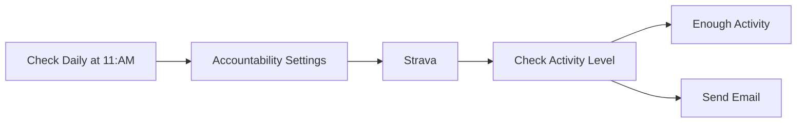

## Fluxo (.json) :

```json
{
  "id": "14",
  "name": "Activity Encouragement",
  "nodes": [
    {
      "name": "Strava",
      "type": "n8n-nodes-base.strava",
      "position": [
        640,
        300
      ],
      "parameters": {
        "operation": "getAll",
        "returnAll": true
      },
      "credentials": {
        "stravaOAuth2Api": "Strava OAuth2 Creds"
      },
      "typeVersion": 1
    },
    {
      "name": "Accountability Settings",
      "type": "n8n-nodes-base.set",
      "position": [
        450,
        300
      ],
      "parameters": {
        "values": {
          "number": [
            {
              "name": "moveTime",
              "value": 1800
            }
          ],
          "string": [
            {
              "name": "actPartner1",
              "value": "john.doe@example.com"
            },
            {
              "name": "actPartner2",
              "value": "jane.doe@example.com"
            },
            {
              "name": "actPartner3",
              "value": "jill.doe@example.com"
            },
            {
              "name": "yourName",
              "value": "Jim"
            },
            {
              "name": "yourEmail",
              "value": "jim.doe@example.com"
            }
          ]
        },
        "options": {},
        "keepOnlySet": true
      },
      "typeVersion": 1
    },
    {
      "name": "Check Activity Level",
      "type": "n8n-nodes-base.if",
      "position": [
        840,
        300
      ],
      "parameters": {
        "conditions": {
          "number": [
            {
              "value1": "={{$node[\"Strava\"].json[\"moving_time\"]}}",
              "value2": "={{$node[\"Accountability Settings\"].parameter[\"values\"][\"number\"][0][\"value\"]}}",
              "operation": "largerEqual"
            }
          ]
        }
      },
      "typeVersion": 1
    },
    {
      "name": "Enough Activity",
      "type": "n8n-nodes-base.noOp",
      "position": [
        1050,
        220
      ],
      "parameters": {},
      "typeVersion": 1
    },
    {
      "name": "Send Email",
      "type": "n8n-nodes-base.emailSend",
      "position": [
        1050,
        390
      ],
      "parameters": {
        "text": "=Hey Accountability Team,\n\nLooks like {{$node[\"Accountability Settings\"].json[\"yourName\"]}} has been spending a bit too much time inactive! How about sending them a quick word of encouragement?\n\nThanks!\n{{$node[\"Accountability Settings\"].json[\"yourName\"]}}'s Heart",
        "options": {},
        "toEmail": "={{$node[\"Accountability Settings\"].parameter[\"values\"][\"string\"][0][\"value\"]}}; {{$node[\"Accountability Settings\"].parameter[\"values\"][\"string\"][1][\"value\"]}}; {{$node[\"Accountability Settings\"].parameter[\"values\"][\"string\"][2][\"value\"]}}",
        "fromEmail": "={{$node[\"Accountability Settings\"].json[\"yourEmail\"]}}"
      },
      "credentials": {
        "smtp": "Email Creds"
      },
      "typeVersion": 1
    },
    {
      "name": "Check Daily at 11:AM",
      "type": "n8n-nodes-base.cron",
      "position": [
        260,
        300
      ],
      "parameters": {
        "triggerTimes": {
          "item": [
            {
              "hour": 11
            }
          ]
        }
      },
      "typeVersion": 1
    }
  ],
  "active": false,
  "settings": {},
  "connections": {
    "Strava": {
      "main": [
        [
          {
            "node": "Check Activity Level",
            "type": "main",
            "index": 0
          }
        ]
      ]
    },
    "Check Activity Level": {
      "main": [
        [
          {
            "node": "Enough Activity",
            "type": "main",
            "index": 0
          }
        ],
        [
          {
            "node": "Send Email",
            "type": "main",
            "index": 0
          }
        ]
      ]
    },
    "Check Daily at 11:AM": {
      "main": [
        [
          {
            "node": "Accountability Settings",
            "type": "main",
            "index": 0
          }
        ]
      ]
    },
    "Accountability Settings": {
      "main": [
        [
          {
            "node": "Strava",
            "type": "main",
            "index": 0
          }
        ]
      ]
    }
  }
}
```

<a id="template-983"></a>

## Template 983 - Geração de seed keywords para SEO

- **Nome:** Geração de seed keywords para SEO
- **Descrição:** Gera uma lista de 15-20 palavras-chave iniciais (seed keywords) para orientar uma estratégia de SEO com base no perfil de cliente ideal (ICP), usando uma API de IA e exportando os resultados para sua base de dados.
- **Funcionalidade:** • Definição do ICP: Permite inserir informações do cliente ideal (produto, dores, objetivos, soluções atuais, nível de expertise).
• Agregação de dados: Consolida os dados do ICP para uso no prompt de IA.
• Geração por IA: Envia um prompt detalhado a um agente de IA para criar 15-20 seed keywords relevantes, cobrindo diferentes intenções de busca e níveis de dificuldade.
• Regras de formatação: Aplica instruções para que a saída seja um array de strings em lowercase, sem pontuação e com espaços limpos.
• Separação de resultados: Separa a resposta do modelo em itens individuais para processamento posterior.
• Exportação de saída: Encaminha as palavras-chave geradas para armazenamento em sua base de dados ou planilha externa.
• Execução manual de teste: Possui gatilho manual para iniciar o fluxo e validar a execução.
• Validação de requisitos: Indica a necessidade de conexões externas (API de IA e base de dados) antes de rodar.
- **Ferramentas:** • API de IA (ex.: OpenAI, Anthropic): Modelo de linguagem utilizado para analisar o ICP e gerar as seed keywords.
• Base de dados / Google Sheets / Airtable: Destino para armazenar e gerenciar as palavras-chave geradas.

## Fluxo visual

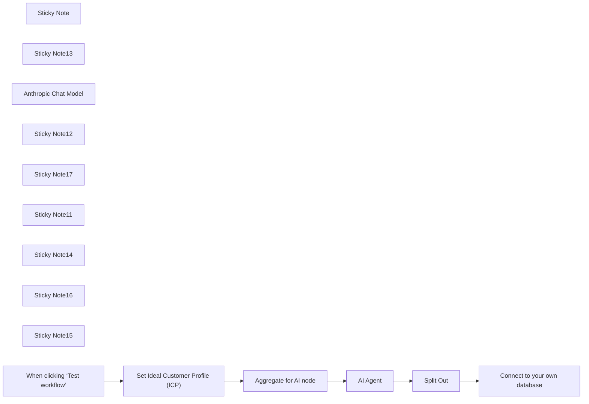

## Fluxo (.json) :

```json
{
  "meta": {
    "instanceId": "257476b1ef58bf3cb6a46e65fac7ee34a53a5e1a8492d5c6e4da5f87c9b82833",
    "templateId": "2473"
  },
  "nodes": [
    {
      "id": "1205b121-8aaa-4e41-874b-4e81aad6374e",
      "name": "Sticky Note",
      "type": "n8n-nodes-base.stickyNote",
      "position": [
        120,
        600
      ],
      "parameters": {
        "color": 4,
        "width": 462.4041757955455,
        "height": 315.6388466176832,
        "content": "## Generate SEO Seed Keywords Using AI\n\nThis flow uses an AI node to generate Seed Keywords to focus SEO efforts on based on your ideal customer profile\n\n**Outputs:** \n- List of 20 Seed Keywords\n\n\n**Pre-requisites / Dependencies:**\n- You know your ideal customer profile (ICP)\n- An AI API account (either OpenAI or Anthropic recommended)"
      },
      "typeVersion": 1
    },
    {
      "id": "d2654d75-2b64-4ec3-b583-57d2b6b7b195",
      "name": "Sticky Note13",
      "type": "n8n-nodes-base.stickyNote",
      "disabled": true,
      "position": [
        640,
        920
      ],
      "parameters": {
        "color": 7,
        "width": 287.0816455493243,
        "height": 330.47923074942287,
        "content": "**Generate draft seed KW based on ICP**\n\n"
      },
      "typeVersion": 1
    },
    {
      "id": "d248a58e-3705-4b6f-99cb-e9187e56781c",
      "name": "Anthropic Chat Model",
      "type": "@n8n/n8n-nodes-langchain.lmChatAnthropic",
      "position": [
        680,
        1120
      ],
      "parameters": {
        "options": {}
      },
      "typeVersion": 1.2
    },
    {
      "id": "71517d83-59f5-441a-8a75-c35f4e06a8a2",
      "name": "Split Out",
      "type": "n8n-nodes-base.splitOut",
      "position": [
        980,
        980
      ],
      "parameters": {
        "options": {},
        "fieldToSplitOut": "output.answer"
      },
      "typeVersion": 1
    },
    {
      "id": "1c68eff5-6478-4eba-9abe-3ccea2a17a5c",
      "name": "Sticky Note12",
      "type": "n8n-nodes-base.stickyNote",
      "disabled": true,
      "position": [
        120,
        920
      ],
      "parameters": {
        "color": 7,
        "width": 492.16246201447336,
        "height": 213.62075341687063,
        "content": "**Get data from airtable and format** "
      },
      "typeVersion": 1
    },
    {
      "id": "53dcc524-ef3d-40b8-b79d-976517dce4e7",
      "name": "Sticky Note17",
      "type": "n8n-nodes-base.stickyNote",
      "disabled": true,
      "position": [
        960,
        920
      ],
      "parameters": {
        "color": 7,
        "width": 348.42891651921957,
        "height": 213.62075341687063,
        "content": "**Add data to database**"
      },
      "typeVersion": 1
    },
    {
      "id": "570495fe-3f1d-44ae-bea0-9fa4b2ce15ef",
      "name": "Sticky Note11",
      "type": "n8n-nodes-base.stickyNote",
      "position": [
        640,
        820
      ],
      "parameters": {
        "color": 6,
        "width": 393.46745700785266,
        "height": 80,
        "content": "**Costs to run**\nApprox. $0.02-0.05 for a run using Claude Sonnet 3.5"
      },
      "typeVersion": 1
    },
    {
      "id": "6e5e84c5-409f-4f37-931a-21a44aff7c5e",
      "name": "Set Ideal Customer Profile (ICP)",
      "type": "n8n-nodes-base.set",
      "position": [
        160,
        980
      ],
      "parameters": {
        "options": {},
        "assignments": {
          "assignments": [
            {
              "id": "973e949e-1afd-4378-8482-d2168532eff6",
              "name": "product",
              "type": "string",
              "value": "=**Replace this with a string detailing your intended product (if you have one)**"
            },
            {
              "id": "ce9c0a8f-6157-4b46-8b77-133545dc71bd",
              "name": "pain points",
              "type": "string",
              "value": "=**Replace this with a string list of customer pain points**"
            },
            {
              "id": "5abc858a-c412-4acf-acb9-488e4d992d2f",
              "name": "goals",
              "type": "string",
              "value": "=**Replace this with a string list of your customers key goals/objectives**"
            },
            {
              "id": "fbdd1ef7-c1b9-48eb-b73e-a383f12b5ba1",
              "name": "current solutions",
              "type": "string",
              "value": "=**Replace this with a string detailing how your ideal customer currently solves their pain ppoints**"
            },
            {
              "id": "2e5c8f48-266e-486c-956f-51f1449f6288",
              "name": "expertise level",
              "type": "string",
              "value": "=**Replace this with a string detailing customer level of expertise**"
            }
          ]
        }
      },
      "notesInFlow": true,
      "typeVersion": 3.4
    },
    {
      "id": "bd5781f4-6f35-45d3-8182-12ea6712eddf",
      "name": "Aggregate for AI node",
      "type": "n8n-nodes-base.aggregate",
      "position": [
        380,
        980
      ],
      "parameters": {
        "options": {},
        "aggregate": "aggregateAllItemData"
      },
      "notesInFlow": true,
      "typeVersion": 1
    },
    {
      "id": "244943bf-e4dd-40fc-9a43-7a5cd0da1c5b",
      "name": "Sticky Note14",
      "type": "n8n-nodes-base.stickyNote",
      "position": [
        640,
        1260
      ],
      "parameters": {
        "color": 3,
        "width": 284.87764467541297,
        "height": 80,
        "content": "**REQUIRED**\nConnect to your own AI API above"
      },
      "typeVersion": 1
    },
    {
      "id": "73c8f47a-4fdb-40c8-9062-890ef1265ab0",
      "name": "Sticky Note16",
      "type": "n8n-nodes-base.stickyNote",
      "position": [
        120,
        1140
      ],
      "parameters": {
        "color": 3,
        "width": 284.87764467541297,
        "height": 80,
        "content": "**REQUIRED**\nSet your Ideal Customer Profile before proceeding"
      },
      "typeVersion": 1
    },
    {
      "id": "a5b93e6d-44ab-4b6f-b86a-25dc621b52b0",
      "name": "AI Agent",
      "type": "@n8n/n8n-nodes-langchain.agent",
      "position": [
        660,
        980
      ],
      "parameters": {
        "text": "=User:\nHere are some important rules for you to follow:\n<rules>\n1. Analyze the ICP information carefully.\n2. Generate 15-20 seed keywords that are relevant to the ICP's needs, challenges, goals, and search behavior.\n3. Ensure the keywords are broad enough to be considered \"\"head\"\" terms, but specific enough to target the ICP effectively.\n4. Consider various aspects of the ICP's journey, including awareness, consideration, and decision stages.\n5. Include a mix of product-related, problem-related, and solution-related terms.\n6. Think beyond just the product itself - consider industry trends, related technologies, and broader business concepts that would interest the ICP.\n7. Avoid overly generic terms that might attract irrelevant traffic.\n8. Aim for a mix of keyword difficulties, including both competitive and less competitive terms.\n9. Include keywords that cover different search intents: informational, navigational, commercial, and transactional.\n10. Consider related tools or platforms that the ICP might use, and include relevant integration-related keywords.\n11. If applicable, include some location-specific keywords based on the ICP's geographic information.\n12. Incorporate industry-specific terminology or jargon that the ICP would likely use in their searches.\n13. Consider emerging trends or pain points in the ICP's industry that they might be searching for solutions to.\n13. Format the keywords in lowercase, without punctuation. Trim any leading or trailing white space.\n</rules>\n\nYour output should be an array of strings, each representing a seed keyword:\n<example>\n['b2b lead generation', 'startup marketing strategies', 'saas sales funnel', ...]\n</example>\n\nHere is the Ideal Customer Profile (ICP) information:\n<input>\n{{ $json.data[0].product }}\n</input>\n\nNow:\nBased on the provided ICP, generate an array of 15-20 seed keywords that will form the foundation of a comprehensive SEO strategy for this B2B SaaS company. These keywords should reflect a deep understanding of the ICP's needs, challenges, and search behavior, while also considering broader industry trends and related concepts.\n\nFirst, write out your ideas in {thoughts: } JSON as part of your analysis, then answer inside the {answer: } key in the JSON. ",
        "agent": "conversationalAgent",
        "options": {
          "systemMessage": "=System: You are an expert SEO strategist tasked with generating 15-20 key head search terms (seed keywords) for a B2B SaaS company. Your goal is to create a comprehensive list of keywords that will attract and engage the ideal customer profile (ICP) described."
        },
        "promptType": "define"
      },
      "typeVersion": 1.6
    },
    {
      "id": "ca3c0bd5-7ef0-4e2b-9b5e-071773c32c85",
      "name": "Connect to your own database",
      "type": "n8n-nodes-base.noOp",
      "position": [
        1140,
        980
      ],
      "parameters": {},
      "typeVersion": 1
    },
    {
      "id": "94639a81-5e46-482a-851a-5443bfe9863c",
      "name": "Sticky Note15",
      "type": "n8n-nodes-base.stickyNote",
      "position": [
        1120,
        1140
      ],
      "parameters": {
        "color": 3,
        "width": 284.87764467541297,
        "height": 80,
        "content": "**REQUIRED**\nConnect to your own database / GSheet / Airtable base to output these"
      },
      "typeVersion": 1
    },
    {
      "id": "16498e92-c0d5-44f4-b993-c9c8930955bc",
      "name": "When clicking ‘Test workflow’",
      "type": "n8n-nodes-base.manualTrigger",
      "position": [
        -60,
        980
      ],
      "parameters": {},
      "typeVersion": 1
    }
  ],
  "pinData": {},
  "connections": {
    "AI Agent": {
      "main": [
        [
          {
            "node": "Split Out",
            "type": "main",
            "index": 0
          }
        ]
      ]
    },
    "Split Out": {
      "main": [
        [
          {
            "node": "Connect to your own database",
            "type": "main",
            "index": 0
          }
        ]
      ]
    },
    "Anthropic Chat Model": {
      "ai_languageModel": [
        [
          {
            "node": "AI Agent",
            "type": "ai_languageModel",
            "index": 0
          }
        ]
      ]
    },
    "Aggregate for AI node": {
      "main": [
        [
          {
            "node": "AI Agent",
            "type": "main",
            "index": 0
          }
        ]
      ]
    },
    "Set Ideal Customer Profile (ICP)": {
      "main": [
        [
          {
            "node": "Aggregate for AI node",
            "type": "main",
            "index": 0
          }
        ]
      ]
    },
    "When clicking ‘Test workflow’": {
      "main": [
        [
          {
            "node": "Set Ideal Customer Profile (ICP)",
            "type": "main",
            "index": 0
          }
        ]
      ]
    }
  }
}
```

<a id="template-984"></a>

## Template 984 - Envio de chamadas TTS automatizadas

- **Nome:** Envio de chamadas TTS automatizadas
- **Descrição:** Fluxo que recebe um formulário com texto e número de telefone e realiza uma chamada onde o texto é lido por voz (Text-to-Speech) usando a API do provedor.
- **Funcionalidade:** • Coleta de dados via formulário: Recebe o texto (Body), número de destino (To), seleção de voz e idioma (Voice, Lang) por meio de um formulário web.
• Gatilho por submissão: Dispara o envio da chamada assim que o formulário é submetido.
• Envio de chamada TTS por API: Monta e envia uma requisição POST ao endpoint de voz com o payload contendo mensagem, destino, voz e idioma.
• Autenticação Basic: Utiliza autenticação HTTP Basic com usuário e API Key para proteger o envio.
• Detecção de atendimento automático: Inclui parâmetro de detecção de secretária/caixa postal (machine_detection) para comportamento adequado em chamadas não atendidas.
• Suporte a múltiplos idiomas e vozes: Permite escolher entre vozes masculina/feminina e diversos códigos de idioma para TTS.
- **Ferramentas:** • ClickSend Voice API: Serviço externo utilizado para realizar chamadas de voz Text-to-Speech via requisições HTTP, exige chave de API e autenticação para envio das mensagens.

## Fluxo visual

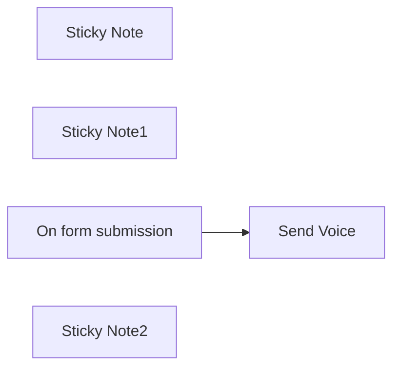

## Fluxo (.json) :

```json
{
  "id": "GrGmuKzZAsCkd4bt",
  "meta": {
    "instanceId": "a4bfc93e975ca233ac45ed7c9227d84cf5a2329310525917adaf3312e10d5462",
    "templateCredsSetupCompleted": true
  },
  "name": "Send TTS (Text-to-speech) voice calls",
  "tags": [],
  "nodes": [
    {
      "id": "2b14ce1c-5213-4684-90a6-ef8b6885f2ef",
      "name": "Sticky Note",
      "type": "n8n-nodes-base.stickyNote",
      "position": [
        -300,
        -520
      ],
      "parameters": {
        "width": 440,
        "height": 180,
        "content": "## STEP 1\n[Register here to ClickSend](https://clicksend.com/?u=586989) and obtain your API Key and 2 € of free credits\n\nIn the node \"Send Voice\" create a \"Basic Auth\" with the username you registered and the API Key provided as your password"
      },
      "typeVersion": 1
    },
    {
      "id": "b3931dc5-7021-4ca2-ae73-8bf670a56cb7",
      "name": "Sticky Note1",
      "type": "n8n-nodes-base.stickyNote",
      "position": [
        -300,
        -300
      ],
      "parameters": {
        "width": 440,
        "content": "## STEP 2\n\nSubmit the form and you will receive a call to the phone number you entered where the selected voice will tell you the content of the text you wrote."
      },
      "typeVersion": 1
    },
    {
      "id": "a548f92d-199e-4cd2-ae34-742617484831",
      "name": "Send Voice",
      "type": "n8n-nodes-base.httpRequest",
      "position": [
        -40,
        -100
      ],
      "parameters": {
        "url": "https://rest.clicksend.com/v3/voice/send",
        "method": "POST",
        "options": {},
        "jsonBody": "={\n  \"messages\": [\n    {\n      \"source\": \"n8n\",\n      \"body\": \"{{ $json.Body }}\",\n      \"to\": \"{{ $json.To }}\",\n      \"voice\": \"{{ $json.Voice }}\",\n      \"lang\": \"{{ $json.Lang }}\",\n      \"machine_detection\": 1\n    }\n  ]\n}",
        "sendBody": true,
        "sendHeaders": true,
        "specifyBody": "json",
        "authentication": "genericCredentialType",
        "genericAuthType": "httpBasicAuth",
        "headerParameters": {
          "parameters": [
            {
              "name": "Content-Type",
              "value": " application/json"
            }
          ]
        }
      },
      "credentials": {
        "httpBasicAuth": {
          "id": "UwsDe2JxT39eWIvY",
          "name": "ClickSend API"
        }
      },
      "typeVersion": 4.2
    },
    {
      "id": "ffc2cbe9-6e31-4d54-8e6a-26e94ec50ef4",
      "name": "On form submission",
      "type": "n8n-nodes-base.formTrigger",
      "position": [
        -300,
        -100
      ],
      "webhookId": "8bfdf9f3-9323-4295-ab96-f9852d5981d5",
      "parameters": {
        "options": {},
        "formTitle": "Send Voice Message",
        "formFields": {
          "values": [
            {
              "fieldType": "textarea",
              "fieldLabel": "Body",
              "placeholder": "Body (max. 600 chars)",
              "requiredField": true
            },
            {
              "fieldLabel": "To",
              "placeholder": "+39xxxxxxxxxx",
              "requiredField": true
            },
            {
              "fieldType": "dropdown",
              "fieldLabel": "Voice",
              "fieldOptions": {
                "values": [
                  {
                    "option": "male"
                  },
                  {
                    "option": "female"
                  }
                ]
              },
              "requiredField": true
            },
            {
              "fieldType": "dropdown",
              "fieldLabel": "Lang",
              "fieldOptions": {
                "values": [
                  {
                    "option": "en-us \t"
                  },
                  {
                    "option": "it-it"
                  },
                  {
                    "option": "en-au"
                  },
                  {
                    "option": "en-gb"
                  },
                  {
                    "option": "de-de"
                  },
                  {
                    "option": "es-es"
                  },
                  {
                    "option": "fr-fr"
                  },
                  {
                    "option": "is-is"
                  },
                  {
                    "option": "da-dk"
                  },
                  {
                    "option": "nl-nl"
                  },
                  {
                    "option": "pl-pl"
                  },
                  {
                    "option": "pt-br"
                  },
                  {
                    "option": "ru-ru"
                  }
                ]
              },
              "requiredField": true
            }
          ]
        }
      },
      "typeVersion": 2.2
    },
    {
      "id": "397e0b9f-7407-47d6-b242-1b87955a701b",
      "name": "Sticky Note2",
      "type": "n8n-nodes-base.stickyNote",
      "position": [
        -300,
        -720
      ],
      "parameters": {
        "color": 3,
        "width": 440,
        "content": "## Automate text-to-speech voice calls\nThis workflow is a simple yet powerful way to automate text-to-speech voice calls using the ClickSend API. It’s ideal for notifications, reminders, or any scenario where voice communication is needed."
      },
      "typeVersion": 1
    }
  ],
  "active": false,
  "pinData": {},
  "settings": {
    "executionOrder": "v1"
  },
  "versionId": "1ad6da32-7197-4f64-b770-88dae8348db2",
  "connections": {
    "On form submission": {
      "main": [
        [
          {
            "node": "Send Voice",
            "type": "main",
            "index": 0
          }
        ]
      ]
    }
  }
}
```

<a id="template-985"></a>

## Template 985 - Backup de fluxos para GitHub

- **Nome:** Backup de fluxos para GitHub
- **Descrição:** Este fluxo realiza backup de todos os fluxos da instância, salvando cada fluxo como um arquivo JSON identificado pelo ID do fluxo e atualizando ou criando os arquivos conforme houver alterações.
- **Funcionalidade:** • Agendamento automático de backups: o fluxo é acionado a cada 2 horas pelo Schedule Trigger para fazer backup dos fluxos.
• Coleta de dados de cada fluxo: obtém os dados do fluxo atual e do backup existente (quando houver) para comparação.
• Processamento de cada fluxo: o fluxo itera sobre cada item para processar individualmente.
• Comparação entre versões: o nó isDiffOrNew compara o fluxo atual com a versão salva e determina se é igual, diferente ou novo.
• Geração de conteúdo formatado: quando há diferenças, o conteúdo é formatado (ordena chaves e serializa JSON) para salvar no repositório.
• Criação de novo arquivo: cria um novo arquivo com o ID do fluxo como nome quando não existe backup anterior.
• Atualização de arquivo existente: atualiza o arquivo existente quando o fluxo mudou.
• Commit de alterações: usa mensagens de commit que incluem o nome do fluxo e o status (same/different/new).
• Armazenamento no repositório: grava os arquivos JSON no caminho definido na configuração.
• Retorno de conclusão: indica a conclusão do backup com um sinal de Done.
- **Ferramentas:** • GitHub: Plataforma para armazenar e versionar backups de fluxos via API, permitindo criação e edição de arquivos JSON.


## Fluxo visual

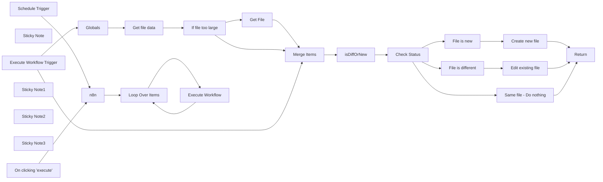

## Fluxo (.json) :

```json
{
  "meta": {
    "instanceId": "d6b502dfa4d9dd072cdc5c2bb763558661053f651289291352a84403e01b3d1b",
    "templateCredsSetupCompleted": true
  },
  "nodes": [
    {
      "id": "42cc4260-626e-4f83-b1c3-c78c99b78b38",
      "name": "On clicking 'execute'",
      "type": "n8n-nodes-base.manualTrigger",
      "position": [
        1780,
        520
      ],
      "parameters": {},
      "typeVersion": 1
    },
    {
      "id": "f21386ff-f8db-4f5d-a44c-15484d1e4ab7",
      "name": "Sticky Note",
      "type": "n8n-nodes-base.stickyNote",
      "position": [
        1340,
        900
      ],
      "parameters": {
        "color": 6,
        "width": 2086.845881354743,
        "height": 750.8363163824032,
        "content": "## Subworkflow"
      },
      "typeVersion": 1
    },
    {
      "id": "82851e4a-33a1-461b-965f-f51efcb5af90",
      "name": "n8n",
      "type": "n8n-nodes-base.n8n",
      "position": [
        2040,
        620
      ],
      "parameters": {
        "filters": {},
        "requestOptions": {}
      },
      "credentials": {
        "n8nApi": {
          "id": "1SDBLwjifPzb02W8",
          "name": "n8n account"
        }
      },
      "typeVersion": 1
    },
    {
      "id": "90cac8e2-9509-4d48-9038-bb653ffbdf9d",
      "name": "Return",
      "type": "n8n-nodes-base.set",
      "position": [
        3220,
        1100
      ],
      "parameters": {
        "options": {},
        "assignments": {
          "assignments": [
            {
              "id": "8d513345-6484-431f-afb7-7cf045c90f4f",
              "name": "Done",
              "type": "boolean",
              "value": true
            }
          ]
        }
      },
      "typeVersion": 3.3
    },
    {
      "id": "11046021-89ba-4e61-b03f-d606e7dd0a56",
      "name": "Get File",
      "type": "n8n-nodes-base.httpRequest",
      "position": [
        2320,
        980
      ],
      "parameters": {
        "url": "={{ $json.download_url }}",
        "options": {}
      },
      "typeVersion": 4.2
    },
    {
      "id": "08af670c-ac82-422f-9938-c649dfdfbcf6",
      "name": "If file too large",
      "type": "n8n-nodes-base.if",
      "position": [
        2120,
        1000
      ],
      "parameters": {
        "options": {},
        "conditions": {
          "options": {
            "version": 1,
            "leftValue": "",
            "caseSensitive": true,
            "typeValidation": "strict"
          },
          "combinator": "and",
          "conditions": [
            {
              "id": "45ce825e-9fa6-430c-8931-9aaf22c42585",
              "operator": {
                "type": "string",
                "operation": "empty",
                "singleValue": true
              },
              "leftValue": "={{ $json.content }}",
              "rightValue": ""
            },
            {
              "id": "9619a55f-7fb1-4f24-b1a7-7aeb82365806",
              "operator": {
                "type": "string",
                "operation": "notExists",
                "singleValue": true
              },
              "leftValue": "={{ $json.error }}",
              "rightValue": ""
            }
          ]
        }
      },
      "typeVersion": 2
    },
    {
      "id": "795fd895-94b2-46f1-b559-748b0db01c49",
      "name": "Merge Items",
      "type": "n8n-nodes-base.merge",
      "position": [
        2120,
        1260
      ],
      "parameters": {},
      "typeVersion": 2
    },
    {
      "id": "3d3399f3-bbfb-48ab-8644-91b28e731026",
      "name": "isDiffOrNew",
      "type": "n8n-nodes-base.code",
      "position": [
        2320,
        1260
      ],
      "parameters": {
        "jsCode": "const orderJsonKeys = (jsonObj) => {\n  const ordered = {};\n  Object.keys(jsonObj).sort().forEach(key => {\n    ordered[key] = jsonObj[key];\n  });\n  return ordered;\n}\n\n// Check if file returned with content\nif (Object.keys($input.all()[0].json).includes(\"content\")) {\n  // Decode base64 content and parse JSON\n  const origWorkflow = JSON.parse(Buffer.from($input.all()[0].json.content, 'base64').toString());\n  const n8nWorkflow = $input.all()[1].json;\n  \n  // Order JSON objects\n  const orderedOriginal = orderJsonKeys(origWorkflow);\n  const orderedActual = orderJsonKeys(n8nWorkflow);\n\n  // Determine difference\n  if (JSON.stringify(orderedOriginal) === JSON.stringify(orderedActual)) {\n    $input.all()[0].json.github_status = \"same\";\n  } else {\n    $input.all()[0].json.github_status = \"different\";\n    $input.all()[0].json.n8n_data_stringy = JSON.stringify(orderedActual, null, 2);\n  }\n  $input.all()[0].json.content_decoded = orderedOriginal;\n// No file returned / new workflow\n} else if (Object.keys($input.all()[0].json).includes(\"data\")) {\n  const origWorkflow = JSON.parse($input.all()[0].json.data);\n  const n8nWorkflow = $input.all()[1].json;\n  \n  // Order JSON objects\n  const orderedOriginal = orderJsonKeys(origWorkflow);\n  const orderedActual = orderJsonKeys(n8nWorkflow);\n\n  // Determine difference\n  if (JSON.stringify(orderedOriginal) === JSON.stringify(orderedActual)) {\n    $input.all()[0].json.github_status = \"same\";\n  } else {\n    $input.all()[0].json.github_status = \"different\";\n    $input.all()[0].json.n8n_data_stringy = JSON.stringify(orderedActual, null, 2);\n  }\n  $input.all()[0].json.content_decoded = orderedOriginal;\n\n} else {\n  // Order JSON object\n  const n8nWorkflow = $input.all()[1].json;\n  const orderedActual = orderJsonKeys(n8nWorkflow);\n  \n  // Proper formatting\n  $input.all()[0].json.github_status = \"new\";\n  $input.all()[0].json.n8n_data_stringy = JSON.stringify(orderedActual, null, 2);\n}\n\n// Return items\nreturn $input.all();"
      },
      "typeVersion": 1
    },
    {
      "id": "2f2f42d0-d27c-4856-a263-4d5e9eda2c4c",
      "name": "Check Status",
      "type": "n8n-nodes-base.switch",
      "position": [
        2540,
        1260
      ],
      "parameters": {
        "rules": {
          "rules": [
            {
              "value2": "same"
            },
            {
              "output": 1,
              "value2": "different"
            },
            {
              "output": 2,
              "value2": "new"
            }
          ]
        },
        "value1": "={{$json.github_status}}",
        "dataType": "string"
      },
      "typeVersion": 1
    },
    {
      "id": "5316029f-f32f-4a8d-95de-50ee57051a08",
      "name": "Same file - Do nothing",
      "type": "n8n-nodes-base.noOp",
      "position": [
        2760,
        1100
      ],
      "parameters": {},
      "typeVersion": 1
    },
    {
      "id": "37c5983b-48fe-41d5-8e3a-eb56dec2140b",
      "name": "File is different",
      "type": "n8n-nodes-base.noOp",
      "position": [
        2760,
        1260
      ],
      "parameters": {},
      "typeVersion": 1
    },
    {
      "id": "a4dcce9e-b0d0-4b9e-ab16-9142e641c73d",
      "name": "File is new",
      "type": "n8n-nodes-base.noOp",
      "position": [
        2760,
        1420
      ],
      "parameters": {},
      "typeVersion": 1
    },
    {
      "id": "03fcfdc4-2e52-42f0-a129-3ebaf8dd8fc1",
      "name": "Create new file",
      "type": "n8n-nodes-base.github",
      "position": [
        2980,
        1420
      ],
      "parameters": {
        "owner": {
          "__rl": true,
          "mode": "name",
          "value": "={{ $('Globals').item.json.repo.owner }}"
        },
        "filePath": "={{ $('Globals').item.json.repo.path }}{{$('Execute Workflow Trigger').first().json.id}}.json",
        "resource": "file",
        "repository": {
          "__rl": true,
          "mode": "name",
          "value": "={{ $('Globals').item.json.repo.name }}"
        },
        "fileContent": "={{$('isDiffOrNew').item.json[\"n8n_data_stringy\"]}}",
        "commitMessage": "={{$('Execute Workflow Trigger').first().json.name}} ({{$json.github_status}})"
      },
      "credentials": {
        "githubApi": {
          "id": "3mfzXcMjoqNHsujs",
          "name": "GitHub account"
        }
      },
      "typeVersion": 1
    },
    {
      "id": "dd35cc39-4ab4-4d53-b439-b425a2177e8f",
      "name": "Edit existing file",
      "type": "n8n-nodes-base.github",
      "position": [
        2980,
        1240
      ],
      "parameters": {
        "owner": {
          "__rl": true,
          "mode": "name",
          "value": "={{ $('Globals').item.json.repo.owner }}"
        },
        "filePath": "={{ $('Globals').item.json.repo.path }}{{$('Execute Workflow Trigger').first().json.id}}.json",
        "resource": "file",
        "operation": "edit",
        "repository": {
          "__rl": true,
          "mode": "name",
          "value": "={{ $('Globals').item.json.repo.name }}"
        },
        "fileContent": "={{$('isDiffOrNew').item.json[\"n8n_data_stringy\"]}}",
        "commitMessage": "={{$('Execute Workflow Trigger').first().json.name}} ({{$json.github_status}})"
      },
      "credentials": {
        "githubApi": {
          "id": "3mfzXcMjoqNHsujs",
          "name": "GitHub account"
        }
      },
      "typeVersion": 1
    },
    {
      "id": "d05e2a25-24be-43fb-baa4-9c3391840e70",
      "name": "Loop Over Items",
      "type": "n8n-nodes-base.splitInBatches",
      "position": [
        2240,
        620
      ],
      "parameters": {
        "options": {}
      },
      "typeVersion": 3
    },
    {
      "id": "2a139d59-1387-4899-88b3-21106cd01099",
      "name": "Schedule Trigger",
      "type": "n8n-nodes-base.scheduleTrigger",
      "position": [
        1780,
        720
      ],
      "parameters": {
        "rule": {
          "interval": [
            {
              "field": "hours",
              "hoursInterval": 2
            }
          ]
        }
      },
      "typeVersion": 1.2
    },
    {
      "id": "04e6c245-3117-4ef8-a181-754e616e958b",
      "name": "Sticky Note1",
      "type": "n8n-nodes-base.stickyNote",
      "position": [
        1340,
        273.8835396388249
      ],
      "parameters": {
        "color": 4,
        "width": 371.1995072042308,
        "height": 600.88409546716,
        "content": "## Backup to GitHub \nThis workflow will backup all instance workflows to GitHub.\n\nThe files are saved `ID.json` for the filename.\n\n### Setup\nOpen `Globals` node and update the values below 👇\n\n- **repo.owner:** your Github username\n- **repo.name:** the name of your repository\n- **repo.path:** the folder to use within the repository. If it doesn't exist it will be created.\n\n\nIf your username was `john-doe` and your repository was called `n8n-backups` and you wanted the workflows to go into a `workflows` folder you would set:\n\n- repo.owner - john-doe\n- repo.name - n8n-backups\n- repo.path - workflows/\n\n\nThe workflow calls itself using a subworkflow, to help reduce memory usage."
      },
      "typeVersion": 1
    },
    {
      "id": "3d996985-0064-4749-85a1-2191c73746c9",
      "name": "Sticky Note2",
      "type": "n8n-nodes-base.stickyNote",
      "position": [
        1740,
        440
      ],
      "parameters": {
        "color": 7,
        "width": 886.4410237965205,
        "height": 434.88564057365943,
        "content": "## Main workflow loop"
      },
      "typeVersion": 1
    },
    {
      "id": "c9bfa393-e120-4bfe-b957-702756b91aaf",
      "name": "Get file data",
      "type": "n8n-nodes-base.github",
      "position": [
        1920,
        1000
      ],
      "parameters": {
        "owner": {
          "__rl": true,
          "mode": "name",
          "value": "={{ $json.repo.owner }}"
        },
        "filePath": "={{ $json.repo.path }}{{ $('Execute Workflow Trigger').item.json.id }}.json",
        "resource": "file",
        "operation": "get",
        "repository": {
          "__rl": true,
          "mode": "name",
          "value": "={{ $json.repo.name }}"
        },
        "asBinaryProperty": false,
        "additionalParameters": {}
      },
      "credentials": {
        "githubApi": {
          "id": "3mfzXcMjoqNHsujs",
          "name": "GitHub account"
        }
      },
      "typeVersion": 1,
      "continueOnFail": true,
      "alwaysOutputData": true
    },
    {
      "id": "d42ddc37-3bd9-4f19-8831-695bec4d0137",
      "name": "Globals",
      "type": "n8n-nodes-base.set",
      "position": [
        1700,
        1160
      ],
      "parameters": {
        "options": {},
        "assignments": {
          "assignments": [
            {
              "id": "6cf546c5-5737-4dbd-851b-17d68e0a3780",
              "name": "repo.owner",
              "type": "string",
              "value": "john-doe"
            },
            {
              "id": "452efa28-2dc6-4ea3-a7a2-c35d100d0382",
              "name": "repo.name",
              "type": "string",
              "value": "n8n-backup"
            },
            {
              "id": "81c4dc54-86bf-4432-a23f-22c7ea831e74",
              "name": "repo.path",
              "type": "string",
              "value": "workflows/"
            }
          ]
        }
      },
      "typeVersion": 3.4
    },
    {
      "id": "e970c63c-2aa2-46f9-be04-f045b6a938de",
      "name": "Sticky Note3",
      "type": "n8n-nodes-base.stickyNote",
      "position": [
        1660,
        1060
      ],
      "parameters": {
        "color": 4,
        "width": 150,
        "height": 80,
        "content": "## Edit this node 👇"
      },
      "typeVersion": 1
    },
    {
      "id": "5b1991f7-0351-44de-908d-9aa8b8262d60",
      "name": "Execute Workflow Trigger",
      "type": "n8n-nodes-base.executeWorkflowTrigger",
      "position": [
        1420,
        1280
      ],
      "parameters": {
        "inputSource": "passthrough"
      },
      "typeVersion": 1.1
    },
    {
      "id": "8e5b3f71-0c5e-4e78-a3f7-0b574c9ddf06",
      "name": "Execute Workflow",
      "type": "n8n-nodes-base.executeWorkflow",
      "position": [
        2460,
        620
      ],
      "parameters": {
        "mode": "each",
        "options": {},
        "workflowId": {
          "__rl": true,
          "mode": "id",
          "value": "={{ $workflow.id }}"
        },
        "workflowInputs": {
          "value": {},
          "schema": [],
          "mappingMode": "defineBelow",
          "matchingColumns": [],
          "attemptToConvertTypes": false,
          "convertFieldsToString": true
        }
      },
      "typeVersion": 1.2
    }
  ],
  "pinData": {},
  "connections": {
    "n8n": {
      "main": [
        [
          {
            "node": "Loop Over Items",
            "type": "main",
            "index": 0
          }
        ]
      ]
    },
    "Globals": {
      "main": [
        [
          {
            "node": "Get file data",
            "type": "main",
            "index": 0
          }
        ]
      ]
    },
    "Get File": {
      "main": [
        [
          {
            "node": "Merge Items",
            "type": "main",
            "index": 0
          }
        ]
      ]
    },
    "File is new": {
      "main": [
        [
          {
            "node": "Create new file",
            "type": "main",
            "index": 0
          }
        ]
      ]
    },
    "Merge Items": {
      "main": [
        [
          {
            "node": "isDiffOrNew",
            "type": "main",
            "index": 0
          }
        ]
      ]
    },
    "isDiffOrNew": {
      "main": [
        [
          {
            "node": "Check Status",
            "type": "main",
            "index": 0
          }
        ]
      ]
    },
    "Check Status": {
      "main": [
        [
          {
            "node": "Same file - Do nothing",
            "type": "main",
            "index": 0
          }
        ],
        [
          {
            "node": "File is different",
            "type": "main",
            "index": 0
          }
        ],
        [
          {
            "node": "File is new",
            "type": "main",
            "index": 0
          }
        ]
      ]
    },
    "Get file data": {
      "main": [
        [
          {
            "node": "If file too large",
            "type": "main",
            "index": 0
          }
        ]
      ]
    },
    "Create new file": {
      "main": [
        [
          {
            "node": "Return",
            "type": "main",
            "index": 0
          }
        ]
      ]
    },
    "Loop Over Items": {
      "main": [
        [],
        [
          {
            "node": "Execute Workflow",
            "type": "main",
            "index": 0
          }
        ]
      ]
    },
    "Execute Workflow": {
      "main": [
        [
          {
            "node": "Loop Over Items",
            "type": "main",
            "index": 0
          }
        ]
      ]
    },
    "Schedule Trigger": {
      "main": [
        [
          {
            "node": "n8n",
            "type": "main",
            "index": 0
          }
        ]
      ]
    },
    "File is different": {
      "main": [
        [
          {
            "node": "Edit existing file",
            "type": "main",
            "index": 0
          }
        ]
      ]
    },
    "If file too large": {
      "main": [
        [
          {
            "node": "Get File",
            "type": "main",
            "index": 0
          }
        ],
        [
          {
            "node": "Merge Items",
            "type": "main",
            "index": 0
          }
        ]
      ]
    },
    "Edit existing file": {
      "main": [
        [
          {
            "node": "Return",
            "type": "main",
            "index": 0
          }
        ]
      ]
    },
    "On clicking 'execute'": {
      "main": [
        [
          {
            "node": "n8n",
            "type": "main",
            "index": 0
          }
        ]
      ]
    },
    "Same file - Do nothing": {
      "main": [
        [
          {
            "node": "Return",
            "type": "main",
            "index": 0
          }
        ]
      ]
    },
    "Execute Workflow Trigger": {
      "main": [
        [
          {
            "node": "Globals",
            "type": "main",
            "index": 0
          },
          {
            "node": "Merge Items",
            "type": "main",
            "index": 1
          }
        ]
      ]
    }
  }
}
```

<a id="template-986"></a>

## Template 986 - Criação dinâmica de tabelas no Airtable para Webflow

- **Nome:** Criação dinâmica de tabelas no Airtable para Webflow
- **Descrição:** Este fluxo automatiza a criação dinâmica de tabelas no Airtable para armazenar submissões de formulários do Webflow, criando tabelas por formulário e gravando as submissões nelas.
- **Funcionalidade:** • Detecção de submissão de formulário Webflow: aciona a automação quando um formulário é enviado.
• Preparação dos dados do formulário para processamento: transforma dados, extraindo wf_id, wf_formId, wf_formName, wf_requestDateTime e wf_data com JSON.stringify.
• Busca o schema da base Airtable existente: obtém a estrutura da base para determinar se as tabelas existem e onde criar as novas.
• Verificação da existência do Form Index e criação se não existir: mantém mapeamento entre Form Id / Form Name e as tabelas correspondentes.
• Criação da Tabela de Índice de Formulários (Form Index) se ausente: cria meta-tabela com campos FormId, FormName, TableId, TableName.
• Criação da Tabela do Formulário Webflow (per-form) no Airtable: cria a nova tabela para o formulário com campos Id, FormId, FormName, FormCreationDate, FormContent.
• Inserção de registro no Form Index Reference: registra mapeamento entre Form e Tabela na tabela de índice.
• Captura/Definição do ID da Tabela do Formulário atual: guarda o ID da tabela para uso em inserções futuras.
• Verificação de existência da Tabela do Formulário: se a tabela já existe, usa-a; se não, cria.
• Inserção de registro na Tabela do Formulário com os dados da submissão: Id, FormId, FormName, FormCreationDate, FormContent.
• Fluxo de controle com verificações e caminhos condicionais para fluxo de dados: utiliza condições para direcionar quando criar novas tabelas vs inserir em existentes.
- **Ferramentas:** • Webflow: Plataforma para criação de sites que pode coletar submissões de formulários e disparar integrações.
• Airtable: Base de dados online que armazena tabelas, registros e esquemas, acessível via API para criar tabelas e registrar submissões.


## Fluxo visual

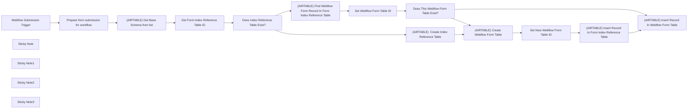

## Fluxo (.json) :

```json
{
  "id": "IvIzphIxPj1rZ3az",
  "meta": {
    "instanceId": "f0243439e79874c29f002782f736673d3388e5328a2ff2db7dd45820643256f5"
  },
  "name": "Dynamically create tables in Airtable for your Webflow form submissions",
  "tags": [
    {
      "id": "7cKuF8oYmXKMRDsD",
      "name": "webflow",
      "createdAt": "2024-01-09T02:22:11.773Z",
      "updatedAt": "2024-01-09T02:22:11.773Z"
    },
    {
      "id": "rQvbZ2PzC648UvCU",
      "name": "airtable",
      "createdAt": "2024-01-17T09:01:13.833Z",
      "updatedAt": "2024-01-17T09:01:13.833Z"
    }
  ],
  "nodes": [
    {
      "id": "5db273d4-8f40-4e2e-816e-5591dc312c95",
      "name": "Webflow Submission Trigger",
      "type": "n8n-nodes-base.webflowTrigger",
      "position": [
        -1080,
        580
      ],
      "webhookId": "969939dd-09c0-4311-82b8-31bceb6b9532",
      "parameters": {
        "site": "60e6f0f07c46af62aa2b1c98"
      },
      "credentials": {
        "webflowApi": {
          "id": "Nuq6n7zNYTp6iS2m",
          "name": "Webflow Tutum Access"
        }
      },
      "typeVersion": 1
    },
    {
      "id": "fda9755d-7922-4a1f-8200-0195cbb39720",
      "name": "Prepare form submission for workflow",
      "type": "n8n-nodes-base.set",
      "position": [
        -820,
        580
      ],
      "parameters": {
        "mode": "raw",
        "include": "none",
        "options": {},
        "jsonOutput": "={\n  \"wf_id\": \"{{ $json._id }}\",\n  \"wf_formId\": \"{{ $json.formId }}\",\n  \"wf_formName\": \"{{ $json.name }}\",\n  \"wf_requestDateTime\": \"{{ $json.d }}\",\n  \"wf_data\": {{ JSON.stringify(JSON.stringify($('Webflow Submission Trigger').item.json.data)) }}\n}"
      },
      "typeVersion": 3.2
    },
    {
      "id": "2a9d4ac1-8fbf-402f-b9b6-0d0300a1b221",
      "name": "Get Form Index Reference Table ID",
      "type": "n8n-nodes-base.code",
      "position": [
        -300,
        580
      ],
      "parameters": {
        "jsCode": "const data = $input.all();\nconst floatingObject = $(\"Prepare form submission for workflow\").all()[0].json;\n\nfloatingObject.at_baseId = $(\"[AIRTABLE] Get Base Schema from list\").params.base.value;\nfloatingObject.at_formIndexTableId = null;\nfloatingObject.at_currentFormTableId = null;\n  \nif(!floatingObject.at_baseId)\n  return null; // no bases configured\n\nfor (let index = 0; index < data.length; index++) {\n  if(data[index].json.name.toLowerCase() === \"form index\")\n  {\n    floatingObject.at_formIndexTableId = data[index].json.id;\n    break;\n  }\n}\n\nreturn floatingObject;\n\n"
      },
      "typeVersion": 2
    },
    {
      "id": "de5ee6bc-3d09-4bd6-9275-61a600a0d334",
      "name": "Does Index Reference Table Exist?",
      "type": "n8n-nodes-base.if",
      "position": [
        -40,
        580
      ],
      "parameters": {
        "options": {},
        "conditions": {
          "options": {
            "leftValue": "",
            "caseSensitive": true,
            "typeValidation": "strict"
          },
          "combinator": "and",
          "conditions": [
            {
              "id": "4d0077b0-9cd8-4b8f-8548-0162c51e9d61",
              "operator": {
                "type": "string",
                "operation": "contains"
              },
              "leftValue": "={{ $json.at_formIndexTableId }}",
              "rightValue": "=tbl"
            }
          ]
        }
      },
      "typeVersion": 2
    },
    {
      "id": "56b20caa-f4e6-44fa-84c5-8a77ef0ce9a0",
      "name": "[AIRTABLE]  Create Index Reference Table",
      "type": "n8n-nodes-base.httpRequest",
      "position": [
        460,
        820
      ],
      "parameters": {
        "url": "=https://api.airtable.com/v0/meta/bases/{{ $('Does Index Reference Table Exist?').item.json.at_baseId }}/tables",
        "method": "POST",
        "options": {},
        "jsonBody": "={\n    \"name\": \"Form Index\",\n    \"fields\": [\n        {\n            \"name\": \"FormId\",\n            \"type\": \"singleLineText\"\n        },\n        {\n            \"name\": \"FormName\",\n            \"type\": \"singleLineText\"\n        },\n        {\n            \"name\": \"TableId\",\n            \"type\": \"singleLineText\"\n        },\n        {\n            \"name\": \"TableName\",\n            \"type\": \"singleLineText\"\n        }\n    ]\n}",
        "sendBody": true,
        "specifyBody": "json",
        "authentication": "predefinedCredentialType",
        "nodeCredentialType": "airtableTokenApi"
      },
      "credentials": {
        "airtableTokenApi": {
          "id": "vuNVHoaeyE29Fzra",
          "name": "Airtable Personal Access Token For Tutum"
        },
        "airtableOAuth2Api": {
          "id": "yFiIfESsFO8OpQVU",
          "name": "Airtable oAuth"
        }
      },
      "typeVersion": 4.1
    },
    {
      "id": "d9cd6051-76ca-46ae-b5d7-8a33001d36f2",
      "name": "[AIRTABLE] Get Base Schema from list",
      "type": "n8n-nodes-base.airtable",
      "position": [
        -540,
        580
      ],
      "parameters": {
        "base": {
          "__rl": true,
          "mode": "list",
          "value": "appEKYlGR0xHQdLlj",
          "cachedResultUrl": "https://airtable.com/appEKYlGR0xHQdLlj",
          "cachedResultName": "Webflow Tutum Site"
        },
        "resource": "base",
        "operation": "getSchema"
      },
      "credentials": {
        "airtableTokenApi": {
          "id": "vuNVHoaeyE29Fzra",
          "name": "Airtable Personal Access Token For Tutum"
        }
      },
      "typeVersion": 2
    },
    {
      "id": "771ebb7e-2833-47bd-92eb-623da0054246",
      "name": "[AIRTABLE] Create Webflow Form Table",
      "type": "n8n-nodes-base.httpRequest",
      "position": [
        700,
        820
      ],
      "parameters": {
        "url": "=https://api.airtable.com/v0/meta/bases/{{ $('Get Form Index Reference Table ID').item.json.at_baseId }}/tables",
        "method": "POST",
        "options": {},
        "jsonBody": "={\n    \"name\": \"{{ $('Get Form Index Reference Table ID').item.json.wf_formName }}\",\n    \"fields\": [\n        {\n            \"name\": \"Id\",\n            \"type\": \"singleLineText\"\n        },\n        {\n            \"name\": \"FormId\",\n            \"type\": \"singleLineText\"\n        },\n        {\n            \"name\": \"FormName\",\n            \"type\": \"singleLineText\"\n        },\n        {\n            \"name\": \"FormCreationDate\",\n            \"type\": \"singleLineText\"\n        },\n        {\n            \"name\": \"FormContent\",\n            \"type\": \"richText\"\n        }\n    ]\n}",
        "sendBody": true,
        "specifyBody": "json",
        "authentication": "predefinedCredentialType",
        "nodeCredentialType": "airtableTokenApi"
      },
      "credentials": {
        "airtableTokenApi": {
          "id": "vuNVHoaeyE29Fzra",
          "name": "Airtable Personal Access Token For Tutum"
        },
        "airtableOAuth2Api": {
          "id": "yFiIfESsFO8OpQVU",
          "name": "Airtable oAuth"
        }
      },
      "typeVersion": 4.1
    },
    {
      "id": "fd428219-e036-4b68-b9e0-b9328396521f",
      "name": "Set New Webflow Form Table ID",
      "type": "n8n-nodes-base.code",
      "position": [
        920,
        820
      ],
      "parameters": {
        "jsCode": "const floatingObject = $(\"Get Form Index Reference Table ID\").all()[0].json;\nfloatingObject.at_currentFormTableId = $(\"[AIRTABLE] Create Webflow Form Table\").all()[0].json.id;\n\nif(!floatingObject.at_formIndexTableId){\n  floatingObject.at_formIndexTableId = $(\"[AIRTABLE]  Create Index Reference Table\").all()[0].json.id;\n}\n\nreturn floatingObject;\n\n"
      },
      "typeVersion": 2
    },
    {
      "id": "a50f3b26-138e-4ae3-99c4-008cfa96b9f1",
      "name": "[AIRTABLE] Insert Record In Form Index Reference Table",
      "type": "n8n-nodes-base.airtable",
      "position": [
        1180,
        820
      ],
      "parameters": {
        "base": {
          "__rl": true,
          "mode": "id",
          "value": "={{ $('Get Form Index Reference Table ID').item.json.at_baseId }}"
        },
        "table": {
          "__rl": true,
          "mode": "id",
          "value": "={{ $json.at_formIndexTableId }}"
        },
        "columns": {
          "value": {
            "FormId": "={{ $('Get Form Index Reference Table ID').item.json.wf_formId }}",
            "TableId": "={{ $json.at_currentFormTableId }}",
            "FormName": "={{ $('Get Form Index Reference Table ID').item.json.wf_formName }}",
            "TableName": "={{ $('Get Form Index Reference Table ID').item.json.wf_formName }}"
          },
          "schema": [
            {
              "id": "FormId",
              "type": "string",
              "display": true,
              "removed": false,
              "readOnly": false,
              "required": false,
              "displayName": "FormId",
              "defaultMatch": false,
              "canBeUsedToMatch": true
            },
            {
              "id": "FormName",
              "type": "string",
              "display": true,
              "removed": false,
              "readOnly": false,
              "required": false,
              "displayName": "FormName",
              "defaultMatch": false,
              "canBeUsedToMatch": true
            },
            {
              "id": "TableId",
              "type": "string",
              "display": true,
              "removed": false,
              "readOnly": false,
              "required": false,
              "displayName": "TableId",
              "defaultMatch": false,
              "canBeUsedToMatch": true
            },
            {
              "id": "TableName",
              "type": "string",
              "display": true,
              "removed": false,
              "readOnly": false,
              "required": false,
              "displayName": "TableName",
              "defaultMatch": false,
              "canBeUsedToMatch": true
            }
          ],
          "mappingMode": "defineBelow",
          "matchingColumns": []
        },
        "options": {},
        "operation": "create"
      },
      "credentials": {
        "airtableTokenApi": {
          "id": "vuNVHoaeyE29Fzra",
          "name": "Airtable Personal Access Token For Tutum"
        }
      },
      "typeVersion": 2
    },
    {
      "id": "55928c98-65cf-42db-8819-c80a2fe961ba",
      "name": "[AIRTABLE] Insert Record In Webflow Form Table",
      "type": "n8n-nodes-base.airtable",
      "position": [
        1540,
        540
      ],
      "parameters": {
        "base": {
          "__rl": true,
          "mode": "id",
          "value": "={{ $('Get Form Index Reference Table ID').item.json.at_baseId }}"
        },
        "table": {
          "__rl": true,
          "mode": "id",
          "value": "={{ $('Get Form Index Reference Table ID').item.json.at_currentFormTableId }}"
        },
        "columns": {
          "value": {
            "Id": "={{ $('Get Form Index Reference Table ID').item.json.wf_id }}",
            "FormId": "={{ $('Get Form Index Reference Table ID').item.json.wf_formId }}",
            "FormName": "={{ $('Get Form Index Reference Table ID').item.json.wf_formName }}",
            "FormContent": "={{ $('Get Form Index Reference Table ID').item.json.wf_data }}",
            "FormCreationDate": "={{ $('Get Form Index Reference Table ID').item.json.wf_requestDateTime }}"
          },
          "schema": [
            {
              "id": "Id",
              "type": "string",
              "display": true,
              "removed": false,
              "readOnly": false,
              "required": false,
              "displayName": "Id",
              "defaultMatch": false,
              "canBeUsedToMatch": true
            },
            {
              "id": "FormId",
              "type": "string",
              "display": true,
              "removed": false,
              "readOnly": false,
              "required": false,
              "displayName": "FormId",
              "defaultMatch": false,
              "canBeUsedToMatch": true
            },
            {
              "id": "FormName",
              "type": "string",
              "display": true,
              "removed": false,
              "readOnly": false,
              "required": false,
              "displayName": "FormName",
              "defaultMatch": false,
              "canBeUsedToMatch": true
            },
            {
              "id": "FormCreationDate",
              "type": "string",
              "display": true,
              "removed": false,
              "readOnly": false,
              "required": false,
              "displayName": "FormCreationDate",
              "defaultMatch": false,
              "canBeUsedToMatch": true
            },
            {
              "id": "FormContent",
              "type": "string",
              "display": true,
              "removed": false,
              "readOnly": false,
              "required": false,
              "displayName": "FormContent",
              "defaultMatch": false,
              "canBeUsedToMatch": true
            }
          ],
          "mappingMode": "defineBelow",
          "matchingColumns": []
        },
        "options": {},
        "operation": "create"
      },
      "credentials": {
        "airtableTokenApi": {
          "id": "vuNVHoaeyE29Fzra",
          "name": "Airtable Personal Access Token For Tutum"
        }
      },
      "typeVersion": 2
    },
    {
      "id": "73e45cba-5860-46a6-bb4b-9e9589bf73f2",
      "name": "[AIRTABLE] Find Webflow Form Record In Form Index Reference Table",
      "type": "n8n-nodes-base.airtable",
      "onError": "continueRegularOutput",
      "position": [
        460,
        460
      ],
      "parameters": {
        "base": {
          "__rl": true,
          "mode": "id",
          "value": "={{ $('Get Form Index Reference Table ID').item.json.at_baseId }}"
        },
        "table": {
          "__rl": true,
          "mode": "id",
          "value": "={{ $json.at_formIndexTableId }}"
        },
        "options": {},
        "operation": "search",
        "filterByFormula": "={FormId}='{{ $json.wf_formId }}'"
      },
      "credentials": {
        "airtableTokenApi": {
          "id": "vuNVHoaeyE29Fzra",
          "name": "Airtable Personal Access Token For Tutum"
        }
      },
      "typeVersion": 2,
      "alwaysOutputData": true
    },
    {
      "id": "a46a4f35-760b-4b70-83ac-1b471a4a277e",
      "name": "Set Webflow Form Table ID",
      "type": "n8n-nodes-base.code",
      "position": [
        680,
        460
      ],
      "parameters": {
        "jsCode": "const floatingObject = $(\"Get Form Index Reference Table ID\").all()[0].json;\nconst formIndexData = $(\"[AIRTABLE] Find Webflow Form Record In Form Index Reference Table\").all()[0].json;\n\nfloatingObject.at_currentFormTableId = null;\n\nif(Object.keys(formIndexData).length === 0){\n  return floatingObject;\n}\n\nfloatingObject.at_currentFormTableId = $(\"[AIRTABLE] Find Webflow Form Record In Form Index Reference Table\").all()[0].json.TableId;\n\nreturn floatingObject;\n"
      },
      "typeVersion": 2
    },
    {
      "id": "e2085c4d-c94e-4b89-b6ff-4f4f936f663f",
      "name": "Does This Webflow Form Table Exist?",
      "type": "n8n-nodes-base.if",
      "position": [
        900,
        460
      ],
      "parameters": {
        "options": {},
        "conditions": {
          "options": {
            "leftValue": "",
            "caseSensitive": true,
            "typeValidation": "strict"
          },
          "combinator": "and",
          "conditions": [
            {
              "id": "2f8e4c59-79ef-4840-a17f-c82a6b541ac5",
              "operator": {
                "type": "string",
                "operation": "exists",
                "singleValue": true
              },
              "leftValue": "={{ $json.at_currentFormTableId }}",
              "rightValue": "=[null]"
            }
          ]
        }
      },
      "typeVersion": 2
    },
    {
      "id": "ddca3aac-af29-4e39-8a73-3707815a00fe",
      "name": "Sticky Note",
      "type": "n8n-nodes-base.stickyNote",
      "position": [
        -1860,
        360
      ],
      "parameters": {
        "color": 6,
        "width": 624.279069767441,
        "height": 485.5185231617872,
        "content": "# Manage Webflow form submissions in Airtable\n## Full guide with video\n[Full guide with video here](https://blog.kreonovo.co.za/create-tables-in-airtable-with-webflow-form-submissions/)\n\nhis automation workflow will dynamically create tables in an Airtable base for each of your Webflow Site Forms. Then, every form submission will be added as a record in those tables.\n\n## Getting started\n1. Create Webflow credential using API V1 Token\n2. Create a Personal Access Token for Airtable\n3. Connect credentials (please look at the notes to ensure the correct nodes are connected)\n\nThat's it! You do not need to add any custom code to your Webflow forms or site.\n\nThe name of your forms in the form settings section of the Designer in Webflow will be used to create the Airtable tables. This workflow will automatically do this for you.\n"
      },
      "typeVersion": 1
    },
    {
      "id": "f9b3a68e-34fa-454b-ad45-5e3315414b2e",
      "name": "Sticky Note1",
      "type": "n8n-nodes-base.stickyNote",
      "position": [
        -600,
        380
      ],
      "parameters": {
        "width": 249.71390814112306,
        "height": 436.3067204586099,
        "content": "## Add Personal Access Token and select base\n\nMake sure to select the correct base from the list."
      },
      "typeVersion": 1
    },
    {
      "id": "41d0e29a-583d-4c39-a4a3-254dfcee132b",
      "name": "Sticky Note2",
      "type": "n8n-nodes-base.stickyNote",
      "position": [
        400,
        680
      ],
      "parameters": {
        "width": 451.54733285112343,
        "height": 317.58117651155095,
        "content": "## HTTP requests to Airtable\n\nSelect the Airtable Personal Access Token credential. We need to make HTTP requests here to create tables in your Base since the Airtable node does not yet have that option. "
      },
      "typeVersion": 1
    },
    {
      "id": "e73f6861-6663-49c9-b284-41ec9b3eb761",
      "name": "Sticky Note3",
      "type": "n8n-nodes-base.stickyNote",
      "position": [
        -1840,
        900
      ],
      "parameters": {
        "color": 7,
        "content": "## General note\nYou do not need to modify any of the nodes accept for adding your credentials."
      },
      "typeVersion": 1
    }
  ],
  "active": false,
  "pinData": {},
  "settings": {
    "executionOrder": "v1"
  },
  "versionId": "5eed0c44-4697-4d4d-bbb9-42bf750de167",
  "connections": {
    "Set Webflow Form Table ID": {
      "main": [
        [
          {
            "node": "Does This Webflow Form Table Exist?",
            "type": "main",
            "index": 0
          }
        ]
      ]
    },
    "Webflow Submission Trigger": {
      "main": [
        [
          {
            "node": "Prepare form submission for workflow",
            "type": "main",
            "index": 0
          }
        ]
      ]
    },
    "Set New Webflow Form Table ID": {
      "main": [
        [
          {
            "node": "[AIRTABLE] Insert Record In Form Index Reference Table",
            "type": "main",
            "index": 0
          }
        ]
      ]
    },
    "Does Index Reference Table Exist?": {
      "main": [
        [
          {
            "node": "[AIRTABLE] Find Webflow Form Record In Form Index Reference Table",
            "type": "main",
            "index": 0
          }
        ],
        [
          {
            "node": "[AIRTABLE]  Create Index Reference Table",
            "type": "main",
            "index": 0
          }
        ]
      ]
    },
    "Get Form Index Reference Table ID": {
      "main": [
        [
          {
            "node": "Does Index Reference Table Exist?",
            "type": "main",
            "index": 0
          }
        ]
      ]
    },
    "Does This Webflow Form Table Exist?": {
      "main": [
        [
          {
            "node": "[AIRTABLE] Insert Record In Webflow Form Table",
            "type": "main",
            "index": 0
          }
        ],
        [
          {
            "node": "[AIRTABLE] Create Webflow Form Table",
            "type": "main",
            "index": 0
          }
        ]
      ]
    },
    "Prepare form submission for workflow": {
      "main": [
        [
          {
            "node": "[AIRTABLE] Get Base Schema from list",
            "type": "main",
            "index": 0
          }
        ]
      ]
    },
    "[AIRTABLE] Create Webflow Form Table": {
      "main": [
        [
          {
            "node": "Set New Webflow Form Table ID",
            "type": "main",
            "index": 0
          }
        ]
      ]
    },
    "[AIRTABLE] Get Base Schema from list": {
      "main": [
        [
          {
            "node": "Get Form Index Reference Table ID",
            "type": "main",
            "index": 0
          }
        ]
      ]
    },
    "[AIRTABLE]  Create Index Reference Table": {
      "main": [
        [
          {
            "node": "[AIRTABLE] Create Webflow Form Table",
            "type": "main",
            "index": 0
          }
        ]
      ]
    },
    "[AIRTABLE] Insert Record In Form Index Reference Table": {
      "main": [
        [
          {
            "node": "[AIRTABLE] Insert Record In Webflow Form Table",
            "type": "main",
            "index": 0
          }
        ]
      ]
    },
    "[AIRTABLE] Find Webflow Form Record In Form Index Reference Table": {
      "main": [
        [
          {
            "node": "Set Webflow Form Table ID",
            "type": "main",
            "index": 0
          }
        ]
      ]
    }
  }
}
```

<a id="template-987"></a>

## Template 987 - Scraper de vagas 'Ask HN: Who is hiring'

- **Nome:** Scraper de vagas 'Ask HN: Who is hiring'
- **Descrição:** Extrai anúncios de vagas do post mensal "Ask HN: Who is hiring", converte o texto em dados estruturados e grava os resultados em uma base de dados.
- **Funcionalidade:** • Busca de posts "Ask HN: Who is hiring": pesquisa usando o índice de busca para localizar posts com correspondência exata e ordenação por data.
• Extração dos metadados do post principal: captura título, data de publicação, atualização e ID do story.
• Filtragem por postagem recente: mantém apenas posts publicados nos últimos 30 dias.
• Recuperação de comentários de vaga: itera sobre as respostas/filhos do post para isolar cada anúncio de vaga.
• Obtenção dos detalhes de cada anúncio: consulta a API pública para obter o conteúdo completo de cada comentário/item.
• Limpeza e normalização do texto: remove HTML, entidades, links e normaliza espaços e quebras de linha.
• Transformação em dados estruturados com IA: usa um modelo de linguagem para extrair campos padronizados (empresa, cargo, local, tipo, salário, descrição, URLs).
• Modo de teste opcional: permite limitar a quantidade de itens processados para testes.
• Gravação dos resultados em base de dados: salva os registros transformados em uma tabela organizada.
- **Ferramentas:** • Algolia (hn.algolia.com): mecanismo de busca usado para localizar os posts "Ask HN: Who is hiring" com filtros e ordenação.
• Hacker News API (Firebase): API pública que fornece os detalhes do story e dos comentários individuais.
• OpenAI (GPT-4o-mini): modelo de linguagem utilizado para transformar texto bruto em JSON estruturado.
• Airtable: serviço de banco de dados/tabela onde os resultados estruturados são armazenados.


## Fluxo visual

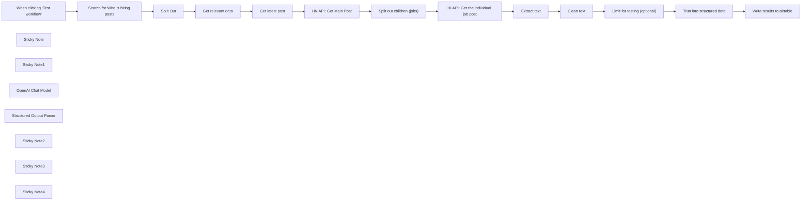

## Fluxo (.json) :

```json
{
  "id": "0JsHmmyeHw5Ffz5m",
  "meta": {
    "instanceId": "d4d7965840e96e50a3e02959a8487c692901dfa8d5cc294134442c67ce1622d3",
    "templateCredsSetupCompleted": true
  },
  "name": "HN Who is Hiring Scrape",
  "tags": [],
  "nodes": [
    {
      "id": "f7cdb3ee-9bb0-4006-829a-d4ce797191d5",
      "name": "When clicking ‘Test workflow’",
      "type": "n8n-nodes-base.manualTrigger",
      "position": [
        -20,
        -220
      ],
      "parameters": {},
      "typeVersion": 1
    },
    {
      "id": "0475e25d-9bf4-450d-abd3-a04608a438a4",
      "name": "Sticky Note",
      "type": "n8n-nodes-base.stickyNote",
      "position": [
        60,
        -620
      ],
      "parameters": {
        "width": 460,
        "height": 340,
        "content": "## Go to https://hn.algolia.com\n- filter by \"Ask HN: Who is hiring?\" (important with quotes for full match)\n- sort by date\n- Chrome Network Tab > find API call > click \"Copy as cURL\"\n- n8n HTTP node -> import cURL and paste \n- I've set the API key as Header Auth so you will have to do the above yourself to make this work"
      },
      "typeVersion": 1
    },
    {
      "id": "a686852b-ff84-430b-92bb-ce02a6808e19",
      "name": "Split Out",
      "type": "n8n-nodes-base.splitOut",
      "position": [
        400,
        -220
      ],
      "parameters": {
        "options": {},
        "fieldToSplitOut": "hits"
      },
      "typeVersion": 1
    },
    {
      "id": "cdaaa738-d561-4fa0-b2c7-8ea9e6778eb1",
      "name": "Sticky Note1",
      "type": "n8n-nodes-base.stickyNote",
      "position": [
        1260,
        -620
      ],
      "parameters": {
        "width": 500,
        "height": 340,
        "content": "## Go to HN API \nhttps://github.com/HackerNews/API\n\nWe'll need following endpoints: \n- For example, a story: https://hacker-news.firebaseio.com/v0/item/8863.json?print=pretty\n- comment: https://hacker-news.firebaseio.com/v0/item/2921983.json?print=pretty\n\n"
      },
      "typeVersion": 1
    },
    {
      "id": "4f353598-9e32-4be4-9e7b-c89cc05305fd",
      "name": "OpenAI Chat Model",
      "type": "@n8n/n8n-nodes-langchain.lmChatOpenAi",
      "position": [
        2680,
        -20
      ],
      "parameters": {
        "model": {
          "__rl": true,
          "mode": "list",
          "value": "gpt-4o-mini"
        },
        "options": {}
      },
      "credentials": {
        "openAiApi": {
          "id": "Fbb2ueT0XP5xMRme",
          "name": "OpenAi account 2"
        }
      },
      "typeVersion": 1.2
    },
    {
      "id": "5bd0d7cc-497a-497c-aa4c-589d9ceeca14",
      "name": "Structured Output Parser",
      "type": "@n8n/n8n-nodes-langchain.outputParserStructured",
      "position": [
        2840,
        -20
      ],
      "parameters": {
        "schemaType": "manual",
        "inputSchema": "{\n  \"type\": \"object\",\n  \"properties\": {\n    \"company\": {\n      \"type\": [\n        \"string\",\n        null\n      ],\n      \"description\": \"Name of the hiring company\"\n    },\n    \"title\": {\n      \"type\": [\n        \"string\",\n        null\n      ],\n      \"description\": \"Job title/role being advertised\"\n    },\n    \"location\": {\n      \"type\": [\n        \"string\",\n        null\n      ],\n      \"description\": \"Work location including remote/hybrid status\"\n    },\n    \"type\": {\n      \"type\": [\n        \"string\",\n        null\n      ],\n      \"enum\": [\n        \"FULL_TIME\",\n        \"PART_TIME\",\n        \"CONTRACT\",\n        \"INTERNSHIP\",\n        \"FREELANCE\",\n        null\n      ],\n      \"description\": \"Employment type (Full-time, Contract, etc)\"\n    },\n    \"work_location\": {\n      \"type\": [\n        \"string\",\n        null\n      ],\n      \"enum\": [\n        \"REMOTE\",\n        \"HYBRID\",\n        \"ON_SITE\",\n        null\n      ],\n      \"description\": \"Work arrangement type\"\n    },\n    \"salary\": {\n      \"type\": [\n        \"string\",\n        null\n      ],\n      \"description\": \"Compensation details if provided\"\n    },\n    \"description\": {\n      \"type\": [\n        \"string\",\n        null\n      ],\n      \"description\": \"Main job description text including requirements and team info\"\n    },\n    \"apply_url\": {\n      \"type\": [\n        \"string\",\n        null\n      ],\n      \"description\": \"Direct application/job posting URL\"\n    },\n    \"company_url\": {\n      \"type\": [\n        \"string\",\n        null\n      ],\n      \"description\": \"Company website or careers page\"\n    }\n  }\n}\n"
      },
      "typeVersion": 1.2
    },
    {
      "id": "b84ca004-6f3b-4577-8910-61b8584b161d",
      "name": "Search for Who is hiring posts",
      "type": "n8n-nodes-base.httpRequest",
      "position": [
        200,
        -220
      ],
      "parameters": {
        "url": "https://uj5wyc0l7x-dsn.algolia.net/1/indexes/Item_dev_sort_date/query",
        "method": "POST",
        "options": {},
        "jsonBody": "{\n  \"query\": \"\\\"Ask HN: Who is hiring\\\"\",\n  \"analyticsTags\": [\n    \"web\"\n  ],\n  \"page\": 0,\n  \"hitsPerPage\": 30,\n  \"minWordSizefor1Typo\": 4,\n  \"minWordSizefor2Typos\": 8,\n  \"advancedSyntax\": true,\n  \"ignorePlurals\": false,\n  \"clickAnalytics\": true,\n  \"minProximity\": 7,\n  \"numericFilters\": [],\n  \"tagFilters\": [\n    [\n      \"story\"\n    ],\n    []\n  ],\n  \"typoTolerance\": \"min\",\n  \"queryType\": \"prefixNone\",\n  \"restrictSearchableAttributes\": [\n    \"title\",\n    \"comment_text\",\n    \"url\",\n    \"story_text\",\n    \"author\"\n  ],\n  \"getRankingInfo\": true\n}",
        "sendBody": true,
        "sendQuery": true,
        "sendHeaders": true,
        "specifyBody": "json",
        "authentication": "genericCredentialType",
        "genericAuthType": "httpHeaderAuth",
        "queryParameters": {
          "parameters": [
            {
              "name": "x-algolia-agent",
              "value": "Algolia for JavaScript (4.13.1); Browser (lite)"
            },
            {
              "name": "x-algolia-application-id",
              "value": "UJ5WYC0L7X"
            }
          ]
        },
        "headerParameters": {
          "parameters": [
            {
              "name": "Accept",
              "value": "*/*"
            },
            {
              "name": "Accept-Language",
              "value": "en-GB,en-US;q=0.9,en;q=0.8"
            },
            {
              "name": "Connection",
              "value": "keep-alive"
            },
            {
              "name": "DNT",
              "value": "1"
            },
            {
              "name": "Origin",
              "value": "https://hn.algolia.com"
            },
            {
              "name": "Referer",
              "value": "https://hn.algolia.com/"
            },
            {
              "name": "Sec-Fetch-Dest",
              "value": "empty"
            },
            {
              "name": "Sec-Fetch-Mode",
              "value": "cors"
            },
            {
              "name": "Sec-Fetch-Site",
              "value": "cross-site"
            },
            {
              "name": "User-Agent",
              "value": "Mozilla/5.0 (Macintosh; Intel Mac OS X 10_15_7) AppleWebKit/537.36 (KHTML, like Gecko) Chrome/133.0.0.0 Safari/537.36"
            },
            {
              "name": "sec-ch-ua",
              "value": "\"Chromium\";v=\"133\", \"Not(A:Brand\";v=\"99\""
            },
            {
              "name": "sec-ch-ua-mobile",
              "value": "?0"
            },
            {
              "name": "sec-ch-ua-platform",
              "value": "\"macOS\""
            }
          ]
        }
      },
      "credentials": {
        "httpHeaderAuth": {
          "id": "oVEXp2ZbYCXypMVz",
          "name": "Algolia Auth"
        }
      },
      "typeVersion": 4.2
    },
    {
      "id": "205e66f6-cd6b-4cfd-a6ec-2226c35ddaac",
      "name": "Get relevant data",
      "type": "n8n-nodes-base.set",
      "position": [
        700,
        -220
      ],
      "parameters": {
        "options": {},
        "assignments": {
          "assignments": [
            {
              "id": "73dd2325-faa7-4650-bd78-5fc97cc202de",
              "name": "title",
              "type": "string",
              "value": "={{ $json.title }}"
            },
            {
              "id": "44918eac-4510-440e-9ac0-bf14d2b2f3af",
              "name": "createdAt",
              "type": "string",
              "value": "={{ $json.created_at }}"
            },
            {
              "id": "00eb6f09-2c22-411c-949c-886b2d95b6eb",
              "name": "updatedAt",
              "type": "string",
              "value": "={{ $json.updated_at }}"
            },
            {
              "id": "2b4f9da6-f60e-46e0-ba9d-3242fa955a55",
              "name": "storyId",
              "type": "string",
              "value": "={{ $json.story_id }}"
            }
          ]
        }
      },
      "typeVersion": 3.4
    },
    {
      "id": "16bc5628-8a29-4eac-8be9-b4e9da802e1e",
      "name": "Get latest post",
      "type": "n8n-nodes-base.filter",
      "position": [
        900,
        -220
      ],
      "parameters": {
        "options": {},
        "conditions": {
          "options": {
            "version": 2,
            "leftValue": "",
            "caseSensitive": true,
            "typeValidation": "strict"
          },
          "combinator": "and",
          "conditions": [
            {
              "id": "d7dd7175-2a50-45aa-bd3e-4c248c9193c4",
              "operator": {
                "type": "dateTime",
                "operation": "after"
              },
              "leftValue": "={{ $json.createdAt }}",
              "rightValue": "={{$now.minus({days: 30})}} "
            }
          ]
        }
      },
      "typeVersion": 2.2
    },
    {
      "id": "92e1ef74-5ae1-4195-840b-115184db464f",
      "name": "Split out children (jobs)",
      "type": "n8n-nodes-base.splitOut",
      "position": [
        1460,
        -220
      ],
      "parameters": {
        "options": {},
        "fieldToSplitOut": "kids"
      },
      "typeVersion": 1
    },
    {
      "id": "d0836aae-b98a-497f-a6f7-0ad563c262a0",
      "name": "Trun into structured data",
      "type": "@n8n/n8n-nodes-langchain.chainLlm",
      "position": [
        2600,
        -220
      ],
      "parameters": {
        "text": "={{ $json.cleaned_text }}",
        "messages": {
          "messageValues": [
            {
              "message": "Extract the JSON data"
            }
          ]
        },
        "promptType": "define",
        "hasOutputParser": true
      },
      "typeVersion": 1.5
    },
    {
      "id": "fd818a93-627c-435d-91ba-5d759d5a9004",
      "name": "Sticky Note2",
      "type": "n8n-nodes-base.stickyNote",
      "position": [
        2600,
        -620
      ],
      "parameters": {
        "width": 840,
        "height": 340,
        "content": "## Data Structure\n\nWe use Openai GPT-4o-mini to transform the raw data in a unified data structure. Feel free to change this.\n\n```json\n{\n  \"company\": \"Name of the hiring company\",\n  \"title\": \"Job title/role being advertised\",\n  \"location\": \"Work location including remote/hybrid status\",\n  \"type\": \"Employment type (Full-time, Contract, etc)\",\n  \"salary\": \"Compensation details if provided\",\n  \"description\": \"Main job description text including requirements and team info\",\n  \"apply_url\": \"Direct application/job posting URL\",\n  \"company_url\": \"Company website or careers page\"\n}\n```"
      },
      "typeVersion": 1
    },
    {
      "id": "b70c5578-5b81-467a-8ac2-65374e4e52f3",
      "name": "Extract text",
      "type": "n8n-nodes-base.set",
      "position": [
        1860,
        -220
      ],
      "parameters": {
        "options": {},
        "assignments": {
          "assignments": [
            {
              "id": "6affa370-56ce-4ad8-8534-8f753fdf07fc",
              "name": "text",
              "type": "string",
              "value": "={{ $json.text }}"
            }
          ]
        }
      },
      "typeVersion": 3.4
    },
    {
      "id": "acb68d88-9417-42e9-9bcc-7c2fa95c4afd",
      "name": "Clean text",
      "type": "n8n-nodes-base.code",
      "position": [
        2060,
        -220
      ],
      "parameters": {
        "jsCode": "// In a Function node in n8n\nconst inputData = $input.all();\n\nfunction cleanAllPosts(data) {\n    return data.map(item => {\n        try {\n            // Check if item exists and has the expected structure\n            if (!item || typeof item !== 'object') {\n                return { cleaned_text: '', error: 'Invalid item structure' };\n            }\n\n            // Get the text, with multiple fallbacks\n            let text = '';\n            if (typeof item === 'string') {\n                text = item;\n            } else if (item.json && item.json.text) {\n                text = item.json.text;\n            } else if (typeof item.json === 'string') {\n                text = item.json;\n            } else {\n                text = JSON.stringify(item);\n            }\n\n            // Make sure text is a string\n            text = String(text);\n            \n            // Perform the cleaning operations\n            try {\n                text = text.replace(/&#x2F;/g, '/');\n                text = text.replace(/&#x27;/g, \"'\");\n                text = text.replace(/&\\w+;/g, ' ');\n                text = text.replace(/<[^>]*>/g, '');\n                text = text.replace(/\\|\\s*/g, '| ');\n                text = text.replace(/\\s+/g, ' ');\n                text = text.replace(/\\s*(https?://[^\\s]+)\\s*/g, '\\n$1\\n');\n                text = text.replace(/\\n{3,}/g, '\\n\\n');\n                text = text.trim();\n            } catch (cleaningError) {\n                console.log('Error during text cleaning:', cleaningError);\n                // Return original text if cleaning fails\n                return { cleaned_text: text, warning: 'Partial cleaning applied' };\n            }\n\n            return { cleaned_text: text };\n            \n        } catch (error) {\n            console.log('Error processing item:', error);\n            return { \n                cleaned_text: '', \n                error: `Processing error: ${error.message}`,\n                original: item\n            };\n        }\n    }).filter(result => result.cleaned_text || result.error); \n}\n\ntry {\n    return cleanAllPosts(inputData);\n} catch (error) {\n    console.log('Fatal error:', error);\n    return [{ \n        cleaned_text: '', \n        error: `Fatal error: ${error.message}`,\n        input: inputData \n    }];\n}\n"
      },
      "typeVersion": 2
    },
    {
      "id": "a0727b55-565d-47c0-9ab5-0f001f4b9941",
      "name": "Limit for testing (optional)",
      "type": "n8n-nodes-base.limit",
      "position": [
        2280,
        -220
      ],
      "parameters": {
        "maxItems": 5
      },
      "typeVersion": 1
    },
    {
      "id": "650baf5e-c2ac-443d-8a2b-6df89717186f",
      "name": "Sticky Note3",
      "type": "n8n-nodes-base.stickyNote",
      "position": [
        580,
        -620
      ],
      "parameters": {
        "width": 540,
        "height": 340,
        "content": "## Clean the result \n\n```json\n{\n\"title\": \"Ask HN: Who is hiring? (February 2025)\",\n\"createdAt\": \"2025-02-03T16:00:43Z\",\n\"updatedAt\": \"2025-02-17T08:35:44Z\",\n\"storyId\": \"42919502\"\n},\n{\n\"title\": \"Ask HN: Who is hiring? (January 2025)\",\n\"createdAt\": \"2025-01-02T16:00:09Z\",\n\"updatedAt\": \"2025-02-13T00:03:24Z\",\n\"storyId\": \"42575537\"\n},\n```"
      },
      "typeVersion": 1
    },
    {
      "id": "1ca5c39f-f21d-455a-b63a-702e7e3ba02b",
      "name": "Write results to airtable",
      "type": "n8n-nodes-base.airtable",
      "position": [
        3040,
        -220
      ],
      "parameters": {
        "base": {
          "__rl": true,
          "mode": "list",
          "value": "appM2JWvA5AstsGdn",
          "cachedResultUrl": "https://airtable.com/appM2JWvA5AstsGdn",
          "cachedResultName": "HN Who is hiring?"
        },
        "table": {
          "__rl": true,
          "mode": "list",
          "value": "tblGvcOjqbliwM7AS",
          "cachedResultUrl": "https://airtable.com/appM2JWvA5AstsGdn/tblGvcOjqbliwM7AS",
          "cachedResultName": "Table 1"
        },
        "columns": {
          "value": {
            "type": "={{ $json.output.type }}",
            "title": "={{ $json.output.title }}",
            "salary": "={{ $json.output.salary }}",
            "company": "={{ $json.output.company }}",
            "location": "={{ $json.output.location }}",
            "apply_url": "={{ $json.output.apply_url }}",
            "company_url": "={{ $json.output.company_url }}",
            "description": "={{ $json.output.description }}"
          },
          "schema": [
            {
              "id": "title",
              "type": "string",
              "display": true,
              "removed": false,
              "readOnly": false,
              "required": false,
              "displayName": "title",
              "defaultMatch": false,
              "canBeUsedToMatch": true
            },
            {
              "id": "company",
              "type": "string",
              "display": true,
              "removed": false,
              "readOnly": false,
              "required": false,
              "displayName": "company",
              "defaultMatch": false,
              "canBeUsedToMatch": true
            },
            {
              "id": "location",
              "type": "string",
              "display": true,
              "removed": false,
              "readOnly": false,
              "required": false,
              "displayName": "location",
              "defaultMatch": false,
              "canBeUsedToMatch": true
            },
            {
              "id": "type",
              "type": "string",
              "display": true,
              "removed": false,
              "readOnly": false,
              "required": false,
              "displayName": "type",
              "defaultMatch": false,
              "canBeUsedToMatch": true
            },
            {
              "id": "salary",
              "type": "string",
              "display": true,
              "removed": false,
              "readOnly": false,
              "required": false,
              "displayName": "salary",
              "defaultMatch": false,
              "canBeUsedToMatch": true
            },
            {
              "id": "description",
              "type": "string",
              "display": true,
              "removed": false,
              "readOnly": false,
              "required": false,
              "displayName": "description",
              "defaultMatch": false,
              "canBeUsedToMatch": true
            },
            {
              "id": "apply_url",
              "type": "string",
              "display": true,
              "removed": false,
              "readOnly": false,
              "required": false,
              "displayName": "apply_url",
              "defaultMatch": false,
              "canBeUsedToMatch": true
            },
            {
              "id": "company_url",
              "type": "string",
              "display": true,
              "removed": false,
              "readOnly": false,
              "required": false,
              "displayName": "company_url",
              "defaultMatch": false,
              "canBeUsedToMatch": true
            },
            {
              "id": "posted_date",
              "type": "string",
              "display": true,
              "removed": true,
              "readOnly": false,
              "required": false,
              "displayName": "posted_date",
              "defaultMatch": false,
              "canBeUsedToMatch": true
            }
          ],
          "mappingMode": "defineBelow",
          "matchingColumns": [],
          "attemptToConvertTypes": false,
          "convertFieldsToString": false
        },
        "options": {},
        "operation": "create"
      },
      "credentials": {
        "airtableTokenApi": {
          "id": "IudXLNj7CDuc5M5a",
          "name": "Airtable Personal Access Token account"
        }
      },
      "typeVersion": 2.1
    },
    {
      "id": "d71fa024-86a0-4f74-b033-1f755574080c",
      "name": "Sticky Note4",
      "type": "n8n-nodes-base.stickyNote",
      "position": [
        -520,
        -300
      ],
      "parameters": {
        "width": 380,
        "height": 500,
        "content": "## Hacker News - Who is Hiring Scrape\n\nIn this template we setup a scraper for the monthly HN Who is Hiring post. This way we can scrape the data and transform it to a common data strcutre.\n\nFirst we use the [Algolia Search](https://hn.algolia.com/) provided by hackernews to drill down the results.\n\nWe can use the official [Hacker News API](https://github.com/HackerNews/API\n) to get the post data and also all the replies!\n\nThis will obviously work for any kind of post on hacker news! Get creative 😃\n\nAll you need is an Openai Account to structure the text data and an Airtable Account (or similar) to write the results to a list.\n\nCopy my base https://airtable.com/appM2JWvA5AstsGdn/shrAuo78cJt5C2laR"
      },
      "typeVersion": 1
    },
    {
      "id": "7466fb0c-9f0c-4adf-a6de-b2cf09032719",
      "name": "HI API: Get the individual job post",
      "type": "n8n-nodes-base.httpRequest",
      "position": [
        1660,
        -220
      ],
      "parameters": {
        "url": "=https://hacker-news.firebaseio.com/v0/item/{{ $json.kids }}.json?print=pretty",
        "options": {}
      },
      "typeVersion": 4.2
    },
    {
      "id": "184abccf-5838-49bf-9922-e0300c6b145e",
      "name": "HN API: Get Main Post",
      "type": "n8n-nodes-base.httpRequest",
      "position": [
        1260,
        -220
      ],
      "parameters": {
        "url": "=https://hacker-news.firebaseio.com/v0/item/{{ $json.storyId }}.json?print=pretty",
        "options": {}
      },
      "typeVersion": 4.2
    }
  ],
  "active": false,
  "pinData": {},
  "settings": {
    "executionOrder": "v1"
  },
  "versionId": "387f7084-58fa-4643-9351-73c870d3f028",
  "connections": {
    "Split Out": {
      "main": [
        [
          {
            "node": "Get relevant data",
            "type": "main",
            "index": 0
          }
        ]
      ]
    },
    "Clean text": {
      "main": [
        [
          {
            "node": "Limit for testing (optional)",
            "type": "main",
            "index": 0
          }
        ]
      ]
    },
    "Extract text": {
      "main": [
        [
          {
            "node": "Clean text",
            "type": "main",
            "index": 0
          }
        ]
      ]
    },
    "Get latest post": {
      "main": [
        [
          {
            "node": "HN API: Get Main Post",
            "type": "main",
            "index": 0
          }
        ]
      ]
    },
    "Get relevant data": {
      "main": [
        [
          {
            "node": "Get latest post",
            "type": "main",
            "index": 0
          }
        ]
      ]
    },
    "OpenAI Chat Model": {
      "ai_languageModel": [
        [
          {
            "node": "Trun into structured data",
            "type": "ai_languageModel",
            "index": 0
          }
        ]
      ]
    },
    "HN API: Get Main Post": {
      "main": [
        [
          {
            "node": "Split out children (jobs)",
            "type": "main",
            "index": 0
          }
        ]
      ]
    },
    "Structured Output Parser": {
      "ai_outputParser": [
        [
          {
            "node": "Trun into structured data",
            "type": "ai_outputParser",
            "index": 0
          }
        ]
      ]
    },
    "Split out children (jobs)": {
      "main": [
        [
          {
            "node": "HI API: Get the individual job post",
            "type": "main",
            "index": 0
          }
        ]
      ]
    },
    "Trun into structured data": {
      "main": [
        [
          {
            "node": "Write results to airtable",
            "type": "main",
            "index": 0
          }
        ]
      ]
    },
    "Limit for testing (optional)": {
      "main": [
        [
          {
            "node": "Trun into structured data",
            "type": "main",
            "index": 0
          }
        ]
      ]
    },
    "Search for Who is hiring posts": {
      "main": [
        [
          {
            "node": "Split Out",
            "type": "main",
            "index": 0
          }
        ]
      ]
    },
    "When clicking ‘Test workflow’": {
      "main": [
        [
          {
            "node": "Search for Who is hiring posts",
            "type": "main",
            "index": 0
          }
        ]
      ]
    },
    "HI API: Get the individual job post": {
      "main": [
        [
          {
            "node": "Extract text",
            "type": "main",
            "index": 0
          }
        ]
      ]
    }
  }
}
```

<a id="template-988"></a>

## Template 988 - Atribuição automática de issues e comentários

- **Nome:** Atribuição automática de issues e comentários
- **Descrição:** Monitora eventos de issues e comentários no repositório e atribui responsáveis automaticamente com base no conteúdo ou notifica quando já há um responsável.
- **Funcionalidade:** • Monitoramento de eventos no GitHub: Dispara ao detectar eventos de issues (abertura) e comentários no repositório especificado.
• Filtragem por ação: Diferencia ações de abertura de issue e criação de comentário para acionar fluxos específicos.
• Atribuição ao criador da issue: Se uma issue for aberta sem responsáveis e atender ao padrão "assign me" no corpo, atribui o autor e adiciona o rótulo "assigned".
• Atribuição ao comentarista: Se um comentário contiver "assign me" e a issue não estiver atribuída, atribui o usuário que comentou e adiciona o rótulo "assigned".
• Notificação quando já atribuído: Se alguém solicitar atribuição via comentário mas a issue já tem responsável, responde informando quem está atribuído.
• Tratamento de fluxos irrelevantes: Ignora ou encampa caminhos sem ação quando condições não são atendidas.
- **Ferramentas:** • GitHub: Plataforma para monitorar eventos de issues e comentários, editar issues (atribuir usuários, adicionar rótulos) e criar comentários.

## Fluxo visual

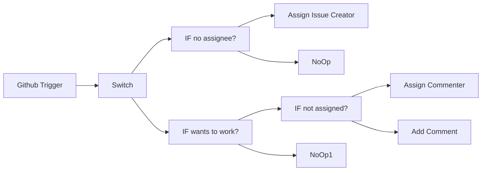

## Fluxo (.json) :

```json
{
  "nodes": [
    {
      "name": "Github Trigger",
      "type": "n8n-nodes-base.githubTrigger",
      "position": [
        450,
        300
      ],
      "webhookId": "52c5fe44-23ef-4903-b6ae-731edd36127e",
      "parameters": {
        "owner": "harshil1712",
        "events": [
          "issue_comment",
          "issues"
        ],
        "repository": "build-discord-bot",
        "authentication": "oAuth2"
      },
      "credentials": {
        "githubOAuth2Api": "GitHub Personal Credentials"
      },
      "typeVersion": 1
    },
    {
      "name": "Github Trigger",
      "type": "n8n-nodes-base.githubTrigger",
      "position": [
        450,
        300
      ],
      "webhookId": "52c5fe44-23ef-4903-b6ae-731edd36127e",
      "parameters": {
        "owner": "harshil1712",
        "events": [
          "issue_comment",
          "issues"
        ],
        "repository": "build-discord-bot",
        "authentication": "oAuth2"
      },
      "credentials": {
        "githubOAuth2Api": "GitHub Personal Credentials"
      },
      "typeVersion": 1
    },
    {
      "name": "Switch",
      "type": "n8n-nodes-base.switch",
      "position": [
        650,
        300
      ],
      "parameters": {
        "rules": {
          "rules": [
            {
              "value2": "opened"
            },
            {
              "output": 1,
              "value2": "created"
            }
          ]
        },
        "value1": "={{$json[\"body\"][\"action\"]}}",
        "dataType": "string"
      },
      "typeVersion": 1
    },
    {
      "name": "IF no assignee?",
      "type": "n8n-nodes-base.if",
      "position": [
        1050,
        150
      ],
      "parameters": {
        "conditions": {
          "number": [
            {
              "value1": "={{$json[\"body\"][\"issue\"][\"assignees\"].length}}",
              "operation": "equal"
            }
          ],
          "string": [
            {
              "value1": "={{$json[\"body\"][\"issue\"][\"body\"]}}",
              "value2": "/[a,A]ssign[\\w*\\s*]*me/gm",
              "operation": "regex"
            }
          ]
        }
      },
      "typeVersion": 1
    },
    {
      "name": "NoOp",
      "type": "n8n-nodes-base.noOp",
      "position": [
        1250,
        250
      ],
      "parameters": {},
      "typeVersion": 1
    },
    {
      "name": "IF wants to work?",
      "type": "n8n-nodes-base.if",
      "position": [
        850,
        500
      ],
      "parameters": {
        "conditions": {
          "number": [],
          "string": [
            {
              "value1": "={{$json[\"body\"][\"comment\"][\"body\"]}}",
              "value2": "/[a,A]ssign[\\w*\\s*]*me/gm",
              "operation": "regex"
            }
          ]
        }
      },
      "typeVersion": 1
    },
    {
      "name": "IF not assigned?",
      "type": "n8n-nodes-base.if",
      "position": [
        1050,
        450
      ],
      "parameters": {
        "conditions": {
          "number": [
            {
              "value1": "={{$json[\"body\"][\"issue\"][\"assignees\"].length}}",
              "operation": "equal"
            }
          ],
          "string": []
        }
      },
      "typeVersion": 1
    },
    {
      "name": "Assign Issue Creator",
      "type": "n8n-nodes-base.github",
      "position": [
        1250,
        50
      ],
      "parameters": {
        "owner": "={{$node[\"Switch\"].json[\"body\"][\"repository\"][\"owner\"][\"login\"]}}",
        "operation": "edit",
        "editFields": {
          "labels": [
            {
              "label": "assigned"
            }
          ],
          "assignees": [
            {
              "assignee": "={{$json.body.issue[\"user\"][\"login\"]}}"
            }
          ]
        },
        "repository": "={{$node[\"Switch\"].json[\"body\"][\"repository\"][\"name\"]}}",
        "issueNumber": "={{ $json[\"body\"][\"issue\"][\"number\"] }}",
        "authentication": "oAuth2"
      },
      "credentials": {
        "githubOAuth2Api": "GitHub@Harshil"
      },
      "typeVersion": 1
    },
    {
      "name": "Add Comment",
      "type": "n8n-nodes-base.github",
      "position": [
        1350,
        600
      ],
      "parameters": {
        "body": "=Hey @{{$json[\"body\"][\"comment\"][\"user\"][\"login\"]}},\n\nThis issue is already assigned to {{$json[\"body\"][\"issue\"][\"assignee\"][\"login\"]}} 🙂",
        "owner": "={{$json[\"body\"][\"repository\"][\"owner\"][\"login\"]}}",
        "operation": "createComment",
        "repository": "={{$json[\"body\"][\"repository\"][\"name\"]}}",
        "issueNumber": "={{$json[\"body\"][\"issue\"][\"number\"]}}",
        "authentication": "oAuth2"
      },
      "credentials": {
        "githubOAuth2Api": "GitHub@Harshil"
      },
      "typeVersion": 1
    },
    {
      "name": "NoOp1",
      "type": "n8n-nodes-base.noOp",
      "position": [
        1050,
        650
      ],
      "parameters": {},
      "typeVersion": 1
    },
    {
      "name": "Assign Commenter",
      "type": "n8n-nodes-base.github",
      "position": [
        1350,
        400
      ],
      "parameters": {
        "owner": "={{$json[\"body\"][\"repository\"][\"owner\"][\"login\"]}}",
        "operation": "edit",
        "editFields": {
          "labels": [
            {
              "label": "assigned"
            }
          ],
          "assignees": [
            {
              "assignee": "={{$json[\"body\"][\"comment\"][\"user\"][\"login\"]}}"
            }
          ]
        },
        "repository": "={{$json[\"body\"][\"repository\"][\"name\"]}}",
        "issueNumber": "={{$json[\"body\"][\"issue\"][\"number\"]}}",
        "authentication": "oAuth2"
      },
      "credentials": {
        "githubOAuth2Api": "GitHub@Harshil"
      },
      "typeVersion": 1
    }
  ],
  "connections": {
    "Switch": {
      "main": [
        [
          {
            "node": "IF no assignee?",
            "type": "main",
            "index": 0
          }
        ],
        [
          {
            "node": "IF wants to work?",
            "type": "main",
            "index": 0
          }
        ]
      ]
    },
    "Github Trigger": {
      "main": [
        [
          {
            "node": "Switch",
            "type": "main",
            "index": 0
          }
        ]
      ]
    },
    "IF no assignee?": {
      "main": [
        [
          {
            "node": "Assign Issue Creator",
            "type": "main",
            "index": 0
          }
        ],
        [
          {
            "node": "NoOp",
            "type": "main",
            "index": 0
          }
        ]
      ]
    },
    "IF not assigned?": {
      "main": [
        [
          {
            "node": "Assign Commenter",
            "type": "main",
            "index": 0
          }
        ],
        [
          {
            "node": "Add Comment",
            "type": "main",
            "index": 0
          }
        ]
      ]
    },
    "IF wants to work?": {
      "main": [
        [
          {
            "node": "IF not assigned?",
            "type": "main",
            "index": 0
          }
        ],
        [
          {
            "node": "NoOp1",
            "type": "main",
            "index": 0
          }
        ]
      ]
    }
  }
}
```

<a id="template-989"></a>

## Template 989 - Parsing automático de faturas para Airtable

- **Nome:** Parsing automático de faturas para Airtable
- **Descrição:** Este fluxo detecta novas faturas em uma pasta, envia o arquivo para um serviço de parsing, utiliza IA para extrair itens de linha e armazena a fatura e seus itens em Airtable.
- **Funcionalidade:** • Detecção de novos arquivos: Monitora uma pasta específica no Google Drive para novas faturas.
• Envio para parsing: Envia a fatura para o endpoint de parsing com webhook para retornar os resultados.
• Extração de itens com IA: Utiliza IA para extrair itens de linha (descrição, quantidade, preço unitário e valor total).
• Transformação de dados: Converte a resposta em itens estruturados prontos para armazenamento.
• Armazenamento no Airtable: Cria registros de fatura e itens de linha nas tabelas correspondentes.
- **Ferramentas:** • Google Drive: Serviço de armazenamento em nuvem usado para armazenar faturas e disparar o processamento.
• LlamaIndex Parsing API: endpoint para upload e parsing de faturas.
• OpenAI: API de IA para extrair itens de linha a partir do conteúdo da fatura.
• Airtable: Base de dados onde são criados os registros de faturas e itens.


## Fluxo visual

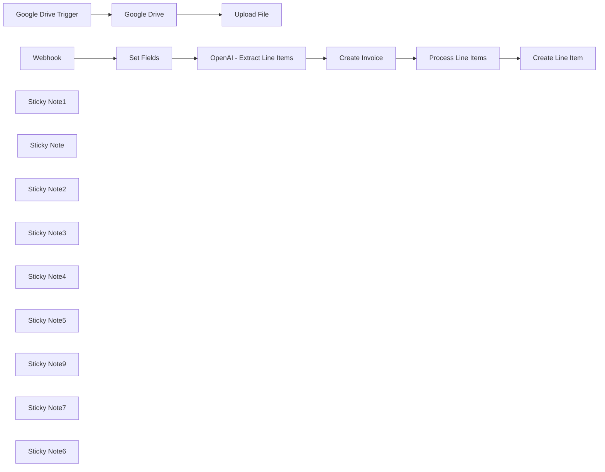

## Fluxo (.json) :

```json
{
  "nodes": [
    {
      "id": "9df72ef9-3b9d-40e4-9cb5-a5ada153c0bb",
      "name": "Google Drive",
      "type": "n8n-nodes-base.googleDrive",
      "position": [
        120,
        -180
      ],
      "parameters": {
        "fileId": {
          "__rl": true,
          "mode": "id",
          "value": "={{ $json.id }}"
        },
        "options": {},
        "operation": "download"
      },
      "credentials": {
        "googleDriveOAuth2Api": {
          "id": "wpiZXesxk9S8fkVG",
          "name": "Google Drive account 2"
        }
      },
      "typeVersion": 3
    },
    {
      "id": "e21bb906-658c-4a52-9c7b-b77d6e0e7ea5",
      "name": "Upload File",
      "type": "n8n-nodes-base.httpRequest",
      "position": [
        360,
        -180
      ],
      "parameters": {
        "url": "https://api.cloud.llamaindex.ai/api/parsing/upload",
        "method": "POST",
        "options": {},
        "sendBody": true,
        "contentType": "multipart-form-data",
        "sendHeaders": true,
        "bodyParameters": {
          "parameters": [
            {
              "name": "webhook_url",
              "value": "https://n8n.lowcoding.dev/webhook/0f7f5ebb-8b66-453b-a818-20cc3647c783"
            },
            {
              "name": "file",
              "parameterType": "formBinaryData",
              "inputDataFieldName": "data"
            },
            {
              "name": "disable_ocr",
              "value": "true"
            },
            {
              "name": "disable_image_extraction",
              "value": "True"
            }
          ]
        },
        "headerParameters": {
          "parameters": [
            {
              "name": "accept",
              "value": "application/json"
            },
            {
              "name": "Authorization",
              "value": "Bearer "
            },
            {
              "name": "parsing_instruction",
              "value": "Please extract invoice line items: Name, Quantity, Unit Price, Amount "
            }
          ]
        }
      },
      "typeVersion": 4.2
    },
    {
      "id": "2a0c2331-4612-4b92-a0cc-b316bc663907",
      "name": "Google Drive Trigger",
      "type": "n8n-nodes-base.googleDriveTrigger",
      "position": [
        -80,
        -180
      ],
      "parameters": {
        "event": "fileCreated",
        "options": {},
        "pollTimes": {
          "item": [
            {
              "mode": "everyMinute"
            }
          ]
        },
        "triggerOn": "specificFolder",
        "folderToWatch": {
          "__rl": true,
          "mode": "list",
          "value": "1IC39VXU8rewBU85offxYlBd9QlYzf8S7",
          "cachedResultUrl": "https://drive.google.com/drive/folders/1IC39VXU8rewBU85offxYlBd9QlYzf8S7",
          "cachedResultName": "Invoices"
        }
      },
      "credentials": {
        "googleDriveOAuth2Api": {
          "id": "wpiZXesxk9S8fkVG",
          "name": "Google Drive account 2"
        }
      },
      "typeVersion": 1
    },
    {
      "id": "4ad70b03-54f1-4715-9848-56fa6ba18278",
      "name": "Create Invoice",
      "type": "n8n-nodes-base.airtable",
      "position": [
        400,
        340
      ],
      "parameters": {
        "base": {
          "__rl": true,
          "mode": "list",
          "value": "appndgSF4faN4jPXi",
          "cachedResultUrl": "https://airtable.com/appndgSF4faN4jPXi",
          "cachedResultName": "Philipp's Base"
        },
        "table": {
          "__rl": true,
          "mode": "list",
          "value": "tbloPc7Eay4Cvwysq",
          "cachedResultUrl": "https://airtable.com/appndgSF4faN4jPXi/tbloPc7Eay4Cvwysq",
          "cachedResultName": "Invoices"
        },
        "columns": {
          "value": {},
          "schema": [
            {
              "id": "Name",
              "type": "string",
              "display": true,
              "removed": true,
              "readOnly": false,
              "required": false,
              "displayName": "Name",
              "defaultMatch": false,
              "canBeUsedToMatch": true
            },
            {
              "id": "Line Items",
              "type": "array",
              "display": true,
              "removed": true,
              "readOnly": false,
              "required": false,
              "displayName": "Line Items",
              "defaultMatch": false,
              "canBeUsedToMatch": true
            }
          ],
          "mappingMode": "defineBelow",
          "matchingColumns": []
        },
        "options": {},
        "operation": "create"
      },
      "credentials": {
        "airtableTokenApi": {
          "id": "XT7hvl1w201jtBhx",
          "name": "Airtable Personal Access Token account"
        }
      },
      "typeVersion": 2.1
    },
    {
      "id": "a408eeb4-2dc2-45ff-a989-92676356f596",
      "name": "Create Line Item",
      "type": "n8n-nodes-base.airtable",
      "position": [
        800,
        340
      ],
      "parameters": {
        "base": {
          "__rl": true,
          "mode": "list",
          "value": "appndgSF4faN4jPXi",
          "cachedResultUrl": "https://airtable.com/appndgSF4faN4jPXi",
          "cachedResultName": "Philipp's Base"
        },
        "table": {
          "__rl": true,
          "mode": "list",
          "value": "tblIuVR9ocAomznzK",
          "cachedResultUrl": "https://airtable.com/appndgSF4faN4jPXi/tblIuVR9ocAomznzK",
          "cachedResultName": "Line Items"
        },
        "columns": {
          "value": {
            "Qty": "={{ $json.qty }}",
            "Amount": "={{ parseFloat($json.amount.replace('$', '').trim()) }}",
            "Invoices": "=[\"{{ $('Create Invoice').item.json.id }}\"]",
            "Unit price": "={{ parseFloat($json.unit_price.replace('$', '').trim()) }}",
            "Description": "={{ $json.description }}"
          },
          "schema": [
            {
              "id": "Name",
              "type": "string",
              "display": true,
              "removed": true,
              "readOnly": false,
              "required": false,
              "displayName": "Name",
              "defaultMatch": false,
              "canBeUsedToMatch": true
            },
            {
              "id": "Description",
              "type": "string",
              "display": true,
              "removed": false,
              "readOnly": false,
              "required": false,
              "displayName": "Description",
              "defaultMatch": false,
              "canBeUsedToMatch": true
            },
            {
              "id": "Qty",
              "type": "number",
              "display": true,
              "removed": false,
              "readOnly": false,
              "required": false,
              "displayName": "Qty",
              "defaultMatch": false,
              "canBeUsedToMatch": true
            },
            {
              "id": "Unit price",
              "type": "number",
              "display": true,
              "removed": false,
              "readOnly": false,
              "required": false,
              "displayName": "Unit price",
              "defaultMatch": false,
              "canBeUsedToMatch": true
            },
            {
              "id": "Amount",
              "type": "number",
              "display": true,
              "removed": false,
              "readOnly": false,
              "required": false,
              "displayName": "Amount",
              "defaultMatch": false,
              "canBeUsedToMatch": true
            },
            {
              "id": "Invoices",
              "type": "array",
              "display": true,
              "removed": false,
              "readOnly": false,
              "required": false,
              "displayName": "Invoices",
              "defaultMatch": false,
              "canBeUsedToMatch": true
            }
          ],
          "mappingMode": "defineBelow",
          "matchingColumns": []
        },
        "options": {},
        "operation": "create"
      },
      "credentials": {
        "airtableTokenApi": {
          "id": "XT7hvl1w201jtBhx",
          "name": "Airtable Personal Access Token account"
        }
      },
      "typeVersion": 2.1
    },
    {
      "id": "7ee324e8-6df3-48d6-b1b8-6fdb610b1ec7",
      "name": "OpenAI - Extract Line Items",
      "type": "n8n-nodes-base.httpRequest",
      "position": [
        180,
        340
      ],
      "parameters": {
        "url": "=https://api.openai.com/v1/chat/completions",
        "method": "POST",
        "options": {},
        "jsonBody": "={\n    \"model\": \"gpt-4o-mini\",\n    \"messages\": [\n      {\n        \"role\": \"system\",\n        \"content\": {{ JSON.stringify($('Set Fields').item.json.prompt) }}\n      },\n      {\n        \"role\": \"user\",\n        \"content\": {{ JSON.stringify( JSON.stringify($('Webhook').item.json.body.json[0].items) ) }}\n      }\n    ],\n  \"response_format\":{ \"type\": \"json_schema\", \"json_schema\":  {{ $('Set Fields').item.json.schema }}\n\n }\n  }",
        "sendBody": true,
        "specifyBody": "json",
        "authentication": "predefinedCredentialType",
        "nodeCredentialType": "openAiApi"
      },
      "credentials": {
        "openAiApi": {
          "id": "9RivS2BmSh1DDBFm",
          "name": "OpenAi account 3"
        }
      },
      "typeVersion": 4.2
    },
    {
      "id": "eda31919-9091-4d45-bd73-4609b71f93a9",
      "name": "Set Fields",
      "type": "n8n-nodes-base.set",
      "position": [
        -40,
        340
      ],
      "parameters": {
        "options": {},
        "assignments": {
          "assignments": [
            {
              "id": "dc09a5b4-ff6a-4cee-b87e-35de7336ac05",
              "name": "prompt",
              "type": "string",
              "value": "Please, process parsed data and return only needed."
            },
            {
              "id": "4e0f9af6-517f-42af-9ced-df0e8a7118b0",
              "name": "schema",
              "type": "string",
              "value": "={\n  \"name\": \"generate_schema\",\n  \"description\": \"Generate schema for an array of objects representing items with their descriptions, quantities, unit prices, and amounts.\",\n  \"strict\": true,\n  \"schema\": {\n    \"type\": \"object\",\n    \"required\": [\n      \"items\"\n    ],\n    \"properties\": {\n      \"items\": {\n        \"type\": \"array\",\n        \"description\": \"Array of item objects\",\n        \"items\": {\n          \"type\": \"object\",\n          \"required\": [\n            \"description\",\n            \"qty\",\n            \"unit_price\",\n            \"amount\"\n          ],\n          \"properties\": {\n            \"description\": {\n              \"type\": \"string\",\n              \"description\": \"Description of the item\"\n            },\n            \"qty\": {\n              \"type\": \"string\",\n              \"description\": \"Quantity of the item\"\n            },\n            \"unit_price\": {\n              \"type\": \"string\",\n              \"description\": \"Unit price of the item formatted as a string\"\n            },\n            \"amount\": {\n              \"type\": \"string\",\n              \"description\": \"Total amount for the item formatted as a string\"\n            }\n          },\n          \"additionalProperties\": false\n        }\n      }\n    },\n    \"additionalProperties\": false\n  }\n}"
            }
          ]
        }
      },
      "typeVersion": 3.4
    },
    {
      "id": "cc0d97d8-fb62-43eb-b484-4dd39f8db4b4",
      "name": "Process Line Items",
      "type": "n8n-nodes-base.code",
      "position": [
        600,
        340
      ],
      "parameters": {
        "jsCode": "// Get the input from the \"OpenAI - Extract Line Items\" node\nconst input = $(\"OpenAI - Extract Line Items\").first().json;\n\n// Initialize an array for the output\nconst outputItems = [];\n\n// Navigate to the 'content' field in the choices array\nconst content = input.choices[0]?.message?.content;\n\nif (content) {\n  try {\n    // Parse the stringified JSON in the 'content' field\n    const parsedContent = JSON.parse(content);\n\n    // Extract 'items' and add them to the output array\n    if (Array.isArray(parsedContent.items)) {\n      outputItems.push(...parsedContent.items.map(i => ({ json: i })));\n    }\n  } catch (error) {\n    // Handle any parsing errors\n    console.error('Error parsing content:', error);\n  }\n}\n\n// Return the extracted items\nreturn outputItems;\n"
      },
      "typeVersion": 2
    },
    {
      "id": "741dc44e-6d47-4a77-80c2-5e18b291da33",
      "name": "Webhook",
      "type": "n8n-nodes-base.webhook",
      "position": [
        -220,
        340
      ],
      "webhookId": "0f7f5ebb-8b66-453b-a818-20cc3647c783",
      "parameters": {
        "path": "0f7f5ebb-8b66-453b-a818-20cc3647c783",
        "options": {},
        "httpMethod": "POST"
      },
      "typeVersion": 2
    },
    {
      "id": "fbc196c8-7518-4deb-ac47-f37f1b8150eb",
      "name": "Sticky Note1",
      "type": "n8n-nodes-base.stickyNote",
      "position": [
        -260,
        -300
      ],
      "parameters": {
        "width": 920,
        "height": 400,
        "content": "## Scenario 1\n\n"
      },
      "typeVersion": 1
    },
    {
      "id": "96368d41-7886-487f-a8a7-e4dac3b01f45",
      "name": "Sticky Note",
      "type": "n8n-nodes-base.stickyNote",
      "position": [
        -280,
        240
      ],
      "parameters": {
        "width": 1340,
        "height": 460,
        "content": "## Scenario 2\n\n"
      },
      "typeVersion": 1
    },
    {
      "id": "6b7c94d7-c844-4246-ba1a-cea5937792db",
      "name": "Sticky Note2",
      "type": "n8n-nodes-base.stickyNote",
      "position": [
        -60,
        0
      ],
      "parameters": {
        "color": 3,
        "width": 270,
        "height": 80,
        "content": "### Replace Google Drive connection"
      },
      "typeVersion": 1
    },
    {
      "id": "9c8141d0-428a-44e5-b900-b07fa64db4f5",
      "name": "Sticky Note3",
      "type": "n8n-nodes-base.stickyNote",
      "position": [
        320,
        0
      ],
      "parameters": {
        "color": 3,
        "width": 170,
        "height": 80,
        "content": "### Replace API key in header"
      },
      "typeVersion": 1
    },
    {
      "id": "48243fe4-4ed1-43dc-b508-8b3f9472bb67",
      "name": "Sticky Note4",
      "type": "n8n-nodes-base.stickyNote",
      "position": [
        140,
        540
      ],
      "parameters": {
        "color": 3,
        "width": 170,
        "height": 80,
        "content": "### Replace OpenAI connection"
      },
      "typeVersion": 1
    },
    {
      "id": "ffc6b530-69ab-4ccb-945d-94f8fdc1e3ab",
      "name": "Sticky Note5",
      "type": "n8n-nodes-base.stickyNote",
      "position": [
        400,
        540
      ],
      "parameters": {
        "color": 3,
        "width": 530,
        "height": 80,
        "content": "### Replace Airtable connection"
      },
      "typeVersion": 1
    },
    {
      "id": "15047f43-5f7e-4c70-a754-fffb41c04611",
      "name": "Sticky Note9",
      "type": "n8n-nodes-base.stickyNote",
      "position": [
        -760,
        380
      ],
      "parameters": {
        "color": 7,
        "width": 330.5152611046425,
        "height": 239.5888196628349,
        "content": "### ... or watch set up video [7 min]\n[](https://youtu.be/E4I0nru-fa8)\n"
      },
      "typeVersion": 1
    },
    {
      "id": "812f6cc7-a093-41d0-9750-48253d9f04a8",
      "name": "Sticky Note7",
      "type": "n8n-nodes-base.stickyNote",
      "position": [
        -1060,
        -300
      ],
      "parameters": {
        "color": 7,
        "width": 636,
        "height": 657,
        "content": "\n## AI Agent for realtime insights on meetings\n**Made by [Mark Shcherbakov](https://www.linkedin.com/in/marklowcoding/) from community [5minAI](https://www.skool.com/5minai)**\n\nTranscribing meetings manually can be tedious and prone to error. This workflow automates the transcription process in real-time, ensuring that key discussions and decisions are accurately captured and easily accessible for later review, thus enhancing productivity and clarity in communications.\n\nThe workflow leverages n8n and LlamaParse to automatically detect new invoices in a designated Google Drive folder, parse essential billing details, and store the extracted data in a structured format. The key functionalities include:\n- Real-time detection of new invoices via Google Drive triggers.\n- Automated HTTP requests to initiate parsing through Lama Cloud.\n- Structured storage of invoice details and line items in a database for future reference.\n\n1. **Google Drive Integration**: Monitors a specific folder in Google Drive for new invoice uploads.\n2. **Parsing with LlamaParse**: Automatically sends invoices for parsing and processes results through webhooks.\n3. **Data Storage in Airtable**: Creates records for invoices and their associated line items, allowing for detailed tracking."
      },
      "typeVersion": 1
    },
    {
      "id": "a80e6528-cf79-4229-8c58-6856fd86b6e7",
      "name": "Sticky Note6",
      "type": "n8n-nodes-base.stickyNote",
      "position": [
        -1060,
        380
      ],
      "parameters": {
        "color": 7,
        "width": 280,
        "height": 626,
        "content": "### Set up steps\n\n1. **Google Drive Trigger**: \n   - Set up a trigger to detect new files in a specified folder dedicated to invoices.\n\n2. **File Upload to LlamaParse**: \n   - Create an HTTP request that sends the invoice file to LlamaParse for parsing, including relevant header settings and webhook URL.\n\n3. **Webhook Processing**: \n   - Establish a webhook node to handle parsed results from LlamaParse, extracting needed invoice details effectively.\n\n4. **Invoice Record Creation**: \n   - Create initial records for invoices in your database using the parsed details received from the webhook.\n\n5. **Line Item Processing**: \n   - Transform string data into structured line item arrays and create individual records for each item linked to the main invoice."
      },
      "typeVersion": 1
    }
  ],
  "pinData": {},
  "connections": {
    "Webhook": {
      "main": [
        [
          {
            "node": "Set Fields",
            "type": "main",
            "index": 0
          }
        ]
      ]
    },
    "Set Fields": {
      "main": [
        [
          {
            "node": "OpenAI - Extract Line Items",
            "type": "main",
            "index": 0
          }
        ]
      ]
    },
    "Google Drive": {
      "main": [
        [
          {
            "node": "Upload File",
            "type": "main",
            "index": 0
          }
        ]
      ]
    },
    "Create Invoice": {
      "main": [
        [
          {
            "node": "Process Line Items",
            "type": "main",
            "index": 0
          }
        ]
      ]
    },
    "Process Line Items": {
      "main": [
        [
          {
            "node": "Create Line Item",
            "type": "main",
            "index": 0
          }
        ]
      ]
    },
    "Google Drive Trigger": {
      "main": [
        [
          {
            "node": "Google Drive",
            "type": "main",
            "index": 0
          }
        ]
      ]
    },
    "OpenAI - Extract Line Items": {
      "main": [
        [
          {
            "node": "Create Invoice",
            "type": "main",
            "index": 0
          }
        ]
      ]
    }
  }
}
```

<a id="template-990"></a>

## Template 990 - Converter JPG/PNG para WEBP

- **Nome:** Converter JPG/PNG para WEBP
- **Descrição:** Este fluxo automatiza a conversão de imagens de JPG/PNG para WEBP, pegando as URLs de uma planilha, convertendo as imagens, atualizando o link na planilha e salvando o WEBP convertido no Google Drive.
- **Funcionalidade:** • Leitura de URLs das imagens: Obtém as URLs das imagens a partir de uma planilha do Google Sheets e prepara cada item para processamento.
• Conversão para WEBP: Converte imagens JPG/JPEG/PNG para WEBP via API externa.
• Atualização da planilha: Atualiza a linha com o URL convertido e marca o item como DONE.
• Download do WEBP: Recupera o arquivo WEBP gerado pela conversão.
• Upload no Google Drive: Faz upload do WEBP para uma pasta específica com o nome original do arquivo.
- **Ferramentas:** • Google Sheets: Planilha usada para listar URLs, estado e resultados.
• APYHub API: Serviço de conversão de imagens para WEBP.
• Google Drive: Armazenamento dos arquivos WEBP convertidos na pasta designada.


## Fluxo visual

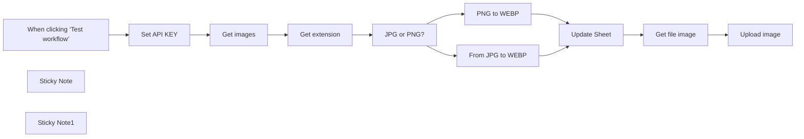

## Fluxo (.json) :

```json
{
  "id": "IyDJ7Zgh4MV43YTh",
  "meta": {
    "instanceId": "a4bfc93e975ca233ac45ed7c9227d84cf5a2329310525917adaf3312e10d5462",
    "templateCredsSetupCompleted": true
  },
  "name": "Convert image from jpg/png to webp",
  "tags": [],
  "nodes": [
    {
      "id": "09977b8b-e095-4419-b136-bcbadf0f5d84",
      "name": "When clicking ‘Test workflow’",
      "type": "n8n-nodes-base.manualTrigger",
      "position": [
        -320,
        -20
      ],
      "parameters": {},
      "typeVersion": 1
    },
    {
      "id": "55c01841-9576-4663-bb24-c9e0082ecab5",
      "name": "Set API KEY",
      "type": "n8n-nodes-base.set",
      "position": [
        40,
        -20
      ],
      "parameters": {
        "options": {},
        "assignments": {
          "assignments": [
            {
              "id": "1fa468da-3e30-46b0-a44b-a723e45c5fda",
              "name": "apikey",
              "type": "string",
              "value": "APY**************************************************************"
            }
          ]
        }
      },
      "typeVersion": 3.4
    },
    {
      "id": "2d50e290-a861-4575-abbc-7f311d1934bb",
      "name": "Get images",
      "type": "n8n-nodes-base.googleSheets",
      "position": [
        380,
        -20
      ],
      "parameters": {
        "options": {
          "returnFirstMatch": true
        },
        "filtersUI": {
          "values": [
            {
              "lookupColumn": "DONE"
            }
          ]
        },
        "sheetName": {
          "__rl": true,
          "mode": "list",
          "value": "gid=0",
          "cachedResultUrl": "https://docs.google.com/spreadsheets/d/1upj3EDLwU1N7NHWWV3DhwMuE6ty39tIK5z5lCVDWWuM/edit#gid=0",
          "cachedResultName": "Foglio1"
        },
        "documentId": {
          "__rl": true,
          "mode": "list",
          "value": "1upj3EDLwU1N7NHWWV3DhwMuE6ty39tIK5z5lCVDWWuM",
          "cachedResultUrl": "https://docs.google.com/spreadsheets/d/1upj3EDLwU1N7NHWWV3DhwMuE6ty39tIK5z5lCVDWWuM/edit?usp=drivesdk",
          "cachedResultName": "Convert images"
        }
      },
      "credentials": {
        "googleSheetsOAuth2Api": {
          "id": "JYR6a64Qecd6t8Hb",
          "name": "Google Sheets account"
        }
      },
      "typeVersion": 4.5
    },
    {
      "id": "b3c5d64c-0e2a-472b-83f7-91cabd4d1646",
      "name": "Get extension",
      "type": "n8n-nodes-base.code",
      "position": [
        660,
        -20
      ],
      "parameters": {
        "jsCode": "// Loop over input items and add new fields 'FILENAME' and 'EXTENSION' to the JSON of each one\nfor (const item of $input.all()) {\n  // Extract the 'FROM' field\n  const url = item.json.FROM;\n\n  const filenameWithExtension = url.split('/').pop().split(/[#?]/)[0];\n\n  const extension = filenameWithExtension.split('.').pop();\n\n  const filename = filenameWithExtension.substring(0, filenameWithExtension.length - extension.length - 1);\n\n  item.json.FILENAME = filename;\n  item.json.EXTENSION = extension;\n}\n\nreturn $input.all();\n"
      },
      "typeVersion": 2
    },
    {
      "id": "e281cd63-79d1-4ca3-88c0-81aaa7e0dbe8",
      "name": "JPG or PNG?",
      "type": "n8n-nodes-base.switch",
      "position": [
        -320,
        460
      ],
      "parameters": {
        "rules": {
          "values": [
            {
              "outputKey": "jpeg",
              "conditions": {
                "options": {
                  "version": 2,
                  "leftValue": "",
                  "caseSensitive": true,
                  "typeValidation": "strict"
                },
                "combinator": "and",
                "conditions": [
                  {
                    "id": "f25651ea-ee05-4e8d-91a8-fa96997e2794",
                    "operator": {
                      "type": "string",
                      "operation": "equals"
                    },
                    "leftValue": "={{ $json.EXTENSION }}",
                    "rightValue": "jpg"
                  }
                ]
              },
              "renameOutput": true
            },
            {
              "outputKey": "jpeg",
              "conditions": {
                "options": {
                  "version": 2,
                  "leftValue": "",
                  "caseSensitive": true,
                  "typeValidation": "strict"
                },
                "combinator": "and",
                "conditions": [
                  {
                    "id": "6a2dc1fd-5e5a-4015-bad1-e258dfead84f",
                    "operator": {
                      "name": "filter.operator.equals",
                      "type": "string",
                      "operation": "equals"
                    },
                    "leftValue": "={{ $json.EXTENSION }}",
                    "rightValue": "jpeg"
                  }
                ]
              },
              "renameOutput": true
            },
            {
              "outputKey": "png",
              "conditions": {
                "options": {
                  "version": 2,
                  "leftValue": "",
                  "caseSensitive": true,
                  "typeValidation": "strict"
                },
                "combinator": "and",
                "conditions": [
                  {
                    "id": "1d0e09dd-edee-4778-9b3a-9a4429a06db0",
                    "operator": {
                      "name": "filter.operator.equals",
                      "type": "string",
                      "operation": "equals"
                    },
                    "leftValue": "={{ $json.EXTENSION }}",
                    "rightValue": "png"
                  }
                ]
              },
              "renameOutput": true
            }
          ]
        },
        "options": {}
      },
      "typeVersion": 3.2
    },
    {
      "id": "f3257837-88e0-4f5f-bbd5-5c63c5ba4ed1",
      "name": "From JPG to WEBP",
      "type": "n8n-nodes-base.httpRequest",
      "position": [
        -100,
        320
      ],
      "parameters": {
        "url": "=https://api.apyhub.com/convert/image/jpeg/webp/url?output=test-sample",
        "method": "POST",
        "options": {},
        "jsonBody": "={\n  \"url\":\"{{ $json.FROM }}\"\n} ",
        "sendBody": true,
        "sendHeaders": true,
        "specifyBody": "json",
        "headerParameters": {
          "parameters": [
            {
              "name": "Content-Type",
              "value": "application/json"
            },
            {
              "name": "api-token",
              "value": "={{ $('Set API KEY').item.json.apikey }}"
            }
          ]
        }
      },
      "typeVersion": 4.2
    },
    {
      "id": "de1198c3-17a2-4b45-a334-6334b2b935c4",
      "name": "PNG to WEBP",
      "type": "n8n-nodes-base.httpRequest",
      "position": [
        -100,
        580
      ],
      "parameters": {
        "url": "=https://api.apyhub.com/convert/image/png/webp/url?output=test-sample",
        "method": "POST",
        "options": {},
        "jsonBody": "={\n  \"url\":\"{{ $json.FROM }}\"\n} ",
        "sendBody": true,
        "sendHeaders": true,
        "specifyBody": "json",
        "headerParameters": {
          "parameters": [
            {
              "name": "Content-Type",
              "value": "application/json"
            },
            {
              "name": "apy-token",
              "value": "={{ $('Set API KEY').item.json.apikey }}"
            }
          ]
        }
      },
      "typeVersion": 4.2
    },
    {
      "id": "38b46480-c089-4bca-88ac-7f006c12d3b9",
      "name": "Update Sheet",
      "type": "n8n-nodes-base.googleSheets",
      "position": [
        160,
        440
      ],
      "parameters": {
        "columns": {
          "value": {
            "TO": "={{ $json.data }}",
            "DONE": "x",
            "row_number": "={{ $('Get images').item.json.row_number }}"
          },
          "schema": [
            {
              "id": "FROM",
              "type": "string",
              "display": true,
              "required": false,
              "displayName": "FROM",
              "defaultMatch": false,
              "canBeUsedToMatch": true
            },
            {
              "id": "TO",
              "type": "string",
              "display": true,
              "required": false,
              "displayName": "TO",
              "defaultMatch": false,
              "canBeUsedToMatch": true
            },
            {
              "id": "DONE",
              "type": "string",
              "display": true,
              "required": false,
              "displayName": "DONE",
              "defaultMatch": false,
              "canBeUsedToMatch": true
            },
            {
              "id": "row_number",
              "type": "string",
              "display": true,
              "removed": false,
              "readOnly": true,
              "required": false,
              "displayName": "row_number",
              "defaultMatch": false,
              "canBeUsedToMatch": true
            }
          ],
          "mappingMode": "defineBelow",
          "matchingColumns": [
            "row_number"
          ],
          "attemptToConvertTypes": false,
          "convertFieldsToString": false
        },
        "options": {},
        "operation": "update",
        "sheetName": {
          "__rl": true,
          "mode": "list",
          "value": "gid=0",
          "cachedResultUrl": "https://docs.google.com/spreadsheets/d/1upj3EDLwU1N7NHWWV3DhwMuE6ty39tIK5z5lCVDWWuM/edit#gid=0",
          "cachedResultName": "Foglio1"
        },
        "documentId": {
          "__rl": true,
          "mode": "list",
          "value": "1upj3EDLwU1N7NHWWV3DhwMuE6ty39tIK5z5lCVDWWuM",
          "cachedResultUrl": "https://docs.google.com/spreadsheets/d/1upj3EDLwU1N7NHWWV3DhwMuE6ty39tIK5z5lCVDWWuM/edit?usp=drivesdk",
          "cachedResultName": "Convert images from jpg/png to webp"
        }
      },
      "credentials": {
        "googleSheetsOAuth2Api": {
          "id": "JYR6a64Qecd6t8Hb",
          "name": "Google Sheets account"
        }
      },
      "typeVersion": 4.5
    },
    {
      "id": "2dc29c73-efcb-4bef-8d9a-5a1914df62ad",
      "name": "Get file image",
      "type": "n8n-nodes-base.httpRequest",
      "position": [
        420,
        440
      ],
      "parameters": {
        "url": "={{ $json.TO }}",
        "options": {
          "response": {
            "response": {
              "responseFormat": "file"
            }
          }
        }
      },
      "typeVersion": 4.2
    },
    {
      "id": "acee7120-ceb4-472e-a941-066056da5cd6",
      "name": "Upload image",
      "type": "n8n-nodes-base.googleDrive",
      "position": [
        700,
        440
      ],
      "parameters": {
        "name": "={{ $('Get extension').item.json.FILENAME }}.webp",
        "driveId": {
          "__rl": true,
          "mode": "list",
          "value": "My Drive"
        },
        "options": {},
        "folderId": {
          "__rl": true,
          "mode": "list",
          "value": "1XyUSYXdNrZIw0XyZ3YpuaxGJjOaARyEJ",
          "cachedResultUrl": "https://drive.google.com/drive/folders/1XyUSYXdNrZIw0XyZ3YpuaxGJjOaARyEJ",
          "cachedResultName": "Immagini"
        }
      },
      "credentials": {
        "googleDriveOAuth2Api": {
          "id": "HEy5EuZkgPZVEa9w",
          "name": "Google Drive account (n3w.it)"
        }
      },
      "typeVersion": 3
    },
    {
      "id": "0a491e7b-2482-429e-9901-cb2bf3d34509",
      "name": "Sticky Note",
      "type": "n8n-nodes-base.stickyNote",
      "position": [
        -360,
        -520
      ],
      "parameters": {
        "color": 3,
        "width": 800,
        "height": 200,
        "content": "## Convert image from jpg/png to webp\n\nThis workflow automates the process of converting images from **JPG/PNG** format to **WEBP** using the **APYHub API**. It retrieves image URLs from a **Google Sheet**, converts the images, and uploads the converted files to **Google Drive**. \n\nThis workflow is a powerful tool for automating image conversion tasks, saving time and ensuring that images are efficiently converted and stored in the desired format."
      },
      "typeVersion": 1
    },
    {
      "id": "78a198c4-449f-4a68-96e4-20ecd044fe1f",
      "name": "Sticky Note1",
      "type": "n8n-nodes-base.stickyNote",
      "position": [
        -360,
        -280
      ],
      "parameters": {
        "width": 800,
        "height": 120,
        "content": "## PRELIMINARY STEP\n- Get your FREE API KEY from [APYHub](https://apyhub.com//)\n- Clone [this sheet](https://docs.google.com/spreadsheets/d/1upj3EDLwU1N7NHWWV3DhwMuE6ty39tIK5z5lCVDWWuM/edit?usp=sharing) and insert the URL of your images (only jpg, jpeg and png format) in the column \"FROM\""
      },
      "typeVersion": 1
    }
  ],
  "active": false,
  "pinData": {},
  "settings": {
    "executionOrder": "v1"
  },
  "versionId": "e2fa7236-fbf9-43ec-a217-aeb43664d129",
  "connections": {
    "Get images": {
      "main": [
        [
          {
            "node": "Get extension",
            "type": "main",
            "index": 0
          }
        ]
      ]
    },
    "JPG or PNG?": {
      "main": [
        [
          {
            "node": "From JPG to WEBP",
            "type": "main",
            "index": 0
          }
        ],
        [
          {
            "node": "From JPG to WEBP",
            "type": "main",
            "index": 0
          }
        ],
        [
          {
            "node": "PNG to WEBP",
            "type": "main",
            "index": 0
          }
        ]
      ]
    },
    "PNG to WEBP": {
      "main": [
        [
          {
            "node": "Update Sheet",
            "type": "main",
            "index": 0
          }
        ]
      ]
    },
    "Set API KEY": {
      "main": [
        [
          {
            "node": "Get images",
            "type": "main",
            "index": 0
          }
        ]
      ]
    },
    "Update Sheet": {
      "main": [
        [
          {
            "node": "Get file image",
            "type": "main",
            "index": 0
          }
        ]
      ]
    },
    "Get extension": {
      "main": [
        [
          {
            "node": "JPG or PNG?",
            "type": "main",
            "index": 0
          }
        ]
      ]
    },
    "Get file image": {
      "main": [
        [
          {
            "node": "Upload image",
            "type": "main",
            "index": 0
          }
        ]
      ]
    },
    "From JPG to WEBP": {
      "main": [
        [
          {
            "node": "Update Sheet",
            "type": "main",
            "index": 0
          }
        ]
      ]
    },
    "When clicking ‘Test workflow’": {
      "main": [
        [
          {
            "node": "Set API KEY",
            "type": "main",
            "index": 0
          }
        ]
      ]
    }
  }
}
```

<a id="template-991"></a>

## Template 991 - Qualificação de leads por resposta de cold email e criação de deal

- **Nome:** Qualificação de leads por resposta de cold email e criação de deal
- **Descrição:** Automação que lê respostas de campanhas frias por e-mail, avalia se o lead está interessado em marcar uma reunião e, se houver interesse, cria um negócio no CRM associado ao lead.
- **Funcionalidade:** • Detecção e obtenção de perfil no CRM a partir do email do lead: busca a pessoa no CRM usando o email encontrado na resposta.
• Verificação de envolvimento na campanha: verifica se o lead está marcado como parte da campanha para direcionar o fluxo.
• Avaliação de interesse com IA: analisa a resposta da oportunidade para decidir se há interesse em marcar uma reunião.
• Extração de dados da resposta: obtém o status de interesse e o motivo da resposta para registro.
• Criação de deal no CRM quando houver interesse: cria um negócio com título baseado no nome do lead.
• Suporte a múltiplas caixas de entrada de e-mail: permite conectar várias caixas para ler respostas.
- **Ferramentas:** • Pipedrive: CRM utilizado para gerenciar contatos, informações de pessoas e criação de deals.
• Gmail: serviço de e-mail usado para monitorar caixas de entrada e capturar respostas de campanhas.
• OpenAI: modelo de linguagem usado para avaliar o interesse com base no conteúdo das respostas.


## Fluxo visual

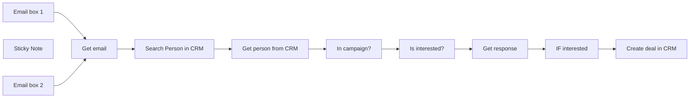

## Fluxo (.json) :

```json
{
  "meta": {
    "instanceId": "0bd9e607aabfd58640f9f5a370e768a7755e93315179f5bcc6d1f8f114b3567a"
  },
  "nodes": [
    {
      "id": "97b36168-7fa8-4a97-a6cc-c42496918c4c",
      "name": "Search Person in CRM",
      "type": "n8n-nodes-base.pipedrive",
      "position": [
        -880,
        400
      ],
      "parameters": {
        "term": "={{ $json.from.value[0].address }}",
        "limit": 1,
        "resource": "person",
        "operation": "search",
        "additionalFields": {
          "includeFields": ""
        }
      },
      "credentials": {
        "pipedriveApi": {
          "id": "MdJQDtRDHnpwuVYP",
          "name": "Pipedrive LinkedUp"
        }
      },
      "typeVersion": 1
    },
    {
      "id": "2a17582b-9375-4a01-87d9-a50f573b83db",
      "name": "In campaign?",
      "type": "n8n-nodes-base.if",
      "position": [
        -420,
        400
      ],
      "parameters": {
        "conditions": {
          "string": [
            {
              "value1": "={{ $json.in_campaign }}",
              "value2": "True"
            }
          ]
        }
      },
      "typeVersion": 1
    },
    {
      "id": "2a8d509f-8ac2-4f45-a905-f34552833381",
      "name": "Get person from CRM",
      "type": "n8n-nodes-base.pipedrive",
      "position": [
        -640,
        400
      ],
      "parameters": {
        "personId": "={{ $json.id }}",
        "resource": "person",
        "operation": "get",
        "resolveProperties": true
      },
      "credentials": {
        "pipedriveApi": {
          "id": "MdJQDtRDHnpwuVYP",
          "name": "Pipedrive LinkedUp"
        }
      },
      "typeVersion": 1
    },
    {
      "id": "b9c6f3d3-1a6d-4144-8e77-3a3c6e5282d8",
      "name": "Is interested?",
      "type": "n8n-nodes-base.openAi",
      "position": [
        -180,
        380
      ],
      "parameters": {
        "model": "gpt-4",
        "prompt": {
          "messages": [
            {
              "content": "=You are the best sales development representative in the world. You send cold email messages daily to CEOs and founders of companies. You do this to persuade them to make contact. This could be a phone call or a video meeting. \n\nYour task is to assess whether someone is interested in meeting up or calling sometime. You do this by attentively evaluating their response.\n\nThis is the email:\n{{ $('Get email').item.json.text }}\n\nThe response format should be:\n{\"interested\": [yes/no],\n\"reason\": reason\n}\n\nJSON:"
            }
          ]
        },
        "options": {},
        "resource": "chat"
      },
      "credentials": {
        "openAiApi": {
          "id": "qPBzqgpCRxncJ90K",
          "name": "OpenAi account 2"
        }
      },
      "typeVersion": 1
    },
    {
      "id": "f1eb438d-f002-4082-8481-51565df13f5c",
      "name": "Get email",
      "type": "n8n-nodes-base.set",
      "position": [
        -1100,
        400
      ],
      "parameters": {
        "fields": {
          "values": [
            {
              "name": "email",
              "stringValue": "={{ $json.text }}"
            }
          ]
        },
        "options": {}
      },
      "typeVersion": 3.2
    },
    {
      "id": "78461c36-ba54-4f0f-a38e-183bfafa576c",
      "name": "Create deal in CRM",
      "type": "n8n-nodes-base.pipedrive",
      "position": [
        460,
        360
      ],
      "parameters": {
        "title": "={{ $('Get person from CRM').item.json.Name }} Deal",
        "additionalFields": {}
      },
      "credentials": {
        "pipedriveApi": {
          "id": "MdJQDtRDHnpwuVYP",
          "name": "Pipedrive LinkedUp"
        }
      },
      "typeVersion": 1
    },
    {
      "id": "efe07661-9afc-4184-b558-e1f547b6721f",
      "name": "IF interested",
      "type": "n8n-nodes-base.if",
      "position": [
        240,
        380
      ],
      "parameters": {
        "conditions": {
          "string": [
            {
              "value1": "={{ $json.interested }}",
              "value2": "yes"
            }
          ]
        }
      },
      "typeVersion": 1
    },
    {
      "id": "7c2b7b59-9d68-4d8c-9b9f-a36ea47526c9",
      "name": "Get response",
      "type": "n8n-nodes-base.code",
      "position": [
        20,
        380
      ],
      "parameters": {
        "mode": "runOnceForEachItem",
        "jsCode": "let interested = JSON.parse($json[\"message\"][\"content\"]).interested\nlet reason = JSON.parse($json[\"message\"][\"content\"]).reason\n\nreturn {json:{\n interested: interested,\n reason: reason\n}}"
      },
      "typeVersion": 1
    },
    {
      "id": "53f51f8c-5995-4bcd-a038-3018834942e6",
      "name": "Email box 1",
      "type": "n8n-nodes-base.gmailTrigger",
      "position": [
        -1300,
        400
      ],
      "parameters": {
        "simple": false,
        "filters": {
          "labelIds": []
        },
        "options": {},
        "pollTimes": {
          "item": [
            {
              "mode": "everyMinute"
            }
          ]
        }
      },
      "typeVersion": 1
    },
    {
      "id": "bb1254ec-676a-4edc-bf4a-a1c66bac78bb",
      "name": "Sticky Note",
      "type": "n8n-nodes-base.stickyNote",
      "position": [
        -1880,
        360
      ],
      "parameters": {
        "width": 452.37174177689576,
        "height": 462.1804790107177,
        "content": "## About the workflow\nThe workflow reads every reply that is received from a cold email campaign and qualifies if the lead is interested in a meeting. If the lead is interested, a deal is made in pipedrive. You can add as many email inboxes as you need!\n\n## Setup:\n- Add credentials to the Gmail, OpenAI and Pipedrive Nodes.\n- Add a in_campaign field in Pipedrive for persons. In Pipedrive click on your credentials at the top right, go to company settings > Data fields > Person and click on add custom field. Single option [TRUE/FALSE].\n- If you have only one email inbox, you can delete one of the Gmail nodes.\n- If you have more than two email inboxes, you can duplicate a Gmail node as many times as you like. Just connect it to the Get email node, and you are good to go!\n- In the Gmail inbox nodes, select Inbox under label names and uncheck Simplify."
      },
      "typeVersion": 1
    },
    {
      "id": "c1aaee97-11f4-4e9d-9a71-90ca3f5773a9",
      "name": "Email box 2",
      "type": "n8n-nodes-base.gmailTrigger",
      "position": [
        -1300,
        600
      ],
      "parameters": {
        "simple": false,
        "filters": {
          "labelIds": []
        },
        "options": {},
        "pollTimes": {
          "item": [
            {
              "mode": "everyMinute"
            }
          ]
        }
      },
      "typeVersion": 1
    }
  ],
  "pinData": {},
  "connections": {
    "Get email": {
      "main": [
        [
          {
            "node": "Search Person in CRM",
            "type": "main",
            "index": 0
          }
        ]
      ]
    },
    "Email box 1": {
      "main": [
        [
          {
            "node": "Get email",
            "type": "main",
            "index": 0
          }
        ]
      ]
    },
    "Email box 2": {
      "main": [
        [
          {
            "node": "Get email",
            "type": "main",
            "index": 0
          }
        ]
      ]
    },
    "Get response": {
      "main": [
        [
          {
            "node": "IF interested",
            "type": "main",
            "index": 0
          }
        ]
      ]
    },
    "In campaign?": {
      "main": [
        [
          {
            "node": "Is interested?",
            "type": "main",
            "index": 0
          }
        ]
      ]
    },
    "IF interested": {
      "main": [
        [
          {
            "node": "Create deal in CRM",
            "type": "main",
            "index": 0
          }
        ]
      ]
    },
    "Is interested?": {
      "main": [
        [
          {
            "node": "Get response",
            "type": "main",
            "index": 0
          }
        ]
      ]
    },
    "Get person from CRM": {
      "main": [
        [
          {
            "node": "In campaign?",
            "type": "main",
            "index": 0
          }
        ]
      ]
    },
    "Search Person in CRM": {
      "main": [
        [
          {
            "node": "Get person from CRM",
            "type": "main",
            "index": 0
          }
        ]
      ]
    }
  }
}
```

<a id="template-992"></a>

## Template 992 - Busca em KB Confluence

- **Nome:** Busca em KB Confluence
- **Descrição:** Fluxo que recebe uma consulta do fluxo principal, transforma a query para busca otimizada, pesquisa no Confluence e retorna título, link e trecho do conteúdo encontrado ao fluxo pai.
- **Funcionalidade:** • Receber consulta do fluxo pai: Aceita a mensagem de usuário encaminhada pelo fluxo principal.
• Refinamento de consulta com IA: Utiliza um modelo de linguagem para transformar a mensagem em termos de busca mais eficazes.
• Consulta na base de conhecimento: Executa uma pesquisa na API do Confluence usando a query refinada.
• Montar resposta resumida: Extrai título, link e trecho (excerpt) do resultado mais relevante.
• Retornar resultado ao fluxo pai: Envia o título, link e conteúdo truncado para uso na resposta final ao usuário.
• Instrução de segurança para senhas: Inclui orientação para, quando o usuário solicitar senha, fornecer o link para redefinição em formato markdown.
- **Ferramentas:** • Confluence: Plataforma de base de conhecimento onde são realizadas as buscas via API.
• OpenAI (GPT-4 ou similar): Modelo de linguagem usado para refinar a query do usuário para melhorar a busca.
• Slack: Canal de origem das consultas (mensagens de usuários) que chegam ao fluxo pai.


## Fluxo visual

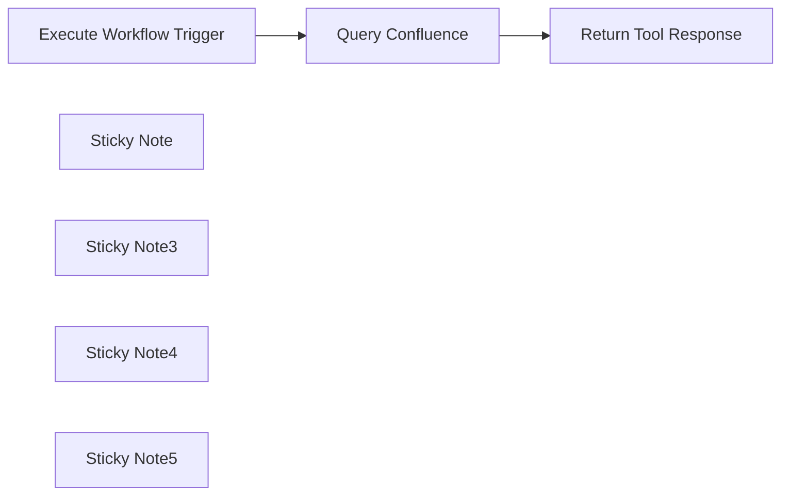

## Fluxo (.json) :

```json
{
  "meta": {
    "instanceId": "cb484ba7b742928a2048bf8829668bed5b5ad9787579adea888f05980292a4a7"
  },
  "nodes": [
    {
      "id": "f1142274-898d-43da-a7ff-2b2e03f2dc73",
      "name": "Execute Workflow Trigger",
      "type": "n8n-nodes-base.executeWorkflowTrigger",
      "position": [
        1220,
        840
      ],
      "parameters": {},
      "typeVersion": 1
    },
    {
      "id": "1f407421-2dd6-4e0c-bc74-cfb291e475ed",
      "name": "Query Confluence",
      "type": "n8n-nodes-base.httpRequest",
      "position": [
        1640,
        840
      ],
      "parameters": {
        "url": "https://n8n-labs.atlassian.net/wiki/rest/api/search",
        "options": {},
        "sendQuery": true,
        "sendHeaders": true,
        "authentication": "genericCredentialType",
        "genericAuthType": "httpBasicAuth",
        "queryParameters": {
          "parameters": [
            {
              "name": "cql",
              "value": "=text ~ \"{{ $json.query }}\""
            }
          ]
        },
        "headerParameters": {
          "parameters": [
            {
              "name": "accept",
              "value": "application/json"
            }
          ]
        }
      },
      "credentials": {
        "httpBasicAuth": {
          "id": "B1Cj4Uh9d9WKWxBO",
          "name": "Confluence API Key"
        }
      },
      "typeVersion": 4.2
    },
    {
      "id": "f1ab7e79-6bd8-4b87-b6dc-96f9d46cdd16",
      "name": "Return Tool Response",
      "type": "n8n-nodes-base.set",
      "position": [
        2040,
        840
      ],
      "parameters": {
        "options": {},
        "assignments": {
          "assignments": [
            {
              "id": "c1d46e59-9340-43f3-bc2a-fbd4e0def74f",
              "name": "response",
              "type": "string",
              "value": "=\"Title\": \"{{ $json.results[0].content.title }}\"\n\"Link\": \"{{ $json._links.base }}{{ $json.results[0].content._links.webui }}\"\n\"Content\": {{ $json[\"results\"][0][\"excerpt\"] }}\nWhen users request the password, make sure to send them the link above to reset it in markdown. "
            }
          ]
        }
      },
      "typeVersion": 3.3
    },
    {
      "id": "19be50a2-4835-48a6-b06a-7996231c519d",
      "name": "Sticky Note",
      "type": "n8n-nodes-base.stickyNote",
      "position": [
        1037.1879432624112,
        466.2978723404259
      ],
      "parameters": {
        "color": 7,
        "width": 460.26595744680884,
        "height": 598.588007755415,
        "content": "\n## Receive Query from Parent Workflow\nThis node receives input from the AI Agent in the top level workflow where it passes just the Slack Message directly to this workflow."
      },
      "typeVersion": 1
    },
    {
      "id": "0012feaa-89f5-40a4-86d6-98e0e9648bd5",
      "name": "Sticky Note3",
      "type": "n8n-nodes-base.stickyNote",
      "position": [
        1520,
        469.2511978555872
      ],
      "parameters": {
        "color": 7,
        "width": 350.94680851063845,
        "height": 588.3931371954408,
        "content": "\n## Search Confluence\nThe newly created prompt is then sent into Confluence's API as a search string. \n\nTo replace this with your own KB tool, find the Endpoint that allows search, and replace this HTTP Request node with your own HTTP Request or Built in n8n node and pass the search variable into the search input. "
      },
      "typeVersion": 1
    },
    {
      "id": "6982692e-61c5-47fc-9946-ada32d5fa2a1",
      "name": "Sticky Note4",
      "type": "n8n-nodes-base.stickyNote",
      "position": [
        1900,
        460
      ],
      "parameters": {
        "color": 7,
        "width": 648.2749545725208,
        "height": 597.2865893156994,
        "content": "\n## Respond to Parent Workflow with Confluence Results\nThe final output is then sent to the Parent workflow to be used in the final AI Agent API call to the LLM of your choice as part of the final output. Here is the prompt output: \n```\n\"Title\": \"Title of content so AI Agent will know the name of the content\"\n\"Link\": \"Link to URL of KB article. Great for giving back to user to self help\"\n\"Content\": Truncated output of content so that the large language model will have more context in it's final response. \nWhen users request the password, make sure to send them the link above to reset it in markdown. \n```"
      },
      "typeVersion": 1
    },
    {
      "id": "9570ee97-8508-4c7f-a2da-a327fbc7db46",
      "name": "Sticky Note5",
      "type": "n8n-nodes-base.stickyNote",
      "position": [
        460,
        460
      ],
      "parameters": {
        "width": 543.0233137166141,
        "height": 854.6009864319319,
        "content": "\n## Enhance Query Resolution with the Knowledge Base Tool!\n\nOur **Knowledge Base Tool** is crafted to seamlessly integrate into the IT Department Q&A Workflow, enhancing the IT support process by enabling sophisticated search and response capabilities via Slack.\n\n**Workflow Functionality:**\n- **Receive Queries**: Directly accepts user queries from the main workflow, initiating a dynamic search process.\n- **AI-Powered Query Transformation**: Utilizes OpenAI's GPT-4 to refine user queries into searchable keywords that are most likely to retrieve relevant information from the Knowledge Base.\n- **Confluence Integration**: Executes searches within Confluence using the refined keywords to find the most applicable articles and information.\n- **Deliver Accurate Responses**: Gathers essential details from the Confluence results, including article titles, links, and summaries, preparing them to be sent back to the parent workflow for final user response.\n\n\n**Quick Setup Guide:**\n- Ensure correct configurations are set for OpenAI and Confluence API integrations.\n- Customize query transformation logic as per your specific Knowledge Base structure to improve search accuracy.\n\n\n**Need Help?**\n- Dive into our [Documentation](https://docs.n8n.io) or get support from the [Community Forum](https://community.n8n.io)!\n\n\nDeploy this tool to provide precise and informative responses, significantly boosting the efficiency and reliability of your IT support workflow.\n"
      },
      "typeVersion": 1
    }
  ],
  "pinData": {},
  "connections": {
    "Query Confluence": {
      "main": [
        [
          {
            "node": "Return Tool Response",
            "type": "main",
            "index": 0
          }
        ]
      ]
    },
    "Execute Workflow Trigger": {
      "main": [
        [
          {
            "node": "Query Confluence",
            "type": "main",
            "index": 0
          }
        ]
      ]
    }
  }
}
```

<a id="template-993"></a>

## Template 993 - Automação de criação e publicação de artigos com IA

- **Nome:** Automação de criação e publicação de artigos com IA
- **Descrição:** Automatiza a pesquisa, geração, publicação e registro de artigos de blog otimizados para SEO a partir de uma consulta do usuário, com notificações por e-mail e Slack.
- **Funcionalidade:** • Início por formulário ou chat: Recebe o tema ou pergunta do usuário para iniciar o fluxo.
• Pesquisa em fontes atuais: Consulta a API de pesquisa para obter conteúdo e fontes recentes sobre o tema.
• Formatação de resultados de pesquisa: Consolida o texto de pesquisa e vincula citações às fontes correspondentes.
• Geração de conteúdo SEO otimizado: Usa um modelo de linguagem para criar um artigo curto (máx. 20 linhas) com título H1, subtítulos H2, palavras-chave e CTA quando aplicável.
• Publicação automática: Publica o artigo no blog como post publicado (status: publish).
• Notificação por e-mail: Envia um e-mail com título e link do artigo ao destinatário configurado.
• Notificação em Slack: Recupera ferramentas disponíveis e publica uma notificação no canal Slack com título e link.
• Registro no Notion: Recupera ferramentas disponíveis e insere uma entrada no banco de dados Notion com título, conteúdo, URL e status.
• Variáveis configuráveis: Permite definir e editar e-mail destinatário, ID do canal Slack e ID do banco de dados Notion antes da execução.
• Execução sequencial com verificação: Garante que cada etapa seja concluída com sucesso antes de prosseguir para a próxima.
- **Ferramentas:** • Perplexity: Serviço de pesquisa e sumarização de conteúdo atual para obter fontes e contexto.
• OpenAI (GPT-4o / gpt-4o-mini): Modelo de linguagem usado para gerar o conteúdo SEO do artigo.
• WordPress: Plataforma usada para publicar o artigo no blog via API.
• Gmail: Serviço de envio de e-mails para notificar o destinatário com título e link do artigo.
• Slack: Plataforma de mensagens usada para publicar notificações no canal especificado.
• Notion: Banco de dados onde o artigo e metadados são registrados como entrada.
• Servidores/serviços de integração MCP (Slack/Notion): componentes de integração que permitem executar operações em Slack e Notion a partir do fluxo.


## Fluxo visual

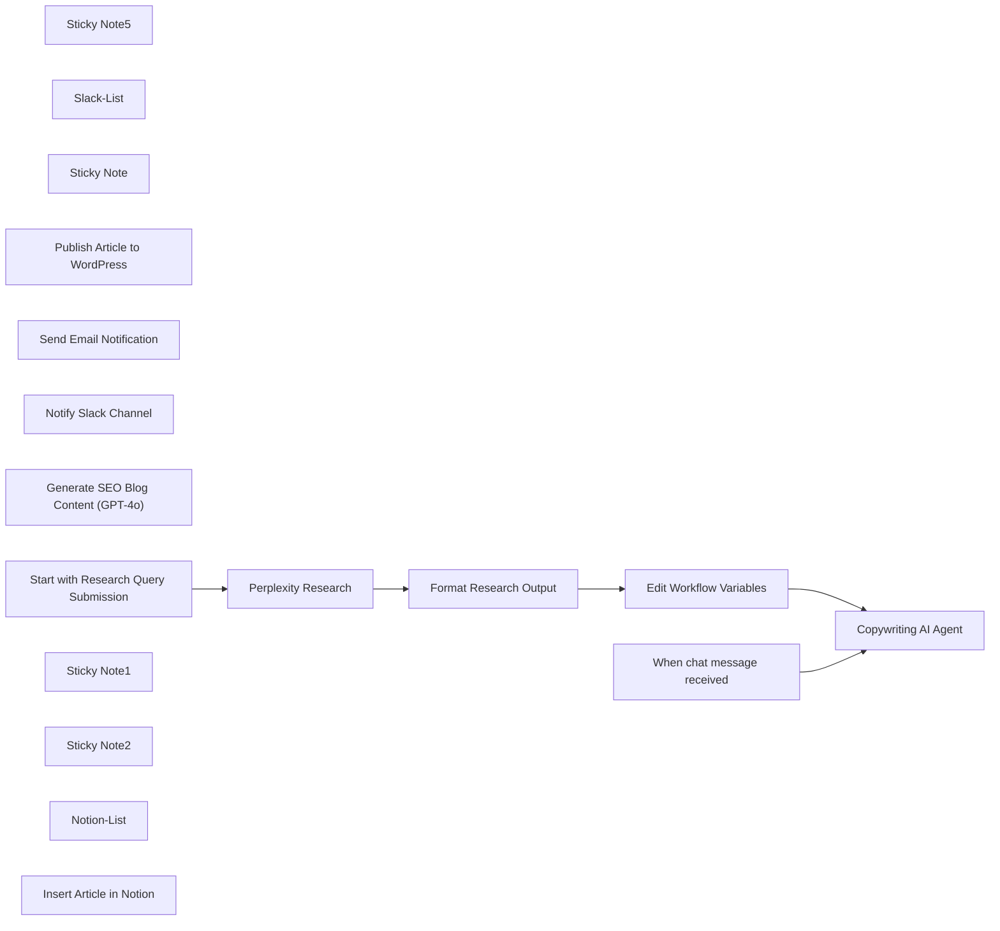

## Fluxo (.json) :

```json
{
  "id": "L1UcBZ9UJvN9gnSb",
  "meta": {
    "instanceId": "a2b23892dd6989fda7c1209b381f5850373a7d2b85609624d7c2b7a092671d44",
    "templateCredsSetupCompleted": true
  },
  "name": "💥🛠️Automate Blog Content Creation with GPT-4, Perplexity & WordPress",
  "tags": [],
  "nodes": [
    {
      "id": "b86a4b08-6fb6-4ebc-8ddb-f1cd0e4b1492",
      "name": "Sticky Note5",
      "type": "n8n-nodes-base.stickyNote",
      "position": [
        0,
        0
      ],
      "parameters": {
        "color": 4,
        "width": 460,
        "height": 300,
        "content": "## Perplexity Section\n🌐 Calls Perplexity API to get fresh research based on a form input.\n\n\n"
      },
      "typeVersion": 1
    },
    {
      "id": "16509f9d-ce54-4dab-b3ff-24760b0bde09",
      "name": "Perplexity Research",
      "type": "n8n-nodes-base.httpRequest",
      "position": [
        80,
        100
      ],
      "parameters": {
        "url": "https://api.perplexity.ai/chat/completions",
        "method": "POST",
        "options": {},
        "jsonBody": "={\n  \"model\": \"sonar-pro\",\n  \"messages\": [\n    {\n      \"role\": \"system\",\n      \"content\": \"Act as a professional news researcher who is capable of finding detailed summaries about a news topic from highly reputable sources.\"\n    },\n    {\n      \"role\": \"user\",\n      \"content\": \" Research the following topic and return everything you can find about: '{{ $json['Topic or Question'] }}'.\"\n    }\n  ]\n}\n",
        "sendBody": true,
        "specifyBody": "json",
        "authentication": "genericCredentialType",
        "genericAuthType": "httpHeaderAuth"
      },
      "credentials": {
        "httpHeaderAuth": {
          "id": "DB99xYLrmwZl7Sqf",
          "name": "Header Auth account"
        }
      },
      "typeVersion": 4.2
    },
    {
      "id": "500b2464-88b1-44f5-bcc4-12c0acdc5773",
      "name": "When chat message received",
      "type": "@n8n/n8n-nodes-langchain.chatTrigger",
      "position": [
        560,
        0
      ],
      "webhookId": "b132ff74-2807-4cbf-b5b7-a62a207161d3",
      "parameters": {
        "options": {}
      },
      "typeVersion": 1.1
    },
    {
      "id": "aec9523b-245a-48ff-a860-3239b869f676",
      "name": "Slack-List",
      "type": "n8n-nodes-mcp.mcpClientTool",
      "position": [
        1500,
        400
      ],
      "parameters": {},
      "credentials": {
        "mcpClientApi": {
          "id": "mC6b1h1p0lFikSzU",
          "name": "slack"
        }
      },
      "typeVersion": 1
    },
    {
      "id": "1ecdcfed-c5d4-4ddc-aeb1-e760d295e5bc",
      "name": "Copywriting AI Agent",
      "type": "@n8n/n8n-nodes-langchain.agent",
      "position": [
        1020,
        100
      ],
      "parameters": {
        "text": "=You are an expert in SEO content writing.\n\nYour mission is to create, publish, and notify about a search engine optimized article for a blog focused on artificial intelligence. Follow the steps below: {{ $('Format Research Output').item.json.research }}\n\n1. **Write an SEO-optimized article with a maximum of 20 lines** based on the provided information:\n   - Structure the article with a catchy **H1 title**, one or two **H2 subtitles**, and a professional yet accessible tone.\n   - Extract and include relevant keywords from the data.\n   - Optimize for readability: short sentences, clear paragraphs, and a CTA if relevant.\n   - Do not exceed 20 lines of content.\n\n2. **Publish the article on WordPress**, including:\n   - The **title** as the article's headline\n   - The **SEO content** as the body\n\n3. **Send an email** to my address : {{ $json.emailAddress }} containing:\n   - The article's title\n   - The **URL** of the published article on WordPress\n\n4. **Retrieve the list of available Slack tools first** using “Slack Tools”.\n   - Then, send a notification on Slack that the article has been published, including:\n     - The article title\n     - The article link\n     - Slack channel ID: {{ $json.slackChannelId }}\n\n5. **Retrieve the list of available Notion tools first** using “Notion Tools”.\n   Then, **add a new entry to my Notion database** (ID: {{ $json.notionDatabaseId }}) with the following fields:\n   - The 'Name' column is of type 'title'  → {{ $('Start with Research Query Submission').item.json['Topic or Question'] }}\n   The 'Subject' column is of type 'rich_text' → [the article's headline]\n   - The 'Content'column is of type 'rich_text' → [The SEO content]\n   - The 'URL' column is of type 'URL': → [The article link]\n   - The 'Status' column is of type 'select' → Select: `publish`\n\nImportant: Ensure that each step is successfully completed **before proceeding to the next**.\n",
        "options": {},
        "promptType": "define"
      },
      "typeVersion": 1.7
    },
    {
      "id": "aaab95dd-7fd2-411e-ba05-fa84568c0d56",
      "name": "Sticky Note",
      "type": "n8n-nodes-base.stickyNote",
      "position": [
        480,
        -180
      ],
      "parameters": {
        "width": 1300,
        "height": 820,
        "content": "## My Copywriting AI Agent\n✍️ Transforms live research into SEO-optimized blog articles using GPT-4, then automatically publishes to WordPress, sends notifications via Gmail & Slack, and logs everything to Notion. This is your full-stack content assistant — from prompt to post, hands-free.\n**mcp-notion-server** : [Guide](https://github.com/suekou/mcp-notion-server)\n**mcp-slack-server** : [Guide](https://github.com/modelcontextprotocol/servers/tree/main/src/slack)"
      },
      "typeVersion": 1
    },
    {
      "id": "d3cbf58c-7c14-4695-8331-1750daf21d0d",
      "name": "Format Research Output",
      "type": "n8n-nodes-base.set",
      "position": [
        280,
        100
      ],
      "parameters": {
        "options": {},
        "assignments": {
          "assignments": [
            {
              "id": "23b8e8c4-9191-415a-9661-1b60d413528a",
              "name": "research",
              "type": "string",
              "value": "={{ $json.choices[0].message.content.replaceAll(\"[1]\", \" - source: \" +$json.citations[0]).replaceAll(\"[2]\",\" - source:\" +$json.citations[1]).replaceAll(\"[3]\",\" - source: \" +$json.citations[2]).replaceAll(\"[4]\",\" - source: \"+$json.citations[3]).replaceAll(\"[5]\",\" - source: \"+$json.citations[4]).replaceAll(\"[6]\",\" - source: \"+$json.citations[5]).replaceAll(\"[7]\",\" - source: \"+$json.citations[6]).replaceAll(\"[8]\",\" - source: \"+$json.citations[7]).replaceAll(\"[9]\",\" - source: \"+$json.citations[8]).replaceAll(\"[10]\",\" - source: \"+$json.citations[9]) }}"
            }
          ]
        }
      },
      "typeVersion": 3.4
    },
    {
      "id": "cd073bb3-3b6a-4910-9de4-bef66fc00a1f",
      "name": "Publish Article to WordPress",
      "type": "n8n-nodes-base.wordpressTool",
      "position": [
        840,
        400
      ],
      "parameters": {
        "title": "={{ /*n8n-auto-generated-fromAI-override*/ $fromAI('Title', ``, 'string') }}",
        "additionalFields": {
          "status": "publish",
          "content": "={{ /*n8n-auto-generated-fromAI-override*/ $fromAI('Content', ``, 'string') }}"
        }
      },
      "credentials": {
        "wordpressApi": {
          "id": "KIuXvzjOEnOsHKQE",
          "name": "Wordpress account"
        }
      },
      "typeVersion": 1
    },
    {
      "id": "6940575a-d504-4276-8964-c41f26418f3c",
      "name": "Send Email Notification",
      "type": "n8n-nodes-base.gmailTool",
      "position": [
        1360,
        400
      ],
      "webhookId": "b68c6af8-46e6-4ed9-ae72-445e9cb7ab88",
      "parameters": {
        "sendTo": "={{ /*n8n-auto-generated-fromAI-override*/ $fromAI('To', ``, 'string') }}",
        "message": "={{ /*n8n-auto-generated-fromAI-override*/ $fromAI('Message', ``, 'string') }}",
        "options": {},
        "subject": "={{ /*n8n-auto-generated-fromAI-override*/ $fromAI('Subject', ``, 'string') }}"
      },
      "credentials": {
        "gmailOAuth2": {
          "id": "rKxQHWZ2F5XLJmwF",
          "name": "Gmail account"
        }
      },
      "typeVersion": 2.1
    },
    {
      "id": "da3c994c-60d5-41ef-9cf9-52daa77dc980",
      "name": "Notify Slack Channel",
      "type": "n8n-nodes-mcp.mcpClientTool",
      "position": [
        1640,
        400
      ],
      "parameters": {
        "toolName": "={{ $fromAI(\"tool\", \"the tool selected\")  }}",
        "operation": "executeTool",
        "toolParameters": "={{ $fromAI('Tool_Parameters', ``, 'json') }}"
      },
      "credentials": {
        "mcpClientApi": {
          "id": "mC6b1h1p0lFikSzU",
          "name": "slack"
        }
      },
      "typeVersion": 1
    },
    {
      "id": "9d36b649-f5e6-442c-bcab-53f0ca0dc2c2",
      "name": "Generate SEO Blog Content (GPT-4o)",
      "type": "@n8n/n8n-nodes-langchain.lmChatOpenAi",
      "position": [
        600,
        400
      ],
      "parameters": {
        "model": {
          "__rl": true,
          "mode": "list",
          "value": "gpt-4o-mini",
          "cachedResultName": "gpt-4o-mini"
        },
        "options": {}
      },
      "credentials": {
        "openAiApi": {
          "id": "6h3DfVhNPw9I25nO",
          "name": "OpenAi account"
        }
      },
      "typeVersion": 1.2
    },
    {
      "id": "7a034005-68a3-40fa-bb94-cfdfab717cfc",
      "name": "Start with Research Query Submission",
      "type": "n8n-nodes-base.formTrigger",
      "position": [
        -180,
        100
      ],
      "webhookId": "a29cbcd3-9d11-4f7c-9aad-14681c356c53",
      "parameters": {
        "options": {},
        "formTitle": "AutoBlog Creator",
        "formFields": {
          "values": [
            {
              "fieldType": "textarea",
              "fieldLabel": "Topic or Question",
              "placeholder": "=How is GPT-4 transforming content creation in 2025?",
              "requiredField": true
            }
          ]
        },
        "formDescription": "From research to article — no writing required"
      },
      "typeVersion": 2.2
    },
    {
      "id": "8cbad4aa-1802-4275-bbc4-c4d17673cd23",
      "name": "Sticky Note1",
      "type": "n8n-nodes-base.stickyNote",
      "position": [
        0,
        -180
      ],
      "parameters": {
        "color": 3,
        "width": 460,
        "height": 140,
        "content": "## Intro Sticky \n🔁 **This workflow automates the full cycle of SEO blog content creation** — from live topic research using Perplexity to blog publishing on WordPress, Slack/Gmail notifications, and Notion logging."
      },
      "typeVersion": 1
    },
    {
      "id": "93e258e4-baa2-4af2-ba12-0f1727150e19",
      "name": "Edit Workflow Variables",
      "type": "n8n-nodes-base.set",
      "position": [
        120,
        460
      ],
      "parameters": {
        "options": {},
        "assignments": {
          "assignments": [
            {
              "id": "c06b2d24-1fd7-40f0-aee5-b5d6553e289e",
              "name": "emailAddress",
              "type": "string",
              "value": ""
            },
            {
              "id": "451aad67-5190-4eab-a982-56092734bb07",
              "name": "slackChannelId",
              "type": "string",
              "value": ""
            },
            {
              "id": "8a294900-f367-47a2-b260-344b133dc2ff",
              "name": "notionDatabaseId",
              "type": "string",
              "value": ""
            }
          ]
        }
      },
      "typeVersion": 3.4,
      "alwaysOutputData": true
    },
    {
      "id": "88cb2c49-be54-4df9-81ff-d709bde839e1",
      "name": "Sticky Note2",
      "type": "n8n-nodes-base.stickyNote",
      "position": [
        0,
        340
      ],
      "parameters": {
        "color": 6,
        "width": 460,
        "height": 300,
        "content": "## Workflow Configuration Panel\n🛠️ **Set your variables here** (email, Slack, Notion, OpenAI model)"
      },
      "typeVersion": 1
    },
    {
      "id": "5075e00d-f1e9-4db2-85c1-d4d851f57abf",
      "name": "Notion-List",
      "type": "n8n-nodes-mcp.mcpClientTool",
      "position": [
        1000,
        400
      ],
      "parameters": {},
      "credentials": {
        "mcpClientApi": {
          "id": "QQbMEB7i2XAAWTSc",
          "name": "Notion"
        }
      },
      "typeVersion": 1
    },
    {
      "id": "edf2d95b-b04d-40f9-9b8d-b53dd5912bab",
      "name": "Insert Article in Notion",
      "type": "n8n-nodes-mcp.mcpClientTool",
      "position": [
        1180,
        400
      ],
      "parameters": {
        "toolName": "={{ $fromAI(\"tool\", \"the tool selected\")  }}",
        "operation": "executeTool",
        "toolParameters": "={{ $fromAI('tool_parameters', ``, 'json') }}"
      },
      "credentials": {
        "mcpClientApi": {
          "id": "QQbMEB7i2XAAWTSc",
          "name": "Notion"
        }
      },
      "typeVersion": 1
    }
  ],
  "active": true,
  "pinData": {},
  "settings": {
    "executionOrder": "v1"
  },
  "versionId": "553f26d7-2dcf-4900-871e-b3aa25a68ffa",
  "connections": {
    "Slack-List": {
      "ai_tool": [
        [
          {
            "node": "Copywriting AI Agent",
            "type": "ai_tool",
            "index": 0
          }
        ]
      ]
    },
    "Notion-List": {
      "ai_tool": [
        [
          {
            "node": "Copywriting AI Agent",
            "type": "ai_tool",
            "index": 0
          }
        ]
      ]
    },
    "Perplexity Research": {
      "main": [
        [
          {
            "node": "Format Research Output",
            "type": "main",
            "index": 0
          }
        ]
      ]
    },
    "Notify Slack Channel": {
      "ai_tool": [
        [
          {
            "node": "Copywriting AI Agent",
            "type": "ai_tool",
            "index": 0
          }
        ]
      ]
    },
    "Format Research Output": {
      "main": [
        [
          {
            "node": "Edit Workflow Variables",
            "type": "main",
            "index": 0
          }
        ]
      ]
    },
    "Edit Workflow Variables": {
      "main": [
        [
          {
            "node": "Copywriting AI Agent",
            "type": "main",
            "index": 0
          }
        ]
      ]
    },
    "Send Email Notification": {
      "ai_tool": [
        [
          {
            "node": "Copywriting AI Agent",
            "type": "ai_tool",
            "index": 0
          }
        ]
      ]
    },
    "Insert Article in Notion": {
      "ai_tool": [
        [
          {
            "node": "Copywriting AI Agent",
            "type": "ai_tool",
            "index": 0
          }
        ]
      ]
    },
    "When chat message received": {
      "main": [
        [
          {
            "node": "Copywriting AI Agent",
            "type": "main",
            "index": 0
          }
        ]
      ]
    },
    "Publish Article to WordPress": {
      "ai_tool": [
        [
          {
            "node": "Copywriting AI Agent",
            "type": "ai_tool",
            "index": 0
          }
        ]
      ]
    },
    "Generate SEO Blog Content (GPT-4o)": {
      "ai_languageModel": [
        [
          {
            "node": "Copywriting AI Agent",
            "type": "ai_languageModel",
            "index": 0
          }
        ]
      ]
    },
    "Start with Research Query Submission": {
      "main": [
        [
          {
            "node": "Perplexity Research",
            "type": "main",
            "index": 0
          }
        ]
      ]
    }
  }
}
```

<a id="template-994"></a>

## Template 994 - Detecção de phishing e reporte automático via Jira

- **Nome:** Detecção de phishing e reporte automático via Jira
- **Descrição:** Fluxo que captura e analisa e-mails, obtém cabeçalhos, gera uma visualização do e-mail, utiliza IA para avaliação de phishing e cria um ticket no Jira com o relatório e o anexo correspondente.
- **Funcionalidade:** • Detecção de novos e-mails: Inicia o fluxo quando chega uma nova mensagem no Gmail, com verificação a cada minuto.
• Extração de dados do e-mail: Extrai assunto, destinatário e corpo, preparando informações para uso nas etapas subsequentes.
• Padronização de cabeçalhos: Converte os cabeçalhos de mensagem em um formato legível para análise.
• Geração de visualização do e-mail: Envia o HTML para gerar uma captura de tela do layout do e-mail.
• Análise de phishing com IA: Usa IA para avaliar a imagem e os cabeçalhos e produzir uma análise pronta para registro.
• Criação de ticket no Jira com detalhes: Cria um ticket contendo assunto, destinatário, corpo e a análise de IA.
• Anexar captura ao ticket: Renomeia a captura e a adiciona como anexo ao ticket.
- **Ferramentas:** • Gmail: Serviço de recebimento de emails.
• Microsoft Outlook/Graph API: Serviço de leitura de mensagens e cabeçalhos para extração de informações.
• hcti.io: Serviço para gerar screenshots de HTML de e-mails.
• OpenAI (ChatGPT): Serviço de análise de phishing e geração de relatório.
• Jira Cloud: Serviço de criação de tickets e anexos de evidências.


## Fluxo visual

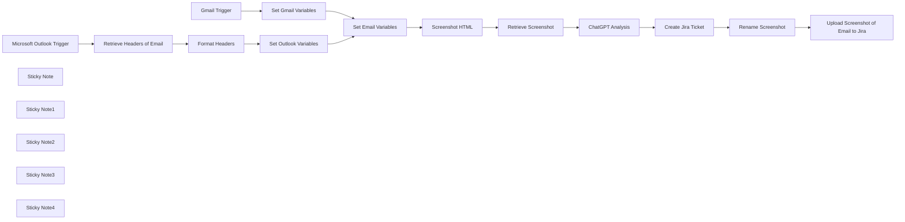

## Fluxo (.json) :

```json
{
  "meta": {
    "instanceId": "03e9d14e9196363fe7191ce21dc0bb17387a6e755dcc9acc4f5904752919dca8"
  },
  "nodes": [
    {
      "id": "1bad6bfc-9ec9-48a5-b8f7-73c4de3d08cf",
      "name": "Gmail Trigger",
      "type": "n8n-nodes-base.gmailTrigger",
      "position": [
        1480,
        160
      ],
      "parameters": {
        "simple": false,
        "filters": {},
        "options": {},
        "pollTimes": {
          "item": [
            {
              "mode": "everyMinute"
            }
          ]
        }
      },
      "credentials": {
        "gmailOAuth2": {
          "id": "kkhNhqKpZt6IUZd0",
          "name": " Gmail"
        }
      },
      "typeVersion": 1.2
    },
    {
      "id": "9ac747a1-4fd8-46ba-b4c1-75fd17aab2ed",
      "name": "Microsoft Outlook Trigger",
      "type": "n8n-nodes-base.microsoftOutlookTrigger",
      "disabled": true,
      "position": [
        1480,
        720
      ],
      "parameters": {
        "fields": [
          "body",
          "toRecipients",
          "subject",
          "bodyPreview"
        ],
        "output": "fields",
        "filters": {},
        "options": {},
        "pollTimes": {
          "item": [
            {
              "mode": "everyMinute"
            }
          ]
        }
      },
      "credentials": {
        "microsoftOutlookOAuth2Api": {
          "id": "vTCK0oVQ0WjFrI5H",
          "name": " Outlook Credential"
        }
      },
      "typeVersion": 1
    },
    {
      "id": "5bf9b0e8-b84e-44a2-aad2-45dde3e4ab1b",
      "name": "Screenshot HTML",
      "type": "n8n-nodes-base.httpRequest",
      "position": [
        2520,
        480
      ],
      "parameters": {
        "url": "https://hcti.io/v1/image",
        "method": "POST",
        "options": {},
        "sendBody": true,
        "sendQuery": true,
        "authentication": "genericCredentialType",
        "bodyParameters": {
          "parameters": [
            {
              "name": "html",
              "value": "={{ $json.htmlBody }}"
            }
          ]
        },
        "genericAuthType": "httpBasicAuth",
        "queryParameters": {
          "parameters": [
            {}
          ]
        }
      },
      "credentials": {
        "httpBasicAuth": {
          "id": "8tm8mUWmPvtmPFPk",
          "name": "hcti.io"
        }
      },
      "typeVersion": 4.2
    },
    {
      "id": "fc770d1d-6c18-4d14-8344-1dc042464df6",
      "name": "Retrieve Screenshot",
      "type": "n8n-nodes-base.httpRequest",
      "position": [
        2700,
        480
      ],
      "parameters": {
        "url": "={{ $json.url }}",
        "options": {},
        "authentication": "genericCredentialType",
        "genericAuthType": "httpBasicAuth"
      },
      "credentials": {
        "httpBasicAuth": {
          "id": "8tm8mUWmPvtmPFPk",
          "name": "hcti.io"
        }
      },
      "typeVersion": 4.2
    },
    {
      "id": "2f3e5cc0-24e8-450a-898b-71e2d6f7bb58",
      "name": "Set Outlook Variables",
      "type": "n8n-nodes-base.set",
      "position": [
        2020,
        720
      ],
      "parameters": {
        "options": {},
        "assignments": {
          "assignments": [
            {
              "id": "38bd3db2-1a8d-4c40-a2dd-336e0cc84224",
              "name": "htmlBody",
              "type": "string",
              "value": "={{ $('Microsoft Outlook Trigger').item.json.body.content }}"
            },
            {
              "id": "13bdd95b-ef02-486e-b38b-d14bd05a4a8a",
              "name": "headers",
              "type": "string",
              "value": "={{ $json}}"
            },
            {
              "id": "20566ad4-7eb7-42b1-8a0d-f8b759610f10",
              "name": "subject",
              "type": "string",
              "value": "={{ $('Microsoft Outlook Trigger').item.json.subject }}"
            },
            {
              "id": "7171998f-a5a2-4e23-946a-9c1ad75710e7",
              "name": "recipient",
              "type": "string",
              "value": "={{ $('Microsoft Outlook Trigger').item.json.toRecipients[0].emailAddress.address }}"
            },
            {
              "id": "cc262634-2470-4524-8319-abe2518a6335",
              "name": "textBody",
              "type": "string",
              "value": "={{ $('Retrieve Headers of Email').item.json.body.content }}"
            }
          ]
        }
      },
      "typeVersion": 3.4
    },
    {
      "id": "374e5b16-a666-4706-9fd2-762b2927012d",
      "name": "Set Gmail Variables",
      "type": "n8n-nodes-base.set",
      "position": [
        2040,
        160
      ],
      "parameters": {
        "options": {},
        "assignments": {
          "assignments": [
            {
              "id": "38bd3db2-1a8d-4c40-a2dd-336e0cc84224",
              "name": "htmlBody",
              "type": "string",
              "value": "={{ $json.html }}"
            },
            {
              "id": "18fbcf78-6d3c-4036-b3a2-fb5adf22176a",
              "name": "headers",
              "type": "string",
              "value": "={{ $json.headers }}"
            },
            {
              "id": "1d690098-be2a-4604-baf8-62f314930929",
              "name": "subject",
              "type": "string",
              "value": "={{ $json.subject }}"
            },
            {
              "id": "8009f00a-547f-4eb1-b52d-2e7305248885",
              "name": "recipient",
              "type": "string",
              "value": "={{ $json.to.text }}"
            },
            {
              "id": "1932e97d-b03b-4964-b8bc-8262aaaa1f7a",
              "name": "textBody",
              "type": "string",
              "value": "={{ $json.text }}"
            }
          ]
        }
      },
      "typeVersion": 3.4
    },
    {
      "id": "3166738e-d0a3-475b-8b19-51afd519ee3a",
      "name": "Retrieve Headers of Email",
      "type": "n8n-nodes-base.httpRequest",
      "position": [
        1680,
        720
      ],
      "parameters": {
        "url": "=https://graph.microsoft.com/v1.0/me/messages/{{ $json.id }}?$select=internetMessageHeaders,body",
        "options": {},
        "sendHeaders": true,
        "authentication": "predefinedCredentialType",
        "headerParameters": {
          "parameters": [
            {
              "name": "Accept",
              "value": "application/json"
            },
            {
              "name": "Prefer",
              "value": "outlook.body-content-type=\"text\""
            }
          ]
        },
        "nodeCredentialType": "microsoftOutlookOAuth2Api"
      },
      "credentials": {
        "microsoftOutlookOAuth2Api": {
          "id": "vTCK0oVQ0WjFrI5H",
          "name": " Outlook Credential"
        }
      },
      "typeVersion": 4.2
    },
    {
      "id": "25ae222c-088f-4565-98d6-803c8c1b0826",
      "name": "Format Headers",
      "type": "n8n-nodes-base.code",
      "position": [
        1860,
        720
      ],
      "parameters": {
        "jsCode": "const input = $('Retrieve Headers of Email').item.json.internetMessageHeaders;\n\nconst result = input.reduce((acc, { name, value }) => {\n  if (!acc[name]) acc[name] = [];\n  acc[name].push(value);\n  return acc;\n}, {});\n\nreturn result;"
      },
      "typeVersion": 2
    },
    {
      "id": "8f14f267-1074-43ea-968d-26a6ab36fd7b",
      "name": "Set Email Variables",
      "type": "n8n-nodes-base.set",
      "position": [
        2360,
        480
      ],
      "parameters": {
        "options": {},
        "includeOtherFields": true
      },
      "typeVersion": 3.4
    },
    {
      "id": "45d156aa-91f4-483c-91d4-c9de4a4f595d",
      "name": "ChatGPT Analysis",
      "type": "@n8n/n8n-nodes-langchain.openAi",
      "position": [
        3100,
        480
      ],
      "parameters": {
        "text": "=Describe this image. Determine if the email could be a phishing email. The message headers are as follows:\n{{ $('Set Email Variables').item.json.headers }}\n\nFormat the response for Jira who uses a wiki-style renderer. Do not include ``` around your response.",
        "modelId": {
          "__rl": true,
          "mode": "list",
          "value": "chatgpt-4o-latest",
          "cachedResultName": "CHATGPT-4O-LATEST"
        },
        "options": {
          "maxTokens": 1500
        },
        "resource": "image",
        "inputType": "base64",
        "operation": "analyze"
      },
      "credentials": {
        "openAiApi": {
          "id": "76",
          "name": "OpenAi account"
        }
      },
      "typeVersion": 1.6
    },
    {
      "id": "62ca591b-6627-496c-96a7-95cb0081480d",
      "name": "Create Jira Ticket",
      "type": "n8n-nodes-base.jira",
      "position": [
        3500,
        480
      ],
      "parameters": {
        "project": {
          "__rl": true,
          "mode": "list",
          "value": "10001",
          "cachedResultName": "Support"
        },
        "summary": "=Phishing Email Reported: \"{{ $('Set Email Variables').item.json.subject }}\"",
        "issueType": {
          "__rl": true,
          "mode": "list",
          "value": "10008",
          "cachedResultName": "Task"
        },
        "additionalFields": {
          "description": "=A phishing email was reported by {{ $('Set Email Variables').item.json.recipient }} with the subject line \"{{ $('Set Email Variables').item.json.subject }}\" and body:\n{{ $('Set Email Variables').item.json.textBody }}\n\\\\\n\\\\\n\\\\\nh2. Here is ChatGPT's analysis of the email:\n{{ $json.content }}"
        }
      },
      "credentials": {
        "jiraSoftwareCloudApi": {
          "id": "BZmmGUrNIsgM9fDj",
          "name": "New Jira Cloud"
        }
      },
      "typeVersion": 1
    },
    {
      "id": "071380c8-8070-4f8f-86c6-87c4ee3bc261",
      "name": "Rename Screenshot",
      "type": "n8n-nodes-base.code",
      "position": [
        3680,
        480
      ],
      "parameters": {
        "mode": "runOnceForEachItem",
        "jsCode": "$('Retrieve Screenshot').item.binary.data.fileName = 'emailScreenshot.png'\n\nreturn $('Retrieve Screenshot').item;"
      },
      "typeVersion": 2
    },
    {
      "id": "05c57490-c1ee-48f0-9e38-244c9a995e22",
      "name": "Upload Screenshot of Email to Jira",
      "type": "n8n-nodes-base.jira",
      "position": [
        3860,
        480
      ],
      "parameters": {
        "issueKey": "={{ $('Create Jira Ticket').item.json.key }}",
        "resource": "issueAttachment"
      },
      "credentials": {
        "jiraSoftwareCloudApi": {
          "id": "BZmmGUrNIsgM9fDj",
          "name": "New  Jira Cloud"
        }
      },
      "typeVersion": 1
    },
    {
      "id": "be02770d-a943-41f5-98a9-5c433a6a3dbf",
      "name": "Sticky Note",
      "type": "n8n-nodes-base.stickyNote",
      "position": [
        1420,
        -107.36679523834897
      ],
      "parameters": {
        "color": 7,
        "width": 792.3026315789474,
        "height": 426.314163659402,
        "content": "\n## Gmail Integration and Data Extraction\n\nThis section of the workflow connects to a Gmail account using the **Gmail Trigger** node, capturing incoming emails in real-time, with checks performed every minute. Once an email is detected, its key components—such as the subject, recipient, body, and headers—are extracted and assigned to variables using the **Set Gmail Variables** node. These variables are structured for subsequent analysis and processing in later steps."
      },
      "typeVersion": 1
    },
    {
      "id": "c1d2f691-669a-46de-9ef8-59ce4e6980c5",
      "name": "Sticky Note1",
      "type": "n8n-nodes-base.stickyNote",
      "position": [
        1420,
        380.6918768014301
      ],
      "parameters": {
        "color": 7,
        "width": 792.3026315789474,
        "height": 532.3344389880435,
        "content": "\n## Microsoft Outlook Integration and Email Header Processing\n\nThis section connects to a Microsoft Outlook account to monitor incoming emails using the **Microsoft Outlook Trigger** node, which checks for new messages every minute. Emails are then processed to retrieve detailed headers and body content via the **Retrieve Headers of Email** node. The headers are structured into a user-friendly format using the **Format Headers** code node, ensuring clarity for further analysis. Key details, including the email's subject, recipient, and body content, are assigned to variables with the **Set Outlook Variables** node for streamlined integration into subsequent workflow steps."
      },
      "typeVersion": 1
    },
    {
      "id": "c189e2e0-9f51-4bc0-a483-8b7f0528be70",
      "name": "Sticky Note2",
      "type": "n8n-nodes-base.stickyNote",
      "position": [
        2287.3684210526317,
        46.18421052631584
      ],
      "parameters": {
        "color": 7,
        "width": 580.4605263157906,
        "height": 615.460526315789,
        "content": "\n## HTML Screenshot Generation and Email Visualization\n\nThis section processes an email’s HTML content to create a visual representation, useful for documentation or phishing detection workflows. The **Set Email Variables** node organizes the email's HTML body into a format ready for processing. The **Screenshot HTML** node sends this HTML content to the **hcti.io** API, which generates a screenshot of the email's layout. The **Retrieve Screenshot** node then fetches the image URL for further use in the workflow. This setup ensures that the email's appearance is preserved in a visually accessible format, simplifying review and reporting. Keep in mind however that this exposes the email content to a third party. If you self host n8n, you can deploy a cli tool to rasterize locally instead."
      },
      "typeVersion": 1
    },
    {
      "id": "9076f9e9-f4fb-409a-9580-1ae459094c31",
      "name": "Sticky Note3",
      "type": "n8n-nodes-base.stickyNote",
      "position": [
        2880,
        123.72476075009968
      ],
      "parameters": {
        "color": 7,
        "width": 507.82894736842223,
        "height": 537.9199760920052,
        "content": "\n## AI-Powered Email Analysis with ChatGPT\n\nThis section leverages AI to analyze email content and headers for phishing indicators. The **ChatGPT Analysis** node utilizes the ChatGPT-4 model to review the email screenshot and associated metadata, including message headers. It generates a detailed report indicating whether the email might be a phishing attempt. The output is formatted specifically for Jira’s wiki-style renderer, making it ready for seamless integration into ticketing workflows. This ensures thorough and automated email threat assessments."
      },
      "typeVersion": 1
    },
    {
      "id": "ca2488af-e787-4675-802a-8b4f2d845376",
      "name": "Sticky Note4",
      "type": "n8n-nodes-base.stickyNote",
      "position": [
        3400,
        122.88662032580646
      ],
      "parameters": {
        "color": 7,
        "width": 692.434210526317,
        "height": 529.5475902005091,
        "content": "\n## Automated Jira Ticket Creation for Phishing Reports\n\nThis section streamlines the process of reporting phishing emails by automatically creating detailed Jira tickets. The **Create Jira Ticket** node compiles email information, including the subject, recipient, body text, and ChatGPT's phishing analysis, into a structured ticket. The **Rename Screenshot** node ensures that the email screenshot file is appropriately labeled for attachment. Finally, the **Upload Screenshot of Email to Jira** node attaches the email’s visual representation to the ticket, providing additional context for the security team. This integration ensures that phishing reports are logged with all necessary details, enabling efficient tracking and resolution."
      },
      "typeVersion": 1
    }
  ],
  "pinData": {},
  "connections": {
    "Gmail Trigger": {
      "main": [
        [
          {
            "node": "Set Gmail Variables",
            "type": "main",
            "index": 0
          }
        ]
      ]
    },
    "Format Headers": {
      "main": [
        [
          {
            "node": "Set Outlook Variables",
            "type": "main",
            "index": 0
          }
        ]
      ]
    },
    "Screenshot HTML": {
      "main": [
        [
          {
            "node": "Retrieve Screenshot",
            "type": "main",
            "index": 0
          }
        ]
      ]
    },
    "ChatGPT Analysis": {
      "main": [
        [
          {
            "node": "Create Jira Ticket",
            "type": "main",
            "index": 0
          }
        ]
      ]
    },
    "Rename Screenshot": {
      "main": [
        [
          {
            "node": "Upload Screenshot of Email to Jira",
            "type": "main",
            "index": 0
          }
        ]
      ]
    },
    "Create Jira Ticket": {
      "main": [
        [
          {
            "node": "Rename Screenshot",
            "type": "main",
            "index": 0
          }
        ]
      ]
    },
    "Retrieve Screenshot": {
      "main": [
        [
          {
            "node": "ChatGPT Analysis",
            "type": "main",
            "index": 0
          }
        ]
      ]
    },
    "Set Email Variables": {
      "main": [
        [
          {
            "node": "Screenshot HTML",
            "type": "main",
            "index": 0
          }
        ]
      ]
    },
    "Set Gmail Variables": {
      "main": [
        [
          {
            "node": "Set Email Variables",
            "type": "main",
            "index": 0
          }
        ]
      ]
    },
    "Set Outlook Variables": {
      "main": [
        [
          {
            "node": "Set Email Variables",
            "type": "main",
            "index": 0
          }
        ]
      ]
    },
    "Microsoft Outlook Trigger": {
      "main": [
        [
          {
            "node": "Retrieve Headers of Email",
            "type": "main",
            "index": 0
          }
        ]
      ]
    },
    "Retrieve Headers of Email": {
      "main": [
        [
          {
            "node": "Format Headers",
            "type": "main",
            "index": 0
          }
        ]
      ]
    }
  }
}
```

<a id="template-995"></a>

## Template 995 - Chatbot multi-agente para DB e QuickCharts

- **Nome:** Chatbot multi-agente para DB e QuickCharts
- **Descrição:** Fluxo de chatbot multi-agente que permite consultar um banco Postgres/Supabase, manter histórico de conversas e gerar gráficos QuickChart a partir dos resultados.
- **Funcionalidade:** • Recepção de mensagens de chat: Inicia o processo ao receber a entrada do usuário.
• Agente primário de gerenciamento: Decide quais ferramentas utilizar e coordena o fluxo de execução.
• Roteador de ferramentas: Encaminha a solicitação para o agente/rota adequada (consulta ao banco ou geração de gráfico).
• Agente secundário para Postgres: Gera e executa consultas SQL, além de consultar esquema e definições de tabelas quando necessário.
• Execução de consultas SQL: Executa queries no banco Postgres/Supabase e retorna os registros resultantes.
• Memória de chat persistente: Armazena o histórico de conversas em uma tabela Postgres para contexto futuro.
• Agente secundário para QuickChart: Constrói um objeto de configuração Chart.js a partir do prompt do usuário e dos registros do banco.
• Geração de URL QuickChart e requisição HTTP: Converte a configuração em URL do QuickChart e solicita a imagem do gráfico.
• Ferramentas/workflows reutilizáveis: Permite invocar partes do fluxo como ferramentas internas ou executar o fluxo a partir de outro workflow com inputs definidos.
- **Ferramentas:** • Postgres / Supabase: Banco de dados para armazenamento de dados, execução de consultas SQL e persistência do histórico de chat.
• OpenAI (gpt-4o-mini): Modelos de linguagem para agentes que geram SQL, formatam resultados e criam configurações de gráficos.
• QuickChart (quickchart.io): Serviço HTTP para gerar imagens de gráficos a partir de uma configuração Chart.js fornecida via URL.

## Fluxo visual

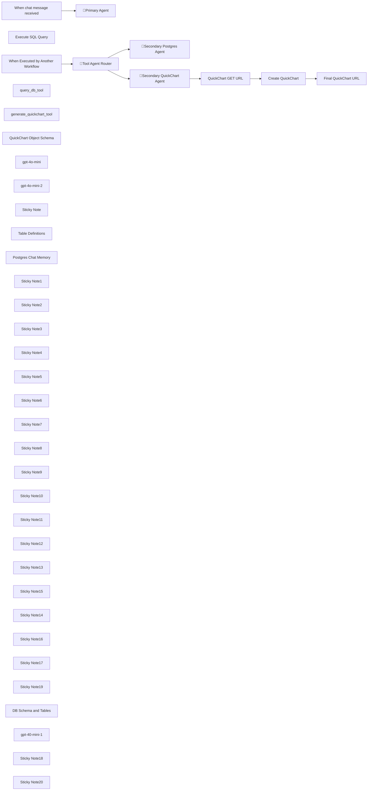

## Fluxo (.json) :

```json
{
  "id": "Q63cSgFlcqz291ec",
  "meta": {
    "instanceId": "31e69f7f4a77bf465b805824e303232f0227212ae922d12133a0f96ffeab4fef",
    "templateCredsSetupCompleted": true
  },
  "name": "✨📊Multi-AI Agent Chatbot for Postgres/Supabase DB and QuickCharts + Tool Router",
  "tags": [],
  "nodes": [
    {
      "id": "3a332532-a56e-42f5-a114-4a7e138b5e0f",
      "name": "When chat message received",
      "type": "@n8n/n8n-nodes-langchain.chatTrigger",
      "position": [
        -180,
        -1420
      ],
      "webhookId": "faddb40a-7048-4398-a0f9-d239a19c32ce",
      "parameters": {
        "options": {}
      },
      "typeVersion": 1.1
    },
    {
      "id": "6c707ee7-95e9-4ebd-9373-a2dac0ea73a7",
      "name": "Execute SQL Query",
      "type": "n8n-nodes-base.postgresTool",
      "position": [
        460,
        -500
      ],
      "parameters": {
        "query": "{{ $fromAI(\"sql_query\", \"SQL Query\") }}",
        "options": {},
        "operation": "executeQuery",
        "descriptionType": "manual",
        "toolDescription": "Use this tool to query the database with SQL queries"
      },
      "credentials": {
        "postgres": {
          "id": "wZnget4L3P3bnlfh",
          "name": "Postgres account"
        }
      },
      "typeVersion": 2.5
    },
    {
      "id": "1d5572e1-de5a-4e67-8ba1-82196bd62e9b",
      "name": "When Executed by Another Workflow",
      "type": "n8n-nodes-base.executeWorkflowTrigger",
      "position": [
        -480,
        -360
      ],
      "parameters": {
        "workflowInputs": {
          "values": [
            {
              "name": "user_prompt"
            },
            {
              "name": "route"
            },
            {
              "name": "db_records"
            }
          ]
        }
      },
      "typeVersion": 1.1
    },
    {
      "id": "e3caa1b3-7bdb-43c1-a749-74ae02912d84",
      "name": "query_db_tool",
      "type": "@n8n/n8n-nodes-langchain.toolWorkflow",
      "position": [
        720,
        -1100
      ],
      "parameters": {
        "name": "query_database_tool",
        "workflowId": {
          "__rl": true,
          "mode": "id",
          "value": "={{  $workflow.id }}"
        },
        "description": "Use this tool to query the database",
        "workflowInputs": {
          "value": {
            "route": "query_database_tool",
            "user_prompt": "={{ $('When chat message received').item.json.chatInput }}"
          },
          "schema": [
            {
              "id": "user_prompt",
              "type": "string",
              "display": true,
              "removed": false,
              "required": false,
              "displayName": "user_prompt",
              "defaultMatch": false,
              "canBeUsedToMatch": true
            },
            {
              "id": "route",
              "type": "string",
              "display": true,
              "removed": false,
              "required": false,
              "displayName": "route",
              "defaultMatch": false,
              "canBeUsedToMatch": true
            }
          ],
          "mappingMode": "defineBelow",
          "matchingColumns": [
            "user_prompt"
          ],
          "attemptToConvertTypes": false,
          "convertFieldsToString": false
        }
      },
      "typeVersion": 2
    },
    {
      "id": "594e6fd3-084a-4100-ac16-1cc4068e03c1",
      "name": "generate_quickchart_tool",
      "type": "@n8n/n8n-nodes-langchain.toolWorkflow",
      "position": [
        980,
        -1100
      ],
      "parameters": {
        "name": "generate_chart_tool",
        "workflowId": {
          "__rl": true,
          "mode": "id",
          "value": "={{  $workflow.id }}"
        },
        "description": "Use this tool to generate a chart with QuickChart",
        "workflowInputs": {
          "value": {
            "route": "generate_chart_tool",
            "db_records": "={{ /*n8n-auto-generated-fromAI-override*/ $fromAI('db_records', `The database records`, 'string') }}",
            "user_prompt": "={{ $('When chat message received').item.json.chatInput }}"
          },
          "schema": [
            {
              "id": "user_prompt",
              "type": "string",
              "display": true,
              "removed": false,
              "required": false,
              "displayName": "user_prompt",
              "defaultMatch": false,
              "canBeUsedToMatch": true
            },
            {
              "id": "route",
              "type": "string",
              "display": true,
              "removed": false,
              "required": false,
              "displayName": "route",
              "defaultMatch": false,
              "canBeUsedToMatch": true
            },
            {
              "id": "db_records",
              "type": "string",
              "display": true,
              "removed": false,
              "required": false,
              "displayName": "db_records",
              "defaultMatch": false,
              "canBeUsedToMatch": true
            }
          ],
          "mappingMode": "defineBelow",
          "matchingColumns": [
            "user_prompt"
          ],
          "attemptToConvertTypes": false,
          "convertFieldsToString": false
        }
      },
      "typeVersion": 2
    },
    {
      "id": "580426ac-0fb7-4f14-af7b-e497b7cb08f8",
      "name": "Create QuickChart",
      "type": "n8n-nodes-base.httpRequest",
      "position": [
        780,
        -140
      ],
      "parameters": {
        "url": "={{ encodeURI($json.url) }}",
        "options": {}
      },
      "typeVersion": 4.2
    },
    {
      "id": "b7085357-ebe9-4564-868d-b31fc2e9734a",
      "name": "QuickChart Object Schema",
      "type": "@n8n/n8n-nodes-langchain.outputParserStructured",
      "position": [
        460,
        140
      ],
      "parameters": {
        "jsonSchemaExample": "{\n  \"type\": \"bar\",\n  \"data\": {\n    \"labels\": [\"R270684\", \"R274295\", \"R276352\", \"R277914\", \"R280108\"],\n    \"datasets\": [\n      {\n        \"label\": \"List Price\",\n        \"data\": [2149000, 924900, 924900, 1288000, 1198000],\n        \"backgroundColor\": \"#FF6384\"\n      },\n      {\n        \"label\": \"Days On Market\",\n        \"data\": [101, 91, 123, 136, 185],\n        \"backgroundColor\": \"#36A2EB\"\n      }\n    ]\n  },\n  \"options\": {\n    \"scales\": {\n      \"y\": {\n        \"min\": 0,\n        \"max\": 2200000\n      }\n    }\n  }\n}"
      },
      "typeVersion": 1.2
    },
    {
      "id": "b1037112-f5af-4e61-8bd1-0d9b0a9ad2e1",
      "name": "gpt-4o-mini",
      "type": "@n8n/n8n-nodes-langchain.lmChatOpenAi",
      "position": [
        200,
        -1100
      ],
      "parameters": {
        "model": {
          "__rl": true,
          "mode": "list",
          "value": "gpt-4o-mini"
        },
        "options": {
          "responseFormat": "text"
        }
      },
      "credentials": {
        "openAiApi": {
          "id": "jEMSvKmtYfzAkhe6",
          "name": "OpenAi account"
        }
      },
      "typeVersion": 1.2
    },
    {
      "id": "5ea5ba56-2368-4e95-a98f-2c7548a66a9b",
      "name": "gpt-4o-mini-2",
      "type": "@n8n/n8n-nodes-langchain.lmChatOpenAi",
      "position": [
        200,
        140
      ],
      "parameters": {
        "model": {
          "__rl": true,
          "mode": "id",
          "value": "=gpt-4o-mini"
        },
        "options": {
          "responseFormat": "text"
        }
      },
      "credentials": {
        "openAiApi": {
          "id": "jEMSvKmtYfzAkhe6",
          "name": "OpenAi account"
        }
      },
      "typeVersion": 1.2
    },
    {
      "id": "4b8f9978-9d46-48f5-93ca-002ade008887",
      "name": "Sticky Note",
      "type": "n8n-nodes-base.stickyNote",
      "position": [
        80,
        -1500
      ],
      "parameters": {
        "color": 5,
        "width": 1100,
        "height": 600,
        "content": "## 🤖Primary AI Manager Agent"
      },
      "typeVersion": 1
    },
    {
      "id": "f6534374-cc07-429a-b27c-b38835c96465",
      "name": "🤖Primary Agent",
      "type": "@n8n/n8n-nodes-langchain.agent",
      "position": [
        480,
        -1420
      ],
      "parameters": {
        "options": {
          "systemMessage": "You are a helpful assistant that answers the users questions by using the tools provided.\n\n## TOOLS\n- query_database_tool: Use this tool to query the database\n- generate_chart_tool: Use this tool to generate a chart with QuickChart\n\nAlways provide the results of the database query and the link for the chart when applicable."
        }
      },
      "typeVersion": 1.7
    },
    {
      "id": "cf246e46-b3e4-4c9f-96f9-be1b91c0a3eb",
      "name": "🤖Secondary Postgres Agent",
      "type": "@n8n/n8n-nodes-langchain.agent",
      "position": [
        480,
        -780
      ],
      "parameters": {
        "text": "={{ $json.user_prompt }}",
        "options": {
          "systemMessage": "You are a helpful assistant with tools for querying a SQL database.  Use the tools provided to query the database."
        },
        "promptType": "define"
      },
      "typeVersion": 1.7
    },
    {
      "id": "02d741d3-4b6e-4e19-8aca-3e15175e9667",
      "name": "🤖Secondary QuickChart Agent",
      "type": "@n8n/n8n-nodes-langchain.agent",
      "position": [
        240,
        -140
      ],
      "parameters": {
        "text": "=Your task is to generate a Chart.js configuration object with the following specifications:\n- Chart type: bar unless otherwise indicated\n- Labels: Use the ML # from each record unless otherwise indicated\n- Show bar for list price if not otherwise indicated\n- Return only the raw JSON object without code fences or explanations\n\nThis is the user prompt: {{ $json.user_prompt }}\nThis is the result of the SQL query: {{ $json.db_records }}",
        "options": {},
        "promptType": "define",
        "hasOutputParser": true
      },
      "typeVersion": 1.7
    },
    {
      "id": "4f41690b-313a-4ce3-ba65-a2ce2c3ee9b9",
      "name": "🔀Tool Agent Router",
      "type": "n8n-nodes-base.switch",
      "position": [
        -180,
        -360
      ],
      "parameters": {
        "rules": {
          "values": [
            {
              "outputKey": "🔍query",
              "conditions": {
                "options": {
                  "version": 2,
                  "leftValue": "",
                  "caseSensitive": true,
                  "typeValidation": "strict"
                },
                "combinator": "and",
                "conditions": [
                  {
                    "id": "35b1e13e-6157-48d0-85af-3cd33260eae1",
                    "operator": {
                      "name": "filter.operator.equals",
                      "type": "string",
                      "operation": "equals"
                    },
                    "leftValue": "={{ $json.route }}",
                    "rightValue": "=query_database_tool"
                  }
                ]
              },
              "renameOutput": true
            },
            {
              "outputKey": "📊chart",
              "conditions": {
                "options": {
                  "version": 2,
                  "leftValue": "",
                  "caseSensitive": true,
                  "typeValidation": "strict"
                },
                "combinator": "and",
                "conditions": [
                  {
                    "id": "ff5f97fb-0f18-4bf9-b16c-3d0b3bc3c7f4",
                    "operator": {
                      "name": "filter.operator.equals",
                      "type": "string",
                      "operation": "equals"
                    },
                    "leftValue": "={{ $json.route }}",
                    "rightValue": "=generate_chart_tool"
                  }
                ]
              },
              "renameOutput": true
            }
          ]
        },
        "options": {}
      },
      "typeVersion": 3.2
    },
    {
      "id": "27c30d2c-3af3-4d05-aadb-9f18751fb9ce",
      "name": "Table Definitions",
      "type": "n8n-nodes-base.postgresTool",
      "position": [
        980,
        -500
      ],
      "parameters": {
        "query": "select\n  c.column_name,\n  c.data_type,\n  c.is_nullable,\n  c.column_default,\n  tc.constraint_type,\n  ccu.table_name AS referenced_table,\n  ccu.column_name AS referenced_column\nfrom\n  information_schema.columns c\nLEFT join\n  information_schema.key_column_usage kcu\n  ON c.table_name = kcu.table_name\n  AND c.column_name = kcu.column_name\nLEFT join\n  information_schema.table_constraints tc\n  ON kcu.constraint_name = tc.constraint_name\n  AND tc.constraint_type = 'FOREIGN KEY'\nLEFT join\n  information_schema.constraint_column_usage ccu\n  ON tc.constraint_name = ccu.constraint_name\nwhere\n  c.table_name = '{{ $fromAI(\"table_name\") }}'\n  AND c.table_schema = '{{ $fromAI(\"schema_name\") }}'\norder by\n  c.ordinal_position",
        "options": {},
        "operation": "executeQuery",
        "descriptionType": "manual",
        "toolDescription": "Use this tool to get table definition to find all columns and types"
      },
      "credentials": {
        "postgres": {
          "id": "wZnget4L3P3bnlfh",
          "name": "Postgres account"
        }
      },
      "typeVersion": 2.5
    },
    {
      "id": "59dfd315-fb02-425c-a6ca-2d63167c2e24",
      "name": "Postgres Chat Memory",
      "type": "@n8n/n8n-nodes-langchain.memoryPostgresChat",
      "position": [
        460,
        -1100
      ],
      "parameters": {
        "tableName": "={{ $workflow.id }}_chat_history"
      },
      "credentials": {
        "postgres": {
          "id": "wZnget4L3P3bnlfh",
          "name": "Postgres account"
        }
      },
      "typeVersion": 1.3
    },
    {
      "id": "81dd8b73-0809-4f30-a867-bf98ff6a80bc",
      "name": "Sticky Note1",
      "type": "n8n-nodes-base.stickyNote",
      "position": [
        900,
        -1180
      ],
      "parameters": {
        "color": 7,
        "height": 240,
        "content": "## QuickChart Tool"
      },
      "typeVersion": 1
    },
    {
      "id": "1a08bc08-510b-4cda-b96e-179bd3abe164",
      "name": "Sticky Note2",
      "type": "n8n-nodes-base.stickyNote",
      "position": [
        640,
        -1180
      ],
      "parameters": {
        "color": 7,
        "height": 240,
        "content": "## Postgres Tool"
      },
      "typeVersion": 1
    },
    {
      "id": "9cc5e958-0f93-42ad-813e-83c8b5bb126e",
      "name": "Sticky Note3",
      "type": "n8n-nodes-base.stickyNote",
      "position": [
        120,
        -1180
      ],
      "parameters": {
        "color": 7,
        "height": 240,
        "content": "## LLM"
      },
      "typeVersion": 1
    },
    {
      "id": "920f9fe4-e182-4159-9152-e81586ec5304",
      "name": "Sticky Note4",
      "type": "n8n-nodes-base.stickyNote",
      "position": [
        380,
        -1180
      ],
      "parameters": {
        "color": 7,
        "height": 240,
        "content": "## Chat Memory"
      },
      "typeVersion": 1
    },
    {
      "id": "d2a24dce-1add-49d6-8d2f-6547fca35bfb",
      "name": "Sticky Note5",
      "type": "n8n-nodes-base.stickyNote",
      "position": [
        -300,
        -1500
      ],
      "parameters": {
        "color": 4,
        "width": 340,
        "height": 280,
        "content": "## 👍Start Here"
      },
      "typeVersion": 1
    },
    {
      "id": "d0df3ea6-9765-4f4d-a8f7-b2356ea1cf26",
      "name": "Sticky Note6",
      "type": "n8n-nodes-base.stickyNote",
      "position": [
        80,
        -860
      ],
      "parameters": {
        "color": 6,
        "width": 1100,
        "height": 560,
        "content": "## ⚒️🤖Secondary Postgres Tool Agent "
      },
      "typeVersion": 1
    },
    {
      "id": "fe990853-fce6-4cbe-9cc2-fc04f53742e8",
      "name": "Sticky Note7",
      "type": "n8n-nodes-base.stickyNote",
      "position": [
        120,
        -580
      ],
      "parameters": {
        "color": 7,
        "height": 240,
        "content": ""
      },
      "typeVersion": 1
    },
    {
      "id": "c5086736-4dfe-44a3-a5dc-6cace0593334",
      "name": "Sticky Note8",
      "type": "n8n-nodes-base.stickyNote",
      "position": [
        640,
        -580
      ],
      "parameters": {
        "color": 7,
        "height": 240,
        "content": ""
      },
      "typeVersion": 1
    },
    {
      "id": "6b848863-10b2-42e4-8bd5-ed4663b9e5cb",
      "name": "Sticky Note9",
      "type": "n8n-nodes-base.stickyNote",
      "position": [
        900,
        -580
      ],
      "parameters": {
        "color": 7,
        "height": 240,
        "content": ""
      },
      "typeVersion": 1
    },
    {
      "id": "75231fcf-8314-4ee6-96a7-99d842b6ee4f",
      "name": "Sticky Note10",
      "type": "n8n-nodes-base.stickyNote",
      "position": [
        380,
        -580
      ],
      "parameters": {
        "color": 7,
        "height": 240,
        "content": ""
      },
      "typeVersion": 1
    },
    {
      "id": "c54439c7-ccb1-41a4-ad76-8ed39f7fc5e6",
      "name": "Sticky Note11",
      "type": "n8n-nodes-base.stickyNote",
      "position": [
        -300,
        -460
      ],
      "parameters": {
        "color": 3,
        "width": 340,
        "height": 320,
        "content": "## Tool Agent Router 🔀"
      },
      "typeVersion": 1
    },
    {
      "id": "b51ffe20-2ae4-478b-9573-fc5456935483",
      "name": "Sticky Note12",
      "type": "n8n-nodes-base.stickyNote",
      "position": [
        80,
        -260
      ],
      "parameters": {
        "color": 6,
        "width": 1100,
        "height": 600,
        "content": "## ⚒️🤖Secondary QuickChart Tool Agent"
      },
      "typeVersion": 1
    },
    {
      "id": "ffb9da23-f79c-4d20-81a3-656471bdda33",
      "name": "Sticky Note13",
      "type": "n8n-nodes-base.stickyNote",
      "position": [
        380,
        60
      ],
      "parameters": {
        "color": 7,
        "height": 240,
        "content": ""
      },
      "typeVersion": 1
    },
    {
      "id": "61532d90-1f65-48d0-a408-2e6edd9511b1",
      "name": "Sticky Note15",
      "type": "n8n-nodes-base.stickyNote",
      "position": [
        120,
        60
      ],
      "parameters": {
        "color": 7,
        "height": 240,
        "content": ""
      },
      "typeVersion": 1
    },
    {
      "id": "5b125fa6-8017-437e-bb20-b9deb5d52c63",
      "name": "Final QuickChart URL",
      "type": "n8n-nodes-base.set",
      "position": [
        980,
        -140
      ],
      "parameters": {
        "options": {},
        "assignments": {
          "assignments": [
            {
              "id": "63bab42a-9b9b-4756-88d2-f41cff9a1ded",
              "name": "quickchart_url",
              "type": "string",
              "value": "={{ encodeURI($json.url) }}"
            }
          ]
        }
      },
      "typeVersion": 3.4
    },
    {
      "id": "2c66055d-1ca2-40f3-a082-57232402fdd1",
      "name": "QuickChart GET URL",
      "type": "n8n-nodes-base.set",
      "position": [
        580,
        -140
      ],
      "parameters": {
        "options": {},
        "assignments": {
          "assignments": [
            {
              "id": "d69995ae-413e-49e7-b6ec-17e9e034e4b6",
              "name": "url",
              "type": "string",
              "value": "={{ \"https://quickchart.io/chart?width=250&height=150&chart=\" + $json.output.toJsonString() }}"
            }
          ]
        }
      },
      "typeVersion": 3.4
    },
    {
      "id": "0a0f024d-24fa-43e9-bfa6-b841902b5e5e",
      "name": "Sticky Note14",
      "type": "n8n-nodes-base.stickyNote",
      "position": [
        -540,
        -1600
      ],
      "parameters": {
        "color": 7,
        "width": 1760,
        "height": 1980,
        "content": "# ✨📊Multi-AI Agent Chatbot for Postgres/Supabase DB and QuickCharts + Tool Router"
      },
      "typeVersion": 1
    },
    {
      "id": "a50b4d31-7e9e-4cd0-84b9-f4755deb6efd",
      "name": "Sticky Note16",
      "type": "n8n-nodes-base.stickyNote",
      "position": [
        -500,
        -1180
      ],
      "parameters": {
        "width": 540,
        "height": 240,
        "content": "## Setup\n\n1. Create a Postgres compatible database (Supabase)\n\n2. Add your Postgres and OpenAI credentials\n\n3. Click Chat button and start chatting with your database and creating QuickChart to visualize the results\n"
      },
      "typeVersion": 1
    },
    {
      "id": "3df0304a-323b-4bd4-96ce-2907367ede8d",
      "name": "Sticky Note17",
      "type": "n8n-nodes-base.stickyNote",
      "position": [
        -500,
        -860
      ],
      "parameters": {
        "width": 542,
        "height": 296,
        "content": "## Postgres Tools Used\n\n1. **Execute SQL Query** \nUsed to execute any query generated by the agent.\n\n2. **DB Schema and Tables** \nReturns the list of all the tables with its schema name.\n\n3. **Table Definition** \nReturns table details like column names, foreign keys and more of a particular table in a schema."
      },
      "typeVersion": 1
    },
    {
      "id": "feaeaf6d-f5b8-4dbe-a39b-d07882142ead",
      "name": "Sticky Note19",
      "type": "n8n-nodes-base.stickyNote",
      "position": [
        -500,
        -40
      ],
      "parameters": {
        "width": 542,
        "height": 376,
        "content": "## Generate a Quickchart\n\n**Secondary QuickChart Agent Tool**\nThis section handles the chart generation process through several steps by sending the database records and user prompt to OpenAI to create a JSON object based on Chart.js and QuickChart.io definitions\n\n**QuickChart GET URL node**\nThis sections adds chart definitions to a QuickChart.io URL\n\n**Create QuickChart node**\nThis sections sends chart queries to QuickCharts with a defined JSON format\n\n\n\nThis integration allows you to dynamically generate charts based on data queries, with AI assistance for formatting and optimization.\n\n\n"
      },
      "typeVersion": 1
    },
    {
      "id": "6c9be4d2-46e9-44ae-8751-f4f4964323e9",
      "name": "DB Schema and Tables",
      "type": "n8n-nodes-base.postgresTool",
      "position": [
        720,
        -500
      ],
      "parameters": {
        "query": "SELECT \n    table_schema,\n    table_name\nFROM information_schema.tables\nWHERE table_type = 'BASE TABLE'\n    AND table_schema NOT IN ('pg_catalog', 'information_schema')\nORDER BY table_schema, table_name;",
        "options": {},
        "operation": "executeQuery",
        "descriptionType": "manual",
        "toolDescription": "Use this tool to get a list of all tables with their schema in the database"
      },
      "credentials": {
        "postgres": {
          "id": "wZnget4L3P3bnlfh",
          "name": "Postgres account"
        }
      },
      "typeVersion": 2.5
    },
    {
      "id": "4e779b6f-963c-4efb-af43-bec0e5c3228c",
      "name": "gpt-40-mini-1",
      "type": "@n8n/n8n-nodes-langchain.lmChatOpenAi",
      "position": [
        200,
        -500
      ],
      "parameters": {
        "model": {
          "__rl": true,
          "mode": "list",
          "value": "gpt-4o-mini"
        },
        "options": {
          "responseFormat": "text"
        }
      },
      "credentials": {
        "openAiApi": {
          "id": "jEMSvKmtYfzAkhe6",
          "name": "OpenAi account"
        }
      },
      "typeVersion": 1.2
    },
    {
      "id": "a6cc9a4e-b016-47f6-9f9f-9c77a15c2be2",
      "name": "Sticky Note18",
      "type": "n8n-nodes-base.stickyNote",
      "position": [
        640,
        180
      ],
      "parameters": {
        "width": 440,
        "height": 120,
        "content": "## QuickChart Schema\nAdjust the QuickChart Schema to match your use case.\n\nhttps://quickchart.io/documentation/"
      },
      "typeVersion": 1
    },
    {
      "id": "9855ba6a-d46b-4461-a397-02108023abc5",
      "name": "Sticky Note20",
      "type": "n8n-nodes-base.stickyNote",
      "position": [
        640,
        60
      ],
      "parameters": {
        "width": 440,
        "height": 100,
        "content": "## Chart Size\nAdjust the chart size in the QuickChart GET URL node.\n"
      },
      "typeVersion": 1
    }
  ],
  "active": false,
  "pinData": {
    "When Executed by Another Workflow": [
      {
        "json": {
          "route": "generate_chart_tool",
          "db_records": "[{\"mls_num\":\"R292309\",\"list_price\":1148000},{\"mls_num\":\"R292302\",\"list_price\":1298000},{\"mls_num\":\"R294786\",\"list_price\":1280000},{\"mls_num\":\"V17840\",\"list_price\":939000},{\"mls_num\":\"V10178\",\"list_price\":420000},{\"mls_num\":\"V18007\",\"list_price\":296500},{\"mls_num\":\"V18136\",\"list_price\":379000},{\"mls_num\":\"V18643\",\"list_price\":329000},{\"mls_num\":\"V17755\",\"list_price\":236000},{\"mls_num\":\"V19126\",\"list_price\":245500}]",
          "user_prompt": "provide a bar chart showing mls# and list price"
        }
      }
    ]
  },
  "settings": {
    "executionOrder": "v1"
  },
  "versionId": "9781f576-38ef-4e18-9fbe-8383565cb032",
  "connections": {
    "gpt-4o-mini": {
      "ai_languageModel": [
        [
          {
            "node": "🤖Primary Agent",
            "type": "ai_languageModel",
            "index": 0
          }
        ]
      ]
    },
    "gpt-40-mini-1": {
      "ai_languageModel": [
        [
          {
            "node": "🤖Secondary Postgres Agent",
            "type": "ai_languageModel",
            "index": 0
          }
        ]
      ]
    },
    "gpt-4o-mini-2": {
      "ai_languageModel": [
        [
          {
            "node": "🤖Secondary QuickChart Agent",
            "type": "ai_languageModel",
            "index": 0
          }
        ]
      ]
    },
    "query_db_tool": {
      "ai_tool": [
        [
          {
            "node": "🤖Primary Agent",
            "type": "ai_tool",
            "index": 0
          }
        ]
      ]
    },
    "Create QuickChart": {
      "main": [
        [
          {
            "node": "Final QuickChart URL",
            "type": "main",
            "index": 0
          }
        ]
      ]
    },
    "Execute SQL Query": {
      "ai_tool": [
        [
          {
            "node": "🤖Secondary Postgres Agent",
            "type": "ai_tool",
            "index": 0
          }
        ]
      ]
    },
    "Table Definitions": {
      "ai_tool": [
        [
          {
            "node": "🤖Secondary Postgres Agent",
            "type": "ai_tool",
            "index": 0
          }
        ]
      ]
    },
    "🤖Primary Agent": {
      "main": [
        []
      ]
    },
    "QuickChart GET URL": {
      "main": [
        [
          {
            "node": "Create QuickChart",
            "type": "main",
            "index": 0
          }
        ]
      ]
    },
    "DB Schema and Tables": {
      "ai_tool": [
        [
          {
            "node": "🤖Secondary Postgres Agent",
            "type": "ai_tool",
            "index": 0
          }
        ]
      ]
    },
    "Postgres Chat Memory": {
      "ai_memory": [
        [
          {
            "node": "🤖Primary Agent",
            "type": "ai_memory",
            "index": 0
          }
        ]
      ]
    },
    "🔀Tool Agent Router": {
      "main": [
        [
          {
            "node": "🤖Secondary Postgres Agent",
            "type": "main",
            "index": 0
          }
        ],
        [
          {
            "node": "🤖Secondary QuickChart Agent",
            "type": "main",
            "index": 0
          }
        ]
      ]
    },
    "QuickChart Object Schema": {
      "ai_outputParser": [
        [
          {
            "node": "🤖Secondary QuickChart Agent",
            "type": "ai_outputParser",
            "index": 0
          }
        ]
      ]
    },
    "generate_quickchart_tool": {
      "ai_tool": [
        [
          {
            "node": "🤖Primary Agent",
            "type": "ai_tool",
            "index": 0
          }
        ]
      ]
    },
    "When chat message received": {
      "main": [
        [
          {
            "node": "🤖Primary Agent",
            "type": "main",
            "index": 0
          }
        ]
      ]
    },
    "🤖Secondary Postgres Agent": {
      "main": [
        []
      ]
    },
    "🤖Secondary QuickChart Agent": {
      "main": [
        [
          {
            "node": "QuickChart GET URL",
            "type": "main",
            "index": 0
          }
        ]
      ]
    },
    "When Executed by Another Workflow": {
      "main": [
        [
          {
            "node": "🔀Tool Agent Router",
            "type": "main",
            "index": 0
          }
        ]
      ]
    }
  }
}
```

<a id="template-996"></a>

## Template 996 - Coleta de feedback do produto e criação de cartão

- **Nome:** Coleta de feedback do produto e criação de cartão
- **Descrição:** Recebe respostas de um formulário de feedback, registra as respostas em uma base de dados e cria um cartão no Trello quando a pontuação atende à condição definida.
- **Funcionalidade:** • Captura de respostas do formulário: Inicia o fluxo quando um participante envia o formulário de feedback.
• Mapeamento de campos: Extrai nome, email, pontuação e descrição da resposta e organiza esses dados.
• Registro em banco de dados: Anexa as respostas coletadas na tabela de Feedback para armazenamento histórico.
• Verificação condicional da pontuação: Avalia a pontuação fornecida pelo participante contra uma condição definida.
• Criação de cartão quando condição atendida: Se a pontuação atender à condição, cria um cartão no quadro/lista do Trello com os detalhes do feedback.
• Caminho alternativo sem ação: Quando a condição não é atendida, o fluxo segue sem criar cartão adicional.
- **Ferramentas:** • Typeform: Plataforma usada para coletar o feedback através de um formulário online.
• Airtable: Base de dados onde as respostas são registradas e armazenadas na tabela de Feedback.
• Trello: Ferramenta de gerenciamento visual onde são criados cartões com os detalhes do feedback quando aplicável.

## Fluxo visual

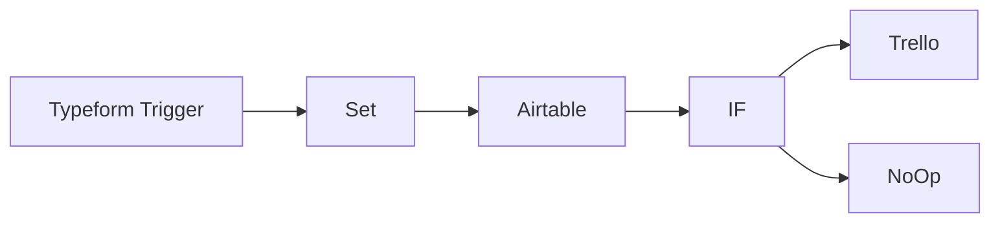

## Fluxo (.json) :

```json
{
  "id": "65",
  "name": "Get Product Feedback",
  "nodes": [
    {
      "name": "Typeform Trigger",
      "type": "n8n-nodes-base.typeformTrigger",
      "position": [
        170,
        260
      ],
      "webhookId": "0cf82c15-eeb8-4b24-bd67-5f4b54a58b6d",
      "parameters": {
        "formId": ""
      },
      "credentials": {
        "typeformApi": "typeform-harshil"
      },
      "typeVersion": 1
    },
    {
      "name": "Set",
      "type": "n8n-nodes-base.set",
      "position": [
        370,
        260
      ],
      "parameters": {
        "values": {
          "number": [
            {
              "name": "Score",
              "value": "={{$node[\"Typeform Trigger\"].json[\"What score would you like to give?\"]}}"
            }
          ],
          "string": [
            {
              "name": "Name",
              "value": "={{$node[\"Typeform Trigger\"].json[\"What is your name?\"]}}"
            },
            {
              "name": "Email",
              "value": "={{$node[\"Typeform Trigger\"].json[\"What is your email address?\"]}}"
            },
            {
              "name": "Description",
              "value": "={{$node[\"Typeform Trigger\"].json[\"Anything else you want to share?\"]}}"
            }
          ]
        },
        "options": {},
        "keepOnlySet": true
      },
      "typeVersion": 1
    },
    {
      "name": "Airtable",
      "type": "n8n-nodes-base.airtable",
      "position": [
        570,
        260
      ],
      "parameters": {
        "table": "Feedback",
        "options": {},
        "operation": "append",
        "application": ""
      },
      "credentials": {
        "airtableApi": "airtable-harshil"
      },
      "typeVersion": 1
    },
    {
      "name": "IF",
      "type": "n8n-nodes-base.if",
      "position": [
        770,
        260
      ],
      "parameters": {
        "conditions": {
          "number": [
            {
              "value1": "={{$node[\"Set\"].json[\"Score\"]}}",
              "value2": 7
            }
          ]
        }
      },
      "typeVersion": 1
    },
    {
      "name": "Trello",
      "type": "n8n-nodes-base.trello",
      "position": [
        970,
        160
      ],
      "parameters": {
        "name": "=[{{$node[\"IF\"].json[\"fields\"][\"Score\"]}}] {{$node[\"IF\"].json[\"fields\"][\"Name\"]}}",
        "listId": "5fbb9e2eb1d5cc0a8a7ab8ac",
        "description": "=Name: {{$node[\"IF\"].json[\"fields\"][\"Name\"]}}\nEmail: {{$node[\"IF\"].json[\"fields\"][\"Email\"]}}\nScore: {{$node[\"IF\"].json[\"fields\"][\"Score\"]}}\nDescription: {{$node[\"IF\"].json[\"fields\"][\"Description\"]}}",
        "additionalFields": {}
      },
      "credentials": {
        "trelloApi": "Trello Credentials"
      },
      "typeVersion": 1
    },
    {
      "name": "NoOp",
      "type": "n8n-nodes-base.noOp",
      "position": [
        970,
        360
      ],
      "parameters": {},
      "typeVersion": 1
    }
  ],
  "active": false,
  "settings": {},
  "connections": {
    "IF": {
      "main": [
        [
          {
            "node": "Trello",
            "type": "main",
            "index": 0
          }
        ],
        [
          {
            "node": "NoOp",
            "type": "main",
            "index": 0
          }
        ]
      ]
    },
    "Set": {
      "main": [
        [
          {
            "node": "Airtable",
            "type": "main",
            "index": 0
          }
        ]
      ]
    },
    "Airtable": {
      "main": [
        [
          {
            "node": "IF",
            "type": "main",
            "index": 0
          }
        ]
      ]
    },
    "Typeform Trigger": {
      "main": [
        [
          {
            "node": "Set",
            "type": "main",
            "index": 0
          }
        ]
      ]
    }
  }
}
```

<a id="template-997"></a>

## Template 997 - Respostas automáticas por e-mail com registro no Sheets

- **Nome:** Respostas automáticas por e-mail com registro no Sheets
- **Descrição:** Automatiza a geração de respostas por e-mail usando o ChatGPT, envia as respostas de volta ao remetente e registra a conversa em uma planilha do Google Sheets. O fluxo dispara tanto na chegada de um e-mail de destinatários específicos quanto via webhook de feedback, criando a planilha se necessário e mantendo o histórico de entradas e respostas.
- **Funcionalidade:** • Detecção de recebimento de e-mail: aciona o fluxo quando chega um e-mail de destinatários específicos. 
• Geração de resposta: cria uma resposta usando o modelo com base no conteúdo do e-mail. 
• Envio da resposta: envia a resposta gerada de volta ao remetente. 
• Registro no Google Sheets: armazena a mensagem recebida e a resposta na planilha, criando-a se não existir. 
• Registro de feedback: captura o feedback recebido via link e o registra na planilha para melhoria futura.
- **Ferramentas:** • Gmail: serviço de e-mail para receber mensagens e enviar respostas. 
• Google Sheets: planilhas para armazenar entradas e respostas. 
• OpenAI: geração de respostas com base no conteúdo do e-mail. 
• Webhook: captura de feedback para registrar no sistema.

## Fluxo visual

```mermaid
flowchart LR
    N1["Generate reply"]
    N2["On email received"]
    N3["Only continue for specific emails"]
    N4["Configure"]
    N5["Note5"]
    N6["Send reply to recipient"]
    N7["Generate UUID"]
    N8["Thanks for your response!"]
    N9["Extract message content (advanced)"]
    N10["If spreadsheet doesn't exist"]
    N11["Successfully created or updated row"]
    N12["Note1"]
    N13["Note2"]
    N14["Note3"]
    N15["Create spreadsheet"]
    N16["Store spreadsheet ID"]
    N17["Paste data"]
    N18["If no sheet IDs"]
    N19["Create or update rows"]
    N20["Get data from `Format data`"]
    N21["Get data from `Format data` node"]
    N22["Format data"]
    N23["Send email reply"]
    N24["On feedback given"]
    N25["Send feedback for fine-tuned data"]
    N26["Show HTML page"]
    N27["Get sheet IDs #1"]
    N28["Note"]
    N29["If no spreadsheet in configuration #2"]
    N30["Store specific sheet IDs #2"]
    N31["Get sheet IDs #2"]
    N32["If no spreadsheet in configuration #1"]
    N33["Store specific sheet IDs #1"]
    N34["Email template"]
    N35["Record feedback"]
    N36["Fallback route"]
    N37["Identify trigger #2"]
    N38["Identify trigger #1"]
    N39["Do not send unfinished email reply"]
    N40["If reply is complete"]
    N41["Sticky Note"]
    N42["Do not send email to this recipient"]
    N43["Send reply to database"]
    N44["Sticky Note1"]
    N45["Determine which trigger ran"]
    N46["Sticky Note2"]
    N47["Is text within token limit?"]
    N48["Do nothing"]
    N49["Sticky Note3"]

    N4 --> N45
    N22 --> N32
    N7 --> N9
    N34 --> N6
    N1 --> N43
    N1 --> N40
    N26 --> N29
    N18 --> N15
    N18 --> N20
    N35 --> N8
    N27 --> N18
    N31 --> N25
    N23 --> N34
    N2 --> N38
    N24 --> N37
    N15 --> N16
    N38 --> N4
    N37 --> N4
    N40 --> N23
    N40 --> N39
    N16 --> N21
    N19 --> N10
    N43 --> N22
    N8 --> N26
    N45 --> N3
    N45 --> N35
    N45 --> N36
    N20 --> N19
    N47 --> N1
    N47 --> N48
    N33 --> N18
    N30 --> N25
    N10 --> N15
    N10 --> N11
    N21 --> N17
    N3 --> N7
    N3 --> N42
    N9 --> N47
    N32 --> N27
    N32 --> N33
    N29 --> N31
    N29 --> N30
```

## Fluxo (.json) :

```json
{
  "meta": {
    "instanceId": "a2434c94d549548a685cca39cc4614698e94f527bcea84eefa363f1037ae14cd"
  },
  "nodes": [
    {
      "id": "88c0f64c-a7cd-4f35-96dd-9eee4b1d6a1a",
      "name": "Generate reply",
      "type": "n8n-nodes-base.openAi",
      "position": [
        -480,
        2260
      ],
      "parameters": {
        "prompt": "=From: {{ $json.from.value }}\nTo: {{ $json.to.value }}\nSubject: {{ $json.subject }}\nBody: {{ $json.reply }}\n\n\nReply: ",
        "options": {
          "maxTokens": "={{ $('Configure').first().json.replyTokenSize }}"
        }
      },
      "credentials": {
        "openAiApi": {
          "id": "27",
          "name": "[UPDATE ME]"
        }
      },
      "typeVersion": 1
    },
    {
      "id": "7105b689-9f9c-4354-aad9-8f1abb6c0a06",
      "name": "On email received",
      "type": "n8n-nodes-base.gmailTrigger",
      "position": [
        -2460,
        2680
      ],
      "parameters": {
        "simple": false,
        "filters": {},
        "options": {},
        "pollTimes": {
          "item": [
            {
              "mode": "everyMinute"
            }
          ]
        }
      },
      "credentials": {
        "gmailOAuth2": {
          "id": "26",
          "name": "[UPDATE ME]"
        }
      },
      "typeVersion": 1
    },
    {
      "id": "ea18ed9a-0158-45e1-ac1b-1993ace4ff2c",
      "name": "Only continue for specific emails",
      "type": "n8n-nodes-base.if",
      "position": [
        -1360,
        2460
      ],
      "parameters": {
        "conditions": {
          "string": [
            {
              "value1": "={{ $('Configure').first().json.recipients.split(',') }}",
              "value2": "*",
              "operation": "contains"
            },
            {
              "value1": "={{ $('Configure').first().json.recipients.split(',') }}",
              "value2": "={{ $json.from.value[0].address }}",
              "operation": "contains"
            }
          ]
        },
        "combineOperation": "any"
      },
      "typeVersion": 1
    },
    {
      "id": "d1425dff-0fc1-4a4b-9202-418ce30d7cd9",
      "name": "Configure",
      "type": "n8n-nodes-base.set",
      "position": [
        -1940,
        2800
      ],
      "parameters": {
        "values": {
          "number": [
            {
              "name": "maxTokenSize",
              "value": 4000
            },
            {
              "name": "replyTokenSize",
              "value": 300
            }
          ],
          "string": [
            {
              "name": "spreadsheetId"
            },
            {
              "name": "worksheetId"
            },
            {
              "name": "spreadsheetName",
              "value": "ChatGPT responses"
            },
            {
              "name": "worksheetName",
              "value": "Database"
            },
            {
              "name": "recipients",
              "value": "[UPDATE ME]"
            }
          ]
        },
        "options": {}
      },
      "typeVersion": 1
    },
    {
      "id": "594f77e6-9e7e-4e93-b6e0-95fad57e42f0",
      "name": "Note5",
      "type": "n8n-nodes-base.stickyNote",
      "position": [
        -2060,
        2480
      ],
      "parameters": {
        "width": 330.0279884670691,
        "height": 929.4540475960038,
        "content": "### Configuration\nIf you decide to use your own spreadsheet, it is up to you to ensure all columns are present before running this workflow. A good way to do this is to run this workflow once with **empty** `spreadsheetid` and `worksheetId` variables (see the `Configure` node). Then map the output from `Store spreadsheet ID` to this node.\n\nIt is recommended that you specify the `spreadsheetId` and `worksheetId`, since relying solely on a workflow's static data is considered bad practice.\n\n\n\n\n\n\n\n\n\n\n\n\n\n\n\n\n__`spreadsheetId`__: The ID of the spreadsheet where Pipedrive deals will be stored.\n__`worksheetId`__: The ID of the worksheet where Pipedrive deals will be stored.\n__`spreadsheetName`(required)__: The human readable name of the spreadsheet where Pipedrive deals will be stored.\n__`worksheetName`(required)__: The human readable name of the worksheet in the spreadsheet where Pipedrive deals will be stored.\n__`recipients`(required)__: Comma-separated list of email recipients to send ChatGPT emails to. Use `*` to send ChatGPT response to every email address.\n__`maxTokenSize`(required)__: The maximum token size for the model you choose. See possible models from OpenAI [here](https://platform.openai.com/docs/models/gpt-3).\n__`replyTokenSize`(required)__: The reply's maximum token size. Default is 300. This determines how much text the AI will reply with."
      },
      "typeVersion": 1
    },
    {
      "id": "2dc3e403-f2a0-43c2-a1e4-187d901d692f",
      "name": "Send reply to recipient",
      "type": "n8n-nodes-base.gmail",
      "position": [
        360,
        1860
      ],
      "parameters": {
        "message": "={{ $json.html }}",
        "options": {},
        "emailType": "html",
        "messageId": "={{ $node[\"On email received\"].json.id }}",
        "operation": "reply"
      },
      "credentials": {
        "gmailOAuth2": {
          "id": "26",
          "name": "[UPDATE ME]"
        }
      },
      "typeVersion": 2
    },
    {
      "id": "f845aa4d-5542-4126-a42d-4e5afa1893d1",
      "name": "Generate UUID",
      "type": "n8n-nodes-base.crypto",
      "position": [
        -1140,
        2360
      ],
      "parameters": {
        "action": "generate",
        "dataPropertyName": "uuid"
      },
      "typeVersion": 1
    },
    {
      "id": "3c468585-4546-439b-9e8a-efb7231277d8",
      "name": "Thanks for your response!",
      "type": "n8n-nodes-base.html",
      "position": [
        -1140,
        2980
      ],
      "parameters": {
        "html": "<!DOCTYPE html>\n\n<html>\n<head>\n <meta charset=\"UTF-8\" />\n <title>Thanks for your response!</title>\n</head>\n<body>\n <div class=\"container\">\n <h1>Thanks for your response!</h1>\n <h2>You can safely close this window.</h2>\n </div>\n</body>\n</html>\n\n<style>\n.container {\n background-color: #ffffff;\n text-align: center;\n padding: 16px;\n border-radius: 8px;\n}\n\nh1 {\n color: #ff6d5a;\n font-size: 24px;\n font-weight: bold;\n padding: 8px;\n}\n\nh2 {\n color: #909399;\n font-size: 18px;\n font-weight: bold;\n padding: 8px;\n}\n</style>\n\n<script>\nconsole.log(\"Hello World!\");\n</script>"
      },
      "typeVersion": 1
    },
    {
      "id": "6b0bfa33-84ca-4b9c-98ec-c1bc08a1230d",
      "name": "Extract message content (advanced)",
      "type": "n8n-nodes-base.code",
      "position": [
        -920,
        2360
      ],
      "parameters": {
        "jsCode": "// source: https://gist.github.com/ikbelkirasan/2462073f6c7c760faa6fad7c6a0c4dc3\nvar EmailParser=function(t){var r={};function n(e){if(r[e])return r[e].exports;var o=r[e]={i:e,l:!1,exports:{}};return t[e].call(o.exports,o,o.exports,n),o.l=!0,o.exports}return n.m=t,n.c=r,n.d=function(t,r,e){n.o(t,r)||Object.defineProperty(t,r,{enumerable:!0,get:e})},n.r=function(t){\"undefined\"!=typeof Symbol&&Symbol.toStringTag&&Object.defineProperty(t,Symbol.toStringTag,{value:\"Module\"}),Object.defineProperty(t,\"__esModule\",{value:!0})},n.t=function(t,r){if(1&r&&(t=n(t)),8&r)return t;if(4&r&&\"object\"==typeof t&&t&&t.__esModule)return t;var e=Object.create(null);if(n.r(e),Object.defineProperty(e,\"default\",{enumerable:!0,value:t}),2&r&&\"string\"!=typeof t)for(var o in t)n.d(e,o,function(r){return t[r]}.bind(null,o));return e},n.n=function(t){var r=t&&t.__esModule?function(){return t.default}:function(){return t};return n.d(r,\"a\",r),r},n.o=function(t,r){return Object.prototype.hasOwnProperty.call(t,r)},n.p=\"\",n(n.s=59)}([function(t,r){var n=Array.isArray;t.exports=n},function(t,r,n){var e=n(31),o=\"object\"==typeof self&&self&&self.Object===Object&&self,u=e||o||Function(\"return this\")();t.exports=u},function(t,r,n){var e=n(74),o=n(79);t.exports=function(t,r){var n=o(t,r);return e(n)?n:void 0}},function(t,r){t.exports=function(t){return null!=t&&\"object\"==typeof t}},function(t,r){t.exports=function(t){var r=typeof t;return null!=t&&(\"object\"==r||\"function\"==r)}},function(t,r,n){var e=n(6),o=n(75),u=n(76),i=e?e.toStringTag:void 0;t.exports=function(t){return null==t?void 0===t?\"[object Undefined]\":\"[object Null]\":i&&i in Object(t)?o(t):u(t)}},function(t,r,n){var e=n(1).Symbol;t.exports=e},function(t,r,n){var e=n(35),o=n(99),u=n(14);t.exports=function(t){return u(t)?e(t):o(t)}},function(t,r,n){var e=n(64),o=n(65),u=n(66),i=n(67),c=n(68);function a(t){var r=-1,n=null==t?0:t.length;for(this.clear();++r<n;){var e=t[r];this.set(e[0],e[1])}}a.prototype.clear=e,a.prototype.delete=o,a.prototype.get=u,a.prototype.has=i,a.prototype.set=c,t.exports=a},function(t,r,n){var e=n(18);t.exports=function(t,r){for(var n=t.length;n--;)if(e(t[n][0],r))return n;return-1}},function(t,r,n){var e=n(2)(Object,\"create\");t.exports=e},function(t,r,n){var e=n(88);t.exports=function(t,r){var n=t.__data__;return e(r)?n[\"string\"==typeof r?\"string\":\"hash\"]:n.map}},function(t,r,n){var e=n(33),o=n(34);t.exports=function(t,r,n,u){var i=!n;n||(n={});for(var c=-1,a=r.length;++c<a;){var s=r[c],f=u?u(n[s],t[s],s,n,t):void 0;void 0===f&&(f=t[s]),i?o(n,s,f):e(n,s,f)}return n}},function(t,r){t.exports=function(t){return t.webpackPolyfill||(t.deprecate=function(){},t.paths=[],t.children||(t.children=[]),Object.defineProperty(t,\"loaded\",{enumerable:!0,get:function(){return t.l}}),Object.defineProperty(t,\"id\",{enumerable:!0,get:function(){return t.i}}),t.webpackPolyfill=1),t}},function(t,r,n){var e=n(30),o=n(22);t.exports=function(t){return null!=t&&o(t.length)&&!e(t)}},function(t,r,n){var e=n(109),o=n(19),u=n(110),i=n(111),c=n(112),a=n(5),s=n(32),f=s(e),p=s(o),l=s(u),v=s(i),b=s(c),h=a;(e&&\"[object DataView]\"!=h(new e(new ArrayBuffer(1)))||o&&\"[object Map]\"!=h(new o)||u&&\"[object Promise]\"!=h(u.resolve())||i&&\"[object Set]\"!=h(new i)||c&&\"[object WeakMap]\"!=h(new c))&&(h=function(t){var r=a(t),n=\"[object Object]\"==r?t.constructor:void 0,e=n?s(n):\"\";if(e)switch(e){case f:return\"[object DataView]\";case p:return\"[object Map]\";case l:return\"[object Promise]\";case v:return\"[object Set]\";case b:return\"[object WeakMap]\"}return r}),t.exports=h},function(t,r,n){var e=n(29);t.exports=function(t){if(\"string\"==typeof t||e(t))return t;var r=t+\"\";return\"0\"==r&&1/t==-1/0?\"-0\":r}},function(t,r,n){var e=n(8),o=n(69),u=n(70),i=n(71),c=n(72),a=n(73);function s(t){var r=this.__data__=new e(t);this.size=r.size}s.prototype.clear=o,s.prototype.delete=u,s.prototype.get=i,s.prototype.has=c,s.prototype.set=a,t.exports=s},function(t,r){t.exports=function(t,r){return t===r||t!=t&&r!=r}},function(t,r,n){var e=n(2)(n(1),\"Map\");t.exports=e},function(t,r,n){var e=n(80),o=n(87),u=n(89),i=n(90),c=n(91);function a(t){var r=-1,n=null==t?0:t.length;for(this.clear();++r<n;){var e=t[r];this.set(e[0],e[1])}}a.prototype.clear=e,a.prototype.delete=o,a.prototype.get=u,a.prototype.has=i,a.prototype.set=c,t.exports=a},function(t,r,n){(function(t){var e=n(1),o=n(97),u=r&&!r.nodeType&&r,i=u&&\"object\"==typeof t&&t&&!t.nodeType&&t,c=i&&i.exports===u?e.Buffer:void 0,a=(c?c.isBuffer:void 0)||o;t.exports=a}).call(this,n(13)(t))},function(t,r){t.exports=function(t){return\"number\"==typeof t&&t>-1&&t%1==0&&t<=9007199254740991}},function(t,r){t.exports=function(t){return function(r){return t(r)}}},function(t,r,n){(function(t){var e=n(31),o=r&&!r.nodeType&&r,u=o&&\"object\"==typeof t&&t&&!t.nodeType&&t,i=u&&u.exports===o&&e.process,c=function(){try{var t=u&&u.require&&u.require(\"util\").types;return t||i&&i.binding&&i.binding(\"util\")}catch(t){}}();t.exports=c}).call(this,n(13)(t))},function(t,r){var n=Object.prototype;t.exports=function(t){var r=t&&t.constructor;return t===(\"function\"==typeof r&&r.prototype||n)}},function(t,r,n){var e=n(41),o=n(42),u=Object.prototype.propertyIsEnumerable,i=Object.getOwnPropertySymbols,c=i?function(t){return null==t?[]:(t=Object(t),e(i(t),(function(r){return u.call(t,r)})))}:o;t.exports=c},function(t,r,n){var e=n(48);t.exports=function(t){var r=new t.constructor(t.byteLength);return new e(r).set(new e(t)),r}},function(t,r,n){var e=n(0),o=n(29),u=/\\.|\\[(?:[^[\\]]*|([\"'])(?:(?!\\1)[^\\\\]|\\\\.)*?\\1)\\]/,i=/^\\w*$/;t.exports=function(t,r){if(e(t))return!1;var n=typeof t;return!(\"number\"!=n&&\"symbol\"!=n&&\"boolean\"!=n&&null!=t&&!o(t))||(i.test(t)||!u.test(t)||null!=r&&t in Object(r))}},function(t,r,n){var e=n(5),o=n(3);t.exports=function(t){return\"symbol\"==typeof t||o(t)&&\"[object Symbol]\"==e(t)}},function(t,r,n){var e=n(5),o=n(4);t.exports=function(t){if(!o(t))return!1;var r=e(t);return\"[object Function]\"==r||\"[object GeneratorFunction]\"==r||\"[object AsyncFunction]\"==r||\"[object Proxy]\"==r}},function(t,r){var n=\"object\"==typeof global&&global&&global.Object===Object&&global;t.exports=n},function(t,r){var n=Function.prototype.toString;t.exports=function(t){if(null!=t){try{return n.call(t)}catch(t){}try{return t+\"\"}catch(t){}}return\"\"}},function(t,r,n){var e=n(34),o=n(18),u=Object.prototype.hasOwnProperty;t.exports=function(t,r,n){var i=t[r];u.call(t,r)&&o(i,n)&&(void 0!==n||r in t)||e(t,r,n)}},function(t,r,n){var e=n(93);t.exports=function(t,r,n){\"__proto__\"==r&&e?e(t,r,{configurable:!0,enumerable:!0,value:n,writable:!0}):t[r]=n}},function(t,r,n){var e=n(95),o=n(36),u=n(0),i=n(21),c=n(37),a=n(38),s=Object.prototype.hasOwnProperty;t.exports=function(t,r){var n=u(t),f=!n&&o(t),p=!n&&!f&&i(t),l=!n&&!f&&!p&&a(t),v=n||f||p||l,b=v?e(t.length,String):[],h=b.length;for(var y in t)!r&&!s.call(t,y)||v&&(\"length\"==y||p&&(\"offset\"==y||\"parent\"==y)||l&&(\"buffer\"==y||\"byteLength\"==y||\"byteOffset\"==y)||c(y,h))||b.push(y);return b}},function(t,r,n){var e=n(96),o=n(3),u=Object.prototype,i=u.hasOwnProperty,c=u.propertyIsEnumerable,a=e(function(){return arguments}())?e:function(t){return o(t)&&i.call(t,\"callee\")&&!c.call(t,\"callee\")};t.exports=a},function(t,r){var n=/^(?:0|[1-9]\\d*)$/;t.exports=function(t,r){var e=typeof t;return!!(r=null==r?9007199254740991:r)&&(\"number\"==e||\"symbol\"!=e&&n.test(t))&&t>-1&&t%1==0&&t<r}},function(t,r,n){var e=n(98),o=n(23),u=n(24),i=u&&u.isTypedArray,c=i?o(i):e;t.exports=c},function(t,r){t.exports=function(t,r){return function(n){return t(r(n))}}},function(t,r,n){var e=n(35),o=n(102),u=n(14);t.exports=function(t){return u(t)?e(t,!0):o(t)}},function(t,r){t.exports=function(t,r){for(var n=-1,e=null==t?0:t.length,o=0,u=[];++n<e;){var i=t[n];r(i,n,t)&&(u[o++]=i)}return u}},function(t,r){t.exports=function(){return[]}},function(t,r,n){var e=n(44),o=n(45),u=n(26),i=n(42),c=Object.getOwnPropertySymbols?function(t){for(var r=[];t;)e(r,u(t)),t=o(t);return r}:i;t.exports=c},function(t,r){t.exports=function(t,r){for(var n=-1,e=r.length,o=t.length;++n<e;)t[o+n]=r[n];return t}},function(t,r,n){var e=n(39)(Object.getPrototypeOf,Object);t.exports=e},function(t,r,n){var e=n(47),o=n(26),u=n(7);t.exports=function(t){return e(t,u,o)}},function(t,r,n){var e=n(44),o=n(0);t.exports=function(t,r,n){var u=r(t);return o(t)?u:e(u,n(t))}},function(t,r,n){var e=n(1).Uint8Array;t.exports=e},function(t,r,n){var e=n(41),o=n(125),u=n(51),i=n(0);t.exports=function(t,r){return(i(t)?e:o)(t,u(r,3))}},function(t,r,n){var e=n(126),o=n(129)(e);t.exports=o},function(t,r,n){var e=n(130),o=n(143),u=n(153),i=n(0),c=n(154);t.exports=function(t){return\"function\"==typeof t?t:null==t?u:\"object\"==typeof t?i(t)?o(t[0],t[1]):e(t):c(t)}},function(t,r,n){var e=n(132),o=n(3);t.exports=function t(r,n,u,i,c){return r===n||(null==r||null==n||!o(r)&&!o(n)?r!=r&&n!=n:e(r,n,u,i,t,c))}},function(t,r,n){var e=n(133),o=n(136),u=n(137);t.exports=function(t,r,n,i,c,a){var s=1&n,f=t.length,p=r.length;if(f!=p&&!(s&&p>f))return!1;var l=a.get(t);if(l&&a.get(r))return l==r;var v=-1,b=!0,h=2&n?new e:void 0;for(a.set(t,r),a.set(r,t);++v<f;){var y=t[v],x=r[v];if(i)var d=s?i(x,y,v,r,t,a):i(y,x,v,t,r,a);if(void 0!==d){if(d)continue;b=!1;break}if(h){if(!o(r,(function(t,r){if(!u(h,r)&&(y===t||c(y,t,n,i,a)))return h.push(r)}))){b=!1;break}}else if(y!==x&&!c(y,x,n,i,a)){b=!1;break}}return a.delete(t),a.delete(r),b}},function(t,r,n){var e=n(4);t.exports=function(t){return t==t&&!e(t)}},function(t,r){t.exports=function(t,r){return function(n){return null!=n&&(n[t]===r&&(void 0!==r||t in Object(n)))}}},function(t,r,n){var e=n(57),o=n(16);t.exports=function(t,r){for(var n=0,u=(r=e(r,t)).length;null!=t&&n<u;)t=t[o(r[n++])];return n&&n==u?t:void 0}},function(t,r,n){var e=n(0),o=n(28),u=n(145),i=n(148);t.exports=function(t,r){return e(t)?t:o(t,r)?[t]:u(i(t))}},function(t,r){t.exports=function(t,r){for(var n=-1,e=null==t?0:t.length,o=Array(e);++n<e;)o[n]=r(t[n],n,t);return o}},function(t,r,n){var e=n(60);t.exports=function(t,r){var n=(new e).parse(t);return r?n?n.getVisibleText():\"\":n}},function(t,r,n){var e=n(61),o=n(159),u=n(160),i=n(49),c=n(161);const a=/(?:^\\s*--|^\\s*__|^-\\w|^-- $)|(?:^Sent from my (?:\\s*\\w+){1,4}$)|(?:^={30,}$)$/,s=/>+$/,f=[/^\\s*(On(?:(?!.*On\\b|\\bwrote:)[\\s\\S])+wrote:)$/m,/^\\s*(Le(?:(?!.*Le\\b|\\bécrit:)[\\s\\S])+écrit :)$/m,/^\\s*(El(?:(?!.*El\\b|\\bescribió:)[\\s\\S])+escribió:)$/m,/^\\s*(Il(?:(?!.*Il\\b|\\bscritto:)[\\s\\S])+scritto:)$/m,/^\\s*(Op\\s[\\S\\s]+?schreef[\\S\\s]+:)$/m,/^\\s*((W\\sdniu|Dnia)\\s[\\S\\s]+?(pisze|napisał(\\(a\\))?):)$/mu,/^\\s*(Den\\s.+\\sskrev\\s.+:)$/m,/^\\s*(Am\\s.+\\sum\\s.+\\sschrieb\\s.+:)$/m,/^(在[\\S\\s]+写道：)$/m,/^(20[0-9]{2}\\..+\\s작성:)$/m,/^(20[0-9]{2}/.+のメッセージ:)$/m,/^(.+\\s<.+>\\sschrieb:)$/m,/^\\s*(From\\s?:.+\\s?(\\[|<).+(\\]|>))/mu,/^\\s*(De\\s?:.+\\s?(\\[|<).+(\\]|>))/mu,/^\\s*(Van\\s?:.+\\s?(\\[|<).+(\\]|>))/mu,/^\\s*(Da\\s?:.+\\s?(\\[|<).+(\\]|>))/mu,/^(20[0-9]{2}-(?:0?[1-9]|1[012])-(?:0?[0-9]|[1-2][0-9]|3[01]|[1-9])\\s[0-2]?[0-9]:\\d{2}\\s[\\S\\s]+?:)$/m,/^\\s*([a-z]{3,4}\\.[\\s\\S]+\\sskrev[\\s\\S]+:)$/m];\n/**\n * Represents a fragment that hasn't been constructed (yet)\n * @license MIT License\n */\nclass p{constructor(){this.lines=[],this.isHidden=!1,this.isSignature=!1,this.isQuoted=!1}toFragment(){var t=c.reverse(this.lines.join(\"\\n\")).replace(/^\\n/,\"\");return new o(t,this.isHidden,this.isSignature,this.isQuoted)}}t.exports=class{constructor(t,r,n){this._signatureRegex=t||a,this._quotedLineRegex=r||s,this._quoteHeadersRegex=n||f}parse(t){if(\"string\"!=typeof t)return new e([]);var r=[];for(var n of(t=t.replace(\"\\r\\n\",\"\\n\"),this._quoteHeadersRegex)){var o=t.match(n);o&&o.length>=2&&(t=t.replace(o[1],o[1].replace(/\\n/g,\" \")))}var i=null;for(var a of c.reverse(t).split(\"\\n\")){if(a=a.replace(/\\n+$/,\"\"),this._isSignature(a)||(a=a.replace(/^\\s+/,\"\")),i){var s=i.lines[i.lines.length-1];this._isSignature(s)?(i.isSignature=!0,this._addFragment(i,r),i=null):0===a.length&&this._isQuoteHeader(s)&&(i.isQuoted=!0,this._addFragment(i,r),i=null)}var f=this._isQuote(a);null!==i&&this._isFragmentLine(i,a,f)||(i&&this._addFragment(i,r),(i=new p).isQuoted=f),i.lines.push(a)}i&&this._addFragment(i,r);var l=[];for(var v of r)l.push(v.toFragment());return new e(u(l))}_addFragment(t,r){(t.isQuoted||t.isSignature||0===t.lines.join(\"\").length)&&(t.isHidden=!0),r.push(t)}_isFragmentLine(t,r,n){return t.isQuoted===n||!!t.isQuoted&&(this._isQuoteHeader(r)||0===r.length)}_isSignature(t){return this._signatureRegex.test(c.reverse(t))}_isQuote(t){return this._quotedLineRegex.test(t)}_isQuoteHeader(t){return i(this._quoteHeadersRegex,r=>r.test(c.reverse(t))).length>0}}},function(t,r,n){var e=n(62),o=n(49),u=n(157);t.exports=class{constructor(t){this._fragments=t}getFragments(){return e(this._fragments)}getVisibleText(){var t=o(this._fragments,t=>!t.isHidden());return u(t,t=>t.getContent()).join(\"\\n\")}}},function(t,r,n){var e=n(63);t.exports=function(t){return e(t,5)}},function(t,r,n){var e=n(17),o=n(92),u=n(33),i=n(94),c=n(101),a=n(104),s=n(105),f=n(106),p=n(107),l=n(46),v=n(108),b=n(15),h=n(113),y=n(114),x=n(119),d=n(0),j=n(21),_=n(121),g=n(4),m=n(123),O=n(7),w={};w[\"[object Arguments]\"]=w[\"[object Array]\"]=w[\"[object ArrayBuffer]\"]=w[\"[object DataView]\"]=w[\"[object Boolean]\"]=w[\"[object Date]\"]=w[\"[object Float32Array]\"]=w[\"[object Float64Array]\"]=w[\"[object Int8Array]\"]=w[\"[object Int16Array]\"]=w[\"[object Int32Array]\"]=w[\"[object Map]\"]=w[\"[object Number]\"]=w[\"[object Object]\"]=w[\"[object RegExp]\"]=w[\"[object Set]\"]=w[\"[object String]\"]=w[\"[object Symbol]\"]=w[\"[object Uint8Array]\"]=w[\"[object Uint8ClampedArray]\"]=w[\"[object Uint16Array]\"]=w[\"[object Uint32Array]\"]=!0,w[\"[object Error]\"]=w[\"[object Function]\"]=w[\"[object WeakMap]\"]=!1,t.exports=function t(r,n,F,A,S,D){var $,P=1&n,z=2&n,E=4&n;if(F&&($=S?F(r,A,S,D):F(r)),void 0!==$)return $;if(!g(r))return r;var k=d(r);if(k){if($=h(r),!P)return s(r,$)}else{var B=b(r),M=\"[object Function]\"==B||\"[object GeneratorFunction]\"==B;if(j(r))return a(r,P);if(\"[object Object]\"==B||\"[object Arguments]\"==B||M&&!S){if($=z||M?{}:x(r),!P)return z?p(r,c($,r)):f(r,i($,r))}else{if(!w[B])return S?r:{};$=y(r,B,P)}}D||(D=new e);var I=D.get(r);if(I)return I;D.set(r,$),m(r)?r.forEach((function(e){$.add(t(e,n,F,e,r,D))})):_(r)&&r.forEach((function(e,o){$.set(o,t(e,n,F,o,r,D))}));var C=E?z?v:l:z?keysIn:O,Q=k?void 0:C(r);return o(Q||r,(function(e,o){Q&&(e=r[o=e]),u($,o,t(e,n,F,o,r,D))})),$}},function(t,r){t.exports=function(){this.__data__=[],this.size=0}},function(t,r,n){var e=n(9),o=Array.prototype.splice;t.exports=function(t){var r=this.__data__,n=e(r,t);return!(n<0)&&(n==r.length-1?r.pop():o.call(r,n,1),--this.size,!0)}},function(t,r,n){var e=n(9);t.exports=function(t){var r=this.__data__,n=e(r,t);return n<0?void 0:r[n][1]}},function(t,r,n){var e=n(9);t.exports=function(t){return e(this.__data__,t)>-1}},function(t,r,n){var e=n(9);t.exports=function(t,r){var n=this.__data__,o=e(n,t);return o<0?(++this.size,n.push([t,r])):n[o][1]=r,this}},function(t,r,n){var e=n(8);t.exports=function(){this.__data__=new e,this.size=0}},function(t,r){t.exports=function(t){var r=this.__data__,n=r.delete(t);return this.size=r.size,n}},function(t,r){t.exports=function(t){return this.__data__.get(t)}},function(t,r){t.exports=function(t){return this.__data__.has(t)}},function(t,r,n){var e=n(8),o=n(19),u=n(20);t.exports=function(t,r){var n=this.__data__;if(n instanceof e){var i=n.__data__;if(!o||i.length<199)return i.push([t,r]),this.size=++n.size,this;n=this.__data__=new u(i)}return n.set(t,r),this.size=n.size,this}},function(t,r,n){var e=n(30),o=n(77),u=n(4),i=n(32),c=/^\\[object .+?Constructor\\]$/,a=Function.prototype,s=Object.prototype,f=a.toString,p=s.hasOwnProperty,l=RegExp(\"^\"+f.call(p).replace(/[\\\\^$.*+?()[\\]{}|]/g,\"\\\\$&\").replace(/hasOwnProperty|(function).*?(?=\\\\\\()| for .+?(?=\\\\\\])/g,\"$1.*?\")+\"$\");t.exports=function(t){return!(!u(t)||o(t))&&(e(t)?l:c).test(i(t))}},function(t,r,n){var e=n(6),o=Object.prototype,u=o.hasOwnProperty,i=o.toString,c=e?e.toStringTag:void 0;t.exports=function(t){var r=u.call(t,c),n=t[c];try{t[c]=void 0;var e=!0}catch(t){}var o=i.call(t);return e&&(r?t[c]=n:delete t[c]),o}},function(t,r){var n=Object.prototype.toString;t.exports=function(t){return n.call(t)}},function(t,r,n){var e,o=n(78),u=(e=/[^.]+$/.exec(o&&o.keys&&o.keys.IE_PROTO||\"\"))?\"Symbol(src)_1.\"+e:\"\";t.exports=function(t){return!!u&&u in t}},function(t,r,n){var e=n(1)[\"__core-js_shared__\"];t.exports=e},function(t,r){t.exports=function(t,r){return null==t?void 0:t[r]}},function(t,r,n){var e=n(81),o=n(8),u=n(19);t.exports=function(){this.size=0,this.__data__={hash:new e,map:new(u||o),string:new e}}},function(t,r,n){var e=n(82),o=n(83),u=n(84),i=n(85),c=n(86);function a(t){var r=-1,n=null==t?0:t.length;for(this.clear();++r<n;){var e=t[r];this.set(e[0],e[1])}}a.prototype.clear=e,a.prototype.delete=o,a.prototype.get=u,a.prototype.has=i,a.prototype.set=c,t.exports=a},function(t,r,n){var e=n(10);t.exports=function(){this.__data__=e?e(null):{},this.size=0}},function(t,r){t.exports=function(t){var r=this.has(t)&&delete this.__data__[t];return this.size-=r?1:0,r}},function(t,r,n){var e=n(10),o=Object.prototype.hasOwnProperty;t.exports=function(t){var r=this.__data__;if(e){var n=r[t];return\"__lodash_hash_undefined__\"===n?void 0:n}return o.call(r,t)?r[t]:void 0}},function(t,r,n){var e=n(10),o=Object.prototype.hasOwnProperty;t.exports=function(t){var r=this.__data__;return e?void 0!==r[t]:o.call(r,t)}},function(t,r,n){var e=n(10);t.exports=function(t,r){var n=this.__data__;return this.size+=this.has(t)?0:1,n[t]=e&&void 0===r?\"__lodash_hash_undefined__\":r,this}},function(t,r,n){var e=n(11);t.exports=function(t){var r=e(this,t).delete(t);return this.size-=r?1:0,r}},function(t,r){t.exports=function(t){var r=typeof t;return\"string\"==r||\"number\"==r||\"symbol\"==r||\"boolean\"==r?\"__proto__\"!==t:null===t}},function(t,r,n){var e=n(11);t.exports=function(t){return e(this,t).get(t)}},function(t,r,n){var e=n(11);t.exports=function(t){return e(this,t).has(t)}},function(t,r,n){var e=n(11);t.exports=function(t,r){var n=e(this,t),o=n.size;return n.set(t,r),this.size+=n.size==o?0:1,this}},function(t,r){t.exports=function(t,r){for(var n=-1,e=null==t?0:t.length;++n<e&&!1!==r(t[n],n,t););return t}},function(t,r,n){var e=n(2),o=function(){try{var t=e(Object,\"defineProperty\");return t({},\"\",{}),t}catch(t){}}();t.exports=o},function(t,r,n){var e=n(12),o=n(7);t.exports=function(t,r){return t&&e(r,o(r),t)}},function(t,r){t.exports=function(t,r){for(var n=-1,e=Array(t);++n<t;)e[n]=r(n);return e}},function(t,r,n){var e=n(5),o=n(3);t.exports=function(t){return o(t)&&\"[object Arguments]\"==e(t)}},function(t,r){t.exports=function(){return!1}},function(t,r,n){var e=n(5),o=n(22),u=n(3),i={};i[\"[object Float32Array]\"]=i[\"[object Float64Array]\"]=i[\"[object Int8Array]\"]=i[\"[object Int16Array]\"]=i[\"[object Int32Array]\"]=i[\"[object Uint8Array]\"]=i[\"[object Uint8ClampedArray]\"]=i[\"[object Uint16Array]\"]=i[\"[object Uint32Array]\"]=!0,i[\"[object Arguments]\"]=i[\"[object Array]\"]=i[\"[object ArrayBuffer]\"]=i[\"[object Boolean]\"]=i[\"[object DataView]\"]=i[\"[object Date]\"]=i[\"[object Error]\"]=i[\"[object Function]\"]=i[\"[object Map]\"]=i[\"[object Number]\"]=i[\"[object Object]\"]=i[\"[object RegExp]\"]=i[\"[object Set]\"]=i[\"[object String]\"]=i[\"[object WeakMap]\"]=!1,t.exports=function(t){return u(t)&&o(t.length)&&!!i[e(t)]}},function(t,r,n){var e=n(25),o=n(100),u=Object.prototype.hasOwnProperty;t.exports=function(t){if(!e(t))return o(t);var r=[];for(var n in Object(t))u.call(t,n)&&\"constructor\"!=n&&r.push(n);return r}},function(t,r,n){var e=n(39)(Object.keys,Object);t.exports=e},function(t,r,n){var e=n(12),o=n(40);t.exports=function(t,r){return t&&e(r,o(r),t)}},function(t,r,n){var e=n(4),o=n(25),u=n(103),i=Object.prototype.hasOwnProperty;t.exports=function(t){if(!e(t))return u(t);var r=o(t),n=[];for(var c in t)(\"constructor\"!=c||!r&&i.call(t,c))&&n.push(c);return n}},function(t,r){t.exports=function(t){var r=[];if(null!=t)for(var n in Object(t))r.push(n);return r}},function(t,r,n){(function(t){var e=n(1),o=r&&!r.nodeType&&r,u=o&&\"object\"==typeof t&&t&&!t.nodeType&&t,i=u&&u.exports===o?e.Buffer:void 0,c=i?i.allocUnsafe:void 0;t.exports=function(t,r){if(r)return t.slice();var n=t.length,e=c?c(n):new t.constructor(n);return t.copy(e),e}}).call(this,n(13)(t))},function(t,r){t.exports=function(t,r){var n=-1,e=t.length;for(r||(r=Array(e));++n<e;)r[n]=t[n];return r}},function(t,r,n){var e=n(12),o=n(26);t.exports=function(t,r){return e(t,o(t),r)}},function(t,r,n){var e=n(12),o=n(43);t.exports=function(t,r){return e(t,o(t),r)}},function(t,r,n){var e=n(47),o=n(43),u=n(40);t.exports=function(t){return e(t,u,o)}},function(t,r,n){var e=n(2)(n(1),\"DataView\");t.exports=e},function(t,r,n){var e=n(2)(n(1),\"Promise\");t.exports=e},function(t,r,n){var e=n(2)(n(1),\"Set\");t.exports=e},function(t,r,n){var e=n(2)(n(1),\"WeakMap\");t.exports=e},function(t,r){var n=Object.prototype.hasOwnProperty;t.exports=function(t){var r=t.length,e=new t.constructor(r);return r&&\"string\"==typeof t[0]&&n.call(t,\"index\")&&(e.index=t.index,e.input=t.input),e}},function(t,r,n){var e=n(27),o=n(115),u=n(116),i=n(117),c=n(118);t.exports=function(t,r,n){var a=t.constructor;switch(r){case\"[object ArrayBuffer]\":return e(t);case\"[object Boolean]\":case\"[object Date]\":return new a(+t);case\"[object DataView]\":return o(t,n);case\"[object Float32Array]\":case\"[object Float64Array]\":case\"[object Int8Array]\":case\"[object Int16Array]\":case\"[object Int32Array]\":case\"[object Uint8Array]\":case\"[object Uint8ClampedArray]\":case\"[object Uint16Array]\":case\"[object Uint32Array]\":return c(t,n);case\"[object Map]\":return new a;case\"[object Number]\":case\"[object String]\":return new a(t);case\"[object RegExp]\":return u(t);case\"[object Set]\":return new a;case\"[object Symbol]\":return i(t)}}},function(t,r,n){var e=n(27);t.exports=function(t,r){var n=r?e(t.buffer):t.buffer;return new t.constructor(n,t.byteOffset,t.byteLength)}},function(t,r){var n=/\\w*$/;t.exports=function(t){var r=new t.constructor(t.source,n.exec(t));return r.lastIndex=t.lastIndex,r}},function(t,r,n){var e=n(6),o=e?e.prototype:void 0,u=o?o.valueOf:void 0;t.exports=function(t){return u?Object(u.call(t)):{}}},function(t,r,n){var e=n(27);t.exports=function(t,r){var n=r?e(t.buffer):t.buffer;return new t.constructor(n,t.byteOffset,t.length)}},function(t,r,n){var e=n(120),o=n(45),u=n(25);t.exports=function(t){return\"function\"!=typeof t.constructor||u(t)?{}:e(o(t))}},function(t,r,n){var e=n(4),o=Object.create,u=function(){function t(){}return function(r){if(!e(r))return{};if(o)return o(r);t.prototype=r;var n=new t;return t.prototype=void 0,n}}();t.exports=u},function(t,r,n){var e=n(122),o=n(23),u=n(24),i=u&&u.isMap,c=i?o(i):e;t.exports=c},function(t,r,n){var e=n(15),o=n(3);t.exports=function(t){return o(t)&&\"[object Map]\"==e(t)}},function(t,r,n){var e=n(124),o=n(23),u=n(24),i=u&&u.isSet,c=i?o(i):e;t.exports=c},function(t,r,n){var e=n(15),o=n(3);t.exports=function(t){return o(t)&&\"[object Set]\"==e(t)}},function(t,r,n){var e=n(50);t.exports=function(t,r){var n=[];return e(t,(function(t,e,o){r(t,e,o)&&n.push(t)})),n}},function(t,r,n){var e=n(127),o=n(7);t.exports=function(t,r){return t&&e(t,r,o)}},function(t,r,n){var e=n(128)();t.exports=e},function(t,r){t.exports=function(t){return function(r,n,e){for(var o=-1,u=Object(r),i=e(r),c=i.length;c--;){var a=i[t?c:++o];if(!1===n(u[a],a,u))break}return r}}},function(t,r,n){var e=n(14);t.exports=function(t,r){return function(n,o){if(null==n)return n;if(!e(n))return t(n,o);for(var u=n.length,i=r?u:-1,c=Object(n);(r?i--:++i<u)&&!1!==o(c[i],i,c););return n}}},function(t,r,n){var e=n(131),o=n(142),u=n(55);t.exports=function(t){var r=o(t);return 1==r.length&&r[0][2]?u(r[0][0],r[0][1]):function(n){return n===t||e(n,t,r)}}},function(t,r,n){var e=n(17),o=n(52);t.exports=function(t,r,n,u){var i=n.length,c=i,a=!u;if(null==t)return!c;for(t=Object(t);i--;){var s=n[i];if(a&&s[2]?s[1]!==t[s[0]]:!(s[0]in t))return!1}for(;++i<c;){var f=(s=n[i])[0],p=t[f],l=s[1];if(a&&s[2]){if(void 0===p&&!(f in t))return!1}else{var v=new e;if(u)var b=u(p,l,f,t,r,v);if(!(void 0===b?o(l,p,3,u,v):b))return!1}}return!0}},function(t,r,n){var e=n(17),o=n(53),u=n(138),i=n(141),c=n(15),a=n(0),s=n(21),f=n(38),p=\"[object Object]\",l=Object.prototype.hasOwnProperty;t.exports=function(t,r,n,v,b,h){var y=a(t),x=a(r),d=y?\"[object Array]\":c(t),j=x?\"[object Array]\":c(r),_=(d=\"[object Arguments]\"==d?p:d)==p,g=(j=\"[object Arguments]\"==j?p:j)==p,m=d==j;if(m&&s(t)){if(!s(r))return!1;y=!0,_=!1}if(m&&!_)return h||(h=new e),y||f(t)?o(t,r,n,v,b,h):u(t,r,d,n,v,b,h);if(!(1&n)){var O=_&&l.call(t,\"__wrapped__\"),w=g&&l.call(r,\"__wrapped__\");if(O||w){var F=O?t.value():t,A=w?r.value():r;return h||(h=new e),b(F,A,n,v,h)}}return!!m&&(h||(h=new e),i(t,r,n,v,b,h))}},function(t,r,n){var e=n(20),o=n(134),u=n(135);function i(t){var r=-1,n=null==t?0:t.length;for(this.__data__=new e;++r<n;)this.add(t[r])}i.prototype.add=i.prototype.push=o,i.prototype.has=u,t.exports=i},function(t,r){t.exports=function(t){return this.__data__.set(t,\"__lodash_hash_undefined__\"),this}},function(t,r){t.exports=function(t){return this.__data__.has(t)}},function(t,r){t.exports=function(t,r){for(var n=-1,e=null==t?0:t.length;++n<e;)if(r(t[n],n,t))return!0;return!1}},function(t,r){t.exports=function(t,r){return t.has(r)}},function(t,r,n){var e=n(6),o=n(48),u=n(18),i=n(53),c=n(139),a=n(140),s=e?e.prototype:void 0,f=s?s.valueOf:void 0;t.exports=function(t,r,n,e,s,p,l){switch(n){case\"[object DataView]\":if(t.byteLength!=r.byteLength||t.byteOffset!=r.byteOffset)return!1;t=t.buffer,r=r.buffer;case\"[object ArrayBuffer]\":return!(t.byteLength!=r.byteLength||!p(new o(t),new o(r)));case\"[object Boolean]\":case\"[object Date]\":case\"[object Number]\":return u(+t,+r);case\"[object Error]\":return t.name==r.name&&t.message==r.message;case\"[object RegExp]\":case\"[object String]\":return t==r+\"\";case\"[object Map]\":var v=c;case\"[object Set]\":var b=1&e;if(v||(v=a),t.size!=r.size&&!b)return!1;var h=l.get(t);if(h)return h==r;e|=2,l.set(t,r);var y=i(v(t),v(r),e,s,p,l);return l.delete(t),y;case\"[object Symbol]\":if(f)return f.call(t)==f.call(r)}return!1}},function(t,r){t.exports=function(t){var r=-1,n=Array(t.size);return t.forEach((function(t,e){n[++r]=[e,t]})),n}},function(t,r){t.exports=function(t){var r=-1,n=Array(t.size);return t.forEach((function(t){n[++r]=t})),n}},function(t,r,n){var e=n(46),o=Object.prototype.hasOwnProperty;t.exports=function(t,r,n,u,i,c){var a=1&n,s=e(t),f=s.length;if(f!=e(r).length&&!a)return!1;for(var p=f;p--;){var l=s[p];if(!(a?l in r:o.call(r,l)))return!1}var v=c.get(t);if(v&&c.get(r))return v==r;var b=!0;c.set(t,r),c.set(r,t);for(var h=a;++p<f;){var y=t[l=s[p]],x=r[l];if(u)var d=a?u(x,y,l,r,t,c):u(y,x,l,t,r,c);if(!(void 0===d?y===x||i(y,x,n,u,c):d)){b=!1;break}h||(h=\"constructor\"==l)}if(b&&!h){var j=t.constructor,_=r.constructor;j==_||!(\"constructor\"in t)||!(\"constructor\"in r)||\"function\"==typeof j&&j instanceof j&&\"function\"==typeof _&&_ instanceof _||(b=!1)}return c.delete(t),c.delete(r),b}},function(t,r,n){var e=n(54),o=n(7);t.exports=function(t){for(var r=o(t),n=r.length;n--;){var u=r[n],i=t[u];r[n]=[u,i,e(i)]}return r}},function(t,r,n){var e=n(52),o=n(144),u=n(150),i=n(28),c=n(54),a=n(55),s=n(16);t.exports=function(t,r){return i(t)&&c(r)?a(s(t),r):function(n){var i=o(n,t);return void 0===i&&i===r?u(n,t):e(r,i,3)}}},function(t,r,n){var e=n(56);t.exports=function(t,r,n){var o=null==t?void 0:e(t,r);return void 0===o?n:o}},function(t,r,n){var e=n(146),o=/[^.[\\]]+|\\[(?:(-?\\d+(?:\\.\\d+)?)|([\"'])((?:(?!\\2)[^\\\\]|\\\\.)*?)\\2)\\]|(?=(?:\\.|\\[\\])(?:\\.|\\[\\]|$))/g,u=/\\\\(\\\\)?/g,i=e((function(t){var r=[];return 46===t.charCodeAt(0)&&r.push(\"\"),t.replace(o,(function(t,n,e,o){r.push(e?o.replace(u,\"$1\"):n||t)})),r}));t.exports=i},function(t,r,n){var e=n(147);t.exports=function(t){var r=e(t,(function(t){return 500===n.size&&n.clear(),t})),n=r.cache;return r}},function(t,r,n){var e=n(20);function o(t,r){if(\"function\"!=typeof t||null!=r&&\"function\"!=typeof r)throw new TypeError(\"Expected a function\");var n=function(){var e=arguments,o=r?r.apply(this,e):e[0],u=n.cache;if(u.has(o))return u.get(o);var i=t.apply(this,e);return n.cache=u.set(o,i)||u,i};return n.cache=new(o.Cache||e),n}o.Cache=e,t.exports=o},function(t,r,n){var e=n(149);t.exports=function(t){return null==t?\"\":e(t)}},function(t,r,n){var e=n(6),o=n(58),u=n(0),i=n(29),c=e?e.prototype:void 0,a=c?c.toString:void 0;t.exports=function t(r){if(\"string\"==typeof r)return r;if(u(r))return o(r,t)+\"\";if(i(r))return a?a.call(r):\"\";var n=r+\"\";return\"0\"==n&&1/r==-1/0?\"-0\":n}},function(t,r,n){var e=n(151),o=n(152);t.exports=function(t,r){return null!=t&&o(t,r,e)}},function(t,r){t.exports=function(t,r){return null!=t&&r in Object(t)}},function(t,r,n){var e=n(57),o=n(36),u=n(0),i=n(37),c=n(22),a=n(16);t.exports=function(t,r,n){for(var s=-1,f=(r=e(r,t)).length,p=!1;++s<f;){var l=a(r[s]);if(!(p=null!=t&&n(t,l)))break;t=t[l]}return p||++s!=f?p:!!(f=null==t?0:t.length)&&c(f)&&i(l,f)&&(u(t)||o(t))}},function(t,r){t.exports=function(t){return t}},function(t,r,n){var e=n(155),o=n(156),u=n(28),i=n(16);t.exports=function(t){return u(t)?e(i(t)):o(t)}},function(t,r){t.exports=function(t){return function(r){return null==r?void 0:r[t]}}},function(t,r,n){var e=n(56);t.exports=function(t){return function(r){return e(r,t)}}},function(t,r,n){var e=n(58),o=n(51),u=n(158),i=n(0);t.exports=function(t,r){return(i(t)?e:u)(t,o(r,3))}},function(t,r,n){var e=n(50),o=n(14);t.exports=function(t,r){var n=-1,u=o(t)?Array(t.length):[];return e(t,(function(t,e,o){u[++n]=r(t,e,o)})),u}},function(t,r){t.exports=class{constructor(t,r,n,e){this._content=t,this._isHidden=r,this._isSignature=n,this._isQuoted=e}getContent(){return this._content}isHidden(){return this._isHidden}isSignature(){return this._isSignature}isQuoted(){return this._isQuoted}isEmpty(){return 0===this.getContent().replace(\"\\n\",\"\").length}}},function(t,r){var n=Array.prototype.reverse;t.exports=function(t){return null==t?t:n.call(t)}},function(t,r,n){(function(t){var e;/*! https://mths.be/esrever v0.2.0 by @mathias */!function(o){var u=r,i=(t&&t.exports,\"object\"==typeof global&&global);i.global!==i&&i.window;var c=/([\\0-\\˿\\Ͱ-\\᪯\\ᬀ-\\ᶿ\\Ḁ-\\⃏\\℀-\\퟿\\-\\︟\\︰-\\￿]|[\\�-\\�][\\�-\\�]|[\\�-\\�](?![\\�-\\�])|(?:[^\\�-\\�]|^)[\\�-\\�])([\\̀-\\ͯ\\᪰-\\᫿\\᷀-\\᷿\\⃐-\\⃿\\︠-\\︯]+)/g,a=/([\\�-\\�])([\\�-\\�])/g,s=function(t){for(var r=\"\",n=(t=t.replace(c,(function(t,r,n){return s(n)+r})).replace(a,\"$2$1\")).length;n--;)r+=t.charAt(n);return r},f={version:\"0.2.0\",reverse:s};void 0===(e=function(){return f}.call(r,n,r,t))||(t.exports=e)}()}).call(this,n(13)(t))}]);\n\nfunction extractReplyContent(message) {\n const email = EmailParser(message);\n const reply = (email.getFragments()[0].getContent().trim());\n return reply;\n}\n\nfor (const item of $input.all()) {\n item.json.reply = extractReplyContent(item.json.text);\n}\n\nreturn $input.all();"
      },
      "typeVersion": 1
    },
    {
      "id": "4f6998f6-88a8-4b8b-acea-33c3f33d04dd",
      "name": "If spreadsheet doesn't exist",
      "type": "n8n-nodes-base.if",
      "position": [
        1420,
        2500
      ],
      "parameters": {
        "conditions": {
          "string": [
            {
              "value1": "={{ $json[\"error\"] }}",
              "value2": "The resource you are requesting could not be found"
            }
          ]
        }
      },
      "typeVersion": 1
    },
    {
      "id": "f3564023-a1c5-42f5-923d-a8e98c95c284",
      "name": "Successfully created or updated row",
      "type": "n8n-nodes-base.noOp",
      "position": [
        1660,
        2640
      ],
      "parameters": {},
      "typeVersion": 1
    },
    {
      "id": "55869b16-3a98-4127-83ec-bcfdf21c2daf",
      "name": "Note1",
      "type": "n8n-nodes-base.stickyNote",
      "position": [
        980,
        2140
      ],
      "parameters": {
        "width": 778.177339901478,
        "height": 289.16256157635416,
        "content": "### Create spreadsheet and populate with headers and deal information\nA spreadsheet is created if the spreadsheet does not exist. The spreadsheet ID is stored in the `$getWorkflowStaticData('global')` variable. Using `Extract current deal` node, the deal information is formatted for the sending to the new spreadsheet."
      },
      "typeVersion": 1
    },
    {
      "id": "8994f1e7-dd0d-4247-89fd-befcc9c511b0",
      "name": "Note2",
      "type": "n8n-nodes-base.stickyNote",
      "position": [
        1220,
        2680
      ],
      "parameters": {
        "width": 301.18226600985224,
        "height": 114.67980295566498,
        "content": "### Tip: Deleting old spreadsheets\nIf you ever want to start over, delete the old spreadsheet, __making sure that it is also deleted from Google Drive's trash__."
      },
      "typeVersion": 1
    },
    {
      "id": "cd8c9657-3380-4e25-907e-baa1c02c0793",
      "name": "Note3",
      "type": "n8n-nodes-base.stickyNote",
      "position": [
        400,
        2140
      ],
      "parameters": {
        "width": 260.3940886699507,
        "height": 333.34975369458095,
        "content": "### `Get spreadsheet ID`\n\n\n\n\n\n\n\n\n\n\n\n\n\nThe spreadsheet ID is stored in this workflow's static data. If you want to refresh the static data you will need to copy this entire workflow into a new workflow."
      },
      "typeVersion": 1
    },
    {
      "id": "ab0348c2-f688-42d3-815b-63290e95baad",
      "name": "Create spreadsheet",
      "type": "n8n-nodes-base.googleSheets",
      "position": [
        1020,
        2260
      ],
      "parameters": {
        "title": "={{ $(\"Configure\").first().json[\"spreadsheetName\"] }}",
        "options": {},
        "resource": "spreadsheet",
        "sheetsUi": {
          "sheetValues": [
            {
              "title": "={{ $(\"Configure\").first().json[\"worksheetName\"] }}"
            }
          ]
        }
      },
      "credentials": {
        "googleSheetsOAuth2Api": {
          "id": "7",
          "name": "[UPDATE ME]"
        }
      },
      "typeVersion": 3
    },
    {
      "id": "c56522b2-5eca-497d-afbb-d713abd8d810",
      "name": "Store spreadsheet ID",
      "type": "n8n-nodes-base.code",
      "position": [
        1220,
        2260
      ],
      "parameters": {
        "jsCode": "const staticData = $getWorkflowStaticData('global');\n\nstaticData.googleSheetsSpreadsheetId = $('Create spreadsheet').first().json.spreadsheetId\nstaticData.googleSheetsWorksheetId = $('Create spreadsheet').first().json.sheets[0].properties.sheetId\n\nreturn {\n \"spreadsheetId\": staticData.googleSheetsSpreadsheetId,\n \"worksheetId\": staticData.googleSheetsWorksheetId\n}"
      },
      "typeVersion": 1
    },
    {
      "id": "ba62fd4d-912b-4b37-9fda-2f80cdeb65f8",
      "name": "Paste data",
      "type": "n8n-nodes-base.googleSheets",
      "position": [
        1620,
        2260
      ],
      "parameters": {
        "options": {
          "cellFormat": "RAW"
        },
        "dataMode": "autoMapInputData",
        "operation": "append",
        "sheetName": {
          "__rl": true,
          "mode": "id",
          "value": "={{ $node[\"Store spreadsheet ID\"].json[\"worksheetId\"] }}"
        },
        "documentId": {
          "__rl": true,
          "mode": "id",
          "value": "={{ $node[\"Store spreadsheet ID\"].json[\"spreadsheetId\"] }}"
        }
      },
      "credentials": {
        "googleSheetsOAuth2Api": {
          "id": "7",
          "name": "[UPDATE ME]"
        }
      },
      "typeVersion": 3
    },
    {
      "id": "a8be831a-f2be-48c9-a661-bc8c5cde6444",
      "name": "If no sheet IDs",
      "type": "n8n-nodes-base.if",
      "position": [
        800,
        2380
      ],
      "parameters": {
        "conditions": {
          "string": [
            {
              "value1": "={{ $json[\"spreadsheetId\"] }}",
              "operation": "isEmpty"
            },
            {
              "value1": "={{ $json[\"worksheetId\"] }}",
              "operation": "isEmpty"
            }
          ]
        },
        "combineOperation": "any"
      },
      "typeVersion": 1
    },
    {
      "id": "efdb343d-f5bf-4ba4-bc27-850b9e7935ac",
      "name": "Create or update rows",
      "type": "n8n-nodes-base.googleSheets",
      "position": [
        1220,
        2500
      ],
      "parameters": {
        "options": {
          "cellFormat": "RAW"
        },
        "dataMode": "autoMapInputData",
        "operation": "appendOrUpdate",
        "sheetName": {
          "__rl": true,
          "mode": "id",
          "value": "={{ $node[\"If no sheet IDs\"].json[\"worksheetId\"] }}"
        },
        "documentId": {
          "__rl": true,
          "mode": "id",
          "value": "={{ $node[\"If no sheet IDs\"].json[\"spreadsheetId\"] }}"
        },
        "columnToMatchOn": "ID"
      },
      "credentials": {
        "googleSheetsOAuth2Api": {
          "id": "7",
          "name": "[UPDATE ME]"
        }
      },
      "typeVersion": 3,
      "continueOnFail": true
    },
    {
      "id": "091ad4fa-21aa-42e0-abc5-17221cdf8fb7",
      "name": "Get data from `Format data`",
      "type": "n8n-nodes-base.code",
      "position": [
        1020,
        2500
      ],
      "parameters": {
        "jsCode": "return $('Format data').all()"
      },
      "typeVersion": 1
    },
    {
      "id": "97071540-59b2-48dd-8f88-ab44446832fc",
      "name": "Get data from `Format data` node",
      "type": "n8n-nodes-base.code",
      "position": [
        1420,
        2260
      ],
      "parameters": {
        "jsCode": "return $('Format data').all()"
      },
      "typeVersion": 1
    },
    {
      "id": "ecf03802-51c8-43b1-84d8-5ed5826fd444",
      "name": "Format data",
      "type": "n8n-nodes-base.set",
      "position": [
        -40,
        2380
      ],
      "parameters": {
        "values": {
          "string": [
            {
              "name": "ID",
              "value": "={{ $node[\"Generate UUID\"].json.uuid }}"
            },
            {
              "name": "Initial message",
              "value": "={{ $node[\"Extract message content (advanced)\"].json.reply }}"
            },
            {
              "name": "Generated reply",
              "value": "={{ $node[\"Generate reply\"].json.text }}"
            },
            {
              "name": "Good response?"
            }
          ]
        },
        "options": {},
        "keepOnlySet": true
      },
      "typeVersion": 1
    },
    {
      "id": "9eedd7b7-ec4e-4dbf-a257-33e73bdff9c1",
      "name": "Send email reply",
      "type": "n8n-nodes-base.noOp",
      "position": [
        -40,
        1860
      ],
      "parameters": {},
      "typeVersion": 1
    },
    {
      "id": "8e2f4a3b-d224-4248-9682-184a646e022f",
      "name": "On feedback given",
      "type": "n8n-nodes-base.webhook",
      "position": [
        -2460,
        2940
      ],
      "webhookId": "e2aa55fb-618a-4478-805d-d6da46b908d1",
      "parameters": {
        "path": "e2aa55fb-618a-4478-805d-d6da46b908d1",
        "options": {},
        "responseMode": "responseNode"
      },
      "typeVersion": 1
    },
    {
      "id": "87506e44-21aa-4f08-82f9-f47a24ddb9ce",
      "name": "Send feedback for fine-tuned data",
      "type": "n8n-nodes-base.googleSheets",
      "position": [
        -100,
        2980
      ],
      "parameters": {
        "options": {},
        "fieldsUi": {
          "values": [
            {
              "column": "Good response?",
              "fieldValue": "={{ $node[\"On feedback given\"].json.query.feedback }}"
            }
          ]
        },
        "operation": "update",
        "sheetName": {
          "__rl": true,
          "mode": "id",
          "value": "={{ $json[\"worksheetId\"] }}"
        },
        "documentId": {
          "__rl": true,
          "mode": "id",
          "value": "={{ $json[\"spreadsheetId\"] }}"
        },
        "valueToMatchOn": "={{ $node[\"On feedback given\"].json.query.id }}",
        "columnToMatchOn": "ID"
      },
      "credentials": {
        "googleSheetsOAuth2Api": {
          "id": "7",
          "name": "[UPDATE ME]"
        }
      },
      "typeVersion": 3
    },
    {
      "id": "d2a720d4-8487-4dfa-bdb8-6b59368e44bc",
      "name": "Show HTML page",
      "type": "n8n-nodes-base.respondToWebhook",
      "position": [
        -920,
        2980
      ],
      "parameters": {
        "options": {
          "responseCode": 200
        },
        "respondWith": "text",
        "responseBody": "={{ $json.html }}"
      },
      "typeVersion": 1
    },
    {
      "id": "2da7a7b1-e96d-4759-b3cb-13558e2ad1d4",
      "name": "Get sheet IDs #1",
      "type": "n8n-nodes-base.code",
      "position": [
        480,
        2200
      ],
      "parameters": {
        "jsCode": "const staticData = $getWorkflowStaticData('global');\n\nreturn {\n \"spreadsheetId\": staticData.googleSheetsSpreadsheetId,\n \"worksheetId\": staticData.googleSheetsWorksheetId\n}"
      },
      "typeVersion": 1
    },
    {
      "id": "08ddeed5-fefe-4acd-918a-00d1fd5a5392",
      "name": "Note",
      "type": "n8n-nodes-base.stickyNote",
      "position": [
        -480,
        2780
      ],
      "parameters": {
        "width": 260.3940886699507,
        "height": 333.34975369458095,
        "content": "### `Get spreadsheet ID`\n\n\n\n\n\n\n\n\n\n\n\n\n\nThe spreadsheet ID is stored in this workflow's static data. If you want to refresh the static data you will need to copy this entire workflow into a new workflow."
      },
      "typeVersion": 1
    },
    {
      "id": "49d77f89-3c1e-4e86-93e8-ae7a566802b7",
      "name": "If no spreadsheet in configuration #2",
      "type": "n8n-nodes-base.if",
      "position": [
        -700,
        2980
      ],
      "parameters": {
        "conditions": {
          "string": [
            {
              "value1": "={{ $('Configure').first().json.spreadsheetId }}",
              "operation": "isEmpty"
            }
          ]
        }
      },
      "typeVersion": 1
    },
    {
      "id": "e3b8f696-41eb-46e1-a4b1-6ba2d219aa45",
      "name": "Store specific sheet IDs #2",
      "type": "n8n-nodes-base.code",
      "position": [
        -400,
        3180
      ],
      "parameters": {
        "jsCode": "const staticData = $getWorkflowStaticData('global');\n\nstaticData.googleSheetsSpreadsheetId = $('Configure').all()[0].json.spreadsheetId\nstaticData.googleSheetsWorksheetId = $('Configure').all()[0].json.worksheetId\n\nreturn {\n \"spreadsheetId\": staticData.googleSheetsSpreadsheetId,\n \"worksheetId\": staticData.googleSheetsWorksheetId\n}"
      },
      "typeVersion": 1
    },
    {
      "id": "44d37f76-af16-4507-b1a1-76fadf530806",
      "name": "Get sheet IDs #2",
      "type": "n8n-nodes-base.code",
      "position": [
        -400,
        2840
      ],
      "parameters": {
        "jsCode": "const staticData = $getWorkflowStaticData('global');\n\nreturn {\n \"spreadsheetId\": staticData.googleSheetsSpreadsheetId,\n \"worksheetId\": staticData.googleSheetsWorksheetId\n}"
      },
      "typeVersion": 1
    },
    {
      "id": "fae8cbc5-7462-4eb0-9f60-85e8e7cfd10e",
      "name": "If no spreadsheet in configuration #1",
      "type": "n8n-nodes-base.if",
      "position": [
        180,
        2380
      ],
      "parameters": {
        "conditions": {
          "string": [
            {
              "value1": "={{ $('Configure').first().json.spreadsheetId }}",
              "operation": "isEmpty"
            }
          ]
        }
      },
      "typeVersion": 1
    },
    {
      "id": "67312347-74c0-4ce4-a78c-615da6937bcf",
      "name": "Store specific sheet IDs #1",
      "type": "n8n-nodes-base.code",
      "position": [
        480,
        2540
      ],
      "parameters": {
        "jsCode": "const staticData = $getWorkflowStaticData('global');\n\nstaticData.googleSheetsSpreadsheetId = $('Configure').all()[0].json.spreadsheetId\nstaticData.googleSheetsWorksheetId = $('Configure').all()[0].json.worksheetId\n\nreturn {\n \"spreadsheetId\": staticData.googleSheetsSpreadsheetId,\n \"worksheetId\": staticData.googleSheetsWorksheetId\n}"
      },
      "typeVersion": 1
    },
    {
      "id": "400eae76-7b17-48de-a49f-8b0cbc9db1f8",
      "name": "Email template",
      "type": "n8n-nodes-base.html",
      "position": [
        160,
        1860
      ],
      "parameters": {
        "html": "<html>\n <head>\n <meta http-equiv=\"Content-Type\" content=\"text/html; charset=utf-8\" />\n <title>Template for ChatGPT email</title>\n <style>\n /* cspell:disable-file */\n /* webkit printing magic: print all background colors */\n html {\n -webkit-print-color-adjust: exact;\n }\n * {\n box-sizing: border-box;\n -webkit-print-color-adjust: exact;\n }\n\n html,\n body {\n margin: 0;\n padding: 0;\n }\n @media only screen {\n body {\n margin: 2em auto;\n max-width: 900px;\n color: rgb(55, 53, 47);\n }\n }\n\n body {\n line-height: 1.5;\n white-space: pre-wrap;\n }\n\n a,\n a.visited {\n color: inherit;\n text-decoration: underline;\n }\n\n .pdf-relative-link-path {\n font-size: 80%;\n color: #444;\n }\n\n h1,\n h2,\n h3 {\n letter-spacing: -0.01em;\n line-height: 1.2;\n font-weight: 600;\n margin-bottom: 0;\n }\n\n .page-title {\n font-size: 2.5rem;\n font-weight: 700;\n margin-top: 0;\n margin-bottom: 0.75em;\n }\n\n h1 {\n font-size: 1.875rem;\n margin-top: 1.875rem;\n }\n\n h2 {\n font-size: 1.5rem;\n margin-top: 1.5rem;\n }\n\n h3 {\n font-size: 1.25rem;\n margin-top: 1.25rem;\n }\n\n .source {\n border: 1px solid #ddd;\n border-radius: 3px;\n padding: 1.5em;\n word-break: break-all;\n }\n\n .callout {\n border-radius: 3px;\n padding: 1rem;\n }\n\n figure {\n margin: 1.25em 0;\n page-break-inside: avoid;\n }\n\n figcaption {\n opacity: 0.5;\n font-size: 85%;\n margin-top: 0.5em;\n }\n\n mark {\n background-color: transparent;\n }\n\n .indented {\n padding-left: 1.5em;\n }\n\n hr {\n background: transparent;\n display: block;\n width: 100%;\n height: 1px;\n visibility: visible;\n border: none;\n border-bottom: 1px solid rgba(55, 53, 47, 0.09);\n }\n\n img {\n max-width: 100%;\n }\n\n @media only print {\n img {\n max-height: 100vh;\n object-fit: contain;\n }\n }\n\n @page {\n margin: 1in;\n }\n\n .collection-content {\n font-size: 0.875rem;\n }\n\n .column-list {\n display: flex;\n justify-content: space-between;\n }\n\n .column {\n padding: 0 1em;\n }\n\n .column:first-child {\n padding-left: 0;\n }\n\n .column:last-child {\n padding-right: 0;\n }\n\n .table_of_contents-item {\n display: block;\n font-size: 0.875rem;\n line-height: 1.3;\n padding: 0.125rem;\n }\n\n .table_of_contents-indent-1 {\n margin-left: 1.5rem;\n }\n\n .table_of_contents-indent-2 {\n margin-left: 3rem;\n }\n\n .table_of_contents-indent-3 {\n margin-left: 4.5rem;\n }\n\n .table_of_contents-link {\n text-decoration: none;\n opacity: 0.7;\n border-bottom: 1px solid rgba(55, 53, 47, 0.18);\n }\n\n table,\n th,\n td {\n border: 1px solid rgba(55, 53, 47, 0.09);\n border-collapse: collapse;\n }\n\n table {\n border-left: none;\n border-right: none;\n }\n\n th,\n td {\n font-weight: normal;\n padding: 0.25em 0.5em;\n line-height: 1.5;\n min-height: 1.5em;\n text-align: left;\n }\n\n th {\n color: rgba(55, 53, 47, 0.6);\n }\n\n ol,\n ul {\n margin: 0;\n margin-block-start: 0.6em;\n margin-block-end: 0.6em;\n }\n\n li > ol:first-child,\n li > ul:first-child {\n margin-block-start: 0.6em;\n }\n\n ul > li {\n list-style: disc;\n }\n\n ul.to-do-list {\n text-indent: -1.7em;\n }\n\n ul.to-do-list > li {\n list-style: none;\n }\n\n .to-do-children-checked {\n text-decoration: line-through;\n opacity: 0.375;\n }\n\n ul.toggle > li {\n list-style: none;\n }\n\n ul {\n padding-inline-start: 1.7em;\n }\n\n ul > li {\n padding-left: 0.1em;\n }\n\n ol {\n padding-inline-start: 1.6em;\n }\n\n ol > li {\n padding-left: 0.2em;\n }\n\n .mono ol {\n padding-inline-start: 2em;\n }\n\n .mono ol > li {\n text-indent: -0.4em;\n }\n\n .toggle {\n padding-inline-start: 0em;\n list-style-type: none;\n }\n\n /* Indent toggle children */\n .toggle > li > details {\n padding-left: 1.7em;\n }\n\n .toggle > li > details > summary {\n margin-left: -1.1em;\n }\n\n .selected-value {\n display: inline-block;\n padding: 0 0.5em;\n background: rgba(206, 205, 202, 0.5);\n border-radius: 3px;\n margin-right: 0.5em;\n margin-top: 0.3em;\n margin-bottom: 0.3em;\n white-space: nowrap;\n }\n\n .collection-title {\n display: inline-block;\n margin-right: 1em;\n }\n\n .simple-table {\n margin-top: 1em;\n font-size: 0.875rem;\n empty-cells: show;\n }\n .simple-table td {\n height: 29px;\n min-width: 120px;\n }\n\n .simple-table th {\n height: 29px;\n min-width: 120px;\n }\n\n .simple-table-header-color {\n background: rgb(247, 246, 243);\n color: black;\n }\n .simple-table-header {\n font-weight: 500;\n }\n\n time {\n opacity: 0.5;\n }\n\n .icon {\n display: inline-block;\n max-width: 1.2em;\n max-height: 1.2em;\n text-decoration: none;\n vertical-align: text-bottom;\n margin-right: 0.5em;\n }\n\n img.icon {\n border-radius: 3px;\n }\n\n .user-icon {\n width: 1.5em;\n height: 1.5em;\n border-radius: 100%;\n margin-right: 0.5rem;\n }\n\n .user-icon-inner {\n font-size: 0.8em;\n }\n\n .text-icon {\n border: 1px solid #000;\n text-align: center;\n }\n\n .page-cover-image {\n display: block;\n object-fit: cover;\n width: 100%;\n max-height: 30vh;\n }\n\n .page-header-icon {\n font-size: 3rem;\n margin-bottom: 1rem;\n }\n\n .page-header-icon-with-cover {\n margin-top: -0.72em;\n margin-left: 0.07em;\n }\n\n .page-header-icon img {\n border-radius: 3px;\n }\n\n .link-to-page {\n margin: 1em 0;\n padding: 0;\n border: none;\n font-weight: 500;\n }\n\n p > .user {\n opacity: 0.5;\n }\n\n td > .user,\n td > time {\n white-space: nowrap;\n }\n\n input[type=\"checkbox\"] {\n transform: scale(1.5);\n margin-right: 0.6em;\n vertical-align: middle;\n }\n\n p {\n margin-top: 0.5em;\n margin-bottom: 0.5em;\n }\n\n .image {\n border: none;\n margin: 1.5em 0;\n padding: 0;\n border-radius: 0;\n text-align: center;\n }\n\n .code,\n code {\n background: rgba(135, 131, 120, 0.15);\n border-radius: 3px;\n padding: 0.2em 0.4em;\n border-radius: 3px;\n font-size: 85%;\n tab-size: 2;\n }\n\n code {\n color: #eb5757;\n }\n\n .code {\n padding: 1.5em 1em;\n }\n\n .code-wrap {\n white-space: pre-wrap;\n word-break: break-all;\n }\n\n .code > code {\n background: none;\n padding: 0;\n font-size: 100%;\n color: inherit;\n }\n\n blockquote {\n font-size: 1.25em;\n margin: 1em 0;\n padding-left: 1em;\n border-left: 3px solid rgb(55, 53, 47);\n }\n\n .bookmark {\n text-decoration: none;\n max-height: 8em;\n padding: 0;\n display: flex;\n width: 100%;\n align-items: stretch;\n }\n\n .bookmark-title {\n font-size: 0.85em;\n overflow: hidden;\n text-overflow: ellipsis;\n height: 1.75em;\n white-space: nowrap;\n }\n\n .bookmark-text {\n display: flex;\n flex-direction: column;\n }\n\n .bookmark-info {\n flex: 4 1 180px;\n padding: 12px 14px 14px;\n display: flex;\n flex-direction: column;\n justify-content: space-between;\n }\n\n .bookmark-image {\n width: 33%;\n flex: 1 1 180px;\n display: block;\n position: relative;\n object-fit: cover;\n border-radius: 1px;\n }\n\n .bookmark-description {\n color: rgba(55, 53, 47, 0.6);\n font-size: 0.75em;\n overflow: hidden;\n max-height: 4.5em;\n word-break: break-word;\n }\n\n .bookmark-href {\n font-size: 0.75em;\n margin-top: 0.25em;\n }\n\n .sans {\n font-family: ui-sans-serif, -apple-system, BlinkMacSystemFont,\n \"Segoe UI\", Helvetica, \"Apple Color Emoji\", Arial, sans-serif,\n \"Segoe UI Emoji\", \"Segoe UI Symbol\";\n }\n .code {\n font-family: \"SFMono-Regular\", Menlo, Consolas, \"PT Mono\",\n \"Liberation Mono\", Courier, monospace;\n }\n .serif {\n font-family: Lyon-Text, Georgia, ui-serif, serif;\n }\n .mono {\n font-family: iawriter-mono, Nitti, Menlo, Courier, monospace;\n }\n .pdf .sans {\n font-family: Inter, ui-sans-serif, -apple-system, BlinkMacSystemFont,\n \"Segoe UI\", Helvetica, \"Apple Color Emoji\", Arial, sans-serif,\n \"Segoe UI Emoji\", \"Segoe UI Symbol\", \"Twemoji\", \"Noto Color Emoji\",\n \"Noto Sans CJK JP\";\n }\n .pdf:lang(zh-CN) .sans {\n font-family: Inter, ui-sans-serif, -apple-system, BlinkMacSystemFont,\n \"Segoe UI\", Helvetica, \"Apple Color Emoji\", Arial, sans-serif,\n \"Segoe UI Emoji\", \"Segoe UI Symbol\", \"Twemoji\", \"Noto Color Emoji\",\n \"Noto Sans CJK SC\";\n }\n .pdf:lang(zh-TW) .sans {\n font-family: Inter, ui-sans-serif, -apple-system, BlinkMacSystemFont,\n \"Segoe UI\", Helvetica, \"Apple Color Emoji\", Arial, sans-serif,\n \"Segoe UI Emoji\", \"Segoe UI Symbol\", \"Twemoji\", \"Noto Color Emoji\",\n \"Noto Sans CJK TC\";\n }\n .pdf:lang(ko-KR) .sans {\n font-family: Inter, ui-sans-serif, -apple-system, BlinkMacSystemFont,\n \"Segoe UI\", Helvetica, \"Apple Color Emoji\", Arial, sans-serif,\n \"Segoe UI Emoji\", \"Segoe UI Symbol\", \"Twemoji\", \"Noto Color Emoji\",\n \"Noto Sans CJK KR\";\n }\n .pdf .code {\n font-family: Source Code Pro, \"SFMono-Regular\", Menlo, Consolas,\n \"PT Mono\", \"Liberation Mono\", Courier, monospace, \"Twemoji\",\n \"Noto Color Emoji\", \"Noto Sans Mono CJK JP\";\n }\n .pdf:lang(zh-CN) .code {\n font-family: Source Code Pro, \"SFMono-Regular\", Menlo, Consolas,\n \"PT Mono\", \"Liberation Mono\", Courier, monospace, \"Twemoji\",\n \"Noto Color Emoji\", \"Noto Sans Mono CJK SC\";\n }\n .pdf:lang(zh-TW) .code {\n font-family: Source Code Pro, \"SFMono-Regular\", Menlo, Consolas,\n \"PT Mono\", \"Liberation Mono\", Courier, monospace, \"Twemoji\",\n \"Noto Color Emoji\", \"Noto Sans Mono CJK TC\";\n }\n .pdf:lang(ko-KR) .code {\n font-family: Source Code Pro, \"SFMono-Regular\", Menlo, Consolas,\n \"PT Mono\", \"Liberation Mono\", Courier, monospace, \"Twemoji\",\n \"Noto Color Emoji\", \"Noto Sans Mono CJK KR\";\n }\n .pdf .serif {\n font-family: PT Serif, Lyon-Text, Georgia, ui-serif, serif, \"Twemoji\",\n \"Noto Color Emoji\", \"Noto Serif CJK JP\";\n }\n .pdf:lang(zh-CN) .serif {\n font-family: PT Serif, Lyon-Text, Georgia, ui-serif, serif, \"Twemoji\",\n \"Noto Color Emoji\", \"Noto Serif CJK SC\";\n }\n .pdf:lang(zh-TW) .serif {\n font-family: PT Serif, Lyon-Text, Georgia, ui-serif, serif, \"Twemoji\",\n \"Noto Color Emoji\", \"Noto Serif CJK TC\";\n }\n .pdf:lang(ko-KR) .serif {\n font-family: PT Serif, Lyon-Text, Georgia, ui-serif, serif, \"Twemoji\",\n \"Noto Color Emoji\", \"Noto Serif CJK KR\";\n }\n .pdf .mono {\n font-family: PT Mono, iawriter-mono, Nitti, Menlo, Courier, monospace,\n \"Twemoji\", \"Noto Color Emoji\", \"Noto Sans Mono CJK JP\";\n }\n .pdf:lang(zh-CN) .mono {\n font-family: PT Mono, iawriter-mono, Nitti, Menlo, Courier, monospace,\n \"Twemoji\", \"Noto Color Emoji\", \"Noto Sans Mono CJK SC\";\n }\n .pdf:lang(zh-TW) .mono {\n font-family: PT Mono, iawriter-mono, Nitti, Menlo, Courier, monospace,\n \"Twemoji\", \"Noto Color Emoji\", \"Noto Sans Mono CJK TC\";\n }\n .pdf:lang(ko-KR) .mono {\n font-family: PT Mono, iawriter-mono, Nitti, Menlo, Courier, monospace,\n \"Twemoji\", \"Noto Color Emoji\", \"Noto Sans Mono CJK KR\";\n }\n .highlight-default {\n color: rgba(55, 53, 47, 1);\n }\n .highlight-gray {\n color: rgba(120, 119, 116, 1);\n fill: rgba(120, 119, 116, 1);\n }\n .highlight-brown {\n color: rgba(159, 107, 83, 1);\n fill: rgba(159, 107, 83, 1);\n }\n .highlight-orange {\n color: rgba(217, 115, 13, 1);\n fill: rgba(217, 115, 13, 1);\n }\n .highlight-yellow {\n color: rgba(203, 145, 47, 1);\n fill: rgba(203, 145, 47, 1);\n }\n .highlight-teal {\n color: rgba(68, 131, 97, 1);\n fill: rgba(68, 131, 97, 1);\n }\n .highlight-blue {\n color: rgba(51, 126, 169, 1);\n fill: rgba(51, 126, 169, 1);\n }\n .highlight-purple {\n color: rgba(144, 101, 176, 1);\n fill: rgba(144, 101, 176, 1);\n }\n .highlight-pink {\n color: rgba(193, 76, 138, 1);\n fill: rgba(193, 76, 138, 1);\n }\n .highlight-red {\n color: rgba(212, 76, 71, 1);\n fill: rgba(212, 76, 71, 1);\n }\n .highlight-gray_background {\n background: rgba(241, 241, 239, 1);\n }\n .highlight-brown_background {\n background: rgba(244, 238, 238, 1);\n }\n .highlight-orange_background {\n background: rgba(251, 236, 221, 1);\n }\n .highlight-yellow_background {\n background: rgba(251, 243, 219, 1);\n }\n .highlight-teal_background {\n background: rgba(237, 243, 236, 1);\n }\n .highlight-blue_background {\n background: rgba(231, 243, 248, 1);\n }\n .highlight-purple_background {\n background: rgba(244, 240, 247, 0.8);\n }\n .highlight-pink_background {\n background: rgba(249, 238, 243, 0.8);\n }\n .highlight-red_background {\n background: rgba(253, 235, 236, 1);\n }\n .block-color-default {\n color: inherit;\n fill: inherit;\n }\n .block-color-gray {\n color: rgba(120, 119, 116, 1);\n fill: rgba(120, 119, 116, 1);\n }\n .block-color-brown {\n color: rgba(159, 107, 83, 1);\n fill: rgba(159, 107, 83, 1);\n }\n .block-color-orange {\n color: rgba(217, 115, 13, 1);\n fill: rgba(217, 115, 13, 1);\n }\n .block-color-yellow {\n color: rgba(203, 145, 47, 1);\n fill: rgba(203, 145, 47, 1);\n }\n .block-color-teal {\n color: rgba(68, 131, 97, 1);\n fill: rgba(68, 131, 97, 1);\n }\n .block-color-blue {\n color: rgba(51, 126, 169, 1);\n fill: rgba(51, 126, 169, 1);\n }\n .block-color-purple {\n color: rgba(144, 101, 176, 1);\n fill: rgba(144, 101, 176, 1);\n }\n .block-color-pink {\n color: rgba(193, 76, 138, 1);\n fill: rgba(193, 76, 138, 1);\n }\n .block-color-red {\n color: rgba(212, 76, 71, 1);\n fill: rgba(212, 76, 71, 1);\n }\n .block-color-gray_background {\n background: rgba(241, 241, 239, 1);\n }\n .block-color-brown_background {\n background: rgba(244, 238, 238, 1);\n }\n .block-color-orange_background {\n background: rgba(251, 236, 221, 1);\n }\n .block-color-yellow_background {\n background: rgba(251, 243, 219, 1);\n }\n .block-color-teal_background {\n background: rgba(237, 243, 236, 1);\n }\n .block-color-blue_background {\n background: rgba(231, 243, 248, 1);\n }\n .block-color-purple_background {\n background: rgba(244, 240, 247, 0.8);\n }\n .block-color-pink_background {\n background: rgba(249, 238, 243, 0.8);\n }\n .block-color-red_background {\n background: rgba(253, 235, 236, 1);\n }\n .select-value-color-pink {\n background-color: rgba(245, 224, 233, 1);\n }\n .select-value-color-purple {\n background-color: rgba(232, 222, 238, 1);\n }\n .select-value-color-green {\n background-color: rgba(219, 237, 219, 1);\n }\n .select-value-color-gray {\n background-color: rgba(227, 226, 224, 1);\n }\n .select-value-color-opaquegray {\n background-color: rgba(255, 255, 255, 0.0375);\n }\n .select-value-color-orange {\n background-color: rgba(250, 222, 201, 1);\n }\n .select-value-color-brown {\n background-color: rgba(238, 224, 218, 1);\n }\n .select-value-color-red {\n background-color: rgba(255, 226, 221, 1);\n }\n .select-value-color-yellow {\n background-color: rgba(253, 236, 200, 1);\n }\n .select-value-color-blue {\n background-color: rgba(211, 229, 239, 1);\n }\n\n .checkbox {\n display: inline-flex;\n vertical-align: text-bottom;\n width: 16;\n height: 16;\n background-size: 16px;\n margin-left: 2px;\n margin-right: 5px;\n }\n\n .checkbox-on {\n background-image: url(\"data:image/svg+xml;charset=UTF-8,%3Csvg%20width%3D%2216%22%20height%3D%2216%22%20viewBox%3D%220%200%2016%2016%22%20fill%3D%22none%22%20xmlns%3D%22http%3A%2F%2Fwww.w3.org%2F2000%2Fsvg%22%3E%0A%3Crect%20width%3D%2216%22%20height%3D%2216%22%20fill%3D%22%2358A9D7%22%2F%3E%0A%3Cpath%20d%3D%22M6.71429%2012.2852L14%204.9995L12.7143%203.71436L6.71429%209.71378L3.28571%206.2831L2%207.57092L6.71429%2012.2852Z%22%20fill%3D%22white%22%2F%3E%0A%3C%2Fsvg%3E\");\n }\n\n .checkbox-off {\n background-image: url(\"data:image/svg+xml;charset=UTF-8,%3Csvg%20width%3D%2216%22%20height%3D%2216%22%20viewBox%3D%220%200%2016%2016%22%20fill%3D%22none%22%20xmlns%3D%22http%3A%2F%2Fwww.w3.org%2F2000%2Fsvg%22%3E%0A%3Crect%20x%3D%220.75%22%20y%3D%220.75%22%20width%3D%2214.5%22%20height%3D%2214.5%22%20fill%3D%22white%22%20stroke%3D%22%2336352F%22%20stroke-width%3D%221.5%22%2F%3E%0A%3C%2Fsvg%3E\");\n }\n </style>\n </head>\n <body>\n <article id=\"f2b31a8e-f32a-474c-bf3e-baf4928f6c1c\" class=\"page sans\">\n <div class=\"page-body\">\n <p id=\"937a899c-eec7-4aaa-9ec3-631b13c30fb5\" class=\"\">\n {{ $json.text }}\n </p>\n <hr id=\"fc51a942-226f-4411-b001-b5376a835e0c\" />\n <!--\n Was this message helpful? Yes • No.\n If the user clicks \"Yes\", a webhook will be sent to the URL specified in the \"Yes\" button's \"Webhook URL\" field.\n If the user clicks \"No\", a webhook will be sent to the URL specified in the \"No\" button's \"Webhook URL\" field.\n Include the following in the webhook URL:\n - initial message content\n - reply content\n use links\n -->\n <p id=\"c28c1c98-621b-4169-a7de-90d85d36ca90\" class=\"\">\n Was this message helpful? <a href={{ $env.WEBHOOK_URL + 'webhook/' + $node[\"On feedback given\"].parameter[\"path\"] }}?id={{ $node[\"Generate UUID\"].json.uuid }}&feedback=Yes>Yes</a> <strong>•</strong> <a href={{ $env.WEBHOOK_URL + 'webhook/' + $node[\"On feedback given\"].parameter[\"path\"] }}?id={{ $node[\"Generate UUID\"].json.uuid }}&feedback=No>No</a>\n </p>\n <p id=\"7138639a-e639-4eb8-b80d-3d40bfc5c102\" class=\"\"></p>\n </div>\n </article>\n </body>\n</html>\n"
      },
      "typeVersion": 1
    },
    {
      "id": "38e0f992-a461-4bc1-9f5c-2ceb0e461708",
      "name": "Record feedback",
      "type": "n8n-nodes-base.noOp",
      "position": [
        -1360,
        2980
      ],
      "parameters": {},
      "typeVersion": 1
    },
    {
      "id": "899a0c63-0333-4dc4-ba83-5615a38ae431",
      "name": "Fallback route",
      "type": "n8n-nodes-base.noOp",
      "position": [
        -1360,
        3280
      ],
      "parameters": {},
      "typeVersion": 1
    },
    {
      "id": "2fd5b109-8a54-4684-a8a3-3f7b2d961ae3",
      "name": "Identify trigger #2",
      "type": "n8n-nodes-base.set",
      "position": [
        -2240,
        2940
      ],
      "parameters": {
        "values": {
          "string": [
            {
              "name": "triggeredFrom",
              "value": "webhook"
            }
          ]
        },
        "options": {}
      },
      "typeVersion": 1
    },
    {
      "id": "8c27f798-d947-432c-bfc9-d22727d0159e",
      "name": "Identify trigger #1",
      "type": "n8n-nodes-base.set",
      "position": [
        -2240,
        2680
      ],
      "parameters": {
        "values": {
          "string": [
            {
              "name": "triggeredFrom",
              "value": "gmail"
            }
          ]
        },
        "options": {}
      },
      "typeVersion": 1
    },
    {
      "id": "bd8cc1dd-3643-4d2f-9527-cfd740a4072a",
      "name": "Do not send unfinished email reply",
      "type": "n8n-nodes-base.noOp",
      "position": [
        -40,
        2060
      ],
      "parameters": {},
      "typeVersion": 1
    },
    {
      "id": "c8b68fdb-c1c0-4f94-b712-e0570a3ad53c",
      "name": "If reply is complete",
      "type": "n8n-nodes-base.if",
      "position": [
        -260,
        1960
      ],
      "parameters": {
        "conditions": {
          "string": [
            {
              "value1": "={{ $json.finish_reason }}",
              "value2": "stop"
            }
          ]
        }
      },
      "typeVersion": 1
    },
    {
      "id": "f9d56d42-aa4e-4394-8c83-8d39164a784e",
      "name": "Sticky Note",
      "type": "n8n-nodes-base.stickyNote",
      "position": [
        -100,
        2020
      ],
      "parameters": {
        "width": 225.59802712700315,
        "height": 314.2786683107279,
        "content": "\n\n\n\n\n\n\n\n\n\n\n\n\n\n\n\nIf your workflow reaches this stage, you will need to consider increasing the tokens in `Generate reply` node."
      },
      "typeVersion": 1
    },
    {
      "id": "039714b3-88ac-4ca8-86fc-ec1c109110c3",
      "name": "Do not send email to this recipient",
      "type": "n8n-nodes-base.noOp",
      "position": [
        -1140,
        2560
      ],
      "parameters": {},
      "typeVersion": 1
    },
    {
      "id": "330c67dd-e538-414d-a144-e05dbf5effb3",
      "name": "Send reply to database",
      "type": "n8n-nodes-base.noOp",
      "position": [
        -260,
        2380
      ],
      "parameters": {},
      "typeVersion": 1
    },
    {
      "id": "6e7586db-f437-4450-a1c7-e5ea7e8767b0",
      "name": "Sticky Note1",
      "type": "n8n-nodes-base.stickyNote",
      "position": [
        -3060,
        2520
      ],
      "parameters": {
        "width": 516.6954377311955,
        "height": 680.5491163173024,
        "content": "## Send a ChatGPT email reply when email received and save responses to Google Sheets\nThis workflow sends a OpenAI GPT reply when an email is received from specific email recipients. It then saves the initial email and the GPT response to an automatically generated Google spreadsheet. Subsequent GPT responses will be added to the same spreadsheet. Additionally, when feedback is given for any of the GPT responses, it will be recorded to the spreasheet, which can then be used later to fine-tune the GPT model.\n\n### How it works\nThis workflow is essentially a two-in-one workflow. It triggers off from two different nodes and have very different functionality from each trigger.\n\n**`On email received`**:\n1. Triggers off on the `On email received` node.\n2. Extract the email body from the email.\n3. Generate a response from the email body using the `OpenAI` node.\n4. Reply to the email sender using the `Send reply to recipient` node. A feedback link is also included in the email body which will trigger the `On feedback given` node. This is used to fine-tune the GPT model.\n5. Save the email body and OpenAI response to a Google Sheet. If a sheet does not exist, it will be created.\n\n\n**`On feedback given`**:\n1. Triggers off when a feedback link is clicked in the emailed GPT response.\n2. The feedback, either positive or negative, for that specific GPT response is then recorded to the Google Sheet.\n"
      },
      "typeVersion": 1
    },
    {
      "id": "9d5e780e-4282-4c7e-b083-3f769f7dc740",
      "name": "Determine which trigger ran",
      "type": "n8n-nodes-base.switch",
      "position": [
        -1660,
        2800
      ],
      "parameters": {
        "rules": {
          "rules": [
            {
              "value2": "gmail"
            },
            {
              "output": 1,
              "value2": "webhook"
            }
          ]
        },
        "value1": "={{ $json.triggeredFrom }}",
        "dataType": "string",
        "fallbackOutput": 3
      },
      "typeVersion": 1
    },
    {
      "id": "2c6c604c-7f59-42cc-9ed2-6d55f342f0ae",
      "name": "Sticky Note2",
      "type": "n8n-nodes-base.stickyNote",
      "position": [
        -1420,
        3240
      ],
      "parameters": {
        "width": 225.59802712700315,
        "height": 289.61775585696694,
        "content": "\n\n\n\n\n\n\n\n\n\n\n\n\n\nThis workflow should never reach this node. It is only here for extending the functionality of this workflow if needed."
      },
      "typeVersion": 1
    },
    {
      "id": "3defbf98-0caa-49b1-9bfd-f4640b43d64b",
      "name": "Is text within token limit?",
      "type": "n8n-nodes-base.if",
      "position": [
        -700,
        2360
      ],
      "parameters": {
        "conditions": {
          "boolean": [
            {
              "value1": "={{ $json.reply.length() / 4 <= $('Configure').first().json.maxTokenSize - $('Configure').first().json.replyTokenSize }}",
              "value2": true
            }
          ]
        }
      },
      "typeVersion": 1
    },
    {
      "id": "b268b8a3-6361-4515-a995-320cd0979688",
      "name": "Do nothing",
      "type": "n8n-nodes-base.noOp",
      "position": [
        -480,
        2460
      ],
      "parameters": {},
      "typeVersion": 1
    },
    {
      "id": "413588d1-ede0-4a51-85fa-c9035ec2e605",
      "name": "Sticky Note3",
      "type": "n8n-nodes-base.stickyNote",
      "position": [
        -540,
        2420
      ],
      "parameters": {
        "width": 225.59802712700315,
        "height": 288.2949081608216,
        "content": "\n\n\n\n\n\n\n\n\n\n\n\n\n\n\nThe email that was received is too large to process, as it exceeds token limit. See more on [token limits](https://help.openai.com/en/articles/4936856-what-are-tokens-and-how-to-count-them)."
      },
      "typeVersion": 1
    }
  ],
  "connections": {
    "Configure": {
      "main": [
        [
          {
            "node": "Determine which trigger ran",
            "type": "main",
            "index": 0
          }
        ]
      ]
    },
    "Format data": {
      "main": [
        [
          {
            "node": "If no spreadsheet in configuration #1",
            "type": "main",
            "index": 0
          }
        ]
      ]
    },
    "Generate UUID": {
      "main": [
        [
          {
            "node": "Extract message content (advanced)",
            "type": "main",
            "index": 0
          }
        ]
      ]
    },
    "Email template": {
      "main": [
        [
          {
            "node": "Send reply to recipient",
            "type": "main",
            "index": 0
          }
        ]
      ]
    },
    "Generate reply": {
      "main": [
        [
          {
            "node": "Send reply to database",
            "type": "main",
            "index": 0
          },
          {
            "node": "If reply is complete",
            "type": "main",
            "index": 0
          }
        ]
      ]
    },
    "Show HTML page": {
      "main": [
        [
          {
            "node": "If no spreadsheet in configuration #2",
            "type": "main",
            "index": 0
          }
        ]
      ]
    },
    "If no sheet IDs": {
      "main": [
        [
          {
            "node": "Create spreadsheet",
            "type": "main",
            "index": 0
          }
        ],
        [
          {
            "node": "Get data from `Format data`",
            "type": "main",
            "index": 0
          }
        ]
      ]
    },
    "Record feedback": {
      "main": [
        [
          {
            "node": "Thanks for your response!",
            "type": "main",
            "index": 0
          }
        ]
      ]
    },
    "Get sheet IDs #1": {
      "main": [
        [
          {
            "node": "If no sheet IDs",
            "type": "main",
            "index": 0
          }
        ]
      ]
    },
    "Get sheet IDs #2": {
      "main": [
        [
          {
            "node": "Send feedback for fine-tuned data",
            "type": "main",
            "index": 0
          }
        ]
      ]
    },
    "Send email reply": {
      "main": [
        [
          {
            "node": "Email template",
            "type": "main",
            "index": 0
          }
        ]
      ]
    },
    "On email received": {
      "main": [
        [
          {
            "node": "Identify trigger #1",
            "type": "main",
            "index": 0
          }
        ]
      ]
    },
    "On feedback given": {
      "main": [
        [
          {
            "node": "Identify trigger #2",
            "type": "main",
            "index": 0
          }
        ]
      ]
    },
    "Create spreadsheet": {
      "main": [
        [
          {
            "node": "Store spreadsheet ID",
            "type": "main",
            "index": 0
          }
        ]
      ]
    },
    "Identify trigger #1": {
      "main": [
        [
          {
            "node": "Configure",
            "type": "main",
            "index": 0
          }
        ]
      ]
    },
    "Identify trigger #2": {
      "main": [
        [
          {
            "node": "Configure",
            "type": "main",
            "index": 0
          }
        ]
      ]
    },
    "If reply is complete": {
      "main": [
        [
          {
            "node": "Send email reply",
            "type": "main",
            "index": 0
          }
        ],
        [
          {
            "node": "Do not send unfinished email reply",
            "type": "main",
            "index": 0
          }
        ]
      ]
    },
    "Store spreadsheet ID": {
      "main": [
        [
          {
            "node": "Get data from `Format data` node",
            "type": "main",
            "index": 0
          }
        ]
      ]
    },
    "Create or update rows": {
      "main": [
        [
          {
            "node": "If spreadsheet doesn't exist",
            "type": "main",
            "index": 0
          }
        ]
      ]
    },
    "Send reply to database": {
      "main": [
        [
          {
            "node": "Format data",
            "type": "main",
            "index": 0
          }
        ]
      ]
    },
    "Thanks for your response!": {
      "main": [
        [
          {
            "node": "Show HTML page",
            "type": "main",
            "index": 0
          }
        ]
      ]
    },
    "Determine which trigger ran": {
      "main": [
        [
          {
            "node": "Only continue for specific emails",
            "type": "main",
            "index": 0
          }
        ],
        [
          {
            "node": "Record feedback",
            "type": "main",
            "index": 0
          }
        ],
        null,
        [
          {
            "node": "Fallback route",
            "type": "main",
            "index": 0
          }
        ]
      ]
    },
    "Get data from `Format data`": {
      "main": [
        [
          {
            "node": "Create or update rows",
            "type": "main",
            "index": 0
          }
        ]
      ]
    },
    "Is text within token limit?": {
      "main": [
        [
          {
            "node": "Generate reply",
            "type": "main",
            "index": 0
          }
        ],
        [
          {
            "node": "Do nothing",
            "type": "main",
            "index": 0
          }
        ]
      ]
    },
    "Store specific sheet IDs #1": {
      "main": [
        [
          {
            "node": "If no sheet IDs",
            "type": "main",
            "index": 0
          }
        ]
      ]
    },
    "Store specific sheet IDs #2": {
      "main": [
        [
          {
            "node": "Send feedback for fine-tuned data",
            "type": "main",
            "index": 0
          }
        ]
      ]
    },
    "If spreadsheet doesn't exist": {
      "main": [
        [
          {
            "node": "Create spreadsheet",
            "type": "main",
            "index": 0
          }
        ],
        [
          {
            "node": "Successfully created or updated row",
            "type": "main",
            "index": 0
          }
        ]
      ]
    },
    "Get data from `Format data` node": {
      "main": [
        [
          {
            "node": "Paste data",
            "type": "main",
            "index": 0
          }
        ]
      ]
    },
    "Only continue for specific emails": {
      "main": [
        [
          {
            "node": "Generate UUID",
            "type": "main",
            "index": 0
          }
        ],
        [
          {
            "node": "Do not send email to this recipient",
            "type": "main",
            "index": 0
          }
        ]
      ]
    },
    "Extract message content (advanced)": {
      "main": [
        [
          {
            "node": "Is text within token limit?",
            "type": "main",
            "index": 0
          }
        ]
      ]
    },
    "If no spreadsheet in configuration #1": {
      "main": [
        [
          {
            "node": "Get sheet IDs #1",
            "type": "main",
            "index": 0
          }
        ],
        [
          {
            "node": "Store specific sheet IDs #1",
            "type": "main",
            "index": 0
          }
        ]
      ]
    },
    "If no spreadsheet in configuration #2": {
      "main": [
        [
          {
            "node": "Get sheet IDs #2",
            "type": "main",
            "index": 0
          }
        ],
        [
          {
            "node": "Store specific sheet IDs #2",
            "type": "main",
            "index": 0
          }
        ]
      ]
    }
  }
}
```

<a id="template-998"></a>

## Template 998 - Enriquecimento de empresas com IA

- **Nome:** Enriquecimento de empresas com IA
- **Descrição:** Pesquisa automaticamente informações públicas sobre empresas na web usando um agente de IA e atualiza uma planilha com dados enriquecidos.
- **Funcionalidade:** • Gatilho manual e agendado: permite executar o fluxo manualmente ou em intervalos programados (ex.: a cada 2 horas).
• Leitura de linhas para enriquecimento: recupera da planilha as entradas marcadas para enriquecimento.
• Processamento item a item: processa cada linha individualmente para evitar sobrecarga e garantir controle.
• Agente de IA para pesquisa: usa um modelo de linguagem para coordenar buscas e extrair informações relevantes sobre a empresa.
• Busca na web e extração de conteúdo: realiza buscas em motores e visita sites para extrair texto (pricing, casos de estudo, páginas principais).
• Parser de saída estruturada: converte a resposta da IA em campos definidos (domínio, LinkedIn, mercado, plano mais barato, presença de API/enterprise/free trial, integrações, case study).
• Mesclagem e atualização de dados: combina os dados gerados com a linha original e atualiza a planilha, marcando o status como concluído.
• Uso de subfluxos/ferramentas de suporte: chama fluxos auxiliares para buscas específicas e extração de HTML quando necessário.
- **Ferramentas:** • OpenAI (gpt-4o): modelo de linguagem para pesquisa, interpretação e geração de respostas estruturadas.
• SerpAPI: serviço para realizar buscas no Google e obter resultados de páginas relevantes.
• ScrapingBee: alternativa para obter resultados de pesquisas e páginas web de forma mais econômica.
• Google Sheets: armazenamento de entrada e destino dos dados enriquecidos (linhas lidas e atualizadas).
• Acesso HTTP e extração de HTML: solicita páginas web e extrai conteúdo textual (usado para obter pricing, hubs de case study e outras informações públicas).

## Fluxo visual

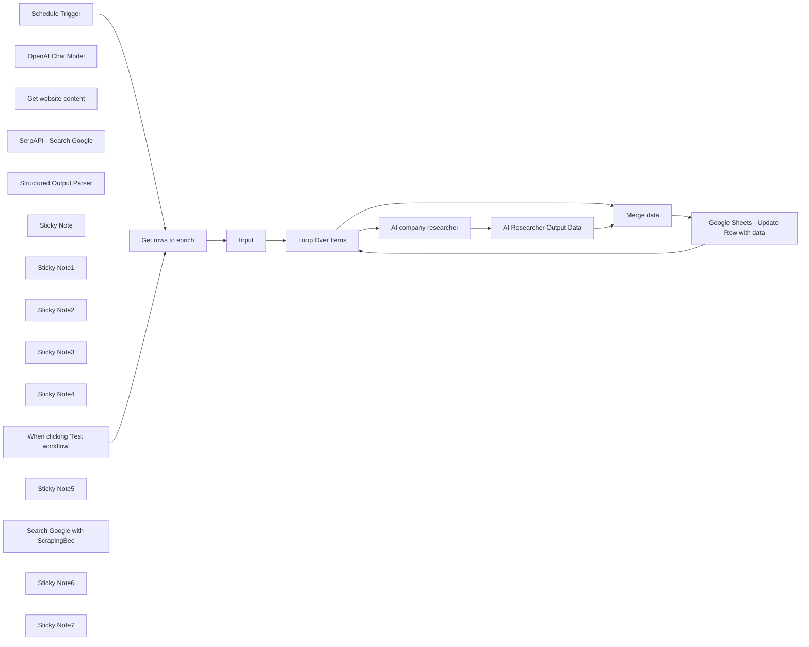

## Fluxo (.json) :

```json
{
  "meta": {
    "instanceId": "2b1cc1a8b0a2fb9caab11ab2d5eb3712f9973066051b2e898cf4041a1f2a7757",
    "templateId": "2324",
    "templateCredsSetupCompleted": true
  },
  "nodes": [
    {
      "id": "71b06728-7f59-49e3-9365-3281189a6659",
      "name": "When clicking \"Test workflow\"",
      "type": "n8n-nodes-base.manualTrigger",
      "position": [
        920,
        340
      ],
      "parameters": {},
      "typeVersion": 1
    },
    {
      "id": "b37019e3-c7ab-4119-986d-c27d082a036e",
      "name": "Input",
      "type": "n8n-nodes-base.set",
      "position": [
        1340,
        340
      ],
      "parameters": {
        "options": {},
        "assignments": {
          "assignments": [
            {
              "id": "fcc97354-b9f6-4459-a004-46e87902c77c",
              "name": "company_input",
              "type": "string",
              "value": "={{ $json.input }}"
            },
            {
              "id": "e5415c49-5204-45b1-a0e9-814157127b12",
              "name": "row_number",
              "type": "number",
              "value": "={{ $json.row_number }}"
            }
          ]
        }
      },
      "typeVersion": 3.3
    },
    {
      "id": "7d5d53ac-6d3c-4b24-97c7-deb6b76749e5",
      "name": "OpenAI Chat Model",
      "type": "@n8n/n8n-nodes-langchain.lmChatOpenAi",
      "position": [
        2020,
        660
      ],
      "parameters": {
        "model": "gpt-4o",
        "options": {
          "temperature": 0.3
        }
      },
      "credentials": {
        "openAiApi": {
          "id": "FMTQypGcsAwaRQdC",
          "name": "OpenAi account"
        }
      },
      "typeVersion": 1
    },
    {
      "id": "24e2f3b0-8b90-49a9-bde6-0fb0c2baf52a",
      "name": "Get website content",
      "type": "@n8n/n8n-nodes-langchain.toolWorkflow",
      "position": [
        2580,
        680
      ],
      "parameters": {
        "name": "get_website_content",
        "source": "parameter",
        "description": "This tool will return the text from the given URL. ",
        "workflowJson": "{\n \"meta\": {\n \"templateCredsSetupCompleted\": true,\n \"instanceId\": \"2b1cc1a8b0a2fb9caab11ab2d5eb3712f9973066051b2e898cf4041a1f2a7757\"\n },\n \"nodes\": [\n {\n \"parameters\": {},\n \"id\": \"475eaf3c-7e11-457e-8b72-4d3e683e2f80\",\n \"name\": \"Execute Workflow Trigger\",\n \"type\": \"n8n-nodes-base.executeWorkflowTrigger\",\n \"typeVersion\": 1,\n \"position\": [\n 260,\n 340\n ]\n },\n {\n \"parameters\": {\n \"url\": \"={{ $json.query.url }}\",\n \"options\": {}\n },\n \"id\": \"321fbc74-d749-4f9b-954e-7cad37601ddf\",\n \"name\": \"Visit Website\",\n \"type\": \"n8n-nodes-base.httpRequest\",\n \"typeVersion\": 4.2,\n \"position\": [\n 440,\n 340\n ]\n },\n {\n \"parameters\": {\n \"operation\": \"extractHtmlContent\",\n \"extractionValues\": {\n \"values\": [\n {\n \"key\": \"body\",\n \"cssSelector\": \"html\",\n \"skipSelectors\": \"head\"\n }\n ]\n },\n \"options\": {\n \"cleanUpText\": true\n }\n },\n \"id\": \"6e51732a-4999-4805-838b-f692e9965197\",\n \"name\": \"HTML\",\n \"type\": \"n8n-nodes-base.html\",\n \"typeVersion\": 1.2,\n \"position\": [\n 620,\n 340\n ]\n }\n ],\n \"connections\": {\n \"Execute Workflow Trigger\": {\n \"main\": [\n [\n {\n \"node\": \"Visit Website\",\n \"type\": \"main\",\n \"index\": 0\n }\n ]\n ]\n },\n \"Visit Website\": {\n \"main\": [\n [\n {\n \"node\": \"HTML\",\n \"type\": \"main\",\n \"index\": 0\n }\n ]\n ]\n }\n },\n \"pinData\": {\n \"Execute Workflow Trigger\": [\n {\n \"query\": {\n \"url\": \"https://www.lemlist.com\"\n }\n }\n ]\n }\n}",
        "jsonSchemaExample": "{\n\t\"url\": \"https://www.lemlist.com\"\n}",
        "specifyInputSchema": true,
        "responsePropertyName": "body"
      },
      "typeVersion": 1.1
    },
    {
      "id": "ff7ab74c-dfc6-43ce-8c57-6edf935b4915",
      "name": "SerpAPI - Search Google",
      "type": "@n8n/n8n-nodes-langchain.toolSerpApi",
      "position": [
        2300,
        660
      ],
      "parameters": {
        "options": {}
      },
      "credentials": {
        "serpApi": {
          "id": "ECK6FimAloRJOZMG",
          "name": "SerpAPI account"
        }
      },
      "typeVersion": 1
    },
    {
      "id": "4fe311f2-4983-4380-b4ed-a827a406fce5",
      "name": "Structured Output Parser",
      "type": "@n8n/n8n-nodes-langchain.outputParserStructured",
      "position": [
        2880,
        660
      ],
      "parameters": {
        "schemaType": "manual",
        "inputSchema": "{\n\t\"type\": \"object\",\n\t\"properties\": {\n\t\t\"case_study_link\": {\n\t\t\t\"type\":[\"string\", \"null\"]\n\t\t},\n \t\t\"domain\": {\n\t\t\t\"type\": [\"string\", \"null\"]\n\t\t},\n \"linkedinUrl\": {\n\t\t\t\"type\": [\"string\", \"null\"]\n\t\t},\n \t\"market\": {\n\t\t\t\"type\": [\"string\", \"null\"]\n\t\t},\n\t\t\"cheapest_plan\": {\n\t\t\t\"type\": [\"number\", \"null\"]\n\t\t},\n\t\"has_enterprise_plan\": {\n\t\t\t\"type\": [\"boolean\", \"null\"]\n\t\t},\n\t\"has_API\": {\n\t\t\t\"type\": [\"boolean\", \"null\"]\n\t\t},\n\t\"has_free_trial\": {\n\t\t\t\"type\": [\"boolean\", \"null\"]\n\t\t},\n\t\"integrations\": {\n\t\t\t\"type\": [\"array\",\"null\"],\n \"items\": {\n\t\t\t\t\"type\": \"string\"\n\t\t\t}\n\t\t}\n\t}\n}"
      },
      "typeVersion": 1.2
    },
    {
      "id": "89ed0723-4dbe-428d-b1a9-ebdf515e42bb",
      "name": "Loop Over Items",
      "type": "n8n-nodes-base.splitInBatches",
      "position": [
        1600,
        340
      ],
      "parameters": {
        "options": {}
      },
      "typeVersion": 3
    },
    {
      "id": "34ea3862-e8e5-4bf2-a9aa-2ad084376bb5",
      "name": "AI Researcher Output Data",
      "type": "n8n-nodes-base.set",
      "position": [
        2960,
        340
      ],
      "parameters": {
        "options": {},
        "assignments": {
          "assignments": [
            {
              "id": "4109ca11-1bb8-4f5c-8bec-a962f44b0746",
              "name": "domain",
              "type": "string",
              "value": "={{ $json.output.domain }}"
            },
            {
              "id": "7f492768-375e-48fa-866b-644b2b5cbd68",
              "name": "linkedinUrl",
              "type": "string",
              "value": "={{ $json.output.linkedinUrl }}"
            },
            {
              "id": "e30b0d07-68db-45a1-9593-fd6ce24a1d50",
              "name": "market",
              "type": "string",
              "value": "={{ $json.output.market }}"
            },
            {
              "id": "0c03a51e-2c07-4583-85c6-d3d2ee81c5d1",
              "name": "cheapest_plan",
              "type": "number",
              "value": "={{ $json.output.cheapest_plan }}"
            },
            {
              "id": "0c9622d0-8446-4663-9a94-964b5df851f1",
              "name": "has_enterprise_plan",
              "type": "boolean",
              "value": "={{ $json.output.has_enterprise_plan }}"
            },
            {
              "id": "564cf6ea-457f-4762-bc19-6900b7d5743c",
              "name": "has_API",
              "type": "boolean",
              "value": "={{ $json.output.has_API }}"
            },
            {
              "id": "7fd39897-65c3-45d6-9563-8254f55ecef0",
              "name": "has_free_trial",
              "type": "boolean",
              "value": "={{ $json.output.has_free_trial }}"
            },
            {
              "id": "26477939-d407-4cae-92b2-9a9dc0f53a64",
              "name": "integrations",
              "type": "array",
              "value": "={{ $json.output.integrations }}"
            },
            {
              "id": "f0cc61d1-6b6b-4142-8627-4a4c721b19a1",
              "name": "case_study_link",
              "type": "string",
              "value": "={{ $json.output.case_study_link }}"
            }
          ]
        }
      },
      "typeVersion": 3.3
    },
    {
      "id": "ff1cb26d-6138-4ee1-9f28-4ecc80c1c8ae",
      "name": "Google Sheets - Update Row with data",
      "type": "n8n-nodes-base.googleSheets",
      "position": [
        3600,
        700
      ],
      "parameters": {
        "columns": {
          "value": {
            "domain": "={{ $json.domain }}",
            "market": "={{ $json.market }}",
            "row_number": "={{ $json.row_number }}",
            "linkedinUrl": "={{ $json.linkedinUrl }}",
            "integrations": "={{ $json.integrations }}",
            "cheapest_plan": "={{ $json.cheapest_plan }}",
            "has_free_trial": "={{ $json.has_free_trial }}",
            "enrichment_status": "done",
            "has_entreprise_plan": "={{ $json.has_enterprise_plan }}",
            "last_case_study_link": "={{ $json.case_study_link }}"
          },
          "schema": [
            {
              "id": "input",
              "type": "string",
              "display": true,
              "removed": true,
              "required": false,
              "displayName": "input",
              "defaultMatch": false,
              "canBeUsedToMatch": true
            },
            {
              "id": "domain",
              "type": "string",
              "display": true,
              "required": false,
              "displayName": "domain",
              "defaultMatch": false,
              "canBeUsedToMatch": true
            },
            {
              "id": "linkedinUrl",
              "type": "string",
              "display": true,
              "required": false,
              "displayName": "linkedinUrl",
              "defaultMatch": false,
              "canBeUsedToMatch": true
            },
            {
              "id": "has_free_trial",
              "type": "string",
              "display": true,
              "required": false,
              "displayName": "has_free_trial",
              "defaultMatch": false,
              "canBeUsedToMatch": true
            },
            {
              "id": "cheapest_plan",
              "type": "string",
              "display": true,
              "required": false,
              "displayName": "cheapest_plan",
              "defaultMatch": false,
              "canBeUsedToMatch": true
            },
            {
              "id": "has_entreprise_plan",
              "type": "string",
              "display": true,
              "required": false,
              "displayName": "has_entreprise_plan",
              "defaultMatch": false,
              "canBeUsedToMatch": true
            },
            {
              "id": "last_case_study_link",
              "type": "string",
              "display": true,
              "removed": false,
              "required": false,
              "displayName": "last_case_study_link",
              "defaultMatch": false,
              "canBeUsedToMatch": true
            },
            {
              "id": "market",
              "type": "string",
              "display": true,
              "required": false,
              "displayName": "market",
              "defaultMatch": false,
              "canBeUsedToMatch": true
            },
            {
              "id": "integrations",
              "type": "string",
              "display": true,
              "required": false,
              "displayName": "integrations",
              "defaultMatch": false,
              "canBeUsedToMatch": true
            },
            {
              "id": "enrichment_status",
              "type": "string",
              "display": true,
              "required": false,
              "displayName": "enrichment_status",
              "defaultMatch": false,
              "canBeUsedToMatch": true
            },
            {
              "id": "row_number",
              "type": "string",
              "display": true,
              "removed": false,
              "readOnly": true,
              "required": false,
              "displayName": "row_number",
              "defaultMatch": false,
              "canBeUsedToMatch": true
            }
          ],
          "mappingMode": "defineBelow",
          "matchingColumns": [
            "row_number"
          ]
        },
        "options": {},
        "operation": "update",
        "sheetName": {
          "__rl": true,
          "mode": "list",
          "value": "gid=0",
          "cachedResultUrl": "https://docs.google.com/spreadsheets/d/19U7gAgkUEz6mbFcnygf1zKDdGvY6OAdUqq3bZQWgjxE/edit#gid=0",
          "cachedResultName": "Sheet1"
        },
        "documentId": {
          "__rl": true,
          "mode": "list",
          "value": "19U7gAgkUEz6mbFcnygf1zKDdGvY6OAdUqq3bZQWgjxE",
          "cachedResultUrl": "https://docs.google.com/spreadsheets/d/19U7gAgkUEz6mbFcnygf1zKDdGvY6OAdUqq3bZQWgjxE/edit?usp=drivesdk",
          "cachedResultName": "Enrich companies using AI agents"
        }
      },
      "credentials": {
        "googleSheetsOAuth2Api": {
          "id": "GC2OQl3Jvy543LT2",
          "name": "Google Sheets account - perso"
        }
      },
      "typeVersion": 4.3
    },
    {
      "id": "6611f852-b4d6-4a07-9428-db206ef57cc3",
      "name": "Merge data",
      "type": "n8n-nodes-base.merge",
      "position": [
        3240,
        180
      ],
      "parameters": {
        "mode": "combine",
        "options": {},
        "combinationMode": "mergeByPosition"
      },
      "typeVersion": 2.1
    },
    {
      "id": "2a19516b-33a1-4987-9b5f-242a084621e0",
      "name": "Sticky Note",
      "type": "n8n-nodes-base.stickyNote",
      "position": [
        380,
        240
      ],
      "parameters": {
        "width": 409.0131656322444,
        "height": 658.0614601225933,
        "content": "## Read Me\n\nThis workflow allows you to do account research with the web using AI.\n\nThe advanced AI module has 2 capabilities: \n- Research Google using SerpAPI\n- Visit and get website content using a sub-workflow\n\n\nFrom an unstructured input like a domain or a company name. \n\nIt will return the following properties: \n- domain\n- company Linkedin Url\n- cheapest plan\n- has free trial\n- has entreprise plan\n- has API\n- market (B2B or B2C)\n\n\nThe strength of n8n here is that you can adapt this workflow to research whatever information you need.\n\nYou just have to precise it in the prompt and to precise the output format in the \"Strutured Output Parser\" module.\n\n[Click here to find more detailed instructions with video guide.](https://lempire.notion.site/AI-Web-research-with-n8n-a25aae3258d0423481a08bd102f16906)\n"
      },
      "typeVersion": 1
    },
    {
      "id": "67d485c9-3289-4bb3-9523-cd24c0b1aa05",
      "name": "Get rows to enrich",
      "type": "n8n-nodes-base.googleSheets",
      "position": [
        1140,
        340
      ],
      "parameters": {
        "options": {
          "returnAllMatches": "returnAllMatches"
        },
        "filtersUI": {
          "values": [
            {
              "lookupColumn": "enrichment_status"
            }
          ]
        },
        "sheetName": {
          "__rl": true,
          "mode": "list",
          "value": "gid=0",
          "cachedResultUrl": "https://docs.google.com/spreadsheets/d/19U7gAgkUEz6mbFcnygf1zKDdGvY6OAdUqq3bZQWgjxE/edit#gid=0",
          "cachedResultName": "Sheet1"
        },
        "documentId": {
          "__rl": true,
          "mode": "list",
          "value": "19U7gAgkUEz6mbFcnygf1zKDdGvY6OAdUqq3bZQWgjxE",
          "cachedResultUrl": "https://docs.google.com/spreadsheets/d/19U7gAgkUEz6mbFcnygf1zKDdGvY6OAdUqq3bZQWgjxE/edit?usp=drivesdk",
          "cachedResultName": "Enrich companies using AI agents"
        }
      },
      "credentials": {
        "googleSheetsOAuth2Api": {
          "id": "GC2OQl3Jvy543LT2",
          "name": "Google Sheets account - perso"
        }
      },
      "typeVersion": 4.3
    },
    {
      "id": "eb0c95e7-2211-48d1-abaf-07cd0c76d3a6",
      "name": "Sticky Note1",
      "type": "n8n-nodes-base.stickyNote",
      "position": [
        1540,
        227.25301102878547
      ],
      "parameters": {
        "width": 300.49399096535876,
        "height": 333.8263184006576,
        "content": "### Process rows 1 by 1\nThis module will allow us to process rows 1 by 1"
      },
      "typeVersion": 1
    },
    {
      "id": "8bf0deae-dda7-4e27-9ac7-978db14cca19",
      "name": "Sticky Note2",
      "type": "n8n-nodes-base.stickyNote",
      "position": [
        2740,
        560
      ],
      "parameters": {
        "width": 300.49399096535876,
        "height": 236.01118609685022,
        "content": "Precise here the format in which you need the data to be "
      },
      "typeVersion": 1
    },
    {
      "id": "dc4f1550-1e3c-4175-a2b3-10153dc2fd77",
      "name": "Sticky Note3",
      "type": "n8n-nodes-base.stickyNote",
      "position": [
        2180,
        200.2582716310755
      ],
      "parameters": {
        "width": 300.49399096535876,
        "height": 279.8787004666023,
        "content": "### Ask AI what are the information you are looking for about the company"
      },
      "typeVersion": 1
    },
    {
      "id": "70fc73a0-303b-46e1-822d-cebdbccf8e32",
      "name": "Sticky Note4",
      "type": "n8n-nodes-base.stickyNote",
      "position": [
        2220,
        580
      ],
      "parameters": {
        "height": 248.91749449109562,
        "content": "Get your free API key here https://serpapi.com/"
      },
      "typeVersion": 1
    },
    {
      "id": "0c1dafa9-28fe-4ef4-b80e-d4034e16f6c0",
      "name": "Schedule Trigger",
      "type": "n8n-nodes-base.scheduleTrigger",
      "position": [
        920,
        580
      ],
      "parameters": {
        "rule": {
          "interval": [
            {
              "field": "hours",
              "hoursInterval": 2
            }
          ]
        }
      },
      "typeVersion": 1.2
    },
    {
      "id": "8b5ebee9-f519-4621-bf2a-12891794f2c5",
      "name": "Sticky Note5",
      "type": "n8n-nodes-base.stickyNote",
      "position": [
        820,
        240
      ],
      "parameters": {
        "width": 266.12865147126786,
        "height": 627.5654650079845,
        "content": "Run the workflow manually or activate it to run it every 2 hours"
      },
      "typeVersion": 1
    },
    {
      "id": "d7db2452-ba3d-4adb-bd8b-d17a92d1bce5",
      "name": "AI company researcher",
      "type": "@n8n/n8n-nodes-langchain.agent",
      "position": [
        2200,
        340
      ],
      "parameters": {
        "text": "=This is the company I want you to research info about:\n{{ $json.company_input }}\n\nReturn me:\n- the linkedin URL of the company\n- the domain of the company. in this format ([domain].[tld])\n- market: if they are B2B or B2C. Only reply by \"B2B\" or \"B2B\"\n- the lowest paid plan the company is offering. If you are not sure, reply null.\n- the latest case study URL published on the website (find case study hub using google, and return the first case study link)\n- tell me if the company offer an API\n- tell me if the company has an enterprise plan\n- tell me if the company has a free trial mentionned in their homepage. reply false if you don't find strong evidence.\n- return an array with up to 5 tools the company is integrated with",
        "options": {
          "maxIterations": 10
        },
        "promptType": "define",
        "hasOutputParser": true
      },
      "typeVersion": 1.6
    },
    {
      "id": "f7896dbd-5c15-44e9-96ca-c695a66562cc",
      "name": "Search Google with ScrapingBee",
      "type": "@n8n/n8n-nodes-langchain.toolWorkflow",
      "position": [
        2300,
        1140
      ],
      "parameters": {
        "name": "search_google",
        "source": "parameter",
        "description": "Call this tool to get results from a google search.",
        "workflowJson": "{\n \"meta\": {\n \"templateCredsSetupCompleted\": true,\n \"instanceId\": \"2b1cc1a8b0a2fb9caab11ab2d5eb3712f9973066051b2e898cf4041a1f2a7757\"\n },\n \"nodes\": [\n {\n \"parameters\": {},\n \"id\": \"fbb17d8d-e2dc-46ae-aba4-8c27cc9d8766\",\n \"name\": \"Execute Workflow Trigger\",\n \"type\": \"n8n-nodes-base.executeWorkflowTrigger\",\n \"typeVersion\": 1,\n \"position\": [\n 20,\n 460\n ]\n },\n {\n \"parameters\": {\n \"url\": \"https://app.scrapingbee.com/api/v1/store/google\",\n \"authentication\": \"genericCredentialType\",\n \"genericAuthType\": \"httpQueryAuth\",\n \"sendQuery\": true,\n \"queryParameters\": {\n \"parameters\": [\n {\n \"name\": \"search\",\n \"value\": \"={{ $json.query.google_search_query }}\"\n },\n {\n \"name\": \"language\",\n \"value\": \"en\"\n },\n {\n \"name\": \"nb_results\",\n \"value\": \"5\"\n }\n ]\n },\n \"options\": {}\n },\n \"id\": \"b938a2bd-030e-46d7-adee-4e3c85cfc1b3\",\n \"name\": \"Search Google\",\n \"type\": \"n8n-nodes-base.httpRequest\",\n \"typeVersion\": 4.2,\n \"position\": [\n 300,\n 460\n ],\n \"credentials\": {\n \"httpQueryAuth\": {\n \"id\": \"Pb2CIMT0tN838QPy\",\n \"name\": \"ScrapingBee\"\n }\n }\n },\n {\n \"parameters\": {\n \"assignments\": {\n \"assignments\": [\n {\n \"id\": \"096fee70-444e-4948-816c-752b20786062\",\n \"name\": \"response\",\n \"value\": \"={{ $json.organic_results }}\",\n \"type\": \"array\"\n }\n ]\n },\n \"options\": {}\n },\n \"id\": \"c5db1fb6-d875-47d2-97db-287777583f22\",\n \"name\": \"Response\",\n \"type\": \"n8n-nodes-base.set\",\n \"typeVersion\": 3.3,\n \"position\": [\n 520,\n 460\n ]\n }\n ],\n \"connections\": {\n \"Execute Workflow Trigger\": {\n \"main\": [\n [\n {\n \"node\": \"Search Google\",\n \"type\": \"main\",\n \"index\": 0\n }\n ]\n ]\n },\n \"Search Google\": {\n \"main\": [\n [\n {\n \"node\": \"Response\",\n \"type\": \"main\",\n \"index\": 0\n }\n ]\n ]\n }\n },\n \"pinData\": {\n \"Execute Workflow Trigger\": [\n {\n \"query\": {\n \"google_search_query\": \"site:lemlist.com pricing\"\n }\n }\n ]\n }\n}",
        "jsonSchemaExample": "{\n\t\"google_search_query\": \"site:lemlist.com pricing\"\n}",
        "specifyInputSchema": true
      },
      "typeVersion": 1.1
    },
    {
      "id": "7a89c803-8145-49c2-aafe-ec2aff0b2fbc",
      "name": "Sticky Note6",
      "type": "n8n-nodes-base.stickyNote",
      "position": [
        2220,
        940
      ],
      "parameters": {
        "height": 340.14969579315925,
        "content": "Instead of SERP API module, you can also use this custom module for ScrapingBee. It is more cost-efficient.\n\nGet your free API key here https://www.scrapingbee.com/"
      },
      "typeVersion": 1
    },
    {
      "id": "79eff129-790b-46da-bef3-899eb6db3ced",
      "name": "Sticky Note7",
      "type": "n8n-nodes-base.stickyNote",
      "position": [
        1100,
        -20
      ],
      "parameters": {
        "width": 194.6864335083109,
        "height": 525.6560478822986,
        "content": "In this workflow, I use Google Sheets to store the results. \n\nYou can use my template to get started faster:\n\n1. [Click on this link to get the template](https://docs.google.com/spreadsheets/d/1vR6s2nlTwu01v3GP7wvSRWS5W49FJIh20ZF7AUkmMDo/edit?usp=sharing)\n2. Make a copy of the Sheets\n3. Add the URL to this node and the node **\"Google Sheets - Update Row with data\"**\n\n\n"
      },
      "typeVersion": 1
    }
  ],
  "pinData": {},
  "connections": {
    "Input": {
      "main": [
        [
          {
            "node": "Loop Over Items",
            "type": "main",
            "index": 0
          }
        ]
      ]
    },
    "Merge data": {
      "main": [
        [
          {
            "node": "Google Sheets - Update Row with data",
            "type": "main",
            "index": 0
          }
        ]
      ]
    },
    "Loop Over Items": {
      "main": [
        null,
        [
          {
            "node": "AI company researcher",
            "type": "main",
            "index": 0
          },
          {
            "node": "Merge data",
            "type": "main",
            "index": 0
          }
        ]
      ]
    },
    "Schedule Trigger": {
      "main": [
        [
          {
            "node": "Get rows to enrich",
            "type": "main",
            "index": 0
          }
        ]
      ]
    },
    "OpenAI Chat Model": {
      "ai_languageModel": [
        [
          {
            "node": "AI company researcher",
            "type": "ai_languageModel",
            "index": 0
          }
        ]
      ]
    },
    "Get rows to enrich": {
      "main": [
        [
          {
            "node": "Input",
            "type": "main",
            "index": 0
          }
        ]
      ]
    },
    "Get website content": {
      "ai_tool": [
        [
          {
            "node": "AI company researcher",
            "type": "ai_tool",
            "index": 0
          }
        ]
      ]
    },
    "AI company researcher": {
      "main": [
        [
          {
            "node": "AI Researcher Output Data",
            "type": "main",
            "index": 0
          }
        ]
      ]
    },
    "SerpAPI - Search Google": {
      "ai_tool": [
        [
          {
            "node": "AI company researcher",
            "type": "ai_tool",
            "index": 0
          }
        ]
      ]
    },
    "Structured Output Parser": {
      "ai_outputParser": [
        [
          {
            "node": "AI company researcher",
            "type": "ai_outputParser",
            "index": 0
          }
        ]
      ]
    },
    "AI Researcher Output Data": {
      "main": [
        [
          {
            "node": "Merge data",
            "type": "main",
            "index": 1
          }
        ]
      ]
    },
    "When clicking \"Test workflow\"": {
      "main": [
        [
          {
            "node": "Get rows to enrich",
            "type": "main",
            "index": 0
          }
        ]
      ]
    },
    "Google Sheets - Update Row with data": {
      "main": [
        [
          {
            "node": "Loop Over Items",
            "type": "main",
            "index": 0
          }
        ]
      ]
    }
  }
}
```

<a id="template-999"></a>

## Template 999 - Salvar likes 'insightful' do LinkedIn no Airtable

- **Nome:** Salvar likes 'insightful' do LinkedIn no Airtable
- **Descrição:** Busca reações 'insightful' recentes em sua conta do LinkedIn e transforma esses likes em ideias de conteúdo salvas automaticamente em uma base do Airtable.
- **Funcionalidade:** • Agendamento: Executa o fluxo periodicamente conforme configurado.
• Busca de likes do LinkedIn: Recupera as postagens que você curtiu usando uma API externa.
• Separação de itens: Processa cada like individualmente para tratamento posterior.
• Filtragem por relevância e data: Mantém apenas reações marcadas como "insightful" e publicadas nos últimos 7 dias.
• Formatação de ideia de conteúdo: Gera título, descrição e URL de origem a partir dos dados da postagem curtida.
• Armazenamento estruturado: Grava as ideias no Airtable preenchendo campos como Tipo, Title, Source, Status e Description.
- **Ferramentas:** • LinkedIn via RapidAPI: API externa usada para recuperar as postagens que você curtiu e metadados associados.
• Airtable: Base de dados online onde as ideias de conteúdo são salvas (base "Content Hub", tabela "Ideas").

## Fluxo visual

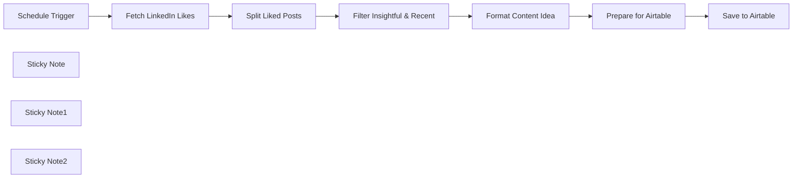

## Fluxo (.json) :

```json
{
  "id": "ift5iHQG9G2lzJzP",
  "meta": {
    "instanceId": "558d88703fb65b2d0e44613bc35916258b0f0bf983c5d4730c00c424b77ca36a",
    "templateCredsSetupCompleted": true
  },
  "name": "Linkedin to Airtable",
  "tags": [
    {
      "id": "1iR8rLF2nlFdk8Iy",
      "name": "Tool",
      "createdAt": "2025-04-10T20:38:51.198Z",
      "updatedAt": "2025-04-10T20:38:51.198Z"
    },
    {
      "id": "kY9rLUshnq9TIJVU",
      "name": "Freebie",
      "createdAt": "2025-04-11T17:35:46.605Z",
      "updatedAt": "2025-04-11T17:35:46.605Z"
    }
  ],
  "nodes": [
    {
      "id": "623c5cf2-0c16-47fe-8ec0-fa66e7c32576",
      "name": "Schedule Trigger",
      "type": "n8n-nodes-base.scheduleTrigger",
      "position": [
        -980,
        -520
      ],
      "parameters": {
        "rule": {
          "interval": [
            {}
          ]
        }
      },
      "typeVersion": 1.2
    },
    {
      "id": "f09f752b-162b-4d9d-a397-69f3ead78e45",
      "name": "Fetch LinkedIn Likes",
      "type": "n8n-nodes-base.httpRequest",
      "position": [
        -780,
        -520
      ],
      "parameters": {
        "url": "https://linkedin-api8.p.rapidapi.com/get-profile-likes",
        "options": {},
        "sendQuery": true,
        "sendHeaders": true,
        "queryParameters": {
          "parameters": [
            {
              "name": "username",
              "value": "< YOUR LINKEDIN USERNAME >"
            },
            {
              "name": "start",
              "value": "0"
            }
          ]
        },
        "headerParameters": {
          "parameters": [
            {
              "name": "x-rapidapi-host",
              "value": "linkedin-api8.p.rapidapi.com"
            },
            {
              "name": "x-rapidapi-key",
              "value": "< YOUR RAPID API KEY >"
            }
          ]
        }
      },
      "typeVersion": 4.2
    },
    {
      "id": "f3f64d75-550e-4a32-99ea-ccea7d14694f",
      "name": "Split Liked Posts",
      "type": "n8n-nodes-base.splitOut",
      "position": [
        -560,
        -520
      ],
      "parameters": {
        "options": {},
        "fieldToSplitOut": "data.items"
      },
      "typeVersion": 1
    },
    {
      "id": "40cc1e38-c564-45ac-b150-58bf2d42353d",
      "name": "Filter Insightful & Recent",
      "type": "n8n-nodes-base.filter",
      "position": [
        -340,
        -520
      ],
      "parameters": {
        "options": {},
        "conditions": {
          "options": {
            "version": 2,
            "leftValue": "",
            "caseSensitive": true,
            "typeValidation": "strict"
          },
          "combinator": "and",
          "conditions": [
            {
              "id": "a1ee03bc-55c0-4e62-af66-280df7e24824",
              "operator": {
                "type": "string",
                "operation": "contains"
              },
              "leftValue": "={{ $json.action }}",
              "rightValue": "insightful"
            },
            {
              "id": "9b7fcecb-09c0-45f2-bb30-9b6ab565695c",
              "operator": {
                "type": "number",
                "operation": "gt"
              },
              "leftValue": "={{ new Date($json.postedDate).getTime() }}",
              "rightValue": "={{ new Date().getTime() - (7 * 24 * 60 * 60 * 1000) }}"
            }
          ]
        }
      },
      "typeVersion": 2.2
    },
    {
      "id": "e56f96db-7179-4c48-bf2b-a8153c5ae623",
      "name": "Format Content Idea",
      "type": "n8n-nodes-base.set",
      "position": [
        -120,
        -520
      ],
      "parameters": {
        "options": {},
        "assignments": {
          "assignments": [
            {
              "id": "93ebd033-743a-4f8c-837c-ed619d14895d",
              "name": "Title",
              "type": "string",
              "value": "=I just liked a linkedin post of {{ $json.author.username }}"
            },
            {
              "id": "fdbde792-1dba-46e2-9c3a-2daf629151e3",
              "name": "description",
              "type": "string",
              "value": "={{ $json.text }}"
            },
            {
              "id": "ecf9aca8-45ae-4037-8f78-06a2a7b5d076",
              "name": "source",
              "type": "string",
              "value": "={{ $json.postUrl }}"
            }
          ]
        }
      },
      "typeVersion": 3.4
    },
    {
      "id": "364eba33-3b3a-44c7-af0f-bab130ea7193",
      "name": "Prepare for Airtable",
      "type": "n8n-nodes-base.splitOut",
      "position": [
        100,
        -520
      ],
      "parameters": {
        "options": {},
        "fieldToSplitOut": "Title, description, source"
      },
      "typeVersion": 1
    },
    {
      "id": "0f029e8e-0a82-49be-ae77-40bbb02088ab",
      "name": "Save to Airtable",
      "type": "n8n-nodes-base.airtable",
      "position": [
        320,
        -520
      ],
      "parameters": {
        "base": {
          "__rl": true,
          "mode": "list",
          "value": "appgNpFtbtaGHM4g0",
          "cachedResultUrl": "https://airtable.com/appgNpFtbtaGHM4g0",
          "cachedResultName": "Content Hub"
        },
        "table": {
          "__rl": true,
          "mode": "list",
          "value": "tblwBVudDpOMkUGKL",
          "cachedResultUrl": "https://airtable.com/appgNpFtbtaGHM4g0/tblwBVudDpOMkUGKL",
          "cachedResultName": "Ideas"
        },
        "columns": {
          "value": {
            "Type": "Linkedin",
            "Title": "={{ $json.Title }}",
            "Source": "={{ $json.source }}",
            "Status": false,
            "Description": "={{ $json.description }}"
          },
          "schema": [
            {
              "id": "Title",
              "type": "string",
              "display": true,
              "removed": false,
              "readOnly": false,
              "required": false,
              "displayName": "Title",
              "defaultMatch": false,
              "canBeUsedToMatch": true
            },
            {
              "id": "Description",
              "type": "string",
              "display": true,
              "removed": false,
              "readOnly": false,
              "required": false,
              "displayName": "Description",
              "defaultMatch": false,
              "canBeUsedToMatch": true
            },
            {
              "id": "Main Idea",
              "type": "string",
              "display": true,
              "removed": true,
              "readOnly": false,
              "required": false,
              "displayName": "Main Idea",
              "defaultMatch": false,
              "canBeUsedToMatch": true
            },
            {
              "id": "Takeaways",
              "type": "string",
              "display": true,
              "removed": true,
              "readOnly": false,
              "required": false,
              "displayName": "Takeaways",
              "defaultMatch": false,
              "canBeUsedToMatch": true
            },
            {
              "id": "Status",
              "type": "boolean",
              "display": true,
              "removed": false,
              "readOnly": false,
              "required": false,
              "displayName": "Status",
              "defaultMatch": false,
              "canBeUsedToMatch": true
            },
            {
              "id": "Source",
              "type": "string",
              "display": true,
              "removed": false,
              "readOnly": false,
              "required": false,
              "displayName": "Source",
              "defaultMatch": false,
              "canBeUsedToMatch": true
            },
            {
              "id": "Type",
              "type": "options",
              "display": true,
              "options": [
                {
                  "name": "Youtube Video",
                  "value": "Youtube Video"
                },
                {
                  "name": "Web Article",
                  "value": "Web Article"
                },
                {
                  "name": "Own Notes",
                  "value": "Own Notes"
                },
                {
                  "name": "E-Book",
                  "value": "E-Book"
                },
                {
                  "name": "Twitter",
                  "value": "Twitter"
                },
                {
                  "name": "Linkedin",
                  "value": "Linkedin"
                }
              ],
              "removed": false,
              "readOnly": false,
              "required": false,
              "displayName": "Type",
              "defaultMatch": false,
              "canBeUsedToMatch": true
            },
            {
              "id": "Draft",
              "type": "string",
              "display": true,
              "removed": true,
              "readOnly": false,
              "required": false,
              "displayName": "Draft",
              "defaultMatch": false,
              "canBeUsedToMatch": true
            },
            {
              "id": "Attachment - Video",
              "type": "string",
              "display": true,
              "removed": false,
              "readOnly": false,
              "required": false,
              "displayName": "Attachment - Video",
              "defaultMatch": false,
              "canBeUsedToMatch": true
            },
            {
              "id": "Attachment - Image",
              "type": "string",
              "display": true,
              "removed": false,
              "readOnly": false,
              "required": false,
              "displayName": "Attachment - Image",
              "defaultMatch": false,
              "canBeUsedToMatch": true
            },
            {
              "id": "Created",
              "type": "string",
              "display": true,
              "removed": true,
              "readOnly": true,
              "required": false,
              "displayName": "Created",
              "defaultMatch": false,
              "canBeUsedToMatch": true
            },
            {
              "id": "Last Modified",
              "type": "string",
              "display": true,
              "removed": true,
              "readOnly": true,
              "required": false,
              "displayName": "Last Modified",
              "defaultMatch": false,
              "canBeUsedToMatch": true
            }
          ],
          "mappingMode": "defineBelow",
          "matchingColumns": [],
          "attemptToConvertTypes": false,
          "convertFieldsToString": false
        },
        "options": {},
        "operation": "create"
      },
      "credentials": {
        "airtableTokenApi": {
          "id": "g540vJVYsNT8ZS11",
          "name": "Airtable Personal Access Token account"
        }
      },
      "typeVersion": 2.1
    },
    {
      "id": "afed2086-8fc3-4a94-933f-203196413182",
      "name": "Sticky Note",
      "type": "n8n-nodes-base.stickyNote",
      "position": [
        -780,
        -1000
      ],
      "parameters": {
        "width": 460,
        "height": 180,
        "content": "## 📝 Description\nAutomatically turn your insightful LinkedIn post reactions into structured content ideas saved in Airtable. This workflow fetches your recent *\"insightful\"* likes, filters for posts from the last 7 days, extracts relevant content, and logs it into Airtable for future content inspiration."
      },
      "typeVersion": 1
    },
    {
      "id": "ecea99a8-dee2-40a9-aa4d-3616eecb6d73",
      "name": "Sticky Note1",
      "type": "n8n-nodes-base.stickyNote",
      "position": [
        -780,
        -800
      ],
      "parameters": {
        "width": 460,
        "height": 180,
        "content": "## ⚙️ What It Does\n- **Fetches** recent liked posts from LinkedIn using RapidAPI.\n- **Filters** only *insightful* reactions from the past 7 days.\n- **Structures** each post into a title, description, and source URL.\n- **Stores** the content in a custom Airtable base."
      },
      "typeVersion": 1
    },
    {
      "id": "9279261b-acfc-4b35-ad24-8a058bf07987",
      "name": "Sticky Note2",
      "type": "n8n-nodes-base.stickyNote",
      "position": [
        -280,
        -1000
      ],
      "parameters": {
        "width": 500,
        "height": 380,
        "content": "## 🧰 Setup Instructions\n1. Clone this template into your n8n instance.\n2. Open the `Fetch LinkedIn Likes` node and enter:\n   - Your LinkedIn username.\n   - Your RapidAPI key in the headers.\n3. Open the `Save to Airtable` node and:\n   - Connect your Airtable account.\n   - Link the correct base (`Content Hub`) and table (`Ideas`).\n4. Set your desired schedule in the `Trigger` node.\n5. Activate the workflow and you're done!\n"
      },
      "typeVersion": 1
    }
  ],
  "active": false,
  "pinData": {},
  "settings": {
    "executionOrder": "v1"
  },
  "versionId": "623dce6f-9c95-44e7-994e-0da1f65ab1a6",
  "connections": {
    "Schedule Trigger": {
      "main": [
        [
          {
            "node": "Fetch LinkedIn Likes",
            "type": "main",
            "index": 0
          }
        ]
      ]
    },
    "Split Liked Posts": {
      "main": [
        [
          {
            "node": "Filter Insightful & Recent",
            "type": "main",
            "index": 0
          }
        ]
      ]
    },
    "Format Content Idea": {
      "main": [
        [
          {
            "node": "Prepare for Airtable",
            "type": "main",
            "index": 0
          }
        ]
      ]
    },
    "Fetch LinkedIn Likes": {
      "main": [
        [
          {
            "node": "Split Liked Posts",
            "type": "main",
            "index": 0
          }
        ]
      ]
    },
    "Prepare for Airtable": {
      "main": [
        [
          {
            "node": "Save to Airtable",
            "type": "main",
            "index": 0
          }
        ]
      ]
    },
    "Filter Insightful & Recent": {
      "main": [
        [
          {
            "node": "Format Content Idea",
            "type": "main",
            "index": 0
          }
        ]
      ]
    }
  }
}
```

<a id="template-1000"></a>

## Template 1000 - Padrões de Discriminação no Trabalho com IA

- **Nome:** Padrões de Discriminação no Trabalho com IA
- **Descrição:** Este fluxo coleta avaliações do Glassdoor para uma empresa, extrai dados demográficos, calcula métricas estatísticas (z-scores, tamanhos de efeito e p-scores), gera visualizações e utiliza IA para identificar e resumir padrões de discriminação no ambiente de trabalho.
- **Funcionalidade:** • Coleta de dados da Glassdoor: coleta avaliações e informações demográficas da empresa alvo usando ScrapingBee para acessar conteúdos.
• Extração de conteúdos-chave: extrai sumário de avaliações e o módulo demográfico da página de avaliações para análise.
• Cálculo de estatísticas demográficas: coleta z-scores e tamanhos de efeito para cada grupo demográfico em relação à média geral.
• Avaliação de significância estatística: calcula p-scores para entender se diferenças são estatisticamente significativas.
• Preparação de dados para visualização: formata dados para gráficos de dispersão e de barras com base em z-scores, sizes e contagens de avaliações.
• Geração de gráficos: produz gráfico de dispersão (scatter) e gráfico de barras para visualização dos resultados.
• Análise de viés com IA: usa IA para extrair takeaways e descrever experiências dos empregados por grupo.
• Resumo e comunicação de insights: gera um resumo textual com insights-chave e descrições de percepções dos funcionários.
- **Ferramentas:** • Glassdoor: Fonte de avaliações e informações demográficas, obtidas por scraping.
• ScrapingBee: Serviço de scraping utilizado para coletar páginas da Glassdoor contornando restrições de acesso.
• OpenAI API: Serviço de IA para análise de dados, extração de distribuições e geração de insights.
• QuickChart: Serviço para gerar gráficos (barra e dispersão) a partir dos dados analisados.

## Fluxo visual

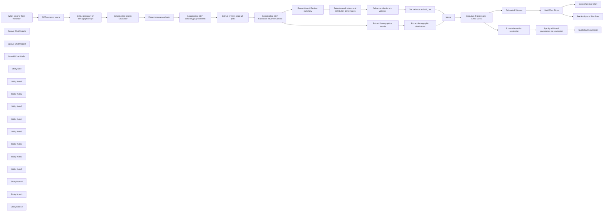

## Fluxo (.json) :

```json
{
  "id": "vzU9QRZsHcyRsord",
  "meta": {
    "instanceId": "a9f3b18652ddc96459b459de4fa8fa33252fb820a9e5a1593074f3580352864a",
    "templateCredsSetupCompleted": true
  },
  "name": "Spot Workplace Discrimination Patterns with AI",
  "tags": [
    {
      "id": "76EYz9X3GU4PtgSS",
      "name": "human_resources",
      "createdAt": "2025-01-30T18:52:17.614Z",
      "updatedAt": "2025-01-30T18:52:17.614Z"
    },
    {
      "id": "ey2Mx4vNaV8cKvao",
      "name": "openai",
      "createdAt": "2024-12-23T07:10:13.400Z",
      "updatedAt": "2024-12-23T07:10:13.400Z"
    }
  ],
  "nodes": [
    {
      "id": "b508ab50-158a-4cbf-a52e-f53e1804e770",
      "name": "When clicking ‘Test workflow’",
      "type": "n8n-nodes-base.manualTrigger",
      "position": [
        280,
        380
      ],
      "parameters": {},
      "typeVersion": 1
    },
    {
      "id": "11a1a2d5-a274-44f7-97ca-5666a59fcb31",
      "name": "OpenAI Chat Model1",
      "type": "@n8n/n8n-nodes-langchain.lmChatOpenAi",
      "position": [
        2220,
        800
      ],
      "parameters": {
        "options": {}
      },
      "credentials": {
        "openAiApi": {
          "id": "XXXXXX",
          "name": "OpenAi account"
        }
      },
      "typeVersion": 1
    },
    {
      "id": "395f7b67-c914-4aae-8727-0573fdbfc6ad",
      "name": "OpenAI Chat Model2",
      "type": "@n8n/n8n-nodes-langchain.lmChatOpenAi",
      "position": [
        2220,
        380
      ],
      "parameters": {
        "options": {}
      },
      "credentials": {
        "openAiApi": {
          "id": "XXXXXX",
          "name": "OpenAi account"
        }
      },
      "typeVersion": 1
    },
    {
      "id": "6ab194a9-b869-4296-aea9-19afcbffc0d7",
      "name": "Merge",
      "type": "n8n-nodes-base.merge",
      "position": [
        2940,
        600
      ],
      "parameters": {
        "mode": "combine",
        "options": {},
        "combineBy": "combineByPosition"
      },
      "typeVersion": 3
    },
    {
      "id": "1eba1dd7-a164-4c70-8c75-759532bd16a0",
      "name": "OpenAI Chat Model",
      "type": "@n8n/n8n-nodes-langchain.lmChatOpenAi",
      "position": [
        3840,
        420
      ],
      "parameters": {
        "options": {}
      },
      "credentials": {
        "openAiApi": {
          "id": "XXXXXX",
          "name": "OpenAi account"
        }
      },
      "typeVersion": 1
    },
    {
      "id": "f25f1b07-cded-4ca7-9655-8b8f463089ab",
      "name": "SET company_name",
      "type": "n8n-nodes-base.set",
      "position": [
        540,
        380
      ],
      "parameters": {
        "options": {},
        "assignments": {
          "assignments": [
            {
              "id": "dd256ef7-013c-4769-8580-02c2d902d0b2",
              "name": "company_name",
              "type": "string",
              "value": "=Twilio"
            }
          ]
        }
      },
      "typeVersion": 3.4
    },
    {
      "id": "87264a93-ab97-4e39-8d40-43365189f704",
      "name": "Define dictionary of demographic keys",
      "type": "n8n-nodes-base.set",
      "position": [
        740,
        380
      ],
      "parameters": {
        "options": {},
        "assignments": {
          "assignments": [
            {
              "id": "6ae671be-45d0-4a94-a443-2f1d4772d31b",
              "name": "asian",
              "type": "string",
              "value": "Asian"
            },
            {
              "id": "6c93370c-996c-44a6-a34c-4cd3baeeb846",
              "name": "hispanic",
              "type": "string",
              "value": "Hispanic or Latinx"
            },
            {
              "id": "dee79039-6051-4e9d-98b5-63a07d30f6b0",
              "name": "white",
              "type": "string",
              "value": "White"
            },
            {
              "id": "08d42380-8397-412f-8459-7553e9309b5d",
              "name": "pacific_islander",
              "type": "string",
              "value": "Native Hawaiian or other Pacific Islander"
            },
            {
              "id": "09e8ebc5-e7e7-449a-9036-9b9b54cdc828",
              "name": "black",
              "type": "string",
              "value": "Black or African American"
            },
            {
              "id": "39e910f8-3a8b-4233-a93a-3c5693e808c6",
              "name": "middle_eastern",
              "type": "string",
              "value": "Middle Eastern"
            },
            {
              "id": "169b3471-efa0-476e-aa83-e3f717c568f1",
              "name": "indigenous",
              "type": "string",
              "value": "Indigenous American or Native Alaskan"
            },
            {
              "id": "b6192296-4efa-4af5-ae02-1e31d28aae90",
              "name": "male",
              "type": "string",
              "value": "Men"
            },
            {
              "id": "4b322294-940c-459d-b083-8e91e38193f7",
              "name": "female",
              "type": "string",
              "value": "Women"
            },
            {
              "id": "1940eef0-6b76-4a26-9d8f-7c8536fbcb1b",
              "name": "trans",
              "type": "string",
              "value": "Transgender and/or Non-Binary"
            },
            {
              "id": "3dba3e18-2bb1-4078-bde9-9d187f9628dd",
              "name": "hetero",
              "type": "string",
              "value": "Heterosexual"
            },
            {
              "id": "9b7d10ad-1766-4b18-a230-3bd80142b48c",
              "name": "lgbtqia",
              "type": "string",
              "value": "LGBTQ+"
            },
            {
              "id": "458636f8-99e8-4245-9950-94e4cf68e371",
              "name": "nondisabled",
              "type": "string",
              "value": "Non-Disabled"
            },
            {
              "id": "a466e258-7de1-4453-a126-55f780094236",
              "name": "disabled",
              "type": "string",
              "value": "People with Disabilities"
            },
            {
              "id": "98735266-0451-432f-be7c-efcb09512cb1",
              "name": "caregiver",
              "type": "string",
              "value": "Caregivers"
            },
            {
              "id": "ebe2353c-9ff5-47bc-8c11-b66d3436f5b4",
              "name": "parent",
              "type": "string",
              "value": "Parents/Guardians"
            },
            {
              "id": "ab51c80c-d81d-41ab-94d9-c0a263743c17",
              "name": "nonparent",
              "type": "string",
              "value": "Not a Parent or Caregiver"
            },
            {
              "id": "cb7df429-c600-43f4-aa7e-dbc2382a85a0",
              "name": "nonveteran",
              "type": "string",
              "value": "Non-Veterans"
            },
            {
              "id": "dffbdb13-189a-462d-83d1-c5ec39a17d41",
              "name": "veteran",
              "type": "string",
              "value": "Veterans"
            }
          ]
        },
        "includeOtherFields": true
      },
      "typeVersion": 3.4
    },
    {
      "id": "862f1c77-44a8-4d79-abac-33351ebb731b",
      "name": "ScrapingBee Search Glassdoor",
      "type": "n8n-nodes-base.httpRequest",
      "position": [
        940,
        380
      ],
      "parameters": {
        "url": "https://app.scrapingbee.com/api/v1",
        "options": {},
        "sendQuery": true,
        "authentication": "genericCredentialType",
        "genericAuthType": "httpQueryAuth",
        "queryParameters": {
          "parameters": [
            {
              "name": "url",
              "value": "=https://www.glassdoor.com/Search/results.htm?keyword={{ $json.company_name.toLowerCase().urlEncode() }}"
            },
            {
              "name": "premium_proxy",
              "value": "true"
            },
            {
              "name": "block_resources",
              "value": "false"
            },
            {
              "name": "stealth_proxy",
              "value": "true"
            }
          ]
        }
      },
      "credentials": {
        "httpQueryAuth": {
          "id": "XXXXXX",
          "name": "ScrapingBee Query Auth"
        }
      },
      "typeVersion": 4.2
    },
    {
      "id": "4c9bf05e-9c50-4895-b20b-b7c329104615",
      "name": "Extract company url path",
      "type": "n8n-nodes-base.html",
      "position": [
        1140,
        380
      ],
      "parameters": {
        "options": {},
        "operation": "extractHtmlContent",
        "extractionValues": {
          "values": [
            {
              "key": "url_path",
              "attribute": "href",
              "cssSelector": "body main div a",
              "returnValue": "attribute"
            }
          ]
        }
      },
      "typeVersion": 1.2
    },
    {
      "id": "d20bb0e7-4ca7-41d0-a3e9-41abc811b064",
      "name": "ScrapingBee GET company page contents",
      "type": "n8n-nodes-base.httpRequest",
      "position": [
        1340,
        380
      ],
      "parameters": {
        "url": "https://app.scrapingbee.com/api/v1",
        "options": {},
        "sendQuery": true,
        "authentication": "genericCredentialType",
        "genericAuthType": "httpQueryAuth",
        "queryParameters": {
          "parameters": [
            {
              "name": "url",
              "value": "=https://www.glassdoor.com{{ $json.url_path }}"
            },
            {
              "name": "premium_proxy",
              "value": "true"
            },
            {
              "name": "block_resources",
              "value": "false"
            },
            {
              "name": "stealth_proxy",
              "value": "true"
            }
          ]
        }
      },
      "credentials": {
        "httpQueryAuth": {
          "id": "XXXXXX",
          "name": "ScrapingBee Query Auth"
        }
      },
      "typeVersion": 4.2
    },
    {
      "id": "fce70cab-8ce3-4ce2-b040-ce80d66b1e62",
      "name": "Extract reviews page url path",
      "type": "n8n-nodes-base.html",
      "position": [
        1540,
        380
      ],
      "parameters": {
        "options": {},
        "operation": "extractHtmlContent",
        "extractionValues": {
          "values": [
            {
              "key": "url_path",
              "attribute": "href",
              "cssSelector": "#reviews a",
              "returnValue": "attribute"
            }
          ]
        }
      },
      "typeVersion": 1.2
    },
    {
      "id": "d2e7fee9-e3d4-42bf-8be6-38b352371273",
      "name": "ScrapingBee GET Glassdoor Reviews Content",
      "type": "n8n-nodes-base.httpRequest",
      "position": [
        1760,
        380
      ],
      "parameters": {
        "url": "https://app.scrapingbee.com/api/v1",
        "options": {},
        "sendQuery": true,
        "authentication": "genericCredentialType",
        "genericAuthType": "httpQueryAuth",
        "queryParameters": {
          "parameters": [
            {
              "name": "url",
              "value": "=https://www.glassdoor.com{{ $json.url_path }}"
            },
            {
              "name": "premium_proxy",
              "value": "True"
            },
            {
              "name": "block_resources",
              "value": "False"
            },
            {
              "name": "stealth_proxy",
              "value": "true"
            }
          ]
        }
      },
      "credentials": {
        "httpQueryAuth": {
          "id": "XXXXXX",
          "name": "ScrapingBee Query Auth"
        }
      },
      "typeVersion": 4.2
    },
    {
      "id": "0c322823-0569-4bd5-9c4e-af3de0f8d7b4",
      "name": "Extract Overall Review Summary",
      "type": "n8n-nodes-base.html",
      "position": [
        1980,
        260
      ],
      "parameters": {
        "options": {},
        "operation": "extractHtmlContent",
        "extractionValues": {
          "values": [
            {
              "key": "review_summary",
              "cssSelector": "div[data-test=\"review-summary\"]",
              "returnValue": "html"
            }
          ]
        }
      },
      "typeVersion": 1.2
    },
    {
      "id": "851305ba-0837-4be9-943d-7282e8d74aee",
      "name": "Extract Demographics Module",
      "type": "n8n-nodes-base.html",
      "position": [
        1980,
        520
      ],
      "parameters": {
        "options": {},
        "operation": "extractHtmlContent",
        "extractionValues": {
          "values": [
            {
              "key": "demographics_content",
              "cssSelector": "div[data-test=\"demographics-module\"]",
              "returnValue": "html"
            }
          ]
        }
      },
      "typeVersion": 1.2
    },
    {
      "id": "cf9a6ee2-53b5-4fbf-a36c-4b9dab53b795",
      "name": "Extract overall ratings and distribution percentages",
      "type": "@n8n/n8n-nodes-langchain.informationExtractor",
      "position": [
        2200,
        200
      ],
      "parameters": {
        "text": "={{ $json.review_summary }}",
        "options": {},
        "attributes": {
          "attributes": [
            {
              "name": "average_rating",
              "type": "number",
              "required": true,
              "description": "The overall average rating for this company."
            },
            {
              "name": "total_number_of_reviews",
              "type": "number",
              "required": true,
              "description": "The total number of reviews for this company."
            },
            {
              "name": "5_star_distribution_percentage",
              "type": "number",
              "required": true,
              "description": "The percentage distribution of 5 star reviews"
            },
            {
              "name": "4_star_distribution_percentage",
              "type": "number",
              "required": true,
              "description": "The percentage distribution of 4 star reviews"
            },
            {
              "name": "3_star_distribution_percentage",
              "type": "number",
              "required": true,
              "description": "The percentage distribution of 3 star reviews"
            },
            {
              "name": "2_star_distribution_percentage",
              "type": "number",
              "required": true,
              "description": "The percentage distribution of 2 star reviews"
            },
            {
              "name": "1_star_distribution_percentage",
              "type": "number",
              "required": true,
              "description": "The percentage distribution of 1 star reviews"
            }
          ]
        }
      },
      "typeVersion": 1
    },
    {
      "id": "ae164f6e-04e7-4d8b-951e-a17085956f4b",
      "name": "Extract demographic distributions",
      "type": "@n8n/n8n-nodes-langchain.informationExtractor",
      "position": [
        2200,
        620
      ],
      "parameters": {
        "text": "={{ $json.demographics_content }}",
        "options": {
          "systemPromptTemplate": "You are an expert extraction algorithm.\nOnly extract relevant information from the text.\nIf you do not know the value of an attribute asked to extract, you may use 0 for the attribute's value."
        },
        "attributes": {
          "attributes": [
            {
              "name": "asian_average_rating",
              "type": "number",
              "required": true,
              "description": "=The average rating for this company by employees who self identified as asian."
            },
            {
              "name": "asian_total_number_of_reviews",
              "type": "number",
              "required": true,
              "description": "=The number of reviews for this company by employees who self-identified as asian."
            },
            {
              "name": "hispanic_average_rating",
              "type": "number",
              "required": true,
              "description": "=The average rating for this company by employees who self identified as hispanic."
            },
            {
              "name": "hispanic_total_number_of_reviews",
              "type": "number",
              "required": true,
              "description": "=The number of reviews for this company by employees who self-identified as hispanic."
            },
            {
              "name": "white_average_rating",
              "type": "number",
              "required": true,
              "description": "=The average rating for this company by employees who self identified as white."
            },
            {
              "name": "white_total_number_of_reviews",
              "type": "number",
              "required": true,
              "description": "=The number of reviews for this company by employees who self-identified as white."
            },
            {
              "name": "pacific_islander_average_rating",
              "type": "number",
              "required": true,
              "description": "=The average rating for this company by employees who self identified as native hawaiian or pacific islander."
            },
            {
              "name": "pacific_islander_total_number_of_reviews",
              "type": "number",
              "required": true,
              "description": "=The number of reviews for this company by employees who self-identified as native hawaiian or pacific islander."
            },
            {
              "name": "black_average_rating",
              "type": "number",
              "required": true,
              "description": "=The average rating for this company by employees who self identified as black."
            },
            {
              "name": "black_total_number_of_reviews",
              "type": "number",
              "required": true,
              "description": "=The number of reviews for this company by employees who self-identified as black."
            },
            {
              "name": "middle_eastern_average_rating",
              "type": "number",
              "required": true,
              "description": "=The average rating for this company by employees who self identified as middle eastern."
            },
            {
              "name": "middle_eastern_total_number_of_reviews",
              "type": "number",
              "required": true,
              "description": "=The number of reviews for this company by employees who self-identified as middle_eastern."
            },
            {
              "name": "indigenous_average_rating",
              "type": "number",
              "required": true,
              "description": "=The average rating for this company by employees who self identified as indigenous american or native alaskan."
            },
            {
              "name": "indigenous_total_number_of_reviews",
              "type": "number",
              "required": true,
              "description": "=The number of reviews for this company by employees who self-identified as indigenous american or native alaskan."
            },
            {
              "name": "male_average_rating",
              "type": "number",
              "required": true,
              "description": "=The average rating for this company by employees who self identified as men."
            },
            {
              "name": "male_total_number_of_reviews",
              "type": "number",
              "required": true,
              "description": "=The number of reviews for this company by employees who self-identified as men."
            },
            {
              "name": "female_average_rating",
              "type": "number",
              "required": true,
              "description": "=The average rating for this company by employees who self identified as women."
            },
            {
              "name": "female_total_number_of_reviews",
              "type": "number",
              "required": true,
              "description": "=The number of reviews for this company by employees who self-identified as women."
            },
            {
              "name": "trans_average_rating",
              "type": "number",
              "required": true,
              "description": "=The average rating for this company by employees who self identified as transgender and/or non-binary."
            },
            {
              "name": "trans_total_number_of_reviews",
              "type": "number",
              "required": true,
              "description": "=The number of reviews for this company by employees who self-identified as trans and/or non-binary."
            },
            {
              "name": "hetero_average_rating",
              "type": "number",
              "required": true,
              "description": "=The average rating for this company by employees who self identified as heterosexual."
            },
            {
              "name": "hetero_total_number_of_reviews",
              "type": "number",
              "required": true,
              "description": "=The number of reviews for this company by employees who self-identified as heterosexual."
            },
            {
              "name": "lgbtqia_average_rating",
              "type": "number",
              "required": true,
              "description": "=The average rating for this company by employees who self identified as lgbtqia+."
            },
            {
              "name": "lgbtqia_total_number_of_reviews",
              "type": "number",
              "required": true,
              "description": "=The number of reviews for this company by employees who self-identified as lgbtqia+."
            },
            {
              "name": "nondisabled_average_rating",
              "type": "number",
              "required": true,
              "description": "=The average rating for this company by employees who self identified as non-disabled."
            },
            {
              "name": "nondisabled_total_number_of_reviews",
              "type": "number",
              "required": true,
              "description": "=The number of reviews for this company by employees who self-identified as non-disabled."
            },
            {
              "name": "disabled_average_rating",
              "type": "number",
              "required": true,
              "description": "=The average rating for this company by employees who self identified as people with disabilities."
            },
            {
              "name": "disabled_total_number_of_reviews",
              "type": "number",
              "required": true,
              "description": "=The number of reviews for this company by employees who self-identified as people with disabilities."
            },
            {
              "name": "caregiver_average_rating",
              "type": "number",
              "required": true,
              "description": "=The average rating for this company by employees who self identified as caregivers."
            },
            {
              "name": "caregiver_total_number_of_reviews",
              "type": "number",
              "required": true,
              "description": "=The number of reviews for this company by employees who self-identified as caregivers."
            },
            {
              "name": "parent_average_rating",
              "type": "number",
              "required": true,
              "description": "=The average rating for this company by employees who self identified as parents/guardians."
            },
            {
              "name": "parent_total_number_of_reviews",
              "type": "number",
              "required": true,
              "description": "=The number of reviews for this company by employees who self-identified as parents/guardians."
            },
            {
              "name": "nonparent_average_rating",
              "type": "number",
              "required": true,
              "description": "=The average rating for this company by employees who self identified as not a parent or caregiver."
            },
            {
              "name": "nonparent_total_number_of_reviews",
              "type": "number",
              "required": true,
              "description": "=The number of reviews for this company by employees who self-identified as not a parent or guardian."
            },
            {
              "name": "nonveteran_average_rating",
              "type": "number",
              "required": true,
              "description": "=The average rating for this company by employees who self identified as non-veterans."
            },
            {
              "name": "nonveteran_total_number_of_reviews",
              "type": "number",
              "required": true,
              "description": "=The number of reviews for this company by employees who self-identified as non-veterans."
            },
            {
              "name": "veteran_average_rating",
              "type": "number",
              "required": true,
              "description": "=The average rating for this company by employees who self identified as veterans."
            },
            {
              "name": "veteran_total_number_of_reviews",
              "type": "number",
              "required": true,
              "description": "=The number of reviews for this company by employees who self-identified as veterans."
            }
          ]
        }
      },
      "typeVersion": 1
    },
    {
      "id": "c8d9e45c-7d41-47bd-b9a9-0fa70de5d154",
      "name": "Define contributions to variance",
      "type": "n8n-nodes-base.set",
      "position": [
        2560,
        200
      ],
      "parameters": {
        "options": {},
        "assignments": {
          "assignments": [
            {
              "id": "7360b2c2-1e21-45de-8d1a-e72b8abcb56b",
              "name": "contribution_to_variance.5_star",
              "type": "number",
              "value": "={{ ($json.output['5_star_distribution_percentage'] / 100) * Math.pow(5 - $json.output.average_rating,2) }}"
            },
            {
              "id": "acdd308a-fa33-4e33-b71b-36b9441bfa06",
              "name": "contribution_to_variance.4_star",
              "type": "number",
              "value": "={{ ($json.output['4_star_distribution_percentage'] / 100) * Math.pow(4 - $json.output.average_rating,2) }}"
            },
            {
              "id": "376818f3-d429-4abe-8ece-e8e9c5585826",
              "name": "contribution_to_variance.3_star",
              "type": "number",
              "value": "={{ ($json.output['3_star_distribution_percentage'] / 100) * Math.pow(3 - $json.output.average_rating,2) }}"
            },
            {
              "id": "620d5c37-8b93-4d39-9963-b7ce3a7f431e",
              "name": "contribution_to_variance.2_star",
              "type": "number",
              "value": "={{ ($json.output['2_star_distribution_percentage'] / 100) * Math.pow(2 - $json.output.average_rating,2) }}"
            },
            {
              "id": "76357980-4f9b-4b14-be68-6498ba25af67",
              "name": "contribution_to_variance.1_star",
              "type": "number",
              "value": "={{ ($json.output['1_star_distribution_percentage'] / 100) * Math.pow(1 - $json.output.average_rating,2) }}"
            }
          ]
        }
      },
      "typeVersion": 3.4
    },
    {
      "id": "8ea03017-d5d6-46ef-a5f1-dae4372f6256",
      "name": "Set variance and std_dev",
      "type": "n8n-nodes-base.set",
      "position": [
        2740,
        200
      ],
      "parameters": {
        "options": {},
        "assignments": {
          "assignments": [
            {
              "id": "3217d418-f1b0-45ff-9f9a-6e6145cc29ca",
              "name": "variance",
              "type": "number",
              "value": "={{ $json.contribution_to_variance.values().sum() }}"
            },
            {
              "id": "acdb9fea-15ec-46ed-bde9-073e93597f17",
              "name": "average_rating",
              "type": "number",
              "value": "={{ $('Extract overall ratings and distribution percentages').item.json.output.average_rating }}"
            },
            {
              "id": "1f3a8a29-4bd4-4b40-8694-c74a0285eadb",
              "name": "total_number_of_reviews",
              "type": "number",
              "value": "={{ $('Extract overall ratings and distribution percentages').item.json.output.total_number_of_reviews }}"
            },
            {
              "id": "1906c796-1964-446b-8b56-d856269da938",
              "name": "std_dev",
              "type": "number",
              "value": "={{ Math.sqrt($json.contribution_to_variance.values().sum()) }}"
            }
          ]
        }
      },
      "typeVersion": 3.4
    },
    {
      "id": "0570d531-8480-4446-8f02-18640b4b891e",
      "name": "Calculate P-Scores",
      "type": "n8n-nodes-base.code",
      "position": [
        3340,
        440
      ],
      "parameters": {
        "jsCode": "// Approximate CDF for standard normal distribution\nfunction normSDist(z) {\n const t = 1 / (1 + 0.3275911 * Math.abs(z));\n const d = 0.254829592 * t - 0.284496736 * t * t + 1.421413741 * t * t * t - 1.453152027 * t * t * t * t + 1.061405429 * t * t * t * t * t;\n return 0.5 * (1 + Math.sign(z) * d * Math.exp(-z * z / 2));\n}\n\nfor (const item of $input.all()) {\n if (!item.json.population_analysis.p_scores) {\n item.json.population_analysis.p_scores = {};\n }\n\n for (const score of Object.keys(item.json.population_analysis.z_scores)) {\n // Check if review count exists and is greater than zero\n if (item.json.population_analysis.review_count[score] > 0) {\n // Apply the p_score formula: 2 * NORM.S.DIST(-ABS(z_score))\n const p_score = 2 * normSDist(-Math.abs(item.json.population_analysis.z_scores[score]));\n\n // Store the calculated p_score\n item.json.population_analysis.p_scores[score] = p_score;\n } else {\n // Remove z_scores, effect_sizes, and p_scores for groups with no reviews\n delete item.json.population_analysis.z_scores[score];\n delete item.json.population_analysis.effect_sizes[score];\n delete item.json.population_analysis.p_scores[score];\n }\n }\n}\n\nreturn $input.all();"
      },
      "typeVersion": 2
    },
    {
      "id": "0bdb9732-67ef-440d-bdd2-42c4f64ff6b6",
      "name": "Sort Effect Sizes",
      "type": "n8n-nodes-base.set",
      "position": [
        3540,
        440
      ],
      "parameters": {
        "options": {},
        "assignments": {
          "assignments": [
            {
              "id": "61cf92ba-bc4e-40b8-a234-9b993fd24019",
              "name": "population_analysis.effect_sizes",
              "type": "object",
              "value": "={{ Object.fromEntries(Object.entries($json.population_analysis.effect_sizes).sort(([,a],[,b]) => a-b )) }}"
            }
          ]
        },
        "includeOtherFields": true
      },
      "typeVersion": 3.4
    },
    {
      "id": "fd9026ef-e993-410a-87d6-40a3ad10b7a7",
      "name": "Calculate Z-Scores and Effect Sizes",
      "type": "n8n-nodes-base.set",
      "position": [
        3140,
        600
      ],
      "parameters": {
        "options": {},
        "assignments": {
          "assignments": [
            {
              "id": "790a53e8-5599-45d3-880e-ab1ad7d165d2",
              "name": "population_analysis.z_scores.asian",
              "type": "number",
              "value": "={{ ($json.output.asian_average_rating - $json.average_rating) / ($json.std_dev / Math.sqrt($json.output.asian_total_number_of_reviews)) }}"
            },
            {
              "id": "ebd61097-8773-45b9-a8e6-cdd840d73650",
              "name": "population_analysis.effect_sizes.asian",
              "type": "number",
              "value": "={{ ($json.output.asian_average_rating - $json.average_rating) / $json.std_dev }}"
            },
            {
              "id": "627b1293-efdc-485a-83c8-bd332d6dc225",
              "name": "population_analysis.z_scores.hispanic",
              "type": "number",
              "value": "={{ ($json.output.hispanic_average_rating - $json.average_rating) / ($json.std_dev / Math.sqrt($json.output.hispanic_total_number_of_reviews)) }}"
            },
            {
              "id": "822028d0-e94f-4cf7-9e13-8f8cc5c72ec0",
              "name": "population_analysis.z_scores.white",
              "type": "number",
              "value": "={{ ($json.output.white_average_rating - $json.average_rating) / ($json.std_dev / Math.sqrt($json.output.white_total_number_of_reviews)) }}"
            },
            {
              "id": "d32321f9-0fcf-4e54-9059-c3fd5a901ce0",
              "name": "population_analysis.z_scores.pacific_islander",
              "type": "number",
              "value": "={{ ($json.output.pacific_islander_average_rating - $json.average_rating) / ($json.std_dev / Math.sqrt($json.output.pacific_islander_total_number_of_reviews)) }}"
            },
            {
              "id": "e212d683-247f-45c4-9668-c290230a10ed",
              "name": "population_analysis.z_scores.black",
              "type": "number",
              "value": "={{ ($json.output.black_average_rating - $json.average_rating) / ($json.std_dev / Math.sqrt($json.output.black_total_number_of_reviews)) }}"
            },
            {
              "id": "882049c3-eb81-4c09-af0c-5c79b0ef0154",
              "name": "population_analysis.z_scores.middle_eastern",
              "type": "number",
              "value": "={{ ($json.output.middle_eastern_average_rating - $json.average_rating) / ($json.std_dev / Math.sqrt($json.output.middle_eastern_total_number_of_reviews)) }}"
            },
            {
              "id": "9bdc187f-3d8d-4030-9143-479eff441b7e",
              "name": "population_analysis.z_scores.indigenous",
              "type": "number",
              "value": "={{ ($json.output.indigenous_average_rating - $json.average_rating) / ($json.std_dev / Math.sqrt($json.output.indigenous_total_number_of_reviews)) }}"
            },
            {
              "id": "0cf11453-dbae-4250-a01a-c98e35aab224",
              "name": "population_analysis.z_scores.male",
              "type": "number",
              "value": "={{ ($json.output.male_average_rating - $json.average_rating) / ($json.std_dev / Math.sqrt($json.output.male_total_number_of_reviews)) }}"
            },
            {
              "id": "35a18fbc-7c2c-40fe-829d-2fffbdb13bb8",
              "name": "population_analysis.z_scores.female",
              "type": "number",
              "value": "={{ ($json.output.female_average_rating - $json.average_rating) / ($json.std_dev / Math.sqrt($json.output.female_total_number_of_reviews)) }}"
            },
            {
              "id": "a6e17c1b-a89b-4c05-8184-10f7248c159f",
              "name": "population_analysis.z_scores.trans",
              "type": "number",
              "value": "={{ ($json.output.trans_average_rating - $json.average_rating) / ($json.std_dev / Math.sqrt($json.output.trans_total_number_of_reviews)) }}"
            },
            {
              "id": "5e7dbccf-3011-4dba-863c-5390c1ee9e50",
              "name": "population_analysis.z_scores.hetero",
              "type": "number",
              "value": "={{ ($json.output.hetero_average_rating - $json.average_rating) / ($json.std_dev / Math.sqrt($json.output.hetero_total_number_of_reviews)) }}"
            },
            {
              "id": "1872152f-2c7e-4c24-bcd5-e2777616bfe2",
              "name": "population_analysis.z_scores.lgbtqia",
              "type": "number",
              "value": "={{ ($json.output.lgbtqia_average_rating - $json.average_rating) / ($json.std_dev / Math.sqrt($json.output.lgbtqia_total_number_of_reviews)) }}"
            },
            {
              "id": "91b2cb00-173e-421a-929a-51d2a6654767",
              "name": "population_analysis.z_scores.nondisabled",
              "type": "number",
              "value": "={{ ($json.output.nondisabled_average_rating - $json.average_rating) / ($json.std_dev / Math.sqrt($json.output.nondisabled_total_number_of_reviews)) }}"
            },
            {
              "id": "8bb7429e-0500-482c-8e8d-d2c63733ffe1",
              "name": "population_analysis.z_scores.disabled",
              "type": "number",
              "value": "={{ ($json.output.disabled_average_rating - $json.average_rating) / ($json.std_dev / Math.sqrt($json.output.disabled_total_number_of_reviews)) }}"
            },
            {
              "id": "89f00d0f-80db-4ad9-bf60-9385aa3d915b",
              "name": "population_analysis.z_scores.caregiver",
              "type": "number",
              "value": "={{ ($json.output.caregiver_average_rating - $json.average_rating) / ($json.std_dev / Math.sqrt($json.output.caregiver_total_number_of_reviews)) }}"
            },
            {
              "id": "0bb2b96c-d882-4ac1-9432-9fce06b26cf5",
              "name": "population_analysis.z_scores.parent",
              "type": "number",
              "value": "={{ ($json.output.parent_average_rating - $json.average_rating) / ($json.std_dev / Math.sqrt($json.output.parent_total_number_of_reviews)) }}"
            },
            {
              "id": "9aae7169-1a25-4fab-b940-7f2cd7ef39d9",
              "name": "population_analysis.z_scores.nonparent",
              "type": "number",
              "value": "={{ ($json.output.nonparent_average_rating - $json.average_rating) / ($json.std_dev / Math.sqrt($json.output.nonparent_total_number_of_reviews)) }}"
            },
            {
              "id": "aac189a0-d6fc-4581-a15d-3e75a0cb370a",
              "name": "population_analysis.z_scores.nonveteran",
              "type": "number",
              "value": "={{ ($json.output.nonveteran_average_rating - $json.average_rating) / ($json.std_dev / Math.sqrt($json.output.nonveteran_total_number_of_reviews)) }}"
            },
            {
              "id": "d40f014a-9c1d-4aea-88ac-d8a3de143931",
              "name": "population_analysis.z_scores.veteran",
              "type": "number",
              "value": "={{ ($json.output.veteran_average_rating - $json.average_rating) / ($json.std_dev / Math.sqrt($json.output.veteran_total_number_of_reviews)) }}"
            },
            {
              "id": "67e0394f-6d55-4e80-8a7d-814635620b1d",
              "name": "population_analysis.effect_sizes.hispanic",
              "type": "number",
              "value": "={{ ($json.output.hispanic_average_rating - $json.average_rating) / $json.std_dev }}"
            },
            {
              "id": "65cd3a22-2c97-4da1-8fcc-cc1af39118f2",
              "name": "population_analysis.effect_sizes.white",
              "type": "number",
              "value": "={{ ($json.output.white_average_rating - $json.average_rating) / $json.std_dev }}"
            },
            {
              "id": "a03bdf0f-e294-4a01-bb08-ddc16e9997a5",
              "name": "population_analysis.effect_sizes.pacific_islander",
              "type": "number",
              "value": "={{ ($json.output.pacific_islander_average_rating - $json.average_rating) / $json.std_dev }}"
            },
            {
              "id": "b0bdc40e-ed5f-475b-9d8b-8cf5beff7002",
              "name": "population_analysis.effect_sizes.black",
              "type": "number",
              "value": "={{ ($json.output.black_average_rating - $json.average_rating) / $json.std_dev }}"
            },
            {
              "id": "45cac3f0-7270-4fa4-8fc4-94914245a77d",
              "name": "population_analysis.effect_sizes.middle_eastern",
              "type": "number",
              "value": "={{ ($json.output.middle_eastern_average_rating - $json.average_rating) / $json.std_dev }}"
            },
            {
              "id": "cf5b7650-8766-45f6-8241-49aea62bf619",
              "name": "population_analysis.effect_sizes.indigenous",
              "type": "number",
              "value": "={{ ($json.output.indigenous_average_rating - $json.average_rating) / $json.std_dev }}"
            },
            {
              "id": "7c6a8d38-02b7-47a1-af44-5eebfb4140ec",
              "name": "population_analysis.effect_sizes.male",
              "type": "number",
              "value": "={{ ($json.output.male_average_rating - $json.average_rating) / $json.std_dev }}"
            },
            {
              "id": "4bf3dba9-4d07-4315-83ce-5fba288a00c9",
              "name": "population_analysis.effect_sizes.female",
              "type": "number",
              "value": "={{ ($json.output.female_average_rating - $json.average_rating) / $json.std_dev }}"
            },
            {
              "id": "d5e980b8-d7a8-4d4c-bcd9-fd9cbd20c729",
              "name": "population_analysis.effect_sizes.trans",
              "type": "number",
              "value": "={{ ($json.output.trans_average_rating - $json.average_rating) / $json.std_dev }}"
            },
            {
              "id": "2c8271c1-b612-4292-9d48-92c342b83727",
              "name": "population_analysis.effect_sizes.hetero",
              "type": "number",
              "value": "={{ ($json.output.hetero_average_rating - $json.average_rating) / $json.std_dev }}"
            },
            {
              "id": "996f2ea0-2e46-424b-9797-2d58fd56b1d3",
              "name": "population_analysis.effect_sizes.lgbtqia",
              "type": "number",
              "value": "={{ ($json.output.lgbtqia_average_rating - $json.average_rating) / $json.std_dev }}"
            },
            {
              "id": "8c987b6e-764d-422e-82de-00bd89269b22",
              "name": "population_analysis.effect_sizes.nondisabled",
              "type": "number",
              "value": "={{ ($json.output.nondisabled_average_rating - $json.average_rating) / $json.std_dev }}"
            },
            {
              "id": "ab796bb7-06ff-4282-b4b3-eefd129c743e",
              "name": "population_analysis.effect_sizes.disabled",
              "type": "number",
              "value": "={{ ($json.output.disabled_average_rating - $json.average_rating) / $json.std_dev }}"
            },
            {
              "id": "a17bf413-a098-4f24-8162-821a6a0ddb5e",
              "name": "population_analysis.effect_sizes.caregiver",
              "type": "number",
              "value": "={{ ($json.output.caregiver_average_rating - $json.average_rating) / $json.std_dev }}"
            },
            {
              "id": "99911e1e-06e8-4bbd-915d-b92b8b37b374",
              "name": "population_analysis.effect_sizes.parent",
              "type": "number",
              "value": "={{ ($json.output.parent_average_rating - $json.average_rating) / $json.std_dev }}"
            },
            {
              "id": "4ddf729b-361e-4d81-a67c-b6c18509e60b",
              "name": "population_analysis.effect_sizes.nonparent",
              "type": "number",
              "value": "={{ ($json.output.nonparent_average_rating - $json.average_rating) / $json.std_dev }}"
            },
            {
              "id": "725b8abb-7f72-45fc-a0c0-0e0a4f2cb131",
              "name": "population_analysis.effect_sizes.nonveteran",
              "type": "number",
              "value": "={{ ($json.output.nonveteran_average_rating - $json.average_rating) / $json.std_dev }}"
            },
            {
              "id": "20e54fa5-2faa-4134-90e5-81224ec9659e",
              "name": "population_analysis.effect_sizes.veteran",
              "type": "number",
              "value": "={{ ($json.output.veteran_average_rating - $json.average_rating) / $json.std_dev }}"
            },
            {
              "id": "2cc6465a-3a1c-4eb5-9e5a-72d41049d81e",
              "name": "population_analysis.review_count.asian",
              "type": "number",
              "value": "={{ $json.output.asian_total_number_of_reviews }}"
            },
            {
              "id": "0a5f6aae-ba21-47b5-8af8-fec2256e4df6",
              "name": "population_analysis.review_count.hispanic",
              "type": "number",
              "value": "={{ $json.output.hispanic_total_number_of_reviews }}"
            },
            {
              "id": "ae124587-7e24-4c1a-a002-ed801f859c30",
              "name": "population_analysis.review_count.pacific_islander",
              "type": "number",
              "value": "={{ $json.output.pacific_islander_total_number_of_reviews }}"
            },
            {
              "id": "fc790196-ca8e-4069-a093-87a413ebbf3e",
              "name": "population_analysis.review_count.black",
              "type": "number",
              "value": "={{ $json.output.black_total_number_of_reviews }}"
            },
            {
              "id": "7fd72701-781e-4e33-b000-174a853b172b",
              "name": "population_analysis.review_count.middle_eastern",
              "type": "number",
              "value": "={{ $json.output.middle_eastern_total_number_of_reviews }}"
            },
            {
              "id": "3751e7da-11a7-4af3-8aa6-1c6d53bcf27d",
              "name": "population_analysis.review_count.indigenous",
              "type": "number",
              "value": "={{ $json.output.indigenous_total_number_of_reviews }}"
            },
            {
              "id": "9ee0cac9-d2dd-4ba0-90ee-b2cdd22d9b77",
              "name": "population_analysis.review_count.male",
              "type": "number",
              "value": "={{ $json.output.male_total_number_of_reviews }}"
            },
            {
              "id": "ae7fcdc7-d373-4c24-9a65-94bd2b5847a8",
              "name": "population_analysis.review_count.female",
              "type": "number",
              "value": "={{ $json.output.female_total_number_of_reviews }}"
            },
            {
              "id": "3f53d065-269f-425a-b27d-dc5a3dbb6141",
              "name": "population_analysis.review_count.trans",
              "type": "number",
              "value": "={{ $json.output.trans_total_number_of_reviews }}"
            },
            {
              "id": "d15e976e-7599-4df0-9e65-8047b7a4cda8",
              "name": "population_analysis.review_count.hetero",
              "type": "number",
              "value": "={{ $json.output.hetero_total_number_of_reviews }}"
            },
            {
              "id": "c8b786d3-a980-469f-bf0e-de70ad44f0ea",
              "name": "population_analysis.review_count.lgbtqia",
              "type": "number",
              "value": "={{ $json.output.lgbtqia_total_number_of_reviews }}"
            },
            {
              "id": "e9429215-0858-4482-964a-75de7978ecbb",
              "name": "population_analysis.review_count.nondisabled",
              "type": "number",
              "value": "={{ $json.output.nondisabled_total_number_of_reviews }}"
            },
            {
              "id": "2c6e53c4-eab1-42aa-b956-ee882832f569",
              "name": "population_analysis.review_count.disabled",
              "type": "number",
              "value": "={{ $json.output.disabled_total_number_of_reviews }}"
            },
            {
              "id": "b5edfa25-ab11-4b94-9670-4d5589a62498",
              "name": "population_analysis.review_count.caregiver",
              "type": "number",
              "value": "={{ $json.output.caregiver_total_number_of_reviews }}"
            },
            {
              "id": "41084e96-c42f-4bb0-ac1a-883b46537fca",
              "name": "population_analysis.review_count.parent",
              "type": "number",
              "value": "={{ $json.output.parent_total_number_of_reviews }}"
            },
            {
              "id": "96496a38-9311-4ade-bd2f-2943d1d92314",
              "name": "population_analysis.review_count.nonparent",
              "type": "number",
              "value": "={{ $json.output.nonparent_total_number_of_reviews }}"
            },
            {
              "id": "5071771d-5f41-43cb-a8ce-e4e40ed3519b",
              "name": "population_analysis.review_count.nonveteran",
              "type": "number",
              "value": "={{ $json.output.nonveteran_total_number_of_reviews }}"
            },
            {
              "id": "2358e782-70da-4964-b625-5fe1946b5250",
              "name": "population_analysis.review_count.veteran",
              "type": "number",
              "value": "={{ $json.output.veteran_total_number_of_reviews }}"
            }
          ]
        }
      },
      "typeVersion": 3.4
    },
    {
      "id": "85536931-839a-476b-b0dd-fa6d01c6d5c1",
      "name": "Format dataset for scatterplot",
      "type": "n8n-nodes-base.code",
      "position": [
        3340,
        760
      ],
      "parameters": {
        "jsCode": "// Iterate through the input data and format the dataset for QuickChart\nfor (const item of $input.all()) {\n // Ensure the data object exists and initialize datasets\n item.json.data = {\n datasets: []\n };\n\n const z_scores = item.json.population_analysis.z_scores;\n const effect_sizes = item.json.population_analysis.effect_sizes;\n const review_count = item.json.population_analysis.review_count;\n\n // Ensure z_scores, effect_sizes, and review_count are defined and are objects\n if (z_scores && effect_sizes && review_count && typeof z_scores === 'object' && typeof effect_sizes === 'object' && typeof review_count === 'object') {\n // Initialize the dataset object\n const dataset = {\n label: 'Demographics Data',\n data: []\n };\n\n // Iterate through the demographic keys\n for (const key in z_scores) {\n // Check if review count for the demographic is greater than 0\n if (z_scores.hasOwnProperty(key) && effect_sizes.hasOwnProperty(key) && review_count[key] > 0) {\n\n // Add each demographic point to the dataset\n dataset.data.push({\n x: z_scores[key], // x = z_score\n y: effect_sizes[key], // y = effect_size\n label: $('Define dictionary of demographic keys').first().json[key],\n });\n }\n }\n\n // Only add the dataset if it contains data\n if (dataset.data.length > 0) {\n item.json.data.datasets.push(dataset);\n }\n\n delete item.json.population_analysis\n }\n}\n\n// Return the updated input with the data object containing datasets and labels\nreturn $input.all();\n"
      },
      "typeVersion": 2
    },
    {
      "id": "957b9f6c-7cf8-4ec6-aec7-a7d59ed3a4ad",
      "name": "Specify additional parameters for scatterplot",
      "type": "n8n-nodes-base.set",
      "position": [
        3540,
        760
      ],
      "parameters": {
        "options": {
          "ignoreConversionErrors": false
        },
        "assignments": {
          "assignments": [
            {
              "id": "5cd507f6-6835-4d2e-8329-1b5d24a3fc15",
              "name": "type",
              "type": "string",
              "value": "scatter"
            },
            {
              "id": "80b6f981-e3c7-4c6e-a0a1-f30d028fe15e",
              "name": "options",
              "type": "object",
              "value": "={\n \"title\": {\n \"display\": true,\n \"position\": \"top\",\n \"fontSize\": 12,\n \"fontFamily\": \"sans-serif\",\n \"fontColor\": \"#666666\",\n \"fontStyle\": \"bold\",\n \"padding\": 10,\n \"lineHeight\": 1.2,\n \"text\": \"{{ $('SET company_name').item.json.company_name }} Workplace Population Bias\"\n },\n \"legend\": {\n \"display\": false\n },\n \"scales\": {\n \"xAxes\": [\n {\n \"scaleLabel\": {\n \"display\": true,\n \"labelString\": \"Z-Score\",\n \"fontColor\": \"#666666\",\n \"fontSize\": 12,\n \"fontFamily\": \"sans-serif\"\n }\n }\n ],\n \"yAxes\": [\n {\n \"scaleLabel\": {\n \"display\": true,\n \"labelString\": \"Effect Score\",\n \"fontColor\": \"#666666\",\n \"fontSize\": 12,\n \"fontFamily\": \"sans-serif\"\n }\n }\n ]\n },\n \"plugins\": {\n \"datalabels\": {\n \"display\": true,\n \"align\": \"top\",\n \"anchor\": \"center\",\n \"backgroundColor\": \"#eee\",\n \"borderColor\": \"#ddd\",\n \"borderRadius\": 6,\n \"borderWidth\": 1,\n \"padding\": 4,\n \"color\": \"#000\",\n \"font\": {\n \"family\": \"sans-serif\",\n \"size\": 10,\n \"style\": \"normal\"\n }\n }\n }\n }"
            }
          ]
        },
        "includeOtherFields": true
      },
      "typeVersion": 3.4
    },
    {
      "id": "a937132c-43fc-4fa0-ae35-885da89e51d1",
      "name": "Quickchart Scatterplot",
      "type": "n8n-nodes-base.httpRequest",
      "position": [
        3740,
        760
      ],
      "parameters": {
        "url": "https://quickchart.io/chart",
        "options": {},
        "sendQuery": true,
        "queryParameters": {
          "parameters": [
            {
              "name": "c",
              "value": "={{ $json.toJsonString() }}"
            },
            {
              "name": "Content-Type",
              "value": "application/json"
            },
            {
              "name": "encoding",
              "value": "url"
            }
          ]
        }
      },
      "typeVersion": 4.2
    },
    {
      "id": "ede1931e-bac8-4279-b3a7-5980a190e324",
      "name": "QuickChart Bar Chart",
      "type": "n8n-nodes-base.quickChart",
      "position": [
        3740,
        560
      ],
      "parameters": {
        "data": "={{ $json.population_analysis.effect_sizes.values() }}",
        "output": "bar_chart",
        "labelsMode": "array",
        "labelsArray": "={{ $json.population_analysis.effect_sizes.keys() }}",
        "chartOptions": {
          "format": "png"
        },
        "datasetOptions": {
          "label": "={{ $('SET company_name').item.json.company_name }} Effect Size on Employee Experience"
        }
      },
      "typeVersion": 1
    },
    {
      "id": "6122fec0-619c-48d3-ad2c-05ed55ba2275",
      "name": "Sticky Note",
      "type": "n8n-nodes-base.stickyNote",
      "position": [
        480,
        40
      ],
      "parameters": {
        "color": 7,
        "width": 3741.593083126444,
        "height": 1044.8111554136713,
        "content": "# Spot Workplace Discrimination Patterns using ScrapingBee, Glassdoor, OpenAI, and QuickChart\n"
      },
      "typeVersion": 1
    },
    {
      "id": "5cda63e8-f31b-46f6-8cb2-41d1856ac537",
      "name": "Sticky Note1",
      "type": "n8n-nodes-base.stickyNote",
      "position": [
        900,
        180
      ],
      "parameters": {
        "color": 4,
        "width": 1237.3377621763516,
        "height": 575.9439659309116,
        "content": "## Use ScrapingBee to gather raw data from Glassdoor"
      },
      "typeVersion": 1
    },
    {
      "id": "28d247b2-9020-4280-83d2-d6583622c0b7",
      "name": "Sticky Note2",
      "type": "n8n-nodes-base.stickyNote",
      "position": [
        920,
        240
      ],
      "parameters": {
        "color": 7,
        "width": 804.3951263154196,
        "height": 125.73173301324687,
        "content": "### Due to javascript restrictions, a normal HTTP request cannot be used to gather user-reported details from Glassdoor. \n\nInstead, [ScrapingBee](https://www.scrapingbee.com/) offers a great tool with a very generous package of free tokens per month, which works out to roughly 4-5 runs of this workflow."
      },
      "typeVersion": 1
    },
    {
      "id": "d65a239c-06d2-470b-b24a-23ec00a9f148",
      "name": "Sticky Note3",
      "type": "n8n-nodes-base.stickyNote",
      "position": [
        2180,
        99.69933502879758
      ],
      "parameters": {
        "color": 5,
        "width": 311.0523273992095,
        "height": 843.8786512173932,
        "content": "## Extract details with AI"
      },
      "typeVersion": 1
    },
    {
      "id": "3cffd188-62a1-43a7-a67f-548e21d2b187",
      "name": "Sticky Note4",
      "type": "n8n-nodes-base.stickyNote",
      "position": [
        2516.1138215303854,
        100
      ],
      "parameters": {
        "color": 7,
        "width": 423.41585047129973,
        "height": 309.71740416262054,
        "content": "### Calculate variance and standard deviation from review rating distributions."
      },
      "typeVersion": 1
    },
    {
      "id": "b5015c07-03e3-47d4-9469-e831b2c755c0",
      "name": "Sticky Note6",
      "type": "n8n-nodes-base.stickyNote",
      "position": [
        3320,
        706.46982689582
      ],
      "parameters": {
        "color": 5,
        "width": 639.5579220386832,
        "height": 242.80759628871897,
        "content": "## Formatting datasets for Scatterplot"
      },
      "typeVersion": 1
    },
    {
      "id": "e52bb9d9-617a-46f5-b217-a6f670b6714c",
      "name": "Sticky Note7",
      "type": "n8n-nodes-base.stickyNote",
      "position": [
        500,
        120
      ],
      "parameters": {
        "width": 356.84794255678776,
        "height": 186.36110628732342,
        "content": "## How this workflow works\n1. Replace ScrapingBee and OpenAI credentials\n2. Replace company_name with company of choice (workflow performs better with larger US-based organizations)\n3. Preview QuickChart data visualizations and AI data analysis"
      },
      "typeVersion": 1
    },
    {
      "id": "d83c07a3-04ed-418f-94f1-e70828cba8b2",
      "name": "Sticky Note8",
      "type": "n8n-nodes-base.stickyNote",
      "position": [
        500,
        880
      ],
      "parameters": {
        "color": 6,
        "width": 356.84794255678776,
        "height": 181.54335665904924,
        "content": "### Inspired by [Wes Medford's Medium Post](https://medium.com/@wryanmedford/an-open-letter-to-twilios-leadership-f06f661ecfb4)\n\nWes performed the initial data analysis highlighting problematic behaviors at Twilio. I wanted to try and democratize the data analysis they performed for those less technical.\n\n**Hi, Wes!**"
      },
      "typeVersion": 1
    },
    {
      "id": "ed0c1b4a-99fe-4a27-90bb-ac38dd20810b",
      "name": "Sticky Note9",
      "type": "n8n-nodes-base.stickyNote",
      "position": [
        4020,
        880
      ],
      "parameters": {
        "color": 7,
        "width": 847.5931795867759,
        "height": 522.346478008115,
        "content": "![image](https://quickchart.io/chart?c=%7B%0A%20%20%22type%22%3A%20%22scatter%22%2C%0A%20%20%22data%22%3A%20%7B%0A%20%20%20%20%22datasets%22%3A%20%5B%0A%20%20%20%20%20%20%7B%0A%20%20%20%20%20%20%20%20%22label%22%3A%20%22Demographics%20Data%22%2C%0A%20%20%20%20%20%20%20%20%22data%22%3A%20%5B%0A%20%20%20%20%20%20%20%20%20%20%7B%0A%20%20%20%20%20%20%20%20%20%20%20%20%22x%22%3A%201.1786657494327952%2C%0A%20%20%20%20%20%20%20%20%20%20%20%20%22y%22%3A%200.16190219204909295%0A%20%20%20%20%20%20%20%20%20%20%7D%2C%0A%20%20%20%20%20%20%20%20%20%20%7B%0A%20%20%20%20%20%20%20%20%20%20%20%20%22x%22%3A%200.5119796850491362%2C%0A%20%20%20%20%20%20%20%20%20%20%20%20%22y%22%3A%200.0809510960245463%0A%20%20%20%20%20%20%20%20%20%20%7D%2C%0A%20%20%20%20%20%20%20%20%20%20%7B%0A%20%20%20%20%20%20%20%20%20%20%20%20%22x%22%3A%20-0.9300572848378476%2C%0A%20%20%20%20%20%20%20%20%20%20%20%20%22y%22%3A%20-0.16190219204909329%0A%20%20%20%20%20%20%20%20%20%20%7D%2C%0A%20%20%20%20%20%20%20%20%20%20%7B%0A%20%20%20%20%20%20%20%20%20%20%20%20%22x%22%3A%20-0.42835293687811976%2C%0A%20%20%20%20%20%20%20%20%20%20%20%20%22y%22%3A%20-0.16190219204909329%0A%20%20%20%20%20%20%20%20%20%20%7D%2C%0A%20%20%20%20%20%20%20%20%20%20%7B%0A%20%20%20%20%20%20%20%20%20%20%20%20%22x%22%3A%20-1.0890856121128139%2C%0A%20%20%20%20%20%20%20%20%20%20%20%20%22y%22%3A%20-0.08095109602454664%0A%20%20%20%20%20%20%20%20%20%20%7D%2C%0A%20%20%20%20%20%20%20%20%20%20%7B%0A%20%20%20%20%20%20%20%20%20%20%20%20%22x%22%3A%20-1.7362075843299012%2C%0A%20%20%20%20%20%20%20%20%20%20%20%20%22y%22%3A%20-0.16190219204909329%0A%20%20%20%20%20%20%20%20%20%20%7D%2C%0A%20%20%20%20%20%20%20%20%20%20%7B%0A%20%20%20%20%20%20%20%20%20%20%20%20%22x%22%3A%20-2.9142394568836774%2C%0A%20%20%20%20%20%20%20%20%20%20%20%20%22y%22%3A%20-0.971413152294559%0A%20%20%20%20%20%20%20%20%20%20%7D%2C%0A%20%20%20%20%20%20%20%20%20%20%7B%0A%20%20%20%20%20%20%20%20%20%20%20%20%22x%22%3A%20-1.2088576542791578%2C%0A%20%20%20%20%20%20%20%20%20%20%20%20%22y%22%3A%20-0.08095109602454664%0A%20%20%20%20%20%20%20%20%20%20%7D%2C%0A%20%20%20%20%20%20%20%20%20%20%7B%0A%20%20%20%20%20%20%20%20%20%20%20%20%22x%22%3A%20-2.5276971632072494%2C%0A%20%20%20%20%20%20%20%20%20%20%20%20%22y%22%3A%20-0.4047554801227329%0A%20%20%20%20%20%20%20%20%20%20%7D%2C%0A%20%20%20%20%20%20%20%20%20%20%7B%0A%20%20%20%20%20%20%20%20%20%20%20%20%22x%22%3A%200%2C%0A%20%20%20%20%20%20%20%20%20%20%20%20%22y%22%3A%200%0A%20%20%20%20%20%20%20%20%20%20%7D%2C%0A%20%20%20%20%20%20%20%20%20%20%7B%0A%20%20%20%20%20%20%20%20%20%20%20%20%22x%22%3A%20-5.504674529669168%2C%0A%20%20%20%20%20%20%20%20%20%20%20%20%22y%22%3A%20-1.376168632417292%0A%20%20%20%20%20%20%20%20%20%20%7D%2C%0A%20%20%20%20%20%20%20%20%20%20%7B%0A%20%20%20%20%20%20%20%20%20%20%20%20%22x%22%3A%20-0.8412684674574105%2C%0A%20%20%20%20%20%20%20%20%20%20%20%20%22y%22%3A%20-0.24285328807363996%0A%20%20%20%20%20%20%20%20%20%20%7D%2C%0A%20%20%20%20%20%20%20%20%20%20%7B%0A%20%20%20%20%20%20%20%20%20%20%20%20%22x%22%3A%20-2.896194457023989%2C%0A%20%20%20%20%20%20%20%20%20%20%20%20%22y%22%3A%20-0.32380438409818657%0A%20%20%20%20%20%20%20%20%20%20%7D%2C%0A%20%20%20%20%20%20%20%20%20%20%7B%0A%20%20%20%20%20%20%20%20%20%20%20%20%22x%22%3A%20-1.0303392409819254%2C%0A%20%20%20%20%20%20%20%20%20%20%20%20%22y%22%3A%20-0.08095109602454664%0A%20%20%20%20%20%20%20%20%20%20%7D%2C%0A%20%20%20%20%20%20%20%20%20%20%7B%0A%20%20%20%20%20%20%20%20%20%20%20%20%22x%22%3A%20-1.2670850749479952%2C%0A%20%20%20%20%20%20%20%20%20%20%20%20%22y%22%3A%20-0.08095109602454664%0A%20%20%20%20%20%20%20%20%20%20%7D%2C%0A%20%20%20%20%20%20%20%20%20%20%7B%0A%20%20%20%20%20%20%20%20%20%20%20%20%22x%22%3A%201.535939055147413%2C%0A%20%20%20%20%20%20%20%20%20%20%20%20%22y%22%3A%200.4857065761472792%0A%20%20%20%20%20%20%20%20%20%20%7D%0A%20%20%20%20%20%20%20%20%5D%0A%20%20%20%20%20%20%7D%0A%20%20%20%20%5D%2C%0A%20%20%20%20%22labels%22%3A%20%5B%0A%20%20%20%20%20%20%22asian%22%2C%0A%20%20%20%20%20%20%22hispanic%22%2C%0A%20%20%20%20%20%20%22black%22%2C%0A%20%20%20%20%20%20%22middle_eastern%22%2C%0A%20%20%20%20%20%20%22male%22%2C%0A%20%20%20%20%20%20%22female%22%2C%0A%20%20%20%20%20%20%22trans%22%2C%0A%20%20%20%20%20%20%22hetero%22%2C%0A%20%20%20%20%20%20%22lgbtqia%22%2C%0A%20%20%20%20%20%20%22nondisabled%22%2C%0A%20%20%20%20%20%20%22disabled%22%2C%0A%20%20%20%20%20%20%22caregiver%22%2C%0A%20%20%20%20%20%20%22parent%22%2C%0A%20%20%20%20%20%20%22nonparent%22%2C%0A%20%20%20%20%20%20%22nonveteran%22%2C%0A%20%20%20%20%20%20%22veteran%22%0A%20%20%20%20%5D%0A%20%20%7D%2C%0A%20%20%22options%22%3A%20%7B%0A%20%20%20%20%22title%22%3A%20%7B%0A%20%20%20%20%20%20%22display%22%3A%20true%2C%0A%20%20%20%20%20%20%22position%22%3A%20%22top%22%2C%0A%20%20%20%20%20%20%22fontSize%22%3A%2012%2C%0A%20%20%20%20%20%20%22fontFamily%22%3A%20%22sans-serif%22%2C%0A%20%20%20%20%20%20%22fontColor%22%3A%20%22%23666666%22%2C%0A%20%20%20%20%20%20%22fontStyle%22%3A%20%22bold%22%2C%0A%20%20%20%20%20%20%22padding%22%3A%2010%2C%0A%20%20%20%20%20%20%22lineHeight%22%3A%201.2%2C%0A%20%20%20%20%20%20%22text%22%3A%20%22Twilio%20Workplace%20Population%20Bias%22%0A%20%20%20%20%7D%2C%0A%20%20%20%20%22legend%22%3A%20%7B%0A%20%20%20%20%20%20%22display%22%3A%20false%0A%20%20%20%20%7D%2C%0A%20%20%20%20%22scales%22%3A%20%7B%0A%20%20%20%20%20%20%22xAxes%22%3A%20%5B%0A%20%20%20%20%20%20%20%20%7B%0A%20%20%20%20%20%20%20%20%20%20%22scaleLabel%22%3A%20%7B%0A%20%20%20%20%20%20%20%20%20%20%20%20%22display%22%3A%20true%2C%0A%20%20%20%20%20%20%20%20%20%20%20%20%22labelString%22%3A%20%22Z-Score%22%2C%0A%20%20%20%20%20%20%20%20%20%20%20%20%22fontColor%22%3A%20%22%23666666%22%2C%0A%20%20%20%20%20%20%20%20%20%20%20%20%22fontSize%22%3A%2012%2C%0A%20%20%20%20%20%20%20%20%20%20%20%20%22fontFamily%22%3A%20%22sans-serif%22%0A%20%20%20%20%20%20%20%20%20%20%7D%0A%20%20%20%20%20%20%20%20%7D%0A%20%20%20%20%20%20%5D%2C%0A%20%20%20%20%20%20%22yAxes%22%3A%20%5B%0A%20%20%20%20%20%20%20%20%7B%0A%20%20%20%20%20%20%20%20%20%20%22scaleLabel%22%3A%20%7B%0A%20%20%20%20%20%20%20%20%20%20%20%20%22display%22%3A%20true%2C%0A%20%20%20%20%20%20%20%20%20%20%20%20%22labelString%22%3A%20%22Effect%20Score%22%2C%0A%20%20%20%20%20%20%20%20%20%20%20%20%22fontColor%22%3A%20%22%23666666%22%2C%0A%20%20%20%20%20%20%20%20%20%20%20%20%22fontSize%22%3A%2012%2C%0A%20%20%20%20%20%20%20%20%20%20%20%20%22fontFamily%22%3A%20%22sans-serif%22%0A%20%20%20%20%20%20%20%20%20%20%7D%0A%20%20%20%20%20%20%20%20%7D%0A%20%20%20%20%20%20%5D%0A%20%20%20%20%7D%2C%0A%20%20%20%20%22plugins%22%3A%20%7B%0A%20%20%20%20%20%20%22datalabels%22%3A%20%7B%0A%20%20%20%20%20%20%20%20%22display%22%3A%20true%2C%0A%20%20%20%20%20%20%20%20%22align%22%3A%20%22top%22%2C%0A%20%20%20%20%20%20%20%20%22anchor%22%3A%20%22center%22%2C%0A%20%20%20%20%20%20%20%20%22backgroundColor%22%3A%20%22%23eee%22%2C%0A%20%20%20%20%20%20%20%20%22borderColor%22%3A%20%22%23ddd%22%2C%0A%20%20%20%20%20%20%20%20%22borderRadius%22%3A%206%2C%0A%20%20%20%20%20%20%20%20%22borderWidth%22%3A%201%2C%0A%20%20%20%20%20%20%20%20%22padding%22%3A%204%2C%0A%20%20%20%20%20%20%20%20%22color%22%3A%20%22%23000%22%2C%0A%20%20%20%20%20%20%20%20%22font%22%3A%20%7B%0A%20%20%20%20%20%20%20%20%20%20%22family%22%3A%20%22sans-serif%22%2C%0A%20%20%20%20%20%20%20%20%20%20%22size%22%3A%2010%2C%0A%20%20%20%20%20%20%20%20%20%20%22style%22%3A%20%22normal%22%0A%20%20%20%20%20%20%20%20%7D%2C%0A%20%20%20%20%20%20%20%20%22formatter%22%3A%20function(value%2C%20context)%20%7B%0A%20%20%20%20%20%20%20%20%20%20var%20idx%20%3D%20context.dataIndex%3B%0A%20%20%20%20%20%20%20%20%20%20return%20context.chart.data.labels%5Bidx%5D%3B%0A%20%20%20%20%20%20%20%20%7D%0A%20%20%20%20%20%20%7D%0A%20%20%20%20%7D%0A%20%20%7D%0A%7D%0A#full-width)"
      },
      "typeVersion": 1
    },
    {
      "id": "7b92edf8-3a58-4931-abf4-d9c2f57cfa32",
      "name": "Sticky Note10",
      "type": "n8n-nodes-base.stickyNote",
      "position": [
        3980,
        800
      ],
      "parameters": {
        "color": 6,
        "width": 989.7621518164046,
        "height": 636.6345107975716,
        "content": "## Example Scatterplot output"
      },
      "typeVersion": 1
    },
    {
      "id": "bd6859b4-096c-401e-9bce-91e970e1afd1",
      "name": "Sticky Note11",
      "type": "n8n-nodes-base.stickyNote",
      "position": [
        2540,
        800
      ],
      "parameters": {
        "color": 6,
        "width": 737.6316136259719,
        "height": 444.9087184962878,
        "content": "## Glossary\n**Z-Score** – A statistical measure that indicates how many standard deviations a data point is from the mean. In this analysis, a negative z-score suggests a group rates their workplace experience lower than the average, while a positive z-score suggests a better-than-average experience.\n\n**Effect Size** – A measure of the magnitude of difference between groups. Larger negative effect sizes indicate a more substantial disparity in workplace experiences for certain groups, making it useful for identifying meaningful gaps beyond just statistical significance.\n\n**P-Score (P-Value)** – The probability that the observed differences occurred by chance. A lower p-score (typically below 0.05) suggests the difference is statistically significant and unlikely to be random. In this analysis, high p-scores confirm that the disparities in ratings for marginalized groups are unlikely to be due to chance alone.\n\n### Relevance to This Analysis\nThese metrics help quantify workplace disparities among demographic groups. Z-scores show which groups report better or worse experiences, effect sizes reveal the severity of these differences, and p-scores confirm whether the disparities are statistically meaningful. This data allows for a more informed discussion about workplace equity and areas needing improvement."
      },
      "typeVersion": 1
    },
    {
      "id": "5af3ef87-ed4b-481e-b1ba-d44ffb7551d8",
      "name": "Sticky Note12",
      "type": "n8n-nodes-base.stickyNote",
      "position": [
        4140,
        80
      ],
      "parameters": {
        "color": 6,
        "width": 643.5995639515581,
        "height": 646.0030521944287,
        "content": "## Example AI Analysis (Twilio Example)\n\n### Key Takeaways\n1. **Significant Disparity Among Disabled Employees**\nDisabled employees reported the lowest average ratings, with a z-score of -5.50, indicating a far worse experience compared to their non-disabled peers. \n2. **LGBTQIA Community's Challenges**\nMembers of the LGBTQIA community showed significantly lower ratings (z-score of -2.53), suggesting they may experience a workplace environment that is less inclusive or supportive compared to others.\n3. **Transgender Experiences Are Particularly Negative**\nTransgender employees rated their experiences considerably lower (z-score of -2.91), highlighting a critical area for improvement in workplace culture and acceptance.\n4. **Veterans Report Higher Satisfaction**\nIn contrast, veterans had the highest ratings (z-score of 1.54), which could indicate a supportive environment or programs tailored to their needs.\n5. **Overall Gender Discrepancies**\nA noticeable gap exists in average ratings by gender, with female employees scoring below male employees, suggesting potential gender biases or challenges in workplace dynamics.\n\n### Employee Experiences\n#### Perceptions of Workplace Environment\nFor members of groups reporting significantly worse experiences, such as disabled, transgender, and LGBTQIA employees, the workplace may feel alienating or unwelcoming. These individuals might perceive that their contributions are undervalued or overlooked and that necessary support systems are lacking, creating a culture of exclusion rather than one of inclusivity. This feeling of being marginalized can lead to poorer engagement, higher turnover rates, and diminished overall job satisfaction, adversely impacting both employees and the organization."
      },
      "typeVersion": 1
    },
    {
      "id": "a39cdbe7-d6ae-4a84-98c7-52ebf98242f3",
      "name": "Text Analysis of Bias Data",
      "type": "@n8n/n8n-nodes-langchain.chainLlm",
      "position": [
        3720,
        280
      ],
      "parameters": {
        "text": "=This data compares the average rating given by different demographic groups against a baseline (the overall mean rating).\n\nObjective:\n1. Analyze the data and offer between 2 and 5 key takeaways with a title and short (one-sentence) summary.\n2. Below the key takeaways, Include a heading called \"Employee Experiences\". Under this heading, include a subheader and paragraph describing the possible perception of the workplace for members of any groups reporting significantly worse (or better) experiences than others.\n3. Ensure there are between 2-5 key takeaways and employee experiences\n\nData for analysis:\n{{ $json.population_analysis.toJsonString() }}",
        "promptType": "define"
      },
      "typeVersion": 1.4
    }
  ],
  "active": false,
  "pinData": {},
  "settings": {
    "executionOrder": "v1"
  },
  "versionId": "ff1df786-ebaf-4ed0-aeca-1872b93ef275",
  "connections": {
    "Merge": {
      "main": [
        [
          {
            "node": "Calculate Z-Scores and Effect Sizes",
            "type": "main",
            "index": 0
          }
        ]
      ]
    },
    "SET company_name": {
      "main": [
        [
          {
            "node": "Define dictionary of demographic keys",
            "type": "main",
            "index": 0
          }
        ]
      ]
    },
    "OpenAI Chat Model": {
      "ai_languageModel": [
        [
          {
            "node": "Text Analysis of Bias Data",
            "type": "ai_languageModel",
            "index": 0
          }
        ]
      ]
    },
    "Sort Effect Sizes": {
      "main": [
        [
          {
            "node": "QuickChart Bar Chart",
            "type": "main",
            "index": 0
          },
          {
            "node": "Text Analysis of Bias Data",
            "type": "main",
            "index": 0
          }
        ]
      ]
    },
    "Calculate P-Scores": {
      "main": [
        [
          {
            "node": "Sort Effect Sizes",
            "type": "main",
            "index": 0
          }
        ]
      ]
    },
    "OpenAI Chat Model1": {
      "ai_languageModel": [
        [
          {
            "node": "Extract demographic distributions",
            "type": "ai_languageModel",
            "index": 0
          }
        ]
      ]
    },
    "OpenAI Chat Model2": {
      "ai_languageModel": [
        [
          {
            "node": "Extract overall ratings and distribution percentages",
            "type": "ai_languageModel",
            "index": 0
          }
        ]
      ]
    },
    "Extract company url path": {
      "main": [
        [
          {
            "node": "ScrapingBee GET company page contents",
            "type": "main",
            "index": 0
          }
        ]
      ]
    },
    "Set variance and std_dev": {
      "main": [
        [
          {
            "node": "Merge",
            "type": "main",
            "index": 0
          }
        ]
      ]
    },
    "Extract Demographics Module": {
      "main": [
        [
          {
            "node": "Extract demographic distributions",
            "type": "main",
            "index": 0
          }
        ]
      ]
    },
    "ScrapingBee Search Glassdoor": {
      "main": [
        [
          {
            "node": "Extract company url path",
            "type": "main",
            "index": 0
          }
        ]
      ]
    },
    "Extract reviews page url path": {
      "main": [
        [
          {
            "node": "ScrapingBee GET Glassdoor Reviews Content",
            "type": "main",
            "index": 0
          }
        ]
      ]
    },
    "Extract Overall Review Summary": {
      "main": [
        [
          {
            "node": "Extract overall ratings and distribution percentages",
            "type": "main",
            "index": 0
          }
        ]
      ]
    },
    "Format dataset for scatterplot": {
      "main": [
        [
          {
            "node": "Specify additional parameters for scatterplot",
            "type": "main",
            "index": 0
          }
        ]
      ]
    },
    "Define contributions to variance": {
      "main": [
        [
          {
            "node": "Set variance and std_dev",
            "type": "main",
            "index": 0
          }
        ]
      ]
    },
    "Extract demographic distributions": {
      "main": [
        [
          {
            "node": "Merge",
            "type": "main",
            "index": 1
          }
        ]
      ]
    },
    "When clicking ‘Test workflow’": {
      "main": [
        [
          {
            "node": "SET company_name",
            "type": "main",
            "index": 0
          }
        ]
      ]
    },
    "Calculate Z-Scores and Effect Sizes": {
      "main": [
        [
          {
            "node": "Calculate P-Scores",
            "type": "main",
            "index": 0
          },
          {
            "node": "Format dataset for scatterplot",
            "type": "main",
            "index": 0
          }
        ]
      ]
    },
    "Define dictionary of demographic keys": {
      "main": [
        [
          {
            "node": "ScrapingBee Search Glassdoor",
            "type": "main",
            "index": 0
          }
        ]
      ]
    },
    "ScrapingBee GET company page contents": {
      "main": [
        [
          {
            "node": "Extract reviews page url path",
            "type": "main",
            "index": 0
          }
        ]
      ]
    },
    "ScrapingBee GET Glassdoor Reviews Content": {
      "main": [
        [
          {
            "node": "Extract Demographics Module",
            "type": "main",
            "index": 0
          },
          {
            "node": "Extract Overall Review Summary",
            "type": "main",
            "index": 0
          }
        ]
      ]
    },
    "Specify additional parameters for scatterplot": {
      "main": [
        [
          {
            "node": "Quickchart Scatterplot",
            "type": "main",
            "index": 0
          }
        ]
      ]
    },
    "Extract overall ratings and distribution percentages": {
      "main": [
        [
          {
            "node": "Define contributions to variance",
            "type": "main",
            "index": 0
          }
        ]
      ]
    }
  }
}
```

<a id="template-1001"></a>

## Template 1001 - Importação de leads do WordPress para Mautic

- **Nome:** Importação de leads do WordPress para Mautic
- **Descrição:** Recebe envios de formulários do WordPress, normaliza e valida os dados, cria ou atualiza contatos no Mautic e marca contatos como 'Do Not Contact' quando o e-mail é inválido.
- **Funcionalidade:** • Recepção de formulário: Captura envios POST provenientes de formulários do WordPress via webhook.
• Normalização de dados: Extrai e formata campos relevantes (nome em Title Case, e-mail em lowercase, telefone) e valida o formato do e-mail.
• Criação/atualização de contato: Insere ou atualiza o contato no sistema de gestão de contatos com mapeamento de nome, e-mail e telefone.
• Verificação de validade do e-mail: Avalia se o e-mail tem formato válido para decidir o fluxo subsequente.
• Marcação como Do Not Contact (DNC): Para e-mails inválidos, adiciona o contato à lista de não contatar com motivo e comentário.
• Finalização: Encerramento do fluxo após as ações de criação/edição e eventuais marcações DNC.
- **Ferramentas:** • WordPress: Fonte dos formulários e gerador dos envios que iniciam o fluxo.
• Mautic: Plataforma de marketing/CRM utilizada para criar, atualizar contatos e gerenciar a lista de 'Do Not Contact'.

## Fluxo visual

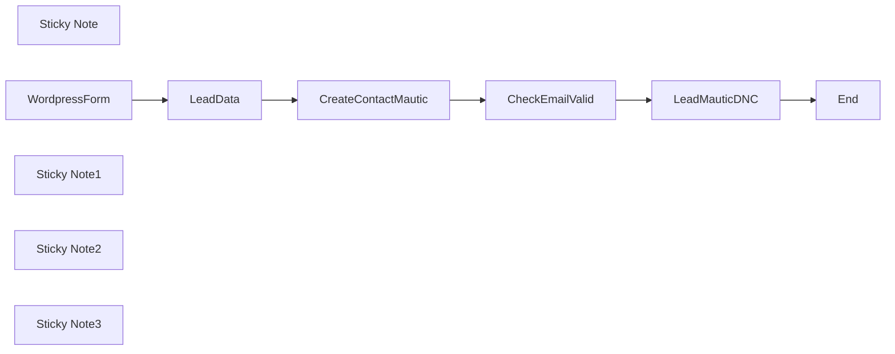

## Fluxo (.json) :

```json
{
  "id": "jOI7FRhG1FkeqBLG",
  "meta": {
    "instanceId": "2872777e468ba025c28c67ebf483f93425a37d897dfc1056e0c00cc75112d703"
  },
  "name": "Wordpress Form to Mautic",
  "tags": [],
  "nodes": [
    {
      "id": "fcd19b7b-9104-45a6-b741-9497effbd68e",
      "name": "LeadData",
      "type": "n8n-nodes-base.set",
      "position": [
        1260,
        420
      ],
      "parameters": {
        "options": {},
        "assignments": {
          "assignments": [
            {
              "id": "91215336-3a47-4e86-ac6a-1a1862b31e54",
              "name": "name",
              "type": "string",
              "value": "={{ $json.body.Nome.toTitleCase() }}"
            },
            {
              "id": "703f1da3-3f68-4d97-94c9-c22661813d92",
              "name": "email",
              "type": "string",
              "value": "={{ $json.body['E-mail'].toLowerCase() }}"
            },
            {
              "id": "c9ba65f1-68e9-46ed-9620-365e000aeb6c",
              "name": "mobile",
              "type": "string",
              "value": "={{ $json.body.WhatsApp }}"
            },
            {
              "id": "3a7266cf-5ff8-4559-985d-2480d0271cbd",
              "name": "form",
              "type": "string",
              "value": "={{ $json.body.form_id }}"
            },
            {
              "id": "06825dab-fbed-4d85-b91c-5d1c2cf8e934",
              "name": "email_valid",
              "type": "boolean",
              "value": "={{ $json.body['E-mail'].isEmail() }}"
            }
          ]
        }
      },
      "typeVersion": 3.3
    },
    {
      "id": "9598d8bf-b7f0-4e5e-804c-154f240704ac",
      "name": "Sticky Note",
      "type": "n8n-nodes-base.stickyNote",
      "position": [
        520,
        220
      ],
      "parameters": {
        "width": 471,
        "height": 370,
        "content": "## Receive Data from Wordpress Form\n\nYou can customize your form fields in the way that best suits your marketing campaigns."
      },
      "typeVersion": 1
    },
    {
      "id": "620d1873-3881-4086-8bd3-e26e07cab88c",
      "name": "WordpressForm",
      "type": "n8n-nodes-base.webhook",
      "position": [
        660,
        420
      ],
      "webhookId": "917366ee-14a8-4fef-9f0b-6638cdc35fad",
      "parameters": {
        "path": "917366ee-14a8-4fef-9f0b-6638cdc35fad",
        "options": {},
        "httpMethod": "POST"
      },
      "typeVersion": 1.1
    },
    {
      "id": "8f6bed52-1214-46fa-8e8a-c648bbe6e52a",
      "name": "Sticky Note1",
      "type": "n8n-nodes-base.stickyNote",
      "position": [
        1040,
        220
      ],
      "parameters": {
        "width": 551,
        "height": 376,
        "content": "## Normalize Data\n\nLet's separate the data we are going to use and remove everything that is unnecessary for the workflow. This way we avoid errors and optimize the use of N8N resources.\n\nYou can use N8N expression extensions to format and validate your data received by N8N."
      },
      "typeVersion": 1
    },
    {
      "id": "975ec9ae-d64d-42e6-b665-82296825203d",
      "name": "Sticky Note2",
      "type": "n8n-nodes-base.stickyNote",
      "position": [
        2240,
        220
      ],
      "parameters": {
        "width": 772.5,
        "height": 376.25,
        "content": "## Checks if the email can be valid\n\nChecks if the email can be valid to create the contact in Mautic with the correct registration information"
      },
      "typeVersion": 1
    },
    {
      "id": "a2f241c2-6894-4c17-a1bd-88c0c9bc88cb",
      "name": "CheckEmailValid",
      "type": "n8n-nodes-base.if",
      "position": [
        2420,
        420
      ],
      "parameters": {
        "options": {},
        "conditions": {
          "options": {
            "leftValue": "",
            "caseSensitive": true,
            "typeValidation": "strict"
          },
          "combinator": "and",
          "conditions": [
            {
              "id": "bcbdaa12-c4ec-4fba-85f8-ddfe5eed8f42",
              "operator": {
                "type": "boolean",
                "operation": "true",
                "singleValue": true
              },
              "leftValue": "={{ $('LeadData').item.json.email_valid }}",
              "rightValue": "="
            }
          ]
        }
      },
      "typeVersion": 2
    },
    {
      "id": "26a0eab3-2097-4b91-8a79-8fc2934f3ebe",
      "name": "Sticky Note3",
      "type": "n8n-nodes-base.stickyNote",
      "position": [
        1640,
        221.25
      ],
      "parameters": {
        "width": 555,
        "height": 376.25,
        "content": "## Create Contact on Mautic\n\nCreate a contact in Mautic Let's create the contact in Mautic where you will map the fields you need."
      },
      "typeVersion": 1
    },
    {
      "id": "16a62af3-f9cb-4a12-b168-a2c6c5ff6c78",
      "name": "CreateContactMautic",
      "type": "n8n-nodes-base.mautic",
      "position": [
        1860,
        420
      ],
      "parameters": {
        "email": "={{ $json.email }}",
        "options": {},
        "firstName": "={{ $json.name }}",
        "additionalFields": {
          "mobile": "={{ $json.mobile }}"
        }
      },
      "credentials": {
        "mauticApi": {
          "id": "dNmbC6ievGKXw0ww",
          "name": "Mautic account"
        }
      },
      "typeVersion": 1
    },
    {
      "id": "340eb2d8-c2c0-4a31-822e-6fda2c00f4ea",
      "name": "LeadMauticDNC",
      "type": "n8n-nodes-base.mautic",
      "position": [
        2740,
        380
      ],
      "parameters": {
        "contactId": "={{ $json.id }}",
        "operation": "editDoNotContactList",
        "additionalFields": {
          "reason": "3",
          "comments": "Did not pass basic email validation"
        }
      },
      "credentials": {
        "mauticApi": {
          "id": "dNmbC6ievGKXw0ww",
          "name": "Mautic account"
        }
      },
      "typeVersion": 1
    },
    {
      "id": "8b773a35-2b4b-4d50-aeed-bf5fe8e6e7d1",
      "name": "End",
      "type": "n8n-nodes-base.noOp",
      "position": [
        3140,
        380
      ],
      "parameters": {},
      "typeVersion": 1
    }
  ],
  "active": false,
  "pinData": {
    "WordpressForm": [
      {
        "json": {
          "body": {
            "Nome": "Luiz Eduardo",
            "E-mail": "myemail@gmail.com",
            "form_id": "1b46cae",
            "WhatsApp": "5512992444000",
            "form_name": "Contact Form"
          },
          "query": {},
          "params": {},
          "headers": {
            "host": "data.promovaweb.com",
            "accept": "*/*",
            "user-agent": "WordPress/6.4.3; https://pages.promovaweb.com",
            "content-type": "application/x-www-form-urlencoded",
            "content-length": "106",
            "accept-encoding": "deflate, gzip, br",
            "x-forwarded-for": "35.212.38.239",
            "x-forwarded-host": "data.promovaweb.com",
            "x-forwarded-port": "443",
            "x-forwarded-proto": "https",
            "x-forwarded-server": "004c98fc4927"
          }
        }
      }
    ]
  },
  "settings": {
    "executionOrder": "v1"
  },
  "versionId": "28d5987d-4623-4275-bb41-1c015ee32b61",
  "connections": {
    "LeadData": {
      "main": [
        [
          {
            "node": "CreateContactMautic",
            "type": "main",
            "index": 0
          }
        ]
      ]
    },
    "LeadMauticDNC": {
      "main": [
        [
          {
            "node": "End",
            "type": "main",
            "index": 0
          }
        ]
      ]
    },
    "WordpressForm": {
      "main": [
        [
          {
            "node": "LeadData",
            "type": "main",
            "index": 0
          }
        ]
      ]
    },
    "CheckEmailValid": {
      "main": [
        [],
        [
          {
            "node": "LeadMauticDNC",
            "type": "main",
            "index": 0
          }
        ]
      ]
    },
    "CreateContactMautic": {
      "main": [
        [
          {
            "node": "CheckEmailValid",
            "type": "main",
            "index": 0
          }
        ]
      ]
    }
  }
}
```
