# PACK 1999 TEMPLATES PARTE 06 - Bloco 1

Templates neste bloco: 20

## Sumário

- [Template 1001 - Importação de leads do WordPress para Mautic](#template-1001)
- [Template 1002 - Pesquisa autônoma com IA](#template-1002)
- [Template 1003 - Análise de email com IA e tickets Jira](#template-1003)
- [Template 1004 - CSV para JSON com validação e alerta Slack](#template-1004)
- [Template 1005 - Análise de tráfego com IA e registro em baserow](#template-1005)
- [Template 1006 - Resumo diário de qualidade do ar](#template-1006)
- [Template 1007 - Lead de Cliente com Notificação por Email](#template-1007)
- [Template 1008 - Gerador de documentação de workflow via IA](#template-1008)
- [Template 1009 - Documentação automática de fluxos com Docsify](#template-1009)
- [Template 1010 - Resumo automático de emails para Messenger](#template-1010)
- [Template 1011 - Atualização dinâmica de Airtable a partir de PDFs com prompts](#template-1011)
- [Template 1012 - Monitoramento periódico de disponibilidade de sites](#template-1012)
- [Template 1013 - Extrair e resumir dados do Glassdoor](#template-1013)
- [Template 1014 - RAG — Chunking com contexto e indexação em Pinecone](#template-1014)
- [Template 1015 - Sincronização de contatos Entra para usuários Zammad](#template-1015)
- [Template 1016 - Agendamento de reuniões com disponibilidade](#template-1016)
- [Template 1017 - Agente AI para raspagem web com Bright Data e Google Gemini](#template-1017)
- [Template 1018 - Relatório Strava por e-mail com coaching IA](#template-1018)
- [Template 1019 - Backups automáticos de workflows para Google Drive](#template-1019)
- [Template 1020 - Trending no YouTube por nicho](#template-1020)

---

<a id="template-1001"></a>

## Template 1001 - Importação de leads do WordPress para Mautic

- **Nome:** Importação de leads do WordPress para Mautic
- **Descrição:** Recebe envios de formulários do WordPress, normaliza e valida os dados, cria ou atualiza contatos no Mautic e marca contatos como 'Do Not Contact' quando o e-mail é inválido.
- **Funcionalidade:** • Recepção de formulário: Captura envios POST provenientes de formulários do WordPress via webhook.
• Normalização de dados: Extrai e formata campos relevantes (nome em Title Case, e-mail em lowercase, telefone) e valida o formato do e-mail.
• Criação/atualização de contato: Insere ou atualiza o contato no sistema de gestão de contatos com mapeamento de nome, e-mail e telefone.
• Verificação de validade do e-mail: Avalia se o e-mail tem formato válido para decidir o fluxo subsequente.
• Marcação como Do Not Contact (DNC): Para e-mails inválidos, adiciona o contato à lista de não contatar com motivo e comentário.
• Finalização: Encerramento do fluxo após as ações de criação/edição e eventuais marcações DNC.
- **Ferramentas:** • WordPress: Fonte dos formulários e gerador dos envios que iniciam o fluxo.
• Mautic: Plataforma de marketing/CRM utilizada para criar, atualizar contatos e gerenciar a lista de 'Do Not Contact'.

## Fluxo visual

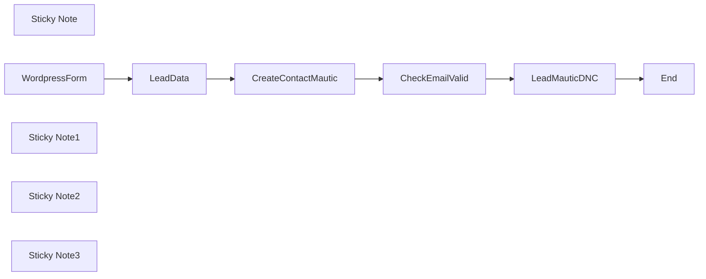

## Fluxo (.json) :

```json
{
  "id": "jOI7FRhG1FkeqBLG",
  "meta": {
    "instanceId": "2872777e468ba025c28c67ebf483f93425a37d897dfc1056e0c00cc75112d703"
  },
  "name": "Wordpress Form to Mautic",
  "tags": [],
  "nodes": [
    {
      "id": "fcd19b7b-9104-45a6-b741-9497effbd68e",
      "name": "LeadData",
      "type": "n8n-nodes-base.set",
      "position": [
        1260,
        420
      ],
      "parameters": {
        "options": {},
        "assignments": {
          "assignments": [
            {
              "id": "91215336-3a47-4e86-ac6a-1a1862b31e54",
              "name": "name",
              "type": "string",
              "value": "={{ $json.body.Nome.toTitleCase() }}"
            },
            {
              "id": "703f1da3-3f68-4d97-94c9-c22661813d92",
              "name": "email",
              "type": "string",
              "value": "={{ $json.body['E-mail'].toLowerCase() }}"
            },
            {
              "id": "c9ba65f1-68e9-46ed-9620-365e000aeb6c",
              "name": "mobile",
              "type": "string",
              "value": "={{ $json.body.WhatsApp }}"
            },
            {
              "id": "3a7266cf-5ff8-4559-985d-2480d0271cbd",
              "name": "form",
              "type": "string",
              "value": "={{ $json.body.form_id }}"
            },
            {
              "id": "06825dab-fbed-4d85-b91c-5d1c2cf8e934",
              "name": "email_valid",
              "type": "boolean",
              "value": "={{ $json.body['E-mail'].isEmail() }}"
            }
          ]
        }
      },
      "typeVersion": 3.3
    },
    {
      "id": "9598d8bf-b7f0-4e5e-804c-154f240704ac",
      "name": "Sticky Note",
      "type": "n8n-nodes-base.stickyNote",
      "position": [
        520,
        220
      ],
      "parameters": {
        "width": 471,
        "height": 370,
        "content": "## Receive Data from Wordpress Form\n\nYou can customize your form fields in the way that best suits your marketing campaigns."
      },
      "typeVersion": 1
    },
    {
      "id": "620d1873-3881-4086-8bd3-e26e07cab88c",
      "name": "WordpressForm",
      "type": "n8n-nodes-base.webhook",
      "position": [
        660,
        420
      ],
      "webhookId": "917366ee-14a8-4fef-9f0b-6638cdc35fad",
      "parameters": {
        "path": "917366ee-14a8-4fef-9f0b-6638cdc35fad",
        "options": {},
        "httpMethod": "POST"
      },
      "typeVersion": 1.1
    },
    {
      "id": "8f6bed52-1214-46fa-8e8a-c648bbe6e52a",
      "name": "Sticky Note1",
      "type": "n8n-nodes-base.stickyNote",
      "position": [
        1040,
        220
      ],
      "parameters": {
        "width": 551,
        "height": 376,
        "content": "## Normalize Data\n\nLet's separate the data we are going to use and remove everything that is unnecessary for the workflow. This way we avoid errors and optimize the use of N8N resources.\n\nYou can use N8N expression extensions to format and validate your data received by N8N."
      },
      "typeVersion": 1
    },
    {
      "id": "975ec9ae-d64d-42e6-b665-82296825203d",
      "name": "Sticky Note2",
      "type": "n8n-nodes-base.stickyNote",
      "position": [
        2240,
        220
      ],
      "parameters": {
        "width": 772.5,
        "height": 376.25,
        "content": "## Checks if the email can be valid\n\nChecks if the email can be valid to create the contact in Mautic with the correct registration information"
      },
      "typeVersion": 1
    },
    {
      "id": "a2f241c2-6894-4c17-a1bd-88c0c9bc88cb",
      "name": "CheckEmailValid",
      "type": "n8n-nodes-base.if",
      "position": [
        2420,
        420
      ],
      "parameters": {
        "options": {},
        "conditions": {
          "options": {
            "leftValue": "",
            "caseSensitive": true,
            "typeValidation": "strict"
          },
          "combinator": "and",
          "conditions": [
            {
              "id": "bcbdaa12-c4ec-4fba-85f8-ddfe5eed8f42",
              "operator": {
                "type": "boolean",
                "operation": "true",
                "singleValue": true
              },
              "leftValue": "={{ $('LeadData').item.json.email_valid }}",
              "rightValue": "="
            }
          ]
        }
      },
      "typeVersion": 2
    },
    {
      "id": "26a0eab3-2097-4b91-8a79-8fc2934f3ebe",
      "name": "Sticky Note3",
      "type": "n8n-nodes-base.stickyNote",
      "position": [
        1640,
        221.25
      ],
      "parameters": {
        "width": 555,
        "height": 376.25,
        "content": "## Create Contact on Mautic\n\nCreate a contact in Mautic Let's create the contact in Mautic where you will map the fields you need."
      },
      "typeVersion": 1
    },
    {
      "id": "16a62af3-f9cb-4a12-b168-a2c6c5ff6c78",
      "name": "CreateContactMautic",
      "type": "n8n-nodes-base.mautic",
      "position": [
        1860,
        420
      ],
      "parameters": {
        "email": "={{ $json.email }}",
        "options": {},
        "firstName": "={{ $json.name }}",
        "additionalFields": {
          "mobile": "={{ $json.mobile }}"
        }
      },
      "credentials": {
        "mauticApi": {
          "id": "dNmbC6ievGKXw0ww",
          "name": "Mautic account"
        }
      },
      "typeVersion": 1
    },
    {
      "id": "340eb2d8-c2c0-4a31-822e-6fda2c00f4ea",
      "name": "LeadMauticDNC",
      "type": "n8n-nodes-base.mautic",
      "position": [
        2740,
        380
      ],
      "parameters": {
        "contactId": "={{ $json.id }}",
        "operation": "editDoNotContactList",
        "additionalFields": {
          "reason": "3",
          "comments": "Did not pass basic email validation"
        }
      },
      "credentials": {
        "mauticApi": {
          "id": "dNmbC6ievGKXw0ww",
          "name": "Mautic account"
        }
      },
      "typeVersion": 1
    },
    {
      "id": "8b773a35-2b4b-4d50-aeed-bf5fe8e6e7d1",
      "name": "End",
      "type": "n8n-nodes-base.noOp",
      "position": [
        3140,
        380
      ],
      "parameters": {},
      "typeVersion": 1
    }
  ],
  "active": false,
  "pinData": {
    "WordpressForm": [
      {
        "json": {
          "body": {
            "Nome": "Luiz Eduardo",
            "E-mail": "myemail@gmail.com",
            "form_id": "1b46cae",
            "WhatsApp": "5512992444000",
            "form_name": "Contact Form"
          },
          "query": {},
          "params": {},
          "headers": {
            "host": "data.promovaweb.com",
            "accept": "*/*",
            "user-agent": "WordPress/6.4.3; https://pages.promovaweb.com",
            "content-type": "application/x-www-form-urlencoded",
            "content-length": "106",
            "accept-encoding": "deflate, gzip, br",
            "x-forwarded-for": "35.212.38.239",
            "x-forwarded-host": "data.promovaweb.com",
            "x-forwarded-port": "443",
            "x-forwarded-proto": "https",
            "x-forwarded-server": "004c98fc4927"
          }
        }
      }
    ]
  },
  "settings": {
    "executionOrder": "v1"
  },
  "versionId": "28d5987d-4623-4275-bb41-1c015ee32b61",
  "connections": {
    "LeadData": {
      "main": [
        [
          {
            "node": "CreateContactMautic",
            "type": "main",
            "index": 0
          }
        ]
      ]
    },
    "LeadMauticDNC": {
      "main": [
        [
          {
            "node": "End",
            "type": "main",
            "index": 0
          }
        ]
      ]
    },
    "WordpressForm": {
      "main": [
        [
          {
            "node": "LeadData",
            "type": "main",
            "index": 0
          }
        ]
      ]
    },
    "CheckEmailValid": {
      "main": [
        [],
        [
          {
            "node": "LeadMauticDNC",
            "type": "main",
            "index": 0
          }
        ]
      ]
    },
    "CreateContactMautic": {
      "main": [
        [
          {
            "node": "CheckEmailValid",
            "type": "main",
            "index": 0
          }
        ]
      ]
    }
  }
}
```

<a id="template-1002"></a>

## Template 1002 - Pesquisa autônoma com IA

- **Nome:** Pesquisa autônoma com IA
- **Descrição:** Fluxo que transforma uma pergunta de usuário em buscas web, extrai e agrega informações relevantes usando modelos de linguagem e serviços de análise, e produz um relatório de pesquisa abrangente.
- **Funcionalidade:** • Gatilho por mensagem de chat: inicia o processo a partir da entrada do usuário.
• Geração de consultas de busca via LLM: cria até quatro consultas precisas para cobrir o tópico.
• Parseamento e fragmentação de JSON: divide listas de consultas em blocos para processamento em lote.
• Agrupamento em lotes para buscas: organiza consultas para execução eficiente em múltiplas requisições.
• Execução de buscas web em lote: realiza buscas e obtém resultados orgânicos de pesquisa.
• Formatação de resultados orgânicos: extrai título, URL e fonte dos resultados retornados.
• Agrupamento e envio de URLs para análise: prepara conteúdo para ferramentas de extração de texto.
• Análise de páginas via serviço de extração: requisita resumos/extrações do conteúdo de páginas web.
• Extração de contexto relevante via LLM: filtra e retorna apenas os trechos úteis para responder à pergunta.
• Memória de contexto para input e relatório: armazena e reutiliza contexto recente para melhorar consistência.
• Consulta a enciclopédias externas: busca informações complementares quando necessário.
• Geração de relatório de pesquisa em Markdown: consolida os contextos em um relatório estruturado com conclusões e fontes.
- **Ferramentas:** • OpenRouter: provedor de API para modelos de linguagem (usado para geração de consultas, extração de contexto e escrita do relatório).
• SerpAPI: serviço de buscas web que retorna resultados orgânicos e metadados de pesquisa.
• Jina AI: serviço de análise/extração de conteúdo de páginas web (acesso via endpoint de sumarização de URLs).
• Wikipedia: fonte enciclopédica externa utilizada para complementar informações e contexto.

## Fluxo visual

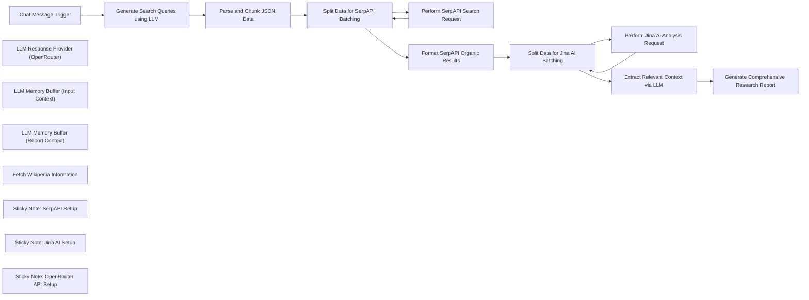

## Fluxo (.json) :

```json
{
  "id": "WLSqXECfQF7rOj2A",
  "meta": {
    "instanceId": "cba4a4a2eb5d7683330e2944837278938831ed3c042e20da6f5049c07ad14798"
  },
  "name": "Open Deep Research - AI-Powered Autonomous Research Workflow",
  "tags": [],
  "nodes": [
    {
      "id": "b7b70ba1-0267-4d2b-91f4-5cc4fd22fd03",
      "name": "Chat Message Trigger",
      "type": "@n8n/n8n-nodes-langchain.chatTrigger",
      "position": [
        -1940,
        160
      ],
      "webhookId": "cb0b9dbe-1f35-441a-b062-29624b0ebc6a",
      "parameters": {
        "options": {}
      },
      "typeVersion": 1.1
    },
    {
      "id": "55a8a512-f2d4-4aed-93e5-dd9bfa2dcaad",
      "name": "Generate Search Queries using LLM",
      "type": "@n8n/n8n-nodes-langchain.chainLlm",
      "position": [
        -1760,
        160
      ],
      "parameters": {
        "text": "=User Query: {{ $('Chat Message Trigger').item.json.chatInput }}",
        "messages": {
          "messageValues": [
            {
              "message": "=You are an expert research assistant. Given a user's query, generate up to four distinct, precise search queries that would help gather comprehensive information on the topic. Return only a JSON list of strings, for example: ['query1', 'query2', 'query3']."
            }
          ]
        },
        "promptType": "define"
      },
      "typeVersion": 1.5
    },
    {
      "id": "5f92361a-b490-479d-8360-c87a100b470e",
      "name": "LLM Response Provider (OpenRouter)",
      "type": "@n8n/n8n-nodes-langchain.lmChatOpenRouter",
      "position": [
        -1760,
        700
      ],
      "parameters": {
        "model": "google/gemini-2.0-flash-001",
        "options": {}
      },
      "credentials": {
        "openRouterApi": {
          "id": "WZWYWCfluxuKxZzV",
          "name": "OpenRouter account"
        }
      },
      "typeVersion": 1
    },
    {
      "id": "4ab360eb-858f-48b8-a00d-71867d4f0c93",
      "name": "Parse and Chunk JSON Data",
      "type": "n8n-nodes-base.code",
      "position": [
        -1420,
        160
      ],
      "parameters": {
        "jsCode": "// Parse the input JSON string and split it into four chunks\nconst rawText = $json.text;\n\n// Remove Markdown JSON code blocks if present\nconst cleanedText = rawText.replace(/```json|```/g, '').trim();\n\ntry {\n const jsonArray = JSON.parse(cleanedText);\n if (!Array.isArray(jsonArray)) {\n throw new Error('The JSON is not an array.');\n }\n const chunkSize = Math.ceil(jsonArray.length / 4);\n const chunks = [];\n for (let i = 0; i < jsonArray.length; i += chunkSize) {\n chunks.push(jsonArray.slice(i, i + chunkSize));\n }\n return chunks.map(chunk => ({ json: { chunk } }));\n} catch (error) {\n return [{ json: { error: error.message } }];\n}\n"
      },
      "typeVersion": 2
    },
    {
      "id": "5a3ac393-8355-449f-93cb-b98e8bee9b80",
      "name": "Perform SerpAPI Search Request",
      "type": "n8n-nodes-base.httpRequest",
      "position": [
        -780,
        180
      ],
      "parameters": {
        "url": "https://serpapi.com/search",
        "options": {},
        "sendQuery": true,
        "queryParameters": {
          "parameters": [
            {
              "name": "q",
              "value": "={{ $('Parse and Chunk JSON Data').item.json.chunk }}"
            },
            {
              "name": "api_key",
              "value": "={{ $credentials.SerpAPI.key }}"
            },
            {
              "name": "engine",
              "value": "google"
            }
          ]
        }
      },
      "typeVersion": 4.2
    },
    {
      "id": "dad82469-830d-40fb-9f6b-b9fefef41267",
      "name": "Perform Jina AI Analysis Request",
      "type": "n8n-nodes-base.httpRequest",
      "position": [
        80,
        160
      ],
      "parameters": {
        "url": "=https://r.jina.ai/{{ $json.url }}",
        "options": {},
        "authentication": "genericCredentialType",
        "genericAuthType": "httpHeaderAuth"
      },
      "credentials": {
        "httpHeaderAuth": {
          "id": "iseKF5sPsvwtJhgT",
          "name": "Jina AI"
        }
      },
      "typeVersion": 4.2
    },
    {
      "id": "e21bbdf6-a903-491e-920c-ef7576f9ce80",
      "name": "Format SerpAPI Organic Results",
      "type": "n8n-nodes-base.code",
      "position": [
        -460,
        140
      ],
      "parameters": {
        "jsCode": "// Format the organic search results from SerpAPI\nconst results = $input.first().json.organic_results;\nif (results.length === 0) {\n return [{ json: { error: 'No search results found.' } }];\n}\nconst formattedResults = results.map(result => ({\n title: result.title || 'No title available',\n url: result.link || 'No link available',\n source: result.source || result.displayed_link || 'Unknown source'\n}));\nreturn formattedResults.map(result => ({ json: result }));\n"
      },
      "typeVersion": 2
    },
    {
      "id": "a856c8e8-5c3c-4a2f-9086-66deee1afd06",
      "name": "Extract Relevant Context via LLM",
      "type": "@n8n/n8n-nodes-langchain.agent",
      "position": [
        -1280,
        520
      ],
      "parameters": {
        "text": "=User Queries: {{ $('Parse and Chunk JSON Data').all().map(item => item.json.chunk[0]).join(', ') }}\nWebpage Contents: \n\"\"\"\n{{ $json.data }}\n\"\"\"",
        "options": {
          "systemMessage": "=You are an expert information extractor. Given the user's query, the search query that led to this page, and the webpage content, extract all relevant pieces of information that are useful to answer the query. Return only the relevant context as plain text without any additional commentary."
        },
        "promptType": "define"
      },
      "typeVersion": 1.7
    },
    {
      "id": "6d5c6698-0b4f-438c-91b9-3597f5d3e904",
      "name": "Generate Comprehensive Research Report",
      "type": "@n8n/n8n-nodes-langchain.agent",
      "position": [
        -740,
        520
      ],
      "parameters": {
        "text": "=Extracted Contexts (Merged):\n\"\"\"\n{{ $json.output }}\n\"\"\"",
        "options": {
          "systemMessage": "You are an expert researcher and report writer. Based on the gathered contexts and the original user query, generate a comprehensive, well-structured report. Include all relevant insights and conclusions without unnecessary commentary.\n\nFormat the report in Markdown with clear headings. For example:\n\n# Research Report: [User Query]\n\n## Key Findings\n- Point 1\n- Point 2\n\n## Detailed Analysis\n### Aspect 1\nSummary of findings.\n_Source:_ [Source Name](URL)\n\n### Aspect 2\nSummary of findings.\n_Source:_ [Another Source](URL)\n\nNow, generate the complete report."
        },
        "promptType": "define"
      },
      "typeVersion": 1.7
    },
    {
      "id": "05fea6a1-791e-4980-8f2a-2960455066d7",
      "name": "Split Data for SerpAPI Batching",
      "type": "n8n-nodes-base.splitInBatches",
      "position": [
        -1100,
        160
      ],
      "parameters": {
        "options": {}
      },
      "typeVersion": 3
    },
    {
      "id": "df00e7e8-99b8-484a-8047-869474fefee9",
      "name": "Split Data for Jina AI Batching",
      "type": "n8n-nodes-base.splitInBatches",
      "position": [
        -220,
        140
      ],
      "parameters": {
        "options": {}
      },
      "typeVersion": 3
    },
    {
      "id": "2edc683b-65f7-40c3-a22d-7fbf5b67de0a",
      "name": "LLM Memory Buffer (Input Context)",
      "type": "@n8n/n8n-nodes-langchain.memoryBufferWindow",
      "position": [
        -1160,
        740
      ],
      "parameters": {
        "sessionKey": "my_test_session",
        "sessionIdType": "customKey",
        "contextWindowLength": 20
      },
      "typeVersion": 1.3
    },
    {
      "id": "23017ae7-72a7-45c7-8edf-d0ba72220675",
      "name": "LLM Memory Buffer (Report Context)",
      "type": "@n8n/n8n-nodes-langchain.memoryBufferWindow",
      "position": [
        -620,
        760
      ],
      "parameters": {
        "sessionKey": "my_test_session",
        "sessionIdType": "customKey",
        "contextWindowLength": 20
      },
      "typeVersion": 1.3
    },
    {
      "id": "6bc9533b-e265-47b3-b93a-3a4f86ba0541",
      "name": "Fetch Wikipedia Information",
      "type": "@n8n/n8n-nodes-langchain.toolWikipedia",
      "position": [
        -580,
        920
      ],
      "parameters": {},
      "typeVersion": 1
    },
    {
      "id": "b25c148e-047d-40a7-8818-94c3504828dd",
      "name": "Sticky Note: SerpAPI Setup",
      "type": "n8n-nodes-base.stickyNote",
      "position": [
        -940,
        -20
      ],
      "parameters": {
        "color": 7,
        "width": 420,
        "height": 140,
        "content": "## SerpAPI Setup Instructions\n1. Obtain your API key from https://serpapi.com/manage-api-key.\n2. Save your API key securely in n8n credentials (do not use plain text)."
      },
      "typeVersion": 1
    },
    {
      "id": "e69c9a85-31e4-42b9-a09a-683ec5bb97d1",
      "name": "Sticky Note: Jina AI Setup",
      "type": "n8n-nodes-base.stickyNote",
      "position": [
        -60,
        -40
      ],
      "parameters": {
        "color": 7,
        "width": 420,
        "height": 140,
        "content": "## Jina AI Setup Instructions\n1. Obtain your API key from https://jina.ai/api-dashboard/key-manager.\n2. Configure your Jina AI credential in n8n to ensure secure API access."
      },
      "typeVersion": 1
    },
    {
      "id": "dbd204e0-da8e-41d8-814b-f409a23e9573",
      "name": "Sticky Note: OpenRouter API Setup",
      "type": "n8n-nodes-base.stickyNote",
      "position": [
        -1680,
        460
      ],
      "parameters": {
        "color": 7,
        "width": 300,
        "height": 180,
        "content": "## OpenRouter API Setup Instructions\n1. Obtain your API key from https://openrouter.ai/settings/keys.\n2. Set up your OpenRouter credential in n8n for secure integration."
      },
      "typeVersion": 1
    }
  ],
  "active": false,
  "pinData": {},
  "settings": {
    "executionOrder": "v1"
  },
  "versionId": "aa857bb3-84c1-4fe6-9464-90fc09163960",
  "connections": {
    "Chat Message Trigger": {
      "main": [
        [
          {
            "node": "Generate Search Queries using LLM",
            "type": "main",
            "index": 0
          }
        ]
      ]
    },
    "Parse and Chunk JSON Data": {
      "main": [
        [
          {
            "node": "Split Data for SerpAPI Batching",
            "type": "main",
            "index": 0
          }
        ]
      ]
    },
    "Fetch Wikipedia Information": {
      "ai_tool": [
        [
          {
            "node": "Generate Comprehensive Research Report",
            "type": "ai_tool",
            "index": 0
          }
        ]
      ]
    },
    "Format SerpAPI Organic Results": {
      "main": [
        [
          {
            "node": "Split Data for Jina AI Batching",
            "type": "main",
            "index": 0
          }
        ]
      ]
    },
    "Perform SerpAPI Search Request": {
      "main": [
        [
          {
            "node": "Split Data for SerpAPI Batching",
            "type": "main",
            "index": 0
          }
        ]
      ]
    },
    "Split Data for Jina AI Batching": {
      "main": [
        [
          {
            "node": "Extract Relevant Context via LLM",
            "type": "main",
            "index": 0
          }
        ],
        [
          {
            "node": "Perform Jina AI Analysis Request",
            "type": "main",
            "index": 0
          }
        ]
      ]
    },
    "Split Data for SerpAPI Batching": {
      "main": [
        [
          {
            "node": "Format SerpAPI Organic Results",
            "type": "main",
            "index": 0
          }
        ],
        [
          {
            "node": "Perform SerpAPI Search Request",
            "type": "main",
            "index": 0
          }
        ]
      ]
    },
    "Extract Relevant Context via LLM": {
      "main": [
        [
          {
            "node": "Generate Comprehensive Research Report",
            "type": "main",
            "index": 0
          }
        ]
      ]
    },
    "Perform Jina AI Analysis Request": {
      "main": [
        [
          {
            "node": "Split Data for Jina AI Batching",
            "type": "main",
            "index": 0
          }
        ]
      ]
    },
    "Generate Search Queries using LLM": {
      "main": [
        [
          {
            "node": "Parse and Chunk JSON Data",
            "type": "main",
            "index": 0
          }
        ]
      ]
    },
    "LLM Memory Buffer (Input Context)": {
      "ai_memory": [
        [
          {
            "node": "Extract Relevant Context via LLM",
            "type": "ai_memory",
            "index": 0
          }
        ]
      ]
    },
    "LLM Memory Buffer (Report Context)": {
      "ai_memory": [
        [
          {
            "node": "Generate Comprehensive Research Report",
            "type": "ai_memory",
            "index": 0
          }
        ]
      ]
    },
    "LLM Response Provider (OpenRouter)": {
      "ai_languageModel": [
        [
          {
            "node": "Generate Search Queries using LLM",
            "type": "ai_languageModel",
            "index": 0
          },
          {
            "node": "Extract Relevant Context via LLM",
            "type": "ai_languageModel",
            "index": 0
          },
          {
            "node": "Generate Comprehensive Research Report",
            "type": "ai_languageModel",
            "index": 0
          }
        ]
      ]
    }
  }
}
```

<a id="template-1003"></a>

## Template 1003 - Análise de email com IA e tickets Jira

- **Nome:** Análise de email com IA e tickets Jira
- **Descrição:** Fluxo que captura e analisa e-mails de Gmail e Outlook, usa IA para classificar phishing, gera anexos do e-mail e do HTML, e cria tickets no Jira com as informações e anexos para investigação.
- **Funcionalidade:** • Detecção e extração de novos e-mails de Gmail e Outlook: captura assunto, destinatário, remetente, corpo e cabeçalhos.
• Recuperação e formatação de cabeçalhos e corpo do e-mail: obtém cabeçalhos e corpo e os transforma em formato legível.
• Conversão do corpo do e-mail para arquivo de texto: gera .txt do corpo para anexos.
• Geração de variáveis para uso posterior (htmlBody, headers, subject, recipient, textBody) a partir dos dados do e-mail.
• Análise de conteúdo com IA: usa IA para descrever o e-mail, detectar phishing e retornar um relatório estruturado.
• Tomada de decisão com base no resultado da IA: encaminha para criação de tickets como potencialmente malicioso ou benigno.
• Criação de tickets no Jira para casos potenciais: gera tickets com informações e a classificação.
• Upload de anexos para Jira: inclui screenshot do e-mail e corpo do e-mail como arquivos anexos.
• Renomeação e preparação de arquivos para anexos: padroniza nomes de arquivos antes do upload.
- **Ferramentas:** • Gmail: serviço de recebimento de e-mails com gatilho para novas mensagens.
• Microsoft Outlook: trigger via Graph API para novas mensagens e recuperação de cabeçalhos.
• Graph API do Microsoft 365: acesso a conteúdos e cabeçalhos de mensagens.
• OpenAI: serviço de IA para análise de conteúdo e geração de relatório em JSON.
• hcti.io: API para gerar screenshot de HTML a partir do conteúdo do e-mail.
• Jira: serviço de criação de tickets e anexação de artefatos para incidentes.

## Fluxo visual

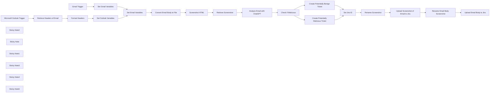

## Fluxo (.json) :

```json
{
  "meta": {
    "instanceId": "03e9d14e9196363fe7191ce21dc0bb17387a6e755dcc9acc4f5904752919dca8"
  },
  "nodes": [
    {
      "id": "94dd7f48-0013-4fb5-89c4-826ecd7f2d66",
      "name": "Gmail Trigger",
      "type": "n8n-nodes-base.gmailTrigger",
      "position": [
        1460,
        120
      ],
      "parameters": {
        "simple": false,
        "filters": {},
        "options": {},
        "pollTimes": {
          "item": [
            {
              "mode": "everyMinute"
            }
          ]
        }
      },
      "credentials": {
        "gmailOAuth2": {
          "id": "kkhNhqKpZt6IUZd0",
          "name": "Gmail"
        }
      },
      "typeVersion": 1.2
    },
    {
      "id": "ca2023fa-ceca-4923-80e4-a3843803536c",
      "name": "Microsoft Outlook Trigger",
      "type": "n8n-nodes-base.microsoftOutlookTrigger",
      "disabled": true,
      "position": [
        1480,
        680
      ],
      "parameters": {
        "fields": [
          "body",
          "toRecipients",
          "subject",
          "bodyPreview"
        ],
        "output": "fields",
        "filters": {},
        "options": {},
        "pollTimes": {
          "item": [
            {
              "mode": "everyMinute"
            }
          ]
        }
      },
      "credentials": {
        "microsoftOutlookOAuth2Api": {
          "id": "vTCK0oVQ0WjFrI5H",
          "name": " Outlook Credential"
        }
      },
      "typeVersion": 1
    },
    {
      "id": "1f011214-91a0-4cfa-9d9e-29864937c0a3",
      "name": "Screenshot HTML",
      "type": "n8n-nodes-base.httpRequest",
      "position": [
        2620,
        420
      ],
      "parameters": {
        "url": "https://hcti.io/v1/image",
        "method": "POST",
        "options": {},
        "sendBody": true,
        "sendQuery": true,
        "authentication": "genericCredentialType",
        "bodyParameters": {
          "parameters": [
            {
              "name": "html",
              "value": "={{ $('Set Email Variables').item.json.htmlBody }}"
            }
          ]
        },
        "genericAuthType": "httpBasicAuth",
        "queryParameters": {
          "parameters": [
            {}
          ]
        }
      },
      "credentials": {
        "httpBasicAuth": {
          "id": "8tm8mUWmPvtmPFPk",
          "name": "hcti.io"
        }
      },
      "typeVersion": 4.2
    },
    {
      "id": "64f4789f-9de8-414f-af62-ddc339f0d0ac",
      "name": "Retrieve Screenshot",
      "type": "n8n-nodes-base.httpRequest",
      "position": [
        2800,
        420
      ],
      "parameters": {
        "url": "={{ $json.url }}",
        "options": {},
        "authentication": "genericCredentialType",
        "genericAuthType": "httpBasicAuth"
      },
      "credentials": {
        "httpBasicAuth": {
          "id": "8tm8mUWmPvtmPFPk",
          "name": "hcti.io"
        }
      },
      "typeVersion": 4.2
    },
    {
      "id": "db707bd9-6abc-4ab7-8ffa-ad25c5e8adc4",
      "name": "Set Outlook Variables",
      "type": "n8n-nodes-base.set",
      "position": [
        2040,
        680
      ],
      "parameters": {
        "options": {},
        "assignments": {
          "assignments": [
            {
              "id": "38bd3db2-1a8d-4c40-a2dd-336e0cc84224",
              "name": "htmlBody",
              "type": "string",
              "value": "={{ $('Microsoft Outlook Trigger').item.json.body.content }}"
            },
            {
              "id": "13bdd95b-ef02-486e-b38b-d14bd05a4a8a",
              "name": "headers",
              "type": "string",
              "value": "={{ $json}}"
            },
            {
              "id": "20566ad4-7eb7-42b1-8a0d-f8b759610f10",
              "name": "subject",
              "type": "string",
              "value": "={{ $('Microsoft Outlook Trigger').item.json.subject }}"
            },
            {
              "id": "7171998f-a5a2-4e23-946a-9c1ad75710e7",
              "name": "recipient",
              "type": "string",
              "value": "={{ $('Microsoft Outlook Trigger').item.json.toRecipients[0].emailAddress.address }}"
            },
            {
              "id": "cc262634-2470-4524-8319-abe2518a6335",
              "name": "textBody",
              "type": "string",
              "value": "={{ $('Retrieve Headers of Email').item.json.body.content }}"
            }
          ]
        }
      },
      "typeVersion": 3.4
    },
    {
      "id": "7a3622c0-6949-4ea3-ae13-46a1ee26de7b",
      "name": "Set Gmail Variables",
      "type": "n8n-nodes-base.set",
      "position": [
        2020,
        120
      ],
      "parameters": {
        "options": {},
        "assignments": {
          "assignments": [
            {
              "id": "38bd3db2-1a8d-4c40-a2dd-336e0cc84224",
              "name": "htmlBody",
              "type": "string",
              "value": "={{ $json.html }}"
            },
            {
              "id": "18fbcf78-6d3c-4036-b3a2-fb5adf22176a",
              "name": "headers",
              "type": "string",
              "value": "={{ $json.headers }}"
            },
            {
              "id": "1d690098-be2a-4604-baf8-62f314930929",
              "name": "subject",
              "type": "string",
              "value": "={{ $json.subject }}"
            },
            {
              "id": "8009f00a-547f-4eb1-b52d-2e7305248885",
              "name": "recipient",
              "type": "string",
              "value": "={{ $json.to.text }}"
            },
            {
              "id": "1932e97d-b03b-4964-b8bc-8262aaaa1f7a",
              "name": "textBody",
              "type": "string",
              "value": "={{ $json.text }}"
            }
          ]
        }
      },
      "typeVersion": 3.4
    },
    {
      "id": "4b4c6b34-f74c-4402-91a1-4d002e02a3bd",
      "name": "Retrieve Headers of Email",
      "type": "n8n-nodes-base.httpRequest",
      "position": [
        1700,
        680
      ],
      "parameters": {
        "url": "=https://graph.microsoft.com/v1.0/me/messages/{{ $json.id }}?$select=internetMessageHeaders,body",
        "options": {},
        "sendHeaders": true,
        "authentication": "predefinedCredentialType",
        "headerParameters": {
          "parameters": [
            {
              "name": "Accept",
              "value": "application/json"
            },
            {
              "name": "Prefer",
              "value": "outlook.body-content-type=\"text\""
            }
          ]
        },
        "nodeCredentialType": "microsoftOutlookOAuth2Api"
      },
      "credentials": {
        "microsoftOutlookOAuth2Api": {
          "id": "vTCK0oVQ0WjFrI5H",
          "name": " Outlook Credential"
        }
      },
      "typeVersion": 4.2
    },
    {
      "id": "0c9883b5-3eb7-45db-9803-d1b30166a3b5",
      "name": "Format Headers",
      "type": "n8n-nodes-base.code",
      "position": [
        1880,
        680
      ],
      "parameters": {
        "jsCode": "const input = $('Retrieve Headers of Email').item.json.internetMessageHeaders;\n\nconst result = input.reduce((acc, { name, value }) => {\n  if (!acc[name]) acc[name] = [];\n  acc[name].push(value);\n  return acc;\n}, {});\n\nreturn result;"
      },
      "typeVersion": 2
    },
    {
      "id": "c21a976c-00e5-4823-bd94-4c95a7d60438",
      "name": "Analyze Email with ChatGPT",
      "type": "@n8n/n8n-nodes-langchain.openAi",
      "position": [
        3000,
        420
      ],
      "parameters": {
        "modelId": {
          "__rl": true,
          "mode": "list",
          "value": "gpt-4o",
          "cachedResultName": "GPT-4O"
        },
        "options": {},
        "messages": {
          "values": [
            {
              "content": "=Describe the following email using the HTML body and headers. Determine if the email could be a phishing email. \n\nHere is the HTML body:\n{{ $('Set Email Variables').item.json.htmlBody }}\n\nThe message headers are as follows:\n{{ $('Set Email Variables').item.json.headers }}\n\n"
            },
            {
              "role": "system",
              "content": "Please make sure to output all responses using the following structured JSON output:\n{\n  \"malicious\": false,\n  \"summary\": \"The email appears to be a legitimate communication from a known sender. It contains no suspicious links, attachments, or language that indicates phishing or malicious intent.\"\n}\n\nFormat the response for Jira who uses a wiki-style renderer. Do not include ``` around your response. Make the summary as verbose as possible including a full breakdown of why the email is benign or malicious."
            }
          ]
        },
        "jsonOutput": true
      },
      "credentials": {
        "openAiApi": {
          "id": "76",
          "name": "OpenAi account"
        }
      },
      "typeVersion": 1.6
    },
    {
      "id": "a91f4095-9245-4276-b21f-f415de22df62",
      "name": "Create Potentially Malicious Ticket",
      "type": "n8n-nodes-base.jira",
      "position": [
        3640,
        400
      ],
      "parameters": {
        "project": {
          "__rl": true,
          "mode": "list",
          "value": "10001",
          "cachedResultName": "Support"
        },
        "summary": "=Potentially Malicious - Phishing Email Reported: \"{{ $('Set Email Variables').item.json.subject }}\"",
        "issueType": {
          "__rl": true,
          "mode": "list",
          "value": "10008",
          "cachedResultName": "Task"
        },
        "additionalFields": {
          "description": "=A phishing email was reported by {{ $('Set Email Variables').item.json.recipient }} with the subject line \"{{ $('Set Email Variables').item.json.subject }}\"\n\\\\\nh2. Here is ChatGPT's analysis of the email:\n{{ $json.message.content.summary }}"
        }
      },
      "credentials": {
        "jiraSoftwareCloudApi": {
          "id": "BZmmGUrNIsgM9fDj",
          "name": "New  Jira Cloud"
        }
      },
      "typeVersion": 1
    },
    {
      "id": "a5a66a0e-9d8a-45a9-b1ae-aec78ddfec27",
      "name": "Create Potentially Benign Ticket",
      "type": "n8n-nodes-base.jira",
      "position": [
        3640,
        580
      ],
      "parameters": {
        "project": {
          "__rl": true,
          "mode": "list",
          "value": "10001",
          "cachedResultName": "Support"
        },
        "summary": "=Potentially Benign - Phishing Email Reported: \"{{ $('Set Email Variables').item.json.subject }}\"",
        "issueType": {
          "__rl": true,
          "mode": "list",
          "value": "10008",
          "cachedResultName": "Task"
        },
        "additionalFields": {
          "description": "=A phishing email was reported by {{ $('Set Email Variables').item.json.recipient }} with the subject line \"{{ $('Set Email Variables').item.json.subject }}\"\n\\\\\nh2. Here is ChatGPT's analysis of the email:\n{{ $json.message.content.summary }}"
        }
      },
      "credentials": {
        "jiraSoftwareCloudApi": {
          "id": "BZmmGUrNIsgM9fDj",
          "name": "New  Jira Cloud"
        }
      },
      "typeVersion": 1
    },
    {
      "id": "5af0d60b-d021-4dd9-98f7-b2842800764a",
      "name": "Rename Screenshot",
      "type": "n8n-nodes-base.code",
      "position": [
        4020,
        480
      ],
      "parameters": {
        "mode": "runOnceForEachItem",
        "jsCode": "$('Retrieve Screenshot').item.binary.data.fileName = 'emailScreenshot.png'\n\nreturn $('Retrieve Screenshot').item;"
      },
      "typeVersion": 2
    },
    {
      "id": "441c4cbb-bd93-4213-bd34-e18f2a49389f",
      "name": "Set Jira ID",
      "type": "n8n-nodes-base.set",
      "position": [
        3860,
        480
      ],
      "parameters": {
        "options": {},
        "includeOtherFields": true
      },
      "typeVersion": 3.4
    },
    {
      "id": "4c71188c-011d-4f8e-a36c-87900bfab59a",
      "name": "Upload Screenshot of Email to Jira",
      "type": "n8n-nodes-base.jira",
      "position": [
        4220,
        480
      ],
      "parameters": {
        "issueKey": "={{ $('Set Jira ID').item.json.key }}",
        "resource": "issueAttachment"
      },
      "credentials": {
        "jiraSoftwareCloudApi": {
          "id": "BZmmGUrNIsgM9fDj",
          "name": "New  Jira Cloud"
        }
      },
      "typeVersion": 1
    },
    {
      "id": "3c031c34-8306-44e1-8e0e-a584c5323112",
      "name": "Upload Email Body to Jira",
      "type": "n8n-nodes-base.jira",
      "position": [
        4620,
        480
      ],
      "parameters": {
        "issueKey": "={{ $('Set Jira ID').item.json.key }}",
        "resource": "issueAttachment"
      },
      "credentials": {
        "jiraSoftwareCloudApi": {
          "id": "BZmmGUrNIsgM9fDj",
          "name": "New  Jira Cloud"
        }
      },
      "typeVersion": 1
    },
    {
      "id": "d033dcbd-7ccb-451f-ab81-cc6d32d2e01f",
      "name": "Convert Email Body to File",
      "type": "n8n-nodes-base.convertToFile",
      "position": [
        2420,
        420
      ],
      "parameters": {
        "options": {
          "fileName": "emailBody.txt"
        },
        "operation": "toText",
        "sourceProperty": "textBody"
      },
      "typeVersion": 1.1
    },
    {
      "id": "bda5e2fe-d8c0-456b-975a-35e82ff02816",
      "name": "Set Email Variables",
      "type": "n8n-nodes-base.set",
      "position": [
        2240,
        420
      ],
      "parameters": {
        "options": {},
        "includeOtherFields": true
      },
      "typeVersion": 3.4
    },
    {
      "id": "54ecd8ab-ac4a-4b6b-bd1b-bf8c70082a33",
      "name": "Rename Email Body Screenshot",
      "type": "n8n-nodes-base.code",
      "position": [
        4420,
        480
      ],
      "parameters": {
        "mode": "runOnceForEachItem",
        "jsCode": "$('Convert Email Body to File').item.binary.data.fileName = 'emailBody.txt'\n\nreturn $('Convert Email Body to File').item;"
      },
      "typeVersion": 2
    },
    {
      "id": "fe5b82cc-b4bb-4c97-9477-075d5a280e9f",
      "name": "Sticky Note2",
      "type": "n8n-nodes-base.stickyNote",
      "position": [
        2574.536755825029,
        0
      ],
      "parameters": {
        "color": 7,
        "width": 376.8280004374956,
        "height": 595.590013880477,
        "content": "\n## Email Body Screenshot Creation\n\nThe **Screenshot HTML** node sends the email's HTML body to the **hcti.io** API, generating a screenshot that visually represents the email's layout. The **Retrieve Screenshot** node then fetches this image, making it available for attachment or review in subsequent steps. This dual-format processing ensures both clarity and flexibility in email analysis workflows."
      },
      "typeVersion": 1
    },
    {
      "id": "86b21049-f65e-4c6a-a854-c4376f870da9",
      "name": "Sticky Note",
      "type": "n8n-nodes-base.stickyNote",
      "position": [
        1380,
        -149.99110983560342
      ],
      "parameters": {
        "color": 7,
        "width": 814.4556539379754,
        "height": 444.5525554815556,
        "content": "\n## Gmail Integration and Data Extraction\n\nThis section of the workflow connects to a Gmail account using the **Gmail Trigger** node, capturing incoming emails in real-time, with checks performed every minute. Once an email is detected, its key components—such as the subject, recipient, body, and headers—are extracted and assigned to variables using the **Set Gmail Variables** node. These variables are structured for subsequent analysis and processing in later steps."
      },
      "typeVersion": 1
    },
    {
      "id": "b1a786cf-7a8d-49e1-90ed-31f3d0e65b13",
      "name": "Sticky Note1",
      "type": "n8n-nodes-base.stickyNote",
      "position": [
        1380,
        308
      ],
      "parameters": {
        "color": 7,
        "width": 809.7918597571277,
        "height": 602.9002284617277,
        "content": "\n## Microsoft Outlook Integration and Email Header Processing\n\nThis section enables the integration of Microsoft Outlook to monitor and capture incoming emails. The Microsoft Outlook Trigger node checks for new messages every minute. Once an email is detected, the Retrieve Headers of Email node fetches detailed header and body content via the Microsoft Graph API. The Format Headers node organizes the email headers into a structured format using a JavaScript function, ensuring clarity and readiness for further processing. Finally, the Set Outlook Variables node extracts and assigns key details—such as the email subject, recipient, body, and formatted headers—to variables for use in subsequent workflow steps. This section is essential for processing Outlook emails and preparing them for analysis and reporting.\n\n\n\n\n\n\n"
      },
      "typeVersion": 1
    },
    {
      "id": "e7ace035-b5f5-4ef3-a117-22c7c938868d",
      "name": "Sticky Note3",
      "type": "n8n-nodes-base.stickyNote",
      "position": [
        2958.4325220284563,
        24.744924120002338
      ],
      "parameters": {
        "color": 7,
        "width": 593.0990401534098,
        "height": 573.1750519720028,
        "content": "\n## AI-Powered Email Analysis and Threat Detection\n\nThis section leverages ChatGPT for advanced email content and header analysis to determine potential phishing threats. The **Analyze Email with ChatGPT** node processes the email's HTML body and headers, generating a detailed JSON response that categorizes the email as malicious or benign. The response includes a verbose explanation, formatted for Jira, outlining the reasons for the classification. The **Check if Malicious** node evaluates the AI output to determine the next steps based on the email's threat status. If flagged as malicious, subsequent actions like reporting and ticket creation are triggered. This section ensures precise, AI-driven analysis to enhance email security workflows."
      },
      "typeVersion": 1
    },
    {
      "id": "02c1ad8e-f952-42d2-ae9f-cf3a77e49e52",
      "name": "Sticky Note4",
      "type": "n8n-nodes-base.stickyNote",
      "position": [
        3562.4948140707697,
        -125.79607719303533
      ],
      "parameters": {
        "color": 7,
        "width": 1251.7025543502837,
        "height": 891.579206098173,
        "content": "\n## Automated Jira Ticket Creation and Email Attachment\n\nThis section streamlines the process of logging phishing email reports in Jira, complete with detailed analysis and attachments. The workflow creates two distinct Jira tickets depending on the AI classification of the email:\n\n1. **Potentially Malicious**: The **Create Potentially Malicious Ticket** node generates a ticket if the email is flagged as a phishing attempt, including a summary of ChatGPT's analysis and the email’s details.\n2. **Potentially Benign**: If the email is classified as safe, the **Create Potentially Benign Ticket** node logs a ticket with similar details but under a non-malicious category.\n\n\nThe **Set Jira ID** node ensures the generated ticket's ID is tracked for subsequent operations. Attachments are handled efficiently:\n\n- **Rename Screenshot** prepares the email screenshot for upload.\n- **Upload Screenshot of Email to Jira** adds the screenshot to the Jira ticket for visual context.\n- **Rename Email Body Screenshot** and **Upload Email Body to Jira** manage the attachment of the email's text body as a `.txt` file.\n\n\nThis section enhances reporting by automating ticket creation, ensuring all relevant email data is readily available for review by security teams."
      },
      "typeVersion": 1
    },
    {
      "id": "597ef23e-c61c-4e27-8c14-74ec20079c96",
      "name": "Check if Malicious",
      "type": "n8n-nodes-base.if",
      "position": [
        3400,
        420
      ],
      "parameters": {
        "options": {},
        "conditions": {
          "options": {
            "version": 2,
            "leftValue": "",
            "caseSensitive": true,
            "typeValidation": "strict"
          },
          "combinator": "and",
          "conditions": [
            {
              "id": "493f412c-5f11-4173-8940-90f5bc7f5fab",
              "operator": {
                "type": "boolean",
                "operation": "true",
                "singleValue": true
              },
              "leftValue": "={{ $json.message.content.malicious }}",
              "rightValue": ""
            }
          ]
        }
      },
      "typeVersion": 2.2
    },
    {
      "id": "af512af9-924b-4019-bdf9-62aac9cd0dac",
      "name": "Sticky Note5",
      "type": "n8n-nodes-base.stickyNote",
      "position": [
        2200,
        39.041733604283195
      ],
      "parameters": {
        "color": 7,
        "width": 365.6458805720866,
        "height": 559.8072303111675,
        "content": "\n## Email Body Conversion\n\nThis section processes the email body into both text and visual formats for detailed analysis and reporting. The **Set Email Variables** node organizes the email's data, including its HTML body and text content, to prepare it for further steps. The **Convert Email Body to File** node creates a `.txt` file containing the plain text version of the email body, useful for documentation or further analysis."
      },
      "typeVersion": 1
    }
  ],
  "pinData": {},
  "connections": {
    "Set Jira ID": {
      "main": [
        [
          {
            "node": "Rename Screenshot",
            "type": "main",
            "index": 0
          }
        ]
      ]
    },
    "Gmail Trigger": {
      "main": [
        [
          {
            "node": "Set Gmail Variables",
            "type": "main",
            "index": 0
          }
        ]
      ]
    },
    "Format Headers": {
      "main": [
        [
          {
            "node": "Set Outlook Variables",
            "type": "main",
            "index": 0
          }
        ]
      ]
    },
    "Screenshot HTML": {
      "main": [
        [
          {
            "node": "Retrieve Screenshot",
            "type": "main",
            "index": 0
          }
        ]
      ]
    },
    "Rename Screenshot": {
      "main": [
        [
          {
            "node": "Upload Screenshot of Email to Jira",
            "type": "main",
            "index": 0
          }
        ]
      ]
    },
    "Check if Malicious": {
      "main": [
        [
          {
            "node": "Create Potentially Malicious Ticket",
            "type": "main",
            "index": 0
          }
        ],
        [
          {
            "node": "Create Potentially Benign Ticket",
            "type": "main",
            "index": 0
          }
        ]
      ]
    },
    "Retrieve Screenshot": {
      "main": [
        [
          {
            "node": "Analyze Email with ChatGPT",
            "type": "main",
            "index": 0
          }
        ]
      ]
    },
    "Set Email Variables": {
      "main": [
        [
          {
            "node": "Convert Email Body to File",
            "type": "main",
            "index": 0
          }
        ]
      ]
    },
    "Set Gmail Variables": {
      "main": [
        [
          {
            "node": "Set Email Variables",
            "type": "main",
            "index": 0
          }
        ]
      ]
    },
    "Set Outlook Variables": {
      "main": [
        [
          {
            "node": "Set Email Variables",
            "type": "main",
            "index": 0
          }
        ]
      ]
    },
    "Microsoft Outlook Trigger": {
      "main": [
        [
          {
            "node": "Retrieve Headers of Email",
            "type": "main",
            "index": 0
          }
        ]
      ]
    },
    "Retrieve Headers of Email": {
      "main": [
        [
          {
            "node": "Format Headers",
            "type": "main",
            "index": 0
          }
        ]
      ]
    },
    "Analyze Email with ChatGPT": {
      "main": [
        [
          {
            "node": "Check if Malicious",
            "type": "main",
            "index": 0
          }
        ]
      ]
    },
    "Convert Email Body to File": {
      "main": [
        [
          {
            "node": "Screenshot HTML",
            "type": "main",
            "index": 0
          }
        ]
      ]
    },
    "Rename Email Body Screenshot": {
      "main": [
        [
          {
            "node": "Upload Email Body to Jira",
            "type": "main",
            "index": 0
          }
        ]
      ]
    },
    "Create Potentially Benign Ticket": {
      "main": [
        [
          {
            "node": "Set Jira ID",
            "type": "main",
            "index": 0
          }
        ]
      ]
    },
    "Upload Screenshot of Email to Jira": {
      "main": [
        [
          {
            "node": "Rename Email Body Screenshot",
            "type": "main",
            "index": 0
          }
        ]
      ]
    },
    "Create Potentially Malicious Ticket": {
      "main": [
        [
          {
            "node": "Set Jira ID",
            "type": "main",
            "index": 0
          }
        ]
      ]
    }
  }
}
```

<a id="template-1004"></a>

## Template 1004 - CSV para JSON com validação e alerta Slack

- **Nome:** CSV para JSON com validação e alerta Slack
- **Descrição:** Este fluxo recebe dados CSV através de um webhook, converte para JSON, agrega os itens e retorna o resultado. Em caso de erro, retorna uma resposta de erro e envia notificação no Slack.
- **Funcionalidade:** • Recebimento de CSV via webhook: o fluxo aceita dados CSV através de uma requisição POST para o endpoint designado.
• Detecção de conteúdo e extração de dados: identifica o tipo de payload e extrai os dados relevantes.
• Conversão de CSV para JSON: transforma o CSV bruto em uma lista de objetos JSON.
• Agregação de itens: agrega as linhas convertidas em um campo jsondata para a resposta.
• Validação e roteamento de erros: verifica se há erros na conversão e encaminha para resposta de erro.
• Resposta de sucesso: envia o JSON convertido de volta ao chamador.
• Notificação de erro: quando ocorre um erro, envia uma mensagem para o canal Slack.
- **Ferramentas:** • Slack: canal de mensagens para alertas de erro e status do processamento.
• Endpoint HTTP público: serviço externo utilizado para receber o CSV via POST e acionar a transformação para JSON.

## Fluxo visual

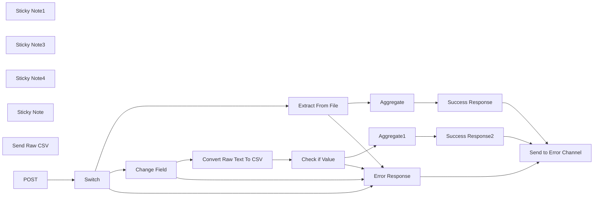

## Fluxo (.json) :

```json
{
  "nodes": [
    {
      "id": "b73fed9b-d56c-4175-a310-8c09ed51acd2",
      "name": "Sticky Note1",
      "type": "n8n-nodes-base.stickyNote",
      "position": [
        80,
        60
      ],
      "parameters": {
        "width": 464,
        "height": 303,
        "content": "## Testing \n\nTesting can be done with CURL or similar.\n\nFor File posting using Form Data\ncurl -X POST \"https://yoururl.com/webhook-test/tool/csv-to-json\" \\\n     -H \"Content-Type: text/csv\" \\\n     --data-binary @path/to/your/file.csv\n\n\nThis can also be tested using the Test workflow"
      },
      "typeVersion": 1
    },
    {
      "id": "6ed4b2cc-444f-44e2-ab91-34337acd7a9b",
      "name": "Sticky Note3",
      "type": "n8n-nodes-base.stickyNote",
      "position": [
        1680,
        580
      ],
      "parameters": {
        "color": 4,
        "width": 396,
        "height": 256,
        "content": "## Response\nWhere possible we will be returning a binary object.\n```\nIf there is an error\n```\n{\n  \"status\": \"error\",\n  \"data\": \"error message to display\"\n}\n```"
      },
      "typeVersion": 1
    },
    {
      "id": "4eff962e-e636-4704-835a-672ccd705e16",
      "name": "Extract From File",
      "type": "n8n-nodes-base.extractFromFile",
      "onError": "continueErrorOutput",
      "position": [
        680,
        80
      ],
      "parameters": {
        "options": {},
        "binaryPropertyName": "data0"
      },
      "typeVersion": 1
    },
    {
      "id": "ccc66f1e-e000-4048-a492-b80fbf8c8fce",
      "name": "Error Response",
      "type": "n8n-nodes-base.respondToWebhook",
      "onError": "continueErrorOutput",
      "position": [
        1900,
        900
      ],
      "parameters": {
        "options": {
          "responseCode": 500
        },
        "respondWith": "json",
        "responseBody": "{\n  \"status\": \"error\",\n  \"data\": \"There was a problem converting your CSV. Please refresh the page and try again.\"\n}"
      },
      "typeVersion": 1
    },
    {
      "id": "a7d34aba-6ded-4cc8-8866-7d4aa6ae3255",
      "name": "Success Response",
      "type": "n8n-nodes-base.respondToWebhook",
      "onError": "continueErrorOutput",
      "position": [
        1920,
        220
      ],
      "parameters": {
        "options": {
          "responseCode": 200
        },
        "respondWith": "json",
        "responseBody": "={\n  \"status\": \"OK\",\n  \"data\": {{ JSON.stringify($json.jsondata) }}\n}"
      },
      "typeVersion": 1
    },
    {
      "id": "3484b148-4ba5-4b54-9401-44010ac31178",
      "name": "Change Field",
      "type": "n8n-nodes-base.set",
      "onError": "continueErrorOutput",
      "position": [
        680,
        320
      ],
      "parameters": {
        "options": {},
        "assignments": {
          "assignments": [
            {
              "id": "b2e3bec3-221e-4f1d-b439-f75174f68ed1",
              "name": "csv",
              "type": "string",
              "value": "={{ $json.body }}"
            }
          ]
        }
      },
      "typeVersion": 3.3
    },
    {
      "id": "f35635fe-8943-486b-b5fa-4f566dd8f938",
      "name": "Sticky Note4",
      "type": "n8n-nodes-base.stickyNote",
      "position": [
        60,
        40
      ],
      "parameters": {
        "color": 7,
        "width": 2298,
        "height": 1027,
        "content": ""
      },
      "typeVersion": 1
    },
    {
      "id": "cede2fad-f0ee-4082-a403-81f6d8eb188e",
      "name": "Switch",
      "type": "n8n-nodes-base.switch",
      "position": [
        340,
        400
      ],
      "parameters": {
        "rules": {
          "values": [
            {
              "outputKey": "File",
              "conditions": {
                "options": {
                  "version": 1,
                  "leftValue": "",
                  "caseSensitive": true,
                  "typeValidation": "strict"
                },
                "combinator": "and",
                "conditions": [
                  {
                    "operator": {
                      "type": "object",
                      "operation": "notEmpty",
                      "singleValue": true
                    },
                    "leftValue": "={{ $binary }}",
                    "rightValue": ""
                  }
                ]
              },
              "renameOutput": true
            },
            {
              "outputKey": "Data/Text",
              "conditions": {
                "options": {
                  "version": 1,
                  "leftValue": "",
                  "caseSensitive": true,
                  "typeValidation": "strict"
                },
                "combinator": "and",
                "conditions": [
                  {
                    "id": "8930ce1a-a4cc-4094-b08f-a23a13dec40c",
                    "operator": {
                      "name": "filter.operator.equals",
                      "type": "string",
                      "operation": "equals"
                    },
                    "leftValue": "={{ $json.headers['content-type'] }}",
                    "rightValue": "text/plain"
                  }
                ]
              },
              "renameOutput": true
            },
            {
              "outputKey": "appJSON",
              "conditions": {
                "options": {
                  "version": 1,
                  "leftValue": "",
                  "caseSensitive": true,
                  "typeValidation": "strict"
                },
                "combinator": "and",
                "conditions": [
                  {
                    "id": "e3108952-daa2-425c-8c70-7d2ce0949e0c",
                    "operator": {
                      "name": "filter.operator.equals",
                      "type": "string",
                      "operation": "equals"
                    },
                    "leftValue": "={{ $json.headers['content-type'] }}",
                    "rightValue": "=application/json"
                  }
                ]
              },
              "renameOutput": true
            }
          ]
        },
        "options": {
          "fallbackOutput": "extra"
        }
      },
      "typeVersion": 3
    },
    {
      "id": "a2d92aeb-25eb-4d3c-82ad-16d2124099a8",
      "name": "Send to Error Channel",
      "type": "n8n-nodes-base.slack",
      "position": [
        2380,
        880
      ],
      "webhookId": "d8e1201d-cbcc-4153-a164-51d7b3e17c84",
      "parameters": {
        "text": ":interrobang: Error in XML to JSON tool",
        "select": "channel",
        "blocksUi": "={\n\t\"blocks\": [\n{\n\t\t\t\"type\": \"section\",\n\t\t\t\"text\": {\n\t\t\t\t\"type\": \"mrkdwn\",\n\t\t\t\t\"text\": \":interrobang: Error in CSV to JSON tool\"\n\t\t\t}\n\t\t},\n\t\t{\n\t\t\t\"type\": \"section\",\n\t\t\t\"text\": {\n\t\t\t\t\"type\": \"mrkdwn\",\n\t\t\t\t\"text\": \"*Time:*\\n{{ $now.format('dd/MM/yyyy HH:mm:ss') }}\\n*Execution ID:*\\n{{ $execution.id }}\\n\"\n\t\t\t},\n\t\t\t\"accessory\": {\n\t\t\t\t\"type\": \"button\",\n\t\t\t\t\"text\": {\n\t\t\t\t\t\"type\": \"plain_text\",\n\t\t\t\t\t\"text\": \"Go to Error\",\n\t\t\t\t\t\"emoji\": true\n\t\t\t\t},\n\t\t\t\t\"value\": \"error\",\n\t\t\t\t\"url\": \"[insert URL here]{{ $workflow.id }}/executions/{{ $execution.id }}\",\n\t\t\t\t\"action_id\": \"button-action\",\n\t\t\t\t\"style\": \"primary\"\n\t\t\t}\n\t\t}\n\t]\n}",
        "channelId": {
          "__rl": true,
          "mode": "id",
          "value": "C0832GBAEN4"
        },
        "messageType": "block",
        "otherOptions": {},
        "authentication": "oAuth2"
      },
      "typeVersion": 2.1
    },
    {
      "id": "b21c88d1-6f21-4ada-95ef-8ea91463e7ad",
      "name": "Convert Raw Text To CSV",
      "type": "n8n-nodes-base.code",
      "onError": "continueRegularOutput",
      "position": [
        940,
        300
      ],
      "parameters": {
        "jsCode": "const csvData = $input.all()[0]?.json?.csv;\n\n// Use a regex to split on either ',' or ';'\nconst lines = csvData.split(\"\\n\");\nconst headers = lines[0].split(/,|;/);\n\nconst jsonData = lines.slice(1).map((line) => {\n  // Split on ',' or ';' for each line\n  const data = line.split(/,|;/);\n  let obj = {};\n  headers.forEach((header, i) => {\n    obj[header] = data[i];\n  });\n  return obj;\n});\n\nif (jsonData.length === 0) {\n  throw new Error(\"No data to process\");\n}\n\nreturn jsonData;\n"
      },
      "typeVersion": 2,
      "alwaysOutputData": true
    },
    {
      "id": "a9803789-0397-4f5f-9cd2-cb630f983efc",
      "name": "Sticky Note",
      "type": "n8n-nodes-base.stickyNote",
      "position": [
        2380,
        40
      ],
      "parameters": {
        "color": 7,
        "width": 700,
        "height": 600,
        "content": "## Sample of Raw CSV Data Send\nUse the HTTP request node below to see how to send the Raw CSV data into this workflow. Don't forget to include the \\n's "
      },
      "typeVersion": 1
    },
    {
      "id": "8fb97224-706b-41de-a7ab-cbe2191436e9",
      "name": "Check if Value",
      "type": "n8n-nodes-base.if",
      "position": [
        1180,
        300
      ],
      "parameters": {
        "options": {},
        "conditions": {
          "options": {
            "version": 2,
            "leftValue": "",
            "caseSensitive": true,
            "typeValidation": "strict"
          },
          "combinator": "and",
          "conditions": [
            {
              "id": "d8d4cfda-f384-4154-8ad2-c3eabcb8c7ce",
              "operator": {
                "type": "string",
                "operation": "notExists",
                "singleValue": true
              },
              "leftValue": "={{ $json.error }}",
              "rightValue": ""
            }
          ]
        }
      },
      "typeVersion": 2.2
    },
    {
      "id": "4484f424-429b-449f-85c2-dd6a135972a0",
      "name": "Send Raw CSV",
      "type": "n8n-nodes-base.httpRequest",
      "position": [
        2480,
        200
      ],
      "parameters": {
        "url": "[insert URL here]",
        "body": "album, year, US_peak_chart_post\nThe White Stripes, 1999, -\nDe Stijl, 2000, -\nWhite Blood Cells, 2001, 61\nElephant, 2003, 6\nGet Behind Me Satan, 2005, 3\nIcky Thump, 2007, 2\nUnder Great White Northern Lights, 2010, 11\nLive in Mississippi, 2011, -\nLive at the Gold Dollar, 2012, -\nNine Miles from the White City, 2013, -\n",
        "method": "POST",
        "options": {
          "response": {
            "response": {
              "responseFormat": "file"
            }
          }
        },
        "sendBody": true,
        "contentType": "raw",
        "rawContentType": "text/plain"
      },
      "typeVersion": 4.2
    },
    {
      "id": "70a46bce-32da-4868-a960-3ee1cefbed1f",
      "name": "POST",
      "type": "n8n-nodes-base.webhook",
      "position": [
        140,
        420
      ],
      "webhookId": "add125c9-1591-4e1c-b68c-8032b99b6010",
      "parameters": {
        "path": "tool/csv-to-json",
        "options": {
          "binaryPropertyName": "data"
        },
        "httpMethod": "POST",
        "responseMode": "responseNode"
      },
      "typeVersion": 1.1
    },
    {
      "id": "116cfc2c-6e5f-4367-8c80-e1341e7d196a",
      "name": "Aggregate",
      "type": "n8n-nodes-base.aggregate",
      "position": [
        1580,
        220
      ],
      "parameters": {
        "options": {},
        "aggregate": "aggregateAllItemData",
        "destinationFieldName": "jsondata"
      },
      "typeVersion": 1
    },
    {
      "id": "967dc555-2599-4fb0-b3e1-00164bae4120",
      "name": "Aggregate1",
      "type": "n8n-nodes-base.aggregate",
      "position": [
        1580,
        360
      ],
      "parameters": {
        "options": {},
        "aggregate": "aggregateAllItemData",
        "destinationFieldName": "jsondata"
      },
      "typeVersion": 1
    },
    {
      "id": "51c77def-cdf7-41da-bfd1-e585f0553672",
      "name": "Success Response2",
      "type": "n8n-nodes-base.respondToWebhook",
      "onError": "continueErrorOutput",
      "position": [
        1900,
        400
      ],
      "parameters": {
        "options": {
          "responseCode": 200
        },
        "respondWith": "json",
        "responseBody": "={{ JSON.stringify($json.jsondata) }}"
      },
      "typeVersion": 1
    }
  ],
  "pinData": {},
  "connections": {
    "POST": {
      "main": [
        [
          {
            "node": "Switch",
            "type": "main",
            "index": 0
          }
        ]
      ]
    },
    "Switch": {
      "main": [
        [
          {
            "node": "Extract From File",
            "type": "main",
            "index": 0
          }
        ],
        [
          {
            "node": "Change Field",
            "type": "main",
            "index": 0
          }
        ],
        [
          {
            "node": "Error Response",
            "type": "main",
            "index": 0
          }
        ],
        [
          {
            "node": "Error Response",
            "type": "main",
            "index": 0
          }
        ]
      ]
    },
    "Aggregate": {
      "main": [
        [
          {
            "node": "Success Response",
            "type": "main",
            "index": 0
          }
        ]
      ]
    },
    "Aggregate1": {
      "main": [
        [
          {
            "node": "Success Response2",
            "type": "main",
            "index": 0
          }
        ]
      ]
    },
    "Change Field": {
      "main": [
        [
          {
            "node": "Convert Raw Text To CSV",
            "type": "main",
            "index": 0
          }
        ],
        [
          {
            "node": "Error Response",
            "type": "main",
            "index": 0
          }
        ]
      ]
    },
    "Check if Value": {
      "main": [
        [
          {
            "node": "Aggregate1",
            "type": "main",
            "index": 0
          }
        ],
        [
          {
            "node": "Error Response",
            "type": "main",
            "index": 0
          }
        ]
      ]
    },
    "Error Response": {
      "main": [
        [
          {
            "node": "Send to Error Channel",
            "type": "main",
            "index": 0
          }
        ],
        [
          {
            "node": "Send to Error Channel",
            "type": "main",
            "index": 0
          }
        ]
      ]
    },
    "Success Response": {
      "main": [
        [],
        [
          {
            "node": "Send to Error Channel",
            "type": "main",
            "index": 0
          }
        ]
      ]
    },
    "Extract From File": {
      "main": [
        [
          {
            "node": "Aggregate",
            "type": "main",
            "index": 0
          }
        ],
        [
          {
            "node": "Error Response",
            "type": "main",
            "index": 0
          }
        ]
      ]
    },
    "Success Response2": {
      "main": [
        [],
        [
          {
            "node": "Send to Error Channel",
            "type": "main",
            "index": 0
          }
        ]
      ]
    },
    "Convert Raw Text To CSV": {
      "main": [
        [
          {
            "node": "Check if Value",
            "type": "main",
            "index": 0
          }
        ]
      ]
    }
  }
}
```

<a id="template-1005"></a>

## Template 1005 - Análise de tráfego com IA e registro em baserow

- **Nome:** Análise de tráfego com IA e registro em baserow
- **Descrição:** Este fluxo coleta métricas de tráfego do Umami, gera resumos com IA e compara dados desta semana com a anterior, salvando tudo no Baserow.
- **Funcionalidade:** • Coleta de dados de tráfego: obtém pageviews, visitors, visits, bounces e total time dos últimos 7 dias para o site monitorado.
• Preparação de dados para IA: transforma dados brutos em um formato estruturado com métricas-chave.
• Geração de resumo/insights com IA: envia dados processados para IA gerar um resumo em markdown e sugestões.
• Comparação semanal: obtém dados de páginas para esta semana e para a semana anterior e gera uma comparação.
• Armazenamento de resultados: salva o conteúdo da IA e dados de entrada no Baserow com data atual.
• Execução agendada/manual: pode ser disparado por schedule ou manualmente para execução periódica.
- **Ferramentas:** • Umami API: fonte de dados de estatísticas de websites.
• OpenRouter AI: serviço de IA utilizado para gerar resumos, tabelas e sugestões a partir dos dados.
• Baserow: banco de dados utilizado para armazenar os resultados.

## Fluxo visual

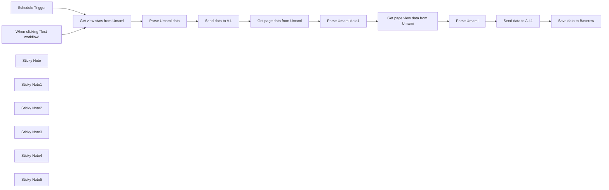

## Fluxo (.json) :

```json
{
  "id": "eZT6SZ4Kvmq5TzyQ",
  "meta": {
    "instanceId": "558d88703fb65b2d0e44613bc35916258b0f0bf983c5d4730c00c424b77ca36a",
    "templateCredsSetupCompleted": true
  },
  "name": "Umami analytics template",
  "tags": [],
  "nodes": [
    {
      "id": "8a54ac1c-a072-42e6-a3ba-8cde33475eb5",
      "name": "When clicking ‘Test workflow’",
      "type": "n8n-nodes-base.manualTrigger",
      "position": [
        460,
        220
      ],
      "parameters": {},
      "typeVersion": 1
    },
    {
      "id": "e81c9be0-f59d-467e-9bda-eeb2d66ed31e",
      "name": "Schedule Trigger",
      "type": "n8n-nodes-base.scheduleTrigger",
      "position": [
        460,
        380
      ],
      "parameters": {
        "rule": {
          "interval": [
            {
              "field": "weeks",
              "triggerAtDay": [
                4
              ]
            }
          ]
        }
      },
      "typeVersion": 1.2
    },
    {
      "id": "01b04872-9aea-4834-8df5-f6c91914133d",
      "name": "Get view stats from Umami",
      "type": "n8n-nodes-base.httpRequest",
      "position": [
        760,
        260
      ],
      "parameters": {
        "url": "=https://umami.mydomain.com/api/websites/86d4095c-a2a8-4fc8-9521-103e858e2b41/event-data/stats?startAt={{ DateTime.now().minus({ days: 7 }).toMillis() }}&endAt={{ DateTime.now().toMillis() }}&unit=hour&timezone=Asia%2FHong_Kong",
        "options": {},
        "authentication": "genericCredentialType",
        "genericAuthType": "httpHeaderAuth"
      },
      "credentials": {
        "httpHeaderAuth": {
          "id": "FKsKXvQUlaX5qt9n",
          "name": "Header Auth account 3"
        }
      },
      "typeVersion": 4.2
    },
    {
      "id": "38d342e3-10ad-4260-8f44-5a3233ec3166",
      "name": "Sticky Note",
      "type": "n8n-nodes-base.stickyNote",
      "position": [
        660,
        -260
      ],
      "parameters": {
        "width": 504.88636363636317,
        "content": "## Send data from Umami to A.I. and then save to Baserow\n\nYou can find out more about the stats available in the [Umami API](https://umami.is/docs/api/website-stats-api)\n\nRead the [case study here](https://rumjahn.com/how-to-analyze-umami-data-using-n8n-and-a-i-to-improve-seo-and-uncover-hidden-insights-for-better-content-optimization/).\n\n"
      },
      "typeVersion": 1
    },
    {
      "id": "18c997fe-61b1-464a-8bb5-fcdc017dd1f6",
      "name": "Sticky Note1",
      "type": "n8n-nodes-base.stickyNote",
      "position": [
        660,
        -60
      ],
      "parameters": {
        "color": 4,
        "width": 393.16558441558414,
        "height": 504.17207792207796,
        "content": "## Get summary stats from Umami\n\nIt will get: Pageviews, Visitors, Visits, Bounces, Total Time\n\nYou need to change the URL to your website. https://{your website}/api/websites/{website ID}/\n\nYou can find your ID by going to your Umami account -> Settings -> Edit (next to domain)"
      },
      "typeVersion": 1
    },
    {
      "id": "bfdc04a2-57fa-4a8a-b412-39047cebb370",
      "name": "Sticky Note2",
      "type": "n8n-nodes-base.stickyNote",
      "position": [
        1080,
        -60
      ],
      "parameters": {
        "color": 5,
        "width": 216.5746753246753,
        "height": 502.37012987012963,
        "content": "## Send data to A.I.\n\nTo use Openrouter, you need to register for an account.\nThen add header authorization credentials.\nUsername: Authroization\nPassword: Bearer {Your API Key}\n*It's Bearer space {API key}."
      },
      "typeVersion": 1
    },
    {
      "id": "fc373fd7-52fc-4729-8022-021c09d0c89c",
      "name": "Sticky Note3",
      "type": "n8n-nodes-base.stickyNote",
      "position": [
        1320,
        -60
      ],
      "parameters": {
        "color": 6,
        "width": 746.3474025974022,
        "height": 505.9740259740257,
        "content": "## Get page specific stats for this week and last\n\nCalls Umami to get this week and last week's data. It will get the views for each page visited on your website for comparison."
      },
      "typeVersion": 1
    },
    {
      "id": "82bd35b6-8b49-4d77-8be2-033a8bff3f41",
      "name": "Sticky Note4",
      "type": "n8n-nodes-base.stickyNote",
      "position": [
        2120,
        -60
      ],
      "parameters": {
        "color": 5,
        "width": 216.5746753246753,
        "height": 502.37012987012963,
        "content": "## Send data to A.I.\n\nTo use Openrouter, you need to register for an account.\nThen add header authorization credentials.\nUsername: Authroization\nPassword: Bearer {Your API Key}\n*It's Bearer space {API key}."
      },
      "typeVersion": 1
    },
    {
      "id": "503c4ca3-36da-41a8-9029-f844a34daa59",
      "name": "Sticky Note5",
      "type": "n8n-nodes-base.stickyNote",
      "position": [
        2380,
        -60
      ],
      "parameters": {
        "color": 4,
        "width": 393.16558441558414,
        "height": 504.17207792207796,
        "content": "## Save analysis to baserow\n\nYou need to create a table in advance to save. \n- Date (date)\n- Summary (Long text)\n- Top pages (Long text)\n- Blog name (Long text)"
      },
      "typeVersion": 1
    },
    {
      "id": "f64cdfbd-712f-461c-b025-25f37e2bded8",
      "name": "Parse Umami data",
      "type": "n8n-nodes-base.code",
      "position": [
        940,
        260
      ],
      "parameters": {
        "jsCode": "function transformToUrlString(items) {\n // In n8n, we need to check if items is an array and get the json property\n const data = items[0].json;\n \n if (!data) {\n console.log('No valid data found');\n return encodeURIComponent(JSON.stringify([]));\n }\n \n try {\n // Create a simplified object with the metrics\n const simplified = {\n pageviews: {\n value: parseInt(data.pageviews.value) || 0,\n prev: parseInt(data.pageviews.prev) || 0\n },\n visitors: {\n value: parseInt(data.visitors.value) || 0,\n prev: parseInt(data.visitors.prev) || 0\n },\n visits: {\n value: parseInt(data.visits.value) || 0,\n prev: parseInt(data.visits.prev) || 0\n },\n bounces: {\n value: parseInt(data.bounces.value) || 0,\n prev: parseInt(data.bounces.prev) || 0\n },\n totaltime: {\n value: parseInt(data.totaltime.value) || 0,\n prev: parseInt(data.totaltime.prev) || 0\n }\n };\n \n return encodeURIComponent(JSON.stringify(simplified));\n } catch (error) {\n console.log('Error processing data:', error);\n throw new Error('Invalid data structure');\n }\n}\n\n// Get the input data\nconst items = $input.all();\n\n// Process the data\nconst result = transformToUrlString(items);\n\n// Return the result\nreturn { json: { urlString: result } };"
      },
      "typeVersion": 2
    },
    {
      "id": "470715b6-0878-48b8-b6c6-40de27fbc966",
      "name": "Send data to A.I.",
      "type": "n8n-nodes-base.httpRequest",
      "position": [
        1140,
        260
      ],
      "parameters": {
        "url": "https://openrouter.ai/api/v1/chat/completions",
        "method": "POST",
        "options": {},
        "jsonBody": "={\n \"model\": \"meta-llama/llama-3.1-70b-instruct:free\",\n \"messages\": [\n {\n \"role\": \"user\",\n \"content\": \"You are an SEO expert. Here is data from Umami analytics of Pennibnotes.com. Where X is URL and Y is number of visitors. Give me a table summary of this data in markdown format:{{ $('Parse Umami data').item.json.urlString }}.\"\n }\n ]\n}",
        "sendBody": true,
        "specifyBody": "json",
        "authentication": "genericCredentialType",
        "genericAuthType": "httpHeaderAuth"
      },
      "credentials": {
        "httpHeaderAuth": {
          "id": "WY7UkF14ksPKq3S8",
          "name": "Header Auth account 2"
        }
      },
      "typeVersion": 4.2
    },
    {
      "id": "ea4bb37f-96d9-41b8-bf46-fb09865a6e0f",
      "name": "Get page data from Umami",
      "type": "n8n-nodes-base.httpRequest",
      "position": [
        1380,
        260
      ],
      "parameters": {
        "url": "=https://umami.rumjahn.synology.me/api/websites/f375d28c-1949-4597-8871-f1b942e3aa24/metrics?startAt={{Date.now() - (7 * 24 * 60 * 60 * 1000)}}&endAt={{Date.now()}}&type=url&tz=America/Los_Angeles",
        "options": {},
        "authentication": "genericCredentialType",
        "genericAuthType": "httpHeaderAuth"
      },
      "credentials": {
        "httpHeaderAuth": {
          "id": "FKsKXvQUlaX5qt9n",
          "name": "Header Auth account 3"
        }
      },
      "typeVersion": 4
    },
    {
      "id": "d982606b-49c8-4d5b-ba79-bd0fdd2600b6",
      "name": "Parse Umami data1",
      "type": "n8n-nodes-base.code",
      "position": [
        1560,
        260
      ],
      "parameters": {
        "jsCode": "// Get input data\nconst data = $input.all();\n\n// Create URL-encoded string from the data\nconst encodedData = encodeURIComponent(JSON.stringify(data));\n\n// Return the encoded data\nreturn {\n json: {\n thisWeek: encodedData\n }\n};"
      },
      "typeVersion": 2
    },
    {
      "id": "f3734045-1318-4234-a3ac-61b766124609",
      "name": "Get page view data from Umami",
      "type": "n8n-nodes-base.httpRequest",
      "position": [
        1760,
        260
      ],
      "parameters": {
        "url": "=https://umami.rumjahn.synology.me/api/websites/f375d28c-1949-4597-8871-f1b942e3aa24/metrics?startAt={{Date.now() - (14 * 24 * 60 * 60 * 1000)}}&endAt={{Date.now() - (7 * 24 * 60 * 60 * 1000)}}&type=url&tz=America/Los_Angeles",
        "options": {},
        "authentication": "genericCredentialType",
        "genericAuthType": "httpHeaderAuth"
      },
      "credentials": {
        "httpHeaderAuth": {
          "id": "FKsKXvQUlaX5qt9n",
          "name": "Header Auth account 3"
        }
      },
      "typeVersion": 4
    },
    {
      "id": "a0153ab0-3eaf-4f97-a2dc-ab63d45a9187",
      "name": "Parse Umami",
      "type": "n8n-nodes-base.code",
      "position": [
        1920,
        260
      ],
      "parameters": {
        "jsCode": "// Get input data\nconst data = $input.all();\n\n// Create URL-encoded string from the data\nconst encodedData = encodeURIComponent(JSON.stringify(data));\n\n// Return the encoded data\nreturn {\n json: {\n lastweek: encodedData\n }\n};"
      },
      "typeVersion": 2
    },
    {
      "id": "c2d3d396-09fa-4800-b56d-40ed7592cd3c",
      "name": "Send data to A.I.1",
      "type": "n8n-nodes-base.httpRequest",
      "position": [
        2180,
        260
      ],
      "parameters": {
        "url": "https://openrouter.ai/api/v1/chat/completions",
        "method": "POST",
        "options": {},
        "jsonBody": "={\n \"model\": \"meta-llama/llama-3.1-70b-instruct:free\",\n \"messages\": [\n {\n \"role\": \"user\",\n \"content\": \"You are an SEO expert. Here is data from Umami analytics of Pennibnotes.com. Where X is URL and Y is number of visitors. Compare the data from this week to last week. Present the data in a table using markdown and offer 5 improvement suggestions. This week:{{ $('Parse Umami data1').first().json.thisWeek }} Lastweek:{{ $json.lastweek }}\"\n }\n ]\n}\n\n",
        "sendBody": true,
        "specifyBody": "json",
        "authentication": "genericCredentialType",
        "genericAuthType": "httpHeaderAuth"
      },
      "credentials": {
        "httpHeaderAuth": {
          "id": "WY7UkF14ksPKq3S8",
          "name": "Header Auth account 2"
        }
      },
      "typeVersion": 4.2
    },
    {
      "id": "ce58a556-c05a-4395-88b0-3edecbad80e5",
      "name": "Save data to Baserow",
      "type": "n8n-nodes-base.baserow",
      "position": [
        2520,
        260
      ],
      "parameters": {
        "tableId": 607,
        "fieldsUi": {
          "fieldValues": [
            {
              "fieldId": 5870,
              "fieldValue": "={{ $json.choices[0].message.content }}"
            },
            {
              "fieldId": 5869,
              "fieldValue": "={{ $('Send data to A.I.').first().json.choices[0].message.content }}"
            },
            {
              "fieldId": 5868,
              "fieldValue": "={{ DateTime.now().toFormat('yyyy-MM-dd') }}"
            },
            {
              "fieldId": 5871,
              "fieldValue": "Name of your blog"
            }
          ]
        },
        "operation": "create",
        "databaseId": 121
      },
      "credentials": {
        "baserowApi": {
          "id": "8w0zXhycIfCAgja3",
          "name": "Baserow account"
        }
      },
      "typeVersion": 1
    }
  ],
  "active": false,
  "pinData": {},
  "settings": {
    "executionOrder": "v1"
  },
  "versionId": "e28e067d-9245-4879-9321-4d21925f951e",
  "connections": {
    "Parse Umami": {
      "main": [
        [
          {
            "node": "Send data to A.I.1",
            "type": "main",
            "index": 0
          }
        ]
      ]
    },
    "Parse Umami data": {
      "main": [
        [
          {
            "node": "Send data to A.I.",
            "type": "main",
            "index": 0
          }
        ]
      ]
    },
    "Schedule Trigger": {
      "main": [
        [
          {
            "node": "Get view stats from Umami",
            "type": "main",
            "index": 0
          }
        ]
      ]
    },
    "Parse Umami data1": {
      "main": [
        [
          {
            "node": "Get page view data from Umami",
            "type": "main",
            "index": 0
          }
        ]
      ]
    },
    "Send data to A.I.": {
      "main": [
        [
          {
            "node": "Get page data from Umami",
            "type": "main",
            "index": 0
          }
        ]
      ]
    },
    "Send data to A.I.1": {
      "main": [
        [
          {
            "node": "Save data to Baserow",
            "type": "main",
            "index": 0
          }
        ]
      ]
    },
    "Get page data from Umami": {
      "main": [
        [
          {
            "node": "Parse Umami data1",
            "type": "main",
            "index": 0
          }
        ]
      ]
    },
    "Get view stats from Umami": {
      "main": [
        [
          {
            "node": "Parse Umami data",
            "type": "main",
            "index": 0
          }
        ]
      ]
    },
    "Get page view data from Umami": {
      "main": [
        [
          {
            "node": "Parse Umami",
            "type": "main",
            "index": 0
          }
        ]
      ]
    },
    "When clicking ‘Test workflow’": {
      "main": [
        [
          {
            "node": "Get view stats from Umami",
            "type": "main",
            "index": 0
          }
        ]
      ]
    }
  }
}
```

<a id="template-1006"></a>

## Template 1006 - Resumo diário de qualidade do ar

- **Nome:** Resumo diário de qualidade do ar
- **Descrição:** Agenda uma verificação diária de qualidade do ar e níveis de pólen para uma localização definida e envia um resumo personalizado por e-mail ao usuário.
- **Funcionalidade:** • Agendamento diário: Dispara a rotina todo dia às 07:00 para verificar condições ambientais.
• Definição de localização: Permite configurar coordenadas (latitude e longitude) do local a ser monitorado.
• Perfil do usuário: Armazena idade e sensibilidades de saúde para personalizar recomendações.
• Coleta de dados ambientais: Busca dados de qualidade do ar (PM2.5, AQI, poluente principal) e níveis de pólen (árvores, gramíneas, ervas) de uma API externa.
• Geração de mensagem personalizada com IA: Usa um modelo de linguagem para resumir a situação e sugerir 3 a 5 ações práticas e cuidadosas adaptadas ao usuário.
• Envio de e-mail: Envia o resumo gerado para um endereço de e-mail configurado.
• Orientações de configuração: Inclui notas com instruções para obter a chave da API do provedor de dados e exemplos de coordenadas.
- **Ferramentas:** • Ambee API: Fornece dados em tempo real de qualidade do ar e níveis de pólen por latitude/longitude.
• OpenAI (GPT-4.1): Gera o texto do resumo amigável e as recomendações personalizadas com base nos dados e no perfil do usuário.
• Gmail: Serviço de e-mail usado para enviar o resumo e as recomendações ao destinatário configurado.

## Fluxo visual

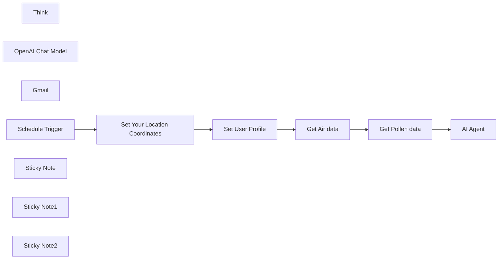

## Fluxo (.json) :

```json
{
  "id": "PcVz6j5XLU7Z9MPN",
  "meta": {
    "instanceId": "7182053c6096cf2c9d8885665d447ff4ab0753f89cf41ab8a36a48ee405e4b1c",
    "templateCredsSetupCompleted": true
  },
  "name": "AirQuality Scheduler",
  "tags": [],
  "nodes": [
    {
      "id": "ea677d9c-fa79-4897-be4d-6b9793050775",
      "name": "Get Air data",
      "type": "n8n-nodes-base.httpRequest",
      "position": [
        480,
        0
      ],
      "parameters": {
        "url": "https://api.ambeedata.com/latest/by-lat-lng",
        "options": {
          "redirect": {
            "redirect": {}
          }
        },
        "sendQuery": true,
        "sendHeaders": true,
        "queryParameters": {
          "parameters": [
            {
              "name": "lat",
              "value": "={{ $('Set Your Location Coordinates').item.json.lat }}"
            },
            {
              "name": "lng",
              "value": "={{ $('Set Your Location Coordinates').item.json.lng }}"
            }
          ]
        },
        "headerParameters": {
          "parameters": [
            {
              "name": "x-api-key"
            }
          ]
        }
      },
      "typeVersion": 4.2
    },
    {
      "id": "1709ec3a-4306-4987-ada3-7b23ad50b432",
      "name": "Get Pollen data",
      "type": "n8n-nodes-base.httpRequest",
      "position": [
        720,
        0
      ],
      "parameters": {
        "url": "https://api.ambeedata.com/latest/pollen/by-lat-lng",
        "options": {},
        "sendQuery": true,
        "sendHeaders": true,
        "queryParameters": {
          "parameters": [
            {
              "name": "lat",
              "value": "={{ $('Set Your Location Coordinates').item.json.lat }}"
            },
            {
              "name": "lng",
              "value": "={{ $('Set Your Location Coordinates').item.json.lng }}"
            }
          ]
        },
        "headerParameters": {
          "parameters": [
            {
              "name": "x-api-key"
            }
          ]
        }
      },
      "typeVersion": 4.2
    },
    {
      "id": "10dd46a2-fcdc-4246-a9be-1230527266b3",
      "name": "AI Agent",
      "type": "@n8n/n8n-nodes-langchain.agent",
      "position": [
        940,
        0
      ],
      "parameters": {
        "text": "Follow the prompt below",
        "options": {
          "systemMessage": "= Hey there! You're a kind and helpful assistant here to make environmental health information easy to understand and act on 💚\n\nYou'll receive two things:\n1️⃣ Real-time environmental data (air quality and pollen levels)  \n2️⃣ A short user profile (to help tailor your suggestions)\n\nYour job is to:\n✨ Summarize today’s environmental conditions  \n🌿 Give smart, caring suggestions based on who the user is  \n\n---\n\n📍 Here’s the environmental data you’ll get:\n<environmental_data>\n🌍 *Location:*  \n• Country: {{ $('Get Air data').item.json.stations[0].countryCode }}  \n• City: {{ $('Get Air data').item.json.stations[0].city }}  \n• Lat/Lng: {{ $('Get Air data').item.json.stations[0].lat }}, {{ $('Get Air data').item.json.stations[0].lng }}\n\n💨 *Air Quality:*  \n• PM2.5: {{ $('Get Air data').item.json.stations[0].PM25 }} µg/m³  \n• AQI: {{ $('Get Air data').item.json.stations[0].AQI }}  \n• Main pollutant: {{ $('Get Air data').item.json.stations[0].aqiInfo.pollutant }}  \n• Level: {{ $('Get Air data').item.json.stations[0].aqiInfo.category }}\n\n🌸 *Pollen Levels:*  \n• Tree pollen: {{ $json.data[0].Count.tree_pollen }} ({{ $json.data[0].Risk.tree_pollen }})  \n• Grass pollen: {{ $json.data[0].Count.grass_pollen }} ({{ $json.data[0].Risk.grass_pollen }})  \n• Weed pollen: {{ $json.data[0].Count.weed_pollen }} ({{ $json.data[0].Risk.weed_pollen }})\n</environmental_data>\n\n---\n\n👧 And here’s the person you’re helping today:\n<user_profile>   \n• Age:  {{ $('Set User Profile').item.json['Age '] }} \n• Health Sensitivity: {{ $('Set User Profile').item.json['Health sensitivities'] }}\n</user_profile>\n\n---\n\n💡 What to do:\n\n1. 📝 **Write a friendly summary**  \nExplain the overall environmental situation today in 2–3 warm, simple sentences.  \nBe sure to:\n- Mention if it’s generally a good or sensitive day to be outdoors.\n- Highlight anything unusually high (e.g., \"Tree pollen is very high today\" or \"Air quality is moderate\").\n- **Include the actual environmental values** (like pollen risk levels: grass_pollen = {{ $json.data[0].Risk.grass_pollen }}, tree_pollen = ..., and AQI = {{ $('Get Air data').item.json.stations[0].AQI }}) clearly in your response.  \nMake the summary sound supportive and easy to understand, like talking to a friend or parent.\n\n2. 🌟 **Give 3 to 5 helpful suggestions**  \nThink like someone who really cares.  \nKeep them practical, gentle, and specific to the user.  \nExamples: stay indoors, wear a mask, take medication, keep windows closed, use a purifier etc.....\n\n---\n\n📦 Format your response like this (with emojis and clarity!) of course ignore \n---\n3. Use the Mail Tool to send the message by email\n✨ Stay warm, helpful, and comforting.  \nEverything you say should feel like advice from someone who truly cares.  \nOnly use the data and profile provided — no guesses or outside info.\n"
        },
        "promptType": "define"
      },
      "typeVersion": 1.8
    },
    {
      "id": "a4db1c0e-b61b-40cf-a7e7-b2cc0b8be481",
      "name": "Think",
      "type": "@n8n/n8n-nodes-langchain.toolThink",
      "position": [
        1060,
        240
      ],
      "parameters": {},
      "typeVersion": 1
    },
    {
      "id": "86d89626-68e3-4718-b86c-84acc644a87d",
      "name": "OpenAI Chat Model",
      "type": "@n8n/n8n-nodes-langchain.lmChatOpenAi",
      "position": [
        900,
        240
      ],
      "parameters": {
        "model": {
          "__rl": true,
          "mode": "list",
          "value": "gpt-4.1",
          "cachedResultName": "gpt-4.1"
        },
        "options": {}
      },
      "credentials": {
        "openAiApi": {
          "id": "bVTwohZmhBo54IXz",
          "name": "OpenAi account"
        }
      },
      "typeVersion": 1.2
    },
    {
      "id": "1bcaf417-dc1c-40a7-be01-f9bd64c4db46",
      "name": "Gmail",
      "type": "n8n-nodes-base.gmailTool",
      "position": [
        1180,
        240
      ],
      "webhookId": "bcf8b4a4-4adf-4e30-a962-683173e5b442",
      "parameters": {
        "sendTo": "simoroosvelt@gmail.com",
        "message": "={{ /*n8n-auto-generated-fromAI-override*/ $fromAI('Message', ``, 'string') }}",
        "options": {},
        "subject": "={{ /*n8n-auto-generated-fromAI-override*/ $fromAI('Subject', ``, 'string') }}",
        "emailType": "text"
      },
      "credentials": {
        "gmailOAuth2": {
          "id": "cfzmH8MNbSo1rgbX",
          "name": "Gmail account 3"
        }
      },
      "typeVersion": 2.1
    },
    {
      "id": "a7ad5577-1f1d-4b69-a869-95fd5634fd7d",
      "name": "Schedule Trigger",
      "type": "n8n-nodes-base.scheduleTrigger",
      "position": [
        -320,
        0
      ],
      "parameters": {
        "rule": {
          "interval": [
            {
              "triggerAtHour": 7
            }
          ]
        }
      },
      "typeVersion": 1.2
    },
    {
      "id": "d8276f52-0850-4c93-a834-340acc55f273",
      "name": "Sticky Note",
      "type": "n8n-nodes-base.stickyNote",
      "position": [
        -820,
        -360
      ],
      "parameters": {
        "width": 440,
        "height": 520,
        "content": "## How to Get Your Ambee API Key\nAmbee offers free API access, but you need to sign up using a work or university email address (e.g., name@company.com, name@uni.edu). Personal emails like Gmail or Outlook won't be accepted.\n\nSteps to get your key:\n\n1.Go to https://www.getambee.com\n\n2.Click “Try API for Free”\n\n3.Use your organization or school email when signing up\n\n4.Confirm your email and copy the key from your dashboard\n\n5.Paste it into the HTTP Request node headers:\n\nx-api-key: YOUR_KEY_HERE\n Tip: If you’re a student, your university email usually works just fine.\n\n"
      },
      "typeVersion": 1
    },
    {
      "id": "91f908f7-71e6-49f6-84f7-0fe00328c5e3",
      "name": "Sticky Note1",
      "type": "n8n-nodes-base.stickyNote",
      "position": [
        -180,
        220
      ],
      "parameters": {
        "color": 4,
        "width": 480,
        "height": 300,
        "content": "## Set Your Location Coordinates \nLocation Coordinates (Latitude & Longitude)\nTo fetch accurate air and pollen data, you need to input the coordinates of the location you're monitoring.\n\nExample (Braunschweig, Germany):\n- lat: 52.267\n- lng: 10.533\n\nYou can find coordinates using Google Maps or any GPS service."
      },
      "typeVersion": 1
    },
    {
      "id": "68a7a76f-3154-443b-817f-6f284528c73b",
      "name": "Set Your Location Coordinates",
      "type": "n8n-nodes-base.set",
      "position": [
        0,
        0
      ],
      "parameters": {
        "options": {},
        "assignments": {
          "assignments": [
            {
              "id": "5a40fdf6-bd34-452c-8290-7583f025fc6b",
              "name": "lat",
              "type": "string",
              "value": "52.267"
            },
            {
              "id": "4b47ebc4-f061-4906-9d15-36acb931035f",
              "name": "lng",
              "type": "string",
              "value": "10.533"
            }
          ]
        }
      },
      "typeVersion": 3.4
    },
    {
      "id": "aa5fd195-2194-48f2-a07c-b263313ef98b",
      "name": "Set User Profile",
      "type": "n8n-nodes-base.set",
      "position": [
        240,
        0
      ],
      "parameters": {
        "options": {},
        "assignments": {
          "assignments": [
            {
              "id": "90a7552c-8c06-4ff5-b3c0-af992ef01f36",
              "name": "Age ",
              "type": "string",
              "value": "25"
            },
            {
              "id": "20740f05-5b99-4e90-afaa-7ef49f62448f",
              "name": "Health sensitivities",
              "type": "string",
              "value": "Allergic to Pollen"
            }
          ]
        }
      },
      "typeVersion": 3.4
    },
    {
      "id": "96eb2b9b-dc91-4853-899a-3d6d729d28a4",
      "name": "Sticky Note2",
      "type": "n8n-nodes-base.stickyNote",
      "position": [
        240,
        -380
      ],
      "parameters": {
        "color": 6,
        "width": 480,
        "height": 300,
        "content": "## Set  User Profile\nThis tells the AI what kind of user you're creating suggestions for.\nIt should include:\n-Age\n-Health sensitivities (e.g., asthma, allergy to pollen)\n\nyou can add more Infos, if you want.\n"
      },
      "typeVersion": 1
    }
  ],
  "active": false,
  "pinData": {},
  "settings": {
    "executionOrder": "v1"
  },
  "versionId": "b8c19f31-e844-4c25-8720-58679f240705",
  "connections": {
    "Gmail": {
      "ai_tool": [
        [
          {
            "node": "AI Agent",
            "type": "ai_tool",
            "index": 0
          }
        ]
      ]
    },
    "Think": {
      "ai_tool": [
        [
          {
            "node": "AI Agent",
            "type": "ai_tool",
            "index": 0
          }
        ]
      ]
    },
    "AI Agent": {
      "main": [
        []
      ]
    },
    "Get Air data": {
      "main": [
        [
          {
            "node": "Get Pollen data",
            "type": "main",
            "index": 0
          }
        ]
      ]
    },
    "Get Pollen data": {
      "main": [
        [
          {
            "node": "AI Agent",
            "type": "main",
            "index": 0
          }
        ]
      ]
    },
    "Schedule Trigger": {
      "main": [
        [
          {
            "node": "Set Your Location Coordinates",
            "type": "main",
            "index": 0
          }
        ]
      ]
    },
    "Set User Profile": {
      "main": [
        [
          {
            "node": "Get Air data",
            "type": "main",
            "index": 0
          }
        ]
      ]
    },
    "OpenAI Chat Model": {
      "ai_languageModel": [
        [
          {
            "node": "AI Agent",
            "type": "ai_languageModel",
            "index": 0
          }
        ]
      ]
    },
    "Set Your Location Coordinates": {
      "main": [
        [
          {
            "node": "Set User Profile",
            "type": "main",
            "index": 0
          }
        ]
      ]
    }
  }
}
```

<a id="template-1007"></a>

## Template 1007 - Lead de Cliente com Notificação por Email

- **Nome:** Lead de Cliente com Notificação por Email
- **Descrição:** Este fluxo automatiza o processamento de novos leads, extrai informações relevantes, consulta contatos responsáveis, obtém dados da empresa e envia uma notificação por email com o resumo da solicitação ao destinatário apropriado.
- **Funcionalidade:** • Captura e validação de lead: recebe novos leads, extrai notas, nome, organização, contatos e tipo de solicitação, e verifica se o lead é válido.
• Verificação de validade do lead: decide se deve prosseguir com ações de envio ou retornar uma resposta de Lead inválido.
• Consulta de contatos responsáveis: busca no banco de contatos informações de emails dos responsáveis pelo produto/serviço relevante.
• Geração de email pelo sistema: cria um corpo de email com resumo da solicitação para envio aos contatos.
• Preparação de email para envio: formata o corpo para HTML e organiza assunto e destinatários.
• Envio de notificações de email: envia o email aos contatos relevantes com assunto e corpo.
• Integração com ERPNext para dados do lead: busca informações adicionais do lead no ERPNext para enriquecer a notificação.
• Obtenção de informações corporativas: obtém perfil da empresa e políticas através de documentos Google Docs para enriquecer a mensagem.
- **Ferramentas:** • ERPNext: Sistema ERP utilizado para buscar dados do Lead e informações relevantes via API.
• Google Docs: Documentos de Perfil da Empresa e Políticas consultados para enriquecer a notificação.
• Google Sheets: Base de contatos e diretório de informações de produtos/soluções.
• Microsoft Outlook: Serviço de envio do email de notificação.

## Fluxo visual

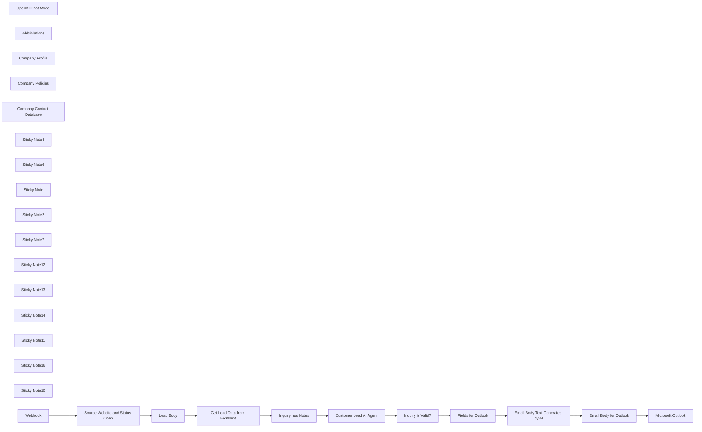

## Fluxo (.json) :

```json
{
  "meta": {
    "instanceId": "e4f78845dfed9ddcfba1945ae00d12e9a7d76eab052afd19299228ce02349d86"
  },
  "nodes": [
    {
      "id": "23291d25-3e1a-4b0d-9b1d-d066e8c04a1f",
      "name": "Customer Lead AI Agent",
      "type": "@n8n/n8n-nodes-langchain.agent",
      "position": [
        -640,
        460
      ],
      "parameters": {
        "text": "=**System Prompt:**\n\nYou are an AI assistant designed to process new leads and generate appropriate responses. Your role includes analyzing lead notes, categorizing them, and generating an email from the system to inform the relevant contact about the inquiry. Do not send the email as if it is directly from the customer; instead, draft it as a notification from the system summarizing the inquiry.\n\n### **Process Flow**\n\n1. **Analyzing Lead Notes:**\n   - Extract key details such as the customer name, organization, contact information, and their specific request.  \n   - Determine if the inquiry relates to products, services, or solutions offered by the company.\n\n2. **Finding the Appropriate Contact(s):**\n   - Search the contact database to find the responsible person(s) for the relevant product, service, or solution.  \n   - If one person is responsible, provide their email.  \n   - If multiple people are responsible, list all emails separated by commas.\n\n3. **Generating an Email Notification:**\n   - Draft a professional email as a notification from the system.\n   - Summarize the customer’s inquiry.\n   - Include all relevant details to assist the recipient in addressing the inquiry.\n\n4. **Handling Invalid Leads:**\n   - If the inquiry is unrelated to products, services, or solutions (e.g., job inquiries or general product inquiries), classify it as invalid and return:  \n     `\"Invalid Lead - Not related to products, services, or solutions.\"`\n\n### **Output Requirements**\n\n1. **For Relevant Leads:**\n   - **Email Address(es):** Provide the appropriate email(s).  \n   - **Email Message Body:** Generate an email notification from the system summarizing the inquiry.\n\n2. **For Invalid Leads:**\n   - Return: `\"Invalid Lead - Not related to products, services, or solutions.\"`\n\n\n### **Email Template for Relevant Leads**\n\n**Email Address(es):** [Relevant Email IDs]\n\n**Email Message Body:**\n\n_Subject: New Inquiry from Customer Regarding [Product/Service/Solution]_  \n\nDear [Recipient(s)],  \n\nWe have received a new inquiry from a customer through our system. Below are the details:  \n\n**Customer Name:** [Customer Name]  \n**Organization:** [Organization Name]  \n**Contact Information:** [Contact Details]  \n\n**Inquiry Summary:**  \n[Summarized description of the customer's request, e.g., “The customer is seeking to upgrade their restroom facilities with touchless soap dispensers and tissue holders installed behind mirrors. They have requested a site visit to assess the location and provide a proposal.”]  \n\n**Action Required:**  \nPlease prioritize this inquiry and reach out to the customer promptly to address their requirements.  \n\nThank you,  \n[Your System Name]  \n\n\n### **Example Output**\n\n**Input Lead Notes:**\n*\"Dear Syncbricks, We are looking to Develop Workflow Automation Soluition for our company, can you let us know the details what do you offer in tems of this.\"*\n\n**Output:**\n\n- **Email Address(es):** employee@syncbricks.com\n\n- **Email Message Body:**  \n\n_Subject: Workflow Automation Platform Integration_  \n\nDear -Emploiyee Name (s) --,  \n\nWe have received a new inquiry from a customer through our system. Below are the details:  \n\n**Customer Name:** Amjid Ali \n**Organization:** Syncbricks LLC\n**Contact Information:** 123456789 \n\n**Inquiry Summary:**  \nThe customer is asking for workflow automation for their company \n\n**Action Required:**  \nPlease prioritize this inquiry and reach out to the customer promptly to address their requirements.  \n\nThank you,  \nSyncbricks LLC\n\n---\nHere are the Lead Details\nLead Name : {{ $json.data.lead_name }}\nCompany : {{ $json.data.company_name }}\nSource : {{ $json.data.source }}\nNotes : {{ $json.data.notes }}\nCity : {{ $json.data.city }}\nCountry : {{ $json.data.country }}\nMobile : {{ $json.data.mobile_no }}",
        "options": {},
        "promptType": "define"
      },
      "typeVersion": 1.7
    },
    {
      "id": "1831dc36-910b-4a72-a90e-b411f105a8c3",
      "name": "OpenAI Chat Model",
      "type": "@n8n/n8n-nodes-langchain.lmChatOpenAi",
      "position": [
        -800,
        800
      ],
      "parameters": {
        "options": {}
      },
      "credentials": {
        "openAiApi": {
          "id": "hTl3a2XqteCwExYY",
          "name": "OpenAi account"
        }
      },
      "typeVersion": 1
    },
    {
      "id": "79713c56-2f7c-4872-90e4-331715f54048",
      "name": "Abbriviations",
      "type": "n8n-nodes-base.googleSheetsTool",
      "position": [
        -640,
        800
      ],
      "parameters": {
        "options": {},
        "sheetName": {
          "__rl": true,
          "mode": "list",
          "value": "gid=0",
          "cachedResultUrl": "https://docs.google.com/spreadsheets/d/1gtdrAe-jjQH9gQdXA9PJ5y3dSAN4i6k_Rs5sDyALIfU/edit#gid=0",
          "cachedResultName": "abbrivaitions"
        },
        "documentId": {
          "__rl": true,
          "mode": "list",
          "value": "1gtdrAe-jjQH9gQdXA9PJ5y3dSAN4i6k_Rs5sDyALIfU",
          "cachedResultUrl": "https://docs.google.com/spreadsheets/d/1gtdrAe-jjQH9gQdXA9PJ5y3dSAN4i6k_Rs5sDyALIfU/edit?usp=drivesdk",
          "cachedResultName": "Abbriviations List"
        }
      },
      "credentials": {
        "googleSheetsOAuth2Api": {
          "id": "L3lApjbQfMm36LLX",
          "name": "Google Sheets account"
        }
      },
      "typeVersion": 4.5
    },
    {
      "id": "73b1e3c9-4703-4f87-8399-e7a9bf368d4c",
      "name": "Lead Body",
      "type": "n8n-nodes-base.set",
      "position": [
        -1640,
        640
      ],
      "parameters": {
        "options": {},
        "assignments": {
          "assignments": [
            {
              "id": "82a674a2-4d12-45f2-b276-cc95cf7b2e93",
              "name": "body",
              "type": "object",
              "value": "={{ $json.body }}"
            }
          ]
        }
      },
      "typeVersion": 3.4
    },
    {
      "id": "5f25d846-c639-49e5-bea2-160000bfb104",
      "name": "Source Website and Status Open",
      "type": "n8n-nodes-base.if",
      "position": [
        -1920,
        640
      ],
      "parameters": {
        "options": {},
        "conditions": {
          "options": {
            "version": 2,
            "leftValue": "",
            "caseSensitive": true,
            "typeValidation": "strict"
          },
          "combinator": "and",
          "conditions": [
            {
              "id": "2b184de2-a64e-44e3-8f25-645539681533",
              "operator": {
                "name": "filter.operator.equals",
                "type": "string",
                "operation": "equals"
              },
              "leftValue": "={{ $json.body.source }}",
              "rightValue": "Website"
            },
            {
              "id": "9632cf65-11a1-483c-95c8-94bfe84fb243",
              "operator": {
                "name": "filter.operator.equals",
                "type": "string",
                "operation": "equals"
              },
              "leftValue": "={{ $json.body.status }}",
              "rightValue": "Open"
            }
          ]
        }
      },
      "typeVersion": 2.2
    },
    {
      "id": "12ba65c9-0890-4862-9704-98492eb8f637",
      "name": "Microsoft Outlook",
      "type": "n8n-nodes-base.microsoftOutlook",
      "position": [
        1180,
        580
      ],
      "parameters": {
        "subject": "={{ $('Fields for Outlook').item.json.subject }}",
        "bodyContent": "={{ $json.html }}\n<a href=\"https://erpnext.syncbricks.com/app/lead/{{ $('Webhook').item.json.body.name }}\" target=\"_blank\" rel=\"noopener noreferrer\">Here is Lead {{ $('Source Website and Status Open').item.json.body.name }} </a>\n",
        "toRecipients": "= {{ $('Fields for Outlook').item.json.email_addresses }}",
        "additionalFields": {
          "bodyContentType": "html"
        }
      },
      "credentials": {
        "microsoftOutlookOAuth2Api": {
          "id": "9gy3uvf3pmBdpEsq",
          "name": "Microsoft Outlook Al Ansari"
        }
      },
      "typeVersion": 2
    },
    {
      "id": "b1410997-3705-4234-918e-a14e4ccc6b70",
      "name": "Email Body Text Generated by AI",
      "type": "n8n-nodes-base.set",
      "position": [
        700,
        580
      ],
      "parameters": {
        "options": {},
        "assignments": {
          "assignments": [
            {
              "id": "cdce31fb-2ec9-45ce-a4ac-a6ff9c811dc3",
              "name": "email_body",
              "type": "string",
              "value": "={{ $json.email_body }}"
            }
          ]
        }
      },
      "typeVersion": 3.4
    },
    {
      "id": "b10684b9-9f72-42b3-a9f9-c54e711ceb59",
      "name": "Fields for Outlook",
      "type": "n8n-nodes-base.code",
      "position": [
        360,
        600
      ],
      "parameters": {
        "jsCode": "// Input text from the `output` field\nconst textOutput = $json?.output || '';\n\n// Function to extract values from the text\nfunction extractFields(text) {\n    const fields = {};\n\n    // Regular expressions to extract each field\n    const emailMatch = text.match(/\\*\\*Email Address\\(es\\):\\*\\*\\s*([^\\n]+)/);\n    const subjectMatch = text.match(/_Subject:\\s*([^_]+)/);\n    const emailBodyMatch = text.match(/Dear[\\s\\S]+/);\n\n    // Assign extracted values to the fields\n    fields.email_addresses = emailMatch ? emailMatch[1].trim() : null;\n    fields.subject = subjectMatch ? subjectMatch[1].trim() : null;\n    fields.email_body = emailBodyMatch ? emailBodyMatch[0].trim() : null;\n\n    return fields;\n}\n\n// Extract fields from the output\nconst extractedFields = extractFields(textOutput);\n\n// Return the fields as JSON\nreturn {\n    json: extractedFields\n};\n"
      },
      "typeVersion": 2
    },
    {
      "id": "e2c10569-fde2-425c-8b20-fdb32a6e2bd5",
      "name": "Email Body for Outlook",
      "type": "n8n-nodes-base.code",
      "position": [
        860,
        580
      ],
      "parameters": {
        "jsCode": "// Input email body\nconst emailBody = $json.email_body || '';\n\n// Function to convert plain text email body into HTML\nfunction formatEmailBodyAsHtml(body) {\n    // Replace markdown-like sections with corresponding HTML\n    let htmlBody = body\n        .replace(/\\*\\*Customer Name:\\*\\* (.+)/, '<p><strong>Customer Name:</strong> $1</p>')\n        .replace(/\\*\\*Organization:\\*\\* (.+)/, '<p><strong>Organization:</strong> $1</p>')\n        .replace(/\\*\\*Contact Information:\\*\\* (.+)/, '<p><strong>Contact Information:</strong> $1</p>')\n        .replace(/\\*\\*Inquiry Summary:\\*\\*\\s*([\\s\\S]+?)(?=\\n\\n\\*\\*Action Required:)/, '<p><strong>Inquiry Summary:</strong> $1</p>')\n        .replace(/\\*\\*Action Required:\\*\\*\\s*([\\s\\S]+)/, '<p><strong>Action Required:</strong> $1</p>');\n\n    // Wrap each paragraph in `<p>` tags for better readability\n    htmlBody = htmlBody\n        .replace(/Dear (.+?),/, '<p>Dear <strong>$1</strong>,</p>')\n        .replace(/Thank you,\\s+(.+)/, '<p>Thank you,<br><strong>$1</strong></p>');\n\n    return htmlBody;\n}\n\n// Convert the email body into HTML\nconst formattedHtmlBody = formatEmailBodyAsHtml(emailBody);\n\n// Return the formatted HTML\nreturn {\n    html: formattedHtmlBody\n};\n"
      },
      "typeVersion": 2
    },
    {
      "id": "3297550b-ed78-4528-ad65-facdc879590a",
      "name": "Inquiry has Notes",
      "type": "n8n-nodes-base.if",
      "position": [
        -1080,
        640
      ],
      "parameters": {
        "options": {},
        "conditions": {
          "options": {
            "version": 2,
            "leftValue": "",
            "caseSensitive": true,
            "typeValidation": "strict"
          },
          "combinator": "and",
          "conditions": [
            {
              "id": "bc81994a-2ad8-4af7-8c58-2c7e58a0fd2e",
              "operator": {
                "type": "string",
                "operation": "exists",
                "singleValue": true
              },
              "leftValue": "={{ $json.data.notes }}",
              "rightValue": ""
            }
          ]
        }
      },
      "typeVersion": 2.2
    },
    {
      "id": "e2544a27-8b6d-4bb0-84f1-00c3a5e66978",
      "name": "Inquiry is Valid?",
      "type": "n8n-nodes-base.if",
      "position": [
        40,
        620
      ],
      "parameters": {
        "options": {},
        "conditions": {
          "options": {
            "version": 2,
            "leftValue": "",
            "caseSensitive": true,
            "typeValidation": "strict"
          },
          "combinator": "and",
          "conditions": [
            {
              "id": "ddd5e8a2-277f-4db6-b38d-28a7b91a2f66",
              "operator": {
                "type": "string",
                "operation": "notEquals"
              },
              "leftValue": "={{ $json.output }}",
              "rightValue": "**Invalid Lead - Not related to products, services, or solutions.**"
            }
          ]
        }
      },
      "typeVersion": 2.2
    },
    {
      "id": "39cc73e7-ceb3-4e8e-a5bc-55648595f784",
      "name": "Company Profile",
      "type": "n8n-nodes-base.googleDocsTool",
      "position": [
        -540,
        800
      ],
      "parameters": {
        "operation": "get",
        "documentURL": "you-must-provide-the-doc-id"
      },
      "credentials": {
        "googleDocsOAuth2Api": {
          "id": "RdTuYvYpBqEKhIQ3",
          "name": "Google Docs account"
        }
      },
      "typeVersion": 2
    },
    {
      "id": "8ee24c59-1acb-4d76-a136-74e69d694a49",
      "name": "Company Policies",
      "type": "n8n-nodes-base.googleDocsTool",
      "position": [
        -420,
        780
      ],
      "parameters": {
        "operation": "get",
        "documentURL": "you-must-provide-the-doc-id"
      },
      "credentials": {
        "googleDocsOAuth2Api": {
          "id": "RdTuYvYpBqEKhIQ3",
          "name": "Google Docs account"
        }
      },
      "typeVersion": 2
    },
    {
      "id": "a5db3aa7-8a77-4553-9c13-a96c51f32745",
      "name": "Company Contact Database",
      "type": "n8n-nodes-base.googleSheetsTool",
      "position": [
        -300,
        780
      ],
      "parameters": {
        "sheetName": {
          "__rl": true,
          "mode": "list",
          "value": "",
          "cachedResultUrl": "",
          "cachedResultName": ""
        },
        "documentId": {
          "__rl": true,
          "mode": "id",
          "value": "=Telephone Directory"
        }
      },
      "credentials": {
        "googleSheetsOAuth2Api": {
          "id": "L3lApjbQfMm36LLX",
          "name": "Google Sheets account"
        }
      },
      "typeVersion": 4.5
    },
    {
      "id": "f3e73266-faa4-4e6d-8c60-92669d64233b",
      "name": "Sticky Note4",
      "type": "n8n-nodes-base.stickyNote",
      "position": [
        -2000,
        257.53836663807056
      ],
      "parameters": {
        "color": 6,
        "width": 297.84037615575886,
        "height": 643.0692298205195,
        "content": "### Filter the Lead\nI have done only for theose which are open and where the source is Website. You can remove this if you want to have all leads."
      },
      "typeVersion": 1
    },
    {
      "id": "0056e35c-4901-406d-9a95-f6da26808841",
      "name": "Sticky Note6",
      "type": "n8n-nodes-base.stickyNote",
      "position": [
        -60,
        280
      ],
      "parameters": {
        "color": 3,
        "width": 302.58963031819115,
        "height": 660,
        "content": "### Output from AI Agent\nIf the INquiry is invalid, not related to the products and services offered, it will invalidate that you can optionnally link the invalid output to email or anything. Options are limitless"
      },
      "typeVersion": 1
    },
    {
      "id": "5e0e9561-0fb8-4225-aa59-58e25abc8ca1",
      "name": "Sticky Note",
      "type": "n8n-nodes-base.stickyNote",
      "position": [
        -880,
        280.0000000000002
      ],
      "parameters": {
        "color": 7,
        "width": 764.2159851725196,
        "height": 648.5051458745236,
        "content": "### Customer Experience Agent (AI)\nNow this Node is an AI Agent who is speicalized to understand the Lead Source and the Inquiry sent by Cusomter. The Agent will look at company information, which has detials of producuts and services defined in Google Docs, and the Contacts Sheet where a column must be added mentioning that who is the person dealing in which products, solutions and services. Once the inquiry is about speicifc product solution and service it will look from the sheet and then will decide to whom the email has to be sent. Details is defined in the Agent.\nMake sure to drag fields from http request node"
      },
      "typeVersion": 1
    },
    {
      "id": "5a3ca9c9-07c2-4c74-ba8c-6b14f487fc4d",
      "name": "Sticky Note2",
      "type": "n8n-nodes-base.stickyNote",
      "position": [
        -2420,
        260
      ],
      "parameters": {
        "color": 5,
        "width": 398,
        "height": 642,
        "content": "### Once the Lead is generatd in ERP\n\nConsider creating creating an inquiry web form in ERPNext and let the Website Visitor fill that Inquiry form, as soon as the iqnuiry form is filled this workflow will start.\n\nMake sure to create a webhook in ERPNext. Follow Below steps in ERPNext.\n\nGo to Wehbooks \nDoctype : Lead\nTrigger : on_insert\n\nPaste this webhook there, as test first and finally production"
      },
      "typeVersion": 1
    },
    {
      "id": "cf930f52-d06b-40c1-91f5-fa1c3dfee09a",
      "name": "Sticky Note7",
      "type": "n8n-nodes-base.stickyNote",
      "position": [
        618.1625654107004,
        260
      ],
      "parameters": {
        "color": 4,
        "width": 388.6432532629275,
        "height": 662,
        "content": "### Email Body\nGet only Email body from Previous Node and then Convert this to HTML Format so that it looks professional. \n"
      },
      "typeVersion": 1
    },
    {
      "id": "a1023b2b-3e0d-486f-9050-8ff98ff060b5",
      "name": "Sticky Note12",
      "type": "n8n-nodes-base.stickyNote",
      "position": [
        -1440,
        260
      ],
      "parameters": {
        "color": 5,
        "width": 248.905549047384,
        "height": 654.6630436071407,
        "content": "### Get Details of Lead from ERPNext. For us most important is Notes"
      },
      "typeVersion": 1
    },
    {
      "id": "732046b2-967a-4e0c-85e4-ae04e8c0f9cf",
      "name": "Sticky Note13",
      "type": "n8n-nodes-base.stickyNote",
      "position": [
        -1680,
        260
      ],
      "parameters": {
        "color": 6,
        "width": 222.5278407657604,
        "height": 651.0941643427163,
        "content": "### Get Lead ID\nThis will extract the Lead Name in ERPNext. Ensure to send doc.name from the webhook in ERPnext\n\nIt will then send this to next node to get full details of this lead."
      },
      "typeVersion": 1
    },
    {
      "id": "b80448ee-5a15-4569-99e4-c3e616a5600d",
      "name": "Sticky Note14",
      "type": "n8n-nodes-base.stickyNote",
      "position": [
        1035.2592266730085,
        260
      ],
      "parameters": {
        "color": 6,
        "width": 399.43186296400074,
        "height": 662,
        "content": "### Send Email\n\nNow drag and drop the fields from Previous Nodes. Email Addresses Subject and Body.\n\nRemember all fields are selected by AI Agent, whom to send email, what to send and so on. \n\nYou can alternatively inform your employees by whatsapp for quick action."
      },
      "typeVersion": 1
    },
    {
      "id": "3d190d34-f6e0-47bc-9216-d312d1d6ee38",
      "name": "Sticky Note11",
      "type": "n8n-nodes-base.stickyNote",
      "position": [
        -2920,
        260
      ],
      "parameters": {
        "color": 4,
        "width": 475.27306699862953,
        "height": 636.1483291619771,
        "content": "## Developed by Amjid Ali\n\nThank you for using this workflow template. It has taken me countless hours of hard work, research, and dedication to develop, and I sincerely hope it adds value to your work.\n\nIf you find this template helpful, I kindly ask you to consider supporting my efforts. Your support will help me continue improving and creating more valuable resources.\n\nYou can contribute via PayPal here:\n\nhttp://paypal.me/pmptraining\n\nFor Full Course about ERPNext or Automation using AI follow below link\n\nhttp://lms.syncbricks.com\n\nAdditionally, when sharing this template, I would greatly appreciate it if you include my original information to ensure proper credit is given.\n\nThank you for your generosity and support!\nEmail : amjid@amjidali.com\nhttps://linkedin.com/in/amjidali\nhttps://syncbricks.com\nhttps://youtube.com/@syncbricks"
      },
      "typeVersion": 1
    },
    {
      "id": "cfd7effc-92aa-43c6-9fc5-054b53de74a2",
      "name": "Sticky Note16",
      "type": "n8n-nodes-base.stickyNote",
      "position": [
        -1160,
        280
      ],
      "parameters": {
        "color": 5,
        "width": 248.905549047384,
        "height": 654.6630436071407,
        "content": "### Inquiry with Notes\nIf inquiry is having notes then only it will forward to next node."
      },
      "typeVersion": 1
    },
    {
      "id": "e5b0992c-e360-4323-82cb-c7ddec45deb5",
      "name": "Get Lead Data from ERPNext",
      "type": "n8n-nodes-base.httpRequest",
      "position": [
        -1360,
        640
      ],
      "parameters": {
        "url": "=https://erpnext.syncbricks.com/api/resource/Lead/{{ $('Source Website and Status Open').item.json.body.name }}",
        "options": {},
        "authentication": "predefinedCredentialType",
        "nodeCredentialType": "erpNextApi"
      },
      "credentials": {
        "erpNextApi": {
          "id": "PInpnsxvPkvaiW0z",
          "name": "ERPNext account"
        }
      },
      "typeVersion": 4.2
    },
    {
      "id": "87508043-baf5-4fa6-aa38-0f06881dc267",
      "name": "Sticky Note10",
      "type": "n8n-nodes-base.stickyNote",
      "position": [
        280,
        280
      ],
      "parameters": {
        "color": 3,
        "width": 302.58963031819115,
        "height": 660,
        "content": "### Prepare for Email\nThis node will get approprate Fields for Email \nEmail Addresses:\nSubject : \nEmail Body : "
      },
      "typeVersion": 1
    },
    {
      "id": "2b4c1e91-c64b-43cb-aba2-c6f8f5a17c79",
      "name": "Webhook",
      "type": "n8n-nodes-base.webhook",
      "position": [
        -2300,
        640
      ],
      "webhookId": "a39ea4e2-99b7-4ae1-baff-9fb370333e2a",
      "parameters": {
        "path": "new-lead-generated-in-erpnext",
        "options": {},
        "httpMethod": "POST"
      },
      "typeVersion": 2
    }
  ],
  "pinData": {},
  "connections": {
    "Webhook": {
      "main": [
        [
          {
            "node": "Source Website and Status Open",
            "type": "main",
            "index": 0
          }
        ]
      ]
    },
    "Lead Body": {
      "main": [
        [
          {
            "node": "Get Lead Data from ERPNext",
            "type": "main",
            "index": 0
          }
        ]
      ]
    },
    "Abbriviations": {
      "ai_tool": [
        [
          {
            "node": "Customer Lead AI Agent",
            "type": "ai_tool",
            "index": 0
          }
        ]
      ]
    },
    "Company Profile": {
      "ai_tool": [
        [
          {
            "node": "Customer Lead AI Agent",
            "type": "ai_tool",
            "index": 0
          }
        ]
      ]
    },
    "Company Policies": {
      "ai_tool": [
        [
          {
            "node": "Customer Lead AI Agent",
            "type": "ai_tool",
            "index": 0
          }
        ]
      ]
    },
    "Inquiry has Notes": {
      "main": [
        [
          {
            "node": "Customer Lead AI Agent",
            "type": "main",
            "index": 0
          }
        ]
      ]
    },
    "Inquiry is Valid?": {
      "main": [
        [
          {
            "node": "Fields for Outlook",
            "type": "main",
            "index": 0
          }
        ]
      ]
    },
    "OpenAI Chat Model": {
      "ai_languageModel": [
        [
          {
            "node": "Customer Lead AI Agent",
            "type": "ai_languageModel",
            "index": 0
          }
        ]
      ]
    },
    "Fields for Outlook": {
      "main": [
        [
          {
            "node": "Email Body Text Generated by AI",
            "type": "main",
            "index": 0
          }
        ]
      ]
    },
    "Customer Lead AI Agent": {
      "main": [
        [
          {
            "node": "Inquiry is Valid?",
            "type": "main",
            "index": 0
          }
        ]
      ]
    },
    "Email Body for Outlook": {
      "main": [
        [
          {
            "node": "Microsoft Outlook",
            "type": "main",
            "index": 0
          }
        ]
      ]
    },
    "Company Contact Database": {
      "ai_tool": [
        [
          {
            "node": "Customer Lead AI Agent",
            "type": "ai_tool",
            "index": 0
          }
        ]
      ]
    },
    "Get Lead Data from ERPNext": {
      "main": [
        [
          {
            "node": "Inquiry has Notes",
            "type": "main",
            "index": 0
          }
        ]
      ]
    },
    "Source Website and Status Open": {
      "main": [
        [
          {
            "node": "Lead Body",
            "type": "main",
            "index": 0
          }
        ]
      ]
    },
    "Email Body Text Generated by AI": {
      "main": [
        [
          {
            "node": "Email Body for Outlook",
            "type": "main",
            "index": 0
          }
        ]
      ]
    }
  }
}
```

<a id="template-1008"></a>

## Template 1008 - Gerador de documentação de workflow via IA

- **Nome:** Gerador de documentação de workflow via IA
- **Descrição:** Recebe um título e o JSON de um workflow, monta um prompt padrão e utiliza um modelo de linguagem para gerar documentação concisa. Retorna o resultado em formato HTML para o usuário.
- **Funcionalidade:** • Capturar dados via formulário: Recebe 'Workflow Title' e 'Workflow Json' submetidos por um usuário.
• Montar prompt padronizado: Combina o JSON recebido com um prompt pré-definido para instruir a geração de documentação.
• Geração de texto por IA: Envia o prompt a um modelo de linguagem para produzir a documentação solicitada.
• Entregar resultado em HTML: Retorna a documentação gerada como resposta HTML formatada para visualização no navegador.
- **Ferramentas:** • OpenAI: Serviço de geração de texto baseado em modelo GPT-4 usado para criar a documentação a partir do prompt enviado.

## Fluxo visual

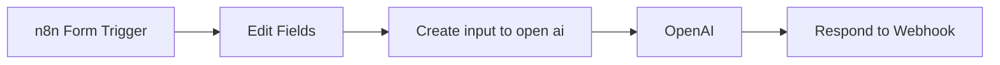

## Fluxo (.json) :

```json
{
  "meta": {
    "instanceId": "96cab4456c8d5d47ff3acba57e93f1f3750005103b819e4580442bcd2bb6cc4d"
  },
  "nodes": [
    {
      "id": "8b6d8462-1fe5-478b-aa15-7d10ff799aae",
      "name": "Edit Fields",
      "type": "n8n-nodes-base.set",
      "position": [
        980,
        900
      ],
      "parameters": {
        "fields": {
          "values": [
            {
              "name": "prompt",
              "stringValue": "\"\"\"PROMPT: The above is a n8n workflow json, please create workflow documentation for the user:. you are the master of brevity, be as concise and brief as possible, output generated documentation only.      ## Guidelines for the documentation  - **Provide a detailed description**: Provide a concise and informative description outlining the template's functionality and expected outcomes. Include a brief setup guide for user convenience. A detailed description not only clarifies the template's purpose but also enhances its discoverability through SEO. It’s advised to use these sections in your description:     - Who is this for?     - What problem is this workflow solving? / use case     - What this workflow does     - Setup     - How to customize this workflow to your needs   Here is an example  ``` # Who is this template for?  This workflow template is designed for **Sales** and **Customer Success** professionals seeking alerts when potential high-value users, prospects, or existing customers register for a Discourse community. Leveraging Clearbit, it retrieves enriched data for the new member to assess their value.  ### Example result in Slack    # How it works  - Each time a new member is created in Discourse, the workflow runs (powered by Discourse's native Webhooks feature). - After filtering out popular private email accounts, we run the member's email through Clearbit to fetch available information on the member as well as their organization. - If the enriched data meets certain criteria, we send a Slack message to a channel. This message has a few quick actions: `Open LinkedIn profile` and `Email member`  # Set up instructions  Overview is below. Watch this [🎥 quick set up video](https://www.loom.com/share/d379895004374ddc85dc9171ca37c139?sid=bb28df29-bc91-4d32-a657-0bfbaaf50cc7) for detailed instructions on how to get the template running, as well as how to customize it.  1. Complete the `Set up credentials` step when you first open the workflow. You'll need a Discourse (admin user), Clearbit, and Slack account. 2. Set up the Webhook in Discourse, linking the `On new Discourse user` Trigger with your Discourse community. 3. Set the correct channel to send to in the `Post message in channel` step 4. After testing your workflow, swap the Test URL to Production URL in Discourse and activate your workflow  Template was created in n8n `v1.29.1`  ``` \"\"\""
            }
          ]
        },
        "options": {}
      },
      "typeVersion": 3.2
    },
    {
      "id": "9d1e972c-e737-4221-bd8b-dfd8115b9948",
      "name": "OpenAI",
      "type": "n8n-nodes-base.openAi",
      "position": [
        1400,
        900
      ],
      "parameters": {
        "prompt": {
          "messages": [
            {
              "content": "={{ $json.input }}"
            }
          ]
        },
        "options": {},
        "resource": "chat",
        "chatModel": "gpt-4-1106-preview"
      },
      "credentials": {
        "openAiApi": {
          "id": "GrqJccjcTot1xZLv",
          "name": "OpenAi account"
        }
      },
      "typeVersion": 1.1
    },
    {
      "id": "3071e7e7-e0d6-4fad-a6ee-fbb5b722f344",
      "name": "Respond to Webhook",
      "type": "n8n-nodes-base.respondToWebhook",
      "position": [
        1620,
        900
      ],
      "parameters": {
        "options": {
          "responseCode": 200,
          "responseHeaders": {
            "entries": [
              {
                "name": "Content-Type",
                "value": "text/html; charset=UTF-8"
              }
            ]
          }
        },
        "respondWith": "text",
        "responseBody": "=<!DOCTYPE html>\n<!DOCTYPE html>\n<html lang=\"en\">\n  <head>\n    <meta charset=\"UTF-8\" />\n    <meta name=\"viewport\" content=\"width=device-width, initial-scale=1.0\" />\n    <title>Markdown to HTML</title>\n    <style>\n      main {\n        font-family: Arial, sans-serif;\n        margin: 0;\n        display: flex;\n        justify-content: center;\n        height: 100vh;\n        background-color: #f5f5f5;\n        font-size: 24px;\n      }\n\n      .content-container {\n        text-align: center;\n        border: 1px solid #ddd;\n        border-radius: 8px;\n        padding: 20px;\n        box-shadow: 0 4px 6px rgba(0, 0, 0, 0.1);\n        background-color: #fff;\n        max-width: 600px;\n        width: 100%;\n        margin: 20px;\n      }\n\n      #markdown-content {\n        text-align: left;\n        margin-top: 20px;\n      }\n    </style>\n  </head>\n  <body>\n    <main>\n      <div class=\"content-container\">\n        <div id=\"markdown-content\"> {{ $json.message.content?.replace(/\\n/g,'<br/>') }}</div>\n      </div>\n    </main>\n  </body>\n</html>\n"
      },
      "typeVersion": 1
    },
    {
      "id": "1740cef8-d25b-46f2-a63d-50b86599dbf2",
      "name": "n8n Form Trigger",
      "type": "n8n-nodes-base.formTrigger",
      "position": [
        760,
        900
      ],
      "webhookId": "c61492e5-73ce-40d4-b758-d5f09da0fb6c",
      "parameters": {
        "path": "c61492e5-73ce-40d4-b758-d5f09da0fb6c",
        "formTitle": "Workflow Documenter",
        "formFields": {
          "values": [
            {
              "fieldLabel": "Workflow Title",
              "requiredField": true
            },
            {
              "fieldLabel": "Workflow Json",
              "requiredField": true
            }
          ]
        },
        "responseMode": "responseNode",
        "formDescription": "Automatically document your n8n workflow"
      },
      "typeVersion": 2
    },
    {
      "id": "fde56941-46a8-4340-b099-f7e75950b336",
      "name": "Create input to open ai",
      "type": "n8n-nodes-base.set",
      "position": [
        1180,
        900
      ],
      "parameters": {
        "fields": {
          "values": [
            {
              "name": "input",
              "stringValue": "=Workflow Title:  {{ $json['Workflow Title'] }}\n\nWofklow JSON: ```{{ $json['Workflow Json'] }}```\n\n{{ $json.prompt }}  "
            }
          ]
        },
        "options": {}
      },
      "typeVersion": 3.2
    }
  ],
  "pinData": {},
  "connections": {
    "OpenAI": {
      "main": [
        [
          {
            "node": "Respond to Webhook",
            "type": "main",
            "index": 0
          }
        ]
      ]
    },
    "Edit Fields": {
      "main": [
        [
          {
            "node": "Create input to open ai",
            "type": "main",
            "index": 0
          }
        ]
      ]
    },
    "n8n Form Trigger": {
      "main": [
        [
          {
            "node": "Edit Fields",
            "type": "main",
            "index": 0
          }
        ]
      ]
    },
    "Create input to open ai": {
      "main": [
        [
          {
            "node": "OpenAI",
            "type": "main",
            "index": 0
          }
        ]
      ]
    }
  }
}
```

<a id="template-1009"></a>

## Template 1009 - Documentação automática de fluxos com Docsify

- **Nome:** Documentação automática de fluxos com Docsify
- **Descrição:** Fluxo que gera, organiza e disponibiliza documentação em Markdown para fluxos de automação, criando diagramas Mermaid, descrições de fluxos e salvando conteúdos em arquivos de docs.
- **Funcionalidade:** • Gerar diagramas Mermaid do fluxo de cada workflow: constrói visualmente as conexões entre nós, destacando tipos e estados.
• Gerar descrição do workflow e configurações dos nós via IA: produz um texto descritivo para o fluxo e lista as principais configurações dos nós.
• Criar documentação em Markdown com seções claras: estruturar em uma seção de visão geral e uma seção de configurações de cada nó.
• Salvar documentos Markdown no diretório de docs: grava os arquivos correspondentes para cada workflow.
• Servir a documentação por meio de uma interface de navegação: disponibiliza uma página inicial com índices, tags e links para cada workflow.
• Atualizar automaticamente a documentação quando os dados mudam: reprocessa workflows e reescreve os Markdown correspondentes.
- **Ferramentas:** • Mermaid: biblioteca para diagramas de fluxo.
• Docsify: framework para documentação estática baseada em Markdown.
• OpenAI GPT-4 Turbo: modelo de IA utilizado para gerar descrições e conteúdos dos nós.
• LangChain: infraestrutura para encadear chamadas de linguagem e processar saídas.

## Fluxo visual

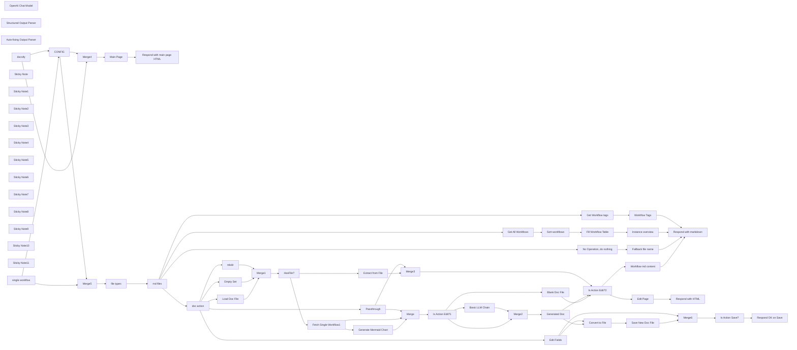

## Fluxo (.json) :

```json
{
  "id": "VY4TXYGmqth57Een",
  "meta": {
    "instanceId": "fb924c73af8f703905bc09c9ee8076f48c17b596ed05b18c0ff86915ef8a7c4a",
    "templateCredsSetupCompleted": true
  },
  "name": "Docsify example",
  "tags": [],
  "nodes": [
    {
      "id": "f41906c3-ee4c-4333-bfd5-426f82ba4bd9",
      "name": "CONFIG",
      "type": "n8n-nodes-base.set",
      "position": [
        660,
        60
      ],
      "parameters": {
        "options": {},
        "assignments": {
          "assignments": [
            {
              "id": "b48986ec-f58d-4a7f-afba-677edcb28d31",
              "name": "project_path",
              "type": "string",
              "value": "./.n8n/test_docs"
            },
            {
              "id": "cf632419-f839-4045-922c-03784bb3ae07",
              "name": "instance_url",
              "type": "string",
              "value": "={{$env[\"N8N_PROTOCOL\"]}}://{{$env[\"N8N_HOST\"]}}"
            },
            {
              "id": "7a7c70a6-1853-4ca7-b5b1-e36bb0e190d0",
              "name": "HTML_headers",
              "type": "string",
              "value": "=    <meta http-equiv=\"X-UA-Compatible\" content=\"IE=edge,chrome=1\" />\n    <meta name=\"viewport\" content=\"width=device-width,initial-scale=1\" />\n    <meta charset=\"UTF-8\" />\n    <link rel=\"stylesheet\" href=\"//cdn.jsdelivr.net/npm/docsify@4/themes/vue.css\" />\n    <script src=\"https://cdn.jsdelivr.net/npm/mermaid/dist/mermaid.min.js\"></script>"
            },
            {
              "id": "1e785afe-f05f-4e51-a164-f341da81ccac",
              "name": "HTML_styles_editor",
              "type": "string",
              "value": "=    <style>\n      body {\n        margin: 0;\n        padding: 0;\n        overflow: hidden;\n      }\n      \n      .container {\n        display: flex;\n        flex-direction: column;\n        height: 100vh;\n        margin: 0;\n      }\n\n      .button-container {\n        display: flex;\n        justify-content: center;\n        gap: 10px;\n        padding: 10px;\n        background: #f8f8f8;\n        border-bottom: 1px solid #eee;\n        width: 50%;\n      }\n\n      .button {\n        padding: 8px 16px;\n        border: none;\n        border-radius: 4px;\n        cursor: pointer;\n        font-size: 14px;\n      }\n\n      .save-button {\n        background: #42b983;\n        color: white;\n      }\n\n      .cancel-button {\n        background: #666;\n        color: white;\n      }\n\n      .editor-preview-container {\n        display: flex;\n        flex: 1;\n        overflow: hidden;\n      }\n      \n      #editor {\n        width: 50%;\n        height: 100%;\n        resize: none;\n        padding: 20px;\n        box-sizing: border-box;\n        font-family: monospace;\n        border: none;\n        border-right: 1px solid #eee;\n      }\n      \n      .preview-container {\n        width: 50%;\n        height: 100%;\n        overflow-y: auto;\n      }\n\n      /* Remove width from main */\n      main {\n        width: auto !important;\n      }\n\n      /* Fix code block wrapping */\n      .markdown-section pre > code {\n        white-space: pre-wrap !important;\n      }\n    </style>"
            },
            {
              "id": "37e22865-7b6b-438d-83a0-dc680d4775cc",
              "name": "HTML_docsify_include",
              "type": "string",
              "value": "=    <script src=\"//cdn.jsdelivr.net/npm/docsify@4\"></script>"
            }
          ]
        },
        "includeOtherFields": true
      },
      "typeVersion": 3.4
    },
    {
      "id": "75cdf7fc-3dfa-49c1-bdbf-01d8be08aaa4",
      "name": "Convert to File",
      "type": "n8n-nodes-base.convertToFile",
      "position": [
        4020,
        1600
      ],
      "parameters": {
        "options": {},
        "operation": "toText",
        "sourceProperty": "workflowdata"
      },
      "typeVersion": 1.1
    },
    {
      "id": "3868011e-8374-496a-b3f5-4cbf7bde4e56",
      "name": "HasFile?",
      "type": "n8n-nodes-base.if",
      "position": [
        2400,
        880
      ],
      "parameters": {
        "options": {},
        "conditions": {
          "options": {
            "version": 2,
            "leftValue": "",
            "caseSensitive": true,
            "typeValidation": "strict"
          },
          "combinator": "and",
          "conditions": [
            {
              "id": "2d9feb22-49d1-4354-9b0b-b82da2b20678",
              "operator": {
                "type": "number",
                "operation": "gt"
              },
              "leftValue": "={{ Object.keys($json).length }}",
              "rightValue": 0
            }
          ]
        }
      },
      "typeVersion": 2.2
    },
    {
      "id": "0bf2317b-2534-4022-9a16-395d4b44680c",
      "name": "Extract from File",
      "type": "n8n-nodes-base.extractFromFile",
      "position": [
        2660,
        860
      ],
      "parameters": {
        "options": {},
        "operation": "text",
        "destinationKey": "workflowdata"
      },
      "typeVersion": 1
    },
    {
      "id": "4b44a7f3-09bf-46a8-9520-247993af654b",
      "name": "Main Page",
      "type": "n8n-nodes-base.html",
      "position": [
        4660,
        -100
      ],
      "parameters": {
        "html": "<!DOCTYPE html>\n<html>\n  <head>\n{{ $('CONFIG').first().json.HTML_headers }}\n  <body>\n    <div data-app id=\"main\">Please wait...</div>\n    <script>\n      \n      mermaid.initialize({\n        startOnLoad: false,\n      });\n      let svgCounter = 0;\n\n      window.$docsify = {\n        el: '#main',\n        auto2top: true,\n        loadSidebar: 'summary.md',\n        basePath: '{{ $json.webhookUrl.split($json.webhookUrl.extractDomain())[1] }}/',\n        name: 'All Workflows',\n        markdown: {\n          renderer: {\n            code(code, lang) {\n              if (lang === \"mermaid\") {\n                const svgName = `mermaid-svg-${svgCounter++}`;\n                const MERMAID_CONTAINER_ID = `${svgName}-container`;\n                mermaid.render(svgName, code).then(({ svg }) => {\n                  const containerElement = document.querySelector(\n                    `#${MERMAID_CONTAINER_ID}`\n                  );\n                  if (containerElement) {\n                    containerElement.innerHTML = svg;\n                  } else {\n                    console.error(`Error: #${MERMAID_CONTAINER_ID} not found`);\n                  }\n                });\n                return `<div class=\"mermaid\" id=\"${MERMAID_CONTAINER_ID}\"></div>`;\n              }\n              return this.origin.code.apply(this, arguments);\n            },\n          },\n        },        \n        plugins: [\n          function(hook, vm) {\n            hook.ready(function() {\n              // Check if URL doesn't end with slash but also isn't a file path\n              if (!window.location.pathname.endsWith('/') && !window.location.pathname.includes('.')) {\n                // Use history.replaceState to avoid adding to browser history\n                const newUrl = window.location.pathname + '/' + window.location.hash;\n                window.history.replaceState(null, null, newUrl);\n              }\n            });\n          }\n        ],        \n      };\n    </script>\n{{ $('CONFIG').first().json.HTML_docsify_include }}\n  </body>\n</html>"
      },
      "typeVersion": 1.2
    },
    {
      "id": "28c29cec-7efd-4f05-bf53-ac08cc3834a1",
      "name": "Instance overview",
      "type": "n8n-nodes-base.html",
      "position": [
        4660,
        160
      ],
      "parameters": {
        "html": "# Your n8n instance workflows:\n\n| Workflow | Status | Docs | Created | Updated | Nodes | Triggers |\n|----------|:------:|------|---------|---------|-------|----------|\n{{ $jmespath($input.all(),'[].json.content').join('\\n') }}"
      },
      "executeOnce": true,
      "typeVersion": 1.2
    },
    {
      "id": "3e8eb52e-8d35-4aa3-a485-6674d67720dc",
      "name": "Sort-workflows",
      "type": "n8n-nodes-base.sort",
      "position": [
        2080,
        160
      ],
      "parameters": {
        "options": {},
        "sortFieldsUi": {
          "sortField": [
            {
              "order": "descending",
              "fieldName": "updatedAt"
            }
          ]
        }
      },
      "typeVersion": 1
    },
    {
      "id": "2178e1cf-90b8-4779-9b5c-3d6180823c95",
      "name": "doc action",
      "type": "n8n-nodes-base.switch",
      "position": [
        1740,
        1080
      ],
      "parameters": {
        "rules": {
          "values": [
            {
              "outputKey": "view",
              "conditions": {
                "options": {
                  "version": 2,
                  "leftValue": "",
                  "caseSensitive": true,
                  "typeValidation": "strict"
                },
                "combinator": "and",
                "conditions": [
                  {
                    "id": "ee386c7d-1abe-4864-bb3a-a19d3816c906",
                    "operator": {
                      "name": "filter.operator.equals",
                      "type": "string",
                      "operation": "equals"
                    },
                    "leftValue": "={{ $json.query.action }}",
                    "rightValue": "view"
                  }
                ]
              },
              "renameOutput": true
            },
            {
              "outputKey": "edit",
              "conditions": {
                "options": {
                  "version": 2,
                  "leftValue": "",
                  "caseSensitive": true,
                  "typeValidation": "strict"
                },
                "combinator": "and",
                "conditions": [
                  {
                    "id": "aa1a33ee-ac38-4ea4-9a4c-d355e7de1312",
                    "operator": {
                      "name": "filter.operator.equals",
                      "type": "string",
                      "operation": "equals"
                    },
                    "leftValue": "={{ $json.query.action }}",
                    "rightValue": "edit"
                  }
                ]
              },
              "renameOutput": true
            },
            {
              "outputKey": "recreate",
              "conditions": {
                "options": {
                  "version": 2,
                  "leftValue": "",
                  "caseSensitive": true,
                  "typeValidation": "strict"
                },
                "combinator": "and",
                "conditions": [
                  {
                    "id": "676c36e1-4c88-4314-9317-abc877ff3d17",
                    "operator": {
                      "name": "filter.operator.equals",
                      "type": "string",
                      "operation": "equals"
                    },
                    "leftValue": "={{ $json.query.action }}",
                    "rightValue": "recreate"
                  }
                ]
              },
              "renameOutput": true
            },
            {
              "outputKey": "save",
              "conditions": {
                "options": {
                  "version": 2,
                  "leftValue": "",
                  "caseSensitive": true,
                  "typeValidation": "strict"
                },
                "combinator": "and",
                "conditions": [
                  {
                    "id": "164314cf-7d99-4716-9949-b9196ce47959",
                    "operator": {
                      "name": "filter.operator.equals",
                      "type": "string",
                      "operation": "equals"
                    },
                    "leftValue": "={{ $json.query.action }}",
                    "rightValue": "save"
                  }
                ]
              },
              "renameOutput": true
            }
          ]
        },
        "options": {
          "fallbackOutput": "extra"
        }
      },
      "typeVersion": 3.2
    },
    {
      "id": "7f4aab9b-b7e8-4920-98e8-af8f504a1333",
      "name": "Empty Set",
      "type": "n8n-nodes-base.set",
      "position": [
        2000,
        960
      ],
      "parameters": {
        "options": {}
      },
      "typeVersion": 3.4
    },
    {
      "id": "1f35bc3e-29d7-47a2-a1c7-cf6052d99993",
      "name": "Load Doc File",
      "type": "n8n-nodes-base.readWriteFile",
      "position": [
        1900,
        860
      ],
      "parameters": {
        "options": {},
        "fileSelector": "={{ $('CONFIG').first().json.project_path }}/{{ $json.params.file }}"
      },
      "typeVersion": 1,
      "alwaysOutputData": true
    },
    {
      "id": "c0805f50-8f8c-49ba-b0c7-6768bf89798c",
      "name": "Respond with markdown",
      "type": "n8n-nodes-base.respondToWebhook",
      "position": [
        4920,
        1040
      ],
      "parameters": {
        "options": {
          "responseCode": 200,
          "responseHeaders": {
            "entries": [
              {
                "name": "Content-Type",
                "value": "text/markdown"
              }
            ]
          }
        },
        "respondWith": "text",
        "responseBody": "={{ $json.html }}"
      },
      "typeVersion": 1.1
    },
    {
      "id": "9c7a18b9-a081-4162-94f4-e125d666cbcc",
      "name": "Respond with HTML",
      "type": "n8n-nodes-base.respondToWebhook",
      "position": [
        4920,
        860
      ],
      "parameters": {
        "options": {
          "responseCode": 200,
          "responseHeaders": {
            "entries": [
              {
                "name": "Content-Type",
                "value": "text/html"
              }
            ]
          }
        },
        "respondWith": "text",
        "responseBody": "={{ $json.html }}"
      },
      "typeVersion": 1.1
    },
    {
      "id": "50944148-eb7c-4c28-99c5-478ddb2596f2",
      "name": "Save New Doc File",
      "type": "n8n-nodes-base.readWriteFile",
      "position": [
        4180,
        1600
      ],
      "parameters": {
        "options": {},
        "fileName": "={{ $('CONFIG').first().json.project_path }}/{{ $('CONFIG').first().json.params.file }}",
        "operation": "write"
      },
      "typeVersion": 1,
      "alwaysOutputData": true
    },
    {
      "id": "6d7e0dcf-d12b-4428-9c5e-ef7fb2c6be28",
      "name": "Blank Doc File",
      "type": "n8n-nodes-base.set",
      "position": [
        4000,
        1080
      ],
      "parameters": {
        "options": {},
        "assignments": {
          "assignments": [
            {
              "id": "b168d9b1-1a13-4915-b59b-8a17258fd9cc",
              "name": "workflowdata",
              "type": "string",
              "value": "=# {{ $json.name }}\n\n## Workflow Description\n!> Please write what is this workflow doing\n\n## Workflow schematic\n\n```mermaid\n{{ $json.mermaidChart }}\n```\n\n## Any further information\n\n> You can also add tables like this:\n\n| Parameter | Value |\n|-----------|-------|\n| Created | {{ $json.createdAt }} |\n| Last updated | {{ $json.updatedAt }} |\n| Author | {{ $json.shared[0].project.name }} |\n\n"
            }
          ]
        },
        "includeOtherFields": true
      },
      "typeVersion": 3.4
    },
    {
      "id": "778a97eb-f7a2-4537-81fc-979dc6c674a2",
      "name": "Fetch Single Workflow1",
      "type": "n8n-nodes-base.n8n",
      "position": [
        2820,
        1200
      ],
      "parameters": {
        "operation": "get",
        "workflowId": {
          "__rl": true,
          "mode": "id",
          "value": "={{ $('CONFIG').first().json.params.file.replaceAll('docs_','').split('.md')[0] }}"
        },
        "requestOptions": {}
      },
      "credentials": {
        "n8nApi": {
          "id": "eW7IdTFt4ARJbEwR",
          "name": "Ted n8n account"
        }
      },
      "typeVersion": 1
    },
    {
      "id": "092b8c67-77f9-4d4b-aa26-8f0e3ea3ed29",
      "name": "Fill Workflow Table",
      "type": "n8n-nodes-base.set",
      "position": [
        2280,
        160
      ],
      "parameters": {
        "options": {},
        "assignments": {
          "assignments": [
            {
              "id": "3bed44f3-7fa6-4d28-8a6e-7074ca354cd6",
              "name": "content",
              "type": "string",
              "value": "=| [{{ `${$json.name.replace(/[|\\\\[\\]`_*{}()<>#+-]/g, '\\\\$&')}` }}]({{ `${$('CONFIG').first().json.instance_url}/workflow/${$json.id}` }} \"Click to open workflow in n8n\") | {{ $json.active ? '[:green_circle:](# \"Active\")' : '[:white_circle:](# \"Inactive\")' }} | <nobr>[:book:]({{ `docs_${$json.id}?action=view` }} \"View docs\") [:memo:]({{ `docs_${$json.id}.md?action=edit` }} \":ignore Edit\") [:arrows_counterclockwise:]({{ `docs_${$json.id}?action=recreate` }} \"Recreate docs\")</nobr> | <nobr>{{ `${new Date($json.createdAt).toISOString().replace('T', ' ').slice(0, 16)}` }}</nobr> | <nobr>{{ `${new Date($json.updatedAt).toISOString().replace('T', ' ').slice(0, 16)}` }}</nobr> | {{ $json.nodes.length }} | {{ $json.nodes.filter(n => n.type.includes('Trigger')).length }} |"
            }
          ]
        }
      },
      "executeOnce": false,
      "typeVersion": 3.4
    },
    {
      "id": "18c58a09-0dfe-4cb4-ae7f-503957eabadb",
      "name": "Basic LLM Chain",
      "type": "@n8n/n8n-nodes-langchain.chainLlm",
      "onError": "continueRegularOutput",
      "position": [
        3480,
        1200
      ],
      "parameters": {
        "text": "=Here's the workflow data:\n{{Object.assign(\n  Object.fromEntries(Object.entries($json).filter(([key]) => !['staticData', 'pinData'].includes(key))),\n  {nodes: $json.nodes.map(node => Object.fromEntries(Object.entries(node).filter(([key]) => !['id', 'position'].includes(key))))}\n).toJsonString() }}",
        "messages": {
          "messageValues": [
            {
              "message": "=Your task is to generate simple workflow documentation for the n8n workflows. The user will provide a JSON structure. Reply \nin JSON format in 2 sections: workflow_desription and nodes_settings. Important! Each json key should be a simple markdown text without any additional comments or remarks from your end.\n\nInstruction for `workflow_desription`:\n```\n## Section header with H2\n\\n\n> subline with who created workflow and when, when it was last edited and the status (active / inactive as the green / grey round emoji). Also, when the documentation was generated. Now is: {{ $now }}.\n\\n\\n\nShould contain a description of the workflow. in a couple of paragraphs. Use direct voice without the fluff\n```\n\nInstruction for `nodes_settings`:\n```\n## Section header with H2.\n\\n\n### Node 1 name as H3 title\n  - For each node make a bullet list with the main node configs. Ignore irrelevant configs. Enclose each config value in code backticks (`). Look:\n  - Parameter 1 name: `Parameter 1 value`\n  - Parameter 2 name: `Parameter 2 value`\n\\n\\n\n### Node 2 name as H3 title\n  - For each node make a bullet list with the main node configs. Ignore irrelevant configs. Enclose each config value in code backticks (`). Look:\n  - Parameter 1 name: `Parameter 1 value`\n  - Parameter 2 name: `Parameter 2 value`\n\\n\\n\n```"
            }
          ]
        },
        "promptType": "define",
        "hasOutputParser": true
      },
      "typeVersion": 1.4,
      "alwaysOutputData": false
    },
    {
      "id": "9bc58cd3-a55e-4cda-95b5-7fa8dc0e7076",
      "name": "OpenAI Chat Model",
      "type": "@n8n/n8n-nodes-langchain.lmChatOpenAi",
      "position": [
        3480,
        1360
      ],
      "parameters": {
        "model": "gpt-4-turbo",
        "options": {
          "timeout": 120000,
          "temperature": 0.2
        }
      },
      "credentials": {
        "openAiApi": {
          "id": "rveqdSfp7pCRON1T",
          "name": "Ted's Tech Talks OpenAi"
        }
      },
      "typeVersion": 1
    },
    {
      "id": "38fb6192-b8ce-4241-a9fe-aebda09aa8d5",
      "name": "Structured Output Parser",
      "type": "@n8n/n8n-nodes-langchain.outputParserStructured",
      "position": [
        3820,
        1360
      ],
      "parameters": {
        "jsonSchemaExample": "{\n\t\"workflow_description\": \"## Workflow overview\\n\\n>some additiona info\\n\\nWorkflow desctiption\",\n\t\"nodes_settings\": \"## Nodes settings\\n\\n###Node name 1\\n\\n-  Setting 1\\n-  Setting 2###Node name 2\\n\\n-  Setting 1\\n-  Setting 2\"\n}"
      },
      "typeVersion": 1.2
    },
    {
      "id": "29261bbb-dbbb-44df-b99d-bb084df7d846",
      "name": "Auto-fixing Output Parser",
      "type": "@n8n/n8n-nodes-langchain.outputParserAutofixing",
      "position": [
        3580,
        1360
      ],
      "parameters": {
        "options": {}
      },
      "typeVersion": 1
    },
    {
      "id": "086a57cf-a2b4-4f32-8ca6-38546e4856c1",
      "name": "Respond with main page HTML",
      "type": "n8n-nodes-base.respondToWebhook",
      "position": [
        4920,
        -100
      ],
      "parameters": {
        "options": {
          "responseCode": 200,
          "responseHeaders": {
            "entries": [
              {
                "name": "Content-Type",
                "value": "text/html"
              }
            ]
          }
        },
        "respondWith": "text",
        "responseBody": "={{ $json.html }}"
      },
      "typeVersion": 1.1
    },
    {
      "id": "fdbfe60b-e677-4897-ab1a-9a9f506bba27",
      "name": "Workflow Tags",
      "type": "n8n-nodes-base.html",
      "position": [
        4660,
        500
      ],
      "parameters": {
        "html": "- **Click to filter by tag:**\n{{ [...new Set($jmespath($input.all(),'[].json.tags[].name'))].map(tag => `- [${tag}](tag-${encodeURIComponent(tag)})`).join('\\n') }}"
      },
      "executeOnce": true,
      "typeVersion": 1.2
    },
    {
      "id": "94a258ed-c07c-42d4-8d37-3395fad205b0",
      "name": "No Operation, do nothing",
      "type": "n8n-nodes-base.noOp",
      "position": [
        1740,
        1880
      ],
      "parameters": {},
      "typeVersion": 1
    },
    {
      "id": "c35ca075-52e7-4c2f-9891-f709afe36e52",
      "name": "Merge",
      "type": "n8n-nodes-base.merge",
      "position": [
        3140,
        1100
      ],
      "parameters": {
        "mode": "combine",
        "options": {},
        "combineBy": "combineByPosition",
        "numberInputs": 3
      },
      "typeVersion": 3
    },
    {
      "id": "55a1e32f-b20c-4b1f-9d6f-9bc4ec221fab",
      "name": "Fallback file name",
      "type": "n8n-nodes-base.html",
      "position": [
        4660,
        1900
      ],
      "parameters": {
        "html": "> File: {{ $json.params.file }}"
      },
      "typeVersion": 1.2
    },
    {
      "id": "3eef159b-99ad-4c9a-82f4-13bf16972521",
      "name": "mkdir",
      "type": "n8n-nodes-base.executeCommand",
      "position": [
        2100,
        1060
      ],
      "parameters": {
        "command": "=mkdir -p {{$('CONFIG').first().json.project_path}}"
      },
      "typeVersion": 1
    },
    {
      "id": "15fda233-925b-4a4d-964e-1916c0cd39a2",
      "name": "Merge1",
      "type": "n8n-nodes-base.merge",
      "position": [
        2240,
        880
      ],
      "parameters": {
        "mode": "chooseBranch"
      },
      "typeVersion": 3
    },
    {
      "id": "3e6c9243-d5f7-4f04-8231-9994963df36d",
      "name": "Edit Page",
      "type": "n8n-nodes-base.html",
      "position": [
        4660,
        860
      ],
      "parameters": {
        "html": "<!DOCTYPE html>\n<html>\n  <head>\n{{ $('CONFIG').first().json.HTML_headers }}\n{{ $('CONFIG').first().json.HTML_styles_editor }}\n  </head>\n  <body>\n    <div class=\"container\">\n      <div class=\"button-container\">\n        <button class=\"button save-button\" onclick=\"saveContent()\">Save</button>\n        <button class=\"button cancel-button\" onclick=\"closeWindow()\">Cancel</button>\n      </div>\n      <div class=\"editor-preview-container\">\n        <textarea id=\"editor\">{{ $json.workflowdata }}</textarea>\n        <div class=\"preview-container\">\n          <div id=\"preview\"></div>\n        </div>\n      </div>\n    </div>\n    \n<script>\n  const editor = document.getElementById('editor');\n  let vm;\n\n      mermaid.initialize({\n        startOnLoad: false,\n      });\n\n      let svgCounter = 0;\n\n      // Function to save content\n      async function saveContent() {\n        try {\n          const response = await fetch(window.location.pathname + '?action=save', {\n            method: 'POST',\n            headers: {\n              'Content-Type': 'application/json',\n            },\n            body: JSON.stringify({\n              content: editor.value\n            })\n          });\n          \n          if (response.ok) {\n            alert('Successfully saved!');\n          } else {\n            alert('Failed to save content');\n          }\n        } catch (error) {\n          console.error('Error saving content:', error);\n          alert('Error saving content');\n        }\n      }\n  \n      // Function to close window\n      function closeWindow() {\n        window.close();\n      }\n   \n  window.$docsify = {\n    el: '#preview',\n    loadSidebar: false,\n    loadNavbar: false,\n    basePath: '/',\n    hideSidebar: true,\n        markdown: {\n          renderer: {\n            code(code, lang) {\n              if (lang === \"mermaid\") {\n                const svgName = `mermaid-svg-${svgCounter++}`;\n                const MERMAID_CONTAINER_ID = `${svgName}-container`;\n                mermaid.render(svgName, code).then(({ svg }) => {\n                  const containerElement = document.querySelector(\n                    `#${MERMAID_CONTAINER_ID}`\n                  );\n                  if (containerElement) {\n                    containerElement.innerHTML = svg;\n                  } else {\n                    console.error(`Error: #${MERMAID_CONTAINER_ID} not found`);\n                  }\n                });\n                return `<div class=\"mermaid\" id=\"${MERMAID_CONTAINER_ID}\"></div>`;\n              }\n              return this.origin.code.apply(this, arguments);\n            },\n          },\n        },\n    plugins: [\n      function(hook, _vm) {\n        vm = _vm;\n        \n        hook.beforeEach(function(content) {\n          return editor.value;\n        });\n      }\n    ]\n  };\n  \nlet timeout;\nfunction updatePreview() {\n  clearTimeout(timeout);\n  timeout = setTimeout(() => {\n    if (vm) {\n      const markdownSection = document.querySelector('.markdown-section');\n      if (markdownSection) {\n        const compiler = new window.DocsifyCompiler({\n          basePath: '/',\n          relativePath: false,\n          fallbackLanguages: [],\n          nameLink: '/',\n          routerMode: 'hash'\n        }, vm.router);\n        \n        const html = compiler.compile(editor.value);\n        markdownSection.innerHTML = html;\n        window.Prism.highlightAll();\n\n        // Re-render all mermaid diagrams\n        const mermaidDivs = markdownSection.querySelectorAll('pre[data-lang=\"mermaid\"] code');\n        mermaidDivs.forEach((div, index) => {\n          const code = div.textContent;\n          const svgName = `mermaid-svg-${svgCounter++}`;\n          const MERMAID_CONTAINER_ID = `${svgName}-container`;\n          \n          // Replace the <pre> element with our container\n          const container = document.createElement('div');\n          container.className = 'mermaid';\n          container.id = MERMAID_CONTAINER_ID;\n          div.parentElement.replaceWith(container);\n          \n          // Render the diagram\n          mermaid.render(svgName, code).then(({ svg }) => {\n            const containerElement = document.getElementById(MERMAID_CONTAINER_ID);\n            if (containerElement) {\n              containerElement.innerHTML = svg;\n            }\n          });\n        });\n      }\n    }\n  }, 500);\n};\n  \n  editor.addEventListener('input', updatePreview);\n</script>\n{{ $('CONFIG').first().json.HTML_docsify_include }}\n  </body>\n</html>"
      },
      "typeVersion": 1.2
    },
    {
      "id": "71e136d5-bb5b-4eab-8cab-bfc50ea2a5a5",
      "name": "Workflow md content",
      "type": "n8n-nodes-base.html",
      "position": [
        4660,
        1040
      ],
      "parameters": {
        "html": "{{ $json.workflowdata }}"
      },
      "executeOnce": true,
      "typeVersion": 1.2
    },
    {
      "id": "6cb6f3b8-de65-43a5-9df3-48299ba7fcce",
      "name": "Is Action Edit?1",
      "type": "n8n-nodes-base.if",
      "position": [
        3300,
        1100
      ],
      "parameters": {
        "options": {},
        "conditions": {
          "options": {
            "version": 2,
            "leftValue": "",
            "caseSensitive": true,
            "typeValidation": "strict"
          },
          "combinator": "and",
          "conditions": [
            {
              "id": "856cdb3b-a187-4db5-b77b-43ee086780ee",
              "operator": {
                "name": "filter.operator.equals",
                "type": "string",
                "operation": "equals"
              },
              "leftValue": "={{ $json.query.action }}",
              "rightValue": "edit"
            }
          ]
        }
      },
      "typeVersion": 2.2
    },
    {
      "id": "aff9ed71-bb49-4170-9ae3-5f05f89bab05",
      "name": "Is Action Edit?2",
      "type": "n8n-nodes-base.if",
      "position": [
        4180,
        880
      ],
      "parameters": {
        "options": {},
        "conditions": {
          "options": {
            "version": 2,
            "leftValue": "",
            "caseSensitive": true,
            "typeValidation": "strict"
          },
          "combinator": "and",
          "conditions": [
            {
              "id": "e3648023-8cb7-4b82-bd35-1ba196458327",
              "operator": {
                "name": "filter.operator.equals",
                "type": "string",
                "operation": "equals"
              },
              "leftValue": "={{ $json.query.action }}",
              "rightValue": "edit"
            }
          ]
        }
      },
      "typeVersion": 2.2
    },
    {
      "id": "7b3d31a9-ee01-4bce-bc5b-78161536999d",
      "name": "Generate Mermaid Chart",
      "type": "n8n-nodes-base.code",
      "position": [
        3000,
        1260
      ],
      "parameters": {
        "jsCode": "const workflow = $input.first().json;\n\n// Extract nodes from the workflow\nconst nodes = workflow.nodes || [];\n\n// Node types to exclude\nconst excludedNodeTypes = ['n8n-nodes-base.stickyNote'];\n\n// Define shapes and their corresponding brackets\n// https://mermaid.js.org/syntax/flowchart.html\nconst shapes = {\n    'rect': ['[', ']'],\n    'rhombus': ['{', '}'],\n    'circle': ['((', '))'],\n    'hexagon': ['{{', '}}'],\n    'subroutine': ['[[', ']]'],\n    'parallelogram': ['[/', '/]'],\n    'wait': ['(', ')']\n    // Add more shapes here as needed\n};\n\n// Define special shapes for specific node types\nconst specialShapes = {\n    'n8n-nodes-base.if': 'rhombus',\n    'n8n-nodes-base.switch': 'rhombus',\n    'n8n-nodes-base.code': 'subroutine',\n    'n8n-nodes-base.executeWorkflow': 'subroutine',\n    'n8n-nodes-base.httpRequest':'parallelogram',\n    'n8n-nodes-base.wait':'wait'\n    // List more special node types\n};\n\n// Function to get the shape for a node type\nfunction getNodeShape(nodeType) {\n    return specialShapes[nodeType] || 'rect';\n}\n\n// Create a map of node names to their \"EL<N>\" identifiers, disabled status, and shape\nconst nodeMap = {};\nlet nodeCounter = 1;\nnodes.forEach((node) => {\n    if (!excludedNodeTypes.includes(node.type)) {\n        const shape = getNodeShape(node.type);\n        nodeMap[node.name] = {\n            id: `EL${nodeCounter}`,\n            disabled: node.disabled || false,\n            shape: shape,\n            brackets: shapes[shape] || shapes['rect'] // Default to rect if shape not found\n        };\n        nodeCounter++;\n    }\n});\n\n// Function to convert special characters to HTML entities\nfunction convertToHTMLEntities(str) {\n    return str.replaceAll('\"',\"'\").replace(/[^\\w\\s-]/g, function(char) {\n        return '&#' + char.charCodeAt(0) + ';';\n    });\n}\n\n// Function to format node text (with strike-through if disabled)\nfunction formatNodeText(nodeName, isDisabled) {\n    const escapedName = convertToHTMLEntities(nodeName);\n    return isDisabled ? `<s>${escapedName}</s>` : escapedName;\n}\n\n// Generate connections and isolated nodes\nconst connections = [];\nconst isolatedNodes = new Set(Object.keys(nodeMap));\n\nif (workflow.connections) {\n    Object.entries(workflow.connections).forEach(([sourceName, targetConnections]) => {\n        Object.entries(targetConnections).forEach(([connectionType, targets]) => {\n            targets.forEach(targetArray => {\n                targetArray.forEach(target => {\n                    const sourceNode = nodeMap[sourceName];\n                    const targetNode = nodeMap[target.node];\n                    if (sourceNode && targetNode) {\n                        let connectionLine = `    ${sourceNode.id}${sourceNode.brackets[0]}${formatNodeText(sourceName, sourceNode.disabled)}${sourceNode.brackets[1]}`;\n                        if (connectionType === 'main') {\n                            connectionLine += ` -->`;\n                        } else {\n                            connectionLine += ` -.- |${connectionType}|`;\n                        }\n                        connectionLine += ` ${targetNode.id}${targetNode.brackets[0]}${formatNodeText(target.node, targetNode.disabled)}${targetNode.brackets[1]}`;\n                        connections.push(connectionLine);\n                        isolatedNodes.delete(sourceName);\n                        isolatedNodes.delete(target.node);\n                    }\n                });\n            });\n        });\n    });\n}\n\n// Add isolated nodes to the connections array\nisolatedNodes.forEach(nodeName => {\n    const node = nodeMap[nodeName];\n    connections.push(`    ${node.id}${node.brackets[0]}${formatNodeText(nodeName, node.disabled)}${node.brackets[1]}`);\n});\n\n// Generate the Mermaid flowchart string\nconst mermaidChart = `---\nconfig:\n  look: neo\n  theme: default\n---\nflowchart LR\n${connections.join('\\n')}`;\n\n// Output the result\nreturn {\n    json: {\n        mermaidChart: mermaidChart\n    }\n};"
      },
      "typeVersion": 2
    },
    {
      "id": "77a35cd5-cb8f-4ac5-a699-dff5e65cda09",
      "name": "Merge2",
      "type": "n8n-nodes-base.merge",
      "position": [
        3840,
        1140
      ],
      "parameters": {
        "mode": "combine",
        "options": {},
        "combineBy": "combineByPosition"
      },
      "typeVersion": 3
    },
    {
      "id": "f8119590-e9d7-4513-9da4-fa911165baff",
      "name": "Generated Doc",
      "type": "n8n-nodes-base.set",
      "position": [
        4000,
        1240
      ],
      "parameters": {
        "options": {},
        "assignments": {
          "assignments": [
            {
              "id": "7693348d-5129-4a07-809d-b0619b9fc44b",
              "name": "workflowdata",
              "type": "string",
              "value": "=# {{ $json.name }}\n\n{{ $json?.output?.workflow_description || \"## <SORRY, COULD NOT GENERATE WORKFLOW DESCRIPTION>\" }}\n\n## Workflow schematic\n\n```mermaid\n{{ $json.mermaidChart }}\n```\n\n{{ $json?.output?.nodes_settings || \"## <SORRY, COULD NOT GENERATE DOCS FOR NODE SETTING>\" }}"
            }
          ]
        }
      },
      "typeVersion": 3.4
    },
    {
      "id": "92565206-6cf2-4243-9143-4f6def4b524d",
      "name": "Passthrough",
      "type": "n8n-nodes-base.noOp",
      "position": [
        2100,
        1240
      ],
      "parameters": {},
      "typeVersion": 1
    },
    {
      "id": "73081fc3-9554-4a12-b985-da02b356616f",
      "name": "Merge3",
      "type": "n8n-nodes-base.merge",
      "position": [
        3140,
        880
      ],
      "parameters": {
        "mode": "combine",
        "options": {},
        "combineBy": "combineByPosition"
      },
      "typeVersion": 3
    },
    {
      "id": "f50e72f8-9027-4ca7-9df7-700e828f48eb",
      "name": "Merge4",
      "type": "n8n-nodes-base.merge",
      "position": [
        960,
        -100
      ],
      "parameters": {
        "mode": "combine",
        "options": {},
        "combineBy": "combineByPosition"
      },
      "typeVersion": 3
    },
    {
      "id": "306820ac-7c87-45c2-b76f-55d772ac7300",
      "name": "Merge5",
      "type": "n8n-nodes-base.merge",
      "position": [
        960,
        240
      ],
      "parameters": {
        "mode": "combine",
        "options": {},
        "combineBy": "combineByPosition"
      },
      "typeVersion": 3
    },
    {
      "id": "96fd7265-7920-453f-8309-bdbd10880d03",
      "name": "Edit Fields",
      "type": "n8n-nodes-base.set",
      "position": [
        2100,
        1600
      ],
      "parameters": {
        "options": {},
        "assignments": {
          "assignments": [
            {
              "id": "8bc55c5b-e09a-459b-bbb6-ed5f70d4f353",
              "name": "workflowdata",
              "type": "string",
              "value": "={{ $json.body.content }}"
            }
          ]
        },
        "includeOtherFields": true
      },
      "typeVersion": 3.4
    },
    {
      "id": "2fffb547-1c11-4663-aed5-29b9557e8738",
      "name": "Is Action Save?",
      "type": "n8n-nodes-base.if",
      "position": [
        4540,
        1600
      ],
      "parameters": {
        "options": {},
        "conditions": {
          "options": {
            "version": 2,
            "leftValue": "",
            "caseSensitive": true,
            "typeValidation": "strict"
          },
          "combinator": "and",
          "conditions": [
            {
              "id": "e3648023-8cb7-4b82-bd35-1ba196458327",
              "operator": {
                "name": "filter.operator.equals",
                "type": "string",
                "operation": "equals"
              },
              "leftValue": "={{ $json?.query?.action }}",
              "rightValue": "save"
            },
            {
              "id": "a44c9cc5-5717-4c34-978b-e644219a9cc1",
              "operator": {
                "type": "string",
                "operation": "exists",
                "singleValue": true
              },
              "leftValue": "={{ $json?.query?.action }}",
              "rightValue": ""
            }
          ]
        }
      },
      "typeVersion": 2.2
    },
    {
      "id": "15825037-a8e2-4fbc-b529-2bf89810a116",
      "name": "Merge6",
      "type": "n8n-nodes-base.merge",
      "position": [
        4360,
        1700
      ],
      "parameters": {
        "mode": "chooseBranch",
        "useDataOfInput": 2
      },
      "typeVersion": 3
    },
    {
      "id": "b47f18a4-9b59-4278-890d-b6f6c596c554",
      "name": "Respond OK on Save",
      "type": "n8n-nodes-base.respondToWebhook",
      "position": [
        4920,
        1580
      ],
      "parameters": {
        "options": {
          "responseCode": 200
        },
        "respondWith": "noData"
      },
      "typeVersion": 1.1
    },
    {
      "id": "273dfd58-abef-49b7-8f12-5abc3d3515a6",
      "name": "single workflow",
      "type": "n8n-nodes-base.webhook",
      "position": [
        240,
        240
      ],
      "webhookId": "135bc21f-c7d0-4afe-be73-f984d444b43b",
      "parameters": {
        "path": "/:file",
        "options": {},
        "responseMode": "responseNode",
        "multipleMethods": true
      },
      "typeVersion": 2
    },
    {
      "id": "a7d7ee50-1420-475b-9028-0c80e1ae2241",
      "name": "Sticky Note",
      "type": "n8n-nodes-base.stickyNote",
      "position": [
        140,
        -242.54375384615383
      ],
      "parameters": {
        "width": 296.5956923076922,
        "height": 277.9529846153844,
        "content": "## Main Docsify webhook\nIn response, n8n serves the main html page with the [Docsify JS library](https://docsify.js.org/)"
      },
      "typeVersion": 1
    },
    {
      "id": "b7c4b82a-9722-48ae-ab6a-4335981356ad",
      "name": "Sticky Note1",
      "type": "n8n-nodes-base.stickyNote",
      "position": [
        -77.62340912473337,
        108.96056004923076
      ],
      "parameters": {
        "width": 509.1040245093486,
        "height": 287.9568584558579,
        "content": "## Single page requests\n* Docsify may request default pages (i.e. `readme.md` or a `summary.md`)\n* GET request for the workflow documentation pages\n* POST request for saving manually edited doc page"
      },
      "typeVersion": 1
    },
    {
      "id": "18e1f4c5-3652-4244-9a09-cd7a498a9310",
      "name": "Sticky Note2",
      "type": "n8n-nodes-base.stickyNote",
      "position": [
        460,
        -240.54580345183416
      ],
      "parameters": {
        "color": 3,
        "width": 489.50636350106504,
        "height": 462.9720128227216,
        "content": "## EDIT THIS!\n* `project_path` to link to a writable directory that is accessible to n8n\n* update `instance_url` when running in the cloud version. If using in self-hosted mode, make sure N8N_PROTOCOL and N8N_HOST .env variables are correct"
      },
      "typeVersion": 1
    },
    {
      "id": "d505d2ec-33e9-4983-8265-ff55f0df3da8",
      "name": "file types",
      "type": "n8n-nodes-base.switch",
      "position": [
        1180,
        240
      ],
      "parameters": {
        "rules": {
          "values": [
            {
              "outputKey": ".md",
              "conditions": {
                "options": {
                  "version": 2,
                  "leftValue": "",
                  "caseSensitive": true,
                  "typeValidation": "strict"
                },
                "combinator": "and",
                "conditions": [
                  {
                    "operator": {
                      "type": "string",
                      "operation": "endsWith"
                    },
                    "leftValue": "={{ $json.params.file.toLowerCase() }}",
                    "rightValue": ".md"
                  }
                ]
              },
              "renameOutput": true
            }
          ]
        },
        "options": {
          "fallbackOutput": "extra",
          "renameFallbackOutput": "unknown"
        }
      },
      "typeVersion": 3.2
    },
    {
      "id": "59362792-4a3e-4f97-95e2-d7b33b870e1d",
      "name": "Sticky Note3",
      "type": "n8n-nodes-base.stickyNote",
      "position": [
        4620,
        -245.7696645512633
      ],
      "parameters": {
        "width": 446.67466982248516,
        "height": 309.89805271694365,
        "content": "## Construct main HTML page and send it back to the user\n* `HTML_headers` and `HTML_docsify_include` are stored in the CONFIG node for the page simplicity"
      },
      "typeVersion": 1
    },
    {
      "id": "83189146-4d1f-454e-9591-bdbfda676683",
      "name": "Get All Workflows",
      "type": "n8n-nodes-base.n8n",
      "position": [
        1880,
        160
      ],
      "parameters": {
        "filters": {
          "tags": "={{ decodeURIComponent(($json.params.file?.match(/^tag-(.+)\\.md$/))?.[1] || '') }}"
        },
        "requestOptions": {}
      },
      "credentials": {
        "n8nApi": {
          "id": "eW7IdTFt4ARJbEwR",
          "name": "Ted n8n account"
        }
      },
      "typeVersion": 1,
      "alwaysOutputData": true
    },
    {
      "id": "39aa6017-a0ef-4f05-81b8-cfc9bb2fcc20",
      "name": "Sticky Note4",
      "type": "n8n-nodes-base.stickyNote",
      "position": [
        1780,
        20.913927466176517
      ],
      "parameters": {
        "width": 820.1843305645202,
        "height": 307.51990359708003,
        "content": "## Serve main Markdown table with the workflow overview\n*NOTE! Here we don't reply with HTML content. Only Markdown elements are sent back and processed by the JS library*\n* Create an overall table when `README.md` (the home page) is requested\n* Create a table with a subset of workflows when a tag from a navigation pane is selected"
      },
      "typeVersion": 1
    },
    {
      "id": "2d087c25-b998-4abc-b0ce-ede8e62e28b4",
      "name": "md files",
      "type": "n8n-nodes-base.switch",
      "position": [
        1440,
        180
      ],
      "parameters": {
        "rules": {
          "values": [
            {
              "outputKey": "README.md",
              "conditions": {
                "options": {
                  "version": 2,
                  "leftValue": "",
                  "caseSensitive": true,
                  "typeValidation": "strict"
                },
                "combinator": "and",
                "conditions": [
                  {
                    "operator": {
                      "type": "string",
                      "operation": "equals"
                    },
                    "leftValue": "={{ $json.params.file }}",
                    "rightValue": "README.md"
                  }
                ]
              },
              "renameOutput": true
            },
            {
              "outputKey": "docs",
              "conditions": {
                "options": {
                  "version": 2,
                  "leftValue": "",
                  "caseSensitive": true,
                  "typeValidation": "strict"
                },
                "combinator": "and",
                "conditions": [
                  {
                    "id": "c1c1aecc-8faa-47ea-b831-4674c3c0db61",
                    "operator": {
                      "type": "string",
                      "operation": "contains"
                    },
                    "leftValue": "={{ $json.params.file }}",
                    "rightValue": "docs_"
                  }
                ]
              },
              "renameOutput": true
            },
            {
              "outputKey": "summary.md",
              "conditions": {
                "options": {
                  "version": 2,
                  "leftValue": "",
                  "caseSensitive": true,
                  "typeValidation": "strict"
                },
                "combinator": "and",
                "conditions": [
                  {
                    "id": "fde643c9-31cd-4cbd-b4de-99a8ad6202af",
                    "operator": {
                      "name": "filter.operator.equals",
                      "type": "string",
                      "operation": "equals"
                    },
                    "leftValue": "={{ $json.params.file }}",
                    "rightValue": "summary.md"
                  }
                ]
              },
              "renameOutput": true
            },
            {
              "outputKey": "tags",
              "conditions": {
                "options": {
                  "version": 2,
                  "leftValue": "",
                  "caseSensitive": true,
                  "typeValidation": "strict"
                },
                "combinator": "and",
                "conditions": [
                  {
                    "id": "df4bc9f8-9285-49a6-b31c-d7173bf42901",
                    "operator": {
                      "type": "string",
                      "operation": "startsWith"
                    },
                    "leftValue": "={{ $json.params.file }}",
                    "rightValue": "tag-"
                  }
                ]
              },
              "renameOutput": true
            }
          ]
        },
        "options": {
          "fallbackOutput": "extra"
        }
      },
      "typeVersion": 3.2
    },
    {
      "id": "08524df2-d555-42ca-8440-57ca5a780b74",
      "name": "Get Workflow tags",
      "type": "n8n-nodes-base.n8n",
      "position": [
        1880,
        500
      ],
      "parameters": {
        "filters": {},
        "requestOptions": {}
      },
      "credentials": {
        "n8nApi": {
          "id": "eW7IdTFt4ARJbEwR",
          "name": "Ted n8n account"
        }
      },
      "typeVersion": 1
    },
    {
      "id": "06e383dc-b1ea-4c97-9ee4-c07084ffc4cc",
      "name": "Sticky Note5",
      "type": "n8n-nodes-base.stickyNote",
      "position": [
        1780,
        360
      ],
      "parameters": {
        "width": 817.6163848212657,
        "height": 288.20835077550953,
        "content": "## Serve left pane content\n* Here all workflows are fetched again when `summary.md` file is requested.\n\nIt contains Markdown for the left navigation pane: a list of all tags"
      },
      "typeVersion": 1
    },
    {
      "id": "c28ae282-7d83-42dd-8714-30d26b0f20af",
      "name": "Sticky Note6",
      "type": "n8n-nodes-base.stickyNote",
      "position": [
        1700,
        1780
      ],
      "parameters": {
        "width": 367.8950651848079,
        "height": 262.5093167050718,
        "content": "## Handle missing pages\nServe the Markdown content with the requested file name for edge cases, i.e. any unexpected files"
      },
      "typeVersion": 1
    },
    {
      "id": "6441cf8f-dace-45fb-984e-aa9e0589e495",
      "name": "Sticky Note7",
      "type": "n8n-nodes-base.stickyNote",
      "position": [
        1020,
        729
      ],
      "parameters": {
        "color": 6,
        "width": 4161.578473434268,
        "height": 1142.0268674813442,
        "content": "# Main functionality here\n\n## * View existing documentation\n## * Auto-generate doc page if no file available\n## * Re-created autodoc page\n## * Edit doc page: LIVE Markdown editor included!\n## * Save edited file. WARNING! No authentication"
      },
      "typeVersion": 1
    },
    {
      "id": "9116a4eb-18c6-4ec2-84e8-9a0b920d5c19",
      "name": "Sticky Note8",
      "type": "n8n-nodes-base.stickyNote",
      "position": [
        4460,
        751
      ],
      "parameters": {
        "width": 652.3100890494833,
        "height": 268.0620091282372,
        "content": "## Custom markdown editor\nThis is another HTML page for the live Markdown editor\n* `Mermaid.js` is supported\n* Docsify preview on edit\n* Save or Cancel buttons"
      },
      "typeVersion": 1
    },
    {
      "id": "920c1edb-29ad-4952-9e30-9020146ed88a",
      "name": "Sticky Note9",
      "type": "n8n-nodes-base.stickyNote",
      "position": [
        4000,
        1501
      ],
      "parameters": {
        "width": 522.870786668288,
        "height": 348.0868581511653,
        "content": "## Save new file\nOnce the doc page is generated or edited manually, a Markdown files is saved in the directory"
      },
      "typeVersion": 1
    },
    {
      "id": "cff4d2be-f627-4c7d-9f7a-093f6f9b2c27",
      "name": "Sticky Note10",
      "type": "n8n-nodes-base.stickyNote",
      "position": [
        1887,
        758
      ],
      "parameters": {
        "width": 639.8696984316115,
        "height": 429.7891698152571,
        "content": "## Load existing doc file\nCheck the existing file when the View or Edit button is pressed\n"
      },
      "typeVersion": 1
    },
    {
      "id": "b7f01785-99c7-47b2-967a-b7456bb8f562",
      "name": "Sticky Note11",
      "type": "n8n-nodes-base.stickyNote",
      "position": [
        2786.9421822644376,
        1023
      ],
      "parameters": {
        "width": 1369.2986733206085,
        "height": 466.42237140646773,
        "content": "## If the file is not available, then:\n* either auto-generate new doc\n* prepare a basic template for editing"
      },
      "typeVersion": 1
    },
    {
      "id": "6953bf0c-3122-4d80-9e74-1c07a892bf31",
      "name": "docsify",
      "type": "n8n-nodes-base.webhook",
      "position": [
        240,
        -100
      ],
      "webhookId": "8b719afe-8be3-4cd5-84ed-aca521b31a89",
      "parameters": {
        "path": "135bc21f-c7d0-4afe-be73-f984d444b43b",
        "options": {},
        "responseMode": "responseNode"
      },
      "typeVersion": 2
    }
  ],
  "active": true,
  "pinData": {},
  "settings": {
    "executionOrder": "v1"
  },
  "versionId": "eee9144a-c7a0-4947-874b-728d9e8618b7",
  "connections": {
    "Merge": {
      "main": [
        [
          {
            "node": "Is Action Edit?1",
            "type": "main",
            "index": 0
          }
        ]
      ]
    },
    "mkdir": {
      "main": [
        [
          {
            "node": "Merge1",
            "type": "main",
            "index": 1
          }
        ]
      ]
    },
    "CONFIG": {
      "main": [
        [
          {
            "node": "Merge4",
            "type": "main",
            "index": 1
          },
          {
            "node": "Merge5",
            "type": "main",
            "index": 0
          }
        ]
      ]
    },
    "Merge1": {
      "main": [
        [
          {
            "node": "HasFile?",
            "type": "main",
            "index": 0
          }
        ]
      ]
    },
    "Merge2": {
      "main": [
        [
          {
            "node": "Generated Doc",
            "type": "main",
            "index": 0
          }
        ]
      ]
    },
    "Merge3": {
      "main": [
        [
          {
            "node": "Is Action Edit?2",
            "type": "main",
            "index": 0
          }
        ]
      ]
    },
    "Merge4": {
      "main": [
        [
          {
            "node": "Main Page",
            "type": "main",
            "index": 0
          }
        ]
      ]
    },
    "Merge5": {
      "main": [
        [
          {
            "node": "file types",
            "type": "main",
            "index": 0
          }
        ]
      ]
    },
    "Merge6": {
      "main": [
        [
          {
            "node": "Is Action Save?",
            "type": "main",
            "index": 0
          }
        ]
      ]
    },
    "docsify": {
      "main": [
        [
          {
            "node": "CONFIG",
            "type": "main",
            "index": 0
          },
          {
            "node": "Merge4",
            "type": "main",
            "index": 0
          }
        ]
      ]
    },
    "HasFile?": {
      "main": [
        [
          {
            "node": "Extract from File",
            "type": "main",
            "index": 0
          }
        ],
        [
          {
            "node": "Fetch Single Workflow1",
            "type": "main",
            "index": 0
          }
        ]
      ]
    },
    "md files": {
      "main": [
        [
          {
            "node": "Get All Workflows",
            "type": "main",
            "index": 0
          }
        ],
        [
          {
            "node": "doc action",
            "type": "main",
            "index": 0
          }
        ],
        [
          {
            "node": "Get Workflow tags",
            "type": "main",
            "index": 0
          }
        ],
        [
          {
            "node": "Get All Workflows",
            "type": "main",
            "index": 0
          }
        ],
        [
          {
            "node": "No Operation, do nothing",
            "type": "main",
            "index": 0
          }
        ]
      ]
    },
    "Edit Page": {
      "main": [
        [
          {
            "node": "Respond with HTML",
            "type": "main",
            "index": 0
          }
        ]
      ]
    },
    "Empty Set": {
      "main": [
        [
          {
            "node": "Merge1",
            "type": "main",
            "index": 0
          }
        ]
      ]
    },
    "Main Page": {
      "main": [
        [
          {
            "node": "Respond with main page HTML",
            "type": "main",
            "index": 0
          }
        ]
      ]
    },
    "doc action": {
      "main": [
        [
          {
            "node": "mkdir",
            "type": "main",
            "index": 0
          },
          {
            "node": "Load Doc File",
            "type": "main",
            "index": 0
          },
          {
            "node": "Passthrough",
            "type": "main",
            "index": 0
          }
        ],
        [
          {
            "node": "mkdir",
            "type": "main",
            "index": 0
          },
          {
            "node": "Load Doc File",
            "type": "main",
            "index": 0
          },
          {
            "node": "Passthrough",
            "type": "main",
            "index": 0
          }
        ],
        [
          {
            "node": "mkdir",
            "type": "main",
            "index": 0
          },
          {
            "node": "Empty Set",
            "type": "main",
            "index": 0
          },
          {
            "node": "Passthrough",
            "type": "main",
            "index": 0
          }
        ],
        [
          {
            "node": "Edit Fields",
            "type": "main",
            "index": 0
          }
        ]
      ]
    },
    "file types": {
      "main": [
        [
          {
            "node": "md files",
            "type": "main",
            "index": 0
          }
        ]
      ]
    },
    "Edit Fields": {
      "main": [
        [
          {
            "node": "Convert to File",
            "type": "main",
            "index": 0
          },
          {
            "node": "Merge6",
            "type": "main",
            "index": 1
          }
        ]
      ]
    },
    "Passthrough": {
      "main": [
        [
          {
            "node": "Merge3",
            "type": "main",
            "index": 1
          },
          {
            "node": "Merge",
            "type": "main",
            "index": 0
          }
        ]
      ]
    },
    "Generated Doc": {
      "main": [
        [
          {
            "node": "Convert to File",
            "type": "main",
            "index": 0
          },
          {
            "node": "Is Action Edit?2",
            "type": "main",
            "index": 0
          }
        ]
      ]
    },
    "Load Doc File": {
      "main": [
        [
          {
            "node": "Merge1",
            "type": "main",
            "index": 0
          }
        ]
      ]
    },
    "Workflow Tags": {
      "main": [
        [
          {
            "node": "Respond with markdown",
            "type": "main",
            "index": 0
          }
        ]
      ]
    },
    "Blank Doc File": {
      "main": [
        [
          {
            "node": "Is Action Edit?2",
            "type": "main",
            "index": 0
          }
        ]
      ]
    },
    "Sort-workflows": {
      "main": [
        [
          {
            "node": "Fill Workflow Table",
            "type": "main",
            "index": 0
          }
        ]
      ]
    },
    "Basic LLM Chain": {
      "main": [
        [
          {
            "node": "Merge2",
            "type": "main",
            "index": 1
          }
        ]
      ]
    },
    "Convert to File": {
      "main": [
        [
          {
            "node": "Save New Doc File",
            "type": "main",
            "index": 0
          }
        ]
      ]
    },
    "Is Action Save?": {
      "main": [
        [
          {
            "node": "Respond OK on Save",
            "type": "main",
            "index": 0
          }
        ]
      ]
    },
    "single workflow": {
      "main": [
        [
          {
            "node": "CONFIG",
            "type": "main",
            "index": 0
          },
          {
            "node": "Merge5",
            "type": "main",
            "index": 1
          }
        ],
        [
          {
            "node": "CONFIG",
            "type": "main",
            "index": 0
          },
          {
            "node": "Merge5",
            "type": "main",
            "index": 1
          }
        ]
      ]
    },
    "Is Action Edit?1": {
      "main": [
        [
          {
            "node": "Blank Doc File",
            "type": "main",
            "index": 0
          }
        ],
        [
          {
            "node": "Basic LLM Chain",
            "type": "main",
            "index": 0
          },
          {
            "node": "Merge2",
            "type": "main",
            "index": 0
          }
        ]
      ]
    },
    "Is Action Edit?2": {
      "main": [
        [
          {
            "node": "Edit Page",
            "type": "main",
            "index": 0
          }
        ],
        [
          {
            "node": "Workflow md content",
            "type": "main",
            "index": 0
          }
        ]
      ]
    },
    "Extract from File": {
      "main": [
        [
          {
            "node": "Merge3",
            "type": "main",
            "index": 0
          }
        ]
      ]
    },
    "Get All Workflows": {
      "main": [
        [
          {
            "node": "Sort-workflows",
            "type": "main",
            "index": 0
          }
        ]
      ]
    },
    "Get Workflow tags": {
      "main": [
        [
          {
            "node": "Workflow Tags",
            "type": "main",
            "index": 0
          }
        ]
      ]
    },
    "Instance overview": {
      "main": [
        [
          {
            "node": "Respond with markdown",
            "type": "main",
            "index": 0
          }
        ]
      ]
    },
    "OpenAI Chat Model": {
      "ai_languageModel": [
        [
          {
            "node": "Basic LLM Chain",
            "type": "ai_languageModel",
            "index": 0
          },
          {
            "node": "Auto-fixing Output Parser",
            "type": "ai_languageModel",
            "index": 0
          }
        ]
      ]
    },
    "Save New Doc File": {
      "main": [
        [
          {
            "node": "Merge6",
            "type": "main",
            "index": 0
          }
        ]
      ]
    },
    "Fallback file name": {
      "main": [
        [
          {
            "node": "Respond with markdown",
            "type": "main",
            "index": 0
          }
        ]
      ]
    },
    "Fill Workflow Table": {
      "main": [
        [
          {
            "node": "Instance overview",
            "type": "main",
            "index": 0
          }
        ]
      ]
    },
    "Workflow md content": {
      "main": [
        [
          {
            "node": "Respond with markdown",
            "type": "main",
            "index": 0
          }
        ]
      ]
    },
    "Fetch Single Workflow1": {
      "main": [
        [
          {
            "node": "Generate Mermaid Chart",
            "type": "main",
            "index": 0
          },
          {
            "node": "Merge",
            "type": "main",
            "index": 1
          }
        ]
      ]
    },
    "Generate Mermaid Chart": {
      "main": [
        [
          {
            "node": "Merge",
            "type": "main",
            "index": 2
          }
        ]
      ]
    },
    "No Operation, do nothing": {
      "main": [
        [
          {
            "node": "Fallback file name",
            "type": "main",
            "index": 0
          }
        ]
      ]
    },
    "Structured Output Parser": {
      "ai_outputParser": [
        [
          {
            "node": "Auto-fixing Output Parser",
            "type": "ai_outputParser",
            "index": 0
          }
        ]
      ]
    },
    "Auto-fixing Output Parser": {
      "ai_outputParser": [
        [
          {
            "node": "Basic LLM Chain",
            "type": "ai_outputParser",
            "index": 0
          }
        ]
      ]
    }
  }
}
```

<a id="template-1010"></a>

## Template 1010 - Resumo automático de emails para Messenger

- **Nome:** Resumo automático de emails para Messenger
- **Descrição:** Lê emails, gera resumos automatizados com A.I. e envia os resumos para um messenger.
- **Funcionalidade:** • Leitura de emails via IMAP: Conecta à conta de email e recupera mensagens.
• Envio do conteúdo para A.I. para resumir: Encaminha o remetente, assunto e corpo do email para uma API de A.I. para gerar o resumo.
• Regras de resumo inteligentes: Separa emails importantes, adiciona emoji de urgência, coloca prazos em negrito no topo e extrai itens de ação e deadlines; se não for importante, produz um resumo curto (1 frase ou <10 palavras).
• Encaminhamento do resumo para messenger: Envia o texto resumido para um usuário específico via API de mensagens (push).
• Autenticação via cabeçalho: Usa tokens do tipo Bearer em cabeçalhos para autenticar chamadas às APIs externas.
- **Ferramentas:** • Servidor IMAP: Provedor de email que permite acessar e ler as mensagens.
• OpenRouter.ai: Serviço de A.I. que processa o conteúdo do email e gera os resumos (modelo Llama instruído).
• LINE Messaging API: Plataforma de mensagens usada para enviar o resumo ao destinatário via push.

## Fluxo visual

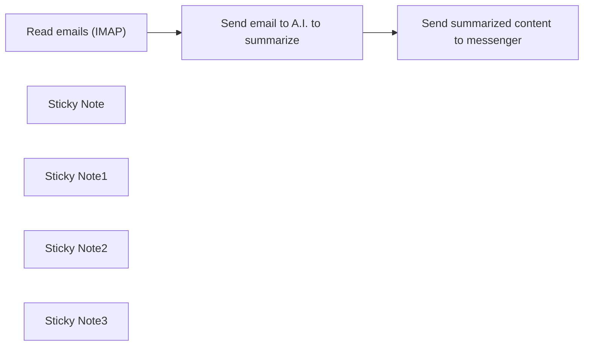

## Fluxo (.json) :

```json
{
  "id": "QnVdtKiTf3nbrNkh",
  "meta": {
    "instanceId": "558d88703fb65b2d0e44613bc35916258b0f0bf983c5d4730c00c424b77ca36a",
    "templateCredsSetupCompleted": true
  },
  "name": "Summarize emails with A.I. then send to messenger",
  "tags": [],
  "nodes": [
    {
      "id": "50e12e63-df28-45ac-9208-48cbf5116d09",
      "name": "Read emails (IMAP)",
      "type": "n8n-nodes-base.emailReadImap",
      "position": [
        340,
        260
      ],
      "parameters": {
        "options": {},
        "postProcessAction": "nothing"
      },
      "credentials": {
        "imap": {
          "id": "gXtdakU9M02LBQc3",
          "name": "IMAP account"
        }
      },
      "typeVersion": 2
    },
    {
      "id": "6565350b-2269-44e3-8f36-8797f32d3e09",
      "name": "Send email to A.I. to summarize",
      "type": "n8n-nodes-base.httpRequest",
      "position": [
        700,
        260
      ],
      "parameters": {
        "url": "https://openrouter.ai/api/v1/chat/completions",
        "method": "POST",
        "options": {},
        "jsonBody": "={\n  \"model\": \"meta-llama/llama-3.1-70b-instruct:free\",\n  \"messages\": [\n    {\n      \"role\": \"user\",\n      \"content\": \"I want you to read and summarize all the emails. If it's not rimportant, just give me a short summary with less than 10 words.\\n\\nHighlight as important if it is, add an emoji to indicate it is urgent:\\nFor the relevant content, find any action items and deadlines. Sometimes I need to sign up before a certain date or pay before a certain date, please highlight that in the summary for me.\\n\\nPut the deadline in BOLD at the top. If the email is not important, keep the summary short to 1 sentence only.\\n\\nHere's the email content for you to read:\\nSender email address: {{ encodeURIComponent($json.from) }}\\nSubject: {{ encodeURIComponent($json.subject) }}\\n{{ encodeURIComponent($json.textHtml) }}\"\n    }\n  ]\n}",
        "sendBody": true,
        "specifyBody": "json",
        "authentication": "genericCredentialType",
        "genericAuthType": "httpHeaderAuth"
      },
      "credentials": {
        "httpHeaderAuth": {
          "id": "WY7UkF14ksPKq3S8",
          "name": "Header Auth account 2"
        }
      },
      "typeVersion": 4.2,
      "alwaysOutputData": false
    },
    {
      "id": "d04c422a-c000-4e48-82d0-0bf44bcd9fff",
      "name": "Send summarized content to messenger",
      "type": "n8n-nodes-base.httpRequest",
      "position": [
        1100,
        260
      ],
      "parameters": {
        "url": "https://api.line.me/v2/bot/message/push",
        "method": "POST",
        "options": {},
        "jsonBody": "={\n  \"to\": \"U3ec262c49811f30cdc2d2f2b0a0df99a\",\n  \"messages\": [\n    {\n      \"type\": \"text\",\n      \"text\": \"{{ $json.choices[0].message.content.replace(/\\n/g, \"\\\\n\") }}\"\n    }\n  ]\n}\n\n\n  ",
        "sendBody": true,
        "specifyBody": "json",
        "authentication": "genericCredentialType",
        "genericAuthType": "httpHeaderAuth"
      },
      "credentials": {
        "httpHeaderAuth": {
          "id": "SzcKjO9Nn9vZPL2H",
          "name": "Header Auth account 5"
        }
      },
      "typeVersion": 4.2
    },
    {
      "id": "57a1219c-4f40-407c-855b-86c4c7c468bb",
      "name": "Sticky Note",
      "type": "n8n-nodes-base.stickyNote",
      "position": [
        180,
        0
      ],
      "parameters": {
        "width": 361,
        "height": 90,
        "content": "## Summarize emails with A.I.\nYou can find out more about the [use case](https://rumjahn.com/how-a-i-saved-my-kids-school-life-and-my-marriage/)"
      },
      "typeVersion": 1
    },
    {
      "id": "17686264-56ac-419e-a32b-dc5c75f15f1f",
      "name": "Sticky Note1",
      "type": "n8n-nodes-base.stickyNote",
      "position": [
        283,
        141
      ],
      "parameters": {
        "color": 5,
        "width": 229,
        "height": 280,
        "content": "Find your email server's IMAP Settings. \n- Link for [gmail](https://www.getmailspring.com/setup/access-gmail-via-imap-smtp)"
      },
      "typeVersion": 1
    },
    {
      "id": "1862abd6-7dca-4c66-90d6-110d4fcf4d99",
      "name": "Sticky Note2",
      "type": "n8n-nodes-base.stickyNote",
      "position": [
        580,
        0
      ],
      "parameters": {
        "color": 6,
        "width": 365,
        "height": 442,
        "content": "For the A.I. you can use Openrouter.ai. \n- Set up a free account\n- The A.I. model selected is FREE to use.\n## Credentials\n- Use header auth\n- Username: Authorization\n- Password: Bearer {insert your API key}.\n- The password is \"Bearer\" space plus your API key."
      },
      "typeVersion": 1
    },
    {
      "id": "c4a3a76f-539d-4bbf-8f95-d7aaebf39a55",
      "name": "Sticky Note3",
      "type": "n8n-nodes-base.stickyNote",
      "position": [
        1000,
        0
      ],
      "parameters": {
        "color": 4,
        "width": 307,
        "height": 439,
        "content": "Don't use the official Line node. It's outdated.\n## Credentials\n- Use header auth\n- Username: Authorization\n- Password: Bearer {channel access token}\n\nYou can find your channel access token at the [Line API console](https://developers.line.biz/console/). Go to Messaging API and scroll to the bottom."
      },
      "typeVersion": 1
    }
  ],
  "active": false,
  "pinData": {},
  "settings": {
    "executionOrder": "v1"
  },
  "versionId": "81216e6a-2bd8-4215-8a96-376ee520469d",
  "connections": {
    "Read emails (IMAP)": {
      "main": [
        [
          {
            "node": "Send email to A.I. to summarize",
            "type": "main",
            "index": 0
          }
        ]
      ]
    },
    "Send email to A.I. to summarize": {
      "main": [
        [
          {
            "node": "Send summarized content to messenger",
            "type": "main",
            "index": 0
          }
        ]
      ]
    }
  }
}
```

<a id="template-1011"></a>

## Template 1011 - Atualização dinâmica de Airtable a partir de PDFs com prompts

- **Nome:** Atualização dinâmica de Airtable a partir de PDFs com prompts
- **Descrição:** Este fluxo captura eventos do Airtable, baixa PDFs, extrai o texto, utiliza modelos de linguagem com prompts dinâmicos para gerar valores de campos e atualiza os registros correspondentes no Airtable, processando em lotes para várias linhas.
- **Funcionalidade:** • Detecção de mudanças: o fluxo recebe eventos via webhooks do Airtable para detectar alterações em linhas ou campos e iniciar o processamento.
• Obtenção de esquema da tabela: busca o esquema da base para conhecer os campos e descrições (prompts dinâmicos).
• Extração de prompts: seleciona apenas os campos com descrições para criar prompts personalizados.
• Processamento de PDFs: baixa o arquivo vinculado ao registro e extrai o conteúdo textual.
• Geração de valores com LLM: usa modelos de linguagem para gerar valores para os campos com prompts dinâmicos baseados no conteúdo do PDF.
• Atualização de registros: atualiza o registro correspondente no Airtable com os novos valores.
• Processamento por lote: divide o processamento em lotes para melhor experiência e performance.
- **Ferramentas:** • Airtable: serviço de base de dados usado para armazenar, consultar, obter esquema, buscar e atualizar registros e para gerenciar webhooks.
• OpenAI: modelo de linguagem utilizado para gerar textos e extrair dados a partir do conteúdo do PDF com prompts dinâmicos.
• Webhooks do Airtable: mecanismo de envio de eventos para acionar o fluxo ao ocorrerem mudanças.

## Fluxo visual

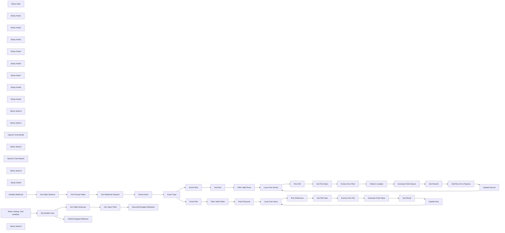

## Fluxo (.json) :

```json
{
  "nodes": [
    {
      "id": "36816ae7-414a-482e-8a50-021885237273",
      "name": "Event Type",
      "type": "n8n-nodes-base.switch",
      "position": [
        -220,
        -140
      ],
      "parameters": {
        "rules": {
          "values": [
            {
              "outputKey": "row.updated",
              "conditions": {
                "options": {
                  "version": 2,
                  "leftValue": "",
                  "caseSensitive": true,
                  "typeValidation": "strict"
                },
                "combinator": "and",
                "conditions": [
                  {
                    "id": "2162daf8-d23d-4b8f-8257-bdfc5400a3a8",
                    "operator": {
                      "name": "filter.operator.equals",
                      "type": "string",
                      "operation": "equals"
                    },
                    "leftValue": "={{ $json.event_type }}",
                    "rightValue": "row.updated"
                  }
                ]
              },
              "renameOutput": true
            },
            {
              "outputKey": "field.created",
              "conditions": {
                "options": {
                  "version": 2,
                  "leftValue": "",
                  "caseSensitive": true,
                  "typeValidation": "strict"
                },
                "combinator": "and",
                "conditions": [
                  {
                    "id": "48e112f6-afe8-40bf-b673-b37446934a62",
                    "operator": {
                      "name": "filter.operator.equals",
                      "type": "string",
                      "operation": "equals"
                    },
                    "leftValue": "={{ $json.event_type }}",
                    "rightValue": "field.created"
                  }
                ]
              },
              "renameOutput": true
            },
            {
              "outputKey": "field.updated",
              "conditions": {
                "options": {
                  "version": 2,
                  "leftValue": "",
                  "caseSensitive": true,
                  "typeValidation": "strict"
                },
                "combinator": "and",
                "conditions": [
                  {
                    "id": "5aa258cd-15c2-4156-a32d-afeed662a38e",
                    "operator": {
                      "name": "filter.operator.equals",
                      "type": "string",
                      "operation": "equals"
                    },
                    "leftValue": "={{ $json.event_type }}",
                    "rightValue": "field.updated"
                  }
                ]
              },
              "renameOutput": true
            }
          ]
        },
        "options": {}
      },
      "typeVersion": 3.2
    },
    {
      "id": "920ca6d8-7a6e-4482-b003-fa643f550a85",
      "name": "Get Prompt Fields",
      "type": "n8n-nodes-base.code",
      "position": [
        -900,
        -140
      ],
      "parameters": {
        "jsCode": "const fields = $input.first().json.fields\n    .filter(item => item.description)\n    .map((item, idx) => ({\n      id: item.id,\n      order: idx,\n      name: item.name,\n      type: item.type,\n      description: item.description,\n    }));\n\nreturn { json: { fields } };"
      },
      "typeVersion": 2
    },
    {
      "id": "3b73b2f5-9081-4633-911f-ef3041600a00",
      "name": "Get File Data",
      "type": "n8n-nodes-base.httpRequest",
      "position": [
        1220,
        320
      ],
      "parameters": {
        "url": "={{ $json.File[0].url }}",
        "options": {}
      },
      "typeVersion": 4.2
    },
    {
      "id": "e96edca8-9e8b-4ca4-bef9-dae673d3aba4",
      "name": "Extract from File",
      "type": "n8n-nodes-base.extractFromFile",
      "position": [
        1380,
        320
      ],
      "parameters": {
        "options": {},
        "operation": "pdf"
      },
      "typeVersion": 1
    },
    {
      "id": "b5c2b87b-5756-4810-84c9-34ea420bdcef",
      "name": "Get Result",
      "type": "n8n-nodes-base.set",
      "position": [
        2000,
        380
      ],
      "parameters": {
        "options": {},
        "assignments": {
          "assignments": [
            {
              "id": "63d7c52e-d5bf-4f4c-9e37-1d5feaea20f4",
              "name": "id",
              "type": "string",
              "value": "={{ $('Row Reference').item.json.id }}"
            },
            {
              "id": "3ad72567-1d17-4910-b916-4c34a43b1060",
              "name": "={{ $('Event Ref').first().json.field.name }}",
              "type": "string",
              "value": "={{ $json.text.trim() }}"
            }
          ]
        }
      },
      "typeVersion": 3.4
    },
    {
      "id": "a5cb0510-620b-469d-bf66-26ab64d6f88f",
      "name": "Loop Over Items",
      "type": "n8n-nodes-base.splitInBatches",
      "position": [
        800,
        220
      ],
      "parameters": {
        "options": {}
      },
      "typeVersion": 3
    },
    {
      "id": "20e24946-59d8-4b19-bfab-eebb02f7e46d",
      "name": "Row Reference",
      "type": "n8n-nodes-base.noOp",
      "position": [
        980,
        320
      ],
      "parameters": {},
      "typeVersion": 1
    },
    {
      "id": "4090c53e-e635-4421-ab2b-475bfc62cea4",
      "name": "Generate Field Value",
      "type": "@n8n/n8n-nodes-langchain.chainLlm",
      "position": [
        1540,
        320
      ],
      "parameters": {
        "text": "=<file>\n{{ $json.text }}\n</file>\n\nData to extract: {{ $('Event Ref').first().json.field.description }}\noutput format is: {{ $('Event Ref').first().json.field.type }}",
        "messages": {
          "messageValues": [
            {
              "message": "=You assist the user in extracting the required data from the given file.\n* Keep you answer short.\n* If you cannot extract the requested data, give you response as \"n/a\"."
            }
          ]
        },
        "promptType": "define"
      },
      "typeVersion": 1.5
    },
    {
      "id": "582d4008-4871-4798-bc24-abf774ad29b5",
      "name": "Fields to Update",
      "type": "n8n-nodes-base.code",
      "position": [
        1560,
        -300
      ],
      "parameters": {
        "jsCode": "const row = $('Row Ref').first().json;\nconst fields = $('Get Prompt Fields').first().json.fields;\nconst missingFields = fields\n  .filter(field => field.description && !row[field.name]);\n\nreturn missingFields;"
      },
      "typeVersion": 2
    },
    {
      "id": "051c6a99-cec3-42df-9de7-47cb69b51682",
      "name": "Loop Over Items1",
      "type": "n8n-nodes-base.splitInBatches",
      "position": [
        820,
        -420
      ],
      "parameters": {
        "options": {}
      },
      "typeVersion": 3
    },
    {
      "id": "f559c8ff-2ee5-478d-84ee-6b0ca2fe2050",
      "name": "Row Ref",
      "type": "n8n-nodes-base.noOp",
      "position": [
        1000,
        -300
      ],
      "parameters": {},
      "typeVersion": 1
    },
    {
      "id": "7b82cc73-67cb-46d7-a1d4-19712c86890a",
      "name": "Get File Data1",
      "type": "n8n-nodes-base.httpRequest",
      "position": [
        1240,
        -300
      ],
      "parameters": {
        "url": "={{ $('Row Ref').item.json.File[0].url }}",
        "options": {}
      },
      "typeVersion": 4.2
    },
    {
      "id": "7ef1556c-96a3-4988-982d-ec8c5fba4601",
      "name": "Extract from File1",
      "type": "n8n-nodes-base.extractFromFile",
      "position": [
        1400,
        -300
      ],
      "parameters": {
        "options": {},
        "operation": "pdf"
      },
      "typeVersion": 1
    },
    {
      "id": "9916f1c1-f413-4996-ad45-380a899b4a88",
      "name": "Get Result1",
      "type": "n8n-nodes-base.set",
      "position": [
        2120,
        -260
      ],
      "parameters": {
        "options": {},
        "assignments": {
          "assignments": [
            {
              "id": "e376ba60-8692-4962-9af7-466b6a3f44a2",
              "name": "={{ $('Fields to Update').item.json.name }}",
              "type": "string",
              "value": "={{ $json.text.trim() }}"
            }
          ]
        }
      },
      "typeVersion": 3.4
    },
    {
      "id": "f62f612d-c288-4062-ab3c-dbc24c9b4b38",
      "name": "Generate Field Value1",
      "type": "@n8n/n8n-nodes-langchain.chainLlm",
      "position": [
        1720,
        -300
      ],
      "parameters": {
        "text": "=<file>\n{{ $('Extract from File1').first().json.text }}\n</file>\n\nData to extract: {{ $json.description }}\noutput format is: {{ $json.type }}",
        "messages": {
          "messageValues": [
            {
              "message": "=You assist the user in extracting the required data from the given file.\n* Keep you answer short.\n* If you cannot extract the requested data, give you response as \"n/a\" followed by \"(reason)\" where reason is replaced with reason why data could not be extracted."
            }
          ]
        },
        "promptType": "define"
      },
      "typeVersion": 1.5
    },
    {
      "id": "615f7436-f280-4033-8ec8-a34f1bd78075",
      "name": "Filter Valid Rows",
      "type": "n8n-nodes-base.filter",
      "position": [
        520,
        -420
      ],
      "parameters": {
        "options": {},
        "conditions": {
          "options": {
            "version": 2,
            "leftValue": "",
            "caseSensitive": true,
            "typeValidation": "strict"
          },
          "combinator": "and",
          "conditions": [
            {
              "id": "7ad58f0b-0354-49a9-ab2f-557652d7b416",
              "operator": {
                "type": "string",
                "operation": "notEmpty",
                "singleValue": true
              },
              "leftValue": "={{ $json.File[0].url }}",
              "rightValue": ""
            }
          ]
        }
      },
      "typeVersion": 2.2
    },
    {
      "id": "281b9fb0-305c-4a0c-b73b-82b6ba876d12",
      "name": "Filter Valid Fields",
      "type": "n8n-nodes-base.filter",
      "position": [
        340,
        220
      ],
      "parameters": {
        "options": {},
        "conditions": {
          "options": {
            "version": 2,
            "leftValue": "",
            "caseSensitive": true,
            "typeValidation": "strict"
          },
          "combinator": "and",
          "conditions": [
            {
              "id": "5b4a7393-788c-42dc-ac1f-e76f833f8534",
              "operator": {
                "type": "string",
                "operation": "notEmpty",
                "singleValue": true
              },
              "leftValue": "={{ $json.field.description }}",
              "rightValue": ""
            }
          ]
        }
      },
      "typeVersion": 2.2
    },
    {
      "id": "dd0fa792-791f-4d31-a7e8-9b72a25b6a07",
      "name": "Event Ref",
      "type": "n8n-nodes-base.noOp",
      "position": [
        160,
        220
      ],
      "parameters": {},
      "typeVersion": 1
    },
    {
      "id": "ca1174b3-da18-4d3c-86ef-3028cd5b12a7",
      "name": "Event Ref1",
      "type": "n8n-nodes-base.noOp",
      "position": [
        160,
        -420
      ],
      "parameters": {},
      "typeVersion": 1
    },
    {
      "id": "8800b355-0fa8-4297-b13b-d3da8a01c3b7",
      "name": "Sticky Note",
      "type": "n8n-nodes-base.stickyNote",
      "position": [
        -1180,
        -340
      ],
      "parameters": {
        "color": 7,
        "width": 480,
        "height": 440,
        "content": "### 1. Get Table Schema\n[Learn more about the Airtable node](https://docs.n8n.io/integrations/builtin/app-nodes/n8n-nodes-base.airtable/)\n\nFor this operation, we'll use the handy Airtable node. I recommend getting familiar with this node for all your Airtable needs!\n"
      },
      "typeVersion": 1
    },
    {
      "id": "a90876d3-8a93-4d90-9e2a-f23de452259d",
      "name": "Sticky Note1",
      "type": "n8n-nodes-base.stickyNote",
      "position": [
        -260,
        -440
      ],
      "parameters": {
        "color": 5,
        "width": 330,
        "height": 80,
        "content": "### 2a. Updates Minimal Number of Rows\nThis branch updates only the rows impacted."
      },
      "typeVersion": 1
    },
    {
      "id": "319adf97-8b14-4069-b4cc-594a6ea479c1",
      "name": "Sticky Note2",
      "type": "n8n-nodes-base.stickyNote",
      "position": [
        -320,
        140
      ],
      "parameters": {
        "color": 5,
        "width": 390,
        "height": 120,
        "content": "### 2b. Update Every Row under the Field\nThis branch updates all applicable rows under field when the field/column is created or changed. Watch out - if you have 1000s of rows, this could take a while!"
      },
      "typeVersion": 1
    },
    {
      "id": "42a60c8c-476f-4930-bac5-4d36a7185f4f",
      "name": "Sticky Note3",
      "type": "n8n-nodes-base.stickyNote",
      "position": [
        -2240,
        -1000
      ],
      "parameters": {
        "width": 520,
        "height": 1120,
        "content": "## Try It Out!\n### This n8n template powers a \"dynamic\" or \"user-defined\" prompts with PDF workflow pattern for a [Airtable](https://airtable.com/invite/r/cKzxFYVc) table. Simply put, it allows users to populate a spreadsheet using prompts without touching the underlying template.\n\n**Check out the video demo I did for n8n Studio**: https://www.youtube.com/watch?v=_fNAD1u8BZw\n\n**Check out the example Airtable here:** https://airtable.com/appAyH3GCBJ56cfXl/shrXzR1Tj99kuQbyL\n\nThis template is intended to be used as a webhook source for Airtable. **Looking for a Baserow version? [Click here](https://n8n.io/workflows/2780-ai-data-extraction-with-dynamic-prompts-and-baserow)**\n\n## How it works\n* Each Airtable.io tables offers integration feature whereby changes to the table can be sent as events to any accessible webhook. This allows for a reactive trigger pattern which makes this type of workflow possible. For our usecase, we capture the vents of `row_updated`, `field_created` and `field_updated`.\n* Next, we'll need an \"input\" column in our Airtable.io table. This column will be where our context lives for evaluating the prompts against. In this example, our \"input\" column name is \"file\" and it's where we'll upload our PDFs. Note, this \"input\" field is human-controlled and never updated from this template.\n* Now for the columns (aka \"fields\" in Airtable). Each field allows us to define a name, type and description and together form the schema. The first 2 are self-explaintory but the \"description\" will be for users to provide their prompts ie. what data should the field to contain.\n* In this template, a webhook trigger waits for when a row or column is updated. The incoming event comes with lots of details such as the table, row and/or column Ids that were impacted.\n* We use this information to fetch the table's schema in order to get the column's descriptions (aka dynamic prompts).\n* For each triggered event, we download our input ie. the PDF and ready it for our AI/LLM. By iterating through the available columns and feeding the dynamic prompts, our LLM can run those prompts against the PDF and thus generating a value response for each cell.\n* These values are then collected and used to update the Airtable Record.\n\n## How to use\n* You'll need to publish this workflow and make it accessible to our Airtable instance.\n* you must run the \"Create Airtable Webhooks\" mini-flow to link it to your Airtable.\n* This template is reusable for other Airtables but the webhooks need to be created each time for each table.\n\n### Need Help?\nJoin the [Discord](https://discord.com/invite/XPKeKXeB7d) or ask in the [Forum](https://community.n8n.io/)!\n\nHappy Flowgramming!"
      },
      "typeVersion": 1
    },
    {
      "id": "c6d037e9-1bf7-47a7-9c46-940220e0786b",
      "name": "Sticky Note4",
      "type": "n8n-nodes-base.stickyNote",
      "position": [
        -680,
        -340
      ],
      "parameters": {
        "color": 7,
        "width": 760,
        "height": 440,
        "content": "### 2. Event Router Pattern\n[Learn more about the Switch node](https://docs.n8n.io/integrations/builtin/core-nodes/n8n-nodes-base.switch/)\n\nA simple switch node can be used to determine which event to handle. The difference between our row and field events is that row event affect a single row whereas field events affect all rows. \n"
      },
      "typeVersion": 1
    },
    {
      "id": "897cec32-3a4c-4a76-bffe-b1456c287b44",
      "name": "Sticky Note5",
      "type": "n8n-nodes-base.stickyNote",
      "position": [
        100,
        -620
      ],
      "parameters": {
        "color": 7,
        "width": 620,
        "height": 400,
        "content": "### 3. Filter Only Rows with Valid Input\n[Learn more about the Split Out node](https://docs.n8n.io/integrations/builtin/core-nodes/n8n-nodes-base.splitout/)\n\nThis step handles one or more updated rows where \"updated\" means the \"input\" column (ie. \"file\" in our example) for these rows were changed. For each affected row, we'll get the full row to figure out only the columns we need to update - this is an optimisation to avoid redundant work ie. generating values for columns which already have a value."
      },
      "typeVersion": 1
    },
    {
      "id": "a5999ca3-4418-42c5-aa1c-fbdfb1c04fef",
      "name": "Sticky Note7",
      "type": "n8n-nodes-base.stickyNote",
      "position": [
        2060,
        -480
      ],
      "parameters": {
        "color": 7,
        "width": 600,
        "height": 440,
        "content": "### 6. Update the Airtable Record\n[Learn more about the Edit Fields node](https://docs.n8n.io/integrations/builtin/core-nodes/n8n-nodes-base.set/)\n\nFinally, we can collect the LLM responses and combine them to build an API request to update our Airtable record - the Id of which we got from initial webhook. After this is done, we can move onto the next row and repeat the process.\n"
      },
      "typeVersion": 1
    },
    {
      "id": "38192929-a387-4240-8373-290499b40e5a",
      "name": "Sticky Note8",
      "type": "n8n-nodes-base.stickyNote",
      "position": [
        1180,
        -580
      ],
      "parameters": {
        "color": 7,
        "width": 860,
        "height": 580,
        "content": "### 5. PDFs, LLMs and Dynamic Prompts? Oh My!\n[Learn more about the Basic LLM node](https://docs.n8n.io/integrations/builtin/cluster-nodes/root-nodes/n8n-nodes-langchain.chainllm/)\n\nThis step is where it all comes together! In short, we give our LLM the PDF contents as the context and loop through our dynamic prompts (from the schema we pulled earlier) for our row. At the end, our LLM should have produced a value for each column requested.\n\n**Note**: There's definitely a optimisation which could be done for caching PDFs but it beyond the scope of this demonstration.\n"
      },
      "typeVersion": 1
    },
    {
      "id": "19a9b93a-d18f-4ffd-ae93-ed41cf398e90",
      "name": "Sticky Note9",
      "type": "n8n-nodes-base.stickyNote",
      "position": [
        740,
        -580
      ],
      "parameters": {
        "color": 7,
        "width": 420,
        "height": 460,
        "content": "### 4. Using an Items Loop\n[Learn more about the Split in Batches node](https://docs.n8n.io/integrations/builtin/core-nodes/n8n-nodes-base.splitinbatches/)\n\nA split in batches node is used here to update a row at a time however, this is a preference for user experience - changes are seen in the Airtable quicker.\n"
      },
      "typeVersion": 1
    },
    {
      "id": "5407fead-ee7c-47c8-94ed-5b89e74e50e8",
      "name": "Sticky Note10",
      "type": "n8n-nodes-base.stickyNote",
      "position": [
        100,
        40
      ],
      "parameters": {
        "color": 7,
        "width": 600,
        "height": 360,
        "content": "### 7. Listing All Applicable Rows Under The Column\n[Learn more about the Filter node](https://docs.n8n.io/integrations/builtin/core-nodes/n8n-nodes-base.filter)\n\nTo keep things performant, we can decide to get only rows with inputfield populated as this is required to perform the extraction. This can easily be achieved with Airtable filters."
      },
      "typeVersion": 1
    },
    {
      "id": "43b0e330-b79a-4577-b4fc-314e8b790cf7",
      "name": "Sticky Note11",
      "type": "n8n-nodes-base.stickyNote",
      "position": [
        1160,
        140
      ],
      "parameters": {
        "color": 7,
        "width": 700,
        "height": 500,
        "content": "### 9. Generating Value using LLM\n[Learn more about the Extract From File node](https://docs.n8n.io/integrations/builtin/core-nodes/n8n-nodes-base.extractfromfile/)\n\nPretty much identical to Step 5 but instead of updating every field/column, we only need to generate a value for one. \n"
      },
      "typeVersion": 1
    },
    {
      "id": "0665fe56-48d2-4215-8d95-d4c01f9266ed",
      "name": "OpenAI Chat Model",
      "type": "@n8n/n8n-nodes-langchain.lmChatOpenAi",
      "position": [
        1720,
        -140
      ],
      "parameters": {
        "options": {}
      },
      "credentials": {
        "openAiApi": {
          "id": "8gccIjcuf3gvaoEr",
          "name": "OpenAi account"
        }
      },
      "typeVersion": 1.1
    },
    {
      "id": "1997fb8b-73eb-4016-bab6-eb8f02fee368",
      "name": "Sticky Note12",
      "type": "n8n-nodes-base.stickyNote",
      "position": [
        720,
        40
      ],
      "parameters": {
        "color": 7,
        "width": 420,
        "height": 460,
        "content": "### 8. Using an Items Loop\n[Learn more about the Split in Batches node](https://docs.n8n.io/integrations/builtin/core-nodes/n8n-nodes-base.splitinbatches/)\n\nSimilar to Step 4, the Split in Batches node is a preference for user experience - changes are seen in the Airtable quicker.\n"
      },
      "typeVersion": 1
    },
    {
      "id": "c2799ded-b742-43a2-80ce-7a0c8f1df96e",
      "name": "OpenAI Chat Model1",
      "type": "@n8n/n8n-nodes-langchain.lmChatOpenAi",
      "position": [
        1540,
        500
      ],
      "parameters": {
        "options": {}
      },
      "credentials": {
        "openAiApi": {
          "id": "8gccIjcuf3gvaoEr",
          "name": "OpenAi account"
        }
      },
      "typeVersion": 1.1
    },
    {
      "id": "e5b42790-fc86-4134-9d04-e6bcad4a5f20",
      "name": "Sticky Note13",
      "type": "n8n-nodes-base.stickyNote",
      "position": [
        1880,
        140
      ],
      "parameters": {
        "color": 7,
        "width": 500,
        "height": 440,
        "content": "### 10. Update the Airtable Record\n[Learn more about the Edit Fields node](https://docs.n8n.io/integrations/builtin/core-nodes/n8n-nodes-base.set/)\n\nAs with Step 6, the LLM response is used to update the row however only under the field that was created/changed. Once complete, the loop continues and the next row is processed.\n"
      },
      "typeVersion": 1
    },
    {
      "id": "b1e98631-a440-4c66-b2d2-8236f6889b65",
      "name": "Sticky Note6",
      "type": "n8n-nodes-base.stickyNote",
      "position": [
        -2240,
        -1140
      ],
      "parameters": {
        "color": 7,
        "width": 300,
        "height": 120,
        "content": "[](https://airtable.com/invite/r/cKzxFYVc)"
      },
      "typeVersion": 1
    },
    {
      "id": "9d293b3a-954d-4e3b-8773-b6c3dded9520",
      "name": "Get Webhook Payload",
      "type": "n8n-nodes-base.httpRequest",
      "position": [
        -580,
        -140
      ],
      "parameters": {
        "url": "=https://api.airtable.com/v0/bases/{{ $('Airtable Webhook').first().json.body.base.id }}/webhooks/{{ $('Airtable Webhook').first().json.body.webhook.id }}/payloads",
        "options": {},
        "authentication": "predefinedCredentialType",
        "nodeCredentialType": "airtableTokenApi"
      },
      "credentials": {
        "airtableTokenApi": {
          "id": "Und0frCQ6SNVX3VV",
          "name": "Airtable Personal Access Token account"
        }
      },
      "typeVersion": 4.2
    },
    {
      "id": "5f8d919b-14cd-4cb4-8604-731e56cc9402",
      "name": "Parse Event",
      "type": "n8n-nodes-base.code",
      "position": [
        -400,
        -140
      ],
      "parameters": {
        "jsCode": "const webhook = $('Airtable Webhook').first().json;\nconst schema = $('Get Prompt Fields').first().json;\nconst { payloads } = $input.first().json;\nif (!payloads.length) return [];\n\nconst event = payloads[payloads.length - 1];\nconst baseId = webhook.body.base.id;\nconst tableId = Object.keys(event.changedTablesById)[0];\nconst table = event.changedTablesById[tableId];\n\nreturn {\n  baseId,\n  tableId,\n  event_type: getEventType(table),\n  fieldId: getFieldId(table),\n  field: getField(getFieldId(table)),\n  rowId: getRecordId(table),\n}\n\nfunction getEventType(changedTableByIdObject) {\n  if (changedTableByIdObject['createdFieldsById']) return 'field.created';\n  if (changedTableByIdObject['changedFieldsById']) return 'field.updated'\n  if (changedTableByIdObject['changedRecordsById']) return 'row.updated';\n  return 'unknown';\n}\n\nfunction getFieldId(changedTableByIdObject) {\n  const field = changedTableByIdObject.createdFieldsById\n    || changedTableByIdObject.changedFieldsById\n    || null;\n\n  return field ? Object.keys(field)[0] : null;\n}\n\nfunction getField(id) {\n  return schema.fields.find(field => field.id === id);\n}\n\nfunction getRecordId(changedTableByIdObject) {\n  const record = changedTableByIdObject.changedRecordsById\n    || null;\n\n  return record ? Object.keys(record)[0] : null;\n}"
      },
      "typeVersion": 2
    },
    {
      "id": "9b99d939-94d6-4fef-8b73-58c702503221",
      "name": "Get Table Schema",
      "type": "n8n-nodes-base.airtable",
      "position": [
        -1080,
        -140
      ],
      "parameters": {
        "base": {
          "__rl": true,
          "mode": "id",
          "value": "={{ $('Airtable Webhook').item.json.body.base.id }}"
        },
        "resource": "base",
        "operation": "getSchema"
      },
      "credentials": {
        "airtableTokenApi": {
          "id": "Und0frCQ6SNVX3VV",
          "name": "Airtable Personal Access Token account"
        }
      },
      "typeVersion": 2.1
    },
    {
      "id": "c29fc911-a852-46f2-bbb1-5092cc1aaa9d",
      "name": "Fetch Records",
      "type": "n8n-nodes-base.airtable",
      "position": [
        520,
        220
      ],
      "parameters": {
        "base": {
          "__rl": true,
          "mode": "id",
          "value": "={{ $json.baseId }}"
        },
        "table": {
          "__rl": true,
          "mode": "id",
          "value": "={{ $json.tableId }}"
        },
        "options": {},
        "operation": "search",
        "filterByFormula": "NOT({File} = \"\")"
      },
      "credentials": {
        "airtableTokenApi": {
          "id": "Und0frCQ6SNVX3VV",
          "name": "Airtable Personal Access Token account"
        }
      },
      "typeVersion": 2.1
    },
    {
      "id": "86d3c8d8-709f-4d9d-99bc-5d1b4aeb8603",
      "name": "Update Row",
      "type": "n8n-nodes-base.airtable",
      "position": [
        2180,
        380
      ],
      "parameters": {
        "base": {
          "__rl": true,
          "mode": "id",
          "value": "={{ $('Event Ref').first().json.baseId }}"
        },
        "table": {
          "__rl": true,
          "mode": "id",
          "value": "={{ $('Event Ref').first().json.tableId }}"
        },
        "columns": {
          "value": {},
          "schema": [
            {
              "id": "id",
              "type": "string",
              "display": true,
              "removed": false,
              "readOnly": true,
              "required": false,
              "displayName": "id",
              "defaultMatch": true
            },
            {
              "id": "Name",
              "type": "string",
              "display": true,
              "removed": false,
              "readOnly": false,
              "required": false,
              "displayName": "Name",
              "defaultMatch": false,
              "canBeUsedToMatch": true
            },
            {
              "id": "File",
              "type": "array",
              "display": true,
              "removed": false,
              "readOnly": false,
              "required": false,
              "displayName": "File",
              "defaultMatch": false,
              "canBeUsedToMatch": true
            },
            {
              "id": "Full Name",
              "type": "string",
              "display": true,
              "removed": false,
              "readOnly": false,
              "required": false,
              "displayName": "Full Name",
              "defaultMatch": false,
              "canBeUsedToMatch": true
            },
            {
              "id": "Created",
              "type": "string",
              "display": true,
              "removed": false,
              "readOnly": true,
              "required": false,
              "displayName": "Created",
              "defaultMatch": false,
              "canBeUsedToMatch": true
            },
            {
              "id": "Last Modified",
              "type": "string",
              "display": true,
              "removed": false,
              "readOnly": true,
              "required": false,
              "displayName": "Last Modified",
              "defaultMatch": false,
              "canBeUsedToMatch": true
            },
            {
              "id": "Address",
              "type": "string",
              "display": true,
              "removed": false,
              "readOnly": false,
              "required": false,
              "displayName": "Address",
              "defaultMatch": false,
              "canBeUsedToMatch": true
            }
          ],
          "mappingMode": "autoMapInputData",
          "matchingColumns": [
            "id"
          ]
        },
        "options": {},
        "operation": "update"
      },
      "credentials": {
        "airtableTokenApi": {
          "id": "Und0frCQ6SNVX3VV",
          "name": "Airtable Personal Access Token account"
        }
      },
      "typeVersion": 2.1
    },
    {
      "id": "95d08439-59a2-4e74-bd5a-b71cf079b621",
      "name": "Get Row",
      "type": "n8n-nodes-base.airtable",
      "position": [
        340,
        -420
      ],
      "parameters": {
        "id": "={{ $json.rowId }}",
        "base": {
          "__rl": true,
          "mode": "id",
          "value": "={{ $json.baseId }}"
        },
        "table": {
          "__rl": true,
          "mode": "id",
          "value": "={{ $json.tableId }}"
        },
        "options": {}
      },
      "credentials": {
        "airtableTokenApi": {
          "id": "Und0frCQ6SNVX3VV",
          "name": "Airtable Personal Access Token account"
        }
      },
      "typeVersion": 2.1
    },
    {
      "id": "50888ac5-30c9-4036-aade-6ccfdf605c3b",
      "name": "Add Row ID to Payload",
      "type": "n8n-nodes-base.set",
      "position": [
        2300,
        -260
      ],
      "parameters": {
        "mode": "raw",
        "options": {},
        "jsonOutput": "={{\n{\n  id: $('Row Ref').item.json.id,\n  ...$input.all()\n    .map(item => item.json)\n    .reduce((acc, item) => ({\n      ...acc,\n      ...item,\n    }), {})\n}\n}}"
      },
      "executeOnce": true,
      "typeVersion": 3.4
    },
    {
      "id": "e3ebeb45-45d9-44a4-a2e6-bde89f5da125",
      "name": "Update Record",
      "type": "n8n-nodes-base.airtable",
      "position": [
        2480,
        -260
      ],
      "parameters": {
        "base": {
          "__rl": true,
          "mode": "id",
          "value": "={{ $('Event Ref1').first().json.baseId }}"
        },
        "table": {
          "__rl": true,
          "mode": "id",
          "value": "={{ $('Event Ref1').first().json.tableId }}"
        },
        "columns": {
          "value": {},
          "schema": [
            {
              "id": "id",
              "type": "string",
              "display": true,
              "removed": false,
              "readOnly": true,
              "required": false,
              "displayName": "id",
              "defaultMatch": true
            },
            {
              "id": "Name",
              "type": "string",
              "display": true,
              "removed": false,
              "readOnly": false,
              "required": false,
              "displayName": "Name",
              "defaultMatch": false,
              "canBeUsedToMatch": true
            },
            {
              "id": "File",
              "type": "array",
              "display": true,
              "removed": false,
              "readOnly": false,
              "required": false,
              "displayName": "File",
              "defaultMatch": false,
              "canBeUsedToMatch": true
            },
            {
              "id": "Full Name",
              "type": "string",
              "display": true,
              "removed": false,
              "readOnly": false,
              "required": false,
              "displayName": "Full Name",
              "defaultMatch": false,
              "canBeUsedToMatch": true
            },
            {
              "id": "Address",
              "type": "string",
              "display": true,
              "removed": false,
              "readOnly": false,
              "required": false,
              "displayName": "Address",
              "defaultMatch": false,
              "canBeUsedToMatch": true
            },
            {
              "id": "Created",
              "type": "string",
              "display": true,
              "removed": false,
              "readOnly": true,
              "required": false,
              "displayName": "Created",
              "defaultMatch": false,
              "canBeUsedToMatch": true
            },
            {
              "id": "Last Modified",
              "type": "string",
              "display": true,
              "removed": false,
              "readOnly": true,
              "required": false,
              "displayName": "Last Modified",
              "defaultMatch": false,
              "canBeUsedToMatch": true
            }
          ],
          "mappingMode": "autoMapInputData",
          "matchingColumns": [
            "id"
          ]
        },
        "options": {},
        "operation": "update"
      },
      "credentials": {
        "airtableTokenApi": {
          "id": "Und0frCQ6SNVX3VV",
          "name": "Airtable Personal Access Token account"
        }
      },
      "typeVersion": 2.1
    },
    {
      "id": "ac01ec4b-e030-4608-af38-64558408832f",
      "name": "Airtable Webhook",
      "type": "n8n-nodes-base.webhook",
      "position": [
        -1400,
        -140
      ],
      "webhookId": "a82f0ae7-678e-49d9-8219-7281e8a2a1b2",
      "parameters": {
        "path": "a82f0ae7-678e-49d9-8219-7281e8a2a1b2",
        "options": {},
        "httpMethod": "POST"
      },
      "typeVersion": 2
    },
    {
      "id": "90178da9-2000-474e-ba93-a02d03ec6a1d",
      "name": "When clicking ‘Test workflow’",
      "type": "n8n-nodes-base.manualTrigger",
      "position": [
        -1600,
        -640
      ],
      "parameters": {},
      "typeVersion": 1
    },
    {
      "id": "b8b887ce-f891-4a3c-993b-0aaccadf1b52",
      "name": "Set Airtable Vars",
      "type": "n8n-nodes-base.set",
      "position": [
        -1420,
        -640
      ],
      "parameters": {
        "options": {},
        "assignments": {
          "assignments": [
            {
              "id": "012cb420-1455-4796-a2ac-a31e6abf59ba",
              "name": "appId",
              "type": "string",
              "value": "<MY_BASE_ID>"
            },
            {
              "id": "e863b66c-420f-43c6-aee2-43aa5087a0a5",
              "name": "tableId",
              "type": "string",
              "value": "<MY_TABLE_ID>"
            },
            {
              "id": "e470be1a-5833-47ed-9e2f-988ef5479738",
              "name": "notificationUrl",
              "type": "string",
              "value": "<MY_WEBHOOK_URL>"
            },
            {
              "id": "e4b3213b-e3bd-479b-99ec-d1aa31eaa4c8",
              "name": "inputField",
              "type": "string",
              "value": "File"
            }
          ]
        }
      },
      "typeVersion": 3.4
    },
    {
      "id": "a3ef1a4a-fd22-4a37-8edb-48037f44fa4b",
      "name": "Get Table Schema1",
      "type": "n8n-nodes-base.airtable",
      "position": [
        -1240,
        -820
      ],
      "parameters": {
        "base": {
          "__rl": true,
          "mode": "id",
          "value": "={{ $json.appId }}"
        },
        "resource": "base",
        "operation": "getSchema"
      },
      "credentials": {
        "airtableTokenApi": {
          "id": "Und0frCQ6SNVX3VV",
          "name": "Airtable Personal Access Token account"
        }
      },
      "typeVersion": 2.1
    },
    {
      "id": "2490bbc6-2ea1-4146-b0b8-5a406e89ea2c",
      "name": "Get \"Input\" Field",
      "type": "n8n-nodes-base.set",
      "position": [
        -1060,
        -820
      ],
      "parameters": {
        "mode": "raw",
        "options": {},
        "jsonOutput": "={{\n$input.all()\n    .map(item => item.json)\n    .find(item => item.id === $('Set Airtable Vars').first().json.tableId)\n    .fields\n    .find(field => field.name === $('Set Airtable Vars').first().json.inputField)\n}}"
      },
      "executeOnce": true,
      "typeVersion": 3.4
    },
    {
      "id": "a3de141f-0ce8-4f8e-ae8e-f10f635d14ec",
      "name": "RecordsChanged Webhook",
      "type": "n8n-nodes-base.httpRequest",
      "position": [
        -880,
        -820
      ],
      "parameters": {
        "url": "=https://api.airtable.com/v0/bases/{{ $('Set Airtable Vars').first().json.appId }}/webhooks",
        "method": "POST",
        "options": {},
        "jsonBody": "={{\n{\n  \"notificationUrl\": $('Set Airtable Vars').first().json.notificationUrl,\n  \"specification\": {\n    \"options\": {\n      \"filters\": {\n        \"fromSources\": [ \"client\" ],\n        \"dataTypes\": [ \"tableData\" ],\n        \"changeTypes\": [ \"update\" ],\n        \"recordChangeScope\": $('Set Airtable Vars').first().json.tableId,\n        \"watchDataInFieldIds\": [$json.id]\n      }\n    }\n  }\n}\n}}",
        "sendBody": true,
        "specifyBody": "json",
        "authentication": "predefinedCredentialType",
        "nodeCredentialType": "airtableTokenApi"
      },
      "credentials": {
        "airtableTokenApi": {
          "id": "Und0frCQ6SNVX3VV",
          "name": "Airtable Personal Access Token account"
        }
      },
      "typeVersion": 4.2
    },
    {
      "id": "21b0fae8-2046-4647-83c4-132d1d63503a",
      "name": "FieldsChanged Webhook",
      "type": "n8n-nodes-base.httpRequest",
      "position": [
        -880,
        -640
      ],
      "parameters": {
        "url": "=https://api.airtable.com/v0/bases/{{ $('Set Airtable Vars').first().json.appId }}/webhooks",
        "method": "POST",
        "options": {},
        "jsonBody": "={{\n{\n  \"notificationUrl\": $('Set Airtable Vars').first().json.notificationUrl,\n  \"specification\": {\n    \"options\": {\n      \"filters\": {\n        \"fromSources\": [ \"client\" ],\n        \"dataTypes\": [ \"tableFields\" ],\n        \"changeTypes\": [ \"add\", \"update\" ],\n        \"recordChangeScope\": $('Set Airtable Vars').first().json.tableId\n      }\n    }\n  }\n}\n}}",
        "sendBody": true,
        "specifyBody": "json",
        "authentication": "predefinedCredentialType",
        "nodeCredentialType": "airtableTokenApi"
      },
      "credentials": {
        "airtableTokenApi": {
          "id": "Und0frCQ6SNVX3VV",
          "name": "Airtable Personal Access Token account"
        }
      },
      "typeVersion": 4.2
    },
    {
      "id": "f31c36cb-98da-4688-a83a-f06e46d2b8a2",
      "name": "Sticky Note14",
      "type": "n8n-nodes-base.stickyNote",
      "position": [
        -1680,
        -1000
      ],
      "parameters": {
        "color": 5,
        "width": 1020,
        "height": 580,
        "content": "## ⭐️ Creating Airtable Webhooks\nTo link this workflow with Airtable, you'll have to create webhooks for the Base.\nYou'll only really need to do this this once but if these webhooks are inactive after 7 days, you'll need to create them again.\n\nCheck out the Airtable Developer documentation for more info: [https://airtable.com/developers/web/api/webhooks-overview](https://airtable.com/developers/web/api/webhooks-overview)"
      },
      "typeVersion": 1
    }
  ],
  "pinData": {},
  "connections": {
    "Get Row": {
      "main": [
        [
          {
            "node": "Filter Valid Rows",
            "type": "main",
            "index": 0
          }
        ]
      ]
    },
    "Row Ref": {
      "main": [
        [
          {
            "node": "Get File Data1",
            "type": "main",
            "index": 0
          }
        ]
      ]
    },
    "Event Ref": {
      "main": [
        [
          {
            "node": "Filter Valid Fields",
            "type": "main",
            "index": 0
          }
        ]
      ]
    },
    "Event Ref1": {
      "main": [
        [
          {
            "node": "Get Row",
            "type": "main",
            "index": 0
          }
        ]
      ]
    },
    "Event Type": {
      "main": [
        [
          {
            "node": "Event Ref1",
            "type": "main",
            "index": 0
          }
        ],
        [
          {
            "node": "Event Ref",
            "type": "main",
            "index": 0
          }
        ],
        [
          {
            "node": "Event Ref",
            "type": "main",
            "index": 0
          }
        ]
      ]
    },
    "Get Result": {
      "main": [
        [
          {
            "node": "Update Row",
            "type": "main",
            "index": 0
          }
        ]
      ]
    },
    "Update Row": {
      "main": [
        [
          {
            "node": "Loop Over Items",
            "type": "main",
            "index": 0
          }
        ]
      ]
    },
    "Get Result1": {
      "main": [
        [
          {
            "node": "Add Row ID to Payload",
            "type": "main",
            "index": 0
          }
        ]
      ]
    },
    "Parse Event": {
      "main": [
        [
          {
            "node": "Event Type",
            "type": "main",
            "index": 0
          }
        ]
      ]
    },
    "Fetch Records": {
      "main": [
        [
          {
            "node": "Loop Over Items",
            "type": "main",
            "index": 0
          }
        ]
      ]
    },
    "Get File Data": {
      "main": [
        [
          {
            "node": "Extract from File",
            "type": "main",
            "index": 0
          }
        ]
      ]
    },
    "Row Reference": {
      "main": [
        [
          {
            "node": "Get File Data",
            "type": "main",
            "index": 0
          }
        ]
      ]
    },
    "Update Record": {
      "main": [
        [
          {
            "node": "Loop Over Items1",
            "type": "main",
            "index": 0
          }
        ]
      ]
    },
    "Get File Data1": {
      "main": [
        [
          {
            "node": "Extract from File1",
            "type": "main",
            "index": 0
          }
        ]
      ]
    },
    "Loop Over Items": {
      "main": [
        [],
        [
          {
            "node": "Row Reference",
            "type": "main",
            "index": 0
          }
        ]
      ]
    },
    "Airtable Webhook": {
      "main": [
        [
          {
            "node": "Get Table Schema",
            "type": "main",
            "index": 0
          }
        ]
      ]
    },
    "Fields to Update": {
      "main": [
        [
          {
            "node": "Generate Field Value1",
            "type": "main",
            "index": 0
          }
        ]
      ]
    },
    "Get Table Schema": {
      "main": [
        [
          {
            "node": "Get Prompt Fields",
            "type": "main",
            "index": 0
          }
        ]
      ]
    },
    "Loop Over Items1": {
      "main": [
        [],
        [
          {
            "node": "Row Ref",
            "type": "main",
            "index": 0
          }
        ]
      ]
    },
    "Extract from File": {
      "main": [
        [
          {
            "node": "Generate Field Value",
            "type": "main",
            "index": 0
          }
        ]
      ]
    },
    "Filter Valid Rows": {
      "main": [
        [
          {
            "node": "Loop Over Items1",
            "type": "main",
            "index": 0
          }
        ]
      ]
    },
    "Get \"Input\" Field": {
      "main": [
        [
          {
            "node": "RecordsChanged Webhook",
            "type": "main",
            "index": 0
          }
        ]
      ]
    },
    "Get Prompt Fields": {
      "main": [
        [
          {
            "node": "Get Webhook Payload",
            "type": "main",
            "index": 0
          }
        ]
      ]
    },
    "Get Table Schema1": {
      "main": [
        [
          {
            "node": "Get \"Input\" Field",
            "type": "main",
            "index": 0
          }
        ]
      ]
    },
    "OpenAI Chat Model": {
      "ai_languageModel": [
        [
          {
            "node": "Generate Field Value1",
            "type": "ai_languageModel",
            "index": 0
          }
        ]
      ]
    },
    "Set Airtable Vars": {
      "main": [
        [
          {
            "node": "Get Table Schema1",
            "type": "main",
            "index": 0
          },
          {
            "node": "FieldsChanged Webhook",
            "type": "main",
            "index": 0
          }
        ]
      ]
    },
    "Extract from File1": {
      "main": [
        [
          {
            "node": "Fields to Update",
            "type": "main",
            "index": 0
          }
        ]
      ]
    },
    "OpenAI Chat Model1": {
      "ai_languageModel": [
        [
          {
            "node": "Generate Field Value",
            "type": "ai_languageModel",
            "index": 0
          }
        ]
      ]
    },
    "Filter Valid Fields": {
      "main": [
        [
          {
            "node": "Fetch Records",
            "type": "main",
            "index": 0
          }
        ]
      ]
    },
    "Get Webhook Payload": {
      "main": [
        [
          {
            "node": "Parse Event",
            "type": "main",
            "index": 0
          }
        ]
      ]
    },
    "Generate Field Value": {
      "main": [
        [
          {
            "node": "Get Result",
            "type": "main",
            "index": 0
          }
        ]
      ]
    },
    "Add Row ID to Payload": {
      "main": [
        [
          {
            "node": "Update Record",
            "type": "main",
            "index": 0
          }
        ]
      ]
    },
    "FieldsChanged Webhook": {
      "main": [
        []
      ]
    },
    "Generate Field Value1": {
      "main": [
        [
          {
            "node": "Get Result1",
            "type": "main",
            "index": 0
          }
        ]
      ]
    },
    "RecordsChanged Webhook": {
      "main": [
        []
      ]
    },
    "When clicking ‘Test workflow’": {
      "main": [
        [
          {
            "node": "Set Airtable Vars",
            "type": "main",
            "index": 0
          }
        ]
      ]
    }
  }
}
```

<a id="template-1012"></a>

## Template 1012 - Monitoramento periódico de disponibilidade de sites

- **Nome:** Monitoramento periódico de disponibilidade de sites
- **Descrição:** Verifica periodicamente uma lista de sites, detecta alterações de status, envia alertas quando necessário e registra eventos em planilhas.
- **Funcionalidade:** • Agendamento periódico: executa verificações a cada 6 horas.
• Leitura da lista de sites: recupera a lista de propriedades a monitorar a partir de uma planilha.
• Processamento em lote: itera sobre cada site para evitar sobrecarga durante as verificações.
• Verificação HTTP: realiza requisições HTTP a cada site e captura código de resposta e cabeçalhos.
• Cálculo de estado: determina transições de estado (ex.: UP_FROM_DOWN, DOWN_FROM_UP) comparando resposta atual com o status armazenado.
• Roteamento de resultados: encaminha o fluxo conforme o tipo de evento (manter UP, voltar UP, permanecer DOWN, cair para DOWN).
• Envio de alertas: notifica via e-mail e mensagem em canal quando há downtime ou mudança de estado.
• Registro de eventos: registra cada verificação em planilhas específicas do site com data e período.
• Atualização do dashboard: atualiza a planilha principal com o status atual de cada site para uso em verificações futuras.
- **Ferramentas:** • Google Sheets: armazena a lista de sites, registra eventos por site e mantém o dashboard de status.
• Gmail: envia alertas por e-mail aos destinatários configurados.
• Slack: envia notificações em canal quando ocorrerem eventos relevantes.
• Sites/HTTP endpoints: os serviços externos monitorados, acessados via requisições HTTP para determinar disponibilidade.

## Fluxo visual

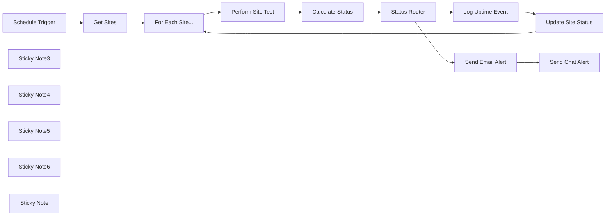

## Fluxo (.json) :

```json
{
  "meta": {
    "instanceId": "26ba763460b97c249b82942b23b6384876dfeb9327513332e743c5f6219c2b8e"
  },
  "nodes": [
    {
      "id": "acb0acd0-9bb6-4491-a1ca-4aa9a7820bbc",
      "name": "Schedule Trigger",
      "type": "n8n-nodes-base.scheduleTrigger",
      "position": [
        1440,
        420
      ],
      "parameters": {
        "rule": {
          "interval": [
            {
              "field": "hours",
              "hoursInterval": 6
            }
          ]
        }
      },
      "typeVersion": 1.2
    },
    {
      "id": "c6bb51c4-aec4-4a6d-ade2-1080bbbb6fb3",
      "name": "Calculate Status",
      "type": "n8n-nodes-base.set",
      "position": [
        2367,
        460
      ],
      "parameters": {
        "options": {},
        "assignments": {
          "assignments": [
            {
              "id": "b0cbcff5-bfcf-46a5-a386-65c4dd56c42f",
              "name": "date",
              "type": "string",
              "value": "={{ $json.headers.date }}"
            },
            {
              "id": "8c4155e4-bcc6-41dd-9582-346a57a7b997",
              "name": "Property",
              "type": "string",
              "value": "={{ $json.Property }}"
            },
            {
              "id": "f0320678-d352-486f-a633-9980c4fc73b2",
              "name": "UP_FROM_UP",
              "type": "boolean",
              "value": "={{ $json.statusCode < 400 && $json.Status === 'UP' }}"
            },
            {
              "id": "61783eb6-a683-44c9-aa0c-5fc5247da9fa",
              "name": "DOWN_FROM_DOWN",
              "type": "boolean",
              "value": "={{ $json.statusCode >= 400 && $json.Status === 'DOWN' }}"
            },
            {
              "id": "1052a69e-4456-445d-bdd9-2765b334cf64",
              "name": "UP_FROM_DOWN",
              "type": "boolean",
              "value": "={{ $json.statusCode < 400 && $json.Status === 'DOWN' }}"
            },
            {
              "id": "9af72278-5b29-406a-b4c5-f47f3d805063",
              "name": "DOWN_FROM_UP",
              "type": "boolean",
              "value": "={{ $json.statusCode >= 400 && $json.Status === 'UP' }}"
            }
          ]
        }
      },
      "typeVersion": 3.3
    },
    {
      "id": "50307dca-fa88-4a19-91a4-456866e529d4",
      "name": "Get Sites",
      "type": "n8n-nodes-base.googleSheets",
      "position": [
        1700,
        420
      ],
      "parameters": {
        "options": {},
        "sheetName": {
          "__rl": true,
          "mode": "list",
          "value": "gid=0",
          "cachedResultUrl": "https://docs.google.com/spreadsheets/d/1t2RT3lxyxXj3X1y6klWvyhEJEazpkT3Hpi2ttEJRVT4/edit#gid=0",
          "cachedResultName": "dashboard"
        },
        "documentId": {
          "__rl": true,
          "mode": "list",
          "value": "1t2RT3lxyxXj3X1y6klWvyhEJEazpkT3Hpi2ttEJRVT4",
          "cachedResultUrl": "https://docs.google.com/spreadsheets/d/1t2RT3lxyxXj3X1y6klWvyhEJEazpkT3Hpi2ttEJRVT4/edit?usp=drivesdk",
          "cachedResultName": "n8n uptime"
        }
      },
      "credentials": {
        "googleSheetsOAuth2Api": {
          "id": "XHvC7jIRR8A2TlUl",
          "name": "Google Sheets account"
        }
      },
      "typeVersion": 4.3
    },
    {
      "id": "4b0cb0cc-282b-4be9-a4ca-0c4eb10d896e",
      "name": "Send Chat Alert",
      "type": "n8n-nodes-base.slack",
      "position": [
        3100,
        340
      ],
      "parameters": {
        "text": "=From: n8n uptime\nDate: {{ $('Calculate Status').item.json[\"date\"] }}\n\n{{ $('Calculate Status').item.json.Property }} is {{ $('Calculate Status').item.json[\"DOWN_FROM_UP\"] ? 'DOWN' : 'UP' }}",
        "select": "channel",
        "channelId": {
          "__rl": true,
          "mode": "list",
          "value": "C06RS1WPUQ6",
          "cachedResultName": "general"
        },
        "otherOptions": {}
      },
      "credentials": {
        "slackApi": {
          "id": "VfK3js0YdqBdQLGP",
          "name": "Slack account"
        }
      },
      "typeVersion": 2.1
    },
    {
      "id": "ab303995-bd82-4aef-8fe1-ce808c4dbd33",
      "name": "Send Email Alert",
      "type": "n8n-nodes-base.gmail",
      "position": [
        2940,
        340
      ],
      "parameters": {
        "sendTo": "no-reply@example.com",
        "message": "=From: n8n uptime\nDate: {{ $('Calculate Status').item.json[\"date\"] }}\n\n{{ $('Calculate Status').item.json.Property }} is {{ $('Calculate Status').item.json[\"DOWN_FROM_UP\"] ? 'DOWN' : 'UP' }}",
        "options": {
          "senderName": "n8n uptime",
          "appendAttribution": false
        },
        "subject": "=n8n uptime: {{ $('Calculate Status').item.json.Property }} is {{ $('Calculate Status').item.json[\"DOWN_FROM_UP\"] ? 'DOWN' : 'UP' }}",
        "emailType": "text"
      },
      "credentials": {
        "gmailOAuth2": {
          "id": "Sf5Gfl9NiFTNXFWb",
          "name": "Gmail account"
        }
      },
      "typeVersion": 2.1
    },
    {
      "id": "63343e68-be07-4d89-8363-140299dcf0b6",
      "name": "Log Uptime Event",
      "type": "n8n-nodes-base.googleSheets",
      "position": [
        2940,
        520
      ],
      "parameters": {
        "columns": {
          "value": {
            "date": "={{ $json.date }}",
            "period": "={{ new Date($json.date).format(\"yyyy-MM\") }}"
          },
          "schema": [
            {
              "id": "period",
              "type": "string",
              "display": true,
              "removed": false,
              "required": false,
              "displayName": "period",
              "defaultMatch": false,
              "canBeUsedToMatch": true
            },
            {
              "id": "date",
              "type": "string",
              "display": true,
              "required": false,
              "displayName": "date",
              "defaultMatch": false,
              "canBeUsedToMatch": true
            },
            {
              "id": "Property",
              "type": "string",
              "display": true,
              "required": false,
              "displayName": "Property",
              "defaultMatch": false,
              "canBeUsedToMatch": true
            },
            {
              "id": "UP_FROM_UP",
              "type": "string",
              "display": true,
              "required": false,
              "displayName": "UP_FROM_UP",
              "defaultMatch": false,
              "canBeUsedToMatch": true
            },
            {
              "id": "DOWN_FROM_DOWN",
              "type": "string",
              "display": true,
              "required": false,
              "displayName": "DOWN_FROM_DOWN",
              "defaultMatch": false,
              "canBeUsedToMatch": true
            },
            {
              "id": "UP_FROM_DOWN",
              "type": "string",
              "display": true,
              "required": false,
              "displayName": "UP_FROM_DOWN",
              "defaultMatch": false,
              "canBeUsedToMatch": true
            },
            {
              "id": "DOWN_FROM_UP",
              "type": "string",
              "display": true,
              "required": false,
              "displayName": "DOWN_FROM_UP",
              "defaultMatch": false,
              "canBeUsedToMatch": true
            }
          ],
          "mappingMode": "defineBelow",
          "matchingColumns": []
        },
        "options": {},
        "operation": "append",
        "sheetName": {
          "__rl": true,
          "mode": "name",
          "value": "={{ $('Calculate Status').item.json.Property }}"
        },
        "documentId": {
          "__rl": true,
          "mode": "list",
          "value": "1t2RT3lxyxXj3X1y6klWvyhEJEazpkT3Hpi2ttEJRVT4",
          "cachedResultUrl": "https://docs.google.com/spreadsheets/d/1t2RT3lxyxXj3X1y6klWvyhEJEazpkT3Hpi2ttEJRVT4/edit?usp=drivesdk",
          "cachedResultName": "n8n uptime"
        }
      },
      "credentials": {
        "googleSheetsOAuth2Api": {
          "id": "XHvC7jIRR8A2TlUl",
          "name": "Google Sheets account"
        }
      },
      "typeVersion": 4.3
    },
    {
      "id": "fe97a18b-902c-4fab-bf73-69b5b9e41a11",
      "name": "Update Site Status",
      "type": "n8n-nodes-base.googleSheets",
      "position": [
        3100,
        520
      ],
      "parameters": {
        "columns": {
          "value": {
            "Status": "={{ $json[\"DOWN_FROM_UP\"] || $json[\"DOWN_FROM_DOWN\"] ? 'DOWN' : 'UP' }}",
            "Property": "={{ $json.Property }}"
          },
          "schema": [
            {
              "id": "Property",
              "type": "string",
              "display": true,
              "removed": false,
              "required": false,
              "displayName": "Property",
              "defaultMatch": false,
              "canBeUsedToMatch": true
            },
            {
              "id": "Status",
              "type": "string",
              "display": true,
              "required": false,
              "displayName": "Status",
              "defaultMatch": false,
              "canBeUsedToMatch": true
            }
          ],
          "mappingMode": "defineBelow",
          "matchingColumns": [
            "Property"
          ]
        },
        "options": {},
        "operation": "appendOrUpdate",
        "sheetName": {
          "__rl": true,
          "mode": "list",
          "value": "gid=0",
          "cachedResultUrl": "https://docs.google.com/spreadsheets/d/1t2RT3lxyxXj3X1y6klWvyhEJEazpkT3Hpi2ttEJRVT4/edit#gid=0",
          "cachedResultName": "dashboard"
        },
        "documentId": {
          "__rl": true,
          "mode": "list",
          "value": "1t2RT3lxyxXj3X1y6klWvyhEJEazpkT3Hpi2ttEJRVT4",
          "cachedResultUrl": "https://docs.google.com/spreadsheets/d/1t2RT3lxyxXj3X1y6klWvyhEJEazpkT3Hpi2ttEJRVT4/edit?usp=drivesdk",
          "cachedResultName": "n8n uptime"
        }
      },
      "credentials": {
        "googleSheetsOAuth2Api": {
          "id": "XHvC7jIRR8A2TlUl",
          "name": "Google Sheets account"
        }
      },
      "typeVersion": 4.3
    },
    {
      "id": "b37537d1-eedf-446e-a5ed-2ef7388fd7bc",
      "name": "Perform Site Test",
      "type": "n8n-nodes-base.httpRequest",
      "position": [
        2207,
        460
      ],
      "parameters": {
        "url": "={{ $json.Property }}",
        "options": {
          "response": {
            "response": {
              "neverError": true,
              "fullResponse": true
            }
          }
        },
        "sendHeaders": true,
        "headerParameters": {
          "parameters": [
            {}
          ]
        }
      },
      "typeVersion": 4.2
    },
    {
      "id": "22efcca8-81a8-4128-a03f-efd394e41977",
      "name": "For Each Site...",
      "type": "n8n-nodes-base.splitInBatches",
      "position": [
        2007,
        460
      ],
      "parameters": {
        "options": {}
      },
      "typeVersion": 3
    },
    {
      "id": "b74d0b2c-8b08-42fe-a78f-103d4ea3b60f",
      "name": "Sticky Note3",
      "type": "n8n-nodes-base.stickyNote",
      "position": [
        1375.3365733151754,
        160
      ],
      "parameters": {
        "color": 7,
        "width": 533.3167991131336,
        "height": 451.46281790887826,
        "content": "## 1. Setting a Schedule\n[Read more about Scheduling Workflows](https://docs.n8n.io/integrations/builtin/core-nodes/n8n-nodes-base.scheduletrigger/)\n\nSince we expect downtime to be a rare occurance, our monitor should only check infrequently during the day. We'll use a schedule trigger for this purpose.\n\nOnce the schdule activates, we'll pull a list of sites to check from our google sheet."
      },
      "typeVersion": 1
    },
    {
      "id": "6c570ff2-aa08-4458-b2da-7632d516c4e3",
      "name": "Sticky Note4",
      "type": "n8n-nodes-base.stickyNote",
      "position": [
        1940,
        247.83581204342858
      ],
      "parameters": {
        "color": 7,
        "width": 596.6620781418152,
        "height": 464.2968162619932,
        "content": "## 2. Perform Site Checks\n[Read more about using HTTP requests](https://docs.n8n.io/integrations/builtin/core-nodes/n8n-nodes-base.httprequest/)\n\nn8n makes it easy to communicate with external websites by offering a powerful HTTP request node which can handle GET and POST requests as well as pagination.\n\nHere, we're only interested in the status code of our requests."
      },
      "typeVersion": 1
    },
    {
      "id": "d1f67650-1409-43b1-b197-0e5a821d8b6f",
      "name": "Sticky Note5",
      "type": "n8n-nodes-base.stickyNote",
      "position": [
        2580,
        117.20168629145996
      ],
      "parameters": {
        "color": 7,
        "width": 720.3351531809235,
        "height": 600.2604061412927,
        "content": "## 3. Sending Alerts and Logging Results\n[Read more about using Switch for powerful control flow](https://docs.n8n.io/integrations/builtin/core-nodes/n8n-nodes-base.switch)\n\nThe switch node is powerful control flow tool that makes your workflows smart. Here, we're able to use Switch to trigger alert notifications whenever we have DOWN status or whenever we get a status change.\n\nWe store the event in our Sites Google Sheet and update the site's status which will be used to calculate our state on the next scheduled run."
      },
      "typeVersion": 1
    },
    {
      "id": "244291de-7ce1-48c9-9d7a-c04fc7d069ab",
      "name": "Status Router",
      "type": "n8n-nodes-base.switch",
      "position": [
        2640,
        520
      ],
      "parameters": {
        "rules": {
          "values": [
            {
              "outputKey": "UP_FROM_UP",
              "conditions": {
                "options": {
                  "leftValue": "",
                  "caseSensitive": true,
                  "typeValidation": "strict"
                },
                "combinator": "and",
                "conditions": [
                  {
                    "operator": {
                      "type": "boolean",
                      "operation": "true",
                      "singleValue": true
                    },
                    "leftValue": "={{ $json.UP_FROM_UP }}",
                    "rightValue": 200
                  }
                ]
              },
              "renameOutput": true
            },
            {
              "outputKey": "UP_FROM_DOWN",
              "conditions": {
                "options": {
                  "leftValue": "",
                  "caseSensitive": true,
                  "typeValidation": "strict"
                },
                "combinator": "and",
                "conditions": [
                  {
                    "id": "f50ae8d6-4359-4163-aedb-fddf100ad676",
                    "operator": {
                      "type": "boolean",
                      "operation": "true",
                      "singleValue": true
                    },
                    "leftValue": "={{ $json.UP_FROM_DOWN }}",
                    "rightValue": 200
                  }
                ]
              },
              "renameOutput": true
            },
            {
              "outputKey": "DOWN_FROM_DOWN",
              "conditions": {
                "options": {
                  "leftValue": "",
                  "caseSensitive": true,
                  "typeValidation": "strict"
                },
                "combinator": "and",
                "conditions": [
                  {
                    "id": "417e93d8-08b7-468d-a3bb-f0d395b3026a",
                    "operator": {
                      "type": "boolean",
                      "operation": "true",
                      "singleValue": true
                    },
                    "leftValue": "={{ $json.DOWN_FROM_DOWN }}",
                    "rightValue": ""
                  }
                ]
              },
              "renameOutput": true
            },
            {
              "outputKey": "DOWN_FROM_UP",
              "conditions": {
                "options": {
                  "leftValue": "",
                  "caseSensitive": true,
                  "typeValidation": "strict"
                },
                "combinator": "and",
                "conditions": [
                  {
                    "id": "7191e7cb-f2e1-4288-aa68-21f6efefafc5",
                    "operator": {
                      "type": "boolean",
                      "operation": "true",
                      "singleValue": true
                    },
                    "leftValue": "={{ $json.DOWN_FROM_UP }}",
                    "rightValue": ""
                  }
                ]
              },
              "renameOutput": true
            }
          ]
        },
        "options": {}
      },
      "typeVersion": 3
    },
    {
      "id": "a2a683fa-1fa5-4595-856a-de4f717eadf0",
      "name": "Sticky Note6",
      "type": "n8n-nodes-base.stickyNote",
      "position": [
        1063.07390978683,
        160
      ],
      "parameters": {
        "width": 276.590892958905,
        "height": 299.942498076894,
        "content": "## Try It Out!\n### Thie workflow showcases how you can build a simple website monitoring service using Scheduled Triggers and the HTTP Requests node. \n\n### Need Help?\nJoin the [Discord](https://discord.com/invite/XPKeKXeB7d) or ask in the [Forum](https://community.n8n.io/)!\n\nHappy Hacking!"
      },
      "typeVersion": 1
    },
    {
      "id": "704ce21f-6b96-4dc5-a27f-fca4b326efd1",
      "name": "Sticky Note",
      "type": "n8n-nodes-base.stickyNote",
      "position": [
        1620,
        380
      ],
      "parameters": {
        "width": 262.6069985025353,
        "height": 379.4991553144906,
        "content": "\n\n\n\n\n\n\n\n\n\n\n\n\n\n\n\n### 🚨Google Sheet Required!\nYou'll need the following columns:\n* **Property** - the website address to monitor\n* **Status** - either one of \"UP\" or \"DOWN\""
      },
      "typeVersion": 1
    }
  ],
  "pinData": {},
  "connections": {
    "Get Sites": {
      "main": [
        [
          {
            "node": "For Each Site...",
            "type": "main",
            "index": 0
          }
        ]
      ]
    },
    "Status Router": {
      "main": [
        [
          {
            "node": "Log Uptime Event",
            "type": "main",
            "index": 0
          }
        ],
        [
          {
            "node": "Send Email Alert",
            "type": "main",
            "index": 0
          },
          {
            "node": "Log Uptime Event",
            "type": "main",
            "index": 0
          }
        ],
        [
          {
            "node": "Log Uptime Event",
            "type": "main",
            "index": 0
          },
          {
            "node": "Send Email Alert",
            "type": "main",
            "index": 0
          }
        ],
        [
          {
            "node": "Send Email Alert",
            "type": "main",
            "index": 0
          },
          {
            "node": "Log Uptime Event",
            "type": "main",
            "index": 0
          }
        ]
      ]
    },
    "Calculate Status": {
      "main": [
        [
          {
            "node": "Status Router",
            "type": "main",
            "index": 0
          }
        ]
      ]
    },
    "For Each Site...": {
      "main": [
        null,
        [
          {
            "node": "Perform Site Test",
            "type": "main",
            "index": 0
          }
        ]
      ]
    },
    "Log Uptime Event": {
      "main": [
        [
          {
            "node": "Update Site Status",
            "type": "main",
            "index": 0
          }
        ]
      ]
    },
    "Schedule Trigger": {
      "main": [
        [
          {
            "node": "Get Sites",
            "type": "main",
            "index": 0
          }
        ]
      ]
    },
    "Send Email Alert": {
      "main": [
        [
          {
            "node": "Send Chat Alert",
            "type": "main",
            "index": 0
          }
        ]
      ]
    },
    "Perform Site Test": {
      "main": [
        [
          {
            "node": "Calculate Status",
            "type": "main",
            "index": 0
          }
        ]
      ]
    },
    "Update Site Status": {
      "main": [
        [
          {
            "node": "For Each Site...",
            "type": "main",
            "index": 0
          }
        ]
      ]
    }
  }
}
```

<a id="template-1013"></a>

## Template 1013 - Extrair e resumir dados do Glassdoor

- **Nome:** Extrair e resumir dados do Glassdoor
- **Descrição:** Fluxo que aciona um raspador para coletar dados de uma página do Glassdoor, aguarda a conclusão do snapshot, processa o conteúdo e gera um resumo com um modelo de linguagem, enviando o resultado para um endpoint de notificação.
- **Funcionalidade:** • Gatilho manual: Inicia o processo on-demand para uma URL alvo.
• Disparo do raspador: Envia request à API do Bright Data para iniciar a captura da página do Glassdoor.
• Armazenamento do snapshot_id: Captura e guarda o identificador do snapshot retornado pela API.
• Verificação periódica do status: Consulta a API de progresso do Bright Data para checar se o snapshot ficou pronto.
• Espera programada: Introduz pausas (30 segundos) enquanto o snapshot não está pronto.
• Download do snapshot: Baixa o conteúdo final em formato JSON quando pronto.
• Quebra de texto em partes: Divide o conteúdo em chunks para processamento eficiente.
• Carregamento de documentos e sumarização: Alimenta o conteúdo ao modelo de linguagem para gerar um resumo coerente.
• Notificação do resultado: Envia o resumo gerado para um webhook externo.
- **Ferramentas:** • Bright Data (Datasets API): Serviço de raspagem/coleção de páginas web usado para disparar e recuperar snapshots do site alvo.
• Glassdoor: Site fonte dos dados que será raspado para extração de informações sobre a empresa.
• Google Gemini (PaLM): Modelo de linguagem usado para processar e resumir o conteúdo coletado.
• Webhook.site: Endpoint de recepção usado para receber/registrar a notificação com o resumo final.

## Fluxo visual

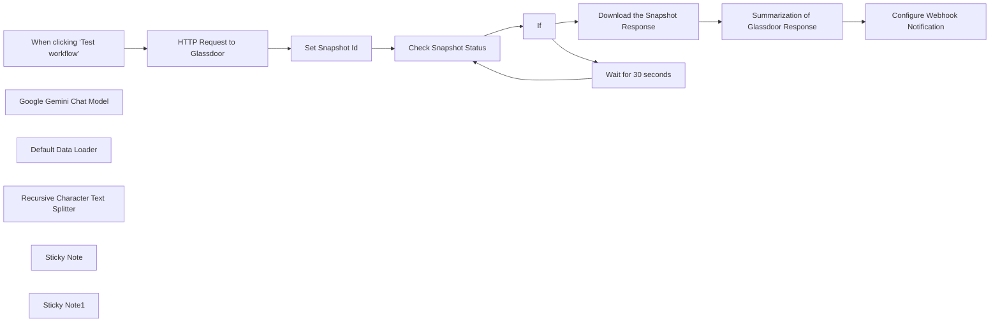

## Fluxo (.json) :

```json
{
  "id": "DRjTkkZrfqMbhifO",
  "meta": {
    "instanceId": "885b4fb4a6a9c2cb5621429a7b972df0d05bb724c20ac7dac7171b62f1c7ef40",
    "templateCredsSetupCompleted": true
  },
  "name": "Summarize Glassdoor Company Info with Google Gemini and Bright Data Web Scraper",
  "tags": [
    {
      "id": "ddPkw7Hg5dZhQu2w",
      "name": "AI",
      "createdAt": "2025-04-13T05:38:08.053Z",
      "updatedAt": "2025-04-13T05:38:08.053Z"
    },
    {
      "id": "rKOa98eAi3IETrLu",
      "name": "HR",
      "createdAt": "2025-04-13T04:59:30.580Z",
      "updatedAt": "2025-04-13T04:59:30.580Z"
    }
  ],
  "nodes": [
    {
      "id": "b2f9fc15-9ccb-48be-ba3c-3a6033c39246",
      "name": "When clicking ‘Test workflow’",
      "type": "n8n-nodes-base.manualTrigger",
      "position": [
        0,
        0
      ],
      "parameters": {},
      "typeVersion": 1
    },
    {
      "id": "72ab6042-72f1-486e-9095-d17de2f441f4",
      "name": "Google Gemini Chat Model",
      "type": "@n8n/n8n-nodes-langchain.lmChatGoogleGemini",
      "notes": "Gemini Experimental Model",
      "position": [
        1320,
        -180
      ],
      "parameters": {
        "options": {},
        "modelName": "models/gemini-2.0-flash-thinking-exp-01-21"
      },
      "credentials": {
        "googlePalmApi": {
          "id": "YeO7dHZnuGBVQKVZ",
          "name": "Google Gemini(PaLM) Api account"
        }
      },
      "notesInFlow": true,
      "typeVersion": 1
    },
    {
      "id": "58ac3287-2b92-4f09-85a3-9d5393dd9d2a",
      "name": "Default Data Loader",
      "type": "@n8n/n8n-nodes-langchain.documentDefaultDataLoader",
      "position": [
        1440,
        -177.5
      ],
      "parameters": {
        "options": {}
      },
      "typeVersion": 1
    },
    {
      "id": "ad734713-959c-4e09-ac19-4df6b102678e",
      "name": "Recursive Character Text Splitter",
      "type": "@n8n/n8n-nodes-langchain.textSplitterRecursiveCharacterTextSplitter",
      "position": [
        1528,
        20
      ],
      "parameters": {
        "options": {},
        "chunkOverlap": 100
      },
      "typeVersion": 1
    },
    {
      "id": "350d4391-4ac2-469e-87ce-e3b84926f350",
      "name": "If",
      "type": "n8n-nodes-base.if",
      "position": [
        880,
        -350
      ],
      "parameters": {
        "options": {},
        "conditions": {
          "options": {
            "version": 2,
            "leftValue": "",
            "caseSensitive": true,
            "typeValidation": "strict"
          },
          "combinator": "and",
          "conditions": [
            {
              "id": "6a7e5360-4cb5-4806-892e-5c85037fa71c",
              "operator": {
                "type": "string",
                "operation": "equals"
              },
              "leftValue": "={{ $json.status }}",
              "rightValue": "ready"
            }
          ]
        }
      },
      "typeVersion": 2.2
    },
    {
      "id": "43449263-a73e-4d49-8c0f-3d36569e1d65",
      "name": "Set Snapshot Id",
      "type": "n8n-nodes-base.set",
      "position": [
        440,
        -275
      ],
      "parameters": {
        "options": {},
        "assignments": {
          "assignments": [
            {
              "id": "2c3369c6-9206-45d7-9349-f577baeaf189",
              "name": "snapshot_id",
              "type": "string",
              "value": "={{ $json.snapshot_id }}"
            }
          ]
        }
      },
      "typeVersion": 3.4
    },
    {
      "id": "040aae51-d79d-408c-9d03-b6b81ed9e752",
      "name": "Sticky Note",
      "type": "n8n-nodes-base.stickyNote",
      "position": [
        -40,
        -580
      ],
      "parameters": {
        "width": 400,
        "height": 200,
        "content": "## Note\n\nDeals with the Glassdoor data extraction by using the Bright Data Web Scrapper API.\n\nThe summarization chain is being used to demonstrate the usage of the N8N AI capabilities."
      },
      "typeVersion": 1
    },
    {
      "id": "885986ae-e9e6-48fe-816c-e8fd6f549158",
      "name": "Sticky Note1",
      "type": "n8n-nodes-base.stickyNote",
      "position": [
        480,
        -580
      ],
      "parameters": {
        "width": 420,
        "height": 200,
        "content": "## LLM Usages\n\nGoogle Gemini Flash Exp model is being used.\n\nSummarization Chain is being used for summarization of the content"
      },
      "typeVersion": 1
    },
    {
      "id": "165e3335-cc5e-49d1-9eb5-7f196c5669aa",
      "name": "Check Snapshot Status",
      "type": "n8n-nodes-base.httpRequest",
      "position": [
        660,
        -280
      ],
      "parameters": {
        "url": "=https://api.brightdata.com/datasets/v3/progress/{{ $json.snapshot_id }}",
        "options": {},
        "sendHeaders": true,
        "authentication": "genericCredentialType",
        "genericAuthType": "httpHeaderAuth",
        "headerParameters": {
          "parameters": [
            {}
          ]
        }
      },
      "credentials": {
        "httpHeaderAuth": {
          "id": "kdbqXuxIR8qIxF7y",
          "name": "Header Auth account"
        }
      },
      "typeVersion": 4.2
    },
    {
      "id": "b0125317-c557-4c38-b9b8-97528a75acb1",
      "name": "Download the Snapshot Response",
      "type": "n8n-nodes-base.httpRequest",
      "position": [
        1100,
        -400
      ],
      "parameters": {
        "url": "=https://api.brightdata.com/datasets/v3/snapshot/{{ $('HTTP Request to Glassdoor').item.json.snapshot_id }}",
        "options": {
          "timeout": 10000
        },
        "sendQuery": true,
        "authentication": "genericCredentialType",
        "genericAuthType": "httpHeaderAuth",
        "queryParameters": {
          "parameters": [
            {
              "name": "format",
              "value": "json"
            }
          ]
        }
      },
      "credentials": {
        "httpHeaderAuth": {
          "id": "kdbqXuxIR8qIxF7y",
          "name": "Header Auth account"
        }
      },
      "typeVersion": 4.2
    },
    {
      "id": "ec6a6d52-0e67-4100-9b7a-966029628d8e",
      "name": "Wait for 30 seconds",
      "type": "n8n-nodes-base.wait",
      "position": [
        1100,
        -175
      ],
      "webhookId": "8f2ad619-abe4-4e4e-8de7-9046d4cf3082",
      "parameters": {
        "amount": 30
      },
      "typeVersion": 1.1
    },
    {
      "id": "0d77c2a9-b820-4943-a215-3f3663842b92",
      "name": "Summarization of Glassdoor Response",
      "type": "@n8n/n8n-nodes-langchain.chainSummarization",
      "position": [
        1336,
        -400
      ],
      "parameters": {
        "options": {},
        "operationMode": "documentLoader"
      },
      "typeVersion": 2
    },
    {
      "id": "f3753c8f-bd1d-454a-b77e-b2237030219d",
      "name": "Configure Webhook Notification",
      "type": "n8n-nodes-base.httpRequest",
      "position": [
        1720,
        -400
      ],
      "parameters": {
        "url": "https://webhook.site/ce41e056-c097-48c8-a096-9b876d3abbf7",
        "options": {},
        "sendBody": true,
        "bodyParameters": {
          "parameters": [
            {
              "name": "summary",
              "value": "={{ $json.response.text }}"
            }
          ]
        }
      },
      "typeVersion": 4.2
    },
    {
      "id": "d5cfc596-c2b8-486f-b410-8d537fca1cf6",
      "name": "HTTP Request to Glassdoor",
      "type": "n8n-nodes-base.httpRequest",
      "position": [
        220,
        0
      ],
      "parameters": {
        "url": "https://api.brightdata.com/datasets/v3/trigger",
        "method": "POST",
        "options": {},
        "jsonBody": "[\n  {\n    \"url\": \"https://www.glassdoor.co.uk/Overview/Working-at-Apple-EI_IE1138.11,16.htm\"\n  }\n]",
        "sendBody": true,
        "sendQuery": true,
        "sendHeaders": true,
        "specifyBody": "json",
        "authentication": "genericCredentialType",
        "genericAuthType": "httpHeaderAuth",
        "queryParameters": {
          "parameters": [
            {
              "name": "dataset_id",
              "value": "gd_l7j0bx501ockwldaqf"
            },
            {
              "name": "include_errors",
              "value": "true"
            }
          ]
        },
        "headerParameters": {
          "parameters": [
            {}
          ]
        }
      },
      "credentials": {
        "httpHeaderAuth": {
          "id": "kdbqXuxIR8qIxF7y",
          "name": "Header Auth account"
        }
      },
      "typeVersion": 4.2
    }
  ],
  "active": false,
  "pinData": {},
  "settings": {
    "executionOrder": "v1"
  },
  "versionId": "50a2d845-ec43-4b97-8425-36105a8a8178",
  "connections": {
    "If": {
      "main": [
        [
          {
            "node": "Download the Snapshot Response",
            "type": "main",
            "index": 0
          }
        ],
        [
          {
            "node": "Wait for 30 seconds",
            "type": "main",
            "index": 0
          }
        ]
      ]
    },
    "Set Snapshot Id": {
      "main": [
        [
          {
            "node": "Check Snapshot Status",
            "type": "main",
            "index": 0
          }
        ]
      ]
    },
    "Default Data Loader": {
      "ai_document": [
        [
          {
            "node": "Summarization of Glassdoor Response",
            "type": "ai_document",
            "index": 0
          }
        ]
      ]
    },
    "Wait for 30 seconds": {
      "main": [
        [
          {
            "node": "Check Snapshot Status",
            "type": "main",
            "index": 0
          }
        ]
      ]
    },
    "Check Snapshot Status": {
      "main": [
        [
          {
            "node": "If",
            "type": "main",
            "index": 0
          }
        ]
      ]
    },
    "Google Gemini Chat Model": {
      "ai_languageModel": [
        [
          {
            "node": "Summarization of Glassdoor Response",
            "type": "ai_languageModel",
            "index": 0
          }
        ]
      ]
    },
    "HTTP Request to Glassdoor": {
      "main": [
        [
          {
            "node": "Set Snapshot Id",
            "type": "main",
            "index": 0
          }
        ]
      ]
    },
    "Download the Snapshot Response": {
      "main": [
        [
          {
            "node": "Summarization of Glassdoor Response",
            "type": "main",
            "index": 0
          }
        ]
      ]
    },
    "Recursive Character Text Splitter": {
      "ai_textSplitter": [
        [
          {
            "node": "Default Data Loader",
            "type": "ai_textSplitter",
            "index": 0
          }
        ]
      ]
    },
    "When clicking ‘Test workflow’": {
      "main": [
        [
          {
            "node": "HTTP Request to Glassdoor",
            "type": "main",
            "index": 0
          }
        ]
      ]
    },
    "Summarization of Glassdoor Response": {
      "main": [
        [
          {
            "node": "Configure Webhook Notification",
            "type": "main",
            "index": 0
          }
        ]
      ]
    }
  }
}
```

<a id="template-1014"></a>

## Template 1014 - RAG — Chunking com contexto e indexação em Pinecone

- **Nome:** RAG — Chunking com contexto e indexação em Pinecone
- **Descrição:** Fluxo que extrai um documento do Google Drive, divide-o em seções, gera contexto sucinto por seção usando um modelo conversacional, transforma texto em embeddings e armazena vetores em um índice Pinecone.
- **Funcionalidade:** • Download e extração de texto: Obtém um documento do Google Drive e converte para texto simples.
• Divisão em seções: Separa o texto em blocos usando um separador definido para criar seções independentes.
• Processamento em lote: Itera sobre cada seção para processamento individual.
• Geração de contexto conciso: Usa um modelo de linguagem conversacional para produzir um contexto curto que situe cada seção dentro do documento.
• Concatenação de contexto e seção: Combina o contexto gerado com o conteúdo da seção para melhorar a qualidade semântica do fragmento.
• Criação de embeddings: Converte cada chunk (contexto + seção) em vetores usando um modelo de embeddings.
• Indexação de vetores: Insere os vetores gerados em um índice de banco vetorial para permitir recuperação baseada em similaridade.
- **Ferramentas:** • Google Drive: Armazenamento e fonte do documento, com conversão para texto.
• Google Gemini (PaLM) Embeddings: Serviço de geração de embeddings (models/text-embedding-004) para transformar texto em vetores.
• OpenRouter: Plataforma de acesso a modelo conversacional usada para gerar o contexto sucinto das seções.
• Pinecone: Banco de dados vetorial onde os embeddings são indexados e armazenados para recuperação semântica.

## Fluxo visual

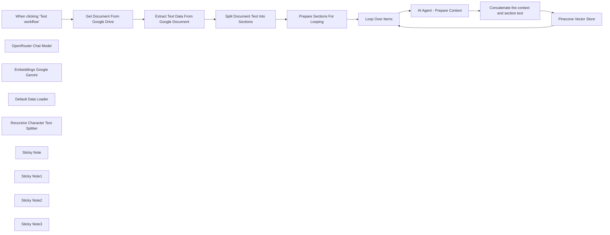

## Fluxo (.json) :

```json
{
  "id": "VY4WBXuNDPxmOO5e",
  "meta": {
    "instanceId": "d16fb7d4b3eb9b9d4ad2ee6a7fbae593d73e9715e51f583c2a0e9acd1781c08e",
    "templateCredsSetupCompleted": true
  },
  "name": "RAG:Context-Aware Chunking | Google Drive to Pinecone via OpenRouter & Gemini",
  "tags": [
    {
      "id": "XZIQK6NdzGvgbZFd",
      "name": "Sell",
      "createdAt": "2025-01-15T12:28:48.424Z",
      "updatedAt": "2025-01-15T12:28:48.424Z"
    }
  ],
  "nodes": [
    {
      "id": "7abbfa6e-4b17-4656-9b82-377b1bacf539",
      "name": "When clicking ‘Test workflow’",
      "type": "n8n-nodes-base.manualTrigger",
      "position": [
        0,
        0
      ],
      "parameters": {},
      "typeVersion": 1
    },
    {
      "id": "448ec137-bf64-46b4-bf15-c7a040faa306",
      "name": "Loop Over Items",
      "type": "n8n-nodes-base.splitInBatches",
      "position": [
        1100,
        0
      ],
      "parameters": {
        "options": {}
      },
      "typeVersion": 3
    },
    {
      "id": "f22557ee-7f37-40cd-9063-a9a759274663",
      "name": "OpenRouter Chat Model",
      "type": "@n8n/n8n-nodes-langchain.lmChatOpenRouter",
      "position": [
        20,
        440
      ],
      "parameters": {
        "options": {}
      },
      "credentials": {
        "openRouterApi": {
          "id": "ddH6iNlm09UxrXvu",
          "name": "Auto: OpenRouter"
        }
      },
      "typeVersion": 1
    },
    {
      "id": "57e8792e-25ae-43d5-b4e9-e87642365ee9",
      "name": "Pinecone Vector Store",
      "type": "@n8n/n8n-nodes-langchain.vectorStorePinecone",
      "position": [
        780,
        360
      ],
      "parameters": {
        "mode": "insert",
        "options": {},
        "pineconeIndex": {
          "__rl": true,
          "mode": "list",
          "value": "context-rag-test",
          "cachedResultName": "context-rag-test"
        }
      },
      "credentials": {
        "pineconeApi": {
          "id": "R3QGXSEIRTEAZttK",
          "name": "Auto: PineconeApi"
        }
      },
      "typeVersion": 1
    },
    {
      "id": "0a8c2426-0aaf-424a-b246-336a9034aba8",
      "name": "Embeddings Google Gemini",
      "type": "@n8n/n8n-nodes-langchain.embeddingsGoogleGemini",
      "position": [
        720,
        540
      ],
      "parameters": {
        "modelName": "models/text-embedding-004"
      },
      "credentials": {
        "googlePalmApi": {
          "id": "9idxGZRZ3BAKDoxq",
          "name": "Google Gemini(PaLM) Api account"
        }
      },
      "typeVersion": 1
    },
    {
      "id": "edc587bd-494d-43e8-b6d6-26adab7af3dc",
      "name": "Default Data Loader",
      "type": "@n8n/n8n-nodes-langchain.documentDefaultDataLoader",
      "position": [
        920,
        540
      ],
      "parameters": {
        "options": {}
      },
      "typeVersion": 1
    },
    {
      "id": "a82d4e0b-248e-426d-9ef3-f25e7078ceb3",
      "name": "Recursive Character Text Splitter",
      "type": "@n8n/n8n-nodes-langchain.textSplitterRecursiveCharacterTextSplitter",
      "position": [
        840,
        680
      ],
      "parameters": {
        "options": {},
        "chunkSize": 100000
      },
      "typeVersion": 1
    },
    {
      "id": "8571b92f-5587-454f-9700-ea04ca35311b",
      "name": "Get Document From Google Drive",
      "type": "n8n-nodes-base.googleDrive",
      "position": [
        220,
        0
      ],
      "parameters": {
        "fileId": {
          "__rl": true,
          "mode": "list",
          "value": "1gm0jxFTLuiWB5u4esEjzoCPImrVqu0AEMIKBIesTf9M",
          "cachedResultUrl": "https://docs.google.com/document/d/1gm0jxFTLuiWB5u4esEjzoCPImrVqu0AEMIKBIesTf9M/edit?usp=drivesdk",
          "cachedResultName": "Udit Rawat - Details"
        },
        "options": {
          "googleFileConversion": {
            "conversion": {
              "docsToFormat": "text/plain"
            }
          }
        },
        "operation": "download"
      },
      "credentials": {
        "googleDriveOAuth2Api": {
          "id": "SsiQguNA8w3Wwv4w",
          "name": "Auto: Google Drive"
        }
      },
      "typeVersion": 3
    },
    {
      "id": "2bed3d0f-3d65-4394-87f1-e73320a43a4a",
      "name": "Extract Text Data From Google Document",
      "type": "n8n-nodes-base.extractFromFile",
      "position": [
        440,
        0
      ],
      "parameters": {
        "options": {},
        "operation": "text"
      },
      "typeVersion": 1
    },
    {
      "id": "837fa691-6c66-434b-ba82-d1cad9aecdf7",
      "name": "Split Document Text Into Sections",
      "type": "n8n-nodes-base.code",
      "position": [
        660,
        0
      ],
      "parameters": {
        "jsCode": "let split_text = \"—---------------------------—-------------[SECTIONEND]—---------------------------—-------------\";\nfor (const item of $input.all()) {\n item.json.section = item.json.data.split(split_text);\n item.json.document = JSON.stringify(item.json.section)\n}\nreturn $input.all();"
      },
      "typeVersion": 2
    },
    {
      "id": "cc801e7e-e01b-421a-9211-08322ef8a0b2",
      "name": "Prepare Sections For Looping",
      "type": "n8n-nodes-base.splitOut",
      "position": [
        880,
        0
      ],
      "parameters": {
        "options": {},
        "fieldToSplitOut": "section"
      },
      "typeVersion": 1
    },
    {
      "id": "658cb8df-92e3-4b25-8f37-e5f959d913dc",
      "name": "Sticky Note",
      "type": "n8n-nodes-base.stickyNote",
      "position": [
        -40,
        -100
      ],
      "parameters": {
        "width": 1300,
        "height": 280,
        "content": "## Prepare Document. \nThis section is responsible for downloading the file from Google Drive, splitting the text into sections by detecting separators, and preparing them for looping."
      },
      "typeVersion": 1
    },
    {
      "id": "82ee9194-484a-46db-b75c-bec34201c7e2",
      "name": "Sticky Note1",
      "type": "n8n-nodes-base.stickyNote",
      "position": [
        -220,
        220
      ],
      "parameters": {
        "width": 780,
        "height": 360,
        "content": "## Prepare context\nIn this section, the \nagent node will prepare \ncontext for a section \n(chunk of text), which \nwill then be passed for \nconversion into a vectors \nalong with the section itself."
      },
      "typeVersion": 1
    },
    {
      "id": "2f6950df-ead1-479a-aa51-7768121a4eb2",
      "name": "AI Agent - Prepare Context",
      "type": "@n8n/n8n-nodes-langchain.agent",
      "position": [
        40,
        260
      ],
      "parameters": {
        "text": "=<document> \n{{ $('Split Document Text Into Sections').item.json.document }}\n</document> \nHere is the chunk we want to situate within the whole document \n<chunk> \n{{ $json.section }}\n</chunk> \nPlease give a short succinct context to situate this chunk within the overall document for the purposes of improving search retrieval of the chunk. Answer only with the succinct context and nothing else. ",
        "agent": "conversationalAgent",
        "options": {},
        "promptType": "define"
      },
      "typeVersion": 1.7
    },
    {
      "id": "34a465fc-a505-445a-9211-bcd830381354",
      "name": "Concatenate the context and section text",
      "type": "n8n-nodes-base.set",
      "position": [
        400,
        260
      ],
      "parameters": {
        "options": {},
        "assignments": {
          "assignments": [
            {
              "id": "e5fb0381-5d23-46e2-a0d1-438240b80a3e",
              "name": "=section_chunk",
              "type": "string",
              "value": "={{ $json.output }}. {{ $('Loop Over Items').item.json.section }}"
            }
          ]
        }
      },
      "typeVersion": 3.4
    },
    {
      "id": "4a7a788c-8e5b-453c-ae52-a4522048992d",
      "name": "Sticky Note2",
      "type": "n8n-nodes-base.stickyNote",
      "position": [
        640,
        220
      ],
      "parameters": {
        "width": 580,
        "height": 600,
        "content": "## Convert Text To Vectors\nIn this step, the Pinecone node converts the provided text into vectors using Google Gemini and stores them in the Pinecone vector database."
      },
      "typeVersion": 1
    },
    {
      "id": "45798b49-fc78-417c-a752-4dd1a8882cd7",
      "name": "Sticky Note3",
      "type": "n8n-nodes-base.stickyNote",
      "position": [
        -460,
        -120
      ],
      "parameters": {
        "width": 400,
        "height": 300,
        "content": "## Video Demo\n[](https://www.youtube.com/watch?v=qBeWP65I4hg)"
      },
      "typeVersion": 1
    }
  ],
  "active": false,
  "pinData": {},
  "settings": {
    "executionOrder": "v1"
  },
  "versionId": "4f0e2203-5850-4a32-b1dd-5adc57fa43ff",
  "connections": {
    "Loop Over Items": {
      "main": [
        [],
        [
          {
            "node": "AI Agent - Prepare Context",
            "type": "main",
            "index": 0
          }
        ]
      ]
    },
    "Default Data Loader": {
      "ai_document": [
        [
          {
            "node": "Pinecone Vector Store",
            "type": "ai_document",
            "index": 0
          }
        ]
      ]
    },
    "OpenRouter Chat Model": {
      "ai_languageModel": [
        [
          {
            "node": "AI Agent - Prepare Context",
            "type": "ai_languageModel",
            "index": 0
          }
        ]
      ]
    },
    "Pinecone Vector Store": {
      "main": [
        [
          {
            "node": "Loop Over Items",
            "type": "main",
            "index": 0
          }
        ]
      ]
    },
    "Embeddings Google Gemini": {
      "ai_embedding": [
        [
          {
            "node": "Pinecone Vector Store",
            "type": "ai_embedding",
            "index": 0
          }
        ]
      ]
    },
    "AI Agent - Prepare Context": {
      "main": [
        [
          {
            "node": "Concatenate the context and section text",
            "type": "main",
            "index": 0
          }
        ]
      ]
    },
    "Prepare Sections For Looping": {
      "main": [
        [
          {
            "node": "Loop Over Items",
            "type": "main",
            "index": 0
          }
        ]
      ]
    },
    "Get Document From Google Drive": {
      "main": [
        [
          {
            "node": "Extract Text Data From Google Document",
            "type": "main",
            "index": 0
          }
        ]
      ]
    },
    "Recursive Character Text Splitter": {
      "ai_textSplitter": [
        [
          {
            "node": "Default Data Loader",
            "type": "ai_textSplitter",
            "index": 0
          }
        ]
      ]
    },
    "Split Document Text Into Sections": {
      "main": [
        [
          {
            "node": "Prepare Sections For Looping",
            "type": "main",
            "index": 0
          }
        ]
      ]
    },
    "When clicking ‘Test workflow’": {
      "main": [
        [
          {
            "node": "Get Document From Google Drive",
            "type": "main",
            "index": 0
          }
        ]
      ]
    },
    "Extract Text Data From Google Document": {
      "main": [
        [
          {
            "node": "Split Document Text Into Sections",
            "type": "main",
            "index": 0
          }
        ]
      ]
    },
    "Concatenate the context and section text": {
      "main": [
        [
          {
            "node": "Pinecone Vector Store",
            "type": "main",
            "index": 0
          }
        ]
      ]
    }
  }
}
```

<a id="template-1015"></a>

## Template 1015 - Sincronização de contatos Entra para usuários Zammad

- **Nome:** Sincronização de contatos Entra para usuários Zammad
- **Descrição:** Sincroniza contatos do Entra (Microsoft Graph) com usuários no Zammad, mantendo dados de contato atualizados, criando novos usuários e desativando os removidos.
- **Funcionalidade:** • Importar contatos do Entra: Obtém a lista de contatos via Microsoft Graph.
• Normalização de dados: Converte cada contato em um objeto de usuário universal (email, firstname, lastname, phone, mobile, entra_key).
• Leitura dos usuários existentes no Zammad: Recupera todos os usuários do sistema para comparação.
• Comparação por email e chave Entra: Identifica correspondências, novos contatos e contatos removidos.
• Atualizar usuários existentes: Atualiza nome, telefones e campos personalizados (entra_key, entra_object_type) dos usuários encontrados.
• Criar novos usuários no Zammad: Cria usuários quando o contato do Entra não tem correspondência no Zammad, populando email, nome, telefones e campos personalizados.
• Desativar usuários removidos: Marca como inativos os usuários no Zammad que possuem entra_key mas não existem mais nos contatos do Entra.
• Aplicação de filtros opcionais: Permite filtrar quais contatos devem ser processados antes da sincronização.
- **Ferramentas:** • Microsoft Entra / Microsoft Graph API: Fonte de contatos (contatos organizacionais) e autenticação via OAuth2.
• Zammad: Sistema de tickets e gestão de usuários onde os contatos são criados, atualizados ou desativados.


## Fluxo visual

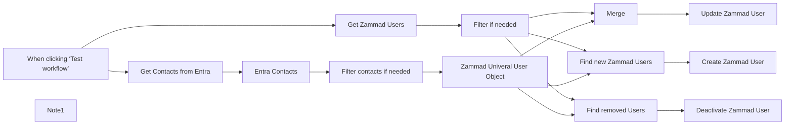

## Fluxo (.json) :

```json
{
  "id": "ikxQzs58WxtUjbuE",
  "meta": {
    "instanceId": "494d0146a0f47676ad70a44a32086b466621f62da855e3eaf0ee51dee1f76753",
    "templateCredsSetupCompleted": true
  },
  "name": "Entra Contacts to Zammad User Sync",
  "tags": [],
  "nodes": [
    {
      "id": "5cf615cd-d555-4efa-bde4-5e1e2bda0c71",
      "name": "When clicking ‘Test workflow’",
      "type": "n8n-nodes-base.manualTrigger",
      "position": [
        -2120,
        160
      ],
      "parameters": {},
      "typeVersion": 1
    },
    {
      "id": "334e380c-ce6b-48c6-be2a-e688cd52ef14",
      "name": "Note1",
      "type": "n8n-nodes-base.stickyNote",
      "position": [
        -1700,
        380
      ],
      "parameters": {
        "width": 1635.910561370123,
        "height": 329.7269624573379,
        "content": "## Select Entra Contacts that should be synced to Zammad\n\n\n\n"
      },
      "typeVersion": 1
    },
    {
      "id": "39b9ace7-97ba-4202-9c7a-752f67c6a60b",
      "name": "Zammad Univeral User Object",
      "type": "n8n-nodes-base.set",
      "position": [
        -500,
        500
      ],
      "parameters": {
        "values": {
          "number": [
            {
              "name": "entra_key",
              "value": "={{ $json.id }}"
            }
          ],
          "string": [
            {
              "name": "email",
              "value": "={{ $json.mail }}"
            },
            {
              "name": "lastname",
              "value": "={{ $json.surname }}"
            },
            {
              "name": "firstname",
              "value": "={{ $json.givenName }}"
            },
            {
              "name": "mobile",
              "value": "={{ $json.phones[1].number }}"
            },
            {
              "name": "phone",
              "value": "={{ $json.phones[2].number }}"
            }
          ]
        },
        "options": {},
        "keepOnlySet": true
      },
      "typeVersion": 1
    },
    {
      "id": "df5b4173-e1bd-49ce-9827-1b51a5e98da0",
      "name": "Get Zammad Users",
      "type": "n8n-nodes-base.zammad",
      "position": [
        -1000,
        160
      ],
      "parameters": {
        "filters": {},
        "operation": "getAll",
        "returnAll": true
      },
      "credentials": {
        "zammadTokenAuthApi": {
          "id": "fj5GuzcJuNLQeMxz",
          "name": "Zammad Token Auth account"
        }
      },
      "typeVersion": 1
    },
    {
      "id": "7f1d3b74-48dd-4245-9f17-286bcc552047",
      "name": "Merge",
      "type": "n8n-nodes-base.merge",
      "position": [
        200,
        180
      ],
      "parameters": {
        "mode": "combine",
        "options": {},
        "fieldsToMatchString": "email"
      },
      "typeVersion": 3
    },
    {
      "id": "c98c849e-8b0c-45b0-9b05-6b648bf9329c",
      "name": "Find new Zammad Users",
      "type": "n8n-nodes-base.compareDatasets",
      "position": [
        200,
        460
      ],
      "parameters": {
        "options": {},
        "mergeByFields": {
          "values": [
            {
              "field1": "email",
              "field2": "email"
            }
          ]
        }
      },
      "typeVersion": 2.3
    },
    {
      "id": "079437ca-a379-48ba-a4e5-52b87454adba",
      "name": "Update Zammad User",
      "type": "n8n-nodes-base.zammad",
      "position": [
        560,
        180
      ],
      "parameters": {
        "id": "={{ $json.id }}",
        "operation": "update",
        "updateFields": {
          "phone": "={{ $json.phone }}",
          "mobile": "={{ $json.mobile }}",
          "lastname": "={{ $json.lastname }}",
          "firstname": "={{ $json.firstname }}",
          "customFieldsUi": {
            "customFieldPairs": [
              {
                "name": "entra_key",
                "value": "={{ $json.entra_key }}"
              },
              {
                "name": "entra_object_type",
                "value": "contact"
              }
            ]
          }
        }
      },
      "credentials": {
        "zammadTokenAuthApi": {
          "id": "fj5GuzcJuNLQeMxz",
          "name": "Zammad Token Auth account"
        }
      },
      "typeVersion": 1
    },
    {
      "id": "34140616-c9c2-4899-a6a8-dc6e89a87c5c",
      "name": "Create Zammad User",
      "type": "n8n-nodes-base.zammad",
      "position": [
        580,
        480
      ],
      "parameters": {
        "lastname": "={{ $json.lastname }}",
        "firstname": "={{ $json.firstname }}",
        "additionalFields": {
          "email": "={{ $json.email }}",
          "phone": "={{ $json.phone }}",
          "mobile": "={{ $json.mobile }}",
          "customFieldsUi": {
            "customFieldPairs": [
              {
                "name": "entra_key",
                "value": "={{ $json.entra_key }}"
              },
              {
                "name": "entra_object_type",
                "value": "contact"
              }
            ]
          }
        }
      },
      "credentials": {
        "zammadTokenAuthApi": {
          "id": "fj5GuzcJuNLQeMxz",
          "name": "Zammad Token Auth account"
        }
      },
      "typeVersion": 1
    },
    {
      "id": "6c8ef4d9-7bb2-4090-a0cf-411269f766aa",
      "name": "Deactivate Zammad User",
      "type": "n8n-nodes-base.zammad",
      "position": [
        600,
        860
      ],
      "parameters": {
        "id": "={{ $json.id }}",
        "operation": "update",
        "updateFields": {
          "phone": "={{ $json.phone }}",
          "active": false,
          "mobile": "={{ $json.mobile }}",
          "lastname": "={{ $json.lastname }}",
          "firstname": "={{ $json.firstname }}",
          "customFieldsUi": {
            "customFieldPairs": [
              {
                "name": "entra_key",
                "value": "={{ $json.entra_key }}"
              },
              {
                "name": "entra_object_type",
                "value": "contact"
              }
            ]
          }
        }
      },
      "credentials": {
        "zammadTokenAuthApi": {
          "id": "fj5GuzcJuNLQeMxz",
          "name": "Zammad Token Auth account"
        }
      },
      "typeVersion": 1
    },
    {
      "id": "e3db9840-666a-42d3-9466-70e970a57f29",
      "name": "Find removed Users",
      "type": "n8n-nodes-base.compareDatasets",
      "position": [
        200,
        880
      ],
      "parameters": {
        "options": {},
        "resolve": "preferInput1",
        "mergeByFields": {
          "values": [
            {
              "field1": "entra_key",
              "field2": "entra_key"
            }
          ]
        }
      },
      "typeVersion": 2.3
    },
    {
      "id": "6100fd80-8d9c-44ed-bfc1-6d39794c5405",
      "name": "Get Contacts from Entra",
      "type": "n8n-nodes-base.httpRequest",
      "position": [
        -1600,
        500
      ],
      "parameters": {
        "url": "https://graph.microsoft.com/v1.0/contacts",
        "options": {},
        "authentication": "predefinedCredentialType",
        "nodeCredentialType": "microsoftOAuth2Api"
      },
      "credentials": {
        "microsoftOAuth2Api": {
          "id": "U2E5p3lreqSi8v1N",
          "name": "ms365test.zammad.org"
        },
        "microsoftGraphSecurityOAuth2Api": {
          "id": "b09tqOxzkl0P8UQD",
          "name": "ms365test.zammad.org"
        }
      },
      "typeVersion": 4.2
    },
    {
      "id": "27e598a5-39a5-408b-a8ab-bf0ada9a6870",
      "name": "Entra Contacts",
      "type": "n8n-nodes-base.splitOut",
      "position": [
        -1220,
        500
      ],
      "parameters": {
        "options": {},
        "fieldToSplitOut": "value"
      },
      "typeVersion": 1
    },
    {
      "id": "ac38d73e-7a71-4b7d-913e-abc96236b124",
      "name": "Filter contacts if needed",
      "type": "n8n-nodes-base.if",
      "position": [
        -840,
        500
      ],
      "parameters": {
        "options": {},
        "conditions": {
          "options": {
            "version": 2,
            "leftValue": "",
            "caseSensitive": true,
            "typeValidation": "strict"
          },
          "combinator": "and",
          "conditions": [
            {
              "id": "15da9b4f-46fa-4e9b-bd33-40ae79b88cd5",
              "operator": {
                "type": "object",
                "operation": "exists",
                "singleValue": true
              },
              "leftValue": "={{ $json }}",
              "rightValue": ""
            }
          ]
        }
      },
      "typeVersion": 2.2
    },
    {
      "id": "28d3faf9-7cf4-4470-941b-abada3de3b9c",
      "name": "Filter if needed",
      "type": "n8n-nodes-base.if",
      "position": [
        -400,
        160
      ],
      "parameters": {
        "options": {},
        "conditions": {
          "options": {
            "version": 2,
            "leftValue": "",
            "caseSensitive": true,
            "typeValidation": "strict"
          },
          "combinator": "and",
          "conditions": [
            {
              "id": "5b258616-66b2-4378-8215-5dce8edd19b3",
              "operator": {
                "type": "string",
                "operation": "equals"
              },
              "leftValue": "={{ $json.entra_object_type }}",
              "rightValue": "contact"
            },
            {
              "id": "0d569bde-d384-48d0-a208-aa707752d6e5",
              "operator": {
                "type": "boolean",
                "operation": "true",
                "singleValue": true
              },
              "leftValue": "={{ $json.active }}",
              "rightValue": ""
            }
          ]
        }
      },
      "typeVersion": 2.2
    }
  ],
  "active": false,
  "pinData": {},
  "settings": {
    "executionOrder": "v1"
  },
  "versionId": "55f3ac0f-d15e-4643-a1ca-26f4ade7bb14",
  "connections": {
    "Merge": {
      "main": [
        [
          {
            "node": "Update Zammad User",
            "type": "main",
            "index": 0
          }
        ]
      ]
    },
    "Entra Contacts": {
      "main": [
        [
          {
            "node": "Filter contacts if needed",
            "type": "main",
            "index": 0
          }
        ]
      ]
    },
    "Filter if needed": {
      "main": [
        [
          {
            "node": "Merge",
            "type": "main",
            "index": 0
          },
          {
            "node": "Find new Zammad Users",
            "type": "main",
            "index": 0
          },
          {
            "node": "Find removed Users",
            "type": "main",
            "index": 0
          }
        ]
      ]
    },
    "Get Zammad Users": {
      "main": [
        [
          {
            "node": "Filter if needed",
            "type": "main",
            "index": 0
          }
        ]
      ]
    },
    "Find removed Users": {
      "main": [
        [
          {
            "node": "Deactivate Zammad User",
            "type": "main",
            "index": 0
          }
        ]
      ]
    },
    "Find new Zammad Users": {
      "main": [
        [],
        [],
        [],
        [
          {
            "node": "Create Zammad User",
            "type": "main",
            "index": 0
          }
        ]
      ]
    },
    "Get Contacts from Entra": {
      "main": [
        [
          {
            "node": "Entra Contacts",
            "type": "main",
            "index": 0
          }
        ]
      ]
    },
    "Filter contacts if needed": {
      "main": [
        [
          {
            "node": "Zammad Univeral User Object",
            "type": "main",
            "index": 0
          }
        ]
      ]
    },
    "Zammad Univeral User Object": {
      "main": [
        [
          {
            "node": "Merge",
            "type": "main",
            "index": 1
          },
          {
            "node": "Find new Zammad Users",
            "type": "main",
            "index": 1
          },
          {
            "node": "Find removed Users",
            "type": "main",
            "index": 1
          }
        ]
      ]
    },
    "When clicking ‘Test workflow’": {
      "main": [
        [
          {
            "node": "Get Zammad Users",
            "type": "main",
            "index": 0
          },
          {
            "node": "Get Contacts from Entra",
            "type": "main",
            "index": 0
          }
        ]
      ]
    }
  }
}
```

<a id="template-1016"></a>

## Template 1016 - Agendamento de reuniões com disponibilidade

- **Nome:** Agendamento de reuniões com disponibilidade
- **Descrição:** Este fluxo gerencia conversas para agendar reuniões, verifica disponibilidade no calendário, sugere horários livres dentro do expediente e fecha o agendamento via calendário/Outlook, coletando dados do cliente para a confirmação.
- **Funcionalidade:** • Detecção de intenção e resposta inicial: Ao receber a primeira mensagem, o bot envia uma resposta inicial e avalia se há interesse em agendar.
• Coleta de dados do cliente: O bot solicita e coleta nome, e-mail, empresa e detalhes do projeto para o agendamento.
• Verificação de disponibilidade: Consulta o calendário para identificar horários disponíveis nas próximas duas semanas.
• Cálculo de slots livres dentro do expediente: Calcula janelas livres entre eventos entre 08:00 e 17:30 (Europe/London) apenas em dias úteis.
• Sugestão de horários e agendamento: Apresenta as opções livres mais próximas e agenda até 30 minutos com regras (não finais de semana, 48h de aviso, etc.).
• Criação de evento e envio de confirmação: Cria o evento no calendário do usuário e envia um e-mail de confirmação para o solicitante.
• Notificações internas: Encaminha informações para acompanhamento por humano quando necessário.
- **Ferramentas:** • OpenAI GPT-4o: motor de linguagem para entender a conversa, coletar informações e orientar o fluxo.
• Microsoft Graph / Outlook: calendário (consultas de disponibilidade) e envio de e-mails de confirmação.


## Fluxo visual

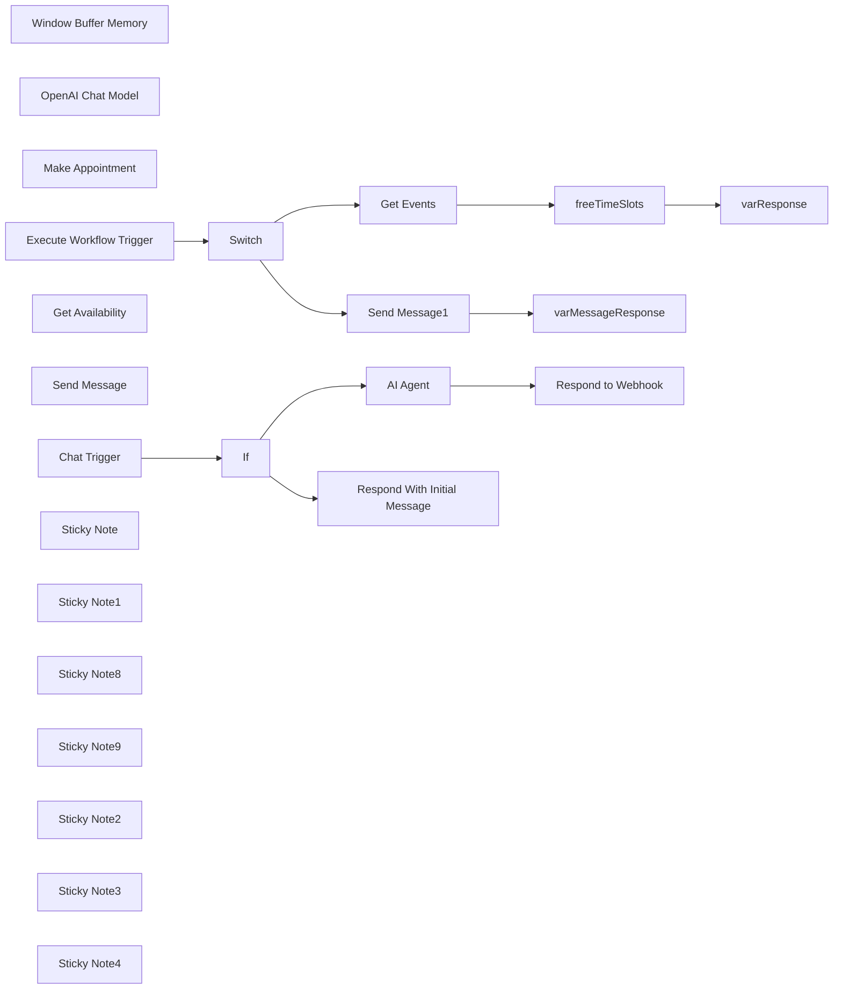

## Fluxo (.json) :

```json
{
  "meta": {
    "instanceId": "67d4d33d8b0ad4e5e12f051d8ad92fc35893d7f48d7f801bc6da4f39967b3592",
    "templateCredsSetupCompleted": true
  },
  "nodes": [
    {
      "id": "22c8d63b-ce3c-4aab-b3f6-4bae8c1b9ec5",
      "name": "Window Buffer Memory",
      "type": "@n8n/n8n-nodes-langchain.memoryBufferWindow",
      "position": [
        1460,
        880
      ],
      "parameters": {
        "sessionKey": "={{ $json.sessionId }}",
        "sessionIdType": "customKey",
        "contextWindowLength": 20
      },
      "typeVersion": 1.2
    },
    {
      "id": "45403d5c-6e85-424f-b40b-c6214b57457b",
      "name": "Respond to Webhook",
      "type": "n8n-nodes-base.respondToWebhook",
      "position": [
        1880,
        580
      ],
      "parameters": {
        "options": {}
      },
      "typeVersion": 1.1
    },
    {
      "id": "1111262a-1743-4bae-abf1-f69d2e1a580c",
      "name": "OpenAI Chat Model",
      "type": "@n8n/n8n-nodes-langchain.lmChatOpenAi",
      "position": [
        1360,
        760
      ],
      "parameters": {
        "model": "gpt-4o-2024-08-06",
        "options": {
          "temperature": 0.4
        }
      },
      "credentials": {
        "openAiApi": {
          "id": "XWFTuTtx9oWglhNn",
          "name": "OpenAi account"
        }
      },
      "typeVersion": 1
    },
    {
      "id": "df891547-c715-4dc6-bfcc-c0ac5cfcaf02",
      "name": "Make Appointment",
      "type": "@n8n/n8n-nodes-langchain.toolHttpRequest",
      "position": [
        1820,
        840
      ],
      "parameters": {
        "url": "https://graph.microsoft.com/v1.0/me/events",
        "method": "POST",
        "jsonBody": "{\n  \"subject\": \"Meetings with <name> at <company>\",\n  \"start\": {\n    \"dateTime\": \"{dateStartTime}\",\n    \"timeZone\": \"Europe/London\"\n  },\n  \"end\": {\n    \"dateTime\": \"{dateEndTime}\",\n    \"timeZone\": \"Europe/London\"\n  },\n  \"body\": {\n    \"contentType\": \"HTML\",\n    \"content\": \"{reason}\"\n  },\n  \"attendees\": [\n    {\n      \"emailAddress\": {\n        \"address\": \"{email}\",\n        \"name\": \"{name}\"\n      },\n      \"type\": \"required\"\n    }\n  ],\n  \"location\": {\n    \"displayName\": \"Online Meeting\"\n  },\n  \"isOnlineMeeting\": true,\n  \"onlineMeetingProvider\": \"teamsForBusiness\",\n  \"showAs\": \"busy\",\n  \"categories\": [\n    \"Meeting\"\n  ]\n}",
        "sendBody": true,
        "sendQuery": true,
        "specifyBody": "json",
        "authentication": "predefinedCredentialType",
        "parametersQuery": {
          "values": [
            {
              "name": "Content-Type",
              "value": "application/json",
              "valueProvider": "fieldValue"
            }
          ]
        },
        "toolDescription": "Call this tool to make the appointment, ensure you send the user email, name, company, reason for the meeting and the appointment start time and the date in ISO String format with timezone for <timezone>. When creating an appointment, always send JSON.",
        "nodeCredentialType": "microsoftOutlookOAuth2Api",
        "placeholderDefinitions": {
          "values": [
            {
              "name": "dateStartTime",
              "type": "string",
              "description": "The date and start time of the appointment in toISOString format with timezone for Europe/London"
            },
            {
              "name": "dateEndTime",
              "type": "string",
              "description": "The date and end time of the appointment in toISOString format, always 30 minutes after the dateStartTime,  format with timezone for Europe/London"
            },
            {
              "name": "reason",
              "type": "string",
              "description": "Detailed description of the meeting, will be sent to us and the customer"
            },
            {
              "name": "email",
              "type": "string",
              "description": "The customers email address."
            },
            {
              "name": "name",
              "type": "string",
              "description": "The customers full name, must be second and last name"
            }
          ]
        }
      },
      "credentials": {
        "microsoftOutlookOAuth2Api": {
          "id": "E0WY3yUNKgrxIwLU",
          "name": "Microsoft Outlook Business"
        }
      },
      "typeVersion": 1.1
    },
    {
      "id": "44141c44-de49-4707-b287-24007c84ca21",
      "name": "Execute Workflow Trigger",
      "type": "n8n-nodes-base.executeWorkflowTrigger",
      "position": [
        2160,
        580
      ],
      "parameters": {},
      "typeVersion": 1
    },
    {
      "id": "795e1451-57d8-4563-8b86-5a75df2427b6",
      "name": "varResponse",
      "type": "n8n-nodes-base.set",
      "position": [
        3120,
        460
      ],
      "parameters": {
        "options": {},
        "assignments": {
          "assignments": [
            {
              "id": "c0b6e779-0f7b-41f0-81f8-457f2b31ccfe",
              "name": "response",
              "type": "array",
              "value": "={{ $json.freeTimeSlots.toJsonString() }}"
            }
          ]
        }
      },
      "typeVersion": 3.4
    },
    {
      "id": "4283635f-649c-4cc7-84b9-37524ddb6ce0",
      "name": "freeTimeSlots",
      "type": "n8n-nodes-base.code",
      "position": [
        2900,
        460
      ],
      "parameters": {
        "jsCode": "// Input: An array with objects containing a 'value' array of events.\nconst businessHoursStart = \"08:00:00Z\";  // Business hours start time\nconst businessHoursEnd = \"17:30:00Z\";    // Business hours end time\n\nconst inputData = items[0].json.value;  // Assuming the input data is in the 'value' array of the first item\n\n// Function to convert ISO datetime string to a Date object with specified time\nfunction getDateWithTime(dateString, time) {\n  const datePart = new Date(dateString).toISOString().split(\"T\")[0];  // Extract the date part (YYYY-MM-DD)\n  return new Date(`${datePart}T${time}`);\n}\n\n// Function to get day of the week from a date string\nfunction getDayOfWeek(dateString) {\n  const daysOfWeek = [\"Sunday\", \"Monday\", \"Tuesday\", \"Wednesday\", \"Thursday\", \"Friday\", \"Saturday\"];\n  return daysOfWeek[new Date(dateString).getUTCDay()];\n}\n\n// Function to add days to a date\nfunction addDays(date, days) {\n  const result = new Date(date);\n  result.setDate(result.getDate() + days);\n  return result;\n}\n\n// Function to format date as YYYY-MM-DD\nfunction formatDate(date) {\n  return date.toISOString().split('T')[0];\n}\n\n// Determine the default timezone from input data\nconst defaultTimeZone = inputData.length > 0 && inputData[0].start && inputData[0].start.timeZone \n  ? inputData[0].start.timeZone \n  : \"UTC\";\n\n// Find min and max dates in the input\nlet minDate = null;\nlet maxDate = null;\n\ninputData.forEach(event => {\n  if (event.start && event.start.dateTime) {\n    const eventDate = new Date(event.start.dateTime);\n    if (!minDate || eventDate < minDate) {\n      minDate = eventDate;\n    }\n    if (!maxDate || eventDate > maxDate) {\n      maxDate = eventDate;\n    }\n  }\n});\n\n// If we have valid dates, ensure they're at the start of the day\nif (minDate && maxDate) {\n  minDate = new Date(minDate.toISOString().split('T')[0]);\n  maxDate = new Date(maxDate.toISOString().split('T')[0]);\n}\n\n// Organise events by date\nconst eventsByDate = {};\ninputData.forEach(event => {\n  if (event.start && event.start.dateTime) {\n    const eventDate = new Date(event.start.dateTime).toISOString().split(\"T\")[0];  // Extract the date\n    if (!eventsByDate[eventDate]) {\n      eventsByDate[eventDate] = [];\n    }\n    if (event.showAs === \"busy\") {\n      eventsByDate[eventDate].push({\n        start: new Date(event.start.dateTime),\n        end: new Date(event.end.dateTime),\n        timeZone: event.start.timeZone || defaultTimeZone\n      });\n    }\n  }\n});\n\n// Find free slots within business hours for each date\nconst freeTimeSlots = [];\n\n// Process all dates in the range\nif (minDate && maxDate) {\n  for (let currentDate = new Date(minDate); currentDate <= maxDate; currentDate = addDays(currentDate, 1)) {\n    const dateStr = formatDate(currentDate);\n    const busyEvents = eventsByDate[dateStr] || [];\n    \n    // Define business start and end times for the current date\n    const businessStart = getDateWithTime(dateStr, businessHoursStart);\n    const businessEnd = getDateWithTime(dateStr, businessHoursEnd);\n    \n    // If there are no busy events for this date, add the entire business day as free\n    if (busyEvents.length === 0) {\n      freeTimeSlots.push({\n        date: dateStr,\n        dayOfWeek: getDayOfWeek(dateStr),\n        freeStart: businessStart.toISOString(),\n        freeEnd: businessEnd.toISOString(),\n        timeZone: defaultTimeZone\n      });\n      continue; // Skip to the next date\n    }\n    \n    // Sort events by their start time\n    busyEvents.sort((a, b) => a.start - b.start);\n    \n    // Check if there's free time before the first busy event\n    if (busyEvents[0].start > businessStart) {\n      freeTimeSlots.push({\n        date: dateStr,\n        dayOfWeek: getDayOfWeek(dateStr),\n        freeStart: businessStart.toISOString(),\n        freeEnd: busyEvents[0].start.toISOString(),\n        timeZone: busyEvents[0].timeZone\n      });\n    }\n    \n    // Check for gaps between busy events\n    for (let i = 0; i < busyEvents.length - 1; i++) {\n      if (busyEvents[i].end < busyEvents[i+1].start) {\n        freeTimeSlots.push({\n          date: dateStr,\n          dayOfWeek: getDayOfWeek(dateStr),\n          freeStart: busyEvents[i].end.toISOString(),\n          freeEnd: busyEvents[i+1].start.toISOString(),\n          timeZone: busyEvents[i].timeZone\n        });\n      }\n    }\n    \n    // Check if there's free time after the last busy event\n    if (busyEvents[busyEvents.length - 1].end < businessEnd) {\n      freeTimeSlots.push({\n        date: dateStr,\n        dayOfWeek: getDayOfWeek(dateStr),\n        freeStart: busyEvents[busyEvents.length - 1].end.toISOString(),\n        freeEnd: businessEnd.toISOString(),\n        timeZone: busyEvents[busyEvents.length - 1].timeZone\n      });\n    }\n  }\n}\n\n// Output the free time slots\nreturn [{ json: { freeTimeSlots } }];\n"
      },
      "typeVersion": 2
    },
    {
      "id": "0786b561-449e-4c8f-bddb-c2bbd95dc197",
      "name": "Get Events",
      "type": "n8n-nodes-base.httpRequest",
      "position": [
        2680,
        460
      ],
      "parameters": {
        "url": "=https://graph.microsoft.com/v1.0/me/calendarView",
        "options": {},
        "sendQuery": true,
        "sendHeaders": true,
        "authentication": "predefinedCredentialType",
        "queryParameters": {
          "parameters": [
            {
              "name": "startDateTime",
              "value": "={{ new Date(new Date().setDate(new Date().getDate() + 2)).toISOString() }}"
            },
            {
              "name": "endDateTime",
              "value": "={{ new Date(new Date().setDate(new Date().getDate() + 16)).toISOString() }}"
            },
            {
              "name": "$top",
              "value": "50"
            },
            {
              "name": "select",
              "value": "start,end,categories,importance,isAllDay,recurrence,showAs,subject,type"
            },
            {
              "name": "orderby",
              "value": "start/dateTime asc"
            }
          ]
        },
        "headerParameters": {
          "parameters": [
            {
              "name": "Prefer",
              "value": "outlook.timezone=\"Europe/London\""
            }
          ]
        },
        "nodeCredentialType": "microsoftOutlookOAuth2Api"
      },
      "credentials": {
        "microsoftOutlookOAuth2Api": {
          "id": "E0WY3yUNKgrxIwLU",
          "name": "Microsoft Outlook Business"
        }
      },
      "typeVersion": 4.2
    },
    {
      "id": "55c4233e-d395-4193-9a1d-1884faed6f1e",
      "name": "Get Availability",
      "type": "@n8n/n8n-nodes-langchain.toolWorkflow",
      "position": [
        1760,
        1080
      ],
      "parameters": {
        "name": "Get_availability",
        "fields": {
          "values": [
            {
              "name": "route",
              "stringValue": "availability"
            }
          ]
        },
        "workflowId": {
          "__rl": true,
          "mode": "list",
          "value": "KD21RG8VeXYDS2Vf",
          "cachedResultName": "Website Chatbot"
        },
        "description": "Call this tool to check my calendar for availability before booking an appointment. This will result in all events for the next 2 weeks. Review all events and do not double book."
      },
      "typeVersion": 1.2
    },
    {
      "id": "096d1962-31e6-4b3b-ba75-7956f70a6a32",
      "name": "Send Message",
      "type": "@n8n/n8n-nodes-langchain.toolWorkflow",
      "position": [
        1620,
        1080
      ],
      "parameters": {
        "name": "Send_email",
        "fields": {
          "values": [
            {
              "name": "route",
              "stringValue": "message"
            }
          ]
        },
        "workflowId": {
          "__rl": true,
          "mode": "list",
          "value": "KD21RG8VeXYDS2Vf",
          "cachedResultName": "Website Chatbot"
        },
        "description": "Call this tool when the customer wants to speak to a human, or is not ready to make an appointment or if the customer has questions outside of your remit. The tool will send an email to our founder, <insert name>. Always send the customer's full name, company and email address along with a detailed message about the enquiry. You must always gather project details.",
        "jsonSchemaExample": "{\n\t\"email\": \"the customer's email\",\n    \"subject\": \"the subject of the email\",\n    \"message\": \"The customer's enquiry, must be a detailed description of their enquiry\",\n    \"name\": \"the customer's full name\",\n    \"company\": \"the customer company name\"\n}",
        "specifyInputSchema": true
      },
      "typeVersion": 1.2
    },
    {
      "id": "285ddd31-5412-4d1c-ab80-d9960ec902bb",
      "name": "Chat Trigger",
      "type": "@n8n/n8n-nodes-langchain.chatTrigger",
      "disabled": true,
      "position": [
        620,
        600
      ],
      "webhookId": "f406671e-c954-4691-b39a-66c90aa2f103",
      "parameters": {
        "mode": "webhook",
        "public": true,
        "options": {
          "responseMode": "responseNode",
          "allowedOrigins": "*"
        }
      },
      "typeVersion": 1
    },
    {
      "id": "032a26e9-6853-490d-991b-b2af2d845f58",
      "name": "Switch",
      "type": "n8n-nodes-base.switch",
      "position": [
        2380,
        580
      ],
      "parameters": {
        "rules": {
          "values": [
            {
              "outputKey": "availability",
              "conditions": {
                "options": {
                  "version": 2,
                  "leftValue": "",
                  "caseSensitive": true,
                  "typeValidation": "strict"
                },
                "combinator": "and",
                "conditions": [
                  {
                    "operator": {
                      "type": "string",
                      "operation": "equals"
                    },
                    "leftValue": "={{ $json.route }}",
                    "rightValue": "availability"
                  }
                ]
              },
              "renameOutput": true
            },
            {
              "outputKey": "message",
              "conditions": {
                "options": {
                  "version": 2,
                  "leftValue": "",
                  "caseSensitive": true,
                  "typeValidation": "strict"
                },
                "combinator": "and",
                "conditions": [
                  {
                    "id": "52fd844b-cc8d-471f-a56a-40e119b66194",
                    "operator": {
                      "name": "filter.operator.equals",
                      "type": "string",
                      "operation": "equals"
                    },
                    "leftValue": "={{ $json.route }}",
                    "rightValue": "message"
                  }
                ]
              },
              "renameOutput": true
            }
          ]
        },
        "options": {}
      },
      "typeVersion": 3.2
    },
    {
      "id": "c74905ce-4fd9-486c-abc4-b0b1d57d71a8",
      "name": "varMessageResponse",
      "type": "n8n-nodes-base.set",
      "position": [
        2900,
        700
      ],
      "parameters": {
        "options": {
          "ignoreConversionErrors": false
        },
        "assignments": {
          "assignments": [
            {
              "id": "0d2ad084-9707-4979-84e4-297d1c21f725",
              "name": "response",
              "type": "string",
              "value": "={{ $json }}"
            }
          ]
        }
      },
      "typeVersion": 3.4
    },
    {
      "id": "04c5d43c-1629-4e11-a6bb-ae73369d7002",
      "name": "Send Message1",
      "type": "n8n-nodes-base.microsoftOutlook",
      "position": [
        2680,
        700
      ],
      "webhookId": "d8acc2cb-fcba-4312-a743-e74abe76d071",
      "parameters": {
        "subject": "={{ $('Execute Workflow Trigger').item.json.query.subject }}",
        "bodyContent": "=<!DOCTYPE html PUBLIC \"-//W3C//DTD XHTML 1.0 Transitional//EN\" \"http://www.w3.org/TR/xhtml1/DTD/xhtml1-transitional.dtd\">\n<html xmlns=\"http://www.w3.org/1999/xhtml\">\n<head>\n    <meta http-equiv=\"Content-Type\" content=\"text/html; charset=UTF-8\" />\n    <meta name=\"viewport\" content=\"width=device-width, initial-scale=1.0\" />\n    <title>New Webchat Customer Enquiry</title>\n    <style type=\"text/css\">\n        /* Client-specific styles */\n        body, table, td, a { -webkit-text-size-adjust: 100%; -ms-text-size-adjust: 100%; }\n        table, td { mso-table-lspace: 0pt; mso-table-rspace: 0pt; }\n        img { -ms-interpolation-mode: bicubic; }\n\n        /* Reset styles */\n        body { margin: 0; padding: 0; }\n        img { border: 0; height: auto; line-height: 100%; outline: none; text-decoration: none; }\n        table { border-collapse: collapse !important; }\n        body { height: 100% !important; margin: 0; padding: 0; width: 100% !important; }\n\n        /* iOS BLUE LINKS */\n        a[x-apple-data-detectors] {\n            color: inherit !important;\n            text-decoration: none !important;\n            font-size: inherit !important;\n            font-family: inherit !important;\n            font-weight: inherit !important;\n            line-height: inherit !important;\n        }\n\n        /* Styles for Outlook and other email clients */\n        .ExternalClass { width: 100%; }\n        .ExternalClass, .ExternalClass p, .ExternalClass span, .ExternalClass font, .ExternalClass td, .ExternalClass div { line-height: 100%; }\n        \n        /* Responsive styles */\n        @media screen and (max-width: 600px) {\n            .container { width: 100% !important; }\n            .content { padding: 15px !important; }\n            .field { padding: 10px !important; }\n            .header h1 { font-size: 20px !important; }\n            .header p { font-size: 12px !important; }\n        }\n    </style>\n</head>\n<body style=\"margin: 0; padding: 0; background-color: #f4f4f4;\">\n    <table border=\"0\" cellpadding=\"0\" cellspacing=\"0\" width=\"100%\">\n        <tr>\n            <td>\n                <table align=\"center\" border=\"0\" cellpadding=\"0\" cellspacing=\"0\" width=\"600\" style=\"border-collapse: collapse; background-color: #ffffff;\">\n                    <tr>\n                        <td align=\"center\" bgcolor=\"#1a1a1a\" style=\"padding: 30px 0; background: linear-gradient(135deg, #1a1a1a 0%, #2d1f3d 100%);\">\n                            <h1 style=\"color: #ffffff; font-family: Arial, sans-serif; font-size: 24px; font-weight: 700; margin: 0; text-transform: uppercase; letter-spacing: 1px;\">New Customer Enquiry</h1>\n                            <p style=\"color: #ffffff; font-family: Arial, sans-serif; font-size: 14px; line-height: 20px; margin: 10px 0 0; opacity: 0.8;\">A potential client has reached out through our webchat</p>\n                        </td>\n                    </tr>\n                    <tr>\n                        <td style=\"padding: 20px;\">\n                            <table border=\"0\" cellpadding=\"0\" cellspacing=\"0\" width=\"100%\">\n                                <tr>\n                                    <td style=\"padding: 15px; background-color: #f9f9f9; border: 1px solid #e0e0e0; border-radius: 8px;\">\n                                        <p style=\"font-family: Arial, sans-serif; font-size: 14px; line-height: 1.6; color: #6a1b9a; font-weight: bold; margin: 0 0 5px 0;\">FROM</p>\n                                        <p style=\"font-family: Arial, sans-serif; font-size: 16px; line-height: 1.6; color: #333333; margin: 0;\">{{ $('Execute Workflow Trigger').item.json.query.name }}</p>\n                                    </td>\n                                </tr>\n                                <tr><td height=\"20\"></td></tr>\n                                <tr>\n                                    <td style=\"padding: 15px; background-color: #f9f9f9; border: 1px solid #e0e0e0; border-radius: 8px;\">\n                                        <p style=\"font-family: Arial, sans-serif; font-size: 14px; line-height: 1.6; color: #6a1b9a; font-weight: bold; margin: 0 0 5px 0;\">EMAIL</p>\n                                        <p style=\"font-family: Arial, sans-serif; font-size: 16px; line-height: 1.6; color: #333333; margin: 0;\">{{ $('Execute Workflow Trigger').item.json.query.email }}</p>\n                                    </td>\n                                </tr>\n                                <tr><td height=\"20\"></td></tr>\n                                <tr>\n                                    <td style=\"padding: 15px; background-color: #f9f9f9; border: 1px solid #e0e0e0; border-radius: 8px;\">\n                                        <p style=\"font-family: Arial, sans-serif; font-size: 14px; line-height: 1.6; color: #6a1b9a; font-weight: bold; margin: 0 0 5px 0;\">COMPANY</p>\n                                        <p style=\"font-family: Arial, sans-serif; font-size: 16px; line-height: 1.6; color: #333333; margin: 0;\">{{ $('Execute Workflow Trigger').item.json.query.company }}</p>\n                                    </td>\n                                </tr>\n                                <tr><td height=\"20\"></td></tr>\n                                <tr>\n                                    <td style=\"padding: 15px; background-color: #f9f9f9; border: 1px solid #e0e0e0; border-radius: 8px;\">\n                                        <p style=\"font-family: Arial, sans-serif; font-size: 14px; line-height: 1.6; color: #6a1b9a; font-weight: bold; margin: 0 0 5px 0;\">MESSAGE</p>\n                                        <p style=\"font-family: Arial, sans-serif; font-size: 16px; line-height: 1.6; color: #333333; margin: 0;\">{{ $('Execute Workflow Trigger').item.json.query.message }}</p>\n                                    </td>\n                                </tr>\n                            </table>\n                        </td>\n                    </tr>\n                    <tr>\n                        <td align=\"center\" bgcolor=\"#e90ebb\" style=\"padding: 20px; background: linear-gradient(135deg, #e90ebb 0%, #6a1b9a 100%);\">\n                            <p style=\"font-family: Arial, sans-serif; font-size: 14px; line-height: 20px; color: #ffffff; margin: 0;\">This enquiry was automatically generated from our website's chat interface.</p>\n                        </td>\n                    </tr>\n                </table>\n            </td>\n        </tr>\n    </table>\n</body>\n</html>",
        "toRecipients": "you@yourdomain.com",
        "additionalFields": {
          "importance": "High",
          "bodyContentType": "html"
        }
      },
      "credentials": {
        "microsoftOutlookOAuth2Api": {
          "id": "E0WY3yUNKgrxIwLU",
          "name": "Microsoft Outlook Business"
        }
      },
      "typeVersion": 2
    },
    {
      "id": "5a2636f1-47d3-4421-840b-56553bf14d82",
      "name": "Sticky Note",
      "type": "n8n-nodes-base.stickyNote",
      "position": [
        1580,
        1000
      ],
      "parameters": {
        "width": 311.6936390497898,
        "height": 205.34013605442183,
        "content": "Ensure these referance this workflow, replace placeholders"
      },
      "typeVersion": 1
    },
    {
      "id": "a9fe05d4-6b86-4313-9f11-b20e3ce7db89",
      "name": "Sticky Note1",
      "type": "n8n-nodes-base.stickyNote",
      "position": [
        2600,
        380
      ],
      "parameters": {
        "width": 468,
        "height": 238,
        "content": "modify business hours\nmodify timezones"
      },
      "typeVersion": 1
    },
    {
      "id": "5dfda5c9-eeeb-421a-a80d-f42c94602080",
      "name": "AI Agent",
      "type": "@n8n/n8n-nodes-langchain.agent",
      "position": [
        1460,
        580
      ],
      "parameters": {
        "text": "={{ $json.chatInput }}",
        "options": {
          "systemMessage": "=You are an intelligent personal assistant to Wayne, Founder at nocodecreative.io (ai consultancy and software development agency) responsible for coordinating appointments and gathering relevant information from customers. Your tasks are to:\n\n- Understand when the customer is available by asking for suitable days and times (ensuring they are aware we are in a UK timezone)\n- Check the calendar to identify available slots that match their preferences. Pay attention to each event's start and end time and do not double book, you will be given all events for the next 14 days\n- Ask the customer what they would like to discuss during the appointment to ensure proper preparation.\n- Get the customer's name, company name and email address to book the appointment\n- Make the conversation friendly and natural. Confirm the appointment details with the customer and let them know I’ll be ready to discuss what they’d like.\n- After you have checked the calendar, book the appointment accordingly, without double booking. Confirm the customer's timezone and adjust the appointment for EU/London.\n- If the customer isn't ready to book, you can send an email for a human to respond to, ensure you gather a detailed enquiry from the customer including contact details and project information.Ensure the message contains enough information for a human to respond, always include project details, if the customer hasn't provided project details, ask.\n- Alwways suggest an appointment before sending a message, appointment are you primary goal, message are a fall back\n\nExample questions:\n\n\"Hi there! we'd love to help arrange a time that works for us to meet. Could you let us know which days and times are best for you? We’ll check the calendar and book in a suitable slot.\"\n\n\"Could you please let us know what you’d like to discuss during the appointment? This helps us prepare in advance and make our time together as productive as possible.\"\n\n\"Before we put you in touch with a human, please can you provide more information about the project you have in mind?\" //You must gather project info at all times, even if the enquiry is about pricing/costs.\n\nIf the time the customer suggests is not available, suggest the nearest alternative appointment based on existing events, do not book an appointment outside of freeTimeSlots\n\nImportant information:\n- All appointments need 48 hours' notice from {{ \n  new Date().toLocaleString(\"en-GB\", { timeZone: \"Europe/London\", hour12: false })\n  .split(\", \")[0].split(\"/\").reverse().join(\"-\") \n  + \"T\" + new Date().toLocaleTimeString(\"en-GB\", { timeZone: \"Europe/London\", hour12: false }) + \":00.000Z\" \n}} (current date and time in the UK) // this is non-negotiable, but discuss with care and be friendly, only let the customer know this if required\n- Business hours are 8am - 6pm Monday to Friday only Europe/London timezone, ensure the customer is aware of this and help them book during UK hours, you must confirm their timezone to do this!\n- Do not book appointments on a Saturday or sunday\n- Do not book appointments outside of freeTimeSlots\n- Always check the next 14 days, and review all events before providing availability \n- All appointments are for a max of 30 minutes\n- You must never offer an appointment without checking the calendar, if you cannot check the calendar, you cannot book and must let the customer know you can not book an appointment right now.\n- Always offer the soonest appointment available if the customer's preferred time is unavailable\n- When confirming an appointment, be thankful and excited!\n- Initial 30 minute consultation are free of charge\n\n\nMessages and description:\n- When creating descriptions or sending messages, always ensure enough detail is provided for preparation, meaning you can ask follow-up questions to extract further information as required. For example, if a customer asks about pricing, gather some information about the project so our team can provide accurate pricing, and apply this logic throughout\n\nComments:\n//!IMPORTANT! Do not offer any times without checking the calendar, do not make availability up\n//**Do not discuss anything other than appointment booking, if the query does not relate to an appointment, advise them you cannot help at this time.** be friendly and always offer to book an appointment to discuss their query\n//When the appointment is confirmed, let the customer know, by name, that they will be meeting our founder, Wayne for a 30 minute consultation, and that they will receive a calendar invite by email, ensure they accept the invite to confirm the appointment.\n//Always respond as a highly professional executive PA, remember this is the customer's first engagement, they do not know us or Wayne at this stage\n//Do not refer to yourself as me or I, instead communicate like an organisation, using terms like 'us'\n//Always gather project for descriptions and messages"
        },
        "promptType": "define"
      },
      "typeVersion": 1.6
    },
    {
      "id": "6156ab7e-d411-46b9-ac44-52ad56ee563d",
      "name": "If",
      "type": "n8n-nodes-base.if",
      "position": [
        840,
        600
      ],
      "parameters": {
        "options": {},
        "conditions": {
          "options": {
            "version": 2,
            "leftValue": "",
            "caseSensitive": true,
            "typeValidation": "strict"
          },
          "combinator": "and",
          "conditions": [
            {
              "id": "158a0b91-534d-4745-b10e-8a7c97050861",
              "operator": {
                "type": "string",
                "operation": "exists",
                "singleValue": true
              },
              "leftValue": "={{ $json.chatInput }}",
              "rightValue": ""
            }
          ]
        }
      },
      "typeVersion": 2.2
    },
    {
      "id": "c94171a9-a71d-4f63-bef6-e90361c57abd",
      "name": "Respond With Initial Message",
      "type": "n8n-nodes-base.respondToWebhook",
      "position": [
        1140,
        720
      ],
      "parameters": {
        "options": {},
        "respondWith": "json",
        "responseBody": "{\n  \"output\": \"Hi, how can I help you today?\"\n}"
      },
      "typeVersion": 1.1
    },
    {
      "id": "43129771-e976-41af-8adb-88cb5465628d",
      "name": "Sticky Note8",
      "type": "n8n-nodes-base.stickyNote",
      "position": [
        1340,
        -240
      ],
      "parameters": {
        "color": 6,
        "width": 668,
        "height": 111,
        "content": "# Custom Branded n8n Chatbot\nBuilt by [Wayne Simpson](https://www.linkedin.com/in/simpsonwayne/) at [nocodecreative.io](https://nocodecreative.io)\n☕ If you find this useful, feel free to [buy me a coffee](https://ko-fi.com/waynesimpson)"
      },
      "typeVersion": 1
    },
    {
      "id": "bb890f44-caf0-4b7d-b95e-0c05c70e8f45",
      "name": "Sticky Note9",
      "type": "n8n-nodes-base.stickyNote",
      "position": [
        1000,
        -80
      ],
      "parameters": {
        "color": 7,
        "width": 667,
        "height": 497,
        "content": "# Watch the Setup Video 📺\n### Watch Set Up Video 👇\n[](https://youtu.be/xQ1tCQZhLaI)\n\n"
      },
      "typeVersion": 1
    },
    {
      "id": "f0b054cc-f961-4c48-846c-a80ea5e49924",
      "name": "Sticky Note2",
      "type": "n8n-nodes-base.stickyNote",
      "position": [
        1700,
        -80
      ],
      "parameters": {
        "color": 7,
        "width": 600,
        "height": 500,
        "content": "## Read to blog post to get started 📝\n**Follow along to add a custom branded chat widget to your webiste**\n\n[](https://blog.nocodecreative.io/create-a-branded-ai-powered-website-chatbot-with-n8n/)"
      },
      "typeVersion": 1
    },
    {
      "id": "210cef85-6fbe-413e-88b6-b0fed76212ac",
      "name": "Sticky Note3",
      "type": "n8n-nodes-base.stickyNote",
      "position": [
        2600,
        640
      ],
      "parameters": {
        "color": 4,
        "width": 260,
        "height": 240,
        "content": "Customise the email template"
      },
      "typeVersion": 1
    },
    {
      "id": "17abc6bd-06c3-48e7-8380-e10024daa9f5",
      "name": "Sticky Note4",
      "type": "n8n-nodes-base.stickyNote",
      "position": [
        1760,
        740
      ],
      "parameters": {
        "color": 6,
        "width": 208,
        "height": 238,
        "content": "modify timezones"
      },
      "typeVersion": 1
    }
  ],
  "pinData": {
    "Execute Workflow Trigger": [
      {
        "query": "Check availability for Monday at 9am",
        "route": "availability"
      }
    ]
  },
  "connections": {
    "If": {
      "main": [
        [
          {
            "node": "AI Agent",
            "type": "main",
            "index": 0
          }
        ],
        [
          {
            "node": "Respond With Initial Message",
            "type": "main",
            "index": 0
          }
        ]
      ]
    },
    "Switch": {
      "main": [
        [
          {
            "node": "Get Events",
            "type": "main",
            "index": 0
          }
        ],
        [
          {
            "node": "Send Message1",
            "type": "main",
            "index": 0
          }
        ]
      ]
    },
    "AI Agent": {
      "main": [
        [
          {
            "node": "Respond to Webhook",
            "type": "main",
            "index": 0
          }
        ]
      ]
    },
    "Get Events": {
      "main": [
        [
          {
            "node": "freeTimeSlots",
            "type": "main",
            "index": 0
          }
        ]
      ]
    },
    "Chat Trigger": {
      "main": [
        [
          {
            "node": "If",
            "type": "main",
            "index": 0
          }
        ]
      ]
    },
    "Send Message": {
      "ai_tool": [
        [
          {
            "node": "AI Agent",
            "type": "ai_tool",
            "index": 0
          }
        ]
      ]
    },
    "Send Message1": {
      "main": [
        [
          {
            "node": "varMessageResponse",
            "type": "main",
            "index": 0
          }
        ]
      ]
    },
    "freeTimeSlots": {
      "main": [
        [
          {
            "node": "varResponse",
            "type": "main",
            "index": 0
          }
        ]
      ]
    },
    "Get Availability": {
      "ai_tool": [
        [
          {
            "node": "AI Agent",
            "type": "ai_tool",
            "index": 0
          }
        ]
      ]
    },
    "Make Appointment": {
      "ai_tool": [
        [
          {
            "node": "AI Agent",
            "type": "ai_tool",
            "index": 0
          }
        ]
      ]
    },
    "OpenAI Chat Model": {
      "ai_languageModel": [
        [
          {
            "node": "AI Agent",
            "type": "ai_languageModel",
            "index": 0
          }
        ]
      ]
    },
    "Window Buffer Memory": {
      "ai_memory": [
        [
          {
            "node": "AI Agent",
            "type": "ai_memory",
            "index": 0
          }
        ]
      ]
    },
    "Execute Workflow Trigger": {
      "main": [
        [
          {
            "node": "Switch",
            "type": "main",
            "index": 0
          }
        ]
      ]
    }
  }
}
```

<a id="template-1017"></a>

## Template 1017 - Agente AI para raspagem web com Bright Data e Google Gemini

- **Nome:** Agente AI para raspagem web com Bright Data e Google Gemini
- **Descrição:** Fluxo que interpreta solicitações de raspagem via IA, executa a extração de conteúdo de páginas web usando ferramentas de scraping e entrega os resultados por webhook e arquivo local.
- **Funcionalidade:** • Interpretação de solicitações com modelo de linguagem: utiliza um modelo de IA para entender a intenção do usuário e decidir a ação de raspagem.
• Descoberta e seleção de ferramentas de scraping: identifica e escolhe a ferramenta MCP mais adequada para a tarefa.
• Raspagem de páginas em diferentes formatos: suporta extração de conteúdo retornando em Markdown ou HTML conforme solicitado.
• Envio de resultados por webhook: encaminha a resposta processada a um endpoint HTTP configurável.
• Persistência local dos resultados: grava o conteúdo raspado em disco como arquivo JSON para referência futura.
• Geração de dado binário/base64: converte o payload em formato binário quando necessário para escrita ou transferência.
• Memória contextual de sessão: mantém um contexto curto de interações para melhorar decisões do agente.
• Trigger manual para testes: permite iniciar o fluxo manualmente para validação e depuração.
- **Ferramentas:** • Bright Data (MCP): plataforma de scraping que executa ferramentas para extrair conteúdo de páginas web e retornar os dados no formato solicitado (Markdown/HTML).
• Google Gemini (PaLM): modelo de linguagem usado para interpretar requisições do usuário e guiar o agente na escolha da ação de scraping.
• webhook.site (ou qualquer endpoint HTTP): serviço/endpoint usado para receber os resultados de raspagem via requisição HTTP.
• Sistema de arquivos local: armazenamento no disco onde os resultados são gravados como arquivo JSON.

## Fluxo visual

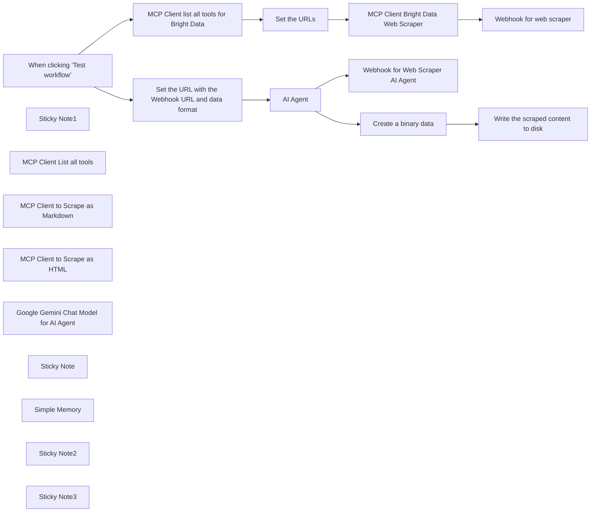

## Fluxo (.json) :

```json
{
  "id": "U6cY7PPR0vaRl1I0",
  "meta": {
    "instanceId": "885b4fb4a6a9c2cb5621429a7b972df0d05bb724c20ac7dac7171b62f1c7ef40",
    "templateCredsSetupCompleted": true
  },
  "name": "Scrape Web Data with Bright Data, Google Gemini and MCP Automated AI Agent",
  "tags": [
    {
      "id": "ZOwtAMLepQaGW76t",
      "name": "Building Blocks",
      "createdAt": "2025-04-13T15:23:40.462Z",
      "updatedAt": "2025-04-13T15:23:40.462Z"
    },
    {
      "id": "ddPkw7Hg5dZhQu2w",
      "name": "AI",
      "createdAt": "2025-04-13T05:38:08.053Z",
      "updatedAt": "2025-04-13T05:38:08.053Z"
    }
  ],
  "nodes": [
    {
      "id": "0c747f5b-ef72-4e00-a028-4a08461dae28",
      "name": "AI Agent",
      "type": "@n8n/n8n-nodes-langchain.agent",
      "notes": "Bright Data Web Scraping Agent",
      "position": [
        -140,
        60
      ],
      "parameters": {
        "text": "=Scrape the web data as per the provided URL:  {{ $json.url }} using the format as {{ $json.format }}",
        "options": {
          "systemMessage": "=You are a helpful assistant."
        },
        "promptType": "define"
      },
      "notesInFlow": true,
      "typeVersion": 1.8
    },
    {
      "id": "16c7cd90-39da-47a4-8020-a0aa8f87275a",
      "name": "When clicking ‘Test workflow’",
      "type": "n8n-nodes-base.manualTrigger",
      "position": [
        -640,
        -300
      ],
      "parameters": {},
      "typeVersion": 1
    },
    {
      "id": "7b544505-6b6b-4500-a2ad-f7cf62f98c13",
      "name": "MCP Client list all tools for Bright Data",
      "type": "n8n-nodes-mcp.mcpClient",
      "position": [
        -380,
        -300
      ],
      "parameters": {},
      "credentials": {
        "mcpClientApi": {
          "id": "JtatFSfA2kkwctYa",
          "name": "MCP Client (STDIO) account"
        }
      },
      "typeVersion": 1
    },
    {
      "id": "9f5bf319-9414-4974-bad2-ea24f09ae351",
      "name": "Sticky Note1",
      "type": "n8n-nodes-base.stickyNote",
      "position": [
        -220,
        -400
      ],
      "parameters": {
        "color": 3,
        "width": 440,
        "height": 320,
        "content": "## Bright Data Web Scraper"
      },
      "typeVersion": 1
    },
    {
      "id": "222e81cf-878e-42de-a325-6b6659145f98",
      "name": "MCP Client List all tools",
      "type": "n8n-nodes-mcp.mcpClientTool",
      "position": [
        440,
        420
      ],
      "parameters": {},
      "credentials": {
        "mcpClientApi": {
          "id": "JtatFSfA2kkwctYa",
          "name": "MCP Client (STDIO) account"
        }
      },
      "typeVersion": 1
    },
    {
      "id": "a10dfd4f-cadf-4952-8449-1865406358d4",
      "name": "MCP Client Bright Data Web Scraper",
      "type": "n8n-nodes-mcp.mcpClient",
      "notes": "Scrape a single webpage URL with advanced options for content extraction and get back the results in MarkDown language.",
      "position": [
        60,
        -300
      ],
      "parameters": {
        "toolName": "=scrape_as_markdown",
        "operation": "executeTool",
        "toolParameters": "={\n   \"url\": \"{{ $json.url }}\"\n} "
      },
      "credentials": {
        "mcpClientApi": {
          "id": "JtatFSfA2kkwctYa",
          "name": "MCP Client (STDIO) account"
        }
      },
      "notesInFlow": true,
      "typeVersion": 1
    },
    {
      "id": "0acbd4ff-ce4a-4ff2-b213-2d80dd91e302",
      "name": "Webhook for web scraper",
      "type": "n8n-nodes-base.httpRequest",
      "position": [
        280,
        -300
      ],
      "parameters": {
        "url": "=https://webhook.site/daf9d591-a130-4010-b1d3-0c66f8fcf467",
        "options": {},
        "sendBody": true,
        "bodyParameters": {
          "parameters": [
            {
              "name": "response",
              "value": "={{ $json.result.content[0].text }}"
            }
          ]
        }
      },
      "typeVersion": 4.2
    },
    {
      "id": "009ac29f-8cad-4b58-9ca4-e75470a52dcc",
      "name": "Set the URLs",
      "type": "n8n-nodes-base.set",
      "position": [
        -160,
        -300
      ],
      "parameters": {
        "options": {},
        "assignments": {
          "assignments": [
            {
              "id": "214e61a0-3587-453f-baf5-eac013990857",
              "name": "url",
              "type": "string",
              "value": "https://about.google/"
            },
            {
              "id": "45014942-0a2e-4f46-b395-f82f97bfa93e",
              "name": "webhook_url",
              "type": "string",
              "value": "https://webhook.site/ce41e056-c097-48c8-a096-9b876d3abbf7"
            }
          ]
        }
      },
      "typeVersion": 3.4
    },
    {
      "id": "104706dd-ae58-47fd-8fea-cefa986ae40c",
      "name": "MCP Client to Scrape as Markdown",
      "type": "n8n-nodes-mcp.mcpClientTool",
      "notes": "Scrape a single webpage URL with advanced options for content extraction and get back the results in MarkDown language.",
      "position": [
        -60,
        400
      ],
      "parameters": {
        "toolName": "scrape_as_markdown",
        "operation": "executeTool",
        "toolParameters": "={\n  \"url\": \"{{ $json.url }}\"\n} ",
        "descriptionType": "manual",
        "toolDescription": "Scrape a single webpage URL with advanced options for content extraction and get back the results in MarkDown language."
      },
      "credentials": {
        "mcpClientApi": {
          "id": "JtatFSfA2kkwctYa",
          "name": "MCP Client (STDIO) account"
        }
      },
      "notesInFlow": false,
      "typeVersion": 1
    },
    {
      "id": "c03c655e-45c8-4278-a01f-ba48282459c5",
      "name": "MCP Client to Scrape as HTML",
      "type": "n8n-nodes-mcp.mcpClientTool",
      "notes": "Scrape a single webpage URL with advanced options for content extraction and get back the results in HTML.",
      "position": [
        200,
        400
      ],
      "parameters": {
        "toolName": "scrape_as_html",
        "operation": "executeTool",
        "toolParameters": "{\n  \"url\": \"{{ $json.url }}\"\n} ",
        "descriptionType": "manual",
        "toolDescription": "Scrape a single webpage URL with advanced options for content extraction and get back the results in HTML."
      },
      "credentials": {
        "mcpClientApi": {
          "id": "JtatFSfA2kkwctYa",
          "name": "MCP Client (STDIO) account"
        }
      },
      "notesInFlow": true,
      "typeVersion": 1
    },
    {
      "id": "587300ff-44e5-4ff2-9dee-a4f8720ca26b",
      "name": "Google Gemini Chat Model for AI Agent",
      "type": "@n8n/n8n-nodes-langchain.lmChatGoogleGemini",
      "position": [
        -520,
        400
      ],
      "parameters": {
        "options": {},
        "modelName": "models/gemini-2.0-flash-exp"
      },
      "credentials": {
        "googlePalmApi": {
          "id": "YeO7dHZnuGBVQKVZ",
          "name": "Google Gemini(PaLM) Api account"
        }
      },
      "typeVersion": 1
    },
    {
      "id": "38ba13a1-f8f7-48ce-a05d-2c2526de606d",
      "name": "Sticky Note",
      "type": "n8n-nodes-base.stickyNote",
      "position": [
        -140,
        340
      ],
      "parameters": {
        "color": 4,
        "width": 480,
        "height": 260,
        "content": "## Bright Data Web Scraper Tools"
      },
      "typeVersion": 1
    },
    {
      "id": "e7c8d333-e256-4944-a584-575162072ca4",
      "name": "Simple Memory",
      "type": "@n8n/n8n-nodes-langchain.memoryBufferWindow",
      "position": [
        -280,
        400
      ],
      "parameters": {
        "sessionKey": "=Perform the web scraping for the below URL\n\n{{ $json.url }}",
        "sessionIdType": "customKey",
        "contextWindowLength": 10
      },
      "typeVersion": 1.3
    },
    {
      "id": "5e89519e-8ee5-4c3b-807d-21cef6e36c32",
      "name": "Webhook for Web Scraper AI Agent",
      "type": "n8n-nodes-base.httpRequest",
      "position": [
        260,
        120
      ],
      "parameters": {
        "url": "={{ $('Set the URL with the Webhook URL and data format').item.json.webhook_url }}",
        "options": {},
        "sendBody": true,
        "bodyParameters": {
          "parameters": [
            {
              "name": "response",
              "value": "={{ $json.output }}"
            }
          ]
        }
      },
      "typeVersion": 4.2
    },
    {
      "id": "2de093f4-15e5-4710-83d9-e6d9ed852873",
      "name": "Set the URL with the Webhook URL and data format",
      "type": "n8n-nodes-base.set",
      "position": [
        -400,
        60
      ],
      "parameters": {
        "options": {},
        "assignments": {
          "assignments": [
            {
              "id": "214e61a0-3587-453f-baf5-eac013990857",
              "name": "url",
              "type": "string",
              "value": "https://about.google/"
            },
            {
              "id": "45014942-0a2e-4f46-b395-f82f97bfa93e",
              "name": "webhook_url",
              "type": "string",
              "value": "https://webhook.site/daf9d591-a130-4010-b1d3-0c66f8fcf467"
            },
            {
              "id": "7f6c03f6-9fa3-45f9-bf81-243b7106bdac",
              "name": "format",
              "type": "string",
              "value": "scrape_as_markdown"
            }
          ]
        }
      },
      "typeVersion": 3.4
    },
    {
      "id": "04a5b11f-1990-440e-be23-2fbcb985dd4a",
      "name": "Create a binary data",
      "type": "n8n-nodes-base.function",
      "position": [
        260,
        -80
      ],
      "parameters": {
        "functionCode": "items[0].binary = {\n  data: {\n    data: new Buffer(JSON.stringify(items[0].json, null, 2)).toString('base64')\n  }\n};\nreturn items;"
      },
      "typeVersion": 1
    },
    {
      "id": "0765ffcd-4746-45f7-add8-f82d66709321",
      "name": "Write the scraped content to disk",
      "type": "n8n-nodes-base.readWriteFile",
      "position": [
        460,
        -80
      ],
      "parameters": {
        "options": {},
        "fileName": "d:\\Scraped-Content.json",
        "operation": "write"
      },
      "typeVersion": 1
    },
    {
      "id": "16cd9b48-765d-4f0d-8e78-6c41cfc50b03",
      "name": "Sticky Note2",
      "type": "n8n-nodes-base.stickyNote",
      "position": [
        -220,
        -540
      ],
      "parameters": {
        "width": 440,
        "height": 120,
        "content": "## Disclaimer\nThis template is only available on n8n self-hosted as it's making use of the community node for MCP Client."
      },
      "typeVersion": 1
    },
    {
      "id": "ff4b9e9c-a0f0-4cdb-ad53-55dc412794fc",
      "name": "Sticky Note3",
      "type": "n8n-nodes-base.stickyNote",
      "position": [
        -1080,
        -80
      ],
      "parameters": {
        "color": 5,
        "width": 480,
        "height": 380,
        "content": "## Note\nThe AI agent utilizes Bright Data's MCP tools to perform web scraping based on user requests. It intelligently selects the most suitable web scraping tool to fulfill the user's query.\n\nOnce the web scraping is complete, the AI agent's response is:\n\n1. Used to trigger a webhook call.\n\n2. Persisted to disk for future reference.\n\nGoogle Gemini is employed by the AI agent to understand and interpret user queries. Based on this interpretation, the agent initiates a call to the appropriate MCP client to perform the required web scraping task.\n\nSource - https://github.com/luminati-io/brightdata-mcp"
      },
      "typeVersion": 1
    }
  ],
  "active": false,
  "pinData": {},
  "settings": {
    "executionOrder": "v1"
  },
  "versionId": "ccf9f9af-82d5-4751-b06d-497c043c85fc",
  "connections": {
    "AI Agent": {
      "main": [
        [
          {
            "node": "Webhook for Web Scraper AI Agent",
            "type": "main",
            "index": 0
          },
          {
            "node": "Create a binary data",
            "type": "main",
            "index": 0
          }
        ]
      ]
    },
    "Set the URLs": {
      "main": [
        [
          {
            "node": "MCP Client Bright Data Web Scraper",
            "type": "main",
            "index": 0
          }
        ]
      ]
    },
    "Simple Memory": {
      "ai_memory": [
        [
          {
            "node": "AI Agent",
            "type": "ai_memory",
            "index": 0
          }
        ]
      ]
    },
    "Create a binary data": {
      "main": [
        [
          {
            "node": "Write the scraped content to disk",
            "type": "main",
            "index": 0
          }
        ]
      ]
    },
    "MCP Client List all tools": {
      "ai_tool": [
        [
          {
            "node": "AI Agent",
            "type": "ai_tool",
            "index": 0
          }
        ]
      ]
    },
    "MCP Client to Scrape as HTML": {
      "ai_tool": [
        [
          {
            "node": "AI Agent",
            "type": "ai_tool",
            "index": 0
          }
        ]
      ]
    },
    "MCP Client to Scrape as Markdown": {
      "ai_tool": [
        [
          {
            "node": "AI Agent",
            "type": "ai_tool",
            "index": 0
          }
        ]
      ]
    },
    "Webhook for Web Scraper AI Agent": {
      "main": [
        []
      ]
    },
    "When clicking ‘Test workflow’": {
      "main": [
        [
          {
            "node": "MCP Client list all tools for Bright Data",
            "type": "main",
            "index": 0
          },
          {
            "node": "Set the URL with the Webhook URL and data format",
            "type": "main",
            "index": 0
          }
        ]
      ]
    },
    "MCP Client Bright Data Web Scraper": {
      "main": [
        [
          {
            "node": "Webhook for web scraper",
            "type": "main",
            "index": 0
          }
        ]
      ]
    },
    "Google Gemini Chat Model for AI Agent": {
      "ai_languageModel": [
        [
          {
            "node": "AI Agent",
            "type": "ai_languageModel",
            "index": 0
          }
        ]
      ]
    },
    "MCP Client list all tools for Bright Data": {
      "main": [
        [
          {
            "node": "Set the URLs",
            "type": "main",
            "index": 0
          }
        ]
      ]
    },
    "Set the URL with the Webhook URL and data format": {
      "main": [
        [
          {
            "node": "AI Agent",
            "type": "main",
            "index": 0
          }
        ]
      ]
    }
  }
}
```

<a id="template-1018"></a>

## Template 1018 - Relatório Strava por e-mail com coaching IA

- **Nome:** Relatório Strava por e-mail com coaching IA
- **Descrição:** Fluxo automatizado que recebe atualizações de atividades Strava, analisa os dados com um coach de triatlo baseado em IA, gera um relatório estruturado e envia o resumo por e-mail.
- **Funcionalidade:** • Detecção de atualização de atividades Strava: Dispara o fluxo quando uma atividade é atualizada ou criada no Strava.
• Consolidação de dados de atividades: Reúne e normaliza informações de várias atividades em um único texto processável.
• Análise de treino com IA de coaching: Fornece feedback personalizado, planos de melhoria e metas com base nas métricas (distância, pace, HR, potência, cadência, SWOLF, elevação, etc.).
• Estruturação do relatório: Organiza o conteúdo em seções com títulos, listas e parágrafos para clareza.
• Geração de HTML do relatório: Converte a estrutura em HTML pronto para apresentação e envio.
• Envio do relatório por e-mail: Envia o relatório HTML para o destinatário especificado.
• Integração com Gemini para coaching: Utiliza o modelo de linguagem Gemini para orientar as respostas de coaching com base nos dados do atleta.
- **Ferramentas:** • Strava: Plataforma de rastreamento de atividades que aciona o fluxo com atualizações.
• Gemini (PaLM): Modelo de linguagem para geração de coaching personalizado com base nos dados de treino.
• Gmail: Serviço de envio de e-mails para entregar o relatório.
• WhatsApp Business Cloud: Canal externo para envio de mensagens de coaching quando necessário.


## Fluxo visual

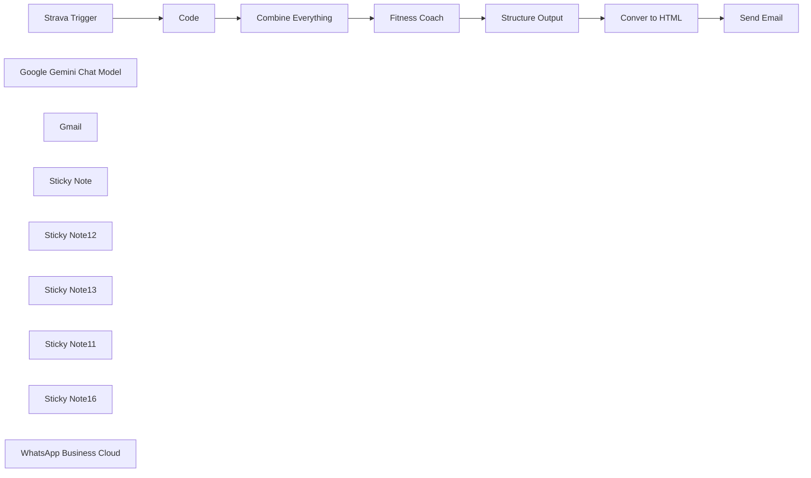

## Fluxo (.json) :

```json
{
  "meta": {
    "instanceId": "32d80f55a35a7b57f8e47a2ac19558d9f5bcec983a5519d9c29ba713ff4f12c7",
    "templateCredsSetupCompleted": true
  },
  "nodes": [
    {
      "id": "d9e3e2af-1db4-4ef1-a12a-c56df545e09e",
      "name": "Strava Trigger",
      "type": "n8n-nodes-base.stravaTrigger",
      "position": [
        -60,
        0
      ],
      "webhookId": "c656f7eb-6176-48b1-a68f-7e169699cecb",
      "parameters": {
        "event": "update",
        "object": "activity",
        "options": {}
      },
      "credentials": {
        "stravaOAuth2Api": {
          "id": "lI69z0e9sP9DBcrp",
          "name": "Strava account"
        }
      },
      "typeVersion": 1
    },
    {
      "id": "344106a7-f1ce-4ef0-be60-8b0dc6c92fe4",
      "name": "Google Gemini Chat Model",
      "type": "@n8n/n8n-nodes-langchain.lmChatGoogleGemini",
      "position": [
        560,
        180
      ],
      "parameters": {
        "options": {},
        "modelName": "models/gemini-2.0-flash-exp"
      },
      "credentials": {
        "googlePalmApi": {
          "id": "MqxJQHgdP5sIvdos",
          "name": "Google Gemini(PaLM) - ali@amjid"
        }
      },
      "typeVersion": 1
    },
    {
      "id": "5ea7c2b8-0ddc-414e-b90c-d1269e074d16",
      "name": "Gmail",
      "type": "n8n-nodes-base.gmail",
      "position": [
        1420,
        -200
      ],
      "webhookId": "70ab1218-b5a1-47e7-9e9e-89c5c4f84c15",
      "parameters": {
        "sendTo": "amjid@amjidali.com",
        "message": "={{ $json.html }}",
        "options": {
          "appendAttribution": false
        },
        "subject": "="
      },
      "credentials": {
        "gmailOAuth2": {
          "id": "dYWFonU1YWbQ9MHf",
          "name": "Gmail account ali@amjidali"
        }
      },
      "typeVersion": 2.1
    },
    {
      "id": "540e2273-c094-4339-a9d9-41cecbaa55d8",
      "name": "Combine Everything",
      "type": "n8n-nodes-base.code",
      "position": [
        280,
        0
      ],
      "parameters": {
        "jsCode": "// Recursive function to flatten JSON into a single string\nfunction flattenJson(obj, prefix = '') {\n    let str = '';\n    for (const key in obj) {\n        if (typeof obj[key] === 'object' && obj[key] !== null) {\n            str += flattenJson(obj[key], `${prefix}${key}.`);\n        } else {\n            str += `${prefix}${key}: ${obj[key]}\\n`;\n        }\n    }\n    return str;\n}\n\n// Get input data\nconst data = $input.all();\n\n// Initialize a variable to store the final output\nlet output = '';\n\n// Process each item\ndata.forEach(item => {\n    output += flattenJson(item.json);\n    output += '\\n---\\n'; // Separator between records\n});\n\n// Return the merged string as output\nreturn [{ json: { data: output } }];\n"
      },
      "typeVersion": 2
    },
    {
      "id": "9db17380-36ee-4d8c-842c-f33215bb5e78",
      "name": "Fitness Coach",
      "type": "@n8n/n8n-nodes-langchain.agent",
      "position": [
        560,
        0
      ],
      "parameters": {
        "text": "=You are an Triathlon Coach specializing in guiding the athlete on running, swimming, and cycling. Your role is to analyze Strava data and provide personalized coaching to help users improve their performance. Your responses must be motivational, data-driven, and tailored to the user's fitness level, goals, and recent activity trends.\n\n#### Key Abilities:\n1. **Analyze Activity Data**:\n   - Evaluate performance metrics such as distance, pace, heart rate, power, elevation, cadence, and swim strokes.\n   - Identify trends, strengths, and areas for improvement.\n\n2. **Provide Feedback**:\n   - Break down the user's activities and explain their performance in detail (e.g., pacing consistency, effort levels, technique).\n   - Highlight achievements and areas that need focus.\n\n3. **Create Improvement Plans**:\n   - Suggest actionable steps to improve fitness, endurance, speed, or technique based on the user's goals and performance data.\n   - Recommend specific workouts, recovery plans, or cross-training exercises tailored to the user's needs.\n\n4. **Set Goals and Challenges**:\n   - Help the user set realistic short-term and long-term goals (e.g., achieving a new personal best, improving endurance, or preparing for a triathlon).\n   - Suggest weekly or monthly challenges to stay motivated.\n\n5. **Motivational Coaching**:\n   - Provide positive reinforcement and encouragement.\n   - Help the user maintain consistency and avoid burnout.\n\n6. ** Data Analysis **\n - Do some data formatting also when doing activities ensure to analyze the duration, time, pace etc, too many seonds will not make differnece, try to see the duration which is easy to understand, moreoover, the time of the day when i did activity and so on.\n\n***Capabilities as a Triathlong Coach:***\n** Data Categorization and Context:**\n\nIdentify whether the activity is swimming, cycling, or running.\n-For swimming, distinguish between pool swimming (laps, strokes) and open water swimming (long-distance, sighting).\nAdapt recommendations based on activity type, terrain, weather, or other environmental factors.\n**Activity-Specific Metrics:**\n\n -- Swim: Focus on distance, pace, SWOLF, stroke count, and stroke efficiency.\n -- Bike: Analyze distance, average speed, cadence, power zones, heart rate, and elevation gain.\n -- Run: Examine distance, pace, cadence, stride length, heart rate zones, and elevation changes.\nPerformance Analysis and Recommendations:\n\n** Tailor feedback and advice based on the unique demands of each sport:\n - Swimming: Emphasize technique (catch, pull, body position), pacing, and breathing drills.\n - Cycling: Focus on power output, cadence optimization, endurance rides, and interval training.\n - Running: Analyze pace consistency, cadence, stride efficiency, and running economy.\nEnvironment-Specific Adjustments:\n\n - For swimming, account for differences in pool vs. open water conditions (e.g., sighting, drafting, and waves).\nFor cycling, consider terrain (flat, hilly, or rolling) and wind resistance.\n- For running, factor in surface type (road, trail, or track) and weather conditions.\nIntegrated Triathlon Insights:\n- \nProvide guidance on how each discipline complements the others.\nSuggest \"brick workouts\" (e.g., bike-to-run) for race-specific adaptations.\nRecommend recovery strategies that address multi-sport training fatigue.\nBehavior:\nBe precise, detailed, and motivational.\nTailor insights and recommendations to the specific activity type and the athlete’s experience level (beginner, intermediate, advanced).\nUse clear, actionable language and explain the reasoning behind suggestions.\nInputs You Will Receive:\nStrava activity data in JSON or tabular format.\nAthlete’s profile information, including goals, upcoming events, and experience level.\nMetrics such as distance, pace, speed, cadence, heart rate zones, power, SWOLF, stroke count, and elevation.\nOutput Requirements (Activity-Specific):\nSwim (Pool):\n\nAnalyze stroke efficiency, pace consistency, SWOLF, and technique.\nSuggest drills for stroke improvement (e.g., catch-up, fingertip drag).\nRecommend pacing intervals (e.g., 10x100m at target pace with rest).\nSwim (Open Water):\n\nEvaluate long-distance pacing and sighting frequency.\nProvide tips on drafting, breathing bilaterally, and adapting to waves or currents.\nSuggest open water-specific workouts (e.g., race-pace simulations with buoy turns).\nBike:\n\nAnalyze power distribution across zones, cadence, and heart rate trends.\nHighlight inefficiencies (e.g., low cadence on climbs or inconsistent power).\nRecommend specific workouts (e.g., 3x12-minute FTP intervals with 5-minute rest).\nSuggest gear and bike fit optimizations if needed.\nRun:\n\nEvaluate pacing strategy, cadence, and heart rate zones.\nIdentify inefficiencies in stride length or cadence.\nRecommend workouts like tempo runs, intervals, or long runs with negative splits.\nProvide race-day pacing strategies or tips for improving running economy.\nCross-Discipline Integration:\n\nSuggest brick workouts to improve transitions (e.g., 30-minute bike + 10-minute run at race pace).\nRecommend recovery sessions (e.g., easy swim or bike after a hard run).\nAdvise on balancing training load across disciplines.\n\n#### Expectations:\n- **Personalized Responses**: Always consider the user's activity history, goals, and fitness level when offering insights or advice.\n- **Practical Guidance**: Provide clear, actionable recommendations.\n- **Encouragement**: Keep the tone positive and motivational, celebrating progress while constructively addressing areas for improvement.\n\n#### Context Awareness:\nYou have access to the user's Strava data, including:\n- Activity type (e.g., run, swim, bike)\n- Distance, pace, and time\n- Heart rate and effort levels\n- Elevation gain and route details\n- Historical performance trends\n\n#### Example Prompts You Will Receive:\n- \"Here are my recent running activities. How can I improve my pace?\"\n- \"This is my swimming data from this week. What should I focus on to improve my technique?\"\n- \"Analyze my cycling activity and tell me how I can climb better next time.\"\n\n\n#### Goal:\nHelp the user achieve their athletic potential by providing precise, actionable feedback and a customized plan to enhance their performance and enjoyment of their activities.\n\nHere is the Activity Data : \n{{ $json.data }}",
        "agent": "conversationalAgent",
        "options": {},
        "promptType": "define"
      },
      "typeVersion": 1.7
    },
    {
      "id": "7eaec341-33e0-492f-b87d-7a6dcf3d288e",
      "name": "Structure Output",
      "type": "n8n-nodes-base.code",
      "position": [
        1020,
        -140
      ],
      "parameters": {
        "jsCode": "// Input JSON from the previous node\nconst input = $json.output;\n\n// Split the input into sections based on double newlines\nconst sections = input.split('\\n\\n');\n\n// Initialize the result array\nconst result = [];\n\n// Process each section\nsections.forEach((section) => {\n    const trimmedSection = section.trim();\n\n    // Handle headings marked with ** (bold)\n    if (/^\\*\\*(.*?)\\*\\*$/.test(trimmedSection)) {\n        result.push({ type: 'heading', content: trimmedSection.replace(/\\*\\*(.*?)\\*\\*/, '<b>$1</b>') });\n    }\n    // Handle bullet lists marked with *\n    else if (trimmedSection.startsWith('*')) {\n        const listItems = trimmedSection.split('\\n').map((item) => item.trim().replace(/^\\*\\s/, ''));\n        result.push({ type: 'list', items: listItems });\n    }\n    // Handle numbered lists\n    else if (/^\\d+\\.\\s/.test(trimmedSection)) {\n        const numberedItems = trimmedSection.split('\\n').map((item) => item.trim().replace(/^\\d+\\.\\s/, ''));\n        result.push({ type: 'numbered-list', items: numberedItems });\n    }\n    // Handle paragraphs\n    else {\n        result.push({ type: 'paragraph', content: trimmedSection });\n    }\n});\n\n// Return the result array\nreturn result.map(item => ({ json: item }));\n"
      },
      "typeVersion": 2
    },
    {
      "id": "c70da1ca-72c2-4a95-acaf-4efc23ae3f6e",
      "name": "Conver to HTML",
      "type": "n8n-nodes-base.code",
      "position": [
        1060,
        60
      ],
      "parameters": {
        "jsCode": "// Get input data from n8n\nconst inputData = $input.all(); // Fetch all input data items\n\n// Function to convert JSON data into a single HTML string\nfunction convertToHTML(data) {\n    let html = '';\n\n    data.forEach((item) => {\n        switch (item.json.type) {\n            case 'paragraph':\n                html += `<p>${item.json.content}</p>`;\n                break;\n            case 'heading':\n                html += `<h2>${item.json.content}</h2>`;\n                break;\n            case 'list':\n                html += '<ul>';\n                item.json.items.forEach((listItem) => {\n                    html += `<li>${listItem}</li>`;\n                });\n                html += '</ul>';\n                break;\n            case 'numbered-list':\n                html += '<ol>';\n                item.json.items.forEach((listItem) => {\n                    html += `<li>${listItem}</li>`;\n                });\n                html += '</ol>';\n                break;\n            default:\n                break;\n        }\n    });\n\n    return html;\n}\n\n// Convert inputData to a single HTML string\nconst singleHTML = convertToHTML(inputData);\n\n// Return as a single item\nreturn [{ json: { html: singleHTML } }];\n"
      },
      "typeVersion": 2
    },
    {
      "id": "b646220c-a0c9-4af7-a2a8-09cec619ecbf",
      "name": "Send Email",
      "type": "n8n-nodes-base.emailSend",
      "position": [
        1420,
        0
      ],
      "parameters": {
        "html": "={{ $json.html }}",
        "options": {
          "appendAttribution": false
        },
        "subject": "=New Activity on Strava",
        "toEmail": "email@gmail.com",
        "fromEmail": "Fitness Coach <email@example.com>"
      },
      "credentials": {
        "smtp": {
          "id": "WpZf64vFcOT99dO6",
          "name": "SMTP OCI Amjid"
        }
      },
      "typeVersion": 2.1
    },
    {
      "id": "06d6262d-dd72-4e57-bccb-31d87a9086c9",
      "name": "Code",
      "type": "n8n-nodes-base.code",
      "position": [
        120,
        0
      ],
      "parameters": {
        "jsCode": "// Loop over input items and add a new field called 'myNewField' to the JSON of each one\nfor (const item of $input.all()) {\n  item.json.myNewField = 1;\n}\n\nreturn $input.all();"
      },
      "typeVersion": 2
    },
    {
      "id": "14ce1a3c-573b-4b17-a9f1-eab5964ac9c8",
      "name": "Sticky Note",
      "type": "n8n-nodes-base.stickyNote",
      "position": [
        460,
        -300
      ],
      "parameters": {
        "color": 7,
        "width": 444,
        "height": 649,
        "content": "### Customer Experience Agent (AI)\nThe AI Triathlon Coach is an intelligent, data-driven virtual assistant designed to help triathletes optimize their training and performance across swimming, cycling, and running. Using advanced algorithms, it analyzes activity data from platforms like Strava and provides actionable insights tailored to the athlete’s goals, experience level, and specific disciplines.\nThis is connected to Gemini 2.0 Flash\n\n"
      },
      "typeVersion": 1
    },
    {
      "id": "cccfdcfa-c981-4c8d-8177-d9597b50556c",
      "name": "Sticky Note12",
      "type": "n8n-nodes-base.stickyNote",
      "position": [
        940,
        -300
      ],
      "parameters": {
        "color": 5,
        "width": 329,
        "height": 655,
        "content": "### Convert to HTML\nNow the data will be structured and covnerted to HTML"
      },
      "typeVersion": 1
    },
    {
      "id": "4618dd06-8754-4ba2-9d86-77d7a4bdbad2",
      "name": "Sticky Note13",
      "type": "n8n-nodes-base.stickyNote",
      "position": [
        -80,
        -320
      ],
      "parameters": {
        "color": 6,
        "width": 503,
        "height": 651,
        "content": "### Get Strava Trigger\nIf you are using Strava, you can create API Key by logging in to : https://developers.strava.com/\n\nOnce data is capture you can then structure it, i am commbining all the activity data and sending to next node"
      },
      "typeVersion": 1
    },
    {
      "id": "2f9626de-789f-4c28-b1bd-189dc1203d46",
      "name": "Sticky Note11",
      "type": "n8n-nodes-base.stickyNote",
      "position": [
        -580,
        -320
      ],
      "parameters": {
        "color": 4,
        "width": 475.27306699862953,
        "height": 636.1483291619771,
        "content": "## Developed by Amjid Ali\n\nThank you for using this workflow template. It has taken me countless hours of hard work, research, and dedication to develop, and I sincerely hope it adds value to your work.\n\nIf you find this template helpful, I kindly ask you to consider supporting my efforts. Your support will help me continue improving and creating more valuable resources.\n\nYou can contribute via PayPal here:\n\nhttp://paypal.me/pmptraining\n\nFor Full Course about ERPNext or Automation using AI follow below link\n\nhttp://lms.syncbricks.com\n\nAdditionally, when sharing this template, I would greatly appreciate it if you include my original information to ensure proper credit is given.\n\nThank you for your generosity and support!\nEmail : amjid@amjidali.com\nhttps://linkedin.com/in/amjidali\nhttps://syncbricks.com\nhttps://youtube.com/@syncbricks"
      },
      "typeVersion": 1
    },
    {
      "id": "7b6fb4ba-a20b-40b0-9a40-33f18fb6d28b",
      "name": "Sticky Note16",
      "type": "n8n-nodes-base.stickyNote",
      "position": [
        1300,
        -300
      ],
      "parameters": {
        "color": 4,
        "width": 609,
        "height": 655,
        "content": "### Send Personalized Response\nActivity is analized you can either get the response by Whatsapp , emal, a blog or anything"
      },
      "typeVersion": 1
    },
    {
      "id": "30197511-1f5b-4d54-af6e-376a3c596b75",
      "name": "WhatsApp Business Cloud",
      "type": "n8n-nodes-base.whatsApp",
      "position": [
        1420,
        200
      ],
      "parameters": {
        "operation": "send",
        "requestOptions": {},
        "additionalFields": {}
      },
      "credentials": {
        "whatsAppApi": {
          "id": "pDzUNbXM7NG3GZto",
          "name": "WhatsApp account"
        }
      },
      "typeVersion": 1
    }
  ],
  "pinData": {},
  "connections": {
    "Code": {
      "main": [
        [
          {
            "node": "Combine Everything",
            "type": "main",
            "index": 0
          }
        ]
      ]
    },
    "Send Email": {
      "main": [
        []
      ]
    },
    "Fitness Coach": {
      "main": [
        [
          {
            "node": "Structure Output",
            "type": "main",
            "index": 0
          }
        ]
      ]
    },
    "Conver to HTML": {
      "main": [
        [
          {
            "node": "Send Email",
            "type": "main",
            "index": 0
          }
        ]
      ]
    },
    "Strava Trigger": {
      "main": [
        [
          {
            "node": "Code",
            "type": "main",
            "index": 0
          }
        ]
      ]
    },
    "Structure Output": {
      "main": [
        [
          {
            "node": "Conver to HTML",
            "type": "main",
            "index": 0
          }
        ]
      ]
    },
    "Combine Everything": {
      "main": [
        [
          {
            "node": "Fitness Coach",
            "type": "main",
            "index": 0
          }
        ]
      ]
    },
    "Google Gemini Chat Model": {
      "ai_languageModel": [
        [
          {
            "node": "Fitness Coach",
            "type": "ai_languageModel",
            "index": 0
          }
        ]
      ]
    }
  }
}
```

<a id="template-1019"></a>

## Template 1019 - Backups automáticos de workflows para Google Drive

- **Nome:** Backups automáticos de workflows para Google Drive
- **Descrição:** Realiza backups periódicos (ou manuais) de workflows, salvando cada workflow como arquivo JSON em uma pasta com carimbo de data/hora e gerenciando retenção de backups antigos.
- **Funcionalidade:** • Disparo manual e agendado: permite iniciar o processo manualmente ou por agendamento diário.
• Criação de pasta com carimbo de data/hora: gera uma nova pasta nomeada com a data e hora do backup.
• Exportação de workflows para JSON: obtém os workflows e converte cada um em um arquivo JSON.
• Armazenamento em nuvem: salva os arquivos JSON na pasta recém-criada no serviço de armazenamento.
• Retenção automática de backups: mantém apenas os backups mais recentes (7 pastas) e identifica/exclui pastas antigas.
• Notificações de conclusão: envia mensagem com nome da pasta e link para acesso quando o backup é concluído.
• Limite para depuração: opção de limitar itens processados para testes e depuração.
- **Ferramentas:** • Google Drive: serviço de armazenamento em nuvem usado para criar pastas timestamped e armazenar os arquivos JSON de backup.
• Telegram: serviço de mensagens usado para enviar notificações ao usuário com o status do backup e link para a pasta.


## Fluxo visual

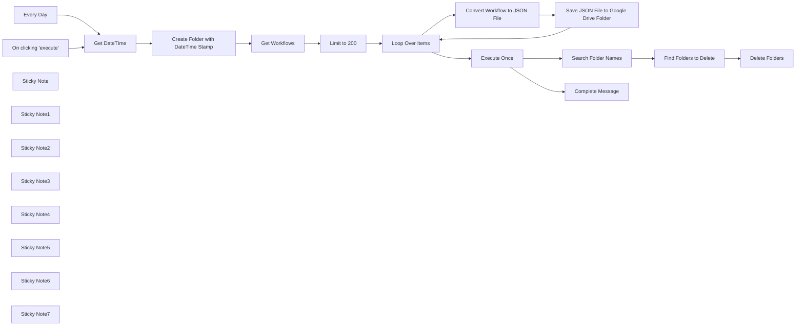

## Fluxo (.json) :

```json
{
  "id": "o4sdVtTrkuZXDATf",
  "meta": {
    "instanceId": "31e69f7f4a77bf465b805824e303232f0227212ae922d12133a0f96ffeab4fef",
    "templateCredsSetupCompleted": true
  },
  "name": "✨😃Automated Workflow Backups to Google Drive",
  "tags": [],
  "nodes": [
    {
      "id": "f3eba5f7-534e-4eaa-ac84-850d51ff2936",
      "name": "On clicking 'execute'",
      "type": "n8n-nodes-base.manualTrigger",
      "position": [
        620,
        -140
      ],
      "parameters": {},
      "typeVersion": 1
    },
    {
      "id": "383e4bed-38ec-4b2f-890c-9b0d9cda8e11",
      "name": "Loop Over Items",
      "type": "n8n-nodes-base.splitInBatches",
      "position": [
        1140,
        340
      ],
      "parameters": {
        "options": {
          "reset": false
        }
      },
      "typeVersion": 3
    },
    {
      "id": "38c4c909-fa18-4fa3-abf5-6b9bd2d46718",
      "name": "Every Day",
      "type": "n8n-nodes-base.scheduleTrigger",
      "position": [
        620,
        80
      ],
      "parameters": {
        "rule": {
          "interval": [
            {}
          ]
        }
      },
      "typeVersion": 1.2
    },
    {
      "id": "67f62b6e-fe37-4638-89ce-9fe1de041282",
      "name": "Create Folder with DateTime Stamp",
      "type": "n8n-nodes-base.googleDrive",
      "position": [
        1220,
        -40
      ],
      "parameters": {
        "name": "=n8n-Workflow-Backups-{{ $json.datetime }}",
        "driveId": {
          "__rl": true,
          "mode": "list",
          "value": "My Drive"
        },
        "options": {},
        "folderId": {
          "__rl": true,
          "mode": "list",
          "value": "root",
          "cachedResultName": "/ (Root folder)"
        },
        "resource": "folder"
      },
      "credentials": {
        "googleDriveOAuth2Api": {
          "id": "UhdXGYLTAJbsa0xX",
          "name": "Google Drive account"
        }
      },
      "typeVersion": 3
    },
    {
      "id": "cfbda56a-2d14-4d64-b40d-89961c0cf0f4",
      "name": "Get DateTIme",
      "type": "n8n-nodes-base.set",
      "position": [
        920,
        -40
      ],
      "parameters": {
        "options": {},
        "assignments": {
          "assignments": [
            {
              "id": "2589e80c-e8c3-4872-bd7a-d3e92f4a6ab7",
              "name": "datetime",
              "type": "string",
              "value": "={{ $now }}"
            }
          ]
        }
      },
      "typeVersion": 3.4
    },
    {
      "id": "93e8097f-9e7d-49ff-9133-4fd8590f7e31",
      "name": "Get Workflows",
      "type": "n8n-nodes-base.n8n",
      "position": [
        1520,
        -40
      ],
      "parameters": {
        "filters": {},
        "requestOptions": {}
      },
      "credentials": {
        "n8nApi": {
          "id": "49QOgnBpyVcT7XQF",
          "name": "n8n account"
        }
      },
      "typeVersion": 1
    },
    {
      "id": "d848ce1d-beb7-4e25-82ac-ed0e8f9523e0",
      "name": "Limit to 200",
      "type": "n8n-nodes-base.limit",
      "position": [
        1820,
        -40
      ],
      "parameters": {
        "maxItems": 200
      },
      "typeVersion": 1
    },
    {
      "id": "18f61908-97ce-478c-8544-cfedef22a94c",
      "name": "Convert Workflow to JSON File",
      "type": "n8n-nodes-base.convertToFile",
      "position": [
        1400,
        340
      ],
      "parameters": {
        "options": {
          "fileName": "={{ $json.name }}"
        },
        "operation": "toJson"
      },
      "typeVersion": 1.1
    },
    {
      "id": "97690d84-a0cd-4169-83a8-e4f1d189837e",
      "name": "Save JSON File to Google Drive Folder",
      "type": "n8n-nodes-base.googleDrive",
      "position": [
        1600,
        340
      ],
      "parameters": {
        "name": "={{ $binary.data.fileName }}.json",
        "driveId": {
          "__rl": true,
          "mode": "list",
          "value": "My Drive"
        },
        "options": {},
        "folderId": {
          "__rl": true,
          "mode": "id",
          "value": "={{ $('Create Folder with DateTime Stamp').item.json.id }}"
        }
      },
      "credentials": {
        "googleDriveOAuth2Api": {
          "id": "UhdXGYLTAJbsa0xX",
          "name": "Google Drive account"
        }
      },
      "typeVersion": 3
    },
    {
      "id": "452c0ce8-6e1f-41d7-a94c-25c7abbc32ad",
      "name": "Execute Once",
      "type": "n8n-nodes-base.noOp",
      "position": [
        980,
        720
      ],
      "parameters": {},
      "executeOnce": true,
      "typeVersion": 1
    },
    {
      "id": "aadc54d7-2458-4b5b-aa65-07aff52626d2",
      "name": "Search Folder Names",
      "type": "n8n-nodes-base.googleDrive",
      "position": [
        1180,
        720
      ],
      "parameters": {
        "limit": 10,
        "filter": {
          "whatToSearch": "folders"
        },
        "options": {},
        "resource": "fileFolder",
        "queryString": "n8n-Workflow-Backups"
      },
      "credentials": {
        "googleDriveOAuth2Api": {
          "id": "UhdXGYLTAJbsa0xX",
          "name": "Google Drive account"
        }
      },
      "executeOnce": true,
      "typeVersion": 3
    },
    {
      "id": "fcb210bf-4947-4178-b85a-8425eb72d937",
      "name": "Delete Folders",
      "type": "n8n-nodes-base.googleDrive",
      "onError": "continueRegularOutput",
      "position": [
        1600,
        720
      ],
      "parameters": {
        "options": {
          "deletePermanently": true
        },
        "resource": "folder",
        "operation": "deleteFolder",
        "folderNoRootId": {
          "__rl": true,
          "mode": "id",
          "value": "={{ $json.id }}"
        }
      },
      "credentials": {
        "googleDriveOAuth2Api": {
          "id": "UhdXGYLTAJbsa0xX",
          "name": "Google Drive account"
        }
      },
      "typeVersion": 3,
      "alwaysOutputData": true
    },
    {
      "id": "ccdc0655-75e9-4c6b-8ebb-76477733289b",
      "name": "Complete Message",
      "type": "n8n-nodes-base.telegram",
      "position": [
        960,
        1040
      ],
      "webhookId": "382a3b43-b83f-47b1-a276-67c6b98a441a",
      "parameters": {
        "text": "={{ $now }}\nWorkflows Backup Complete\n{{ $('Create Folder with DateTime Stamp').item.json.name }}\nhttps://drive.google.com/drive/folders/{{ $('Create Folder with DateTime Stamp').item.json.id }}",
        "chatId": "={{ $env.TELEGRAM_CHAT_ID }}",
        "additionalFields": {
          "parse_mode": "HTML",
          "appendAttribution": false
        }
      },
      "credentials": {
        "telegramApi": {
          "id": "pAIFhguJlkO3c7aQ",
          "name": "Telegram account"
        }
      },
      "typeVersion": 1.2
    },
    {
      "id": "972b4921-803f-4510-9894-9acd2713816a",
      "name": "Sticky Note",
      "type": "n8n-nodes-base.stickyNote",
      "position": [
        1020,
        220
      ],
      "parameters": {
        "color": 5,
        "width": 800,
        "height": 360,
        "content": "## Save Workflows to Google Drive"
      },
      "typeVersion": 1
    },
    {
      "id": "254d12e9-0ca6-4953-b375-66a883b44d41",
      "name": "Sticky Note1",
      "type": "n8n-nodes-base.stickyNote",
      "position": [
        840,
        620
      ],
      "parameters": {
        "color": 3,
        "width": 980,
        "height": 300,
        "content": "## Keep Most Recent 7 Folders (Days) and Delete Others"
      },
      "typeVersion": 1
    },
    {
      "id": "a1f25512-16d1-45e9-8b18-706288543e03",
      "name": "Sticky Note2",
      "type": "n8n-nodes-base.stickyNote",
      "position": [
        840,
        960
      ],
      "parameters": {
        "width": 340,
        "height": 260,
        "content": "## Notify User via Telegram"
      },
      "typeVersion": 1
    },
    {
      "id": "36182be7-f575-4f28-8d63-39802b8428ba",
      "name": "Find Folders to Delete",
      "type": "n8n-nodes-base.code",
      "position": [
        1400,
        720
      ],
      "parameters": {
        "jsCode": "// Get all input items and sort by name in descending order\nconst sortedItems = $input.all().sort((a, b) => {\n  if (!a.name || !b.name) return 0;\n  return b.name.localeCompare(a.name);\n});\n\n// Get items older than 7 days\nconst olderItems = sortedItems.slice(7);\n\nreturn olderItems\n\n"
      },
      "typeVersion": 2
    },
    {
      "id": "3a31ee24-3d6c-4340-9c5e-bb1c1cce6151",
      "name": "Sticky Note3",
      "type": "n8n-nodes-base.stickyNote",
      "position": [
        1740,
        -160
      ],
      "parameters": {
        "width": 260,
        "height": 340,
        "content": "## Limit for Debugging\nRemove this once you have it up and running"
      },
      "typeVersion": 1
    },
    {
      "id": "df815c43-f6f9-44b8-9503-6a8d0167b844",
      "name": "Sticky Note4",
      "type": "n8n-nodes-base.stickyNote",
      "position": [
        1440,
        -160
      ],
      "parameters": {
        "width": 260,
        "height": 340,
        "content": "## Get All Workflows\n"
      },
      "typeVersion": 1
    },
    {
      "id": "c0433a5f-7f6c-4af4-bbbb-ca914aeef33f",
      "name": "Sticky Note5",
      "type": "n8n-nodes-base.stickyNote",
      "position": [
        1140,
        -160
      ],
      "parameters": {
        "width": 260,
        "height": 340,
        "content": "## Create NEW Google Folder\n"
      },
      "typeVersion": 1
    },
    {
      "id": "adba380e-16c2-4647-a701-9d5cec1baa0f",
      "name": "Sticky Note6",
      "type": "n8n-nodes-base.stickyNote",
      "position": [
        840,
        -160
      ],
      "parameters": {
        "width": 260,
        "height": 340,
        "content": "## Get DateTime Stamp\n"
      },
      "typeVersion": 1
    },
    {
      "id": "4041f4fb-2b51-48e7-af55-b7351a52e4ea",
      "name": "Sticky Note7",
      "type": "n8n-nodes-base.stickyNote",
      "position": [
        -160,
        -160
      ],
      "parameters": {
        "color": 7,
        "width": 700,
        "height": 1480,
        "content": "# ✨😃 Automated Workflow Backups to Google Drive\n\nThis workflow automates the process of backing up your n8n workflows to Google Drive daily. It creates timestamped folders, saves workflows as JSON files, and manages old backups by retaining only the most recent seven days of data. Notifications are sent via Telegram to keep you informed of the backup status.\n\n## How It Works\n\n### Backup Creation Process 🗂️\n- **Triggering Backups**: The workflow starts with either a manual trigger or a scheduled trigger that runs daily.\n- **Folder Creation**: Creates a new folder in Google Drive with a timestamped name (e.g., `n8n-Workflow-Backups-YYYY-MM-DD`).\n- **Workflow Retrieval**: Fetches all workflows from your n8n instance.\n- **File Conversion**: Converts each workflow into a JSON file for storage.\n- **File Upload**: Saves the JSON files into the newly created Google Drive folder.\n\n### Backup Management 🔄\n- **Folder Search**: Searches for existing backup folders in Google Drive with names matching `n8n-Workflow-Backups`.\n- **Retention Policy**: Identifies folders older than seven days using a custom JavaScript function and deletes them permanently to free up space.\n\n### Notifications 📲\n- **Telegram Alerts**: Sends a message via Telegram once the backup process is complete, including the folder name and a link to access it in Google Drive.\n\n## Setup Steps\n\n### API Configuration 🔑\n1. **Google Drive Integration**:\n   - Set up Google Drive OAuth2 credentials in n8n.\n   - Specify the root folder or desired location for backups.\n2. **n8n API Access**:\n   - Configure n8n API credentials to allow fetching workflows.\n3. **Telegram Notifications**:\n   - Add your Telegram bot credentials and chat ID for notification delivery.\n\n### Workflow Customization ⚙️\n1. Define the schedule for automatic backups (e.g., daily at midnight).\n2. Adjust the retention period if you need more or fewer days of backups.\n3. Customize the Telegram message format as needed.\n\n### Testing & Deployment 🚀\n1. Run the workflow manually to verify folder creation and file uploads.\n2. Check that old folders are deleted correctly after seven days.\n3. Confirm Telegram notifications are sent with accurate details.\n\n## Use Case Scenarios\nThis workflow is perfect for teams or individuals who want to ensure their n8n workflows are securely backed up and organized. It is especially useful for:\n- Protecting against accidental data loss.\n- Automating routine administrative tasks.\n\n\nBy combining automated backups, retention management, and real-time notifications, this workflow ensures your n8n workflows are always safe and accessible!\n"
      },
      "typeVersion": 1
    }
  ],
  "active": true,
  "pinData": {},
  "settings": {
    "timezone": "America/Vancouver",
    "executionOrder": "v1"
  },
  "versionId": "11ff8d25-bbc5-4681-b292-ac60a00fd7b0",
  "connections": {
    "Every Day": {
      "main": [
        [
          {
            "node": "Get DateTIme",
            "type": "main",
            "index": 0
          }
        ]
      ]
    },
    "Execute Once": {
      "main": [
        [
          {
            "node": "Search Folder Names",
            "type": "main",
            "index": 0
          },
          {
            "node": "Complete Message",
            "type": "main",
            "index": 0
          }
        ]
      ]
    },
    "Get DateTIme": {
      "main": [
        [
          {
            "node": "Create Folder with DateTime Stamp",
            "type": "main",
            "index": 0
          }
        ]
      ]
    },
    "Limit to 200": {
      "main": [
        [
          {
            "node": "Loop Over Items",
            "type": "main",
            "index": 0
          }
        ]
      ]
    },
    "Get Workflows": {
      "main": [
        [
          {
            "node": "Limit to 200",
            "type": "main",
            "index": 0
          }
        ]
      ]
    },
    "Loop Over Items": {
      "main": [
        [
          {
            "node": "Execute Once",
            "type": "main",
            "index": 0
          }
        ],
        [
          {
            "node": "Convert Workflow to JSON File",
            "type": "main",
            "index": 0
          }
        ]
      ]
    },
    "Search Folder Names": {
      "main": [
        [
          {
            "node": "Find Folders to Delete",
            "type": "main",
            "index": 0
          }
        ]
      ]
    },
    "On clicking 'execute'": {
      "main": [
        [
          {
            "node": "Get DateTIme",
            "type": "main",
            "index": 0
          }
        ]
      ]
    },
    "Find Folders to Delete": {
      "main": [
        [
          {
            "node": "Delete Folders",
            "type": "main",
            "index": 0
          }
        ]
      ]
    },
    "Convert Workflow to JSON File": {
      "main": [
        [
          {
            "node": "Save JSON File to Google Drive Folder",
            "type": "main",
            "index": 0
          }
        ]
      ]
    },
    "Create Folder with DateTime Stamp": {
      "main": [
        [
          {
            "node": "Get Workflows",
            "type": "main",
            "index": 0
          }
        ]
      ]
    },
    "Save JSON File to Google Drive Folder": {
      "main": [
        [
          {
            "node": "Loop Over Items",
            "type": "main",
            "index": 0
          }
        ]
      ]
    }
  }
}
```

<a id="template-1020"></a>

## Template 1020 - Trending no YouTube por nicho

- **Nome:** Trending no YouTube por nicho
- **Descrição:** Este fluxo identifica tendências de conteúdo no YouTube para um nicho específico, buscando vídeos recentes, coletando métricas e descrevendo padrões para orientar criadores.
- **Funcionalidade:** • Verificação do nicho informado: valida se o usuário definiu um nicho e solicita caso não haja.
• Pesquisa de vídeos por nicho: realiza até 3 buscas com termos variados para vídeos publicados nos últimos 2 dias.
• Coleta de métricas e metadados: obtém id, título, descrição, canal, tags e estatísticas (visualizações, likes, comentários).
• Processamento e limpeza de dados: remove emojis, links e espaços extras, deixando os dados mais limpos.
• Análise de tendências: identifica padrões em tags, títulos e conteúdo relacionado para indicar o que está em alta.
• Geração de relatório com links: produz URLs dos vídeos e dos canais para acesso rápido.
• Armazenamento temporário e consolidação: usa memória para armazenar resultados e compilar a resposta final.
• Processamento por lotes: divide a lista de vídeos em lotes para processamento eficiente.
- **Ferramentas:** • YouTube Data API: Busca vídeos e retorna métricas e metadados necessários para análise de tendência nos últimos dois dias.


## Fluxo visual

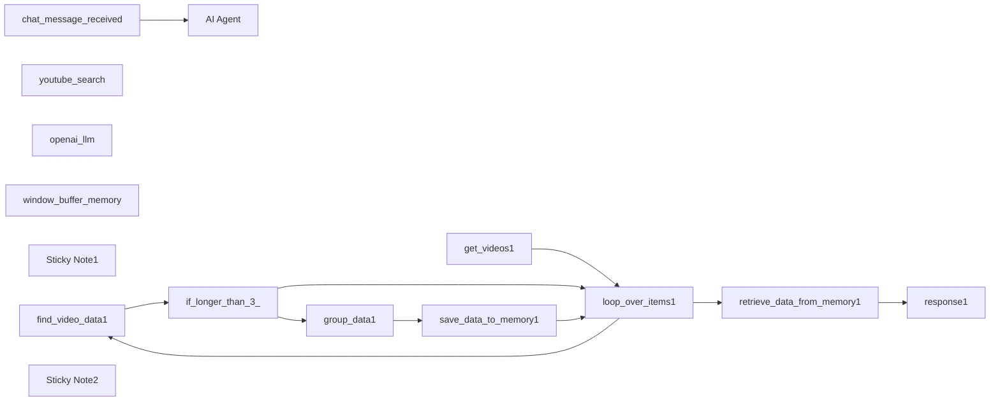

## Fluxo (.json) :

```json
{
  "id": "XSyVFC1tsGSxNwX9",
  "meta": {
    "instanceId": "60ad864624415060d2d0a0e71acd8b3b40e4ee2e9ef4b439d9937d3d33537a96"
  },
  "name": "Complete Youtube",
  "tags": [],
  "nodes": [
    {
      "id": "fd74706b-609b-4723-b4a4-067e1b064194",
      "name": "AI Agent",
      "type": "@n8n/n8n-nodes-langchain.agent",
      "position": [
        300,
        60
      ],
      "parameters": {
        "options": {
          "systemMessage": "=You help youtube creators find trending videos based on a specific niche.\n\nVerify if the user informed a niche before doing anything. If not, then ask him for one by giving him suggestions for him to select from.\n\nAfter you know what type of content the user might produce, use the \"youtube_search\" tool up to 3 times with different search terms based on the user's content type and niche.\n\nThe tool will answer with a list of videos from the last 2 days that had the most amount of relevancy. It returns a list of json's covering each video's id, view count, like count, comment count, description, channel title, tags and channel id. Each video is separated by \"### NEXT VIDEO FOUND: ###\".\n\nYou should then proceed to understand the data received then provide the user with insightful data of what could be trending from the past 2 days. Provide the user links to the trending videos which should be in this structure:\n\nhttps://www.youtube.com/watch?v={video_id}\n\nto reach the channel's link you should use:\n\nhttps://www.youtube.com/channel/{channel_id}\n\nFind patterns in the tags, titles and especially in the related content for the videos found.\n\nYour mission isn't to find the trending videos. It's to provide the user with valuable information of what is trending in that niche in terms of content news. Remember to provide the user with the numbers of views, likes and comments while commenting about any video. So you should not talk about any particular video, focus rather in explaining the overall senario of all that was found.\n\nExample of response:\n\n\"It seems like what is trending in digital marketing right now is talking about mental triggers, since 3 of the most trending videos in the last 2 days were about...\""
        }
      },
      "typeVersion": 1.6
    },
    {
      "id": "ced4b937-b590-4727-b1f2-a5e88b96091a",
      "name": "chat_message_received",
      "type": "@n8n/n8n-nodes-langchain.chatTrigger",
      "position": [
        80,
        60
      ],
      "webhookId": "ff9622a4-a6ec-4396-b9de-c95bd834c23c",
      "parameters": {
        "options": {}
      },
      "typeVersion": 1.1
    },
    {
      "id": "35a91359-5007-407d-a750-d6642e595690",
      "name": "youtube_search",
      "type": "@n8n/n8n-nodes-langchain.toolWorkflow",
      "position": [
        540,
        180
      ],
      "parameters": {
        "name": "youtube_search",
        "workflowId": {
          "__rl": true,
          "mode": "list",
          "value": "N9DveO781xbNf8qs",
          "cachedResultName": "Youtube Search Workflow"
        },
        "description": "Call this tool to search for trending videos based on a query.",
        "jsonSchemaExample": "{\n\t\"search_term\": \"some_value\"\n}",
        "specifyInputSchema": true
      },
      "typeVersion": 1.2
    },
    {
      "id": "42f41096-531d-4587-833a-6f659ef78dd0",
      "name": "openai_llm",
      "type": "@n8n/n8n-nodes-langchain.lmChatOpenAi",
      "position": [
        260,
        180
      ],
      "parameters": {
        "options": {}
      },
      "typeVersion": 1
    },
    {
      "id": "e4bda5b9-abd4-4cd6-8c95-126a01aa6e21",
      "name": "window_buffer_memory",
      "type": "@n8n/n8n-nodes-langchain.memoryBufferWindow",
      "position": [
        400,
        180
      ],
      "parameters": {},
      "typeVersion": 1.2
    },
    {
      "id": "f6d86c5a-393a-4bcf-bdaf-3b06c79fa51d",
      "name": "Sticky Note1",
      "type": "n8n-nodes-base.stickyNote",
      "position": [
        0,
        0
      ],
      "parameters": {
        "color": 7,
        "width": 693.2572054941234,
        "height": 354.53098948245656,
        "content": "Main Workflow"
      },
      "typeVersion": 1
    },
    {
      "id": "4ddbc3f0-e3d7-4ce4-a732-d731c05024d2",
      "name": "find_video_data1",
      "type": "n8n-nodes-base.httpRequest",
      "position": [
        700,
        720
      ],
      "parameters": {
        "url": "https://www.googleapis.com/youtube/v3/videos?",
        "options": {},
        "sendQuery": true,
        "queryParameters": {
          "parameters": [
            {
              "name": "key",
              "value": "={{ $env[\"GOOGLE_API_KEY\"] }}"
            },
            {
              "name": "id",
              "value": "={{ $json.id.videoId }}"
            },
            {
              "name": "part",
              "value": "contentDetails, snippet, statistics"
            }
          ]
        }
      },
      "typeVersion": 4.2
    },
    {
      "id": "fdb28635-801d-4ce0-8919-11446c6a7a82",
      "name": "get_videos1",
      "type": "n8n-nodes-base.youTube",
      "position": [
        280,
        560
      ],
      "parameters": {
        "limit": 3,
        "filters": {
          "q": "={{ $json.query.search_term }}",
          "regionCode": "US",
          "publishedAfter": "={{ new Date(Date.now() - 2 * 24 * 60 * 60 * 1000).toISOString() }}"
        },
        "options": {
          "order": "relevance",
          "safeSearch": "moderate"
        },
        "resource": "video"
      },
      "credentials": {
        "youTubeOAuth2Api": {
          "id": "dCyrga3t1tlgQQy0",
          "name": "YouTube account"
        }
      },
      "typeVersion": 1
    },
    {
      "id": "60e9e61d-0e5e-4212-8b55-71299aeec4d5",
      "name": "response1",
      "type": "n8n-nodes-base.set",
      "position": [
        1100,
        500
      ],
      "parameters": {
        "options": {},
        "assignments": {
          "assignments": [
            {
              "id": "b9b9117b-ea14-482e-a13b-e68b8e6b441d",
              "name": "response",
              "type": "string",
              "value": "={{ $input.all() }}"
            }
          ]
        }
      },
      "typeVersion": 3.4
    },
    {
      "id": "254a6740-8b25-4898-9795-4c3f0009471f",
      "name": "group_data1",
      "type": "n8n-nodes-base.set",
      "position": [
        1160,
        700
      ],
      "parameters": {
        "options": {},
        "assignments": {
          "assignments": [
            {
              "id": "47c172ad-90c8-4cf6-a9f5-50607e04cc90",
              "name": "id",
              "type": "string",
              "value": "={{ $json.items[0].id }}"
            },
            {
              "id": "9e639efa-0714-4b06-9847-f7b4b2fbef59",
              "name": "viewCount",
              "type": "string",
              "value": "={{ $json.items[0].statistics.viewCount }}"
            },
            {
              "id": "93328f00-91b8-425b-ad0f-a330b2f95242",
              "name": "likeCount",
              "type": "string",
              "value": "={{ $json.items[0].statistics.likeCount }}"
            },
            {
              "id": "015b0fb2-2a98-464c-a21b-51100616f26a",
              "name": "commentCount",
              "type": "string",
              "value": "={{ $json.items[0].statistics.commentCount }}"
            },
            {
              "id": "cf1e1ec3-a138-42b8-8747-d249afa58dd3",
              "name": "description",
              "type": "string",
              "value": "={{ $json.items[0].snippet.description }}"
            },
            {
              "id": "c5c9a3a2-b820-4932-a38a-e21102992215",
              "name": "title",
              "type": "string",
              "value": "={{ $json.items[0].snippet.title }}"
            },
            {
              "id": "38216ead-1f8d-4f93-b6ad-5ef709a1ad2a",
              "name": "channelTitle",
              "type": "string",
              "value": "={{ $json.items[0].snippet.channelTitle }}"
            },
            {
              "id": "ff34194d-3d46-43a8-9127-84708987f536",
              "name": "tags",
              "type": "string",
              "value": "={{ $json.items[0].snippet.tags.join(', ') }}"
            },
            {
              "id": "e50b0f7b-3e37-4557-8863-d68d4fa505c8",
              "name": "channelId",
              "type": "string",
              "value": "={{ $json.items[0].snippet.channelId }}"
            }
          ]
        }
      },
      "typeVersion": 3.4
    },
    {
      "id": "124c19a9-cbbd-4010-be37-50523c05f64b",
      "name": "save_data_to_memory1",
      "type": "n8n-nodes-base.code",
      "position": [
        1360,
        700
      ],
      "parameters": {
        "mode": "runOnceForEachItem",
        "jsCode": "const workflowStaticData = $getWorkflowStaticData('global');\n\nif (typeof workflowStaticData.lastExecution !== 'object') {\n    workflowStaticData.lastExecution = {\n        response: \"\"\n    };\n}\n\nfunction removeEmojis(text) {\n    return text.replace(/[\\u{1F600}-\\u{1F64F}|\\u{1F300}-\\u{1F5FF}|\\u{1F680}-\\u{1F6FF}|\\u{2600}-\\u{26FF}|\\u{2700}-\\u{27BF}]/gu, '');\n}\n\nfunction cleanDescription(description) {\n    return description\n        .replace(/https?://\\S+/g, '')\n        .replace(/www\\.\\S+/g, '')\n        .replace(/  +/g, ' ')\n        .trim();\n}\n\nconst currentItem = { ...$input.item };\n\nif (currentItem.description) {\n    currentItem.description = cleanDescription(currentItem.description);\n}\n\nlet sanitizedItem = JSON.stringify(currentItem)\n    .replace(/\\\\r/g, ' ')\n    .replace(/https?://\\S+/g, '')\n    .replace(/www\\.\\S+/g, '')\n    .replace(/\\\\n/g, ' ')\n    .replace(/\\n/g, ' ')\n    .replace(/\\/g, '')\n    .replace(/  +/g, ' ')\n    .trim();\n\nif (workflowStaticData.lastExecution.response) {\n    workflowStaticData.lastExecution.response += ' ### NEXT VIDEO FOUND: ### ';\n}\n\nworkflowStaticData.lastExecution.response += removeEmojis(sanitizedItem);\n\nreturn workflowStaticData.lastExecution;\n"
      },
      "typeVersion": 2
    },
    {
      "id": "67f92ec4-71c0-49df-a0ea-11d2e3cf0f94",
      "name": "retrieve_data_from_memory1",
      "type": "n8n-nodes-base.code",
      "position": [
        780,
        500
      ],
      "parameters": {
        "jsCode": "const workflowStaticData = $getWorkflowStaticData('global');\n\nconst lastExecution = workflowStaticData.lastExecution;\n\nreturn lastExecution;"
      },
      "typeVersion": 2
    },
    {
      "id": "685820ba-b089-4cdc-984d-52f134754b5c",
      "name": "loop_over_items1",
      "type": "n8n-nodes-base.splitInBatches",
      "position": [
        500,
        560
      ],
      "parameters": {
        "options": {}
      },
      "typeVersion": 3
    },
    {
      "id": "3d4d5a4b-d06b-41db-bb78-a64a266d5308",
      "name": "if_longer_than_3_",
      "type": "n8n-nodes-base.if",
      "position": [
        880,
        720
      ],
      "parameters": {
        "options": {},
        "conditions": {
          "options": {
            "version": 2,
            "leftValue": "",
            "caseSensitive": true,
            "typeValidation": "strict"
          },
          "combinator": "and",
          "conditions": [
            {
              "id": "08ba3db9-6bcf-47f8-a74d-9e26f28cb08f",
              "operator": {
                "type": "boolean",
                "operation": "true",
                "singleValue": true
              },
              "leftValue": "={{ \n  (() => {\n    const duration = $json.items[0].contentDetails.duration;\n\n    // Helper function to convert ISO 8601 duration to seconds\n    const iso8601ToSeconds = iso8601 => {\n      const match = iso8601.match(/PT(?:(\\d+)H)?(?:(\\d+)M)?(?:(\\d+)S)?/);\n      const hours = parseInt(match[1] || 0, 10);\n      const minutes = parseInt(match[2] || 0, 10);\n      const seconds = parseInt(match[3] || 0, 10);\n      return hours * 3600 + minutes * 60 + seconds;\n    };\n\n    // Convert duration to seconds\n    const durationInSeconds = iso8601ToSeconds(duration);\n\n    // Check if greater than 210 seconds (3 minutes 30 seconds)\n    return durationInSeconds > 210;\n  })() \n}}",
              "rightValue": ""
            }
          ]
        }
      },
      "typeVersion": 2.2
    },
    {
      "id": "7c6b8b82-fd6c-4f44-bccf-88c5a76f0319",
      "name": "Sticky Note2",
      "type": "n8n-nodes-base.stickyNote",
      "position": [
        0,
        420
      ],
      "parameters": {
        "color": 5,
        "width": 1607,
        "height": 520,
        "content": "This part should be abstracted to another workflow and called inside the \"youtube_search\" tool of the main AI Agent."
      },
      "typeVersion": 1
    }
  ],
  "active": false,
  "pinData": {},
  "settings": {
    "executionOrder": "v1"
  },
  "versionId": "cea84238-2b82-4a32-85dd-0c71ad685d47",
  "connections": {
    "openai_llm": {
      "ai_languageModel": [
        [
          {
            "node": "AI Agent",
            "type": "ai_languageModel",
            "index": 0
          }
        ]
      ]
    },
    "get_videos1": {
      "main": [
        [
          {
            "node": "loop_over_items1",
            "type": "main",
            "index": 0
          }
        ]
      ]
    },
    "group_data1": {
      "main": [
        [
          {
            "node": "save_data_to_memory1",
            "type": "main",
            "index": 0
          }
        ]
      ]
    },
    "youtube_search": {
      "ai_tool": [
        [
          {
            "node": "AI Agent",
            "type": "ai_tool",
            "index": 0
          }
        ]
      ]
    },
    "find_video_data1": {
      "main": [
        [
          {
            "node": "if_longer_than_3_",
            "type": "main",
            "index": 0
          }
        ]
      ]
    },
    "loop_over_items1": {
      "main": [
        [
          {
            "node": "retrieve_data_from_memory1",
            "type": "main",
            "index": 0
          }
        ],
        [
          {
            "node": "find_video_data1",
            "type": "main",
            "index": 0
          }
        ]
      ]
    },
    "if_longer_than_3_": {
      "main": [
        [
          {
            "node": "group_data1",
            "type": "main",
            "index": 0
          }
        ],
        [
          {
            "node": "loop_over_items1",
            "type": "main",
            "index": 0
          }
        ]
      ]
    },
    "save_data_to_memory1": {
      "main": [
        [
          {
            "node": "loop_over_items1",
            "type": "main",
            "index": 0
          }
        ]
      ]
    },
    "window_buffer_memory": {
      "ai_memory": [
        [
          {
            "node": "AI Agent",
            "type": "ai_memory",
            "index": 0
          }
        ]
      ]
    },
    "chat_message_received": {
      "main": [
        [
          {
            "node": "AI Agent",
            "type": "main",
            "index": 0
          }
        ]
      ]
    },
    "retrieve_data_from_memory1": {
      "main": [
        [
          {
            "node": "response1",
            "type": "main",
            "index": 0
          }
        ]
      ]
    }
  }
}
```
