# PACK 1999 TEMPLATES PARTE 06 - Bloco 2

Templates neste bloco: 20

## Sumário

- [Template 1021 - Criar contato Mailchimp a partir de inscrições do Squarespace](#template-1021)
- [Template 1022 - Relatório automático Top Creators e Workflows](#template-1022)
- [Template 1023 - Enriquecimento de perfis LinkedIn com API e Sheets](#template-1023)
- [Template 1024 - Análise de redes sociais e email automatizado](#template-1024)
- [Template 1025 - Detecção de novas entradas de tempo do Toggl](#template-1025)
- [Template 1026 - Atualizações automáticas de VPS](#template-1026)
- [Template 1027 - Otimização de conversão por IA para landing pages](#template-1027)
- [Template 1028 - Comparação de modelos de visão Ollama (local)](#template-1028)
- [Template 1029 - Obter oferta para carro usado](#template-1029)
- [Template 1030 - Newsletter tecnológica personalizada por IA](#template-1030)
- [Template 1031 - Bot Telegram integrado ao NeurochainAI](#template-1031)
- [Template 1032 - Inserção de texto entre linhas nas descrições de vídeos do YouTube](#template-1032)
- [Template 1033 - Backup simples de fluxos para Google Drive](#template-1033)
- [Template 1034 - Form para Docs a partir de formulário](#template-1034)
- [Template 1035 - Convite de usuários via Sheets](#template-1035)
- [Template 1036 - Busca de perfis LinkedIn a partir de formulário](#template-1036)
- [Template 1037 - Remoção avançada de fundo e upload para Google Drive](#template-1037)
- [Template 1038 - Extrair fieldData de contatos FileMaker](#template-1038)
- [Template 1039 - Resumo de vídeos do YouTube](#template-1039)
- [Template 1040 - Monitoramento remoto MQTT → InfluxDB](#template-1040)

---

<a id="template-1021"></a>

## Template 1021 - Criar contato Mailchimp a partir de inscrições do Squarespace

- **Nome:** Criar contato Mailchimp a partir de inscrições do Squarespace
- **Descrição:** Lê inscrições da newsletter armazenadas em uma planilha e cria/atualiza contatos em uma audiência do Mailchimp automaticamente.
- **Funcionalidade:** • Execução manual ou agendada: Permite rodar a automação sob demanda ou por agendamento.
• Leitura de inscrições na planilha: Busca registros contendo data de envio, e-mail e nome numa planilha pré-definida.
• Processamento em lote: Itera sobre cada registro para tratamento individual antes de enviar ao destino.
• Criação/atualização de contato no Mailchimp: Adiciona o membro com status "subscribed", define campo de nome (FNAME) e registra a data de inscrição.
• Inclusão de timestamp de inscrição: Usa a data submetida no registro como timestamp de cadastro no serviço de e-mail marketing.
• Tolerância a erros: Continua o processamento mesmo se algum registro falhar ao ser enviado ao serviço de e-mail marketing.
• Identificação de registros: Concatena o número da linha ao e-mail (estratégia para identificação/evitar colisões em testes).
- **Ferramentas:** • Squarespace: Fonte das inscrições da newsletter que originam os registros.
• Google Sheets: Planilha que armazena os envios da newsletter em colunas como Submitted On, Email Address e Name.
• Mailchimp: Plataforma de e-mail marketing onde os contatos são criados ou atualizados na audiência.


## Fluxo visual

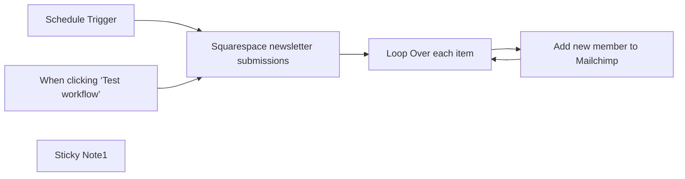

## Fluxo (.json) :

```json
{
  "meta": {
    "instanceId": "e634e668fe1fc93a75c4f2a7fc0dad807ca318b79654157eadb9578496acbc76",
    "templateCredsSetupCompleted": true
  },
  "nodes": [
    {
      "id": "a5f5621a-bd4c-45b8-be09-ebdda13ebb3e",
      "name": "When clicking ‘Test workflow’",
      "type": "n8n-nodes-base.manualTrigger",
      "position": [
        -280,
        120
      ],
      "parameters": {},
      "typeVersion": 1
    },
    {
      "id": "9447f0d4-1be3-4b8c-b172-3ff856f2197b",
      "name": "Schedule Trigger",
      "type": "n8n-nodes-base.scheduleTrigger",
      "position": [
        -280,
        -160
      ],
      "parameters": {
        "rule": {
          "interval": [
            {}
          ]
        }
      },
      "typeVersion": 1.2
    },
    {
      "id": "4ffd30f6-6f56-42cd-9f1c-07b58adbe312",
      "name": "Sticky Note1",
      "type": "n8n-nodes-base.stickyNote",
      "position": [
        -740,
        -260
      ],
      "parameters": {
        "color": 4,
        "width": 371.1995072042308,
        "height": 600.88409546716,
        "content": "## Create Mailchimp contact based on Squarespace newsletter\nThis workflow will get Squarespace newsletter signups and create new Mailchimp contact in the given Audience on Mailchimp\n\nThis overcome the limitation between Squarespace forms and Mailchimp connection where only new, empty audience can be used\n\nYou can run the workflow on demand or by schedule\n\n## Spreadsheet template\n\nThe sheet columns are inspire from Squarespace newsletter block connection, but you can change the node to adapt new columns format\n\nClone the [sample sheet here](https://docs.google.com/spreadsheets/d/1wi2Ucb4b35e0-fuf-96sMnyzTft0ADz3MwdE_cG_WnQ/edit?usp=sharing)\n- Submitted On\t\n- Email Address\t\n- Name"
      },
      "typeVersion": 1
    },
    {
      "id": "7af3d027-ffb8-4ca0-84d4-06dbf3902e80",
      "name": "Squarespace newsletter submissions",
      "type": "n8n-nodes-base.googleSheets",
      "position": [
        0,
        0
      ],
      "parameters": {
        "options": {},
        "sheetName": {
          "__rl": true,
          "mode": "list",
          "value": "gid=0",
          "cachedResultUrl": "https://docs.google.com/spreadsheets/d/15A3ZWzIBfONL4U_1XGJvtsS8HtMQ69qrpxd5C5L6Akg/edit#gid=0",
          "cachedResultName": "Sheet1"
        },
        "documentId": {
          "__rl": true,
          "mode": "list",
          "value": "15A3ZWzIBfONL4U_1XGJvtsS8HtMQ69qrpxd5C5L6Akg",
          "cachedResultUrl": "https://docs.google.com/spreadsheets/d/15A3ZWzIBfONL4U_1XGJvtsS8HtMQ69qrpxd5C5L6Akg/edit?usp=drivesdk",
          "cachedResultName": "n8n-submission"
        }
      },
      "credentials": {
        "googleSheetsOAuth2Api": {
          "id": "JgI9maibw5DnBXRP",
          "name": "Google Sheets account"
        }
      },
      "typeVersion": 4.5
    },
    {
      "id": "f0fe2c40-2971-4068-b5b0-57e70f65ff72",
      "name": "Loop Over each item",
      "type": "n8n-nodes-base.splitInBatches",
      "position": [
        260,
        0
      ],
      "parameters": {
        "options": {}
      },
      "typeVersion": 3
    },
    {
      "id": "ebad2d00-56b3-4dec-9e3b-d9cb6cc4aaf1",
      "name": "Add new member to Mailchimp",
      "type": "n8n-nodes-base.mailchimp",
      "onError": "continueErrorOutput",
      "position": [
        540,
        20
      ],
      "parameters": {
        "email": "={{ $json['Email Address'] }}{{ $json.row_number }}",
        "status": "subscribed",
        "options": {
          "timestampSignup": "={{ $json['Submitted On'] }}"
        },
        "mergeFieldsUi": {
          "mergeFieldsValues": [
            {
              "name": "FNAME",
              "value": "={{ $json.Name }}"
            }
          ]
        }
      },
      "credentials": {
        "mailchimpApi": {
          "id": "E6kRZLAOwvNxFpNz",
          "name": "Mailchimp account"
        }
      },
      "typeVersion": 1,
      "alwaysOutputData": false
    }
  ],
  "pinData": {},
  "connections": {
    "Schedule Trigger": {
      "main": [
        [
          {
            "node": "Squarespace newsletter submissions",
            "type": "main",
            "index": 0
          }
        ]
      ]
    },
    "Loop Over each item": {
      "main": [
        [],
        [
          {
            "node": "Add new member to Mailchimp",
            "type": "main",
            "index": 0
          }
        ]
      ]
    },
    "Add new member to Mailchimp": {
      "main": [
        [
          {
            "node": "Loop Over each item",
            "type": "main",
            "index": 0
          }
        ],
        []
      ]
    },
    "When clicking ‘Test workflow’": {
      "main": [
        [
          {
            "node": "Squarespace newsletter submissions",
            "type": "main",
            "index": 0
          }
        ]
      ]
    },
    "Squarespace newsletter submissions": {
      "main": [
        [
          {
            "node": "Loop Over each item",
            "type": "main",
            "index": 0
          }
        ]
      ]
    }
  }
}
```

<a id="template-1022"></a>

## Template 1022 - Relatório automático Top Creators e Workflows

- **Nome:** Relatório automático Top Creators e Workflows
- **Descrição:** Gera diariamente um relatório detalhado sobre os principais criadores e workflows da comunidade a partir de arquivos públicos, com análises, tabelas e distribuição por e-mail, drive e Telegram.
- **Funcionalidade:** • Agendamento diário: executa a rotina automaticamente em horário programado.
• Recuperação de dados do repositório: baixa arquivos JSON públicos contendo estatísticas de criadores e workflows.
• Parsers de dados: extrai e normaliza campos relevantes de creators e workflows para processamento.
• Ordenação e seleção: classifica por inserções/visitantes e limita a seleção aos top N (ex.: top 10 criadores, top 50 workflows).
• Mesclagem e agregação: combina dados de criadores com seus workflows e agrega métricas relevantes.
• Geração de relatório em Markdown: cria um sumário detalhado, tabelas e análises em Markdown.
• Conversão Markdown → HTML: converte o conteúdo para HTML quando necessário para envio por e-mail ou visualização.
• Geração de lista Top 10 por LLM: usa modelos de linguagem para compilar a lista dos 10 principais workflows com hyperlinks, sem preâmbulos.
• Armazenamento local e em nuvem: salva relatórios localmente (arquivo .md) e em conta de drive para acesso compartilhado.
• Envio de relatórios: distribui o conteúdo por e-mail e publica a lista Top 10 em um canal/ chat via Telegram.
• Interface de agente de IA: expõe uma ferramenta/endpoint para consultas e para que o agente recupere estatísticas e elabore o relatório.
- **Ferramentas:** • GitHub (raw.githubusercontent.com): fonte dos arquivos JSON com estatísticas públicas.
• OpenAI (gpt-4o-mini): modelo de linguagem usado para gerar o relatório em Markdown e sumarizações.
• Google Gemini (PaLM): modelo de linguagem secundário usado para criar a lista Top 10.
• Google Drive: armazenamento em nuvem dos relatórios gerados.
• Gmail: envio dos relatórios por e-mail.
• Telegram: publicação/envio da lista Top 10 para um chat ou canal.


## Fluxo visual

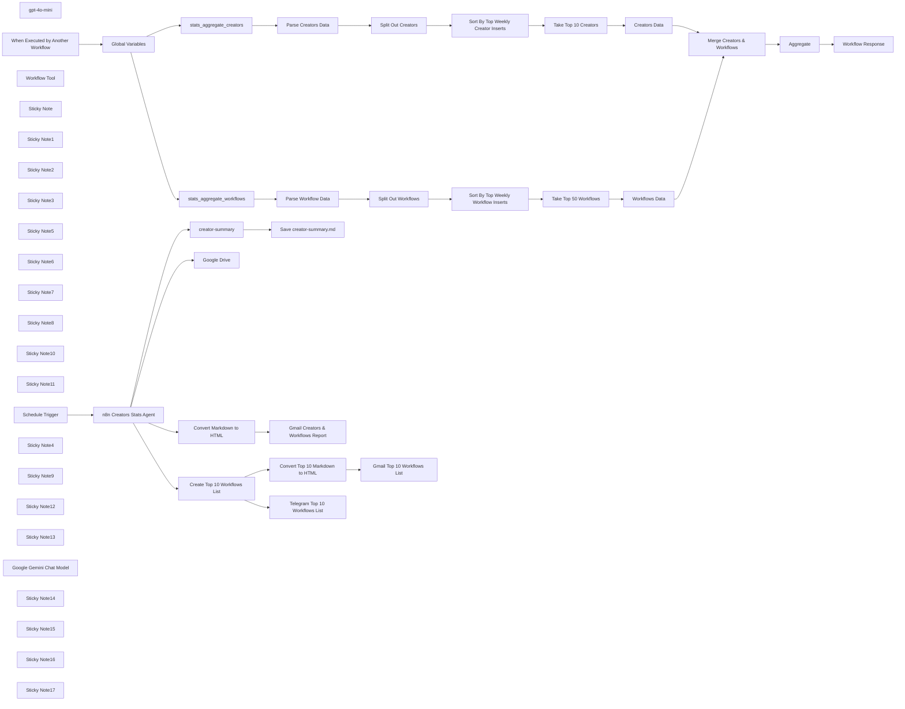

## Fluxo (.json) :

```json
{
  "id": "6zSE618gr9fDtAfF",
  "meta": {
    "instanceId": "31e69f7f4a77bf465b805824e303232f0227212ae922d12133a0f96ffeab4fef",
    "templateCredsSetupCompleted": true
  },
  "name": "🤖🧑‍💻 AI Agent for Top n8n Creators Leaderboard Reporting",
  "tags": [],
  "nodes": [
    {
      "id": "5b9537db-41d3-4d8a-bf41-f875e4044224",
      "name": "stats_aggregate_creators",
      "type": "n8n-nodes-base.httpRequest",
      "position": [
        -1240,
        1300
      ],
      "parameters": {
        "url": "={{ $json.path }}{{ $json['creators-filename'] }}.json",
        "options": {}
      },
      "typeVersion": 4.2
    },
    {
      "id": "feb2328b-57b0-4280-98d8-6b946db0c947",
      "name": "stats_aggregate_workflows",
      "type": "n8n-nodes-base.httpRequest",
      "position": [
        -1240,
        1500
      ],
      "parameters": {
        "url": "={{ $json.path }}{{ $json['workflows-filename'] }}.json",
        "options": {}
      },
      "typeVersion": 4.2
    },
    {
      "id": "53f8b825-b030-4541-b12b-6df6702f7d1b",
      "name": "Global Variables",
      "type": "n8n-nodes-base.set",
      "position": [
        -1660,
        1460
      ],
      "parameters": {
        "options": {},
        "assignments": {
          "assignments": [
            {
              "id": "4bcb91c6-d250-4cb4-8ee1-022df13550e1",
              "name": "path",
              "type": "string",
              "value": "https://raw.githubusercontent.com/teds-tech-talks/n8n-community-leaderboard/refs/heads/main/"
            },
            {
              "id": "a910a798-0bfe-41b1-a4f1-41390c7f6997",
              "name": "workflows-filename",
              "type": "string",
              "value": "=stats_aggregate_workflows"
            },
            {
              "id": "e977e816-dc1e-43ce-9393-d6488e6832ca",
              "name": "creators-filename",
              "type": "string",
              "value": "=stats_aggregate_creators"
            },
            {
              "id": "14233ab4-3fa4-4e26-8032-6ffe26cb601e",
              "name": "datetime",
              "type": "string",
              "value": "={{ $now.format('yyyy-MM-dd') }}"
            }
          ]
        }
      },
      "typeVersion": 3.4
    },
    {
      "id": "202026ea-054f-45ae-84f6-59ec58794f1c",
      "name": "Parse Workflow Data",
      "type": "n8n-nodes-base.set",
      "position": [
        -880,
        1540
      ],
      "parameters": {
        "options": {},
        "assignments": {
          "assignments": [
            {
              "id": "76f4b20e-519e-4d46-aeac-c6c3f98a69fd",
              "name": "data",
              "type": "array",
              "value": "={{ $json.data }}"
            }
          ]
        }
      },
      "typeVersion": 3.4
    },
    {
      "id": "54ecfc96-0f5e-4275-a53b-f87850926d7f",
      "name": "Parse Creators Data",
      "type": "n8n-nodes-base.set",
      "position": [
        -880,
        1200
      ],
      "parameters": {
        "options": {},
        "assignments": {
          "assignments": [
            {
              "id": "76f4b20e-519e-4d46-aeac-c6c3f98a69fd",
              "name": "data",
              "type": "array",
              "value": "={{ $json.data }}"
            }
          ]
        }
      },
      "typeVersion": 3.4
    },
    {
      "id": "e590677e-a8ff-4b76-8527-e5bdc0076610",
      "name": "Aggregate",
      "type": "n8n-nodes-base.aggregate",
      "position": [
        -680,
        1820
      ],
      "parameters": {
        "options": {},
        "aggregate": "aggregateAllItemData"
      },
      "typeVersion": 1
    },
    {
      "id": "7d7ef0f2-dbca-4b24-b2e5-c1236c4beb81",
      "name": "gpt-4o-mini",
      "type": "@n8n/n8n-nodes-langchain.lmChatOpenAi",
      "position": [
        -1880,
        780
      ],
      "parameters": {
        "model": {
          "__rl": true,
          "mode": "list",
          "value": "gpt-4o-mini"
        },
        "options": {
          "temperature": 0.1
        }
      },
      "credentials": {
        "openAiApi": {
          "id": "jEMSvKmtYfzAkhe6",
          "name": "OpenAi account"
        }
      },
      "typeVersion": 1.2
    },
    {
      "id": "59e7066f-da3b-4461-9a52-0f8754b696ae",
      "name": "When Executed by Another Workflow",
      "type": "n8n-nodes-base.executeWorkflowTrigger",
      "position": [
        -1980,
        1460
      ],
      "parameters": {
        "inputSource": "jsonExample",
        "jsonExample": "{\n \"query\": \n {\n \"username\": \n \"joe\"\n }\n}"
      },
      "typeVersion": 1.1
    },
    {
      "id": "18734480-3520-4e37-af19-977ec3bfb260",
      "name": "Workflow Tool",
      "type": "@n8n/n8n-nodes-langchain.toolWorkflow",
      "position": [
        -1540,
        780
      ],
      "parameters": {
        "name": "n8n_creator_stats",
        "workflowId": "={{ $workflow.id }}",
        "description": "Call this tool to get n8n Creator Stats.",
        "jsonSchemaExample": "{\n \"username\": \"n8n creator username\"\n}",
        "specifyInputSchema": true
      },
      "typeVersion": 1
    },
    {
      "id": "4b2195bd-d506-4cd5-bb9d-37cf84c8cebf",
      "name": "creator-summary",
      "type": "n8n-nodes-base.convertToFile",
      "position": [
        -1140,
        60
      ],
      "parameters": {
        "options": {
          "fileName": "=creators-report"
        },
        "operation": "toText",
        "sourceProperty": "output"
      },
      "typeVersion": 1.1
    },
    {
      "id": "ca25473a-0e19-45e0-8de5-00601c95fdf9",
      "name": "Workflow Response",
      "type": "n8n-nodes-base.set",
      "position": [
        -480,
        1820
      ],
      "parameters": {
        "options": {},
        "assignments": {
          "assignments": [
            {
              "id": "eeff1310-2e1c-4ea4-9107-a14b1979f74f",
              "name": "response",
              "type": "string",
              "value": "={{ $json.data }}"
            }
          ]
        }
      },
      "typeVersion": 3.4
    },
    {
      "id": "c45c9bc8-e0d9-496a-bf8d-71c806c330de",
      "name": "Save creator-summary.md",
      "type": "n8n-nodes-base.readWriteFile",
      "position": [
        -940,
        60
      ],
      "parameters": {
        "options": {
          "append": true
        },
        "fileName": "=C:\\\\Users\\\\joe\\Downloads\\\\{{ $binary.data.fileName }}-{{ $now.format('yyyy-MM-dd-hh-mm-ss') }}.md",
        "operation": "write"
      },
      "typeVersion": 1
    },
    {
      "id": "0cddb18b-7924-41f6-b429-a00e4c904b47",
      "name": "Sticky Note",
      "type": "n8n-nodes-base.stickyNote",
      "position": [
        -2060,
        240
      ],
      "parameters": {
        "color": 5,
        "width": 780,
        "height": 740,
        "content": "## AI Agent for n8n Creator Leaderboard Stats\nhttps://github.com/teds-tech-talks/n8n-community-leaderboard"
      },
      "typeVersion": 1
    },
    {
      "id": "6e1a7ffe-bac6-43d8-b7e8-866eb5fcb9f7",
      "name": "Sticky Note1",
      "type": "n8n-nodes-base.stickyNote",
      "position": [
        -1640,
        620
      ],
      "parameters": {
        "width": 280,
        "height": 300,
        "content": "## Tool Call for n8n Creators Stats\nhttps://docs.n8n.io/integrations/builtin/cluster-nodes/sub-nodes/n8n-nodes-langchain.toolworkflow/"
      },
      "typeVersion": 1
    },
    {
      "id": "892ac156-a276-4697-9b25-768301991996",
      "name": "Sticky Note2",
      "type": "n8n-nodes-base.stickyNote",
      "position": [
        -1980,
        620
      ],
      "parameters": {
        "color": 7,
        "width": 300,
        "height": 300,
        "content": "## OpenAI LLM\nhttps://platform.openai.com/api-keys"
      },
      "typeVersion": 1
    },
    {
      "id": "1e3cdf04-b33f-4a64-83c8-f24c424380b2",
      "name": "Sticky Note3",
      "type": "n8n-nodes-base.stickyNote",
      "position": [
        -1240,
        -60
      ],
      "parameters": {
        "width": 540,
        "height": 320,
        "content": "## Save n8n Creators & Workflows Report Locally\n(optional for local install)"
      },
      "typeVersion": 1
    },
    {
      "id": "a01adc65-9425-460b-85ed-fac4c82f1e78",
      "name": "Sticky Note5",
      "type": "n8n-nodes-base.stickyNote",
      "position": [
        -1760,
        1340
      ],
      "parameters": {
        "width": 300,
        "height": 320,
        "content": "## Global Workflow Variables\n\n"
      },
      "typeVersion": 1
    },
    {
      "id": "f7523185-7d36-4839-bfd3-d101fc1164fa",
      "name": "Sticky Note6",
      "type": "n8n-nodes-base.stickyNote",
      "position": [
        -1800,
        1100
      ],
      "parameters": {
        "color": 3,
        "width": 780,
        "height": 640,
        "content": "## Daily n8n Leaderboard Stats\nhttps://github.com/teds-tech-talks/n8n-community-leaderboard\n\n### n8n Leaderboard\nhttps://teds-tech-talks.github.io/n8n-community-leaderboard/"
      },
      "typeVersion": 1
    },
    {
      "id": "79381486-6caf-4629-94ac-d7cfef44c437",
      "name": "Sticky Note7",
      "type": "n8n-nodes-base.stickyNote",
      "position": [
        -980,
        1100
      ],
      "parameters": {
        "color": 6,
        "width": 1120,
        "height": 300,
        "content": "## n8n Creators Stats"
      },
      "typeVersion": 1
    },
    {
      "id": "6099f718-37d2-45a6-806c-2196dbf6736b",
      "name": "Sticky Note8",
      "type": "n8n-nodes-base.stickyNote",
      "position": [
        -980,
        1440
      ],
      "parameters": {
        "color": 4,
        "width": 1120,
        "height": 300,
        "content": "## n8n Workflow Stats"
      },
      "typeVersion": 1
    },
    {
      "id": "1270338c-1a9f-4a90-a5f1-7efd7547de4e",
      "name": "Creators Data",
      "type": "n8n-nodes-base.set",
      "position": [
        -60,
        1200
      ],
      "parameters": {
        "options": {},
        "assignments": {
          "assignments": [
            {
              "id": "02b02023-c5a2-4e22-bcf9-2284c434f5d3",
              "name": "name",
              "type": "string",
              "value": "={{ $json.user.name }}"
            },
            {
              "id": "4582435b-3c76-45e7-a251-12055efa890a",
              "name": "username",
              "type": "string",
              "value": "={{ $json.user.username }}"
            },
            {
              "id": "b713a971-ce29-43cf-8f42-c426a38c6582",
              "name": "bio",
              "type": "string",
              "value": "={{ $json.user.bio }}"
            },
            {
              "id": "19a06510-802e-4bd5-9552-7afa7355ff92",
              "name": "sum_unique_weekly_inserters",
              "type": "number",
              "value": "={{ $json.sum_unique_weekly_inserters }}"
            },
            {
              "id": "e436533a-5170-47c2-809b-7d79502eb009",
              "name": "sum_unique_monthly_inserters",
              "type": "number",
              "value": "={{ $json.sum_unique_monthly_inserters }}"
            },
            {
              "id": "198fef5d-86b8-4009-b187-6d3e6566d137",
              "name": "sum_unique_inserters",
              "type": "number",
              "value": "={{ $json.sum_unique_inserters }}"
            }
          ]
        }
      },
      "typeVersion": 3.4
    },
    {
      "id": "3fd50542-2067-4dd4-a3ae-006aa4f9b030",
      "name": "Workflows Data",
      "type": "n8n-nodes-base.set",
      "position": [
        -60,
        1540
      ],
      "parameters": {
        "options": {},
        "assignments": {
          "assignments": [
            {
              "id": "3bc3cd11-904d-4315-974d-262c0bd5fea7",
              "name": "template_url",
              "type": "string",
              "value": "={{ $json.template_url }}"
            },
            {
              "id": "c846c523-f077-40cd-b548-32460124ffb9",
              "name": "wf_detais.name",
              "type": "string",
              "value": "={{ $json.wf_detais.name }}"
            },
            {
              "id": "f330de47-56fb-4657-8a30-5f5e5cfa76d7",
              "name": "wf_detais.createdAt",
              "type": "string",
              "value": "={{ $json.wf_detais.createdAt }}"
            },
            {
              "id": "f7ed7e51-a7cf-4f2e-8819-f33115c5ad51",
              "name": "wf_detais.description",
              "type": "string",
              "value": "={{ $json.wf_detais.description }}"
            },
            {
              "id": "02b02023-c5a2-4e22-bcf9-2284c434f5d3",
              "name": "name",
              "type": "string",
              "value": "={{ $json.user.name }}"
            },
            {
              "id": "4582435b-3c76-45e7-a251-12055efa890a",
              "name": "username",
              "type": "string",
              "value": "={{ $json.user.username }}"
            },
            {
              "id": "f952cad3-7e62-46b7-aeb7-a5cbf4d46c0d",
              "name": "unique_weekly_inserters",
              "type": "number",
              "value": "={{ $json.unique_weekly_inserters }}"
            },
            {
              "id": "6123302b-5bda-48f4-9ef2-71ff52a5f3ba",
              "name": "unique_monthly_inserters",
              "type": "number",
              "value": "={{ $json.unique_monthly_inserters }}"
            },
            {
              "id": "92dca169-e03f-42ad-8790-ebb55c1a7272",
              "name": "unique_weekly_visitors",
              "type": "number",
              "value": "={{ $json.unique_weekly_visitors }}"
            },
            {
              "id": "ee640389-d396-4d65-8110-836372a51fb0",
              "name": "unique_monthly_visitors",
              "type": "number",
              "value": "={{ $json.unique_monthly_visitors }}"
            },
            {
              "id": "9f1c5599-3672-4f4e-9742-d7cc564f6714",
              "name": "user.avatar",
              "type": "string",
              "value": "={{ $json.user.avatar }}"
            }
          ]
        }
      },
      "typeVersion": 3.4
    },
    {
      "id": "6ad04027-1df9-402d-b98c-de7ec7e62cae",
      "name": "Merge Creators & Workflows",
      "type": "n8n-nodes-base.merge",
      "position": [
        240,
        1540
      ],
      "parameters": {
        "mode": "combine",
        "options": {},
        "joinMode": "enrichInput1",
        "fieldsToMatchString": "username"
      },
      "typeVersion": 3
    },
    {
      "id": "fdf56c84-804a-46e2-8058-8a4374ba21b7",
      "name": "Split Out Creators",
      "type": "n8n-nodes-base.splitOut",
      "position": [
        -680,
        1200
      ],
      "parameters": {
        "options": {},
        "fieldToSplitOut": "data"
      },
      "typeVersion": 1
    },
    {
      "id": "cac2e121-f0a9-4142-86c7-5549b8b3631d",
      "name": "Split Out Workflows",
      "type": "n8n-nodes-base.splitOut",
      "position": [
        -680,
        1540
      ],
      "parameters": {
        "options": {},
        "fieldToSplitOut": "data"
      },
      "typeVersion": 1
    },
    {
      "id": "4a32eb8c-07d2-4a71-bb60-9e2c2eeda7f6",
      "name": "Sort By Top Weekly Creator Inserts",
      "type": "n8n-nodes-base.sort",
      "position": [
        -480,
        1200
      ],
      "parameters": {
        "options": {},
        "sortFieldsUi": {
          "sortField": [
            {
              "order": "descending",
              "fieldName": "sum_unique_weekly_inserters"
            }
          ]
        }
      },
      "typeVersion": 1
    },
    {
      "id": "f39b2e87-cc3a-4e90-84dc-18ae663608d6",
      "name": "Sort By Top Weekly Workflow Inserts",
      "type": "n8n-nodes-base.sort",
      "position": [
        -480,
        1540
      ],
      "parameters": {
        "options": {},
        "sortFieldsUi": {
          "sortField": [
            {
              "order": "descending",
              "fieldName": "unique_weekly_inserters"
            }
          ]
        }
      },
      "typeVersion": 1
    },
    {
      "id": "85ae9c6b-50bd-40df-bebd-e7522df61f3c",
      "name": "Sticky Note10",
      "type": "n8n-nodes-base.stickyNote",
      "position": [
        -2060,
        1020
      ],
      "parameters": {
        "color": 7,
        "width": 2510,
        "height": 1000,
        "content": "## Workflow for n8n Creators Stats"
      },
      "typeVersion": 1
    },
    {
      "id": "7aaf6f1b-a42b-49e6-a9bd-27c8ee2b6e83",
      "name": "Sticky Note11",
      "type": "n8n-nodes-base.stickyNote",
      "position": [
        -1340,
        1140
      ],
      "parameters": {
        "color": 7,
        "width": 280,
        "height": 560,
        "content": "## GET n8n Stats from GitHub repo\nhttps://docs.n8n.io/integrations/builtin/core-nodes/n8n-nodes-base.httprequest/"
      },
      "typeVersion": 1
    },
    {
      "id": "5aa6990b-c764-4d5a-ab68-c6f12b3d3b70",
      "name": "Schedule Trigger",
      "type": "n8n-nodes-base.scheduleTrigger",
      "position": [
        -2260,
        380
      ],
      "parameters": {
        "rule": {
          "interval": [
            {
              "triggerAtHour": 22
            }
          ]
        }
      },
      "typeVersion": 1.2
    },
    {
      "id": "160fa10e-9697-4c84-ba13-d701baaee782",
      "name": "Take Top 10 Creators",
      "type": "n8n-nodes-base.limit",
      "position": [
        -260,
        1200
      ],
      "parameters": {
        "maxItems": 10
      },
      "typeVersion": 1
    },
    {
      "id": "09d8cc25-7ea7-4793-a891-90f8b577df81",
      "name": "Take Top 50 Workflows",
      "type": "n8n-nodes-base.limit",
      "position": [
        -260,
        1540
      ],
      "parameters": {
        "maxItems": 50
      },
      "typeVersion": 1
    },
    {
      "id": "c3ebbc08-151e-4f18-848f-ddec2a720edc",
      "name": "Google Drive",
      "type": "n8n-nodes-base.googleDrive",
      "position": [
        -1040,
        460
      ],
      "parameters": {
        "name": "=n8n Creator Stats Report - {{ $now.format('yyyy-MM-dd:hh:mm:ss') }}",
        "content": "={{ $json.output }}",
        "driveId": {
          "__rl": true,
          "mode": "list",
          "value": "My Drive"
        },
        "options": {},
        "folderId": {
          "__rl": true,
          "mode": "list",
          "value": "root",
          "cachedResultName": "/ (Root folder)"
        },
        "operation": "createFromText"
      },
      "credentials": {
        "googleDriveOAuth2Api": {
          "id": "UhdXGYLTAJbsa0xX",
          "name": "Google Drive account"
        }
      },
      "typeVersion": 3
    },
    {
      "id": "0a2ff2ea-6120-49e2-adda-547830b4f9f8",
      "name": "Sticky Note4",
      "type": "n8n-nodes-base.stickyNote",
      "position": [
        -320,
        1060
      ],
      "parameters": {
        "width": 220,
        "height": 720,
        "content": "## Settings\nChange these settings to suit your needs"
      },
      "typeVersion": 1
    },
    {
      "id": "f5db76e5-8058-4771-8a3b-0116f0abb6a3",
      "name": "Sticky Note9",
      "type": "n8n-nodes-base.stickyNote",
      "position": [
        -1240,
        300
      ],
      "parameters": {
        "color": 6,
        "width": 540,
        "height": 340,
        "content": "## Save n8n Creator & Workflows Report to Google Drive\nhttps://docs.n8n.io/integrations/builtin/app-nodes/n8n-nodes-base.googledrive/"
      },
      "typeVersion": 1
    },
    {
      "id": "4594d952-8d21-40ac-8654-4a050c96a686",
      "name": "Sticky Note12",
      "type": "n8n-nodes-base.stickyNote",
      "position": [
        -1240,
        680
      ],
      "parameters": {
        "color": 4,
        "width": 540,
        "height": 300,
        "content": "## Email n8n Creators & Workflows Report\nhttps://docs.n8n.io/integrations/builtin/app-nodes/n8n-nodes-base.gmail/"
      },
      "typeVersion": 1
    },
    {
      "id": "784b5047-9fdf-40db-ab07-436c12d749d0",
      "name": "Convert Markdown to HTML",
      "type": "n8n-nodes-base.markdown",
      "position": [
        -1140,
        780
      ],
      "parameters": {
        "mode": "markdownToHtml",
        "options": {},
        "markdown": "={{ $json.output }}"
      },
      "typeVersion": 1
    },
    {
      "id": "cab1978f-9aa0-4cd8-901c-f6ad615936c6",
      "name": "n8n Creators Stats Agent",
      "type": "@n8n/n8n-nodes-langchain.agent",
      "position": [
        -1800,
        380
      ],
      "parameters": {
        "text": "=Prepare a report about the n8n creators",
        "options": {
          "systemMessage": "=You are tasked with generating a **comprehensive Markdown report** about n8n community workflows and contributors using the provided tools. Your report should include meaningful insights about the contributors positive impact on the n8n community. Follow the structure below:\n\n## Detailed Summary\n- Provide a thorough summary of ALL contributor's workflows.\n- Highlight unique features, key use cases, and notable technical components for each workflow.\n- Include hyperlinks for each workflow.\n\n## Workflows\nCreate a well-formatted markdown table with these columns:\n- **Workflow Name**: The name of the workflow. Keep the emojies of they exist. Include hyperlinks for each workflow.\n- **Description**: A brief overview of its purpose and functionality.\n- **Unique Weekly Visitors**: The number of unique users who visited this workflow weekly.\n- **Unique Monthly Visitors**: The number of unique users who visited this workflow monthly.\n- **Unique Weekly Inserters**: The number of unique users who inserted this workflow weekly.\n- **Unique Monthly Inserters**: The number of unique users who inserted this workflow monthly.\n- **Why It’s Popular**: Explain what makes this workflow stand out (e.g., innovative features, ease of use, specific use cases).\n\n## Community Analysis\n- Analyze why these workflows are popular and valued by the n8n community.\n- Discuss any trends, patterns, or feedback that highlight their significance.\n\n## Additional Insights\n- If available, provide extra information about the contributor's overall impact, such as their engagement in community forums or other notable contributions.\n\n## Formatting Guidelines\n- Use Markdown formatting exclusively (headers, lists, and tables) for clarity and organization.\n- Ensure your response is concise yet comprehensive, structured for easy navigation.\n\n## Error Handling\n- If data is unavailable or incomplete, clearly state this in your response and suggest possible reasons or next steps.\n\n## TOOLS\n\n### n8n_creator_stats \n- Use this tool to retrieve detailed statistics about the n8n creators.\n\n\n \n"
        },
        "promptType": "define"
      },
      "typeVersion": 1.7
    },
    {
      "id": "f94de0ba-4d27-4b00-8f6c-b15ea2f37af7",
      "name": "Sticky Note13",
      "type": "n8n-nodes-base.stickyNote",
      "position": [
        -80,
        280
      ],
      "parameters": {
        "width": 320,
        "height": 340,
        "content": "## Telegram \n(Optional)\nhttps://docs.n8n.io/integrations/builtin/app-nodes/n8n-nodes-base.telegram/"
      },
      "typeVersion": 1
    },
    {
      "id": "f50913c0-6615-4a5d-a4d4-2522280bc978",
      "name": "Google Gemini Chat Model",
      "type": "@n8n/n8n-nodes-langchain.lmChatGoogleGemini",
      "position": [
        -440,
        720
      ],
      "parameters": {
        "options": {
          "temperature": 0.2
        },
        "modelName": "models/gemini-2.0-flash-exp"
      },
      "credentials": {
        "googlePalmApi": {
          "id": "L9UNQHflYlyF9Ngd",
          "name": "Google Gemini(PaLM) Api account"
        }
      },
      "typeVersion": 1
    },
    {
      "id": "137b191e-9dae-4396-a536-dd77126ef176",
      "name": "Create Top 10 Workflows List",
      "type": "@n8n/n8n-nodes-langchain.chainLlm",
      "position": [
        -520,
        380
      ],
      "parameters": {
        "text": "=Create a list with hyperlinks of the top 10 workflows by weekly instertions from this report: {{ $json.output }}\n\nDo not include any preamble or further explanation. ",
        "promptType": "define"
      },
      "typeVersion": 1.5
    },
    {
      "id": "6249b1e5-2f47-469a-8bcc-16f41ee1da12",
      "name": "Sticky Note14",
      "type": "n8n-nodes-base.stickyNote",
      "position": [
        -660,
        280
      ],
      "parameters": {
        "color": 5,
        "width": 540,
        "height": 700,
        "content": "## Create Top 10 Workflows List\n"
      },
      "typeVersion": 1
    },
    {
      "id": "9564db34-8b19-474e-812c-8a9d2cd028cb",
      "name": "Sticky Note15",
      "type": "n8n-nodes-base.stickyNote",
      "position": [
        -540,
        600
      ],
      "parameters": {
        "color": 7,
        "width": 300,
        "height": 280,
        "content": "## Google Gemini LLM\nhttps://aistudio.google.com/apikey"
      },
      "typeVersion": 1
    },
    {
      "id": "065624e9-7f45-4607-94e9-2bf5a4f983ef",
      "name": "Sticky Note16",
      "type": "n8n-nodes-base.stickyNote",
      "position": [
        -80,
        680
      ],
      "parameters": {
        "color": 4,
        "width": 520,
        "height": 300,
        "content": "## Email Top 10 Workflows List\nhttps://docs.n8n.io/integrations/builtin/app-nodes/n8n-nodes-base.gmail/"
      },
      "typeVersion": 1
    },
    {
      "id": "532c071f-3ae0-4afd-9569-2ecc2ccebb02",
      "name": "Convert Top 10 Markdown to HTML",
      "type": "n8n-nodes-base.markdown",
      "position": [
        20,
        780
      ],
      "parameters": {
        "mode": "markdownToHtml",
        "options": {},
        "markdown": "={{ $json.text }}"
      },
      "typeVersion": 1
    },
    {
      "id": "f3aa0206-4449-41b1-aa4e-1fec6c948250",
      "name": "Gmail Creators & Workflows Report",
      "type": "n8n-nodes-base.gmail",
      "position": [
        -940,
        780
      ],
      "webhookId": "2bad33f7-38f8-40ca-9bcd-2f51179c8db5",
      "parameters": {
        "sendTo": "joe@example.com",
        "message": "={{ $json.data }}",
        "options": {},
        "subject": "n8n Creator Stats"
      },
      "credentials": {
        "gmailOAuth2": {
          "id": "1xpVDEQ1yx8gV022",
          "name": "Gmail account"
        }
      },
      "typeVersion": 2.1
    },
    {
      "id": "2521435a-ad6e-4724-a07c-7762860b3f55",
      "name": "Telegram Top 10 Workflows List",
      "type": "n8n-nodes-base.telegram",
      "onError": "continueRegularOutput",
      "position": [
        20,
        420
      ],
      "webhookId": "8406b3d2-5ac6-452d-847f-c0886c8cd058",
      "parameters": {
        "text": "=n8n Creators Report - Top 10 Workflows\n{{ $now }}\n----------------------------------------------------\n{{ $json.text }}",
        "chatId": "={{ $env.TELEGRAM_CHAT_ID }}",
        "additionalFields": {
          "parse_mode": "HTML",
          "appendAttribution": false
        }
      },
      "credentials": {
        "telegramApi": {
          "id": "pAIFhguJlkO3c7aQ",
          "name": "Telegram account"
        }
      },
      "typeVersion": 1.2
    },
    {
      "id": "f234a3c1-18ba-488e-a88d-4a05be9eb9f4",
      "name": "Gmail Top 10 Workflows List",
      "type": "n8n-nodes-base.gmail",
      "position": [
        220,
        780
      ],
      "webhookId": "2bad33f7-38f8-40ca-9bcd-2f51179c8db5",
      "parameters": {
        "sendTo": "joe@example.com",
        "message": "={{ $json.data }}",
        "options": {},
        "subject": "n8n Top 10 Workflows"
      },
      "credentials": {
        "gmailOAuth2": {
          "id": "1xpVDEQ1yx8gV022",
          "name": "Gmail account"
        }
      },
      "typeVersion": 2.1
    },
    {
      "id": "1267b550-5c8a-4fa3-8f0a-4d18f16a57c4",
      "name": "Sticky Note17",
      "type": "n8n-nodes-base.stickyNote",
      "position": [
        -2640,
        580
      ],
      "parameters": {
        "width": 540,
        "height": 900,
        "content": "# n8n Top Creators Leaderboard Reporting Workflow\n\n## Why This Workflow is Important\nThis workflow is a powerful tool for reporting on the n8n community's creators and workflows. It provides valuable insights into the most popular workflows, top contributors, and community trends. By automating data aggregation, processing, and report generation, it saves time and effort while fostering collaboration and inspiration within the n8n ecosystem.\n\n### Key Benefits:\n- **Discover Trends**: Identify top workflows based on unique visitors and inserters.\n- **Recognize Contributors**: Highlight impactful creators driving community engagement.\n- **Save Time**: Automates the entire reporting process, from data retrieval to report creation.\n\n## How to Use It\n1. **Set Up Prerequisites**: Ensure your n8n instance is running, GitHub data files are accessible, Google Gmail/Drive and OpenAI credentials are configured and Google Gemini credentials are configured.\n\n2. **Trigger the Workflow**:\n - Schedule the workflow to run daily or as needed.\n\n3. **Review Reports**:\n - The workflow generates a detailed Markdown report with summaries, tables, and insights.\n - Reports are saved locally or shared via email, Google Drive, or Telegram.\n\n\nThis workflow is ideal for creators, community managers, and new users looking to explore or optimize workflows within the n8n platform.\n"
      },
      "typeVersion": 1
    }
  ],
  "active": true,
  "pinData": {},
  "settings": {
    "timezone": "America/Vancouver",
    "executionOrder": "v1"
  },
  "versionId": "619db74b-3f91-4d3b-b85d-e7e6bb972aca",
  "connections": {
    "Aggregate": {
      "main": [
        [
          {
            "node": "Workflow Response",
            "type": "main",
            "index": 0
          }
        ]
      ]
    },
    "gpt-4o-mini": {
      "ai_languageModel": [
        [
          {
            "node": "n8n Creators Stats Agent",
            "type": "ai_languageModel",
            "index": 0
          }
        ]
      ]
    },
    "Creators Data": {
      "main": [
        [
          {
            "node": "Merge Creators & Workflows",
            "type": "main",
            "index": 0
          }
        ]
      ]
    },
    "Workflow Tool": {
      "ai_tool": [
        [
          {
            "node": "n8n Creators Stats Agent",
            "type": "ai_tool",
            "index": 0
          }
        ]
      ]
    },
    "Workflows Data": {
      "main": [
        [
          {
            "node": "Merge Creators & Workflows",
            "type": "main",
            "index": 1
          }
        ]
      ]
    },
    "creator-summary": {
      "main": [
        [
          {
            "node": "Save creator-summary.md",
            "type": "main",
            "index": 0
          }
        ]
      ]
    },
    "Global Variables": {
      "main": [
        [
          {
            "node": "stats_aggregate_creators",
            "type": "main",
            "index": 0
          },
          {
            "node": "stats_aggregate_workflows",
            "type": "main",
            "index": 0
          }
        ]
      ]
    },
    "Schedule Trigger": {
      "main": [
        [
          {
            "node": "n8n Creators Stats Agent",
            "type": "main",
            "index": 0
          }
        ]
      ]
    },
    "Split Out Creators": {
      "main": [
        [
          {
            "node": "Sort By Top Weekly Creator Inserts",
            "type": "main",
            "index": 0
          }
        ]
      ]
    },
    "Parse Creators Data": {
      "main": [
        [
          {
            "node": "Split Out Creators",
            "type": "main",
            "index": 0
          }
        ]
      ]
    },
    "Parse Workflow Data": {
      "main": [
        [
          {
            "node": "Split Out Workflows",
            "type": "main",
            "index": 0
          }
        ]
      ]
    },
    "Split Out Workflows": {
      "main": [
        [
          {
            "node": "Sort By Top Weekly Workflow Inserts",
            "type": "main",
            "index": 0
          }
        ]
      ]
    },
    "Take Top 10 Creators": {
      "main": [
        [
          {
            "node": "Creators Data",
            "type": "main",
            "index": 0
          }
        ]
      ]
    },
    "Take Top 50 Workflows": {
      "main": [
        [
          {
            "node": "Workflows Data",
            "type": "main",
            "index": 0
          }
        ]
      ]
    },
    "Convert Markdown to HTML": {
      "main": [
        [
          {
            "node": "Gmail Creators & Workflows Report",
            "type": "main",
            "index": 0
          }
        ]
      ]
    },
    "Google Gemini Chat Model": {
      "ai_languageModel": [
        [
          {
            "node": "Create Top 10 Workflows List",
            "type": "ai_languageModel",
            "index": 0
          }
        ]
      ]
    },
    "n8n Creators Stats Agent": {
      "main": [
        [
          {
            "node": "creator-summary",
            "type": "main",
            "index": 0
          },
          {
            "node": "Google Drive",
            "type": "main",
            "index": 0
          },
          {
            "node": "Convert Markdown to HTML",
            "type": "main",
            "index": 0
          },
          {
            "node": "Create Top 10 Workflows List",
            "type": "main",
            "index": 0
          }
        ]
      ]
    },
    "stats_aggregate_creators": {
      "main": [
        [
          {
            "node": "Parse Creators Data",
            "type": "main",
            "index": 0
          }
        ]
      ]
    },
    "stats_aggregate_workflows": {
      "main": [
        [
          {
            "node": "Parse Workflow Data",
            "type": "main",
            "index": 0
          }
        ]
      ]
    },
    "Merge Creators & Workflows": {
      "main": [
        [
          {
            "node": "Aggregate",
            "type": "main",
            "index": 0
          }
        ]
      ]
    },
    "Create Top 10 Workflows List": {
      "main": [
        [
          {
            "node": "Convert Top 10 Markdown to HTML",
            "type": "main",
            "index": 0
          },
          {
            "node": "Telegram Top 10 Workflows List",
            "type": "main",
            "index": 0
          }
        ]
      ]
    },
    "Convert Top 10 Markdown to HTML": {
      "main": [
        [
          {
            "node": "Gmail Top 10 Workflows List",
            "type": "main",
            "index": 0
          }
        ]
      ]
    },
    "When Executed by Another Workflow": {
      "main": [
        [
          {
            "node": "Global Variables",
            "type": "main",
            "index": 0
          }
        ]
      ]
    },
    "Sort By Top Weekly Creator Inserts": {
      "main": [
        [
          {
            "node": "Take Top 10 Creators",
            "type": "main",
            "index": 0
          }
        ]
      ]
    },
    "Sort By Top Weekly Workflow Inserts": {
      "main": [
        [
          {
            "node": "Take Top 50 Workflows",
            "type": "main",
            "index": 0
          }
        ]
      ]
    }
  }
}
```

<a id="template-1023"></a>

## Template 1023 - Enriquecimento de perfis LinkedIn com API e Sheets

- **Nome:** Enriquecimento de perfis LinkedIn com API e Sheets
- **Descrição:** Este fluxo lê URLs de perfis LinkedIn de uma planilha, obtém dados adicionais por meio de uma API externa e grava as informações enriquecidas em outra planilha, automatizando o enriquecimento de perfis.
- **Funcionalidade:** • Leitura de URLs de perfis LinkedIn a partir de uma planilha: inicia o processamento com as URLs a enriquecer.
• Filtragem de perfis já enriquecidos: evita processar perfis cuja informação já está completa.
• Enriquecimento de perfis via API externa: consulta dados detalhados de cada perfil usando a URL codificada.
• Preparação dos dados para gravação: consolidação dos campos retornados e inclusão de identificadores/row_number.
• Gravação dos dados enriquecidos: atualização da planilha de destino com os campos enriquecidos.
- **Ferramentas:** • Google Sheets: leitura e gravação de dados de perfis LinkedIn.
• Fresh LinkedIn Profile Data (RapidAPI): API externa para obter informações adicionais de perfis LinkedIn.


## Fluxo visual

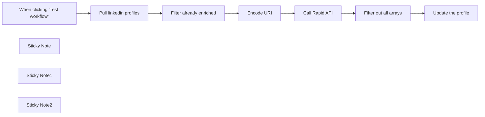

## Fluxo (.json) :

```json
{
  "nodes": [
    {
      "id": "835afb8f-5bb3-42da-9694-d04646a80cef",
      "name": "When clicking ‘Test workflow’",
      "type": "n8n-nodes-base.manualTrigger",
      "position": [
        0,
        0
      ],
      "parameters": {},
      "typeVersion": 1
    },
    {
      "id": "1e85bf4f-52d5-4ec0-8d0b-a1deeb30c9c6",
      "name": "Call Rapid API",
      "type": "n8n-nodes-base.httpRequest",
      "position": [
        880,
        0
      ],
      "parameters": {
        "url": "https://fresh-linkedin-profile-data.p.rapidapi.com/get-linkedin-profile",
        "options": {},
        "sendQuery": true,
        "sendHeaders": true,
        "queryParameters": {
          "parameters": [
            {
              "name": "linkedin_url",
              "value": "={{ $json[\"Linkedin Profile\"] }}"
            }
          ]
        },
        "headerParameters": {
          "parameters": [
            {
              "name": "x-rapidapi-key"
            },
            {
              "name": "x-rapidapi-host"
            }
          ]
        }
      },
      "typeVersion": 4.2
    },
    {
      "id": "9fa011f4-d1fe-46d2-abda-28ae33929874",
      "name": "Filter already enriched",
      "type": "n8n-nodes-base.filter",
      "position": [
        440,
        0
      ],
      "parameters": {
        "options": {},
        "conditions": {
          "options": {
            "version": 2,
            "leftValue": "",
            "caseSensitive": true,
            "typeValidation": "strict"
          },
          "combinator": "and",
          "conditions": [
            {
              "id": "5907d2f7-b15d-41cc-8fee-45631bb874e1",
              "operator": {
                "type": "string",
                "operation": "empty",
                "singleValue": true
              },
              "leftValue": "={{ $json.about }}",
              "rightValue": ""
            },
            {
              "id": "2857554e-a635-43d3-bf9e-a617b85009ca",
              "operator": {
                "type": "string",
                "operation": "notEmpty",
                "singleValue": true
              },
              "leftValue": "={{ $json.linkedin_url }}",
              "rightValue": ""
            }
          ]
        }
      },
      "typeVersion": 2.2
    },
    {
      "id": "3f0b5717-38b4-4371-b3fa-9f19acf3e624",
      "name": "Encode URI",
      "type": "n8n-nodes-base.set",
      "position": [
        660,
        0
      ],
      "parameters": {
        "options": {},
        "assignments": {
          "assignments": [
            {
              "id": "fd914708-c85f-4c0e-a277-d8164c616699",
              "name": "Linkedin Profile",
              "type": "string",
              "value": "={{ encodeURI($json.linkedin_url) }}"
            }
          ]
        }
      },
      "typeVersion": 3.4
    },
    {
      "id": "632e2555-5474-4d00-85f0-e95ee984c0dd",
      "name": "FiIter out all arrays",
      "type": "n8n-nodes-base.code",
      "position": [
        1100,
        0
      ],
      "parameters": {
        "mode": "runOnceForEachItem",
        "jsCode": "// Initialize an empty object to store filtered items\nlet filteredData = {};\n\n// Loop through each item in $input.item.json.data\nfor (const item in $input.item.json.data) {\n  // Check if the item is not an array\n  if (!Array.isArray($input.item.json.data[item])) {\n    // Add the item to the filteredData object\n    filteredData[item] = $input.item.json.data[item];\n  }\n}\nfilteredData['row_number'] = $('Pull linkedin profiles').first().json.row_number\n// Return the filteredData array\nreturn filteredData;"
      },
      "typeVersion": 2
    },
    {
      "id": "24b27c51-0f22-400c-bdc3-a09186c74639",
      "name": "Update the profile",
      "type": "n8n-nodes-base.googleSheets",
      "position": [
        1320,
        0
      ],
      "parameters": {
        "columns": {
          "value": {},
          "schema": [
            {
              "id": "linkedin_url",
              "type": "string",
              "display": true,
              "removed": false,
              "required": false,
              "displayName": "linkedin_url",
              "defaultMatch": false,
              "canBeUsedToMatch": true
            },
            {
              "id": "about",
              "type": "string",
              "display": true,
              "required": false,
              "displayName": "about",
              "defaultMatch": false,
              "canBeUsedToMatch": true
            },
            {
              "id": "city",
              "type": "string",
              "display": true,
              "required": false,
              "displayName": "city",
              "defaultMatch": false,
              "canBeUsedToMatch": true
            },
            {
              "id": "company",
              "type": "string",
              "display": true,
              "required": false,
              "displayName": "company",
              "defaultMatch": false,
              "canBeUsedToMatch": true
            },
            {
              "id": "company_description",
              "type": "string",
              "display": true,
              "required": false,
              "displayName": "company_description",
              "defaultMatch": false,
              "canBeUsedToMatch": true
            },
            {
              "id": "company_domain",
              "type": "string",
              "display": true,
              "removed": false,
              "required": false,
              "displayName": "company_domain",
              "defaultMatch": false,
              "canBeUsedToMatch": true
            },
            {
              "id": "company_employee_range",
              "type": "string",
              "display": true,
              "removed": false,
              "required": false,
              "displayName": "company_employee_range",
              "defaultMatch": false,
              "canBeUsedToMatch": true
            },
            {
              "id": "company_industry",
              "type": "string",
              "display": true,
              "removed": false,
              "required": false,
              "displayName": "company_industry",
              "defaultMatch": false,
              "canBeUsedToMatch": true
            },
            {
              "id": "company_linkedin_url",
              "type": "string",
              "display": true,
              "removed": false,
              "required": false,
              "displayName": "company_linkedin_url",
              "defaultMatch": false,
              "canBeUsedToMatch": true
            },
            {
              "id": "company_logo_url",
              "type": "string",
              "display": true,
              "removed": false,
              "required": false,
              "displayName": "company_logo_url",
              "defaultMatch": false,
              "canBeUsedToMatch": true
            },
            {
              "id": "company_website",
              "type": "string",
              "display": true,
              "removed": false,
              "required": false,
              "displayName": "company_website",
              "defaultMatch": false,
              "canBeUsedToMatch": true
            },
            {
              "id": "company_year_founded",
              "type": "string",
              "display": true,
              "removed": false,
              "required": false,
              "displayName": "company_year_founded",
              "defaultMatch": false,
              "canBeUsedToMatch": true
            },
            {
              "id": "connection_count",
              "type": "string",
              "display": true,
              "removed": false,
              "required": false,
              "displayName": "connection_count",
              "defaultMatch": false,
              "canBeUsedToMatch": true
            },
            {
              "id": "country",
              "type": "string",
              "display": true,
              "removed": false,
              "required": false,
              "displayName": "country",
              "defaultMatch": false,
              "canBeUsedToMatch": true
            },
            {
              "id": "current_company_join_month",
              "type": "string",
              "display": true,
              "removed": false,
              "required": false,
              "displayName": "current_company_join_month",
              "defaultMatch": false,
              "canBeUsedToMatch": true
            },
            {
              "id": "current_company_join_year",
              "type": "string",
              "display": true,
              "removed": false,
              "required": false,
              "displayName": "current_company_join_year",
              "defaultMatch": false,
              "canBeUsedToMatch": true
            },
            {
              "id": "current_job_duration",
              "type": "string",
              "display": true,
              "removed": false,
              "required": false,
              "displayName": "current_job_duration",
              "defaultMatch": false,
              "canBeUsedToMatch": true
            },
            {
              "id": "email",
              "type": "string",
              "display": true,
              "removed": false,
              "required": false,
              "displayName": "email",
              "defaultMatch": false,
              "canBeUsedToMatch": true
            },
            {
              "id": "first_name",
              "type": "string",
              "display": true,
              "removed": false,
              "required": false,
              "displayName": "first_name",
              "defaultMatch": false,
              "canBeUsedToMatch": true
            },
            {
              "id": "follower_count",
              "type": "string",
              "display": true,
              "removed": false,
              "required": false,
              "displayName": "follower_count",
              "defaultMatch": false,
              "canBeUsedToMatch": true
            },
            {
              "id": "full_name",
              "type": "string",
              "display": true,
              "removed": false,
              "required": false,
              "displayName": "full_name",
              "defaultMatch": false,
              "canBeUsedToMatch": true
            },
            {
              "id": "headline",
              "type": "string",
              "display": true,
              "removed": false,
              "required": false,
              "displayName": "headline",
              "defaultMatch": false,
              "canBeUsedToMatch": true
            },
            {
              "id": "hq_city",
              "type": "string",
              "display": true,
              "removed": false,
              "required": false,
              "displayName": "hq_city",
              "defaultMatch": false,
              "canBeUsedToMatch": true
            },
            {
              "id": "hq_country",
              "type": "string",
              "display": true,
              "removed": false,
              "required": false,
              "displayName": "hq_country",
              "defaultMatch": false,
              "canBeUsedToMatch": true
            },
            {
              "id": "hq_region",
              "type": "string",
              "display": true,
              "removed": false,
              "required": false,
              "displayName": "hq_region",
              "defaultMatch": false,
              "canBeUsedToMatch": true
            },
            {
              "id": "job_title",
              "type": "string",
              "display": true,
              "removed": false,
              "required": false,
              "displayName": "job_title",
              "defaultMatch": false,
              "canBeUsedToMatch": true
            },
            {
              "id": "languages",
              "type": "string",
              "display": true,
              "removed": false,
              "required": false,
              "displayName": "languages",
              "defaultMatch": false,
              "canBeUsedToMatch": true
            },
            {
              "id": "last_name",
              "type": "string",
              "display": true,
              "removed": false,
              "required": false,
              "displayName": "last_name",
              "defaultMatch": false,
              "canBeUsedToMatch": true
            },
            {
              "id": "location",
              "type": "string",
              "display": true,
              "removed": false,
              "required": false,
              "displayName": "location",
              "defaultMatch": false,
              "canBeUsedToMatch": true
            },
            {
              "id": "phone",
              "type": "string",
              "display": true,
              "removed": false,
              "required": false,
              "displayName": "phone",
              "defaultMatch": false,
              "canBeUsedToMatch": true
            },
            {
              "id": "profile_id",
              "type": "string",
              "display": true,
              "removed": false,
              "required": false,
              "displayName": "profile_id",
              "defaultMatch": false,
              "canBeUsedToMatch": true
            },
            {
              "id": "profile_image_url",
              "type": "string",
              "display": true,
              "removed": false,
              "required": false,
              "displayName": "profile_image_url",
              "defaultMatch": false,
              "canBeUsedToMatch": true
            },
            {
              "id": "public_id",
              "type": "string",
              "display": true,
              "removed": false,
              "required": false,
              "displayName": "public_id",
              "defaultMatch": false,
              "canBeUsedToMatch": true
            },
            {
              "id": "school",
              "type": "string",
              "display": true,
              "removed": false,
              "required": false,
              "displayName": "school",
              "defaultMatch": false,
              "canBeUsedToMatch": true
            },
            {
              "id": "state",
              "type": "string",
              "display": true,
              "removed": false,
              "required": false,
              "displayName": "state",
              "defaultMatch": false,
              "canBeUsedToMatch": true
            },
            {
              "id": "urn",
              "type": "string",
              "display": true,
              "removed": false,
              "required": false,
              "displayName": "urn",
              "defaultMatch": false,
              "canBeUsedToMatch": true
            }
          ],
          "mappingMode": "autoMapInputData",
          "matchingColumns": [
            "linkedin_url"
          ]
        },
        "options": {},
        "operation": "appendOrUpdate",
        "sheetName": {
          "__rl": true,
          "mode": "list",
          "value": "gid=0",
          "cachedResultUrl": "https://docs.google.com/spreadsheets/d/10cSUaj-YZhrgwXLIGpJzLjv6RMN6cYiw9EK-rNw0-AM/edit#gid=0",
          "cachedResultName": "Sheet1"
        },
        "documentId": {
          "__rl": true,
          "mode": "list",
          "value": "10cSUaj-YZhrgwXLIGpJzLjv6RMN6cYiw9EK-rNw0-AM",
          "cachedResultUrl": "https://docs.google.com/spreadsheets/d/10cSUaj-YZhrgwXLIGpJzLjv6RMN6cYiw9EK-rNw0-AM/edit?usp=drivesdk",
          "cachedResultName": "Linkedin contact info"
        }
      },
      "credentials": {
        "googleSheetsOAuth2Api": {
          "id": "gdLmm513ROUyH6oU",
          "name": "Google Sheets account"
        }
      },
      "typeVersion": 4.5
    },
    {
      "id": "41e0e213-a1f4-47ff-aebd-6cd08df06eae",
      "name": "Sticky Note",
      "type": "n8n-nodes-base.stickyNote",
      "position": [
        160,
        -200
      ],
      "parameters": {
        "color": 4,
        "width": 220,
        "height": 380,
        "content": "## Create a Google sheet\nWith just one column named \"linkedin_url\" and fill it with the profiles you want to enrich"
      },
      "typeVersion": 1
    },
    {
      "id": "da28d424-10ce-499d-95c9-81979dab0f6b",
      "name": "Sticky Note1",
      "type": "n8n-nodes-base.stickyNote",
      "position": [
        780,
        -300
      ],
      "parameters": {
        "color": 4,
        "width": 300,
        "height": 480,
        "content": "## Call RapidAPI Fresh Linkedin Profile Data\nYou have to create an account in [RapidAPI](https://rapidapi.com) and subscribe to Fresh LinkedIn Profile Data. With a free account you will be able to scrape 100 profile / month.\nAfter your subscription you will have to replace the header values: \"x-rapidapi-key\" and \"x-rapidapi-host\" with the values given in the RapidAPI interface\n"
      },
      "typeVersion": 1
    },
    {
      "id": "2bae0a2a-0c88-465b-854d-728280539e90",
      "name": "Pull linkedin profiles",
      "type": "n8n-nodes-base.googleSheets",
      "position": [
        220,
        0
      ],
      "parameters": {
        "options": {},
        "sheetName": {
          "__rl": true,
          "mode": "list",
          "value": "gid=0",
          "cachedResultUrl": "https://docs.google.com/spreadsheets/d/10cSUaj-YZhrgwXLIGpJzLjv6RMN6cYiw9EK-rNw0-AM/edit#gid=0",
          "cachedResultName": "Sheet1"
        },
        "documentId": {
          "__rl": true,
          "mode": "list",
          "value": "10cSUaj-YZhrgwXLIGpJzLjv6RMN6cYiw9EK-rNw0-AM",
          "cachedResultUrl": "https://docs.google.com/spreadsheets/d/10cSUaj-YZhrgwXLIGpJzLjv6RMN6cYiw9EK-rNw0-AM/edit?usp=drivesdk",
          "cachedResultName": "Linkedin contact info"
        }
      },
      "credentials": {
        "googleSheetsOAuth2Api": {
          "id": "gdLmm513ROUyH6oU",
          "name": "Google Sheets account"
        }
      },
      "typeVersion": 4.5
    },
    {
      "id": "d93a0d4c-1db8-4604-85e1-7d02bbbdcdb8",
      "name": "Sticky Note2",
      "type": "n8n-nodes-base.stickyNote",
      "position": [
        -500,
        -760
      ],
      "parameters": {
        "color": 7,
        "width": 460,
        "height": 1160,
        "content": "### LinkedIn Profile Enrichment Workflow\n\n#### Who is this for?\n\nThis workflow is ideal for recruiters, sales professionals, and marketing teams who need to enrich LinkedIn profiles with additional data for lead generation, talent sourcing, or market research.\n\n#### What problem is this workflow solving?\n\nManually gathering detailed LinkedIn profile information can be time-consuming and prone to errors. This workflow automates the process of enriching profile data from LinkedIn, saving time and ensuring accuracy.\n\n#### What this workflow does\n\n1.  **Input**: Reads LinkedIn profile URLs from a Google Sheet.\n2.  **Validation**: Filters out already enriched profiles to avoid redundant processing.\n3.  **Data Enrichment**: Uses RapidAPI's Fresh LinkedIn Profile Data API to retrieve detailed profile information.\n4.  **Output**: Updates the Google Sheet with enriched profile data, appending new information efficiently.\n\n#### Setup\n\n1.  **Google Sheet**: Create a sheet with a column named `linkedin_url` and populate it with the profile URLs to enrich.\n2.  **RapidAPI Account**: Sign up at [RapidAPI](https://rapidapi.com) and subscribe to the Fresh LinkedIn Profile Data API.\n3.  **API Integration**: Replace the `x-rapidapi-key` and `x-rapidapi-host` values with your credentials from RapidAPI.\n4.  **Run the Workflow**: Trigger the workflow and monitor the updates to your Google Sheet.\n\n#### How to customize this workflow\n\n*   **Filter Criteria**: Modify the filter step to include additional conditions for processing profiles.\n*   **API Configuration**: Adjust API parameters to retrieve specific fields or extend usage.\n*   **Output Format**: Customize how the enriched data is appended to the Google Sheet (e.g., format, column mappings).\n*   **Error Handling**: Add steps to handle API rate limits or missing data for smoother automation.\n\nThis workflow streamlines LinkedIn profile enrichment, making it faster and more effective for data-driven decision-making."
      },
      "typeVersion": 1
    }
  ],
  "connections": {
    "Encode URI": {
      "main": [
        [
          {
            "node": "Call Rapid API",
            "type": "main",
            "index": 0
          }
        ]
      ]
    },
    "Call Rapid API": {
      "main": [
        [
          {
            "node": "FiIter out all arrays",
            "type": "main",
            "index": 0
          }
        ]
      ]
    },
    "Update the profile": {
      "main": [
        []
      ]
    },
    "FiIter out all arrays": {
      "main": [
        [
          {
            "node": "Update the profile",
            "type": "main",
            "index": 0
          }
        ]
      ]
    },
    "Pull linkedin profiles": {
      "main": [
        [
          {
            "node": "Filter already enriched",
            "type": "main",
            "index": 0
          }
        ]
      ]
    },
    "Filter already enriched": {
      "main": [
        [
          {
            "node": "Encode URI",
            "type": "main",
            "index": 0
          }
        ]
      ]
    },
    "When clicking ‘Test workflow’": {
      "main": [
        [
          {
            "node": "Pull linkedin profiles",
            "type": "main",
            "index": 0
          }
        ]
      ]
    }
  }
}
```

<a id="template-1024"></a>

## Template 1024 - Análise de redes sociais e email automatizado

- **Nome:** Análise de redes sociais e email automatizado
- **Descrição:** Este fluxo coleta dados de leads de uma planilha, extrai atividades de LinkedIn e Twitter, gera um assunto e carta de apresentação personalizados, e envia o email ao lead com cópia para o remetente, atualizando o status na planilha.
- **Funcionalidade:** • Coleta de dados de leads a partir de uma planilha e verifica se já foi concluído.
• Recuperação de posts do LinkedIn via API externa e limitação de até 10 posts para análise.
• Recuperação de tweets do Twitter via API externa e extração de conteúdo relevante até 10 tweets.
• Processamento dos conteúdos coletados para estruturar inputs para IA.
• Geração automática de assunto e carta de apresentação personalizadas com IA com base no perfil do lead e nos conteúdos coletados.
• Estruturação da saída no formato JSON contendo subject e cover_letter em HTML.
• Envio automático do email de apresentação ao lead com cópia para o remetente.
• Atualização do status do lead na planilha após o envio.
- **Ferramentas:** • Google Sheets: Gerenciamento de leads e atualização de status.
• RapidAPI (LinkedIn API): Acesso aos posts do LinkedIn para análise.
• RapidAPI (Twitter API): Acesso aos tweets para análise.
• OpenAI: Geração de assunto e carta de apresentação personalizada.
• Provedor de email (SMTP): Envio dos emails aos leads com cópia para o remetente.


## Fluxo visual

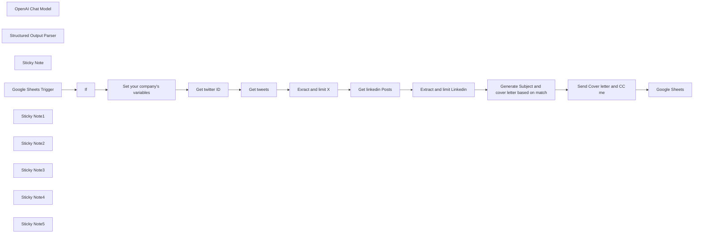

## Fluxo (.json) :

```json
{
  "nodes": [
    {
      "id": "a768bce6-ae26-464c-95fc-009edea4f94d",
      "name": "Set your company's variables",
      "type": "n8n-nodes-base.set",
      "position": [
        440,
        0
      ],
      "parameters": {
        "options": {},
        "assignments": {
          "assignments": [
            {
              "id": "6a8063b6-1fd8-429a-9f13-b7512066c702",
              "name": "your_company_name",
              "type": "string",
              "value": "Pollup Data Services"
            },
            {
              "id": "3e6780d6-86d0-4353-aa17-8470a91f63a8",
              "name": "your_company_activity",
              "type": "string",
              "value": "Whether it’s automating recurring tasks, analysing data faster, or personalising customer interactions, we build bespoke AI agents to help your workforce work smarter."
            },
            {
              "id": "1b42f1b3-20ed-4278-952d-f28fe0f03fa3",
              "name": "your_email",
              "type": "string",
              "value": "thomas@pollup.net"
            },
            {
              "id": "7c109ba2-d855-49d5-8700-624b01a05bc1",
              "name": "your_name",
              "type": "string",
              "value": "Justin"
            }
          ]
        }
      },
      "typeVersion": 3.4
    },
    {
      "id": "ca729f8d-cab8-4221-addb-aa23813d80b4",
      "name": "Get linkedin Posts",
      "type": "n8n-nodes-base.httpRequest",
      "position": [
        1300,
        0
      ],
      "parameters": {
        "url": "https://fresh-linkedin-profile-data.p.rapidapi.com/get-profile-posts",
        "options": {},
        "sendQuery": true,
        "sendHeaders": true,
        "authentication": "genericCredentialType",
        "genericAuthType": "httpHeaderAuth",
        "queryParameters": {
          "parameters": [
            {
              "name": "linkedin_url",
              "value": "={{ $('Google Sheets Trigger').item.json.linkedin_url }}"
            },
            {
              "name": "type",
              "value": "posts"
            }
          ]
        },
        "headerParameters": {
          "parameters": [
            {
              "name": "x-rapidapi-host",
              "value": "fresh-linkedin-profile-data.p.rapidapi.com"
            }
          ]
        }
      },
      "credentials": {
        "httpHeaderAuth": {
          "id": "nhoVFnkO31mejJrI",
          "name": "RapidAPI Key"
        }
      },
      "typeVersion": 4.2
    },
    {
      "id": "b9559958-f8ac-4ab6-93c6-50eb04113808",
      "name": "Get twitter ID",
      "type": "n8n-nodes-base.httpRequest",
      "position": [
        680,
        0
      ],
      "parameters": {
        "url": "https://twitter-api47.p.rapidapi.com/v2/user/by-username",
        "options": {},
        "sendQuery": true,
        "sendHeaders": true,
        "authentication": "genericCredentialType",
        "genericAuthType": "httpHeaderAuth",
        "queryParameters": {
          "parameters": [
            {
              "name": "username",
              "value": "={{ $('Google Sheets Trigger').item.json.twitter_handler }}"
            }
          ]
        },
        "headerParameters": {
          "parameters": [
            {
              "name": "x-rapidapi-host",
              "value": "twitter-api47.p.rapidapi.com"
            }
          ]
        }
      },
      "credentials": {
        "httpHeaderAuth": {
          "id": "nhoVFnkO31mejJrI",
          "name": "RapidAPI Key"
        }
      },
      "typeVersion": 4.2
    },
    {
      "id": "3e85565f-ebfa-4568-9391-869961c5b3ed",
      "name": "Get tweets",
      "type": "n8n-nodes-base.httpRequest",
      "position": [
        880,
        0
      ],
      "parameters": {
        "url": "https://twitter-api47.p.rapidapi.com/v2/user/tweets",
        "options": {},
        "sendQuery": true,
        "sendHeaders": true,
        "authentication": "genericCredentialType",
        "genericAuthType": "httpHeaderAuth",
        "queryParameters": {
          "parameters": [
            {
              "name": "userId",
              "value": "={{ $json.rest_id }}"
            }
          ]
        },
        "headerParameters": {
          "parameters": [
            {
              "name": "x-rapidapi-host",
              "value": "twitter-api47.p.rapidapi.com"
            }
          ]
        }
      },
      "credentials": {
        "httpHeaderAuth": {
          "id": "nhoVFnkO31mejJrI",
          "name": "RapidAPI Key"
        }
      },
      "typeVersion": 4.2
    },
    {
      "id": "6e060b21-9eaf-49e6-9665-c051b3f2397e",
      "name": "Extract and limit Linkedin",
      "type": "n8n-nodes-base.code",
      "position": [
        1520,
        0
      ],
      "parameters": {
        "jsCode": "// Loop over input items and add a new field called 'myNewField' to the JSON of each one\noutput = []\nmax_posts = 10\nlet counter = 0\nfor (const item of $input.all()[0].json.data) {\n  let post = {\n    title: item.article_title,\n    text: item.text\n  }\n  output.push(post)\n  if(counter++ >= max_posts) break;\n}\n\nreturn {\"linkedIn posts\": output};"
      },
      "typeVersion": 2
    },
    {
      "id": "e65bc472-e7c6-43c5-8e84-fe8c4512e92f",
      "name": "Exract and limit X",
      "type": "n8n-nodes-base.code",
      "position": [
        1100,
        0
      ],
      "parameters": {
        "jsCode": "// Loop over input items and add a new field called 'myNewField' to the JSON of each one\noutput = []\nmax_posts = 10\nlet counter = 0\nfor (const item of $input.all()[0].json.tweets) {\n  if(!item.content.hasOwnProperty('itemContent')) continue\n  let post = {\n    text: item.content.itemContent?.tweet_results?.result.legacy?.full_text\n  }\n  console.log(post)\n  output.push(post)\n  if(counter++ >= max_posts) break;\n}\n\nreturn {\"Twitter tweets\": output};"
      },
      "typeVersion": 2
    },
    {
      "id": "10f088a0-0479-428e-96cf-fe0df9b37877",
      "name": "OpenAI Chat Model",
      "type": "@n8n/n8n-nodes-langchain.lmChatOpenAi",
      "position": [
        1740,
        200
      ],
      "parameters": {
        "model": "gpt-4o",
        "options": {}
      },
      "credentials": {
        "openAiApi": {
          "id": "yepsCCAriRlCkICW",
          "name": "OpenAi account"
        }
      },
      "typeVersion": 1
    },
    {
      "id": "9adfd648-8348-4a0a-8b9b-d54dc3b715bb",
      "name": "Structured Output Parser",
      "type": "@n8n/n8n-nodes-langchain.outputParserStructured",
      "position": [
        1920,
        220
      ],
      "parameters": {
        "jsonSchemaExample": "{\n  \"subject\": \"\",\n  \"cover_letter\": \"\"\n}"
      },
      "typeVersion": 1.2
    },
    {
      "id": "af96003c-539d-4728-832c-4819d85bbbcc",
      "name": "Generate Subject and cover letter based on match",
      "type": "@n8n/n8n-nodes-langchain.chainLlm",
      "position": [
        1720,
        0
      ],
      "parameters": {
        "text": "=## Me\n- My company name is:  {{ $('Set your company\\'s variables').item.json.your_company_name }}\n- My company's activity is: {{ $('Set your company\\'s variables').item.json.your_company_activity }}\n- My name is: {{ $('Set your company\\'s variables').item.json.your_name }}\n- My email is: {{ $('Set your company\\'s variables').item.json.your_email }}\n\n## My lead:\nHis name: {{ $('Google Sheets Trigger').item.json.name }}\n\n## What I want you to do\n- According to the info about me, and the linkedin posts an twitter post of a user given below, I want you to find a common activity that I could propose to this person and generate a cover letter about it\n- Return ONLY the cover letter and the subject as a json like this:\n{\n  \"subject\": \"\",\n  \"cover_letter\": \"\"\n}\n\nTHe cover letter should be in HTML format\n\n## The Linkedin Posts:\n{{ JSON.stringify($json[\"linkedIn posts\"])}}\n\n## THe Twitter posts:\n{{ JSON.stringify($('Exract and limit X').item.json['Twitter tweets']) }}\n",
        "messages": {
          "messageValues": [
            {
              "message": "You are a helpful Marketing assistant"
            }
          ]
        },
        "promptType": "define",
        "hasOutputParser": true
      },
      "typeVersion": 1.5
    },
    {
      "id": "6954285f-7ea5-4e3d-8be2-03051d716d03",
      "name": "Send Cover letter and CC me",
      "type": "n8n-nodes-base.emailSend",
      "position": [
        2080,
        0
      ],
      "parameters": {
        "html": "={{ $json.output.cover_letter }}",
        "options": {},
        "subject": "={{ $json.output.subject }}",
        "toEmail": "={{ $('Google Sheets Trigger').item.json.email }}, {{ $('Set your company\\'s variables').item.json.your_email }}",
        "fromEmail": "thomas@pollup.net"
      },
      "credentials": {
        "smtp": {
          "id": "yrsGGdbYvSB8u7sx",
          "name": "SMTP account"
        }
      },
      "typeVersion": 2.1
    },
    {
      "id": "357477a8-98c3-48a5-8c88-965f90a4beb2",
      "name": "Sticky Note",
      "type": "n8n-nodes-base.stickyNote",
      "position": [
        360,
        -280
      ],
      "parameters": {
        "color": 4,
        "height": 480,
        "content": "## Personalize here\n\n### Set: \n- your name\n- your company name\n- your company activity, used to find a match with your leads\n- your email, used as the sender"
      },
      "typeVersion": 1
    },
    {
      "id": "0c26383c-c8f1-44b1-995e-2c88118061bb",
      "name": "Google Sheets Trigger",
      "type": "n8n-nodes-base.googleSheetsTrigger",
      "position": [
        -40,
        20
      ],
      "parameters": {
        "options": {
          "dataLocationOnSheet": {
            "values": {
              "rangeDefinition": "specifyRange"
            }
          }
        },
        "pollTimes": {
          "item": [
            {
              "mode": "everyMinute"
            }
          ]
        },
        "sheetName": {
          "__rl": true,
          "mode": "list",
          "value": "gid=0",
          "cachedResultUrl": "https://docs.google.com/spreadsheets/d/1IcvbbG_WScVNyutXhzqyE9NxdxNbY90Dd63R8Y1UrAw/edit#gid=0",
          "cachedResultName": "Sheet1"
        },
        "documentId": {
          "__rl": true,
          "mode": "list",
          "value": "1IcvbbG_WScVNyutXhzqyE9NxdxNbY90Dd63R8Y1UrAw",
          "cachedResultUrl": "https://docs.google.com/spreadsheets/d/1IcvbbG_WScVNyutXhzqyE9NxdxNbY90Dd63R8Y1UrAw/edit?usp=drivesdk",
          "cachedResultName": "Analyze social media of a lead"
        }
      },
      "credentials": {
        "googleSheetsTriggerOAuth2Api": {
          "id": "LBJHhfLqklwl9les",
          "name": "Google Sheets Trigger account"
        }
      },
      "typeVersion": 1
    },
    {
      "id": "923cca3d-69a9-4d26-80a3-e9062d42d8a8",
      "name": "Google Sheets",
      "type": "n8n-nodes-base.googleSheets",
      "position": [
        2280,
        0
      ],
      "parameters": {
        "columns": {
          "value": {
            "done": "X",
            "linkedin_url": "={{ $('Google Sheets Trigger').item.json.linkedin_url }}"
          },
          "schema": [
            {
              "id": "linkedin_url",
              "type": "string",
              "display": true,
              "removed": false,
              "required": false,
              "displayName": "linkedin_url",
              "defaultMatch": false,
              "canBeUsedToMatch": true
            },
            {
              "id": "name",
              "type": "string",
              "display": true,
              "required": false,
              "displayName": "name",
              "defaultMatch": false,
              "canBeUsedToMatch": true
            },
            {
              "id": "twitter_handler",
              "type": "string",
              "display": true,
              "required": false,
              "displayName": "twitter_handler",
              "defaultMatch": false,
              "canBeUsedToMatch": true
            },
            {
              "id": "email",
              "type": "string",
              "display": true,
              "required": false,
              "displayName": "email",
              "defaultMatch": false,
              "canBeUsedToMatch": true
            },
            {
              "id": "done",
              "type": "string",
              "display": true,
              "required": false,
              "displayName": "done",
              "defaultMatch": false,
              "canBeUsedToMatch": true
            },
            {
              "id": "row_number",
              "type": "string",
              "display": true,
              "removed": true,
              "readOnly": true,
              "required": false,
              "displayName": "row_number",
              "defaultMatch": false,
              "canBeUsedToMatch": true
            }
          ],
          "mappingMode": "defineBelow",
          "matchingColumns": [
            "linkedin_url"
          ]
        },
        "options": {},
        "operation": "update",
        "sheetName": {
          "__rl": true,
          "mode": "list",
          "value": "gid=0",
          "cachedResultUrl": "https://docs.google.com/spreadsheets/d/1IcvbbG_WScVNyutXhzqyE9NxdxNbY90Dd63R8Y1UrAw/edit#gid=0",
          "cachedResultName": "Sheet1"
        },
        "documentId": {
          "__rl": true,
          "mode": "list",
          "value": "1IcvbbG_WScVNyutXhzqyE9NxdxNbY90Dd63R8Y1UrAw",
          "cachedResultUrl": "https://docs.google.com/spreadsheets/d/1IcvbbG_WScVNyutXhzqyE9NxdxNbY90Dd63R8Y1UrAw/edit?usp=drivesdk",
          "cachedResultName": "Analyze social media of a lead"
        }
      },
      "credentials": {
        "googleSheetsOAuth2Api": {
          "id": "gdLmm513ROUyH6oU",
          "name": "Google Sheets account"
        }
      },
      "typeVersion": 4.5
    },
    {
      "id": "6df02119-09db-4d87-b435-7753693b27aa",
      "name": "If",
      "type": "n8n-nodes-base.if",
      "position": [
        180,
        20
      ],
      "parameters": {
        "options": {},
        "conditions": {
          "options": {
            "version": 2,
            "leftValue": "",
            "caseSensitive": true,
            "typeValidation": "loose"
          },
          "combinator": "and",
          "conditions": [
            {
              "id": "3839b337-6c33-4907-ba75-8ef04cefc14c",
              "operator": {
                "type": "string",
                "operation": "empty",
                "singleValue": true
              },
              "leftValue": "={{ $json.done }}",
              "rightValue": ""
            }
          ]
        },
        "looseTypeValidation": true
      },
      "executeOnce": false,
      "typeVersion": 2.2,
      "alwaysOutputData": true
    },
    {
      "id": "2edaa85e-ef69-490c-9835-cf8779cada6d",
      "name": "Sticky Note1",
      "type": "n8n-nodes-base.stickyNote",
      "position": [
        -120,
        -320
      ],
      "parameters": {
        "color": 4,
        "width": 260,
        "height": 500,
        "content": "## Create a Gooogle sheet with the following columns:\n- linkedin_url\n- name\n- twitter_handler \n- email\n- done\n\nAnd put some data in it except in \"done\" that should remain empty."
      },
      "typeVersion": 1
    },
    {
      "id": "19210bba-1db1-4568-b34e-4e9de002b0eb",
      "name": "Sticky Note2",
      "type": "n8n-nodes-base.stickyNote",
      "position": [
        1680,
        -160
      ],
      "parameters": {
        "color": 5,
        "width": 340,
        "height": 300,
        "content": "## Here you can modify the prompt\n- make it better by adding some examples\n- Follow a known framework\netc."
      },
      "typeVersion": 1
    },
    {
      "id": "bebab4e5-35fa-49b7-bb85-a85231c44389",
      "name": "Sticky Note3",
      "type": "n8n-nodes-base.stickyNote",
      "position": [
        660,
        -280
      ],
      "parameters": {
        "color": 4,
        "width": 340,
        "height": 480,
        "content": "## Call RapidAPI Twitter API Profile Data\nYou have to create an account in [RapidAPI](https://rapidapi.com/restocked-gAGxip8a_/api/twitter-api47) and subscribe to Twiiter API. With a free account you will be able to scrape 500 tweets / month.\nAfter your subscription you will have to choose as Generic Auth Type: Header Auth and then put as header name: \"x-rapidapi-key\" and the value given in the RapidAPI interface\n"
      },
      "typeVersion": 1
    },
    {
      "id": "42df4665-2d46-4020-938c-f082db6f09d0",
      "name": "Sticky Note4",
      "type": "n8n-nodes-base.stickyNote",
      "position": [
        1220,
        -300
      ],
      "parameters": {
        "color": 4,
        "width": 280,
        "height": 480,
        "content": "## Call RapidAPI Fresh Linkedin Profile Data\nYou have to create an account in [RapidAPI](https://rapidapi.com) and subscribe to Fresh LinkedIn Profile Data. With a free account you will be able to scrape 100 profile / month.\nAfter your subscription you will have to choose as Generic Auth Type: Header Auth and then put as header name: \"x-rapidapi-key\" and the value given in the RapidAPI interface\n"
      },
      "typeVersion": 1
    },
    {
      "id": "4a14febd-bd82-428c-8c97-15f1ba724b02",
      "name": "Sticky Note5",
      "type": "n8n-nodes-base.stickyNote",
      "position": [
        -840,
        -620
      ],
      "parameters": {
        "width": 700,
        "height": 1180,
        "content": "## Social Media Analysis and Automated Email Generation\n\n> by Thomas Vie [Thomas@pollup.net](mailto:thomas@pollup.net)\n\n### **Who is this for?**\nThis template is ideal for marketers, lead generation specialists, and business professionals seeking to analyze social media profiles of potential leads and automate personalized email outreach efficiently.\n\n\n### **What problem is this workflow solving?**\nManually analyzing social media profiles and crafting personalized emails can be time-consuming and prone to errors. This workflow streamlines the process by integrating social media APIs with AI to generate tailored communication, saving time and increasing outreach effectiveness.\n\n### **What this workflow does:**\n1. **Google Sheets Integration:** Start with a Google Sheet containing lead information such as LinkedIn URL, Twitter handle, name, and email.\n2. **Social Media Data Extraction:** Automatically fetch profile and activity data from Twitter and LinkedIn using RapidAPI integrations.\n3. **AI-Powered Content Generation:** Use OpenAI's Chat Model to analyze the extracted data and generate personalized email subject lines and cover letters.\n4. **Automated Email Dispatch:** Send the generated email directly to the lead, with a copy sent to yourself for tracking purposes.\n5. **Progress Tracking:** Update the Google Sheet to indicate completed actions.\n\n#### **Setup:**\n1. **Google Sheets:**\n   - Create a sheet with the columns: LinkedIn URL, name, Twitter handle, email, and a \"done\" column for tracking.\n   - Populate the sheet with your leads.\n\n2. **RapidAPI Accounts:**\n   - Sign up for RapidAPI and subscribe to the Twitter and LinkedIn API plans.\n   - Configure API authentication keys in the workflow.\n\n3. **AI Configuration:**\n   - Connect OpenAI Chat Model with your API key for text generation.\n\n4. **Email Integration:**\n   - Add your email credentials or service (SMTP or third-party service like Gmail) for sending automated emails.\n\n#### **How to customize this workflow to your needs:**\n- **Modify the AI Prompt:** Adapt the prompt in the AI node to better align with your tone, style, or specific messaging framework.\n- **Expand Data Fields:** Add additional data fields in Google Sheets if you require further personalization.\n- **API Limits:** Adjust API configurations to fit your usage limits or upgrade to higher tiers for increased data scraping capabilities.\n- **Personalize Email Templates:** Tweak email formats to suit different audiences or use cases.\n- **Extend Functionality:** Integrate additional social media platforms or CRM tools as needed.\n\nBy implementing this workflow, you’ll save time on repetitive tasks and create more effective lead generation strategies."
      },
      "typeVersion": 1
    }
  ],
  "pinData": {},
  "connections": {
    "If": {
      "main": [
        [
          {
            "node": "Set your company's variables",
            "type": "main",
            "index": 0
          }
        ]
      ]
    },
    "Get tweets": {
      "main": [
        [
          {
            "node": "Exract and limit X",
            "type": "main",
            "index": 0
          }
        ]
      ]
    },
    "Google Sheets": {
      "main": [
        []
      ]
    },
    "Get twitter ID": {
      "main": [
        [
          {
            "node": "Get tweets",
            "type": "main",
            "index": 0
          }
        ]
      ]
    },
    "OpenAI Chat Model": {
      "ai_languageModel": [
        [
          {
            "node": "Generate Subject and cover letter based on match",
            "type": "ai_languageModel",
            "index": 0
          }
        ]
      ]
    },
    "Exract and limit X": {
      "main": [
        [
          {
            "node": "Get linkedin Posts",
            "type": "main",
            "index": 0
          }
        ]
      ]
    },
    "Get linkedin Posts": {
      "main": [
        [
          {
            "node": "Extract and limit Linkedin",
            "type": "main",
            "index": 0
          }
        ]
      ]
    },
    "Google Sheets Trigger": {
      "main": [
        [
          {
            "node": "If",
            "type": "main",
            "index": 0
          }
        ]
      ]
    },
    "Structured Output Parser": {
      "ai_outputParser": [
        [
          {
            "node": "Generate Subject and cover letter based on match",
            "type": "ai_outputParser",
            "index": 0
          }
        ]
      ]
    },
    "Extract and limit Linkedin": {
      "main": [
        [
          {
            "node": "Generate Subject and cover letter based on match",
            "type": "main",
            "index": 0
          }
        ]
      ]
    },
    "Send Cover letter and CC me": {
      "main": [
        [
          {
            "node": "Google Sheets",
            "type": "main",
            "index": 0
          }
        ]
      ]
    },
    "Set your company's variables": {
      "main": [
        [
          {
            "node": "Get twitter ID",
            "type": "main",
            "index": 0
          }
        ]
      ]
    },
    "Generate Subject and cover letter based on match": {
      "main": [
        [
          {
            "node": "Send Cover letter and CC me",
            "type": "main",
            "index": 0
          }
        ]
      ]
    }
  }
}
```

<a id="template-1025"></a>

## Template 1025 - Detecção de novas entradas de tempo do Toggl

- **Nome:** Detecção de novas entradas de tempo do Toggl
- **Descrição:** Monitora a conta do Toggl e aciona automações quando são registradas novas entradas de tempo.
- **Funcionalidade:** • Monitoramento de novas entradas de tempo: consulta periodicamente a conta do Toggl e detecta novas time entries.
• Gatilho para automações: inicia automaticamente processos ou integrações ao identificar novas entradas.
• Uso de credenciais da API: conecta-se com credenciais para acessar de forma segura os registros de tempo.
• Agendamento de verificação (polling): realiza verificações periódicas para identificar atualizações em intervalos definidos.
- **Ferramentas:** • Toggl: Plataforma de rastreamento de tempo que armazena entradas de tempo e fornece acesso via API para leitura e gerenciamento de registros.


## Fluxo visual


## Fluxo (.json) :

```json
{
  "id": "138",
  "name": "Get new time entries from Toggl",
  "nodes": [
    {
      "name": "Toggl",
      "type": "n8n-nodes-base.togglTrigger",
      "position": [
        650,
        250
      ],
      "parameters": {
        "pollTimes": {
          "item": [
            {}
          ]
        }
      },
      "credentials": {
        "togglApi": ""
      },
      "typeVersion": 1
    }
  ],
  "active": false,
  "settings": {},
  "connections": {}
}
```

<a id="template-1026"></a>

## Template 1026 - Atualizações automáticas de VPS

- **Nome:** Atualizações automáticas de VPS
- **Descrição:** Fluxo que verifica diariamente se há pacotes atualizáveis no servidor remoto, formata a lista de atualizações como HTML e envia um e-mail de alerta quando houver atualizações disponíveis.
- **Funcionalidade:** • Detecção diária de atualizações: O fluxo é acionado diariamente para verificar se existem pacotes que podem ser atualizados no servidor remoto.
• Listagem de pacotes atualizáveis: Executa um comando remoto para obter a lista de pacotes que podem ser atualizados.
• Formatação da lista como HTML: Converte a saída em uma lista HTML para envio no e-mail.
• Validação de existência de atualizações: Verifica se há pacotes a serem atualizados antes de enviar notificações.
• Envio de notificação por e-mail: Envia um e-mail com a lista de atualizações para o destinatário configurado quando existirem atualizações.
- **Ferramentas:** • Servidor SSH remoto: Acesso seguro ao servidor para executar o comando de listagem de pacotes atualizáveis.
• Serviço SMTP: Envio de e-mails com a lista formatada quando houver atualizações.

## Fluxo visual

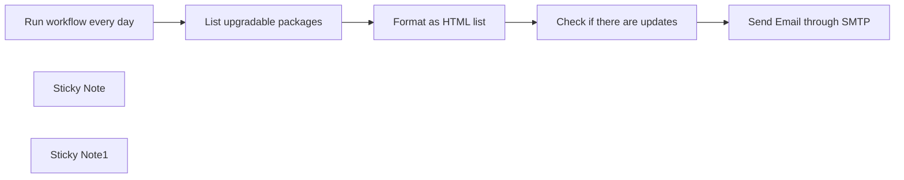

## Fluxo (.json) :

```json
{
  "nodes": [
    {
      "id": "4ca55c6e-cf2e-4239-82a9-88d0a201e761",
      "name": "List upgradable packages",
      "type": "n8n-nodes-base.ssh",
      "notes": "apt list --upgradable",
      "position": [
        -280,
        0
      ],
      "parameters": {
        "command": "apt list --upgradable"
      },
      "credentials": {
        "sshPassword": {
          "id": "Ps31IKTeseWFlA0g",
          "name": "SSH Password account"
        }
      },
      "notesInFlow": true,
      "typeVersion": 1,
      "alwaysOutputData": false
    },
    {
      "id": "ae1f0a55-31aa-494b-baa6-822dc606188e",
      "name": "Send Email through SMTP",
      "type": "n8n-nodes-base.emailSend",
      "position": [
        380,
        0
      ],
      "webhookId": "8073c571-b36f-4330-a510-ca2ff2924fbf",
      "parameters": {
        "html": "=The following packages can be updated on your server:\n\n{{ $json.htmlList }}\n\nPlease login and perform upgrade.",
        "options": {},
        "subject": "Server needs updates",
        "toEmail": "change.me@example.com",
        "fromEmail": "change.me@example.com"
      },
      "credentials": {
        "smtp": {
          "id": "uiNePdJaDng5a43S",
          "name": "SMTP account"
        }
      },
      "typeVersion": 2.1
    },
    {
      "id": "e1d76671-d94c-40d5-9364-623db9319f11",
      "name": "Run workflow every day",
      "type": "n8n-nodes-base.scheduleTrigger",
      "position": [
        -540,
        0
      ],
      "parameters": {
        "rule": {
          "interval": [
            {}
          ]
        }
      },
      "typeVersion": 1.2
    },
    {
      "id": "ec4d722a-b88c-42da-971c-28ad5774596d",
      "name": "Format as HTML list",
      "type": "n8n-nodes-base.code",
      "position": [
        -60,
        0
      ],
      "parameters": {
        "jsCode": "function formatStdoutAsHtmlList(stdoutData) {\n\n    // Split the stdout into lines and map to HTML list items\n    const htmlListItems = stdoutData.split('\\n').map((line) => {\n        if (line.trim() && line !== \"Listing...\") { // Optionally skip empty lines or headers\n            return `<li>${line.trim()}</li>`;\n        }\n    }).filter(item => item); // Remove any undefined items due to empty lines or skipped headers\n\n    // Wrap the list items in a <ul> tag\n    const htmlList = `<ul>${htmlListItems.join('')}</ul>`;\n\n    // Return the formatted HTML list as part of an object\n    return { \"htmlList\": htmlList };\n}\n\nreturn formatStdoutAsHtmlList($input.first().json.stdout);"
      },
      "typeVersion": 2
    },
    {
      "id": "6f14eb02-c505-4f83-a5bb-68094e763fd9",
      "name": "Check if there are updates",
      "type": "n8n-nodes-base.if",
      "position": [
        140,
        0
      ],
      "parameters": {
        "options": {},
        "conditions": {
          "options": {
            "version": 2,
            "leftValue": "",
            "caseSensitive": true,
            "typeValidation": "strict"
          },
          "combinator": "and",
          "conditions": [
            {
              "id": "db66d892-26fb-406c-a0ac-2e4b8a60310a",
              "operator": {
                "type": "string",
                "operation": "notEquals"
              },
              "leftValue": "={{ $json.htmlList }}",
              "rightValue": "<ul></ul>"
            }
          ]
        }
      },
      "typeVersion": 2.2
    },
    {
      "id": "3924c696-5b0e-4ae2-b2e2-435fed344028",
      "name": "Sticky Note",
      "type": "n8n-nodes-base.stickyNote",
      "position": [
        -740,
        -180
      ],
      "parameters": {
        "width": 300,
        "content": "## VPS upgrade notify \nThis workflow will everyday check if server has upgradable packages and inform you by email if there is."
      },
      "typeVersion": 1
    },
    {
      "id": "bb8ade2a-4ffe-4c79-91eb-55af568eb1b1",
      "name": "Sticky Note1",
      "type": "n8n-nodes-base.stickyNote",
      "position": [
        380,
        -180
      ],
      "parameters": {
        "width": 300,
        "content": "## Update email addresses\nUpdate From and To email addresses in this node to receive notifications"
      },
      "typeVersion": 1
    }
  ],
  "connections": {
    "Format as HTML list": {
      "main": [
        [
          {
            "node": "Check if there are updates",
            "type": "main",
            "index": 0
          }
        ]
      ]
    },
    "Run workflow every day": {
      "main": [
        [
          {
            "node": "List upgradable packages",
            "type": "main",
            "index": 0
          }
        ]
      ]
    },
    "Send Email through SMTP": {
      "main": [
        []
      ]
    },
    "List upgradable packages": {
      "main": [
        [
          {
            "node": "Format as HTML list",
            "type": "main",
            "index": 0
          }
        ]
      ]
    },
    "Check if there are updates": {
      "main": [
        [
          {
            "node": "Send Email through SMTP",
            "type": "main",
            "index": 0
          }
        ]
      ]
    }
  }
}
```

<a id="template-1027"></a>

## Template 1027 - Otimização de conversão por IA para landing pages

- **Nome:** Otimização de conversão por IA para landing pages
- **Descrição:** Coleta uma URL de landing page, raspa o conteúdo do site e usa um modelo de IA para gerar um roast crítico e 10 recomendações acionáveis de otimização de taxa de conversão.
- **Funcionalidade:** • Coleta de URL via formulário: Permite que o usuário envie a landing page que deseja analisar.
• Raspagem do conteúdo do site: Obtém o HTML/texto da página enviada para permitir análise completa.
• Análise por agente de IA: Encaminha o conteúdo e um prompt detalhado a um modelo de linguagem para avaliação.
• Geração de roast: Produz uma crítica informal, direta e instigante sobre os problemas da landing page.
• Geração de recomendações: Cria 10 ideias específicas e acionáveis de CRO, personalizadas para a página analisada.
• Configuração de tom e estrutura: Fornece instruções ao modelo para seguir formato e critérios (roast + recomendações) e priorizar táticas modernas e impactantes.
- **Ferramentas:** • OpenAI: Serviço de modelo de linguagem usado para analisar o conteúdo da página e gerar o roast e as recomendações.
• Página de destino enviada pelo usuário (landing page): Fonte externa cujo conteúdo é raspado e analisado para produzir insights.

## Fluxo visual

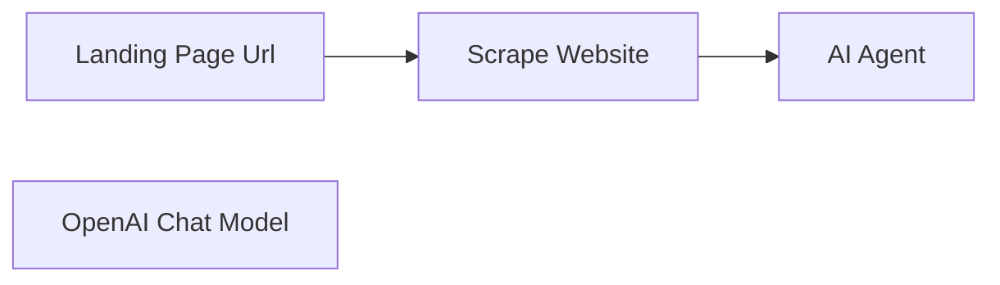

## Fluxo (.json) :

```json
{
  "id": "gsra9JToRDftNEvH",
  "meta": {
    "instanceId": "e8ec316b54e91908f34cbfdc330e5d1d5e97aa0ea8f7277c00d8a8a3892c9983",
    "templateCredsSetupCompleted": true
  },
  "name": "🤓 Conversion Rate Optimizer",
  "tags": [
    {
      "id": "QUoce1Blvhtuie7K",
      "name": "Business",
      "createdAt": "2025-03-06T15:17:58.728Z",
      "updatedAt": "2025-03-06T15:17:58.728Z"
    }
  ],
  "nodes": [
    {
      "id": "8aca34c2-65d6-432a-a7a5-fede59c3f4cb",
      "name": "Landing Page Url",
      "type": "n8n-nodes-base.formTrigger",
      "position": [
        -180,
        0
      ],
      "webhookId": "0818531a-3892-49f6-af78-cde8d538b205",
      "parameters": {
        "options": {},
        "formTitle": "Conversion Rate Optimizer",
        "formFields": {
          "values": [
            {
              "fieldLabel": "Landing Page Url",
              "placeholder": "https://yuzuu.co",
              "requiredField": true
            }
          ]
        },
        "formDescription": "Your Landing Page is Leaking Sales—Fix It Now"
      },
      "typeVersion": 2.2
    },
    {
      "id": "61e17805-93aa-46a3-a5a1-36c02da6432a",
      "name": "Scrape Website",
      "type": "n8n-nodes-base.httpRequest",
      "position": [
        20,
        0
      ],
      "parameters": {
        "url": "={{ $json['Landing Page Url'] }}",
        "options": {}
      },
      "typeVersion": 4.2
    },
    {
      "id": "cbe8bed2-37a0-4459-a34c-47b87c012875",
      "name": "AI Agent",
      "type": "@n8n/n8n-nodes-langchain.agent",
      "position": [
        240,
        0
      ],
      "parameters": {
        "text": "=You are a professional expert in Conversion Rate Optimization who helps business founders & CMOs improve their landing pages. You are a world-class expert in analysing landing pages, roasting them, and providing valuable Conversion Rate Optimization Ideas to help businesses increase conversions.  \n\nGOAL\nI want you to roast my landing page and deliver recommendations to improve the Conversion Rate. I will use this roast to understand what's wrong with my landing page and make improvements based on your recommendations. \n\nROAST STRUCTURE\nThis framework consists of 2 blocks of insights: \nRoast: a detailed roast of my landing page.\nRecommendations: 10 conversion rate optimization ideas based on your roast and analysis.\n\nROAST & RECOMMENDATIONS CRITERIA\nFor the Roast: Be friendly & casual. Talk like a human to another human. \nFor the Roast: Be unconventional & fun. I don't want to be bored. A roast must agitate the reader's feelings. \nFor the Roast: You will make a full landing page analysis, and explain what's wrong. You will use this analysis to make recommendations for The Recommendations.  \nFor the Recommendations: Be specific. Write exactly what I need to do. Your detailed description for each Conversion Rate Optimization Idea should be self-explanatory. For example, instead of saying “Rewrite your headline”, give me improved ideas for the headline. Your job is to return advanced insights personalised only for my specific landing page. This is a critical law for you.\nFor the Recommendations: Be creative. Don't return trivial and outdated Conversion Rate Optimization ideas that the average marketer would recommend. Prioritise unconventional CRO tactics so I get real value from you here. Think like the top 0.1% conversion rate optimization expert.\nFor the Recommendations: Prioritise Conversion Rate Optimization Ideas that are relevant in the 2024 digital marketing space. \nFor the Recommendations: Your Conversion Rate Optimization ideas must be impactful. Prioritise Conversion Rate Optimization Ideas that adds a wow effect.\nFor the Recommendations: Your Conversion Rate Optimization ideas must be easy to implement.\nFor the Recommendations: Personalise your ideas with references to the Roast you made. I don’t want to read 10 generic ideas that can work for anyone (for example, “add a live chat” or “offer a free trial”). I need a 100% personalised response.\n\nHere is the content of my landing page: {{ $json.data }}",
        "options": {},
        "promptType": "define"
      },
      "typeVersion": 1.7
    },
    {
      "id": "37786922-d64b-4e84-916e-1df8daeb0287",
      "name": "OpenAI Chat Model",
      "type": "@n8n/n8n-nodes-langchain.lmChatOpenAi",
      "position": [
        200,
        220
      ],
      "parameters": {
        "model": {
          "__rl": true,
          "mode": "list",
          "value": "o1",
          "cachedResultName": "o1"
        },
        "options": {
          "reasoningEffort": "high"
        }
      },
      "credentials": {
        "openAiApi": {
          "id": "MtyWeuRTqwi3Yx9H",
          "name": "OpenAi account"
        }
      },
      "typeVersion": 1.2
    }
  ],
  "active": false,
  "pinData": {},
  "settings": {
    "executionOrder": "v1"
  },
  "versionId": "38d9dab2-07ed-49cb-836e-a4b3ecf9d7da",
  "connections": {
    "AI Agent": {
      "main": [
        []
      ]
    },
    "Scrape Website": {
      "main": [
        [
          {
            "node": "AI Agent",
            "type": "main",
            "index": 0
          }
        ]
      ]
    },
    "Landing Page Url": {
      "main": [
        [
          {
            "node": "Scrape Website",
            "type": "main",
            "index": 0
          }
        ]
      ]
    },
    "OpenAI Chat Model": {
      "ai_languageModel": [
        [
          {
            "node": "AI Agent",
            "type": "ai_languageModel",
            "index": 0
          }
        ]
      ]
    }
  }
}
```

<a id="template-1028"></a>

## Template 1028 - Comparação de modelos de visão Ollama (local)

- **Nome:** Comparação de modelos de visão Ollama (local)
- **Descrição:** Processa imagens usando modelos de visão hospedados localmente no Ollama para gerar descrições detalhadas e salvar os resultados em um documento colaborativo.
- **Funcionalidade:** • Download de imagem: Recupera um arquivo de imagem a partir do Google Drive usando um identificador.
• Conversão para Base64: Converte o arquivo de imagem para uma representação embutida adequada para envio.
• Loop sobre modelos locais: Itera por uma lista configurável de modelos de visão para executar comparações.
• Construção e envio de requisição ao Ollama: Monta o corpo JSON com prompt e imagem e faz requisições à API local do Ollama.
• Prompts customizáveis: Suporta prompts de análise geral e prompts especializados (por exemplo, planilhas/imagens tabelares) para direcionar a saída.
• Criação de objetos de resultado: Agrupa as respostas por modelo para posterior processamento.
• Salvamento dos resultados: Insere as descrições geradas em um documento colaborativo para armazenamento e revisão.
• Gatilho manual para testes: Permite acionar o processo manualmente para testes e validação rápida.
- **Ferramentas:** • Ollama (instância local): Motor de modelos de linguagem e visão executando localmente que processa a imagem e gera descrições.
• Google Drive: Armazenamento de origem das imagens que serão analisadas.
• Google Docs: Destino para salvar e compartilhar as descrições geradas.

## Fluxo visual

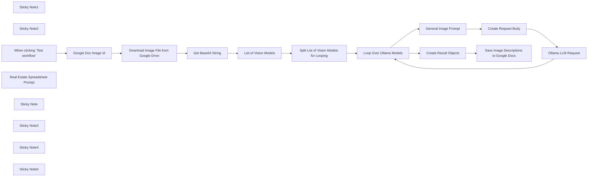

## Fluxo (.json) :

```json
{
  "id": "keFEBUqHOrsib60G",
  "meta": {
    "instanceId": "31e69f7f4a77bf465b805824e303232f0227212ae922d12133a0f96ffeab4fef",
    "templateCredsSetupCompleted": true
  },
  "name": "🦙👁️👁️ Find the Best Local Ollama Vision Models by Comparison",
  "tags": [],
  "nodes": [
    {
      "id": "dd2f1201-a78a-4ea9-b5ff-7543673e8445",
      "name": "Sticky Note1",
      "type": "n8n-nodes-base.stickyNote",
      "position": [
        1080,
        1160
      ],
      "parameters": {
        "color": 4,
        "width": 340,
        "height": 340,
        "content": "## 👁️ Analyze Image with Local Ollama LLM\n"
      },
      "typeVersion": 1
    },
    {
      "id": "81975be4-1e40-41e9-b938-612270f80a92",
      "name": "Sticky Note2",
      "type": "n8n-nodes-base.stickyNote",
      "position": [
        280,
        640
      ],
      "parameters": {
        "color": 4,
        "width": 300,
        "height": 300,
        "content": "## 👍Try Me!"
      },
      "typeVersion": 1
    },
    {
      "id": "3a56f75b-4836-4c37-a246-83ef6507c581",
      "name": "When clicking ‘Test workflow’",
      "type": "n8n-nodes-base.manualTrigger",
      "position": [
        380,
        740
      ],
      "parameters": {},
      "typeVersion": 1
    },
    {
      "id": "bb4570c7-269c-4d28-85d4-183ca2fabb89",
      "name": "Ollama LLM Request",
      "type": "n8n-nodes-base.httpRequest",
      "position": [
        1200,
        1280
      ],
      "parameters": {
        "url": "http://127.0.0.1:11434/api/chat",
        "method": "POST",
        "options": {},
        "jsonBody": "={{ $json.body }}",
        "sendBody": true,
        "sendHeaders": true,
        "specifyBody": "json",
        "headerParameters": {
          "parameters": [
            {
              "name": "Content-Type",
              "value": " application/json"
            }
          ]
        }
      },
      "typeVersion": 4.2
    },
    {
      "id": "0a6e064d-9a67-4cd2-b3ed-247a1684c1fb",
      "name": "Create Request Body",
      "type": "n8n-nodes-base.set",
      "position": [
        840,
        1280
      ],
      "parameters": {
        "options": {},
        "assignments": {
          "assignments": [
            {
              "id": "be9a8e21-9bb6-4588-a77a-61bc2def0648",
              "name": "body",
              "type": "string",
              "value": "={\n  \"model\": \"{{ $json.models }}\",\n  \"messages\": [\n    {\n      \"role\": \"user\",\n      \"content\": \"{{ $json.user_prompt }}\",\n      \"images\": [\"{{ $('List of Vision Models').item.json.data }}\"]\n    }\n  ],\n  \"stream\": false\n}"
            }
          ]
        }
      },
      "typeVersion": 3.4
    },
    {
      "id": "f3119aff-62bc-4ffc-abe9-835dea105d76",
      "name": "Loop Over Ollama Models",
      "type": "n8n-nodes-base.splitInBatches",
      "position": [
        360,
        1180
      ],
      "parameters": {
        "options": {}
      },
      "typeVersion": 3
    },
    {
      "id": "1e26f493-881e-40a3-922d-5c8d6cb86374",
      "name": "Create Result Objects",
      "type": "n8n-nodes-base.set",
      "position": [
        620,
        1080
      ],
      "parameters": {
        "options": {},
        "assignments": {
          "assignments": [
            {
              "id": "780086e5-2733-435a-90b5-fd10946ddd7a",
              "name": "result",
              "type": "object",
              "value": "={{ $json }}"
            }
          ]
        }
      },
      "typeVersion": 3.4
    },
    {
      "id": "ac0d3ada-8890-4945-aedb-fd6be4ffc020",
      "name": "General Image Prompt",
      "type": "n8n-nodes-base.set",
      "position": [
        620,
        1280
      ],
      "parameters": {
        "options": {},
        "assignments": {
          "assignments": [
            {
              "id": "be9a8e21-9bb6-4588-a77a-61bc2def0648",
              "name": "user_prompt",
              "type": "string",
              "value": "=Analyze this image in exhaustive detail using this structure:\\n\\n1. **Comprehensive Inventory**\\n- List all visible objects with descriptors (size, color, position)\\n- Group related items hierarchically (primary subject → secondary elements → background)\\n- Note object conditions (intact/broken, new/aged)\\n\\n2. **Contextual Analysis**\\n- Identify probable setting/location with supporting evidence\\n- Determine time period/season through visual cues\\n- Analyze lighting conditions and shadow orientation\\n\\n3. **Spatial Relationships**\\n- Map object positions using grid coordinates (front/center/back, left/right)\\n- Describe size comparisons between elements\\n- Note overlapping/occluded objects\\n\\n4. **Textual Elements**\\n- Extract ALL text with font characteristics\\n- Identify logos/brands with confidence estimates\\n- Translate non-native text with cultural context\\n\\nFormat response in markdown with clear section headers and bullet points."
            }
          ]
        },
        "includeOtherFields": true
      },
      "typeVersion": 3.4
    },
    {
      "id": "b7faafca-a179-43b2-8318-29b4659d424f",
      "name": "Real Estate Spreadsheet Prompt",
      "type": "n8n-nodes-base.set",
      "disabled": true,
      "position": [
        620,
        1480
      ],
      "parameters": {
        "options": {},
        "assignments": {
          "assignments": [
            {
              "id": "be9a8e21-9bb6-4588-a77a-61bc2def0648",
              "name": "user_prompt",
              "type": "string",
              "value": "=Analyze this spreadsheet image in exhaustive detail using this structure:\\n\\n1. **Table Structure**\\n- Identify all column headers (months) in order\\n- List all row labels exactly as shown\\n- Note any table titles, footnotes, or metadata\\n\\n2. **Data Extraction**\\n- Extract all numeric values with precise formatting (decimals, currency symbols)\\n- Maintain exact numbers for Listings, Sales, Months of Inventory\\n- Preserve currency formatting for Avg. Price values\\n- Include DOM values from separate section\\n\\n3. **Markdown Representation**\\n- Convert the entire spreadsheet into a perfectly formatted markdown table\\n- Maintain alignment of all columns and rows\\n- Preserve all relationships between data points\\n\\n4. **Data Analysis**\\n- Identify trends across months for each metric\\n- Note highest and lowest values in each category\\n- Calculate percentage changes between months where relevant\\n\\nFormat response with a complete markdown table first, followed by brief analysis of the real estate market data shown."
            }
          ]
        },
        "includeOtherFields": true
      },
      "typeVersion": 3.4
    },
    {
      "id": "5c28053b-a44e-494b-ad03-27d5b217f6b3",
      "name": "List of Vision Models",
      "type": "n8n-nodes-base.set",
      "position": [
        1440,
        740
      ],
      "parameters": {
        "options": {},
        "assignments": {
          "assignments": [
            {
              "id": "86add667-cd96-4e1c-877a-c437f6b1e040",
              "name": "models",
              "type": "array",
              "value": "=[\"granite3.2-vision\",\"llama3.2-vision\",\"gemma3:27b\"]"
            }
          ]
        },
        "includeOtherFields": true
      },
      "typeVersion": 3.4
    },
    {
      "id": "58c2fcd2-0ac4-4684-a30f-37650cc8dac1",
      "name": "Get Base64 String",
      "type": "n8n-nodes-base.extractFromFile",
      "position": [
        1140,
        740
      ],
      "parameters": {
        "options": {},
        "operation": "binaryToPropery"
      },
      "typeVersion": 1
    },
    {
      "id": "b60c0589-397c-445b-a084-a791bef95b15",
      "name": "Download Image File from Google Drive",
      "type": "n8n-nodes-base.googleDrive",
      "position": [
        920,
        740
      ],
      "parameters": {
        "fileId": {
          "__rl": true,
          "mode": "id",
          "value": "={{ $json.id }}"
        },
        "options": {},
        "operation": "download"
      },
      "credentials": {
        "googleDriveOAuth2Api": {
          "id": "UhdXGYLTAJbsa0xX",
          "name": "Google Drive account"
        }
      },
      "typeVersion": 3
    },
    {
      "id": "55a8f511-fdb5-4830-837a-104cbf6c6167",
      "name": "Split List of Vision Models for Looping",
      "type": "n8n-nodes-base.splitOut",
      "position": [
        1640,
        740
      ],
      "parameters": {
        "options": {},
        "fieldToSplitOut": "models"
      },
      "typeVersion": 1
    },
    {
      "id": "8e48c8bd-15c9-4389-8698-77dc5ae698bc",
      "name": "Sticky Note",
      "type": "n8n-nodes-base.stickyNote",
      "position": [
        620,
        640
      ],
      "parameters": {
        "color": 7,
        "width": 700,
        "height": 300,
        "content": "## ⬇️Download Image from Google Drive"
      },
      "typeVersion": 1
    },
    {
      "id": "6ed8925d-b031-4052-9009-91e2e7d8f360",
      "name": "Sticky Note3",
      "type": "n8n-nodes-base.stickyNote",
      "position": [
        1360,
        640
      ],
      "parameters": {
        "color": 7,
        "width": 460,
        "height": 300,
        "content": "## 📜Create List of Local Ollama Vision Models"
      },
      "typeVersion": 1
    },
    {
      "id": "ae383e4f-21e6-479f-97e0-029f43dacc56",
      "name": "Sticky Note4",
      "type": "n8n-nodes-base.stickyNote",
      "position": [
        280,
        980
      ],
      "parameters": {
        "color": 7,
        "width": 1200,
        "height": 720,
        "content": "## 🦙👁️👁️ Process Image with Ollama Vision Models and Save Results to Google Drive"
      },
      "typeVersion": 1
    },
    {
      "id": "a27bcb6e-c6e8-4777-9887-428363256b4a",
      "name": "Google Doc Image Id",
      "type": "n8n-nodes-base.set",
      "position": [
        700,
        740
      ],
      "parameters": {
        "options": {},
        "assignments": {
          "assignments": [
            {
              "id": "7d5a0385-4d8b-4f70-b3b0-4182bda29e5c",
              "name": "id",
              "type": "string",
              "value": "=[your-google-id]"
            }
          ]
        }
      },
      "typeVersion": 3.4
    },
    {
      "id": "8e6114f8-c724-40fd-9be3-253e3cb882fa",
      "name": "Save Image Descriptions to Google Docs",
      "type": "n8n-nodes-base.googleDocs",
      "position": [
        840,
        1080
      ],
      "parameters": {
        "actionsUi": {
          "actionFields": [
            {
              "text": "=<{{ $json.result.model }}>\n{{ $json.result.message.content }}\n</{{ $json.result.model }}>\n\n",
              "action": "insert"
            }
          ]
        },
        "operation": "update",
        "documentURL": "[your-google-doc-id]"
      },
      "credentials": {
        "googleDocsOAuth2Api": {
          "id": "YWEHuG28zOt532MQ",
          "name": "Google Docs account"
        }
      },
      "typeVersion": 2
    },
    {
      "id": "abed9af8-0d50-413a-9e6d-c6100ddaf015",
      "name": "Sticky Note5",
      "type": "n8n-nodes-base.stickyNote",
      "position": [
        -240,
        640
      ],
      "parameters": {
        "width": 480,
        "height": 1340,
        "content": "## 🦙👁️👁️ Find the Best Local Ollama Vision Models for Your Use Case\n\nProcess images using locally hosted Ollama Vision Models to extract detailed descriptions, contextual insights, and structured data. Save results directly to Google Docs for efficient collaboration.\n\n### Who is this for?\nThis workflow is ideal for developers, data analysts, and AI enthusiasts who need to process and analyze images using locally hosted Ollama Vision Language Models. It’s particularly useful for tasks requiring detailed image descriptions, contextual analysis, and structured data extraction.\n\n### What problem is this workflow solving? / Use Case\nThe workflow solves the challenge of extracting meaningful insights from images in exhaustive detail, such as identifying objects, analyzing spatial relationships, extracting textual elements, and providing contextual information. This is especially helpful for applications in real estate, marketing, engineering, and research.\n\n### What this workflow does\nThis workflow:\n1. Downloads an image file from Google Drive.\n2. Processes the image using multiple Ollama Vision Models (e.g., Granite3.2-Vision, Llama3.2-Vision).\n3. Generates detailed markdown-based descriptions of the image.\n4. Saves the output to a Google Docs file for easy sharing and further analysis.\n\n### Setup\n1. Ensure you have access to a local instance of Ollama.  https://ollama.com/\n2. Pull the Ollama vision models.\n3. Configure your Google Drive and Google Docs credentials in n8n.\n4. Provide the image file ID from Google Drive in the designated node.\n5. Update the list of Ollama vision models\n6. Test the workflow by clicking ‘Test Workflow’ to trigger the process.\n\n### How to customize this workflow to your needs\n- Replace the image source with another provider if needed (e.g., AWS S3 or Dropbox).\n- Modify the prompts in the \"General Image Prompt\" node to suit specific analysis requirements.\n- Add additional nodes for post-processing or integrating results into other platforms like Slack or HubSpot.\n\n## Key Features:\n- **Detailed Image Analysis**: Extracts comprehensive details about objects, spatial relationships, text elements, and contextual settings.\n- **Multi-Model Support**: Utilizes multiple vision models dynamically for optimal performance.\n- **Markdown Output**: Formats results in markdown for easy readability and documentation.\n- **Google Drive Integration**: Seamlessly downloads images and saves results to Google Docs.\n\n\n"
      },
      "typeVersion": 1
    }
  ],
  "active": false,
  "pinData": {},
  "settings": {
    "executionOrder": "v1"
  },
  "versionId": "a337e019-1c9a-4736-8dcd-4f12a9d989f4",
  "connections": {
    "Get Base64 String": {
      "main": [
        [
          {
            "node": "List of Vision Models",
            "type": "main",
            "index": 0
          }
        ]
      ]
    },
    "Ollama LLM Request": {
      "main": [
        [
          {
            "node": "Loop Over Ollama Models",
            "type": "main",
            "index": 0
          }
        ]
      ]
    },
    "Create Request Body": {
      "main": [
        [
          {
            "node": "Ollama LLM Request",
            "type": "main",
            "index": 0
          }
        ]
      ]
    },
    "Google Doc Image Id": {
      "main": [
        [
          {
            "node": "Download Image File from Google Drive",
            "type": "main",
            "index": 0
          }
        ]
      ]
    },
    "General Image Prompt": {
      "main": [
        [
          {
            "node": "Create Request Body",
            "type": "main",
            "index": 0
          }
        ]
      ]
    },
    "Create Result Objects": {
      "main": [
        [
          {
            "node": "Save Image Descriptions to Google Docs",
            "type": "main",
            "index": 0
          }
        ]
      ]
    },
    "List of Vision Models": {
      "main": [
        [
          {
            "node": "Split List of Vision Models for Looping",
            "type": "main",
            "index": 0
          }
        ]
      ]
    },
    "Loop Over Ollama Models": {
      "main": [
        [
          {
            "node": "Create Result Objects",
            "type": "main",
            "index": 0
          }
        ],
        [
          {
            "node": "General Image Prompt",
            "type": "main",
            "index": 0
          }
        ]
      ]
    },
    "Real Estate Spreadsheet Prompt": {
      "main": [
        []
      ]
    },
    "When clicking ‘Test workflow’": {
      "main": [
        [
          {
            "node": "Google Doc Image Id",
            "type": "main",
            "index": 0
          }
        ]
      ]
    },
    "Download Image File from Google Drive": {
      "main": [
        [
          {
            "node": "Get Base64 String",
            "type": "main",
            "index": 0
          }
        ]
      ]
    },
    "Split List of Vision Models for Looping": {
      "main": [
        [
          {
            "node": "Loop Over Ollama Models",
            "type": "main",
            "index": 0
          }
        ]
      ]
    }
  }
}
```

<a id="template-1029"></a>

## Template 1029 - Obter oferta para carro usado

- **Nome:** Obter oferta para carro usado
- **Descrição:** Automatiza a obtenção de uma estimativa ou oferta de compra para um carro usado no site Peddle, usando automação de navegador e análise de página.
- **Funcionalidade:** • Início manual e configuração de dados do carro: recebe e armazena informações do veículo (VIN, quilometragem, CEP, condição e titularidade).
• Criação de sessão remota de navegador: inicia uma sessão remota para navegar no site de ofertas.
• Carregamento da página de oferta: abre a página de oferta instantânea do Peddle.
• Interação com a página: clica em botões (por exemplo, "Autofill with VIN") e preenche campos conforme instruído.
• Espera e captura de tela: aguarda carregamento e captura screenshots para validação do estado da página.
• Análise automatizada da página (extração): um serviço de extração/IA analisa a tela e determina a próxima ação ou extrai a oferta final.
• Roteamento de ações: interpreta a resposta do analisador e executa ações de digitar, clicar ou registrar oferta conforme necessário.
• Registro da oferta: quando disponível, captura e armazena preço da oferta, identificador da oferta e URL da página.
• Encerramento da sessão: finaliza a sessão remota ao concluir o processo.
- **Ferramentas:** • Airtop: plataforma de automação de navegador e execução remota utilizada para criar sessões, interagir com elementos da página, tirar capturas de tela e encerrar sessões.
• Peddle (https://sell.peddle.com/instant-offer): site alvo para obter estimativas e ofertas de compra para veículos usados.
• Serviço de extração/IA: componente de análise que interpreta o conteúdo da página e decide ações ou extrai dados de oferta (preço, id, URL).

## Fluxo visual

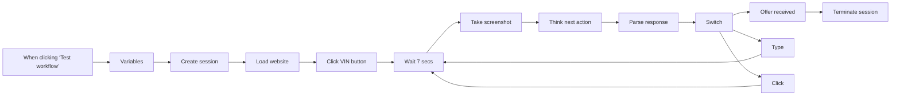

## Fluxo (.json) :

```json
{
  "id": "ViCY8FzVGcRsxVcK",
  "meta": {
    "instanceId": "660cf2c29eb19fa42319afac3bd2a4a74c6354b7c006403f6cba388968b63f5d",
    "templateCredsSetupCompleted": true
  },
  "name": "Sell a Used Car",
  "tags": [
    {
      "id": "a8B9vqj0vNLXcKVQ",
      "name": "template",
      "createdAt": "2025-04-04T15:38:37.785Z",
      "updatedAt": "2025-04-04T15:38:37.785Z"
    }
  ],
  "nodes": [
    {
      "id": "282a99b3-986e-4e3e-a673-f100ebcbc7cc",
      "name": "When clicking ‘Test workflow’",
      "type": "n8n-nodes-base.manualTrigger",
      "position": [
        -20,
        150
      ],
      "parameters": {},
      "typeVersion": 1
    },
    {
      "id": "57d4671a-b782-46f1-8987-3100a2841aa4",
      "name": "Variables",
      "type": "n8n-nodes-base.set",
      "position": [
        200,
        150
      ],
      "parameters": {
        "options": {},
        "assignments": {
          "assignments": [
            {
              "id": "3c71f7f7-072c-47a0-8fa3-67c272d40e1c",
              "name": "car_description",
              "type": "string",
              "value": "VIN: 1FTRF17253NB81140  Milage: 221081  Zip code: 01952  Condition: Perfect, no interior or exterior damages, all tires are inflated, have 2 keys, working battery, has and attached catalytic converter, Airbags not deployed, No flood or fire damage. Ownership: full clean title with no debt answer yes to all other questions"
            }
          ]
        }
      },
      "typeVersion": 3.4
    },
    {
      "id": "5ab2351d-08f5-46b6-b790-3c388572a4ae",
      "name": "Wait 7 secs",
      "type": "n8n-nodes-base.wait",
      "position": [
        1080,
        150
      ],
      "webhookId": "ddb2af85-52a4-4ba0-bdb0-01fa489fe974",
      "parameters": {
        "amount": 7
      },
      "typeVersion": 1.1
    },
    {
      "id": "038a36e2-ed4e-4675-b933-3e3564cb8dc0",
      "name": "Parse response",
      "type": "n8n-nodes-base.code",
      "position": [
        1740,
        -100
      ],
      "parameters": {
        "mode": "runOnceForEachItem",
        "jsCode": "const sessionId = $json.sessionId\nconst windowId = $json.windowId\nconst response = JSON.parse($json.data.modelResponse)\n\nreturn { json: {\n  sessionId,\n  windowId,\n  response\n}}"
      },
      "typeVersion": 2
    },
    {
      "id": "1017f269-03ea-4cd6-866c-b91539a05844",
      "name": "Switch",
      "type": "n8n-nodes-base.switch",
      "position": [
        1960,
        -100
      ],
      "parameters": {
        "rules": {
          "values": [
            {
              "outputKey": "Type",
              "conditions": {
                "options": {
                  "version": 2,
                  "leftValue": "",
                  "caseSensitive": true,
                  "typeValidation": "strict"
                },
                "combinator": "and",
                "conditions": [
                  {
                    "id": "b35db1bb-6e63-4dee-be52-658d1b78fbbb",
                    "operator": {
                      "type": "string",
                      "operation": "contains"
                    },
                    "leftValue": "={{ $json.response.action }}",
                    "rightValue": "TYPE"
                  }
                ]
              },
              "renameOutput": true
            },
            {
              "outputKey": "Click",
              "conditions": {
                "options": {
                  "version": 2,
                  "leftValue": "",
                  "caseSensitive": true,
                  "typeValidation": "strict"
                },
                "combinator": "and",
                "conditions": [
                  {
                    "id": "c4710a65-293c-4df4-a716-3004ae885362",
                    "operator": {
                      "type": "string",
                      "operation": "contains"
                    },
                    "leftValue": "={{ $json.response.action }}",
                    "rightValue": "CLICK"
                  }
                ]
              },
              "renameOutput": true
            },
            {
              "outputKey": "Got price",
              "conditions": {
                "options": {
                  "version": 2,
                  "leftValue": "",
                  "caseSensitive": true,
                  "typeValidation": "strict"
                },
                "combinator": "and",
                "conditions": [
                  {
                    "id": "e83a9d67-a55e-4272-9410-6a79e397b291",
                    "operator": {
                      "type": "string",
                      "operation": "contains"
                    },
                    "leftValue": "={{ $json.response.action }}",
                    "rightValue": "PRICE"
                  }
                ]
              },
              "renameOutput": true
            }
          ]
        },
        "options": {}
      },
      "typeVersion": 3.2
    },
    {
      "id": "a0c966af-1555-4837-a700-d2ebdc0628fa",
      "name": "Offer received",
      "type": "n8n-nodes-base.set",
      "position": [
        2180,
        200
      ],
      "parameters": {
        "options": {},
        "assignments": {
          "assignments": [
            {
              "id": "0b75e600-36e1-4d31-bd6a-0cb9955611fc",
              "name": "Offer_price",
              "type": "string",
              "value": "={{ $json.response.question }}"
            },
            {
              "id": "5f13d212-852c-466a-97fb-d776491b06ea",
              "name": "Offer_id",
              "type": "string",
              "value": "={{ $json.response.element }}"
            },
            {
              "id": "af0e7609-85e2-4243-a1b1-52627783fbea",
              "name": "Offer_URL",
              "type": "string",
              "value": "={{ $json.response.text }}"
            }
          ]
        }
      },
      "typeVersion": 3.4
    },
    {
      "id": "a0a4c48a-568b-4ad4-9e18-a7e1167d2b06",
      "name": "Type",
      "type": "n8n-nodes-base.airtop",
      "onError": "continueRegularOutput",
      "position": [
        2180,
        -200
      ],
      "parameters": {
        "text": "={{ $json.response.text }}",
        "resource": "interaction",
        "operation": "type",
        "pressEnterKey": true,
        "additionalFields": {
          "visualScope": "viewport"
        },
        "elementDescription": "={{ $json.response.element }}"
      },
      "credentials": {
        "airtopApi": {
          "id": "byhouJF8RLH5DkmY",
          "name": "[PROD] Airtop"
        }
      },
      "typeVersion": 1
    },
    {
      "id": "3dfe1739-0c68-4d66-96f0-ee6999cf7cbb",
      "name": "Click",
      "type": "n8n-nodes-base.airtop",
      "onError": "continueRegularOutput",
      "position": [
        2180,
        0
      ],
      "parameters": {
        "resource": "interaction",
        "additionalFields": {
          "visualScope": "viewport"
        },
        "elementDescription": "={{ $json.response.element }}"
      },
      "credentials": {
        "airtopApi": {
          "id": "byhouJF8RLH5DkmY",
          "name": "[PROD] Airtop"
        }
      },
      "typeVersion": 1
    },
    {
      "id": "058544cb-a5d0-4e9d-bc95-a351a7432f09",
      "name": "Create session",
      "type": "n8n-nodes-base.airtop",
      "position": [
        420,
        150
      ],
      "parameters": {},
      "credentials": {
        "airtopApi": {
          "id": "byhouJF8RLH5DkmY",
          "name": "[PROD] Airtop"
        }
      },
      "typeVersion": 1
    },
    {
      "id": "0418f412-c5e0-409c-93a6-45b281034711",
      "name": "Load website",
      "type": "n8n-nodes-base.airtop",
      "position": [
        640,
        150
      ],
      "parameters": {
        "url": "https://sell.peddle.com/instant-offer",
        "resource": "window",
        "additionalFields": {
          "waitUntil": "domContentLoaded"
        }
      },
      "credentials": {
        "airtopApi": {
          "id": "byhouJF8RLH5DkmY",
          "name": "[PROD] Airtop"
        }
      },
      "typeVersion": 1
    },
    {
      "id": "39fdcead-1709-4648-8660-575055e82284",
      "name": "Click VIN button",
      "type": "n8n-nodes-base.airtop",
      "position": [
        860,
        150
      ],
      "parameters": {
        "resource": "interaction",
        "additionalFields": {},
        "elementDescription": "Rounded white button \"Autofill with VIN\""
      },
      "credentials": {
        "airtopApi": {
          "id": "byhouJF8RLH5DkmY",
          "name": "[PROD] Airtop"
        }
      },
      "typeVersion": 1
    },
    {
      "id": "74f40e8f-e6cd-4738-b98a-6871c1d75654",
      "name": "Terminate session",
      "type": "n8n-nodes-base.airtop",
      "position": [
        2400,
        200
      ],
      "parameters": {
        "operation": "terminate",
        "sessionId": "={{ $('Create session').last().json.sessionId }}"
      },
      "credentials": {
        "airtopApi": {
          "id": "byhouJF8RLH5DkmY",
          "name": "[PROD] Airtop"
        }
      },
      "typeVersion": 1
    },
    {
      "id": "777542c9-c926-4d06-ad8a-2a0c43258a7d",
      "name": "Take screenshot",
      "type": "n8n-nodes-base.airtop",
      "notes": "Useful to validate the current screen the agent is on",
      "position": [
        1300,
        -100
      ],
      "parameters": {
        "resource": "window",
        "operation": "takeScreenshot"
      },
      "credentials": {
        "airtopApi": {
          "id": "byhouJF8RLH5DkmY",
          "name": "[PROD] Airtop"
        }
      },
      "notesInFlow": true,
      "typeVersion": 1
    },
    {
      "id": "e5442c98-7382-45ef-b810-c4b8ae4cf999",
      "name": "Think next action",
      "type": "n8n-nodes-base.airtop",
      "position": [
        1520,
        -100
      ],
      "parameters": {
        "prompt": "=You are trying to get an estimate for a used car price or a purchase offer. Your task is to answer the main question presented to the user on this screen, based on the car information below, until you will get a price estimate or offer to purchase (\"We'd love to buy your car...\"). \n\nReview this page:\nIf there is a question, extract the main question presented to the user on this screen. Return your answer in the following format:\nQuestion: the main question presented to the user on this screen\nAction: <CLICK> or <TYPE>\nElement: description of the text box to type in or button to click, for example VIN text box or Yes button\nText: <Text to type> (if TYPE operation)\n\nIf the page includes the price estimate or offer to purchase, extract the price (offer_price), the offer ID (offer_id) and current page URL (page_url) and return the following:\nQuestion:  <offer_price>\nAction: <PRICE>\nElement: <offer_id>\nText: <page_url>\n\nIf there is no price estimate or offer to purchase and the Next button at the bottom is yellow and clickable, return the following:\nQuestion:  <Next>\nAction: <CLIICK>\nElement: Yellow Next Button at the bottom\nText: \n\nHere's the info about the car: \n{{ $('Variables').item.json.car_description }}",
        "resource": "extraction",
        "operation": "query",
        "additionalFields": {
          "outputSchema": "{\n  \"type\": \"object\",\n  \"properties\": {\n    \"question\": {\n      \"type\": \"string\",\n      \"description\": \"The main question presented to the user on the screen.\"\n    },\n    \"action\": {\n      \"type\": \"string\",\n      \"description\": \"The action to be performed, either clicking a button or typing in a text box.\"\n    },\n    \"element\": {\n      \"type\": \"string\",\n      \"description\": \"Description of the text box to type in or button to click.\"\n    },\n    \"text\": {\n      \"type\": \"string\",\n      \"description\": \"Text to type if the action is TYPE.\"\n    }\n  },\n  \"required\": [\n    \"question\",\n    \"action\",\n    \"element\",\n    \"text\"\n  ],\n  \"additionalProperties\": false,\n  \"$schema\": \"http://json-schema.org/draft-07/schema#\"\n}",
          "includeVisualAnalysis": true
        }
      },
      "credentials": {
        "airtopApi": {
          "id": "byhouJF8RLH5DkmY",
          "name": "[PROD] Airtop"
        }
      },
      "typeVersion": 1
    }
  ],
  "active": false,
  "pinData": {},
  "settings": {
    "executionOrder": "v1"
  },
  "versionId": "7ad89f7e-cdbc-4ec4-b5a9-cc724677be15",
  "connections": {
    "Type": {
      "main": [
        [
          {
            "node": "Wait 7 secs",
            "type": "main",
            "index": 0
          }
        ]
      ]
    },
    "Click": {
      "main": [
        [
          {
            "node": "Wait 7 secs",
            "type": "main",
            "index": 0
          }
        ]
      ]
    },
    "Switch": {
      "main": [
        [
          {
            "node": "Type",
            "type": "main",
            "index": 0
          }
        ],
        [
          {
            "node": "Click",
            "type": "main",
            "index": 0
          }
        ],
        [
          {
            "node": "Offer received",
            "type": "main",
            "index": 0
          }
        ]
      ]
    },
    "Variables": {
      "main": [
        [
          {
            "node": "Create session",
            "type": "main",
            "index": 0
          }
        ]
      ]
    },
    "Wait 7 secs": {
      "main": [
        [
          {
            "node": "Take screenshot",
            "type": "main",
            "index": 0
          }
        ]
      ]
    },
    "Load website": {
      "main": [
        [
          {
            "node": "Click VIN button",
            "type": "main",
            "index": 0
          }
        ]
      ]
    },
    "Create session": {
      "main": [
        [
          {
            "node": "Load website",
            "type": "main",
            "index": 0
          }
        ]
      ]
    },
    "Offer received": {
      "main": [
        [
          {
            "node": "Terminate session",
            "type": "main",
            "index": 0
          }
        ]
      ]
    },
    "Parse response": {
      "main": [
        [
          {
            "node": "Switch",
            "type": "main",
            "index": 0
          }
        ]
      ]
    },
    "Take screenshot": {
      "main": [
        [
          {
            "node": "Think next action",
            "type": "main",
            "index": 0
          }
        ]
      ]
    },
    "Click VIN button": {
      "main": [
        [
          {
            "node": "Wait 7 secs",
            "type": "main",
            "index": 0
          }
        ]
      ]
    },
    "Think next action": {
      "main": [
        [
          {
            "node": "Parse response",
            "type": "main",
            "index": 0
          }
        ]
      ]
    },
    "When clicking ‘Test workflow’": {
      "main": [
        [
          {
            "node": "Variables",
            "type": "main",
            "index": 0
          }
        ]
      ]
    }
  }
}
```

<a id="template-1030"></a>

## Template 1030 - Newsletter tecnológica personalizada por IA

- **Nome:** Newsletter tecnológica personalizada por IA
- **Descrição:** Coleta artigos de notícias tech via RSS, armazena representações vetoriais dos conteúdos, e usa um agente de IA para gerar um resumo semanal personalizado enviado por email.
- **Funcionalidade:** • Coleta diária de artigos via RSS: Busca artigos de múltiplas fontes tecnológicas.
• Normalização de campos: Extrai título, resumo/conteúdo e data de publicação para cada artigo.
• Geração de embeddings: Converte o conteúdo em vetores para busca semântica.
• Divisão de textos longos: Quebra o conteúdo em fragmentos para melhor processamento.
• Armazenamento vetorial: Insere os embeddings em um repositório vetorial em memória (ou opcionalmente persistente).
• Recuperação semântica: Busca artigos relevantes para a semana com base em similaridade vetorial.
• Agente de IA semanal: Resume a semana priorizando tópicos de interesse e limitando o número de itens desejados.
• Conversão para formato de email: Transforma a saída em HTML amigável para envio.
• Envio de boletim por email: Envia o resumo semanal para o destinatário configurado.
• Personalização: Permite ajustar fontes RSS, tópicos de interesse, número de itens e tipo de armazenamento vetorial.
- **Ferramentas:** • RSS feeds: Fontes de notícias (por exemplo The Verge, Wired, TechCrunch) usadas como entrada de artigos.
• OpenAI: Geração de embeddings e uso de modelos de linguagem para sumarização dos artigos.
• Gmail (ou serviço de email): Envio do boletim semanal para o destinatário.
• Bancos vetoriais (opcional): Soluções como Pinecone ou Weaviate para armazenamento persistente de embeddings.

## Fluxo visual

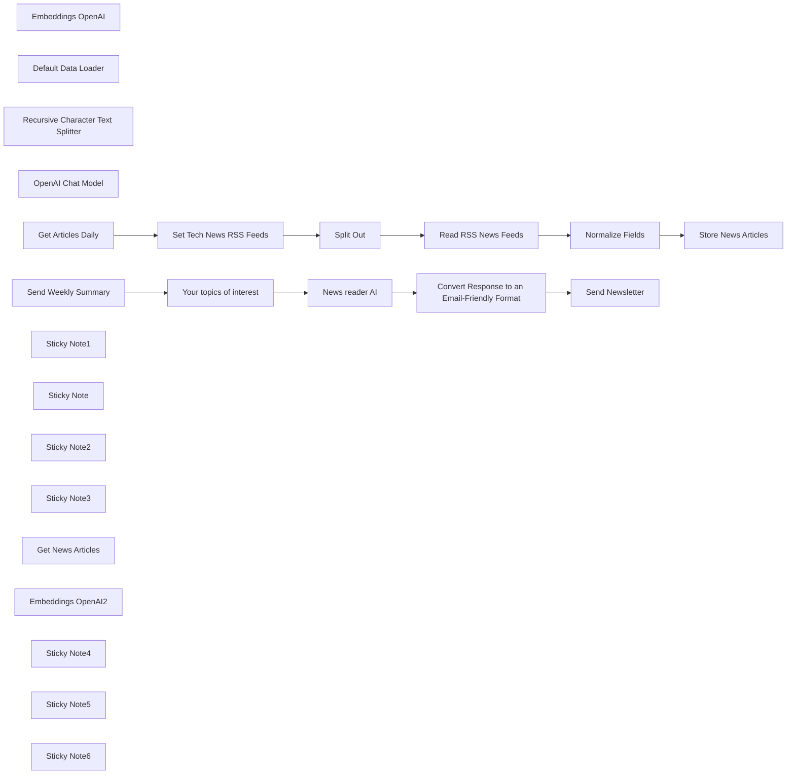

## Fluxo (.json) :

```json
{
  "id": "ni6SfqC3kthAlPtX",
  "meta": {
    "instanceId": "a2eaba9e45ad7aab18b25cf863df1e910fb6dd3b85279bde97d9bae4a72f6862",
    "templateCredsSetupCompleted": true
  },
  "name": "Personalized AI Tech Newsletter Using RSS, OpenAI and Gmail",
  "tags": [],
  "nodes": [
    {
      "id": "5cc6bfe1-dbaa-4196-ac52-27e3d5b7e91d",
      "name": "Split Out",
      "type": "n8n-nodes-base.splitOut",
      "position": [
        440,
        0
      ],
      "parameters": {
        "options": {},
        "fieldToSplitOut": "rss"
      },
      "typeVersion": 1
    },
    {
      "id": "6d2b402d-22e0-4cc5-a070-8b4169f18a99",
      "name": "Normalize Fields",
      "type": "n8n-nodes-base.set",
      "position": [
        880,
        0
      ],
      "parameters": {
        "options": {},
        "assignments": {
          "assignments": [
            {
              "id": "e9f27ceb-c5f2-4997-8cb1-67576a7bb337",
              "name": "title",
              "type": "string",
              "value": "={{ $json.title }}"
            },
            {
              "id": "4c4f9417-40f2-4fb0-9976-d09f5984680f",
              "name": "content",
              "type": "string",
              "value": "={{ $json['content:encodedSnippet'] ?? $json.contentSnippet}}"
            },
            {
              "id": "e1986bac-054e-4240-ba50-536dbcd27337",
              "name": "date",
              "type": "string",
              "value": "={{ $json.isoDate}}"
            }
          ]
        }
      },
      "typeVersion": 3.4
    },
    {
      "id": "c696de41-aeb1-4e2c-9e7e-8b04f7800bdb",
      "name": "Embeddings OpenAI",
      "type": "@n8n/n8n-nodes-langchain.embeddingsOpenAi",
      "position": [
        1080,
        220
      ],
      "parameters": {
        "options": {}
      },
      "credentials": {
        "openAiApi": {
          "id": "DyPIpHdVscqT5xeY",
          "name": "OpenAI Templates Account"
        }
      },
      "typeVersion": 1.2
    },
    {
      "id": "4b127a8f-14b3-4a0e-86f6-3157c59bc09c",
      "name": "Default Data Loader",
      "type": "@n8n/n8n-nodes-langchain.documentDefaultDataLoader",
      "position": [
        1200,
        220
      ],
      "parameters": {
        "options": {
          "metadata": {
            "metadataValues": [
              {
                "name": "title",
                "value": "={{ $json.title }}"
              },
              {
                "name": "=createDate",
                "value": "={{ $now.toISO() }}"
              },
              {
                "name": "publishDate",
                "value": "={{ $json.date }}"
              }
            ]
          }
        },
        "jsonData": "=# {{ $json.title }}\n{{ $json.content }}",
        "jsonMode": "expressionData"
      },
      "typeVersion": 1
    },
    {
      "id": "c32d87cd-28ee-4b28-ad53-43320169b6df",
      "name": "Recursive Character Text Splitter",
      "type": "@n8n/n8n-nodes-langchain.textSplitterRecursiveCharacterTextSplitter",
      "position": [
        1280,
        420
      ],
      "parameters": {
        "options": {},
        "chunkSize": 3000
      },
      "typeVersion": 1
    },
    {
      "id": "c912148b-1142-4713-9769-1588ff308c62",
      "name": "OpenAI Chat Model",
      "type": "@n8n/n8n-nodes-langchain.lmChatOpenAi",
      "position": [
        180,
        580
      ],
      "parameters": {
        "model": {
          "__rl": true,
          "mode": "list",
          "value": "gpt-4o",
          "cachedResultName": "gpt-4o"
        },
        "options": {}
      },
      "credentials": {
        "openAiApi": {
          "id": "DyPIpHdVscqT5xeY",
          "name": "OpenAI Templates Account"
        }
      },
      "typeVersion": 1.2
    },
    {
      "id": "ba7aef6b-efec-4c35-a9d6-b2b8afb6b6c4",
      "name": "Get Articles Daily",
      "type": "n8n-nodes-base.scheduleTrigger",
      "position": [
        0,
        0
      ],
      "parameters": {
        "rule": {
          "interval": [
            {}
          ]
        }
      },
      "typeVersion": 1.2
    },
    {
      "id": "0827bf1b-1322-4e4a-8c5b-0da90382b202",
      "name": "Send Weekly Summary",
      "type": "n8n-nodes-base.scheduleTrigger",
      "position": [
        -260,
        420
      ],
      "parameters": {
        "rule": {
          "interval": [
            {
              "field": "weeks",
              "triggerAtDay": [
                1
              ],
              "triggerAtHour": 5
            }
          ]
        }
      },
      "typeVersion": 1.2
    },
    {
      "id": "b1625ec0-fd2f-4098-ba79-1f522123cb86",
      "name": "Sticky Note1",
      "type": "n8n-nodes-base.stickyNote",
      "position": [
        -80,
        -160
      ],
      "parameters": {
        "color": 7,
        "width": 1620,
        "height": 740,
        "content": "## 1. Save news in a vector store (runs daily)"
      },
      "typeVersion": 1
    },
    {
      "id": "a4abb100-e11f-4ed5-abc3-4587b3a8dcee",
      "name": "Sticky Note",
      "type": "n8n-nodes-base.stickyNote",
      "position": [
        -680,
        -260
      ],
      "parameters": {
        "color": 4,
        "width": 520,
        "height": 180,
        "content": "## Let AI read the tech news for you\n\nThis workflow fetches news via [RSS feeds](https://en.wikipedia.org/wiki/RSS) from selected tech websites, stores them in a vector database and uses an AI agent to send you a weekly, personalized newsletter - keeping you informed without daily distractions."
      },
      "typeVersion": 1
    },
    {
      "id": "7edbdba1-43ac-4754-91ae-d506ee38e8ff",
      "name": "Sticky Note2",
      "type": "n8n-nodes-base.stickyNote",
      "position": [
        -320,
        260
      ],
      "parameters": {
        "color": 7,
        "width": 1300,
        "height": 600,
        "content": "## 2. Send a summary (runs once a week)"
      },
      "typeVersion": 1
    },
    {
      "id": "e166715b-f579-4d22-bf2f-9318e4e86f2a",
      "name": "News reader AI",
      "type": "@n8n/n8n-nodes-langchain.agent",
      "position": [
        200,
        360
      ],
      "parameters": {
        "text": "=Summarize last week's news.",
        "options": {
          "systemMessage": "=Only get last week's news. Act as a tech news aggregator and write in plain, easy-to-understand English. Prioritize news related to the following topics: {{ $json.Interests }}.\nIf none of those topics are mentioned in the news, use your best judgment to highlight the most newsworthy, frequently mentioned and relevant events in technology.\n\nProvide a total of {{ $json['Number of news items to include'] }} news items."
        },
        "promptType": "define"
      },
      "typeVersion": 1.9
    },
    {
      "id": "c88c6c60-493e-41cf-b08d-3eef48e7cbc4",
      "name": "Send Newsletter",
      "type": "n8n-nodes-base.gmail",
      "position": [
        760,
        360
      ],
      "webhookId": "0de8b6e8-8611-48a9-ba25-1d023698f577",
      "parameters": {
        "sendTo": "miha.ambroz@n8n.io",
        "message": "={{ $json.data }}",
        "options": {},
        "subject": "Weekly tech newsletter"
      },
      "credentials": {
        "gmailOAuth2": {
          "id": "VVLm2UzmGbMNTTNO",
          "name": "Gmail account 2"
        }
      },
      "typeVersion": 2.1
    },
    {
      "id": "8e303102-f68c-4cf8-a2bb-4538830610e6",
      "name": "Convert Response to an Email-Friendly Format",
      "type": "n8n-nodes-base.markdown",
      "position": [
        560,
        360
      ],
      "parameters": {
        "mode": "markdownToHtml",
        "options": {},
        "markdown": "={{ $json.output }}"
      },
      "typeVersion": 1
    },
    {
      "id": "3f90c79c-a04d-4537-b426-33900acfcb8a",
      "name": "Sticky Note3",
      "type": "n8n-nodes-base.stickyNote",
      "position": [
        -100,
        360
      ],
      "parameters": {
        "color": 3,
        "width": 220,
        "height": 240,
        "content": "### Edit this:"
      },
      "typeVersion": 1
    },
    {
      "id": "de315b7c-065c-45a7-be50-5d7a4eedeeaf",
      "name": "Your topics of interest",
      "type": "n8n-nodes-base.set",
      "position": [
        -40,
        420
      ],
      "parameters": {
        "options": {},
        "assignments": {
          "assignments": [
            {
              "id": "018882ca-37c3-45af-944f-2081b0605065",
              "name": "Interests",
              "type": "string",
              "value": "AI, games, gadgets"
            },
            {
              "id": "4cfdafc1-47a4-41cc-9eb8-72880ea34511",
              "name": "Number of news items to include",
              "type": "string",
              "value": "15"
            }
          ]
        }
      },
      "typeVersion": 3.4
    },
    {
      "id": "8a1d6ac3-6fda-4916-a021-3d5db7d413e0",
      "name": "Store News Articles",
      "type": "@n8n/n8n-nodes-langchain.vectorStoreInMemory",
      "position": [
        1100,
        0
      ],
      "parameters": {
        "mode": "insert",
        "memoryKey": "news_store_key"
      },
      "typeVersion": 1.1
    },
    {
      "id": "b7fd5c59-3ed7-4706-bdd7-a62c62cd65af",
      "name": "Set Tech News RSS Feeds",
      "type": "n8n-nodes-base.set",
      "position": [
        220,
        0
      ],
      "parameters": {
        "options": {},
        "assignments": {
          "assignments": [
            {
              "id": "b8c00469-890b-4b5b-8e2e-2ad9ec2d0815",
              "name": "rss",
              "type": "array",
              "value": "=[\n  \"https://www.engadget.com/rss.xml\",\n  \"https://feeds.arstechnica.com/arstechnica/index\",\n  \"https://www.theverge.com/rss/index.xml\",\n  \"https://www.wired.com/feed/rss\",\n  \"https://www.technologyreview.com/topnews.rss\",\n  \"https://techcrunch.com/feed/\"\n]\n"
            }
          ]
        }
      },
      "typeVersion": 3.4
    },
    {
      "id": "77f5f3bc-8ecd-481a-a570-6e49e4fda01b",
      "name": "Read RSS News Feeds",
      "type": "n8n-nodes-base.rssFeedRead",
      "position": [
        660,
        0
      ],
      "parameters": {
        "url": "={{ $json.rss }}",
        "options": {
          "ignoreSSL": false
        }
      },
      "typeVersion": 1.1
    },
    {
      "id": "540f55b3-10d1-4f7e-bbdf-793ae6524fd7",
      "name": "Get News Articles",
      "type": "@n8n/n8n-nodes-langchain.vectorStoreInMemory",
      "position": [
        320,
        560
      ],
      "parameters": {
        "mode": "retrieve-as-tool",
        "topK": 20,
        "toolName": "get_news",
        "memoryKey": "news_store_key",
        "toolDescription": "Call this tool to get the latest news articles."
      },
      "typeVersion": 1.1
    },
    {
      "id": "f5e37288-ef4c-41ea-87bd-1e9ee1e9ab0f",
      "name": "Embeddings OpenAI2",
      "type": "@n8n/n8n-nodes-langchain.embeddingsOpenAi",
      "position": [
        420,
        700
      ],
      "parameters": {
        "options": {}
      },
      "credentials": {
        "openAiApi": {
          "id": "DyPIpHdVscqT5xeY",
          "name": "OpenAI Templates Account"
        }
      },
      "typeVersion": 1.2
    },
    {
      "id": "f6e050de-8dc1-41dd-a18f-225a2f5f68ad",
      "name": "Sticky Note4",
      "type": "n8n-nodes-base.stickyNote",
      "position": [
        160,
        -60
      ],
      "parameters": {
        "color": 3,
        "width": 220,
        "height": 240,
        "content": "### Edit this:"
      },
      "typeVersion": 1
    },
    {
      "id": "4d773ce7-cbca-4568-bd40-0f9914e835bb",
      "name": "Sticky Note5",
      "type": "n8n-nodes-base.stickyNote",
      "position": [
        -760,
        -40
      ],
      "parameters": {
        "width": 400,
        "height": 900,
        "content": "\n### How it works\n\n* A **daily scheduled trigger** fetches articles from multiple popular tech RSS feeds like Wired, TechCrunch, and The Verge.\n\n* Fetched articles are:\n  * **Normalized** to extract titles, summaries, and publish dates.\n  * **Converted to vector embeddings** via OpenAI and stored in memory for fast semantic querying.\n\n* A **weekly scheduled trigger** activates the AI summarization flow:\n  * The AI is provided with your interests (e.g., *AI, games, gadgets*) and the desired number of items (e.g., 15).\n  * It queries the vector store to retrieve relevant articles and summarizes the most newsworthy stories.\n  * The summary is converted into a clean, email-friendly format and sent to your inbox.\n\n---\n\n### How to use\n1. Connect your **OpenAI** and **Gmail** accounts to n8n.\n2. Customize the list of RSS feeds in the “Set Tech News RSS Feeds” node.\n3. Update your interests and number of desired news items in the “Your Topics of Interest” node.\n4. Activate the workflow and let the automation run on schedule.\n\n---\n\n### Requirements\n* **OpenAI** credentials for embeddings and summarization\n* **Gmail** (or another email service) for sending the newsletter"
      },
      "typeVersion": 1
    },
    {
      "id": "796c2a13-c168-4bc9-b79b-fc80c31274c1",
      "name": "Sticky Note6",
      "type": "n8n-nodes-base.stickyNote",
      "position": [
        680,
        620
      ],
      "parameters": {
        "color": 5,
        "width": 520,
        "height": 280,
        "content": "### 💡 Customizing this workflow\n\n* Want to use different sources? Swap in your own RSS feeds, or use an API-based news aggregator.\n* Replace the in-memory vector store with **Pinecone**, **Weaviate**, or another persistent vector DB for longer-term storage.\n* Adjust the agent's summarization style to suit internal updates, industry-specific briefings, or even entertainment recaps.\nHere’s an additional bullet point to include under **Customizing this workflow**:\n* Prefer chat over email? Replace the email node with a **Telegram bot** to receive your personalized tech newsletter directly in a Telegram chat.\n\n"
      },
      "typeVersion": 1
    }
  ],
  "active": false,
  "pinData": {},
  "settings": {
    "executionOrder": "v1"
  },
  "versionId": "82cd36c7-4a97-4813-8b2f-8a4d44ccc2da",
  "connections": {
    "Split Out": {
      "main": [
        [
          {
            "node": "Read RSS News Feeds",
            "type": "main",
            "index": 0
          }
        ]
      ]
    },
    "News reader AI": {
      "main": [
        [
          {
            "node": "Convert Response to an Email-Friendly Format",
            "type": "main",
            "index": 0
          }
        ]
      ]
    },
    "Send Newsletter": {
      "main": [
        []
      ]
    },
    "Normalize Fields": {
      "main": [
        [
          {
            "node": "Store News Articles",
            "type": "main",
            "index": 0
          }
        ]
      ]
    },
    "Embeddings OpenAI": {
      "ai_embedding": [
        [
          {
            "node": "Store News Articles",
            "type": "ai_embedding",
            "index": 0
          }
        ]
      ]
    },
    "Get News Articles": {
      "ai_tool": [
        [
          {
            "node": "News reader AI",
            "type": "ai_tool",
            "index": 0
          }
        ]
      ]
    },
    "OpenAI Chat Model": {
      "ai_languageModel": [
        [
          {
            "node": "News reader AI",
            "type": "ai_languageModel",
            "index": 0
          }
        ]
      ]
    },
    "Embeddings OpenAI2": {
      "ai_embedding": [
        [
          {
            "node": "Get News Articles",
            "type": "ai_embedding",
            "index": 0
          }
        ]
      ]
    },
    "Get Articles Daily": {
      "main": [
        [
          {
            "node": "Set Tech News RSS Feeds",
            "type": "main",
            "index": 0
          }
        ]
      ]
    },
    "Default Data Loader": {
      "ai_document": [
        [
          {
            "node": "Store News Articles",
            "type": "ai_document",
            "index": 0
          }
        ]
      ]
    },
    "Read RSS News Feeds": {
      "main": [
        [
          {
            "node": "Normalize Fields",
            "type": "main",
            "index": 0
          }
        ]
      ]
    },
    "Send Weekly Summary": {
      "main": [
        [
          {
            "node": "Your topics of interest",
            "type": "main",
            "index": 0
          }
        ]
      ]
    },
    "Set Tech News RSS Feeds": {
      "main": [
        [
          {
            "node": "Split Out",
            "type": "main",
            "index": 0
          }
        ]
      ]
    },
    "Your topics of interest": {
      "main": [
        [
          {
            "node": "News reader AI",
            "type": "main",
            "index": 0
          }
        ]
      ]
    },
    "Recursive Character Text Splitter": {
      "ai_textSplitter": [
        [
          {
            "node": "Default Data Loader",
            "type": "ai_textSplitter",
            "index": 0
          }
        ]
      ]
    },
    "Convert Response to an Email-Friendly Format": {
      "main": [
        [
          {
            "node": "Send Newsletter",
            "type": "main",
            "index": 0
          }
        ]
      ]
    }
  }
}
```

<a id="template-1031"></a>

## Template 1031 - Bot Telegram integrado ao NeurochainAI

- **Nome:** Bot Telegram integrado ao NeurochainAI
- **Descrição:** Fluxo que recebe mensagens do Telegram, envia prompts para a API do NeurochainAI (texto ou imagem) e responde no chat com texto ou foto, incluindo tratamento de erros e opção de retry.
- **Funcionalidade:** • Recepção de mensagens Telegram: detecta mensagens privadas, menções ao bot e comandos que começam com /flux.
• Limpeza do prompt: remove o prefixo /flux e prepara a mensagem do usuário para envio ao serviço de IA.
• Indicador de digitação: envia ação de digitação para o chat enquanto processa a requisição.
• Geração de texto via NeurochainAI: envia o prompt ao endpoint de texto e posta a resposta diretamente no chat.
• Geração de imagens via NeurochainAI (Flux): solicita geração de imagem com prompt, tamanho, qualidade e seed aleatório.
• Download e envio de imagem: extrai a URL retornada pela API, faz o download do arquivo e envia como foto com legenda contendo o prompt original.
• Mensagens temporárias e limpeza: envia um emoji como indicador de espera e apaga essa mensagem após completar o processo.
• Tratamento de erros: detecta respostas inválidas ou ausência de resposta e notifica o usuário com mensagem apropriada.
• Botão de retry: oferece botão inline para reenviar o mesmo prompt em caso de erro.
• Autenticação via header: utiliza chave Bearer nos headers para autenticar requisições à API externa.
- **Ferramentas:** • Telegram: Plataforma de mensagens usada para receber comandos dos usuários e enviar respostas (texto, ações de digitação, fotos e botões inline).
• NeurochainAI: Serviço de inferência para geração de texto e imagens via endpoints REST, permitindo escolher modelos e parâmetros de geração.

## Fluxo visual

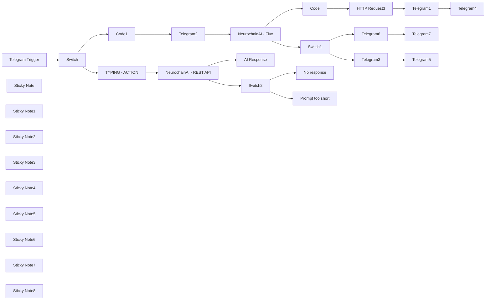

## Fluxo (.json) :

```json
{
  "id": "RLWjEhY8L4TORAIj",
  "meta": {
    "instanceId": "36399efc72267ed21ee0d3747f5abdd0ee139cb67749ff919ff09fcd65230079",
    "templateCredsSetupCompleted": true
  },
  "name": "NeurochainAI Basic API Integration",
  "tags": [],
  "nodes": [
    {
      "id": "da34bd1a-4e4e-4133-acad-939d0cc96596",
      "name": "Telegram Trigger",
      "type": "n8n-nodes-base.telegramTrigger",
      "position": [
        -1740,
        880
      ],
      "webhookId": "05885608-5344-4dcf-81ad-4550b9a01241",
      "parameters": {
        "updates": [
          "*"
        ],
        "additionalFields": {}
      },
      "credentials": {
        "telegramApi": {
          "id": "VPtf3hBnwGucAQtu",
          "name": "TEMPLATE"
        }
      },
      "typeVersion": 1.1
    },
    {
      "id": "3b3f4b00-6b3b-4346-8fcc-7ab75bcfe838",
      "name": "Code",
      "type": "n8n-nodes-base.code",
      "notes": "Extract the URL from the previous node",
      "position": [
        80,
        260
      ],
      "parameters": {
        "jsCode": "// O valor vem como um array com uma string, então precisamos pegar o primeiro item do array\nconst rawUrl = $json.choices[0].text;\n\n// Remover colchetes e aspas (se existirem) e pegar o primeiro elemento do array\nconst imageUrl = JSON.parse(rawUrl)[0];\n\nreturn {\n  json: {\n    imageUrl: imageUrl\n  }\n};"
      },
      "notesInFlow": true,
      "typeVersion": 2
    },
    {
      "id": "ccb91a15-96b5-42aa-a6ae-ff7ae79d1e8f",
      "name": "HTTP Request3",
      "type": "n8n-nodes-base.httpRequest",
      "position": [
        240,
        260
      ],
      "parameters": {
        "url": "={{ $json.imageUrl }}",
        "options": {}
      },
      "typeVersion": 4.2
    },
    {
      "id": "588899b6-a68e-407e-b12f-f05c205674c5",
      "name": "Telegram2",
      "type": "n8n-nodes-base.telegram",
      "position": [
        -520,
        500
      ],
      "parameters": {
        "text": "⌛",
        "chatId": "={{ $('Telegram Trigger').item.json.message.chat.id }}",
        "replyMarkup": "inlineKeyboard",
        "additionalFields": {
          "appendAttribution": false,
          "reply_to_message_id": "={{ $('Telegram Trigger').item.json.message.message_id }}"
        }
      },
      "credentials": {
        "telegramApi": {
          "id": "VPtf3hBnwGucAQtu",
          "name": "TEMPLATE"
        }
      },
      "typeVersion": 1.2
    },
    {
      "id": "e1534b69-d93d-4e8b-a3c4-adbc17c1dacd",
      "name": "Telegram1",
      "type": "n8n-nodes-base.telegram",
      "position": [
        440,
        260
      ],
      "parameters": {
        "chatId": "={{ $('Telegram Trigger').item.json.message.chat.id }}",
        "operation": "sendPhoto",
        "binaryData": true,
        "additionalFields": {
          "caption": "=*Prompt:* `{{ $('Code1').item.json.cleanMessage }}`",
          "parse_mode": "Markdown",
          "reply_to_message_id": "={{ $('Telegram Trigger').item.json.message.message_id }}"
        }
      },
      "credentials": {
        "telegramApi": {
          "id": "VPtf3hBnwGucAQtu",
          "name": "TEMPLATE"
        }
      },
      "typeVersion": 1.2
    },
    {
      "id": "88ba4ced-bdd0-408e-94e1-9e54ed4d1b5d",
      "name": "Telegram4",
      "type": "n8n-nodes-base.telegram",
      "position": [
        620,
        260
      ],
      "parameters": {
        "chatId": "={{ $('Telegram2').item.json.result.chat.id }}",
        "messageId": "={{ $('Telegram2').item.json.result.message_id }}",
        "operation": "deleteMessage"
      },
      "credentials": {
        "telegramApi": {
          "id": "VPtf3hBnwGucAQtu",
          "name": "TEMPLATE"
        }
      },
      "typeVersion": 1.2
    },
    {
      "id": "251a026e-ebfa-44f5-9c80-f30e5c142e23",
      "name": "Telegram3",
      "type": "n8n-nodes-base.telegram",
      "position": [
        260,
        700
      ],
      "parameters": {
        "text": "={{ $json.error.message }}",
        "chatId": "={{ $('Telegram Trigger').item.json.message.chat.id }}",
        "replyMarkup": "inlineKeyboard",
        "inlineKeyboard": {
          "rows": [
            {
              "row": {
                "buttons": [
                  {
                    "text": "🔄 Retry",
                    "additionalFields": {
                      "callback_data": "=response= Fluxretry: {{ $('Code1').item.json.cleanMessage }}"
                    }
                  }
                ]
              }
            }
          ]
        },
        "additionalFields": {
          "appendAttribution": false,
          "reply_to_message_id": "={{ $('Telegram Trigger').item.json.message.message_id }}"
        }
      },
      "credentials": {
        "telegramApi": {
          "id": "VPtf3hBnwGucAQtu",
          "name": "TEMPLATE"
        }
      },
      "typeVersion": 1.2
    },
    {
      "id": "fb71a62a-9cf8-4abf-baa4-885ae4b1a290",
      "name": "Telegram5",
      "type": "n8n-nodes-base.telegram",
      "position": [
        480,
        700
      ],
      "parameters": {
        "chatId": "={{ $('Telegram2').item.json.result.chat.id }}",
        "messageId": "={{ $('Telegram2').item.json.result.message_id }}",
        "operation": "deleteMessage"
      },
      "credentials": {
        "telegramApi": {
          "id": "VPtf3hBnwGucAQtu",
          "name": "TEMPLATE"
        }
      },
      "typeVersion": 1.2
    },
    {
      "id": "0f9bcdf0-0008-447a-900c-6afe5b9d53fe",
      "name": "Telegram6",
      "type": "n8n-nodes-base.telegram",
      "position": [
        260,
        520
      ],
      "parameters": {
        "text": "=*Prompt too short*",
        "chatId": "={{ $('Telegram Trigger').item.json.message.chat.id }}",
        "replyMarkup": "inlineKeyboard",
        "additionalFields": {
          "parse_mode": "Markdown",
          "appendAttribution": false,
          "reply_to_message_id": "={{ $('Telegram Trigger').item.json.message.message_id }}"
        }
      },
      "credentials": {
        "telegramApi": {
          "id": "VPtf3hBnwGucAQtu",
          "name": "TEMPLATE"
        }
      },
      "typeVersion": 1.2
    },
    {
      "id": "d805548a-7379-456c-9bc3-f5fafeb86aed",
      "name": "Telegram7",
      "type": "n8n-nodes-base.telegram",
      "position": [
        480,
        520
      ],
      "parameters": {
        "chatId": "={{ $('Telegram2').item.json.result.chat.id }}",
        "messageId": "={{ $('Telegram2').item.json.result.message_id }}",
        "operation": "deleteMessage"
      },
      "credentials": {
        "telegramApi": {
          "id": "VPtf3hBnwGucAQtu",
          "name": "TEMPLATE"
        }
      },
      "typeVersion": 1.2
    },
    {
      "id": "a3e521a3-aff0-4d31-9a69-626f70f86ae2",
      "name": "NeurochainAI - REST API",
      "type": "n8n-nodes-base.httpRequest",
      "onError": "continueErrorOutput",
      "position": [
        -680,
        1280
      ],
      "parameters": {
        "url": "https://ncmb.neurochain.io/tasks/message",
        "method": "POST",
        "options": {},
        "jsonBody": "={\n  \"model\": \"Meta-Llama-3.1-8B-Instruct-Q6_K.gguf\",\n  \"prompt\": \"You must respond directly to the user's message, and the message the user sent you is the following message: {{ $('Telegram Trigger').item.json.message.text }}\",\n  \"max_tokens\": 1024,\n  \"temperature\": 0.6,\n  \"top_p\": 0.95,\n  \"frequency_penalty\": 0,\n  \"presence_penalty\": 1.1\n}",
        "sendBody": true,
        "sendHeaders": true,
        "specifyBody": "json",
        "headerParameters": {
          "parameters": [
            {
              "name": "Authorization",
              "value": "=Bearer YOUR-API-KEY-HERE"
            },
            {
              "name": "Content-Type",
              "value": "application/json"
            }
          ]
        }
      },
      "typeVersion": 4.2,
      "alwaysOutputData": false
    },
    {
      "id": "5fea3a8b-3e1b-4c69-b734-3f9dc7647e4b",
      "name": "TYPING - ACTION",
      "type": "n8n-nodes-base.telegram",
      "position": [
        -1100,
        1280
      ],
      "parameters": {
        "chatId": "={{ $('Telegram Trigger').item.json.message.chat.id }}",
        "operation": "sendChatAction"
      },
      "credentials": {
        "telegramApi": {
          "id": "VPtf3hBnwGucAQtu",
          "name": "TEMPLATE"
        }
      },
      "typeVersion": 1.2
    },
    {
      "id": "ca183e3d-2bef-4d80-bbb7-c712a0290b2b",
      "name": "AI Response",
      "type": "n8n-nodes-base.telegram",
      "position": [
        -360,
        1000
      ],
      "parameters": {
        "text": "={{ $json.choices[0].text }}",
        "chatId": "={{ $('Telegram Trigger').item.json.message.chat.id }}",
        "additionalFields": {
          "parse_mode": "Markdown",
          "appendAttribution": false,
          "reply_to_message_id": "={{ $('Telegram Trigger').item.json.message.message_id }}"
        }
      },
      "credentials": {
        "telegramApi": {
          "id": "VPtf3hBnwGucAQtu",
          "name": "TEMPLATE"
        }
      },
      "typeVersion": 1.2
    },
    {
      "id": "27e65f30-e58e-457d-b3b7-2b74267554e1",
      "name": "No response",
      "type": "n8n-nodes-base.telegram",
      "position": [
        -140,
        1240
      ],
      "parameters": {
        "text": "=*No response from worker*",
        "chatId": "={{ $('Telegram Trigger').item.json.message.chat.id }}",
        "additionalFields": {
          "parse_mode": "Markdown",
          "appendAttribution": false,
          "reply_to_message_id": "={{ $('Telegram Trigger').item.json.message.message_id }}"
        }
      },
      "credentials": {
        "telegramApi": {
          "id": "VPtf3hBnwGucAQtu",
          "name": "TEMPLATE"
        }
      },
      "typeVersion": 1.2
    },
    {
      "id": "02cf4dfa-558f-4968-ad09-19f1e40735b0",
      "name": "Prompt too short",
      "type": "n8n-nodes-base.telegram",
      "position": [
        -140,
        1400
      ],
      "parameters": {
        "text": "=*Prompt too short*",
        "chatId": "={{ $('Telegram Trigger').item.json.message.chat.id }}",
        "replyMarkup": "inlineKeyboard",
        "additionalFields": {
          "parse_mode": "Markdown",
          "appendAttribution": false,
          "reply_to_message_id": "={{ $('Telegram Trigger').item.json.message.message_id }}"
        }
      },
      "credentials": {
        "telegramApi": {
          "id": "VPtf3hBnwGucAQtu",
          "name": "TEMPLATE"
        }
      },
      "typeVersion": 1.2
    },
    {
      "id": "943d31e4-3745-49ea-9669-8a560a486cc4",
      "name": "Sticky Note",
      "type": "n8n-nodes-base.stickyNote",
      "position": [
        -400,
        1220
      ],
      "parameters": {
        "color": 3,
        "width": 460.4333621829785,
        "height": 347.9769162173868,
        "content": "## ERROR"
      },
      "typeVersion": 1
    },
    {
      "id": "6b5d142f-8d8c-493f-81e7-cedb4e95cd31",
      "name": "Switch2",
      "type": "n8n-nodes-base.switch",
      "position": [
        -380,
        1380
      ],
      "parameters": {
        "rules": {
          "values": [
            {
              "conditions": {
                "options": {
                  "version": 2,
                  "leftValue": "",
                  "caseSensitive": true,
                  "typeValidation": "strict"
                },
                "combinator": "and",
                "conditions": [
                  {
                    "operator": {
                      "type": "string",
                      "operation": "equals"
                    },
                    "leftValue": "={{ $json.error.message }}",
                    "rightValue": "=500 - \"{\\\"error\\\":true,\\\"msg\\\":\\\"No response from worker\\\"}\""
                  }
                ]
              }
            },
            {
              "conditions": {
                "options": {
                  "version": 2,
                  "leftValue": "",
                  "caseSensitive": true,
                  "typeValidation": "strict"
                },
                "combinator": "and",
                "conditions": [
                  {
                    "id": "ef851d57-0618-4fe7-8469-a30971a05ee5",
                    "operator": {
                      "type": "string",
                      "operation": "notEquals"
                    },
                    "leftValue": "{{ $json.error.message }}",
                    "rightValue": "400 - \"{\\\"error\\\":true,\\\"msg\\\":\\\"Prompt string is invalid\\\"}\""
                  }
                ]
              }
            }
          ]
        },
        "options": {}
      },
      "typeVersion": 3.2
    },
    {
      "id": "77651cb7-2530-46b2-89eb-7ac07f39a3ba",
      "name": "Sticky Note1",
      "type": "n8n-nodes-base.stickyNote",
      "position": [
        -400,
        860
      ],
      "parameters": {
        "color": 4,
        "width": 459.0810102677459,
        "height": 350.68162004785273,
        "content": "## SUCCESS\nThis node will send the AI ​​response directly to the Telegram chat."
      },
      "typeVersion": 1
    },
    {
      "id": "5dce8414-fe7a-450a-a414-553d3e5e01cd",
      "name": "Sticky Note2",
      "type": "n8n-nodes-base.stickyNote",
      "position": [
        -830.8527430805248,
        861.5987888475245
      ],
      "parameters": {
        "color": 5,
        "width": 411.78262099325127,
        "height": 705.0354263931183,
        "content": "## HTTP REQUEST\n\nReplace **MODEL** with the desired AI model from the NeurochainAI dashboard.\n\nReplace YOUR-API-KEY-HERE with your actual NeurochainAI API key.\n\n**Models:**\nMeta-Llama-3.1-8B-Instruct-Q8_0.gguf\nMeta-Llama-3.1-8B-Instruct-Q6_K.gguf\nMistral-7B-Instruct-v0.2-GPTQ-Neurochain-custom-io\nMistral-7B-Instruct-v0.2-GPTQ-Neurochain-custom\nMistral-7B-OpenOrca-GPTQ\nMistral-7B-Instruct-v0.1-gguf-q8_0.gguf\nMistral-7B-Instruct-v0.2-GPTQ\ningredient-extractor-mistral-7b-instruct-v0.1-gguf-q8_0.gguf"
      },
      "typeVersion": 1
    },
    {
      "id": "3540e1fa-01f8-4b5e-ad7a-1b1c5cd90d08",
      "name": "Sticky Note3",
      "type": "n8n-nodes-base.stickyNote",
      "position": [
        -840,
        220
      ],
      "parameters": {
        "color": 6,
        "width": 236.80242230495116,
        "height": 535.7153791682382,
        "content": "## This node removes the /flux prefix."
      },
      "typeVersion": 1
    },
    {
      "id": "6720b734-c0ae-4c88-adb6-3931467c780d",
      "name": "Sticky Note4",
      "type": "n8n-nodes-base.stickyNote",
      "position": [
        220,
        444
      ],
      "parameters": {
        "color": 3,
        "width": 593.1328365275054,
        "height": 403.9345258807414,
        "content": "## ERROR"
      },
      "typeVersion": 1
    },
    {
      "id": "30332278-399d-4c8f-8470-dfb967764455",
      "name": "Sticky Note5",
      "type": "n8n-nodes-base.stickyNote",
      "position": [
        -320,
        220
      ],
      "parameters": {
        "color": 5,
        "width": 384.60321058533617,
        "height": 538.7613862505775,
        "content": "## HTTP REQUEST\n\nReplace **MODEL** with the desired AI model from the NeurochainAI dashboard.\n\nReplace YOUR-API-KEY-HERE with your actual NeurochainAI API key.\n\n**Models:**\nsuper-flux1-schnell-gguf\nflux1-schnell-gguf"
      },
      "typeVersion": 1
    },
    {
      "id": "09f17d6a-6229-49ad-b77b-243712552f2b",
      "name": "Code1",
      "type": "n8n-nodes-base.code",
      "position": [
        -780,
        480
      ],
      "parameters": {
        "jsCode": "// Acessa a mensagem original que está em $json.message.text\nconst userMessage = $json.message.text;\n\n// Remover o prefixo '/flux' e qualquer espaço extra após o comando\nconst cleanMessage = userMessage.replace(/^/flux\\s*/, '');\n\n// Retornar a mensagem limpa\nreturn {\n  json: {\n    cleanMessage: cleanMessage\n  }\n};"
      },
      "typeVersion": 2
    },
    {
      "id": "0c809796-9776-4238-94b8-0779ad390bc6",
      "name": "Sticky Note6",
      "type": "n8n-nodes-base.stickyNote",
      "position": [
        -580,
        220
      ],
      "parameters": {
        "height": 535.7153791682384,
        "content": "## This node sends an emoji to indicate that the prompt is being processed."
      },
      "typeVersion": 1
    },
    {
      "id": "19043710-a61a-46d0-9ab9-bcdf9c94f800",
      "name": "Sticky Note7",
      "type": "n8n-nodes-base.stickyNote",
      "position": [
        220,
        80
      ],
      "parameters": {
        "color": 4,
        "width": 596.5768511548468,
        "height": 350.68162004785273,
        "content": "## SUCCESS\nThis node will send the AI ​​response directly to the Telegram chat."
      },
      "typeVersion": 1
    },
    {
      "id": "e5715001-75a3-4da3-84bb-9aad193fe680",
      "name": "Switch",
      "type": "n8n-nodes-base.switch",
      "position": [
        -1420,
        880
      ],
      "parameters": {
        "rules": {
          "values": [
            {
              "outputKey": "Flux",
              "conditions": {
                "options": {
                  "version": 2,
                  "leftValue": "",
                  "caseSensitive": false,
                  "typeValidation": "loose"
                },
                "combinator": "and",
                "conditions": [
                  {
                    "id": "f5df9de6-0650-42e4-9a6e-8d1becf16c51",
                    "operator": {
                      "type": "string",
                      "operation": "startsWith"
                    },
                    "leftValue": "={{ $json.message.text }}",
                    "rightValue": "/flux"
                  }
                ]
              },
              "renameOutput": true
            },
            {
              "outputKey": "text",
              "conditions": {
                "options": {
                  "version": 2,
                  "leftValue": "",
                  "caseSensitive": false,
                  "typeValidation": "loose"
                },
                "combinator": "and",
                "conditions": [
                  {
                    "id": "a49ecf63-3f68-4e21-a015-d0cbc227c230",
                    "operator": {
                      "type": "string",
                      "operation": "contains"
                    },
                    "leftValue": "={{ $json.message.text }}",
                    "rightValue": "@NCNAI_BOT"
                  }
                ]
              },
              "renameOutput": true
            },
            {
              "outputKey": "DM Text",
              "conditions": {
                "options": {
                  "version": 2,
                  "leftValue": "",
                  "caseSensitive": false,
                  "typeValidation": "loose"
                },
                "combinator": "and",
                "conditions": [
                  {
                    "id": "d5ac0c9f-858a-4040-b72e-ae7b522ff60e",
                    "operator": {
                      "name": "filter.operator.equals",
                      "type": "string",
                      "operation": "equals"
                    },
                    "leftValue": "={{ $json.message.chat.type }}",
                    "rightValue": "private"
                  }
                ]
              },
              "renameOutput": true
            }
          ]
        },
        "options": {
          "ignoreCase": true
        },
        "looseTypeValidation": true
      },
      "typeVersion": 3.2
    },
    {
      "id": "0ebdea59-8518-4078-b07a-9aa24c5e79b5",
      "name": "Sticky Note8",
      "type": "n8n-nodes-base.stickyNote",
      "position": [
        -1840,
        200
      ],
      "parameters": {
        "width": 623.6530631885605,
        "height": 648.96526541807,
        "content": "## Instructions for Using the Template\nFollow these steps to set up and use this template:\n\n**Create a Telegram Bot**:\n- Open Telegram and search for BotFather.\n- Use the ``/newbot`` command to create your bot.\n- Follow the prompts and copy the Token provided at the end.\n-------------\n**Obtain a NeurochainAI API Key:**\n\n- Log in to the NeurochainAI Dashboard.\n- Generate an **API Key** under the Inference As Service section.\n- Ensure your account has sufficient credits for usage.\n-------------\n **Configure Telegram Nodes:**\n- Locate all Telegram nodes in the workflow and add your Telegram Bot Token to each node's credentials.\n-------------\n**Configure HTTP Request Nodes:**\n\n- Identify the NeurochainAI - Rest API and NeurochainAI - Flux nodes in the workflow.\nIn each node:\n- Enter your desired model in the Model field.\n- Replace ``YOUR-API-KEY-HERE`` with your API Key in the headers or configuration section.\n-------------\n**Save and Test:**\n- Save the workflow in N8N.\n- Test the workflow by interacting with your Telegram bot to trigger text and image generation tasks."
      },
      "typeVersion": 1
    },
    {
      "id": "06642d6b-f8e2-48b6-87e3-5f51af75d357",
      "name": "NeurochainAI - Flux",
      "type": "n8n-nodes-base.httpRequest",
      "onError": "continueErrorOutput",
      "position": [
        -180,
        540
      ],
      "parameters": {
        "url": "https://ncmb.neurochain.io/tasks/tti",
        "method": "POST",
        "options": {},
        "jsonBody": "={\n  \"model\": \"flux1-schnell-gguf\",\n  \"prompt\": \"Generate an image that matches exactly this: {{ $('Code1').item.json.cleanMessage }}\",\n  \"size\": \"1024x1024\",\n  \"quality\": \"standard\",\n  \"n\": 1,\n  \"seed\": {{ Math.floor(Math.random() * 999) + 1 }}\n}",
        "sendBody": true,
        "sendHeaders": true,
        "specifyBody": "json",
        "headerParameters": {
          "parameters": [
            {
              "name": "Authorization",
              "value": "=Bearer YOUR-API-KEY-HERE"
            },
            {
              "name": "Content-Type",
              "value": "application/json"
            }
          ]
        }
      },
      "typeVersion": 4.2,
      "alwaysOutputData": false
    },
    {
      "id": "92820069-3e65-4385-8b79-9b04dd1d3b03",
      "name": "Switch1",
      "type": "n8n-nodes-base.switch",
      "position": [
        100,
        600
      ],
      "parameters": {
        "rules": {
          "values": [
            {
              "conditions": {
                "options": {
                  "version": 2,
                  "leftValue": "",
                  "caseSensitive": true,
                  "typeValidation": "strict"
                },
                "combinator": "and",
                "conditions": [
                  {
                    "operator": {
                      "type": "string",
                      "operation": "equals"
                    },
                    "leftValue": "={{ $json.error.message }}",
                    "rightValue": "400 - \"{\\\"error\\\":true,\\\"msg\\\":\\\"Prompt string is invalid\\\"}\""
                  }
                ]
              }
            },
            {
              "conditions": {
                "options": {
                  "version": 2,
                  "leftValue": "",
                  "caseSensitive": true,
                  "typeValidation": "strict"
                },
                "combinator": "and",
                "conditions": [
                  {
                    "id": "ef851d57-0618-4fe7-8469-a30971a05ee5",
                    "operator": {
                      "type": "string",
                      "operation": "notEquals"
                    },
                    "leftValue": "{{ $json.error.message }}",
                    "rightValue": "400 - \"{\\\"error\\\":true,\\\"msg\\\":\\\"Prompt string is invalid\\\"}\""
                  }
                ]
              }
            }
          ]
        },
        "options": {}
      },
      "typeVersion": 3.2
    }
  ],
  "active": false,
  "pinData": {},
  "settings": {
    "executionOrder": "v1"
  },
  "versionId": "ef6d73c3-5256-4bc0-9e10-1daf674c083e",
  "connections": {
    "Code": {
      "main": [
        [
          {
            "node": "HTTP Request3",
            "type": "main",
            "index": 0
          }
        ]
      ]
    },
    "Code1": {
      "main": [
        [
          {
            "node": "Telegram2",
            "type": "main",
            "index": 0
          }
        ]
      ]
    },
    "Switch": {
      "main": [
        [
          {
            "node": "Code1",
            "type": "main",
            "index": 0
          }
        ],
        [
          {
            "node": "TYPING - ACTION",
            "type": "main",
            "index": 0
          }
        ],
        [
          {
            "node": "TYPING - ACTION",
            "type": "main",
            "index": 0
          }
        ]
      ]
    },
    "Switch1": {
      "main": [
        [
          {
            "node": "Telegram6",
            "type": "main",
            "index": 0
          }
        ],
        [
          {
            "node": "Telegram3",
            "type": "main",
            "index": 0
          }
        ]
      ]
    },
    "Switch2": {
      "main": [
        [
          {
            "node": "No response",
            "type": "main",
            "index": 0
          }
        ],
        [
          {
            "node": "Prompt too short",
            "type": "main",
            "index": 0
          }
        ]
      ]
    },
    "Telegram1": {
      "main": [
        [
          {
            "node": "Telegram4",
            "type": "main",
            "index": 0
          }
        ]
      ]
    },
    "Telegram2": {
      "main": [
        [
          {
            "node": "NeurochainAI - Flux",
            "type": "main",
            "index": 0
          }
        ]
      ]
    },
    "Telegram3": {
      "main": [
        [
          {
            "node": "Telegram5",
            "type": "main",
            "index": 0
          }
        ]
      ]
    },
    "Telegram6": {
      "main": [
        [
          {
            "node": "Telegram7",
            "type": "main",
            "index": 0
          }
        ]
      ]
    },
    "HTTP Request3": {
      "main": [
        [
          {
            "node": "Telegram1",
            "type": "main",
            "index": 0
          }
        ]
      ]
    },
    "TYPING - ACTION": {
      "main": [
        [
          {
            "node": "NeurochainAI - REST API",
            "type": "main",
            "index": 0
          }
        ]
      ]
    },
    "Telegram Trigger": {
      "main": [
        [
          {
            "node": "Switch",
            "type": "main",
            "index": 0
          }
        ]
      ]
    },
    "NeurochainAI - Flux": {
      "main": [
        [
          {
            "node": "Code",
            "type": "main",
            "index": 0
          }
        ],
        [
          {
            "node": "Switch1",
            "type": "main",
            "index": 0
          }
        ]
      ]
    },
    "NeurochainAI - REST API": {
      "main": [
        [
          {
            "node": "AI Response",
            "type": "main",
            "index": 0
          }
        ],
        [
          {
            "node": "Switch2",
            "type": "main",
            "index": 0
          }
        ]
      ]
    }
  }
}
```

<a id="template-1032"></a>

## Template 1032 - Inserção de texto entre linhas nas descrições de vídeos do YouTube

- **Nome:** Inserção de texto entre linhas nas descrições de vídeos do YouTube
- **Descrição:** Este fluxo percorre vídeos, lê cada descrição, insere uma linha de texto entre duas linhas específicas conforme configuração, e atualiza a descrição do vídeo com o conteúdo modificado.
- **Funcionalidade:** • Gatilho manual: inicia a automação quando acionado.
• Configuração da linha de inserção: define rowBefore, rowToInsert e rowAfter para determinar onde inserir o texto.
• Processamento em lote de vídeos: percorre vídeos em lotes para processar vários itens de uma vez.
• Recuperação de dados do vídeo: obtém título, ID, descrição e outros metadados necessários.
• Inserção do texto: insere a nova linha entre as linhas especificadas na descrição.
• Atualização da descrição: atualiza a descrição do vídeo com o conteúdo modificado, preservando metadados e termos de pesquisa (tags).
- **Ferramentas:** • YouTube Data API: API para gerenciar vídeos, ler descrições e atualizar descrições.

## Fluxo visual

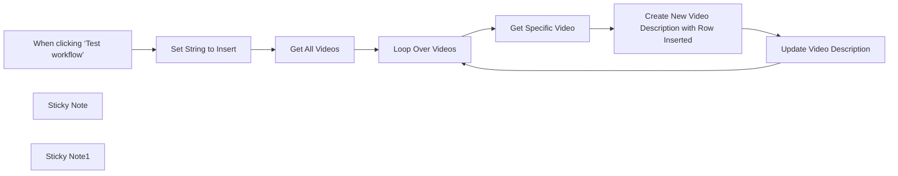

## Fluxo (.json) :

```json
{
  "name": "Automatically Update YouTube Video Descriptions with Inserted Text",
  "tags": [],
  "nodes": [
    {
      "id": "19cafddc-6199-4418-8213-9743c34c9176",
      "name": "Get All Videos",
      "type": "n8n-nodes-base.youTube",
      "position": [
        480,
        380
      ],
      "parameters": {
        "limit": 3,
        "filters": {},
        "options": {
          "order": "date"
        },
        "resource": "video"
      },
      "typeVersion": 1
    },
    {
      "id": "63a6a8e6-994f-46ab-a731-609549fec99f",
      "name": "Update Video Description",
      "type": "n8n-nodes-base.youTube",
      "position": [
        1320,
        460
      ],
      "parameters": {
        "title": "={{ $('Get Specific Video').item.json.snippet.title }}",
        "videoId": "={{ $('Get Specific Video').item.json.id}}",
        "resource": "video",
        "operation": "update",
        "categoryId": "={{ $('Get Specific Video').item.json.snippet.categoryId }}",
        "regionCode": "US",
        "updateFields": {
          "tags": "={{ $('Get Specific Video').item.json.snippet.tags.join() }}",
          "description": "={{ $json.updatedDescription }}"
        }
      },
      "typeVersion": 1
    },
    {
      "id": "ce147272-f6c3-4cfb-954b-9a77c63a6232",
      "name": "When clicking ‘Test workflow’",
      "type": "n8n-nodes-base.manualTrigger",
      "position": [
        120,
        380
      ],
      "parameters": {},
      "typeVersion": 1
    },
    {
      "id": "9ba206b2-1161-41a3-8581-d60dae665096",
      "name": "Sticky Note",
      "type": "n8n-nodes-base.stickyNote",
      "position": [
        100,
        120
      ],
      "parameters": {
        "color": 5,
        "width": 580,
        "height": 180,
        "content": "## Insert Text into YouTube Video Descriptions\n**Automatically insert a row of text between two specified rows** in all your YouTube video descriptions. \n\nThis workflow is ideal for YouTubers who need to update multiple video descriptions at once. Easily add a new link or text between existing lines, ensuring consistency across all your video descriptions without manual edits."
      },
      "typeVersion": 1
    },
    {
      "id": "e05f5b9c-c160-45d7-b67a-62d68acc0829",
      "name": "Sticky Note1",
      "type": "n8n-nodes-base.stickyNote",
      "position": [
        100,
        560
      ],
      "parameters": {
        "color": 4,
        "width": 340,
        "height": 260,
        "content": "## Configure text string to insert 👆 \nDefine the text string (row) that will be added to your YouTube video descriptions.\n\n### Variables\n- **rowBefore** → The new row will be inserted *after* this line.\n- **rowToInsert** -→ The text or link you want to add.\n- **rowAfter**→ The new row will be inserted *before* this line.\n\n"
      },
      "typeVersion": 1
    },
    {
      "id": "51a3fd15-8767-4cc0-98a8-fe98ec90db70",
      "name": "Set String to Insert",
      "type": "n8n-nodes-base.set",
      "position": [
        300,
        380
      ],
      "parameters": {
        "options": {},
        "assignments": {
          "assignments": [
            {
              "id": "a05b56b1-6f18-4359-aa4b-127399877301",
              "name": "rowBefore",
              "type": "string",
              "value": "=https://firstlink.com"
            },
            {
              "id": "95ac4a95-cdf4-4d7a-b9a3-78d54c879115",
              "name": "rowToInsert",
              "type": "string",
              "value": "https://mynewlinktoinsert.com"
            },
            {
              "id": "ded86a1f-f0a5-42b8-9176-9be4038f6290",
              "name": "rowAfter",
              "type": "string",
              "value": "https://secondlink.com"
            }
          ]
        }
      },
      "typeVersion": 3.4
    },
    {
      "id": "590b8bb3-6eb4-4bb8-af4c-c2d95221f045",
      "name": "Loop Over Videos",
      "type": "n8n-nodes-base.splitInBatches",
      "position": [
        700,
        380
      ],
      "parameters": {
        "options": {
          "reset": false
        }
      },
      "typeVersion": 3
    },
    {
      "id": "a80ac941-0a99-4eab-8a6c-effef1e136fa",
      "name": "Get Specific Video",
      "type": "n8n-nodes-base.youTube",
      "position": [
        900,
        460
      ],
      "parameters": {
        "options": {},
        "videoId": "={{ $json.id.videoId }}",
        "resource": "video",
        "operation": "get"
      },
      "typeVersion": 1
    },
    {
      "id": "2c4519e2-1af9-42d7-818c-8165365587fb",
      "name": "Create New Video Description with Row Inserted",
      "type": "n8n-nodes-base.code",
      "position": [
        1100,
        460
      ],
      "parameters": {
        "jsCode": "// Access the input data (YouTube description)\nconst description = $('Get Specific Video').first().json.snippet.description;\n//console.log(inputData)\n\nconst variables = $('Set String to Insert').first().json\n// Define the rows to search for and the row to insert\nconst rowBefore = variables.rowBefore;\nconst rowAfter = variables.rowAfter;\nconst rowToInsert = variables.rowToInsert;\n\n// Split the description into an array of rows\nconst rows = description.split(\"\\n\");\nconsole.log(rows)\n// Find the index of the rowBefore and rowAfter\nconst indexBefore = rows.findIndex(row => row.trim() === rowBefore);\nconst indexAfter = rows.findIndex(row => row.trim() === rowAfter);\n\n// Check if both rows are found and rowBefore comes before rowAfter\nif (indexBefore !== -1 && indexAfter !== -1 && indexBefore < indexAfter) {\n  // Insert the new row between rowBefore and rowAfter\n  rows.splice(indexBefore + 1, 0, rowToInsert);\n}\n\n// Join the rows back into a single string\nconst updatedDescription = rows.join(\"\\n\");\n\n// Return the updated description in the correct n8n output structure\nreturn [\n  {\n    json: {\n      updatedDescription: updatedDescription\n    }\n  }\n];"
      },
      "typeVersion": 2
    }
  ],
  "active": false,
  "pinData": {},
  "settings": {
    "executionOrder": "v1"
  },
  "versionId": "50fd0bcb-7441-45eb-ab58-ca2a7de78516",
  "connections": {
    "Get All Videos": {
      "main": [
        [
          {
            "node": "Loop Over Videos",
            "type": "main",
            "index": 0
          }
        ]
      ]
    },
    "Loop Over Videos": {
      "main": [
        [],
        [
          {
            "node": "Get Specific Video",
            "type": "main",
            "index": 0
          }
        ]
      ]
    },
    "Get Specific Video": {
      "main": [
        [
          {
            "node": "Create New Video Description with Row Inserted",
            "type": "main",
            "index": 0
          }
        ]
      ]
    },
    "Set String to Insert": {
      "main": [
        [
          {
            "node": "Get All Videos",
            "type": "main",
            "index": 0
          }
        ]
      ]
    },
    "Update Video Description": {
      "main": [
        [
          {
            "node": "Loop Over Videos",
            "type": "main",
            "index": 0
          }
        ]
      ]
    },
    "When clicking ‘Test workflow’": {
      "main": [
        [
          {
            "node": "Set String to Insert",
            "type": "main",
            "index": 0
          }
        ]
      ]
    },
    "Create New Video Description with Row Inserted": {
      "main": [
        [
          {
            "node": "Update Video Description",
            "type": "main",
            "index": 0
          }
        ]
      ]
    }
  }
}
```

<a id="template-1033"></a>

## Template 1033 - Backup simples de fluxos para Google Drive

- **Nome:** Backup simples de fluxos para Google Drive
- **Descrição:** Este fluxo faz backup de todos os fluxos, serializando cada um como JSON e salvando os arquivos na pasta designada do Google Drive.
- **Funcionalidade:** • Agendamento de backup: executa a operação periodicamente conforme a programação.
• Coleta de fluxos: busca todas as definições de fluxos para backup.
• Serialização em JSON: transforma cada fluxo em JSON para armazenamento.
• Geração de arquivos com nomes de fluxos: nomeia cada arquivo com o nome do fluxo e a extensão .json.
• Upload para Google Drive: envia os arquivos JSON para a pasta destino no Drive.
- **Ferramentas:** • Google Drive: Serviço de armazenamento em nuvem utilizado para armazenar os backups dos fluxos.

## Fluxo visual

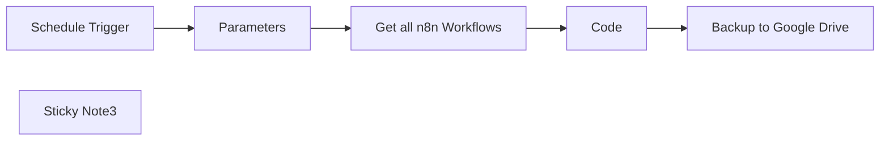

## Fluxo (.json) :

```json
{
  "meta": {
    "instanceId": "c911aed9995230b93fd0d9bc41c258d697c2fe97a3bab8c02baf85963eeda618",
    "templateCredsSetupCompleted": true
  },
  "nodes": [
    {
      "id": "3239827a-ba1c-4131-bfbe-6fa7d35bfaae",
      "name": "Parameters",
      "type": "n8n-nodes-base.set",
      "position": [
        360,
        720
      ],
      "parameters": {
        "options": {},
        "assignments": {
          "assignments": [
            {
              "id": "1b65def6-4984-497d-a4bc-232af22927ad",
              "name": "directory",
              "type": "string",
              "value": "https://drive.google.com/drive/folders/your-directory-id"
            },
            {
              "id": "c8c98f88-9f22-4574-88b8-1db99f6e4ec4",
              "name": "parentdrive",
              "type": "string",
              "value": "https://drive.google.com/drive/my-drive"
            }
          ]
        }
      },
      "typeVersion": 3.4
    },
    {
      "id": "de6411b5-5d53-4d42-b3b6-0fc4b84c52ea",
      "name": "Schedule Trigger",
      "type": "n8n-nodes-base.scheduleTrigger",
      "position": [
        180,
        720
      ],
      "parameters": {
        "rule": {
          "interval": [
            {
              "triggerAtHour": 1,
              "triggerAtMinute": 30
            }
          ]
        }
      },
      "typeVersion": 1.2
    },
    {
      "id": "5b25b86a-c957-4aa3-9c10-b884ee30d9a1",
      "name": "Sticky Note3",
      "type": "n8n-nodes-base.stickyNote",
      "position": [
        160,
        460
      ],
      "parameters": {
        "color": 3,
        "width": 560,
        "height": 140,
        "content": "## Simplest n8n Workflow Backup – Automating Your Data Security in Google Drive"
      },
      "typeVersion": 1
    },
    {
      "id": "f5033398-ccf6-4126-9039-6fa8a5968552",
      "name": "Code",
      "type": "n8n-nodes-base.code",
      "position": [
        720,
        720
      ],
      "parameters": {
        "jsCode": "return items.map(item => {\n  const jsonData = JSON.stringify(item.json);\n  const binaryData = Buffer.from(jsonData).toString('base64');\n  item.binary = {\n    data: {\n      data: binaryData,\n      mimeType: 'application/json',\n      fileName: 'data.json'\n    }\n  };\n  return item;\n});"
      },
      "typeVersion": 2
    },
    {
      "id": "b8532f27-a619-4683-a835-096f3a450397",
      "name": "Get all n8n Workflows",
      "type": "n8n-nodes-base.n8n",
      "position": [
        540,
        720
      ],
      "parameters": {
        "filters": {},
        "requestOptions": {}
      },
      "credentials": {
        "n8nApi": {
          "id": "lkbDvgt244nzvwuE",
          "name": "n8n account"
        }
      },
      "typeVersion": 1
    },
    {
      "id": "e6c815c6-00ac-4d91-b92f-dfc0c962bcd3",
      "name": "Backup to Google Drive",
      "type": "n8n-nodes-base.googleDrive",
      "position": [
        900,
        720
      ],
      "parameters": {
        "name": "={{  $json.name+ \".json\"}}",
        "driveId": {
          "__rl": true,
          "mode": "list",
          "value": "My Drive",
          "cachedResultUrl": "https://drive.google.com/drive/my-drive",
          "cachedResultName": "My Drive"
        },
        "options": {},
        "folderId": {
          "__rl": true,
          "mode": "url",
          "value": "={{ $('Parameters').item.json.directory }}"
        }
      },
      "retryOnFail": true,
      "typeVersion": 3
    }
  ],
  "pinData": {},
  "connections": {
    "Code": {
      "main": [
        [
          {
            "node": "Backup to Google Drive",
            "type": "main",
            "index": 0
          }
        ]
      ]
    },
    "Parameters": {
      "main": [
        [
          {
            "node": "Get all n8n Workflows",
            "type": "main",
            "index": 0
          }
        ]
      ]
    },
    "Schedule Trigger": {
      "main": [
        [
          {
            "node": "Parameters",
            "type": "main",
            "index": 0
          }
        ]
      ]
    },
    "Get all n8n Workflows": {
      "main": [
        [
          {
            "node": "Code",
            "type": "main",
            "index": 0
          }
        ]
      ]
    }
  }
}
```

<a id="template-1034"></a>

## Template 1034 - Form para Docs a partir de formulário

- **Nome:** Form para Docs a partir de formulário
- **Descrição:** Fluxo que coleta dados de um formulário, duplica um template de documento e substitui os placeholders com os valores do formulário para gerar um documento personalizado.
- **Funcionalidade:** • Detecção de envio de formulário: inicia a automação quando o formulário recebe uma resposta.
• Cópia do template de documento: cria uma cópia do template de documento escolhido a partir de um ID.
• Formatação dos dados do formulário: transforma as respostas em pares chave-valor para substituição.
• Substituição de texto no documento: preenche os placeholders do template com os valores do formulário.
• Integração com serviços de nuvem: gerencia autenticação e acesso a Drive e Docs.
- **Ferramentas:** • Google Drive: Copia o template de documento com base no ID fornecido.
• Google Docs API: Atualiza o conteúdo do documento substituindo placeholders pelos valores do formulário.

## Fluxo visual

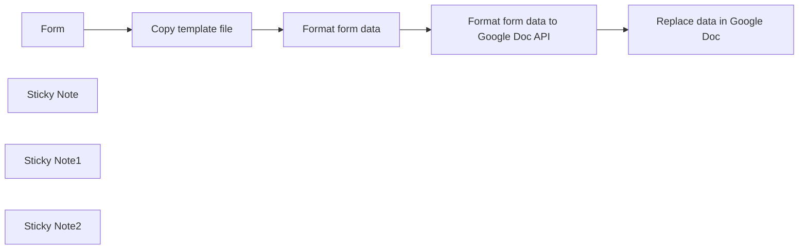

## Fluxo (.json) :

```json
{
  "meta": {
    "instanceId": "7614f731d9ac88c16c6149bd495fa54d325e3f79ab527ffc7e3b1b1f42dbf884",
    "templateCredsSetupCompleted": true
  },
  "nodes": [
    {
      "id": "56e70371-54a2-4421-9ce2-e626d9c6ef60",
      "name": "Form",
      "type": "n8n-nodes-base.formTrigger",
      "position": [
        -440,
        -120
      ],
      "webhookId": "622256ee-9248-43a2-840e-b28436800aac",
      "parameters": {
        "options": {},
        "formTitle": "Form",
        "formFields": {
          "values": [
            {
              "fieldLabel": "name",
              "requiredField": true
            }
          ]
        }
      },
      "typeVersion": 2.2
    },
    {
      "id": "7cbd263e-ca5b-436e-bdce-c30a66df73a6",
      "name": "Sticky Note",
      "type": "n8n-nodes-base.stickyNote",
      "position": [
        -440,
        100
      ],
      "parameters": {
        "color": 3,
        "width": 320,
        "content": "# 👆\nPlease add authentication to form by selecting Basic Auth to prevent unauthorized access to the form.\n"
      },
      "typeVersion": 1
    },
    {
      "id": "e1c4d0a8-6e48-45d9-bec6-ee8bb3751b4f",
      "name": "Copy template file",
      "type": "n8n-nodes-base.googleDrive",
      "position": [
        -220,
        -120
      ],
      "parameters": {
        "name": "={{ $json.name }}",
        "fileId": {
          "__rl": true,
          "mode": "list",
          "value": "1KyR0UMIOpEkjwa6o1gTggNBP2A6EWwppV59Y6NQuDYw",
          "cachedResultUrl": "https://docs.google.com/document/d/1KyR0UMIOpEkjwa6o1gTggNBP2A6EWwppV59Y6NQuDYw/edit?usp=drivesdk",
          "cachedResultName": "Szablon: Dokument testowy"
        },
        "options": {},
        "operation": "copy"
      },
      "credentials": {
        "googleDriveOAuth2Api": {
          "id": "aPSwizdvnxio0J7A",
          "name": "Google Drive account 2"
        }
      },
      "typeVersion": 3
    },
    {
      "id": "52a27a15-ca68-4381-9a0d-faa1127d7de9",
      "name": "Format form data",
      "type": "n8n-nodes-base.code",
      "position": [
        0,
        -120
      ],
      "parameters": {
        "jsCode": "const data = [];\n\nObject.keys($('Form').all().map((item) => {\n  Object.keys(item.json).map((bodyProperty) => {\n    data.push({\n      key: bodyProperty,\n      value: item.json[bodyProperty],\n    });\n  })\n}));\n\nreturn {\n  webhook_data: data,\n  pairedItem: 0,\n};"
      },
      "typeVersion": 2
    },
    {
      "id": "08dbeb42-16f6-4771-bbf8-a358fda54097",
      "name": "Format form data to Google Doc API",
      "type": "n8n-nodes-base.code",
      "position": [
        220,
        -120
      ],
      "parameters": {
        "jsCode": "const result = [];\n\n$('Format form data').all().map((item) => {\n  item.json.webhook_data.map((data) => {\n    if (\"submittedAt\" !== data.key && \"formMode\" !== data.key) {\n      result.push({\n        \"replaceAllText\": {\n            \"containsText\": {\n              \"text\": `{{${data.key}}}`, \n              \"matchCase\": true\n            },\n            \"replaceText\": `${data.value}`\n        },\n      });\n    }\n  });\n})\n\nreturn {\n  data: result,\n  pairedItem: 0,\n};"
      },
      "typeVersion": 2
    },
    {
      "id": "99b03034-8c9b-4e23-8cc9-bf9960a4e06a",
      "name": "Replace data in Google Doc",
      "type": "n8n-nodes-base.httpRequest",
      "position": [
        440,
        -120
      ],
      "parameters": {
        "url": "=https://docs.googleapis.com/v1/documents/{{ $('Copy template file').first().json.id }}:batchUpdate",
        "method": "POST",
        "options": {},
        "sendBody": true,
        "authentication": "predefinedCredentialType",
        "bodyParameters": {
          "parameters": [
            {
              "name": "requests",
              "value": "={{ $json.data }}"
            }
          ]
        },
        "nodeCredentialType": "googleDocsOAuth2Api"
      },
      "credentials": {
        "googleDocsOAuth2Api": {
          "id": "uhqGUvBF00zGb9vB",
          "name": "Google Docs account 2"
        }
      },
      "typeVersion": 4.2
    },
    {
      "id": "204b57da-2791-40e3-84f5-23a0ed5c8beb",
      "name": "Sticky Note1",
      "type": "n8n-nodes-base.stickyNote",
      "position": [
        -440,
        -420
      ],
      "parameters": {
        "color": 6,
        "width": 520,
        "height": 180,
        "content": "# 🙋‍♂️\nThe workflow automatically fetches all form fields and converts them into variables in Google Doc. For example, if you add a text field to the form called \"address,\" you can use the variable {{address}} in the Google Doc template."
      },
      "typeVersion": 1
    },
    {
      "id": "fa17044d-191e-45eb-9559-563889ad2aef",
      "name": "Sticky Note2",
      "type": "n8n-nodes-base.stickyNote",
      "position": [
        440,
        100
      ],
      "parameters": {
        "color": 3,
        "content": "# 👆\nIn Authentication, you need to select Predefined Credential Type and then choose Google Docs OAuth API."
      },
      "typeVersion": 1
    }
  ],
  "pinData": {},
  "connections": {
    "Form": {
      "main": [
        [
          {
            "node": "Copy template file",
            "type": "main",
            "index": 0
          }
        ]
      ]
    },
    "Format form data": {
      "main": [
        [
          {
            "node": "Format form data to Google Doc API",
            "type": "main",
            "index": 0
          }
        ]
      ]
    },
    "Copy template file": {
      "main": [
        [
          {
            "node": "Format form data",
            "type": "main",
            "index": 0
          }
        ]
      ]
    },
    "Replace data in Google Doc": {
      "main": [
        []
      ]
    },
    "Format form data to Google Doc API": {
      "main": [
        [
          {
            "node": "Replace data in Google Doc",
            "type": "main",
            "index": 0
          }
        ]
      ]
    }
  }
}
```

<a id="template-1035"></a>

## Template 1035 - Convite de usuários via Sheets

- **Nome:** Convite de usuários via Sheets
- **Descrição:** Este fluxo obtém a lista de usuários existentes, lê uma planilha do Google Sheets com contatos e nomes, compara os emails e cria novos usuários para os que não existem, enviando convites.
- **Funcionalidade:** • Leitura de dados da planilha: Obtém os contatos da planilha do Google Sheets para comparação com usuários existentes.
• Consulta de usuários existentes: Busca usuários já cadastrados para evitar duplicatas.
• Combinação por email: Une dados da planilha com usuários já cadastrados com base no email para identificar novos cadastros.
• Criação de novos usuários: Cria usuários com os dados da planilha (email e role).
• Envio de convites: Envia convites de cadastro aos novos usuários criados.
• Execução programada ou manual: Pode ser iniciada automaticamente via agendamento ou por disparo manual.
- **Ferramentas:** • Google Sheets: Planilha usada para listar emails e informações dos usuários a serem convidados.
• API de gerenciamento de usuários: Endpoint para buscar, criar usuários e enviar convites.

## Fluxo visual

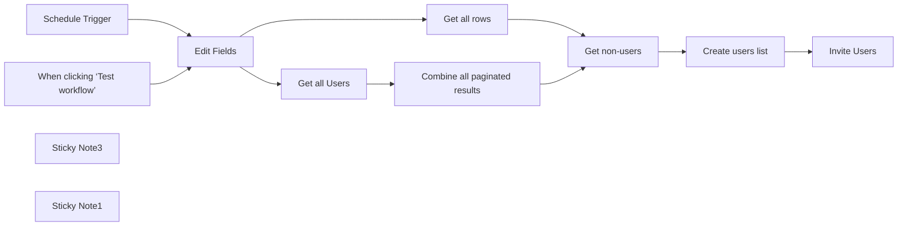

## Fluxo (.json) :

```json
{
  "meta": {
    "instanceId": "e634e668fe1fc93a75c4f2a7fc0dad807ca318b79654157eadb9578496acbc76",
    "templateCredsSetupCompleted": true
  },
  "nodes": [
    {
      "id": "58c6003f-3311-448b-a949-4fbc22b38e2e",
      "name": "When clicking ‘Test workflow’",
      "type": "n8n-nodes-base.manualTrigger",
      "position": [
        -560,
        80
      ],
      "parameters": {},
      "typeVersion": 1
    },
    {
      "id": "67e4f66c-256f-4e45-b98e-d2872a416ff5",
      "name": "Get all Users",
      "type": "n8n-nodes-base.httpRequest",
      "position": [
        80,
        100
      ],
      "parameters": {
        "url": "={{ $json.n8n_url }}",
        "options": {
          "pagination": {
            "pagination": {
              "parameters": {
                "parameters": [
                  {
                    "name": "cursor",
                    "value": "={{ $response.body.nextCursor }}"
                  }
                ]
              },
              "completeExpression": "={{ !$response.body.nextCursor }}",
              "paginationCompleteWhen": "other"
            }
          }
        },
        "sendQuery": true,
        "authentication": "predefinedCredentialType",
        "queryParameters": {
          "parameters": [
            {
              "name": "limit",
              "value": "5"
            }
          ]
        },
        "nodeCredentialType": "n8nApi"
      },
      "credentials": {
        "n8nApi": {
          "id": "dzYjDgtEXtpRPKhe",
          "name": "n8n account"
        },
        "httpHeaderAuth": {
          "id": "iiLmD473RYjGLbCA",
          "name": "Squarespace API key - Apps script"
        }
      },
      "typeVersion": 4.2
    },
    {
      "id": "2a66ddc7-5fde-4e2b-9ad6-7c68968214ae",
      "name": "Get all rows",
      "type": "n8n-nodes-base.googleSheets",
      "position": [
        80,
        -180
      ],
      "parameters": {
        "options": {},
        "sheetName": {
          "__rl": true,
          "mode": "list",
          "value": "gid=0",
          "cachedResultUrl": "https://docs.google.com/spreadsheets/d/15A3ZWzIBfONL4U_1XGJvtsS8HtMQ69qrpxd5C5L6Akg/edit#gid=0",
          "cachedResultName": "Sheet1"
        },
        "documentId": {
          "__rl": true,
          "mode": "list",
          "value": "15A3ZWzIBfONL4U_1XGJvtsS8HtMQ69qrpxd5C5L6Akg",
          "cachedResultUrl": "https://docs.google.com/spreadsheets/d/15A3ZWzIBfONL4U_1XGJvtsS8HtMQ69qrpxd5C5L6Akg/edit?usp=drivesdk",
          "cachedResultName": "n8n-submission"
        }
      },
      "credentials": {
        "googleSheetsOAuth2Api": {
          "id": "JgI9maibw5DnBXRP",
          "name": "Google Sheets account"
        }
      },
      "typeVersion": 4.5
    },
    {
      "id": "f220c6db-eafb-4bb5-9cbe-43edcf563a67",
      "name": "Get non-users",
      "type": "n8n-nodes-base.merge",
      "position": [
        620,
        -100
      ],
      "parameters": {
        "mode": "combine",
        "options": {},
        "advanced": true,
        "joinMode": "keepNonMatches",
        "mergeByFields": {
          "values": [
            {
              "field1": "Email Address",
              "field2": "email"
            }
          ]
        },
        "outputDataFrom": "input1"
      },
      "typeVersion": 3
    },
    {
      "id": "906e8dde-4c58-4e93-9e07-3064a5dd60dd",
      "name": "Invite Users",
      "type": "n8n-nodes-base.httpRequest",
      "position": [
        1100,
        -100
      ],
      "parameters": {
        "url": "={{ $('Edit Fields').item.json.n8n_url }}",
        "method": "POST",
        "options": {},
        "jsonBody": "={{ [$json] }}",
        "sendBody": true,
        "specifyBody": "json",
        "authentication": "predefinedCredentialType",
        "nodeCredentialType": "n8nApi"
      },
      "credentials": {
        "n8nApi": {
          "id": "dzYjDgtEXtpRPKhe",
          "name": "n8n account"
        },
        "httpHeaderAuth": {
          "id": "iiLmD473RYjGLbCA",
          "name": "Squarespace API key - Apps script"
        }
      },
      "typeVersion": 4.2
    },
    {
      "id": "195d0c33-611a-4a16-b62c-8ba1f4f31e19",
      "name": "Schedule Trigger",
      "type": "n8n-nodes-base.scheduleTrigger",
      "position": [
        -560,
        -160
      ],
      "parameters": {
        "rule": {
          "interval": [
            {}
          ]
        }
      },
      "typeVersion": 1.2
    },
    {
      "id": "dd453b5b-f238-43b1-8c44-2c3ed3a3d7ba",
      "name": "Edit Fields",
      "type": "n8n-nodes-base.set",
      "position": [
        -220,
        -20
      ],
      "parameters": {
        "options": {},
        "assignments": {
          "assignments": [
            {
              "id": "c3a7a1ee-d1a2-4a29-b4b3-dcadf0fc16e2",
              "name": "n8n_url",
              "type": "string",
              "value": "https://{n8n-url}/api/v1/users"
            }
          ]
        }
      },
      "typeVersion": 3.4
    },
    {
      "id": "07e678c7-7c98-4f09-89d8-5e4d7d442a8f",
      "name": "Sticky Note3",
      "type": "n8n-nodes-base.stickyNote",
      "position": [
        -280,
        -160
      ],
      "parameters": {
        "color": 4,
        "width": 230,
        "height": 300,
        "content": "## Edit this node 👇\nChange n8n_url to your instance URL\nhttps://docs.n8n.io/api/authentication/#call-the-api-using-your-key"
      },
      "typeVersion": 1
    },
    {
      "id": "2bfb10b6-220b-4c73-a15f-190412f2dda2",
      "name": "Create users list",
      "type": "n8n-nodes-base.set",
      "position": [
        880,
        -100
      ],
      "parameters": {
        "options": {},
        "assignments": {
          "assignments": [
            {
              "id": "36282722-07ec-47b1-ab08-c649b7901ed7",
              "name": "email",
              "type": "string",
              "value": "={{ $json['Email Address'] }}"
            },
            {
              "id": "9b073e1d-8c16-45b1-b333-97dfe635eb73",
              "name": "role",
              "type": "string",
              "value": "global:member"
            }
          ]
        }
      },
      "typeVersion": 3.4
    },
    {
      "id": "221ca946-e305-4283-bca1-4289b8a7db28",
      "name": "Sticky Note1",
      "type": "n8n-nodes-base.stickyNote",
      "position": [
        -1000,
        -300
      ],
      "parameters": {
        "color": 4,
        "width": 371.1995072042308,
        "height": 600.88409546716,
        "content": "## Invite users to n8n from Google sheets\nThis workflow will get all Users from n8n and compare against the rows from Google sheets and create new users\n\nInvitation emails will be sent once the new users created\n\nYou can run the workflow on demand or by schedule\n\n## Spreadsheet template\n\nThe sheet columns are inspire from Squarespace newsletter block connection, but you can change the node to adapt new columns format\n\nClone the [sample sheet here](https://docs.google.com/spreadsheets/d/1wi2Ucb4b35e0-fuf-96sMnyzTft0ADz3MwdE_cG_WnQ/edit?usp=sharing)\n- Submitted On\t\n- Email Address\t\n- Name"
      },
      "typeVersion": 1
    },
    {
      "id": "c956e102-7fe3-4ee4-90e0-32cb11556c2c",
      "name": "Combine all paginated results",
      "type": "n8n-nodes-base.code",
      "position": [
        320,
        100
      ],
      "parameters": {
        "jsCode": "let results = [];\nfor (let i = 0; i < $input.all().length; i++) {\n  results = results.concat($input.all()[i].json.data);\n}\n\nreturn results;"
      },
      "typeVersion": 2
    }
  ],
  "pinData": {},
  "connections": {
    "Edit Fields": {
      "main": [
        [
          {
            "node": "Get all rows",
            "type": "main",
            "index": 0
          },
          {
            "node": "Get all Users",
            "type": "main",
            "index": 0
          }
        ]
      ]
    },
    "Get all rows": {
      "main": [
        [
          {
            "node": "Get non-users",
            "type": "main",
            "index": 0
          }
        ]
      ]
    },
    "Get all Users": {
      "main": [
        [
          {
            "node": "Combine all paginated results",
            "type": "main",
            "index": 0
          }
        ]
      ]
    },
    "Get non-users": {
      "main": [
        [
          {
            "node": "Create users list",
            "type": "main",
            "index": 0
          }
        ]
      ]
    },
    "Schedule Trigger": {
      "main": [
        [
          {
            "node": "Edit Fields",
            "type": "main",
            "index": 0
          }
        ]
      ]
    },
    "Create users list": {
      "main": [
        [
          {
            "node": "Invite Users",
            "type": "main",
            "index": 0
          }
        ]
      ]
    },
    "Combine all paginated results": {
      "main": [
        [
          {
            "node": "Get non-users",
            "type": "main",
            "index": 1
          }
        ]
      ]
    },
    "When clicking ‘Test workflow’": {
      "main": [
        [
          {
            "node": "Edit Fields",
            "type": "main",
            "index": 0
          }
        ]
      ]
    }
  }
}
```

<a id="template-1036"></a>

## Template 1036 - Busca de perfis LinkedIn a partir de formulário

- **Nome:** Busca de perfis LinkedIn a partir de formulário
- **Descrição:** Recebe dados de um prospect via formulário, busca possíveis perfis LinkedIn e gera um follow-up personalizado enviado por e-mail.
- **Funcionalidade:** • Coleta de dados via formulário: Recebe nome completo e empresa do prospect.
• Montagem de buscas no Google: Gera URLs de pesquisa direcionadas para localizar perfis LinkedIn e informações da empresa.
• Raspagem de resultados de busca: Obtém o HTML das páginas de resultados e sites encontrados.
• Extração de conteúdo das páginas: Extrai título e corpo das páginas para análise posterior.
• Identificação de perfis LinkedIn com LLM: Analisa os resultados com um modelo de linguagem para extrair link, nome, cargo e empresa, e sinalizar correspondências com os dados do formulário.
• Filtragem e seleção de perfil: Filtra apenas entradas que batem com o prospect e limita a seleção a um perfil principal.
• Enriquecimento com dados da empresa: Busca e analisa a primeira entrada relevante relacionada à empresa para contexto adicional.
• Geração de follow-up personalizado em HTML (Tailwind): Cria recomendações de abordagem e passos de outreach formatados em HTML usando Tailwind.
• Envio de e-mail com o follow-up: Envia o conteúdo gerado para o e-mail configurado.
• Retorno ao usuário no formulário: Notifica o usuário se o e-mail foi enviado ou se nenhum perfil foi encontrado.
- **Ferramentas:** • Bright Data: Serviço de proxy/raspagem para obter resultados de busca e páginas web de forma escalável.
• OpenAI (GPT-4o-mini): Modelo de linguagem usado para extrair informações dos resultados e gerar o follow-up personalizado.
• Google Search: Fonte das páginas e resultados pesquisados para localizar perfis e informações da empresa.
• Serviço SMTP / E-mail: Infraestrutura usada para enviar o e-mail com o follow-up gerado.

## Fluxo visual


## Fluxo (.json) :

```json
{
  "id": "nmVATBvrztDxZX6z",
  "meta": {
    "instanceId": "b1f85eae352fde76d801a1a612661df6824cc2e68bfd6741e31305160a737e6e",
    "templateCredsSetupCompleted": true
  },
  "name": "LinkedIn Profile Finder via Form using Bright Data & GPT-4o-mini",
  "tags": [],
  "nodes": [
    {
      "id": "ff6d4985-8b42-46d8-95c8-e80ff102440c",
      "name": "Extract Body and Title from Website",
      "type": "n8n-nodes-base.html",
      "position": [
        1600,
        -1120
      ],
      "parameters": {
        "options": {
          "trimValues": true
        },
        "operation": "extractHtmlContent",
        "dataPropertyName": "body",
        "extractionValues": {
          "values": [
            {
              "key": "title",
              "cssSelector": "title"
            },
            {
              "key": "body",
              "cssSelector": "body"
            }
          ]
        }
      },
      "typeVersion": 1.2
    },
    {
      "id": "4da21d9c-59d2-4151-a1ca-5e7a85cf0316",
      "name": "When User Completes Form",
      "type": "n8n-nodes-base.formTrigger",
      "position": [
        580,
        -1120
      ],
      "webhookId": "41d0bffa-f5ca-4df7-b757-ca5a1e472b8a",
      "parameters": {
        "options": {
          "path": "search-user",
          "ignoreBots": true,
          "buttonLabel": "Get References"
        },
        "formTitle": "Sales prospecting",
        "formFields": {
          "values": [
            {
              "fieldLabel": "Person Fullname",
              "placeholder": "Complete the fullname",
              "requiredField": true
            },
            {
              "fieldLabel": "Person's company",
              "placeholder": "Complete the company",
              "requiredField": true
            }
          ]
        },
        "responseMode": "lastNode",
        "formDescription": "Complete the data of the prospect you want to analyze.\n\nA personalized follow-up email with insights and suggested outreach steps will be sent to you:"
      },
      "typeVersion": 2.2
    },
    {
      "id": "644fab8f-66c6-4ae5-984b-7e1e66c265a2",
      "name": "Get LinkedIn Entry on Google",
      "type": "n8n-nodes-brightdata.brightData",
      "position": [
        1280,
        -1120
      ],
      "parameters": {
        "url": "={{ $json.google_search }}",
        "zone": {
          "__rl": true,
          "mode": "list",
          "value": "web_unlocker1",
          "cachedResultName": "web_unlocker1"
        },
        "format": "json",
        "country": {
          "__rl": true,
          "mode": "list",
          "value": "us",
          "cachedResultName": "us"
        },
        "requestOptions": {}
      },
      "credentials": {
        "brightdataApi": {
          "id": "jk945kIuAFAo9bcg",
          "name": "BrightData account"
        }
      },
      "typeVersion": 1
    },
    {
      "id": "e226ea33-a643-4396-9cbf-53901eeef89f",
      "name": "Parse Google Results",
      "type": "@n8n/n8n-nodes-langchain.openAi",
      "position": [
        1920,
        -1120
      ],
      "parameters": {
        "modelId": {
          "__rl": true,
          "mode": "list",
          "value": "gpt-4o-mini",
          "cachedResultName": "GPT-4O-MINI"
        },
        "options": {},
        "messages": {
          "values": [
            {
              "role": "system",
              "content": "=Extract Linkedin profiles from google results (link, fullname, position, company if possible). \n\nReturn a results property with all the parsed results including a property \"match\" if user matches the data entry values \"{{ $('When User Completes Form').item.json[\"Person Fullname\"].trim() }} {{ $('When User Completes Form').item.json[\"Person Position\"].trim() }} {{ $('When User Completes Form').item.json[\"Person's company\"].trim() }}\""
            },
            {
              "content": "=The input text is:\n{{ $json.body }}"
            },
            {
              "content": "=Categories to filter: {{ $('When User Completes Form').item.json.Category.join(',') }}"
            }
          ]
        },
        "jsonOutput": true
      },
      "credentials": {
        "openAiApi": {
          "id": "oKzfvOwieOm4upQ2",
          "name": "OpenAi account"
        }
      },
      "typeVersion": 1.8
    },
    {
      "id": "8018f6c1-037b-4577-ae4c-d2129fe2ecf4",
      "name": "Form Not Found",
      "type": "n8n-nodes-base.form",
      "position": [
        2280,
        -800
      ],
      "webhookId": "a509f577-231f-435f-b3c2-0fed718f0cc8",
      "parameters": {
        "operation": "completion",
        "respondWith": "showText",
        "responseText": "=We didn't found a person for \"{{ $('When User Completes Form').item.json[\"Person Fullname\"] }} {{ $('When User Completes Form').item.json[\"Person Fullname\"] }} {{ $('When User Completes Form').item.json[\"Person's company\"] }}\""
      },
      "typeVersion": 1
    },
    {
      "id": "3de33b35-63b5-419d-9719-b217c92767c6",
      "name": "Get only Matching Profiles",
      "type": "n8n-nodes-base.filter",
      "position": [
        1460,
        -820
      ],
      "parameters": {
        "options": {},
        "conditions": {
          "options": {
            "version": 2,
            "leftValue": "",
            "caseSensitive": true,
            "typeValidation": "loose"
          },
          "combinator": "and",
          "conditions": [
            {
              "id": "51a15ff2-457c-4a96-bfad-fe6d29a8cd9f",
              "operator": {
                "name": "filter.operator.equals",
                "type": "string",
                "operation": "equals"
              },
              "leftValue": "={{ $json.match }}",
              "rightValue": "true"
            }
          ]
        },
        "looseTypeValidation": true
      },
      "typeVersion": 2.2
    },
    {
      "id": "b7e925b1-3b67-4b17-bcc1-10111ed41c32",
      "name": "Limit to 1 Profile",
      "type": "n8n-nodes-base.limit",
      "position": [
        1740,
        -820
      ],
      "parameters": {},
      "typeVersion": 1
    },
    {
      "id": "d4a6a867-6e9b-48d3-9ba2-0d9d2e803e67",
      "name": "Extract Parsed Results",
      "type": "n8n-nodes-base.splitOut",
      "position": [
        2340,
        -1120
      ],
      "parameters": {
        "options": {},
        "fieldToSplitOut": "message.content.results"
      },
      "typeVersion": 1
    },
    {
      "id": "daf17e0e-0fc9-45e4-9393-8ba3a60f868e",
      "name": "LinkedIn Profile is Found?",
      "type": "n8n-nodes-base.if",
      "position": [
        1960,
        -820
      ],
      "parameters": {
        "options": {},
        "conditions": {
          "options": {
            "version": 2,
            "leftValue": "",
            "caseSensitive": true,
            "typeValidation": "strict"
          },
          "combinator": "and",
          "conditions": [
            {
              "id": "645d85d3-c5cc-4e51-a989-075c0a851449",
              "operator": {
                "type": "object",
                "operation": "exists",
                "singleValue": true
              },
              "leftValue": "={{ $json }}",
              "rightValue": 1
            }
          ]
        }
      },
      "typeVersion": 2.2
    },
    {
      "id": "300da9f8-6c24-4081-af96-ae09a1b513f8",
      "name": "Edit Url LinkedIn",
      "type": "n8n-nodes-base.set",
      "position": [
        940,
        -1120
      ],
      "parameters": {
        "options": {},
        "assignments": {
          "assignments": [
            {
              "id": "6b95685b-3286-4643-bfa1-6335d3f8cb39",
              "name": "google_search",
              "type": "string",
              "value": "=https://www.google.com/search?q=site%3Alinkedin.com%2Fin+{{ encodeURIComponent($json[\"Person Fullname\"].trim() + \" \" + $json[\"Person's company\"].trim()) }}"
            }
          ]
        }
      },
      "typeVersion": 3.4
    },
    {
      "id": "3ffaef02-ee98-4663-9a64-37907943427d",
      "name": "Edit Company Search",
      "type": "n8n-nodes-base.set",
      "position": [
        300,
        -860
      ],
      "parameters": {
        "options": {},
        "assignments": {
          "assignments": [
            {
              "id": "6b95685b-3286-4643-bfa1-6335d3f8cb39",
              "name": "google_search",
              "type": "string",
              "value": "=https://www.google.com/search?q={{ encodeURIComponent($json[\"Person's company\"].trim()) }}"
            }
          ]
        }
      },
      "typeVersion": 3.4
    },
    {
      "id": "29294eaa-4692-4c1b-806a-11bd32428fdd",
      "name": "Extract Body and Title from Website1",
      "type": "n8n-nodes-base.html",
      "position": [
        860,
        -860
      ],
      "parameters": {
        "options": {
          "trimValues": true
        },
        "operation": "extractHtmlContent",
        "dataPropertyName": "body",
        "extractionValues": {
          "values": [
            {
              "key": "title",
              "cssSelector": "title"
            },
            {
              "key": "body",
              "cssSelector": "body"
            }
          ]
        }
      },
      "typeVersion": 1.2
    },
    {
      "id": "e5232b69-eefe-4875-b339-54f7d2787863",
      "name": "Get Company on Google",
      "type": "n8n-nodes-brightdata.brightData",
      "position": [
        540,
        -860
      ],
      "parameters": {
        "url": "={{ $json.google_search }}",
        "zone": {
          "__rl": true,
          "mode": "list",
          "value": "web_unlocker1",
          "cachedResultName": "web_unlocker1"
        },
        "format": "json",
        "country": {
          "__rl": true,
          "mode": "list",
          "value": "us",
          "cachedResultName": "us"
        },
        "requestOptions": {}
      },
      "credentials": {
        "brightdataApi": {
          "id": "jk945kIuAFAo9bcg",
          "name": "BrightData account"
        }
      },
      "typeVersion": 1
    },
    {
      "id": "a8696ab3-76f0-4b58-93d6-1b73f4c1d83a",
      "name": "Parse Google Results for Company",
      "type": "@n8n/n8n-nodes-langchain.openAi",
      "position": [
        720,
        -420
      ],
      "parameters": {
        "modelId": {
          "__rl": true,
          "mode": "list",
          "value": "gpt-4o-mini",
          "cachedResultName": "GPT-4O-MINI"
        },
        "options": {},
        "messages": {
          "values": [
            {
              "role": "system",
              "content": "=Get first entry matching company {{ $('When User Completes Form').item.json[\"Person's company\"] }}\n\nOutput first entry data in a content property"
            },
            {
              "content": "=The input text is:\n{{ $json.body }}"
            },
            {
              "content": "=Categories to filter: {{ $('When User Completes Form').item.json.Category.join(',') }}"
            }
          ]
        },
        "jsonOutput": true
      },
      "credentials": {
        "openAiApi": {
          "id": "oKzfvOwieOm4upQ2",
          "name": "OpenAi account"
        }
      },
      "typeVersion": 1.8
    },
    {
      "id": "4b4a6ef2-92ae-4dee-aac1-081fb1a2dbd9",
      "name": "Split Out",
      "type": "n8n-nodes-base.splitOut",
      "position": [
        1080,
        -420
      ],
      "parameters": {
        "options": {},
        "fieldToSplitOut": "message.content"
      },
      "typeVersion": 1
    },
    {
      "id": "cbf625d0-097d-47e7-8ab0-fb2da9dc3f7c",
      "name": "Create a Followup for Company and Person",
      "type": "@n8n/n8n-nodes-langchain.openAi",
      "position": [
        1500,
        -440
      ],
      "parameters": {
        "modelId": {
          "__rl": true,
          "mode": "list",
          "value": "gpt-4o-mini",
          "cachedResultName": "GPT-4O-MINI"
        },
        "options": {},
        "messages": {
          "values": [
            {
              "role": "system",
              "content": "=Use data to analyze as a buyer persona. Find the best approach to connect for future champion in his company. Give recommendations and a concrete outreach steps.\n\nOutput report as raw html in a propety called content. Use tailwind for styles."
            },
            {
              "content": "=The input text is:\n{{ JSON.stringify($json)}}"
            }
          ]
        },
        "jsonOutput": true
      },
      "credentials": {
        "openAiApi": {
          "id": "oKzfvOwieOm4upQ2",
          "name": "OpenAi account"
        }
      },
      "typeVersion": 1.8
    },
    {
      "id": "6347e20c-b3f0-42ff-bc31-ddf4d13a4398",
      "name": "Merge",
      "type": "n8n-nodes-base.merge",
      "position": [
        1320,
        -440
      ],
      "parameters": {
        "mode": "combine",
        "options": {},
        "combineBy": "combineByPosition"
      },
      "typeVersion": 3.1
    },
    {
      "id": "4df0fb38-dad4-4eda-876c-591111e98807",
      "name": "Send Email",
      "type": "n8n-nodes-base.emailSend",
      "position": [
        1880,
        -440
      ],
      "webhookId": "1e6e9588-2bc6-4f05-8531-2d7ca8348d0c",
      "parameters": {
        "html": "={{ $json.message.content.content }}",
        "options": {},
        "subject": "Next followup",
        "toEmail": "miquel@n8nhackers.com",
        "fromEmail": "miquel@n8nhackers.com"
      },
      "credentials": {
        "smtp": {
          "id": "z3kiLWNZTH4wQaGy",
          "name": "SMTP account"
        }
      },
      "typeVersion": 2.1
    },
    {
      "id": "5d28cc94-3193-48e6-9bad-f15baf403645",
      "name": "Form Email Sent",
      "type": "n8n-nodes-base.form",
      "position": [
        2120,
        -440
      ],
      "webhookId": "a509f577-231f-435f-b3c2-0fed718f0cc8",
      "parameters": {
        "options": {},
        "operation": "completion",
        "completionTitle": "Thank you!",
        "completionMessage": "We have sent you an email"
      },
      "typeVersion": 1
    }
  ],
  "active": false,
  "pinData": {},
  "settings": {
    "executionOrder": "v1"
  },
  "versionId": "ea9dab20-4b74-45d0-9bf9-b0c1a884fe81",
  "connections": {
    "Merge": {
      "main": [
        [
          {
            "node": "Create a Followup for Company and Person",
            "type": "main",
            "index": 0
          }
        ]
      ]
    },
    "Split Out": {
      "main": [
        [
          {
            "node": "Merge",
            "type": "main",
            "index": 1
          }
        ]
      ]
    },
    "Send Email": {
      "main": [
        [
          {
            "node": "Form Email Sent",
            "type": "main",
            "index": 0
          }
        ]
      ]
    },
    "Edit Url LinkedIn": {
      "main": [
        [
          {
            "node": "Get LinkedIn Entry on Google",
            "type": "main",
            "index": 0
          }
        ]
      ]
    },
    "Limit to 1 Profile": {
      "main": [
        [
          {
            "node": "LinkedIn Profile is Found?",
            "type": "main",
            "index": 0
          }
        ]
      ]
    },
    "Edit Company Search": {
      "main": [
        [
          {
            "node": "Get Company on Google",
            "type": "main",
            "index": 0
          }
        ]
      ]
    },
    "Parse Google Results": {
      "main": [
        [
          {
            "node": "Extract Parsed Results",
            "type": "main",
            "index": 0
          }
        ]
      ]
    },
    "Get Company on Google": {
      "main": [
        [
          {
            "node": "Extract Body and Title from Website1",
            "type": "main",
            "index": 0
          }
        ]
      ]
    },
    "Extract Parsed Results": {
      "main": [
        [
          {
            "node": "Get only Matching Profiles",
            "type": "main",
            "index": 0
          }
        ]
      ]
    },
    "When User Completes Form": {
      "main": [
        [
          {
            "node": "Edit Url LinkedIn",
            "type": "main",
            "index": 0
          },
          {
            "node": "Edit Company Search",
            "type": "main",
            "index": 0
          }
        ]
      ]
    },
    "Get only Matching Profiles": {
      "main": [
        [
          {
            "node": "Limit to 1 Profile",
            "type": "main",
            "index": 0
          }
        ]
      ]
    },
    "LinkedIn Profile is Found?": {
      "main": [
        [
          {
            "node": "Merge",
            "type": "main",
            "index": 0
          }
        ],
        [
          {
            "node": "Form Not Found",
            "type": "main",
            "index": 0
          }
        ]
      ]
    },
    "Get LinkedIn Entry on Google": {
      "main": [
        [
          {
            "node": "Extract Body and Title from Website",
            "type": "main",
            "index": 0
          }
        ]
      ]
    },
    "Parse Google Results for Company": {
      "main": [
        [
          {
            "node": "Split Out",
            "type": "main",
            "index": 0
          }
        ]
      ]
    },
    "Extract Body and Title from Website": {
      "main": [
        [
          {
            "node": "Parse Google Results",
            "type": "main",
            "index": 0
          }
        ]
      ]
    },
    "Extract Body and Title from Website1": {
      "main": [
        [
          {
            "node": "Parse Google Results for Company",
            "type": "main",
            "index": 0
          }
        ]
      ]
    },
    "Create a Followup for Company and Person": {
      "main": [
        [
          {
            "node": "Send Email",
            "type": "main",
            "index": 0
          }
        ]
      ]
    }
  }
}
```

<a id="template-1037"></a>

## Template 1037 - Remoção avançada de fundo e upload para Google Drive

- **Nome:** Remoção avançada de fundo e upload para Google Drive
- **Descrição:** Automatiza a remoção do fundo de imagens adicionadas a uma pasta do Google Drive, aplica cor ou transparência, ajusta padding e tamanho, e salva o resultado em outra pasta do Drive.
- **Funcionalidade:** • Monitoramento de pasta no Google Drive: detecta novos arquivos adicionados em uma pasta específica.
• Download de imagens: baixa o arquivo de imagem recém-carregado para processamento.
• Leitura do tamanho da imagem: obtém as dimensões da imagem original para uso opcional.
• Escolha de tamanho de saída: opção de manter o tamanho de entrada ou usar um tamanho fixo configurado.
• Remoção de fundo via API externa: envia a imagem para uma API que remove o fundo e aplica o fundo desejado (cor ou transparente).
• Aplicação de cor de fundo e padding: define cor de fundo (por exemplo branco, transparente ou HEX) e adiciona padding percentual ao redor do objeto.
• Conversão para PNG e renomeação: salva o resultado como .png com prefixo e nome derivado do arquivo original (ex.: BG-Removed-...png).
• Upload para pasta do Google Drive: envia a imagem processada para a pasta de saída configurada.
• Processamento em lote: permite iterar e processar múltiplas imagens sequencialmente.
• Configuração via parâmetros: possibilita definir chave da API, pasta de saída, cor de fundo, padding e tamanho de saída.
- **Ferramentas:** • Google Drive: serviço de armazenamento utilizado para detectar novos arquivos, baixar as imagens para processamento e armazenar os resultados finalizados.
• PhotoRoom API: serviço externo de edição de imagens especializado em remoção de fundo, aplicação de cor/transparência, padding e redimensionamento.

## Fluxo visual

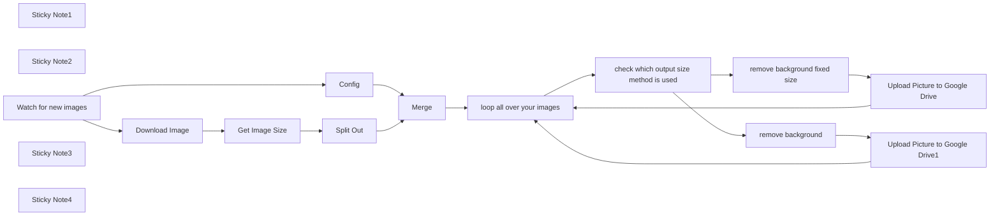

## Fluxo (.json) :

```json
{
  "id": "oNJCLq4egGByMeSl",
  "meta": {
    "instanceId": "1bc0f4fa5e7d17ac362404cbb49337e51e5061e019cfa24022a8667c1f1ce287",
    "templateCredsSetupCompleted": true
  },
  "name": "Remove Advanced Background from Google Drive Images",
  "tags": [],
  "nodes": [
    {
      "id": "99582f98-3707-4480-954a-f091e4e8133a",
      "name": "Config",
      "type": "n8n-nodes-base.set",
      "position": [
        820,
        620
      ],
      "parameters": {
        "options": {},
        "assignments": {
          "assignments": [
            {
              "id": "42b02a2f-a642-42db-a565-fd2a01a26fb9",
              "name": "bg_color",
              "type": "string",
              "value": "white"
            },
            {
              "id": "f68b2280-ec85-4400-8a98-10e644b56076",
              "name": "padding",
              "type": "string",
              "value": "5%"
            },
            {
              "id": "8bdee3a1-9107-4bf8-adea-332d299e43ae",
              "name": "keepInputSize",
              "type": "boolean",
              "value": true
            },
            {
              "id": "89d9e4fb-ed14-4ee2-b6f0-73035bafbc39",
              "name": "outputSize",
              "type": "string",
              "value": "1600x1600"
            },
            {
              "id": "ad53bf64-5493-4c4d-a52c-cd4d657cc9f9",
              "name": "inputFileName",
              "type": "string",
              "value": "={{ $json.originalFilename }}"
            },
            {
              "id": "9fc440c6-289b-4a6a-8391-479a6660836f",
              "name": "OutputDriveFolder",
              "type": "string",
              "value": "ENTER GOOGLE DRIVE FOLDER URL"
            },
            {
              "id": "f0f1767a-b659-48c4-bef6-8ee4111cb939",
              "name": "api-key",
              "type": "string",
              "value": "ENTER API KEY"
            }
          ]
        }
      },
      "typeVersion": 3.4
    },
    {
      "id": "7b5973d4-0d9f-4d17-8b71-e6c4f81d682e",
      "name": "remove background",
      "type": "n8n-nodes-base.httpRequest",
      "position": [
        2300,
        520
      ],
      "parameters": {
        "url": "https://image-api.photoroom.com/v2/edit",
        "method": "POST",
        "options": {
          "response": {
            "response": {}
          }
        },
        "sendBody": true,
        "contentType": "multipart-form-data",
        "sendHeaders": true,
        "bodyParameters": {
          "parameters": [
            {
              "name": "background.color",
              "value": "={{ $json.bg_color }}"
            },
            {
              "name": "imageFile",
              "parameterType": "formBinaryData",
              "inputDataFieldName": "data"
            },
            {
              "name": "padding",
              "value": "={{ $json.padding }}"
            },
            {
              "name": "outputSize",
              "value": "={{ $json.Geometry }}"
            }
          ]
        },
        "headerParameters": {
          "parameters": [
            {
              "name": "x-api-key",
              "value": "={{ $json['api-key'] }}"
            }
          ]
        }
      },
      "typeVersion": 4.1
    },
    {
      "id": "66d4f5c2-3d63-4e4a-8ea7-358c17061198",
      "name": "Split Out",
      "type": "n8n-nodes-base.splitOut",
      "position": [
        1260,
        420
      ],
      "parameters": {
        "options": {
          "includeBinary": true
        },
        "fieldToSplitOut": "Geometry"
      },
      "typeVersion": 1
    },
    {
      "id": "10f8a6cf-d1d0-4c5f-9983-5d574f98a7ba",
      "name": "Upload Picture to Google Drive",
      "type": "n8n-nodes-base.googleDrive",
      "position": [
        2520,
        320
      ],
      "parameters": {
        "name": "=BG-Removed-{{$json.inputFileName.split('.').slice(0, -1).join('.') }}.png",
        "driveId": {
          "__rl": true,
          "mode": "list",
          "value": "My Drive"
        },
        "options": {},
        "folderId": {
          "__rl": true,
          "mode": "url",
          "value": "={{ $json.OutputDriveFolder }}"
        }
      },
      "credentials": {
        "googleDriveOAuth2Api": {
          "id": "X2y13wEmbPaV3QGI",
          "name": "Google Drive account"
        }
      },
      "typeVersion": 3
    },
    {
      "id": "5e4e91ff-346e-414d-bbe2-0724469183b4",
      "name": "remove background fixed size",
      "type": "n8n-nodes-base.httpRequest",
      "position": [
        2300,
        320
      ],
      "parameters": {
        "url": "https://image-api.photoroom.com/v2/edit",
        "method": "POST",
        "options": {
          "response": {
            "response": {}
          }
        },
        "sendBody": true,
        "contentType": "multipart-form-data",
        "sendHeaders": true,
        "bodyParameters": {
          "parameters": [
            {
              "name": "background.color",
              "value": "={{ $json.bg_color }}"
            },
            {
              "name": "imageFile",
              "parameterType": "formBinaryData",
              "inputDataFieldName": "data"
            },
            {
              "name": "padding",
              "value": "={{ $json.padding }}"
            },
            {
              "name": "outputSize",
              "value": "={{ $json.outputSize }}"
            }
          ]
        },
        "headerParameters": {
          "parameters": [
            {
              "name": "x-api-key",
              "value": "={{ $json['api-key'] }}"
            }
          ]
        }
      },
      "typeVersion": 4.1
    },
    {
      "id": "16924a69-2711-4dc6-b7ab-c0e2001edfa4",
      "name": "Merge",
      "type": "n8n-nodes-base.merge",
      "position": [
        1600,
        460
      ],
      "parameters": {
        "mode": "combine",
        "options": {},
        "combineBy": "combineByPosition"
      },
      "typeVersion": 3
    },
    {
      "id": "39196096-ef45-4159-8286-00a1b21aaec4",
      "name": "Upload Picture to Google Drive1",
      "type": "n8n-nodes-base.googleDrive",
      "position": [
        2540,
        520
      ],
      "parameters": {
        "name": "=BG-Removed-{{$json.inputFileName.split('.').slice(0, -1).join('.') }}.png",
        "driveId": {
          "__rl": true,
          "mode": "list",
          "value": "My Drive"
        },
        "options": {},
        "folderId": {
          "__rl": true,
          "mode": "url",
          "value": "={{ $json.OutputDriveFolder }}"
        }
      },
      "credentials": {
        "googleDriveOAuth2Api": {
          "id": "X2y13wEmbPaV3QGI",
          "name": "Google Drive account"
        }
      },
      "typeVersion": 3
    },
    {
      "id": "a2f15d9a-5458-4d83-995a-e41491c997bd",
      "name": "Download Image",
      "type": "n8n-nodes-base.googleDrive",
      "position": [
        800,
        420
      ],
      "parameters": {
        "fileId": {
          "__rl": true,
          "mode": "id",
          "value": "={{ $json.id }}"
        },
        "options": {},
        "operation": "download"
      },
      "credentials": {
        "googleDriveOAuth2Api": {
          "id": "X2y13wEmbPaV3QGI",
          "name": "Google Drive account"
        }
      },
      "typeVersion": 3
    },
    {
      "id": "3e2bef4d-22f8-465d-8d11-f9fe25e67cd9",
      "name": "Get Image Size",
      "type": "n8n-nodes-base.editImage",
      "position": [
        1060,
        420
      ],
      "parameters": {
        "operation": "information"
      },
      "typeVersion": 1
    },
    {
      "id": "e497d10f-0727-4bb7-b016-42ffe2faf773",
      "name": "Sticky Note1",
      "type": "n8n-nodes-base.stickyNote",
      "position": [
        420,
        -280
      ],
      "parameters": {
        "color": 5,
        "width": 613.2529601722273,
        "height": 653.6921420882659,
        "content": "## About this worfklow \n\n## How it works\nThis workflow does watch out for new images uploaded within Google Drive. \nOnce there are new images it will download the image. And then run some logic, remove the background and add some padding to the output image. \n**By default Images are saved as .png**\nOnce done upload it to Google Drive again.\n## Features* Select Google Drive Credentials within the Google Drive Nodes\n### This workflow supports\n* Remove Background\n* Transparent Background\n* Coloured Background (1 Color)\n* Add Padding\n* Choose Output Size\n\n## Customize it!\n* Feel free to customize the workflow to your needs\n* Speed up the workflow: Using fixed output size\n### Examples \n* Send Final Images to another service\n* For Products: Let ChatGPT Analyze the Product Type\n* Add Text with the \"Edit Image\" Node\n\n### Photroom API Playground\n[Click me](https://www.photoroom.com/api/playground)"
      },
      "typeVersion": 1
    },
    {
      "id": "e892caf8-b9c7-4880-a096-f9d1c8c52c0c",
      "name": "Sticky Note2",
      "type": "n8n-nodes-base.stickyNote",
      "position": [
        1060,
        -20
      ],
      "parameters": {
        "color": 4,
        "width": 437.4768568353068,
        "height": 395.45317545748134,
        "content": "## Setup\n\n### Requirements\n* Photoroom API Key [Click me](https://docs.photoroom.com/getting-started/how-can-i-get-my-api-key)\n* Google Drive Credential Setup\n\n\n## Config\n* Select Google Drive Credentials within the Google Drive Nodes\n\n* **Please refer to the \"Config\" Node**\n\nFor the API Key you can also setup an Header Authentication"
      },
      "typeVersion": 1
    },
    {
      "id": "7f79d9e0-a7ac-422c-869f-76ada147917c",
      "name": "Watch for new images",
      "type": "n8n-nodes-base.googleDriveTrigger",
      "position": [
        440,
        520
      ],
      "parameters": {
        "event": "fileCreated",
        "options": {},
        "pollTimes": {
          "item": [
            {
              "mode": "everyMinute"
            }
          ]
        },
        "triggerOn": "specificFolder",
        "folderToWatch": {
          "__rl": true,
          "mode": "list",
          "value": ""
        }
      },
      "credentials": {
        "googleDriveOAuth2Api": {
          "id": "X2y13wEmbPaV3QGI",
          "name": "Google Drive account"
        }
      },
      "typeVersion": 1
    },
    {
      "id": "f67556bb-b463-4ba5-a472-577a8d5ab0ca",
      "name": "Sticky Note3",
      "type": "n8n-nodes-base.stickyNote",
      "position": [
        420,
        680
      ],
      "parameters": {
        "color": 3,
        "width": 160.79224973089333,
        "height": 80,
        "content": "Select Input Folder"
      },
      "typeVersion": 1
    },
    {
      "id": "04913b7f-1949-4e8e-b2c4-f9e3bacbc78c",
      "name": "Sticky Note4",
      "type": "n8n-nodes-base.stickyNote",
      "position": [
        780,
        780
      ],
      "parameters": {
        "color": 3,
        "width": 263.8708288482238,
        "height": 227.27233584499461,
        "content": "### Configuration\n* Provide Your API Key\n* Set Background Color\n-HEX or values like white, transparent...\n* Select if Output Size / or Original  Size should be used \n* Output Drive Folder\n ->Copy URL\n* Padding (Default 5%)"
      },
      "typeVersion": 1
    },
    {
      "id": "e3b262d2-c367-4733-8cde-abd485c3d81b",
      "name": "check which output size method is used",
      "type": "n8n-nodes-base.if",
      "position": [
        2040,
        460
      ],
      "parameters": {
        "options": {},
        "conditions": {
          "options": {
            "version": 2,
            "leftValue": "",
            "caseSensitive": true,
            "typeValidation": "strict"
          },
          "combinator": "and",
          "conditions": [
            {
              "id": "d11ca8bb-0801-480f-b99a-249c5920b876",
              "operator": {
                "type": "boolean",
                "operation": "false",
                "singleValue": true
              },
              "leftValue": "={{ $json.keepInputSize }}",
              "rightValue": ""
            }
          ]
        }
      },
      "typeVersion": 2.2
    },
    {
      "id": "0cc4f416-7341-4bf7-8fb8-f3c746f8b9e4",
      "name": "loop all over your images",
      "type": "n8n-nodes-base.splitInBatches",
      "position": [
        1820,
        460
      ],
      "parameters": {
        "options": {}
      },
      "typeVersion": 3
    }
  ],
  "active": false,
  "pinData": {},
  "settings": {
    "executionOrder": "v1"
  },
  "versionId": "cff1146a-4dfd-4d87-a819-2420652e6c5e",
  "connections": {
    "Merge": {
      "main": [
        [
          {
            "node": "loop all over your images",
            "type": "main",
            "index": 0
          }
        ]
      ]
    },
    "Config": {
      "main": [
        [
          {
            "node": "Merge",
            "type": "main",
            "index": 1
          }
        ]
      ]
    },
    "Split Out": {
      "main": [
        [
          {
            "node": "Merge",
            "type": "main",
            "index": 0
          }
        ]
      ]
    },
    "Download Image": {
      "main": [
        [
          {
            "node": "Get Image Size",
            "type": "main",
            "index": 0
          }
        ]
      ]
    },
    "Get Image Size": {
      "main": [
        [
          {
            "node": "Split Out",
            "type": "main",
            "index": 0
          }
        ]
      ]
    },
    "remove background": {
      "main": [
        [
          {
            "node": "Upload Picture to Google Drive1",
            "type": "main",
            "index": 0
          }
        ]
      ]
    },
    "Watch for new images": {
      "main": [
        [
          {
            "node": "Download Image",
            "type": "main",
            "index": 0
          },
          {
            "node": "Config",
            "type": "main",
            "index": 0
          }
        ]
      ]
    },
    "loop all over your images": {
      "main": [
        [],
        [
          {
            "node": "check which output size method is used",
            "type": "main",
            "index": 0
          }
        ]
      ]
    },
    "remove background fixed size": {
      "main": [
        [
          {
            "node": "Upload Picture to Google Drive",
            "type": "main",
            "index": 0
          }
        ]
      ]
    },
    "Upload Picture to Google Drive": {
      "main": [
        [
          {
            "node": "loop all over your images",
            "type": "main",
            "index": 0
          }
        ]
      ]
    },
    "Upload Picture to Google Drive1": {
      "main": [
        [
          {
            "node": "loop all over your images",
            "type": "main",
            "index": 0
          }
        ]
      ]
    },
    "check which output size method is used": {
      "main": [
        [
          {
            "node": "remove background fixed size",
            "type": "main",
            "index": 0
          }
        ],
        [
          {
            "node": "remove background",
            "type": "main",
            "index": 0
          }
        ]
      ]
    }
  }
}
```

<a id="template-1038"></a>

## Template 1038 - Extrair fieldData de contatos FileMaker

- **Nome:** Extrair fieldData de contatos FileMaker
- **Descrição:** Extrai e transforma a resposta da API do FileMaker retornando apenas os dados de campo (fieldData) de cada registro de contato.
- **Funcionalidade:** • Simular resposta da API do FileMaker: fornece um objeto JSON contendo dataInfo, uma lista de registros em response.data e mensagens de status.
• Separar lista de registros: extrai a propriedade response.data e converte em múltiplos itens para processamento individual.
• Retornar somente fieldData: para cada item da lista, recupera e retorna apenas o objeto fieldData contendo os campos do contato (nome, email, telefone, endereço, etc.).
- **Ferramentas:** • FileMaker Data API: API de banco de dados que fornece registros de contatos em formato JSON para consulta e integração.

## Fluxo visual

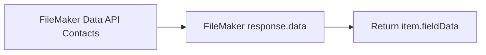

## Fluxo (.json) :

```json
{
  "nodes": [
    {
      "name": "FileMaker response.data",
      "type": "n8n-nodes-base.itemLists",
      "position": [
        600,
        -580
      ],
      "parameters": {
        "options": {},
        "fieldToSplitOut": "=response.data"
      },
      "typeVersion": 1
    },
    {
      "name": "Return item.fieldData",
      "type": "n8n-nodes-base.functionItem",
      "position": [
        800,
        -580
      ],
      "parameters": {
        "functionCode": "return item.fieldData;\n"
      },
      "typeVersion": 1
    },
    {
      "name": "FileMaker Data API Contacts",
      "type": "n8n-nodes-base.function",
      "position": [
        400,
        -580
      ],
      "parameters": {
        "functionCode": "return [{ json: \n\n{\n\t\"response\": {\n\t\t\"dataInfo\": {\n\t\t\t\"database\": \"WorkflowSampleData\",\n\t\t\t\"layout\": \"Contacts\",\n\t\t\t\"table\": \"Contacts\",\n\t\t\t\"totalRecordCount\": 500,\n\t\t\t\"foundCount\": 500,\n\t\t\t\"returnedCount\": 100\n\t\t},\n\t\t\"data\": [{\n\t\t\t\"fieldData\": {\n\t\t\t\t\"first_name\": \"James\",\n\t\t\t\t\"last_name\": \"Butt\",\n\t\t\t\t\"company_name\": \"Benton, John B Jr\",\n\t\t\t\t\"address\": \"6649 N Blue Gum St\",\n\t\t\t\t\"city\": \"New Orleans\",\n\t\t\t\t\"county\": \"Orleans\",\n\t\t\t\t\"state\": \"LA\",\n\t\t\t\t\"zip\": \"70116\",\n\t\t\t\t\"phone1\": \"504-621-8927\",\n\t\t\t\t\"phone2\": \"504-845-1427\",\n\t\t\t\t\"email\": \"jbutt@gmail.com\",\n\t\t\t\t\"web\": \"http://www.bentonjohnbjr.com\",\n\t\t\t\t\"ID\": 1\n\t\t\t},\n\t\t\t\"portalData\": {},\n\t\t\t\"recordId\": \"1\",\n\t\t\t\"modId\": \"1\"\n\t\t}, {\n\t\t\t\"fieldData\": {\n\t\t\t\t\"first_name\": \"Josephine\",\n\t\t\t\t\"last_name\": \"Darakjy\",\n\t\t\t\t\"company_name\": \"Chanay, Jeffrey A Esq\",\n\t\t\t\t\"address\": \"4 B Blue Ridge Blvd\",\n\t\t\t\t\"city\": \"Brighton\",\n\t\t\t\t\"county\": \"Livingston\",\n\t\t\t\t\"state\": \"MI\",\n\t\t\t\t\"zip\": \"48116\",\n\t\t\t\t\"phone1\": \"810-292-9388\",\n\t\t\t\t\"phone2\": \"810-374-9840\",\n\t\t\t\t\"email\": \"josephine_darakjy@darakjy.org\",\n\t\t\t\t\"web\": \"http://www.chanayjeffreyaesq.com\",\n\t\t\t\t\"ID\": 2\n\t\t\t},\n\t\t\t\"portalData\": {},\n\t\t\t\"recordId\": \"2\",\n\t\t\t\"modId\": \"1\"\n\t\t}, {\n\t\t\t\"fieldData\": {\n\t\t\t\t\"first_name\": \"Art\",\n\t\t\t\t\"last_name\": \"Venere\",\n\t\t\t\t\"company_name\": \"Chemel, James L Cpa\",\n\t\t\t\t\"address\": \"8 W Cerritos Ave #54\",\n\t\t\t\t\"city\": \"Bridgeport\",\n\t\t\t\t\"county\": \"Gloucester\",\n\t\t\t\t\"state\": \"NJ\",\n\t\t\t\t\"zip\": \"08014\",\n\t\t\t\t\"phone1\": \"856-636-8749\",\n\t\t\t\t\"phone2\": \"856-264-4130\",\n\t\t\t\t\"email\": \"art@venere.org\",\n\t\t\t\t\"web\": \"http://www.chemeljameslcpa.com\",\n\t\t\t\t\"ID\": 3\n\t\t\t},\n\t\t\t\"portalData\": {},\n\t\t\t\"recordId\": \"3\",\n\t\t\t\"modId\": \"1\"\n\t\t}, {\n\t\t\t\"fieldData\": {\n\t\t\t\t\"first_name\": \"Lenna\",\n\t\t\t\t\"last_name\": \"Paprocki\",\n\t\t\t\t\"company_name\": \"Feltz Printing Service\",\n\t\t\t\t\"address\": \"639 Main St\",\n\t\t\t\t\"city\": \"Anchorage\",\n\t\t\t\t\"county\": \"Anchorage\",\n\t\t\t\t\"state\": \"AK\",\n\t\t\t\t\"zip\": \"99501\",\n\t\t\t\t\"phone1\": \"907-385-4412\",\n\t\t\t\t\"phone2\": \"907-921-2010\",\n\t\t\t\t\"email\": \"lpaprocki@hotmail.com\",\n\t\t\t\t\"web\": \"http://www.feltzprintingservice.com\",\n\t\t\t\t\"ID\": 4\n\t\t\t},\n\t\t\t\"portalData\": {},\n\t\t\t\"recordId\": \"4\",\n\t\t\t\"modId\": \"1\"\n\t\t}, {\n\t\t\t\"fieldData\": {\n\t\t\t\t\"first_name\": \"Donette\",\n\t\t\t\t\"last_name\": \"Foller\",\n\t\t\t\t\"company_name\": \"Printing Dimensions\",\n\t\t\t\t\"address\": \"34 Center St\",\n\t\t\t\t\"city\": \"Hamilton\",\n\t\t\t\t\"county\": \"Butler\",\n\t\t\t\t\"state\": \"OH\",\n\t\t\t\t\"zip\": \"45011\",\n\t\t\t\t\"phone1\": \"513-570-1893\",\n\t\t\t\t\"phone2\": \"513-549-4561\",\n\t\t\t\t\"email\": \"donette.foller@cox.net\",\n\t\t\t\t\"web\": \"http://www.printingdimensions.com\",\n\t\t\t\t\"ID\": 5\n\t\t\t},\n\t\t\t\"portalData\": {},\n\t\t\t\"recordId\": \"5\",\n\t\t\t\"modId\": \"1\"\n\t\t}, {\n\t\t\t\"fieldData\": {\n\t\t\t\t\"first_name\": \"Simona\",\n\t\t\t\t\"last_name\": \"Morasca\",\n\t\t\t\t\"company_name\": \"Chapman, Ross E Esq\",\n\t\t\t\t\"address\": \"3 Mcauley Dr\",\n\t\t\t\t\"city\": \"Ashland\",\n\t\t\t\t\"county\": \"Ashland\",\n\t\t\t\t\"state\": \"OH\",\n\t\t\t\t\"zip\": \"44805\",\n\t\t\t\t\"phone1\": \"419-503-2484\",\n\t\t\t\t\"phone2\": \"419-800-6759\",\n\t\t\t\t\"email\": \"simona@morasca.com\",\n\t\t\t\t\"web\": \"http://www.chapmanrosseesq.com\",\n\t\t\t\t\"ID\": 6\n\t\t\t},\n\t\t\t\"portalData\": {},\n\t\t\t\"recordId\": \"6\",\n\t\t\t\"modId\": \"1\"\n\t\t}, {\n\t\t\t\"fieldData\": {\n\t\t\t\t\"first_name\": \"Mitsue\",\n\t\t\t\t\"last_name\": \"Tollner\",\n\t\t\t\t\"company_name\": \"Morlong Associates\",\n\t\t\t\t\"address\": \"7 Eads St\",\n\t\t\t\t\"city\": \"Chicago\",\n\t\t\t\t\"county\": \"Cook\",\n\t\t\t\t\"state\": \"IL\",\n\t\t\t\t\"zip\": \"60632\",\n\t\t\t\t\"phone1\": \"773-573-6914\",\n\t\t\t\t\"phone2\": \"773-924-8565\",\n\t\t\t\t\"email\": \"mitsue_tollner@yahoo.com\",\n\t\t\t\t\"web\": \"http://www.morlongassociates.com\",\n\t\t\t\t\"ID\": 7\n\t\t\t},\n\t\t\t\"portalData\": {},\n\t\t\t\"recordId\": \"7\",\n\t\t\t\"modId\": \"1\"\n\t\t}, {\n\t\t\t\"fieldData\": {\n\t\t\t\t\"first_name\": \"Leota\",\n\t\t\t\t\"last_name\": \"Dilliard\",\n\t\t\t\t\"company_name\": \"Commercial Press\",\n\t\t\t\t\"address\": \"7 W Jackson Blvd\",\n\t\t\t\t\"city\": \"San Jose\",\n\t\t\t\t\"county\": \"Santa Clara\",\n\t\t\t\t\"state\": \"CA\",\n\t\t\t\t\"zip\": \"95111\",\n\t\t\t\t\"phone1\": \"408-752-3500\",\n\t\t\t\t\"phone2\": \"408-813-1105\",\n\t\t\t\t\"email\": \"leota@hotmail.com\",\n\t\t\t\t\"web\": \"http://www.commercialpress.com\",\n\t\t\t\t\"ID\": 8\n\t\t\t},\n\t\t\t\"portalData\": {},\n\t\t\t\"recordId\": \"8\",\n\t\t\t\"modId\": \"1\"\n\t\t}, {\n\t\t\t\"fieldData\": {\n\t\t\t\t\"first_name\": \"Sage\",\n\t\t\t\t\"last_name\": \"Wieser\",\n\t\t\t\t\"company_name\": \"Truhlar And Truhlar Attys\",\n\t\t\t\t\"address\": \"5 Boston Ave #88\",\n\t\t\t\t\"city\": \"Sioux Falls\",\n\t\t\t\t\"county\": \"Minnehaha\",\n\t\t\t\t\"state\": \"SD\",\n\t\t\t\t\"zip\": \"57105\",\n\t\t\t\t\"phone1\": \"605-414-2147\",\n\t\t\t\t\"phone2\": \"605-794-4895\",\n\t\t\t\t\"email\": \"sage_wieser@cox.net\",\n\t\t\t\t\"web\": \"http://www.truhlarandtruhlarattys.com\",\n\t\t\t\t\"ID\": 9\n\t\t\t},\n\t\t\t\"portalData\": {},\n\t\t\t\"recordId\": \"9\",\n\t\t\t\"modId\": \"1\"\n\t\t}, {\n\t\t\t\"fieldData\": {\n\t\t\t\t\"first_name\": \"Kris\",\n\t\t\t\t\"last_name\": \"Marrier\",\n\t\t\t\t\"company_name\": \"King, Christopher A Esq\",\n\t\t\t\t\"address\": \"228 Runamuck Pl #2808\",\n\t\t\t\t\"city\": \"Baltimore\",\n\t\t\t\t\"county\": \"Baltimore City\",\n\t\t\t\t\"state\": \"MD\",\n\t\t\t\t\"zip\": \"21224\",\n\t\t\t\t\"phone1\": \"410-655-8723\",\n\t\t\t\t\"phone2\": \"410-804-4694\",\n\t\t\t\t\"email\": \"kris@gmail.com\",\n\t\t\t\t\"web\": \"http://www.kingchristopheraesq.com\",\n\t\t\t\t\"ID\": 10\n\t\t\t},\n\t\t\t\"portalData\": {},\n\t\t\t\"recordId\": \"10\",\n\t\t\t\"modId\": \"1\"\n\t\t}, {\n\t\t\t\"fieldData\": {\n\t\t\t\t\"first_name\": \"Minna\",\n\t\t\t\t\"last_name\": \"Amigon\",\n\t\t\t\t\"company_name\": \"Dorl, James J Esq\",\n\t\t\t\t\"address\": \"2371 Jerrold Ave\",\n\t\t\t\t\"city\": \"Kulpsville\",\n\t\t\t\t\"county\": \"Montgomery\",\n\t\t\t\t\"state\": \"PA\",\n\t\t\t\t\"zip\": \"19443\",\n\t\t\t\t\"phone1\": \"215-874-1229\",\n\t\t\t\t\"phone2\": \"215-422-8694\",\n\t\t\t\t\"email\": \"minna_amigon@yahoo.com\",\n\t\t\t\t\"web\": \"http://www.dorljamesjesq.com\",\n\t\t\t\t\"ID\": 11\n\t\t\t},\n\t\t\t\"portalData\": {},\n\t\t\t\"recordId\": \"11\",\n\t\t\t\"modId\": \"1\"\n\t\t}, {\n\t\t\t\"fieldData\": {\n\t\t\t\t\"first_name\": \"Abel\",\n\t\t\t\t\"last_name\": \"Maclead\",\n\t\t\t\t\"company_name\": \"Rangoni Of Florence\",\n\t\t\t\t\"address\": \"37275 St  Rt 17m M\",\n\t\t\t\t\"city\": \"Middle Island\",\n\t\t\t\t\"county\": \"Suffolk\",\n\t\t\t\t\"state\": \"NY\",\n\t\t\t\t\"zip\": \"11953\",\n\t\t\t\t\"phone1\": \"631-335-3414\",\n\t\t\t\t\"phone2\": \"631-677-3675\",\n\t\t\t\t\"email\": \"amaclead@gmail.com\",\n\t\t\t\t\"web\": \"http://www.rangoniofflorence.com\",\n\t\t\t\t\"ID\": 12\n\t\t\t},\n\t\t\t\"portalData\": {},\n\t\t\t\"recordId\": \"12\",\n\t\t\t\"modId\": \"1\"\n\t\t}, {\n\t\t\t\"fieldData\": {\n\t\t\t\t\"first_name\": \"Kiley\",\n\t\t\t\t\"last_name\": \"Caldarera\",\n\t\t\t\t\"company_name\": \"Feiner Bros\",\n\t\t\t\t\"address\": \"25 E 75th St #69\",\n\t\t\t\t\"city\": \"Los Angeles\",\n\t\t\t\t\"county\": \"Los Angeles\",\n\t\t\t\t\"state\": \"CA\",\n\t\t\t\t\"zip\": \"90034\",\n\t\t\t\t\"phone1\": \"310-498-5651\",\n\t\t\t\t\"phone2\": \"310-254-3084\",\n\t\t\t\t\"email\": \"kiley.caldarera@aol.com\",\n\t\t\t\t\"web\": \"http://www.feinerbros.com\",\n\t\t\t\t\"ID\": 13\n\t\t\t},\n\t\t\t\"portalData\": {},\n\t\t\t\"recordId\": \"13\",\n\t\t\t\"modId\": \"1\"\n\t\t}, {\n\t\t\t\"fieldData\": {\n\t\t\t\t\"first_name\": \"Graciela\",\n\t\t\t\t\"last_name\": \"Ruta\",\n\t\t\t\t\"company_name\": \"Buckley Miller & Wright\",\n\t\t\t\t\"address\": \"98 Connecticut Ave Nw\",\n\t\t\t\t\"city\": \"Chagrin Falls\",\n\t\t\t\t\"county\": \"Geauga\",\n\t\t\t\t\"state\": \"OH\",\n\t\t\t\t\"zip\": \"44023\",\n\t\t\t\t\"phone1\": \"440-780-8425\",\n\t\t\t\t\"phone2\": \"440-579-7763\",\n\t\t\t\t\"email\": \"gruta@cox.net\",\n\t\t\t\t\"web\": \"http://www.buckleymillerwright.com\",\n\t\t\t\t\"ID\": 14\n\t\t\t},\n\t\t\t\"portalData\": {},\n\t\t\t\"recordId\": \"14\",\n\t\t\t\"modId\": \"1\"\n\t\t}, {\n\t\t\t\"fieldData\": {\n\t\t\t\t\"first_name\": \"Cammy\",\n\t\t\t\t\"last_name\": \"Albares\",\n\t\t\t\t\"company_name\": \"Rousseaux, Michael Esq\",\n\t\t\t\t\"address\": \"56 E Morehead St\",\n\t\t\t\t\"city\": \"Laredo\",\n\t\t\t\t\"county\": \"Webb\",\n\t\t\t\t\"state\": \"TX\",\n\t\t\t\t\"zip\": \"78045\",\n\t\t\t\t\"phone1\": \"956-537-6195\",\n\t\t\t\t\"phone2\": \"956-841-7216\",\n\t\t\t\t\"email\": \"calbares@gmail.com\",\n\t\t\t\t\"web\": \"http://www.rousseauxmichaelesq.com\",\n\t\t\t\t\"ID\": 15\n\t\t\t},\n\t\t\t\"portalData\": {},\n\t\t\t\"recordId\": \"15\",\n\t\t\t\"modId\": \"1\"\n\t\t}, {\n\t\t\t\"fieldData\": {\n\t\t\t\t\"first_name\": \"Mattie\",\n\t\t\t\t\"last_name\": \"Poquette\",\n\t\t\t\t\"company_name\": \"Century Communications\",\n\t\t\t\t\"address\": \"73 State Road 434 E\",\n\t\t\t\t\"city\": \"Phoenix\",\n\t\t\t\t\"county\": \"Maricopa\",\n\t\t\t\t\"state\": \"AZ\",\n\t\t\t\t\"zip\": \"85013\",\n\t\t\t\t\"phone1\": \"602-277-4385\",\n\t\t\t\t\"phone2\": \"602-953-6360\",\n\t\t\t\t\"email\": \"mattie@aol.com\",\n\t\t\t\t\"web\": \"http://www.centurycommunications.com\",\n\t\t\t\t\"ID\": 16\n\t\t\t},\n\t\t\t\"portalData\": {},\n\t\t\t\"recordId\": \"16\",\n\t\t\t\"modId\": \"1\"\n\t\t}, {\n\t\t\t\"fieldData\": {\n\t\t\t\t\"first_name\": \"Meaghan\",\n\t\t\t\t\"last_name\": \"Garufi\",\n\t\t\t\t\"company_name\": \"Bolton, Wilbur Esq\",\n\t\t\t\t\"address\": \"69734 E Carrillo St\",\n\t\t\t\t\"city\": \"Mc Minnville\",\n\t\t\t\t\"county\": \"Warren\",\n\t\t\t\t\"state\": \"TN\",\n\t\t\t\t\"zip\": \"37110\",\n\t\t\t\t\"phone1\": \"931-313-9635\",\n\t\t\t\t\"phone2\": \"931-235-7959\",\n\t\t\t\t\"email\": \"meaghan@hotmail.com\",\n\t\t\t\t\"web\": \"http://www.boltonwilburesq.com\",\n\t\t\t\t\"ID\": 17\n\t\t\t},\n\t\t\t\"portalData\": {},\n\t\t\t\"recordId\": \"17\",\n\t\t\t\"modId\": \"1\"\n\t\t}, {\n\t\t\t\"fieldData\": {\n\t\t\t\t\"first_name\": \"Gladys\",\n\t\t\t\t\"last_name\": \"Rim\",\n\t\t\t\t\"company_name\": \"T M Byxbee Company Pc\",\n\t\t\t\t\"address\": \"322 New Horizon Blvd\",\n\t\t\t\t\"city\": \"Milwaukee\",\n\t\t\t\t\"county\": \"Milwaukee\",\n\t\t\t\t\"state\": \"WI\",\n\t\t\t\t\"zip\": \"53207\",\n\t\t\t\t\"phone1\": \"414-661-9598\",\n\t\t\t\t\"phone2\": \"414-377-2880\",\n\t\t\t\t\"email\": \"gladys.rim@rim.org\",\n\t\t\t\t\"web\": \"http://www.tmbyxbeecompanypc.com\",\n\t\t\t\t\"ID\": 18\n\t\t\t},\n\t\t\t\"portalData\": {},\n\t\t\t\"recordId\": \"18\",\n\t\t\t\"modId\": \"1\"\n\t\t}, {\n\t\t\t\"fieldData\": {\n\t\t\t\t\"first_name\": \"Yuki\",\n\t\t\t\t\"last_name\": \"Whobrey\",\n\t\t\t\t\"company_name\": \"Farmers Insurance Group\",\n\t\t\t\t\"address\": \"1 State Route 27\",\n\t\t\t\t\"city\": \"Taylor\",\n\t\t\t\t\"county\": \"Wayne\",\n\t\t\t\t\"state\": \"MI\",\n\t\t\t\t\"zip\": \"48180\",\n\t\t\t\t\"phone1\": \"313-288-7937\",\n\t\t\t\t\"phone2\": \"313-341-4470\",\n\t\t\t\t\"email\": \"yuki_whobrey@aol.com\",\n\t\t\t\t\"web\": \"http://www.farmersinsurancegroup.com\",\n\t\t\t\t\"ID\": 19\n\t\t\t},\n\t\t\t\"portalData\": {},\n\t\t\t\"recordId\": \"19\",\n\t\t\t\"modId\": \"1\"\n\t\t}, {\n\t\t\t\"fieldData\": {\n\t\t\t\t\"first_name\": \"Fletcher\",\n\t\t\t\t\"last_name\": \"Flosi\",\n\t\t\t\t\"company_name\": \"Post Box Services Plus\",\n\t\t\t\t\"address\": \"394 Manchester Blvd\",\n\t\t\t\t\"city\": \"Rockford\",\n\t\t\t\t\"county\": \"Winnebago\",\n\t\t\t\t\"state\": \"IL\",\n\t\t\t\t\"zip\": \"61109\",\n\t\t\t\t\"phone1\": \"815-828-2147\",\n\t\t\t\t\"phone2\": \"815-426-5657\",\n\t\t\t\t\"email\": \"fletcher.flosi@yahoo.com\",\n\t\t\t\t\"web\": \"http://www.postboxservicesplus.com\",\n\t\t\t\t\"ID\": 20\n\t\t\t},\n\t\t\t\"portalData\": {},\n\t\t\t\"recordId\": \"20\",\n\t\t\t\"modId\": \"1\"\n\t\t}, {\n\t\t\t\"fieldData\": {\n\t\t\t\t\"first_name\": \"Bette\",\n\t\t\t\t\"last_name\": \"Nicka\",\n\t\t\t\t\"company_name\": \"Sport En Art\",\n\t\t\t\t\"address\": \"6 S 33rd St\",\n\t\t\t\t\"city\": \"Aston\",\n\t\t\t\t\"county\": \"Delaware\",\n\t\t\t\t\"state\": \"PA\",\n\t\t\t\t\"zip\": \"19014\",\n\t\t\t\t\"phone1\": \"610-545-3615\",\n\t\t\t\t\"phone2\": \"610-492-4643\",\n\t\t\t\t\"email\": \"bette_nicka@cox.net\",\n\t\t\t\t\"web\": \"http://www.sportenart.com\",\n\t\t\t\t\"ID\": 21\n\t\t\t},\n\t\t\t\"portalData\": {},\n\t\t\t\"recordId\": \"21\",\n\t\t\t\"modId\": \"1\"\n\t\t}, {\n\t\t\t\"fieldData\": {\n\t\t\t\t\"first_name\": \"Veronika\",\n\t\t\t\t\"last_name\": \"Inouye\",\n\t\t\t\t\"company_name\": \"C 4 Network Inc\",\n\t\t\t\t\"address\": \"6 Greenleaf Ave\",\n\t\t\t\t\"city\": \"San Jose\",\n\t\t\t\t\"county\": \"Santa Clara\",\n\t\t\t\t\"state\": \"CA\",\n\t\t\t\t\"zip\": \"95111\",\n\t\t\t\t\"phone1\": \"408-540-1785\",\n\t\t\t\t\"phone2\": \"408-813-4592\",\n\t\t\t\t\"email\": \"vinouye@aol.com\",\n\t\t\t\t\"web\": \"http://www.cnetworkinc.com\",\n\t\t\t\t\"ID\": 22\n\t\t\t},\n\t\t\t\"portalData\": {},\n\t\t\t\"recordId\": \"22\",\n\t\t\t\"modId\": \"1\"\n\t\t}, {\n\t\t\t\"fieldData\": {\n\t\t\t\t\"first_name\": \"Willard\",\n\t\t\t\t\"last_name\": \"Kolmetz\",\n\t\t\t\t\"company_name\": \"Ingalls, Donald R Esq\",\n\t\t\t\t\"address\": \"618 W Yakima Ave\",\n\t\t\t\t\"city\": \"Irving\",\n\t\t\t\t\"county\": \"Dallas\",\n\t\t\t\t\"state\": \"TX\",\n\t\t\t\t\"zip\": \"75062\",\n\t\t\t\t\"phone1\": \"972-303-9197\",\n\t\t\t\t\"phone2\": \"972-896-4882\",\n\t\t\t\t\"email\": \"willard@hotmail.com\",\n\t\t\t\t\"web\": \"http://www.ingallsdonaldresq.com\",\n\t\t\t\t\"ID\": 23\n\t\t\t},\n\t\t\t\"portalData\": {},\n\t\t\t\"recordId\": \"23\",\n\t\t\t\"modId\": \"1\"\n\t\t}, {\n\t\t\t\"fieldData\": {\n\t\t\t\t\"first_name\": \"Maryann\",\n\t\t\t\t\"last_name\": \"Royster\",\n\t\t\t\t\"company_name\": \"Franklin, Peter L Esq\",\n\t\t\t\t\"address\": \"74 S Westgate St\",\n\t\t\t\t\"city\": \"Albany\",\n\t\t\t\t\"county\": \"Albany\",\n\t\t\t\t\"state\": \"NY\",\n\t\t\t\t\"zip\": \"12204\",\n\t\t\t\t\"phone1\": \"518-966-7987\",\n\t\t\t\t\"phone2\": \"518-448-8982\",\n\t\t\t\t\"email\": \"mroyster@royster.com\",\n\t\t\t\t\"web\": \"http://www.franklinpeterlesq.com\",\n\t\t\t\t\"ID\": 24\n\t\t\t},\n\t\t\t\"portalData\": {},\n\t\t\t\"recordId\": \"24\",\n\t\t\t\"modId\": \"1\"\n\t\t}, {\n\t\t\t\"fieldData\": {\n\t\t\t\t\"first_name\": \"Alisha\",\n\t\t\t\t\"last_name\": \"Slusarski\",\n\t\t\t\t\"company_name\": \"Wtlz Power 107 Fm\",\n\t\t\t\t\"address\": \"3273 State St\",\n\t\t\t\t\"city\": \"Middlesex\",\n\t\t\t\t\"county\": \"Middlesex\",\n\t\t\t\t\"state\": \"NJ\",\n\t\t\t\t\"zip\": \"08846\",\n\t\t\t\t\"phone1\": \"732-658-3154\",\n\t\t\t\t\"phone2\": \"732-635-3453\",\n\t\t\t\t\"email\": \"alisha@slusarski.com\",\n\t\t\t\t\"web\": \"http://www.wtlzpowerfm.com\",\n\t\t\t\t\"ID\": 25\n\t\t\t},\n\t\t\t\"portalData\": {},\n\t\t\t\"recordId\": \"25\",\n\t\t\t\"modId\": \"1\"\n\t\t}, {\n\t\t\t\"fieldData\": {\n\t\t\t\t\"first_name\": \"Allene\",\n\t\t\t\t\"last_name\": \"Iturbide\",\n\t\t\t\t\"company_name\": \"Ledecky, David Esq\",\n\t\t\t\t\"address\": \"1 Central Ave\",\n\t\t\t\t\"city\": \"Stevens Point\",\n\t\t\t\t\"county\": \"Portage\",\n\t\t\t\t\"state\": \"WI\",\n\t\t\t\t\"zip\": \"54481\",\n\t\t\t\t\"phone1\": \"715-662-6764\",\n\t\t\t\t\"phone2\": \"715-530-9863\",\n\t\t\t\t\"email\": \"allene_iturbide@cox.net\",\n\t\t\t\t\"web\": \"http://www.ledeckydavidesq.com\",\n\t\t\t\t\"ID\": 26\n\t\t\t},\n\t\t\t\"portalData\": {},\n\t\t\t\"recordId\": \"26\",\n\t\t\t\"modId\": \"1\"\n\t\t}, {\n\t\t\t\"fieldData\": {\n\t\t\t\t\"first_name\": \"Chanel\",\n\t\t\t\t\"last_name\": \"Caudy\",\n\t\t\t\t\"company_name\": \"Professional Image Inc\",\n\t\t\t\t\"address\": \"86 Nw 66th St #8673\",\n\t\t\t\t\"city\": \"Shawnee\",\n\t\t\t\t\"county\": \"Johnson\",\n\t\t\t\t\"state\": \"KS\",\n\t\t\t\t\"zip\": \"66218\",\n\t\t\t\t\"phone1\": \"913-388-2079\",\n\t\t\t\t\"phone2\": \"913-899-1103\",\n\t\t\t\t\"email\": \"chanel.caudy@caudy.org\",\n\t\t\t\t\"web\": \"http://www.professionalimageinc.com\",\n\t\t\t\t\"ID\": 27\n\t\t\t},\n\t\t\t\"portalData\": {},\n\t\t\t\"recordId\": \"27\",\n\t\t\t\"modId\": \"1\"\n\t\t}, {\n\t\t\t\"fieldData\": {\n\t\t\t\t\"first_name\": \"Ezekiel\",\n\t\t\t\t\"last_name\": \"Chui\",\n\t\t\t\t\"company_name\": \"Sider, Donald C Esq\",\n\t\t\t\t\"address\": \"2 Cedar Ave #84\",\n\t\t\t\t\"city\": \"Easton\",\n\t\t\t\t\"county\": \"Talbot\",\n\t\t\t\t\"state\": \"MD\",\n\t\t\t\t\"zip\": \"21601\",\n\t\t\t\t\"phone1\": \"410-669-1642\",\n\t\t\t\t\"phone2\": \"410-235-8738\",\n\t\t\t\t\"email\": \"ezekiel@chui.com\",\n\t\t\t\t\"web\": \"http://www.siderdonaldcesq.com\",\n\t\t\t\t\"ID\": 28\n\t\t\t},\n\t\t\t\"portalData\": {},\n\t\t\t\"recordId\": \"28\",\n\t\t\t\"modId\": \"1\"\n\t\t}, {\n\t\t\t\"fieldData\": {\n\t\t\t\t\"first_name\": \"Willow\",\n\t\t\t\t\"last_name\": \"Kusko\",\n\t\t\t\t\"company_name\": \"U Pull It\",\n\t\t\t\t\"address\": \"90991 Thorburn Ave\",\n\t\t\t\t\"city\": \"New York\",\n\t\t\t\t\"county\": \"New York\",\n\t\t\t\t\"state\": \"NY\",\n\t\t\t\t\"zip\": \"10011\",\n\t\t\t\t\"phone1\": \"212-582-4976\",\n\t\t\t\t\"phone2\": \"212-934-5167\",\n\t\t\t\t\"email\": \"wkusko@yahoo.com\",\n\t\t\t\t\"web\": \"http://www.upullit.com\",\n\t\t\t\t\"ID\": 29\n\t\t\t},\n\t\t\t\"portalData\": {},\n\t\t\t\"recordId\": \"29\",\n\t\t\t\"modId\": \"1\"\n\t\t}, {\n\t\t\t\"fieldData\": {\n\t\t\t\t\"first_name\": \"Bernardo\",\n\t\t\t\t\"last_name\": \"Figeroa\",\n\t\t\t\t\"company_name\": \"Clark, Richard Cpa\",\n\t\t\t\t\"address\": \"386 9th Ave N\",\n\t\t\t\t\"city\": \"Conroe\",\n\t\t\t\t\"county\": \"Montgomery\",\n\t\t\t\t\"state\": \"TX\",\n\t\t\t\t\"zip\": \"77301\",\n\t\t\t\t\"phone1\": \"936-336-3951\",\n\t\t\t\t\"phone2\": \"936-597-3614\",\n\t\t\t\t\"email\": \"bfigeroa@aol.com\",\n\t\t\t\t\"web\": \"http://www.clarkrichardcpa.com\",\n\t\t\t\t\"ID\": 30\n\t\t\t},\n\t\t\t\"portalData\": {},\n\t\t\t\"recordId\": \"30\",\n\t\t\t\"modId\": \"1\"\n\t\t}, {\n\t\t\t\"fieldData\": {\n\t\t\t\t\"first_name\": \"Ammie\",\n\t\t\t\t\"last_name\": \"Corrio\",\n\t\t\t\t\"company_name\": \"Moskowitz, Barry S\",\n\t\t\t\t\"address\": \"74874 Atlantic Ave\",\n\t\t\t\t\"city\": \"Columbus\",\n\t\t\t\t\"county\": \"Franklin\",\n\t\t\t\t\"state\": \"OH\",\n\t\t\t\t\"zip\": \"43215\",\n\t\t\t\t\"phone1\": \"614-801-9788\",\n\t\t\t\t\"phone2\": \"614-648-3265\",\n\t\t\t\t\"email\": \"ammie@corrio.com\",\n\t\t\t\t\"web\": \"http://www.moskowitzbarrys.com\",\n\t\t\t\t\"ID\": 31\n\t\t\t},\n\t\t\t\"portalData\": {},\n\t\t\t\"recordId\": \"31\",\n\t\t\t\"modId\": \"1\"\n\t\t}, {\n\t\t\t\"fieldData\": {\n\t\t\t\t\"first_name\": \"Francine\",\n\t\t\t\t\"last_name\": \"Vocelka\",\n\t\t\t\t\"company_name\": \"Cascade Realty Advisors Inc\",\n\t\t\t\t\"address\": \"366 South Dr\",\n\t\t\t\t\"city\": \"Las Cruces\",\n\t\t\t\t\"county\": \"Dona Ana\",\n\t\t\t\t\"state\": \"NM\",\n\t\t\t\t\"zip\": \"88011\",\n\t\t\t\t\"phone1\": \"505-977-3911\",\n\t\t\t\t\"phone2\": \"505-335-5293\",\n\t\t\t\t\"email\": \"francine_vocelka@vocelka.com\",\n\t\t\t\t\"web\": \"http://www.cascaderealtyadvisorsinc.com\",\n\t\t\t\t\"ID\": 32\n\t\t\t},\n\t\t\t\"portalData\": {},\n\t\t\t\"recordId\": \"32\",\n\t\t\t\"modId\": \"1\"\n\t\t}, {\n\t\t\t\"fieldData\": {\n\t\t\t\t\"first_name\": \"Ernie\",\n\t\t\t\t\"last_name\": \"Stenseth\",\n\t\t\t\t\"company_name\": \"Knwz Newsradio\",\n\t\t\t\t\"address\": \"45 E Liberty St\",\n\t\t\t\t\"city\": \"Ridgefield Park\",\n\t\t\t\t\"county\": \"Bergen\",\n\t\t\t\t\"state\": \"NJ\",\n\t\t\t\t\"zip\": \"07660\",\n\t\t\t\t\"phone1\": \"201-709-6245\",\n\t\t\t\t\"phone2\": \"201-387-9093\",\n\t\t\t\t\"email\": \"ernie_stenseth@aol.com\",\n\t\t\t\t\"web\": \"http://www.knwznewsradio.com\",\n\t\t\t\t\"ID\": 33\n\t\t\t},\n\t\t\t\"portalData\": {},\n\t\t\t\"recordId\": \"33\",\n\t\t\t\"modId\": \"1\"\n\t\t}, {\n\t\t\t\"fieldData\": {\n\t\t\t\t\"first_name\": \"Albina\",\n\t\t\t\t\"last_name\": \"Glick\",\n\t\t\t\t\"company_name\": \"Giampetro, Anthony D\",\n\t\t\t\t\"address\": \"4 Ralph Ct\",\n\t\t\t\t\"city\": \"Dunellen\",\n\t\t\t\t\"county\": \"Middlesex\",\n\t\t\t\t\"state\": \"NJ\",\n\t\t\t\t\"zip\": \"08812\",\n\t\t\t\t\"phone1\": \"732-924-7882\",\n\t\t\t\t\"phone2\": \"732-782-6701\",\n\t\t\t\t\"email\": \"albina@glick.com\",\n\t\t\t\t\"web\": \"http://www.giampetroanthonyd.com\",\n\t\t\t\t\"ID\": 34\n\t\t\t},\n\t\t\t\"portalData\": {},\n\t\t\t\"recordId\": \"34\",\n\t\t\t\"modId\": \"1\"\n\t\t}, {\n\t\t\t\"fieldData\": {\n\t\t\t\t\"first_name\": \"Alishia\",\n\t\t\t\t\"last_name\": \"Sergi\",\n\t\t\t\t\"company_name\": \"Milford Enterprises Inc\",\n\t\t\t\t\"address\": \"2742 Distribution Way\",\n\t\t\t\t\"city\": \"New York\",\n\t\t\t\t\"county\": \"New York\",\n\t\t\t\t\"state\": \"NY\",\n\t\t\t\t\"zip\": \"10025\",\n\t\t\t\t\"phone1\": \"212-860-1579\",\n\t\t\t\t\"phone2\": \"212-753-2740\",\n\t\t\t\t\"email\": \"asergi@gmail.com\",\n\t\t\t\t\"web\": \"http://www.milfordenterprisesinc.com\",\n\t\t\t\t\"ID\": 35\n\t\t\t},\n\t\t\t\"portalData\": {},\n\t\t\t\"recordId\": \"35\",\n\t\t\t\"modId\": \"1\"\n\t\t}, {\n\t\t\t\"fieldData\": {\n\t\t\t\t\"first_name\": \"Solange\",\n\t\t\t\t\"last_name\": \"Shinko\",\n\t\t\t\t\"company_name\": \"Mosocco, Ronald A\",\n\t\t\t\t\"address\": \"426 Wolf St\",\n\t\t\t\t\"city\": \"Metairie\",\n\t\t\t\t\"county\": \"Jefferson\",\n\t\t\t\t\"state\": \"LA\",\n\t\t\t\t\"zip\": \"70002\",\n\t\t\t\t\"phone1\": \"504-979-9175\",\n\t\t\t\t\"phone2\": \"504-265-8174\",\n\t\t\t\t\"email\": \"solange@shinko.com\",\n\t\t\t\t\"web\": \"http://www.mosoccoronalda.com\",\n\t\t\t\t\"ID\": 36\n\t\t\t},\n\t\t\t\"portalData\": {},\n\t\t\t\"recordId\": \"36\",\n\t\t\t\"modId\": \"1\"\n\t\t}, {\n\t\t\t\"fieldData\": {\n\t\t\t\t\"first_name\": \"Jose\",\n\t\t\t\t\"last_name\": \"Stockham\",\n\t\t\t\t\"company_name\": \"Tri State Refueler Co\",\n\t\t\t\t\"address\": \"128 Bransten Rd\",\n\t\t\t\t\"city\": \"New York\",\n\t\t\t\t\"county\": \"New York\",\n\t\t\t\t\"state\": \"NY\",\n\t\t\t\t\"zip\": \"10011\",\n\t\t\t\t\"phone1\": \"212-675-8570\",\n\t\t\t\t\"phone2\": \"212-569-4233\",\n\t\t\t\t\"email\": \"jose@yahoo.com\",\n\t\t\t\t\"web\": \"http://www.tristaterefuelerco.com\",\n\t\t\t\t\"ID\": 37\n\t\t\t},\n\t\t\t\"portalData\": {},\n\t\t\t\"recordId\": \"37\",\n\t\t\t\"modId\": \"1\"\n\t\t}, {\n\t\t\t\"fieldData\": {\n\t\t\t\t\"first_name\": \"Rozella\",\n\t\t\t\t\"last_name\": \"Ostrosky\",\n\t\t\t\t\"company_name\": \"Parkway Company\",\n\t\t\t\t\"address\": \"17 Morena Blvd\",\n\t\t\t\t\"city\": \"Camarillo\",\n\t\t\t\t\"county\": \"Ventura\",\n\t\t\t\t\"state\": \"CA\",\n\t\t\t\t\"zip\": \"93012\",\n\t\t\t\t\"phone1\": \"805-832-6163\",\n\t\t\t\t\"phone2\": \"805-609-1531\",\n\t\t\t\t\"email\": \"rozella.ostrosky@ostrosky.com\",\n\t\t\t\t\"web\": \"http://www.parkwaycompany.com\",\n\t\t\t\t\"ID\": 38\n\t\t\t},\n\t\t\t\"portalData\": {},\n\t\t\t\"recordId\": \"38\",\n\t\t\t\"modId\": \"1\"\n\t\t}, {\n\t\t\t\"fieldData\": {\n\t\t\t\t\"first_name\": \"Valentine\",\n\t\t\t\t\"last_name\": \"Gillian\",\n\t\t\t\t\"company_name\": \"Fbs Business Finance\",\n\t\t\t\t\"address\": \"775 W 17th St\",\n\t\t\t\t\"city\": \"San Antonio\",\n\t\t\t\t\"county\": \"Bexar\",\n\t\t\t\t\"state\": \"TX\",\n\t\t\t\t\"zip\": \"78204\",\n\t\t\t\t\"phone1\": \"210-812-9597\",\n\t\t\t\t\"phone2\": \"210-300-6244\",\n\t\t\t\t\"email\": \"valentine_gillian@gmail.com\",\n\t\t\t\t\"web\": \"http://www.fbsbusinessfinance.com\",\n\t\t\t\t\"ID\": 39\n\t\t\t},\n\t\t\t\"portalData\": {},\n\t\t\t\"recordId\": \"39\",\n\t\t\t\"modId\": \"1\"\n\t\t}, {\n\t\t\t\"fieldData\": {\n\t\t\t\t\"first_name\": \"Kati\",\n\t\t\t\t\"last_name\": \"Rulapaugh\",\n\t\t\t\t\"company_name\": \"Eder Assocs Consltng Engrs Pc\",\n\t\t\t\t\"address\": \"6980 Dorsett Rd\",\n\t\t\t\t\"city\": \"Abilene\",\n\t\t\t\t\"county\": \"Dickinson\",\n\t\t\t\t\"state\": \"KS\",\n\t\t\t\t\"zip\": \"67410\",\n\t\t\t\t\"phone1\": \"785-463-7829\",\n\t\t\t\t\"phone2\": \"785-219-7724\",\n\t\t\t\t\"email\": \"kati.rulapaugh@hotmail.com\",\n\t\t\t\t\"web\": \"http://www.ederassocsconsltngengrspc.com\",\n\t\t\t\t\"ID\": 40\n\t\t\t},\n\t\t\t\"portalData\": {},\n\t\t\t\"recordId\": \"40\",\n\t\t\t\"modId\": \"1\"\n\t\t}, {\n\t\t\t\"fieldData\": {\n\t\t\t\t\"first_name\": \"Youlanda\",\n\t\t\t\t\"last_name\": \"Schemmer\",\n\t\t\t\t\"company_name\": \"Tri M Tool Inc\",\n\t\t\t\t\"address\": \"2881 Lewis Rd\",\n\t\t\t\t\"city\": \"Prineville\",\n\t\t\t\t\"county\": \"Crook\",\n\t\t\t\t\"state\": \"OR\",\n\t\t\t\t\"zip\": \"97754\",\n\t\t\t\t\"phone1\": \"541-548-8197\",\n\t\t\t\t\"phone2\": \"541-993-2611\",\n\t\t\t\t\"email\": \"youlanda@aol.com\",\n\t\t\t\t\"web\": \"http://www.trimtoolinc.com\",\n\t\t\t\t\"ID\": 41\n\t\t\t},\n\t\t\t\"portalData\": {},\n\t\t\t\"recordId\": \"41\",\n\t\t\t\"modId\": \"1\"\n\t\t}, {\n\t\t\t\"fieldData\": {\n\t\t\t\t\"first_name\": \"Dyan\",\n\t\t\t\t\"last_name\": \"Oldroyd\",\n\t\t\t\t\"company_name\": \"International Eyelets Inc\",\n\t\t\t\t\"address\": \"7219 Woodfield Rd\",\n\t\t\t\t\"city\": \"Overland Park\",\n\t\t\t\t\"county\": \"Johnson\",\n\t\t\t\t\"state\": \"KS\",\n\t\t\t\t\"zip\": \"66204\",\n\t\t\t\t\"phone1\": \"913-413-4604\",\n\t\t\t\t\"phone2\": \"913-645-8918\",\n\t\t\t\t\"email\": \"doldroyd@aol.com\",\n\t\t\t\t\"web\": \"http://www.internationaleyeletsinc.com\",\n\t\t\t\t\"ID\": 42\n\t\t\t},\n\t\t\t\"portalData\": {},\n\t\t\t\"recordId\": \"42\",\n\t\t\t\"modId\": \"1\"\n\t\t}, {\n\t\t\t\"fieldData\": {\n\t\t\t\t\"first_name\": \"Roxane\",\n\t\t\t\t\"last_name\": \"Campain\",\n\t\t\t\t\"company_name\": \"Rapid Trading Intl\",\n\t\t\t\t\"address\": \"1048 Main St\",\n\t\t\t\t\"city\": \"Fairbanks\",\n\t\t\t\t\"county\": \"Fairbanks North Star\",\n\t\t\t\t\"state\": \"AK\",\n\t\t\t\t\"zip\": \"99708\",\n\t\t\t\t\"phone1\": \"907-231-4722\",\n\t\t\t\t\"phone2\": \"907-335-6568\",\n\t\t\t\t\"email\": \"roxane@hotmail.com\",\n\t\t\t\t\"web\": \"http://www.rapidtradingintl.com\",\n\t\t\t\t\"ID\": 43\n\t\t\t},\n\t\t\t\"portalData\": {},\n\t\t\t\"recordId\": \"43\",\n\t\t\t\"modId\": \"1\"\n\t\t}, {\n\t\t\t\"fieldData\": {\n\t\t\t\t\"first_name\": \"Lavera\",\n\t\t\t\t\"last_name\": \"Perin\",\n\t\t\t\t\"company_name\": \"Abc Enterprises Inc\",\n\t\t\t\t\"address\": \"678 3rd Ave\",\n\t\t\t\t\"city\": \"Miami\",\n\t\t\t\t\"county\": \"Miami-Dade\",\n\t\t\t\t\"state\": \"FL\",\n\t\t\t\t\"zip\": \"33196\",\n\t\t\t\t\"phone1\": \"305-606-7291\",\n\t\t\t\t\"phone2\": \"305-995-2078\",\n\t\t\t\t\"email\": \"lperin@perin.org\",\n\t\t\t\t\"web\": \"http://www.abcenterprisesinc.com\",\n\t\t\t\t\"ID\": 44\n\t\t\t},\n\t\t\t\"portalData\": {},\n\t\t\t\"recordId\": \"44\",\n\t\t\t\"modId\": \"1\"\n\t\t}, {\n\t\t\t\"fieldData\": {\n\t\t\t\t\"first_name\": \"Erick\",\n\t\t\t\t\"last_name\": \"Ferencz\",\n\t\t\t\t\"company_name\": \"Cindy Turner Associates\",\n\t\t\t\t\"address\": \"20 S Babcock St\",\n\t\t\t\t\"city\": \"Fairbanks\",\n\t\t\t\t\"county\": \"Fairbanks North Star\",\n\t\t\t\t\"state\": \"AK\",\n\t\t\t\t\"zip\": \"99712\",\n\t\t\t\t\"phone1\": \"907-741-1044\",\n\t\t\t\t\"phone2\": \"907-227-6777\",\n\t\t\t\t\"email\": \"erick.ferencz@aol.com\",\n\t\t\t\t\"web\": \"http://www.cindyturnerassociates.com\",\n\t\t\t\t\"ID\": 45\n\t\t\t},\n\t\t\t\"portalData\": {},\n\t\t\t\"recordId\": \"45\",\n\t\t\t\"modId\": \"1\"\n\t\t}, {\n\t\t\t\"fieldData\": {\n\t\t\t\t\"first_name\": \"Fatima\",\n\t\t\t\t\"last_name\": \"Saylors\",\n\t\t\t\t\"company_name\": \"Stanton, James D Esq\",\n\t\t\t\t\"address\": \"2 Lighthouse Ave\",\n\t\t\t\t\"city\": \"Hopkins\",\n\t\t\t\t\"county\": \"Hennepin\",\n\t\t\t\t\"state\": \"MN\",\n\t\t\t\t\"zip\": \"55343\",\n\t\t\t\t\"phone1\": \"952-768-2416\",\n\t\t\t\t\"phone2\": \"952-479-2375\",\n\t\t\t\t\"email\": \"fsaylors@saylors.org\",\n\t\t\t\t\"web\": \"http://www.stantonjamesdesq.com\",\n\t\t\t\t\"ID\": 46\n\t\t\t},\n\t\t\t\"portalData\": {},\n\t\t\t\"recordId\": \"46\",\n\t\t\t\"modId\": \"1\"\n\t\t}, {\n\t\t\t\"fieldData\": {\n\t\t\t\t\"first_name\": \"Jina\",\n\t\t\t\t\"last_name\": \"Briddick\",\n\t\t\t\t\"company_name\": \"Grace Pastries Inc\",\n\t\t\t\t\"address\": \"38938 Park Blvd\",\n\t\t\t\t\"city\": \"Boston\",\n\t\t\t\t\"county\": \"Suffolk\",\n\t\t\t\t\"state\": \"MA\",\n\t\t\t\t\"zip\": \"02128\",\n\t\t\t\t\"phone1\": \"617-399-5124\",\n\t\t\t\t\"phone2\": \"617-997-5771\",\n\t\t\t\t\"email\": \"jina_briddick@briddick.com\",\n\t\t\t\t\"web\": \"http://www.gracepastriesinc.com\",\n\t\t\t\t\"ID\": 47\n\t\t\t},\n\t\t\t\"portalData\": {},\n\t\t\t\"recordId\": \"47\",\n\t\t\t\"modId\": \"1\"\n\t\t}, {\n\t\t\t\"fieldData\": {\n\t\t\t\t\"first_name\": \"Kanisha\",\n\t\t\t\t\"last_name\": \"Waycott\",\n\t\t\t\t\"company_name\": \"Schroer, Gene E Esq\",\n\t\t\t\t\"address\": \"5 Tomahawk Dr\",\n\t\t\t\t\"city\": \"Los Angeles\",\n\t\t\t\t\"county\": \"Los Angeles\",\n\t\t\t\t\"state\": \"CA\",\n\t\t\t\t\"zip\": \"90006\",\n\t\t\t\t\"phone1\": \"323-453-2780\",\n\t\t\t\t\"phone2\": \"323-315-7314\",\n\t\t\t\t\"email\": \"kanisha_waycott@yahoo.com\",\n\t\t\t\t\"web\": \"http://www.schroergeneeesq.com\",\n\t\t\t\t\"ID\": 48\n\t\t\t},\n\t\t\t\"portalData\": {},\n\t\t\t\"recordId\": \"48\",\n\t\t\t\"modId\": \"1\"\n\t\t}, {\n\t\t\t\"fieldData\": {\n\t\t\t\t\"first_name\": \"Emerson\",\n\t\t\t\t\"last_name\": \"Bowley\",\n\t\t\t\t\"company_name\": \"Knights Inn\",\n\t\t\t\t\"address\": \"762 S Main St\",\n\t\t\t\t\"city\": \"Madison\",\n\t\t\t\t\"county\": \"Dane\",\n\t\t\t\t\"state\": \"WI\",\n\t\t\t\t\"zip\": \"53711\",\n\t\t\t\t\"phone1\": \"608-336-7444\",\n\t\t\t\t\"phone2\": \"608-658-7940\",\n\t\t\t\t\"email\": \"emerson.bowley@bowley.org\",\n\t\t\t\t\"web\": \"http://www.knightsinn.com\",\n\t\t\t\t\"ID\": 49\n\t\t\t},\n\t\t\t\"portalData\": {},\n\t\t\t\"recordId\": \"49\",\n\t\t\t\"modId\": \"1\"\n\t\t}, {\n\t\t\t\"fieldData\": {\n\t\t\t\t\"first_name\": \"Blair\",\n\t\t\t\t\"last_name\": \"Malet\",\n\t\t\t\t\"company_name\": \"Bollinger Mach Shp & Shipyard\",\n\t\t\t\t\"address\": \"209 Decker Dr\",\n\t\t\t\t\"city\": \"Philadelphia\",\n\t\t\t\t\"county\": \"Philadelphia\",\n\t\t\t\t\"state\": \"PA\",\n\t\t\t\t\"zip\": \"19132\",\n\t\t\t\t\"phone1\": \"215-907-9111\",\n\t\t\t\t\"phone2\": \"215-794-4519\",\n\t\t\t\t\"email\": \"bmalet@yahoo.com\",\n\t\t\t\t\"web\": \"http://www.bollingermachshpshipyard.com\",\n\t\t\t\t\"ID\": 50\n\t\t\t},\n\t\t\t\"portalData\": {},\n\t\t\t\"recordId\": \"50\",\n\t\t\t\"modId\": \"1\"\n\t\t}, {\n\t\t\t\"fieldData\": {\n\t\t\t\t\"first_name\": \"Brock\",\n\t\t\t\t\"last_name\": \"Bolognia\",\n\t\t\t\t\"company_name\": \"Orinda News\",\n\t\t\t\t\"address\": \"4486 W O St #1\",\n\t\t\t\t\"city\": \"New York\",\n\t\t\t\t\"county\": \"New York\",\n\t\t\t\t\"state\": \"NY\",\n\t\t\t\t\"zip\": \"10003\",\n\t\t\t\t\"phone1\": \"212-402-9216\",\n\t\t\t\t\"phone2\": \"212-617-5063\",\n\t\t\t\t\"email\": \"bbolognia@yahoo.com\",\n\t\t\t\t\"web\": \"http://www.orindanews.com\",\n\t\t\t\t\"ID\": 51\n\t\t\t},\n\t\t\t\"portalData\": {},\n\t\t\t\"recordId\": \"51\",\n\t\t\t\"modId\": \"1\"\n\t\t}, {\n\t\t\t\"fieldData\": {\n\t\t\t\t\"first_name\": \"Lorrie\",\n\t\t\t\t\"last_name\": \"Nestle\",\n\t\t\t\t\"company_name\": \"Ballard Spahr Andrews\",\n\t\t\t\t\"address\": \"39 S 7th St\",\n\t\t\t\t\"city\": \"Tullahoma\",\n\t\t\t\t\"county\": \"Coffee\",\n\t\t\t\t\"state\": \"TN\",\n\t\t\t\t\"zip\": \"37388\",\n\t\t\t\t\"phone1\": \"931-875-6644\",\n\t\t\t\t\"phone2\": \"931-303-6041\",\n\t\t\t\t\"email\": \"lnestle@hotmail.com\",\n\t\t\t\t\"web\": \"http://www.ballardspahrandrews.com\",\n\t\t\t\t\"ID\": 52\n\t\t\t},\n\t\t\t\"portalData\": {},\n\t\t\t\"recordId\": \"52\",\n\t\t\t\"modId\": \"1\"\n\t\t}, {\n\t\t\t\"fieldData\": {\n\t\t\t\t\"first_name\": \"Sabra\",\n\t\t\t\t\"last_name\": \"Uyetake\",\n\t\t\t\t\"company_name\": \"Lowy Limousine Service\",\n\t\t\t\t\"address\": \"98839 Hawthorne Blvd #6101\",\n\t\t\t\t\"city\": \"Columbia\",\n\t\t\t\t\"county\": \"Richland\",\n\t\t\t\t\"state\": \"SC\",\n\t\t\t\t\"zip\": \"29201\",\n\t\t\t\t\"phone1\": \"803-925-5213\",\n\t\t\t\t\"phone2\": \"803-681-3678\",\n\t\t\t\t\"email\": \"sabra@uyetake.org\",\n\t\t\t\t\"web\": \"http://www.lowylimousineservice.com\",\n\t\t\t\t\"ID\": 53\n\t\t\t},\n\t\t\t\"portalData\": {},\n\t\t\t\"recordId\": \"53\",\n\t\t\t\"modId\": \"1\"\n\t\t}, {\n\t\t\t\"fieldData\": {\n\t\t\t\t\"first_name\": \"Marjory\",\n\t\t\t\t\"last_name\": \"Mastella\",\n\t\t\t\t\"company_name\": \"Vicon Corporation\",\n\t\t\t\t\"address\": \"71 San Mateo Ave\",\n\t\t\t\t\"city\": \"Wayne\",\n\t\t\t\t\"county\": \"Delaware\",\n\t\t\t\t\"state\": \"PA\",\n\t\t\t\t\"zip\": \"19087\",\n\t\t\t\t\"phone1\": \"610-814-5533\",\n\t\t\t\t\"phone2\": \"610-379-7125\",\n\t\t\t\t\"email\": \"mmastella@mastella.com\",\n\t\t\t\t\"web\": \"http://www.viconcorporation.com\",\n\t\t\t\t\"ID\": 54\n\t\t\t},\n\t\t\t\"portalData\": {},\n\t\t\t\"recordId\": \"54\",\n\t\t\t\"modId\": \"1\"\n\t\t}, {\n\t\t\t\"fieldData\": {\n\t\t\t\t\"first_name\": \"Karl\",\n\t\t\t\t\"last_name\": \"Klonowski\",\n\t\t\t\t\"company_name\": \"Rossi, Michael M\",\n\t\t\t\t\"address\": \"76 Brooks St #9\",\n\t\t\t\t\"city\": \"Flemington\",\n\t\t\t\t\"county\": \"Hunterdon\",\n\t\t\t\t\"state\": \"NJ\",\n\t\t\t\t\"zip\": \"08822\",\n\t\t\t\t\"phone1\": \"908-877-6135\",\n\t\t\t\t\"phone2\": \"908-470-4661\",\n\t\t\t\t\"email\": \"karl_klonowski@yahoo.com\",\n\t\t\t\t\"web\": \"http://www.rossimichaelm.com\",\n\t\t\t\t\"ID\": 55\n\t\t\t},\n\t\t\t\"portalData\": {},\n\t\t\t\"recordId\": \"55\",\n\t\t\t\"modId\": \"1\"\n\t\t}, {\n\t\t\t\"fieldData\": {\n\t\t\t\t\"first_name\": \"Tonette\",\n\t\t\t\t\"last_name\": \"Wenner\",\n\t\t\t\t\"company_name\": \"Northwest Publishing\",\n\t\t\t\t\"address\": \"4545 Courthouse Rd\",\n\t\t\t\t\"city\": \"Westbury\",\n\t\t\t\t\"county\": \"Nassau\",\n\t\t\t\t\"state\": \"NY\",\n\t\t\t\t\"zip\": \"11590\",\n\t\t\t\t\"phone1\": \"516-968-6051\",\n\t\t\t\t\"phone2\": \"516-333-4861\",\n\t\t\t\t\"email\": \"twenner@aol.com\",\n\t\t\t\t\"web\": \"http://www.northwestpublishing.com\",\n\t\t\t\t\"ID\": 56\n\t\t\t},\n\t\t\t\"portalData\": {},\n\t\t\t\"recordId\": \"56\",\n\t\t\t\"modId\": \"1\"\n\t\t}, {\n\t\t\t\"fieldData\": {\n\t\t\t\t\"first_name\": \"Amber\",\n\t\t\t\t\"last_name\": \"Monarrez\",\n\t\t\t\t\"company_name\": \"Branford Wire & Mfg Co\",\n\t\t\t\t\"address\": \"14288 Foster Ave #4121\",\n\t\t\t\t\"city\": \"Jenkintown\",\n\t\t\t\t\"county\": \"Montgomery\",\n\t\t\t\t\"state\": \"PA\",\n\t\t\t\t\"zip\": \"19046\",\n\t\t\t\t\"phone1\": \"215-934-8655\",\n\t\t\t\t\"phone2\": \"215-329-6386\",\n\t\t\t\t\"email\": \"amber_monarrez@monarrez.org\",\n\t\t\t\t\"web\": \"http://www.branfordwiremfgco.com\",\n\t\t\t\t\"ID\": 57\n\t\t\t},\n\t\t\t\"portalData\": {},\n\t\t\t\"recordId\": \"57\",\n\t\t\t\"modId\": \"1\"\n\t\t}, {\n\t\t\t\"fieldData\": {\n\t\t\t\t\"first_name\": \"Shenika\",\n\t\t\t\t\"last_name\": \"Seewald\",\n\t\t\t\t\"company_name\": \"East Coast Marketing\",\n\t\t\t\t\"address\": \"4 Otis St\",\n\t\t\t\t\"city\": \"Van Nuys\",\n\t\t\t\t\"county\": \"Los Angeles\",\n\t\t\t\t\"state\": \"CA\",\n\t\t\t\t\"zip\": \"91405\",\n\t\t\t\t\"phone1\": \"818-423-4007\",\n\t\t\t\t\"phone2\": \"818-749-8650\",\n\t\t\t\t\"email\": \"shenika@gmail.com\",\n\t\t\t\t\"web\": \"http://www.eastcoastmarketing.com\",\n\t\t\t\t\"ID\": 58\n\t\t\t},\n\t\t\t\"portalData\": {},\n\t\t\t\"recordId\": \"58\",\n\t\t\t\"modId\": \"1\"\n\t\t}, {\n\t\t\t\"fieldData\": {\n\t\t\t\t\"first_name\": \"Delmy\",\n\t\t\t\t\"last_name\": \"Ahle\",\n\t\t\t\t\"company_name\": \"Wye Technologies Inc\",\n\t\t\t\t\"address\": \"65895 S 16th St\",\n\t\t\t\t\"city\": \"Providence\",\n\t\t\t\t\"county\": \"Providence\",\n\t\t\t\t\"state\": \"RI\",\n\t\t\t\t\"zip\": \"02909\",\n\t\t\t\t\"phone1\": \"401-458-2547\",\n\t\t\t\t\"phone2\": \"401-559-8961\",\n\t\t\t\t\"email\": \"delmy.ahle@hotmail.com\",\n\t\t\t\t\"web\": \"http://www.wyetechnologiesinc.com\",\n\t\t\t\t\"ID\": 59\n\t\t\t},\n\t\t\t\"portalData\": {},\n\t\t\t\"recordId\": \"59\",\n\t\t\t\"modId\": \"1\"\n\t\t}, {\n\t\t\t\"fieldData\": {\n\t\t\t\t\"first_name\": \"Deeanna\",\n\t\t\t\t\"last_name\": \"Juhas\",\n\t\t\t\t\"company_name\": \"Healy, George W Iv\",\n\t\t\t\t\"address\": \"14302 Pennsylvania Ave\",\n\t\t\t\t\"city\": \"Huntingdon Valley\",\n\t\t\t\t\"county\": \"Montgomery\",\n\t\t\t\t\"state\": \"PA\",\n\t\t\t\t\"zip\": \"19006\",\n\t\t\t\t\"phone1\": \"215-211-9589\",\n\t\t\t\t\"phone2\": \"215-417-9563\",\n\t\t\t\t\"email\": \"deeanna_juhas@gmail.com\",\n\t\t\t\t\"web\": \"http://www.healygeorgewiv.com\",\n\t\t\t\t\"ID\": 60\n\t\t\t},\n\t\t\t\"portalData\": {},\n\t\t\t\"recordId\": \"60\",\n\t\t\t\"modId\": \"1\"\n\t\t}, {\n\t\t\t\"fieldData\": {\n\t\t\t\t\"first_name\": \"Blondell\",\n\t\t\t\t\"last_name\": \"Pugh\",\n\t\t\t\t\"company_name\": \"Alpenlite Inc\",\n\t\t\t\t\"address\": \"201 Hawk Ct\",\n\t\t\t\t\"city\": \"Providence\",\n\t\t\t\t\"county\": \"Providence\",\n\t\t\t\t\"state\": \"RI\",\n\t\t\t\t\"zip\": \"02904\",\n\t\t\t\t\"phone1\": \"401-960-8259\",\n\t\t\t\t\"phone2\": \"401-300-8122\",\n\t\t\t\t\"email\": \"bpugh@aol.com\",\n\t\t\t\t\"web\": \"http://www.alpenliteinc.com\",\n\t\t\t\t\"ID\": 61\n\t\t\t},\n\t\t\t\"portalData\": {},\n\t\t\t\"recordId\": \"61\",\n\t\t\t\"modId\": \"1\"\n\t\t}, {\n\t\t\t\"fieldData\": {\n\t\t\t\t\"first_name\": \"Jamal\",\n\t\t\t\t\"last_name\": \"Vanausdal\",\n\t\t\t\t\"company_name\": \"Hubbard, Bruce Esq\",\n\t\t\t\t\"address\": \"53075 Sw 152nd Ter #615\",\n\t\t\t\t\"city\": \"Monroe Township\",\n\t\t\t\t\"county\": \"Middlesex\",\n\t\t\t\t\"state\": \"NJ\",\n\t\t\t\t\"zip\": \"08831\",\n\t\t\t\t\"phone1\": \"732-234-1546\",\n\t\t\t\t\"phone2\": \"732-904-2931\",\n\t\t\t\t\"email\": \"jamal@vanausdal.org\",\n\t\t\t\t\"web\": \"http://www.hubbardbruceesq.com\",\n\t\t\t\t\"ID\": 62\n\t\t\t},\n\t\t\t\"portalData\": {},\n\t\t\t\"recordId\": \"62\",\n\t\t\t\"modId\": \"1\"\n\t\t}, {\n\t\t\t\"fieldData\": {\n\t\t\t\t\"first_name\": \"Cecily\",\n\t\t\t\t\"last_name\": \"Hollack\",\n\t\t\t\t\"company_name\": \"Arthur A Oliver & Son Inc\",\n\t\t\t\t\"address\": \"59 N Groesbeck Hwy\",\n\t\t\t\t\"city\": \"Austin\",\n\t\t\t\t\"county\": \"Travis\",\n\t\t\t\t\"state\": \"TX\",\n\t\t\t\t\"zip\": \"78731\",\n\t\t\t\t\"phone1\": \"512-486-3817\",\n\t\t\t\t\"phone2\": \"512-861-3814\",\n\t\t\t\t\"email\": \"cecily@hollack.org\",\n\t\t\t\t\"web\": \"http://www.arthuraoliversoninc.com\",\n\t\t\t\t\"ID\": 63\n\t\t\t},\n\t\t\t\"portalData\": {},\n\t\t\t\"recordId\": \"63\",\n\t\t\t\"modId\": \"1\"\n\t\t}, {\n\t\t\t\"fieldData\": {\n\t\t\t\t\"first_name\": \"Carmelina\",\n\t\t\t\t\"last_name\": \"Lindall\",\n\t\t\t\t\"company_name\": \"George Jessop Carter Jewelers\",\n\t\t\t\t\"address\": \"2664 Lewis Rd\",\n\t\t\t\t\"city\": \"Littleton\",\n\t\t\t\t\"county\": \"Douglas\",\n\t\t\t\t\"state\": \"CO\",\n\t\t\t\t\"zip\": \"80126\",\n\t\t\t\t\"phone1\": \"303-724-7371\",\n\t\t\t\t\"phone2\": \"303-874-5160\",\n\t\t\t\t\"email\": \"carmelina_lindall@lindall.com\",\n\t\t\t\t\"web\": \"http://www.georgejessopcarterjewelers.com\",\n\t\t\t\t\"ID\": 64\n\t\t\t},\n\t\t\t\"portalData\": {},\n\t\t\t\"recordId\": \"64\",\n\t\t\t\"modId\": \"1\"\n\t\t}, {\n\t\t\t\"fieldData\": {\n\t\t\t\t\"first_name\": \"Maurine\",\n\t\t\t\t\"last_name\": \"Yglesias\",\n\t\t\t\t\"company_name\": \"Schultz, Thomas C Md\",\n\t\t\t\t\"address\": \"59 Shady Ln #53\",\n\t\t\t\t\"city\": \"Milwaukee\",\n\t\t\t\t\"county\": \"Milwaukee\",\n\t\t\t\t\"state\": \"WI\",\n\t\t\t\t\"zip\": \"53214\",\n\t\t\t\t\"phone1\": \"414-748-1374\",\n\t\t\t\t\"phone2\": \"414-573-7719\",\n\t\t\t\t\"email\": \"maurine_yglesias@yglesias.com\",\n\t\t\t\t\"web\": \"http://www.schultzthomascmd.com\",\n\t\t\t\t\"ID\": 65\n\t\t\t},\n\t\t\t\"portalData\": {},\n\t\t\t\"recordId\": \"65\",\n\t\t\t\"modId\": \"1\"\n\t\t}, {\n\t\t\t\"fieldData\": {\n\t\t\t\t\"first_name\": \"Tawna\",\n\t\t\t\t\"last_name\": \"Buvens\",\n\t\t\t\t\"company_name\": \"H H H Enterprises Inc\",\n\t\t\t\t\"address\": \"3305 Nabell Ave #679\",\n\t\t\t\t\"city\": \"New York\",\n\t\t\t\t\"county\": \"New York\",\n\t\t\t\t\"state\": \"NY\",\n\t\t\t\t\"zip\": \"10009\",\n\t\t\t\t\"phone1\": \"212-674-9610\",\n\t\t\t\t\"phone2\": \"212-462-9157\",\n\t\t\t\t\"email\": \"tawna@gmail.com\",\n\t\t\t\t\"web\": \"http://www.hhhenterprisesinc.com\",\n\t\t\t\t\"ID\": 66\n\t\t\t},\n\t\t\t\"portalData\": {},\n\t\t\t\"recordId\": \"66\",\n\t\t\t\"modId\": \"1\"\n\t\t}, {\n\t\t\t\"fieldData\": {\n\t\t\t\t\"first_name\": \"Penney\",\n\t\t\t\t\"last_name\": \"Weight\",\n\t\t\t\t\"company_name\": \"Hawaiian King Hotel\",\n\t\t\t\t\"address\": \"18 Fountain St\",\n\t\t\t\t\"city\": \"Anchorage\",\n\t\t\t\t\"county\": \"Anchorage\",\n\t\t\t\t\"state\": \"AK\",\n\t\t\t\t\"zip\": \"99515\",\n\t\t\t\t\"phone1\": \"907-797-9628\",\n\t\t\t\t\"phone2\": \"907-873-2882\",\n\t\t\t\t\"email\": \"penney_weight@aol.com\",\n\t\t\t\t\"web\": \"http://www.hawaiiankinghotel.com\",\n\t\t\t\t\"ID\": 67\n\t\t\t},\n\t\t\t\"portalData\": {},\n\t\t\t\"recordId\": \"67\",\n\t\t\t\"modId\": \"1\"\n\t\t}, {\n\t\t\t\"fieldData\": {\n\t\t\t\t\"first_name\": \"Elly\",\n\t\t\t\t\"last_name\": \"Morocco\",\n\t\t\t\t\"company_name\": \"Killion Industries\",\n\t\t\t\t\"address\": \"7 W 32nd St\",\n\t\t\t\t\"city\": \"Erie\",\n\t\t\t\t\"county\": \"Erie\",\n\t\t\t\t\"state\": \"PA\",\n\t\t\t\t\"zip\": \"16502\",\n\t\t\t\t\"phone1\": \"814-393-5571\",\n\t\t\t\t\"phone2\": \"814-420-3553\",\n\t\t\t\t\"email\": \"elly_morocco@gmail.com\",\n\t\t\t\t\"web\": \"http://www.killionindustries.com\",\n\t\t\t\t\"ID\": 68\n\t\t\t},\n\t\t\t\"portalData\": {},\n\t\t\t\"recordId\": \"68\",\n\t\t\t\"modId\": \"1\"\n\t\t}, {\n\t\t\t\"fieldData\": {\n\t\t\t\t\"first_name\": \"Ilene\",\n\t\t\t\t\"last_name\": \"Eroman\",\n\t\t\t\t\"company_name\": \"Robinson, William J Esq\",\n\t\t\t\t\"address\": \"2853 S Central Expy\",\n\t\t\t\t\"city\": \"Glen Burnie\",\n\t\t\t\t\"county\": \"Anne Arundel\",\n\t\t\t\t\"state\": \"MD\",\n\t\t\t\t\"zip\": \"21061\",\n\t\t\t\t\"phone1\": \"410-914-9018\",\n\t\t\t\t\"phone2\": \"410-937-4543\",\n\t\t\t\t\"email\": \"ilene.eroman@hotmail.com\",\n\t\t\t\t\"web\": \"http://www.robinsonwilliamjesq.com\",\n\t\t\t\t\"ID\": 69\n\t\t\t},\n\t\t\t\"portalData\": {},\n\t\t\t\"recordId\": \"69\",\n\t\t\t\"modId\": \"1\"\n\t\t}, {\n\t\t\t\"fieldData\": {\n\t\t\t\t\"first_name\": \"Vallie\",\n\t\t\t\t\"last_name\": \"Mondella\",\n\t\t\t\t\"company_name\": \"Private Properties\",\n\t\t\t\t\"address\": \"74 W College St\",\n\t\t\t\t\"city\": \"Boise\",\n\t\t\t\t\"county\": \"Ada\",\n\t\t\t\t\"state\": \"ID\",\n\t\t\t\t\"zip\": \"83707\",\n\t\t\t\t\"phone1\": \"208-862-5339\",\n\t\t\t\t\"phone2\": \"208-737-8439\",\n\t\t\t\t\"email\": \"vmondella@mondella.com\",\n\t\t\t\t\"web\": \"http://www.privateproperties.com\",\n\t\t\t\t\"ID\": 70\n\t\t\t},\n\t\t\t\"portalData\": {},\n\t\t\t\"recordId\": \"70\",\n\t\t\t\"modId\": \"1\"\n\t\t}, {\n\t\t\t\"fieldData\": {\n\t\t\t\t\"first_name\": \"Kallie\",\n\t\t\t\t\"last_name\": \"Blackwood\",\n\t\t\t\t\"company_name\": \"Rowley Schlimgen Inc\",\n\t\t\t\t\"address\": \"701 S Harrison Rd\",\n\t\t\t\t\"city\": \"San Francisco\",\n\t\t\t\t\"county\": \"San Francisco\",\n\t\t\t\t\"state\": \"CA\",\n\t\t\t\t\"zip\": \"94104\",\n\t\t\t\t\"phone1\": \"415-315-2761\",\n\t\t\t\t\"phone2\": \"415-604-7609\",\n\t\t\t\t\"email\": \"kallie.blackwood@gmail.com\",\n\t\t\t\t\"web\": \"http://www.rowleyschlimgeninc.com\",\n\t\t\t\t\"ID\": 71\n\t\t\t},\n\t\t\t\"portalData\": {},\n\t\t\t\"recordId\": \"71\",\n\t\t\t\"modId\": \"1\"\n\t\t}, {\n\t\t\t\"fieldData\": {\n\t\t\t\t\"first_name\": \"Johnetta\",\n\t\t\t\t\"last_name\": \"Abdallah\",\n\t\t\t\t\"company_name\": \"Forging Specialties\",\n\t\t\t\t\"address\": \"1088 Pinehurst St\",\n\t\t\t\t\"city\": \"Chapel Hill\",\n\t\t\t\t\"county\": \"Orange\",\n\t\t\t\t\"state\": \"NC\",\n\t\t\t\t\"zip\": \"27514\",\n\t\t\t\t\"phone1\": \"919-225-9345\",\n\t\t\t\t\"phone2\": \"919-715-3791\",\n\t\t\t\t\"email\": \"johnetta_abdallah@aol.com\",\n\t\t\t\t\"web\": \"http://www.forgingspecialties.com\",\n\t\t\t\t\"ID\": 72\n\t\t\t},\n\t\t\t\"portalData\": {},\n\t\t\t\"recordId\": \"72\",\n\t\t\t\"modId\": \"1\"\n\t\t}, {\n\t\t\t\"fieldData\": {\n\t\t\t\t\"first_name\": \"Bobbye\",\n\t\t\t\t\"last_name\": \"Rhym\",\n\t\t\t\t\"company_name\": \"Smits, Patricia Garity\",\n\t\t\t\t\"address\": \"30 W 80th St #1995\",\n\t\t\t\t\"city\": \"San Carlos\",\n\t\t\t\t\"county\": \"San Mateo\",\n\t\t\t\t\"state\": \"CA\",\n\t\t\t\t\"zip\": \"94070\",\n\t\t\t\t\"phone1\": \"650-528-5783\",\n\t\t\t\t\"phone2\": \"650-811-9032\",\n\t\t\t\t\"email\": \"brhym@rhym.com\",\n\t\t\t\t\"web\": \"http://www.smitspatriciagarity.com\",\n\t\t\t\t\"ID\": 73\n\t\t\t},\n\t\t\t\"portalData\": {},\n\t\t\t\"recordId\": \"73\",\n\t\t\t\"modId\": \"1\"\n\t\t}, {\n\t\t\t\"fieldData\": {\n\t\t\t\t\"first_name\": \"Micaela\",\n\t\t\t\t\"last_name\": \"Rhymes\",\n\t\t\t\t\"company_name\": \"H Lee Leonard Attorney At Law\",\n\t\t\t\t\"address\": \"20932 Hedley St\",\n\t\t\t\t\"city\": \"Concord\",\n\t\t\t\t\"county\": \"Contra Costa\",\n\t\t\t\t\"state\": \"CA\",\n\t\t\t\t\"zip\": \"94520\",\n\t\t\t\t\"phone1\": \"925-647-3298\",\n\t\t\t\t\"phone2\": \"925-522-7798\",\n\t\t\t\t\"email\": \"micaela_rhymes@gmail.com\",\n\t\t\t\t\"web\": \"http://www.hleeleonardattorneyatlaw.com\",\n\t\t\t\t\"ID\": 74\n\t\t\t},\n\t\t\t\"portalData\": {},\n\t\t\t\"recordId\": \"74\",\n\t\t\t\"modId\": \"1\"\n\t\t}, {\n\t\t\t\"fieldData\": {\n\t\t\t\t\"first_name\": \"Tamar\",\n\t\t\t\t\"last_name\": \"Hoogland\",\n\t\t\t\t\"company_name\": \"A K Construction Co\",\n\t\t\t\t\"address\": \"2737 Pistorio Rd #9230\",\n\t\t\t\t\"city\": \"London\",\n\t\t\t\t\"county\": \"Madison\",\n\t\t\t\t\"state\": \"OH\",\n\t\t\t\t\"zip\": \"43140\",\n\t\t\t\t\"phone1\": \"740-343-8575\",\n\t\t\t\t\"phone2\": \"740-526-5410\",\n\t\t\t\t\"email\": \"tamar@hotmail.com\",\n\t\t\t\t\"web\": \"http://www.akconstructionco.com\",\n\t\t\t\t\"ID\": 75\n\t\t\t},\n\t\t\t\"portalData\": {},\n\t\t\t\"recordId\": \"75\",\n\t\t\t\"modId\": \"1\"\n\t\t}, {\n\t\t\t\"fieldData\": {\n\t\t\t\t\"first_name\": \"Moon\",\n\t\t\t\t\"last_name\": \"Parlato\",\n\t\t\t\t\"company_name\": \"Ambelang, Jessica M Md\",\n\t\t\t\t\"address\": \"74989 Brandon St\",\n\t\t\t\t\"city\": \"Wellsville\",\n\t\t\t\t\"county\": \"Allegany\",\n\t\t\t\t\"state\": \"NY\",\n\t\t\t\t\"zip\": \"14895\",\n\t\t\t\t\"phone1\": \"585-866-8313\",\n\t\t\t\t\"phone2\": \"585-498-4278\",\n\t\t\t\t\"email\": \"moon@yahoo.com\",\n\t\t\t\t\"web\": \"http://www.ambelangjessicammd.com\",\n\t\t\t\t\"ID\": 76\n\t\t\t},\n\t\t\t\"portalData\": {},\n\t\t\t\"recordId\": \"76\",\n\t\t\t\"modId\": \"1\"\n\t\t}, {\n\t\t\t\"fieldData\": {\n\t\t\t\t\"first_name\": \"Laurel\",\n\t\t\t\t\"last_name\": \"Reitler\",\n\t\t\t\t\"company_name\": \"Q A Service\",\n\t\t\t\t\"address\": \"6 Kains Ave\",\n\t\t\t\t\"city\": \"Baltimore\",\n\t\t\t\t\"county\": \"Baltimore City\",\n\t\t\t\t\"state\": \"MD\",\n\t\t\t\t\"zip\": \"21215\",\n\t\t\t\t\"phone1\": \"410-520-4832\",\n\t\t\t\t\"phone2\": \"410-957-6903\",\n\t\t\t\t\"email\": \"laurel_reitler@reitler.com\",\n\t\t\t\t\"web\": \"http://www.qaservice.com\",\n\t\t\t\t\"ID\": 77\n\t\t\t},\n\t\t\t\"portalData\": {},\n\t\t\t\"recordId\": \"77\",\n\t\t\t\"modId\": \"1\"\n\t\t}, {\n\t\t\t\"fieldData\": {\n\t\t\t\t\"first_name\": \"Delisa\",\n\t\t\t\t\"last_name\": \"Crupi\",\n\t\t\t\t\"company_name\": \"Wood & Whitacre Contractors\",\n\t\t\t\t\"address\": \"47565 W Grand Ave\",\n\t\t\t\t\"city\": \"Newark\",\n\t\t\t\t\"county\": \"Essex\",\n\t\t\t\t\"state\": \"NJ\",\n\t\t\t\t\"zip\": \"07105\",\n\t\t\t\t\"phone1\": \"973-354-2040\",\n\t\t\t\t\"phone2\": \"973-847-9611\",\n\t\t\t\t\"email\": \"delisa.crupi@crupi.com\",\n\t\t\t\t\"web\": \"http://www.woodwhitacrecontractors.com\",\n\t\t\t\t\"ID\": 78\n\t\t\t},\n\t\t\t\"portalData\": {},\n\t\t\t\"recordId\": \"78\",\n\t\t\t\"modId\": \"1\"\n\t\t}, {\n\t\t\t\"fieldData\": {\n\t\t\t\t\"first_name\": \"Viva\",\n\t\t\t\t\"last_name\": \"Toelkes\",\n\t\t\t\t\"company_name\": \"Mark Iv Press Ltd\",\n\t\t\t\t\"address\": \"4284 Dorigo Ln\",\n\t\t\t\t\"city\": \"Chicago\",\n\t\t\t\t\"county\": \"Cook\",\n\t\t\t\t\"state\": \"IL\",\n\t\t\t\t\"zip\": \"60647\",\n\t\t\t\t\"phone1\": \"773-446-5569\",\n\t\t\t\t\"phone2\": \"773-352-3437\",\n\t\t\t\t\"email\": \"viva.toelkes@gmail.com\",\n\t\t\t\t\"web\": \"http://www.markivpressltd.com\",\n\t\t\t\t\"ID\": 79\n\t\t\t},\n\t\t\t\"portalData\": {},\n\t\t\t\"recordId\": \"79\",\n\t\t\t\"modId\": \"1\"\n\t\t}, {\n\t\t\t\"fieldData\": {\n\t\t\t\t\"first_name\": \"Elza\",\n\t\t\t\t\"last_name\": \"Lipke\",\n\t\t\t\t\"company_name\": \"Museum Of Science & Industry\",\n\t\t\t\t\"address\": \"6794 Lake Dr E\",\n\t\t\t\t\"city\": \"Newark\",\n\t\t\t\t\"county\": \"Essex\",\n\t\t\t\t\"state\": \"NJ\",\n\t\t\t\t\"zip\": \"07104\",\n\t\t\t\t\"phone1\": \"973-927-3447\",\n\t\t\t\t\"phone2\": \"973-796-3667\",\n\t\t\t\t\"email\": \"elza@yahoo.com\",\n\t\t\t\t\"web\": \"http://www.museumofscienceindustry.com\",\n\t\t\t\t\"ID\": 80\n\t\t\t},\n\t\t\t\"portalData\": {},\n\t\t\t\"recordId\": \"80\",\n\t\t\t\"modId\": \"1\"\n\t\t}, {\n\t\t\t\"fieldData\": {\n\t\t\t\t\"first_name\": \"Devorah\",\n\t\t\t\t\"last_name\": \"Chickering\",\n\t\t\t\t\"company_name\": \"Garrison Ind\",\n\t\t\t\t\"address\": \"31 Douglas Blvd #950\",\n\t\t\t\t\"city\": \"Clovis\",\n\t\t\t\t\"county\": \"Curry\",\n\t\t\t\t\"state\": \"NM\",\n\t\t\t\t\"zip\": \"88101\",\n\t\t\t\t\"phone1\": \"505-975-8559\",\n\t\t\t\t\"phone2\": \"505-950-1763\",\n\t\t\t\t\"email\": \"devorah@hotmail.com\",\n\t\t\t\t\"web\": \"http://www.garrisonind.com\",\n\t\t\t\t\"ID\": 81\n\t\t\t},\n\t\t\t\"portalData\": {},\n\t\t\t\"recordId\": \"81\",\n\t\t\t\"modId\": \"1\"\n\t\t}, {\n\t\t\t\"fieldData\": {\n\t\t\t\t\"first_name\": \"Timothy\",\n\t\t\t\t\"last_name\": \"Mulqueen\",\n\t\t\t\t\"company_name\": \"Saronix Nymph Products\",\n\t\t\t\t\"address\": \"44 W 4th St\",\n\t\t\t\t\"city\": \"Staten Island\",\n\t\t\t\t\"county\": \"Richmond\",\n\t\t\t\t\"state\": \"NY\",\n\t\t\t\t\"zip\": \"10309\",\n\t\t\t\t\"phone1\": \"718-332-6527\",\n\t\t\t\t\"phone2\": \"718-654-7063\",\n\t\t\t\t\"email\": \"timothy_mulqueen@mulqueen.org\",\n\t\t\t\t\"web\": \"http://www.saronixnymphproducts.com\",\n\t\t\t\t\"ID\": 82\n\t\t\t},\n\t\t\t\"portalData\": {},\n\t\t\t\"recordId\": \"82\",\n\t\t\t\"modId\": \"1\"\n\t\t}, {\n\t\t\t\"fieldData\": {\n\t\t\t\t\"first_name\": \"Arlette\",\n\t\t\t\t\"last_name\": \"Honeywell\",\n\t\t\t\t\"company_name\": \"Smc Inc\",\n\t\t\t\t\"address\": \"11279 Loytan St\",\n\t\t\t\t\"city\": \"Jacksonville\",\n\t\t\t\t\"county\": \"Duval\",\n\t\t\t\t\"state\": \"FL\",\n\t\t\t\t\"zip\": \"32254\",\n\t\t\t\t\"phone1\": \"904-775-4480\",\n\t\t\t\t\"phone2\": \"904-514-9918\",\n\t\t\t\t\"email\": \"ahoneywell@honeywell.com\",\n\t\t\t\t\"web\": \"http://www.smcinc.com\",\n\t\t\t\t\"ID\": 83\n\t\t\t},\n\t\t\t\"portalData\": {},\n\t\t\t\"recordId\": \"83\",\n\t\t\t\"modId\": \"1\"\n\t\t}, {\n\t\t\t\"fieldData\": {\n\t\t\t\t\"first_name\": \"Dominque\",\n\t\t\t\t\"last_name\": \"Dickerson\",\n\t\t\t\t\"company_name\": \"E A I Electronic Assocs Inc\",\n\t\t\t\t\"address\": \"69 Marquette Ave\",\n\t\t\t\t\"city\": \"Hayward\",\n\t\t\t\t\"county\": \"Alameda\",\n\t\t\t\t\"state\": \"CA\",\n\t\t\t\t\"zip\": \"94545\",\n\t\t\t\t\"phone1\": \"510-993-3758\",\n\t\t\t\t\"phone2\": \"510-901-7640\",\n\t\t\t\t\"email\": \"dominque.dickerson@dickerson.org\",\n\t\t\t\t\"web\": \"http://www.eaielectronicassocsinc.com\",\n\t\t\t\t\"ID\": 84\n\t\t\t},\n\t\t\t\"portalData\": {},\n\t\t\t\"recordId\": \"84\",\n\t\t\t\"modId\": \"1\"\n\t\t}, {\n\t\t\t\"fieldData\": {\n\t\t\t\t\"first_name\": \"Lettie\",\n\t\t\t\t\"last_name\": \"Isenhower\",\n\t\t\t\t\"company_name\": \"Conte, Christopher A Esq\",\n\t\t\t\t\"address\": \"70 W Main St\",\n\t\t\t\t\"city\": \"Beachwood\",\n\t\t\t\t\"county\": \"Cuyahoga\",\n\t\t\t\t\"state\": \"OH\",\n\t\t\t\t\"zip\": \"44122\",\n\t\t\t\t\"phone1\": \"216-657-7668\",\n\t\t\t\t\"phone2\": \"216-733-8494\",\n\t\t\t\t\"email\": \"lettie_isenhower@yahoo.com\",\n\t\t\t\t\"web\": \"http://www.contechristopheraesq.com\",\n\t\t\t\t\"ID\": 85\n\t\t\t},\n\t\t\t\"portalData\": {},\n\t\t\t\"recordId\": \"85\",\n\t\t\t\"modId\": \"1\"\n\t\t}, {\n\t\t\t\"fieldData\": {\n\t\t\t\t\"first_name\": \"Myra\",\n\t\t\t\t\"last_name\": \"Munns\",\n\t\t\t\t\"company_name\": \"Anker Law Office\",\n\t\t\t\t\"address\": \"461 Prospect Pl #316\",\n\t\t\t\t\"city\": \"Euless\",\n\t\t\t\t\"county\": \"Tarrant\",\n\t\t\t\t\"state\": \"TX\",\n\t\t\t\t\"zip\": \"76040\",\n\t\t\t\t\"phone1\": \"817-914-7518\",\n\t\t\t\t\"phone2\": \"817-451-3518\",\n\t\t\t\t\"email\": \"mmunns@cox.net\",\n\t\t\t\t\"web\": \"http://www.ankerlawoffice.com\",\n\t\t\t\t\"ID\": 86\n\t\t\t},\n\t\t\t\"portalData\": {},\n\t\t\t\"recordId\": \"86\",\n\t\t\t\"modId\": \"1\"\n\t\t}, {\n\t\t\t\"fieldData\": {\n\t\t\t\t\"first_name\": \"Stephaine\",\n\t\t\t\t\"last_name\": \"Barfield\",\n\t\t\t\t\"company_name\": \"Beutelschies & Company\",\n\t\t\t\t\"address\": \"47154 Whipple Ave Nw\",\n\t\t\t\t\"city\": \"Gardena\",\n\t\t\t\t\"county\": \"Los Angeles\",\n\t\t\t\t\"state\": \"CA\",\n\t\t\t\t\"zip\": \"90247\",\n\t\t\t\t\"phone1\": \"310-774-7643\",\n\t\t\t\t\"phone2\": \"310-968-1219\",\n\t\t\t\t\"email\": \"stephaine@barfield.com\",\n\t\t\t\t\"web\": \"http://www.beutelschiescompany.com\",\n\t\t\t\t\"ID\": 87\n\t\t\t},\n\t\t\t\"portalData\": {},\n\t\t\t\"recordId\": \"87\",\n\t\t\t\"modId\": \"1\"\n\t\t}, {\n\t\t\t\"fieldData\": {\n\t\t\t\t\"first_name\": \"Lai\",\n\t\t\t\t\"last_name\": \"Gato\",\n\t\t\t\t\"company_name\": \"Fligg, Kenneth I Jr\",\n\t\t\t\t\"address\": \"37 Alabama Ave\",\n\t\t\t\t\"city\": \"Evanston\",\n\t\t\t\t\"county\": \"Cook\",\n\t\t\t\t\"state\": \"IL\",\n\t\t\t\t\"zip\": \"60201\",\n\t\t\t\t\"phone1\": \"847-728-7286\",\n\t\t\t\t\"phone2\": \"847-957-4614\",\n\t\t\t\t\"email\": \"lai.gato@gato.org\",\n\t\t\t\t\"web\": \"http://www.fliggkennethijr.com\",\n\t\t\t\t\"ID\": 88\n\t\t\t},\n\t\t\t\"portalData\": {},\n\t\t\t\"recordId\": \"88\",\n\t\t\t\"modId\": \"1\"\n\t\t}, {\n\t\t\t\"fieldData\": {\n\t\t\t\t\"first_name\": \"Stephen\",\n\t\t\t\t\"last_name\": \"Emigh\",\n\t\t\t\t\"company_name\": \"Sharp, J Daniel Esq\",\n\t\t\t\t\"address\": \"3777 E Richmond St #900\",\n\t\t\t\t\"city\": \"Akron\",\n\t\t\t\t\"county\": \"Summit\",\n\t\t\t\t\"state\": \"OH\",\n\t\t\t\t\"zip\": \"44302\",\n\t\t\t\t\"phone1\": \"330-537-5358\",\n\t\t\t\t\"phone2\": \"330-700-2312\",\n\t\t\t\t\"email\": \"stephen_emigh@hotmail.com\",\n\t\t\t\t\"web\": \"http://www.sharpjdanielesq.com\",\n\t\t\t\t\"ID\": 89\n\t\t\t},\n\t\t\t\"portalData\": {},\n\t\t\t\"recordId\": \"89\",\n\t\t\t\"modId\": \"1\"\n\t\t}, {\n\t\t\t\"fieldData\": {\n\t\t\t\t\"first_name\": \"Tyra\",\n\t\t\t\t\"last_name\": \"Shields\",\n\t\t\t\t\"company_name\": \"Assink, Anne H Esq\",\n\t\t\t\t\"address\": \"3 Fort Worth Ave\",\n\t\t\t\t\"city\": \"Philadelphia\",\n\t\t\t\t\"county\": \"Philadelphia\",\n\t\t\t\t\"state\": \"PA\",\n\t\t\t\t\"zip\": \"19106\",\n\t\t\t\t\"phone1\": \"215-255-1641\",\n\t\t\t\t\"phone2\": \"215-228-8264\",\n\t\t\t\t\"email\": \"tshields@gmail.com\",\n\t\t\t\t\"web\": \"http://www.assinkannehesq.com\",\n\t\t\t\t\"ID\": 90\n\t\t\t},\n\t\t\t\"portalData\": {},\n\t\t\t\"recordId\": \"90\",\n\t\t\t\"modId\": \"1\"\n\t\t}, {\n\t\t\t\"fieldData\": {\n\t\t\t\t\"first_name\": \"Tammara\",\n\t\t\t\t\"last_name\": \"Wardrip\",\n\t\t\t\t\"company_name\": \"Jewel My Shop Inc\",\n\t\t\t\t\"address\": \"4800 Black Horse Pike\",\n\t\t\t\t\"city\": \"Burlingame\",\n\t\t\t\t\"county\": \"San Mateo\",\n\t\t\t\t\"state\": \"CA\",\n\t\t\t\t\"zip\": \"94010\",\n\t\t\t\t\"phone1\": \"650-803-1936\",\n\t\t\t\t\"phone2\": \"650-216-5075\",\n\t\t\t\t\"email\": \"twardrip@cox.net\",\n\t\t\t\t\"web\": \"http://www.jewelmyshopinc.com\",\n\t\t\t\t\"ID\": 91\n\t\t\t},\n\t\t\t\"portalData\": {},\n\t\t\t\"recordId\": \"91\",\n\t\t\t\"modId\": \"1\"\n\t\t}, {\n\t\t\t\"fieldData\": {\n\t\t\t\t\"first_name\": \"Cory\",\n\t\t\t\t\"last_name\": \"Gibes\",\n\t\t\t\t\"company_name\": \"Chinese Translation Resources\",\n\t\t\t\t\"address\": \"83649 W Belmont Ave\",\n\t\t\t\t\"city\": \"San Gabriel\",\n\t\t\t\t\"county\": \"Los Angeles\",\n\t\t\t\t\"state\": \"CA\",\n\t\t\t\t\"zip\": \"91776\",\n\t\t\t\t\"phone1\": \"626-572-1096\",\n\t\t\t\t\"phone2\": \"626-696-2777\",\n\t\t\t\t\"email\": \"cory.gibes@gmail.com\",\n\t\t\t\t\"web\": \"http://www.chinesetranslationresources.com\",\n\t\t\t\t\"ID\": 92\n\t\t\t},\n\t\t\t\"portalData\": {},\n\t\t\t\"recordId\": \"92\",\n\t\t\t\"modId\": \"1\"\n\t\t}, {\n\t\t\t\"fieldData\": {\n\t\t\t\t\"first_name\": \"Danica\",\n\t\t\t\t\"last_name\": \"Bruschke\",\n\t\t\t\t\"company_name\": \"Stevens, Charles T\",\n\t\t\t\t\"address\": \"840 15th Ave\",\n\t\t\t\t\"city\": \"Waco\",\n\t\t\t\t\"county\": \"McLennan\",\n\t\t\t\t\"state\": \"TX\",\n\t\t\t\t\"zip\": \"76708\",\n\t\t\t\t\"phone1\": \"254-782-8569\",\n\t\t\t\t\"phone2\": \"254-205-1422\",\n\t\t\t\t\"email\": \"danica_bruschke@gmail.com\",\n\t\t\t\t\"web\": \"http://www.stevenscharlest.com\",\n\t\t\t\t\"ID\": 93\n\t\t\t},\n\t\t\t\"portalData\": {},\n\t\t\t\"recordId\": \"93\",\n\t\t\t\"modId\": \"1\"\n\t\t}, {\n\t\t\t\"fieldData\": {\n\t\t\t\t\"first_name\": \"Wilda\",\n\t\t\t\t\"last_name\": \"Giguere\",\n\t\t\t\t\"company_name\": \"Mclaughlin, Luther W Cpa\",\n\t\t\t\t\"address\": \"1747 Calle Amanecer #2\",\n\t\t\t\t\"city\": \"Anchorage\",\n\t\t\t\t\"county\": \"Anchorage\",\n\t\t\t\t\"state\": \"AK\",\n\t\t\t\t\"zip\": \"99501\",\n\t\t\t\t\"phone1\": \"907-870-5536\",\n\t\t\t\t\"phone2\": \"907-914-9482\",\n\t\t\t\t\"email\": \"wilda@cox.net\",\n\t\t\t\t\"web\": \"http://www.mclaughlinlutherwcpa.com\",\n\t\t\t\t\"ID\": 94\n\t\t\t},\n\t\t\t\"portalData\": {},\n\t\t\t\"recordId\": \"94\",\n\t\t\t\"modId\": \"1\"\n\t\t}, {\n\t\t\t\"fieldData\": {\n\t\t\t\t\"first_name\": \"Elvera\",\n\t\t\t\t\"last_name\": \"Benimadho\",\n\t\t\t\t\"company_name\": \"Tree Musketeers\",\n\t\t\t\t\"address\": \"99385 Charity St #840\",\n\t\t\t\t\"city\": \"San Jose\",\n\t\t\t\t\"county\": \"Santa Clara\",\n\t\t\t\t\"state\": \"CA\",\n\t\t\t\t\"zip\": \"95110\",\n\t\t\t\t\"phone1\": \"408-703-8505\",\n\t\t\t\t\"phone2\": \"408-440-8447\",\n\t\t\t\t\"email\": \"elvera.benimadho@cox.net\",\n\t\t\t\t\"web\": \"http://www.treemusketeers.com\",\n\t\t\t\t\"ID\": 95\n\t\t\t},\n\t\t\t\"portalData\": {},\n\t\t\t\"recordId\": \"95\",\n\t\t\t\"modId\": \"1\"\n\t\t}, {\n\t\t\t\"fieldData\": {\n\t\t\t\t\"first_name\": \"Carma\",\n\t\t\t\t\"last_name\": \"Vanheusen\",\n\t\t\t\t\"company_name\": \"Springfield Div Oh Edison Co\",\n\t\t\t\t\"address\": \"68556 Central Hwy\",\n\t\t\t\t\"city\": \"San Leandro\",\n\t\t\t\t\"county\": \"Alameda\",\n\t\t\t\t\"state\": \"CA\",\n\t\t\t\t\"zip\": \"94577\",\n\t\t\t\t\"phone1\": \"510-503-7169\",\n\t\t\t\t\"phone2\": \"510-452-4835\",\n\t\t\t\t\"email\": \"carma@cox.net\",\n\t\t\t\t\"web\": \"http://www.springfielddivohedisonco.com\",\n\t\t\t\t\"ID\": 96\n\t\t\t},\n\t\t\t\"portalData\": {},\n\t\t\t\"recordId\": \"96\",\n\t\t\t\"modId\": \"1\"\n\t\t}, {\n\t\t\t\"fieldData\": {\n\t\t\t\t\"first_name\": \"Malinda\",\n\t\t\t\t\"last_name\": \"Hochard\",\n\t\t\t\t\"company_name\": \"Logan Memorial Hospital\",\n\t\t\t\t\"address\": \"55 Riverside Ave\",\n\t\t\t\t\"city\": \"Indianapolis\",\n\t\t\t\t\"county\": \"Marion\",\n\t\t\t\t\"state\": \"IN\",\n\t\t\t\t\"zip\": \"46202\",\n\t\t\t\t\"phone1\": \"317-722-5066\",\n\t\t\t\t\"phone2\": \"317-472-2412\",\n\t\t\t\t\"email\": \"malinda.hochard@yahoo.com\",\n\t\t\t\t\"web\": \"http://www.loganmemorialhospital.com\",\n\t\t\t\t\"ID\": 97\n\t\t\t},\n\t\t\t\"portalData\": {},\n\t\t\t\"recordId\": \"97\",\n\t\t\t\"modId\": \"1\"\n\t\t}, {\n\t\t\t\"fieldData\": {\n\t\t\t\t\"first_name\": \"Natalie\",\n\t\t\t\t\"last_name\": \"Fern\",\n\t\t\t\t\"company_name\": \"Kelly, Charles G Esq\",\n\t\t\t\t\"address\": \"7140 University Ave\",\n\t\t\t\t\"city\": \"Rock Springs\",\n\t\t\t\t\"county\": \"Sweetwater\",\n\t\t\t\t\"state\": \"WY\",\n\t\t\t\t\"zip\": \"82901\",\n\t\t\t\t\"phone1\": \"307-704-8713\",\n\t\t\t\t\"phone2\": \"307-279-3793\",\n\t\t\t\t\"email\": \"natalie.fern@hotmail.com\",\n\t\t\t\t\"web\": \"http://www.kellycharlesgesq.com\",\n\t\t\t\t\"ID\": 98\n\t\t\t},\n\t\t\t\"portalData\": {},\n\t\t\t\"recordId\": \"98\",\n\t\t\t\"modId\": \"1\"\n\t\t}, {\n\t\t\t\"fieldData\": {\n\t\t\t\t\"first_name\": \"Lisha\",\n\t\t\t\t\"last_name\": \"Centini\",\n\t\t\t\t\"company_name\": \"Industrial Paper Shredders Inc\",\n\t\t\t\t\"address\": \"64 5th Ave #1153\",\n\t\t\t\t\"city\": \"Mc Lean\",\n\t\t\t\t\"county\": \"Fairfax\",\n\t\t\t\t\"state\": \"VA\",\n\t\t\t\t\"zip\": \"22102\",\n\t\t\t\t\"phone1\": \"703-235-3937\",\n\t\t\t\t\"phone2\": \"703-475-7568\",\n\t\t\t\t\"email\": \"lisha@centini.org\",\n\t\t\t\t\"web\": \"http://www.industrialpapershreddersinc.com\",\n\t\t\t\t\"ID\": 99\n\t\t\t},\n\t\t\t\"portalData\": {},\n\t\t\t\"recordId\": \"99\",\n\t\t\t\"modId\": \"1\"\n\t\t}, {\n\t\t\t\"fieldData\": {\n\t\t\t\t\"first_name\": \"Arlene\",\n\t\t\t\t\"last_name\": \"Klusman\",\n\t\t\t\t\"company_name\": \"Beck Horizon Builders\",\n\t\t\t\t\"address\": \"3 Secor Rd\",\n\t\t\t\t\"city\": \"New Orleans\",\n\t\t\t\t\"county\": \"Orleans\",\n\t\t\t\t\"state\": \"LA\",\n\t\t\t\t\"zip\": \"70112\",\n\t\t\t\t\"phone1\": \"504-710-5840\",\n\t\t\t\t\"phone2\": \"504-946-1807\",\n\t\t\t\t\"email\": \"arlene_klusman@gmail.com\",\n\t\t\t\t\"web\": \"http://www.beckhorizonbuilders.com\",\n\t\t\t\t\"ID\": 100\n\t\t\t},\n\t\t\t\"portalData\": {},\n\t\t\t\"recordId\": \"100\",\n\t\t\t\"modId\": \"1\"\n\t\t}]\n\t},\n\t\"messages\": [{\n\t\t\"code\": \"0\",\n\t\t\"message\": \"OK\"\n\t}]\n}\n\n}];"
      },
      "typeVersion": 1
    }
  ],
  "connections": {
    "FileMaker response.data": {
      "main": [
        [
          {
            "node": "Return item.fieldData",
            "type": "main",
            "index": 0
          }
        ]
      ]
    },
    "FileMaker Data API Contacts": {
      "main": [
        [
          {
            "node": "FileMaker response.data",
            "type": "main",
            "index": 0
          }
        ]
      ]
    }
  }
}
```

<a id="template-1039"></a>

## Template 1039 - Resumo de vídeos do YouTube

- **Nome:** Resumo de vídeos do YouTube
- **Descrição:** Automatiza a extração de transcrições de vídeos do YouTube e gera resumos concisos e acionáveis usando modelos de linguagem.
- **Funcionalidade:** • Recepção de URL do vídeo: Aceita o URL completo do vídeo via formulário/webhook para iniciar o fluxo.
• Extração de transcrição: Envia o URL para um serviço externo que recupera a transcrição do vídeo.
• Processamento automático do texto: Detecta e prepara automaticamente a transcrição para sumarização.
• Geração de resumo por IA: Usa um modelo de linguagem para criar resumos claros e profissionais a partir da transcrição.
• Finalização opcional: Permite seguir com serviços de enriquecimento adicionais ou encerrar o fluxo quando concluído.
- **Ferramentas:** • YouTube: Fonte dos vídeos e das legendas/transcrições.
• Serviço de extração de transcrições (ex.: Apify): API externa usada para obter a transcrição completa a partir do URL do vídeo.
• OpenAI (ou modelo de linguagem similar): Motor de IA responsável por gerar o resumo a partir da transcrição.

## Fluxo visual

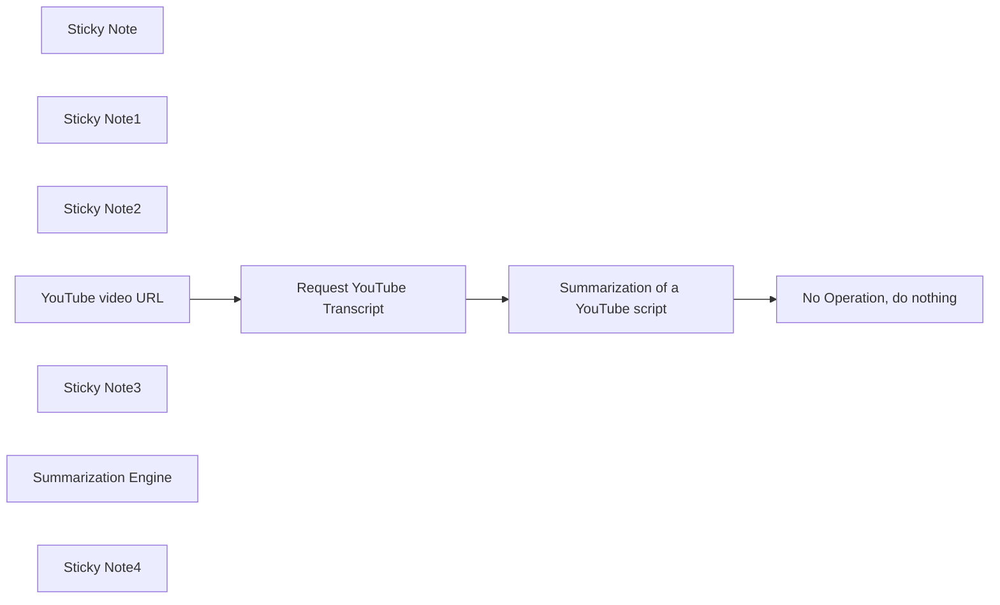

## Fluxo (.json) :

```json
{
  "nodes": [
    {
      "id": "6d908a58-8893-48da-8311-8c28ebd8ec62",
      "name": "Sticky Note",
      "type": "n8n-nodes-base.stickyNote",
      "position": [
        -520,
        -280
      ],
      "parameters": {
        "color": 7,
        "width": 1160,
        "height": 120,
        "content": "**Summarize YouTube videos**\n\nThis project automates the summarization of YouTube videos, transforming lengthy content into concise, actionable insights. By leveraging AI and workflow automation, it extracts video transcripts, analyzes key points, and generates summaries, saving time for content creators, researchers, and professionals. Perfect for staying informed, conducting research, or repurposing video content efficiently."
      },
      "typeVersion": 1
    },
    {
      "id": "98de613a-1b1e-4b46-915f-7bebcfd6a931",
      "name": "Sticky Note1",
      "type": "n8n-nodes-base.stickyNote",
      "position": [
        -540,
        120
      ],
      "parameters": {
        "width": 230,
        "height": 80,
        "content": "Add the full YouTube URL. ☝️\nYou can change this input to a webhook or anything else."
      },
      "typeVersion": 1
    },
    {
      "id": "064208d4-52c3-46a9-9f9f-d37258189d06",
      "name": "Request YouTube Transcript",
      "type": "n8n-nodes-base.httpRequest",
      "position": [
        -200,
        -20
      ],
      "parameters": {
        "url": "Apify API_KEY Here ???",
        "method": "POST",
        "options": {},
        "jsonBody": "={\n \"startUrls\": [\n \"{{ $json['Full URL'] }}\"\n ]\n}",
        "sendBody": true,
        "specifyBody": "json"
      },
      "typeVersion": 4.2
    },
    {
      "id": "ba5e52fd-18b1-4232-961c-b53b01e21202",
      "name": "Sticky Note2",
      "type": "n8n-nodes-base.stickyNote",
      "position": [
        -280,
        -140
      ],
      "parameters": {
        "color": 3,
        "width": 280,
        "height": 340,
        "content": "Once you follow the Setup Instructions (mentioned in the template page description), you can insert the full URL endpoint, which includes both the POST Endpoint and API Key. 👇"
      },
      "typeVersion": 1
    },
    {
      "id": "f3caad55-0c7d-4e8e-8649-79cc25b4e6aa",
      "name": "No Operation, do nothing",
      "type": "n8n-nodes-base.noOp",
      "position": [
        380,
        -20
      ],
      "parameters": {},
      "typeVersion": 1
    },
    {
      "id": "8d72e533-a053-4317-9437-9d80d3ed098f",
      "name": "Summarization of a YouTube script",
      "type": "@n8n/n8n-nodes-langchain.chainSummarization",
      "position": [
        40,
        -20
      ],
      "parameters": {
        "options": {}
      },
      "typeVersion": 2
    },
    {
      "id": "8f4e1c7c-286b-48aa-8f50-404e8f1d430b",
      "name": "YouTube video URL",
      "type": "n8n-nodes-base.formTrigger",
      "position": [
        -420,
        -20
      ],
      "webhookId": "3dc17600-3020-40b1-be8f-e65ef45269b6",
      "parameters": {
        "options": {
          "path": "ddd"
        },
        "formTitle": "Summarize YouTube video's",
        "formFields": {
          "values": [
            {
              "fieldLabel": "Full URL"
            }
          ]
        }
      },
      "typeVersion": 2.2
    },
    {
      "id": "fb861e09-d415-4f32-a4de-a6ff84ac7f7b",
      "name": "Sticky Note3",
      "type": "n8n-nodes-base.stickyNote",
      "position": [
        380,
        120
      ],
      "parameters": {
        "color": 4,
        "height": 100,
        "content": "☝️ Optional\nIf the workflow ends here, Consider checking with another enrichment service."
      },
      "typeVersion": 1
    },
    {
      "id": "17c0dc77-bee4-4271-b957-e0c793537a03",
      "name": "Summarization Engine",
      "type": "@n8n/n8n-nodes-langchain.lmChatOpenAi",
      "position": [
        40,
        160
      ],
      "parameters": {
        "options": {}
      },
      "credentials": {
        "openAiApi": {
          "id": "g0eql8rqZWICDd5g",
          "name": "OpenAi"
        }
      },
      "typeVersion": 1.1
    },
    {
      "id": "a8d5362e-459e-4a76-8ee2-b1eb977215a2",
      "name": "Sticky Note4",
      "type": "n8n-nodes-base.stickyNote",
      "position": [
        40,
        -140
      ],
      "parameters": {
        "color": 5,
        "width": 280,
        "content": "The summarization node works automatically and professionally, recognizing the input text and processing it directly without requiring any enhancements from your side👇"
      },
      "typeVersion": 1
    }
  ],
  "pinData": {},
  "connections": {
    "YouTube video URL": {
      "main": [
        [
          {
            "node": "Request YouTube Transcript",
            "type": "main",
            "index": 0
          }
        ]
      ]
    },
    "Summarization Engine": {
      "ai_languageModel": [
        [
          {
            "node": "Summarization of a YouTube script",
            "type": "ai_languageModel",
            "index": 0
          }
        ]
      ]
    },
    "Request YouTube Transcript": {
      "main": [
        [
          {
            "node": "Summarization of a YouTube script",
            "type": "main",
            "index": 0
          }
        ]
      ]
    },
    "Summarization of a YouTube script": {
      "main": [
        [
          {
            "node": "No Operation, do nothing",
            "type": "main",
            "index": 0
          }
        ]
      ]
    }
  }
}
```

<a id="template-1040"></a>

## Template 1040 - Monitoramento remoto MQTT → InfluxDB

- **Nome:** Monitoramento remoto MQTT → InfluxDB
- **Descrição:** Encaminha leituras de temperatura e umidade de um sensor remoto publicadas via MQTT para um bucket do InfluxDB, validando e formatando os dados antes da ingestão.
- **Funcionalidade:** • Assinatura de tópico MQTT: Recebe mensagens do tópico "wokwi-weather" publicadas pelo sensor remoto.
• Parsing e validação de payload: Converte a mensagem em JSON e verifica presença e tipo dos campos de temperatura e umidade.
• Formatação para InfluxDB: Gera uma linha no formato line protocol usando o tópico como medida e campos humidity e temp.
• Envio para InfluxDB via HTTP: Realiza POST à API de escrita do InfluxDB com orgID, bucket, precision e token de autorização.
• Tratamento de erros: Interrompe o fluxo se o JSON for inválido ou se os valores de temperatura/umidade estiverem ausentes ou incorretos.
- **Ferramentas:** • ESP32 com DHT22: Microcontrolador e sensor que coletam e publicam temperatura e umidade via MQTT.
• Mosquitto (broker MQTT): Serviço que gerencia o tópico "wokwi-weather" e distribui as mensagens.
• InfluxDB: Banco de dados de séries temporais que recebe os dados via API HTTP e armazena no bucket especificado.
• API HTTP: Endpoint de escrita do InfluxDB utilizado para ingestão autenticada dos dados.

## Fluxo visual

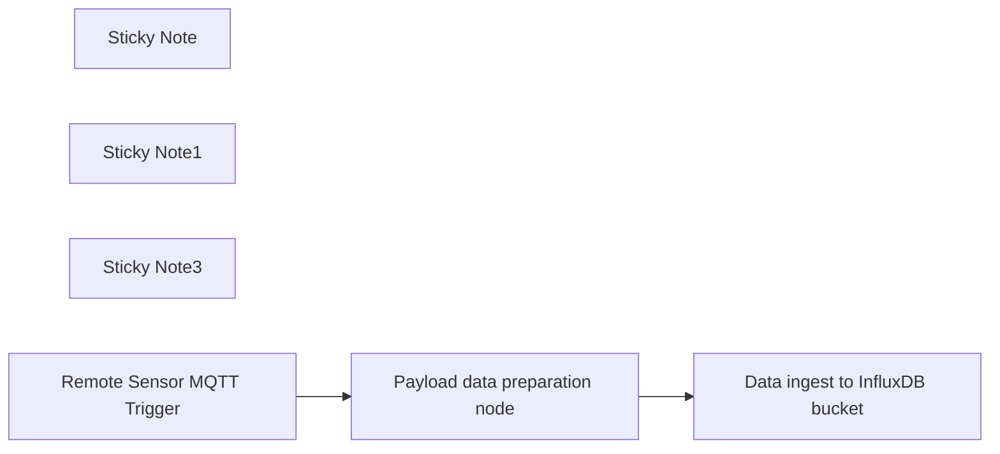

## Fluxo (.json) :

```json
{
  "id": "6pOGYw5O3iOY1Gc6",
  "meta": {
    "instanceId": "7221598654c32899e94731aab144bdcd338735c2ac218dc0873131caa0be0ef8",
    "templateCredsSetupCompleted": true
  },
  "name": "Remote IOT Sensor monitoring via MQTT and InfluxDB",
  "tags": [],
  "nodes": [
    {
      "id": "4997f226-f236-4d27-bea4-904744d9ff07",
      "name": "Sticky Note",
      "type": "n8n-nodes-base.stickyNote",
      "position": [
        -700,
        -360
      ],
      "parameters": {
        "width": 340,
        "height": 120,
        "content": "MQTT trigger subscribed to a topic called wokwi-weather via a Mosquitto MQTT broker. The trigger receives the temperature and humidity payloads from a DHT22 sensor connected to a remote ESP32 microcontroller "
      },
      "typeVersion": 1
    },
    {
      "id": "9d4f1da6-fda3-4312-a6b1-bd0ac499dde7",
      "name": "Sticky Note1",
      "type": "n8n-nodes-base.stickyNote",
      "position": [
        -240,
        -360
      ],
      "parameters": {
        "height": 100,
        "content": "Javascript code to extract the temperature and humidity values to ensure correct JSON format for the database"
      },
      "typeVersion": 1
    },
    {
      "id": "d8f01dba-5019-457e-8c1a-99c802282fdf",
      "name": "Sticky Note3",
      "type": "n8n-nodes-base.stickyNote",
      "position": [
        140,
        -360
      ],
      "parameters": {
        "width": 260,
        "height": 120,
        "content": "HTTP request node posts temperature and humidity data from the DHT22 sensor to the InfluxDB data bucket running on a local host http://localhost:8086"
      },
      "typeVersion": 1
    },
    {
      "id": "020858a6-7771-4322-8eb6-b83e99b3563d",
      "name": "Remote Sensor MQTT Trigger",
      "type": "n8n-nodes-base.mqttTrigger",
      "position": [
        -580,
        -220
      ],
      "parameters": {
        "topics": "wokwi-weather",
        "options": {}
      },
      "credentials": {
        "mqtt": {
          "id": "xtd75tjk1hKlQOba",
          "name": "MQTT account"
        }
      },
      "typeVersion": 1
    },
    {
      "id": "51e6f59f-9b93-4121-8db4-7f47b929fdf5",
      "name": "Data ingest to InfluxDB bucket",
      "type": "n8n-nodes-base.httpRequest",
      "position": [
        200,
        -220
      ],
      "parameters": {
        "url": "http://localhost:8086/api/v2/write?orgID=<Organization ID>&bucket=<InfluxDB bucket name>&precision=s",
        "body": "={{ $json.payload }}",
        "method": "POST",
        "options": {},
        "sendBody": true,
        "contentType": "raw",
        "sendHeaders": true,
        "headerParameters": {
          "parameters": [
            {
              "name": "Authorization",
              "value": "Token  <API Token value generated in InfluxDB>"
            }
          ]
        }
      },
      "notesInFlow": true,
      "typeVersion": 4.2
    },
    {
      "id": "6abe1212-b128-492f-b485-401a4315fcbc",
      "name": "Payload data preparation node",
      "type": "n8n-nodes-base.code",
      "position": [
        -180,
        -220
      ],
      "parameters": {
        "jsCode": "// Try to parse the incoming message as JSON\nlet data;\ntry {\n  data = JSON.parse($json.message); // $json.message is expected to be a JSON string\n} catch (e) {\n  // If parsing fails, throw an error\n  throw new Error(\"Invalid JSON in MQTT message\");\n}\n\n// Get the topic from the input, or use a default value\nconst topic = $json.topic || \"unknown-topic\";\n\n// Make sure humidity and temp are numbers\nif (typeof data.humidity !== \"number\" || typeof data.temp !== \"number\") {\n  throw new Error(\"Missing or invalid humidity/temp in MQTT message\");\n}\n\n// Create a formatted string like: \"topic_name humidity=45,temp=22\"\nconst line = `${topic} humidity=${data.humidity},temp=${data.temp}`;\n\n// Return the result in the expected format\nreturn [\n  {\n    json: {\n      payload: line\n    }\n  }\n];"
      },
      "typeVersion": 2
    }
  ],
  "active": false,
  "pinData": {},
  "settings": {
    "executionOrder": "v1"
  },
  "versionId": "d1311dca-5edf-4f14-86b9-629937cd3416",
  "connections": {
    "Remote Sensor MQTT Trigger": {
      "main": [
        [
          {
            "node": "Payload data preparation node",
            "type": "main",
            "index": 0
          }
        ]
      ]
    },
    "Payload data preparation node": {
      "main": [
        [
          {
            "node": "Data ingest to InfluxDB bucket",
            "type": "main",
            "index": 0
          }
        ]
      ]
    }
  }
}
```
