# PACK 1999 TEMPLATES PARTE 06 - Bloco 5

Templates neste bloco: 20

## Sumário

- [Template 1081 - Análise de e-mails com Sublime Security e relatório via Slack](#template-1081)
- [Template 1082 - Relatório diário de redes sociais dos participantes](#template-1082)
- [Template 1083 - Sincronizar pedido Stripe e extrair cliente/produto](#template-1083)
- [Template 1084 - Publicar vídeos e imagens em várias redes com Blotato](#template-1084)
- [Template 1085 - Extração dinâmica de dados de PDFs via Airtable](#template-1085)
- [Template 1086 - Publicar post via XML-RPC no WordPress.com](#template-1086)
- [Template 1087 - Chatbot LINE para extrair dados de holerite com Gemini](#template-1087)
- [Template 1088 - Chatbot CBT para LINE](#template-1088)
- [Template 1089 - Agente de chat para consultar pedidos e rastreamento](#template-1089)
- [Template 1090 - Análise de tendências de YouTube por nicho](#template-1090)
- [Template 1091 - Sincronizar URLs de vídeos do YouTube](#template-1091)
- [Template 1092 - Controle do Spotify via botão IKEA](#template-1092)
- [Template 1093 - Tradutor de Chinês via LINE](#template-1093)
- [Template 1094 - Geração de códigos TOTP via fluxo manual](#template-1094)
- [Template 1095 - Envio em lotes de mensagens pelo Telegram](#template-1095)
- [Template 1096 - Criar eventos no Google Calendar a partir do Google Sheets](#template-1096)
- [Template 1097 - Notificação de novo assinante via formulário ConvertKit](#template-1097)
- [Template 1098 - Análise de feedback e rascunho para redes sociais](#template-1098)
- [Template 1099 - Alerta SMS quando serviço fora do ar](#template-1099)
- [Template 1100 - Relatório automatizado de auditoria de conteúdo SEO](#template-1100)

---

<a id="template-1081"></a>

## Template 1081 - Análise de e-mails com Sublime Security e relatório via Slack

- **Nome:** Análise de e-mails com Sublime Security e relatório via Slack
- **Descrição:** Fluxo que recebe emails com anexos via IMAP, analisa o conteúdo com regras de detecção, e envia um resumo para Slack, incluindo notificações quando não houver anexos.
- **Funcionalidade:** • Detecção e ingestão de emails com anexos via IMAP: inicia o processamento ao receber mensagens com anexos.
• Verificação de anexos e conversão de dados binários para base64: se houver anexos, converte o conteúdo para base64 para envio seguro.
• Análise da mensagem com regras de detecção: envia o conteúdo para um serviço de análise de segurança e aplica as regras definidas.
• Separação dos resultados em correspondidos e não correspondidos: classifica as regras conforme matched.
• Preparação de relatório resumido: formata a contagem de regras matched e nomes das regras correspondidas.
• Envio de relatório para Slack: envia o resumo para o canal designado.
• Notificação em caso de ausência de anexos: notifica o Slack quando não houver anexos.
• Gatilho manual para iniciar o fluxo: permite disparar a automação sob demanda.
• Documentação interna por sticky notes: notas explicativas integradas ao fluxo para referência rápida.
- **Ferramentas:** • Outlook/IMAP: Acesso à caixa de entrada para ler mensagens e anexos.
• Sublime Security API: Serviço de detecção de ameaças utilizado para analisar mensagens com regras de segurança.
• Slack: Canal de comunicação para envio de relatórios e notificações.

## Fluxo visual

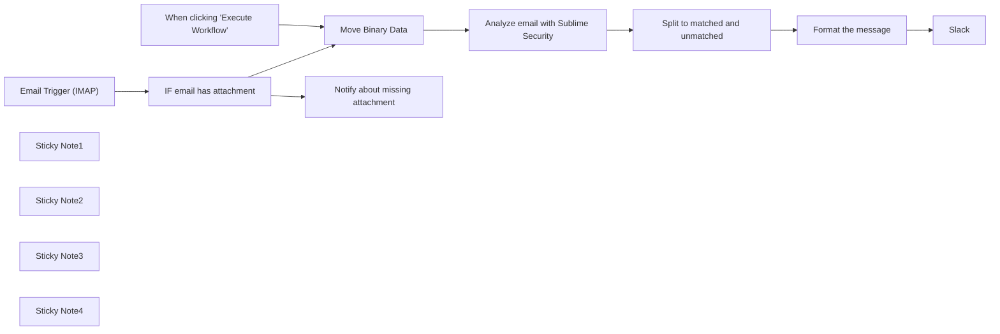

## Fluxo (.json) :

```json
{
  "id": "84KL1bsi9OvbAapn",
  "meta": {
    "instanceId": "03e9d14e9196363fe7191ce21dc0bb17387a6e755dcc9acc4f5904752919dca8"
  },
  "name": "Receive_and_analyze_emails_with_rules_in_Sublime_Security",
  "tags": [
    {
      "id": "GCHVocImoXoEVnzP",
      "name": "🛠️ In progress",
      "createdAt": "2023-10-31T02:17:21.618Z",
      "updatedAt": "2023-10-31T02:17:21.618Z"
    },
    {
      "id": "QPJKatvLSxxtrE8U",
      "name": "Secops",
      "createdAt": "2023-10-31T02:15:11.396Z",
      "updatedAt": "2023-10-31T02:15:11.396Z"
    }
  ],
  "nodes": [
    {
      "id": "b1ad1c9a-ba5d-46d6-9ce1-b3bb9346c766",
      "name": "Email Trigger (IMAP)",
      "type": "n8n-nodes-base.emailReadImap",
      "position": [
        720,
        1120
      ],
      "parameters": {
        "format": "resolved",
        "options": {}
      },
      "credentials": {
        "imap": {
          "id": "BDCrQbPFgl8k3ArL",
          "name": "Matti Outlook email"
        }
      },
      "typeVersion": 2
    },
    {
      "id": "e43b0257-0d83-4f7e-8824-3ca1d4cf6110",
      "name": "Move Binary Data",
      "type": "n8n-nodes-base.moveBinaryData",
      "position": [
        1240,
        740
      ],
      "parameters": {
        "options": {
          "encoding": "base64"
        },
        "sourceKey": "attachment_0",
        "setAllData": false
      },
      "typeVersion": 1,
      "alwaysOutputData": true
    },
    {
      "id": "97359abc-7ca9-4599-9112-4416618d0c36",
      "name": "IF email has attachment",
      "type": "n8n-nodes-base.if",
      "position": [
        1020,
        900
      ],
      "parameters": {
        "conditions": {
          "string": [
            {
              "value1": "={{ $binary.attachment_0 }}",
              "operation": "isNotEmpty"
            },
            {
              "value1": "={{ $binary.attachment_0.mimeType }}",
              "value2": "message/rfc822"
            }
          ]
        }
      },
      "typeVersion": 1
    },
    {
      "id": "046f87e0-8759-4952-85be-78bf36a70994",
      "name": "Split to matched and unmatched",
      "type": "n8n-nodes-base.code",
      "position": [
        1760,
        740
      ],
      "parameters": {
        "jsCode": "// Loop over input items and add a new field\n// called 'myNewField' to the JSON of each one\nmatched = []\nunmatched = []  \n\nfor (const item of $input.first().json.rule_results) {\n  if (item.matched) {\n    matched.push(item)\n  } else {\n    unmatched.push(item)    \n  }\n}\n\nreturn {\n  json: {\n    matched,\n    unmatched\n  }\n}"
      },
      "typeVersion": 1
    },
    {
      "id": "f88b852d-f2a4-4d78-aaef-40050c0efef8",
      "name": "When clicking \"Execute Workflow\"",
      "type": "n8n-nodes-base.manualTrigger",
      "position": [
        720,
        920
      ],
      "parameters": {},
      "typeVersion": 1
    },
    {
      "id": "ce7288d4-61ec-4222-a29e-8a72ed2ee32e",
      "name": "Slack",
      "type": "n8n-nodes-base.slack",
      "position": [
        2260,
        740
      ],
      "parameters": {
        "text": "={{ $json.message }}",
        "select": "channel",
        "channelId": {
          "__rl": true,
          "mode": "name",
          "value": "#test-matti-tomi"
        },
        "otherOptions": {}
      },
      "credentials": {
        "slackApi": {
          "id": "180",
          "name": "Awesom-O"
        }
      },
      "typeVersion": 2.1
    },
    {
      "id": "70c76c01-50ef-47a4-b552-bc6fea5079ed",
      "name": "Format the message",
      "type": "n8n-nodes-base.set",
      "position": [
        2040,
        740
      ],
      "parameters": {
        "values": {
          "string": [
            {
              "name": "message",
              "value": "=No. of rules that matched {{ $json[\"matched\"].length }} / {{ $json[\"matched\"].length + $json[\"unmatched\"].length }}\n\nMatched rules:\n{{ $json[\"matched\"].pluck(\"rule\").pluck(\"name\").join('\\n') }}\n"
            }
          ]
        },
        "options": {},
        "keepOnlySet": true
      },
      "typeVersion": 2
    },
    {
      "id": "52af4700-0dc5-4f5f-8664-97d2aacdab76",
      "name": "Notify about missing attachment",
      "type": "n8n-nodes-base.slack",
      "position": [
        2260,
        920
      ],
      "parameters": {
        "text": "No attachment found in an email\n",
        "select": "channel",
        "channelId": {
          "__rl": true,
          "mode": "name",
          "value": "#test-matti-tomi"
        },
        "otherOptions": {}
      },
      "credentials": {
        "slackApi": {
          "id": "180",
          "name": "Awesom-O"
        }
      },
      "typeVersion": 2.1
    },
    {
      "id": "19be16c9-3908-4a2d-87e4-f721c33dc124",
      "name": "Analyze email with Sublime Security",
      "type": "n8n-nodes-base.httpRequest",
      "position": [
        1500,
        740
      ],
      "parameters": {
        "url": "https://api.platform.sublimesecurity.com/v0/messages/analyze",
        "method": "POST",
        "options": {},
        "jsonBody": "={\n  \"raw_message\": \"{{ $json.data }}\",\n  \"run_active_detection_rules\": true,\n  \"run_all_detection_rules\": false\n}",
        "sendBody": true,
        "sendHeaders": true,
        "specifyBody": "json",
        "authentication": "genericCredentialType",
        "genericAuthType": "httpHeaderAuth",
        "headerParameters": {
          "parameters": [
            {
              "name": "content-type",
              "value": "application/json"
            }
          ]
        }
      },
      "credentials": {
        "httpHeaderAuth": {
          "id": "buIfmuHDZZQ2MyYz",
          "name": "Sublime Security bearer token"
        }
      },
      "typeVersion": 3
    },
    {
      "id": "a39d52d6-26e0-485e-8d32-984e26f71f9b",
      "name": "Sticky Note1",
      "type": "n8n-nodes-base.stickyNote",
      "position": [
        240,
        298.6458865911087
      ],
      "parameters": {
        "width": 618.0312276650722,
        "height": 963.8594737915395,
        "content": "\n# Workflow Overview\nLeverage n8n's IMAP node to `seamlessly ingest emails as .eml attachments`, streamlining your security protocols and response strategies. \n\nThis setup is crucial for organizations utilizing platforms like Outlook, which offers a specialized security feature that designates specific inboxes for phishing attempts. \n\nWhen a phishing email is flagged through Outlook's interface, the system is designed to convert it into an .eml file and direct it to a dedicated phishing inbox. This process not only centralizes your phishing threat management but also ensures that each potential threat is queued for immediate and thorough analysis. \n\nBy integrating with n8n, you can automate the capture of these emails, transforming user-reported incidents into actionable data without manual intervention, enhancing your cybersecurity response and preserving your workflow's integrity.\n\n## Ingest emails as attachments as .eml file. \nSet your phishing email inbox here via your imap credentials. You can also replace this with any other node that retrieves emails as .eml attachments. "
      },
      "typeVersion": 1
    },
    {
      "id": "3cb757ce-2083-44de-8508-89039c6bca9d",
      "name": "Sticky Note2",
      "type": "n8n-nodes-base.stickyNote",
      "position": [
        1444,
        361
      ],
      "parameters": {
        "width": 503.7209302325584,
        "height": 710.138909846923,
        "content": "\n## Analyze Attachment and format output\nIf an attachment is detected, n8n facilitates its secure transfer to Sublime Security for detailed analysis. This automated process not only speeds up the threat detection mechanism but also formats the output for compatibility with other systems, such as Slack, ensuring a smooth and efficient workflow. \n\nThrough this automation, you're not just analyzing emails; you're fortifying your defense against cyber threats and enhancing operational efficiency with minimal user involvement."
      },
      "typeVersion": 1
    },
    {
      "id": "83756b95-a3a8-4145-9d10-fc7e3b2121f8",
      "name": "Sticky Note3",
      "type": "n8n-nodes-base.stickyNote",
      "position": [
        1980,
        354.9999999999999
      ],
      "parameters": {
        "width": 476.0465116279074,
        "height": 777.0757733319455,
        "content": "\n## Prep output for Slack Report\nn8n completes the cycle of threat analysis and communication by preparing and delivering comprehensive reports directly to your Slack channels. \n\nThis ensures that all stakeholders are immediately informed about potential threats, fostering a culture of transparency and prompt action. \n\nIn instances where no attachment is found, n8n proactively dispatches a notification to Slack, signaling your team to investigate further. "
      },
      "typeVersion": 1
    },
    {
      "id": "a443e91b-6b0b-4fb8-b9d5-6f1d236da053",
      "name": "Sticky Note4",
      "type": "n8n-nodes-base.stickyNote",
      "position": [
        880,
        360.90897077923785
      ],
      "parameters": {
        "width": 541.1627906976748,
        "height": 715.8304363872012,
        "content": "\n## Check for attachments and send to sublime if any found \nUpon receiving an email via the IMAP node, n8n executes a meticulous inspection to detect the presence of attachments. This is more than a mere check; it's an essential layer of your security posture to identify and handle potentially malicious content proactively. \n\nIf an attachment is found, the binary file is converted to JSON for further analysis. "
      },
      "typeVersion": 1
    }
  ],
  "active": false,
  "pinData": {
    "Move Binary Data": [
      {
        "json": {
          "to": {
            "html": "<span class=\"mp_address_group\"><a href=\"mailto:mattiasn8n@outlook.com\" class=\"mp_address_email\">mattiasn8n@outlook.com</a></span>",
            "text": "mattiasn8n@outlook.com",
            "value": [
              {
                "name": "",
                "address": "mattiasn8n@outlook.com"
              }
            ]
          },
          "data": "RGVsaXZlcmVkLVRvOiB0b21pdHVydGlhaW5lbkBnbWFpbC5jb20NClJlY2VpdmVkOiBieSAyMDAyOmExNzo5MDY6OTRjZTpiMDo5YTE6OWFiMzoyMTkyIHdpdGggU01UUCBpZCBkMTRjc3AxODYzNzMzZWp5Ow0KICAgICAgICBUdWUsIDUgU2VwIDIwMjMgMDY6MzI6MDQgLTA3MDAgKFBEVCkNClgtR29vZ2xlLVNtdHAtU291cmNlOiBBR0hUK0lHZU1DOTcwRHg3T2VyT25idnFtamVOSmR0ZXBPdXNjaWRtUHEvc1YzNzg3eDFaRHUvUUdtVEhFWHFqclNIbDJpNHRSQ3dJDQpYLVJlY2VpdmVkOiBieSAyMDAyOmExNzo5MGI6Zjg1OmIwOjI2MzoxNjFjOjllOWMgd2l0aCBTTVRQIGlkIGZ0NS0yMDAyMGExNzA5MGIwZjg1MDBiMDAyNjMxNjFjOWU5Y21yMTcwNzUyNzRwamIuMTIuMTY5MzkyMDcyMzYzMTsNCiAgICAgICAgVHVlLCAwNSBTZXAgMjAyMyAwNjozMjowMyAtMDcwMCAoUERUKQ0KQVJDLVNlYWw6IGk9MTsgYT1yc2Etc2hhMjU2OyB0PTE2OTM5MjA3MjM7IGN2PW5vbmU7DQogICAgICAgIGQ9Z29vZ2xlLmNvbTsgcz1hcmMtMjAxNjA4MTY7DQogICAgICAgIGI9UGdKNHFPeWRjdzBmN1VqakNjQ3lnUXBsNkxkNDJURmJoZTVsckM0bDVsak5SLzhMNCtRQzlYUWdKbVVJVGRBVWN0DQogICAgICAgICBJOHZqblB3eWcvd2tGV21xa2pzR2dodGZGMTc5TTY2bkNEWTJIeUgzWUF6M0Z5cy9pUDFlTWhvdDJEOUZaMmduZm5WeA0KICAgICAgICAgNFFobXRQTkErU2FjZ0pXYVE0TGFHQUhaamI3VXBxc1lxUTdndzJicmcxeWZKM2VTekdiK0tCcDRlYThTR2cyL0JmRkQNCiAgICAgICAgIFNGZmM3K1A1RTdrOE1uNE51UFFDd1BBUzB6MFVEMmdHU0dRV0FrNlY3RVhrQWx3cEF5RDdzbHFCanFPbkxKR05kU0JmDQogICAgICAgICBXSTNNSFlSRjNKYjhnTmRXN2RhdlhONUVYREN1VXR3RkVVMk50NVAyZnNVd1VleUlKY2xpODljQjU0QWxsM2hzU3VQTw0KICAgICAgICAgbE8xQT09DQpBUkMtTWVzc2FnZS1TaWduYXR1cmU6IGk9MTsgYT1yc2Etc2hhMjU2OyBjPXJlbGF4ZWQvcmVsYXhlZDsgZD1nb29nbGUuY29tOyBzPWFyYy0yMDE2MDgxNjsNCiAgICAgICAgaD1mZWVkYmFjay1pZDptaW1lLXZlcnNpb246c3ViamVjdDp0bzpmcm9tOmRhdGU6ZGtpbS1zaWduYXR1cmUNCiAgICAgICAgIDptZXNzYWdlLWlkOw0KICAgICAgICBiaD1zNWhrUmxaTVhKQmE3cjVwdVBzZXRxNm5tcW8zbDRaeFBUeFlDQmlOeUI0PTsNCiAgICAgICAgZmg9emNKNzl1S2hLQzdBZU9VM2VtMnE3SUZRemRwMmRsNmxndE1MRWE0ZDB1RT07DQogICAgICAgIGI9aHJ1VkFlbU5OcXFLb2lVTlFpKzJLdHpnTk52ZldDczNPTWtrbGhtcXJyZWlJbVBpZHptM3orZ3JDZ0F5ZmFhaTF2DQogICAgICAgICBDWlhHeG0yN1lKckJlRzl3dXF0dDBSVTIwby9oMTMxbVZXRFAwZ3BlMnVnY3FBR3hvRkVDMXQ0bXU5SXl0aC9aWENoLw0KICAgICAgICAgOWF5NTYyd05HSnY0KzJRWnBuQ1VVQ1BILzg3SG1VdkNVL3oxaURHb1RuajZvdzBKTXpZd0RzTytXdndsWUJlR2tuOTUNCiAgICAgICAgIHhDRnNHeEJpRFgzeGFtSVVIRFNEcnhRcmxpN0pETXNNK3RuVjlEUjRIT1BLa3QyekJwQmEzcXROQ09iSVJ5RzBKS3lzDQogICAgICAgICBmdU9LNnlsNFg5M1cyT2piTGk2cktTK2srVWZPeHVjcU5CckdoNjVKVno3eVZDZTkyRFdMMzdBY29rZHFEQnJYWTdZYg0KICAgICAgICAgVVhKdz09DQpBUkMtQXV0aGVudGljYXRpb24tUmVzdWx0czogaT0xOyBteC5nb29nbGUuY29tOw0KICAgICAgIGRraW09cGFzcyBoZWFkZXIuaT1AYWxpZXhwcmVzcy5jb20gaGVhZGVyLnM9czEwMjQgaGVhZGVyLmI9alRoeU1UbmE7DQogICAgICAgc3BmPXBhc3MgKGdvb2dsZS5jb206IGRvbWFpbiBvZiBhY2NvdW50QG5vdGljZS5hbGlleHByZXNzLmNvbSBkZXNpZ25hdGVzIDguMjE5LjMyLjUzIGFzIHBlcm1pdHRlZCBzZW5kZXIpIHNtdHAubWFpbGZyb209YWNjb3VudEBub3RpY2UuYWxpZXhwcmVzcy5jb207DQogICAgICAgZG1hcmM9cGFzcyAocD1RVUFSQU5USU5FIHNwPVFVQVJBTlRJTkUgZGlzPU5PTkUpIGhlYWRlci5mcm9tPWFsaWV4cHJlc3MuY29tDQpSZXR1cm4tUGF0aDogPGFjY291bnRAbm90aWNlLmFsaWV4cHJlc3MuY29tPg0KUmVjZWl2ZWQ6IGZyb20gb3V0MzItNTMuc2cuYi5kbS5hbGl5dW4uY29tIChvdXQzMi01My5zZy5iLmRtLmFsaXl1bi5jb20uIFs4LjIxOS4zMi41M10pDQogICAgICAgIGJ5IG14Lmdvb2dsZS5jb20gd2l0aCBFU01UUCBpZCBpMi0yMDAyMGExNzA5MGFkYzAyMDBiMDAyNGU0N2ZhZTQ2NnNpOTQyNTMwMnBqdi4xODAuMjAyMy4wOS4wNS4wNi4zMi4wMg0KICAgICAgICBmb3IgPHRvbWl0dXJ0aWFpbmVuQGdtYWlsLmNvbT47DQogICAgICAgIFR1ZSwgMDUgU2VwIDIwMjMgMDY6MzI6MDMgLTA3MDAgKFBEVCkNClJlY2VpdmVkLVNQRjogcGFzcyAoZ29vZ2xlLmNvbTogZG9tYWluIG9mIGFjY291bnRAbm90aWNlLmFsaWV4cHJlc3MuY29tIGRlc2lnbmF0ZXMgOC4yMTkuMzIuNTMgYXMgcGVybWl0dGVkIHNlbmRlcikgY2xpZW50LWlwPTguMjE5LjMyLjUzOw0KQXV0aGVudGljYXRpb24tUmVzdWx0czogbXguZ29vZ2xlLmNvbTsNCiAgICAgICBka2ltPXBhc3MgaGVhZGVyLmk9QGFsaWV4cHJlc3MuY29tIGhlYWRlci5zPXMxMDI0IGhlYWRlci5iPWpUaHlNVG5hOw0KICAgICAgIHNwZj1wYXNzIChnb29nbGUuY29tOiBkb21haW4gb2YgYWNjb3VudEBub3RpY2UuYWxpZXhwcmVzcy5jb20gZGVzaWduYXRlcyA4LjIxOS4zMi41MyBhcyBwZXJtaXR0ZWQgc2VuZGVyKSBzbXRwLm1haWxmcm9tPWFjY291bnRAbm90aWNlLmFsaWV4cHJlc3MuY29tOw0KICAgICAgIGRtYXJjPXBhc3MgKHA9UVVBUkFOVElORSBzcD1RVUFSQU5USU5FIGRpcz1OT05FKSBoZWFkZXIuZnJvbT1hbGlleHByZXNzLmNvbQ0KTWVzc2FnZS1JRDogPDY0ZjcyZGQzLjE3MGEwMjIwLmU4Mjk1LjY1YTVTTVRQSU5fQURERURfQlJPS0VOQG14Lmdvb2dsZS5jb20+DQpYLUdvb2dsZS1PcmlnaW5hbC1NZXNzYWdlLUlEOiBtYWlsbnVsbF9FTUFJTF9SRUdJU1RFUl9lJDdmOGM5YWIwYzU4MDRjOTY5MDYxNmM0Yzc4MTY4NDZhDQpYLUFsaURNLVJjcHRUbzogZEc5dGFYUjFjblJwWVdsdVpXNUFaMjFoYVd3dVkyOXQNCkRLSU0tU2lnbmF0dXJlOiB2PTE7IGE9cnNhLXNoYTI1NjsgYz1yZWxheGVkL3JlbGF4ZWQ7DQoJZD1hbGlleHByZXNzLmNvbTsgcz1zMTAyNDsNCgl0PTE2OTM5MjA3MjI7IGg9RGF0ZTpGcm9tOlRvOk1lc3NhZ2UtSUQ6U3ViamVjdDpNSU1FLVZlcnNpb246Q29udGVudC1UeXBlOw0KCWJoPXM1aGtSbFpNWEpCYTdyNXB1UHNldHE2bm1xbzNsNFp4UFR4WUNCaU55QjQ9Ow0KCWI9alRoeU1UbmEvSXhiNEVyajFTcVpQaW5iYjFURUdLWWdEdDJQTDk4QVIxNGtSMnpwdzEvRDlFNng3Wi9RR3VaZ21GOUJyUzRZVHc5eEgzSTkyUGg2OWMvWHR6aTQxUFNOT2NtMWhYNXFDSlNqQUdrR3dFUHJUOVdNd3NjUUxHak9wSmVIVWdPQTFTOGM3UWVuMTg0TmlHRGlpRnFGQ3EwSStjYlVZYTVkK09jPQ0KWC1FbnZJZDogNTc2NDYwODk4MzU1MDQzNTczDQpSZWNlaXZlZDogZnJvbSBhZS11dC1jcmFiLXMtZjZlZjI4MjUwZGNmZjY5OWNkMDE3MWM3MWRkNzM1NTAtcGRtaHIobWFpbGZyb206YWNjb3VudEBub3RpY2UuYWxpZXhwcmVzcy5jb20gZnA6U01UUERfLVUtLTA2Lktobm0pDQogICAgICAgICAgYnkgc210cC5hbGl5dW4taW5jLmNvbSgxMjcuMC4wLjEpOw0KICAgICAgICAgIFR1ZSwgMDUgU2VwIDIwMjMgMjE6MzI6MDIgKzA4MDANCkRhdGU6IFR1ZSwgNSBTZXAgMjAyMyAwNjozMjowMiAtMDcwMCAoUERUKQ0KRnJvbTogQWxpRXhwcmVzcyA8YWNjb3VudEBub3RpY2UuYWxpZXhwcmVzcy5jb20+DQpUbzogdG9taXR1cnRpYWluZW5AZ21haWwuY29tDQpTdWJqZWN0OiBZb3VyIEFsaUV4cHJlc3MgdmVyaWZpY2F0aW9uIGNvZGUNCkNvbnRlbnQtVHlwZTogbXVsdGlwYXJ0L21peGVkOyANCglib3VuZGFyeT0iLS0tLT1fUGFydF8xNDExOTcyN18xNDI2MDAzNTIyLjE2OTM5MjA3MjIwNjAiDQpGZWVkYmFjay1JRDogZGVmYXVsdDphY2NvdW50QG5vdGljZS5hbGlleHByZXNzLmNvbTpTLW90aGVyczoxNTE5NzMNCk1JTUUtVmVyc2lvbjogMS4wDQoNCi0tLS0tLT1fUGFydF8xNDExOTcyN18xNDI2MDAzNTIyLjE2OTM5MjA3MjIwNjANCkNvbnRlbnQtVHlwZTogdGV4dC9odG1sO2NoYXJzZXQ9dXRmLTgNCkNvbnRlbnQtVHJhbnNmZXItRW5jb2Rpbmc6IHF1b3RlZC1wcmludGFibGUNCg0KPG1ldGEgaHR0cC1lcXVpdj0zRCJDb250ZW50LVR5cGUiIGNvbnRlbnQ9M0QidGV4dC9odG1sOyBjaGFyc2V0PTNEdXRmLTgiPjxkPQ0KaXYgc3R5bGU9M0QiZGlzcGxheTpub25lIj48aW1nIHN0eWxlPTNEImRpc3BsYXk6bm9uZSIgc3JjPTNEImh0dHA6Ly9hZS5tbXN0PQ0KYXQuY29tL2FlLmVkbS5lZG1fb3Blbj90cmFjZWxvZz0zRHJvd2FuLWFlX3VpYy1lbWFpbFJlZ2lzdGVyQ2hlY2tjb2RlXzFfZW5fPQ0KVVMtMjAyMy0wOS0wNSZhbXA7cm93YW5fbXNnX2lkPTNEbWFpbG51bGxfRU1BSUxfUkVHSVNURVJfZSQ3ZjhjOWFiMGM1ODA0Yzk2PQ0KOTA2MTZjNGM3ODE2ODQ2YSI+PC9kaXY+PGJyPjwhLS1lbWFpbFJlZ2lzdGVyQ2hlY2tjb2RlIyR7aG91eWlKb2JJZH0tLT48IWRvPQ0KY3R5cGUgaHRtbD4NCjxodG1sIHhtbG5zPTNEImh0dHA6Ly93d3cudzMub3JnLzE5OTkveGh0bWwiIHhtbG5zOnY9M0QidXJuOnNjaGVtYXMtbWljcm9zbz0NCmZ0LWNvbTp2bWwiIHhtbG5zOm89M0QidXJuOnNjaGVtYXMtbWljcm9zb2Z0LWNvbTpvZmZpY2U6b2ZmaWNlIj4NCiAgICA8aGVhZD4NCiAgICAgICAgPHRpdGxlPiBBbGlFeHByZXNzIDwvdGl0bGU+DQogICAgICAgIDwhLS1baWYgIW1zb10+PCEtLSAtLT4NCiAgICAgICAgPG1ldGEgaHR0cC1lcXVpdj0zRCJYLVVBLUNvbXBhdGlibGUiIGNvbnRlbnQ9M0QiSUU9M0RlZGdlIj4NCiAgICAgICAgPCEtLTwhW2VuZGlmXS0tPg0KICAgICAgID0yMA0KICAgICAgICA8bWV0YSBuYW1lPTNEInZpZXdwb3J0IiBjb250ZW50PTNEIndpZHRoPTNEZGV2aWNlLXdpZHRoLCBpbml0aWFsLXNjPQ0KYWxlPTNEMSI+DQogICAgICAgIDxzdHlsZSB0eXBlPTNEInRleHQvY3NzIj4NCiAgICAgICAgICAgICNvdXRsb29rIGEgew0KICAgICAgICAgICAgICAgIHBhZGRpbmc6IDA7DQogICAgICAgICAgICB9DQogICAgICAgICAgICBib2R5IHsNCiAgICAgICAgICAgICAgICBtYXJnaW46IDA7DQogICAgICAgICAgICAgICAgcGFkZGluZzogMDsNCiAgICAgICAgICAgICAgICAtd2Via2l0LXRleHQtc2l6ZS1hZGp1c3Q6IDEwMCU7DQogICAgICAgICAgICAgICAgLW1zLXRleHQtc2l6ZS1hZGp1c3Q6IDEwMCU7DQogICAgICAgICAgICB9DQogICAgICAgICAgICB0YWJsZSwNCiAgICAgICAgICAgIHRkIHsNCiAgICAgICAgICAgICAgICBib3JkZXItY29sbGFwc2U6IGNvbGxhcHNlOw0KICAgICAgICAgICAgICAgIG1zby10YWJsZS1sc3BhY2U6IDA7DQogICAgICAgICAgICAgICAgbXNvLXRhYmxlLXJzcGFjZTogMDsNCiAgICAgICAgICAgIH0NCiAgICAgICAgICAgIGltZyB7DQogICAgICAgICAgICAgICAgYm9yZGVyOiAwOw0KICAgICAgICAgICAgICAgIGhlaWdodDogYXV0bzsNCiAgICAgICAgICAgICAgICBsaW5lLWhlaWdodDogMTAwJTsNCiAgICAgICAgICAgICAgICBvdXRsaW5lOiBub25lOw0KICAgICAgICAgICAgICAgIHRleHQtZGVjb3JhdGlvbjogbm9uZTsNCiAgICAgICAgICAgICAgICAtbXMtaW50ZXJwb2xhdGlvbi1tb2RlOiBiaWN1YmljOw0KICAgICAgICAgICAgfQ0KICAgICAgICAgICAgcCB7DQogICAgICAgICAgICAgICAgZGlzcGxheTogYmxvY2s7DQogICAgICAgICAgICAgICAgbWFyZ2luOiAxM3B4IDA7DQogICAgICAgICAgICB9DQogICAgICAgIDwvc3R5bGU+DQogICAgICAgIDwhLS1baWYgbXNvXT4gPHhtbD4gPG86T2ZmaWNlRG9jdW1lbnRTZXR0aW5ncz4gPG86QWxsb3dQTkcvPiA8bzpQaXg9DQplbHNQZXJJbmNoPjk2PC9vOlBpeGVsc1BlckluY2g+IDwvbzpPZmZpY2VEb2N1bWVudFNldHRpbmdzPiA8L3htbD4gPCFbZW5kaWY9DQpdLS0+DQogICAgICAgIDwhLS1baWYgbHRlIG1zbyAxMV0+IDxzdHlsZSB0eXBlPTNEInRleHQvY3NzIj4gLm1qLW91dGxvb2stZ3JvdXAtZmk9DQp4IHsgd2lkdGg6MTAwJSAhaW1wb3J0YW50OyB9IDwvc3R5bGU+IDwhW2VuZGlmXS0tPg0KICAgICAgICA8IS0tW2lmICFtc29dPjwhLS0+DQogICAgICAgIDxsaW5rIGhyZWY9M0QiaHR0cHM6Ly9mb250cy5nb29nbGVhcGlzLmNvbS9jc3M/ZmFtaWx5PTNET3BlbitTYW5zOjM9DQowMCw0MDAsNTAwLDcwMCIgcmVsPTNEInN0eWxlc2hlZXQiIHR5cGU9M0QidGV4dC9jc3MiPg0KICAgICAgICA8c3R5bGUgdHlwZT0zRCJ0ZXh0L2NzcyI+DQogICAgICAgICAgICBAaW1wb3J0IHVybChodHRwczovL2ZvbnRzLmdvb2dsZWFwaXMuY29tL2Nzcz9mYW1pbHk9M0RPcGVuK1NhbnM9DQo6MzAwLDQwMCw1MDAsNzAwKTsNCiAgICAgICAgPC9zdHlsZT4NCiAgICAgICAgPCEtLTwhW2VuZGlmXS0tID4gPHN0eWxlIHR5cGU9M0QidGV4dC9jc3MiID4gQG1lZGlhIG9ubHkgc2NyZWVuIGFuZD0NCiAobWluLXdpZHRoOjQ4MHB4KSB7DQogICAgICAgICAgICAgICAgLm1qLWNvbHVtbi1wZXItMTAwIHsNCiAgICAgICAgICAgICAgICAgICAgd2lkdGg6IDEwMCUgIWltcG9ydGFudDsNCiAgICAgICAgICAgICAgICAgICAgbWF4LXdpZHRoOiAxMDAlOw0KICAgICAgICAgICAgICAgIH0NCiAgICAgICAgICAgICAgICAubWotY29sdW1uLXBlci0yNSB7DQogICAgICAgICAgICAgICAgICAgIHdpZHRoOiAyNSUgIWltcG9ydGFudDsNCiAgICAgICAgICAgICAgICAgICAgbWF4LXdpZHRoOiAyNSU7DQogICAgICAgICAgICAgICAgfQ0KICAgICAgICAgICAgICAgIC5tai1jb2x1bW4tcGVyLTc1IHsNCiAgICAgICAgICAgICAgICAgICAgd2lkdGg6IDc1JSAhaW1wb3J0YW50Ow0KICAgICAgICAgICAgICAgICAgICBtYXgtd2lkdGg6IDc1JTsNCiAgICAgICAgICAgICAgICB9DQogICAgICAgICAgICAgICAgLm1qLWNvbHVtbi1wZXItNDgtNCB7DQogICAgICAgICAgICAgICAgICAgIHdpZHRoOiA0OC40JSAhaW1wb3J0YW50Ow0KICAgICAgICAgICAgICAgICAgICBtYXgtd2lkdGg6IDQ4LjQlOw0KICAgICAgICAgICAgICAgIH0NCiAgICAgICAgICAgICAgICAubWotY29sdW1uLXBlci01MCB7DQogICAgICAgICAgICAgICAgICAgIHdpZHRoOiA1MCUgIWltcG9ydGFudDsNCiAgICAgICAgICAgICAgICAgICAgbWF4LXdpZHRoOiA1MCU7DQogICAgICAgICAgICAgICAgfQ0KICAgICAgICAgICAgfQ0KICAgICAgICA8L3N0eWxlPg0KICAgICAgICA8c3R5bGUgdHlwZT0zRCJ0ZXh0L2NzcyI+DQogICAgICAgICAgICBAbWVkaWEgb25seSBzY3JlZW4gYW5kIChtYXgtd2lkdGg6NDgwcHgpIHsNCiAgICAgICAgICAgICAgICB0YWJsZS5tai1mdWxsLXdpZHRoLW1vYmlsZSB7DQogICAgICAgICAgICAgICAgICAgIHdpZHRoOiAxMDAlICFpbXBvcnRhbnQ7DQogICAgICAgICAgICAgICAgfQ0KICAgICAgICAgICAgICAgIHRkLm1qLWZ1bGwtd2lkdGgtbW9iaWxlIHsNCiAgICAgICAgICAgICAgICAgICAgd2lkdGg6IGF1dG8gIWltcG9ydGFudDsNCiAgICAgICAgICAgICAgICB9DQogICAgICAgICAgICB9DQogICAgICAgICAgICBub2lucHV0Lm1qLW1lbnUtY2hlY2tib3ggew0KICAgICAgICAgICAgICAgIGRpc3BsYXk6IGJsb2NrICFpbXBvcnRhbnQ7DQogICAgICAgICAgICAgICAgbWF4LWhlaWdodDogbm9uZSAhaW1wb3J0YW50Ow0KICAgICAgICAgICAgICAgIHZpc2liaWxpdHk6IHZpc2libGUgIWltcG9ydGFudDsNCiAgICAgICAgICAgIH0NCiAgICAgICAgICAgIEBtZWRpYSBvbmx5IHNjcmVlbiBhbmQgKG1heC13aWR0aDo0ODBweCkgew0KICAgICAgICAgICAgICAgIC5tai1tZW51LWNoZWNrYm94W3R5cGU9M0QiY2hlY2tib3giXX4ubWotaW5saW5lLWxpbmtzIHsNCiAgICAgICAgICAgICAgICAgICAgZGlzcGxheTogbm9uZSAhaW1wb3J0YW50Ow0KICAgICAgICAgICAgICAgIH0NCiAgICAgICAgICAgICAgICAubWotbWVudS1jaGVja2JveFt0eXBlPTNEImNoZWNrYm94Il06Y2hlY2tlZH4ubWotaW5saW5lLWxpbj0NCmtzLA0KICAgICAgICAgICAgICAgIC5tai1tZW51LWNoZWNrYm94W3R5cGU9M0QiY2hlY2tib3giXX4ubWotbWVudS10cmlnZ2VyIHsNCiAgICAgICAgICAgICAgICAgICAgZGlzcGxheTogYmxvY2sgIWltcG9ydGFudDsNCiAgICAgICAgICAgICAgICAgICAgbWF4LXdpZHRoOiBub25lICFpbXBvcnRhbnQ7DQogICAgICAgICAgICAgICAgICAgIG1heC1oZWlnaHQ6IG5vbmUgIWltcG9ydGFudDsNCiAgICAgICAgICAgICAgICAgICAgZm9udC1zaXplOiBpbmhlcml0ICFpbXBvcnRhbnQ7DQogICAgICAgICAgICAgICAgfQ0KICAgICAgICAgICAgICAgIC5tai1tZW51LWNoZWNrYm94W3R5cGU9M0QiY2hlY2tib3giXX4ubWotaW5saW5lLWxpbmtzID4gYSB7DQogICAgICAgICAgICAgICAgICAgIGRpc3BsYXk6IGJsb2NrICFpbXBvcnRhbnQ7DQogICAgICAgICAgICAgICAgfQ0KICAgICAgICAgICAgICAgIC5tai1tZW51LWNoZWNrYm94W3R5cGU9M0QiY2hlY2tib3giXTpjaGVja2Vkfi5tai1tZW51LXRyaWdnPQ0KZXIgLm1qLW1lbnUtaWNvbi1jbG9zZSB7DQogICAgICAgICAgICAgICAgICAgIGRpc3BsYXk6IGJsb2NrICFpbXBvcnRhbnQ7DQogICAgICAgICAgICAgICAgfQ0KICAgICAgICAgICAgICAgIC5tai1tZW51LWNoZWNrYm94W3R5cGU9M0QiY2hlY2tib3giXTpjaGVja2Vkfi5tai1tZW51LXRyaWdnPQ0KZXIgLm1qLW1lbnUtaWNvbi1vcGVuIHsNCiAgICAgICAgICAgICAgICAgICAgZGlzcGxheTogbm9uZSAhaW1wb3J0YW50Ow0KICAgICAgICAgICAgICAgIH0NCiAgICAgICAgICAgIH0NCiAgICAgICAgPC9zdHlsZT4NCiAgICAgICAgPHN0eWxlIHR5cGU9M0QidGV4dC9jc3MiPg0KICAgICAgICAgICAgQG1lZGlhIG9ubHkgc2NyZWVuIGFuZCAobWluLXdpZHRoOjQ4MXB4KSB7DQogICAgICAgICAgICAgICAgLnByb2R1Y3RzLWxpc3QtdGFibGUgaW1nIHsNCiAgICAgICAgICAgICAgICAgICAgd2lkdGg6IDEyMHB4ICFpbXBvcnRhbnQ7DQogICAgICAgICAgICAgICAgICAgIGRpc3BsYXk6IGJsb2NrOw0KICAgICAgICAgICAgICAgIH0NCiAgICAgICAgICAgICAgICAucHJvZHVjdHMtbGlzdC10YWJsZSAuaW1hZ2UtY29sdW1uIHsNCiAgICAgICAgICAgICAgICAgICAgd2lkdGg6IDIwJSAhaW1wb3J0YW50Ow0KICAgICAgICAgICAgICAgIH0NCiAgICAgICAgICAgIH0NCiAgICAgICAgICAgIGEgew0KICAgICAgICAgICAgICAgIGNvbG9yOiAjMDAwOw0KICAgICAgICAgICAgfQ0KICAgICAgICAgICAgLnNlcnZlci1pbWcgaW1nIHsNCiAgICAgICAgICAgICAgICB3aWR0aDogMTAwJTsNCiAgICAgICAgICAgIH0NCiAgICAgICAgICAgIC5zZXJ2ZXItYm94LW9uZSBhLA0KICAgICAgICAgICAgLnNlcnZlci1ib3gtdHdvIGEgew0KICAgICAgICAgICAgICAgIHRleHQtZGVjb3JhdGlvbjogdW5kZXJsaW5lOw0KICAgICAgICAgICAgICAgIGNvbG9yOiAjMkU5Q0MzOw0KICAgICAgICAgICAgfQ0KICAgICAgICAgICAgLnNlcnZlci1pbWcgaW1nIHsNCiAgICAgICAgICAgICAgICB3aWR0aDogMTAwJTsNCiAgICAgICAgICAgIH0NCiAgICAgICAgICAgIC5zZXJ2ZXItYm94LW9uZSBhLA0KICAgICAgICAgICAgLnNlcnZlci1ib3gtdHdvIGEgew0KICAgICAgICAgICAgICAgIHRleHQtZGVjb3JhdGlvbjogdW5kZXJsaW5lOw0KICAgICAgICAgICAgICAgIGNvbG9yOiAjMkU5Q0MzOw0KICAgICAgICAgICAgfQ0KICAgICAgICA8L3N0eWxlPg0KICAgIDwvaGVhZD4NCiAgICA8Ym9keSBzdHlsZT0zRCJiYWNrZ3JvdW5kLWNvbG9yOiNGRkZGRkY7Ij4NCiAgICAgICAgPGRpdiBzdHlsZT0zRCJmb250LWZhbWlseTogT3BlbiBTYW5zLCBIZWx2ZXRpY2EsIFRhaG9tYSwgQXJpYWwsIHNhbj0NCnMtc2VyaWY7IGJhY2tncm91bmQtY29sb3I6ICNGRkZGRkY7Ij4NCiAgICAgICAgICAgIDwhLS0gPUU2PUE4PUExPUU2PTlEPUJGIC0tPg0KICAgICAgICA8IS0tIEJvZHkgV3JhcHBlciAtLT4NCiAgICAgICAgPCEtLVtpZiBtc28gfCBJRV0+IDx0YWJsZSBhbGlnbj0zRCJjZW50ZXIiIGJvcmRlcj0zRCIwIiBjZWxscGFkZGluZz0NCj0zRCIwIiBjZWxsc3BhY2luZz0zRCIwIiBjbGFzcz0zRCJib2R5LXdyYXBwZXItb3V0bG9vayIgc3R5bGU9M0Qid2lkdGg6NjAwcD0NCng7IiB3aWR0aD0zRCI2MDAiID4gPHRyPiA8dGQgc3R5bGU9M0QibGluZS1oZWlnaHQ6MHB4O2ZvbnQtc2l6ZTowcHg7bXNvLWxpbj0NCmUtaGVpZ2h0LXJ1bGU6ZXhhY3RseTsiPiA8IVtlbmRpZl0tLT4NCiAgICAgICAgPGRpdiBjbGFzcz0zRCJib2R5LXdyYXBwZXIiIHN0eWxlPTNEImZvbnQtZmFtaWx5OiBPcGVuIFNhbnMsIEhlbHZldD0NCmljYSwgVGFob21hLCBBcmlhbCwgc2Fucy1zZXJpZjsgcGFkZGluZy1ib3R0b206IDIwcHg7IGJveC1zaGFkb3c6IDAgNHB4IDEwcD0NCnggI2RkZDsgYmFja2dyb3VuZDogI0YyRjJGMjsgYmFja2dyb3VuZC1jb2xvcjogI0YyRjJGMjsgbWFyZ2luOiAwcHggYXV0bzsgbT0NCmF4LXdpZHRoOiA2MDBweDsgbWFyZ2luLWJvdHRvbTogMTBweDsiPg0KICAgICAgICAgICAgPHRhYmxlIGFsaWduPTNEImNlbnRlciIgYm9yZGVyPTNEIjAiIGNlbGxwYWRkaW5nPTNEIjAiIGNlbGxzcGFjPQ0KaW5nPTNEIjAiIHJvbGU9M0QicHJlc2VudGF0aW9uIiBzdHlsZT0zRCJiYWNrZ3JvdW5kOiNGMkYyRjI7YmFja2dyb3VuZC1jb2xvPQ0KcjojRjJGMkYyO3dpZHRoOjEwMCU7Ij4NCiAgICAgICAgICAgICAgICA8dGJvZHk+DQogICAgICAgICAgICAgICAgICAgIDx0cj4NCiAgICAgICAgICAgICAgICAgICAgICAgIDx0ZCBzdHlsZT0zRCJmb250LWZhbWlseTogT3BlbiBTYW5zLCBIZWx2ZXRpY2EsIFRhaD0NCm9tYSwgQXJpYWwsIHNhbnMtc2VyaWY7IGRpcmVjdGlvbjogbHRyOyBmb250LXNpemU6IDBweDsgcGFkZGluZzogMTBweCAyMHB4Oz0NCiB0ZXh0LWFsaWduOiBjZW50ZXI7IiBhbGlnbj0zRCJjZW50ZXIiPg0KICAgICAgICAgICAgICAgICAgICAgICAgICAgIDwhLS1baWYgbXNvIHwgSUVdPiA8dGFibGUgcm9sZT0zRCJwcmVzZW50YXRpb24iPQ0KIGJvcmRlcj0zRCIwIiBjZWxscGFkZGluZz0zRCIwIiBjZWxsc3BhY2luZz0zRCIwIj4gPCFbZW5kaWZdLS0+DQogICAgICAgICAgICAgICAgICAgICAgICAgICAgPCEtLSBQcmUtSGVhZGVycyAtLT4NCiAgICAgICAgICAgICAgICAgICAgICAgICAgICA8IS0tW2lmIG1zbyB8IElFXT4gPHRyPiA8dGQgY2xhc3M9M0QicHJlLWhlYWRlcj0NCi1vdXRsb29rIiB3aWR0aD0zRCI2MDBweCIgPiA8dGFibGUgYWxpZ249M0QiY2VudGVyIiBib3JkZXI9M0QiMCIgY2VsbHBhZGRpbj0NCmc9M0QiMCIgY2VsbHNwYWNpbmc9M0QiMCIgY2xhc3M9M0QicHJlLWhlYWRlci1vdXRsb29rIiBzdHlsZT0zRCJ3aWR0aDo1NjBweD0NCjsiIHdpZHRoPTNEIjU2MCIgPiA8dHI+IDx0ZCBzdHlsZT0zRCJsaW5lLWhlaWdodDowcHg7Zm9udC1zaXplOjBweDttc28tbGluZT0NCi1oZWlnaHQtcnVsZTpleGFjdGx5OyI+IDwhW2VuZGlmXS0tPg0KICAgICAgICAgICAgICAgICAgICAgICAgICAgIDxkaXYgY2xhc3M9M0QicHJlLWhlYWRlciIgc3R5bGU9M0QiZm9udC1mYW1pbHk6PQ0KIE9wZW4gU2FucywgSGVsdmV0aWNhLCBUYWhvbWEsIEFyaWFsLCBzYW5zLXNlcmlmOyBoZWlnaHQ6IDFweDsgb3ZlcmZsb3c6IGhpPQ0KZGRlbjsgbWFyZ2luOiAwcHggYXV0bzsgbWF4LXdpZHRoOiA1NjBweDsiPg0KICAgICAgICAgICAgICAgICAgICAgICAgICAgICAgICA8dGFibGUgYWxpZ249M0QiY2VudGVyIiBib3JkZXI9M0QiMCIgY2VsbHBhPQ0KZGRpbmc9M0QiMCIgY2VsbHNwYWNpbmc9M0QiMCIgcm9sZT0zRCJwcmVzZW50YXRpb24iIHN0eWxlPTNEIndpZHRoOjEwMCU7Ij4NCiAgICAgICAgICAgICAgICAgICAgICAgICAgICAgICAgICAgIDx0Ym9keT4NCiAgICAgICAgICAgICAgICAgICAgICAgICAgICAgICAgICAgICAgICA8dHI+DQogICAgICAgICAgICAgICAgICAgICAgICAgICAgICAgICAgICAgICAgICAgIDx0ZCBzdHlsZT0zRCJmb250LWZhbWlseTogT3BlbiA9DQpTYW5zLCBIZWx2ZXRpY2EsIFRhaG9tYSwgQXJpYWwsIHNhbnMtc2VyaWY7IGRpcmVjdGlvbjogbHRyOyBmb250LXNpemU6IDBweDs9DQogcGFkZGluZzogMHB4OyB0ZXh0LWFsaWduOiBjZW50ZXI7IiBhbGlnbj0zRCJjZW50ZXIiPg0KICAgICAgICAgICAgICAgICAgICAgICAgICAgICAgICAgICAgICAgICAgICAgICAgPCEtLVtpZiBtc28gfCBJRV0+IDx0YWJsZSByPQ0Kb2xlPTNEInByZXNlbnRhdGlvbiIgYm9yZGVyPTNEIjAiIGNlbGxwYWRkaW5nPTNEIjAiIGNlbGxzcGFjaW5nPTNEIjAiPiA8dHI+PQ0KIDx0ZCBjbGFzcz0zRCIiIHN0eWxlPTNEInZlcnRpY2FsLWFsaWduOnRvcDt3aWR0aDo1NjBweDsiID4gPCFbZW5kaWZdLS0+DQogICAgICAgICAgICAgICAgICAgICAgICAgICAgICAgICAgICAgICAgICAgICAgICA8ZGl2IGNsYXNzPTNEIm1qLWNvbHVtbi1wZXI9DQotMTAwIG1qLW91dGxvb2stZ3JvdXAtZml4IiBzdHlsZT0zRCJmb250LWZhbWlseTogT3BlbiBTYW5zLCBIZWx2ZXRpY2EsIFRhaG89DQptYSwgQXJpYWwsIHNhbnMtc2VyaWY7IGZvbnQtc2l6ZTogMHB4OyB0ZXh0LWFsaWduOiBsZWZ0OyBkaXJlY3Rpb246IGx0cjsgZGk9DQpzcGxheTogaW5saW5lLWJsb2NrOyB2ZXJ0aWNhbC1hbGlnbjogdG9wOyB3aWR0aDogMTAwJTsiPg0KICAgICAgICAgICAgICAgICAgICAgICAgICAgICAgICAgICAgICAgICAgICAgICAgICAgIDx0YWJsZSBib3JkZXI9M0QiMCIgY2VsPQ0KbHBhZGRpbmc9M0QiMCIgY2VsbHNwYWNpbmc9M0QiMCIgcm9sZT0zRCJwcmVzZW50YXRpb24iIHN0eWxlPTNEInZlcnRpY2FsLWFsPQ0KaWduOnRvcDsiIHdpZHRoPTNEIjEwMCUiPg0KICAgICAgICAgICAgICAgICAgICAgICAgICAgICAgICAgICAgICAgICAgICAgICAgICAgICAgICA8dHI+DQogICAgICAgICAgICAgICAgICAgICAgICAgICAgICAgICAgICAgICAgICAgICAgICAgICAgICAgICAgICA8dGQgYWxpZ249M0QiY2U9DQpudGVyIiBzdHlsZT0zRCJmb250LWZhbWlseTogT3BlbiBTYW5zLCBIZWx2ZXRpY2EsIFRhaG9tYSwgQXJpYWwsIHNhbnMtc2VyaWY9DQo7IGZvbnQtc2l6ZTogMHB4OyBwYWRkaW5nOiAwOyB3b3JkLWJyZWFrOiBicmVhay13b3JkOyI+DQogICAgICAgICAgICAgICAgICAgICAgICAgICAgICAgICAgICAgICAgICAgICAgICAgICAgICAgICAgICAgICAgPGRpdiBzdHlsZT0NCj0zRCJmb250LWZhbWlseTogT3BlbiBTYW5zLCBIZWx2ZXRpY2EsIFRhaG9tYSwgQXJpYWwsIHNhbnMtc2VyaWY7IGZvbnQtc2l6ZT0NCjogMXB4OyBmb250LXdlaWdodDogNDAwOyBsaW5lLWhlaWdodDogMDsgdGV4dC1hbGlnbjogY2VudGVyOyBjb2xvcjogI0YyRjJGMj0NCjsiPjwvZGl2Pg0KICAgICAgICAgICAgICAgICAgICAgICAgICAgICAgICAgICAgICAgICAgICAgICAgICAgICAgICAgICAgPC90ZD4NCiAgICAgICAgICAgICAgICAgICAgICAgICAgICAgICAgICAgICAgICAgICAgICAgICAgICAgICAgPC90cj4NCiAgICAgICAgICAgICAgICAgICAgICAgICAgICAgICAgICAgICAgICAgICAgICAgICAgICA8L3RhYmxlPg0KICAgICAgICAgICAgICAgICAgICAgICAgICAgICAgICAgICAgICAgICAgICAgICAgPC9kaXY+DQogICAgICAgICAgICAgICAgICAgICAgICAgICAgICAgICAgICAgICAgICAgICAgICA8IS0tW2lmIG1zbyB8IElFXT4gPC90ZD4gPC89DQp0cj4gPC90YWJsZT4gPCFbZW5kaWZdLS0+DQogICAgICAgICAgICAgICAgICAgICAgICAgICAgICAgICAgICAgICAgICAgIDwvdGQ+DQogICAgICAgICAgICAgICAgICAgICAgICAgICAgICAgICAgICAgICAgPC90cj4NCiAgICAgICAgICAgICAgICAgICAgICAgICAgICAgICAgICAgIDwvdGJvZHk+DQogICAgICAgICAgICAgICAgICAgICAgICAgICAgICAgIDwvdGFibGU+DQogICAgICAgICAgICAgICAgICAgICAgICAgICAgPC9kaXY+DQogICAgICAgICAgICAgICAgICAgICAgICAgICAgPCEtLVtpZiBtc28gfCBJRV0+IDwvdGQ+IDwvdHI+IDwvdGFibGU+IDwvdGQ+IDw9DQovdHI+IDwhW2VuZGlmXS0tPg0KICAgICAgICAgICAgICAgICAgICAgICAgICAgIDwhLS0gaGVhZGVyIC0tPg0KICAgICAgICAgICAgICAgICAgICAgICAgICAgIDwhLS1baWYgbXNvIHwgSUVdPiA8dHI+IDx0ZCBjbGFzcz0zRCJoZWFkZXItb3V0PQ0KbG9vayIgd2lkdGg9M0QiNjAwcHgiID4gPHRhYmxlIGFsaWduPTNEImNlbnRlciIgYm9yZGVyPTNEIjAiIGNlbGxwYWRkaW5nPTNEPQ0KIjAiIGNlbGxzcGFjaW5nPTNEIjAiIGNsYXNzPTNEImhlYWRlci1vdXRsb29rIiBzdHlsZT0zRCJ3aWR0aDo1NjBweDsiIHdpZHRoPQ0KPTNEIjU2MCIgPiA8dHI+IDx0ZCBzdHlsZT0zRCJsaW5lLWhlaWdodDowcHg7Zm9udC1zaXplOjBweDttc28tbGluZS1oZWlnaHQtPQ0KcnVsZTpleGFjdGx5OyI+IDwhW2VuZGlmXS0tPg0KICAgICAgICAgICAgICAgICAgICAgICAgICAgIDxkaXYgY2xhc3M9M0QiaGVhZGVyIiBzdHlsZT0zRCJmb250LWZhbWlseTogT3BlPQ0KbiBTYW5zLCBIZWx2ZXRpY2EsIFRhaG9tYSwgQXJpYWwsIHNhbnMtc2VyaWY7IGxpbmUtaGVpZ2h0OiAyMnB4OyBwYWRkaW5nOiAxPQ0KNXB4IDA7IG1hcmdpbjogMHB4IGF1dG87IG1heC13aWR0aDogNTYwcHg7Ij4NCiAgICAgICAgICAgICAgICAgICAgICAgICAgICAgICAgPHRhYmxlIGFsaWduPTNEImNlbnRlciIgYm9yZGVyPTNEIjAiIGNlbGxwYT0NCmRkaW5nPTNEIjAiIGNlbGxzcGFjaW5nPTNEIjAiIHJvbGU9M0QicHJlc2VudGF0aW9uIiBzdHlsZT0zRCJ3aWR0aDoxMDAlOyI+DQogICAgICAgICAgICAgICAgICAgICAgICAgICAgICAgICAgICA8dGJvZHk+DQogICAgICAgICAgICAgICAgICAgICAgICAgICAgICAgICAgICAgICAgPHRyPg0KICAgICAgICAgICAgICAgICAgICAgICAgICAgICAgICAgICAgICAgICAgICA8dGQgc3R5bGU9M0QiZm9udC1mYW1pbHk6IE9wZW4gPQ0KU2FucywgSGVsdmV0aWNhLCBUYWhvbWEsIEFyaWFsLCBzYW5zLXNlcmlmOyBkaXJlY3Rpb246IGx0cjsgZm9udC1zaXplOiAwcHg7PQ0KIHBhZGRpbmc6IDBweDsgdGV4dC1hbGlnbjogY2VudGVyOyIgYWxpZ249M0QiY2VudGVyIj4NCiAgICAgICAgICAgICAgICAgICAgICAgICAgICAgICAgICAgICAgICAgICAgICAgIDwhLS1baWYgbXNvIHwgSUVdPiA8dGFibGUgcj0NCm9sZT0zRCJwcmVzZW50YXRpb24iIGJvcmRlcj0zRCIwIiBjZWxscGFkZGluZz0zRCIwIiBjZWxsc3BhY2luZz0zRCIwIj4gPHRyPj0NCiA8IVtlbmRpZl0tLT4NCiAgICAgICAgICAgICAgICAgICAgICAgICAgICAgICAgICAgICAgICAgICAgICAgIDwhLS0gTE9HTyAtLT4NCiAgICAgICAgICAgICAgICAgICAgICAgICAgICAgICAgICAgICAgICAgICAgICAgIDwhLS1baWYgbXNvIHwgSUVdPiA8dGQgY2xhcz0NCnM9M0QiIiBzdHlsZT0zRCJ2ZXJ0aWNhbC1hbGlnbjptaWRkbGU7d2lkdGg6MTQwcHg7IiA+IDwhW2VuZGlmXS0tPg0KICAgICAgICAgICAgICAgICAgICAgICAgICAgICAgICAgICAgICAgICAgICAgICAgPGRpdiBjbGFzcz0zRCJtai1jb2x1bW4tcGVyPQ0KLTI1IG1qLW91dGxvb2stZ3JvdXAtZml4IiBzdHlsZT0zRCJmb250LWZhbWlseTogT3BlbiBTYW5zLCBIZWx2ZXRpY2EsIFRhaG9tPQ0KYSwgQXJpYWwsIHNhbnMtc2VyaWY7IGZvbnQtc2l6ZTogMHB4OyB0ZXh0LWFsaWduOiBsZWZ0OyBkaXJlY3Rpb246IGx0cjsgZGlzPQ0KcGxheTogaW5saW5lLWJsb2NrOyB2ZXJ0aWNhbC1hbGlnbjogbWlkZGxlOyB3aWR0aDogMTAwJTsiPg0KICAgICAgICAgICAgICAgICAgICAgICAgICAgICAgICAgICAgICAgICAgICAgICAgICAgIDx0YWJsZSBib3JkZXI9M0QiMCIgY2VsPQ0KbHBhZGRpbmc9M0QiMCIgY2VsbHNwYWNpbmc9M0QiMCIgcm9sZT0zRCJwcmVzZW50YXRpb24iIHN0eWxlPTNEInZlcnRpY2FsLWFsPQ0KaWduOm1pZGRsZTsiIHdpZHRoPTNEIjEwMCUiPg0KICAgICAgICAgICAgICAgICAgICAgICAgICAgICAgICAgICAgICAgICAgICAgICAgICAgICAgICA8dHI+DQogICAgICAgICAgICAgICAgICAgICAgICAgICAgICAgICAgICAgICAgICAgICAgICAgICAgICAgICAgICA8dGQgYWxpZ249M0QiY2U9DQpudGVyIiBzdHlsZT0zRCJmb250LWZhbWlseTogT3BlbiBTYW5zLCBIZWx2ZXRpY2EsIFRhaG9tYSwgQXJpYWwsIHNhbnMtc2VyaWY9DQo7IGZvbnQtc2l6ZTogMHB4OyBwYWRkaW5nOiAwOyB3b3JkLWJyZWFrOiBicmVhay13b3JkOyI+DQogICAgICAgICAgICAgICAgICAgICAgICAgICAgICAgICAgICAgICAgICAgICAgICAgICAgICAgICAgICAgICAgPHRhYmxlIGJvcmQ9DQplcj0zRCIwIiBjZWxscGFkZGluZz0zRCIwIiBjZWxsc3BhY2luZz0zRCIwIiByb2xlPTNEInByZXNlbnRhdGlvbiIgc3R5bGU9M0Q9DQoiYm9yZGVyLWNvbGxhcHNlOmNvbGxhcHNlO2JvcmRlci1zcGFjaW5nOjBweDsiPg0KICAgICAgICAgICAgICAgICAgICAgICAgICAgICAgICAgICAgICAgICAgICAgICAgICAgICAgICAgICAgICAgICAgICA8dGJvZHk+DQogICAgICAgICAgICAgICAgICAgICAgICAgICAgICAgICAgICAgICAgICAgICAgICAgICAgICAgICAgICAgICAgICAgICAgICA8dHI9DQo+DQogICAgICAgICAgICAgICAgICAgICAgICAgICAgICAgICAgICAgICAgICAgICAgICAgICAgICAgICAgICAgICAgICAgICAgICAgICA9DQogPHRkIHN0eWxlPTNEImZvbnQtZmFtaWx5OiBPcGVuIFNhbnMsIEhlbHZldGljYSwgVGFob21hLCBBcmlhbCwgc2Fucy1zZXJpZjs9DQogd2lkdGg6IDE0MHB4OyIgd2lkdGg9M0QiMTQwIj4NCiAgICAgICAgICAgICAgICAgICAgICAgICAgICAgICAgICAgICAgICAgICAgICAgICAgICAgICAgICAgICAgICAgICAgICAgICAgID0NCiAgICAgPGEgaHJlZj0zRCJodHRwczovL3d3dy5hbGlleHByZXNzLmNvbT9lZG1fY2xpY2tfbW9kdWxlPTNEaGVhZGVyJmFtcDt0cj0NCmFjZWxvZz0zRHJvd2FuJmFtcDtyb3dhbl9pZDE9M0RlbWFpbFJlZ2lzdGVyQ2hlY2tjb2RlXzFfZW5fVVNfMjAyMy0wOS0wNSZhbT0NCnA7cm93YW5fbXNnX2lkPTNEbWFpbG51bGxfRU1BSUxfUkVHSVNURVJfZSQ3ZjhjOWFiMGM1ODA0Yzk2OTA2MTZjNGM3ODE2ODQ2YT0NCiZhbXA7Y2s9M0Rpbl9lZG1fb3RoZXIiIHRhcmdldD0zRCJfYmxhbmsiIHN0eWxlPTNEImZvbnQtZmFtaWx5OiBPcGVuIFNhbnMsID0NCkhlbHZldGljYSwgVGFob21hLCBBcmlhbCwgc2Fucy1zZXJpZjsgcGFkZGluZzogMCAxMHB4OyI+DQogICAgICAgICAgICAgICAgICAgICAgICAgICAgICAgICAgICAgICAgICAgICAgICAgICAgICAgICAgICAgICAgICAgICAgICAgICA9DQogICAgICAgICA8aW1nIGFsdD0zRCJBbGlFeHByZXNzIiBoZWlnaHQ9M0QiYXV0byIgc3JjPTNEImh0dHBzOi8vYWUwMS5hbGljZG49DQouY29tL2tmL0hUQjFFODM0YUE1RTNLVmpTWkZDNzYydXpYWGF3LnBuZyIgc3R5bGU9M0QiYm9yZGVyOjA7ZGlzcGxheTpibG9jazs9DQpvdXRsaW5lOm5vbmU7dGV4dC1kZWNvcmF0aW9uOm5vbmU7aGVpZ2h0OmF1dG87d2lkdGg6MTAwJTtmb250LXNpemU6MTNweDsiIHc9DQppZHRoPTNEIjE0MCI+DQogICAgICAgICAgICAgICAgICAgICAgICAgICAgICAgICAgICAgICAgICAgICAgICAgICAgICAgICAgICAgICAgICAgICAgICAgICA9DQogICAgIDwvYT4NCiAgICAgICAgICAgICAgICAgICAgICAgICAgICAgICAgICAgICAgICAgICAgICAgICAgICAgICAgICAgICAgICAgICAgICAgICAgID0NCiA8L3RkPg0KICAgICAgICAgICAgICAgICAgICAgICAgICAgICAgICAgICAgICAgICAgICAgICAgICAgICAgICAgICAgICAgICAgICAgICAgPC90PQ0Kcj4NCiAgICAgICAgICAgICAgICAgICAgICAgICAgICAgICAgICAgICAgICAgICAgICAgICAgICAgICAgICAgICAgICAgICAgPC90Ym9keT0NCj4NCiAgICAgICAgICAgICAgICAgICAgICAgICAgICAgICAgICAgICAgICAgICAgICAgICAgICAgICAgICAgICAgICA8L3RhYmxlPg0KICAgICAgICAgICAgICAgICAgICAgICAgICAgICAgICAgICAgICAgICAgICAgICAgICAgICAgICAgICAgPC90ZD4NCiAgICAgICAgICAgICAgICAgICAgICAgICAgICAgICAgICAgICAgICAgICAgICAgICAgICAgICAgPC90cj4NCiAgICAgICAgICAgICAgICAgICAgICAgICAgICAgICAgICAgICAgICAgICAgICAgICAgICA8L3RhYmxlPg0KICAgICAgICAgICAgICAgICAgICAgICAgICAgICAgICAgICAgICAgICAgICAgICAgPC9kaXY+DQogICAgICAgICAgICAgICAgICAgICAgICAgICAgICAgICAgICAgICAgICAgICAgICA8IS0tW2lmIG1zbyB8IElFXT4gPC90ZD4gPCE9DQpbZW5kaWZdLS0+DQogICAgICAgICAgICAgICAgICAgICAgICAgICAgICAgICAgICAgICAgICAgICAgICA8IS0tIE5hdmlnYXRpb24gQmFyIC0tPg0KICAgICAgICAgICAgICAgICAgICAgICAgICAgICAgICAgICAgICAgICAgICAgICAgPCEtLVtpZiBtc28gfCBJRV0+IDx0ZCBjbGFzPQ0Kcz0zRCJuYXZpZ2F0aW9uLWJhci1vdXRsb29rIiBzdHlsZT0zRCJ2ZXJ0aWNhbC1hbGlnbjptaWRkbGU7d2lkdGg6NDIwcHg7IiA+PQ0KIDwhW2VuZGlmXS0tPg0KICAgICAgICAgICAgICAgICAgICAgICAgICAgICAgICAgICAgICAgICAgICAgICAgPGRpdiBjbGFzcz0zRCJtai1jb2x1bW4tcGVyPQ0KLTc1IG1qLW91dGxvb2stZ3JvdXAtZml4IG5hdmlnYXRpb24tYmFyIiBzdHlsZT0zRCJmb250LWZhbWlseTogT3BlbiBTYW5zLCBIPQ0KZWx2ZXRpY2EsIFRhaG9tYSwgQXJpYWwsIHNhbnMtc2VyaWY7IGZvbnQtc2l6ZTogMHB4OyB0ZXh0LWFsaWduOiBsZWZ0OyBkaXJlPQ0KY3Rpb246IGx0cjsgZGlzcGxheTogaW5saW5lLWJsb2NrOyB2ZXJ0aWNhbC1hbGlnbjogbWlkZGxlOyB3aWR0aDogMTAwJTsiPg0KICAgICAgICAgICAgICAgICAgICAgICAgICAgICAgICAgICAgICAgICAgICAgICAgICAgIDx0YWJsZSBib3JkZXI9M0QiMCIgY2VsPQ0KbHBhZGRpbmc9M0QiMCIgY2VsbHNwYWNpbmc9M0QiMCIgcm9sZT0zRCJwcmVzZW50YXRpb24iIHN0eWxlPTNEInZlcnRpY2FsLWFsPQ0KaWduOm1pZGRsZTsiIHdpZHRoPTNEIjEwMCUiPg0KICAgICAgICAgICAgICAgICAgICAgICAgICAgICAgICAgICAgICAgICAgICAgICAgICAgICAgICA8dHI+DQogICAgICAgICAgICAgICAgICAgICAgICAgICAgICAgICAgICAgICAgICAgICAgICAgICAgICAgICAgICA8dGQgYWxpZ249M0Qicmk9DQpnaHQiIHN0eWxlPTNEImZvbnQtZmFtaWx5OiBPcGVuIFNhbnMsIEhlbHZldGljYSwgVGFob21hLCBBcmlhbCwgc2Fucy1zZXJpZjs9DQogdGV4dC1hbGlnbjogcmlnaHQ7IGZvbnQtc2l6ZTogMHB4OyB3b3JkLWJyZWFrOiBicmVhay13b3JkOyI+DQogICAgICAgICAgICAgICAgICAgICAgICAgICAgICAgICAgICAgICAgICAgICAgICAgICAgICAgICAgICAgICAgPGRpdiBjbGFzcz0NCj0zRCJtai1pbmxpbmUtbGlua3MiIHN0eWxlPTNEImZvbnQtZmFtaWx5OiBPcGVuIFNhbnMsIEhlbHZldGljYSwgVGFob21hLCBBcj0NCmlhbCwgc2Fucy1zZXJpZjsiPg0KICAgICAgICAgICAgICAgICAgICAgICAgICAgICAgICAgICAgICAgICAgICAgICAgICAgICAgICAgICAgICAgICAgICA8IS0tW2lmPQ0KIG1zbyB8IElFXT4gPHRhYmxlIHJvbGU9M0QicHJlc2VudGF0aW9uIiBib3JkZXI9M0QiMCIgY2VsbHBhZGRpbmc9M0QiMCIgY2VsPQ0KbHNwYWNpbmc9M0QiMCIgYWxpZ249M0QiY2VudGVyIj4gPHRyPiA8dGQgc3R5bGU9M0QicGFkZGluZzoxNXB4IDEwcHg7IiBjbGFzPQ0Kcz0zRCIiID4gPCFbZW5kaWZdLS0+DQogICAgICAgICAgICAgICAgICAgICAgICAgICAgICAgICAgICAgICAgICAgICAgICAgICAgICAgICAgICAgICAgICAgIDxhIGNsYXM9DQpzPTNEIm1qLWxpbmsiIGhyZWY9M0QiaHR0cHM6Ly90cmFkZS5hbGlleHByZXNzLmNvbS9vcmRlcl9saXN0Lmh0bT9lZG1fY2xpY2s9DQpfbW9kdWxlPTNEaGVhZGVyJmFtcDt0cmFjZWxvZz0zRHJvd2FuJmFtcDtyb3dhbl9pZDE9M0RlbWFpbFJlZ2lzdGVyQ2hlY2tjb2Q9DQplXzFfZW5fVVNfMjAyMy0wOS0wNSZhbXA7cm93YW5fbXNnX2lkPTNEbWFpbG51bGxfRU1BSUxfUkVHSVNURVJfZSQ3ZjhjOWFiMGM9DQo1ODA0Yzk2OTA2MTZjNGM3ODE2ODQ2YSZhbXA7Y2s9M0Rpbl9lZG1fb3RoZXIiIHRhcmdldD0zRCJfYmxhbmsiIHN0eWxlPTNEImQ9DQppc3BsYXk6IGlubGluZS1ibG9jazsgY29sb3I6ICM4MDgwODA7IGZvbnQtZmFtaWx5OiBPcGVuIFNhbnMsIEhlbHZldGljYSwgVGE9DQpob21hLCBBcmlhbCwgc2Fucy1zZXJpZjsgZm9udC1zaXplOiAxM3B4OyBmb250LXdlaWdodDogYm9sZDsgbGluZS1oZWlnaHQ6IDI9DQoycHg7IHRleHQtZGVjb3JhdGlvbjogbm9uZTsgdGV4dC10cmFuc2Zvcm06IG5vbmU7IHBhZGRpbmc6IDAgMTBweDsiPjwvYT4NCiAgICAgICAgICAgICAgICAgICAgICAgICAgICAgICAgICAgICAgICAgICAgICAgICAgICAgICAgICAgICAgICAgICAgPCEtLVtpZj0NCiBtc28gfCBJRV0+IDwvdGQ+IDx0ZCBzdHlsZT0zRCJwYWRkaW5nOjE1cHggMTBweDsiIGNsYXNzPTNEIiIgPiA8IVtlbmRpZl0tLT0NCj4NCiAgICAgICAgICAgICAgICAgICAgICAgICAgICAgICAgICAgICAgICAgICAgICAgICAgICAgICAgICAgICAgICAgICAgPGEgY2xhcz0NCnM9M0QibWotbGluayIgaHJlZj0zRCJodHRwczovL3NlcnZpY2UuYWxpZXhwcmVzcy5jb20vcGFnZS9ob21lP3BhZ2VJZD0zRDE3Jj0NCmFtcDtsYW5ndWFnZT0zRGVuJmFtcDtlZG1fY2xpY2tfbW9kdWxlPTNEaGVhZGVyJmFtcDt0cmFjZWxvZz0zRHJvd2FuJmFtcDtybz0NCndhbl9pZDE9M0RlbWFpbFJlZ2lzdGVyQ2hlY2tjb2RlXzFfZW5fVVNfMjAyMy0wOS0wNSZhbXA7cm93YW5fbXNnX2lkPTNEbWFpbD0NCm51bGxfRU1BSUxfUkVHSVNURVJfZSQ3ZjhjOWFiMGM1ODA0Yzk2OTA2MTZjNGM3ODE2ODQ2YSZhbXA7Y2s9M0Rpbl9lZG1fb3RoZT0NCnIiIHRhcmdldD0zRCJfYmxhbmsiIHN0eWxlPTNEImRpc3BsYXk6IGlubGluZS1ibG9jazsgY29sb3I6ICM4MDgwODA7IGZvbnQtZj0NCmFtaWx5OiBPcGVuIFNhbnMsIEhlbHZldGljYSwgVGFob21hLCBBcmlhbCwgc2Fucy1zZXJpZjsgZm9udC1zaXplOiAxM3B4OyBmbz0NCm50LXdlaWdodDogYm9sZDsgbGluZS1oZWlnaHQ6IDIycHg7IHRleHQtZGVjb3JhdGlvbjogbm9uZTsgdGV4dC10cmFuc2Zvcm06ID0NCm5vbmU7IHBhZGRpbmc6IDAgMTBweDsiPiBIZWxwIENlbnRlciA8L2E+DQogICAgICAgICAgICAgICAgICAgICAgICAgICAgICAgICAgICAgICAgICAgICAgICAgICAgICAgICAgICAgICAgICAgIDwhLS1baWY9DQogbXNvIHwgSUVdPiA8L3RkPiA8dGQgc3R5bGU9M0QicGFkZGluZzoxNXB4IDEwcHg7IiBjbGFzcz0zRCIiID4gPCFbZW5kaWZdLS09DQo+DQogICAgICAgICAgICAgICAgICAgICAgICAgICAgICAgICAgICAgICAgICAgICAgICAgICAgICAgICAgICAgICAgICAgIDxhIGNsYXM9DQpzPTNEIm1qLWxpbmsiIGhyZWY9M0QiaHR0cHM6Ly9zYWxlLmFsaWV4cHJlc3MuY29tL19fcGMvdjhZcjhmNjI5RC5odG0/ZWRtX2M9DQpsaWNrX21vZHVsZT0zRGhlYWRlciZhbXA7dHJhY2Vsb2c9M0Ryb3dhbiZhbXA7cm93YW5faWQxPTNEZW1haWxSZWdpc3RlckNoZWM9DQprY29kZV8xX2VuX1VTXzIwMjMtMDktMDUmYW1wO3Jvd2FuX21zZ19pZD0zRG1haWxudWxsX0VNQUlMX1JFR0lTVEVSX2UkN2Y4Yzk9DQphYjBjNTgwNGM5NjkwNjE2YzRjNzgxNjg0NmEmYW1wO2NrPTNEaW5fZWRtX290aGVyIiB0YXJnZXQ9M0QiX2JsYW5rIiBzdHlsZT0NCj0zRCJkaXNwbGF5OiBpbmxpbmUtYmxvY2s7IGNvbG9yOiAjODA4MDgwOyBmb250LWZhbWlseTogT3BlbiBTYW5zLCBIZWx2ZXRpYz0NCmEsIFRhaG9tYSwgQXJpYWwsIHNhbnMtc2VyaWY7IGZvbnQtc2l6ZTogMTNweDsgZm9udC13ZWlnaHQ6IGJvbGQ7IGxpbmUtaGVpZz0NCmh0OiAyMnB4OyB0ZXh0LWRlY29yYXRpb246IG5vbmU7IHRleHQtdHJhbnNmb3JtOiBub25lOyBwYWRkaW5nOiAwIDEwcHg7Ij4gQj0NCnV5ZXIgUHJvdGVjdGlvbiA8L2E+DQogICAgICAgICAgICAgICAgICAgICAgICAgICAgICAgICAgICAgICAgICAgICAgICAgICAgICAgICAgICAgICAgICAgIDwhLS1baWY9DQogbXNvIHwgSUVdPiA8L3RkPiA8L3RyPjwvdGFibGU+IDwhW2VuZGlmXS0tPg0KICAgICAgICAgICAgICAgICAgICAgICAgICAgICAgICAgICAgICAgICAgICAgICAgICAgICAgICAgICAgICAgIDwvZGl2Pg0KICAgICAgICAgICAgICAgICAgICAgICAgICAgICAgICAgICAgICAgICAgICAgICAgICAgICAgICAgICAgPC90ZD4NCiAgICAgICAgICAgICAgICAgICAgICAgICAgICAgICAgICAgICAgICAgICAgICAgICAgICAgICAgPC90cj4NCiAgICAgICAgICAgICAgICAgICAgICAgICAgICAgICAgICAgICAgICAgICAgICAgICAgICA8L3RhYmxlPg0KICAgICAgICAgICAgICAgICAgICAgICAgICAgICAgICAgICAgICAgICAgICAgICAgPC9kaXY+DQogICAgICAgICAgICAgICAgICAgICAgICAgICAgICAgICAgICAgICAgICAgICAgICA8IS0tW2lmIG1zbyB8IElFXT4gPC90ZD4gPC89DQp0cj4gPC90YWJsZT4gPCFbZW5kaWZdLS0+DQogICAgICAgICAgICAgICAgICAgICAgICAgICAgICAgICAgICAgICAgICAgIDwvdGQ+DQogICAgICAgICAgICAgICAgICAgICAgICAgICAgICAgICAgICAgICAgPC90cj4NCiAgICAgICAgICAgICAgICAgICAgICAgICAgICAgICAgICAgIDwvdGJvZHk+DQogICAgICAgICAgICAgICAgICAgICAgICAgICAgICAgIDwvdGFibGU+DQogICAgICAgICAgICAgICAgICAgICAgICAgICAgPC9kaXY+DQogICAgICAgICAgICAgICAgICAgICAgICAgICAgPCEtLVtpZiBtc28gfCBJRV0+IDwvdGQ+IDwvdHI+IDwvdGFibGU+IDwvdGQ+IDw9DQovdHI+IDwhW2VuZGlmXS0tPg0KICAgICAgICAgICAgICAgICAgICAgICAgICAgIDwhLS0gbm90aWNlIC0tPg0KICAgICAgICAgICAgICAgICAgICAgICAgICAgIDwhLS1baWYgbXNvIHwgSUVdPiA8dHI+IDx0ZCBjbGFzcz0zRCJub3RpY2Utd3JhPQ0KcC1vdXRsb29rIG1hcmdpbi1ib3R0b20tb3V0bG9vayIgd2lkdGg9M0QiNjAwcHgiID4gPHRhYmxlIGFsaWduPTNEImNlbnRlciIgPQ0KYm9yZGVyPTNEIjAiIGNlbGxwYWRkaW5nPTNEIjAiIGNlbGxzcGFjaW5nPTNEIjAiIGNsYXNzPTNEIm5vdGljZS13cmFwLW91dGxvPQ0Kb2sgbWFyZ2luLWJvdHRvbS1vdXRsb29rIiBzdHlsZT0zRCJ3aWR0aDo1NjBweDsiIHdpZHRoPTNEIjU2MCIgPiA8dHI+IDx0ZCBzPQ0KdHlsZT0zRCJsaW5lLWhlaWdodDowcHg7Zm9udC1zaXplOjBweDttc28tbGluZS1oZWlnaHQtcnVsZTpleGFjdGx5OyI+IDwhW2VuPQ0KZGlmXS0tPg0KICAgICAgICAgICAgICAgICAgICAgICAgICAgIDxkaXYgY2xhc3M9M0Qibm90aWNlLXdyYXAgbWFyZ2luLWJvdHRvbSIgc3R5bGU9DQo9M0QiZm9udC1mYW1pbHk6IE9wZW4gU2FucywgSGVsdmV0aWNhLCBUYWhvbWEsIEFyaWFsLCBzYW5zLXNlcmlmOyBtYXJnaW46IDA9DQpweCBhdXRvOyBtYXgtd2lkdGg6IDU2MHB4OyBtYXJnaW4tYm90dG9tOiAxNXB4OyI+DQogICAgICAgICAgICAgICAgICAgICAgICAgICAgICAgIDx0YWJsZSBhbGlnbj0zRCJjZW50ZXIiIGJvcmRlcj0zRCIwIiBjZWxscGE9DQpkZGluZz0zRCIwIiBjZWxsc3BhY2luZz0zRCIwIiByb2xlPTNEInByZXNlbnRhdGlvbiIgc3R5bGU9M0Qid2lkdGg6MTAwJTsiPg0KICAgICAgICAgICAgICAgICAgICAgICAgICAgICAgICAgICAgPHRib2R5Pg0KICAgICAgICAgICAgICAgICAgICAgICAgICAgICAgICAgICAgICAgIDx0cj4NCiAgICAgICAgICAgICAgICAgICAgICAgICAgICAgICAgICAgICAgICAgICAgPHRkIHN0eWxlPTNEImZvbnQtZmFtaWx5OiBPcGVuID0NClNhbnMsIEhlbHZldGljYSwgVGFob21hLCBBcmlhbCwgc2Fucy1zZXJpZjsgZGlyZWN0aW9uOiBsdHI7IGZvbnQtc2l6ZTogMHB4Oz0NCiBwYWRkaW5nOiAwcHg7IHRleHQtYWxpZ246IGNlbnRlcjsiIGFsaWduPTNEImNlbnRlciI+DQogICAgICAgICAgICAgICAgICAgICAgICAgICAgICAgICAgICAgICAgICAgICAgICA8IS0tW2lmIG1zbyB8IElFXT4gPHRhYmxlIHI9DQpvbGU9M0QicHJlc2VudGF0aW9uIiBib3JkZXI9M0QiMCIgY2VsbHBhZGRpbmc9M0QiMCIgY2VsbHNwYWNpbmc9M0QiMCI+IDx0cj49DQogPHRkIGNsYXNzPTNEIiIgc3R5bGU9M0QidmVydGljYWwtYWxpZ246dG9wO3dpZHRoOjU2MHB4OyIgPiA8IVtlbmRpZl0tLT4NCiAgICAgICAgICAgICAgICAgICAgICAgICAgICAgICAgICAgICAgICAgICAgICAgIDxkaXYgY2xhc3M9M0QibWotY29sdW1uLXBlcj0NCi0xMDAgbWotb3V0bG9vay1ncm91cC1maXgiIHN0eWxlPTNEImZvbnQtZmFtaWx5OiBPcGVuIFNhbnMsIEhlbHZldGljYSwgVGFobz0NCm1hLCBBcmlhbCwgc2Fucy1zZXJpZjsgZm9udC1zaXplOiAwcHg7IHRleHQtYWxpZ246IGxlZnQ7IGRpcmVjdGlvbjogbHRyOyBkaT0NCnNwbGF5OiBpbmxpbmUtYmxvY2s7IHZlcnRpY2FsLWFsaWduOiB0b3A7IHdpZHRoOiAxMDAlOyI+DQogICAgICAgICAgICAgICAgICAgICAgICAgICAgICAgICAgICAgICAgICAgICAgICAgICAgPHRhYmxlIGJvcmRlcj0zRCIwIiBjZWw9DQpscGFkZGluZz0zRCIwIiBjZWxsc3BhY2luZz0zRCIwIiByb2xlPTNEInByZXNlbnRhdGlvbiIgd2lkdGg9M0QiMTAwJSI+DQogICAgICAgICAgICAgICAgICAgICAgICAgICAgICAgICAgICAgICAgICAgICAgICAgICAgICAgIDx0Ym9keT4NCiAgICAgICAgICAgICAgICAgICAgICAgICAgICAgICAgICAgICAgICAgICAgICAgICAgICAgICAgICAgIDx0cj4NCiAgICAgICAgICAgICAgICAgICAgICAgICAgICAgICAgICAgICAgICAgICAgICAgICAgICAgICAgICAgICAgICA8dGQgYWxpZ249DQo9M0QibGVmdCIgc3R5bGU9M0QiZm9udC1mYW1pbHk6IE9wZW4gU2FucywgSGVsdmV0aWNhLCBUYWhvbWEsIEFyaWFsLCBzYW5zLXM9DQplcmlmOyBiYWNrZ3JvdW5kLWNvbG9yOiAjZmZmZmZmOyBib3JkZXItcmFkaXVzOiAxMHB4OyB2ZXJ0aWNhbC1hbGlnbjogdG9wOyA9DQpwYWRkaW5nOiAzMHB4IDI1cHg7Ij4NCiAgICAgICAgICAgICAgICAgICAgICAgICAgICAgICAgICAgICAgICAgICAgICAgICAgICAgICAgICAgICAgICAgICAgPGRpdiBzdD0NCnlsZT0zRCJmb250LWZhbWlseTpPcGVuIFNhbnMsIEhlbHZldGljYSwgVGFob21hLCBBcmlhbCwgc2Fucy1zZXJpZjtmb250LXNpej0NCmU6MTRweDtsaW5lLWhlaWdodDoyMHB4O3RleHQtYWxpZ246bGVmdDtjb2xvcjojNEY0RjRGOyI+DQogICAgICAgICAgICAgICAgICAgICAgICAgICAgICAgICAgICAgICAgICAgICAgICAgICAgICAgICAgICAgICAgICAgICAgICA8ZGk9DQp2IGNsYXNzPTNEIndyYXAiIHN0eWxlPTNEImNvbG9yOiAjMzMzOyI+DQogICAgICAgICAgICAgICAgICAgICAgICAgICAgICAgICAgICAgICAgICAgICAgICAgICAgICAgICAgICAgICAgICAgICAgICAgICA9DQogPGRpdiBjbGFzcz0zRCJ0aXRsZSIgc3R5bGU9M0QibWFyZ2luLWJvdHRvbTogMjRweDsgbGluZS1oZWlnaHQ6IDMwcHg7IGZvbnQ9DQotc2l6ZTogMzBweDsgZm9udC13ZWlnaHQ6IDcwMDsiPlVzZSB0aGlzIGNvZGUgdG8gdmVyaWZ5IHlvdXIgZW1haWw8L2Rpdj4NCiAgICAgICAgICAgICAgICAgICAgICAgICAgICAgICAgICAgICAgICAgICAgICAgICAgICAgICAgICAgICAgICAgICAgICAgICAgID0NCiA8ZGl2IGNsYXNzPTNEImRlYXIiIHN0eWxlPTNEIm1hcmdpbi1ib3R0b206IDEycHg7Ij5IZWxsbyw8L2Rpdj4NCiAgICAgICAgICAgICAgICAgICAgICAgICAgICAgICAgICAgICAgICAgICAgICAgICAgICAgICAgICAgICAgICAgICAgICAgICAgID0NCiA8ZGl2IGNsYXNzPTNEImNvbnRlbnQiIHN0eWxlPTNEIm1hcmdpbi1ib3R0b206IDEycHg7Ij5Zb3VyIGNvZGUgaXM6PC9kaXY+DQogICAgICAgICAgICAgICAgICAgICAgICAgICAgICAgICAgICAgICAgICAgICAgICAgICAgICAgICAgICAgICAgICAgICAgICAgICA9DQogPGRpdiBjbGFzcz0zRCJjb2RlIiBzdHlsZT0zRCJtYXJnaW4tYm90dG9tOiAxMnB4OyBmb250LXNpemU6IDIwcHg7IGZvbnQtd2U9DQppZ2h0OiA3MDA7IGNvbG9yOiAjRkY0NzQ3OyI+NzgyNDwvZGl2Pg0KICAgICAgICAgICAgICAgICAgICAgICAgICAgICAgICAgICAgICAgICAgICAgICAgICAgICAgICAgICAgICAgICAgICAgICAgICAgPQ0KIDxkaXYgY2xhc3M9M0QiY29udGVudCIgc3R5bGU9M0QibWFyZ2luLWJvdHRvbTogMTJweDsiPlVzZSB0aGlzIHRvIHZlcmlmeSB5PQ0Kb3VyIGVtYWlsIGFkZHJlc3MgYW5kIGNvbXBsZXRlIHlvdXIgcmVnaXN0cmF0aW9uLjwvZGl2Pg0KICAgICAgICAgICAgICAgICAgICAgICAgICAgICAgICAgICAgICAgICAgICAgICAgICAgICAgICAgICAgICAgICAgICAgICAgICAgPQ0KIDxkaXYgY2xhc3M9M0QidGlwcyI+QWZ0ZXIgdmVyaWZpY2F0aW9uLCB5b3Ugd2lsbCBiZSBhYmxlIHRvIG1vZGlmeSB5b3VyIHBhPQ0Kc3N3b3JkLCBlbWFpbCBhZGRyZXNzIGFuZCBwaG9uZSBudW1iZXIuPC9kaXY+DQogICAgICAgICAgICAgICAgICAgICAgICAgICAgICAgICAgICAgICAgICAgICAgICAgICAgICAgICAgICAgICAgICAgICAgICAgICA9DQogPGRpdiBjbGFzcz0zRCJ0aXBzIiBzdHlsZT0zRCJtYXJnaW4tYm90dG9tOiAxMnB4OyI+RGlkbid0IHJlcXVlc3QgdGhpcyB2ZXI9DQppZmljYXRpb24gY29kZT8gUGxlYXNlIHNlY3VyZSB5b3VyIGFjY291bnQgYnkgY2hhbmdpbmcgeW91ciBwYXNzd29yZC4gSW4gb3I9DQpkZXIgdG8gcHJvdGVjdCB5b3VyIGFjY291bnQgc2VjdXJpdHksIHBsZWFzZSBkbyBub3QgYWxsb3cgb3RoZXJzIHRvIGFjY2VzcyA9DQp5b3VyIGVtYWlsLjwvZGl2Pg0KICAgICAgICAgICAgICAgICAgICAgICAgICAgICAgICAgICAgICAgICAgICAgICAgICAgICAgICAgICAgICAgICAgICAgICAgICAgPQ0KIDxkaXYgY2xhc3M9M0Qia2luZCI+VGhhbmtzLDwvZGl2Pg0KICAgICAgICAgICAgICAgICAgICAgICAgICAgICAgICAgICAgICAgICAgICAgICAgICAgICAgICAgICAgICAgICAgICAgICAgICAgPQ0KIDxkaXYgY2xhc3M9M0QiQWxpRXhwcmVzcyI+IEFsaUV4cHJlc3MgPC9kaXY+DQogICAgICAgICAgICAgICAgICAgICAgICAgICAgICAgICAgICAgICAgICAgICAgICAgICAgICAgICAgICAgICAgICAgICAgICA8L2Q9DQppdj4NCiAgICAgICAgICAgICAgICAgICAgICAgICAgICAgICAgICAgICAgICAgICAgICAgICAgICAgICAgICAgICAgICAgICAgPC9kaXY+DQogICAgICAgICAgICAgICAgICAgICAgICAgICAgICAgICAgICAgICAgICAgICAgICAgICAgICAgICAgICAgICAgPC90ZD4NCiAgICAgICAgICAgICAgICAgICAgICAgICAgICAgICAgICAgICAgICAgICAgICAgICAgICAgICAgICAgIDwvdHI+DQogICAgICAgICAgICAgICAgICAgICAgICAgICAgICAgICAgICAgICAgICAgICAgICAgICAgICAgIDwvdGJvZHk+DQogICAgICAgICAgICAgICAgICAgICAgICAgICAgICAgICAgICAgICAgICAgICAgICAgICAgPC90YWJsZT4NCiAgICAgICAgICAgICAgICAgICAgICAgICAgICAgICAgICAgICAgICAgICAgICAgIDwvZGl2Pg0KICAgICAgICAgICAgICAgICAgICAgICAgICAgICAgICAgICAgICAgICAgICAgICAgPCEtLVtpZiBtc28gfCBJRV0+IDwvdGQ+IDwvPQ0KdHI+IDwvdGFibGU+IDwhW2VuZGlmXS0tPg0KICAgICAgICAgICAgICAgICAgICAgICAgICAgICAgICAgICAgICAgICAgICA8L3RkPg0KICAgICAgICAgICAgICAgICAgICAgICAgICAgICAgICAgICAgICAgIDwvdHI+DQogICAgICAgICAgICAgICAgICAgICAgICAgICAgICAgICAgICA8L3Rib2R5Pg0KICAgICAgICAgICAgICAgICAgICAgICAgICAgICAgICA8L3RhYmxlPg0KICAgICAgICAgICAgICAgICAgICAgICAgICAgIDwvZGl2Pg0KICAgICAgICAgICAgICAgICAgICAgICAgICAgIDwhLS1baWYgbXNvIHwgSUVdPiA8L3RkPiA8L3RyPiA8L3RhYmxlPiA8L3RkPiA8PQ0KL3RyPiA8IVtlbmRpZl0tLT4NCiAgICAgICAgICAgICAgICAgICAgICAgICAgICA8IS0tW2lmIG1zbyB8IElFXT4gPC90YWJsZT4gPCFbZW5kaWZdLS0+DQogICAgICAgICAgICAgICAgICAgICAgICA8L3RkPg0KICAgICAgICAgICAgICAgICAgICA8L3RyPg0KICAgICAgICAgICAgICAgIDwvdGJvZHk+DQogICAgICAgICAgICA8L3RhYmxlPg0KICAgICAgICA8L2Rpdj4NCiAgICAgICAgPCEtLVtpZiBtc28gfCBJRV0+IDwvdGQ+IDwvdHI+IDwvdGFibGU+IDwhW2VuZGlmXS0tPg0KICAgICAgICA8IS0tIGZvb3RlciBzdGFydCAtLT4NCiAgICAgICAgPCEtLSBGb290ZXIgV3JhcHBlciAtLT48ZGl2IGNsYXNzPTNEImZvb3Rlci13cmFwcGVyIiBzdHlsZT0zRCJtYXJnaT0NCm46IDBweCBhdXRvOyBtYXgtd2lkdGg6IDYwMHB4OyI+DQoNCiA8dGFibGUgYWxpZ249M0QiY2VudGVyIiBib3JkZXI9M0QiMCIgY2VsbHBhZGRpbmc9M0QiMCIgY2VsbHNwYWNpbmc9M0QiMCIgcj0NCm9sZT0zRCJwcmVzZW50YXRpb24iIHN0eWxlPTNEImJhY2tncm91bmQtY29sb3I6ICNGRkZGRkY7IHdpZHRoOiAxMDAlOyIgd2lkdD0NCmg9M0QiMTAwJSIgYmdjb2xvcj0zRCIjRkZGRkZGIj4NCiAgICAgPHRib2R5Pg0KICAgICAgPHRyPg0KICAgICAgIDx0ZCBzdHlsZT0zRCJkaXJlY3Rpb246bHRyO2ZvbnQtc2l6ZTowcHg7cGFkZGluZzoyMHB4IDA7dGV4dC1hbGlnbjpjPQ0KZW50ZXI7Ij4NCiAgICAgICAgPCEtLVtpZiBtc28gfCBJRV0+PHRhYmxlIHJvbGU9M0QicHJlc2VudGF0aW9uIiBib3JkZXI9M0QiMCIgY2VsbHBhZD0NCmRpbmc9M0QiMCIgY2VsbHNwYWNpbmc9M0QiMCI+PCFbZW5kaWZdLS0+DQogICAgICAgIDwhLS0gTG92ZSBBbGlFeHByZXNzIC0tPg0KICAgICAgICA8IS0tW2lmIG1zbyB8IElFXT48dHI+PHRkIGNsYXNzPTNEIiIgd2lkdGg9M0QiNjAwcHgiPjx0YWJsZSBhbGlnbj0NCj0zRCJjZW50ZXIiIGJvcmRlcj0zRCIwIiBjZWxscGFkZGluZz0zRCIwIiBjZWxsc3BhY2luZz0zRCIwIiBjbGFzcz0zRCIiIHN0eT0NCmxlPTNEIndpZHRoOjYwMHB4OyIgd2lkdGg9M0QiNjAwIj48dHI+PHRkIHN0eWxlPTNEImxpbmUtaGVpZ2h0OjBweDtmb250LXNpej0NCmU6MHB4O21zby1saW5lLWhlaWdodC1ydWxlOmV4YWN0bHk7Ij48IVtlbmRpZl0tLT49MjANCiAgICAgICAgPGRpdiBzdHlsZT0zRCJtYXJnaW46MHB4IGF1dG87bWF4LXdpZHRoOjYwMHB4OyI+DQogICAgICAgICA8dGFibGUgYWxpZ249M0QiY2VudGVyIiBib3JkZXI9M0QiMCIgY2VsbHBhZGRpbmc9M0QiMCIgY2VsbHNwYWNpbmc9DQo9M0QiMCIgcm9sZT0zRCJwcmVzZW50YXRpb24iIHN0eWxlPTNEImJhY2tncm91bmQtY29sb3I6ICNGRkZGRkY7IHdpZHRoOiAxMDA9DQolOyIgd2lkdGg9M0QiMTAwJSIgYmdjb2xvcj0zRCIjRkZGRkZGIj4NCiAgICAgICAgICA8dGJvZHk+DQogICAgICAgICAgIDx0cj4NCiAgICAgICAgICAgIDx0ZCBzdHlsZT0zRCJkaXJlY3Rpb246bHRyO2ZvbnQtc2l6ZTowcHg7cGFkZGluZzowcHg7dGV4dC1hbGlnbj0NCjpjZW50ZXI7Ij4NCiAgICAgICAgICAgICA8IS0tW2lmIG1zbyB8IElFXT48dGFibGUgcm9sZT0zRCJwcmVzZW50YXRpb24iIGJvcmRlcj0zRCIwIiBjZT0NCmxscGFkZGluZz0zRCIwIiBjZWxsc3BhY2luZz0zRCIwIj48dHI+PHRkIGNsYXNzPTNEIiIgc3R5bGU9M0QidmVydGljYWwtYWxpZz0NCm46dG9wO3dpZHRoOjYwMHB4OyI+PCFbZW5kaWZdLS0+DQogICAgICAgICAgICAgPGRpdiBjbGFzcz0zRCJtai1jb2x1bW4tcGVyLTEwMCBtai1vdXRsb29rLWdyb3VwLWZpeCIgc3R5bGU9M0Q9DQoiZm9udC1zaXplOjBweDt0ZXh0LWFsaWduOmxlZnQ7ZGlyZWN0aW9uOmx0cjtkaXNwbGF5OmlubGluZS1ibG9jazt2ZXJ0aWNhbC09DQphbGlnbjp0b3A7d2lkdGg6MTAwJTsiPg0KICAgICAgICAgICAgICA8dGFibGUgYm9yZGVyPTNEIjAiIGNlbGxwYWRkaW5nPTNEIjAiIGNlbGxzcGFjaW5nPTNEIjAiIHJvbGU9DQo9M0QicHJlc2VudGF0aW9uIiBzdHlsZT0zRCJiYWNrZ3JvdW5kLWNvbG9yOiAjRkZGRkZGOyB2ZXJ0aWNhbC1hbGlnbjogdG9wOyI9DQogd2lkdGg9M0QiMTAwJSIgdmFsaWduPTNEInRvcCIgYmdjb2xvcj0zRCIjRkZGRkZGIj4NCiAgICAgICAgICAgICAgIDx0Ym9keT4NCiAgICAgICAgICAgICAgICA8dHI+DQogICAgICAgICAgICAgICAgIDx0ZCBhbGlnbj0zRCJjZW50ZXIiIHN0eWxlPTNEImZvbnQtc2l6ZTowcHg7cGFkZGluZzoxMHB4IDA9DQogMzBweCAwO3dvcmQtYnJlYWs6YnJlYWstd29yZDsiPg0KICAgICAgICAgICAgICAgICAgPGRpdiBzdHlsZT0zRCJmb250LWZhbWlseTpPcGVuU2FucywgSGVsdmV0aWNhLCBUYWhvbWEsIEFyPQ0KaWFsLCBzYW5zLXNlcmlmO2ZvbnQtc2l6ZToxNHB4O2ZvbnQtd2VpZ2h0OjQwMDtsaW5lLWhlaWdodDoyNHB4O3RleHQtYWxpZ246PQ0KY2VudGVyO2NvbG9yOiM0RjRGNEY7Ij4NCiAgICAgICAgICAgICAgICAgICBTZW50IHdpdGggPUUyPTk5PUE1IGZyb20gQWxpRXhwcmVzcw0KICAgICAgICAgICAgICAgICAgPC9kaXY+PC90ZD4NCiAgICAgICAgICAgICAgICA8L3RyPg0KICAgICAgICAgICAgICAgPC90Ym9keT4NCiAgICAgICAgICAgICAgPC90YWJsZT4NCiAgICAgICAgICAgICA8L2Rpdj4NCiAgICAgICAgICAgICA8IS0tW2lmIG1zbyB8IElFXT48L3RkPjwvdHI+PC90YWJsZT48IVtlbmRpZl0tLT48L3RkPg0KICAgICAgICAgICA8L3RyPg0KICAgICAgICAgIDwvdGJvZHk+DQogICAgICAgICA8L3RhYmxlPg0KICAgICAgICA8L2Rpdj49MjANCiAgICAgICAgPCEtLVtpZiBtc28gfCBJRV0+PC90ZD48L3RyPjwvdGFibGU+PC90ZD48L3RyPjwhW2VuZGlmXS0tPg0KICAgICAgICA8IS0tIHNvY2lhbCB0aXRsZSAtLT4NCiAgICAgICAgPCEtLVtpZiBtc28gfCBJRV0+PHRyPjx0ZCBjbGFzcz0zRCIiIHdpZHRoPTNEIjYwMHB4Ij48dGFibGUgYWxpZ249DQo9M0QiY2VudGVyIiBib3JkZXI9M0QiMCIgY2VsbHBhZGRpbmc9M0QiMCIgY2VsbHNwYWNpbmc9M0QiMCIgY2xhc3M9M0QiIiBzdHk9DQpsZT0zRCJ3aWR0aDo2MDBweDsiIHdpZHRoPTNEIjYwMCI+PHRyPjx0ZCBzdHlsZT0zRCJsaW5lLWhlaWdodDowcHg7Zm9udC1zaXo9DQplOjBweDttc28tbGluZS1oZWlnaHQtcnVsZTpleGFjdGx5OyI+PCFbZW5kaWZdLS0+PTIwDQogICAgICAgIDxkaXYgc3R5bGU9M0QibWFyZ2luOjBweCBhdXRvO21heC13aWR0aDo2MDBweDsiPg0KICAgICAgICAgPHRhYmxlIGFsaWduPTNEImNlbnRlciIgYm9yZGVyPTNEIjAiIGNlbGxwYWRkaW5nPTNEIjAiIGNlbGxzcGFjaW5nPQ0KPTNEIjAiIHJvbGU9M0QicHJlc2VudGF0aW9uIiBzdHlsZT0zRCJiYWNrZ3JvdW5kLWNvbG9yOiAjRkZGRkZGOyB3aWR0aDogMTAwPQ0KJTsiIHdpZHRoPTNEIjEwMCUiIGJnY29sb3I9M0QiI0ZGRkZGRiI+DQogICAgICAgICAgPHRib2R5Pg0KICAgICAgICAgICA8dHI+DQogICAgICAgICAgICA8dGQgc3R5bGU9M0QiZGlyZWN0aW9uOmx0cjtmb250LXNpemU6MHB4O3BhZGRpbmc6MHB4O3RleHQtYWxpZ249DQo6Y2VudGVyOyI+DQogICAgICAgICAgICAgPCEtLVtpZiBtc28gfCBJRV0+PHRhYmxlIHJvbGU9M0QicHJlc2VudGF0aW9uIiBib3JkZXI9M0QiMCIgY2U9DQpsbHBhZGRpbmc9M0QiMCIgY2VsbHNwYWNpbmc9M0QiMCI+PHRyPjx0ZCBjbGFzcz0zRCIiIHN0eWxlPTNEInZlcnRpY2FsLWFsaWc9DQpuOnRvcDt3aWR0aDo2MDBweDsiPjwhW2VuZGlmXS0tPg0KICAgICAgICAgICAgIDxkaXYgY2xhc3M9M0QibWotY29sdW1uLXBlci0xMDAgbWotb3V0bG9vay1ncm91cC1maXgiIHN0eWxlPTNEPQ0KImZvbnQtc2l6ZTowcHg7dGV4dC1hbGlnbjpsZWZ0O2RpcmVjdGlvbjpsdHI7ZGlzcGxheTppbmxpbmUtYmxvY2s7dmVydGljYWwtPQ0KYWxpZ246dG9wO3dpZHRoOjEwMCU7Ij4NCiAgICAgICAgICAgICAgPHRhYmxlIGJvcmRlcj0zRCIwIiBjZWxscGFkZGluZz0zRCIwIiBjZWxsc3BhY2luZz0zRCIwIiByb2xlPQ0KPTNEInByZXNlbnRhdGlvbiIgc3R5bGU9M0QiYmFja2dyb3VuZC1jb2xvcjogI0ZGRkZGRjsgdmVydGljYWwtYWxpZ246IHRvcDsiPQ0KIHdpZHRoPTNEIjEwMCUiIHZhbGlnbj0zRCJ0b3AiIGJnY29sb3I9M0QiI0ZGRkZGRiI+DQogICAgICAgICAgICAgICA8dGJvZHk+DQogICAgICAgICAgICAgICAgPHRyPg0KICAgICAgICAgICAgICAgICA8dGQgYWxpZ249M0QiY2VudGVyIiBzdHlsZT0zRCJmb250LXNpemU6MHB4O3BhZGRpbmc6MTBweCAyPQ0KNXB4O3dvcmQtYnJlYWs6YnJlYWstd29yZDsiPg0KICAgICAgICAgICAgICAgICAgPGRpdiBzdHlsZT0zRCJmb250LWZhbWlseTpPcGVuU2FucywgSGVsdmV0aWNhLCBUYWhvbWEsIEFyPQ0KaWFsLCBzYW5zLXNlcmlmO2ZvbnQtc2l6ZToxNHB4O2ZvbnQtd2VpZ2h0OmJvbGQ7bGluZS1oZWlnaHQ6MjRweDt0ZXh0LWFsaWduPQ0KOmNlbnRlcjtjb2xvcjojNEY0RjRGOyI+DQogICAgICAgICAgICAgICAgICAgQ09OTkVDVCBXSVRIOg0KICAgICAgICAgICAgICAgICAgPC9kaXY+PC90ZD4NCiAgICAgICAgICAgICAgICA8L3RyPg0KICAgICAgICAgICAgICAgPC90Ym9keT4NCiAgICAgICAgICAgICAgPC90YWJsZT4NCiAgICAgICAgICAgICA8L2Rpdj4NCiAgICAgICAgICAgICA8IS0tW2lmIG1zbyB8IElFXT48L3RkPjwvdHI+PC90YWJsZT48IVtlbmRpZl0tLT48L3RkPg0KICAgICAgICAgICA8L3RyPg0KICAgICAgICAgIDwvdGJvZHk+DQogICAgICAgICA8L3RhYmxlPg0KICAgICAgICA8L2Rpdj49MjANCiAgICAgICAgPCEtLVtpZiBtc28gfCBJRV0+PC90ZD48L3RyPjwvdGFibGU+PC90ZD48L3RyPjwhW2VuZGlmXS0tPg0KICAgICAgICA8IS0tIHNvY2lhbCBlbGVtZW50cyAtLT4NCiAgICAgICAgPCEtLVtpZiBtc28gfCBJRV0+PHRyPjx0ZCBjbGFzcz0zRCIiIHdpZHRoPTNEIjYwMHB4Ij48dGFibGUgYWxpZ249DQo9M0QiY2VudGVyIiBib3JkZXI9M0QiMCIgY2VsbHBhZGRpbmc9M0QiMCIgY2VsbHNwYWNpbmc9M0QiMCIgY2xhc3M9M0QiIiBzdHk9DQpsZT0zRCJ3aWR0aDo2MDBweDsiIHdpZHRoPTNEIjYwMCI+PHRyPjx0ZCBzdHlsZT0zRCJsaW5lLWhlaWdodDowcHg7Zm9udC1zaXo9DQplOjBweDttc28tbGluZS1oZWlnaHQtcnVsZTpleGFjdGx5OyI+PCFbZW5kaWZdLS0+PTIwDQogICAgICAgIDxkaXYgc3R5bGU9M0QibWFyZ2luOjBweCBhdXRvO21heC13aWR0aDo2MDBweDsiPg0KICAgICAgICAgPHRhYmxlIGFsaWduPTNEImNlbnRlciIgYm9yZGVyPTNEIjAiIGNlbGxwYWRkaW5nPTNEIjAiIGNlbGxzcGFjaW5nPQ0KPTNEIjAiIHJvbGU9M0QicHJlc2VudGF0aW9uIiBzdHlsZT0zRCJiYWNrZ3JvdW5kLWNvbG9yOiAjRkZGRkZGOyB3aWR0aDogMTAwPQ0KJTsiIHdpZHRoPTNEIjEwMCUiIGJnY29sb3I9M0QiI0ZGRkZGRiI+DQogICAgICAgICAgPHRib2R5Pg0KICAgICAgICAgICA8dHI+DQogICAgICAgICAgICA8dGQgc3R5bGU9M0QiZGlyZWN0aW9uOmx0cjtmb250LXNpemU6MHB4O3BhZGRpbmc6MHB4O3RleHQtYWxpZ249DQo6Y2VudGVyOyI+DQogICAgICAgICAgICAgPCEtLVtpZiBtc28gfCBJRV0+PHRhYmxlIHJvbGU9M0QicHJlc2VudGF0aW9uIiBib3JkZXI9M0QiMCIgY2U9DQpsbHBhZGRpbmc9M0QiMCIgY2VsbHNwYWNpbmc9M0QiMCI+PHRyPjx0ZCBjbGFzcz0zRCIiIHN0eWxlPTNEInZlcnRpY2FsLWFsaWc9DQpuOnRvcDt3aWR0aDo2MDBweDsiPjwhW2VuZGlmXS0tPg0KICAgICAgICAgICAgIDxkaXYgY2xhc3M9M0QibWotY29sdW1uLXBlci0xMDAgbWotb3V0bG9vay1ncm91cC1maXgiIHN0eWxlPTNEPQ0KImZvbnQtc2l6ZTowcHg7dGV4dC1hbGlnbjpsZWZ0O2RpcmVjdGlvbjpsdHI7ZGlzcGxheTppbmxpbmUtYmxvY2s7dmVydGljYWwtPQ0KYWxpZ246dG9wO3dpZHRoOjEwMCU7Ij4NCiAgICAgICAgICAgICAgPHRhYmxlIGJvcmRlcj0zRCIwIiBjZWxscGFkZGluZz0zRCIwIiBjZWxsc3BhY2luZz0zRCIwIiByb2xlPQ0KPTNEInByZXNlbnRhdGlvbiIgc3R5bGU9M0QiYmFja2dyb3VuZC1jb2xvcjogI0ZGRkZGRjsgdmVydGljYWwtYWxpZ246IHRvcDsiPQ0KIHdpZHRoPTNEIjEwMCUiIHZhbGlnbj0zRCJ0b3AiIGJnY29sb3I9M0QiI0ZGRkZGRiI+DQogICAgICAgICAgICAgICA8dGJvZHk+DQogICAgICAgICAgICAgICAgPHRyPg0KICAgICAgICAgICAgICAgICA8dGQgYWxpZ249M0QiY2VudGVyIiBzdHlsZT0zRCJmb250LXNpemU6MHB4O3BhZGRpbmc6MCAwIDIwPQ0KcHggMDt3b3JkLWJyZWFrOmJyZWFrLXdvcmQ7Ij49MjANCiAgICAgICAgICAgICAgICAgIDwhLS1baWYgbXNvIHwgSUVdPjx0YWJsZSBhbGlnbj0zRCJjZW50ZXIiIGJvcmRlcj0zRCIwIiBjZT0NCmxscGFkZGluZz0zRCIwIiBjZWxsc3BhY2luZz0zRCIwIiByb2xlPTNEInByZXNlbnRhdGlvbiI+PHRyPiAgICAgICAgICAgICAgID0NCiA8dGQ+PCFbZW5kaWZdLS0+DQogICAgICAgICAgICAgICAgICA8dGFibGUgYWxpZ249M0QiY2VudGVyIiBib3JkZXI9M0QiMCIgY2VsbHBhZGRpbmc9M0QiMCIgY2U9DQpsbHNwYWNpbmc9M0QiMCIgcm9sZT0zRCJwcmVzZW50YXRpb24iIHN0eWxlPTNEImJhY2tncm91bmQtY29sb3I6ICNGRkZGRkY7IGY9DQpsb2F0OiBub25lOyBkaXNwbGF5OiBpbmxpbmUtdGFibGU7IiBiZ2NvbG9yPTNEIiNGRkZGRkYiPg0KICAgICAgICAgICAgICAgICAgIDx0Ym9keT4NCiAgICAgICAgICAgICAgICAgICAgPHRyPg0KICAgICAgICAgICAgICAgICAgICAgPHRkIHN0eWxlPTNEInBhZGRpbmc6MCAxNHB4OyI+DQogICAgICAgICAgICAgICAgICAgICAgPHRhYmxlIGJvcmRlcj0zRCIwIiBjZWxscGFkZGluZz0zRCIwIiBjZWxsc3BhY2luZz0zRCI9DQowIiByb2xlPTNEInByZXNlbnRhdGlvbiIgc3R5bGU9M0QiYmFja2dyb3VuZC1jb2xvcjogI0ZGRkZGRjsgYm9yZGVyLXJhZGl1czo9DQogM3B4OyB3aWR0aDogMjBweDsiIHdpZHRoPTNEIjIwIiBiZ2NvbG9yPTNEIiNGRkZGRkYiPg0KICAgICAgICAgICAgICAgICAgICAgICA8dGJvZHk+DQogICAgICAgICAgICAgICAgICAgICAgICA8dHI+DQogICAgICAgICAgICAgICAgICAgICAgICAgPHRkIHN0eWxlPTNEImZvbnQtc2l6ZTowO2hlaWdodDoyMHB4O3ZlcnRpY2FsLWFsaWc9DQpuOm1pZGRsZTt3aWR0aDoyMHB4OyI+PGEgaHJlZj0zRCJodHRwczovL3d3dy5mYWNlYm9vay5jb20vYWxpZXhwcmVzcz90cmFjZWw9DQpvZz0zRHJvd2FuJmFtcDtyb3dhbl9pZDE9M0RlbWFpbFJlZ2lzdGVyQ2hlY2tjb2RlXzFfZW5fVVNfMjAyMy0wOS0wNSZhbXA7cm89DQp3YW5fbXNnX2lkPTNEbWFpbG51bGxfRU1BSUxfUkVHSVNURVJfZSQ3ZjhjOWFiMGM1ODA0Yzk2OTA2MTZjNGM3ODE2ODQ2YSZhbXA9DQo7Y2s9M0Rpbl9lZG1fb3RoZXIiIHRhcmdldD0zRCJfYmxhbmsiPjxpbWcgaGVpZ2h0PTNEIjIwIiBzcmM9M0QiaHR0cHM6Ly9hZTA9DQoxLmFsaWNkbi5jb20va2YvSFRCMU0uSTNhRUNGM0tWalNaSm43NjJuSEZYYXEucG5nIiBzdHlsZT0zRCJib3JkZXItcmFkaXVzOjM9DQpweDtkaXNwbGF5OmJsb2NrOyIgd2lkdGg9M0QiMjAiPjwvYT48L3RkPg0KICAgICAgICAgICAgICAgICAgICAgICAgPC90cj4NCiAgICAgICAgICAgICAgICAgICAgICAgPC90Ym9keT4NCiAgICAgICAgICAgICAgICAgICAgICA8L3RhYmxlPjwvdGQ+DQogICAgICAgICAgICAgICAgICAgIDwvdHI+DQogICAgICAgICAgICAgICAgICAgPC90Ym9keT4NCiAgICAgICAgICAgICAgICAgIDwvdGFibGU+DQogICAgICAgICAgICAgICAgICA8IS0tW2lmIG1zbyB8IElFXT48L3RkPjx0ZD48IVtlbmRpZl0tLT4NCiAgICAgICAgICAgICAgICAgIDx0YWJsZSBhbGlnbj0zRCJjZW50ZXIiIGJvcmRlcj0zRCIwIiBjZWxscGFkZGluZz0zRCIwIiBjZT0NCmxsc3BhY2luZz0zRCIwIiByb2xlPTNEInByZXNlbnRhdGlvbiIgc3R5bGU9M0QiYmFja2dyb3VuZC1jb2xvcjogI0ZGRkZGRjsgZj0NCmxvYXQ6IG5vbmU7IGRpc3BsYXk6IGlubGluZS10YWJsZTsiIGJnY29sb3I9M0QiI0ZGRkZGRiI+DQogICAgICAgICAgICAgICAgICAgPHRib2R5Pg0KICAgICAgICAgICAgICAgICAgICA8dHI+DQogICAgICAgICAgICAgICAgICAgICA8dGQgc3R5bGU9M0QicGFkZGluZzowIDE0cHg7Ij4NCiAgICAgICAgICAgICAgICAgICAgICA8dGFibGUgYm9yZGVyPTNEIjAiIGNlbGxwYWRkaW5nPTNEIjAiIGNlbGxzcGFjaW5nPTNEIj0NCjAiIHJvbGU9M0QicHJlc2VudGF0aW9uIiBzdHlsZT0zRCJiYWNrZ3JvdW5kLWNvbG9yOiAjRkZGRkZGOyBib3JkZXItcmFkaXVzOj0NCiAzcHg7IHdpZHRoOiAyMHB4OyIgd2lkdGg9M0QiMjAiIGJnY29sb3I9M0QiI0ZGRkZGRiI+DQogICAgICAgICAgICAgICAgICAgICAgIDx0Ym9keT4NCiAgICAgICAgICAgICAgICAgICAgICAgIDx0cj4NCiAgICAgICAgICAgICAgICAgICAgICAgICA8dGQgc3R5bGU9M0QiZm9udC1zaXplOjA7aGVpZ2h0OjIwcHg7dmVydGljYWwtYWxpZz0NCm46bWlkZGxlO3dpZHRoOjIwcHg7Ij48YSBocmVmPTNEImh0dHBzOi8vdHdpdHRlci5jb20vQWxpRXhwcmVzc19FTj90cmFjZWxvZz0NCj0zRHJvd2FuJmFtcDtyb3dhbl9pZDE9M0RlbWFpbFJlZ2lzdGVyQ2hlY2tjb2RlXzFfZW5fVVNfMjAyMy0wOS0wNSZhbXA7cm93YT0NCm5fbXNnX2lkPTNEbWFpbG51bGxfRU1BSUxfUkVHSVNURVJfZSQ3ZjhjOWFiMGM1ODA0Yzk2OTA2MTZjNGM3ODE2ODQ2YSZhbXA7Yz0NCms9M0Rpbl9lZG1fb3RoZXIiIHRhcmdldD0zRCJfYmxhbmsiPjxpbWcgaGVpZ2h0PTNEIjIwIiBzcmM9M0QiaHR0cHM6Ly9hZTAxLj0NCmFsaWNkbi5jb20va2YvSFRCMW1GbzNheGlIM0tWalNaUGY3NjBCaVZYYXEucG5nIiBzdHlsZT0zRCJib3JkZXItcmFkaXVzOjNweD0NCjtkaXNwbGF5OmJsb2NrOyIgd2lkdGg9M0QiMjAiPjwvYT48L3RkPg0KICAgICAgICAgICAgICAgICAgICAgICAgPC90cj4NCiAgICAgICAgICAgICAgICAgICAgICAgPC90Ym9keT4NCiAgICAgICAgICAgICAgICAgICAgICA8L3RhYmxlPjwvdGQ+DQogICAgICAgICAgICAgICAgICAgIDwvdHI+DQogICAgICAgICAgICAgICAgICAgPC90Ym9keT4NCiAgICAgICAgICAgICAgICAgIDwvdGFibGU+DQogICAgICAgICAgICAgICAgICA8IS0tW2lmIG1zbyB8IElFXT48L3RkPjx0ZD48IVtlbmRpZl0tLT4NCiAgICAgICAgICAgICAgICAgIDx0YWJsZSBhbGlnbj0zRCJjZW50ZXIiIGJvcmRlcj0zRCIwIiBjZWxscGFkZGluZz0zRCIwIiBjZT0NCmxsc3BhY2luZz0zRCIwIiByb2xlPTNEInByZXNlbnRhdGlvbiIgc3R5bGU9M0QiYmFja2dyb3VuZC1jb2xvcjogI0ZGRkZGRjsgZj0NCmxvYXQ6IG5vbmU7IGRpc3BsYXk6IGlubGluZS10YWJsZTsiIGJnY29sb3I9M0QiI0ZGRkZGRiI+DQogICAgICAgICAgICAgICAgICAgPHRib2R5Pg0KICAgICAgICAgICAgICAgICAgICA8dHI+DQogICAgICAgICAgICAgICAgICAgICA8dGQgc3R5bGU9M0QicGFkZGluZzowIDE0cHg7Ij4NCiAgICAgICAgICAgICAgICAgICAgICA8dGFibGUgYm9yZGVyPTNEIjAiIGNlbGxwYWRkaW5nPTNEIjAiIGNlbGxzcGFjaW5nPTNEIj0NCjAiIHJvbGU9M0QicHJlc2VudGF0aW9uIiBzdHlsZT0zRCJiYWNrZ3JvdW5kLWNvbG9yOiAjRkZGRkZGOyBib3JkZXItcmFkaXVzOj0NCiAzcHg7IHdpZHRoOiAyNHB4OyIgd2lkdGg9M0QiMjQiIGJnY29sb3I9M0QiI0ZGRkZGRiI+DQogICAgICAgICAgICAgICAgICAgICAgIDx0Ym9keT4NCiAgICAgICAgICAgICAgICAgICAgICAgIDx0cj4NCiAgICAgICAgICAgICAgICAgICAgICAgICA8dGQgc3R5bGU9M0QiZm9udC1zaXplOjA7aGVpZ2h0OjIwcHg7dmVydGljYWwtYWxpZz0NCm46bWlkZGxlO3dpZHRoOjIwcHg7Ij48YSBocmVmPTNEImh0dHBzOi8vd3d3LnlvdXR1YmUuY29tL3VzZXIvQWxpRXhwcmVzc0NoYT0NCm5uZWw/dHJhY2Vsb2c9M0Ryb3dhbiZhbXA7cm93YW5faWQxPTNEZW1haWxSZWdpc3RlckNoZWNrY29kZV8xX2VuX1VTXzIwMjMtMD0NCjktMDUmYW1wO3Jvd2FuX21zZ19pZD0zRG1haWxudWxsX0VNQUlMX1JFR0lTVEVSX2UkN2Y4YzlhYjBjNTgwNGM5NjkwNjE2YzRjNz0NCjgxNjg0NmEmYW1wO2NrPTNEaW5fZWRtX290aGVyIiB0YXJnZXQ9M0QiX2JsYW5rIj48aW1nIGhlaWdodD0zRCIyMiIgc3JjPTNEIj0NCmh0dHBzOi8vYWUwMS5hbGljZG4uY29tL2tmL0hkY2VlMjRkMzM0OWE0MTNjYmI1NzcwMWEyYWZkYmY1OWMucG5nIiBzdHlsZT0zRD0NCiJib3JkZXItcmFkaXVzOjNweDtkaXNwbGF5OmJsb2NrOyIgd2lkdGg9M0QiMjQiPjwvYT48L3RkPg0KICAgICAgICAgICAgICAgICAgICAgICAgPC90cj4NCiAgICAgICAgICAgICAgICAgICAgICAgPC90Ym9keT4NCiAgICAgICAgICAgICAgICAgICAgICA8L3RhYmxlPjwvdGQ+DQogICAgICAgICAgICAgICAgICAgIDwvdHI+DQogICAgICAgICAgICAgICAgICAgPC90Ym9keT4NCiAgICAgICAgICAgICAgICAgIDwvdGFibGU+DQogICAgICAgICAgICAgICAgICA8IS0tW2lmIG1zbyB8IElFXT48L3RkPg0KICAgICAgICAgICAgICAgICAgPHRkPjwhW2VuZGlmXS0tPg0KICAgICAgICAgICAgICAgICAgPHRhYmxlIGFsaWduPTNEImNlbnRlciIgYm9yZGVyPTNEIjAiIGNlbGxwYWRkaW5nPTNEIjAiIGNlPQ0KbGxzcGFjaW5nPTNEIjAiIHJvbGU9M0QicHJlc2VudGF0aW9uIiBzdHlsZT0zRCJiYWNrZ3JvdW5kLWNvbG9yOiAjRkZGRkZGOyBmPQ0KbG9hdDogbm9uZTsgZGlzcGxheTogaW5saW5lLXRhYmxlOyIgYmdjb2xvcj0zRCIjRkZGRkZGIj4NCiAgICAgICAgICAgICAgICAgICA8dGJvZHk+DQogICAgICAgICAgICAgICAgICAgIDx0cj4NCiAgICAgICAgICAgICAgICAgICAgIDx0ZCBzdHlsZT0zRCJwYWRkaW5nOjAgMTRweDsiPg0KICAgICAgICAgICAgICAgICAgICAgIDx0YWJsZSBib3JkZXI9M0QiMCIgY2VsbHBhZGRpbmc9M0QiMCIgY2VsbHNwYWNpbmc9M0QiPQ0KMCIgcm9sZT0zRCJwcmVzZW50YXRpb24iIHN0eWxlPTNEImJhY2tncm91bmQtY29sb3I6ICNGRkZGRkY7IGJvcmRlci1yYWRpdXM6PQ0KIDNweDsgd2lkdGg6IDIwcHg7IiB3aWR0aD0zRCIyMCIgYmdjb2xvcj0zRCIjRkZGRkZGIj4NCiAgICAgICAgICAgICAgICAgICAgICAgPHRib2R5Pg0KICAgICAgICAgICAgICAgICAgICAgICAgPHRyPg0KICAgICAgICAgICAgICAgICAgICAgICAgIDx0ZCBzdHlsZT0zRCJmb250LXNpemU6MDtoZWlnaHQ6MjBweDt2ZXJ0aWNhbC1hbGlnPQ0KbjptaWRkbGU7d2lkdGg6MjBweDsiPjxhIGhyZWY9M0QiaHR0cHM6Ly93d3cuaW5zdGFncmFtLmNvbS9hbGlleHByZXNzLz90cmFjPQ0KZWxvZz0zRHJvd2FuJmFtcDtyb3dhbl9pZDE9M0RlbWFpbFJlZ2lzdGVyQ2hlY2tjb2RlXzFfZW5fVVNfMjAyMy0wOS0wNSZhbXA7PQ0Kcm93YW5fbXNnX2lkPTNEbWFpbG51bGxfRU1BSUxfUkVHSVNURVJfZSQ3ZjhjOWFiMGM1ODA0Yzk2OTA2MTZjNGM3ODE2ODQ2YSZhPQ0KbXA7Y2s9M0Rpbl9lZG1fb3RoZXIiIHRhcmdldD0zRCJfYmxhbmsiPjxpbWcgaGVpZ2h0PTNEIjIwIiBzcmM9M0QiaHR0cHM6Ly9hPQ0KZTAxLmFsaWNkbi5jb20va2YvSFRCMW5ZazRhRUdGM0tWalNaRnY3NjJfblhYYWgucG5nIiBzdHlsZT0zRCJib3JkZXItcmFkaXVzPQ0KOjNweDtkaXNwbGF5OmJsb2NrOyIgd2lkdGg9M0QiMjAiPjwvYT48L3RkPg0KICAgICAgICAgICAgICAgICAgICAgICAgPC90cj4NCiAgICAgICAgICAgICAgICAgICAgICAgPC90Ym9keT4NCiAgICAgICAgICAgICAgICAgICAgICA8L3RhYmxlPjwvdGQ+DQogICAgICAgICAgICAgICAgICAgIDwvdHI+DQogICAgICAgICAgICAgICAgICAgPC90Ym9keT4NCiAgICAgICAgICAgICAgICAgIDwvdGFibGU+DQogICAgICAgICAgICAgICAgICA8IS0tW2lmIG1zbyB8IElFXT48L3RkPg0KICAgICAgICAgICAgICAgICAgPHRkPjwhW2VuZGlmXS0tPg0KICAgICAgICAgICAgICAgICAgPHRhYmxlIGFsaWduPTNEImNlbnRlciIgYm9yZGVyPTNEIjAiIGNlbGxwYWRkaW5nPTNEIjAiIGNlPQ0KbGxzcGFjaW5nPTNEIjAiIHJvbGU9M0QicHJlc2VudGF0aW9uIiBzdHlsZT0zRCJiYWNrZ3JvdW5kLWNvbG9yOiAjRkZGRkZGOyBmPQ0KbG9hdDogbm9uZTsgZGlzcGxheTogaW5saW5lLXRhYmxlOyIgYmdjb2xvcj0zRCIjRkZGRkZGIj4NCiAgICAgICAgICAgICAgICAgICA8dGJvZHk+DQogICAgICAgICAgICAgICAgICAgIDx0cj4NCiAgICAgICAgICAgICAgICAgICAgIDx0ZCBzdHlsZT0zRCJwYWRkaW5nOjAgMTRweDsiPg0KICAgICAgICAgICAgICAgICAgICAgIDx0YWJsZSBib3JkZXI9M0QiMCIgY2VsbHBhZGRpbmc9M0QiMCIgY2VsbHNwYWNpbmc9M0QiPQ0KMCIgcm9sZT0zRCJwcmVzZW50YXRpb24iIHN0eWxlPTNEImJhY2tncm91bmQtY29sb3I6ICNGRkZGRkY7IGJvcmRlci1yYWRpdXM6PQ0KIDNweDsgd2lkdGg6IDI0cHg7IiB3aWR0aD0zRCIyNCIgYmdjb2xvcj0zRCIjRkZGRkZGIj4NCiAgICAgICAgICAgICAgICAgICAgICAgPHRib2R5Pg0KICAgICAgICAgICAgICAgICAgICAgICAgPHRyPg0KICAgICAgICAgICAgICAgICAgICAgICAgIDx0ZCBzdHlsZT0zRCJmb250LXNpemU6MDtoZWlnaHQ6MjBweDt2ZXJ0aWNhbC1hbGlnPQ0KbjptaWRkbGU7d2lkdGg6MjRweDsiPjxhIGhyZWY9M0QiaHR0cHM6Ly92ay5jb20vYWxpZXhwcmVzcz90cmFjZWxvZz0zRHJvd2FuPQ0KJmFtcDtyb3dhbl9pZDE9M0RlbWFpbFJlZ2lzdGVyQ2hlY2tjb2RlXzFfZW5fVVNfMjAyMy0wOS0wNSZhbXA7cm93YW5fbXNnX2lkPQ0KPTNEbWFpbG51bGxfRU1BSUxfUkVHSVNURVJfZSQ3ZjhjOWFiMGM1ODA0Yzk2OTA2MTZjNGM3ODE2ODQ2YSZhbXA7Y2s9M0Rpbl9lPQ0KZG1fb3RoZXIiIHRhcmdldD0zRCJfYmxhbmsiPjxpbWcgaGVpZ2h0PTNEIjIwIiBzcmM9M0QiaHR0cHM6Ly9hZTAxLmFsaWNkbi5jPQ0Kb20va2YvSFRCMXlJSTVhQ1NEM0tWalNaRks3NjIxMFZYYWsucG5nIiBzdHlsZT0zRCJib3JkZXItcmFkaXVzOjNweDtkaXNwbGF5PQ0KOmJsb2NrOyIgd2lkdGg9M0QiMjQiPjwvYT48L3RkPg0KICAgICAgICAgICAgICAgICAgICAgICAgPC90cj4NCiAgICAgICAgICAgICAgICAgICAgICAgPC90Ym9keT4NCiAgICAgICAgICAgICAgICAgICAgICA8L3RhYmxlPjwvdGQ+DQogICAgICAgICAgICAgICAgICAgIDwvdHI+DQogICAgICAgICAgICAgICAgICAgPC90Ym9keT4NCiAgICAgICAgICAgICAgICAgIDwvdGFibGU+DQogICAgICAgICAgICAgICAgICA8IS0tW2lmIG1zbyB8IElFXT48L3RkPg0KICAgICAgICAgICAgICAgICAgPHRkPjwhW2VuZGlmXS0tPg0KICAgICAgICAgICAgICAgICAgPHRhYmxlIGFsaWduPTNEImNlbnRlciIgYm9yZGVyPTNEIjAiIGNlbGxwYWRkaW5nPTNEIjAiIGNlPQ0KbGxzcGFjaW5nPTNEIjAiIHJvbGU9M0QicHJlc2VudGF0aW9uIiBzdHlsZT0zRCJiYWNrZ3JvdW5kLWNvbG9yOiAjRkZGRkZGOyBmPQ0KbG9hdDogbm9uZTsgZGlzcGxheTogaW5saW5lLXRhYmxlOyIgYmdjb2xvcj0zRCIjRkZGRkZGIj4NCiAgICAgICAgICAgICAgICAgICA8dGJvZHk+DQogICAgICAgICAgICAgICAgICAgIDx0cj4NCiAgICAgICAgICAgICAgICAgICAgIDx0ZCBzdHlsZT0zRCJwYWRkaW5nOjAgMTRweDsiPg0KICAgICAgICAgICAgICAgICAgICAgIDx0YWJsZSBib3JkZXI9M0QiMCIgY2VsbHBhZGRpbmc9M0QiMCIgY2VsbHNwYWNpbmc9M0QiPQ0KMCIgcm9sZT0zRCJwcmVzZW50YXRpb24iIHN0eWxlPTNEImJhY2tncm91bmQtY29sb3I6ICNGRkZGRkY7IGJvcmRlci1yYWRpdXM6PQ0KIDNweDsgd2lkdGg6IDIwcHg7IiB3aWR0aD0zRCIyMCIgYmdjb2xvcj0zRCIjRkZGRkZGIj4NCiAgICAgICAgICAgICAgICAgICAgICAgPHRib2R5Pg0KICAgICAgICAgICAgICAgICAgICAgICAgPHRyPg0KICAgICAgICAgICAgICAgICAgICAgICAgIDx0ZCBzdHlsZT0zRCJmb250LXNpemU6MDtoZWlnaHQ6MjBweDt2ZXJ0aWNhbC1hbGlnPQ0KbjptaWRkbGU7d2lkdGg6MjBweDsiPjxhIGhyZWY9M0QiaHR0cHM6Ly9tLm1lL0FsaUV4cHJlc3M/dHJhY2Vsb2c9M0Ryb3dhbiZhPQ0KbXA7cm93YW5faWQxPTNEZW1haWxSZWdpc3RlckNoZWNrY29kZV8xX2VuX1VTXzIwMjMtMDktMDUmYW1wO3Jvd2FuX21zZ19pZD0NCj0zRG1haWxudWxsX0VNQUlMX1JFR0lTVEVSX2UkN2Y4YzlhYjBjNTgwNGM5NjkwNjE2YzRjNzgxNjg0NmEmYW1wO2NrPTNEaW5fZT0NCmRtX290aGVyIiB0YXJnZXQ9M0QiX2JsYW5rIj48aW1nIGhlaWdodD0zRCIyMCIgc3JjPTNEImh0dHBzOi8vYWUwMS5hbGljZG4uYz0NCm9tL2tmL0gxMjliNzM5YWY3Mjk0NGYwOTZjNzViYjVmZWI4OTE2Y0wucG5nIiBzdHlsZT0zRCJib3JkZXItcmFkaXVzOjNweDtkaT0NCnNwbGF5OmJsb2NrOyIgd2lkdGg9M0QiMjAiPjwvYT48L3RkPg0KICAgICAgICAgICAgICAgICAgICAgICAgPC90cj4NCiAgICAgICAgICAgICAgICAgICAgICAgPC90Ym9keT4NCiAgICAgICAgICAgICAgICAgICAgICA8L3RhYmxlPjwvdGQ+DQogICAgICAgICAgICAgICAgICAgIDwvdHI+DQogICAgICAgICAgICAgICAgICAgPC90Ym9keT4NCiAgICAgICAgICAgICAgICAgIDwvdGFibGU+DQogICAgICAgICAgICAgICAgICA8IS0tW2lmIG1zbyB8IElFXT48L3RkPg0KICAgICAgICAgICAgICAgICAgPHRkPjwhW2VuZGlmXS0tPg0KICAgICAgICAgICAgICAgICAgPHRhYmxlIGFsaWduPTNEImNlbnRlciIgYm9yZGVyPTNEIjAiIGNlbGxwYWRkaW5nPTNEIjAiIGNlPQ0KbGxzcGFjaW5nPTNEIjAiIHJvbGU9M0QicHJlc2VudGF0aW9uIiBzdHlsZT0zRCJiYWNrZ3JvdW5kLWNvbG9yOiAjRkZGRkZGOyBmPQ0KbG9hdDogbm9uZTsgZGlzcGxheTogaW5saW5lLXRhYmxlOyIgYmdjb2xvcj0zRCIjRkZGRkZGIj4NCiAgICAgICAgICAgICAgICAgICA8dGJvZHk+DQogICAgICAgICAgICAgICAgICAgIDx0cj4NCiAgICAgICAgICAgICAgICAgICAgIDx0ZCBzdHlsZT0zRCJwYWRkaW5nOjAgMTRweDsiPg0KICAgICAgICAgICAgICAgICAgICAgIDx0YWJsZSBib3JkZXI9M0QiMCIgY2VsbHBhZGRpbmc9M0QiMCIgY2VsbHNwYWNpbmc9M0QiPQ0KMCIgcm9sZT0zRCJwcmVzZW50YXRpb24iIHN0eWxlPTNEImJhY2tncm91bmQtY29sb3I6ICNGRkZGRkY7IGJvcmRlci1yYWRpdXM6PQ0KIDNweDsgd2lkdGg6IDIwcHg7IiB3aWR0aD0zRCIyMCIgYmdjb2xvcj0zRCIjRkZGRkZGIj4NCiAgICAgICAgICAgICAgICAgICAgICAgPHRib2R5Pg0KICAgICAgICAgICAgICAgICAgICAgICAgPHRyPg0KICAgICAgICAgICAgICAgICAgICAgICAgIDx0ZCBzdHlsZT0zRCJmb250LXNpemU6MDtoZWlnaHQ6MjBweDt2ZXJ0aWNhbC1hbGlnPQ0KbjptaWRkbGU7d2lkdGg6MjBweDsiPjxhIGhyZWY9M0QiaHR0cHM6Ly93YS5tZS84NjU3MTg2NTYzODM5P3RyYWNlbG9nPTNEcm93PQ0KYW4mYW1wO3Jvd2FuX2lkMT0zRGVtYWlsUmVnaXN0ZXJDaGVja2NvZGVfMV9lbl9VU18yMDIzLTA5LTA1JmFtcDtyb3dhbl9tc2dfPQ0KaWQ9M0RtYWlsbnVsbF9FTUFJTF9SRUdJU1RFUl9lJDdmOGM5YWIwYzU4MDRjOTY5MDYxNmM0Yzc4MTY4NDZhJmFtcDtjaz0zRGluPQ0KX2VkbV9vdGhlciIgdGFyZ2V0PTNEIl9ibGFuayI+PGltZyBoZWlnaHQ9M0QiMjAiIHNyYz0zRCJodHRwczovL2FlMDEuYWxpY2RuPQ0KLmNvbS9rZi9INmQ4OGRlOWZiODNiNGI1OTg5MGY3MzNiNzAwMWNmNzZOLnBuZyIgc3R5bGU9M0QiYm9yZGVyLXJhZGl1czozcHg7PQ0KZGlzcGxheTpibG9jazsiIHdpZHRoPTNEIjIwIj48L2E+PC90ZD4NCiAgICAgICAgICAgICAgICAgICAgICAgIDwvdHI+DQogICAgICAgICAgICAgICAgICAgICAgIDwvdGJvZHk+DQogICAgICAgICAgICAgICAgICAgICAgPC90YWJsZT48L3RkPg0KICAgICAgICAgICAgICAgICAgICA8L3RyPg0KICAgICAgICAgICAgICAgICAgIDwvdGJvZHk+DQogICAgICAgICAgICAgICAgICA8L3RhYmxlPg0KICAgICAgICAgICAgICAgICAgPCEtLVtpZiBtc28gfCBJRV0+PC90ZD48L3RyPjwvdGFibGU+PCFbZW5kaWZdLS0+IDwvdGQ+DQogICAgICAgICAgICAgICAgPC90cj4NCiAgICAgICAgICAgICAgIDwvdGJvZHk+DQogICAgICAgICAgICAgIDwvdGFibGU+DQogICAgICAgICAgICAgPC9kaXY+DQogICAgICAgICAgICAgPCEtLVtpZiBtc28gfCBJRV0+PC90ZD48L3RyPjwvdGFibGU+PCFbZW5kaWZdLS0+PC90ZD4NCiAgICAgICAgICAgPC90cj4NCiAgICAgICAgICA8L3Rib2R5Pg0KICAgICAgICAgPC90YWJsZT4NCiAgICAgICAgPC9kaXY+PTIwDQogICAgICAgIDwhLS1baWYgbXNvIHwgSUVdPjwvdGQ+PC90cj48L3RhYmxlPjwvdGQ+PC90cj48IVtlbmRpZl0tLT4NCiAgICAgICAgPCEtLSBmb290ZXIgaW5mb3JtYXRpb24gLS0+DQogICAgICAgIDwhLS1baWYgbXNvIHwgSUVdPjx0cj48dGQgY2xhc3M9M0QiZm9vdGVyLWluZm9ybWF0aW9uLW91dGxvb2siIHdpZHQ9DQpoPTNEIjYwMHB4Ij48dGFibGUgYWxpZ249M0QiY2VudGVyIiBib3JkZXI9M0QiMCIgY2VsbHBhZGRpbmc9M0QiMCIgY2VsbHNwYWM9DQppbmc9M0QiMCIgY2xhc3M9M0QiZm9vdGVyLWluZm9ybWF0aW9uLW91dGxvb2siIHN0eWxlPTNEIndpZHRoOjYwMHB4OyIgd2lkdGg9DQo9M0QiNjAwIj48dHI+PHRkIHN0eWxlPTNEImxpbmUtaGVpZ2h0OjBweDtmb250LXNpemU6MHB4O21zby1saW5lLWhlaWdodC1ydWw9DQplOmV4YWN0bHk7Ij48IVtlbmRpZl0tLT49MjANCiAgICAgICAgPGRpdiBjbGFzcz0zRCJmb290ZXItaW5mb3JtYXRpb24iIHN0eWxlPTNEIm1hcmdpbjowcHggYXV0bzttYXgtd2lkdD0NCmg6NjAwcHg7Ij4NCiAgICAgICAgIDx0YWJsZSBhbGlnbj0zRCJjZW50ZXIiIGJvcmRlcj0zRCIwIiBjZWxscGFkZGluZz0zRCIwIiBjZWxsc3BhY2luZz0NCj0zRCIwIiByb2xlPTNEInByZXNlbnRhdGlvbiIgc3R5bGU9M0QiYmFja2dyb3VuZC1jb2xvcjogI0ZGRkZGRjsgd2lkdGg6IDEwMD0NCiU7IiB3aWR0aD0zRCIxMDAlIiBiZ2NvbG9yPTNEIiNGRkZGRkYiPg0KICAgICAgICAgIDx0Ym9keT4NCiAgICAgICAgICAgPHRyPg0KICAgICAgICAgICAgPHRkIHN0eWxlPTNEImRpcmVjdGlvbjpsdHI7Zm9udC1zaXplOjBweDtwYWRkaW5nOjBweDt0ZXh0LWFsaWduPQ0KOmNlbnRlcjsiPg0KICAgICAgICAgICAgIDwhLS1baWYgbXNvIHwgSUVdPjx0YWJsZSByb2xlPTNEInByZXNlbnRhdGlvbiIgYm9yZGVyPTNEIjAiIGNlPQ0KbGxwYWRkaW5nPTNEIjAiIGNlbGxzcGFjaW5nPTNEIjAiPjx0cj48dGQgY2xhc3M9M0QiIiBzdHlsZT0zRCJ2ZXJ0aWNhbC1hbGlnPQ0Kbjp0b3A7d2lkdGg6NjAwcHg7Ij48IVtlbmRpZl0tLT4NCiAgICAgICAgICAgICA8ZGl2IGNsYXNzPTNEIm1qLWNvbHVtbi1wZXItMTAwIG1qLW91dGxvb2stZ3JvdXAtZml4IiBzdHlsZT0zRD0NCiJmb250LXNpemU6MHB4O3RleHQtYWxpZ246bGVmdDtkaXJlY3Rpb246bHRyO2Rpc3BsYXk6aW5saW5lLWJsb2NrO3ZlcnRpY2FsLT0NCmFsaWduOnRvcDt3aWR0aDoxMDAlOyI+DQogICAgICAgICAgICAgIDx0YWJsZSBib3JkZXI9M0QiMCIgY2VsbHBhZGRpbmc9M0QiMCIgY2VsbHNwYWNpbmc9M0QiMCIgcm9sZT0NCj0zRCJwcmVzZW50YXRpb24iIHN0eWxlPTNEImJhY2tncm91bmQtY29sb3I6ICNGRkZGRkY7IHZlcnRpY2FsLWFsaWduOiB0b3A7Ij0NCiB3aWR0aD0zRCIxMDAlIiB2YWxpZ249M0QidG9wIiBiZ2NvbG9yPTNEIiNGRkZGRkYiPg0KICAgICAgICAgICAgICAgPHRib2R5Pg0KICAgICAgICAgICAgICAgIDx0cj4NCiAgICAgICAgICAgICAgICAgPHRkIGFsaWduPTNEImNlbnRlciIgc3R5bGU9M0QiZm9udC1zaXplOjBweDtwYWRkaW5nOjEwcHggMj0NCjVweDt3b3JkLWJyZWFrOmJyZWFrLXdvcmQ7Ij4NCiAgICAgICAgICAgICAgICAgIDxkaXYgc3R5bGU9M0QiZm9udC1mYW1pbHk6T3BlblNhbnMsIEhlbHZldGljYSwgVGFob21hLCBBcj0NCmlhbCwgc2Fucy1zZXJpZjtmb250LXNpemU6MTJweDtmb250LXdlaWdodDo0MDA7bGluZS1oZWlnaHQ6MjBweDt0ZXh0LWFsaWduOj0NCmNlbnRlcjtjb2xvcjojNEY0RjRGOyI+DQogICAgICAgICAgICAgICAgICAgPGRpdj4NCiAgICAgICAgICAgICAgICAgICAgPGEgaHJlZj0zRCJodHRwczovL3d3dy5hbGlleHByZXNzLmNvbT8mYW1wO2VkbV9jbGlja19tbz0NCmR1bGU9M0Rmb290ZXImYW1wO3RyYWNlbG9nPTNEcm93YW4mYW1wO3Jvd2FuX2lkMT0zRGVtYWlsUmVnaXN0ZXJDaGVja2NvZGVfMT0NCl9lbl9VU18yMDIzLTA5LTA1JmFtcDtyb3dhbl9tc2dfaWQ9M0RtYWlsbnVsbF9FTUFJTF9SRUdJU1RFUl9lJDdmOGM5YWIwYzU4MD0NCjRjOTY5MDYxNmM0Yzc4MTY4NDZhJmFtcDtjaz0zRGluX2VkbV9vdGhlciIgdGFyZ2V0PTNEIl9ibGFuayIgc3R5bGU9M0QiY29sbz0NCnI6ICMzMzMzMzM7IGxpbmUtaGVpZ2h0OiAyMHB4OyB0ZXh0LWRlY29yYXRpb246IHVuZGVybGluZTsiPkhvbWVwYWdlPC9hPiB8PQ0KPTIwDQogICAgICAgICAgICAgICAgICAgIDxhIGhyZWY9M0QiaHR0cHM6Ly9sb2dpbi5hbGlleHByZXNzLmNvbS8/cmV0dXJuX3VybD0zRGg9DQp0dHAlM0ElMkYlMkZlc2Nyb3cuYWxpYmFiYS5jb20lMkZvcmRlciUyRmJ1c2luZXNzX29yZGVyX2J1eWVyX2xpc3QuaHRtJTNGY3Q9DQptZW51JTNEY3VycmVudF9vcmRlcnMmYW1wO2Zyb209M0RhbGlleHByZXNzJmFtcDsmYW1wO2VkbV9jbGlja19tb2R1bGU9M0Rmb289DQp0ZXImYW1wO3RyYWNlbG9nPTNEcm93YW4mYW1wO3Jvd2FuX2lkMT0zRGVtYWlsUmVnaXN0ZXJDaGVja2NvZGVfMV9lbl9VU18yMDI9DQozLTA5LTA1JmFtcDtyb3dhbl9tc2dfaWQ9M0RtYWlsbnVsbF9FTUFJTF9SRUdJU1RFUl9lJDdmOGM5YWIwYzU4MDRjOTY5MDYxNmM9DQo0Yzc4MTY4NDZhJmFtcDtjaz0zRGluX2VkbV9vdGhlciIgc3R5bGU9M0QiY29sb3I6ICMzMzMzMzM7IGxpbmUtaGVpZ2h0OiAyMHA9DQp4OyB0ZXh0LWRlY29yYXRpb246IHVuZGVybGluZTsiPk15IEFsaUV4cHJlc3M8L2E+IHw9MjANCiAgICAgICAgICAgICAgICAgICAgPGEgaHJlZj0zRCJodHRwczovL3NlcnZpY2UuYWxpZXhwcmVzcy5jb20vcGFnZS9ob21lP3BhZz0NCmVJZD0zRDE3JmFtcDtsYW5ndWFnZT0zRGVuJmFtcDtlZG1fY2xpY2tfbW9kdWxlPTNEZm9vdGVyJmFtcDt0cmFjZWxvZz0zRHJvdz0NCmFuJmFtcDtyb3dhbl9pZDE9M0RlbWFpbFJlZ2lzdGVyQ2hlY2tjb2RlXzFfZW5fVVNfMjAyMy0wOS0wNSZhbXA7cm93YW5fbXNnXz0NCmlkPTNEbWFpbG51bGxfRU1BSUxfUkVHSVNURVJfZSQ3ZjhjOWFiMGM1ODA0Yzk2OTA2MTZjNGM3ODE2ODQ2YSZhbXA7Y2s9M0Rpbj0NCl9lZG1fb3RoZXIiIHRhcmdldD0zRCJfYmxhbmsiIHN0eWxlPTNEImNvbG9yOiAjMzMzMzMzOyBsaW5lLWhlaWdodDogMjBweDsgdD0NCmV4dC1kZWNvcmF0aW9uOiB1bmRlcmxpbmU7Ij5IZWxwIENlbnRlcjwvYT4gfD0yMA0KICAgICAgICAgICAgICAgICAgICA8YSBocmVmPTNEImh0dHBzOi8vc2FsZS5hbGlleHByZXNzLmNvbS9fX3BjL3Y4WXI4ZjYyOUQuPQ0KaHRtPyZhbXA7ZWRtX2NsaWNrX21vZHVsZT0zRGZvb3RlciZhbXA7dHJhY2Vsb2c9M0Ryb3dhbiZhbXA7cm93YW5faWQxPTNEZW1hPQ0KaWxSZWdpc3RlckNoZWNrY29kZV8xX2VuX1VTXzIwMjMtMDktMDUmYW1wO3Jvd2FuX21zZ19pZD0zRG1haWxudWxsX0VNQUlMX1JFPQ0KR0lTVEVSX2UkN2Y4YzlhYjBjNTgwNGM5NjkwNjE2YzRjNzgxNjg0NmEmYW1wO2NrPTNEaW5fZWRtX290aGVyIiBzdHlsZT0zRCJjPQ0Kb2xvcjogIzMzMzMzMzsgbGluZS1oZWlnaHQ6IDIwcHg7IHRleHQtZGVjb3JhdGlvbjogdW5kZXJsaW5lOyI+QnV5ZXIgUHJvdGVjPQ0KdGlvbjwvYT4gfD0yMA0KICAgICAgICAgICAgICAgICAgICA8YSBocmVmPTNEImh0dHA6Ly91cy5teS5hbGliYWJhLmNvbS91c2VyL2NvbXBhbnkvZm9yZ2V0PQ0KX3Bhc3N3b3JkX2lucHV0X2VtYWlsLmh0bT8mYW1wO2VkbV9jbGlja19tb2R1bGU9M0Rmb290ZXImYW1wO3RyYWNlbG9nPTNEcm93PQ0KYW4mYW1wO3Jvd2FuX2lkMT0zRGVtYWlsUmVnaXN0ZXJDaGVja2NvZGVfMV9lbl9VU18yMDIzLTA5LTA1JmFtcDtyb3dhbl9tc2dfPQ0KaWQ9M0RtYWlsbnVsbF9FTUFJTF9SRUdJU1RFUl9lJDdmOGM5YWIwYzU4MDRjOTY5MDYxNmM0Yzc4MTY4NDZhJmFtcDtjaz0zRGluPQ0KX2VkbV9vdGhlciIgdGFyZ2V0PTNEIl9ibGFuayIgc3R5bGU9M0QiY29sb3I6ICMzMzMzMzM7IGxpbmUtaGVpZ2h0OiAyMHB4OyB0PQ0KZXh0LWRlY29yYXRpb246IHVuZGVybGluZTsiPkZvcmdvdCB5b3VyIHBhc3N3b3JkPzwvYT4NCiAgICAgICAgICAgICAgICAgICA8L2Rpdj4gVGhpcyBlbWFpbCB3YXMgc2VudCB0byA9MjANCiAgICAgICAgICAgICAgICAgICA8YnI+IFlvdSBhcmUgcmVjZWl2aW5nIHRoaXMgZW1haWwgYmVjYXVzZSB5b3UgYXJlIGEgcmVnaT0NCnN0ZXJlZCBtZW1iZXIgb2Y9MjANCiAgICAgICAgICAgICAgICAgICA8YSBocmVmPTNEImh0dHBzOi8vd3d3LmFsaWV4cHJlc3MuY29tPyZhbXA7ZWRtX2NsaWNrX21vZD0NCnVsZT0zRGZvb3RlciZhbXA7dHJhY2Vsb2c9M0Ryb3dhbiZhbXA7cm93YW5faWQxPTNEZW1haWxSZWdpc3RlckNoZWNrY29kZV8xXz0NCmVuX1VTXzIwMjMtMDktMDUmYW1wO3Jvd2FuX21zZ19pZD0zRG1haWxudWxsX0VNQUlMX1JFR0lTVEVSX2UkN2Y4YzlhYjBjNTgwND0NCmM5NjkwNjE2YzRjNzgxNjg0NmEmYW1wO2NrPTNEaW5fZWRtX290aGVyIiB0YXJnZXQ9M0QiX2JsYW5rIiBzdHlsZT0zRCJjb2xvcj0NCjogIzMzMzMzMzsgbGluZS1oZWlnaHQ6IDIwcHg7IHRleHQtZGVjb3JhdGlvbjogdW5kZXJsaW5lOyI+d3d3LkFsaUV4cHJlc3MuYz0NCm9tLjwvYT4NCiAgICAgICAgICAgICAgICAgICA8YnI+IElmIHlvdSBkb24ndCB3YW50IHRvIHJlY2VpdmUgbWFya2V0aW5nIGVtYWlscyBpbiB0aD0NCmUgZnV0dXJlLCBwbGVhc2U9MjANCiAgICAgICAgICAgICAgICAgICA8YSBocmVmPTNEIiIgdGFyZ2V0PTNEIl9ibGFuayIgc3R5bGU9M0QiY29sb3I6ICMzMzMzMzM7ID0NCmxpbmUtaGVpZ2h0OiAyMHB4OyB0ZXh0LWRlY29yYXRpb246IHVuZGVybGluZTsiPjxicj4gdW5zdWJzY3JpYmUgPC9hPg0KICAgICAgICAgICAgICAgICAgIDxicj4gUmVhZCBvdXI9MjANCiAgICAgICAgICAgICAgICAgICA8YSBocmVmPTNEImh0dHBzOi8vc2VydmljZS5hbGlleHByZXNzLmNvbS9wYWdlL2tub3dsZWRnZT0NCj9wYWdlSWQ9M0QzNyZhbXA7Y2F0ZWdvcnk9M0QxMDAwMDIyMDI4JmFtcDtrbm93bGVkZ2U9M0QxMDYwMDE1MjE2JmFtcDtsYW5ndT0NCmFnZT0zRGVuJmFtcDtlZG1fY2xpY2tfbW9kdWxlPTNEZm9vdGVyJmFtcDt0cmFjZWxvZz0zRHJvd2FuJmFtcDtyb3dhbl9pZDE9DQo9M0RlbWFpbFJlZ2lzdGVyQ2hlY2tjb2RlXzFfZW5fVVNfMjAyMy0wOS0wNSZhbXA7cm93YW5fbXNnX2lkPTNEbWFpbG51bGxfRU09DQpBSUxfUkVHSVNURVJfZSQ3ZjhjOWFiMGM1ODA0Yzk2OTA2MTZjNGM3ODE2ODQ2YSZhbXA7Y2s9M0Rpbl9lZG1fb3RoZXIiIHN0eWw9DQplPTNEImNvbG9yOiAjMzMzMzMzOyBsaW5lLWhlaWdodDogMjBweDsgdGV4dC1kZWNvcmF0aW9uOiB1bmRlcmxpbmU7Ij5Qcml2YWM9DQp5IFBvbGljeTwvYT4gYW5kPTIwDQogICAgICAgICAgICAgICAgICAgPGEgaHJlZj0zRCJodHRwczovL3J1bGUuYWxpYmFiYS5jb20vcnVsZS9kZXRhaWwvMjA0MS5odG09DQo/JmFtcDtlZG1fY2xpY2tfbW9kdWxlPTNEZm9vdGVyJmFtcDt0cmFjZWxvZz0zRHJvd2FuJmFtcDtyb3dhbl9pZDE9M0RlbWFpbFI9DQplZ2lzdGVyQ2hlY2tjb2RlXzFfZW5fVVNfMjAyMy0wOS0wNSZhbXA7cm93YW5fbXNnX2lkPTNEbWFpbG51bGxfRU1BSUxfUkVHSVM9DQpURVJfZSQ3ZjhjOWFiMGM1ODA0Yzk2OTA2MTZjNGM3ODE2ODQ2YSZhbXA7Y2s9M0Rpbl9lZG1fb3RoZXIiIHRhcmdldD0zRCJfYmw9DQphbmsiIHN0eWxlPTNEImNvbG9yOiAjMzMzMzMzOyBsaW5lLWhlaWdodDogMjBweDsgdGV4dC1kZWNvcmF0aW9uOiB1bmRlcmxpbmU9DQo7Ij5UZXJtcyBvZiBVc2U8L2E+IGlmIHlvdSBoYXZlIGFueSBxdWVzdGlvbnMuPTIwDQogICAgICAgICAgICAgICAgICAgPGJyPg0KICAgICAgICAgICAgICAgICAgIDxhIGhyZWY9M0QiaHR0cHM6Ly9zZXJ2aWNlLmFsaWV4cHJlc3MuY29tL3BhZ2UvaG9tZT9wYWdlPQ0KSWQ9M0QxNyZhbXA7bGFuZ3VhZ2U9M0RlbiZhbXA7ZWRtX2NsaWNrX21vZHVsZT0zRGZvb3RlciZhbXA7dHJhY2Vsb2c9M0Ryb3dhPQ0KbiZhbXA7cm93YW5faWQxPTNEZW1haWxSZWdpc3RlckNoZWNrY29kZV8xX2VuX1VTXzIwMjMtMDktMDUmYW1wO3Jvd2FuX21zZ19pPQ0KZD0zRG1haWxudWxsX0VNQUlMX1JFR0lTVEVSX2UkN2Y4YzlhYjBjNTgwNGM5NjkwNjE2YzRjNzgxNjg0NmEmYW1wO2NrPTNEaW5fPQ0KZWRtX290aGVyIiB0YXJnZXQ9M0QiX2JsYW5rIiBzdHlsZT0zRCJjb2xvcjogIzMzMzMzMzsgbGluZS1oZWlnaHQ6IDIwcHg7IHRlPQ0KeHQtZGVjb3JhdGlvbjogdW5kZXJsaW5lOyI+IEFsaUV4cHJlc3MgU2VydmljZSBDZW50ZXIgPC9hPg0KICAgICAgICAgICAgICAgICAgIDxicj4gQWxpYmFiYS5jb20gU2luZ2Fwb3JlIEVjb21tZXJjZSBQcml2YXRlIExpbWl0ZWQsPTIwDQogICAgICAgICAgICAgICAgICAgPGJyPiBjL28gMjYvRiBUb3dlciBPbmUsIFRpbWVzIFNxdWFyZSwgMSBNYXRoZXNvbiBTdHJlZXQ9DQosIENhdXNld2F5IEJheSwgSG9uZyBLb25nPTIwDQogICAgICAgICAgICAgICAgICAgPGJyPg0KICAgICAgICAgICAgICAgICAgPC9kaXY+PC90ZD4NCiAgICAgICAgICAgICAgICA8L3RyPg0KICAgICAgICAgICAgICAgPC90Ym9keT4NCiAgICAgICAgICAgICAgPC90YWJsZT4NCiAgICAgICAgICAgICA8L2Rpdj4NCiAgICAgICAgICAgICA8IS0tW2lmIG1zbyB8IElFXT48L3RkPjwvdHI+PC90YWJsZT48IVtlbmRpZl0tLT48L3RkPg0KICAgICAgICAgICA8L3RyPg0KICAgICAgICAgIDwvdGJvZHk+DQogICAgICAgICA8L3RhYmxlPg0KICAgICAgICA8L2Rpdj49MjANCiAgICAgICAgPCEtLVtpZiBtc28gfCBJRV0+PC90ZD48L3RyPjwvdGFibGU+PC90ZD48L3RyPjwhW2VuZGlmXS0tPg0KICAgICAgICA8IS0tIGZvb3RlciBsb2dvIC0tPg0KICAgICAgICA8IS0tIHRlbXBsYXRlVmVyc2lvbjogJHt0ZW1wbGF0ZVZlcnNpb259IC0tPg0KICAgICAgICA8IS0tW2lmIG1zbyB8IElFXT48dHI+PHRkIGNsYXNzPTNEIiIgd2lkdGg9M0QiNjAwcHgiPjx0YWJsZSBhbGlnbj0NCj0zRCJjZW50ZXIiIGJvcmRlcj0zRCIwIiBjZWxscGFkZGluZz0zRCIwIiBjZWxsc3BhY2luZz0zRCIwIiBjbGFzcz0zRCIiIHN0eT0NCmxlPTNEIndpZHRoOjYwMHB4OyIgd2lkdGg9M0QiNjAwIj48dHI+PHRkIHN0eWxlPTNEImxpbmUtaGVpZ2h0OjBweDtmb250LXNpej0NCmU6MHB4O21zby1saW5lLWhlaWdodC1ydWxlOmV4YWN0bHk7Ij48IVtlbmRpZl0tLT49MjANCiAgICAgICAgPGRpdiBzdHlsZT0zRCJtYXJnaW46MHB4IGF1dG87bWF4LXdpZHRoOjYwMHB4OyI+DQogICAgICAgICA8dGFibGUgYWxpZ249M0QiY2VudGVyIiBib3JkZXI9M0QiMCIgY2VsbHBhZGRpbmc9M0QiMCIgY2VsbHNwYWNpbmc9DQo9M0QiMCIgcm9sZT0zRCJwcmVzZW50YXRpb24iIHN0eWxlPTNEImJhY2tncm91bmQtY29sb3I6ICNGRkZGRkY7IHdpZHRoOiAxMDA9DQolOyIgd2lkdGg9M0QiMTAwJSIgYmdjb2xvcj0zRCIjRkZGRkZGIj4NCiAgICAgICAgICA8dGJvZHk+DQogICAgICAgICAgIDx0cj4NCiAgICAgICAgICAgIDx0ZCBzdHlsZT0zRCJkaXJlY3Rpb246bHRyO2ZvbnQtc2l6ZTowcHg7cGFkZGluZzowcHg7dGV4dC1hbGlnbj0NCjpjZW50ZXI7Ij4NCiAgICAgICAgICAgICA8IS0tW2lmIG1zbyB8IElFXT48dGFibGUgcm9sZT0zRCJwcmVzZW50YXRpb24iIGJvcmRlcj0zRCIwIiBjZT0NCmxscGFkZGluZz0zRCIwIiBjZWxsc3BhY2luZz0zRCIwIj48dHI+PHRkIGNsYXNzPTNEIiIgc3R5bGU9M0QidmVydGljYWwtYWxpZz0NCm46dG9wO3dpZHRoOjYwMHB4OyI+PCFbZW5kaWZdLS0+DQogICAgICAgICAgICAgPGRpdiBjbGFzcz0zRCJtai1jb2x1bW4tcGVyLTEwMCBtai1vdXRsb29rLWdyb3VwLWZpeCIgc3R5bGU9M0Q9DQoiZm9udC1zaXplOjBweDt0ZXh0LWFsaWduOmxlZnQ7ZGlyZWN0aW9uOmx0cjtkaXNwbGF5OmlubGluZS1ibG9jazt2ZXJ0aWNhbC09DQphbGlnbjp0b3A7d2lkdGg6MTAwJTsiPg0KICAgICAgICAgICAgICA8dGFibGUgYm9yZGVyPTNEIjAiIGNlbGxwYWRkaW5nPTNEIjAiIGNlbGxzcGFjaW5nPTNEIjAiIHJvbGU9DQo9M0QicHJlc2VudGF0aW9uIiBzdHlsZT0zRCJiYWNrZ3JvdW5kLWNvbG9yOiAjRkZGRkZGOyB2ZXJ0aWNhbC1hbGlnbjogdG9wOyI9DQogd2lkdGg9M0QiMTAwJSIgdmFsaWduPTNEInRvcCIgYmdjb2xvcj0zRCIjRkZGRkZGIj4NCiAgICAgICAgICAgICAgIDx0Ym9keT4NCiAgICAgICAgICAgICAgICA8dHI+DQogICAgICAgICAgICAgICAgIDx0ZCBhbGlnbj0zRCJjZW50ZXIiIHN0eWxlPTNEImZvbnQtc2l6ZTowcHg7cGFkZGluZzo0MHB4IDA9DQo7d29yZC1icmVhazpicmVhay13b3JkOyI+DQogICAgICAgICAgICAgICAgICA8dGFibGUgYm9yZGVyPTNEIjAiIGNlbGxwYWRkaW5nPTNEIjAiIGNlbGxzcGFjaW5nPTNEIjAiIHI9DQpvbGU9M0QicHJlc2VudGF0aW9uIiBzdHlsZT0zRCJiYWNrZ3JvdW5kLWNvbG9yOiAjRkZGRkZGOyBib3JkZXItY29sbGFwc2U6IGM9DQpvbGxhcHNlOyBib3JkZXItc3BhY2luZzogMHB4OyIgYmdjb2xvcj0zRCIjRkZGRkZGIj4NCiAgICAgICAgICAgICAgICAgICA8dGJvZHk+DQogICAgICAgICAgICAgICAgICAgIDx0cj4NCiAgICAgICAgICAgICAgICAgICAgIDx0ZCBzdHlsZT0zRCJ3aWR0aDo4MXB4OyI+PGEgaHJlZj0zRCJodHRwczovL3d3dy5hbGlleD0NCnByZXNzLmNvbT90cmFjZWxvZz0zRHJvd2FuJmFtcDtyb3dhbl9pZDE9M0RlbWFpbFJlZ2lzdGVyQ2hlY2tjb2RlXzFfZW5fVVNfMj0NCjAyMy0wOS0wNSZhbXA7cm93YW5fbXNnX2lkPTNEbWFpbG51bGxfRU1BSUxfUkVHSVNURVJfZSQ3ZjhjOWFiMGM1ODA0Yzk2OTA2MT0NCjZjNGM3ODE2ODQ2YSZhbXA7Y2s9M0Rpbl9lZG1fb3RoZXIiIHRhcmdldD0zRCJfYmxhbmsiPjxpbWcgYWx0PTNEIkFsaUV4cHJlcz0NCnMiIGhlaWdodD0zRCJhdXRvIiBzcmM9M0QiaHR0cHM6Ly9hZTAxLmFsaWNkbi5jb20va2YvSFRCMURzaDRiQkt3M0tWalNaVEU3Nj0NCjN1UnBYYXcucG5nIiBzdHlsZT0zRCJib3JkZXI6MDtkaXNwbGF5OmJsb2NrO291dGxpbmU6bm9uZTt0ZXh0LWRlY29yYXRpb246bj0NCm9uZTtoZWlnaHQ6YXV0bzt3aWR0aDoxMDAlO2ZvbnQtc2l6ZToxM3B4OyIgd2lkdGg9M0QiODEiPjwvYT48L3RkPg0KICAgICAgICAgICAgICAgICAgICA8L3RyPg0KICAgICAgICAgICAgICAgICAgIDwvdGJvZHk+DQogICAgICAgICAgICAgICAgICA8L3RhYmxlPjwvdGQ+DQogICAgICAgICAgICAgICAgPC90cj4NCiAgICAgICAgICAgICAgIDwvdGJvZHk+DQogICAgICAgICAgICAgIDwvdGFibGU+DQogICAgICAgICAgICAgPC9kaXY+DQogICAgICAgICAgICAgPCEtLVtpZiBtc28gfCBJRV0+PC90ZD48L3RyPjwvdGFibGU+PCFbZW5kaWZdLS0+PC90ZD4NCiAgICAgICAgICAgPC90cj4NCiAgICAgICAgICA8L3Rib2R5Pg0KICAgICAgICAgPC90YWJsZT4NCiAgICAgICAgPC9kaXY+PTIwDQogICAgICAgIDwhLS1baWYgbXNvIHwgSUVdPjwvdGQ+PC90cj48L3RhYmxlPjwvdGQ+PC90cj48L3RhYmxlPjwhW2VuZGlmXS0tPjw9DQovdGQ+DQogICAgICA8L3RyPg0KICAgICA8L3Rib2R5Pg0KICAgIDwvdGFibGU+DQogICA8L2Rpdj49MjANCiAgIDxkaXYgY2xhc3M9M0QidHJhY2UtaW1hZ2UiIHN0eWxlPTNEImRpc3BsYXk6IG5vbmU7IGhlaWdodDogMXB4OyBtYXJnaW46ID0NCjBweCBhdXRvOyBtYXgtd2lkdGg6IDYwMHB4OyI+DQogICAgPHRhYmxlIGFsaWduPTNEImNlbnRlciIgYm9yZGVyPTNEIjAiIGNlbGxwYWRkaW5nPTNEIjAiIGNlbGxzcGFjaW5nPTNEIjA9DQoiIHJvbGU9M0QicHJlc2VudGF0aW9uIiBzdHlsZT0zRCJ3aWR0aDoxMDAlOyI+DQogICAgIDx0Ym9keT4NCiAgICAgIDx0cj4NCiAgICAgICA8dGQgc3R5bGU9M0QiZGlyZWN0aW9uOmx0cjtmb250LXNpemU6MHB4O3BhZGRpbmc6MHB4O3RleHQtYWxpZ246Y2VudD0NCmVyOyI+DQogICAgICAgIDwhLS1baWYgbXNvIHwgSUVdPjx0YWJsZSByb2xlPTNEInByZXNlbnRhdGlvbiIgYm9yZGVyPTNEIjAiIGNlbGxwYWQ9DQpkaW5nPTNEIjAiIGNlbGxzcGFjaW5nPTNEIjAiPjx0cj48dGQgY2xhc3M9M0QiIiBzdHlsZT0zRCJ2ZXJ0aWNhbC1hbGlnbjp0b3A9DQo7d2lkdGg6NjAwcHg7Ij48IVtlbmRpZl0tLT4NCiAgICAgICAgPGRpdiBjbGFzcz0zRCJtai1jb2x1bW4tcGVyLTEwMCBtai1vdXRsb29rLWdyb3VwLWZpeCIgc3R5bGU9M0QiZm9udD0NCi1zaXplOjBweDt0ZXh0LWFsaWduOmxlZnQ7ZGlyZWN0aW9uOmx0cjtkaXNwbGF5OmlubGluZS1ibG9jazt2ZXJ0aWNhbC1hbGlnbj0NCjp0b3A7d2lkdGg6MTAwJTsiPg0KICAgICAgICAgPHRhYmxlIGJvcmRlcj0zRCIwIiBjZWxscGFkZGluZz0zRCIwIiBjZWxsc3BhY2luZz0zRCIwIiByb2xlPTNEInByPQ0KZXNlbnRhdGlvbiIgd2lkdGg9M0QiMTAwJSI+DQogICAgICAgICAgPHRib2R5Pg0KICAgICAgICAgICA8dHI+DQogICAgICAgICAgICA8dGQgc3R5bGU9M0QidmVydGljYWwtYWxpZ246dG9wO3BhZGRpbmc6MDsiPg0KICAgICAgICAgICAgIDx0YWJsZSBib3JkZXI9M0QiMCIgY2VsbHBhZGRpbmc9M0QiMCIgY2VsbHNwYWNpbmc9M0QiMCIgcm9sZT0NCj0zRCJwcmVzZW50YXRpb24iIHN0eWxlPTNEIiIgd2lkdGg9M0QiMTAwJSI+DQogICAgICAgICAgICAgIDx0Ym9keT4NCiAgICAgICAgICAgICAgIDx0cj4NCiAgICAgICAgICAgICAgICA8dGQgYWxpZ249M0QiY2VudGVyIiBzdHlsZT0zRCJmb250LXNpemU6MHB4O3BhZGRpbmc6MTBweCAyNT0NCnB4O3dvcmQtYnJlYWs6YnJlYWstd29yZDsiPg0KICAgICAgICAgICAgICAgICA8dGFibGUgYm9yZGVyPTNEIjAiIGNlbGxwYWRkaW5nPTNEIjAiIGNlbGxzcGFjaW5nPTNEIjAiIHJvPQ0KbGU9M0QicHJlc2VudGF0aW9uIiBzdHlsZT0zRCJib3JkZXItY29sbGFwc2U6Y29sbGFwc2U7Ym9yZGVyLXNwYWNpbmc6MHB4OyI+DQogICAgICAgICAgICAgICAgICA8dGJvZHk+DQogICAgICAgICAgICAgICAgICAgPHRyPg0KICAgICAgICAgICAgICAgICAgICA8dGQgc3R5bGU9M0Qid2lkdGg6MXB4OyI+PGltZyBoZWlnaHQ9M0QiMSIgc3JjPTNEImh0dHBzPQ0KOi8vbS5hbGlleHByZXNzLmNvbS9pbWcvMXgxLmdpZj8mYW1wO2VkbV9jbGlja19tb2R1bGU9M0Rmb290ZXIiIHN0eWxlPTNEImJvPQ0KcmRlcjowO2Rpc3BsYXk6YmxvY2s7b3V0bGluZTpub25lO3RleHQtZGVjb3JhdGlvbjpub25lO2hlaWdodDoxcHg7d2lkdGg6MTAwPQ0KJTtmb250LXNpemU6MTNweDsiIHdpZHRoPTNEIjEiPjwvdGQ+DQogICAgICAgICAgICAgICAgICAgPC90cj4NCiAgICAgICAgICAgICAgICAgIDwvdGJvZHk+DQogICAgICAgICAgICAgICAgIDwvdGFibGU+PC90ZD4NCiAgICAgICAgICAgICAgIDwvdHI+DQogICAgICAgICAgICAgIDwvdGJvZHk+DQogICAgICAgICAgICAgPC90YWJsZT48L3RkPg0KICAgICAgICAgICA8L3RyPg0KICAgICAgICAgIDwvdGJvZHk+DQogICAgICAgICA8L3RhYmxlPg0KICAgICAgICA8L2Rpdj4NCiAgICAgICAgPCEtLVtpZiBtc28gfCBJRV0+PC90ZD48L3RyPjwvdGFibGU+PCFbZW5kaWZdLS0+PC90ZD4NCiAgICAgIDwvdHI+DQogICAgIDwvdGJvZHk+DQogICAgPC90YWJsZT4NCiAgIDwvZGl2Pj0yMA0KICAgICAgICA8IS0tIGZvb3RlciBlbmQgLS0+DQogICAgPC9kaXY+DQo8L2JvZHk+DQo8L2h0bWw+PQ0KDQotLS0tLS09X1BhcnRfMTQxMTk3MjdfMTQyNjAwMzUyMi4xNjkzOTIwNzIyMDYwLS0NCg==",
          "date": "2023-09-06T13:31:27.000Z",
          "from": {
            "html": "<span class=\"mp_address_group\"><span class=\"mp_address_name\">Tomi Turtiainen</span> &lt;<a href=\"mailto:tomi@n8n.io\" class=\"mp_address_email\">tomi@n8n.io</a>&gt;</span>",
            "text": "Tomi Turtiainen <tomi@n8n.io>",
            "value": [
              {
                "name": "Tomi Turtiainen",
                "address": "tomi@n8n.io"
              }
            ]
          },
          "html": "<meta http-equiv=\"Content-Type\" content=\"text/html; charset=utf-8\"><div dir=\"ltr\"><br></div>\n",
          "text": "\n",
          "headers": {
            "to": "To: mattiasn8n@outlook.com",
            "date": "Date: Wed, 6 Sep 2023 16:31:27 +0300",
            "from": "From: Tomi Turtiainen <tomi@n8n.io>",
            "subject": "Subject: asdasd",
            "received": "Received: by mail-lf1-f51.google.com with SMTP id 2adb3069b0e04-500bbe3ef0eso1173362e87.1\r\n        for <mattiasn8n@outlook.com>; Wed, 06 Sep 2023 06:31:39 -0700 (PDT)",
            "x-sid-pra": "X-SID-PRA: TOMI@N8N.IO",
            "message-id": "Message-ID: <CAN5dpcHNquvqeC1bC-+0JToUg2Kdzcm4=STS2cT64aC=5RqmoQ@mail.gmail.com>",
            "x-received": "X-Received: by 2002:a05:6512:550:b0:4f8:6253:540 with SMTP id\r\n h16-20020a056512055000b004f862530540mr1032219lfl.19.1694007098992; Wed, 06\r\n Sep 2023 06:31:38 -0700 (PDT)",
            "return-path": "Return-Path: tomi@n8n.io",
            "x-sender-ip": "X-Sender-IP: 209.85.167.51",
            "content-type": "Content-Type: multipart/mixed; boundary=\"0000000000006226f60604b0c30d\"",
            "mime-version": "MIME-Version: 1.0",
            "received-spf": "Received-SPF: Pass (protection.outlook.com: domain of n8n.io designates\r\n 209.85.167.51 as permitted sender) receiver=protection.outlook.com;\r\n client-ip=209.85.167.51; helo=mail-lf1-f51.google.com; pr=C",
            "x-sid-result": "X-SID-Result: PASS",
            "dkim-signature": "DKIM-Signature: v=1; a=rsa-sha256; c=relaxed/relaxed;\r\n        d=n8n.io; s=google; t=1694007099; x=1694611899; darn=outlook.com;\r\n        h=to:subject:message-id:date:from:mime-version:from:to:cc:subject\r\n         :date:message-id:reply-to;\r\n        bh=XX+u25qxwUiTQhDYEAKum6cFDiY8kAf9VQXtXT7IG4g=;\r\n        b=DtryoPGLz346xBmbPGAOuNpUz90LjDCRHhDSlQ+FacVezcvnbNtne30NyD5zV1+Nmz\r\n         xbQGR9Leg14yy8CyJ6BB5RdPnGCzyS0jx+xThP9vB/8r9Rfbg2y9R7HpfAHauxZq8WKw\r\n         QbnMn4JwvjFizKABeadgIgrk5zxs78ZHK0IboMyNttPc9YVyho+Q7koLdkdMFnB0bGjH\r\n         B2gud3+PixaUitsJhOGXx0TKpCG58CjFkpwf203YJhNN9k/kUejr8lhlu3K8tXlHnRdl\r\n         uIQg7BwYTLtg2ZLaPXz0VQLUlbnLNbwHHFhXUvJ1D0edRZKk8yGn315NxX9CJ8ta5oKx\r\n         tqww==",
            "x-message-info": "X-Message-Info:\r\n\tqZelhIiYnPlubV6F6xIgQ5/Mzwaakpnur7bBCplzbP7vmOUxLfcYxrmfap05e717ue9YRnsWC+tgOVq+uN9uCokFEfs/cntY6SPU1rIDMJ2XiRHcXDxWXN2/2HOxMn+YqecYvkeX6IHFuhzmOJBtdhGgfjpDztKpJUUmqN9RcyzI0U+NHd0xDlBzopl+9fN9CkxAIgBkriAe9ipdjAiOuw==",
            "x-gm-message-state": "X-Gm-Message-State: AOJu0YzkHX9+H/UKNyzFozodiJ17OU4KzydEaaglLky7picVcfrQnODG\r\n\tIoNVpwnJqtuVpDLl9i9cnYIZMFlT5AUv2OjrGh8I8twGmBWyHG5bixU=",
            "x-message-delivery": "X-Message-Delivery: Vj0xLjE7dXM9MDtsPTA7YT0wO0Q9MTtHRD0yO1NDTD0z",
            "x-google-smtp-source": "X-Google-Smtp-Source: AGHT+IHCPLcwqEBonKbCznfQtkP79eEZZH2uzDURqzvzU3BNgqCao9T/H/EfqSgjduesLZKMVH7RZ7jGLqOSzVCC0uU=",
            "x-microsoft-antispam": "X-Microsoft-Antispam: BCL:0;",
            "x-incomingheadercount": "X-IncomingHeaderCount: 13",
            "authentication-results": "Authentication-Results: spf=pass (sender IP is 209.85.167.51)\r\n smtp.mailfrom=n8n.io; dkim=pass (signature was verified)\r\n header.d=n8n.io;dmarc=pass action=none header.from=n8n.io;compauth=pass\r\n reason=100",
            "x-eopattributedmessage": "X-EOPAttributedMessage: 0",
            "x-ms-publictraffictype": "X-MS-PublicTrafficType: Email",
            "x-ms-userlastlogontime": "X-MS-UserLastLogonTime: 9/6/2023 1:30:02 PM",
            "x-google-dkim-signature": "X-Google-DKIM-Signature: v=1; a=rsa-sha256; c=relaxed/relaxed;\r\n        d=1e100.net; s=20221208; t=1694007099; x=1694611899;\r\n        h=to:subject:message-id:date:from:mime-version:x-gm-message-state\r\n         :from:to:cc:subject:date:message-id:reply-to;\r\n        bh=XX+u25qxwUiTQhDYEAKum6cFDiY8kAf9VQXtXT7IG4g=;\r\n        b=gNJBR8hHMQgsPmy6aj/fUHgJA80VYzMkBa692pzhafJzxHcKSsoBG6Va8Z/vMmQHHf\r\n         b+79DaJg9AoYuSbhqk17fB1dF/moQh/AyAbEOeTy+ntAlYCJDNOwXP6WV419d0Y1Stds\r\n         Wvx+8Pd4LVhXGUcGRmk5hsnZ7AuPfYi8fbsU+Q/uVaLEp+SFAFgRVBvFpicxD/2AWpNF\r\n         gi3j2RHnBEppPcXFJTmrtTHHmSHwDHIWeRa4d0rfv3JYYGLHVXeJ6OwNgtjF/ogP4Q8A\r\n         avLGYbqt5rY5Z852upyxtVxkWY/H0gHKjfkGH4MQHtja8iFGJa970FZwE81sZ/GhilPF\r\n         lzog==",
            "x-ms-exchange-eopdirect": "X-MS-Exchange-EOPDirect: true",
            "x-incomingtopheadermarker": "X-IncomingTopHeaderMarker:\r\n OriginalChecksum:57147F1F6C31873D4EA40450C6B4FCC2A019EE54FDEDA03E8B891047BB320969;UpperCasedChecksum:5F3A1E264AFC755FB3BB49D7A2D706C38ED7B1548108A3EBE6A43EF3E238AE53;SizeAsReceived:2325;Count:13",
            "x-ms-traffictypediagnostic": "X-MS-TrafficTypeDiagnostic:\r\n DS2PEPF00003444:EE_|CWLP265MB2113:EE_|LO0P265MB6663:EE_",
            "x-eoptenantattributedmessage": "X-EOPTenantAttributedMessage: 84df9e7f-e9f6-40af-b435-aaaaaaaaaaaa:0",
            "x-ms-exchange-crosstenant-id": "X-MS-Exchange-CrossTenant-Id: 84df9e7f-e9f6-40af-b435-aaaaaaaaaaaa",
            "x-ms-exchange-organization-pcl": "X-MS-Exchange-Organization-PCL: 2",
            "x-ms-exchange-organization-scl": "X-MS-Exchange-Organization-SCL: 1",
            "x-ms-exchange-crosstenant-authas": "X-MS-Exchange-CrossTenant-AuthAs: Anonymous",
            "x-microsoft-antispam-message-info": "X-Microsoft-Antispam-Message-Info:\r\n\t=?utf-8?B?TEZ5UU1vOTVYR3dLdWtadnVWZndKTVY2TkhQU3JGckNOblNqOWd0eVRWTkIw?=\r\n =?utf-8?B?eXo1MTkveFBqL3hKb2o4cHRFUFZiTkpLWnpYaCtBbnZkbGhHU1lRZlEzZnJx?=\r\n =?utf-8?B?RUM3YXQ4UXV0dUZBcTVucnpJb2JVbEFBeWxscVlDekVacmNSa25qaFlJVElu?=\r\n =?utf-8?B?WmlBYWFOb1NzQkwrZWo2K0hrRzhQMDN0dFQ3Ly9jdVR0ZDlUclJtbXl0K1VI?=\r\n =?utf-8?B?Uzh0UGZZRDdUSnphaThuV2FOVS84SE5Xa2Q4S05WWFhTN1ptOEVPTGxmd04r?=\r\n =?utf-8?B?dllXeG90TitNak1yWUVJY28wVXQzNFMwVmZRdVZkV1VnUStkTWY1VWVvV1Rr?=\r\n =?utf-8?B?RVNnR3lpRUFHQ1VZeVRnTGl1b0ZwVzlUUXhITHA0SUNsSUd6VHk5RTZZOWs4?=\r\n =?utf-8?B?NGlhNGZPUzAzYllWMHJPVVRtWnV4ZFBmRTVXSUpxdVZVWCtsdEJhRHhWZnN0?=\r\n =?utf-8?B?SDZZYnUvSHIwV25aRWFNbTVyMUxaNzN4ZHpac1lwTmVwdDhMWTFFMXpwMHlC?=\r\n =?utf-8?B?VmxBQ1JtMTNyRkFYWUJmcjlkcmE0NkVTWDJ6eENyUjhyalgwSGdLeTd5VnFM?=\r\n =?utf-8?B?cWJOZzBmbEo4NWl6NHUvMVl5NmY5MzFXNThCV3R0eXFvOTJ6U2N4NVVUMmF2?=\r\n =?utf-8?B?bTFHdVJsZDlyTXNNRmxIdVBYdUt2RmpYZlZLY2RrL2VwdWgybVhnQ09vSllS?=\r\n =?utf-8?B?WUxYNnlzbHN6SmVEaGRjMWwrT3lDSG05NU5NK3pBUlVTYWt3MFFXQXRpMlB1?=\r\n =?utf-8?B?YzMzYjVBclIvd2xmWDJEWkNkcnI1enNoWlkyTFdVaWtCTGt0a1ZRRktUZVRz?=\r\n =?utf-8?B?T2oxYnk4SHRNNlg5b0NMZEVkL0doRW9oZkx6anh5L3ZoSUpGN0xlNDJXcks4?=\r\n =?utf-8?B?Yjg3Y2FheTRBNlp6b2xlbzZERm5iK0VZQUNmeEhQRXZUTzFIUWtidFVEMzU3?=\r\n =?utf-8?B?OHNBL2RzMWk5K1VyL2xXMXd6cU5LU2o3b2RmZmh3R2pHUlBVcjluSnRUWkVL?=\r\n =?utf-8?B?cU9KTUwySUxrVHZ5QTRKeWI3MGxEMDQ5RlpyVkRwM3JQRGFHVkNDVmhtVFlI?=\r\n =?utf-8?B?a1ZzMStzUkRGeXQrS2JTUktQeUZ0QXkwaitHUDB5UGFmSEVHaFVKUEc4QjZQ?=\r\n =?utf-8?B?Z3BvcHpWeW0wK3R3VnQ0bFZXcFVKY2lETTRIMS84RFdOZjlYYldDVEFXNHlE?=\r\n =?utf-8?B?RitORzUzK2ZzNGN6UmtNMXVNY1dlRStkR1ZNcXFueVVPbm9oNUxBcG5HWlU4?=\r\n =?utf-8?B?b0dmcmpYamZPQXpRNnRBeHRHZkhPMTdsWkdmVWhjUHZYL0tQdER0dEluRWEy?=\r\n =?utf-8?B?M0ZBaVZnVnNWUmJHb1pZM2xkRGZjV1dTMEJ5NXNCamc2b09XYmdPMjF2VmM1?=\r\n =?utf-8?B?Rm9yNWJmNGwzZ1lSL1ZCYXhlS3dUN1JyYys3a0dCNklZYmxyb2lXTW1OZFNG?=\r\n =?utf-8?B?b2UzaGFsSU5BbFltSnlZSlh3NjFlOGp4alA0SFVzWHkvVm1DRXdWRTVzZ21Q?=\r\n =?utf-8?B?eEpmb1dFaDJsV1g1VjN0SlFtbzRJZjkrdUV0bjhidzhyY0YzWnRDdnZ1YkFP?=\r\n =?utf-8?B?YWcvUT09?=",
            "x-ms-exchange-organization-authas": "X-MS-Exchange-Organization-AuthAs: Anonymous",
            "x-ms-exchange-crosstenant-authsource": "X-MS-Exchange-CrossTenant-AuthSource:\r\n DS2PEPF00003444.namprd04.prod.outlook.com",
            "x-microsoft-antispam-mailbox-delivery": "X-Microsoft-Antispam-Mailbox-Delivery:\r\n\tucf:0;jmr:0;ex:0;auth:1;dest:I;ENG:(5062000305)(920221119095)(90000117)(920221120095)(90010023)(91010020)(91040095)(9050020)(9100341)(944500132)(2008001134)(2008120430)(4810010)(4910033)(9575002)(10195002)(9320005)(120001);",
            "x-ms-exchange-organization-authsource": "X-MS-Exchange-Organization-AuthSource:\r\n DS2PEPF00003444.namprd04.prod.outlook.com",
            "x-ms-exchange-processed-by-bccfoldering": "X-MS-Exchange-Processed-By-BccFoldering: 15.20.6745.026",
            "x-ms-exchange-transport-endtoendlatency": "X-MS-Exchange-Transport-EndToEndLatency: 00:00:02.5250613",
            "x-ms-office365-filtering-correlation-id": "X-MS-Office365-Filtering-Correlation-Id: 909e28ef-742f-4b3f-cac4-08dbaedd9a06",
            "x-ms-exchange-crosstenant-fromentityheader": "X-MS-Exchange-CrossTenant-FromEntityHeader: Internet",
            "x-ms-exchange-crosstenant-network-message-id": "X-MS-Exchange-CrossTenant-Network-Message-Id: 909e28ef-742f-4b3f-cac4-08dbaedd9a06",
            "x-ms-exchange-crosstenant-originalarrivaltime": "X-MS-Exchange-CrossTenant-OriginalArrivalTime: 06 Sep 2023 13:31:39.8042\r\n (UTC)",
            "x-ms-exchange-organization-expirationinterval": "X-MS-Exchange-Organization-ExpirationInterval: 1:00:00:00.0000000",
            "x-ms-exchange-organization-network-message-id": "X-MS-Exchange-Organization-Network-Message-Id:\r\n 909e28ef-742f-4b3f-cac4-08dbaedd9a06",
            "x-ms-exchange-organization-expirationstarttime": "X-MS-Exchange-Organization-ExpirationStartTime: 06 Sep 2023 13:31:39.8198\r\n (UTC)",
            "x-ms-exchange-organization-messagedirectionality": "X-MS-Exchange-Organization-MessageDirectionality: Incoming",
            "x-ms-exchange-transport-crosstenantheadersstamped": "X-MS-Exchange-Transport-CrossTenantHeadersStamped: CWLP265MB2113",
            "x-ms-exchange-crosstenant-rms-persistedconsumerorg": "X-MS-Exchange-CrossTenant-RMS-PersistedConsumerOrg:\r\n 00000000-0000-0000-0000-000000000000",
            "x-ms-exchange-organization-expirationintervalreason": "X-MS-Exchange-Organization-ExpirationIntervalReason: OriginalSubmit",
            "x-ms-exchange-organization-expirationstarttimereason": "X-MS-Exchange-Organization-ExpirationStartTimeReason: OriginalSubmit"
          },
          "subject": "asdasd",
          "messageId": "<CAN5dpcHNquvqeC1bC-+0JToUg2Kdzcm4=STS2cT64aC=5RqmoQ@mail.gmail.com>",
          "textAsHtml": "<p></p>"
        },
        "binary": {},
        "pairedItem": {
          "item": 0
        }
      }
    ],
    "Analyze email with Sublime Security": [
      {
        "json": {
          "rule_results": [
            {
              "rule": {
                "id": "58544c97-5d1b-4269-8465-5325ccfc05cf",
                "name": "Matti + Tomi",
                "source": "sender.email.domain.root_domain == \"aliexpress.com\"",
                "severity": null
              },
              "error": null,
              "matched": true,
              "success": true,
              "execution_time": 0.000038433,
              "external_errors": null
            },
            {
              "rule": {
                "id": "75229a3d-ed82-47e0-a37b-ae1b562c08d5",
                "name": "Test rule",
                "source": "strings.ilike(subject.subject, \"*Sublime-Standard-Test-String*\")\nor regex.icontains(body.html.raw, \".*Sublime-Standard-Test-String.*\")\nor regex.icontains(body.plain.raw, \".*Sublime-Standard-Test-String.*\")",
                "severity": null
              },
              "error": null,
              "matched": false,
              "success": true,
              "execution_time": 0.002214803,
              "external_errors": null
            }
          ]
        },
        "pairedItem": {
          "item": 0
        }
      }
    ]
  },
  "settings": {
    "executionOrder": "v1"
  },
  "versionId": "25aa0ca5-6e3c-44ed-98f9-37f62a78ed76",
  "connections": {
    "Move Binary Data": {
      "main": [
        [
          {
            "node": "Analyze email with Sublime Security",
            "type": "main",
            "index": 0
          }
        ]
      ]
    },
    "Format the message": {
      "main": [
        [
          {
            "node": "Slack",
            "type": "main",
            "index": 0
          }
        ]
      ]
    },
    "Email Trigger (IMAP)": {
      "main": [
        [
          {
            "node": "IF email has attachment",
            "type": "main",
            "index": 0
          }
        ]
      ]
    },
    "IF email has attachment": {
      "main": [
        [
          {
            "node": "Move Binary Data",
            "type": "main",
            "index": 0
          }
        ],
        [
          {
            "node": "Notify about missing attachment",
            "type": "main",
            "index": 0
          }
        ]
      ]
    },
    "Split to matched and unmatched": {
      "main": [
        [
          {
            "node": "Format the message",
            "type": "main",
            "index": 0
          }
        ]
      ]
    },
    "When clicking \"Execute Workflow\"": {
      "main": [
        [
          {
            "node": "Move Binary Data",
            "type": "main",
            "index": 0
          }
        ]
      ]
    },
    "Analyze email with Sublime Security": {
      "main": [
        [
          {
            "node": "Split to matched and unmatched",
            "type": "main",
            "index": 0
          }
        ]
      ]
    }
  }
}
```

<a id="template-1082"></a>

## Template 1082 - Relatório diário de redes sociais dos participantes

- **Nome:** Relatório diário de redes sociais dos participantes
- **Descrição:** Gera e envia diariamente um e-mail com as últimas publicações do LinkedIn e tweets dos participantes das reuniões agendadas para o dia.
- **Funcionalidade:** • Agendamento diário: Executa a rotina automaticamente todas as manhãs às 7h.
• Leitura da agenda: Recupera todos os eventos do dia a partir do calendário configurado.
• Extração de participantes: Identifica e coleta emails e domínios dos participantes (excluindo organizadores).
• Filtragem por domínio: Mantém apenas participantes que possuam domínio de email identificável.
• Enriquecimento de empresa: Consulta uma base externa para obter informações da empresa a partir do domínio (ex.: nome e handles sociais).
• Coleta condicional de atividade social: Se houver handle do LinkedIn, busca posts recentes; se houver id do Twitter, busca tweets recentes.
• Formatação HTML: Formata resultados do LinkedIn e do Twitter em blocos HTML prontos para envio por email.
• Combinação de atividades: Junta todas as atividades encontradas para a mesma empresa antes de preparar o email.
• Preparação de email personalizado: Inclui nome do participante, horário da reunião e atividade social encontrada.
• Envio de email: Dispara o email para os endereços configurados com o resumo por empresa.
• Configuração de chaves e destinatários: Permite definir chaves de API e lista de destinatários em um único local de configuração.
- **Ferramentas:** • Google Calendar: Fonte dos eventos e participantes do dia.
• Clearbit (enriquecimento por domínio): Obtém informações da empresa a partir do domínio de email do participante.
• Fresh LinkedIn Profile Data (via RapidAPI): API usada para recuperar posts recentes de perfis/empresas no LinkedIn.
• Twitter API (via RapidAPI): API usada para recuperar tweets recentes de um usuário.
• Gmail: Serviço usado para enviar os emails contendo o resumo de atividade social.

## Fluxo visual

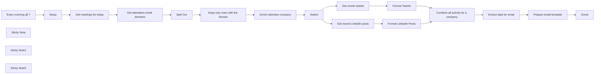

## Fluxo (.json) :

```json
{
  "meta": {
    "instanceId": "3c58c896c9089c8fb4d7f2b069bf3119193f239a1f538829758e2f4d6b5f5b24"
  },
  "nodes": [
    {
      "id": "f59411f9-5dad-4f8c-af0c-c3ab25171107",
      "name": "Get recetn tweets",
      "type": "n8n-nodes-base.httpRequest",
      "position": [
        233.55908776779552,
        1409.619212163096
      ],
      "parameters": {
        "url": "https://twitter154.p.rapidapi.com/user/tweets",
        "options": {
          "batching": {
            "batch": {
              "batchSize": 1,
              "batchInterval": 2000
            }
          }
        },
        "sendQuery": true,
        "sendHeaders": true,
        "queryParameters": {
          "parameters": [
            {
              "name": "limit",
              "value": "10"
            },
            {
              "name": "user_id",
              "value": "={{ $json.twitter.id }}"
            },
            {
              "name": "include_replies",
              "value": "={{ false }}"
            },
            {
              "name": "include_pinned",
              "value": "={{ false }}"
            }
          ]
        },
        "headerParameters": {
          "parameters": [
            {
              "name": "X-RapidAPI-Host",
              "value": "twitter154.p.rapidapi.com"
            },
            {
              "name": "X-RapidAPI-Key",
              "value": "={{ $('Setup').first().json.twitterAPIKey }}"
            }
          ]
        }
      },
      "typeVersion": 4.1
    },
    {
      "id": "c25d29ef-71bb-4ea1-8794-47911dac997f",
      "name": "Setup",
      "type": "n8n-nodes-base.set",
      "position": [
        -440,
        980
      ],
      "parameters": {
        "fields": {
          "values": [
            {
              "name": "linkedInAPIKey"
            },
            {
              "name": "twitterAPIKey"
            },
            {
              "name": "emails"
            }
          ]
        },
        "options": {}
      },
      "typeVersion": 3.2
    },
    {
      "id": "5bf52838-157b-49fe-a4d8-3817198502dd",
      "name": "Every morning @ 7",
      "type": "n8n-nodes-base.scheduleTrigger",
      "position": [
        -680,
        980
      ],
      "parameters": {
        "rule": {
          "interval": [
            {
              "triggerAtHour": 7
            }
          ]
        }
      },
      "typeVersion": 1.1
    },
    {
      "id": "aff4dd6e-a480-4f43-9b48-05172d4b7b2d",
      "name": "Get meetings for today",
      "type": "n8n-nodes-base.googleCalendar",
      "position": [
        -80,
        980
      ],
      "parameters": {
        "options": {
          "timeMax": "={{ $now.endOf('day') }}",
          "timeMin": "={{ $now.beginningOf('day') }}",
          "singleEvents": true
        },
        "calendar": {
          "__rl": true,
          "mode": "list",
          "value": "milorad.filipovic19@gmail.com",
          "cachedResultName": "milorad.filipovic19@gmail.com"
        },
        "operation": "getAll"
      },
      "typeVersion": 1
    },
    {
      "id": "63973273-3821-4c9f-8976-6dd47ac9a62e",
      "name": "Get attendees email domains",
      "type": "n8n-nodes-base.set",
      "position": [
        120,
        980
      ],
      "parameters": {
        "fields": {
          "values": [
            {
              "name": "domain",
              "type": "arrayValue",
              "arrayValue": "={{ $json.attendees.filter(a => !a.organizer).map(a => a.email.split('@').pop()) }}"
            },
            {
              "name": "attendeeEmails",
              "type": "arrayValue",
              "arrayValue": "={{ $json.attendees.filter(a => !a.organizer).map(a => a.email) }}"
            }
          ]
        },
        "options": {}
      },
      "typeVersion": 3.2
    },
    {
      "id": "093b978f-8d5e-4051-be21-e8a7a3430c9c",
      "name": "Split Out",
      "type": "n8n-nodes-base.splitOut",
      "position": [
        300,
        980
      ],
      "parameters": {
        "include": "selectedOtherFields",
        "options": {},
        "fieldToSplitOut": "domain",
        "fieldsToInclude": "attendeeEmails, start"
      },
      "typeVersion": 1
    },
    {
      "id": "467308c9-c6a0-4d1c-a6e1-4598075e62a6",
      "name": "Get recent LinkedIn posts",
      "type": "n8n-nodes-base.httpRequest",
      "position": [
        233.55908776779552,
        1209.619212163096
      ],
      "parameters": {
        "url": "https://fresh-linkedin-profile-data.p.rapidapi.com/get-company-posts",
        "options": {
          "batching": {
            "batch": {}
          }
        },
        "sendQuery": true,
        "sendHeaders": true,
        "queryParameters": {
          "parameters": [
            {
              "name": "linkedin_url",
              "value": "=https://www.linkedin.com/{{ $json.linkedin.handle }}"
            },
            {
              "name": "sort_by",
              "value": "recent"
            }
          ]
        },
        "headerParameters": {
          "parameters": [
            {
              "name": "X-RapidAPI-Key",
              "value": "={{ $('Setup').item.json.linkedInAPIKey }}"
            },
            {
              "name": "X-RapidAPI-Host",
              "value": "fresh-linkedin-profile-data.p.rapidapi.com"
            }
          ]
        }
      },
      "typeVersion": 4.1
    },
    {
      "id": "71a9223b-4d71-4d0d-a4df-f8836d3c3d1f",
      "name": "Enrich attendee company",
      "type": "n8n-nodes-base.clearbit",
      "position": [
        640,
        980
      ],
      "parameters": {
        "domain": "={{ $json.domain }}",
        "additionalFields": {}
      },
      "typeVersion": 1
    },
    {
      "id": "0fad8349-2a4f-4cee-a03e-98e8d95b015c",
      "name": "Gmail",
      "type": "n8n-nodes-base.gmail",
      "position": [
        1313.5590877677955,
        1309.619212163096
      ],
      "parameters": {
        "sendTo": "={{ $('Setup').first().json.emails }}",
        "message": "={{ $json.html }}",
        "options": {},
        "subject": "=Latest social activity for: {{ $('Extract data for email').item.json.name }} "
      },
      "credentials": {
        "gmailOAuth2": {
          "id": "10",
          "name": "mrdosija@gmail.com"
        }
      },
      "typeVersion": 2.1
    },
    {
      "id": "bf667011-717e-4a5a-ac7d-c377edb063f8",
      "name": "Format LinkedIn Posts",
      "type": "n8n-nodes-base.code",
      "position": [
        453.5590877677955,
        1209.619212163096
      ],
      "parameters": {
        "mode": "runOnceForEachItem",
        "jsCode": "// console.log('LINKEDIN', $('Enrich attendee company').item.json.name.toLowerCase())\nconst company = $('Enrich attendee company').item.json.name.toLowerCase();\n\nlet html = `\n<div style=\"display: flex; align-items: center; margin: 2em 0 1em\">\n  \n  <h3 style=\"margin: 0\">LinkedIn posts</h3>\n</div>\n<table style=\"width: 100%\">\n`;\nfor(article of $input.item.json.data.slice(0,10)) {\n  html += `\n    <tr>\n      <td style=\"background-color: #f7f9fc; font-family: sans-serif; padding: 0.3em 1em\">\n        <div>\n          <a style=\"display: block; color: #000; text-decoration: none; margin-bottom: 5px; font-size: 1.1em\" href=\"${article.url}\"><i>${article.text}</i></a>\n        </div>\n        <p style=\"margin: 0; font-size: 0.8em\">\n          <span title=\"Likes\">❤️ ${article.num_likes}</span> | <span title=\"Comments\">💬 ${article.num_comments}</span>\n        </p>\n      </td>\n    </tr>\n  `\n}\nhtml += '</table>';\n\nreturn { \n  \"html_linkedin\": html,\n  name: $('Switch').item.json.name,\n  meeting: $('Split Out').item.json\n};"
      },
      "typeVersion": 2
    },
    {
      "id": "ee7ad92e-d4ed-4046-8d31-9c5ce4dda92b",
      "name": "Format Tweets",
      "type": "n8n-nodes-base.code",
      "position": [
        453.5590877677955,
        1409.619212163096
      ],
      "parameters": {
        "mode": "runOnceForEachItem",
        "jsCode": "const company = $('Enrich attendee company').item.json.name.toLowerCase();\nlet html = `\n<div style=\"display: flex; align-items: center; margin: 2em 0 1em\">\n  \n  <h3 style=\"margin: 0\">Tweets</h3>\n</div>\n<table style=\"width: 100%\">`;\nfor(article of $input.item.json.results) {\n  html += `\n    <tr>\n      <td style=\"background-color: #f7f9fc; font-family: sans-serif; padding: 0.3em 1em\">\n        <div>\n          <a style=\"display: block; color: #000; text-decoration: none; margin-bottom: 5px; font-size: 1.1em\" href=\"https://twitter.com/${article.user.username}/status/${article.tweet_id}\">\n          <i>${article.text}</i></a>\n        </div>\n        <p style=\"margin: 0; font-size: 0.8em\">\n          <span title=\"Retweets\">🔄 ${article.retweet_count}</span> | <span title=\"Favorites\">❤️ ${article.favorite_count}</span> | <span title=\"Replies\">💬 ${article.reply_count}</span>\n        </p>\n      </td>\n    </tr>\n  `\n}\nhtml += '</table>';\n\nreturn { \n    \"html_twitter\": html,\n    name: $('Switch').item.json.name,\n   meeting: $('Split Out').item.json\n};"
      },
      "typeVersion": 2
    },
    {
      "id": "0523a00c-e6d3-4158-a861-3bbdd1d6af24",
      "name": "Combine all activity for a company",
      "type": "n8n-nodes-base.merge",
      "position": [
        693.5590877677955,
        1309.619212163096
      ],
      "parameters": {
        "mode": "combine",
        "options": {
          "clashHandling": {
            "values": {
              "resolveClash": "preferInput2"
            }
          }
        },
        "joinMode": "keepEverything",
        "mergeByFields": {
          "values": [
            {
              "field1": "name",
              "field2": "name"
            }
          ]
        }
      },
      "typeVersion": 2.1
    },
    {
      "id": "f7f8a5fd-e768-4011-bdbb-cf41a617ce00",
      "name": "Extract data for email",
      "type": "n8n-nodes-base.set",
      "position": [
        873.5590877677955,
        1309.619212163096
      ],
      "parameters": {
        "fields": {
          "values": [
            {
              "name": "attendeeEmail",
              "stringValue": "={{ $json.meeting.attendeeEmails.find(a => a.endsWith($json.meeting.domain)) }}"
            },
            {
              "name": "startHour",
              "type": "numberValue",
              "numberValue": "={{ DateTime.fromISO($json.meeting.start.dateTime).hour }}"
            },
            {
              "name": "startMinute",
              "type": "numberValue",
              "numberValue": "={{ DateTime.fromISO($json.meeting.start.dateTime).minute }}"
            }
          ]
        },
        "include": "selected",
        "options": {},
        "includeFields": "name, html_twitter, html_linkedin"
      },
      "typeVersion": 3.2
    },
    {
      "id": "679fb981-1774-4a3e-8aa4-0cef2f416ecb",
      "name": "Prepare email template",
      "type": "n8n-nodes-base.html",
      "position": [
        1093.5590877677955,
        1309.619212163096
      ],
      "parameters": {
        "html": "<!DOCTYPE html>\n\n<html>\n<head>\n  <meta charset=\"UTF-8\" />\n  <title>Social media activity for company: {{ $json.name }}</title>\n</head>\n<body>\n  <div class=\"container\">\n     <h2 style=\"font-size: 1.2em\">\n      🗓️ Meeting with \n       <span>{{ $json.attendeeEmail }}</span> \n       at {{ $json.startHour }}:{{ $json.startMinute < 10 ? `0${$json.startMinute}` : $json.startMinute }}h\n    </h2>\n    {{ $json.html_linkedin ?? ''}}\n    {{ $json.html_twitter  ?? ''}}\n  </div>\n</body>\n</html>\n\n<style>\n.container {\n  font-family: sans-serif;\n}\n</style>"
      },
      "typeVersion": 1.1
    },
    {
      "id": "8d08145c-9376-4933-8cb2-05babc855b7a",
      "name": "Switch",
      "type": "n8n-nodes-base.switch",
      "position": [
        -6.440912232204482,
        1309.619212163096
      ],
      "parameters": {
        "rules": {
          "values": [
            {
              "outputKey": "linkedin",
              "conditions": {
                "options": {
                  "leftValue": "",
                  "caseSensitive": true,
                  "typeValidation": "strict"
                },
                "combinator": "and",
                "conditions": [
                  {
                    "operator": {
                      "type": "boolean",
                      "operation": "true",
                      "singleValue": true
                    },
                    "leftValue": "={{ $json.linkedin.handle !== null }}",
                    "rightValue": ""
                  }
                ]
              },
              "renameOutput": true
            },
            {
              "outputKey": "twitter",
              "conditions": {
                "options": {
                  "leftValue": "",
                  "caseSensitive": true,
                  "typeValidation": "strict"
                },
                "combinator": "and",
                "conditions": [
                  {
                    "id": "bbb0310e-8b20-4bc6-a540-a4cd17470e28",
                    "operator": {
                      "type": "boolean",
                      "operation": "true",
                      "singleValue": true
                    },
                    "leftValue": "={{ $json.twitter.id !== null }}",
                    "rightValue": ""
                  }
                ]
              },
              "renameOutput": true
            }
          ]
        },
        "options": {
          "allMatchingOutputs": true,
          "looseTypeValidation": false
        }
      },
      "typeVersion": 3
    },
    {
      "id": "e4332ab1-5618-477c-9c0b-a2a01278036f",
      "name": "Sticky Note",
      "type": "n8n-nodes-base.stickyNote",
      "position": [
        -520,
        720
      ],
      "parameters": {
        "color": 7,
        "width": 409.31582584657923,
        "height": 426.61520915049425,
        "content": "## Start here\n1️⃣ Register on [RapidAPI](https://rapidapi.com) and subscribe to these two APIs:\n- [Fresh LinkedIn Profile Data](https://rapidapi.com/freshdata-freshdata-default/api/fresh-linkedin-profile-data)\n- [Twitter](https://rapidapi.com/omarmhaimdat/api/twitter154)\n\n\n2️⃣ Set API keys for these two in `linkedInAPIKey` and `twitterAPIKey`fields of this node\n\n3️⃣ Set email addresses that should receive the list in the `emails` field of this node"
      },
      "typeVersion": 1
    },
    {
      "id": "2b7a7085-8e19-40a2-9910-6ad829433706",
      "name": "Sticky Note1",
      "type": "n8n-nodes-base.stickyNote",
      "position": [
        -220.44091223220448,
        1289.619212163096
      ],
      "parameters": {
        "color": 7,
        "width": 334.90628250854803,
        "height": 308.7389742148118,
        "content": "\n\n\n\n\n\n\n\n\n\n\n\n\n\n💡 If you need to get activities from more social media accounts found by ClearBit, they can be added here, just make sure to process them properly in separate switch node branches"
      },
      "typeVersion": 1
    },
    {
      "id": "8f616351-c18d-460c-9d58-abe01c04e90b",
      "name": "Sticky Note2",
      "type": "n8n-nodes-base.stickyNote",
      "position": [
        840,
        560
      ],
      "parameters": {
        "color": 5,
        "width": 738.9631933644362,
        "height": 717.2835666148258,
        "content": "### You will receive one email for every company in your calendar. These emails will look something like this:\n\n"
      },
      "typeVersion": 1
    },
    {
      "id": "dbd6c7df-d857-40e2-b1ba-cb1e68f9cb1a",
      "name": "Keep only ones with the domain",
      "type": "n8n-nodes-base.filter",
      "position": [
        460,
        980
      ],
      "parameters": {
        "options": {},
        "conditions": {
          "options": {
            "leftValue": "",
            "caseSensitive": true,
            "typeValidation": "strict"
          },
          "combinator": "and",
          "conditions": [
            {
              "id": "881d891e-ea17-4879-a5cf-72d08b281f56",
              "operator": {
                "type": "string",
                "operation": "exists",
                "singleValue": true
              },
              "leftValue": "={{ $json.domain }}",
              "rightValue": ""
            }
          ]
        }
      },
      "typeVersion": 2
    }
  ],
  "pinData": {},
  "connections": {
    "Setup": {
      "main": [
        [
          {
            "node": "Get meetings for today",
            "type": "main",
            "index": 0
          }
        ]
      ]
    },
    "Switch": {
      "main": [
        [
          {
            "node": "Get recent LinkedIn posts",
            "type": "main",
            "index": 0
          }
        ],
        [
          {
            "node": "Get recetn tweets",
            "type": "main",
            "index": 0
          }
        ]
      ]
    },
    "Split Out": {
      "main": [
        [
          {
            "node": "Keep only ones with the domain",
            "type": "main",
            "index": 0
          }
        ]
      ]
    },
    "Format Tweets": {
      "main": [
        [
          {
            "node": "Combine all activity for a company",
            "type": "main",
            "index": 1
          }
        ]
      ]
    },
    "Every morning @ 7": {
      "main": [
        [
          {
            "node": "Setup",
            "type": "main",
            "index": 0
          }
        ]
      ]
    },
    "Get recetn tweets": {
      "main": [
        [
          {
            "node": "Format Tweets",
            "type": "main",
            "index": 0
          }
        ]
      ]
    },
    "Format LinkedIn Posts": {
      "main": [
        [
          {
            "node": "Combine all activity for a company",
            "type": "main",
            "index": 0
          }
        ]
      ]
    },
    "Extract data for email": {
      "main": [
        [
          {
            "node": "Prepare email template",
            "type": "main",
            "index": 0
          }
        ]
      ]
    },
    "Get meetings for today": {
      "main": [
        [
          {
            "node": "Get attendees email domains",
            "type": "main",
            "index": 0
          }
        ]
      ]
    },
    "Prepare email template": {
      "main": [
        [
          {
            "node": "Gmail",
            "type": "main",
            "index": 0
          }
        ]
      ]
    },
    "Enrich attendee company": {
      "main": [
        [
          {
            "node": "Switch",
            "type": "main",
            "index": 0
          }
        ]
      ]
    },
    "Get recent LinkedIn posts": {
      "main": [
        [
          {
            "node": "Format LinkedIn Posts",
            "type": "main",
            "index": 0
          }
        ]
      ]
    },
    "Get attendees email domains": {
      "main": [
        [
          {
            "node": "Split Out",
            "type": "main",
            "index": 0
          }
        ]
      ]
    },
    "Keep only ones with the domain": {
      "main": [
        [
          {
            "node": "Enrich attendee company",
            "type": "main",
            "index": 0
          }
        ]
      ]
    },
    "Combine all activity for a company": {
      "main": [
        [
          {
            "node": "Extract data for email",
            "type": "main",
            "index": 0
          }
        ]
      ]
    }
  }
}
```

<a id="template-1083"></a>

## Template 1083 - Sincronizar pedido Stripe e extrair cliente/produto

- **Nome:** Sincronizar pedido Stripe e extrair cliente/produto
- **Descrição:** Fluxo que detecta finalização de checkout no Stripe, recupera os detalhes da sessão e extrai informações do cliente e do produto comprado.
- **Funcionalidade:** • Detecção de pagamento concluído: Aciona o fluxo quando uma sessão de checkout é finalizada (evento checkout.session.completed).
• Recuperação de sessão: Consulta a API do Stripe para obter detalhes completos da sessão, incluindo itens do pedido (line_items).
• Extração de dados do cliente: Obtém o nome e o e-mail do cliente a partir dos dados da sessão.
• Identificação do produto comprado: Captura a descrição do primeiro item em line_items como o produto adquirido.
• Preparação de dados: Organiza e expõe os campos (nome do cliente, e-mail, produto) para uso em etapas posteriores ou integrações.
- **Ferramentas:** • Stripe: Plataforma de pagamentos e API utilizada para receber eventos de checkout e recuperar informações detalhadas da sessão.

## Fluxo visual

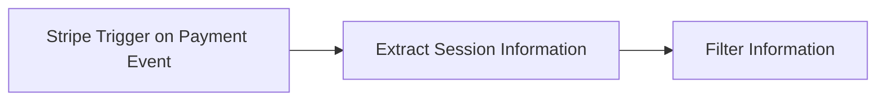

## Fluxo (.json) :

```json
{
  "id": "YVNJOltj0jMQatGz",
  "meta": {
    "instanceId": "143d2ab55c8bffb06f8b9c7ad30335764fdc48bbbacecbe2218dadb998a32213",
    "templateCredsSetupCompleted": true
  },
  "name": "Stripe Payment Order Sync – Auto Retrieve Customer & Product Purchased",
  "tags": [],
  "nodes": [
    {
      "id": "90322fe5-5536-41c3-ac08-ea87a856781b",
      "name": "Stripe Trigger on Payment Event",
      "type": "n8n-nodes-base.stripeTrigger",
      "position": [
        0,
        0
      ],
      "webhookId": "e85ac894-bb67-436c-ad39-308a00c8e922",
      "parameters": {
        "events": [
          "checkout.session.completed"
        ]
      },
      "credentials": {
        "stripeApi": {
          "id": "ClCB0WooGxls3WGM",
          "name": "Stripe Test"
        }
      },
      "typeVersion": 1
    },
    {
      "id": "3feb0b03-921e-4bfd-8a50-b2b6b47e9497",
      "name": "Extract Session Information",
      "type": "n8n-nodes-base.httpRequest",
      "position": [
        300,
        0
      ],
      "parameters": {
        "url": "=https://api.stripe.com/v1/checkout/sessions/{{ $json.data.object.id }}",
        "options": {},
        "sendQuery": true,
        "authentication": "predefinedCredentialType",
        "queryParameters": {
          "parameters": [
            {
              "name": "expand[]",
              "value": "line_items"
            }
          ]
        },
        "nodeCredentialType": "stripeApi"
      },
      "credentials": {
        "stripeApi": {
          "id": "ClCB0WooGxls3WGM",
          "name": "Stripe Test"
        },
        "httpHeaderAuth": {
          "id": "9UNc6IDuBlNCX6zd",
          "name": "PDF to Text"
        }
      },
      "typeVersion": 4.2
    },
    {
      "id": "5a436d1c-88e9-492e-8fe0-33a5706de1b3",
      "name": "Filter Information",
      "type": "n8n-nodes-base.set",
      "position": [
        560,
        0
      ],
      "parameters": {
        "options": {},
        "assignments": {
          "assignments": [
            {
              "id": "95a68e0f-b74c-4ca2-8143-14b469aa6bfb",
              "name": "Customer Name",
              "type": "string",
              "value": "={{ $json.customer_details.name }}"
            },
            {
              "id": "7634efa6-04f3-4dac-8509-56aae29fcc79",
              "name": "Customer Email",
              "type": "string",
              "value": "={{ $json.customer_details.email }}"
            },
            {
              "id": "10e71e07-6dd3-410c-a774-1eeffe2be7a5",
              "name": "Product Purchased",
              "type": "string",
              "value": "={{ $json.line_items.data[0].description }}"
            }
          ]
        }
      },
      "typeVersion": 3.4
    }
  ],
  "active": false,
  "pinData": {},
  "settings": {
    "executionOrder": "v1"
  },
  "versionId": "e3f6ba06-36d9-4b41-9c5a-cec669ce507b",
  "connections": {
    "Extract Session Information": {
      "main": [
        [
          {
            "node": "Filter Information",
            "type": "main",
            "index": 0
          }
        ]
      ]
    },
    "Stripe Trigger on Payment Event": {
      "main": [
        [
          {
            "node": "Extract Session Information",
            "type": "main",
            "index": 0
          }
        ]
      ]
    }
  }
}
```

<a id="template-1084"></a>

## Template 1084 - Publicar vídeos e imagens em várias redes com Blotato

- **Nome:** Publicar vídeos e imagens em várias redes com Blotato
- **Descrição:** Fluxo automatizado para publicar vídeos e imagens em várias redes sociais usando Blotato. Inclui preparação de textos, upload de mídia, geração de títulos para YouTube e atualização de estados em Airtable.
- **Funcionalidade:** • Coleta de credenciais e dados de publicação: Reúne IDs de contas, textos (curtos/longos) e URLs de mídia necessários para cada plataforma a partir das fontes do fluxo.
• Geração de título viral para YouTube: Usa IA para reescrever o título atual em até 100 caracteres adequados para YouTube Shorts.
• Upload de mídia para Blotato: Envia URLs de vídeo e imagem para armazenamento/mecanismo de publicação.
• Publicação em múltiplas redes sociais: Envia textos e mídia para Instagram, Facebook, LinkedIn, TikTok, YouTube, Threads, Twitter, Bluesky e Pinterest.
• Atualização de Airtable com status de publicação: Marca avanços e resultados, atualizando campos de produção, IDs de publicação e estado (In progress, Completed).
• Rastreamento de Pinterest e extração de informações do board: Obtém o ID do board e outros detalhes a partir de uma página do Pinterest.
• Gatilho de teste: Permite iniciar o fluxo manualmente para validação antes da publicação completa.
- **Ferramentas:** • Blotato: Serviço externo para publicar conteúdos em várias plataformas e gerenciar mídia.
• Airtable: Base de dados usada para armazenar textos, IDs de contas, URLs de mídia e status de publicação.
• OpenAI: Modelo de linguagem utilizado para gerar títulos virais para YouTube.
• Pinterest: Serviço web usado para extrair informações de boards e apoiar a curadoria de conteúdo.

## Fluxo visual

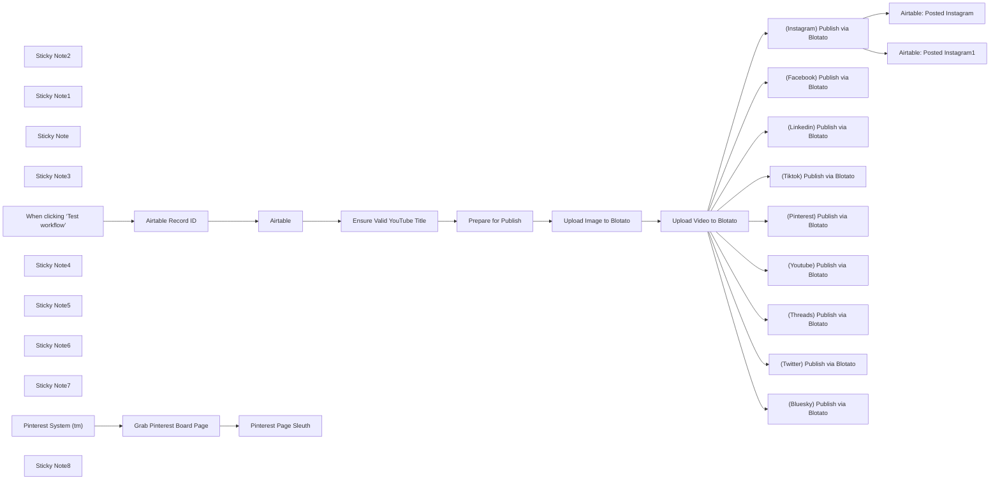

## Fluxo (.json) :

```json
{
  "id": "8Sbrzc7Au3ZGf62p",
  "meta": {
    "instanceId": "bcc0fe85b176c2837affb21bb7d7397fad2549880e73dc1f7a42e76ae94fd996",
    "templateCredsSetupCompleted": true
  },
  "name": "Publish Videos & Images - Blotato",
  "tags": [
    {
      "id": "3ys8SQgNTiRr899i",
      "name": "social media",
      "createdAt": "2025-03-17T08:37:35.227Z",
      "updatedAt": "2025-04-07T06:13:46.923Z"
    },
    {
      "id": "zyM31CVcOgUrUm2P",
      "name": "blotato",
      "createdAt": "2025-04-25T13:38:49.620Z",
      "updatedAt": "2025-04-25T13:38:49.620Z"
    },
    {
      "id": "2wv2YbZIQoYNx98Y",
      "name": "schedule",
      "createdAt": "2025-04-25T13:38:53.789Z",
      "updatedAt": "2025-04-25T13:38:53.789Z"
    },
    {
      "id": "PqlvV87F8bOW0yAK",
      "name": "publish",
      "createdAt": "2025-04-25T13:38:58.944Z",
      "updatedAt": "2025-04-25T13:38:58.944Z"
    }
  ],
  "nodes": [
    {
      "id": "53b36edb-e273-4e68-8ae9-7d3de3f7533f",
      "name": "[Instagram] Publish via Blotato",
      "type": "n8n-nodes-base.httpRequest",
      "onError": "continueErrorOutput",
      "position": [
        96,
        80
      ],
      "parameters": {
        "url": "https://backend.blotato.com/v2/posts",
        "method": "POST",
        "options": {},
        "jsonBody": "={\n  \"post\": {\n    \"target\": {\n      \"targetType\": \"instagram\"\n    },\n    \"content\": {\n      \"text\": {{ $('Prepare for Publish').item.json.final_text_short.toJsonString() }},\n      \"platform\": \"instagram\",\n      \"mediaUrls\": [\"{{ $json.url }}\"]\n    },\n    \"accountId\": \"{{ $('Prepare for Publish').item.json.instagram_id }}\"\n  }\n}",
        "sendBody": true,
        "specifyBody": "json",
        "authentication": "genericCredentialType",
        "genericAuthType": "httpHeaderAuth"
      },
      "credentials": {
        "httpHeaderAuth": {
          "id": "OEAfX6pMtcbyFBAp",
          "name": "Blotato"
        }
      },
      "typeVersion": 4.2
    },
    {
      "id": "6fef0d35-9679-40f6-9224-cfb7c442056b",
      "name": "[Facebook] Publish via Blotato",
      "type": "n8n-nodes-base.httpRequest",
      "onError": "continueErrorOutput",
      "position": [
        96,
        480
      ],
      "parameters": {
        "url": "https://backend.blotato.com/v2/posts",
        "method": "POST",
        "options": {},
        "jsonBody": "={\n  \"post\": {\n    \"target\": {\n      \"targetType\": \"facebook\",\n      \"pageId\": \"{{ $('Prepare for Publish').item.json.facebook_page_id }}\"\n    },\n    \"content\": {\n      \"text\": {{ $('Prepare for Publish').item.json.final_text_long.toJsonString() }},\n      \"platform\": \"facebook\",\n      \"mediaUrls\": [\"{{ $json.url }}\"]\n    },\n    \"accountId\": \"{{ $('Prepare for Publish').item.json.facebook_id }}\"\n  }\n}",
        "sendBody": true,
        "specifyBody": "json",
        "authentication": "genericCredentialType",
        "genericAuthType": "httpHeaderAuth"
      },
      "credentials": {
        "httpHeaderAuth": {
          "id": "OEAfX6pMtcbyFBAp",
          "name": "Blotato"
        }
      },
      "typeVersion": 4.2
    },
    {
      "id": "3f744ee2-988b-45a6-9d88-a718780421cf",
      "name": "[Linkedin] Publish via Blotato",
      "type": "n8n-nodes-base.httpRequest",
      "onError": "continueErrorOutput",
      "position": [
        96,
        880
      ],
      "parameters": {
        "url": "https://backend.blotato.com/v2/posts",
        "method": "POST",
        "options": {},
        "jsonBody": "={\n  \"post\": {\n    \"target\": {\n      \"targetType\": \"linkedin\"\n    },\n    \"content\": {\n      \"text\": {{ $('Prepare for Publish').item.json.final_text_long.toJsonString() }},\n      \"platform\": \"linkedin\",\n      \"mediaUrls\": [\"{{ $json.url }}\"]\n    },\n    \"accountId\": \"{{ $('Prepare for Publish').item.json.linkedin_id }}\"\n  }\n}",
        "sendBody": true,
        "specifyBody": "json",
        "authentication": "genericCredentialType",
        "genericAuthType": "httpHeaderAuth"
      },
      "credentials": {
        "httpHeaderAuth": {
          "id": "OEAfX6pMtcbyFBAp",
          "name": "Blotato"
        }
      },
      "typeVersion": 4.2
    },
    {
      "id": "7f0ae540-090a-4b13-a094-2ac74e1a14b3",
      "name": "[Tiktok] Publish via Blotato",
      "type": "n8n-nodes-base.httpRequest",
      "onError": "continueErrorOutput",
      "position": [
        96,
        1280
      ],
      "parameters": {
        "url": "https://backend.blotato.com/v2/posts",
        "method": "POST",
        "options": {},
        "jsonBody": "={\n  \"post\": {\n    \"target\": {\n      \"targetType\": \"tiktok\",\n      \"isYourBrand\": false,\n      \"disabledDuet\": false,\n      \"privacyLevel\": \"PUBLIC_TO_EVERYONE\",\n      \"isAiGenerated\": true,\n      \"disabledStitch\": false,\n      \"disabledComments\": false,\n      \"isBrandedContent\": false\n    },\n    \"content\": {\n      \"text\": \"{{ $('Prepare for Publish').item.json.final_text_short }}\",\n      \"platform\": \"tiktok\",\n      \"mediaUrls\": [\"{{ $json.url }}\"]\n    },\n    \"accountId\": \"{{ $('Prepare for Publish').item.json.tiktok_id }}\"\n  }\n}\n",
        "sendBody": true,
        "specifyBody": "json",
        "authentication": "genericCredentialType",
        "genericAuthType": "httpHeaderAuth"
      },
      "credentials": {
        "httpHeaderAuth": {
          "id": "OEAfX6pMtcbyFBAp",
          "name": "Blotato"
        }
      },
      "typeVersion": 4.2
    },
    {
      "id": "2593a621-0d0b-42b3-97ab-bf85785fb33c",
      "name": "[Pinterest] Publish via Blotato",
      "type": "n8n-nodes-base.httpRequest",
      "onError": "continueErrorOutput",
      "position": [
        96,
        1680
      ],
      "parameters": {
        "url": "https://backend.blotato.com/v2/posts",
        "method": "POST",
        "options": {},
        "jsonBody": "={\n  \"post\": {\n    \"target\": {\n      \"targetType\": \"pinterest\",\n      \"boardId\": \"{{ $('Prepare for Publish').item.json.pinterested_board_id }}\",\n      \"link\": \"https://www.AIwithApex.com/\"\n    },\n    \"content\": {\n      \"text\": {{ $('Prepare for Publish').item.json.final_text_short.toJsonString() }},\n      \"platform\": \"pinterest\",\n      \"mediaUrls\": [\"{{ $('Upload Image to Blotato').item.json.url }}\"]\n    },\n    \"accountId\": \"{{ $('Prepare for Publish').item.json.pinterest_id }}\"\n  }\n}\n",
        "sendBody": true,
        "specifyBody": "json",
        "authentication": "genericCredentialType",
        "genericAuthType": "httpHeaderAuth"
      },
      "credentials": {
        "httpHeaderAuth": {
          "id": "OEAfX6pMtcbyFBAp",
          "name": "Blotato"
        }
      },
      "typeVersion": 4.2
    },
    {
      "id": "b47da27b-b81f-4736-9c34-cd224d78f29d",
      "name": "[Youtube] Publish via Blotato",
      "type": "n8n-nodes-base.httpRequest",
      "onError": "continueErrorOutput",
      "position": [
        96,
        280
      ],
      "parameters": {
        "url": "https://backend.blotato.com/v2/posts",
        "method": "POST",
        "options": {},
        "jsonBody": "={\n  \"post\": {\n    \"target\": {\n      \"targetType\": \"youtube\",\n      \"title\": \"{{ $('Ensure Valid YouTube Title').item.json.message.content.youtube_title }}\",\n      \"privacyStatus\": \"public\",\n      \"shouldNotifySubscribers\": true\n    },\n    \"content\": {\n      \"text\": {{ $('Prepare for Publish').item.json.final_text_long.toJsonString() }},\n      \"platform\": \"youtube\",\n      \"mediaUrls\": [\"{{ $json.url }}\"]\n    },\n    \"accountId\": \"{{ $('Prepare for Publish').item.json.youtube_id }}\"\n  }\n}",
        "sendBody": true,
        "specifyBody": "json",
        "authentication": "genericCredentialType",
        "genericAuthType": "httpHeaderAuth"
      },
      "credentials": {
        "httpHeaderAuth": {
          "id": "OEAfX6pMtcbyFBAp",
          "name": "Blotato"
        }
      },
      "typeVersion": 4.2
    },
    {
      "id": "19f17323-45f5-4865-b754-e2d5f8fc6073",
      "name": "[Threads] Publish via Blotato",
      "type": "n8n-nodes-base.httpRequest",
      "onError": "continueErrorOutput",
      "position": [
        96,
        680
      ],
      "parameters": {
        "url": "https://backend.blotato.com/v2/posts",
        "method": "POST",
        "options": {},
        "jsonBody": "={\n  \"post\": {\n    \"target\": {\n      \"targetType\": \"threads\"\n    },\n    \"content\": {\n      \"text\": {{ $('Prepare for Publish').item.json.final_text_short.toJsonString() }},\n      \"platform\": \"threads\",\n      \"mediaUrls\": [\"{{ $json.url }}\"]\n    },\n    \"accountId\": \"{{ $('Prepare for Publish').item.json.threads_id }}\"\n  }\n}\n",
        "sendBody": true,
        "specifyBody": "json",
        "authentication": "genericCredentialType",
        "genericAuthType": "httpHeaderAuth"
      },
      "credentials": {
        "httpHeaderAuth": {
          "id": "OEAfX6pMtcbyFBAp",
          "name": "Blotato"
        }
      },
      "typeVersion": 4.2
    },
    {
      "id": "adaa3ac1-fa2a-422e-8b70-8c4cc74782ed",
      "name": "[Twitter] Publish via Blotato",
      "type": "n8n-nodes-base.httpRequest",
      "onError": "continueErrorOutput",
      "position": [
        96,
        1080
      ],
      "parameters": {
        "url": "https://backend.blotato.com/v2/posts",
        "method": "POST",
        "options": {},
        "jsonBody": "={\n  \"post\": {\n    \"target\": {\n      \"targetType\": \"twitter\"\n    },\n    \"content\": {\n      \"text\": {{ $('Prepare for Publish').item.json.final_text_short.toJsonString() }},\n      \"platform\": \"twitter\",\n      \"mediaUrls\": [\"{{ $json.url }}\"]\n    },\n    \"accountId\": \"{{ $('Prepare for Publish').item.json.twitter_id }}\"\n  }\n}\n",
        "sendBody": true,
        "specifyBody": "json",
        "authentication": "genericCredentialType",
        "genericAuthType": "httpHeaderAuth"
      },
      "credentials": {
        "httpHeaderAuth": {
          "id": "OEAfX6pMtcbyFBAp",
          "name": "Blotato"
        }
      },
      "typeVersion": 4.2
    },
    {
      "id": "af2d0a29-73d1-4ee0-84c9-f337a628b3ea",
      "name": "[Bluesky] Publish via Blotato",
      "type": "n8n-nodes-base.httpRequest",
      "onError": "continueErrorOutput",
      "position": [
        96,
        1480
      ],
      "parameters": {
        "url": "https://backend.blotato.com/v2/posts",
        "method": "POST",
        "options": {},
        "jsonBody": "={\n  \"post\": {\n    \"target\": {\n      \"targetType\": \"bluesky\"\n    },\n    \"content\": {\n      \"text\": {{ $('Prepare for Publish').item.json.final_text_short.toJsonString() }},\n      \"platform\": \"bluesky\",\n      \"mediaUrls\": [\"{{ $('Upload Image to Blotato').item.json.url }}\"]\n    },\n    \"accountId\": \"{{ $('Prepare for Publish').item.json.bluesky_id }}\"\n  }\n}\n",
        "sendBody": true,
        "specifyBody": "json",
        "authentication": "genericCredentialType",
        "genericAuthType": "httpHeaderAuth"
      },
      "credentials": {
        "httpHeaderAuth": {
          "id": "OEAfX6pMtcbyFBAp",
          "name": "Blotato"
        }
      },
      "typeVersion": 4.2
    },
    {
      "id": "08253c79-44f6-471a-b7c9-b84046f16888",
      "name": "Sticky Note2",
      "type": "n8n-nodes-base.stickyNote",
      "position": [
        16,
        -40
      ],
      "parameters": {
        "color": 2,
        "width": 260,
        "height": 1880,
        "content": "# Publish to Social Media"
      },
      "typeVersion": 1
    },
    {
      "id": "dae9e738-c391-47f6-bdf7-87055a5a77f0",
      "name": "Prepare for Publish",
      "type": "n8n-nodes-base.set",
      "position": [
        -564,
        880
      ],
      "parameters": {
        "mode": "raw",
        "options": {},
        "jsonOutput": "={\n  \"instagram_id\": \"2244\",\n  \"youtube_id\": \"1300\",\n  \"tiktok_id\": \"2761\",\n  \"facebook_id\": \"2152\",\n  \"facebook_page_id\": \"127923797405586\",\n  \"threads_id\": \"670\",\n  \"twitter_id\": \"1576\",\n  \"linkedin_id\": \"1730\",\n  \"pinterest_id\": \"447\",\n  \"pinterested_board_id\": \"1097611809123639891\",\n  \"bluesky_id\": \"1311\",\n  \"final_text_long\": {{ $('Airtable').item.json.Script.toJsonString() }},\n  \"final_text_short\": {{ $('Airtable').item.json['Text for X'].toJsonString() }}\n}"
      },
      "typeVersion": 3.4
    },
    {
      "id": "aaa21d7f-e175-4516-8bde-e0b87e6e183d",
      "name": "Airtable",
      "type": "n8n-nodes-base.airtable",
      "position": [
        -1160,
        880
      ],
      "parameters": {
        "id": "={{ $json.airtableID }}",
        "base": {
          "__rl": true,
          "mode": "list",
          "value": "appt2yDl6xXXyqboD",
          "cachedResultUrl": "https://airtable.com/appt2yDl6xXXyqboD",
          "cachedResultName": "Social Media System"
        },
        "table": {
          "__rl": true,
          "mode": "list",
          "value": "tblM3kDu1qB2FdTOF",
          "cachedResultUrl": "https://airtable.com/appt2yDl6xXXyqboD/tblM3kDu1qB2FdTOF",
          "cachedResultName": "Media Creation"
        },
        "options": {}
      },
      "credentials": {
        "airtableTokenApi": {
          "id": "YzrajURFsZkojT3x",
          "name": "Delete Me Later Please!"
        }
      },
      "typeVersion": 2.1
    },
    {
      "id": "e05d1ede-7d43-4c55-a353-6bc2bd0216d4",
      "name": "Upload Video to Blotato",
      "type": "n8n-nodes-base.httpRequest",
      "position": [
        -124,
        880
      ],
      "parameters": {
        "url": "https://backend.blotato.com/v2/media",
        "method": "POST",
        "options": {},
        "sendBody": true,
        "authentication": "genericCredentialType",
        "bodyParameters": {
          "parameters": [
            {
              "name": "url",
              "value": "={{ $('Airtable').item.json['Video URL'] }}"
            }
          ]
        },
        "genericAuthType": "httpHeaderAuth"
      },
      "credentials": {
        "httpHeaderAuth": {
          "id": "gNaQW1qT8liDV4ls",
          "name": "Delete me toooooo!"
        }
      },
      "typeVersion": 4.2
    },
    {
      "id": "92fd39a9-74c1-4cbb-abb3-511f8230cee7",
      "name": "Upload Image to Blotato",
      "type": "n8n-nodes-base.httpRequest",
      "position": [
        -344,
        880
      ],
      "parameters": {
        "url": "https://backend.blotato.com/v2/media",
        "method": "POST",
        "options": {},
        "sendBody": true,
        "authentication": "genericCredentialType",
        "bodyParameters": {
          "parameters": [
            {
              "name": "url",
              "value": "={{ $('Airtable').item.json['Image URL'] }}"
            }
          ]
        },
        "genericAuthType": "httpHeaderAuth"
      },
      "credentials": {
        "httpHeaderAuth": {
          "id": "gNaQW1qT8liDV4ls",
          "name": "Delete me toooooo!"
        }
      },
      "typeVersion": 4.2
    },
    {
      "id": "12b8ecfe-f83b-4e32-a8d7-a71b7f5c9fd1",
      "name": "Ensure Valid YouTube Title",
      "type": "@n8n/n8n-nodes-langchain.openAi",
      "position": [
        -940,
        880
      ],
      "parameters": {
        "modelId": {
          "__rl": true,
          "mode": "list",
          "value": "gpt-4.1-mini",
          "cachedResultName": "GPT-4.1-MINI"
        },
        "options": {},
        "messages": {
          "values": [
            {
              "content": "=CURRENT_TITLE:\n{{ $json['Media Title'] }}"
            },
            {
              "role": "assistant",
              "content": "# TASK\nYou specialize in creating Viral YouTube Short Video Titles.  You are to take User's CURRENT_TITLE and re-write it to go viral.\n## Rules\n - Maximum 100 Characters\n - Goal is Virality!\n - Must be valid title for a YouTube Short Video\n# OUTPUT\nOutput must be in JSON format, example:\n{ \"youtube_title\": \"<generated title per instructions>\" }"
            }
          ]
        },
        "jsonOutput": true
      },
      "credentials": {
        "openAiApi": {
          "id": "KzjXYSuzUOCnnvzB",
          "name": "OpenAi account"
        }
      },
      "typeVersion": 1.8
    },
    {
      "id": "d83577ae-5aa7-4d47-a67b-30e30fcd2fa4",
      "name": "Sticky Note1",
      "type": "n8n-nodes-base.stickyNote",
      "position": [
        -1660,
        1060
      ],
      "parameters": {
        "width": 880,
        "height": 360,
        "content": "## Quick Debug Checking\n### I set up quick links to social media to check whether the posting system succeeded or not.  I tried video if possible, if not I used image.  You can also find Blotato failed posts here: https://my.blotato.com/failed\n\n[replace these with your own links if you like]\nInstagram: https://www.instagram.com/moshehbenavraham/reels/\nYoutube: https://www.youtube.com/@AIwithApex/shorts\nFacebook: https://www.facebook.com/MoshehApexWebServices/grid\nThreads: https://www.threads.com/@moshehbenavraham\nLinkedIn: https://www.linkedin.com/in/moshehbenavraham/recent-activity/all/\nX / Twitter: https://x.com/MoshehAvraham\nTikTok: https://www.tiktok.com/@moshehavraham\nBluesky: https://bsky.app/profile/aiwithapex.bsky.social\nPinterest: https://www.pinterest.com/aiwithapex/artificial-intelligence-ai-ai-automation/\n"
      },
      "typeVersion": 1
    },
    {
      "id": "356518e3-1eb6-4cfe-bf77-a5f095553b74",
      "name": "Sticky Note",
      "type": "n8n-nodes-base.stickyNote",
      "position": [
        -880,
        1440
      ],
      "parameters": {
        "width": 880,
        "height": 300,
        "content": "## Current Issues (last updated April 29, 2025)\n\n- Haven't confirmed, but you -have- to post to a FB Page?\n- I believe you can only post to a particular Board in Pinterest\n- Some Endpoints can handle longer text, some not\n- Some Endpoints can handle videos, some not\n- With Facebook, apparently only plain text is accepted\n- With LinkedIn, apparently only plain text is accepted\n- Haven't found info about ways to access what you have uploaded to Blotato, nor capacity limit, nor how long the assets are stored for -- did find a concurrency limit of using it 10 requests/minute\n- Encountered this error with YouTube POST despite not posting that much: \"Error: The request cannot be completed because you have exceeded your <a href=\"/youtube/v3/getting-started#quota\">quota</a>.\""
      },
      "typeVersion": 1
    },
    {
      "id": "503a04c9-a740-4c5d-9f67-143a8dd1422f",
      "name": "Airtable: Posted Instagram",
      "type": "n8n-nodes-base.airtable",
      "position": [
        316,
        -20
      ],
      "parameters": {
        "base": {
          "__rl": true,
          "mode": "list",
          "value": "appt2yDl6xXXyqboD",
          "cachedResultUrl": "https://airtable.com/appt2yDl6xXXyqboD",
          "cachedResultName": "Social Media System"
        },
        "table": {
          "__rl": true,
          "mode": "list",
          "value": "tblM3kDu1qB2FdTOF",
          "cachedResultUrl": "https://airtable.com/appt2yDl6xXXyqboD/tblM3kDu1qB2FdTOF",
          "cachedResultName": "Media Creation"
        },
        "columns": {
          "value": {
            "id": "={{ $('Airtable').item.json.id",
            "Production": "Completed"
          },
          "schema": [
            {
              "id": "id",
              "type": "string",
              "display": true,
              "removed": false,
              "readOnly": true,
              "required": false,
              "displayName": "id",
              "defaultMatch": true
            },
            {
              "id": "Media Title",
              "type": "string",
              "display": true,
              "removed": true,
              "readOnly": false,
              "required": false,
              "displayName": "Media Title",
              "defaultMatch": false,
              "canBeUsedToMatch": true
            },
            {
              "id": "Script",
              "type": "string",
              "display": true,
              "removed": true,
              "readOnly": false,
              "required": false,
              "displayName": "Script",
              "defaultMatch": false,
              "canBeUsedToMatch": true
            },
            {
              "id": "Script Len",
              "type": "string",
              "display": true,
              "removed": true,
              "readOnly": true,
              "required": false,
              "displayName": "Script Len",
              "defaultMatch": false,
              "canBeUsedToMatch": true
            },
            {
              "id": "Production",
              "type": "options",
              "display": true,
              "options": [
                {
                  "name": "Not Started",
                  "value": "Not Started"
                },
                {
                  "name": "In progress",
                  "value": "In progress"
                },
                {
                  "name": "Ready",
                  "value": "Ready"
                },
                {
                  "name": "Review",
                  "value": "Review"
                },
                {
                  "name": "Completed",
                  "value": "Completed"
                },
                {
                  "name": "Scheduled",
                  "value": "Scheduled"
                },
                {
                  "name": "Published",
                  "value": "Published"
                }
              ],
              "removed": false,
              "readOnly": false,
              "required": false,
              "displayName": "Production",
              "defaultMatch": false,
              "canBeUsedToMatch": true
            },
            {
              "id": "Video URL",
              "type": "string",
              "display": true,
              "removed": true,
              "readOnly": false,
              "required": false,
              "displayName": "Video URL",
              "defaultMatch": false,
              "canBeUsedToMatch": true
            },
            {
              "id": "Video",
              "type": "array",
              "display": true,
              "removed": true,
              "readOnly": false,
              "required": false,
              "displayName": "Video",
              "defaultMatch": false,
              "canBeUsedToMatch": true
            },
            {
              "id": "Publish Date (from Content Creation)",
              "type": "string",
              "display": true,
              "removed": true,
              "readOnly": true,
              "required": false,
              "displayName": "Publish Date (from Content Creation)",
              "defaultMatch": false,
              "canBeUsedToMatch": true
            },
            {
              "id": "Publish Time (from Content Creation)",
              "type": "string",
              "display": true,
              "removed": true,
              "readOnly": true,
              "required": false,
              "displayName": "Publish Time (from Content Creation)",
              "defaultMatch": false,
              "canBeUsedToMatch": true
            },
            {
              "id": "Test",
              "type": "string",
              "display": true,
              "removed": true,
              "readOnly": true,
              "required": false,
              "displayName": "Test",
              "defaultMatch": false,
              "canBeUsedToMatch": true
            },
            {
              "id": "Content Creation",
              "type": "array",
              "display": true,
              "removed": true,
              "readOnly": false,
              "required": false,
              "displayName": "Content Creation",
              "defaultMatch": false,
              "canBeUsedToMatch": true
            },
            {
              "id": "Scenes",
              "type": "array",
              "display": true,
              "removed": true,
              "readOnly": false,
              "required": false,
              "displayName": "Scenes",
              "defaultMatch": false,
              "canBeUsedToMatch": true
            },
            {
              "id": "Image URL",
              "type": "string",
              "display": true,
              "removed": true,
              "readOnly": false,
              "required": false,
              "displayName": "Image URL",
              "defaultMatch": false,
              "canBeUsedToMatch": true
            },
            {
              "id": "Image",
              "type": "array",
              "display": true,
              "removed": true,
              "readOnly": false,
              "required": false,
              "displayName": "Image",
              "defaultMatch": false,
              "canBeUsedToMatch": true
            },
            {
              "id": "Image Caption",
              "type": "string",
              "display": true,
              "removed": true,
              "readOnly": false,
              "required": false,
              "displayName": "Image Caption",
              "defaultMatch": false,
              "canBeUsedToMatch": true
            },
            {
              "id": "Text for X",
              "type": "string",
              "display": true,
              "removed": true,
              "readOnly": false,
              "required": false,
              "displayName": "Text for X",
              "defaultMatch": false,
              "canBeUsedToMatch": true
            },
            {
              "id": "Text for LinkedIn",
              "type": "string",
              "display": true,
              "removed": true,
              "readOnly": false,
              "required": false,
              "displayName": "Text for LinkedIn",
              "defaultMatch": false,
              "canBeUsedToMatch": true
            },
            {
              "id": "Social Channels",
              "type": "array",
              "display": true,
              "options": [
                {
                  "name": "Blog",
                  "value": "Blog"
                },
                {
                  "name": "Facebook",
                  "value": "Facebook"
                },
                {
                  "name": "Instagram",
                  "value": "Instagram"
                },
                {
                  "name": "LinkedIn",
                  "value": "LinkedIn"
                },
                {
                  "name": "TikTok",
                  "value": "TikTok"
                },
                {
                  "name": "X",
                  "value": "X"
                },
                {
                  "name": "YouTube",
                  "value": "YouTube"
                }
              ],
              "removed": true,
              "readOnly": false,
              "required": false,
              "displayName": "Social Channels",
              "defaultMatch": false,
              "canBeUsedToMatch": true
            },
            {
              "id": "n8n Publishing Date",
              "type": "string",
              "display": true,
              "removed": true,
              "readOnly": false,
              "required": false,
              "displayName": "n8n Publishing Date",
              "defaultMatch": false,
              "canBeUsedToMatch": true
            },
            {
              "id": "n8n Publishing Time",
              "type": "string",
              "display": true,
              "removed": true,
              "readOnly": false,
              "required": false,
              "displayName": "n8n Publishing Time",
              "defaultMatch": false,
              "canBeUsedToMatch": true
            },
            {
              "id": "Publishing Log",
              "type": "string",
              "display": true,
              "removed": true,
              "readOnly": false,
              "required": false,
              "displayName": "Publishing Log",
              "defaultMatch": false,
              "canBeUsedToMatch": true
            },
            {
              "id": "House Keeping",
              "type": "string",
              "display": true,
              "removed": true,
              "readOnly": false,
              "required": false,
              "displayName": "House Keeping",
              "defaultMatch": false,
              "canBeUsedToMatch": true
            },
            {
              "id": "workflowId (from House Keeping)",
              "type": "string",
              "display": true,
              "removed": true,
              "readOnly": true,
              "required": false,
              "displayName": "workflowId (from House Keeping)",
              "defaultMatch": false,
              "canBeUsedToMatch": true
            },
            {
              "id": "recordID (from House Keeping)",
              "type": "string",
              "display": true,
              "removed": true,
              "readOnly": true,
              "required": false,
              "displayName": "recordID (from House Keeping)",
              "defaultMatch": false,
              "canBeUsedToMatch": true
            },
            {
              "id": "Created Time",
              "type": "string",
              "display": true,
              "removed": true,
              "readOnly": true,
              "required": false,
              "displayName": "Created Time",
              "defaultMatch": false,
              "canBeUsedToMatch": true
            },
            {
              "id": "Modified Time",
              "type": "string",
              "display": true,
              "removed": true,
              "readOnly": true,
              "required": false,
              "displayName": "Modified Time",
              "defaultMatch": false,
              "canBeUsedToMatch": true
            },
            {
              "id": "Record ID",
              "type": "string",
              "display": true,
              "removed": true,
              "readOnly": true,
              "required": false,
              "displayName": "Record ID",
              "defaultMatch": false,
              "canBeUsedToMatch": true
            }
          ],
          "mappingMode": "defineBelow",
          "matchingColumns": [
            "id"
          ],
          "attemptToConvertTypes": false,
          "convertFieldsToString": false
        },
        "options": {},
        "operation": "update"
      },
      "credentials": {
        "airtableTokenApi": {
          "id": "YzrajURFsZkojT3x",
          "name": "Delete Me Later Please!"
        }
      },
      "typeVersion": 2.1
    },
    {
      "id": "f42a3763-8906-4278-b8d0-73611a1fae31",
      "name": "Airtable: Posted Instagram1",
      "type": "n8n-nodes-base.airtable",
      "position": [
        316,
        180
      ],
      "parameters": {
        "base": {
          "__rl": true,
          "mode": "list",
          "value": "appt2yDl6xXXyqboD",
          "cachedResultUrl": "https://airtable.com/appt2yDl6xXXyqboD",
          "cachedResultName": "Social Media System"
        },
        "table": {
          "__rl": true,
          "mode": "list",
          "value": "tblM3kDu1qB2FdTOF",
          "cachedResultUrl": "https://airtable.com/appt2yDl6xXXyqboD/tblM3kDu1qB2FdTOF",
          "cachedResultName": "Media Creation"
        },
        "columns": {
          "value": {
            "id": "={{ $('Airtable').item.json.id",
            "Production": "In progress"
          },
          "schema": [
            {
              "id": "id",
              "type": "string",
              "display": true,
              "removed": false,
              "readOnly": true,
              "required": false,
              "displayName": "id",
              "defaultMatch": true
            },
            {
              "id": "Media Title",
              "type": "string",
              "display": true,
              "removed": true,
              "readOnly": false,
              "required": false,
              "displayName": "Media Title",
              "defaultMatch": false,
              "canBeUsedToMatch": true
            },
            {
              "id": "Script",
              "type": "string",
              "display": true,
              "removed": true,
              "readOnly": false,
              "required": false,
              "displayName": "Script",
              "defaultMatch": false,
              "canBeUsedToMatch": true
            },
            {
              "id": "Script Len",
              "type": "string",
              "display": true,
              "removed": true,
              "readOnly": true,
              "required": false,
              "displayName": "Script Len",
              "defaultMatch": false,
              "canBeUsedToMatch": true
            },
            {
              "id": "Production",
              "type": "options",
              "display": true,
              "options": [
                {
                  "name": "Not Started",
                  "value": "Not Started"
                },
                {
                  "name": "In progress",
                  "value": "In progress"
                },
                {
                  "name": "Ready",
                  "value": "Ready"
                },
                {
                  "name": "Review",
                  "value": "Review"
                },
                {
                  "name": "Completed",
                  "value": "Completed"
                },
                {
                  "name": "Scheduled",
                  "value": "Scheduled"
                },
                {
                  "name": "Published",
                  "value": "Published"
                }
              ],
              "removed": false,
              "readOnly": false,
              "required": false,
              "displayName": "Production",
              "defaultMatch": false,
              "canBeUsedToMatch": true
            },
            {
              "id": "Video URL",
              "type": "string",
              "display": true,
              "removed": true,
              "readOnly": false,
              "required": false,
              "displayName": "Video URL",
              "defaultMatch": false,
              "canBeUsedToMatch": true
            },
            {
              "id": "Video",
              "type": "array",
              "display": true,
              "removed": true,
              "readOnly": false,
              "required": false,
              "displayName": "Video",
              "defaultMatch": false,
              "canBeUsedToMatch": true
            },
            {
              "id": "Publish Date (from Content Creation)",
              "type": "string",
              "display": true,
              "removed": true,
              "readOnly": true,
              "required": false,
              "displayName": "Publish Date (from Content Creation)",
              "defaultMatch": false,
              "canBeUsedToMatch": true
            },
            {
              "id": "Publish Time (from Content Creation)",
              "type": "string",
              "display": true,
              "removed": true,
              "readOnly": true,
              "required": false,
              "displayName": "Publish Time (from Content Creation)",
              "defaultMatch": false,
              "canBeUsedToMatch": true
            },
            {
              "id": "Test",
              "type": "string",
              "display": true,
              "removed": true,
              "readOnly": true,
              "required": false,
              "displayName": "Test",
              "defaultMatch": false,
              "canBeUsedToMatch": true
            },
            {
              "id": "Content Creation",
              "type": "array",
              "display": true,
              "removed": true,
              "readOnly": false,
              "required": false,
              "displayName": "Content Creation",
              "defaultMatch": false,
              "canBeUsedToMatch": true
            },
            {
              "id": "Scenes",
              "type": "array",
              "display": true,
              "removed": true,
              "readOnly": false,
              "required": false,
              "displayName": "Scenes",
              "defaultMatch": false,
              "canBeUsedToMatch": true
            },
            {
              "id": "Image URL",
              "type": "string",
              "display": true,
              "removed": true,
              "readOnly": false,
              "required": false,
              "displayName": "Image URL",
              "defaultMatch": false,
              "canBeUsedToMatch": true
            },
            {
              "id": "Image",
              "type": "array",
              "display": true,
              "removed": true,
              "readOnly": false,
              "required": false,
              "displayName": "Image",
              "defaultMatch": false,
              "canBeUsedToMatch": true
            },
            {
              "id": "Image Caption",
              "type": "string",
              "display": true,
              "removed": true,
              "readOnly": false,
              "required": false,
              "displayName": "Image Caption",
              "defaultMatch": false,
              "canBeUsedToMatch": true
            },
            {
              "id": "Text for X",
              "type": "string",
              "display": true,
              "removed": true,
              "readOnly": false,
              "required": false,
              "displayName": "Text for X",
              "defaultMatch": false,
              "canBeUsedToMatch": true
            },
            {
              "id": "Text for LinkedIn",
              "type": "string",
              "display": true,
              "removed": true,
              "readOnly": false,
              "required": false,
              "displayName": "Text for LinkedIn",
              "defaultMatch": false,
              "canBeUsedToMatch": true
            },
            {
              "id": "Social Channels",
              "type": "array",
              "display": true,
              "options": [
                {
                  "name": "Blog",
                  "value": "Blog"
                },
                {
                  "name": "Facebook",
                  "value": "Facebook"
                },
                {
                  "name": "Instagram",
                  "value": "Instagram"
                },
                {
                  "name": "LinkedIn",
                  "value": "LinkedIn"
                },
                {
                  "name": "TikTok",
                  "value": "TikTok"
                },
                {
                  "name": "X",
                  "value": "X"
                },
                {
                  "name": "YouTube",
                  "value": "YouTube"
                }
              ],
              "removed": true,
              "readOnly": false,
              "required": false,
              "displayName": "Social Channels",
              "defaultMatch": false,
              "canBeUsedToMatch": true
            },
            {
              "id": "n8n Publishing Date",
              "type": "string",
              "display": true,
              "removed": true,
              "readOnly": false,
              "required": false,
              "displayName": "n8n Publishing Date",
              "defaultMatch": false,
              "canBeUsedToMatch": true
            },
            {
              "id": "n8n Publishing Time",
              "type": "string",
              "display": true,
              "removed": true,
              "readOnly": false,
              "required": false,
              "displayName": "n8n Publishing Time",
              "defaultMatch": false,
              "canBeUsedToMatch": true
            },
            {
              "id": "Publishing Log",
              "type": "string",
              "display": true,
              "removed": true,
              "readOnly": false,
              "required": false,
              "displayName": "Publishing Log",
              "defaultMatch": false,
              "canBeUsedToMatch": true
            },
            {
              "id": "House Keeping",
              "type": "string",
              "display": true,
              "removed": true,
              "readOnly": false,
              "required": false,
              "displayName": "House Keeping",
              "defaultMatch": false,
              "canBeUsedToMatch": true
            },
            {
              "id": "workflowId (from House Keeping)",
              "type": "string",
              "display": true,
              "removed": true,
              "readOnly": true,
              "required": false,
              "displayName": "workflowId (from House Keeping)",
              "defaultMatch": false,
              "canBeUsedToMatch": true
            },
            {
              "id": "recordID (from House Keeping)",
              "type": "string",
              "display": true,
              "removed": true,
              "readOnly": true,
              "required": false,
              "displayName": "recordID (from House Keeping)",
              "defaultMatch": false,
              "canBeUsedToMatch": true
            },
            {
              "id": "Created Time",
              "type": "string",
              "display": true,
              "removed": true,
              "readOnly": true,
              "required": false,
              "displayName": "Created Time",
              "defaultMatch": false,
              "canBeUsedToMatch": true
            },
            {
              "id": "Modified Time",
              "type": "string",
              "display": true,
              "removed": true,
              "readOnly": true,
              "required": false,
              "displayName": "Modified Time",
              "defaultMatch": false,
              "canBeUsedToMatch": true
            },
            {
              "id": "Record ID",
              "type": "string",
              "display": true,
              "removed": true,
              "readOnly": true,
              "required": false,
              "displayName": "Record ID",
              "defaultMatch": false,
              "canBeUsedToMatch": true
            }
          ],
          "mappingMode": "defineBelow",
          "matchingColumns": [
            "id"
          ],
          "attemptToConvertTypes": false,
          "convertFieldsToString": false
        },
        "options": {},
        "operation": "update"
      },
      "credentials": {
        "airtableTokenApi": {
          "id": "YzrajURFsZkojT3x",
          "name": "Delete Me Later Please!"
        }
      },
      "typeVersion": 2.1
    },
    {
      "id": "e6d9834b-a03e-4e98-9e38-a774eec2bc93",
      "name": "Sticky Note3",
      "type": "n8n-nodes-base.stickyNote",
      "position": [
        291,
        -300
      ],
      "parameters": {
        "color": 2,
        "width": 150,
        "height": 640,
        "content": "# Update Post Status\n\n*note I didn't finish attaching all the platforms, left the labor to y'all :)"
      },
      "typeVersion": 1
    },
    {
      "id": "fed0373f-7fa5-469c-9972-47d0a9a447a7",
      "name": "When clicking ‘Test workflow’",
      "type": "n8n-nodes-base.manualTrigger",
      "position": [
        -1600,
        880
      ],
      "parameters": {},
      "typeVersion": 1
    },
    {
      "id": "c68f2436-f471-45a6-9292-2410937bd444",
      "name": "Airtable Record ID",
      "type": "n8n-nodes-base.set",
      "position": [
        -1380,
        880
      ],
      "parameters": {
        "options": {},
        "assignments": {
          "assignments": [
            {
              "id": "ca998655-fcdd-4169-b470-492cf5113b6a",
              "name": "=airtableID",
              "type": "string",
              "value": "=recJBpGmgd7nuLpfe"
            }
          ]
        }
      },
      "typeVersion": 3.4
    },
    {
      "id": "7617f48c-f498-4458-a64c-3fb60938546e",
      "name": "Sticky Note4",
      "type": "n8n-nodes-base.stickyNote",
      "position": [
        -972,
        780
      ],
      "parameters": {
        "color": 5,
        "width": 320,
        "height": 260,
        "content": "### May Not Be Necessary\n\nI added this because my incoming Titles were over the 100 character limit"
      },
      "typeVersion": 1
    },
    {
      "id": "054bc64d-3a3c-4ba4-9bcc-e30729bb9c87",
      "name": "Sticky Note5",
      "type": "n8n-nodes-base.stickyNote",
      "position": [
        -2260,
        300
      ],
      "parameters": {
        "width": 580,
        "height": 1880,
        "content": "# How to Add Example Table and Connect n8n to Airtable\n\n---\n\n## Part 1: Add the Example Table to Airtable\n\n1. **Create and Log into Your Airtable Account**  \n   - If you don't have an Airtable account: [Sign up here (Affiliate link)](https://airtable.com/invite/r/6UyZyAAd)\n\n2. **Open the Example Base**  \n   - Link: [Social Media System Base](https://airtable.com/appbOSIspSmMfeJeg/shr7htmWB9GNRrpw3)\n\n3. **Copy the Base**  \n   - To the right of the title *\"Social Media System\"*, click **\"Copy base\"**.\n\n4. **Choose Your Workspace**  \n   - Pick the workspace to copy the base into, then click **\"Add base\"**.\n\n**✅ Congrats! You now have the example Base added.**\n\n---\n\n## Part 2: Connect n8n to Airtable\n\n### Step A: Create a Personal Access Token in Airtable\n\n1. **Create and Log into Your Airtable Account**  \n   - [Sign up here (Affiliate link)](https://airtable.com/invite/r/6UyZyAAd)\n\n2. **Access Personal Tokens**\n   - Top right: click your **Account Icon** → select **\"Builder hub\"**.\n   - Left navigation: go to **\"Developers\"** → click **\"Personal access tokens\"**.\n\n3. **Create a New Token**\n   - Click **\"Create token\"**.\n   - Name your token (example: *\"Airtable personal access token for n8n\"*).  \n     **(Don't create yet!)**\n\n4. **Set Scopes**\n   - Click **\"+ Add a scope\"** and enable these scopes:\n     - `data.records:read`\n     - `data.records:write`\n     - `schema.bases:read`\n\n5. **Optional: Restrict Access**\n   - If you want the credential limited to certain bases:\n     - Under **Access**, click **\"+ Add a base\"** and select the Base(s).\n\n6. **Finalize and Save the Token**\n   - After creation, a pop-up will show your token **only once**.\n   - **Copy and store it safely!**\n\n---\n\n### Step B: Add Airtable Credentials in n8n\n\n1. **Create and Log into Your n8n Account**  \n   - [Sign up here (Affiliate link)](https://n8n.partnerlinks.io/aiwithapex)\n\n2. **Create a New Credential**\n   - Top right: next to the red-orange **\"Create Workflow\"** button, open the dropdown → select **\"Create Credential\"**.\n   - (Alternatively, you can create it from inside any Airtable node.)\n\n3. **Input Token Details**\n   - In the popup, type **\"Airtable personal access token api\"**, click **\"Continue\"**.\n   - Paste your **saved Airtable token**.\n\n4. **Name the Credential Properly**\n   - Top left of the dialogue box: rename the token to something clearly recognizable.\n\n5. **Save and Test Connection**\n   - Click the top right **\"Save\"** button.\n   - You should see **\"Connection tested successfully\"**.\n   - You may now **close** the dialogue box.\n\n**✅ Done! n8n is now connected to your Airtable base.**\n"
      },
      "typeVersion": 1
    },
    {
      "id": "f10bfe19-511e-4211-9d53-b72130bcf0ec",
      "name": "Sticky Note6",
      "type": "n8n-nodes-base.stickyNote",
      "position": [
        -1660,
        300
      ],
      "parameters": {
        "width": 1300,
        "height": 100,
        "content": "# Blotato Affiliate Link, Please Support My Work:  https://blotato.com/?ref=max\nYou will need the API key for blotato-api-key"
      },
      "typeVersion": 1
    },
    {
      "id": "825d529c-813c-42d3-b100-0dba4a84d7fe",
      "name": "Sticky Note7",
      "type": "n8n-nodes-base.stickyNote",
      "position": [
        -644,
        420
      ],
      "parameters": {
        "color": 5,
        "width": 260,
        "height": 620,
        "content": "## FILL ME IN!\n\n### Use Link Above to Log into Blotato\n\n- Bottom Left Gear for Settings\n- **IMPORTANT** Log into each social media platform you want to connect before using the connection buttons and do NOT use the \"connect all pages\" option.\n- Log into each account and copy each \"Account ID\" into a safe place\n- If using FaceBook, copy also the 'Page ID'\n- If using Pinterest, use my PINTEREST BOARD ID SYSTEM (tm) to get your Board ID"
      },
      "typeVersion": 1
    },
    {
      "id": "b27f7a30-aa19-4d0f-a7a0-7e5d5c0a1a2d",
      "name": "Pinterest System (tm)",
      "type": "n8n-nodes-base.formTrigger",
      "position": [
        -1600,
        1940
      ],
      "webhookId": "0724d1b9-05f6-46c2-9b74-e89fd44cbef3",
      "parameters": {
        "options": {},
        "formTitle": "Pinterest System (tm)",
        "formFields": {
          "values": [
            {
              "fieldLabel": "Pinterest Board URL",
              "placeholder": "https://www.pinterest.com/USERNAME/BOARD_NAME/",
              "requiredField": true
            }
          ]
        },
        "formDescription": "Put in your Pinterest Board Link here, it should look like this:\n\nhttps://www.pinterest.com/USERNAME/BOARD_NAME/\n\nExample:\nhttps://www.pinterest.com/aiwithapex/artificial-intelligence-ai-ai-automation/"
      },
      "typeVersion": 2.2
    },
    {
      "id": "3a5976ba-fb7d-4e33-a0bd-efbbf212031b",
      "name": "Grab Pinterest Board Page",
      "type": "n8n-nodes-base.httpRequest",
      "position": [
        -1380,
        1940
      ],
      "parameters": {
        "url": "={{ $json['Pinterest Board URL'] }}",
        "options": {},
        "jsonHeaders": "{\n  \"User-Agent\": \"Mozilla/5.0 (Windows NT 10.0; Win64; x64) AppleWebKit/537.36 (KHTML, like Gecko) Chrome/115.0.0.0 Safari/537.36\",\n  \"Accept\": \"text/html,application/xhtml+xml,application/xml;q=0.9,image/webp,image/apng,*/*;q=0.8\",\n  \"Accept-Language\": \"en-US,en;q=0.9\",\n  \"Accept-Encoding\": \"gzip, deflate, br\",\n  \"Connection\": \"keep-alive\",\n  \"Referer\": \"https://www.pinterest.com/\"\n}",
        "sendHeaders": true,
        "specifyHeaders": "json"
      },
      "typeVersion": 4.2
    },
    {
      "id": "659bb65c-7aaf-4aa4-958b-0f8e5bafaf7e",
      "name": "Pinterest Page Sleuth",
      "type": "n8n-nodes-base.code",
      "position": [
        -1160,
        1940
      ],
      "parameters": {
        "jsCode": "// n8n Code Node JavaScript\n\n// Get the first item OBJECT using $input.first() or $items[0]\n// Let's use $input.first() as it's slightly more modern n8n syntax\nconst item = $input.first();\n\n// Check if an item was actually received\nif (!item) {\n  console.error(\"No input item received.\");\n  // Return an empty array as expected by n8n if no input\n  return [];\n}\n\n// Check if the 'json' property exists on the item object\n// (This check might be redundant if the previous node always outputs JSON, but good practice)\nif (!item.json || typeof item.json !== 'object') {\n  console.error(\"Input item does not have a 'json' object property.\");\n  // Ensure item.json exists before adding error to it\n  item.json = item.json || {};\n  item.json.error = \"Input item does not have a 'json' object property.\";\n  // Return the item INSIDE an array\n  return [item];\n}\n\n// Check if 'data' exists within 'json'\n// <<< VERIFY this path 'item.json.data' using the INPUT panel in n8n editor >>>\nif (!item.json.hasOwnProperty('data')) {\n   console.error(\"Input item's 'json' property does not have a 'data' key.\");\n   item.json.error = \"Input item's 'json' property does not have a 'data' key.\";\n   // Return the item INSIDE an array\n   return [item];\n}\n\n// Assign the HTML string (adjust path if needed based on INPUT panel)\nconst htmlString = item.json.data;\n\n// Check if HTML string exists and is a string type\nif (typeof htmlString !== 'string') {\n  console.error(\"item.json.data is not a string.\");\n  item.json.error = \"item.json.data exists but is not a string.\";\n  // Return the item INSIDE an array\n  return [item];\n}\n\n// Check if HTML string is empty\nif (!htmlString) {\n   console.error(\"item.json.data is an empty string or null/undefined.\");\n   item.json.error = \"item.json.data is empty or null.\";\n   // Return the item INSIDE an array\n   return [item];\n}\n// </ END OF INPUT CHECKING >\n\nlet extractedBoardInfo = {};\nlet processingError = null; // Renamed to avoid conflict with built-in 'error'\n\ntry {\n  // 1. Find the JSON within the specific script tag using regex\n  const regex = /<script id=\"__PWS_INITIAL_PROPS__\" type=\"application/json\">(.*?)</script>/s;\n  const match = htmlString.match(regex);\n\n  if (match && match[1]) {\n    const jsonString = match[1];\n    // 2. Parse the extracted JSON string\n    const parsedData = JSON.parse(jsonString);\n\n    // 3. Navigate through the nested structure\n    const boardsData = parsedData?.initialReduxState?.boards;\n\n    if (boardsData && typeof boardsData === 'object' && Object.keys(boardsData).length > 0) {\n      const boardId = Object.keys(boardsData)[0];\n      const boardDetails = boardsData[boardId];\n\n      if (boardDetails && boardDetails.id) {\n        // 4. Extract the desired information\n        extractedBoardInfo = {\n          boardId: boardDetails.id,\n          name: boardDetails.name || null,\n          description: boardDetails.description || null,\n          url: boardDetails.url || null,\n          privacy: boardDetails.privacy || null,\n          pinCount: boardDetails.pin_count !== undefined ? boardDetails.pin_count : null,\n          followerCount: boardDetails.follower_count !== undefined ? boardDetails.follower_count : null,\n          createdAt: boardDetails.created_at || null,\n          ownerUsername: boardDetails.owner?.username || null,\n          ownerId: boardDetails.owner?.id || null,\n          ownerFullName: boardDetails.owner?.full_name || null,\n        };\n      } else {\n         processingError = \"Board data structure invalid within __PWS_INITIAL_PROPS__ JSON.\";\n         console.error(processingError);\n      }\n    } else {\n      processingError = \"Boards data not found or empty in __PWS_INITIAL_PROPS__ JSON.\";\n      console.error(processingError);\n    }\n  } else {\n    processingError = \"Script tag with id='__PWS_INITIAL_PROPS__' not found or empty in HTML.\";\n    console.error(processingError);\n  }\n} catch (e) {\n  processingError = `Error processing HTML/JSON: ${e.message}`;\n  console.error(processingError, e);\n}\n\n// 5. Prepare the final item\nif (Object.keys(extractedBoardInfo).length > 0) {\n  item.json.extractedBoardInfo = extractedBoardInfo;\n  // Optionally delete the large HTML string if no longer needed\n  // delete item.json.data;\n} else {\n  // Add error information if extraction failed\n  item.json.error = processingError || \"Failed to extract board information for unknown reasons.\";\n  item.json.extractedBoardInfo = null;\n}\n\n// Return the modified item INSIDE an array as required by n8n\nreturn [item];"
      },
      "typeVersion": 2
    },
    {
      "id": "09f00540-3fde-45a8-a20b-7415e81aa777",
      "name": "Sticky Note8",
      "type": "n8n-nodes-base.stickyNote",
      "position": [
        -1660,
        1800
      ],
      "parameters": {
        "color": 4,
        "width": 660,
        "height": 300,
        "content": "# Pinterest Page Sleuth\n - Use either testing or active URL respectively depending if your workflow is active or not\n  - Simply paste your board's link and fetch ID!"
      },
      "typeVersion": 1
    }
  ],
  "active": true,
  "pinData": {},
  "settings": {
    "executionOrder": "v1"
  },
  "versionId": "4b3ebaa1-ec81-4de8-9366-633594a1b0ca",
  "connections": {
    "Airtable": {
      "main": [
        [
          {
            "node": "Ensure Valid YouTube Title",
            "type": "main",
            "index": 0
          }
        ]
      ]
    },
    "Airtable Record ID": {
      "main": [
        [
          {
            "node": "Airtable",
            "type": "main",
            "index": 0
          }
        ]
      ]
    },
    "Prepare for Publish": {
      "main": [
        [
          {
            "node": "Upload Image to Blotato",
            "type": "main",
            "index": 0
          }
        ]
      ]
    },
    "Pinterest System (tm)": {
      "main": [
        [
          {
            "node": "Grab Pinterest Board Page",
            "type": "main",
            "index": 0
          }
        ]
      ]
    },
    "Upload Image to Blotato": {
      "main": [
        [
          {
            "node": "Upload Video to Blotato",
            "type": "main",
            "index": 0
          }
        ]
      ]
    },
    "Upload Video to Blotato": {
      "main": [
        [
          {
            "node": "[Instagram] Publish via Blotato",
            "type": "main",
            "index": 0
          },
          {
            "node": "[Facebook] Publish via Blotato",
            "type": "main",
            "index": 0
          },
          {
            "node": "[Linkedin] Publish via Blotato",
            "type": "main",
            "index": 0
          },
          {
            "node": "[Tiktok] Publish via Blotato",
            "type": "main",
            "index": 0
          },
          {
            "node": "[Youtube] Publish via Blotato",
            "type": "main",
            "index": 0
          },
          {
            "node": "[Threads] Publish via Blotato",
            "type": "main",
            "index": 0
          },
          {
            "node": "[Twitter] Publish via Blotato",
            "type": "main",
            "index": 0
          },
          {
            "node": "[Bluesky] Publish via Blotato",
            "type": "main",
            "index": 0
          },
          {
            "node": "[Pinterest] Publish via Blotato",
            "type": "main",
            "index": 0
          }
        ]
      ]
    },
    "Grab Pinterest Board Page": {
      "main": [
        [
          {
            "node": "Pinterest Page Sleuth",
            "type": "main",
            "index": 0
          }
        ]
      ]
    },
    "Ensure Valid YouTube Title": {
      "main": [
        [
          {
            "node": "Prepare for Publish",
            "type": "main",
            "index": 0
          }
        ]
      ]
    },
    "[Instagram] Publish via Blotato": {
      "main": [
        [
          {
            "node": "Airtable: Posted Instagram",
            "type": "main",
            "index": 0
          }
        ],
        [
          {
            "node": "Airtable: Posted Instagram1",
            "type": "main",
            "index": 0
          }
        ]
      ]
    },
    "When clicking ‘Test workflow’": {
      "main": [
        [
          {
            "node": "Airtable Record ID",
            "type": "main",
            "index": 0
          }
        ]
      ]
    }
  }
}
```

<a id="template-1085"></a>

## Template 1085 - Extração dinâmica de dados de PDFs via Airtable

- **Nome:** Extração dinâmica de dados de PDFs via Airtable
- **Descrição:** Este fluxo integra Airtable e PDFs para gerar automaticamente valores de campos usando prompts dinâmicos alimentados por um modelo de linguagem, atualizando os registros correspondentes.
- **Funcionalidade:** • Detecção de mudanças no Airtable: o fluxo utiliza webhooks para capturar alterações de linhas e de campos e iniciar o processamento.
• Obtenção do esquema da base: busca o esquema da tabela para identificar campos e descrições usados nos prompts.
• Download e extração de PDFs: baixa o PDF associado a cada registro e extrai o texto contido nele.
• Geração de valores com prompts dinâmicos: usa o conteúdo extraído e as descrições dos campos para gerar valores para cada campo.
• Atualização de registros: atualiza os registros com os valores gerados, conforme o campo correspondente.
• Processamento em lotes: organiza o processamento em batches para melhorar desempenho e experiência do usuário.
- **Ferramentas:** • Airtable: base de dados utilizada para gerenciar registros, esquemas, webhooks e atualizações.
• OpenAI: serviço de linguagem utilizado para gerar valores com prompts dinâmicos.
• PDFs: processo de leitura e extração de texto de arquivos PDF vinculados aos registros.

## Fluxo visual

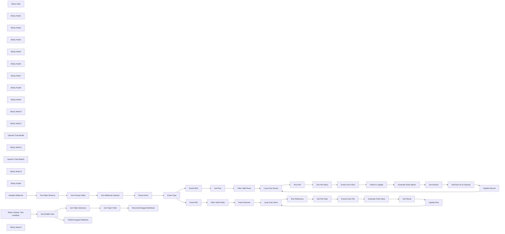

## Fluxo (.json) :

```json
{
  "nodes": [
    {
      "id": "36816ae7-414a-482e-8a50-021885237273",
      "name": "Event Type",
      "type": "n8n-nodes-base.switch",
      "position": [
        -220,
        -140
      ],
      "parameters": {
        "rules": {
          "values": [
            {
              "outputKey": "row.updated",
              "conditions": {
                "options": {
                  "version": 2,
                  "leftValue": "",
                  "caseSensitive": true,
                  "typeValidation": "strict"
                },
                "combinator": "and",
                "conditions": [
                  {
                    "id": "2162daf8-d23d-4b8f-8257-bdfc5400a3a8",
                    "operator": {
                      "name": "filter.operator.equals",
                      "type": "string",
                      "operation": "equals"
                    },
                    "leftValue": "={{ $json.event_type }}",
                    "rightValue": "row.updated"
                  }
                ]
              },
              "renameOutput": true
            },
            {
              "outputKey": "field.created",
              "conditions": {
                "options": {
                  "version": 2,
                  "leftValue": "",
                  "caseSensitive": true,
                  "typeValidation": "strict"
                },
                "combinator": "and",
                "conditions": [
                  {
                    "id": "48e112f6-afe8-40bf-b673-b37446934a62",
                    "operator": {
                      "name": "filter.operator.equals",
                      "type": "string",
                      "operation": "equals"
                    },
                    "leftValue": "={{ $json.event_type }}",
                    "rightValue": "field.created"
                  }
                ]
              },
              "renameOutput": true
            },
            {
              "outputKey": "field.updated",
              "conditions": {
                "options": {
                  "version": 2,
                  "leftValue": "",
                  "caseSensitive": true,
                  "typeValidation": "strict"
                },
                "combinator": "and",
                "conditions": [
                  {
                    "id": "5aa258cd-15c2-4156-a32d-afeed662a38e",
                    "operator": {
                      "name": "filter.operator.equals",
                      "type": "string",
                      "operation": "equals"
                    },
                    "leftValue": "={{ $json.event_type }}",
                    "rightValue": "field.updated"
                  }
                ]
              },
              "renameOutput": true
            }
          ]
        },
        "options": {}
      },
      "typeVersion": 3.2
    },
    {
      "id": "920ca6d8-7a6e-4482-b003-fa643f550a85",
      "name": "Get Prompt Fields",
      "type": "n8n-nodes-base.code",
      "position": [
        -900,
        -140
      ],
      "parameters": {
        "jsCode": "const fields = $input.first().json.fields\n .filter(item => item.description)\n .map((item, idx) => ({\n id: item.id,\n order: idx,\n name: item.name,\n type: item.type,\n description: item.description,\n }));\n\nreturn { json: { fields } };"
      },
      "typeVersion": 2
    },
    {
      "id": "3b73b2f5-9081-4633-911f-ef3041600a00",
      "name": "Get File Data",
      "type": "n8n-nodes-base.httpRequest",
      "position": [
        1220,
        320
      ],
      "parameters": {
        "url": "={{ $json.File[0].url }}",
        "options": {}
      },
      "typeVersion": 4.2
    },
    {
      "id": "e96edca8-9e8b-4ca4-bef9-dae673d3aba4",
      "name": "Extract from File",
      "type": "n8n-nodes-base.extractFromFile",
      "position": [
        1380,
        320
      ],
      "parameters": {
        "options": {},
        "operation": "pdf"
      },
      "typeVersion": 1
    },
    {
      "id": "b5c2b87b-5756-4810-84c9-34ea420bdcef",
      "name": "Get Result",
      "type": "n8n-nodes-base.set",
      "position": [
        2000,
        380
      ],
      "parameters": {
        "options": {},
        "assignments": {
          "assignments": [
            {
              "id": "63d7c52e-d5bf-4f4c-9e37-1d5feaea20f4",
              "name": "id",
              "type": "string",
              "value": "={{ $('Row Reference').item.json.id }}"
            },
            {
              "id": "3ad72567-1d17-4910-b916-4c34a43b1060",
              "name": "={{ $('Event Ref').first().json.field.name }}",
              "type": "string",
              "value": "={{ $json.text.trim() }}"
            }
          ]
        }
      },
      "typeVersion": 3.4
    },
    {
      "id": "a5cb0510-620b-469d-bf66-26ab64d6f88f",
      "name": "Loop Over Items",
      "type": "n8n-nodes-base.splitInBatches",
      "position": [
        800,
        220
      ],
      "parameters": {
        "options": {}
      },
      "typeVersion": 3
    },
    {
      "id": "20e24946-59d8-4b19-bfab-eebb02f7e46d",
      "name": "Row Reference",
      "type": "n8n-nodes-base.noOp",
      "position": [
        980,
        320
      ],
      "parameters": {},
      "typeVersion": 1
    },
    {
      "id": "4090c53e-e635-4421-ab2b-475bfc62cea4",
      "name": "Generate Field Value",
      "type": "@n8n/n8n-nodes-langchain.chainLlm",
      "position": [
        1540,
        320
      ],
      "parameters": {
        "text": "=<file>\n{{ $json.text }}\n</file>\n\nData to extract: {{ $('Event Ref').first().json.field.description }}\noutput format is: {{ $('Event Ref').first().json.field.type }}",
        "messages": {
          "messageValues": [
            {
              "message": "=You assist the user in extracting the required data from the given file.\n* Keep you answer short.\n* If you cannot extract the requested data, give you response as \"n/a\"."
            }
          ]
        },
        "promptType": "define"
      },
      "typeVersion": 1.5
    },
    {
      "id": "582d4008-4871-4798-bc24-abf774ad29b5",
      "name": "Fields to Update",
      "type": "n8n-nodes-base.code",
      "position": [
        1560,
        -300
      ],
      "parameters": {
        "jsCode": "const row = $('Row Ref').first().json;\nconst fields = $('Get Prompt Fields').first().json.fields;\nconst missingFields = fields\n .filter(field => field.description && !row[field.name]);\n\nreturn missingFields;"
      },
      "typeVersion": 2
    },
    {
      "id": "051c6a99-cec3-42df-9de7-47cb69b51682",
      "name": "Loop Over Items1",
      "type": "n8n-nodes-base.splitInBatches",
      "position": [
        820,
        -420
      ],
      "parameters": {
        "options": {}
      },
      "typeVersion": 3
    },
    {
      "id": "f559c8ff-2ee5-478d-84ee-6b0ca2fe2050",
      "name": "Row Ref",
      "type": "n8n-nodes-base.noOp",
      "position": [
        1000,
        -300
      ],
      "parameters": {},
      "typeVersion": 1
    },
    {
      "id": "7b82cc73-67cb-46d7-a1d4-19712c86890a",
      "name": "Get File Data1",
      "type": "n8n-nodes-base.httpRequest",
      "position": [
        1240,
        -300
      ],
      "parameters": {
        "url": "={{ $('Row Ref').item.json.File[0].url }}",
        "options": {}
      },
      "typeVersion": 4.2
    },
    {
      "id": "7ef1556c-96a3-4988-982d-ec8c5fba4601",
      "name": "Extract from File1",
      "type": "n8n-nodes-base.extractFromFile",
      "position": [
        1400,
        -300
      ],
      "parameters": {
        "options": {},
        "operation": "pdf"
      },
      "typeVersion": 1
    },
    {
      "id": "9916f1c1-f413-4996-ad45-380a899b4a88",
      "name": "Get Result1",
      "type": "n8n-nodes-base.set",
      "position": [
        2120,
        -260
      ],
      "parameters": {
        "options": {},
        "assignments": {
          "assignments": [
            {
              "id": "e376ba60-8692-4962-9af7-466b6a3f44a2",
              "name": "={{ $('Fields to Update').item.json.name }}",
              "type": "string",
              "value": "={{ $json.text.trim() }}"
            }
          ]
        }
      },
      "typeVersion": 3.4
    },
    {
      "id": "f62f612d-c288-4062-ab3c-dbc24c9b4b38",
      "name": "Generate Field Value1",
      "type": "@n8n/n8n-nodes-langchain.chainLlm",
      "position": [
        1720,
        -300
      ],
      "parameters": {
        "text": "=<file>\n{{ $('Extract from File1').first().json.text }}\n</file>\n\nData to extract: {{ $json.description }}\noutput format is: {{ $json.type }}",
        "messages": {
          "messageValues": [
            {
              "message": "=You assist the user in extracting the required data from the given file.\n* Keep you answer short.\n* If you cannot extract the requested data, give you response as \"n/a\" followed by \"(reason)\" where reason is replaced with reason why data could not be extracted."
            }
          ]
        },
        "promptType": "define"
      },
      "typeVersion": 1.5
    },
    {
      "id": "615f7436-f280-4033-8ec8-a34f1bd78075",
      "name": "Filter Valid Rows",
      "type": "n8n-nodes-base.filter",
      "position": [
        520,
        -420
      ],
      "parameters": {
        "options": {},
        "conditions": {
          "options": {
            "version": 2,
            "leftValue": "",
            "caseSensitive": true,
            "typeValidation": "strict"
          },
          "combinator": "and",
          "conditions": [
            {
              "id": "7ad58f0b-0354-49a9-ab2f-557652d7b416",
              "operator": {
                "type": "string",
                "operation": "notEmpty",
                "singleValue": true
              },
              "leftValue": "={{ $json.File[0].url }}",
              "rightValue": ""
            }
          ]
        }
      },
      "typeVersion": 2.2
    },
    {
      "id": "281b9fb0-305c-4a0c-b73b-82b6ba876d12",
      "name": "Filter Valid Fields",
      "type": "n8n-nodes-base.filter",
      "position": [
        340,
        220
      ],
      "parameters": {
        "options": {},
        "conditions": {
          "options": {
            "version": 2,
            "leftValue": "",
            "caseSensitive": true,
            "typeValidation": "strict"
          },
          "combinator": "and",
          "conditions": [
            {
              "id": "5b4a7393-788c-42dc-ac1f-e76f833f8534",
              "operator": {
                "type": "string",
                "operation": "notEmpty",
                "singleValue": true
              },
              "leftValue": "={{ $json.field.description }}",
              "rightValue": ""
            }
          ]
        }
      },
      "typeVersion": 2.2
    },
    {
      "id": "dd0fa792-791f-4d31-a7e8-9b72a25b6a07",
      "name": "Event Ref",
      "type": "n8n-nodes-base.noOp",
      "position": [
        160,
        220
      ],
      "parameters": {},
      "typeVersion": 1
    },
    {
      "id": "ca1174b3-da18-4d3c-86ef-3028cd5b12a7",
      "name": "Event Ref1",
      "type": "n8n-nodes-base.noOp",
      "position": [
        160,
        -420
      ],
      "parameters": {},
      "typeVersion": 1
    },
    {
      "id": "8800b355-0fa8-4297-b13b-d3da8a01c3b7",
      "name": "Sticky Note",
      "type": "n8n-nodes-base.stickyNote",
      "position": [
        -1180,
        -340
      ],
      "parameters": {
        "color": 7,
        "width": 480,
        "height": 440,
        "content": "### 1. Get Table Schema\n[Learn more about the Airtable node](https://docs.n8n.io/integrations/builtin/app-nodes/n8n-nodes-base.airtable/)\n\nFor this operation, we'll use the handy Airtable node. I recommend getting familiar with this node for all your Airtable needs!\n"
      },
      "typeVersion": 1
    },
    {
      "id": "a90876d3-8a93-4d90-9e2a-f23de452259d",
      "name": "Sticky Note1",
      "type": "n8n-nodes-base.stickyNote",
      "position": [
        -260,
        -440
      ],
      "parameters": {
        "color": 5,
        "width": 330,
        "height": 80,
        "content": "### 2a. Updates Minimal Number of Rows\nThis branch updates only the rows impacted."
      },
      "typeVersion": 1
    },
    {
      "id": "319adf97-8b14-4069-b4cc-594a6ea479c1",
      "name": "Sticky Note2",
      "type": "n8n-nodes-base.stickyNote",
      "position": [
        -320,
        140
      ],
      "parameters": {
        "color": 5,
        "width": 390,
        "height": 120,
        "content": "### 2b. Update Every Row under the Field\nThis branch updates all applicable rows under field when the field/column is created or changed. Watch out - if you have 1000s of rows, this could take a while!"
      },
      "typeVersion": 1
    },
    {
      "id": "42a60c8c-476f-4930-bac5-4d36a7185f4f",
      "name": "Sticky Note3",
      "type": "n8n-nodes-base.stickyNote",
      "position": [
        -2240,
        -1000
      ],
      "parameters": {
        "width": 520,
        "height": 1120,
        "content": "## Try It Out!\n### This n8n template powers a \"dynamic\" or \"user-defined\" prompts with PDF workflow pattern for a [Airtable](https://airtable.com/invite/r/cKzxFYVc) table. Simply put, it allows users to populate a spreadsheet using prompts without touching the underlying template.\n\n**Check out the video demo I did for n8n Studio**: https://www.youtube.com/watch?v=_fNAD1u8BZw\n\n**Check out the example Airtable here:** https://airtable.com/appAyH3GCBJ56cfXl/shrXzR1Tj99kuQbyL\n\nThis template is intended to be used as a webhook source for Airtable. **Looking for a Baserow version? [Click here](https://n8n.io/workflows/2780-ai-data-extraction-with-dynamic-prompts-and-baserow)**\n\n## How it works\n* Each Airtable.io tables offers integration feature whereby changes to the table can be sent as events to any accessible webhook. This allows for a reactive trigger pattern which makes this type of workflow possible. For our usecase, we capture the vents of `row_updated`, `field_created` and `field_updated`.\n* Next, we'll need an \"input\" column in our Airtable.io table. This column will be where our context lives for evaluating the prompts against. In this example, our \"input\" column name is \"file\" and it's where we'll upload our PDFs. Note, this \"input\" field is human-controlled and never updated from this template.\n* Now for the columns (aka \"fields\" in Airtable). Each field allows us to define a name, type and description and together form the schema. The first 2 are self-explaintory but the \"description\" will be for users to provide their prompts ie. what data should the field to contain.\n* In this template, a webhook trigger waits for when a row or column is updated. The incoming event comes with lots of details such as the table, row and/or column Ids that were impacted.\n* We use this information to fetch the table's schema in order to get the column's descriptions (aka dynamic prompts).\n* For each triggered event, we download our input ie. the PDF and ready it for our AI/LLM. By iterating through the available columns and feeding the dynamic prompts, our LLM can run those prompts against the PDF and thus generating a value response for each cell.\n* These values are then collected and used to update the Airtable Record.\n\n## How to use\n* You'll need to publish this workflow and make it accessible to our Airtable instance.\n* you must run the \"Create Airtable Webhooks\" mini-flow to link it to your Airtable.\n* This template is reusable for other Airtables but the webhooks need to be created each time for each table.\n\n### Need Help?\nJoin the [Discord](https://discord.com/invite/XPKeKXeB7d) or ask in the [Forum](https://community.n8n.io/)!\n\nHappy Flowgramming!"
      },
      "typeVersion": 1
    },
    {
      "id": "c6d037e9-1bf7-47a7-9c46-940220e0786b",
      "name": "Sticky Note4",
      "type": "n8n-nodes-base.stickyNote",
      "position": [
        -680,
        -340
      ],
      "parameters": {
        "color": 7,
        "width": 760,
        "height": 440,
        "content": "### 2. Event Router Pattern\n[Learn more about the Switch node](https://docs.n8n.io/integrations/builtin/core-nodes/n8n-nodes-base.switch/)\n\nA simple switch node can be used to determine which event to handle. The difference between our row and field events is that row event affect a single row whereas field events affect all rows. \n"
      },
      "typeVersion": 1
    },
    {
      "id": "897cec32-3a4c-4a76-bffe-b1456c287b44",
      "name": "Sticky Note5",
      "type": "n8n-nodes-base.stickyNote",
      "position": [
        100,
        -620
      ],
      "parameters": {
        "color": 7,
        "width": 620,
        "height": 400,
        "content": "### 3. Filter Only Rows with Valid Input\n[Learn more about the Split Out node](https://docs.n8n.io/integrations/builtin/core-nodes/n8n-nodes-base.splitout/)\n\nThis step handles one or more updated rows where \"updated\" means the \"input\" column (ie. \"file\" in our example) for these rows were changed. For each affected row, we'll get the full row to figure out only the columns we need to update - this is an optimisation to avoid redundant work ie. generating values for columns which already have a value."
      },
      "typeVersion": 1
    },
    {
      "id": "a5999ca3-4418-42c5-aa1c-fbdfb1c04fef",
      "name": "Sticky Note7",
      "type": "n8n-nodes-base.stickyNote",
      "position": [
        2060,
        -480
      ],
      "parameters": {
        "color": 7,
        "width": 600,
        "height": 440,
        "content": "### 6. Update the Airtable Record\n[Learn more about the Edit Fields node](https://docs.n8n.io/integrations/builtin/core-nodes/n8n-nodes-base.set/)\n\nFinally, we can collect the LLM responses and combine them to build an API request to update our Airtable record - the Id of which we got from initial webhook. After this is done, we can move onto the next row and repeat the process.\n"
      },
      "typeVersion": 1
    },
    {
      "id": "38192929-a387-4240-8373-290499b40e5a",
      "name": "Sticky Note8",
      "type": "n8n-nodes-base.stickyNote",
      "position": [
        1180,
        -580
      ],
      "parameters": {
        "color": 7,
        "width": 860,
        "height": 580,
        "content": "### 5. PDFs, LLMs and Dynamic Prompts? Oh My!\n[Learn more about the Basic LLM node](https://docs.n8n.io/integrations/builtin/cluster-nodes/root-nodes/n8n-nodes-langchain.chainllm/)\n\nThis step is where it all comes together! In short, we give our LLM the PDF contents as the context and loop through our dynamic prompts (from the schema we pulled earlier) for our row. At the end, our LLM should have produced a value for each column requested.\n\n**Note**: There's definitely a optimisation which could be done for caching PDFs but it beyond the scope of this demonstration.\n"
      },
      "typeVersion": 1
    },
    {
      "id": "19a9b93a-d18f-4ffd-ae93-ed41cf398e90",
      "name": "Sticky Note9",
      "type": "n8n-nodes-base.stickyNote",
      "position": [
        740,
        -580
      ],
      "parameters": {
        "color": 7,
        "width": 420,
        "height": 460,
        "content": "### 4. Using an Items Loop\n[Learn more about the Split in Batches node](https://docs.n8n.io/integrations/builtin/core-nodes/n8n-nodes-base.splitinbatches/)\n\nA split in batches node is used here to update a row at a time however, this is a preference for user experience - changes are seen in the Airtable quicker.\n"
      },
      "typeVersion": 1
    },
    {
      "id": "5407fead-ee7c-47c8-94ed-5b89e74e50e8",
      "name": "Sticky Note10",
      "type": "n8n-nodes-base.stickyNote",
      "position": [
        100,
        40
      ],
      "parameters": {
        "color": 7,
        "width": 600,
        "height": 360,
        "content": "### 7. Listing All Applicable Rows Under The Column\n[Learn more about the Filter node](https://docs.n8n.io/integrations/builtin/core-nodes/n8n-nodes-base.filter)\n\nTo keep things performant, we can decide to get only rows with inputfield populated as this is required to perform the extraction. This can easily be achieved with Airtable filters."
      },
      "typeVersion": 1
    },
    {
      "id": "43b0e330-b79a-4577-b4fc-314e8b790cf7",
      "name": "Sticky Note11",
      "type": "n8n-nodes-base.stickyNote",
      "position": [
        1160,
        140
      ],
      "parameters": {
        "color": 7,
        "width": 700,
        "height": 500,
        "content": "### 9. Generating Value using LLM\n[Learn more about the Extract From File node](https://docs.n8n.io/integrations/builtin/core-nodes/n8n-nodes-base.extractfromfile/)\n\nPretty much identical to Step 5 but instead of updating every field/column, we only need to generate a value for one. \n"
      },
      "typeVersion": 1
    },
    {
      "id": "0665fe56-48d2-4215-8d95-d4c01f9266ed",
      "name": "OpenAI Chat Model",
      "type": "@n8n/n8n-nodes-langchain.lmChatOpenAi",
      "position": [
        1720,
        -140
      ],
      "parameters": {
        "options": {}
      },
      "credentials": {
        "openAiApi": {
          "id": "8gccIjcuf3gvaoEr",
          "name": "OpenAi account"
        }
      },
      "typeVersion": 1.1
    },
    {
      "id": "1997fb8b-73eb-4016-bab6-eb8f02fee368",
      "name": "Sticky Note12",
      "type": "n8n-nodes-base.stickyNote",
      "position": [
        720,
        40
      ],
      "parameters": {
        "color": 7,
        "width": 420,
        "height": 460,
        "content": "### 8. Using an Items Loop\n[Learn more about the Split in Batches node](https://docs.n8n.io/integrations/builtin/core-nodes/n8n-nodes-base.splitinbatches/)\n\nSimilar to Step 4, the Split in Batches node is a preference for user experience - changes are seen in the Airtable quicker.\n"
      },
      "typeVersion": 1
    },
    {
      "id": "c2799ded-b742-43a2-80ce-7a0c8f1df96e",
      "name": "OpenAI Chat Model1",
      "type": "@n8n/n8n-nodes-langchain.lmChatOpenAi",
      "position": [
        1540,
        500
      ],
      "parameters": {
        "options": {}
      },
      "credentials": {
        "openAiApi": {
          "id": "8gccIjcuf3gvaoEr",
          "name": "OpenAi account"
        }
      },
      "typeVersion": 1.1
    },
    {
      "id": "e5b42790-fc86-4134-9d04-e6bcad4a5f20",
      "name": "Sticky Note13",
      "type": "n8n-nodes-base.stickyNote",
      "position": [
        1880,
        140
      ],
      "parameters": {
        "color": 7,
        "width": 500,
        "height": 440,
        "content": "### 10. Update the Airtable Record\n[Learn more about the Edit Fields node](https://docs.n8n.io/integrations/builtin/core-nodes/n8n-nodes-base.set/)\n\nAs with Step 6, the LLM response is used to update the row however only under the field that was created/changed. Once complete, the loop continues and the next row is processed.\n"
      },
      "typeVersion": 1
    },
    {
      "id": "b1e98631-a440-4c66-b2d2-8236f6889b65",
      "name": "Sticky Note6",
      "type": "n8n-nodes-base.stickyNote",
      "position": [
        -2240,
        -1140
      ],
      "parameters": {
        "color": 7,
        "width": 300,
        "height": 120,
        "content": "[](https://airtable.com/invite/r/cKzxFYVc)"
      },
      "typeVersion": 1
    },
    {
      "id": "9d293b3a-954d-4e3b-8773-b6c3dded9520",
      "name": "Get Webhook Payload",
      "type": "n8n-nodes-base.httpRequest",
      "position": [
        -580,
        -140
      ],
      "parameters": {
        "url": "=https://api.airtable.com/v0/bases/{{ $('Airtable Webhook').first().json.body.base.id }}/webhooks/{{ $('Airtable Webhook').first().json.body.webhook.id }}/payloads",
        "options": {},
        "authentication": "predefinedCredentialType",
        "nodeCredentialType": "airtableTokenApi"
      },
      "credentials": {
        "airtableTokenApi": {
          "id": "Und0frCQ6SNVX3VV",
          "name": "Airtable Personal Access Token account"
        }
      },
      "typeVersion": 4.2
    },
    {
      "id": "5f8d919b-14cd-4cb4-8604-731e56cc9402",
      "name": "Parse Event",
      "type": "n8n-nodes-base.code",
      "position": [
        -400,
        -140
      ],
      "parameters": {
        "jsCode": "const webhook = $('Airtable Webhook').first().json;\nconst schema = $('Get Prompt Fields').first().json;\nconst { payloads } = $input.first().json;\nif (!payloads.length) return [];\n\nconst event = payloads[payloads.length - 1];\nconst baseId = webhook.body.base.id;\nconst tableId = Object.keys(event.changedTablesById)[0];\nconst table = event.changedTablesById[tableId];\n\nreturn {\n baseId,\n tableId,\n event_type: getEventType(table),\n fieldId: getFieldId(table),\n field: getField(getFieldId(table)),\n rowId: getRecordId(table),\n}\n\nfunction getEventType(changedTableByIdObject) {\n if (changedTableByIdObject['createdFieldsById']) return 'field.created';\n if (changedTableByIdObject['changedFieldsById']) return 'field.updated'\n if (changedTableByIdObject['changedRecordsById']) return 'row.updated';\n return 'unknown';\n}\n\nfunction getFieldId(changedTableByIdObject) {\n const field = changedTableByIdObject.createdFieldsById\n || changedTableByIdObject.changedFieldsById\n || null;\n\n return field ? Object.keys(field)[0] : null;\n}\n\nfunction getField(id) {\n return schema.fields.find(field => field.id === id);\n}\n\nfunction getRecordId(changedTableByIdObject) {\n const record = changedTableByIdObject.changedRecordsById\n || null;\n\n return record ? Object.keys(record)[0] : null;\n}"
      },
      "typeVersion": 2
    },
    {
      "id": "9b99d939-94d6-4fef-8b73-58c702503221",
      "name": "Get Table Schema",
      "type": "n8n-nodes-base.airtable",
      "position": [
        -1080,
        -140
      ],
      "parameters": {
        "base": {
          "__rl": true,
          "mode": "id",
          "value": "={{ $('Airtable Webhook').item.json.body.base.id }}"
        },
        "resource": "base",
        "operation": "getSchema"
      },
      "credentials": {
        "airtableTokenApi": {
          "id": "Und0frCQ6SNVX3VV",
          "name": "Airtable Personal Access Token account"
        }
      },
      "typeVersion": 2.1
    },
    {
      "id": "c29fc911-a852-46f2-bbb1-5092cc1aaa9d",
      "name": "Fetch Records",
      "type": "n8n-nodes-base.airtable",
      "position": [
        520,
        220
      ],
      "parameters": {
        "base": {
          "__rl": true,
          "mode": "id",
          "value": "={{ $json.baseId }}"
        },
        "table": {
          "__rl": true,
          "mode": "id",
          "value": "={{ $json.tableId }}"
        },
        "options": {},
        "operation": "search",
        "filterByFormula": "NOT({File} = \"\")"
      },
      "credentials": {
        "airtableTokenApi": {
          "id": "Und0frCQ6SNVX3VV",
          "name": "Airtable Personal Access Token account"
        }
      },
      "typeVersion": 2.1
    },
    {
      "id": "86d3c8d8-709f-4d9d-99bc-5d1b4aeb8603",
      "name": "Update Row",
      "type": "n8n-nodes-base.airtable",
      "position": [
        2180,
        380
      ],
      "parameters": {
        "base": {
          "__rl": true,
          "mode": "id",
          "value": "={{ $('Event Ref').first().json.baseId }}"
        },
        "table": {
          "__rl": true,
          "mode": "id",
          "value": "={{ $('Event Ref').first().json.tableId }}"
        },
        "columns": {
          "value": {},
          "schema": [
            {
              "id": "id",
              "type": "string",
              "display": true,
              "removed": false,
              "readOnly": true,
              "required": false,
              "displayName": "id",
              "defaultMatch": true
            },
            {
              "id": "Name",
              "type": "string",
              "display": true,
              "removed": false,
              "readOnly": false,
              "required": false,
              "displayName": "Name",
              "defaultMatch": false,
              "canBeUsedToMatch": true
            },
            {
              "id": "File",
              "type": "array",
              "display": true,
              "removed": false,
              "readOnly": false,
              "required": false,
              "displayName": "File",
              "defaultMatch": false,
              "canBeUsedToMatch": true
            },
            {
              "id": "Full Name",
              "type": "string",
              "display": true,
              "removed": false,
              "readOnly": false,
              "required": false,
              "displayName": "Full Name",
              "defaultMatch": false,
              "canBeUsedToMatch": true
            },
            {
              "id": "Created",
              "type": "string",
              "display": true,
              "removed": false,
              "readOnly": true,
              "required": false,
              "displayName": "Created",
              "defaultMatch": false,
              "canBeUsedToMatch": true
            },
            {
              "id": "Last Modified",
              "type": "string",
              "display": true,
              "removed": false,
              "readOnly": true,
              "required": false,
              "displayName": "Last Modified",
              "defaultMatch": false,
              "canBeUsedToMatch": true
            },
            {
              "id": "Address",
              "type": "string",
              "display": true,
              "removed": false,
              "readOnly": false,
              "required": false,
              "displayName": "Address",
              "defaultMatch": false,
              "canBeUsedToMatch": true
            }
          ],
          "mappingMode": "autoMapInputData",
          "matchingColumns": [
            "id"
          ]
        },
        "options": {},
        "operation": "update"
      },
      "credentials": {
        "airtableTokenApi": {
          "id": "Und0frCQ6SNVX3VV",
          "name": "Airtable Personal Access Token account"
        }
      },
      "typeVersion": 2.1
    },
    {
      "id": "95d08439-59a2-4e74-bd5a-b71cf079b621",
      "name": "Get Row",
      "type": "n8n-nodes-base.airtable",
      "position": [
        340,
        -420
      ],
      "parameters": {
        "id": "={{ $json.rowId }}",
        "base": {
          "__rl": true,
          "mode": "id",
          "value": "={{ $json.baseId }}"
        },
        "table": {
          "__rl": true,
          "mode": "id",
          "value": "={{ $json.tableId }}"
        },
        "options": {}
      },
      "credentials": {
        "airtableTokenApi": {
          "id": "Und0frCQ6SNVX3VV",
          "name": "Airtable Personal Access Token account"
        }
      },
      "typeVersion": 2.1
    },
    {
      "id": "50888ac5-30c9-4036-aade-6ccfdf605c3b",
      "name": "Add Row ID to Payload",
      "type": "n8n-nodes-base.set",
      "position": [
        2300,
        -260
      ],
      "parameters": {
        "mode": "raw",
        "options": {},
        "jsonOutput": "={{\n{\n id: $('Row Ref').item.json.id,\n ...$input.all()\n .map(item => item.json)\n .reduce((acc, item) => ({\n ...acc,\n ...item,\n }), {})\n}\n}}"
      },
      "executeOnce": true,
      "typeVersion": 3.4
    },
    {
      "id": "e3ebeb45-45d9-44a4-a2e6-bde89f5da125",
      "name": "Update Record",
      "type": "n8n-nodes-base.airtable",
      "position": [
        2480,
        -260
      ],
      "parameters": {
        "base": {
          "__rl": true,
          "mode": "id",
          "value": "={{ $('Event Ref1').first().json.baseId }}"
        },
        "table": {
          "__rl": true,
          "mode": "id",
          "value": "={{ $('Event Ref1').first().json.tableId }}"
        },
        "columns": {
          "value": {},
          "schema": [
            {
              "id": "id",
              "type": "string",
              "display": true,
              "removed": false,
              "readOnly": true,
              "required": false,
              "displayName": "id",
              "defaultMatch": true
            },
            {
              "id": "Name",
              "type": "string",
              "display": true,
              "removed": false,
              "readOnly": false,
              "required": false,
              "displayName": "Name",
              "defaultMatch": false,
              "canBeUsedToMatch": true
            },
            {
              "id": "File",
              "type": "array",
              "display": true,
              "removed": false,
              "readOnly": false,
              "required": false,
              "displayName": "File",
              "defaultMatch": false,
              "canBeUsedToMatch": true
            },
            {
              "id": "Full Name",
              "type": "string",
              "display": true,
              "removed": false,
              "readOnly": false,
              "required": false,
              "displayName": "Full Name",
              "defaultMatch": false,
              "canBeUsedToMatch": true
            },
            {
              "id": "Address",
              "type": "string",
              "display": true,
              "removed": false,
              "readOnly": false,
              "required": false,
              "displayName": "Address",
              "defaultMatch": false,
              "canBeUsedToMatch": true
            },
            {
              "id": "Created",
              "type": "string",
              "display": true,
              "removed": false,
              "readOnly": true,
              "required": false,
              "displayName": "Created",
              "defaultMatch": false,
              "canBeUsedToMatch": true
            },
            {
              "id": "Last Modified",
              "type": "string",
              "display": true,
              "removed": false,
              "readOnly": true,
              "required": false,
              "displayName": "Last Modified",
              "defaultMatch": false,
              "canBeUsedToMatch": true
            }
          ],
          "mappingMode": "autoMapInputData",
          "matchingColumns": [
            "id"
          ]
        },
        "options": {},
        "operation": "update"
      },
      "credentials": {
        "airtableTokenApi": {
          "id": "Und0frCQ6SNVX3VV",
          "name": "Airtable Personal Access Token account"
        }
      },
      "typeVersion": 2.1
    },
    {
      "id": "ac01ec4b-e030-4608-af38-64558408832f",
      "name": "Airtable Webhook",
      "type": "n8n-nodes-base.webhook",
      "position": [
        -1400,
        -140
      ],
      "webhookId": "a82f0ae7-678e-49d9-8219-7281e8a2a1b2",
      "parameters": {
        "path": "a82f0ae7-678e-49d9-8219-7281e8a2a1b2",
        "options": {},
        "httpMethod": "POST"
      },
      "typeVersion": 2
    },
    {
      "id": "90178da9-2000-474e-ba93-a02d03ec6a1d",
      "name": "When clicking ‘Test workflow’",
      "type": "n8n-nodes-base.manualTrigger",
      "position": [
        -1600,
        -640
      ],
      "parameters": {},
      "typeVersion": 1
    },
    {
      "id": "b8b887ce-f891-4a3c-993b-0aaccadf1b52",
      "name": "Set Airtable Vars",
      "type": "n8n-nodes-base.set",
      "position": [
        -1420,
        -640
      ],
      "parameters": {
        "options": {},
        "assignments": {
          "assignments": [
            {
              "id": "012cb420-1455-4796-a2ac-a31e6abf59ba",
              "name": "appId",
              "type": "string",
              "value": "<MY_BASE_ID>"
            },
            {
              "id": "e863b66c-420f-43c6-aee2-43aa5087a0a5",
              "name": "tableId",
              "type": "string",
              "value": "<MY_TABLE_ID>"
            },
            {
              "id": "e470be1a-5833-47ed-9e2f-988ef5479738",
              "name": "notificationUrl",
              "type": "string",
              "value": "<MY_WEBHOOK_URL>"
            },
            {
              "id": "e4b3213b-e3bd-479b-99ec-d1aa31eaa4c8",
              "name": "inputField",
              "type": "string",
              "value": "File"
            }
          ]
        }
      },
      "typeVersion": 3.4
    },
    {
      "id": "a3ef1a4a-fd22-4a37-8edb-48037f44fa4b",
      "name": "Get Table Schema1",
      "type": "n8n-nodes-base.airtable",
      "position": [
        -1240,
        -820
      ],
      "parameters": {
        "base": {
          "__rl": true,
          "mode": "id",
          "value": "={{ $json.appId }}"
        },
        "resource": "base",
        "operation": "getSchema"
      },
      "credentials": {
        "airtableTokenApi": {
          "id": "Und0frCQ6SNVX3VV",
          "name": "Airtable Personal Access Token account"
        }
      },
      "typeVersion": 2.1
    },
    {
      "id": "2490bbc6-2ea1-4146-b0b8-5a406e89ea2c",
      "name": "Get \"Input\" Field",
      "type": "n8n-nodes-base.set",
      "position": [
        -1060,
        -820
      ],
      "parameters": {
        "mode": "raw",
        "options": {},
        "jsonOutput": "={{\n$input.all()\n .map(item => item.json)\n .find(item => item.id === $('Set Airtable Vars').first().json.tableId)\n .fields\n .find(field => field.name === $('Set Airtable Vars').first().json.inputField)\n}}"
      },
      "executeOnce": true,
      "typeVersion": 3.4
    },
    {
      "id": "a3de141f-0ce8-4f8e-ae8e-f10f635d14ec",
      "name": "RecordsChanged Webhook",
      "type": "n8n-nodes-base.httpRequest",
      "position": [
        -880,
        -820
      ],
      "parameters": {
        "url": "=https://api.airtable.com/v0/bases/{{ $('Set Airtable Vars').first().json.appId }}/webhooks",
        "method": "POST",
        "options": {},
        "jsonBody": "={{\n{\n \"notificationUrl\": $('Set Airtable Vars').first().json.notificationUrl,\n \"specification\": {\n \"options\": {\n \"filters\": {\n \"fromSources\": [ \"client\" ],\n \"dataTypes\": [ \"tableData\" ],\n \"changeTypes\": [ \"update\" ],\n \"recordChangeScope\": $('Set Airtable Vars').first().json.tableId,\n \"watchDataInFieldIds\": [$json.id]\n }\n }\n }\n}\n}}",
        "sendBody": true,
        "specifyBody": "json",
        "authentication": "predefinedCredentialType",
        "nodeCredentialType": "airtableTokenApi"
      },
      "credentials": {
        "airtableTokenApi": {
          "id": "Und0frCQ6SNVX3VV",
          "name": "Airtable Personal Access Token account"
        }
      },
      "typeVersion": 4.2
    },
    {
      "id": "21b0fae8-2046-4647-83c4-132d1d63503a",
      "name": "FieldsChanged Webhook",
      "type": "n8n-nodes-base.httpRequest",
      "position": [
        -880,
        -640
      ],
      "parameters": {
        "url": "=https://api.airtable.com/v0/bases/{{ $('Set Airtable Vars').first().json.appId }}/webhooks",
        "method": "POST",
        "options": {},
        "jsonBody": "={{\n{\n \"notificationUrl\": $('Set Airtable Vars').first().json.notificationUrl,\n \"specification\": {\n \"options\": {\n \"filters\": {\n \"fromSources\": [ \"client\" ],\n \"dataTypes\": [ \"tableFields\" ],\n \"changeTypes\": [ \"add\", \"update\" ],\n \"recordChangeScope\": $('Set Airtable Vars').first().json.tableId\n }\n }\n }\n}\n}}",
        "sendBody": true,
        "specifyBody": "json",
        "authentication": "predefinedCredentialType",
        "nodeCredentialType": "airtableTokenApi"
      },
      "credentials": {
        "airtableTokenApi": {
          "id": "Und0frCQ6SNVX3VV",
          "name": "Airtable Personal Access Token account"
        }
      },
      "typeVersion": 4.2
    },
    {
      "id": "f31c36cb-98da-4688-a83a-f06e46d2b8a2",
      "name": "Sticky Note14",
      "type": "n8n-nodes-base.stickyNote",
      "position": [
        -1680,
        -1000
      ],
      "parameters": {
        "color": 5,
        "width": 1020,
        "height": 580,
        "content": "## ⭐️ Creating Airtable Webhooks\nTo link this workflow with Airtable, you'll have to create webhooks for the Base.\nYou'll only really need to do this this once but if these webhooks are inactive after 7 days, you'll need to create them again.\n\nCheck out the Airtable Developer documentation for more info: [https://airtable.com/developers/web/api/webhooks-overview](https://airtable.com/developers/web/api/webhooks-overview)"
      },
      "typeVersion": 1
    }
  ],
  "pinData": {},
  "connections": {
    "Get Row": {
      "main": [
        [
          {
            "node": "Filter Valid Rows",
            "type": "main",
            "index": 0
          }
        ]
      ]
    },
    "Row Ref": {
      "main": [
        [
          {
            "node": "Get File Data1",
            "type": "main",
            "index": 0
          }
        ]
      ]
    },
    "Event Ref": {
      "main": [
        [
          {
            "node": "Filter Valid Fields",
            "type": "main",
            "index": 0
          }
        ]
      ]
    },
    "Event Ref1": {
      "main": [
        [
          {
            "node": "Get Row",
            "type": "main",
            "index": 0
          }
        ]
      ]
    },
    "Event Type": {
      "main": [
        [
          {
            "node": "Event Ref1",
            "type": "main",
            "index": 0
          }
        ],
        [
          {
            "node": "Event Ref",
            "type": "main",
            "index": 0
          }
        ],
        [
          {
            "node": "Event Ref",
            "type": "main",
            "index": 0
          }
        ]
      ]
    },
    "Get Result": {
      "main": [
        [
          {
            "node": "Update Row",
            "type": "main",
            "index": 0
          }
        ]
      ]
    },
    "Update Row": {
      "main": [
        [
          {
            "node": "Loop Over Items",
            "type": "main",
            "index": 0
          }
        ]
      ]
    },
    "Get Result1": {
      "main": [
        [
          {
            "node": "Add Row ID to Payload",
            "type": "main",
            "index": 0
          }
        ]
      ]
    },
    "Parse Event": {
      "main": [
        [
          {
            "node": "Event Type",
            "type": "main",
            "index": 0
          }
        ]
      ]
    },
    "Fetch Records": {
      "main": [
        [
          {
            "node": "Loop Over Items",
            "type": "main",
            "index": 0
          }
        ]
      ]
    },
    "Get File Data": {
      "main": [
        [
          {
            "node": "Extract from File",
            "type": "main",
            "index": 0
          }
        ]
      ]
    },
    "Row Reference": {
      "main": [
        [
          {
            "node": "Get File Data",
            "type": "main",
            "index": 0
          }
        ]
      ]
    },
    "Update Record": {
      "main": [
        [
          {
            "node": "Loop Over Items1",
            "type": "main",
            "index": 0
          }
        ]
      ]
    },
    "Get File Data1": {
      "main": [
        [
          {
            "node": "Extract from File1",
            "type": "main",
            "index": 0
          }
        ]
      ]
    },
    "Loop Over Items": {
      "main": [
        [],
        [
          {
            "node": "Row Reference",
            "type": "main",
            "index": 0
          }
        ]
      ]
    },
    "Airtable Webhook": {
      "main": [
        [
          {
            "node": "Get Table Schema",
            "type": "main",
            "index": 0
          }
        ]
      ]
    },
    "Fields to Update": {
      "main": [
        [
          {
            "node": "Generate Field Value1",
            "type": "main",
            "index": 0
          }
        ]
      ]
    },
    "Get Table Schema": {
      "main": [
        [
          {
            "node": "Get Prompt Fields",
            "type": "main",
            "index": 0
          }
        ]
      ]
    },
    "Loop Over Items1": {
      "main": [
        [],
        [
          {
            "node": "Row Ref",
            "type": "main",
            "index": 0
          }
        ]
      ]
    },
    "Extract from File": {
      "main": [
        [
          {
            "node": "Generate Field Value",
            "type": "main",
            "index": 0
          }
        ]
      ]
    },
    "Filter Valid Rows": {
      "main": [
        [
          {
            "node": "Loop Over Items1",
            "type": "main",
            "index": 0
          }
        ]
      ]
    },
    "Get \"Input\" Field": {
      "main": [
        [
          {
            "node": "RecordsChanged Webhook",
            "type": "main",
            "index": 0
          }
        ]
      ]
    },
    "Get Prompt Fields": {
      "main": [
        [
          {
            "node": "Get Webhook Payload",
            "type": "main",
            "index": 0
          }
        ]
      ]
    },
    "Get Table Schema1": {
      "main": [
        [
          {
            "node": "Get \"Input\" Field",
            "type": "main",
            "index": 0
          }
        ]
      ]
    },
    "OpenAI Chat Model": {
      "ai_languageModel": [
        [
          {
            "node": "Generate Field Value1",
            "type": "ai_languageModel",
            "index": 0
          }
        ]
      ]
    },
    "Set Airtable Vars": {
      "main": [
        [
          {
            "node": "Get Table Schema1",
            "type": "main",
            "index": 0
          },
          {
            "node": "FieldsChanged Webhook",
            "type": "main",
            "index": 0
          }
        ]
      ]
    },
    "Extract from File1": {
      "main": [
        [
          {
            "node": "Fields to Update",
            "type": "main",
            "index": 0
          }
        ]
      ]
    },
    "OpenAI Chat Model1": {
      "ai_languageModel": [
        [
          {
            "node": "Generate Field Value",
            "type": "ai_languageModel",
            "index": 0
          }
        ]
      ]
    },
    "Filter Valid Fields": {
      "main": [
        [
          {
            "node": "Fetch Records",
            "type": "main",
            "index": 0
          }
        ]
      ]
    },
    "Get Webhook Payload": {
      "main": [
        [
          {
            "node": "Parse Event",
            "type": "main",
            "index": 0
          }
        ]
      ]
    },
    "Generate Field Value": {
      "main": [
        [
          {
            "node": "Get Result",
            "type": "main",
            "index": 0
          }
        ]
      ]
    },
    "Add Row ID to Payload": {
      "main": [
        [
          {
            "node": "Update Record",
            "type": "main",
            "index": 0
          }
        ]
      ]
    },
    "FieldsChanged Webhook": {
      "main": [
        []
      ]
    },
    "Generate Field Value1": {
      "main": [
        [
          {
            "node": "Get Result1",
            "type": "main",
            "index": 0
          }
        ]
      ]
    },
    "RecordsChanged Webhook": {
      "main": [
        []
      ]
    },
    "When clicking ‘Test workflow’": {
      "main": [
        [
          {
            "node": "Set Airtable Vars",
            "type": "main",
            "index": 0
          }
        ]
      ]
    }
  }
}
```

<a id="template-1086"></a>

## Template 1086 - Publicar post via XML-RPC no WordPress.com

- **Nome:** Publicar post via XML-RPC no WordPress.com
- **Descrição:** Automatiza a publicação de um post em um blog WordPress.com usando chamadas XML-RPC e uma requisição HTTP.
- **Funcionalidade:** • Disparo manual: Inicia o fluxo manualmente para controlar quando publicar.
• Configuração de credenciais e conteúdo: Permite definir URL do blog, usuário, senha de aplicação, título e texto do post.
• Preparação do payload XML-RPC: Monta o corpo XML para wp.newPost e realiza escape de caracteres especiais para evitar malformação do XML.
• Envio da requisição HTTP POST: Envia o XML para o endpoint /xmlrpc.php com Content-Type text/xml.
• Tratamento da resposta XML: Converte e interpreta a resposta XML recebida do servidor.
• Roteamento por resultado: Verifica se a resposta indica sucesso e encaminha para caminhos de sucesso ou erro.
- **Ferramentas:** • WordPress.com: Plataforma de hospedagem do blog onde o endpoint /xmlrpc.php recebe chamadas para criar posts.
• XML-RPC: Protocolo usado para formatar e enviar a chamada remota (wp.newPost) em XML.
• HTTP (POST): Protocolo de transporte usado para enviar o payload XML-RPC ao servidor.

## Fluxo visual

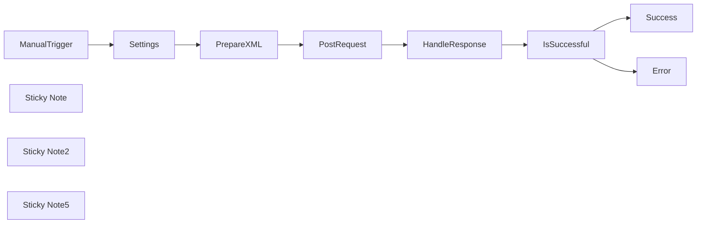

## Fluxo (.json) :

```json
{
  "id": "yPIST7l13huQEjY5",
  "meta": {
    "instanceId": "98bf0d6aef1dd8b7a752798121440fb171bf7686b95727fd617f43452393daa3",
    "templateCredsSetupCompleted": true
  },
  "name": "Use XMLRPC via HttpRequest-node to post on Wordpress.com",
  "tags": [
    {
      "id": "uumvgGHY5e6zEL7V",
      "name": "Published Template",
      "createdAt": "2025-02-10T11:18:10.923Z",
      "updatedAt": "2025-02-10T11:18:10.923Z"
    }
  ],
  "nodes": [
    {
      "id": "8a64ffca-804a-4793-a721-3cb670aec22f",
      "name": "Settings",
      "type": "n8n-nodes-base.set",
      "position": [
        -380,
        -700
      ],
      "parameters": {
        "options": {},
        "assignments": {
          "assignments": [
            {
              "id": "1be018c7-51fe-4ea2-967d-ce47a2e8795c",
              "name": "wordpressUrl",
              "type": "string",
              "value": "YOURBLOG.wordpress.com"
            },
            {
              "id": "95377f4f-184b-46a7-94c7-b2313c314cb2",
              "name": "wordpressUsername",
              "type": "string",
              "value": "YourUserName"
            },
            {
              "id": "fdc99dc6-d9b0-4d2f-b770-1d8b6b360cad",
              "name": "wordpressApplicationPassword",
              "type": "string",
              "value": "your 4app pass word"
            },
            {
              "id": "5aee5eef-9ad2-4dfb-a63f-1b5228c47e31",
              "name": "contentTitle",
              "type": "string",
              "value": "This is a demo title"
            },
            {
              "id": "2abf516c-2910-4cd0-89fe-119cd0e616c8",
              "name": "contentText",
              "type": "string",
              "value": "This is the main text."
            }
          ]
        }
      },
      "typeVersion": 3.4
    },
    {
      "id": "157b9656-5d90-44f4-aa3c-1285cda698d8",
      "name": "ManualTrigger",
      "type": "n8n-nodes-base.manualTrigger",
      "position": [
        -580,
        -700
      ],
      "parameters": {},
      "typeVersion": 1
    },
    {
      "id": "1d2f6916-e5bd-497b-9843-8bb5a48e9866",
      "name": "Sticky Note",
      "type": "n8n-nodes-base.stickyNote",
      "position": [
        -420,
        -820
      ],
      "parameters": {
        "width": 180,
        "height": 360,
        "content": "## Settings"
      },
      "typeVersion": 1
    },
    {
      "id": "1306446a-f628-44ba-9ca5-751b634bd5dd",
      "name": "Sticky Note2",
      "type": "n8n-nodes-base.stickyNote",
      "position": [
        140,
        -820
      ],
      "parameters": {
        "color": 5,
        "width": 720,
        "height": 360,
        "content": "## Response Handling"
      },
      "typeVersion": 1
    },
    {
      "id": "ec3006aa-34c8-4522-8c37-980f68f168b5",
      "name": "Sticky Note5",
      "type": "n8n-nodes-base.stickyNote",
      "position": [
        -220,
        -820
      ],
      "parameters": {
        "color": 3,
        "width": 340,
        "height": 360,
        "content": "## Request Sending"
      },
      "typeVersion": 1
    },
    {
      "id": "bc918075-bea5-4a27-90d9-874b0917a958",
      "name": "Success",
      "type": "n8n-nodes-base.noOp",
      "position": [
        660,
        -780
      ],
      "parameters": {},
      "typeVersion": 1
    },
    {
      "id": "3ea541b7-080e-4694-b865-d7d04f69ea0c",
      "name": "Error",
      "type": "n8n-nodes-base.noOp",
      "position": [
        660,
        -620
      ],
      "parameters": {},
      "typeVersion": 1
    },
    {
      "id": "457c0687-ac1d-49e2-b434-6e1de9acb3a3",
      "name": "PrepareXML",
      "type": "n8n-nodes-base.code",
      "notes": "(request payload, escaping)",
      "position": [
        -180,
        -700
      ],
      "parameters": {
        "mode": "runOnceForEachItem",
        "jsCode": "const input = $json; // If other nodes are in between: $('Settings').item.json;\n\nconst username = input.wordpressUsername;\nconst password = input.wordpressApplicationPassword;\nconst title = input.contentTitle;\nconst text = input.contentText;\n\nconst blogId = 0;\nconst published = 1; // 0 = draft, 1 = published\n\n\n// Helper function to escape XML special characters\nfunction escapeXml(unsafe) {\n  return unsafe.replace(/[<>&'\"]/g, (c) => {\n    switch (c) {\n      case '<': return '&lt;';\n      case '>': return '&gt;';\n      case '&': return '&amp;';\n      case '\\'': return '&apos;';\n      case '\"': return '&quot;';\n      default: return c;\n    }\n  });\n}\n\n// Your actual post text, which may contain characters needing escaping\nconst titleEscaped = escapeXml(title);\nconst textEscaped = escapeXml(text);\n\n// Build the XML payload\nconst xmlData = `<?xml version=\"1.0\"?>\n<methodCall>\n  <methodName>wp.newPost</methodName>\n  <params>\n    <param>\n      <value><string>${blogId}</string></value>\n    </param>\n    <param>\n      <value><string>${username}</string></value>\n    </param>\n    <param>\n      <value><string>${password}</string></value>\n    </param>\n    <param>\n      <value>\n        <struct>\n          <member>\n            <name>post_title</name>\n            <value><string>${titleEscaped}</string></value>\n          </member>\n          <member>\n            <name>post_content</name>\n            <value><string>${textEscaped}</string></value>\n          </member>\n        </struct>\n      </value>\n    </param>\n    <param>\n      <value><boolean>${published}</boolean></value>\n    </param>\n  </params>\n</methodCall>`;\n\n\n// Add a new field called 'myNewField' to the JSON of the item\n$input.item.json.xmlRequestBody = xmlData;\n\nreturn $input.item;"
      },
      "notesInFlow": true,
      "typeVersion": 2
    },
    {
      "id": "3f29f3ed-f7ae-475b-bce3-04d3eeeacee9",
      "name": "PostRequest",
      "type": "n8n-nodes-base.httpRequest",
      "position": [
        -20,
        -700
      ],
      "parameters": {
        "url": "=https://{{ $('Settings').item.json.wordpressUrl }}/xmlrpc.php",
        "body": "={{ $json.xmlRequestBody }}",
        "method": "POST",
        "options": {},
        "sendBody": true,
        "contentType": "raw",
        "sendHeaders": true,
        "rawContentType": "text/xml",
        "headerParameters": {
          "parameters": [
            {
              "name": "Content-Type",
              "value": "text/xml"
            }
          ]
        }
      },
      "typeVersion": 4.2
    },
    {
      "id": "5f320d9b-8aa9-4d13-83db-86acaf444e92",
      "name": "IsSuccessful",
      "type": "n8n-nodes-base.if",
      "position": [
        420,
        -700
      ],
      "parameters": {
        "options": {},
        "conditions": {
          "options": {
            "version": 2,
            "leftValue": "",
            "caseSensitive": true,
            "typeValidation": "loose"
          },
          "combinator": "and",
          "conditions": [
            {
              "id": "815d85a1-8f91-4338-977f-503f02c53ea2",
              "operator": {
                "type": "string",
                "operation": "exists",
                "singleValue": true
              },
              "leftValue": "={{ $json.methodResponse.params.param.value }}",
              "rightValue": ""
            }
          ]
        },
        "looseTypeValidation": true
      },
      "typeVersion": 2.2
    },
    {
      "id": "3a37d19a-12d3-474b-840f-c09342eecca9",
      "name": "HandleResponse",
      "type": "n8n-nodes-base.xml",
      "position": [
        220,
        -700
      ],
      "parameters": {
        "options": {}
      },
      "typeVersion": 1
    }
  ],
  "active": false,
  "pinData": {},
  "settings": {
    "executionOrder": "v1"
  },
  "versionId": "78f90dc5-6209-4db0-b6c6-9f2324488605",
  "connections": {
    "Settings": {
      "main": [
        [
          {
            "node": "PrepareXML",
            "type": "main",
            "index": 0
          }
        ]
      ]
    },
    "PrepareXML": {
      "main": [
        [
          {
            "node": "PostRequest",
            "type": "main",
            "index": 0
          }
        ]
      ]
    },
    "PostRequest": {
      "main": [
        [
          {
            "node": "HandleResponse",
            "type": "main",
            "index": 0
          }
        ]
      ]
    },
    "IsSuccessful": {
      "main": [
        [
          {
            "node": "Success",
            "type": "main",
            "index": 0
          }
        ],
        [
          {
            "node": "Error",
            "type": "main",
            "index": 0
          }
        ]
      ]
    },
    "ManualTrigger": {
      "main": [
        [
          {
            "node": "Settings",
            "type": "main",
            "index": 0
          }
        ]
      ]
    },
    "HandleResponse": {
      "main": [
        [
          {
            "node": "IsSuccessful",
            "type": "main",
            "index": 0
          }
        ]
      ]
    }
  }
}
```

<a id="template-1087"></a>

## Template 1087 - Chatbot LINE para extrair dados de holerite com Gemini

- **Nome:** Chatbot LINE para extrair dados de holerite com Gemini
- **Descrição:** Fluxo que recebe mensagens do LINE (texto ou imagem), classifica o tipo, processa conversas de texto com contexto e extrai dados de holerites enviados como imagem, retornando o resultado ao usuário e salvando em planilha.
- **Funcionalidade:** • Recepção de mensagens via webhook: Recebe eventos enviados pelo usuário no LINE (texto, imagem, sticker).
• Classificação do tipo de mensagem: Identifica se a entrada é texto, imagem ou outro tipo.
• Processamento de texto conversacional: Responde mensagens de texto usando um assistente conversacional com memória por sessão.
• Download de imagem enviada: Recupera o conteúdo binário da imagem enviada pelo usuário.
• Análise de imagem para extração de dados: Envia a imagem para um modelo multimodal para extrair os campos Status, From, To, Date e Amount em formato JSON.
• Resposta ao usuário no LINE: Envia de volta ao usuário o resultado do processamento como mensagem de texto.
• Inserção dos resultados em planilha: Adiciona uma nova linha no Google Sheets com os valores extraídos.
• Memória contextual por usuário: Mantém contexto de conversa por usuário para melhorar respostas em interações de texto.
- **Ferramentas:** • LINE Messaging API: Plataforma para receber webhooks, baixar conteúdo de mensagens e enviar respostas aos usuários.
• Google Gemini (PaLM) API: Modelo de linguagem multimodal usado para processamento conversacional de texto e análise/extração de informação a partir de imagens.
• Google Sheets: Armazenamento dos dados extraídos em uma planilha, adicionando registros com os campos especificados.

## Fluxo visual

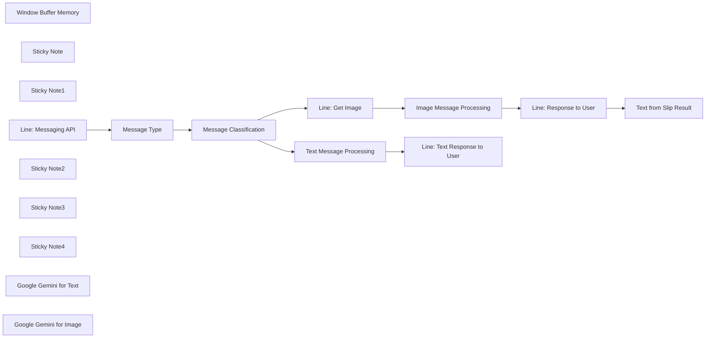

## Fluxo (.json) :

```json
{
  "id": "bPxDenPJ5Ixx0txY",
  "meta": {
    "instanceId": "42d7f9cf04ccdfd3d3df5ffa87039b320845693c4b4e380cbb8cc2807641f810",
    "templateCredsSetupCompleted": true
  },
  "name": "Line_Chatbot_Extract_Text_from_Pay_Slip_with_Gemini",
  "tags": [],
  "nodes": [
    {
      "id": "83f758b4-a80b-4f27-ac13-ee0958ed97f2",
      "name": "Window Buffer Memory",
      "type": "@n8n/n8n-nodes-langchain.memoryBufferWindow",
      "position": [
        200,
        320
      ],
      "parameters": {
        "sessionKey": "={{ $json.body.events[0].source.userId }}",
        "sessionIdType": "customKey"
      },
      "typeVersion": 1.3
    },
    {
      "id": "c41976eb-4a35-4c59-8167-538c651ad7e5",
      "name": "Sticky Note",
      "type": "n8n-nodes-base.stickyNote",
      "position": [
        -200,
        520
      ],
      "parameters": {
        "width": 620,
        "height": 500,
        "content": "## Extract text from image\n**Prompt for Gemini**\nAnalyze image and then return in JSON Response that has the only following value: Status, From, To, Date, Amount"
      },
      "typeVersion": 1
    },
    {
      "id": "c3eb2420-a503-4039-874c-df3c2799c561",
      "name": "Line: Get Image",
      "type": "n8n-nodes-base.httpRequest",
      "position": [
        -160,
        660
      ],
      "parameters": {
        "url": "=https://api-data.line.me/v2/bot/message/{{ $json.body.events[0].message.id }}/content ",
        "options": {},
        "authentication": "genericCredentialType",
        "genericAuthType": "httpHeaderAuth"
      },
      "credentials": {
        "httpHeaderAuth": {
          "id": "uFkmYj5e89iPyHcG",
          "name": "Line Automate Task Header Auth account"
        }
      },
      "typeVersion": 4.2
    },
    {
      "id": "e39e5392-b287-4efe-a9a9-1f241e82cd92",
      "name": "Message Type",
      "type": "n8n-nodes-base.set",
      "position": [
        -620,
        400
      ],
      "parameters": {
        "options": {},
        "assignments": {
          "assignments": [
            {
              "id": "e9deec19-c171-4af5-bfb7-f0917ba658c5",
              "name": "body.events[0].message.text",
              "type": "string",
              "value": "={{ $json.body.events[0].message.text }}"
            },
            {
              "id": "ae9ee257-494f-4c65-a39d-4dc3505f2c01",
              "name": "body.events[0].message.id",
              "type": "string",
              "value": "={{ $json.body.events[0].message.id }}"
            },
            {
              "id": "5e3dfc31-ed6e-4899-880d-ce73076e0cfd",
              "name": "body.events[0].source.userId",
              "type": "string",
              "value": "={{ $json.body.events[0].source.userId }}"
            },
            {
              "id": "8918e8d3-2a30-40df-b452-c07f340972cf",
              "name": "body.events[0].message.type",
              "type": "string",
              "value": "={{ $json.body.events[0].message.type }}"
            }
          ]
        },
        "includeOtherFields": true
      },
      "typeVersion": 3.4
    },
    {
      "id": "a166e880-9291-4794-a6be-47f0a86e77e7",
      "name": "Message Classification",
      "type": "n8n-nodes-base.switch",
      "position": [
        -420,
        400
      ],
      "parameters": {
        "rules": {
          "values": [
            {
              "conditions": {
                "options": {
                  "version": 2,
                  "leftValue": "",
                  "caseSensitive": true,
                  "typeValidation": "strict"
                },
                "combinator": "and",
                "conditions": [
                  {
                    "id": "7f862599-1eb2-4f76-910f-6caae33ea292",
                    "operator": {
                      "type": "string",
                      "operation": "equals"
                    },
                    "leftValue": "={{ $('Line: Messaging API').item.json.body.events[0].message.type }}",
                    "rightValue": "text"
                  }
                ]
              }
            },
            {
              "conditions": {
                "options": {
                  "version": 2,
                  "leftValue": "",
                  "caseSensitive": true,
                  "typeValidation": "strict"
                },
                "combinator": "and",
                "conditions": [
                  {
                    "id": "0b661fab-e556-45ee-b845-67aff27fd862",
                    "operator": {
                      "name": "filter.operator.equals",
                      "type": "string",
                      "operation": "equals"
                    },
                    "leftValue": "={{ $('Line: Messaging API').item.json.body.events[0].message.type }}",
                    "rightValue": "image"
                  }
                ]
              }
            },
            {
              "conditions": {
                "options": {
                  "version": 2,
                  "leftValue": "",
                  "caseSensitive": true,
                  "typeValidation": "strict"
                },
                "combinator": "and",
                "conditions": [
                  {
                    "id": "550e6e18-6b3e-4b08-8344-12bc76a1f736",
                    "operator": {
                      "name": "filter.operator.equals",
                      "type": "string",
                      "operation": "equals"
                    },
                    "leftValue": "={{ $('Line: Messaging API').item.json.body.events[0].message.stickerId }}",
                    "rightValue": "=150"
                  }
                ]
              }
            }
          ]
        },
        "options": {}
      },
      "typeVersion": 3.2
    },
    {
      "id": "d7c29939-dd8e-43e9-89f2-879dc8ea318c",
      "name": "Sticky Note1",
      "type": "n8n-nodes-base.stickyNote",
      "position": [
        0,
        0
      ],
      "parameters": {
        "width": 420,
        "height": 460,
        "content": "## Gemini AI Assistant\n\nAI Assistant using Gemini 2.0 Flash Experiment unlocks new possibilities for AI agents - intelligent systems that can use memory, reasoning, and planning to complete tasks for you."
      },
      "typeVersion": 1
    },
    {
      "id": "0df36c5d-ec2a-492d-b688-4bad8d81cf38",
      "name": "Text Message Processing",
      "type": "@n8n/n8n-nodes-langchain.agent",
      "position": [
        100,
        140
      ],
      "parameters": {
        "text": "=This is the message from User: {{ $json.body.events[0].message.text }}",
        "agent": "conversationalAgent",
        "options": {},
        "promptType": "define"
      },
      "typeVersion": 1.7
    },
    {
      "id": "dfafa5ba-a855-4ebf-a19d-2addb556e791",
      "name": "Image Message Processing",
      "type": "@n8n/n8n-nodes-langchain.chainLlm",
      "position": [
        100,
        660
      ],
      "parameters": {
        "text": "Analyze image and then return in JSON Response that has the only following Value:\nStatus, From, To, Date, Amount",
        "messages": {
          "messageValues": [
            {
              "message": "You are the image analyzer. You can analyze image and extract the important information from image."
            },
            {
              "type": "HumanMessagePromptTemplate",
              "messageType": "imageBinary"
            }
          ]
        },
        "promptType": "define"
      },
      "typeVersion": 1.5
    },
    {
      "id": "b9a309bf-2c49-40e1-a0e4-9cced43d6e85",
      "name": "Line: Response to User",
      "type": "n8n-nodes-base.httpRequest",
      "position": [
        580,
        660
      ],
      "parameters": {
        "url": "https://api.line.me/v2/bot/message/reply",
        "method": "POST",
        "options": {},
        "jsonBody": "={\n  \"replyToken\":\"{{ $('Line: Messaging API').item.json.body.events[0].replyToken }}\",\n  \"messages\":[\n    {\n      \"type\":\"text\",\n      \"text\": {{ JSON.stringify($json.text.replace(/^```(?:json|markdown)?\\n?/, \"\").replace(/\\n?```$/, \"\")) }}\n    }\n  ]\n}",
        "sendBody": true,
        "specifyBody": "json",
        "authentication": "genericCredentialType",
        "genericAuthType": "httpHeaderAuth"
      },
      "credentials": {
        "httpHeaderAuth": {
          "id": "uFkmYj5e89iPyHcG",
          "name": "Line Automate Task Header Auth account"
        }
      },
      "typeVersion": 4.2
    },
    {
      "id": "ff5561fa-b334-4639-a513-554ee3507ab0",
      "name": "Line: Text Response to User",
      "type": "n8n-nodes-base.httpRequest",
      "position": [
        580,
        140
      ],
      "parameters": {
        "url": "https://api.line.me/v2/bot/message/reply",
        "method": "POST",
        "options": {},
        "jsonBody": "={\n  \"replyToken\":\"{{ $('Line: Messaging API').item.json.body.events[0].replyToken }}\",\n  \"messages\":[\n    {\n      \"type\":\"text\",\n      \"text\": {{ JSON.stringify($json.output) }}\n    }\n  ]\n}",
        "sendBody": true,
        "specifyBody": "json",
        "authentication": "genericCredentialType",
        "genericAuthType": "httpHeaderAuth"
      },
      "credentials": {
        "httpHeaderAuth": {
          "id": "uFkmYj5e89iPyHcG",
          "name": "Line Automate Task Header Auth account"
        }
      },
      "typeVersion": 4.2
    },
    {
      "id": "850f1079-cecf-4680-835f-34af829ee8f5",
      "name": "Text from Slip Result",
      "type": "n8n-nodes-base.googleSheets",
      "position": [
        1020,
        660
      ],
      "parameters": {
        "columns": {
          "value": {
            "To": "={{ JSON.parse($('Image Message Processing').item.json.text.replace(/^```(?:json|markdown)?\\n?/, \"\").replace(/\\n?```$/, \"\")).To }}",
            "Date": "={{ JSON.parse($('Image Message Processing').item.json.text.replace(/^```(?:json|markdown)?\\n?/, \"\").replace(/\\n?```$/, \"\")).Date }}",
            "From": "={{ JSON.parse($('Image Message Processing').item.json.text.replace(/^```(?:json|markdown)?\\n?/, \"\").replace(/\\n?```$/, \"\")).From}}",
            "Amount": "={{ JSON.parse($('Image Message Processing').item.json.text.replace(/^```(?:json|markdown)?\\n?/, \"\").replace(/\\n?```$/, \"\")).Amount }}",
            "Status": "={{ JSON.parse($('Image Message Processing').item.json.text.replace(/^```(?:json|markdown)?\\n?/, \"\").replace(/\\n?```$/, \"\")).Status }}"
          },
          "schema": [
            {
              "id": "Status",
              "type": "string",
              "display": true,
              "removed": false,
              "required": false,
              "displayName": "Status",
              "defaultMatch": false,
              "canBeUsedToMatch": true
            },
            {
              "id": "From",
              "type": "string",
              "display": true,
              "required": false,
              "displayName": "From",
              "defaultMatch": false,
              "canBeUsedToMatch": true
            },
            {
              "id": "To",
              "type": "string",
              "display": true,
              "required": false,
              "displayName": "To",
              "defaultMatch": false,
              "canBeUsedToMatch": true
            },
            {
              "id": "Date",
              "type": "string",
              "display": true,
              "required": false,
              "displayName": "Date",
              "defaultMatch": false,
              "canBeUsedToMatch": true
            },
            {
              "id": "Amount",
              "type": "string",
              "display": true,
              "required": false,
              "displayName": "Amount",
              "defaultMatch": false,
              "canBeUsedToMatch": true
            }
          ],
          "mappingMode": "defineBelow",
          "matchingColumns": [
            "Status"
          ],
          "attemptToConvertTypes": false,
          "convertFieldsToString": false
        },
        "options": {},
        "operation": "append",
        "sheetName": {
          "__rl": true,
          "mode": "list",
          "value": "gid=0",
          "cachedResultUrl": "https://docs.google.com/spreadsheets/d/1PUXj_t3G-arnfzNDbY0g9Pr1G4YMGrc68fDs98pV-n4/edit#gid=0",
          "cachedResultName": "Sheet1"
        },
        "documentId": {
          "__rl": true,
          "mode": "url",
          "value": "https://docs.google.com/spreadsheets/d/1PUXj_t3G-arnfzNDbY0g9Pr1G4YMGrc68fDs98pV-n4/edit?gid=0#gid=0"
        }
      },
      "credentials": {
        "googleSheetsOAuth2Api": {
          "id": "tENCv7liPQDhRoqL",
          "name": "Google Sheets account"
        }
      },
      "typeVersion": 4.5
    },
    {
      "id": "a268daa7-76d9-437b-99e9-bd755eb4d36f",
      "name": "Line: Messaging API",
      "type": "n8n-nodes-base.webhook",
      "position": [
        -820,
        400
      ],
      "webhookId": "4c0de537-2889-47d2-ac44-3a9cda89c9f3",
      "parameters": {
        "path": "4c0de537-2889-47d2-ac44-3a9cda89c9f3",
        "options": {},
        "httpMethod": "POST"
      },
      "typeVersion": 2
    },
    {
      "id": "b3c4c66a-78d6-4ad5-9a5c-afef6f86e5cc",
      "name": "Sticky Note2",
      "type": "n8n-nodes-base.stickyNote",
      "position": [
        460,
        0
      ],
      "parameters": {
        "width": 420,
        "height": 1020,
        "content": "## Reply to User\n\nReply the processing result to the user without coding or OCR processing."
      },
      "typeVersion": 1
    },
    {
      "id": "6c76dc81-6c10-4522-9d5f-da4579391281",
      "name": "Sticky Note3",
      "type": "n8n-nodes-base.stickyNote",
      "position": [
        900,
        520
      ],
      "parameters": {
        "width": 420,
        "height": 500,
        "content": "## Insert result to Google Sheet\nGet all important information from the Pay Slip and insert into Google Sheet in the same format that we have provided in our prompt.\n"
      },
      "typeVersion": 1
    },
    {
      "id": "49bac770-adb1-4ef3-8bf9-c8cf107471ad",
      "name": "Sticky Note4",
      "type": "n8n-nodes-base.stickyNote",
      "position": [
        -860,
        260
      ],
      "parameters": {
        "width": 620,
        "height": 500,
        "content": "## Get Line Message from User\nUser can send message in both text and Pay Slip image then classify the message type in text or image so we could have single workflow for AI Assistant that support anything."
      },
      "typeVersion": 1
    },
    {
      "id": "9f034b6f-bb5b-4dc6-941d-b745f15da254",
      "name": "Google Gemini for Text",
      "type": "@n8n/n8n-nodes-langchain.lmChatGoogleGemini",
      "position": [
        60,
        320
      ],
      "parameters": {
        "options": {},
        "modelName": "models/gemini-2.0-flash-exp"
      },
      "credentials": {
        "googlePalmApi": {
          "id": "Gqc4JMC0dFmMRP7Z",
          "name": "Google Gemini(PaLM) Api account"
        }
      },
      "typeVersion": 1
    },
    {
      "id": "15fa3203-9230-4a1d-9e0d-87652cb9d9ab",
      "name": "Google Gemini for Image",
      "type": "@n8n/n8n-nodes-langchain.lmChatGoogleGemini",
      "position": [
        60,
        880
      ],
      "parameters": {
        "options": {},
        "modelName": "models/gemini-2.0-flash-exp"
      },
      "credentials": {
        "googlePalmApi": {
          "id": "Gqc4JMC0dFmMRP7Z",
          "name": "Google Gemini(PaLM) Api account"
        }
      },
      "typeVersion": 1
    }
  ],
  "active": true,
  "pinData": {},
  "settings": {
    "executionOrder": "v1"
  },
  "versionId": "d14ef869-77c2-49a8-9867-1775d8f0b085",
  "connections": {
    "Message Type": {
      "main": [
        [
          {
            "node": "Message Classification",
            "type": "main",
            "index": 0
          }
        ]
      ]
    },
    "Line: Get Image": {
      "main": [
        [
          {
            "node": "Image Message Processing",
            "type": "main",
            "index": 0
          }
        ]
      ]
    },
    "Line: Messaging API": {
      "main": [
        [
          {
            "node": "Message Type",
            "type": "main",
            "index": 0
          }
        ]
      ]
    },
    "Window Buffer Memory": {
      "ai_memory": [
        [
          {
            "node": "Text Message Processing",
            "type": "ai_memory",
            "index": 0
          }
        ]
      ]
    },
    "Google Gemini for Text": {
      "ai_languageModel": [
        [
          {
            "node": "Text Message Processing",
            "type": "ai_languageModel",
            "index": 0
          }
        ]
      ]
    },
    "Line: Response to User": {
      "main": [
        [
          {
            "node": "Text from Slip Result",
            "type": "main",
            "index": 0
          }
        ]
      ]
    },
    "Message Classification": {
      "main": [
        [
          {
            "node": "Text Message Processing",
            "type": "main",
            "index": 0
          }
        ],
        [
          {
            "node": "Line: Get Image",
            "type": "main",
            "index": 0
          }
        ],
        []
      ]
    },
    "Google Gemini for Image": {
      "ai_languageModel": [
        [
          {
            "node": "Image Message Processing",
            "type": "ai_languageModel",
            "index": 0
          }
        ]
      ]
    },
    "Text Message Processing": {
      "main": [
        [
          {
            "node": "Line: Text Response to User",
            "type": "main",
            "index": 0
          }
        ]
      ]
    },
    "Image Message Processing": {
      "main": [
        [
          {
            "node": "Line: Response to User",
            "type": "main",
            "index": 0
          }
        ]
      ]
    }
  }
}
```

<a id="template-1088"></a>

## Template 1088 - Chatbot CBT para LINE

- **Nome:** Chatbot CBT para LINE
- **Descrição:** Recebe mensagens do LINE, processa textos com um agente de IA configurado como terapeuta cognitivo-comportamental e responde ao usuário por mensagem.
- **Funcionalidade:** • Recepção via webhook: Inicia o fluxo ao receber mensagens do usuário pelo webhook do LINE.
• Animação de carregamento: Envia indicador de carregamento ao usuário para informar que o processamento está em andamento.
• Verificação do tipo de mensagem: Detecta se a mensagem é texto; se não for, informa que tipos não-texto não são suportados.
• Processamento com agente de IA (CBT): Envia o texto do usuário a um agente configurado com um prompt de terapeuta de Terapia Cognitivo-Comportamental.
• Uso de modelo de linguagem: Conecta-se a um modelo de IA (Azure) para gerar a resposta ao usuário.
• Formatação da resposta: Limpa e formata a saída do modelo (remover markdown/tags, escapar quebras de linha e aspas) antes de enviar.
• Resposta ao usuário: Envia a resposta final como mensagem de texto usando o reply token para entrega imediata.
- **Ferramentas:** • LINE Messaging API: Plataforma usada para receber mensagens via webhook, mostrar indicador de carregamento e enviar respostas ao usuário.
• Azure OpenAI Service: Serviço de modelo de linguagem usado para gerar respostas do agente de IA (modelo 4o).

## Fluxo visual

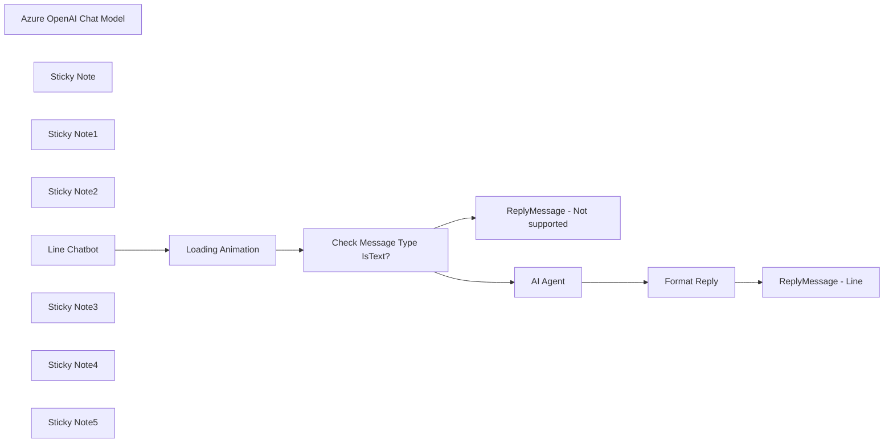

## Fluxo (.json) :

```json
{
  "id": "ghfbOYrOSiQVAbl5",
  "meta": {
    "instanceId": "558d88703fb65b2d0e44613bc35916258b0f0bf983c5d4730c00c424b77ca36a"
  },
  "name": "Chatbot AI",
  "tags": [],
  "nodes": [
    {
      "id": "6eec6665-eea6-4aaa-8ae5-2fc7bf0c4746",
      "name": "Loading Animation",
      "type": "n8n-nodes-base.httpRequest",
      "position": [
        -520,
        340
      ],
      "parameters": {
        "url": "https://api.line.me/v2/bot/chat/loading/start",
        "body": "={\n    \"chatId\": \"{{ $json.body.events[0].source.userId }}\",\n    \"loadingSeconds\": 60\n}",
        "method": "POST",
        "options": {},
        "sendBody": true,
        "contentType": "raw",
        "authentication": "genericCredentialType",
        "rawContentType": "application/json",
        "genericAuthType": "httpHeaderAuth"
      },
      "credentials": {
        "httpHeaderAuth": {
          "id": "PQI3F0ibV3txKWfv",
          "name": "Talking Therapy Line@"
        }
      },
      "typeVersion": 4.2
    },
    {
      "id": "72ff06e5-e1d8-47e7-be15-888ec9171c72",
      "name": "ReplyMessage - Not supported",
      "type": "n8n-nodes-base.httpRequest",
      "position": [
        100,
        760
      ],
      "parameters": {
        "url": "https://api.line.me/v2/bot/message/reply",
        "body": "={\n    \"replyToken\":\"{{ $('Line Chatbot').item.json.body.events[0].replyToken }}\",\n    \"messages\":[\n        {\n            \"type\":\"text\",\n            \"text\":\"Currently, the input of image or other type are not supported.\"\n        }\n    ]\n}",
        "method": "POST",
        "options": {},
        "sendBody": true,
        "contentType": "raw",
        "sendHeaders": true,
        "rawContentType": "application/json",
        "headerParameters": {
          "parameters": [
            {
              "name": "Authorization",
              "value": "Bearer /lQWKI4dp71pOMWZu2q18mL8P+zwf9iIOBzUDQOPMqLGMMIg88J6jPcFGfZ2ntsFfaiwCKTEcAsMjliZYXrV5E4lsjioJmv2hS7XYbh8lxmuyz1vXegKwAT66hTIBjQ1zf4l6yKugYNsUmwSYfCSQgdB04t89/1O/w1cDnyilFU="
            }
          ]
        }
      },
      "typeVersion": 4.2
    },
    {
      "id": "3a4eb71f-033d-4aff-a4fd-2ed14ea80c6c",
      "name": "AI Agent",
      "type": "@n8n/n8n-nodes-langchain.agent",
      "position": [
        40,
        80
      ],
      "parameters": {
        "text": "={{ $('Line Chatbot').item.json.body.events[0].message.text }}",
        "options": {
          "systemMessage": "You're CBT therapist. You'll help the user find the answer to their problems using CBT. but you will not tell them that you're using CBT\n\nCBT is a talking therapy. Talking therapies are also known as psychotherapies. You can find out more about these on our information page on psychotherapies and psychological treatments.\n\nCBT helps you to learn more helpful ways of thinking and reacting in everyday situations. Changing the way you think, and what you do, can help you to feel better.\n\nUnlike some other talking therapies, CBT focuses on your current challenges rather than on your past experiences. It aims to improve your state of mind by teaching you to spot the links between your thoughts, actions and feelings.\n\nC stands for ‘cognitive’ (what you think) – In CBT, you learn to notice when you are thinking negatively. You work to challenge negative or unhelpful thoughts, for example:\n-‘I’m useless’ or\n-‘It’s all going to go wrong’.\nInstead, you work to develop more useful, realistic thoughts, for example:\n-‘What’s the evidence this is true?’\n-‘What’s another way to think about this?’ or\n-‘What advice would I give a friend in my situation?’\n\nB stands for ‘behaviour’ (what you do) – Your behaviour is what you do and how you act. CBT can help you to deal with things you have been avoiding or have fears around. When doing CBT, you might keep a daily diary of activities, and set goals to try things that you are afraid of doing. Writing down your goals and actions can give you a sense of achievement and help you to mark your progress.\n\nT stands for ‘therapy’ (what you learn) – Through CBT you learn new skills that you can then practise as ‘homework’. After you have finished receiving CBT you can continue to practise these skills, which can give you the tools to stay well in the future.\n\n\nCBT can help you to make sense of overwhelming problems by breaking them down into smaller parts. This makes it easier to see how they are connected and how they affect you. These parts are:\n\nA situation – for example, an activity, or something that happens to you that you find difficult\nFrom this can follow:\n-Thoughts\n-Emotions\n-Physical feelings\n-Actions\n\nTypes of CBT \n- Cognitive therapy : Spot unhelpful thoughts and beliefs. Keep a record and try out more useful and realistic ways of thinking and reacting.\n- Behaviour therapy (e.g., graded exposure) : Change unhelpful behaviours, like avoiding, checking, or getting reassurance. Gradually face situations, thoughts, or memories you’ve been avoiding.\n- Behavioural activation: Get more active and involved in life by doing things that give a sense of pleasure or achievement. Keep a diary and schedule in positive activities.\n- Problem-solving therapy: Identify the problem, come up with ways of solving it, pick one solution, and put it into practice.\n- Motivational interviewing: Look at the pros and cons of a habit. Set goals for change.\n- Mindfulness : Pay attention to your thoughts and surroundings in the here and now without reacting to them.\n- Compassionate mind therapy : Be kinder and less critical of yourself and others, helping you to feel safer and more content.\n- Acceptance and commitment therapy (ACT, pronounced ‘act’) : Accept unpleasant thoughts and feelings rather than fight them or get upset.\n- Dialectical behaviour therapy (DBT) :Manage strong feelings and sudden mood changes to overcome relationship difficulties. Combines one-to-one CBT with group therapy.\n- Cognitive analytic therapy : Understand past causes for current difficulties and find new ways of coping. Combines CBT with analytic therapy.\n\nReference: https://www.rcpsych.ac.uk/mental-health/treatments-and-wellbeing/cognitive-behavioural-therapy-(cbt)?spm=5aebb161.59ab0a80.0.0.3380c921WQnNWN\n\nYou'll keep the character limit under 500"
        },
        "promptType": "define"
      },
      "typeVersion": 1.7
    },
    {
      "id": "7a92aeaf-3496-410f-a6fd-4be5172b650e",
      "name": "Azure OpenAI Chat Model",
      "type": "@n8n/n8n-nodes-langchain.lmChatAzureOpenAi",
      "position": [
        80,
        200
      ],
      "parameters": {
        "model": "4o",
        "options": {}
      },
      "credentials": {
        "azureOpenAiApi": {
          "id": "5AjoWhww5SQi2VXd",
          "name": "Azure Open AI account"
        }
      },
      "typeVersion": 1
    },
    {
      "id": "36df34d5-4232-40c8-b0ca-de7e30807adc",
      "name": "ReplyMessage - Line",
      "type": "n8n-nodes-base.httpRequest",
      "position": [
        920,
        80
      ],
      "parameters": {
        "url": "https://api.line.me/v2/bot/message/reply",
        "method": "POST",
        "options": {},
        "jsonBody": "={\n  \"replyToken\": \"{{ $('Line Chatbot').item.json.body.events[0].replyToken }}\",\n  \"messages\": [\n    {\n      \"type\": \"text\",\n      \"text\": \"{{ $json.output }}\"\n    }\n  ]} ",
        "sendBody": true,
        "specifyBody": "json",
        "authentication": "genericCredentialType",
        "genericAuthType": "httpHeaderAuth"
      },
      "credentials": {
        "httpHeaderAuth": {
          "id": "PQI3F0ibV3txKWfv",
          "name": "Talking Therapy Line@"
        }
      },
      "typeVersion": 4.2
    },
    {
      "id": "c3e227dd-3306-4259-ad7a-c1911c3c5176",
      "name": "Sticky Note",
      "type": "n8n-nodes-base.stickyNote",
      "position": [
        0,
        680
      ],
      "parameters": {
        "color": 4,
        "width": 320,
        "height": 260,
        "content": "For non-text, we do not process and just provide user that it's not supported right now"
      },
      "typeVersion": 1
    },
    {
      "id": "fba0b833-896e-4332-97e5-fa09a3838191",
      "name": "Sticky Note1",
      "type": "n8n-nodes-base.stickyNote",
      "position": [
        -1000,
        280
      ],
      "parameters": {
        "color": 4,
        "width": 340,
        "height": 560,
        "content": "**Webhook from Line**\n\n\n\n\n\n\n\n\n\n\n\n\n\n\n\n\n\nYou need to set-up this webhook at Line Manager or Line Developer Console\n\nYou'll need to copy Webhook URL from this node to put in Line Console\n\nAlso, don't forget to remove 'test' part when going for production\n\nhttps://developers.line.biz/en/docs/messaging-api/receiving-messages/\n"
      },
      "typeVersion": 1
    },
    {
      "id": "f58d7af5-70c4-412a-a8f6-6cfceaf65ade",
      "name": "Sticky Note2",
      "type": "n8n-nodes-base.stickyNote",
      "position": [
        -640,
        280
      ],
      "parameters": {
        "color": 4,
        "width": 340,
        "height": 560,
        "content": "**Line Loading Animation**\n\n\n\n\n\n\n\n\n\n\n\n\n\n\n\n\n\nThis node is to only give ... loading animation back in Line.\n\nIt seems stupid but it actually tells user that the workflow is running and you are not left waiting without hope\n\nTo authorize, use header authorization \n\nhttps://developers.line.biz/en/docs/messaging-api/use-loading-indicator/"
      },
      "typeVersion": 1
    },
    {
      "id": "7c67d79d-e2b8-453c-8adc-cb66e6ef290c",
      "name": "Line Chatbot",
      "type": "n8n-nodes-base.webhook",
      "position": [
        -900,
        340
      ],
      "webhookId": "c69b940a-5a44-45e3-b9b4-04abda6462b2",
      "parameters": {
        "path": "AIChatbot",
        "options": {},
        "httpMethod": "POST"
      },
      "typeVersion": 2
    },
    {
      "id": "a44319cf-d985-4bbf-be99-ac479406c369",
      "name": "Sticky Note3",
      "type": "n8n-nodes-base.stickyNote",
      "position": [
        820,
        0
      ],
      "parameters": {
        "color": 4,
        "width": 320,
        "height": 600,
        "content": "**Reply Message**\n\n\n\n\n\n\n\n\n\n\n\n\n\n\n\n\n\n\n\n\n\nYou can send anything with reply-token without using your broadcast quota.\n\nTo use header auth: \n- select generic > header auth\n- add new \n- name = Authorization\n- value = Bearer <your token>\n- you can rename this credential on top\n\nhttps://developers.line.biz/en/docs/messaging-api/sending-messages/"
      },
      "typeVersion": 1
    },
    {
      "id": "1cfa159b-57c6-424a-a9e2-4b237a0bcbb5",
      "name": "Check Message Type IsText?",
      "type": "n8n-nodes-base.if",
      "position": [
        -220,
        340
      ],
      "parameters": {
        "options": {},
        "conditions": {
          "options": {
            "version": 2,
            "leftValue": "",
            "caseSensitive": true,
            "typeValidation": "strict"
          },
          "combinator": "and",
          "conditions": [
            {
              "id": "e44288a5-18de-48b3-9bb1-0e18f6491043",
              "operator": {
                "name": "filter.operator.equals",
                "type": "string",
                "operation": "equals"
              },
              "leftValue": "={{ $('Line Chatbot').item.json.body.events[0].message.type }}",
              "rightValue": "text"
            }
          ]
        }
      },
      "typeVersion": 2.2
    },
    {
      "id": "48363222-487e-4d4a-a424-4406aacc7f74",
      "name": "Sticky Note4",
      "type": "n8n-nodes-base.stickyNote",
      "position": [
        400,
        0
      ],
      "parameters": {
        "color": 2,
        "width": 320,
        "height": 320,
        "content": "The output from AI-Agent is not properly formatted for JSON to send via reply. So you need to edit it a bit\n"
      },
      "typeVersion": 1
    },
    {
      "id": "d7b7d3ca-c685-4a02-8b73-a5b24aa663d4",
      "name": "Sticky Note5",
      "type": "n8n-nodes-base.stickyNote",
      "position": [
        0,
        0
      ],
      "parameters": {
        "color": 5,
        "width": 320,
        "height": 620,
        "content": "**Chat Model (LLM)**\n\n\n\n\n\n\n\n\n\n\n\n\n\n\n\n\n\n\n\n\n\n\n\n\nTo use chat LLM, you need to have AI Agent or LLM Chain. Then you can connect the model to the node.\n- edit system prompt on the mother node. \n- edit model parameters eg. temperature at the AI node (closer to 1 = more creative)\n\nAzure OpenAI Ref : https://davoy.tech/how-to-use-azure-openai-2/\n\nOr you can choose different models"
      },
      "typeVersion": 1
    },
    {
      "id": "8cb1b56a-15dd-4936-b343-c2350b2a6a48",
      "name": "Format Reply",
      "type": "n8n-nodes-base.set",
      "position": [
        500,
        80
      ],
      "parameters": {
        "options": {},
        "assignments": {
          "assignments": [
            {
              "id": "15bd9ebd-ba6b-4ee5-9f4b-185260e51b0a",
              "name": "output",
              "type": "string",
              "value": "={{ $json.output.replaceAll(\"\\n\",\"\\\\n\").replaceAll(\"\\n\",\"\").removeMarkdown().removeTags().replaceAll('\"',\"\") }}"
            }
          ]
        }
      },
      "typeVersion": 3.4
    }
  ],
  "active": false,
  "pinData": {},
  "settings": {
    "executionOrder": "v1"
  },
  "versionId": "cca20e40-0b31-4e64-9953-610dc6b569d7",
  "connections": {
    "AI Agent": {
      "main": [
        [
          {
            "node": "Format Reply",
            "type": "main",
            "index": 0
          }
        ]
      ]
    },
    "Format Reply": {
      "main": [
        [
          {
            "node": "ReplyMessage - Line",
            "type": "main",
            "index": 0
          }
        ]
      ]
    },
    "Line Chatbot": {
      "main": [
        [
          {
            "node": "Loading Animation",
            "type": "main",
            "index": 0
          }
        ]
      ]
    },
    "Loading Animation": {
      "main": [
        [
          {
            "node": "Check Message Type IsText?",
            "type": "main",
            "index": 0
          }
        ]
      ]
    },
    "Azure OpenAI Chat Model": {
      "ai_languageModel": [
        [
          {
            "node": "AI Agent",
            "type": "ai_languageModel",
            "index": 0
          }
        ]
      ]
    },
    "Check Message Type IsText?": {
      "main": [
        [
          {
            "node": "AI Agent",
            "type": "main",
            "index": 0
          }
        ],
        [
          {
            "node": "ReplyMessage - Not supported",
            "type": "main",
            "index": 0
          }
        ]
      ]
    }
  }
}
```

<a id="template-1089"></a>

## Template 1089 - Agente de chat para consultar pedidos e rastreamento

- **Nome:** Agente de chat para consultar pedidos e rastreamento
- **Descrição:** Fluxo que integra um chat com uma loja WooCommerce para identificar o cliente a partir do e-mail (fornecido criptografado), recuperar seus pedidos, extrair dados de rastreamento e consultar status de entrega, retornando uma resposta estruturada ao usuário.
- **Funcionalidade:** • Recepção de sessão de chat: Aceita chamadas do frontend com metadata da sessão (incluindo e-mail criptografado).
• Descriptografia do e-mail: Descriptografa o e-mail enviado pelo frontend para garantir que apenas o cliente autorizado consulte seus pedidos.
• Validação do e-mail: Verifica se um e-mail foi fornecido e responde adequadamente quando ausente.
• Busca do cliente na loja: Consulta a API da loja usando o e-mail para identificar o ID do cliente no WooCommerce.
• Recuperação de pedidos do cliente: Solicita os pedidos relacionados ao cliente (ou pedidos específicos quando IDs são fornecidos).
• Extração de dados de rastreamento: Lê metadados dos pedidos para extrair informações de rastreamento de remessas.
• Consulta de transportadora (DHL): Para cada código de rastreamento disponível, consulta a API da transportadora para obter o status atual da entrega.
• Tratamento de erros por rastreamento: Fornece mensagens de erro claras quando não há informações sobre um código de rastreamento.
• Agregação de resultados: Combina dados de pedidos e respostas de rastreamento em uma única resposta estruturada.
• Agente conversacional com memória: Usa um modelo de linguagem para conduzir a conversa, lembrar contexto da sessão e chamar a ferramenta que recupera pedidos quando necessário.
• Página de exemplo e ferramentas de teste: Fornece um endpoint de exemplo para demonstrar o widget de chat e nós auxiliares para gerar/exibir e-mails criptografados para testes.
- **Ferramentas:** • WooCommerce API: Plataforma de comércio eletrônico usada para buscar clientes e pedidos.
• DHL API: Serviço da transportadora utilizado para consultar o status de rastreamento de remessas.
• OpenAI (GPT-4): Modelo de linguagem usado como agente conversacional para interagir com o usuário e orquestrar chamadas à ferramenta de pedidos.

## Fluxo visual

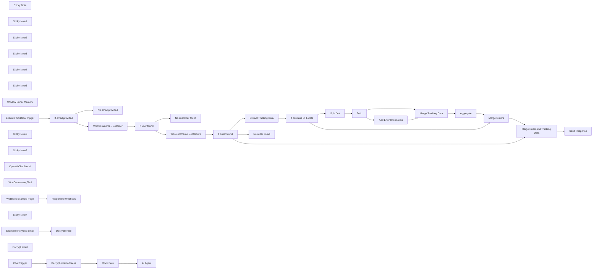

## Fluxo (.json) :

```json
{
  "meta": {
    "instanceId": "cb484ba7b742928a2048bf8829668bed5b5ad9787579adea888f05980292a4a7"
  },
  "nodes": [
    {
      "id": "be49d136-6392-481d-8544-d4f4d4fd0357",
      "name": "Sticky Note",
      "type": "n8n-nodes-base.stickyNote",
      "position": [
        90,
        260
      ],
      "parameters": {
        "color": 7,
        "width": 1000.427054367056,
        "height": 572.2734520891689,
        "content": "## Find WooCommerce User-ID\nUser-ID is required to query past orders"
      },
      "typeVersion": 1
    },
    {
      "id": "5932f77b-63e2-4991-aa16-2b8587b2b560",
      "name": "No email provided",
      "type": "n8n-nodes-base.set",
      "position": [
        400,
        640
      ],
      "parameters": {
        "options": {},
        "assignments": {
          "assignments": [
            {
              "id": "9a06428b-4115-4eee-97f4-8e828c5a7e5a",
              "name": "response",
              "type": "string",
              "value": "No email address got provided."
            }
          ]
        }
      },
      "typeVersion": 3.3
    },
    {
      "id": "909a9a47-8683-4a1f-a359-8f6a878f8cd7",
      "name": "If email provided",
      "type": "n8n-nodes-base.if",
      "position": [
        140,
        460
      ],
      "parameters": {
        "options": {},
        "conditions": {
          "options": {
            "leftValue": "",
            "caseSensitive": true,
            "typeValidation": "strict"
          },
          "combinator": "and",
          "conditions": [
            {
              "id": "13f7bd32-5760-4ac3-8292-c8beb131a4a5",
              "operator": {
                "type": "string",
                "operation": "notEmpty",
                "singleValue": true
              },
              "leftValue": "={{ $json.email }}",
              "rightValue": ""
            }
          ]
        }
      },
      "typeVersion": 2
    },
    {
      "id": "f5bd2098-090b-4537-8e61-90afb4c85ad8",
      "name": "If user found",
      "type": "n8n-nodes-base.if",
      "position": [
        620,
        440
      ],
      "parameters": {
        "options": {},
        "conditions": {
          "options": {
            "leftValue": "",
            "caseSensitive": true,
            "typeValidation": "strict"
          },
          "combinator": "and",
          "conditions": [
            {
              "id": "0e434771-6a63-420b-89fe-cf4d5b1d8127",
              "operator": {
                "type": "number",
                "operation": "gt"
              },
              "leftValue": "={{ Object.keys($json).length }}",
              "rightValue": 0
            }
          ]
        }
      },
      "typeVersion": 2
    },
    {
      "id": "cd2e8f95-363d-47fc-a18b-42eb93f89d0d",
      "name": "Sticky Note1",
      "type": "n8n-nodes-base.stickyNote",
      "position": [
        -480,
        -346
      ],
      "parameters": {
        "color": 6,
        "width": 1060.5591882039919,
        "height": 506.94921487705585,
        "content": "# Agent"
      },
      "typeVersion": 1
    },
    {
      "id": "411d5656-ace2-43a1-8672-0ffc9929f99b",
      "name": "Sticky Note2",
      "type": "n8n-nodes-base.stickyNote",
      "position": [
        2040,
        265
      ],
      "parameters": {
        "width": 2404.755367647059,
        "height": 559.608748371423,
        "content": "## Add DHL tracking information\nQueries the status of shipped orders from DHL.\n\nCan be skipped if order tracking should not be available or replaced with other services like UPS."
      },
      "typeVersion": 1
    },
    {
      "id": "2787a47f-d685-49b2-b4f9-15ed59525d63",
      "name": "No customer found",
      "type": "n8n-nodes-base.set",
      "position": [
        880,
        640
      ],
      "parameters": {
        "options": {},
        "assignments": {
          "assignments": [
            {
              "id": "9a06428b-4115-4eee-97f4-8e828c5a7e5a",
              "name": "response",
              "type": "string",
              "value": "No customer with that email address could be found."
            }
          ]
        }
      },
      "typeVersion": 3.3
    },
    {
      "id": "9ff271fb-5013-41a3-bc3c-84af3f36d079",
      "name": "If contains DHL data",
      "type": "n8n-nodes-base.if",
      "position": [
        2400,
        400
      ],
      "parameters": {
        "options": {},
        "conditions": {
          "options": {
            "leftValue": "",
            "caseSensitive": true,
            "typeValidation": "strict"
          },
          "combinator": "and",
          "conditions": [
            {
              "id": "674eff87-834b-4436-8666-66ccd11016d6",
              "operator": {
                "type": "array",
                "operation": "notEmpty",
                "singleValue": true
              },
              "leftValue": "={{ $json.tracking }}",
              "rightValue": ""
            }
          ]
        }
      },
      "typeVersion": 2
    },
    {
      "id": "736adbe9-1141-47b1-9d17-b2a86e0285a3",
      "name": "Extract Tracking Data",
      "type": "n8n-nodes-base.set",
      "position": [
        2140,
        400
      ],
      "parameters": {
        "options": {},
        "assignments": {
          "assignments": [
            {
              "id": "c378e8d4-3fdf-49f5-a766-6cfc1d7e898f",
              "name": "tracking",
              "type": "array",
              "value": "={{ $json.meta_data.filter(data => data.key === '_wc_shipment_tracking_items').flatMap(data => data.value) }}"
            }
          ]
        }
      },
      "typeVersion": 3.3
    },
    {
      "id": "603584d5-85c7-4995-a7a4-1ecb07c9ce2b",
      "name": "Merge Orders",
      "type": "n8n-nodes-base.merge",
      "position": [
        3980,
        500
      ],
      "parameters": {},
      "typeVersion": 2.1
    },
    {
      "id": "a5f61962-99bd-4e6d-9c4f-4e0fa3685780",
      "name": "Merge Order and Tracking Data",
      "type": "n8n-nodes-base.merge",
      "position": [
        4300,
        640
      ],
      "parameters": {
        "mode": "combine",
        "options": {},
        "combinationMode": "mergeByPosition"
      },
      "typeVersion": 2.1
    },
    {
      "id": "9aff6c2b-90f5-4cf6-8637-634c1d7f439d",
      "name": "Sticky Note3",
      "type": "n8n-nodes-base.stickyNote",
      "position": [
        -480,
        -1280
      ],
      "parameters": {
        "color": 3,
        "width": 478.2162464985994,
        "height": 558.6043670960834,
        "content": "# Setup\n## Generally\n- The environment variable `NODE_FUNCTION_ALLOW_BUILTIN` has to equal or include the value `crypto` (FYI: is default on n8n cloud) as it is required to run this workflow\n\n\n## To test the workflow\n1. Set a valid email address of a user that exists in WooCommerce in the Mock Node \"Mock Data\"\n2. Enable the node \"Mock Data\"\n3. Disable the node \"Decrypt email address\"\n4. Use the built-in chat by pressing the \"Chat\" button\n\n\n## For production use:\n1. Update the \"System Message\" in the node \"AI Agent\" for specific use case. At least the name of the shop should be changed\n2. Integrate the chat into the website. An example can be found in the box \"Example Website Implementation\"\n3. Disable or delete the node \"Mock Data\"\n4. Enable the node \"Decrypt email address\"\n5. Enable Workflow"
      },
      "typeVersion": 1
    },
    {
      "id": "901be36e-f68a-4052-ad40-2a3a6a596b56",
      "name": "Sticky Note4",
      "type": "n8n-nodes-base.stickyNote",
      "position": [
        1140,
        260
      ],
      "parameters": {
        "width": 277.6742597550393,
        "height": 568.9672169306307,
        "content": "## Get Orders"
      },
      "typeVersion": 1
    },
    {
      "id": "7501d8f8-d91e-4cb3-835d-bf3cd0cac69c",
      "name": "Sticky Note5",
      "type": "n8n-nodes-base.stickyNote",
      "position": [
        -492,
        260
      ],
      "parameters": {
        "color": 2,
        "width": 527.8197815634092,
        "height": 572.2734520891689,
        "content": "# WooCommerce Order Tool"
      },
      "typeVersion": 1
    },
    {
      "id": "0f2dc782-63c1-43bc-9347-33ebfe00af69",
      "name": "Split Out",
      "type": "n8n-nodes-base.splitOut",
      "position": [
        2680,
        380
      ],
      "parameters": {
        "options": {},
        "fieldToSplitOut": "tracking"
      },
      "typeVersion": 1
    },
    {
      "id": "d9b180bc-b4d2-4b94-ac65-b73344a47ad8",
      "name": "Aggregate",
      "type": "n8n-nodes-base.aggregate",
      "position": [
        3600,
        380
      ],
      "parameters": {
        "options": {},
        "aggregate": "aggregateAllItemData",
        "destinationFieldName": "tracking"
      },
      "typeVersion": 1
    },
    {
      "id": "6d2a044e-4164-4f0f-a6ef-a1a7a347a0c3",
      "name": "Merge Tracking Data",
      "type": "n8n-nodes-base.merge",
      "position": [
        3360,
        380
      ],
      "parameters": {},
      "typeVersion": 2.1
    },
    {
      "id": "bca16467-9c24-4f36-b41f-d471d27ae465",
      "name": "Window Buffer Memory",
      "type": "@n8n/n8n-nodes-langchain.memoryBufferWindow",
      "position": [
        260,
        0
      ],
      "parameters": {
        "sessionKey": "={{ $('Mock Data').item.json.sessionId }}",
        "sessionIdType": "customKey",
        "contextWindowLength": 10
      },
      "typeVersion": 1.2
    },
    {
      "id": "ff432439-2421-4769-bfc8-b58e56742275",
      "name": "Execute Workflow Trigger",
      "type": "n8n-nodes-base.executeWorkflowTrigger",
      "position": [
        -340,
        460
      ],
      "parameters": {},
      "typeVersion": 1
    },
    {
      "id": "b8a156a0-bec2-43a5-b2c1-3474701c353b",
      "name": "Sticky Note6",
      "type": "n8n-nodes-base.stickyNote",
      "position": [
        1480,
        260
      ],
      "parameters": {
        "color": 7,
        "width": 492.0420811160542,
        "height": 564.8840203332783,
        "content": "## Check orders found"
      },
      "typeVersion": 1
    },
    {
      "id": "22f86e67-710f-49ae-a967-6e5f9345eab6",
      "name": "WooCommerce - Get User",
      "type": "n8n-nodes-base.wooCommerce",
      "position": [
        400,
        440
      ],
      "parameters": {
        "limit": 1,
        "filters": {
          "email": "={{ $json.email }}"
        },
        "resource": "customer",
        "operation": "getAll"
      },
      "credentials": {
        "wooCommerceApi": {
          "id": "Rm7eydPl5IQwnlhw",
          "name": "WooCommerce account"
        }
      },
      "typeVersion": 1,
      "alwaysOutputData": true
    },
    {
      "id": "0c23aaa1-b1a4-4890-8df8-4440d32c2308",
      "name": "If order found",
      "type": "n8n-nodes-base.if",
      "position": [
        1520,
        420
      ],
      "parameters": {
        "options": {},
        "conditions": {
          "options": {
            "leftValue": "",
            "caseSensitive": true,
            "typeValidation": "strict"
          },
          "combinator": "and",
          "conditions": [
            {
              "id": "0e434771-6a63-420b-89fe-cf4d5b1d8127",
              "operator": {
                "type": "number",
                "operation": "gt"
              },
              "leftValue": "={{ Object.keys($json).length }}",
              "rightValue": 0
            }
          ]
        }
      },
      "typeVersion": 2
    },
    {
      "id": "63b155ef-6336-4938-890a-28050ffe5deb",
      "name": "WooCommerce Get Orders",
      "type": "n8n-nodes-base.httpRequest",
      "position": [
        1220,
        420
      ],
      "parameters": {
        "url": "https://woo-pleasantly-swag-werewolf3.wpcomstaging.com/wp-json/wc/v3/orders",
        "options": {},
        "sendBody": true,
        "authentication": "predefinedCredentialType",
        "bodyParameters": {
          "parameters": [
            {
              "name": "customer",
              "value": "={{ $json.id }}"
            },
            {
              "name": "include",
              "value": "={{ $('If email provided').item.json.query.split(',').filter(data => !data.includes('@')).join(',') }}"
            }
          ]
        },
        "nodeCredentialType": "wooCommerceApi"
      },
      "credentials": {
        "wooCommerceApi": {
          "id": "Rm7eydPl5IQwnlhw",
          "name": "WooCommerce account"
        }
      },
      "typeVersion": 4.1,
      "alwaysOutputData": true
    },
    {
      "id": "6cd01eed-7b28-4fe1-b3a2-33293a978843",
      "name": "No order found",
      "type": "n8n-nodes-base.set",
      "position": [
        1800,
        620
      ],
      "parameters": {
        "options": {},
        "assignments": {
          "assignments": [
            {
              "id": "9a06428b-4115-4eee-97f4-8e828c5a7e5a",
              "name": "response",
              "type": "string",
              "value": "No order could be found."
            }
          ]
        }
      },
      "typeVersion": 3.3
    },
    {
      "id": "bd45f21a-f30e-4dc2-be8b-527323016fae",
      "name": "Add Error Information",
      "type": "n8n-nodes-base.set",
      "position": [
        3120,
        480
      ],
      "parameters": {
        "options": {},
        "assignments": {
          "assignments": [
            {
              "id": "5fdb3524-6263-4e0b-a052-742cec8ceac1",
              "name": "Error",
              "type": "string",
              "value": "=No data about the parcel with the tracking ID \"{{ $('Split Out').item.json.tracking_id }}\" could be found."
            }
          ]
        }
      },
      "typeVersion": 3.3
    },
    {
      "id": "73596711-8b8b-47d9-88b6-84fe1c35fd42",
      "name": "DHL",
      "type": "n8n-nodes-base.dhl",
      "onError": "continueErrorOutput",
      "position": [
        2880,
        380
      ],
      "parameters": {
        "options": {},
        "trackingNumber": "={{ $json.tracking_number }}"
      },
      "credentials": {
        "dhlApi": {
          "id": "AYAwLZA02lSGlGTd",
          "name": "DHL account Jan"
        }
      },
      "typeVersion": 1
    },
    {
      "id": "ea1a7ab3-d7b7-4651-9232-4724a1adc14f",
      "name": "Send Response",
      "type": "n8n-nodes-base.set",
      "position": [
        4600,
        640
      ],
      "parameters": {
        "options": {},
        "assignments": {
          "assignments": [
            {
              "id": "a2bb4a8a-40b0-4233-99a8-3b494fb84230",
              "name": "response",
              "type": "array",
              "value": "={{ $input.all().map(item => item.json) }}"
            }
          ]
        }
      },
      "typeVersion": 3.3
    },
    {
      "id": "606f4731-00cc-4af0-a708-1d0d3d348dfa",
      "name": "Sticky Note8",
      "type": "n8n-nodes-base.stickyNote",
      "position": [
        640,
        -1280
      ],
      "parameters": {
        "color": 4,
        "width": 676.2425958534976,
        "height": 886.4179654829891,
        "content": "## How to supply user email\nAs we want to ensure that customers can only query information about their own orders, the email address gets encrypted in the backend, and then decrypt again in this workflow. If the email was allowed to be set unencrypted, anyone could query information from other customers.\n\n### The email address get supplied in the chat script at the following location:\n```\ncreateChat({\n\twebhookUrl: '...',\n\tmetadata: {\n          email: 'ENCRYPTED_EMAIL_ADDRESS'\n    },\n});\n```\n\n\n## Example Scripts:\n\n### Encrypt email on the backend\nRun the following code in the backend of your website, send the data to the frontend, and then set it dynamically at the above defined location as email.\n\n\n\n\n\n\n\n\n\n\n\n\n\n### Decrypt email in workflow\nThis script is already used in this workflow and is only provided here again as an example.\n"
      },
      "typeVersion": 1
    },
    {
      "id": "adbd1b20-0b4e-44ee-9ecc-3fc746691a03",
      "name": "OpenAI Chat Model",
      "type": "@n8n/n8n-nodes-langchain.lmChatOpenAi",
      "position": [
        60,
        0
      ],
      "parameters": {
        "model": "gpt-4",
        "options": {}
      },
      "credentials": {
        "openAiApi": {
          "id": "h7YcjvQLK5VrUYLz",
          "name": "OpenAi Jan"
        }
      },
      "typeVersion": 1
    },
    {
      "id": "b9076a7c-39b6-4205-9b05-90ed1f07115e",
      "name": "WooCommerce_Tool",
      "type": "@n8n/n8n-nodes-langchain.toolWorkflow",
      "position": [
        440,
        0
      ],
      "parameters": {
        "name": "WooCommerce_Tool",
        "fields": {
          "values": [
            {
              "name": "email",
              "stringValue": "={{ $json.metadata.email }}"
            }
          ]
        },
        "workflowId": "={{ $workflow.id }}",
        "description": "Call this tool to retrieve the orders in JSON format (compatible with the WooCommerce API). The input should be a list of comma-separated order IDs or nothing at all for all orders. Supply nothing else than the order IDs!"
      },
      "typeVersion": 1
    },
    {
      "id": "c1f06bc7-04d3-4ad5-b46a-6baa509ee23d",
      "name": "Chat Trigger",
      "type": "@n8n/n8n-nodes-langchain.chatTrigger",
      "position": [
        -440,
        -220
      ],
      "webhookId": "3b63a62a-bfb7-4fb4-a6ec-4c40dcb4d9f6",
      "parameters": {
        "public": true,
        "options": {}
      },
      "typeVersion": 1
    },
    {
      "id": "1dcb818f-48d1-4314-8737-509c2484c8af",
      "name": "Sticky Note7",
      "type": "n8n-nodes-base.stickyNote",
      "position": [
        60,
        -1280
      ],
      "parameters": {
        "color": 4,
        "width": 517.004057164405,
        "height": 555.1564335638465,
        "content": "## Example Website Implementation\nExample Code for a website can be found in node \"Respond to Webhook\".\n\nMore information about the embeddable chat can be found [here](https://github.com/n8n-io/n8n/tree/master/packages/%40n8n/chat#installation).\n\nRequired changes:\n- Change \"webhookUrl\" to the displayed in \"Chat Trigger\" node\n- Set the encrypted email address dynamically. The value has to be calculated in the backend to make it truly secure\n- Use a unique password for email en-/decryption and use it in the backend and this workflow (can be set in node \"Decrypt email address\")\n\n\nThe example page can be opened by calling the production Webhook-URL of the node \"Webhook Example Page\". It only works if the \"For production use\" steps on the left have been followed."
      },
      "typeVersion": 1
    },
    {
      "id": "e3a405a1-077d-4b72-bafa-26fd470f0f1c",
      "name": "Respond to Webhook",
      "type": "n8n-nodes-base.respondToWebhook",
      "position": [
        360,
        -920
      ],
      "parameters": {
        "options": {
          "responseHeaders": {
            "entries": [
              {
                "name": "content-type",
                "value": "text/html; charset=utf-8"
              }
            ]
          }
        },
        "respondWith": "text",
        "responseBody": "<doctype html>\n\t<html lang=\"en\">\n\t\t<head>\n\t\t\t<meta charset=\"utf-8\" />\n\t\t\t<meta name=\"viewport\" content=\"width=device-width, initial-scale=1\" />\n\t\t\t<title>Chat</title>\n\t\t\t<link\n\t\t\t\thref=\"https://cdn.jsdelivr.net/npm/normalize.css@8.0.1/normalize.min.css\"\n\t\t\t\trel=\"stylesheet\"\n\t\t\t/>\n\t\t\t<link href=\"https://cdn.jsdelivr.net/npm/@n8n/chat/style.css\" rel=\"stylesheet\" />\n\t\t</head>\n\t\t<body>\n\t\t\t<script type=\"module\">\n\t\t\t\timport { createChat } from 'https://cdn.jsdelivr.net/npm/@n8n/chat@latest/chat.bundle.es.js';\n\n\t\t\t\t(async function () {\n\t\t\t\t\tcreateChat({\n\t\t\t\t\t\tmode: 'window',\n\t\t\t\t\t\twebhookUrl: 'https://xxx.n8n.cloud/webhook/ea429912-869c-490b-9e04-4401ac9943b6/chat',\n\t\t\t\t\t\tloadPreviousSession: false,\n\t\t\t\t\t\tmetadata: {\n\t\t\t\t\t\t\temail: '352b16c74f73265441c55c37c9c22b04:4a8e614143c9cd31cc7e2389380943f3', // james@brown.com encrypted\n\t\t\t\t\t\t},\n\t\t\t\t\t\twebhookConfig: {\n\t\t\t\t\t\t\theaders: {\n\t\t\t\t\t\t\t\t'Content-Type': 'application/json',\n\t\t\t\t\t\t\t},\n\t\t\t\t\t\t},\n\t\t\t\t\t});\n\t\t\t\t})();\n\t\t\t</script>\n\n\t\t\t<h1>WooCommerce Agent Example page</h1>\n\t\t\tClick on the bubble in the lower right corner to open the chat.\n\n\t\t</body>\n\t</html>\n</doctype>"
      },
      "typeVersion": 1
    },
    {
      "id": "3ee13508-9400-415f-b435-514131ab8c53",
      "name": "Webhook Example Page",
      "type": "n8n-nodes-base.webhook",
      "position": [
        140,
        -920
      ],
      "webhookId": "18474f2d-9472-4a8d-8e63-8128fd2cbefc",
      "parameters": {
        "path": "website-chat-example",
        "options": {},
        "responseMode": "responseNode"
      },
      "typeVersion": 1.1
    },
    {
      "id": "76bfe2b1-2c4a-45b9-a066-1287e735fafd",
      "name": "Decrypt email",
      "type": "n8n-nodes-base.code",
      "position": [
        860,
        -580
      ],
      "parameters": {
        "jsCode": "// Loop over input items and add a new field called 'myNewField' to the JSON of each one\n\nconst crypto = require('crypto');\n\nconst password = 'a random password';\n\nconst encryptedData = $input.first().json.email;\n\n\nfunction decrypt(encrypted, password) {\n  // Extract the IV and the encrypted text\n  const parts = encrypted.split(':');\n  const iv = Buffer.from(parts.shift(), 'hex');\n\n  // Create a key from the password\n  const key = crypto.scryptSync(password, 'salt', 32);\n\n  // Create a decipher\n  const decipher = crypto.createDecipheriv('aes-256-cbc', key, iv);\n\n  // Decrypt the text\n  let decrypted = decipher.update(parts.join(':'), 'hex', 'utf8');\n  decrypted += decipher.final('utf8');\n\n  // Return the decrypted text\n  return decrypted;\n}\n\nreturn [\n  {\n    json: {\n      email: decrypt(encryptedData, password),\n    }\n  }\n];"
      },
      "typeVersion": 2
    },
    {
      "id": "561cb422-955b-445b-9690-aa439dcd2455",
      "name": "Encrypt email",
      "type": "n8n-nodes-base.code",
      "position": [
        680,
        -840
      ],
      "parameters": {
        "jsCode": "const crypto = require('crypto');\n\nconst password = 'a random password';\nconst email = 'james@brown.com';\n\n\nfunction encrypt(text, password) {\n  // Generate a secure random initialization vector\n  const iv = crypto.randomBytes(16);\n\n  // Create a key from the password\n  const key = crypto.scryptSync(password, 'salt', 32);\n\n  // Create a cipher\n  const cipher = crypto.createCipheriv('aes-256-cbc', key, iv);\n\n  // Encrypt the text\n  let encrypted = cipher.update(text, 'utf8', 'hex');\n  encrypted += cipher.final('hex');\n\n  // Return the IV and the encrypted text\n  return `${iv.toString('hex')}:${encrypted}`;\n}\n\nreturn [\n  {\n    json: {\n      email: encrypt(email, password),\n    }\n  }\n];"
      },
      "typeVersion": 2
    },
    {
      "id": "eba004cb-4a40-432b-8fe2-d8526913c585",
      "name": "Example encrypted email",
      "type": "n8n-nodes-base.set",
      "position": [
        680,
        -580
      ],
      "parameters": {
        "options": {},
        "assignments": {
          "assignments": [
            {
              "id": "fa8d71d3-8e60-44b0-8ef0-e0bfc6feaf0e",
              "name": "email",
              "type": "string",
              "value": "352b16c74f73265441c55c37c9c22b04:4a8e614143c9cd31cc7e2389380943f3"
            }
          ]
        }
      },
      "typeVersion": 3.3
    },
    {
      "id": "d2fe7948-2ce5-4faa-91da-ea76f02aaf84",
      "name": "Decrypt email address",
      "type": "n8n-nodes-base.code",
      "disabled": true,
      "position": [
        -240,
        -220
      ],
      "parameters": {
        "jsCode": "// Loop over input items and add a new field called 'myNewField' to the JSON of each one\n\nconst crypto = require('crypto');\n\nconst password = 'a random password';\nconst incomingData = $input.first().json;\n\n\nfunction decrypt(encrypted, password) {\n  // Extract the IV and the encrypted text\n  const parts = encrypted.split(':');\n  const iv = Buffer.from(parts.shift(), 'hex');\n\n  // Create a key from the password\n  const key = crypto.scryptSync(password, 'salt', 32);\n\n  // Create a decipher\n  const decipher = crypto.createDecipheriv('aes-256-cbc', key, iv);\n\n  // Decrypt the text\n  let decrypted = decipher.update(parts.join(':'), 'hex', 'utf8');\n  decrypted += decipher.final('utf8');\n\n  // Return the decrypted text\n  return decrypted;\n}\n\nreturn [\n  {\n    json: {\n      ...incomingData,\n      metadata: {\n        email: decrypt(incomingData.metadata.email, password),        \n      },\n    }\n  }\n];"
      },
      "typeVersion": 2
    },
    {
      "id": "26cb468c-5edf-4674-bec2-39270262fc00",
      "name": "AI Agent",
      "type": "@n8n/n8n-nodes-langchain.agent",
      "position": [
        140,
        -220
      ],
      "parameters": {
        "options": {
          "systemMessage": "=The Assistant is tailored to support customers of Best Shirts Ltd. with inquiries related to their orders. It adheres to the following principles for optimal customer service:\n\n1. **Customer-Focused Communication**: The Assistant maintains a friendly and helpful tone throughout the interaction. It remains focused on the topic at hand, ensuring all responses are relevant to the customer's inquiries about their orders.\n\n2. **Objective and Factual**: In cases where specific information is unavailable, the Assistant clearly communicates the lack of information and refrains from speculating or providing unverified details.\n\n3. **Efficient Interaction**: Recognizing the importance of the customer's time, the Assistant is designed to remember previous interactions within the same session. This minimizes the need for customers to repeat information, streamlining the support process.\n\n4. **Strict Privacy Adherence**: The Assistant automatically has access to the customer's email address as \"{{ $json.email }}\", using it to assist with order-related inquiries. Customers are informed that it is not possible to use or inquire about a different email address. If a customer attempts to provide an alternate email, they are gently reminded of this limitation.\n\n5. **Transparency in Order Status**: The Assistant provides accurate information about order processing and delivery timelines. Orders are typically dispatched 1-2 days post-purchase, with an expected delivery period of 1-2 days following dispatch. If an order hasn't been sent out within 2 days, the Assistant acknowledges an unplanned delay and offers assistance accordingly.\n\n6. **Non-assumptive Approach to Delivery Confirmation**: The Assistant never presumes an order has been delivered based solely on its dispatch. It relies on explicit delivery confirmations or tracking information to inform customers about their order status.\n\n7. **Responsive to Specific Inquiries**: If a customer requests the email address used for their inquiry, the Assistant provides it directly, ensuring privacy and accuracy in communications.\n\nThis approach ensures that customers receive comprehensive, respectful, and efficient support for their order-related queries."
        }
      },
      "typeVersion": 1.4
    },
    {
      "id": "1088d613-4321-40ec-baba-deb0f3aa1078",
      "name": "Mock Data",
      "type": "n8n-nodes-base.set",
      "position": [
        -40,
        -220
      ],
      "parameters": {
        "options": {},
        "assignments": {
          "assignments": [
            {
              "id": "c591fa49-31b3-46e7-8108-2d3ad1fc895b",
              "name": "metadata.email",
              "type": "string",
              "value": "james@brown.com"
            }
          ]
        },
        "includeOtherFields": true
      },
      "typeVersion": 3.3
    }
  ],
  "pinData": {},
  "connections": {
    "DHL": {
      "main": [
        [
          {
            "node": "Merge Tracking Data",
            "type": "main",
            "index": 0
          }
        ],
        [
          {
            "node": "Add Error Information",
            "type": "main",
            "index": 0
          }
        ]
      ]
    },
    "Aggregate": {
      "main": [
        [
          {
            "node": "Merge Orders",
            "type": "main",
            "index": 0
          }
        ]
      ]
    },
    "Mock Data": {
      "main": [
        [
          {
            "node": "AI Agent",
            "type": "main",
            "index": 0
          }
        ]
      ]
    },
    "Split Out": {
      "main": [
        [
          {
            "node": "DHL",
            "type": "main",
            "index": 0
          }
        ]
      ]
    },
    "Chat Trigger": {
      "main": [
        [
          {
            "node": "Decrypt email address",
            "type": "main",
            "index": 0
          }
        ]
      ]
    },
    "Merge Orders": {
      "main": [
        [
          {
            "node": "Merge Order and Tracking Data",
            "type": "main",
            "index": 0
          }
        ]
      ]
    },
    "If user found": {
      "main": [
        [
          {
            "node": "WooCommerce Get Orders",
            "type": "main",
            "index": 0
          }
        ],
        [
          {
            "node": "No customer found",
            "type": "main",
            "index": 0
          }
        ]
      ]
    },
    "If order found": {
      "main": [
        [
          {
            "node": "Extract Tracking Data",
            "type": "main",
            "index": 0
          },
          {
            "node": "Merge Order and Tracking Data",
            "type": "main",
            "index": 1
          }
        ],
        [
          {
            "node": "No order found",
            "type": "main",
            "index": 0
          }
        ]
      ]
    },
    "WooCommerce_Tool": {
      "ai_tool": [
        [
          {
            "node": "AI Agent",
            "type": "ai_tool",
            "index": 0
          }
        ]
      ]
    },
    "If email provided": {
      "main": [
        [
          {
            "node": "WooCommerce - Get User",
            "type": "main",
            "index": 0
          }
        ],
        [
          {
            "node": "No email provided",
            "type": "main",
            "index": 0
          }
        ]
      ]
    },
    "OpenAI Chat Model": {
      "ai_languageModel": [
        [
          {
            "node": "AI Agent",
            "type": "ai_languageModel",
            "index": 0
          }
        ]
      ]
    },
    "Merge Tracking Data": {
      "main": [
        [
          {
            "node": "Aggregate",
            "type": "main",
            "index": 0
          }
        ]
      ]
    },
    "If contains DHL data": {
      "main": [
        [
          {
            "node": "Split Out",
            "type": "main",
            "index": 0
          }
        ],
        [
          {
            "node": "Merge Orders",
            "type": "main",
            "index": 1
          }
        ]
      ]
    },
    "Webhook Example Page": {
      "main": [
        [
          {
            "node": "Respond to Webhook",
            "type": "main",
            "index": 0
          }
        ]
      ]
    },
    "Window Buffer Memory": {
      "ai_memory": [
        [
          {
            "node": "AI Agent",
            "type": "ai_memory",
            "index": 0
          }
        ]
      ]
    },
    "Add Error Information": {
      "main": [
        [
          {
            "node": "Merge Tracking Data",
            "type": "main",
            "index": 1
          }
        ]
      ]
    },
    "Decrypt email address": {
      "main": [
        [
          {
            "node": "Mock Data",
            "type": "main",
            "index": 0
          }
        ]
      ]
    },
    "Extract Tracking Data": {
      "main": [
        [
          {
            "node": "If contains DHL data",
            "type": "main",
            "index": 0
          }
        ]
      ]
    },
    "WooCommerce - Get User": {
      "main": [
        [
          {
            "node": "If user found",
            "type": "main",
            "index": 0
          }
        ]
      ]
    },
    "WooCommerce Get Orders": {
      "main": [
        [
          {
            "node": "If order found",
            "type": "main",
            "index": 0
          }
        ]
      ]
    },
    "Example encrypted email": {
      "main": [
        [
          {
            "node": "Decrypt email",
            "type": "main",
            "index": 0
          }
        ]
      ]
    },
    "Execute Workflow Trigger": {
      "main": [
        [
          {
            "node": "If email provided",
            "type": "main",
            "index": 0
          }
        ]
      ]
    },
    "Merge Order and Tracking Data": {
      "main": [
        [
          {
            "node": "Send Response",
            "type": "main",
            "index": 0
          }
        ]
      ]
    }
  }
}
```

<a id="template-1090"></a>

## Template 1090 - Análise de tendências de YouTube por nicho

- **Nome:** Análise de tendências de YouTube por nicho
- **Descrição:** Este fluxo valida o nicho informado pelo usuário, busca até 3 vídeos recentes com alta relevância no YouTube para esse nicho, extrai métricas (id, visualizações, likes, comentários, descrição, título, canal, tags e channelId), realiza limpeza de descrições, acumula os dados em memória, filtra por duração (>3,5 minutos) e gera um relatório com padrões de tags e títulos para indicar tendências no nicho, incluindo links para os vídeos e canais.
- **Funcionalidade:** • Detecção do nicho e preparação de busca: valida se o nicho foi informado e solicita sugestões se necessário, para orientar as buscas.
• Busca de vídeos relevantes: utiliza termos de busca para obter até 3 vídeos nos últimos 2 dias com maior relevância para o nicho.
• Extração de métricas dos vídeos: captura id, visualizações, likes, comentários, descrição, título, canal, tags e canalId de cada vídeo.
• Limpeza e normalização de dados: remove emojis, URLs e caracteres desnecessários das descrições.
• Armazenamento temporário: guarda os dados processados em memória para uso subsequente.
• Filtragem por duração: seleciona vídeos com duração superior a 3,5 minutos (210 segundos).
• Processamento e iteração: divide itens em lotes e analisa cada vídeo individualmente.
• Consolidação de resultados: agrega informações em um relatório interno que pode ser apresentado ao usuário.
• Geração de insights de tendências: analisa padrões de tags, títulos e conteúdo relacionado para indicar tendências no nicho.
• Interação com o usuário: fornece links para vídeos e canais relevantes para consulta rápida.
- **Ferramentas:** • YouTube Data API: busca vídeos relevantes nos últimos 2 dias conforme o nicho.

## Fluxo visual

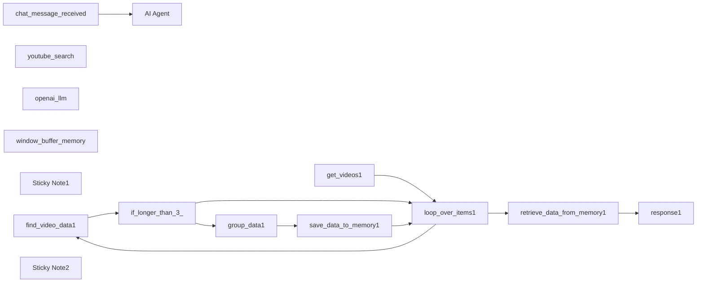

## Fluxo (.json) :

```json
{
  "id": "XSyVFC1tsGSxNwX9",
  "meta": {
    "instanceId": "60ad864624415060d2d0a0e71acd8b3b40e4ee2e9ef4b439d9937d3d33537a96"
  },
  "name": "Complete Youtube",
  "tags": [],
  "nodes": [
    {
      "id": "fd74706b-609b-4723-b4a4-067e1b064194",
      "name": "AI Agent",
      "type": "@n8n/n8n-nodes-langchain.agent",
      "position": [
        300,
        60
      ],
      "parameters": {
        "options": {
          "systemMessage": "=You help youtube creators find trending videos based on a specific niche.\n\nVerify if the user informed a niche before doing anything. If not, then ask him for one by giving him suggestions for him to select from.\n\nAfter you know what type of content the user might produce, use the \"youtube_search\" tool up to 3 times with different search terms based on the user's content type and niche.\n\nThe tool will answer with a list of videos from the last 2 days that had the most amount of relevancy. It returns a list of json's covering each video's id, view count, like count, comment count, description, channel title, tags and channel id. Each video is separated by \"### NEXT VIDEO FOUND: ###\".\n\nYou should then proceed to understand the data received then provide the user with insightful data of what could be trending from the past 2 days. Provide the user links to the trending videos which should be in this structure:\n\nhttps://www.youtube.com/watch?v={video_id}\n\nto reach the channel's link you should use:\n\nhttps://www.youtube.com/channel/{channel_id}\n\nFind patterns in the tags, titles and especially in the related content for the videos found.\n\nYour mission isn't to find the trending videos. It's to provide the user with valuable information of what is trending in that niche in terms of content news. Remember to provide the user with the numbers of views, likes and comments while commenting about any video. So you should not talk about any particular video, focus rather in explaining the overall senario of all that was found.\n\nExample of response:\n\n\"It seems like what is trending in digital marketing right now is talking about mental triggers, since 3 of the most trending videos in the last 2 days were about...\""
        }
      },
      "typeVersion": 1.6
    },
    {
      "id": "ced4b937-b590-4727-b1f2-a5e88b96091a",
      "name": "chat_message_received",
      "type": "@n8n/n8n-nodes-langchain.chatTrigger",
      "position": [
        80,
        60
      ],
      "webhookId": "ff9622a4-a6ec-4396-b9de-c95bd834c23c",
      "parameters": {
        "options": {}
      },
      "typeVersion": 1.1
    },
    {
      "id": "35a91359-5007-407d-a750-d6642e595690",
      "name": "youtube_search",
      "type": "@n8n/n8n-nodes-langchain.toolWorkflow",
      "position": [
        540,
        180
      ],
      "parameters": {
        "name": "youtube_search",
        "workflowId": {
          "__rl": true,
          "mode": "list",
          "value": "N9DveO781xbNf8qs",
          "cachedResultName": "Youtube Search Workflow"
        },
        "description": "Call this tool to search for trending videos based on a query.",
        "jsonSchemaExample": "{\n\t\"search_term\": \"some_value\"\n}",
        "specifyInputSchema": true
      },
      "typeVersion": 1.2
    },
    {
      "id": "42f41096-531d-4587-833a-6f659ef78dd0",
      "name": "openai_llm",
      "type": "@n8n/n8n-nodes-langchain.lmChatOpenAi",
      "position": [
        260,
        180
      ],
      "parameters": {
        "options": {}
      },
      "typeVersion": 1
    },
    {
      "id": "e4bda5b9-abd4-4cd6-8c95-126a01aa6e21",
      "name": "window_buffer_memory",
      "type": "@n8n/n8n-nodes-langchain.memoryBufferWindow",
      "position": [
        400,
        180
      ],
      "parameters": {},
      "typeVersion": 1.2
    },
    {
      "id": "f6d86c5a-393a-4bcf-bdaf-3b06c79fa51d",
      "name": "Sticky Note1",
      "type": "n8n-nodes-base.stickyNote",
      "position": [
        0,
        0
      ],
      "parameters": {
        "color": 7,
        "width": 693.2572054941234,
        "height": 354.53098948245656,
        "content": "Main Workflow"
      },
      "typeVersion": 1
    },
    {
      "id": "4ddbc3f0-e3d7-4ce4-a732-d731c05024d2",
      "name": "find_video_data1",
      "type": "n8n-nodes-base.httpRequest",
      "position": [
        700,
        720
      ],
      "parameters": {
        "url": "https://www.googleapis.com/youtube/v3/videos?",
        "options": {},
        "sendQuery": true,
        "queryParameters": {
          "parameters": [
            {
              "name": "key",
              "value": "={{ $env[\"GOOGLE_API_KEY\"] }}"
            },
            {
              "name": "id",
              "value": "={{ $json.id.videoId }}"
            },
            {
              "name": "part",
              "value": "contentDetails, snippet, statistics"
            }
          ]
        }
      },
      "typeVersion": 4.2
    },
    {
      "id": "fdb28635-801d-4ce0-8919-11446c6a7a82",
      "name": "get_videos1",
      "type": "n8n-nodes-base.youTube",
      "position": [
        280,
        560
      ],
      "parameters": {
        "limit": 3,
        "filters": {
          "q": "={{ $json.query.search_term }}",
          "regionCode": "US",
          "publishedAfter": "={{ new Date(Date.now() - 2 * 24 * 60 * 60 * 1000).toISOString() }}"
        },
        "options": {
          "order": "relevance",
          "safeSearch": "moderate"
        },
        "resource": "video"
      },
      "credentials": {
        "youTubeOAuth2Api": {
          "id": "dCyrga3t1tlgQQy0",
          "name": "YouTube account"
        }
      },
      "typeVersion": 1
    },
    {
      "id": "60e9e61d-0e5e-4212-8b55-71299aeec4d5",
      "name": "response1",
      "type": "n8n-nodes-base.set",
      "position": [
        1100,
        500
      ],
      "parameters": {
        "options": {},
        "assignments": {
          "assignments": [
            {
              "id": "b9b9117b-ea14-482e-a13b-e68b8e6b441d",
              "name": "response",
              "type": "string",
              "value": "={{ $input.all() }}"
            }
          ]
        }
      },
      "typeVersion": 3.4
    },
    {
      "id": "254a6740-8b25-4898-9795-4c3f0009471f",
      "name": "group_data1",
      "type": "n8n-nodes-base.set",
      "position": [
        1160,
        700
      ],
      "parameters": {
        "options": {},
        "assignments": {
          "assignments": [
            {
              "id": "47c172ad-90c8-4cf6-a9f5-50607e04cc90",
              "name": "id",
              "type": "string",
              "value": "={{ $json.items[0].id }}"
            },
            {
              "id": "9e639efa-0714-4b06-9847-f7b4b2fbef59",
              "name": "viewCount",
              "type": "string",
              "value": "={{ $json.items[0].statistics.viewCount }}"
            },
            {
              "id": "93328f00-91b8-425b-ad0f-a330b2f95242",
              "name": "likeCount",
              "type": "string",
              "value": "={{ $json.items[0].statistics.likeCount }}"
            },
            {
              "id": "015b0fb2-2a98-464c-a21b-51100616f26a",
              "name": "commentCount",
              "type": "string",
              "value": "={{ $json.items[0].statistics.commentCount }}"
            },
            {
              "id": "cf1e1ec3-a138-42b8-8747-d249afa58dd3",
              "name": "description",
              "type": "string",
              "value": "={{ $json.items[0].snippet.description }}"
            },
            {
              "id": "c5c9a3a2-b820-4932-a38a-e21102992215",
              "name": "title",
              "type": "string",
              "value": "={{ $json.items[0].snippet.title }}"
            },
            {
              "id": "38216ead-1f8d-4f93-b6ad-5ef709a1ad2a",
              "name": "channelTitle",
              "type": "string",
              "value": "={{ $json.items[0].snippet.channelTitle }}"
            },
            {
              "id": "ff34194d-3d46-43a8-9127-84708987f536",
              "name": "tags",
              "type": "string",
              "value": "={{ $json.items[0].snippet.tags.join(', ') }}"
            },
            {
              "id": "e50b0f7b-3e37-4557-8863-d68d4fa505c8",
              "name": "channelId",
              "type": "string",
              "value": "={{ $json.items[0].snippet.channelId }}"
            }
          ]
        }
      },
      "typeVersion": 3.4
    },
    {
      "id": "124c19a9-cbbd-4010-be37-50523c05f64b",
      "name": "save_data_to_memory1",
      "type": "n8n-nodes-base.code",
      "position": [
        1360,
        700
      ],
      "parameters": {
        "mode": "runOnceForEachItem",
        "jsCode": "const workflowStaticData = $getWorkflowStaticData('global');\n\nif (typeof workflowStaticData.lastExecution !== 'object') {\n workflowStaticData.lastExecution = {\n response: \"\"\n };\n}\n\nfunction removeEmojis(text) {\n return text.replace(/[\\u{1F600}-\\u{1F64F}|\\u{1F300}-\\u{1F5FF}|\\u{1F680}-\\u{1F6FF}|\\u{2600}-\\u{26FF}|\\u{2700}-\\u{27BF}]/gu, '');\n}\n\nfunction cleanDescription(description) {\n return description\n .replace(/https?://\\S+/g, '')\n .replace(/www\\.\\S+/g, '')\n .replace(/ +/g, ' ')\n .trim();\n}\n\nconst currentItem = { ...$input.item };\n\nif (currentItem.description) {\n currentItem.description = cleanDescription(currentItem.description);\n}\n\nlet sanitizedItem = JSON.stringify(currentItem)\n .replace(/\\\\r/g, ' ')\n .replace(/https?://\\S+/g, '')\n .replace(/www\\.\\S+/g, '')\n .replace(/\\\\n/g, ' ')\n .replace(/\\n/g, ' ')\n .replace(/\\/g, '')\n .replace(/ +/g, ' ')\n .trim();\n\nif (workflowStaticData.lastExecution.response) {\n workflowStaticData.lastExecution.response += ' ### NEXT VIDEO FOUND: ### ';\n}\n\nworkflowStaticData.lastExecution.response += removeEmojis(sanitizedItem);\n\nreturn workflowStaticData.lastExecution;\n"
      },
      "typeVersion": 2
    },
    {
      "id": "67f92ec4-71c0-49df-a0ea-11d2e3cf0f94",
      "name": "retrieve_data_from_memory1",
      "type": "n8n-nodes-base.code",
      "position": [
        780,
        500
      ],
      "parameters": {
        "jsCode": "const workflowStaticData = $getWorkflowStaticData('global');\n\nconst lastExecution = workflowStaticData.lastExecution;\n\nreturn lastExecution;"
      },
      "typeVersion": 2
    },
    {
      "id": "685820ba-b089-4cdc-984d-52f134754b5c",
      "name": "loop_over_items1",
      "type": "n8n-nodes-base.splitInBatches",
      "position": [
        500,
        560
      ],
      "parameters": {
        "options": {}
      },
      "typeVersion": 3
    },
    {
      "id": "3d4d5a4b-d06b-41db-bb78-a64a266d5308",
      "name": "if_longer_than_3_",
      "type": "n8n-nodes-base.if",
      "position": [
        880,
        720
      ],
      "parameters": {
        "options": {},
        "conditions": {
          "options": {
            "version": 2,
            "leftValue": "",
            "caseSensitive": true,
            "typeValidation": "strict"
          },
          "combinator": "and",
          "conditions": [
            {
              "id": "08ba3db9-6bcf-47f8-a74d-9e26f28cb08f",
              "operator": {
                "type": "boolean",
                "operation": "true",
                "singleValue": true
              },
              "leftValue": "={{ \n (() => {\n const duration = $json.items[0].contentDetails.duration;\n\n // Helper function to convert ISO 8601 duration to seconds\n const iso8601ToSeconds = iso8601 => {\n const match = iso8601.match(/PT(?:(\\d+)H)?(?:(\\d+)M)?(?:(\\d+)S)?/);\n const hours = parseInt(match[1] || 0, 10);\n const minutes = parseInt(match[2] || 0, 10);\n const seconds = parseInt(match[3] || 0, 10);\n return hours * 3600 + minutes * 60 + seconds;\n };\n\n // Convert duration to seconds\n const durationInSeconds = iso8601ToSeconds(duration);\n\n // Check if greater than 210 seconds (3 minutes 30 seconds)\n return durationInSeconds > 210;\n })() \n}}",
              "rightValue": ""
            }
          ]
        }
      },
      "typeVersion": 2.2
    },
    {
      "id": "7c6b8b82-fd6c-4f44-bccf-88c5a76f0319",
      "name": "Sticky Note2",
      "type": "n8n-nodes-base.stickyNote",
      "position": [
        0,
        420
      ],
      "parameters": {
        "color": 5,
        "width": 1607,
        "height": 520,
        "content": "This part should be abstracted to another workflow and called inside the \"youtube_search\" tool of the main AI Agent."
      },
      "typeVersion": 1
    }
  ],
  "active": false,
  "pinData": {},
  "settings": {
    "executionOrder": "v1"
  },
  "versionId": "cea84238-2b82-4a32-85dd-0c71ad685d47",
  "connections": {
    "openai_llm": {
      "ai_languageModel": [
        [
          {
            "node": "AI Agent",
            "type": "ai_languageModel",
            "index": 0
          }
        ]
      ]
    },
    "get_videos1": {
      "main": [
        [
          {
            "node": "loop_over_items1",
            "type": "main",
            "index": 0
          }
        ]
      ]
    },
    "group_data1": {
      "main": [
        [
          {
            "node": "save_data_to_memory1",
            "type": "main",
            "index": 0
          }
        ]
      ]
    },
    "youtube_search": {
      "ai_tool": [
        [
          {
            "node": "AI Agent",
            "type": "ai_tool",
            "index": 0
          }
        ]
      ]
    },
    "find_video_data1": {
      "main": [
        [
          {
            "node": "if_longer_than_3_",
            "type": "main",
            "index": 0
          }
        ]
      ]
    },
    "loop_over_items1": {
      "main": [
        [
          {
            "node": "retrieve_data_from_memory1",
            "type": "main",
            "index": 0
          }
        ],
        [
          {
            "node": "find_video_data1",
            "type": "main",
            "index": 0
          }
        ]
      ]
    },
    "if_longer_than_3_": {
      "main": [
        [
          {
            "node": "group_data1",
            "type": "main",
            "index": 0
          }
        ],
        [
          {
            "node": "loop_over_items1",
            "type": "main",
            "index": 0
          }
        ]
      ]
    },
    "save_data_to_memory1": {
      "main": [
        [
          {
            "node": "loop_over_items1",
            "type": "main",
            "index": 0
          }
        ]
      ]
    },
    "window_buffer_memory": {
      "ai_memory": [
        [
          {
            "node": "AI Agent",
            "type": "ai_memory",
            "index": 0
          }
        ]
      ]
    },
    "chat_message_received": {
      "main": [
        [
          {
            "node": "AI Agent",
            "type": "main",
            "index": 0
          }
        ]
      ]
    },
    "retrieve_data_from_memory1": {
      "main": [
        [
          {
            "node": "response1",
            "type": "main",
            "index": 0
          }
        ]
      ]
    }
  }
}
```

<a id="template-1091"></a>

## Template 1091 - Sincronizar URLs de vídeos do YouTube

- **Nome:** Sincronizar URLs de vídeos do YouTube
- **Descrição:** Lê IDs de canais de uma planilha, busca vídeos desses canais e grava/atualiza as URLs e metadados em outra planilha.
- **Funcionalidade:** • Gatilho manual: permite iniciar o processo ao acionar manualmente.
• Leitura de IDs de canais: consulta uma aba da planilha para obter os channel IDs a serem processados.
• Busca de vídeos por canal: consulta a API do YouTube para listar vídeos de cada canal, ordenados por data e com paginação.
• Processamento por vídeo: trata cada item de vídeo individualmente para extrair e formatar campos necessários.
• Formatação de campos: monta título, URL completa do vídeo e data de publicação para armazenamento.
• Inserção/atualização na planilha: grava ou atualiza linhas na planilha de destino, evitando duplicatas ao casar pela URL do vídeo.
- **Ferramentas:** • Google Sheets: armazena os IDs dos canais (aba de origem) e recebe/atualiza as URLs e metadados dos vídeos (aba de destino).
• YouTube Data API: fornece a listagem de vídeos por canal, suporte a paginação e ordenação por data.
• Autenticação via conta/credenciais Google: permite acesso programático às planilhas e à API do YouTube.

## Fluxo visual

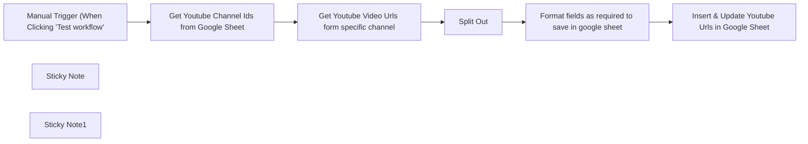

## Fluxo (.json) :

```json
{
  "id": "rJNvM4vU6SLUeC1d",
  "meta": {
    "instanceId": "10f6e8a86649316fe7041c503c24e6d77b68a961a9f4f1f76d0100c435446092",
    "templateCredsSetupCompleted": true
  },
  "name": "Sync Youtube Video Urls with Google Sheets",
  "tags": [],
  "nodes": [
    {
      "id": "f1cd1374-2214-41c1-af32-9e31e72aab88",
      "name": "Split Out",
      "type": "n8n-nodes-base.splitOut",
      "position": [
        1720,
        0
      ],
      "parameters": {
        "options": {},
        "fieldToSplitOut": "items"
      },
      "typeVersion": 1
    },
    {
      "id": "e59d5ac8-5386-4fa4-a18c-39cd84779eae",
      "name": "Manual Trigger (When Clicking 'Test workflow'",
      "type": "n8n-nodes-base.manualTrigger",
      "position": [
        1100,
        0
      ],
      "parameters": {},
      "typeVersion": 1
    },
    {
      "id": "46897f6d-5e64-4a85-92b5-d8e596d02702",
      "name": "Get Youtube Channel Ids from Google Sheet",
      "type": "n8n-nodes-base.googleSheets",
      "position": [
        1300,
        0
      ],
      "parameters": {
        "options": {},
        "sheetName": {
          "__rl": true,
          "mode": "list",
          "value": 1592454760,
          "cachedResultUrl": "https://docs.google.com/spreadsheets/d/1xoCVr_mlwn4jFcnJENtrU-_K5nkIytZ8qBXzxMq55n4/edit#gid=1592454760",
          "cachedResultName": "Sheet3"
        },
        "documentId": {
          "__rl": true,
          "mode": "list",
          "value": "1xoCVr_mlwn4jFcnJENtrU-_K5nkIytZ8qBXzxMq55n4",
          "cachedResultUrl": "https://docs.google.com/spreadsheets/d/1xoCVr_mlwn4jFcnJENtrU-_K5nkIytZ8qBXzxMq55n4/edit?usp=drivesdk",
          "cachedResultName": "Youtube Videos Comments"
        },
        "authentication": "serviceAccount"
      },
      "credentials": {
        "googleApi": {
          "id": "jPoTdPxgVL0vr9SQ",
          "name": "Google Sheets account"
        }
      },
      "typeVersion": 4.5
    },
    {
      "id": "adb73854-a110-4c1e-9228-221b844a15f5",
      "name": "Get Youtube Video Urls form specific channel",
      "type": "n8n-nodes-base.httpRequest",
      "position": [
        1540,
        0
      ],
      "parameters": {
        "url": "https://www.googleapis.com/youtube/v3/search",
        "options": {
          "pagination": {
            "pagination": {
              "parameters": {
                "parameters": [
                  {
                    "name": "pageToken",
                    "value": "={{ $response.body.nextPageToken }}"
                  }
                ]
              },
              "completeExpression": "={{ !$response.body.nextPageToken}}",
              "paginationCompleteWhen": "other"
            }
          }
        },
        "sendQuery": true,
        "authentication": "genericCredentialType",
        "genericAuthType": "httpQueryAuth",
        "queryParameters": {
          "parameters": [
            {
              "name": "channelId",
              "value": "={{ $json.channelId }}"
            },
            {
              "name": "part",
              "value": "snippet"
            },
            {
              "name": "order",
              "value": "date"
            },
            {
              "name": "maxResults",
              "value": "50"
            }
          ]
        }
      },
      "credentials": {
        "httpQueryAuth": {
          "id": "2lgO4p3deoSAoU9d",
          "name": "Query Auth account 3"
        }
      },
      "typeVersion": 4.2
    },
    {
      "id": "d5926bd7-f1d6-4441-87de-454d16aa6928",
      "name": "Format fields as required to save in google sheet",
      "type": "n8n-nodes-base.set",
      "position": [
        1900,
        0
      ],
      "parameters": {
        "options": {},
        "assignments": {
          "assignments": [
            {
              "id": "21a7a279-8a86-494c-a32f-ebcf956e2f69",
              "name": "Title",
              "type": "string",
              "value": "={{ $json.snippet.title }}"
            },
            {
              "id": "0f7084f4-9180-4eee-ab59-8e0ce75b163f",
              "name": "video_urls",
              "type": "string",
              "value": "=https://www.youtube.com/watch?v={{ $json.id.videoId }}"
            },
            {
              "id": "40b96174-109e-4ddf-b1c2-c3f0b93a2769",
              "name": "published_at",
              "type": "string",
              "value": "={{ $json.snippet.publishedAt }}"
            }
          ]
        }
      },
      "typeVersion": 3.4
    },
    {
      "id": "e23503cd-40ae-488f-9918-83b1e3dc7b28",
      "name": "Insert & Update Youtube Urls in Google Sheet",
      "type": "n8n-nodes-base.googleSheets",
      "position": [
        2100,
        0
      ],
      "parameters": {
        "columns": {
          "value": {
            "Title": "={{ $json.Title }}",
            "video_urls": "={{ $json.video_urls }}",
            "published_at": "={{ $json.published_at }}"
          },
          "schema": [
            {
              "id": "Title",
              "type": "string",
              "display": true,
              "removed": false,
              "required": false,
              "displayName": "Title",
              "defaultMatch": false,
              "canBeUsedToMatch": true
            },
            {
              "id": "video_urls",
              "type": "string",
              "display": true,
              "removed": false,
              "required": false,
              "displayName": "video_urls",
              "defaultMatch": false,
              "canBeUsedToMatch": true
            },
            {
              "id": "last_fetched_time",
              "type": "string",
              "display": true,
              "removed": true,
              "required": false,
              "displayName": "last_fetched_time",
              "defaultMatch": false,
              "canBeUsedToMatch": true
            },
            {
              "id": "next_fetch_time",
              "type": "string",
              "display": true,
              "removed": true,
              "required": false,
              "displayName": "next_fetch_time",
              "defaultMatch": false,
              "canBeUsedToMatch": true
            },
            {
              "id": "published_at",
              "type": "string",
              "display": true,
              "removed": false,
              "required": false,
              "displayName": "published_at",
              "defaultMatch": false,
              "canBeUsedToMatch": true
            }
          ],
          "mappingMode": "defineBelow",
          "matchingColumns": [
            "video_urls"
          ],
          "attemptToConvertTypes": false,
          "convertFieldsToString": false
        },
        "options": {},
        "operation": "appendOrUpdate",
        "sheetName": {
          "__rl": true,
          "mode": "list",
          "value": 760258523,
          "cachedResultUrl": "https://docs.google.com/spreadsheets/d/1xoCVr_mlwn4jFcnJENtrU-_K5nkIytZ8qBXzxMq55n4/edit#gid=760258523",
          "cachedResultName": "Sheet2"
        },
        "documentId": {
          "__rl": true,
          "mode": "list",
          "value": "1xoCVr_mlwn4jFcnJENtrU-_K5nkIytZ8qBXzxMq55n4",
          "cachedResultUrl": "https://docs.google.com/spreadsheets/d/1xoCVr_mlwn4jFcnJENtrU-_K5nkIytZ8qBXzxMq55n4/edit?usp=drivesdk",
          "cachedResultName": "Youtube Videos Comments"
        },
        "authentication": "serviceAccount"
      },
      "credentials": {
        "googleApi": {
          "id": "jPoTdPxgVL0vr9SQ",
          "name": "Google Sheets account"
        }
      },
      "typeVersion": 4.5
    },
    {
      "id": "428bf48c-1721-4215-9ad4-f5b85f12d6dc",
      "name": "Sticky Note",
      "type": "n8n-nodes-base.stickyNote",
      "position": [
        1020,
        -100
      ],
      "parameters": {
        "width": 1320,
        "height": 320,
        "content": "## Sync Youtube Video Urls with Google Sheets\n"
      },
      "typeVersion": 1
    },
    {
      "id": "3aaf62a9-e97e-48dd-8716-c5440759a03e",
      "name": "Sticky Note1",
      "type": "n8n-nodes-base.stickyNote",
      "position": [
        720,
        -100
      ],
      "parameters": {
        "color": 5,
        "width": 280,
        "height": 220,
        "content": "## I'm a note \n✅ Reads Channel IDs from `Sheet3`  \n📹 Fetches video URLs using YouTube API  \n📄 Writes video URLs to `Sheet2`  \n\n🔁 Output used in:  \n👉 [Part 2 – YouTube Comment Sentiment Analyzer](https://n8n.io/workflows/3855-youtube-comment-sentiment-analyzer-with-google-sheets-and-openai/)"
      },
      "typeVersion": 1
    }
  ],
  "active": false,
  "pinData": {},
  "settings": {
    "executionOrder": "v1"
  },
  "versionId": "f874513c-62c9-430d-8c33-c6d48bacb74d",
  "connections": {
    "Split Out": {
      "main": [
        [
          {
            "node": "Format fields as required to save in google sheet",
            "type": "main",
            "index": 0
          }
        ]
      ]
    },
    "Get Youtube Channel Ids from Google Sheet": {
      "main": [
        [
          {
            "node": "Get Youtube Video Urls form specific channel",
            "type": "main",
            "index": 0
          }
        ]
      ]
    },
    "Get Youtube Video Urls form specific channel": {
      "main": [
        [
          {
            "node": "Split Out",
            "type": "main",
            "index": 0
          }
        ]
      ]
    },
    "Manual Trigger (When Clicking 'Test workflow'": {
      "main": [
        [
          {
            "node": "Get Youtube Channel Ids from Google Sheet",
            "type": "main",
            "index": 0
          }
        ]
      ]
    },
    "Format fields as required to save in google sheet": {
      "main": [
        [
          {
            "node": "Insert & Update Youtube Urls in Google Sheet",
            "type": "main",
            "index": 0
          }
        ]
      ]
    }
  }
}
```

<a id="template-1092"></a>

## Template 1092 - Controle do Spotify via botão IKEA

- **Nome:** Controle do Spotify via botão IKEA
- **Descrição:** Recebe eventos de um botão IKEA via MQTT e executa comandos de reprodução e volume no Spotify, incluindo ações personalizadas por pressão longa.
- **Funcionalidade:** • Recepção de eventos MQTT do botão IKEA: Inicia o fluxo ao receber mensagens do tópico do dispositivo.
• Roteamento de ações do botão: Mapeia cada tipo de evento (esquerda/direita/volume subir/volume descer/toggle/pressão longa) para a função apropriada.
• Verificação e ativação do dispositivo de reprodução alvo: Confere se o player desejado está ativo; caso contrário, localiza o dispositivo por nome e o ativa antes de enviar comandos.
• Controle de reprodução: Executa comandos de faixa anterior/próxima e alterna play/pause conforme o estado atual do dispositivo.
• Ajuste incremental de volume: Aumenta ou diminui o volume em 5% com limites aplicados (máximo 100% e limite mínimo configurado).
• Funções personalizadas para pressão longa: Executa sequências definidas, como ajustar volume para 80% e iniciar uma faixa específica, ou iniciar a playlist favorita do usuário.
• Seleção de dispositivo por nome: Lista dispositivos disponíveis, filtra pelo nome configurado e usa o device_id retornado para ativação e comandos.
- **Ferramentas:** • IKEA 5-button Switch: Controle físico que gera eventos de ação (clique/segurar) via Zigbee.
• MQTT (zigbee2mqtt): Broker/integração que publica as ações do botão em tópicos para serem consumidos pelo fluxo.
• Spotify Web API: Serviço de streaming usado para obter status do player, listar dispositivos, ativar um dispositivo, controlar reprodução e ajustar volume via chamadas HTTP autenticadas.


## Fluxo visual

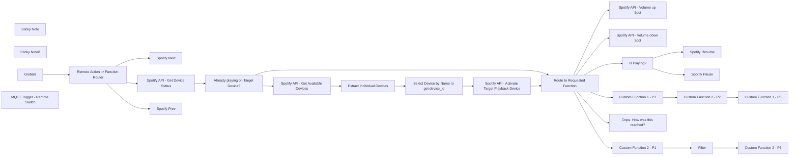

## Fluxo (.json) :

```json
{
  "nodes": [
    {
      "id": "169e3a8c-82f5-4527-a187-27b8e5d903c1",
      "name": "Spotify Next",
      "type": "n8n-nodes-base.spotify",
      "position": [
        1300,
        -40
      ],
      "parameters": {
        "operation": "nextSong"
      },
      "credentials": {
        "spotifyOAuth2Api": {
          "id": "4AquI6TQMHILfmvx",
          "name": "Spotify App Credentials"
        }
      },
      "typeVersion": 1
    },
    {
      "id": "7840d6b8-7eb4-4ac2-8bd0-946561f7de38",
      "name": "Spotify Resume",
      "type": "n8n-nodes-base.spotify",
      "position": [
        1300,
        660
      ],
      "parameters": {
        "operation": "resume"
      },
      "credentials": {
        "spotifyOAuth2Api": {
          "id": "4AquI6TQMHILfmvx",
          "name": "Spotify App Credentials"
        }
      },
      "typeVersion": 1
    },
    {
      "id": "35e768a3-b648-4d5e-a6a4-fa5f5be3d922",
      "name": "Spotify Pause",
      "type": "n8n-nodes-base.spotify",
      "position": [
        1300,
        480
      ],
      "parameters": {
        "operation": "pause"
      },
      "credentials": {
        "spotifyOAuth2Api": {
          "id": "4AquI6TQMHILfmvx",
          "name": "Spotify App Credentials"
        }
      },
      "typeVersion": 1
    },
    {
      "id": "0a391400-a8f0-4c1e-ac79-bbdea4aa21b4",
      "name": "Sticky Note",
      "type": "n8n-nodes-base.stickyNote",
      "position": [
        -361,
        55
      ],
      "parameters": {
        "width": 611.1911357340722,
        "height": 291.1542012927053,
        "content": "### Receive MQTT message from IKEA 5-button Switch, and route actions."
      },
      "typeVersion": 1
    },
    {
      "id": "164e904f-278d-4e48-81de-e1fc050e683a",
      "name": "Spotify API - Volume up 5pct",
      "type": "n8n-nodes-base.httpRequest",
      "position": [
        1300,
        120
      ],
      "parameters": {
        "url": "https://api.spotify.com/v1/me/player/volume",
        "method": "PUT",
        "options": {},
        "sendQuery": true,
        "authentication": "predefinedCredentialType",
        "queryParameters": {
          "parameters": [
            {
              "name": "=device_id",
              "value": "={{ $json.device.id }}"
            },
            {
              "name": "volume_percent",
              "value": "={{ Math.min($json.device.volume_percent + 5, 100) }}"
            }
          ]
        },
        "nodeCredentialType": "spotifyOAuth2Api"
      },
      "credentials": {
        "spotifyOAuth2Api": {
          "id": "4AquI6TQMHILfmvx",
          "name": "Spotify App Credentials"
        }
      },
      "typeVersion": 4.1,
      "alwaysOutputData": true
    },
    {
      "id": "a75cfc9b-ba21-4771-a2ff-f7aee843f344",
      "name": "Spotify API - Volume down 5pct",
      "type": "n8n-nodes-base.httpRequest",
      "position": [
        1300,
        300
      ],
      "parameters": {
        "url": "https://api.spotify.com/v1/me/player/volume",
        "method": "PUT",
        "options": {},
        "sendQuery": true,
        "authentication": "predefinedCredentialType",
        "queryParameters": {
          "parameters": [
            {
              "name": "device_id",
              "value": "={{ $json.device.id }}"
            },
            {
              "name": "volume_percent",
              "value": "={{ Math.max($json.device.volume_percent - 5, 20) }}"
            }
          ]
        },
        "nodeCredentialType": "spotifyOAuth2Api"
      },
      "credentials": {
        "spotifyOAuth2Api": {
          "id": "4AquI6TQMHILfmvx",
          "name": "Spotify App Credentials"
        }
      },
      "typeVersion": 4.1,
      "alwaysOutputData": true
    },
    {
      "id": "deae216d-aaaa-406c-b978-45b790c5d837",
      "name": "Sticky Note8",
      "type": "n8n-nodes-base.stickyNote",
      "position": [
        -360,
        608.2274931489221
      ],
      "parameters": {
        "color": 5,
        "width": 906.3175117167951,
        "height": 278.70214810442735,
        "content": "### Find the target player device (or spotify device group) by name, and activate it."
      },
      "typeVersion": 1
    },
    {
      "id": "2733fd1e-4c58-4f3e-bf7d-f4111fea6efc",
      "name": "Spotify API - Get Available Devices",
      "type": "n8n-nodes-base.httpRequest",
      "position": [
        -260,
        680
      ],
      "parameters": {
        "url": "https://api.spotify.com/v1/me/player/devices",
        "options": {},
        "sendQuery": true,
        "authentication": "predefinedCredentialType",
        "queryParameters": {
          "parameters": [
            {}
          ]
        },
        "nodeCredentialType": "spotifyOAuth2Api"
      },
      "credentials": {
        "spotifyOAuth2Api": {
          "id": "4AquI6TQMHILfmvx",
          "name": "Spotify App Credentials"
        }
      },
      "typeVersion": 4.1,
      "alwaysOutputData": true
    },
    {
      "id": "1d7fcab5-e49d-4d03-8e7d-aa339afa45ec",
      "name": "Extract Individual Devices",
      "type": "n8n-nodes-base.splitOut",
      "position": [
        -60,
        680
      ],
      "parameters": {
        "options": {},
        "fieldToSplitOut": "devices"
      },
      "typeVersion": 1
    },
    {
      "id": "7ae0af1c-2fbb-47e4-b2ab-670be441d86f",
      "name": "Select Device by Name to get device_id",
      "type": "n8n-nodes-base.filter",
      "position": [
        140,
        680
      ],
      "parameters": {
        "options": {},
        "conditions": {
          "options": {
            "leftValue": "",
            "caseSensitive": true,
            "typeValidation": "strict"
          },
          "combinator": "and",
          "conditions": [
            {
              "id": "069d11c8-75a2-4a5c-81c4-e6f771ee4829",
              "operator": {
                "name": "filter.operator.equals",
                "type": "string",
                "operation": "equals"
              },
              "leftValue": "={{ $json.name }}",
              "rightValue": "={{ $('Globals').first().json.target_spotify_playback_device_name }}"
            }
          ]
        }
      },
      "typeVersion": 2
    },
    {
      "id": "738d57fd-9dcb-4d3d-b070-73867c926d3f",
      "name": "Custom Function 1 - P1",
      "type": "n8n-nodes-base.httpRequest",
      "position": [
        880,
        840
      ],
      "parameters": {
        "url": "https://api.spotify.com/v1/me/player/volume",
        "method": "PUT",
        "options": {},
        "sendQuery": true,
        "authentication": "predefinedCredentialType",
        "queryParameters": {
          "parameters": [
            {
              "name": "volume_percent",
              "value": "80"
            }
          ]
        },
        "nodeCredentialType": "spotifyOAuth2Api"
      },
      "credentials": {
        "spotifyOAuth2Api": {
          "id": "4AquI6TQMHILfmvx",
          "name": "Spotify App Credentials"
        }
      },
      "typeVersion": 4.1,
      "alwaysOutputData": true
    },
    {
      "id": "e3fc6784-1612-427d-9b78-a3f4050ed176",
      "name": "Custom Function 2 - P2",
      "type": "n8n-nodes-base.spotify",
      "position": [
        1080,
        840
      ],
      "parameters": {
        "id": "spotify:track:4PTG3Z6ehGkBFwjybzWkR8"
      },
      "credentials": {
        "spotifyOAuth2Api": {
          "id": "4AquI6TQMHILfmvx",
          "name": "Spotify App Credentials"
        }
      },
      "typeVersion": 1
    },
    {
      "id": "340f23ff-ae8a-4032-a641-30bc32af09c7",
      "name": "Custom Function 1 - P3",
      "type": "n8n-nodes-base.spotify",
      "position": [
        1300,
        840
      ],
      "parameters": {
        "operation": "nextSong"
      },
      "credentials": {
        "spotifyOAuth2Api": {
          "id": "4AquI6TQMHILfmvx",
          "name": "Spotify App Credentials"
        }
      },
      "typeVersion": 1
    },
    {
      "id": "30a413da-5ce3-44a9-a43e-c6679b712087",
      "name": "Spotify API - Activate Target Playback Device",
      "type": "n8n-nodes-base.httpRequest",
      "position": [
        360,
        680
      ],
      "parameters": {
        "url": "https://api.spotify.com/v1/me/player",
        "method": "PUT",
        "options": {},
        "jsonBody": "={\n  \"device_ids\": [\n    \"{{ $('Select Device by Name to get device_id').first().json.id }}\"\n  ],\n  \"play\": true\n}",
        "sendBody": true,
        "sendQuery": true,
        "specifyBody": "json",
        "authentication": "predefinedCredentialType",
        "queryParameters": {
          "parameters": [
            {}
          ]
        },
        "nodeCredentialType": "spotifyOAuth2Api"
      },
      "credentials": {
        "spotifyOAuth2Api": {
          "id": "4AquI6TQMHILfmvx",
          "name": "Spotify App Credentials"
        }
      },
      "typeVersion": 4.1,
      "alwaysOutputData": true
    },
    {
      "id": "91dd48fe-6c3c-4170-8392-3d9885e61047",
      "name": "Route to Requested Function",
      "type": "n8n-nodes-base.switch",
      "position": [
        900,
        420
      ],
      "parameters": {
        "rules": {
          "values": [
            {
              "outputKey": "=volume_up",
              "conditions": {
                "options": {
                  "leftValue": "",
                  "caseSensitive": true,
                  "typeValidation": "strict"
                },
                "combinator": "and",
                "conditions": [
                  {
                    "operator": {
                      "type": "string",
                      "operation": "equals"
                    },
                    "leftValue": "={{ $('MQTT Trigger - Ikea Remote Switch').first().json.message }}",
                    "rightValue": "brightness_up_click"
                  }
                ]
              },
              "renameOutput": true
            },
            {
              "outputKey": "volume_down",
              "conditions": {
                "options": {
                  "leftValue": "",
                  "caseSensitive": true,
                  "typeValidation": "strict"
                },
                "combinator": "and",
                "conditions": [
                  {
                    "id": "c0726ee0-31b2-48fd-a860-0b923d8c18e7",
                    "operator": {
                      "name": "filter.operator.equals",
                      "type": "string",
                      "operation": "equals"
                    },
                    "leftValue": "={{ $('MQTT Trigger - Ikea Remote Switch').first().json.message }}",
                    "rightValue": "brightness_down_click"
                  }
                ]
              },
              "renameOutput": true
            },
            {
              "outputKey": "play/pause",
              "conditions": {
                "options": {
                  "leftValue": "",
                  "caseSensitive": true,
                  "typeValidation": "strict"
                },
                "combinator": "and",
                "conditions": [
                  {
                    "id": "569014d8-0db4-4126-a0dd-7264a3b6db51",
                    "operator": {
                      "name": "filter.operator.equals",
                      "type": "string",
                      "operation": "equals"
                    },
                    "leftValue": "={{ $('MQTT Trigger - Ikea Remote Switch').first().json.message }}",
                    "rightValue": "toggle"
                  }
                ]
              },
              "renameOutput": true
            },
            {
              "outputKey": "custom_function_1",
              "conditions": {
                "options": {
                  "leftValue": "",
                  "caseSensitive": true,
                  "typeValidation": "strict"
                },
                "combinator": "and",
                "conditions": [
                  {
                    "id": "af6d07f3-0ac2-4c05-8535-26d618892b8b",
                    "operator": {
                      "name": "filter.operator.equals",
                      "type": "string",
                      "operation": "equals"
                    },
                    "leftValue": "={{ $('MQTT Trigger - Ikea Remote Switch').first().json.message }}",
                    "rightValue": "brightness_up_hold"
                  }
                ]
              },
              "renameOutput": true
            },
            {
              "outputKey": "custom_function_2",
              "conditions": {
                "options": {
                  "leftValue": "",
                  "caseSensitive": true,
                  "typeValidation": "strict"
                },
                "combinator": "and",
                "conditions": [
                  {
                    "id": "a5e8ce30-4b18-450a-8b15-342a698fec61",
                    "operator": {
                      "name": "filter.operator.equals",
                      "type": "string",
                      "operation": "equals"
                    },
                    "leftValue": "={{ $('MQTT Trigger - Ikea Remote Switch').first().json.message }}",
                    "rightValue": "brightness_down_hold"
                  }
                ]
              },
              "renameOutput": true
            }
          ]
        },
        "options": {
          "fallbackOutput": "extra"
        }
      },
      "typeVersion": 3
    },
    {
      "id": "4a9ddd4d-ae2d-43c8-b3fd-70a2b15c5743",
      "name": "Custom Function 2 - P1",
      "type": "n8n-nodes-base.spotify",
      "position": [
        840,
        1020
      ],
      "parameters": {
        "resource": "playlist",
        "operation": "getUserPlaylists",
        "returnAll": true
      },
      "credentials": {
        "spotifyOAuth2Api": {
          "id": "4AquI6TQMHILfmvx",
          "name": "Spotify App Credentials"
        }
      },
      "typeVersion": 1
    },
    {
      "id": "29f842ad-f7cb-47b5-81fe-349f193e54bb",
      "name": "Filter",
      "type": "n8n-nodes-base.filter",
      "position": [
        1040,
        1020
      ],
      "parameters": {
        "options": {},
        "conditions": {
          "options": {
            "leftValue": "",
            "caseSensitive": true,
            "typeValidation": "strict"
          },
          "combinator": "and",
          "conditions": [
            {
              "id": "f7b6844a-ad78-4f29-801b-cef817a42e94",
              "operator": {
                "name": "filter.operator.equals",
                "type": "string",
                "operation": "equals"
              },
              "leftValue": "={{ $json.name }}",
              "rightValue": "={{ $('Globals').first().json.favorite_playlist_name }}"
            }
          ]
        }
      },
      "typeVersion": 2
    },
    {
      "id": "cb038583-e930-4fee-9166-fa182d20868e",
      "name": "Globals",
      "type": "n8n-nodes-base.set",
      "position": [
        -100,
        160
      ],
      "parameters": {
        "options": {},
        "assignments": {
          "assignments": [
            {
              "id": "2124b4d2-f929-459d-b285-3ac18df3ab60",
              "name": "target_spotify_playback_device_name",
              "type": "string",
              "value": "My Smart-Speaker Playback Device"
            },
            {
              "id": "b7f0468d-c5c3-4424-8db8-af823a10c7f0",
              "name": "favorite_playlist_name",
              "type": "string",
              "value": "Discover Weekly"
            }
          ]
        }
      },
      "typeVersion": 3.4
    },
    {
      "id": "f4505b9a-6f04-4ff7-9384-05bae95b2fc8",
      "name": "Custom Function 2 - P3",
      "type": "n8n-nodes-base.spotify",
      "position": [
        1260,
        1020
      ],
      "parameters": {
        "id": "=spotify:playlist:{{ $json.id }}",
        "operation": "startMusic"
      },
      "credentials": {
        "spotifyOAuth2Api": {
          "id": "4AquI6TQMHILfmvx",
          "name": "Spotify App Credentials"
        }
      },
      "typeVersion": 1
    },
    {
      "id": "2b2a81f9-69b6-42ca-accc-d4d987d6823c",
      "name": "Oops. How was this reached?",
      "type": "n8n-nodes-base.noOp",
      "position": [
        1080,
        680
      ],
      "parameters": {},
      "typeVersion": 1
    },
    {
      "id": "e45f04d6-bb3c-4580-9ef4-307d3692ad29",
      "name": "Spotify API - Get Device Status",
      "type": "n8n-nodes-base.httpRequest",
      "position": [
        440,
        260
      ],
      "parameters": {
        "url": "https://api.spotify.com/v1/me/player",
        "options": {},
        "sendQuery": true,
        "authentication": "predefinedCredentialType",
        "queryParameters": {
          "parameters": [
            {
              "name": "device_id",
              "value": "={{ $('Globals').first().json.target_spotify_playback_device_id }}"
            }
          ]
        },
        "nodeCredentialType": "spotifyOAuth2Api"
      },
      "credentials": {
        "spotifyOAuth2Api": {
          "id": "4AquI6TQMHILfmvx",
          "name": "Spotify App Credentials"
        }
      },
      "typeVersion": 4.1,
      "alwaysOutputData": true
    },
    {
      "id": "ffa38f10-f9b4-4a52-954e-39adcd924633",
      "name": "Already playing on Target Device?",
      "type": "n8n-nodes-base.if",
      "position": [
        640,
        300
      ],
      "parameters": {
        "options": {},
        "conditions": {
          "options": {
            "leftValue": "",
            "caseSensitive": true,
            "typeValidation": "strict"
          },
          "combinator": "and",
          "conditions": [
            {
              "id": "92d0f5fc-0743-4ea7-aad3-c8b72481bb97",
              "operator": {
                "name": "filter.operator.equals",
                "type": "string",
                "operation": "equals"
              },
              "leftValue": "={{ $('Spotify API - Get Device Status').first().json.device.name }}",
              "rightValue": "={{ $('Globals').first().json.target_spotify_playback_device_name }}"
            }
          ]
        }
      },
      "typeVersion": 2
    },
    {
      "id": "f92ed1ea-c9a7-4818-9a8e-a5fa460177ea",
      "name": "Is Playing?",
      "type": "n8n-nodes-base.if",
      "position": [
        1140,
        520
      ],
      "parameters": {
        "options": {},
        "conditions": {
          "options": {
            "leftValue": "",
            "caseSensitive": true,
            "typeValidation": "strict"
          },
          "combinator": "and",
          "conditions": [
            {
              "id": "caa4edf5-6436-4416-92f7-febd63cd47c5",
              "operator": {
                "type": "boolean",
                "operation": "true",
                "singleValue": true
              },
              "leftValue": "={{ $('Spotify API - Get Device Status').first().json.is_playing && !$('Spotify API - Activate Target Playback Device').isExecuted }}",
              "rightValue": ""
            }
          ]
        }
      },
      "typeVersion": 2
    },
    {
      "id": "5580215d-0f20-4349-a7c2-b74f0e01080e",
      "name": "Spotify Prev",
      "type": "n8n-nodes-base.spotify",
      "position": [
        1300,
        -200
      ],
      "parameters": {
        "operation": "previousSong"
      },
      "credentials": {
        "spotifyOAuth2Api": {
          "id": "4AquI6TQMHILfmvx",
          "name": "Spotify App Credentials"
        }
      },
      "typeVersion": 1
    },
    {
      "id": "f3babdeb-86d4-4dc6-85a4-95c48f4f07ef",
      "name": "MQTT Trigger - Remote Switch",
      "type": "n8n-nodes-base.mqttTrigger",
      "position": [
        -280,
        160
      ],
      "parameters": {
        "topics": "zigbee2mqtt/MyIOTButton1234/action",
        "options": {
          "jsonParseBody": true
        }
      },
      "credentials": {
        "mqtt": {
          "id": "65ppR4lt7hVNzfVG",
          "name": "MQTT account"
        }
      },
      "typeVersion": 1
    },
    {
      "id": "0c1bd86f-49f7-4505-9c8a-047dcb10a1bd",
      "name": "Remote Action -> Function Router",
      "type": "n8n-nodes-base.switch",
      "position": [
        100,
        140
      ],
      "parameters": {
        "rules": {
          "rules": [
            {
              "value2": "arrow_left_click",
              "outputKey": "left"
            },
            {
              "value2": "arrow_right_click",
              "outputKey": "right"
            },
            {
              "value2": "brightness_up_click",
              "outputKey": "up"
            },
            {
              "value2": "brightness_down_click",
              "outputKey": "down"
            },
            {
              "value2": "toggle",
              "outputKey": "on_off"
            },
            {
              "value2": "brightness_up_hold",
              "outputKey": "custom_function_1"
            },
            {
              "value2": "brightness_down_hold",
              "outputKey": "custom_function_2"
            }
          ]
        },
        "value1": "={{ $('MQTT Trigger - Ikea Remote Switch').first().json.message }}",
        "dataType": "string"
      },
      "typeVersion": 2
    }
  ],
  "pinData": {},
  "connections": {
    "Filter": {
      "main": [
        [
          {
            "node": "Custom Function 2 - P3",
            "type": "main",
            "index": 0
          }
        ]
      ]
    },
    "Globals": {
      "main": [
        [
          {
            "node": "Remote Action -> Function Router",
            "type": "main",
            "index": 0
          }
        ]
      ]
    },
    "Is Playing?": {
      "main": [
        [
          {
            "node": "Spotify Pause",
            "type": "main",
            "index": 0
          }
        ],
        [
          {
            "node": "Spotify Resume",
            "type": "main",
            "index": 0
          }
        ]
      ]
    },
    "Custom Function 1 - P1": {
      "main": [
        [
          {
            "node": "Custom Function 2 - P2",
            "type": "main",
            "index": 0
          }
        ]
      ]
    },
    "Custom Function 2 - P1": {
      "main": [
        [
          {
            "node": "Filter",
            "type": "main",
            "index": 0
          }
        ]
      ]
    },
    "Custom Function 2 - P2": {
      "main": [
        [
          {
            "node": "Custom Function 1 - P3",
            "type": "main",
            "index": 0
          }
        ]
      ]
    },
    "Extract Individual Devices": {
      "main": [
        [
          {
            "node": "Select Device by Name to get device_id",
            "type": "main",
            "index": 0
          }
        ]
      ]
    },
    "Route to Requested Function": {
      "main": [
        [
          {
            "node": "Spotify API - Volume up 5pct",
            "type": "main",
            "index": 0
          }
        ],
        [
          {
            "node": "Spotify API - Volume down 5pct",
            "type": "main",
            "index": 0
          }
        ],
        [
          {
            "node": "Is Playing?",
            "type": "main",
            "index": 0
          }
        ],
        [
          {
            "node": "Custom Function 1 - P1",
            "type": "main",
            "index": 0
          }
        ],
        [
          {
            "node": "Custom Function 2 - P1",
            "type": "main",
            "index": 0
          }
        ],
        [
          {
            "node": "Oops. How was this reached?",
            "type": "main",
            "index": 0
          }
        ]
      ]
    },
    "Spotify API - Get Device Status": {
      "main": [
        [
          {
            "node": "Already playing on Target Device?",
            "type": "main",
            "index": 0
          }
        ]
      ]
    },
    "Remote Action -> Function Router": {
      "main": [
        [
          {
            "node": "Spotify Prev",
            "type": "main",
            "index": 0
          }
        ],
        [
          {
            "node": "Spotify Next",
            "type": "main",
            "index": 0
          }
        ],
        [
          {
            "node": "Spotify API - Get Device Status",
            "type": "main",
            "index": 0
          }
        ],
        [
          {
            "node": "Spotify API - Get Device Status",
            "type": "main",
            "index": 0
          }
        ],
        [
          {
            "node": "Spotify API - Get Device Status",
            "type": "main",
            "index": 0
          }
        ],
        [
          {
            "node": "Spotify API - Get Device Status",
            "type": "main",
            "index": 0
          }
        ],
        [
          {
            "node": "Spotify API - Get Device Status",
            "type": "main",
            "index": 0
          }
        ]
      ]
    },
    "Already playing on Target Device?": {
      "main": [
        [
          {
            "node": "Route to Requested Function",
            "type": "main",
            "index": 0
          }
        ],
        [
          {
            "node": "Spotify API - Get Available Devices",
            "type": "main",
            "index": 0
          }
        ]
      ]
    },
    "MQTT Trigger - Ikea Remote Switch": {
      "main": [
        [
          {
            "node": "Globals",
            "type": "main",
            "index": 0
          }
        ]
      ]
    },
    "Spotify API - Get Available Devices": {
      "main": [
        [
          {
            "node": "Extract Individual Devices",
            "type": "main",
            "index": 0
          }
        ]
      ]
    },
    "Select Device by Name to get device_id": {
      "main": [
        [
          {
            "node": "Spotify API - Activate Target Playback Device",
            "type": "main",
            "index": 0
          }
        ]
      ]
    },
    "Spotify API - Activate Target Playback Device": {
      "main": [
        [
          {
            "node": "Route to Requested Function",
            "type": "main",
            "index": 0
          }
        ]
      ]
    }
  }
}
```

<a id="template-1093"></a>

## Template 1093 - Tradutor de Chinês via LINE

- **Nome:** Tradutor de Chinês via LINE
- **Descrição:** Recebe mensagens do LINE (texto ou imagem), processa o conteúdo com modelos externos e responde com caracteres chineses, pinyin e tradução em inglês.
- **Funcionalidade:** • Recepção de eventos via LINE: Inicia o fluxo ao receber mensagens de usuários pelo webhook.
• Animação de carregamento: Envia um indicador de loading para o chat do usuário para sinalizar que o processamento está em andamento.
• Roteamento por tipo de mensagem: Detecta se a mensagem é texto, imagem, áudio ou outro e encaminha para a rota apropriada.
• Processamento de texto: Envia o texto recebido para um modelo LLM para gerar caracteres chineses, pinyin e tradução em inglês.
• Processamento de imagem: Recupera o conteúdo de mídia do LINE, converte para base64 e envia como prompt de imagem a um modelo capaz de extrair e traduzir texto presente na imagem.
• Resposta ao usuário: Formata a saída do modelo e envia de volta ao usuário no LINE.
• Tratamento de tipos não suportados: Envia uma mensagem informando que o tipo de mensagem não é suportado quando aplicável.
- **Ferramentas:** • LINE Messaging API: Plataforma usada para receber eventos via webhook, obter conteúdo de mídia, enviar indicador de carregamento e responder mensagens aos usuários.
• OpenRouter.ai: Serviço de modelos LLM e multimodais (por exemplo Qwen) usado para extrair texto de imagens e gerar caracteres chineses, pinyin e traduções em inglês.


## Fluxo visual

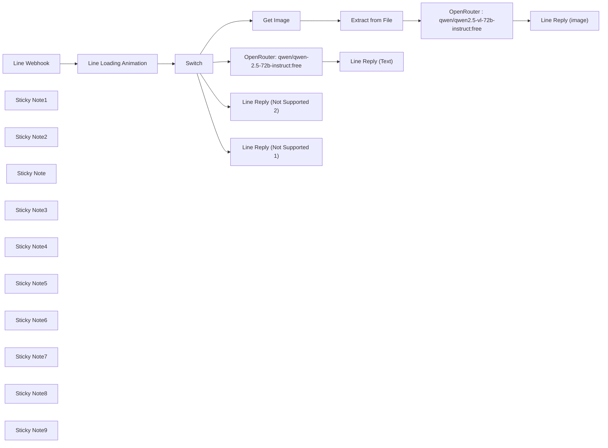

## Fluxo (.json) :

```json
{
  "id": "iFkGAiVn3yBlykIG",
  "meta": {
    "instanceId": "558d88703fb65b2d0e44613bc35916258b0f0bf983c5d4730c00c424b77ca36a"
  },
  "name": "Chinese Translator",
  "tags": [
    {
      "id": "IhTa6egt1w8uqn9Z",
      "name": "_ACTIVE",
      "createdAt": "2025-03-12T05:07:05.060Z",
      "updatedAt": "2025-03-12T05:07:05.060Z"
    },
    {
      "id": "0xpEHcJjNRRRMtEj",
      "name": "lin",
      "createdAt": "2025-03-12T05:06:24.112Z",
      "updatedAt": "2025-03-12T05:06:24.112Z"
    },
    {
      "id": "Q0IWVCdrzoxXDC7z",
      "name": "error_linlinmhee_line",
      "createdAt": "2025-03-12T06:37:16.225Z",
      "updatedAt": "2025-03-12T06:37:16.225Z"
    },
    {
      "id": "U1ozjO3iXQZWUyfG",
      "name": "_Blueprint",
      "createdAt": "2025-03-12T06:24:40.268Z",
      "updatedAt": "2025-03-12T06:24:40.268Z"
    }
  ],
  "nodes": [
    {
      "id": "3ebfb7f1-b655-405b-8bde-0219fa92d09c",
      "name": "Line Webhook",
      "type": "n8n-nodes-base.webhook",
      "position": [
        -260,
        -20
      ],
      "webhookId": "b2b119e6-6de5-4684-9a51-4706a1c20caf",
      "parameters": {
        "path": "cn",
        "options": {},
        "httpMethod": "POST"
      },
      "typeVersion": 2
    },
    {
      "id": "63ae844f-dfc3-4e8f-97d0-c0ec4be7858f",
      "name": "Line Loading Animation",
      "type": "n8n-nodes-base.httpRequest",
      "position": [
        120,
        -20
      ],
      "parameters": {
        "url": "https://api.line.me/v2/bot/chat/loading/start",
        "method": "POST",
        "options": {},
        "jsonBody": "={\n    \"chatId\": \"{{ $json.body.events[0].source.userId }}\",\n    \"loadingSeconds\": 60\n}",
        "sendBody": true,
        "specifyBody": "json",
        "authentication": "genericCredentialType",
        "genericAuthType": "httpHeaderAuth"
      },
      "credentials": {
        "httpHeaderAuth": {
          "id": "3IEOzxKOUr6OEXyU",
          "name": "Line @405jtfqs LazyChinese"
        }
      },
      "typeVersion": 4.2
    },
    {
      "id": "7e4cc2a0-958c-4111-909c-fba75a428d5e",
      "name": "Sticky Note1",
      "type": "n8n-nodes-base.stickyNote",
      "position": [
        -380,
        -100
      ],
      "parameters": {
        "color": 4,
        "width": 360,
        "height": 560,
        "content": "**Webhook from Line**\n\n\n\n\n\n\n\n\n\n\n\n\n\n\n\n\n\nYou need to set-up this webhook at Line Manager or Line Developer Console\n\nYou'll need to copy Webhook URL from this node to put in Line Console\n\nAlso, don't forget to remove 'test' part when going for production\n\nhttps://developers.line.biz/en/docs/messaging-api/receiving-messages/\n"
      },
      "typeVersion": 1
    },
    {
      "id": "767827b2-fbca-4dbb-b392-749c25a56c93",
      "name": "Sticky Note2",
      "type": "n8n-nodes-base.stickyNote",
      "position": [
        0,
        -100
      ],
      "parameters": {
        "color": 4,
        "width": 360,
        "height": 560,
        "content": "**Line Loading Animation**\n\n\n\n\n\n\n\n\n\n\n\n\n\n\n\n\n\nThis node is to only give ... loading animation back in Line.\n\nIt seems stupid but it actually tells user that the workflow is running and you are not left waiting without hope\n\nTo authorize, you can fill in the Line Token in the node here, or you can you header authorization (shown at the 'reply message' node)\n\nhttps://developers.line.biz/en/docs/messaging-api/use-loading-indicator/"
      },
      "typeVersion": 1
    },
    {
      "id": "8cdafc15-3bf8-45e9-8081-901d5c5a7880",
      "name": "Sticky Note",
      "type": "n8n-nodes-base.stickyNote",
      "position": [
        1200,
        -540
      ],
      "parameters": {
        "color": 2,
        "width": 360,
        "height": 420,
        "content": "**OpenRouter.ai**\n\n\n\n\n\n\n\n\n\n\n\n\n\n\n\n\n\nThis is to call LLMs model at Openrouter.ai \n\nYou can use it to call ChatGPT, Lllama, Qwen, Deepseek, and much more with just standardized API call and top-up only once\n\nhttps://openrouter.ai/docs/quickstart"
      },
      "typeVersion": 1
    },
    {
      "id": "3e2f4acf-771c-4d55-a13e-b4c874136574",
      "name": "Sticky Note3",
      "type": "n8n-nodes-base.stickyNote",
      "position": [
        1580,
        -540
      ],
      "parameters": {
        "color": 4,
        "width": 360,
        "height": 420,
        "content": "**Line Reply**\n\n\n\n\n\n\n\n\n\n\n\n\n\n\n\n\n\nThis node is to send reply message via Line\n\nhttps://developers.line.biz/en/docs/messaging-api/sending-messages/\n"
      },
      "typeVersion": 1
    },
    {
      "id": "b17eddaf-da3e-4e21-ab33-9e71f385d734",
      "name": "Sticky Note4",
      "type": "n8n-nodes-base.stickyNote",
      "position": [
        -380,
        -200
      ],
      "parameters": {
        "color": 5,
        "width": 780,
        "height": 80,
        "content": "## You can test this workflow by adding Line @405jtfqs"
      },
      "typeVersion": 1
    },
    {
      "id": "5ce9db0a-0c84-48df-828c-591d01a47bc8",
      "name": "Switch",
      "type": "n8n-nodes-base.switch",
      "position": [
        500,
        -20
      ],
      "parameters": {
        "rules": {
          "values": [
            {
              "outputKey": "text",
              "conditions": {
                "options": {
                  "version": 2,
                  "leftValue": "",
                  "caseSensitive": true,
                  "typeValidation": "strict"
                },
                "combinator": "and",
                "conditions": [
                  {
                    "id": "9f8075cf-8f3f-419f-ae0a-833ee29fc063",
                    "operator": {
                      "type": "string",
                      "operation": "equals"
                    },
                    "leftValue": "={{ $('Line Webhook').item.json.body.events[0].message.type }}",
                    "rightValue": "text"
                  }
                ]
              },
              "renameOutput": true
            },
            {
              "outputKey": "img",
              "conditions": {
                "options": {
                  "version": 2,
                  "leftValue": "",
                  "caseSensitive": true,
                  "typeValidation": "strict"
                },
                "combinator": "and",
                "conditions": [
                  {
                    "id": "b7770f5b-dfb5-4b7a-8dc1-4404337dbfde",
                    "operator": {
                      "name": "filter.operator.equals",
                      "type": "string",
                      "operation": "equals"
                    },
                    "leftValue": "={{ $('Line Webhook').item.json.body.events[0].message.type }}",
                    "rightValue": "image"
                  }
                ]
              },
              "renameOutput": true
            },
            {
              "outputKey": "audio",
              "conditions": {
                "options": {
                  "version": 2,
                  "leftValue": "",
                  "caseSensitive": true,
                  "typeValidation": "strict"
                },
                "combinator": "and",
                "conditions": [
                  {
                    "id": "9faa9dd4-32ce-4287-b7e5-885a42a62e32",
                    "operator": {
                      "name": "filter.operator.equals",
                      "type": "string",
                      "operation": "equals"
                    },
                    "leftValue": "={{ $('Line Webhook').item.json.body.events[0].message.type }}",
                    "rightValue": "audio"
                  }
                ]
              },
              "renameOutput": true
            },
            {
              "outputKey": "else",
              "conditions": {
                "options": {
                  "version": 2,
                  "leftValue": "",
                  "caseSensitive": true,
                  "typeValidation": "strict"
                },
                "combinator": "and",
                "conditions": [
                  {
                    "id": "f4dbfa6a-a7f8-4c32-a94d-da384f37c0d1",
                    "operator": {
                      "type": "boolean",
                      "operation": "true",
                      "singleValue": true
                    },
                    "leftValue": true,
                    "rightValue": ""
                  }
                ]
              },
              "renameOutput": true
            }
          ]
        },
        "options": {}
      },
      "typeVersion": 3.2
    },
    {
      "id": "30e52c17-5231-43df-8da7-e5eb20e88846",
      "name": "Sticky Note5",
      "type": "n8n-nodes-base.stickyNote",
      "position": [
        380,
        -100
      ],
      "parameters": {
        "color": 5,
        "width": 360,
        "height": 560,
        "content": "**Router for Text, Image, Voice, and others\n\n\n\n\n\n\n\n\n\n\n\n\n\n\n\n"
      },
      "typeVersion": 1
    },
    {
      "id": "e580dcf4-ad46-4a2a-a881-51e6ae71a236",
      "name": "Get Image",
      "type": "n8n-nodes-base.httpRequest",
      "position": [
        840,
        -40
      ],
      "parameters": {
        "url": "=https://api-data.line.me/v2/bot/message/{{ $('Line Webhook').item.json.body.events[0].message.id }}/content",
        "options": {},
        "authentication": "genericCredentialType",
        "genericAuthType": "httpHeaderAuth"
      },
      "credentials": {
        "httpHeaderAuth": {
          "id": "3IEOzxKOUr6OEXyU",
          "name": "Line @405jtfqs LazyChinese"
        }
      },
      "typeVersion": 4.2
    },
    {
      "id": "b0efee4c-0904-4774-b962-aee11886e8c7",
      "name": "OpenRouter : qwen/qwen2.5-vl-72b-instruct:free",
      "type": "n8n-nodes-base.httpRequest",
      "position": [
        1320,
        0
      ],
      "parameters": {
        "url": "https://openrouter.ai/api/v1/chat/completions",
        "method": "POST",
        "options": {},
        "jsonBody": "={\n  \"model\": \"qwen/qwen2.5-vl-72b-instruct:free\",\n  \"messages\": [\n    {\n      \"role\": \"system\",\n      \"content\": \"please provide chinese character, pinyin and translation in english for all the text in the image\"\n    },\n    {\n      \"role\": \"user\",\n      \"content\": [\n        {\n          \"type\": \"image_url\",\n          \"image_url\": {\n            \"url\": \"data:image/jpeg;base64,{{ $json.img_prompt }}\"\n          }\n        }\n      ]\n    }\n  ]\n}",
        "sendBody": true,
        "specifyBody": "json",
        "authentication": "genericCredentialType",
        "genericAuthType": "httpHeaderAuth"
      },
      "credentials": {
        "httpHeaderAuth": {
          "id": "7Y8q0dS2Y1fcvzTl",
          "name": "OpenRouter.ai"
        }
      },
      "typeVersion": 4.2
    },
    {
      "id": "b7fc7675-f8d7-4e7e-bec3-f9c626ba1728",
      "name": "OpenRouter: qwen/qwen-2.5-72b-instruct:free",
      "type": "n8n-nodes-base.httpRequest",
      "position": [
        1320,
        -460
      ],
      "parameters": {
        "url": "https://openrouter.ai/api/v1/chat/completions",
        "method": "POST",
        "options": {},
        "jsonBody": "={\n  \"model\": \"qwen/qwen-2.5-72b-instruct:free\",\n  \"messages\": [\n    {\n      \"role\": \"system\",\n      \"content\": \"please provide chinese character, pinyin and translation in english. if the input is in english, you will translate and also provide chinese character, pinyin and translation in english for each word\"\n    },\n     {\n      \"role\": \"user\",\n      \"content\": \"{{ $('Line Webhook').item.json.body.events[0].message.text }}\"\n    }\n  ]\n} ",
        "sendBody": true,
        "specifyBody": "json",
        "authentication": "genericCredentialType",
        "genericAuthType": "httpHeaderAuth"
      },
      "credentials": {
        "httpHeaderAuth": {
          "id": "7Y8q0dS2Y1fcvzTl",
          "name": "OpenRouter.ai"
        }
      },
      "typeVersion": 4.2
    },
    {
      "id": "84ad9eae-c6fc-4a02-b5cc-0a0b1755d5a8",
      "name": "Sticky Note6",
      "type": "n8n-nodes-base.stickyNote",
      "position": [
        1580,
        -100
      ],
      "parameters": {
        "color": 4,
        "width": 360,
        "height": 300,
        "content": "**Line Reply**\nSimilar to above but from different route"
      },
      "typeVersion": 1
    },
    {
      "id": "dade001e-80c6-4add-9c6c-e4583f7fcf72",
      "name": "Sticky Note7",
      "type": "n8n-nodes-base.stickyNote",
      "position": [
        1200,
        -100
      ],
      "parameters": {
        "color": 2,
        "width": 360,
        "height": 300,
        "content": "**OpenRouter.ai**\nWe will use image as prompt and change the model to support image. \n"
      },
      "typeVersion": 1
    },
    {
      "id": "54157315-3898-4e48-9598-1a5533803674",
      "name": "Sticky Note8",
      "type": "n8n-nodes-base.stickyNote",
      "position": [
        780,
        -100
      ],
      "parameters": {
        "color": 6,
        "width": 380,
        "height": 300,
        "content": "**Pre-processing**\n\n\n\n\n\n\n\n\n\n\n\n\n\n\nWe need to use get media API to get the data from Line and also move it to base64 file to prompt"
      },
      "typeVersion": 1
    },
    {
      "id": "df058683-5649-4143-b3ce-e39c7b209065",
      "name": "Extract from File",
      "type": "n8n-nodes-base.extractFromFile",
      "position": [
        1000,
        -40
      ],
      "parameters": {
        "options": {},
        "operation": "binaryToPropery",
        "destinationKey": "img_prompt"
      },
      "typeVersion": 1
    },
    {
      "id": "23a1ee09-d967-45de-a87a-bf7bc5473f53",
      "name": "Sticky Note9",
      "type": "n8n-nodes-base.stickyNote",
      "position": [
        940,
        240
      ],
      "parameters": {
        "color": 4,
        "width": 360,
        "height": 420,
        "content": "**Line Reply**\nTo reply that message is not supported\n\n\n\n\n\n\n\n\n\n\n"
      },
      "typeVersion": 1
    },
    {
      "id": "9d968370-6c55-480a-b09b-a16e55b855a3",
      "name": "Line Reply (image)",
      "type": "n8n-nodes-base.httpRequest",
      "position": [
        1700,
        0
      ],
      "parameters": {
        "url": "https://api.line.me/v2/bot/message/reply",
        "method": "POST",
        "options": {},
        "jsonBody": "={\n  \"replyToken\": \"{{ $('Line Webhook').item.json.body.events[0].replyToken }}\",\n  \"messages\": [\n    {\n      \"type\": \"text\",\n      \"text\": \"{{ $json.choices[0].message.content.replaceAll(\"\\n\",\"\\\\n\").replaceAll(\"\\n\",\"\").removeMarkdown().removeTags().replaceAll('\"',\"\") }}\"\n    }\n  ]\n} ",
        "sendBody": true,
        "specifyBody": "json",
        "authentication": "genericCredentialType",
        "genericAuthType": "httpHeaderAuth"
      },
      "credentials": {
        "httpHeaderAuth": {
          "id": "3IEOzxKOUr6OEXyU",
          "name": "Line @405jtfqs LazyChinese"
        }
      },
      "typeVersion": 4.2
    },
    {
      "id": "fed14d64-d3ea-4a17-98d5-28d889ac4ffa",
      "name": "Line Reply (Text)",
      "type": "n8n-nodes-base.httpRequest",
      "position": [
        1700,
        -460
      ],
      "parameters": {
        "url": "https://api.line.me/v2/bot/message/reply",
        "method": "POST",
        "options": {},
        "jsonBody": "={\n  \"replyToken\": \"{{ $('Line Webhook').item.json.body.events[0].replyToken }}\",\n  \"messages\": [\n    {\n      \"type\": \"text\",\n      \"text\": \"{{ $json.choices[0].message.content.replaceAll(\"\\n\",\"\\\\n\").replaceAll(\"\\n\",\"\").removeMarkdown().removeTags().replaceAll('\"',\"\") }}\"\n    }\n  ]\n} ",
        "sendBody": true,
        "specifyBody": "json",
        "authentication": "genericCredentialType",
        "genericAuthType": "httpHeaderAuth"
      },
      "credentials": {
        "httpHeaderAuth": {
          "id": "3IEOzxKOUr6OEXyU",
          "name": "Line @405jtfqs LazyChinese"
        }
      },
      "typeVersion": 4.2
    },
    {
      "id": "22b0359f-66f8-4a6a-b2b9-5a516f235aef",
      "name": "Line Reply (Not Supported 2)",
      "type": "n8n-nodes-base.httpRequest",
      "position": [
        1060,
        500
      ],
      "parameters": {
        "url": "https://api.line.me/v2/bot/message/reply",
        "method": "POST",
        "options": {},
        "jsonBody": "={\n  \"replyToken\": \"{{ $('Line Webhook').item.json.body.events[0].replyToken }}\",\n  \"messages\": [\n    {\n      \"type\": \"text\",\n      \"text\": \"Please try again. Message type is not supported\"\n    }\n  ]\n} ",
        "sendBody": true,
        "specifyBody": "json",
        "authentication": "genericCredentialType",
        "genericAuthType": "httpHeaderAuth"
      },
      "credentials": {
        "httpHeaderAuth": {
          "id": "3IEOzxKOUr6OEXyU",
          "name": "Line @405jtfqs LazyChinese"
        }
      },
      "typeVersion": 4.2
    },
    {
      "id": "a5d4ad30-71b8-4544-88a0-5cfbb0a79013",
      "name": "Line Reply (Not Supported 1)",
      "type": "n8n-nodes-base.httpRequest",
      "position": [
        1060,
        320
      ],
      "parameters": {
        "url": "https://api.line.me/v2/bot/message/reply",
        "method": "POST",
        "options": {},
        "jsonBody": "={\n  \"replyToken\": \"{{ $('Line Webhook').item.json.body.events[0].replyToken }}\",\n  \"messages\": [\n    {\n      \"type\": \"text\",\n      \"text\": \"Please try again. Message type is not supported\"\n    }\n  ]\n} ",
        "sendBody": true,
        "specifyBody": "json",
        "authentication": "genericCredentialType",
        "genericAuthType": "httpHeaderAuth"
      },
      "credentials": {
        "httpHeaderAuth": {
          "id": "3IEOzxKOUr6OEXyU",
          "name": "Line @405jtfqs LazyChinese"
        }
      },
      "typeVersion": 4.2
    }
  ],
  "active": true,
  "pinData": {},
  "settings": {
    "timezone": "Asia/Bangkok",
    "executionOrder": "v1"
  },
  "versionId": "7e072a04-5169-4bfd-8391-2797f4714d0c",
  "connections": {
    "Switch": {
      "main": [
        [
          {
            "node": "OpenRouter: qwen/qwen-2.5-72b-instruct:free",
            "type": "main",
            "index": 0
          }
        ],
        [
          {
            "node": "Get Image",
            "type": "main",
            "index": 0
          }
        ],
        [
          {
            "node": "Line Reply (Not Supported 1)",
            "type": "main",
            "index": 0
          }
        ],
        [
          {
            "node": "Line Reply (Not Supported 2)",
            "type": "main",
            "index": 0
          }
        ]
      ]
    },
    "Get Image": {
      "main": [
        [
          {
            "node": "Extract from File",
            "type": "main",
            "index": 0
          }
        ]
      ]
    },
    "Line Webhook": {
      "main": [
        [
          {
            "node": "Line Loading Animation",
            "type": "main",
            "index": 0
          }
        ]
      ]
    },
    "Extract from File": {
      "main": [
        [
          {
            "node": "OpenRouter : qwen/qwen2.5-vl-72b-instruct:free",
            "type": "main",
            "index": 0
          }
        ]
      ]
    },
    "Line Loading Animation": {
      "main": [
        [
          {
            "node": "Switch",
            "type": "main",
            "index": 0
          }
        ]
      ]
    },
    "OpenRouter: qwen/qwen-2.5-72b-instruct:free": {
      "main": [
        [
          {
            "node": "Line Reply (Text)",
            "type": "main",
            "index": 0
          }
        ]
      ]
    },
    "OpenRouter : qwen/qwen2.5-vl-72b-instruct:free": {
      "main": [
        [
          {
            "node": "Line Reply (image)",
            "type": "main",
            "index": 0
          }
        ]
      ]
    }
  }
}
```

<a id="template-1094"></a>

## Template 1094 - Geração de códigos TOTP via fluxo manual

- **Nome:** Geração de códigos TOTP via fluxo manual
- **Descrição:** Fluxo que permite gerar códigos TOTP a partir de uma ação manual, usando credenciais armazenadas para autenticação temporária.
- **Funcionalidade:** • Início manual: Dispara o fluxo quando o usuário clica em testar ou aciona manualmente.
• Geração de código TOTP: Cria um código de autenticação temporário baseado na chave secreta configurada.
• Uso de credenciais armazenadas: Recupera e utiliza credenciais pré-configuradas (conta TOTP) para gerar os códigos.
• Saída pronta para uso: Fornece o código TOTP para uso em processos de autenticação de dois fatores ou integrações.
- **Ferramentas:** • TOTP account (Mars55): Conta/armazenamento da chave secreta usada para gerar códigos TOTP temporários, compatível com sistemas de autenticação por tempo.


## Fluxo visual


## Fluxo (.json) :

```json
{
  "id": "0wfomsVO0TQtQkwU",
  "meta": {
    "instanceId": "2e75c9fb3cdcf631da470c0180f0739986baa0ee860de53281e9edc3491b82a3"
  },
  "name": "Complete Guide to Setting Up and Generating TOTP Codes in n8n 🔐",
  "tags": [],
  "nodes": [
    {
      "id": "0fe95b9a-be2b-4022-829e-8b6c801e5baf",
      "name": "When clicking ‘Test workflow’",
      "type": "n8n-nodes-base.manualTrigger",
      "position": [
        -280,
        -340
      ],
      "parameters": {},
      "typeVersion": 1
    },
    {
      "id": "02fee6b5-7770-4889-b9bb-89bface8872d",
      "name": "TOTP",
      "type": "n8n-nodes-base.totp",
      "position": [
        -40,
        -340
      ],
      "parameters": {
        "options": {}
      },
      "credentials": {
        "totpApi": {
          "id": "9487Zco8UqMQWnpf",
          "name": "TOTP account Mars55"
        }
      },
      "typeVersion": 1
    }
  ],
  "active": false,
  "pinData": {},
  "settings": {
    "timezone": "Asia/Tehran",
    "executionOrder": "v1"
  },
  "versionId": "d7a5fff3-3fcd-45cd-ba06-564097567ff5",
  "connections": {
    "When clicking ‘Test workflow’": {
      "main": [
        [
          {
            "node": "TOTP",
            "type": "main",
            "index": 0
          }
        ]
      ]
    }
  }
}
```

<a id="template-1095"></a>

## Template 1095 - Envio em lotes de mensagens pelo Telegram

- **Nome:** Envio em lotes de mensagens pelo Telegram
- **Descrição:** Lê IDs de chat de uma planilha e envia a mensagem "Hello" para cada ID em lotes, com pausas entre os lotes.
- **Funcionalidade:** • Execução manual: Inicia o fluxo ao clicar em executar.
• Leitura de IDs: Lê a coluna A de uma planilha para obter IDs de chat.
• Agrupamento em lotes: Divide os IDs em lotes de 30 para processamento controlado.
• Envio de mensagens: Envia a mensagem "Hello" para cada ID do lote via bot do Telegram.
• Pausa entre lotes: Aguarda 30 segundos antes de processar o próximo lote.
- **Ferramentas:** • Google Sheets: Planilha usada para armazenar e fornecer os IDs de chat.
• Telegram: Serviço de mensagens utilizado para enviar as mensagens aos chat IDs.


## Fluxo visual

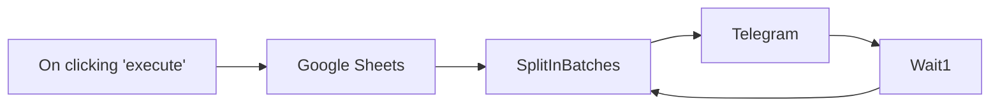

## Fluxo (.json) :

```json
{
  "nodes": [
    {
      "name": "On clicking 'execute'",
      "type": "n8n-nodes-base.manualTrigger",
      "position": [
        -60,
        400
      ],
      "parameters": {},
      "typeVersion": 1
    },
    {
      "name": "Telegram",
      "type": "n8n-nodes-base.telegram",
      "position": [
        500,
        400
      ],
      "parameters": {
        "text": "Hello",
        "chatId": "={{$node[\"SplitInBatches\"].json[\"Chat ID\"]}}",
        "additionalFields": {}
      },
      "credentials": {
        "telegramApi": {
          "id": null,
          "name": "telegram-bot"
        }
      },
      "typeVersion": 1
    },
    {
      "name": "Google Sheets",
      "type": "n8n-nodes-base.googleSheets",
      "position": [
        120,
        400
      ],
      "parameters": {
        "range": "A:A",
        "options": {},
        "authentication": "oAuth2"
      },
      "credentials": {
        "googleSheetsOAuth2Api": {
          "id": null,
          "name": "google-sheet"
        }
      },
      "typeVersion": 1
    },
    {
      "name": "SplitInBatches",
      "type": "n8n-nodes-base.splitInBatches",
      "position": [
        320,
        400
      ],
      "parameters": {
        "options": {},
        "batchSize": 30
      },
      "typeVersion": 1
    },
    {
      "name": "Wait1",
      "type": "n8n-nodes-base.wait",
      "position": [
        660,
        180
      ],
      "webhookId": "22fca54c-eac4-44bc-adf7-68b33818695c",
      "parameters": {
        "unit": "seconds",
        "amount": 30
      },
      "typeVersion": 1
    }
  ],
  "connections": {
    "Wait1": {
      "main": [
        [
          {
            "node": "SplitInBatches",
            "type": "main",
            "index": 0
          }
        ]
      ]
    },
    "Telegram": {
      "main": [
        [
          {
            "node": "Wait1",
            "type": "main",
            "index": 0
          }
        ]
      ]
    },
    "Google Sheets": {
      "main": [
        [
          {
            "node": "SplitInBatches",
            "type": "main",
            "index": 0
          }
        ]
      ]
    },
    "SplitInBatches": {
      "main": [
        [
          {
            "node": "Telegram",
            "type": "main",
            "index": 0
          }
        ]
      ]
    },
    "On clicking 'execute'": {
      "main": [
        [
          {
            "node": "Google Sheets",
            "type": "main",
            "index": 0
          }
        ]
      ]
    }
  }
}
```

<a id="template-1096"></a>

## Template 1096 - Criar eventos no Google Calendar a partir do Google Sheets

- **Nome:** Criar eventos no Google Calendar a partir do Google Sheets
- **Descrição:** Automatiza a criação de eventos no Google Calendar usando dados fornecidos em uma planilha do Google Sheets.
- **Funcionalidade:** • Escuta de novas entradas na planilha: monitora a planilha e aciona o fluxo ao adicionar uma nova linha.
• Processamento da última linha: extrai e processa apenas o registro mais recente para evitar duplicações.
• Formatação da data do evento: adiciona o ano atual quando necessário e converte a data para o formato ISO (YYYY-MM-DD).
• Mapeamento de campos: extrai nome do evento, descrição e local das colunas da planilha para uso no evento.
• Criação de evento em dia inteiro: cria o evento como all-day usando a mesma data como início e fim.
• Definição de visibilidade e cor: configura o evento como disponível (transparent) e aplica uma cor para destaque.
• Permissão para convidados: permite que convidados possam convidar outras pessoas.
- **Ferramentas:** • Google Sheets: armazena os dados dos eventos (nome, descrição, data, local) que disparam a automação.
• Google Calendar: serviço onde os eventos são criados e configurados (data, descrição, local, cor e disponibilidade).


## Fluxo visual

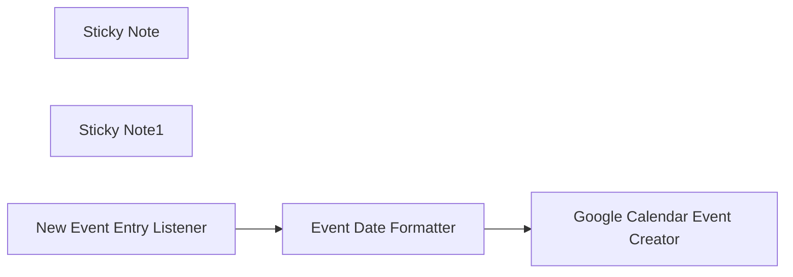

## Fluxo (.json) :

```json
{
  "id": "AvCMhDoSUAYXsrQX",
  "meta": {
    "instanceId": "14e4c77104722ab186539dfea5182e419aecc83d85963fe13f6de862c875ebfa"
  },
  "name": "Automate Event Creation in Google Calendar from Google Sheets",
  "tags": [],
  "nodes": [
    {
      "id": "b973046b-ff52-464e-8d34-fe57c5b1df7d",
      "name": "Sticky Note",
      "type": "n8n-nodes-base.stickyNote",
      "position": [
        -240,
        0
      ],
      "parameters": {
        "color": 6,
        "width": 1200,
        "height": 280,
        "content": "# Automate Event Creation in Google Calendar from Google Sheets\n"
      },
      "typeVersion": 1
    },
    {
      "id": "e845b624-6c0a-4d31-aace-cc050f8613dc",
      "name": "Sticky Note1",
      "type": "n8n-nodes-base.stickyNote",
      "position": [
        -240,
        300
      ],
      "parameters": {
        "color": 6,
        "width": 1200,
        "height": 280,
        "content": "## Description \nIn this workflow, we streamline the process of creating events in Google Calendar using event data stored in a Google Sheet through n8n automation. The workflow begins by retrieving the latest event entry from Google Sheets, ensuring that only the most recent event details are processed. Once the event data is fetched, a Function node is used to format the event date so that it aligns with Google Calendar's required format. This step ensures consistency and prevents any date-related errors.\n\nAfter formatting, the workflow sends the structured event details to Google Calendar, where the event is created with essential information such as the event title (summary), description, event date, and location. Additionally, the workflow allows customization by setting the event's status as either \"Busy\" or \"Available,\" helping attendees manage their schedules effectively. Furthermore, a background color can be assigned to the event to enhance visibility and categorization in the calendar.\n\nBy automating this process, the workflow eliminates the need for manual event creation, ensuring seamless synchronization between Google Sheets and Google Calendar. This approach improves efficiency, accuracy, and productivity, making event management effortless."
      },
      "typeVersion": 1
    },
    {
      "id": "60f2c8b8-a953-4fc1-8751-01d8b7924cb2",
      "name": "Event Date Formatter",
      "type": "n8n-nodes-base.code",
      "position": [
        320,
        100
      ],
      "parameters": {
        "jsCode": "// Get the last item from the input data\nconst lastEvent = items[items.length - 1].json;\n\n// Extract relevant fields\nconst eventName = lastEvent[\"Event Name\"];\nconst eventDescription = lastEvent[\"Event Description\"];\nconst currentYear = new Date().getFullYear(); \n// Get the current year\nconst location = lastEvent[\"Location\"];\n\n// Ensure the date includes the year\nconst formatDateWithYear = (dateStr) => {\n    return dateStr.includes(currentYear) ? dateStr : `${dateStr} ${currentYear}`;\n};\n\n// Format the start date\nconst startDateString = formatDateWithYear(lastEvent[\"Event Start Date\"]); // Example: \"11 March 2024\"\n\n// Convert to JavaScript Date object\nconst startDate = new Date(startDateString);\n\n// Convert to ISO format (YYYY-MM-DD)\nconst formattedStartDate = startDate.toISOString().split(\"T\")[0]; // Extract only the date\n\n// Return the last event's formatted data\nreturn [{\n    json: {\n        eventName,\n        eventDescription,\n        startDate: formattedStartDate,\n      location: location,\n    }\n}];\n"
      },
      "typeVersion": 2
    },
    {
      "id": "e27e0d10-71bb-4d01-ba92-5fb8c3195422",
      "name": "New Event Entry Listener",
      "type": "n8n-nodes-base.googleSheetsTrigger",
      "position": [
        -120,
        100
      ],
      "parameters": {
        "event": "rowAdded",
        "options": {
          "valueRender": "FORMULA"
        },
        "pollTimes": {
          "item": [
            {
              "mode": "everyMinute"
            },
            {}
          ]
        },
        "sheetName": {
          "__rl": true,
          "mode": "list",
          "value": "gid=0",
          "cachedResultUrl": "https://docs.google.com/spreadsheets/d/1dKjIGmcnQgSEMVuWAAFVDaj_MCBFKBX8hCOk5OH2dK4/edit#gid=0",
          "cachedResultName": "Sheet1"
        },
        "documentId": {
          "__rl": true,
          "mode": "list",
          "value": "1dKjIGmcnQgSEMVuWAAFVDaj_MCBFKBX8hCOk5OH2dK4",
          "cachedResultUrl": "https://docs.google.com/spreadsheets/d/1dKjIGmcnQgSEMVuWAAFVDaj_MCBFKBX8hCOk5OH2dK4/edit?usp=drivesdk",
          "cachedResultName": "N8n Event List"
        }
      },
      "typeVersion": 1
    },
    {
      "id": "04864602-bf6a-4def-9bc3-c5ab4b5c8336",
      "name": "Google Calendar Event Creator",
      "type": "n8n-nodes-base.googleCalendar",
      "position": [
        700,
        100
      ],
      "parameters": {
        "end": "={{ $json.startDate }}",
        "start": "={{ $json.startDate }}",
        "calendar": {
          "__rl": true,
          "mode": "list",
          "value": "",
          "cachedResultName": ""
        },
        "additionalFields": {
          "color": "3",
          "allday": "yes",
          "summary": "={{ $json.eventName }}",
          "location": "={{ $json.location }}",
          "showMeAs": "transparent",
          "description": "={{ $json.eventDescription }}",
          "guestsCanInviteOthers": true
        }
      },
      "typeVersion": 1.3
    }
  ],
  "active": false,
  "pinData": {},
  "settings": {
    "executionOrder": "v1"
  },
  "versionId": "98bd043e-8dce-4eca-a22f-95ff61f07a1f",
  "connections": {
    "Event Date Formatter": {
      "main": [
        [
          {
            "node": "Google Calendar Event Creator",
            "type": "main",
            "index": 0
          }
        ]
      ]
    },
    "New Event Entry Listener": {
      "main": [
        [
          {
            "node": "Event Date Formatter",
            "type": "main",
            "index": 0
          }
        ]
      ]
    }
  }
}
```

<a id="template-1097"></a>

## Template 1097 - Notificação de novo assinante via formulário ConvertKit

- **Nome:** Notificação de novo assinante via formulário ConvertKit
- **Descrição:** Este fluxo recebe notificações quando um assinante é adicionado por meio de um formulário específico no ConvertKit e disponibiliza os dados para processamentos posteriores.
- **Funcionalidade:** • Receber evento de inscrição por formulário: monitora eventos de inscrição (formSubscribe) provenientes do serviço de formulários.
• Filtrar por formulário específico: identifica e limita as notificações ao formulário com ID 1657198.
• Expor dados do assinante: disponibiliza os dados do novo assinante via webhook para etapas subsequentes da automação.
- **Ferramentas:** • ConvertKit: Plataforma de email marketing e gerenciamento de assinantes que fornece formulários e envia atualizações por webhook quando novos assinantes se inscrevem.


## Fluxo visual

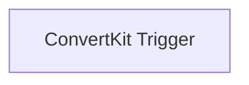

## Fluxo (.json) :

```json
{
  "id": "28",
  "name": "Receive updates when a subscriber is added through a form in ConvertKit",
  "nodes": [
    {
      "name": "ConvertKit Trigger",
      "type": "n8n-nodes-base.convertKitTrigger",
      "position": [
        690,
        260
      ],
      "webhookId": "55336480-7be1-4432-8fc8-d860572c1c18",
      "parameters": {
        "event": "formSubscribe",
        "formId": 1657198
      },
      "credentials": {
        "convertKitApi": "convertkit"
      },
      "typeVersion": 1
    }
  ],
  "active": false,
  "settings": {},
  "connections": {}
}
```

<a id="template-1098"></a>

## Template 1098 - Análise de feedback e rascunho para redes sociais

- **Nome:** Análise de feedback e rascunho para redes sociais
- **Descrição:** Recebe feedbacks de clientes, utiliza IA para resumir pontos positivos e sugerir melhorias, e entrega um relatório por email além de um rascunho de post em um chat do Telegram.
- **Funcionalidade:** • Recebimento de feedback via webhook: aceita feedbacks enviados por requisições HTTP POST.
• Preparação de prompt para IA: formata o feedback em um prompt com instruções claras para análise e geração de conteúdo.
• Análise com IA: envia o prompt para um serviço de geração de texto para obter resumo, sugestões e um post social.
• Formatação da saída da IA: separa e organiza o relatório de feedback e o rascunho do post a partir da resposta da IA.
• Envio de relatório por email: envia o resumo e as melhorias sugeridas para um endereço de email da equipe.
• Envio do rascunho para Telegram: publica o rascunho do post em um chat do Telegram para revisão ou publicação.
- **Ferramentas:** • Webhook (endpoint HTTP): recebe os feedbacks dos clientes através de requisições POST.
• Deepseek API: serviço de geração de texto/IA usado para analisar o feedback e gerar resumo, sugestões e post.
• Serviço de email (SMTP/ESP): envia o relatório de feedback para a equipe por email.
• Telegram: plataforma de mensagens usada para enviar o rascunho do post a um chat específico.


## Fluxo visual

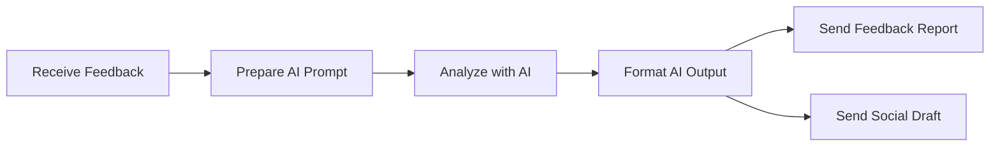

## Fluxo (.json) :

```json
{
  "id": "mW6b4dMHkIDfnaIj",
  "meta": {
    "instanceId": "7b7fd5f72a378d0859f4d1cf8dd3c226094df4777ef6aca192ac32e815fe212a",
    "templateCredsSetupCompleted": true
  },
  "name": "My workflow 4",
  "tags": [],
  "nodes": [
    {
      "id": "9ae28c07-bb44-4e64-b38c-a74a9de81b2e",
      "name": "Receive Feedback",
      "type": "n8n-nodes-base.webhook",
      "position": [
        -440,
        540
      ],
      "webhookId": "89e8d5ec-d442-41ea-9ff1-93a9df0b2aa1",
      "parameters": {
        "path": "client-feedback",
        "options": {},
        "httpMethod": "POST"
      },
      "typeVersion": 1
    },
    {
      "id": "770bc041-1846-4ac1-b8dc-61756686f906",
      "name": "Prepare AI Prompt",
      "type": "n8n-nodes-base.function",
      "position": [
        -240,
        540
      ],
      "parameters": {
        "functionCode": "\nconst feedback = $json.feedback || \"No feedback provided.\";\nreturn [{\n  json: {\n    prompt: `Analyze this client feedback: \"${feedback}\"\\n\\n1. Summarize the positive points.\\n2. Suggest improvements.\\n3. Generate a short social media post based on the positive elements.`\n  }\n}];\n"
      },
      "typeVersion": 1
    },
    {
      "id": "0b3a469a-f6f4-4140-9c6f-fd7ba7689c5e",
      "name": "Analyze with AI",
      "type": "n8n-nodes-base.httpRequest",
      "position": [
        -40,
        540
      ],
      "parameters": {
        "url": "https://api.deepseek.com/generate",
        "options": {},
        "authentication": "predefinedCredentialType",
        "jsonParameters": true
      },
      "typeVersion": 2
    },
    {
      "id": "bdbf3a85-e68f-4fe3-b0b4-d44578d11c31",
      "name": "Format AI Output",
      "type": "n8n-nodes-base.function",
      "position": [
        160,
        540
      ],
      "parameters": {
        "functionCode": "\nconst output = $json.response || $json.choices?.[0]?.text || \"No AI output.\";\nconst splitIndex = output.indexOf(\"3.\");\nlet summary = output;\nlet post = \"No post generated.\";\n\nif (splitIndex !== -1) {\n  summary = output.substring(0, splitIndex).trim();\n  post = output.substring(splitIndex).replace(/^3\\./, \"\").trim();\n}\n\nreturn [{\n  json: {\n    report: summary,\n    post: post\n  }\n}];\n"
      },
      "typeVersion": 1
    },
    {
      "id": "47093d4d-645b-4dc8-a5a4-1b35a649ac97",
      "name": "Send Feedback Report",
      "type": "n8n-nodes-base.emailSend",
      "position": [
        380,
        500
      ],
      "parameters": {
        "text": "={{ $json[\"report\"] }}",
        "options": {},
        "subject": "Client Feedback Summary",
        "toEmail": "team@email.com",
        "fromEmail": "your@email.com"
      },
      "typeVersion": 1
    },
    {
      "id": "e49a4898-00d9-4413-ac6d-87aafdfe6ff9",
      "name": "Send Social Draft",
      "type": "n8n-nodes-base.telegram",
      "position": [
        380,
        660
      ],
      "webhookId": "07598764-aee9-41ea-82c1-0ded0ac08b57",
      "parameters": {
        "text": "={{ $json[\"post\"] }}",
        "chatId": "YOUR_TELEGRAM_CHAT_ID",
        "additionalFields": {}
      },
      "typeVersion": 1
    }
  ],
  "active": false,
  "pinData": {},
  "settings": {
    "executionOrder": "v1"
  },
  "versionId": "54d175ec-080f-4d2d-9d83-60dd36c8f11b",
  "connections": {
    "Analyze with AI": {
      "main": [
        [
          {
            "node": "Format AI Output",
            "type": "main",
            "index": 0
          }
        ]
      ]
    },
    "Format AI Output": {
      "main": [
        [
          {
            "node": "Send Feedback Report",
            "type": "main",
            "index": 0
          },
          {
            "node": "Send Social Draft",
            "type": "main",
            "index": 0
          }
        ]
      ]
    },
    "Receive Feedback": {
      "main": [
        [
          {
            "node": "Prepare AI Prompt",
            "type": "main",
            "index": 0
          }
        ]
      ]
    },
    "Prepare AI Prompt": {
      "main": [
        [
          {
            "node": "Analyze with AI",
            "type": "main",
            "index": 0
          }
        ]
      ]
    }
  }
}
```

<a id="template-1099"></a>

## Template 1099 - Alerta SMS quando serviço fora do ar

- **Nome:** Alerta SMS quando serviço fora do ar
- **Descrição:** Verifica periodicamente um endpoint HTTP e envia um SMS caso o serviço não responda com sucesso.
- **Funcionalidade:** • Agendamento periódico: Executa verificações em intervalos regulares (minutos).
• Requisição HTTP ao endpoint: Realiza uma chamada HTTP ao URL configurado para verificar o estado do serviço.
• Verificação do código de status: Avalia o código HTTP de resposta e considera 200 como estado saudável.
• Envio de SMS de alerta: Se o serviço não retornar 200, envia uma mensagem SMS (ex.: "Service Down") para números configurados.
- **Ferramentas:** • Endpoint HTTP (serviço monitorado): Serviço ou aplicação acessível via URL que será verificada periodicamente.
• Twilio: Plataforma de envio de SMS usada para notificar responsáveis quando o serviço estiver fora do ar.


## Fluxo visual


## Fluxo (.json) :

```json
{
  "id": "ppsHlJlSpHPQJp4Q",
  "meta": {
    "instanceId": "558d88703fb65b2d0e44613bc35916258b0f0bf983c5d4730c00c424b77ca36a"
  },
  "tags": [],
  "nodes": [
    {
      "id": "6615e821-d47d-4df9-aa10-4aebdd9e6737",
      "name": "Schedule Trigger",
      "type": "n8n-nodes-base.scheduleTrigger",
      "position": [
        -1100,
        -540
      ],
      "parameters": {
        "rule": {
          "interval": [
            {
              "field": "minutes"
            }
          ]
        }
      },
      "typeVersion": 1.2
    },
    {
      "id": "456b6ea3-1360-4a6c-a862-84c022db78e4",
      "name": "HTTP Request",
      "type": "n8n-nodes-base.httpRequest",
      "position": [
        -740,
        -540
      ],
      "parameters": {
        "url": "",
        "options": {
          "response": {
            "response": {
              "fullResponse": true
            }
          }
        }
      },
      "typeVersion": 4.2
    },
    {
      "id": "d1155cfc-c27a-40c5-8d70-c0705ce24c9b",
      "name": "Twilio",
      "type": "n8n-nodes-base.twilio",
      "position": [
        -240,
        -520
      ],
      "parameters": {
        "to": "",
        "from": "",
        "message": "Service Down",
        "options": {}
      },
      "credentials": {
        "twilioApi": {
          "id": "Izc7tLRJsN06wezO",
          "name": "Twilio account"
        }
      },
      "typeVersion": 1
    },
    {
      "id": "f4a781ab-96bf-4801-95d4-df8f8fbd1f8a",
      "name": "If",
      "type": "n8n-nodes-base.if",
      "position": [
        -520,
        -540
      ],
      "parameters": {
        "options": {},
        "conditions": {
          "options": {
            "version": 2,
            "leftValue": "",
            "caseSensitive": true,
            "typeValidation": "strict"
          },
          "combinator": "and",
          "conditions": [
            {
              "id": "75b05c45-447e-407b-847f-5ed909b3c325",
              "operator": {
                "type": "number",
                "operation": "equals"
              },
              "leftValue": "={{ $json.statusCode }}",
              "rightValue": 200
            }
          ]
        }
      },
      "typeVersion": 2.2
    }
  ],
  "active": true,
  "pinData": {},
  "settings": {
    "executionOrder": "v1"
  },
  "versionId": "1918412f-8dd2-404c-ad68-0b48f09ff7fc",
  "connections": {
    "If": {
      "main": [
        [],
        [
          {
            "node": "Twilio",
            "type": "main",
            "index": 0
          }
        ]
      ]
    },
    "HTTP Request": {
      "main": [
        [
          {
            "node": "If",
            "type": "main",
            "index": 0
          }
        ]
      ]
    },
    "Schedule Trigger": {
      "main": [
        [
          {
            "node": "HTTP Request",
            "type": "main",
            "index": 0
          }
        ]
      ]
    }
  }
}
```

<a id="template-1100"></a>

## Template 1100 - Relatório automatizado de auditoria de conteúdo SEO

- **Nome:** Relatório automatizado de auditoria de conteúdo SEO
- **Descrição:** Workflow que executa uma auditoria completa de conteúdo para um domínio, combinando rastreamento de páginas, análise on-page e dados do Google Search Console para gerar um relatório HTML brandeado com recomendações actionáveis.
- **Funcionalidade:** • Configuração personalizada: Recebe domínio, limites de crawl, opções de JavaScript e dados de marca (nome, site, logo e cores).
• Início manual e agendamento de verificação: Permite iniciar a rotina manualmente e aguardar a conclusão do rastreio antes de continuar.
• Criação e monitoramento de tarefa de rastreio: Envia uma tarefa de crawl ao serviço de rastreio e verifica o progresso até o término.
• Coleta de dados brutos do rastreio: Recupera o conjunto completo de páginas e metadados analisados pelo rastreio.
• Extração e filtragem de URLs: Filtra URLs relevantes (por exemplo, status 200) e identifica páginas 301/404 para análise separada.
• Enriquecimento com dados do Google Search Console: Consulta dados de desempenho (cliques e impressões) por página para os últimos 90 dias e mapeia esses resultados às páginas rastreadas.
• Identificação de problemas de conteúdo e SEO: Agrega checagens como 404/301, canonicalização, títulos/descrições ausentes ou duplicados, h1, legibilidade, conteúdo fino, tamanho de HTML, profundidade de clique e páginas órfãs.
• Coleta de fontes de links para páginas com problemas: Consulta fontes de links para páginas 404/301 e incorpora as URLs de origem, tipo e texto âncora ao relatório.
• Construção de estrutura analítica: Consolida métricas, contabiliza ocorrências por tipo de problema e prepara um sumário executivo com contagens por categoria.
• Cálculo de health score e recomendações: Calcula uma pontuação de saúde ponderada e gera recomendações priorizadas (alta, média, baixa) para ações.
• Geração de relatório HTML brandeado: Produz um arquivo HTML visual, personalizado com logo e cores da empresa, incluindo tabelas paginadas, painéis e instruções de implementação.
• Exportação para arquivo: Converte o HTML gerado em um arquivo para download com nome formatado pelo domínio e data.
- **Ferramentas:** • DataForSEO API: Serviço de rastreio on-page que executa o crawl do domínio e fornece dados brutos de páginas, status HTTP, metadados e links internos/externos.
• Google Search Console API: Fonte de dados de performance (cliques e impressões) por página usada para identificar conteúdo subperformante e complementar a análise on-page.


## Fluxo visual

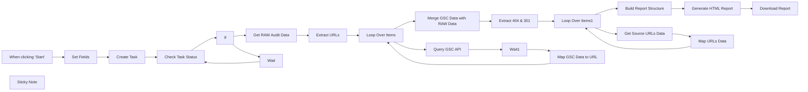

## Fluxo (.json) :

```json
{
  "id": "Tqa8dikBDLYEytx5",
  "meta": {
    "instanceId": "ddfdf733df99a65c801a91865dba5b7c087c95cc22a459ff3647e6deddf2aee6"
  },
  "name": "Automated Content SEO Audit Report",
  "tags": [],
  "nodes": [
    {
      "id": "b5f15675-35c9-42a1-b7eb-bfaf0b467a5a",
      "name": "Set Fields",
      "type": "n8n-nodes-base.set",
      "position": [
        280,
        620
      ],
      "parameters": {
        "options": {},
        "assignments": {
          "assignments": [
            {
              "id": "e71886f0-104f-412b-9fef-d2b3738cebf0",
              "name": "dfs_domain",
              "type": "string",
              "value": "yourclientdomain.com"
            },
            {
              "id": "de35327e-1e32-4996-970a-50b8953c7709",
              "name": "dfs_max_crawl_pages",
              "type": "string",
              "value": "1000"
            },
            {
              "id": "0d6b4d1a-e57d-4e38-8aa5-e2ea5589a089",
              "name": "dfs_enable_javascript",
              "type": "string",
              "value": "false"
            },
            {
              "id": "d699e487-ab74-483f-8cd8-cdcfaca567d7",
              "name": "company_name",
              "type": "string",
              "value": "Custom Workflows AI"
            },
            {
              "id": "da123535-f678-4331-973a-07711b7aaaac",
              "name": "company_website",
              "type": "string",
              "value": "https://customworkflows.ai"
            },
            {
              "id": "e12486eb-7019-4639-85a9-c55b4c62beef",
              "name": "company_logo_url",
              "type": "string",
              "value": "https://customworkflows.ai/images/logo.png"
            },
            {
              "id": "9eef2015-e89c-4930-82a5-972111c1a4fe",
              "name": "brand_primary_color",
              "type": "string",
              "value": "#252946"
            },
            {
              "id": "dd4ff260-6008-49ec-a0e6-ad5c177eb8df",
              "name": "brand_secondary_color",
              "type": "string",
              "value": "#0fd393"
            },
            {
              "id": "d71a4d91-c5bf-49c4-b7d0-64e84dad6153",
              "name": "gsc_property_type",
              "type": "string",
              "value": "domain"
            }
          ]
        }
      },
      "typeVersion": 3.4
    },
    {
      "id": "57a66b27-a253-4543-9d44-cd3afdbc3946",
      "name": "When clicking ‘Start’",
      "type": "n8n-nodes-base.manualTrigger",
      "position": [
        60,
        620
      ],
      "parameters": {},
      "typeVersion": 1
    },
    {
      "id": "3e5e8162-2815-429f-b6e8-6ea6ea70cf18",
      "name": "Check Task Status",
      "type": "n8n-nodes-base.httpRequest",
      "position": [
        660,
        620
      ],
      "parameters": {
        "url": "=https://api.dataforseo.com/v3/on_page/summary/{{ $json.tasks[0].id }}",
        "options": {},
        "sendHeaders": true,
        "authentication": "genericCredentialType",
        "genericAuthType": "httpBasicAuth",
        "headerParameters": {
          "parameters": [
            {
              "name": "Content-Type",
              "value": "application/json"
            }
          ]
        }
      },
      "typeVersion": 4.2
    },
    {
      "id": "9ea481fe-8af6-43c2-881d-eb68f63b0424",
      "name": "Create Task",
      "type": "n8n-nodes-base.httpRequest",
      "position": [
        480,
        620
      ],
      "parameters": {
        "url": "https://api.dataforseo.com/v3/on_page/task_post",
        "method": "POST",
        "options": {},
        "jsonBody": "=[\n  {\n    \"target\": \"{{ $json.dfs_domain }}\",\n    \"max_crawl_pages\": {{ $json.dfs_max_crawl_pages }},\n    \"load_resources\": false,\n    \"enable_javascript\": {{ $json.dfs_enable_javascript }},\n    \"custom_js\": \"meta = {}; meta.url = document.URL; meta;\",\n    \"tag\": \"{{ $json.dfs_domain + Math.floor(10000 + Math.random() * 90000) }}\"\n  }\n]",
        "sendBody": true,
        "sendHeaders": true,
        "specifyBody": "json",
        "authentication": "genericCredentialType",
        "genericAuthType": "httpBasicAuth",
        "headerParameters": {
          "parameters": [
            {
              "name": "Content-Type",
              "value": "application/json"
            }
          ]
        }
      },
      "typeVersion": 4.2
    },
    {
      "id": "0a0e696a-29a7-4b34-8299-102c72544153",
      "name": "If",
      "type": "n8n-nodes-base.if",
      "position": [
        860,
        620
      ],
      "parameters": {
        "options": {},
        "conditions": {
          "options": {
            "version": 2,
            "leftValue": "",
            "caseSensitive": true,
            "typeValidation": "strict"
          },
          "combinator": "and",
          "conditions": [
            {
              "id": "7e13429d-9ead-4ae5-8ed6-c5730b05927d",
              "operator": {
                "name": "filter.operator.equals",
                "type": "string",
                "operation": "equals"
              },
              "leftValue": "={{ $json.tasks[0].result[0].crawl_progress }}",
              "rightValue": "finished"
            }
          ]
        }
      },
      "typeVersion": 2.2
    },
    {
      "id": "a31db736-23e0-4db8-ab90-294cd87c9123",
      "name": "Wait",
      "type": "n8n-nodes-base.wait",
      "position": [
        1060,
        680
      ],
      "webhookId": "f60d5346-5ddf-4819-a865-48e2d9e6103c",
      "parameters": {
        "unit": "minutes",
        "amount": 1
      },
      "typeVersion": 1.1
    },
    {
      "id": "8f95fd0b-e990-4c85-b21b-83d06d2121fe",
      "name": "Get RAW Audit Data",
      "type": "n8n-nodes-base.httpRequest",
      "position": [
        1060,
        500
      ],
      "parameters": {
        "url": "https://api.dataforseo.com/v3/on_page/pages",
        "method": "POST",
        "options": {},
        "jsonBody": "=[\n  {\n    \"id\": \"{{ $json.tasks[0].id }}\",\n    \"limit\": \"1000\"\n  }\n]",
        "sendBody": true,
        "sendHeaders": true,
        "specifyBody": "json",
        "authentication": "genericCredentialType",
        "genericAuthType": "httpBasicAuth",
        "headerParameters": {
          "parameters": [
            {
              "name": "Content-Type",
              "value": "application/json"
            }
          ]
        }
      },
      "typeVersion": 4.2
    },
    {
      "id": "6cf221d9-c17e-4a5c-9c9a-c3176319df95",
      "name": "Extract URLs",
      "type": "n8n-nodes-base.code",
      "position": [
        1260,
        500
      ],
      "parameters": {
        "jsCode": "// Get input data from the previous node\nconst input = $input.all();\n\n// Initialize an array to store the new items\nconst output = [];\n\n// Loop through each input item\nfor (const item of input) {\n    const tasks = item.json.tasks || [];\n    for (const task of tasks) {\n        const results = task.result || [];\n        for (const result of results) {\n            const items = result.items || [];\n            for (const page of items) {\n                // Only include URLs with status_code 200\n                if (page.url && page.status_code === 200) {\n                    output.push({ json: { url: page.url } });\n                }\n            }\n        }\n    }\n}\n\n// Return all URLs with status code 200 as separate items\nreturn output;"
      },
      "typeVersion": 2
    },
    {
      "id": "fbf18c28-dbd5-410b-87cb-5f5aef44727e",
      "name": "Loop Over Items",
      "type": "n8n-nodes-base.splitInBatches",
      "position": [
        1480,
        500
      ],
      "parameters": {
        "options": {},
        "batchSize": 100
      },
      "typeVersion": 3
    },
    {
      "id": "aebdd823-9a4d-4323-aadf-b7d92d601d57",
      "name": "Query GSC API",
      "type": "n8n-nodes-base.httpRequest",
      "onError": "continueErrorOutput",
      "maxTries": 5,
      "position": [
        1480,
        680
      ],
      "parameters": {
        "url": "={{ \n  $('Set Fields').first().json.gsc_property_type === 'domain' \n    ? 'https://searchconsole.googleapis.com/webmasters/v3/sites/' + \n      'sc-domain:' + \n      $node[\"Loop Over Items\"].json.url.replace(/https?://(www\\.)?([^/]+).*/, '$2') + \n      '/searchAnalytics/query' \n    : 'https://searchconsole.googleapis.com/webmasters/v3/sites/' + \n      encodeURIComponent(\n        $node[\"Loop Over Items\"].json.url.replace(/(https?://(?:www\\.)?[^/]+).*/, '$1')\n      ) + \n      '/searchAnalytics/query' \n}}",
        "body": "={\n  \"startDate\": \"{{ new Date(new Date().setDate(new Date().getDate() - 90)).toISOString().split('T')[0] }}\",\n  \"endDate\": \"{{ new Date().toISOString().split('T')[0] }}\",\n  \"dimensionFilterGroups\": [\n    {\n      \"filters\": [\n        {\n          \"dimension\": \"page\",\n          \"operator\": \"equals\",\n          \"expression\": \"{{ $node['Loop Over Items'].json.url }}\"\n        }\n      ]\n    }\n  ],\n  \"aggregationType\": \"auto\",\n  \"rowLimit\": 100\n}",
        "method": "POST",
        "options": {},
        "sendBody": true,
        "contentType": "raw",
        "sendHeaders": true,
        "authentication": "predefinedCredentialType",
        "rawContentType": "JSON",
        "headerParameters": {
          "parameters": [
            {
              "name": "Content-Type",
              "value": "application/json"
            }
          ]
        },
        "nodeCredentialType": "googleOAuth2Api"
      },
      "retryOnFail": true,
      "typeVersion": 4.2,
      "waitBetweenTries": 5000
    },
    {
      "id": "d9943a4b-7320-47ce-95fa-67eb28cabd26",
      "name": "Wait1",
      "type": "n8n-nodes-base.wait",
      "position": [
        1680,
        680
      ],
      "webhookId": "8b2109f4-1aca-4585-8261-7dfc4ca2f95e",
      "parameters": {
        "unit": "minutes",
        "amount": 1
      },
      "typeVersion": 1.1
    },
    {
      "id": "f2f7e975-1db1-4566-b674-396ccaa775f5",
      "name": "Map GSC Data to URL",
      "type": "n8n-nodes-base.set",
      "position": [
        1880,
        680
      ],
      "parameters": {
        "options": {},
        "assignments": {
          "assignments": [
            {
              "id": "342ff66d-cdfc-46e8-9605-db588c913eb0",
              "name": "URL",
              "type": "string",
              "value": "={{ $('Loop Over Items').item.json.url }}"
            },
            {
              "id": "5c547efc-0514-4641-8f05-c24b965993ad",
              "name": "Clicks",
              "type": "string",
              "value": "={{ $('Query GSC API').item.json.rows[0].clicks }}"
            },
            {
              "id": "340c3ced-061d-49f0-911d-bd8b9e433a7d",
              "name": "Impressions",
              "type": "string",
              "value": "={{ $('Query GSC API').item.json.rows[0].impressions }}"
            }
          ]
        }
      },
      "typeVersion": 3.4
    },
    {
      "id": "4e42e1eb-4769-4e28-9f2f-3fb342baf971",
      "name": "Merge GSC Data with RAW Data",
      "type": "n8n-nodes-base.code",
      "position": [
        1680,
        500
      ],
      "parameters": {
        "jsCode": "/*\n * Function node\n * Inputs: none (reads data from other nodes)\n * Output: ONE item whose .json is the enriched audit object\n */\n\n// 1. ----  Get the raw audit JSON  ------------------------------------------\nlet rawAuditData = $node['Get RAW Audit Data'].json;   // first item of that node\n\n// If that node delivered a JSON string, parse it:\nif (typeof rawAuditData === 'string') {\n\trawAuditData = JSON.parse(rawAuditData);\n}\n\n// 2. ----  Get the Google Search Console rows  ------------------------------\nconst gscItems = $items('Loop Over Items');            // all items from that node\n\n// 3. ----  Build a fast lookup:  URL -> { clicks, impressions }  ------------\nconst gscLookup = {};\nfor (const { json } of gscItems) {\n    const { URL, Clicks, Impressions } = json;\n    if (URL) {\n        gscLookup[URL] = {\n            clicks: Clicks !== undefined ? Number(Clicks) || 0 : null,\n            impressions: Impressions !== undefined ? Number(Impressions) || 0 : null,\n        };\n    }\n}\n\n// 4. ----  Enrich every page record with googleSearchConsoleData -------------\nconst itemsPath = (((rawAuditData.tasks || [])[0] || {}).result || [])[0]?.items || [];\n\nfor (const page of itemsPath) {\n    const url = page.url;\n    page.googleSearchConsoleData = gscLookup[url] || { clicks: null, impressions: null };\n}\n\n// 5. ----  Return ONE item with the updated audit data  ----------------------\nreturn [\n\t{\n\t\tjson: rawAuditData,   // <-- an actual object, so n8n is satisfied\n\t},\n];"
      },
      "typeVersion": 2
    },
    {
      "id": "0b35fb68-6a0d-4eea-b29a-96550574c2b8",
      "name": "Build Report Structure",
      "type": "n8n-nodes-base.code",
      "position": [
        2100,
        320
      ],
      "parameters": {
        "jsCode": "/**\n * n8n – Function node\n * Input  : • One item whose `json` is the crawl + GSC data\n *          • All the items produced by the loop node “Loop Over Items1”\n * Output : ONE item whose `json` = { generatedAt, summary, issues, pages }\n *          – Unchanged shape, just extra `sources`[] on 404 / 301 records\n */\n\n/* ────────────────────── helpers & constants ───────────────────── */\nconst CUR_YEAR          = new Date().getFullYear();\nconst YEAR_RX           = /20\\d{2}/g;\nconst TWELVE_MONTHS_MS  = 1000 * 60 * 60 * 24 * 365.25;\nconst SIX_MONTHS_MS     = TWELVE_MONTHS_MS / 2;\nconst LARGE_HTML_LIMIT  = 2_000_000;\n\nconst ageInMs      = (s) => Date.now() - Date.parse(s);\nconst ensureBucket = (parent, key) => (parent[key] ??= []);\nconst normalizeUrl = (u) => (u || '').replace(//+$/, '');   // strip trailing “/”\n\n/* ────────────────────── main data sets ───────────────────────── */\nconst root  = $node['Merge GSC Data with RAW Data'].json;\nconst pages = root.tasks?.[0]?.result?.[0]?.items ?? [];\n\n/* link-source items from the loop node */\nconst sourceItems = $items('Loop Over Items1') ?? [];\nconst linkSourceMap = {};               // { normalisedTargetUrl : [ {linkFrom,type,text},… ] }\n\nfor (const itm of sourceItems) {\n  const j   = itm.json || {};\n  const tgt = normalizeUrl(j.URL);\n  if (!tgt) continue;\n\n  linkSourceMap[tgt] ??= [];\n  for (const s of j.sources || []) {\n    linkSourceMap[tgt].push({\n      linkFrom: s.link_from,\n      type    : s.type,\n      text    : s.text,\n    });\n  }\n}\n\n/* ────────────────────── duplicate-meta look-ups ───────────────── */\nconst titleFreq = {};\nconst descFreq  = {};\n\nfor (const p of pages) {\n  const t = p.meta?.title?.trim();\n  const d = p.meta?.description?.trim();\n  if (t) titleFreq[t] = (titleFreq[t] || 0) + 1;\n  if (d) descFreq[d]  = (descFreq[d]  || 0) + 1;\n}\n\n/* ────────────────────── report skeleton ──────────────────────── */\nconst issues = {\n  statusIssues:         {},\n  contentQuality:       {},\n  metadataSEO:          {},\n  internalLinking:      {},\n  underperformingContent: [],\n};\n\nconst summary        = { pages: pages.length };\nconst pagesWithFlags = [];\n\n/* ────────────────────── per-page loop ────────────────────────── */\nfor (const p of pages) {\n  const url   = p.url;\n  const norm  = normalizeUrl(url);\n  const flags = [];\n\n  const add = (sect, bucket, rec) => ensureBucket(issues[sect], bucket).push(rec);\n\n  const isStatusOK = p.status_code === 200;\n\n  /* 1 · 404 ---------------------------------------------------- */\n  if (p.status_code === 404 || p.checks?.is_4xx_code) {\n    flags.push('404');\n    add('statusIssues', 'pages404', {\n      url,\n      sources: linkSourceMap[norm] ?? [],      // ← new\n      todo  : 'Restore the page or 301-redirect it to a relevant URL.',\n    });\n  }\n\n  /* 2 · 301 ---------------------------------------------------- */\n  if (p.status_code === 301 || p.checks?.is_redirect) {\n    flags.push('redirect_301');\n    add('statusIssues', 'redirects301', {\n      url,\n      sources: linkSourceMap[norm] ?? [],      // ← new\n      todo  : 'Update internal links so they point directly to the final URL (single-hop redirect).',\n    });\n  }\n\n  /* 3 ­– 15 · all original checks (unchanged) ------------------ */\n  /* Canonicalised */\n  const canonicalised =\n      (p.meta?.canonical && p.meta.canonical !== url) ||\n      p.checks?.canonical_chain ||\n      p.checks?.recursive_canonical;\n\n  if (isStatusOK && canonicalised) {\n    flags.push('canonicalised');\n    add('statusIssues', 'canonicalised', {\n      url,\n      canonical: p.meta?.canonical,\n      todo: `Verify that \"${p.meta?.canonical || '—'}\" is the correct canonical target and eliminate unintended duplicates.`,\n    });\n  }\n\n  /* Outdated content (years + stale last-modified) */\n  if (isStatusOK) {\n    const titleYears = (p.meta?.title?.match(YEAR_RX) || []).filter((y) => Number(y) < CUR_YEAR);\n    const descYears  = (p.meta?.description?.match(YEAR_RX) || []).filter((y) => Number(y) < CUR_YEAR);\n\n    if (titleYears.length) {\n      flags.push('outdated_year_title');\n      add('contentQuality', 'outdatedMetaYear', {\n        url,\n        field    : 'title',\n        years    : titleYears.join(','),\n        original : p.meta?.title,\n        todo     : `Title contains old year → ${titleYears.join(', ')}. Update to ${CUR_YEAR} or remove dates.`,\n      });\n    }\n    if (descYears.length) {\n      flags.push('outdated_year_description');\n      add('contentQuality', 'outdatedMetaYear', {\n        url,\n        field    : 'description',\n        years    : descYears.join(','),\n        original : p.meta?.description,\n        todo     : `Meta description contains old year → ${descYears.join(', ')}. Update to ${CUR_YEAR} or remove dates.`,\n      });\n    }\n\n    const lm = p.last_modified ??\n               p.meta?.social_media_tags?.['og:updated_time'] ?? null;\n\n    if (lm && ageInMs(lm) > TWELVE_MONTHS_MS) {\n      flags.push('stale_last_modified');\n      add('contentQuality', 'staleLastModified', {\n        url,\n        lastModified: lm,\n        todo        : 'Page not updated for 12+ months — refresh content.',\n      });\n    }\n  }\n\n  /* Thin content */\n  if (isStatusOK) {\n    const wc = p.meta?.content?.plain_text_word_count || 0;\n    if (p.click_depth !== 0 && wc >= 1 && wc <= 1500) {\n      flags.push('thin_content');\n      add('contentQuality', 'thinContent', {\n        url,\n        words: wc,\n        todo : 'Expand the piece beyond 1 500 words with valuable, unique information.',\n      });\n    }\n  }\n\n  /* Excessive click depth */\n  if (isStatusOK && (p.click_depth || 0) > 4) {\n    flags.push('excessive_click_depth');\n    add('internalLinking', 'excessiveClickDepth', {\n      url,\n      depth: p.click_depth,\n      todo : 'Surface this URL within ≤4 clicks via navigation or contextual links.',\n    });\n  }\n\n  /* Large HTML */\n  if (isStatusOK && ((p.size || 0) > LARGE_HTML_LIMIT || (p.total_dom_size || 0) > LARGE_HTML_LIMIT)) {\n    flags.push('large_html');\n    add('contentQuality', 'largeHTML', {\n      url,\n      size    : p.size,\n      totalDom: p.total_dom_size,\n      todo    : 'Reduce HTML payload (remove unused markup/JS, paginate, or lazy-load where possible).',\n    });\n  }\n\n  /* Title length */\n  if (isStatusOK && (p.meta?.title_length < 40 || p.meta?.title_length > 60)) {\n    flags.push('title_length');\n    add('metadataSEO', 'titleLength', {\n      url,\n      length: p.meta?.title_length,\n      todo  : `Write a meta title 40-60 characters long (currently ${p.meta?.title_length || 0}).`,\n    });\n  }\n\n  /* Description length */\n  if (isStatusOK) {\n    const dl = p.meta?.description_length || 0;\n    if (dl > 0 && (dl < 70 || dl > 155)) {\n      flags.push('description_length');\n      add('metadataSEO', 'descriptionLength', {\n        url,\n        length: dl,\n        todo  : `Write a meta description 70-155 characters long (currently ${dl}).`,\n      });\n    }\n  }\n\n  /* Missing / duplicate meta */\n  if (isStatusOK) {\n    if (p.checks?.no_title) {\n      flags.push('missing_title');\n      add('metadataSEO', 'missingTitle', { url, todo: 'Add a unique SEO title 40-60 characters long.' });\n    }\n    if (p.checks?.no_description) {\n      flags.push('missing_description');\n      add('metadataSEO', 'missingDescription', { url, todo: 'Add a unique meta description 70-155 characters long.' });\n    }\n    if (titleFreq[p.meta?.title?.trim()] > 1) {\n      flags.push('duplicate_title');\n      add('metadataSEO', 'duplicateTitle', { url, title: p.meta?.title, todo: 'Differentiate this title to avoid keyword cannibalisation.' });\n    }\n    if (p.meta?.description && descFreq[p.meta.description.trim()] > 1) {\n      flags.push('duplicate_description');\n      add('metadataSEO', 'duplicateDescription', { url, description: p.meta?.description, todo: 'Rewrite the meta description so each page is unique.' });\n    }\n  }\n\n  /* H1 issues */\n  if (isStatusOK) {\n    const h1s = p.meta?.htags?.h1 ?? [];\n    if (h1s.length !== 1) {\n      flags.push('h1_issue');\n      add('metadataSEO', 'h1Issues', { url, h1Count: h1s.length, todo: 'Ensure exactly one H1 tag per page that reflects the main topic.' });\n    }\n  }\n\n  /* Readability */\n  if (isStatusOK) {\n    const fk = p.meta?.content?.flesch_kincaid_readability_index ?? 100;\n    if (fk < 55) {\n      flags.push('low_readability');\n      add('contentQuality', 'readability', { url, score: fk, todo: `Simplify language, shorten sentences, and use lists to lift F-K score > 55 (currently ${fk.toFixed(2)}).` });\n    }\n  }\n\n  /* Orphan pages */\n  if (isStatusOK && p.checks?.is_orphan_page) {\n    flags.push('orphan_page');\n    add('internalLinking', 'orphanPages', { url, todo: 'Add at least one crawlable internal link pointing to this URL.' });\n  }\n\n  /* Low internal links */\n  if (isStatusOK && (p.meta?.internal_links_count || 0) < 3) {\n    flags.push('low_internal_links');\n    add('internalLinking', 'lowInternalLinks', { url, links: p.meta?.inbound_links_count, todo: 'Add three or more relevant internal links to strengthen topical signals.' });\n  }\n\n  /* Under-performing content */\n  if (isStatusOK) {\n    const clicks      = p.googleSearchConsoleData?.clicks ?? null;\n    const impressions = p.googleSearchConsoleData?.impressions ?? null;\n    const lm          = p.last_modified ?? p.meta?.social_media_tags?.['og:updated_time'] ?? null;\n\n    if (clicks !== null && clicks < 50 && (lm === null || ageInMs(lm) > SIX_MONTHS_MS)) {\n      flags.push('underperforming');\n      issues.underperformingContent.push({\n        url,\n        clicks,\n        impressions,\n        lastModified: lm,\n        todo: `Only ${clicks} clicks in the last 90 days — refresh content, improve targeting, or consider pruning.`,\n      });\n    }\n  }\n\n  /* page-level flags record */\n  pagesWithFlags.push({\n    url,\n    flags,\n    clicks     : p.googleSearchConsoleData?.clicks,\n    impressions: p.googleSearchConsoleData?.impressions,\n  });\n}\n\n/* ────────────────────── executive summary ────────────────────── */\nconst count = (sect, bucket) => issues[sect]?.[bucket]?.length || 0;\n\nsummary.issues = {\n  '404'                 : count('statusIssues', 'pages404'),\n  redirects             : count('statusIssues', 'redirects301'),\n  canonicalised         : count('statusIssues', 'canonicalised'),\n  outdated              : count('contentQuality', 'outdatedMetaYear') +\n                           count('contentQuality', 'staleLastModified'),\n  thin                  : count('contentQuality', 'thinContent'),\n  excessiveClickDepth   : count('internalLinking', 'excessiveClickDepth'),\n  largeHTML             : count('contentQuality', 'largeHTML'),\n  titleLen              : count('metadataSEO', 'titleLength'),\n  descriptionLen        : count('metadataSEO', 'descriptionLength'),\n  missingOrDuplicateMeta:\n      count('metadataSEO', 'missingTitle') +\n      count('metadataSEO', 'missingDescription') +\n      count('metadataSEO', 'duplicateTitle') +\n      count('metadataSEO', 'duplicateDescription'),\n  h1Issues              : count('metadataSEO', 'h1Issues'),\n  readability           : count('contentQuality', 'readability'),\n  orphan                : count('internalLinking', 'orphanPages'),\n  lowInternalLinks      : count('internalLinking', 'lowInternalLinks'),\n  underperforming       : issues.underperformingContent.length,\n};\n\n/* ────────────────────── final report ─────────────────────────── */\nreturn [{\n  json: {\n    generatedAt: new Date().toISOString(),\n    summary,\n    issues,\n    pages: pagesWithFlags,\n  },\n}];"
      },
      "typeVersion": 2
    },
    {
      "id": "2227e1c7-890a-4b99-ad20-5b5645ba884b",
      "name": "Generate HTML Report",
      "type": "n8n-nodes-base.code",
      "position": [
        2320,
        320
      ],
      "parameters": {
        "jsCode": "// Get the audit data and company information\nconst auditData = $('Build Report Structure').item.json;\nconst websiteDomain = $('Set Fields').first().json.dfs_domain;\nconst companyName = $('Set Fields').first().json.company_name;\nconst companyWebsite = $('Set Fields').first().json.company_website;\nconst companyLogoUrl = $('Set Fields').first().json.company_logo_url;\nconst primaryColor = $('Set Fields').first().json.brand_primary_color;\nconst secondaryColor = $('Set Fields').first().json.brand_secondary_color;\n\n// Format date nicely\nconst formattedDate = new Date(auditData.generatedAt).toLocaleDateString('en-US', {\n  year: 'numeric',\n  month: 'long',\n  day: 'numeric'\n});\n\n// Calculate total issues\nconst totalIssues = Object.values(auditData.summary.issues).reduce((sum, count) => sum + count, 0);\n\n// Define issue gravity weights for health score calculation\nconst issueGravity = {\n  // Content Quality\n  outdated: 2, // Medium\n  thin: 3, // High\n  readability: 1, // Low\n  largeHTML: 2, // Medium\n  // Technical SEO\n  '404': 3, // High\n  redirects: 2, // Medium\n  canonicalised: 3, // High\n  // On-Page SEO\n  titleLen: 1, // Low\n  descriptionLen: 1, // Low\n  missingOrDuplicateMeta: 1, // Low\n  h1Issues: 3, // High\n  // Internal Linking\n  excessiveClickDepth: 3, // High\n  orphan: 3, // High\n  lowInternalLinks: 3, // High\n  // Performance\n  underperforming: 3 // High\n};\n\n// Calculate health score based on issue gravity\nfunction calculateHealthScore(pages, issues) {\n  // Calculate weighted sum of issues\n  let weightedIssues = 0;\n  let maxPossibleWeightedIssues = 0;\n  \n  // Process each issue type with its gravity weight\n  for (const [issueType, count] of Object.entries(auditData.summary.issues)) {\n    const gravity = issueGravity[issueType] || 1; // Default to Low if not defined\n    weightedIssues += count * gravity;\n    \n    // Assume worst case: all pages have this issue\n    maxPossibleWeightedIssues += pages * gravity;\n  }\n  \n  // Cap the maximum penalty to avoid too severe scores with many pages\n  const maxPenalty = Math.min(pages * 5, 100);\n  \n  // Calculate score: start at 100 and subtract weighted penalty\n  const weightedPenalty = Math.min(maxPenalty, (weightedIssues / Math.max(1, pages)) * 2);\n  const score = 100 - weightedPenalty;\n  \n  return Math.max(0, Math.round(score));\n}\n\n// Get health score color based on value\nfunction getHealthScoreColor(score) {\n  if (score >= 80) return '#4caf50'; // Green\n  if (score >= 60) return '#ff9800'; // Orange\n  return '#f44336'; // Red\n}\n\n// Get top recommendations\nfunction getTopRecommendations(audit) {\n  const recommendations = [];\n  const priorityMap = {\n    3: \"high\",     // High gravity issues\n    2: \"medium\",   // Medium gravity issues\n    1: \"low\"       // Low gravity issues\n  };\n  \n  // Check for high gravity issues first\n  if ((audit.issues.contentQuality.thinContent || []).length > 0) {\n    recommendations.push({\n      text: \"Expand thin content pages to improve topical depth and authority\",\n      priority: priorityMap[issueGravity.thin] || \"high\"\n    });\n  }\n  \n  if ((audit.issues.statusIssues.pages404 || []).length > 0) {\n    recommendations.push({\n      text: \"Fix 404 errors by restoring pages or implementing proper redirects\",\n      priority: priorityMap[issueGravity['404']] || \"high\"\n    });\n  }\n  \n  if ((audit.issues.metadataSEO.h1Issues || []).length > 0) {\n    recommendations.push({\n      text: \"Fix H1 tag issues to improve on-page SEO and content hierarchy\",\n      priority: priorityMap[issueGravity.h1Issues] || \"high\"\n    });\n  }\n  \n  if ((audit.issues.internalLinking.orphanPages || []).length > 0) {\n    recommendations.push({\n      text: \"Create internal links to orphan pages to improve crawlability\",\n      priority: priorityMap[issueGravity.orphan] || \"high\"\n    });\n  }\n  \n  if ((audit.issues.underperformingContent || []).length > 0) {\n    recommendations.push({\n      text: \"Optimize underperforming pages to improve search visibility\",\n      priority: priorityMap[issueGravity.underperforming] || \"high\"\n    });\n  }\n  \n  if ((audit.issues.statusIssues.canonicalised || []).length > 0) {\n    recommendations.push({\n      text: \"Fix canonicalization issues to consolidate ranking signals\",\n      priority: priorityMap[issueGravity.canonicalised] || \"high\"\n    });\n  }\n  \n  // Medium gravity issues\n  if ((audit.issues.contentQuality.staleLastModified || []).length > 0) {\n    recommendations.push({\n      text: \"Update stale content with fresh information and current year references\",\n      priority: priorityMap[issueGravity.outdated] || \"medium\"\n    });\n  }\n  \n  if ((audit.issues.statusIssues.redirects301 || []).length > 0) {\n    recommendations.push({\n      text: \"Update internal links to point directly to final URLs instead of through redirects\",\n      priority: priorityMap[issueGravity.redirects] || \"medium\"\n    });\n  }\n  \n  if ((audit.issues.contentQuality.largeHTML || []).length > 0) {\n    recommendations.push({\n      text: \"Reduce HTML size for better page performance and loading speed\",\n      priority: priorityMap[issueGravity.largeHTML] || \"medium\"\n    });\n  }\n  \n  // Low gravity issues\n  if ((audit.issues.metadataSEO.missingDescription || []).length > 0) {\n    recommendations.push({\n      text: \"Add missing meta descriptions to improve click-through rates\",\n      priority: priorityMap[issueGravity.missingOrDuplicateMeta] || \"low\"\n    });\n  }\n  \n  if ((audit.issues.contentQuality.readability || []).length > 0) {\n    recommendations.push({\n      text: \"Improve content readability to enhance user experience\",\n      priority: priorityMap[issueGravity.readability] || \"low\"\n    });\n  }\n  \n  // Fallback if not enough recommendations\n  if (recommendations.length < 3) {\n    recommendations.push({\n      text: \"Implement a regular content audit schedule to maintain freshness\",\n      priority: \"low\"\n    });\n  }\n  \n  // Return top 5 recommendations, prioritizing high gravity issues first\n  return recommendations\n    .sort((a, b) => {\n      const priorityOrder = { \"high\": 0, \"medium\": 1, \"low\": 2 };\n      return priorityOrder[a.priority] - priorityOrder[b.priority];\n    })\n    .slice(0, 5);\n}\n\n// Format flag names for display\nfunction formatFlagName(flag) {\n  return flag\n    .split('_')\n    .map(word => word.charAt(0).toUpperCase() + word.slice(1))\n    .join(' ');\n}\n\n// Utility to lighten a color\nfunction lightenColor(hex, percent) {\n  hex = hex.replace('#', '');\n  let r = parseInt(hex.substring(0, 2), 16);\n  let g = parseInt(hex.substring(2, 4), 16);\n  let b = parseInt(hex.substring(4, 6), 16);\n  r = Math.min(255, Math.round(r + (255 - r) * (percent / 100)));\n  g = Math.min(255, Math.round(g + (255 - g) * (percent / 100)));\n  b = Math.min(255, Math.round(b + (255 - b) * (percent / 100)));\n  return `#${r.toString(16).padStart(2, '0')}${g.toString(16).padStart(2, '0')}${b.toString(16).padStart(2, '0')}`;\n}\n\n// Utility to darken a color\nfunction darkenColor(hex, percent) {\n  hex = hex.replace('#', '');\n  let r = parseInt(hex.substring(0, 2), 16);\n  let g = parseInt(hex.substring(2, 4), 16);\n  let b = parseInt(hex.substring(4, 6), 16);\n  r = Math.max(0, Math.round(r * (1 - percent / 100)));\n  g = Math.max(0, Math.round(g * (1 - percent / 100)));\n  b = Math.max(0, Math.round(b * (1 - percent / 100)));\n  return `#${r.toString(16).padStart(2, '0')}${g.toString(16).padStart(2, '0')}${b.toString(16).padStart(2, '0')}`;\n}\n\n// Helper function to render a table section or \"No issues found\" message\nfunction renderTableSection(items, columns) {\n  if (!items || items.length === 0) {\n    return `<p class=\"section-empty\">No issues found.</p>`;\n  }\n  \n  const showInitial = 10; // Number of rows to show initially\n  const hasMoreItems = items.length > showInitial;\n  const initialItems = hasMoreItems ? items.slice(0, showInitial) : items;\n  const hiddenItems = hasMoreItems ? items.slice(showInitial) : [];\n  \n  return `\n    <table class=\"paginated-table\">\n      <thead>\n        <tr>\n          ${columns.map(col => `<th>${col.header}</th>`).join('')}\n        </tr>\n      </thead>\n      <tbody class=\"initial-rows\">\n        ${initialItems.map(item => `\n          <tr>\n            ${columns.map(col => `<td class=\"${col.class || ''}\">${col.render(item)}</td>`).join('')}\n          </tr>\n        `).join('')}\n      </tbody>\n      ${hasMoreItems ? `\n        <tbody class=\"hidden-rows\" style=\"display: none;\">\n          ${hiddenItems.map(item => `\n            <tr>\n              ${columns.map(col => `<td class=\"${col.class || ''}\">${col.render(item)}</td>`).join('')}\n            </tr>\n          `).join('')}\n        </tbody>\n      ` : ''}\n    </table>\n    ${hasMoreItems ? `\n      <div class=\"table-pagination\">\n        <button class=\"show-more-button\" onclick=\"toggleRows(this)\">Show All (${items.length} rows)</button>\n      </div>\n    ` : ''}\n  `;\n}\n\n// Helper function to render source links for 404 and 301 pages\nfunction renderSourceLinks(sources) {\n  if (!sources || sources.length === 0) {\n    return '<p class=\"no-sources\">No source links found.</p>';\n  }\n  \n  return `\n    <div class=\"source-links\">\n      <table class=\"source-links-table\">\n        <thead>\n          <tr>\n            <th>Source URL</th>\n            <th>Type</th>\n            <th>Anchor Text</th>\n          </tr>\n        </thead>\n        <tbody>\n          ${sources.map(source => `\n            <tr>\n              <td class=\"url-cell\"><a href=\"${source.linkFrom}\" target=\"_blank\">${source.linkFrom}</a></td>\n              <td>${source.type || 'N/A'}</td>\n              <td>${source.text || 'N/A'}</td>\n            </tr>\n          `).join('')}\n        </tbody>\n      </table>\n    </div>\n  `;\n}\n\n// Return a single item with the HTML content\nreturn [{\n  html: `<!DOCTYPE html>\n<html lang=\"en\">\n<head>\n  <meta charset=\"UTF-8\">\n  <meta name=\"viewport\" content=\"width=device-width, initial-scale=1.0\">\n  <title>Content Audit Report for ${websiteDomain} | ${companyName}</title>\n  <style>\n    :root {\n      --primary-color: ${primaryColor};\n      --secondary-color: ${secondaryColor};\n      --primary-light: ${lightenColor(primaryColor, 85)};\n      --secondary-light: ${lightenColor(secondaryColor, 85)};\n      --primary-dark: ${darkenColor(primaryColor, 20)};\n      --text-color: #333;\n      --light-gray: #f5f5f5;\n      --medium-gray: #e0e0e0;\n      --dark-gray: #757575;\n      --success-color: #4caf50;\n      --warning-color: #ff9800;\n      --danger-color: #f44336;\n    }\n    \n    * {\n      margin: 0;\n      padding: 0;\n      box-sizing: border-box;\n    }\n    \n    body {\n      font-family: 'Segoe UI', Roboto, Oxygen, Ubuntu, Cantarell, 'Open Sans', 'Helvetica Neue', sans-serif;\n      line-height: 1.6;\n      color: var(--text-color);\n      background-color: #fff;\n    }\n    \n    .container {\n      max-width: 1200px;\n      margin: 0 auto;\n      padding: 0 20px;\n    }\n    \n    header {\n      background-color: var(--primary-color);\n      color: white;\n      padding: 30px 0;\n      margin-bottom: 40px;\n    }\n    \n    .header-content {\n      display: flex;\n      justify-content: space-between;\n      align-items: center;\n    }\n    \n    .logo-container {\n      display: flex;\n      align-items: center;\n    }\n    \n    .logo {\n      max-height: 60px;\n      margin-right: 20px;\n    }\n    \n    .report-info {\n      text-align: right;\n    }\n    \n    h1 {\n      font-size: 1.8rem;\n      margin-bottom: 0px;\n      color: white;\n    }\n    \n    h2 {\n      font-size: 1.8rem;\n      margin: 40px 0 20px;\n      color: var(--primary-color);\n      border-bottom: 2px solid var(--primary-light);\n      padding-bottom: 10px;\n    }\n    \n    h3 {\n      font-size: 1.4rem;\n      margin: 30px 0 15px;\n      color: var(--primary-dark);\n    }\n    \n    h4 {\n      font-size: 1.2rem;\n      margin: 20px 0 10px;\n      color: var(--secondary-color);\n    }\n    \n    p {\n      margin-bottom: 15px;\n    }\n    \n    .summary-cards {\n      display: grid;\n      grid-template-columns: repeat(auto-fill, minmax(280px, 1fr));\n      gap: 20px;\n      margin: 30px 0;\n    }\n    \n    .card {\n      background-color: white;\n      border-radius: 8px;\n      box-shadow: 0 4px 6px rgba(0, 0, 0, 0.1);\n      padding: 20px;\n      transition: transform 0.3s ease;\n    }\n    \n    .card:hover {\n      transform: translateY(-5px);\n    }\n    \n    .card-header {\n      display: flex;\n      justify-content: space-between;\n      align-items: center;\n      margin-bottom: 15px;\n    }\n    \n    .card-title {\n      font-size: 1.2rem;\n      font-weight: 600;\n      color: var(--primary-color);\n    }\n    \n    .card-value {\n      font-size: 2.5rem;\n      font-weight: 700;\n      color: var(--secondary-color);\n    }\n    \n    .issues-summary {\n      display: flex;\n      justify-content: space-between;\n      flex-wrap: wrap;\n      gap: 15px;\n      margin: 30px 0;\n    }\n    \n    .issue-category {\n      flex: 1;\n      min-width: 250px;\n      background-color: var(--light-gray);\n      border-radius: 8px;\n      padding: 20px;\n      box-shadow: 0 2px 4px rgba(0, 0, 0, 0.05);\n    }\n    \n    .issue-category h3 {\n      color: var(--primary-color);\n      margin-top: 0;\n      border-bottom: 1px solid var(--medium-gray);\n      padding-bottom: 10px;\n    }\n    \n    .issue-item {\n      display: flex;\n      justify-content: space-between;\n      padding: 8px 0;\n      border-bottom: 1px solid var(--medium-gray);\n    }\n    \n    .issue-item:last-child {\n      border-bottom: none;\n    }\n    \n    .issue-name {\n      color: var(--text-color);\n    }\n    \n    .issue-count {\n      font-weight: 600;\n      color: var(--secondary-color);\n    }\n    \n    table {\n      width: 100%;\n      border-collapse: collapse;\n      margin: 20px 0 40px;\n      box-shadow: 0 2px 4px rgba(0, 0, 0, 0.1);\n    }\n    \n    th {\n      background-color: var(--primary-color);\n      color: white;\n      text-align: left;\n      padding: 12px 15px;\n    }\n    \n    tr:nth-child(even) {\n      background-color: var(--light-gray);\n    }\n    \n    td {\n      padding: 10px 15px;\n      border-bottom: 1px solid var(--medium-gray);\n    }\n    \n    .url-cell {\n      max-width: 300px;\n      overflow: hidden;\n      text-overflow: ellipsis;\n      white-space: nowrap;\n    }\n    \n    .url-cell a {\n      color: var(--primary-color);\n      text-decoration: none;\n    }\n    \n    .url-cell a:hover {\n      text-decoration: underline;\n    }\n    \n    .todo-cell {\n      max-width: 400px;\n    }\n    \n    .flag {\n      display: inline-block;\n      padding: 3px 8px;\n      border-radius: 4px;\n      margin: 2px;\n      font-size: 0.8rem;\n      background-color: var(--primary-light);\n      color: var(--primary-dark);\n    }\n    \n    .pages-table {\n      margin-top: 30px;\n    }\n    \n    .pages-table th {\n      position: sticky;\n      top: 0;\n    }\n    \n    footer {\n      margin-top: 60px;\n      padding: 30px 0;\n      background-color: var(--primary-light);\n      color: var(--primary-dark);\n      text-align: center;\n    }\n    \n    .footer-content {\n      display: flex;\n      flex-direction: column;\n      align-items: center;\n    }\n    \n    .company-info {\n      margin-bottom: 20px;\n    }\n    \n    .company-website {\n      color: var(--primary-color);\n      text-decoration: none;\n      font-weight: 600;\n    }\n    \n    .company-website:hover {\n      text-decoration: underline;\n    }\n    \n    .date-generated {\n      font-style: italic;\n      color: var(--dark-gray);\n    }\n    \n    .progress-bar-container {\n      width: 100%;\n      background-color: var(--light-gray);\n      border-radius: 10px;\n      margin: 10px 0;\n      overflow: hidden;\n    }\n    \n    .progress-bar {\n      height: 10px;\n      background-color: var(--secondary-color);\n      border-radius: 10px;\n    }\n    \n    .recommendations {\n      background-color: var(--secondary-light);\n      border-left: 4px solid var(--secondary-color);\n      padding: 15px;\n      margin: 20px 0;\n      border-radius: 0 4px 4px 0;\n    }\n    \n    .recommendations h4 {\n      color: var(--secondary-color);\n      margin-top: 0;\n    }\n    \n    .recommendations ul {\n      margin-left: 20px;\n    }\n    \n    .recommendations li {\n      margin-bottom: 8px;\n    }\n    \n    .priority-tag {\n      display: inline-block;\n      padding: 3px 8px;\n      border-radius: 4px;\n      margin-left: 8px;\n      font-size: 0.8rem;\n      font-weight: 600;\n    }\n    \n    .high {\n      background-color: rgba(244, 67, 54, 0.1);\n      color: var(--danger-color);\n    }\n    \n    .medium {\n      background-color: rgba(255, 152, 0, 0.1);\n      color: var(--warning-color);\n    }\n    \n    .low {\n      background-color: rgba(76, 175, 80, 0.1);\n      color: var(--success-color);\n    }\n    \n    .section-empty {\n      font-style: italic;\n      color: var(--dark-gray);\n      padding: 15px;\n      background-color: var(--light-gray);\n      border-radius: 4px;\n      text-align: center;\n    }\n    \n    .source-links {\n      margin-top: 10px;\n      margin-bottom: 20px;\n      padding: 10px;\n      background-color: var(--light-gray);\n      border-radius: 4px;\n      border-left: 3px solid var(--secondary-color);\n    }\n    \n    .source-links h4 {\n      margin-top: 0;\n      margin-bottom: 10px;\n      color: var(--secondary-color);\n      font-size: 1rem;\n    }\n    \n    .source-links-table {\n      margin: 0;\n      box-shadow: none;\n    }\n    \n    .source-links-table th {\n      background-color: var(--secondary-color);\n      font-size: 0.9rem;\n      padding: 8px 10px;\n    }\n    \n    .source-links-table td {\n      font-size: 0.9rem;\n      padding: 6px 10px;\n    }\n    \n    .no-sources {\n      font-style: italic;\n      color: var(--dark-gray);\n      margin: 5px 0;\n    }\n    \n    .toggle-sources {\n      background-color: var(--secondary-light);\n      color: var(--secondary-color);\n      border: 1px solid var(--secondary-color);\n      border-radius: 4px;\n      padding: 5px 10px;\n      font-size: 0.8rem;\n      cursor: pointer;\n      margin-top: 5px;\n      transition: background-color 0.3s;\n    }\n    \n    .toggle-sources:hover {\n      background-color: var(--secondary-color);\n      color: white;\n    }\n    \n    .sources-container {\n      margin-top: 10px;\n    }\n    \n    .show-more-button {\n      background-color: var(--primary-color);\n      color: white;\n      border: none;\n      border-radius: 4px;\n      padding: 8px 16px;\n      font-size: 0.9rem;\n      font-weight: 600;\n      cursor: pointer;\n      margin: 10px auto;\n      display: block;\n      transition: all 0.3s ease;\n      box-shadow: 0 2px 5px rgba(0,0,0,0.1);\n    }\n    \n    .show-more-button:hover {\n      background-color: var(--primary-dark);\n      box-shadow: 0 3px 7px rgba(0,0,0,0.2);\n      transform: translateY(-2px);\n    }\n    \n    .table-pagination {\n      text-align: center;\n      margin-top: -20px;\n      margin-bottom: 30px;\n    }\n    \n    @media print {\n      body {\n        font-size: 12pt;\n      }\n      \n      .container {\n        width: 100%;\n        max-width: none;\n        padding: 0;\n      }\n      \n      header {\n        padding: 15px 0;\n      }\n      \n      h1 {\n        font-size: 20pt;\n      }\n      \n      h2 {\n        font-size: 18pt;\n        margin-top: 20px;\n      }\n      \n      h3 {\n        font-size: 14pt;\n      }\n      \n      .card:hover {\n        transform: none;\n      }\n      \n      table {\n        page-break-inside: avoid;\n      }\n      \n      tr {\n        page-break-inside: avoid;\n      }\n      \n      .no-print {\n        display: none;\n      }\n      \n      @page {\n        margin: 1.5cm;\n      }\n    }\n  </style>\n  <script>\n    // JavaScript to toggle source links visibility\n    document.addEventListener('DOMContentLoaded', function() {\n      document.querySelectorAll('.toggle-sources').forEach(button => {\n        button.addEventListener('click', function() {\n          const container = this.nextElementSibling;\n          if (container.style.display === 'none' || !container.style.display) {\n            container.style.display = 'block';\n            this.textContent = 'Hide Source Links';\n          } else {\n            container.style.display = 'none';\n            this.textContent = 'Show Source Links';\n          }\n        });\n      });\n    });\n    \n    // JavaScript to toggle table rows visibility\n    function toggleRows(button) {\n      const table = button.closest('.table-pagination').previousElementSibling;\n      const hiddenRows = table.querySelector('.hidden-rows');\n      const totalRows = hiddenRows.querySelectorAll('tr').length + table.querySelector('.initial-rows').querySelectorAll('tr').length;\n      \n      if (hiddenRows.style.display === 'none' || !hiddenRows.style.display) {\n        hiddenRows.style.display = 'table-row-group';\n        button.textContent = 'Show Less';\n      } else {\n        hiddenRows.style.display = 'none';\n        button.textContent = 'Show All (' + totalRows + ' items)';\n      }\n    }\n  </script>\n</head>\n<body>\n  <header>\n    <div class=\"container\">\n      <div class=\"header-content\">\n        <div class=\"logo-container\">\n          \n          <div>\n            <h1>Content Audit Report</h1>\n            <p>for ${websiteDomain}</p>\n          </div>\n        </div>\n        <div class=\"report-info\">\n          <p>Generated on: ${formattedDate}</p>\n          <p>By: ${companyName}</p>\n        </div>\n      </div>\n    </div>\n  </header>\n\n  <main class=\"container\">\n    <section id=\"executive-summary\">\n      <h2>Executive Summary</h2>\n      <p>This report provides a comprehensive analysis of content issues found on <strong>${websiteDomain}</strong>. We've identified ${totalIssues} issues across ${auditData.summary.pages} pages that need attention to improve SEO performance and user experience.</p>\n      \n      <div class=\"summary-cards\">\n        <div class=\"card\">\n          <div class=\"card-header\">\n            <span class=\"card-title\">Pages Analyzed</span>\n          </div>\n          <div class=\"card-value\">${auditData.summary.pages}</div>\n        </div>\n        \n        <div class=\"card\">\n          <div class=\"card-header\">\n            <span class=\"card-title\">Total Issues</span>\n          </div>\n          <div class=\"card-value\">${totalIssues}</div>\n        </div>\n        \n        <div class=\"card\">\n          <div class=\"card-header\">\n            <span class=\"card-title\">Health Score</span>\n          </div>\n          <div class=\"card-value\" style=\"color: ${getHealthScoreColor(calculateHealthScore(auditData.summary.pages, totalIssues))};\">${calculateHealthScore(auditData.summary.pages, totalIssues)}%</div>\n          <div class=\"progress-bar-container\">\n            <div class=\"progress-bar\" style=\"width: ${calculateHealthScore(auditData.summary.pages, totalIssues)}%\"></div>\n          </div>\n        </div>\n      </div>\n      \n      <div class=\"recommendations\">\n        <h4>Key Recommendations</h4>\n        <ul>\n          ${getTopRecommendations(auditData).map(rec => `<li>${rec.text} <span class=\"priority-tag ${rec.priority}\">${rec.priority}</span></li>`).join('')}\n        </ul>\n      </div>\n    </section>\n\n    <section id=\"issues-breakdown\">\n      <h2>Issues Breakdown</h2>\n      \n      <div class=\"issues-summary\">\n        <div class=\"issue-category\">\n          <h3>Content Quality</h3>\n          <div class=\"issues-list\">\n            <div class=\"issue-item\">\n              <span class=\"issue-name\">Outdated Content</span>\n              <span class=\"issue-count\">${auditData.summary.issues.outdated}</span>\n            </div>\n            <div class=\"issue-item\">\n              <span class=\"issue-name\">Thin Content</span>\n              <span class=\"issue-count\">${auditData.summary.issues.thin}</span>\n            </div>\n            <div class=\"issue-item\">\n              <span class=\"issue-name\">Readability Issues</span>\n              <span class=\"issue-count\">${auditData.summary.issues.readability}</span>\n            </div>\n            <div class=\"issue-item\">\n              <span class=\"issue-name\">Large HTML</span>\n              <span class=\"issue-count\">${auditData.summary.issues.largeHTML}</span>\n            </div>\n          </div>\n        </div>\n        \n        <div class=\"issue-category\">\n          <h3>Technical SEO</h3>\n          <div class=\"issues-list\">\n            <div class=\"issue-item\">\n              <span class=\"issue-name\">404 Errors</span>\n              <span class=\"issue-count\">${auditData.summary.issues['404']}</span>\n            </div>\n            <div class=\"issue-item\">\n              <span class=\"issue-name\">Redirects</span>\n              <span class=\"issue-count\">${auditData.summary.issues.redirects}</span>\n            </div>\n            <div class=\"issue-item\">\n              <span class=\"issue-name\">Canonicalization Issues</span>\n              <span class=\"issue-count\">${auditData.summary.issues.canonicalised}</span>\n            </div>\n          </div>\n        </div>\n        \n        <div class=\"issue-category\">\n          <h3>On-Page SEO</h3>\n          <div class=\"issues-list\">\n            <div class=\"issue-item\">\n              <span class=\"issue-name\">Title Length Issues</span>\n              <span class=\"issue-count\">${auditData.summary.issues.titleLen}</span>\n            </div>\n            <div class=\"issue-item\">\n              <span class=\"issue-name\">Description Issues</span>\n              <span class=\"issue-count\">${auditData.summary.issues.descriptionLen}</span>\n            </div>\n            <div class=\"issue-item\">\n              <span class=\"issue-name\">Missing/Duplicate Meta</span>\n              <span class=\"issue-count\">${auditData.summary.issues.missingOrDuplicateMeta}</span>\n            </div>\n            <div class=\"issue-item\">\n              <span class=\"issue-name\">H1 Issues</span>\n              <span class=\"issue-count\">${auditData.summary.issues.h1Issues}</span>\n            </div>\n          </div>\n        </div>\n        \n        <div class=\"issue-category\">\n          <h3>Internal Linking</h3>\n          <div class=\"issues-list\">\n            <div class=\"issue-item\">\n              <span class=\"issue-name\">Excessive Click Depth</span>\n              <span class=\"issue-count\">${auditData.summary.issues.excessiveClickDepth}</span>\n            </div>\n            <div class=\"issue-item\">\n              <span class=\"issue-name\">Orphan Pages</span>\n              <span class=\"issue-count\">${auditData.summary.issues.orphan}</span>\n            </div>\n            <div class=\"issue-item\">\n              <span class=\"issue-name\">Low Internal Links</span>\n              <span class=\"issue-count\">${auditData.summary.issues.lowInternalLinks}</span>\n            </div>\n          </div>\n        </div>\n        \n        <div class=\"issue-category\">\n          <h3>Performance</h3>\n          <div class=\"issues-list\">\n            <div class=\"issue-item\">\n              <span class=\"issue-name\">Underperforming Pages</span>\n              <span class=\"issue-count\">${auditData.summary.issues.underperforming}</span>\n            </div>\n          </div>\n        </div>\n      </div>\n    </section>\n\n    <!-- Status Issues Section -->\n    <section id=\"status-issues\">\n      <h2>Status Issues</h2>\n      \n      <h3>404 Errors (${(auditData.issues.statusIssues.pages404 || []).length})</h3>\n      ${(auditData.issues.statusIssues.pages404 || []).length === 0 ? \n        `<p class=\"section-empty\">No issues found.</p>` : \n        (() => {\n          const items = auditData.issues.statusIssues.pages404 || [];\n          const showInitial = 10; // Number of rows to show initially\n          const hasMoreItems = items.length > showInitial;\n          const initialItems = hasMoreItems ? items.slice(0, showInitial) : items;\n          const hiddenItems = hasMoreItems ? items.slice(showInitial) : [];\n          \n          return `\n            <table class=\"paginated-table\">\n              <thead>\n                <tr>\n                  <th>URL</th>\n                  <th>Source Links</th>\n                  <th>Recommendation</th>\n                </tr>\n              </thead>\n              <tbody class=\"initial-rows\">\n                ${initialItems.map(item => `\n                  <tr>\n                    <td class=\"url-cell\"><a href=\"${item.url}\" target=\"_blank\">${item.url}</a></td>\n                    <td>\n                      ${item.sources && item.sources.length > 0 ? \n                        `<button class=\"toggle-sources\">Show Source Links (${item.sources.length})</button>\n                        <div class=\"sources-container\" style=\"display: none;\">\n                          ${renderSourceLinks(item.sources)}\n                        </div>` : \n                        `<span class=\"no-sources\">No source links found</span>`\n                      }\n                    </td>\n                    <td class=\"todo-cell\">${item.todo}</td>\n                  </tr>\n                `).join('')}\n              </tbody>\n              ${hasMoreItems ? `\n                <tbody class=\"hidden-rows\" style=\"display: none;\">\n                  ${hiddenItems.map(item => `\n                    <tr>\n                      <td class=\"url-cell\"><a href=\"${item.url}\" target=\"_blank\">${item.url}</a></td>\n                      <td>\n                        ${item.sources && item.sources.length > 0 ? \n                          `<button class=\"toggle-sources\">Show Source Links (${item.sources.length})</button>\n                          <div class=\"sources-container\" style=\"display: none;\">\n                            ${renderSourceLinks(item.sources)}\n                          </div>` : \n                          `<span class=\"no-sources\">No source links found</span>`\n                        }\n                      </td>\n                      <td class=\"todo-cell\">${item.todo}</td>\n                    </tr>\n                  `).join('')}\n                </tbody>\n              ` : ''}\n            </table>\n            ${hasMoreItems ? `\n              <div class=\"table-pagination\">\n                <button class=\"show-more-button\" onclick=\"toggleRows(this)\">Show All (${items.length} rows)</button>\n              </div>\n            ` : ''}\n          `;\n        })()\n      }\n      \n      <h3>301 Redirects (${(auditData.issues.statusIssues.redirects301 || []).length})</h3>\n      ${(auditData.issues.statusIssues.redirects301 || []).length === 0 ? \n        `<p class=\"section-empty\">No issues found.</p>` : \n        (() => {\n          const items = auditData.issues.statusIssues.redirects301 || [];\n          const showInitial = 10; // Number of rows to show initially\n          const hasMoreItems = items.length > showInitial;\n          const initialItems = hasMoreItems ? items.slice(0, showInitial) : items;\n          const hiddenItems = hasMoreItems ? items.slice(showInitial) : [];\n          \n          return `\n            <table class=\"paginated-table\">\n              <thead>\n                <tr>\n                  <th>URL</th>\n                  <th>Source Links</th>\n                  <th>Recommendation</th>\n                </tr>\n              </thead>\n              <tbody class=\"initial-rows\">\n                ${initialItems.map(item => `\n                  <tr>\n                    <td class=\"url-cell\"><a href=\"${item.url}\" target=\"_blank\">${item.url}</a></td>\n                    <td>\n                      ${item.sources && item.sources.length > 0 ? \n                        `<button class=\"toggle-sources\">Show Source Links (${item.sources.length})</button>\n                        <div class=\"sources-container\" style=\"display: none;\">\n                          ${renderSourceLinks(item.sources)}\n                        </div>` : \n                        `<span class=\"no-sources\">No source links found</span>`\n                      }\n                    </td>\n                    <td class=\"todo-cell\">${item.todo}</td>\n                  </tr>\n                `).join('')}\n              </tbody>\n              ${hasMoreItems ? `\n                <tbody class=\"hidden-rows\" style=\"display: none;\">\n                  ${hiddenItems.map(item => `\n                    <tr>\n                      <td class=\"url-cell\"><a href=\"${item.url}\" target=\"_blank\">${item.url}</a></td>\n                      <td>\n                        ${item.sources && item.sources.length > 0 ? \n                          `<button class=\"toggle-sources\">Show Source Links (${item.sources.length})</button>\n                          <div class=\"sources-container\" style=\"display: none;\">\n                            ${renderSourceLinks(item.sources)}\n                          </div>` : \n                          `<span class=\"no-sources\">No source links found</span>`\n                        }\n                      </td>\n                      <td class=\"todo-cell\">${item.todo}</td>\n                    </tr>\n                  `).join('')}\n                </tbody>\n              ` : ''}\n            </table>\n            ${hasMoreItems ? `\n              <div class=\"table-pagination\">\n                <button class=\"show-more-button\" onclick=\"toggleRows(this)\">Show All (${items.length} rows)</button>\n              </div>\n            ` : ''}\n          `;\n        })()\n      }\n      \n      <h3>Canonicalization Issues (${(auditData.issues.statusIssues.canonicalised || []).length})</h3>\n      ${renderTableSection(auditData.issues.statusIssues.canonicalised, [\n        { header: 'URL', class: 'url-cell', render: item => `<a href=\"${item.url}\" target=\"_blank\">${item.url}</a>` },\n        { header: 'Canonical URL', render: item => item.canonical || '—' },\n        { header: 'Recommendation', class: 'todo-cell', render: item => item.todo }\n      ])}\n    </section>\n\n    <!-- Content Quality Issues Section -->\n    <section id=\"content-quality-issues\">\n      <h2>Content Quality Issues</h3>\n      \n      <h3>Outdated Content (${(auditData.issues.contentQuality.staleLastModified || []).length})</h3>\n      ${renderTableSection(auditData.issues.contentQuality.staleLastModified, [\n        { header: 'URL', class: 'url-cell', render: item => `<a href=\"${item.url}\" target=\"_blank\">${item.url}</a>` },\n        { header: 'Last Modified', render: item => item.lastModified },\n        { header: 'Recommendation', class: 'todo-cell', render: item => item.todo }\n      ])}\n      \n      <h3>Thin Content (${(auditData.issues.contentQuality.thinContent || []).length})</h3>\n      ${renderTableSection(auditData.issues.contentQuality.thinContent, [\n        { header: 'URL', class: 'url-cell', render: item => `<a href=\"${item.url}\" target=\"_blank\">${item.url}</a>` },\n        { header: 'Word Count', render: item => item.words },\n        { header: 'Recommendation', class: 'todo-cell', render: item => item.todo }\n      ])}\n      \n      <h3>Readability Issues (${(auditData.issues.contentQuality.readability || []).length})</h3>\n      ${renderTableSection(auditData.issues.contentQuality.readability, [\n        { header: 'URL', class: 'url-cell', render: item => `<a href=\"${item.url}\" target=\"_blank\">${item.url}</a>` },\n        { header: 'F-K Score', render: item => item.score.toFixed(1) },\n        { header: 'Recommendation', class: 'todo-cell', render: item => item.todo }\n      ])}\n      \n      <h3>Outdated Meta Years (${(auditData.issues.contentQuality.outdatedMetaYear || []).length})</h3>\n      ${renderTableSection(auditData.issues.contentQuality.outdatedMetaYear, [\n        { header: 'URL', class: 'url-cell', render: item => `<a href=\"${item.url}\" target=\"_blank\">${item.url}</a>` },\n        { header: 'Field', render: item => item.field },\n        { header: 'Years', render: item => item.years },\n        { header: 'Original Text', render: item => item.original },\n        { header: 'Recommendation', class: 'todo-cell', render: item => item.todo }\n      ])}\n      \n      <h3>Large HTML (${(auditData.issues.contentQuality.largeHTML || []).length})</h3>\n      ${renderTableSection(auditData.issues.contentQuality.largeHTML, [\n        { header: 'URL', class: 'url-cell', render: item => `<a href=\"${item.url}\" target=\"_blank\">${item.url}</a>` },\n        { header: 'Size (bytes)', render: item => item.size ? item.size.toLocaleString() : 'N/A' },\n        { header: 'DOM Size (bytes)', render: item => item.totalDom ? item.totalDom.toLocaleString() : 'N/A' },\n        { header: 'Recommendation', class: 'todo-cell', render: item => item.todo }\n      ])}\n    </section>\n    \n    <!-- Metadata & SEO Issues Section -->\n    <section id=\"metadata-seo-issues\">\n      <h2>Metadata & SEO Issues</h2>\n      \n      <h3>Title Length Issues (${(auditData.issues.metadataSEO.titleLength || []).length})</h3>\n      ${renderTableSection(auditData.issues.metadataSEO.titleLength, [\n        { header: 'URL', class: 'url-cell', render: item => `<a href=\"${item.url}\" target=\"_blank\">${item.url}</a>` },\n        { header: 'Length', render: item => `${item.length} characters` },\n        { header: 'Recommendation', class: 'todo-cell', render: item => item.todo }\n      ])}\n      \n      <h3>Description Length Issues (${(auditData.issues.metadataSEO.descriptionLength || []).length})</h3>\n      ${renderTableSection(auditData.issues.metadataSEO.descriptionLength, [\n        { header: 'URL', class: 'url-cell', render: item => `<a href=\"${item.url}\" target=\"_blank\">${item.url}</a>` },\n        { header: 'Length', render: item => `${item.length} characters` },\n        { header: 'Recommendation', class: 'todo-cell', render: item => item.todo }\n      ])}\n      \n      <h3>Missing Titles (${(auditData.issues.metadataSEO.missingTitle || []).length})</h3>\n      ${renderTableSection(auditData.issues.metadataSEO.missingTitle, [\n        { header: 'URL', class: 'url-cell', render: item => `<a href=\"${item.url}\" target=\"_blank\">${item.url}</a>` },\n        { header: 'Recommendation', class: 'todo-cell', render: item => item.todo }\n      ])}\n      \n      <h3>Missing Descriptions (${(auditData.issues.metadataSEO.missingDescription || []).length})</h3>\n      ${renderTableSection(auditData.issues.metadataSEO.missingDescription, [\n        { header: 'URL', class: 'url-cell', render: item => `<a href=\"${item.url}\" target=\"_blank\">${item.url}</a>` },\n        { header: 'Recommendation', class: 'todo-cell', render: item => item.todo }\n      ])}\n      \n      <h3>Duplicate Titles (${(auditData.issues.metadataSEO.duplicateTitle || []).length})</h3>\n      ${renderTableSection(auditData.issues.metadataSEO.duplicateTitle, [\n        { header: 'URL', class: 'url-cell', render: item => `<a href=\"${item.url}\" target=\"_blank\">${item.url}</a>` },\n        { header: 'Title', render: item => item.title },\n        { header: 'Recommendation', class: 'todo-cell', render: item => item.todo }\n      ])}\n      \n      <h3>Duplicate Descriptions (${(auditData.issues.metadataSEO.duplicateDescription || []).length})</h3>\n      ${renderTableSection(auditData.issues.metadataSEO.duplicateDescription, [\n        { header: 'URL', class: 'url-cell', render: item => `<a href=\"${item.url}\" target=\"_blank\">${item.url}</a>` },\n        { header: 'Description', render: item => item.description },\n        { header: 'Recommendation', class: 'todo-cell', render: item => item.todo }\n      ])}\n      \n      <h3>H1 Issues (${(auditData.issues.metadataSEO.h1Issues || []).length})</h3>\n      ${renderTableSection(auditData.issues.metadataSEO.h1Issues, [\n        { header: 'URL', class: 'url-cell', render: item => `<a href=\"${item.url}\" target=\"_blank\">${item.url}</a>` },\n        { header: 'H1 Count', render: item => item.h1Count },\n        { header: 'Recommendation', class: 'todo-cell', render: item => item.todo }\n      ])}\n    </section>\n    \n    <!-- Internal Linking Issues Section -->\n    <section id=\"internal-linking-issues\">\n      <h2>Internal Linking Issues</h2>\n      \n      <h3>Excessive Click Depth (${(auditData.issues.internalLinking.excessiveClickDepth || []).length})</h3>\n      ${renderTableSection(auditData.issues.internalLinking.excessiveClickDepth, [\n        { header: 'URL', class: 'url-cell', render: item => `<a href=\"${item.url}\" target=\"_blank\">${item.url}</a>` },\n        { header: 'Click Depth', render: item => item.depth },\n        { header: 'Recommendation', class: 'todo-cell', render: item => item.todo }\n      ])}\n      \n      <h3>Orphan Pages (${(auditData.issues.internalLinking.orphanPages || []).length})</h3>\n      ${renderTableSection(auditData.issues.internalLinking.orphanPages, [\n        { header: 'URL', class: 'url-cell', render: item => `<a href=\"${item.url}\" target=\"_blank\">${item.url}</a>` },\n        { header: 'Recommendation', class: 'todo-cell', render: item => item.todo }\n      ])}\n      \n      <h3>Low Internal Links (${(auditData.issues.internalLinking.lowInternalLinks || []).length})</h3>\n      ${renderTableSection(auditData.issues.internalLinking.lowInternalLinks, [\n        { header: 'URL', class: 'url-cell', render: item => `<a href=\"${item.url}\" target=\"_blank\">${item.url}</a>` },\n        { header: 'Internal Links', render: item => item.links },\n        { header: 'Recommendation', class: 'todo-cell', render: item => item.todo }\n      ])}\n    </section>\n    \n    <!-- Performance Issues Section -->\n    <section id=\"performance-issues\">\n      <h2>Performance Issues</h2>\n      \n      <h3>Underperforming Content (${(auditData.issues.underperformingContent || []).length})</h3>\n      ${renderTableSection(auditData.issues.underperformingContent, [\n        { header: 'URL', class: 'url-cell', render: item => `<a href=\"${item.url}\" target=\"_blank\">${item.url}</a>` },\n        { header: 'Clicks', render: item => item.clicks },\n        { header: 'Impressions', render: item => item.impressions },\n        { header: 'Last Modified', render: item => item.lastModified },\n        { header: 'Recommendation', class: 'todo-cell', render: item => item.todo }\n      ])}\n    </section>\n\n    <section id=\"all-pages\">\n      <h2>All Pages Overview</h2>\n      <p>Below is a summary of all pages analyzed with their respective issues flagged.</p>\n      \n      ${(() => {\n        const items = auditData.pages || [];\n        const showInitial = 10; // Number of rows to show initially\n        const hasMoreItems = items.length > showInitial;\n        const initialItems = hasMoreItems ? items.slice(0, showInitial) : items;\n        const hiddenItems = hasMoreItems ? items.slice(showInitial) : [];\n        \n        return `\n          <table class=\"paginated-table pages-table\">\n            <thead>\n              <tr>\n                <th>URL</th>\n                <th>Issues</th>\n                <th>Clicks</th>\n                <th>Impressions</th>\n              </tr>\n            </thead>\n            <tbody class=\"initial-rows\">\n              ${initialItems.map(page => `\n                <tr>\n                  <td class=\"url-cell\"><a href=\"${page.url}\" target=\"_blank\">${page.url}</a></td>\n                  <td>${page.flags.map(flag => `<span class=\"flag\">${formatFlagName(flag)}</span>`).join('')}</td>\n                  <td>${page.clicks !== null ? page.clicks : 'N/A'}</td>\n                  <td>${page.impressions !== null ? page.impressions : 'N/A'}</td>\n                </tr>\n              `).join('')}\n            </tbody>\n            ${hasMoreItems ? `\n              <tbody class=\"hidden-rows\" style=\"display: none;\">\n                ${hiddenItems.map(page => `\n                  <tr>\n                    <td class=\"url-cell\"><a href=\"${page.url}\" target=\"_blank\">${page.url}</a></td>\n                    <td>${page.flags.map(flag => `<span class=\"flag\">${formatFlagName(flag)}</span>`).join('')}</td>\n                    <td>${page.clicks !== null ? page.clicks : 'N/A'}</td>\n                    <td>${page.impressions !== null ? page.impressions : 'N/A'}</td>\n                  </tr>\n                `).join('')}\n              </tbody>\n            ` : ''}\n          </table>\n          ${hasMoreItems ? `\n            <div class=\"table-pagination\">\n              <button class=\"show-more-button\" onclick=\"toggleRows(this)\">Show All (${items.length} rows)</button>\n            </div>\n          ` : ''}\n        `;\n      })()}\n    </section>\n    \n    <section id=\"next-steps\">\n      <h2>Recommended Next Steps</h2>\n      <p>Based on our analysis, we recommend the following actions to improve your content performance:</p>\n      \n      <div class=\"recommendations\">\n        <h4>Priority Actions</h4>\n        <ul>\n          ${auditData.summary.issues['404'] > 0 ? \n            `<li>Fix 404 errors by restoring pages or implementing proper redirects</li>` : ''}\n          ${auditData.summary.issues.redirects > 0 ? \n            `<li>Update internal links to point directly to final URLs instead of through redirects</li>` : ''}\n          ${auditData.summary.issues.thin > 0 ? \n            `<li>Expand thin content pages to at least 1,500 words with valuable, unique information</li>` : ''}\n          ${auditData.summary.issues.outdated > 0 ? \n            `<li>Update all content that hasn't been refreshed in the last 12 months</li>` : ''}\n          ${auditData.summary.issues.missingOrDuplicateMeta > 0 ? \n            `<li>Add unique meta descriptions to all pages missing them</li>` : ''}\n          ${auditData.summary.issues.titleLen > 0 ? \n            `<li>Optimize page titles to be between 40-60 characters</li>` : ''}\n          ${auditData.summary.issues.descriptionLen > 0 ? \n            `<li>Optimize meta descriptions to be between 70-155 characters</li>` : ''}\n          ${auditData.summary.issues.readability > 0 ? \n            `<li>Improve content readability by simplifying language and shortening sentences</li>` : ''}\n          ${auditData.summary.issues.underperforming > 0 ? \n            `<li>Identify keywords with potential for pages with high impressions but low clicks</li>` : ''}\n          ${auditData.summary.issues.orphan > 0 ? \n            `<li>Create internal links to orphan pages to improve crawlability</li>` : ''}\n          ${auditData.summary.issues.lowInternalLinks > 0 ? \n            `<li>Improve internal linking between related content</li>` : ''}\n          <li>Implement a content calendar to regularly refresh content</li>\n          <li>Conduct keyword research to identify new content opportunities</li>\n        </ul>\n      </div>\n      \n      <h3>Implementation Timeline</h3>\n      <p>We recommend addressing these issues in the following order:</p>\n      \n      <ol>\n        <li><strong>Immediate (1-2 weeks):</strong> Fix technical issues like 404 errors, redirects, missing meta descriptions, and outdated year references.</li>\n        <li><strong>Short-term (2-4 weeks):</strong> Update thin content and improve readability on key pages.</li>\n        <li><strong>Medium-term (1-2 months):</strong> Refresh outdated content, especially on high-impression pages.</li>\n        <li><strong>Long-term (2-3 months):</strong> Implement a content calendar to regularly update content and prevent future staleness.</li>\n      </ol>\n    </section>\n  </main>\n\n  <footer>\n    <div class=\"container\">\n      <div class=\"footer-content\">\n        <div class=\"company-info\">\n          <p>Report generated by <strong>${companyName}</strong></p>\n          <a href=\"${companyWebsite}\" class=\"company-website\" target=\"_blank\">${companyWebsite}</a>\n        </div>\n        <p class=\"date-generated\">Generated on ${formattedDate}</p>\n      </div>\n    </div>\n  </footer>\n</body>\n</html>`\n}];"
      },
      "typeVersion": 2
    },
    {
      "id": "b772f856-e1cf-44fd-8fc7-1ac5d8b033ca",
      "name": "Extract 404 & 301",
      "type": "n8n-nodes-base.code",
      "position": [
        1880,
        500
      ],
      "parameters": {
        "jsCode": "// Get input data from the updated node\nconst input = $('Get RAW Audit Data').first().json;\n\n// Initialize an array to store the new items\nconst output = [];\n\n// Loop through tasks\nconst tasks = input.tasks || [];\nfor (const task of tasks) {\n    const results = task.result || [];\n    for (const result of results) {\n        const items = result.items || [];\n        for (const page of items) {\n            // Only include URLs with status_code 404 or 301\n            if (page.url && (page.status_code === 404 || page.status_code === 301)) {\n                output.push({ json: { url: page.url, status_code: page.status_code } });\n            }\n        }\n    }\n}\n\n// Return filtered URLs with status codes 404 or 301\nreturn output;\n"
      },
      "typeVersion": 2
    },
    {
      "id": "2bc70a8c-5c2d-4cb5-be4f-8d051f32ad23",
      "name": "Loop Over Items1",
      "type": "n8n-nodes-base.splitInBatches",
      "position": [
        2100,
        500
      ],
      "parameters": {
        "options": {}
      },
      "typeVersion": 3
    },
    {
      "id": "4defc61c-7f05-4b64-9b68-96f097a9ba92",
      "name": "Map URLs Data",
      "type": "n8n-nodes-base.code",
      "position": [
        2520,
        500
      ],
      "parameters": {
        "jsCode": "// Get the input data\nconst input = items[0].json;\n\n// Access the items array\nconst linkItems = input.tasks[0].result[0].items;\n\n// Extract the target URL and status code from the first item\nconst url = linkItems[0].link_to;\nconst pageStatus = linkItems[0].page_to_status_code;\n\n// Build the output object\nconst output = {\n  URL: url,\n  page_to_status_code: pageStatus,\n  sources: linkItems.map(item => ({\n    type: item.type,\n    link_from: item.link_from,\n    text: item.text\n  }))\n};\n\n// Return formatted output\nreturn [{ json: output }];\n"
      },
      "typeVersion": 2
    },
    {
      "id": "bbf44181-0ea7-48b2-b89e-143d72460d27",
      "name": "Get Source URLs Data",
      "type": "n8n-nodes-base.httpRequest",
      "position": [
        2320,
        500
      ],
      "parameters": {
        "url": "https://api.dataforseo.com/v3/on_page/links",
        "method": "POST",
        "options": {},
        "jsonBody": "=[\n  {\n    \"id\": \"{{ $('Get RAW Audit Data').first().json.tasks[0].id }}\",\n    \"page_to\": \"{{ $json.url }}\"\n  }\n]",
        "sendBody": true,
        "sendHeaders": true,
        "specifyBody": "json",
        "authentication": "genericCredentialType",
        "genericAuthType": "httpBasicAuth",
        "headerParameters": {
          "parameters": [
            {
              "name": "Content-Type",
              "value": "application/json"
            }
          ]
        }
      },
      "typeVersion": 4.2
    },
    {
      "id": "cae4d8e7-5a63-417d-a025-3f6631ead225",
      "name": "Sticky Note",
      "type": "n8n-nodes-base.stickyNote",
      "position": [
        0,
        0
      ],
      "parameters": {
        "width": 940,
        "height": 580,
        "content": "## Content SEO Audit Report\nA workflow powered by DataForSEO and Google Search Analytics API that generate a comprehensive content audit report for any website up to 1000 pages, 100% customized to your brand's colors.\n\n### Set up instructions:\n1. Add a new credential \"Basic Auth\" by following this [guide](https://docs.n8n.io/integrations/builtin/credentials/httprequest/). You can get your DataForSEO API credentials [here](https://app.dataforseo.com/api-access). DataForSEO offer a free $1 credit when you register, which is plenty enough to test the workflow as the cost is about ~$0.20 per 500-page report. Finally, assign your Basic Auth account to the node \"Create Task\", \"Check Task Status\", \"Get Raw Audit Data\" and \"Get Source URLs Data\".\n2. Add a new credential \"Google OAuth2 API\" by following this [guide](https://docs.n8n.io/integrations/builtin/credentials/google/oauth-generic/). Assign your Google OAuth2 account to the node \"Query GSC API\".\n3. Update the \"Set Fields\" node with the following information:\n- dfs_domain: The website domain you want to crawl.\n- company_name: Your company name (Will be displayed on the final report)\n- company_website: Your company website URL (Will be displayed on the final report)\n- company_logo_url: Your company logo URL (Will be displayed on the final report)\n- brand_primary_color: Your primary brand color. (Will be used to customize the final report to your brand's colors)\n- brand_secondary_color: Your secondary brand color. (Will be used to customize the final report to your brand's colors)\n- gsc_property_type: Set to \"domain\" or \"url\" depending of the property type set in your Google Search Console account for the target website (dfs_domain).\n4. Start the workflow. Once done, download the HTML file in the last node \"Download Report\". \n\nVoilà! You have a comprehensive content audit report ready to be sent to your client via email, customized to your own branding.\n\n**Note**: The workflow take approximately 20 minutes to run for ~500 pages. If you want to customize this workflow for your own need, feel free to [contact us](https://customworkflows.ai/work-with-us)."
      },
      "typeVersion": 1
    },
    {
      "id": "afd6a0aa-813c-4a3f-b844-ac1cf9f854c6",
      "name": "Download Report",
      "type": "n8n-nodes-base.convertToFile",
      "position": [
        2500,
        320
      ],
      "parameters": {
        "options": {
          "fileName": "={{ $('Set Fields').first().json.dfs_domain }}-content-audit-{{ new Date().toLocaleString('en-US', { month: 'long' }) + '-' + new Date().getFullYear() }}.html"
        },
        "operation": "toText",
        "sourceProperty": "html",
        "binaryPropertyName": "=content audit report"
      },
      "typeVersion": 1.1
    }
  ],
  "active": false,
  "pinData": {},
  "settings": {
    "executionOrder": "v1"
  },
  "versionId": "c6db2f12-2e4f-4f40-acf9-6664c9feb45e",
  "connections": {
    "If": {
      "main": [
        [
          {
            "node": "Get RAW Audit Data",
            "type": "main",
            "index": 0
          }
        ],
        [
          {
            "node": "Wait",
            "type": "main",
            "index": 0
          }
        ]
      ]
    },
    "Wait": {
      "main": [
        [
          {
            "node": "Check Task Status",
            "type": "main",
            "index": 0
          }
        ]
      ]
    },
    "Wait1": {
      "main": [
        [
          {
            "node": "Map GSC Data to URL",
            "type": "main",
            "index": 0
          }
        ]
      ]
    },
    "Set Fields": {
      "main": [
        [
          {
            "node": "Create Task",
            "type": "main",
            "index": 0
          }
        ]
      ]
    },
    "Create Task": {
      "main": [
        [
          {
            "node": "Check Task Status",
            "type": "main",
            "index": 0
          }
        ]
      ]
    },
    "Extract URLs": {
      "main": [
        [
          {
            "node": "Loop Over Items",
            "type": "main",
            "index": 0
          }
        ]
      ]
    },
    "Map URLs Data": {
      "main": [
        [
          {
            "node": "Loop Over Items1",
            "type": "main",
            "index": 0
          }
        ]
      ]
    },
    "Query GSC API": {
      "main": [
        [
          {
            "node": "Wait1",
            "type": "main",
            "index": 0
          }
        ]
      ]
    },
    "Loop Over Items": {
      "main": [
        [
          {
            "node": "Merge GSC Data with RAW Data",
            "type": "main",
            "index": 0
          }
        ],
        [
          {
            "node": "Query GSC API",
            "type": "main",
            "index": 0
          }
        ]
      ]
    },
    "Loop Over Items1": {
      "main": [
        [
          {
            "node": "Build Report Structure",
            "type": "main",
            "index": 0
          }
        ],
        [
          {
            "node": "Get Source URLs Data",
            "type": "main",
            "index": 0
          }
        ]
      ]
    },
    "Check Task Status": {
      "main": [
        [
          {
            "node": "If",
            "type": "main",
            "index": 0
          }
        ]
      ]
    },
    "Extract 404 & 301": {
      "main": [
        [
          {
            "node": "Loop Over Items1",
            "type": "main",
            "index": 0
          }
        ]
      ]
    },
    "Get RAW Audit Data": {
      "main": [
        [
          {
            "node": "Extract URLs",
            "type": "main",
            "index": 0
          }
        ]
      ]
    },
    "Map GSC Data to URL": {
      "main": [
        [
          {
            "node": "Loop Over Items",
            "type": "main",
            "index": 0
          }
        ]
      ]
    },
    "Generate HTML Report": {
      "main": [
        [
          {
            "node": "Download Report",
            "type": "main",
            "index": 0
          }
        ]
      ]
    },
    "Get Source URLs Data": {
      "main": [
        [
          {
            "node": "Map URLs Data",
            "type": "main",
            "index": 0
          }
        ]
      ]
    },
    "Build Report Structure": {
      "main": [
        [
          {
            "node": "Generate HTML Report",
            "type": "main",
            "index": 0
          }
        ]
      ]
    },
    "When clicking ‘Start’": {
      "main": [
        [
          {
            "node": "Set Fields",
            "type": "main",
            "index": 0
          }
        ]
      ]
    },
    "Merge GSC Data with RAW Data": {
      "main": [
        [
          {
            "node": "Extract 404 & 301",
            "type": "main",
            "index": 0
          }
        ]
      ]
    }
  }
}
```
