# PACK 1999 TEMPLATES PARTE 06 - Bloco 6

Templates neste bloco: 20

## Sumário

- [Template 1101 - Análise de screenshots de sites com IA](#template-1101)
- [Template 1102 - Monitoramento de informações com IA e Slack](#template-1102)
- [Template 1103 - Criar caso a partir de e-mail e enriquecer IOCs](#template-1103)
- [Template 1104 - Insights de comentários HN](#template-1104)
- [Template 1105 - Sincronização contatos Pipedrive ↔ HubSpot](#template-1105)
- [Template 1106 - Revisão de código com IA para PR](#template-1106)
- [Template 1107 - Otimização IA para Amazon Ads](#template-1107)
- [Template 1108 - Sincronização diária Mailchimp → HubSpot](#template-1108)
- [Template 1109 - Análise de YouTube com IA: resumos, transcrições e conteúdo](#template-1109)
- [Template 1110 - Notificações de cancelamento de assinante](#template-1110)
- [Template 1111 - Recepção de eventos HubSpot por webhook](#template-1111)
- [Template 1112 - Mesclar PDFs remotos](#template-1112)
- [Template 1113 - Análise de Pins do Pinterest com sugestões via IA](#template-1113)
- [Template 1114 - Notificações pré-reunião inteligentes](#template-1114)
- [Template 1115 - Validação e pontuação de leads por e-mail](#template-1115)
- [Template 1116 - Widget Bitrix24: Task View via Webhook](#template-1116)
- [Template 1117 - Disparo de build TravisCI](#template-1117)
- [Template 1118 - Enviar e-mail rotulado para Notion](#template-1118)
- [Template 1119 - Alerta diário de editais de IA](#template-1119)
- [Template 1120 - Criação automática de lead no Pipedrive](#template-1120)

---

<a id="template-1101"></a>

## Template 1101 - Análise de screenshots de sites com IA

- **Nome:** Análise de screenshots de sites com IA
- **Descrição:** Gera uma captura de tela a partir de uma URL, analisa a imagem com inteligência artificial e combina a descrição resultante com o nome e a URL do site.
- **Funcionalidade:** • Entrada manual e configuração de teste: Permite inserir um nome de site e uma URL para testes antes da execução.
• Geração de screenshot: Solicita ao serviço de screenshots a renderização completa da página a partir da URL fornecida.
• Autenticação e reintento: Utiliza uma chave de API para autenticar a chamada ao serviço de screenshots e reexecuta em caso de falha.
• Análise de imagem com IA: Envia a imagem para um modelo de visão/linguagem para obter uma descrição (configurável via prompt), por exemplo em uma sentença.
• Junção de dados: Combina a descrição gerada com o nome do site e a URL em um único registro de saída.
- **Ferramentas:** • URLbox: Serviço de API para gerar screenshots de páginas web a partir de URLs (requer chave de API).
• OpenAI: Serviço de inteligência artificial capaz de analisar imagens e gerar descrições textuais a partir de screenshots.

## Fluxo visual

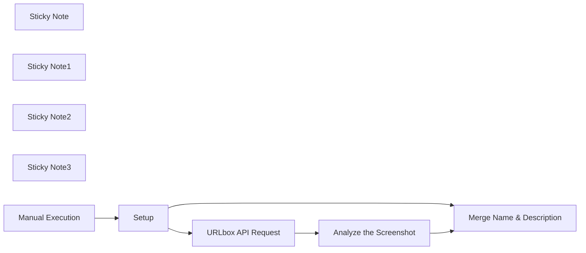

## Fluxo (.json) :

```json
{
  "id": "wDD4XugmHIvx3KMT",
  "meta": {
    "instanceId": "149cdf730f0c143663259ddc6124c9c26e824d8d2d059973b871074cf4bda531"
  },
  "name": "Analyze Screenshots with AI",
  "tags": [],
  "nodes": [
    {
      "id": "6d7f34b8-6203-4512-a428-7b5a18c63db6",
      "name": "Sticky Note",
      "type": "n8n-nodes-base.stickyNote",
      "position": [
        240,
        1100
      ],
      "parameters": {
        "width": 373.2796418305297,
        "height": 381.1230421279239,
        "content": "## Setup \n**For Testing use the Setup node to put in test name & url.**\n\nIf you want to use this workflow in production, you can expand it to load data from other sources like a DB or Google Sheet"
      },
      "typeVersion": 1
    },
    {
      "id": "ae568c65-e8f6-45bb-9c96-a870da1fc7d6",
      "name": "Setup",
      "type": "n8n-nodes-base.set",
      "position": [
        360,
        1320
      ],
      "parameters": {
        "values": {
          "string": [
            {
              "name": "website_name",
              "value": "=n8n"
            },
            {
              "name": "url",
              "value": "https://n8n.io/"
            }
          ]
        },
        "options": {}
      },
      "typeVersion": 2
    },
    {
      "id": "ca9f0357-a596-4453-b351-fdd8d47c81ad",
      "name": "URLbox API Request",
      "type": "n8n-nodes-base.httpRequest",
      "position": [
        780,
        1120
      ],
      "parameters": {
        "url": "https://api.urlbox.io/v1/render/sync",
        "method": "POST",
        "options": {},
        "sendBody": true,
        "sendHeaders": true,
        "bodyParameters": {
          "parameters": [
            {
              "name": "url",
              "value": "={{ $json.url }}"
            },
            {
              "name": "full_page",
              "value": true
            }
          ]
        },
        "headerParameters": {
          "parameters": [
            {
              "name": "Authorization",
              "value": "YOUR_API_KEY"
            }
          ]
        }
      },
      "retryOnFail": true,
      "typeVersion": 4.1
    },
    {
      "id": "3caffa3c-657a-4f74-a3cb-daf7beb67890",
      "name": "Sticky Note1",
      "type": "n8n-nodes-base.stickyNote",
      "position": [
        640,
        920
      ],
      "parameters": {
        "width": 373.2796418305297,
        "height": 381.1230421279239,
        "content": "## URLbox API call \n[URLbox](https://urlbox.com/) is a Screenshot API. With this API you can automate making screenshots based on website url's.\n\nYou have to replace the Placeholder with your API Key"
      },
      "typeVersion": 1
    },
    {
      "id": "d2b81b41-1497-4733-8130-67f8de0acff4",
      "name": "Analyze the Screenshot",
      "type": "@n8n/n8n-nodes-langchain.openAi",
      "position": [
        1220,
        1120
      ],
      "parameters": {
        "text": "=Your Input is a Screenshot of a Website.\nDescribe the content of the Website in one sentence.",
        "options": {},
        "resource": "image",
        "imageUrls": "renderURL",
        "operation": "analyze"
      },
      "typeVersion": 1.1
    },
    {
      "id": "68d86931-69bb-4b78-a7fe-44969172672f",
      "name": "Sticky Note2",
      "type": "n8n-nodes-base.stickyNote",
      "position": [
        1080,
        920
      ],
      "parameters": {
        "width": 373.2796418305297,
        "height": 381.1230421279239,
        "content": "## Analyze the Screenshot \nAnalyze the screenshot using OpenAI.\n\nAdd your OpenAI Credentials on the top of the node.\n\nThe prompt is an example. Change it based on what you want to extract from the screenshot."
      },
      "typeVersion": 1
    },
    {
      "id": "8a22fca5-7f06-45fb-a03f-585a7eb35b40",
      "name": "Merge Name & Description",
      "type": "n8n-nodes-base.merge",
      "position": [
        1620,
        1300
      ],
      "parameters": {
        "mode": "combine",
        "options": {},
        "combinationMode": "mergeByPosition"
      },
      "typeVersion": 2.1
    },
    {
      "id": "4f902a0a-ee93-4190-9b1e-ab3fa15eb4aa",
      "name": "Sticky Note3",
      "type": "n8n-nodes-base.stickyNote",
      "position": [
        1480,
        1200
      ],
      "parameters": {
        "width": 371.85912137154685,
        "height": 300.15337596590155,
        "content": "## Merge\nMerge the description with the name of the website & the url."
      },
      "typeVersion": 1
    },
    {
      "id": "8b3eb3f4-b31a-48f0-94bb-35379d07a81f",
      "name": "Manual Execution",
      "type": "n8n-nodes-base.manualTrigger",
      "position": [
        20,
        1320
      ],
      "parameters": {},
      "typeVersion": 1
    }
  ],
  "active": false,
  "pinData": {},
  "settings": {
    "executionOrder": "v1"
  },
  "versionId": "ff37faa1-c61c-44be-89f0-62f8e1b8317c",
  "connections": {
    "Setup": {
      "main": [
        [
          {
            "node": "URLbox API Request",
            "type": "main",
            "index": 0
          },
          {
            "node": "Merge Name & Description",
            "type": "main",
            "index": 1
          }
        ]
      ]
    },
    "Manual Execution": {
      "main": [
        [
          {
            "node": "Setup",
            "type": "main",
            "index": 0
          }
        ]
      ]
    },
    "URLbox API Request": {
      "main": [
        [
          {
            "node": "Analyze the Screenshot",
            "type": "main",
            "index": 0
          }
        ]
      ]
    },
    "Analyze the Screenshot": {
      "main": [
        [
          {
            "node": "Merge Name & Description",
            "type": "main",
            "index": 0
          }
        ]
      ]
    }
  }
}
```

<a id="template-1102"></a>

## Template 1102 - Monitoramento de informações com IA e Slack

- **Nome:** Monitoramento de informações com IA e Slack
- **Descrição:** Fluxo automatizado que coleta artigos via RSS, classifica relevância, extrai conteúdo de artigos relevantes, gera resumos formatados em Slack Markdown, envia ao Slack e registra dados em uma planilha do Google Sheets.
- **Funcionalidade:** • Coleta de novidades: busca novos artigos via RSS e compara com itens já monitorados para evitar duplicatas.
• Classificação de relevância: utiliza IA para identificar artigos relevantes aos temas de AI, ciência de dados e inovações.
• Extração de conteúdo: usa Jina AI para recuperar o conteúdo das páginas relevantes para processamento.
•Geração de resumo em Slack Markdown: produz resumos formatados para leitura em Slack.
• Publicação no Slack: envia o resumo ao canal designado com formatação apropriada.
• Armazenamento de dados: registra URLs, estado de resumo e metadados em uma planilha Google Sheets para tracking.
• Controle de duplicatas: verifica artigos já monitorados para evitar processar conteúdo repetido.
• Agendamento: executa a verificação a cada 15 minutos conforme o agendamento.
- **Ferramentas:** • RSS Feeds: fontes de artigos atualizadas automaticamente usadas para coletar novidades.
• OpenAI API: modelo de linguagem para classificação de relevância e geração de resumos (ex.: GPT-4o-mini).
• Jina AI: API para extrair conteúdo de páginas web para processamento por IA.
• Google Sheets: planilha para armazenar artigos monitorados, URLs e metadados.
• Slack: plataforma para postar os resumos formatados no canal designado.

## Fluxo visual

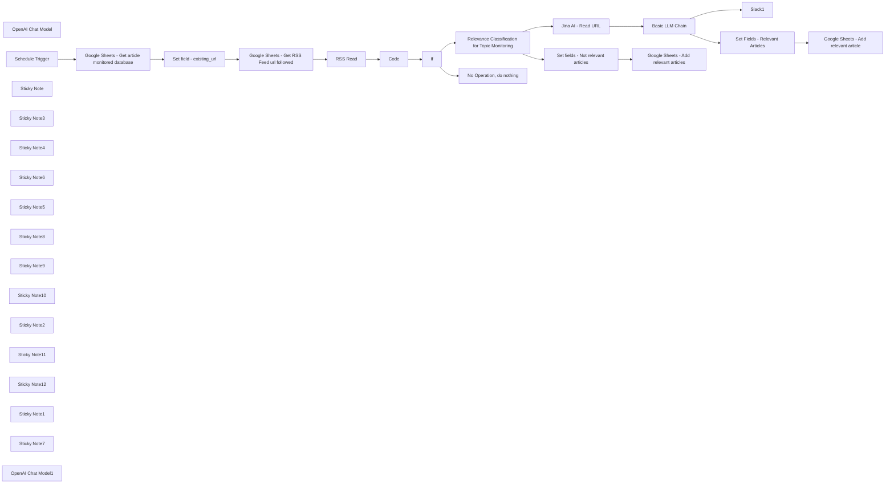

## Fluxo (.json) :

```json
{
  "id": "Xk0W98z9DVrNHeku",
  "meta": {
    "instanceId": "b9faf72fe0d7c3be94b3ebff0778790b50b135c336412d28fd4fca2cbbf8d1f5",
    "templateCredsSetupCompleted": true
  },
  "name": "AI-Powered Information Monitoring with OpenAI, Google Sheets, Jina AI and Slack",
  "tags": [],
  "nodes": [
    {
      "id": "704de862-43e5-4322-ae35-45b505e68bb6",
      "name": "OpenAI Chat Model",
      "type": "@n8n/n8n-nodes-langchain.lmChatOpenAi",
      "position": [
        4220,
        380
      ],
      "parameters": {
        "options": {}
      },
      "credentials": {
        "openAiApi": {
          "id": "",
          "name": "OpenAi Connection"
        }
      },
      "typeVersion": 1.1
    },
    {
      "id": "eaae54b0-0500-47a7-ad8f-097e0882d21c",
      "name": "Basic LLM Chain",
      "type": "@n8n/n8n-nodes-langchain.chainLlm",
      "position": [
        4180,
        -120
      ],
      "parameters": {
        "text": "={{ $json.data }}",
        "messages": {
          "messageValues": [
            {
              "message": "=You are an AI assistant responsible for summarizing articles **in English** and formatting them into Slack-compatible messages.  \nYour job is to create a clear and concise summary following the guidelines below and format it in Slack-specific Markdown format.  \n\n---\n\n## 1. Title with Link  \n\n- Format the article title as a **clickable link** using Slack's Markdown syntax:  \n  `<URL|*Title of the article*>`.  \n- The title should be clear and engaging to encourage readers to click.  \n\n---\n\n## 2. Section Headings  \n\n- Use **bold text** to introduce different sections of the summary by wrapping the text with `*` symbols.  \n- Ensure headings are descriptive and guide the reader through the content effectively.  \n\n---\n\n## 3. Key Points  \n\n- Present key insights using **bullet points**, using the `•` symbol for listing important information.  \n- Each point should be concise, informative, and directly related to the article's topic.  \n\n---\n\n## 4. Content Summary  \n\n- Provide a brief but comprehensive overview of the article's content.  \n- Use plain text and line breaks to separate paragraphs for improved readability.  \n- Focus on the most important aspects without unnecessary details.  \n\n---\n\n## 5. Context and Relevance  \n\n- Explain why the article is important and how it relates to the reader's interests.  \n- Highlight its relevance to ongoing trends or industry developments.  \n\n---\n\n## Message Structure  \n\nThe output should follow this structured format:  \n\n1. **Title with link** – Present the article as a clickable link formatted in Slack Markdown.  \n2. **Summary sections** – Organized under clear headings to enhance readability.  \n3. **Key insights** – Presented as bullet points for quick scanning.  \n4. **Contextual analysis** – A brief explanation of the article's relevance and importance.  \n\n---\n\n## Slack Markdown Formatting Guide  \n\nEnsure the message follows Slack's Markdown syntax for proper display:  \n\n- **Bold text:** Use `*bold text*`.  \n- **Italic text:** Use `_italic text_`.  \n- **Bullet points:** Use `•` or `-` for lists.  \n- **Links:** Format as `<URL|*text*>` to create clickable links.  \n- **Line breaks:** Use a blank line to separate paragraphs for readability.  \n\n---\n\n## Example of Slack-formatted Output  \n\n🔔 *New article from n8n Blog*  \n\n<https://blog.n8n.io/self-hosted-ai/|*Introducing the Self-hosted AI Starter Kit: Run AI locally for privacy-first solutions*>  \n\n*Summary of the article*  \nn8n has launched the Self-hosted AI Starter Kit, a Docker Compose template designed to simplify the deployment of local AI tools. This initiative addresses the growing need for on-premise AI solutions that enhance data privacy and reduce reliance on external APIs. The starter kit includes tools like Ollama, Qdrant, and PostgreSQL, providing a foundation for building self-hosted AI workflows. While it's tailored for proof-of-concept projects, users can customize it to fit specific requirements.  \n\n*Key Points*  \n• The Self-hosted AI Starter Kit facilitates quick setup of local AI environments using Docker Compose.  \n• It includes preconfigured AI workflow templates and essential tools such as Ollama, Qdrant, and PostgreSQL.  \n• Running AI on-premise offers benefits like improved data privacy and cost savings by minimizing dependence on external API calls.  \n• The kit is designed for easy deployment on local machines or personal cloud instances like Digital Ocean and runpod.io.  \n• n8n emphasizes the flexibility of their platform, allowing integration with over 400 services, including Google, Slack, Twilio, and JIRA, to streamline AI application development.  \n\n*Context and Relevance*  \nThis article introduces a practical solution for organizations and developers seeking to implement AI workflows locally. By providing a ready-to-use starter kit, n8n addresses common challenges associated with setting up and maintaining on-premise AI systems, promoting greater control over data and potential cost efficiencies.\n \n---\n\nEnsure that the message is formatted according to Slack's requirements to improve readability and engagement.  \n"
            }
          ]
        },
        "promptType": "define"
      },
      "typeVersion": 1.5
    },
    {
      "id": "a3a10ccd-26f9-4b05-a79f-8754f619c153",
      "name": "Schedule Trigger",
      "type": "n8n-nodes-base.scheduleTrigger",
      "position": [
        -840,
        120
      ],
      "parameters": {
        "rule": {
          "interval": [
            {
              "field": "minutes",
              "minutesInterval": 15
            }
          ]
        }
      },
      "typeVersion": 1.2
    },
    {
      "id": "54ed8957-39be-4ad4-bea7-f56308d75a91",
      "name": "RSS Read",
      "type": "n8n-nodes-base.rssFeedRead",
      "onError": "continueRegularOutput",
      "position": [
        800,
        120
      ],
      "parameters": {
        "url": "={{ $json.rss_feed_url }}",
        "options": {
          "ignoreSSL": false
        }
      },
      "executeOnce": false,
      "typeVersion": 1.1
    },
    {
      "id": "1ec53a9a-ca21-4da2-ab94-55b863a27aff",
      "name": "Relevance Classification for Topic Monitoring",
      "type": "@n8n/n8n-nodes-langchain.textClassifier",
      "position": [
        2380,
        -20
      ],
      "parameters": {
        "options": {
          "fallback": "discard"
        },
        "inputText": "={{ $json.title }}\n{{ $json.contentSnippet }}",
        "categories": {
          "categories": [
            {
              "category": "relevant",
              "description": "Articles related to artificial intelligence (AI), data science, machine learning, algorithms, big data, or innovations in these fields."
            },
            {
              "category": "not_relevant",
              "description": "Articles not directly related to  artificial intelligence (AI), data science, machine learning, algorithms, big data, or innovations in these fields."
            }
          ]
        }
      },
      "typeVersion": 1
    },
    {
      "id": "840431b1-cf2e-45e2-a79c-cab90f46a452",
      "name": "Sticky Note",
      "type": "n8n-nodes-base.stickyNote",
      "position": [
        2240,
        -480
      ],
      "parameters": {
        "color": 7,
        "width": 600,
        "height": 960,
        "content": "## LLM Call 1 - Article Topic Relevance Classification  \n\nThis **LLM call** is used to **classify** whether the articles published on the website are **relevant** to the **topics and interests** you want to monitor.  \nIt analyzes the **title** and the **content snippet** retrieved from the **RSS Read** node.  \n\nIn this template, the monitored articles are related to **data and AI.**  \nThe classification is done into **two categories**, which you should modify in the `Description` field under the **Categories** section of the node:\n\n### Relevant  \n`Description`: Articles related to **[The topics you want to monitor]**.  \n\n### Not Relevant  \n`Description`: Articles that are not directly related to **[The topics you want to monitor]**.\n\nBy default, this template monitors topics related to artificial intelligence (AI), data science, machine learning, algorithms, big data, and innovations in these fields.\n"
      },
      "typeVersion": 1
    },
    {
      "id": "7dbc2246-9e1a-4c2e-a051-703e10e5fa0e",
      "name": "Sticky Note3",
      "type": "n8n-nodes-base.stickyNote",
      "position": [
        4020,
        -660
      ],
      "parameters": {
        "color": 7,
        "width": 600,
        "height": 680,
        "content": "## LLM Call 2 - Summarize and Format in Slack Markdown \n\nThis node **uses OpenAI's GPT-4o-mini model** to **summarize the article content**, which is provided as **Markdown text** from Jina AI, and formats it in **Slack Markdown** to enhance readability within Slack.  \n\n### Customize to fit your needs  \n\nHere are two examples of how you can modify the **System Prompt** of this node to better suit your requirements:  \n\n- **Language customization:**  \n  You can modify the **System Prompt** to instruct the LLM to generate the summary in a specific language (e.g., French or Italian).  \n  However, consider the option of adding a separate LLM node **dedicated to translation** if the model cannot handle **summarization, formatting, and translation** simultaneously while maintaining high output quality.\n\n- **Changing the summary structure:**  \n  You can adjust the prompt to modify how the summary is structured to better match your preferred format and style.\n"
      },
      "typeVersion": 1
    },
    {
      "id": "b472f924-81d9-4b99-8620-d95b286800c5",
      "name": "Google Sheets - Get RSS Feed url followed",
      "type": "n8n-nodes-base.googleSheets",
      "position": [
        260,
        120
      ],
      "parameters": {
        "options": {},
        "sheetName": {
          "__rl": true,
          "mode": "list",
          "value": "gid=0",
          "cachedResultUrl": "https://docs.google.com/spreadsheets/d/1F2FzWt9FMkA5V5i9d_hBJRahLDvxs3DQBOLkLYowXbY/edit#gid=0",
          "cachedResultName": "rss_feed"
        },
        "documentId": {
          "__rl": true,
          "mode": "list",
          "value": "1F2FzWt9FMkA5V5i9d_hBJRahLDvxs3DQBOLkLYowXbY",
          "cachedResultUrl": "https://docs.google.com/spreadsheets/d/1F2FzWt9FMkA5V5i9d_hBJRahLDvxs3DQBOLkLYowXbY/edit?usp=drivesdk",
          "cachedResultName": "Template - AI-Powered Information Monitoring"
        },
        "authentication": "serviceAccount"
      },
      "credentials": {
        "googleApi": {
          "id": "",
          "name": "Google Sheets account"
        }
      },
      "executeOnce": true,
      "typeVersion": 4.5
    },
    {
      "id": "c2a571f0-614f-41cf-b0b0-db4c714a8ab8",
      "name": "Sticky Note4",
      "type": "n8n-nodes-base.stickyNote",
      "position": [
        80,
        -480
      ],
      "parameters": {
        "color": 7,
        "width": 460,
        "height": 960,
        "content": "## Google Sheets - Get RSS Feed URLs Followed  \nThis node **retrieves rows** from the Google Sheet that contains the **RSS feed URLs** you follow.  \nIt is configured to run only once per execution, meaning that even if the previous node outputs many items, this node will execute only once.  \n\nYou can **add more URLs** to your sheet, but keep in mind that following **more RSS feeds** will increase the **cost of LLM API usage** (e.g., OpenAI).  \n\nYou can access the **Google Sheet template** to copy and use in this workflow [here](https://docs.google.com/spreadsheets/d/1F2FzWt9FMkA5V5i9d_hBJRahLDvxs3DQBOLkLYowXbY/).  \n(*This is the same template used in the previous node.*)\n\nIn this node, make sure to select the **\"rss_feed\"** sheet from your **copied version of the Google Sheet template**.  \nThis sheet contains the list of RSS feed URLs that the workflow will process."
      },
      "typeVersion": 1
    },
    {
      "id": "90e34a2f-f326-4c83-ae26-d8f38d983c21",
      "name": "Sticky Note6",
      "type": "n8n-nodes-base.stickyNote",
      "position": [
        620,
        -480
      ],
      "parameters": {
        "color": 7,
        "width": 460,
        "height": 960,
        "content": "## RSS Read  \nThis node **reads** the RSS feed.  \nThe RSS URL is **retrieved** from the data you have entered in **Google Sheets**, so make sure the URL provided is indeed a **valid RSS feed**.  \n\n### What is an RSS feed?  \nAn **RSS feed** is a **web feed** that allows users to **automatically receive updates** from websites, such as **news sites** or **blogs**, in a **standardized format**.\n"
      },
      "typeVersion": 1
    },
    {
      "id": "06c22fcc-6fb6-4646-8cd2-3e2c48a56fbc",
      "name": "Sticky Note5",
      "type": "n8n-nodes-base.stickyNote",
      "position": [
        2940,
        -480
      ],
      "parameters": {
        "color": 7,
        "width": 960,
        "height": 500,
        "content": "## Jina AI - Read URL\n\nThis node **uses the Jina AI API** to **retrieve the content** of articles that were classified as **\"relevant\"** in the previous step.  \nSince this process **involves web scraping**, ensure that it complies with the **scraping regulations** in your country.  \n\n### What is Jina AI?  \n**Jina AI** is an API that allows you to **extract webpage content** and convert it into a format that is **ready for LLM processing**, such as **Markdown**.  \n\nYou can create an account [here](https://jina.ai/) and receive **1,000,000 free tokens** for testing.  \nHowever, the service can also be used **without an API key** (without an account), though with **reduced RPM (requests per minute)**.  \nFor this workflow, the default RPM limits should generally be sufficient.\n"
      },
      "typeVersion": 1
    },
    {
      "id": "3f8a0ce3-d7b3-400b-bc03-1a233f441429",
      "name": "Slack1",
      "type": "n8n-nodes-base.slack",
      "position": [
        4940,
        -120
      ],
      "webhookId": "",
      "parameters": {
        "text": "={{ $json.text }}",
        "select": "channel",
        "channelId": {
          "__rl": true,
          "mode": "list",
          "value": "C0898R9G7JP",
          "cachedResultName": "topic-monitoring"
        },
        "otherOptions": {},
        "authentication": "oAuth2"
      },
      "credentials": {
        "slackOAuth2Api": {
          "id": "",
          "name": "slack-topic-monitoring"
        }
      },
      "typeVersion": 2.3
    },
    {
      "id": "6920300f-fd0e-41dc-adf6-ed5a3a267b3f",
      "name": "Sticky Note8",
      "type": "n8n-nodes-base.stickyNote",
      "position": [
        -460,
        -480
      ],
      "parameters": {
        "color": 7,
        "width": 460,
        "height": 960,
        "content": "## Google Sheets - Get Article Monitored Database  \nThis node **retrieves rows** from the Google Sheet that contains articles **already monitored and summarized** by the workflow.  \nDepending on the RSS feed you monitor, **URLs may remain in the feed for a long time**, and you don't want to monitor the same URL **twice**.  \nYou can find the **Google Sheet template** that you can copy and use in this workflow [here](https://docs.google.com/spreadsheets/d/1F2FzWt9FMkA5V5i9d_hBJRahLDvxs3DQBOLkLYowXbY/edit?gid=1966921272#gid=1966921272).\n\nIn this node, make sure to select the **\"article_database\"** sheet from your **copied version of the Google Sheet template**.  \nThis sheet is used to store and manage the articles processed by the workflow.\n\n\n---\n\n## Set Field - existing_url  \n\nThis node sets the **\"existing_url\"** field with the value from **\"article_url\"** in the Google Sheets database.  \nDuring the **first execution** of the workflow, this field will be **empty**, as no articles are present in Google Sheets yet.  \nAn error may occur in this case; however, the workflow will **continue running** without interruption.\n"
      },
      "typeVersion": 1
    },
    {
      "id": "204aab36-1081-4d6e-b3a3-2fc03b6a1a10",
      "name": "Sticky Note9",
      "type": "n8n-nodes-base.stickyNote",
      "position": [
        1180,
        -480
      ],
      "parameters": {
        "color": 7,
        "width": 980,
        "height": 960,
        "content": "## Code Node to Filter Existing URLs\n\nThis code node filters URLs that have **not yet been summarized by AI.**  \nIt outputs:\n\n- A **list of URLs** following the RSS Read schema if new URLs are found.\n- An item called **\"message\"** with the value **\"No new articles found\"** if no new articles are available in your RSS feed.\n\n---\n\n## IF Node\n\nThe condition for this node is: `{{ $json.message }}` *not equal to* **\"No new articles found\"**.\n\n- **False** → The workflow executes the \"No Operation, do nothing\" node.\n- **True** → The workflow proceeds to process the new articles for your web development industry monitoring.\n"
      },
      "typeVersion": 1
    },
    {
      "id": "ef83c5f9-12a7-4924-9356-d1307fc8f279",
      "name": "Sticky Note10",
      "type": "n8n-nodes-base.stickyNote",
      "position": [
        2940,
        60
      ],
      "parameters": {
        "color": 7,
        "width": 960,
        "height": 580,
        "content": "## Set Fields - Not Relevant Articles  \n\nThis node prepares the data to be added to the Google Sheet by defining the following fields:  \n\n- **`article_url`** – The article's URL.\n- **`summarized`** – Always set to `\"NO (not relevant)\"`, as it belongs to the **\"not_relevant\"** path.  \n- **`website`** – The website where the article URL was published.  \n- **`fetched_at`** – The timestamp when the URL was processed by the workflow.  \n  > *(Note: This timestamp reflects when the scenario was triggered, as obtained from the **Schedule Trigger** node, not the exact fetch time.)*  \n- **`publish_date`** – The date the article was published.  \n\n---\n\n## Google Sheets - Add Not Relevant Articles\n\nThis node adds the prepared data to the **\"article_database\"** sheet in your copied Google Sheet template.  \nEnsure that you select the **\"article_database\"** sheet when configuring this node.  \n"
      },
      "typeVersion": 1
    },
    {
      "id": "10af053d-23f6-416b-9fe2-874dfc2ec7aa",
      "name": "Sticky Note2",
      "type": "n8n-nodes-base.stickyNote",
      "position": [
        4020,
        80
      ],
      "parameters": {
        "color": 5,
        "width": 600,
        "height": 440,
        "content": "## OpenAI Chat Model  \n\nThis node specifies the **AI model** to be used for processing.  \nThe default model is **GPT-4o-mini**, which has been **tested** and proven to perform well for this task.  \n\n**GPT-4o-mini** is a **cost-efficient** model, offering a good balance between **performance and affordability**, making it suitable for regular usage without incurring high costs.\n"
      },
      "typeVersion": 1
    },
    {
      "id": "67e6b0f9-32fc-4dcf-ae1b-effe11b31cd1",
      "name": "Sticky Note11",
      "type": "n8n-nodes-base.stickyNote",
      "position": [
        4680,
        -640
      ],
      "parameters": {
        "color": 7,
        "width": 600,
        "height": 680,
        "content": "## Slack - Send Article Summary  \n\nThis node **posts the message** to the designated Slack channel, containing the **output generated by the LLM.**  \n\nFor better organization and accessibility, it is recommended to use a **dedicated Slack channel** specifically for topic monitoring.  \nThis ensures that team members can easily access relevant summaries without cluttering other discussions.  \n\n\n### Why not use Slack Tool Calling?  \n\nAfter extensive testing, the output from the previous node has proven to be **highly effective**, making it unnecessary to use **tool calling** or an **AI agent.** 😀  \nKeeping things simple **streamlines the workflow** and reduces complexity.\n"
      },
      "typeVersion": 1
    },
    {
      "id": "afe7643d-618b-4798-851e-b8b9d024e792",
      "name": "Sticky Note12",
      "type": "n8n-nodes-base.stickyNote",
      "position": [
        4700,
        80
      ],
      "parameters": {
        "color": 7,
        "width": 1260,
        "height": 560,
        "content": "## Set Fields - Relevant Articles  \n\nThis node prepares the data to be added to the Google Sheet by defining the following fields:  \n\n- **`article_url`** – The article's URL.  \n- **`summarized`** – Always set to `\"YES\"`, as it follows the **\"relevant\"** path.  \n- **`summary`** – The article summary that was posted to Slack.  \n- **`website`** – The source website where the article was published.  \n- **`fetched_at`** – The timestamp indicating when the URL was processed by the workflow.  \n  > *(Note: This timestamp reflects when the data was added to Google Sheets, not the actual fetch time.)*  \n- **`publish_date`** – The date the article was published.  \n\n---\n\n## Google Sheets - Add Relevant Articles\n\nThis node adds the prepared data to the **\"article_database\"** sheet in your copied Google Sheet template.  \nMake sure to select the **\"article_database\"** sheet when configuring this node.  \n"
      },
      "typeVersion": 1
    },
    {
      "id": "e87619df-48e3-4ef8-83c7-1695746e2b92",
      "name": "Sticky Note1",
      "type": "n8n-nodes-base.stickyNote",
      "position": [
        -1000,
        -280
      ],
      "parameters": {
        "color": 7,
        "width": 460,
        "height": 600,
        "content": "## Scheduler \nThis **trigger** is a **scheduler** that defines **how often the workflow is executed**.  \nBy default, the **template is set to every 1 hour**, meaning the workflow will check **every hour** if **new articles** have been added to the **RSS feed** you follow.\n"
      },
      "typeVersion": 1
    },
    {
      "id": "e2bcd684-abd9-4f47-bf4c-12eac379432d",
      "name": "Sticky Note7",
      "type": "n8n-nodes-base.stickyNote",
      "position": [
        -1900,
        -720
      ],
      "parameters": {
        "color": 6,
        "width": 780,
        "height": 1300,
        "content": "# Workflow Overview\n\n## Check Legal Regulations:\nThis workflow involves scraping, so ensure you comply with the legal regulations in your country before getting started. Better safe than sorry!\n\n## 📌 Purpose  \nThis workflow enables **automated and AI-driven topic monitoring**, delivering **concise article summaries** directly to a **Slack channel** in a structured and easy-to-read format.  \nIt allows users to stay informed on specific topics of interest effortlessly, without manually checking multiple sources, ensuring a **time-efficient and focused** monitoring experience.  \n\n**To get started, copy the Google Sheets template required for this workflow from [here](https://docs.google.com/spreadsheets/d/1F2FzWt9FMkA5V5i9d_hBJRahLDvxs3DQBOLkLYowXbY).**  \n\n\n## 🎯 Target Audience  \nThis workflow is designed for:  \n- **Industry professionals** looking to track key developments in their field.  \n- **Research teams** who need up-to-date insights on specific topics.  \n- **Companies** aiming to keep their teams informed with relevant content.  \n\n## ⚙️ How It Works  \n1. **Trigger:** A **Scheduler** initiates the workflow at regular intervals (default: every hour).  \n2. **Data Retrieval:**  \n   - RSS feeds are fetched using the **RSS Read** node.  \n   - Previously monitored articles are checked in **Google Sheets** to avoid duplicates.  \n3. **Content Processing:**  \n   - The article relevance is assessed using **OpenAI (GPT-4o-mini)**.  \n   - Relevant articles are scraped using **Jina AI** to extract content.  \n   - Summaries are generated and formatted for Slack.  \n4. **Output:**  \n   - Summaries are posted to the specified Slack channel.  \n   - Article metadata is stored in **Google Sheets** for tracking.  \n\n## 🛠️ Key APIs and Nodes Used  \n- **Scheduler Node:** Triggers the workflow periodically.  \n- **RSS Read:** Fetches the latest articles from defined RSS feeds.  \n- **Google Sheets:** Stores monitored articles and manages feed URLs.  \n- **OpenAI API (GPT-4o-mini):** Classifies article relevance and generates summaries.  \n- **Jina AI API:** Extracts the full content of relevant articles.  \n- **Slack API:** Posts formatted messages to Slack channels.  \n\n---\n\nThis workflow provides an **efficient and intelligent way** to stay informed about your topics of interest, directly within Slack.\n"
      },
      "typeVersion": 1
    },
    {
      "id": "d72f505d-2bbf-41db-b404-8a61b8c21452",
      "name": "Google Sheets - Get article monitored database",
      "type": "n8n-nodes-base.googleSheets",
      "position": [
        -400,
        120
      ],
      "parameters": {
        "options": {},
        "sheetName": {
          "__rl": true,
          "mode": "list",
          "value": 1966921272,
          "cachedResultUrl": "https://docs.google.com/spreadsheets/d/1F2FzWt9FMkA5V5i9d_hBJRahLDvxs3DQBOLkLYowXbY/edit#gid=1966921272",
          "cachedResultName": "article_database"
        },
        "documentId": {
          "__rl": true,
          "mode": "list",
          "value": "1F2FzWt9FMkA5V5i9d_hBJRahLDvxs3DQBOLkLYowXbY",
          "cachedResultUrl": "https://docs.google.com/spreadsheets/d/1F2FzWt9FMkA5V5i9d_hBJRahLDvxs3DQBOLkLYowXbY/edit?usp=drivesdk",
          "cachedResultName": "Template - AI-Powered Information Monitoring"
        },
        "authentication": "serviceAccount"
      },
      "credentials": {
        "googleApi": {
          "id": "",
          "name": "Google Sheets account"
        }
      },
      "executeOnce": true,
      "typeVersion": 4.5,
      "alwaysOutputData": true
    },
    {
      "id": "08eae799-2682-4d49-81fa-2127a65d887b",
      "name": "Code",
      "type": "n8n-nodes-base.code",
      "position": [
        1280,
        120
      ],
      "parameters": {
        "jsCode": "// Retrieve data from RSS feed and Google Sheets\nconst rssItems = items; // Contains RSS articles\nconst sheetItems = $items(\"Set field - existing_url\", 0);\n\n// Extract the links of articles present in Google Sheets\nconst existingUrls = sheetItems.map(entry => entry.json.existing_url);\n\n// Filter RSS articles to keep only those not present in Google Sheets\nconst newArticles = rssItems.filter(rssItem => {\n    return !existingUrls.includes(rssItem.json.link);\n});\n\n// If new articles are found, return them\nif (newArticles.length > 0) {\n    return newArticles;\n}\n\n// If no new articles, return an informational message\nreturn [{ json: { message: \"No new articles found.\" } }];\n\n"
      },
      "typeVersion": 2
    },
    {
      "id": "9f2d2c87-460b-4872-9538-519d26524475",
      "name": "No Operation, do nothing",
      "type": "n8n-nodes-base.noOp",
      "position": [
        1960,
        240
      ],
      "parameters": {},
      "typeVersion": 1
    },
    {
      "id": "e9ebbce6-a3b4-4f89-9908-3d9b2dd42f44",
      "name": "If",
      "type": "n8n-nodes-base.if",
      "position": [
        1640,
        120
      ],
      "parameters": {
        "options": {},
        "conditions": {
          "options": {
            "version": 2,
            "leftValue": "",
            "caseSensitive": true,
            "typeValidation": "strict"
          },
          "combinator": "and",
          "conditions": [
            {
              "id": "bad6fc33-2e1e-4169-9893-d284c6c68288",
              "operator": {
                "type": "string",
                "operation": "notEquals"
              },
              "leftValue": "={{ $json.message }}",
              "rightValue": "No new articles found."
            }
          ]
        }
      },
      "typeVersion": 2.2
    },
    {
      "id": "6e2c820d-27da-4d3b-844c-581fb266e04a",
      "name": "Jina AI - Read URL",
      "type": "n8n-nodes-base.httpRequest",
      "position": [
        3240,
        -120
      ],
      "parameters": {
        "url": "=https://r.jina.ai/{{ $json.link }}",
        "options": {}
      },
      "retryOnFail": true,
      "typeVersion": 4.2,
      "waitBetweenTries": 5000
    },
    {
      "id": "3f942518-f75b-4d03-9cd1-b275ad3b91cd",
      "name": "Set field - existing_url",
      "type": "n8n-nodes-base.set",
      "onError": "continueRegularOutput",
      "position": [
        -180,
        120
      ],
      "parameters": {
        "options": {},
        "assignments": {
          "assignments": [
            {
              "id": "07799638-55d7-42a9-b1f7-fea762cfa2f1",
              "name": "existing_url",
              "type": "string",
              "value": "={{ $json.article_url.extractUrl() }}"
            }
          ]
        }
      },
      "typeVersion": 3.4,
      "alwaysOutputData": true
    },
    {
      "id": "baef0ff9-8bf5-4ecf-9300-0adbad0d1a07",
      "name": "OpenAI Chat Model1",
      "type": "@n8n/n8n-nodes-langchain.lmChatOpenAi",
      "position": [
        2400,
        300
      ],
      "parameters": {
        "options": {}
      },
      "credentials": {
        "openAiApi": {
          "id": "",
          "name": "OpenAi Connection"
        }
      },
      "typeVersion": 1.1
    },
    {
      "id": "ccbfe5fc-2e87-4fff-b23d-0c4c6ebd3648",
      "name": "Set fields - Not relevant articles",
      "type": "n8n-nodes-base.set",
      "position": [
        3060,
        480
      ],
      "parameters": {
        "options": {},
        "assignments": {
          "assignments": [
            {
              "id": "3fbf5256-f06b-450a-adf7-65591a19c7dd",
              "name": "article_url",
              "type": "string",
              "value": "={{ $json.link }}"
            },
            {
              "id": "02f506cf-28fe-46ef-b97e-7ec938805151",
              "name": "summarized",
              "type": "string",
              "value": "NO (not relevant)"
            },
            {
              "id": "552efef4-63cb-448b-bb0c-30ae9666f310",
              "name": "website",
              "type": "string",
              "value": "={{ $('Google Sheets - Get RSS Feed url followed').item.json.website }}"
            },
            {
              "id": "096acb35-4e9e-48fd-8e61-8ceb525591fa",
              "name": "fetched_at",
              "type": "string",
              "value": "={{$now}}"
            },
            {
              "id": "427243d1-01c4-458a-9626-75366e4264cd",
              "name": "publish_date",
              "type": "string",
              "value": "={{ $('Relevance Classification for Topic Monitoring').item.json.pubDate.toDateTime().format('yyyy-MM-dd') }}"
            }
          ]
        }
      },
      "typeVersion": 3.4
    },
    {
      "id": "0dbcc872-9afa-4e2c-be24-82d3a2457dd0",
      "name": "Google Sheets - Add relevant articles",
      "type": "n8n-nodes-base.googleSheets",
      "position": [
        3480,
        480
      ],
      "parameters": {
        "columns": {
          "value": {},
          "schema": [
            {
              "id": "article_url",
              "type": "string",
              "display": true,
              "required": false,
              "displayName": "article_url",
              "defaultMatch": false,
              "canBeUsedToMatch": true
            },
            {
              "id": "summarized",
              "type": "string",
              "display": true,
              "required": false,
              "displayName": "summarized",
              "defaultMatch": false,
              "canBeUsedToMatch": true
            },
            {
              "id": "summary",
              "type": "string",
              "display": true,
              "required": false,
              "displayName": "summary",
              "defaultMatch": false,
              "canBeUsedToMatch": true
            },
            {
              "id": "website",
              "type": "string",
              "display": true,
              "required": false,
              "displayName": "website",
              "defaultMatch": false,
              "canBeUsedToMatch": true
            },
            {
              "id": "fetched_at",
              "type": "string",
              "display": true,
              "required": false,
              "displayName": "fetched_at",
              "defaultMatch": false,
              "canBeUsedToMatch": true
            },
            {
              "id": "publish_date",
              "type": "string",
              "display": true,
              "required": false,
              "displayName": "publish_date",
              "defaultMatch": false,
              "canBeUsedToMatch": true
            }
          ],
          "mappingMode": "autoMapInputData",
          "matchingColumns": [],
          "attemptToConvertTypes": false,
          "convertFieldsToString": false
        },
        "options": {},
        "operation": "append",
        "sheetName": {
          "__rl": true,
          "mode": "list",
          "value": 1966921272,
          "cachedResultUrl": "https://docs.google.com/spreadsheets/d/1F2FzWt9FMkA5V5i9d_hBJRahLDvxs3DQBOLkLYowXbY/edit#gid=1966921272",
          "cachedResultName": "article_database"
        },
        "documentId": {
          "__rl": true,
          "mode": "list",
          "value": "1F2FzWt9FMkA5V5i9d_hBJRahLDvxs3DQBOLkLYowXbY",
          "cachedResultUrl": "https://docs.google.com/spreadsheets/d/1F2FzWt9FMkA5V5i9d_hBJRahLDvxs3DQBOLkLYowXbY/edit?usp=drivesdk",
          "cachedResultName": "Template - AI-Powered Information Monitoring"
        },
        "authentication": "serviceAccount"
      },
      "credentials": {
        "googleApi": {
          "id": "",
          "name": "Google Sheets account"
        }
      },
      "typeVersion": 4.5
    },
    {
      "id": "0c7024b6-dfac-4e97-9d42-198fff6bcc47",
      "name": "Google Sheets - Add relevant article",
      "type": "n8n-nodes-base.googleSheets",
      "position": [
        5660,
        520
      ],
      "parameters": {
        "columns": {
          "value": {},
          "schema": [
            {
              "id": "article_url",
              "type": "string",
              "display": true,
              "required": false,
              "displayName": "article_url",
              "defaultMatch": false,
              "canBeUsedToMatch": true
            },
            {
              "id": "summarized",
              "type": "string",
              "display": true,
              "required": false,
              "displayName": "summarized",
              "defaultMatch": false,
              "canBeUsedToMatch": true
            },
            {
              "id": "summary",
              "type": "string",
              "display": true,
              "required": false,
              "displayName": "summary",
              "defaultMatch": false,
              "canBeUsedToMatch": true
            },
            {
              "id": "website",
              "type": "string",
              "display": true,
              "required": false,
              "displayName": "website",
              "defaultMatch": false,
              "canBeUsedToMatch": true
            },
            {
              "id": "fetched_at",
              "type": "string",
              "display": true,
              "required": false,
              "displayName": "fetched_at",
              "defaultMatch": false,
              "canBeUsedToMatch": true
            },
            {
              "id": "publish_date",
              "type": "string",
              "display": true,
              "required": false,
              "displayName": "publish_date",
              "defaultMatch": false,
              "canBeUsedToMatch": true
            }
          ],
          "mappingMode": "autoMapInputData",
          "matchingColumns": [],
          "attemptToConvertTypes": false,
          "convertFieldsToString": false
        },
        "options": {},
        "operation": "append",
        "sheetName": {
          "__rl": true,
          "mode": "list",
          "value": 1966921272,
          "cachedResultUrl": "https://docs.google.com/spreadsheets/d/1F2FzWt9FMkA5V5i9d_hBJRahLDvxs3DQBOLkLYowXbY/edit#gid=1966921272",
          "cachedResultName": "article_database"
        },
        "documentId": {
          "__rl": true,
          "mode": "list",
          "value": "1F2FzWt9FMkA5V5i9d_hBJRahLDvxs3DQBOLkLYowXbY",
          "cachedResultUrl": "https://docs.google.com/spreadsheets/d/1F2FzWt9FMkA5V5i9d_hBJRahLDvxs3DQBOLkLYowXbY/edit?usp=drivesdk",
          "cachedResultName": "Template - AI-Powered Information Monitoring"
        },
        "authentication": "serviceAccount"
      },
      "credentials": {
        "googleApi": {
          "id": "",
          "name": "Google Sheets account"
        }
      },
      "typeVersion": 4.5
    },
    {
      "id": "e1266606-eaee-4077-be7e-6f08ae9bae39",
      "name": "Set Fields - Relevant Articles",
      "type": "n8n-nodes-base.set",
      "position": [
        4900,
        520
      ],
      "parameters": {
        "options": {},
        "assignments": {
          "assignments": [
            {
              "id": "3fbf5256-f06b-450a-adf7-65591a19c7dd",
              "name": "article_url",
              "type": "string",
              "value": "={{ $('Relevance Classification for Topic Monitoring').item.json.link }}"
            },
            {
              "id": "02f506cf-28fe-46ef-b97e-7ec938805151",
              "name": "summarized",
              "type": "string",
              "value": "YES"
            },
            {
              "id": "e23059bd-8bb2-439a-85bd-f9e191930d1e",
              "name": "summary",
              "type": "string",
              "value": "={{ $json.text }}"
            },
            {
              "id": "552efef4-63cb-448b-bb0c-30ae9666f310",
              "name": "website",
              "type": "string",
              "value": "={{ $('Google Sheets - Get RSS Feed url followed').item.json.website }}"
            },
            {
              "id": "096acb35-4e9e-48fd-8e61-8ceb525591fa",
              "name": "fetched_at",
              "type": "string",
              "value": "={{$now}}"
            },
            {
              "id": "427243d1-01c4-458a-9626-75366e4264cd",
              "name": "publish_date",
              "type": "string",
              "value": "={{ $('Relevance Classification for Topic Monitoring').item.json.pubDate.toDateTime().format('yyyy-MM-dd') }}"
            }
          ]
        }
      },
      "typeVersion": 3.4
    }
  ],
  "active": false,
  "pinData": {},
  "settings": {
    "executionOrder": "v1"
  },
  "versionId": "dcc84e7c-aa42-4d0f-8522-84fdf8bea0bc",
  "connections": {
    "If": {
      "main": [
        [
          {
            "node": "Relevance Classification for Topic Monitoring",
            "type": "main",
            "index": 0
          }
        ],
        [
          {
            "node": "No Operation, do nothing",
            "type": "main",
            "index": 0
          }
        ]
      ]
    },
    "Code": {
      "main": [
        [
          {
            "node": "If",
            "type": "main",
            "index": 0
          }
        ]
      ]
    },
    "RSS Read": {
      "main": [
        [
          {
            "node": "Code",
            "type": "main",
            "index": 0
          }
        ]
      ]
    },
    "Basic LLM Chain": {
      "main": [
        [
          {
            "node": "Slack1",
            "type": "main",
            "index": 0
          },
          {
            "node": "Set Fields - Relevant Articles",
            "type": "main",
            "index": 0
          }
        ]
      ]
    },
    "Schedule Trigger": {
      "main": [
        [
          {
            "node": "Google Sheets - Get article monitored database",
            "type": "main",
            "index": 0
          }
        ]
      ]
    },
    "OpenAI Chat Model": {
      "ai_languageModel": [
        [
          {
            "node": "Basic LLM Chain",
            "type": "ai_languageModel",
            "index": 0
          }
        ]
      ]
    },
    "Jina AI - Read URL": {
      "main": [
        [
          {
            "node": "Basic LLM Chain",
            "type": "main",
            "index": 0
          }
        ]
      ]
    },
    "OpenAI Chat Model1": {
      "ai_languageModel": [
        [
          {
            "node": "Relevance Classification for Topic Monitoring",
            "type": "ai_languageModel",
            "index": 0
          }
        ]
      ]
    },
    "Set field - existing_url": {
      "main": [
        [
          {
            "node": "Google Sheets - Get RSS Feed url followed",
            "type": "main",
            "index": 0
          }
        ]
      ]
    },
    "Set Fields - Relevant Articles": {
      "main": [
        [
          {
            "node": "Google Sheets - Add relevant article",
            "type": "main",
            "index": 0
          }
        ]
      ]
    },
    "Set fields - Not relevant articles": {
      "main": [
        [
          {
            "node": "Google Sheets - Add relevant articles",
            "type": "main",
            "index": 0
          }
        ]
      ]
    },
    "Google Sheets - Add relevant article": {
      "main": [
        []
      ]
    },
    "Google Sheets - Get RSS Feed url followed": {
      "main": [
        [
          {
            "node": "RSS Read",
            "type": "main",
            "index": 0
          }
        ]
      ]
    },
    "Relevance Classification for Topic Monitoring": {
      "main": [
        [
          {
            "node": "Jina AI - Read URL",
            "type": "main",
            "index": 0
          }
        ],
        [
          {
            "node": "Set fields - Not relevant articles",
            "type": "main",
            "index": 0
          }
        ]
      ]
    },
    "Google Sheets - Get article monitored database": {
      "main": [
        [
          {
            "node": "Set field - existing_url",
            "type": "main",
            "index": 0
          }
        ]
      ]
    }
  }
}
```

<a id="template-1103"></a>

## Template 1103 - Criar caso a partir de e-mail e enriquecer IOCs

- **Nome:** Criar caso a partir de e-mail e enriquecer IOCs
- **Descrição:** Recebe e-mails com anexos, cria um alerta/caso, analisa o anexo para extrair indicadores e enriquece o caso com domínios, e-mails e IPs encontrados.
- **Funcionalidade:** • Leitura de e-mails IMAP: Monitora uma caixa de entrada e captura mensagens com anexos.
• Criação de alerta com anexo: Registra o anexo como artefato em um alerta no sistema de casos.
• Promoção para caso: Converte o alerta criado em um caso investigativo.
• Espera controlada: Pausa breve para garantir que o caso e observáveis estejam disponíveis antes de prosseguir.
• Enumeração de observáveis: Recupera os observáveis associados ao caso recém-criado.
• Análise do anexo por analisador: Envia o arquivo para um motor de análise e obtém um relatório detalhado.
• Extração de IOCs: Verifica o relatório em busca de domínios, endereços de e-mail e IPs detectados.
• Criação de observáveis no caso: Adiciona domínios, e-mails e IPs encontrados como observáveis no caso com status e tags.
• Execução de analisadores adicionais: Executa analisadores de reputação e inteligência sobre cada observável (domínio, e-mail, IP).
• Tratamento de falhas e reexecução: Configura tentativas para reexecutar análises críticas em caso de falha.
- **Ferramentas:** • Servidor IMAP: Fonte dos e-mails e anexos recebidos para iniciar a automação.
• The Hive: Plataforma de gestão de alertas e casos usada para registrar alertas, promover para casos e armazenar observáveis.
• Cortex: Motor de análise que executa analisadores sobre arquivos e observáveis para gerar relatórios e IOCs.
• AlienVault OTX: Fonte de inteligência de ameaças usada para verificar reputação de domínios e IPs.
• Serviço de reputação de e-mail: Serviço/analisador utilizado para avaliar a reputação de endereços de e-mail.

## Fluxo visual

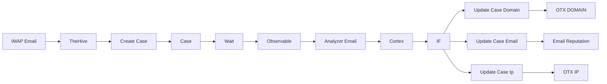

## Fluxo (.json) :

```json
{
  "id": 4,
  "name": "Email",
  "nodes": [
    {
      "name": "IMAP Email",
      "type": "n8n-nodes-base.emailReadImap",
      "position": [
        -300,
        200
      ],
      "parameters": {
        "format": "resolved",
        "options": {}
      },
      "credentials": {
        "imap": {
          "id": "5",
          "name": "IMAP account"
        }
      },
      "typeVersion": 1
    },
    {
      "name": "TheHive",
      "type": "n8n-nodes-base.theHive",
      "position": [
        -20,
        200
      ],
      "parameters": {
        "tags": "Email",
        "type": "Email",
        "title": "={{$node[\"IMAP Email\"].binary.attachment_0.fileName}}",
        "source": "Outlook",
        "sourceRef": "={{$node[\"IMAP Email\"].json[\"messageId\"]}}",
        "artifactUi": {
          "artifactValues": [
            {
              "dataType": "file",
              "binaryProperty": "attachment_0"
            }
          ]
        },
        "description": "={{$node[\"IMAP Email\"].binary.attachment_0.fileName}}",
        "additionalFields": {}
      },
      "credentials": {
        "theHiveApi": {
          "id": "1",
          "name": "The Hive account"
        }
      },
      "typeVersion": 1,
      "alwaysOutputData": true
    },
    {
      "name": "Create Case",
      "type": "n8n-nodes-base.theHive",
      "position": [
        280,
        200
      ],
      "parameters": {
        "id": "={{$node[\"TheHive\"].json[\"_id\"]}}",
        "operation": "promote",
        "additionalFields": {}
      },
      "credentials": {
        "theHiveApi": {
          "id": "1",
          "name": "The Hive account"
        }
      },
      "typeVersion": 1,
      "alwaysOutputData": true
    },
    {
      "name": "Case",
      "type": "n8n-nodes-base.theHive",
      "position": [
        540,
        200
      ],
      "parameters": {
        "id": "={{$node[\"Create Case\"].json[\"_id\"]}}",
        "resource": "case",
        "operation": "get"
      },
      "credentials": {
        "theHiveApi": {
          "id": "1",
          "name": "The Hive account"
        }
      },
      "typeVersion": 1,
      "alwaysOutputData": true
    },
    {
      "name": "Observable",
      "type": "n8n-nodes-base.theHive",
      "position": [
        1060,
        200
      ],
      "parameters": {
        "caseId": "={{$node[\"Case\"].json[\"_id\"]}}",
        "options": {},
        "resource": "observable",
        "returnAll": true
      },
      "credentials": {
        "theHiveApi": {
          "id": "1",
          "name": "The Hive account"
        }
      },
      "typeVersion": 1,
      "alwaysOutputData": true
    },
    {
      "name": "Analyzer Email",
      "type": "n8n-nodes-base.theHive",
      "position": [
        1340,
        200
      ],
      "parameters": {
        "id": "={{$node[\"Observable\"].json[\"_id\"]}}",
        "dataType": "file",
        "resource": "observable",
        "analyzers": [
          "24a64a086a410e1c7d7ace74003c4480::CORTEX"
        ],
        "operation": "executeAnalyzer"
      },
      "credentials": {
        "theHiveApi": {
          "id": "1",
          "name": "The Hive account"
        }
      },
      "retryOnFail": true,
      "typeVersion": 1,
      "alwaysOutputData": true
    },
    {
      "name": "Cortex",
      "type": "n8n-nodes-base.cortex",
      "position": [
        1560,
        200
      ],
      "parameters": {
        "jobId": "={{$node[\"Analyzer Email\"].json[\"cortexJobId\"]}}",
        "resource": "job",
        "operation": "report"
      },
      "credentials": {
        "cortexApi": {
          "id": "2",
          "name": "Cortex account"
        }
      },
      "typeVersion": 1
    },
    {
      "name": "IF",
      "type": "n8n-nodes-base.if",
      "position": [
        -20,
        600
      ],
      "parameters": {
        "conditions": {
          "number": [
            {
              "value1": "={{$node[\"Cortex\"].json[\"report\"][\"full\"][\"iocs\"][\"domain\"].length}}",
              "operation": "larger"
            },
            {
              "value1": "={{$node[\"Cortex\"].json[\"report\"][\"full\"][\"iocs\"][\"email\"].length}}",
              "operation": "larger"
            },
            {
              "value1": "={{$node[\"Cortex\"].json[\"report\"][\"full\"][\"iocs\"][\"ip\"].length}}",
              "operation": "larger"
            }
          ]
        },
        "combineOperation": "any"
      },
      "typeVersion": 1
    },
    {
      "name": "Update Case Domain",
      "type": "n8n-nodes-base.theHive",
      "position": [
        420,
        480
      ],
      "parameters": {
        "ioc": true,
        "data": "={{$node[\"Cortex\"].json[\"report\"][\"full\"][\"iocs\"][\"domain\"]}}",
        "caseId": "={{$node[\"Case\"].json[\"_id\"]}}",
        "status": "Ok",
        "message": "={{$node[\"Cortex\"].json[\"analyzerName\"]}}",
        "options": {
          "tags": "Domain"
        },
        "dataType": "domain",
        "resource": "observable",
        "operation": "create"
      },
      "credentials": {
        "theHiveApi": {
          "id": "1",
          "name": "The Hive account"
        }
      },
      "typeVersion": 1
    },
    {
      "name": "Update Case Email",
      "type": "n8n-nodes-base.theHive",
      "position": [
        420,
        620
      ],
      "parameters": {
        "ioc": true,
        "data": "={{$node[\"Cortex\"].json[\"report\"][\"full\"][\"iocs\"][\"email\"]}}",
        "caseId": "={{$node[\"Case\"].json[\"_id\"]}}",
        "status": "Ok",
        "message": "={{$node[\"Cortex\"].json[\"analyzerName\"]}}",
        "options": {
          "tags": "Domain"
        },
        "dataType": "mail",
        "resource": "observable",
        "operation": "create"
      },
      "credentials": {
        "theHiveApi": {
          "id": "1",
          "name": "The Hive account"
        }
      },
      "typeVersion": 1
    },
    {
      "name": "Update Case Ip",
      "type": "n8n-nodes-base.theHive",
      "position": [
        420,
        760
      ],
      "parameters": {
        "ioc": true,
        "data": "={{$node[\"Cortex\"].json[\"report\"][\"full\"][\"iocs\"][\"ip\"]}}",
        "caseId": "={{$node[\"Case\"].json[\"_id\"]}}",
        "status": "Ok",
        "message": "={{$node[\"Cortex\"].json[\"analyzerName\"]}}",
        "options": {
          "tags": "Domain"
        },
        "dataType": "ip",
        "resource": "observable",
        "operation": "create"
      },
      "credentials": {
        "theHiveApi": {
          "id": "1",
          "name": "The Hive account"
        }
      },
      "typeVersion": 1
    },
    {
      "name": "Wait",
      "type": "n8n-nodes-base.wait",
      "position": [
        800,
        200
      ],
      "webhookId": "ecada1d5-a671-44fc-906e-c64c6f05e760",
      "parameters": {
        "unit": "seconds",
        "amount": 5
      },
      "typeVersion": 1
    },
    {
      "name": "Email Reputation",
      "type": "n8n-nodes-base.theHive",
      "position": [
        640,
        620
      ],
      "parameters": {
        "id": "={{$node[\"Update Case Email\"].json[\"id\"]}}",
        "dataType": "mail",
        "resource": "observable",
        "analyzers": [
          "9902b4e5c58015184b177de13f2151c7::CORTEX"
        ],
        "operation": "executeAnalyzer"
      },
      "credentials": {
        "theHiveApi": {
          "id": "1",
          "name": "The Hive account"
        }
      },
      "typeVersion": 1
    },
    {
      "name": "OTX IP",
      "type": "n8n-nodes-base.theHive",
      "position": [
        640,
        760
      ],
      "parameters": {
        "id": "={{$node[\"Update Case Ip\"].json[\"id\"]}}",
        "dataType": "ip",
        "resource": "observable",
        "analyzers": [
          "b084bf78d1aea92966b6ef6a4f6193a5::CORTEX"
        ],
        "operation": "executeAnalyzer"
      },
      "credentials": {
        "theHiveApi": {
          "id": "1",
          "name": "The Hive account"
        }
      },
      "typeVersion": 1
    },
    {
      "name": "OTX DOMAIN",
      "type": "n8n-nodes-base.theHive",
      "position": [
        640,
        480
      ],
      "parameters": {
        "id": "={{$node[\"Update Case Domain\"].json[\"id\"]}}",
        "dataType": "domain",
        "resource": "observable",
        "analyzers": [
          "b084bf78d1aea92966b6ef6a4f6193a5::CORTEX"
        ],
        "operation": "executeAnalyzer"
      },
      "credentials": {
        "theHiveApi": {
          "id": "1",
          "name": "The Hive account"
        }
      },
      "typeVersion": 1
    }
  ],
  "active": true,
  "settings": {},
  "connections": {
    "IF": {
      "main": [
        [
          {
            "node": "Update Case Domain",
            "type": "main",
            "index": 0
          },
          {
            "node": "Update Case Email",
            "type": "main",
            "index": 0
          },
          {
            "node": "Update Case Ip",
            "type": "main",
            "index": 0
          }
        ]
      ]
    },
    "Case": {
      "main": [
        [
          {
            "node": "Wait",
            "type": "main",
            "index": 0
          }
        ]
      ]
    },
    "Wait": {
      "main": [
        [
          {
            "node": "Observable",
            "type": "main",
            "index": 0
          }
        ]
      ]
    },
    "Cortex": {
      "main": [
        [
          {
            "node": "IF",
            "type": "main",
            "index": 0
          }
        ]
      ]
    },
    "TheHive": {
      "main": [
        [
          {
            "node": "Create Case",
            "type": "main",
            "index": 0
          }
        ]
      ]
    },
    "IMAP Email": {
      "main": [
        [
          {
            "node": "TheHive",
            "type": "main",
            "index": 0
          }
        ]
      ]
    },
    "Observable": {
      "main": [
        [
          {
            "node": "Analyzer Email",
            "type": "main",
            "index": 0
          }
        ]
      ]
    },
    "Create Case": {
      "main": [
        [
          {
            "node": "Case",
            "type": "main",
            "index": 0
          }
        ]
      ]
    },
    "Analyzer Email": {
      "main": [
        [
          {
            "node": "Cortex",
            "type": "main",
            "index": 0
          }
        ]
      ]
    },
    "Update Case Ip": {
      "main": [
        [
          {
            "node": "OTX IP",
            "type": "main",
            "index": 0
          }
        ]
      ]
    },
    "Update Case Email": {
      "main": [
        [
          {
            "node": "Email Reputation",
            "type": "main",
            "index": 0
          }
        ]
      ]
    },
    "Update Case Domain": {
      "main": [
        [
          {
            "node": "OTX DOMAIN",
            "type": "main",
            "index": 0
          }
        ]
      ]
    }
  }
}
```

<a id="template-1104"></a>

## Template 1104 - Insights de comentários HN

- **Nome:** Insights de comentários HN
- **Descrição:** Coleta comentários de uma notícia do Hacker News, transforma-os em vetores, agrupa comentários similares e gera insights e sentimentos por grupo, exportando os resultados para uma planilha.
- **Funcionalidade:** • Limpeza de dados existentes: remove pontos anteriores relacionados à mesma notícia na base vetorial antes de importar novos dados.
• Coleta e achatação de comentários: busca todos os comentários de uma história do Hacker News e achata a árvore de respostas para considerar replies também.
• Geração de embeddings: transforma o texto dos comentários em vetores numéricos usando um serviço de embedding.
• Armazenamento vetorial com metadados: salva vetores e metadados (autor, id, título da história) em uma coleção dedicada.
• Quebra de texto em chunks: divide textos longos para processamento adequado antes de armazenar/vestorizar.
• Agrupamento por similaridade (K-means): aplica um algoritmo de clustering em vetores para identificar grupos temáticos de comentários.
• Filtragem de clusters relevantes: seleciona apenas clusters com tamanho mínimo (ex.: 3 pontos) para análise posterior.
• Extração de conteúdo dos clusters: recupera os conteúdos e metadados dos pontos pertencentes a cada cluster.
• Geração de insights e sentimento por cluster: usa um modelo de linguagem para resumir, extrair insights e classificar o sentimento de cada grupo de comentários.
• Exportação de resultados: escreve os insights consolidados e dados brutos resumidos em uma planilha para acompanhamento e análise.
- **Ferramentas:** • Hacker News API: fonte dos comentários da notícia selecionada.
• Qdrant: base de dados vetorial para armazenar vetores, payloads e permitir buscas/filtragens avançadas.
• OpenAI (Embeddings & LLM): serviço para gerar embeddings de texto e para gerar resumos/insights e classificação de sentimento.
• Google Sheets: destino final para exportação e registro dos insights gerados.
• Ambiente Python (NumPy, scikit-learn): usado para manipulação de vetores e aplicação do algoritmo K-means para clustering.

## Fluxo visual

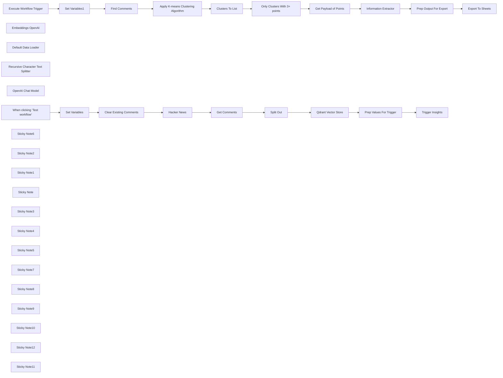

## Fluxo (.json) :

```json
{
  "meta": {
    "instanceId": "408f9fb9940c3cb18ffdef0e0150fe342d6e655c3a9fac21f0f644e8bedabcd9"
  },
  "nodes": [
    {
      "id": "5961a808-a873-497e-bc42-5b760ded1571",
      "name": "When clicking ‘Test workflow’",
      "type": "n8n-nodes-base.manualTrigger",
      "position": [
        380,
        360
      ],
      "parameters": {},
      "typeVersion": 1
    },
    {
      "id": "7fa03eaa-7865-46ce-9f58-7e19fc0ec89b",
      "name": "Hacker News",
      "type": "n8n-nodes-base.hackerNews",
      "position": [
        1200,
        400
      ],
      "parameters": {
        "articleId": "={{ $('Set Variables').item.json.story_id }}",
        "additionalFields": {
          "includeComments": true
        }
      },
      "typeVersion": 1
    },
    {
      "id": "82675738-9df7-47a3-8363-264bb09255f4",
      "name": "Split Out",
      "type": "n8n-nodes-base.splitOut",
      "position": [
        1560,
        400
      ],
      "parameters": {
        "options": {},
        "fieldToSplitOut": "data"
      },
      "typeVersion": 1
    },
    {
      "id": "6800be57-40da-4d80-ac35-304403423263",
      "name": "Get Comments",
      "type": "n8n-nodes-base.set",
      "position": [
        1380,
        400
      ],
      "parameters": {
        "options": {},
        "assignments": {
          "assignments": [
            {
              "id": "91110cf7-1932-43ca-b24e-9d4ed40447e6",
              "name": "data",
              "type": "array",
              "value": "={{\n$json.children.flatMap(item => {\n  return [\n    { id: item.id, story_id: item.story_id, story_title: $json.title, author: item.author, text: item.text },\n    ...item.children.flatMap(item1 => {\n         return [\n           { id: item1.id, story_id: item1.story_id, story_title: $json.title, author: item1.author, text: item1.text },\n           ...item1.children.flatMap(item2 => {\n               return [\n                 { id: item2.id, story_id: item2.story_id, story_title: $json.title, author: item2.author, text: item2.text },\n                 ...item2.children.flatMap(item3 => {\n                     return [\n                       { id: item3.id, story_id: item3.story_id, story_title: $json.title, author: item3.author, text: item3.text },\n                       ...item3.children.flatMap(item4 => {\n                          return { id: item4.id, story_id: item4.story_id, story_title: $json.title, author: item4.author, text: item4.text }\n                       })\n                     ]\n                 })\n               ]\n           })\n        ]\n    })\n  ]\n})\n}}"
            }
          ]
        }
      },
      "typeVersion": 3.4
    },
    {
      "id": "18e1b980-1d98-4a89-8cc6-f4793c004d9f",
      "name": "Qdrant Vector Store",
      "type": "@n8n/n8n-nodes-langchain.vectorStoreQdrant",
      "position": [
        1960,
        320
      ],
      "parameters": {
        "mode": "insert",
        "options": {},
        "qdrantCollection": {
          "__rl": true,
          "mode": "list",
          "value": "hn_comments",
          "cachedResultName": "hn_comments"
        }
      },
      "credentials": {
        "qdrantApi": {
          "id": "NyinAS3Pgfik66w5",
          "name": "QdrantApi account"
        }
      },
      "typeVersion": 1
    },
    {
      "id": "c4ce1342-1460-4650-8338-055979339f46",
      "name": "Embeddings OpenAI",
      "type": "@n8n/n8n-nodes-langchain.embeddingsOpenAi",
      "position": [
        1960,
        480
      ],
      "parameters": {
        "model": "text-embedding-3-small",
        "options": {}
      },
      "credentials": {
        "openAiApi": {
          "id": "8gccIjcuf3gvaoEr",
          "name": "OpenAi account"
        }
      },
      "typeVersion": 1
    },
    {
      "id": "00301fd6-8766-40f7-99eb-7f8af9a51b29",
      "name": "Default Data Loader",
      "type": "@n8n/n8n-nodes-langchain.documentDefaultDataLoader",
      "position": [
        2080,
        480
      ],
      "parameters": {
        "options": {
          "metadata": {
            "metadataValues": [
              {
                "name": "item_id",
                "value": "={{ $json.id }}"
              },
              {
                "name": "item_author",
                "value": "={{ $json.author }}"
              },
              {
                "name": "story_id",
                "value": "={{ $json.story_id }}"
              },
              {
                "name": "story_title",
                "value": "={{ $json.story_title }}"
              }
            ]
          }
        },
        "jsonData": "={{ $json.text }}",
        "jsonMode": "expressionData"
      },
      "typeVersion": 1
    },
    {
      "id": "c76d3aea-0906-4ed4-a828-47ad5775364c",
      "name": "Recursive Character Text Splitter",
      "type": "@n8n/n8n-nodes-langchain.textSplitterRecursiveCharacterTextSplitter",
      "position": [
        2080,
        620
      ],
      "parameters": {
        "options": {},
        "chunkSize": 4000
      },
      "typeVersion": 1
    },
    {
      "id": "50735ca9-90eb-408a-9bca-97eea1a310d1",
      "name": "Set Variables",
      "type": "n8n-nodes-base.set",
      "position": [
        620,
        360
      ],
      "parameters": {
        "options": {},
        "assignments": {
          "assignments": [
            {
              "id": "5b77516d-acb5-41af-9346-a67acecd0419",
              "name": "story_id",
              "type": "string",
              "value": "41123155"
            }
          ]
        }
      },
      "typeVersion": 3.4
    },
    {
      "id": "376a1a66-1d22-4969-af11-d1a9d474b67b",
      "name": "Clear Existing Comments",
      "type": "n8n-nodes-base.httpRequest",
      "position": [
        860,
        360
      ],
      "parameters": {
        "url": "http://qdrant:6333/collections/hn_comments/points/delete",
        "method": "POST",
        "options": {},
        "jsonBody": "={\n    \"filter\": {\n        \"must\": [\n            {\n                \"key\": \"metadata.story_id\",\n                \"match\": {\n                    \"value\": \"{{ $('Set Variables').item.json.story_id }}\"\n                }\n            }\n        ]\n    }\n}",
        "sendBody": true,
        "specifyBody": "json",
        "authentication": "predefinedCredentialType",
        "nodeCredentialType": "qdrantApi"
      },
      "credentials": {
        "qdrantApi": {
          "id": "NyinAS3Pgfik66w5",
          "name": "QdrantApi account"
        }
      },
      "typeVersion": 4.2
    },
    {
      "id": "e8bcf7d8-aa25-499e-a64f-4d20caf1d6d4",
      "name": "Get Payload of Points",
      "type": "n8n-nodes-base.httpRequest",
      "position": [
        1822,
        1100
      ],
      "parameters": {
        "url": "=http://qdrant:6333/collections/hn_comments/points",
        "method": "POST",
        "options": {},
        "jsonBody": "={{\n  {\n    \"ids\": $json.points,\n    \"with_payload\": true\n  }\n}}",
        "sendBody": true,
        "specifyBody": "json",
        "authentication": "predefinedCredentialType",
        "nodeCredentialType": "qdrantApi"
      },
      "credentials": {
        "qdrantApi": {
          "id": "NyinAS3Pgfik66w5",
          "name": "QdrantApi account"
        }
      },
      "typeVersion": 4.2
    },
    {
      "id": "57cbc8e5-dd89-4c2a-9906-2bd0c2bbdede",
      "name": "Clusters To List",
      "type": "n8n-nodes-base.splitOut",
      "position": [
        1602,
        1100
      ],
      "parameters": {
        "options": {},
        "fieldToSplitOut": "output"
      },
      "typeVersion": 1
    },
    {
      "id": "20b76291-f8fa-4aa7-8f1a-ff423ac3cb7f",
      "name": "OpenAI Chat Model",
      "type": "@n8n/n8n-nodes-langchain.lmChatOpenAi",
      "position": [
        2242,
        1320
      ],
      "parameters": {
        "model": "gpt-4o-mini",
        "options": {}
      },
      "credentials": {
        "openAiApi": {
          "id": "8gccIjcuf3gvaoEr",
          "name": "OpenAi account"
        }
      },
      "typeVersion": 1
    },
    {
      "id": "07fc19b3-33b4-42be-bda9-f1436d4e9e6f",
      "name": "Only Clusters With 3+ points",
      "type": "n8n-nodes-base.filter",
      "position": [
        1602,
        1260
      ],
      "parameters": {
        "options": {},
        "conditions": {
          "options": {
            "leftValue": "",
            "caseSensitive": true,
            "typeValidation": "strict"
          },
          "combinator": "and",
          "conditions": [
            {
              "id": "328f806c-0792-4d90-9bee-a1e10049e78f",
              "operator": {
                "type": "array",
                "operation": "lengthGt",
                "rightType": "number"
              },
              "leftValue": "={{ $json.points }}",
              "rightValue": 2
            }
          ]
        }
      },
      "typeVersion": 2
    },
    {
      "id": "80583492-c454-4b9d-8df9-ded7d50930f2",
      "name": "Set Variables1",
      "type": "n8n-nodes-base.set",
      "position": [
        582,
        1200
      ],
      "parameters": {
        "options": {},
        "assignments": {
          "assignments": [
            {
              "id": "2e58a9fa-a14d-4a6c-8cc8-8ec947c791fb",
              "name": "story_id",
              "type": "string",
              "value": "={{ $json.story_id || 41123155 }}"
            }
          ]
        }
      },
      "typeVersion": 3.4
    },
    {
      "id": "2cfb3a7a-01d2-4eee-b9f8-d19e81829882",
      "name": "Prep Output For Export",
      "type": "n8n-nodes-base.set",
      "position": [
        2842,
        1200
      ],
      "parameters": {
        "mode": "raw",
        "options": {},
        "jsonOutput": "={{ {\n  ...$json.output,\n  \"Story ID\": $('Set Variables1').item.json.story_id,\n  \"Story Title\": $('Get Payload of Points').item.json.result[0].payload.metadata.story_title,\n  \"Number of Responses\": $('Get Payload of Points').item.json.result.length,\n  \"Raw Responses\": $('Get Payload of Points').item.json.result.map(item =>\n    [\n      item.payload.metadata.item_id,\n      item.payload.metadata.story_id,\n      item.payload.metadata.story_title,\n      item.payload.metadata.item_author,\n      item.payload.content.replaceAll('\"', '\\\"').replaceAll('\\n', ' ').substring(0, 500)\n    ]\n   ).join('\\n')\n} }}\n"
      },
      "typeVersion": 3.4
    },
    {
      "id": "ade302fd-93ad-4d96-9852-e4108ba435af",
      "name": "Export To Sheets",
      "type": "n8n-nodes-base.googleSheets",
      "position": [
        3062,
        1200
      ],
      "parameters": {
        "columns": {
          "value": {},
          "schema": [
            {
              "id": "Story ID",
              "type": "string",
              "display": true,
              "removed": false,
              "required": false,
              "displayName": "Story ID",
              "defaultMatch": false,
              "canBeUsedToMatch": true
            },
            {
              "id": "Insight",
              "type": "string",
              "display": true,
              "removed": false,
              "required": false,
              "displayName": "Insight",
              "defaultMatch": false,
              "canBeUsedToMatch": true
            },
            {
              "id": "Sentiment",
              "type": "string",
              "display": true,
              "removed": false,
              "required": false,
              "displayName": "Sentiment",
              "defaultMatch": false,
              "canBeUsedToMatch": true
            },
            {
              "id": "Number of Responses",
              "type": "string",
              "display": true,
              "removed": false,
              "required": false,
              "displayName": "Number of Responses",
              "defaultMatch": false,
              "canBeUsedToMatch": true
            },
            {
              "id": "Raw Responses",
              "type": "string",
              "display": true,
              "removed": false,
              "required": false,
              "displayName": "Raw Responses",
              "defaultMatch": false,
              "canBeUsedToMatch": true
            }
          ],
          "mappingMode": "autoMapInputData",
          "matchingColumns": []
        },
        "options": {
          "useAppend": true
        },
        "operation": "append",
        "sheetName": {
          "__rl": true,
          "mode": "name",
          "value": "Sheet1"
        },
        "documentId": {
          "__rl": true,
          "mode": "id",
          "value": "=1CPA_SNpWr2OjZ2KMi49fZ6MA9yC9uik8PMOILan7qYE"
        }
      },
      "credentials": {
        "googleSheetsOAuth2Api": {
          "id": "XHvC7jIRR8A2TlUl",
          "name": "Google Sheets account"
        }
      },
      "typeVersion": 4.4
    },
    {
      "id": "22d54081-7a52-40f2-837c-0c8df05e1fe4",
      "name": "Execute Workflow Trigger",
      "type": "n8n-nodes-base.executeWorkflowTrigger",
      "position": [
        382,
        1200
      ],
      "parameters": {},
      "typeVersion": 1
    },
    {
      "id": "b1e6eb2b-4627-4c69-a2ce-6bb8451d6359",
      "name": "Trigger Insights",
      "type": "n8n-nodes-base.executeWorkflow",
      "position": [
        2780,
        360
      ],
      "parameters": {
        "options": {},
        "workflowId": "={{ $workflow.id }}"
      },
      "typeVersion": 1
    },
    {
      "id": "f25e8b2a-5ce4-4e02-8e08-e3dd98072d0e",
      "name": "Prep Values For Trigger",
      "type": "n8n-nodes-base.set",
      "position": [
        2580,
        360
      ],
      "parameters": {
        "options": {},
        "assignments": {
          "assignments": [
            {
              "id": "24dd90ad-390f-444e-ba6c-8c06a41e836e",
              "name": "story_id",
              "type": "string",
              "value": "={{ $('Set Variables').item.json.story_id }}"
            }
          ]
        }
      },
      "executeOnce": true,
      "typeVersion": 3.4
    },
    {
      "id": "d0270fa8-5ebc-4573-b070-05d19dd3302a",
      "name": "Find Comments",
      "type": "n8n-nodes-base.httpRequest",
      "position": [
        982,
        1160
      ],
      "parameters": {
        "url": "=http://qdrant:6333/collections/hn_comments/points/scroll",
        "method": "POST",
        "options": {},
        "jsonBody": "={\n  \"limit\": 500,\n  \"filter\":{\n    \"must\": [\n      {\n        \"key\": \"metadata.story_id\",\n        \"match\": { \"value\": {{ $('Set Variables1').item.json.story_id }} }\n      }\n    ]\n  },\n  \"with_vector\":true\n}",
        "sendBody": true,
        "specifyBody": "json",
        "authentication": "predefinedCredentialType",
        "nodeCredentialType": "qdrantApi"
      },
      "credentials": {
        "qdrantApi": {
          "id": "NyinAS3Pgfik66w5",
          "name": "QdrantApi account"
        }
      },
      "typeVersion": 4.2
    },
    {
      "id": "ca3c040e-bfe1-4f4d-9c4e-154c2010f89b",
      "name": "Sticky Note6",
      "type": "n8n-nodes-base.stickyNote",
      "position": [
        2440,
        160
      ],
      "parameters": {
        "color": 7,
        "width": 595.5213902293318,
        "height": 429.11782776909047,
        "content": "## Step 4. Trigger Insights SubWorkflow\n[Learn more about Workflow Triggers](https://docs.n8n.io/integrations/builtin/core-nodes/n8n-nodes-base.executeworkflow)\n\nA subworkflow is used to trigger the analysis for the survey. This separation is optional but used here to better demonstrate the two part process."
      },
      "typeVersion": 1
    },
    {
      "id": "cdf04343-abfa-4705-9828-e246c96ffa2a",
      "name": "Sticky Note2",
      "type": "n8n-nodes-base.stickyNote",
      "position": [
        1780,
        60
      ],
      "parameters": {
        "color": 7,
        "width": 638.5221986278162,
        "height": 741.0186923170972,
        "content": "## Step 3. Store Comments in Qdrant\n[Learn more about the Qdrant Vector Store](https://docs.n8n.io/integrations/builtin/cluster-nodes/root-nodes/n8n-nodes-langchain.vectorstoreqdrant/)\n\nVector databases are a great way to store data if you're interested in perform similiarity searches which applies here as we want to group similar comments to find patterns. Qdrant is a powerful vector database and tool of choice because of its robust API implementation and advanced filtering capabilities."
      },
      "typeVersion": 1
    },
    {
      "id": "14f6872b-1c51-4359-a39f-cc6ba2ff29fb",
      "name": "Sticky Note1",
      "type": "n8n-nodes-base.stickyNote",
      "position": [
        1100,
        200
      ],
      "parameters": {
        "color": 7,
        "width": 656.0317138444963,
        "height": 441.0753369736108,
        "content": "## Step 2. Using HN API to get Comments\n[Read more about HTTP Request Node](https://docs.n8n.io/integrations/builtin/app-nodes/n8n-nodes-base.hackernews)\n\nWe'll scrape all the comments for the HN story using the HN API node. We go an extra step and flatten the comment tree so replies are also considered as top level comments."
      },
      "typeVersion": 1
    },
    {
      "id": "62935316-310a-4ce9-ac5f-8820666e2290",
      "name": "Sticky Note",
      "type": "n8n-nodes-base.stickyNote",
      "position": [
        280,
        180
      ],
      "parameters": {
        "color": 7,
        "width": 787.3314861380661,
        "height": 465.52420584035275,
        "content": "## Step 1. Starting Fresh\nFor this demo, we'll clear any existing records in our Qdrant vector store for the selected HN story. We do this using the Qdrant's delete points API."
      },
      "typeVersion": 1
    },
    {
      "id": "a5e93a02-555c-48a3-afae-344a4884908b",
      "name": "Sticky Note3",
      "type": "n8n-nodes-base.stickyNote",
      "position": [
        269,
        1005
      ],
      "parameters": {
        "color": 7,
        "width": 551.2710561574413,
        "height": 407.9295477646979,
        "content": "## Step 5. The Insight Subworkflow\n[Learn more about Workflow Triggers](https://docs.n8n.io/integrations/builtin/core-nodes/n8n-nodes-base.executeworkflowtrigger)\n\nThis subworkflow takes the Story ID to find the relevant comment records in our Qdrant vector store. Our goal is to find insights on what's the community consensus on a particular HN story."
      },
      "typeVersion": 1
    },
    {
      "id": "37217a2d-aca4-499b-9d6b-a1d4c6684194",
      "name": "Sticky Note4",
      "type": "n8n-nodes-base.stickyNote",
      "position": [
        840,
        920
      ],
      "parameters": {
        "color": 7,
        "width": 600.1809497875241,
        "height": 482.99934349707576,
        "content": "## Step 6. Apply Clustering Algorithm to Comments\n[Read more about using Python in n8n](https://docs.n8n.io/integrations/builtin/core-nodes/n8n-nodes-base.code)\n\nWe'll retrieve our vectors embeddings for the desired HN story comments and perform an advanced clustering algorithm on them. This powerful echnique allows us to quickly group similar embeddings into clusters which we can then use to discover popular feedback, opinions and pain-points!\n\nWe're able to do this thanks to te Python Code Node."
      },
      "typeVersion": 1
    },
    {
      "id": "fcccc9a8-ee9f-41b7-b7d6-e8fbbe19dfa3",
      "name": "Sticky Note5",
      "type": "n8n-nodes-base.stickyNote",
      "position": [
        1466,
        880
      ],
      "parameters": {
        "color": 7,
        "width": 598.5585287222906,
        "height": 605.9905193915599,
        "content": "## Step 7. Fetch Comment Contents By Cluster\n[Learn more about using the Code Node](https://docs.n8n.io/integrations/builtin/core-nodes/n8n-nodes-base.code/)\n\nWith the Qdrant point IDs grouped and returned by our code node, all that's left is to fetch the payload of each. Note that the clustering algorithm isn't perfect and may require some tweaking depending on your data."
      },
      "typeVersion": 1
    },
    {
      "id": "78e9cd03-dea4-4b11-947f-a00d7bb5f8cf",
      "name": "Sticky Note7",
      "type": "n8n-nodes-base.stickyNote",
      "position": [
        2086,
        929
      ],
      "parameters": {
        "color": 7,
        "width": 587.6069484146701,
        "height": 583.305275883189,
        "content": "## Step 8. Getting Insights from Grouped Comments\n[Read more about using the Information Extractor Node](https://docs.n8n.io/integrations/builtin/cluster-nodes/root-nodes/n8n-nodes-langchain.information-extractor)\n\nNext, we'll use our state-of-the-art LLM to generate insights on our comment groups. Doing it this way, we'll able to pull more granular results addressing many key topics discussed for the HN story."
      },
      "typeVersion": 1
    },
    {
      "id": "d5427741-6015-4af5-8e45-f6fc6f5c4133",
      "name": "Sticky Note8",
      "type": "n8n-nodes-base.stickyNote",
      "position": [
        2706,
        940
      ],
      "parameters": {
        "color": 7,
        "width": 572.5638733479158,
        "height": 464.4019616956416,
        "content": "## Step 9. Write To Insights Sheet\nFinally, our completed insights to appended to the Insights Sheet we created earlier in the workflow.\n\nYou can find a sample sheet here: https://docs.google.com/spreadsheets/d/e/2PACX-1vQXaQU9XxsxnUIIeqmmf1PuYRuYtwviVXTv6Mz9Vo6_a4ty-XaJHSeZsptjWXS3wGGDG8Z4u16rvE7l/pubhtml"
      },
      "typeVersion": 1
    },
    {
      "id": "a66b7e6d-0602-4f6b-a9f6-76a63d590956",
      "name": "Sticky Note9",
      "type": "n8n-nodes-base.stickyNote",
      "position": [
        560,
        313.32160655630304
      ],
      "parameters": {
        "width": 226.36363118160727,
        "height": 296.5755172289686,
        "content": "\n\n\n\n\n\n\n\n\n\n\n\n\n\n\n\n### 🚨 Set Story ID here!\nMust be a valid HN story ID"
      },
      "typeVersion": 1
    },
    {
      "id": "42f93189-4bd8-4487-975a-f1c8f8365242",
      "name": "Apply K-means Clustering Algorithm",
      "type": "n8n-nodes-base.code",
      "position": [
        1202,
        1160
      ],
      "parameters": {
        "language": "python",
        "pythonCode": "import numpy as np\nfrom sklearn.cluster import KMeans\n\n# get vectors for all answers\npoint_ids = [item.id for item in _input.first().json.result.points]\nvectors = [item.vector.to_py() for item in _input.first().json.result.points]\nvectors_array = np.array(vectors)\n\n# apply k-means clustering where n_clusters = 5\n# this is a max and we'll discard some of these clusters later\nkmeans = KMeans(n_clusters=min(len(vectors), 5), random_state=42).fit(vectors_array)\nlabels = kmeans.labels_\nunique_labels = set(labels)\n\n# Extract and print points in each cluster\nclusters = {}\nfor label in set(labels):\n    clusters[label] = vectors_array[labels == label]\n\n# return Qdrant point ids for each cluster\n# we'll use these ids to fetch the payloads from the vector store.\noutput = []\nfor cluster_id, cluster_points in clusters.items():\n    points = [point_ids[i] for i in range(len(labels)) if labels[i] == cluster_id]\n    output.append({\n        \"id\": f\"Cluster {cluster_id}\",\n        \"total\": len(cluster_points),\n        \"points\": points\n    })\n\nreturn {\"json\": {\"output\": output } }"
      },
      "typeVersion": 2
    },
    {
      "id": "4ddeab09-e401-41ad-861f-560b9e92bf89",
      "name": "Sticky Note10",
      "type": "n8n-nodes-base.stickyNote",
      "position": [
        -180,
        40
      ],
      "parameters": {
        "width": 400.381109509268,
        "height": 612.855812336249,
        "content": "## Try It Out!\n\n### This workflow generates highly-detailed community insights from HN Story comments. Works best when dealing with a large number of comments.\n\n* Import HN Story comments and vectorise in Qdrant vectorstore.\n* Identify clusters of popular topics in discussion using K-means clustering algorithm. \n* Each valid cluster is analysed and summarised by LLM.\n* Export LLM response and cluster results back into sheet.\n\nCheck out the reference google sheet here: https://docs.google.com/spreadsheets/d/e/2PACX-1vQXaQU9XxsxnUIIeqmmf1PuYRuYtwviVXTv6Mz9Vo6_a4ty-XaJHSeZsptjWXS3wGGDG8Z4u16rvE7l/pubhtml\n\n### Need Help?\nJoin the [Discord](https://discord.com/invite/XPKeKXeB7d) or ask in the [Forum](https://community.n8n.io/)!\n\nHappy Hacking!"
      },
      "typeVersion": 1
    },
    {
      "id": "eea1b301-f030-48a9-bcfc-63fe3e1aac0d",
      "name": "Information Extractor",
      "type": "@n8n/n8n-nodes-langchain.informationExtractor",
      "position": [
        2260,
        1140
      ],
      "parameters": {
        "text": "=The {{ $json.result.length }} comments were:\n{{\n$json.result.map(item =>\n`* Commenter \"${item.payload.metadata.item_author}\" says the following: \"${item.payload.content.replaceAll('\"', '\\\"').replaceAll('\\n', ' ')}\"`\n).join('\\n')\n}}",
        "options": {
          "systemPromptTemplate": "=You help summarise a selection of forum comments for an article called \"{{ $json.result[0].payload.metadata.story_title }}\".\nThe {{ $json.result.length }} comments were selected because their contents were similar in context.\n\nYour task is to: \n* summarise the given comments into a short paragraph. Provide an insight from this summary and what we could learn from the comments.\n* determine if the overall sentiment of all the listed responses to be either strongly negative, negative, neutral, positive or strongly positive."
        },
        "schemaType": "fromJson",
        "jsonSchemaExample": "{\n\t\"Insight\": \"\",\n    \"Sentiment\": \"\",\n    \"Suggested Improvements\": \"\"\n}"
      },
      "typeVersion": 1
    },
    {
      "id": "bee4dd57-c907-418f-ad87-21c6ce4e6698",
      "name": "Sticky Note12",
      "type": "n8n-nodes-base.stickyNote",
      "position": [
        280,
        660
      ],
      "parameters": {
        "color": 5,
        "width": 323.2987132716669,
        "height": 80,
        "content": "### Run this once! \nIf for any reason you need to run more than once, be sure to clear the existing data first."
      },
      "typeVersion": 1
    },
    {
      "id": "429e080d-5a94-442c-a2b0-6a12f03a8a98",
      "name": "Sticky Note11",
      "type": "n8n-nodes-base.stickyNote",
      "position": [
        840,
        1440
      ],
      "parameters": {
        "color": 5,
        "width": 323.2987132716669,
        "height": 110.05160146874424,
        "content": "### First Time Running?\nThere is a slight delay on first run because the code node has to download the required packages."
      },
      "typeVersion": 1
    }
  ],
  "pinData": {},
  "connections": {
    "Split Out": {
      "main": [
        [
          {
            "node": "Qdrant Vector Store",
            "type": "main",
            "index": 0
          }
        ]
      ]
    },
    "Hacker News": {
      "main": [
        [
          {
            "node": "Get Comments",
            "type": "main",
            "index": 0
          }
        ]
      ]
    },
    "Get Comments": {
      "main": [
        [
          {
            "node": "Split Out",
            "type": "main",
            "index": 0
          }
        ]
      ]
    },
    "Find Comments": {
      "main": [
        [
          {
            "node": "Apply K-means Clustering Algorithm",
            "type": "main",
            "index": 0
          }
        ]
      ]
    },
    "Set Variables": {
      "main": [
        [
          {
            "node": "Clear Existing Comments",
            "type": "main",
            "index": 0
          }
        ]
      ]
    },
    "Set Variables1": {
      "main": [
        [
          {
            "node": "Find Comments",
            "type": "main",
            "index": 0
          }
        ]
      ]
    },
    "Clusters To List": {
      "main": [
        [
          {
            "node": "Only Clusters With 3+ points",
            "type": "main",
            "index": 0
          }
        ]
      ]
    },
    "Embeddings OpenAI": {
      "ai_embedding": [
        [
          {
            "node": "Qdrant Vector Store",
            "type": "ai_embedding",
            "index": 0
          }
        ]
      ]
    },
    "OpenAI Chat Model": {
      "ai_languageModel": [
        [
          {
            "node": "Information Extractor",
            "type": "ai_languageModel",
            "index": 0
          }
        ]
      ]
    },
    "Default Data Loader": {
      "ai_document": [
        [
          {
            "node": "Qdrant Vector Store",
            "type": "ai_document",
            "index": 0
          }
        ]
      ]
    },
    "Qdrant Vector Store": {
      "main": [
        [
          {
            "node": "Prep Values For Trigger",
            "type": "main",
            "index": 0
          }
        ]
      ]
    },
    "Get Payload of Points": {
      "main": [
        [
          {
            "node": "Information Extractor",
            "type": "main",
            "index": 0
          }
        ]
      ]
    },
    "Information Extractor": {
      "main": [
        [
          {
            "node": "Prep Output For Export",
            "type": "main",
            "index": 0
          }
        ]
      ]
    },
    "Prep Output For Export": {
      "main": [
        [
          {
            "node": "Export To Sheets",
            "type": "main",
            "index": 0
          }
        ]
      ]
    },
    "Clear Existing Comments": {
      "main": [
        [
          {
            "node": "Hacker News",
            "type": "main",
            "index": 0
          }
        ]
      ]
    },
    "Prep Values For Trigger": {
      "main": [
        [
          {
            "node": "Trigger Insights",
            "type": "main",
            "index": 0
          }
        ]
      ]
    },
    "Execute Workflow Trigger": {
      "main": [
        [
          {
            "node": "Set Variables1",
            "type": "main",
            "index": 0
          }
        ]
      ]
    },
    "Only Clusters With 3+ points": {
      "main": [
        [
          {
            "node": "Get Payload of Points",
            "type": "main",
            "index": 0
          }
        ]
      ]
    },
    "Recursive Character Text Splitter": {
      "ai_textSplitter": [
        [
          {
            "node": "Default Data Loader",
            "type": "ai_textSplitter",
            "index": 0
          }
        ]
      ]
    },
    "When clicking ‘Test workflow’": {
      "main": [
        [
          {
            "node": "Set Variables",
            "type": "main",
            "index": 0
          }
        ]
      ]
    },
    "Apply K-means Clustering Algorithm": {
      "main": [
        [
          {
            "node": "Clusters To List",
            "type": "main",
            "index": 0
          }
        ]
      ]
    }
  }
}
```

<a id="template-1105"></a>

## Template 1105 - Sincronização contatos Pipedrive ↔ HubSpot

- **Nome:** Sincronização contatos Pipedrive ↔ HubSpot
- **Descrição:** Fluxo agendado que compara contatos entre Pipedrive e HubSpot e atualiza informações faltantes (email e primeiro nome) em cada sistema conforme necessário.
- **Funcionalidade:** • Agendamento: Executa o processo periodicamente usando um gatilho cron.
• Leitura de contatos Pipedrive: Busca todos os registros de pessoas em Pipedrive.
• Leitura de contatos HubSpot: Busca todos os contatos em HubSpot.
• Comparação por email: Compara os emails entre os dois sistemas para identificar registros que não coincidem.
• Filtragem de registros exclusivos: Separa registros existentes em um sistema e ausentes no outro para evitar atualizações desnecessárias.
• Atualização de Pipedrive: Preenche o email em registros do Pipedrive quando encontrado em HubSpot e atualiza o nome conforme disponível.
• Atualização de HubSpot: Atualiza o primeiro nome em HubSpot usando os dados do Pipedrive quando aplicável.
- **Ferramentas:** • Pipedrive: CRM usado para armazenar e gerenciar informações de pessoas, incluindo nomes e emails.
• HubSpot: Plataforma de CRM/marketing que armazena contatos e propriedades como email e primeiro nome.

## Fluxo visual

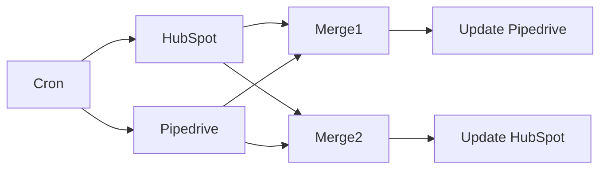

## Fluxo (.json) :

```json
{
  "nodes": [
    {
      "name": "Cron",
      "type": "n8n-nodes-base.cron",
      "position": [
        560,
        350
      ],
      "parameters": {},
      "typeVersion": 1
    },
    {
      "name": "Pipedrive",
      "type": "n8n-nodes-base.pipedrive",
      "position": [
        760,
        250
      ],
      "parameters": {
        "resource": "person",
        "operation": "getAll",
        "returnAll": true,
        "additionalFields": {}
      },
      "credentials": {
        "pipedriveApi": {
          "id": "28",
          "name": "pipedrive_api"
        }
      },
      "typeVersion": 1
    },
    {
      "name": "Update Pipedrive",
      "type": "n8n-nodes-base.pipedrive",
      "position": [
        1160,
        250
      ],
      "parameters": {
        "name": "={{$json[\"properties\"][\"firstname\"][\"value\"]}}",
        "resource": "person",
        "additionalFields": {
          "email": [
            "={{$json[\"identity-profiles\"][0][\"identities\"][0][\"value\"]}}"
          ]
        }
      },
      "credentials": {
        "pipedriveApi": {
          "id": "28",
          "name": "pipedrive_api"
        }
      },
      "typeVersion": 1
    },
    {
      "name": "HubSpot",
      "type": "n8n-nodes-base.hubspot",
      "position": [
        760,
        450
      ],
      "parameters": {
        "resource": "contact",
        "operation": "getAll",
        "returnAll": true,
        "additionalFields": {}
      },
      "credentials": {
        "hubspotApi": {
          "id": "21",
          "name": "hubspot_account"
        }
      },
      "typeVersion": 1
    },
    {
      "name": "Update HubSpot",
      "type": "n8n-nodes-base.hubspot",
      "position": [
        1160,
        450
      ],
      "parameters": {
        "email": "={{$json[\"email\"][0][\"value\"]}}",
        "resource": "contact",
        "additionalFields": {
          "firstName": "={{$json[\"first_name\"]}}"
        }
      },
      "credentials": {
        "hubspotApi": {
          "id": "21",
          "name": "hubspot_account"
        }
      },
      "typeVersion": 1
    },
    {
      "name": "Merge1",
      "type": "n8n-nodes-base.merge",
      "position": [
        960,
        250
      ],
      "parameters": {
        "mode": "removeKeyMatches",
        "propertyName1": "identity-profiles[0].identities[0].value",
        "propertyName2": "email[0].value"
      },
      "typeVersion": 1
    },
    {
      "name": "Merge2",
      "type": "n8n-nodes-base.merge",
      "position": [
        960,
        450
      ],
      "parameters": {
        "mode": "removeKeyMatches",
        "propertyName1": "email[0].value",
        "propertyName2": "identity-profiles[0].identities[0].value"
      },
      "typeVersion": 1
    }
  ],
  "connections": {
    "Cron": {
      "main": [
        [
          {
            "node": "Pipedrive",
            "type": "main",
            "index": 0
          },
          {
            "node": "HubSpot",
            "type": "main",
            "index": 0
          }
        ]
      ]
    },
    "Merge1": {
      "main": [
        [
          {
            "node": "Update Pipedrive",
            "type": "main",
            "index": 0
          }
        ]
      ]
    },
    "Merge2": {
      "main": [
        [
          {
            "node": "Update HubSpot",
            "type": "main",
            "index": 0
          }
        ]
      ]
    },
    "HubSpot": {
      "main": [
        [
          {
            "node": "Merge1",
            "type": "main",
            "index": 0
          },
          {
            "node": "Merge2",
            "type": "main",
            "index": 1
          }
        ]
      ]
    },
    "Pipedrive": {
      "main": [
        [
          {
            "node": "Merge1",
            "type": "main",
            "index": 1
          },
          {
            "node": "Merge2",
            "type": "main",
            "index": 0
          }
        ]
      ]
    }
  }
}
```

<a id="template-1106"></a>

## Template 1106 - Revisão de código com IA para PR

- **Nome:** Revisão de código com IA para PR
- **Descrição:** Automatiza a revisão de pull requests no GitHub, extraindo os diffs dos arquivos alterados, gerando um prompt de IA, executando a análise com um agente de IA, postando o comentário de revisão e adicionando um rótulo para indicar a conclusão, com diretrizes embasadas em uma planilha de melhores práticas.
- **Funcionalidade:** • Detecção de PR: Inicia a automação ao detectar pull requests em um repositório.
• Coleta de diffs: Busca os arquivos alterados e seus patches da PR.
• Preparação do prompt: Gera um prompt estruturado com os diffs para orientar a IA.
• Análise pela IA: Executa a revisão do código gerando comentários e sugestões.
• Publicação do comentário: Posta a avaliação na PR como comentário.
• Rotulagem automática: Adiciona o rótulo 'ReviewedByAI' à PR após a revisão.
• Referência de diretrizes: Consulta uma planilha com boas práticas para embasar a avaliação.
- **Ferramentas:** • GitHub: Plataforma para gerenciar PRs, ler alterações e publicar comentários/labels.
• Google Sheets: Planilha de diretrizes de codificação usadas para orientar a revisão.
• OpenAI: Serviço de modelo de linguagem utilizado para gerar a avaliação e comentários.

## Fluxo visual

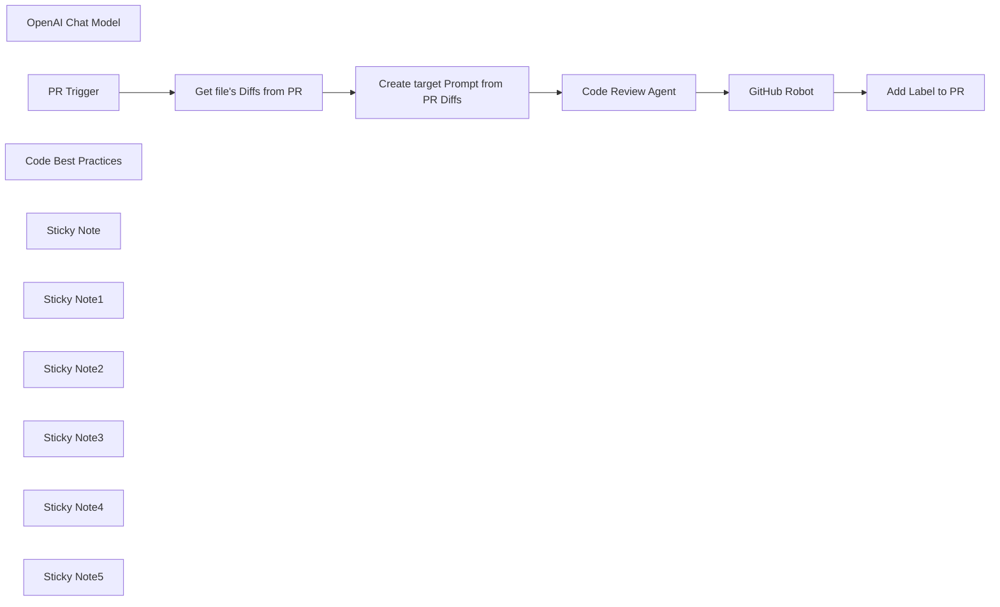

## Fluxo (.json) :

```json
{
  "id": "AMQub0Da16qevkJS",
  "meta": {
    "instanceId": "1df58c4f9c75efc3206f24d952dcf4aad97b5bd5e4c3d0b251ca64e7a7153e89",
    "templateCredsSetupCompleted": true
  },
  "name": "Code Review workflow",
  "tags": [],
  "nodes": [
    {
      "id": "62ef8e9f-df1a-46dd-b025-a206ac888f97",
      "name": "OpenAI Chat Model",
      "type": "@n8n/n8n-nodes-langchain.lmChatOpenAi",
      "position": [
        -100,
        140
      ],
      "parameters": {
        "model": {
          "__rl": true,
          "mode": "list",
          "value": "gpt-4o-mini"
        },
        "options": {}
      },
      "credentials": {
        "openAiApi": {
          "id": "",
          "name": ""
        }
      },
      "typeVersion": 1.2
    },
    {
      "id": "35361983-8c66-457e-8cb6-7585a18f8aaf",
      "name": "PR Trigger",
      "type": "n8n-nodes-base.githubTrigger",
      "position": [
        -740,
        -80
      ],
      "webhookId": "2b8ec7bd-e65b-46d2-a2d9-082b137dd880",
      "parameters": {
        "owner": {
          "__rl": true,
          "mode": "list",
          "value": "",
          "cachedResultUrl": "",
          "cachedResultName": ""
        },
        "events": [
          "pull_request"
        ],
        "options": {},
        "repository": {
          "__rl": true,
          "mode": "list",
          "value": "",
          "cachedResultUrl": "",
          "cachedResultName": ""
        },
        "authentication": "oAuth2"
      },
      "credentials": {
        "githubOAuth2Api": {
          "id": "",
          "name": ""
        }
      },
      "notesInFlow": false,
      "typeVersion": 1
    },
    {
      "id": "25d17a0d-c409-406d-bd97-00ec71261c16",
      "name": "Get file's Diffs from PR",
      "type": "n8n-nodes-base.httpRequest",
      "position": [
        -520,
        -80
      ],
      "parameters": {
        "url": "=https://api.github.com/repos/{{$json.body.sender.login}}/{{$json.body.repository.name}}/pulls/{{$json.body.number}}/files",
        "options": {}
      },
      "typeVersion": 4.2
    },
    {
      "id": "f984f872-c4b0-4752-bc54-1f311fa36feb",
      "name": "Create target Prompt from PR Diffs",
      "type": "n8n-nodes-base.code",
      "position": [
        -300,
        -80
      ],
      "parameters": {
        "jsCode": "const files = $input.all().map(item => item.json);\n\nlet diffs = '';\n\nfor (const file of files) {\n  diffs += `### Fichier : ${file.filename}\\n\\n`;\n\n  if (file.patch) {\n    // IMPORTANT : On remplace tous les triple backticks par simple (ou échappement)\n    const safePatch = file.patch.replace(/```/g, \"''\");\n\n    diffs += \"```diff\\n\";\n    diffs += safePatch;\n    diffs += \"\\n```\\n\";\n  } else {\n    diffs += \"_Pas de patch disponible (probablement fichier binaire)._\";\n  }\n\n  diffs += \"\\n---\\n\\n\";\n}\n\nconst userMessage = `\nYou are a senior iOS developer. \nPlease review the following code changes in these files :\n\n${diffs}\n\n---\n\nYour mission:\n\n- Review the proposed code changes file by file and by significant modification.\n\n- Generate inline comments on the relevant lines of code.\n\n- Ignore files without patches.\n\n- Do not repeat the code snippet or the filename.\n\n- Write the comments directly, without introducing the context.\n`;\n\nreturn [\n  {\n    json: {\n      user_message: userMessage.trim()\n    }\n  }\n];"
      },
      "typeVersion": 2
    },
    {
      "id": "0d9790b1-9818-4e73-a202-57d4db039b35",
      "name": "GitHub Robot",
      "type": "n8n-nodes-base.github",
      "position": [
        296,
        -80
      ],
      "webhookId": "39c2fe8b-f686-4699-8450-2a5b4c263d93",
      "parameters": {
        "body": "={{ $json.output }}",
        "event": "comment",
        "owner": {
          "__rl": true,
          "mode": "list",
          "value": "",
          "cachedResultUrl": "",
          "cachedResultName": ""
        },
        "resource": "review",
        "repository": {
          "__rl": true,
          "mode": "list",
          "value": "",
          "cachedResultUrl": "",
          "cachedResultName": ""
        },
        "additionalFields": {},
        "pullRequestNumber": "={{ $('PR Trigger').first().json.body.number }}"
      },
      "credentials": {
        "githubApi": {
          "id": "",
          "name": ""
        }
      },
      "typeVersion": 1.1
    },
    {
      "id": "234c235c-a88d-412b-b7b1-f9f0cc8eead9",
      "name": "Add Label to PR",
      "type": "n8n-nodes-base.github",
      "position": [
        516,
        -80
      ],
      "webhookId": "c98f39f1-603b-4013-9149-53b4cc31b611",
      "parameters": {
        "owner": {
          "__rl": true,
          "mode": "list",
          "value": "",
          "cachedResultUrl": "",
          "cachedResultName": ""
        },
        "operation": "edit",
        "editFields": {
          "labels": [
            {
              "label": "ReviewedByAI"
            }
          ]
        },
        "repository": {
          "__rl": true,
          "mode": "list",
          "value": "",
          "cachedResultUrl": "",
          "cachedResultName": ""
        },
        "issueNumber": "={{ $('PR Trigger').first().json.body.number }}",
        "authentication": "oAuth2"
      },
      "credentials": {
        "githubOAuth2Api": {
          "id": "",
          "name": ""
        }
      },
      "typeVersion": 1
    },
    {
      "id": "34d9842f-928e-4d19-9d91-336c85f53485",
      "name": "Code Best Practices",
      "type": "n8n-nodes-base.googleSheetsTool",
      "position": [
        68,
        140
      ],
      "parameters": {
        "options": {},
        "sheetName": {
          "__rl": true,
          "mode": "name",
          "value": ""
        },
        "documentId": {
          "__rl": true,
          "mode": "url",
          "value": ""
        }
      },
      "credentials": {
        "googleSheetsOAuth2Api": {
          "id": "",
          "name": ""
        }
      },
      "typeVersion": 4.5
    },
    {
      "id": "ab6c0b9d-1c76-448c-896e-7fdb15365b72",
      "name": "Sticky Note",
      "type": "n8n-nodes-base.stickyNote",
      "position": [
        -880,
        -260
      ],
      "parameters": {
        "content": "**1-The GitHub Trigger** node initiates the workflow whenever a pull request event occurs on a specified repository. It enables real-time automation based on GitHub activity.\n"
      },
      "typeVersion": 1
    },
    {
      "id": "27752afa-4d97-4e23-be58-6171b5e17f1b",
      "name": "Sticky Note1",
      "type": "n8n-nodes-base.stickyNote",
      "position": [
        -680,
        100
      ],
      "parameters": {
        "color": 3,
        "width": 340,
        "height": 220,
        "content": "**2-Get PR Diffs**\nThe HTTP Request node fetches the list of changed files and their diffs from the pull request that triggered the workflow. It uses the GitHub REST API to retrieve this data dynamically based on the trigger payload.\n\nhttps://api.github.com/repos/{{$json.body.sender.login}}/{{$json.body.repository.name}}/pulls/{{$json.body.number}}/files"
      },
      "typeVersion": 1
    },
    {
      "id": "c201133c-3d54-4fe0-8442-11ff92dcc89e",
      "name": "Sticky Note2",
      "type": "n8n-nodes-base.stickyNote",
      "position": [
        -420,
        -340
      ],
      "parameters": {
        "color": 2,
        "width": 360,
        "height": 240,
        "content": "**3-Create Prompt from diffs**\nThis Code node runs a JavaScript snippet to:\n-Parse file diffs from the previous HTTP Request node\n-Format each diff with its file name\n-Build a structured natural language prompt for the AI agent\n\nThe final output is a clear, contextual instruction like:\n*\"You are a senior iOS developer. Please review the following code changes in these files...\"*\n"
      },
      "typeVersion": 1
    },
    {
      "id": "6f6c78b2-ad75-43fa-a082-9f345f9b5f30",
      "name": "Sticky Note3",
      "type": "n8n-nodes-base.stickyNote",
      "position": [
        200,
        -260
      ],
      "parameters": {
        "color": 5,
        "content": "**Github Comment Poster**\nPosts the AI-generated review as a comment on the pull request using GitHub API."
      },
      "typeVersion": 1
    },
    {
      "id": "ac7b6754-2bef-408d-8f53-fb51ece1673e",
      "name": "Code Review Agent",
      "type": "@n8n/n8n-nodes-langchain.agent",
      "position": [
        -80,
        -80
      ],
      "parameters": {
        "text": "={{ $json.user_message }}",
        "options": {},
        "promptType": "define"
      },
      "typeVersion": 1.9
    },
    {
      "id": "30655e04-f429-40bb-b6b7-9a11ffa4e607",
      "name": "Sticky Note4",
      "type": "n8n-nodes-base.stickyNote",
      "position": [
        460,
        -220
      ],
      "parameters": {
        "color": 7,
        "height": 120,
        "content": "**PR Labeler (optional)**\nAutomatically adds a label like *ReviewedByAI* to the pull request once the AI comment is posted."
      },
      "typeVersion": 1
    },
    {
      "id": "76fbb269-e7ce-4d8a-a609-a5ab454258d8",
      "name": "Sticky Note5",
      "type": "n8n-nodes-base.stickyNote",
      "position": [
        180,
        120
      ],
      "parameters": {
        "color": 6,
        "width": 260,
        "content": "**Google Sheet Best Practices**\nEnables the AI agent to reference to your team coding guidelines stored in a Google Sheet for more accurate and opinionated reviews.\nYou can replace Google Sheets with any other database or tool."
      },
      "typeVersion": 1
    }
  ],
  "active": false,
  "pinData": {},
  "settings": {
    "executionOrder": "v1"
  },
  "versionId": "9d1650b2-38a1-40bf-ad65-1902f069a06f",
  "connections": {
    "PR Trigger": {
      "main": [
        [
          {
            "node": "Get file's Diffs from PR",
            "type": "main",
            "index": 0
          }
        ]
      ]
    },
    "GitHub Robot": {
      "main": [
        [
          {
            "node": "Add Label to PR",
            "type": "main",
            "index": 0
          }
        ]
      ]
    },
    "Code Review Agent": {
      "main": [
        [
          {
            "node": "GitHub Robot",
            "type": "main",
            "index": 0
          }
        ]
      ]
    },
    "OpenAI Chat Model": {
      "ai_languageModel": [
        [
          {
            "node": "Code Review Agent",
            "type": "ai_languageModel",
            "index": 0
          }
        ]
      ]
    },
    "Code Best Practices": {
      "ai_tool": [
        [
          {
            "node": "Code Review Agent",
            "type": "ai_tool",
            "index": 0
          }
        ]
      ]
    },
    "Get file's Diffs from PR": {
      "main": [
        [
          {
            "node": "Create target Prompt from PR Diffs",
            "type": "main",
            "index": 0
          }
        ]
      ]
    },
    "Create target Prompt from PR Diffs": {
      "main": [
        [
          {
            "node": "Code Review Agent",
            "type": "main",
            "index": 0
          }
        ]
      ]
    }
  }
}
```

<a id="template-1107"></a>

## Template 1107 - Otimização IA para Amazon Ads

- **Nome:** Otimização IA para Amazon Ads
- **Descrição:** Fluxo que coleta relatórios de Sponsored Products do Google Drive, consolida os dados, analisa com inteligência artificial para gerar recomendações de otimização de lances, palavras-chave e segmentação, e envia um resumo das otimizações por email.
- **Funcionalidade:** • Coleta de relatórios: Busca e baixa relatórios de Sponsored Products de uma pasta específica no Drive.
• Integração e preparação de dados: Extrai dados de XLSX e CSV, preserva nomes de arquivos e mescla os dados para análise.
• Transformação de dados: Limpa e normaliza dados para análise, mantendo estrutura e rótulos.
• Análise de IA para otimização: Envia dados para a geração de recomendações de lance, palavras-chave e targeting.
• Geração de recomendações estruturadas: Recebe um JSON com ajustes de campanha, sugestões de palavras-chave (positivas e negativas) e recomendações de targeting.
• Entrega por email: Envia um resumo das otimizações para o destinatário configurado.
• Orientações de uso: Inclui instruções de configuração de relatórios, nomes de arquivos e fluxo de entrega.
- **Ferramentas:** • Google Drive: Armazenamento e acesso aos relatórios de anúncios.
• OpenAI: Geração de recomendações de otimização com IA.
• Gmail: Envio automático de relatórios e recomendações por email.

## Fluxo visual

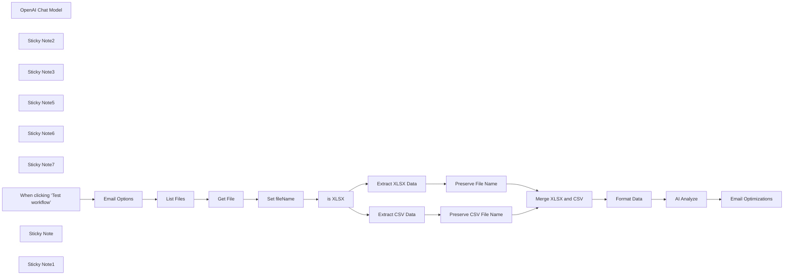

## Fluxo (.json) :

```json
{
  "id": "Agn9dzf5YTqcmQGN",
  "meta": {
    "instanceId": "8029058e18ae4ed6081000c1270d96039ad05959052aa2034dd96a215849bcf7",
    "templateCredsSetupCompleted": true
  },
  "name": "Amazon Ads AI Optimization",
  "tags": [
    {
      "id": "vjZ7QzTW2i7StzqX",
      "name": "AI Flow",
      "createdAt": "2025-04-10T00:32:55.235Z",
      "updatedAt": "2025-04-10T00:32:55.235Z"
    }
  ],
  "nodes": [
    {
      "id": "0286c917-d771-4835-a5f8-71f79a5e59e8",
      "name": "List Files",
      "type": "n8n-nodes-base.googleDrive",
      "position": [
        -100,
        -800
      ],
      "parameters": {
        "filter": {
          "folderId": {
            "__rl": true,
            "mode": "list",
            "value": "",
            "cachedResultUrl": "",
            "cachedResultName": "<choose report folder>"
          }
        },
        "options": {},
        "resource": "fileFolder",
        "searchMethod": "query"
      },
      "credentials": {
        "googleDriveOAuth2Api": {
          "id": "UPKjIF2z8RkkmP21",
          "name": "Google Drive account"
        }
      },
      "typeVersion": 3
    },
    {
      "id": "7d9b0c0a-86ee-4aae-8d73-66f409b0a57f",
      "name": "OpenAI Chat Model",
      "type": "@n8n/n8n-nodes-langchain.lmChatOpenAi",
      "position": [
        1620,
        -540
      ],
      "parameters": {
        "model": {
          "__rl": true,
          "mode": "list",
          "value": "gpt-4o",
          "cachedResultName": "gpt-4o"
        },
        "options": {}
      },
      "credentials": {
        "openAiApi": {
          "id": "qszlkCg3ypMJEWvt",
          "name": "OpenAi account"
        }
      },
      "typeVersion": 1.2
    },
    {
      "id": "d3d58b0a-3107-4525-92a8-d54332e9a8a5",
      "name": "is XLSX",
      "type": "n8n-nodes-base.if",
      "position": [
        540,
        -800
      ],
      "parameters": {
        "options": {},
        "conditions": {
          "options": {
            "version": 2,
            "leftValue": "",
            "caseSensitive": true,
            "typeValidation": "strict"
          },
          "combinator": "and",
          "conditions": [
            {
              "id": "820b48a1-676d-400b-894f-3b3a5203eca7",
              "operator": {
                "type": "string",
                "operation": "contains"
              },
              "leftValue": "={{ $json.name }}",
              "rightValue": ".xlsx"
            }
          ]
        }
      },
      "typeVersion": 2.2
    },
    {
      "id": "884e4a08-3b19-4485-aba7-c69887607b82",
      "name": "Get File",
      "type": "n8n-nodes-base.googleDrive",
      "position": [
        100,
        -800
      ],
      "parameters": {
        "fileId": {
          "__rl": true,
          "mode": "id",
          "value": "={{ $json.id }}"
        },
        "options": {
          "binaryPropertyName": "data",
          "googleFileConversion": {
            "conversion": {}
          }
        },
        "operation": "download"
      },
      "credentials": {
        "googleDriveOAuth2Api": {
          "id": "UPKjIF2z8RkkmP21",
          "name": "Google Drive account"
        }
      },
      "typeVersion": 3
    },
    {
      "id": "c72fde38-de38-4734-a7e8-aa70e8638cad",
      "name": "Merge XLSX and CSV",
      "type": "n8n-nodes-base.merge",
      "position": [
        1200,
        -800
      ],
      "parameters": {},
      "typeVersion": 3.1
    },
    {
      "id": "cd23e23c-9bb7-4b8d-90ab-8917783cf1ab",
      "name": "Format Data",
      "type": "n8n-nodes-base.code",
      "position": [
        1420,
        -800
      ],
      "parameters": {
        "jsCode": "const result = {};\n\nfor (const item of items) {\n  const fileName = item.json.fileName || item.json.name || 'unknown_file';\n  const baseName = fileName\n    .split('.')[0]\n    .replace(/\\s+/g, '_')\n    .toLowerCase()\n    .replace(/\\s*\\(\\d+\\)$/, '')\n    .replace(/_+$/, '')\n    .trim();\n\n  // regex → result key\n  const map = [\n    { key: 'search_terms', regex: /search_term/ },\n    { key: 'campaigns',    regex: /campaign/     },\n    { key: 'targeting',    regex: /targeting/   },\n    { key: 'placement',    regex: /placement/   },\n    { key: 'budgets',      regex: /budget/      },\n  ];\n\n  const entry = map.find(m => m.regex.test(baseName));\n  const mappedKey = entry ? entry.key : null;\n\n  console.log('fileName:', fileName);\n  console.log('baseName:', baseName);\n  console.log('mappedKey:', mappedKey);\n\n  if (!mappedKey) {\n    throw new Error(`${fileName} → ${baseName} → Unrecognized file name structure`);\n  }\n  result[mappedKey] = result[mappedKey] || [];\n  result[mappedKey].push(item.json);\n}\n\nreturn [{ json: result }];\n\n\n\n"
      },
      "typeVersion": 2
    },
    {
      "id": "02172577-d867-45a4-96ea-eb105169deff",
      "name": "Set fileName",
      "type": "n8n-nodes-base.set",
      "position": [
        320,
        -800
      ],
      "parameters": {
        "options": {
          "dotNotation": true,
          "ignoreConversionErrors": false
        },
        "assignments": {
          "assignments": [
            {
              "id": "a467fabb-d7d0-482d-8a6a-afcd97cc0d8c",
              "name": "fileName",
              "type": "string",
              "value": "={{ $json.name }}"
            }
          ]
        },
        "includeOtherFields": true
      },
      "typeVersion": 3.4
    },
    {
      "id": "31db008f-20e4-4fe3-a9d0-1815b3802690",
      "name": "Sticky Note2",
      "type": "n8n-nodes-base.stickyNote",
      "position": [
        -140,
        -1040
      ],
      "parameters": {
        "color": 3,
        "width": 180,
        "height": 200,
        "content": "## Change\nChoose the \"folder\" in the filter options to the folder containing your Ad reports\n"
      },
      "typeVersion": 1
    },
    {
      "id": "0ba8c273-8369-4009-9b93-b0fb243a3c85",
      "name": "Sticky Note3",
      "type": "n8n-nodes-base.stickyNote",
      "position": [
        1640,
        -1000
      ],
      "parameters": {
        "width": 260,
        "content": "## AI Analysis\nUses GPT-4o to process the bundled reports and generate optimization instructions.\nPasses system instructions and cleaned data as input."
      },
      "typeVersion": 1
    },
    {
      "id": "451bb016-1766-4688-aafc-75937e0d5c3f",
      "name": "Sticky Note5",
      "type": "n8n-nodes-base.stickyNote",
      "position": [
        -660,
        -580
      ],
      "parameters": {
        "width": 540,
        "height": 700,
        "content": "## Amazon Ads Report Scheduling Instructions\nTo run this workflow, schedule the following Sponsored Products reports in the Amazon Ads Console:\n\nUse \"Detailed\" for:\n\nSearch Term Report → Sponsored_Products_Search_Term_Detailed_L30\n\nTargeting Report → Sponsored_Products_Targeting_Detailed_L30\n\nUse \"Summary\" for:\n\nCampaign Report → Sponsored_Products_Campaign_L30\n\nPlacement Report → Sponsored_Products_Placement_L30\n\nBudget Report → Sponsored_Products_Budget_L30\n\nShared settings for all reports:\n\nDate Range: Last 30 Days\n\nFrequency: Daily\n\nFormat: .xlsx or .csv\n\nDelivery: Email + Console Download\n\nMake sure filenames match expectations so the workflow can route them correctly."
      },
      "typeVersion": 1
    },
    {
      "id": "a671a4f1-05b0-4d7c-9cc1-8c2838593e34",
      "name": "Sticky Note6",
      "type": "n8n-nodes-base.stickyNote",
      "position": [
        -60,
        -580
      ],
      "parameters": {
        "width": 400,
        "height": 520,
        "content": "## Report Delivery\n\nHow to get reports into Google Drive\n\nUse one of the following:\n\n📥 Manual Upload – Download emailed reports and move them to your Drive folder\n\n🤖 Automation – Use n8n to watch Gmail for no-reply@amazon.com, extract attachments, and upload to Drive\n\n💻 Drive Sync Folder – Use a local folder synced to Google Drive with rules for report types\n\nReports must match expected filenames so the flow can identify and classify them."
      },
      "typeVersion": 1
    },
    {
      "id": "63a7f391-2bc7-41f9-a53f-e742950c60bf",
      "name": "Sticky Note7",
      "type": "n8n-nodes-base.stickyNote",
      "position": [
        360,
        -580
      ],
      "parameters": {
        "width": 360,
        "height": 520,
        "content": "## Upgrade! 🚀\n\nApply for an Amazon Advertising API developer account to unlock full automation:\n\nGenerate reports programmatically via the Reports API\n\nFetch report files directly into n8n using HTTP or custom nodes\n\nEliminate email + Drive dependency entirely\n\n🔗 https://advertising.amazon.com/API/docs/en-us/\n\nOnce approved, you can schedule report generation and download all required data securely and automatically.\n**Double click** to edit me. [Guide](https://docs.n8n.io/workflows/sticky-notes/)"
      },
      "typeVersion": 1
    },
    {
      "id": "e5a24705-0ad5-4629-b183-d279bdca8b29",
      "name": "Preserve File Name",
      "type": "n8n-nodes-base.set",
      "position": [
        980,
        -900
      ],
      "parameters": {
        "options": {},
        "assignments": {
          "assignments": [
            {
              "id": "d6883fe9-d04f-4c86-bc9a-f4dd526afca2",
              "name": "fileName",
              "type": "string",
              "value": "={{ $('is XLSX').item.json.fileName }}"
            }
          ]
        },
        "includeOtherFields": true
      },
      "typeVersion": 3.4
    },
    {
      "id": "3c315a0c-a89e-490a-9a82-e3d96d2b94c7",
      "name": "Email Optimizations",
      "type": "n8n-nodes-base.gmail",
      "position": [
        2016,
        -800
      ],
      "webhookId": "b9d7c1a9-a1a3-4b97-97c9-a272f0e97127",
      "parameters": {
        "sendTo": "={{ $('Email Options').first().json.send_to }}",
        "message": "={{\n  (() => {\n   let raw = $node[\"AI Analyze\"].json[\"text\"];\n\n    // 🔧 Remove triple backticks and optional \"json\" tag\n    raw = raw.replace(/^```json\\s*/i, \"\").replace(/```$/, \"\").trim();\n\n    let data;\n\n    try {\n      data = JSON.parse(raw);\n    } catch (err) {\n      return `<p><strong>❌ Failed to parse AI output.</strong><br>${err.message}</p>`;\n    }\n\n    let msg = \"<h2>Amazon Ads Optimization Instructions</h2>\";\n\n    // Optional Summary Totals\n    const totalSpend = (data.campaign_adjustments || []).reduce((sum, c) => sum + (c.projected_daily_spend_usd || 0), 0);\n    const totalSales = (data.campaign_adjustments || []).reduce((sum, c) => sum + (c.projected_daily_sales_usd || 0), 0);\n    msg += `<p><strong>Total Budget Increase Recommended:</strong><br>`;\n    msg += `Estimated daily spend: <strong>$${totalSpend.toFixed(2)}</strong><br>`;\n    msg += `Estimated daily sales: <strong>$${totalSales.toFixed(2)}</strong></p>`;\n\n    // Campaign Adjustments\n    msg += \"<h3>Campaign Adjustments:</h3><ul>\";\n    (data.campaign_adjustments || []).forEach(c => {\n      msg += `<li><strong>${c.campaign_name}</strong><ul>`;\n      if (c.default_bid_multiplier !== undefined) {\n        const percent = Math.round((1 - c.default_bid_multiplier) * 100);\n        msg += `<li>Default bid × ${c.default_bid_multiplier} (<em>–${percent}%</em>)</li>`;\n      }\n      if (c.bid_adjustments) {\n        msg += \"<li>Bid adjustments:<ul>\";\n        msg += `<li>Top of Search: ${c.bid_adjustments.top_of_search ?? 0}%</li>`;\n        msg += `<li>Rest of Search: ${c.bid_adjustments.rest_of_search ?? 0}%</li>`;\n        msg += `<li>Product pages: ${c.bid_adjustments.product_pages ?? 0}%</li>`;\n        msg += \"</ul></li>\";\n      }\n      if (c.budget_change?.action !== \"none\") {\n        msg += `<li>Budget: ${c.budget_change.action} by ${c.budget_change.percent}%</li>`;\n      }\n      if (c.projected_daily_spend_usd && c.projected_daily_sales_usd) {\n        msg += `<li>Est. daily spend: $${c.projected_daily_spend_usd.toFixed(2)}</li>`;\n        msg += `<li>Est. daily sales: $${c.projected_daily_sales_usd.toFixed(2)}</li>`;\n        if (c.estimated_acos_percent !== undefined) {\n          msg += `<li>ACoS: ${c.estimated_acos_percent}%</li>`;\n        }\n        if (c.estimated_roas_multiple !== undefined) {\n          const color = c.estimated_roas_multiple < 1.0 ? 'red' : 'green';\n          msg += `<li>ROAS: <span style=\"color:${color}\">${c.estimated_roas_multiple.toFixed(2)}x</span></li>`;\n        }\n      }\n      msg += \"</ul></li>\";\n    });\n    msg += \"</ul>\";\n\n    // Keyword Recommendations\n    if ((data.keyword_recommendations?.add_exact?.length || 0) > 0 ||\n        (data.keyword_recommendations?.negative?.length || 0) > 0) {\n      msg += \"<h3>Keyword Recommendations:</h3><ul>\";\n      (data.keyword_recommendations.add_exact || []).forEach(k => {\n        msg += `<li>Add exact: \"<strong>${k.term}</strong>\" in <em>${k.campaign_name} / ${k.ad_group_name}</em> at <strong>$${k.suggested_bid}</strong></li>`;\n      });\n      (data.keyword_recommendations.negative || []).forEach(n => {\n        if (typeof n === 'string') {\n          msg += `<li>Negative: \"<strong>${n}</strong>\"</li>`;\n        } else {\n          msg += `<li>Negative: \"<strong>${n.term}</strong>\" in <em>${n.campaign_name || 'Unspecified Campaign'}</em></li>`;\n        }\n      });\n      msg += \"</ul>\";\n    }\n\n    // Targeting Recommendations\n    if ((data.targeting_recommendations || []).length > 0) {\n      msg += \"<h3>Targeting Recommendations:</h3><ul>\";\n      data.targeting_recommendations.forEach(t => {\n        const valueText = t.value ? ` by ${t.value}` : \"\";\n        msg += `<li>${t.target} in <em>${t.campaign_name} / ${t.ad_group_name}</em>: <strong>${t.action}</strong>${valueText}</li>`;\n      });\n      msg += \"</ul>\";\n    }\n\n    return msg;\n  })()\n}}\n",
        "options": {},
        "subject": "={{ $('Email Options').first().json.subject }}"
      },
      "credentials": {
        "gmailOAuth2": {
          "id": "6m7O3IpXy4mCRogW",
          "name": "Brian Gmail"
        }
      },
      "typeVersion": 2.1
    },
    {
      "id": "f4fc0a70-2df9-4b7b-b60c-856b1b74ead7",
      "name": "Extract XLSX Data",
      "type": "n8n-nodes-base.extractFromFile",
      "position": [
        760,
        -900
      ],
      "parameters": {
        "options": {},
        "operation": "xlsx"
      },
      "typeVersion": 1
    },
    {
      "id": "d0618a5b-1995-474d-a969-38e856b1b91a",
      "name": "Extract CSV Data",
      "type": "n8n-nodes-base.extractFromFile",
      "position": [
        760,
        -700
      ],
      "parameters": {
        "options": {},
        "binaryPropertyName": "=data"
      },
      "typeVersion": 1
    },
    {
      "id": "67f9d0a2-2f34-416a-bc11-ef776e6e4ab3",
      "name": "Preserve CSV File Name",
      "type": "n8n-nodes-base.set",
      "position": [
        980,
        -700
      ],
      "parameters": {
        "options": {},
        "assignments": {
          "assignments": [
            {
              "id": "d6883fe9-d04f-4c86-bc9a-f4dd526afca2",
              "name": "fileName",
              "type": "string",
              "value": "={{ $('is XLSX').item.json.fileName }}"
            }
          ]
        },
        "includeOtherFields": true
      },
      "typeVersion": 3.4
    },
    {
      "id": "818205c9-0fe9-4fe6-8556-657f087ba7b9",
      "name": "When clicking ‘Test workflow’",
      "type": "n8n-nodes-base.manualTrigger",
      "position": [
        -500,
        -800
      ],
      "parameters": {},
      "typeVersion": 1
    },
    {
      "id": "1612753d-0b7f-4ae5-9ec0-8ad39f1003b1",
      "name": "Sticky Note",
      "type": "n8n-nodes-base.stickyNote",
      "position": [
        -580,
        -1040
      ],
      "parameters": {
        "width": 220,
        "content": "## Trigger\nYou may replace this with a scheduled event or poll the folder for changes."
      },
      "typeVersion": 1
    },
    {
      "id": "158da856-b682-4f98-afcc-4fa12b978db0",
      "name": "Email Options",
      "type": "n8n-nodes-base.set",
      "position": [
        -300,
        -800
      ],
      "parameters": {
        "options": {},
        "assignments": {
          "assignments": [
            {
              "id": "60c2189a-2ca3-43ac-bffc-371bbc3c123b",
              "name": "send_to",
              "type": "string",
              "value": "<enter send to email address>"
            },
            {
              "id": "c6f588b3-b8b9-4a83-817b-a68de36d2570",
              "name": "subject",
              "type": "string",
              "value": "<enter the email subject for report emails>"
            }
          ]
        }
      },
      "typeVersion": 3.4
    },
    {
      "id": "4f1f251e-5cfb-468d-9531-9c2ba2c875f6",
      "name": "Sticky Note1",
      "type": "n8n-nodes-base.stickyNote",
      "position": [
        -320,
        -1040
      ],
      "parameters": {
        "color": 3,
        "width": 160,
        "content": "## Change!\nEdit these email options."
      },
      "typeVersion": 1
    },
    {
      "id": "ca2f4a7c-5aa9-4f6a-bc04-aedce5e0aaed",
      "name": "AI Analyze",
      "type": "@n8n/n8n-nodes-langchain.chainLlm",
      "position": [
        1640,
        -800
      ],
      "parameters": {
        "text": "={{JSON.stringify($json)}}",
        "messages": {
          "messageValues": [
            {
              "message": "You are an Amazon Ads Optimization Assistant. You will receive five structured datasets from Sponsored Products reports:\n- search_terms\n- campaigns\n- targeting\n- placement\n- budgets\n\nYour goal is to generate precise performance recommendations for bid strategy, targeting, and budget scaling.\n\n---\n\n1. Campaign Adjustments:\nFor each campaign, return:\n- campaign_name (string)\n- default_bid_multiplier (float, optional — only if bid should change)\n- bid_adjustments: { top_of_search, rest_of_search, product_pages } (percentages)\n- budget_change: { action: increase | decrease | none, percent: float }\n- projected_daily_spend_usd (float)\n- projected_daily_sales_usd (float)\n- estimated_acos_percent (float)\n- estimated_roas_multiple (float)\n\nBase projections on historical 30-day data. If a budget increase is recommended, scale projected spend and sales proportionally. Return NaN only if data is insufficient.\n\n---\n\n2. Keyword Recommendations:\nRecommend at least 5 exact-match keywords to add. Each must include:\n- term\n- campaign_name\n- ad_group_name\n- suggested_bid (USD)\n\nAlso return at least 3 negative keywords:\n- { term: \"...\", campaign_name?: \"...\" }\n\nDo not return keyword recommendations that lack campaign and ad group names.\n\n---\n\n3. Targeting Recommendations:\nRecommend at least 3 targets to pause or increase bids. Return:\n- target (ASIN, keyword, or match group)\n- campaign_name\n- ad_group_name\n- action: \"pause\" or \"increase_bid\"\n- value: float (if increasing bid)\n\n---\n\nRespond ONLY with a JSON object in this exact format. Do NOT include backticks, code blocks, or explanations:\n\n{\n  \"campaign_adjustments\": [...],\n  \"keyword_recommendations\": {\n    \"add_exact\": [...],\n    \"negative\": [...]\n  },\n  \"targeting_recommendations\": [...]\n}\n\n"
            }
          ]
        },
        "promptType": "define"
      },
      "typeVersion": 1.6
    }
  ],
  "active": false,
  "pinData": {},
  "settings": {
    "executionOrder": "v1"
  },
  "versionId": "286aae2a-f8df-489d-9f03-89d0b50b1800",
  "connections": {
    "is XLSX": {
      "main": [
        [
          {
            "node": "Extract XLSX Data",
            "type": "main",
            "index": 0
          }
        ],
        [
          {
            "node": "Extract CSV Data",
            "type": "main",
            "index": 0
          }
        ]
      ]
    },
    "Get File": {
      "main": [
        [
          {
            "node": "Set fileName",
            "type": "main",
            "index": 0
          }
        ]
      ]
    },
    "AI Analyze": {
      "main": [
        [
          {
            "node": "Email Optimizations",
            "type": "main",
            "index": 0
          }
        ]
      ]
    },
    "List Files": {
      "main": [
        [
          {
            "node": "Get File",
            "type": "main",
            "index": 0
          }
        ]
      ]
    },
    "Format Data": {
      "main": [
        [
          {
            "node": "AI Analyze",
            "type": "main",
            "index": 0
          }
        ]
      ]
    },
    "Set fileName": {
      "main": [
        [
          {
            "node": "is XLSX",
            "type": "main",
            "index": 0
          }
        ]
      ]
    },
    "Email Options": {
      "main": [
        [
          {
            "node": "List Files",
            "type": "main",
            "index": 0
          }
        ]
      ]
    },
    "Extract CSV Data": {
      "main": [
        [
          {
            "node": "Preserve CSV File Name",
            "type": "main",
            "index": 0
          }
        ]
      ]
    },
    "Extract XLSX Data": {
      "main": [
        [
          {
            "node": "Preserve File Name",
            "type": "main",
            "index": 0
          }
        ]
      ]
    },
    "OpenAI Chat Model": {
      "ai_languageModel": [
        [
          {
            "node": "AI Analyze",
            "type": "ai_languageModel",
            "index": 0
          }
        ]
      ]
    },
    "Merge XLSX and CSV": {
      "main": [
        [
          {
            "node": "Format Data",
            "type": "main",
            "index": 0
          }
        ]
      ]
    },
    "Preserve File Name": {
      "main": [
        [
          {
            "node": "Merge XLSX and CSV",
            "type": "main",
            "index": 0
          }
        ]
      ]
    },
    "Preserve CSV File Name": {
      "main": [
        [
          {
            "node": "Merge XLSX and CSV",
            "type": "main",
            "index": 1
          }
        ]
      ]
    },
    "When clicking ‘Test workflow’": {
      "main": [
        [
          {
            "node": "Email Options",
            "type": "main",
            "index": 0
          }
        ]
      ]
    }
  }
}
```

<a id="template-1108"></a>

## Template 1108 - Sincronização diária Mailchimp → HubSpot

- **Nome:** Sincronização diária Mailchimp → HubSpot
- **Descrição:** Este fluxo verifica diariamente membros alterados em uma lista do Mailchimp e cria ou atualiza contatos correspondentes no HubSpot, mantendo um registro do último horário de execução.
- **Funcionalidade:** • Agendamento diário às 07:00: Executa o fluxo automaticamente todos os dias às 07:00.
• Armazenamento e leitura do último timestamp de execução: Mantém um registro global do último horário de execução para permitir consultas incrementais.
• Busca de membros alterados no Mailchimp: Recupera todos os membros de uma lista que foram modificados desde o último timestamp registrado.
• Criação/atualização de contatos no HubSpot: Para cada membro alterado, cria ou atualiza um contato no HubSpot utilizando o email e mapeando nome e sobrenome a partir dos campos do Mailchimp.
• Atualização do timestamp de execução: Após processar os membros, atualiza o timestamp armazenado para a hora da execução atual.
- **Ferramentas:** • Mailchimp: Plataforma de email marketing utilizada para obter membros de uma lista e verificar quais registros foram alterados desde um determinado timestamp.
• HubSpot: Plataforma de CRM utilizada para criar ou atualizar contatos com os dados dos membros (email, nome e sobrenome).

## Fluxo visual

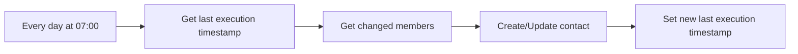

## Fluxo (.json) :

```json
{
  "meta": {
    "instanceId": "237600ca44303ce91fa31ee72babcdc8493f55ee2c0e8aa2b78b3b4ce6f70bd9"
  },
  "nodes": [
    {
      "id": "35451a0c-1ad5-4c02-804b-d19afd282b09",
      "name": "Get last execution timestamp",
      "type": "n8n-nodes-base.functionItem",
      "position": [
        540,
        100
      ],
      "parameters": {
        "functionCode": "// Code here will run once per input item.\n// More info and help: https://docs.n8n.io/nodes/n8n-nodes-base.functionItem\n// Tip: You can use luxon for dates and $jmespath for querying JSON structures\n\n// Add a new field called 'myNewField' to the JSON of the item\nconst staticData = getWorkflowStaticData('global');\n\nif(!staticData.lastExecution){\n  staticData.lastExecution = new Date();\n}\n\nitem.executionTimeStamp = new Date();\nitem.lastExecution = staticData.lastExecution;\n\n\nreturn item;"
      },
      "typeVersion": 1
    },
    {
      "id": "18ff2308-216e-4c1e-afb9-bd41ae7b5e4d",
      "name": "Every day at 07:00",
      "type": "n8n-nodes-base.cron",
      "position": [
        320,
        100
      ],
      "parameters": {
        "triggerTimes": {
          "item": [
            {
              "hour": 7
            }
          ]
        }
      },
      "typeVersion": 1
    },
    {
      "id": "53d3203b-2518-471f-9c72-2ab41303cdf2",
      "name": "Set new last execution timestamp",
      "type": "n8n-nodes-base.functionItem",
      "position": [
        1240,
        100
      ],
      "parameters": {
        "functionCode": "// Code here will run once per input item.\n// More info and help: https://docs.n8n.io/nodes/n8n-nodes-base.functionItem\n// Tip: You can use luxon for dates and $jmespath for querying JSON structures\n\n// Add a new field called 'myNewField' to the JSON of the item\nconst staticData = getWorkflowStaticData('global');\n\nstaticData.lastExecution = $item(0).$node[\"Get last execution timestamp\"].executionTimeStamp;\n\nreturn item;"
      },
      "executeOnce": true,
      "typeVersion": 1
    },
    {
      "id": "bf6f8843-53e8-4096-8614-da0b43f5f193",
      "name": "Create/Update contact",
      "type": "n8n-nodes-base.hubspot",
      "position": [
        1020,
        100
      ],
      "parameters": {
        "email": "={{ $json[\"email_address\"] }}",
        "resource": "contact",
        "authentication": "appToken",
        "additionalFields": {
          "lastName": "={{ $json[\"merge_fields\"].LNAME }}",
          "firstName": "={{ $json[\"merge_fields\"].FNAME }}"
        }
      },
      "credentials": {
        "hubspotAppToken": {
          "id": "13",
          "name": "HubSpot App Token account"
        }
      },
      "typeVersion": 1
    },
    {
      "id": "6bce7f89-e22e-4372-a1cc-1723756bb617",
      "name": "Get changed members",
      "type": "n8n-nodes-base.mailchimp",
      "position": [
        780,
        100
      ],
      "parameters": {
        "list": "bcfb6ff8f1",
        "options": {
          "sinceLastChanged": "={{ $json[\"lastExecution\"] }}"
        },
        "operation": "getAll"
      },
      "credentials": {
        "mailchimpApi": {
          "id": "19",
          "name": "Mailchimp account"
        }
      },
      "typeVersion": 1
    }
  ],
  "connections": {
    "Every day at 07:00": {
      "main": [
        [
          {
            "node": "Get last execution timestamp",
            "type": "main",
            "index": 0
          }
        ]
      ]
    },
    "Get changed members": {
      "main": [
        [
          {
            "node": "Create/Update contact",
            "type": "main",
            "index": 0
          }
        ]
      ]
    },
    "Create/Update contact": {
      "main": [
        [
          {
            "node": "Set new last execution timestamp",
            "type": "main",
            "index": 0
          }
        ]
      ]
    },
    "Get last execution timestamp": {
      "main": [
        [
          {
            "node": "Get changed members",
            "type": "main",
            "index": 0
          }
        ]
      ]
    }
  }
}
```

<a id="template-1109"></a>

## Template 1109 - Análise de YouTube com IA: resumos, transcrições e conteúdo

- **Nome:** Análise de YouTube com IA: resumos, transcrições e conteúdo
- **Descrição:** Este fluxo obtém dados de vídeos do YouTube, gera metadados de audiência com IA, constrói prompts com base no tipo de prompt, gera transcrições e resumos, converte os resultados para HTML e os distribui por e-mail e Drive.
- **Funcionalidade:** • Obter detalhes e metadados do vídeo via API do YouTube: constrói URL com video_id e chave de API e consulta dados públicos do vídeo.
• Gerar metadados de audiência com IA: usa prompts específicos para extrair informações sobre público-alvo a partir do vídeo.
• Definir e extrair prompts conforme o tipo de prompt: seleciona prompt e modelo correspondentes ao tipo (default, transcribe, timestamps, summary, scene, clips).
• Gerar conteúdos com IA: produz transcrições, resumos, timestamps, descrições visuais e clipes com base nos prompts.
• Converter resultados para HTML: transforma saídas em HTML para apresentação e compartilhamento.
• Entregar informações ao usuário em HTML: fornecer dados formatados ao usuário através de uma interface/saída HTML.
• Salvar resultados no Drive como arquivo de texto: armazenar informações geradas para referência futura.
• Enviar resultados por e-mail como HTML: enviar relatórios/quadros gerados por e-mail em formato HTML.
- **Ferramentas:** • YouTube Data API: Serviço para obter detalhes e metadados de vídeos do YouTube.
• Google Gemini API: Plataforma de IA generativa para gerar conteúdo, transcrições, resumos e análises a partir de vídeos.
• Google Drive: Armazenamento de arquivos para salvar textos gerados como arquivos no Drive.
• Gmail: Envio de relatórios/resultado por e-mail em formato HTML.

## Fluxo visual

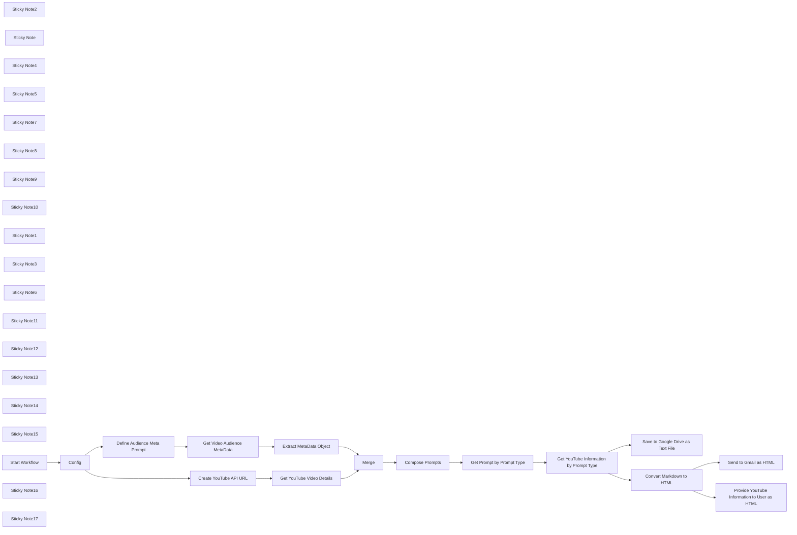

## Fluxo (.json) :

```json
{
  "id": "LIAes1kWVZAWZBX2",
  "meta": {
    "instanceId": "31e69f7f4a77bf465b805824e303232f0227212ae922d12133a0f96ffeab4fef",
    "templateCredsSetupCompleted": true
  },
  "name": "🎥 Analyze YouTube Video for Summaries, Transcripts & Content + Google Gemini AI",
  "tags": [],
  "nodes": [
    {
      "id": "6d96092e-a12e-42e7-9700-63d19c3f2403",
      "name": "Config",
      "type": "n8n-nodes-base.set",
      "position": [
        2760,
        540
      ],
      "parameters": {
        "options": {},
        "assignments": {
          "assignments": [
            {
              "id": "24e9b1c3-2955-4e0b-9b4b-a6b9d046fb72",
              "name": "google_api_key",
              "type": "string",
              "value": "={{ $env.GOOGLE_API_KEY }}"
            },
            {
              "id": "b6600a42-1b8d-486a-a51d-0868bc45452e",
              "name": "youtube_url",
              "type": "string",
              "value": "=https://www.youtube.com/watch?v={{ $json[\"YouTube Video Id\"] }}"
            },
            {
              "id": "ce9a9a40-5ae4-4106-ae61-0daba2ec185f",
              "name": "prompt_type",
              "type": "string",
              "value": "={{ $json[\"Prompt Type\"] }}"
            },
            {
              "id": "47094d96-2e89-4294-b6da-7ee66917bd98",
              "name": "video_id",
              "type": "string",
              "value": "={{ $json[\"YouTube Video Id\"] }}"
            }
          ]
        }
      },
      "typeVersion": 3.4
    },
    {
      "id": "4b4373dd-6b54-41c5-a490-91ec78afdb0b",
      "name": "Sticky Note2",
      "type": "n8n-nodes-base.stickyNote",
      "position": [
        2320,
        760
      ],
      "parameters": {
        "width": 300,
        "height": 600,
        "content": "### Prompt Options\n\n- **default**: Summarizes the video with emphasis on actionable insights, tools, strategies, and resources mentioned.\n\n- **transcribe**: Provides verbatim transcription of all spoken dialogue in the video without additional commentary.\n\n- **timestamps**: Creates a timestamped transcript of the video dialogue in [hh:mm:ss] format.\n\n- **summary**: Generates a concise bullet-point summary of the video's main points.\n\n- **scene**: Provides a comprehensive visual description of the video scene including setting, objects, people, lighting, colors, and camera techniques.\n\n- **clips**: Identifies shareable video segments with timestamps, transcripts, and explanations of their social media appeal.\n\n\n"
      },
      "typeVersion": 1
    },
    {
      "id": "41605c14-9936-43f2-8f06-c411bfddda99",
      "name": "Sticky Note",
      "type": "n8n-nodes-base.stickyNote",
      "position": [
        2660,
        420
      ],
      "parameters": {
        "color": 7,
        "width": 300,
        "height": 300,
        "content": "## Set Workflow Config Variables"
      },
      "typeVersion": 1
    },
    {
      "id": "fdc9aeb2-35b4-4f33-9438-00a10f0cb0d5",
      "name": "Get Video Audience MetaData",
      "type": "n8n-nodes-base.httpRequest",
      "onError": "continueRegularOutput",
      "position": [
        3440,
        540
      ],
      "parameters": {
        "url": "=https://generativelanguage.googleapis.com/v1beta/models/gemini-1.5-flash:generateContent?key={{ $('Config').item.json.google_api_key }}",
        "method": "POST",
        "options": {},
        "jsonBody": "={{ JSON.stringify({\n  \"contents\": [\n    {\n      \"role\": \"user\",\n      \"parts\": [\n        {\n          \"text\": $json.meta_prompt\n        },\n        { \n          \"file_data\": { \n            \"file_uri\": $('Config').item.json.youtube_url\n          } \n        }\n      ]\n    }\n  ],\n  \"generationConfig\": {\n    \"temperature\": 0.2,\n    \"topP\": 0.8,\n    \"topK\": 40,\n    \"maxOutputTokens\": 2048,\n  },\n  \"model\": \"gemini-1.5-flash\"\n}) }}\n",
        "sendBody": true,
        "sendHeaders": true,
        "specifyBody": "json",
        "headerParameters": {
          "parameters": [
            {
              "name": "Content-Type",
              "value": "application/json"
            }
          ]
        }
      },
      "typeVersion": 4.2,
      "alwaysOutputData": true
    },
    {
      "id": "8cd500b5-7c78-4ae0-be2a-79862e599da3",
      "name": "Compose Prompts",
      "type": "n8n-nodes-base.set",
      "position": [
        2760,
        980
      ],
      "parameters": {
        "options": {},
        "assignments": {
          "assignments": [
            {
              "id": "90bd636a-aa19-4f6b-80b3-bb236f29b317",
              "name": "content",
              "type": "string",
              "value": "=<default>\n<prompt>\nCreate a practical summary of this {{ $json.text.content_purpose }} about {{ $json.text.key_topics[0] }} for busy professionals in a {{ $json.text.video_tone }} tone seeking actionable takeaways. Use a structured format with primary and secondary bullets. Highlight specific tools, methodologies, and resources mentioned, including direct quotes when they provide valuable context.  Provide only the response and avoid any preamble text or further explanations.\n</prompt>\n<model>\ngemini-1.5-flash\n</model>\n</default>\n\n<transcribe>\n<prompt>\nAct as a professional transcriptionist and transcribe this {{ $json.text.video_type }} video verbatim. Include only spoken dialogue, maintaining speech patterns and verbal tics. Omit background sounds, music, or descriptions.  Provide only the response and avoid any preamble text or further explanations.\n</prompt>\n<model>\ngemini-1.5-flash\n</model>\n</transcribe>\n\n<timestamps>\n<prompt>\nCreate a professional timestamped transcript of this {{ $json.text.video_type }} video for {{ $json.text.primary_audience }}. Format each entry exactly as [hh:mm:ss] Dialogue. Capture speaker changes and significant pauses. Prioritize accuracy over completeness.  Provide only the response and avoid any preamble text or further explanations.\n</prompt>\n<model>\ngemini-1.5-flash\n</model>\n</timestamps>\n\n<summary>\n<prompt>\nAnalyze this {{ $json.text.video_type }} video and create a concise summary (approximately 150 words) for {{ $json.text.primary_audience }}. Use nested bullets to organize key points. Include direct quotes only when they significantly enhance understanding. Begin immediately with the content.  Provide only the response and avoid any preamble text or further explanations.\n</prompt>\n<model>\ngemini-1.5-flash\n</model>\n</summary>\n\n<scene>\n<prompt>\nAs a professional video production analyst, describe this scene comprehensively for {{ $json.text.content_purpose }}. Focus on setting, objects, people, lighting, colors, and camera techniques that contribute most to the scene's impact. Be specific with visual details that would matter to {{ $json.text.primary_audience }}.  Provide only the response and avoid any preamble text or further explanations.\n</prompt>\n<model>\ngemini-1.5-flash\n</model>\n</scene>\n\n<clips>\n<prompt>\nIdentify 3-5 high-engagement segments from this video specifically for {{ $json.text.best_social_platforms }} users interested in {{ $json.text.key_topics }}. For each clip, provide exact timestamps [hh:mm:ss-hh:mm:ss], verbatim transcript, and a compelling rationale focused on virality potential (shares, comments, saves).  Provide only the response and avoid any preamble text or further explanations.\n</prompt>\n<model>\ngemini-1.5-flash\n</model>\n</clips>\n\n\n\n\n"
            }
          ]
        }
      },
      "typeVersion": 3.4
    },
    {
      "id": "8f80f2f1-c46c-45ef-8468-0eb7dda2814e",
      "name": "Extract MetaData Object",
      "type": "n8n-nodes-base.set",
      "position": [
        3780,
        540
      ],
      "parameters": {
        "options": {},
        "assignments": {
          "assignments": [
            {
              "id": "e1a2e48b-0190-4f13-bf3f-8e74cbc8ab65",
              "name": "text",
              "type": "object",
              "value": "={{ $json.candidates[0].content.parts[0].text.replaceAll('```json', '').replaceAll('```', '') }}"
            }
          ]
        }
      },
      "typeVersion": 3.4
    },
    {
      "id": "b1065050-1a32-423e-b15f-0cef3f377ae6",
      "name": "Get Prompt by Prompt Type",
      "type": "n8n-nodes-base.code",
      "position": [
        3100,
        980
      ],
      "parameters": {
        "jsCode": "// Get the XML content from the input\nconst xmlContent = $input.first().json.content;\n\n// Get the tag name from the Config node\nconst tagName = $node[\"Config\"].json.prompt_type;\n\n// Create regex patterns for both prompt and model within the main tag\nconst promptRegex = new RegExp(`<${tagName}>[\\\\s\\\\S]*?<prompt>([\\\\s\\\\S]*?)</prompt>[\\\\s\\\\S]*?</${tagName}>`, \"i\");\nconst modelRegex = new RegExp(`<${tagName}>[\\\\s\\\\S]*?<model>([\\\\s\\\\S]*?)</model>[\\\\s\\\\S]*?</${tagName}>`, \"i\");\n\n// Use the match method to apply the regex patterns\nconst promptMatch = xmlContent.match(promptRegex);\nconst modelMatch = xmlContent.match(modelRegex);\n\n// Create the output item with proper structure\nlet outputItem = {\n  json: {\n    prompt: null,\n    model: null\n  }\n};\n\n// Extract prompt content if found\nif (promptMatch) {\n  outputItem.json.prompt = promptMatch[1].trim();\n}\n\n// Extract model content if found\nif (modelMatch) {\n  outputItem.json.model = modelMatch[1].trim();\n}\n\n// Return the properly structured item\nreturn [outputItem];\n"
      },
      "typeVersion": 2
    },
    {
      "id": "a66e5240-ad86-47df-8a23-d45eb31e41ce",
      "name": "Define Audience Meta Prompt",
      "type": "n8n-nodes-base.set",
      "position": [
        3100,
        540
      ],
      "parameters": {
        "options": {},
        "assignments": {
          "assignments": [
            {
              "id": "c3524064-c7fb-4f63-8421-f18f35cf5556",
              "name": "meta_prompt",
              "type": "string",
              "value": "=Analyze this YouTube video and extract key metadata to help optimize AI-generated content about it. Return ONLY a valid JSON object with the following fields:\n\n{\n  \"video_type\": \"The video format/genre (tutorial, vlog, review, interview, etc.)\",\n  \"primary_audience\": \"The main target audience based on content, language, and presentation style\",\n  \"secondary_audiences\": [\"List of 2-3 other potential audience segments\"],\n  \"content_purpose\": \"The main goal of the video (educate, entertain, persuade, etc.)\",\n  \"key_topics\": [\"3-5 main topics or themes covered\"],\n  \"best_social_platforms\": [\"2-3 platforms where clips would perform best\"],\n  \"video_tone\": \"Overall tone (professional, casual, humorous, serious, etc.)\",\n  \"engagement_drivers\": [\"2-3 aspects that would drive viewer engagement\"]\n}\n\nFocus on objective analysis of visual and verbal cues. Do not include subjective quality assessments.\n\nReturn your response as a valid JSON object without any markdown formatting, code blocks, or explanatory text.  Always remove all ```json and ``` from final response.  Avoid all preamble or further explanation.\n"
            }
          ]
        }
      },
      "typeVersion": 3.4
    },
    {
      "id": "cdb4ec99-37ac-45ae-9d5c-80851e992488",
      "name": "Sticky Note4",
      "type": "n8n-nodes-base.stickyNote",
      "position": [
        3340,
        420
      ],
      "parameters": {
        "color": 3,
        "width": 300,
        "height": 300,
        "content": "## Analyze YouTube Video for Audience MetaData"
      },
      "typeVersion": 1
    },
    {
      "id": "904938e4-4242-4a90-b124-fe0ba10ee4ec",
      "name": "Sticky Note5",
      "type": "n8n-nodes-base.stickyNote",
      "position": [
        3340,
        860
      ],
      "parameters": {
        "color": 3,
        "width": 300,
        "height": 300,
        "content": "## Get YouTube Information by Prompt Type"
      },
      "typeVersion": 1
    },
    {
      "id": "942789bd-ab7c-432c-9916-f1fdb5344e1e",
      "name": "Sticky Note7",
      "type": "n8n-nodes-base.stickyNote",
      "position": [
        3000,
        420
      ],
      "parameters": {
        "color": 7,
        "width": 300,
        "height": 300,
        "content": "## Define Audience Meta Prompt"
      },
      "typeVersion": 1
    },
    {
      "id": "4c032c02-3eb7-48d1-8a74-75db0e02fe24",
      "name": "Sticky Note8",
      "type": "n8n-nodes-base.stickyNote",
      "position": [
        3680,
        420
      ],
      "parameters": {
        "color": 7,
        "width": 300,
        "height": 300,
        "content": "## Extract MetaData Object"
      },
      "typeVersion": 1
    },
    {
      "id": "58e23d26-8cb1-4819-9d29-0658e8b7a95b",
      "name": "Sticky Note9",
      "type": "n8n-nodes-base.stickyNote",
      "position": [
        2660,
        860
      ],
      "parameters": {
        "color": 7,
        "width": 300,
        "height": 300,
        "content": "## Compose the Prompts with Audience MetaData"
      },
      "typeVersion": 1
    },
    {
      "id": "ecadd3a9-7ce4-433d-9a04-76ebe4ba3875",
      "name": "Sticky Note10",
      "type": "n8n-nodes-base.stickyNote",
      "position": [
        3000,
        860
      ],
      "parameters": {
        "color": 7,
        "width": 300,
        "height": 300,
        "content": "## Get Prompt by Prompt Type"
      },
      "typeVersion": 1
    },
    {
      "id": "a00048cb-e30c-4b14-9dd3-b986d2ee5f9c",
      "name": "Get YouTube Information by Prompt Type",
      "type": "n8n-nodes-base.httpRequest",
      "onError": "continueRegularOutput",
      "position": [
        3440,
        980
      ],
      "parameters": {
        "url": "=https://generativelanguage.googleapis.com/v1beta/models/{{ $json.model }}:generateContent?key={{$('Config').item.json.google_api_key }}",
        "method": "POST",
        "options": {},
        "jsonBody": "={\n  \"contents\": [{\n    \"parts\": [\n      { \"text\": {{ JSON.stringify($json.prompt) }} },\n      { \"file_data\": { \n          \"file_uri\": \"{{ $('Config').item.json.youtube_url }}\" \n        } \n      }\n    ]\n  }]\n}",
        "sendBody": true,
        "sendHeaders": true,
        "specifyBody": "json",
        "headerParameters": {
          "parameters": [
            {
              "name": "Content-Type",
              "value": "application/json"
            }
          ]
        }
      },
      "typeVersion": 4.2,
      "alwaysOutputData": true
    },
    {
      "id": "a071b040-9091-4081-aedd-d8e8b9166568",
      "name": "Sticky Note1",
      "type": "n8n-nodes-base.stickyNote",
      "position": [
        2320,
        420
      ],
      "parameters": {
        "color": 4,
        "width": 300,
        "height": 300,
        "content": "## 👍Try Me!\nYouTube Video Id: wBuULAoJxok"
      },
      "typeVersion": 1
    },
    {
      "id": "e243fe41-26fe-48d3-b215-20e033a0c0aa",
      "name": "Save to Google Drive as Text File",
      "type": "n8n-nodes-base.googleDrive",
      "position": [
        3780,
        1320
      ],
      "parameters": {
        "name": "={{ $('Start Workflow').item.json['YouTube Video Id'] }} - {{ $now }}",
        "content": "={{ $('Start Workflow').item.json['YouTube Video Id'] }} - {{ $now }}\n\n{{ $('Extract MetaData Object').item.json.text.key_topics[0] }}\n{{ $('Extract MetaData Object').item.json.text.content_purpose }}\n{{ $('Extract MetaData Object').item.json.text.primary_audience }}\n\n{{ $json.candidates[0].content.parts[0].text }}\n\nVideo Details:\n{{ $('Merge').item.json.items.toJsonString() }}",
        "driveId": {
          "__rl": true,
          "mode": "list",
          "value": "My Drive"
        },
        "options": {},
        "folderId": {
          "__rl": true,
          "mode": "list",
          "value": "root",
          "cachedResultName": "/ (Root folder)"
        },
        "operation": "createFromText"
      },
      "credentials": {
        "googleDriveOAuth2Api": {
          "id": "UhdXGYLTAJbsa0xX",
          "name": "Google Drive account"
        }
      },
      "typeVersion": 3
    },
    {
      "id": "87ad7860-a364-406a-999b-5b9f9ef356e0",
      "name": "Send to Gmail as HTML",
      "type": "n8n-nodes-base.gmail",
      "position": [
        4120,
        1320
      ],
      "webhookId": "ccf34c87-14a3-4103-96fb-595cf9fa0636",
      "parameters": {
        "sendTo": "={{ $env.EMAIL_ADDRESS_JOE }}",
        "message": "=<p>{{ $('Merge').item.json.items[0].snippet.title }}</p>\n<p>{{ $('Merge').item.json.items[0].id }}</p>\n\n\n\n{{ $json.data }}",
        "options": {
          "appendAttribution": false
        },
        "subject": "={{ $('Start Workflow').item.json['YouTube Video Id'] }} - {{ $('Extract MetaData Object').item.json.text.key_topics[0] }}"
      },
      "credentials": {
        "gmailOAuth2": {
          "id": "1xpVDEQ1yx8gV022",
          "name": "Gmail account"
        }
      },
      "typeVersion": 2.1
    },
    {
      "id": "d42e0de6-560e-4aa0-b2a5-8b79d84b660a",
      "name": "Convert Markdown to HTML",
      "type": "n8n-nodes-base.markdown",
      "position": [
        3780,
        980
      ],
      "parameters": {
        "mode": "markdownToHtml",
        "options": {},
        "markdown": "={{ $json.candidates[0].content.parts[0].text }}"
      },
      "typeVersion": 1
    },
    {
      "id": "3f5cac85-ee4d-45a5-9a95-07fc6e195bd8",
      "name": "Provide YouTube Information to User as HTML",
      "type": "n8n-nodes-base.form",
      "position": [
        4120,
        980
      ],
      "webhookId": "49b5f9c9-e4c2-4cc4-b01c-c27b1cdba918",
      "parameters": {
        "operation": "completion",
        "respondWith": "showText",
        "responseText": "=\n\n{{ $json.data }}\n"
      },
      "typeVersion": 1
    },
    {
      "id": "8f0ed7d9-9b78-49d2-858a-34418e1ee517",
      "name": "Sticky Note3",
      "type": "n8n-nodes-base.stickyNote",
      "position": [
        3340,
        320
      ],
      "parameters": {
        "color": 5,
        "width": 300,
        "height": 100,
        "content": "## Google Generative Language API"
      },
      "typeVersion": 1
    },
    {
      "id": "271816a9-9e1a-4b4d-afe5-94f3023c9337",
      "name": "Sticky Note6",
      "type": "n8n-nodes-base.stickyNote",
      "position": [
        3340,
        760
      ],
      "parameters": {
        "color": 5,
        "width": 300,
        "height": 100,
        "content": "## Google Generative Language API"
      },
      "typeVersion": 1
    },
    {
      "id": "ba68bd32-0f4b-4ce0-9af6-3dc87b8ae5ea",
      "name": "Sticky Note11",
      "type": "n8n-nodes-base.stickyNote",
      "position": [
        3680,
        860
      ],
      "parameters": {
        "color": 7,
        "width": 300,
        "height": 300,
        "content": "## Convert Markdown to HTML"
      },
      "typeVersion": 1
    },
    {
      "id": "b69d97a9-748e-430a-b1af-5befecb226a3",
      "name": "Sticky Note12",
      "type": "n8n-nodes-base.stickyNote",
      "position": [
        3680,
        1200
      ],
      "parameters": {
        "color": 7,
        "width": 300,
        "height": 300,
        "content": "## Save YouTube Information to Google Drive"
      },
      "typeVersion": 1
    },
    {
      "id": "3a0bca9c-56da-4425-b719-3e2ccb1cd1d8",
      "name": "Sticky Note13",
      "type": "n8n-nodes-base.stickyNote",
      "position": [
        4020,
        1200
      ],
      "parameters": {
        "color": 7,
        "width": 300,
        "height": 300,
        "content": "## Email YouTube Information"
      },
      "typeVersion": 1
    },
    {
      "id": "004154f2-ac1a-4b79-a5f8-3af0959cc3ce",
      "name": "Sticky Note14",
      "type": "n8n-nodes-base.stickyNote",
      "position": [
        4020,
        860
      ],
      "parameters": {
        "color": 4,
        "width": 300,
        "height": 300,
        "content": "## Provide YouTube Information in Completion Form"
      },
      "typeVersion": 1
    },
    {
      "id": "f815a2f5-2e12-40bf-8849-30429344afae",
      "name": "Sticky Note15",
      "type": "n8n-nodes-base.stickyNote",
      "position": [
        2280,
        -120
      ],
      "parameters": {
        "color": 7,
        "width": 2080,
        "height": 1660,
        "content": "# 🎥 Analyze YouTube Video for Summaries, Transcripts & Content + Google Gemini"
      },
      "typeVersion": 1
    },
    {
      "id": "dbbae73b-735b-4bb8-bcad-6266c08d9fae",
      "name": "Start Workflow",
      "type": "n8n-nodes-base.formTrigger",
      "position": [
        2420,
        540
      ],
      "webhookId": "92148b0b-bbf7-4ce9-80a2-768207adee7b",
      "parameters": {
        "options": {},
        "formTitle": "Extract Information from YouTube Videos",
        "formFields": {
          "values": [
            {
              "fieldType": "dropdown",
              "fieldLabel": "Prompt Type",
              "fieldOptions": {
                "values": [
                  {
                    "option": "default"
                  },
                  {
                    "option": "transcribe"
                  },
                  {
                    "option": "timestamps"
                  },
                  {
                    "option": "summary"
                  },
                  {
                    "option": "scene"
                  },
                  {
                    "option": "clips"
                  }
                ]
              },
              "requiredField": true
            },
            {
              "fieldLabel": "YouTube Video Id",
              "placeholder": "wBuULAoJxok",
              "requiredField": true
            }
          ]
        },
        "responseMode": "lastNode",
        "formDescription": "This workflow allows you to extract various types of actionable information from YouTube videos that is audience specific using dynamically composed prompts."
      },
      "typeVersion": 2.2
    },
    {
      "id": "c63d236c-99d5-43f6-825e-836ddd41ad6f",
      "name": "Create YouTube API URL",
      "type": "n8n-nodes-base.code",
      "position": [
        3100,
        100
      ],
      "parameters": {
        "jsCode": "// Define the base URL for the YouTube Data API\nconst BASE_URL = 'https://www.googleapis.com/youtube/v3/videos';\n\n// Get the first input item\nconst item = $input.first();\n\n// Extract the videoId and google_api_key from the input JSON\nconst VIDEO_ID = item.json.video_id;\nconst GOOGLE_API_KEY = item.json.google_api_key; // Dynamically retrieve API key\n\nif (!VIDEO_ID) {\n  throw new Error('The video ID parameter is empty.');\n}\n\nif (!GOOGLE_API_KEY) {\n  throw new Error('The Google API Key is missing.');\n}\n\n// Construct the API URL with the video ID and dynamically retrieved API key\nconst youtubeUrl = `${BASE_URL}?part=snippet,contentDetails,status,statistics,player,topicDetails&id=${VIDEO_ID}&key=${GOOGLE_API_KEY}`;\n\n// Return the constructed URL\nreturn [\n  {\n    json: {\n      youtubeUrl: youtubeUrl,\n    },\n  },\n];\n"
      },
      "typeVersion": 2
    },
    {
      "id": "17daf9d1-4bee-4632-b929-0696e71b9fa2",
      "name": "Get YouTube Video Details",
      "type": "n8n-nodes-base.httpRequest",
      "position": [
        3440,
        100
      ],
      "parameters": {
        "url": "={{ $json.youtubeUrl }}",
        "options": {}
      },
      "typeVersion": 4.2
    },
    {
      "id": "42b45f4c-9447-4ffa-ae7f-ffa68de395ba",
      "name": "Sticky Note16",
      "type": "n8n-nodes-base.stickyNote",
      "position": [
        3340,
        -20
      ],
      "parameters": {
        "color": 3,
        "width": 300,
        "height": 300,
        "content": "## Get YouTube Video Details"
      },
      "typeVersion": 1
    },
    {
      "id": "3f3a5e5a-5c15-42a0-81d5-53248b76495e",
      "name": "Merge",
      "type": "n8n-nodes-base.merge",
      "position": [
        4100,
        540
      ],
      "parameters": {
        "mode": "combine",
        "options": {},
        "combineBy": "combineByPosition"
      },
      "typeVersion": 3
    },
    {
      "id": "377870dd-7dfe-49dc-a444-67017a97e8c8",
      "name": "Sticky Note17",
      "type": "n8n-nodes-base.stickyNote",
      "position": [
        3000,
        -20
      ],
      "parameters": {
        "color": 7,
        "width": 300,
        "height": 300,
        "content": "## Create YouTube API URL"
      },
      "typeVersion": 1
    }
  ],
  "active": false,
  "pinData": {},
  "settings": {
    "executionOrder": "v1"
  },
  "versionId": "45041f00-7c30-4490-aa2b-807bcb91ca2b",
  "connections": {
    "Merge": {
      "main": [
        [
          {
            "node": "Compose Prompts",
            "type": "main",
            "index": 0
          }
        ]
      ]
    },
    "Config": {
      "main": [
        [
          {
            "node": "Create YouTube API URL",
            "type": "main",
            "index": 0
          },
          {
            "node": "Define Audience Meta Prompt",
            "type": "main",
            "index": 0
          }
        ]
      ]
    },
    "Start Workflow": {
      "main": [
        [
          {
            "node": "Config",
            "type": "main",
            "index": 0
          }
        ]
      ]
    },
    "Compose Prompts": {
      "main": [
        [
          {
            "node": "Get Prompt by Prompt Type",
            "type": "main",
            "index": 0
          }
        ]
      ]
    },
    "Create YouTube API URL": {
      "main": [
        [
          {
            "node": "Get YouTube Video Details",
            "type": "main",
            "index": 0
          }
        ]
      ]
    },
    "Extract MetaData Object": {
      "main": [
        [
          {
            "node": "Merge",
            "type": "main",
            "index": 1
          }
        ]
      ]
    },
    "Convert Markdown to HTML": {
      "main": [
        [
          {
            "node": "Send to Gmail as HTML",
            "type": "main",
            "index": 0
          },
          {
            "node": "Provide YouTube Information to User as HTML",
            "type": "main",
            "index": 0
          }
        ]
      ]
    },
    "Get Prompt by Prompt Type": {
      "main": [
        [
          {
            "node": "Get YouTube Information by Prompt Type",
            "type": "main",
            "index": 0
          }
        ]
      ]
    },
    "Get YouTube Video Details": {
      "main": [
        [
          {
            "node": "Merge",
            "type": "main",
            "index": 0
          }
        ]
      ]
    },
    "Define Audience Meta Prompt": {
      "main": [
        [
          {
            "node": "Get Video Audience MetaData",
            "type": "main",
            "index": 0
          }
        ]
      ]
    },
    "Get Video Audience MetaData": {
      "main": [
        [
          {
            "node": "Extract MetaData Object",
            "type": "main",
            "index": 0
          }
        ]
      ]
    },
    "Get YouTube Information by Prompt Type": {
      "main": [
        [
          {
            "node": "Convert Markdown to HTML",
            "type": "main",
            "index": 0
          },
          {
            "node": "Save to Google Drive as Text File",
            "type": "main",
            "index": 0
          }
        ]
      ]
    }
  }
}
```

<a id="template-1110"></a>

## Template 1110 - Notificações de cancelamento de assinante

- **Nome:** Notificações de cancelamento de assinante
- **Descrição:** Este fluxo recebe notificações quando um assinante cancela a inscrição no Customer.io e disponibiliza os dados do evento para processamento ou integração com outras rotinas.
- **Funcionalidade:** • Recepção de eventos de cancelamento: escuta especificamente o evento customer.unsubscribed enviado pelo serviço.
• Acionamento automático via webhook: inicia o fluxo imediatamente ao receber o evento de desinscrição.
• Disponibilização do payload do assinante: fornece os dados do assinante e do evento para uso em ações subsequentes (logs, notificações, atualizações de banco de dados).
• Uso de credenciais configuradas: autentica a origem do evento usando credenciais da conta para garantir segurança.
- **Ferramentas:** • Customer.io: plataforma de marketing e automação que gerencia assinantes e envia eventos de cancelamento (customer.unsubscribed) para notificar sistemas externos.

## Fluxo visual

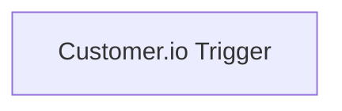

## Fluxo (.json) :

```json
{
  "id": "29",
  "name": "Receive updates when a subscriber unsubscribes in Customer.io",
  "nodes": [
    {
      "name": "Customer.io Trigger",
      "type": "n8n-nodes-base.customerIoTrigger",
      "position": [
        650,
        260
      ],
      "webhookId": "88092579-1b8d-4d44-98d5-f24b3579cbc2",
      "parameters": {
        "events": [
          "customer.unsubscribed"
        ]
      },
      "credentials": {
        "customerIoApi": "customerIO"
      },
      "typeVersion": 1
    }
  ],
  "active": false,
  "settings": {},
  "connections": {}
}
```

<a id="template-1111"></a>

## Template 1111 - Recepção de eventos HubSpot por webhook

- **Nome:** Recepção de eventos HubSpot por webhook
- **Descrição:** O fluxo recebe eventos do HubSpot via webhook associado a um aplicativo de desenvolvedor e controla a taxa de processamento simultâneo das chamadas.
- **Funcionalidade:** • Recepção de eventos do HubSpot: Inicia o processamento ao receber eventos encaminhados pelo webhook configurado.
• Autenticação com aplicativo de desenvolvedor: Utiliza o identificador do app (appId dghert3) e credenciais associadas para validar e aceitar eventos.
• Controle de concorrência: Limita o número de solicitações simultâneas processadas a 5 para gerenciar carga.
• Identificação do webhook: Possui um webhookId específico (9fe8c037-be4f-4809-a7c2-96e509bfc52e) para receber chamadas direcionadas ao fluxo.
- **Ferramentas:** • HubSpot: Plataforma de CRM que envia eventos e webhooks sobre atividades de contatos, negócios e outros objetos.
• API de desenvolvedor do HubSpot: Interface usada para registrar e autenticar o aplicativo que fornece o webhook e entrega os eventos.

## Fluxo visual

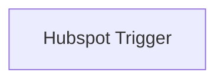

## Fluxo (.json) :

```json
{
  "nodes": [
    {
      "name": "Hubspot Trigger",
      "type": "n8n-nodes-base.hubspotTrigger",
      "position": [
        700,
        260
      ],
      "webhookId": "9fe8c037-be4f-4809-a7c2-96e509bfc52e",
      "parameters": {
        "appId": "dghert3",
        "additionalFields": {
          "maxConcurrentRequests": 5
        }
      },
      "credentials": {
        "hubspotDeveloperApi": "hubspot_trigger"
      },
      "typeVersion": 1
    }
  ],
  "connections": {}
}
```

<a id="template-1112"></a>

## Template 1112 - Mesclar PDFs remotos

- **Nome:** Mesclar PDFs remotos
- **Descrição:** Baixa dois arquivos PDF hospedados remotamente, envia-os a um serviço de conversão para mesclagem e grava o PDF resultante no disco local.
- **Funcionalidade:** • Início manual: Permite acionar o fluxo manualmente para testes.
• Download de PDFs remotos: Baixa dois arquivos PDF a partir de URLs públicas.
• Mesclagem via API externa: Envia os dois PDFs como multipart/form-data para um endpoint de mesclagem, recebendo o arquivo unido como resposta.
• Autenticação para conversão: Utiliza credenciais (chave/secret) via query para autenticar as solicitações de conversão.
• Salvamento local do resultado: Grava o PDF mesclado no sistema de arquivos local com nome definido (document.pdf).
- **Ferramentas:** • ConvertAPI: Serviço externo de conversão/mesclagem de arquivos PDF via API, que realiza a união dos documentos e fornece endpoints para upload/download.
• CDN de arquivos públicos (cdn.convertapi.com): Hospedagem de arquivos PDF de exemplo usados como fontes remotas para download.

## Fluxo visual

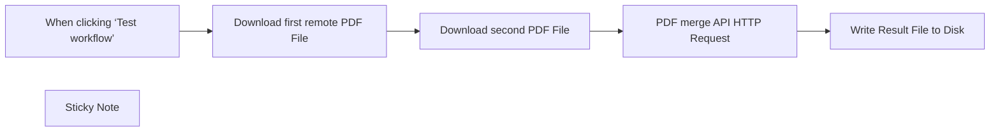

## Fluxo (.json) :

```json
{
  "id": "do4h6jnTGWDjCXV7",
  "meta": {
    "instanceId": "5f49f71237f6d19bde83a657cffcbbba83eaa1c826edc52411d381e8bedfe5ce",
    "templateCredsSetupCompleted": true
  },
  "name": "Merge",
  "tags": [],
  "nodes": [
    {
      "id": "513658bc-f898-431c-a005-973013fb12a3",
      "name": "When clicking ‘Test workflow’",
      "type": "n8n-nodes-base.manualTrigger",
      "position": [
        -840,
        -200
      ],
      "parameters": {},
      "typeVersion": 1
    },
    {
      "id": "5ba22d17-af12-4665-85c5-f704835f71a4",
      "name": "Write Result File to Disk",
      "type": "n8n-nodes-base.readWriteFile",
      "position": [
        -100,
        -200
      ],
      "parameters": {
        "options": {},
        "fileName": "document.pdf",
        "operation": "write",
        "dataPropertyName": "=data1"
      },
      "typeVersion": 1
    },
    {
      "id": "2bf6b07f-068d-4bbd-8d59-93768118c07c",
      "name": "Sticky Note",
      "type": "n8n-nodes-base.stickyNote",
      "position": [
        -340,
        -340
      ],
      "parameters": {
        "width": 218,
        "height": 132,
        "content": "## Authentication\nConversion requests must be authenticated. Please create \n[ConvertAPI account to get authentication secret](https://www.convertapi.com/a/signin)"
      },
      "typeVersion": 1
    },
    {
      "id": "e1f7f9b3-6806-42e6-83f8-cdd3f45f236e",
      "name": "Download first remote PDF File",
      "type": "n8n-nodes-base.httpRequest",
      "position": [
        -640,
        -200
      ],
      "parameters": {
        "url": "https://cdn.convertapi.com/public/files/demo.pdf",
        "options": {
          "response": {
            "response": {
              "responseFormat": "file",
              "outputPropertyName": "data1"
            }
          }
        }
      },
      "typeVersion": 4.2
    },
    {
      "id": "00acf3e1-1bb8-4dc0-826a-a2c58f5d82d5",
      "name": "Download second PDF File",
      "type": "n8n-nodes-base.httpRequest",
      "position": [
        -460,
        -200
      ],
      "parameters": {
        "url": "https://cdn.convertapi.com/public/files/demo2.pdf",
        "options": {
          "response": {
            "response": {
              "responseFormat": "file",
              "outputPropertyName": "data2"
            }
          }
        }
      },
      "typeVersion": 4.2
    },
    {
      "id": "6c2a428e-e0af-485b-bdde-70785bc0d508",
      "name": "PDF merge API HTTP Request",
      "type": "n8n-nodes-base.httpRequest",
      "position": [
        -280,
        -200
      ],
      "parameters": {
        "url": "https://v2.convertapi.com/convert/pdf/to/merge",
        "method": "POST",
        "options": {
          "response": {
            "response": {
              "neverError": "=",
              "responseFormat": "file",
              "outputPropertyName": "=data"
            }
          }
        },
        "sendBody": true,
        "contentType": "multipart-form-data",
        "sendHeaders": true,
        "authentication": "genericCredentialType",
        "bodyParameters": {
          "parameters": [
            {
              "name": "files[0]",
              "parameterType": "formBinaryData",
              "inputDataFieldName": "data1"
            },
            {
              "name": "files[1]",
              "parameterType": "formBinaryData",
              "inputDataFieldName": "data2"
            }
          ]
        },
        "genericAuthType": "httpQueryAuth",
        "headerParameters": {
          "parameters": [
            {
              "name": "Accept",
              "value": "application/octet-stream"
            }
          ]
        }
      },
      "credentials": {
        "httpQueryAuth": {
          "id": "F3A9wZC8zcgbB8sr",
          "name": "Query Auth account"
        }
      },
      "notesInFlow": true,
      "typeVersion": 4.2
    }
  ],
  "active": false,
  "pinData": {},
  "settings": {
    "executionOrder": "v1"
  },
  "versionId": "22a14e07-f11e-46e4-a238-ecdb9f1a8f81",
  "connections": {
    "Download second PDF File": {
      "main": [
        [
          {
            "node": "PDF merge API HTTP Request",
            "type": "main",
            "index": 0
          }
        ]
      ]
    },
    "PDF merge API HTTP Request": {
      "main": [
        [
          {
            "node": "Write Result File to Disk",
            "type": "main",
            "index": 0
          }
        ]
      ]
    },
    "Download first remote PDF File": {
      "main": [
        [
          {
            "node": "Download second PDF File",
            "type": "main",
            "index": 0
          }
        ]
      ]
    },
    "When clicking ‘Test workflow’": {
      "main": [
        [
          {
            "node": "Download first remote PDF File",
            "type": "main",
            "index": 0
          }
        ]
      ]
    }
  }
}
```

<a id="template-1113"></a>

## Template 1113 - Análise de Pins do Pinterest com sugestões via IA

- **Nome:** Análise de Pins do Pinterest com sugestões via IA
- **Descrição:** Este fluxo coleta pins semanalmente via Pinterest API, armazena dados em Airtable, analisa tendências com IA, gera sugestões de novos pins e envia um resumo por e-mail ao gerente de marketing.
- **Funcionalidade:** • Agendamento de coleta semanal: executa a coleta de pins da conta de forma programada.
• Coleta de Pins da conta: obtém a lista de pins da conta através da API do Pinterest.
• Normalização de dados para Airtable: transforma os dados dos pins para os campos esperados e marca o tipo como Organic.
• Inclusão de campo tipo Organic: define o campo type como Organic nas entradas.
• Armazenamento/Atualização no Airtable: grava ou atualiza pins na tabela Pinterest_Organic_Data com campos como id, title, description, link, created_at e type.
• Análise de dados com IA: analisa tendências e padrões nos pins armazenados para gerar insights.
• Geração de sugestões de conteúdo: propõe novos pins para alcançar o público-alvo.
• Resumo da análise: produz um resumo conciso da análise para facilitar decisões de marketing.
• Envio de relatório para Marketing Manager: envia o resumo por e-mail ao gerente de marketing.
- **Ferramentas:** • Pinterest API: acesso para buscar pins da conta e dados relevantes para análise.
• Airtable: armazenamento e organização dos pins na base Pinterest_Metrics/Pinterest_Organic_Data.
• OpenAI: modelos de IA usados para análise de dados e geração de sugestões.
• Gmail: envio do relatório por e-mail ao gerente de marketing.

## Fluxo visual

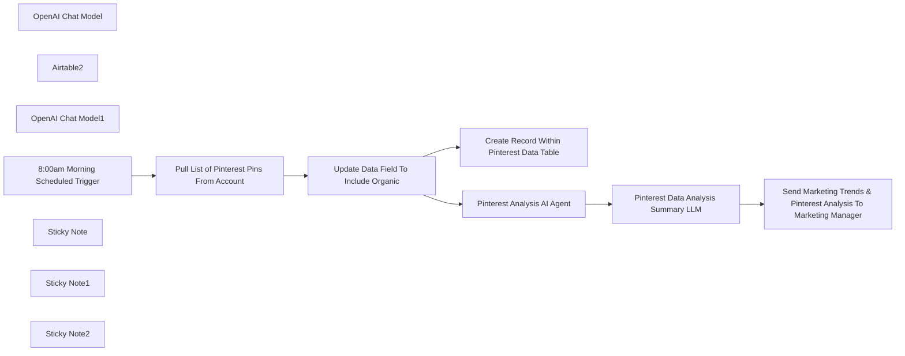

## Fluxo (.json) :

```json
{
  "id": "gP9EsxKN5agUGzDS",
  "meta": {
    "instanceId": "73d9d5380db181d01f4e26492c771d4cb5c4d6d109f18e2621cf49cac4c50763",
    "templateCredsSetupCompleted": true
  },
  "name": "Automate Pinterest Analysis & AI-Powered Content Suggestions With Pinterest API",
  "tags": [],
  "nodes": [
    {
      "id": "7f582bb4-97cd-458e-a7b7-b518c5b8a4ca",
      "name": "OpenAI Chat Model",
      "type": "@n8n/n8n-nodes-langchain.lmChatOpenAi",
      "position": [
        540,
        -260
      ],
      "parameters": {
        "model": {
          "__rl": true,
          "mode": "list",
          "value": "gpt-4o-mini"
        },
        "options": {}
      },
      "credentials": {
        "openAiApi": {
          "id": "95QGJD3XSz0piaNU",
          "name": "OpenAi account"
        }
      },
      "typeVersion": 1.2
    },
    {
      "id": "c6772882-468c-4391-a259-93e52daf49d4",
      "name": "Airtable2",
      "type": "n8n-nodes-base.airtableTool",
      "position": [
        700,
        -260
      ],
      "parameters": {
        "id": "=",
        "base": {
          "__rl": true,
          "mode": "list",
          "value": "appfsNi1QEhw6WvXK",
          "cachedResultUrl": "https://airtable.com/appfsNi1QEhw6WvXK",
          "cachedResultName": "Pinterest_Metrics"
        },
        "table": {
          "__rl": true,
          "mode": "list",
          "value": "tbl9Dxdrwx5QZGFnp",
          "cachedResultUrl": "https://airtable.com/appfsNi1QEhw6WvXK/tbl9Dxdrwx5QZGFnp",
          "cachedResultName": "Pinterest_Organic_Data"
        },
        "options": {}
      },
      "credentials": {
        "airtableTokenApi": {
          "id": "0ApVmNsLu7aFzQD6",
          "name": "Airtable Personal Access Token account"
        }
      },
      "typeVersion": 2.1
    },
    {
      "id": "85ea8bec-14c8-4277-b2e3-eb145db0713a",
      "name": "OpenAI Chat Model1",
      "type": "@n8n/n8n-nodes-langchain.lmChatOpenAi",
      "position": [
        920,
        -280
      ],
      "parameters": {
        "model": {
          "__rl": true,
          "mode": "list",
          "value": "gpt-4o-mini"
        },
        "options": {}
      },
      "credentials": {
        "openAiApi": {
          "id": "95QGJD3XSz0piaNU",
          "name": "OpenAi account"
        }
      },
      "typeVersion": 1.2
    },
    {
      "id": "b8f7d0d6-b58f-4a41-a15d-99f4d838bb8c",
      "name": "8:00am Morning Scheduled Trigger",
      "type": "n8n-nodes-base.scheduleTrigger",
      "position": [
        -660,
        -140
      ],
      "parameters": {
        "rule": {
          "interval": [
            {
              "daysInterval": 7,
              "triggerAtHour": 8
            }
          ]
        }
      },
      "typeVersion": 1.2
    },
    {
      "id": "593a320d-825e-42f9-8ab6-adafd5288fa5",
      "name": "Pull List of Pinterest Pins From Account",
      "type": "n8n-nodes-base.httpRequest",
      "position": [
        -340,
        -140
      ],
      "parameters": {
        "url": "https://api.pinterest.com/v5/pins",
        "options": {
          "redirect": {
            "redirect": {}
          }
        },
        "sendBody": true,
        "sendHeaders": true,
        "bodyParameters": {
          "parameters": [
            {}
          ]
        },
        "headerParameters": {
          "parameters": [
            {
              "name": "Authorization",
              "value": " "
            }
          ]
        }
      },
      "typeVersion": 4.2
    },
    {
      "id": "1e6d00fe-2b32-4d46-a230-063254ebab74",
      "name": "Update Data Field To Include Organic",
      "type": "n8n-nodes-base.code",
      "position": [
        -20,
        -140
      ],
      "parameters": {
        "jsCode": "// Initialize an array to hold the output formatted for Airtable\nconst outputItems = [];\n\nfor (const item of $input.all()) {\n  if (item.json.items && Array.isArray(item.json.items)) {\n    for (const subItem of item.json.items) {\n      // Construct an object with only the required fields for Airtable\n      outputItems.push({\n        id: subItem.id || null,\n        created_at: subItem.created_at || null,\n        title: subItem.title || null,\n        description: subItem.description || null,\n        link: subItem.link || null,\n        type: \"Organic\" // Assign the value \"Organic\" to the 'Type' field\n      });\n    }\n  }\n}\n\n// Return the structured output\nreturn outputItems;\n"
      },
      "typeVersion": 2
    },
    {
      "id": "539de144-dc67-4b14-b58e-2896edb1c3e6",
      "name": "Create Record Within Pinterest Data Table",
      "type": "n8n-nodes-base.airtable",
      "position": [
        260,
        -140
      ],
      "parameters": {
        "base": {
          "__rl": true,
          "mode": "list",
          "value": "appfsNi1QEhw6WvXK",
          "cachedResultUrl": "https://airtable.com/appfsNi1QEhw6WvXK",
          "cachedResultName": "Pinterest_Metrics"
        },
        "table": {
          "__rl": true,
          "mode": "list",
          "value": "tbl9Dxdrwx5QZGFnp",
          "cachedResultUrl": "https://airtable.com/appfsNi1QEhw6WvXK/tbl9Dxdrwx5QZGFnp",
          "cachedResultName": "Pinterest_Organic_Data"
        },
        "columns": {
          "value": {
            "link": "={{ $json.link }}",
            "type": "={{ $json.type }}",
            "title": "={{ $json.title }}",
            "pin_id": "={{ $json.id }}",
            "created_at": "={{ $json.created_at }}",
            "description": "={{ $json.description }}"
          },
          "schema": [
            {
              "id": "id",
              "type": "string",
              "display": true,
              "removed": false,
              "readOnly": true,
              "required": false,
              "displayName": "id",
              "defaultMatch": true
            },
            {
              "id": "pin_id",
              "type": "string",
              "display": true,
              "removed": false,
              "readOnly": false,
              "required": false,
              "displayName": "pin_id",
              "defaultMatch": false,
              "canBeUsedToMatch": true
            },
            {
              "id": "created_at",
              "type": "string",
              "display": true,
              "removed": false,
              "readOnly": false,
              "required": false,
              "displayName": "created_at",
              "defaultMatch": false,
              "canBeUsedToMatch": true
            },
            {
              "id": "title",
              "type": "string",
              "display": true,
              "removed": false,
              "readOnly": false,
              "required": false,
              "displayName": "title",
              "defaultMatch": false,
              "canBeUsedToMatch": true
            },
            {
              "id": "description",
              "type": "string",
              "display": true,
              "removed": false,
              "readOnly": false,
              "required": false,
              "displayName": "description",
              "defaultMatch": false,
              "canBeUsedToMatch": true
            },
            {
              "id": "link",
              "type": "string",
              "display": true,
              "removed": false,
              "readOnly": false,
              "required": false,
              "displayName": "link",
              "defaultMatch": false,
              "canBeUsedToMatch": true
            },
            {
              "id": "type",
              "type": "string",
              "display": true,
              "removed": false,
              "readOnly": false,
              "required": false,
              "displayName": "type",
              "defaultMatch": false,
              "canBeUsedToMatch": true
            },
            {
              "id": "active7DayUsers",
              "type": "string",
              "display": true,
              "removed": true,
              "readOnly": false,
              "required": false,
              "displayName": "active7DayUsers",
              "defaultMatch": false,
              "canBeUsedToMatch": true
            },
            {
              "id": "sessions",
              "type": "string",
              "display": true,
              "removed": true,
              "readOnly": false,
              "required": false,
              "displayName": "sessions",
              "defaultMatch": false,
              "canBeUsedToMatch": true
            },
            {
              "id": "userEngagementDuration",
              "type": "string",
              "display": true,
              "removed": true,
              "readOnly": false,
              "required": false,
              "displayName": "userEngagementDuration",
              "defaultMatch": false,
              "canBeUsedToMatch": true
            }
          ],
          "mappingMode": "defineBelow",
          "matchingColumns": [
            "id"
          ],
          "attemptToConvertTypes": false,
          "convertFieldsToString": false
        },
        "options": {},
        "operation": "upsert"
      },
      "credentials": {
        "airtableTokenApi": {
          "id": "0ApVmNsLu7aFzQD6",
          "name": "Airtable Personal Access Token account"
        }
      },
      "typeVersion": 2.1
    },
    {
      "id": "250f5121-437e-4bff-82af-95a156126127",
      "name": "Pinterest Analysis AI Agent",
      "type": "@n8n/n8n-nodes-langchain.agent",
      "position": [
        540,
        -440
      ],
      "parameters": {
        "text": "You are a data analysis expert. You will pull data from the table and provide any information in regards to trends in the data. \n\nYour output should be suggestions of new pins that we can post to reach the target audiences. \n\nAnalyze the data and just summary of the pin suggestions that the team should build. ",
        "options": {},
        "promptType": "define"
      },
      "typeVersion": 1.7
    },
    {
      "id": "181e9d89-c0f9-4de2-bdce-9359b967157c",
      "name": "Pinterest Data Analysis Summary LLM",
      "type": "@n8n/n8n-nodes-langchain.chainSummarization",
      "position": [
        900,
        -440
      ],
      "parameters": {
        "options": {
          "summarizationMethodAndPrompts": {
            "values": {
              "prompt": "=Write a concise summary of the following:\n\n\n\"{{ $json.output }}\"\n\n\nCONCISE SUMMARY:"
            }
          }
        }
      },
      "typeVersion": 2
    },
    {
      "id": "432e7bd7-36b4-4903-8e93-c8bd6e140a04",
      "name": "Send Marketing Trends & Pinterest Analysis To Marketing Manager",
      "type": "n8n-nodes-base.gmail",
      "position": [
        1220,
        -440
      ],
      "webhookId": "f149c1b5-c028-4dff-9d22-a72951f2ef91",
      "parameters": {
        "sendTo": "john.n.foster1@gmail.com",
        "message": "={{ $json.response.text }}",
        "options": {},
        "subject": "Pinterest Trends & Suggestions"
      },
      "credentials": {
        "gmailOAuth2": {
          "id": "pIXP1ZseBP4Z5CCp",
          "name": "Gmail account"
        }
      },
      "executeOnce": true,
      "typeVersion": 2.1
    },
    {
      "id": "dadfb22a-b1d3-459d-a332-5a2c52fd4ca0",
      "name": "Sticky Note",
      "type": "n8n-nodes-base.stickyNote",
      "position": [
        -740,
        -320
      ],
      "parameters": {
        "color": 5,
        "width": 280,
        "height": 440,
        "content": "Scheduled trigger at 8:00am to start the workflow. \n\nThis can be updated to your schedule preference as an email with marketing trends can be sent to best fit one's schedule. "
      },
      "typeVersion": 1
    },
    {
      "id": "3b156d97-11bf-4d8a-9bd9-c1e23a0592d8",
      "name": "Sticky Note1",
      "type": "n8n-nodes-base.stickyNote",
      "position": [
        -420,
        -300
      ],
      "parameters": {
        "color": 6,
        "width": 860,
        "height": 360,
        "content": "Scheduled trigger begin process to gather Pinterest Pin data and store them within Airtable. This data can be referenced or analyzed accordingly. \n\n*If you would like to bring in Pinterest Ads data, the data is already labeled as Organic.\n\nThis is perfect for those who are creating content calendars to understand content scheduling."
      },
      "typeVersion": 1
    },
    {
      "id": "65586422-a631-477b-833d-5c445b1be744",
      "name": "Sticky Note2",
      "type": "n8n-nodes-base.stickyNote",
      "position": [
        480,
        -580
      ],
      "parameters": {
        "color": 4,
        "width": 940,
        "height": 460,
        "content": "AI Agent will go through Pinterest Pins and analyze any data and trends to be able to reach target audience. The data is then summarized within the Summary LLM.\n\nThe summarized results are then sent to the Marketing Manager within an email to help lead content creation efforts. "
      },
      "typeVersion": 1
    }
  ],
  "active": false,
  "pinData": {},
  "settings": {
    "executionOrder": "v1"
  },
  "versionId": "d6f64ee7-ae49-4a6b-8bf8-9a709c580357",
  "connections": {
    "Airtable2": {
      "ai_tool": [
        [
          {
            "node": "Pinterest Analysis AI Agent",
            "type": "ai_tool",
            "index": 0
          }
        ]
      ]
    },
    "OpenAI Chat Model": {
      "ai_languageModel": [
        [
          {
            "node": "Pinterest Analysis AI Agent",
            "type": "ai_languageModel",
            "index": 0
          }
        ]
      ]
    },
    "OpenAI Chat Model1": {
      "ai_languageModel": [
        [
          {
            "node": "Pinterest Data Analysis Summary LLM",
            "type": "ai_languageModel",
            "index": 0
          }
        ]
      ]
    },
    "Pinterest Analysis AI Agent": {
      "main": [
        [
          {
            "node": "Pinterest Data Analysis Summary LLM",
            "type": "main",
            "index": 0
          }
        ]
      ]
    },
    "8:00am Morning Scheduled Trigger": {
      "main": [
        [
          {
            "node": "Pull List of Pinterest Pins From Account",
            "type": "main",
            "index": 0
          }
        ]
      ]
    },
    "Pinterest Data Analysis Summary LLM": {
      "main": [
        [
          {
            "node": "Send Marketing Trends & Pinterest Analysis To Marketing Manager",
            "type": "main",
            "index": 0
          }
        ]
      ]
    },
    "Update Data Field To Include Organic": {
      "main": [
        [
          {
            "node": "Create Record Within Pinterest Data Table",
            "type": "main",
            "index": 0
          },
          {
            "node": "Pinterest Analysis AI Agent",
            "type": "main",
            "index": 0
          }
        ]
      ]
    },
    "Pull List of Pinterest Pins From Account": {
      "main": [
        [
          {
            "node": "Update Data Field To Include Organic",
            "type": "main",
            "index": 0
          }
        ]
      ]
    }
  }
}
```

<a id="template-1114"></a>

## Template 1114 - Notificações pré-reunião inteligentes

- **Nome:** Notificações pré-reunião inteligentes
- **Descrição:** Monitora calendários para reuniões próximas, reúne contexto (e-mails e LinkedIn) sobre os participantes, gera um resumo pré-reunião com ajuda de IA e envia uma mensagem curta ao usuário via WhatsApp.
- **Funcionalidade:** • Verificação periódica de reuniões: Executa checagens agendadas para encontrar reuniões que ocorrerão em breve.
• Extração de participantes: Extrai nome, e-mail e possível URL do LinkedIn dos convites de reunião.
• Coleta de correspondência recente: Busca o último e-mail trocado com cada participante para contexto histórico.
• Scraping de perfil LinkedIn: Recupera conteúdo do perfil e atividade recente do participante quando disponível.
• Tratamento modular/subworkflows: Executa pesquisas de forma modular para facilitar manutenção e paralelismo.
• Resumos automáticos por IA: Usa modelos de linguagem para resumir e-mails e atividades do LinkedIn em pontos relevantes.
• Agregação de informações por participante: Junta dados de e-mail e LinkedIn em perfis resumidos por participante.
• Geração da notificação pré-reunião: Cria uma mensagem curta, objetiva e em tom casual com detalhes da reunião e pontos de conversa.
• Envio via WhatsApp: Entrega a notificação final ao usuário pelo canal de WhatsApp.
• Fallbacks e tratamento de erros: Fornece respostas padrão quando e-mails ou atividades do LinkedIn não são encontrados.
- **Ferramentas:** • Google Calendar: Fonte para identificar reuniões agendadas e detalhes do evento.
• Gmail: Fonte para recuperar a última correspondência com cada participante.
• OpenAI (modelos GPT): Uso de modelos de linguagem para extrair informações, resumir correspondência e gerar a mensagem pré-reunião.
• Apify (serviço de web scraping): Ferramenta usada para renderizar e extrair conteúdo de perfis do LinkedIn e atividades públicas.
• WhatsApp Business Cloud: Canal para enviar a notificação pré-reunião diretamente ao usuário.

## Fluxo visual

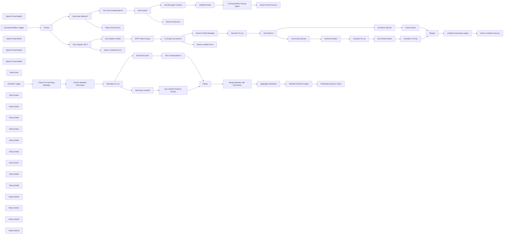

## Fluxo (.json) :

```json
{
  "meta": {
    "instanceId": "408f9fb9940c3cb18ffdef0e0150fe342d6e655c3a9fac21f0f644e8bedabcd9"
  },
  "nodes": [
    {
      "id": "201ef455-2d65-4563-8ec1-318211b1fa6a",
      "name": "Get Message Contents",
      "type": "n8n-nodes-base.gmail",
      "position": [
        2080,
        500
      ],
      "webhookId": "fa1d496f-17fa-4e50-bae9-84ca85ed4502",
      "parameters": {
        "simple": false,
        "options": {},
        "messageId": "={{ $json.id }}",
        "operation": "get"
      },
      "credentials": {
        "gmailOAuth2": {
          "id": "Sf5Gfl9NiFTNXFWb",
          "name": "Gmail account"
        }
      },
      "typeVersion": 2.1
    },
    {
      "id": "ded010af-e977-4c47-87dd-8221d601af74",
      "name": "Simplify Emails",
      "type": "n8n-nodes-base.set",
      "position": [
        2240,
        500
      ],
      "parameters": {
        "options": {},
        "assignments": {
          "assignments": [
            {
              "id": "2006c806-42db-4457-84c2-35f59ed39018",
              "name": "date",
              "type": "string",
              "value": "={{ $json.date }}"
            },
            {
              "id": "872278d2-b97c-45ba-a9d3-162f154fe7dc",
              "name": "subject",
              "type": "string",
              "value": "={{ $json.subject }}"
            },
            {
              "id": "282f03e9-1d0f-4a17-b9ed-75b44171d4ee",
              "name": "text",
              "type": "string",
              "value": "={{ $json.text }}"
            },
            {
              "id": "9421776c-ff53-4490-b0e1-1e610534ba25",
              "name": "from",
              "type": "string",
              "value": "={{ $json.from.value[0].name }} ({{ $json.from.value[0].address }})"
            },
            {
              "id": "3b6716e8-5582-4da3-ae9d-e8dd1afad530",
              "name": "to",
              "type": "string",
              "value": "={{ $json.to.value[0].name }} ({{ $json.to.value[0].address }})"
            }
          ]
        }
      },
      "typeVersion": 3.4
    },
    {
      "id": "816bf787-ff9c-4b97-80ac-4b0c6ae5638b",
      "name": "Check For Upcoming Meetings",
      "type": "n8n-nodes-base.googleCalendar",
      "position": [
        526,
        -180
      ],
      "parameters": {
        "limit": 1,
        "options": {
          "orderBy": "startTime",
          "timeMax": "={{ $now.toUTC().plus(1, 'hour') }}",
          "timeMin": "={{ $now.toUTC() }}",
          "singleEvents": true
        },
        "calendar": {
          "__rl": true,
          "mode": "list",
          "value": "c_5792bdf04bc395cbcbc6f7b754268245a33779d36640cc80a357711aa2f09a0a@group.calendar.google.com",
          "cachedResultName": "n8n-events"
        },
        "operation": "getAll"
      },
      "credentials": {
        "googleCalendarOAuth2Api": {
          "id": "kWMxmDbMDDJoYFVK",
          "name": "Google Calendar account"
        }
      },
      "typeVersion": 1.2
    },
    {
      "id": "234d5c79-bf40-44bb-8829-c6ccf8648359",
      "name": "OpenAI Chat Model2",
      "type": "@n8n/n8n-nodes-langchain.lmChatOpenAi",
      "position": [
        920,
        -20
      ],
      "parameters": {
        "model": "gpt-4o-2024-08-06",
        "options": {}
      },
      "credentials": {
        "openAiApi": {
          "id": "8gccIjcuf3gvaoEr",
          "name": "OpenAi account"
        }
      },
      "typeVersion": 1
    },
    {
      "id": "445aa0f4-d41a-4d46-aa2f-e79a9cdb04b5",
      "name": "Extract Attendee Information",
      "type": "@n8n/n8n-nodes-langchain.informationExtractor",
      "position": [
        920,
        -180
      ],
      "parameters": {
        "text": "=start: {{ $json.start.dateTime }}\nmeeting url: {{ $json.hangoutLink }}\nsummary: {{ $json.summary }}\ndescription: {{ $json.description }}\norganiser: {{ $json.organizer.displayName }} ({{ $json.organizer.email }})\nattendees: {{ $json.attendees.filter(item => !item.organizer).map(item => item.email).join(',') }}",
        "options": {
          "systemPromptTemplate": "You are an expert extraction algorithm. Try to link any information found in the description to help fill in the attendee details.\nIf you do not know the value of an attribute asked to extract, you may omit the attribute's value."
        },
        "schemaType": "manual",
        "inputSchema": "{\n\t\"type\": \"object\",\n\t\"properties\": {\n\t\t\"attendees\": {\n          \"type\": \"array\",\n          \"description\": \"list of attendees excluding the meeting organiser\",\n          \"items\": {\n\t\t\t\"type\": \"object\",\n\t\t\t\"properties\": {\n\t\t\t  \"name\": { \"type\": \"string\" },\n              \"email\": { \"type\": \"string\" },\n              \"linkedin_url\": { \"type\": \"string\" }\n\t\t\t}\n          }\n\t\t}\n\t}\n}"
      },
      "typeVersion": 1
    },
    {
      "id": "390743d8-acfd-4951-8901-212f162dcbb4",
      "name": "Execute Workflow Trigger",
      "type": "n8n-nodes-base.executeWorkflowTrigger",
      "position": [
        920,
        580
      ],
      "parameters": {},
      "typeVersion": 1
    },
    {
      "id": "ea9c76a0-40a0-413a-a93a-ad99069d0d91",
      "name": "OpenAI Chat Model",
      "type": "@n8n/n8n-nodes-langchain.lmChatOpenAi",
      "position": [
        2460,
        640
      ],
      "parameters": {
        "model": "gpt-4o-2024-08-06",
        "options": {}
      },
      "credentials": {
        "openAiApi": {
          "id": "8gccIjcuf3gvaoEr",
          "name": "OpenAi account"
        }
      },
      "typeVersion": 1
    },
    {
      "id": "8d9df9e4-1815-44a2-a6fc-a9af42a77153",
      "name": "Get Last Correspondence",
      "type": "n8n-nodes-base.gmail",
      "position": [
        1740,
        500
      ],
      "webhookId": "b00c960c-3689-4fa1-9f0f-7d6c9479f0c6",
      "parameters": {
        "limit": 1,
        "filters": {
          "sender": "={{ $json.email }}"
        },
        "operation": "getAll"
      },
      "credentials": {
        "gmailOAuth2": {
          "id": "Sf5Gfl9NiFTNXFWb",
          "name": "Gmail account"
        }
      },
      "typeVersion": 2.1,
      "alwaysOutputData": true
    },
    {
      "id": "23c7161f-60e2-4a99-9279-ff1dca5efc1c",
      "name": "OpenAI Chat Model1",
      "type": "@n8n/n8n-nodes-langchain.lmChatOpenAi",
      "position": [
        4020,
        1320
      ],
      "parameters": {
        "model": "gpt-4o-2024-08-06",
        "options": {}
      },
      "credentials": {
        "openAiApi": {
          "id": "8gccIjcuf3gvaoEr",
          "name": "OpenAi account"
        }
      },
      "typeVersion": 1
    },
    {
      "id": "9ab535aa-bd8c-4bd6-a7a0-f7182d8d7123",
      "name": "OpenAI Chat Model3",
      "type": "@n8n/n8n-nodes-langchain.lmChatOpenAi",
      "position": [
        2720,
        -20
      ],
      "parameters": {
        "model": "gpt-4o-2024-08-06",
        "options": {}
      },
      "credentials": {
        "openAiApi": {
          "id": "8gccIjcuf3gvaoEr",
          "name": "OpenAi account"
        }
      },
      "typeVersion": 1
    },
    {
      "id": "410acb11-a16c-4abd-9f10-7582168d100e",
      "name": "WhatsApp Business Cloud",
      "type": "n8n-nodes-base.whatsApp",
      "position": [
        3360,
        -140
      ],
      "parameters": {
        "textBody": "={{ $json.text }}",
        "operation": "send",
        "phoneNumberId": "477115632141067",
        "requestOptions": {},
        "additionalFields": {},
        "recipientPhoneNumber": "44123456789"
      },
      "credentials": {
        "whatsAppApi": {
          "id": "9SFJPeqrpChOkAmw",
          "name": "WhatsApp account"
        }
      },
      "typeVersion": 1
    },
    {
      "id": "a7e8195d-eb73-4acb-aae1-eb04f8290d24",
      "name": "Sticky Note",
      "type": "n8n-nodes-base.stickyNote",
      "position": [
        180,
        -400
      ],
      "parameters": {
        "color": 7,
        "width": 616.7897454470152,
        "height": 449.1424626006906,
        "content": "## 1. Periodically Search For Upcoming Meetings\n[Read about the Scheduled Trigger](https://docs.n8n.io/integrations/builtin/core-nodes/n8n-nodes-base.scheduletrigger)\n\nLet's use the Scheduled Trigger node to trigger our Assistant to notify about upcoming meetings. Here, we'll set it for 1 hour intervals to check for meetings scheduled in our Google Calendar. You may need to play with the intervals and frequency depending on how many meetings you typically have."
      },
      "typeVersion": 1
    },
    {
      "id": "1aebb209-e440-4ef2-8527-381e5e70b4ea",
      "name": "Schedule Trigger",
      "type": "n8n-nodes-base.scheduleTrigger",
      "position": [
        326,
        -180
      ],
      "parameters": {
        "rule": {
          "interval": [
            {
              "field": "hours"
            }
          ]
        }
      },
      "typeVersion": 1.2
    },
    {
      "id": "95758053-fcc2-45c6-96c2-ec0bf89bcb82",
      "name": "Sticky Note1",
      "type": "n8n-nodes-base.stickyNote",
      "position": [
        820,
        -520
      ],
      "parameters": {
        "color": 7,
        "width": 655.5654775604146,
        "height": 670.4114154200236,
        "content": "## 2. Extract Attendee Details From Invite\n[Learn more about the Information Extractor node](https://docs.n8n.io/integrations/builtin/cluster-nodes/root-nodes/n8n-nodes-langchain.information-extractor/)\n\nOnce we have our upcoming meeting, it'll be nice to prepare for it by reminding the user what the meeting is about and some context with the attendees. This will be the goal this template and of our assistant! However, first we'll need to extract some contact information of the attendees to do so.\n\nFor this demonstration, we'll assume that attendee's email and LinkedIn profile URLs are included in the meeting invite. We'll extract this information for each attendee using the Information Extractor node. This convenient node uses AI to parse and extract which saves us from writing complex pattern matching code otherwise.\n\nIn your own scenario, feel free to use your CRM to get this information instead."
      },
      "typeVersion": 1
    },
    {
      "id": "bd17aed0-9c96-4301-b09b-e61a03ebc1ac",
      "name": "Sticky Note2",
      "type": "n8n-nodes-base.stickyNote",
      "position": [
        1500,
        -520
      ],
      "parameters": {
        "color": 7,
        "width": 1020.0959898041108,
        "height": 670.8210817031078,
        "content": "## 3. Fetch Recent Correspondance & LinkedIn Activity\n[Learn more about the Execute Workflow node](https://docs.n8n.io/integrations/builtin/core-nodes/n8n-nodes-base.executeworkflow)\n\nAs both email fetching and LinkedIn scraping actions are quite complex, we'll split them out as subworkflow executions. Doing so (in my honest opinion), helps with development and maintainability of the template. Here, we'll make perform the research for all applicable attendees by making 2 calls to the subworkflow and merging them back into a single node at the end.\n\nHead over to the subworkflow (see below - step 3a) to see how we pull the summaries from Gmail and LinkedIn."
      },
      "typeVersion": 1
    },
    {
      "id": "ae804039-32e0-4d2d-a2ef-a6e8d65f7ce2",
      "name": "Sticky Note3",
      "type": "n8n-nodes-base.stickyNote",
      "position": [
        2547.540603371386,
        -440
      ],
      "parameters": {
        "color": 7,
        "width": 610.3630186140072,
        "height": 582.1201380897592,
        "content": "## 4. Generate Pre-Meeting Notification\n[Read more about the Basic LLM node](https://docs.n8n.io/integrations/builtin/cluster-nodes/root-nodes/n8n-nodes-langchain.chainllm)\n\nNow that we have (1) our upcoming meeting details and (2) recent email and/or Linkedin summaries about our attendee, let's feed them into our LLM node to generate the best pre-meeting notification ever seen! Of course, we'll need to keep it short as we intend to send this notification via WhatsApp message but should you choose to use another channel such as email, feel free to adjust the length of the message which suits."
      },
      "typeVersion": 1
    },
    {
      "id": "045eb1d9-fd80-4f9c-8218-ae66583d0186",
      "name": "Sticky Note4",
      "type": "n8n-nodes-base.stickyNote",
      "position": [
        3180,
        -360
      ],
      "parameters": {
        "color": 7,
        "width": 466.8967433831988,
        "height": 454.24485615650235,
        "content": "## 5. Send Notification via WhatsApp\n[Learn more about the WhatsApp node](https://docs.n8n.io/integrations/builtin/app-nodes/n8n-nodes-base.whatsapp)\n\nThe WhatsApp node is a super convenient way to send messages to WhatsApp which is one of the many messaging apps supported by n8n out of the box. Not using WhatsApp? Simply swap this our for Twilio, Telegram, Slack and others."
      },
      "typeVersion": 1
    },
    {
      "id": "46d35c68-88d7-445f-9834-b8b37ce90619",
      "name": "Sticky Note5",
      "type": "n8n-nodes-base.stickyNote",
      "position": [
        1740,
        260
      ],
      "parameters": {
        "color": 7,
        "width": 519.1145893777881,
        "height": 190.5042226526524,
        "content": "## 3.2: Fetch Last Email Correspondance\n[Learn more about Gmail node](https://docs.n8n.io/integrations/builtin/app-nodes/n8n-nodes-base.gmail)\n\nFetching our attendee's last email will definitely help the user \"pick up\" from when they last last off. To do this, we'll assume a Gmail user and use the Gmail node to filter messages by the attendee's email address."
      },
      "typeVersion": 1
    },
    {
      "id": "fe1c751c-4879-482b-bb6f-89df23e1faa8",
      "name": "Sticky Note6",
      "type": "n8n-nodes-base.stickyNote",
      "position": [
        1740,
        860
      ],
      "parameters": {
        "color": 7,
        "width": 667.8619481635637,
        "height": 259.7914017217902,
        "content": "## 3.4 Scraping LinkedIn With [Apify.com](https://www.apify.com?fpr=414q6)\n[Learn more about Apify.com for Web Scraping](https://www.apify.com?fpr=414q6)\n\nTo get the attendee's recent LinkedIn activity, we'll need a webscraper capable of rendering the user's LinkedIn profile. We'll use [Apify.com](https://www.apify.com?fpr=414q6) which is a commercial web scraping service but has a very generous monthly free tier ($5/mo).\n\nWhile Apify offers a number of dedicated LinkedIn scrapers, we'll build our own which works by impersonating our own LinkedIn account using our login cookie - this can be obtained by inspecting network requests when logged into Linkedin. **Add your LinkedIn Cookie to the node below!**"
      },
      "typeVersion": 1
    },
    {
      "id": "a648cf7d-b859-4fec-8ae7-6450c70e6333",
      "name": "Sticky Note7",
      "type": "n8n-nodes-base.stickyNote",
      "position": [
        920,
        310
      ],
      "parameters": {
        "color": 7,
        "width": 572.0305871208889,
        "height": 231.49547088049098,
        "content": "## 3.1 Attendee Researcher SubWorkflow\n[Learn more about using Execute Workflow Trigger](https://docs.n8n.io/integrations/builtin/core-nodes/n8n-nodes-base.executeworkflowtrigger/)\n\nThe Attendee Researcher SubWorkflow's aims to collect and summarize both an attendee's last correspondance  with the user (if applicable) and the attendee's LinkedIn profile (if available). It uses the router pattern to handle both branches allowing for shorter execution chains. Using the Switch node, this subworkflow is either triggered to fetch emails or scrape LinkedIn but never both simultaneously."
      },
      "typeVersion": 1
    },
    {
      "id": "8a8dbe4f-86b1-41a4-9b7e-3affdee8e524",
      "name": "Return LinkedIn Success",
      "type": "n8n-nodes-base.set",
      "position": [
        4360,
        1180
      ],
      "parameters": {
        "options": {},
        "assignments": {
          "assignments": [
            {
              "id": "fc4b63a7-ad4d-49ff-9d42-715760910f6a",
              "name": "linkedin_summary",
              "type": "string",
              "value": "={{ $json.text }}"
            }
          ]
        }
      },
      "typeVersion": 3.4
    },
    {
      "id": "537a399b-1f78-440b-abc4-ad2e91c5950a",
      "name": "Return LinkedIn Error",
      "type": "n8n-nodes-base.set",
      "position": [
        2380,
        1320
      ],
      "parameters": {
        "options": {},
        "assignments": {
          "assignments": [
            {
              "id": "bf5a0781-3bad-4f63-a49c-273b03204747",
              "name": "linkedin_summary",
              "type": "string",
              "value": "No activities found."
            }
          ]
        }
      },
      "typeVersion": 3.4
    },
    {
      "id": "a68e7df7-8467-46e2-8ea8-fcf270755d12",
      "name": "Return Email Error",
      "type": "n8n-nodes-base.set",
      "position": [
        2080,
        680
      ],
      "parameters": {
        "options": {},
        "assignments": {
          "assignments": [
            {
              "id": "9a7efc9e-26b0-48c9-83aa-ae989f20b1df",
              "name": "email_summary",
              "type": "string",
              "value": "No correspondance found."
            }
          ]
        }
      },
      "typeVersion": 3.4
    },
    {
      "id": "00df2b18-22ca-48d6-b053-12fe502effc5",
      "name": "Return Email Success",
      "type": "n8n-nodes-base.set",
      "position": [
        2800,
        500
      ],
      "parameters": {
        "options": {},
        "assignments": {
          "assignments": [
            {
              "id": "fc4b63a7-ad4d-49ff-9d42-715760910f6a",
              "name": "email_summary",
              "type": "object",
              "value": "={{ $json.text }}"
            }
          ]
        }
      },
      "typeVersion": 3.4
    },
    {
      "id": "cdae9f9f-11c0-4f26-9ba1-5d5ed279ebfc",
      "name": "Set Route Email",
      "type": "n8n-nodes-base.set",
      "position": [
        1600,
        -260
      ],
      "parameters": {
        "mode": "raw",
        "options": {},
        "jsonOutput": "={{ Object.assign({ \"route\": \"email\" }, $json) }}"
      },
      "typeVersion": 3.4
    },
    {
      "id": "b01371f6-8871-4ad9-866d-888e22e7908e",
      "name": "Set Route Linkedin",
      "type": "n8n-nodes-base.set",
      "position": [
        1600,
        -100
      ],
      "parameters": {
        "mode": "raw",
        "options": {},
        "jsonOutput": "={{ Object.assign({ \"route\": \"linkedin\" }, $json) }}"
      },
      "typeVersion": 3.4
    },
    {
      "id": "c4907171-b239-46a6-a0b0-6bf66570005f",
      "name": "Router",
      "type": "n8n-nodes-base.switch",
      "position": [
        1100,
        580
      ],
      "parameters": {
        "rules": {
          "values": [
            {
              "outputKey": "email",
              "conditions": {
                "options": {
                  "version": 2,
                  "leftValue": "",
                  "caseSensitive": true,
                  "typeValidation": "strict"
                },
                "combinator": "and",
                "conditions": [
                  {
                    "operator": {
                      "type": "string",
                      "operation": "equals"
                    },
                    "leftValue": "={{ $json.route }}",
                    "rightValue": "email"
                  }
                ]
              },
              "renameOutput": true
            },
            {
              "outputKey": "linkedin",
              "conditions": {
                "options": {
                  "version": 2,
                  "leftValue": "",
                  "caseSensitive": true,
                  "typeValidation": "strict"
                },
                "combinator": "and",
                "conditions": [
                  {
                    "id": "ba71a258-de67-4f61-a24a-33c86bd4c4f5",
                    "operator": {
                      "type": "string",
                      "operation": "equals"
                    },
                    "leftValue": "={{ $json.route }}",
                    "rightValue": "linkedin"
                  }
                ]
              },
              "renameOutput": true
            }
          ]
        },
        "options": {}
      },
      "typeVersion": 3.2
    },
    {
      "id": "45554355-57ad-464d-b768-5b00d707fc58",
      "name": "Return LinkedIn Error1",
      "type": "n8n-nodes-base.set",
      "position": [
        1440,
        870
      ],
      "parameters": {
        "options": {},
        "assignments": {
          "assignments": [
            {
              "id": "bf5a0781-3bad-4f63-a49c-273b03204747",
              "name": "linkedin_summary",
              "type": "string",
              "value": "No activities found."
            }
          ]
        }
      },
      "typeVersion": 3.4
    },
    {
      "id": "05b04c17-eeeb-42f2-8d94-bc848889f17c",
      "name": "Has Emails?",
      "type": "n8n-nodes-base.if",
      "position": [
        1900,
        500
      ],
      "parameters": {
        "options": {},
        "conditions": {
          "options": {
            "version": 2,
            "leftValue": "",
            "caseSensitive": true,
            "typeValidation": "strict"
          },
          "combinator": "and",
          "conditions": [
            {
              "id": "ff11640a-33e4-4695-a62c-7dcab57f0ae5",
              "operator": {
                "type": "object",
                "operation": "empty",
                "singleValue": true
              },
              "leftValue": "={{ $json }}",
              "rightValue": ""
            }
          ]
        }
      },
      "typeVersion": 2.2
    },
    {
      "id": "c24aca66-6222-46ae-bb9b-1838b01f3100",
      "name": "Return Email Error1",
      "type": "n8n-nodes-base.set",
      "position": [
        1440,
        700
      ],
      "parameters": {
        "options": {},
        "assignments": {
          "assignments": [
            {
              "id": "9a7efc9e-26b0-48c9-83aa-ae989f20b1df",
              "name": "email_summary",
              "type": "string",
              "value": "No correspondance found."
            }
          ]
        }
      },
      "typeVersion": 3.4
    },
    {
      "id": "22f3ccbf-19a2-4ca5-ba23-f91963b52c0a",
      "name": "Sticky Note9",
      "type": "n8n-nodes-base.stickyNote",
      "position": [
        2560,
        920
      ],
      "parameters": {
        "color": 7,
        "width": 682.7350931085596,
        "height": 219.59936012669806,
        "content": "## 3.5: Extract LinkedIn Profile & Recent Activity\n[Learn more about the HTML node](https://docs.n8n.io/integrations/builtin/core-nodes/n8n-nodes-base.html)\n\nOnce we have our scraped LinkedIn profile, it's just a simple case of parsing and extracting the relevant sections from the page.\nFor the purpose of our workflow, we'll only need the \"About\" and \"Activity\" sections which we'll pull out of the page using a series of HTML nodes. Feel free to extract other sections to suit your needs! Once extracted, we'll combine the about and activities data in preparation of sending it to our LLM."
      },
      "typeVersion": 1
    },
    {
      "id": "49b1fc8f-1259-4596-84b0-b37fae1c098c",
      "name": "Sections To List",
      "type": "n8n-nodes-base.splitOut",
      "position": [
        2720,
        1180
      ],
      "parameters": {
        "options": {
          "destinationFieldName": "data"
        },
        "fieldToSplitOut": "sections"
      },
      "typeVersion": 1
    },
    {
      "id": "875b278d-44c6-4315-87e3-459a90799a9b",
      "name": "Set LinkedIn Cookie",
      "type": "n8n-nodes-base.set",
      "position": [
        1800,
        1180
      ],
      "parameters": {
        "options": {},
        "assignments": {
          "assignments": [
            {
              "id": "b4354c00-cc1a-4a55-8b44-6ba4854cc6ba",
              "name": "linkedin_profile_url",
              "type": "string",
              "value": "={{ $json.linkedin_url }}"
            },
            {
              "id": "4888db89-2573-4246-8ab9-c106a7fe5f38",
              "name": "linkedin_cookies",
              "type": "string",
              "value": "<COPY_YOUR_LINKEDIN_COOKIES_HERE>"
            }
          ]
        }
      },
      "typeVersion": 3.4
    },
    {
      "id": "91da49ab-86a1-4539-b673-106b9edaeae9",
      "name": "Sticky Note8",
      "type": "n8n-nodes-base.stickyNote",
      "position": [
        1400,
        1240
      ],
      "parameters": {
        "color": 3,
        "width": 308.16846950517856,
        "height": 110.18457997698513,
        "content": "### Be aware of LinkedIn T&Cs!\nFor production, you may want to consider not using your main Linkedin account if you can help it!"
      },
      "typeVersion": 1
    },
    {
      "id": "7abd390f-36a6-49af-b190-5bb720bd2ae8",
      "name": "Sticky Note10",
      "type": "n8n-nodes-base.stickyNote",
      "position": [
        1740,
        1152
      ],
      "parameters": {
        "width": 209.84856156501735,
        "height": 301.5806674338321,
        "content": "\n\n\n\n\n\n\n\n\n\n\n\n\n\n### 🚨 Input Required!\nYou need to add your cuurent linkedIn Cookies here to continue."
      },
      "typeVersion": 1
    },
    {
      "id": "40dfb438-76c2-40b5-8945-94dcf7cafcf7",
      "name": "Attendees to List",
      "type": "n8n-nodes-base.splitOut",
      "position": [
        1260,
        -180
      ],
      "parameters": {
        "options": {},
        "fieldToSplitOut": "output.attendees"
      },
      "typeVersion": 1
    },
    {
      "id": "cc7f8416-6ea1-4425-a320-3f8217d2ad4e",
      "name": "Merge Attendee with Summaries",
      "type": "n8n-nodes-base.set",
      "position": [
        2160,
        -180
      ],
      "parameters": {
        "mode": "raw",
        "options": {},
        "jsonOutput": "={{ Object.assign({}, $('Attendees to List').item.json, $json) }}"
      },
      "typeVersion": 3.4
    },
    {
      "id": "459c5f2b-5dd5-491f-8bed-475ae5af7ac0",
      "name": "Has Email Address?",
      "type": "n8n-nodes-base.if",
      "position": [
        1280,
        580
      ],
      "parameters": {
        "options": {},
        "conditions": {
          "options": {
            "version": 2,
            "leftValue": "",
            "caseSensitive": true,
            "typeValidation": "strict"
          },
          "combinator": "and",
          "conditions": [
            {
              "id": "1382e335-bfae-4665-a2ee-a05496a7b463",
              "operator": {
                "type": "string",
                "operation": "exists",
                "singleValue": true
              },
              "leftValue": "={{ $json.email }}",
              "rightValue": ""
            }
          ]
        }
      },
      "typeVersion": 2.2
    },
    {
      "id": "610e9849-f06c-4534-a269-d1982dcab259",
      "name": "Has LinkedIn URL?",
      "type": "n8n-nodes-base.if",
      "position": [
        1280,
        750
      ],
      "parameters": {
        "options": {},
        "conditions": {
          "options": {
            "version": 2,
            "leftValue": "",
            "caseSensitive": true,
            "typeValidation": "strict"
          },
          "combinator": "and",
          "conditions": [
            {
              "id": "1382e335-bfae-4665-a2ee-a05496a7b463",
              "operator": {
                "type": "string",
                "operation": "exists",
                "singleValue": true
              },
              "leftValue": "={{ $json.linkedin_url }}",
              "rightValue": ""
            }
          ]
        }
      },
      "typeVersion": 2.2
    },
    {
      "id": "43e5192e-c1b0-4d71-8d0e-aa466aa9930c",
      "name": "Get Correspondance",
      "type": "n8n-nodes-base.executeWorkflow",
      "onError": "continueRegularOutput",
      "position": [
        1780,
        -260
      ],
      "parameters": {
        "mode": "each",
        "options": {
          "waitForSubWorkflow": true
        },
        "workflowId": {
          "__rl": true,
          "mode": "id",
          "value": "={{ $workflow.id }}"
        }
      },
      "typeVersion": 1.1
    },
    {
      "id": "4662f928-d38b-42e1-8a70-5676eb638ce1",
      "name": "Merge",
      "type": "n8n-nodes-base.merge",
      "position": [
        2000,
        -180
      ],
      "parameters": {
        "mode": "combine",
        "options": {},
        "combineBy": "combineByPosition"
      },
      "typeVersion": 3
    },
    {
      "id": "3eaf5d5b-d99c-4f9f-beaa-53b859bf482e",
      "name": "Aggregate Attendees",
      "type": "n8n-nodes-base.aggregate",
      "position": [
        2340,
        -180
      ],
      "parameters": {
        "options": {},
        "aggregate": "aggregateAllItemData",
        "destinationFieldName": "attendees"
      },
      "typeVersion": 1
    },
    {
      "id": "752afdd3-0561-4e53-8b18-391741a2f43b",
      "name": "Activities To Array",
      "type": "n8n-nodes-base.aggregate",
      "position": [
        3680,
        1360
      ],
      "parameters": {
        "options": {},
        "aggregate": "aggregateAllItemData",
        "destinationFieldName": "activity"
      },
      "typeVersion": 1
    },
    {
      "id": "a35dc751-62a0-4f5c-92cb-2801d060c613",
      "name": "Extract Profile Metadata",
      "type": "n8n-nodes-base.html",
      "position": [
        2560,
        1180
      ],
      "parameters": {
        "options": {},
        "operation": "extractHtmlContent",
        "dataPropertyName": "body",
        "extractionValues": {
          "values": [
            {
              "key": "name",
              "cssSelector": "h1"
            },
            {
              "key": "tagline",
              "cssSelector": ".pv-text-details__left-panel--full-width .text-body-medium"
            },
            {
              "key": "location",
              "cssSelector": ".pv-text-details__left-panel--full-width + div .text-body-small"
            },
            {
              "key": "num_connections",
              "cssSelector": "a[href=\"/mynetwork/invite-connect/connections/\"]"
            },
            {
              "key": "num_followers",
              "cssSelector": "a[href=\"https://www.linkedin.com/feed/followers/\"]"
            },
            {
              "key": "sections",
              "cssSelector": "section[data-view-name]",
              "returnArray": true,
              "returnValue": "html"
            }
          ]
        }
      },
      "typeVersion": 1.2
    },
    {
      "id": "5685ec9f-c219-41b4-94d7-787daef8a628",
      "name": "Activities To List",
      "type": "n8n-nodes-base.splitOut",
      "position": [
        3360,
        1360
      ],
      "parameters": {
        "options": {},
        "fieldToSplitOut": "activity"
      },
      "typeVersion": 1
    },
    {
      "id": "71240827-3e0d-4276-afb0-9ed72878ea4c",
      "name": "APIFY Web Scraper",
      "type": "n8n-nodes-base.httpRequest",
      "position": [
        2000,
        1180
      ],
      "parameters": {
        "url": "https://api.apify.com/v2/acts/apify~web-scraper/run-sync-get-dataset-items",
        "options": {},
        "jsonBody": "={\n  \"startUrls\": [\n    {\n      \"url\": \"{{ $json.linkedin_profile_url }}\",\n      \"method\": \"GET\"\n    }\n  ],\n  \"initialCookies\": [\n    {\n      \"name\": \"li_at\",\n      \"value\": \"{{ $json.linkedin_cookies.match(/li_at=([^;]+)/)[1] }}\",\n      \"domain\": \".www.linkedin.com\"\n    }\n  ],\n  \"breakpointLocation\": \"NONE\",\n  \"browserLog\": false,\n  \"closeCookieModals\": false,\n  \"debugLog\": false,\n  \"downloadCss\": false,\n  \"downloadMedia\": false,\n  \"excludes\": [\n    {\n      \"glob\": \"/**/*.{png,jpg,jpeg,pdf}\"\n    }\n  ],\n  \"headless\": true,\n  \"ignoreCorsAndCsp\": false,\n  \"ignoreSslErrors\": false,\n  \n  \"injectJQuery\": true,\n  \"keepUrlFragments\": false,\n  \"linkSelector\": \"a[href]\",\n  \"maxCrawlingDepth\": 1,\n  \"maxPagesPerCrawl\": 1,\n  \"maxRequestRetries\": 1,\n  \"maxResultsPerCrawl\": 1,\n  \"pageFunction\": \"// The function accepts a single argument: the \\\"context\\\" object.\\n// For a complete list of its properties and functions,\\n// see https://apify.com/apify/web-scraper#page-function \\nasync function pageFunction(context) {\\n\\n    await new Promise(res => { setTimeout(res, 6000) });\\n    // This statement works as a breakpoint when you're trying to debug your code. Works only with Run mode: DEVELOPMENT!\\n    // debugger; \\n\\n    // jQuery is handy for finding DOM elements and extracting data from them.\\n    // To use it, make sure to enable the \\\"Inject jQuery\\\" option.\\n    const $ = context.jQuery;\\n    const title = $('title').first().text();\\n\\n    // Clone the body to avoid modifying the original content\\n    const bodyClone = $('body').clone();\\n    bodyClone.find('iframe, img, script, style, object, embed, noscript, svg, video, audio').remove();\\n    const body = bodyClone.html();\\n\\n    // Return an object with the data extracted from the page.\\n    // It will be stored to the resulting dataset.\\n    return {\\n        url: context.request.url,\\n        title,\\n        body\\n    };\\n}\",\n  \"postNavigationHooks\": \"// We need to return array of (possibly async) functions here.\\n// The functions accept a single argument: the \\\"crawlingContext\\\" object.\\n[\\n    async (crawlingContext) => {\\n        // ...\\n    },\\n]\",\n  \"preNavigationHooks\": \"// We need to return array of (possibly async) functions here.\\n// The functions accept two arguments: the \\\"crawlingContext\\\" object\\n// and \\\"gotoOptions\\\".\\n[\\n    async (crawlingContext, gotoOptions) => {\\n        // ...\\n    },\\n]\\n\",\n  \"proxyConfiguration\": {\n    \"useApifyProxy\": true\n  },\n  \"runMode\": \"PRODUCTION\",\n  \n  \"useChrome\": false,\n  \"waitUntil\": [\n    \"domcontentloaded\"\n  ],\n  \"globs\": [],\n  \"pseudoUrls\": [],\n  \"proxyRotation\": \"RECOMMENDED\",\n  \"maxConcurrency\": 50,\n  \"pageLoadTimeoutSecs\": 60,\n  \"pageFunctionTimeoutSecs\": 60,\n  \"maxScrollHeightPixels\": 5000,\n  \"customData\": {}\n}",
        "sendBody": true,
        "specifyBody": "json",
        "authentication": "genericCredentialType",
        "genericAuthType": "httpQueryAuth"
      },
      "credentials": {
        "httpQueryAuth": {
          "id": "cO2w8RDNOZg8DRa8",
          "name": "Apify API"
        }
      },
      "typeVersion": 4.2
    },
    {
      "id": "01659121-44f9-4d53-b973-cea29a8b0301",
      "name": "Get Activity Details",
      "type": "n8n-nodes-base.html",
      "position": [
        3520,
        1360
      ],
      "parameters": {
        "options": {},
        "operation": "extractHtmlContent",
        "dataPropertyName": "activity",
        "extractionValues": {
          "values": [
            {
              "key": "header",
              "attribute": "aria-label",
              "cssSelector": ".feed-mini-update-optional-navigation-context-wrapper",
              "returnValue": "attribute"
            },
            {
              "key": "url",
              "attribute": "href",
              "cssSelector": ".feed-mini-update-optional-navigation-context-wrapper",
              "returnValue": "attribute"
            },
            {
              "key": "content",
              "cssSelector": ".inline-show-more-text--is-collapsed"
            },
            {
              "key": "num_reactions",
              "cssSelector": ".social-details-social-counts__reactions-count"
            },
            {
              "key": "num_comments",
              "cssSelector": ".social-details-social-counts__comments"
            },
            {
              "key": "num_reposts",
              "cssSelector": ".social-details-social-counts__item--truncate-text"
            }
          ]
        }
      },
      "typeVersion": 1.2
    },
    {
      "id": "420a3a3e-ca99-49fb-b6b7-e9757f27b5d4",
      "name": "Get Sections",
      "type": "n8n-nodes-base.html",
      "position": [
        2880,
        1180
      ],
      "parameters": {
        "options": {},
        "operation": "extractHtmlContent",
        "extractionValues": {
          "values": [
            {
              "key": "title",
              "cssSelector": "h2 [aria-hidden=true]"
            },
            {
              "key": "content",
              "cssSelector": "*",
              "returnValue": "html"
            }
          ]
        }
      },
      "typeVersion": 1.2
    },
    {
      "id": "4983c987-79a7-4725-9913-630a71608f41",
      "name": "Get About Section",
      "type": "n8n-nodes-base.set",
      "position": [
        3040,
        1180
      ],
      "parameters": {
        "options": {},
        "assignments": {
          "assignments": [
            {
              "id": "79d7943f-45a5-456c-a15b-cef53903409d",
              "name": "html",
              "type": "string",
              "value": "={{\n$input.all()\n  .find(input => input.json.title.toLowerCase().trim() === 'about')\n  .json\n  .content\n}}"
            }
          ]
        }
      },
      "executeOnce": true,
      "typeVersion": 3.4
    },
    {
      "id": "0e8bed5b-a622-4dbd-a11e-24df5d68f038",
      "name": "Get Activity Section",
      "type": "n8n-nodes-base.set",
      "position": [
        3040,
        1360
      ],
      "parameters": {
        "options": {},
        "assignments": {
          "assignments": [
            {
              "id": "79d7943f-45a5-456c-a15b-cef53903409d",
              "name": "html",
              "type": "string",
              "value": "={{\n$input.all()\n  .find(input => input.json.title.toLowerCase().trim() === 'activity')\n  .json\n  .content\n}}"
            }
          ]
        }
      },
      "executeOnce": true,
      "typeVersion": 3.4
    },
    {
      "id": "5dd2677f-a4fc-447f-af7d-28e90dda46e8",
      "name": "Extract Activities",
      "type": "n8n-nodes-base.html",
      "position": [
        3200,
        1360
      ],
      "parameters": {
        "options": {},
        "operation": "extractHtmlContent",
        "dataPropertyName": "html",
        "extractionValues": {
          "values": [
            {
              "key": "activity",
              "cssSelector": ".profile-creator-shared-feed-update__mini-container",
              "returnArray": true,
              "returnValue": "html"
            }
          ]
        }
      },
      "typeVersion": 1.2
    },
    {
      "id": "1a32808f-e465-47ef-b8bd-52b19c26ff1a",
      "name": "Merge1",
      "type": "n8n-nodes-base.merge",
      "position": [
        3860,
        1180
      ],
      "parameters": {
        "mode": "combine",
        "options": {},
        "combineBy": "combineByPosition"
      },
      "typeVersion": 3
    },
    {
      "id": "6e452337-55a3-4466-a094-ec9106b36498",
      "name": "Is Scrape Successful?",
      "type": "n8n-nodes-base.if",
      "position": [
        2180,
        1180
      ],
      "parameters": {
        "options": {},
        "conditions": {
          "options": {
            "version": 2,
            "leftValue": "",
            "caseSensitive": true,
            "typeValidation": "strict"
          },
          "combinator": "and",
          "conditions": [
            {
              "id": "3861abc7-7699-4459-b983-0c8b33e090b5",
              "operator": {
                "type": "string",
                "operation": "exists",
                "singleValue": true
              },
              "leftValue": "={{ $json.body }}",
              "rightValue": ""
            }
          ]
        }
      },
      "typeVersion": 2.2
    },
    {
      "id": "51a79d99-46af-4951-a99e-64f1d59f556e",
      "name": "Extract About",
      "type": "n8n-nodes-base.html",
      "position": [
        3200,
        1180
      ],
      "parameters": {
        "options": {},
        "operation": "extractHtmlContent",
        "dataPropertyName": "html",
        "extractionValues": {
          "values": [
            {
              "key": "about",
              "cssSelector": "body"
            }
          ]
        }
      },
      "typeVersion": 1.2
    },
    {
      "id": "d943fbde-f8fc-42b1-8b7e-f73735b81394",
      "name": "Sticky Note11",
      "type": "n8n-nodes-base.stickyNote",
      "position": [
        3860,
        940
      ],
      "parameters": {
        "color": 7,
        "width": 508.12647286359606,
        "height": 212.26880753952497,
        "content": "## 3.6 Summarize LinkedIn For Attendee\n[Read more about the Basic LLM node](https://docs.n8n.io/integrations/builtin/cluster-nodes/root-nodes/n8n-nodes-langchain.chainllm)\n\nFinally, we'll use the Basic LLM node to summarize our attendee's LinkedIn profile and recent activity. Our goal here is to identify and send back interesting tidbits of information which may be relevant to the meeting as well as inform the user. Should you require different criteria, simply edit the summarizer to get the response you need."
      },
      "typeVersion": 1
    },
    {
      "id": "b64bbfb0-ebd6-4fe7-9c02-3c1b72407df5",
      "name": "Sticky Note12",
      "type": "n8n-nodes-base.stickyNote",
      "position": [
        2460,
        270
      ],
      "parameters": {
        "color": 7,
        "width": 593.8676556715506,
        "height": 196.6490014749014,
        "content": "## 3.3: Summarize Correspondance For Attendee\n[Read more about the Basic LLM node](https://docs.n8n.io/integrations/builtin/cluster-nodes/root-nodes/n8n-nodes-langchain.chainllm)\n\nNext, we'll generate a shorter version of the email(s) using the Basic LLM node - useful if the email was part of a large chain. The goal here is, if applicable, to remind the user of the conversion with this attendee and highlight any expectations which might be set before going into the meeting."
      },
      "typeVersion": 1
    },
    {
      "id": "a2dd5060-dd12-463b-8bbe-327ed691bdb9",
      "name": "Get LinkedIn Profile & Activity",
      "type": "n8n-nodes-base.executeWorkflow",
      "onError": "continueRegularOutput",
      "position": [
        1780,
        -100
      ],
      "parameters": {
        "mode": "each",
        "options": {
          "waitForSubWorkflow": true
        },
        "workflowId": {
          "__rl": true,
          "mode": "id",
          "value": "={{ $workflow.id }}"
        }
      },
      "typeVersion": 1.1
    },
    {
      "id": "fde0fa35-e692-4ca9-83ef-14e527f2f8d2",
      "name": "Sticky Note13",
      "type": "n8n-nodes-base.stickyNote",
      "position": [
        -320,
        -660
      ],
      "parameters": {
        "width": 453.4804561790962,
        "height": 588.3011632094225,
        "content": "## Try It Out!\n\n### This workflow builds an AI meeting assistant who sends information-dense pre-meeting notifications for a user's upcoming meetings. This template is ideal for busy professional who is constantly on the move and wants to save time and make an impression.\n\n### How It Works\n* A scheduled trigger fires hourly and checks for upcoming meetings within the hour.\n* When found, a search for last correspondence and LinkedIn profile + recent activity is performed for each attendee.\n* Using both available correspondance and/or Linkedin profile, an AI/LLM is used to summarize this information and generate a short notification message which should help the user prepare for the meeting.\n* The notification is finally sent to the user's WhatsApp.\n\n### Need Help?\nJoin the [Discord](https://discord.com/invite/XPKeKXeB7d) or ask in the [Forum](https://community.n8n.io/)!\n\nHappy Hacking!"
      },
      "typeVersion": 1
    },
    {
      "id": "f2f19824-9865-465b-a612-7d3215209c79",
      "name": "Correspondance Recap Agent",
      "type": "@n8n/n8n-nodes-langchain.chainLlm",
      "position": [
        2460,
        500
      ],
      "parameters": {
        "text": "=from: {{ $json.from }}\nto: {{ $json.to }}\ndate: {{ $json.date }}\nsubject: {{ $json.subject }}\ntext:\n{{ $json.text }}",
        "messages": {
          "messageValues": [
            {
              "message": "=You are helping the \"to\" user recap the last correspondance they had in this email thread. Summarize succiently what was discussed, changed or agreed to help the user prepare for their upcoming meeting."
            }
          ]
        },
        "promptType": "define"
      },
      "typeVersion": 1.4
    },
    {
      "id": "42641933-edf6-4b01-a17f-8cda2be7a093",
      "name": "Attendee Research Agent",
      "type": "@n8n/n8n-nodes-langchain.chainLlm",
      "position": [
        2720,
        -180
      ],
      "parameters": {
        "text": "=meeting date: {{ $('Check For Upcoming Meetings').item.json.start.dateTime }}\nmeeting url: {{ $('Check For Upcoming Meetings').item.json.hangoutLink }}\nmeeting summary: {{ $('Check For Upcoming Meetings').first().json.summary }}\nmeeting description: {{ $('Check For Upcoming Meetings').item.json.description }}\nmeeting with: {{ $json.attendees.map(item => item.name).join(',') }}\n---\n{{\n$json.attendees.map(item => {\n  return\n`attendee name: ${item.name}\n${item.name}'s last correspondance: ${item.email_summary.replaceAll('\\n', ' ') || `We have not had any correspondance with ${item.name}`}\n${item.name}'s linkedin profile: ${item.linkedin_summary.replaceAll('\\n', ' ') || `We were unable to find the linkedin profile for ${$json.name}`}\n`\n}).join('\\n---\\n')\n}}",
        "messages": {
          "messageValues": [
            {
              "message": "=You are a personal meeing assistant.\nYou are helping to remind user of an upcoming meeting with {{ $json.attendees.map(item => item.name).join(',') }} (aka \"the attendee(s)\"}. You will structure your notification using the following guidance:\n1. Start by providing the meeting summary, mentioning the date, with whom and providing the meeting link.\n2. For each attendee, give a short bullet point summary of their last correspondance. Assess if the correspondance has any relevance to the meeting and if so, identify any important todos or items which should be mentioned during the meeting. Additionally, give a short bullet point summary of attendee's recent activity which makes for good talking points. These need not be relevant to the meeting.\n\nWrite your response in a casual tone as if sending a SMS message to the user. USe bullet points where appropriate."
            }
          ]
        },
        "promptType": "define"
      },
      "typeVersion": 1.4
    },
    {
      "id": "1916515d-8b85-4da9-ac17-1c08485cdf04",
      "name": "LinkedIn Summarizer Agent",
      "type": "@n8n/n8n-nodes-langchain.chainLlm",
      "position": [
        4020,
        1180
      ],
      "parameters": {
        "text": "=### name\n{{ $('Extract Profile Metadata').item.json.name }}\n### about\n\"{{ $('Extract Profile Metadata').item.json.tagline }}\"\n{{ $json.about.replaceAll('\\n', ' ')}}\n### recent activity\n{{\n$json.activity.map((item, idx) => {\n  return [\n    item.header.replace('View full post.', ''),\n    `(${item.url})`,\n    ' - ',\n    item.content.replaceAll('\\n', ' ').replaceAll('…show more', '')\n  ].join(' ')\n}).join('\\n---\\n')\n}}",
        "messages": {
          "messageValues": [
            {
              "message": "=Summarize briefly the person and their recent activities as seen in the given feed and highlight noteworthy awards or achievements which make for good talking points."
            }
          ]
        },
        "promptType": "define"
      },
      "typeVersion": 1.4
    }
  ],
  "pinData": {},
  "connections": {
    "Merge": {
      "main": [
        [
          {
            "node": "Merge Attendee with Summaries",
            "type": "main",
            "index": 0
          }
        ]
      ]
    },
    "Merge1": {
      "main": [
        [
          {
            "node": "LinkedIn Summarizer Agent",
            "type": "main",
            "index": 0
          }
        ]
      ]
    },
    "Router": {
      "main": [
        [
          {
            "node": "Has Email Address?",
            "type": "main",
            "index": 0
          }
        ],
        [
          {
            "node": "Has LinkedIn URL?",
            "type": "main",
            "index": 0
          }
        ]
      ]
    },
    "Has Emails?": {
      "main": [
        [
          {
            "node": "Get Message Contents",
            "type": "main",
            "index": 0
          }
        ],
        [
          {
            "node": "Return Email Error",
            "type": "main",
            "index": 0
          }
        ]
      ]
    },
    "Get Sections": {
      "main": [
        [
          {
            "node": "Get About Section",
            "type": "main",
            "index": 0
          },
          {
            "node": "Get Activity Section",
            "type": "main",
            "index": 0
          }
        ]
      ]
    },
    "Extract About": {
      "main": [
        [
          {
            "node": "Merge1",
            "type": "main",
            "index": 0
          }
        ]
      ]
    },
    "Set Route Email": {
      "main": [
        [
          {
            "node": "Get Correspondance",
            "type": "main",
            "index": 0
          }
        ]
      ]
    },
    "Simplify Emails": {
      "main": [
        [
          {
            "node": "Correspondance Recap Agent",
            "type": "main",
            "index": 0
          }
        ]
      ]
    },
    "Schedule Trigger": {
      "main": [
        [
          {
            "node": "Check For Upcoming Meetings",
            "type": "main",
            "index": 0
          }
        ]
      ]
    },
    "Sections To List": {
      "main": [
        [
          {
            "node": "Get Sections",
            "type": "main",
            "index": 0
          }
        ]
      ]
    },
    "APIFY Web Scraper": {
      "main": [
        [
          {
            "node": "Is Scrape Successful?",
            "type": "main",
            "index": 0
          }
        ]
      ]
    },
    "Attendees to List": {
      "main": [
        [
          {
            "node": "Set Route Email",
            "type": "main",
            "index": 0
          },
          {
            "node": "Set Route Linkedin",
            "type": "main",
            "index": 0
          }
        ]
      ]
    },
    "Get About Section": {
      "main": [
        [
          {
            "node": "Extract About",
            "type": "main",
            "index": 0
          }
        ]
      ]
    },
    "Has LinkedIn URL?": {
      "main": [
        [
          {
            "node": "Set LinkedIn Cookie",
            "type": "main",
            "index": 0
          }
        ],
        [
          {
            "node": "Return LinkedIn Error1",
            "type": "main",
            "index": 0
          }
        ]
      ]
    },
    "OpenAI Chat Model": {
      "ai_languageModel": [
        [
          {
            "node": "Correspondance Recap Agent",
            "type": "ai_languageModel",
            "index": 0
          }
        ]
      ]
    },
    "Activities To List": {
      "main": [
        [
          {
            "node": "Get Activity Details",
            "type": "main",
            "index": 0
          }
        ]
      ]
    },
    "Extract Activities": {
      "main": [
        [
          {
            "node": "Activities To List",
            "type": "main",
            "index": 0
          }
        ]
      ]
    },
    "Get Correspondance": {
      "main": [
        [
          {
            "node": "Merge",
            "type": "main",
            "index": 0
          }
        ]
      ]
    },
    "Has Email Address?": {
      "main": [
        [
          {
            "node": "Get Last Correspondence",
            "type": "main",
            "index": 0
          }
        ],
        [
          {
            "node": "Return Email Error1",
            "type": "main",
            "index": 0
          }
        ]
      ]
    },
    "OpenAI Chat Model1": {
      "ai_languageModel": [
        [
          {
            "node": "LinkedIn Summarizer Agent",
            "type": "ai_languageModel",
            "index": 0
          }
        ]
      ]
    },
    "OpenAI Chat Model2": {
      "ai_languageModel": [
        [
          {
            "node": "Extract Attendee Information",
            "type": "ai_languageModel",
            "index": 0
          }
        ]
      ]
    },
    "OpenAI Chat Model3": {
      "ai_languageModel": [
        [
          {
            "node": "Attendee Research Agent",
            "type": "ai_languageModel",
            "index": 0
          }
        ]
      ]
    },
    "Set Route Linkedin": {
      "main": [
        [
          {
            "node": "Get LinkedIn Profile & Activity",
            "type": "main",
            "index": 0
          }
        ]
      ]
    },
    "Activities To Array": {
      "main": [
        [
          {
            "node": "Merge1",
            "type": "main",
            "index": 1
          }
        ]
      ]
    },
    "Aggregate Attendees": {
      "main": [
        [
          {
            "node": "Attendee Research Agent",
            "type": "main",
            "index": 0
          }
        ]
      ]
    },
    "Set LinkedIn Cookie": {
      "main": [
        [
          {
            "node": "APIFY Web Scraper",
            "type": "main",
            "index": 0
          }
        ]
      ]
    },
    "Get Activity Details": {
      "main": [
        [
          {
            "node": "Activities To Array",
            "type": "main",
            "index": 0
          }
        ]
      ]
    },
    "Get Activity Section": {
      "main": [
        [
          {
            "node": "Extract Activities",
            "type": "main",
            "index": 0
          }
        ]
      ]
    },
    "Get Message Contents": {
      "main": [
        [
          {
            "node": "Simplify Emails",
            "type": "main",
            "index": 0
          }
        ]
      ]
    },
    "Is Scrape Successful?": {
      "main": [
        [
          {
            "node": "Extract Profile Metadata",
            "type": "main",
            "index": 0
          }
        ],
        [
          {
            "node": "Return LinkedIn Error",
            "type": "main",
            "index": 0
          }
        ]
      ]
    },
    "Attendee Research Agent": {
      "main": [
        [
          {
            "node": "WhatsApp Business Cloud",
            "type": "main",
            "index": 0
          }
        ]
      ]
    },
    "Get Last Correspondence": {
      "main": [
        [
          {
            "node": "Has Emails?",
            "type": "main",
            "index": 0
          }
        ]
      ]
    },
    "Execute Workflow Trigger": {
      "main": [
        [
          {
            "node": "Router",
            "type": "main",
            "index": 0
          }
        ]
      ]
    },
    "Extract Profile Metadata": {
      "main": [
        [
          {
            "node": "Sections To List",
            "type": "main",
            "index": 0
          }
        ]
      ]
    },
    "LinkedIn Summarizer Agent": {
      "main": [
        [
          {
            "node": "Return LinkedIn Success",
            "type": "main",
            "index": 0
          }
        ]
      ]
    },
    "Correspondance Recap Agent": {
      "main": [
        [
          {
            "node": "Return Email Success",
            "type": "main",
            "index": 0
          }
        ]
      ]
    },
    "Check For Upcoming Meetings": {
      "main": [
        [
          {
            "node": "Extract Attendee Information",
            "type": "main",
            "index": 0
          }
        ]
      ]
    },
    "Extract Attendee Information": {
      "main": [
        [
          {
            "node": "Attendees to List",
            "type": "main",
            "index": 0
          }
        ]
      ]
    },
    "Merge Attendee with Summaries": {
      "main": [
        [
          {
            "node": "Aggregate Attendees",
            "type": "main",
            "index": 0
          }
        ]
      ]
    },
    "Get LinkedIn Profile & Activity": {
      "main": [
        [
          {
            "node": "Merge",
            "type": "main",
            "index": 1
          }
        ]
      ]
    }
  }
}
```

<a id="template-1115"></a>

## Template 1115 - Validação e pontuação de leads por e-mail

- **Nome:** Validação e pontuação de leads por e-mail
- **Descrição:** Recebe e-mails de leads via formulário, valida o endereço, pontua o lead e envia alerta por e-mail para leads qualificados.
- **Funcionalidade:** • Recepção de leads por formulário: Captura o e-mail enviado pelo usuário através de um formulário de contato.
• Validação de e-mail: Verifica se o endereço de e-mail informado é válido antes de prosseguir.
• Pontuação de lead: Consulta um serviço de lead scoring para obter o perfil e a pontuação do lead.
• Filtragem por fit do cliente: Avalia a pontuação de fit do cliente e determina se o lead é considerado quente (score > 60).
• Notificação por e-mail para leads quentes: Envia um alerta detalhado por e-mail quando o lead atende aos critérios de qualificação.
• Tratamento de leads inválidos ou não qualificados: Ignora e não notifica quando o e-mail é inválido ou o lead não é interessante.
- **Ferramentas:** • Serviço de verificação de e-mails (Hunter): Verifica a validade e a qualidade do endereço de e-mail informado.
• Serviço de lead scoring (MadKudu): Fornece pontuação e sinais de fit do cliente para priorização de leads.
• Provedor de e-mail (Gmail): Envia notificações por e-mail para a equipe quando um lead é classificado como quente.

## Fluxo visual

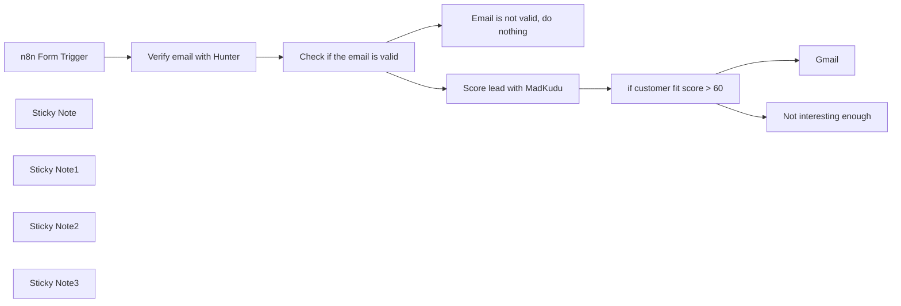

## Fluxo (.json) :

```json
{
  "nodes": [
    {
      "id": "74e0d9d8-9a05-4bf6-82a1-7c7c6b488ac7",
      "name": "n8n Form Trigger",
      "type": "n8n-nodes-base.formTrigger",
      "position": [
        380,
        420
      ],
      "webhookId": "ee00f236-5dad-49db-8f29-71b7bce37894",
      "parameters": {
        "path": "0bf8840f-1cc4-46a9-86af-a3fa8da80608",
        "options": {},
        "formTitle": "Contact us",
        "formFields": {
          "values": [
            {
              "fieldLabel": "What's your business email?"
            }
          ]
        },
        "formDescription": "We'll get back to you soon"
      },
      "typeVersion": 2
    },
    {
      "id": "86956707-6a69-465e-b73e-e49bfb6fa252",
      "name": "Check if the email is valid",
      "type": "n8n-nodes-base.if",
      "position": [
        800,
        420
      ],
      "parameters": {
        "options": {},
        "conditions": {
          "options": {
            "leftValue": "",
            "caseSensitive": true,
            "typeValidation": "strict"
          },
          "combinator": "and",
          "conditions": [
            {
              "id": "54d84c8a-63ee-40ed-8fb2-301fff0194ba",
              "operator": {
                "name": "filter.operator.equals",
                "type": "string",
                "operation": "equals"
              },
              "leftValue": "={{ $json.status }}",
              "rightValue": "valid"
            }
          ]
        }
      },
      "typeVersion": 2
    },
    {
      "id": "15991bbc-77c7-405f-8d8d-aeb5693b8eed",
      "name": "Sticky Note",
      "type": "n8n-nodes-base.stickyNote",
      "position": [
        380,
        220
      ],
      "parameters": {
        "color": 5,
        "width": 547,
        "height": 158,
        "content": "### 👨‍🎤 Setup\n1. Add you **MadKudu**, **Hunter**, and **Email** credentials \n2. Set the email where you want the alert\n3. Click the Test Workflow button, enter your email and check the Slack channel\n4. Activate the workflow and use the form trigger production URL to collect your leads in a smart way "
      },
      "typeVersion": 1
    },
    {
      "id": "0a1d7df3-d536-4530-a3f1-d374bb645738",
      "name": "Sticky Note1",
      "type": "n8n-nodes-base.stickyNote",
      "position": [
        380,
        560
      ],
      "parameters": {
        "color": 7,
        "width": 162,
        "height": 139,
        "content": "👆 You can exchange this with any form you like (*e.g. Typeform, Google forms, Survey Monkey...*)"
      },
      "typeVersion": 1
    },
    {
      "id": "694b79a4-878e-4014-8975-8b81fa10f556",
      "name": "Sticky Note2",
      "type": "n8n-nodes-base.stickyNote",
      "position": [
        1360,
        480
      ],
      "parameters": {
        "color": 7,
        "width": 162,
        "height": 84,
        "content": "👆 Adjust the fit as you see necessary"
      },
      "typeVersion": 1
    },
    {
      "id": "e843b7e4-631a-4679-952e-3f4f3ef4592d",
      "name": "Email is not valid, do nothing",
      "type": "n8n-nodes-base.noOp",
      "position": [
        1140,
        560
      ],
      "parameters": {},
      "typeVersion": 1
    },
    {
      "id": "9e20efa9-add0-4109-8e83-67fd9ed6e2f9",
      "name": "Score lead with MadKudu",
      "type": "n8n-nodes-base.httpRequest",
      "position": [
        1140,
        320
      ],
      "parameters": {
        "url": "=https://api.madkudu.com/v1/persons?email={{ $json.email }}",
        "options": {},
        "authentication": "genericCredentialType",
        "genericAuthType": "httpHeaderAuth"
      },
      "credentials": {
        "httpHeaderAuth": {
          "id": "71W5Bt9g1G9GOhVL",
          "name": "MadKudu Lead score"
        }
      },
      "typeVersion": 4.1
    },
    {
      "id": "1e0c1e73-b027-481c-a560-379e7c609b8e",
      "name": "Verify email with Hunter",
      "type": "n8n-nodes-base.hunter",
      "position": [
        600,
        420
      ],
      "parameters": {
        "email": "={{ $json['What\\'s your business email?'] }}",
        "operation": "emailVerifier"
      },
      "credentials": {
        "hunterApi": {
          "id": "ecwmdHFSBU5GGnV1",
          "name": "Hunter account"
        }
      },
      "typeVersion": 1
    },
    {
      "id": "1769cddc-e479-4816-8807-b2c1a7cd72c3",
      "name": "Not interesting enough",
      "type": "n8n-nodes-base.noOp",
      "position": [
        1680,
        460
      ],
      "parameters": {},
      "typeVersion": 1
    },
    {
      "id": "f01ed0bd-e198-47d0-95de-cf15ff04be75",
      "name": "if customer fit score > 60",
      "type": "n8n-nodes-base.if",
      "position": [
        1380,
        320
      ],
      "parameters": {
        "options": {},
        "conditions": {
          "options": {
            "leftValue": "",
            "caseSensitive": true,
            "typeValidation": "strict"
          },
          "combinator": "and",
          "conditions": [
            {
              "id": "c23d7b34-a4ae-421f-bd7a-6a3ebb05aafe",
              "operator": {
                "type": "number",
                "operation": "gt"
              },
              "leftValue": "={{ $json.properties.customer_fit.score }}",
              "rightValue": 60
            }
          ]
        }
      },
      "typeVersion": 2
    },
    {
      "id": "f500ad36-3f4c-4c3e-aadc-ab014be7cb7d",
      "name": "Gmail",
      "type": "n8n-nodes-base.gmail",
      "position": [
        1680,
        160
      ],
      "parameters": {
        "sendTo": "mutasem@n8n.io",
        "message": "=Got a hot lead for you  {{ $json.properties.first_name }} {{ $json.properties.last_name }} from  {{ $json.company.properties.name }} ({{ $json.company.properties.domain }}) based out of {{ $json.company.properties.location.state }}, {{ $json.company.properties.location.country }}.\n\n\n{{ $('Score lead with MadKudu').item.json.properties.customer_fit.top_signals_formatted }}",
        "options": {},
        "subject": "=⭐ Hot lead alert: {{ $json.properties.first_name }} {{ $json.properties.last_name }}",
        "emailType": "text"
      },
      "credentials": {
        "gmailOAuth2": {
          "id": "rd2agqPeJBD2377h",
          "name": "Work Gmail"
        }
      },
      "typeVersion": 2.1
    },
    {
      "id": "b47b0249-fa84-42b8-b7c5-0e204bc35db4",
      "name": "Sticky Note3",
      "type": "n8n-nodes-base.stickyNote",
      "position": [
        1640,
        40
      ],
      "parameters": {
        "color": 7,
        "width": 162,
        "height": 84,
        "content": "👇🏽 Update the email to send to"
      },
      "typeVersion": 1
    }
  ],
  "pinData": {
    "n8n Form Trigger": [
      {
        "formMode": "test",
        "submittedAt": "2024-02-22T13:59:54.709Z",
        "What's your business email?": "jan@n8n.io"
      }
    ]
  },
  "connections": {
    "n8n Form Trigger": {
      "main": [
        [
          {
            "node": "Verify email with Hunter",
            "type": "main",
            "index": 0
          }
        ]
      ]
    },
    "Score lead with MadKudu": {
      "main": [
        [
          {
            "node": "if customer fit score > 60",
            "type": "main",
            "index": 0
          }
        ]
      ]
    },
    "Verify email with Hunter": {
      "main": [
        [
          {
            "node": "Check if the email is valid",
            "type": "main",
            "index": 0
          }
        ]
      ]
    },
    "if customer fit score > 60": {
      "main": [
        [
          {
            "node": "Gmail",
            "type": "main",
            "index": 0
          }
        ],
        [
          {
            "node": "Not interesting enough",
            "type": "main",
            "index": 0
          }
        ]
      ]
    },
    "Check if the email is valid": {
      "main": [
        [
          {
            "node": "Score lead with MadKudu",
            "type": "main",
            "index": 0
          }
        ],
        [
          {
            "node": "Email is not valid, do nothing",
            "type": "main",
            "index": 0
          }
        ]
      ]
    }
  }
}
```

<a id="template-1116"></a>

## Template 1116 - Widget Bitrix24: Task View via Webhook

- **Nome:** Widget Bitrix24: Task View via Webhook
- **Descrição:** Fluxo que recebe requisições de Bitrix24 através de webhook, autentica e registra a instalação do widget, obtém dados de tarefas via REST e exibe uma visualização em HTML, com suporte a instalação e recuperação de configurações.
- **Funcionalidade:** • Detecção de evento e instalação do widget: identifica se a requisição é instalação ('ONAPPINSTALL') ou configuração do placement ('DEFAULT') e inicia o fluxo correspondente.
• Extração de credenciais e configuração de endpoints: extrai tokens, domínio e informações de app para montar o endpoint REST do Bitrix24 e credenciais.
• Registro da placement do widget: registra a placement TASK_VIEW_TAB no Bitrix24 para exibir o widget.
• Processamento de configurações: lê os dados de configuração a partir de arquivo e entrada e extrai o taskId quando disponível.
• Validação de configurações: verifica se as credenciais e tokens são válidos; encaminha para exibir a tarefa ou retorna erro.
• Leitura de configurações salvas: lê widget-app-settings.json para validar instalação existente.
• Obtenção de dados da tarefa: consulta Bitrix24 REST para obter dados da tarefa com token de autenticação.
• Formatação de dados da tarefa: transforma os dados da tarefa em HTML para exibir no widget.
• Resposta de visualização da tarefa: retorna HTML com a visualização da tarefa ao usuário.
• Geração e salvamento de configurações de instalação: cria widget-app-settings.json com dados de acesso e grava no arquivo.
• Finalização da instalação: responde que a instalação foi concluída e registra o placement na Bitrix24.
- **Ferramentas:** • Bitrix24: plataforma de CRM com widgets e integração via webhooks e REST API.
• Bitrix24 REST API: endpoints usados para gerenciar placement e acessar dados de tarefas.

## Fluxo visual

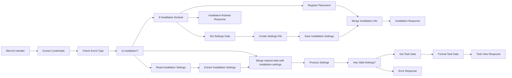

## Fluxo (.json) :

```json
{
  "id": "ZDL9028SnyCxS5tf",
  "meta": {
    "instanceId": "15c09ee9508dd818e298e675375571ba4b871bbb8c420fd01ac9ed7c58622669"
  },
  "name": "Bitrix24 Task Form Widget Application Workflow example with Webhook Integration",
  "tags": [],
  "nodes": [
    {
      "id": "cb30a147-2965-4b45-8974-12fea1eac96d",
      "name": "Bitrix24 Handler",
      "type": "n8n-nodes-base.webhook",
      "position": [
        -800,
        -40
      ],
      "webhookId": "c3ae607d-41f0-42bc-b669-c2c77936d443",
      "parameters": {
        "path": "bitrix24/widgethandler.php",
        "options": {},
        "httpMethod": "POST",
        "responseMode": "responseNode"
      },
      "typeVersion": 1
    },
    {
      "id": "08a11f9e-cc9a-430f-8ba1-70985504a10d",
      "name": "Extract Credentials",
      "type": "n8n-nodes-base.set",
      "position": [
        -600,
        -40
      ],
      "parameters": {
        "options": {},
        "assignments": {
          "assignments": [
            {
              "id": "030f8f90-2669-4c20-9eab-c572c4b7c70c",
              "name": "CLIENT_ID",
              "type": "string",
              "value": "=local.67b8a796e92127.82791242"
            },
            {
              "id": "de9bbb7a-b782-4540-b259-527625db8490",
              "name": "CLIENT_SECRET",
              "type": "string",
              "value": "=BylHzv4eBw2JuDm7QXOP0C25qzEwf7ATGh79JeOn1iY5lmIRC2"
            },
            {
              "id": "69bbcb1f-ba6e-42eb-be8a-ee0707ce997d",
              "name": "domain",
              "type": "string",
              "value": "={{$json.query.DOMAIN || $json.body.domain}}"
            },
            {
              "id": "dc1b0515-f06a-4731-b0dc-912a8d04e56b",
              "name": "access_token",
              "type": "string",
              "value": "={{$json.body.AUTH_ID || $json.body.access_token}}"
            },
            {
              "id": "86b7aff7-1e25-4b12-a366-23cf34e5a405",
              "name": "refresh_token",
              "type": "string",
              "value": "={{$json.body.REFRESH_ID || $json.body.refresh_token}}"
            },
            {
              "id": "a1e55fc3-7d29-4f7d-b1a9-c458d2b10e33",
              "name": "application_token",
              "type": "string",
              "value": "={{$json.query.APP_SID || $json.body.APP_SID}}"
            },
            {
              "id": "ba921f15-28ac-4c0e-89a1-8da755c70892",
              "name": "expires_in",
              "type": "string",
              "value": "={{$json.body.AUTH_EXPIRES || 3600}}"
            },
            {
              "id": "dbca2de9-55aa-4642-b671-22a195631657",
              "name": "=client_endpoint",
              "type": "string",
              "value": "=https://{{ $json.query.DOMAIN }}/rest/"
            },
            {
              "id": "1a53f9e3-bfc3-4ea5-88db-514ae1e1253c",
              "name": "settingsFilePath",
              "type": "string",
              "value": "/data/files/hotline_files/"
            }
          ]
        },
        "includeOtherFields": true
      },
      "typeVersion": 3.4
    },
    {
      "id": "c025c87d-8015-4323-ac60-191cabc8b5e0",
      "name": "Check Event Type",
      "type": "n8n-nodes-base.code",
      "position": [
        -400,
        -40
      ],
      "parameters": {
        "jsCode": "// PHP szerinti ellenőrzés: $_REQUEST['event'] == 'ONAPPINSTALL' vagy $_REQUEST['PLACEMENT'] == 'DEFAULT'\nconst items = $input.all();\nconst requestData = items[0].json;\n\nlet isInstallation = false;\nlet isInstallationFinished = false;\n\nif (requestData.body && requestData.body.event === 'ONAPPINSTALL') {\n  isInstallation = true;\n} else if (requestData.body && requestData.body.PLACEMENT === 'DEFAULT') {\n  isInstallation = true;\n  if (requestData.body && requestData.body.PLACEMENT_OPTIONS) {\n  po = JSON.parse(requestData.body.PLACEMENT_OPTIONS);\n  if (po.install_finished === 'Y') {\n    isInstallationFinished = true\n  }  \n} \n} \nreturn {\n  json: {\n    ...requestData,\n    isInstallation: isInstallation,\n    isInstallationFinished : isInstallationFinished \n  }\n};"
      },
      "typeVersion": 2
    },
    {
      "id": "7ba4765a-6c58-4d67-b3ae-5598474916c5",
      "name": "Is Installation?",
      "type": "n8n-nodes-base.if",
      "position": [
        -200,
        -40
      ],
      "parameters": {
        "options": {},
        "conditions": {
          "options": {
            "version": 2,
            "leftValue": "",
            "caseSensitive": true,
            "typeValidation": "strict"
          },
          "combinator": "or",
          "conditions": [
            {
              "id": "da73d0ba-6eeb-405e-89fe-9d041fd2e0cd",
              "operator": {
                "type": "boolean",
                "operation": "equals"
              },
              "leftValue": "={{$json.isInstallation}}",
              "rightValue": true
            }
          ]
        }
      },
      "typeVersion": 2.2
    },
    {
      "id": "8e429e18-392c-4123-969a-f9086d12709d",
      "name": "Register Placement",
      "type": "n8n-nodes-base.httpRequest",
      "position": [
        220,
        -400
      ],
      "parameters": {
        "url": "=https://{{$json.domain}}/rest/placement.bind?auth={{$json.access_token}}",
        "method": "POST",
        "options": {},
        "sendBody": true,
        "bodyParameters": {
          "parameters": [
            {
              "name": "PLACEMENT",
              "value": "TASK_VIEW_TAB"
            },
            {
              "name": "HANDLER",
              "value": "={{$json.webhookUrl}}"
            },
            {
              "name": "TITLE",
              "value": "My App"
            }
          ]
        }
      },
      "typeVersion": 4.2
    },
    {
      "id": "e5d87f1e-1580-433f-990f-624e64fb80d2",
      "name": "Process Settings",
      "type": "n8n-nodes-base.function",
      "position": [
        480,
        60
      ],
      "parameters": {
        "functionCode": "// Process settings from file\nconst items = $input.all();\nlet settingsData = {};\n\ntry {\n  // Try to parse the file content\n  settingsData = items[0].json.data;\n  \n  // Extract task ID from PLACEMENT_OPTIONS if available\n  let taskId = null;\n  const placementOptions = items[0].json.body.PLACEMENT_OPTIONS;\n  \n  if (placementOptions) {\n    try {\n      const options = JSON.parse(placementOptions);\n      taskId = options.taskId;\n    } catch (e) {\n      // Ignore parse errors\n    }\n  }\n  \n  return {\n    json: {\n      ...settingsData,\n      taskId: taskId,\n      success: true,\n      originalRequest: items[0].json\n    }\n  };\n} catch (error) {\n  console.log (\"ERROR: \" + error)\n  // Return error if file doesn't exist or is invalid\n  return {\n    json: {\n      error: 'No valid settings found',\n      success: false,\n      originalRequest: items[0].json\n    }\n  };\n}"
      },
      "typeVersion": 1
    },
    {
      "id": "c7384217-38be-4184-b60f-a99c6b762406",
      "name": "Installation Response",
      "type": "n8n-nodes-base.respondToWebhook",
      "position": [
        1020,
        -380
      ],
      "parameters": {
        "options": {
          "responseCode": 200,
          "responseHeaders": {
            "entries": [
              {
                "name": "Content-Type",
                "value": "text/html"
              }
            ]
          }
        },
        "respondWith": "text",
        "responseBody": "=<head>\n    <script src=\"//api.bitrix24.com/api/v1/\"></script>\n    <script>\n        BX24.init(function(){\n            BX24.installFinish();\n        });\n    </script>\n</head>\n<body>\n    installation has been finished\n</body>"
      },
      "typeVersion": 1.1
    },
    {
      "id": "47c89107-6e6f-4255-94e6-776c2309de50",
      "name": "Has Valid Settings?",
      "type": "n8n-nodes-base.if",
      "position": [
        660,
        60
      ],
      "parameters": {
        "options": {},
        "conditions": {
          "options": {
            "version": 2,
            "leftValue": "",
            "caseSensitive": true,
            "typeValidation": "strict"
          },
          "combinator": "or",
          "conditions": [
            {
              "id": "71e52c3d-c95c-4ecf-8dce-dbad5c9db29f",
              "operator": {
                "type": "boolean",
                "operation": "equals"
              },
              "leftValue": "={{$json.success}}",
              "rightValue": true
            }
          ]
        }
      },
      "typeVersion": 2.2
    },
    {
      "id": "220b32af-d886-4315-808e-825834eb440e",
      "name": "Get Task Data",
      "type": "n8n-nodes-base.httpRequest",
      "position": [
        920,
        -40
      ],
      "parameters": {
        "url": "=https://{{ $json.originalRequest.query.DOMAIN }}/rest/tasks.task.get?auth={{ $json.originalRequest.access_token }}",
        "method": "POST",
        "options": {},
        "jsonBody": "={{ $json.originalRequest.body.PLACEMENT_OPTIONS }}",
        "sendBody": true,
        "specifyBody": "json"
      },
      "typeVersion": 4.2
    },
    {
      "id": "e25fb425-28f2-4e48-85b2-8917d4a7497d",
      "name": "Format Task Data",
      "type": "n8n-nodes-base.function",
      "position": [
        1100,
        -40
      ],
      "parameters": {
        "functionCode": "// Format Task Data for display\nconst items = $input.all();\nlet taskData = {};\n\ntry {\n  taskData = items[0].json.result.task;\n} catch (error) {\n  return {\n    json: {\n      taskHtml: '<div class=\"alert alert-danger\">Error loading task data</div>'\n    }\n  };\n}\n\n// Create HTML table from task data\nlet tableHtml = '<table class=\"table table-striped\">\\n';\n\nfor (const [field, value] of Object.entries(taskData)) {\n  let displayValue = '';\n  \n  if (Array.isArray(value)) {\n    displayValue = value.join(', ');\n  } else if (value !== null && value !== undefined) {\n    displayValue = value.toString();\n  }\n  \n  tableHtml += `  <tr>\\n    <td>${field}</td>\\n    <td>${displayValue}</td>\\n  </tr>\\n`;\n}\n\ntableHtml += '</table>';\n\nreturn {\n  json: {\n    taskHtml: tableHtml\n  }\n};"
      },
      "typeVersion": 1
    },
    {
      "id": "a9d4ca61-d9e0-4a57-9807-40dc18625ce2",
      "name": "Task View Response",
      "type": "n8n-nodes-base.respondToWebhook",
      "position": [
        1280,
        -40
      ],
      "parameters": {
        "options": {
          "responseCode": 200,
          "responseHeaders": {
            "entries": [
              {
                "name": "Content-Type",
                "value": "text/html"
              }
            ]
          }
        },
        "respondWith": "text",
        "responseBody": "=<html>\n<head>\n\t<meta charset=\"utf-8\">\n\t<meta http-equiv=\"X-UA-Compatible\" content=\"IE=edge\">\n\t<meta name=\"viewport\" content=\"width=device-width, initial-scale=1\">\n\n\t<!-- Latest compiled and minified CSS -->\n\t<link rel=\"stylesheet\" href=\"css/app.css\">\n\t<script\n\t\tsrc=\"https://code.jquery.com/jquery-3.6.0.js\"\n\t\tintegrity=\"sha256-H+K7U5CnXl1h5ywQfKtSj8PCmoN9aaq30gDh27Xc0jk=\"\n\t\tcrossorigin=\"anonymous\"></script>\n\n\t<title>Task View</title>\n</head>\n<body class=\"container-fluid\">\n{{$json.taskHtml}}\n</body>\n</html>"
      },
      "typeVersion": 1.1
    },
    {
      "id": "5bbbf72e-d743-450a-9534-a2a6c569f73d",
      "name": "Error Response",
      "type": "n8n-nodes-base.respondToWebhook",
      "position": [
        940,
        160
      ],
      "parameters": {
        "options": {
          "responseCode": 200,
          "responseHeaders": {
            "entries": [
              {
                "name": "Content-Type",
                "value": "text/html"
              }
            ]
          }
        },
        "respondWith": "text",
        "responseBody": "=<html>\n<head>\n\t<meta charset=\"utf-8\">\n\t<meta http-equiv=\"X-UA-Compatible\" content=\"IE=edge\">\n\t<meta name=\"viewport\" content=\"width=device-width, initial-scale=1\">\n\t<title>Error</title>\n</head>\n<body>\n\t<div class=\"alert alert-danger\">\n\t\tSettings not found or access token expired. Please reinstall the application.\n\t</div>\n</body>\n</html>"
      },
      "typeVersion": 1.1
    },
    {
      "id": "8fbaed6d-e9d8-4dbd-805f-a9e2a3e791c5",
      "name": "Save Installation Settings",
      "type": "n8n-nodes-base.readWriteFile",
      "position": [
        620,
        -240
      ],
      "parameters": {
        "options": {
          "append": false
        },
        "fileName": "={{ $('Set Settings Data').item.json.settingsFilePath }}/widget-app-settings.json",
        "operation": "write"
      },
      "typeVersion": 1
    },
    {
      "id": "38c01b85-cf8c-4df8-b226-cd199cdee1f2",
      "name": "Set Settings Data",
      "type": "n8n-nodes-base.set",
      "position": [
        220,
        -240
      ],
      "parameters": {
        "include": "selected",
        "options": {},
        "assignments": {
          "assignments": [
            {
              "id": "ad1b12be-7b21-42cb-b8b5-3f141dd6040a",
              "name": "data",
              "type": "object",
              "value": "={\n  \"access_token\": \"{{$json.access_token}}\",\n  \"refresh_token\": \"{{$json.refresh_token}}\",\n  \"domain\": \"{{$json.domain}}\",\n  \"expires_in\": \"{{$json.expires_in}}\",\n  \"application_token\": \"{{$json.application_token}}\",\n  \"client_endpoint\": \"https://{{$json.domain}}/rest/\",\n  \"C_REST_CLIENT_ID\": \"app.644f4956606e88.45725320\",\n  \"C_REST_CLIENT_SECRET\": \"lUb7WU81Wc4UVCWBJBh0xX5sKYWM4nKmsJl0m4vWb2XR6ByRGF\",\n  \"updated_at\": \"{{$now}}\"\n}"
            }
          ]
        },
        "includeFields": "settingsFilePath",
        "includeOtherFields": true
      },
      "typeVersion": 3.4
    },
    {
      "id": "490779aa-5c6b-49cb-960d-d710a848eb60",
      "name": "Create Settings File",
      "type": "n8n-nodes-base.convertToFile",
      "position": [
        400,
        -240
      ],
      "parameters": {
        "options": {
          "fileName": "={{ $json.settingsFilePath }}/widget-app-settings.json"
        },
        "operation": "toJson"
      },
      "typeVersion": 1.1
    },
    {
      "id": "902671fc-9286-467b-9060-7326ee14b41a",
      "name": "Read Installation Settings",
      "type": "n8n-nodes-base.readWriteFile",
      "position": [
        -40,
        140
      ],
      "parameters": {
        "options": {},
        "fileSelector": "={{ $json.settingsFilePath }}/widget-app-settings.json"
      },
      "typeVersion": 1
    },
    {
      "id": "8d38c6be-c3ed-493a-8600-a9adf5acff55",
      "name": "If Installation finished",
      "type": "n8n-nodes-base.if",
      "position": [
        -20,
        -180
      ],
      "parameters": {
        "options": {},
        "conditions": {
          "options": {
            "version": 2,
            "leftValue": "",
            "caseSensitive": true,
            "typeValidation": "strict"
          },
          "combinator": "and",
          "conditions": [
            {
              "id": "3c09735b-94df-4307-aadd-23080bdac02b",
              "operator": {
                "type": "boolean",
                "operation": "equals"
              },
              "leftValue": "={{ $json.isInstallationFinished }}",
              "rightValue": true
            }
          ]
        }
      },
      "typeVersion": 2.2
    },
    {
      "id": "0047bf02-13d9-4ba6-abcd-a557b9ba3fbf",
      "name": "Installation finished Response",
      "type": "n8n-nodes-base.respondToWebhook",
      "position": [
        220,
        -580
      ],
      "parameters": {
        "options": {
          "responseCode": 200,
          "responseHeaders": {
            "entries": [
              {
                "name": "Content-Type",
                "value": "text/html"
              }
            ]
          }
        },
        "respondWith": "text",
        "responseBody": "=<head>\n</head>\n<body>\n    installation has been fully finished...\n</body>"
      },
      "typeVersion": 1.1
    },
    {
      "id": "8a060ae1-801f-469f-8087-26aee15486e3",
      "name": "Merge Installation info",
      "type": "n8n-nodes-base.merge",
      "position": [
        780,
        -380
      ],
      "parameters": {
        "mode": "combine",
        "options": {},
        "combineBy": "combineAll"
      },
      "typeVersion": 3
    },
    {
      "id": "b5dbdd6f-b81b-4457-8f04-75a951903755",
      "name": "Extract Installation Settings",
      "type": "n8n-nodes-base.extractFromFile",
      "position": [
        140,
        140
      ],
      "parameters": {
        "options": {},
        "operation": "fromJson"
      },
      "typeVersion": 1
    },
    {
      "id": "b20494d5-409c-47a0-9cba-ef5798a0d7cb",
      "name": "Merge request data with installation settings",
      "type": "n8n-nodes-base.merge",
      "position": [
        300,
        0
      ],
      "parameters": {
        "mode": "combine",
        "options": {},
        "combineBy": "combineAll"
      },
      "typeVersion": 3
    }
  ],
  "active": true,
  "pinData": {
    "Bitrix24 Handler": [
      {
        "json": {
          "body": {
            "status": "L",
            "AUTH_ID": "e393b96700763c9900668809000000b6e0e30725387b1a3ae59c6fafa9ee42e7a25d5e",
            "PLACEMENT": "TASK_VIEW_TAB",
            "member_id": "19acdffbcfadf692f61b677d3d824490",
            "REFRESH_ID": "d312e16700763c9900668809000000b6e0e307f6a903a54b17e22adcad3eb5d2063806",
            "AUTH_EXPIRES": "3600",
            "PLACEMENT_OPTIONS": "{\"taskId\":\"10184\"}"
          },
          "query": {
            "LANG": "en",
            "DOMAIN": "hgap.bitrix24.eu",
            "APP_SID": "f1be8a08b159e4113606b5f6bfc8d210",
            "PROTOCOL": "1"
          },
          "params": {},
          "headers": {
            "host": "orpheus-dev.h-gap.hu",
            "accept": "text/html,application/xhtml+xml,application/xml;q=0.9,image/avif,image/webp,image/apng,*/*;q=0.8,application/signed-exchange;v=b3;q=0.7",
            "origin": "https://hgap.bitrix24.eu",
            "referer": "https://hgap.bitrix24.eu/",
            "priority": "u=0, i",
            "sec-ch-ua": "\"Not(A:Brand\";v=\"99\", \"Google Chrome\";v=\"133\", \"Chromium\";v=\"133\"",
            "x-real-ip": "85.66.162.255",
            "user-agent": "Mozilla/5.0 (Windows NT 10.0; Win64; x64) AppleWebKit/537.36 (KHTML, like Gecko) Chrome/133.0.0.0 Safari/537.36",
            "content-type": "application/x-www-form-urlencoded",
            "cache-control": "max-age=0",
            "content-length": "305",
            "sec-fetch-dest": "iframe",
            "sec-fetch-mode": "navigate",
            "sec-fetch-site": "cross-site",
            "accept-encoding": "gzip, deflate, br, zstd",
            "accept-language": "hu-HU,hu;q=0.9,en-US;q=0.8,en;q=0.7",
            "x-forwarded-for": "85.66.162.255",
            "sec-ch-ua-mobile": "?0",
            "x-forwarded-proto": "https",
            "sec-ch-ua-platform": "\"Windows\"",
            "x-forwarded-scheme": "https",
            "sec-fetch-storage-access": "active",
            "upgrade-insecure-requests": "1"
          },
          "webhookUrl": "https://orpheus-dev.h-gap.hu/webhook/bitrix24/widgethandler.php",
          "executionMode": "production"
        }
      }
    ]
  },
  "settings": {
    "executionOrder": "v1"
  },
  "versionId": "72d7eac7-03cb-4792-8f6f-d190631e34f9",
  "connections": {
    "Get Task Data": {
      "main": [
        [
          {
            "node": "Format Task Data",
            "type": "main",
            "index": 0
          }
        ]
      ]
    },
    "Bitrix24 Handler": {
      "main": [
        [
          {
            "node": "Extract Credentials",
            "type": "main",
            "index": 0
          }
        ]
      ]
    },
    "Check Event Type": {
      "main": [
        [
          {
            "node": "Is Installation?",
            "type": "main",
            "index": 0
          }
        ]
      ]
    },
    "Format Task Data": {
      "main": [
        [
          {
            "node": "Task View Response",
            "type": "main",
            "index": 0
          }
        ]
      ]
    },
    "Is Installation?": {
      "main": [
        [
          {
            "node": "If Installation finished",
            "type": "main",
            "index": 0
          }
        ],
        [
          {
            "node": "Read Installation Settings",
            "type": "main",
            "index": 0
          },
          {
            "node": "Merge request data with installation settings",
            "type": "main",
            "index": 0
          }
        ]
      ]
    },
    "Process Settings": {
      "main": [
        [
          {
            "node": "Has Valid Settings?",
            "type": "main",
            "index": 0
          }
        ]
      ]
    },
    "Set Settings Data": {
      "main": [
        [
          {
            "node": "Create Settings File",
            "type": "main",
            "index": 0
          }
        ]
      ]
    },
    "Register Placement": {
      "main": [
        [
          {
            "node": "Merge Installation info",
            "type": "main",
            "index": 0
          }
        ]
      ]
    },
    "Extract Credentials": {
      "main": [
        [
          {
            "node": "Check Event Type",
            "type": "main",
            "index": 0
          }
        ]
      ]
    },
    "Has Valid Settings?": {
      "main": [
        [
          {
            "node": "Get Task Data",
            "type": "main",
            "index": 0
          }
        ],
        [
          {
            "node": "Error Response",
            "type": "main",
            "index": 0
          }
        ]
      ]
    },
    "Create Settings File": {
      "main": [
        [
          {
            "node": "Save Installation Settings",
            "type": "main",
            "index": 0
          }
        ]
      ]
    },
    "Merge Installation info": {
      "main": [
        [
          {
            "node": "Installation Response",
            "type": "main",
            "index": 0
          }
        ]
      ]
    },
    "If Installation finished": {
      "main": [
        [
          {
            "node": "Installation finished Response",
            "type": "main",
            "index": 0
          }
        ],
        [
          {
            "node": "Register Placement",
            "type": "main",
            "index": 0
          },
          {
            "node": "Set Settings Data",
            "type": "main",
            "index": 0
          }
        ]
      ]
    },
    "Read Installation Settings": {
      "main": [
        [
          {
            "node": "Extract Installation Settings",
            "type": "main",
            "index": 0
          }
        ]
      ]
    },
    "Save Installation Settings": {
      "main": [
        [
          {
            "node": "Merge Installation info",
            "type": "main",
            "index": 1
          }
        ]
      ]
    },
    "Extract Installation Settings": {
      "main": [
        [
          {
            "node": "Merge request data with installation settings",
            "type": "main",
            "index": 1
          }
        ]
      ]
    },
    "Merge request data with installation settings": {
      "main": [
        [
          {
            "node": "Process Settings",
            "type": "main",
            "index": 0
          }
        ]
      ]
    }
  }
}
```

<a id="template-1117"></a>

## Template 1117 - Disparo de build TravisCI

- **Nome:** Disparo de build TravisCI
- **Descrição:** O fluxo inicia a partir de eventos do GitHub e dispara um build no TravisCI quando ocorre um push ou quando um pull request é aberto.
- **Funcionalidade:** • Detecção de eventos do GitHub: Escuta eventos do repositório especificado (push e pull_request).
• Verificação de condições: Avalia se o evento é um push ou se a ação do pull request é 'opened'.
• Disparo de build no TravisCI: Aciona um build no TravisCI usando o identificador completo do repositório recebido no payload.
• Rota de fallback: Para eventos que não atendem às condições, o fluxo segue sem executar ações (NoOp).
- **Ferramentas:** • GitHub: Fonte dos eventos (push e pull requests) que disparam a automação.
• Travis CI: Serviço de integração contínua que recebe o comando para executar o build do repositório.

## Fluxo visual

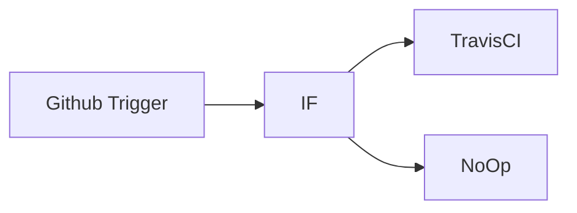

## Fluxo (.json) :

```json
{
  "nodes": [
    {
      "name": "Github Trigger",
      "type": "n8n-nodes-base.githubTrigger",
      "position": [
        450,
        300
      ],
      "webhookId": "01518289-14b1-4a45-9d33-39be08f7a544",
      "parameters": {
        "owner": "n8n-io",
        "events": [
          "push",
          "pull_request"
        ],
        "repository": "n8n",
        "authentication": "oAuth2"
      },
      "credentials": {
        "githubOAuth2Api": "GitHub Credentials"
      },
      "typeVersion": 1
    },
    {
      "name": "IF",
      "type": "n8n-nodes-base.if",
      "position": [
        650,
        300
      ],
      "parameters": {
        "conditions": {
          "string": [
            {
              "value1": "={{$json[\"headers\"][\"x-github-event\"]}}",
              "value2": "push"
            },
            {
              "value1": "={{$json[\"body\"][\"action\"]}}",
              "value2": "opened"
            }
          ]
        },
        "combineOperation": "any"
      },
      "typeVersion": 1
    },
    {
      "name": "TravisCI",
      "type": "n8n-nodes-base.travisCi",
      "position": [
        850,
        200
      ],
      "parameters": {
        "slug": "={{$json[\"body\"][\"repository\"][\"full_name\"]}}",
        "branch": "=",
        "operation": "trigger",
        "additionalFields": {}
      },
      "credentials": {
        "travisCiApi": "Travis API"
      },
      "typeVersion": 1
    },
    {
      "name": "NoOp",
      "type": "n8n-nodes-base.noOp",
      "position": [
        850,
        400
      ],
      "parameters": {},
      "typeVersion": 1
    }
  ],
  "connections": {
    "IF": {
      "main": [
        [
          {
            "node": "TravisCI",
            "type": "main",
            "index": 0
          }
        ],
        [
          {
            "node": "NoOp",
            "type": "main",
            "index": 0
          }
        ]
      ]
    },
    "Github Trigger": {
      "main": [
        [
          {
            "node": "IF",
            "type": "main",
            "index": 0
          }
        ]
      ]
    }
  }
}
```

<a id="template-1118"></a>

## Template 1118 - Enviar e-mail rotulado para Notion

- **Nome:** Enviar e-mail rotulado para Notion
- **Descrição:** Busca e-mails com um rótulo específico e cria páginas correspondentes em uma base do Notion; quando a tarefa no Notion é marcada como concluída, o rótulo é removido do e-mail.
- **Funcionalidade:** • Monitoramento periódico de e-mails rotulados: executa buscas regulares (a cada minuto) por mensagens com um rótulo específico.
• Filtragem por horário: utiliza o timestamp da execução para considerar apenas e-mails recentes.
• Verificação de duplicidade no banco: consulta a base do Notion para checar se o Thread ID já existe e evita criar páginas duplicadas.
• Criação de página no Notion: para e-mails não encontrados, cria uma página com título (assunto), snippet do corpo e link direto para o e-mail, além de propriedades como Thread ID e URL da thread.
• Obtenção do endereço do usuário: consulta o perfil para montar links corretos para os e-mails do usuário autenticado.
• Sincronização de estado: quando a página no Notion é marcada como completa, remove o rótulo do e-mail correspondente.
- **Ferramentas:** • Gmail: provê acesso aos e-mails, permite buscar mensagens por rótulo, consultar o perfil do usuário e remover rótulos das mensagens.
• Notion: armazena as páginas criadas em uma base de dados, permitindo gravar propriedades como título, Thread ID e URL, e detectar atualizações de página.

## Fluxo visual

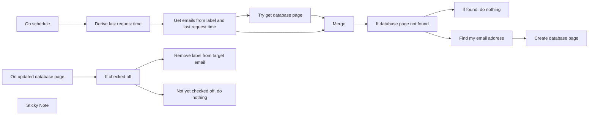

## Fluxo (.json) :

```json
{
  "meta": {
    "instanceId": "a2434c94d549548a685cca39cc4614698e94f527bcea84eefa363f1037ae14cd"
  },
  "nodes": [
    {
      "id": "0bacf032-53d6-4ba6-ab71-e01625c49cc4",
      "name": "On schedule",
      "type": "n8n-nodes-base.scheduleTrigger",
      "position": [
        -1960,
        160
      ],
      "parameters": {
        "rule": {
          "interval": [
            {
              "field": "minutes",
              "minutesInterval": 1
            }
          ]
        }
      },
      "typeVersion": 1.1
    },
    {
      "id": "2e0d9aef-0a60-4506-9c11-c6c2cccb16ea",
      "name": "Derive last request time",
      "type": "n8n-nodes-base.dateTime",
      "position": [
        -1740,
        160
      ],
      "parameters": {
        "duration": 1,
        "timeUnit": "minutes",
        "magnitude": "={{ $json.timestamp }}",
        "operation": "subtractFromDate",
        "outputFieldName": "last_request_time"
      },
      "typeVersion": 2
    },
    {
      "id": "f726c448-b4c4-4159-8ca5-c94c092127b7",
      "name": "Get emails from label and last request time",
      "type": "n8n-nodes-base.gmail",
      "position": [
        -1520,
        160
      ],
      "parameters": {
        "filters": {
          "labelIds": [
            "Label_9178764513576607415"
          ]
        },
        "operation": "getAll",
        "returnAll": true
      },
      "credentials": {
        "gmailOAuth2": {
          "id": "31",
          "name": "REPLACE ME"
        }
      },
      "typeVersion": 2
    },
    {
      "id": "9b86331f-d33b-4266-ba34-bc0491a0da24",
      "name": "Create database page",
      "type": "n8n-nodes-base.notion",
      "position": [
        -620,
        60
      ],
      "parameters": {
        "title": "={{ $('If database page not found').item.json.Subject }}",
        "blockUi": {
          "blockValues": [
            {
              "type": "heading_3",
              "textContent": "Snippet"
            },
            {
              "textContent": "={{ $('If database page not found').item.json.snippet }}"
            },
            {
              "text": {
                "text": [
                  {
                    "text": "See more",
                    "isLink": true,
                    "textLink": "=https://mail.google.com/mail/u/{{ $json.emailAddress }}/#all/{{ $('If database page not found').item.json.id }}",
                    "annotationUi": {}
                  }
                ]
              },
              "richText": true
            }
          ]
        },
        "options": {
          "icon": "https://avatars.githubusercontent.com/u/45487711?s=280&v=4",
          "iconType": "file"
        },
        "resource": "databasePage",
        "databaseId": {
          "__rl": true,
          "mode": "list",
          "value": "e606a7c1-e93d-47fd-8b8d-8000cd6e7522",
          "cachedResultUrl": "https://www.notion.so/e606a7c1e93d47fd8b8d8000cd6e7522",
          "cachedResultName": "Gmail"
        },
        "propertiesUi": {
          "propertyValues": [
            {
              "key": "Thread ID|rich_text",
              "textContent": "={{ $('If database page not found').item.json.id }}"
            },
            {
              "key": "Email thread|url",
              "urlValue": "=https://mail.google.com/mail/u/{{ $json.emailAddress }}/#all/{{ $('If database page not found').item.json.id }}"
            }
          ]
        }
      },
      "credentials": {
        "notionApi": {
          "id": "18",
          "name": "[UPDATE ME]"
        }
      },
      "typeVersion": 2
    },
    {
      "id": "d7198578-4c83-4f57-8eba-5b5a9b89195c",
      "name": "Try get database page",
      "type": "n8n-nodes-base.notion",
      "position": [
        -1360,
        220
      ],
      "parameters": {
        "filters": {
          "conditions": [
            {
              "key": "Thread ID|rich_text",
              "condition": "equals",
              "richTextValue": "={{ $json.id }}"
            }
          ]
        },
        "options": {},
        "resource": "databasePage",
        "operation": "getAll",
        "returnAll": true,
        "databaseId": {
          "__rl": true,
          "mode": "list",
          "value": "e606a7c1-e93d-47fd-8b8d-8000cd6e7522",
          "cachedResultUrl": "https://www.notion.so/e606a7c1e93d47fd8b8d8000cd6e7522",
          "cachedResultName": "My Gmail Tasks"
        },
        "filterType": "manual"
      },
      "credentials": {
        "notionApi": {
          "id": "18",
          "name": "[UPDATE ME]"
        }
      },
      "typeVersion": 2,
      "alwaysOutputData": true
    },
    {
      "id": "f8188ab9-9a80-4aa9-b773-73cd90b8dbd3",
      "name": "If checked off",
      "type": "n8n-nodes-base.if",
      "position": [
        -1740,
        460
      ],
      "parameters": {
        "conditions": {
          "boolean": [
            {
              "value1": "={{ $json.Complete }}",
              "value2": true
            }
          ]
        }
      },
      "typeVersion": 1
    },
    {
      "id": "bfcfeeb1-ad8b-47fb-8a09-b58e7b649a25",
      "name": "On updated database page",
      "type": "n8n-nodes-base.notionTrigger",
      "position": [
        -1960,
        460
      ],
      "parameters": {
        "event": "pagedUpdatedInDatabase",
        "pollTimes": {
          "item": [
            {
              "mode": "everyMinute"
            }
          ]
        },
        "databaseId": {
          "__rl": true,
          "mode": "list",
          "value": "e606a7c1-e93d-47fd-8b8d-8000cd6e7522",
          "cachedResultUrl": "https://www.notion.so/e606a7c1e93d47fd8b8d8000cd6e7522",
          "cachedResultName": "My Gmail Tasks"
        }
      },
      "credentials": {
        "notionApi": {
          "id": "18",
          "name": "[UPDATE ME]"
        }
      },
      "typeVersion": 1
    },
    {
      "id": "dc2c59b8-6e0d-46b3-946a-e48b0461c48f",
      "name": "Remove label from target email",
      "type": "n8n-nodes-base.gmail",
      "position": [
        -1520,
        460
      ],
      "parameters": {
        "labelIds": [
          "Label_9178764513576607415"
        ],
        "messageId": "={{ $json['Thread ID'] }}",
        "operation": "removeLabels"
      },
      "credentials": {
        "gmailOAuth2": {
          "id": "31",
          "name": "REPLACE ME"
        }
      },
      "typeVersion": 2
    },
    {
      "id": "0f693c2f-ce89-4a2f-a85f-9230b7bcb94d",
      "name": "Not yet checked off, do nothing",
      "type": "n8n-nodes-base.noOp",
      "position": [
        -1520,
        660
      ],
      "parameters": {},
      "typeVersion": 1
    },
    {
      "id": "bf792470-fc0a-45a2-b655-df5c977faa97",
      "name": "Merge",
      "type": "n8n-nodes-base.merge",
      "position": [
        -1220,
        100
      ],
      "parameters": {
        "mode": "combine",
        "options": {},
        "joinMode": "enrichInput1",
        "mergeByFields": {
          "values": [
            {
              "field1": "id",
              "field2": "property_thread_id"
            }
          ]
        }
      },
      "typeVersion": 2.1
    },
    {
      "id": "f910c34c-4c3d-481f-8223-a8aae710dbbd",
      "name": "If found, do nothing",
      "type": "n8n-nodes-base.noOp",
      "position": [
        -840,
        260
      ],
      "parameters": {},
      "typeVersion": 1
    },
    {
      "id": "7086cd15-9f2e-40e4-be3b-47d117dde670",
      "name": "If database page not found",
      "type": "n8n-nodes-base.if",
      "position": [
        -1060,
        160
      ],
      "parameters": {
        "conditions": {
          "string": [
            {
              "value1": "={{ $json.property_thread_id }}",
              "operation": "isEmpty"
            }
          ]
        }
      },
      "typeVersion": 1
    },
    {
      "id": "86ce380c-0810-4edb-94e4-fb67b0ca422c",
      "name": "Find my email address",
      "type": "n8n-nodes-base.httpRequest",
      "position": [
        -840,
        60
      ],
      "parameters": {
        "url": "https://gmail.googleapis.com/gmail/v1/users/me/profile",
        "options": {},
        "authentication": "predefinedCredentialType",
        "nodeCredentialType": "gmailOAuth2"
      },
      "credentials": {
        "gmailOAuth2": {
          "id": "31",
          "name": "REPLACE ME"
        }
      },
      "typeVersion": 4.1
    },
    {
      "id": "f576f785-49e4-4ed2-b83e-400b001b6c3a",
      "name": "Sticky Note",
      "type": "n8n-nodes-base.stickyNote",
      "position": [
        -2540,
        100
      ],
      "parameters": {
        "width": 501.0810810810809,
        "height": 545.405405405404,
        "content": "## Send labeled email to a Notion database\nThis workflow sends the contents of an email to a Notion database. The email must be labeled with a specific label for the workflow to trigger. The email subject will be the title of the Notion page, and a snippet of the email body will be the content of the Notion page. The email link will be added to the Notion page as a property.\n\n### How it works\nOn scheduled intervals, find all emails with a specific label. For each email, check if the email already exists in the Notion database. If it does not exist, create a new page in the Notion database, otherwise do nothing. When the task in the Notion database is checked off, the label will be removed from the email.\n\n### Setup\nThis workflow requires that you set up a Notion database or use an existing one with at least the following fields:\n- Title (title)\n- Thread ID (text)\n- Email thread (URL)\n\n\nAdditionally, create a label that will be used to trigger the workflow in Gmail. In this workflow, the label is called \"Notion\"."
      },
      "typeVersion": 1
    }
  ],
  "connections": {
    "Merge": {
      "main": [
        [
          {
            "node": "If database page not found",
            "type": "main",
            "index": 0
          }
        ]
      ]
    },
    "On schedule": {
      "main": [
        [
          {
            "node": "Derive last request time",
            "type": "main",
            "index": 0
          }
        ]
      ]
    },
    "If checked off": {
      "main": [
        [
          {
            "node": "Remove label from target email",
            "type": "main",
            "index": 0
          }
        ],
        [
          {
            "node": "Not yet checked off, do nothing",
            "type": "main",
            "index": 0
          }
        ]
      ]
    },
    "Find my email address": {
      "main": [
        [
          {
            "node": "Create database page",
            "type": "main",
            "index": 0
          }
        ]
      ]
    },
    "Try get database page": {
      "main": [
        [
          {
            "node": "Merge",
            "type": "main",
            "index": 1
          }
        ]
      ]
    },
    "Derive last request time": {
      "main": [
        [
          {
            "node": "Get emails from label and last request time",
            "type": "main",
            "index": 0
          }
        ]
      ]
    },
    "On updated database page": {
      "main": [
        [
          {
            "node": "If checked off",
            "type": "main",
            "index": 0
          }
        ]
      ]
    },
    "If database page not found": {
      "main": [
        [
          {
            "node": "Find my email address",
            "type": "main",
            "index": 0
          }
        ],
        [
          {
            "node": "If found, do nothing",
            "type": "main",
            "index": 0
          }
        ]
      ]
    },
    "Get emails from label and last request time": {
      "main": [
        [
          {
            "node": "Try get database page",
            "type": "main",
            "index": 0
          },
          {
            "node": "Merge",
            "type": "main",
            "index": 0
          }
        ]
      ]
    }
  }
}
```

<a id="template-1119"></a>

## Template 1119 - Alerta diário de editais de IA

- **Nome:** Alerta diário de editais de IA
- **Descrição:** Busca diariamente editais relacionados a IA, filtra os novos, usa modelos de linguagem para resumir e avaliar elegibilidade, salva em um tracker e envia um boletim por e-mail aos assinantes.
- **Funcionalidade:** • Agendamento diário: executa buscas e processo em horários programados para coletar e distribuir novidades.
• Busca de editais por palavra-chave: consulta a API pública de editais com filtro por "ai" e intervalo de 1 dia.
• Filtragem de novos: elimina IDs já processados usando deduplicação persistente entre execuções para evitar repetições.
• Obtenção de detalhes do edital: consulta detalhes completos de cada oportunidade a partir do ID do edital.
• Resumo automático: gera um resumo simples do synopsis do edital (objetivo, duração, critérios de sucesso e informações úteis).
• Avaliação de elegibilidade por IA: determina pontos de elegibilidade relevantes para a empresa usando um prompt com detalhes corporativos.
• Combinação de resultados: junta resumos e avaliações em um único registro estruturado por oportunidade.
• Armazenamento em tracker: cria registros em uma base de dados (Airtable) com campos relevantes (título, agência, financiamento, datas, elegibilidade, notas, etc.).
• Geração de e-mail em HTML: compila os novos editais elegíveis em um template HTML tipo boletim.
• Envio para assinantes: obtém lista de assinantes e envia individualmente o boletim por e-mail.
- **Ferramentas:** • Grants.gov API: fonte oficial de oportunidades, usada para pesquisar editais e obter detalhes de cada oportunidade.
• OpenAI (modelo de chat): usado para resumir o synopsis dos editais e avaliar critérios de elegibilidade com base em informações da empresa.
• Airtable: base de dados usada como tracker para armazenar editais processados e para manter a lista de assinantes.
• Gmail: serviço de envio de e-mail utilizado para distribuir o boletim diário aos assinantes.

## Fluxo visual

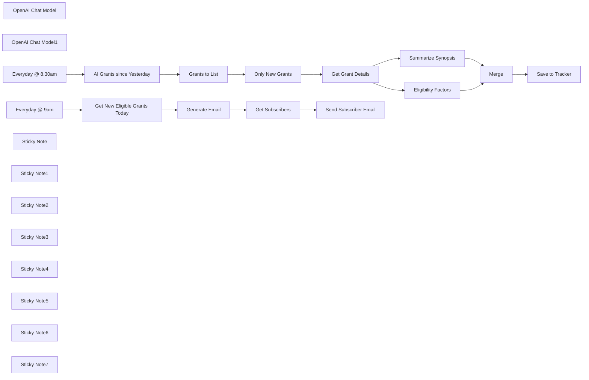

## Fluxo (.json) :

```json
{
  "nodes": [
    {
      "id": "c17e444e-0a5e-4bfe-8de6-c3185de4465d",
      "name": "Grants to List",
      "type": "n8n-nodes-base.splitOut",
      "position": [
        -240,
        -180
      ],
      "parameters": {
        "options": {},
        "fieldToSplitOut": "oppHits"
      },
      "typeVersion": 1
    },
    {
      "id": "9251d39c-6098-42fa-aadd-3a22464dee64",
      "name": "Get Grant Details",
      "type": "n8n-nodes-base.httpRequest",
      "position": [
        280,
        -280
      ],
      "parameters": {
        "url": "https://apply07.grants.gov/grantsws/rest/opportunity/details",
        "method": "POST",
        "options": {},
        "sendBody": true,
        "contentType": "form-urlencoded",
        "bodyParameters": {
          "parameters": [
            {
              "name": "oppId",
              "value": "={{ $json.id }}"
            }
          ]
        }
      },
      "typeVersion": 4.2
    },
    {
      "id": "ade994d6-a1f8-45bf-a82e-83eb38da08d6",
      "name": "OpenAI Chat Model",
      "type": "@n8n/n8n-nodes-langchain.lmChatOpenAi",
      "position": [
        440,
        -120
      ],
      "parameters": {
        "options": {}
      },
      "credentials": {
        "openAiApi": {
          "id": "8gccIjcuf3gvaoEr",
          "name": "OpenAi account"
        }
      },
      "typeVersion": 1
    },
    {
      "id": "4d81b20e-0038-48d3-840c-3fcf8b798a0d",
      "name": "Summarize Synopsis",
      "type": "@n8n/n8n-nodes-langchain.informationExtractor",
      "position": [
        460,
        -280
      ],
      "parameters": {
        "text": "=Agency: {{ $json.synopsis.agencyName }}\nTitle: {{ $json.opportunityTitle }}\nSynopsis: {{ $json.synopsis.synopsisDesc }}",
        "options": {
          "systemPromptTemplate": "You've been given a grant opportunity listing. Help summarize the opportunity in simple terms."
        },
        "schemaType": "manual",
        "inputSchema": "{\n\t\"type\": \"object\",\n\t\"properties\": {\n        \"goal\": { \"type\": [\"string\", \"null\"] },\n        \"duration\": { \"type\": \"string\" },\n        \"success_criteria\": {\n          \"type\": \"array\",\n          \"items\": { \"type\": \"string\" }\n        },\n        \"good_to_know\": {\n\t\t  \"type\": \"array\",\n          \"items\": { \"type\": \"string\" }\n        }\n\t}\n}"
      },
      "typeVersion": 1
    },
    {
      "id": "71e1a2e9-6690-4247-aae3-f5bd61019553",
      "name": "Eligibility Factors",
      "type": "@n8n/n8n-nodes-langchain.informationExtractor",
      "position": [
        640,
        -120
      ],
      "parameters": {
        "text": "=Agency: {{  $json.synopsis.agencyName }}\nTitle: {{ $json.opportunityTitle }}\nSynopsis: {{ $json.synopsis.synopsisDesc }}\nEligibility: {{ $json.synopsis.applicantEligibilityDesc }}",
        "options": {
          "systemPromptTemplate": "Help determine if we are eligible for this grant.\n\nWe are AI Consultants Limited (“Company”) and are the controllers of your personal data. Our registered office is Unit 29, Intelligent Park, Milton Road, Cambridge Cambridgeshire CB9 RDW, and our registered company number is 1234567.\n\nWe are part of a group of companies which provides consultancy services across the globe. Our other group companies are:\n\nAI Consultants Inc. of 2 Drydock Avenue, Suite 1210, Boston, MA 02210, USA\nAI Consultants (Singapore) Pte Ltd of 300 Beach Road, Singapore 199555\nAI Consultants Japan Inc, of 3-1-3 Minamiaoyama, Minato-ku, Tokyo, 107-0062\nIn the UK we are registered with the Information Commissioner’s Office under registration number Z9888888.\n\nIn the US we are registered with the Data Privacy Framework Program (DPF). To view the Company’s certification, please visit https://www.dataprivacyframework.gov/list.\n\nWe are a leading, worldwide product development service provider. We specialise in design engineering services, professional technical services and product technical support services (“Services”).\n\nAs the deep tech powerhouse of Capgemini, CC spearheads transformative projects to solve the toughest scientific and engineering challenges. Ambitious clients collaborate with us to create new-to-the-world technologies, services and products that have never been seen before. Our unique combination of technical, commercial and market expertise yields market-leading solutions that are hard to copy. This creates valuable intellectual property that generates protectable long-term value.\n\nWe work with some of the world’s biggest brands and most ambitious technology start-up ventures across a wide range of markets. From aerospace to agritech, consumer to industry, communications to healthcare, our knowledge of one sector can often be applied to another to create new breakthroughs. We focus on our clients’ success and we are trusted as integral partners in the future of their businesses.\n\nWe do important, difficult, radical and impactful things that benefit society. We helped develop the world's first 24/7 wrist-worn activity monitor, wireless pacemaker and wireless patient monitor, as well as the first connected drug inhaler. Our work led to the most densely packed cellular network in the world – orchestrating swarms of bots across highly automated warehouses. It produced the Bluetooth chip that connects your phone to your car and the latest satellite technology that lets people in remote locations across the world keep in touch."
        },
        "schemaType": "manual",
        "inputSchema": "{\n\t\"type\": \"object\",\n\t\"properties\": {\n\t\t\"eligibility_matches\": {\n\t\t  \"type\": \"array\",\n          \"items\": { \"type\": \"string\" }\n        }\n\t}\n}"
      },
      "typeVersion": 1
    },
    {
      "id": "d741ef63-dcf3-452d-978c-8cbc27f55a33",
      "name": "OpenAI Chat Model1",
      "type": "@n8n/n8n-nodes-langchain.lmChatOpenAi",
      "position": [
        600,
        20
      ],
      "parameters": {
        "options": {}
      },
      "credentials": {
        "openAiApi": {
          "id": "8gccIjcuf3gvaoEr",
          "name": "OpenAi account"
        }
      },
      "typeVersion": 1
    },
    {
      "id": "7354ed6d-50f5-4234-90d8-2d9d0c7eccd4",
      "name": "Merge",
      "type": "n8n-nodes-base.merge",
      "position": [
        1000,
        -120
      ],
      "parameters": {
        "mode": "combine",
        "options": {},
        "combineBy": "combineByPosition"
      },
      "typeVersion": 3
    },
    {
      "id": "2dffda98-18c6-4c7b-8fc3-0e6539642ea2",
      "name": "Save to Tracker",
      "type": "n8n-nodes-base.airtable",
      "position": [
        1420,
        -20
      ],
      "parameters": {
        "base": {
          "__rl": true,
          "mode": "list",
          "value": "appiNoPRvhJxz9crl",
          "cachedResultUrl": "https://airtable.com/appiNoPRvhJxz9crl",
          "cachedResultName": "US Grants.gov Tracker"
        },
        "table": {
          "__rl": true,
          "mode": "list",
          "value": "tblX93C9MNzizhibd",
          "cachedResultUrl": "https://airtable.com/appiNoPRvhJxz9crl/tblX93C9MNzizhibd",
          "cachedResultName": "Table 1"
        },
        "columns": {
          "value": {
            "URL": "=https://grants.gov/search-results-detail/{{ $('Get Grant Details').item.json.id }}",
            "Goal": "={{ $json.output.goal }}",
            "Notes": "={{ $json.output.good_to_know.join('\\n') }}",
            "Title": "={{ $('Get Grant Details').item.json.opportunityTitle }}",
            "Agency": "={{ $('Get Grant Details').item.json.synopsis.agencyContactName }}",
            "Status": "New",
            "Funding": "={{ $('Get Grant Details').item.json.synopsis.estimatedFunding }}",
            "Duration": "={{ $json.output.duration }}",
            "Award Floor": "={{ $('Get Grant Details').item.json.synopsis.awardFloor }}",
            "Posted Date": "={{ $('Get Grant Details').item.json.synopsis.postingDate }}",
            "Agency Email": "={{ $('Get Grant Details').item.json.synopsis.agencyContactEmail }}",
            "Agency Phone": "={{ $('Get Grant Details').item.json.synopsis.agencyContactPhone }}",
            "Eligibility?": "={{ $json.output.eligibility_matches.length > 0 ? 'Yes' : 'No' }}",
            "Award Ceiling": "={{ $('Get Grant Details').item.json.synopsis.awardCeiling }}",
            "Response Date": "={{ $('Get Grant Details').item.json.synopsis.responseDate }}",
            "Success Criteria": "={{ $json.output.success_criteria.join('\\n') }}",
            "Eligibility Notes": "={{ $json.output.eligibility_matches.join('\\n') }}",
            "Opportunity Number": "={{ $('Get Grant Details').item.json.opportunityNumber }}"
          },
          "schema": [
            {
              "id": "Opportunity Number",
              "type": "string",
              "display": true,
              "removed": false,
              "readOnly": false,
              "required": false,
              "displayName": "Opportunity Number",
              "defaultMatch": false,
              "canBeUsedToMatch": true
            },
            {
              "id": "Status",
              "type": "options",
              "display": true,
              "options": [
                {
                  "name": "New",
                  "value": "New"
                },
                {
                  "name": "Under Review",
                  "value": "Under Review"
                },
                {
                  "name": "Interested",
                  "value": "Interested"
                },
                {
                  "name": "Not Interested",
                  "value": "Not Interested"
                }
              ],
              "removed": false,
              "readOnly": false,
              "required": false,
              "displayName": "Status",
              "defaultMatch": false,
              "canBeUsedToMatch": true
            },
            {
              "id": "Title",
              "type": "string",
              "display": true,
              "removed": false,
              "readOnly": false,
              "required": false,
              "displayName": "Title",
              "defaultMatch": false,
              "canBeUsedToMatch": true
            },
            {
              "id": "URL",
              "type": "string",
              "display": true,
              "removed": false,
              "readOnly": false,
              "required": false,
              "displayName": "URL",
              "defaultMatch": false,
              "canBeUsedToMatch": true
            },
            {
              "id": "Goal",
              "type": "string",
              "display": true,
              "removed": false,
              "readOnly": false,
              "required": false,
              "displayName": "Goal",
              "defaultMatch": false,
              "canBeUsedToMatch": true
            },
            {
              "id": "Success Criteria",
              "type": "string",
              "display": true,
              "removed": false,
              "readOnly": false,
              "required": false,
              "displayName": "Success Criteria",
              "defaultMatch": false,
              "canBeUsedToMatch": true
            },
            {
              "id": "Notes",
              "type": "string",
              "display": true,
              "removed": false,
              "readOnly": false,
              "required": false,
              "displayName": "Notes",
              "defaultMatch": false,
              "canBeUsedToMatch": true
            },
            {
              "id": "Eligibility?",
              "type": "options",
              "display": true,
              "options": [
                {
                  "name": "Yes",
                  "value": "Yes"
                },
                {
                  "name": "No",
                  "value": "No"
                }
              ],
              "removed": false,
              "readOnly": false,
              "required": false,
              "displayName": "Eligibility?",
              "defaultMatch": false,
              "canBeUsedToMatch": true
            },
            {
              "id": "Eligibility Notes",
              "type": "string",
              "display": true,
              "removed": false,
              "readOnly": false,
              "required": false,
              "displayName": "Eligibility Notes",
              "defaultMatch": false,
              "canBeUsedToMatch": true
            },
            {
              "id": "Duration",
              "type": "string",
              "display": true,
              "removed": false,
              "readOnly": false,
              "required": false,
              "displayName": "Duration",
              "defaultMatch": false,
              "canBeUsedToMatch": true
            },
            {
              "id": "Agency",
              "type": "string",
              "display": true,
              "removed": false,
              "readOnly": false,
              "required": false,
              "displayName": "Agency",
              "defaultMatch": false,
              "canBeUsedToMatch": true
            },
            {
              "id": "Agency Email",
              "type": "string",
              "display": true,
              "removed": false,
              "readOnly": false,
              "required": false,
              "displayName": "Agency Email",
              "defaultMatch": false,
              "canBeUsedToMatch": true
            },
            {
              "id": "Agency Phone",
              "type": "string",
              "display": true,
              "removed": false,
              "readOnly": false,
              "required": false,
              "displayName": "Agency Phone",
              "defaultMatch": false,
              "canBeUsedToMatch": true
            },
            {
              "id": "Posted Date",
              "type": "dateTime",
              "display": true,
              "removed": false,
              "readOnly": false,
              "required": false,
              "displayName": "Posted Date",
              "defaultMatch": false,
              "canBeUsedToMatch": true
            },
            {
              "id": "Response Date",
              "type": "dateTime",
              "display": true,
              "removed": false,
              "readOnly": false,
              "required": false,
              "displayName": "Response Date",
              "defaultMatch": false,
              "canBeUsedToMatch": true
            },
            {
              "id": "Funding",
              "type": "number",
              "display": true,
              "removed": false,
              "readOnly": false,
              "required": false,
              "displayName": "Funding",
              "defaultMatch": false,
              "canBeUsedToMatch": true
            },
            {
              "id": "Award Ceiling",
              "type": "number",
              "display": true,
              "removed": false,
              "readOnly": false,
              "required": false,
              "displayName": "Award Ceiling",
              "defaultMatch": false,
              "canBeUsedToMatch": true
            },
            {
              "id": "Award Floor",
              "type": "number",
              "display": true,
              "removed": false,
              "readOnly": false,
              "required": false,
              "displayName": "Award Floor",
              "defaultMatch": false,
              "canBeUsedToMatch": true
            }
          ],
          "mappingMode": "defineBelow",
          "matchingColumns": []
        },
        "options": {},
        "operation": "create"
      },
      "credentials": {
        "airtableTokenApi": {
          "id": "Und0frCQ6SNVX3VV",
          "name": "Airtable Personal Access Token account"
        }
      },
      "typeVersion": 2.1
    },
    {
      "id": "f0712788-b801-4070-a5c2-2f7ed620588e",
      "name": "Only New Grants",
      "type": "n8n-nodes-base.removeDuplicates",
      "position": [
        -60,
        -180
      ],
      "parameters": {
        "options": {},
        "operation": "removeItemsSeenInPreviousExecutions",
        "dedupeValue": "={{ $json.id }}"
      },
      "typeVersion": 2
    },
    {
      "id": "fb4ac14d-0bdd-40f7-9b31-3a23450b1f0b",
      "name": "AI Grants since Yesterday",
      "type": "n8n-nodes-base.httpRequest",
      "position": [
        -420,
        -180
      ],
      "parameters": {
        "url": "https://apply07.grants.gov/grantsws/rest/opportunities/search",
        "method": "POST",
        "options": {},
        "jsonBody": "{\n  \"keyword\": \"ai\",\n  \"cfda\": null,\n  \"agencies\": null,\n  \"sortBy\": \"openDate|desc\",\n  \"rows\": 5000,\n  \"eligibilities\": null,\n  \"fundingCategories\": null,\n  \"fundingInstruments\": null,\n  \"dateRange\": \"1\",\n  \"oppStatuses\": \"forecasted|posted\"\n}",
        "sendBody": true,
        "specifyBody": "json"
      },
      "typeVersion": 4.2
    },
    {
      "id": "0446c882-764a-4c94-8c49-f368c50586a0",
      "name": "Get New Eligible Grants Today",
      "type": "n8n-nodes-base.airtable",
      "position": [
        -400,
        500
      ],
      "parameters": {
        "base": {
          "__rl": true,
          "mode": "list",
          "value": "appiNoPRvhJxz9crl",
          "cachedResultUrl": "https://airtable.com/appiNoPRvhJxz9crl",
          "cachedResultName": "US Grants.gov Tracker"
        },
        "table": {
          "__rl": true,
          "mode": "list",
          "value": "tblX93C9MNzizhibd",
          "cachedResultUrl": "https://airtable.com/appiNoPRvhJxz9crl/tblX93C9MNzizhibd",
          "cachedResultName": "Table 1"
        },
        "options": {},
        "operation": "search",
        "filterByFormula": "=AND(\n  {Status} = 'New',\n  {Eligibility?} = 'Yes',\n  IS_SAME(DATETIME_FORMAT(Created, 'YYYY-MM-DD'), DATETIME_FORMAT(TODAY(), 'YYYY-MM-DD'))\n)"
      },
      "credentials": {
        "airtableTokenApi": {
          "id": "Und0frCQ6SNVX3VV",
          "name": "Airtable Personal Access Token account"
        }
      },
      "typeVersion": 2.1
    },
    {
      "id": "70bca43a-d00e-4ee6-828a-9926ba1d8fdb",
      "name": "Generate Email",
      "type": "n8n-nodes-base.html",
      "position": [
        -160,
        500
      ],
      "parameters": {
        "html": "<!DOCTYPE HTML PUBLIC \"-//W3C//DTD XHTML 1.0 Transitional //EN\" \"http://www.w3.org/TR/xhtml1/DTD/xhtml1-transitional.dtd\">\n<html xmlns=\"http://www.w3.org/1999/xhtml\" xmlns:v=\"urn:schemas-microsoft-com:vml\" xmlns:o=\"urn:schemas-microsoft-com:office:office\">\n<head>\n<!--[if gte mso 9]>\n<xml>\n  <o:OfficeDocumentSettings>\n    <o:AllowPNG/>\n    <o:PixelsPerInch>96</o:PixelsPerInch>\n  </o:OfficeDocumentSettings>\n</xml>\n<![endif]-->\n  <meta http-equiv=\"Content-Type\" content=\"text/html; charset=UTF-8\">\n  <meta name=\"viewport\" content=\"width=device-width, initial-scale=1.0\">\n  <meta name=\"x-apple-disable-message-reformatting\">\n  <!--[if !mso]><!--><meta http-equiv=\"X-UA-Compatible\" content=\"IE=edge\"><!--<![endif]-->\n  <title></title>\n  \n    <style type=\"text/css\">\n      @media only screen and (min-width: 520px) {\n  .u-row {\n    width: 500px !important;\n  }\n  .u-row .u-col {\n    vertical-align: top;\n  }\n\n  .u-row .u-col-100 {\n    width: 500px !important;\n  }\n\n}\n\n@media (max-width: 520px) {\n  .u-row-container {\n    max-width: 100% !important;\n    padding-left: 0px !important;\n    padding-right: 0px !important;\n  }\n  .u-row .u-col {\n    min-width: 320px !important;\n    max-width: 100% !important;\n    display: block !important;\n  }\n  .u-row {\n    width: 100% !important;\n  }\n  .u-col {\n    width: 100% !important;\n  }\n  .u-col > div {\n    margin: 0 auto;\n  }\n}\nbody {\n  margin: 0;\n  padding: 0;\n}\n\ntable,\ntr,\ntd {\n  vertical-align: top;\n  border-collapse: collapse;\n}\n\np {\n  margin: 0;\n}\n\n.ie-container table,\n.mso-container table {\n  table-layout: fixed;\n}\n\n* {\n  line-height: inherit;\n}\n\na[x-apple-data-detectors='true'] {\n  color: inherit !important;\n  text-decoration: none !important;\n}\n\ntable, td { color: #000000; } </style>\n  \n  \n\n</head>\n\n<body class=\"clean-body u_body\" style=\"margin: 0;padding: 0;-webkit-text-size-adjust: 100%;background-color: #F7F8F9;color: #000000\">\n  <!--[if IE]><div class=\"ie-container\"><![endif]-->\n  <!--[if mso]><div class=\"mso-container\"><![endif]-->\n  <table style=\"border-collapse: collapse;table-layout: fixed;border-spacing: 0;mso-table-lspace: 0pt;mso-table-rspace: 0pt;vertical-align: top;min-width: 320px;Margin: 0 auto;background-color: #F7F8F9;width:100%\" cellpadding=\"0\" cellspacing=\"0\">\n  <tbody>\n  <tr style=\"vertical-align: top\">\n    <td style=\"word-break: break-word;border-collapse: collapse !important;vertical-align: top\">\n    <!--[if (mso)|(IE)]><table width=\"100%\" cellpadding=\"0\" cellspacing=\"0\" border=\"0\"><tr><td align=\"center\" style=\"background-color: #F7F8F9;\"><![endif]-->\n    \n  \n  \n<div class=\"u-row-container\" style=\"padding: 0px;background-color: #f7f8f9\">\n  <div class=\"u-row\" style=\"margin: 0 auto;min-width: 320px;max-width: 500px;overflow-wrap: break-word;word-wrap: break-word;word-break: break-word;background-color: #ffffff;\">\n    <div style=\"border-collapse: collapse;display: table;width: 100%;height: 100%;background-color: transparent;\">\n      <!--[if (mso)|(IE)]><table width=\"100%\" cellpadding=\"0\" cellspacing=\"0\" border=\"0\"><tr><td style=\"padding: 0px;background-color: #f7f8f9;\" align=\"center\"><table cellpadding=\"0\" cellspacing=\"0\" border=\"0\" style=\"width:500px;\"><tr style=\"background-color: #ffffff;\"><![endif]-->\n      \n<!--[if (mso)|(IE)]><td align=\"center\" width=\"500\" style=\"background-color: #f7f8f9;width: 500px;padding: 0px;border-top: 0px solid transparent;border-left: 0px solid transparent;border-right: 0px solid transparent;border-bottom: 0px solid transparent;border-radius: 0px;-webkit-border-radius: 0px; -moz-border-radius: 0px;\" valign=\"top\"><![endif]-->\n<div class=\"u-col u-col-100\" style=\"max-width: 320px;min-width: 500px;display: table-cell;vertical-align: top;\">\n  <div style=\"background-color: #f7f8f9;height: 100%;width: 100% !important;border-radius: 0px;-webkit-border-radius: 0px; -moz-border-radius: 0px;\">\n  <!--[if (!mso)&(!IE)]><!--><div style=\"box-sizing: border-box; height: 100%; padding: 0px;border-top: 0px solid transparent;border-left: 0px solid transparent;border-right: 0px solid transparent;border-bottom: 0px solid transparent;border-radius: 0px;-webkit-border-radius: 0px; -moz-border-radius: 0px;\"><!--<![endif]-->\n  \n<table style=\"font-family:arial,helvetica,sans-serif;\" role=\"presentation\" cellpadding=\"0\" cellspacing=\"0\" width=\"100%\" border=\"0\">\n  <tbody>\n    <tr>\n      <td style=\"overflow-wrap:break-word;word-break:break-word;padding:32px 10px;font-family:arial,helvetica,sans-serif;\" align=\"left\">\n        \n  <!--[if mso]><table width=\"100%\"><tr><td><![endif]-->\n    <h1 style=\"margin: 0px; line-height: 140%; text-align: center; word-wrap: break-word; font-family: arial black,AvenirNext-Heavy,avant garde,arial; font-size: 22px; font-weight: 400;\"><span><span><span><span><span><span>Latest AI Grants</span></span></span></span></span></span></h1>\n  <!--[if mso]></td></tr></table><![endif]-->\n\n      </td>\n    </tr>\n  </tbody>\n</table>\n\n  <!--[if (!mso)&(!IE)]><!--></div><!--<![endif]-->\n  </div>\n</div>\n<!--[if (mso)|(IE)]></td><![endif]-->\n      <!--[if (mso)|(IE)]></tr></table></td></tr></table><![endif]-->\n    </div>\n  </div>\n  </div>\n  \n\n\n  \n  \n<div class=\"u-row-container\" style=\"padding: 0px;background-color: #f7f8f9\">\n  <div class=\"u-row\" style=\"margin: 0 auto;min-width: 320px;max-width: 500px;overflow-wrap: break-word;word-wrap: break-word;word-break: break-word;background-color: transparent;\">\n    <div style=\"border-collapse: collapse;display: table;width: 100%;height: 100%;background-color: transparent;\">\n      <!--[if (mso)|(IE)]><table width=\"100%\" cellpadding=\"0\" cellspacing=\"0\" border=\"0\"><tr><td style=\"padding: 0px;background-color: #f7f8f9;\" align=\"center\"><table cellpadding=\"0\" cellspacing=\"0\" border=\"0\" style=\"width:500px;\"><tr style=\"background-color: transparent;\"><![endif]-->\n      \n<!--[if (mso)|(IE)]><td align=\"center\" width=\"500\" style=\"background-color: #ffffff;width: 500px;padding: 0px;border-top: 0px solid transparent;border-left: 0px solid transparent;border-right: 0px solid transparent;border-bottom: 0px solid transparent;border-radius: 0px;-webkit-border-radius: 0px; -moz-border-radius: 0px;\" valign=\"top\"><![endif]-->\n<div class=\"u-col u-col-100\" style=\"max-width: 320px;min-width: 500px;display: table-cell;vertical-align: top;\">\n  <div style=\"background-color: #ffffff;height: 100%;width: 100% !important;border-radius: 0px;-webkit-border-radius: 0px; -moz-border-radius: 0px;\">\n  <!--[if (!mso)&(!IE)]><!--><div style=\"box-sizing: border-box; height: 100%; padding: 0px;border-top: 0px solid transparent;border-left: 0px solid transparent;border-right: 0px solid transparent;border-bottom: 0px solid transparent;border-radius: 0px;-webkit-border-radius: 0px; -moz-border-radius: 0px;\"><!--<![endif]-->\n  \n<table style=\"font-family:arial,helvetica,sans-serif;\" role=\"presentation\" cellpadding=\"0\" cellspacing=\"0\" width=\"100%\" border=\"0\">\n  <tbody>\n    <tr>\n      <td style=\"overflow-wrap:break-word;word-break:break-word;padding:10px;font-family:arial,helvetica,sans-serif;\" align=\"left\">\n{{\n$input.all().map((input,idx) => {\nreturn `\n  <div>\n    <div style=\"padding-top:14px;padding-bottom:24px\">\n  <h3 style=\"margin-top:0;margin-bottom:7px;font-size:16px\">\n    ${idx+1}. ${input.json.Title}\n  </h3>\n  <div style=\"margin-bottom:14px;font-size:12px;\">\n        <strong>${input.json.Agency}</strong>\n        &middot;\n        <a href=\"${input.json.URL}\">See details</a>\n  </div>\n  <p style=\"margin-bottom:14px;font-size:14px\">\n        <strong>Synopsis:</strong> ${input.json.Goal}\n  </p>\n  <ul style=\"font-size:14px;\">\n        ${input.json['Success Criteria']\n          .split('\\n')\n          .map(text => `<li>${text}</li>`)\n          .join('')\n        }\n  </ul>\n  <div style=\"font-size:12px;\">\n    <strong>Posted By</strong> ${input.json['Posted Date']\n      .toDateTime()\n      .format('EEE, dd MMM yyyy t')}\n    <br/>\n    <strong>Respond By</strong> ${input.json['Response Date']\n          .toDateTime()\n          .format('EEE, dd MMM yyyy t')}\n    \n  </div>\n</div> \n`\n}).join('<hr/>')\n}}        \n      </td>\n    </tr>\n  </tbody>\n</table>\n\n  <!--[if (!mso)&(!IE)]><!--></div><!--<![endif]-->\n  </div>\n</div>\n<!--[if (mso)|(IE)]></td><![endif]-->\n      <!--[if (mso)|(IE)]></tr></table></td></tr></table><![endif]-->\n    </div>\n  </div>\n  </div>\n  \n\n\n  \n  \n<div class=\"u-row-container\" style=\"padding: 0px;background-color: transparent\">\n  <div class=\"u-row\" style=\"margin: 0 auto;min-width: 320px;max-width: 500px;overflow-wrap: break-word;word-wrap: break-word;word-break: break-word;background-color: transparent;\">\n    <div style=\"border-collapse: collapse;display: table;width: 100%;height: 100%;background-color: transparent;\">\n      <!--[if (mso)|(IE)]><table width=\"100%\" cellpadding=\"0\" cellspacing=\"0\" border=\"0\"><tr><td style=\"padding: 0px;background-color: transparent;\" align=\"center\"><table cellpadding=\"0\" cellspacing=\"0\" border=\"0\" style=\"width:500px;\"><tr style=\"background-color: transparent;\"><![endif]-->\n      \n<!--[if (mso)|(IE)]><td align=\"center\" width=\"500\" style=\"width: 500px;padding: 0px;border-top: 0px solid transparent;border-left: 0px solid transparent;border-right: 0px solid transparent;border-bottom: 0px solid transparent;border-radius: 0px;-webkit-border-radius: 0px; -moz-border-radius: 0px;\" valign=\"top\"><![endif]-->\n<div class=\"u-col u-col-100\" style=\"max-width: 320px;min-width: 500px;display: table-cell;vertical-align: top;\">\n  <div style=\"height: 100%;width: 100% !important;border-radius: 0px;-webkit-border-radius: 0px; -moz-border-radius: 0px;\">\n  <!--[if (!mso)&(!IE)]><!--><div style=\"box-sizing: border-box; height: 100%; padding: 0px;border-top: 0px solid transparent;border-left: 0px solid transparent;border-right: 0px solid transparent;border-bottom: 0px solid transparent;border-radius: 0px;-webkit-border-radius: 0px; -moz-border-radius: 0px;\"><!--<![endif]-->\n  \n<table style=\"font-family:arial,helvetica,sans-serif;\" role=\"presentation\" cellpadding=\"0\" cellspacing=\"0\" width=\"100%\" border=\"0\">\n  <tbody>\n    <tr>\n      <td style=\"overflow-wrap:break-word;word-break:break-word;padding:24px 10px;font-family:arial,helvetica,sans-serif;\" align=\"left\">\n        \n  <div style=\"font-size: 14px; color: #7e8c8d; line-height: 140%; text-align: center; word-wrap: break-word;\">\n    <p style=\"line-height: 140%;\">Autogenerated by n8n.</p>\n<p style=\"line-height: 140%;\">Brought to you by workflow #{{ $workflow.id }}</p>\n  </div>\n\n      </td>\n    </tr>\n  </tbody>\n</table>\n\n  <!--[if (!mso)&(!IE)]><!--></div><!--<![endif]-->\n  </div>\n</div>\n<!--[if (mso)|(IE)]></td><![endif]-->\n      <!--[if (mso)|(IE)]></tr></table></td></tr></table><![endif]-->\n    </div>\n  </div>\n  </div>\n  \n\n\n    <!--[if (mso)|(IE)]></td></tr></table><![endif]-->\n    </td>\n  </tr>\n  </tbody>\n  </table>\n  <!--[if mso]></div><![endif]-->\n  <!--[if IE]></div><![endif]-->\n</body>\n\n</html>\n"
      },
      "executeOnce": true,
      "typeVersion": 1.2
    },
    {
      "id": "12bd72f5-3028-4572-b59e-1cc143e44a86",
      "name": "Everyday @ 9am",
      "type": "n8n-nodes-base.scheduleTrigger",
      "position": [
        -720,
        460
      ],
      "parameters": {
        "rule": {
          "interval": [
            {
              "triggerAtHour": 8
            }
          ]
        }
      },
      "typeVersion": 1.2
    },
    {
      "id": "ca62c507-bce5-4a63-be0e-e60591408668",
      "name": "Everyday @ 8.30am",
      "type": "n8n-nodes-base.scheduleTrigger",
      "position": [
        -720,
        -220
      ],
      "parameters": {
        "rule": {
          "interval": [
            {
              "triggerAtHour": 8,
              "triggerAtMinute": 30
            }
          ]
        }
      },
      "typeVersion": 1.2
    },
    {
      "id": "032bec7e-5aff-4103-b81e-e5bc4a88ddde",
      "name": "Sticky Note",
      "type": "n8n-nodes-base.stickyNote",
      "position": [
        -540,
        -420
      ],
      "parameters": {
        "color": 7,
        "width": 700,
        "height": 480,
        "content": "## 1. Fetch Latest AI Grants, Ignore Those Already Seen\n[Learn more about the Remove Duplicates node](https://docs.n8n.io/integrations/builtin/core-nodes/n8n-nodes-base.removeduplicates/)\n\nA cool feature of n8n's remove duplicates node is that it works across executions. What this means for this template is that the node will help us keep track of grant IDs to know if we've already processed them and if so, filter them out so we won't have duplicate alerts."
      },
      "typeVersion": 1
    },
    {
      "id": "07147665-3571-4512-adce-2727dcb95240",
      "name": "Sticky Note1",
      "type": "n8n-nodes-base.stickyNote",
      "position": [
        180,
        -520
      ],
      "parameters": {
        "color": 7,
        "width": 1000,
        "height": 720,
        "content": "## 2. Quickly Determine Eligibility Using AI\n[Learn more about the Information Extractor node](https://docs.n8n.io/integrations/builtin/cluster-nodes/root-nodes/n8n-nodes-langchain.information-extractor/)\n\nQualifying Leads requires a lot of contextual reasoning taking into account many factors such as commercials, location and eligibility criteria. Whilst it's not guaranteed AI can or will solve this for your particular requirements, it can however get you a good distance of the way there!\n\nAI in this template intends to reduce time (and therefore cost) for a team member needs to spend per grant listing or increase their coverage of grants which they would otherwise miss due to capacity."
      },
      "typeVersion": 1
    },
    {
      "id": "f4758b4d-727a-4ce8-b071-3388eb16b219",
      "name": "Sticky Note2",
      "type": "n8n-nodes-base.stickyNote",
      "position": [
        1200,
        -280
      ],
      "parameters": {
        "color": 7,
        "width": 520,
        "height": 480,
        "content": "## 3. Save Results to Grant Tracker\n[Learn more about the Airtable Node](https://docs.n8n.io/integrations/builtin/app-nodes/n8n-nodes-base.airtable/)\n\nIn n8n, it's easy to send your data anywhere to manage yourself, share with your team or reuse with other workflows. Here for demonstration purposes, we'll just store each grant as a row in our Airtable database.\n\nCheck out the sample Airtable here: https://airtable.com/appiNoPRvhJxz9crl/shrRdP6zstgsxjDKL"
      },
      "typeVersion": 1
    },
    {
      "id": "a7861a21-021f-4629-b863-2163c7436d13",
      "name": "Sticky Note3",
      "type": "n8n-nodes-base.stickyNote",
      "position": [
        -540,
        240
      ],
      "parameters": {
        "color": 7,
        "width": 620,
        "height": 500,
        "content": "## 4. Generate Latest AI Grants Alert Email\n[Learn more about the HTML Template node](https://docs.n8n.io/integrations/builtin/core-nodes/n8n-nodes-base.html/)\n\nUsing our freshly collected AI grants, it would be nice if we can share them with our team members via email. A nicely formatted email digest can be generated using the HTML template node, with added links for greater impact.\n\nHere in this demonstration, we will loop through all eligible new grants and compile them into a newsletter format using the HTML node.\n"
      },
      "typeVersion": 1
    },
    {
      "id": "4d09af53-92cb-4288-86d7-dcf695bfb358",
      "name": "Sticky Note4",
      "type": "n8n-nodes-base.stickyNote",
      "position": [
        100,
        240
      ],
      "parameters": {
        "color": 7,
        "width": 640,
        "height": 500,
        "content": "## 5. Send to a list of Subscribers\n[Learn more about the Gmail node](https://docs.n8n.io/integrations/builtin/app-nodes/n8n-nodes-base.gmail/)\n\nFinally, we can source a list of subscribers to send our generated email newsletter.\n\nHere, our subscriber list is another table alongside our grants table that we can import that list using the Airtable node. You can use any email provider that supports HTML but for this demonstration, we're using Gmail for simplicity sake."
      },
      "typeVersion": 1
    },
    {
      "id": "784d59f3-5b1f-4404-bc04-4bd58cf03585",
      "name": "Get Subscribers",
      "type": "n8n-nodes-base.airtable",
      "position": [
        240,
        500
      ],
      "parameters": {
        "base": {
          "__rl": true,
          "mode": "list",
          "value": "appiNoPRvhJxz9crl",
          "cachedResultUrl": "https://airtable.com/appiNoPRvhJxz9crl",
          "cachedResultName": "US Grants.gov Tracker"
        },
        "table": {
          "__rl": true,
          "mode": "list",
          "value": "tblaS91hyhguntfaC",
          "cachedResultUrl": "https://airtable.com/appiNoPRvhJxz9crl/tblaS91hyhguntfaC",
          "cachedResultName": "Subscribers"
        },
        "options": {},
        "operation": "search",
        "filterByFormula": "AND({Status} = 'Active')"
      },
      "credentials": {
        "airtableTokenApi": {
          "id": "Und0frCQ6SNVX3VV",
          "name": "Airtable Personal Access Token account"
        }
      },
      "executeOnce": true,
      "typeVersion": 2.1
    },
    {
      "id": "3be0788b-90ef-4648-aa25-1170208a685d",
      "name": "Send Subscriber Email",
      "type": "n8n-nodes-base.gmail",
      "position": [
        480,
        500
      ],
      "webhookId": "37eeec7a-1982-4137-8473-313bfb6c5b42",
      "parameters": {
        "sendTo": "={{ $json.Email }}",
        "message": "={{ $('Generate Email').first().json.html }}",
        "options": {},
        "subject": "Daily Newletter for Intersting US Grants"
      },
      "credentials": {
        "gmailOAuth2": {
          "id": "Sf5Gfl9NiFTNXFWb",
          "name": "Gmail account"
        }
      },
      "typeVersion": 2.1
    },
    {
      "id": "14a65482-b314-4a2f-9ce3-87e3aae126f9",
      "name": "Sticky Note5",
      "type": "n8n-nodes-base.stickyNote",
      "position": [
        -1280,
        300
      ],
      "parameters": {
        "color": 7,
        "width": 460,
        "height": 200,
        "content": "## Scheduled Triggers\n[Learn more about Scheduled Triggers](https://docs.n8n.io/integrations/builtin/core-nodes/n8n-nodes-base.scheduletrigger)\n\nScheduled triggers are a great way to run this template automatically in the morning ready for your team before they start their working day.\n\nFeel free to adjust the interval to a time which suits you!"
      },
      "typeVersion": 1
    },
    {
      "id": "b172eb7a-58bc-4d4a-be22-796d34a59897",
      "name": "Sticky Note6",
      "type": "n8n-nodes-base.stickyNote",
      "position": [
        -1280,
        -620
      ],
      "parameters": {
        "width": 460,
        "height": 900,
        "content": "## Try It Out!\n\n### This n8n templates demonstrates how to automatically ingest a source of leads at regular intervals and take advantage of n8n's remove duplicates node to simplify duplicate detection.\nAdditionally after the leads are captured, a simple alerts notification can be generated and shared with team members.\n\n### How it works\n* A scheduled trigger is set to fetch a list of AI grants listed on the grants.gov website in the past day.\n* A Remove Duplicates node is used to track Grant IDs to filter out those already processed by the workflow.\n* New grants are summarized and analysed by AI nodes to determine eligibility and interest which is then saved to an Airtable database.\n* Another scheduled trigger starts a little later  than the first to collect and summarize the new grants\n* The results are then compiled into an email template using the HTML node, in the form of a newsletter designed to alert and brief team members of new AI grants.\n* This email is then sent to a list of subscribers using the gmail node.\n\n## How to use\n* Make a copy of sample Airtable here: https://airtable.com/appiNoPRvhJxz9crl/shrRdP6zstgsxjDKL\n* The filters for fetching the grants is currently set to the \"AI\" category. Feel free to change this to include more categories.\n* Not interested in grants, this template can works for other sources of leads just change the endpoint and how you're defining the item ID to track.\n\n\n### Need Help?\nJoin the [Discord](https://discord.com/invite/XPKeKXeB7d) or ask in the [Forum](https://community.n8n.io/)!\n\nHappy Hacking!"
      },
      "typeVersion": 1
    },
    {
      "id": "f9849413-4dad-44dc-92ec-8879d123bfd3",
      "name": "Sticky Note7",
      "type": "n8n-nodes-base.stickyNote",
      "position": [
        720,
        40
      ],
      "parameters": {
        "width": 320,
        "height": 120,
        "content": "### Add your company details here!\nCompany details are added in the system prompt to help the AI determine eligibility. The more details the better!"
      },
      "typeVersion": 1
    }
  ],
  "pinData": {},
  "connections": {
    "Merge": {
      "main": [
        [
          {
            "node": "Save to Tracker",
            "type": "main",
            "index": 0
          }
        ]
      ]
    },
    "Everyday @ 9am": {
      "main": [
        [
          {
            "node": "Get New Eligible Grants Today",
            "type": "main",
            "index": 0
          }
        ]
      ]
    },
    "Generate Email": {
      "main": [
        [
          {
            "node": "Get Subscribers",
            "type": "main",
            "index": 0
          }
        ]
      ]
    },
    "Grants to List": {
      "main": [
        [
          {
            "node": "Only New Grants",
            "type": "main",
            "index": 0
          }
        ]
      ]
    },
    "Get Subscribers": {
      "main": [
        [
          {
            "node": "Send Subscriber Email",
            "type": "main",
            "index": 0
          }
        ]
      ]
    },
    "Only New Grants": {
      "main": [
        [
          {
            "node": "Get Grant Details",
            "type": "main",
            "index": 0
          }
        ]
      ]
    },
    "Save to Tracker": {
      "main": [
        []
      ]
    },
    "Everyday @ 8.30am": {
      "main": [
        [
          {
            "node": "AI Grants since Yesterday",
            "type": "main",
            "index": 0
          }
        ]
      ]
    },
    "Get Grant Details": {
      "main": [
        [
          {
            "node": "Summarize Synopsis",
            "type": "main",
            "index": 0
          },
          {
            "node": "Eligibility Factors",
            "type": "main",
            "index": 0
          }
        ]
      ]
    },
    "OpenAI Chat Model": {
      "ai_languageModel": [
        [
          {
            "node": "Summarize Synopsis",
            "type": "ai_languageModel",
            "index": 0
          }
        ]
      ]
    },
    "OpenAI Chat Model1": {
      "ai_languageModel": [
        [
          {
            "node": "Eligibility Factors",
            "type": "ai_languageModel",
            "index": 0
          }
        ]
      ]
    },
    "Summarize Synopsis": {
      "main": [
        [
          {
            "node": "Merge",
            "type": "main",
            "index": 0
          }
        ]
      ]
    },
    "Eligibility Factors": {
      "main": [
        [
          {
            "node": "Merge",
            "type": "main",
            "index": 1
          }
        ]
      ]
    },
    "AI Grants since Yesterday": {
      "main": [
        [
          {
            "node": "Grants to List",
            "type": "main",
            "index": 0
          }
        ]
      ]
    },
    "Get New Eligible Grants Today": {
      "main": [
        [
          {
            "node": "Generate Email",
            "type": "main",
            "index": 0
          }
        ]
      ]
    }
  }
}
```

<a id="template-1120"></a>

## Template 1120 - Criação automática de lead no Pipedrive

- **Nome:** Criação automática de lead no Pipedrive
- **Descrição:** Recebe um e-mail via formulário, valida-o, enriquece os dados do contato e da empresa e cria organização, pessoa e lead no Pipedrive quando não existem registros correspondentes.
- **Funcionalidade:** • Captura de leads via formulário: recebe o e-mail do usuário através de um formulário público.
• Verificação de e-mail: valida a existência e a qualidade do e-mail utilizando um serviço de verificação.
• Filtragem de e-mails inválidos: interrompe o processo para endereços considerados inválidos.
• Busca por pessoa existente: pesquisa no CRM para evitar criação de contatos duplicados.
• Enriquecimento de dados: obtém informações adicionais da pessoa e da empresa a partir do e-mail.
• Busca e criação de organização: verifica se a organização já existe no CRM e cria uma nova quando necessário.
• Criação de pessoa: adiciona o contato no CRM vinculando-o à organização apropriada.
• Criação de lead: gera um lead associado à pessoa e à organização recém-criada ou existente.
• Evita duplicação: garante que não sejam criados registros quando a pessoa já existe no CRM.
- **Ferramentas:** • Formulário web: coleta o e-mail do lead através de um formulário público.
• Hunter.io: serviço de verificação de e-mails para validar a autenticidade e qualidade do endereço.
• Clearbit: serviço de enriquecimento para obter dados da pessoa e da empresa a partir do e-mail.
• Pipedrive: CRM utilizado para pesquisar e criar organizações, pessoas e leads.

## Fluxo visual

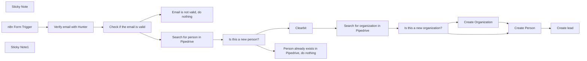

## Fluxo (.json) :

```json
{
  "meta": {
    "instanceId": "257476b1ef58bf3cb6a46e65fac7ee34a53a5e1a8492d5c6e4da5f87c9b82833"
  },
  "nodes": [
    {
      "id": "332e7401-26ac-4ef0-a93c-1290454ffce4",
      "name": "Sticky Note",
      "type": "n8n-nodes-base.stickyNote",
      "position": [
        -3180,
        820
      ],
      "parameters": {
        "color": 5,
        "width": 654.1162790697673,
        "height": 144.52300171817149,
        "content": "### 👨‍🎤 Setup\n1. Add your **Hunter.io**, **Clearbit** and **Pipedrive** credentials \n2. Click the test workflow button\n3. Activate the workflow and use the form trigger production URL to collect your leads in a smart way "
      },
      "typeVersion": 1
    },
    {
      "id": "59c576d8-0fd2-45e4-849a-67a1125cf61e",
      "name": "n8n Form Trigger",
      "type": "n8n-nodes-base.formTrigger",
      "position": [
        -3120,
        1000
      ],
      "webhookId": "09f63412-7c4a-4752-93cd-ff1c87774226",
      "parameters": {
        "path": "0bf8840f-1cc4-46a9-86af-a3fa8da80608",
        "options": {},
        "formTitle": "Contact us",
        "formFields": {
          "values": [
            {
              "fieldLabel": "What's your business email?"
            }
          ]
        },
        "formDescription": "We'll get back to you soon"
      },
      "typeVersion": 2
    },
    {
      "id": "963caa71-9919-4d14-837d-b879d41a8f93",
      "name": "Check if the email is valid",
      "type": "n8n-nodes-base.if",
      "position": [
        -2700,
        1000
      ],
      "parameters": {
        "options": {},
        "conditions": {
          "options": {
            "leftValue": "",
            "caseSensitive": true,
            "typeValidation": "strict"
          },
          "combinator": "and",
          "conditions": [
            {
              "id": "54d84c8a-63ee-40ed-8fb2-301fff0194ba",
              "operator": {
                "name": "filter.operator.equals",
                "type": "string",
                "operation": "equals"
              },
              "leftValue": "={{ $json.status }}",
              "rightValue": "valid"
            }
          ]
        }
      },
      "typeVersion": 2
    },
    {
      "id": "678db529-69f1-423a-b551-2321590b878a",
      "name": "Sticky Note1",
      "type": "n8n-nodes-base.stickyNote",
      "position": [
        -3120,
        1140
      ],
      "parameters": {
        "color": 7,
        "width": 162,
        "height": 139,
        "content": "👆 You can exchange this with any form you like (*e.g. Typeform, Google forms, Survey Monkey...*)"
      },
      "typeVersion": 1
    },
    {
      "id": "bdd1848c-9b44-4476-9655-be7cb7ac377b",
      "name": "Email is not valid, do nothing",
      "type": "n8n-nodes-base.noOp",
      "position": [
        -2460,
        1120
      ],
      "parameters": {},
      "typeVersion": 1
    },
    {
      "id": "40894780-029c-4654-9fba-09463e639eaf",
      "name": "Verify email with Hunter",
      "type": "n8n-nodes-base.hunter",
      "position": [
        -2900,
        1000
      ],
      "parameters": {
        "email": "={{ $json['What\\'s your business email?'] }}",
        "operation": "emailVerifier"
      },
      "credentials": {
        "hunterApi": {
          "id": "oIxKoEBTBJeT1UrT",
          "name": "Hunter account"
        }
      },
      "typeVersion": 1
    },
    {
      "id": "54ea0ab7-6c36-4724-a897-90f5786cc023",
      "name": "Clearbit",
      "type": "n8n-nodes-base.clearbit",
      "position": [
        -2040,
        900
      ],
      "parameters": {
        "email": "={{ $('Check if the email is valid').item.json.email }}",
        "resource": "person",
        "additionalFields": {}
      },
      "credentials": {
        "clearbitApi": {
          "id": "cKDImrinp9tg0ZHW",
          "name": "Clearbit account"
        }
      },
      "typeVersion": 1
    },
    {
      "id": "31a7c331-73ab-4704-87ea-ce2d5e57bb7b",
      "name": "Person already exists in Pipedrive, do nothing",
      "type": "n8n-nodes-base.noOp",
      "position": [
        -2040,
        1120
      ],
      "parameters": {},
      "typeVersion": 1
    },
    {
      "id": "6add279c-0408-4df0-b382-b399a33f633a",
      "name": "Is this a new person?",
      "type": "n8n-nodes-base.if",
      "position": [
        -2240,
        920
      ],
      "parameters": {
        "options": {},
        "conditions": {
          "options": {
            "leftValue": "",
            "caseSensitive": true,
            "typeValidation": "strict"
          },
          "combinator": "and",
          "conditions": [
            {
              "id": "f1094c47-4084-4268-9026-ccc0335eeccf",
              "operator": {
                "type": "number",
                "operation": "notExists",
                "singleValue": true
              },
              "leftValue": "={{ $json.id }}",
              "rightValue": ""
            }
          ]
        }
      },
      "executeOnce": true,
      "typeVersion": 2
    },
    {
      "id": "ad3a1538-a5a9-4e94-9c69-557363ae9490",
      "name": "Search for person in Pipedrive",
      "type": "n8n-nodes-base.pipedrive",
      "position": [
        -2460,
        920
      ],
      "parameters": {
        "term": "={{ $json.email }}",
        "resource": "person",
        "operation": "search",
        "additionalFields": {}
      },
      "credentials": {
        "pipedriveApi": {
          "id": "M3l7gIG8DdOex6wX",
          "name": "Pipedrive account"
        }
      },
      "typeVersion": 1,
      "alwaysOutputData": true
    },
    {
      "id": "2515f2e1-0acd-43f8-9868-6a94830aaebd",
      "name": "Is this a new organization?",
      "type": "n8n-nodes-base.if",
      "position": [
        -1660,
        900
      ],
      "parameters": {
        "options": {},
        "conditions": {
          "options": {
            "leftValue": "",
            "caseSensitive": true,
            "typeValidation": "strict"
          },
          "combinator": "and",
          "conditions": [
            {
              "id": "f1094c47-4084-4268-9026-ccc0335eeccf",
              "operator": {
                "type": "number",
                "operation": "notExists",
                "singleValue": true
              },
              "leftValue": "={{ $json.id }}",
              "rightValue": ""
            }
          ]
        }
      },
      "executeOnce": true,
      "typeVersion": 2
    },
    {
      "id": "2933eba8-d5fa-4178-8c9e-b330f6f3a529",
      "name": "Create Organization",
      "type": "n8n-nodes-base.pipedrive",
      "position": [
        -1460,
        780
      ],
      "parameters": {
        "name": "={{ $('Clearbit').item.json.employment.name }}",
        "resource": "organization",
        "additionalFields": {}
      },
      "credentials": {
        "pipedriveApi": {
          "id": "M3l7gIG8DdOex6wX",
          "name": "Pipedrive account"
        }
      },
      "typeVersion": 1
    },
    {
      "id": "8814f8f9-7dac-4cf3-8743-8ee9beb58b7c",
      "name": "Search for organization in Pipedrive",
      "type": "n8n-nodes-base.pipedrive",
      "position": [
        -1820,
        900
      ],
      "parameters": {
        "term": "={{ $json.employment.name }}",
        "resource": "organization",
        "operation": "search",
        "additionalFields": {}
      },
      "credentials": {
        "pipedriveApi": {
          "id": "M3l7gIG8DdOex6wX",
          "name": "Pipedrive account"
        }
      },
      "typeVersion": 1,
      "alwaysOutputData": true
    },
    {
      "id": "13af2942-ad5e-4ad4-8b2d-442131507047",
      "name": "Create Person",
      "type": "n8n-nodes-base.pipedrive",
      "position": [
        -1280,
        920
      ],
      "parameters": {
        "name": "={{ $('Clearbit').item.json.name.fullName }}",
        "resource": "person",
        "additionalFields": {
          "email": [
            "={{ $('Clearbit').item.json.email }}"
          ],
          "org_id": "={{ $json.id }}"
        }
      },
      "credentials": {
        "pipedriveApi": {
          "id": "M3l7gIG8DdOex6wX",
          "name": "Pipedrive account"
        }
      },
      "typeVersion": 1,
      "alwaysOutputData": true
    },
    {
      "id": "ed923d21-abfe-4b60-8d1b-5f976a56dbbe",
      "name": "Create lead",
      "type": "n8n-nodes-base.pipedrive",
      "position": [
        -1120,
        920
      ],
      "parameters": {
        "title": "={{ $json.name }} from {{ $json.org_id.name }}",
        "resource": "lead",
        "person_id": "={{ $json.id }}",
        "associateWith": "person",
        "additionalFields": {
          "organization_id": "={{ $json.org_id.value }}"
        }
      },
      "credentials": {
        "pipedriveApi": {
          "id": "M3l7gIG8DdOex6wX",
          "name": "Pipedrive account"
        }
      },
      "typeVersion": 1
    }
  ],
  "pinData": {},
  "connections": {
    "Clearbit": {
      "main": [
        [
          {
            "node": "Search for organization in Pipedrive",
            "type": "main",
            "index": 0
          }
        ]
      ]
    },
    "Create Person": {
      "main": [
        [
          {
            "node": "Create lead",
            "type": "main",
            "index": 0
          }
        ]
      ]
    },
    "n8n Form Trigger": {
      "main": [
        [
          {
            "node": "Verify email with Hunter",
            "type": "main",
            "index": 0
          }
        ]
      ]
    },
    "Create Organization": {
      "main": [
        [
          {
            "node": "Create Person",
            "type": "main",
            "index": 0
          }
        ]
      ]
    },
    "Is this a new person?": {
      "main": [
        [
          {
            "node": "Clearbit",
            "type": "main",
            "index": 0
          }
        ],
        [
          {
            "node": "Person already exists in Pipedrive, do nothing",
            "type": "main",
            "index": 0
          }
        ]
      ]
    },
    "Verify email with Hunter": {
      "main": [
        [
          {
            "node": "Check if the email is valid",
            "type": "main",
            "index": 0
          }
        ]
      ]
    },
    "Check if the email is valid": {
      "main": [
        [
          {
            "node": "Search for person in Pipedrive",
            "type": "main",
            "index": 0
          }
        ],
        [
          {
            "node": "Email is not valid, do nothing",
            "type": "main",
            "index": 0
          }
        ]
      ]
    },
    "Is this a new organization?": {
      "main": [
        [
          {
            "node": "Create Organization",
            "type": "main",
            "index": 0
          }
        ],
        [
          {
            "node": "Create Person",
            "type": "main",
            "index": 0
          }
        ]
      ]
    },
    "Search for person in Pipedrive": {
      "main": [
        [
          {
            "node": "Is this a new person?",
            "type": "main",
            "index": 0
          }
        ]
      ]
    },
    "Search for organization in Pipedrive": {
      "main": [
        [
          {
            "node": "Is this a new organization?",
            "type": "main",
            "index": 0
          }
        ]
      ]
    }
  }
}
```
