# PACK 1999 TEMPLATES PARTE 06 - Bloco 7

Templates neste bloco: 20

## Sumário

- [Template 1121 - Dashboard de estatísticas de workflows](#template-1121)
- [Template 1122 - Preenchimento automático de tabela Baserow a partir de PDFs](#template-1122)
- [Template 1123 - Processamento e enriquecimento de transcrições Gong](#template-1123)
- [Template 1124 - Enriquecer contatos Intercom com ExactBuyer](#template-1124)
- [Template 1125 - Rastreamento LinkedIn com Bright Data MCP e Gemini](#template-1125)
- [Template 1126 - Sincronização bidirecional Pipedrive e MySQL](#template-1126)
- [Template 1127 - Boletim diário de notícias de sustentabilidade (UE)](#template-1127)
- [Template 1128 - Gatilho de nova fatura Invoice Ninja](#template-1128)
- [Template 1129 - Legenda de imagem com Gemini e overlay](#template-1129)
- [Template 1130 - Backup de workflows para Gitea](#template-1130)
- [Template 1131 - Gatilho para eventos do Jira Cloud](#template-1131)
- [Template 1132 - Extração automática de despesas de e-mails para planilha](#template-1132)
- [Template 1133 - Responder solicitações de agendamento por email](#template-1133)
- [Template 1134 - Inserir resumo AI em posts WordPress](#template-1134)
- [Template 1135 - Fechamento automático de tickets JIRA inativos](#template-1135)
- [Template 1136 - Gatilho de submissão JotForm](#template-1136)
- [Template 1137 - Integração de pedidos Shopify para D365 Business Central](#template-1137)
- [Template 1138 - Pesquisa web inteligente com reranking semântico](#template-1138)
- [Template 1139 - Gatilho para novo contato Keap](#template-1139)
- [Template 1140 - Mesclagem de PDFs de URLs para arquivo local](#template-1140)

---

<a id="template-1121"></a>

## Template 1121 - Dashboard de estatísticas de workflows

- **Nome:** Dashboard de estatísticas de workflows
- **Descrição:** Este fluxo coleta dados dos workflows da instância, agrega informações sobre nós, tags e webhooks, gera um JSON consolidado com estatísticas e cria um dashboard em HTML a partir de templates XML/XSLT disponível via webhook.
- **Funcionalidade:** • Coleta dados de workflows: obtém informações completas de cada workflow, como nomes, IDs, URLs, status, contagens de gatilhos e timestamps.
• Agrupa informações por nós, tags e webhooks: consolida as ocorrências de nós usados, tags associadas e pontos de entrada via Webhooks.
• Geração de estatísticas globais: calcula total de workflows, ativos e total de gatilhos.
• Ordenação e filtragem: organiza workflows, nós, tags e webhooks por data de atualização, contagens e nomes.
• Transformação e apresentação: converte JSON para XML e gera HTML formatado por templates com seções de visão geral, workflows, nós, tags, webhooks e sobre.
• Disponibilização via webhook: expõe o dashboard através de endpoints configuráveis para consulta externa.
- **Ferramentas:** • Bootstrap CDN: CDN de CSS/JS para a aparência e interatividade do dashboard.
• XML/XSLT: linguagem de transformação para gerar HTML a partir de dados estruturados.
• XML/HTML como formato de saída: formatos utilizadas para apresentação final no dashboard.
• Webhooks: endpoints para acionar e entregar o conteúdo do dashboard.

## Fluxo visual

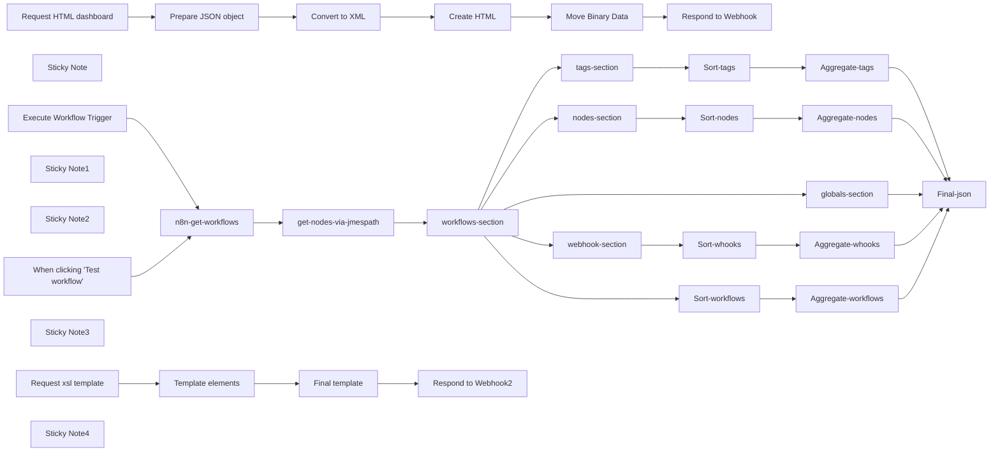

## Fluxo (.json) :

```json
{
  "id": "D0I76cew5KOnlem0",
  "meta": {
    "instanceId": "fb924c73af8f703905bc09c9ee8076f48c17b596ed05b18c0ff86915ef8a7c4a",
    "templateCredsSetupCompleted": true
  },
  "name": "Workflow stats",
  "tags": [],
  "nodes": [
    {
      "id": "b1a73981-db6a-4fd2-9cad-d02bfecc7d3d",
      "name": "When clicking \"Test workflow\"",
      "type": "n8n-nodes-base.manualTrigger",
      "position": [
        1060,
        740
      ],
      "parameters": {},
      "typeVersion": 1
    },
    {
      "id": "cbe2d1a8-51e9-4f3d-8ca5-321f3edf9a92",
      "name": "nodes-section",
      "type": "n8n-nodes-base.code",
      "position": [
        1900,
        800
      ],
      "parameters": {
        "jsCode": "// Initialize an empty object to hold the mapping between nodes and workflows\nconst nodeToWorkflowsMap = {};\n\n// Iterate over each workflow in the input\n$input.all().forEach(item => {\n  const { wf_stats } = item.json;\n  const { nodes_unique, wf_name, wf_url, wf_id } = wf_stats;\n\n  // For each unique node in the workflow, update the mapping\n  nodes_unique.forEach(node => {\n    if (!nodeToWorkflowsMap[node]) {\n      // If the node has not been added to the map, initialize it with the current workflow\n      nodeToWorkflowsMap[node] = [{ wf_name, wf_url, wf_id }];\n    } else {\n      // If the node is already in the map, append the current workflow to its list\n      nodeToWorkflowsMap[node].push({ wf_name, wf_url, wf_id });\n    }\n  });\n});\n\n// Convert the map into an array format suitable for n8n's output\nconst result = Object.keys(nodeToWorkflowsMap).map(node => ({\n  json: {\n    node,\n    count: nodeToWorkflowsMap[node].length,\n    workflows: nodeToWorkflowsMap[node]\n  }\n}));\n\nreturn result;"
      },
      "typeVersion": 2
    },
    {
      "id": "49a10bf3-f2e6-4fe9-8390-2a266f1b52a9",
      "name": "workflows-section",
      "type": "n8n-nodes-base.set",
      "position": [
        1680,
        640
      ],
      "parameters": {
        "options": {},
        "assignments": {
          "assignments": [
            {
              "id": "fd4aa80c-cd88-4a97-b943-dfcf1ab222ee",
              "name": "wf_stats",
              "type": "object",
              "value": "={{ { nodes_unique     :[...new Set($json.nodes_array)],\n     nodes_count_total:$json.nodes_array.length,\n     nodes_count_uniq :[...new Set($json.nodes_array)].length,\n     wf_created       :DateTime.fromISO($json.createdAt).toFormat('yyyy-MM-dd HH:mm:ss'),\n     wf_updated       :DateTime.fromISO($json.updatedAt).toFormat('yyyy-MM-dd HH:mm:ss'),\n     wf_name          :$json.name,\n     wf_id            :`wf-${$json.id}`,\n     wf_url           :`${$json.instance_url}/workflow/${$json.id}` || \"\",\n     wf_active        :$json.active,\n     wf_trigcount     :$json.triggerCount,\n     wf_tags          :$json.tags_array,\n     wf_whooks        :$json.webhook_paths_array\n\n} }}"
            }
          ]
        }
      },
      "typeVersion": 3.3
    },
    {
      "id": "afbbc6a0-dcb8-48e7-b2d1-ef00c769d3b7",
      "name": "Sticky Note",
      "type": "n8n-nodes-base.stickyNote",
      "position": [
        1240,
        -120
      ],
      "parameters": {
        "width": 1490,
        "height": 1375,
        "content": "## Create the main JSON object with the workflow statistics\n* `globals` - general information (# of workflows, active workflows, total trigger count)\n* `wf_stats` - summary per workflow (number or nodes, unique nodes, list of nodes and tags)\n* `nodes-section` - summary per node (number of workflows that use a node and their URLs)\n* `tags-section` - summary per tag (number of workflows that use a node and their URLs)\n* `webhook-section` - lists all webhook endpoints of the instance and shows the workflow URLs\n\n### You can use this JSON in BI tools to create a custom dashboard\n\n## Learn JS tips & tricks\n### Instead of just using one Code node, the workflow contains several nodes with useful advanced tricks.\n\n### JMESPath\n* Make a simple array of strings out of a complex array: `$jmespath($json,'nodes[*].type')`\n* Extract values based on condition: `$jmespath($input.all(),'[?json.wf_stats.wf_active == `true`]')`\n\n### Map and arrow functions\n* Perform operation on each array element: `.map(item => (item.split('.').pop().toUpperCase() ))`\n* Calculate sum of values from an array: `.reduce((accumulator, currentValue) => accumulator + currentValue, 0)`\n\n### Create an array with only unique values\n* `[...new Set($json.nodes_array)]`\n\n### Date-time conversions with the Luxon library:\n* `DateTime.fromISO($json.createdAt).toFormat('yyyy-MM-dd HH:mm:ss')`\n\n### Template literals (Template strings) for creating strings in JS\n* `wf-${$json.id}`"
      },
      "typeVersion": 1
    },
    {
      "id": "9dcb369b-fe22-45e1-906d-848a85b0c1e4",
      "name": "tags-section",
      "type": "n8n-nodes-base.code",
      "position": [
        1900,
        960
      ],
      "parameters": {
        "jsCode": "// Initialize an empty object to hold the mapping between tags and workflows\nconst tagToWorkflowsMap = {};\n\n// Iterate over each workflow in the input\n$input.all().forEach(item => {\n  const { wf_stats } = item.json;\n  // Destructure wf_url along with other properties\n  const { wf_tags, wf_name, wf_id, wf_url } = wf_stats;\n\n  // Check if the workflow has tags\n  if (wf_tags && wf_tags.length > 0) {\n    // For each tag in the workflow, update the mapping\n    wf_tags.forEach(tag => {\n      if (!tagToWorkflowsMap[tag]) {\n        // If the tag has not been added to the map, initialize it with the current workflow including wf_url\n        tagToWorkflowsMap[tag] = [{ wf_name, wf_id, wf_url }];\n      } else {\n        // If the tag is already in the map, append the current workflow to its list including wf_url\n        tagToWorkflowsMap[tag].push({ wf_name, wf_id, wf_url });\n      }\n    });\n  } else {\n    // Handle workflows with no tags, categorizing them under a 'No Tags' category\n    const noTagKey = 'No Tags'; // or any other placeholder you prefer\n    if (!tagToWorkflowsMap[noTagKey]) {\n      // Initialize with the current workflow including wf_url\n      tagToWorkflowsMap[noTagKey] = [{ wf_name, wf_id, wf_url }];\n    } else {\n      // Append the current workflow to its list including wf_url\n      tagToWorkflowsMap[noTagKey].push({ wf_name, wf_id, wf_url });\n    }\n  }\n});\n\n// Convert the map into an array format suitable for n8n's output\nconst result = Object.keys(tagToWorkflowsMap).map(tag => ({\n  json: {\n    tag,\n    count: tagToWorkflowsMap[tag].length,\n    workflows: tagToWorkflowsMap[tag] // This now contains objects with wf_name, wf_id, and wf_url\n  }\n}));\n\nreturn result;"
      },
      "typeVersion": 2
    },
    {
      "id": "7509c96c-0907-4cf1-94cf-f9dfbc0d3f9d",
      "name": "globals-section",
      "type": "n8n-nodes-base.set",
      "position": [
        1900,
        520
      ],
      "parameters": {
        "options": {},
        "assignments": {
          "assignments": [
            {
              "id": "9e1284bd-73c5-4d3d-bb5d-3437fca97780",
              "name": "globals",
              "type": "object",
              "value": "={{ { global_total : $input.all().length,\n     global_active : $jmespath($input.all(),'[?json.wf_stats.wf_active == `true`]').length,\n     global_trigger: $jmespath($input.all(),'[].json.wf_stats.wf_trigcount').reduce((accumulator, currentValue) => accumulator + currentValue, 0) }  }}"
            }
          ]
        }
      },
      "executeOnce": true,
      "typeVersion": 3.3
    },
    {
      "id": "2c0bc2dd-63d9-4b65-9e4e-2920892efaf7",
      "name": "Execute Workflow Trigger",
      "type": "n8n-nodes-base.executeWorkflowTrigger",
      "position": [
        1060,
        540
      ],
      "parameters": {},
      "typeVersion": 1
    },
    {
      "id": "8bceb3e9-e1d9-4ca0-af91-5377d4300346",
      "name": "Convert to XML",
      "type": "n8n-nodes-base.xml",
      "position": [
        1480,
        1600
      ],
      "parameters": {
        "mode": "jsonToxml",
        "options": {
          "headless": true
        }
      },
      "typeVersion": 1
    },
    {
      "id": "6151d4b8-f592-418d-b099-17c71b1de0e4",
      "name": "Create HTML",
      "type": "n8n-nodes-base.html",
      "position": [
        1680,
        1600
      ],
      "parameters": {
        "html": "<?xml version=\"1.0\" encoding=\"ISO-8859-1\"?>\n<?xml-stylesheet type=\"text/xsl\" href=\"{{ $env.WEBHOOK_URL }}webhook/73a91e4d-143d-4168-9efb-6c56f2258aec/dashboard.xsl\"?>\n\n{{ $json.data }}"
      },
      "typeVersion": 1
    },
    {
      "id": "e5ebc5c1-0fcc-4f9d-b8eb-df3a367cc097",
      "name": "Move Binary Data",
      "type": "n8n-nodes-base.moveBinaryData",
      "position": [
        1880,
        1600
      ],
      "parameters": {
        "mode": "jsonToBinary",
        "options": {
          "mimeType": "text/xml",
          "keepSource": false,
          "useRawData": true
        },
        "sourceKey": "html",
        "convertAllData": false
      },
      "typeVersion": 1
    },
    {
      "id": "5fdb74f7-6b2a-4042-91a2-c2088e8ea712",
      "name": "Respond to Webhook",
      "type": "n8n-nodes-base.respondToWebhook",
      "position": [
        2080,
        1600
      ],
      "parameters": {
        "options": {
          "responseCode": 200,
          "responseHeaders": {
            "entries": [
              {
                "name": "Content-Type",
                "value": "text/xml"
              },
              {
                "name": "Control-Allow-Origin",
                "value": "*"
              }
            ]
          }
        },
        "respondWith": "binary"
      },
      "typeVersion": 1
    },
    {
      "id": "ed113e7c-c49f-4854-8fbf-5f7bf3591ede",
      "name": "Sticky Note1",
      "type": "n8n-nodes-base.stickyNote",
      "position": [
        1000,
        1840
      ],
      "parameters": {
        "color": 7,
        "width": 909,
        "height": 426,
        "content": "# DO NOT RUN THIS\n## This webhook is needed to comply with the CORS policy of modern browsers.\n### It generates XML template and serves it using your n8n URL\n\nXSLT template is created with 2 Set nodes:\n1. `Template elements` node defines each section of the Dashboard\n2. `Final template` node puts everything together\n3. Bootstrap 5.3 styling is added. You can save the .css and .js files on your server. Right now a CDN version of the librarly is used."
      },
      "typeVersion": 1
    },
    {
      "id": "b6674f77-7797-4090-a4f9-56a9ddc0d4e0",
      "name": "Respond to Webhook2",
      "type": "n8n-nodes-base.respondToWebhook",
      "position": [
        1700,
        2120
      ],
      "parameters": {
        "options": {
          "responseCode": 200,
          "responseHeaders": {
            "entries": [
              {
                "name": "Content-Type",
                "value": "text/xsl"
              }
            ]
          }
        },
        "respondWith": "text",
        "responseBody": "={{ $json.xsl_template }}"
      },
      "typeVersion": 1
    },
    {
      "id": "c8c906da-0b61-46b0-be96-11da3c203e3f",
      "name": "Final template",
      "type": "n8n-nodes-base.set",
      "position": [
        1500,
        2120
      ],
      "parameters": {
        "options": {},
        "assignments": {
          "assignments": [
            {
              "id": "2a42cfed-0451-41c2-9634-865cac2ea68d",
              "name": "xsl_template",
              "type": "string",
              "value": "=<xsl:stylesheet version=\"1.0\" xmlns:xsl=\"http://www.w3.org/1999/XSL/Transform\">\n  <xsl:template match=\"/\">\n    <html>\n      <head>\n        <title>n8n Workflows Dashboard</title>\n        <link href=\"https://cdn.jsdelivr.net/npm/bootstrap@5.3.3/dist/css/bootstrap.min.css\" rel=\"stylesheet\" integrity=\"sha384-QWTKZyjpPEjISv5WaRU9OFeRpok6YctnYmDr5pNlyT2bRjXh0JMhjY6hW+ALEwIH\" crossorigin=\"anonymous\" />\n        <script src=\"https://cdn.jsdelivr.net/npm/bootstrap@5.3.3/dist/js/bootstrap.bundle.min.js\" integrity=\"sha384-YvpcrYf0tY3lHB60NNkmXc5s9fDVZLESaAA55NDzOxhy9GkcIdslK1eN7N6jIeHz\" crossorigin=\"anonymous\"></script>\n        <style>\n          body {\n            position: relative;\n          }\n          \n          section {\n            scroll-margin-top: 20px;\n          }\n\n          .form-check-overlay {\n            position: absolute;\n            top: 0;\n            left: 0;\n            width: 100%;\n            height: 100%;\n            cursor: default;\n            z-index: 1;\n          }\n\n          .badge-link {\n            scroll-margin-top: 80px;\n          }\n\n          .sidebar {\n            position: fixed;\n            top: 0;\n            bottom: 0;\n            left: 0;\n            z-index: 100;\n            padding: 20px 0 0;\n            box-shadow: inset -1px 0 0 rgba(0, 0, 0, .1);\n            overflow-y: auto;\n          }\n\n          .sidebar-sticky {\n            position: relative;\n            top: 0;\n            height: calc(100vh - 20px);\n            overflow-x: hidden;\n            overflow-y: auto;\n            padding-left: .25rem;\n          }\n\n          .nooverflow {\n            overflow-x: hidden;\n          }\n\n          .sidebar .nav-link {\n            font-weight: 500;\n            color: var(--bs-gray-800);\n            white-space: nowrap;\n            overflow: hidden;\n            text-overflow: ellipsis;\n          }\n\n          .sidebar .nav-link.active {\n            color: var(--bs-primary);\n          }\n\n          .sidebar .btn {\n            padding: .25rem .5rem;\n            font-weight: 600;\n            color: var(--bs-gray-800);\n          }\n\n          .sidebar-a {\n            padding: .25rem .5rem;\n            margin-left: 1.25rem;\n            color: var(--bs-gray-800);\n            background-color: transparent;\n          }\n\n          .sidebar-bottom {\n            padding: .25rem .5rem;\n            margin-left: 1.25rem;\n          }\n\n          .btn-toggle::before {\n            width: 1.25em;\n            line-height: 0;\n            content: url(\"data:image/svg+xml,%3csvg xmlns='http://www.w3.org/2000/svg' width='16' height='16' viewBox='0 0 16 16'%3e%3cpath fill='none' stroke='rgba%280,0,0,.5%29' stroke-linecap='round' stroke-linejoin='round' stroke-width='2' d='M5 14l6-6-6-6'/%3e%3c/svg%3e\");\n            transition: transform .35s ease;\n            transform-origin: .5em 50%;\n          }\n\n          .btn-toggle[aria-expanded=\"true\"] {\n            color: var(--bs-gray-800);\n          }\n\n          .btn-toggle[aria-expanded=\"true\"]::before {\n            transform: rotate(90deg);\n          }\n\n          .btn-toggle-nav a {\n            padding: .1rem .5rem;\n            margin-top: .125rem;\n          }\n\n          .sidebar-a:hover,\n          .sidebar-a:focus,\n\t\t  .btn-toggle:hover,\n          .btn-toggle:focus {\n            background-color: var(--bs-primary-bg-subtle);\n          }\n\n          .content {\n            margin-left: 16.66%;\n            padding: 20px;\n          }\n\n          .card-img-container {\n            max-height: 150px;\n            overflow: hidden;\n            display: flex;\n            align-items: center;\n            justify-content: center;\n          }\n          \n          .card-img-top {\n            object-fit: cover;\n            object-position: top;\n            height: 100%;\n            width: 100%;\n          }\n\n        </style>\n      </head>\n      <body data-bs-spy=\"scroll\" data-bs-target=\"#sidebar\" data-bs-offset=\"10\">\n        <div class=\"container-fluid\">\n          <div class=\"row\">\n{{ $json.sidebar }}\n\n            <main class=\"col-10 content\">\n\n<!-- Overview section -->\n{{ $json.overview }}\n<!-- Workflows section -->\n{{ $json.workflows }}\n<!-- Nodes section -->\n{{ $json.nodes }}\n<!-- Tags section -->\n{{ $json.tags }}\n<!-- Webhooks section -->\n{{ $json.webhooks }}\n<!-- About section -->\n{{ $json.about }}\n\n            </main>\n          </div>\n        </div>\n      </body>\n    </html>\n  </xsl:template>\n</xsl:stylesheet>"
            }
          ]
        }
      },
      "typeVersion": 3.3
    },
    {
      "id": "173493c0-1f96-4416-a545-6d8c6034ac76",
      "name": "Template elements",
      "type": "n8n-nodes-base.set",
      "position": [
        1300,
        2120
      ],
      "parameters": {
        "options": {},
        "assignments": {
          "assignments": [
            {
              "id": "afbcca70-2977-46a3-89c3-27a96f791d13",
              "name": "sidebar",
              "type": "string",
              "value": "=            <nav id=\"sidebar\" class=\"col-2 bg-light sidebar\">\n              <div class=\"sidebar-sticky\">\n                <ul class=\"list-unstyled ps-0\">\n                  <li class=\"mb-1\">\n                    <a href=\"#overview\" class=\"btn d-inline-flex align-items-center rounded border-0 sidebar-a\">Overview</a>\n                  </li>\n                  <!-- Workflows Section -->\n                  <li class=\"mb-1\">\n                    <button class=\"btn btn-toggle d-inline-flex align-items-center rounded border-0 collapsed\" data-bs-toggle=\"collapse\" data-bs-target=\"#workflows-collapse\" aria-expanded=\"false\">\n                      Workflows\n                    </button>\n                    <div class=\"collapse\" id=\"workflows-collapse\">\n                      <ul class=\"btn-toggle-nav list-unstyled fw-normal pb-1 small\">\n                        <xsl:for-each select=\"root/wf_stats\">\n                          <li><a href=\"#{wf_id}\" class=\"link-dark d-inline-flex text-decoration-none rounded sidebar-a\"><xsl:value-of select=\"wf_name\" /></a></li>\n                        </xsl:for-each>\n                      </ul>\n                    </div>\n                  </li>\n                  <!-- Nodes Section (No Sanitization) -->\n                  <li class=\"mb-1\">\n                    <button class=\"btn btn-toggle d-inline-flex align-items-center rounded border-0 collapsed\" data-bs-toggle=\"collapse\" data-bs-target=\"#nodes-collapse\" aria-expanded=\"false\">\n                      Nodes\n                    </button>\n                    <div class=\"collapse\" id=\"nodes-collapse\">\n                      <ul class=\"btn-toggle-nav list-unstyled fw-normal pb-1 small\">\n                        <xsl:for-each select=\"root/nodes-section\">\n                          <li>\n                            <a class=\"link-dark d-inline-flex text-decoration-none rounded sidebar-a\">\n                              <xsl:attribute name=\"href\">\n                                <!-- Use raw node name -->\n                                <xsl:value-of select=\"concat('#node-', node)\" />\n                              </xsl:attribute>\n                              <xsl:value-of select=\"node\" />\n                            </a>\n                          </li>\n                        </xsl:for-each>\n                      </ul>\n                    </div>\n                  </li>\n                  <!-- Tags Section (Keep Sanitization) -->\n                  <li class=\"mb-1\">\n                    <button class=\"btn btn-toggle d-inline-flex align-items-center rounded border-0 collapsed\" data-bs-toggle=\"collapse\" data-bs-target=\"#tags-collapse\" aria-expanded=\"false\">\n                      Tags\n                    </button>\n                    <div class=\"collapse\" id=\"tags-collapse\">\n                      <ul class=\"btn-toggle-nav list-unstyled fw-normal pb-1 small\">\n                        <xsl:for-each select=\"root/tags-section\">\n                           <!-- Sanitize tag name for href -->\n                          <xsl:variable name=\"raw_tag\" select=\"tag\"/>\n                          <xsl:variable name=\"lower_tag\" select=\"translate($raw_tag, 'ABCDEFGHIJKLMNOPQRSTUVWXYZ', 'abcdefghijklmnopqrstuvwxyz')\"/>\n                          <xsl:variable name=\"spaced_tag\" select=\"translate($lower_tag, ' ', '-')\"/>\n                          <xsl:variable name=\"invalid_chars\" select=\"&quot;'./?&amp;=:&quot;\"/>\n                          <xsl:variable name=\"sanitized_tag_id\" select=\"translate($spaced_tag, $invalid_chars, '')\"/>\n                          <li>\n                            <a class=\"link-dark d-inline-flex text-decoration-none rounded sidebar-a\">\n                              <xsl:attribute name=\"href\">\n                                <xsl:value-of select=\"concat('#tag-', $sanitized_tag_id)\" />\n                              </xsl:attribute>\n                              <xsl:value-of select=\"tag\" />\n                            </a>\n                          </li>\n                        </xsl:for-each>\n                      </ul>\n                    </div>\n                  </li>\n                  <!-- Webhooks Section (No Sanitization) -->\n                  <li class=\"mb-1\">\n                    <button class=\"btn btn-toggle d-inline-flex align-items-center rounded border-0 collapsed\" data-bs-toggle=\"collapse\" data-bs-target=\"#webhooks-collapse\" aria-expanded=\"false\">\n                      Webhooks\n                    </button>\n                    <div class=\"collapse\" id=\"webhooks-collapse\">\n                      <ul class=\"btn-toggle-nav list-unstyled fw-normal pb-1 small\">\n                        <xsl:for-each select=\"root/whooks-section\">\n                          <li>\n                            <a class=\"link-dark d-inline-flex text-decoration-none rounded sidebar-a\">\n                              <xsl:attribute name=\"href\">\n                                <!-- Use raw hookpath -->\n                                <xsl:value-of select=\"concat('#whook-', hookpath)\" />\n                              </xsl:attribute>\n                              <xsl:value-of select=\"hookpath\" />\n                            </a>\n                          </li>\n                        </xsl:for-each>\n                      </ul>\n                    </div>\n                  </li>\n                  <!-- END: Webhooks Section -->\n                  <li class=\"border-top my-3\"></li>\n                  <li class=\"mb-1\">\n                    <a href=\"#about\" class=\"btn d-inline-flex align-items-center rounded border-0 sidebar-a\">About</a>\n                  </li>\n                </ul>\n                <div class=\"sidebar-bottom\">\n                  <p>n8n Dashboard ver 0.8<br/> <!-- Updated version number -->\nContacts: <a class=\"link-offset-1 link-offset-1-hover link-underline link-underline-opacity-0 link-underline-opacity-75-hover\" href=\"https://www.linkedin.com/in/parsadanyan/\" target=\"_blank\">Eduard Parsadanyan</a></p>\n                </div>\n              </div>\n            </nav>\n"
            },
            {
              "id": "d6dc34a7-3c79-44ef-957c-63aec4b2d75a",
              "name": "overview",
              "type": "string",
              "value": "=<section  id=\"overview\" class=\"container\">\n  <h1>n8n Workflow Dashboard</h1>\n</section>\n\n<section class=\"container mt-3\">\n  <h2>Overview</h2>\n  <div class=\"row\">\n    <div class=\"col-md-4\">\n      <div class=\"card bg-body-secondary mb-2 shadow-sm\">\n        <div class=\"card-body text-center\">\n          <h5 class=\"card-title\">Total Workflows</h5>\n          <p class=\"card-text display-4\">📊 <xsl:value-of select=\"root/globals/global_total\" /></p>\n        </div>\n      </div>\n    </div>\n    <div class=\"col-md-4\">\n      <div class=\"card bg-body-secondary mb-2 shadow-sm\">\n        <div class=\"card-body text-center\">\n          <h5 class=\"card-title\">Active Workflows</h5>\n          <p class=\"card-text display-4\">✅ <xsl:value-of select=\"root/globals/global_active\" /></p>\n        </div>\n      </div>\n    </div>\n    <div class=\"col-md-4\">\n      <div class=\"card bg-body-secondary mb-2 shadow-sm\">\n        <div class=\"card-body text-center\">\n          <h5 class=\"card-title\">Triggers Count</h5>\n          <p class=\"card-text display-4\">⚡ <xsl:value-of select=\"root/globals/global_trigger\" /></p>\n        </div>\n      </div>\n    </div>\n  </div>\n</section>"
            },
            {
              "id": "19ed123c-404b-4a68-a298-8f24c285f71c",
              "name": "workflows",
              "type": "string",
              "value": "=<section id=\"workflows\" class=\"container mt-3\">\n  <h2>Workflows</h2>\n  <xsl:for-each select=\"root/wf_stats\">\n    <div class=\"card mb-3 shadow-sm nooverflow\">\n      <div class=\"card-body\">\n        <div class=\"d-flex align-items-center mb-2\">\n          <div class=\"form-check form-switch me-3 position-relative\">\n            <input class=\"form-check-input\" type=\"checkbox\" role=\"switch\">\n              <xsl:attribute name=\"id\">\n                <xsl:value-of select=\"concat('switch-', wf_id)\" />\n              </xsl:attribute>\n              <xsl:if test=\"wf_active = 'true'\">\n                <xsl:attribute name=\"checked\">checked</xsl:attribute>\n              </xsl:if>\n            </input>\n            <label class=\"form-check-label\">\n              <xsl:attribute name=\"for\">\n                <xsl:value-of select=\"concat('switch-', wf_id)\" />\n              </xsl:attribute>\n            </label>\n            <div class=\"form-check-overlay\"></div>\n          </div>\n          <h5 class=\"card-title mb-0\">\n            <a class=\"link-offset-1 link-offset-1-hover link-underline link-underline-opacity-0 link-underline-opacity-75-hover\" href=\"{wf_url}\" target=\"_blank\" title=\"Open workflow in a new window\">\n              <xsl:attribute name=\"id\">\n                <xsl:value-of select=\"wf_id\" />\n              </xsl:attribute>\n              <xsl:value-of select=\"wf_name\" />\n            </a>\n          </h5>\n          <div class=\"ms-auto\">\n            <span class=\"badge bg-light font-monospace text-dark me-2\">\n              Updated At: <xsl:value-of select=\"wf_updated\" />\n            </span>\n            <span class=\"badge bg-light font-monospace text-dark me-2\">\n              Created At: <xsl:value-of select=\"wf_created\" />\n            </span>\n            <span class=\"badge bg-light font-monospace text-dark me-2\">\n              Nodes (Tot | Uniq | Trig): <xsl:value-of select=\"nodes_count_total\" /> | <xsl:value-of select=\"nodes_count_uniq\" /> | <xsl:value-of select=\"wf_trigcount\" />\n            </span>\n          </div>\n        </div>\n        <div class=\"row\">\n          <div class=\"d-flex\">\n            <div>\n              <xsl:for-each select=\"nodes_unique\">\n                <a href=\"#node-{.}\" title=\"Jump to this node\" class=\"badge-link\">\n                  <span class=\"badge bg-info-subtle border border-info-subtle text-info-emphasis rounded-pill me-2 mb-2\">\n                    <xsl:value-of select=\".\" />\n                  </span>\n                </a>\n              </xsl:for-each>\n            </div>\n            <xsl:if test=\"wf_tags\">\n              <div class=\"ms-auto\">\n                <xsl:for-each select=\"wf_tags\">\n                  <a href=\"#tag-{.}\" title=\"Jump to this tag\" class=\"badge-link\">\n                    <span class=\"badge bg-light-subtle border border-light-subtle text-light-emphasis rounded-pill me-2 mb-2\">\n                      <xsl:value-of select=\".\" />\n                    </span>\n                  </a>\n                </xsl:for-each>\n              </div>\n            </xsl:if>\n          </div>\n        </div>\n      </div>\n    </div>\n  </xsl:for-each>\n</section>"
            },
            {
              "id": "9869134d-ee39-49a2-a978-eb3adaac482d",
              "name": "nodes",
              "type": "string",
              "value": "=<section id=\"nodes\" class=\"container mt-3\">\n  <h2>Nodes</h2>\n  <div class=\"accordion\" id=\"nodesAccordion\">\n    <xsl:for-each select=\"root/nodes-section\">\n      <div class=\"accordion-item shadow-sm\">\n        <!-- Place the target ID directly on the H3 using the original node name -->\n        <h3 class=\"accordion-header\">\n            <xsl:attribute name=\"id\">\n                <!-- Use raw node name -->\n                <xsl:value-of select=\"concat('node-', node)\"/>\n            </xsl:attribute>\n          <button class=\"accordion-button collapsed\" type=\"button\" data-bs-toggle=\"collapse\">\n            <xsl:attribute name=\"data-bs-target\">\n              <!-- Use raw node name for targeting -->\n              <xsl:value-of select=\"concat('#collapse-node-', node)\" />\n            </xsl:attribute>\n            <xsl:attribute name=\"aria-controls\">\n              <xsl:value-of select=\"concat('collapse-node-', node)\" />\n            </xsl:attribute>\n            <!-- The <a> tag no longer needs an ID -->\n            <a>\n              <!-- Display the original node name -->\n              <xsl:value-of select=\"node\" /> <span class=\"badge bg-info-subtle text-info-emphasis rounded-pill ms-2\"><xsl:value-of select=\"count\" /></span>\n            </a>\n          </button>\n        </h3>\n        <div class=\"accordion-collapse collapse\">\n          <xsl:attribute name=\"id\">\n            <!-- Use raw node name for collapse ID -->\n            <xsl:value-of select=\"concat('collapse-node-', node)\" />\n          </xsl:attribute>\n          <!-- aria-labelledby should point to the h3's ID -->\n          <xsl:attribute name=\"aria-labelledby\">\n            <xsl:value-of select=\"concat('node-', node)\" />\n          </xsl:attribute>\n          <div class=\"accordion-body\">\n            <xsl:for-each select=\"workflows\">\n              <span class=\"badge bg-info-subtle border border-info-subtle text-info-emphasis rounded-pill me-2 mb-2\">\n                <a href=\"#{wf_id}\" class=\"text-primary-emphasis text-decoration-none me-1 section-offset\" title=\"Jump to workflow details\">\n                  <xsl:value-of select=\"wf_name\" />\n                </a>\n                <a href=\"{wf_url}\" target=\"_blank\" class=\"text-primary-emphasis text-decoration-none\" title=\"Open workflow in a new window\">\n                  🔗\n                </a>\n              </span>\n            </xsl:for-each>\n          </div>\n        </div>\n      </div>\n    </xsl:for-each>\n  </div>\n</section>\n"
            },
            {
              "id": "f09bc0d1-017e-44f5-bc39-6bdfeffe22ec",
              "name": "tags",
              "type": "string",
              "value": "=<section id=\"tags\" class=\"container mt-3\">\n  <h2>Tags</h2>\n  <div class=\"accordion\" id=\"tagsAccordion\">\n    <xsl:for-each select=\"root/tags-section\">\n      <!-- Sanitize the tag name -->\n      <xsl:variable name=\"raw_tag\" select=\"tag\"/>\n      <xsl:variable name=\"lower_tag\" select=\"translate($raw_tag, 'ABCDEFGHIJKLMNOPQRSTUVWXYZ', 'abcdefghijklmnopqrstuvwxyz')\"/>\n      <xsl:variable name=\"spaced_tag\" select=\"translate($lower_tag, ' ', '-')\"/>\n      <xsl:variable name=\"invalid_chars\" select=\"&quot;'./?&amp;=:&quot;\"/> <!-- Add any other chars you find problematic -->\n      <xsl:variable name=\"sanitized_tag_id\" select=\"translate($spaced_tag, $invalid_chars, '')\"/>\n\n      <div class=\"accordion-item shadow-sm\">\n        <h3 class=\"accordion-header\">\n            <xsl:attribute name=\"id\">\n                <xsl:value-of select=\"concat('heading-tag-', $sanitized_tag_id)\"/>\n            </xsl:attribute>\n          <button class=\"accordion-button collapsed\" type=\"button\" data-bs-toggle=\"collapse\">\n            <xsl:attribute name=\"data-bs-target\">\n              <xsl:value-of select=\"concat('#collapse-tag-', $sanitized_tag_id)\" />\n            </xsl:attribute>\n            <xsl:attribute name=\"aria-controls\">\n              <xsl:value-of select=\"concat('collapse-tag-', $sanitized_tag_id)\" />\n            </xsl:attribute>\n            <a>\n              <!-- Use the sanitized ID here -->\n              <xsl:attribute name=\"id\">\n                <xsl:value-of select=\"concat('tag-', $sanitized_tag_id)\" />\n              </xsl:attribute>\n              <!-- Display the original tag name -->\n              <xsl:value-of select=\"tag\" /> <span class=\"badge bg-light-subtle text-light-emphasis rounded-pill ms-2\"><xsl:value-of select=\"count\" /></span>\n            </a>\n          </button>\n        </h3>\n        <div class=\"accordion-collapse collapse\">\n          <xsl:attribute name=\"id\">\n            <xsl:value-of select=\"concat('collapse-tag-', $sanitized_tag_id)\" />\n          </xsl:attribute>\n          <xsl:attribute name=\"aria-labelledby\">\n            <xsl:value-of select=\"concat('heading-tag-', $sanitized_tag_id)\" />\n          </xsl:attribute>\n          <div class=\"accordion-body\">\n            <xsl:for-each select=\"workflows\">\n              <span class=\"badge bg-light-subtle border border-light-subtle text-light-emphasis rounded-pill me-2 mb-2\">\n                <a href=\"#{wf_id}\" class=\"text-primary-emphasis text-decoration-none me-1 section-offset\" title=\"Jump to workflow details\">\n                  <xsl:value-of select=\"wf_name\" />\n                </a>\n                <a href=\"{wf_url}\" target=\"_blank\" class=\"text-primary-emphasis text-decoration-none\" title=\"Open workflow in a new window\">\n                  🔗\n                </a>\n              </span>\n            </xsl:for-each>\n          </div>\n        </div>\n      </div>\n    </xsl:for-each>\n  </div>\n</section>\n"
            },
            {
              "id": "2e1f449c-a59b-4eb7-a3b7-48bedff01812",
              "name": "webhooks",
              "type": "string",
              "value": "=<section id=\"webhooks\" class=\"container mt-3\">\n  <h2>Webhooks</h2>\n  <div class=\"accordion\" id=\"webhooksAccordion\">\n    <xsl:for-each select=\"root/whooks-section\">\n      <div class=\"accordion-item shadow-sm\">\n        <!-- Place the target ID directly on the H3 using the original hookpath -->\n        <h3 class=\"accordion-header\">\n            <xsl:attribute name=\"id\">\n                <!-- Use raw hookpath -->\n                <xsl:value-of select=\"concat('whook-', hookpath)\"/>\n            </xsl:attribute>\n          <button class=\"accordion-button collapsed\" type=\"button\" data-bs-toggle=\"collapse\">\n            <xsl:attribute name=\"data-bs-target\">\n              <!-- Use raw hookpath for targeting -->\n              <xsl:value-of select=\"concat('#collapse-whook-', hookpath)\" />\n            </xsl:attribute>\n            <xsl:attribute name=\"aria-controls\">\n              <xsl:value-of select=\"concat('collapse-whook-', hookpath)\" />\n            </xsl:attribute>\n            <!-- The <a> tag no longer needs an ID -->\n            <a>\n              <!-- Display the original hookpath -->\n              <xsl:value-of select=\"hookpath\" /> <span class=\"badge bg-secondary-subtle text-secondary-emphasis rounded-pill ms-2\"><xsl:value-of select=\"count\" /></span>\n            </a>\n          </button>\n        </h3>\n        <div class=\"accordion-collapse collapse\">\n          <xsl:attribute name=\"id\">\n            <!-- Use raw hookpath for collapse ID -->\n            <xsl:value-of select=\"concat('collapse-whook-', hookpath)\" />\n          </xsl:attribute>\n          <!-- aria-labelledby should point to the h3's ID -->\n          <xsl:attribute name=\"aria-labelledby\">\n            <xsl:value-of select=\"concat('whook-', hookpath)\" />\n          </xsl:attribute>\n          <div class=\"accordion-body\">\n            <xsl:for-each select=\"workflows\">\n              <span class=\"badge bg-secondary-subtle border border-secondary-subtle text-secondary-emphasis rounded-pill me-2 mb-2\">\n                <a href=\"#{wf_id}\" class=\"text-primary-emphasis text-decoration-none me-1 section-offset\" title=\"Jump to workflow details\">\n                  <xsl:value-of select=\"wf_name\" />\n                </a>\n                <a href=\"{wf_url}\" target=\"_blank\" class=\"text-primary-emphasis text-decoration-none\" title=\"Open workflow in a new window\">\n                  🔗\n                </a>\n              </span>\n            </xsl:for-each>\n          </div>\n        </div>\n      </div>\n    </xsl:for-each>\n  </div>\n</section>\n"
            },
            {
              "id": "2af68003-c9b9-4e60-8836-195da026ad2f",
              "name": "about",
              "type": "string",
              "value": "=<hr class=\"featurette-divider border-dark\" />\n<section id=\"about\" class=\"container mt-3\">\n  <h2 class=\"text-center mb-5\">About This Dashboard &amp; Related Templates</h2>\n  <div class=\"row justify-content-center\">\n\n    <!-- Eduard Section -->\n    <div class=\"col-lg-3 text-center mb-4\">\n      \n      <h3 class=\"fw-normal\">Eduard</h3>\n      <p><a class=\"btn btn-warning\" href=\"https://n8n.io/creators/eduard/\" target=\"_blank\">More templates</a></p>\n      <p><a class=\"btn btn-outline-primary\" href=\"https://www.linkedin.com/in/parsadanyan/\" target=\"_blank\">LinkedIn</a></p>\n    </div>\n\n    <!-- Original Article Card (Text Restored) -->\n    <div class=\"col-lg-3 text-center mb-4\">\n      <div class=\"card shadow-sm h-100\">\n         <div class=\"card-img-container\">\n            \n         </div>\n        <div class=\"card-body d-flex flex-column\">\n          <!-- Restored original title -->\n          <h5 class=\"card-title\">Read the article to find out more!</h5>\n          <p class=\"card-text\">This dashboard was created using XML template language (XSLT) in n8n.</p>\n          <a href=\"https://blog.n8n.io/sql-xml/#how-to-deliver-the-xml-file\" class=\"btn btn-primary mt-auto\" target=\"_blank\">Read Article</a>\n        </div>\n      </div>\n    </div>\n\n    <!-- New Card 1: Docsify Template (Text Expanded) -->\n    <div class=\"col-lg-3 text-center mb-4\">\n      <div class=\"card shadow-sm h-100\">\n        <div class=\"card-body d-flex flex-column\">\n          <h5 class=\"card-title\">📚 Auto-generate documentation for n8n workflows with GPT and Docsify</h5>\n          <p class=\"card-subtitle mb-2 text-muted\">Creates a dynamic Docsify site with GPT-powered descriptions and Mermaid diagrams.</p>\n          <!-- Added descriptive text -->\n          <p class=\"card-text\">Features live editing, tag filtering, and automated documentation updates for your n8n instance.</p>\n          <a href=\"https://n8n.io/workflows/2669-auto-generate-documentation-for-n8n-workflows-with-gpt-and-docsify/\" class=\"btn btn-primary mt-auto\" target=\"_blank\">View Template</a>\n        </div>\n      </div>\n    </div>\n\n    <!-- New Card 2: Mermaid Template (Text Expanded) -->\n    <div class=\"col-lg-3 text-center mb-4\">\n      <div class=\"card shadow-sm h-100\">\n        <div class=\"card-body d-flex flex-column\">\n          <h5 class=\"card-title\">🔍 Visualize Your n8n Workflows with Mermaid.js!</h5>\n           <p class=\"card-subtitle mb-2 text-muted\">Generates interactive workflow flowcharts using Mermaid.js and Bootstrap.</p>\n           <!-- Added descriptive text -->\n           <p class=\"card-text\">Instantly visualize structures with custom shapes and direct links to workflows, perfect for documentation.</p>\n          <a href=\"https://n8n.io/workflows/2378-visualize-your-n8n-workflows-with-mermaidjs/\" class=\"btn btn-primary mt-auto\" target=\"_blank\">View Template</a>\n        </div>\n      </div>\n    </div>\n\n  </div> <!-- End row -->\n</section>\n"
            }
          ]
        }
      },
      "typeVersion": 3.3
    },
    {
      "id": "3555218e-8df2-4ae8-9482-2c8ec99798c0",
      "name": "Sort-workflows",
      "type": "n8n-nodes-base.sort",
      "position": [
        2080,
        640
      ],
      "parameters": {
        "options": {},
        "sortFieldsUi": {
          "sortField": [
            {
              "order": "descending",
              "fieldName": "wf_stats.wf_updated"
            },
            {
              "fieldName": "wf_stats.wf_name"
            }
          ]
        }
      },
      "typeVersion": 1
    },
    {
      "id": "2d893970-825e-4842-811f-7e7a24dd3bac",
      "name": "Sort-nodes",
      "type": "n8n-nodes-base.sort",
      "position": [
        2080,
        800
      ],
      "parameters": {
        "options": {},
        "sortFieldsUi": {
          "sortField": [
            {
              "order": "descending",
              "fieldName": "count"
            },
            {
              "fieldName": "node"
            }
          ]
        }
      },
      "typeVersion": 1
    },
    {
      "id": "c197f00e-d147-45af-b121-a70d28912a7f",
      "name": "Sort-tags",
      "type": "n8n-nodes-base.sort",
      "position": [
        2080,
        960
      ],
      "parameters": {
        "options": {},
        "sortFieldsUi": {
          "sortField": [
            {
              "order": "descending",
              "fieldName": "count"
            },
            {
              "fieldName": "tag"
            }
          ]
        }
      },
      "typeVersion": 1
    },
    {
      "id": "4f28a9f6-b67e-42d8-8843-480803932c27",
      "name": "Aggregate-workflows",
      "type": "n8n-nodes-base.aggregate",
      "position": [
        2260,
        640
      ],
      "parameters": {
        "options": {},
        "fieldsToAggregate": {
          "fieldToAggregate": [
            {
              "fieldToAggregate": "wf_stats"
            }
          ]
        }
      },
      "typeVersion": 1
    },
    {
      "id": "f4521a5c-8cc3-4831-90e2-1a1fda06fdac",
      "name": "Aggregate-nodes",
      "type": "n8n-nodes-base.aggregate",
      "position": [
        2260,
        800
      ],
      "parameters": {
        "options": {},
        "aggregate": "aggregateAllItemData",
        "destinationFieldName": "nodes-section"
      },
      "typeVersion": 1
    },
    {
      "id": "ae5040f7-4ae3-41e7-9afc-ebb625d303e7",
      "name": "Aggregate-tags",
      "type": "n8n-nodes-base.aggregate",
      "position": [
        2260,
        960
      ],
      "parameters": {
        "options": {},
        "aggregate": "aggregateAllItemData",
        "destinationFieldName": "tags-section"
      },
      "typeVersion": 1
    },
    {
      "id": "69a22d56-3b4e-4d5d-b351-3c787f23e9c9",
      "name": "n8n-get-workflows",
      "type": "n8n-nodes-base.n8n",
      "position": [
        1260,
        640
      ],
      "parameters": {
        "filters": {},
        "requestOptions": {}
      },
      "credentials": {
        "n8nApi": {
          "id": "45",
          "name": "n8n account 4"
        }
      },
      "typeVersion": 1
    },
    {
      "id": "35564537-0053-4cdb-a05d-153ad4825393",
      "name": "Prepare JSON object",
      "type": "n8n-nodes-base.executeWorkflow",
      "position": [
        1260,
        1600
      ],
      "parameters": {
        "options": {},
        "workflowId": "={{ $workflow.id }}"
      },
      "typeVersion": 1
    },
    {
      "id": "9fd045f1-7126-4611-b26d-c45139429c6b",
      "name": "get-nodes-via-jmespath",
      "type": "n8n-nodes-base.set",
      "position": [
        1460,
        640
      ],
      "parameters": {
        "options": {},
        "assignments": {
          "assignments": [
            {
              "id": "51f83719-066f-4231-a418-ba64a3b5b831",
              "name": "nodes_array",
              "type": "array",
              "value": "={{$jmespath($json,'nodes[*].type').map(item => (item.split('.').pop().toUpperCase() ))}}"
            },
            {
              "id": "bbc40849-66a7-4583-8c2c-ac590be59e38",
              "name": "tags_array",
              "type": "array",
              "value": "={{$jmespath($json,'tags[*].name')}}"
            },
            {
              "id": "08064cc3-f34e-4f05-9975-726378fe63ae",
              "name": "instance_url",
              "type": "string",
              "value": "={{$env[\"N8N_PROTOCOL\"]}}://{{$env[\"N8N_HOST\"]}}"
            },
            {
              "id": "1fdb9640-b628-4e13-9e4c-fef19cae7611",
              "name": "webhook_paths_array",
              "type": "array",
              "value": "={{ $jmespath($json, `nodes[?type=='n8n-nodes-base.webhook'].parameters.path | [?@]`) }}"
            }
          ]
        },
        "includeOtherFields": true
      },
      "typeVersion": 3.3
    },
    {
      "id": "45723a66-03be-4be7-ae4a-978adb5b7e7b",
      "name": "Sticky Note2",
      "type": "n8n-nodes-base.stickyNote",
      "position": [
        960,
        1280
      ],
      "parameters": {
        "color": 6,
        "width": 1301.92628220859,
        "height": 1000.0640426993867,
        "content": "## Additional section to create a standalone dashboard via XLM templates\n### This section is not required if you only need a JSON\n\n### *IMPORTANT!*\n### This webhook is not protected. Everyone who knows the URL endpoint can get access to the Dashboard. Please consider adding authentication.\n\n1. `Request HTML dashboard` node runs that main section of the workflow\n2. It converts the JSON into an XML structure\n3. A final HTML page is created with the link to an XML stylesheet (this stylesheet controls the look of the dashboard)\n4. The resulting page is returned via `Respond to Webhook` node"
      },
      "typeVersion": 1
    },
    {
      "id": "b17fbec5-03e2-4836-8704-6b31cdf92a5b",
      "name": "Request HTML dashboard",
      "type": "n8n-nodes-base.webhook",
      "position": [
        1060,
        1600
      ],
      "webhookId": "fb550a01-12f2-4709-ba2d-f71197b68340",
      "parameters": {
        "path": "fb550a01-12f2-4709-ba2d-f71197b68340",
        "options": {},
        "responseMode": "responseNode"
      },
      "typeVersion": 2
    },
    {
      "id": "70fd1bbb-24e2-4fde-b054-6319120a7ac4",
      "name": "Sticky Note3",
      "type": "n8n-nodes-base.stickyNote",
      "position": [
        960,
        940
      ],
      "parameters": {
        "color": 3,
        "width": 663.915516288839,
        "height": 251.8866653838499,
        "content": "## IMPORTANT NOTE FOR CLOUD USERS\n### Since the cloud version doesn't support environmental variables, please make the following changes:\n\n1. **get-nodes-via-jmespath** node. Update the `instance_url` variable: enter your n8n URL instead of `{{$env[\"N8N_PROTOCOL\"]}}://{{$env[\"N8N_HOST\"]}}`\n2. **Create HTML** node. Please provide the n8n instance URL instead of `{{ $env.WEBHOOK_URL }}`"
      },
      "typeVersion": 1
    },
    {
      "id": "36288776-5f67-40fd-872f-0eeac0dd03b0",
      "name": "Request xsl template",
      "type": "n8n-nodes-base.webhook",
      "position": [
        1100,
        2120
      ],
      "webhookId": "73a91e4d-143d-4168-9efb-6c56f2258aec",
      "parameters": {
        "path": "73a91e4d-143d-4168-9efb-6c56f2258aec/dashboard.xsl",
        "options": {},
        "responseMode": "responseNode"
      },
      "typeVersion": 2
    },
    {
      "id": "cda6fce6-0b0a-4fdf-b50c-b5bd874e43a0",
      "name": "Final-json",
      "type": "n8n-nodes-base.merge",
      "position": [
        2560,
        540
      ],
      "parameters": {
        "mode": "combine",
        "options": {},
        "combineBy": "combineByPosition",
        "numberInputs": 5
      },
      "typeVersion": 3.1
    },
    {
      "id": "1a7acbda-0eb4-4d1a-b458-02457ee82a9b",
      "name": "webhook-section",
      "type": "n8n-nodes-base.code",
      "position": [
        1900,
        1140
      ],
      "parameters": {
        "jsCode": "// Initialize an empty object to hold the mapping between webhook paths and workflows\nconst webhookMap = {};\n\n// Iterate over each workflow item passed from the previous node\n$input.all().forEach(item => {\n  // --- Extract Data ---\n  // Ensure wf_stats exists in the item's JSON payload\n  if (!item.json || !item.json.wf_stats) {\n    console.warn(\"Skipping item due to missing json or wf_stats:\", JSON.stringify(item));\n    return; // Skip this item if wf_stats is missing\n  }\n\n  const { wf_stats } = item.json;\n  // Destructure the necessary fields from wf_stats\n  // Use default values for safety\n  const { wf_whooks, wf_name = 'Unknown Workflow', wf_url = '', wf_id = 'unknown-' + Date.now() } = wf_stats;\n\n  // --- Process Webhooks ---\n  // Check if wf_whooks exists and is an array with items\n  if (Array.isArray(wf_whooks) && wf_whooks.length > 0) {\n    const workflowInfo = { wf_name, wf_url, wf_id }; // Prepare workflow details object\n\n    // For each webhook path associated with this workflow\n    wf_whooks.forEach(hookpath => {\n      // Ensure hookpath is a non-empty string before processing\n      if (typeof hookpath === 'string' && hookpath.trim() !== '') {\n        const cleanHookpath = hookpath.trim(); // Use trimmed path\n\n        // If this webhook path hasn't been seen before, initialize it in the map\n        if (!webhookMap[cleanHookpath]) {\n          webhookMap[cleanHookpath] = [workflowInfo];\n        } else {\n          // If the path exists, add this workflow's info to its list\n          // (Avoid adding duplicates if the same workflow info is already there for this path)\n          if (!webhookMap[cleanHookpath].some(wf => wf.wf_id === wf_id)) {\n             webhookMap[cleanHookpath].push(workflowInfo);\n          }\n        }\n      } else {\n        // Optional: Log if a non-string or empty path was found in the array\n         console.warn(`Invalid hookpath found in wf_whooks for workflow ${wf_id}:`, hookpath);\n      }\n    });\n  }\n  // Workflows without any webhooks (empty wf_whooks array) will be skipped naturally\n});\n\n// --- Format Output ---\n// Convert the map ( { path: [workflows] } ) into an array of items for n8n output\nconst result = Object.keys(webhookMap).map(hookpath => ({\n  json: {\n    hookpath: hookpath, // The webhook path\n    count: webhookMap[hookpath].length, // How many workflows use this path\n    workflows: webhookMap[hookpath] // The list of { wf_name, wf_url, wf_id } objects\n  }\n}));\n\n// Return the final array\nreturn result;\n"
      },
      "typeVersion": 2
    },
    {
      "id": "0cfcd940-f000-47ce-8e46-36dab4068acb",
      "name": "Sort-whooks",
      "type": "n8n-nodes-base.sort",
      "position": [
        2080,
        1140
      ],
      "parameters": {
        "options": {},
        "sortFieldsUi": {
          "sortField": [
            {
              "order": "descending",
              "fieldName": "count"
            },
            {
              "fieldName": "hookpath"
            }
          ]
        }
      },
      "typeVersion": 1
    },
    {
      "id": "099ecc9b-ca8d-4ccb-aa64-30a563f27aeb",
      "name": "Aggregate-whooks",
      "type": "n8n-nodes-base.aggregate",
      "position": [
        2260,
        1140
      ],
      "parameters": {
        "options": {},
        "aggregate": "aggregateAllItemData",
        "destinationFieldName": "whooks-section"
      },
      "typeVersion": 1
    },
    {
      "id": "a01a78e6-0957-4602-a558-430b17000452",
      "name": "Sticky Note4",
      "type": "n8n-nodes-base.stickyNote",
      "position": [
        600,
        1580
      ],
      "parameters": {
        "width": 620,
        "content": "## &#x200B;\n# USE THIS WEBHOOK -->"
      },
      "typeVersion": 1
    }
  ],
  "active": true,
  "pinData": {},
  "settings": {
    "executionOrder": "v1"
  },
  "versionId": "3fc1a529-eb6e-4f8a-9d7f-cb8e21e782a1",
  "connections": {
    "Sort-tags": {
      "main": [
        [
          {
            "node": "Aggregate-tags",
            "type": "main",
            "index": 0
          }
        ]
      ]
    },
    "Sort-nodes": {
      "main": [
        [
          {
            "node": "Aggregate-nodes",
            "type": "main",
            "index": 0
          }
        ]
      ]
    },
    "Create HTML": {
      "main": [
        [
          {
            "node": "Move Binary Data",
            "type": "main",
            "index": 0
          }
        ]
      ]
    },
    "Sort-whooks": {
      "main": [
        [
          {
            "node": "Aggregate-whooks",
            "type": "main",
            "index": 0
          }
        ]
      ]
    },
    "tags-section": {
      "main": [
        [
          {
            "node": "Sort-tags",
            "type": "main",
            "index": 0
          }
        ]
      ]
    },
    "nodes-section": {
      "main": [
        [
          {
            "node": "Sort-nodes",
            "type": "main",
            "index": 0
          }
        ]
      ]
    },
    "Aggregate-tags": {
      "main": [
        [
          {
            "node": "Final-json",
            "type": "main",
            "index": 3
          }
        ]
      ]
    },
    "Convert to XML": {
      "main": [
        [
          {
            "node": "Create HTML",
            "type": "main",
            "index": 0
          }
        ]
      ]
    },
    "Final template": {
      "main": [
        [
          {
            "node": "Respond to Webhook2",
            "type": "main",
            "index": 0
          }
        ]
      ]
    },
    "Sort-workflows": {
      "main": [
        [
          {
            "node": "Aggregate-workflows",
            "type": "main",
            "index": 0
          }
        ]
      ]
    },
    "Aggregate-nodes": {
      "main": [
        [
          {
            "node": "Final-json",
            "type": "main",
            "index": 2
          }
        ]
      ]
    },
    "globals-section": {
      "main": [
        [
          {
            "node": "Final-json",
            "type": "main",
            "index": 0
          }
        ]
      ]
    },
    "webhook-section": {
      "main": [
        [
          {
            "node": "Sort-whooks",
            "type": "main",
            "index": 0
          }
        ]
      ]
    },
    "Aggregate-whooks": {
      "main": [
        [
          {
            "node": "Final-json",
            "type": "main",
            "index": 4
          }
        ]
      ]
    },
    "Move Binary Data": {
      "main": [
        [
          {
            "node": "Respond to Webhook",
            "type": "main",
            "index": 0
          }
        ]
      ]
    },
    "Template elements": {
      "main": [
        [
          {
            "node": "Final template",
            "type": "main",
            "index": 0
          }
        ]
      ]
    },
    "n8n-get-workflows": {
      "main": [
        [
          {
            "node": "get-nodes-via-jmespath",
            "type": "main",
            "index": 0
          }
        ]
      ]
    },
    "workflows-section": {
      "main": [
        [
          {
            "node": "nodes-section",
            "type": "main",
            "index": 0
          },
          {
            "node": "tags-section",
            "type": "main",
            "index": 0
          },
          {
            "node": "globals-section",
            "type": "main",
            "index": 0
          },
          {
            "node": "Sort-workflows",
            "type": "main",
            "index": 0
          },
          {
            "node": "webhook-section",
            "type": "main",
            "index": 0
          }
        ]
      ]
    },
    "Aggregate-workflows": {
      "main": [
        [
          {
            "node": "Final-json",
            "type": "main",
            "index": 1
          }
        ]
      ]
    },
    "Prepare JSON object": {
      "main": [
        [
          {
            "node": "Convert to XML",
            "type": "main",
            "index": 0
          }
        ]
      ]
    },
    "Request xsl template": {
      "main": [
        [
          {
            "node": "Template elements",
            "type": "main",
            "index": 0
          }
        ]
      ]
    },
    "Request HTML dashboard": {
      "main": [
        [
          {
            "node": "Prepare JSON object",
            "type": "main",
            "index": 0
          }
        ]
      ]
    },
    "get-nodes-via-jmespath": {
      "main": [
        [
          {
            "node": "workflows-section",
            "type": "main",
            "index": 0
          }
        ]
      ]
    },
    "Execute Workflow Trigger": {
      "main": [
        [
          {
            "node": "n8n-get-workflows",
            "type": "main",
            "index": 0
          }
        ]
      ]
    },
    "When clicking \"Test workflow\"": {
      "main": [
        [
          {
            "node": "n8n-get-workflows",
            "type": "main",
            "index": 0
          }
        ]
      ]
    }
  }
}
```

<a id="template-1122"></a>

## Template 1122 - Preenchimento automático de tabela Baserow a partir de PDFs

- **Nome:** Preenchimento automático de tabela Baserow a partir de PDFs
- **Descrição:** Recebe eventos de uma tabela Baserow, baixa e extrai texto de PDFs anexados e usa um modelo de linguagem para gerar e preencher valores nas colunas conforme descrições dinâmicas definidas pelos usuários.
- **Funcionalidade:** • Captura de eventos da tabela: Recebe notificações para eventos como atualização de linha e criação/atualização de campo via webhook.
• Recuperação do esquema da tabela: Consulta a API para obter os campos e suas descrições que servem como prompts dinâmicos.
• Ramo por tipo de evento: Diferencia processamento para um único row atualizado ou para todos os rows afetados quando um campo é criado/alterado.
• Filtragem de linhas válidas: Seleciona apenas as linhas que possuem arquivo anexado para evitar trabalho desnecessário.
• Download e extração de texto de PDFs: Baixa o anexo e converte o conteúdo do PDF em texto utilizável pelo LLM.
• Geração de valores com LLM: Usa a descrição do campo como instrução para extrair/gerar o valor a partir do texto do PDF.
• Atualização da tabela: Consolida respostas e envia atualizações à API para preencher os campos correspondentes na linha.
• Processamento em lotes e paginação: Itera por linhas em lotes e usa paginação para percorrer todos os resultados quando necessário.
• Atualiza somente campos ausentes: Identifica quais colunas estão vazias e gera apenas os valores necessários, otimizando chamadas.
• Resiliência nas atualizações: Implementa tentativas e continua o fluxo quando atualizações individuais falham, evitando interrupção completa.
- **Ferramentas:** • Baserow: Plataforma que armazena a tabela, envia eventos via webhook e expõe API para leitura e atualização de campos/linhas.
• Serviço de extração de texto de PDF: Converte PDFs anexados em texto para servir de contexto ao modelo de linguagem.
• Modelo de linguagem (OpenAI): Gera ou extrai valores do texto extraído com base nas instruções/descripções de cada campo.
• HTTP/REST APIs: Utilizadas para consultar esquema, listar linhas e aplicar atualizações via chamadas PATCH/GET.
• Endpoint de Webhook público: Ponto de entrada que recebe os eventos gerados pela plataforma para iniciar o fluxo.

## Fluxo visual

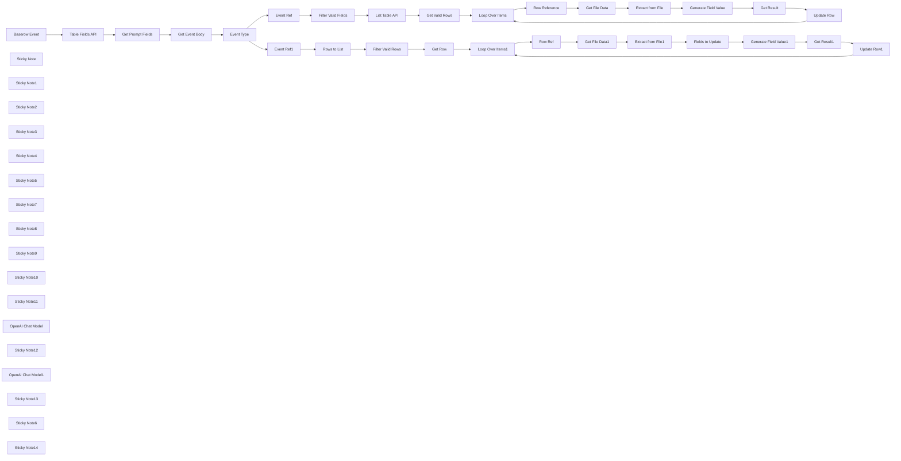

## Fluxo (.json) :

```json
{
  "nodes": [
    {
      "id": "065d7ec9-edc5-46f6-b8ac-d62ed0e5c8e3",
      "name": "Baserow Event",
      "type": "n8n-nodes-base.webhook",
      "position": [
        -1180,
        -140
      ],
      "webhookId": "267ea500-e2cd-4604-a31f-f0773f27317c",
      "parameters": {
        "path": "267ea500-e2cd-4604-a31f-f0773f27317c",
        "options": {},
        "httpMethod": "POST"
      },
      "typeVersion": 2
    },
    {
      "id": "ac1403b4-9d45-404d-9892-0bed39b9ec82",
      "name": "Event Type",
      "type": "n8n-nodes-base.switch",
      "position": [
        -220,
        -140
      ],
      "parameters": {
        "rules": {
          "values": [
            {
              "outputKey": "rows.updated",
              "conditions": {
                "options": {
                  "version": 2,
                  "leftValue": "",
                  "caseSensitive": true,
                  "typeValidation": "strict"
                },
                "combinator": "and",
                "conditions": [
                  {
                    "id": "2162daf8-d23d-4b8f-8257-bdfc5400a3a8",
                    "operator": {
                      "name": "filter.operator.equals",
                      "type": "string",
                      "operation": "equals"
                    },
                    "leftValue": "={{ $json.event_type }}",
                    "rightValue": "rows.updated"
                  }
                ]
              },
              "renameOutput": true
            },
            {
              "outputKey": "field.created",
              "conditions": {
                "options": {
                  "version": 2,
                  "leftValue": "",
                  "caseSensitive": true,
                  "typeValidation": "strict"
                },
                "combinator": "and",
                "conditions": [
                  {
                    "id": "48e112f6-afe8-40bf-b673-b37446934a62",
                    "operator": {
                      "name": "filter.operator.equals",
                      "type": "string",
                      "operation": "equals"
                    },
                    "leftValue": "={{ $json.event_type }}",
                    "rightValue": "field.created"
                  }
                ]
              },
              "renameOutput": true
            },
            {
              "outputKey": "field.updated",
              "conditions": {
                "options": {
                  "version": 2,
                  "leftValue": "",
                  "caseSensitive": true,
                  "typeValidation": "strict"
                },
                "combinator": "and",
                "conditions": [
                  {
                    "id": "5aa258cd-15c2-4156-a32d-afeed662a38e",
                    "operator": {
                      "name": "filter.operator.equals",
                      "type": "string",
                      "operation": "equals"
                    },
                    "leftValue": "={{ $json.event_type }}",
                    "rightValue": "field.updated"
                  }
                ]
              },
              "renameOutput": true
            }
          ]
        },
        "options": {}
      },
      "typeVersion": 3.2
    },
    {
      "id": "c501042d-f9e7-4c1a-b01d-b11392b1a804",
      "name": "Table Fields API",
      "type": "n8n-nodes-base.httpRequest",
      "position": [
        -900,
        -140
      ],
      "parameters": {
        "url": "=https://api.baserow.io/api/database/fields/table/{{ $json.body.table_id }}/",
        "options": {},
        "sendQuery": true,
        "authentication": "genericCredentialType",
        "genericAuthType": "httpHeaderAuth",
        "queryParameters": {
          "parameters": [
            {
              "name": "user_field_names",
              "value": "true"
            }
          ]
        }
      },
      "credentials": {
        "httpHeaderAuth": {
          "id": "F28aPWK5NooSHAg0",
          "name": "Baserow (n8n-local)"
        }
      },
      "typeVersion": 4.2
    },
    {
      "id": "af6c3b7f-bb8b-4037-8e3b-337d81ca5632",
      "name": "Get Prompt Fields",
      "type": "n8n-nodes-base.code",
      "position": [
        -720,
        -140
      ],
      "parameters": {
        "jsCode": "const fields = $input.all()\n    .filter(item => item.json.description)\n    .map(item => ({\n      id: item.json.id,\n      order: item.json.order,\n      name: item.json.name,\n      description: item.json.description,\n    }));\n\nreturn { json: { fields } };"
      },
      "typeVersion": 2
    },
    {
      "id": "e1f8f740-c784-4f07-9265-76db518f3ebc",
      "name": "Get Event Body",
      "type": "n8n-nodes-base.set",
      "position": [
        -380,
        -140
      ],
      "parameters": {
        "mode": "raw",
        "options": {},
        "jsonOutput": "={{ $('Baserow Event').first().json.body }}"
      },
      "typeVersion": 3.4
    },
    {
      "id": "e303b7c3-639a-4136-8aa4-074eedeb273f",
      "name": "List Table API",
      "type": "n8n-nodes-base.httpRequest",
      "position": [
        480,
        220
      ],
      "parameters": {
        "url": "=https://api.baserow.io/api/database/rows/table/{{ $json.table_id }}/",
        "options": {
          "pagination": {
            "pagination": {
              "nextURL": "={{ $response.body.next || `https://api.baserow.io/api/database/rows/table/${$json.table_id}/?user_field_names=true&size=20&page=9999` }}",
              "maxRequests": 3,
              "paginationMode": "responseContainsNextURL",
              "requestInterval": 1000,
              "limitPagesFetched": true,
              "completeExpression": "={{ $response.body.isEmpty() || $response.statusCode >= 400 }}",
              "paginationCompleteWhen": "other"
            }
          }
        },
        "sendQuery": true,
        "authentication": "genericCredentialType",
        "genericAuthType": "httpHeaderAuth",
        "queryParameters": {
          "parameters": [
            {
              "name": "user_field_names",
              "value": "true"
            },
            {
              "name": "size",
              "value": "20"
            },
            {
              "name": "include",
              "value": "id,order,_id,name,created_at,last_modified_at"
            },
            {
              "name": "filters",
              "value": "{\"filter_type\":\"AND\",\"filters\":[{\"type\":\"not_empty\",\"field\":\"File\",\"value\":\"\"}],\"groups\":[]}"
            }
          ]
        }
      },
      "credentials": {
        "httpHeaderAuth": {
          "id": "F28aPWK5NooSHAg0",
          "name": "Baserow (n8n-local)"
        }
      },
      "typeVersion": 4.2
    },
    {
      "id": "9ad2e0c8-c92d-460d-be7a-237ce29b34c2",
      "name": "Get Valid Rows",
      "type": "n8n-nodes-base.code",
      "position": [
        640,
        220
      ],
      "parameters": {
        "jsCode": "return $input.all()\n  .filter(item => item.json.results?.length)\n  .flatMap(item => item.json.results);"
      },
      "typeVersion": 2
    },
    {
      "id": "72b137e9-2e87-4580-9282-0ab7c5147f68",
      "name": "Get File Data",
      "type": "n8n-nodes-base.httpRequest",
      "position": [
        1320,
        320
      ],
      "parameters": {
        "url": "={{ $json.File[0].url }}",
        "options": {}
      },
      "typeVersion": 4.2
    },
    {
      "id": "d479ee4e-4a87-4a0e-b9ca-4aa54afdc67a",
      "name": "Extract from File",
      "type": "n8n-nodes-base.extractFromFile",
      "position": [
        1480,
        320
      ],
      "parameters": {
        "options": {},
        "operation": "pdf"
      },
      "typeVersion": 1
    },
    {
      "id": "717e36f8-7dd7-44a6-bcef-9f20735853d2",
      "name": "Update Row",
      "type": "n8n-nodes-base.httpRequest",
      "notes": "Execute Once",
      "onError": "continueRegularOutput",
      "maxTries": 2,
      "position": [
        2280,
        380
      ],
      "parameters": {
        "url": "=https://api.baserow.io/api/database/rows/table/{{ $('Event Ref').first().json.table_id }}/{{ $('Row Reference').item.json.id }}/",
        "method": "PATCH",
        "options": {},
        "jsonBody": "={{\n{\n  ...$input.all()\n    .reduce((acc, item) => ({\n      ...acc,\n      [item.json.field]: item.json.value\n    }), {})\n}\n}}",
        "sendBody": true,
        "sendQuery": true,
        "specifyBody": "json",
        "authentication": "genericCredentialType",
        "genericAuthType": "httpHeaderAuth",
        "queryParameters": {
          "parameters": [
            {
              "name": "user_field_names",
              "value": "true"
            }
          ]
        }
      },
      "credentials": {
        "httpHeaderAuth": {
          "id": "F28aPWK5NooSHAg0",
          "name": "Baserow (n8n-local)"
        }
      },
      "executeOnce": true,
      "notesInFlow": true,
      "retryOnFail": false,
      "typeVersion": 4.2,
      "waitBetweenTries": 3000
    },
    {
      "id": "b807a9c0-2334-491c-a259-1e0e266f89df",
      "name": "Get Result",
      "type": "n8n-nodes-base.set",
      "position": [
        2100,
        380
      ],
      "parameters": {
        "options": {},
        "assignments": {
          "assignments": [
            {
              "id": "3ad72567-1d17-4910-b916-4c34a43b1060",
              "name": "field",
              "type": "string",
              "value": "={{ $('Event Ref').first().json.field.name }}"
            },
            {
              "id": "e376ba60-8692-4962-9af7-466b6a3f44a2",
              "name": "value",
              "type": "string",
              "value": "={{ $json.text.trim() }}"
            }
          ]
        }
      },
      "typeVersion": 3.4
    },
    {
      "id": "d29a58db-f547-4a4b-bc20-10e14529e474",
      "name": "Loop Over Items",
      "type": "n8n-nodes-base.splitInBatches",
      "position": [
        900,
        220
      ],
      "parameters": {
        "options": {}
      },
      "typeVersion": 3
    },
    {
      "id": "233b2e96-7873-42f0-989f-c3df5a8e4542",
      "name": "Row Reference",
      "type": "n8n-nodes-base.noOp",
      "position": [
        1080,
        320
      ],
      "parameters": {},
      "typeVersion": 1
    },
    {
      "id": "396eb9c0-dcde-4735-9e15-bf6350def086",
      "name": "Generate Field Value",
      "type": "@n8n/n8n-nodes-langchain.chainLlm",
      "position": [
        1640,
        320
      ],
      "parameters": {
        "text": "=<file>\n{{ $json.text }}\n</file>\n\nData to extract: {{ $('Event Ref').first().json.field.description }}\noutput format is: {{ $('Event Ref').first().json.field.type }}",
        "messages": {
          "messageValues": [
            {
              "message": "=You assist the user in extracting the required data from the given file.\n* Keep you answer short.\n* If you cannot extract the requested data, give you response as \"n/a\"."
            }
          ]
        },
        "promptType": "define"
      },
      "typeVersion": 1.5
    },
    {
      "id": "4be0a9e5-e77e-4cea-9dd3-bc6e7de7a72b",
      "name": "Get Row",
      "type": "n8n-nodes-base.httpRequest",
      "position": [
        640,
        -420
      ],
      "parameters": {
        "url": "=https://api.baserow.io/api/database/rows/table/{{ $('Event Ref1').first().json.table_id }}/{{ $json.id }}/",
        "options": {},
        "sendQuery": true,
        "authentication": "genericCredentialType",
        "genericAuthType": "httpHeaderAuth",
        "queryParameters": {
          "parameters": [
            {
              "name": "user_field_names",
              "value": "true"
            }
          ]
        }
      },
      "credentials": {
        "httpHeaderAuth": {
          "id": "F28aPWK5NooSHAg0",
          "name": "Baserow (n8n-local)"
        }
      },
      "typeVersion": 4.2
    },
    {
      "id": "40fc77b8-a986-40ab-a78c-da05a3f171c2",
      "name": "Rows to List",
      "type": "n8n-nodes-base.splitOut",
      "position": [
        320,
        -420
      ],
      "parameters": {
        "options": {},
        "fieldToSplitOut": "items"
      },
      "typeVersion": 1
    },
    {
      "id": "4c5bc9c8-1bcb-48b1-82d0-5cf04535108c",
      "name": "Fields to Update",
      "type": "n8n-nodes-base.code",
      "position": [
        1640,
        -300
      ],
      "parameters": {
        "jsCode": "const row = $('Row Ref').first().json;\nconst fields = $('Get Prompt Fields').first().json.fields;\nconst missingFields = fields\n  .filter(field => field.description && !row[field.name]);\n\nreturn missingFields;"
      },
      "typeVersion": 2
    },
    {
      "id": "85d5c817-e5f8-45ea-bf7f-efc7913f542c",
      "name": "Loop Over Items1",
      "type": "n8n-nodes-base.splitInBatches",
      "position": [
        900,
        -420
      ],
      "parameters": {
        "options": {}
      },
      "typeVersion": 3
    },
    {
      "id": "69005b35-9c66-4c14-80a9-ef8e945dab30",
      "name": "Row Ref",
      "type": "n8n-nodes-base.noOp",
      "position": [
        1080,
        -300
      ],
      "parameters": {},
      "typeVersion": 1
    },
    {
      "id": "1b0e14da-13a8-4023-9006-464578bf0ff5",
      "name": "Get File Data1",
      "type": "n8n-nodes-base.httpRequest",
      "position": [
        1320,
        -300
      ],
      "parameters": {
        "url": "={{ $('Row Ref').item.json.File[0].url }}",
        "options": {}
      },
      "typeVersion": 4.2
    },
    {
      "id": "47cf67bc-a3e2-4796-b5a7-4f6a6aef3e90",
      "name": "Extract from File1",
      "type": "n8n-nodes-base.extractFromFile",
      "position": [
        1480,
        -300
      ],
      "parameters": {
        "options": {},
        "operation": "pdf"
      },
      "typeVersion": 1
    },
    {
      "id": "3dc743cc-0dde-4349-975c-fa453d99dbaf",
      "name": "Update Row1",
      "type": "n8n-nodes-base.httpRequest",
      "notes": "Execute Once",
      "onError": "continueRegularOutput",
      "maxTries": 2,
      "position": [
        2440,
        -260
      ],
      "parameters": {
        "url": "=https://api.baserow.io/api/database/rows/table/{{ $('Event Ref1').first().json.table_id }}/{{ $('Row Ref').first().json.id }}/",
        "method": "PATCH",
        "options": {},
        "jsonBody": "={{\n{\n  ...$input.all()\n    .reduce((acc, item) => ({\n      ...acc,\n      [item.json.field]: item.json.value\n    }), {})\n}\n}}",
        "sendBody": true,
        "sendQuery": true,
        "specifyBody": "json",
        "authentication": "genericCredentialType",
        "genericAuthType": "httpHeaderAuth",
        "queryParameters": {
          "parameters": [
            {
              "name": "user_field_names",
              "value": "true"
            }
          ]
        }
      },
      "credentials": {
        "httpHeaderAuth": {
          "id": "F28aPWK5NooSHAg0",
          "name": "Baserow (n8n-local)"
        }
      },
      "executeOnce": true,
      "notesInFlow": true,
      "retryOnFail": false,
      "typeVersion": 4.2,
      "waitBetweenTries": 3000
    },
    {
      "id": "49c53281-d323-4794-919a-d807d7ccc25e",
      "name": "Get Result1",
      "type": "n8n-nodes-base.set",
      "position": [
        2260,
        -260
      ],
      "parameters": {
        "options": {},
        "assignments": {
          "assignments": [
            {
              "id": "3ad72567-1d17-4910-b916-4c34a43b1060",
              "name": "field",
              "type": "string",
              "value": "={{ $('Fields to Update').item.json.name }}"
            },
            {
              "id": "e376ba60-8692-4962-9af7-466b6a3f44a2",
              "name": "value",
              "type": "string",
              "value": "={{ $json.text.trim() }}"
            }
          ]
        }
      },
      "typeVersion": 3.4
    },
    {
      "id": "bc23708a-b177-47db-8a30-4330198710e0",
      "name": "Generate Field Value1",
      "type": "@n8n/n8n-nodes-langchain.chainLlm",
      "position": [
        1800,
        -300
      ],
      "parameters": {
        "text": "=<file>\n{{ $('Extract from File1').first().json.text }}\n</file>\n\nData to extract: {{ $json.description }}\noutput format is: {{ $json.type }}",
        "messages": {
          "messageValues": [
            {
              "message": "=You assist the user in extracting the required data from the given file.\n* Keep you answer short.\n* If you cannot extract the requested data, give you response as \"n/a\" followed by \"(reason)\" where reason is replaced with reason why data could not be extracted."
            }
          ]
        },
        "promptType": "define"
      },
      "typeVersion": 1.5
    },
    {
      "id": "c0297c19-04b8-4d56-9ce0-320b399f73bd",
      "name": "Filter Valid Rows",
      "type": "n8n-nodes-base.filter",
      "position": [
        480,
        -420
      ],
      "parameters": {
        "options": {},
        "conditions": {
          "options": {
            "version": 2,
            "leftValue": "",
            "caseSensitive": true,
            "typeValidation": "strict"
          },
          "combinator": "and",
          "conditions": [
            {
              "id": "7ad58f0b-0354-49a9-ab2f-557652d7b416",
              "operator": {
                "type": "string",
                "operation": "notEmpty",
                "singleValue": true
              },
              "leftValue": "={{ $json.File[0].url }}",
              "rightValue": ""
            }
          ]
        }
      },
      "typeVersion": 2.2
    },
    {
      "id": "5aab6971-1d6f-4b82-a218-4e25c7b28052",
      "name": "Filter Valid Fields",
      "type": "n8n-nodes-base.filter",
      "position": [
        320,
        220
      ],
      "parameters": {
        "options": {},
        "conditions": {
          "options": {
            "version": 2,
            "leftValue": "",
            "caseSensitive": true,
            "typeValidation": "strict"
          },
          "combinator": "and",
          "conditions": [
            {
              "id": "5b4a7393-788c-42dc-ac1f-e76f833f8534",
              "operator": {
                "type": "string",
                "operation": "notEmpty",
                "singleValue": true
              },
              "leftValue": "={{ $json.field.description }}",
              "rightValue": ""
            }
          ]
        }
      },
      "typeVersion": 2.2
    },
    {
      "id": "bc144115-f3a2-4e99-a35c-4a780754d0fb",
      "name": "Event Ref",
      "type": "n8n-nodes-base.noOp",
      "position": [
        160,
        220
      ],
      "parameters": {},
      "typeVersion": 1
    },
    {
      "id": "13fd10c0-d4eb-463a-a8b6-5471380f3710",
      "name": "Event Ref1",
      "type": "n8n-nodes-base.noOp",
      "position": [
        160,
        -420
      ],
      "parameters": {},
      "typeVersion": 1
    },
    {
      "id": "e07053a4-a130-41b0-85d3-dfa3983b1547",
      "name": "Sticky Note",
      "type": "n8n-nodes-base.stickyNote",
      "position": [
        -1000,
        -340
      ],
      "parameters": {
        "color": 7,
        "width": 480,
        "height": 440,
        "content": "### 1. Get Table Schema\n[Learn more about the HTTP node](https://docs.n8n.io/integrations/builtin/core-nodes/n8n-nodes-base.httprequest)\n\nFor this operation, we'll have to use the Baserow API rather than the built-in node. However, this way does allow for more flexibility with query parameters.\n"
      },
      "typeVersion": 1
    },
    {
      "id": "675b9d6a-1ba6-49ce-b569-38cc0ba04dcb",
      "name": "Sticky Note1",
      "type": "n8n-nodes-base.stickyNote",
      "position": [
        -260,
        -440
      ],
      "parameters": {
        "color": 5,
        "width": 330,
        "height": 80,
        "content": "### 2a. Updates Minimal Number of Rows\nThis branch updates only the rows impacted."
      },
      "typeVersion": 1
    },
    {
      "id": "021d51f9-7a5b-4f93-baad-707144aeb7ba",
      "name": "Sticky Note2",
      "type": "n8n-nodes-base.stickyNote",
      "position": [
        -320,
        140
      ],
      "parameters": {
        "color": 5,
        "width": 390,
        "height": 120,
        "content": "### 2b. Update Every Row under the Field\nThis branch updates all applicable rows under field when the field/column is created or changed. Watch out - if you have 1000s of rows, this could take a while!"
      },
      "typeVersion": 1
    },
    {
      "id": "ae49cfb0-ac83-4501-bc01-d98be32798f0",
      "name": "Sticky Note3",
      "type": "n8n-nodes-base.stickyNote",
      "position": [
        -1780,
        -1060
      ],
      "parameters": {
        "width": 520,
        "height": 1160,
        "content": "## Try It Out!\n### This n8n template powers a \"dynamic\" or \"user-defined\" prompts with PDF workflow pattern for a [Baserow](https://baserow.io) table. Simply put, it allows users to populate a spreadsheet using prompts without touching the underlying template.\n\n**Check out the video demo I did for n8n Studio**: https://www.youtube.com/watch?v=_fNAD1u8BZw\n\nThis template is intended to be used as a webhook source for Baserow. **Looking for a Airtable version? [Click here](https://n8n.io/workflows/2771-ai-data-extraction-with-dynamic-prompts-and-airtable/)**\n\n## How it works\n* Each Baserow.io tables offers integration feature whereby changes to the table can be sent as events to any accessible webhook. This allows for a reactive trigger pattern which makes this type of workflow possible. For our usecase, we capture the vents of `row_updated`, `field_created` and `field_updated`.\n* Next, we'll need an \"input\" column in our Baserow.io table. This column will be where our context lives for evaluating the prompts against. In this example, our \"input\" column name is \"file\" and it's where we'll upload our PDFs. Note, this \"input\" field is human-controlled and never updated from this template.\n* Now for the columns (aka \"fields\" in Baserow). Each field allows us to define a name, type and description and together form the schema. The first 2 are self-explaintory but the \"description\" will be for users to provide their prompts ie. what data should the field to contain.\n* In this template, a webhook trigger waits for when a row or column is updated. The incoming event comes with lots of details such as the table, row and/or column Ids that were impacted.\n* We use this information to fetch the table's schema in order to get the column's descriptions (aka dynamic prompts).\n* For each triggered event, we download our input ie. the PDF and ready it for our AI/LLM. By iterating through the available columns and feeding the dynamic prompts, our LLM can run those prompts against the PDF and thus generating a value response for each cell.\n* These values are then collected and used to update the Baserow Table.\n\n## How to use\n* You'll need to publish this workflow and make it accessible to our Baserow instance. Good to note, you only really need to do this once and can reuse for many Baserow Tables.\n* Configure your Baserow Table to send `row_updated`, `field_created` and `field_updated` events to this n8n workflow.\n* This workflow should work with both cloud-hosted and self-hosted versions of Baserow.\n\n\n### Need Help?\nJoin the [Discord](https://discord.com/invite/XPKeKXeB7d) or ask in the [Forum](https://community.n8n.io/)!\n\nHappy Flowgramming!"
      },
      "typeVersion": 1
    },
    {
      "id": "23ea63f5-e1ad-4326-95a4-945bf98d03f4",
      "name": "Sticky Note4",
      "type": "n8n-nodes-base.stickyNote",
      "position": [
        -500,
        -340
      ],
      "parameters": {
        "color": 7,
        "width": 580,
        "height": 440,
        "content": "### 2. Event Router Pattern\n[Learn more about the Switch node](https://docs.n8n.io/integrations/builtin/core-nodes/n8n-nodes-base.switch/)\n\nA simple switch node can be used to determine which event to handle. The difference between our row and field events is that row event affect a single row whereas field events affect all rows. \n"
      },
      "typeVersion": 1
    },
    {
      "id": "179f9459-43d0-4342-ab94-e248730182a5",
      "name": "Sticky Note5",
      "type": "n8n-nodes-base.stickyNote",
      "position": [
        100,
        -620
      ],
      "parameters": {
        "color": 7,
        "width": 700,
        "height": 400,
        "content": "### 3. Filter Only Rows with Valid Input\n[Learn more about the Split Out node](https://docs.n8n.io/integrations/builtin/core-nodes/n8n-nodes-base.splitout/)\n\nThis step handles one or more updated rows where \"updated\" means the \"input\" column (ie. \"file\" in our example) for these rows were changed. For each affected row, we'll get the full row to figure out only the columns we need to update - this is an optimisation to avoid redundant work ie. generating values for columns which already have a value."
      },
      "typeVersion": 1
    },
    {
      "id": "7124a8c0-549e-4b82-8e1f-c6428d2bfb44",
      "name": "Sticky Note7",
      "type": "n8n-nodes-base.stickyNote",
      "position": [
        2140,
        -480
      ],
      "parameters": {
        "color": 7,
        "width": 520,
        "height": 440,
        "content": "### 6. Update the Baserow Table Row\n[Learn more about the Edit Fields node](https://docs.n8n.io/integrations/builtin/core-nodes/n8n-nodes-base.set/)\n\nFinally, we can collect the LLM responses and combine them to build an API request to update our Baserow Table row - the Id of which we got from initial webhook. After this is done, we can move onto the next row and repeat the process.\n"
      },
      "typeVersion": 1
    },
    {
      "id": "c55ce945-10ba-440b-a444-81cb4ed63539",
      "name": "Sticky Note8",
      "type": "n8n-nodes-base.stickyNote",
      "position": [
        1260,
        -580
      ],
      "parameters": {
        "color": 7,
        "width": 860,
        "height": 580,
        "content": "### 5. PDFs, LLMs and Dynamic Prompts? Oh My!\n[Learn more about the Basic LLM node](https://docs.n8n.io/integrations/builtin/cluster-nodes/root-nodes/n8n-nodes-langchain.chainllm/)\n\nThis step is where it all comes together! In short, we give our LLM the PDF contents as the context and loop through our dynamic prompts (from the schema we pulled earlier) for our row. At the end, our LLM should have produced a value for each column requested.\n\n**Note**: There's definitely a optimisation which could be done for caching PDFs but it beyond the scope of this demonstration.\n"
      },
      "typeVersion": 1
    },
    {
      "id": "1a0ff82e-64aa-479e-8dec-c29b512b0686",
      "name": "Sticky Note9",
      "type": "n8n-nodes-base.stickyNote",
      "position": [
        820,
        -580
      ],
      "parameters": {
        "color": 7,
        "width": 420,
        "height": 460,
        "content": "### 4. Using an Items Loop\n[Learn more about the Split in Batches node](https://docs.n8n.io/integrations/builtin/core-nodes/n8n-nodes-base.splitinbatches/)\n\nA split in batches node is used here to update a row at a time however, this is a preference for user experience - changes are seen in the Baserow quicker.\n"
      },
      "typeVersion": 1
    },
    {
      "id": "f4562d44-4fc0-4c59-ba90-8b65f1162aac",
      "name": "Sticky Note10",
      "type": "n8n-nodes-base.stickyNote",
      "position": [
        100,
        40
      ],
      "parameters": {
        "color": 7,
        "width": 680,
        "height": 360,
        "content": "### 7. Listing All Rows Under The Column\n[Learn more about the Code node](https://docs.n8n.io/integrations/builtin/core-nodes/n8n-nodes-base.code)\n\nWe can use Baserow's List API and the HTTP node's pagination feature to fetch all applicable rows under the affected field - the filter query on the API is helpful here.\n"
      },
      "typeVersion": 1
    },
    {
      "id": "979983e9-1002-444c-a018-50ce525ef02a",
      "name": "Sticky Note11",
      "type": "n8n-nodes-base.stickyNote",
      "position": [
        1260,
        140
      ],
      "parameters": {
        "color": 7,
        "width": 700,
        "height": 500,
        "content": "### 9. Generating Value using LLM\n[Learn more about the Extract From File node](https://docs.n8n.io/integrations/builtin/core-nodes/n8n-nodes-base.extractfromfile/)\n\nPretty much identical to Step 5 but instead of updating every field/column, we only need to generate a value for one. \n"
      },
      "typeVersion": 1
    },
    {
      "id": "f38aa7a3-479b-4876-87bf-769ada3089f2",
      "name": "OpenAI Chat Model",
      "type": "@n8n/n8n-nodes-langchain.lmChatOpenAi",
      "position": [
        1800,
        -140
      ],
      "parameters": {
        "options": {}
      },
      "credentials": {
        "openAiApi": {
          "id": "8gccIjcuf3gvaoEr",
          "name": "OpenAi account"
        }
      },
      "typeVersion": 1.1
    },
    {
      "id": "a5061210-2e6b-4b62-994f-594fc10a0ac6",
      "name": "Sticky Note12",
      "type": "n8n-nodes-base.stickyNote",
      "position": [
        820,
        40
      ],
      "parameters": {
        "color": 7,
        "width": 420,
        "height": 460,
        "content": "### 8. Using an Items Loop\n[Learn more about the Split in Batches node](https://docs.n8n.io/integrations/builtin/core-nodes/n8n-nodes-base.splitinbatches/)\n\nSimilar to Step 4, the Split in Batches node is a preference for user experience - changes are seen in the Baserow quicker.\n"
      },
      "typeVersion": 1
    },
    {
      "id": "e47e36d4-bf6d-48d3-9e52-d8bbac06c4b4",
      "name": "OpenAI Chat Model1",
      "type": "@n8n/n8n-nodes-langchain.lmChatOpenAi",
      "position": [
        1640,
        500
      ],
      "parameters": {
        "options": {}
      },
      "credentials": {
        "openAiApi": {
          "id": "8gccIjcuf3gvaoEr",
          "name": "OpenAi account"
        }
      },
      "typeVersion": 1.1
    },
    {
      "id": "52501eab-861e-4de9-837d-65879cd43e5b",
      "name": "Sticky Note13",
      "type": "n8n-nodes-base.stickyNote",
      "position": [
        1980,
        200
      ],
      "parameters": {
        "color": 7,
        "width": 500,
        "height": 380,
        "content": "### 10. Update the Baserow Table Row\n[Learn more about the Edit Fields node](https://docs.n8n.io/integrations/builtin/core-nodes/n8n-nodes-base.set/)\n\nAs with Step 6, the LLM response is used to update the row however only under the field that was created/changed. Once complete, the loop continues and the next row is processed.\n"
      },
      "typeVersion": 1
    },
    {
      "id": "6d9fb2e9-6aca-4276-b9b3-d409be24e40e",
      "name": "Sticky Note6",
      "type": "n8n-nodes-base.stickyNote",
      "position": [
        -1780,
        -1200
      ],
      "parameters": {
        "color": 7,
        "height": 120,
        "content": ""
      },
      "typeVersion": 1
    },
    {
      "id": "bccfc32b-fd18-4de7-88d5-0aeb02ab7954",
      "name": "Sticky Note14",
      "type": "n8n-nodes-base.stickyNote",
      "position": [
        -1200,
        -1280
      ],
      "parameters": {
        "color": 5,
        "width": 820,
        "height": 800,
        "content": "## ⭐️ Creating Baserow Webhooks\nBaserow webhooks are created via the UI and the option can be accessed by clicking on the 3 dots button in the toolbar.\n\n* Create a POST webhook for your n8n webhook URL found in this template.\n* Select the \"use fields names instead of IDs\" option.\n* Select \"let me choose individual events\"\n* The events to choose are \"row updated\", \"field created\" and \"field updated\".\n* For the \"row updated\" event, be sure to specify the input field - in this case, \"File\".\n\n"
      },
      "typeVersion": 1
    }
  ],
  "pinData": {},
  "connections": {
    "Get Row": {
      "main": [
        [
          {
            "node": "Loop Over Items1",
            "type": "main",
            "index": 0
          }
        ]
      ]
    },
    "Row Ref": {
      "main": [
        [
          {
            "node": "Get File Data1",
            "type": "main",
            "index": 0
          }
        ]
      ]
    },
    "Event Ref": {
      "main": [
        [
          {
            "node": "Filter Valid Fields",
            "type": "main",
            "index": 0
          }
        ]
      ]
    },
    "Event Ref1": {
      "main": [
        [
          {
            "node": "Rows to List",
            "type": "main",
            "index": 0
          }
        ]
      ]
    },
    "Event Type": {
      "main": [
        [
          {
            "node": "Event Ref1",
            "type": "main",
            "index": 0
          }
        ],
        [
          {
            "node": "Event Ref",
            "type": "main",
            "index": 0
          }
        ],
        [
          {
            "node": "Event Ref",
            "type": "main",
            "index": 0
          }
        ]
      ]
    },
    "Get Result": {
      "main": [
        [
          {
            "node": "Update Row",
            "type": "main",
            "index": 0
          }
        ]
      ]
    },
    "Update Row": {
      "main": [
        [
          {
            "node": "Loop Over Items",
            "type": "main",
            "index": 0
          }
        ]
      ]
    },
    "Get Result1": {
      "main": [
        [
          {
            "node": "Update Row1",
            "type": "main",
            "index": 0
          }
        ]
      ]
    },
    "Update Row1": {
      "main": [
        [
          {
            "node": "Loop Over Items1",
            "type": "main",
            "index": 0
          }
        ]
      ]
    },
    "Rows to List": {
      "main": [
        [
          {
            "node": "Filter Valid Rows",
            "type": "main",
            "index": 0
          }
        ]
      ]
    },
    "Baserow Event": {
      "main": [
        [
          {
            "node": "Table Fields API",
            "type": "main",
            "index": 0
          }
        ]
      ]
    },
    "Get File Data": {
      "main": [
        [
          {
            "node": "Extract from File",
            "type": "main",
            "index": 0
          }
        ]
      ]
    },
    "Row Reference": {
      "main": [
        [
          {
            "node": "Get File Data",
            "type": "main",
            "index": 0
          }
        ]
      ]
    },
    "Get Event Body": {
      "main": [
        [
          {
            "node": "Event Type",
            "type": "main",
            "index": 0
          }
        ]
      ]
    },
    "Get File Data1": {
      "main": [
        [
          {
            "node": "Extract from File1",
            "type": "main",
            "index": 0
          }
        ]
      ]
    },
    "Get Valid Rows": {
      "main": [
        [
          {
            "node": "Loop Over Items",
            "type": "main",
            "index": 0
          }
        ]
      ]
    },
    "List Table API": {
      "main": [
        [
          {
            "node": "Get Valid Rows",
            "type": "main",
            "index": 0
          }
        ]
      ]
    },
    "Loop Over Items": {
      "main": [
        [],
        [
          {
            "node": "Row Reference",
            "type": "main",
            "index": 0
          }
        ]
      ]
    },
    "Fields to Update": {
      "main": [
        [
          {
            "node": "Generate Field Value1",
            "type": "main",
            "index": 0
          }
        ]
      ]
    },
    "Loop Over Items1": {
      "main": [
        [],
        [
          {
            "node": "Row Ref",
            "type": "main",
            "index": 0
          }
        ]
      ]
    },
    "Table Fields API": {
      "main": [
        [
          {
            "node": "Get Prompt Fields",
            "type": "main",
            "index": 0
          }
        ]
      ]
    },
    "Extract from File": {
      "main": [
        [
          {
            "node": "Generate Field Value",
            "type": "main",
            "index": 0
          }
        ]
      ]
    },
    "Filter Valid Rows": {
      "main": [
        [
          {
            "node": "Get Row",
            "type": "main",
            "index": 0
          }
        ]
      ]
    },
    "Get Prompt Fields": {
      "main": [
        [
          {
            "node": "Get Event Body",
            "type": "main",
            "index": 0
          }
        ]
      ]
    },
    "OpenAI Chat Model": {
      "ai_languageModel": [
        [
          {
            "node": "Generate Field Value1",
            "type": "ai_languageModel",
            "index": 0
          }
        ]
      ]
    },
    "Extract from File1": {
      "main": [
        [
          {
            "node": "Fields to Update",
            "type": "main",
            "index": 0
          }
        ]
      ]
    },
    "OpenAI Chat Model1": {
      "ai_languageModel": [
        [
          {
            "node": "Generate Field Value",
            "type": "ai_languageModel",
            "index": 0
          }
        ]
      ]
    },
    "Filter Valid Fields": {
      "main": [
        [
          {
            "node": "List Table API",
            "type": "main",
            "index": 0
          }
        ]
      ]
    },
    "Generate Field Value": {
      "main": [
        [
          {
            "node": "Get Result",
            "type": "main",
            "index": 0
          }
        ]
      ]
    },
    "Generate Field Value1": {
      "main": [
        [
          {
            "node": "Get Result1",
            "type": "main",
            "index": 0
          }
        ]
      ]
    }
  }
}
```

<a id="template-1123"></a>

## Template 1123 - Processamento e enriquecimento de transcrições Gong

- **Nome:** Processamento e enriquecimento de transcrições Gong
- **Descrição:** Prepara, enriquece e consolida transcrições e metadados de chamadas do Gong com dados de CRM para gerar um bloco de dados pronto para armazenamento ou consumo por aplicações downstream.
- **Funcionalidade:** • Disparo por evento de chamada: inicia o fluxo quando chega um evento de chamada.
• Recuperar dados detalhados de chamada: consulta a API do Gong para obter metadados e informações extensas da chamada.
• Obter transcrição: solicita a transcrição completa da chamada do Gong.
• Transformar transcrição: une sentenças e formata o texto em um único campo legível.
• Classificar falantes por afiliação: mapeia speakerId para ‘Internal’ ou ‘External’ usando os dados de participantes.
• Extrair emails de participantes externos: coleta endereços de email dos participantes externos para uso em buscas e enriquecimento.
• Determinar domínio da empresa: extrai domínios de email e filtra provedores gratuitos para identificar domínio corporativo.
• Buscar dados do Salesforce: consulta oportunidade e conta relacionadas para enriquecer o registro com campos do CRM.
• Combinar e agregar dados: junta transcrição, metadados da chamada e dados do CRM em um único objeto agregado.
• Preparar dados para Notion: isola e formata os campos necessários para criar ou atualizar registros em Notion.
• Enriquecimento adicional via domínio: usa o domínio para buscas em Pipedrive e para consultar serviços de dados (ex.: People Data Labs) para obter informações complementares.
- **Ferramentas:** • Gong: plataforma para captura e análise de chamadas, usada para obter transcrições e dados detalhados da chamada.
• Salesforce: CRM utilizado para buscar dados de oportunidade e conta vinculados à chamada.
• Pipedrive: CRM/serviço de busca (referenciado) para localizar clientes a partir do domínio de email.
• People Data Labs: serviço de enriquecimento de dados para obter informações adicionais (ex.: localização) a partir do domínio.
• Notion: destino previsto para armazenar o bloco de dados formatado e metadados da chamada.

## Fluxo visual

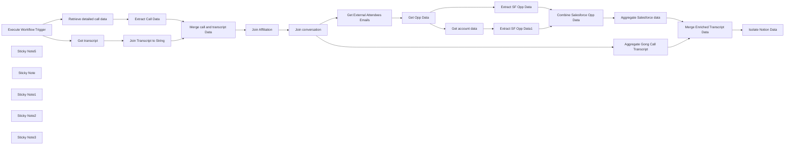

## Fluxo (.json) :

```json
{
  "meta": {
    "instanceId": "cb484ba7b742928a2048bf8829668bed5b5ad9787579adea888f05980292a4a7",
    "templateCredsSetupCompleted": true
  },
  "nodes": [
    {
      "id": "e893e48c-1b69-413a-90d7-ad6ce5987e7c",
      "name": "Execute Workflow Trigger",
      "type": "n8n-nodes-base.executeWorkflowTrigger",
      "position": [
        -180,
        -60
      ],
      "parameters": {},
      "typeVersion": 1
    },
    {
      "id": "1c42e95b-705d-43ae-91ce-1029334b9e9a",
      "name": "Retrieve detailed call data",
      "type": "n8n-nodes-base.httpRequest",
      "position": [
        60,
        40
      ],
      "parameters": {
        "url": "https://api.gong.io/v2/calls/extensive",
        "options": {
          "fullResponse": true
        },
        "requestMethod": "POST",
        "authentication": "genericCredentialType",
        "jsonParameters": true,
        "genericAuthType": "httpHeaderAuth",
        "bodyParametersJson": "={\n  \"contentSelector\": {\n    \"context\": \"Extended\",\n    \"contextTiming\": [\"Now\", \"TimeOfCall\"],\n    \"exposedFields\": {\n      \"collaboration\": {\n        \"publicComments\": true\n      },\n      \"content\": {\n        \"pointsOfInterest\": true,\n        \"structure\": true,\n        \"topics\": true,\n        \"trackers\": true\n      },\n      \"interaction\": {\n        \"personInteractionStats\": true,\n        \"questions\": true,\n        \"speakers\": true,\n        \"video\": true\n      },\n      \"media\": false,\n      \"parties\": true\n    }\n  },\n  \"filter\": {\n    \"callIds\": [\"{{ $json['calldata[0].calls'].id }}\"]\n  }\n}"
      },
      "credentials": {
        "httpHeaderAuth": {
          "id": "Bz7PHFY0lgEhLsC0",
          "name": "Giulio Gong API"
        }
      },
      "typeVersion": 2
    },
    {
      "id": "69c9ef1a-9ef4-4c3f-ab62-a5c9b2a10a4e",
      "name": "Get transcript",
      "type": "n8n-nodes-base.httpRequest",
      "position": [
        60,
        -140
      ],
      "parameters": {
        "url": "https://api.gong.io/v2/calls/transcript?callIds=1807130744801961509",
        "options": {
          "fullResponse": true
        },
        "requestMethod": "POST",
        "authentication": "genericCredentialType",
        "jsonParameters": true,
        "genericAuthType": "httpHeaderAuth",
        "bodyParametersJson": "={\"filter\":{\"callIds\":[\"{{ $json['calldata[0].calls'].id }}\"]}}"
      },
      "credentials": {
        "httpHeaderAuth": {
          "id": "Bz7PHFY0lgEhLsC0",
          "name": "Giulio Gong API"
        }
      },
      "typeVersion": 2
    },
    {
      "id": "a9643d2c-6245-4c40-92ee-49eb667e3348",
      "name": "Join Transcript to String",
      "type": "n8n-nodes-base.set",
      "position": [
        260,
        -140
      ],
      "parameters": {
        "options": {},
        "assignments": {
          "assignments": [
            {
              "id": "c9828e0c-fce4-487d-b5cb-bff625cb7c8e",
              "name": "Conversation",
              "type": "array",
              "value": "={{ $jmespath($json.body.callTranscripts, '[].transcript[].{\"speaker\": speakerId, \"text\": sentences[].text}') }}"
            }
          ]
        }
      },
      "typeVersion": 3.4
    },
    {
      "id": "ce7cce2a-95b2-4d74-865d-d1af028e16de",
      "name": "Isolate Notion Data",
      "type": "n8n-nodes-base.set",
      "position": [
        2720,
        -100
      ],
      "parameters": {
        "options": {},
        "assignments": {
          "assignments": [
            {
              "id": "ee14c39a-1590-4262-b5ab-36640a6e3c31",
              "name": "metaData.CompanyName",
              "type": "string",
              "value": "={{ $json.sfOpp[0].Name }}"
            },
            {
              "id": "0d323985-076c-456f-bf4c-d9520b07f73d",
              "name": "Attendees.internal",
              "type": "array",
              "value": "={{ $jmespath($json.gongData[0].parties, '[?affiliation==`Internal`].emailAddress') }}"
            },
            {
              "id": "ee040180-fce4-4d68-a406-26a88a383c14",
              "name": "metaData.title",
              "type": "string",
              "value": "={{ $json.gongData[0].metaData.title }}"
            },
            {
              "id": "dea503f9-d575-4804-bbe7-0dcf7d5fbea4",
              "name": "metaData.started",
              "type": "string",
              "value": "={{ $json.gongData[0].metaData.started }}"
            },
            {
              "id": "91fa2545-6a02-43e6-b893-4d3133540a5c",
              "name": "metaData.GongCallID",
              "type": "string",
              "value": "={{ $json.gongData[0].metaData.id }}"
            },
            {
              "id": "c0cbfa8b-40d1-4838-a375-88ea8eb85170",
              "name": "metaData.url",
              "type": "string",
              "value": "={{ $json.gongData[0].metaData.url }}"
            },
            {
              "id": "d10a0184-f17c-4fd6-aed5-72656e15f856",
              "name": "Conversation",
              "type": "string",
              "value": "={{ $json.gongData[0].conversationText }}"
            },
            {
              "id": "02eb0113-7e52-4931-bd10-3f2bee87d984",
              "name": "Attendees.external",
              "type": "array",
              "value": "={{ $jmespath($json.gongData[0].parties, '[?affiliation==`External` || affiliation==`Unknown`].emailAddress') }}"
            },
            {
              "id": "c2183c7b-d552-4a16-bb08-c9ed247f8111",
              "name": "Attendees.externalNames",
              "type": "array",
              "value": "={{ $jmespath($json.gongData[0].parties, '[?affiliation==`External` || affiliation==`Unknown`].name') }}"
            },
            {
              "id": "a232bd40-ae56-4c12-8b3f-9062d4880415",
              "name": "Attendees.internalNames",
              "type": "array",
              "value": "={{ $jmespath($json.gongData[0].parties, '[?affiliation==`Internal`].name') }}"
            },
            {
              "id": "99f7143e-af6c-45d2-b3a1-c5169c6632eb",
              "name": "metaData.Integrations",
              "type": "string",
              "value": "={{ $('Execute Workflow Trigger').item.json['calldata[1].integrations'] }}"
            },
            {
              "id": "7fe14a89-5fda-4594-8b5a-6fbd8a519db9",
              "name": "metaData.Competitors",
              "type": "string",
              "value": "={{ $('Execute Workflow Trigger').item.json['calldata[2].competitors'] }}"
            },
            {
              "id": "29fb3dbe-071c-4b02-9dd9-afa4c3a4ad8f",
              "name": "metaData.domain",
              "type": "string",
              "value": "={{ \n  (() => {\n    // List of known free email domains\n    const freeEmailDomains = [\n      'gmail.com',\n      'yahoo.com',\n      'hotmail.com',\n      'outlook.com',\n      'aol.com',\n      'icloud.com',\n      'mail.com',\n      'yandex.com',\n      'protonmail.com'\n    ];\n\n    // Extract email addresses using JMESPath\n    const emailAddresses = $jmespath($json.gongData[0].parties, '[?affiliation==`External` || affiliation==`Unknown`].emailAddress');\n\n    // Function to extract the domain from an email address\n    const extractDomain = (email) => email.match(/@([\\w.-]+)/)?.[1];\n\n    // Filter out free email domains\n    const companyDomains = emailAddresses\n      .map(extractDomain)\n      .filter(domain => domain && !freeEmailDomains.includes(domain.toLowerCase()));\n\n    // Return the first non-free domain or \"Unknown\" if none are found\n    return companyDomains[0] || 'Unknown';\n  })()\n}}"
            },
            {
              "id": "b28eb61e-6052-4022-9d31-447dbf877982",
              "name": "sfOpp",
              "type": "array",
              "value": "={{ $json.sfOpp }}"
            }
          ]
        }
      },
      "typeVersion": 3.4
    },
    {
      "id": "38574bd1-82f3-4499-9369-9241e41b35d1",
      "name": "Join Affiliation",
      "type": "n8n-nodes-base.code",
      "position": [
        740,
        -120
      ],
      "parameters": {
        "jsCode": "// Retrieve input data from all items\nconst inputData = $input.all();\nconst originalJson = inputData[0].json; // Get the original JSON data\nconst conversation = originalJson.Conversation;\nconst parties = originalJson.parties;\n\n// Create a mapping of speakerId to affiliation\nconst affiliationMap = {};\nparties.forEach(party => {\n  affiliationMap[party.speakerId] = party.affiliation;\n});\n\n// Replace speakerId with affiliation in the conversation data\nconst updatedConversation = conversation.map(entry => {\n  const affiliation = affiliationMap[entry.speaker] || 'Unknown'; // Fallback to 'Unknown' if not found\n  return {\n    ...entry,\n    speaker: affiliation, // Replace speakerId with affiliation\n  };\n});\n\n// Return the updated conversation along with the original JSON data\nreturn [{ json: { ...originalJson, updatedConversation } }];\n"
      },
      "typeVersion": 2
    },
    {
      "id": "15809205-cb1d-4d83-8c67-35ab486071b2",
      "name": "Join conversation",
      "type": "n8n-nodes-base.code",
      "position": [
        940,
        -120
      ],
      "parameters": {
        "jsCode": "// Retrieve the original JSON data\nconst originalJson = $json;\nconst conversation = originalJson.updatedConversation;\n\n// Create an array to hold the formatted lines\nconst formattedLines = [];\n\n// Iterate over each entry in the conversation\nconversation.forEach(entry => {\n  const speaker = entry.speaker;\n  const texts = entry.text;\n\n  // Iterate over each text item and format it as \"speaker: text\"\n  texts.forEach(line => {\n    formattedLines.push(`${speaker}: ${line}`);\n  });\n});\n\n// Join the formatted lines with newline characters\nconst result = formattedLines.join('\\n');\n\n// Return the original JSON data along with the new conversationText field\nreturn [{ json: { ...originalJson, conversationText: result } }];\n"
      },
      "typeVersion": 2
    },
    {
      "id": "1ac9e862-ddf2-4cd5-9339-c69061182231",
      "name": "Sticky Note5",
      "type": "n8n-nodes-base.stickyNote",
      "position": [
        -600,
        -500
      ],
      "parameters": {
        "width": 340,
        "height": 820,
        "content": "\n## CallForge - The AI Gong Sales Call Processor\nCallForge allows you to extract important information for different departments from your Sales Gong Calls. \n\n### Transcript PreProcessor\nThis workflow preps the call transcripts to pass into the call processor. It starts by using the code node to separate the different speakers into either Internal or External speaker. It also pulls data from Salesforce to enrich the call data by pulling things such as company name. "
      },
      "typeVersion": 1
    },
    {
      "id": "7d8f99e2-13c7-4bf2-becc-c7b5c663028d",
      "name": "Sticky Note",
      "type": "n8n-nodes-base.stickyNote",
      "position": [
        -240,
        -340
      ],
      "parameters": {
        "color": 7,
        "width": 720,
        "height": 660,
        "content": "## Get Gong Transcript and Call Details\nThe transcript is to pass into the AI prompt, but needs to be transformed first. The Call details provide the Prompt with metadata."
      },
      "typeVersion": 1
    },
    {
      "id": "1454276d-46e6-40b2-9494-c9c380f3eaa1",
      "name": "Sticky Note1",
      "type": "n8n-nodes-base.stickyNote",
      "position": [
        500,
        -340
      ],
      "parameters": {
        "color": 7,
        "width": 580,
        "height": 660,
        "content": "## Format Call Transcript \nHere we join the call transcript together and then set the speaker as either Internal (for our sales team) or External (for our customers). "
      },
      "typeVersion": 1
    },
    {
      "id": "d7fa6f56-8234-4995-b559-4809095efcb4",
      "name": "Sticky Note2",
      "type": "n8n-nodes-base.stickyNote",
      "position": [
        1100,
        -340
      ],
      "parameters": {
        "color": 7,
        "width": 1320,
        "height": 780,
        "content": "## Enrich Call Data\nHere we get the Pipedrive ID using the email domain and use that to search pipedrive for the customer. We also pass the domain into the People Data Labs api to get location data. "
      },
      "typeVersion": 1
    },
    {
      "id": "b5274357-4e45-4d8b-938d-b3c66f98c82f",
      "name": "Sticky Note3",
      "type": "n8n-nodes-base.stickyNote",
      "position": [
        2440,
        -340
      ],
      "parameters": {
        "color": 7,
        "width": 480,
        "height": 660,
        "content": "## Extract Final Data Blob\nHere we merge the final outputs and get rid of anything we don't need for the final AI prompt. "
      },
      "typeVersion": 1
    },
    {
      "id": "a940a941-f9e2-4449-895f-3268e2203a1e",
      "name": "Extract SF Opp Data",
      "type": "n8n-nodes-base.set",
      "position": [
        1700,
        80
      ],
      "parameters": {
        "options": {},
        "assignments": {
          "assignments": [
            {
              "id": "64f7f8ec-3c1c-4743-9e5b-6bb5d385e9d2",
              "name": "SFOppId",
              "type": "string",
              "value": "={{ $json.Id }}"
            },
            {
              "id": "85629904-617a-4a5f-87a3-72f2349cdf99",
              "name": "OppType",
              "type": "string",
              "value": "={{ $json.Type }}"
            },
            {
              "id": "f6ec091d-0784-4000-ad49-3bb6ece375ca",
              "name": "LeadSource",
              "type": "string",
              "value": "={{ $json.LeadSource }}"
            },
            {
              "id": "a3fd520e-3577-4c2d-a09a-ad3bc76e0bd7",
              "name": "IsClosed",
              "type": "boolean",
              "value": "={{ $json.IsClosed }}"
            },
            {
              "id": "8a1fac85-5f1b-4ab2-86ea-586df1e2af2b",
              "name": "IsWon",
              "type": "boolean",
              "value": "={{ $json.IsWon }}"
            },
            {
              "id": "0f86f2a2-94bb-412a-b831-974f2528fca3",
              "name": "sfStage",
              "type": "string",
              "value": "={{ $json.StageName }}"
            },
            {
              "id": "f455d38b-d48a-483c-b0d9-def9514741ef",
              "name": "companyAccountId",
              "type": "string",
              "value": "={{ $json.AccountId }}"
            },
            {
              "id": "1eb560db-3dd8-46cb-993d-0e370e25222f",
              "name": "usingn8n",
              "type": "string",
              "value": "={{ $json.n8n_experience__c }}"
            },
            {
              "id": "e1d251e3-40e5-4b63-bbc3-c45e503bb108",
              "name": "ForecastCategory",
              "type": "string",
              "value": "={{ $json.ForecastCategory }}"
            }
          ]
        }
      },
      "typeVersion": 3.4
    },
    {
      "id": "0b2b5078-96b5-423c-82d1-278f013ecdff",
      "name": "Extract SF Opp Data1",
      "type": "n8n-nodes-base.set",
      "position": [
        1880,
        260
      ],
      "parameters": {
        "options": {},
        "assignments": {
          "assignments": [
            {
              "id": "261c0f53-82d1-4deb-ae52-09ea342d0f88",
              "name": "Employees",
              "type": "string",
              "value": "={{ $json.Employees_Bucket__c }}"
            },
            {
              "id": "ca1c9890-4a7d-43c6-b7ad-bf1d522574a7",
              "name": "Name",
              "type": "string",
              "value": "={{ $json.Name }}"
            }
          ]
        }
      },
      "typeVersion": 3.4
    },
    {
      "id": "fec915a1-10ea-4be6-a15f-cea0ae837633",
      "name": "Get Opp Data",
      "type": "n8n-nodes-base.salesforce",
      "position": [
        1460,
        80
      ],
      "parameters": {
        "resource": "opportunity",
        "operation": "get",
        "opportunityId": "={{ $('Execute Workflow Trigger').item.json[\"calldata[0].calls\"].sfOpp }}"
      },
      "credentials": {
        "salesforceOAuth2Api": {
          "id": "Ykybxuyh0jK0o3qH",
          "name": "Angel SF Creds v3"
        }
      },
      "typeVersion": 1
    },
    {
      "id": "793127ea-d1c7-4f29-a536-c87ece9d6601",
      "name": "Get account data",
      "type": "n8n-nodes-base.salesforce",
      "position": [
        1700,
        260
      ],
      "parameters": {
        "resource": "account",
        "accountId": "={{ $json.AccountId }}",
        "operation": "get"
      },
      "credentials": {
        "salesforceOAuth2Api": {
          "id": "Ykybxuyh0jK0o3qH",
          "name": "Angel SF Creds v3"
        }
      },
      "typeVersion": 1
    },
    {
      "id": "249ef11d-47b3-415c-aac0-13437c1fd5c8",
      "name": "Extract Call Data",
      "type": "n8n-nodes-base.splitOut",
      "position": [
        260,
        40
      ],
      "parameters": {
        "options": {},
        "fieldToSplitOut": "body.calls"
      },
      "typeVersion": 1
    },
    {
      "id": "a572d7e8-6613-4f46-8abf-9a254f22cfc1",
      "name": "Merge call and transcript Data",
      "type": "n8n-nodes-base.merge",
      "position": [
        540,
        -120
      ],
      "parameters": {
        "mode": "combine",
        "options": {},
        "combineBy": "combineByPosition"
      },
      "typeVersion": 3
    },
    {
      "id": "1bcbafc1-5ef5-43a4-af2a-9689888fc086",
      "name": "Aggregate Gong Call Transcript",
      "type": "n8n-nodes-base.aggregate",
      "position": [
        1720,
        -120
      ],
      "parameters": {
        "options": {},
        "aggregate": "aggregateAllItemData",
        "destinationFieldName": "gongData"
      },
      "typeVersion": 1
    },
    {
      "id": "df307a52-512d-4397-8d22-a8a51a06fe21",
      "name": "Get External Attendees Emails",
      "type": "n8n-nodes-base.set",
      "position": [
        1280,
        80
      ],
      "parameters": {
        "options": {},
        "assignments": {
          "assignments": [
            {
              "id": "0a813814-2e7d-40e0-961f-ba59baf5ece5",
              "name": "externalAttendees",
              "type": "array",
              "value": "={{ $jmespath($json.parties, '[?affiliation==`External` || affiliation==`Unknown`].emailAddress') }}"
            }
          ]
        }
      },
      "typeVersion": 3.4
    },
    {
      "id": "a4c7450e-5ad6-4e2f-ab72-0f56ae1390c1",
      "name": "Combine Salesforce Opp Data",
      "type": "n8n-nodes-base.merge",
      "position": [
        2060,
        100
      ],
      "parameters": {
        "mode": "combine",
        "options": {},
        "combineBy": "combineByPosition"
      },
      "typeVersion": 3
    },
    {
      "id": "8c201ee7-16f7-4c05-8f6c-d3543c4445e0",
      "name": "Aggregate Salesforce data",
      "type": "n8n-nodes-base.aggregate",
      "position": [
        2260,
        100
      ],
      "parameters": {
        "options": {},
        "aggregate": "aggregateAllItemData",
        "destinationFieldName": "sfOpp"
      },
      "typeVersion": 1
    },
    {
      "id": "735173b9-cec1-43b3-94c5-13dc368473dd",
      "name": "Merge Enriched Transcript Data",
      "type": "n8n-nodes-base.merge",
      "position": [
        2520,
        -100
      ],
      "parameters": {
        "mode": "combine",
        "options": {},
        "combineBy": "combineByPosition"
      },
      "typeVersion": 3
    }
  ],
  "pinData": {},
  "connections": {
    "Get Opp Data": {
      "main": [
        [
          {
            "node": "Extract SF Opp Data",
            "type": "main",
            "index": 0
          },
          {
            "node": "Get account data",
            "type": "main",
            "index": 0
          }
        ]
      ]
    },
    "Get transcript": {
      "main": [
        [
          {
            "node": "Join Transcript to String",
            "type": "main",
            "index": 0
          }
        ]
      ]
    },
    "Get account data": {
      "main": [
        [
          {
            "node": "Extract SF Opp Data1",
            "type": "main",
            "index": 0
          }
        ]
      ]
    },
    "Join Affiliation": {
      "main": [
        [
          {
            "node": "Join conversation",
            "type": "main",
            "index": 0
          }
        ]
      ]
    },
    "Extract Call Data": {
      "main": [
        [
          {
            "node": "Merge call and transcript Data",
            "type": "main",
            "index": 1
          }
        ]
      ]
    },
    "Join conversation": {
      "main": [
        [
          {
            "node": "Get External Attendees Emails",
            "type": "main",
            "index": 0
          },
          {
            "node": "Aggregate Gong Call Transcript",
            "type": "main",
            "index": 0
          }
        ]
      ]
    },
    "Extract SF Opp Data": {
      "main": [
        [
          {
            "node": "Combine Salesforce Opp Data",
            "type": "main",
            "index": 0
          }
        ]
      ]
    },
    "Extract SF Opp Data1": {
      "main": [
        [
          {
            "node": "Combine Salesforce Opp Data",
            "type": "main",
            "index": 1
          }
        ]
      ]
    },
    "Execute Workflow Trigger": {
      "main": [
        [
          {
            "node": "Get transcript",
            "type": "main",
            "index": 0
          },
          {
            "node": "Retrieve detailed call data",
            "type": "main",
            "index": 0
          }
        ]
      ]
    },
    "Aggregate Salesforce data": {
      "main": [
        [
          {
            "node": "Merge Enriched Transcript Data",
            "type": "main",
            "index": 1
          }
        ]
      ]
    },
    "Join Transcript to String": {
      "main": [
        [
          {
            "node": "Merge call and transcript Data",
            "type": "main",
            "index": 0
          }
        ]
      ]
    },
    "Combine Salesforce Opp Data": {
      "main": [
        [
          {
            "node": "Aggregate Salesforce data",
            "type": "main",
            "index": 0
          }
        ]
      ]
    },
    "Retrieve detailed call data": {
      "main": [
        [
          {
            "node": "Extract Call Data",
            "type": "main",
            "index": 0
          }
        ]
      ]
    },
    "Get External Attendees Emails": {
      "main": [
        [
          {
            "node": "Get Opp Data",
            "type": "main",
            "index": 0
          }
        ]
      ]
    },
    "Aggregate Gong Call Transcript": {
      "main": [
        [
          {
            "node": "Merge Enriched Transcript Data",
            "type": "main",
            "index": 0
          }
        ]
      ]
    },
    "Merge Enriched Transcript Data": {
      "main": [
        [
          {
            "node": "Isolate Notion Data",
            "type": "main",
            "index": 0
          }
        ]
      ]
    },
    "Merge call and transcript Data": {
      "main": [
        [
          {
            "node": "Join Affiliation",
            "type": "main",
            "index": 0
          }
        ]
      ]
    }
  }
}
```

<a id="template-1124"></a>

## Template 1124 - Enriquecer contatos Intercom com ExactBuyer

- **Nome:** Enriquecer contatos Intercom com ExactBuyer
- **Descrição:** Ao receber a criação de um usuário no Intercom, o fluxo consulta o ExactBuyer para enriquecer o perfil e atualiza o contato no Intercom com dados adicionais como email, telefone, avatar, redes sociais e localização.
- **Funcionalidade:** • Detecção de evento de usuário criado: Inicia o processo ao receber o webhook de criação de contato do Intercom.
• Extração de campos chave: Captura user_id e email do payload recebido.
• Enriquecimento de contato: Consulta o serviço de enriquecimento por email para obter dados adicionais (emails, telefones, redes sociais, localização).
• Normalização dos dados: Converte perfis sociais e dados de localização para o formato esperado antes da atualização.
• Atualização do perfil: Envia uma requisição para atualizar o contato no Intercom com nome, email, telefone, avatar, perfis sociais e localização.
• Tratamento de erros e caminhos alternativos: Continua o fluxo mesmo em falhas do serviço de enriquecimento e direciona para rota específica quando o usuário não é encontrado ou quando o evento não é do tipo esperado.
- **Ferramentas:** • Intercom: Plataforma de gestão de contatos que envia webhooks de eventos de usuários e permite atualização de contatos via API.
• ExactBuyer: Serviço de enriquecimento de contatos que retorna informações como emails, telefones, perfis sociais e localização com base no email fornecido.

## Fluxo visual

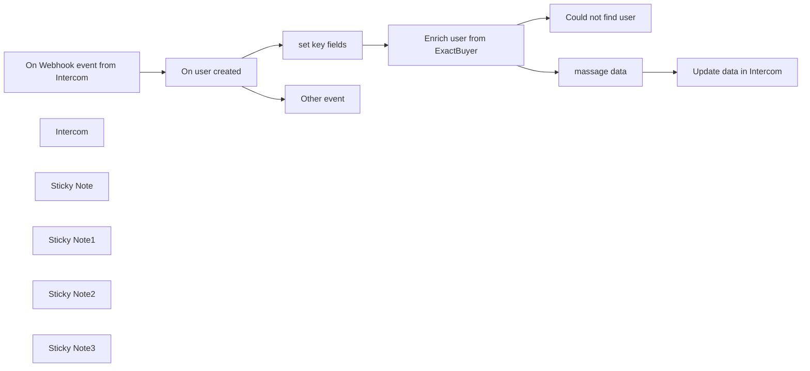

## Fluxo (.json) :

```json
{
  "meta": {
    "instanceId": "cb484ba7b742928a2048bf8829668bed5b5ad9787579adea888f05980292a4a7"
  },
  "nodes": [
    {
      "id": "1f578b25-ab5b-40f3-9ccc-7f5975959073",
      "name": "Could not find user",
      "type": "n8n-nodes-base.noOp",
      "position": [
        1620,
        560
      ],
      "parameters": {},
      "typeVersion": 1
    },
    {
      "id": "236436e0-1fc9-4411-b34c-946246ecbe19",
      "name": "On Webhook event from Intercom",
      "type": "n8n-nodes-base.webhook",
      "position": [
        700,
        500
      ],
      "webhookId": "11e21ebc-27ef-49b5-8c77-648faf3e86e0",
      "parameters": {
        "path": "11e21ebc-27ef-49b5-8c77-648faf3e86e0",
        "options": {},
        "httpMethod": "POST"
      },
      "typeVersion": 1.1
    },
    {
      "id": "10e2e89c-6ea2-4888-99c8-2f5d99cb1a1d",
      "name": "set key fields",
      "type": "n8n-nodes-base.set",
      "position": [
        1120,
        340
      ],
      "parameters": {
        "options": {},
        "assignments": {
          "assignments": [
            {
              "id": "3631124b-89e3-49b5-a792-36264eb502f0",
              "name": "user_id",
              "type": "string",
              "value": "={{ $json.body.data.item.id }}"
            },
            {
              "id": "3c2a877d-186b-4a26-86f2-d686e5630e42",
              "name": "email",
              "type": "string",
              "value": "={{ $json.body.data.item.email }}"
            }
          ]
        }
      },
      "typeVersion": 3.3
    },
    {
      "id": "078945ff-7c7a-4b45-9f8b-773827b9eb30",
      "name": "Update data in Intercom",
      "type": "n8n-nodes-base.httpRequest",
      "position": [
        1900,
        140
      ],
      "parameters": {
        "url": "=https://api.intercom.io/contacts/{{ $('set key fields').item.json.user_id }}",
        "method": "PUT",
        "options": {},
        "sendBody": true,
        "sendHeaders": true,
        "authentication": "genericCredentialType",
        "bodyParameters": {
          "parameters": [
            {
              "name": "email",
              "value": "={{ $json.result.current_work_email }} {{ $json.result.full_name }}"
            },
            {
              "name": "name",
              "value": "={{ $json.result.full_name }}"
            },
            {
              "name": "phone",
              "value": "={{ $json.result.phone_numbers?.[0]?.E164 }}"
            },
            {
              "name": "avatar",
              "value": "={{ $json.result.employment?.profile_pic_url }}"
            },
            {
              "name": "social_profiles",
              "value": "={{ $json.social_profiles }}"
            },
            {
              "name": "location",
              "value": "={{ $json.location }}"
            }
          ]
        },
        "genericAuthType": "httpHeaderAuth",
        "headerParameters": {
          "parameters": [
            {
              "name": "Intercom-Version",
              "value": "2.10"
            }
          ]
        }
      },
      "credentials": {
        "httpHeaderAuth": {
          "id": "YYOMyAkbDgnGfggq",
          "name": "intercom api key"
        }
      },
      "typeVersion": 4.1
    },
    {
      "id": "4ca65df4-7244-485f-8c6c-bb1ae4cd84a8",
      "name": "Other event",
      "type": "n8n-nodes-base.noOp",
      "position": [
        1120,
        680
      ],
      "parameters": {},
      "typeVersion": 1
    },
    {
      "id": "87b12749-b81e-460b-97bb-b25b59f303df",
      "name": "Intercom",
      "type": "n8n-nodes-base.intercom",
      "disabled": true,
      "position": [
        1900,
        -60
      ],
      "parameters": {
        "operation": "update",
        "additionalFields": {}
      },
      "credentials": {
        "intercomApi": {
          "id": "sIILbFMUzkVWaBE6",
          "name": "Intercom account"
        }
      },
      "typeVersion": 1
    },
    {
      "id": "ddb1dbb6-3f20-480f-9f49-641d40d9953a",
      "name": "massage data",
      "type": "n8n-nodes-base.code",
      "position": [
        1660,
        140
      ],
      "parameters": {
        "mode": "runOnceForEachItem",
        "jsCode": "// Add social profiles\n$input.item.json.social_profiles = $input.item.json.result.social_profiles.map((profile) => {\n  return {\n    type: 'social_profile',\n    name : profile.network,\n    url: profile.url,\n  }\n});\n\n$input.item.json.location = {\n  country: $input.item.json.result.location?.country,\n  city: $input.item.json.result.location?.city,\n  region: $input.item.json.result.location?.region,\n}\n\nreturn $input.item;"
      },
      "typeVersion": 2
    },
    {
      "id": "c490bb0d-ec6a-4a9a-9915-dd65ab669873",
      "name": "Sticky Note",
      "type": "n8n-nodes-base.stickyNote",
      "position": [
        660,
        240
      ],
      "parameters": {
        "width": 377.10487444608555,
        "height": 609.3353028064989,
        "content": "## On User created event in Intercom\n\n1. Setup webhook url in intercom\n2. Make sure `contact.user.created` is enabled"
      },
      "typeVersion": 1
    },
    {
      "id": "3e866480-4ec8-4a27-b946-43d6358edfec",
      "name": "On user created",
      "type": "n8n-nodes-base.switch",
      "position": [
        880,
        500
      ],
      "parameters": {
        "rules": {
          "values": [
            {
              "outputKey": "user created",
              "conditions": {
                "options": {
                  "leftValue": "",
                  "caseSensitive": true,
                  "typeValidation": "strict"
                },
                "combinator": "and",
                "conditions": [
                  {
                    "operator": {
                      "type": "string",
                      "operation": "equals"
                    },
                    "leftValue": "={{ $json.body.topic }}",
                    "rightValue": "contact.user.created"
                  }
                ]
              },
              "renameOutput": true
            }
          ]
        },
        "options": {
          "fallbackOutput": "extra"
        }
      },
      "typeVersion": 3
    },
    {
      "id": "e9efb8f5-8f97-476f-9d60-09a24b4f656a",
      "name": "Sticky Note1",
      "type": "n8n-nodes-base.stickyNote",
      "position": [
        1260,
        20
      ],
      "parameters": {
        "color": 3,
        "width": 275.71639586410623,
        "height": 609.3353028064989,
        "content": "## Enrich data from ExactBuyer\n\n1. Add api key from Exact buyer\n2. Use email as identifier to match user\n\nUse API Guide here https://docs.exactbuyer.com/contact-enrichment/enrichment"
      },
      "typeVersion": 1
    },
    {
      "id": "4a86d237-0908-4a79-9ebf-42711f850b3e",
      "name": "Sticky Note2",
      "type": "n8n-nodes-base.stickyNote",
      "position": [
        1600,
        -280
      ],
      "parameters": {
        "width": 562.599704579025,
        "height": 763.7223042836036,
        "content": "## Update user in Intercom\n\n1. Set Http node and generic header API Key using this guide https://developers.intercom.com/docs/build-an-integration/learn-more/authentication/\n2. Update data in intercom using this guide\nhttps://developers.intercom.com/docs/references/rest-api/api.intercom.io/Contacts/UpdateContact/"
      },
      "typeVersion": 1
    },
    {
      "id": "44eb44fc-9376-4c64-9561-3d9b585eb51f",
      "name": "Sticky Note3",
      "type": "n8n-nodes-base.stickyNote",
      "position": [
        540,
        -320
      ],
      "parameters": {
        "color": 4,
        "width": 623.6113141433334,
        "height": 390.44782241577565,
        "content": "# Enrich new Intercom users with contact details from ExactBuyer\n\n## This workflow aims to enrich new contacts in Intercom. The more relevant the Intercom profile, the more useful it is. Once active, this n8n workflow will update the social profiles, contact data (phone, email) as well as location data from ExactBuyer.\n"
      },
      "typeVersion": 1
    },
    {
      "id": "fc9755ae-07ed-4151-bab0-4dc9b6c2408f",
      "name": "Enrich user from ExactBuyer",
      "type": "n8n-nodes-base.httpRequest",
      "onError": "continueErrorOutput",
      "position": [
        1340,
        340
      ],
      "parameters": {
        "url": "https://api.exactbuyer.com/v1/enrich",
        "options": {
          "redirect": {
            "redirect": {}
          }
        },
        "sendQuery": true,
        "authentication": "genericCredentialType",
        "genericAuthType": "httpHeaderAuth",
        "queryParameters": {
          "parameters": [
            {
              "name": "email",
              "value": "={{ $json.email }}"
            },
            {
              "name": "required",
              "value": "work_email,personal_email,email"
            }
          ]
        }
      },
      "credentials": {
        "httpHeaderAuth": {
          "id": "kyMNOdXZX3ugPihF",
          "name": "ExactBuyer Api key"
        }
      },
      "typeVersion": 4.1
    }
  ],
  "pinData": {
    "On Webhook event from Intercom": [
      {
        "body": {
          "id": "notif_6da6874a-0fc5-4d6e-9c50-a9656b741203",
          "data": {
            "item": {
              "id": "65d5de6eb71d82abcb782f68",
              "os": null,
              "name": "Eadan exact butyer",
              "role": "user",
              "tags": {
                "url": "/contacts/65d5de6eb71d82abcb782f68/tags",
                "data": [],
                "type": "list",
                "has_more": false,
                "total_count": 0
              },
              "type": "contact",
              "email": "edan@exactbuyer.com",
              "notes": {
                "url": "/contacts/65d5de6eb71d82abcb782f68/notes",
                "data": [],
                "type": "list",
                "has_more": false,
                "total_count": 0
              },
              "phone": null,
              "avatar": null,
              "browser": null,
              "location": {
                "city": null,
                "type": "location",
                "region": null,
                "country": null,
                "country_code": null,
                "continent_code": null
              },
              "owner_id": null,
              "referrer": null,
              "utm_term": null,
              "companies": {
                "url": "/contacts/65d5de6eb71d82abcb782f68/companies",
                "data": [],
                "type": "list",
                "has_more": false,
                "total_count": 0
              },
              "created_at": "2024-02-21T11:28:46.093+00:00",
              "ios_device": null,
              "updated_at": "2024-02-21T11:28:46.090+00:00",
              "utm_medium": null,
              "utm_source": null,
              "external_id": "eden_exact_buyer",
              "sms_consent": false,
              "utm_content": null,
              "ios_app_name": null,
              "last_seen_at": null,
              "signed_up_at": null,
              "utm_campaign": null,
              "workspace_id": "ub6mafvn",
              "android_device": null,
              "ios_os_version": null,
              "browser_version": null,
              "ios_app_version": null,
              "ios_sdk_version": null,
              "last_replied_at": null,
              "social_profiles": {
                "data": [],
                "type": "list"
              },
              "android_app_name": null,
              "browser_language": null,
              "has_hard_bounced": false,
              "ios_last_seen_at": null,
              "custom_attributes": {},
              "language_override": null,
              "last_contacted_at": null,
              "android_os_version": null,
              "android_app_version": null,
              "android_sdk_version": null,
              "android_last_seen_at": null,
              "last_email_opened_at": null,
              "marked_email_as_spam": false,
              "last_email_clicked_at": null,
              "unsubscribed_from_sms": false,
              "unsubscribed_from_emails": false,
              "opted_in_subscription_types": {
                "url": "/contacts/65d5de6eb71d82abcb782f68/subscriptions",
                "data": [],
                "type": "list",
                "has_more": false,
                "total_count": 0
              },
              "opted_out_subscription_types": {
                "url": "/contacts/65d5de6eb71d82abcb782f68/subscriptions",
                "data": [],
                "type": "list",
                "has_more": false,
                "total_count": 0
              }
            },
            "type": "notification_event_data"
          },
          "self": null,
          "type": "notification_event",
          "links": {},
          "topic": "contact.user.created",
          "app_id": "ub6mafvn",
          "created_at": 1708514926,
          "delivered_at": 0,
          "first_sent_at": 1708514926,
          "delivery_status": "pending",
          "delivery_attempts": 1
        },
        "query": {},
        "params": {},
        "headers": {
          "host": "test.users.n8n.cloud"
        }
      }
    ]
  },
  "connections": {
    "massage data": {
      "main": [
        [
          {
            "node": "Update data in Intercom",
            "type": "main",
            "index": 0
          }
        ]
      ]
    },
    "set key fields": {
      "main": [
        [
          {
            "node": "Enrich user from ExactBuyer",
            "type": "main",
            "index": 0
          }
        ]
      ]
    },
    "On user created": {
      "main": [
        [
          {
            "node": "set key fields",
            "type": "main",
            "index": 0
          }
        ],
        [
          {
            "node": "Other event",
            "type": "main",
            "index": 0
          }
        ]
      ]
    },
    "Enrich user from ExactBuyer": {
      "main": [
        [
          {
            "node": "massage data",
            "type": "main",
            "index": 0
          }
        ],
        [
          {
            "node": "Could not find user",
            "type": "main",
            "index": 0
          }
        ]
      ]
    },
    "On Webhook event from Intercom": {
      "main": [
        [
          {
            "node": "On user created",
            "type": "main",
            "index": 0
          }
        ]
      ]
    }
  }
}
```

<a id="template-1125"></a>

## Template 1125 - Rastreamento LinkedIn com Bright Data MCP e Gemini

- **Nome:** Rastreamento LinkedIn com Bright Data MCP e Gemini
- **Descrição:** Orquestra a extração de informações de perfis de LinkedIn (pessoa e empresa) usando Bright Data MCP para raspagem, processa os dados com um modelo de linguagem e gera saídas estruturadas, enviando resultados por webhook e salvando arquivos JSON localmente.
- **Funcionalidade:** • Início por disparo manual: o fluxo é iniciado quando o usuário aciona a execução.
• Definição de URLs e webhook: captura as URLs de LinkedIn para perfis/empresas e o endpoint de webhook de retorno.
• Raspagem de dados de LinkedIn Pessoa e Empresa: coleta informações das páginas usando o Bright Data MCP.
• Processamento de dados com linguagem natural: transforma os dados extraídos em um texto/estrutura JSON usando o modelo de linguagem.
• Conversão para formatos binários e exportação: cria dados binários base64 dos resultados e escreve em disco para pessoa e empresa.
• Agregação de dados e geração de saída final: consolida conteúdos como about e company_story.
• Envio de resultados: envia o conteúdo final ao webhook configurado para integração externa.
- **Ferramentas:** • Bright Data MCP: serviço de raspagem utilizado para extrair informações de perfis públicos do LinkedIn (pessoa e empresa).
• LinkedIn: fonte de dados dos perfis e empresas analisados.
• Google Gemini: modelo de linguagem utilizado para gerar narrativas/JSON a partir dos dados extraídos.
• Webhook.site: endpoint de teste para receber resultados externamente.

## Fluxo visual

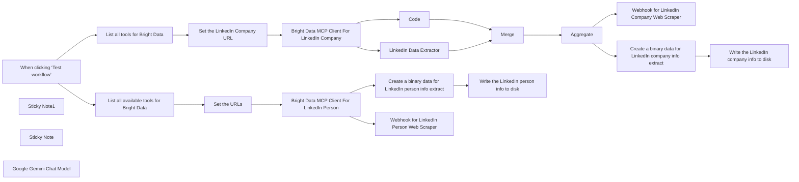

## Fluxo (.json) :

```json
{
  "id": "D2RkoPZlkKFRUrNu",
  "meta": {
    "instanceId": "885b4fb4a6a9c2cb5621429a7b972df0d05bb724c20ac7dac7171b62f1c7ef40",
    "templateCredsSetupCompleted": true
  },
  "name": "LinkedIn Web Scraping with Bright Data MCP Server & Google Gemini",
  "tags": [
    {
      "id": "ZOwtAMLepQaGW76t",
      "name": "Building Blocks",
      "createdAt": "2025-04-13T15:23:40.462Z",
      "updatedAt": "2025-04-13T15:23:40.462Z"
    },
    {
      "id": "ddPkw7Hg5dZhQu2w",
      "name": "AI",
      "createdAt": "2025-04-13T05:38:08.053Z",
      "updatedAt": "2025-04-13T05:38:08.053Z"
    }
  ],
  "nodes": [
    {
      "id": "68715d64-ce99-4e23-81ed-fe8f7d08ebd7",
      "name": "When clicking ‘Test workflow’",
      "type": "n8n-nodes-base.manualTrigger",
      "position": [
        -640,
        -50
      ],
      "parameters": {},
      "typeVersion": 1
    },
    {
      "id": "e0295397-2926-4964-8be5-c0341de29a02",
      "name": "Sticky Note1",
      "type": "n8n-nodes-base.stickyNote",
      "position": [
        -260,
        -420
      ],
      "parameters": {
        "color": 3,
        "width": 440,
        "height": 320,
        "content": "## Bright Data LinkedIn Person Scraper"
      },
      "typeVersion": 1
    },
    {
      "id": "cdf42164-569e-4140-9847-4751d69c6b7b",
      "name": "Set the URLs",
      "type": "n8n-nodes-base.set",
      "position": [
        -200,
        -300
      ],
      "parameters": {
        "options": {},
        "assignments": {
          "assignments": [
            {
              "id": "214e61a0-3587-453f-baf5-eac013990857",
              "name": "url",
              "type": "string",
              "value": "https://www.linkedin.com/in/ranjan-dailata/"
            },
            {
              "id": "45014942-0a2e-4f46-b395-f82f97bfa93e",
              "name": "webhook_url",
              "type": "string",
              "value": "https://webhook.site/ce41e056-c097-48c8-a096-9b876d3abbf7"
            }
          ]
        }
      },
      "typeVersion": 3.4
    },
    {
      "id": "5769fce6-bcd7-4a13-b992-cd6d955a2cf1",
      "name": "Bright Data MCP Client For LinkedIn Person",
      "type": "n8n-nodes-mcp.mcpClient",
      "notes": "Scrape a single webpage URL with advanced options for content extraction and get back the results in MarkDown language.",
      "position": [
        20,
        -300
      ],
      "parameters": {
        "toolName": "web_data_linkedin_person_profile",
        "operation": "executeTool",
        "toolParameters": "={\n   \"url\": \"{{ $json.url }}\"\n} "
      },
      "credentials": {
        "mcpClientApi": {
          "id": "JtatFSfA2kkwctYa",
          "name": "MCP Client (STDIO) account"
        }
      },
      "notesInFlow": true,
      "typeVersion": 1
    },
    {
      "id": "56e37aa6-9719-4879-80af-a10c091377fb",
      "name": "Sticky Note",
      "type": "n8n-nodes-base.stickyNote",
      "position": [
        -260,
        -60
      ],
      "parameters": {
        "color": 4,
        "width": 440,
        "height": 320,
        "content": "## Bright Data LinkedIn Company Scraper"
      },
      "typeVersion": 1
    },
    {
      "id": "69afab25-32c6-4849-b2f9-4a2b25657c37",
      "name": "List all tools for Bright Data",
      "type": "n8n-nodes-mcp.mcpClient",
      "position": [
        -420,
        50
      ],
      "parameters": {},
      "credentials": {
        "mcpClientApi": {
          "id": "JtatFSfA2kkwctYa",
          "name": "MCP Client (STDIO) account"
        }
      },
      "typeVersion": 1
    },
    {
      "id": "feb16a2b-fdf7-49d4-bcd5-848ccaf66639",
      "name": "Bright Data MCP Client For LinkedIn Company",
      "type": "n8n-nodes-mcp.mcpClient",
      "notes": "Scrape a single webpage URL with advanced options for content extraction and get back the results in MarkDown language.",
      "position": [
        20,
        50
      ],
      "parameters": {
        "toolName": "web_data_linkedin_company_profile",
        "operation": "executeTool",
        "toolParameters": "={\n   \"url\": \"{{ $json.url }}\"\n} "
      },
      "credentials": {
        "mcpClientApi": {
          "id": "JtatFSfA2kkwctYa",
          "name": "MCP Client (STDIO) account"
        }
      },
      "notesInFlow": true,
      "typeVersion": 1
    },
    {
      "id": "e5117eb1-a757-4c28-965e-87ea03213ed1",
      "name": "Set the LinkedIn Company URL",
      "type": "n8n-nodes-base.set",
      "position": [
        -200,
        50
      ],
      "parameters": {
        "options": {},
        "assignments": {
          "assignments": [
            {
              "id": "214e61a0-3587-453f-baf5-eac013990857",
              "name": "url",
              "type": "string",
              "value": "https://www.linkedin.com/company/bright-data/"
            },
            {
              "id": "45014942-0a2e-4f46-b395-f82f97bfa93e",
              "name": "webhook_url",
              "type": "string",
              "value": "https://webhook.site/ce41e056-c097-48c8-a096-9b876d3abbf7"
            }
          ]
        }
      },
      "typeVersion": 3.4
    },
    {
      "id": "99f45d7f-ad79-4ffc-8299-c71bd870f8fb",
      "name": "Webhook for LinkedIn Company Web Scraper",
      "type": "n8n-nodes-base.httpRequest",
      "position": [
        1060,
        40
      ],
      "parameters": {
        "url": "={{ $('Set the LinkedIn Company URL').item.json.webhook_url }}",
        "options": {},
        "jsonBody": "={\n  \"about\": {{ JSON.stringify($json.about[0]) }},\n \"story\": {{ JSON.stringify($json.company_story[0]) }}\n}",
        "sendBody": true,
        "specifyBody": "json"
      },
      "typeVersion": 4.2
    },
    {
      "id": "5dfd2630-17d9-4a13-8cd6-57a564ef4a26",
      "name": "LinkedIn Data Extractor",
      "type": "@n8n/n8n-nodes-langchain.informationExtractor",
      "position": [
        240,
        200
      ],
      "parameters": {
        "text": "=Write a complete story of the provided company information in JSON. Use the following Company info to produce a story or a blog post. Make sure to incorporate all the provided company context.\n\nHere's the Company Info in JSON - {{ $json.input }}",
        "options": {
          "systemPromptTemplate": "You are an expert data formatter"
        },
        "attributes": {
          "attributes": [
            {
              "name": "company_story",
              "required": true,
              "description": "Detailed Company Info"
            }
          ]
        }
      },
      "typeVersion": 1
    },
    {
      "id": "d1927c08-5ded-4b0b-b60b-bed126040d38",
      "name": "Google Gemini Chat Model",
      "type": "@n8n/n8n-nodes-langchain.lmChatGoogleGemini",
      "position": [
        328,
        420
      ],
      "parameters": {
        "options": {},
        "modelName": "models/gemini-2.0-flash-exp"
      },
      "credentials": {
        "googlePalmApi": {
          "id": "YeO7dHZnuGBVQKVZ",
          "name": "Google Gemini(PaLM) Api account"
        }
      },
      "typeVersion": 1
    },
    {
      "id": "0de1d200-c35a-41df-b512-8b97b92f14db",
      "name": "List all available tools for Bright Data",
      "type": "n8n-nodes-mcp.mcpClient",
      "position": [
        -420,
        -300
      ],
      "parameters": {},
      "credentials": {
        "mcpClientApi": {
          "id": "JtatFSfA2kkwctYa",
          "name": "MCP Client (STDIO) account"
        }
      },
      "typeVersion": 1
    },
    {
      "id": "3f884694-b8f3-478a-b1a3-f46326a0c96f",
      "name": "Code",
      "type": "n8n-nodes-base.code",
      "position": [
        318,
        -100
      ],
      "parameters": {
        "jsCode": "jsonContent = JSON.parse($input.first().json.result.content[0].text) \nreturn jsonContent\n"
      },
      "typeVersion": 2
    },
    {
      "id": "67036198-4d7d-42d9-93cf-ffc65649bae0",
      "name": "Merge",
      "type": "n8n-nodes-base.merge",
      "position": [
        616,
        50
      ],
      "parameters": {},
      "typeVersion": 3.1
    },
    {
      "id": "77423290-bd08-4dc8-9f37-cf8fec9f6a63",
      "name": "Aggregate",
      "type": "n8n-nodes-base.aggregate",
      "position": [
        836,
        50
      ],
      "parameters": {
        "options": {},
        "fieldsToAggregate": {
          "fieldToAggregate": [
            {
              "fieldToAggregate": "about"
            },
            {
              "fieldToAggregate": "output.company_story"
            }
          ]
        }
      },
      "typeVersion": 1
    },
    {
      "id": "91d25405-afb3-4ed6-b8fa-52ab64a654e2",
      "name": "Create a binary data for LinkedIn person info extract",
      "type": "n8n-nodes-base.function",
      "position": [
        320,
        -500
      ],
      "parameters": {
        "functionCode": "items[0].binary = {\n  data: {\n    data: new Buffer(JSON.stringify(items[0].json, null, 2)).toString('base64')\n  }\n};\nreturn items;"
      },
      "typeVersion": 1
    },
    {
      "id": "3e74c49e-eb31-43b1-b8e1-ed960bd83ca1",
      "name": "Write the LinkedIn person info to disk",
      "type": "n8n-nodes-base.readWriteFile",
      "position": [
        520,
        -500
      ],
      "parameters": {
        "options": {},
        "fileName": "d:\\LinkedIn-Person.json",
        "operation": "write"
      },
      "typeVersion": 1
    },
    {
      "id": "f92b3505-2af6-42aa-bf4b-8b7b6cb97364",
      "name": "Create a binary data for LinkedIn company info extract",
      "type": "n8n-nodes-base.function",
      "position": [
        1000,
        -180
      ],
      "parameters": {
        "functionCode": "items[0].binary = {\n  data: {\n    data: new Buffer(JSON.stringify(items[0].json, null, 2)).toString('base64')\n  }\n};\nreturn items;"
      },
      "typeVersion": 1
    },
    {
      "id": "6ed1402b-4858-4311-bede-f0b8f28acb9f",
      "name": "Write the LinkedIn company info to disk",
      "type": "n8n-nodes-base.readWriteFile",
      "position": [
        1220,
        -180
      ],
      "parameters": {
        "options": {},
        "fileName": "d:\\LinkedIn-Company.json",
        "operation": "write"
      },
      "typeVersion": 1
    },
    {
      "id": "335efc2b-80e3-4fac-b31f-82fff4ac4e65",
      "name": "Webhook for LinkedIn Person Web Scraper",
      "type": "n8n-nodes-base.httpRequest",
      "position": [
        318,
        -300
      ],
      "parameters": {
        "url": "={{ $('Set the URLs').item.json.webhook_url }}",
        "options": {},
        "sendBody": true,
        "bodyParameters": {
          "parameters": [
            {
              "name": "response",
              "value": "={{ $json.result.content[0].text }}"
            }
          ]
        }
      },
      "typeVersion": 4.2
    }
  ],
  "active": false,
  "pinData": {},
  "settings": {
    "executionOrder": "v1"
  },
  "versionId": "35815900-1729-40c7-b128-778eabb62ec1",
  "connections": {
    "Code": {
      "main": [
        [
          {
            "node": "Merge",
            "type": "main",
            "index": 0
          }
        ]
      ]
    },
    "Merge": {
      "main": [
        [
          {
            "node": "Aggregate",
            "type": "main",
            "index": 0
          }
        ]
      ]
    },
    "Aggregate": {
      "main": [
        [
          {
            "node": "Webhook for LinkedIn Company Web Scraper",
            "type": "main",
            "index": 0
          },
          {
            "node": "Create a binary data for LinkedIn company info extract",
            "type": "main",
            "index": 0
          }
        ]
      ]
    },
    "Set the URLs": {
      "main": [
        [
          {
            "node": "Bright Data MCP Client For LinkedIn Person",
            "type": "main",
            "index": 0
          }
        ]
      ]
    },
    "LinkedIn Data Extractor": {
      "main": [
        [
          {
            "node": "Merge",
            "type": "main",
            "index": 1
          }
        ]
      ]
    },
    "Google Gemini Chat Model": {
      "ai_languageModel": [
        [
          {
            "node": "LinkedIn Data Extractor",
            "type": "ai_languageModel",
            "index": 0
          }
        ]
      ]
    },
    "Set the LinkedIn Company URL": {
      "main": [
        [
          {
            "node": "Bright Data MCP Client For LinkedIn Company",
            "type": "main",
            "index": 0
          }
        ]
      ]
    },
    "List all tools for Bright Data": {
      "main": [
        [
          {
            "node": "Set the LinkedIn Company URL",
            "type": "main",
            "index": 0
          }
        ]
      ]
    },
    "When clicking ‘Test workflow’": {
      "main": [
        [
          {
            "node": "List all available tools for Bright Data",
            "type": "main",
            "index": 0
          },
          {
            "node": "List all tools for Bright Data",
            "type": "main",
            "index": 0
          }
        ]
      ]
    },
    "Webhook for LinkedIn Person Web Scraper": {
      "main": [
        []
      ]
    },
    "List all available tools for Bright Data": {
      "main": [
        [
          {
            "node": "Set the URLs",
            "type": "main",
            "index": 0
          }
        ]
      ]
    },
    "Bright Data MCP Client For LinkedIn Person": {
      "main": [
        [
          {
            "node": "Webhook for LinkedIn Person Web Scraper",
            "type": "main",
            "index": 0
          },
          {
            "node": "Create a binary data for LinkedIn person info extract",
            "type": "main",
            "index": 0
          }
        ]
      ]
    },
    "Bright Data MCP Client For LinkedIn Company": {
      "main": [
        [
          {
            "node": "Code",
            "type": "main",
            "index": 0
          },
          {
            "node": "LinkedIn Data Extractor",
            "type": "main",
            "index": 0
          }
        ]
      ]
    },
    "Create a binary data for LinkedIn person info extract": {
      "main": [
        [
          {
            "node": "Write the LinkedIn person info to disk",
            "type": "main",
            "index": 0
          }
        ]
      ]
    },
    "Create a binary data for LinkedIn company info extract": {
      "main": [
        [
          {
            "node": "Write the LinkedIn company info to disk",
            "type": "main",
            "index": 0
          }
        ]
      ]
    }
  }
}
```

<a id="template-1126"></a>

## Template 1126 - Sincronização bidirecional Pipedrive e MySQL

- **Nome:** Sincronização bidirecional Pipedrive e MySQL
- **Descrição:** Sincroniza contatos entre uma base MySQL e o Pipedrive, criando registros ausentes e atualizando registros existentes com base em comparações por email e carimbo de data/hora.
- **Funcionalidade:** • Agendamento periódico: Executa a sincronização em intervalos regulares.
• Leitura de dados MySQL: Busca contatos da tabela de contatos com campos como id, name, email, phone e updated_on.
• Leitura de dados Pipedrive: Obtém todas as pessoas com campos essenciais (nome, email, telefone e timestamp de atualização).
• Comparação por email: Compara os conjuntos de dados usando o campo email para identificar registros iguais, diferentes ou ausentes.
• Criação de registros ausentes: Cria pessoa no Pipedrive quando existe no MySQL; cria contato no MySQL quando existe no Pipedrive.
• Detecção de mudanças: Identifica campos alterados (nome, telefone) entre as duas fontes.
• Resolução por data de atualização: Compara timestamps para determinar qual fonte tem o registro mais recente e decidir a direção da atualização.
• Atualização condicional: Atualiza o registro na fonte que estiver desatualizada (MySQL ou Pipedrive) preservando o valor mais recente.
- **Ferramentas:** • Pipedrive: Sistema de CRM usado para armazenar e atualizar registros de pessoas (nome, email, telefone, timestamp de atualização).
• MySQL: Banco de dados relacional que contém a tabela de contatos usada como outra fonte de verdade para sincronização.

## Fluxo visual

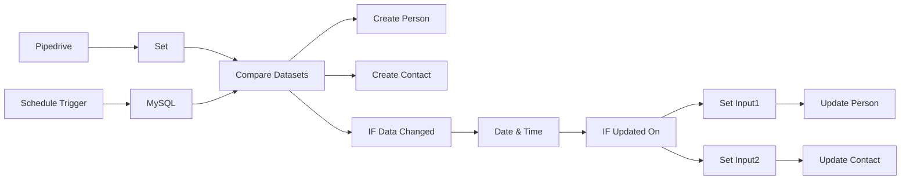

## Fluxo (.json) :

```json
{
  "id": 65,
  "meta": {
    "instanceId": "104a4d08d8897b8bdeb38aaca515021075e0bd8544c983c2bb8c86e6a8e6081c"
  },
  "name": "Two Way Sync Pipedrive and MySQL",
  "tags": [],
  "nodes": [
    {
      "id": "7355c5ac-a9a6-4fa5-8036-71fd09e95cd4",
      "name": "Compare Datasets",
      "type": "n8n-nodes-base.compareDatasets",
      "position": [
        1220,
        480
      ],
      "parameters": {
        "options": {},
        "resolve": "includeBoth",
        "mergeByFields": {
          "values": [
            {
              "field1": "email",
              "field2": "email"
            }
          ]
        }
      },
      "typeVersion": 1
    },
    {
      "id": "7a422493-94d4-4f94-b39c-f6c3980a967c",
      "name": "Schedule Trigger",
      "type": "n8n-nodes-base.scheduleTrigger",
      "position": [
        800,
        320
      ],
      "parameters": {
        "rule": {
          "interval": [
            {}
          ]
        }
      },
      "typeVersion": 1
    },
    {
      "id": "b3a0e831-7030-43dd-863a-0c2a4697a14d",
      "name": "MySQL",
      "type": "n8n-nodes-base.mySql",
      "position": [
        1000,
        320
      ],
      "parameters": {
        "query": "SELECT id, name, email, phone, updated_on FROM contact",
        "operation": "executeQuery"
      },
      "credentials": {
        "mySql": {
          "id": "23",
          "name": "MySQL account"
        }
      },
      "typeVersion": 1,
      "alwaysOutputData": true
    },
    {
      "id": "a3a64bb5-8a6f-4011-bc2d-3996a823012c",
      "name": "Pipedrive",
      "type": "n8n-nodes-base.pipedrive",
      "position": [
        800,
        620
      ],
      "parameters": {
        "resource": "person",
        "operation": "getAll",
        "additionalFields": {}
      },
      "credentials": {
        "pipedriveApi": {
          "id": "29",
          "name": "Pipedrive account"
        }
      },
      "typeVersion": 1
    },
    {
      "id": "089e91df-abf7-4de9-b088-357cffce6949",
      "name": "Create Person",
      "type": "n8n-nodes-base.pipedrive",
      "position": [
        1420,
        300
      ],
      "parameters": {
        "name": "={{ $json[\"name\"] }}",
        "resource": "person",
        "additionalFields": {
          "email": [
            "={{ $json[\"email\"] }}"
          ],
          "phone": [
            "={{ $json[\"phone\"] }}"
          ]
        }
      },
      "credentials": {
        "pipedriveApi": {
          "id": "29",
          "name": "Pipedrive account"
        }
      },
      "typeVersion": 1
    },
    {
      "id": "a99c3242-8263-4a92-a1f2-dcce7a9a6d81",
      "name": "Create Contact",
      "type": "n8n-nodes-base.mySql",
      "position": [
        1420,
        620
      ],
      "parameters": {
        "table": {
          "__rl": true,
          "mode": "list",
          "value": "contact",
          "cachedResultName": "contact"
        },
        "columns": "name, email, phone",
        "options": {}
      },
      "credentials": {
        "mySql": {
          "id": "23",
          "name": "MySQL account"
        }
      },
      "typeVersion": 1
    },
    {
      "id": "7697d03a-7bc4-40b3-9e06-e38c13ccaaf3",
      "name": "Date & Time",
      "type": "n8n-nodes-base.dateTime",
      "position": [
        1760,
        460
      ],
      "parameters": {
        "value": "={{ $json[\"different\"][\"updated_on\"][\"input1\"] }}",
        "custom": true,
        "options": {},
        "toFormat": "YYYY-MM-DD HH:mm:ss",
        "dataPropertyName": "different.updated_on.input1"
      },
      "typeVersion": 1
    },
    {
      "id": "f882a2e7-a8cf-4683-abe3-77a5b7376bb2",
      "name": "Update Contact",
      "type": "n8n-nodes-base.mySql",
      "position": [
        2340,
        620
      ],
      "parameters": {
        "query": "=UPDATE contact\nSET name = '{{$json[\"name\"]}}', phone= '{{$json[\"phone\"]}}'\nWHERE id = {{$json[\"id\"]}};",
        "operation": "executeQuery"
      },
      "credentials": {
        "mySql": {
          "id": "23",
          "name": "MySQL account"
        }
      },
      "typeVersion": 1
    },
    {
      "id": "d7549678-5d35-4a8a-b440-5c347b4434f4",
      "name": "Set Input2",
      "type": "n8n-nodes-base.set",
      "position": [
        2120,
        620
      ],
      "parameters": {
        "values": {
          "string": [
            {
              "name": "id",
              "value": "={{ $json[\"different\"][\"id\"] ? $json[\"different\"][\"id\"][\"input1\"] : $json[\"same\"][\"id\"] }}"
            },
            {
              "name": "name",
              "value": "={{ $json[\"different\"][\"name\"] ? $json[\"different\"][\"name\"][\"input2\"] : $json[\"same\"][\"name\"] }}"
            },
            {
              "name": "phone",
              "value": "={{ $json[\"different\"][\"phone\"] ? $json[\"different\"][\"phone\"][\"input2\"] : $json[\"same\"][\"phone\"] }}"
            }
          ]
        },
        "options": {}
      },
      "typeVersion": 1
    },
    {
      "id": "0018751e-c295-4f8d-b9df-257b9538eedc",
      "name": "Set Input1",
      "type": "n8n-nodes-base.set",
      "position": [
        2120,
        300
      ],
      "parameters": {
        "values": {
          "string": [
            {
              "name": "id",
              "value": "={{ $json[\"different\"][\"id\"] ? $json[\"different\"][\"id\"][\"input2\"] : $json[\"same\"][\"id\"] }}"
            },
            {
              "name": "name",
              "value": "={{ $json[\"different\"][\"name\"] ? $json[\"different\"][\"name\"][\"input1\"] : $json[\"same\"][\"name\"] }}"
            },
            {
              "name": "phone",
              "value": "={{ $json[\"different\"][\"phone\"] ? $json[\"different\"][\"phone\"][\"input1\"] : $json[\"same\"][\"phone\"] }}"
            }
          ]
        },
        "options": {}
      },
      "typeVersion": 1
    },
    {
      "id": "89af3385-4788-4693-ad02-917b927e7384",
      "name": "Update Person",
      "type": "n8n-nodes-base.pipedrive",
      "position": [
        2340,
        300
      ],
      "parameters": {
        "personId": "={{ $json[\"id\"] }}",
        "resource": "person",
        "operation": "update",
        "updateFields": {
          "name": "={{ $json[\"name\"] }}",
          "phone": [
            "={{ $json[\"phone\"] }}"
          ]
        }
      },
      "credentials": {
        "pipedriveApi": {
          "id": "29",
          "name": "Pipedrive account"
        }
      },
      "typeVersion": 1
    },
    {
      "id": "8ffbbb4b-7c2f-457e-ae73-464620aa1588",
      "name": "IF Data Changed",
      "type": "n8n-nodes-base.if",
      "position": [
        1560,
        480
      ],
      "parameters": {
        "conditions": {
          "boolean": [
            {
              "value1": "={{ !!$json[\"different\"][\"name\"] || !!$json[\"different\"][\"phone\"] }}",
              "value2": true
            }
          ]
        }
      },
      "typeVersion": 1
    },
    {
      "id": "f8d60404-942d-4bb3-96e7-a247a9447a32",
      "name": "IF Updated On",
      "type": "n8n-nodes-base.if",
      "position": [
        1940,
        460
      ],
      "parameters": {
        "conditions": {
          "dateTime": [
            {
              "value1": "={{ $json[\"different\"][\"updated\"][\"input1\"] }} {{ $json[\"different\"][\"updated_on\"][\"input1\"] }}",
              "value2": "={{ $json[\"different\"][\"updated\"][\"input2\"] }} {{ $json[\"different\"][\"updated_on\"][\"input2\"] }}"
            }
          ]
        }
      },
      "typeVersion": 1
    },
    {
      "id": "6965e281-10bd-4e8a-b016-f788030a6d9f",
      "name": "Set",
      "type": "n8n-nodes-base.set",
      "position": [
        1000,
        620
      ],
      "parameters": {
        "values": {
          "string": [
            {
              "name": "id",
              "value": "={{ $json[\"id\"] }}"
            },
            {
              "name": "name",
              "value": "={{ $json[\"name\"] }}"
            },
            {
              "name": "email",
              "value": "={{ $json[\"primary_email\"] }}"
            },
            {
              "name": "phone",
              "value": "={{ $json[\"phone\"][0][\"value\"] }}"
            },
            {
              "name": "updated_on",
              "value": "={{ $json[\"update_time\"] }}"
            }
          ]
        },
        "options": {},
        "keepOnlySet": true
      },
      "typeVersion": 1
    }
  ],
  "active": false,
  "pinData": {},
  "settings": {},
  "connections": {
    "Set": {
      "main": [
        [
          {
            "node": "Compare Datasets",
            "type": "main",
            "index": 1
          }
        ]
      ]
    },
    "MySQL": {
      "main": [
        [
          {
            "node": "Compare Datasets",
            "type": "main",
            "index": 0
          }
        ]
      ]
    },
    "Pipedrive": {
      "main": [
        [
          {
            "node": "Set",
            "type": "main",
            "index": 0
          }
        ]
      ]
    },
    "Set Input1": {
      "main": [
        [
          {
            "node": "Update Person",
            "type": "main",
            "index": 0
          }
        ]
      ]
    },
    "Set Input2": {
      "main": [
        [
          {
            "node": "Update Contact",
            "type": "main",
            "index": 0
          }
        ]
      ]
    },
    "Date & Time": {
      "main": [
        [
          {
            "node": "IF Updated On",
            "type": "main",
            "index": 0
          }
        ]
      ]
    },
    "IF Updated On": {
      "main": [
        [
          {
            "node": "Set Input1",
            "type": "main",
            "index": 0
          }
        ],
        [
          {
            "node": "Set Input2",
            "type": "main",
            "index": 0
          }
        ]
      ]
    },
    "IF Data Changed": {
      "main": [
        [
          {
            "node": "Date & Time",
            "type": "main",
            "index": 0
          }
        ]
      ]
    },
    "Compare Datasets": {
      "main": [
        [
          {
            "node": "Create Person",
            "type": "main",
            "index": 0
          }
        ],
        [],
        [
          {
            "node": "IF Data Changed",
            "type": "main",
            "index": 0
          }
        ],
        [
          {
            "node": "Create Contact",
            "type": "main",
            "index": 0
          }
        ]
      ]
    },
    "Schedule Trigger": {
      "main": [
        [
          {
            "node": "MySQL",
            "type": "main",
            "index": 0
          }
        ]
      ]
    }
  }
}
```

<a id="template-1127"></a>

## Template 1127 - Boletim diário de notícias de sustentabilidade (UE)

- **Nome:** Boletim diário de notícias de sustentabilidade (UE)
- **Descrição:** Coleta diariamente notícias do site da Comissão Europeia, identifica artigos relacionados com sustentabilidade, armazena-os e envia um boletim por email.
- **Funcionalidade:** • Agendamento diário: Executa o fluxo todos os dias às 08:30 para processar as notícias mais recentes.
• Coleta de notícias: Recupera a página de notícias da Comissão Europeia como fonte principal de conteúdo.
• Extração de blocos de artigo: Isola cada bloco de artigo e extrai campos como título, descrição, link, data, imagem e tempo de leitura.
• Filtragem por data: Compara a data dos artigos com o intervalo definido (ex.: últimos 5 dias) para limitar o escopo.
• Classificação por IA: Utiliza um modelo de linguagem para decidir se um artigo é sobre sustentabilidade (resposta true/false).
• Marcação e armazenamento: Anexa a classificação ao artigo e grava os resultados numa planilha para consulta e histórico.
• Geração de boletim HTML: Compõe um email em HTML com layout, imagem, título, descrição e links dos artigos selecionados.
• Envio de email: Distribui o boletim gerado para a lista de destinatários configurada.
- **Ferramentas:** • Site da Comissão Europeia: Fonte oficial de notícias e conteúdos para extração.
• OpenAI (gpt-4o-mini): Modelo de linguagem usado para classificar se um artigo trata de sustentabilidade.
• Google Sheets: Armazenamento e consulta dos artigos classificados para histórico e geração de conteúdo.
• Gmail: Canal para enviar o boletim por email aos assinantes.
• LogiGreen Consulting (site e logo): Marca e recursos visuais incorporados no corpo do boletim.

## Fluxo visual

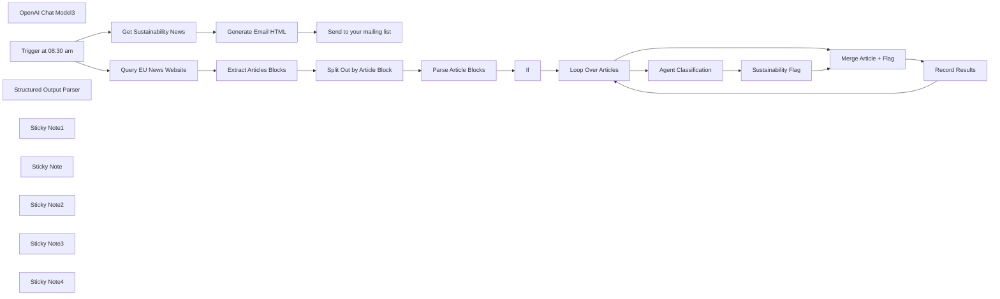

## Fluxo (.json) :

```json
{
  "meta": {
    "instanceId": "=",
    "templateCredsSetupCompleted": true
  },
  "nodes": [
    {
      "id": "10d2d97d-428e-4224-beae-e4ce4e090e4f",
      "name": "If",
      "type": "n8n-nodes-base.if",
      "position": [
        3220,
        2500
      ],
      "parameters": {
        "options": {},
        "conditions": {
          "options": {
            "version": 2,
            "leftValue": "",
            "caseSensitive": true,
            "typeValidation": "strict"
          },
          "combinator": "and",
          "conditions": [
            {
              "id": "7f8ac804-088d-4dfa-a661-8b6b09a6e340",
              "operator": {
                "name": "filter.operator.equals",
                "type": "string",
                "operation": "equals"
              },
              "leftValue": "={{ $json.date }}",
              "rightValue": "={{ $now.minus(5,\"day\").day }} {{ $now.minus(5,\"day\").monthLong }} {{ $now.minus(5,\"day\").year }}"
            },
            {
              "id": "094bd21e-1d23-4f06-a286-501045a53c9b",
              "operator": {
                "name": "filter.operator.equals",
                "type": "string",
                "operation": "equals"
              },
              "leftValue": "={{ $json.type }}",
              "rightValue": "News article"
            }
          ]
        }
      },
      "typeVersion": 2.2
    },
    {
      "id": "968fac7c-48be-4fe1-a1d0-3c1fd828b0bc",
      "name": "OpenAI Chat Model3",
      "type": "@n8n/n8n-nodes-langchain.lmChatOpenAi",
      "position": [
        3640,
        2480
      ],
      "parameters": {
        "model": {
          "__rl": true,
          "mode": "list",
          "value": "gpt-4o-mini"
        },
        "options": {}
      },
      "typeVersion": 1.2
    },
    {
      "id": "fde7d8e1-4124-4506-abb7-8e400ad2729b",
      "name": "Agent Classification",
      "type": "@n8n/n8n-nodes-langchain.agent",
      "position": [
        3660,
        2300
      ],
      "parameters": {
        "text": "=Title: {{$json.title}}\nDescription: {{$json.description}}\n\nIs this article about sustainability? Return only: true or false\n",
        "options": {
          "systemMessage": "=You are a classification assistant. \n\nYour role is to analyze the title and description of an article and determine if it is related to sustainability. \n\nYou must only return {\"answer\": true} if the article is clearly related to sustainability (e.g., environmental protection, renewable energy, sustainable development, climate action, green economy, etc.). \n\nIf it is not clearly related, return {\"answer\": false}.\n\nIf the description is empty or missing, rely only on the title. Your response must be only one of the two JSON options: {\"answer\": true} or {\"answer\": false}. Do not provide explanations.\n"
        },
        "promptType": "define",
        "hasOutputParser": true
      },
      "typeVersion": 1.8
    },
    {
      "id": "670c0877-008f-4943-9a6b-c5e543ae6482",
      "name": "Get Sustainability News",
      "type": "n8n-nodes-base.googleSheets",
      "position": [
        2380,
        2880
      ],
      "parameters": {
        "options": {},
        "filtersUI": {
          "values": [
            {
              "lookupValue": "true",
              "lookupColumn": "sustainability"
            }
          ]
        },
        "sheetName": {
          "__rl": true,
          "mode": "list",
          "value": "gid=0",
          "cachedResultUrl": "=",
          "cachedResultName": "="
        },
        "documentId": {
          "__rl": true,
          "mode": "list",
          "value": "=",
          "cachedResultUrl": "=",
          "cachedResultName": "="
        }
      },
      "notesInFlow": true,
      "typeVersion": 4.5
    },
    {
      "id": "ba6605af-5b5f-44d1-b47d-4246c2b999f3",
      "name": "Send to your mailing list",
      "type": "n8n-nodes-base.gmail",
      "position": [
        2740,
        2880
      ],
      "webhookId": "=",
      "parameters": {
        "sendTo": "email@gmail.com",
        "message": "={{ $json.email_body }}",
        "options": {
          "appendAttribution": false
        },
        "subject": "Your Sustainability News Digest from LogiGreen"
      },
      "notesInFlow": true,
      "typeVersion": 2.1
    },
    {
      "id": "5d662a41-969a-49d8-a594-f0f962d51350",
      "name": "Generate Email HTML",
      "type": "n8n-nodes-base.code",
      "position": [
        2560,
        2880
      ],
      "parameters": {
        "jsCode": "const summary = `Welcome to the EU Sustainability News Digest provided by <a href=\"https://logi-green.com\" style=\"color: #0077cc; text-decoration: none;\">LogiGreen Consulting</a>.`;\n\nconst articles = items.map(item => item.json);  // each item is an article\n\nlet html = `\n<div style=\"font-family: Arial, sans-serif; max-width: 700px; margin: auto;\">\n  <h2 style=\"color: #2c3e50;\">🌍 EU News Digest – ${new Date().toLocaleDateString('en-GB', { day: 'numeric', month: 'long', year: 'numeric' })}</h2>\n  <p style=\"font-size: 16px; color: #333;\">${summary}</p>\n  <hr style=\"border: 1px solid #eee;\" />\n`;\n\nfor (const article of articles) {\n  const link = article.link.startsWith(\"http\") ? article.link : `https://ec.europa.eu${article.link}`;\n  html += `\n    <div style=\"display: flex; margin: 20px 0; border-bottom: 1px solid #ddd; padding-bottom: 15px;\">\n      ${article.image ? `` : ''}\n      <div>\n        <p style=\"margin: 0; font-size: 12px; color: #888;\">${article.type} | ${article.date}</p>\n        <h3 style=\"margin: 5px 0;\">\n          <a href=\"${link}\" style=\"text-decoration: none; color: #0077cc;\">${article.title}</a>\n        </h3>\n        <p style=\"margin: 5px 0; color: #333;\">${article.description || ''}</p>\n        ${article.read_time ? `<p style=\"font-size: 12px; color: gray;\">${article.read_time}</p>` : ''}\n      </div>\n    </div>\n  `;\n}\n\nhtml += `\n  <div style=\"margin-top: 40px; padding-top: 20px; border-top: 1px solid #eee; text-align: center;\">\n    <p style=\"font-size: 12px; color: #999;\">You received this email as part of the EU Sustainability News Digest project.</p>\n    <a href=\"https://logi-green.com\" target=\"_blank\">\n      \n    </a>\n  </div>\n</div>\n`;\n\n\nreturn [{ json: { email_body: html } }];\n"
      },
      "notesInFlow": true,
      "typeVersion": 2
    },
    {
      "id": "378789d8-7b01-40ca-8bd5-96e1d137445d",
      "name": "Parse Article Blocks",
      "type": "n8n-nodes-base.html",
      "position": [
        3000,
        2500
      ],
      "parameters": {
        "options": {},
        "operation": "extractHtmlContent",
        "dataPropertyName": "articles",
        "extractionValues": {
          "values": [
            {
              "key": "type",
              "cssSelector": "ul.ecl-content-block__primary-meta-container li:nth-child(1)"
            },
            {
              "key": "date",
              "cssSelector": "ul.ecl-content-block__primary-meta-container li:nth-child(2) time\t"
            },
            {
              "key": "title",
              "cssSelector": "div.ecl-content-block__title a\t"
            },
            {
              "key": "link",
              "attribute": "href",
              "cssSelector": "div.ecl-content-block__title a\t",
              "returnValue": "attribute"
            },
            {
              "key": "description",
              "cssSelector": "div.ecl-content-block__description p\t"
            },
            {
              "key": "image",
              "attribute": "src",
              "cssSelector": "picture img",
              "returnValue": "attribute"
            },
            {
              "key": "read_time",
              "cssSelector": "ul.ecl-content-block__secondary-meta-container span.ecl-content-block__secondary-meta-label\t"
            }
          ]
        }
      },
      "notesInFlow": true,
      "typeVersion": 1.2
    },
    {
      "id": "cf7017a4-b996-452b-8aca-6f37964bd288",
      "name": "Extract Articles Blocks",
      "type": "n8n-nodes-base.html",
      "position": [
        2560,
        2500
      ],
      "parameters": {
        "options": {},
        "operation": "extractHtmlContent",
        "extractionValues": {
          "values": [
            {
              "key": "articles",
              "cssSelector": "div.ecl-content-item-block__item",
              "returnArray": true,
              "returnValue": "html"
            }
          ]
        }
      },
      "notesInFlow": true,
      "typeVersion": 1.2
    },
    {
      "id": "d6f27e99-d866-4c27-9e99-5c579f505751",
      "name": "Trigger at 08:30 am",
      "type": "n8n-nodes-base.scheduleTrigger",
      "position": [
        2120,
        2500
      ],
      "parameters": {
        "rule": {
          "interval": [
            {
              "triggerAtHour": 8,
              "triggerAtMinute": 30
            }
          ]
        }
      },
      "typeVersion": 1.2
    },
    {
      "id": "1cc2483b-72ca-415d-90fc-a9b3ed0f6de8",
      "name": "Query EU News Website",
      "type": "n8n-nodes-base.httpRequest",
      "position": [
        2340,
        2500
      ],
      "parameters": {
        "url": "https://commission.europa.eu/news-and-media/news_en",
        "options": {}
      },
      "notesInFlow": true,
      "typeVersion": 4.2
    },
    {
      "id": "93bb792d-7979-4b68-a026-df960ea3cd8d",
      "name": "Split Out by Article Block",
      "type": "n8n-nodes-base.splitOut",
      "position": [
        2780,
        2500
      ],
      "parameters": {
        "options": {},
        "fieldToSplitOut": "articles"
      },
      "typeVersion": 1
    },
    {
      "id": "127662c6-5561-4d35-9ca5-d23b26c223e9",
      "name": "Loop Over Articles",
      "type": "n8n-nodes-base.splitInBatches",
      "position": [
        3440,
        2500
      ],
      "parameters": {
        "options": {}
      },
      "typeVersion": 3
    },
    {
      "id": "900bb98e-5b83-4e29-81f8-2f04478f9c2e",
      "name": "Sustainability Flag",
      "type": "n8n-nodes-base.set",
      "position": [
        4040,
        2300
      ],
      "parameters": {
        "options": {},
        "assignments": {
          "assignments": [
            {
              "id": "dcfc8260-1125-4883-8895-8a5f55d09341",
              "name": "sustainability",
              "type": "string",
              "value": "={{ $json.output.answer }}"
            }
          ]
        }
      },
      "notesInFlow": true,
      "retryOnFail": false,
      "typeVersion": 3.4
    },
    {
      "id": "a6114158-8842-4cb5-b43b-0c4cb3134e0e",
      "name": "Merge Article + Flag",
      "type": "n8n-nodes-base.merge",
      "position": [
        4260,
        2360
      ],
      "parameters": {
        "mode": "combineBySql"
      },
      "notesInFlow": true,
      "typeVersion": 3.1
    },
    {
      "id": "585e6348-9af4-49e8-b30b-605d04921a88",
      "name": "Record Results",
      "type": "n8n-nodes-base.googleSheets",
      "position": [
        4480,
        2440
      ],
      "parameters": {
        "columns": {
          "value": {
            "date": "={{ $json.date }}",
            "link": "={{ $json.link }}",
            "type": "={{ $json.type }}",
            "image": "={{ $json.image }}",
            "title": "={{ $json.title }}",
            "read_time": "={{ $json.read_time }}",
            "description": "={{ $json.description }}",
            "sustainability": "={{ $json.sustainability }}"
          },
          "schema": [
            {
              "id": "sustainability",
              "type": "string",
              "display": true,
              "removed": false,
              "required": false,
              "displayName": "sustainability",
              "defaultMatch": false,
              "canBeUsedToMatch": true
            },
            {
              "id": "type",
              "type": "string",
              "display": true,
              "removed": false,
              "required": false,
              "displayName": "type",
              "defaultMatch": false,
              "canBeUsedToMatch": true
            },
            {
              "id": "date",
              "type": "string",
              "display": true,
              "removed": false,
              "required": false,
              "displayName": "date",
              "defaultMatch": false,
              "canBeUsedToMatch": true
            },
            {
              "id": "title",
              "type": "string",
              "display": true,
              "removed": false,
              "required": false,
              "displayName": "title",
              "defaultMatch": false,
              "canBeUsedToMatch": true
            },
            {
              "id": "link",
              "type": "string",
              "display": true,
              "removed": false,
              "required": false,
              "displayName": "link",
              "defaultMatch": false,
              "canBeUsedToMatch": true
            },
            {
              "id": "description",
              "type": "string",
              "display": true,
              "removed": false,
              "required": false,
              "displayName": "description",
              "defaultMatch": false,
              "canBeUsedToMatch": true
            },
            {
              "id": "image",
              "type": "string",
              "display": true,
              "removed": false,
              "required": false,
              "displayName": "image",
              "defaultMatch": false,
              "canBeUsedToMatch": true
            },
            {
              "id": "read_time",
              "type": "string",
              "display": true,
              "removed": false,
              "required": false,
              "displayName": "read_time",
              "defaultMatch": false,
              "canBeUsedToMatch": true
            }
          ],
          "mappingMode": "defineBelow",
          "matchingColumns": [],
          "attemptToConvertTypes": false,
          "convertFieldsToString": false
        },
        "options": {},
        "operation": "append",
        "sheetName": {
          "__rl": true,
          "mode": "list",
          "value": "gid=0",
          "cachedResultUrl": "=",
          "cachedResultName": "="
        },
        "documentId": {
          "__rl": true,
          "mode": "list",
          "value": "=",
          "cachedResultUrl": "=",
          "cachedResultName": "="
        }
      },
      "notesInFlow": true,
      "typeVersion": 4.5
    },
    {
      "id": "78743430-d367-45b9-8d79-72dfdd436e3b",
      "name": "Structured Output Parser",
      "type": "@n8n/n8n-nodes-langchain.outputParserStructured",
      "position": [
        3920,
        2480
      ],
      "parameters": {
        "jsonSchemaExample": "{\n  \"answer\": \"boolean | null\"\n}\n"
      },
      "typeVersion": 1.2
    },
    {
      "id": "a5bc414c-3a8c-45f2-ae73-9dbe591a9bae",
      "name": "Sticky Note1",
      "type": "n8n-nodes-base.stickyNote",
      "position": [
        2060,
        1960
      ],
      "parameters": {
        "color": 7,
        "width": 220,
        "height": 680,
        "content": "### 1. Workflow Trigger with Cron Job\nThe workflow is triggered every morning at 08:30 am (local time)\n\n#### How to setup?\n- Select the time you want to set it up\n"
      },
      "typeVersion": 1
    },
    {
      "id": "a21f729a-2e9d-4c7d-a31c-e68c54ee613e",
      "name": "Sticky Note",
      "type": "n8n-nodes-base.stickyNote",
      "position": [
        2300,
        2680
      ],
      "parameters": {
        "color": 7,
        "width": 620,
        "height": 380,
        "content": "### 4. Generate HTML page and send by email\nThis block collects all the articles of the day to create a prettified HTML page that is sent using the Gmail node.\n#### How to setup?\n- **Gmail Node:** set up your Gmail API credentials\n[Learn more about the Gmail Trigger Node]\n"
      },
      "typeVersion": 1
    },
    {
      "id": "5b79acce-0b33-493d-ba90-a93fa6f32fbb",
      "name": "Sticky Note2",
      "type": "n8n-nodes-base.stickyNote",
      "position": [
        2300,
        1960
      ],
      "parameters": {
        "color": 7,
        "width": 840,
        "height": 700,
        "content": "### 2. Scrapping and Parsing of Articles blocks\nThis starts with the HTTP node collecting HTML code that is parsed to extract Article Titles, Link, Image Cover and Reading time.\n\n#### How to setup?\n*Nothing to do*"
      },
      "typeVersion": 1
    },
    {
      "id": "5705f302-1c6e-4a99-a653-f093186787f5",
      "name": "Sticky Note3",
      "type": "n8n-nodes-base.stickyNote",
      "position": [
        3220,
        1960
      ],
      "parameters": {
        "color": 7,
        "width": 1440,
        "height": 700,
        "content": "### 3. Classifiy all the articles (Sustainability: true or false)\nThis starts with the If node that filters based on the scope date fixed by you. Through the loop, the AI Agent classify the articles using the title and description.\nThe ones that are flagged as \"sustainability\" are recorded in a Google Sheet.\n\n#### How to setup?\n- **Record results in the Google Sheet Node**:\n   1. Add your Google Sheet API credentials to access the Google Sheet file\n   2. Select the file using the list, an URL or an ID\n   3. Select the sheet in which you want to record the articles\n   4. Map the fields: **sustainability, type, date, title, link, description, image, read time**\n  [Learn more about the Google Sheet Node](https://docs.n8n.io/integrations/builtin/app-nodes/n8n-nodes-base.googlesheets)\n- **AI Agent with the Chat Model**:\n   1. Add a chat model with the required credentials *(Example: Open AI 4o-mini)*"
      },
      "typeVersion": 1
    },
    {
      "id": "f7a0f75d-c70e-46cb-a260-6c05d890e63c",
      "name": "Sticky Note4",
      "type": "n8n-nodes-base.stickyNote",
      "position": [
        2960,
        2680
      ],
      "parameters": {
        "width": 580,
        "height": 380,
        "content": "### [Check the Tutorial](https://www.youtube.com/watch?v=q8VCAUbuat8)\n"
      },
      "typeVersion": 1
    }
  ],
  "pinData": {},
  "connections": {
    "If": {
      "main": [
        [
          {
            "node": "Loop Over Articles",
            "type": "main",
            "index": 0
          }
        ]
      ]
    },
    "Record Results": {
      "main": [
        [
          {
            "node": "Loop Over Articles",
            "type": "main",
            "index": 0
          }
        ]
      ]
    },
    "Loop Over Articles": {
      "main": [
        [],
        [
          {
            "node": "Agent Classification",
            "type": "main",
            "index": 0
          },
          {
            "node": "Merge Article + Flag",
            "type": "main",
            "index": 1
          }
        ]
      ]
    },
    "OpenAI Chat Model3": {
      "ai_languageModel": [
        [
          {
            "node": "Agent Classification",
            "type": "ai_languageModel",
            "index": 0
          }
        ]
      ]
    },
    "Generate Email HTML": {
      "main": [
        [
          {
            "node": "Send to your mailing list",
            "type": "main",
            "index": 0
          }
        ]
      ]
    },
    "Sustainability Flag": {
      "main": [
        [
          {
            "node": "Merge Article + Flag",
            "type": "main",
            "index": 0
          }
        ]
      ]
    },
    "Trigger at 08:30 am": {
      "main": [
        [
          {
            "node": "Query EU News Website",
            "type": "main",
            "index": 0
          },
          {
            "node": "Get Sustainability News",
            "type": "main",
            "index": 0
          }
        ]
      ]
    },
    "Agent Classification": {
      "main": [
        [
          {
            "node": "Sustainability Flag",
            "type": "main",
            "index": 0
          }
        ]
      ]
    },
    "Merge Article + Flag": {
      "main": [
        [
          {
            "node": "Record Results",
            "type": "main",
            "index": 0
          }
        ]
      ]
    },
    "Parse Article Blocks": {
      "main": [
        [
          {
            "node": "If",
            "type": "main",
            "index": 0
          }
        ]
      ]
    },
    "Query EU News Website": {
      "main": [
        [
          {
            "node": "Extract Articles Blocks",
            "type": "main",
            "index": 0
          }
        ]
      ]
    },
    "Extract Articles Blocks": {
      "main": [
        [
          {
            "node": "Split Out by Article Block",
            "type": "main",
            "index": 0
          }
        ]
      ]
    },
    "Get Sustainability News": {
      "main": [
        [
          {
            "node": "Generate Email HTML",
            "type": "main",
            "index": 0
          }
        ]
      ]
    },
    "Structured Output Parser": {
      "ai_outputParser": [
        [
          {
            "node": "Agent Classification",
            "type": "ai_outputParser",
            "index": 0
          }
        ]
      ]
    },
    "Split Out by Article Block": {
      "main": [
        [
          {
            "node": "Parse Article Blocks",
            "type": "main",
            "index": 0
          }
        ]
      ]
    }
  }
}
```

<a id="template-1128"></a>

## Template 1128 - Gatilho de nova fatura Invoice Ninja

- **Nome:** Gatilho de nova fatura Invoice Ninja
- **Descrição:** Inicia automaticamente um fluxo quando uma nova fatura é criada no Invoice Ninja, recebendo os dados através de um webhook autenticado.
- **Funcionalidade:** • Detecção de criação de fatura: inicia o fluxo ao receber o evento de nova fatura.
• Recebimento de webhook: captura o payload completo da fatura enviado pelo serviço.
• Identificação do webhook: utiliza um webhookId único para vincular eventos ao fluxo correto.
• Autenticação da API: emprega credenciais configuradas para validar e autorizar a integração.
• Gatilho para automações subsequentes: disponibiliza os dados da fatura para processos automáticos posteriores (notificações, registros, integrações).
- **Ferramentas:** • Invoice Ninja: plataforma de gestão e faturamento que envia eventos de criação de faturas via webhook.

## Fluxo visual

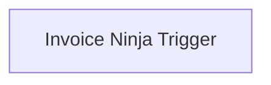

## Fluxo (.json) :

```json
{
  "nodes": [
    {
      "name": "Invoice Ninja Trigger",
      "type": "n8n-nodes-base.invoiceNinjaTrigger",
      "position": [
        890,
        400
      ],
      "webhookId": "97be21b3-ebf5-48cf-b291-5d954657a544",
      "parameters": {
        "event": "create_invoice"
      },
      "credentials": {
        "invoiceNinjaApi": "invoice_ninja_creds"
      },
      "typeVersion": 1
    }
  ],
  "connections": {}
}
```

<a id="template-1129"></a>

## Template 1129 - Legenda de imagem com Gemini e overlay

- **Nome:** Legenda de imagem com Gemini e overlay
- **Descrição:** Este fluxo baixa uma imagem da web, gera uma legenda usando um modelo de IA multimodal e sobrepõe a legenda na imagem resultante.
- **Funcionalidade:** • Importar imagem da web: baixa a imagem de uma URL externa para processamento.
• Redimensionar a imagem: ajusta para 512x512 para o processamento de IA.
• Gerar legenda com IA multimodal: utiliza o modelo Gemini para criar um título e texto da legenda com base na imagem.
• Calcular posicionamento da legenda: determina o tamanho da fonte, posição e margens para o texto.
• Sobrepor legenda na imagem: desenha o retângulo de fundo e o texto na imagem.
• Mesclar imagem final: combina a imagem com a legenda para produzir a imagem final com o caption.
• Executar via trigger manual: inicia o fluxo com o gatilho manual para testes.
- **Ferramentas:** • Gemini (PaLM) API: serviço de IA multimodal usado para gerar legendas a partir de imagens.
• Pexels: banco de imagens gratuito de onde a foto de exemplo é obtida.

## Fluxo visual

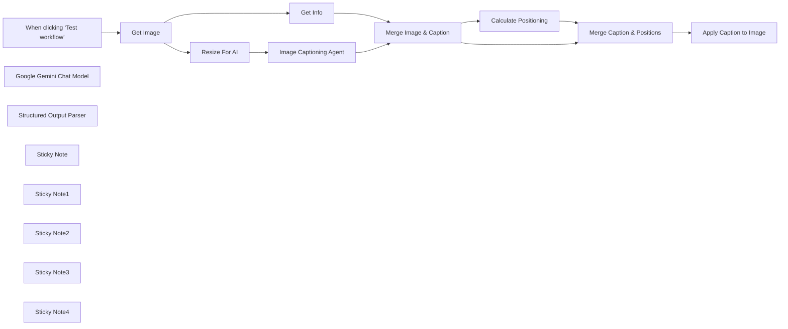

## Fluxo (.json) :

```json
{
  "meta": {
    "instanceId": "408f9fb9940c3cb18ffdef0e0150fe342d6e655c3a9fac21f0f644e8bedabcd9"
  },
  "nodes": [
    {
      "id": "0b64edf1-57e0-4704-b78c-c8ab2b91f74d",
      "name": "When clicking ‘Test workflow’",
      "type": "n8n-nodes-base.manualTrigger",
      "position": [
        480,
        300
      ],
      "parameters": {},
      "typeVersion": 1
    },
    {
      "id": "a875d1c5-ccfe-4bbf-b429-56a42b0ca778",
      "name": "Google Gemini Chat Model",
      "type": "@n8n/n8n-nodes-langchain.lmChatGoogleGemini",
      "position": [
        1280,
        720
      ],
      "parameters": {
        "options": {},
        "modelName": "models/gemini-1.5-flash"
      },
      "credentials": {
        "googlePalmApi": {
          "id": "dSxo6ns5wn658r8N",
          "name": "Google Gemini(PaLM) Api account"
        }
      },
      "typeVersion": 1
    },
    {
      "id": "a5e00543-dbaa-4e62-afb0-825ebefae3f3",
      "name": "Structured Output Parser",
      "type": "@n8n/n8n-nodes-langchain.outputParserStructured",
      "position": [
        1480,
        720
      ],
      "parameters": {
        "jsonSchemaExample": "{\n\t\"caption_title\": \"\",\n\t\"caption_text\": \"\"\n}"
      },
      "typeVersion": 1.2
    },
    {
      "id": "bb9af9c6-6c81-4e92-a29f-18ab3afbe327",
      "name": "Get Info",
      "type": "n8n-nodes-base.editImage",
      "position": [
        1100,
        400
      ],
      "parameters": {
        "operation": "information"
      },
      "typeVersion": 1
    },
    {
      "id": "8a0dbd5d-5886-484a-80a0-486f349a9856",
      "name": "Resize For AI",
      "type": "n8n-nodes-base.editImage",
      "position": [
        1100,
        560
      ],
      "parameters": {
        "width": 512,
        "height": 512,
        "options": {},
        "operation": "resize"
      },
      "typeVersion": 1
    },
    {
      "id": "d29f254a-5fa3-46fa-b153-19dfd8e8c6a7",
      "name": "Calculate Positioning",
      "type": "n8n-nodes-base.code",
      "position": [
        2020,
        720
      ],
      "parameters": {
        "mode": "runOnceForEachItem",
        "jsCode": "const { size, output } = $input.item.json;\n\nconst lineHeight = 35;\nconst fontSize = Math.round(size.height / lineHeight);\nconst maxLineLength = Math.round(size.width/fontSize) * 2;\nconst text = `\"${output.caption_title}\". ${output.caption_text}`;\nconst numLinesOccupied = Math.round(text.length / maxLineLength);\n\nconst verticalPadding = size.height * 0.02;\nconst horizontalPadding = size.width * 0.02;\nconst rectPosX = 0;\nconst rectPosY = size.height - (verticalPadding * 2.5) - (numLinesOccupied * fontSize);\nconst textPosX = horizontalPadding;\nconst textPosY = size.height - (numLinesOccupied * fontSize) - (verticalPadding/2);\n\nreturn {\n caption: {\n fontSize,\n maxLineLength,\n numLinesOccupied,\n rectPosX,\n rectPosY,\n textPosX,\n textPosY,\n verticalPadding,\n horizontalPadding,\n }\n}\n"
      },
      "typeVersion": 2
    },
    {
      "id": "12a7f2d6-8684-48a5-aa41-40a8a4f98c79",
      "name": "Apply Caption to Image",
      "type": "n8n-nodes-base.editImage",
      "position": [
        2380,
        560
      ],
      "parameters": {
        "options": {},
        "operation": "multiStep",
        "operations": {
          "operations": [
            {
              "color": "=#0000008c",
              "operation": "draw",
              "endPositionX": "={{ $json.size.width }}",
              "endPositionY": "={{ $json.size.height }}",
              "startPositionX": "={{ $json.caption.rectPosX }}",
              "startPositionY": "={{ $json.caption.rectPosY }}"
            },
            {
              "font": "/usr/share/fonts/truetype/msttcorefonts/Arial.ttf",
              "text": "=\"{{ $json.output.caption_title }}\". {{ $json.output.caption_text }}",
              "fontSize": "={{ $json.caption.fontSize }}",
              "fontColor": "#FFFFFF",
              "operation": "text",
              "positionX": "={{ $json.caption.textPosX }}",
              "positionY": "={{ $json.caption.textPosY }}",
              "lineLength": "={{ $json.caption.maxLineLength }}"
            }
          ]
        }
      },
      "typeVersion": 1
    },
    {
      "id": "4d569ec8-04c2-4d21-96e1-86543b26892d",
      "name": "Sticky Note",
      "type": "n8n-nodes-base.stickyNote",
      "position": [
        -120,
        80
      ],
      "parameters": {
        "width": 423.75,
        "height": 431.76353488372104,
        "content": "## Try it out!\n\n### This workflow takes an image and generates a caption for it using AI. The OpenAI node has been able to do this for a while but this workflow demonstrates how to achieve the same with other multimodal vision models such as Google's Gemini.\n\nAdditional, we'll use the Edit Image node to overlay the generated caption onto the image. This can be useful for publications or can be repurposed for copyrights and/or watermarks.\n\n### Need Help?\nJoin the [Discord](https://discord.com/invite/XPKeKXeB7d) or ask in the [Forum](https://community.n8n.io/)!\n"
      },
      "typeVersion": 1
    },
    {
      "id": "45d37945-5a7a-42eb-8c8c-5940ea276072",
      "name": "Merge Image & Caption",
      "type": "n8n-nodes-base.merge",
      "position": [
        1620,
        400
      ],
      "parameters": {
        "mode": "combine",
        "options": {},
        "combineBy": "combineByPosition"
      },
      "typeVersion": 3
    },
    {
      "id": "53a26842-ad56-4c8d-a59d-4f6d3f9e2407",
      "name": "Merge Caption & Positions",
      "type": "n8n-nodes-base.merge",
      "position": [
        2200,
        560
      ],
      "parameters": {
        "mode": "combine",
        "options": {},
        "combineBy": "combineByPosition"
      },
      "typeVersion": 3
    },
    {
      "id": "b6c28913-b16a-4c59-aa49-47e9bb97f86d",
      "name": "Get Image",
      "type": "n8n-nodes-base.httpRequest",
      "position": [
        680,
        300
      ],
      "parameters": {
        "url": "https://images.pexels.com/photos/1267338/pexels-photo-1267338.jpeg?auto=compress&cs=tinysrgb&w=600",
        "options": {}
      },
      "typeVersion": 4.2
    },
    {
      "id": "6c25054d-8103-4be9-bea7-6c3dd47f49a3",
      "name": "Sticky Note1",
      "type": "n8n-nodes-base.stickyNote",
      "position": [
        340,
        80
      ],
      "parameters": {
        "color": 7,
        "width": 586.25,
        "height": 486.25,
        "content": "## 1. Import an Image \n[Read more about the HTTP request node](https://docs.n8n.io/integrations/builtin/core-nodes/n8n-nodes-base.httprequest)\n\nFor this demonstration, we'll grab an image off Pexels.com - a popular free stock photography site - by using the HTTP request node to download.\n\nIn your own workflows, this can be replaces by other triggers such as webhooks."
      },
      "typeVersion": 1
    },
    {
      "id": "d1b708e2-31c3-4cd1-a353-678bc33d4022",
      "name": "Sticky Note2",
      "type": "n8n-nodes-base.stickyNote",
      "position": [
        960,
        140
      ],
      "parameters": {
        "color": 7,
        "width": 888.75,
        "height": 783.75,
        "content": "## 2. Using Vision Model to Generate Caption\n[Learn more about the Basic LLM Chain](https://docs.n8n.io/integrations/builtin/cluster-nodes/root-nodes/n8n-nodes-langchain.chainllm)\n\nn8n's basic LLM node supports multimodal input by allowing you to specify either a binary or an image url to send to a compatible LLM. This makes it easy to start utilising this powerful feature for visual classification or OCR tasks which have previously depended on more dedicated OCR models.\n\nHere, we've simply passed our image binary as a \"user message\" option, asking the LLM to help us generate a caption title and text which is appropriate for the given subject. Once generated, we'll pass this text along with the image to combine them both."
      },
      "typeVersion": 1
    },
    {
      "id": "36a39871-340f-4c44-90e6-74393b9be324",
      "name": "Sticky Note3",
      "type": "n8n-nodes-base.stickyNote",
      "position": [
        1880,
        280
      ],
      "parameters": {
        "color": 7,
        "width": 753.75,
        "height": 635,
        "content": "## 3. Overlay Caption on Image \n[Read more about the Edit Image node](https://docs.n8n.io/integrations/builtin/core-nodes/n8n-nodes-base.editimage)\n\nFinally, we’ll perform some basic calculations to place the generated caption onto the image. With n8n's user-friendly image editing features, this can be done entirely within the workflow!\n\nThe Code node tool is ideal for these types of calculations and is used here to position the caption at the bottom of the image. To create the overlay, the Edit Image node enables us to insert text onto the image, which we’ll use to add the generated caption."
      },
      "typeVersion": 1
    },
    {
      "id": "d175fe97-064e-41da-95fd-b15668c330c4",
      "name": "Sticky Note4",
      "type": "n8n-nodes-base.stickyNote",
      "position": [
        2660,
        280
      ],
      "parameters": {
        "width": 563.75,
        "height": 411.25,
        "content": "**FIG 1.** Example input image with AI generated caption\n"
      },
      "typeVersion": 1
    },
    {
      "id": "23db0c90-45b6-4b85-b017-a52ad5a9ad5b",
      "name": "Image Captioning Agent",
      "type": "@n8n/n8n-nodes-langchain.chainLlm",
      "position": [
        1280,
        560
      ],
      "parameters": {
        "text": "Generate a caption for this image.",
        "messages": {
          "messageValues": [
            {
              "message": "=You role is to provide an appropriate image caption for user provided images.\n\nThe individual components of a caption are as follows: who, when, where, context and miscellaneous. For a really good caption, follow this template: who + when + where + context + miscellaneous\n\nGive the caption a punny title."
            },
            {
              "type": "HumanMessagePromptTemplate",
              "messageType": "imageBinary"
            }
          ]
        },
        "promptType": "define",
        "hasOutputParser": true
      },
      "typeVersion": 1.4
    }
  ],
  "pinData": {},
  "connections": {
    "Get Info": {
      "main": [
        [
          {
            "node": "Merge Image & Caption",
            "type": "main",
            "index": 0
          }
        ]
      ]
    },
    "Get Image": {
      "main": [
        [
          {
            "node": "Resize For AI",
            "type": "main",
            "index": 0
          },
          {
            "node": "Get Info",
            "type": "main",
            "index": 0
          }
        ]
      ]
    },
    "Resize For AI": {
      "main": [
        [
          {
            "node": "Image Captioning Agent",
            "type": "main",
            "index": 0
          }
        ]
      ]
    },
    "Calculate Positioning": {
      "main": [
        [
          {
            "node": "Merge Caption & Positions",
            "type": "main",
            "index": 1
          }
        ]
      ]
    },
    "Merge Image & Caption": {
      "main": [
        [
          {
            "node": "Calculate Positioning",
            "type": "main",
            "index": 0
          },
          {
            "node": "Merge Caption & Positions",
            "type": "main",
            "index": 0
          }
        ]
      ]
    },
    "Image Captioning Agent": {
      "main": [
        [
          {
            "node": "Merge Image & Caption",
            "type": "main",
            "index": 1
          }
        ]
      ]
    },
    "Google Gemini Chat Model": {
      "ai_languageModel": [
        [
          {
            "node": "Image Captioning Agent",
            "type": "ai_languageModel",
            "index": 0
          }
        ]
      ]
    },
    "Structured Output Parser": {
      "ai_outputParser": [
        [
          {
            "node": "Image Captioning Agent",
            "type": "ai_outputParser",
            "index": 0
          }
        ]
      ]
    },
    "Merge Caption & Positions": {
      "main": [
        [
          {
            "node": "Apply Caption to Image",
            "type": "main",
            "index": 0
          }
        ]
      ]
    },
    "When clicking ‘Test workflow’": {
      "main": [
        [
          {
            "node": "Get Image",
            "type": "main",
            "index": 0
          }
        ]
      ]
    }
  }
}
```

<a id="template-1130"></a>

## Template 1130 - Backup de workflows para Gitea

- **Nome:** Backup de workflows para Gitea
- **Descrição:** Este fluxo coleta, codifica e envia os fluxos de trabalho para um repositório Git hospedado no Gitea, criando ou atualizando arquivos conforme houver alterações.
- **Funcionalidade:** • Agendamento de backups periódicos: executa a cada 45 minutos para verificar e salvar fluxos.
• Gerenciamento de credenciais de acesso: utiliza um token de Gitea para autenticar chamadas de API.
• Recuperação de fluxos para backup: obtém a lista de fluxos disponíveis que serão armazenados.
• Processamento por fluxo: para cada fluxo, prepara um arquivo correspondente e codifica seu conteúdo.
• Verificação de existência de arquivo: consulta se o arquivo já existe no repositório.
• Criação ou atualização de arquivos: cria novos arquivos ou atualiza os existentes conforme necessário.
• Codificação Base64 do conteúdo: transforma o JSON do fluxo em base64 para envio seguro.
• Envio via API ao repositório: envia o conteúdo codificado para o repositório no Gitea.
- **Ferramentas:** • Gitea: serviço de hospedagem de repositórios Git com API para manipulação de conteúdos.
• Requisições HTTP/REST: comunicação com serviços externos para leitura e gravação de conteúdos no repositório.

## Fluxo visual

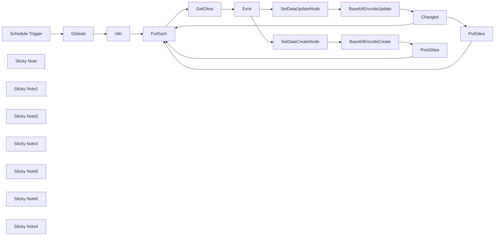

## Fluxo (.json) :

```json
{
  "id": "Ef2uEM6H19K2DGUO",
  "meta": {
    "templateId": "2532",
    "templateCredsSetupCompleted": true
  },
  "name": "Backup workflows to git repository on Gitea",
  "tags": [
    {
      "id": "UWNX4AzSneYNvTQI",
      "name": "Gitea",
      "createdAt": "2025-01-28T23:10:06.823Z",
      "updatedAt": "2025-01-28T23:10:06.823Z"
    },
    {
      "id": "4b7Bs9T0Cagsg5tT",
      "name": "Git",
      "createdAt": "2025-01-28T23:10:26.545Z",
      "updatedAt": "2025-01-28T23:10:26.545Z"
    },
    {
      "id": "HiN3ehC2KkAp5kVs",
      "name": "Backup",
      "createdAt": "2025-01-28T23:10:38.878Z",
      "updatedAt": "2025-01-28T23:10:38.878Z"
    }
  ],
  "nodes": [
    {
      "id": "639582ef-f13e-4844-bd10-647718079121",
      "name": "Globals",
      "type": "n8n-nodes-base.set",
      "position": [
        600,
        240
      ],
      "parameters": {
        "values": {
          "string": [
            {
              "name": "repo.url",
              "value": "https://git.vdm.dev"
            },
            {
              "name": "repo.name",
              "value": "workflows"
            },
            {
              "name": "repo.owner",
              "value": "n8n"
            }
          ]
        },
        "options": {}
      },
      "typeVersion": 1
    },
    {
      "id": "9df89713-220e-43b9-b234-b8f5612629cf",
      "name": "n8n",
      "type": "n8n-nodes-base.n8n",
      "position": [
        840,
        240
      ],
      "parameters": {
        "filters": {},
        "requestOptions": {}
      },
      "credentials": {
        "n8nApi": {
          "id": "ZjfxOLTTHX2CzbKa",
          "name": "Main N8N Account"
        }
      },
      "typeVersion": 1
    },
    {
      "id": "4b2d375c-a339-404c-babd-555bd2fc4091",
      "name": "Schedule Trigger",
      "type": "n8n-nodes-base.scheduleTrigger",
      "position": [
        380,
        240
      ],
      "parameters": {
        "rule": {
          "interval": [
            {
              "field": "minutes",
              "minutesInterval": 45
            }
          ]
        }
      },
      "typeVersion": 1.2
    },
    {
      "id": "ea026e96-0db1-41fd-b003-2f2bf4662696",
      "name": "Sticky Note",
      "type": "n8n-nodes-base.stickyNote",
      "position": [
        2620,
        300
      ],
      "parameters": {
        "height": 80,
        "content": "Workflow changes committed to the repository"
      },
      "typeVersion": 1
    },
    {
      "id": "9c402daa-6d03-485d-b8a0-58f1b65d396d",
      "name": "Sticky Note1",
      "type": "n8n-nodes-base.stickyNote",
      "position": [
        2260,
        180
      ],
      "parameters": {
        "height": 80,
        "content": "Check if there are any changes in the workflow"
      },
      "typeVersion": 1
    },
    {
      "id": "1d9216d9-bf8d-4945-8a58-22fb1ffc9be8",
      "name": "Sticky Note2",
      "type": "n8n-nodes-base.stickyNote",
      "position": [
        1800,
        580
      ],
      "parameters": {
        "height": 80,
        "content": "Create a new file for the workflow"
      },
      "typeVersion": 1
    },
    {
      "id": "60a3953b-d9f1-4afd-b299-e314116b96c6",
      "name": "Sticky Note3",
      "type": "n8n-nodes-base.stickyNote",
      "position": [
        1300,
        200
      ],
      "parameters": {
        "height": 80,
        "content": "Check if file exists in the repository"
      },
      "typeVersion": 1
    },
    {
      "id": "f2340ad0-71a1-4c74-8d90-bcb974b8b305",
      "name": "Sticky Note5",
      "type": "n8n-nodes-base.stickyNote",
      "position": [
        780,
        180
      ],
      "parameters": {
        "height": 80,
        "content": "Get all workflows"
      },
      "typeVersion": 1
    },
    {
      "id": "617bea19-341a-4e9d-b6fd-6b417e58d756",
      "name": "Sticky Note6",
      "type": "n8n-nodes-base.stickyNote",
      "position": [
        500,
        180
      ],
      "parameters": {
        "height": 80,
        "content": "Set variables"
      },
      "typeVersion": 1
    },
    {
      "id": "72f806d7-e30a-470b-9ba2-37fdc35de3c8",
      "name": "SetDataUpdateNode",
      "type": "n8n-nodes-base.set",
      "position": [
        1920,
        240
      ],
      "parameters": {
        "options": {},
        "assignments": {
          "assignments": [
            {
              "id": "0a6b769a-c66d-4784-92c7-a70caa28e1ba",
              "name": "item",
              "type": "object",
              "value": "={{ $node[\"ForEach\"].json }}"
            }
          ]
        }
      },
      "typeVersion": 3.4
    },
    {
      "id": "bca5e2c4-7aa3-48df-9e5f-b31977970c28",
      "name": "SetDataCreateNode",
      "type": "n8n-nodes-base.set",
      "position": [
        1220,
        640
      ],
      "parameters": {
        "options": {},
        "assignments": {
          "assignments": [
            {
              "id": "0a6b769a-c66d-4784-92c7-a70caa28e1ba",
              "name": "item",
              "type": "object",
              "value": "={{ $node[\"ForEach\"].json }}"
            }
          ]
        }
      },
      "typeVersion": 3.4
    },
    {
      "id": "bf74b1ea-e066-462b-9c3d-ed4a44a09a33",
      "name": "Base64EncodeUpdate",
      "type": "n8n-nodes-base.code",
      "position": [
        2140,
        240
      ],
      "parameters": {
        "language": "python",
        "pythonCode": "import json\nimport base64\nfrom js import Object\n\n# Assuming _input.all() returns a JavaScript object\njs_object = _input.all()\n\n# Convert the JsProxy object to a Python dictionary\ndef js_to_py(js_obj):\n    if isinstance(js_obj, (str, int, float, bool)) or js_obj is None:\n        # Base types are already Python-compatible\n        return js_obj\n    elif isinstance(js_obj, list):\n        # Convert lists recursively\n        return [js_to_py(item) for item in js_obj]\n    elif hasattr(js_obj, \"__iter__\") and not isinstance(js_obj, str):\n        # Handle JsProxy objects (JavaScript objects or arrays)\n        if hasattr(js_obj, \"keys\"):\n            # If it has keys, treat it as a dictionary\n            return {key: js_to_py(js_obj[key]) for key in Object.keys(js_obj)}\n        else:\n            # Otherwise, treat it as a list\n            return [js_to_py(item) for item in js_obj]\n    else:\n        # Fallback for other types\n        return js_obj\n\n# Convert the JavaScript object to a Python dictionary\ninput_dict = js_to_py(js_object)\n\n# Step 0: get the correct data set of the workflow\ninner_data = input_dict[0].get('json').get('item')\n\n# Step 1: Convert the dictionary to a pretty-printed JSON string\njson_string = json.dumps(inner_data, indent=4)\n\n# Step 2: Encode the JSON string to bytes\njson_bytes = json_string.encode('utf-8')\n\n# Step 3: Convert the bytes to a base64 string\nbase64_string = base64.b64encode(json_bytes).decode('utf-8')\n\n# Step 5: Create the return object with the base64 string and its SHA-256 hash\nreturn_object = {\n    \"item\": base64_string\n}\n\n# Return the object\nreturn return_object"
      },
      "typeVersion": 2
    },
    {
      "id": "2d817c66-5aa0-45c9-b851-4b5e3dbecca4",
      "name": "Base64EncodeCreate",
      "type": "n8n-nodes-base.code",
      "position": [
        1520,
        640
      ],
      "parameters": {
        "language": "python",
        "pythonCode": "import json\nimport base64\nfrom js import Object\n\n# Assuming _input.all() returns a JavaScript object\njs_object = _input.all()\n\n# Convert the JsProxy object to a Python dictionary\ndef js_to_py(js_obj):\n    if isinstance(js_obj, (str, int, float, bool)) or js_obj is None:\n        # Base types are already Python-compatible\n        return js_obj\n    elif isinstance(js_obj, list):\n        # Convert lists recursively\n        return [js_to_py(item) for item in js_obj]\n    elif hasattr(js_obj, \"__iter__\") and not isinstance(js_obj, str):\n        # Handle JsProxy objects (JavaScript objects or arrays)\n        if hasattr(js_obj, \"keys\"):\n            # If it has keys, treat it as a dictionary\n            return {key: js_to_py(js_obj[key]) for key in Object.keys(js_obj)}\n        else:\n            # Otherwise, treat it as a list\n            return [js_to_py(item) for item in js_obj]\n    else:\n        # Fallback for other types\n        return js_obj\n\n# Convert the JavaScript object to a Python dictionary\ninput_dict = js_to_py(js_object)\n\n# Step 0: get the correct data set of the workflow\ninner_data = input_dict[0].get('json').get('item')\n\n# Step 1: Convert the dictionary to a pretty-printed JSON string\njson_string = json.dumps(inner_data, indent=4)\n\n# Step 2: Encode the JSON string to bytes\njson_bytes = json_string.encode('utf-8')\n\n# Step 3: Convert the bytes to a base64 string\nbase64_string = base64.b64encode(json_bytes).decode('utf-8')\n\n# Step 4: Create the return object with the base64 string in 'item'\nreturn_object = {\n    \"item\": base64_string\n}\n\n# Return the object\nreturn return_object"
      },
      "typeVersion": 2
    },
    {
      "id": "41a7da89-1c8c-4100-8c30-d0788962efc1",
      "name": "Exist",
      "type": "n8n-nodes-base.if",
      "position": [
        1640,
        260
      ],
      "parameters": {
        "options": {
          "ignoreCase": false
        },
        "conditions": {
          "options": {
            "version": 2,
            "leftValue": "",
            "caseSensitive": true,
            "typeValidation": "strict"
          },
          "combinator": "or",
          "conditions": [
            {
              "id": "16a9182d-059d-4774-ba95-654fb4293fdb",
              "operator": {
                "type": "object",
                "operation": "notExists",
                "singleValue": true
              },
              "leftValue": "={{ $json.error }}",
              "rightValue": 404
            }
          ]
        }
      },
      "executeOnce": false,
      "typeVersion": 2.2,
      "alwaysOutputData": false
    },
    {
      "id": "ab9246eb-a253-4d76-b33b-5f8f12342542",
      "name": "Changed",
      "type": "n8n-nodes-base.if",
      "position": [
        2360,
        240
      ],
      "parameters": {
        "options": {},
        "conditions": {
          "options": {
            "version": 2,
            "leftValue": "",
            "caseSensitive": true,
            "typeValidation": "strict"
          },
          "combinator": "and",
          "conditions": [
            {
              "id": "e0c66624-429a-4f1f-bf7b-1cc1b32bad7b",
              "operator": {
                "type": "string",
                "operation": "notEquals"
              },
              "leftValue": "={{ $json.item }}",
              "rightValue": "={{ $('GetGitea').item.json.content }}"
            }
          ]
        }
      },
      "typeVersion": 2.2
    },
    {
      "id": "4278a176-6496-4817-82f8-591539619673",
      "name": "PutGitea",
      "type": "n8n-nodes-base.httpRequest",
      "position": [
        2700,
        360
      ],
      "parameters": {
        "url": "={{ $('Globals').item.json.repo.url }}/api/v1/repos/{{ $('Globals').item.json.repo.owner }}/{{ $('Globals').item.json.repo.name }}/contents/{{ encodeURIComponent($('GetGitea').item.json.name) }}",
        "method": "PUT",
        "options": {},
        "sendBody": true,
        "authentication": "genericCredentialType",
        "bodyParameters": {
          "parameters": [
            {
              "name": "content",
              "value": "={{ $('Base64EncodeUpdate').item.json.item }}"
            },
            {
              "name": "sha",
              "value": "={{ $('GetGitea').item.json.sha }}"
            }
          ]
        },
        "genericAuthType": "httpHeaderAuth"
      },
      "credentials": {
        "httpHeaderAuth": {
          "id": "gTvBAgkOmqhl5Nmr",
          "name": "Gitea Token"
        }
      },
      "typeVersion": 4.2
    },
    {
      "id": "12307a61-e7cc-42f9-a7c7-8abbcab9e3ab",
      "name": "GetGitea",
      "type": "n8n-nodes-base.httpRequest",
      "onError": "continueRegularOutput",
      "position": [
        1380,
        260
      ],
      "parameters": {
        "url": "={{ $('Globals').item.json.repo.url }}/api/v1/repos/{{ encodeURIComponent($('Globals').item.json.repo.owner) }}/{{ encodeURIComponent($('Globals').item.json.repo.name) }}/contents/{{ encodeURIComponent($json.name) }}.json",
        "options": {},
        "authentication": "genericCredentialType",
        "genericAuthType": "httpHeaderAuth"
      },
      "credentials": {
        "httpHeaderAuth": {
          "id": "gTvBAgkOmqhl5Nmr",
          "name": "Gitea Token"
        }
      },
      "typeVersion": 4.2
    },
    {
      "id": "24fda439-bb23-4392-a297-d8070907f9e6",
      "name": "PostGitea",
      "type": "n8n-nodes-base.httpRequest",
      "position": [
        1920,
        640
      ],
      "parameters": {
        "url": "={{ $('Globals').item.json.repo.url }}/api/v1/repos/{{ $('Globals').item.json.repo.owner }}/{{ $('Globals').item.json.repo.name }}/contents/{{ encodeURIComponent($('ForEach').item.json.name) }}.json",
        "method": "POST",
        "options": {},
        "sendBody": true,
        "authentication": "genericCredentialType",
        "bodyParameters": {
          "parameters": [
            {
              "name": "content",
              "value": "={{ $json.item }}"
            }
          ]
        },
        "genericAuthType": "httpHeaderAuth"
      },
      "credentials": {
        "httpHeaderAuth": {
          "id": "gTvBAgkOmqhl5Nmr",
          "name": "Gitea Token"
        }
      },
      "typeVersion": 4.2
    },
    {
      "id": "43a60315-d381-4ac4-be4c-f6a158651a00",
      "name": "ForEach",
      "type": "n8n-nodes-base.splitInBatches",
      "position": [
        1060,
        240
      ],
      "parameters": {
        "options": {}
      },
      "executeOnce": false,
      "typeVersion": 3
    },
    {
      "id": "88578dc4-2398-48d0-b0ba-2198b35bb994",
      "name": "Sticky Note4",
      "type": "n8n-nodes-base.stickyNote",
      "position": [
        380,
        440
      ],
      "parameters": {
        "width": 560,
        "height": 1620,
        "content": "### **📌 Setup Guide for Backup Workflows to Git Repository on Gitea**\n\n#### **🔧 1. Configure Global Variables**\nGo to the **Globals** node and update the following:\n- **`repo.url`** → `https://your-gitea-instance.com` *(Replace with your actual Gitea URL)*\n- **`repo.name`** → `workflows` *(Repository name where backups will be stored)*\n- **`repo.owner`** → `octoleo` *(Gitea account that owns the repository)*\n\n📌 **These settings define where workflows will be backed up.**\n\n---\n\n#### **🔑 2. Set Up Gitea Authentication**\n1️⃣ **In Gitea:**\n- Generate a **Personal Access Token** under **Settings → Applications → Generate Token**\n- Ensure the token has **repo read/write permissions**\n\n2️⃣ **In the Credentials Manager:**\n- Create a new **Gitea Token** credential\n- Set the **Name** as `Authorization`\n- Set the **Value** as:\n```\nBearer YOUR_PERSONAL_ACCESS_TOKEN\n```\n📌 **Ensure there is a space after `Bearer` before the token!**\n\n---\n\n#### **🔗 3. Connect Gitea Credentials to Git Nodes**\n- Open each of these **three Git nodes**:\n- **GetGitea** → Retrieves existing repository data\n- **PutGitea** → Updates workflows\n- **PostGitea** → Adds new workflows\n\n- Assign the **Gitea Token** credential to each node.\n\n📌 **These nodes handle pushing your workflows to Gitea.**\n\n---\n\n#### **🌐 4. Set Up API Credentials for Workflow Retrieval**\n- Locate the API request node that **fetches workflows**.\n- Add your **API authentication credentials** (Token or Basic Auth).\n\n📌 **This ensures the workflow can fetch all available workflows from your system.**\n\n---\n\n#### **🛠️ 5. Test & Activate the Workflow**\n✅ **Run the workflow manually** → Check that workflows are being backed up correctly.\n✅ **Review the Gitea repository** → Ensure the files are updated.\n✅ **Enable the scheduled trigger** → Automates backups at defined intervals.\n\n📌 **The workflow automatically checks for changes before committing updates!**\n\n---\n\n### **🚀 Done! Your Workflows Are Now Backed Up Securely!**\n💬 Have issues? **Reach out on the forum for help!**"
      },
      "typeVersion": 1
    }
  ],
  "active": false,
  "pinData": {},
  "settings": {
    "executionOrder": "v1"
  },
  "versionId": "84ba3f3f-fbc8-4792-8e28-198f515fef4e",
  "staticData": {
    "node:Schedule Trigger": {
      "recurrenceRules": []
    }
  },
  "connections": {
    "n8n": {
      "main": [
        [
          {
            "node": "ForEach",
            "type": "main",
            "index": 0
          }
        ]
      ]
    },
    "Exist": {
      "main": [
        [
          {
            "node": "SetDataUpdateNode",
            "type": "main",
            "index": 0
          }
        ],
        [
          {
            "node": "SetDataCreateNode",
            "type": "main",
            "index": 0
          }
        ]
      ]
    },
    "Changed": {
      "main": [
        [
          {
            "node": "PutGitea",
            "type": "main",
            "index": 0
          }
        ],
        [
          {
            "node": "ForEach",
            "type": "main",
            "index": 0
          }
        ]
      ]
    },
    "ForEach": {
      "main": [
        [],
        [
          {
            "node": "GetGitea",
            "type": "main",
            "index": 0
          }
        ]
      ]
    },
    "Globals": {
      "main": [
        [
          {
            "node": "n8n",
            "type": "main",
            "index": 0
          }
        ]
      ]
    },
    "GetGitea": {
      "main": [
        [
          {
            "node": "Exist",
            "type": "main",
            "index": 0
          }
        ]
      ]
    },
    "PutGitea": {
      "main": [
        [
          {
            "node": "ForEach",
            "type": "main",
            "index": 0
          }
        ]
      ]
    },
    "PostGitea": {
      "main": [
        [
          {
            "node": "ForEach",
            "type": "main",
            "index": 0
          }
        ]
      ]
    },
    "Schedule Trigger": {
      "main": [
        [
          {
            "node": "Globals",
            "type": "main",
            "index": 0
          }
        ]
      ]
    },
    "SetDataCreateNode": {
      "main": [
        [
          {
            "node": "Base64EncodeCreate",
            "type": "main",
            "index": 0
          }
        ]
      ]
    },
    "SetDataUpdateNode": {
      "main": [
        [
          {
            "node": "Base64EncodeUpdate",
            "type": "main",
            "index": 0
          }
        ]
      ]
    },
    "Base64EncodeCreate": {
      "main": [
        [
          {
            "node": "PostGitea",
            "type": "main",
            "index": 0
          }
        ]
      ]
    },
    "Base64EncodeUpdate": {
      "main": [
        [
          {
            "node": "Changed",
            "type": "main",
            "index": 0
          }
        ]
      ]
    }
  },
  "triggerCount": 1
}
```

<a id="template-1131"></a>

## Template 1131 - Gatilho para eventos do Jira Cloud

- **Nome:** Gatilho para eventos do Jira Cloud
- **Descrição:** Fluxo que recebe todos os eventos do Jira via webhook e inicia automações a partir desses eventos.
- **Funcionalidade:** • Detecção de todos os eventos do Jira: inicia o fluxo ao receber qualquer evento configurado no Jira.
• Recebimento via webhook: expõe um endpoint que recebe os payloads enviados pela instância do Jira.
• Autenticação com Jira Cloud: utiliza credenciais para integrar de forma segura com a API do Jira.
• Ponto de entrada para automações: serve como gatilho inicial para outros processos ou ações com base nos eventos recebidos.
- **Ferramentas:** • Jira Software Cloud: plataforma de gerenciamento de projetos e issues que envia eventos via webhook e oferece API para integração.


## Fluxo visual

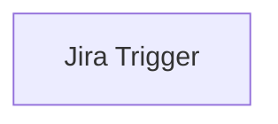

## Fluxo (.json) :

```json
{
  "nodes": [
    {
      "name": "Jira Trigger",
      "type": "n8n-nodes-base.jiraTrigger",
      "position": [
        880,
        400
      ],
      "webhookId": "a3ddaf66-7f75-4494-b435-ef88ef1f1917",
      "parameters": {
        "events": [
          "*"
        ],
        "additionalFields": {}
      },
      "credentials": {
        "jiraSoftwareCloudApi": "n8n"
      },
      "typeVersion": 1
    }
  ],
  "connections": {}
}
```

<a id="template-1132"></a>

## Template 1132 - Extração automática de despesas de e-mails para planilha

- **Nome:** Extração automática de despesas de e-mails para planilha
- **Descrição:** Fluxo que monitora e-mails rotulados, extrai informações de faturas e notificações de pagamento (incluindo PDFs protegidos), estrutura os dados de despesas com auxílio de modelos de linguagem e grava os registros em uma planilha.
- **Funcionalidade:** • Monitoramento de e-mails por rótulos: Observa pastas/labels específicos para detectar faturas e avisos de pagamento.
• Download e extração de anexos PDF protegidos: Baixa anexos e extrai texto de PDFs com senha para leitura dos detalhes da transação.
• Extração de conteúdo HTML/texto: Captura conteúdo HTML ou texto das mensagens e permite extração baseada em seletores CSS para identificar itens de gasto.
• Tratamento de múltiplos formatos de e-mail: Diferencia e roteia mensagens que contêm múltiplas transações, uma única transação ou faturas, aplicando regras por remetente.
• Quebra de entradas múltiplas: Separa listas ou blocos de gastos individuais encontrados no conteúdo HTML para processamento individual.
• Normalização e enriquecimento de dados: Monta campos padronizados (data, serviço, detalhes, valor, categoria, moeda, cartão) antes do parser.
• Extração estruturada via modelos de linguagem: Usa modelos de linguagem com parser de saída estruturada para identificar e validar campos de despesa.
• Envio para planilha: Anexa os registros processados em uma planilha para controle contábil.
• Tolerância a erros e continuidade: Configurado para continuar execução mesmo se alguma extração falhar, garantindo processamento resiliente.
- **Ferramentas:** • Gmail: Conta de e-mail usada como fonte das notificações de faturas e avisos de pagamento.
• Google Sheets: Planilha onde os registros de despesas extraídos são armazenados.
• Google Gemini (PaLM) API: Modelo de linguagem utilizado para analisar o conteúdo dos e-mails e extrair dados estruturados de transações.
• Groq (modelo LLM): Modelo adicional utilizado para processar e extrair detalhes de e-mails e complementar a extração.


## Fluxo visual

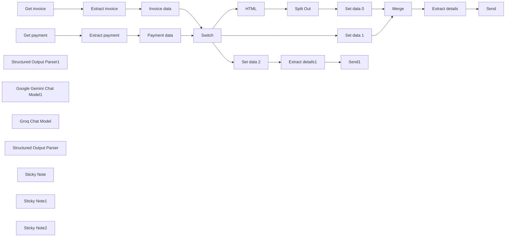

## Fluxo (.json) :

```json
{
  "id": "nkMjcOC4hpte1a0t",
  "meta": {
    "instanceId": "3986dc65ca3ddc4ee46e71fc194b0a9d4ef46d960a5e71624f9f7eaa198213cb",
    "templateCredsSetupCompleted": true
  },
  "name": "Extract spend details (template)",
  "tags": [
    {
      "id": "9mCuuNEpnYNvVzb8",
      "name": "Finance",
      "createdAt": "2024-09-15T07:22:30.749Z",
      "updatedAt": "2024-09-15T07:22:30.749Z"
    }
  ],
  "nodes": [
    {
      "id": "8e1e0861-9f06-4fe2-a9c1-423bab246959",
      "name": "Get invoice",
      "type": "n8n-nodes-base.gmailTrigger",
      "position": [
        600,
        380
      ],
      "parameters": {
        "simple": false,
        "filters": {
          "labelIds": [
            "Label_7885838942566773656"
          ]
        },
        "options": {
          "downloadAttachments": true
        },
        "pollTimes": {
          "item": [
            {
              "mode": "everyMinute"
            }
          ]
        }
      },
      "credentials": {
        "gmailOAuth2": {
          "id": "fegneFqi8XJX3NJH",
          "name": "Gmail account (hana@hanamizuki.tw)"
        }
      },
      "typeVersion": 1.1
    },
    {
      "id": "364fe355-672a-4074-800a-a7496c4fb1b2",
      "name": "Get payment",
      "type": "n8n-nodes-base.gmailTrigger",
      "position": [
        600,
        580
      ],
      "parameters": {
        "simple": false,
        "filters": {
          "labelIds": [
            "Label_371722915607774622"
          ]
        },
        "options": {
          "downloadAttachments": true
        },
        "pollTimes": {
          "item": [
            {
              "mode": "everyMinute"
            }
          ]
        }
      },
      "credentials": {
        "gmailOAuth2": {
          "id": "fegneFqi8XJX3NJH",
          "name": "Gmail account (hana@hanamizuki.tw)"
        }
      },
      "typeVersion": 1.1
    },
    {
      "id": "e3218faf-2486-46e0-bf43-3bc52927e2bd",
      "name": "Extract invoice",
      "type": "n8n-nodes-base.extractFromFile",
      "notes": "No attachements",
      "onError": "continueRegularOutput",
      "position": [
        820,
        380
      ],
      "parameters": {
        "options": {
          "password": "E223706995"
        },
        "operation": "pdf",
        "binaryPropertyName": "attachment_0"
      },
      "typeVersion": 1
    },
    {
      "id": "3772b3dc-7601-4005-9b61-263b2c1abd5f",
      "name": "Extract payment",
      "type": "n8n-nodes-base.extractFromFile",
      "notes": "No attachements",
      "onError": "continueRegularOutput",
      "position": [
        820,
        580
      ],
      "parameters": {
        "options": {
          "password": "E223706995"
        },
        "operation": "pdf",
        "binaryPropertyName": "attachment_0"
      },
      "typeVersion": 1
    },
    {
      "id": "10d57038-940e-47aa-84ea-3850f61ac757",
      "name": "HTML",
      "type": "n8n-nodes-base.html",
      "notes": "\".spend-table\" here is an example when the email use \"spend\" html tags to display each spends.\ne.g.\n<div class=spend-table>Spend 1</div>\n<div class=spend-table>Spend 2</div>",
      "position": [
        1440,
        200
      ],
      "parameters": {
        "options": {},
        "operation": "extractHtmlContent",
        "dataPropertyName": "=html",
        "extractionValues": {
          "values": [
            {
              "key": "spend",
              "cssSelector": ".spend-table",
              "returnArray": true
            }
          ]
        }
      },
      "typeVersion": 1.2
    },
    {
      "id": "dae6d22e-587d-4102-b006-20a341ede5ee",
      "name": "Split Out",
      "type": "n8n-nodes-base.splitOut",
      "position": [
        1660,
        200
      ],
      "parameters": {
        "options": {},
        "fieldToSplitOut": "spend"
      },
      "typeVersion": 1
    },
    {
      "id": "0d75443d-0d23-4120-95e5-b3128a760fb4",
      "name": "Structured Output Parser1",
      "type": "@n8n/n8n-nodes-langchain.outputParserStructured",
      "position": [
        2500,
        640
      ],
      "parameters": {
        "schemaType": "manual",
        "inputSchema": "{\n \"title\": \"Expense Record Schema\",\n \"description\": \"Schema used to parse expense record emails, including date, service name, transaction details, amount, category, currency, and card.\",\n \"type\": \"object\",\n \"properties\": {\n \"date\": {\n \"type\": \"string\",\n \"description\": \"Transaction date, can refer to the email date or the consumption date within the content. If there are multiple dates, use the earliest one. The format is 'YYYY-MM-DD hh:mm', e.g., '2024-09-02 10:12'.\",\n \"examples\": [\"2024-09-02 10:12\"]\n },\n \"service\": {\n \"type\": [\"string\", \"null\"],\n \"description\": \"Name of the service or store, such as 'GOOGLE', 'Uber', etc.\",\n \"examples\": [\"GOOGLE\", \"Uber Eats\", \"Uber\", \"CLAUDE.AI\"]\n },\n \"details\": {\n \"type\": [\"string\", \"null\"],\n \"description\": \"Detailed transaction information, such as overseas card usage, online transactions, restaurant names, or consumption details. If none, can be left blank or null.\",\n \"examples\": [\"Uber: from Fuxing North Road to Minquan East Road\", \"Restaurant name\", null]\n },\n \"amount\": {\n \"type\": \"number\",\n \"description\": \"Transaction amount. If in USD, keep two decimal places (e.g., 50.12); if in TWD, use integers (e.g., 550).\",\n \"examples\": [50.12, 550]\n },\n \"category\": {\n \"type\": \"string\",\n \"description\": \"Transaction category\",\n \"enum\": [\"Food & Beverage\", \"Transportation\", \"Daily Necessities\", \"Housing\", \"Electronics\", \"Beauty & Hair\", \"Apparel & Accessories\", \"Medical & Healthcare\", \"Pets\", \"Education\", \"Entertainment\", \"Cloud Services\", \"Automobile\", \"Gifts\", \"Family Care\", \"Counseling\", \"Insurance\", \"Taxes\", \"Transfer Fees\", \"Music\", \"Fitness\", \"Travel\", \"Lending\", \"Donations\", \"Advertising\", \"Finance\"],\n \"examples\": [\"Food & Beverage\", \"Transportation\"]\n },\n \"currency\": {\n \"type\": \"string\",\n \"description\": \"Currency code used in the transaction. If the amount starts with NT$, then currency is TWD.\",\n \"enum\": [\"TWD\", \"USD\", \"JPY\", \"EUR\", \"SGD\"],\n \"examples\": [\"USD\", \"TWD\"]\n },\n \"card\": {\n \"type\": [\"string\", \"null\"],\n \"description\": \"Credit card used for the transaction.\",\n \"enum\": [\"HSBC 3088\", \"HSBC 3854\", \"Fubon Card\", \"Crypto.com Card\", \"Cathay Card\", null],\n \"examples\": [\"HSBC 3088\", \"HSBC 3854\"]\n }\n },\n \"required\": [\"date\", \"amount\", \"category\", \"currency\"]\n}\n"
      },
      "typeVersion": 1.2
    },
    {
      "id": "7ade499c-015b-4903-8129-6c135264bf75",
      "name": "Google Gemini Chat Model1",
      "type": "@n8n/n8n-nodes-langchain.lmChatGoogleGemini",
      "position": [
        2320,
        640
      ],
      "parameters": {
        "options": {},
        "modelName": "models/gemini-1.5-flash"
      },
      "credentials": {
        "googlePalmApi": {
          "id": "QR3KfTwhKpbgAGWU",
          "name": "Google Gemini(PaLM) Api account"
        }
      },
      "typeVersion": 1
    },
    {
      "id": "10fe4a38-139b-4284-9e86-dd36e472f59e",
      "name": "Send",
      "type": "n8n-nodes-base.googleSheets",
      "position": [
        2740,
        480
      ],
      "parameters": {
        "columns": {
          "value": {
            "date": "={{ $json.output.date }}",
            "amount": "={{ $json.output.amount }}",
            "source": "n8n",
            "details": "={{ $json.output.details }}",
            "payment": "={{ $json.output.card }}",
            "service": "={{ $json.output.service }}",
            "category": "={{ $json.output.category }}",
            "currency": "={{ $json.output.currency }}"
          },
          "schema": [
            {
              "id": "date",
              "type": "string",
              "display": true,
              "required": false,
              "displayName": "date",
              "defaultMatch": false,
              "canBeUsedToMatch": true
            },
            {
              "id": "service",
              "type": "string",
              "display": true,
              "required": false,
              "displayName": "service",
              "defaultMatch": false,
              "canBeUsedToMatch": true
            },
            {
              "id": "details",
              "type": "string",
              "display": true,
              "required": false,
              "displayName": "details",
              "defaultMatch": false,
              "canBeUsedToMatch": true
            },
            {
              "id": "amount",
              "type": "string",
              "display": true,
              "required": false,
              "displayName": "amount",
              "defaultMatch": false,
              "canBeUsedToMatch": true
            },
            {
              "id": "category",
              "type": "string",
              "display": true,
              "removed": false,
              "required": false,
              "displayName": "category",
              "defaultMatch": false,
              "canBeUsedToMatch": true
            },
            {
              "id": "currency",
              "type": "string",
              "display": true,
              "required": false,
              "displayName": "currency",
              "defaultMatch": false,
              "canBeUsedToMatch": true
            },
            {
              "id": "payment",
              "type": "string",
              "display": true,
              "removed": false,
              "required": false,
              "displayName": "payment",
              "defaultMatch": false,
              "canBeUsedToMatch": true
            },
            {
              "id": "source",
              "type": "string",
              "display": true,
              "removed": false,
              "required": false,
              "displayName": "source",
              "defaultMatch": false,
              "canBeUsedToMatch": true
            }
          ],
          "mappingMode": "defineBelow",
          "matchingColumns": []
        },
        "options": {},
        "operation": "append",
        "sheetName": {
          "__rl": true,
          "mode": "list",
          "value": 2071031170,
          "cachedResultUrl": "https://docs.google.com/spreadsheets/d/1ccwhQeUSUkINccAucC6_clRyNF5Mw4IjIxAtcH4ftIs/edit#gid=2071031170",
          "cachedResultName": "raw data 2"
        },
        "documentId": {
          "__rl": true,
          "mode": "url",
          "value": "https://docs.google.com/spreadsheets/d/1ccwhQeUSUkINccAucC6_clRyNF5Mw4IjIxAtcH4ftIs/edit?gid=370005862#gid=370005862"
        }
      },
      "credentials": {
        "googleSheetsOAuth2Api": {
          "id": "flAcWUeyvdjh7MiW",
          "name": "Google Sheets account: hana@hanamizuki.tw (GCP: n8n)"
        }
      },
      "retryOnFail": true,
      "typeVersion": 4.5
    },
    {
      "id": "87ab4932-aae5-4c5a-a175-c782bebdf781",
      "name": "Set data 0",
      "type": "n8n-nodes-base.set",
      "position": [
        1860,
        200
      ],
      "parameters": {
        "options": {},
        "assignments": {
          "assignments": [
            {
              "id": "75b16672-71cf-4157-bcb6-683099ff1620",
              "name": "email_date",
              "type": "string",
              "value": "={{ $('Switch').item.json.date }}"
            },
            {
              "id": "3298f680-5d17-42fd-8b41-a6ca621af37d",
              "name": "email_subject",
              "type": "string",
              "value": "={{ $('Switch').item.json.subject }}"
            },
            {
              "id": "cf7181b7-fef9-437a-8bbe-cd4a4eda85b8",
              "name": "email_content",
              "type": "string",
              "value": "={{ $ifEmpty($json.spend, $ifEmpty( $json.text, $json.html)) }}"
            },
            {
              "id": "1a524cb4-6975-4d45-ac0e-f1ac1f9b0417",
              "name": "email_type",
              "type": "number",
              "value": "=0"
            }
          ]
        }
      },
      "typeVersion": 3.4
    },
    {
      "id": "c2829f41-1e3f-40bc-8d4b-9fd1bac41381",
      "name": "Set data 1",
      "type": "n8n-nodes-base.set",
      "position": [
        1660,
        440
      ],
      "parameters": {
        "options": {},
        "assignments": {
          "assignments": [
            {
              "id": "75b16672-71cf-4157-bcb6-683099ff1620",
              "name": "email_date",
              "type": "string",
              "value": "={{ $json.date }}"
            },
            {
              "id": "3298f680-5d17-42fd-8b41-a6ca621af37d",
              "name": "email_subject",
              "type": "string",
              "value": "={{ $json.subject }}"
            },
            {
              "id": "cf7181b7-fef9-437a-8bbe-cd4a4eda85b8",
              "name": "email_content",
              "type": "string",
              "value": "={{ $ifEmpty( $json.text, $json.html) }}"
            },
            {
              "id": "1a524cb4-6975-4d45-ac0e-f1ac1f9b0417",
              "name": "email_type",
              "type": "number",
              "value": "=1"
            }
          ]
        }
      },
      "typeVersion": 3.4
    },
    {
      "id": "ecf9ea3c-3f34-43ef-b101-ca4a420e4c24",
      "name": "Set data 2",
      "type": "n8n-nodes-base.set",
      "position": [
        1640,
        740
      ],
      "parameters": {
        "options": {},
        "assignments": {
          "assignments": [
            {
              "id": "75b16672-71cf-4157-bcb6-683099ff1620",
              "name": "email_date",
              "type": "string",
              "value": "={{ $json.date }}"
            },
            {
              "id": "3298f680-5d17-42fd-8b41-a6ca621af37d",
              "name": "email_subject",
              "type": "string",
              "value": "={{ $json.subject }}"
            },
            {
              "id": "cf7181b7-fef9-437a-8bbe-cd4a4eda85b8",
              "name": "email_content",
              "type": "string",
              "value": "={{ $ifEmpty( $json.text, $json.html) }}"
            },
            {
              "id": "1a524cb4-6975-4d45-ac0e-f1ac1f9b0417",
              "name": "email_type",
              "type": "number",
              "value": "=2"
            }
          ]
        }
      },
      "typeVersion": 3.4
    },
    {
      "id": "0d9f8bde-af54-480c-bdc9-15cd5b0e6f28",
      "name": "Invoice data",
      "type": "n8n-nodes-base.set",
      "position": [
        1040,
        380
      ],
      "parameters": {
        "options": {},
        "assignments": {
          "assignments": [
            {
              "id": "ac7c18ba-1944-4019-aa85-03d7751a7e1c",
              "name": "html",
              "type": "string",
              "value": "={{ $('Get invoice').item.json.html }}"
            },
            {
              "id": "5eb54501-9c55-437d-9918-e5eff92e2229",
              "name": "subject",
              "type": "string",
              "value": "={{ $('Get invoice').item.json.subject }}"
            },
            {
              "id": "87eebc48-0b95-46ae-b41b-b6540b1afaa9",
              "name": "date",
              "type": "string",
              "value": "={{ $('Get invoice').item.json.date }}"
            },
            {
              "id": "c6b75367-239e-4e88-9e17-90ee75a064e2",
              "name": "text",
              "type": "string",
              "value": "={{ $('Get invoice').item.json.text }} \\n {{ $json.text }}"
            },
            {
              "id": "7d5b4b42-6b90-4ffe-ab8f-4288771d1302",
              "name": "label",
              "type": "string",
              "value": "={{ $('Get invoice').item.json.labelIds }}"
            },
            {
              "id": "551ea1c3-01ca-4615-9d52-a880e24252ed",
              "name": "from",
              "type": "string",
              "value": "={{ $('Get invoice').item.json.from.text }}"
            }
          ]
        }
      },
      "typeVersion": 3.4
    },
    {
      "id": "c1c4c490-d7a9-4b16-a81b-a338103764b6",
      "name": "Payment data",
      "type": "n8n-nodes-base.set",
      "position": [
        1040,
        580
      ],
      "parameters": {
        "options": {},
        "assignments": {
          "assignments": [
            {
              "id": "ac7c18ba-1944-4019-aa85-03d7751a7e1c",
              "name": "html",
              "type": "string",
              "value": "={{ $('Get payment').item.json.html }}"
            },
            {
              "id": "5eb54501-9c55-437d-9918-e5eff92e2229",
              "name": "subject",
              "type": "string",
              "value": "={{ $('Get payment').item.json.subject }}"
            },
            {
              "id": "87eebc48-0b95-46ae-b41b-b6540b1afaa9",
              "name": "date",
              "type": "string",
              "value": "={{ $('Get payment').item.json.date }}"
            },
            {
              "id": "c6b75367-239e-4e88-9e17-90ee75a064e2",
              "name": "text",
              "type": "string",
              "value": "={{ $('Get payment').item.json.text }} \\n {{ $json.text }}"
            },
            {
              "id": "7d5b4b42-6b90-4ffe-ab8f-4288771d1302",
              "name": "label",
              "type": "string",
              "value": "={{ $('Get payment').item.json.labelIds }}"
            },
            {
              "id": "2c976be1-48b8-42fa-b1c9-2fd315da89ae",
              "name": "from",
              "type": "string",
              "value": "={{ $('Get payment').item.json.from.text }}"
            }
          ]
        }
      },
      "typeVersion": 3.4
    },
    {
      "id": "01c5a934-9412-4ef9-81a8-c4aef19c8868",
      "name": "Switch",
      "type": "n8n-nodes-base.switch",
      "position": [
        1300,
        480
      ],
      "parameters": {
        "rules": {
          "values": [
            {
              "outputKey": "Multiple payment info in one mail",
              "conditions": {
                "options": {
                  "version": 1,
                  "leftValue": "",
                  "caseSensitive": true,
                  "typeValidation": "strict"
                },
                "combinator": "and",
                "conditions": [
                  {
                    "operator": {
                      "type": "string",
                      "operation": "contains"
                    },
                    "leftValue": "={{ $json.from }}",
                    "rightValue": "service@pxbillrc01.cathaybk.com.tw"
                  }
                ]
              },
              "renameOutput": true
            },
            {
              "outputKey": "One payment info in one mail",
              "conditions": {
                "options": {
                  "version": 1,
                  "leftValue": "",
                  "caseSensitive": true,
                  "typeValidation": "strict"
                },
                "combinator": "and",
                "conditions": [
                  {
                    "id": "47e3b84f-903c-4594-9297-785cfbea0316",
                    "operator": {
                      "type": "string",
                      "operation": "regex"
                    },
                    "leftValue": "={{ $json.from }}",
                    "rightValue": "\\b(?:noreply@messaging\\.hsbc\\.com\\.tw|hello@crypto\\.com|taipeifubon\\.com\\.tw)\\b"
                  }
                ]
              },
              "renameOutput": true
            },
            {
              "outputKey": "Invoices",
              "conditions": {
                "options": {
                  "version": 1,
                  "leftValue": "",
                  "caseSensitive": true,
                  "typeValidation": "strict"
                },
                "combinator": "and",
                "conditions": [
                  {
                    "id": "db9d40f1-8fa4-4908-9010-985072b3f319",
                    "operator": {
                      "type": "string",
                      "operation": "notRegex"
                    },
                    "leftValue": "={{ $json.from }}",
                    "rightValue": "\\b(?:noreply@messaging\\.hsbc\\.com\\.tw|hello@crypto\\.com|taipeifubon\\.com\\.tw)\\b"
                  }
                ]
              },
              "renameOutput": true
            }
          ]
        },
        "options": {}
      },
      "executeOnce": false,
      "typeVersion": 3.1,
      "alwaysOutputData": false
    },
    {
      "id": "250bbd9a-3d22-4a04-910c-7cec437b3c33",
      "name": "Groq Chat Model",
      "type": "@n8n/n8n-nodes-langchain.lmChatGroq",
      "position": [
        2320,
        1120
      ],
      "parameters": {
        "model": "llama-3.2-11b-text-preview",
        "options": {}
      },
      "credentials": {
        "groqApi": {
          "id": "vaG2nZFaKeQarQHw",
          "name": "Groq account"
        }
      },
      "typeVersion": 1
    },
    {
      "id": "b8d2b2fc-748c-43c5-a82b-d5e7357bbef8",
      "name": "Structured Output Parser",
      "type": "@n8n/n8n-nodes-langchain.outputParserStructured",
      "position": [
        2520,
        1120
      ],
      "parameters": {
        "schemaType": "manual",
        "inputSchema": "{\n \"title\": \"Transaction Record Schema\",\n \"description\": \"Schema for parsing transaction record emails, including date, service name, transaction details, amount, category, currency, and card.\",\n \"type\": \"object\",\n \"properties\": {\n \"date\": {\n \"type\": \"string\",\n \"description\": \"Transaction date, can refer to email date or transaction date in content. If multiple dates exist, use the earliest date. Format is 'YYYY-MM-DD hh:mm', e.g., '2024-09-02 10:12'.\",\n \"examples\": [\"2024-09-02 10:12\"]\n },\n \"service\": {\n \"type\": [\"string\", \"null\"],\n \"description\": \"Name of service or store, e.g., 'GOOGLE', 'Uber', etc.\",\n \"examples\": [\"GOOGLE\", \"Uber Eats\", \"Uber\", \"CLAUDE.AI\"]\n },\n \"details\": {\n \"type\": [\"string\", \"null\"],\n \"description\": \"Detailed transaction information, such as overseas purchase, online purchase, restaurant name, or consumption details. Can be empty or null if not available.\",\n \"examples\": [\"Uber: From Fuxing North Road to Minquan East Road\", \"Restaurant name\", null]\n },\n \"amount\": {\n \"type\": \"number\",\n \"description\": \"Transaction amount. For USD, keep two decimal places (e.g., 50.12); for TWD, use integers (e.g., 550).\",\n \"examples\": [50.12, 550]\n },\n \"category\": {\n \"type\": \"string\",\n \"description\": \"Transaction category\",\n \"enum\": [\"Food & Beverage\", \"Transportation\", \"Daily Necessities\", \"Housing\", \"Electronics\", \"Beauty & Hair\", \"Clothing & Accessories\", \"Healthcare\", \"Pets\", \"Education\", \"Entertainment\", \"Cloud Services\", \"Automotive\", \"Gifts\", \"Family Support\", \"Counseling\", \"Insurance\", \"Taxes\", \"Transfer Fee\", \"Music\", \"Fitness\", \"Travel\", \"Lending\", \"Donations\", \"Advertising\", \"Finance\"],\n \"examples\": [\"Food & Beverage\", \"Transportation\"]\n },\n \"currency\": {\n \"type\": \"string\",\n \"description\": \"Currency code used for the transaction, if amount starts with NT$, currency is TWD.\",\n \"enum\": [\"TWD\", \"USD\", \"JPY\", \"EUR\", \"SGD\"],\n \"examples\": [\"USD\", \"TWD\"]\n }\n },\n \"required\": [\"date\", \"amount\", \"category\", \"currency\"]\n}"
      },
      "typeVersion": 1.2
    },
    {
      "id": "39b10715-54fe-4c07-9ca1-afbe43ae519e",
      "name": "Send1",
      "type": "n8n-nodes-base.googleSheets",
      "position": [
        2740,
        900
      ],
      "parameters": {
        "columns": {
          "value": {
            "date": "={{ $json.output.date }}",
            "amount": "={{ $json.output.amount }}",
            "source": "n8n",
            "details": "={{ $json.output.details }}",
            "payment": "=",
            "service": "={{ $json.output.service }}",
            "category": "={{ $json.output.category }}",
            "currency": "={{ $json.output.currency }}"
          },
          "schema": [
            {
              "id": "date",
              "type": "string",
              "display": true,
              "required": false,
              "displayName": "date",
              "defaultMatch": false,
              "canBeUsedToMatch": true
            },
            {
              "id": "service",
              "type": "string",
              "display": true,
              "required": false,
              "displayName": "service",
              "defaultMatch": false,
              "canBeUsedToMatch": true
            },
            {
              "id": "details",
              "type": "string",
              "display": true,
              "required": false,
              "displayName": "details",
              "defaultMatch": false,
              "canBeUsedToMatch": true
            },
            {
              "id": "amount",
              "type": "string",
              "display": true,
              "required": false,
              "displayName": "amount",
              "defaultMatch": false,
              "canBeUsedToMatch": true
            },
            {
              "id": "category",
              "type": "string",
              "display": true,
              "removed": false,
              "required": false,
              "displayName": "category",
              "defaultMatch": false,
              "canBeUsedToMatch": true
            },
            {
              "id": "currency",
              "type": "string",
              "display": true,
              "required": false,
              "displayName": "currency",
              "defaultMatch": false,
              "canBeUsedToMatch": true
            },
            {
              "id": "payment",
              "type": "string",
              "display": true,
              "removed": false,
              "required": false,
              "displayName": "payment",
              "defaultMatch": false,
              "canBeUsedToMatch": true
            },
            {
              "id": "source",
              "type": "string",
              "display": true,
              "removed": false,
              "required": false,
              "displayName": "source",
              "defaultMatch": false,
              "canBeUsedToMatch": true
            }
          ],
          "mappingMode": "defineBelow",
          "matchingColumns": []
        },
        "options": {},
        "operation": "append",
        "sheetName": {
          "__rl": true,
          "mode": "list",
          "value": 2071031170,
          "cachedResultUrl": "https://docs.google.com/spreadsheets/d/1ccwhQeUSUkINccAucC6_clRyNF5Mw4IjIxAtcH4ftIs/edit#gid=2071031170",
          "cachedResultName": "raw data 2"
        },
        "documentId": {
          "__rl": true,
          "mode": "url",
          "value": "https://docs.google.com/spreadsheets/d/1ccwhQeUSUkINccAucC6_clRyNF5Mw4IjIxAtcH4ftIs/edit?gid=370005862#gid=370005862"
        }
      },
      "credentials": {
        "googleSheetsOAuth2Api": {
          "id": "flAcWUeyvdjh7MiW",
          "name": "Google Sheets account: hana@hanamizuki.tw (GCP: n8n)"
        }
      },
      "retryOnFail": true,
      "typeVersion": 4.5
    },
    {
      "id": "112f5198-871e-42f9-9376-5fa074497413",
      "name": "Extract details1",
      "type": "@n8n/n8n-nodes-langchain.chainLlm",
      "position": [
        2320,
        900
      ],
      "parameters": {
        "text": "=Email Date: {{ $json.email_date }}\nEmail Subject: {{ $json.email_subject }}\nEmail Content:\n{{ $json.email_content }}",
        "messages": {
          "messageValues": [
            {
              "message": "=Please analyze the following email to extract transaction details for bookkeeping purposes.\n\nPlease extract relevant transaction details such as transaction date, amount, merchant name, and any other pertinent information, and provide them in a structured format suitable for accounting records."
            }
          ]
        },
        "promptType": "define",
        "hasOutputParser": true
      },
      "retryOnFail": true,
      "typeVersion": 1.4
    },
    {
      "id": "b9c3cb29-e68e-4ae0-8930-185c17bc6cab",
      "name": "Merge",
      "type": "n8n-nodes-base.merge",
      "position": [
        2060,
        440
      ],
      "parameters": {},
      "typeVersion": 3
    },
    {
      "id": "b50d632c-b762-4f61-b34a-91f941100668",
      "name": "Extract details",
      "type": "@n8n/n8n-nodes-langchain.chainLlm",
      "position": [
        2320,
        480
      ],
      "parameters": {
        "text": "=Email Date: {{ $json.email_date }}\nEmail Subject: {{ $json.email_subject }}\nEmail Content:\n{{ $json.email_content }}\nEmail Source: {{ $json.email_type }}",
        "messages": {
          "messageValues": [
            {
              "message": "=Please analyze the following email to extract transaction details for bookkeeping purposes. The \"Email Source\" field indicates the origin of the email, where 0 represents Cathay Bank card statements and 1 represents other credit card statements.\n\nPlease extract relevant transaction details such as transaction date, amount, merchant name, and any other pertinent information, and provide them in a structured format suitable for accounting records."
            }
          ]
        },
        "promptType": "define",
        "hasOutputParser": true
      },
      "retryOnFail": true,
      "typeVersion": 1.4
    },
    {
      "id": "7a7e2e36-a8b6-48dc-ad57-2f5eea691285",
      "name": "Sticky Note",
      "type": "n8n-nodes-base.stickyNote",
      "position": [
        500,
        220
      ],
      "parameters": {
        "width": 720,
        "height": 560,
        "content": "# A. Get data\n- Set up labels in Gmail\n- Suggested using Gmail filters to move emails to labels automatically"
      },
      "typeVersion": 1
    },
    {
      "id": "108becad-1a7b-4409-9cb3-36a1c7b64786",
      "name": "Sticky Note1",
      "type": "n8n-nodes-base.stickyNote",
      "position": [
        1280,
        -20
      ],
      "parameters": {
        "width": 920,
        "height": 960,
        "content": "# B. Deal with the data\n1. Multiple payment info in one mail: input the \"sender\" of the emails that contain more than one payment info. e.g. credit card daily spend notification\n2. One payment info in one mail: input the \"sender\" of the emails that contain only one payment info. e.g. instant credit card spend notification\n3. Invoices: input the mails that contain one invoice in one mail"
      },
      "typeVersion": 1
    },
    {
      "id": "7123f576-87f9-4df1-ae24-f3e5289c7234",
      "name": "Sticky Note2",
      "type": "n8n-nodes-base.stickyNote",
      "position": [
        2240,
        320
      ],
      "parameters": {
        "width": 840,
        "height": 980,
        "content": "# C. Get spend details and send to google sheet\n- Edit the output schema to fit your google sheet format\n- Edit the prompt to fit your needs"
      },
      "typeVersion": 1
    }
  ],
  "active": false,
  "pinData": {},
  "settings": {
    "executionOrder": "v1"
  },
  "versionId": "211d9ccc-7a66-41c8-bda1-eacde400eeff",
  "connections": {
    "HTML": {
      "main": [
        [
          {
            "node": "Split Out",
            "type": "main",
            "index": 0
          }
        ]
      ]
    },
    "Merge": {
      "main": [
        [
          {
            "node": "Extract details",
            "type": "main",
            "index": 0
          }
        ]
      ]
    },
    "Switch": {
      "main": [
        [
          {
            "node": "HTML",
            "type": "main",
            "index": 0
          }
        ],
        [
          {
            "node": "Set data 1",
            "type": "main",
            "index": 0
          }
        ],
        [
          {
            "node": "Set data 2",
            "type": "main",
            "index": 0
          }
        ]
      ]
    },
    "Split Out": {
      "main": [
        [
          {
            "node": "Set data 0",
            "type": "main",
            "index": 0
          }
        ]
      ]
    },
    "Set data 0": {
      "main": [
        [
          {
            "node": "Merge",
            "type": "main",
            "index": 0
          }
        ]
      ]
    },
    "Set data 1": {
      "main": [
        [
          {
            "node": "Merge",
            "type": "main",
            "index": 1
          }
        ]
      ]
    },
    "Set data 2": {
      "main": [
        [
          {
            "node": "Extract details1",
            "type": "main",
            "index": 0
          }
        ]
      ]
    },
    "Get invoice": {
      "main": [
        [
          {
            "node": "Extract invoice",
            "type": "main",
            "index": 0
          }
        ]
      ]
    },
    "Get payment": {
      "main": [
        [
          {
            "node": "Extract payment",
            "type": "main",
            "index": 0
          }
        ]
      ]
    },
    "Invoice data": {
      "main": [
        [
          {
            "node": "Switch",
            "type": "main",
            "index": 0
          }
        ]
      ]
    },
    "Payment data": {
      "main": [
        [
          {
            "node": "Switch",
            "type": "main",
            "index": 0
          }
        ]
      ]
    },
    "Extract details": {
      "main": [
        [
          {
            "node": "Send",
            "type": "main",
            "index": 0
          }
        ]
      ]
    },
    "Extract invoice": {
      "main": [
        [
          {
            "node": "Invoice data",
            "type": "main",
            "index": 0
          }
        ]
      ]
    },
    "Extract payment": {
      "main": [
        [
          {
            "node": "Payment data",
            "type": "main",
            "index": 0
          }
        ]
      ]
    },
    "Groq Chat Model": {
      "ai_languageModel": [
        [
          {
            "node": "Extract details1",
            "type": "ai_languageModel",
            "index": 0
          }
        ]
      ]
    },
    "Extract details1": {
      "main": [
        [
          {
            "node": "Send1",
            "type": "main",
            "index": 0
          }
        ]
      ]
    },
    "Structured Output Parser": {
      "ai_outputParser": [
        [
          {
            "node": "Extract details1",
            "type": "ai_outputParser",
            "index": 0
          }
        ]
      ]
    },
    "Google Gemini Chat Model1": {
      "ai_languageModel": [
        [
          {
            "node": "Extract details",
            "type": "ai_languageModel",
            "index": 0
          }
        ]
      ]
    },
    "Structured Output Parser1": {
      "ai_outputParser": [
        [
          {
            "node": "Extract details",
            "type": "ai_outputParser",
            "index": 0
          }
        ]
      ]
    }
  }
}
```

<a id="template-1133"></a>

## Template 1133 - Responder solicitações de agendamento por email

- **Nome:** Responder solicitações de agendamento por email
- **Descrição:** Automatiza o processamento de emails de solicitação de reunião, verifica disponibilidade na agenda e responde ao remetente propondo horários adequados.
- **Funcionalidade:** • Detecção de novos emails não lidos: inicia o fluxo ao identificar mensagens não lidas na caixa de entrada.
• Classificação de solicitação de agendamento via LLM: avalia assunto e conteúdo do email com um modelo de linguagem para decidir se é um pedido de reunião.
• Roteamento condicional: somente emails identificados como solicitações de agendamento seguem para checagem de disponibilidade e resposta.
• Consulta de disponibilidade do calendário: obtém eventos do calendário para o próximo mês para avaliar horários ocupados.
• Filtragem de eventos confirmados com hora definida: descarta eventos sem horário ou não confirmados para obter disponibilidade precisa.
• Extração e formatação de horários: converte início, fim e título dos eventos em formato legível e adiciona campos de ordenação.
• Ordenação e agregação: ordena os eventos por horário e agrega os dados em um objeto de resposta estruturado.
• Geração de resposta por agente LLM: usa um modelo de linguagem para compor uma resposta ao remetente com propostas de horário, garantindo buffers entre compromissos.
• Envio de resposta e marcação: envia a resposta apenas ao remetente da mensagem e marca o email como lido.
• Serialização da disponibilidade: converte a saída de disponibilidade em string JSON para uso na composição da resposta.
- **Ferramentas:** • Gmail: serviço de email utilizado para receber mensagens, responder ao remetente e marcar emails como lidos.
• Google Calendar: serviço de calendário usado para consultar eventos e determinar disponibilidade nos próximos 30 dias.
• OpenAI (GPT-4): modelo de linguagem usado para classificar se o email é um pedido de reunião e para gerar a resposta/agent que propõe horários.


## Fluxo visual

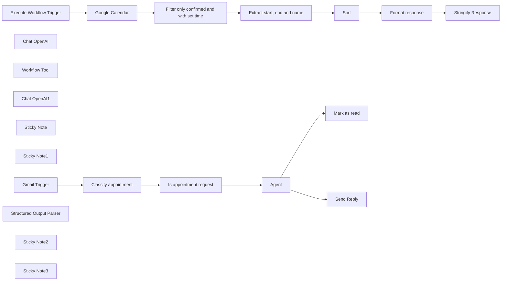

## Fluxo (.json) :

```json
{
  "id": "slP122GjD9meGkS6",
  "meta": {
    "instanceId": "178ef8a5109fc76c716d40bcadb720c455319f7b7a3fd5a39e4f336a091f524a"
  },
  "name": "Calendar_scheduling",
  "tags": [],
  "nodes": [
    {
      "id": "bd1dae81-daea-4539-bf1d-38eb9a2bd2f0",
      "name": "Gmail Trigger",
      "type": "n8n-nodes-base.gmailTrigger",
      "position": [
        500,
        560
      ],
      "parameters": {
        "filters": {
          "readStatus": "unread",
          "includeSpamTrash": false
        },
        "pollTimes": {
          "item": [
            {
              "mode": "everyMinute"
            }
          ]
        }
      },
      "credentials": {
        "gmailOAuth2": {
          "id": "kLFedNEM8Zwkergv",
          "name": "Gmail account"
        }
      },
      "typeVersion": 1
    },
    {
      "id": "a97c3ab1-6fbc-441e-af11-3c746936013b",
      "name": "Chat OpenAI",
      "type": "@n8n/n8n-nodes-langchain.lmChatOpenAi",
      "position": [
        720,
        740
      ],
      "parameters": {
        "model": "gpt-4",
        "options": {
          "temperature": 0.1
        }
      },
      "credentials": {
        "openAiApi": {
          "id": "wJtZwsVKW5v6R2Iy",
          "name": "OpenAi account"
        }
      },
      "typeVersion": 1
    },
    {
      "id": "a1205598-7cd4-4278-ad53-0cfc7c7947ff",
      "name": "Workflow Tool",
      "type": "@n8n/n8n-nodes-langchain.toolWorkflow",
      "position": [
        1580,
        759
      ],
      "parameters": {
        "name": "Calendar_Availability",
        "workflowId": "={{ $workflow.id }}",
        "description": "Call this tool to get my calendar availability as stringified JSON array."
      },
      "typeVersion": 1
    },
    {
      "id": "5ba2c2b0-2218-45d2-a417-f86c80643397",
      "name": "Chat OpenAI1",
      "type": "@n8n/n8n-nodes-langchain.lmChatOpenAi",
      "position": [
        1420,
        759
      ],
      "parameters": {
        "model": "gpt-4",
        "options": {
          "temperature": 0
        }
      },
      "credentials": {
        "openAiApi": {
          "id": "wJtZwsVKW5v6R2Iy",
          "name": "OpenAi account"
        }
      },
      "typeVersion": 1
    },
    {
      "id": "012835ec-c20a-4b84-bed8-67f6aac30698",
      "name": "Sticky Note",
      "type": "n8n-nodes-base.stickyNote",
      "position": [
        460,
        460
      ],
      "parameters": {
        "width": 616.8060552874073,
        "height": 410.24791575252334,
        "content": "## Check if incoming email is about appointment\nWe use LLM to check subject and body of the email and determine if it's an appointment request. "
      },
      "typeVersion": 1
    },
    {
      "id": "ceaa4f77-acc8-437e-9d61-16cf344a7748",
      "name": "Sticky Note1",
      "type": "n8n-nodes-base.stickyNote",
      "position": [
        1340,
        460
      ],
      "parameters": {
        "width": 676.1951194231482,
        "height": 241.70645019745504,
        "content": "## Get calendar availability and compose a response\nMake sure to update the Workflow ID if you are running this as 2 workflows"
      },
      "typeVersion": 1
    },
    {
      "id": "499def23-7dec-4131-91fd-326b1b824762",
      "name": "Google Calendar",
      "type": "n8n-nodes-base.googleCalendar",
      "position": [
        680,
        1120
      ],
      "parameters": {
        "options": {
          "timeMax": "={{ $now.plus(1, 'month').toISO() }}",
          "timeMin": "={{ $now.minus(1, 'day').toISO() }}",
          "singleEvents": true
        },
        "calendar": {
          "__rl": true,
          "mode": "list",
          "value": "your_email@gmail.com",
          "cachedResultName": "your_email@gmail.com"
        },
        "operation": "getAll",
        "returnAll": true
      },
      "credentials": {
        "googleCalendarOAuth2Api": {
          "id": "s95HsHIMB7oK0dAH",
          "name": "Google Calendar account"
        }
      },
      "typeVersion": 1
    },
    {
      "id": "0f5f43fa-3386-4682-b620-21db35651d3b",
      "name": "Execute Workflow Trigger",
      "type": "n8n-nodes-base.executeWorkflowTrigger",
      "position": [
        460,
        1120
      ],
      "parameters": {},
      "typeVersion": 1
    },
    {
      "id": "8b2b82b9-c11f-4e7f-ab23-16ea5e395e11",
      "name": "Format response",
      "type": "n8n-nodes-base.itemLists",
      "position": [
        1560,
        1120
      ],
      "parameters": {
        "include": "allFieldsExcept",
        "options": {},
        "aggregate": "aggregateAllItemData",
        "operation": "concatenateItems",
        "fieldsToExclude": "sort",
        "destinationFieldName": "response"
      },
      "typeVersion": 3
    },
    {
      "id": "ac363d85-5c6e-4a9f-9cfc-ecc15a325b01",
      "name": "Stringify Response",
      "type": "n8n-nodes-base.set",
      "position": [
        1780,
        1120
      ],
      "parameters": {
        "values": {
          "string": [
            {
              "name": "response",
              "value": "={{ JSON.stringify($json.response) }}"
            }
          ]
        },
        "options": {},
        "keepOnlySet": true
      },
      "typeVersion": 2
    },
    {
      "id": "399c5bc4-c8bd-4d0b-942a-9889447880a9",
      "name": "Extract start, end and name",
      "type": "n8n-nodes-base.set",
      "position": [
        1100,
        1120
      ],
      "parameters": {
        "values": {
          "string": [
            {
              "name": "start",
              "value": "={{ DateTime.fromISO($json.start.dateTime).toLocaleString(DateTime.DATE_HUGE) }}, {{ DateTime.fromISO($json.start.dateTime).toLocaleString(DateTime.TIME_24_WITH_SHORT_OFFSET) }}"
            },
            {
              "name": "end",
              "value": "={{ DateTime.fromISO($json.end.dateTime).toLocaleString(DateTime.DATE_HUGE) }}, {{ DateTime.fromISO($json.end.dateTime).toLocaleString(DateTime.TIME_24_WITH_SHORT_OFFSET) }}"
            },
            {
              "name": "name",
              "value": "={{ $json.summary }}"
            },
            {
              "name": "sort",
              "value": "={{ $json.start.dateTime }}"
            }
          ]
        },
        "options": {},
        "keepOnlySet": true
      },
      "typeVersion": 2
    },
    {
      "id": "a39b6c7d-fdcc-452d-9ef5-50b038153330",
      "name": "Filter only confirmed and with set time",
      "type": "n8n-nodes-base.filter",
      "position": [
        880,
        1120
      ],
      "parameters": {
        "conditions": {
          "string": [
            {
              "value1": "={{ $json.status }}",
              "value2": "confirmed"
            }
          ],
          "boolean": [
            {
              "value1": "={{ $json.start.dateTime }}",
              "value2": "={{ undefined }}",
              "operation": "notEqual"
            }
          ]
        }
      },
      "typeVersion": 1
    },
    {
      "id": "0e0a2be9-cde7-497d-94c5-180128382bb7",
      "name": "Is appointment request",
      "type": "n8n-nodes-base.if",
      "position": [
        1100,
        560
      ],
      "parameters": {
        "conditions": {
          "string": [
            {
              "value1": "={{ $json.is_appointment }}",
              "value2": "true"
            }
          ],
          "boolean": [
            {
              "value1": "={{ $json.is_appointment }}",
              "value2": true
            }
          ]
        },
        "combineOperation": "any"
      },
      "typeVersion": 1
    },
    {
      "id": "a6e11f63-a56a-4fe0-91c8-0dde2720e905",
      "name": "Classify appointment",
      "type": "@n8n/n8n-nodes-langchain.chainLlm",
      "position": [
        720,
        560
      ],
      "parameters": {
        "prompt": "=Please evaluate the following email to determine if it suggests scheduling a meeting or a call:\nSubject: {{ encodeURI($json.Subject) }}\nSnippet: {{ encodeURI($json.snippet) }}\nIndicate your assessment by responding with \"true\" if it suggests a meeting or call, or \"false\" otherwise. Use lowercase for your response.\n"
      },
      "typeVersion": 1
    },
    {
      "id": "b6411b14-67f6-4195-a834-60a4dc5e4851",
      "name": "Structured Output Parser",
      "type": "@n8n/n8n-nodes-langchain.outputParserStructured",
      "position": [
        880,
        740
      ],
      "parameters": {
        "jsonSchema": "{\n \"type\": \"object\",\n \"properties\": {\n \"is_appointment\": {\n \"type\": \"boolean\"\n }\n }\n}"
      },
      "typeVersion": 1
    },
    {
      "id": "96248431-290b-4fb1-94a3-714e7c0008d4",
      "name": "Sticky Note2",
      "type": "n8n-nodes-base.stickyNote",
      "position": [
        640,
        1058.6115582634225
      ],
      "parameters": {
        "width": 810.4923211935056,
        "height": 224.60561166142082,
        "content": "### Get all query google events for the next month and extract relevant data"
      },
      "typeVersion": 1
    },
    {
      "id": "48bc7c0c-0b74-418e-8c5c-6a6faf24722c",
      "name": "Sticky Note3",
      "type": "n8n-nodes-base.stickyNote",
      "position": [
        1513,
        1060
      ],
      "parameters": {
        "width": 444.4130232558142,
        "height": 220.42397542781927,
        "content": "### Wrap the result in `response` object and return "
      },
      "typeVersion": 1
    },
    {
      "id": "a68f7b27-1891-46c7-92b2-650cc17f94d6",
      "name": "Sort",
      "type": "n8n-nodes-base.itemLists",
      "position": [
        1320,
        1120
      ],
      "parameters": {
        "options": {},
        "operation": "sort",
        "sortFieldsUi": {
          "sortField": [
            {
              "fieldName": "sort"
            }
          ]
        }
      },
      "typeVersion": 3
    },
    {
      "id": "2b5b5855-6d3f-4405-9f48-5d6c4ee2475b",
      "name": "Mark as read",
      "type": "n8n-nodes-base.gmail",
      "position": [
        1840,
        739
      ],
      "parameters": {
        "messageId": "={{ $('Gmail Trigger').item.json.id }}",
        "operation": "markAsRead"
      },
      "credentials": {
        "gmailOAuth2": {
          "id": "kLFedNEM8Zwkergv",
          "name": "Gmail account"
        }
      },
      "typeVersion": 2.1
    },
    {
      "id": "accbe2df-367a-4bd3-a383-12ee79062e12",
      "name": "Send Reply",
      "type": "n8n-nodes-base.gmail",
      "position": [
        1840,
        539
      ],
      "parameters": {
        "message": "={{ $json.output }}",
        "options": {
          "replyToSenderOnly": true
        },
        "messageId": "={{ $('Gmail Trigger').item.json.id }}",
        "operation": "reply"
      },
      "credentials": {
        "gmailOAuth2": {
          "id": "kLFedNEM8Zwkergv",
          "name": "Gmail account"
        }
      },
      "typeVersion": 2
    },
    {
      "id": "66d62337-d0c1-4744-b169-8e95c1d1492a",
      "name": "Agent",
      "type": "@n8n/n8n-nodes-langchain.agent",
      "position": [
        1400,
        539
      ],
      "parameters": {
        "text": "=Sender: {{ $('Gmail Trigger').item.json.From }}\\nSubject: {{ $('Gmail Trigger').item.json.Subject }}\\nEmail Text: {{ $('Gmail Trigger').item.json.snippet }}",
        "options": {
          "systemMessage": "=You are an email scheduling assistant. Based on the received email, check my availability and propose an appropriate response. \nAim to get a specific time, rather than just a day. When checking my availability, make sure that there's enough time in between meetings.\nIf I'm not available, ALWAYS propose a new time based on my availability. When proposing a new time, always leave 15 minutes buffer from previous meeting.\nToday date and time is: {{ $now.toISO() }}."
        }
      },
      "typeVersion": 1
    }
  ],
  "active": false,
  "pinData": {},
  "settings": {
    "executionOrder": "v1"
  },
  "versionId": "0cf0768b-ddc0-42a3-9c84-f93d43c66dc7",
  "connections": {
    "Sort": {
      "main": [
        [
          {
            "node": "Format response",
            "type": "main",
            "index": 0
          }
        ]
      ]
    },
    "Agent": {
      "main": [
        [
          {
            "node": "Send Reply",
            "type": "main",
            "index": 0
          },
          {
            "node": "Mark as read",
            "type": "main",
            "index": 0
          }
        ]
      ]
    },
    "Chat OpenAI": {
      "ai_languageModel": [
        [
          {
            "node": "Classify appointment",
            "type": "ai_languageModel",
            "index": 0
          }
        ]
      ]
    },
    "Chat OpenAI1": {
      "ai_languageModel": [
        [
          {
            "node": "Agent",
            "type": "ai_languageModel",
            "index": 0
          }
        ]
      ]
    },
    "Gmail Trigger": {
      "main": [
        [
          {
            "node": "Classify appointment",
            "type": "main",
            "index": 0
          }
        ]
      ]
    },
    "Workflow Tool": {
      "ai_tool": [
        [
          {
            "node": "Agent",
            "type": "ai_tool",
            "index": 0
          }
        ]
      ]
    },
    "Format response": {
      "main": [
        [
          {
            "node": "Stringify Response",
            "type": "main",
            "index": 0
          }
        ]
      ]
    },
    "Google Calendar": {
      "main": [
        [
          {
            "node": "Filter only confirmed and with set time",
            "type": "main",
            "index": 0
          }
        ]
      ]
    },
    "Classify appointment": {
      "main": [
        [
          {
            "node": "Is appointment request",
            "type": "main",
            "index": 0
          }
        ]
      ]
    },
    "Is appointment request": {
      "main": [
        [
          {
            "node": "Agent",
            "type": "main",
            "index": 0
          }
        ]
      ]
    },
    "Execute Workflow Trigger": {
      "main": [
        [
          {
            "node": "Google Calendar",
            "type": "main",
            "index": 0
          }
        ]
      ]
    },
    "Structured Output Parser": {
      "ai_outputParser": [
        [
          {
            "node": "Classify appointment",
            "type": "ai_outputParser",
            "index": 0
          }
        ]
      ]
    },
    "Extract start, end and name": {
      "main": [
        [
          {
            "node": "Sort",
            "type": "main",
            "index": 0
          }
        ]
      ]
    },
    "Filter only confirmed and with set time": {
      "main": [
        [
          {
            "node": "Extract start, end and name",
            "type": "main",
            "index": 0
          }
        ]
      ]
    }
  }
}
```

<a id="template-1134"></a>

## Template 1134 - Inserir resumo AI em posts WordPress

- **Nome:** Inserir resumo AI em posts WordPress
- **Descrição:** Automatiza a geração e inserção de um bloco de resumo gerado por IA no início de posts do WordPress, registrando a ação e notificando a equipe.
- **Funcionalidade:** • Gatilhos flexíveis: permite execução manual para testes, agendada em intervalos ou via webhook para processamento em produção.
• Recuperação e preparação de conteúdo: obtém o conteúdo do post e converte HTML para Markdown para melhor processamento pela IA.
• Verificação preventiva com planilha: consulta uma planilha para evitar reprocessar posts já resumidos.
• Classificação de texto: analisa o conteúdo para detectar se já existe um resumo e evitar duplicações.
• Geração de resumo com IA: usa um modelo de linguagem para criar um bloco HTML padronizado contendo um resumo em tópicos.
• Atualização do post: insere o bloco de resumo no topo do artigo e atualiza o excerpt preservando trechos manuais quando aplicável.
• Registro e auditoria: adiciona uma linha na planilha com ID do post, resumo, links e timestamp para rastreabilidade.
• Notificação em equipe: envia mensagem a um canal com detalhes do post atualizado (título, link e links de edição).
• Processamento em lote: faz loop para processar múltiplos posts de forma sequencial quando necessário.
- **Ferramentas:** • WordPress: sistema de gerenciamento de conteúdo onde os posts são lidos e atualizados via API.
• OpenAI: modelo de linguagem usado para gerar o resumo em HTML conforme formato definido.
• Google Sheets: planilha usada como repositório de controle e histórico dos posts já resumidos.
• Slack: canal de comunicação para notificar a equipe sobre posts atualizados com resumo.


## Fluxo visual

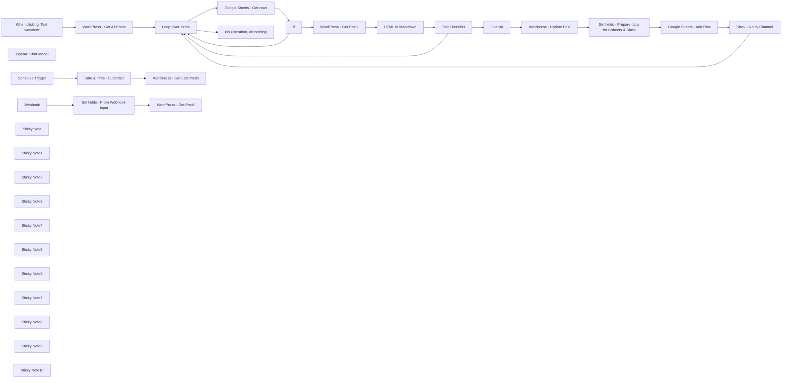

## Fluxo (.json) :

```json
{
  "id": "AhP1Fgv0eCrh9Jxs",
  "meta": {
    "instanceId": "b9faf72fe0d7c3be94b3ebff0778790b50b135c336412d28fd4fca2cbbf8d1f5",
    "templateCredsSetupCompleted": true
  },
  "name": "AI-Generated Summary Block for WordPress Posts - with OpenAI, WordPress, Google Sheets & Slack",
  "tags": [],
  "nodes": [
    {
      "id": "0733b902-6707-4548-9498-44993ed6a16c",
      "name": "When clicking ‘Test workflow’",
      "type": "n8n-nodes-base.manualTrigger",
      "position": [
        500,
        -780
      ],
      "parameters": {},
      "typeVersion": 1
    },
    {
      "id": "fa1fea27-c44d-4c8b-89ab-e7f84e91048f",
      "name": "Text Classifier",
      "type": "@n8n/n8n-nodes-langchain.textClassifier",
      "position": [
        5520,
        -800
      ],
      "parameters": {
        "options": {
          "systemPromptTemplate": "Analyze the provided text and classify it into one of the following categories: {categories}. \n- If the text contains an 'AI Summary', classify it as \"summarized\".\n- If the text does not contain an 'AI Summary', classify it as \"not_summarized\".\n\nFollow these instructions strictly:\n- Provide the result in JSON format.\n- Do not include any explanations, comments, or additional text.\n"
        },
        "inputText": "={{ $json.data }}",
        "categories": {
          "categories": [
            {
              "category": "not_summarized",
              "description": "Content that does not contain an 'AI Summary'."
            },
            {
              "category": "=summarized",
              "description": "Content that contains an 'AI Summary'."
            }
          ]
        }
      },
      "typeVersion": 1
    },
    {
      "id": "258d93f8-50db-4c95-8315-b7284100a426",
      "name": "OpenAI Chat Model",
      "type": "@n8n/n8n-nodes-langchain.lmChatOpenAi",
      "position": [
        5540,
        -600
      ],
      "parameters": {
        "options": {}
      },
      "credentials": {
        "openAiApi": {
          "id": "",
          "name": "OpenAi Connection"
        }
      },
      "typeVersion": 1.1
    },
    {
      "id": "7634cffa-0df8-4c11-84f4-c24cff652432",
      "name": "Loop Over Items",
      "type": "n8n-nodes-base.splitInBatches",
      "position": [
        2060,
        -780
      ],
      "parameters": {
        "options": {}
      },
      "typeVersion": 3
    },
    {
      "id": "1742dc9a-89b7-44f4-8ddb-5658fd34cadf",
      "name": "If",
      "type": "n8n-nodes-base.if",
      "position": [
        3660,
        -820
      ],
      "parameters": {
        "options": {},
        "conditions": {
          "options": {
            "version": 2,
            "leftValue": "",
            "caseSensitive": true,
            "typeValidation": "strict"
          },
          "combinator": "and",
          "conditions": [
            {
              "id": "44a27f03-4285-4771-a507-c55f029256e9",
              "operator": {
                "type": "number",
                "operation": "exists",
                "singleValue": true
              },
              "leftValue": "={{ $json.post_id }}",
              "rightValue": ""
            }
          ]
        }
      },
      "typeVersion": 2.2
    },
    {
      "id": "",
      "name": "Webhook",
      "type": "n8n-nodes-base.webhook",
      "disabled": true,
      "position": [
        500,
        -360
      ],
      "webhookId": "",
      "parameters": {
        "path": "4946fc26-bea4-4244-b37c-203c39537246",
        "options": {},
        "httpMethod": "POST",
        "authentication": "headerAuth"
      },
      "credentials": {
        "httpHeaderAuth": {
          "id": "",
          "name": "wp-webhook"
        }
      },
      "typeVersion": 2
    },
    {
      "id": "4c77eb08-e855-4a07-b76a-d5cea322fbca",
      "name": "Schedule Trigger",
      "type": "n8n-nodes-base.scheduleTrigger",
      "disabled": true,
      "position": [
        500,
        -600
      ],
      "parameters": {
        "rule": {
          "interval": [
            {
              "field": "seconds"
            }
          ]
        }
      },
      "typeVersion": 1.2
    },
    {
      "id": "cb1dce7c-6dfb-4435-aca8-013fdac58d43",
      "name": "Wordpress - Update Post",
      "type": "n8n-nodes-base.httpRequest",
      "position": [
        7920,
        -820
      ],
      "parameters": {
        "url": "=https://<your-domain.com>/wp-json/wp/v2/posts/{{ $('Loop Over Items').item.json.id }}",
        "method": "POST",
        "options": {},
        "sendBody": true,
        "authentication": "predefinedCredentialType",
        "bodyParameters": {
          "parameters": [
            {
              "name": "=content",
              "value": "={{ `${$json.message.content} ${$('Text Classifier').item.json.content.raw}` }}"
            },
            {
              "name": "excerpt",
              "value": "={{ $('Text Classifier').item.json.excerpt.rendered }}"
            }
          ]
        },
        "nodeCredentialType": "wordpressApi"
      },
      "credentials": {
        "wordpressApi": {
          "id": "",
          "name": ""
        }
      },
      "typeVersion": 4.2
    },
    {
      "id": "4aa026fd-29c3-4848-bfd1-98efba165b68",
      "name": "Google Sheets - Get rows",
      "type": "n8n-nodes-base.googleSheets",
      "position": [
        2920,
        -820
      ],
      "parameters": {
        "options": {},
        "filtersUI": {
          "values": [
            {
              "lookupValue": "={{ $json.id }}",
              "lookupColumn": "post_id"
            }
          ]
        },
        "sheetName": {
          "__rl": true,
          "mode": "list",
          "value": "gid=0",
          "cachedResultUrl": "https://docs.google.com/spreadsheets/d/1uO0zaNc5UrLhtdcvETFcZGln_qij-nqpYP06n9GxJUk/edit#gid=0",
          "cachedResultName": "AI-Summarized Posts"
        },
        "documentId": {
          "__rl": true,
          "mode": "list",
          "value": "1uO0zaNc5UrLhtdcvETFcZGln_qij-nqpYP06n9GxJUk",
          "cachedResultUrl": "https://docs.google.com/spreadsheets/d/1uO0zaNc5UrLhtdcvETFcZGln_qij-nqpYP06n9GxJUk/edit?usp=drivesdk",
          "cachedResultName": "Template - AI Summary WordPress Posts"
        },
        "authentication": "serviceAccount"
      },
      "credentials": {
        "googleApi": {
          "id": "",
          "name": "Google Sheets account"
        }
      },
      "typeVersion": 4.5,
      "alwaysOutputData": true
    },
    {
      "id": "0139af9a-5afc-4ac5-9631-4d217cdbc967",
      "name": "HTML to Markdown",
      "type": "n8n-nodes-base.markdown",
      "position": [
        4700,
        -800
      ],
      "parameters": {
        "html": "={{ $json.content.rendered }}",
        "options": {}
      },
      "typeVersion": 1
    },
    {
      "id": "3272ff54-9c8f-4003-bdf6-c16e8f4ba972",
      "name": "OpenAI",
      "type": "@n8n/n8n-nodes-langchain.openAi",
      "onError": "continueRegularOutput",
      "position": [
        7060,
        -820
      ],
      "parameters": {
        "modelId": {
          "__rl": true,
          "mode": "list",
          "value": "gpt-4o-mini",
          "cachedResultName": "GPT-4O-MINI"
        },
        "options": {},
        "messages": {
          "values": [
            {
              "content": "={{ $json.data }}"
            },
            {
              "role": "system",
              "content": "=You are an expert in content summarization and web-optimized writing.  \nYour mission is to analyze the HTML content of an article from a website focused on electric vehicles and green mobility and extract the key information.  \n\nGenerate only an HTML block containing a concise summary in bullet point format, strictly following this structure:\n\n\n<!-- wp:html -->\n<div class=\"wp-block-group has-background\" style=\"background-color:#f8faff; border-radius:4px; padding:10px;\">\n    <p style=\"font-style:normal; font-weight:1000; font-size:1.1em; margin:0 0 10px 0;\">\n        <strong>✨ AI Summary</strong> :\n    </p>\n\n    <li>[Key point 1]</li>\n    <li>[Key point 2]</li>\n    <li>[Key point 3]</li>\n    <li>[Key point 4]</li>\n\n</div>\n<!-- /wp:html -->\n\n<!-- wp:separator -->\n<hr class=\"wp-block-separator has-alpha-channel-opacity\"/>\n<!-- /wp:separator -->\n\n## Important: Strict Guidelines to Follow\n\n- Ensure the summary is **clear, concise, and informative**, focusing only on key points.  \n- **Avoid unnecessary introductions**, such as \"This article presents\" or similar phrases.  \n- **Output only the required HTML block**, without any additional explanations or commentary.  \n- The output must **start with** the `<!-- wp:html -->` tag and **end with** the closing separator tag.  \n- The summary must be **in the user's language**, including the phrase `\"✨ AI Summary\"`, which should also be translated accordingly.  \n- **Do not add** any extra text, comments, or formatting outside the specified HTML block.  \n\n\n## Example of a GOOD output:\n\n<!-- wp:html -->\n<div class=\"wp-block-group has-background\" style=\"background-color:#f8faff; border-radius:4px; padding:10px;\">\n    <p style=\"font-style:normal; font-weight:1000; font-size:1.1em; margin:0 0 10px 0;\">\n        <strong>✨ AI Summary</strong> :\n    </p>\n\n    <li>In March 2022, France had 43,700 public charging points for electric vehicles.</li>\n    <li>Half of the highway service areas are equipped with ultra-fast charging stations.</li>\n    <li>France is among the most equipped European countries, with 20% of the charging points in Europe.</li>\n    <li>The goal is to reach 100,000 charging stations to support future demand for electric vehicles.</li>\n\n</div>\n<!-- /wp:html -->\n\n<!-- wp:separator -->\n<hr class=\"wp-block-separator has-alpha-channel-opacity\"/>\n<!-- /wp:separator -->\n\n## Example of a BAD output:\n```html\n<!-- wp:html -->\n<div class=\"wp-block-group has-background\" style=\"background-color:#f8faff; border-radius:4px; padding:10px;\">\n    <p style=\"font-style:normal; font-weight:1000; font-size:1.1em; margin:0 0 10px 0;\">\n        <strong>✨ AI Summary</strong> :\n    </p>\n\n    <li>In March 2022, France had 43,700 public charging points for electric vehicles.</li>\n    <li>Half of the highway service areas are equipped with ultra-fast charging stations.</li>\n    <li>France is among the most equipped European countries, with 20% of the charging points in Europe.</li>\n    <li>The goal is to reach 100,000 charging stations to support future demand for electric vehicles.</li>\n\n</div>\n<!-- /wp:html -->\n```"
            }
          ]
        }
      },
      "credentials": {
        "openAiApi": {
          "id": "",
          "name": "OpenAi Connection"
        }
      },
      "retryOnFail": true,
      "typeVersion": 1.8
    },
    {
      "id": "f35a0520-9b88-4840-bdff-970a15a8d691",
      "name": "Google Sheets - Add Row",
      "type": "n8n-nodes-base.googleSheets",
      "position": [
        9680,
        -820
      ],
      "parameters": {
        "columns": {
          "value": {
            "post_id": "={{ $json.id }}",
            "summary": "={{$json.ai_summary}}",
            "edit_link": "={{ $json.edit_link }}",
            "post_link": "={{ $json.link }}",
            "summarized_date": "={{$now}}"
          },
          "schema": [
            {
              "id": "post_id",
              "type": "string",
              "display": true,
              "removed": false,
              "required": false,
              "displayName": "post_id",
              "defaultMatch": false,
              "canBeUsedToMatch": true
            },
            {
              "id": "summary",
              "type": "string",
              "display": true,
              "removed": false,
              "required": false,
              "displayName": "summary",
              "defaultMatch": false,
              "canBeUsedToMatch": true
            },
            {
              "id": "post_link",
              "type": "string",
              "display": true,
              "removed": false,
              "required": false,
              "displayName": "post_link",
              "defaultMatch": false,
              "canBeUsedToMatch": true
            },
            {
              "id": "edit_link",
              "type": "string",
              "display": true,
              "removed": false,
              "required": false,
              "displayName": "edit_link",
              "defaultMatch": false,
              "canBeUsedToMatch": true
            },
            {
              "id": "summarized_date",
              "type": "string",
              "display": true,
              "removed": false,
              "required": false,
              "displayName": "summarized_date",
              "defaultMatch": false,
              "canBeUsedToMatch": true
            }
          ],
          "mappingMode": "autoMapInputData",
          "matchingColumns": [
            "post_id"
          ],
          "attemptToConvertTypes": false,
          "convertFieldsToString": false
        },
        "options": {},
        "operation": "append",
        "sheetName": {
          "__rl": true,
          "mode": "list",
          "value": "gid=0",
          "cachedResultUrl": "https://docs.google.com/spreadsheets/d/1uO0zaNc5UrLhtdcvETFcZGln_qij-nqpYP06n9GxJUk/edit#gid=0",
          "cachedResultName": "AI-Summarized Posts"
        },
        "documentId": {
          "__rl": true,
          "mode": "list",
          "value": "1uO0zaNc5UrLhtdcvETFcZGln_qij-nqpYP06n9GxJUk",
          "cachedResultUrl": "https://docs.google.com/spreadsheets/d/1uO0zaNc5UrLhtdcvETFcZGln_qij-nqpYP06n9GxJUk/edit?usp=drivesdk",
          "cachedResultName": "Template - AI Summary WordPress Posts"
        },
        "authentication": "serviceAccount"
      },
      "credentials": {
        "googleApi": {
          "id": "",
          "name": "Google Sheets account"
        }
      },
      "typeVersion": 4.5
    },
    {
      "id": "57fd5aaf-4a43-458b-8842-72e3289c7dca",
      "name": "Slack - Notify Channel",
      "type": "n8n-nodes-base.slack",
      "position": [
        9700,
        -540
      ],
      "webhookId": "ab3305f2-3cb8-44f4-b2e6-fb628baf1d6d",
      "parameters": {
        "text": "=📄🔔 *New WordPress Post Updated with AI Summary*\n\nThe post *{{ $('Set fields - Prepare data for Gsheets & Slack').item.json.title }}* has been updated with an AI-generated summary at the top of the article.  \nYou can view it here: {{ $('Set fields - Prepare data for Gsheets & Slack').item.json.post_link }}\n\n• *Post ID*: {{ $('Set fields - Prepare data for Gsheets & Slack').item.json.post_id }}\n• *Edit Link*: {{ $('Set fields - Prepare data for Gsheets & Slack').item.json.edit_link }}\n",
        "select": "channel",
        "channelId": {
          "__rl": true,
          "mode": "list",
          "value": "C08AN5DJLCT",
          "cachedResultName": "wp-posts-ai"
        },
        "otherOptions": {
          "mrkdwn": true
        },
        "authentication": "oAuth2"
      },
      "credentials": {
        "slackOAuth2Api": {
          "id": "",
          "name": "slack-topic-monitoring-dtk"
        }
      },
      "typeVersion": 2.3
    },
    {
      "id": "29669a57-4104-4328-a834-0b07724fe245",
      "name": "Set fields - From Webhook input",
      "type": "n8n-nodes-base.set",
      "position": [
        700,
        -360
      ],
      "parameters": {
        "options": {},
        "assignments": {
          "assignments": [
            {
              "id": "eae4bb6e-0215-4338-9590-f4b6de6f57a4",
              "name": "post_id",
              "type": "string",
              "value": "={{ $json.body.post_id }}"
            }
          ]
        }
      },
      "typeVersion": 3.4
    },
    {
      "id": "937d0f8b-a71e-47f0-95de-cdbb9599c524",
      "name": "Sticky Note",
      "type": "n8n-nodes-base.stickyNote",
      "position": [
        400,
        -1720
      ],
      "parameters": {
        "color": 7,
        "width": 680,
        "height": 1560,
        "content": "## Trigger - Two Options\nTo use this workflow, you have two trigger options.\n\nThe default trigger is **\"When clicking 'Test workflow'\"**, allowing you to manually test the scenario.\n\nIf you want to use this workflow in production, you can choose one of the following triggers. You'll need to **select the one you prefer and enable it**.:\n\n### Schedule Trigger  \nThis trigger checks at regular intervals (e.g., every 5 minutes) if a new post has been published on your WordPress blog and triggers the workflow accordingly.  \n\n✅ **Easy to set up**  \n✅ **Automates AI summaries without manual intervention**  \n\n⚠️ If you run the workflow manually once, the AI-generated summaries will be added to Google Sheets and processed in later steps to prevent duplication.  \n\n💡 **Recommended follow-up nodes:** If you choose this trigger, the following nodes are suggested in the template:  \n- **`Date & Time - Subtract`**: Subtracts the scheduled interval from the current execution timestamp. For example, if the workflow runs every 5 minutes, it subtracts 5 minutes from the execution time.  \n- **`WordPress - Get Posts`**: Uses the output of the  `Date & Time - Subtract` node as a filter to retrieve only posts published after the last execution.  \n\n### Webhook Trigger  \nIf you're familiar with webhooks, you can set up a webhook that triggers when a new post is published.  \n\n✅ **Faster than scheduled triggers**  \n✅ **More event-driven**  \n\nYou can implement this using either:  \n- A **Webhook plugin** on WordPress (not recommended due to plugin dependency).  \n- A **PHP function** that triggers the webhook with authentication for security.  \n\n⚠️ **Be cautious** with how the webhook is triggered—you may not want it to fire on every post edit.  \n\n💡 **Recommended follow-up nodes for this option:**  \n- **`Set Fields - From Webhook Input`**: Configures the fields based on the data sent to the webhook.  \n- **`WordPress - Get Post`**: Retrieves the post using the `post_id` received from the webhook, ensuring higher accuracy than the schedule trigger approach.  \n"
      },
      "typeVersion": 1
    },
    {
      "id": "b42aa922-bf5d-4b09-8a05-ab88ec304dca",
      "name": "Date & Time - Substract",
      "type": "n8n-nodes-base.dateTime",
      "position": [
        720,
        -600
      ],
      "parameters": {
        "options": {},
        "duration": 30,
        "timeUnit": "seconds",
        "magnitude": "={{ $json.timestamp }}",
        "operation": "subtractFromDate",
        "outputFieldName": "last_execution_date"
      },
      "typeVersion": 2
    },
    {
      "id": "0f6ada76-9195-4d2e-95be-86ea1c4f368a",
      "name": "Sticky Note1",
      "type": "n8n-nodes-base.stickyNote",
      "position": [
        1220,
        -1240
      ],
      "parameters": {
        "color": 7,
        "width": 600,
        "height": 1080,
        "content": "## WordPress - Get All Posts  \n\nThis node is used for the **initial/test run**. In production, you should use the WordPress node that follows the **Scheduled Trigger** or **Webhook Trigger** instead.  \n\nIt retrieves all existing WordPress posts to generate an AI Summary.  \n\n### 🔹 Considerations:  \n- In this template, the query is **limited to 5 posts** to prevent accidental large-scale execution. This makes it easier to fix any issues.  \n- You can **add filters** (category, tag, date, etc.) to target only the posts for which you want an AI Summary.  \n- You can enable the **\"Get All Posts\"** option in the node if you want summaries for all posts—**but make sure this is intentional**.  \n- The **more posts** you process, the **higher the cost** in OpenAI API usage.  \n"
      },
      "typeVersion": 1
    },
    {
      "id": "e806547f-6bd5-4251-9dad-ffb36b435d15",
      "name": "Sticky Note2",
      "type": "n8n-nodes-base.stickyNote",
      "position": [
        1960,
        -1240
      ],
      "parameters": {
        "color": 7,
        "width": 620,
        "height": 1080,
        "content": "## Loop Over Items  \n\nSince multiple posts may be retrieved from the previous step, a **\"Loop Over Items\"** node is used to process each post individually, optimizing the execution of subsequent nodes.  \n\n### 🔹 In Production - Using the \"Schedule Trigger\"  \nYou can continue using the **\"Loop Over Items\"** approach in production. Depending on your **publication frequency** and the **schedule interval** you've chosen, multiple posts could be retrieved in a single execution. This ensures each post is processed sequentially.  \n\n### 🔹 In Production - Using the \"Webhook Trigger\"  \nWith a **Webhook Trigger**, the workflow typically runs for **one post at a time**, meaning the **\"Loop Over Items\"** node is not strictly necessary.  \n\n- **You can remove it** for a slightly more efficient workflow.  \n- **However, keeping it won’t cause any issues**—it will simply loop over one item instead of multiple.  \n"
      },
      "typeVersion": 1
    },
    {
      "id": "1370d44f-3aaa-4b8d-96d8-94269cb084b4",
      "name": "Sticky Note3",
      "type": "n8n-nodes-base.stickyNote",
      "position": [
        2660,
        -1240
      ],
      "parameters": {
        "color": 7,
        "width": 1240,
        "height": 1080,
        "content": "## Google Sheets - Get Rows & IF Nodes  \n\nThis step is used to **check whether a post already has an AI Summary**.   \n\nFor the Google Sheets node, you can **[make a copy of this Google Sheets template](https://docs.google.com/spreadsheets/d/1uO0zaNc5UrLhtdcvETFcZGln_qij-nqpYP06n9GxJUk/)** by going to **File → Make a copy**.\n\n\n### 🔹 How It Works:  \n1. **On the first execution**, posts retrieved from WordPress and processed for AI summarization are added to a **Google Sheet**.  \n2. **On subsequent executions**, when the workflow retrieves new posts, it checks if the `post_id` is already recorded in Google Sheets.  \n\n### 🔹 IF Node Logic:  \n- ✅ **If a row exists for the `post_id`** → The post already has an AI Summary. The workflow **skips processing** and moves to the `\"Loop Over Items\"` node.  \n- ❌ **If no row exists for the `post_id`** → The post **does not have an AI Summary**, so the workflow continues along the execution path that leads to AI Summary generation.  \n"
      },
      "typeVersion": 1
    },
    {
      "id": "b500e31d-7bd6-4c4d-ba54-60a034d218e3",
      "name": "Sticky Note4",
      "type": "n8n-nodes-base.stickyNote",
      "position": [
        4000,
        -1240
      ],
      "parameters": {
        "color": 7,
        "width": 1140,
        "height": 1080,
        "content": "## WordPress - Get Post & HTML to Markdown Nodes  \n\nThis step retrieves the WordPress post data using the `post_id` and converts the HTML content to Markdown. This ensures that the text is formatted in a **clean and structured way** before being sent to the **Text Classifier** node (which works with AI). More details about this step are provided in the next sticky note.  \n\n### 🔹 WordPress - Get Post  \n- The **`context=edit`** option is enabled to retrieve the **raw** post data.  \n- This is necessary because the post content will be **updated later in the workflow**.  \n\n### 🔹 HTML to Markdown  \n- Converts the retrieved HTML content into **Markdown** format.  \n- This makes the text **easier to process** for the LLM (Large Language Model) in the next step.  \n- Markdown ensures that the AI better understands the structure and formatting of the content.  \n"
      },
      "typeVersion": 1
    },
    {
      "id": "249feb0b-6503-4eb1-88d8-c93764a77f33",
      "name": "Sticky Note5",
      "type": "n8n-nodes-base.stickyNote",
      "position": [
        5240,
        -1240
      ],
      "parameters": {
        "color": 7,
        "width": 1140,
        "height": 1080,
        "content": "## Text Classifier  \n\nThis step **classifies posts into categories**:  \n\n- **`not_summarized`** → If the post **does not** have a summary, the following nodes execute the AI summary generation.  \n- **`summarized`** → If the post **already** has a summary, the workflow **skips processing**:  \n  - The workflow moves to `\"Loop Over Items\"`.  \n  - The `\"Done\"` branch goes to the `\"Do Nothing\"` node.  \n\nThe LLM model used is **`gpt-4o-mini`**—it's efficient and cost-effective, but you can choose another model if needed.  \n\n### 🔹 Why Use a Text Classifier?  \nThe previous node already filters posts **based on Google Sheets**, but adding this classification step makes the workflow even **more robust**:  \n\n- ✅ **Extra validation**: If a post already has an AI Summary but, for some reason, is **not listed in Google Sheets**, this step **prevents duplicate summaries**.  \n- ✅ **Avoids redundancy**: If a post already contains a **manual or pre-existing summary** at the top (not necessarily AI-generated), this step prevents adding an AI Summary that would be redundant.  \n"
      },
      "typeVersion": 1
    },
    {
      "id": "ba3ef8b6-5826-4b2b-9bfc-b8f7c9645192",
      "name": "Sticky Note6",
      "type": "n8n-nodes-base.stickyNote",
      "position": [
        6480,
        -1240
      ],
      "parameters": {
        "color": 7,
        "width": 1100,
        "height": 1080,
        "content": "## OpenAI - Message a Model  \n\nThis step sends the **Markdown-formatted post** to **GPT-4o-mini**, using a **System Prompt** to instruct the LLM to generate an AI Summary.  \nYou can review and modify the **System Prompt** directly within this node.  \n\n### 🔹 Customization Required  \nTo ensure optimal results, you should:  \n- **Specify your website's theme** in the system prompt. The default example uses **electric mobility**, but you can replace it with a more relevant theme (e.g., **\"sustainable mobility\"**, \"urban transport,\" etc.).  \n- **Modify the \"Good\" and \"Bad\" output examples**—since the template is pre-configured for electric mobility, make sure to adapt the examples to match your content.  \n\n### 🔹 Output Format  \nThe model is instructed to return the summary in **HTML format**, which will be used to update the WordPress post.  \n\n💡 **Customization Tip**:  \nYou may want to adjust the **HTML styling** to better match your WordPress theme.  \nConsider modifying the following elements:  \n- **Background color, text color, and font weight**  \n- **Section title** (e.g., rename `\"AI Summary\"`)  \n- **Padding, margins, and border styling**  \n- **Removing or customizing the separator**  \n\n\n\n\n\n\n\n\n\n\n### 🔹 Default Generated HTML  \n\n***\n\n<!-- wp:html -->\n<div class=\"wp-block-group has-background\" style=\"background-color:#f8faff; border-radius:4px; padding:10px;\">\n    <p style=\"font-style:normal; font-weight:1000; font-size:1.1em; margin:0 0 10px 0;\">\n        <strong>✨ AI Summary</strong> :\n    </p>\n\n    <li>[Key point 1]</li>\n    <li>[Key point 2]</li>\n    <li>[Key point 3]</li>\n    <li>[Key point 4]</li>\n\n</div>\n<!-- /wp:html -->\n\n<!-- wp:separator -->\n<hr class=\"wp-block-separator has-alpha-channel-opacity\"/>\n<!-- /wp:separator -->\n\n***"
      },
      "typeVersion": 1
    },
    {
      "id": "80f2ccc9-3142-4e0c-9a6c-49b78baedec5",
      "name": "Sticky Note7",
      "type": "n8n-nodes-base.stickyNote",
      "position": [
        7660,
        -1240
      ],
      "parameters": {
        "color": 7,
        "width": 640,
        "height": 1080,
        "content": "## WordPress - Update Post  \n\nThis API call updates the **WordPress post** and its **excerpt**.  \n\n**https://<your-domain.com>/wp-json/wp/v2/posts/{{ $('Loop Over Items').item.json.id }}**\n\n\n### 🔹 What It Does  \n- **Adds the AI Summary** at the **top** of the post.  \n- **Updates the post excerpt** using data retrieved from the `WordPress - Get Post2` node:  \n- If a **manual excerpt** exists, it is **preserved**.  \n- If the excerpt was simply the **beginning of the article**, it remains unchanged.  \n- This prevents the **AI Summary from replacing the excerpt**, ensuring a **better user experience** on your blog’s article listing page.  \n"
      },
      "typeVersion": 1
    },
    {
      "id": "45966c07-b20c-485e-96eb-5164165caf27",
      "name": "Sticky Note8",
      "type": "n8n-nodes-base.stickyNote",
      "position": [
        8400,
        -1240
      ],
      "parameters": {
        "color": 7,
        "width": 640,
        "height": 1080,
        "content": "## Set Fields - Prepare Data for Google Sheets & Slack  \n\nThis node **sets fields** that will be used in **Google Sheets** and **Slack**.  \nYou can **add or modify fields** as needed to fit your specific use case.  \n### 🔹 Default Fields in This Template:  \nThe following fields are pre-configured:  \n- **`post_id`** → The WordPress post ID (`{{ $json.id }}`)  \n- **`title`** → The rendered title of the post (`{{ $json.title.rendered }}`)  \n- **`post_link`** → The direct URL to the post (`{{ $json.link }}`)  \n- **`edit_link`** → A direct link to edit the post in WordPress (**https://<your-domain>/wp-admin/post.php?post=`{{ $json.id }}`&action=edit**)  \n- **`summary`** → The AI-generated summary from the OpenAI node (`{{ $('OpenAI').item.json.message.content }}`)  \n- **`summary_date`** → The date and time when the AI Summary was generated and added to the post.\n\n\n\n\n\n\n\n\n\n\n\n\n\n\n\n\n\n💡 **Customization Tip**:  \n- You can **add additional fields** if you want to include more data (e.g., **post category, author name, publication date**).  \n- This step ensures that the necessary information is properly structured before sending it to **Google Sheets** and **Slack**.  \n"
      },
      "typeVersion": 1
    },
    {
      "id": "5e68e256-d089-4a1d-8967-99215b076a5b",
      "name": "Set fields - Prepare data for Gsheets & Slack",
      "type": "n8n-nodes-base.set",
      "position": [
        8680,
        -820
      ],
      "parameters": {
        "options": {},
        "assignments": {
          "assignments": [
            {
              "id": "d7104604-20f0-4a43-a9bb-6fca50e0cd04",
              "name": "post_id",
              "type": "string",
              "value": "={{ $json.id }}"
            },
            {
              "id": "4fd77b52-80b4-418b-af50-2af563799772",
              "name": "title",
              "type": "string",
              "value": "={{ $json.title.rendered }}"
            },
            {
              "id": "a7c0f1d4-3299-4fdc-8bc2-2ff5a76547d3",
              "name": "post_link",
              "type": "string",
              "value": "={{ $json.link }}"
            },
            {
              "id": "3c0d7efd-5db9-4e3b-8688-7c00f9691391",
              "name": "edit_link",
              "type": "string",
              "value": "=https://<your-domain.com>/wp-admin/post.php?post={{ $json.id }}&action=edit"
            },
            {
              "id": "aef982ed-b470-4690-b585-74d765a4b49f",
              "name": "summary",
              "type": "string",
              "value": "={{ $('OpenAI').item.json.message.content }}"
            },
            {
              "id": "38933eca-dad8-4949-a22b-0e35c9e5c99e",
              "name": "summary_date",
              "type": "string",
              "value": "={{ $now }}"
            }
          ]
        }
      },
      "typeVersion": 3.4
    },
    {
      "id": "7ca77ff2-9e21-4e32-8d23-de3a549b4a6d",
      "name": "Sticky Note9",
      "type": "n8n-nodes-base.stickyNote",
      "position": [
        9140,
        -1240
      ],
      "parameters": {
        "color": 7,
        "width": 600,
        "height": 1080,
        "content": "## Google Sheets - Add Row & Slack - Notify  \n\nThis step **logs the post with an AI Summary** into **Google Sheets** and **sends a notification** to Slack.  \n\nFor the Google Sheets node, you can **[make a copy of this Google Sheets template](https://docs.google.com/spreadsheets/d/1uO0zaNc5UrLhtdcvETFcZGln_qij-nqpYP06n9GxJUk/)** by going to **File → Make a copy**.\n\n\n---\n\n### 🔹 Google Sheets - Add Row  \n\nThis node **automatically maps the columns** in Google Sheets, meaning you **don't need to manually define each field**.  \n\n#### 🛠 **Configuration Details**  \n- **Google Sheets Document** → `AI Summary WordPress`  \n- **Sheet Name** → `AI Summarized Posts`  \n- **Mapping Mode** → **Auto-map columns based on field names**  \n- **Automatically added fields** (examples, based on your setup):  \n  - `post_id`  \n  - `summary`  \n  - `post_link`  \n  - `edit_link`  \n  - `summary_date`  \n\n💡 **Since columns are mapped automatically, ensure the column names in Google Sheets match the field names in n8n.**  \n\n---\n\n### 🔹 Slack - Notify  \n\nThis node **sends a message to Slack** when a post has been updated with an **AI Summary**.  \n\n#### 🛠 **Configuration Details**  \n- **Channel** → `wp-posts-ai` (you can choose another channel)  \n- **Message Format** → Simple Text Message  \n- **Notification Text** -> *Configured inside the node* (check the \"Message Text\" field)\n\n\n💡 **Best Practices**:  \n- 🔕 *On the first execution, consider **deactivating** this node if you have many posts to avoid excessive notifications.*  \n- 📢 *Consider **creating a dedicated Slack channel** for this workflow to keep AI summary updates separate from other discussions.*  \n\n"
      },
      "typeVersion": 1
    },
    {
      "id": "64199b71-a5b2-46f1-a761-22b053e95640",
      "name": "WordPress - Get Post2",
      "type": "n8n-nodes-base.wordpress",
      "position": [
        4160,
        -800
      ],
      "parameters": {
        "postId": "={{ $('Loop Over Items').item.json.id }}",
        "options": {
          "context": "edit"
        },
        "operation": "get"
      },
      "credentials": {
        "wordpressApi": {
          "id": "",
          "name": ""
        }
      },
      "typeVersion": 1
    },
    {
      "id": "81f22a4b-b016-463c-a4e3-8468cab007a9",
      "name": "No Operation, do nothing",
      "type": "n8n-nodes-base.noOp",
      "position": [
        2900,
        -1480
      ],
      "parameters": {},
      "typeVersion": 1
    },
    {
      "id": "ec397ed4-2ccb-4407-a227-46ad2383e618",
      "name": "Sticky Note10",
      "type": "n8n-nodes-base.stickyNote",
      "position": [
        -380,
        -1560
      ],
      "parameters": {
        "width": 660,
        "height": 1100,
        "content": "# 📝 AI-Generated Summary Block for WordPress Posts  \n\n## 🚀 What is this workflow?  \nThis **n8n template** automates the process of adding an **AI-generated summary** at the top of your WordPress posts.  \nIt **retrieves, processes, and updates** your posts dynamically, ensuring efficiency and flexibility without relying on a heavy WordPress plugin.  \n\n## Example of AI Summary Section\n\n  \n\n## 🔄 How It Works  \n1. **Triggers** → Runs on a **scheduled interval** or via a **webhook** when a new post is published.  \n2. **Retrieves posts** → Fetches content from WordPress and converts HTML to Markdown for AI processing.  \n3. **AI Summary Generation** → Uses OpenAI to create a concise summary.  \n4. **Post Update** → Inserts the summary at the top of the post while keeping the original excerpt intact.  \n5. **Data Logging & Notifications** → Saves processed posts to **Google Sheets** and notifies a **Slack channel**.  \n\n## 🎯 Why use this workflow?  \n✅ **No need for a WordPress plugin** → Keeps your site lightweight.  \n✅ **Highly flexible** → Easily connect with **Google Sheets, Slack, or other services**.  \n✅ **Customizable** → Adapt AI prompts, formatting, and integrations to your needs.  \n✅ **Smart filtering** → Ensures posts are not reprocessed unnecessarily.  \n\n💡 *Check the detailed sticky notes for setup instructions and customization options!*  \n"
      },
      "typeVersion": 1
    },
    {
      "id": "9522e130-608c-4162-ac2e-3f67e216579e",
      "name": "WordPress - Get Last Posts",
      "type": "n8n-nodes-base.wordpress",
      "position": [
        960,
        -600
      ],
      "parameters": {
        "options": {
          "after": "={{ $json.last_execution_date }}",
          "context": "edit"
        },
        "operation": "getAll"
      },
      "credentials": {
        "wordpressApi": {
          "id": "",
          "name": ""
        }
      },
      "typeVersion": 1
    },
    {
      "id": "03e20423-7b5d-43ff-a241-bffa9b4c5172",
      "name": "WordPress - Get Post1",
      "type": "n8n-nodes-base.wordpress",
      "position": [
        960,
        -360
      ],
      "parameters": {
        "postId": "={{ $json.post_id }}",
        "options": {
          "context": "edit"
        },
        "operation": "get"
      },
      "credentials": {
        "wordpressApi": {
          "id": "",
          "name": ""
        }
      },
      "typeVersion": 1
    },
    {
      "id": "43963f56-ba75-4784-aebb-ebf72d075bfc",
      "name": "WordPress - Get All Posts",
      "type": "n8n-nodes-base.wordpress",
      "position": [
        1440,
        -780
      ],
      "parameters": {
        "options": {
          "order": "desc",
          "context": "edit",
          "orderBy": "date"
        },
        "operation": "getAll"
      },
      "credentials": {
        "wordpressApi": {
          "id": "",
          "name": ""
        }
      },
      "typeVersion": 1
    }
  ],
  "active": false,
  "pinData": {},
  "settings": {
    "executionOrder": "v1"
  },
  "versionId": "8db35c46-bc7e-4198-95d5-f99b6bbc70c3",
  "connections": {
    "If": {
      "main": [
        [
          {
            "node": "Loop Over Items",
            "type": "main",
            "index": 0
          }
        ],
        [
          {
            "node": "WordPress - Get Post2",
            "type": "main",
            "index": 0
          }
        ]
      ]
    },
    "OpenAI": {
      "main": [
        [
          {
            "node": "Wordpress - Update Post",
            "type": "main",
            "index": 0
          }
        ]
      ]
    },
    "Webhook": {
      "main": [
        [
          {
            "node": "Set fields - From Webhook input",
            "type": "main",
            "index": 0
          }
        ]
      ]
    },
    "Loop Over Items": {
      "main": [
        [
          {
            "node": "No Operation, do nothing",
            "type": "main",
            "index": 0
          }
        ],
        [
          {
            "node": "Google Sheets - Get rows",
            "type": "main",
            "index": 0
          }
        ]
      ]
    },
    "Text Classifier": {
      "main": [
        [
          {
            "node": "OpenAI",
            "type": "main",
            "index": 0
          }
        ],
        [
          {
            "node": "Loop Over Items",
            "type": "main",
            "index": 0
          }
        ]
      ]
    },
    "HTML to Markdown": {
      "main": [
        [
          {
            "node": "Text Classifier",
            "type": "main",
            "index": 0
          }
        ]
      ]
    },
    "Schedule Trigger": {
      "main": [
        [
          {
            "node": "Date & Time - Substract",
            "type": "main",
            "index": 0
          }
        ]
      ]
    },
    "OpenAI Chat Model": {
      "ai_languageModel": [
        [
          {
            "node": "Text Classifier",
            "type": "ai_languageModel",
            "index": 0
          }
        ]
      ]
    },
    "WordPress - Get Post1": {
      "main": [
        []
      ]
    },
    "WordPress - Get Post2": {
      "main": [
        [
          {
            "node": "HTML to Markdown",
            "type": "main",
            "index": 0
          }
        ]
      ]
    },
    "Slack - Notify Channel": {
      "main": [
        [
          {
            "node": "Loop Over Items",
            "type": "main",
            "index": 0
          }
        ]
      ]
    },
    "Date & Time - Substract": {
      "main": [
        [
          {
            "node": "WordPress - Get Last Posts",
            "type": "main",
            "index": 0
          }
        ]
      ]
    },
    "Google Sheets - Add Row": {
      "main": [
        [
          {
            "node": "Slack - Notify Channel",
            "type": "main",
            "index": 0
          }
        ]
      ]
    },
    "Wordpress - Update Post": {
      "main": [
        [
          {
            "node": "Set fields - Prepare data for Gsheets & Slack",
            "type": "main",
            "index": 0
          }
        ]
      ]
    },
    "Google Sheets - Get rows": {
      "main": [
        [
          {
            "node": "If",
            "type": "main",
            "index": 0
          }
        ]
      ]
    },
    "WordPress - Get All Posts": {
      "main": [
        [
          {
            "node": "Loop Over Items",
            "type": "main",
            "index": 0
          }
        ]
      ]
    },
    "WordPress - Get Last Posts": {
      "main": [
        []
      ]
    },
    "Set fields - From Webhook input": {
      "main": [
        [
          {
            "node": "WordPress - Get Post1",
            "type": "main",
            "index": 0
          }
        ]
      ]
    },
    "When clicking ‘Test workflow’": {
      "main": [
        [
          {
            "node": "WordPress - Get All Posts",
            "type": "main",
            "index": 0
          }
        ]
      ]
    },
    "Set fields - Prepare data for Gsheets & Slack": {
      "main": [
        [
          {
            "node": "Google Sheets - Add Row",
            "type": "main",
            "index": 0
          }
        ]
      ]
    }
  }
}
```

<a id="template-1135"></a>

## Template 1135 - Fechamento automático de tickets JIRA inativos

- **Nome:** Fechamento automático de tickets JIRA inativos
- **Descrição:** Este fluxo identifica issues JIRA não resolvidas por mais de 7 dias, analisa o histórico de comentários com IA, tenta resolver automaticamente usando a base de conhecimento, envia lembretes ou notifica a equipe e fecha ou atualiza os tickets conforme apropriado.
- **Funcionalidade:** • Busca de issues antigas: Pesquisa issues não resolvidas criadas há 7 dias ou mais.
• Processamento paralelo de issues: Executa o tratamento de cada issue separadamente para otimizar desempenho.
• Agregação de histórico: Reúne e simplifica todos os comentários e metadados do ticket para análise.
• Classificação do estado do ticket: Usa um modelo de linguagem para determinar se o issue está resolvido, pendente de informação ou à espera de resposta.
• Resolução automática com base no conhecimento: Quando apropriado, consulta a base de conhecimento e issues similares para gerar uma solução e postar como comentário.
• Análise de sentimento em resoluções: Avalia a satisfação do cliente em threads resolvidas para decidir se pede feedback ou escala o caso.
• Mensagens automáticas e fechamento: Adiciona comentários automatizados (lembrança, autoclose ou pedido de feedback) e encerra tickets quando aplicável.
• Notificações à equipe: Envia alertas para um canal (por exemplo, quando um ticket é deixado sem resposta ou quando a resolução teve sentimento negativo).
• Parser de saída estruturada: Interpreta respostas da IA em formato estrutural para decisões automatizadas.
- **Ferramentas:** • JIRA: Plataforma de gestão de issues utilizada para listar, comentar, atualizar e fechar tickets.
• Notion: Base de conhecimento pesquisada para recuperar documentação e informação relevante ao problema.
• Slack: Canal de comunicação usado para notificar a equipe sobre tickets não respondidos ou resoluções insatisfatórias.
• Serviço de modelos de linguagem (LLM): Modelo de IA utilizado para classificar o estado do ticket, gerar respostas, criar lembretes e interpretar saída estruturada.


## Fluxo visual

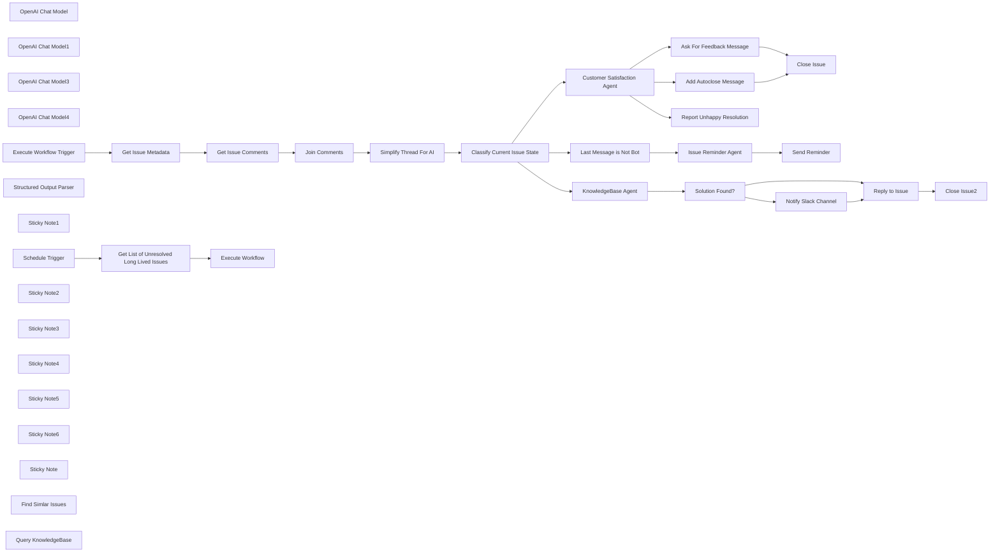

## Fluxo (.json) :

```json
{
  "meta": {
    "instanceId": "408f9fb9940c3cb18ffdef0e0150fe342d6e655c3a9fac21f0f644e8bedabcd9"
  },
  "nodes": [
    {
      "id": "645799b0-7ddb-4acb-a95d-3b04eadff445",
      "name": "OpenAI Chat Model",
      "type": "@n8n/n8n-nodes-langchain.lmChatOpenAi",
      "position": [
        1480,
        20
      ],
      "parameters": {
        "model": "gpt-4o-mini",
        "options": {}
      },
      "credentials": {
        "openAiApi": {
          "id": "8gccIjcuf3gvaoEr",
          "name": "OpenAi account"
        }
      },
      "typeVersion": 1
    },
    {
      "id": "e2923385-2f73-439c-9d5c-5a3c560993cb",
      "name": "OpenAI Chat Model1",
      "type": "@n8n/n8n-nodes-langchain.lmChatOpenAi",
      "position": [
        2040,
        420
      ],
      "parameters": {
        "model": "gpt-4o-mini",
        "options": {}
      },
      "credentials": {
        "openAiApi": {
          "id": "8gccIjcuf3gvaoEr",
          "name": "OpenAi account"
        }
      },
      "typeVersion": 1
    },
    {
      "id": "c24728f9-73b9-45f7-9c4e-aee872c59714",
      "name": "OpenAI Chat Model3",
      "type": "@n8n/n8n-nodes-langchain.lmChatOpenAi",
      "position": [
        3180,
        -80
      ],
      "parameters": {
        "model": "gpt-4o-mini",
        "options": {}
      },
      "credentials": {
        "openAiApi": {
          "id": "8gccIjcuf3gvaoEr",
          "name": "OpenAi account"
        }
      },
      "typeVersion": 1
    },
    {
      "id": "0bc19e46-4a65-45fb-9571-d1f00d204c63",
      "name": "OpenAI Chat Model4",
      "type": "@n8n/n8n-nodes-langchain.lmChatOpenAi",
      "position": [
        2060,
        -261
      ],
      "parameters": {
        "model": "gpt-4o-mini",
        "options": {}
      },
      "credentials": {
        "openAiApi": {
          "id": "8gccIjcuf3gvaoEr",
          "name": "OpenAi account"
        }
      },
      "typeVersion": 1
    },
    {
      "id": "0c631234-125d-476b-b97a-2837d6a32f2b",
      "name": "Schedule Trigger",
      "type": "n8n-nodes-base.scheduleTrigger",
      "position": [
        -272,
        -180
      ],
      "parameters": {
        "rule": {
          "interval": [
            {}
          ]
        }
      },
      "typeVersion": 1.2
    },
    {
      "id": "96c9931d-d286-42f8-9629-2641eaa368b9",
      "name": "Get Issue Comments",
      "type": "n8n-nodes-base.jira",
      "position": [
        748,
        -180
      ],
      "parameters": {
        "options": {},
        "issueKey": "={{ $json.key }}",
        "resource": "issueComment",
        "operation": "getAll"
      },
      "credentials": {
        "jiraSoftwareCloudApi": {
          "id": "IH5V74q6PusewNjD",
          "name": "Jira SW Cloud account"
        }
      },
      "typeVersion": 1
    },
    {
      "id": "18a2770d-5240-4837-8837-4821f73ec560",
      "name": "Close Issue",
      "type": "n8n-nodes-base.jira",
      "position": [
        2660,
        -741
      ],
      "parameters": {
        "issueKey": "={{ $('Get Issue Metadata').item.json.key }}",
        "operation": "update",
        "updateFields": {
          "statusId": {
            "__rl": true,
            "mode": "list",
            "value": "31",
            "cachedResultName": "Done"
          }
        }
      },
      "credentials": {
        "jiraSoftwareCloudApi": {
          "id": "IH5V74q6PusewNjD",
          "name": "Jira SW Cloud account"
        }
      },
      "typeVersion": 1
    },
    {
      "id": "83e81448-26c7-4c29-a17a-409c53e05881",
      "name": "Send Reminder",
      "type": "n8n-nodes-base.jira",
      "position": [
        3500,
        -220
      ],
      "parameters": {
        "comment": "={{ $json.text }}\n(this is an automated message)",
        "options": {},
        "issueKey": "={{ $('Get Issue Metadata').item.json.key }}",
        "resource": "issueComment"
      },
      "credentials": {
        "jiraSoftwareCloudApi": {
          "id": "IH5V74q6PusewNjD",
          "name": "Jira SW Cloud account"
        }
      },
      "typeVersion": 1
    },
    {
      "id": "5fed9245-4af9-4de7-b021-750d2ba39e63",
      "name": "Join Comments",
      "type": "n8n-nodes-base.aggregate",
      "position": [
        928,
        -180
      ],
      "parameters": {
        "options": {},
        "aggregate": "aggregateAllItemData"
      },
      "typeVersion": 1
    },
    {
      "id": "34712dd3-0348-4709-8a68-07279242910c",
      "name": "Add Autoclose Message",
      "type": "n8n-nodes-base.jira",
      "position": [
        2460,
        -561
      ],
      "parameters": {
        "comment": "=Autoclosing due to inactivity. Please create a new ticket if you require additional support. Thank you!\n(this is an automated message)",
        "options": {},
        "issueKey": "={{ $('Get Issue Metadata').item.json.key }}",
        "resource": "issueComment"
      },
      "credentials": {
        "jiraSoftwareCloudApi": {
          "id": "IH5V74q6PusewNjD",
          "name": "Jira SW Cloud account"
        }
      },
      "typeVersion": 1
    },
    {
      "id": "c43a3b66-838b-4970-a85f-dc0370437388",
      "name": "Ask For Feedback Message",
      "type": "n8n-nodes-base.jira",
      "position": [
        2460,
        -741
      ],
      "parameters": {
        "comment": "=[~accountid:{{ $('Get Issue Metadata').item.json.reporter_accountId }}]\n\nWe think the issue is resolved so we're autoclosing it. If you've been satisified with our service, please leave us a 5 start review here: [link](link/to/review_site)\n\nPlease feel free to create another ticket if you need further assistance.\n(this is an automated message)",
        "options": {},
        "issueKey": "={{ $('Get Issue Metadata').item.json.key }}",
        "resource": "issueComment"
      },
      "credentials": {
        "jiraSoftwareCloudApi": {
          "id": "IH5V74q6PusewNjD",
          "name": "Jira SW Cloud account"
        }
      },
      "typeVersion": 1
    },
    {
      "id": "3223ce45-9e5e-471c-9015-75e9f28088e9",
      "name": "Simplify Thread For AI",
      "type": "n8n-nodes-base.set",
      "position": [
        1108,
        -180
      ],
      "parameters": {
        "options": {},
        "assignments": {
          "assignments": [
            {
              "id": "f65c5971-c90d-47f2-823f-37fd03d8e9c7",
              "name": "thread",
              "type": "array",
              "value": "={{\n$json.data.map(comment => {\n  const { accountId, displayName } = comment.author;\n\n  const message = comment.body.content.map(item =>\n    `<${item.type}>${item.content\n      .filter(c => c.text || c.content)\n      .map(c => c.content\n        ? c.content\n            .filter(cc => c.text || c.content)\n            .map(cc => cc.text)\n            .join(' ')\n        : c.text\n      )}</${item.type}>`\n  ).join('');\n  return `${displayName} (accountId: ${accountId}) says: ${message}`;\n})\n\n}}"
            },
            {
              "id": "7b98b2db-3417-472f-bea2-a7aebe30184c",
              "name": "topic",
              "type": "string",
              "value": "={{\n[\n  `title: ${$('Get Issue Metadata').item.json.title}`,\n  `original message: ${$('Get Issue Metadata').item.json.description.replaceAll(/\\n/g, ' ')}`,\n  `reported by: ${$('Get Issue Metadata').item.json.reporter}`\n].join('\\n')\n}}"
            }
          ]
        }
      },
      "typeVersion": 3.4
    },
    {
      "id": "e6f91099-1fe6-4930-8dda-b19330edb599",
      "name": "Solution Found?",
      "type": "n8n-nodes-base.if",
      "position": [
        2440,
        220
      ],
      "parameters": {
        "options": {},
        "conditions": {
          "options": {
            "version": 2,
            "leftValue": "",
            "caseSensitive": true,
            "typeValidation": "strict"
          },
          "combinator": "and",
          "conditions": [
            {
              "id": "0e71783b-3072-421a-852c-58940d0dd7cd",
              "operator": {
                "type": "boolean",
                "operation": "true",
                "singleValue": true
              },
              "leftValue": "={{ $json.output.solution_found }}",
              "rightValue": ""
            }
          ]
        }
      },
      "typeVersion": 2.2
    },
    {
      "id": "696348a5-c955-47eb-ab44-f56652587944",
      "name": "Reply to Issue",
      "type": "n8n-nodes-base.jira",
      "position": [
        2760,
        220
      ],
      "parameters": {
        "comment": "=Hey there!\n{{ $('KnowledgeBase Agent').item.json.output.response }}\nWe'll close this issue now but feel free to create a new one if needed.\n(this is an automated message)",
        "options": {},
        "issueKey": "={{ $('Get Issue Metadata').item.json.key }}",
        "resource": "issueComment"
      },
      "credentials": {
        "jiraSoftwareCloudApi": {
          "id": "IH5V74q6PusewNjD",
          "name": "Jira SW Cloud account"
        }
      },
      "typeVersion": 1
    },
    {
      "id": "4d4562c7-f5ed-44b8-9292-9c1a75d51173",
      "name": "Last Message is Not Bot",
      "type": "n8n-nodes-base.if",
      "position": [
        3000,
        -220
      ],
      "parameters": {
        "options": {},
        "conditions": {
          "options": {
            "version": 2,
            "leftValue": "",
            "caseSensitive": true,
            "typeValidation": "strict"
          },
          "combinator": "and",
          "conditions": [
            {
              "id": "6e07d5dc-01b2-4735-8fc1-983fc57dfaaf",
              "operator": {
                "type": "boolean",
                "operation": "true",
                "singleValue": true
              },
              "leftValue": "={{ !$('Simplify Thread For AI').item.json.thread.last().includes('this is an automated message') }}",
              "rightValue": ""
            }
          ]
        }
      },
      "typeVersion": 2.2
    },
    {
      "id": "e1ca19da-c030-478b-a488-dcb08d9be97e",
      "name": "Structured Output Parser",
      "type": "@n8n/n8n-nodes-langchain.outputParserStructured",
      "position": [
        2400,
        420
      ],
      "parameters": {
        "schemaType": "manual",
        "inputSchema": "{\n\t\"type\": \"object\",\n\t\"properties\": {\n\t\t\"solution_found\": {\n\t\t\t\"type\": \"boolean\"\n\t\t},\n        \"short_summary_of_issue\": {\n          \"type\": \"string\"\n        },\n\t\t\"response\": {\n\t\t\t\"type\": \"string\"\n\t\t}\n\t}\n}"
      },
      "typeVersion": 1.2
    },
    {
      "id": "596ef421-beb0-4523-a313-3f6ccd9e8f0c",
      "name": "Get Issue Metadata",
      "type": "n8n-nodes-base.set",
      "position": [
        568,
        -180
      ],
      "parameters": {
        "options": {},
        "assignments": {
          "assignments": [
            {
              "id": "200706ea-6936-48ae-a46c-38d6e2eff558",
              "name": "key",
              "type": "string",
              "value": "={{ $json.key }}"
            },
            {
              "id": "3e3584bf-dc5c-408a-896c-1660710860f6",
              "name": "title",
              "type": "string",
              "value": "={{ $json.fields.summary }}"
            },
            {
              "id": "e1d89014-5e07-4752-9e7c-ae8d4cba6f6e",
              "name": "url",
              "type": "string",
              "value": "={{\n[\n  'https:/',\n  $json.self.extractDomain(),\n    'browse',\n    $json.key\n  ].join('/')\n}}"
            },
            {
              "id": "df1cca88-1c57-475d-968e-999f6c25dba7",
              "name": "date",
              "type": "string",
              "value": "={{ DateTime.fromISO($json.fields.created).format('yyyy-MM-dd') }}"
            },
            {
              "id": "7fc9c625-e741-43bb-9223-b8024fc86cc7",
              "name": "reporter",
              "type": "string",
              "value": "={{ $json.fields.reporter.displayName }}"
            },
            {
              "id": "17bf06ae-fcad-4eb3-add8-11ac85e9a68e",
              "name": "reporter_url",
              "type": "string",
              "value": "={{\n[\n  'https:/',\n  $json.fields.reporter.self.extractDomain(),\n    'jira',\n    'people',\n    $json.fields.reporter.accountId\n  ].join('/')\n}}"
            },
            {
              "id": "7624642f-f76b-41ec-b402-280b64d46400",
              "name": "reporter_accountId",
              "type": "string",
              "value": "={{ $json.fields.reporter.accountId }}"
            },
            {
              "id": "0fa1d73f-4e8b-435b-a78d-37e95c85c87c",
              "name": "description",
              "type": "string",
              "value": "={{ $json.fields.description }}"
            }
          ]
        }
      },
      "typeVersion": 3.4
    },
    {
      "id": "23bb0cf8-c682-416c-a809-e9ca6fc480ef",
      "name": "Notify Slack Channel",
      "type": "n8n-nodes-base.slack",
      "position": [
        2600,
        380
      ],
      "parameters": {
        "select": "channel",
        "blocksUi": "={{\n{\n\t\"blocks\": [\n\t\t{\n\t\t\t\"type\": \"section\",\n\t\t\t\"text\": {\n\t\t\t\t\"type\": \"mrkdwn\",\n\t\t\t\t\"text\": \"Hey there 👋\\nI found a zombie ticket that no one has taken a look at yet.\"\n\t\t\t}\n\t\t},\n\t\t{\n\t\t\t\"type\": \"section\",\n\t\t\t\"text\": {\n\t\t\t\t\"type\": \"mrkdwn\",\n\t\t\t\t\"text\": `*[${$('Get Issue Metadata').item.json.key}]  ${$('Get Issue Metadata').item.json.title}*\\n${$('KnowledgeBase Agent').item.json.output.short_summary_of_issue}\\n👤 <${$('Get Issue Metadata').item.json.reporter_url}|${$('Get Issue Metadata').item.json.reporter}> 📅 ${$('Get Issue Metadata').item.json.date} 🔗 <${$('Get Issue Metadata').item.json.url}|Link to Issue>\\n`\n\t\t\t}\n\t\t},\n\t\t{\n\t\t\t\"type\": \"divider\"\n\t\t},\n\t\t{\n\t\t\t\"type\": \"section\",\n\t\t\t\"text\": {\n\t\t\t\t\"type\": \"mrkdwn\",\n\t\t\t\t\"text\": \"I couldn't find an answer in the knowledgebase so I've notified the user and closed the ticket. Thanks!\"\n\t\t\t}\n\t\t}\n\t]\n}\n}}",
        "channelId": {
          "__rl": true,
          "mode": "list",
          "value": "C07S0NQ04D7",
          "cachedResultName": "n8n-jira"
        },
        "messageType": "block",
        "otherOptions": {}
      },
      "credentials": {
        "slackApi": {
          "id": "VfK3js0YdqBdQLGP",
          "name": "Slack account"
        }
      },
      "typeVersion": 2.2
    },
    {
      "id": "21076f8f-8462-4a5a-8831-709a138639c5",
      "name": "Close Issue2",
      "type": "n8n-nodes-base.jira",
      "position": [
        2920,
        220
      ],
      "parameters": {
        "issueKey": "={{ $('Get Issue Metadata').item.json.key }}",
        "operation": "update",
        "updateFields": {
          "statusId": {
            "__rl": true,
            "mode": "list",
            "value": "31",
            "cachedResultName": "Done"
          }
        }
      },
      "credentials": {
        "jiraSoftwareCloudApi": {
          "id": "IH5V74q6PusewNjD",
          "name": "Jira SW Cloud account"
        }
      },
      "typeVersion": 1
    },
    {
      "id": "6c9b30c5-d061-4b4d-b4fa-596ca0768297",
      "name": "Get List of Unresolved Long Lived Issues",
      "type": "n8n-nodes-base.jira",
      "position": [
        -72,
        -180
      ],
      "parameters": {
        "limit": 10,
        "options": {
          "jql": "status IN (\"To Do\", \"In Progress\") AND created <= -7d"
        },
        "operation": "getAll"
      },
      "credentials": {
        "jiraSoftwareCloudApi": {
          "id": "IH5V74q6PusewNjD",
          "name": "Jira SW Cloud account"
        }
      },
      "typeVersion": 1
    },
    {
      "id": "1c6c2919-c48b-47bb-a975-f184bd9e95dd",
      "name": "Sticky Note1",
      "type": "n8n-nodes-base.stickyNote",
      "position": [
        -337.3183708039286,
        -425.6402206027777
      ],
      "parameters": {
        "color": 7,
        "width": 640.6500163735489,
        "height": 484.114789072283,
        "content": "## 1. Search For Unresolved Long-lived JIRA Issues\n[Learn more about the JIRA node](https://docs.n8n.io/integrations/builtin/app-nodes/n8n-nodes-base.jira)\n\nIn this demonstration, we'll define \"long-lived\" as any issue which is unresolved after 7 days. Adjust to fit your own criteria.\n\nWe'll also use the Execute Workflow node to run the issues separate in parallel. This is a performance optimisation and if not required, the alternative is to use a loop node instead."
      },
      "typeVersion": 1
    },
    {
      "id": "f21d95a7-0cef-4110-a3b9-59c562b2ea24",
      "name": "Execute Workflow",
      "type": "n8n-nodes-base.executeWorkflow",
      "position": [
        128,
        -180
      ],
      "parameters": {
        "mode": "each",
        "options": {},
        "workflowId": {
          "__rl": true,
          "mode": "id",
          "value": "={{ $workflow.id }}"
        }
      },
      "typeVersion": 1.1
    },
    {
      "id": "e9f9e6e6-c66d-4e50-b4d4-3931b8cf40c9",
      "name": "Execute Workflow Trigger",
      "type": "n8n-nodes-base.executeWorkflowTrigger",
      "position": [
        388,
        -180
      ],
      "parameters": {},
      "typeVersion": 1
    },
    {
      "id": "91b5e024-6141-47e8-99ff-9ac25df7df48",
      "name": "Sticky Note2",
      "type": "n8n-nodes-base.stickyNote",
      "position": [
        320,
        -353.43597793972225
      ],
      "parameters": {
        "color": 7,
        "width": 956.5422324510927,
        "height": 411.91054640922755,
        "content": "## 2. Retrieves and Combine JIRA Issue Comments\n[Learn more about the JIRA node](https://docs.n8n.io/integrations/builtin/app-nodes/n8n-nodes-base.jira)\n\nTo provide the necessary information for our AI agents, we'll fetch and combine all the issue's comments along with our issue. This gives a accurate history of the the issues progress (or lack thereof!)."
      },
      "typeVersion": 1
    },
    {
      "id": "9b545aa8-d2df-4500-8af0-ee55b0fcc736",
      "name": "Sticky Note3",
      "type": "n8n-nodes-base.stickyNote",
      "position": [
        1300,
        -381.8893508540474
      ],
      "parameters": {
        "color": 7,
        "width": 653.0761795166852,
        "height": 583.0290516595711,
        "content": "## 3. Classify the Current State of the Issue\n[Learn more about the Text Classifier node](https://docs.n8n.io/integrations/builtin/cluster-nodes/root-nodes/n8n-nodes-langchain.text-classifier)\n\nToday's AI/LLMs are well suited for solving contextual problems like determining issue state. Here, we can use the text classifier node to analyse the issue as a whole to determine our next move. Almost like a really, really smart Switch node!\n\nThere are 3 branches we want to take: Check if a resolution was reached, blocked issues and auto-resolving when no team member has yet to respond."
      },
      "typeVersion": 1
    },
    {
      "id": "abe0da8f-4107-4641-b992-1a31f71ce530",
      "name": "Sticky Note4",
      "type": "n8n-nodes-base.stickyNote",
      "position": [
        1980,
        -820
      ],
      "parameters": {
        "color": 7,
        "width": 896.1509781357872,
        "height": 726.4699654775604,
        "content": "## 4. Sentiment Analysis on Issue Resolution\n[Read more about the Sentiment Analysis node](https://docs.n8n.io/integrations/builtin/cluster-nodes/root-nodes/n8n-nodes-langchain.sentimentanalysis)\n\nThe Sentiment Analysis node is a convenient method of assessing\ncustomer satisfaction from resolved issues. Here, when resolution\nis detected as positive, we can ask use the opportunity to\ncapitalise of the favourable experience which in this example,\nis to ask for a review. In the opposite vein, if the exchange has\nbeen negative, we can escalate in an attempt to improve\nthe situation before closing the ticket.\n\nAI can equip teams to provide unrivalled customer support\nwhich can differentiate themselves significantly against\nthe competition."
      },
      "typeVersion": 1
    },
    {
      "id": "d9c97501-e2cf-4a7e-86cc-c295d69db939",
      "name": "Customer Satisfaction Agent",
      "type": "@n8n/n8n-nodes-langchain.sentimentAnalysis",
      "position": [
        2060,
        -400
      ],
      "parameters": {
        "options": {},
        "inputText": "=issue:\n{{ $('Simplify Thread For AI').item.json.topic }}\n\ncomments:\n{{ $('Simplify Thread For AI').item.json.thread.join('\\n') }}"
      },
      "typeVersion": 1
    },
    {
      "id": "2829d591-8347-4683-be10-663872c08546",
      "name": "Sticky Note5",
      "type": "n8n-nodes-base.stickyNote",
      "position": [
        1980,
        -60
      ],
      "parameters": {
        "color": 7,
        "width": 1120.504487917144,
        "height": 675.5857025907994,
        "content": "## 5. Attempt to Resolve The Issue With KnowledgeBase\n[Read more about the AI Agent node](https://docs.n8n.io/integrations/builtin/cluster-nodes/root-nodes/n8n-nodes-langchain.agent/)\n\nWhen the issue is unaddressed, we can attempt to resolve the issue automatically using AI. Here an AI agent can easily be deployed with\naccess to knowledge tools to research and generate solutions for the user. Since n8n v1.62.1, AI Tools Agents can attach nodes directly as\ntools providing a very easy way to linking documents to the LLM.\n\nHere, we use both the JIRA tool to search for similar issues and the notion tool to query for product pages. If a solution can be generated,\nwe create a new comment with the solution and attach it to the issue. If not, then we can leave a simple message notifying the user that we could not do so. Finally, we close the issue as no further action can likely be taken in this case."
      },
      "typeVersion": 1
    },
    {
      "id": "112c9fd3-c104-4a68-8e58-96a317fef854",
      "name": "KnowledgeBase Agent",
      "type": "@n8n/n8n-nodes-langchain.agent",
      "position": [
        2060,
        220
      ],
      "parameters": {
        "text": "=issue:\n{{ $('Simplify Thread For AI').item.json.topic }}\n\ncomments:\n{{ $('Simplify Thread For AI').item.json.thread.join('\\n') }}",
        "options": {
          "systemMessage": "Help the user answer their question using the company's knowledgebase. Your answer must be based factually on documents retrieved from the knowledge. If no relevant information is found or the information is insufficent to answer the user's query, you must tell the user so and not mislead the user. If you don't know the answer, it is okay to say you don't know."
        },
        "promptType": "define",
        "hasOutputParser": true
      },
      "typeVersion": 1.6
    },
    {
      "id": "c27e0679-29a0-45d7-ada7-9727975b5069",
      "name": "Sticky Note6",
      "type": "n8n-nodes-base.stickyNote",
      "position": [
        2900,
        -421.245651256349
      ],
      "parameters": {
        "color": 7,
        "width": 801.0347525891818,
        "height": 507.581094640126,
        "content": "## 6. Notify for Unanswered Questions or Response Waiting\n[Read more about the Basic LLM Chain node](https://docs.n8n.io/integrations/builtin/cluster-nodes/root-nodes/n8n-nodes-langchain.chainllm/)\n\nIn this step, where signals indicate that the issue is not yet ready to be close, we can try to re-engage issue participants by summarize the conversation so far and sending a reminder comment for any pending actions that were requested. This action can help reduce the number of issues which linger for too long."
      },
      "typeVersion": 1
    },
    {
      "id": "0a7da82e-789b-401c-80d0-de3ade51942c",
      "name": "Issue Reminder Agent",
      "type": "@n8n/n8n-nodes-langchain.chainLlm",
      "position": [
        3180,
        -220
      ],
      "parameters": {
        "text": "=issue:\n{{ $('Simplify Thread For AI').item.json.topic }}\n\ncomments:\n{{ $('Simplify Thread For AI').item.json.thread }}",
        "messages": {
          "messageValues": [
            {
              "message": "=The user has a pending issue and some time has passed since the last update. Analyse the last message in this thread and generate a short reminder message to add to the issue comments which summarizes and reiterates what pending action or information is required. Return only the message."
            }
          ]
        },
        "promptType": "define"
      },
      "typeVersion": 1.4
    },
    {
      "id": "2847136e-b95b-4906-89af-ceb180abb9b0",
      "name": "Sticky Note",
      "type": "n8n-nodes-base.stickyNote",
      "position": [
        -820,
        -560
      ],
      "parameters": {
        "width": 454.99286536248565,
        "height": 619.151728428442,
        "content": "## Try It Out!\n\n### This n8n template is designed to assist and improve customer support team member capacity by automating the resolution of long-lived and forgotten JIRA issues.\n\n* Schedule Trigger runs daily to check for long-lived unresolved issues and imports them into the workflow.\n* Each Issue is handled as a separate subworkflow by using an execute workflow node. This allows parallel processing.\n* A report is generated from the issue using its comment history allowing the issue to be classified by AI - determining the state and progress of the issue.\n* If determined to be resolved, sentiment analysis is performed to track customer satisfaction. If negative, a slack message is sent to escalate, otherwise the issue is closed automatically.\n* If no response has been initiated, an AI agent will attempt to search and resolve the issue itself using similar resolved issues or from the notion database. If a solution is found, it is posted to the issue and closed.\n* If the issue is blocked and waiting for responses, then a reminder message is added.\n\n### Need Help?\nJoin the [Discord](https://discord.com/invite/XPKeKXeB7d) or ask in the [Forum](https://community.n8n.io/)!"
      },
      "typeVersion": 1
    },
    {
      "id": "9edb0847-5dcf-4357-a1d4-537a126e277b",
      "name": "Find Simlar Issues",
      "type": "n8n-nodes-base.jiraTool",
      "position": [
        2160,
        420
      ],
      "parameters": {
        "limit": 4,
        "options": {
          "jql": "=text ~ \"{{ $fromAI('title', 'the title of the current issue', 'string', '') }}\" AND status IN (\"In Progress\", \"Done\")"
        },
        "operation": "getAll",
        "descriptionType": "manual",
        "toolDescription": "Call this tool to search for similar issues in JIRA."
      },
      "credentials": {
        "jiraSoftwareCloudApi": {
          "id": "IH5V74q6PusewNjD",
          "name": "Jira SW Cloud account"
        }
      },
      "typeVersion": 1
    },
    {
      "id": "573c1b75-35ae-40f0-aa6e-c1372f83569b",
      "name": "Query KnowledgeBase",
      "type": "n8n-nodes-base.notionTool",
      "position": [
        2280,
        420
      ],
      "parameters": {
        "text": "={{ $fromAI('search_terms', 'relevant terms to search for information on the current issue', 'string', '') }}",
        "limit": 4,
        "options": {},
        "operation": "search",
        "descriptionType": "manual",
        "toolDescription": "Search the knowledgebase for information relevant to the issue."
      },
      "credentials": {
        "notionApi": {
          "id": "iHBHe7ypzz4mZExM",
          "name": "Notion account"
        }
      },
      "typeVersion": 2.2
    },
    {
      "id": "1274f6ff-16d9-4d86-b75a-59755390a07c",
      "name": "Report Unhappy Resolution",
      "type": "n8n-nodes-base.slack",
      "position": [
        2660,
        -400
      ],
      "parameters": {
        "text": "=",
        "select": "channel",
        "blocksUi": "={{\n{\n\t\"blocks\": [\n\t\t{\n\t\t\t\"type\": \"section\",\n\t\t\t\"text\": {\n\t\t\t\t\"type\": \"mrkdwn\",\n\t\t\t\t\"text\": \"Hey there 👋\\nI found a unclosed ticket which was resolved but thread overall has a negative sentiment score. Please address or close the ticket.\"\n\t\t\t}\n\t\t},\n\t\t{\n\t\t\t\"type\": \"section\",\n\t\t\t\"text\": {\n\t\t\t\t\"type\": \"mrkdwn\",\n\t\t\t\t\"text\": `*[${$('Get Issue Metadata').item.json.key}]  ${$('Get Issue Metadata').item.json.title}*\\n${$('KnowledgeBase Agent').item.json.output.short_summary_of_issue}\\n👤 <${$('Get Issue Metadata').item.json.reporter_url}|${$('Get Issue Metadata').item.json.reporter}> 📅 ${$('Get Issue Metadata').item.json.date} 🔗 <${$('Get Issue Metadata').item.json.url}|Link to Issue>\\n`\n\t\t\t}\n\t\t},\n\t\t{\n\t\t\t\"type\": \"divider\"\n\t\t},\n\t\t{\n\t\t\t\"type\": \"section\",\n\t\t\t\"text\": {\n\t\t\t\t\"type\": \"mrkdwn\",\n\t\t\t\t\"text\": \"Thanks!\"\n\t\t\t}\n\t\t}\n\t]\n}\n}}",
        "channelId": {
          "__rl": true,
          "mode": "list",
          "value": "C07S0NQ04D7",
          "cachedResultName": "n8n-jira"
        },
        "messageType": "block",
        "otherOptions": {}
      },
      "credentials": {
        "slackApi": {
          "id": "VfK3js0YdqBdQLGP",
          "name": "Slack account"
        }
      },
      "typeVersion": 2.2
    },
    {
      "id": "3226d576-c3ae-444a-b0c5-ac797d25dd2e",
      "name": "Classify Current Issue State",
      "type": "@n8n/n8n-nodes-langchain.textClassifier",
      "position": [
        1480,
        -140
      ],
      "parameters": {
        "options": {},
        "inputText": "=issue:\n{{ $('Simplify Thread For AI').item.json.topic }}\n\ncomments:\n{{ $('Simplify Thread For AI').item.json.thread.join('\\n') || 'There are no comments' }}",
        "categories": {
          "categories": [
            {
              "category": "resolved",
              "description": "There are human comments and a resolution was found and/or accepted"
            },
            {
              "category": "pending more information",
              "description": "There are human comments but no resolution has been reached yet"
            },
            {
              "category": "still waiting",
              "description": "Reporter is still waiting on a response. Ignoring automated messages, there are no comments."
            }
          ]
        }
      },
      "executeOnce": false,
      "typeVersion": 1
    }
  ],
  "pinData": {},
  "connections": {
    "Join Comments": {
      "main": [
        [
          {
            "node": "Simplify Thread For AI",
            "type": "main",
            "index": 0
          }
        ]
      ]
    },
    "Reply to Issue": {
      "main": [
        [
          {
            "node": "Close Issue2",
            "type": "main",
            "index": 0
          }
        ]
      ]
    },
    "Solution Found?": {
      "main": [
        [
          {
            "node": "Reply to Issue",
            "type": "main",
            "index": 0
          }
        ],
        [
          {
            "node": "Notify Slack Channel",
            "type": "main",
            "index": 0
          }
        ]
      ]
    },
    "Schedule Trigger": {
      "main": [
        [
          {
            "node": "Get List of Unresolved Long Lived Issues",
            "type": "main",
            "index": 0
          }
        ]
      ]
    },
    "OpenAI Chat Model": {
      "ai_languageModel": [
        [
          {
            "node": "Classify Current Issue State",
            "type": "ai_languageModel",
            "index": 0
          }
        ]
      ]
    },
    "Find Simlar Issues": {
      "ai_tool": [
        [
          {
            "node": "KnowledgeBase Agent",
            "type": "ai_tool",
            "index": 0
          }
        ]
      ]
    },
    "Get Issue Comments": {
      "main": [
        [
          {
            "node": "Join Comments",
            "type": "main",
            "index": 0
          }
        ]
      ]
    },
    "Get Issue Metadata": {
      "main": [
        [
          {
            "node": "Get Issue Comments",
            "type": "main",
            "index": 0
          }
        ]
      ]
    },
    "OpenAI Chat Model1": {
      "ai_languageModel": [
        [
          {
            "node": "KnowledgeBase Agent",
            "type": "ai_languageModel",
            "index": 0
          }
        ]
      ]
    },
    "OpenAI Chat Model3": {
      "ai_languageModel": [
        [
          {
            "node": "Issue Reminder Agent",
            "type": "ai_languageModel",
            "index": 0
          }
        ]
      ]
    },
    "OpenAI Chat Model4": {
      "ai_languageModel": [
        [
          {
            "node": "Customer Satisfaction Agent",
            "type": "ai_languageModel",
            "index": 0
          }
        ]
      ]
    },
    "KnowledgeBase Agent": {
      "main": [
        [
          {
            "node": "Solution Found?",
            "type": "main",
            "index": 0
          }
        ]
      ]
    },
    "Query KnowledgeBase": {
      "ai_tool": [
        [
          {
            "node": "KnowledgeBase Agent",
            "type": "ai_tool",
            "index": 0
          }
        ]
      ]
    },
    "Issue Reminder Agent": {
      "main": [
        [
          {
            "node": "Send Reminder",
            "type": "main",
            "index": 0
          }
        ]
      ]
    },
    "Notify Slack Channel": {
      "main": [
        [
          {
            "node": "Reply to Issue",
            "type": "main",
            "index": 0
          }
        ]
      ]
    },
    "Add Autoclose Message": {
      "main": [
        [
          {
            "node": "Close Issue",
            "type": "main",
            "index": 0
          }
        ]
      ]
    },
    "Simplify Thread For AI": {
      "main": [
        [
          {
            "node": "Classify Current Issue State",
            "type": "main",
            "index": 0
          }
        ]
      ]
    },
    "Last Message is Not Bot": {
      "main": [
        [
          {
            "node": "Issue Reminder Agent",
            "type": "main",
            "index": 0
          }
        ]
      ]
    },
    "Ask For Feedback Message": {
      "main": [
        [
          {
            "node": "Close Issue",
            "type": "main",
            "index": 0
          }
        ]
      ]
    },
    "Execute Workflow Trigger": {
      "main": [
        [
          {
            "node": "Get Issue Metadata",
            "type": "main",
            "index": 0
          }
        ]
      ]
    },
    "Structured Output Parser": {
      "ai_outputParser": [
        [
          {
            "node": "KnowledgeBase Agent",
            "type": "ai_outputParser",
            "index": 0
          }
        ]
      ]
    },
    "Customer Satisfaction Agent": {
      "main": [
        [
          {
            "node": "Ask For Feedback Message",
            "type": "main",
            "index": 0
          }
        ],
        [
          {
            "node": "Add Autoclose Message",
            "type": "main",
            "index": 0
          }
        ],
        [
          {
            "node": "Report Unhappy Resolution",
            "type": "main",
            "index": 0
          }
        ]
      ]
    },
    "Classify Current Issue State": {
      "main": [
        [
          {
            "node": "Customer Satisfaction Agent",
            "type": "main",
            "index": 0
          }
        ],
        [
          {
            "node": "Last Message is Not Bot",
            "type": "main",
            "index": 0
          }
        ],
        [
          {
            "node": "KnowledgeBase Agent",
            "type": "main",
            "index": 0
          }
        ]
      ]
    },
    "Get List of Unresolved Long Lived Issues": {
      "main": [
        [
          {
            "node": "Execute Workflow",
            "type": "main",
            "index": 0
          }
        ]
      ]
    }
  }
}
```

<a id="template-1136"></a>

## Template 1136 - Gatilho de submissão JotForm

- **Nome:** Gatilho de submissão JotForm
- **Descrição:** Inicia o fluxo quando um formulário JotForm específico recebe uma submissão.
- **Funcionalidade:** • Recebe submissões de formulário: ativa o fluxo ao receber uma nova submissão do formulário configurado.
• Filtragem por ID do formulário: escuta apenas eventos originados do formulário com ID 202012795501445.
• Exposição de webhook: utiliza um webhook (ID 8ee760f3-f18a-4060-bf41-b583ef4d7bfe) para receber os dados das submissões em tempo real.
• Autenticação com JotForm: conecta-se ao serviço usando credenciais configuradas para validar e autorizar as requisições.
- **Ferramentas:** • JotForm: serviço de criação e gerenciamento de formulários online usado para coletar submissões que acionam o fluxo.


## Fluxo visual

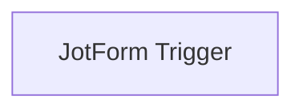

## Fluxo (.json) :

```json
{
  "nodes": [
    {
      "name": "JotForm Trigger",
      "type": "n8n-nodes-base.jotFormTrigger",
      "position": [
        870,
        400
      ],
      "webhookId": "8ee760f3-f18a-4060-bf41-b583ef4d7bfe",
      "parameters": {
        "form": "202012795501445"
      },
      "credentials": {
        "jotFormApi": "jotform_creds"
      },
      "typeVersion": 1
    }
  ],
  "connections": {}
}
```

<a id="template-1137"></a>

## Template 1137 - Integração de pedidos Shopify para D365 Business Central

- **Nome:** Integração de pedidos Shopify para D365 Business Central
- **Descrição:** Sincroniza pedidos do Shopify para o Microsoft Dynamics 365 Business Central, criando clientes, pedidos de venda ou faturas de venda conforme a origem do pedido e evitando duplicações.
- **Funcionalidade:** • Captura de pedidos Shopify: Obtém pedidos criados/atualizados nas últimas 24 horas.
• Filtragem por status financeiro: Processa apenas pedidos com pagamento confirmado (paid).
• Recuperação de fulfillment orders: Consulta fulfillment orders para mapear localizações ativas por item em contas multi-location.
• Pré-processamento de linhas: Associa assigned_location_id às linhas e opcionalmente adiciona impostos e descontos como linhas separadas conforme configuração.
• Lookup de cliente no ERP: Procura cliente existente no Business Central por e-mail.
• Criação de cliente: Cria novo cliente no Business Central quando não existe correspondência.
• Evitar duplicação de pedidos: Verifica existência de Sales Order ou Sales Invoice com externalDocumentNumber antes de criar.
• Diferenciação por origem do pedido: Cria Sales Invoice para pedidos de POS e Sales Order para pedidos web.
• Criação de cabeçalho e linhas no ERP: Cria o documento no Business Central e em seguida insere as linhas do pedido.
• Tratamento de falhas: Em caso de erro ao inserir linhas, deleta o documento criado para evitar registros incompletos.
• Configurações de ambiente: Permite definir tenantId, companyId, SKUs para imposto e desconto e flags para comportamento de mapeamento.
• Agendamento: Executa periodicamente conforme regra de agendamento definida.
- **Ferramentas:** • Shopify: Plataforma de e-commerce usada como origem dos pedidos, incluindo acesso às APIs de orders e fulfillment orders.
• Microsoft Dynamics 365 Business Central: ERP utilizado como destino para criar clientes, sales orders e sales invoices via API REST.
• APIs REST / HTTP com OAuth2: Chamadas HTTP autenticadas para comunicação entre Shopify e Business Central e para operações CRUD nos sistemas.


## Fluxo visual

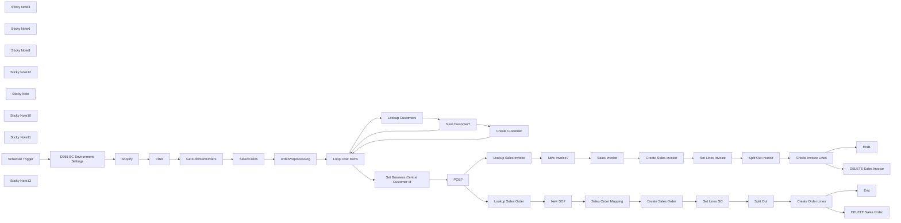

## Fluxo (.json) :

```json
{
  "id": "NGwD3pIHXBU0w5hC",
  "meta": {
    "instanceId": "ae2372ebbc56db2b55a9a46ac3affa802af144b84fd97c2796c22342aba529bd"
  },
  "name": "[n8n] - Shopify Orders to D365 Business Central Sales Orders / Sales Invoices",
  "tags": [
    {
      "id": "2RJGhx5RHCJdXr52",
      "name": "d365 business central",
      "createdAt": "2023-08-08T23:10:56.527Z",
      "updatedAt": "2023-08-08T23:10:56.527Z"
    },
    {
      "id": "OPc1YLQyTimMr498",
      "name": "shopify",
      "createdAt": "2023-07-22T15:30:38.620Z",
      "updatedAt": "2023-07-22T15:30:38.620Z"
    }
  ],
  "nodes": [
    {
      "id": "92db12db-d96d-4076-a9cd-441c4bdfe212",
      "name": "GetFufillmentOrders",
      "type": "n8n-nodes-base.httpRequest",
      "position": [
        840,
        300
      ],
      "parameters": {
        "url": "=https://integrocloud.myshopify.com/admin/api/2024-01/orders/{{ $json.id }}/fulfillment_orders.json",
        "options": {},
        "sendHeaders": true,
        "authentication": "predefinedCredentialType",
        "headerParameters": {
          "parameters": [
            {
              "name": "Content-Type",
              "value": "application/json"
            }
          ]
        },
        "nodeCredentialType": "shopifyAccessTokenApi"
      },
      "credentials": {
        "httpHeaderAuth": {
          "id": "BkNv57yQW9PSPr6p",
          "name": "Shopify HTTP Token Auth"
        },
        "shopifyAccessTokenApi": {
          "id": "9P9B0Hcwyj2CpqeA",
          "name": "Shopify Access Token account"
        }
      },
      "typeVersion": 4.1
    },
    {
      "id": "60e0bd37-a2d1-48c5-8b47-830094d5e2ae",
      "name": "Sticky Note3",
      "type": "n8n-nodes-base.stickyNote",
      "position": [
        780,
        140
      ],
      "parameters": {
        "width": 730.3433300216063,
        "height": 394.8862809393426,
        "content": "## Shopify Line Locations\nFor multi-location Shopify accounts, these group of nodes get the active location id for each order line."
      },
      "typeVersion": 1
    },
    {
      "id": "1e91817c-26bf-46f8-8185-696f07daa28c",
      "name": "Sticky Note6",
      "type": "n8n-nodes-base.stickyNote",
      "position": [
        400,
        140
      ],
      "parameters": {
        "width": 354.40926061252037,
        "height": 398.9698970525732,
        "content": "## Get Shopify Orders\n1.- Get Shopify Orders created/updated since one day prior. The Flow will get every order created or updated on the last 24 hours.\n\n2.- Filter to get paid orders."
      },
      "typeVersion": 1
    },
    {
      "id": "89f633a1-ac8f-4480-934b-e429717cb09f",
      "name": "Sticky Note8",
      "type": "n8n-nodes-base.stickyNote",
      "position": [
        1557,
        140
      ],
      "parameters": {
        "width": 974.6786178827637,
        "height": 520.8878646073657,
        "content": "## Existing Customer Lookup (Business Central)\nLookup for existing customer in Business Central based on the logic defined in the URI, if a customer exist then that id is used, otherwhise a new customer will be created\n"
      },
      "typeVersion": 1
    },
    {
      "id": "c973b647-c1c6-43dc-9b80-46e34d051fc4",
      "name": "Sticky Note12",
      "type": "n8n-nodes-base.stickyNote",
      "position": [
        -640,
        140
      ],
      "parameters": {
        "color": 3,
        "width": 509.9611651710956,
        "height": 705.3721586313337,
        "content": "## Workflow Information 📌\n\n### Purpose 🎯\nThe intention of this workflow is to integrate New Shopify Orders into MS Dynamics Business Central:\n\n- **Point-of-Sale (POS):** POS orders will be created in Business Central as Sales Invoices given no fulfillment is expected.\n- **Web Orders:** This type of orders will be created as Business Central Sales Orders.\n\n### How to use it 🚀\n1. Edit the \"D365 BC Environment Settings\" node with your own account values (Company Id, Tenanant Id, Tax & Discount Items).\n2. Go to the \"Shopify\" node and edit the connection with your environment. More help [here](https://docs.n8n.io/integrations/builtin/credentials/shopify/).\n3. Go to the \"Lookup Customers\" node to edit the Business Central connection details with your environment settings.\n4. Set the required filters on the \"Shopify Order Filter\" node.\n5. Edit the \"Schedule Trigger\" node with the required frequency.\n\n### Useful Workflow Links 📚\n1. [Step-by-step Guide/ Integro Cloud Solutions](https://z0v4z2m6gixudcjglfbe.guidejar.xyz/categories/business-central)\n2. [Business Central REST API Documentation](https://learn.microsoft.com/en-us/dynamics365/business-central/dev-itpro/api-reference/v2.0/)\n3. [Video Demo](https://www.loom.com/share/9e218cd53cf14a93bcb55d7b3d47ec45?sid=5fdfb8ab-8205-468a-b514-67193abac455)\n\n\n### Need Help?\nContact me at:\n✉️greg.lopez@integrocloudsolutions.com\n📥 https://www.linkedin.com/in/greg-lopez-08b5071b/\n\n\n\n"
      },
      "typeVersion": 1
    },
    {
      "id": "e7c4bf60-e040-4f41-9c8a-7729ffed88fd",
      "name": "Shopify",
      "type": "n8n-nodes-base.shopify",
      "position": [
        440,
        300
      ],
      "parameters": {
        "options": {
          "status": "any",
          "updatedAtMin": "={{$now.minus({days: 1})}}"
        },
        "operation": "getAll",
        "returnAll": true,
        "authentication": "accessToken"
      },
      "credentials": {
        "shopifyAccessTokenApi": {
          "id": "9P9B0Hcwyj2CpqeA",
          "name": "Shopify Access Token account"
        }
      },
      "typeVersion": 1
    },
    {
      "id": "274b710d-e642-4bc6-bf8d-5852a721f037",
      "name": "Sticky Note",
      "type": "n8n-nodes-base.stickyNote",
      "position": [
        1560,
        730.5378173588417
      ],
      "parameters": {
        "width": 978.7262207141349,
        "height": 502.3149881728773,
        "content": "## Existing Order Lookup (Business Central)\n\n1.- This logic will avoid duplication of Business Central Sales Orders/Sales Invoices validating if an order with the same external Id exist already.\n\n2.- If a match is found then the order is ignored\n\n3.- The source of the order is evaluated, if the order was placed on the Point-of-Sale a Sales Invoice is created else a Sales Order will be created."
      },
      "typeVersion": 1
    },
    {
      "id": "ccf15ee2-b805-4fa7-88ab-12bf3c864415",
      "name": "Sticky Note10",
      "type": "n8n-nodes-base.stickyNote",
      "position": [
        2600,
        700
      ],
      "parameters": {
        "width": 1330.0330040471722,
        "height": 434.94851154152406,
        "content": "## Sales Order Creation\n\n1.- Map on the \"Sales Order Mapping\" node any requiered fields to be integrated into Business Central.\n\n2- The HTTP Node will perform a POST call to Business Central REST API to create the Sales Order.\n\n3. After the Sales Order gets created, all line items will be added into the Order. \n\n4. If there are any while creating line items, the Sales Order will be deleted.\n"
      },
      "typeVersion": 1
    },
    {
      "id": "5a78d974-d950-4e26-87cf-a42e4633a5d8",
      "name": "Sticky Note11",
      "type": "n8n-nodes-base.stickyNote",
      "position": [
        -68.32736133691077,
        140
      ],
      "parameters": {
        "width": 442.73662194943114,
        "height": 398.9698970525732,
        "content": "## Configure Business Central Environment Variables\n1.- Enter your BC tenantId,companyId, name.\n2.- Set the SKU number for the Items to be used for Taxes and Discounts."
      },
      "typeVersion": 1
    },
    {
      "id": "95f15005-6c9b-46ae-9cb3-a89887189aed",
      "name": "Schedule Trigger",
      "type": "n8n-nodes-base.scheduleTrigger",
      "position": [
        -20,
        340
      ],
      "parameters": {
        "rule": {
          "interval": [
            {
              "field": "minutes"
            }
          ]
        }
      },
      "typeVersion": 1.1
    },
    {
      "id": "0c2ee7ac-3b27-4e6f-9e65-f1bba3ee494b",
      "name": "Loop Over Items",
      "type": "n8n-nodes-base.splitInBatches",
      "position": [
        1620,
        260
      ],
      "parameters": {
        "options": {}
      },
      "typeVersion": 3
    },
    {
      "id": "58a528fe-f9f3-4522-bc4d-0fc91fbbf656",
      "name": "New Customer?",
      "type": "n8n-nodes-base.if",
      "position": [
        2020,
        260
      ],
      "parameters": {
        "conditions": {
          "number": [
            {
              "value1": "={{ $json.value.length }}",
              "value2": 1
            }
          ]
        }
      },
      "typeVersion": 1
    },
    {
      "id": "e5222a97-002c-4433-aa7a-dbc6426b2a25",
      "name": "Lookup Customers",
      "type": "n8n-nodes-base.httpRequest",
      "position": [
        1840,
        260
      ],
      "parameters": {
        "url": "=https://api.businesscentral.dynamics.com/v2.0/{{ $('D365 BC Environment Settings').item.json[\"tenantId\"] }}/{{ $('D365 BC Environment Settings').item.json[\"environmentName\"] }}/api/v2.0/companies({{ $('D365 BC Environment Settings').item.json[\"companyId\"] }})/customers?$filter=email eq '{{ $json.customer.email }}' and contains(email,'@')&$select=id,number,email",
        "options": {},
        "authentication": "genericCredentialType",
        "genericAuthType": "oAuth2Api"
      },
      "credentials": {
        "oAuth2Api": {
          "id": "s8gGHYzOwlhE9yot",
          "name": "PROD_businessCentral_integro"
        }
      },
      "typeVersion": 4.1,
      "continueOnFail": true
    },
    {
      "id": "8d5ba820-04a7-413e-bb9e-8385dee5e78b",
      "name": "SelectFields",
      "type": "n8n-nodes-base.set",
      "position": [
        1080,
        300
      ],
      "parameters": {
        "values": {
          "string": [
            {
              "name": "id",
              "value": "={{ $('Filter').item.json.id }}"
            },
            {
              "name": "name",
              "value": "={{ $('Filter').item.json.name }}"
            },
            {
              "name": "source_name",
              "value": "={{ $('Filter').item.json.source_name }}"
            },
            {
              "name": "shipping_address",
              "value": "={{ $('Filter').item.json.shipping_address }}"
            },
            {
              "name": "billing_address",
              "value": "={{ $('Filter').item.json.billing_address }}"
            },
            {
              "name": "customer",
              "value": "={{ $('Filter').item.json.customer }}"
            },
            {
              "name": "discount_codes",
              "value": "={{ $('Filter').item.json.discount_codes}}"
            },
            {
              "name": "shippingcost",
              "value": "={{ $('Filter').item.json.total_shipping_price_set.shop_money.amount }}"
            },
            {
              "name": "line_items",
              "value": "={{ $('Filter').item.json.line_items }}"
            },
            {
              "name": "fulfillment_orders",
              "value": "={{ $json.fulfillment_orders }}"
            },
            {
              "name": "currency",
              "value": "={{ $('Filter').item.json.currency }}"
            },
            {
              "name": "=created_at",
              "value": "={{ $('Filter').item.json.created_at }}"
            },
            {
              "name": "gateway",
              "value": "={{ $('Filter').item.json.payment_gateway_names[0] }}"
            },
            {
              "name": "total_tax",
              "value": "={{ $('Filter').item.json.total_tax }}"
            },
            {
              "name": "total_discounts",
              "value": "={{ $('Filter').item.json.total_discounts*-1 }}"
            }
          ]
        },
        "options": {},
        "keepOnlySet": true
      },
      "typeVersion": 2
    },
    {
      "id": "d5120009-2efe-4ef1-9450-eedd475f95c7",
      "name": "orderPreprocessing",
      "type": "n8n-nodes-base.code",
      "position": [
        1340,
        300
      ],
      "parameters": {
        "mode": "runOnceForEachItem",
        "jsCode": "const orderJson = $input.item.json;\n\n// Create a map of line_item_id to assigned_location_id\nconst lineItemToLocationMap = {};\norderJson.fulfillment_orders.forEach(fulfillmentOrder => {\n  fulfillmentOrder.line_items.forEach(lineItem => {\n    lineItemToLocationMap[lineItem.line_item_id] = fulfillmentOrder.assigned_location_id;\n  });\n});\n\n// Update the line_items array with assigned_location_id\norderJson.line_items.forEach(lineItem => {\n  const assignedLocationId = lineItemToLocationMap[lineItem.id];\n  if (assignedLocationId !== undefined) {\n    lineItem.assigned_location_id = assignedLocationId;\n  }\n});\n\n// Add a new property 'pairedItem' to orderJson with the value of $itemIndex\norderJson.pairedItem = $itemIndex;\n\n// Add a new line item with specified fields for taxes if taxesAsLineItem is true\nif ($('D365 BC Environment Settings').item.json.taxesAsLineItem) {\n  const newLineItem = {\n    \"sku\": $('D365 BC Environment Settings').item.json.taxItemSku,\n    \"price\": orderJson.total_tax,\n    \"quantity\": 1\n  };\n  orderJson.line_items.push(newLineItem);\n}\n\n// Add a new line item with specified fields for discount\nif ($('D365 BC Environment Settings').item.json.discountsAsLineItem) {\nconst newDiscountLineItem = {\n  \"sku\": $('D365 BC Environment Settings').item.json.discountItemSku,\n  \"price\": orderJson.total_discounts,\n  \"quantity\": 1\n};\norderJson.line_items.push(newDiscountLineItem);\n}\n\n// Return the modified orderJson\nreturn orderJson;\n"
      },
      "typeVersion": 2
    },
    {
      "id": "28f0b15a-e1a6-4055-90ed-f3051f043792",
      "name": "Create Customer",
      "type": "n8n-nodes-base.httpRequest",
      "position": [
        2240,
        320
      ],
      "parameters": {
        "url": "=https://api.businesscentral.dynamics.com/v2.0/{{ $('D365 BC Environment Settings').item.json[\"tenantId\"] }}/{{ $('D365 BC Environment Settings').item.json[\"environmentName\"] }}/api/v2.0/companies({{ $('D365 BC Environment Settings').item.json[\"companyId\"] }})/customers",
        "method": "POST",
        "options": {
          "response": {
            "response": {}
          }
        },
        "sendBody": true,
        "sendHeaders": true,
        "authentication": "genericCredentialType",
        "bodyParameters": {
          "parameters": [
            {
              "name": "displayName",
              "value": "={{ $('orderPreprocessing').item.json.customer.first_name }} {{ $('orderPreprocessing').item.json.customer.last_name }}"
            },
            {
              "name": "type",
              "value": "Person"
            },
            {
              "name": "email",
              "value": "={{ $('Loop Over Items').item.json.customer.email }}"
            },
            {
              "name": "taxLiable",
              "value": "true"
            },
            {
              "name": "currencyCode",
              "value": "={{ $('Loop Over Items').item.json.currency }}"
            },
            {
              "name": "addressLine1",
              "value": "={{ $('Loop Over Items').item.json.shipping_address.address1 }}"
            },
            {
              "name": "addressLine2",
              "value": "={{ $('Loop Over Items').item.json.shipping_address.address2 }}"
            },
            {
              "name": "city",
              "value": "={{ $('Loop Over Items').item.json.shipping_address.city }}"
            },
            {
              "name": "state",
              "value": "={{ $('Loop Over Items').item.json.shipping_address.province }}"
            },
            {
              "name": "country",
              "value": "={{ $('Loop Over Items').item.json.shipping_address.country_code }}"
            },
            {
              "name": "postalCode",
              "value": "={{ $('Loop Over Items').item.json.shipping_address.zip }}"
            },
            {
              "name": "phoneNumber",
              "value": "={{ $('Loop Over Items').item.json.shipping_address.phone }}"
            }
          ]
        },
        "genericAuthType": "oAuth2Api",
        "headerParameters": {
          "parameters": [
            {
              "name": "Content-Type",
              "value": "application/json"
            }
          ]
        }
      },
      "credentials": {
        "oAuth2Api": {
          "id": "s8gGHYzOwlhE9yot",
          "name": "PROD_businessCentral_integro"
        }
      },
      "notesInFlow": true,
      "typeVersion": 4.1,
      "continueOnFail": true,
      "alwaysOutputData": false
    },
    {
      "id": "990fec80-30e3-44f8-a95d-f9afb2e495c5",
      "name": "Set Business Central Customer Id",
      "type": "n8n-nodes-base.set",
      "position": [
        1780,
        500
      ],
      "parameters": {
        "values": {
          "string": [
            {
              "name": "order",
              "value": "={{ $('orderPreprocessing').item.json }}"
            },
            {
              "name": "bc_customer.id",
              "value": "={{ $json.value.isEmpty() ? $json.id : $json.value[0].id}}"
            }
          ]
        },
        "options": {},
        "keepOnlySet": true
      },
      "typeVersion": 2
    },
    {
      "id": "313ac019-aedb-4d64-833d-c3582153e2c0",
      "name": "Create Order Lines",
      "type": "n8n-nodes-base.httpRequest",
      "onError": "continueErrorOutput",
      "position": [
        3440,
        900
      ],
      "parameters": {
        "url": "=https://api.businesscentral.dynamics.com/v2.0/{{ $('D365 BC Environment Settings').item.json.tenantId }}/{{ $('D365 BC Environment Settings').item.json.environmentName }}/api/v2.0/companies({{ $('D365 BC Environment Settings').item.json.companyId }})/salesOrders({{ $json.so_id }})/salesOrderLines",
        "method": "POST",
        "options": {
          "batching": {
            "batch": {
              "batchSize": 0
            }
          },
          "response": {
            "response": {}
          }
        },
        "sendBody": true,
        "sendHeaders": true,
        "authentication": "genericCredentialType",
        "bodyParameters": {
          "parameters": [
            {
              "name": "lineObjectNumber",
              "value": "={{ $json.line_items.sku }}"
            },
            {
              "name": "quantity",
              "value": "={{ $json.line_items.quantity }}"
            },
            {
              "name": "description",
              "value": "={{ $json.line_items.title }}"
            },
            {
              "name": "lineType",
              "value": "Item"
            },
            {
              "name": "unitPrice",
              "value": "={{ $json.line_items.price*1 }}"
            }
          ]
        },
        "genericAuthType": "oAuth2Api",
        "headerParameters": {
          "parameters": [
            {
              "name": "Content-Type",
              "value": "application/json"
            }
          ]
        }
      },
      "credentials": {
        "oAuth2Api": {
          "id": "s8gGHYzOwlhE9yot",
          "name": "PROD_businessCentral_integro"
        }
      },
      "typeVersion": 4.1
    },
    {
      "id": "e0d63859-a480-4f69-bb30-77c9615777b6",
      "name": "End",
      "type": "n8n-nodes-base.noOp",
      "position": [
        3720,
        840
      ],
      "parameters": {},
      "typeVersion": 1
    },
    {
      "id": "8c756b31-0b7f-4f9a-a7a3-5fccdcfcf8b8",
      "name": "Split Out",
      "type": "n8n-nodes-base.splitOut",
      "position": [
        3260,
        900
      ],
      "parameters": {
        "include": "allOtherFields",
        "options": {},
        "fieldToSplitOut": "=line_items"
      },
      "typeVersion": 1
    },
    {
      "id": "e2ddcd9a-7502-49ae-9d5c-50f6c3084570",
      "name": "DELETE Sales Order",
      "type": "n8n-nodes-base.httpRequest",
      "onError": "continueRegularOutput",
      "position": [
        3720,
        980
      ],
      "parameters": {
        "url": "=https://api.businesscentral.dynamics.com/v2.0/{{ $('D365 BC Environment Settings').item.json.tenantId }}/Production/api/v2.0/companies({{ $('D365 BC Environment Settings').item.json.companyId }})/salesOrders({{ $json.so_id }})",
        "method": "DELETE",
        "options": {
          "batching": {
            "batch": {
              "batchSize": 1
            }
          },
          "response": {
            "response": {}
          }
        },
        "sendBody": true,
        "sendHeaders": true,
        "authentication": "genericCredentialType",
        "bodyParameters": {
          "parameters": [
            {}
          ]
        },
        "genericAuthType": "oAuth2Api",
        "headerParameters": {
          "parameters": [
            {
              "name": "Content-Type",
              "value": "application/json"
            }
          ]
        }
      },
      "credentials": {
        "oAuth2Api": {
          "id": "s8gGHYzOwlhE9yot",
          "name": "PROD_businessCentral_integro"
        }
      },
      "typeVersion": 4.1
    },
    {
      "id": "b5303dc5-bf56-4b1c-a231-15a322f26ac8",
      "name": "D365 BC Environment Settings",
      "type": "n8n-nodes-base.set",
      "position": [
        180,
        340
      ],
      "parameters": {
        "values": {
          "string": [
            {
              "name": "tenantId",
              "value": "{tenandId}"
            },
            {
              "name": "environmentName",
              "value": "Production"
            },
            {
              "name": "companyId",
              "value": "{CompanyId}"
            },
            {
              "name": "discountItemSku",
              "value": "N8N_DISCOUNT"
            },
            {
              "name": "taxItemSku",
              "value": "N8N_TAX_AMOUNT"
            }
          ],
          "boolean": [
            {
              "name": "taxesAsLineItem",
              "value": true
            },
            {
              "name": "discountsAsLineItem",
              "value": true
            }
          ]
        },
        "options": {},
        "keepOnlySet": true
      },
      "typeVersion": 2
    },
    {
      "id": "e7925d36-5b30-4822-8eb1-a5a076a77669",
      "name": "Create Sales Order",
      "type": "n8n-nodes-base.httpRequest",
      "notes": "Create Sales Order Header",
      "onError": "continueErrorOutput",
      "position": [
        2880,
        920
      ],
      "parameters": {
        "url": "=https://api.businesscentral.dynamics.com/v2.0/{{ $('D365 BC Environment Settings').item.json.tenantId }}/{{ $('D365 BC Environment Settings').item.json.environmentName }}/api/v2.0/companies({{ $('D365 BC Environment Settings').item.json.companyId }})/salesOrders",
        "method": "POST",
        "options": {
          "batching": {
            "batch": {
              "batchSize": 5,
              "batchInterval": 5000
            }
          },
          "response": {
            "response": {}
          }
        },
        "jsonBody": "={{$json}}",
        "sendBody": true,
        "sendHeaders": true,
        "specifyBody": "json",
        "authentication": "genericCredentialType",
        "genericAuthType": "oAuth2Api",
        "headerParameters": {
          "parameters": [
            {
              "name": "Content-Type",
              "value": "application/json"
            }
          ]
        }
      },
      "credentials": {
        "oAuth2Api": {
          "id": "s8gGHYzOwlhE9yot",
          "name": "PROD_businessCentral_integro"
        }
      },
      "notesInFlow": true,
      "typeVersion": 4.1
    },
    {
      "id": "fce6d383-c372-4f65-83b5-d681dfa16323",
      "name": "Sticky Note13",
      "type": "n8n-nodes-base.stickyNote",
      "position": [
        2600,
        140
      ],
      "parameters": {
        "width": 1330.0330040471722,
        "height": 434.94851154152406,
        "content": "## Sales Order Creation\n\n1. Map on the \"Sales Invoice Mapping\" node any requiered fields to be integrated into Business Central.\n\n2. The HTTP Node will perform a POST call to Business Central REST API to create the Sales Invoice.\n\n3. After the Sales Invoice gets created, all line items will be added into the Invoice. \n\n4. If there are any while creating line items, the Sales Invoice will be deleted.\n"
      },
      "typeVersion": 1
    },
    {
      "id": "29d43335-713f-4bfc-a416-be41f7cc1311",
      "name": "Set Lines Invoice",
      "type": "n8n-nodes-base.set",
      "position": [
        3100,
        360
      ],
      "parameters": {
        "values": {
          "string": [
            {
              "name": "so_id",
              "value": "={{ $json.id }}"
            },
            {
              "name": "line_items",
              "value": "={{ $('Set Business Central Customer Id').item.json.order.line_items }}"
            }
          ]
        },
        "options": {
          "dotNotation": true
        },
        "keepOnlySet": true
      },
      "typeVersion": 2
    },
    {
      "id": "7d05a3d7-5bac-4099-8561-61b520c75e91",
      "name": "Set Lines SO",
      "type": "n8n-nodes-base.set",
      "position": [
        3100,
        900
      ],
      "parameters": {
        "values": {
          "string": [
            {
              "name": "so_id",
              "value": "={{ $json.id }}"
            },
            {
              "name": "line_items",
              "value": "={{ $('Set Business Central Customer Id').item.json.order.line_items }}"
            }
          ]
        },
        "options": {
          "dotNotation": true
        },
        "keepOnlySet": true
      },
      "typeVersion": 2
    },
    {
      "id": "e39a775a-4c89-47f0-8da9-e5cb33d03228",
      "name": "Split Out Invoice",
      "type": "n8n-nodes-base.splitOut",
      "position": [
        3260,
        360
      ],
      "parameters": {
        "include": "allOtherFields",
        "options": {},
        "fieldToSplitOut": "=line_items"
      },
      "typeVersion": 1
    },
    {
      "id": "ff21ea27-091c-4ba7-bedb-1e26561ff042",
      "name": "Create Invoice Lines",
      "type": "n8n-nodes-base.httpRequest",
      "onError": "continueErrorOutput",
      "position": [
        3440,
        360
      ],
      "parameters": {
        "url": "=https://api.businesscentral.dynamics.com/v2.0/{{ $('D365 BC Environment Settings').item.json.tenantId }}/{{ $('D365 BC Environment Settings').item.json.environmentName }}/api/v2.0/companies({{ $('D365 BC Environment Settings').item.json.companyId }})/salesInvoices({{ $json.so_id }})/salesInvoiceLines",
        "method": "POST",
        "options": {
          "batching": {
            "batch": {
              "batchSize": 0
            }
          },
          "response": {
            "response": {}
          }
        },
        "sendBody": true,
        "sendHeaders": true,
        "authentication": "genericCredentialType",
        "bodyParameters": {
          "parameters": [
            {
              "name": "lineObjectNumber",
              "value": "={{ $json.line_items.sku }}"
            },
            {
              "name": "quantity",
              "value": "={{ $json.line_items.quantity }}"
            },
            {
              "name": "description",
              "value": "={{ $json.line_items.title }}"
            },
            {
              "name": "lineType",
              "value": "Item"
            },
            {
              "name": "unitPrice",
              "value": "={{ $json.line_items.price*1 }}"
            }
          ]
        },
        "genericAuthType": "oAuth2Api",
        "headerParameters": {
          "parameters": [
            {
              "name": "Content-Type",
              "value": "application/json"
            }
          ]
        }
      },
      "credentials": {
        "oAuth2Api": {
          "id": "s8gGHYzOwlhE9yot",
          "name": "PROD_businessCentral_integro"
        }
      },
      "typeVersion": 4.1
    },
    {
      "id": "becfe8a8-9655-4386-b891-977271b26c7e",
      "name": "Filter",
      "type": "n8n-nodes-base.filter",
      "position": [
        620,
        300
      ],
      "parameters": {
        "conditions": {
          "string": [
            {
              "value1": "={{ $json.financial_status }}",
              "value2": "paid"
            }
          ]
        }
      },
      "typeVersion": 1
    },
    {
      "id": "48edfcb3-5864-4794-8876-40bb7bec31f6",
      "name": "Create Sales Invoice",
      "type": "n8n-nodes-base.httpRequest",
      "notes": "Create Sales Order Header",
      "onError": "continueErrorOutput",
      "position": [
        2900,
        380
      ],
      "parameters": {
        "url": "=https://api.businesscentral.dynamics.com/v2.0/{{ $('D365 BC Environment Settings').item.json.tenantId }}/{{ $('D365 BC Environment Settings').item.json.environmentName }}/api/v2.0/companies({{ $('D365 BC Environment Settings').item.json.companyId }})/salesInvoices",
        "method": "POST",
        "options": {
          "batching": {
            "batch": {
              "batchSize": 5,
              "batchInterval": 5000
            }
          },
          "response": {
            "response": {}
          }
        },
        "jsonBody": "={{$json}}",
        "sendBody": true,
        "sendHeaders": true,
        "specifyBody": "json",
        "authentication": "genericCredentialType",
        "genericAuthType": "oAuth2Api",
        "headerParameters": {
          "parameters": [
            {
              "name": "Content-Type",
              "value": "application/json"
            }
          ]
        }
      },
      "credentials": {
        "oAuth2Api": {
          "id": "s8gGHYzOwlhE9yot",
          "name": "PROD_businessCentral_integro"
        }
      },
      "notesInFlow": true,
      "typeVersion": 4.1
    },
    {
      "id": "a2879c0f-55d2-442a-be5e-cb249af88561",
      "name": "End1",
      "type": "n8n-nodes-base.noOp",
      "position": [
        3720,
        300
      ],
      "parameters": {},
      "typeVersion": 1
    },
    {
      "id": "4c979801-ab23-41a7-bc14-179d128c2bf7",
      "name": "Sales Invoice",
      "type": "n8n-nodes-base.set",
      "position": [
        2700,
        380
      ],
      "parameters": {
        "fields": {
          "values": [
            {
              "name": "customerId",
              "stringValue": "={{ $('Set Business Central Customer Id').item.json.bc_customer.id }}"
            },
            {
              "name": "invoiceDate",
              "stringValue": "={{ DateTime.fromISO($('Set Business Central Customer Id').item.json.order.created_at).toFormat('yyyy-MM-dd').toString() }}"
            },
            {
              "name": "externalDocumentNumber",
              "stringValue": "={{ $('Set Business Central Customer Id').item.json.order.id.toString() }}"
            },
            {
              "name": "currencyCode",
              "stringValue": "={{ $('Set Business Central Customer Id').item.json.order.currency }}"
            },
            {
              "name": "sellToAddressLine1",
              "stringValue": "={{ $('Set Business Central Customer Id').item.json.order.shipping_address.address1 }}"
            },
            {
              "name": "sellToAddressLine2",
              "stringValue": "={{ $('Set Business Central Customer Id').item.json.order.shipping_address.address2 }}"
            },
            {
              "name": "sellToCity",
              "stringValue": "={{ $('Set Business Central Customer Id').item.json.order.shipping_address.city }}"
            },
            {
              "name": "sellToCountry",
              "stringValue": "={{ $('Set Business Central Customer Id').item.json.order.shipping_address.country_code }}"
            },
            {
              "name": "sellToState",
              "stringValue": "={{ $('Set Business Central Customer Id').item.json.order.shipping_address.province }}"
            },
            {
              "name": "sellToPostCode",
              "stringValue": "={{ $('Set Business Central Customer Id').item.json.order.shipping_address.zip }}"
            }
          ]
        },
        "include": "none",
        "options": {}
      },
      "typeVersion": 3.2
    },
    {
      "id": "022de50a-0030-434d-95b8-edef8eacb481",
      "name": "Lookup Sales Order",
      "type": "n8n-nodes-base.httpRequest",
      "position": [
        2120,
        1080
      ],
      "parameters": {
        "url": "=https://api.businesscentral.dynamics.com/v2.0/{{ $('D365 BC Environment Settings').item.json[\"tenantId\"] }}/{{ $('D365 BC Environment Settings').item.json[\"environmentName\"] }}/api/v2.0/companies({{ $('D365 BC Environment Settings').item.json[\"companyId\"] }})/salesOrders?$filter=externalDocumentNumber eq '{{ $json.order.id.toString() }}'&$select=id,number,externalDocumentNumber",
        "options": {},
        "authentication": "genericCredentialType",
        "genericAuthType": "oAuth2Api"
      },
      "credentials": {
        "oAuth2Api": {
          "id": "s8gGHYzOwlhE9yot",
          "name": "PROD_businessCentral_integro"
        }
      },
      "typeVersion": 4.1,
      "continueOnFail": true
    },
    {
      "id": "8e646fe3-5a28-4bf4-8cc1-d31a13294218",
      "name": "Sales Order Mapping",
      "type": "n8n-nodes-base.set",
      "position": [
        2660,
        920
      ],
      "parameters": {
        "fields": {
          "values": [
            {
              "name": "customerId",
              "stringValue": "={{ $('Set Business Central Customer Id').item.json.bc_customer.id }}"
            },
            {
              "name": "OrderDate",
              "stringValue": "={{ DateTime.fromISO($('Set Business Central Customer Id').item.json.order.created_at).toFormat('yyyy-MM-dd').toString() }}"
            },
            {
              "name": "externalDocumentNumber",
              "stringValue": "={{ $('Set Business Central Customer Id').item.json.order.id.toString() }}"
            },
            {
              "name": "currencyCode",
              "stringValue": "={{ $('Set Business Central Customer Id').item.json.order.currency }}"
            },
            {
              "name": "sellToAddressLine1",
              "stringValue": "={{ $('Set Business Central Customer Id').item.json.order.shipping_address.address1 }}"
            },
            {
              "name": "sellToAddressLine2",
              "stringValue": "={{ $('Set Business Central Customer Id').item.json.order.shipping_address.address2 }}"
            },
            {
              "name": "sellToCity",
              "stringValue": "={{ $('Set Business Central Customer Id').item.json.order.shipping_address.city }}"
            },
            {
              "name": "sellToCountry",
              "stringValue": "={{ $('Set Business Central Customer Id').item.json.order.shipping_address.country_code }}"
            },
            {
              "name": "sellToState",
              "stringValue": "={{ $('Set Business Central Customer Id').item.json.order.shipping_address.province }}"
            },
            {
              "name": "sellToPostCode",
              "stringValue": "={{ $('Set Business Central Customer Id').item.json.order.shipping_address.zip }}"
            }
          ]
        },
        "include": "none",
        "options": {}
      },
      "typeVersion": 3.2
    },
    {
      "id": "3839e2f2-54a2-4bbb-b0af-e10d5da0da82",
      "name": "New SO?",
      "type": "n8n-nodes-base.if",
      "position": [
        2300,
        1080
      ],
      "parameters": {
        "conditions": {
          "number": [
            {
              "value1": "={{ $json.value.length }}",
              "operation": "smallerEqual"
            }
          ]
        }
      },
      "typeVersion": 1
    },
    {
      "id": "54292ca1-8d99-4ef8-8f46-a17633bd8a9d",
      "name": "Lookup Sales Invoice",
      "type": "n8n-nodes-base.httpRequest",
      "position": [
        2120,
        920
      ],
      "parameters": {
        "url": "=https://api.businesscentral.dynamics.com/v2.0/{{ $('D365 BC Environment Settings').item.json[\"tenantId\"] }}/{{ $('D365 BC Environment Settings').item.json[\"environmentName\"] }}/api/v2.0/companies({{ $('D365 BC Environment Settings').item.json[\"companyId\"] }})/salesInvoices?$filter=externalDocumentNumber eq '{{ $json.order.id.toString() }}'&$select=id,number,externalDocumentNumber",
        "options": {},
        "authentication": "genericCredentialType",
        "genericAuthType": "oAuth2Api"
      },
      "credentials": {
        "oAuth2Api": {
          "id": "s8gGHYzOwlhE9yot",
          "name": "PROD_businessCentral_integro"
        }
      },
      "typeVersion": 4.1,
      "continueOnFail": true
    },
    {
      "id": "6c531d1b-a605-4212-88c9-292b818ca5d4",
      "name": "New Invoice?",
      "type": "n8n-nodes-base.if",
      "position": [
        2300,
        920
      ],
      "parameters": {
        "conditions": {
          "number": [
            {
              "value1": "={{ $json.value.length }}",
              "operation": "smallerEqual"
            }
          ]
        }
      },
      "typeVersion": 1
    },
    {
      "id": "6d7517eb-b32d-471d-93e3-4bbee0b7f06a",
      "name": "POS?",
      "type": "n8n-nodes-base.if",
      "position": [
        1920,
        1000
      ],
      "parameters": {
        "conditions": {
          "string": [
            {
              "value1": "={{ $json.order.source_name }}",
              "value2": "pos"
            }
          ]
        }
      },
      "typeVersion": 1
    },
    {
      "id": "b17c61c4-ce32-4b0f-88ac-aad47e5d785d",
      "name": "DELETE Sales Invoice",
      "type": "n8n-nodes-base.httpRequest",
      "onError": "continueRegularOutput",
      "position": [
        3720,
        440
      ],
      "parameters": {
        "url": "=https://api.businesscentral.dynamics.com/v2.0/{{ $('D365 BC Environment Settings').item.json.tenantId }}/Production/api/v2.0/companies({{ $('D365 BC Environment Settings').item.json.companyId }})/salesOrders({{ $json.so_id }})",
        "method": "DELETE",
        "options": {
          "batching": {
            "batch": {
              "batchSize": 1
            }
          },
          "response": {
            "response": {}
          }
        },
        "sendBody": true,
        "sendHeaders": true,
        "authentication": "genericCredentialType",
        "bodyParameters": {
          "parameters": [
            {}
          ]
        },
        "genericAuthType": "oAuth2Api",
        "headerParameters": {
          "parameters": [
            {
              "name": "Content-Type",
              "value": "application/json"
            }
          ]
        }
      },
      "credentials": {
        "oAuth2Api": {
          "id": "s8gGHYzOwlhE9yot",
          "name": "PROD_businessCentral_integro"
        }
      },
      "typeVersion": 4.1
    }
  ],
  "active": false,
  "pinData": {},
  "settings": {
    "executionOrder": "v1"
  },
  "versionId": "82aaad0b-396d-4d9a-9550-731340124a18",
  "connections": {
    "POS?": {
      "main": [
        [
          {
            "node": "Lookup Sales Invoice",
            "type": "main",
            "index": 0
          }
        ],
        [
          {
            "node": "Lookup Sales Order",
            "type": "main",
            "index": 0
          }
        ]
      ]
    },
    "Filter": {
      "main": [
        [
          {
            "node": "GetFufillmentOrders",
            "type": "main",
            "index": 0
          }
        ]
      ]
    },
    "New SO?": {
      "main": [
        [
          {
            "node": "Sales Order Mapping",
            "type": "main",
            "index": 0
          }
        ]
      ]
    },
    "Shopify": {
      "main": [
        [
          {
            "node": "Filter",
            "type": "main",
            "index": 0
          }
        ]
      ]
    },
    "Split Out": {
      "main": [
        [
          {
            "node": "Create Order Lines",
            "type": "main",
            "index": 0
          }
        ]
      ]
    },
    "New Invoice?": {
      "main": [
        [
          {
            "node": "Sales Invoice",
            "type": "main",
            "index": 0
          }
        ]
      ]
    },
    "SelectFields": {
      "main": [
        [
          {
            "node": "orderPreprocessing",
            "type": "main",
            "index": 0
          }
        ]
      ]
    },
    "Set Lines SO": {
      "main": [
        [
          {
            "node": "Split Out",
            "type": "main",
            "index": 0
          }
        ]
      ]
    },
    "New Customer?": {
      "main": [
        [
          {
            "node": "Create Customer",
            "type": "main",
            "index": 0
          }
        ],
        [
          {
            "node": "Loop Over Items",
            "type": "main",
            "index": 0
          }
        ]
      ]
    },
    "Sales Invoice": {
      "main": [
        [
          {
            "node": "Create Sales Invoice",
            "type": "main",
            "index": 0
          }
        ]
      ]
    },
    "Create Customer": {
      "main": [
        [
          {
            "node": "Loop Over Items",
            "type": "main",
            "index": 0
          }
        ]
      ]
    },
    "Loop Over Items": {
      "main": [
        [
          {
            "node": "Set Business Central Customer Id",
            "type": "main",
            "index": 0
          }
        ],
        [
          {
            "node": "Lookup Customers",
            "type": "main",
            "index": 0
          }
        ]
      ]
    },
    "Lookup Customers": {
      "main": [
        [
          {
            "node": "New Customer?",
            "type": "main",
            "index": 0
          }
        ]
      ]
    },
    "Schedule Trigger": {
      "main": [
        [
          {
            "node": "D365 BC Environment Settings",
            "type": "main",
            "index": 0
          }
        ]
      ]
    },
    "Set Lines Invoice": {
      "main": [
        [
          {
            "node": "Split Out Invoice",
            "type": "main",
            "index": 0
          }
        ]
      ]
    },
    "Split Out Invoice": {
      "main": [
        [
          {
            "node": "Create Invoice Lines",
            "type": "main",
            "index": 0
          }
        ]
      ]
    },
    "Create Order Lines": {
      "main": [
        [
          {
            "node": "End",
            "type": "main",
            "index": 0
          }
        ],
        [
          {
            "node": "DELETE Sales Order",
            "type": "main",
            "index": 0
          }
        ]
      ]
    },
    "Create Sales Order": {
      "main": [
        [
          {
            "node": "Set Lines SO",
            "type": "main",
            "index": 0
          }
        ]
      ]
    },
    "Lookup Sales Order": {
      "main": [
        [
          {
            "node": "New SO?",
            "type": "main",
            "index": 0
          }
        ]
      ]
    },
    "orderPreprocessing": {
      "main": [
        [
          {
            "node": "Loop Over Items",
            "type": "main",
            "index": 0
          }
        ]
      ]
    },
    "GetFufillmentOrders": {
      "main": [
        [
          {
            "node": "SelectFields",
            "type": "main",
            "index": 0
          }
        ]
      ]
    },
    "Sales Order Mapping": {
      "main": [
        [
          {
            "node": "Create Sales Order",
            "type": "main",
            "index": 0
          }
        ]
      ]
    },
    "Create Invoice Lines": {
      "main": [
        [
          {
            "node": "End1",
            "type": "main",
            "index": 0
          }
        ],
        [
          {
            "node": "DELETE Sales Invoice",
            "type": "main",
            "index": 0
          }
        ]
      ]
    },
    "Create Sales Invoice": {
      "main": [
        [
          {
            "node": "Set Lines Invoice",
            "type": "main",
            "index": 0
          }
        ]
      ]
    },
    "Lookup Sales Invoice": {
      "main": [
        [
          {
            "node": "New Invoice?",
            "type": "main",
            "index": 0
          }
        ]
      ]
    },
    "D365 BC Environment Settings": {
      "main": [
        [
          {
            "node": "Shopify",
            "type": "main",
            "index": 0
          }
        ]
      ]
    },
    "Set Business Central Customer Id": {
      "main": [
        [
          {
            "node": "POS?",
            "type": "main",
            "index": 0
          }
        ]
      ]
    }
  }
}
```

<a id="template-1138"></a>

## Template 1138 - Pesquisa web inteligente com reranking semântico

- **Nome:** Pesquisa web inteligente com reranking semântico
- **Descrição:** Fluxo que recebe uma pergunta de pesquisa, gera uma consulta web refinada, obtém resultados de busca, reordena-os semanticamente usando modelos de linguagem e devolve os principais links e informações extraídas em formato estruturado.
- **Funcionalidade:** • Recepção de consulta via webhook: recebe a pergunta de pesquisa (campo "Research Question") e inicia o fluxo.
• Geração de query refinada: cria uma única consulta de busca otimizada com raciocínio em várias etapas para melhorar resultados.
• Consulta à API de busca web: envia a query ao serviço de busca e recupera resultados (títulos, URLs, descrições).
• Agregação dos resultados: consolida títulos, links e descrições em um único formato para análise.
• Reordenação semântica: usa modelos de linguagem para avaliar relevância e rankear os melhores resultados para a consulta do usuário.
• Extração de informação: extrai trechos e dados relevantes das descrições para responder à pergunta ou indicar "N/A" quando ausente.
• Parser e correção automática: aplica parsers estruturados e rotinas de auto-correção para garantir saída JSON consistente.
• Resposta formatada ao solicitante: retorna os top resultados (até 10) com título, link, descrição e campo com informação extraída.
• Teste e integração via webhook externo: inclui um nó para enviar chamadas de teste a um endpoint externo e validar o fluxo.
• Flexibilidade de modelos e configuração: permite substituir modelos de linguagem e configurar chaves de API para as integrações externas.
- **Ferramentas:** • Brave Web Search API: serviço de busca web usado para executar consultas e obter resultados (endpoint api.search.brave.com), com suporte a chave de assinatura e plano gratuito.
• OpenAI: modelo de linguagem usado para processamento semântico, reranking e geração de saídas estruturadas.
• Anthropic (Claude): modelo de linguagem alternativo utilizado para reranking e análise semântica.
• Google Gemini (PaLM): modelo usado para parsing, agentes e suporte à extração/normalização de respostas.
• Endpoint externo de teste (Railway): URL de webhook externo utilizada para enviar chamadas de teste e validar a integração do fluxo.


## Fluxo visual

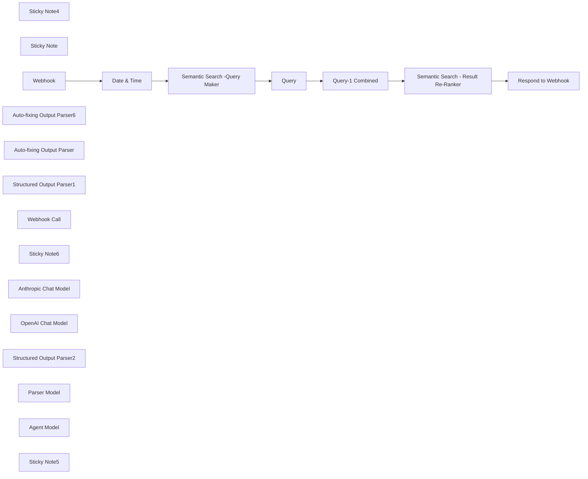

## Fluxo (.json) :

```json
{
  "id": "wa2uEnSIowqSrHoY",
  "meta": {
    "instanceId": "cca06617664f52c5a019ea575691fdbce675dd95dc0452af5f13dbe76d615b69"
  },
  "name": "Intelligent Web Query and Semantic Re-Ranking Flow",
  "tags": [],
  "nodes": [
    {
      "id": "8e7dc5cb-6822-4ef6-9e5a-2b350a1526bf",
      "name": "Sticky Note4",
      "type": "n8n-nodes-base.stickyNote",
      "position": [
        -640,
        -620
      ],
      "parameters": {
        "color": 5,
        "width": 1172,
        "height": 970,
        "content": "\n## Step 1. Set Up a Free Brave Web Search Query API Key\n\nTo attain the free web search API tier from Brave, follow these steps:\n\n1. Visit api.search.brave.com\n2. Create an account\n3. Subscribe to the free plan (no charge)\n4. Navigate to the API Keys section\n5. Generate an API key. For the subscription type, choose \"Free\".\n6. Go to the \"Query\" Nodes and change the \"X-Subscription-Token\" value to your API Key.\n"
      },
      "typeVersion": 1
    },
    {
      "id": "5bb3e68f-7693-4d4b-b794-843f2c3535e0",
      "name": "Sticky Note",
      "type": "n8n-nodes-base.stickyNote",
      "position": [
        -1580,
        -420
      ],
      "parameters": {
        "color": 4,
        "width": 680,
        "height": 360,
        "content": "## If you require to change this Node to Webhook Or any Other Item:\n\n- In case you want to change the input type from Webhook to any other item, Make sure to go to the Query 1 and Query 1 Ranker and replace the Webhook Input to your Node's input."
      },
      "typeVersion": 1
    },
    {
      "id": "f2fc02f9-a78a-4e87-be85-0032492a9f3f",
      "name": "Date & Time",
      "type": "n8n-nodes-base.dateTime",
      "position": [
        -820,
        -240
      ],
      "parameters": {
        "options": {}
      },
      "typeVersion": 2
    },
    {
      "id": "6f18ebbd-83db-4900-bc2e-0a9f23d6e8c8",
      "name": "Webhook",
      "type": "n8n-nodes-base.webhook",
      "position": [
        -1340,
        -240
      ],
      "webhookId": "962f1468-c80f-4c0c-8555-a0acf648ede4",
      "parameters": {
        "path": "962f1468-c80f-4c0c-8555-a0acf648ede4",
        "options": {},
        "responseMode": "responseNode"
      },
      "typeVersion": 2
    },
    {
      "id": "ba5ea83e-1b47-475b-863f-269ae293729a",
      "name": "Auto-fixing Output Parser6",
      "type": "@n8n/n8n-nodes-langchain.outputParserAutofixing",
      "position": [
        180,
        -140
      ],
      "parameters": {
        "options": {}
      },
      "typeVersion": 1
    },
    {
      "id": "ca426b6d-5412-4c5b-a55c-009a47c59a81",
      "name": "Auto-fixing Output Parser",
      "type": "@n8n/n8n-nodes-langchain.outputParserAutofixing",
      "position": [
        -580,
        -140
      ],
      "parameters": {
        "options": {}
      },
      "typeVersion": 1
    },
    {
      "id": "501d5390-5317-4973-a3e9-b0f502399c2b",
      "name": "Structured Output Parser1",
      "type": "@n8n/n8n-nodes-langchain.outputParserStructured",
      "position": [
        -460,
        -60
      ],
      "parameters": {
        "jsonSchemaExample": "{\n \"reasoning_summary\": \"Detailed explanation of each analytical chain’s purpose and insights, including key terms and considerations for query formulation.\",\n \"final_search_query\": \"The single, best-fit search query derived from the meta-reasoning and multi-chain analysis, optimized to answer the research question.\"\n}"
      },
      "typeVersion": 1.2
    },
    {
      "id": "a27e75c7-0307-4d71-9266-5a56b297a6e3",
      "name": "Query-1 Combined",
      "type": "n8n-nodes-base.code",
      "position": [
        -80,
        -240
      ],
      "parameters": {
        "jsCode": "// Initialize an empty string to store all title, url, and description pairs\nlet aggregatedOutputText = \"\";\n\n// Loop through all items passed to this Function node\nfor (let item of items) {\n // Access the JSON data from \"Query 1\" node for the current item\n const queryData = item.json;\n\n // Ensure there is a \"web.results\" array to process\n if (queryData.web?.results && Array.isArray(queryData.web.results)) {\n // Loop through all results in the \"web.results\" array\n for (let result of queryData.web.results) {\n // Extract the title, url, and description for each result\n const title = result.title || \"No Title\";\n const url = result.url || \"No URL\";\n const description = result.description || \"No Description\";\n\n // Append the values to the aggregated string\n aggregatedOutputText += `Title: ${title}\\nURL: ${url}\\nDescription: ${description}\\n\\n`;\n }\n } else {\n // If no results array, handle gracefully\n aggregatedOutputText += \"No results found for this item.\\n\\n\";\n }\n}\n\n// Trim the final string to remove any trailing newline and whitespace\naggregatedOutputText = aggregatedOutputText.trim();\n\n// Return a single item containing the aggregated output as a string\nreturn [\n {\n json: {\n aggregated_text: aggregatedOutputText\n }\n }\n];\n"
      },
      "typeVersion": 2
    },
    {
      "id": "acbdbe94-b5a7-4ec9-9fc8-c3ab147f42fa",
      "name": "Respond to Webhook",
      "type": "n8n-nodes-base.respondToWebhook",
      "position": [
        640,
        -240
      ],
      "parameters": {
        "options": {},
        "respondWith": "text",
        "responseBody": "={\n \"Highest_RANKEDURL_1\": {\n \"title\": \"{{ $item('0').$node['Semantic Search - Result Re-Ranker'].json['output']['Highest_RANKEDURL_1']['title'] }}\",\n \"link\": \"{{ $item('0').$node['Semantic Search - Result Re-Ranker'].json['output']['Highest_RANKEDURL_1']['link'] }}\",\n \"description\": \"{{ $item('0').$node['Semantic Search - Result Re-Ranker'].json['output']['Highest_RANKEDURL_1']['description'] }}\"\n },\n \"Highest_RANKEDURL_2\": {\n \"title\": \"{{ $item('0').$node['Semantic Search - Result Re-Ranker'].json['output']['Highest_RANKEDURL_2']['title'] }}\",\n \"link\": \"{{ $item('0').$node['Semantic Search - Result Re-Ranker'].json['output']['Highest_RANKEDURL_2']['link'] }}\",\n \"description\": \"{{ $item('0').$node['Semantic Search - Result Re-Ranker'].json['output']['Highest_RANKEDURL_2']['description'] }}\"\n },\n \"Highest_RANKEDURL_3\": {\n \"title\": \"{{ $item('0').$node['Semantic Search - Result Re-Ranker'].json['output']['Highest_RANKEDURL_3']['title'] }}\",\n \"link\": \"{{ $item('0').$node['Semantic Search - Result Re-Ranker'].json['output']['Highest_RANKEDURL_3']['link'] }}\",\n \"description\": \"{{ $item('0').$node['Semantic Search - Result Re-Ranker'].json['output']['Highest_RANKEDURL_3']['description'] }}\"\n },\n \"Highest_RANKEDURL_4\": {\n \"title\": \"{{ $item('0').$node['Semantic Search - Result Re-Ranker'].json['output']['Highest_RANKEDURL_4']['title'] }}\",\n \"link\": \"{{ $item('0').$node['Semantic Search - Result Re-Ranker'].json['output']['Highest_RANKEDURL_4']['link'] }}\",\n \"description\": \"{{ $item('0').$node['Semantic Search - Result Re-Ranker'].json['output']['Highest_RANKEDURL_4']['description'] }}\"\n },\n \"Highest_RANKEDURL_5\": {\n \"title\": \"{{ $item('0').$node['Semantic Search - Result Re-Ranker'].json['output']['Highest_RANKEDURL_5']['title'] }}\",\n \"link\": \"{{ $item('0').$node['Semantic Search - Result Re-Ranker'].json['output']['Highest_RANKEDURL_5']['link'] }}\",\n \"description\": \"{{ $item('0').$node['Semantic Search - Result Re-Ranker'].json['output']['Highest_RANKEDURL_5']['description'] }}\"\n },\n \"Highest_RANKEDURL_6\": {\n \"title\": \"{{ $item('0').$node['Semantic Search - Result Re-Ranker'].json['output']['Highest_RANKEDURL_6']['title'] }}\",\n \"link\": \"{{ $item('0').$node['Semantic Search - Result Re-Ranker'].json['output']['Highest_RANKEDURL_6']['link'] }}\",\n \"description\": \"{{ $item('0').$node['Semantic Search - Result Re-Ranker'].json['output']['Highest_RANKEDURL_6']['description'] }}\"\n },\n \"Highest_RANKEDURL_7\": {\n \"title\": \"{{ $item('0').$node['Semantic Search - Result Re-Ranker'].json['output']['Highest_RANKEDURL_7']['title'] }}\",\n \"link\": \"{{ $item('0').$node['Semantic Search - Result Re-Ranker'].json['output']['Highest_RANKEDURL_7']['link'] }}\",\n \"description\": \"{{ $item('0').$node['Semantic Search - Result Re-Ranker'].json['output']['Highest_RANKEDURL_7']['description'] }}\"\n },\n \"Highest_RANKEDURL_8\": {\n \"title\": \"{{ $item('0').$node['Semantic Search - Result Re-Ranker'].json['output']['Highest_RANKEDURL_8']['title'] }}\",\n \"link\": \"{{ $item('0').$node['Semantic Search - Result Re-Ranker'].json['output']['Highest_RANKEDURL_8']['link'] }}\",\n \"description\": \"{{ $item('0').$node['Semantic Search - Result Re-Ranker'].json['output']['Highest_RANKEDURL_8']['description'] }}\"\n },\n \"Highest_RANKEDURL_9\": {\n \"title\": \"{{ $item('0').$node['Semantic Search - Result Re-Ranker'].json['output']['Highest_RANKEDURL_9']['title'] }}\",\n \"link\": \"{{ $item('0').$node['Semantic Search - Result Re-Ranker'].json['output']['Highest_RANKEDURL_9']['link'] }}\",\n \"description\": \"{{ $item('0').$node['Semantic Search - Result Re-Ranker'].json['output']['Highest_RANKEDURL_9']['description'] }}\"\n },\n \"Highest_RANKEDURL_10\": {\n \"title\": \"{{ $item('0').$node['Semantic Search - Result Re-Ranker'].json['output']['Highest_RANKEDURL_10']['title'] }}\",\n \"link\": \"{{ $item('0').$node['Semantic Search - Result Re-Ranker'].json['output']['Highest_RANKEDURL_10']['link'] }}\",\n \"description\": \"{{ $item('0').$node['Semantic Search - Result Re-Ranker'].json['output']['Highest_RANKEDURL_10']['description'] }}\"\n },\n \"Information_extracted\": \"{{ $item('0').$node['Semantic Search - Result Re-Ranker'].json['output']['Information_extracted'] }}\"\n}\n"
      },
      "typeVersion": 1.1
    },
    {
      "id": "b8b6ae73-586a-406f-9641-57e2625f800c",
      "name": "Semantic Search - Result Re-Ranker",
      "type": "@n8n/n8n-nodes-langchain.chainLlm",
      "onError": "continueRegularOutput",
      "position": [
        100,
        -240
      ],
      "parameters": {
        "text": "=\n**Objective:**\n\nFor the user's query, web search results are provided. Your tasks are:\n\n1. **Rank the links** based on how well they match the user's query.\n2. **Extract relevant information** from the descriptions provided. If no relevant information is found, return \"N/A\".\n\n---\n\n**Task:**\n\n**Step 1: Understand the User's Intent**\n\n- Determine what the user is truly and technically looking for.\n- The user's request query is: \"{{ $('Webhook').item.json.query['Research Question'] }}\"\n- The serach results below, however their performance seem, have been based on this query \"{{ $item(\"0\").$node[\"Semantic Search -Query Maker\"].json[\"output\"][\"final_search_query\"] }}\". If the result are not satisfactory or missing due to bad query making, you should note that as well for the neww query making.\n- To nesure being time aware , realize todays date is: \"{{ $item(\"0\").$node[\"Date & Time\"].json[\"currentDate\"] }}\"\n\n- Follow a three-step chain of thought to comprehend the user's needs. Think out loud.\n\n---\n\n**Step 2: Rank the Links**\n\n- From the URLs and description snippets provided, **rank the top 10 websites** that are most likely to contain the required information.\n- Use the titles, descriptions, and sources to inform your ranking.\n\n**Links, Titles, and Descriptions:**\n\n{{ $json.aggregated_text }}\n\n---\n\nThis list completes the structure up to 20 results as you requested. Let me know if there’s anything more you need!\n\n---\n\n**Step 3: Analyze and Create a Follow-up Query**\n\n- Recognize that for the user's request:\n\n `\"{{ $('Webhook').item.json.query['Research Question'] }}\"`\n\n The results provided are based on the assistant's generated search query:\n\n `\"{{ $item(\"0\").$node[\"Semantic Search -Query Maker\"].json[\"output\"][\"final_search_query\"] }}\"`\n\n- Analyze and revise any issues or new insights through multi-step thinking to create a follow-up query.\n\n**Indications and Priorities:**\n\n1. **No Results Received:** If no search items are shared, the search query may have been ineffective (e.g., too specific, incorrect parameters).\n2. **Insufficient or Unpromising Results:** If fewer than 20 but more than 5 results are provided, and none seem promising, the search query may need refinement.\n3. **Successful Results with Potential Follow-up:** If none of the above issues occurred and the search results provide answers or suggest a follow-up, create a new query. This could be a new topic, a deep dive, or a parallel factor that offers additional benefits.\n\n- Provide your chain of thought that connects the user's request to the actual information.\n\n- Deliver precise, detailed, and value-oriented information relevant to the user's query.\n\n**Step 4: Query making notes and examples**: \n\nThe queries must not be long tails , as they result in 0 websearch reutrns. We give you some examples of good web search queries:\nExamples:\n\nUser Question: \"What is the current state of the U.S. economy in 2024?\"\nEffective Search Query: \"U.S. Economy Analysis Report 2024\"\n\nUser Question: \"What are the recent advancements in artificial intelligence?\"\nEffective Search Query: \"2024 Artificial Intelligence Developments\"\n\nUser Question: \"How is climate change affecting agriculture globally?\"\nEffective Search Query: \"Global Impact of Climate Change on Agriculture 2024\"\n\nUser Question: \"What are the latest trends in cybersecurity threats?\"\nEffective Search Query: \"Cybersecurity Threats and Trends 2024\"\n\nUser Question: \"What is the outlook for renewable energy investments?\"\nEffective Search Query: \"Renewable Energy Investment Outlook 2024\"\n\n**Step 5: Query making*: \nor query making remember as we said:\n - **Today's Date:** \"{{ $item(\"0\").$node[\"Date & Time\"].json[\"currentDate\"] }}\"\n **Search Inquiry:** \n - **Search Topic to create the query upon it:**{{ $item(\"0\").$node[\"Webhook\"].json[\"query\"][\"Research Question\"] }}\"\"\n\n\n---\n\n**Step 6: Output Format**\n\nEnsure the response is in the following JSON format:\n\n{\n \"chain_of_thought\": \"Insert your step-by-step reasoning here.\",\n \"Highest_RANKEDURL_1\": {\n \"title\": \"Insert the First Ranked URL's Title here.\",\n \"link\": \"Insert the First Ranked URL here.\",\n \"description\": \"Insert the First Ranked URL's Description here.\"\n },\n \"Highest_RANKEDURL_2\": {\n \"title\": \"Insert the Second Ranked URL's Title here.\",\n \"link\": \"Insert the Second Ranked URL here.\",\n \"description\": \"Insert the Second Ranked URL's Description here.\"\n },\n \"Highest_RANKEDURL_3\": {\n \"title\": \"Insert the Third Ranked URL's Title here.\",\n \"link\": \"Insert the Third Ranked URL here.\",\n \"description\": \"Insert the Third Ranked URL's Description here.\"\n },\n \"Highest_RANKEDURL_4\": {\n \"title\": \"Insert the Fourth Ranked URL's Title here.\",\n \"link\": \"Insert the Fourth Ranked URL here.\",\n \"description\": \"Insert the Fourth Ranked URL's Description here.\"\n },\n \"Highest_RANKEDURL_5\": {\n \"title\": \"Insert the Fifth Ranked URL's Title here.\",\n \"link\": \"Insert the Fifth Ranked URL here.\",\n \"description\": \"Insert the Fifth Ranked URL's Description here.\"\n },\n \"Highest_RANKEDURL_6\": {\n \"title\": \"Insert the Sixth Ranked URL's Title here.\",\n \"link\": \"Insert the Sixth Ranked URL here.\",\n \"description\": \"Insert the Sixth Ranked URL's Description here.\"\n },\n \"Highest_RANKEDURL_7\": {\n \"title\": \"Insert the Seventh Ranked URL's Title here.\",\n \"link\": \"Insert the Seventh Ranked URL here.\",\n \"description\": \"Insert the Seventh Ranked URL's Description here.\"\n },\n \"Highest_RANKEDURL_8\": {\n \"title\": \"Insert the Eighth Ranked URL's Title here.\",\n \"link\": \"Insert the Eighth Ranked URL here.\",\n \"description\": \"Insert the Eighth Ranked URL's Description here.\"\n },\n \"Highest_RANKEDURL_9\": {\n \"title\": \"Insert the Ninth Ranked URL's Title here.\",\n \"link\": \"Insert the Ninth Ranked URL here.\",\n \"description\": \"Insert the Ninth Ranked URL's Description here.\"\n },\n \"Highest_RANKEDURL_10\": {\n \"title\": \"Insert the Tenth Ranked URL's Title here.\",\n \"link\": \"Insert the Tenth Ranked URL here.\",\n \"description\": \"Insert the Tenth Ranked URL's Description here.\"\n },\n \"Information_extracted\": \"Insert all extracted information relevant to the user's query or 'N/A' if none.\"\n}\n",
        "messages": {
          "messageValues": [
            {
              "message": "=\nYou are an expert information retrieval and critical evaluation assistant designed to process, rank, and extract high-relevance content from web search results for complex user queries. You must provide value-oriented insights while refining searches based on relevance and context sensitivity. \n\n**Your Process and Priorities:**\n\n#### 1. **Determine the User's Technical Intent**\n - Interpret the user's core question provided as `{{ $item(\"0\").$node[\"Webhook\"].json[\"query\"][\"Research Question\"] }}`, discerning underlying objectives and specialized needs.\n - Recognize that the search results may have been generated from a **secondary query**: `{{ $item(\"0\").$node[\"Semantic Search -Query Maker\"].json[\"output\"][\"final_search_query\"] }}`. \n - Judge the adequacy of this generated query. If it does not meet the user’s objectives, highlight the need for query refinement and prepare to adapt the approach.\n - Stay mindful of the date context, using `{{ $item(\"0\").$node[\"Date & Time\"].json[\"currentDate\"] }}` to assess the freshness of content or time-sensitive relevance.\n\n#### 2. **Rank Results Based on Analytical Relevance**\n - From the search results provided, **rank the top 3 URLs** that most closely align with the user’s intent and technical needs.\n - Use multi-dimensional analysis to assess how each link’s title, description, and source match the user’s objective.\n - Prioritize results based on credibility, relevance, and their potential to add depth to the user’s inquiry.\n - Your goal is to select the highest-value links, disregarding results that offer superficial, off-topic, or outdated information.\n\n#### 3. **Extract Key Information**\n - For each of the top 3 ranked results, extract insights and details from the description snippets that directly address the user’s query.\n - If no pertinent information is available in a description, record `\"N/A\"` to indicate its lack of relevance.\n\n#### 4. **Evaluate for Potential Query Improvement**\n - Evaluate the relevance and coverage of search results:\n - If fewer than 5 relevant results are present, consider that the initial query may be too narrow, specific, or otherwise misaligned.\n - Generate a **refined query** that is adjusted to better match the user’s likely needs and produce higher-quality results.\n - Use advanced language modifications, new keyword suggestions, or rephrasing to formulate a search query that enhances alignment with the user’s goals.\n"
            }
          ]
        },
        "promptType": "define",
        "hasOutputParser": true
      },
      "retryOnFail": true,
      "typeVersion": 1.4
    },
    {
      "id": "a1ca671d-0b0c-4717-9def-93fdb965de8d",
      "name": "Query",
      "type": "n8n-nodes-base.httpRequest",
      "position": [
        -240,
        -240
      ],
      "parameters": {
        "url": "https://api.search.brave.com/res/v1/web/search",
        "options": {},
        "sendQuery": true,
        "sendHeaders": true,
        "queryParameters": {
          "parameters": [
            {
              "name": "q",
              "value": "={{ $json.output.final_search_query }}"
            }
          ]
        },
        "headerParameters": {
          "parameters": [
            {
              "name": "Accept",
              "value": "application/json"
            },
            {
              "name": "Accept-Encoding",
              "value": "gzip"
            },
            {
              "name": "X-Subscription-Token",
              "value": "<Insert Your API Key Here>"
            }
          ]
        }
      },
      "typeVersion": 4.2
    },
    {
      "id": "d3cc4e7c-3ead-4d38-9b51-a11cd9d7faeb",
      "name": "Webhook Call",
      "type": "n8n-nodes-base.httpRequest",
      "position": [
        -180,
        1040
      ],
      "parameters": {
        "url": "https://primary-production-8aa4.up.railway.app/webhook-test/962f1468-c80f-4c0c-8555-a0acf648ede4",
        "options": {},
        "sendQuery": true,
        "queryParameters": {
          "parameters": [
            {
              "name": "Research Question",
              "value": "what is the latest news in global world in politics and economy?"
            }
          ]
        }
      },
      "typeVersion": 4.2
    },
    {
      "id": "6931404b-94d6-4b9d-9f0a-124012212eb5",
      "name": "Sticky Note6",
      "type": "n8n-nodes-base.stickyNote",
      "position": [
        -640,
        420
      ],
      "parameters": {
        "color": 3,
        "width": 1180,
        "height": 840,
        "content": "## Step 2. Setup the Webhook Call Node\n\n**Instructions for Setting Up the Webhook Call and Using It in Your Workflow**\n\nThis node is designed to send a **web search query** to the workflow (partly built in this chart) and return the results. Follow these steps to correctly configure and use it:\n\n1. **Locate the \"Webhook\" Node in the Workflow**:\n - Navigate to the workflow above, the first item, the \"Webhook\" node.\n - In the \"Webhook\" node, change the **Webhook URL option** from \"Test URL\" to \"Production URL.\"\n - Copy the generated **Production URL**.\n\n2. **Paste the Webhook URL in the HTTP Node**:\n - In your target workflow, locate the **HTTP Request** node.\n - Paste the copied **Production URL** into the URL field of the HTTP Request node. This connects the two workflows.\n\n3. **Send the Research Request**:\n - When sending the request to this workflow, make sure to include your web search query in the **\"Research Question\" parameter** of the HTTP Request node.\n\n4. **Move the Webhook Call Node**:\n - Move this **Webhook Call Node** into the workflow where you need the research results. Ensure that it’s correctly connected and configured to send the data to the main workflow.\n"
      },
      "typeVersion": 1
    },
    {
      "id": "01d73f91-1dd6-4b80-951c-9f944ea9d992",
      "name": "Semantic Search -Query Maker",
      "type": "@n8n/n8n-nodes-langchain.chainLlm",
      "position": [
        -560,
        -240
      ],
      "parameters": {
        "text": "=1. **Task:** `\"Your task is to develop a web search query that most effectively answers the research question given. Use meta-reasoning and multi-chain analysis to ensure a comprehensive approach.\"`\n\n2. **Structured Guidance for Chains of Thought:** \n a. **Chain 1:** Break down the research question, identifying keywords and relevant terms. \n b. **Chain 2:** Explore the context and potential sources, determining the types of results that would be most relevant. \n c. **Chain 3:** Refine the query for specificity and completeness, considering how to capture nuances of the question.\n\n3. **Final Query Generation:** Based on the insights from the three chains, generate a single, refined search query.\n\n\n4. Note, the queries must not be long tails , as they result in 0 websearch reutrns. We give you some examples of good web search queries:\nExamples:\n\nUser Question: \"What is the current state of the U.S. economy in 2024?\"\n\nEffective Search Query: \"U.S. Economy Analysis Report 2024\"\nUser Question: \"What are the recent advancements in artificial intelligence?\"\n\nEffective Search Query: \"2024 Artificial Intelligence Developments\"\nUser Question: \"How is climate change affecting agriculture globally?\"\n\nEffective Search Query: \"Global Impact of Climate Change on Agriculture 2024\"\nUser Question: \"What are the latest trends in cybersecurity threats?\"\n\nEffective Search Query: \"Cybersecurity Threats and Trends 2024\"\nUser Question: \"What is the outlook for renewable energy investments?\"\n\nEffective Search Query: \"Renewable Energy Investment Outlook 2024\"\n\n5. Data Input:\n - **Today's Date:** \"{{ $item(\"0\").$node[\"Date & Time\"].json[\"currentDate\"] }}\"\n **Search Inquiry:** \n - **Search Topic to create the query upon it:**{{ $item(\"0\").$node[\"Webhook\"].json[\"query\"][\"Research Question\"] }}\"\"\n\n6. Now develop the best fit web search query given the user request above under number 5\n---\n\n**Output Requirements:** \nThe Assistant’s output should be in JSON format, structured as follows:\n\n{\n \"reasoning_summary\": \"Detailed explanation of each analytical chain’s purpose and insights, including key terms and considerations for query formulation.\",\n \"final_search_query\": \"The single, best-fit search query derived from the meta-reasoning and multi-chain analysis, optimized to answer the research question.\"\n}\n```\n\n---\n",
        "messages": {
          "messageValues": [
            {
              "message": "You are an advanced data and research retrieval through smart search queires via Bing and Brave websearch APIs. "
            },
            {
              "type": "HumanMessagePromptTemplate",
              "message": "1. **Task:** `\"Your task is to develop a web search query that most effectively answers the research question given. Use meta-reasoning and multi-chain analysis to ensure a comprehensive approach.\"`\n\n2. **Structured Guidance for Chains of Thought:** \n a. **Chain 1:** Break down the research question, identifying keywords and relevant terms. \n b. **Chain 2:** Explore the context and potential sources, determining the types of results that would be most relevant. \n c. **Chain 3:** Refine the query for specificity and completeness, considering how to capture nuances of the question.\n\n3. **Final Query Generation:** Based on the insights from the three chains, generate a single, refined search query.\n\n4. Data Input:\n - **Today's Date:** \"2024-11-12T10:21:33.764-05:00\"\n2. **Search Inquiry:** \n - **Search Topic to create the query upon it:** \"What is the latest stock Market Analysis in mid-term?\"\n\n\n---\n\n**Output Requirements:** \nThe Assistant’s output should be in JSON format, structured as follows:\n\n{\n \"reasoning_summary\": \"Detailed explanation of each analytical chain’s purpose and insights, including key terms and considerations for query formulation.\",\n \"final_search_query\": \"The single, best-fit search query derived from the meta-reasoning and multi-chain analysis, optimized to answer the research question.\"\n}\n```\n\n---\n"
            },
            {
              "type": "AIMessagePromptTemplate",
              "message": "Assessing query functionality\n\nI’m evaluating the viability of the assistant's proposed search query. The user questions if it would yield meaningful results on different search engines.\n\nClarifying the query\n\nOK, let me see. The task involves clarifying the user's needs, ensuring the response aligns with OpenAI's policies, and possibly re-evaluating and correcting any errors in the previous response.\n\nRefining search specifics\n\nI'm working through refining the search query to focus on specific terms like 'S&P 500', integrating dates such as 'November 2024', and emphasizing phrases for precision.\n\nSelf-reflecting on search queries\n\nToday, I’m thinking about how to validate search queries for accuracy and realism, ensuring they are practical and likely to yield productive results.\n\nAcknowledging insights\n\nI’m recognizing and correcting a search query to ensure it’s optimal and effectively aligned with advanced user needs, leading to a more precise output.\n\nCrafting a search query\n\nI’m crafting a search query to pinpoint the most pertinent recent mid-term stock market analyses. Starting with relevant terms and then exploring potential sources for context and relevance.\n\nPinpointing sources and specifics\n\nI'm gathering info from financial news, investment reports, and economic research institutions. I’m refining search terms like \"mid-term stock market analysis\" and \"market forecast\" to keep results current and nuanced.\n\nCrafting the query\n\nI’m finalizing the query by merging terms like 'latest' and 'stock market analysis' with 'mid-term', and considering synonyms such as 'market forecast' to refine the search for 2024.\n\nTweaking the search\n\nI adjusted the search terms to 'latest stock market mid-term outlook 2024,' removing excessive quotes for better clarity and relevance.\n\n\n{\n \"reasoning_summary\": \"Chain 1: Broke down the research question to identify key terms such as 'latest', 'stock market analysis', and 'mid-term'. Considered synonyms like 'mid-term outlook', 'market forecast', and included the current year '2024' for recency.\\n\\nChain 2: Explored the context where the user seeks recent analyses of the stock market with a mid-term perspective. Relevant sources would be financial news outlets, investment banks, and economic research firms. The most useful results would be up-to-date articles or reports offering mid-term forecasts.\\n\\nChain 3: Refined the query by removing unnecessary quotation marks and simplifying it to reflect how an advanced user might search. Included terms like 'latest', 'mid-term outlook', and '2024' to enhance specificity without limiting the search results unnecessarily.\",\n \"final_search_query\": \"latest stock market mid-term outlook 2024\"\n}"
            }
          ]
        },
        "promptType": "define",
        "hasOutputParser": true
      },
      "typeVersion": 1.4
    },
    {
      "id": "696b4f97-ad29-406b-9157-44ad9d05c9cd",
      "name": "Anthropic Chat Model",
      "type": "@n8n/n8n-nodes-langchain.lmChatAnthropic",
      "position": [
        740,
        180
      ],
      "parameters": {
        "model": "claude-3-5-haiku-20241022",
        "options": {
          "topP": 0.8,
          "temperature": 0.4,
          "maxTokensToSample": 4096
        }
      },
      "credentials": {
        "anthropicApi": {
          "id": "mVKB2CryW6bMm9Qo",
          "name": "Anthropic account"
        }
      },
      "typeVersion": 1.2
    },
    {
      "id": "82f25610-8b70-4aee-ad90-2616d3389f15",
      "name": "OpenAI Chat Model",
      "type": "@n8n/n8n-nodes-langchain.lmChatOpenAi",
      "position": [
        900,
        180
      ],
      "parameters": {
        "options": {
          "topP": 0.7,
          "maxTokens": 4096,
          "maxRetries": 1,
          "temperature": 0.5
        }
      },
      "credentials": {
        "openAiApi": {
          "id": "wQQZLwJO9A5nFu8h",
          "name": "OpenAi account"
        }
      },
      "typeVersion": 1
    },
    {
      "id": "f230bdf0-4a22-4abf-96cd-47f309f0c514",
      "name": "Structured Output Parser2",
      "type": "@n8n/n8n-nodes-langchain.outputParserStructured",
      "position": [
        260,
        -60
      ],
      "parameters": {
        "jsonSchemaExample": "{\n \"chain_of_thought\": \"Insert your step-by-step reasoning here.\",\n \"Highest_RANKEDURL_1\": {\n \"title\": \"Insert the First Ranked URL's Title here.\",\n \"link\": \"Insert the First Ranked URL here.\",\n \"description\": \"Insert the First Ranked URL's Description here.\"\n },\n \"Highest_RANKEDURL_2\": {\n \"title\": \"Insert the Second Ranked URL's Title here.\",\n \"link\": \"Insert the Second Ranked URL here.\",\n \"description\": \"Insert the Second Ranked URL's Description here.\"\n },\n \"Highest_RANKEDURL_3\": {\n \"title\": \"Insert the Third Ranked URL's Title here.\",\n \"link\": \"Insert the Third Ranked URL here.\",\n \"description\": \"Insert the Third Ranked URL's Description here.\"\n },\n \"Highest_RANKEDURL_4\": {\n \"title\": \"Insert the Fourth Ranked URL's Title here.\",\n \"link\": \"Insert the Fourth Ranked URL here.\",\n \"description\": \"Insert the Fourth Ranked URL's Description here.\"\n },\n \"Highest_RANKEDURL_5\": {\n \"title\": \"Insert the Fifth Ranked URL's Title here.\",\n \"link\": \"Insert the Fifth Ranked URL here.\",\n \"description\": \"Insert the Fifth Ranked URL's Description here.\"\n },\n \"Highest_RANKEDURL_6\": {\n \"title\": \"Insert the Sixth Ranked URL's Title here.\",\n \"link\": \"Insert the Sixth Ranked URL here.\",\n \"description\": \"Insert the Sixth Ranked URL's Description here.\"\n },\n \"Highest_RANKEDURL_7\": {\n \"title\": \"Insert the Seventh Ranked URL's Title here.\",\n \"link\": \"Insert the Seventh Ranked URL here.\",\n \"description\": \"Insert the Seventh Ranked URL's Description here.\"\n },\n \"Highest_RANKEDURL_8\": {\n \"title\": \"Insert the Eighth Ranked URL's Title here.\",\n \"link\": \"Insert the Eighth Ranked URL here.\",\n \"description\": \"Insert the Eighth Ranked URL's Description here.\"\n },\n \"Highest_RANKEDURL_9\": {\n \"title\": \"Insert the Ninth Ranked URL's Title here.\",\n \"link\": \"Insert the Ninth Ranked URL here.\",\n \"description\": \"Insert the Ninth Ranked URL's Description here.\"\n },\n \"Highest_RANKEDURL_10\": {\n \"title\": \"Insert the Tenth Ranked URL's Title here.\",\n \"link\": \"Insert the Tenth Ranked URL here.\",\n \"description\": \"Insert the Tenth Ranked URL's Description here.\"\n },\n \"Information_extracted\": \"Insert all extracted information relevant to the user's query or 'N/A' if none.\"\n}\n"
      },
      "typeVersion": 1.2
    },
    {
      "id": "3421ebe5-6a86-435e-b9c6-e3dcf6dd7833",
      "name": "Parser Model",
      "type": "@n8n/n8n-nodes-langchain.lmChatGoogleGemini",
      "position": [
        -180,
        180
      ],
      "parameters": {
        "options": {
          "topP": 0.6,
          "temperature": 0.4,
          "maxOutputTokens": 4096
        },
        "modelName": "models/gemini-1.5-flash-002"
      },
      "credentials": {
        "googlePalmApi": {
          "id": "rTbWGMQGwWtjhNaA",
          "name": "Google Gemini(PaLM) Api account 4"
        }
      },
      "typeVersion": 1
    },
    {
      "id": "fd19e9f6-d8c7-45df-93d9-ecf7956b461f",
      "name": "Agent Model",
      "type": "@n8n/n8n-nodes-langchain.lmChatGoogleGemini",
      "position": [
        -180,
        -20
      ],
      "parameters": {
        "options": {
          "topP": 0.6,
          "temperature": 0.4,
          "safetySettings": {
            "values": [
              {
                "category": "HARM_CATEGORY_HARASSMENT",
                "threshold": "BLOCK_NONE"
              },
              {
                "category": "HARM_CATEGORY_HATE_SPEECH",
                "threshold": "BLOCK_NONE"
              },
              {
                "category": "HARM_CATEGORY_SEXUALLY_EXPLICIT",
                "threshold": "BLOCK_NONE"
              },
              {
                "category": "HARM_CATEGORY_DANGEROUS_CONTENT",
                "threshold": "BLOCK_NONE"
              }
            ]
          },
          "maxOutputTokens": 4086
        },
        "modelName": "models/gemini-1.5-flash-002"
      },
      "credentials": {
        "googlePalmApi": {
          "id": "rTbWGMQGwWtjhNaA",
          "name": "Google Gemini(PaLM) Api account 4"
        }
      },
      "typeVersion": 1
    },
    {
      "id": "156e83ff-928a-4aca-af8b-0c0fa51acd56",
      "name": "Sticky Note5",
      "type": "n8n-nodes-base.stickyNote",
      "position": [
        560,
        -20
      ],
      "parameters": {
        "color": 6,
        "width": 712,
        "height": 370,
        "content": "\n## Customized Models to Replace\n\nIn case you rather to use another LLM Model to Perform the Semantic Search and Re-Ranking, These nodes below are Optimized based on the LLM Structure of OpenAI GPT4o & Anthropic Claude.\n"
      },
      "typeVersion": 1
    }
  ],
  "active": false,
  "pinData": {},
  "settings": {
    "executionOrder": "v1"
  },
  "versionId": "b824ca9d-5676-4ca5-b97d-e5113d955de2",
  "connections": {
    "Query": {
      "main": [
        [
          {
            "node": "Query-1 Combined",
            "type": "main",
            "index": 0
          }
        ]
      ]
    },
    "Webhook": {
      "main": [
        [
          {
            "node": "Date & Time",
            "type": "main",
            "index": 0
          }
        ]
      ]
    },
    "Agent Model": {
      "ai_languageModel": [
        [
          {
            "node": "Semantic Search - Result Re-Ranker",
            "type": "ai_languageModel",
            "index": 0
          },
          {
            "node": "Semantic Search -Query Maker",
            "type": "ai_languageModel",
            "index": 0
          }
        ]
      ]
    },
    "Date & Time": {
      "main": [
        [
          {
            "node": "Semantic Search -Query Maker",
            "type": "main",
            "index": 0
          }
        ]
      ]
    },
    "Parser Model": {
      "ai_languageModel": [
        [
          {
            "node": "Auto-fixing Output Parser6",
            "type": "ai_languageModel",
            "index": 0
          },
          {
            "node": "Auto-fixing Output Parser",
            "type": "ai_languageModel",
            "index": 0
          }
        ]
      ]
    },
    "Query-1 Combined": {
      "main": [
        [
          {
            "node": "Semantic Search - Result Re-Ranker",
            "type": "main",
            "index": 0
          }
        ]
      ]
    },
    "OpenAI Chat Model": {
      "ai_languageModel": [
        []
      ]
    },
    "Anthropic Chat Model": {
      "ai_languageModel": [
        []
      ]
    },
    "Auto-fixing Output Parser": {
      "ai_outputParser": [
        [
          {
            "node": "Semantic Search -Query Maker",
            "type": "ai_outputParser",
            "index": 0
          }
        ]
      ]
    },
    "Structured Output Parser1": {
      "ai_outputParser": [
        [
          {
            "node": "Auto-fixing Output Parser",
            "type": "ai_outputParser",
            "index": 0
          }
        ]
      ]
    },
    "Structured Output Parser2": {
      "ai_outputParser": [
        [
          {
            "node": "Auto-fixing Output Parser6",
            "type": "ai_outputParser",
            "index": 0
          }
        ]
      ]
    },
    "Auto-fixing Output Parser6": {
      "ai_outputParser": [
        [
          {
            "node": "Semantic Search - Result Re-Ranker",
            "type": "ai_outputParser",
            "index": 0
          }
        ]
      ]
    },
    "Semantic Search -Query Maker": {
      "main": [
        [
          {
            "node": "Query",
            "type": "main",
            "index": 0
          }
        ]
      ]
    },
    "Semantic Search - Result Re-Ranker": {
      "main": [
        [
          {
            "node": "Respond to Webhook",
            "type": "main",
            "index": 0
          }
        ]
      ]
    }
  }
}
```

<a id="template-1139"></a>

## Template 1139 - Gatilho para novo contato Keap

- **Nome:** Gatilho para novo contato Keap
- **Descrição:** Inicia o fluxo quando um novo contato é adicionado na conta Keap, entregando os dados do contato para processamento posterior.
- **Funcionalidade:** • Detecção de novo contato: Aciona o fluxo ao ocorrer o evento contact.add (novo contato adicionado).
• Recebimento de payload do contato: Captura os dados enviados pelo evento para uso em ações subsequentes.
• Autenticação via credenciais OAuth2: Utiliza credenciais configuradas para validar e autorizar a recepção dos eventos.
- **Ferramentas:** • Keap: Plataforma de CRM e automação que gerencia contatos e emite eventos/webhooks quando novos contatos são adicionados, permitindo integrações via API.

## Fluxo visual

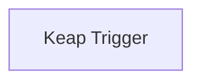

## Fluxo (.json) :

```json
{
  "nodes": [
    {
      "name": "Keap Trigger",
      "type": "n8n-nodes-base.keapTrigger",
      "position": [
        440,
        320
      ],
      "webhookId": "1df33e6f-7e5c-4d70-b90d-d5666aaf63e7",
      "parameters": {
        "eventId": "contact.add"
      },
      "credentials": {
        "keapOAuth2Api": "keap_creds"
      },
      "typeVersion": 1
    }
  ],
  "connections": {}
}
```

<a id="template-1140"></a>

## Template 1140 - Mesclagem de PDFs de URLs para arquivo local

- **Nome:** Mesclagem de PDFs de URLs para arquivo local
- **Descrição:** Busca PDFs a partir de uma lista de URLs, mescla os arquivos em um único PDF e salva o resultado no sistema de arquivos local.
- **Funcionalidade:** • Geração de lista de PDFs: Cria uma lista de URLs de arquivos PDF para processamento.
• Download de PDFs: Faz requisições HTTP para baixar cada PDF da lista.
• Mesclagem de PDFs: Combina os PDFs baixados em um único documento.
• Gravação em disco: Salva o PDF mesclado com nome especificado no sistema de arquivos local.
• Leitura do arquivo salvo: Abre/seleciona o arquivo salvo para uso ou inspeção posterior.
- **Ferramentas:** • Servidores HTTP/HTTPS: Fornecem os arquivos PDF acessíveis por URL.
• Serviço de mesclagem de PDFs (CustomJS): API/serviço responsável por unir múltiplos arquivos PDF em um único documento.
• Sistema de arquivos local: Armazena o PDF final e permite leitura posterior.

## Fluxo visual

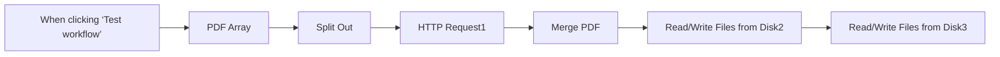

## Fluxo (.json) :

```json
{
  "meta": {
    "instanceId": "b503899dfd9ae32bbf8e1f446a1f2c9b3c59f80c79b274c49b1606b7ae9579e1",
    "templateCredsSetupCompleted": true
  },
  "nodes": [
    {
      "id": "19f32c25-df26-426d-8e28-f1d29c8571b1",
      "name": "Split Out",
      "type": "n8n-nodes-base.splitOut",
      "position": [
        -200,
        -240
      ],
      "parameters": {
        "options": {},
        "fieldToSplitOut": "data"
      },
      "typeVersion": 1
    },
    {
      "id": "7360c3f9-2e11-4839-b105-ecab66a39af2",
      "name": "HTTP Request1",
      "type": "n8n-nodes-base.httpRequest",
      "position": [
        20,
        -240
      ],
      "parameters": {
        "url": "={{ $json.data }}",
        "options": {}
      },
      "typeVersion": 4.2
    },
    {
      "id": "49cb0c7b-c9d8-4bf1-afa5-5afab9e7967e",
      "name": "Read/Write Files from Disk2",
      "type": "n8n-nodes-base.readWriteFile",
      "position": [
        460,
        -240
      ],
      "parameters": {
        "options": {},
        "fileName": "test.pdf",
        "operation": "write"
      },
      "typeVersion": 1
    },
    {
      "id": "05ef1b18-481d-40f8-a6b3-712bb9ba2b6f",
      "name": "Read/Write Files from Disk3",
      "type": "n8n-nodes-base.readWriteFile",
      "position": [
        680,
        -240
      ],
      "parameters": {
        "options": {},
        "fileSelector": "test.pdf"
      },
      "typeVersion": 1
    },
    {
      "id": "c8f0971c-e1e0-4add-83cb-932902f80b56",
      "name": "When clicking ‘Test workflow’",
      "type": "n8n-nodes-base.manualTrigger",
      "position": [
        -640,
        -240
      ],
      "parameters": {},
      "typeVersion": 1
    },
    {
      "id": "b83c51ea-9afc-411a-baad-429776e843f3",
      "name": "PDF Array",
      "type": "n8n-nodes-base.code",
      "position": [
        -420,
        -240
      ],
      "parameters": {
        "jsCode": "return { data: [\n  \"https://www.intewa.com/fileadmin/documents/pdf-file.pdf\", \"https://www.w3.org/WAI/ER/tests/xhtml/testfiles/resources/pdf/dummy.pdf\"\n]}"
      },
      "typeVersion": 2
    },
    {
      "id": "b122b6e4-2dfa-4f1f-8547-36ba91ca93f9",
      "name": "Merge PDF",
      "type": "@custom-js/n8n-nodes-pdf-toolkit.mergePdfs",
      "position": [
        240,
        -240
      ],
      "parameters": {},
      "credentials": {
        "customJsApi": {
          "id": "BFGbk0a71fKWY967",
          "name": "CustomJS account"
        }
      },
      "typeVersion": 1
    }
  ],
  "pinData": {},
  "connections": {
    "Merge PDF": {
      "main": [
        [
          {
            "node": "Read/Write Files from Disk2",
            "type": "main",
            "index": 0
          }
        ]
      ]
    },
    "PDF Array": {
      "main": [
        [
          {
            "node": "Split Out",
            "type": "main",
            "index": 0
          }
        ]
      ]
    },
    "Split Out": {
      "main": [
        [
          {
            "node": "HTTP Request1",
            "type": "main",
            "index": 0
          }
        ]
      ]
    },
    "HTTP Request1": {
      "main": [
        [
          {
            "node": "Merge PDF",
            "type": "main",
            "index": 0
          }
        ]
      ]
    },
    "Read/Write Files from Disk2": {
      "main": [
        [
          {
            "node": "Read/Write Files from Disk3",
            "type": "main",
            "index": 0
          }
        ]
      ]
    },
    "When clicking ‘Test workflow’": {
      "main": [
        [
          {
            "node": "PDF Array",
            "type": "main",
            "index": 0
          }
        ]
      ]
    }
  }
}
```
