# PACK 1999 TEMPLATES PARTE 06 - Bloco 8

Templates neste bloco: 20

## Sumário

- [Template 1141 - Classificar respostas e executar ações (unsubscribe/interessado/OOO)](#template-1141)
- [Template 1142 - Subscrição com IA e envio de factoids](#template-1142)
- [Template 1143 - Coleta de leads por formulário com verificação e notificações](#template-1143)
- [Template 1144 - Gerar rascunho de resposta com Assistente OpenAI](#template-1144)
- [Template 1145 - Enriquecer dados de organização com GPT-4o ao criar no Pipedrive](#template-1145)
- [Template 1146 - Controle de bot Discord: mensagens, DMs e roles](#template-1146)
- [Template 1147 - Gerenciamento de calendário Google](#template-1147)
- [Template 1148 - Enriquecimento INSEE para Agile CRM](#template-1148)
- [Template 1149 - Sincronizar novas actividades Strava na planilha](#template-1149)
- [Template 1150 - Relatório Matomo com IA](#template-1150)
- [Template 1151 - Auto-tagging de posts WordPress com IA](#template-1151)
- [Template 1152 - Auditoria de imagens e geração de alt text](#template-1152)
- [Template 1153 - Descoberta e enriquecimento de decisores](#template-1153)
- [Template 1154 - Decodificar URLs do Google News RSS](#template-1154)
- [Template 1155 - Rascunho de resposta com Assistente OpenAI](#template-1155)
- [Template 1156 - Criador de URL UTM com QR e relatórios GA agendados](#template-1156)
- [Template 1157 - Extração automatizada de notícias](#template-1157)
- [Template 1158 - Gestão automática de e-mails com IA](#template-1158)
- [Template 1159 - Auto-resposta por IA para pedidos di informazioni](#template-1159)
- [Template 1160 - Captura e análise de avaliações Trustpilot](#template-1160)

---

<a id="template-1141"></a>

## Template 1141 - Classificar respostas e executar ações (unsubscribe/interessado/OOO)

- **Nome:** Classificar respostas e executar ações (unsubscribe/interessado/OOO)
- **Descrição:** Recebe respostas de campanhas de email, classifica o conteúdo com IA e aciona ações automáticas como cancelar inscrição, marcar interesse, criar negócio, agendar follow-up ou notificar a equipe.
- **Funcionalidade:** • Detecção de respostas: Inicia o fluxo ao receber uma resposta a um email de campanha.
• Classificação por IA: Usa um modelo para categorizar a resposta em: interested, Out of office, unsubscribe ou other.
• Roteamento por categoria: Encaminha a resposta para diferentes ações conforme a categoria detectada.
• Cancelamento de inscrição: Chama a API para remover o lead da campanha quando a categoria é 'unsubscribe'.
• Marcar como interessado: Marca o lead como 'interested' via API quando a resposta é positiva.
• Criação de negócio: Procura o contato no CRM e cria um novo negócio associado ao contato quando há interesse.
• Notificação da equipe: Envia mensagem para canal da equipe com link para o negócio após criação.
• Agendar follow-up por OOO: Ao detectar 'Out of Office', busca o contato no CRM e cria uma tarefa de follow-up com assunto indicando OOO.
• Notificação fallback: Para respostas não categorizadas, envia notificação com link para o relatório de campanha.
- **Ferramentas:** • Lemlist: Plataforma de envio de campanhas de email; fornece webhook de respostas e APIs para marcar interesse ou cancelar inscrição.
• OpenAI: Serviço de IA usado para classificar automaticamente o conteúdo das respostas em categorias predefinidas.
• HubSpot: CRM usado para buscar/associar contatos, criar negócios e criar tarefas de follow-up.
• Slack: Canal de comunicação usado para notificar a equipe sobre novos leads interessados ou respostas relevantes.

## Fluxo visual

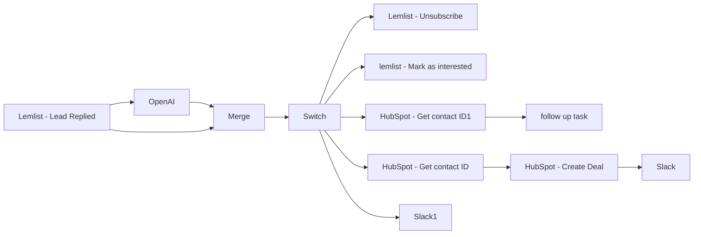

## Fluxo (.json) :

```json
{
  "meta": {
    "instanceId": "f0a68da631efd4ed052a324b63ff90f7a844426af0398a68338f44245d1dd9e5"
  },
  "nodes": [
    {
      "id": "44b2e0ac-1ec9-4acd-bf00-7e280378b8df",
      "name": "Lemlist - Unsubscribe",
      "type": "n8n-nodes-base.lemlist",
      "position": [
        1300,
        -180
      ],
      "parameters": {
        "email": "={{ $json[\"leadEmail\"] }}",
        "resource": "lead",
        "operation": "unsubscribe",
        "campaignId": "={{$json[\"campaignId\"]}}"
      },
      "credentials": {
        "lemlistApi": {
          "id": "45",
          "name": "Lemlist - \"lemlist\" team API key"
        }
      },
      "typeVersion": 1
    },
    {
      "id": "75dd6db8-5e59-4521-a4be-2272e2914494",
      "name": "follow up task",
      "type": "n8n-nodes-base.hubspot",
      "position": [
        1520,
        640
      ],
      "parameters": {
        "type": "task",
        "metadata": {
          "subject": "=OOO - Follow up with {{ $json[\"properties\"][\"firstname\"][\"value\"] }} {{ $json[\"properties\"][\"lastname\"][\"value\"] }}"
        },
        "resource": "engagement",
        "authentication": "oAuth2",
        "additionalFields": {
          "associations": {
            "contactIds": "={{ $json[\"vid\"] }}"
          }
        }
      },
      "credentials": {
        "hubspotOAuth2Api": {
          "id": "14",
          "name": "Hubspot account"
        }
      },
      "typeVersion": 1
    },
    {
      "id": "0ba95d5d-fe73-4687-8e21-02b97b19924f",
      "name": "Switch",
      "type": "n8n-nodes-base.switch",
      "position": [
        380,
        300
      ],
      "parameters": {
        "rules": {
          "rules": [
            {
              "value2": "Unsubscribe"
            },
            {
              "output": 1,
              "value2": "Interested"
            },
            {
              "output": 2,
              "value2": "Out of Office"
            }
          ]
        },
        "value1": "={{ $json[\"text\"].trim() }}",
        "dataType": "string",
        "fallbackOutput": 3
      },
      "typeVersion": 1
    },
    {
      "id": "abdb4925-4b2a-48e0-aa3d-042e1112150a",
      "name": "Merge",
      "type": "n8n-nodes-base.merge",
      "position": [
        140,
        300
      ],
      "parameters": {
        "mode": "combine",
        "options": {
          "clashHandling": {
            "values": {
              "resolveClash": "preferInput1"
            }
          }
        },
        "combinationMode": "mergeByPosition"
      },
      "typeVersion": 2
    },
    {
      "id": "b911bd29-9141-43ac-87d4-3922be5cbe5c",
      "name": "lemlist - Mark as interested",
      "type": "n8n-nodes-base.httpRequest",
      "position": [
        1300,
        160
      ],
      "parameters": {
        "url": "=https://api.lemlist.com/api/campaigns/YOUR_CAMPAIGN_ID/leads/{{$json[\"leadEmail\"]}}/interested",
        "options": {},
        "requestMethod": "POST",
        "authentication": "predefinedCredentialType",
        "nodeCredentialType": "lemlistApi"
      },
      "credentials": {
        "lemlistApi": {
          "id": "45",
          "name": "Lemlist - \"lemlist\" team API key"
        }
      },
      "typeVersion": 2
    },
    {
      "id": "510adb64-fb3a-4d56-abf3-ab9cc0d3e683",
      "name": "HubSpot - Create Deal",
      "type": "n8n-nodes-base.hubspot",
      "position": [
        1520,
        380
      ],
      "parameters": {
        "stage": "79009480",
        "authentication": "oAuth2",
        "additionalFields": {
          "dealName": "=New Deal with {{ $json[\"identity-profiles\"][0][\"identities\"][0][\"value\"] }}",
          "associatedVids": "={{$json[\"canonical-vid\"]}}"
        }
      },
      "credentials": {
        "hubspotOAuth2Api": {
          "id": "14",
          "name": "Hubspot account"
        }
      },
      "typeVersion": 1
    },
    {
      "id": "635e40a2-0546-4c3e-8080-26d72fc5ea35",
      "name": "HubSpot - Get contact ID",
      "type": "n8n-nodes-base.hubspot",
      "position": [
        1300,
        380
      ],
      "parameters": {
        "email": "={{ $json[\"leadEmail\"] }}",
        "resource": "contact",
        "authentication": "oAuth2",
        "additionalFields": {
          "lastName": "={{ $json[\"leadLastName\"] }}",
          "firstName": "={{ $json[\"leadFirstName\"] }}"
        }
      },
      "credentials": {
        "hubspotOAuth2Api": {
          "id": "14",
          "name": "Hubspot account"
        }
      },
      "typeVersion": 1
    },
    {
      "id": "a072f9bb-09ca-4edb-b4ae-76c768be681f",
      "name": "Slack",
      "type": "n8n-nodes-base.slack",
      "position": [
        1740,
        380
      ],
      "parameters": {
        "text": "=Hello a new lead is interested. \n\nMore info in Hubspot here: \nhttps://app-eu1.hubspot.com/contacts/25897606/deal/{{$json[\"dealId\"]}}",
        "channel": "Your channel name",
        "attachments": [],
        "otherOptions": {},
        "authentication": "oAuth2"
      },
      "typeVersion": 1
    },
    {
      "id": "db18ac14-8e18-4d86-853d-19590a09b7cc",
      "name": "HubSpot - Get contact ID1",
      "type": "n8n-nodes-base.hubspot",
      "position": [
        1300,
        640
      ],
      "parameters": {
        "email": "={{ $json[\"leadEmail\"] }}",
        "resource": "contact",
        "authentication": "oAuth2",
        "additionalFields": {
          "lastName": "={{ $json[\"leadLastName\"] }}",
          "firstName": "={{ $json[\"leadFirstName\"] }}"
        }
      },
      "credentials": {
        "hubspotOAuth2Api": {
          "id": "14",
          "name": "Hubspot account"
        }
      },
      "typeVersion": 1
    },
    {
      "id": "9153abd0-4606-423c-8e9b-7cdcf7a9c490",
      "name": "Slack1",
      "type": "n8n-nodes-base.slack",
      "position": [
        1300,
        900
      ],
      "parameters": {
        "text": "=Hello a lead replied to your emails. \n\nMore info in lemlist here: \nhttps://app.lemlist.com/teams/{{$json[\"teamId\"]}}/reports/campaigns/{{$json[\"campaignId\"]}}",
        "channel": "Your channel name",
        "attachments": [],
        "otherOptions": {},
        "authentication": "oAuth2"
      },
      "typeVersion": 1
    },
    {
      "id": "42b93264-df66-4528-ab02-c038ea0d8758",
      "name": "Lemlist - Lead Replied",
      "type": "n8n-nodes-base.lemlistTrigger",
      "position": [
        -520,
        320
      ],
      "webhookId": "c8f49f36-7ab6-4607-bc5a-41c9555ebd09",
      "parameters": {
        "event": "emailsReplied",
        "options": {
          "isFirst": true
        }
      },
      "credentials": {
        "lemlistApi": {
          "id": "45",
          "name": "Lemlist - \"lemlist\" team API key"
        }
      },
      "typeVersion": 1
    },
    {
      "id": "c3b52828-e6d6-41a0-b9ca-101cec379dbf",
      "name": "OpenAI",
      "type": "n8n-nodes-base.openAi",
      "position": [
        -240,
        140
      ],
      "parameters": {
        "prompt": "=The following is a list of emails and the categories they fall into:\nCategories=[\"interested\", \"Out of office\", \"unsubscribe\", \"other\"]\n\nInterested is when the reply is positive.\"\n\n{{$json[\"text\"].replaceAll(/^\\s+|\\s+$/g, '').replace(/(\\r\\n|\\n|\\r)/gm, \"\")}}\\\"\nCategory:",
        "options": {
          "topP": 1,
          "maxTokens": 6,
          "temperature": 0
        }
      },
      "credentials": {
        "openAiApi": {
          "id": "67",
          "name": "Lucas Open AI"
        }
      },
      "typeVersion": 1
    }
  ],
  "connections": {
    "Merge": {
      "main": [
        [
          {
            "node": "Switch",
            "type": "main",
            "index": 0
          }
        ]
      ]
    },
    "OpenAI": {
      "main": [
        [
          {
            "node": "Merge",
            "type": "main",
            "index": 0
          }
        ]
      ]
    },
    "Switch": {
      "main": [
        [
          {
            "node": "Lemlist - Unsubscribe",
            "type": "main",
            "index": 0
          }
        ],
        [
          {
            "node": "lemlist - Mark as interested",
            "type": "main",
            "index": 0
          },
          {
            "node": "HubSpot - Get contact ID",
            "type": "main",
            "index": 0
          }
        ],
        [
          {
            "node": "HubSpot - Get contact ID1",
            "type": "main",
            "index": 0
          }
        ],
        [
          {
            "node": "Slack1",
            "type": "main",
            "index": 0
          }
        ]
      ]
    },
    "HubSpot - Create Deal": {
      "main": [
        [
          {
            "node": "Slack",
            "type": "main",
            "index": 0
          }
        ]
      ]
    },
    "Lemlist - Lead Replied": {
      "main": [
        [
          {
            "node": "OpenAI",
            "type": "main",
            "index": 0
          },
          {
            "node": "Merge",
            "type": "main",
            "index": 1
          }
        ]
      ]
    },
    "HubSpot - Get contact ID": {
      "main": [
        [
          {
            "node": "HubSpot - Create Deal",
            "type": "main",
            "index": 0
          }
        ]
      ]
    },
    "HubSpot - Get contact ID1": {
      "main": [
        [
          {
            "node": "follow up task",
            "type": "main",
            "index": 0
          }
        ]
      ]
    }
  }
}
```

<a id="template-1142"></a>

## Template 1142 - Subscrição com IA e envio de factoids

- **Nome:** Subscrição com IA e envio de factoids
- **Descrição:** Automatiza a coleta de inscrições via formulário, gerencia assinantes em um banco de dados, gera conteúdo e imagens com IA e envia factoids periódicos por e-mail, incluindo link de unsubscribe e registro de envio.
- **Funcionalidade:** • Detecção de novas inscrições via formulário de subscrição: ao submeter o formulário, o assinante é criado ou atualizado no banco de dados e recebe uma confirmação.
• Armazenamento e atualização de assinantes: salva Email, Topic, Status, Interval e Start Day para cada inscrito.
• Envio programado de factoids: agendamento diário às 9h para buscar assinantes conforme as frequências daily, weekly e surprise.
• Lógica de envio para Surprise: envio condicional para o tipo 'surprise' com seleção aleatória.
• Geração de conteúdo e imagem: para cada assinante, é criado conteúdo textual e imagem relacionada usando IA e ferramentas associadas.
• Preparação e envio de e-mails: monta destinatário, assunto, mensagem e unsubscribe, e envia o e-mail ao assinante, com log de envio.
• Registro de envio: atualiza o campo Last Sent do assinante após o envio.
• Desativação de assinaturas: unsubscribe através de formulário, atualizando Status para inactive.
• Confirmação de subscrição: envia e-mail de confirmação ao completar a subscrição.
• Execução concorrente de subfluxos: executa o fluxo de geração e envio de forma paralela para diferentes assinantes quando apropriado.
- **Ferramentas:** • Airtable: base de dados para gerenciar assinantes e registrar envios/Last Sent.
• Gmail: serviço de envio de e-mails aos assinantes.
• OpenAI: geração de imagens e conteúdo textual para os factoids.
• Groq: modelo de linguagem para apoio à geração de conteúdo.
• Wikipedia: fonte de referência para conteúdo gerado pela IA.

## Fluxo visual

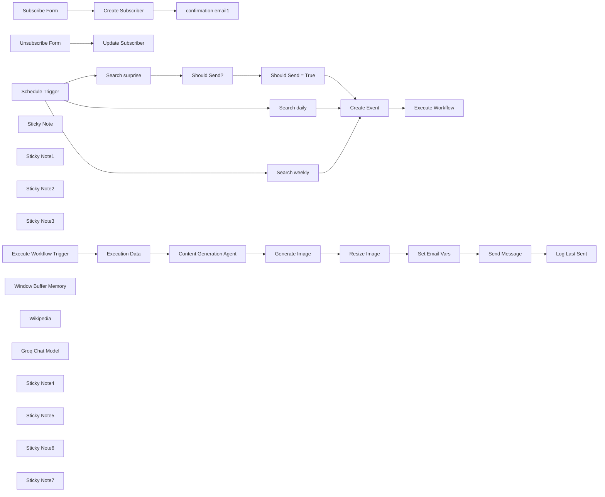

## Fluxo (.json) :

```json
{
  "nodes": [
    {
      "id": "4dd52c72-9a9b-4db4-8de5-5b12b1e5c4be",
      "name": "Schedule Trigger",
      "type": "n8n-nodes-base.scheduleTrigger",
      "position": [
        180,
        1480
      ],
      "parameters": {
        "rule": {
          "interval": [
            {
              "triggerAtHour": 9
            }
          ]
        }
      },
      "typeVersion": 1.2
    },
    {
      "id": "9226181c-b84c-4ea1-a5b4-eedb6c62037b",
      "name": "Search daily",
      "type": "n8n-nodes-base.airtable",
      "position": [
        440,
        1480
      ],
      "parameters": {
        "base": {
          "__rl": true,
          "mode": "list",
          "value": "appL3dptT6ZTSzY9v",
          "cachedResultUrl": "https://airtable.com/appL3dptT6ZTSzY9v",
          "cachedResultName": "Scheduled Emails"
        },
        "table": {
          "__rl": true,
          "mode": "list",
          "value": "tblzR9vSuFUzlQNMI",
          "cachedResultUrl": "https://airtable.com/appL3dptT6ZTSzY9v/tblzR9vSuFUzlQNMI",
          "cachedResultName": "Table 1"
        },
        "options": {},
        "operation": "search",
        "filterByFormula": "AND({Status} = 'active', {Interval} = 'daily')"
      },
      "credentials": {
        "airtableTokenApi": {
          "id": "Und0frCQ6SNVX3VV",
          "name": "Airtable Personal Access Token account"
        }
      },
      "typeVersion": 2.1
    },
    {
      "id": "1a3b6224-2f66-41c6-8b3d-be286cf16370",
      "name": "Search weekly",
      "type": "n8n-nodes-base.airtable",
      "position": [
        440,
        1660
      ],
      "parameters": {
        "base": {
          "__rl": true,
          "mode": "list",
          "value": "appL3dptT6ZTSzY9v",
          "cachedResultUrl": "https://airtable.com/appL3dptT6ZTSzY9v",
          "cachedResultName": "Scheduled Emails"
        },
        "table": {
          "__rl": true,
          "mode": "list",
          "value": "tblzR9vSuFUzlQNMI",
          "cachedResultUrl": "https://airtable.com/appL3dptT6ZTSzY9v/tblzR9vSuFUzlQNMI",
          "cachedResultName": "Table 1"
        },
        "options": {},
        "operation": "search",
        "filterByFormula": "=AND(\n {Status} = 'active', \n {Interval} = 'weekly', \n {Last Sent} <= DATEADD(TODAY(), -7, 'days')\n)"
      },
      "credentials": {
        "airtableTokenApi": {
          "id": "Und0frCQ6SNVX3VV",
          "name": "Airtable Personal Access Token account"
        }
      },
      "typeVersion": 2.1
    },
    {
      "id": "1ea47e14-0a28-4780-95c7-31e24eb724d5",
      "name": "confirmation email1",
      "type": "n8n-nodes-base.gmail",
      "position": [
        620,
        820
      ],
      "webhookId": "dd8bd6df-2013-4f8d-a2cc-cd9b3913e3d2",
      "parameters": {
        "sendTo": "={{ $('Subscribe Form').item.json.email }}",
        "message": "=This is to confirm your request to subscribe to \"Learn something every day!\" - a free service to send you facts about your favourite topics.\n\nTopic: {{ $('Subscribe Form').item.json.topic }}\nSchedule: {{ $('Subscribe Form').item.json.frequency }}",
        "options": {
          "appendAttribution": false
        },
        "subject": "Learn something every day confirmation"
      },
      "credentials": {
        "gmailOAuth2": {
          "id": "Sf5Gfl9NiFTNXFWb",
          "name": "Gmail account"
        }
      },
      "typeVersion": 2.1
    },
    {
      "id": "d95262af-1b52-4f9c-8346-183b4eee8544",
      "name": "Execute Workflow",
      "type": "n8n-nodes-base.executeWorkflow",
      "position": [
        1140,
        1480
      ],
      "parameters": {
        "mode": "each",
        "options": {
          "waitForSubWorkflow": false
        },
        "workflowId": {
          "__rl": true,
          "mode": "id",
          "value": "={{ $workflow.id }}"
        }
      },
      "typeVersion": 1.1
    },
    {
      "id": "075292af-7a66-4275-ac2d-3c392189a10c",
      "name": "Create Event",
      "type": "n8n-nodes-base.set",
      "position": [
        980,
        1480
      ],
      "parameters": {
        "options": {},
        "assignments": {
          "assignments": [
            {
              "id": "b28a0142-a028-471a-8180-9883e930feea",
              "name": "email",
              "type": "string",
              "value": "={{ $json.Email }}"
            },
            {
              "id": "970f5495-05df-42b6-a422-b2ac27f8eb95",
              "name": "topic",
              "type": "string",
              "value": "={{ $json.Topic }}"
            },
            {
              "id": "e871c431-948f-4b80-aa17-1e4266674663",
              "name": "interval",
              "type": "string",
              "value": "={{ $json.Interval }}"
            },
            {
              "id": "9b72597d-1446-4ef3-86e5-0a071c69155b",
              "name": "id",
              "type": "string",
              "value": "={{ $json.id }}"
            },
            {
              "id": "b17039c2-14a2-4811-9528-88ae963e44f7",
              "name": "created_at",
              "type": "string",
              "value": "={{ $json.Created }}"
            }
          ]
        }
      },
      "typeVersion": 3.4
    },
    {
      "id": "28776aaf-6bd9-4f9f-bcf0-3d4401a74219",
      "name": "Execute Workflow Trigger",
      "type": "n8n-nodes-base.executeWorkflowTrigger",
      "position": [
        1360,
        1480
      ],
      "parameters": {},
      "typeVersion": 1
    },
    {
      "id": "0eb62e75-228b-452b-80ab-f9ef3ad33204",
      "name": "Unsubscribe Form",
      "type": "n8n-nodes-base.formTrigger",
      "position": [
        180,
        1160
      ],
      "webhookId": "e64db96d-5e61-40d5-88fb-761621a829ab",
      "parameters": {
        "options": {
          "path": "free-factoids-unsubscribe"
        },
        "formTitle": "Unsubscribe from Learn Something Every Day",
        "formFields": {
          "values": [
            {
              "fieldLabel": "ID",
              "requiredField": true
            },
            {
              "fieldType": "dropdown",
              "fieldLabel": "Reason For Unsubscribe",
              "multiselect": true,
              "fieldOptions": {
                "values": [
                  {
                    "option": "Emails not relevant"
                  },
                  {
                    "option": "Too many Emails"
                  },
                  {
                    "option": "I did not sign up to this service"
                  }
                ]
              }
            }
          ]
        },
        "formDescription": "We're sorry to see you go! Please take a moment to help us improve the service."
      },
      "typeVersion": 2.2
    },
    {
      "id": "f889efe9-dc3c-428b-ad8e-4f7d17f23e75",
      "name": "Set Email Vars",
      "type": "n8n-nodes-base.set",
      "position": [
        2500,
        1480
      ],
      "parameters": {
        "options": {},
        "assignments": {
          "assignments": [
            {
              "id": "62a684fb-16f9-4326-8eeb-777d604b305a",
              "name": "to",
              "type": "string",
              "value": "={{ $('Execute Workflow Trigger').first().json.email }},jim@height.io"
            },
            {
              "id": "4270849e-c805-4580-9088-e8d1c3ef2fb4",
              "name": "subject",
              "type": "string",
              "value": "=Your {{ $('Execute Workflow Trigger').first().json.interval }} factoid"
            },
            {
              "id": "81d0e897-2496-4a3c-b16c-9319338f899f",
              "name": "message",
              "type": "string",
              "value": "=<p>\n<strong>You asked about \"{{ $('Execution Data').first().json.topic.replace('\"','') }}\"</strong>\n</p>\n<p>\n<i>{{ $('Content Generation Agent').first().json.output }}</i>\n</p>"
            },
            {
              "id": "ee05de7b-5342-4deb-8118-edaf235d92cc",
              "name": "unsubscribe_link",
              "type": "string",
              "value": "=https://<MY_HOST>/form/inspiration-unsubscribe?ID={{ $('Execute Workflow Trigger').first().json.id }}"
            }
          ]
        },
        "includeOtherFields": true
      },
      "typeVersion": 3.4
    },
    {
      "id": "84741e6d-f5be-440d-8633-4eb30ccce170",
      "name": "Log Last Sent",
      "type": "n8n-nodes-base.airtable",
      "position": [
        2860,
        1480
      ],
      "parameters": {
        "base": {
          "__rl": true,
          "mode": "list",
          "value": "appL3dptT6ZTSzY9v",
          "cachedResultUrl": "https://airtable.com/appL3dptT6ZTSzY9v",
          "cachedResultName": "Scheduled Emails"
        },
        "table": {
          "__rl": true,
          "mode": "list",
          "value": "tblzR9vSuFUzlQNMI",
          "cachedResultUrl": "https://airtable.com/appL3dptT6ZTSzY9v/tblzR9vSuFUzlQNMI",
          "cachedResultName": "Table 1"
        },
        "columns": {
          "value": {
            "id": "={{ $('Execute Workflow Trigger').first().json.id }}",
            "Last Sent": "2024-11-29T13:34:11"
          },
          "schema": [
            {
              "id": "id",
              "type": "string",
              "display": true,
              "removed": false,
              "readOnly": true,
              "required": false,
              "displayName": "id",
              "defaultMatch": true
            },
            {
              "id": "Name",
              "type": "string",
              "display": true,
              "removed": true,
              "readOnly": false,
              "required": false,
              "displayName": "Name",
              "defaultMatch": false,
              "canBeUsedToMatch": true
            },
            {
              "id": "Email",
              "type": "string",
              "display": true,
              "removed": true,
              "readOnly": false,
              "required": false,
              "displayName": "Email",
              "defaultMatch": false,
              "canBeUsedToMatch": true
            },
            {
              "id": "Status",
              "type": "options",
              "display": true,
              "options": [
                {
                  "name": "inactive",
                  "value": "inactive"
                },
                {
                  "name": "active",
                  "value": "active"
                }
              ],
              "removed": true,
              "readOnly": false,
              "required": false,
              "displayName": "Status",
              "defaultMatch": false,
              "canBeUsedToMatch": true
            },
            {
              "id": "Interval",
              "type": "options",
              "display": true,
              "options": [
                {
                  "name": "daily",
                  "value": "daily"
                },
                {
                  "name": "weekly",
                  "value": "weekly"
                },
                {
                  "name": "surprise",
                  "value": "surprise"
                }
              ],
              "removed": true,
              "readOnly": false,
              "required": false,
              "displayName": "Interval",
              "defaultMatch": false,
              "canBeUsedToMatch": true
            },
            {
              "id": "Start Day",
              "type": "options",
              "display": true,
              "options": [
                {
                  "name": "Mon",
                  "value": "Mon"
                },
                {
                  "name": "Tue",
                  "value": "Tue"
                },
                {
                  "name": "Wed",
                  "value": "Wed"
                },
                {
                  "name": "Thu",
                  "value": "Thu"
                },
                {
                  "name": "Fri",
                  "value": "Fri"
                },
                {
                  "name": "Sat",
                  "value": "Sat"
                },
                {
                  "name": "Sun",
                  "value": "Sun"
                }
              ],
              "removed": true,
              "readOnly": false,
              "required": false,
              "displayName": "Start Day",
              "defaultMatch": false,
              "canBeUsedToMatch": true
            },
            {
              "id": "Topic",
              "type": "string",
              "display": true,
              "removed": true,
              "readOnly": false,
              "required": false,
              "displayName": "Topic",
              "defaultMatch": false,
              "canBeUsedToMatch": true
            },
            {
              "id": "Created",
              "type": "string",
              "display": true,
              "removed": true,
              "readOnly": true,
              "required": false,
              "displayName": "Created",
              "defaultMatch": false,
              "canBeUsedToMatch": true
            },
            {
              "id": "Last Modified",
              "type": "string",
              "display": true,
              "removed": true,
              "readOnly": true,
              "required": false,
              "displayName": "Last Modified",
              "defaultMatch": false,
              "canBeUsedToMatch": true
            },
            {
              "id": "Last Sent",
              "type": "dateTime",
              "display": true,
              "removed": false,
              "readOnly": false,
              "required": false,
              "displayName": "Last Sent",
              "defaultMatch": false,
              "canBeUsedToMatch": true
            }
          ],
          "mappingMode": "defineBelow",
          "matchingColumns": [
            "id"
          ]
        },
        "options": {},
        "operation": "update"
      },
      "credentials": {
        "airtableTokenApi": {
          "id": "Und0frCQ6SNVX3VV",
          "name": "Airtable Personal Access Token account"
        }
      },
      "typeVersion": 2.1
    },
    {
      "id": "88f864d6-13fb-4f09-b22d-030d016678e1",
      "name": "Search surprise",
      "type": "n8n-nodes-base.airtable",
      "position": [
        440,
        1840
      ],
      "parameters": {
        "base": {
          "__rl": true,
          "mode": "list",
          "value": "appL3dptT6ZTSzY9v",
          "cachedResultUrl": "https://airtable.com/appL3dptT6ZTSzY9v",
          "cachedResultName": "Scheduled Emails"
        },
        "table": {
          "__rl": true,
          "mode": "list",
          "value": "tblzR9vSuFUzlQNMI",
          "cachedResultUrl": "https://airtable.com/appL3dptT6ZTSzY9v/tblzR9vSuFUzlQNMI",
          "cachedResultName": "Table 1"
        },
        "options": {},
        "operation": "search",
        "filterByFormula": "=AND(\n {Status} = 'active', \n {Interval} = 'surprise'\n)"
      },
      "credentials": {
        "airtableTokenApi": {
          "id": "Und0frCQ6SNVX3VV",
          "name": "Airtable Personal Access Token account"
        }
      },
      "typeVersion": 2.1
    },
    {
      "id": "28238d9a-7bc0-4a22-bb4e-a7a2827e4da3",
      "name": "Should Send = True",
      "type": "n8n-nodes-base.filter",
      "position": [
        800,
        1840
      ],
      "parameters": {
        "options": {},
        "conditions": {
          "options": {
            "version": 2,
            "leftValue": "",
            "caseSensitive": true,
            "typeValidation": "strict"
          },
          "combinator": "and",
          "conditions": [
            {
              "id": "9aaf9ae2-8f96-443a-8294-c04270296b22",
              "operator": {
                "type": "boolean",
                "operation": "true",
                "singleValue": true
              },
              "leftValue": "={{ $json.should_send }}",
              "rightValue": ""
            }
          ]
        }
      },
      "typeVersion": 2.2
    },
    {
      "id": "3a46dd3d-48a6-40ca-8823-0516aa9f73a4",
      "name": "Should Send?",
      "type": "n8n-nodes-base.code",
      "position": [
        620,
        1840
      ],
      "parameters": {
        "mode": "runOnceForEachItem",
        "jsCode": "const luckyPick = Math.floor(Math.random() * 10) + 1;\n$input.item.json.should_send = luckyPick == 8;\nreturn $input.item;"
      },
      "typeVersion": 2
    },
    {
      "id": "3611da19-920b-48e6-84a4-f7be0b3a78fc",
      "name": "Create Subscriber",
      "type": "n8n-nodes-base.airtable",
      "position": [
        440,
        820
      ],
      "parameters": {
        "base": {
          "__rl": true,
          "mode": "list",
          "value": "appL3dptT6ZTSzY9v",
          "cachedResultUrl": "https://airtable.com/appL3dptT6ZTSzY9v",
          "cachedResultName": "Scheduled Emails"
        },
        "table": {
          "__rl": true,
          "mode": "list",
          "value": "tblzR9vSuFUzlQNMI",
          "cachedResultUrl": "https://airtable.com/appL3dptT6ZTSzY9v/tblzR9vSuFUzlQNMI",
          "cachedResultName": "Table 1"
        },
        "columns": {
          "value": {
            "Email": "={{ $json.email }}",
            "Topic": "={{ $json.topic }}",
            "Status": "active",
            "Interval": "={{ $json.frequency }}",
            "Start Day": "={{ $json.submittedAt.toDateTime().format('EEE') }}"
          },
          "schema": [
            {
              "id": "Name",
              "type": "string",
              "display": true,
              "removed": true,
              "readOnly": false,
              "required": false,
              "displayName": "Name",
              "defaultMatch": false,
              "canBeUsedToMatch": true
            },
            {
              "id": "Email",
              "type": "string",
              "display": true,
              "removed": false,
              "readOnly": false,
              "required": false,
              "displayName": "Email",
              "defaultMatch": false,
              "canBeUsedToMatch": true
            },
            {
              "id": "Status",
              "type": "options",
              "display": true,
              "options": [
                {
                  "name": "inactive",
                  "value": "inactive"
                },
                {
                  "name": "active",
                  "value": "active"
                }
              ],
              "removed": false,
              "readOnly": false,
              "required": false,
              "displayName": "Status",
              "defaultMatch": false,
              "canBeUsedToMatch": true
            },
            {
              "id": "Interval",
              "type": "options",
              "display": true,
              "options": [
                {
                  "name": "daily",
                  "value": "daily"
                },
                {
                  "name": "weekly",
                  "value": "weekly"
                },
                {
                  "name": "surprise",
                  "value": "surprise"
                }
              ],
              "removed": false,
              "readOnly": false,
              "required": false,
              "displayName": "Interval",
              "defaultMatch": false,
              "canBeUsedToMatch": true
            },
            {
              "id": "Start Day",
              "type": "options",
              "display": true,
              "options": [
                {
                  "name": "Mon",
                  "value": "Mon"
                },
                {
                  "name": "Tue",
                  "value": "Tue"
                },
                {
                  "name": "Wed",
                  "value": "Wed"
                },
                {
                  "name": "Thu",
                  "value": "Thu"
                },
                {
                  "name": "Fri",
                  "value": "Fri"
                },
                {
                  "name": "Sat",
                  "value": "Sat"
                },
                {
                  "name": "Sun",
                  "value": "Sun"
                }
              ],
              "removed": false,
              "readOnly": false,
              "required": false,
              "displayName": "Start Day",
              "defaultMatch": false,
              "canBeUsedToMatch": true
            },
            {
              "id": "Topic",
              "type": "string",
              "display": true,
              "removed": false,
              "readOnly": false,
              "required": false,
              "displayName": "Topic",
              "defaultMatch": false,
              "canBeUsedToMatch": true
            },
            {
              "id": "Created",
              "type": "string",
              "display": true,
              "removed": true,
              "readOnly": true,
              "required": false,
              "displayName": "Created",
              "defaultMatch": false,
              "canBeUsedToMatch": true
            },
            {
              "id": "Last Modified",
              "type": "string",
              "display": true,
              "removed": true,
              "readOnly": true,
              "required": false,
              "displayName": "Last Modified",
              "defaultMatch": false,
              "canBeUsedToMatch": true
            },
            {
              "id": "Last Sent",
              "type": "dateTime",
              "display": true,
              "removed": true,
              "readOnly": false,
              "required": false,
              "displayName": "Last Sent",
              "defaultMatch": false,
              "canBeUsedToMatch": true
            }
          ],
          "mappingMode": "defineBelow",
          "matchingColumns": [
            "Email"
          ]
        },
        "options": {},
        "operation": "upsert"
      },
      "credentials": {
        "airtableTokenApi": {
          "id": "Und0frCQ6SNVX3VV",
          "name": "Airtable Personal Access Token account"
        }
      },
      "typeVersion": 2.1
    },
    {
      "id": "2213a81f-53a9-4142-9586-e87b88710eec",
      "name": "Update Subscriber",
      "type": "n8n-nodes-base.airtable",
      "position": [
        440,
        1160
      ],
      "parameters": {
        "base": {
          "__rl": true,
          "mode": "list",
          "value": "appL3dptT6ZTSzY9v",
          "cachedResultUrl": "https://airtable.com/appL3dptT6ZTSzY9v",
          "cachedResultName": "Scheduled Emails"
        },
        "table": {
          "__rl": true,
          "mode": "list",
          "value": "tblzR9vSuFUzlQNMI",
          "cachedResultUrl": "https://airtable.com/appL3dptT6ZTSzY9v/tblzR9vSuFUzlQNMI",
          "cachedResultName": "Table 1"
        },
        "columns": {
          "value": {
            "id": "={{ $json.ID }}",
            "Status": "inactive"
          },
          "schema": [
            {
              "id": "id",
              "type": "string",
              "display": true,
              "removed": false,
              "readOnly": true,
              "required": false,
              "displayName": "id",
              "defaultMatch": true
            },
            {
              "id": "Name",
              "type": "string",
              "display": true,
              "removed": true,
              "readOnly": false,
              "required": false,
              "displayName": "Name",
              "defaultMatch": false,
              "canBeUsedToMatch": true
            },
            {
              "id": "Email",
              "type": "string",
              "display": true,
              "removed": true,
              "readOnly": false,
              "required": false,
              "displayName": "Email",
              "defaultMatch": false,
              "canBeUsedToMatch": true
            },
            {
              "id": "Status",
              "type": "options",
              "display": true,
              "options": [
                {
                  "name": "inactive",
                  "value": "inactive"
                },
                {
                  "name": "active",
                  "value": "active"
                }
              ],
              "removed": false,
              "readOnly": false,
              "required": false,
              "displayName": "Status",
              "defaultMatch": false,
              "canBeUsedToMatch": true
            },
            {
              "id": "Interval",
              "type": "options",
              "display": true,
              "options": [
                {
                  "name": "daily",
                  "value": "daily"
                },
                {
                  "name": "weekly",
                  "value": "weekly"
                }
              ],
              "removed": true,
              "readOnly": false,
              "required": false,
              "displayName": "Interval",
              "defaultMatch": false,
              "canBeUsedToMatch": true
            },
            {
              "id": "Start Day",
              "type": "options",
              "display": true,
              "options": [
                {
                  "name": "Mon",
                  "value": "Mon"
                },
                {
                  "name": "Tue",
                  "value": "Tue"
                },
                {
                  "name": "Wed",
                  "value": "Wed"
                },
                {
                  "name": "Thu",
                  "value": "Thu"
                },
                {
                  "name": "Fri",
                  "value": "Fri"
                },
                {
                  "name": "Sat",
                  "value": "Sat"
                },
                {
                  "name": "Sun",
                  "value": "Sun"
                }
              ],
              "removed": true,
              "readOnly": false,
              "required": false,
              "displayName": "Start Day",
              "defaultMatch": false,
              "canBeUsedToMatch": true
            },
            {
              "id": "Topic",
              "type": "string",
              "display": true,
              "removed": true,
              "readOnly": false,
              "required": false,
              "displayName": "Topic",
              "defaultMatch": false,
              "canBeUsedToMatch": true
            },
            {
              "id": "Created",
              "type": "string",
              "display": true,
              "removed": true,
              "readOnly": true,
              "required": false,
              "displayName": "Created",
              "defaultMatch": false,
              "canBeUsedToMatch": true
            },
            {
              "id": "Last Modified",
              "type": "string",
              "display": true,
              "removed": true,
              "readOnly": true,
              "required": false,
              "displayName": "Last Modified",
              "defaultMatch": false,
              "canBeUsedToMatch": true
            }
          ],
          "mappingMode": "defineBelow",
          "matchingColumns": [
            "id"
          ]
        },
        "options": {},
        "operation": "update"
      },
      "credentials": {
        "airtableTokenApi": {
          "id": "Und0frCQ6SNVX3VV",
          "name": "Airtable Personal Access Token account"
        }
      },
      "typeVersion": 2.1
    },
    {
      "id": "c94ec18b-e0cf-4859-8b89-23abdd63739c",
      "name": "Sticky Note",
      "type": "n8n-nodes-base.stickyNote",
      "position": [
        900,
        1280
      ],
      "parameters": {
        "color": 7,
        "width": 335,
        "height": 173,
        "content": "### 4. Using Subworkflows to run executions concurrently\nThis configuration is desired when sequential execution is slow and unnecessary. Also if one email fails, it doesn't fail the execution for everyone else."
      },
      "typeVersion": 1
    },
    {
      "id": "c14cab28-13eb-4d91-8578-8187a95a8909",
      "name": "Sticky Note1",
      "type": "n8n-nodes-base.stickyNote",
      "position": [
        180,
        700
      ],
      "parameters": {
        "color": 7,
        "width": 380,
        "height": 80,
        "content": "### 1. Subscribe flow\nUse a form to allow users to subscribe to the service."
      },
      "typeVersion": 1
    },
    {
      "id": "0e44ada0-f8a7-440e-aded-33b446190a08",
      "name": "Sticky Note2",
      "type": "n8n-nodes-base.stickyNote",
      "position": [
        180,
        1020
      ],
      "parameters": {
        "color": 7,
        "width": 355,
        "height": 115,
        "content": "### 2. Unsubscribe flow\n* Uses Form's pre-fill field feature to identify user\n* Doesn't use \"email\" as identifier so you can't unsubscribe others"
      },
      "typeVersion": 1
    },
    {
      "id": "e67bdffe-ccfc-4818-990d-b2a5ab613035",
      "name": "Sticky Note3",
      "type": "n8n-nodes-base.stickyNote",
      "position": [
        180,
        1340
      ],
      "parameters": {
        "color": 7,
        "width": 347,
        "height": 114,
        "content": "### 3. Scheduled Trigger\n* Runs every day at 9am\n* Handles all 3 frequency types\n* Send emails concurrently"
      },
      "typeVersion": 1
    },
    {
      "id": "ce7d5310-7170-46d3-b8d8-3f97407f9dfd",
      "name": "Subscribe Form",
      "type": "n8n-nodes-base.formTrigger",
      "position": [
        180,
        820
      ],
      "webhookId": "c6abe3e3-ba87-4124-a227-84e253581b58",
      "parameters": {
        "options": {
          "path": "free-factoids-subscribe",
          "appendAttribution": false,
          "respondWithOptions": {
            "values": {
              "formSubmittedText": "Thanks! Your factoid is on its way!"
            }
          }
        },
        "formTitle": "Learn something every day!",
        "formFields": {
          "values": [
            {
              "fieldType": "textarea",
              "fieldLabel": "topic",
              "placeholder": "What topic(s) would you like to learn about?",
              "requiredField": true
            },
            {
              "fieldType": "email",
              "fieldLabel": "email",
              "placeholder": "eg. jim@example.com",
              "requiredField": true
            },
            {
              "fieldType": "dropdown",
              "fieldLabel": "frequency",
              "fieldOptions": {
                "values": [
                  {
                    "option": "daily"
                  },
                  {
                    "option": "weekly"
                  },
                  {
                    "option": "surprise me"
                  }
                ]
              },
              "requiredField": true
            }
          ]
        },
        "formDescription": "Get a fact a day (or week) about any subject sent to your inbox."
      },
      "typeVersion": 2.2
    },
    {
      "id": "a5d50886-7d6b-4bf8-b376-b23c12a60608",
      "name": "Execution Data",
      "type": "n8n-nodes-base.executionData",
      "position": [
        1560,
        1480
      ],
      "parameters": {
        "dataToSave": {
          "values": [
            {
              "key": "email",
              "value": "={{ $json.email }}"
            }
          ]
        }
      },
      "typeVersion": 1
    },
    {
      "id": "69b40d8d-7734-47f1-89fe-9ea0378424b7",
      "name": "Window Buffer Memory",
      "type": "@n8n/n8n-nodes-langchain.memoryBufferWindow",
      "position": [
        1860,
        1680
      ],
      "parameters": {
        "sessionKey": "=scheduled_send_{{ $json.email }}",
        "sessionIdType": "customKey"
      },
      "typeVersion": 1.3
    },
    {
      "id": "f83cff18-f41f-4a63-9d43-7e3947aae386",
      "name": "Wikipedia",
      "type": "@n8n/n8n-nodes-langchain.toolWikipedia",
      "position": [
        2020,
        1680
      ],
      "parameters": {},
      "typeVersion": 1
    },
    {
      "id": "77457037-e3ab-42f1-948b-b994d42f2f6e",
      "name": "Content Generation Agent",
      "type": "@n8n/n8n-nodes-langchain.agent",
      "position": [
        1780,
        1460
      ],
      "parameters": {
        "text": "=Generate an new factoid on the following topic: \"{{ $json.topic.replace('\"','') }}\"\nEnsure it is unique and not one generated previously.",
        "options": {},
        "promptType": "define"
      },
      "typeVersion": 1.7
    },
    {
      "id": "cdfdd870-48b6-4c7d-a7d1-a22d70423e37",
      "name": "Groq Chat Model",
      "type": "@n8n/n8n-nodes-langchain.lmChatGroq",
      "position": [
        1720,
        1680
      ],
      "parameters": {
        "model": "llama-3.3-70b-versatile",
        "options": {}
      },
      "credentials": {
        "groqApi": {
          "id": "02xZ4o87lUMUFmbT",
          "name": "Groq account"
        }
      },
      "typeVersion": 1
    },
    {
      "id": "87df322d-a544-476f-b2ff-83feb619fe7f",
      "name": "Generate Image",
      "type": "@n8n/n8n-nodes-langchain.openAi",
      "position": [
        2120,
        1460
      ],
      "parameters": {
        "prompt": "=Generate a child-friendly illustration which compliments the following paragraph:\n{{ $json.output }}",
        "options": {},
        "resource": "image"
      },
      "credentials": {
        "openAiApi": {
          "id": "8gccIjcuf3gvaoEr",
          "name": "OpenAi account"
        }
      },
      "typeVersion": 1.7
    },
    {
      "id": "5c8d9e72-4015-44da-b5d5-829864d33672",
      "name": "Resize Image",
      "type": "n8n-nodes-base.editImage",
      "position": [
        2280,
        1460
      ],
      "parameters": {
        "width": 480,
        "height": 360,
        "options": {},
        "operation": "resize"
      },
      "typeVersion": 1
    },
    {
      "id": "a9939fad-98b3-4894-aae0-c11fa40d09da",
      "name": "Send Message",
      "type": "n8n-nodes-base.gmail",
      "position": [
        2680,
        1480
      ],
      "webhookId": "dd8bd6df-2013-4f8d-a2cc-cd9b3913e3d2",
      "parameters": {
        "sendTo": "={{ $json.to }}",
        "message": "=<!DOCTYPE html>\n<html lang=\"en\">\n<head>\n <meta charset=\"UTF-8\">\n <meta name=\"viewport\" content=\"width=device-width, initial-scale=1.0\">\n <title>{{ $json.subject }}</title>\n</head>\n<body>\n {{ $json.message }}\n<p>\n<a href=\"{{ $json.unsubscribe_link }}\">Unsubscribe</a>\n</p>\n</body>\n</html>\n",
        "options": {
          "attachmentsUi": {
            "attachmentsBinary": [
              {}
            ]
          },
          "appendAttribution": false
        },
        "subject": "={{ $json.subject }}"
      },
      "credentials": {
        "gmailOAuth2": {
          "id": "Sf5Gfl9NiFTNXFWb",
          "name": "Gmail account"
        }
      },
      "typeVersion": 2.1
    },
    {
      "id": "10b6ad35-fc1c-47a2-b234-5de3557d1164",
      "name": "Sticky Note4",
      "type": "n8n-nodes-base.stickyNote",
      "position": [
        1320,
        1660
      ],
      "parameters": {
        "color": 7,
        "width": 335,
        "height": 113,
        "content": "### 5. Use Execution Data to Filter Logs\nIf you've registered for community+ or are on n8n cloud, best practice is to use execution node to allow filtering of execution logs."
      },
      "typeVersion": 1
    },
    {
      "id": "e3563fae-ff35-457b-9fb1-784eda637518",
      "name": "Sticky Note5",
      "type": "n8n-nodes-base.stickyNote",
      "position": [
        1780,
        1280
      ],
      "parameters": {
        "color": 7,
        "width": 340,
        "height": 140,
        "content": "### 6. Use AI to Generate Factoid and Image\nUse an AI agent to automate the generation of factoids as requested by the user. This is a simple example but we recommend a adding a unique touch to stand out from the crowd!"
      },
      "typeVersion": 1
    },
    {
      "id": "d1016c5d-c855-44c5-8ad3-a534bedaa8cf",
      "name": "Sticky Note6",
      "type": "n8n-nodes-base.stickyNote",
      "position": [
        2500,
        1040
      ],
      "parameters": {
        "color": 7,
        "width": 460,
        "height": 400,
        "content": "### 7. Send Email to User\nFinally, send a message to the user with both text and image.\nLog the event in the Airtable for later analysis if required.\n\n"
      },
      "typeVersion": 1
    },
    {
      "id": "773075fa-e5a2-4d4f-8527-eb07c7038b00",
      "name": "Sticky Note7",
      "type": "n8n-nodes-base.stickyNote",
      "position": [
        -420,
        680
      ],
      "parameters": {
        "width": 480,
        "height": 900,
        "content": "## Try It Out!\n\n### This n8n templates demonstrates how to build a simple subscriber service entirely in n8n using n8n forms as a frontend, n8n generally as the backend and Airtable as the storage layer.\n\nThis template in particular shows a fully automated service to send automated messages containing facts about a topic the user requested for.\n\n### How it works\n* An n8n form is setup up to allow users to subscribe with a desired topic and interval of which to recieve messages via n8n forms which is then added to the Airtable.\n* A scheduled trigger is executed every morning and searches for subscribers to send messages for based on their desired intervals.\n* Once found, Subscribers are sent to a subworkflow which performs the text content generation via an AI agent and also uses a vision model to generate an image.\n* Both are attached to an email which is sent to the subscriber. This email also includes an unsubscribe link.\n* The unsubscribe flow works similarly via n8n form interface which when submitted disables further scheduled emails to the user.\n\n## How to use\n* Make a copy of sample Airtable here: https://airtable.com/appL3dptT6ZTSzY9v/shrLukHafy5bwDRfD\n* Make sure the workflow is \"activated\" and the forms are available and reachable by your audience.\n\n\n### Need Help?\nJoin the [Discord](https://discord.com/invite/XPKeKXeB7d) or ask in the [Forum](https://community.n8n.io/)!\n\nHappy Hacking!"
      },
      "typeVersion": 1
    }
  ],
  "pinData": {},
  "connections": {
    "Wikipedia": {
      "ai_tool": [
        [
          {
            "node": "Content Generation Agent",
            "type": "ai_tool",
            "index": 0
          }
        ]
      ]
    },
    "Create Event": {
      "main": [
        [
          {
            "node": "Execute Workflow",
            "type": "main",
            "index": 0
          }
        ]
      ]
    },
    "Resize Image": {
      "main": [
        [
          {
            "node": "Set Email Vars",
            "type": "main",
            "index": 0
          }
        ]
      ]
    },
    "Search daily": {
      "main": [
        [
          {
            "node": "Create Event",
            "type": "main",
            "index": 0
          }
        ]
      ]
    },
    "Send Message": {
      "main": [
        [
          {
            "node": "Log Last Sent",
            "type": "main",
            "index": 0
          }
        ]
      ]
    },
    "Should Send?": {
      "main": [
        [
          {
            "node": "Should Send = True",
            "type": "main",
            "index": 0
          }
        ]
      ]
    },
    "Search weekly": {
      "main": [
        [
          {
            "node": "Create Event",
            "type": "main",
            "index": 0
          }
        ]
      ]
    },
    "Execution Data": {
      "main": [
        [
          {
            "node": "Content Generation Agent",
            "type": "main",
            "index": 0
          }
        ]
      ]
    },
    "Generate Image": {
      "main": [
        [
          {
            "node": "Resize Image",
            "type": "main",
            "index": 0
          }
        ]
      ]
    },
    "Set Email Vars": {
      "main": [
        [
          {
            "node": "Send Message",
            "type": "main",
            "index": 0
          }
        ]
      ]
    },
    "Subscribe Form": {
      "main": [
        [
          {
            "node": "Create Subscriber",
            "type": "main",
            "index": 0
          }
        ]
      ]
    },
    "Groq Chat Model": {
      "ai_languageModel": [
        [
          {
            "node": "Content Generation Agent",
            "type": "ai_languageModel",
            "index": 0
          }
        ]
      ]
    },
    "Search surprise": {
      "main": [
        [
          {
            "node": "Should Send?",
            "type": "main",
            "index": 0
          }
        ]
      ]
    },
    "Schedule Trigger": {
      "main": [
        [
          {
            "node": "Search surprise",
            "type": "main",
            "index": 0
          },
          {
            "node": "Search daily",
            "type": "main",
            "index": 0
          },
          {
            "node": "Search weekly",
            "type": "main",
            "index": 0
          }
        ]
      ]
    },
    "Unsubscribe Form": {
      "main": [
        [
          {
            "node": "Update Subscriber",
            "type": "main",
            "index": 0
          }
        ]
      ]
    },
    "Create Subscriber": {
      "main": [
        [
          {
            "node": "confirmation email1",
            "type": "main",
            "index": 0
          }
        ]
      ]
    },
    "Should Send = True": {
      "main": [
        [
          {
            "node": "Create Event",
            "type": "main",
            "index": 0
          }
        ]
      ]
    },
    "Window Buffer Memory": {
      "ai_memory": [
        [
          {
            "node": "Content Generation Agent",
            "type": "ai_memory",
            "index": 0
          }
        ]
      ]
    },
    "Content Generation Agent": {
      "main": [
        [
          {
            "node": "Generate Image",
            "type": "main",
            "index": 0
          }
        ]
      ]
    },
    "Execute Workflow Trigger": {
      "main": [
        [
          {
            "node": "Execution Data",
            "type": "main",
            "index": 0
          }
        ]
      ]
    }
  }
}
```

<a id="template-1143"></a>

## Template 1143 - Coleta de leads por formulário com verificação e notificações

- **Nome:** Coleta de leads por formulário com verificação e notificações
- **Descrição:** Recebe respostas de um formulário, verifica a validade do email e, se válido, registra os dados e envia notificações por email e Discord.
- **Funcionalidade:** • Recepção de submissões de formulário: Inicia a automação ao receber uma resposta no formulário.
• Verificação de email: Valida o endereço enviado para evitar leads falsos ou inválidos.
• Fluxo condicional: Segue com o processamento apenas se o email for considerado válido; caso contrário, não realiza ações adicionais.
• Registro em planilha: Atualiza/insere os dados do lead em uma planilha, mapeando nome, email, consulta e data de envio.
• Notificação por email: Envia um email com os detalhes do lead para um destinatário configurado.
• Notificação via Discord: Envia um embed com os detalhes do lead para um webhook do Discord.
• Mapeamento de campos e timestamp: Garante que cada campo do formulário seja mapeado para a coluna correta e registra o horário de submissão.
- **Ferramentas:** • Formulário web (webhook): Fonte das respostas dos leads.
• Hunter (verificação de email): Serviço para validar se o email é real ou provávelmente falso.
• Google Sheets: Armazena e atualiza os dados dos leads em uma planilha.
• Gmail: Envia notificações por email com os detalhes do lead.
• Discord Webhook: Posta notificações formatadas (embeds) em um canal do Discord.

## Fluxo visual

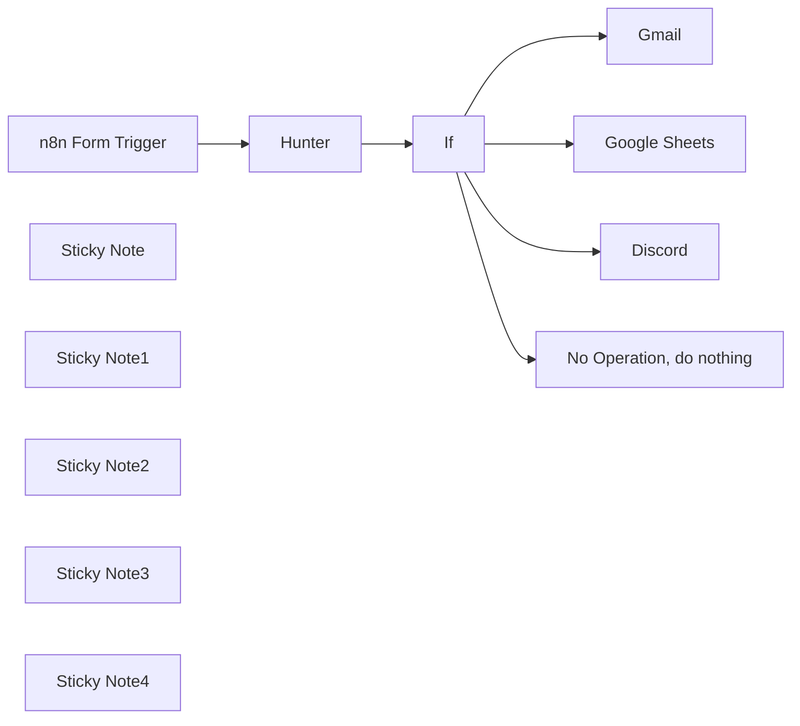

## Fluxo (.json) :

```json
{
  "id": "yYjRbTWULZuNLXM0",
  "meta": {
    "instanceId": "616c00803b706b71f395da00f933102e3b493591ba0a653e82d0b9ed360368da"
  },
  "name": "My workflow",
  "tags": [],
  "nodes": [
    {
      "id": "2125c56b-1c76-4219-847b-470f11865c01",
      "name": "n8n Form Trigger",
      "type": "n8n-nodes-base.formTrigger",
      "position": [
        180,
        300
      ],
      "webhookId": "5fb20488-aa11-4788-aa0f-73d40e7e4475",
      "parameters": {
        "path": "form",
        "options": {},
        "formTitle": "Form Title",
        "formFields": {
          "values": [
            {
              "fieldLabel": "Name",
              "requiredField": true
            },
            {
              "fieldLabel": "Email",
              "requiredField": true
            },
            {
              "fieldType": "textarea",
              "fieldLabel": "Let us know your queries"
            }
          ]
        }
      },
      "typeVersion": 2
    },
    {
      "id": "94f6684f-925b-4ded-a79f-ff44771ee992",
      "name": "Google Sheets",
      "type": "n8n-nodes-base.googleSheets",
      "position": [
        1220,
        280
      ],
      "parameters": {
        "columns": {
          "value": {
            "Name": "={{ $json.Name }}",
            "Email": "={{ $json.Email }}",
            "Query": "={{ $json['Let us know your queries'] }}",
            "Submitted On": "={{ $json.submittedAt }}"
          },
          "schema": [
            {
              "id": "Name",
              "type": "string",
              "display": true,
              "removed": false,
              "required": false,
              "displayName": "Name",
              "defaultMatch": false,
              "canBeUsedToMatch": true
            },
            {
              "id": "Email",
              "type": "string",
              "display": true,
              "required": false,
              "displayName": "Email",
              "defaultMatch": false,
              "canBeUsedToMatch": true
            },
            {
              "id": "Query",
              "type": "string",
              "display": true,
              "required": false,
              "displayName": "Query",
              "defaultMatch": false,
              "canBeUsedToMatch": true
            },
            {
              "id": "Submitted On",
              "type": "string",
              "display": true,
              "required": false,
              "displayName": "Submitted On",
              "defaultMatch": false,
              "canBeUsedToMatch": true
            },
            {
              "id": "row_number",
              "type": "string",
              "display": true,
              "removed": true,
              "readOnly": true,
              "required": false,
              "displayName": "row_number",
              "defaultMatch": false,
              "canBeUsedToMatch": true
            }
          ],
          "mappingMode": "defineBelow",
          "matchingColumns": [
            "Name"
          ]
        },
        "options": {},
        "operation": "update",
        "sheetName": {
          "__rl": true,
          "mode": "list",
          "value": "gid=0",
          "cachedResultUrl": "https://docs.google.com/spreadsheets/d/1zvlIZNAVFZ7lg9hch_zsNEIbmAhInUuwhiK2zWq0snA/edit#gid=0",
          "cachedResultName": "Sheet1"
        },
        "documentId": {
          "__rl": true,
          "mode": "list",
          "value": "1zvlIZNAVFZ7lg9hch_zsNEIbmAhInUuwhiK2zWq0snA",
          "cachedResultUrl": "https://docs.google.com/spreadsheets/d/1zvlIZNAVFZ7lg9hch_zsNEIbmAhInUuwhiK2zWq0snA/edit?usp=drivesdk",
          "cachedResultName": "Leads Data"
        }
      },
      "credentials": {
        "googleSheetsOAuth2Api": {
          "id": "7HR3jwkVoNgbw7fb",
          "name": "Google Sheets account"
        }
      },
      "typeVersion": 4.2
    },
    {
      "id": "4a1d8a68-c976-4bf6-956a-6a29affdaed4",
      "name": "Gmail",
      "type": "n8n-nodes-base.gmail",
      "position": [
        1220,
        -40
      ],
      "parameters": {
        "sendTo": "yourmail@gmail.com",
        "message": "=Name:   {{ $json.Name }} \n\nEmail:  {{ $json.Email }} \n\nQuery:  {{ $json['Let us know your queries'] }} \n\nSubmitted on:  {{ $json.submittedAt }}",
        "options": {},
        "subject": "=New lead from {{ $json.Name }}",
        "emailType": "text"
      },
      "credentials": {
        "gmailOAuth2": {
          "id": "DrjEhQ0S42VeRofT",
          "name": "Gmail account"
        }
      },
      "typeVersion": 2.1
    },
    {
      "id": "126d0ee3-de81-41ed-88f6-ffdeefae5576",
      "name": "Discord",
      "type": "n8n-nodes-base.discord",
      "position": [
        1240,
        620
      ],
      "parameters": {
        "embeds": {
          "values": [
            {
              "color": "#FF00F2",
              "title": "=New Lead from  {{ $json.Name }}",
              "author": "N8N Automation",
              "description": "=Name:   {{ $json.Name }} \n\nEmail:  {{ $json.Email }} \n\nQuery:  {{ $json['Let us know your queries'] }} \n\nSubmitted on:  {{ $json.submittedAt }}"
            }
          ]
        },
        "content": "=",
        "options": {},
        "authentication": "webhook"
      },
      "credentials": {
        "discordWebhookApi": {
          "id": "kuEJsXFqZfG48TDJ",
          "name": "Discord Webhook account"
        }
      },
      "typeVersion": 2
    },
    {
      "id": "4cd07d01-6d9a-4d0a-9999-9d66d99fb624",
      "name": "Sticky Note",
      "type": "n8n-nodes-base.stickyNote",
      "position": [
        1080,
        -100
      ],
      "parameters": {
        "width": 379.65154010753633,
        "height": 211.1881665582037,
        "content": "make sure to add To address so you can receive the notifications"
      },
      "typeVersion": 1
    },
    {
      "id": "4e8eebfa-df98-473c-8666-c7768f641694",
      "name": "Sticky Note1",
      "type": "n8n-nodes-base.stickyNote",
      "position": [
        1070,
        520
      ],
      "parameters": {
        "width": 399.1832608339331,
        "height": 246.28862362668644,
        "content": "Sometimes the email might not reach your inbox, but it rarely happens but if you receive a lot of leads it's better to setup discord webhook and receive updates that way so that your inbox doesn't get filled with all the leads"
      },
      "typeVersion": 1
    },
    {
      "id": "caff8f87-4e07-4125-bfd7-62a912b4ada9",
      "name": "Sticky Note2",
      "type": "n8n-nodes-base.stickyNote",
      "position": [
        1080,
        220
      ],
      "parameters": {
        "width": 377.5924476942702,
        "height": 211.1881665582037,
        "content": "Map the data to it's relevant fields/columns"
      },
      "typeVersion": 1
    },
    {
      "id": "c5e320e3-6489-4957-bb4e-e9873d001a66",
      "name": "If",
      "type": "n8n-nodes-base.if",
      "position": [
        640,
        300
      ],
      "parameters": {
        "options": {},
        "conditions": {
          "options": {
            "leftValue": "",
            "caseSensitive": true,
            "typeValidation": "strict"
          },
          "combinator": "and",
          "conditions": [
            {
              "id": "d8c112a3-377c-4ca2-90d9-05c19f895ddb",
              "operator": {
                "name": "filter.operator.equals",
                "type": "string",
                "operation": "equals"
              },
              "leftValue": "={{ $json.Email }}",
              "rightValue": "="
            }
          ]
        }
      },
      "typeVersion": 2
    },
    {
      "id": "778ba29f-ed75-4706-830f-d906d28d45e3",
      "name": "Hunter",
      "type": "n8n-nodes-base.hunter",
      "position": [
        420,
        300
      ],
      "parameters": {
        "email": "={{ $json.Email }}",
        "operation": "emailVerifier"
      },
      "typeVersion": 1
    },
    {
      "id": "0021001b-0784-4983-a419-8bb491004133",
      "name": "No Operation, do nothing",
      "type": "n8n-nodes-base.noOp",
      "position": [
        640,
        500
      ],
      "parameters": {},
      "typeVersion": 1
    },
    {
      "id": "997da82a-618f-417a-be73-dd3cc0c70ee8",
      "name": "Sticky Note3",
      "type": "n8n-nodes-base.stickyNote",
      "position": [
        380,
        219.7136799847175
      ],
      "parameters": {
        "color": 4,
        "width": 456.2047033929433,
        "height": 435.9183833776615,
        "content": "Use this only if you receive high volume of leads and you want to avoid fake leads with fake emails"
      },
      "typeVersion": 1
    },
    {
      "id": "9b764ce3-66b5-44ff-8086-28812bc79db1",
      "name": "Sticky Note4",
      "type": "n8n-nodes-base.stickyNote",
      "position": [
        520,
        440
      ],
      "parameters": {
        "color": 3,
        "width": 314.12732687758046,
        "height": 209.4182179183868,
        "content": "Doesn't move forward if the email is not valid or if its fake email address"
      },
      "typeVersion": 1
    }
  ],
  "active": false,
  "pinData": {},
  "settings": {
    "executionOrder": "v1"
  },
  "versionId": "6455a6bd-0749-4c00-805b-a04ea6e34cc7",
  "connections": {
    "If": {
      "main": [
        [
          {
            "node": "Gmail",
            "type": "main",
            "index": 0
          },
          {
            "node": "Google Sheets",
            "type": "main",
            "index": 0
          },
          {
            "node": "Discord",
            "type": "main",
            "index": 0
          }
        ],
        [
          {
            "node": "No Operation, do nothing",
            "type": "main",
            "index": 0
          }
        ]
      ]
    },
    "Gmail": {
      "main": [
        []
      ]
    },
    "Hunter": {
      "main": [
        [
          {
            "node": "If",
            "type": "main",
            "index": 0
          }
        ]
      ]
    },
    "Discord": {
      "main": [
        []
      ]
    },
    "n8n Form Trigger": {
      "main": [
        [
          {
            "node": "Hunter",
            "type": "main",
            "index": 0
          }
        ]
      ]
    }
  }
}
```

<a id="template-1144"></a>

## Template 1144 - Gerar rascunho de resposta com Assistente OpenAI

- **Nome:** Gerar rascunho de resposta com Assistente OpenAI
- **Descrição:** Cria rascunhos de resposta para conversas do Gmail usando um Assistente OpenAI e remove o rótulo acionador após inserir o rascunho no thread.
- **Funcionalidade:** • Verificação periódica de threads com rótulos específicos: executa a verificação em intervalos definidos para localizar conversas marcadas para resposta.
• Recuperação da última mensagem do thread: obtém o conteúdo da última mensagem para usar como contexto na resposta.
• Envio do conteúdo ao Assistente OpenAI: transmite o texto ao assistente configurado para gerar um rascunho de resposta (em Markdown).
• Conversão de Markdown para HTML: transforma a resposta gerada em HTML pronto para email.
• Montagem e codificação da mensagem em formato bruto RFC: cria os cabeçalhos e o corpo do email e codifica em base64 para envio via API.
• Criação de rascunho no thread do Gmail: insere o rascunho gerado no thread correspondente usando a API do Gmail.
• Remoção do rótulo acionador: elimina o rótulo usado para acionar a automação após o rascunho ter sido criado, evitando processamentos repetidos.
- **Ferramentas:** • Gmail / Gmail API: serviço de email usado para ler mensagens, criar rascunhos em threads e gerenciar rótulos via API.
• OpenAI Assistant: serviço de IA usado para gerar o conteúdo do rascunho de resposta a partir do texto do email.

## Fluxo visual

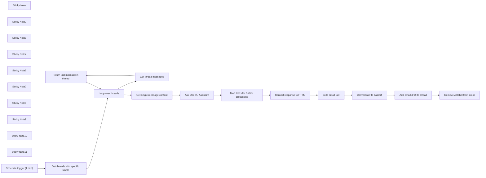

## Fluxo (.json) :

```json
{
  "meta": {
    "instanceId": "408f9fb9940c3cb18ffdef0e0150fe342d6e655c3a9fac21f0f644e8bedabcd9",
    "templateCredsSetupCompleted": true
  },
  "nodes": [
    {
      "id": "ad5b12df-3bdf-4672-99a7-0034664f29ef",
      "name": "Sticky Note",
      "type": "n8n-nodes-base.stickyNote",
      "position": [
        -1180,
        120
      ],
      "parameters": {
        "color": 4,
        "width": 420.4803040774015,
        "height": 189.69151356225348,
        "content": "## Reply draft with OpenAI Assistant\nThis workflow automatically transfers content of incoming email messages with specific labels into OpenAI Assitant and returns reply draft. After draft is composed, trigger label is deleted from the thread.\n\n**Please remember to configure your OpenAI Assistant first.**"
      },
      "typeVersion": 1
    },
    {
      "id": "80a93a48-0576-4dfb-817a-34cbc215307a",
      "name": "Sticky Note2",
      "type": "n8n-nodes-base.stickyNote",
      "position": [
        -740,
        120
      ],
      "parameters": {
        "width": 451.41125086385614,
        "height": 313.3056033573073,
        "content": "### Schedule trigger and get emails\nRun the workflow in equal intervals and check for threads with specific labels (trigger labels)."
      },
      "typeVersion": 1
    },
    {
      "id": "0dba2603-8012-47d1-8c60-4068924b74cd",
      "name": "Sticky Note1",
      "type": "n8n-nodes-base.stickyNote",
      "position": [
        -1180,
        340
      ],
      "parameters": {
        "color": 3,
        "width": 421.0932411886662,
        "height": 257.42916378714597,
        "content": "## ⚠️ Note\n\n1. Complete video guide for this workflow is available [on my YouTube](https://youtu.be/a8Dhj3Zh9vQ). \n2. Remember to add your credentials and configure nodes (covered in the video guide).\n3. If you like this workflow, please subscribe to [my YouTube channel](https://www.youtube.com/@workfloows) and/or [my newsletter](https://workfloows.com/).\n\n**Thank you for your support!**"
      },
      "typeVersion": 1
    },
    {
      "id": "4eb67d90-b834-48f6-8d8a-ed0a9d8321fd",
      "name": "Sticky Note4",
      "type": "n8n-nodes-base.stickyNote",
      "position": [
        520,
        120
      ],
      "parameters": {
        "width": 381.6458068293894,
        "height": 313.7892229150129,
        "content": "### Generate reply\nTransfer email content to OpenAI Assitant and return AI-generated reply.\n"
      },
      "typeVersion": 1
    },
    {
      "id": "fdb6e16b-5f42-4872-bf63-b18a14220cdf",
      "name": "Sticky Note5",
      "type": "n8n-nodes-base.stickyNote",
      "position": [
        1160,
        120
      ],
      "parameters": {
        "width": 219.88389496558554,
        "height": 314.75072291501283,
        "content": "### Create HTML message\nConvert incoming Markdown from OpenAI Assistant into HTML content."
      },
      "typeVersion": 1
    },
    {
      "id": "111e4276-7f63-4b11-92be-fd9de7e23f05",
      "name": "Sticky Note7",
      "type": "n8n-nodes-base.stickyNote",
      "position": [
        1400,
        120
      ],
      "parameters": {
        "width": 461.3148409669012,
        "height": 314.75072291501283,
        "content": "### Build and encode message\nCreate raw message in RFC standard and encode it into base64 string (please see [Gmail API reference](https://developers.google.com/gmail/api/reference/rest/v1/users.drafts/create) for more details)."
      },
      "typeVersion": 1
    },
    {
      "id": "0d377266-7fa2-43c4-9259-e8611d52df41",
      "name": "Sticky Note8",
      "type": "n8n-nodes-base.stickyNote",
      "position": [
        1880,
        120
      ],
      "parameters": {
        "width": 219.88389496558554,
        "height": 314.75072291501283,
        "content": "### Insert reply draft\nAdd reply draft from OpenAI Assistant to specific Gmail thread."
      },
      "typeVersion": 1
    },
    {
      "id": "c743486b-82e0-42f4-bd41-fad6115ac520",
      "name": "Sticky Note9",
      "type": "n8n-nodes-base.stickyNote",
      "position": [
        2120,
        120
      ],
      "parameters": {
        "width": 219.88389496558554,
        "height": 314.75072291501283,
        "content": "### Remove label\nDelete trigger label from the Gmail thread."
      },
      "typeVersion": 1
    },
    {
      "id": "dfe99c2e-a8e6-48de-a11d-54adaf98a7fe",
      "name": "Sticky Note10",
      "type": "n8n-nodes-base.stickyNote",
      "position": [
        0,
        0
      ],
      "parameters": {
        "width": 219.88389496558554,
        "height": 314.75072291501283,
        "content": "### Return message content\nRetrieve content of the last message in the thread."
      },
      "typeVersion": 1
    },
    {
      "id": "6f228048-4067-494a-af44-080237c2555c",
      "name": "Sticky Note11",
      "type": "n8n-nodes-base.stickyNote",
      "position": [
        0,
        340
      ],
      "parameters": {
        "width": 470.88389496558545,
        "height": 314.75072291501283,
        "content": "### Get last message from thread\nReturn all messages for a single thread and pass for further processing only the last one."
      },
      "typeVersion": 1
    },
    {
      "id": "bea0ea14-6198-4022-8ddc-a0c9f895d46e",
      "name": "Remove AI label from email",
      "type": "n8n-nodes-base.gmail",
      "position": [
        2180,
        260
      ],
      "webhookId": "f19c59fe-49bd-4661-aff3-a50e43e5964a",
      "parameters": {
        "resource": "thread",
        "threadId": "={{ $('Map fields for further processing').item.json[\"threadId\"] }}",
        "operation": "removeLabels"
      },
      "credentials": {
        "gmailOAuth2": {
          "id": "Sf5Gfl9NiFTNXFWb",
          "name": "Gmail account"
        }
      },
      "typeVersion": 2.1
    },
    {
      "id": "dc9b5760-1669-4f29-b28d-73cd417775b4",
      "name": "Add email draft to thread",
      "type": "n8n-nodes-base.httpRequest",
      "position": [
        1940,
        260
      ],
      "parameters": {
        "url": "https://www.googleapis.com/gmail/v1/users/me/drafts",
        "method": "POST",
        "options": {},
        "jsonBody": "={\"message\":{\"raw\":\"{{ $json.encoded }}\", \"threadId\": \"{{ $('Map fields for further processing').item.json[\"threadId\"] }}\"}}",
        "sendBody": true,
        "specifyBody": "json"
      },
      "typeVersion": 4.2
    },
    {
      "id": "dbbb607b-701f-49cd-b872-96522abde5b7",
      "name": "Convert raw to base64",
      "type": "n8n-nodes-base.code",
      "position": [
        1680,
        260
      ],
      "parameters": {
        "mode": "runOnceForEachItem",
        "jsCode": "const encoded = Buffer.from($json.raw).toString('base64');\n\nreturn { encoded };"
      },
      "typeVersion": 2
    },
    {
      "id": "9114d833-1c6a-47f1-bc8d-12fb8e17218e",
      "name": "Build email raw",
      "type": "n8n-nodes-base.set",
      "position": [
        1480,
        260
      ],
      "parameters": {
        "options": {},
        "assignments": {
          "assignments": [
            {
              "id": "6b6ece46-aeef-4ae5-9a0d-f472e7ced464",
              "name": "raw",
              "type": "string",
              "value": "=To: {{ $json.to }}\nSubject: {{ $json.subject }}\nContent-Type: text/html; charset=\"utf-8\"\n\n{{ $json.response }}"
            }
          ]
        }
      },
      "typeVersion": 3.4
    },
    {
      "id": "67c1b6ca-d419-45a9-a1d5-2a6ac157454f",
      "name": "Convert response to HTML",
      "type": "n8n-nodes-base.markdown",
      "position": [
        1220,
        260
      ],
      "parameters": {
        "mode": "markdownToHtml",
        "options": {},
        "markdown": "={{ $json.response }}"
      },
      "typeVersion": 1
    },
    {
      "id": "97be72d7-20dd-4829-bf1c-f738fb6a8a21",
      "name": "Map fields for further processing",
      "type": "n8n-nodes-base.set",
      "position": [
        980,
        260
      ],
      "parameters": {
        "options": {},
        "assignments": {
          "assignments": [
            {
              "id": "d5022255-06d2-4322-b51e-ae80b7f6eef6",
              "name": "response",
              "type": "string",
              "value": "={{ $json.output }}"
            },
            {
              "id": "f729def0-3905-4c7d-ad1d-86ef7b001e9c",
              "name": "threadId",
              "type": "string",
              "value": "={{ $('Get single message content').item.json[\"threadId\"] }}"
            },
            {
              "id": "3ef18ad8-7328-4b97-bd6d-9d395a3c4a48",
              "name": "to",
              "type": "string",
              "value": "={{ $('Get single message content').item.json[\"from\"][\"text\"] }}"
            },
            {
              "id": "b013770d-fce2-4030-b372-8d94f04b51e9",
              "name": "subject",
              "type": "string",
              "value": "={{ $('Get single message content').item.json[\"subject\"] }}"
            },
            {
              "id": "69cc71b6-614d-4528-a598-69fbde1b5fd9",
              "name": "messageId",
              "type": "string",
              "value": "={{ $('Get threads with specific labels').item.json[\"id\"] }}"
            }
          ]
        }
      },
      "typeVersion": 3.4
    },
    {
      "id": "545a4296-5307-42ee-8935-2886338e2518",
      "name": "Ask OpenAI Assistant",
      "type": "@n8n/n8n-nodes-langchain.openAi",
      "position": [
        580,
        260
      ],
      "parameters": {
        "text": "={{ $json.text }}",
        "prompt": "define",
        "options": {},
        "resource": "assistant",
        "assistantId": {
          "__rl": true,
          "mode": "list",
          "value": "asst_s32wsRpwU1HbLt40wRhghB6Y",
          "cachedResultName": "Eva"
        }
      },
      "credentials": {
        "openAiApi": {
          "id": "8gccIjcuf3gvaoEr",
          "name": "OpenAi account"
        }
      },
      "typeVersion": 1.8
    },
    {
      "id": "4f326fec-e4bb-42dc-9f26-4a3d8ce86f24",
      "name": "Get single message content",
      "type": "n8n-nodes-base.gmail",
      "position": [
        60,
        120
      ],
      "webhookId": "1ddb410c-fcdd-4230-967a-cf7844727877",
      "parameters": {
        "messageId": "={{ $json.id }}",
        "operation": "get"
      },
      "credentials": {
        "gmailOAuth2": {
          "id": "Sf5Gfl9NiFTNXFWb",
          "name": "Gmail account"
        }
      },
      "typeVersion": 2.1
    },
    {
      "id": "faeb879f-db00-47b7-8995-9fb9025079cf",
      "name": "Return last message in thread",
      "type": "n8n-nodes-base.limit",
      "position": [
        280,
        460
      ],
      "parameters": {
        "keep": "lastItems"
      },
      "typeVersion": 1
    },
    {
      "id": "8085cb54-3c85-4450-9e42-825a9d467d6b",
      "name": "Get thread messages",
      "type": "n8n-nodes-base.gmail",
      "position": [
        60,
        460
      ],
      "webhookId": "d53aee55-4233-42e3-b0b7-2b4521956013",
      "parameters": {
        "options": {},
        "resource": "thread",
        "threadId": "={{ $json.id }}",
        "operation": "get"
      },
      "credentials": {
        "gmailOAuth2": {
          "id": "Sf5Gfl9NiFTNXFWb",
          "name": "Gmail account"
        }
      },
      "typeVersion": 2.1
    },
    {
      "id": "8a3c1885-8a05-4357-85ea-03cb9e8b24fa",
      "name": "Loop over threads",
      "type": "n8n-nodes-base.splitInBatches",
      "position": [
        -200,
        260
      ],
      "parameters": {
        "options": {}
      },
      "typeVersion": 3
    },
    {
      "id": "74197fae-823e-47bc-a1c9-b2fbe90b1171",
      "name": "Get threads with specific labels",
      "type": "n8n-nodes-base.gmail",
      "position": [
        -460,
        260
      ],
      "webhookId": "6b7faf91-cc60-482c-b661-dbd702cba2cc",
      "parameters": {
        "filters": {
          "labelIds": []
        },
        "resource": "thread"
      },
      "credentials": {
        "gmailOAuth2": {
          "id": "Sf5Gfl9NiFTNXFWb",
          "name": "Gmail account"
        }
      },
      "typeVersion": 2.1
    },
    {
      "id": "a3360f69-b8e6-4ef8-933a-352243ab9125",
      "name": "Schedule trigger (1 min)",
      "type": "n8n-nodes-base.scheduleTrigger",
      "position": [
        -680,
        260
      ],
      "parameters": {
        "rule": {
          "interval": [
            {
              "field": "minutes",
              "minutesInterval": 1
            }
          ]
        }
      },
      "typeVersion": 1.2
    }
  ],
  "pinData": {},
  "connections": {
    "Build email raw": {
      "main": [
        [
          {
            "node": "Convert raw to base64",
            "type": "main",
            "index": 0
          }
        ]
      ]
    },
    "Loop over threads": {
      "main": [
        [
          {
            "node": "Get single message content",
            "type": "main",
            "index": 0
          }
        ],
        [
          {
            "node": "Get thread messages",
            "type": "main",
            "index": 0
          }
        ]
      ]
    },
    "Get thread messages": {
      "main": [
        [
          {
            "node": "Return last message in thread",
            "type": "main",
            "index": 0
          }
        ]
      ]
    },
    "Ask OpenAI Assistant": {
      "main": [
        [
          {
            "node": "Map fields for further processing",
            "type": "main",
            "index": 0
          }
        ]
      ]
    },
    "Convert raw to base64": {
      "main": [
        [
          {
            "node": "Add email draft to thread",
            "type": "main",
            "index": 0
          }
        ]
      ]
    },
    "Convert response to HTML": {
      "main": [
        [
          {
            "node": "Build email raw",
            "type": "main",
            "index": 0
          }
        ]
      ]
    },
    "Schedule trigger (1 min)": {
      "main": [
        [
          {
            "node": "Get threads with specific labels",
            "type": "main",
            "index": 0
          }
        ]
      ]
    },
    "Add email draft to thread": {
      "main": [
        [
          {
            "node": "Remove AI label from email",
            "type": "main",
            "index": 0
          }
        ]
      ]
    },
    "Get single message content": {
      "main": [
        [
          {
            "node": "Ask OpenAI Assistant",
            "type": "main",
            "index": 0
          }
        ]
      ]
    },
    "Return last message in thread": {
      "main": [
        [
          {
            "node": "Loop over threads",
            "type": "main",
            "index": 0
          }
        ]
      ]
    },
    "Get threads with specific labels": {
      "main": [
        [
          {
            "node": "Loop over threads",
            "type": "main",
            "index": 0
          }
        ]
      ]
    },
    "Map fields for further processing": {
      "main": [
        [
          {
            "node": "Convert response to HTML",
            "type": "main",
            "index": 0
          }
        ]
      ]
    }
  }
}
```

<a id="template-1145"></a>

## Template 1145 - Enriquecer dados de organização com GPT-4o ao criar no Pipedrive

- **Nome:** Enriquecer dados de organização com GPT-4o ao criar no Pipedrive
- **Descrição:** Este fluxo automatiza o enriquecimento de dados de uma Organização criada no Pipedrive ao coletar conteúdo do site associado, processá-lo com o modelo GPT-4o para extrair informações relevantes e criar uma nota na organização. Em seguida, o conteúdo é formatado em Markdown adequado para Slack e enviado como notificação.
- **Funcionalidade:** • Detecção da criação de Organização no Pipedrive: Inicia a automação quando uma organização é criada no Pipedrive.
• Extração de conteúdo do site da Organização: Busca o conteúdo da homepage do site vinculado à organização usando ScrapingBee.
• Geração de IA com GPT-4o: Gera HTML com descrição da empresa, mercado-alvo, vantagens competitivas e potenciais concorrentes.
• Criação de nota na Organização: Cria uma nota na organização com o conteúdo gerado pela IA.
• Formatação para Slack: Converte o HTML da nota em Markdown adequado ao Slack.
• Notificação no Slack: Envia a nota enriquecida para um canal do Slack.
- **Ferramentas:** • Pipedrive: CRM para gerenciar organizações e notas associadas.
• ScrapingBee: API de scraping para obter conteúdo de sites.
• OpenAI (GPT-4o): Modelo de IA para gerar descrições, mercados e concorrentes com saída em HTML.
• Slack: Plataforma de mensagens para enviar a notificação.

## Fluxo visual

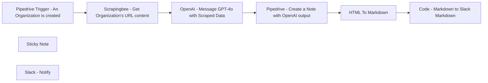

## Fluxo (.json) :

```json
{
  "id": "",
  "meta": {
    "instanceId": "",
    "templateCredsSetupCompleted": true
  },
  "name": "piepdrive-test",
  "tags": [],
  "nodes": [
    {
      "id": "b2838678-c796-4c99-a3da-a2cd1b42ea97",
      "name": "Pipedrive Trigger - An Organization is created",
      "type": "n8n-nodes-base.pipedriveTrigger",
      "position": [
        820,
        380
      ],
      "webhookId": "f5de09a8-6601-4ad5-8bc8-9b3f4b83e997",
      "parameters": {
        "action": "added",
        "object": "organization"
      },
      "credentials": {
        "pipedriveApi": {
          "id": "",
          "name": "Pipedrive Connection"
        }
      },
      "typeVersion": 1
    },
    {
      "id": "5aa05d79-b2fa-4040-b4ca-cad83adf2798",
      "name": "Sticky Note",
      "type": "n8n-nodes-base.stickyNote",
      "position": [
        -20,
        120
      ],
      "parameters": {
        "width": 656.3637637842876,
        "height": 1455.9537026322007,
        "content": "# Enrich Pipedrive's Organization Data with GPT-4o When an Organization is Created in Pipedrive\n\nThis workflow **enriches a Pipedrive organization's data by adding a note to the organization object in Pipedrive**. It assumes there is a custom \"website\" field in your Pipedrive setup, as data will be scraped from this website to generate a note using OpenAI.\n\n## ⚠️ Disclaimer\n**These workflows use a scraping API. Before using it, ensure you comply with the regulations regarding web scraping in your country or state**.\n\n## Important Notes\n- The OpenAI model used is GPT-4o, chosen for its large input token context capacity. However, it is also **the most expensive option**, you should take cost into consideration.\n\n- The system prompt in the OpenAI Node generates output with relevant information, but feel free to improve or **modify it according to your needs**.\n\n## **How It Works**\n\n### Node 1: `Pipedrive Trigger - An Organization is Created`\nThis is the trigger of the workflow. When **an organization object is created in Pipedrive**, this node is triggered and retrieves the data. Make sure you have a \"website\" custom field (the name of the field in the n8n node will appear as a random ID and not with the Pipedrive custom field name).\n\n### Node 2: `ScrapingBee - Get Organization's Website's Homepage Content`\nThis node **scrapes the content** from the URL of the website associated with the **Pipedrive Organization** created in Node 1. The workflow uses the [ScrapingBee](https://www.scrapingbee.com/) API, but you can use any preferred API or simply the HTTP request node in n8n.\n\n### Node 3: `OpenAI - Message GPT-4o with Scraped Data`\nThis node sends HTML-scraped data from the previous node to the **OpenAI GPT-4 model**. The system prompt instructs the model to **extract company data**, such as products or services offered and competitors (if known by the model), and format it as HTML for optimal use in a Pipedrive Note.\n\n### Node 4: `Pipedrive - Create a Note with OpenAI Output`\nThis node **adds a Note to the Organization created in Pipedrive** using the OpenAI node output. The Note will include the company description, target market, selling products, and competitors (if GPT-4 was able to determine them).\n\n### Node 5 & 6: `HTML To Markdown` & `Code - Markdown to Slack Markdown`\nThese two nodes **format the HTML output to Slack Markdown**.\n\nThe Note created in Pipedrive is in HTML format, **as specified by the System Prompt of the OpenAI Node**. To send it to Slack, it needs to be converted to Markdown and then to Slack-specific Markdown.\n\n### Node 7: `Slack - Notify`\nThis node **sends a message in Slack containing the Pipedrive Organization Note** created with this workflow.\n"
      },
      "typeVersion": 1
    },
    {
      "id": "47ee8bfb-2f9d-4790-a929-1533215d6746",
      "name": "Pipedrive - Create a Note with OpenAI output",
      "type": "n8n-nodes-base.pipedrive",
      "position": [
        1640,
        380
      ],
      "parameters": {
        "content": "={{ $json.message.content }}",
        "resource": "note",
        "additionalFields": {
          "org_id": "={{ $('Pipedrive Trigger - An Organization is created').item.json.meta.id }}"
        }
      },
      "credentials": {
        "pipedriveApi": {
          "id": "",
          "name": "Pipedrive Connection"
        }
      },
      "typeVersion": 1
    },
    {
      "id": "7783b531-0469-4bee-868e-4b26a1bb41ba",
      "name": "Code - Markdown to Slack Markdown",
      "type": "n8n-nodes-base.code",
      "position": [
        2080,
        380
      ],
      "parameters": {
        "jsCode": "const inputMarkdown = items[0].json.data;\n\nfunction convertMarkdownToSlackFormat(markdown) {\n let slackFormatted = markdown;\n \n // Convert headers\n slackFormatted = slackFormatted.replace(/^# (.*$)/gim, '*$1*');\n slackFormatted = slackFormatted.replace(/^## (.*$)/gim, '*$1*');\n \n // Convert unordered lists\n slackFormatted = slackFormatted.replace(/^\\* (.*$)/gim, '➡️ $1');\n \n // Convert tables\n const tableRegex = /\\n\\|.*\\|\\n\\|.*\\|\\n((\\|.*\\|\\n)+)/;\n const tableMatch = slackFormatted.match(tableRegex);\n if (tableMatch) {\n const table = tableMatch[0];\n const rows = table.split('\\n').slice(3, -1);\n const formattedRows = rows.map(row => {\n const columns = row.split('|').slice(1, -1).map(col => col.trim());\n return `*${columns[0]}*: ${columns[1]}`;\n }).join('\\n');\n slackFormatted = slackFormatted.replace(table, formattedRows);\n }\n \n return slackFormatted;\n}\n\nconst slackMarkdown = convertMarkdownToSlackFormat(inputMarkdown);\nconsole.log(slackMarkdown);\n\n// Return data\nreturn [{ slackFormattedMarkdown: slackMarkdown }];\n"
      },
      "typeVersion": 2
    },
    {
      "id": "cf2b02df-07e8-4ebb-ba3d-bfd294dcfab0",
      "name": "Scrapingbee - Get Organization's URL content",
      "type": "n8n-nodes-base.httpRequest",
      "position": [
        1040,
        380
      ],
      "parameters": {
        "url": "https://app.scrapingbee.com/api/v1",
        "options": {},
        "sendQuery": true,
        "queryParameters": {
          "parameters": [
            {
              "name": "api_key",
              "value": "<YOUR_SCRAPINGBEE_API_KEY>"
            },
            {
              "name": "url",
              "value": "={{ $json.current.<random_api_id_custom_website_field> }}"
            },
            {
              "name": "render_js",
              "value": "false"
            }
          ]
        }
      },
      "typeVersion": 4.2
    },
    {
      "id": "906d44f0-7582-4742-9fd8-4c8dfba918e0",
      "name": "HTML To Markdown",
      "type": "n8n-nodes-base.markdown",
      "position": [
        1860,
        380
      ],
      "parameters": {
        "html": "={{ $json.content }}",
        "options": {}
      },
      "typeVersion": 1
    },
    {
      "id": "8c1a5d64-4f38-4f9e-8878-443f750206b7",
      "name": "Slack - Notify ",
      "type": "n8n-nodes-base.slack",
      "position": [
        2300,
        380
      ],
      "parameters": {
        "text": "=*New Organizaton {{ $('Pipedrive Trigger - An Organization is created').item.json.current.name }} created on Pipedrive* :\n\n\n {{ $json.slackFormattedMarkdown }}",
        "select": "channel",
        "channelId": {
          "__rl": true,
          "mode": "list",
          "value": "",
          "cachedResultName": "pipedrive-notification"
        },
        "otherOptions": {},
        "authentication": "oAuth2"
      },
      "credentials": {
        "slackOAuth2Api": {
          "id": "",
          "name": "Slack Connection"
        }
      },
      "typeVersion": 2.2
    },
    {
      "id": "2414a5d3-1d4b-447b-b401-4b6f823a0cf9",
      "name": "OpenAI - Message GPT-4o with Scraped Data",
      "type": "@n8n/n8n-nodes-langchain.openAi",
      "position": [
        1260,
        380
      ],
      "parameters": {
        "modelId": {
          "__rl": true,
          "mode": "list",
          "value": "gpt-4o",
          "cachedResultName": "GPT-4O"
        },
        "options": {},
        "messages": {
          "values": [
            {
              "content": "={{ $json.data }}"
            },
            {
              "role": "system",
              "content": "You're an assistant that summarizes website content for CRM entries. The user will provide HTML content from a company's website. Your task is to analyze the HTML content and create a concise summary that includes:\n\n1. A brief description of the company's services or products.\n2. Any information about the company's target market or customer base.\n3. Key points about the company's unique selling propositions or competitive advantages.\n4. Based on the provided information, suggest potential competitors if you know any.\n\nFormat your response as HTML.\n\nExample response :\n\n <h1>Company Description</h1>\n <p>Company1 specializes in services related to electric vehicles. The company focuses on providing resources and information about electric car chargers, battery life, different car brands, and the environmental impact of electric vehicles.</p>\n\n <h2>Target Market</h2>\n <p>The target market for Company1 includes electric vehicle owners and potential buyers who are interested in making the shift from traditional fossil fuel vehicles to electric cars. The company also targets environmentally conscious consumers who are looking for sustainable mobility solutions.</p>\n\n <h2>Unique Selling Propositions</h2>\n <ul>\n <li>Comprehensive information about electric vehicle charging solutions, including how to install home charging stations.</li>\n <li>Detailed articles on the advantages of electric vehicles such as ecology and reliability.</li>\n <li>Educational resources on the autonomy and battery life of different electric car models.</li>\n <li>Insights into premier electric vehicle brands.</li>\n </ul>\n\n <h2>Potential Competitors</h2>\n <table border=\"1\">\n <tr>\n <th>Competitor Name</th>\n <th>Website</th>\n </tr>\n <tr>\n <td>Competitor1</td>\n <td><a href=\"https://www.example1.com\">https://www.example1.com</a></td>\n </tr>\n <tr>\n <td>Competitor2</td>\n <td><a href=\"https://www.example2.com\">https://www.example2.com</a></td>\n </tr>\n <tr>\n <td>Competitor3</td>\n <td><a href=\"https://www.example3.com\">https://www.example3.com</a></td>\n </tr>\n <tr>\n <td>Competitor4</td>\n <td><a href=\"https://www.example4.com\">https://www.example4.com</a></td>\n </tr>\n </table>\n"
            }
          ]
        }
      },
      "credentials": {
        "openAiApi": {
          "id": "",
          "name": "OpenAi Connection"
        }
      },
      "typeVersion": 1.3
    }
  ],
  "active": false,
  "pinData": {},
  "settings": {
    "executionOrder": "v1"
  },
  "versionId": "",
  "connections": {
    "HTML To Markdown": {
      "main": [
        [
          {
            "node": "Code - Markdown to Slack Markdown",
            "type": "main",
            "index": 0
          }
        ]
      ]
    },
    "Code - Markdown to Slack Markdown": {
      "main": [
        [
          {
            "node": "Slack - Notify ",
            "type": "main",
            "index": 0
          }
        ]
      ]
    },
    "OpenAI - Message GPT-4o with Scraped Data": {
      "main": [
        [
          {
            "node": "Pipedrive - Create a Note with OpenAI output",
            "type": "main",
            "index": 0
          }
        ]
      ]
    },
    "Pipedrive - Create a Note with OpenAI output": {
      "main": [
        [
          {
            "node": "HTML To Markdown",
            "type": "main",
            "index": 0
          }
        ]
      ]
    },
    "Scrapingbee - Get Organization's URL content": {
      "main": [
        [
          {
            "node": "OpenAI - Message GPT-4o with Scraped Data",
            "type": "main",
            "index": 0
          }
        ]
      ]
    },
    "Pipedrive Trigger - An Organization is created": {
      "main": [
        [
          {
            "node": "Scrapingbee - Get Organization's URL content",
            "type": "main",
            "index": 0
          }
        ]
      ]
    }
  }
}
```

<a id="template-1146"></a>

## Template 1146 - Controle de bot Discord: mensagens, DMs e roles

- **Nome:** Controle de bot Discord: mensagens, DMs e roles
- **Descrição:** Automatiza interações com servidores Discord através de um bot, incluindo envio de mensagens e DMs, espera por respostas humanas, obtenção de listas de canais e membros, e gerenciamento de roles.
- **Funcionalidade:** • Gatilho MCP: inicia o fluxo a partir de uma solicitação ou comando recebido pelo cliente MCP.
• Enviar mensagem para canal: envia uma mensagem simples do bot para um canal especificado no servidor.
• Enviar mensagem para canal e aguardar resposta: envia mensagem a um canal e espera uma resposta em texto livre de um usuário (HITL).
• Enviar DM para usuário: envia mensagem direta a um usuário específico via DM.
• Enviar DM e aguardar resposta: envia DM e aguarda uma resposta em texto livre do destinatário.
• Adicionar role a membro: atribui uma role específica a um usuário no servidor.
• Remover role de membro: remove uma role específica de um usuário no servidor.
• Obter canais do servidor por ID: recupera a lista de canais que o bot pode ver em um servidor fornecido.
• Obter membros do servidor por ID: lista membros do servidor que o bot consegue ver, com suporte a paginação/consulta incremental.
• Obter IDs de servidores do bot: chamada HTTP personalizada para recuperar todos os servidores nos quais o bot está presente.
- **Ferramentas:** • Discord Bot / API: plataforma usada para enviar mensagens, DMs, gerenciar membros, adicionar/remover roles e listar canais/membros.
• Discord REST API (chamada HTTP personalizada): utilizada para recuperar programaticamente a lista de servidores onde o bot está presente.

## Fluxo visual


## Fluxo (.json) :

```json
{
  "id": "ly8aZhPk5ZI8uB0Y",
  "meta": {
    "instanceId": "8931e7db592c2960ce253801ea290c1dc66e447734ce3d968310365665cefc80",
    "templateCredsSetupCompleted": true
  },
  "name": "Discord MCP Server",
  "tags": [],
  "nodes": [
    {
      "id": "6e87d612-3006-4683-b978-87718f89257d",
      "name": "Send Discord Message to Channel",
      "type": "n8n-nodes-base.discordTool",
      "position": [
        360,
        280
      ],
      "webhookId": "90b1dca9-c742-4c7e-aef3-ba5a47c5f86d",
      "parameters": {
        "content": "={{ /*n8n-auto-generated-fromAI-override*/ $fromAI('Message', ``, 'string') }}",
        "guildId": {
          "__rl": true,
          "mode": "id",
          "value": "={{ /*n8n-auto-generated-fromAI-override*/ $fromAI('Server', ``, 'string') }}"
        },
        "options": {},
        "resource": "message",
        "channelId": {
          "__rl": true,
          "mode": "id",
          "value": "={{ /*n8n-auto-generated-fromAI-override*/ $fromAI('Channel', ``, 'string') }}"
        }
      },
      "credentials": {
        "discordBotApi": {
          "id": "SJhr2V3Xw4B3fVqW",
          "name": "Gopher"
        }
      },
      "typeVersion": 2
    },
    {
      "id": "32a17a73-8953-4474-a49f-9d1cc0cc3eb2",
      "name": "Add Role To Member",
      "type": "n8n-nodes-base.discordTool",
      "position": [
        -200,
        560
      ],
      "webhookId": "e41a85ec-3f16-44fc-ad87-4617c0d0f1c0",
      "parameters": {
        "role": "={{ /*n8n-auto-generated-fromAI-override*/ $fromAI('Role', ``, 'string') }}",
        "userId": {
          "__rl": true,
          "mode": "id",
          "value": "={{ /*n8n-auto-generated-fromAI-override*/ $fromAI('User', ``, 'string') }}"
        },
        "guildId": {
          "__rl": true,
          "mode": "id",
          "value": "={{ /*n8n-auto-generated-fromAI-override*/ $fromAI('Server', ``, 'string') }}"
        },
        "resource": "member",
        "operation": "roleAdd"
      },
      "credentials": {
        "discordBotApi": {
          "id": "SJhr2V3Xw4B3fVqW",
          "name": "Gopher"
        }
      },
      "typeVersion": 2
    },
    {
      "id": "688ea823-b8ea-4bbf-96cb-a64925fc29a9",
      "name": "Remove Role from member",
      "type": "n8n-nodes-base.discordTool",
      "position": [
        -20,
        560
      ],
      "webhookId": "e41a85ec-3f16-44fc-ad87-4617c0d0f1c0",
      "parameters": {
        "role": "={{ /*n8n-auto-generated-fromAI-override*/ $fromAI('Role', ``, 'string') }}",
        "userId": {
          "__rl": true,
          "mode": "id",
          "value": "={{ /*n8n-auto-generated-fromAI-override*/ $fromAI('User', ``, 'string') }}"
        },
        "guildId": {
          "__rl": true,
          "mode": "id",
          "value": "={{ /*n8n-auto-generated-fromAI-override*/ $fromAI('Server', ``, 'string') }}"
        },
        "resource": "member",
        "operation": "roleRemove"
      },
      "credentials": {
        "discordBotApi": {
          "id": "SJhr2V3Xw4B3fVqW",
          "name": "Gopher"
        }
      },
      "typeVersion": 2
    },
    {
      "id": "1d8a14f1-8e63-4112-8076-15b4408c844f",
      "name": "Discord MCP Server Trigger",
      "type": "@n8n/n8n-nodes-langchain.mcpTrigger",
      "position": [
        20,
        -280
      ],
      "webhookId": "404f083e-f3f4-4358-83ef-9804099ee253",
      "parameters": {
        "path": "404f083e-f3f4-4358-83ef-9804099ee253"
      },
      "typeVersion": 1
    },
    {
      "id": "67602807-3126-4564-8fed-912551eb824b",
      "name": "Get channels of server by server ID",
      "type": "n8n-nodes-base.discordTool",
      "position": [
        420,
        20
      ],
      "webhookId": "73c49e13-24e9-4481-902d-a5f3e1f50032",
      "parameters": {
        "guildId": {
          "__rl": true,
          "mode": "id",
          "value": "={{ /*n8n-auto-generated-fromAI-override*/ $fromAI('Server', ``, 'string') }}"
        },
        "options": {},
        "operation": "getAll",
        "returnAll": "={{ /*n8n-auto-generated-fromAI-override*/ $fromAI('Return_All', ``, 'boolean') }}"
      },
      "credentials": {
        "discordBotApi": {
          "id": "SJhr2V3Xw4B3fVqW",
          "name": "Gopher"
        }
      },
      "typeVersion": 2
    },
    {
      "id": "5f1c3039-7042-48b8-997c-12bcaa6a1256",
      "name": "Get members of server by server ID",
      "type": "n8n-nodes-base.discordTool",
      "position": [
        -80,
        20
      ],
      "webhookId": "ebd6d7dd-bcfa-4546-b48d-5e7862129caa",
      "parameters": {
        "after": "={{ /*n8n-auto-generated-fromAI-override*/ $fromAI('After', ``, 'string') }}",
        "guildId": {
          "__rl": true,
          "mode": "id",
          "value": "={{ /*n8n-auto-generated-fromAI-override*/ $fromAI('Server', ``, 'string') }}"
        },
        "options": {},
        "resource": "member",
        "returnAll": "={{ /*n8n-auto-generated-fromAI-override*/ $fromAI('Return_All', ``, 'boolean') }}"
      },
      "credentials": {
        "discordBotApi": {
          "id": "SJhr2V3Xw4B3fVqW",
          "name": "Gopher"
        }
      },
      "typeVersion": 2
    },
    {
      "id": "ece7a065-36bb-4667-aa61-610e54f0b22d",
      "name": "Send DM and Wait for reply",
      "type": "n8n-nodes-base.discordTool",
      "position": [
        -280,
        280
      ],
      "webhookId": "90b1dca9-c742-4c7e-aef3-ba5a47c5f86d",
      "parameters": {
        "sendTo": "user",
        "userId": {
          "__rl": true,
          "mode": "id",
          "value": "={{ /*n8n-auto-generated-fromAI-override*/ $fromAI('User', ``, 'string') }}"
        },
        "guildId": {
          "__rl": true,
          "mode": "id",
          "value": "={{ /*n8n-auto-generated-fromAI-override*/ $fromAI('Server', ``, 'string') }}"
        },
        "message": "={{ /*n8n-auto-generated-fromAI-override*/ $fromAI('Message', ``, 'string') }}",
        "options": {},
        "resource": "message",
        "operation": "sendAndWait",
        "responseType": "freeText"
      },
      "credentials": {
        "discordBotApi": {
          "id": "SJhr2V3Xw4B3fVqW",
          "name": "Gopher"
        }
      },
      "typeVersion": 2
    },
    {
      "id": "c37d0478-5b00-4d21-b0fd-7e2fa34708ec",
      "name": "Send to Channel and Wait for Reply",
      "type": "n8n-nodes-base.discordTool",
      "position": [
        580,
        280
      ],
      "webhookId": "90b1dca9-c742-4c7e-aef3-ba5a47c5f86d",
      "parameters": {
        "guildId": {
          "__rl": true,
          "mode": "id",
          "value": "={{ /*n8n-auto-generated-fromAI-override*/ $fromAI('Server', ``, 'string') }}"
        },
        "message": "={{ /*n8n-auto-generated-fromAI-override*/ $fromAI('Message', ``, 'string') }}",
        "options": {},
        "resource": "message",
        "channelId": {
          "__rl": true,
          "mode": "id",
          "value": "={{ /*n8n-auto-generated-fromAI-override*/ $fromAI('Channel', ``, 'string') }}"
        },
        "operation": "sendAndWait",
        "responseType": "freeText"
      },
      "credentials": {
        "discordBotApi": {
          "id": "SJhr2V3Xw4B3fVqW",
          "name": "Gopher"
        }
      },
      "typeVersion": 2
    },
    {
      "id": "fb8091b5-114b-422e-be5a-6413d9aec599",
      "name": "Send DM to User",
      "type": "n8n-nodes-base.discordTool",
      "position": [
        -60,
        280
      ],
      "webhookId": "90b1dca9-c742-4c7e-aef3-ba5a47c5f86d",
      "parameters": {
        "sendTo": "user",
        "userId": {
          "__rl": true,
          "mode": "id",
          "value": "={{ /*n8n-auto-generated-fromAI-override*/ $fromAI('User', ``, 'string') }}"
        },
        "content": "={{ /*n8n-auto-generated-fromAI-override*/ $fromAI('Message', ``, 'string') }}",
        "guildId": {
          "__rl": true,
          "mode": "id",
          "value": "={{ /*n8n-auto-generated-fromAI-override*/ $fromAI('Server', ``, 'string') }}"
        },
        "options": {},
        "resource": "message"
      },
      "credentials": {
        "discordBotApi": {
          "id": "SJhr2V3Xw4B3fVqW",
          "name": "Gopher"
        }
      },
      "typeVersion": 2
    },
    {
      "id": "6f61b18a-8d96-4acb-994a-45ef32c10f16",
      "name": "Get Discord Server IDs",
      "type": "n8n-nodes-base.httpRequestTool",
      "position": [
        180,
        -60
      ],
      "parameters": {
        "url": "https://discord.com/api/v10/users/@me/guilds",
        "options": {},
        "authentication": "predefinedCredentialType",
        "toolDescription": "Retrieves the ID of each discord server the bot is in.",
        "nodeCredentialType": "discordBotApi"
      },
      "credentials": {
        "discordBotApi": {
          "id": "SJhr2V3Xw4B3fVqW",
          "name": "Gopher"
        }
      },
      "typeVersion": 4.2
    },
    {
      "id": "3fe9b9ab-d9c8-4414-b3a4-01dace75da77",
      "name": "Sticky Note",
      "type": "n8n-nodes-base.stickyNote",
      "position": [
        100,
        -60
      ],
      "parameters": {
        "height": 600,
        "content": "\n\n\n\n\n\n\n\n\n\n\n\nThis gets all of the servers that your discord bot is currently in. If you have a bot in more than one server, you will need to let it know or at least hint at which server it is, or it may get stuck. If you specify a channel through your natural language request, then the model may keep trying to get servers' channels via the get channel node or it may give up before getting to the right one).\n\nNote: This is a custom API call using the same Discord bot auth, not a built-in \"Discord tool\" - I encourage you to go well beyond the 15 included tools that n8n provides for you. It is *easy* to do, and there are, literally, no limits to what you can do with n8n!"
      },
      "typeVersion": 1
    },
    {
      "id": "c886422d-f034-49dc-ad77-bc6e1cd495a8",
      "name": "Sticky Note1",
      "type": "n8n-nodes-base.stickyNote",
      "position": [
        360,
        280
      ],
      "parameters": {
        "width": 300,
        "height": 240,
        "content": "\n\n\n\n\n\n\n\n\n\n\n\nThese nodes either send a basic message from your bot to a channel or sends a message and waits for a response from a human (HITL)."
      },
      "typeVersion": 1
    },
    {
      "id": "36d5bcc3-f9f2-4161-83d8-d76083ea9e8c",
      "name": "Sticky Note2",
      "type": "n8n-nodes-base.stickyNote",
      "position": [
        -280,
        280
      ],
      "parameters": {
        "width": 300,
        "height": 240,
        "content": "\n\n\n\n\n\n\n\n\n\n\n\nThese nodes either send a basic message from your bot to a user via DM or sends a DM and waits for a response from the human (HITL)."
      },
      "typeVersion": 1
    },
    {
      "id": "65b6d13e-6f97-4b4c-9a0d-85b07b666c81",
      "name": "Sticky Note3",
      "type": "n8n-nodes-base.stickyNote",
      "position": [
        -200,
        560
      ],
      "parameters": {
        "width": 520,
        "height": 360,
        "content": "\n\n\n\n\n\n\n\n\n\n\n\nProgrammatic role addition and removal are just two examples of the many, many tools/API calls that you can make to Discord.\n\nYou could monitor for spam, mod abuse, or anything else you wanted and respond automatically by removing perms until you can check it out.\n\nYou can create amazing workflows that include discord webhooks, your existing other workflows, or anything else you can imagine and have it running on your bot in minutes via a MCP client node in a new or existing workflow!"
      },
      "typeVersion": 1
    },
    {
      "id": "e39211f7-7471-4b0b-a253-79b1e3026354",
      "name": "Sticky Note4",
      "type": "n8n-nodes-base.stickyNote",
      "position": [
        -280,
        -60
      ],
      "parameters": {
        "width": 280,
        "content": "Once we have the server ID of the server we want to interact with, we can grab all members of the server that the bot can see."
      },
      "typeVersion": 1
    },
    {
      "id": "84f36c6d-c990-48d0-9328-32a40c803956",
      "name": "Sticky Note5",
      "type": "n8n-nodes-base.stickyNote",
      "position": [
        420,
        -60
      ],
      "parameters": {
        "width": 280,
        "content": "Once we have the server ID of the server we want to interact with, we can grab all channels the bot can see."
      },
      "typeVersion": 1
    }
  ],
  "active": true,
  "pinData": {},
  "settings": {
    "executionOrder": "v1"
  },
  "versionId": "bedf1c45-22f0-422c-8d77-ab058c1cceab",
  "connections": {
    "Send DM to User": {
      "ai_tool": [
        [
          {
            "node": "Discord MCP Server Trigger",
            "type": "ai_tool",
            "index": 0
          }
        ]
      ]
    },
    "Add Role To Member": {
      "ai_tool": [
        [
          {
            "node": "Discord MCP Server Trigger",
            "type": "ai_tool",
            "index": 0
          }
        ]
      ]
    },
    "Get Discord Server IDs": {
      "ai_tool": [
        [
          {
            "node": "Discord MCP Server Trigger",
            "type": "ai_tool",
            "index": 0
          }
        ]
      ]
    },
    "Remove Role from member": {
      "ai_tool": [
        [
          {
            "node": "Discord MCP Server Trigger",
            "type": "ai_tool",
            "index": 0
          }
        ]
      ]
    },
    "Send DM and Wait for reply": {
      "ai_tool": [
        [
          {
            "node": "Discord MCP Server Trigger",
            "type": "ai_tool",
            "index": 0
          }
        ]
      ]
    },
    "Send Discord Message to Channel": {
      "ai_tool": [
        [
          {
            "node": "Discord MCP Server Trigger",
            "type": "ai_tool",
            "index": 0
          }
        ]
      ]
    },
    "Get members of server by server ID": {
      "ai_tool": [
        [
          {
            "node": "Discord MCP Server Trigger",
            "type": "ai_tool",
            "index": 0
          }
        ]
      ]
    },
    "Send to Channel and Wait for Reply": {
      "ai_tool": [
        [
          {
            "node": "Discord MCP Server Trigger",
            "type": "ai_tool",
            "index": 0
          }
        ]
      ]
    },
    "Get channels of server by server ID": {
      "ai_tool": [
        [
          {
            "node": "Discord MCP Server Trigger",
            "type": "ai_tool",
            "index": 0
          }
        ]
      ]
    }
  }
}
```

<a id="template-1147"></a>

## Template 1147 - Gerenciamento de calendário Google

- **Nome:** Gerenciamento de calendário Google
- **Descrição:** Fluxo que expõe um endpoint para gerenciar eventos em um calendário específico do Google, permitindo criar, ler, atualizar, excluir eventos e verificar disponibilidade.
- **Funcionalidade:** • Recepção de requisições via endpoint: recebe comandos através de um caminho HTTP dedicado (/mcp/:tool/calendar).
• Criação de eventos: cria eventos com início, fim, descrição e opção de usar lembretes padrão.
• Obtenção de um evento: recupera um evento específico pelo seu ID.
• Listagem de eventos: obtém todos os eventos num intervalo de tempo, ordenados por início e com expansão de eventos recorrentes.
• Atualização de eventos: atualiza campos de um evento existente e permite controlar uso de lembretes padrão.
• Exclusão de eventos: remove um evento identificado por ID.
• Verificação de disponibilidade: checa disponibilidade entre horários fornecidos considerando o fuso horário America/Sao_Paulo.
- **Ferramentas:** • Google Calendar API: API utilizada para criar, ler, atualizar, excluir eventos e verificar disponibilidade em um calendário específico.

## Fluxo visual

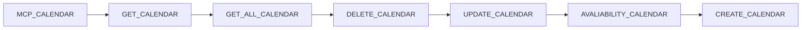

## Fluxo (.json) :

```json
{
  "id": "grxwlyzZb3z4WLAa",
  "meta": {
    "instanceId": "6d46e25379ef430a7067964d1096b885c773564549240cb3ad4c087f6cf94bd3",
    "templateCredsSetupCompleted": true
  },
  "name": "MCP_CALENDAR",
  "tags": [],
  "nodes": [
    {
      "id": "10e49f09-5ef8-4945-adcf-f8b99879a31c",
      "name": "MCP_CALENDAR",
      "type": "@n8n/n8n-nodes-langchain.mcpTrigger",
      "position": [
        0,
        0
      ],
      "webhookId": "ceb17fa5-1937-405f-8000-ea3be7d2b032",
      "parameters": {
        "path": "/mcp/:tool/calendar"
      },
      "typeVersion": 1
    },
    {
      "id": "54e84792-4f4a-4501-8aae-e40f06e958c1",
      "name": "GET_CALENDAR",
      "type": "n8n-nodes-base.googleCalendarTool",
      "position": [
        860,
        240
      ],
      "parameters": {
        "eventId": "={{ /*n8n-auto-generated-fromAI-override*/ $fromAI('Event_ID', ``, 'string') }}",
        "options": {},
        "calendar": {
          "__rl": true,
          "mode": "list",
          "value": "a57a3781407f42b1ad7fe24ce76f558dc6c86fea5f349b7fd39747a2294c1654@group.calendar.google.com",
          "cachedResultName": "ODONTOLOGIA"
        },
        "operation": "get"
      },
      "credentials": {
        "googleCalendarOAuth2Api": {
          "id": "49eGhpwvfLcCZ0h3",
          "name": "Google Calendar account"
        }
      },
      "typeVersion": 1.3
    },
    {
      "id": "c428d7b1-aed4-4a18-962e-fd29b8a2ac54",
      "name": "GET_ALL_CALENDAR",
      "type": "n8n-nodes-base.googleCalendarTool",
      "position": [
        240,
        240
      ],
      "parameters": {
        "options": {
          "orderBy": "startTime",
          "recurringEventHandling": "expand"
        },
        "timeMax": "={{ /*n8n-auto-generated-fromAI-override*/ $fromAI('Before', ``, 'string') }}",
        "timeMin": "={{ /*n8n-auto-generated-fromAI-override*/ $fromAI('After', ``, 'string') }}",
        "calendar": {
          "__rl": true,
          "mode": "list",
          "value": "a57a3781407f42b1ad7fe24ce76f558dc6c86fea5f349b7fd39747a2294c1654@group.calendar.google.com",
          "cachedResultName": "ODONTOLOGIA"
        },
        "operation": "getAll",
        "returnAll": true
      },
      "credentials": {
        "googleCalendarOAuth2Api": {
          "id": "49eGhpwvfLcCZ0h3",
          "name": "Google Calendar account"
        }
      },
      "typeVersion": 1.3
    },
    {
      "id": "26fef8a3-5802-4f3d-ae47-b81aad813728",
      "name": "DELETE_CALENDAR",
      "type": "n8n-nodes-base.googleCalendarTool",
      "position": [
        480,
        240
      ],
      "parameters": {
        "eventId": "={{ /*n8n-auto-generated-fromAI-override*/ $fromAI('Event_ID', ``, 'string') }}",
        "options": {},
        "calendar": {
          "__rl": true,
          "mode": "list",
          "value": "a57a3781407f42b1ad7fe24ce76f558dc6c86fea5f349b7fd39747a2294c1654@group.calendar.google.com",
          "cachedResultName": "ODONTOLOGIA"
        },
        "operation": "delete",
        "descriptionType": "manual"
      },
      "credentials": {
        "googleCalendarOAuth2Api": {
          "id": "49eGhpwvfLcCZ0h3",
          "name": "Google Calendar account"
        }
      },
      "typeVersion": 1.3
    },
    {
      "id": "e46ea1b3-8597-46aa-b37a-6660aa72f74d",
      "name": "UPDATE_CALENDAR",
      "type": "n8n-nodes-base.googleCalendarTool",
      "position": [
        680,
        240
      ],
      "parameters": {
        "eventId": "={{ /*n8n-auto-generated-fromAI-override*/ $fromAI('Event_ID', ``, 'string') }}",
        "calendar": {
          "__rl": true,
          "mode": "list",
          "value": "a57a3781407f42b1ad7fe24ce76f558dc6c86fea5f349b7fd39747a2294c1654@group.calendar.google.com",
          "cachedResultName": "ODONTOLOGIA"
        },
        "operation": "update",
        "updateFields": {},
        "useDefaultReminders": "={{ /*n8n-auto-generated-fromAI-override*/ $fromAI('Use_Default_Reminders', ``, 'boolean') }}"
      },
      "credentials": {
        "googleCalendarOAuth2Api": {
          "id": "49eGhpwvfLcCZ0h3",
          "name": "Google Calendar account"
        }
      },
      "typeVersion": 1.3
    },
    {
      "id": "b9c7618d-b79a-4273-a540-3d21a1c0bfb0",
      "name": "AVALIABILITY_CALENDAR",
      "type": "n8n-nodes-base.googleCalendarTool",
      "position": [
        80,
        240
      ],
      "parameters": {
        "options": {
          "timezone": {
            "__rl": true,
            "mode": "list",
            "value": "America/Sao_Paulo",
            "cachedResultName": "America/Sao_Paulo"
          }
        },
        "timeMax": "={{ /*n8n-auto-generated-fromAI-override*/ $fromAI('End_Time', ``, 'string') }}",
        "timeMin": "={{ /*n8n-auto-generated-fromAI-override*/ $fromAI('Start_Time', ``, 'string') }}",
        "calendar": {
          "__rl": true,
          "mode": "list",
          "value": "a57a3781407f42b1ad7fe24ce76f558dc6c86fea5f349b7fd39747a2294c1654@group.calendar.google.com",
          "cachedResultName": "ODONTOLOGIA"
        },
        "resource": "calendar",
        "descriptionType": "manual",
        "toolDescription": "verifica disponibilidade"
      },
      "credentials": {
        "googleCalendarOAuth2Api": {
          "id": "49eGhpwvfLcCZ0h3",
          "name": "Google Calendar account"
        }
      },
      "typeVersion": 1.3
    },
    {
      "id": "4fda260a-4d0c-4bf3-807b-e752f06037ff",
      "name": "CREATE_CALENDAR",
      "type": "n8n-nodes-base.googleCalendarTool",
      "position": [
        1000,
        240
      ],
      "parameters": {
        "end": "={{ /*n8n-auto-generated-fromAI-override*/ $fromAI('End', ``, 'string') }}",
        "start": "={{ /*n8n-auto-generated-fromAI-override*/ $fromAI('Start', ``, 'string') }}",
        "calendar": {
          "__rl": true,
          "mode": "list",
          "value": "a57a3781407f42b1ad7fe24ce76f558dc6c86fea5f349b7fd39747a2294c1654@group.calendar.google.com",
          "cachedResultName": "ODONTOLOGIA"
        },
        "descriptionType": "manual",
        "toolDescription": "CRIA EVENTOS NOVOS COM O GOOGLE API",
        "additionalFields": {
          "description": "={{ /*n8n-auto-generated-fromAI-override*/ $fromAI('Description', ``, 'string') }}"
        },
        "useDefaultReminders": "={{ /*n8n-auto-generated-fromAI-override*/ $fromAI('Use_Default_Reminders', ``, 'boolean') }}"
      },
      "credentials": {
        "googleCalendarOAuth2Api": {
          "id": "49eGhpwvfLcCZ0h3",
          "name": "Google Calendar account"
        }
      },
      "typeVersion": 1.3
    }
  ],
  "active": true,
  "pinData": {},
  "settings": {
    "executionOrder": "v1"
  },
  "versionId": "d13dc7da-f510-474c-87be-68fea85c81f2",
  "connections": {
    "GET_CALENDAR": {
      "ai_tool": [
        [
          {
            "node": "MCP_CALENDAR",
            "type": "ai_tool",
            "index": 0
          }
        ]
      ]
    },
    "CREATE_CALENDAR": {
      "ai_tool": [
        [
          {
            "node": "MCP_CALENDAR",
            "type": "ai_tool",
            "index": 0
          }
        ]
      ]
    },
    "DELETE_CALENDAR": {
      "ai_tool": [
        [
          {
            "node": "MCP_CALENDAR",
            "type": "ai_tool",
            "index": 0
          }
        ]
      ]
    },
    "UPDATE_CALENDAR": {
      "ai_tool": [
        [
          {
            "node": "MCP_CALENDAR",
            "type": "ai_tool",
            "index": 0
          }
        ]
      ]
    },
    "GET_ALL_CALENDAR": {
      "ai_tool": [
        [
          {
            "node": "MCP_CALENDAR",
            "type": "ai_tool",
            "index": 0
          }
        ]
      ]
    },
    "AVALIABILITY_CALENDAR": {
      "ai_tool": [
        [
          {
            "node": "MCP_CALENDAR",
            "type": "ai_tool",
            "index": 0
          }
        ]
      ]
    }
  }
}
```

<a id="template-1148"></a>

## Template 1148 - Enriquecimento INSEE para Agile CRM

- **Nome:** Enriquecimento INSEE para Agile CRM
- **Descrição:** Este fluxo coletará empresas do Agile CRM, consultará dados públicos da INSEE para enriquecer cadastros com informações como SIREN e endereço da sede, e atualizará as fichas com os dados obtidos.
- **Funcionalidade:** • Detecção de gatilhos: o fluxo pode ser iniciado por agendamento ou por execução de teste manual.
• Filtragem de registros ReadOnly: ignora empresas com a chave RO definida para evitar atualização.
• Localização no banco de dados SIREN: encontra a empresa correspondente no Sirene.
• Obtenção de dados completos da SIREN: solicita informações detalhadas da empresa encontrada.
• Enriquecimento do CRM: atualiza a empresa no CRM com o SIREN, o endereço da sede e outros campos personalizados.
• Mesclagem de dados: une informações do CRM com os dados retornados para criar um registro enriquecido.
• Observação de uso: permite sobrescrever cadastros existentes, com opção de marcar RO para proteção futura.
- **Ferramentas:** • Agile CRM: Plataforma de CRM usada para ler e atualizar informações de empresas.
• INSEE Sirene API: API pública francesa para consulta de informações de empresas (SIREN, endereço).

## Fluxo visual

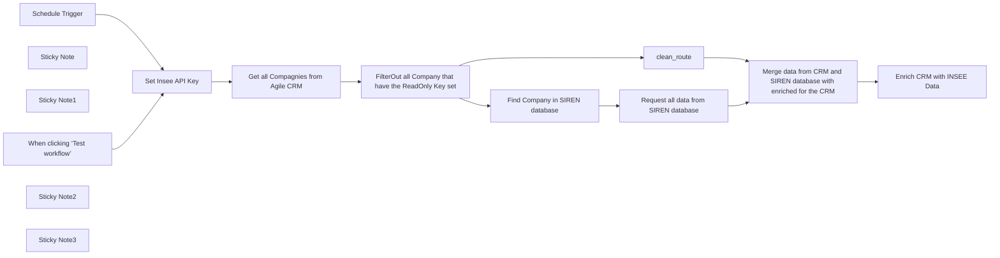

## Fluxo (.json) :

```json
{
  "id": "G0hO05fypS8n8uYu",
  "meta": {
    "instanceId": "8fb286e504ea5ce6aeb12bf5c0c97ce11908b5b1aaa495ddfa0ef349661b832e"
  },
  "name": "INSEE Enrichment for Agile CRM",
  "tags": [],
  "nodes": [
    {
      "id": "a45b34c1-514e-4221-b363-abf2d4de43c4",
      "name": "When clicking ‘Test workflow’",
      "type": "n8n-nodes-base.manualTrigger",
      "position": [
        -3440,
        -320
      ],
      "parameters": {},
      "typeVersion": 1
    },
    {
      "id": "d406941b-80a1-43a3-ba19-2e29570192f2",
      "name": "Find Company in SIREN database",
      "type": "n8n-nodes-base.httpRequest",
      "onError": "continueErrorOutput",
      "position": [
        -2660,
        -220
      ],
      "parameters": {
        "url": "=https://api.insee.fr/api-sirene/3.11/siren?q=periode(denominationUniteLegale:\"{{ $json.denominationUniteLegale }}\")",
        "options": {},
        "sendHeaders": true,
        "headerParameters": {
          "parameters": [
            {
              "name": "accept",
              "value": "application/json"
            },
            {
              "name": "X-INSEE-Api-Key-Integration",
              "value": "={{ $('Set Insee API Key').all()[0].json['X-INSEE-Api-Key-Integration']  }}"
            }
          ]
        }
      },
      "typeVersion": 4.2,
      "alwaysOutputData": false
    },
    {
      "id": "6ab3818b-2f09-44e2-874a-87c51478572b",
      "name": "Request all data from SIREN database",
      "type": "n8n-nodes-base.httpRequest",
      "position": [
        -2420,
        -240
      ],
      "parameters": {
        "url": "=https://api.insee.fr/api-sirene/3.11/siret/{{ $json.unitesLegales[0].siren }}{{ $json.unitesLegales[0].periodesUniteLegale[0].nicSiegeUniteLegale }}",
        "options": {},
        "sendHeaders": true,
        "headerParameters": {
          "parameters": [
            {
              "name": "accept",
              "value": "application/json"
            },
            {
              "name": "X-INSEE-Api-Key-Integration",
              "value": "={{ $('Set Insee API Key').all()[0].json['X-INSEE-Api-Key-Integration']  }}"
            }
          ]
        }
      },
      "typeVersion": 4.2
    },
    {
      "id": "89c223fe-289b-4d0f-922a-e9c0ad672b51",
      "name": "Sticky Note",
      "type": "n8n-nodes-base.stickyNote",
      "position": [
        -3420,
        -640
      ],
      "parameters": {
        "width": 460,
        "height": 240,
        "content": "### Enrich CRM data with data from French INSEE OpenDatabase API\nThis workflow takes all company entries from **Agile CRM** and enriches their data using the French [Insee Opendata API](https://portail-api.insee.fr/) (Free Access)\n\n__This will update :__ \n1) Official Address of the company headquarters\n2) Add government company id number (SIREN) in a Custom Field"
      },
      "typeVersion": 1
    },
    {
      "id": "0bdc49dd-6f26-447f-a8ba-c2ba615dc7ec",
      "name": "FilterOut all Company that have the ReadOnly Key set",
      "type": "n8n-nodes-base.code",
      "position": [
        -2880,
        -220
      ],
      "parameters": {
        "jsCode": "// Get input data\nconst input = $input.all();\nconst output = input.filter(item => {\n    const properties = item.json.properties || [];\n    return !properties.some(property => property.name === \"RO\" && property.value === \"1\"); // Remove all ReadOnly entries\n}).map(item => {\n    const companyId = item.json.id;\n    const denominationUniteLegale = item.json.properties[0]?.value || null; \n    return {\n        json: {\n            companyId,\n            denominationUniteLegale\n        }\n    };\n});\n\n// Return the transformed output\nreturn output;\n"
      },
      "typeVersion": 2
    },
    {
      "id": "0ef184f7-219c-4eb3-bfe0-4e68d2ce0b43",
      "name": "Sticky Note1",
      "type": "n8n-nodes-base.stickyNote",
      "position": [
        -2940,
        -640
      ],
      "parameters": {
        "color": 5,
        "width": 647,
        "height": 232,
        "content": "### 👨‍🎤 Setup\n1. Add your **Agile CRM** credentials\n2. Link each AgileCRM node to the correct **Agile CRM** credentials\n3. Add your **INSEE** API Key to the **\"Set Insee API Key\"** node\n4. Make sure the **Custom Fields** for the **companies** are set as below (Admin Settings):\n   - Label : \"SIREN\", Type : \"Text Field\", Description \"N° de SIREN\"\n   - Label : \"RO\", Type : \"Number\", Description \"Locks entry from update\"\n5. Click on **Test Workflow** to make sure everything is working\n6. Configure schedule if needed and don't forget to change status to **Active**"
      },
      "typeVersion": 1
    },
    {
      "id": "78255253-195d-472d-a76c-ab63ceac126b",
      "name": "Set Insee API Key",
      "type": "n8n-nodes-base.set",
      "position": [
        -3260,
        -220
      ],
      "parameters": {
        "options": {},
        "assignments": {
          "assignments": [
            {
              "id": "e993e665-cf31-48b1-8ca8-a4829dc82642",
              "name": "X-INSEE-Api-Key-Integration",
              "type": "string",
              "value": "put-your-insee-api-key-here"
            }
          ]
        }
      },
      "typeVersion": 3.4
    },
    {
      "id": "90b13481-6570-4bfc-b3dc-4b6017c6c8b5",
      "name": "Schedule Trigger",
      "type": "n8n-nodes-base.scheduleTrigger",
      "position": [
        -3440,
        -140
      ],
      "parameters": {
        "rule": {
          "interval": [
            {}
          ]
        }
      },
      "typeVersion": 1.2
    },
    {
      "id": "88c8a6c6-2175-42c3-bfdb-f1d32a5d1c2d",
      "name": "clean_route",
      "type": "n8n-nodes-base.noOp",
      "position": [
        -2660,
        -360
      ],
      "parameters": {},
      "typeVersion": 1
    },
    {
      "id": "522d83f6-752e-40b4-a889-334f0a96998b",
      "name": "Get all Compagnies from Agile CRM",
      "type": "n8n-nodes-base.agileCrm",
      "position": [
        -3080,
        -220
      ],
      "parameters": {
        "options": {},
        "resource": "company",
        "operation": "getAll"
      },
      "credentials": {
        "agileCrmApi": {
          "id": "wb0EgiQFLQbiFuy4",
          "name": "AgileCRM account"
        }
      },
      "typeVersion": 1
    },
    {
      "id": "8ff0632b-6aca-47d8-b611-72dbc8dec09b",
      "name": "Enrich CRM with INSEE Data",
      "type": "n8n-nodes-base.agileCrm",
      "position": [
        -1960,
        -340
      ],
      "parameters": {
        "resource": "company",
        "companyId": "={{ $json.companyId }}",
        "operation": "update",
        "additionalFields": {
          "addressOptions": {
            "addressProperties": [
              {
                "address": "={{ $json.etablissement.adresseEtablissement.complementAdresseEtablissement }}\n{{ $json.etablissement.adresseEtablissement.typeVoieEtablissement }} {{ $json.etablissement.adresseEtablissement.libelleVoieEtablissement }}\n{{ $json.etablissement.adresseEtablissement.codePostalEtablissement }}{{ $json.etablissement.adresseEtablissement.libelleCommuneEtablissement }}",
                "subtype": "office"
              }
            ]
          },
          "customProperties": {
            "customProperty": [
              {
                "name": "SIREN",
                "value": "={{ $json.etablissement.siren }}",
                "subtype": "TEXT"
              }
            ]
          }
        }
      },
      "credentials": {
        "agileCrmApi": {
          "id": "wb0EgiQFLQbiFuy4",
          "name": "AgileCRM account"
        }
      },
      "typeVersion": 1
    },
    {
      "id": "8720be96-8181-4ea7-b114-ce0f5b8e09c1",
      "name": "Merge data from CRM and SIREN database with enriched for the CRM",
      "type": "n8n-nodes-base.merge",
      "position": [
        -2180,
        -340
      ],
      "parameters": {
        "mode": "combine",
        "options": {},
        "advanced": true,
        "mergeByFields": {
          "values": [
            {
              "field1": "denominationUniteLegale",
              "field2": "etablissement.uniteLegale.denominationUniteLegale"
            }
          ]
        }
      },
      "typeVersion": 3
    },
    {
      "id": "855a39e2-83ef-49d9-b630-ec31aaa96e72",
      "name": "Sticky Note2",
      "type": "n8n-nodes-base.stickyNote",
      "position": [
        -3460,
        20
      ],
      "parameters": {
        "height": 80,
        "content": "👆 You can use any of those two Trigger to start the process."
      },
      "typeVersion": 1
    },
    {
      "id": "b003c1b8-6244-4b72-bbb0-025f563b5d71",
      "name": "Sticky Note3",
      "type": "n8n-nodes-base.stickyNote",
      "position": [
        -2260,
        -640
      ],
      "parameters": {
        "width": 380,
        "height": 240,
        "content": "### 🗒️ Notes : \n1. This workflow is made to write over any entry already present. You can change this for each company by setting the **\"RO\"** Custom Field to **1**, making it read-only for this workflow.\n\n2. If you want to make it readonly after the update from this workflow, then **add a custom property** in the last node **Enrich CRM with INSEE Data** named **\"RO\"**, SubType **\"Number\"** and Value **\"1\"**"
      },
      "typeVersion": 1
    }
  ],
  "active": false,
  "pinData": {},
  "settings": {
    "executionOrder": "v1"
  },
  "versionId": "9f328182-d131-4300-a1f4-2cb3dfe91632",
  "connections": {
    "clean_route": {
      "main": [
        [
          {
            "node": "Merge data from CRM and SIREN database with enriched for the CRM",
            "type": "main",
            "index": 0
          }
        ]
      ]
    },
    "Schedule Trigger": {
      "main": [
        [
          {
            "node": "Set Insee API Key",
            "type": "main",
            "index": 0
          }
        ]
      ]
    },
    "Set Insee API Key": {
      "main": [
        [
          {
            "node": "Get all Compagnies from Agile CRM",
            "type": "main",
            "index": 0
          }
        ]
      ]
    },
    "Find Company in SIREN database": {
      "main": [
        [
          {
            "node": "Request all data from SIREN database",
            "type": "main",
            "index": 0
          }
        ]
      ]
    },
    "Get all Compagnies from Agile CRM": {
      "main": [
        [
          {
            "node": "FilterOut all Company that have the ReadOnly Key set",
            "type": "main",
            "index": 0
          }
        ]
      ]
    },
    "When clicking ‘Test workflow’": {
      "main": [
        [
          {
            "node": "Set Insee API Key",
            "type": "main",
            "index": 0
          }
        ]
      ]
    },
    "Request all data from SIREN database": {
      "main": [
        [
          {
            "node": "Merge data from CRM and SIREN database with enriched for the CRM",
            "type": "main",
            "index": 1
          }
        ]
      ]
    },
    "FilterOut all Company that have the ReadOnly Key set": {
      "main": [
        [
          {
            "node": "Find Company in SIREN database",
            "type": "main",
            "index": 0
          },
          {
            "node": "clean_route",
            "type": "main",
            "index": 0
          }
        ]
      ]
    },
    "Merge data from CRM and SIREN database with enriched for the CRM": {
      "main": [
        [
          {
            "node": "Enrich CRM with INSEE Data",
            "type": "main",
            "index": 0
          }
        ]
      ]
    }
  }
}
```

<a id="template-1149"></a>

## Template 1149 - Sincronizar novas actividades Strava na planilha

- **Nome:** Sincronizar novas actividades Strava na planilha
- **Descrição:** O fluxo verifica periodicamente as actividades em Strava, identifica as novas em relação às já registradas e adiciona essas actividades formatadas a uma planilha do Google.
- **Funcionalidade:** • Agendamento periódico: Executa o processo a cada 2 horas para verificar novas actividades.
• Leitura de actividades: Obtém as últimas actividades do serviço de rastreio de atividades (limite configurado).
• Remoção de duplicados: Elimina entradas repetidas nas actividades obtidas.
• Leitura das referências salvas: Lê as últimas referências já registradas na planilha para comparação.
• Comparação e filtrado: Compara IDs das actividades para identificar quais ainda não foram salvas.
• Transformação de dados: Formata campos como data, distância (km), tempo e desnível antes de gravar.
• Inserção na planilha: Adiciona as actividades novas como novas linhas na planilha com URL de atividade e campos mapeados.
- **Ferramentas:** • Strava: Serviço de rastreamento de actividades e exercícios usado para obter dados das actividades.
• Google Sheets: Planilha online usada para armazenar e organizar as actividades importadas.

## Fluxo visual

```mermaid
flowchart LR
    N1["Schedule Trigger"]
    N2["Strava"]
    N3["Code"]
    N4["Google Sheets"]
    N5["strava_last"]
    N6["Remove Duplicates"]
    N7["activities"]
    N8["sort_saved"]
    N9["last_saved"]
    N10["saved_last"]
    N11["sort_strava"]
    N12["last_strava"]
    N13["sort_results"]

    N3 --> N13
    N2 --> N11
    N7 --> N8
    N9 --> N10
    N10 --> N2
    N8 --> N9
    N12 --> N5
    N11 --> N6
    N5 --> N3
    N13 --> N4
    N1 --> N7
    N6 --> N12
```

## Fluxo (.json) :

```json
{
  "nodes": [
    {
      "id": "fc128eed-1666-46b8-8feb-e6ddf05e85d1",
      "name": "Schedule Trigger",
      "type": "n8n-nodes-base.scheduleTrigger",
      "position": [
        380,
        240
      ],
      "parameters": {
        "rule": {
          "interval": [
            {
              "field": "hours",
              "hoursInterval": 2
            }
          ]
        }
      },
      "typeVersion": 1.2
    },
    {
      "id": "830708eb-197b-4bf7-95da-893d78329ab2",
      "name": "Strava",
      "type": "n8n-nodes-base.strava",
      "position": [
        380,
        480
      ],
      "parameters": {
        "limit": 10,
        "operation": "getAll"
      },
      "typeVersion": 1.1
    },
    {
      "id": "de776ebf-3ad5-4c4c-b0c8-7bc74cba5446",
      "name": "Code",
      "type": "n8n-nodes-base.code",
      "position": [
        380,
        740
      ],
      "parameters": {
        "jsCode": "// Obtén los items del nodo \"Strava\"\nconst stravaItems = $('strava_last').all();\n\n// Obtén los items del nodo \"ultimas_id\"\nconst ultimasGuardadasItems = $('saved_last').all();\n\n// Extrae las referencias guardadas en un Set, asegurando el formato como cadena\nconst referenciasGuardadas = new Set(\n    ultimasGuardadasItems.map(item => String(item.json.id))\n);\n\n// Filtra los items de \"Strava\" cuyos IDs no estén en las referencias guardadas\nconst filteredItems = stravaItems.filter(item => {\n    // Convertir el ID actual de Strava a cadena para comparar correctamente\n    return !referenciasGuardadas.has(String(item.json.id));\n});\n\n// Depuración: imprime las referencias y los resultados\nconsole.log('Referencias guardadas:', [...referenciasGuardadas]);\nconsole.log('Items filtrados:', filteredItems);\n\n// Devuelve los items filtrados\nreturn filteredItems;\n\n\n"
      },
      "typeVersion": 2
    },
    {
      "id": "c8a93e6e-67fc-4f6d-bcde-83d3a885c622",
      "name": "Google Sheets",
      "type": "n8n-nodes-base.googleSheets",
      "position": [
        900,
        740
      ],
      "parameters": {
        "columns": {
          "value": {
            "Kms": "={{ $json.distancia }}",
            "Ref": "={{ $json.id }}",
            "Fecha": "={{ $json.fecha }}",
            "Track": "=http://www.strava.com/activities/{{ $json.id }}",
            "Tiempo": "={{ $json.tiempo }}",
            "Desnivel": "={{ $json.elevacion }}"
          },
          "schema": [
            {
              "id": "Fecha",
              "type": "string",
              "display": true,
              "required": false,
              "displayName": "Fecha",
              "defaultMatch": false,
              "canBeUsedToMatch": true
            },
            {
              "id": "Kms",
              "type": "string",
              "display": true,
              "required": false,
              "displayName": "Kms",
              "defaultMatch": false,
              "canBeUsedToMatch": true
            },
            {
              "id": "Tiempo",
              "type": "string",
              "display": true,
              "required": false,
              "displayName": "Tiempo",
              "defaultMatch": false,
              "canBeUsedToMatch": true
            },
            {
              "id": "Ref",
              "type": "string",
              "display": true,
              "removed": false,
              "required": false,
              "displayName": "Ref",
              "defaultMatch": false,
              "canBeUsedToMatch": true
            },
            {
              "id": "Track",
              "type": "string",
              "display": true,
              "required": false,
              "displayName": "Track",
              "defaultMatch": false,
              "canBeUsedToMatch": true
            },
            {
              "id": "Bicicleta",
              "type": "string",
              "display": true,
              "required": false,
              "displayName": "Bicicleta",
              "defaultMatch": false,
              "canBeUsedToMatch": true
            },
            {
              "id": "Terreno",
              "type": "string",
              "display": true,
              "required": false,
              "displayName": "Terreno",
              "defaultMatch": false,
              "canBeUsedToMatch": true
            },
            {
              "id": "Desnivel",
              "type": "string",
              "display": true,
              "required": false,
              "displayName": "Desnivel",
              "defaultMatch": false,
              "canBeUsedToMatch": true
            }
          ],
          "mappingMode": "defineBelow",
          "matchingColumns": []
        },
        "options": {},
        "operation": "append",
        "sheetName": {
          "__rl": true,
          "mode": "list",
          "value": 419561402,
          "cachedResultUrl": "https://docs.google.com/spreadsheets/d/159k8cDL8hZooz-dsHE6ueWf68mBkHhxVCKnWm-lYLqs/edit#gid=419561402",
          "cachedResultName": "n8n"
        },
        "documentId": {
          "__rl": true,
          "mode": "list",
          "value": "159k8cDL8hZooz-dsHE6ueWf68mBkHhxVCKnWm-lYLqs",
          "cachedResultUrl": "https://docs.google.com/spreadsheets/d/159k8cDL8hZooz-dsHE6ueWf68mBkHhxVCKnWm-lYLqs/edit?usp=drivesdk",
          "cachedResultName": "Sherlo_Bike"
        }
      },
      "credentials": {
        "googleSheetsOAuth2Api": {
          "id": "tyg7FJlIITkSazyi",
          "name": "Nik's Google"
        }
      },
      "typeVersion": 4.5
    },
    {
      "id": "0ce07d54-97af-4e88-9d27-452191a0b3ba",
      "name": "strava_last",
      "type": "n8n-nodes-base.set",
      "position": [
        1420,
        480
      ],
      "parameters": {
        "options": {},
        "assignments": {
          "assignments": [
            {
              "id": "423ae4b8-287c-4dc1-b32b-d1b6f1f45efa",
              "name": "id",
              "type": "number",
              "value": "={{ $json.id }}"
            },
            {
              "id": "595802d2-17d0-40be-9e43-d655ffbf4ce0",
              "name": "fecha",
              "type": "string",
              "value": "={{ DateTime.fromISO($json.start_date_local).toFormat('d/M/yyyy') }}"
            },
            {
              "id": "4b39d783-19f2-4a7e-b0e6-dbe2b98f1ae0",
              "name": "distancia",
              "type": "number",
              "value": "={{ Math.round($json.distance / 100) / 10 }}"
            },
            {
              "id": "2f321dc0-435f-4b4d-866c-091ff9eaf9df",
              "name": "elevacion",
              "type": "number",
              "value": "={{ Math.round($json.total_elevation_gain) }}"
            },
            {
              "id": "ba1bb089-5ae7-4e42-ac65-07323c4e1842",
              "name": "tiempo",
              "type": "string",
              "value": "={{ `${Math.floor($json.moving_time / 3600)}:${Math.floor(($json.moving_time % 3600) / 60).toString().padStart(2, '0')}:${($json.moving_time % 60).toString().padStart(2, '0')}` }}\n"
            }
          ]
        }
      },
      "typeVersion": 3.4
    },
    {
      "id": "490f7be9-73c9-4431-8b83-fcdbbcc283eb",
      "name": "Remove Duplicates",
      "type": "n8n-nodes-base.removeDuplicates",
      "position": [
        900,
        480
      ],
      "parameters": {
        "compare": "selectedFields",
        "options": {},
        "fieldsToCompare": "id"
      },
      "typeVersion": 2
    },
    {
      "id": "2d1c4dc5-2baa-4c89-a312-4b40381d4e5d",
      "name": "activities",
      "type": "n8n-nodes-base.googleSheets",
      "position": [
        660,
        240
      ],
      "parameters": {
        "options": {},
        "sheetName": {
          "__rl": true,
          "mode": "list",
          "value": 419561402,
          "cachedResultUrl": "https://docs.google.com/spreadsheets/d/159k8cDL8hZooz-dsHE6ueWf68mBkHhxVCKnWm-lYLqs/edit#gid=419561402",
          "cachedResultName": "n8n"
        },
        "documentId": {
          "__rl": true,
          "mode": "list",
          "value": "159k8cDL8hZooz-dsHE6ueWf68mBkHhxVCKnWm-lYLqs",
          "cachedResultUrl": "https://docs.google.com/spreadsheets/d/159k8cDL8hZooz-dsHE6ueWf68mBkHhxVCKnWm-lYLqs/edit?usp=drivesdk",
          "cachedResultName": "Sherlo_Bike"
        }
      },
      "credentials": {
        "googleSheetsOAuth2Api": {
          "id": "tyg7FJlIITkSazyi",
          "name": "Nik's Google"
        }
      },
      "typeVersion": 4.5
    },
    {
      "id": "2c7b7939-4ca1-4868-92bf-5fd7384a1103",
      "name": "sort_saved",
      "type": "n8n-nodes-base.sort",
      "position": [
        900,
        240
      ],
      "parameters": {
        "options": {},
        "sortFieldsUi": {
          "sortField": [
            {
              "fieldName": "Ref"
            }
          ]
        }
      },
      "typeVersion": 1
    },
    {
      "id": "4e1d9064-6dda-4a01-af48-f278792f8b6b",
      "name": "last_saved",
      "type": "n8n-nodes-base.limit",
      "position": [
        1160,
        240
      ],
      "parameters": {
        "keep": "lastItems",
        "maxItems": 10
      },
      "typeVersion": 1
    },
    {
      "id": "6eb2053a-1101-477b-86e9-113813be2d92",
      "name": "saved_last",
      "type": "n8n-nodes-base.set",
      "position": [
        1420,
        240
      ],
      "parameters": {
        "options": {},
        "assignments": {
          "assignments": [
            {
              "id": "50097932-ab91-4af7-9412-925fab1982f0",
              "name": "id",
              "type": "string",
              "value": "={{ $json.Ref }}"
            }
          ]
        }
      },
      "typeVersion": 3.4
    },
    {
      "id": "afd986f1-0c49-4a69-b948-aefcbff1010f",
      "name": "sort_strava",
      "type": "n8n-nodes-base.sort",
      "position": [
        660,
        480
      ],
      "parameters": {
        "options": {},
        "sortFieldsUi": {
          "sortField": [
            {
              "fieldName": "id"
            }
          ]
        }
      },
      "typeVersion": 1
    },
    {
      "id": "16094d29-f35b-492c-9d93-3145dab30cd3",
      "name": "last_strava",
      "type": "n8n-nodes-base.limit",
      "position": [
        1160,
        480
      ],
      "parameters": {
        "keep": "lastItems",
        "maxItems": 10
      },
      "typeVersion": 1
    },
    {
      "id": "9986360b-fcd3-42f4-ad13-aea69f6d1a80",
      "name": "sort_results",
      "type": "n8n-nodes-base.sort",
      "position": [
        660,
        740
      ],
      "parameters": {
        "options": {},
        "sortFieldsUi": {
          "sortField": [
            {
              "fieldName": "id"
            }
          ]
        }
      },
      "typeVersion": 1
    }
  ],
  "pinData": {},
  "connections": {
    "Code": {
      "main": [
        [
          {
            "node": "sort_results",
            "type": "main",
            "index": 0
          }
        ]
      ]
    },
    "Strava": {
      "main": [
        [
          {
            "node": "sort_strava",
            "type": "main",
            "index": 0
          }
        ]
      ]
    },
    "activities": {
      "main": [
        [
          {
            "node": "sort_saved",
            "type": "main",
            "index": 0
          }
        ]
      ]
    },
    "last_saved": {
      "main": [
        [
          {
            "node": "saved_last",
            "type": "main",
            "index": 0
          }
        ]
      ]
    },
    "saved_last": {
      "main": [
        [
          {
            "node": "Strava",
            "type": "main",
            "index": 0
          }
        ]
      ]
    },
    "sort_saved": {
      "main": [
        [
          {
            "node": "last_saved",
            "type": "main",
            "index": 0
          }
        ]
      ]
    },
    "last_strava": {
      "main": [
        [
          {
            "node": "strava_last",
            "type": "main",
            "index": 0
          }
        ]
      ]
    },
    "sort_strava": {
      "main": [
        [
          {
            "node": "Remove Duplicates",
            "type": "main",
            "index": 0
          }
        ]
      ]
    },
    "strava_last": {
      "main": [
        [
          {
            "node": "Code",
            "type": "main",
            "index": 0
          }
        ]
      ]
    },
    "sort_results": {
      "main": [
        [
          {
            "node": "Google Sheets",
            "type": "main",
            "index": 0
          }
        ]
      ]
    },
    "Schedule Trigger": {
      "main": [
        [
          {
            "node": "activities",
            "type": "main",
            "index": 0
          }
        ]
      ]
    },
    "Remove Duplicates": {
      "main": [
        [
          {
            "node": "last_strava",
            "type": "main",
            "index": 0
          }
        ]
      ]
    }
  }
}
```

<a id="template-1150"></a>

## Template 1150 - Relatório Matomo com IA

- **Nome:** Relatório Matomo com IA
- **Descrição:** Fluxo que coleta dados de visitas do Matomo, gera insights com IA a partir dos dados e armazena os resultados em uma base de dados.
- **Funcionalidade:** • Coleta de dados do Matomo: recupera detalhes de visitas recentes para análise.
• Preparação dos dados: formata as informações de visitas para envio à IA.
• Análise por IA: envia dados para IA externa para gerar insights sobre caminhos, páginas populares e engajamento.
• Armazenamento dos resultados: salva as respostas da IA numa base de dados com data e notas.
• Instruções/configuração: disponibiliza instruções de uso via notas de configuração para tokens/credenciais.
- **Ferramentas:** • Matomo Analytics API: coleta dados de visitas do site, incluindo detalhes de página e tempo gasto.
• OpenRouter AI: serviço de IA que gera insights a partir dos dados de visitantes.
• Baserow: base de dados para armazenar os resultados com campos de data, nota e blog.

## Fluxo visual

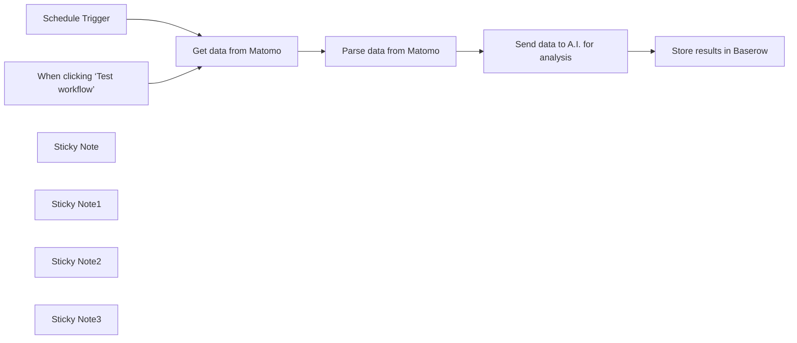

## Fluxo (.json) :

```json
{
  "id": "PRQhetYFkuhxntVH",
  "meta": {
    "instanceId": "558d88703fb65b2d0e44613bc35916258b0f0bf983c5d4730c00c424b77ca36a",
    "templateCredsSetupCompleted": true
  },
  "name": "Matomo Analytics Report",
  "tags": [],
  "nodes": [
    {
      "id": "fd35d612-09a6-4dd3-836b-53d03b75f344",
      "name": "When clicking ‘Test workflow’",
      "type": "n8n-nodes-base.manualTrigger",
      "position": [
        120,
        360
      ],
      "parameters": {},
      "typeVersion": 1
    },
    {
      "id": "c8169606-3abd-4dd3-bd35-fdc0296fc0e1",
      "name": "Schedule Trigger",
      "type": "n8n-nodes-base.scheduleTrigger",
      "position": [
        120,
        160
      ],
      "parameters": {
        "rule": {
          "interval": [
            {
              "field": "weeks"
            }
          ]
        }
      },
      "typeVersion": 1.2
    },
    {
      "id": "760a87e3-ed8f-4b1e-a46b-4ceb635020d4",
      "name": "Get data from Matomo",
      "type": "n8n-nodes-base.httpRequest",
      "position": [
        380,
        260
      ],
      "parameters": {
        "url": "https://shrewd-lyrebird.pikapod.net/index.php",
        "method": "POST",
        "options": {},
        "sendBody": true,
        "contentType": "multipart-form-data",
        "bodyParameters": {
          "parameters": [
            {
              "name": "module",
              "value": "API"
            },
            {
              "name": "method",
              "value": "Live.getLastVisitsDetails"
            },
            {
              "name": "idSite",
              "value": "3"
            },
            {
              "name": "period",
              "value": "range"
            },
            {
              "name": "date",
              "value": "last30"
            },
            {
              "name": "format",
              "value": "JSON"
            },
            {
              "name": "segment",
              "value": "visitCount>3"
            },
            {
              "name": "filter_limit",
              "value": "100"
            },
            {
              "name": "showColumns",
              "value": "actionDetails,visitIp,visitorId,visitCount"
            },
            {
              "name": "token_auth",
              "value": "{insert your auth token}"
            }
          ]
        }
      },
      "typeVersion": 4.1
    },
    {
      "id": "f9e9a099-3131-4320-8a86-b9add4e43096",
      "name": "Parse data from Matomo",
      "type": "n8n-nodes-base.code",
      "position": [
        580,
        260
      ],
      "parameters": {
        "jsCode": "// Get input data\nconst items = $input.all();\n\n// Format the visitor data into a clear prompt\nconst visitorData = items.map(item => {\n  const visit = item.json;\n  \n  const visitorActions = visit.actionDetails.map(action => \n    `  - Page ${action.pageviewPosition}: ${action.pageTitle}\\n    URL: ${action.url}\\n    Time Spent: ${action.timeSpentPretty}`\n  ).join('\\n');\n\n  return `- Visitor (ID: ${visit.visitorId}):\\n  Visit Count: ${visit.visitCount}\\n${visitorActions}`;\n}).join('\\n\\n');\n\n// Create the prompt\nconst prompt = `Please analyze this visitor data:\\n\\n${visitorData}\\n\\nPlease provide insights on:\\n1. Common visitor paths\\n2. Popular pages\\n3. User engagement patterns\\n4. Recommendations for improvement`;\n\n// Return formatted for LLaMA\nreturn [{\n  json: {\n    messages: [\n      {\n        role: \"user\",\n        content: prompt\n      }\n    ]\n  }\n}];"
      },
      "typeVersion": 2
    },
    {
      "id": "387832ee-8397-43f8-bf62-846e4a7a20d0",
      "name": "Send data to A.I. for analysis",
      "type": "n8n-nodes-base.httpRequest",
      "position": [
        760,
        260
      ],
      "parameters": {
        "url": "https://openrouter.ai/api/v1/chat/completions",
        "method": "POST",
        "options": {},
        "jsonBody": "={\n  \"model\": \"meta-llama/llama-3.1-70b-instruct:free\",\n  \"messages\": [\n    {\n      \"role\": \"user\",\n      \"content\": \"You are an SEO expert. This is data of visitors who have visited my site more then 3 times and the pages they have visited. Can you give me insights into this data:{{ encodeURIComponent($json.messages[0].content)}}\" \n    }\n  ]\n}",
        "sendBody": true,
        "specifyBody": "json",
        "authentication": "genericCredentialType",
        "genericAuthType": "httpHeaderAuth"
      },
      "credentials": {
        "httpHeaderAuth": {
          "id": "WY7UkF14ksPKq3S8",
          "name": "Header Auth account 2"
        }
      },
      "typeVersion": 4.2,
      "alwaysOutputData": false
    },
    {
      "id": "7ee29949-550e-4f3a-8420-49ca2608bbeb",
      "name": "Store results in Baserow",
      "type": "n8n-nodes-base.baserow",
      "position": [
        1060,
        260
      ],
      "parameters": {
        "tableId": 643,
        "fieldsUi": {
          "fieldValues": [
            {
              "fieldId": 6261,
              "fieldValue": "={{ DateTime.now().toFormat('yyyy-MM-dd') }}"
            },
            {
              "fieldId": 6262,
              "fieldValue": "={{ $json.choices[0].message.content }}"
            },
            {
              "fieldId": 6263,
              "fieldValue": "Your blog name"
            }
          ]
        },
        "operation": "create",
        "databaseId": 121
      },
      "credentials": {
        "baserowApi": {
          "id": "8w0zXhycIfCAgja3",
          "name": "Baserow account"
        }
      },
      "typeVersion": 1
    },
    {
      "id": "684ca1c9-97c3-4464-8ce6-aa6019db0c04",
      "name": "Sticky Note",
      "type": "n8n-nodes-base.stickyNote",
      "position": [
        80,
        -360
      ],
      "parameters": {
        "color": 5,
        "width": 615,
        "height": 289,
        "content": "## Send Matomo analytics to A.I. and save results to baserow\n\nThis workflow will check for visitors who have visited more than 3 times. It will take this week's data and compare it to last week's data and give SEO suggestions.\n\n[Watch youtube tutorial here](https://www.youtube.com/watch?v=hGzdhXyU-o8)\n\n[Get my SEO A.I. agent system here](https://2828633406999.gumroad.com/l/rumjahn)\n\n[💡 You can read more about this workflow here](https://rumjahn.com/how-to-create-an-a-i-agent-to-analyze-matomo-analytics-using-n8n-for-free/)\n"
      },
      "typeVersion": 1
    },
    {
      "id": "29723224-416e-46b4-a498-90888eb9a41b",
      "name": "Sticky Note1",
      "type": "n8n-nodes-base.stickyNote",
      "position": [
        320,
        -20
      ],
      "parameters": {
        "width": 224.51612903225822,
        "height": 461.4193548387107,
        "content": "## Get Matomo Data\n \n1. Enter your Matomo API key at the bottom\n2. Navigate to Administration > Personal > Security > Auth tokens within your Matomo dashboard. Click on Create new token and provide a purpose for reference."
      },
      "typeVersion": 1
    },
    {
      "id": "c694c855-c37a-4717-befd-d7a216f99e2d",
      "name": "Sticky Note2",
      "type": "n8n-nodes-base.stickyNote",
      "position": [
        700,
        -20
      ],
      "parameters": {
        "color": 3,
        "width": 225.99936321742769,
        "height": 508.95792207792226,
        "content": "## Send data to A.I.\n\nFill in your Openrouter A.I. credentials. Use Header Auth.\n- Username: Authorization\n- Password: Bearer {insert your API key}\n\nRemember to add a space after bearer. Also, feel free to modify the prompt to A.1."
      },
      "typeVersion": 1
    },
    {
      "id": "fdd12783-0456-4fc7-8030-555f058f2fd2",
      "name": "Sticky Note3",
      "type": "n8n-nodes-base.stickyNote",
      "position": [
        960,
        -20
      ],
      "parameters": {
        "color": 6,
        "width": 331.32883116883124,
        "height": 474.88,
        "content": "## Send data to Baserow\n\nCreate a table first with the following columns:\n- Date\n- Note\n- Blog\n\nEnter the name of your website under \"Blog\" field."
      },
      "typeVersion": 1
    }
  ],
  "active": false,
  "pinData": {},
  "settings": {
    "executionOrder": "v1"
  },
  "versionId": "21a1d486-5bb8-40b9-9032-6ab22d8baebc",
  "connections": {
    "Schedule Trigger": {
      "main": [
        [
          {
            "node": "Get data from Matomo",
            "type": "main",
            "index": 0
          }
        ]
      ]
    },
    "Get data from Matomo": {
      "main": [
        [
          {
            "node": "Parse data from Matomo",
            "type": "main",
            "index": 0
          }
        ]
      ]
    },
    "Parse data from Matomo": {
      "main": [
        [
          {
            "node": "Send data to A.I. for analysis",
            "type": "main",
            "index": 0
          }
        ]
      ]
    },
    "Send data to A.I. for analysis": {
      "main": [
        [
          {
            "node": "Store results in Baserow",
            "type": "main",
            "index": 0
          }
        ]
      ]
    },
    "When clicking ‘Test workflow’": {
      "main": [
        [
          {
            "node": "Get data from Matomo",
            "type": "main",
            "index": 0
          }
        ]
      ]
    }
  }
}
```

<a id="template-1151"></a>

## Template 1151 - Auto-tagging de posts WordPress com IA

- **Nome:** Auto-tagging de posts WordPress com IA
- **Descrição:** Gera automaticamente tags para artigos detectados via feed RSS usando um modelo de IA, cria tags ausentes no WordPress e publica/atualiza posts com os IDs de tag corretos.
- **Funcionalidade:** • Detecção de novos artigos: Monitora um feed RSS e inicia o processo quando há conteúdo novo.
• Geração de tags por IA: Usa um modelo de linguagem para sugerir 3–5 tags relevantes em Title Case com regras de formatação.
• Normalização de tags: Converte nomes de tags para formatos consistentes (ex.: slug com dash, nome em Title Case) para comparação e criação.
• Verificação de tags existentes: Busca as tags atuais no site WordPress e determina quais já existem.
• Criação automática de tags faltantes: Registra no WordPress quaisquer tags sugeridas que ainda não existam.
• Agregação de IDs de tag: Reúne os IDs das tags existentes e recém-criadas para aplicação no post.
• Publicação/atualização de post: Cria ou atualiza um post no WordPress atribuindo as tags apropriadas.
• Executável por artigo/subfluxo: Suporta execução item-a-item para garantir passagem correta de dados entre etapas.
- **Ferramentas:** • OpenAI (modelos de chat): Gera sugestões de tags e formatações a partir do conteúdo do artigo.
• WordPress REST API: Consulta, cria e atualiza tags e posts no site WordPress usando credenciais autenticadas.
• Feed RSS: Fonte de entrada dos artigos que disparam a automação.

## Fluxo visual

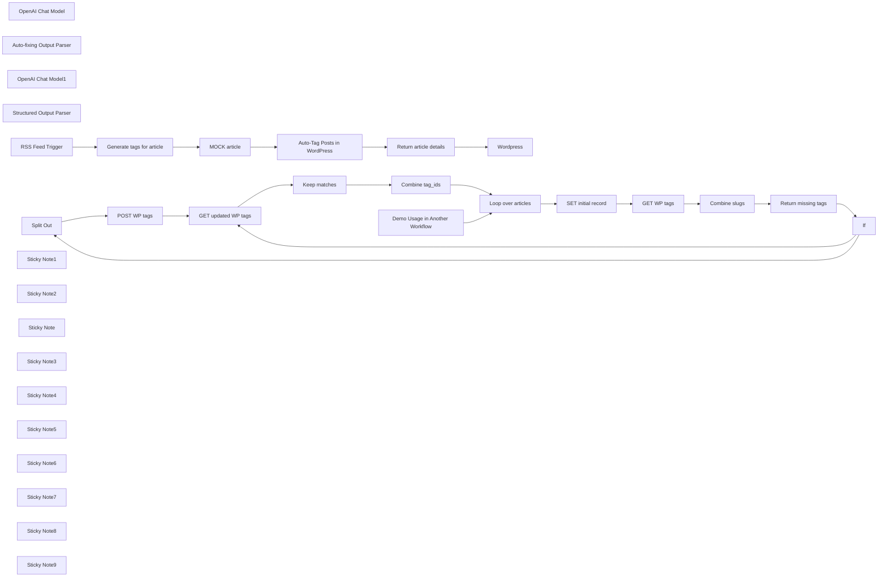

## Fluxo (.json) :

```json
{
  "id": "siXUnQhJpCJ9rHzu",
  "meta": {
    "instanceId": "a9f3b18652ddc96459b459de4fa8fa33252fb820a9e5a1593074f3580352864a",
    "templateCredsSetupCompleted": true
  },
  "name": "Auto-Tag Blog Posts in WordPress with AI",
  "tags": [
    {
      "id": "ijuVOmJpw5mCrzQX",
      "name": "marketing",
      "createdAt": "2025-01-28T16:42:03.029Z",
      "updatedAt": "2025-01-28T16:42:03.029Z"
    }
  ],
  "nodes": [
    {
      "id": "0561d80b-f360-4a8e-930d-49b778833991",
      "name": "OpenAI Chat Model",
      "type": "@n8n/n8n-nodes-langchain.lmChatOpenAi",
      "position": [
        3260,
        480
      ],
      "parameters": {
        "options": {}
      },
      "credentials": {
        "openAiApi": {
          "id": "yWpagxp5s8o3dlBp",
          "name": "OpenAi account"
        }
      },
      "typeVersion": 1
    },
    {
      "id": "d71aec64-299c-4258-8eb4-95821d15b758",
      "name": "Auto-fixing Output Parser",
      "type": "@n8n/n8n-nodes-langchain.outputParserAutofixing",
      "position": [
        3460,
        540
      ],
      "parameters": {},
      "typeVersion": 1
    },
    {
      "id": "1468a001-ca7b-4726-ae31-02b28d78b07e",
      "name": "OpenAI Chat Model1",
      "type": "@n8n/n8n-nodes-langchain.lmChatOpenAi",
      "position": [
        3360,
        680
      ],
      "parameters": {
        "options": {}
      },
      "credentials": {
        "openAiApi": {
          "id": "yWpagxp5s8o3dlBp",
          "name": "OpenAi account"
        }
      },
      "typeVersion": 1
    },
    {
      "id": "bb4221ad-94d7-4543-850f-87b83735d2a6",
      "name": "Structured Output Parser",
      "type": "@n8n/n8n-nodes-langchain.outputParserStructured",
      "position": [
        3560,
        760
      ],
      "parameters": {
        "jsonSchemaExample": "{\n\t\"tags\": [\"Germany\", \"Technology\", \"Workflow Automation\"]\n}"
      },
      "typeVersion": 1.2
    },
    {
      "id": "2380c4ea-d804-45b2-8341-417afa2ae21f",
      "name": "RSS Feed Trigger",
      "type": "n8n-nodes-base.rssFeedReadTrigger",
      "position": [
        3140,
        320
      ],
      "parameters": {
        "pollTimes": {
          "item": [
            {
              "mode": "everyMinute"
            }
          ]
        }
      },
      "typeVersion": 1
    },
    {
      "id": "782e9c61-7d51-499b-89b2-888415c5116e",
      "name": "Return article details",
      "type": "n8n-nodes-base.set",
      "position": [
        4140,
        320
      ],
      "parameters": {
        "options": {},
        "assignments": {
          "assignments": [
            {
              "id": "ebe28fc7-f166-4428-b3f3-b319f2d080df",
              "name": "tag_ids",
              "type": "array",
              "value": "={{ $json.tag_ids }}"
            },
            {
              "id": "bc296683-2a93-42b4-a9a7-90a2bc22f37b",
              "name": "title",
              "type": "string",
              "value": "={{ $('MOCK article').item.json.title }}"
            },
            {
              "id": "32dc0950-3708-447e-a3b6-a5c5ae9bdcd0",
              "name": "content",
              "type": "string",
              "value": "={{ $('MOCK article').item.json.content }}"
            }
          ]
        }
      },
      "typeVersion": 3.4
    },
    {
      "id": "6b5ce61f-8351-40ab-9e63-51c3e85ce53d",
      "name": "Split Out",
      "type": "n8n-nodes-base.splitOut",
      "position": [
        2200,
        840
      ],
      "parameters": {
        "options": {
          "destinationFieldName": "missing_tag"
        },
        "fieldToSplitOut": "missing_tags"
      },
      "typeVersion": 1
    },
    {
      "id": "2338e3e8-cba4-48c8-8c1a-50019af70932",
      "name": "Loop over articles",
      "type": "n8n-nodes-base.splitInBatches",
      "position": [
        1980,
        320
      ],
      "parameters": {
        "options": {}
      },
      "typeVersion": 3
    },
    {
      "id": "39b89004-6032-4d22-8bcc-3dfd1d793ed0",
      "name": "SET initial record",
      "type": "n8n-nodes-base.set",
      "position": [
        2200,
        440
      ],
      "parameters": {
        "options": {},
        "includeOtherFields": true
      },
      "typeVersion": 3.4
    },
    {
      "id": "ec0b93cb-de9d-41be-9d4b-6846d3ee14a2",
      "name": "GET WP tags",
      "type": "n8n-nodes-base.httpRequest",
      "position": [
        2440,
        440
      ],
      "parameters": {
        "url": "https://www.example.com/wp-json/wp/v2/tags",
        "options": {},
        "authentication": "predefinedCredentialType",
        "nodeCredentialType": "wordpressApi"
      },
      "credentials": {
        "wordpressApi": {
          "id": "XXXXXXX",
          "name": "Example"
        }
      },
      "executeOnce": true,
      "typeVersion": 4.2,
      "alwaysOutputData": true
    },
    {
      "id": "cbabadef-9f5f-4402-8bd7-255f5c237ff9",
      "name": "POST WP tags",
      "type": "n8n-nodes-base.httpRequest",
      "position": [
        2420,
        840
      ],
      "parameters": {
        "url": "https://www.example.com/wp-json/wp/v2/tags",
        "method": "POST",
        "options": {},
        "sendQuery": true,
        "authentication": "predefinedCredentialType",
        "queryParameters": {
          "parameters": [
            {
              "name": "slug",
              "value": "={{ $json.missing_tag }}"
            },
            {
              "name": "name",
              "value": "={{ $json.missing_tag.replaceAll(\"-\",\" \").toTitleCase() }}"
            }
          ]
        },
        "nodeCredentialType": "wordpressApi"
      },
      "credentials": {
        "wordpressApi": {
          "id": "XXXXXXX",
          "name": "Example"
        }
      },
      "executeOnce": false,
      "typeVersion": 4.2
    },
    {
      "id": "6bf40d39-4b42-413f-9502-3ca494f75bcb",
      "name": "GET updated WP tags",
      "type": "n8n-nodes-base.httpRequest",
      "position": [
        2700,
        840
      ],
      "parameters": {
        "url": "https://www.example.com/wp-json/wp/v2/tags",
        "options": {},
        "authentication": "predefinedCredentialType",
        "nodeCredentialType": "wordpressApi"
      },
      "credentials": {
        "wordpressApi": {
          "id": "XXXXXXX",
          "name": "Example"
        }
      },
      "executeOnce": true,
      "typeVersion": 4.2
    },
    {
      "id": "aea9a631-0cd8-4ed8-9fb1-981b8e11f3dd",
      "name": "Keep matches",
      "type": "n8n-nodes-base.filter",
      "position": [
        2200,
        1040
      ],
      "parameters": {
        "options": {},
        "conditions": {
          "options": {
            "version": 2,
            "leftValue": "",
            "caseSensitive": true,
            "typeValidation": "strict"
          },
          "combinator": "and",
          "conditions": [
            {
              "id": "8ec4fdfc-73f3-4d7b-96e4-f42a18252599",
              "operator": {
                "type": "array",
                "operation": "contains",
                "rightType": "any"
              },
              "leftValue": "={{ $('SET initial record').first().json.tags.map(item => item.toLowerCase().replaceAll(\" \",\"-\")) }}",
              "rightValue": "={{ $json.slug }}"
            }
          ]
        }
      },
      "typeVersion": 2.2
    },
    {
      "id": "6d71d7a5-495d-4809-b66f-9f1cba0d11c6",
      "name": "Combine tag_ids",
      "type": "n8n-nodes-base.aggregate",
      "position": [
        2420,
        1040
      ],
      "parameters": {
        "options": {},
        "fieldsToAggregate": {
          "fieldToAggregate": [
            {
              "renameField": true,
              "outputFieldName": "tag_ids",
              "fieldToAggregate": "id"
            }
          ]
        }
      },
      "typeVersion": 1
    },
    {
      "id": "dc3cac68-dee8-4821-963b-b0594d1a7e0e",
      "name": "Combine slugs",
      "type": "n8n-nodes-base.aggregate",
      "position": [
        2700,
        440
      ],
      "parameters": {
        "options": {},
        "fieldsToAggregate": {
          "fieldToAggregate": [
            {
              "renameField": true,
              "outputFieldName": "tags",
              "fieldToAggregate": "slug"
            }
          ]
        }
      },
      "typeVersion": 1
    },
    {
      "id": "8e0f668c-e3ac-4d70-9ffb-5515e6221c62",
      "name": "If",
      "type": "n8n-nodes-base.if",
      "position": [
        2440,
        640
      ],
      "parameters": {
        "options": {},
        "conditions": {
          "options": {
            "version": 2,
            "leftValue": "",
            "caseSensitive": true,
            "typeValidation": "strict"
          },
          "combinator": "and",
          "conditions": [
            {
              "id": "8d77d072-cb47-4fbb-831a-0e6f3ecefc71",
              "operator": {
                "type": "array",
                "operation": "empty",
                "singleValue": true
              },
              "leftValue": "={{ $json.missing_tags }}",
              "rightValue": ""
            }
          ]
        }
      },
      "typeVersion": 2.2
    },
    {
      "id": "7988188d-07e6-4a36-94f2-e21d7677802e",
      "name": "MOCK article",
      "type": "n8n-nodes-base.set",
      "position": [
        3740,
        320
      ],
      "parameters": {
        "options": {},
        "assignments": {
          "assignments": [
            {
              "id": "4a69cf1b-341a-40bc-a36a-b76c05bdd819",
              "name": "title",
              "type": "string",
              "value": "={{ $('RSS Feed Trigger').item.json.title }}"
            },
            {
              "id": "63097eb0-6165-4365-a5b5-e9f3de65d715",
              "name": "content",
              "type": "string",
              "value": "={{ $('RSS Feed Trigger').item.json.content }}"
            },
            {
              "id": "ae4859ec-ad14-403e-b5b6-53703fefe3f3",
              "name": "categories",
              "type": "array",
              "value": "={{ $('RSS Feed Trigger').item.json.categories }}"
            },
            {
              "id": "3f94d5ac-5196-4ad0-acea-79c07b0ee2c6",
              "name": "tags",
              "type": "array",
              "value": "={{ $json.output.tags }}"
            }
          ]
        }
      },
      "typeVersion": 3.4
    },
    {
      "id": "4578cb14-dc86-4bc4-8d59-f0c088574164",
      "name": "Return missing tags",
      "type": "n8n-nodes-base.code",
      "position": [
        2200,
        640
      ],
      "parameters": {
        "jsCode": "const new_ary = $('SET initial record').first().json.tags.map(x => x.toLowerCase().replaceAll(\" \",\"-\")).filter(x => !$input.first().json.tags.includes(x))\n\nreturn {\"missing_tags\": new_ary};"
      },
      "typeVersion": 2
    },
    {
      "id": "91c8dde5-58ce-4bf6-ac3c-0062cbf0046e",
      "name": "Wordpress",
      "type": "n8n-nodes-base.wordpress",
      "position": [
        4360,
        320
      ],
      "parameters": {
        "title": "=Demo tagging post: {{ $json.title }}",
        "additionalFields": {
          "tags": "={{ $json.tag_ids }}",
          "content": "=This is a post to demo automatic tagging a WordPress postvia n8n. The following content could be rewritten in full or part with commentary using AI.\n\n{{ $json.content }}"
        }
      },
      "credentials": {
        "wordpressApi": {
          "id": "XXXXXXX",
          "name": "Example"
        }
      },
      "typeVersion": 1
    },
    {
      "id": "8257534e-f433-4225-a795-230fd367cc01",
      "name": "Sticky Note1",
      "type": "n8n-nodes-base.stickyNote",
      "position": [
        3000,
        200
      ],
      "parameters": {
        "color": 7,
        "width": 1673.0029952487134,
        "height": 1061.6563737812796,
        "content": "## Demo Usage in Another Workflow (Tagging an article discovered with an RSS feed)"
      },
      "typeVersion": 1
    },
    {
      "id": "b14e6fda-c569-4ada-90d9-77b61049c531",
      "name": "Sticky Note2",
      "type": "n8n-nodes-base.stickyNote",
      "position": [
        1680,
        198.96245932022566
      ],
      "parameters": {
        "color": 7,
        "width": 1243.102096674096,
        "height": 1077.24135750937,
        "content": "## Auto-Tag Posts in WordPress\n\nThis workflow allows you to hand off the responsibility of tagging content for WordPress to an AI Agent in n8n with no data entry required."
      },
      "typeVersion": 1
    },
    {
      "id": "21420d0f-a5c9-4eac-b6d9-06d3a6de5fb9",
      "name": "Demo Usage in Another Workflow",
      "type": "n8n-nodes-base.executeWorkflowTrigger",
      "position": [
        1780,
        320
      ],
      "parameters": {},
      "typeVersion": 1
    },
    {
      "id": "7571b196-3827-478f-b032-84d99adf4aa8",
      "name": "Auto-Tag Posts in WordPress",
      "type": "n8n-nodes-base.executeWorkflow",
      "position": [
        3940,
        320
      ],
      "parameters": {
        "mode": "each",
        "options": {},
        "workflowId": {
          "__rl": true,
          "mode": "id",
          "value": "siXUnQhJpCJ9rHzu"
        }
      },
      "typeVersion": 1.1
    },
    {
      "id": "e5b63f63-09a6-452d-9d26-8501fc49d7fe",
      "name": "Sticky Note",
      "type": "n8n-nodes-base.stickyNote",
      "position": [
        2640,
        140
      ],
      "parameters": {
        "color": 5,
        "width": 256.62869115182394,
        "height": 146.4958582739091,
        "content": "## Copy this workflow\n\nYou can use it inline by removing the Called by Another Workflow trigger, or as-is as a subworkflow"
      },
      "typeVersion": 1
    },
    {
      "id": "2ea9fbdd-b492-4030-b640-227a163d70ef",
      "name": "Sticky Note3",
      "type": "n8n-nodes-base.stickyNote",
      "position": [
        3040,
        980
      ],
      "parameters": {
        "width": 409.8780943583022,
        "height": 248.2919292392927,
        "content": "Handing off tagging and categorization fully to AI lets you **put your WordPress account on autopilot** without a human-in-the-loop.\n\nIn this example the application is use-case agnostic, but with this workflow you can:\n1. Use AI to rewrite content with original thoughts and tags\n2. Ensure healthy information architecture on your site\n3. Quickly generate multivariate tag and category combinations for optimal SEO"
      },
      "typeVersion": 1
    },
    {
      "id": "57cfa462-fc71-4173-b7c9-8253c4e240d1",
      "name": "Sticky Note4",
      "type": "n8n-nodes-base.stickyNote",
      "position": [
        3900,
        500
      ],
      "parameters": {
        "color": 3,
        "width": 369.61896876326364,
        "height": 103.91486928512641,
        "content": "### To ensure data can be passed to subsequent nodes, make sure to select \"Run Once for Each Item\" if executing a subworkflow"
      },
      "typeVersion": 1
    },
    {
      "id": "7f1dfade-07be-49b7-b5ee-99b58f1e6cc7",
      "name": "Sticky Note5",
      "type": "n8n-nodes-base.stickyNote",
      "position": [
        2640,
        660
      ],
      "parameters": {
        "color": 6,
        "width": 211.8330719827787,
        "content": "## What's this? \nIf there are missing tags we create them in WP, otherwise we keep get them all from WP and keep the relevant ones."
      },
      "typeVersion": 1
    },
    {
      "id": "61711c71-3e45-4b06-80a8-b651177b585d",
      "name": "Sticky Note6",
      "type": "n8n-nodes-base.stickyNote",
      "position": [
        1960,
        540
      ],
      "parameters": {
        "color": 3,
        "width": 174.33565557367925,
        "height": 251.80401948434695,
        "content": "## What's this? \nOne of the few potential failure points in this workflow, when checking for missing tags it's important that both the generated tags and the existing tags are in the same case (snake, dash, title)."
      },
      "typeVersion": 1
    },
    {
      "id": "31db85c9-e4c2-4409-9d92-7eb005223de0",
      "name": "Generate tags for article",
      "type": "@n8n/n8n-nodes-langchain.chainLlm",
      "position": [
        3360,
        320
      ],
      "parameters": {
        "text": "=Please provide 3-5 suitable tags for the following article:\n\n{{ $json.content }}\n\nTag Formatting Rules:\n1. Tags should be in title case",
        "promptType": "define",
        "hasOutputParser": true
      },
      "typeVersion": 1.4
    },
    {
      "id": "7d6eac92-6f6f-44a4-8dce-0830440a9dff",
      "name": "Sticky Note7",
      "type": "n8n-nodes-base.stickyNote",
      "position": [
        1600,
        1040
      ],
      "parameters": {
        "width": 285.2555025627061,
        "content": "## ! A note about cases !\nIf you want your tags to follow a different case than I am using (dash case for slug, title case for name), then you will need to update a few nodes in this workflow."
      },
      "typeVersion": 1
    },
    {
      "id": "133be2f7-071b-4651-b3b5-8052a64b7f49",
      "name": "Sticky Note8",
      "type": "n8n-nodes-base.stickyNote",
      "position": [
        2600,
        1200
      ],
      "parameters": {
        "color": 5,
        "width": 296.01271681531176,
        "content": "## Ready for a challenge?\n\nMake this subworkflow executable for both categories and tags, accounting for different API calls to different endpoints."
      },
      "typeVersion": 1
    },
    {
      "id": "7807e967-ac3d-4a4d-bd9d-f123d57e1676",
      "name": "Sticky Note9",
      "type": "n8n-nodes-base.stickyNote",
      "position": [
        4400,
        1155.7364351382535
      ],
      "parameters": {
        "color": 4,
        "width": 244.3952545193282,
        "height": 87.34661077350344,
        "content": "## About the maker\n**[Find Ludwig Gerdes on LinkedIn](https://www.linkedin.com/in/ludwiggerdes)**"
      },
      "typeVersion": 1
    }
  ],
  "active": false,
  "pinData": {
    "Generate tags for article": [
      {
        "json": {
          "output": {
            "tags": [
              "Team Achievements",
              "Global Community",
              "Product Growth",
              "2024 Highlights",
              "Reflecting on Progress"
            ]
          }
        }
      }
    ]
  },
  "settings": {
    "executionOrder": "v1"
  },
  "versionId": "3acdf19c-288e-4a3b-87ae-5adbf44285fe",
  "connections": {
    "If": {
      "main": [
        [
          {
            "node": "GET updated WP tags",
            "type": "main",
            "index": 0
          }
        ],
        [
          {
            "node": "Split Out",
            "type": "main",
            "index": 0
          }
        ]
      ]
    },
    "Split Out": {
      "main": [
        [
          {
            "node": "POST WP tags",
            "type": "main",
            "index": 0
          }
        ]
      ]
    },
    "GET WP tags": {
      "main": [
        [
          {
            "node": "Combine slugs",
            "type": "main",
            "index": 0
          }
        ]
      ]
    },
    "Keep matches": {
      "main": [
        [
          {
            "node": "Combine tag_ids",
            "type": "main",
            "index": 0
          }
        ]
      ]
    },
    "MOCK article": {
      "main": [
        [
          {
            "node": "Auto-Tag Posts in WordPress",
            "type": "main",
            "index": 0
          }
        ]
      ]
    },
    "POST WP tags": {
      "main": [
        [
          {
            "node": "GET updated WP tags",
            "type": "main",
            "index": 0
          }
        ]
      ]
    },
    "Combine slugs": {
      "main": [
        [
          {
            "node": "Return missing tags",
            "type": "main",
            "index": 0
          }
        ]
      ]
    },
    "Combine tag_ids": {
      "main": [
        [
          {
            "node": "Loop over articles",
            "type": "main",
            "index": 0
          }
        ]
      ]
    },
    "RSS Feed Trigger": {
      "main": [
        [
          {
            "node": "Generate tags for article",
            "type": "main",
            "index": 0
          }
        ]
      ]
    },
    "OpenAI Chat Model": {
      "ai_languageModel": [
        [
          {
            "node": "Generate tags for article",
            "type": "ai_languageModel",
            "index": 0
          }
        ]
      ]
    },
    "Loop over articles": {
      "main": [
        [],
        [
          {
            "node": "SET initial record",
            "type": "main",
            "index": 0
          }
        ]
      ]
    },
    "OpenAI Chat Model1": {
      "ai_languageModel": [
        [
          {
            "node": "Auto-fixing Output Parser",
            "type": "ai_languageModel",
            "index": 0
          }
        ]
      ]
    },
    "SET initial record": {
      "main": [
        [
          {
            "node": "GET WP tags",
            "type": "main",
            "index": 0
          }
        ]
      ]
    },
    "GET updated WP tags": {
      "main": [
        [
          {
            "node": "Keep matches",
            "type": "main",
            "index": 0
          }
        ]
      ]
    },
    "Return missing tags": {
      "main": [
        [
          {
            "node": "If",
            "type": "main",
            "index": 0
          }
        ]
      ]
    },
    "Return article details": {
      "main": [
        [
          {
            "node": "Wordpress",
            "type": "main",
            "index": 0
          }
        ]
      ]
    },
    "Structured Output Parser": {
      "ai_outputParser": [
        [
          {
            "node": "Auto-fixing Output Parser",
            "type": "ai_outputParser",
            "index": 0
          }
        ]
      ]
    },
    "Auto-fixing Output Parser": {
      "ai_outputParser": [
        [
          {
            "node": "Generate tags for article",
            "type": "ai_outputParser",
            "index": 0
          }
        ]
      ]
    },
    "Generate tags for article": {
      "main": [
        [
          {
            "node": "MOCK article",
            "type": "main",
            "index": 0
          }
        ]
      ]
    },
    "Auto-Tag Posts in WordPress": {
      "main": [
        [
          {
            "node": "Return article details",
            "type": "main",
            "index": 0
          }
        ]
      ]
    },
    "Demo Usage in Another Workflow": {
      "main": [
        [
          {
            "node": "Loop over articles",
            "type": "main",
            "index": 0
          }
        ]
      ]
    }
  }
}
```

<a id="template-1152"></a>

## Template 1152 - Auditoria de imagens e geração de alt text

- **Nome:** Auditoria de imagens e geração de alt text
- **Descrição:** Coleta imagens de uma página web, registra os textos alternativos encontrados em uma planilha e gera novos alt texts para descrições curtas usando um modelo de IA.
- **Funcionalidade:** • Gatilho manual: inicia o fluxo quando executado manualmente.
• Definição de URL e base: permite configurar a página alvo e a base para normalizar URLs relativas.
• Download do HTML da página: obtém o conteúdo HTML da página fornecida.
• Extração de imagens e textos alternativos: analisa o HTML para identificar tags , captura src e alt e calcula o comprimento do alt.
• Normalização de src: converte URLs de imagem relativas em URLs absolutos usando a base definida.
• Armazenamento dos resultados: grava index, src, alt, altLength e página em uma planilha para auditoria.
• Filtragem por alt curto: seleciona imagens cujo texto alternativo é menor que um limite configurável (ex.: menor que 100 caracteres).
• Limitação de processamento: aplica um limite no número de itens a processar por execução (ex.: 5 itens).
• Geração de alt text por IA: envia URLs de imagem a um modelo de IA para gerar descrições alternativas com tamanho limitado (ex.: <150 caracteres).
• Atualização da planilha: escreve as novas descrições nas linhas correspondentes, fazendo a correspondência por índice.
- **Ferramentas:** • Google Sheets API: armazena e atualiza os registros resultantes da auditoria e das gerações de alt text.
• Serviço de IA de análise de imagens (ex.: modelo GPT-4o): gera descrições alternativas concisas a partir das imagens.
• Páginas web públicas (URLs): fonte do HTML e das imagens que serão auditadas e analisadas.

## Fluxo visual

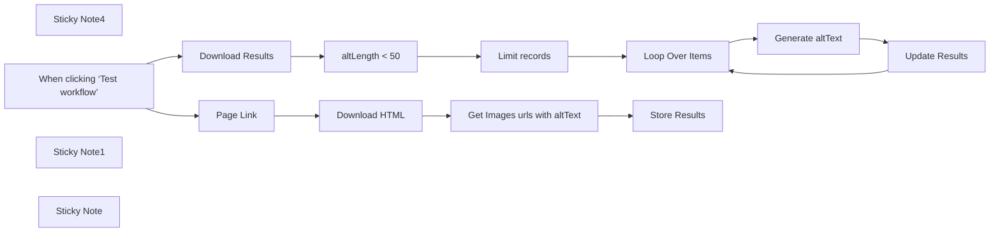

## Fluxo (.json) :

```json
{
  "meta": {
    "instanceId": "=",
    "templateCredsSetupCompleted": true
  },
  "nodes": [
    {
      "id": "bdc398f0-a882-4fbe-ac37-7ca7e15a1081",
      "name": "Sticky Note4",
      "type": "n8n-nodes-base.stickyNote",
      "position": [
        2080,
        -200
      ],
      "parameters": {
        "width": 460,
        "height": 340,
        "content": "\n[🎥 Check My Tutorial](https://www.youtube.com/watch?v=LwTIro6Rapk)"
      },
      "typeVersion": 1
    },
    {
      "id": "d132a584-770e-438c-bd98-28a9c1afa780",
      "name": "When clicking ‘Test workflow’",
      "type": "n8n-nodes-base.manualTrigger",
      "position": [
        1000,
        120
      ],
      "parameters": {},
      "typeVersion": 1
    },
    {
      "id": "d51eec9d-a177-4f5e-89e5-c73b6109f5ce",
      "name": "Loop Over Items",
      "type": "n8n-nodes-base.splitInBatches",
      "position": [
        2100,
        640
      ],
      "parameters": {
        "options": {}
      },
      "typeVersion": 3
    },
    {
      "id": "41da741b-1c1d-4d41-9a96-85cadacd1c8e",
      "name": "Sticky Note1",
      "type": "n8n-nodes-base.stickyNote",
      "position": [
        1000,
        -200
      ],
      "parameters": {
        "color": 7,
        "width": 1040,
        "height": 460,
        "content": "### 1. First Block: audit the page to extract all the images with their respective alternative text\nThis workflow sends an HTTP request to collect the HTML processed by the Javascript node to list all the images in the page with their alternative texts. The results are saved in a Google Sheet.\n\n#### How to setup?\n- **Set your page link** in the first node\n- **Record the results in a Google Sheet Node**:\n   1. Add your Google Sheet API credentials to access the Google Sheet file\n   2. Select the file using the list, an URL or an ID\n   3. Select the sheet in which you want to record your working sessions\n   4. Map the fields\n  [Learn more about the Google Sheet Node](https://docs.n8n.io/integrations/builtin/app-nodes/n8n-nodes-base.googlesheets)\n"
      },
      "typeVersion": 1
    },
    {
      "id": "e7a269cd-a2da-4ea9-9ec8-c023c45b9e96",
      "name": "Page Link",
      "type": "n8n-nodes-base.set",
      "position": [
        1200,
        120
      ],
      "parameters": {
        "options": {},
        "assignments": {
          "assignments": [
            {
              "id": "e69e5e68-5cd1-4f81-a940-2e5202d5589b",
              "name": "url",
              "type": "string",
              "value": "https://www.samirsaci.com/sustainable-business-strategy-with-data-analytics/"
            },
            {
              "id": "8839ac43-5d6a-4656-b555-714f836fc687",
              "name": "baseUrl",
              "type": "string",
              "value": "https://www.samirsaci.com"
            }
          ]
        }
      },
      "notesInFlow": true,
      "typeVersion": 3.4
    },
    {
      "id": "6e6b7801-1f4c-4d00-826d-184dff58cee1",
      "name": "Download Results",
      "type": "n8n-nodes-base.googleSheets",
      "position": [
        1440,
        640
      ],
      "parameters": {
        "options": {},
        "sheetName": {
          "__rl": true,
          "mode": "=",
          "value": "gid=0",
          "cachedResultUrl": "=",
          "cachedResultName": "="
        },
        "documentId": {
          "__rl": true,
          "mode": "list",
          "value": "=",
          "cachedResultUrl": "=",
          "cachedResultName": "="
        }
      },
      "typeVersion": 4.5
    },
    {
      "id": "1a137755-3f14-4881-93a5-db7f8678fa0d",
      "name": "altLength < 50",
      "type": "n8n-nodes-base.if",
      "position": [
        1660,
        640
      ],
      "parameters": {
        "options": {},
        "conditions": {
          "options": {
            "version": 2,
            "leftValue": "",
            "caseSensitive": true,
            "typeValidation": "strict"
          },
          "combinator": "and",
          "conditions": [
            {
              "id": "a3b0ca70-0496-4966-94fd-f2927ce02ba9",
              "operator": {
                "type": "number",
                "operation": "lt"
              },
              "leftValue": "={{ $json.altLength }}",
              "rightValue": 100
            }
          ]
        }
      },
      "typeVersion": 2.2
    },
    {
      "id": "60ea3935-313e-4d16-a8b8-a2fe7da8df82",
      "name": "Limit records",
      "type": "n8n-nodes-base.limit",
      "position": [
        1880,
        560
      ],
      "parameters": {
        "maxItems": 5
      },
      "typeVersion": 1
    },
    {
      "id": "5785deb6-1bf4-40a6-b556-42aad4c01c83",
      "name": "Generate altText",
      "type": "@n8n/n8n-nodes-langchain.openAi",
      "position": [
        2320,
        560
      ],
      "parameters": {
        "text": "Please generate the alternative text (alt text) for this image under 150 characters.\t",
        "modelId": {
          "__rl": true,
          "mode": "list",
          "value": "gpt-4o-2024-05-13",
          "cachedResultName": "GPT-4O-2024-05-13"
        },
        "options": {
          "maxTokens": 150
        },
        "resource": "image",
        "imageUrls": "={{ $('altLength < 50').item.json.src }}",
        "operation": "analyze"
      },
      "notesInFlow": true,
      "typeVersion": 1.8
    },
    {
      "id": "86051a7f-e91a-4913-9c19-772673ff6306",
      "name": "Update Results",
      "type": "n8n-nodes-base.googleSheets",
      "position": [
        2540,
        640
      ],
      "parameters": {
        "columns": {
          "value": {
            "page": "=",
            "index": "={{ $('Loop Over Items').item.json.index }}",
            "newAlt": "={{ $json.content }}"
          },
          "schema": [
            {
              "id": "index",
              "type": "string",
              "display": true,
              "removed": false,
              "required": false,
              "displayName": "index",
              "defaultMatch": false,
              "canBeUsedToMatch": true
            },
            {
              "id": "page",
              "type": "string",
              "display": true,
              "required": false,
              "displayName": "page",
              "defaultMatch": false,
              "canBeUsedToMatch": true
            },
            {
              "id": "src",
              "type": "string",
              "display": true,
              "required": false,
              "displayName": "src",
              "defaultMatch": false,
              "canBeUsedToMatch": true
            },
            {
              "id": "alt",
              "type": "string",
              "display": true,
              "required": false,
              "displayName": "alt",
              "defaultMatch": false,
              "canBeUsedToMatch": true
            },
            {
              "id": "altLength",
              "type": "string",
              "display": true,
              "required": false,
              "displayName": "altLength",
              "defaultMatch": false,
              "canBeUsedToMatch": true
            },
            {
              "id": "newAlt",
              "type": "string",
              "display": true,
              "required": false,
              "displayName": "newAlt",
              "defaultMatch": false,
              "canBeUsedToMatch": true
            },
            {
              "id": "row_number",
              "type": "string",
              "display": true,
              "removed": true,
              "readOnly": true,
              "required": false,
              "displayName": "row_number",
              "defaultMatch": false,
              "canBeUsedToMatch": true
            }
          ],
          "mappingMode": "defineBelow",
          "matchingColumns": [
            "index"
          ],
          "attemptToConvertTypes": false,
          "convertFieldsToString": false
        },
        "options": {},
        "operation": "update",
        "sheetName": {
          "__rl": true,
          "mode": "list",
          "value": "gid=0",
          "cachedResultUrl": "=",
          "cachedResultName": "="
        },
        "documentId": {
          "__rl": true,
          "mode": "list",
          "value": "=",
          "cachedResultUrl": "=",
          "cachedResultName": "="
        }
      },
      "typeVersion": 4.5
    },
    {
      "id": "b1ab97f7-a89e-40c8-ada3-22fcc6da2dcd",
      "name": "Sticky Note",
      "type": "n8n-nodes-base.stickyNote",
      "position": [
        1000,
        320
      ],
      "parameters": {
        "color": 7,
        "width": 1920,
        "height": 520,
        "content": "### 2. SecondBlock: generate alternative text for the image with altLength < 50\nThis workflow sends an HTTP request to collect the HTML processed by the Javascript node to list all the images in the page with their alternative texts. The results are saved in a Google Sheet.\n\n#### How to setup?\n- **Set your page link** in the first node\n- **Record the results in a Google Sheet Node**:\n   1. Add your Google Sheet API credentials to access the Google Sheet file\n   2. Select the file using the list, an URL or an ID\n   3. Select the sheet in which you want to record your working sessions\n   4. Map the fields\n  [Learn more about the Google Sheet Node](https://docs.n8n.io/integrations/builtin/app-nodes/n8n-nodes-base.googlesheets)\n"
      },
      "typeVersion": 1
    },
    {
      "id": "c1bf1dcf-6789-43dd-9f15-29895c30fd23",
      "name": "Store Results",
      "type": "n8n-nodes-base.googleSheets",
      "position": [
        1860,
        120
      ],
      "parameters": {
        "columns": {
          "value": {
            "alt": "={{ $json.alt }}",
            "src": "={{ $json.src }}",
            "page": "={{ $('Page Link').item.json.url }}",
            "index": "={{ $json.index }}",
            "altLength": "={{ $json.altLength }}"
          },
          "schema": [
            {
              "id": "index",
              "type": "string",
              "display": true,
              "required": false,
              "displayName": "index",
              "defaultMatch": false,
              "canBeUsedToMatch": true
            },
            {
              "id": "page",
              "type": "string",
              "display": true,
              "removed": false,
              "required": false,
              "displayName": "page",
              "defaultMatch": false,
              "canBeUsedToMatch": true
            },
            {
              "id": "src",
              "type": "string",
              "display": true,
              "required": false,
              "displayName": "src",
              "defaultMatch": false,
              "canBeUsedToMatch": true
            },
            {
              "id": "alt",
              "type": "string",
              "display": true,
              "required": false,
              "displayName": "alt",
              "defaultMatch": false,
              "canBeUsedToMatch": true
            },
            {
              "id": "altLength",
              "type": "string",
              "display": true,
              "required": false,
              "displayName": "altLength",
              "defaultMatch": false,
              "canBeUsedToMatch": true
            },
            {
              "id": "newAlt",
              "type": "string",
              "display": true,
              "required": false,
              "displayName": "newAlt",
              "defaultMatch": false,
              "canBeUsedToMatch": true
            }
          ],
          "mappingMode": "defineBelow",
          "matchingColumns": [],
          "attemptToConvertTypes": false,
          "convertFieldsToString": false
        },
        "options": {},
        "operation": "append",
        "sheetName": {
          "__rl": true,
          "mode": "list",
          "value": "gid=0",
          "cachedResultUrl": "=",
          "cachedResultName": "="
        },
        "documentId": {
          "__rl": true,
          "mode": "list",
          "value": "=",
          "cachedResultUrl": "=",
          "cachedResultName": "="
        }
      },
      "notesInFlow": true,
      "typeVersion": 4.5
    },
    {
      "id": "fe71094e-3a22-4cda-90ad-4174258a9086",
      "name": "Download HTML",
      "type": "n8n-nodes-base.httpRequest",
      "position": [
        1420,
        120
      ],
      "parameters": {
        "url": "={{ $json.url }}",
        "options": {}
      },
      "typeVersion": 4.2
    },
    {
      "id": "405fe4cf-5271-465c-8e2a-1f5d024228b6",
      "name": "Get Images urls with altText",
      "type": "n8n-nodes-base.code",
      "position": [
        1640,
        120
      ],
      "parameters": {
        "jsCode": "const html = $input.first().json.data;\nconst baseUrl = $('Page Link').first().json.baseUrl;\n\nconst imgTagRegex = /]*>/gi;\nconst altAttrRegex = /alt\\s*=\\s*[\"']([^\"']*)[\"']/i;\nconst srcAttrRegex = /src\\s*=\\s*[\"']([^\"']*)[\"']/i;\n\nconst imageTags = html.match(imgTagRegex) || [];\n\nconst results = imageTags.map((tag, index) => {\n  const altMatch = tag.match(altAttrRegex);\n  const srcMatch = tag.match(srcAttrRegex);\n\n  let alt = altMatch ? altMatch[1] : '[No alt text]';\n  let src = srcMatch ? srcMatch[1] : '[No src]';\n\n  // If src is relative, manually join with baseUrl\n  if (src !== '[No src]' && !src.startsWith('http')) {\n    if (baseUrl.endsWith('/') && src.startsWith('/')) {\n      src = baseUrl + src.slice(1);\n    } else if (!baseUrl.endsWith('/') && !src.startsWith('/')) {\n      src = baseUrl + '/' + src;\n    } else {\n      src = baseUrl + src;\n    }\n  }\n\n  return {\n    index: index + 1,\n    src,\n    alt,\n    altLength: alt.length,\n  };\n});\n\nreturn results.map(item => ({ json: item }));"
      },
      "typeVersion": 2
    }
  ],
  "pinData": {},
  "connections": {
    "Page Link": {
      "main": [
        [
          {
            "node": "Download HTML",
            "type": "main",
            "index": 0
          }
        ]
      ]
    },
    "Download HTML": {
      "main": [
        [
          {
            "node": "Get Images urls with altText",
            "type": "main",
            "index": 0
          }
        ]
      ]
    },
    "Limit records": {
      "main": [
        [
          {
            "node": "Loop Over Items",
            "type": "main",
            "index": 0
          }
        ]
      ]
    },
    "Update Results": {
      "main": [
        [
          {
            "node": "Loop Over Items",
            "type": "main",
            "index": 0
          }
        ]
      ]
    },
    "altLength < 50": {
      "main": [
        [
          {
            "node": "Limit records",
            "type": "main",
            "index": 0
          }
        ]
      ]
    },
    "Loop Over Items": {
      "main": [
        [],
        [
          {
            "node": "Generate altText",
            "type": "main",
            "index": 0
          }
        ]
      ]
    },
    "Download Results": {
      "main": [
        [
          {
            "node": "altLength < 50",
            "type": "main",
            "index": 0
          }
        ]
      ]
    },
    "Generate altText": {
      "main": [
        [
          {
            "node": "Update Results",
            "type": "main",
            "index": 0
          }
        ]
      ]
    },
    "Get Images urls with altText": {
      "main": [
        [
          {
            "node": "Store Results",
            "type": "main",
            "index": 0
          }
        ]
      ]
    },
    "When clicking ‘Test workflow’": {
      "main": [
        [
          {
            "node": "Page Link",
            "type": "main",
            "index": 0
          },
          {
            "node": "Download Results",
            "type": "main",
            "index": 0
          }
        ]
      ]
    }
  }
}
```

<a id="template-1153"></a>

## Template 1153 - Descoberta e enriquecimento de decisores

- **Nome:** Descoberta e enriquecimento de decisores
- **Descrição:** Processa uma lista de empresas para descobrir decisores (ex.: CEO, CTO, VP), enriquecer seus contatos e atualizar uma base de leads em planilhas. Inclui verificação humana de domínios e envio de relatório semanal com métricas de leads verificados.
- **Funcionalidade:** • Gatilho por planilha: Inicia o fluxo ao adicionar ou atualizar linhas na aba de empresas.
• Filtragem por status: Seleciona apenas empresas cujo status não seja "Processed" para evitar duplicações.
• Verificação de domínio: Checa se o domínio já está presente e, se não, busca o website da empresa automaticamente.
• Enriquecimento de empresa: Consulta API externa para obter dados da organização (domínio, site, receita, tamanho, etc.) e marca a empresa como processada.
• Resumo do negócio via LLM: Gera uma linha que resume o core business da empresa a partir da descrição obtida.
• Descoberta de decisores em lote: Monta buscas por pessoas (filtrando senioridades relevantes) e executa chamadas em batches para lidar com até 1.000 domínios por requisição.
• Processamento da resposta de pessoas: Divide respostas batched e extrai dados individuais de decisores.
• Classificação de departamento via LLM: Determina o departamento apropriado com base no cargo de cada contato.
• Inserção/atualização de contatos: Upserta decisores na aba de contatos da planilha, evitando duplicidade por URL do LinkedIn.
• Enriquecimento de contato em massa: Agrupa até 10 pessoas por chamada para obter emails e status de verificação, atualizando novamente a planilha.
• Filtragem de contatos verificados: Mantém uma vista/tab com somente contatos cujo email foi verificado.
• Verificação humana do website: Envia mensagem para canal de chat para que um humano valide ou corrija URLs de empresas antes do processamento final.
• Relatório semanal: Compila métricas de leads verificados da semana e envia um resumo para um canal de chat.
- **Ferramentas:** • Google Sheets: Armazena a lista de empresas, contatos e resultados; serve como fonte e destino dos dados.
• Apollo API: Fornece busca e enriquecimento de organizações e pessoas (detecção de decisores, domínios, emails, telefone, etc.).
• OpenAI (modelo GPT-4o-mini): Gera resumos do core business e classifica o departamento dos contatos com base no cargo.
• Slack: Canal para verificação humana de domínios e envio do relatório semanal.
• Google Apps Script: Automatiza mudanças de status na planilha e outras integrações embutidas na planilha.

## Fluxo visual

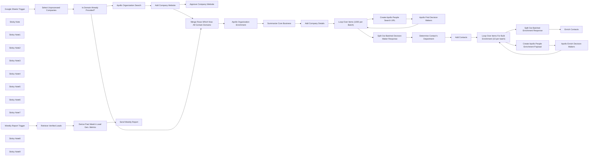

## Fluxo (.json) :

```json
{
  "meta": {
    "instanceId": "d8e4f3f201a1625c886024ee1cbb0c5fff4e0aa0b0514f20e2bd021193dc5fed"
  },
  "nodes": [
    {
      "id": "ea812abb-5f9c-45d9-9cca-c82cd100fa94",
      "name": "Google Sheets Trigger",
      "type": "n8n-nodes-base.googleSheetsTrigger",
      "position": [
        -2000,
        800
      ],
      "parameters": {
        "options": {},
        "pollTimes": {
          "item": [
            {
              "mode": "everyX",
              "unit": "minutes"
            }
          ]
        },
        "sheetName": {
          "__rl": true,
          "mode": "list",
          "value": "gid=0",
          "cachedResultUrl": "https://docs.google.com/spreadsheets/d/1KqKFZ7Uxrt1MivBjLklGdPRMgNBhEc0slpthoSjt2wI/edit#gid=0",
          "cachedResultName": "Companies"
        },
        "documentId": {
          "__rl": true,
          "mode": "list",
          "value": "1KqKFZ7Uxrt1MivBjLklGdPRMgNBhEc0slpthoSjt2wI",
          "cachedResultUrl": "https://docs.google.com/spreadsheets/d/1KqKFZ7Uxrt1MivBjLklGdPRMgNBhEc0slpthoSjt2wI/edit?usp=drivesdk",
          "cachedResultName": "Copy of Company Decision Maker Discovery"
        }
      },
      "typeVersion": 1
    },
    {
      "id": "8ac2066b-c84f-4556-a700-d95f015e6869",
      "name": "Apollo Organization Enrichment",
      "type": "n8n-nodes-base.httpRequest",
      "position": [
        -460,
        800
      ],
      "parameters": {
        "url": "https://api.apollo.io/api/v1/organizations/enrich",
        "options": {},
        "sendQuery": true,
        "jsonHeaders": "{\n    \"accept\": \"application/json\",\n    \"Cache-Control\": \"no-cache\",\n    \"Content-Type\": \"application/json\",\n    \"x-api-key\": \"your-api-key\"\n}",
        "sendHeaders": true,
        "specifyHeaders": "json",
        "queryParameters": {
          "parameters": [
            {
              "name": "domain",
              "value": "=  {{ $json.Website.extractDomain().replace(/^www\\./, '') }}\n"
            }
          ]
        }
      },
      "typeVersion": 4.2
    },
    {
      "id": "e38bf663-9d25-4fec-8900-605fd4f41f7b",
      "name": "Create Apollo People Search URL",
      "type": "n8n-nodes-base.code",
      "position": [
        580,
        720
      ],
      "parameters": {
        "jsCode": "const baseUrl = 'https://api.apollo.io/api/v1/mixed_people/search';\nconst seniorities = ['owner', 'founder', 'c_suite', 'partner', 'vp', 'head', 'director'];\nconst seniorityParams = seniorities.map(s => `person_seniorities[]=${encodeURIComponent(s)}`).join('&');\nconst domains = $input.all().map(item => item.json.Domain);\nconst domainParams = domains.map(d => `q_organization_domains_list[]=${encodeURIComponent(d)}`).join('&');\nconst perPageParam = 'per_page=10';\nconst fullUrl = `${baseUrl}?${seniorityParams}&${domainParams}&${perPageParam}`;\nreturn [{ json: { url: fullUrl } }];\n"
      },
      "typeVersion": 2
    },
    {
      "id": "1f0d2075-e48f-4ddb-9de5-7f4c93df01a4",
      "name": "Loop Over Items (1000 per Batch)",
      "type": "n8n-nodes-base.splitInBatches",
      "position": [
        360,
        800
      ],
      "parameters": {
        "options": {},
        "batchSize": 1000
      },
      "typeVersion": 3
    },
    {
      "id": "9bf3e9f1-e52f-4067-be7e-607c7178b0ca",
      "name": "Apollo Find Decision Makers",
      "type": "n8n-nodes-base.httpRequest",
      "position": [
        880,
        880
      ],
      "parameters": {
        "url": "={{ $json.url }}",
        "method": "POST",
        "options": {},
        "jsonHeaders": "{\n    \"accept\": \"application/json\",\n    \"Cache-Control\": \"no-cache\",\n    \"Content-Type\": \"application/json\",\n    \"x-api-key\": \"your-api-key\"\n}",
        "sendHeaders": true,
        "specifyHeaders": "json"
      },
      "typeVersion": 4.2
    },
    {
      "id": "9f92040a-2117-4710-8047-eddf7f299f3e",
      "name": "Add Contacts",
      "type": "n8n-nodes-base.googleSheets",
      "position": [
        1180,
        520
      ],
      "parameters": {
        "columns": {
          "value": {
            "City": "={{ $('Split Out Batched Decision Maker Response').item.json.city }}",
            "Name": "={{ $('Split Out Batched Decision Maker Response').item.json.name }}",
            "State": "={{ $('Split Out Batched Decision Maker Response').item.json.state }}",
            "Company": "={{ $('Split Out Batched Decision Maker Response').item.json.organization.name }}",
            "Country": "={{ $('Split Out Batched Decision Maker Response').item.json.country }}",
            "Job Title": "={{ $('Split Out Batched Decision Maker Response').item.json.title }}",
            "Date Added": "={{ $now.toUTC().toFormat('yyyy-MM-dd') }}\n",
            "Start Date": "={{ $('Split Out Batched Decision Maker Response').item.json.employment_history[0].start_date }}",
            "Company Domain": "={{ $('Split Out Batched Decision Maker Response').item.json.organization.primary_domain }}",
            "LinkedIn Profile URL": "={{ $('Split Out Batched Decision Maker Response').item.json.linkedin_url }}",
            "GPT Department Classification": "={{ $json.message.content }}"
          },
          "schema": [
            {
              "id": "Name",
              "type": "string",
              "display": true,
              "required": false,
              "displayName": "Name",
              "defaultMatch": false,
              "canBeUsedToMatch": true
            },
            {
              "id": "Job Title",
              "type": "string",
              "display": true,
              "required": false,
              "displayName": "Job Title",
              "defaultMatch": false,
              "canBeUsedToMatch": true
            },
            {
              "id": "Company",
              "type": "string",
              "display": true,
              "removed": false,
              "required": false,
              "displayName": "Company",
              "defaultMatch": false,
              "canBeUsedToMatch": true
            },
            {
              "id": "Start Date",
              "type": "string",
              "display": true,
              "removed": false,
              "required": false,
              "displayName": "Start Date",
              "defaultMatch": false,
              "canBeUsedToMatch": true
            },
            {
              "id": "GPT Department Classification",
              "type": "string",
              "display": true,
              "required": false,
              "displayName": "GPT Department Classification",
              "defaultMatch": false,
              "canBeUsedToMatch": true
            },
            {
              "id": "LinkedIn Profile URL",
              "type": "string",
              "display": true,
              "removed": false,
              "required": false,
              "displayName": "LinkedIn Profile URL",
              "defaultMatch": false,
              "canBeUsedToMatch": true
            },
            {
              "id": "Company Domain",
              "type": "string",
              "display": true,
              "removed": false,
              "required": false,
              "displayName": "Company Domain",
              "defaultMatch": false,
              "canBeUsedToMatch": true
            },
            {
              "id": "City",
              "type": "string",
              "display": true,
              "removed": false,
              "required": false,
              "displayName": "City",
              "defaultMatch": false,
              "canBeUsedToMatch": true
            },
            {
              "id": "State",
              "type": "string",
              "display": true,
              "removed": false,
              "required": false,
              "displayName": "State",
              "defaultMatch": false,
              "canBeUsedToMatch": true
            },
            {
              "id": "Country",
              "type": "string",
              "display": true,
              "removed": false,
              "required": false,
              "displayName": "Country",
              "defaultMatch": false,
              "canBeUsedToMatch": true
            },
            {
              "id": "Email Address",
              "type": "string",
              "display": true,
              "required": false,
              "displayName": "Email Address",
              "defaultMatch": false,
              "canBeUsedToMatch": true
            },
            {
              "id": "Email Verified",
              "type": "string",
              "display": true,
              "required": false,
              "displayName": "Email Verified",
              "defaultMatch": false,
              "canBeUsedToMatch": true
            },
            {
              "id": "Date Added",
              "type": "string",
              "display": true,
              "required": false,
              "displayName": "Date Added",
              "defaultMatch": false,
              "canBeUsedToMatch": true
            },
            {
              "id": "Last Contacted Date",
              "type": "string",
              "display": true,
              "required": false,
              "displayName": "Last Contacted Date",
              "defaultMatch": false,
              "canBeUsedToMatch": true
            },
            {
              "id": "Lead Status",
              "type": "string",
              "display": true,
              "required": false,
              "displayName": "Lead Status",
              "defaultMatch": false,
              "canBeUsedToMatch": true
            },
            {
              "id": "Follow-Up Date",
              "type": "string",
              "display": true,
              "required": false,
              "displayName": "Follow-Up Date",
              "defaultMatch": false,
              "canBeUsedToMatch": true
            }
          ],
          "mappingMode": "defineBelow",
          "matchingColumns": [
            "LinkedIn Profile URL"
          ],
          "attemptToConvertTypes": false,
          "convertFieldsToString": false
        },
        "options": {},
        "operation": "appendOrUpdate",
        "sheetName": {
          "__rl": true,
          "mode": "list",
          "value": 404191424,
          "cachedResultUrl": "https://docs.google.com/spreadsheets/d/1Nt7cBLwwIr7kRCj6VL3wQDqfkfbL3j_dwlHHpExrL_s/edit#gid=404191424",
          "cachedResultName": "Contacts"
        },
        "documentId": {
          "__rl": true,
          "mode": "list",
          "value": "1KqKFZ7Uxrt1MivBjLklGdPRMgNBhEc0slpthoSjt2wI",
          "cachedResultUrl": "https://docs.google.com/spreadsheets/d/1KqKFZ7Uxrt1MivBjLklGdPRMgNBhEc0slpthoSjt2wI/edit?usp=drivesdk",
          "cachedResultName": "Copy of Company Decision Maker Discovery"
        }
      },
      "typeVersion": 4.5
    },
    {
      "id": "9a00bdf2-ef63-4119-8730-f84fa5a26224",
      "name": "Apollo Enrich Decision Makers",
      "type": "n8n-nodes-base.httpRequest",
      "position": [
        1840,
        700
      ],
      "parameters": {
        "url": "https://api.apollo.io/api/v1/people/bulk_match?reveal_personal_emails=false&reveal_phone_number=false",
        "method": "POST",
        "options": {},
        "jsonBody": "={{ $json }}",
        "sendBody": true,
        "jsonHeaders": "{\n    \"accept\": \"application/json\",\n    \"Cache-Control\": \"no-cache\",\n    \"Content-Type\": \"application/json\",\n    \"x-api-key\": \"your-api-key\"\n}",
        "sendHeaders": true,
        "specifyBody": "json",
        "specifyHeaders": "json"
      },
      "typeVersion": 4.2
    },
    {
      "id": "b37bf514-8ab8-4f33-87da-0313ea48d95b",
      "name": "Create Apollo People Enrichment Payload",
      "type": "n8n-nodes-base.code",
      "position": [
        1620,
        620
      ],
      "parameters": {
        "jsCode": "const details = $input.all().map(item => ({\n  linkedin_url: item.json['LinkedIn Profile URL'],\n  domain: item.json['Company Domain']\n}));\n\nreturn [{ json: { details } }];\n"
      },
      "typeVersion": 2
    },
    {
      "id": "3d9c30f1-8b06-4b38-9d79-295d84bf150e",
      "name": "Enrich Contacts",
      "type": "n8n-nodes-base.googleSheets",
      "position": [
        1840,
        420
      ],
      "parameters": {
        "columns": {
          "value": {
            "Name": "=",
            "Job Title": "=",
            "Start Date": "=",
            "Email Address": "={{ $json.email }}",
            "Email Verified": "={{ $json.email_status === 'verified' ? 'Yes' : 'No' }}\n",
            "LinkedIn Profile URL": "={{ $json.linkedin_url }}"
          },
          "schema": [
            {
              "id": "Name",
              "type": "string",
              "display": true,
              "required": false,
              "displayName": "Name",
              "defaultMatch": false,
              "canBeUsedToMatch": true
            },
            {
              "id": "Job Title",
              "type": "string",
              "display": true,
              "required": false,
              "displayName": "Job Title",
              "defaultMatch": false,
              "canBeUsedToMatch": true
            },
            {
              "id": "Company",
              "type": "string",
              "display": true,
              "required": false,
              "displayName": "Company",
              "defaultMatch": false,
              "canBeUsedToMatch": true
            },
            {
              "id": "Start Date",
              "type": "string",
              "display": true,
              "required": false,
              "displayName": "Start Date",
              "defaultMatch": false,
              "canBeUsedToMatch": true
            },
            {
              "id": "GPT Department Classification",
              "type": "string",
              "display": true,
              "required": false,
              "displayName": "GPT Department Classification",
              "defaultMatch": false,
              "canBeUsedToMatch": true
            },
            {
              "id": "LinkedIn Profile URL",
              "type": "string",
              "display": true,
              "removed": false,
              "required": false,
              "displayName": "LinkedIn Profile URL",
              "defaultMatch": false,
              "canBeUsedToMatch": true
            },
            {
              "id": "Company Domain",
              "type": "string",
              "display": true,
              "required": false,
              "displayName": "Company Domain",
              "defaultMatch": false,
              "canBeUsedToMatch": true
            },
            {
              "id": "City",
              "type": "string",
              "display": true,
              "required": false,
              "displayName": "City",
              "defaultMatch": false,
              "canBeUsedToMatch": true
            },
            {
              "id": "State",
              "type": "string",
              "display": true,
              "required": false,
              "displayName": "State",
              "defaultMatch": false,
              "canBeUsedToMatch": true
            },
            {
              "id": "Country",
              "type": "string",
              "display": true,
              "required": false,
              "displayName": "Country",
              "defaultMatch": false,
              "canBeUsedToMatch": true
            },
            {
              "id": "Email Address",
              "type": "string",
              "display": true,
              "removed": false,
              "required": false,
              "displayName": "Email Address",
              "defaultMatch": false,
              "canBeUsedToMatch": true
            },
            {
              "id": "Email Verified",
              "type": "string",
              "display": true,
              "required": false,
              "displayName": "Email Verified",
              "defaultMatch": false,
              "canBeUsedToMatch": true
            },
            {
              "id": "Date Added",
              "type": "string",
              "display": true,
              "required": false,
              "displayName": "Date Added",
              "defaultMatch": false,
              "canBeUsedToMatch": true
            },
            {
              "id": "Last Contacted Date",
              "type": "string",
              "display": true,
              "required": false,
              "displayName": "Last Contacted Date",
              "defaultMatch": false,
              "canBeUsedToMatch": true
            },
            {
              "id": "Lead Status",
              "type": "string",
              "display": true,
              "required": false,
              "displayName": "Lead Status",
              "defaultMatch": false,
              "canBeUsedToMatch": true
            },
            {
              "id": "Follow-Up Date",
              "type": "string",
              "display": true,
              "required": false,
              "displayName": "Follow-Up Date",
              "defaultMatch": false,
              "canBeUsedToMatch": true
            }
          ],
          "mappingMode": "defineBelow",
          "matchingColumns": [
            "LinkedIn Profile URL"
          ],
          "attemptToConvertTypes": false,
          "convertFieldsToString": false
        },
        "options": {},
        "operation": "appendOrUpdate",
        "sheetName": {
          "__rl": true,
          "mode": "list",
          "value": 404191424,
          "cachedResultUrl": "https://docs.google.com/spreadsheets/d/1KqKFZ7Uxrt1MivBjLklGdPRMgNBhEc0slpthoSjt2wI/edit#gid=404191424",
          "cachedResultName": "Contacts"
        },
        "documentId": {
          "__rl": true,
          "mode": "list",
          "value": "1KqKFZ7Uxrt1MivBjLklGdPRMgNBhEc0slpthoSjt2wI",
          "cachedResultUrl": "https://docs.google.com/spreadsheets/d/1KqKFZ7Uxrt1MivBjLklGdPRMgNBhEc0slpthoSjt2wI/edit?usp=drivesdk",
          "cachedResultName": "Copy of Company Decision Maker Discovery"
        }
      },
      "typeVersion": 4.5
    },
    {
      "id": "cb216a07-a75b-46a5-83b7-57c850a1dc69",
      "name": "Loop Over Items For Bulk Enrichment (10 per batch)",
      "type": "n8n-nodes-base.splitInBatches",
      "position": [
        1400,
        520
      ],
      "parameters": {
        "options": {},
        "batchSize": 10
      },
      "typeVersion": 3
    },
    {
      "id": "1472e5a7-22d1-4a04-ab17-4a7dad6d0679",
      "name": "Determine Contact's Department",
      "type": "@n8n/n8n-nodes-langchain.openAi",
      "position": [
        800,
        520
      ],
      "parameters": {
        "modelId": {
          "__rl": true,
          "mode": "list",
          "value": "gpt-4o-mini",
          "cachedResultName": "GPT-4O-MINI"
        },
        "options": {},
        "messages": {
          "values": [
            {
              "content": "=Given the job title \"{{ $json.title }}\", determine the most appropriate department within a company. Respond with only the department name. Don't include \"Department\"; e.g. say Sales instead of Sales Department.\n"
            }
          ]
        }
      },
      "typeVersion": 1.8
    },
    {
      "id": "5ae52935-7e99-4903-addd-a7e5acbba513",
      "name": "Apollo Organization Search",
      "type": "n8n-nodes-base.httpRequest",
      "position": [
        -1340,
        640
      ],
      "parameters": {
        "url": "https://api.apollo.io/api/v1/mixed_companies/search",
        "method": "POST",
        "options": {},
        "sendQuery": true,
        "jsonHeaders": "{\n    \"accept\": \"application/json\",\n    \"Cache-Control\": \"no-cache\",\n    \"Content-Type\": \"application/json\",\n    \"x-api-key\": \"your-api-key\"\n}",
        "sendHeaders": true,
        "specifyHeaders": "json",
        "queryParameters": {
          "parameters": [
            {
              "name": "q_organization_name",
              "value": "={{ $json['Company Name'] }}"
            }
          ]
        }
      },
      "typeVersion": 4.2
    },
    {
      "id": "2afafc0c-b991-4f1c-869b-294dae2b41e5",
      "name": "Add Company Website",
      "type": "n8n-nodes-base.googleSheets",
      "position": [
        -1120,
        640
      ],
      "parameters": {
        "columns": {
          "value": {
            "Phone": "=",
            "Domain": "={{ $json.organizations[0].primary_domain }}",
            "Twitter": "=",
            "Website": "={{ $json.organizations[0].website_url }}",
            "Facebook": "=",
            "Industry": "=",
            "LinkedIn": "=",
            "Revenue ($)": "=",
            "Company Name": "={{ $json.organizations[0].name }}",
            "Founded Year": "=",
            "Headquarters": "=",
            "Total Funding": "=",
            "Company Description": "=",
            "Latest Funding Stage": "=",
            "Company Size (Employees)": "=",
            "Lastest Funding Round Date": "="
          },
          "schema": [
            {
              "id": "Company Name",
              "type": "string",
              "display": true,
              "removed": false,
              "required": false,
              "displayName": "Company Name",
              "defaultMatch": false,
              "canBeUsedToMatch": true
            },
            {
              "id": "Website",
              "type": "string",
              "display": true,
              "removed": false,
              "required": false,
              "displayName": "Website",
              "defaultMatch": false,
              "canBeUsedToMatch": true
            },
            {
              "id": "Domain",
              "type": "string",
              "display": true,
              "removed": false,
              "required": false,
              "displayName": "Domain",
              "defaultMatch": false,
              "canBeUsedToMatch": true
            },
            {
              "id": "LinkedIn",
              "type": "string",
              "display": true,
              "removed": false,
              "required": false,
              "displayName": "LinkedIn",
              "defaultMatch": false,
              "canBeUsedToMatch": true
            },
            {
              "id": "Twitter",
              "type": "string",
              "display": true,
              "removed": false,
              "required": false,
              "displayName": "Twitter",
              "defaultMatch": false,
              "canBeUsedToMatch": true
            },
            {
              "id": "Facebook",
              "type": "string",
              "display": true,
              "removed": false,
              "required": false,
              "displayName": "Facebook",
              "defaultMatch": false,
              "canBeUsedToMatch": true
            },
            {
              "id": "Phone",
              "type": "string",
              "display": true,
              "removed": false,
              "required": false,
              "displayName": "Phone",
              "defaultMatch": false,
              "canBeUsedToMatch": true
            },
            {
              "id": "Industry",
              "type": "string",
              "display": true,
              "required": false,
              "displayName": "Industry",
              "defaultMatch": false,
              "canBeUsedToMatch": true
            },
            {
              "id": "Company Size (Employees)",
              "type": "string",
              "display": true,
              "removed": false,
              "required": false,
              "displayName": "Company Size (Employees)",
              "defaultMatch": false,
              "canBeUsedToMatch": true
            },
            {
              "id": "Headquarters",
              "type": "string",
              "display": true,
              "required": false,
              "displayName": "Headquarters",
              "defaultMatch": false,
              "canBeUsedToMatch": true
            },
            {
              "id": "Founded Year",
              "type": "string",
              "display": true,
              "removed": false,
              "required": false,
              "displayName": "Founded Year",
              "defaultMatch": false,
              "canBeUsedToMatch": true
            },
            {
              "id": "Revenue ($)",
              "type": "string",
              "display": true,
              "removed": false,
              "required": false,
              "displayName": "Revenue ($)",
              "defaultMatch": false,
              "canBeUsedToMatch": true
            },
            {
              "id": "Total Funding",
              "type": "string",
              "display": true,
              "removed": false,
              "required": false,
              "displayName": "Total Funding",
              "defaultMatch": false,
              "canBeUsedToMatch": true
            },
            {
              "id": "Latest Funding Stage",
              "type": "string",
              "display": true,
              "removed": false,
              "required": false,
              "displayName": "Latest Funding Stage",
              "defaultMatch": false,
              "canBeUsedToMatch": true
            },
            {
              "id": "Lastest Funding Round Date",
              "type": "string",
              "display": true,
              "removed": false,
              "required": false,
              "displayName": "Lastest Funding Round Date",
              "defaultMatch": false,
              "canBeUsedToMatch": true
            },
            {
              "id": "Company Description",
              "type": "string",
              "display": true,
              "required": false,
              "displayName": "Company Description",
              "defaultMatch": false,
              "canBeUsedToMatch": true
            },
            {
              "id": "GPT Company Summary",
              "type": "string",
              "display": true,
              "required": false,
              "displayName": "GPT Company Summary",
              "defaultMatch": false,
              "canBeUsedToMatch": true
            },
            {
              "id": "Status",
              "type": "string",
              "display": true,
              "removed": false,
              "required": false,
              "displayName": "Status",
              "defaultMatch": false,
              "canBeUsedToMatch": true
            }
          ],
          "mappingMode": "defineBelow",
          "matchingColumns": [
            "Domain"
          ],
          "attemptToConvertTypes": false,
          "convertFieldsToString": false
        },
        "options": {},
        "operation": "appendOrUpdate",
        "sheetName": {
          "__rl": true,
          "mode": "list",
          "value": "gid=0",
          "cachedResultUrl": "https://docs.google.com/spreadsheets/d/1Nt7cBLwwIr7kRCj6VL3wQDqfkfbL3j_dwlHHpExrL_s/edit#gid=0",
          "cachedResultName": "Companies"
        },
        "documentId": {
          "__rl": true,
          "mode": "list",
          "value": "1KqKFZ7Uxrt1MivBjLklGdPRMgNBhEc0slpthoSjt2wI",
          "cachedResultUrl": "https://docs.google.com/spreadsheets/d/1KqKFZ7Uxrt1MivBjLklGdPRMgNBhEc0slpthoSjt2wI/edit?usp=drivesdk",
          "cachedResultName": "Copy of Company Decision Maker Discovery"
        }
      },
      "typeVersion": 4.5
    },
    {
      "id": "b56cb966-8a67-433a-aea7-1e338fede0c1",
      "name": "Approve Company Website",
      "type": "n8n-nodes-base.slack",
      "position": [
        -800,
        600
      ],
      "webhookId": "830f75dd-f56e-4086-90ac-72ca14e226ce",
      "parameters": {
        "select": "channel",
        "message": "Please review the Companies tab of the spreadsheet (https://docs.google.com/spreadsheets/d/1Nt7cBLwwIr7kRCj6VL3wQDqfkfbL3j_dwlHHpExrL_s/edit?gid=0#gid=0) to verify that the correct domain names were retrieved. If needed, simply find and paste correct website URL of the company in the Website column (the Domain column will be populated automatically).",
        "options": {},
        "channelId": {
          "__rl": true,
          "mode": "list",
          "value": "C08PU1SKSKF",
          "cachedResultName": "n8n-messages"
        },
        "operation": "sendAndWait",
        "authentication": "oAuth2"
      },
      "typeVersion": 2.3
    },
    {
      "id": "1cc56d46-ae09-4f6a-97c7-da53acce7cb4",
      "name": "Add Company Details",
      "type": "n8n-nodes-base.googleSheets",
      "position": [
        140,
        800
      ],
      "parameters": {
        "columns": {
          "value": {
            "Phone": "={{ $json.organization.sanitized_phone ?? '' }}",
            "Domain": "={{ $('Apollo Organization Enrichment').item.json.organization.primary_domain }}",
            "Status": "Processed",
            "Twitter": "={{ $('Apollo Organization Enrichment').item.json.organization.twitter_url }}",
            "Website": "={{ $('Apollo Organization Enrichment').item.json.organization.website_url }}",
            "Facebook": "={{ $('Apollo Organization Enrichment').item.json.organization.facebook_url }}",
            "Industry": "={{ $('Apollo Organization Enrichment').item.json.organization.industries.join(\", \") }}",
            "LinkedIn": "={{ $('Apollo Organization Enrichment').item.json.organization.linkedin_url }}",
            "Revenue ($)": "={{ $('Apollo Organization Enrichment').item.json.organization.annual_revenue ?? '' }}",
            "Company Name": "={{ $('Apollo Organization Enrichment').item.json.organization.name }}",
            "Founded Year": "={{ $('Apollo Organization Enrichment').item.json.organization.founded_year }}",
            "Headquarters": "={{ $('Apollo Organization Enrichment').item.json.organization.raw_address }}",
            "Total Funding": "={{ $('Apollo Organization Enrichment').item.json.organization.total_funding }}",
            "Company Description": "={{ $('Apollo Organization Enrichment').item.json.organization.short_description }}",
            "GPT Company Summary": "={{ $json.message.content }}",
            "Latest Funding Stage": "={{ $('Apollo Organization Enrichment').item.json.organization.latest_funding_stage }}",
            "Company Size (Employees)": "={{ $('Apollo Organization Enrichment').item.json.organization.estimated_num_employees }}",
            "Lastest Funding Round Date": "={{ \n  $('Apollo Organization Enrichment').item.json.organization.latest_funding_round_date &&\n  DateTime.fromISO($('Apollo Organization Enrichment').item.json.organization.latest_funding_round_date).isValid\n    ? DateTime.fromISO($('Apollo Organization Enrichment').item.json.organization.latest_funding_round_date).toFormat('yyyy-MM-dd')\n    : ''\n}}"
          },
          "schema": [
            {
              "id": "Company Name",
              "type": "string",
              "display": true,
              "removed": false,
              "required": false,
              "displayName": "Company Name",
              "defaultMatch": false,
              "canBeUsedToMatch": true
            },
            {
              "id": "Website",
              "type": "string",
              "display": true,
              "removed": false,
              "required": false,
              "displayName": "Website",
              "defaultMatch": false,
              "canBeUsedToMatch": true
            },
            {
              "id": "Domain",
              "type": "string",
              "display": true,
              "removed": false,
              "required": false,
              "displayName": "Domain",
              "defaultMatch": false,
              "canBeUsedToMatch": true
            },
            {
              "id": "LinkedIn",
              "type": "string",
              "display": true,
              "removed": false,
              "required": false,
              "displayName": "LinkedIn",
              "defaultMatch": false,
              "canBeUsedToMatch": true
            },
            {
              "id": "Twitter",
              "type": "string",
              "display": true,
              "removed": false,
              "required": false,
              "displayName": "Twitter",
              "defaultMatch": false,
              "canBeUsedToMatch": true
            },
            {
              "id": "Facebook",
              "type": "string",
              "display": true,
              "removed": false,
              "required": false,
              "displayName": "Facebook",
              "defaultMatch": false,
              "canBeUsedToMatch": true
            },
            {
              "id": "Phone",
              "type": "string",
              "display": true,
              "removed": false,
              "required": false,
              "displayName": "Phone",
              "defaultMatch": false,
              "canBeUsedToMatch": true
            },
            {
              "id": "Industry",
              "type": "string",
              "display": true,
              "required": false,
              "displayName": "Industry",
              "defaultMatch": false,
              "canBeUsedToMatch": true
            },
            {
              "id": "Company Size (Employees)",
              "type": "string",
              "display": true,
              "removed": false,
              "required": false,
              "displayName": "Company Size (Employees)",
              "defaultMatch": false,
              "canBeUsedToMatch": true
            },
            {
              "id": "Headquarters",
              "type": "string",
              "display": true,
              "required": false,
              "displayName": "Headquarters",
              "defaultMatch": false,
              "canBeUsedToMatch": true
            },
            {
              "id": "Founded Year",
              "type": "string",
              "display": true,
              "removed": false,
              "required": false,
              "displayName": "Founded Year",
              "defaultMatch": false,
              "canBeUsedToMatch": true
            },
            {
              "id": "Revenue ($)",
              "type": "string",
              "display": true,
              "removed": false,
              "required": false,
              "displayName": "Revenue ($)",
              "defaultMatch": false,
              "canBeUsedToMatch": true
            },
            {
              "id": "Total Funding",
              "type": "string",
              "display": true,
              "removed": false,
              "required": false,
              "displayName": "Total Funding",
              "defaultMatch": false,
              "canBeUsedToMatch": true
            },
            {
              "id": "Latest Funding Stage",
              "type": "string",
              "display": true,
              "removed": false,
              "required": false,
              "displayName": "Latest Funding Stage",
              "defaultMatch": false,
              "canBeUsedToMatch": true
            },
            {
              "id": "Lastest Funding Round Date",
              "type": "string",
              "display": true,
              "removed": false,
              "required": false,
              "displayName": "Lastest Funding Round Date",
              "defaultMatch": false,
              "canBeUsedToMatch": true
            },
            {
              "id": "Company Description",
              "type": "string",
              "display": true,
              "required": false,
              "displayName": "Company Description",
              "defaultMatch": false,
              "canBeUsedToMatch": true
            },
            {
              "id": "GPT Company Summary",
              "type": "string",
              "display": true,
              "required": false,
              "displayName": "GPT Company Summary",
              "defaultMatch": false,
              "canBeUsedToMatch": true
            },
            {
              "id": "Status",
              "type": "string",
              "display": true,
              "removed": false,
              "required": false,
              "displayName": "Status",
              "defaultMatch": false,
              "canBeUsedToMatch": true
            }
          ],
          "mappingMode": "defineBelow",
          "matchingColumns": [
            "Domain"
          ],
          "attemptToConvertTypes": false,
          "convertFieldsToString": false
        },
        "options": {},
        "operation": "appendOrUpdate",
        "sheetName": {
          "__rl": true,
          "mode": "list",
          "value": "gid=0",
          "cachedResultUrl": "https://docs.google.com/spreadsheets/d/1Nt7cBLwwIr7kRCj6VL3wQDqfkfbL3j_dwlHHpExrL_s/edit#gid=0",
          "cachedResultName": "Companies"
        },
        "documentId": {
          "__rl": true,
          "mode": "list",
          "value": "1KqKFZ7Uxrt1MivBjLklGdPRMgNBhEc0slpthoSjt2wI",
          "cachedResultUrl": "https://docs.google.com/spreadsheets/d/1KqKFZ7Uxrt1MivBjLklGdPRMgNBhEc0slpthoSjt2wI/edit?usp=drivesdk",
          "cachedResultName": "Copy of Company Decision Maker Discovery"
        }
      },
      "typeVersion": 4.5
    },
    {
      "id": "3def61fc-c321-45cd-9df4-4e2a1280f9ef",
      "name": "Select Unprocessed Companies",
      "type": "n8n-nodes-base.filter",
      "position": [
        -1780,
        800
      ],
      "parameters": {
        "options": {},
        "conditions": {
          "options": {
            "version": 2,
            "leftValue": "",
            "caseSensitive": true,
            "typeValidation": "strict"
          },
          "combinator": "and",
          "conditions": [
            {
              "id": "785952c3-f58e-4d4e-b8c4-dea3ceb424b1",
              "operator": {
                "type": "string",
                "operation": "notEquals"
              },
              "leftValue": "={{ $json.Status }}",
              "rightValue": "Processed"
            }
          ]
        }
      },
      "notesInFlow": false,
      "typeVersion": 2.2
    },
    {
      "id": "7c82c118-cd68-4f3e-ade1-1a048ea20152",
      "name": "Is Domain Already Provided?",
      "type": "n8n-nodes-base.if",
      "position": [
        -1560,
        800
      ],
      "parameters": {
        "options": {},
        "conditions": {
          "options": {
            "version": 2,
            "leftValue": "",
            "caseSensitive": true,
            "typeValidation": "strict"
          },
          "combinator": "and",
          "conditions": [
            {
              "id": "9087ca17-f034-4c87-b2b7-4e611ed2bcf5",
              "operator": {
                "type": "string",
                "operation": "notEmpty",
                "singleValue": true
              },
              "leftValue": "={{ $json.Domain }}",
              "rightValue": ""
            }
          ]
        }
      },
      "typeVersion": 2.2
    },
    {
      "id": "56860bd2-8eb6-4db0-9f99-0aaa343b28bc",
      "name": "Summarize Core Business",
      "type": "@n8n/n8n-nodes-langchain.openAi",
      "position": [
        -240,
        800
      ],
      "parameters": {
        "modelId": {
          "__rl": true,
          "mode": "list",
          "value": "gpt-4o-mini",
          "cachedResultName": "GPT-4O-MINI"
        },
        "options": {},
        "messages": {
          "values": [
            {
              "content": "=Given the company description \"{{ $json[\"Company Description\"] }}\", summarize the company’s core business in one line.\n"
            }
          ]
        }
      },
      "typeVersion": 1.8
    },
    {
      "id": "eb8ff4a6-caf6-4422-a757-c13937f5072e",
      "name": "Sticky Note",
      "type": "n8n-nodes-base.stickyNote",
      "position": [
        -280,
        -20
      ],
      "parameters": {
        "color": 6,
        "width": 700,
        "height": 240,
        "content": "# 🏢 Company Decision Maker Discovery\nThis workflow processes a list of companies (optionally with their websites to improve search accuracy) and outputs a curated list of decision-makers (e.g., CEO, COO, CTO, VP, Director) along with their contact information (LinkedIn, email, phone) into a structured leads database. It also sends out a weekly report to a Slack channel, specifying the number of verified leads generated over the past week.​\n\nHere's the [Google Sheet](https://docs.google.com/spreadsheets/d/1KqKFZ7Uxrt1MivBjLklGdPRMgNBhEc0slpthoSjt2wI/edit?gid=0#gid=0) template for this workflow.\n\nYou can explore the Apps Script code in the sheet via __Extensions > App Script__"
      },
      "typeVersion": 1
    },
    {
      "id": "27d62622-cffa-482b-a093-2d11d83fd2a4",
      "name": "Sticky Note1",
      "type": "n8n-nodes-base.stickyNote",
      "position": [
        -1920,
        280
      ],
      "parameters": {
        "color": 7,
        "width": 380,
        "height": 400,
        "content": "## ⚙️ Workflow Trigger 👇\nThe main workflow is triggered by adding or updating a row in the Companies tab of a Google Sheet. You can provide the company's name and website (the domain will be extracted automatically in the spreadsheet). Alternatively, you may provide only the company name, allowing the Apollo Organization Search API to retrieve the website. \n\n"
      },
      "typeVersion": 1
    },
    {
      "id": "508dd949-43b0-4844-832f-99cfc7ffed82",
      "name": "Split Out Batched Decision Maker Response",
      "type": "n8n-nodes-base.splitOut",
      "position": [
        580,
        520
      ],
      "parameters": {
        "options": {},
        "fieldToSplitOut": "people"
      },
      "typeVersion": 1
    },
    {
      "id": "fb97afb4-2e84-4ac3-b3e9-5754ff87c28d",
      "name": "Split Out Batched Enrichment Response",
      "type": "n8n-nodes-base.splitOut",
      "position": [
        1620,
        420
      ],
      "parameters": {
        "options": {},
        "fieldToSplitOut": "matches"
      },
      "typeVersion": 1
    },
    {
      "id": "f62844c7-6c37-47df-9646-48ec0dfeb73e",
      "name": "Sticky Note2",
      "type": "n8n-nodes-base.stickyNote",
      "position": [
        -1800,
        980
      ],
      "parameters": {
        "color": 7,
        "width": 280,
        "height": 240,
        "content": "### 🔄 Status Management ☝️\nTo avoid unintentional duplicate lead extraction from companies, we use a filter to retrieve only companies where the value of the Status column isn't \"Processed\". Note that if the website of a \"Processed\" company is edited, the status changes back to \"Pending\" as configured via an Apps Script function."
      },
      "typeVersion": 1
    },
    {
      "id": "5c688ca9-eea6-4322-9ed2-a8caeb7f3ac1",
      "name": "Sticky Note3",
      "type": "n8n-nodes-base.stickyNote",
      "position": [
        -480,
        1000
      ],
      "parameters": {
        "color": 7,
        "width": 400,
        "height": 180,
        "content": "### 🏢 Company Enrichment ☝️\nWith company domains present in the spreadsheet, we utilize the Apollo Organization Enrichment endpoint to extract details about the companies. Subsequently, we generate a one-line summary of each company's core business via an LLM and populate the Companies tab of the spreadsheet, setting the Status to \"Processed\"."
      },
      "typeVersion": 1
    },
    {
      "id": "1ab9bcc2-de96-42ba-a4d7-c08fbbe6f5d6",
      "name": "Sticky Note4",
      "type": "n8n-nodes-base.stickyNote",
      "position": [
        340,
        1100
      ],
      "parameters": {
        "color": 7,
        "width": 420,
        "height": 220,
        "content": "### 👥 Decision Maker Discovery ☝️\nWe employ the Apollo People Search endpoint to find decision-makers at the companies. A crucial query parameter is q_organization_domains_list[], which accepts up to 1,000 domains in a single request. To accommodate scenarios with over 1,000 companies, we batch the API calls (1,000 per batch) and dynamically construct the full search URL for each batch using a Code node."
      },
      "typeVersion": 1
    },
    {
      "id": "c841dc57-39b6-450c-8852-5391585b94df",
      "name": "Sticky Note5",
      "type": "n8n-nodes-base.stickyNote",
      "position": [
        540,
        360
      ],
      "parameters": {
        "color": 7,
        "width": 440,
        "height": 140,
        "content": "### 🧠 Data Processing and Upsertion 👇\nA Split Out node enables handling the batched API response. We generate each decision maker's department based on their job title using an LLM call and upsert the results into the Contacts tab of the spreadsheet."
      },
      "typeVersion": 1
    },
    {
      "id": "d04f3f78-2023-4e13-935f-b799e5d9e884",
      "name": "Sticky Note6",
      "type": "n8n-nodes-base.stickyNote",
      "position": [
        1340,
        940
      ],
      "parameters": {
        "color": 7,
        "width": 440,
        "height": 200,
        "content": "### 📧 Contact Enrichment ☝️\nSince the Apollo People Search endpoint doesn't retrieve email addresses and phone numbers, we make additional calls to the Bulk People Enrichment endpoint to enrich data for up to 10 people with a single API call. Using a Code node, we construct the dynamic endpoint URL for each batch of 10 people, split the batched enrichment response data, and upsert the Contacts tab again."
      },
      "typeVersion": 1
    },
    {
      "id": "5d4c88b5-9102-44c3-b0a9-59c18e744417",
      "name": "Sticky Note7",
      "type": "n8n-nodes-base.stickyNote",
      "position": [
        2020,
        320
      ],
      "parameters": {
        "color": 4,
        "width": 280,
        "height": 260,
        "content": "### ✅ Verified Contacts Filtering\nAt this stage, the Contacts tab may contain both verified and unverified email addresses. We filter and select only contacts with verified email addresses using the following spreadsheet formula in cell A2 of the Contacts (Verified) tab:​\n\n__=FILTER(Contacts!A2:M, Contacts!L2:L = \"Yes\")__"
      },
      "typeVersion": 1
    },
    {
      "id": "a9ff1d43-7eb8-4bad-87b5-bff8d1e7df99",
      "name": "Send Weekly Report",
      "type": "n8n-nodes-base.slack",
      "position": [
        -1360,
        1420
      ],
      "webhookId": "4323a085-01ed-415e-98d0-d176b96767aa",
      "parameters": {
        "text": "={{ $json.message }}",
        "select": "channel",
        "channelId": {
          "__rl": true,
          "mode": "list",
          "value": "C08PU1SKSKF",
          "cachedResultName": "n8n-messages"
        },
        "otherOptions": {
          "includeLinkToWorkflow": true
        },
        "authentication": "oAuth2"
      },
      "typeVersion": 2.3
    },
    {
      "id": "ebe891a3-c999-4fdf-923e-4cbcdd73c17e",
      "name": "Retrieve Verified Leads",
      "type": "n8n-nodes-base.googleSheets",
      "position": [
        -1800,
        1420
      ],
      "parameters": {
        "options": {},
        "filtersUI": {
          "values": [
            {
              "lookupValue": "Yes",
              "lookupColumn": "Email Verified"
            }
          ]
        },
        "sheetName": {
          "__rl": true,
          "mode": "list",
          "value": 1337643228,
          "cachedResultUrl": "https://docs.google.com/spreadsheets/d/1Nt7cBLwwIr7kRCj6VL3wQDqfkfbL3j_dwlHHpExrL_s/edit#gid=1337643228",
          "cachedResultName": "Contacts (Verified)"
        },
        "documentId": {
          "__rl": true,
          "mode": "list",
          "value": "1Nt7cBLwwIr7kRCj6VL3wQDqfkfbL3j_dwlHHpExrL_s",
          "cachedResultUrl": "https://docs.google.com/spreadsheets/d/1Nt7cBLwwIr7kRCj6VL3wQDqfkfbL3j_dwlHHpExrL_s/edit?usp=drivesdk",
          "cachedResultName": "Company Decision Maker Discovery"
        }
      },
      "typeVersion": 4.5,
      "alwaysOutputData": true
    },
    {
      "id": "80b3eb7e-a895-4a65-b63d-9834374cf49a",
      "name": "Derive Past Week's Lead Gen. Metrics",
      "type": "n8n-nodes-base.code",
      "position": [
        -1580,
        1420
      ],
      "parameters": {
        "jsCode": "// Extract all items from the input\nconst items = $input.all();\n\n// Initialize Sets to store unique company domains and email addresses\nconst uniqueCompanies = new Set();\nconst uniqueEmails = new Set();\n\n// Iterate through each item to populate the Sets\nfor (const item of items) {\n  const domain = item.json['Company Domain'];\n  const email = item.json['Email Address'];\n\n  if (domain) uniqueCompanies.add(domain);\n  if (email) uniqueEmails.add(email);\n}\n\n// Create the summary message\nconst message = `This week we discovered ${uniqueEmails.size} decision makers from ${uniqueCompanies.size} companies.`;\n\n// Return the message as output\nreturn [\n  {\n    json: {\n      message,\n      companies: uniqueCompanies.size,\n      contacts: uniqueEmails.size,\n    },\n  },\n];\n"
      },
      "typeVersion": 2
    },
    {
      "id": "617f0387-eec0-4695-a0b1-79a33ce6c6d5",
      "name": "Weekly Report Trigger",
      "type": "n8n-nodes-base.scheduleTrigger",
      "position": [
        -2020,
        1420
      ],
      "parameters": {
        "rule": {
          "interval": [
            {
              "field": "weeks",
              "triggerAtDay": [
                5
              ]
            }
          ]
        }
      },
      "typeVersion": 1.2
    },
    {
      "id": "60bed78a-8236-4193-904e-b5daa51763fa",
      "name": "Sticky Note8",
      "type": "n8n-nodes-base.stickyNote",
      "position": [
        -1820,
        1620
      ],
      "parameters": {
        "color": 4,
        "width": 560,
        "height": 260,
        "content": "### 📊 Weekly Report ☝️\nThis step is configured to automatically send out a summary message every week, reporting the number of new verified leads discovered over the past 7 days.\n"
      },
      "typeVersion": 1
    },
    {
      "id": "d68afbc7-1a31-4da4-a074-464ab90a6596",
      "name": "Sticky Note9",
      "type": "n8n-nodes-base.stickyNote",
      "position": [
        -960,
        200
      ],
      "parameters": {
        "color": 7,
        "width": 340,
        "height": 380,
        "content": "### 🧑‍💼 Human-in-the-Loop Verification 👇\nSince the retrieved website may not always be accurate, a human-in-the-loop step (via Slack) is required to verify the returned websites in the spreadsheet, make corrections if needed, and approve.\n\n"
      },
      "typeVersion": 1
    },
    {
      "id": "cfed40fb-42bf-4d8b-a4d2-c161aeebacd3",
      "name": "Merge Rows Which Now All Contain Domains",
      "type": "n8n-nodes-base.merge",
      "position": [
        -680,
        800
      ],
      "parameters": {},
      "typeVersion": 3.1
    }
  ],
  "pinData": {},
  "connections": {
    "Add Contacts": {
      "main": [
        [
          {
            "node": "Loop Over Items For Bulk Enrichment (10 per batch)",
            "type": "main",
            "index": 0
          }
        ]
      ]
    },
    "Add Company Details": {
      "main": [
        [
          {
            "node": "Loop Over Items (1000 per Batch)",
            "type": "main",
            "index": 0
          }
        ]
      ]
    },
    "Add Company Website": {
      "main": [
        [
          {
            "node": "Approve Company Website",
            "type": "main",
            "index": 0
          },
          {
            "node": "Merge Rows Which Now All Contain Domains",
            "type": "main",
            "index": 0
          }
        ]
      ]
    },
    "Google Sheets Trigger": {
      "main": [
        [
          {
            "node": "Select Unprocessed Companies",
            "type": "main",
            "index": 0
          }
        ]
      ]
    },
    "Weekly Report Trigger": {
      "main": [
        [
          {
            "node": "Retrieve Verified Leads",
            "type": "main",
            "index": 0
          }
        ]
      ]
    },
    "Retrieve Verified Leads": {
      "main": [
        [
          {
            "node": "Derive Past Week's Lead Gen. Metrics",
            "type": "main",
            "index": 0
          }
        ]
      ]
    },
    "Summarize Core Business": {
      "main": [
        [
          {
            "node": "Add Company Details",
            "type": "main",
            "index": 0
          }
        ]
      ]
    },
    "Apollo Organization Search": {
      "main": [
        [
          {
            "node": "Add Company Website",
            "type": "main",
            "index": 0
          }
        ]
      ]
    },
    "Apollo Find Decision Makers": {
      "main": [
        [
          {
            "node": "Loop Over Items (1000 per Batch)",
            "type": "main",
            "index": 0
          }
        ]
      ]
    },
    "Is Domain Already Provided?": {
      "main": [
        [
          {
            "node": "Merge Rows Which Now All Contain Domains",
            "type": "main",
            "index": 1
          }
        ],
        [
          {
            "node": "Apollo Organization Search",
            "type": "main",
            "index": 0
          }
        ]
      ]
    },
    "Select Unprocessed Companies": {
      "main": [
        [
          {
            "node": "Is Domain Already Provided?",
            "type": "main",
            "index": 0
          }
        ]
      ]
    },
    "Apollo Enrich Decision Makers": {
      "main": [
        [
          {
            "node": "Loop Over Items For Bulk Enrichment (10 per batch)",
            "type": "main",
            "index": 0
          }
        ]
      ]
    },
    "Apollo Organization Enrichment": {
      "main": [
        [
          {
            "node": "Summarize Core Business",
            "type": "main",
            "index": 0
          }
        ]
      ]
    },
    "Determine Contact's Department": {
      "main": [
        [
          {
            "node": "Add Contacts",
            "type": "main",
            "index": 0
          }
        ]
      ]
    },
    "Create Apollo People Search URL": {
      "main": [
        [
          {
            "node": "Apollo Find Decision Makers",
            "type": "main",
            "index": 0
          }
        ]
      ]
    },
    "Loop Over Items (1000 per Batch)": {
      "main": [
        [
          {
            "node": "Split Out Batched Decision Maker Response",
            "type": "main",
            "index": 0
          }
        ],
        [
          {
            "node": "Create Apollo People Search URL",
            "type": "main",
            "index": 0
          }
        ]
      ]
    },
    "Derive Past Week's Lead Gen. Metrics": {
      "main": [
        [
          {
            "node": "Send Weekly Report",
            "type": "main",
            "index": 0
          }
        ]
      ]
    },
    "Split Out Batched Enrichment Response": {
      "main": [
        [
          {
            "node": "Enrich Contacts",
            "type": "main",
            "index": 0
          }
        ]
      ]
    },
    "Create Apollo People Enrichment Payload": {
      "main": [
        [
          {
            "node": "Apollo Enrich Decision Makers",
            "type": "main",
            "index": 0
          }
        ]
      ]
    },
    "Merge Rows Which Now All Contain Domains": {
      "main": [
        [
          {
            "node": "Apollo Organization Enrichment",
            "type": "main",
            "index": 0
          }
        ]
      ]
    },
    "Split Out Batched Decision Maker Response": {
      "main": [
        [
          {
            "node": "Determine Contact's Department",
            "type": "main",
            "index": 0
          }
        ]
      ]
    },
    "Loop Over Items For Bulk Enrichment (10 per batch)": {
      "main": [
        [
          {
            "node": "Split Out Batched Enrichment Response",
            "type": "main",
            "index": 0
          }
        ],
        [
          {
            "node": "Create Apollo People Enrichment Payload",
            "type": "main",
            "index": 0
          }
        ]
      ]
    }
  }
}
```

<a id="template-1154"></a>

## Template 1154 - Decodificar URLs do Google News RSS

- **Nome:** Decodificar URLs do Google News RSS
- **Descrição:** Lê um feed do Google News, extrai links codificados, decodifica-os usando variáveis presentes no HTML e retorna URLs limpos de artigos.
- **Funcionalidade:** • Leitura do feed do Google News: Recupera itens do RSS com parâmetros de idioma e localização.
• Limitação de resultados: Restringe a quantidade de itens processados para reduzir o número de requisições.
• Recuperação do conteúdo codificado: Faz GET nas páginas apontadas pelos links do RSS para obter HTML contendo chaves.
• Extração de chaves de decodificação: Obtém signature e timestamp presentes no HTML necessários para decodificar o identificador.
• Montagem do payload de decodificação: Constrói o parâmetro f.req usando o id base64, timestamp e signature.
• Chamada ao serviço de decodificação: Envia uma requisição POST ao endpoint de decodificação do Google para obter o URL real.
• Limpeza e agregação das URLs: Remove caracteres indesejados das respostas e agrega os links finais em um único objeto de saída.
- **Ferramentas:** • Google News RSS: Fonte de notícias em formato RSS utilizada para obter itens e links codificados.
• Endpoint de decodificação do Google (batchexecute): Serviço usado para traduzir identificadores codificados em URLs reais de artigo.
• Sites de notícias (páginas de origem): Páginas dos publishers que fornecem o HTML com as chaves (signature, timestamp) necessárias para a decodificação.

## Fluxo visual

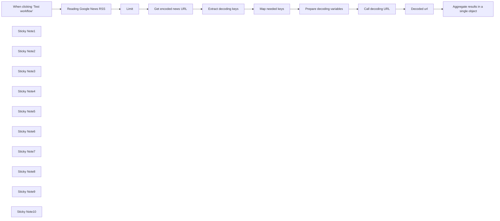

## Fluxo (.json) :

```json
{
  "id": "3JsfhcDcjqxx0hr3",
  "meta": {
    "instanceId": "38fb1860cc6284b8af9ba3b485f32cc1851cd97470ef1b4a472b5e707f1c93b5"
  },
  "name": "Extract And Decode Google News RSS URLs to Clean Article Links",
  "tags": [
    {
      "id": "ROumyeVDIszTv7f5",
      "name": "no-ai",
      "createdAt": "2025-02-08T15:29:36.956Z",
      "updatedAt": "2025-02-08T15:29:36.956Z"
    },
    {
      "id": "XuoLgc5Eegoi3VEP",
      "name": "scraping",
      "createdAt": "2025-01-31T18:19:12.753Z",
      "updatedAt": "2025-01-31T18:19:12.753Z"
    },
    {
      "id": "nBHkkAND8NXbkg8m",
      "name": "news",
      "createdAt": "2025-03-13T15:47:18.420Z",
      "updatedAt": "2025-03-13T15:47:18.420Z"
    }
  ],
  "nodes": [
    {
      "id": "cdb0a726-e961-40ae-b679-43f7bd73650d",
      "name": "When clicking ‘Test workflow’",
      "type": "n8n-nodes-base.manualTrigger",
      "position": [
        560,
        1240
      ],
      "parameters": {},
      "typeVersion": 1
    },
    {
      "id": "028ddd3b-069c-43be-ad56-8f898805fccf",
      "name": "Limit",
      "type": "n8n-nodes-base.limit",
      "position": [
        1040,
        1000
      ],
      "parameters": {
        "maxItems": 5
      },
      "typeVersion": 1
    },
    {
      "id": "2215bfdc-1e6e-475c-9753-b05fd5b0d63a",
      "name": "Reading Google News RSS",
      "type": "n8n-nodes-base.rssFeedRead",
      "position": [
        840,
        1000
      ],
      "parameters": {
        "url": "https://news.google.com/rss?hl=it&gl=IT&ceid=IT:it",
        "options": {
          "ignoreSSL": false
        }
      },
      "typeVersion": 1.1
    },
    {
      "id": "23b50dac-9506-41cb-8b57-15373468ab3c",
      "name": "Decoded url",
      "type": "n8n-nodes-base.set",
      "position": [
        1520,
        1420
      ],
      "parameters": {
        "options": {},
        "assignments": {
          "assignments": [
            {
              "id": "c51f320e-4fb8-4bd4-8e36-9330e251936e",
              "name": "google_news_url",
              "type": "string",
              "value": "={{ JSON.parse(JSON.parse($json.data.split('\\n\\n')[1])[0][2])[1] }}"
            }
          ]
        }
      },
      "typeVersion": 3.4
    },
    {
      "id": "40f54966-41c7-4dc3-95ac-18b8eaffe1db",
      "name": "Call decoding URL",
      "type": "n8n-nodes-base.httpRequest",
      "position": [
        1280,
        1420
      ],
      "parameters": {
        "url": "https://news.google.com/_/DotsSplashUi/data/batchexecute",
        "method": "POST",
        "options": {
          "response": {
            "response": {
              "fullResponse": true,
              "responseFormat": "text"
            }
          }
        },
        "sendBody": true,
        "contentType": "form-urlencoded",
        "sendHeaders": true,
        "bodyParameters": {
          "parameters": [
            {
              "name": "f.req",
              "value": "={{ $json.f_req }}"
            }
          ]
        },
        "headerParameters": {
          "parameters": [
            {
              "name": "Content-Type",
              "value": "application/x-www-form-urlencoded;charset=UTF-8"
            },
            {
              "name": "User-Agent",
              "value": "Mozilla/5.0 (Windows NT 10.0; Win64; x64) AppleWebKit/537.36 (KHTML, like Gecko) Chrome/129.0.0.0 Safari/537.36"
            },
            {
              "name": "Referer",
              "value": "https://www.google.com/"
            }
          ]
        }
      },
      "typeVersion": 4.2
    },
    {
      "id": "e7a208d3-bf65-4170-bb11-d13287f8dd78",
      "name": "Prepare decoding variables",
      "type": "n8n-nodes-base.code",
      "position": [
        1040,
        1420
      ],
      "parameters": {
        "jsCode": "return $input.all().map(item => {\n    const gn_art_id = item.json.base64Str;\n    const timestamp = item.json.timestamp;\n    const signature = item.json.signature;\n\n    const articlesReq = [\n        'Fbv4je',\n        `[\"garturlreq\",[[\"X\",\"X\",[\"X\",\"X\"],null,null,1,1,\"US:en\",null,1,null,null,null,null,null,0,1],\"X\",\"X\",1,[1,1,1],1,1,null,0,0,null,0],\"${gn_art_id}\",${timestamp},\"${signature}\"]`,\n    ];\n\n    return {\n        json: {\n            f_req: JSON.stringify([[articlesReq]])  // Questo verrà usato nel nodo HTTP Request\n        }\n    };\n});"
      },
      "typeVersion": 2
    },
    {
      "id": "35fe85f1-82c7-4b50-b47b-14c56678e377",
      "name": "Get encoded news URL",
      "type": "n8n-nodes-base.httpRequest",
      "position": [
        1280,
        1000
      ],
      "parameters": {
        "url": "={{ $('Limit').item.json.link }}",
        "options": {}
      },
      "typeVersion": 4.2
    },
    {
      "id": "3d640138-4247-4e6d-a0e9-fefc9f41e057",
      "name": "Sticky Note1",
      "type": "n8n-nodes-base.stickyNote",
      "position": [
        740,
        760
      ],
      "parameters": {
        "width": 220,
        "height": 400,
        "content": "## Get Google News\n\nChange the language parameters on ISO639-1 standard \n\n1. hl=it\n2. gl=IT\n3. ceid=IT:it"
      },
      "typeVersion": 1
    },
    {
      "id": "1e7a5638-8829-49f1-a445-f510eb18bbd7",
      "name": "Sticky Note2",
      "type": "n8n-nodes-base.stickyNote",
      "position": [
        980,
        760
      ],
      "parameters": {
        "width": 220,
        "height": 400,
        "content": "## Limit result\n\nI suggest limiting the results to a maximum of 3 because the entire workflow makes a lot of HTTP requests"
      },
      "typeVersion": 1
    },
    {
      "id": "24a405df-c334-461a-ab0d-91ebc39185c1",
      "name": "Sticky Note3",
      "type": "n8n-nodes-base.stickyNote",
      "position": [
        500,
        760
      ],
      "parameters": {
        "color": 5,
        "width": 220,
        "height": 820,
        "content": "## INFO\n\nDisclaimer:\nYou can add a cron trigger but... don't do too often: Google could block your ip.\n\nThis workflow works until works: the decoding procedure is hardcoded and based on reverse engineering. Requests and responses are not documented by Google.\n\n\n"
      },
      "typeVersion": 1
    },
    {
      "id": "c54e9729-7cbd-4628-b7be-ee072047b3d4",
      "name": "Sticky Note4",
      "type": "n8n-nodes-base.stickyNote",
      "position": [
        1220,
        760
      ],
      "parameters": {
        "color": 3,
        "width": 220,
        "height": 400,
        "content": "## Get encoded content\n\nHere we retrieve HTML content"
      },
      "typeVersion": 1
    },
    {
      "id": "a5b25d20-0d06-4650-b8bc-0d03c97eb416",
      "name": "Map needed keys",
      "type": "n8n-nodes-base.set",
      "position": [
        780,
        1420
      ],
      "parameters": {
        "options": {},
        "assignments": {
          "assignments": [
            {
              "id": "b5a11795-2bd1-412f-a215-f7402bece002",
              "name": "signature",
              "type": "string",
              "value": "={{ $json.signature }}"
            },
            {
              "id": "33267283-3ac8-4d65-9a01-c7f154a7d061",
              "name": "timestamp",
              "type": "string",
              "value": "={{ $json.timestamp }}"
            },
            {
              "id": "bff8f19a-30d6-4307-87da-9b98b26cee8b",
              "name": "base64Str",
              "type": "string",
              "value": "={{ $('Limit').item.json.guid }}"
            }
          ]
        }
      },
      "typeVersion": 3.4
    },
    {
      "id": "116eec84-dbfe-4880-8fc4-d350ff99d4be",
      "name": "Extract decoding keys",
      "type": "n8n-nodes-base.html",
      "position": [
        1520,
        1000
      ],
      "parameters": {
        "options": {},
        "operation": "extractHtmlContent",
        "extractionValues": {
          "values": [
            {
              "key": "signature",
              "attribute": "data-n-a-sg",
              "cssSelector": "div",
              "returnValue": "attribute"
            },
            {
              "key": "timestamp",
              "attribute": "data-n-a-ts",
              "cssSelector": "div",
              "returnValue": "attribute"
            }
          ]
        }
      },
      "typeVersion": 1.2
    },
    {
      "id": "22825293-d9f8-4fa2-99b4-2150a74b2a12",
      "name": "Sticky Note5",
      "type": "n8n-nodes-base.stickyNote",
      "position": [
        1460,
        760
      ],
      "parameters": {
        "width": 220,
        "height": 400,
        "content": "## Decoding Keys\n\nThe HTML content extracted contains the necessary variables for decoding:\n\n+ signature\n+ timestamp\n+ base64string (already in the URL)"
      },
      "typeVersion": 1
    },
    {
      "id": "46dce5e2-1c4f-45d8-a849-ebe13d673ef9",
      "name": "Sticky Note6",
      "type": "n8n-nodes-base.stickyNote",
      "position": [
        740,
        1180
      ],
      "parameters": {
        "width": 220,
        "height": 400,
        "content": "## Clean output\n\nMapping variables for easy utilization"
      },
      "typeVersion": 1
    },
    {
      "id": "9dbc9f69-d34a-470e-81af-c3bcc9a92a48",
      "name": "Sticky Note7",
      "type": "n8n-nodes-base.stickyNote",
      "position": [
        980,
        1180
      ],
      "parameters": {
        "color": 3,
        "width": 220,
        "height": 400,
        "content": "## Preparing Request\n\nDecoding the request requires specific body content. Here, we build it using the decoding keys."
      },
      "typeVersion": 1
    },
    {
      "id": "39a492a7-a099-4ae7-ac17-d3842f0682fe",
      "name": "Sticky Note8",
      "type": "n8n-nodes-base.stickyNote",
      "position": [
        1220,
        1180
      ],
      "parameters": {
        "color": 3,
        "width": 220,
        "height": 400,
        "content": "## This is decoding step\n\nSending a request to a specific Google decoding URL"
      },
      "typeVersion": 1
    },
    {
      "id": "29d3b1a3-5882-484d-9add-68a746f0a7b8",
      "name": "Sticky Note9",
      "type": "n8n-nodes-base.stickyNote",
      "position": [
        1460,
        1180
      ],
      "parameters": {
        "width": 220,
        "height": 400,
        "content": "## Cleaning URL\n\nGoogle adds some unwanted and random characters at the beginning of the URL"
      },
      "typeVersion": 1
    },
    {
      "id": "6b2fc671-2a22-4a6d-bcc5-38294981d9fe",
      "name": "Sticky Note10",
      "type": "n8n-nodes-base.stickyNote",
      "position": [
        1700,
        760
      ],
      "parameters": {
        "color": 4,
        "width": 220,
        "height": 820,
        "content": "## OUTPUT\n\nA lot of requests are made before getting clean News URLs.\n\nYou can add an HttpRequest and get News text with jina.ai, extract by using HTML node, or a custom node like https://www.npmjs.com/package/n8n-nodes-webpage-content-extractor\n\n"
      },
      "typeVersion": 1
    },
    {
      "id": "6c82769b-e784-4a38-b2ed-447da7f1a6f7",
      "name": "Aggregate results in a single object",
      "type": "n8n-nodes-base.aggregate",
      "position": [
        1760,
        1080
      ],
      "parameters": {
        "options": {},
        "aggregate": "aggregateAllItemData"
      },
      "typeVersion": 1
    }
  ],
  "active": false,
  "pinData": {},
  "settings": {
    "executionOrder": "v1"
  },
  "versionId": "c4fbad75-5811-4031-bdfe-ee494067ded3",
  "connections": {
    "Limit": {
      "main": [
        [
          {
            "node": "Get encoded news URL",
            "type": "main",
            "index": 0
          }
        ]
      ]
    },
    "Decoded url": {
      "main": [
        [
          {
            "node": "Aggregate results in a single object",
            "type": "main",
            "index": 0
          }
        ]
      ]
    },
    "Map needed keys": {
      "main": [
        [
          {
            "node": "Prepare decoding variables",
            "type": "main",
            "index": 0
          }
        ]
      ]
    },
    "Call decoding URL": {
      "main": [
        [
          {
            "node": "Decoded url",
            "type": "main",
            "index": 0
          }
        ]
      ]
    },
    "Get encoded news URL": {
      "main": [
        [
          {
            "node": "Extract decoding keys",
            "type": "main",
            "index": 0
          }
        ]
      ]
    },
    "Extract decoding keys": {
      "main": [
        [
          {
            "node": "Map needed keys",
            "type": "main",
            "index": 0
          }
        ]
      ]
    },
    "Reading Google News RSS": {
      "main": [
        [
          {
            "node": "Limit",
            "type": "main",
            "index": 0
          }
        ]
      ]
    },
    "Prepare decoding variables": {
      "main": [
        [
          {
            "node": "Call decoding URL",
            "type": "main",
            "index": 0
          }
        ]
      ]
    },
    "When clicking ‘Test workflow’": {
      "main": [
        [
          {
            "node": "Reading Google News RSS",
            "type": "main",
            "index": 0
          }
        ]
      ]
    }
  }
}
```

<a id="template-1155"></a>

## Template 1155 - Rascunho de resposta com Assistente OpenAI

- **Nome:** Rascunho de resposta com Assistente OpenAI
- **Descrição:** Cria rascunhos de resposta para threads de e-mail com rótulos específicos usando o Assistente OpenAI e remove o rótulo de gatilho após a criação do rascunho.
- **Funcionalidade:** • Agendamento periódico: executa a verificação a cada minuto para procurar threads com rótulos específicos.
• Busca de threads por rótulo: recupera threads que possuem o rótulo de gatilho.
• Iteração por thread: processa cada thread individualmente.
• Recuperação da última mensagem: obtém todas as mensagens da thread e seleciona a última.
• Extração do conteúdo da mensagem: recupera o conteúdo completo da última mensagem para análise.
• Geração de resposta com Assistente OpenAI: envia o conteúdo ao Assistente OpenAI e recebe um rascunho de resposta (em Markdown).
• Conversão de Markdown para HTML: transforma a resposta em Markdown para HTML.
• Construção de mensagem raw: monta o e-mail em formato raw com cabeçalhos e corpo HTML.
• Codificação em base64: codifica a mensagem raw para o formato exigido pela API do Gmail.
• Criação de rascunho na thread: adiciona o rascunho gerado ao thread específico no Gmail.
• Remoção do rótulo de gatilho: remove o rótulo que iniciou o processamento da thread.
- **Ferramentas:** • Gmail (API/conta de e-mail): usado para buscar threads, ler mensagens, criar rascunhos e remover rótulos.
• OpenAI Assistant: gera o conteúdo da resposta com base no texto da mensagem recebida.

## Fluxo visual

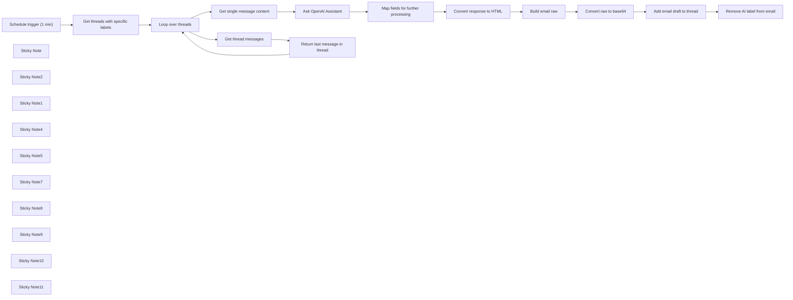

## Fluxo (.json) :

```json
{
  "nodes": [
    {
      "id": "a99b3164-fe36-4dde-9525-110c1ae08afb",
      "name": "Convert raw to base64",
      "type": "n8n-nodes-base.code",
      "position": [
        3320,
        580
      ],
      "parameters": {
        "mode": "runOnceForEachItem",
        "jsCode": "const encoded = Buffer.from($json.raw).toString('base64');\n\nreturn { encoded };"
      },
      "typeVersion": 2
    },
    {
      "id": "f0f731bd-7b2f-4c39-bc06-42fd57bc4ae8",
      "name": "Add email draft to thread",
      "type": "n8n-nodes-base.httpRequest",
      "position": [
        3580,
        580
      ],
      "parameters": {
        "url": "https://www.googleapis.com/gmail/v1/users/me/drafts",
        "method": "POST",
        "options": {},
        "jsonBody": "={\"message\":{\"raw\":\"{{ $json.encoded }}\", \"threadId\": \"{{ $('Map fields for further processing').item.json[\"threadId\"] }}\"}}",
        "sendBody": true,
        "specifyBody": "json",
        "authentication": "predefinedCredentialType",
        "nodeCredentialType": "gmailOAuth2"
      },
      "credentials": {
        "gmailOAuth2": {
          "id": "uBcIMfsTtKjexw7I",
          "name": "Gmail (workfloowstutorial@gmail.com)"
        }
      },
      "typeVersion": 4.1
    },
    {
      "id": "c1ce3400-4582-46c7-a85d-8fa9c325ff7b",
      "name": "Remove AI label from email",
      "type": "n8n-nodes-base.gmail",
      "position": [
        3820,
        580
      ],
      "parameters": {
        "resource": "thread",
        "threadId": "={{ $('Map fields for further processing').item.json[\"threadId\"] }}",
        "operation": "removeLabels"
      },
      "credentials": {
        "gmailOAuth2": {
          "id": "uBcIMfsTtKjexw7I",
          "name": "Gmail (workfloowstutorial@gmail.com)"
        }
      },
      "typeVersion": 2.1
    },
    {
      "id": "65f0508a-ca2e-49ce-b02f-ef6505b5e983",
      "name": "Schedule trigger (1 min)",
      "type": "n8n-nodes-base.scheduleTrigger",
      "position": [
        960,
        580
      ],
      "parameters": {
        "rule": {
          "interval": [
            {
              "field": "minutes",
              "minutesInterval": 1
            }
          ]
        }
      },
      "typeVersion": 1.1
    },
    {
      "id": "ca4a209b-a79d-4911-b69b-1db22808be60",
      "name": "Map fields for further processing",
      "type": "n8n-nodes-base.set",
      "position": [
        2620,
        580
      ],
      "parameters": {
        "options": {},
        "assignments": {
          "assignments": [
            {
              "id": "a77b2d79-1e70-410c-a657-f3d618154ea1",
              "name": "response",
              "type": "string",
              "value": "={{ $json.output }}"
            },
            {
              "id": "20850cac-f82c-4f02-84f0-3de31871a5b8",
              "name": "threadId",
              "type": "string",
              "value": "={{ $('Get single message content').item.json[\"threadId\"] }}"
            },
            {
              "id": "d270c18e-39a0-4d87-85f0-cc1ffc9c10ff",
              "name": "to",
              "type": "string",
              "value": "={{ $('Get single message content').item.json[\"from\"][\"text\"] }}"
            },
            {
              "id": "30acb50b-bdde-44bf-803c-76e0ae65f526",
              "name": "subject",
              "type": "string",
              "value": "={{ $('Get single message content').item.json[\"subject\"] }}"
            },
            {
              "id": "88914536-8c25-4877-8914-feab5e32fae3",
              "name": "messageId",
              "type": "string",
              "value": "={{ $('Get threads with specific labels').item.json[\"id\"] }}"
            }
          ]
        }
      },
      "typeVersion": 3.3
    },
    {
      "id": "93eb3844-f1fe-4b09-bcae-3e372a19ab6f",
      "name": "Convert response to HTML",
      "type": "n8n-nodes-base.markdown",
      "position": [
        2860,
        580
      ],
      "parameters": {
        "mode": "markdownToHtml",
        "options": {
          "simpleLineBreaks": false
        },
        "markdown": "={{ $json.response }}",
        "destinationKey": "response"
      },
      "typeVersion": 1
    },
    {
      "id": "da35eda9-b63e-49f9-8fe8-7517c1445c92",
      "name": "Build email raw",
      "type": "n8n-nodes-base.set",
      "position": [
        3100,
        580
      ],
      "parameters": {
        "options": {},
        "assignments": {
          "assignments": [
            {
              "id": "913e9cb1-10de-4637-bf48-40272c7c7fe3",
              "name": "raw",
              "type": "string",
              "value": "=To: {{ $json.to }}\nSubject: {{ $json.subject }}\nContent-Type: text/html; charset=\"utf-8\"\n\n{{ $json.response }}"
            }
          ]
        }
      },
      "typeVersion": 3.3
    },
    {
      "id": "b667a399-a178-42e3-a587-4eccd2a153d8",
      "name": "Sticky Note",
      "type": "n8n-nodes-base.stickyNote",
      "position": [
        460,
        460
      ],
      "parameters": {
        "color": 4,
        "width": 420.4803040774015,
        "height": 189.69151356225348,
        "content": "## Reply draft with OpenAI Assistant\nThis workflow automatically transfers content of incoming email messages with specific labels into OpenAI Assitant and returns reply draft. After draft is composed, trigger label is deleted from the thread.\n\n**Please remember to configure your OpenAI Assistant first.**"
      },
      "typeVersion": 1
    },
    {
      "id": "fe47636b-2142-4c40-a937-2ec360b230ae",
      "name": "Sticky Note2",
      "type": "n8n-nodes-base.stickyNote",
      "position": [
        900,
        460
      ],
      "parameters": {
        "width": 451.41125086385614,
        "height": 313.3056033573073,
        "content": "### Schedule trigger and get emails\nRun the workflow in equal intervals and check for threads with specific labels (trigger labels)."
      },
      "typeVersion": 1
    },
    {
      "id": "c9bfa42c-a045-404d-aebe-d87dceb68f1a",
      "name": "Sticky Note1",
      "type": "n8n-nodes-base.stickyNote",
      "position": [
        460,
        680
      ],
      "parameters": {
        "color": 3,
        "width": 421.0932411886662,
        "height": 257.42916378714597,
        "content": "## ⚠️ Note\n\n1. Complete video guide for this workflow is available [on my YouTube](https://youtu.be/a8Dhj3Zh9vQ). \n2. Remember to add your credentials and configure nodes (covered in the video guide).\n3. If you like this workflow, please subscribe to [my YouTube channel](https://www.youtube.com/@workfloows) and/or [my newsletter](https://workfloows.com/).\n\n**Thank you for your support!**"
      },
      "typeVersion": 1
    },
    {
      "id": "40424340-c0ec-435a-9ce0-0e0dc3b94cfc",
      "name": "Sticky Note4",
      "type": "n8n-nodes-base.stickyNote",
      "position": [
        2160,
        460
      ],
      "parameters": {
        "width": 381.6458068293894,
        "height": 313.7892229150129,
        "content": "### Generate reply\nTransfer email content to OpenAI Assitant and return AI-generated reply.\n"
      },
      "typeVersion": 1
    },
    {
      "id": "e7cce507-6658-414d-8cbc-3af847dad124",
      "name": "Sticky Note5",
      "type": "n8n-nodes-base.stickyNote",
      "position": [
        2800,
        460
      ],
      "parameters": {
        "width": 219.88389496558554,
        "height": 314.75072291501283,
        "content": "### Create HTML message\nConvert incoming Markdown from OpenAI Assistant into HTML content."
      },
      "typeVersion": 1
    },
    {
      "id": "2b383967-0a23-46a1-9a19-a9532a3c3425",
      "name": "Sticky Note7",
      "type": "n8n-nodes-base.stickyNote",
      "position": [
        3040,
        460
      ],
      "parameters": {
        "width": 461.3148409669012,
        "height": 314.75072291501283,
        "content": "### Build and encode message\nCreate raw message in RFC standard and encode it into base64 string (please see [Gmail API reference](https://developers.google.com/gmail/api/reference/rest/v1/users.drafts/create) for more details)."
      },
      "typeVersion": 1
    },
    {
      "id": "07685b17-cf22-4adf-a6b7-7acc2d863115",
      "name": "Sticky Note8",
      "type": "n8n-nodes-base.stickyNote",
      "position": [
        3520,
        460
      ],
      "parameters": {
        "width": 219.88389496558554,
        "height": 314.75072291501283,
        "content": "### Insert reply draft\nAdd reply draft from OpenAI Assistant to specific Gmail thread."
      },
      "typeVersion": 1
    },
    {
      "id": "1e8109f8-7dd3-4308-a5e8-32382aa41805",
      "name": "Sticky Note9",
      "type": "n8n-nodes-base.stickyNote",
      "position": [
        3760,
        460
      ],
      "parameters": {
        "width": 219.88389496558554,
        "height": 314.75072291501283,
        "content": "### Remove label\nDelete trigger label from the Gmail thread."
      },
      "typeVersion": 1
    },
    {
      "id": "d488db90-7367-49fa-b366-ccdfc796b5b3",
      "name": "Get threads with specific labels",
      "type": "n8n-nodes-base.gmail",
      "position": [
        1180,
        580
      ],
      "parameters": {
        "filters": {
          "labelIds": []
        },
        "resource": "thread",
        "returnAll": true
      },
      "credentials": {
        "gmailOAuth2": {
          "id": "uBcIMfsTtKjexw7I",
          "name": "Gmail (workfloowstutorial@gmail.com)"
        }
      },
      "typeVersion": 2.1
    },
    {
      "id": "9f5262c5-d319-4a9d-af6e-aa42970d1a6f",
      "name": "Ask OpenAI Assistant",
      "type": "@n8n/n8n-nodes-langchain.openAi",
      "position": [
        2220,
        580
      ],
      "parameters": {
        "text": "={{ $json.text }}",
        "prompt": "define",
        "options": {},
        "resource": "assistant",
        "assistantId": {
          "__rl": true,
          "mode": "list",
          "value": "asst_kmKeAtwF2rv0vgF0ujY4jlp6",
          "cachedResultName": "Customer assistant"
        }
      },
      "credentials": {
        "openAiApi": {
          "id": "jazew1WAaSRrjcHp",
          "name": "OpenAI (workfloows@gmail.com)"
        }
      },
      "typeVersion": 1
    },
    {
      "id": "6ffd7d66-40b6-49a4-9e15-9742bda73d2f",
      "name": "Loop over threads",
      "type": "n8n-nodes-base.splitInBatches",
      "position": [
        1440,
        580
      ],
      "parameters": {
        "options": {}
      },
      "typeVersion": 3
    },
    {
      "id": "8afc47c8-075f-4f3d-a89d-fda81fc270fc",
      "name": "Get thread messages",
      "type": "n8n-nodes-base.gmail",
      "position": [
        1700,
        820
      ],
      "parameters": {
        "options": {
          "returnOnlyMessages": true
        },
        "resource": "thread",
        "threadId": "={{ $json.id }}",
        "operation": "get"
      },
      "credentials": {
        "gmailOAuth2": {
          "id": "uBcIMfsTtKjexw7I",
          "name": "Gmail (workfloowstutorial@gmail.com)"
        }
      },
      "typeVersion": 2.1
    },
    {
      "id": "2286bfa7-dcb8-4a61-a71b-ea58e21bf7ab",
      "name": "Return last message in thread",
      "type": "n8n-nodes-base.limit",
      "position": [
        1920,
        820
      ],
      "parameters": {
        "keep": "lastItems"
      },
      "typeVersion": 1
    },
    {
      "id": "44c52e61-dd88-4499-85db-69ce4704c2b2",
      "name": "Get single message content",
      "type": "n8n-nodes-base.gmail",
      "position": [
        1700,
        460
      ],
      "parameters": {
        "simple": false,
        "options": {},
        "messageId": "={{ $json.id }}",
        "operation": "get"
      },
      "credentials": {
        "gmailOAuth2": {
          "id": "uBcIMfsTtKjexw7I",
          "name": "Gmail (workfloowstutorial@gmail.com)"
        }
      },
      "typeVersion": 2.1
    },
    {
      "id": "7ca62611-f02e-47bf-b940-3a56ece443b7",
      "name": "Sticky Note10",
      "type": "n8n-nodes-base.stickyNote",
      "position": [
        1640,
        340
      ],
      "parameters": {
        "width": 219.88389496558554,
        "height": 314.75072291501283,
        "content": "### Return message content\nRetrieve content of the last message in the thread."
      },
      "typeVersion": 1
    },
    {
      "id": "165df2a4-3c94-456d-9906-be8020098802",
      "name": "Sticky Note11",
      "type": "n8n-nodes-base.stickyNote",
      "position": [
        1640,
        680
      ],
      "parameters": {
        "width": 470.88389496558545,
        "height": 314.75072291501283,
        "content": "### Get last message from thread\nReturn all messages for a single thread and pass for further processing only the last one."
      },
      "typeVersion": 1
    }
  ],
  "active": false,
  "pinData": {},
  "settings": {
    "executionOrder": "v1"
  },
  "connections": {
    "Build email raw": {
      "main": [
        [
          {
            "node": "Convert raw to base64",
            "type": "main",
            "index": 0
          }
        ]
      ]
    },
    "Loop over threads": {
      "main": [
        [
          {
            "node": "Get single message content",
            "type": "main",
            "index": 0
          }
        ],
        [
          {
            "node": "Get thread messages",
            "type": "main",
            "index": 0
          }
        ]
      ]
    },
    "Get thread messages": {
      "main": [
        [
          {
            "node": "Return last message in thread",
            "type": "main",
            "index": 0
          }
        ]
      ]
    },
    "Ask OpenAI Assistant": {
      "main": [
        [
          {
            "node": "Map fields for further processing",
            "type": "main",
            "index": 0
          }
        ]
      ]
    },
    "Convert raw to base64": {
      "main": [
        [
          {
            "node": "Add email draft to thread",
            "type": "main",
            "index": 0
          }
        ]
      ]
    },
    "Convert response to HTML": {
      "main": [
        [
          {
            "node": "Build email raw",
            "type": "main",
            "index": 0
          }
        ]
      ]
    },
    "Schedule trigger (1 min)": {
      "main": [
        [
          {
            "node": "Get threads with specific labels",
            "type": "main",
            "index": 0
          }
        ]
      ]
    },
    "Add email draft to thread": {
      "main": [
        [
          {
            "node": "Remove AI label from email",
            "type": "main",
            "index": 0
          }
        ]
      ]
    },
    "Get single message content": {
      "main": [
        [
          {
            "node": "Ask OpenAI Assistant",
            "type": "main",
            "index": 0
          }
        ]
      ]
    },
    "Return last message in thread": {
      "main": [
        [
          {
            "node": "Loop over threads",
            "type": "main",
            "index": 0
          }
        ]
      ]
    },
    "Get threads with specific labels": {
      "main": [
        [
          {
            "node": "Loop over threads",
            "type": "main",
            "index": 0
          }
        ]
      ]
    },
    "Map fields for further processing": {
      "main": [
        [
          {
            "node": "Convert response to HTML",
            "type": "main",
            "index": 0
          }
        ]
      ]
    }
  }
}
```

<a id="template-1156"></a>

## Template 1156 - Criador de URL UTM com QR e relatórios GA agendados

- **Nome:** Criador de URL UTM com QR e relatórios GA agendados
- **Descrição:** Automatiza a criação de links com parâmetros UTM, gera QR codes, armazena/atualiza os URLs em uma base de dados, gera relatórios periódicos do Google Analytics e envia um resumo executivo por e-mail ao gerente de marketing.
- **Funcionalidade:** • Geração de URL com parâmetros UTM: cria uma URL contendo utm_source, utm_medium, utm_campaign, utm_term e utm_content a partir dos inputs da campanha.
• Armazenamento/Atualização da URL UTM em base de dados: faz upsert do registro de URL UTM para manter histórico e disponibilidade.
• Geração de QR Code a partir da URL UTM: gera um código QR utilizável para materiais de divulgação.
• Relatórios Google Analytics agendados e coleta de dados GA4: agenda e extrai métricas, como sessões, com dimensões de origem/médio para análise.
• Análise de dados e criação de resumo executivo: utiliza um agente de dados para gerar um resumo executivo com insights, KPIs, tendências e recomendações.
• Envio automático do resumo por e-mail ao gerente de marketing: envia o relatório compilado para o destinatário definido.
- **Ferramentas:** • Airtable: base de dados para armazenar URLs UTM e gerenciar o registro de cada campanha.
• QuickChart QR Code API: serviço externo para gerar QR codes a partir de URLs.
• Google Analytics (GA4): API/serviço para consultar métricas e dimensões de tráfego.
• Gmail: serviço de envio de e-mails com o resumo analítico.

## Fluxo visual

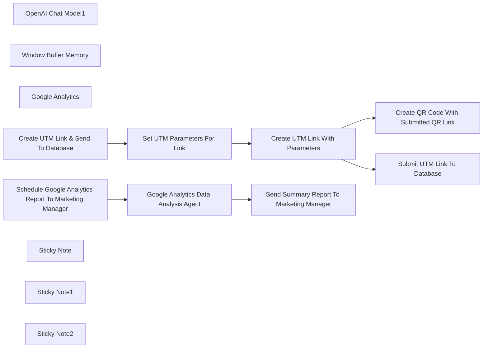

## Fluxo (.json) :

```json
{
  "id": "SJrqDqTBIAyaZQkq",
  "meta": {
    "instanceId": "73d9d5380db181d01f4e26492c771d4cb5c4d6d109f18e2621cf49cac4c50763",
    "templateCredsSetupCompleted": true
  },
  "name": "UTM Link Creator & QR Code Generator with Scheduled Google Analytics Reports",
  "tags": [],
  "nodes": [
    {
      "id": "5efbd956-51b6-4f94-aebc-07e3e691f7eb",
      "name": "OpenAI Chat Model1",
      "type": "@n8n/n8n-nodes-langchain.lmChatOpenAi",
      "position": [
        -180,
        480
      ],
      "parameters": {
        "model": {
          "__rl": true,
          "mode": "list",
          "value": "gpt-4o-mini"
        },
        "options": {}
      },
      "credentials": {
        "openAiApi": {
          "id": "95QGJD3XSz0piaNU",
          "name": "OpenAi account"
        }
      },
      "typeVersion": 1.2
    },
    {
      "id": "a1acd323-ed07-41b4-a51e-614afe361893",
      "name": "Window Buffer Memory",
      "type": "@n8n/n8n-nodes-langchain.memoryBufferWindow",
      "position": [
        0,
        480
      ],
      "parameters": {
        "sessionKey": "={{ $json.timestamp }}",
        "sessionIdType": "customKey",
        "contextWindowLength": 200
      },
      "typeVersion": 1.3
    },
    {
      "id": "c3c2b5fa-c294-4306-a050-dccd592477fa",
      "name": "Google Analytics",
      "type": "n8n-nodes-base.googleAnalyticsTool",
      "position": [
        160,
        480
      ],
      "parameters": {
        "metricsGA4": {
          "metricValues": [
            {
              "listName": "sessions"
            }
          ]
        },
        "propertyId": {
          "__rl": true,
          "mode": "list",
          "value": "404306108",
          "cachedResultUrl": "https://analytics.google.com/analytics/web/#/p404306108/",
          "cachedResultName": "East Coast Concrete Coating"
        },
        "dimensionsGA4": {
          "dimensionValues": [
            {},
            {
              "listName": "sourceMedium"
            }
          ]
        },
        "additionalFields": {}
      },
      "credentials": {
        "googleAnalyticsOAuth2": {
          "id": "sVZ61SpNfC2D1Z7V",
          "name": "Google Analytics account"
        }
      },
      "typeVersion": 2
    },
    {
      "id": "cbc7b539-2fa6-493b-a66c-13db8d8d420c",
      "name": "Create UTM Link & Send To Database",
      "type": "n8n-nodes-base.manualTrigger",
      "position": [
        -440,
        -80
      ],
      "parameters": {},
      "typeVersion": 1
    },
    {
      "id": "5358f2cc-bdb0-4e9b-a6b9-93418f83db02",
      "name": "Set UTM Parameters For Link",
      "type": "n8n-nodes-base.set",
      "position": [
        -220,
        -80
      ],
      "parameters": {
        "options": {},
        "assignments": {
          "assignments": [
            {
              "id": "28d0a36d-5b03-4b74-9941-ef0e1aab86bf",
              "name": "website_url",
              "type": "string",
              "value": "https://ecconcretecoating.com/"
            },
            {
              "id": "1a2ee174-4684-4246-813f-b67285af48b8",
              "name": "campaign_id",
              "type": "string",
              "value": "12246"
            },
            {
              "id": "e15a846d-6e37-4fbf-a9f4-b3fce3441295",
              "name": "campaign_source",
              "type": "string",
              "value": "google"
            },
            {
              "id": "f15e2bb1-08a6-48c4-8458-b753864e9364",
              "name": "campaign_medium",
              "type": "string",
              "value": "display"
            },
            {
              "id": "548900ab-aa2c-498f-bbd9-a787306e72db",
              "name": "campaign_name",
              "type": "string",
              "value": "summerfun"
            },
            {
              "id": "fd8d1bd4-a75d-4c49-b795-8fda7c377b66",
              "name": "campaign_term",
              "type": "string",
              "value": "conretecoating"
            }
          ]
        }
      },
      "typeVersion": 3.4
    },
    {
      "id": "45daf73a-01c2-40ab-8546-7fdd489e2a1c",
      "name": "Create UTM Link With Parameters",
      "type": "n8n-nodes-base.code",
      "position": [
        40,
        -140
      ],
      "parameters": {
        "jsCode": "const items = $input.all();\nconst updatedItems = items.map((item) => {\n  const utmUrl = `${item?.json?.website_url}?utm_source=${item?.json?.campaign_source}&utm_medium=${item?.json?.campaign_medium}&utm_campaign=${item?.json?.campaign_name}&utm_term=${item?.json?.campaign_term}&utm_content=${item?.json?.campaign_id}`;\n  item.json.utmUrl = utmUrl;\n  return item;\n});\nreturn updatedItems;\n"
      },
      "typeVersion": 2
    },
    {
      "id": "a621984d-eea5-464d-9be3-e620e779abd5",
      "name": "Submit UTM Link To Database",
      "type": "n8n-nodes-base.airtable",
      "position": [
        280,
        -200
      ],
      "parameters": {
        "base": {
          "__rl": true,
          "mode": "list",
          "value": "appIXd8a8JeB9bPaL",
          "cachedResultUrl": "https://airtable.com/appIXd8a8JeB9bPaL",
          "cachedResultName": "Untitled Base"
        },
        "table": {
          "__rl": true,
          "mode": "list",
          "value": "tblXyFxXMHraieGCa",
          "cachedResultUrl": "https://airtable.com/appIXd8a8JeB9bPaL/tblXyFxXMHraieGCa",
          "cachedResultName": "UTM_URL"
        },
        "columns": {
          "value": {
            "URL": "={{ $json.utmUrl }}"
          },
          "schema": [
            {
              "id": "id",
              "type": "string",
              "display": true,
              "removed": false,
              "readOnly": true,
              "required": false,
              "displayName": "id",
              "defaultMatch": true
            },
            {
              "id": "URL",
              "type": "string",
              "display": true,
              "removed": false,
              "readOnly": false,
              "required": false,
              "displayName": "URL",
              "defaultMatch": false,
              "canBeUsedToMatch": true
            }
          ],
          "mappingMode": "defineBelow",
          "matchingColumns": [
            "id"
          ],
          "attemptToConvertTypes": false,
          "convertFieldsToString": false
        },
        "options": {},
        "operation": "upsert"
      },
      "credentials": {
        "airtableTokenApi": {
          "id": "0ApVmNsLu7aFzQD6",
          "name": "Airtable Personal Access Token account"
        }
      },
      "typeVersion": 2.1
    },
    {
      "id": "19074462-d719-4fdf-bc59-d6b2ecd1ce20",
      "name": "Create QR Code With Submitted QR Link",
      "type": "n8n-nodes-base.httpRequest",
      "position": [
        280,
        -20
      ],
      "parameters": {
        "url": "=https://quickchart.io/qr?text={{ $json.utmUrl }}&size=300&margin=10&ecLevel=H&dark=000000&light=FFFFFF\n",
        "options": {}
      },
      "typeVersion": 4.2
    },
    {
      "id": "a8c22bb2-f8eb-4e5f-b288-9c25e0aeb648",
      "name": "Schedule Google Analytics Report To Marketing Manager",
      "type": "n8n-nodes-base.scheduleTrigger",
      "position": [
        -460,
        280
      ],
      "parameters": {
        "rule": {
          "interval": [
            {}
          ]
        }
      },
      "typeVersion": 1.2
    },
    {
      "id": "268c110c-2b7c-4450-b5b0-5d5326eac17f",
      "name": "Google Analytics Data Analysis Agent",
      "type": "@n8n/n8n-nodes-langchain.agent",
      "position": [
        -100,
        280
      ],
      "parameters": {
        "text": "={{ $json.timestamp }}",
        "options": {
          "systemMessage": "\"You are an advanced data analytics AI specializing in executive reporting. Your task is to analyze the provided dataset and generate a structured executive summary that highlights key insights, trends, and actionable takeaways. Structure your summary in the following format:\n\nOverview – Briefly describe the dataset and its significance.\nKey Performance Indicators (KPIs) – Highlight the most important metrics and compare them to previous periods if applicable.\nTrends & Insights – Identify patterns, growth areas, declines, and anomalies.\nOpportunities & Recommendations – Provide strategic recommendations based on the insights.\nConclusion – Summarize the key takeaways concisely.\n*Ensure the tone is professional, clear, and tailored for executives who require quick, data-driven insights without unnecessary details.\""
        },
        "promptType": "define"
      },
      "typeVersion": 1.7
    },
    {
      "id": "1b012731-e67b-4e0d-95b7-a7f587754a05",
      "name": "Send Summary Report To Marketing Manager",
      "type": "n8n-nodes-base.gmail",
      "position": [
        300,
        280
      ],
      "webhookId": "a9b88615-c7e2-4b56-891a-98f4d6b34220",
      "parameters": {
        "sendTo": "john@marketingcanopy.com",
        "message": "={{ $json.output }}",
        "options": {},
        "subject": "Google Analytics Metrics Summary Report"
      },
      "credentials": {
        "gmailOAuth2": {
          "id": "pIXP1ZseBP4Z5CCp",
          "name": "Gmail account"
        }
      },
      "typeVersion": 2.1
    },
    {
      "id": "9da758e1-8aed-446b-a074-8fee5405583f",
      "name": "Sticky Note",
      "type": "n8n-nodes-base.stickyNote",
      "position": [
        -540,
        -280
      ],
      "parameters": {
        "width": 500,
        "height": 400,
        "content": "Create a marketing link with UTM parameters. Easily store in database and have QR code created and ready as well.\n\nType in requirements:\nwebsite URL\ncampaign id\ncampaign source\ncampaign medium\ncampaign name\ncampaign term\n\n"
      },
      "typeVersion": 1
    },
    {
      "id": "92f5df8d-88ca-4b58-b544-c0b2d3578a73",
      "name": "Sticky Note1",
      "type": "n8n-nodes-base.stickyNote",
      "position": [
        0,
        -380
      ],
      "parameters": {
        "color": 4,
        "width": 580,
        "height": 540,
        "content": "Code node creates the URL with UTM parameters. \n\nIt then sends to your Airtable database to store for records. It also creates a QR code with the embedded link to be used for materials. \n\nSample Airtable Setup:\n-Website Link UTM column"
      },
      "typeVersion": 1
    },
    {
      "id": "408af10c-4b0e-4d94-b02d-5d887fb150c3",
      "name": "Sticky Note2",
      "type": "n8n-nodes-base.stickyNote",
      "position": [
        -540,
        180
      ],
      "parameters": {
        "color": 5,
        "width": 1340,
        "height": 460,
        "content": "Schedule a Google Analytics Reports with Medium/Source to track UTM link performance. Update the reporting fields to fit your business needs. You can track traffic, conversions and other engagement metrics.\n\n*Sample Google Report Metrics: Sessions. Update metrics as needed."
      },
      "typeVersion": 1
    }
  ],
  "active": false,
  "pinData": {},
  "settings": {
    "executionOrder": "v1"
  },
  "versionId": "6e6641fd-a59c-49e9-af43-1b2b9b458544",
  "connections": {
    "Google Analytics": {
      "ai_tool": [
        [
          {
            "node": "Google Analytics Data Analysis Agent",
            "type": "ai_tool",
            "index": 0
          }
        ]
      ]
    },
    "OpenAI Chat Model1": {
      "ai_languageModel": [
        [
          {
            "node": "Google Analytics Data Analysis Agent",
            "type": "ai_languageModel",
            "index": 0
          }
        ]
      ]
    },
    "Window Buffer Memory": {
      "ai_memory": [
        [
          {
            "node": "Google Analytics Data Analysis Agent",
            "type": "ai_memory",
            "index": 0
          }
        ]
      ]
    },
    "Set UTM Parameters For Link": {
      "main": [
        [
          {
            "node": "Create UTM Link With Parameters",
            "type": "main",
            "index": 0
          }
        ]
      ]
    },
    "Submit UTM Link To Database": {
      "main": [
        []
      ]
    },
    "Create UTM Link With Parameters": {
      "main": [
        [
          {
            "node": "Create QR Code With Submitted QR Link",
            "type": "main",
            "index": 0
          },
          {
            "node": "Submit UTM Link To Database",
            "type": "main",
            "index": 0
          }
        ]
      ]
    },
    "Create UTM Link & Send To Database": {
      "main": [
        [
          {
            "node": "Set UTM Parameters For Link",
            "type": "main",
            "index": 0
          }
        ]
      ]
    },
    "Google Analytics Data Analysis Agent": {
      "main": [
        [
          {
            "node": "Send Summary Report To Marketing Manager",
            "type": "main",
            "index": 0
          }
        ]
      ]
    },
    "Send Summary Report To Marketing Manager": {
      "main": [
        []
      ]
    },
    "Schedule Google Analytics Report To Marketing Manager": {
      "main": [
        [
          {
            "node": "Google Analytics Data Analysis Agent",
            "type": "main",
            "index": 0
          }
        ]
      ]
    }
  }
}
```

<a id="template-1157"></a>

## Template 1157 - Extração automatizada de notícias

- **Nome:** Extração automatizada de notícias
- **Descrição:** Este fluxo coleta notícias de um site sem RSS, extrai links, datas, títulos e conteúdos dos posts, gera um resumo e palavras-chave com IA para cada notícia e armazena os resultados em um banco de dados externo, executando semanalmente.
- **Funcionalidade:** • Agendamento semanal: dispara a coleta automática de notícias.
• Coleta de links e datas: extrai os links das notícias listadas e as respectivas datas.
• Filtragem de posts recentes: seleciona apenas as notícias dentro do intervalo de tempo desejado.
• Acesso a páginas individuais: abre cada post para extrair título e conteúdo.
• Geração de resumo e palavras-chave: utiliza IA para criar um resumo curto e 3 palavras-chave relevantes.
• Mescla de dados: combina título, data, link, conteúdo, resumo e palavras-chave em itens únicos.
• Armazenamento externo: salva os dados no banco externo com campos News_Source, Title, Date, Link, Summary e Keywords.
- **Ferramentas:** • OpenAI API (GPT-4): geração de resumos e palavras-chave para cada notícia.
• NocoDB: armazenamento em banco externo com campos estruturados.
• Colt News site: fonte de onde as notícias são coletadas.

## Fluxo visual

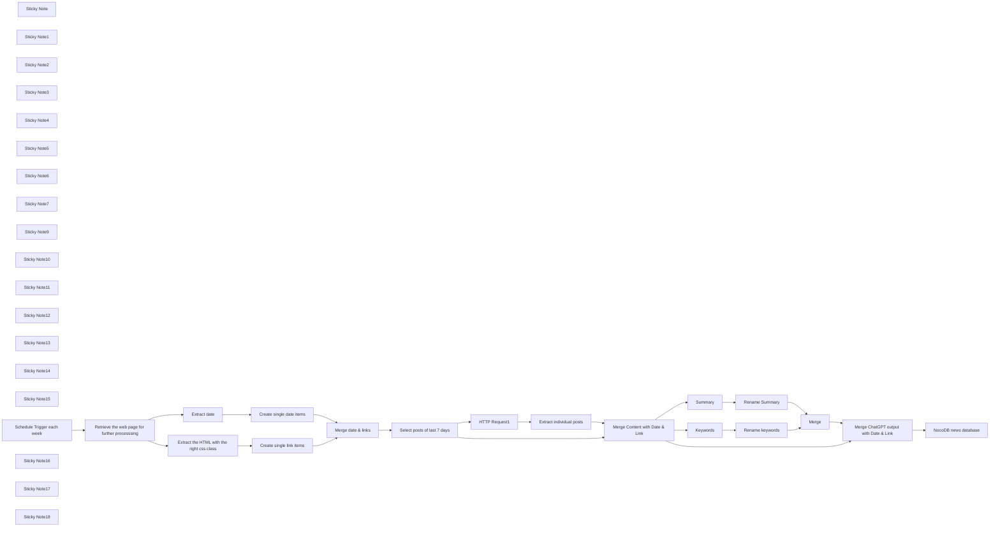

## Fluxo (.json) :

```json
{
  "id": "xM8Z5vZVNTNjCySL",
  "meta": {
    "instanceId": "b8ef33547995f2a520f12118ac1f7819ea58faa7a1096148cac519fa08be8e99"
  },
  "name": "News Extraction",
  "tags": [],
  "nodes": [
    {
      "id": "97711d12-20de-40aa-b994-d2b10f20a5e5",
      "name": "Extract the HTML with the right css class",
      "type": "n8n-nodes-base.html",
      "position": [
        -500,
        0
      ],
      "parameters": {
        "options": {
          "trimValues": true
        },
        "operation": "extractHtmlContent",
        "extractionValues": {
          "values": [
            {
              "key": "data",
              "attribute": "href",
              "cssSelector": "=div:nth-child(9) > div:nth-child(3) > a:nth-child(2)",
              "returnArray": true,
              "returnValue": "attribute"
            }
          ]
        }
      },
      "typeVersion": 1
    },
    {
      "id": "b874b570-daae-4878-b525-07ac30756eb1",
      "name": "Summary",
      "type": "n8n-nodes-base.openAi",
      "position": [
        -880,
        440
      ],
      "parameters": {
        "model": "gpt-4-1106-preview",
        "prompt": {
          "messages": [
            {
              "content": "=Create a summary in less than 70 words {{ $json[\"content\"] }}"
            }
          ]
        },
        "options": {},
        "resource": "chat"
      },
      "credentials": {
        "openAiApi": {
          "id": "0Vdk5RlVe7AoUdAM",
          "name": "OpenAi account"
        }
      },
      "typeVersion": 1
    },
    {
      "id": "72696278-2d44-4073-936a-6fe9df1bc7d8",
      "name": "Keywords",
      "type": "n8n-nodes-base.openAi",
      "position": [
        -880,
        620
      ],
      "parameters": {
        "model": "gpt-4-1106-preview",
        "prompt": {
          "messages": [
            {
              "content": "=name the 3 most important technical keywords in {{ $json[\"content\"] }} ? just name them without any explanations or other sentences"
            }
          ]
        },
        "options": {},
        "resource": "chat"
      },
      "credentials": {
        "openAiApi": {
          "id": "0Vdk5RlVe7AoUdAM",
          "name": "OpenAi account"
        }
      },
      "typeVersion": 1
    },
    {
      "id": "0bfdb3be-76ef-4bb3-902f-f0869342b83c",
      "name": "Rename keywords",
      "type": "n8n-nodes-base.set",
      "position": [
        -700,
        620
      ],
      "parameters": {
        "fields": {
          "values": [
            {
              "name": "keywords",
              "stringValue": "={{ $json[\"message\"][\"content\"] }}"
            }
          ]
        },
        "include": "none",
        "options": {}
      },
      "typeVersion": 3.1
    },
    {
      "id": "0387cf34-41c9-4729-8570-1db7b17c42f4",
      "name": "Rename Summary",
      "type": "n8n-nodes-base.set",
      "position": [
        -700,
        440
      ],
      "parameters": {
        "fields": {
          "values": [
            {
              "name": "=summary",
              "stringValue": "={{ $json[\"message\"][\"content\"] }}"
            }
          ]
        },
        "include": "none",
        "options": {}
      },
      "typeVersion": 3.1
    },
    {
      "id": "5fa1702c-f0bf-4524-bc8f-6f550dd83f1e",
      "name": "Merge",
      "type": "n8n-nodes-base.merge",
      "position": [
        -480,
        560
      ],
      "parameters": {
        "mode": "combine",
        "options": {},
        "combinationMode": "mergeByPosition"
      },
      "typeVersion": 2.1
    },
    {
      "id": "25128a71-b0d5-49a4-adb8-c3fbe03c0a85",
      "name": "Extract date",
      "type": "n8n-nodes-base.html",
      "position": [
        -500,
        -160
      ],
      "parameters": {
        "options": {},
        "operation": "extractHtmlContent",
        "extractionValues": {
          "values": [
            {
              "key": "data",
              "cssSelector": "div:nth-child(9) > div:nth-child(2) > span:nth-child(1)",
              "returnArray": true
            }
          ]
        }
      },
      "typeVersion": 1
    },
    {
      "id": "138b3bd6-494a-49b9-b5b8-c9febcfef9fb",
      "name": "Select posts of last 7 days",
      "type": "n8n-nodes-base.code",
      "position": [
        120,
        0
      ],
      "parameters": {
        "jsCode": "const currentDate = new Date();\nconst sevenDaysAgo = new Date(currentDate.setDate(currentDate.getDate() - 70)); // Change the number of days going back to your liking (e.g. from -7 to -1) -> BUT sync with the cron job (first node)\n\nconst filteredItems = items.filter(item => {\n const postDate = new Date(item.json[\"Date\"]); // Assuming \"Date\" is the field name in the extracted html\n return postDate >= sevenDaysAgo;\n});\n\nreturn filteredItems;\n"
      },
      "typeVersion": 2
    },
    {
      "id": "1ace953b-e298-4fc2-8970-327f736889ec",
      "name": "Merge date & links",
      "type": "n8n-nodes-base.merge",
      "position": [
        -100,
        0
      ],
      "parameters": {
        "mode": "combine",
        "options": {},
        "combinationMode": "mergeByPosition"
      },
      "typeVersion": 2.1
    },
    {
      "id": "bba692fc-c225-41be-a969-179d8b99c071",
      "name": "HTTP Request1",
      "type": "n8n-nodes-base.httpRequest",
      "position": [
        320,
        0
      ],
      "parameters": {
        "url": "={{ $json[\"Link\"] }}",
        "options": {}
      },
      "typeVersion": 4.1
    },
    {
      "id": "26671065-631f-4684-9ee1-15f26b4cf1e4",
      "name": "Merge Content with Date & Link",
      "type": "n8n-nodes-base.merge",
      "position": [
        500,
        260
      ],
      "parameters": {
        "mode": "combine",
        "options": {},
        "combinationMode": "mergeByPosition"
      },
      "typeVersion": 2.1
    },
    {
      "id": "79beb744-97b8-4072-824a-6736b0a080ef",
      "name": "Extract individual posts",
      "type": "n8n-nodes-base.html",
      "position": [
        500,
        0
      ],
      "parameters": {
        "options": {},
        "operation": "extractHtmlContent",
        "extractionValues": {
          "values": [
            {
              "key": "title",
              "cssSelector": "h1.fl-heading > span:nth-child(1)"
            },
            {
              "key": "content",
              "cssSelector": ".fl-node-5c7574ae7d5c6 > div:nth-child(1)"
            }
          ]
        }
      },
      "typeVersion": 1
    },
    {
      "id": "e89d9de5-875b-453e-825a-26f2bebcc8df",
      "name": "Sticky Note",
      "type": "n8n-nodes-base.stickyNote",
      "position": [
        80,
        -107
      ],
      "parameters": {
        "width": 180.9747474601832,
        "height": 276.31054308676767,
        "content": "Select only the newest news: todays date going back xy days"
      },
      "typeVersion": 1
    },
    {
      "id": "8a603f2f-4208-48c7-b169-e5613f13fa7d",
      "name": "Merge ChatGPT output with Date & Link",
      "type": "n8n-nodes-base.merge",
      "position": [
        -180,
        560
      ],
      "parameters": {
        "mode": "combine",
        "options": {},
        "combinationMode": "mergeByPosition"
      },
      "typeVersion": 2.1
    },
    {
      "id": "e1036421-9ce1-4121-a692-602410ec7c95",
      "name": "Sticky Note1",
      "type": "n8n-nodes-base.stickyNote",
      "disabled": true,
      "position": [
        -539.7802584556148,
        -4.722020203185366
      ],
      "parameters": {
        "width": 182.2748213508401,
        "height": 304.2550759710132,
        "content": "\n\n\n\n\n\n\n\n\n\n\n\n\n\n\n\nExtracting the individual links of the press release page in order to retrieve the individual posts on their respective **url**"
      },
      "typeVersion": 1
    },
    {
      "id": "3655ab22-6a17-429a-9d9b-d96bbcc78fee",
      "name": "Sticky Note2",
      "type": "n8n-nodes-base.stickyNote",
      "position": [
        -538.404803912782,
        -304
      ],
      "parameters": {
        "width": 178.75185894039254,
        "height": 289.463147786618,
        "content": "Extracting the dates of the posts of the press release page.\nThe right CSS selector has to be chosen.\n[More info on datagrab.io](https://datagrab.io/blog/guide-to-css-selectors-for-web-scraping/)"
      },
      "typeVersion": 1
    },
    {
      "id": "2e27fb4c-426a-41e1-b5fb-9b2d78acd2a7",
      "name": "Sticky Note3",
      "type": "n8n-nodes-base.stickyNote",
      "position": [
        -1300,
        -299.82161760751774
      ],
      "parameters": {
        "width": 334.4404040637068,
        "height": 1127.2017245821128,
        "content": "# Scraping posts of a news site without RSS feed\n\n\nThe [News Site](https://www.colt.net/resources/type/news/) from Colt, a telecom company, does not offer an RSS feed, therefore web scraping is the \nchoice to extract and process the news.\n\nThe goal is to get only the newest posts, a summary of each post and their respective (technical) keywords.\n\nNote that the news site offers the links to each news post, but not the individual news. We collect first the links and dates of each post before extracting the newest ones.\n\nThe result is sent to a SQL database, in this case a NocoDB database.\n\nThis process happens each week thru a cron job.\n\n**Requirements**:\n- Basic understanding of CSS selectors and how to get them via browser (usually: right click &rarr; inspect)\n- ChatGPT API account - normal account is not sufficient\n- A NocoDB database - of course you may choose any type of output target\n\n**Assumptions**:\n- CSS selectors work on the news site\n- The post has a date with own CSS selector - meaning date is not part of the news content\n\n**\"Warnings\"**\n- Not every site likes to be scraped, especially not in high frequency\n- Each website is structured in different ways, the workflow may then need several adaptations.\n\n\nHappy about any suggestion to improve. You may contact me on **Mastodon**: https://bonn.social/@askans"
      },
      "typeVersion": 1
    },
    {
      "id": "d43bd5b7-2aff-4a07-8aca-ca4747ec6c4d",
      "name": "Sticky Note4",
      "type": "n8n-nodes-base.stickyNote",
      "position": [
        -927.8447474890202,
        -80
      ],
      "parameters": {
        "width": 153.90180146729315,
        "height": 237.91333335255808,
        "content": "Weekly cron job"
      },
      "typeVersion": 1
    },
    {
      "id": "e732d136-fcf1-4fc3-8bb6-bdcea3c78d9e",
      "name": "Sticky Note5",
      "type": "n8n-nodes-base.stickyNote",
      "position": [
        -760,
        -80
      ],
      "parameters": {
        "width": 185.41515152389002,
        "height": 241.454848504947,
        "content": "The html of the news site is being retrieved: https://www.colt.net/resources/type/news/"
      },
      "typeVersion": 1
    },
    {
      "id": "d5e29ec3-5ef2-42f3-b316-9350644dbba4",
      "name": "Sticky Note6",
      "type": "n8n-nodes-base.stickyNote",
      "position": [
        -340,
        -306
      ],
      "parameters": {
        "width": 187.3613302133812,
        "height": 469.2923233086395,
        "content": "As the extraction are returned as arrays, they transformed into individual JSON items to enable looping with other nodes"
      },
      "typeVersion": 1
    },
    {
      "id": "1af15c45-32c0-4abf-a35d-be7206823569",
      "name": "Sticky Note7",
      "type": "n8n-nodes-base.stickyNote",
      "position": [
        -120,
        -103.54151515238902
      ],
      "parameters": {
        "width": 150,
        "height": 274.50898992724416,
        "content": "The links of the individual posts and the dates of the posts "
      },
      "typeVersion": 1
    },
    {
      "id": "f7c42748-f227-42d0-a9e2-fcb16dbd0f75",
      "name": "Retrieve the web page for further processsing",
      "type": "n8n-nodes-base.httpRequest",
      "position": [
        -720,
        0
      ],
      "parameters": {
        "url": "https://www.colt.net/resources/type/news/",
        "options": {
          "response": {
            "response": {
              "responseFormat": "text"
            }
          }
        }
      },
      "typeVersion": 4.1
    },
    {
      "id": "b2c36f26-8221-478f-a4b0-22758b1e5e58",
      "name": "Sticky Note9",
      "type": "n8n-nodes-base.stickyNote",
      "position": [
        292,
        -100
      ],
      "parameters": {
        "width": 155.0036363426638,
        "height": 272.1479798256519,
        "content": "Get the html of each individual **newest** post"
      },
      "typeVersion": 1
    },
    {
      "id": "6ae05c31-c09a-4b4e-a013-41571937bc39",
      "name": "Sticky Note10",
      "type": "n8n-nodes-base.stickyNote",
      "position": [
        460,
        -100
      ],
      "parameters": {
        "width": 184.07417896879767,
        "height": 269.2504410842093,
        "content": "Extracting the title & content (text) of each individual news post with the right CSS selector"
      },
      "typeVersion": 1
    },
    {
      "id": "e2da76d4-0c8c-4c61-924f-50aa9387e9ab",
      "name": "Sticky Note11",
      "type": "n8n-nodes-base.stickyNote",
      "position": [
        460,
        180
      ],
      "parameters": {
        "width": 191.87778190338406,
        "height": 234.13422787857044,
        "content": "Merge link to url, date with content (text) and title of each news psot"
      },
      "typeVersion": 1
    },
    {
      "id": "c124aaac-dce6-4658-9027-bdfe5c0c81e6",
      "name": "Sticky Note12",
      "type": "n8n-nodes-base.stickyNote",
      "position": [
        -907.2264215202996,
        331.0681740778203
      ],
      "parameters": {
        "width": 150,
        "height": 256.2444361932317,
        "content": "Create a summary of each news post with ChatGPT. You need a ChatGPT API account for this"
      },
      "typeVersion": 1
    },
    {
      "id": "c9037e74-007b-4e44-b7f9-90e78b853eb5",
      "name": "Sticky Note13",
      "type": "n8n-nodes-base.stickyNote",
      "position": [
        -909.595196087218,
        610.7495589157902
      ],
      "parameters": {
        "width": 152.85976723045226,
        "height": 218.52702200939785,
        "content": "\n\n\n\n\n\n\n\n\n\n\n\n\n\nGet the 3 keywords of each news post"
      },
      "typeVersion": 1
    },
    {
      "id": "756397d9-de80-4114-9dee-b4f4b9593333",
      "name": "Sticky Note14",
      "type": "n8n-nodes-base.stickyNote",
      "position": [
        -740,
        340
      ],
      "parameters": {
        "width": 182.7735784797001,
        "height": 489.05192374172555,
        "content": "Just a renaming of data fields and eliminating unnecessary ones"
      },
      "typeVersion": 1
    },
    {
      "id": "a0dcb254-f064-45ed-8e22-30a6d079085b",
      "name": "Sticky Note15",
      "type": "n8n-nodes-base.stickyNote",
      "position": [
        -520,
        480
      ],
      "parameters": {
        "width": 169.7675735887227,
        "height": 254.94383570413422,
        "content": "Merge summary and keywords of each news post"
      },
      "typeVersion": 1
    },
    {
      "id": "82993166-b273-4b82-a954-554c6892f825",
      "name": "Schedule Trigger each week",
      "type": "n8n-nodes-base.scheduleTrigger",
      "position": [
        -900,
        0
      ],
      "parameters": {
        "rule": {
          "interval": [
            {
              "field": "weeks",
              "triggerAtDay": [
                3
              ],
              "triggerAtHour": 4,
              "triggerAtMinute": 32
            }
          ]
        }
      },
      "typeVersion": 1.1
    },
    {
      "id": "3d670eb9-5a36-4cd9-8d2c-40adf848485e",
      "name": "Sticky Note16",
      "type": "n8n-nodes-base.stickyNote",
      "position": [
        -220,
        477.5081090810816
      ],
      "parameters": {
        "width": 180.1723775015045,
        "height": 260.5279202647822,
        "content": "Add title, link and date to summary and keywords of each news post"
      },
      "typeVersion": 1
    },
    {
      "id": "62021393-e988-4834-9fa2-75a957b42890",
      "name": "NocoDB news database",
      "type": "n8n-nodes-base.nocoDb",
      "position": [
        60,
        560
      ],
      "parameters": {
        "table": "mhbalmu9aaqcun6",
        "fieldsUi": {
          "fieldValues": [
            {
              "fieldName": "=News_Source",
              "fieldValue": "=Colt"
            },
            {
              "fieldName": "Title",
              "fieldValue": "={{ $json[\"title\"] }}"
            },
            {
              "fieldName": "Date",
              "fieldValue": "={{ $json[\"Date\"] }}"
            },
            {
              "fieldName": "Link",
              "fieldValue": "={{ $json[\"Link\"] }}"
            },
            {
              "fieldName": "Summary",
              "fieldValue": "={{ $json[\"summary\"] }}"
            },
            {
              "fieldName": "Keywords",
              "fieldValue": "={{ $json[\"keywords\"] }}"
            }
          ]
        },
        "operation": "create",
        "projectId": "prqu4e8bjj4bv1j",
        "authentication": "nocoDbApiToken"
      },
      "credentials": {
        "nocoDbApiToken": {
          "id": "gjNns0VJMS3P2RQ3",
          "name": "NocoDB Token account"
        }
      },
      "typeVersion": 2
    },
    {
      "id": "e59e9fab-10a7-470b-afa6-e1d4b4e57723",
      "name": "Sticky Note17",
      "type": "n8n-nodes-base.stickyNote",
      "position": [
        280,
        480
      ],
      "parameters": {
        "width": 483.95825869942666,
        "height": 268.5678114630957,
        "content": "## News summaries and keywords &rarr; database\n\n[NocoDB](https://nocodb.com/) is an SQL database, here we store the news summaries and keywords for further processing. Any other output target can be chosen here, e.g. e-mail, Excel etc.\n\nYou need first have that database structured before appending the news summaries and additional fields. The you can shape this node.\n\nSome fields may be edited in the database itself (e.g. relevance of the news to you) and may be filled therefore with a default value or not at all"
      },
      "typeVersion": 1
    },
    {
      "id": "253b414b-9a5b-4a25-892b-9aa011d55d28",
      "name": "Sticky Note18",
      "type": "n8n-nodes-base.stickyNote",
      "position": [
        20,
        480
      ],
      "parameters": {
        "width": 262.99083066277313,
        "height": 268.56781146309544,
        "content": ""
      },
      "typeVersion": 1
    },
    {
      "id": "438e8dde-ce0a-4e5e-8d62-d735d19ec189",
      "name": "Create single link items",
      "type": "n8n-nodes-base.itemLists",
      "position": [
        -300,
        0
      ],
      "parameters": {
        "options": {
          "destinationFieldName": "Link"
        },
        "fieldToSplitOut": "data"
      },
      "typeVersion": 3
    },
    {
      "id": "d721776b-fefc-4e72-91ef-6710f10b0393",
      "name": "Create single date items",
      "type": "n8n-nodes-base.itemLists",
      "position": [
        -300,
        -160
      ],
      "parameters": {
        "options": {
          "destinationFieldName": "Date"
        },
        "fieldToSplitOut": "data"
      },
      "typeVersion": 3
    }
  ],
  "active": false,
  "pinData": {},
  "settings": {
    "executionOrder": "v1"
  },
  "versionId": "ff89d802-3bcf-4b34-9cd9-776b1f3b5eab",
  "connections": {
    "Merge": {
      "main": [
        [
          {
            "node": "Merge ChatGPT output with Date & Link",
            "type": "main",
            "index": 1
          }
        ]
      ]
    },
    "Summary": {
      "main": [
        [
          {
            "node": "Rename Summary",
            "type": "main",
            "index": 0
          }
        ]
      ]
    },
    "Keywords": {
      "main": [
        [
          {
            "node": "Rename keywords",
            "type": "main",
            "index": 0
          }
        ]
      ]
    },
    "Extract date": {
      "main": [
        [
          {
            "node": "Create single date items",
            "type": "main",
            "index": 0
          }
        ]
      ]
    },
    "HTTP Request1": {
      "main": [
        [
          {
            "node": "Extract individual posts",
            "type": "main",
            "index": 0
          }
        ]
      ]
    },
    "Rename Summary": {
      "main": [
        [
          {
            "node": "Merge",
            "type": "main",
            "index": 0
          }
        ]
      ]
    },
    "Rename keywords": {
      "main": [
        [
          {
            "node": "Merge",
            "type": "main",
            "index": 1
          }
        ]
      ]
    },
    "Merge date & links": {
      "main": [
        [
          {
            "node": "Select posts of last 7 days",
            "type": "main",
            "index": 0
          }
        ]
      ]
    },
    "Create single date items": {
      "main": [
        [
          {
            "node": "Merge date & links",
            "type": "main",
            "index": 0
          }
        ]
      ]
    },
    "Create single link items": {
      "main": [
        [
          {
            "node": "Merge date & links",
            "type": "main",
            "index": 1
          }
        ]
      ]
    },
    "Extract individual posts": {
      "main": [
        [
          {
            "node": "Merge Content with Date & Link",
            "type": "main",
            "index": 0
          }
        ]
      ]
    },
    "Schedule Trigger each week": {
      "main": [
        [
          {
            "node": "Retrieve the web page for further processsing",
            "type": "main",
            "index": 0
          }
        ]
      ]
    },
    "Select posts of last 7 days": {
      "main": [
        [
          {
            "node": "Merge Content with Date & Link",
            "type": "main",
            "index": 1
          },
          {
            "node": "HTTP Request1",
            "type": "main",
            "index": 0
          }
        ]
      ]
    },
    "Merge Content with Date & Link": {
      "main": [
        [
          {
            "node": "Summary",
            "type": "main",
            "index": 0
          },
          {
            "node": "Keywords",
            "type": "main",
            "index": 0
          },
          {
            "node": "Merge ChatGPT output with Date & Link",
            "type": "main",
            "index": 0
          }
        ]
      ]
    },
    "Merge ChatGPT output with Date & Link": {
      "main": [
        [
          {
            "node": "NocoDB news database",
            "type": "main",
            "index": 0
          }
        ]
      ]
    },
    "Extract the HTML with the right css class": {
      "main": [
        [
          {
            "node": "Create single link items",
            "type": "main",
            "index": 0
          }
        ]
      ]
    },
    "Retrieve the web page for further processsing": {
      "main": [
        [
          {
            "node": "Extract the HTML with the right css class",
            "type": "main",
            "index": 0
          },
          {
            "node": "Extract date",
            "type": "main",
            "index": 0
          }
        ]
      ]
    }
  }
}
```

<a id="template-1158"></a>

## Template 1158 - Gestão automática de e-mails com IA

- **Nome:** Gestão automática de e-mails com IA
- **Descrição:** Automatiza o processamento de e-mails recebidos: resume o conteúdo, recupera contexto empresarial, gera respostas com IA, solicita aprovação humana e envia a resposta final.
- **Funcionalidade:** • Detecção de e-mails (IMAP): monitora a caixa de entrada e inicia o fluxo ao receber novas mensagens.
• Conversão HTML para Markdown: transforma o corpo do e-mail para formato mais adequado ao processamento por modelos de linguagem.
• Sumarização automática: gera um resumo conciso do conteúdo do e-mail (limite aplicado).
• Recuperação de contexto via base de vetores (RAG): consulta uma coleção de vetores para extrair informações relevantes da empresa.
• Geração de resposta com LLM: cria respostas profissionais e concisas com limite de palavras.
• Envio de rascunho para aprovação humana (Gmail): envia um rascunho e aguarda feedback humano antes do envio final.
• Classificação do feedback humano: identifica se o feedback aprova ou solicita alterações no rascunho.
• Revisão automática com base no feedback: reescreve e formata o corpo do e-mail em HTML conforme orientação humana.
• Envio final por SMTP: envia a resposta aprovada ao remetente original.
• Indexação e atualização de base de conhecimento: faz ingestão de documentos do Google Drive, converte, divide em chunks, gera embeddings e insere/atualiza pontos na coleção de vetores.
- **Ferramentas:** • Conta de e-mail IMAP/SMTP: utilizada para receber e enviar mensagens automaticamente.
• Gmail: usada especificamente para enviar rascunhos e aguardar a resposta/feedback humano.
• OpenAI: fornece modelos de linguagem para gerar textos e embeddings para vetorização (ex.: gpt-4o-mini e serviço de embeddings).
• Qdrant: base de vetores para armazenar e recuperar conhecimento empresarial (coleções, inserção e busca).
• Google Drive: fonte de documentos que são baixados, convertidos e indexados na base de vetores.
• DeepSeek: modelo de linguagem alternativo integrado para tarefas de processamento de texto.

## Fluxo visual

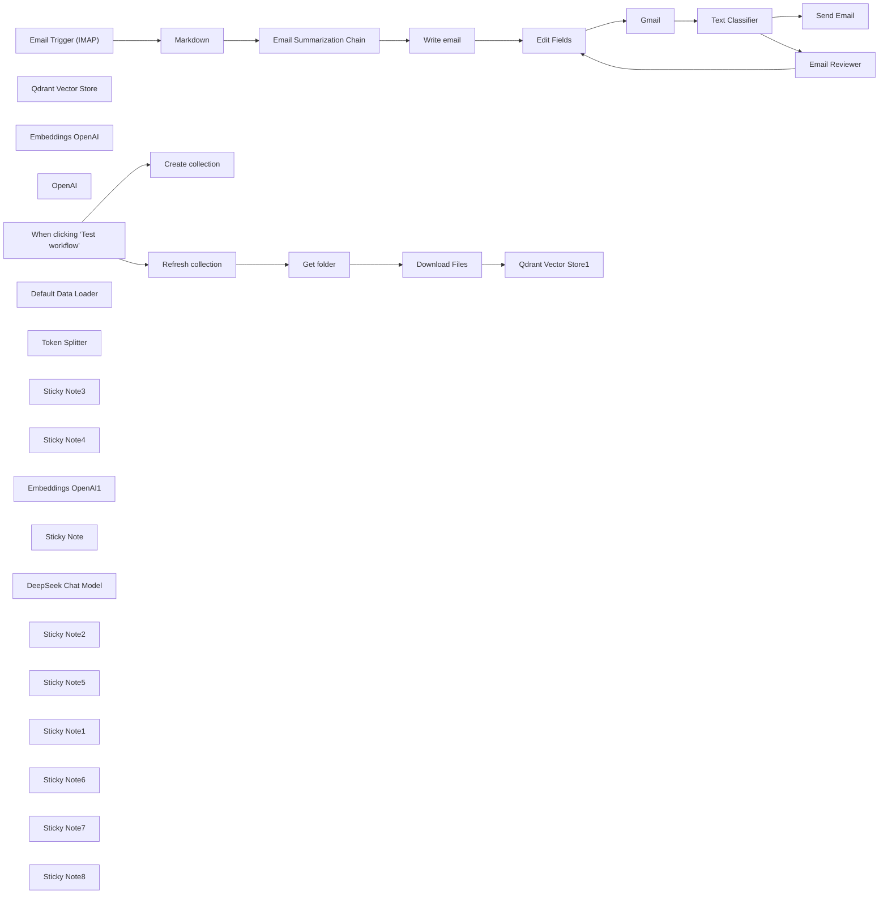

## Fluxo (.json) :

```json
{
  "id": "nkPjDxMrrkKbgHaV",
  "meta": {
    "instanceId": "a4bfc93e975ca233ac45ed7c9227d84cf5a2329310525917adaf3312e10d5462",
    "templateCredsSetupCompleted": true
  },
  "name": "Effortless Email Management with AI",
  "tags": [],
  "nodes": [
    {
      "id": "9d77e26f-de2b-4bd4-b0f0-9924a8f459a6",
      "name": "Email Trigger (IMAP)",
      "type": "n8n-nodes-base.emailReadImap",
      "position": [
        -2000,
        -180
      ],
      "parameters": {
        "options": {}
      },
      "credentials": {
        "imap": {
          "id": "k31W9oGddl9pMDy4",
          "name": "IMAP info@n3witalia.com"
        }
      },
      "typeVersion": 2
    },
    {
      "id": "cf2d020b-b125-4a20-8694-8ed0f7acf755",
      "name": "Markdown",
      "type": "n8n-nodes-base.markdown",
      "position": [
        -1740,
        -180
      ],
      "parameters": {
        "html": "={{ $json.textHtml }}",
        "options": {}
      },
      "typeVersion": 1
    },
    {
      "id": "41bfceff-0155-4643-be60-ee301e2d69e1",
      "name": "Send Email",
      "type": "n8n-nodes-base.emailSend",
      "position": [
        400,
        -320
      ],
      "webhookId": "a79ae1b4-648c-4cb4-b6cd-04ea3c1d9314",
      "parameters": {
        "html": "={{ $('Edit Fields').item.json.email }}",
        "options": {},
        "subject": "=Re: {{ $('Email Trigger (IMAP)').item.json.subject }}",
        "toEmail": "={{ $('Email Trigger (IMAP)').item.json.from }}",
        "fromEmail": "={{ $('Email Trigger (IMAP)').item.json.to }}"
      },
      "credentials": {
        "smtp": {
          "id": "hRjP3XbDiIQqvi7x",
          "name": "SMTP info@n3witalia.com"
        }
      },
      "typeVersion": 2.1
    },
    {
      "id": "2aff581a-8b64-405c-b62f-74bf189fd7b1",
      "name": "Qdrant Vector Store",
      "type": "@n8n/n8n-nodes-langchain.vectorStoreQdrant",
      "position": [
        -320,
        600
      ],
      "parameters": {
        "mode": "retrieve-as-tool",
        "options": {},
        "toolName": "company_knowladge_base",
        "toolDescription": "Extracts information regarding the request made.",
        "qdrantCollection": {
          "__rl": true,
          "mode": "id",
          "value": "=COLLECTION"
        },
        "includeDocumentMetadata": false
      },
      "credentials": {
        "qdrantApi": {
          "id": "iyQ6MQiVaF3VMBmt",
          "name": "QdrantApi account"
        }
      },
      "typeVersion": 1
    },
    {
      "id": "6e3f6df0-8924-47d9-855c-51205d19e86d",
      "name": "Embeddings OpenAI",
      "type": "@n8n/n8n-nodes-langchain.embeddingsOpenAi",
      "position": [
        -440,
        800
      ],
      "parameters": {
        "options": {}
      },
      "credentials": {
        "openAiApi": {
          "id": "CDX6QM4gLYanh0P4",
          "name": "OpenAi account"
        }
      },
      "typeVersion": 1.2
    },
    {
      "id": "37ac411b-4a74-44d1-917e-b07d1c9ca221",
      "name": "Email Summarization Chain",
      "type": "@n8n/n8n-nodes-langchain.chainSummarization",
      "position": [
        -1480,
        -180
      ],
      "parameters": {
        "options": {
          "binaryDataKey": "={{ $json.data }}",
          "summarizationMethodAndPrompts": {
            "values": {
              "prompt": "=Write a concise summary of the following in max 100 words:\n\n\"{{ $json.data }}\"\n\nDo not enter the total number of words used.",
              "combineMapPrompt": "=Write a concise summary of the following in max 100 words:\n\n\"{{ $json.data }}\"\n\nDo not enter the total number of words used."
            }
          }
        },
        "operationMode": "nodeInputBinary"
      },
      "typeVersion": 2
    },
    {
      "id": "91edbac9-847b-4f31-a8dd-09418bd93642",
      "name": "Write email",
      "type": "@n8n/n8n-nodes-langchain.agent",
      "position": [
        -1040,
        -180
      ],
      "parameters": {
        "text": "=Write the text to reply to the following email:\n\n{{ $json.response.text }}",
        "options": {
          "systemMessage": "You are an expert at answering emails. You need to answer them professionally based on the information you have. This is a business email. Be concise and never exceed 100 words. Only the body of the email, not create the subject"
        },
        "promptType": "define",
        "hasOutputParser": true
      },
      "typeVersion": 1.7
    },
    {
      "id": "1da0e72a-db97-4216-a1a5-038cebaf7e10",
      "name": "OpenAI",
      "type": "@n8n/n8n-nodes-langchain.lmChatOpenAi",
      "position": [
        -180,
        280
      ],
      "parameters": {
        "model": {
          "__rl": true,
          "mode": "list",
          "value": "gpt-4o-mini",
          "cachedResultName": "gpt-4o-mini"
        },
        "options": {}
      },
      "credentials": {
        "openAiApi": {
          "id": "CDX6QM4gLYanh0P4",
          "name": "OpenAi account"
        }
      },
      "typeVersion": 1.2
    },
    {
      "id": "af2d6284-4c8f-4a07-b689-d0f55aaabd26",
      "name": "Gmail",
      "type": "n8n-nodes-base.gmail",
      "position": [
        -300,
        -180
      ],
      "webhookId": "d6dd2e7c-90ea-4b65-9c64-523d2541a054",
      "parameters": {
        "sendTo": "info@n3w.it",
        "message": "=<h3>MESSAGE</h3>\n{{ $('Email Trigger (IMAP)').item.json.textHtml }}\n\n<h3>AI RESPONSE</h3>\n{{ $json.email }}",
        "options": {},
        "subject": "=[Approval Required]  {{ $('Email Trigger (IMAP)').item.json.subject }}",
        "operation": "sendAndWait",
        "responseType": "freeText"
      },
      "credentials": {
        "gmailOAuth2": {
          "id": "nyuHvSX5HuqfMPlW",
          "name": "Gmail account (n3w.it)"
        }
      },
      "typeVersion": 2.1
    },
    {
      "id": "aaccc4a6-ce53-4813-8247-65bd1a9d5639",
      "name": "Text Classifier",
      "type": "@n8n/n8n-nodes-langchain.textClassifier",
      "position": [
        -60,
        -180
      ],
      "parameters": {
        "options": {
          "systemPromptTemplate": "Please classify the text provided by the user into one of the following categories: {categories}, and use the provided formatting instructions below. Don't explain, and only output the json."
        },
        "inputText": "={{ $json.data.text }}",
        "categories": {
          "categories": [
            {
              "category": "Approved",
              "description": "The email has been reviewed and accepted as-is. The human explicitly or implicity express approva, indicating that no changes ar needed.\n\nExample:\n\"Ok\",\n\"Approvato\",\n\"Invia\""
            },
            {
              "category": "Declined",
              "description": "The email has been reviewd, but the human request modifications before it sent link tweaks, removing parts, rewording etc... This could include suggested edits, rewording or major revision."
            }
          ]
        }
      },
      "typeVersion": 1
    },
    {
      "id": "b46de5d9-1a2e-4d28-930b-e18fb1d7876e",
      "name": "Edit Fields",
      "type": "n8n-nodes-base.set",
      "position": [
        -580,
        -180
      ],
      "parameters": {
        "options": {},
        "assignments": {
          "assignments": [
            {
              "id": "35d7c303-42f4-4dd1-b41e-6eb087c23c3d",
              "name": "email",
              "type": "string",
              "value": "={{ $json.output }}"
            }
          ]
        }
      },
      "typeVersion": 3.4
    },
    {
      "id": "36ce51c6-8ee1-4230-84c0-40e259eafb1a",
      "name": "When clicking ‘Test workflow’",
      "type": "n8n-nodes-base.manualTrigger",
      "position": [
        -1340,
        -1300
      ],
      "parameters": {},
      "typeVersion": 1
    },
    {
      "id": "21a0c991-65dc-483e-9b98-5cedaba7ae13",
      "name": "Create collection",
      "type": "n8n-nodes-base.httpRequest",
      "position": [
        -1040,
        -1440
      ],
      "parameters": {
        "url": "https://QDRANTURL/collections/COLLECTION",
        "method": "POST",
        "options": {},
        "jsonBody": "{\n  \"filter\": {}\n}",
        "sendBody": true,
        "sendHeaders": true,
        "specifyBody": "json",
        "authentication": "genericCredentialType",
        "genericAuthType": "httpHeaderAuth",
        "headerParameters": {
          "parameters": [
            {
              "name": "Content-Type",
              "value": "application/json"
            }
          ]
        }
      },
      "credentials": {
        "httpHeaderAuth": {
          "id": "qhny6r5ql9wwotpn",
          "name": "Qdrant API (Hetzner)"
        }
      },
      "typeVersion": 4.2
    },
    {
      "id": "9a048d7d-bcdf-40b7-b33a-94b811083eac",
      "name": "Refresh collection",
      "type": "n8n-nodes-base.httpRequest",
      "position": [
        -1040,
        -1180
      ],
      "parameters": {
        "url": "https://QDRANTURL/collections/COLLECTION/points/delete",
        "method": "POST",
        "options": {},
        "jsonBody": "{\n  \"filter\": {}\n}",
        "sendBody": true,
        "sendHeaders": true,
        "specifyBody": "json",
        "authentication": "genericCredentialType",
        "genericAuthType": "httpHeaderAuth",
        "headerParameters": {
          "parameters": [
            {
              "name": "Content-Type",
              "value": "application/json"
            }
          ]
        }
      },
      "credentials": {
        "httpHeaderAuth": {
          "id": "qhny6r5ql9wwotpn",
          "name": "Qdrant API (Hetzner)"
        }
      },
      "typeVersion": 4.2
    },
    {
      "id": "db494d2d-5390-4f83-9b87-3409fef31a7d",
      "name": "Get folder",
      "type": "n8n-nodes-base.googleDrive",
      "position": [
        -820,
        -1180
      ],
      "parameters": {
        "filter": {
          "driveId": {
            "__rl": true,
            "mode": "list",
            "value": "My Drive",
            "cachedResultUrl": "https://drive.google.com/drive/my-drive",
            "cachedResultName": "My Drive"
          },
          "folderId": {
            "__rl": true,
            "mode": "id",
            "value": "=test-whatsapp"
          }
        },
        "options": {},
        "resource": "fileFolder"
      },
      "credentials": {
        "googleDriveOAuth2Api": {
          "id": "HEy5EuZkgPZVEa9w",
          "name": "Google Drive account"
        }
      },
      "typeVersion": 3
    },
    {
      "id": "e30dbe6f-482e-47f9-b5b8-62c1113e6c8b",
      "name": "Download Files",
      "type": "n8n-nodes-base.googleDrive",
      "position": [
        -600,
        -1180
      ],
      "parameters": {
        "fileId": {
          "__rl": true,
          "mode": "id",
          "value": "={{ $json.id }}"
        },
        "options": {
          "googleFileConversion": {
            "conversion": {
              "docsToFormat": "text/plain"
            }
          }
        },
        "operation": "download"
      },
      "credentials": {
        "googleDriveOAuth2Api": {
          "id": "HEy5EuZkgPZVEa9w",
          "name": "Google Drive account"
        }
      },
      "typeVersion": 3
    },
    {
      "id": "492d48d8-4997-4f04-902b-041da3210417",
      "name": "Default Data Loader",
      "type": "@n8n/n8n-nodes-langchain.documentDefaultDataLoader",
      "position": [
        -200,
        -980
      ],
      "parameters": {
        "options": {},
        "dataType": "binary"
      },
      "typeVersion": 1
    },
    {
      "id": "0cf45d10-3cbf-4eb6-ab30-11f264b3aa8d",
      "name": "Token Splitter",
      "type": "@n8n/n8n-nodes-langchain.textSplitterTokenSplitter",
      "position": [
        -240,
        -820
      ],
      "parameters": {
        "chunkSize": 300,
        "chunkOverlap": 30
      },
      "typeVersion": 1
    },
    {
      "id": "7d60f569-c34e-49a8-ba9a-88cf33083136",
      "name": "Sticky Note3",
      "type": "n8n-nodes-base.stickyNote",
      "position": [
        -840,
        -1500
      ],
      "parameters": {
        "color": 6,
        "width": 880,
        "height": 220,
        "content": "# STEP 1\n\n## Create Qdrant Collection\nChange:\n- QDRANTURL\n- COLLECTION"
      },
      "typeVersion": 1
    },
    {
      "id": "e86b18c4-d7e8-4e81-b520-dbd8125edf38",
      "name": "Sticky Note4",
      "type": "n8n-nodes-base.stickyNote",
      "position": [
        -1060,
        -1240
      ],
      "parameters": {
        "color": 4,
        "width": 620,
        "height": 400,
        "content": "# STEP 2\n\n\n\n\n\n\n\n\n\n\n\n\n## Documents vectorization with Qdrant and Google Drive\nChange:\n- QDRANTURL\n- COLLECTION"
      },
      "typeVersion": 1
    },
    {
      "id": "05f65120-ef31-4c67-ac18-e68a8353909c",
      "name": "Qdrant Vector Store1",
      "type": "@n8n/n8n-nodes-langchain.vectorStoreQdrant",
      "position": [
        -360,
        -1180
      ],
      "parameters": {
        "mode": "insert",
        "options": {},
        "qdrantCollection": {
          "__rl": true,
          "mode": "id",
          "value": "=COLLECTION"
        }
      },
      "credentials": {
        "qdrantApi": {
          "id": "iyQ6MQiVaF3VMBmt",
          "name": "QdrantApi account"
        }
      },
      "typeVersion": 1
    },
    {
      "id": "c15fd52f-b142-408e-af06-aeed10a1cf85",
      "name": "Embeddings OpenAI1",
      "type": "@n8n/n8n-nodes-langchain.embeddingsOpenAi",
      "position": [
        -380,
        -980
      ],
      "parameters": {
        "options": {}
      },
      "credentials": {
        "openAiApi": {
          "id": "CDX6QM4gLYanh0P4",
          "name": "OpenAi account"
        }
      },
      "typeVersion": 1.1
    },
    {
      "id": "3e47224f-3deb-450b-b825-f16c5f860f28",
      "name": "Sticky Note",
      "type": "n8n-nodes-base.stickyNote",
      "position": [
        -2020,
        -600
      ],
      "parameters": {
        "color": 3,
        "width": 580,
        "height": 260,
        "content": "# STEP 3 - MAIN FLOW\n\n\n## How it works\nThis workflow automates the handling of incoming emails, summarizes their content, generates appropriate responses using a retrieval-augmented generation (RAG) approach, and obtains approval or suggestions before sending replies. \n\nYou can quickly integrate Gmail and Outlook via the appropriate trigger nodes"
      },
      "typeVersion": 1
    },
    {
      "id": "63097039-58cb-4e0f-9fb6-6bf868275519",
      "name": "DeepSeek Chat Model",
      "type": "@n8n/n8n-nodes-langchain.lmChatDeepSeek",
      "position": [
        -1560,
        40
      ],
      "parameters": {
        "options": {}
      },
      "credentials": {
        "deepSeekApi": {
          "id": "sxh1rfZxonXV83hS",
          "name": "DeepSeek account"
        }
      },
      "typeVersion": 1
    },
    {
      "id": "c86d6eeb-cf08-429f-b5b4-60b317071035",
      "name": "Sticky Note2",
      "type": "n8n-nodes-base.stickyNote",
      "position": [
        -1500,
        -260
      ],
      "parameters": {
        "width": 320,
        "height": 240,
        "content": "Chain that summarizes the received email"
      },
      "typeVersion": 1
    },
    {
      "id": "4afc8b00-d1e5-473c-a71e-1299c84c546e",
      "name": "Sticky Note5",
      "type": "n8n-nodes-base.stickyNote",
      "position": [
        -1060,
        -260
      ],
      "parameters": {
        "width": 340,
        "height": 240,
        "content": "Agent that retrieves business information from a vector database and processes the response"
      },
      "typeVersion": 1
    },
    {
      "id": "be1762ff-729b-4b83-9139-16f835b748f2",
      "name": "Sticky Note1",
      "type": "n8n-nodes-base.stickyNote",
      "position": [
        -1800,
        -260
      ],
      "parameters": {
        "height": 240,
        "content": "Convert email to Markdown format for better understanding of LLM models"
      },
      "typeVersion": 1
    },
    {
      "id": "f818ede7-895a-4860-91d3-f08cc32ec0e3",
      "name": "Sticky Note6",
      "type": "n8n-nodes-base.stickyNote",
      "position": [
        -380,
        -380
      ],
      "parameters": {
        "color": 4,
        "height": 360,
        "content": "## IMPORTANT\n\nFor the \"Send Draft\" node, you need to send the draft email to a Gmail address because it is the only one that allows the \"Send and wait for response\" function."
      },
      "typeVersion": 1
    },
    {
      "id": "929b525a-912b-4f7b-a6e7-dfeb88a446c8",
      "name": "Sticky Note7",
      "type": "n8n-nodes-base.stickyNote",
      "position": [
        -100,
        -260
      ],
      "parameters": {
        "width": 360,
        "height": 240,
        "content": "Based on the suggestion received, the text classifier can understand whether the feedback received approves the generated email or not."
      },
      "typeVersion": 1
    },
    {
      "id": "2468e643-013f-4925-ab35-c8ef4ee6eed2",
      "name": "Email Reviewer",
      "type": "@n8n/n8n-nodes-langchain.agent",
      "position": [
        380,
        -40
      ],
      "parameters": {
        "text": "=Review at the following email:\n{{ $('Edit Fields').item.json.email }}\n\nFeedback from human:\n{{ $json.data.text }}",
        "options": {
          "systemMessage": "If you are an expert in reviewing emails before sending them. You need to review and structure them in such a way that you can send them. It must be in HTML format and you can insert (if you think it is appropriate) only HTML characters such as <br>, <b>, <i>, <p> where necessary. Be concise and never exceed 100 words. Only the body of the email"
        },
        "promptType": "define",
        "hasOutputParser": true
      },
      "typeVersion": 1.7
    },
    {
      "id": "ecd9d3f8-2e79-4e5f-a73d-48de60441376",
      "name": "Sticky Note8",
      "type": "n8n-nodes-base.stickyNote",
      "position": [
        340,
        -120
      ],
      "parameters": {
        "width": 340,
        "height": 220,
        "content": "The Email Reviewer agent, taking inspiration from human feedback, rewrites the email"
      },
      "typeVersion": 1
    }
  ],
  "active": false,
  "pinData": {},
  "settings": {
    "executionOrder": "v1"
  },
  "versionId": "de11da52-1513-4797-8070-b64e84b84158",
  "connections": {
    "Gmail": {
      "main": [
        [
          {
            "node": "Text Classifier",
            "type": "main",
            "index": 0
          }
        ]
      ]
    },
    "OpenAI": {
      "ai_languageModel": [
        [
          {
            "node": "Write email",
            "type": "ai_languageModel",
            "index": 0
          },
          {
            "node": "Email Reviewer",
            "type": "ai_languageModel",
            "index": 0
          },
          {
            "node": "Text Classifier",
            "type": "ai_languageModel",
            "index": 0
          }
        ]
      ]
    },
    "Markdown": {
      "main": [
        [
          {
            "node": "Email Summarization Chain",
            "type": "main",
            "index": 0
          }
        ]
      ]
    },
    "Get folder": {
      "main": [
        [
          {
            "node": "Download Files",
            "type": "main",
            "index": 0
          }
        ]
      ]
    },
    "Edit Fields": {
      "main": [
        [
          {
            "node": "Gmail",
            "type": "main",
            "index": 0
          }
        ]
      ]
    },
    "Write email": {
      "main": [
        [
          {
            "node": "Edit Fields",
            "type": "main",
            "index": 0
          }
        ]
      ]
    },
    "Download Files": {
      "main": [
        [
          {
            "node": "Qdrant Vector Store1",
            "type": "main",
            "index": 0
          }
        ]
      ]
    },
    "Email Reviewer": {
      "main": [
        [
          {
            "node": "Edit Fields",
            "type": "main",
            "index": 0
          }
        ]
      ]
    },
    "Token Splitter": {
      "ai_textSplitter": [
        [
          {
            "node": "Default Data Loader",
            "type": "ai_textSplitter",
            "index": 0
          }
        ]
      ]
    },
    "Text Classifier": {
      "main": [
        [
          {
            "node": "Send Email",
            "type": "main",
            "index": 0
          }
        ],
        [
          {
            "node": "Email Reviewer",
            "type": "main",
            "index": 0
          }
        ]
      ]
    },
    "Embeddings OpenAI": {
      "ai_embedding": [
        [
          {
            "node": "Qdrant Vector Store",
            "type": "ai_embedding",
            "index": 0
          }
        ]
      ]
    },
    "Embeddings OpenAI1": {
      "ai_embedding": [
        [
          {
            "node": "Qdrant Vector Store1",
            "type": "ai_embedding",
            "index": 0
          }
        ]
      ]
    },
    "Refresh collection": {
      "main": [
        [
          {
            "node": "Get folder",
            "type": "main",
            "index": 0
          }
        ]
      ]
    },
    "DeepSeek Chat Model": {
      "ai_languageModel": [
        [
          {
            "node": "Email Summarization Chain",
            "type": "ai_languageModel",
            "index": 0
          }
        ]
      ]
    },
    "Default Data Loader": {
      "ai_document": [
        [
          {
            "node": "Qdrant Vector Store1",
            "type": "ai_document",
            "index": 0
          }
        ]
      ]
    },
    "Qdrant Vector Store": {
      "ai_tool": [
        [
          {
            "node": "Write email",
            "type": "ai_tool",
            "index": 0
          },
          {
            "node": "Email Reviewer",
            "type": "ai_tool",
            "index": 0
          }
        ]
      ]
    },
    "Email Trigger (IMAP)": {
      "main": [
        [
          {
            "node": "Markdown",
            "type": "main",
            "index": 0
          }
        ]
      ]
    },
    "Email Summarization Chain": {
      "main": [
        [
          {
            "node": "Write email",
            "type": "main",
            "index": 0
          }
        ]
      ]
    },
    "When clicking ‘Test workflow’": {
      "main": [
        [
          {
            "node": "Create collection",
            "type": "main",
            "index": 0
          },
          {
            "node": "Refresh collection",
            "type": "main",
            "index": 0
          }
        ]
      ]
    }
  }
}
```

<a id="template-1159"></a>

## Template 1159 - Auto-resposta por IA para pedidos di informazioni

- **Nome:** Auto-resposta por IA para pedidos di informazioni
- **Descrição:** Automatiza a leitura, sumarização, classificação e resposta a e-mails de solicitação de informações empresariais, usando modelos de linguagem e uma base de conhecimento vetorial.
- **Funcionalidade:** • Recepção de e-mails via IMAP: Detecta novas mensagens recebidas para iniciar o fluxo.
• Conversão para Markdown: Transforma o conteúdo HTML do e-mail em Markdown para melhor processamento pela IA.
• Sumarização automática: Gera um resumo conciso do e-mail (máx. 100 palavras) para entendimento rápido.
• Classificação do e-mail: Identifica se a solicitação é sobre informações da empresa e filtra o fluxo conforme a categoria.
• Consulta à base de conhecimento vetorial: Recupera informações relevantes da coleção vetorial para embasar a resposta.
• Geração da resposta por IA: Cria a resposta profissional e concisa (até 100 palavras) com base no conteúdo e na base de conhecimento.
• Revisão e formatação HTML: Ajusta e formata o texto final em HTML adequado para envio, mantendo o limite de palavras.
• Envio por SMTP: Envia a resposta ao remetente com assunto apropriado (Re: original).
• Ingestão e vetorização de documentos: Cria/limpa coleções, baixa arquivos do Google Drive, gera embeddings e insere os documentos na coleção vetorial.
- **Ferramentas:** • Servidor IMAP: Fonte de entrada dos e-mails que disparam o fluxo.
• Servidor SMTP: Serviço responsável pelo envio das respostas por e-mail.
• Modelos de linguagem (OpenAI gpt-4o-mini e OpenRouter deepseek-r1): Usados para sumarização, classificação, redação e revisão das mensagens.
• Serviço de embeddings (OpenAI Embeddings): Gera vetores a partir dos documentos para indexação.
• Qdrant (banco vetorial): Armazena e recupera fragmentos de conhecimento da empresa para apoiar respostas.
• Google Drive: Repositório de documentos que são baixados para vetorização e indexação.
• API HTTP da plataforma de vetores: Usada para criar e limpar coleções e gerenciar pontos na base vetorial.

## Fluxo visual

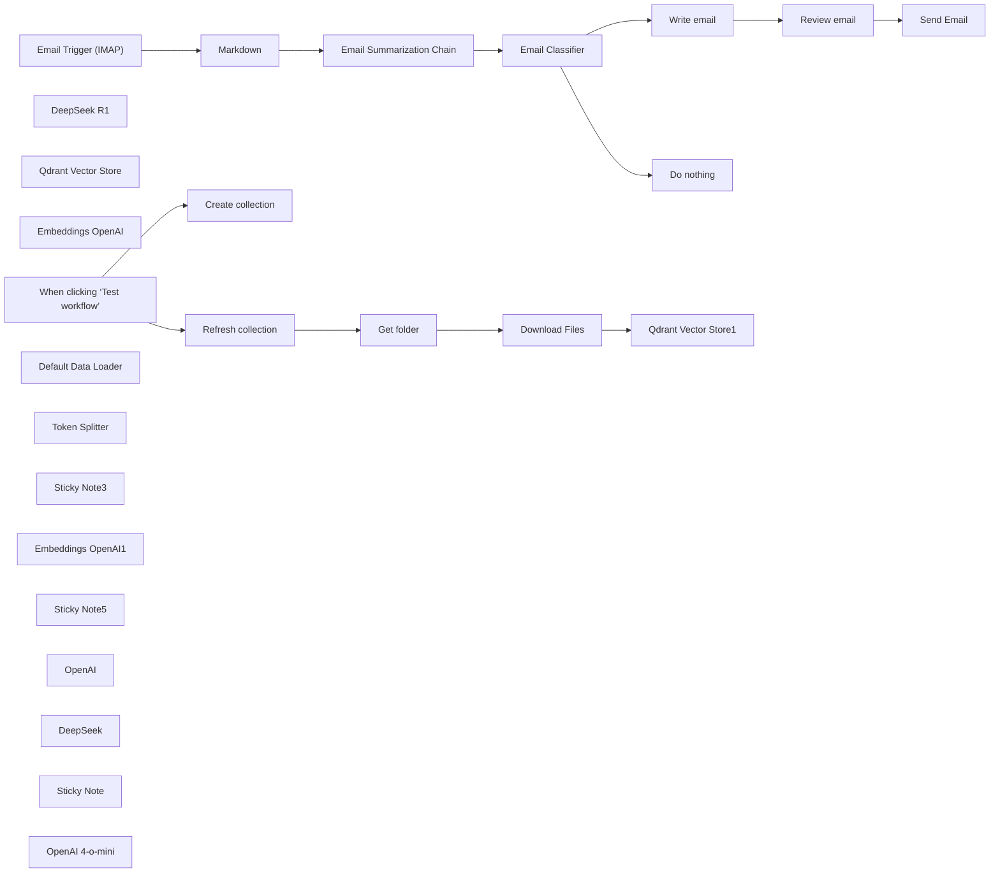

## Fluxo (.json) :

```json
{
  "id": "q8IFGLeOCGSfoWZu",
  "meta": {
    "instanceId": "a4bfc93e975ca233ac45ed7c9227d84cf5a2329310525917adaf3312e10d5462",
    "templateCredsSetupCompleted": true
  },
  "name": "Email AI Auto-responder. Summerize and send email",
  "tags": [],
  "nodes": [
    {
      "id": "59885699-0f6c-4522-acff-9e28b2a07b82",
      "name": "Email Trigger (IMAP)",
      "type": "n8n-nodes-base.emailReadImap",
      "position": [
        -440,
        -20
      ],
      "parameters": {
        "options": {}
      },
      "credentials": {
        "imap": {
          "id": "k31W9oGddl9pMDy4",
          "name": "IMAP info@n3witalia.com"
        }
      },
      "typeVersion": 2
    },
    {
      "id": "b268ab9d-b2e3-46e6-b7ae-70aff0b5484d",
      "name": "Markdown",
      "type": "n8n-nodes-base.markdown",
      "position": [
        -220,
        -20
      ],
      "parameters": {
        "html": "={{ $json.textHtml }}",
        "options": {}
      },
      "typeVersion": 1
    },
    {
      "id": "13c2d151-6f59-4e1f-a174-02d4d0bcaefd",
      "name": "DeepSeek R1",
      "type": "@n8n/n8n-nodes-langchain.lmChatOpenAi",
      "position": [
        -20,
        160
      ],
      "parameters": {
        "model": {
          "__rl": true,
          "mode": "list",
          "value": "deepseek/deepseek-r1:free",
          "cachedResultName": "deepseek/deepseek-r1:free"
        },
        "options": {}
      },
      "credentials": {
        "openAiApi": {
          "id": "XJTqRiKFJpFs5MuX",
          "name": "OpenRouter account"
        }
      },
      "typeVersion": 1.2
    },
    {
      "id": "8149e40d-64e6-4fb9-aebc-2a2483961f07",
      "name": "Send Email",
      "type": "n8n-nodes-base.emailSend",
      "position": [
        500,
        340
      ],
      "parameters": {
        "html": "={{ $json.text }}",
        "options": {},
        "subject": "=Re: {{ $('Email Trigger (IMAP)').item.json.subject }}",
        "toEmail": "={{ $('Email Trigger (IMAP)').item.json.from }}",
        "fromEmail": "={{ $('Email Trigger (IMAP)').item.json.to }}"
      },
      "credentials": {
        "smtp": {
          "id": "hRjP3XbDiIQqvi7x",
          "name": "SMTP info@n3witalia.com"
        }
      },
      "typeVersion": 2.1
    },
    {
      "id": "633f0ce9-04ff-4653-8bbc-7457ba0d18bd",
      "name": "Qdrant Vector Store",
      "type": "@n8n/n8n-nodes-langchain.vectorStoreQdrant",
      "position": [
        -320,
        600
      ],
      "parameters": {
        "mode": "retrieve-as-tool",
        "options": {},
        "toolName": "company_knowladge_base",
        "toolDescription": "Extracts information regarding the request made.",
        "qdrantCollection": {
          "__rl": true,
          "mode": "id",
          "value": "=COLLECTION"
        },
        "includeDocumentMetadata": false
      },
      "credentials": {
        "qdrantApi": {
          "id": "iyQ6MQiVaF3VMBmt",
          "name": "QdrantApi account"
        }
      },
      "typeVersion": 1
    },
    {
      "id": "20daf5d3-dc9c-4fad-9f2f-98d86bc1660c",
      "name": "Embeddings OpenAI",
      "type": "@n8n/n8n-nodes-langchain.embeddingsOpenAi",
      "position": [
        -340,
        760
      ],
      "parameters": {
        "options": {}
      },
      "credentials": {
        "openAiApi": {
          "id": "CDX6QM4gLYanh0P4",
          "name": "OpenAi account"
        }
      },
      "typeVersion": 1.2
    },
    {
      "id": "67699bca-4096-4259-bbd4-51a879539aca",
      "name": "Email Classifier",
      "type": "@n8n/n8n-nodes-langchain.textClassifier",
      "position": [
        360,
        -20
      ],
      "parameters": {
        "options": {
          "fallback": "other",
          "multiClass": false,
          "enableAutoFixing": true,
          "systemPromptTemplate": "Please classify the text provided by the user into one of the following categories: {categories}, and use the provided formatting instructions below. Don't explain, and only output the json.\n"
        },
        "inputText": "=You must classify the following email::\n\n{{ $json.response.text }}",
        "categories": {
          "categories": [
            {
              "category": "Company info request",
              "description": "Company info request"
            }
          ]
        }
      },
      "typeVersion": 1
    },
    {
      "id": "9f7742e9-87d5-40b9-9129-0777d8a37933",
      "name": "Email Summarization Chain",
      "type": "@n8n/n8n-nodes-langchain.chainSummarization",
      "position": [
        0,
        -20
      ],
      "parameters": {
        "options": {
          "binaryDataKey": "={{ $json.data }}",
          "summarizationMethodAndPrompts": {
            "values": {
              "prompt": "=Write a concise summary of the following in max 100 words:\n\n\"{{ $json.data }}\"\n\nDo not enter the total number of words used.",
              "combineMapPrompt": "=Write a concise summary of the following in max 100 words:\n\n\"{{ $json.data }}\"\n"
            }
          }
        },
        "operationMode": "nodeInputBinary"
      },
      "typeVersion": 2
    },
    {
      "id": "e2d404c0-2aad-407d-b75e-5ef0c5105c0e",
      "name": "Write email",
      "type": "@n8n/n8n-nodes-langchain.agent",
      "position": [
        -440,
        340
      ],
      "parameters": {
        "text": "=Write the text to reply to the following email:\n\n{{ $json.response.text }}",
        "options": {
          "systemMessage": "You are an expert at answering emails. You need to answer them professionally based on the information you have. This is a business email. Be concise and never exceed 100 words."
        },
        "promptType": "define"
      },
      "typeVersion": 1.7
    },
    {
      "id": "3786c2de-c5cb-4233-826e-7265f2bccbdb",
      "name": "Review email",
      "type": "@n8n/n8n-nodes-langchain.chainLlm",
      "position": [
        40,
        340
      ],
      "parameters": {
        "text": "=Review at the following email:\n\n{{ $json.output }}",
        "messages": {
          "messageValues": [
            {
              "message": "=If you are an expert in reviewing emails before sending them. You need to review and structure them in such a way that you can send them. It must be in HTML format and you can insert (if you think it is appropriate) only HTML characters such as <br>, <b>, <i>, <p> where necessary.\n\nNon superare le 100 parole."
            }
          ]
        },
        "promptType": "define",
        "hasOutputParser": true
      },
      "typeVersion": 1.5
    },
    {
      "id": "baf60eba-5e7b-467f-b27e-1388a91622d0",
      "name": "When clicking ‘Test workflow’",
      "type": "n8n-nodes-base.manualTrigger",
      "position": [
        -500,
        -980
      ],
      "parameters": {},
      "typeVersion": 1
    },
    {
      "id": "77e6160f-20a7-4a75-9fef-bc875b953a16",
      "name": "Create collection",
      "type": "n8n-nodes-base.httpRequest",
      "position": [
        -200,
        -1120
      ],
      "parameters": {
        "url": "https://QDRANTURL/collections/COLLECTION",
        "method": "POST",
        "options": {},
        "jsonBody": "{\n  \"filter\": {}\n}",
        "sendBody": true,
        "sendHeaders": true,
        "specifyBody": "json",
        "authentication": "genericCredentialType",
        "genericAuthType": "httpHeaderAuth",
        "headerParameters": {
          "parameters": [
            {
              "name": "Content-Type",
              "value": "application/json"
            }
          ]
        }
      },
      "credentials": {
        "httpHeaderAuth": {
          "id": "qhny6r5ql9wwotpn",
          "name": "Qdrant API (Hetzner)"
        }
      },
      "typeVersion": 4.2
    },
    {
      "id": "ab7764d1-531c-4281-8b89-015fb3f5e780",
      "name": "Refresh collection",
      "type": "n8n-nodes-base.httpRequest",
      "position": [
        -200,
        -860
      ],
      "parameters": {
        "url": "https://QDRANTURL/collections/COLLECTION/points/delete",
        "method": "POST",
        "options": {},
        "jsonBody": "{\n  \"filter\": {}\n}",
        "sendBody": true,
        "sendHeaders": true,
        "specifyBody": "json",
        "authentication": "genericCredentialType",
        "genericAuthType": "httpHeaderAuth",
        "headerParameters": {
          "parameters": [
            {
              "name": "Content-Type",
              "value": "application/json"
            }
          ]
        }
      },
      "credentials": {
        "httpHeaderAuth": {
          "id": "qhny6r5ql9wwotpn",
          "name": "Qdrant API (Hetzner)"
        }
      },
      "typeVersion": 4.2
    },
    {
      "id": "cd3eaa81-0f94-484b-b0c2-ecf0ca4541dc",
      "name": "Get folder",
      "type": "n8n-nodes-base.googleDrive",
      "position": [
        20,
        -860
      ],
      "parameters": {
        "filter": {
          "driveId": {
            "__rl": true,
            "mode": "list",
            "value": "My Drive",
            "cachedResultUrl": "https://drive.google.com/drive/my-drive",
            "cachedResultName": "My Drive"
          },
          "folderId": {
            "__rl": true,
            "mode": "id",
            "value": "=test-whatsapp"
          }
        },
        "options": {},
        "resource": "fileFolder"
      },
      "credentials": {
        "googleDriveOAuth2Api": {
          "id": "HEy5EuZkgPZVEa9w",
          "name": "Google Drive account"
        }
      },
      "typeVersion": 3
    },
    {
      "id": "b39ecd2d-4d5b-4885-86a9-2cfe9f6074ef",
      "name": "Download Files",
      "type": "n8n-nodes-base.googleDrive",
      "position": [
        240,
        -860
      ],
      "parameters": {
        "fileId": {
          "__rl": true,
          "mode": "id",
          "value": "={{ $json.id }}"
        },
        "options": {
          "googleFileConversion": {
            "conversion": {
              "docsToFormat": "text/plain"
            }
          }
        },
        "operation": "download"
      },
      "credentials": {
        "googleDriveOAuth2Api": {
          "id": "HEy5EuZkgPZVEa9w",
          "name": "Google Drive account"
        }
      },
      "typeVersion": 3
    },
    {
      "id": "8171b8f2-998d-4d72-ac28-524daae4a2d7",
      "name": "Default Data Loader",
      "type": "@n8n/n8n-nodes-langchain.documentDefaultDataLoader",
      "position": [
        620,
        -660
      ],
      "parameters": {
        "options": {},
        "dataType": "binary"
      },
      "typeVersion": 1
    },
    {
      "id": "ec6737ad-3fbe-4864-9df8-44f82d6f2c5c",
      "name": "Token Splitter",
      "type": "@n8n/n8n-nodes-langchain.textSplitterTokenSplitter",
      "position": [
        600,
        -500
      ],
      "parameters": {
        "chunkSize": 300,
        "chunkOverlap": 30
      },
      "typeVersion": 1
    },
    {
      "id": "57b6a4f3-e935-4058-bfdf-309d606c0ca9",
      "name": "Sticky Note3",
      "type": "n8n-nodes-base.stickyNote",
      "position": [
        0,
        -1180
      ],
      "parameters": {
        "color": 6,
        "width": 880,
        "height": 220,
        "content": "# STEP 1\n\n## Create Qdrant Collection\nChange:\n- QDRANTURL\n- COLLECTION"
      },
      "typeVersion": 1
    },
    {
      "id": "21e2326a-138d-46f3-a849-a80aa7917da9",
      "name": "Qdrant Vector Store1",
      "type": "@n8n/n8n-nodes-langchain.vectorStoreQdrant",
      "position": [
        480,
        -860
      ],
      "parameters": {
        "mode": "insert",
        "options": {},
        "qdrantCollection": {
          "__rl": true,
          "mode": "id",
          "value": "=COLLECTION"
        }
      },
      "credentials": {
        "qdrantApi": {
          "id": "iyQ6MQiVaF3VMBmt",
          "name": "QdrantApi account"
        }
      },
      "typeVersion": 1
    },
    {
      "id": "0818fb6a-2adf-4725-90a4-11cdd7d14036",
      "name": "Embeddings OpenAI1",
      "type": "@n8n/n8n-nodes-langchain.embeddingsOpenAi",
      "position": [
        500,
        -620
      ],
      "parameters": {
        "options": {}
      },
      "credentials": {
        "openAiApi": {
          "id": "CDX6QM4gLYanh0P4",
          "name": "OpenAi account"
        }
      },
      "typeVersion": 1.1
    },
    {
      "id": "8949d938-2743-45d6-b2ad-ce4ac139e0a3",
      "name": "Sticky Note5",
      "type": "n8n-nodes-base.stickyNote",
      "position": [
        -220,
        -920
      ],
      "parameters": {
        "color": 4,
        "width": 620,
        "height": 400,
        "content": "# STEP 2\n\n\n\n\n\n\n\n\n\n\n\n\n## Documents vectorization with Qdrant and Google Drive\nChange:\n- QDRANTURL\n- COLLECTION"
      },
      "typeVersion": 1
    },
    {
      "id": "36d384be-3e11-43b1-b8c3-f63df600a6a6",
      "name": "Do nothing",
      "type": "n8n-nodes-base.noOp",
      "position": [
        820,
        0
      ],
      "parameters": {},
      "typeVersion": 1
    },
    {
      "id": "386c27cb-6e69-4d96-a8ab-8cfd43e6b171",
      "name": "OpenAI",
      "type": "@n8n/n8n-nodes-langchain.lmChatOpenAi",
      "position": [
        -520,
        580
      ],
      "parameters": {
        "model": {
          "__rl": true,
          "mode": "list",
          "value": "gpt-4o-mini",
          "cachedResultName": "gpt-4o-mini"
        },
        "options": {}
      },
      "credentials": {
        "openAiApi": {
          "id": "CDX6QM4gLYanh0P4",
          "name": "OpenAi account"
        }
      },
      "typeVersion": 1.2
    },
    {
      "id": "0bd17bef-e205-464e-9b36-dcda75254e06",
      "name": "DeepSeek",
      "type": "@n8n/n8n-nodes-langchain.lmChatOpenAi",
      "position": [
        40,
        540
      ],
      "parameters": {
        "model": {
          "__rl": true,
          "mode": "list",
          "value": "deepseek/deepseek-r1:free",
          "cachedResultName": "deepseek/deepseek-r1:free"
        },
        "options": {}
      },
      "credentials": {
        "openAiApi": {
          "id": "XJTqRiKFJpFs5MuX",
          "name": "OpenRouter account"
        }
      },
      "typeVersion": 1.2
    },
    {
      "id": "3e68a65f-af29-432f-8159-4a599e8a0866",
      "name": "Sticky Note",
      "type": "n8n-nodes-base.stickyNote",
      "position": [
        -540,
        -320
      ],
      "parameters": {
        "width": 1620,
        "height": 240,
        "content": "# STEP 3 - MAIN FLOW\n\n- Transform the email into Markdown format for optimal reading by the LLM model\n- Email Summarization through DeepSeek R1 (any model can be used)\n- I classify the email in such a way as to continue only with emails regarding general information about the company. In this way I can respond independently through the information obtained from the vector database\n- I create a chain where I entrust the review of the email to a high-performance model designed for this purpose\n- I send the response email\n\n\n"
      },
      "typeVersion": 1
    },
    {
      "id": "3b6ae6aa-75a8-4038-bbc2-248ab533b3ab",
      "name": "OpenAI 4-o-mini",
      "type": "@n8n/n8n-nodes-langchain.lmChatOpenAi",
      "position": [
        360,
        160
      ],
      "parameters": {
        "model": {
          "__rl": true,
          "mode": "list",
          "value": "gpt-4o-mini",
          "cachedResultName": "gpt-4o-mini"
        },
        "options": {}
      },
      "credentials": {
        "openAiApi": {
          "id": "CDX6QM4gLYanh0P4",
          "name": "OpenAi account"
        }
      },
      "typeVersion": 1.2
    }
  ],
  "active": false,
  "pinData": {
    "Email Trigger (IMAP)": [
      {
        "json": {
          "to": "info@n3witalia.com",
          "date": "Wed, 5 Feb 2025 13:38:51 +0100",
          "from": "n3w Italia <info@n3w.it>",
          "subject": "Richiesta di informazioni aziendali",
          "metadata": {
            "x-gm-gg": "ASbGncsq6D/oyHjmnpbG4gCUuC0rZNUR8WW4c+LmGMSdGJ1lHkRnKn7b3ngCdndp8NB\tkyDG3unga3kPebzAv1LO7DS6rDMHTWb8F7kZoLijJUGlAy6wqmfX/n4z2DH1uSxp7EsnIP9K9",
            "arc-seal": "i=1; s=arc-2022; d=mailchannels.net; t=1738759167; a=rsa-sha256;\tcv=none;\tb=Fdjl0FQlp2JxGTUy9B6U3UVZDgw2xRK0M9ge2H7QXFuX8Jhy2/eDktsWwyDOuAnebq+pZB\tZmt9/ZWM+VqpfvPc9j4+cpX1HnXkRnyV9HMp0KK1Srpkuc7iimLDX1puMEQP08mC8fBI9n\tYW9JAMVmy55D2xtcOgqQPe6HUsAM8vFfk0y7dv7aV/MMc4tW+lyBddf4BHedDPabmHtog9\tlI9qQB8f5o78KJoJHi9jUfoibHrw7ePCi/XNi1KzfLhkkcvaEhOIg82JgyaTOVuLX4TTpy\t713VrUVQKemdE8AJBgxrUyI8AM/XZDRxF92tDNRD5k+rFxVwZnNg1KzovEUFiw==",
            "received": "from postfix-inbound-v2-3.inbound.mailchannels.net (inbound-egress-7.mailchannels.net [23.83.220.5])\t(using TLSv1.3 with cipher TLS_AES_256_GCM_SHA384 (256/256 bits)\t key-exchange X25519 server-signature RSA-PSS (2048 bits) server-digest SHA256)\t(No client certificate requested)\tby pdx1-sub0-mail-mx201.dreamhost.com (Postfix) with ESMTPS id 4Yp0DP2WKvz6n5V\tfor <info@n3witalia.com>; Wed,  5 Feb 2025 04:39:33 -0800 (PST)",
            "message-id": "<CACo-EPti-vvs3198N-KKhAMnm70ppkmGJPkUz3Y483wxAv_z3g@mail.gmail.com>",
            "x-received": "by 2002:a05:6820:4ccb:b0:5fa:7e37:e42e with SMTP id 006d021491bc7-5fc479d7b7dmr1800193eaf.3.1738759166233; Wed, 05 Feb 2025 04:39:26 -0800 (PST)",
            "return-path": "<info@n3w.it>",
            "content-type": "multipart/alternative; boundary=\"000000000000742c2a062d646a8f\"",
            "delivered-to": "x21967472@pdx1-sub0-mail-mx201.dreamhost.com",
            "mime-version": "1.0",
            "received-spf": "none (dmarc-service-75b56dd9b6-qz8tf: n3w.it does not provide an SPF record) client-ip=209.85.161.50; envelope-from=info@n3w.it; helo=mail-oo1-f50.google.com;",
            "x-message-id": "YDPlyzG1R2Ky6usgMxqEJvf1",
            "x-gm-features": "AWEUYZl838uJdYn-9fUMGZvOqArNBONSW_VOkpWSkn1OYyR-HUtJL8UAJf2I33g",
            "x-original-to": "info@n3witalia.com",
            "dkim-signature": "v=1; a=rsa-sha256; c=relaxed/relaxed;        d=n3w-it.20230601.gappssmtp.com; s=20230601; t=1738759166; x=1739363966; darn=n3witalia.com;        h=to:subject:message-id:date:from:mime-version:from:to:cc:subject         :date:message-id:reply-to;        bh=2N6Y8wbn3yS/TpkJr2ZQZ3rEEFMq1gc4mSHvPNXonAg=;        b=eH1Dg2CwoWEuiif+VkxoPH8PcgiveMtY7urkbJAXXAEnpmkknbrSX7fLQ/pdfnV2YF         RaDEVEFBYeYde7pra1NhNmQXQfamV6dxTZSoNOVj0DtdOuSZVYC4BQMMQiIk7emERgdx         keDGBtYe2SifOK9QDK4deKKFPaswC7vATsPmBIAnN0MDahaOlsDPbm6aFSR39aK0qEpx         MTylUSCNFx52cTYegrpzMGCRTrCxcHwvpq0gGZo1ol0mlq5WC4sa260qsVEQq566N1wh         ICipbEhLdoX0nryrR67fJ+mq05kfg39gv++0p1aZl3/ahTdLTijPJswPs4phiTUj6fUH         Z3Fg==",
            "x-gm-message-state": "AOJu0YwNwfJ1yYtAsu71S9Oy+BVSQqPDS1EJCni+CLWs7aDwxkFYjxsP\tX0A935B/tHpnOhgJuR8W5FwuKnXSFMZ/xP8TFQz8zBVGw7DYInyaC0lKAxPSbBsLDIFyVj2LYki\tR4sfj6a9YJDaWKE/HYPwbidCOfOV/mZvqJ2ESL5uJgSL0W4FrMJKmondc",
            "x-google-smtp-source": "AGHT+IFsZ2bQKEg+M9ddjCSDXjf2Okz49s6pteuNGyJAkFpjMLwhH4mshXYItB/GVj4r8fUIiAiACRT+QDfae1MMj48=",
            "arc-message-signature": "i=1; a=rsa-sha256; c=relaxed/relaxed; d=mailchannels.net;\ts=arc-2022; t=1738759167;\th=from:from:reply-to:subject:subject:date:date:message-id:message-id:\t to:to:cc:mime-version:mime-version:content-type:content-type:\t dkim-signature; bh=2N6Y8wbn3yS/TpkJr2ZQZ3rEEFMq1gc4mSHvPNXonAg=;\tb=xytHIe/PVvcfCsSYAhcVE9VlTvmbJcVbkpq0oKRt4H0M1VOfZZlsg5ILysJvwLAzrRO7SZ\tDUrh4bw57jqMpcE+Sk5AAcbgBMc6x1G+Wf/2nqnjy0hRCyqtajuUwtFOS3kDM7TKvFOU+/\tMFChI5mg97hb/0loj8DWQ+J24bu4a6YixGDglupW3JYJoDsPWje2oA+mYyiI5tsnRXFEwe\tpku9KlXkPburbm/ASqKbbi1Y9bEOa2vlRwLL3fFontmC+3kgogunW2fjf4YJlFlSaAj/Xb\tZXQiytNgKOJtkBQMvb0AmYMLgBbYdOBVzUkOUTQCP3Wzbuu0zslvl7cS3HkFIg==",
            "authentication-results": "inbound.mailchannels.net; spf=none smtp.mailfrom=info@n3w.it; dkim=temperror header.d=n3w-it.20230601.gappssmtp.com; dmarc=none; arc=none",
            "x-google-dkim-signature": "v=1; a=rsa-sha256; c=relaxed/relaxed;        d=1e100.net; s=20230601; t=1738759166; x=1739363966;        h=to:subject:message-id:date:from:mime-version:x-gm-message-state         :from:to:cc:subject:date:message-id:reply-to;        bh=2N6Y8wbn3yS/TpkJr2ZQZ3rEEFMq1gc4mSHvPNXonAg=;        b=h+GPFjY1knf3xPd+R62zD7JNhs37K+F1qx+6EA3codzYY+yTXSJyTuETXOGVW5r2VK         GOcntvGBdeijxte5RLmN6ZwLjvzePLlJLQVOnY8FICowUbwClQbDW1vXvucD+WaGpnBg         O95TH/8jKWRBU34EZ9kAY5EqtauKSt675WyhVCmmT864BPbVV335d0t9RgJwV86rM9zy         /miMTqpWeDJxDcX4thRlIk19GDc2Wh+5bqFD9kacOAur46RWdwqWaU7T8+5bQmbrKUg5         hqeO8ZDefVV6AyOjSnuLItHcHhlk1PaQ9uOumkRnFQfLUjS08bvLEnJyMA1YrEdo7mCi         tD2Q==",
            "arc-authentication-results": "i=1;\tinbound-rspamd-8684fd6f95-jsctp;\tnone"
          },
          "textHtml": "<div dir=\"ltr\">mi chiamo Davide e sto scrivendo per richiedere alcune informazioni riguardanti il vostro negozio di tecnologia. Sto valutando diverse opzioni per [motivo della richiesta, ad esempio: acquistare un nuovo dispositivo, richiedere assistenza tecnica, o esplorare servizi aziendali] e sarei grato se poteste fornirmi alcuni dettagli utili.<br><br>In particolare, avrei bisogno di sapere:<br><br>Gli orari di apertura del vostro negozio, inclusi eventuali giorni di chiusura o orari ridotti durante i festivi.<br><br>Se offrite servizi di assistenza tecnica per dispositivi elettronici e, in caso affermativo, quali tipologie di dispositivi supportate (es. smartphone, computer, tablet).<br><br>Se disponete di un catalogo prodotti aggiornato o un sito web dove posso consultare l’offerta disponibile.<br><br>Se effettuate consegne a domicilio o se è possibile prenotare prodotti online per il ritiro in negozio.<br><br>Se offrite sconti o promozioni per studenti, aziende o clienti abituali.<br><br>Se organizzate eventi o workshop legati alla tecnologia, come corsi di formazione o presentazioni di nuovi prodotti.<br><br>Inoltre, sarei interessato a sapere se il vostro negozio aderisce a programmi di riciclo di dispositivi elettronici o se offrite servizi di smaltimento ecologico per apparecchiature obsolete.<br><br>Se possibile, gradirei ricevere anche informazioni sui metodi di pagamento accettati (es. carte di credito, PayPal, finanziamenti) e se è possibile richiedere un preventivo personalizzato per acquisti di grandi dimensioni.<br><br>Resto a disposizione per eventuali chiarimenti o per fornire ulteriori dettagli sulle mie esigenze. Vi ringrazio in anticipo per il tempo dedicato alla mia richiesta e attendo con interesse una vostra risposta.<br><br>Cordiali saluti,</div>\r\n",
          "textPlain": "mi chiamo Davide e sto scrivendo per richiedere alcune informazioni\r\nriguardanti il vostro negozio di tecnologia. Sto valutando diverse opzioni\r\nper [motivo della richiesta, ad esempio: acquistare un nuovo dispositivo,\r\nrichiedere assistenza tecnica, o esplorare servizi aziendali] e sarei grato\r\nse poteste fornirmi alcuni dettagli utili.\r\n\r\nIn particolare, avrei bisogno di sapere:\r\n\r\nGli orari di apertura del vostro negozio, inclusi eventuali giorni di\r\nchiusura o orari ridotti durante i festivi.\r\n\r\nSe offrite servizi di assistenza tecnica per dispositivi elettronici e, in\r\ncaso affermativo, quali tipologie di dispositivi supportate (es.\r\nsmartphone, computer, tablet).\r\n\r\nSe disponete di un catalogo prodotti aggiornato o un sito web dove posso\r\nconsultare l’offerta disponibile.\r\n\r\nSe effettuate consegne a domicilio o se è possibile prenotare prodotti\r\nonline per il ritiro in negozio.\r\n\r\nSe offrite sconti o promozioni per studenti, aziende o clienti abituali.\r\n\r\nSe organizzate eventi o workshop legati alla tecnologia, come corsi di\r\nformazione o presentazioni di nuovi prodotti.\r\n\r\nInoltre, sarei interessato a sapere se il vostro negozio aderisce a\r\nprogrammi di riciclo di dispositivi elettronici o se offrite servizi di\r\nsmaltimento ecologico per apparecchiature obsolete.\r\n\r\nSe possibile, gradirei ricevere anche informazioni sui metodi di pagamento\r\naccettati (es. carte di credito, PayPal, finanziamenti) e se è possibile\r\nrichiedere un preventivo personalizzato per acquisti di grandi dimensioni.\r\n\r\nResto a disposizione per eventuali chiarimenti o per fornire ulteriori\r\ndettagli sulle mie esigenze. Vi ringrazio in anticipo per il tempo dedicato\r\nalla mia richiesta e attendo con interesse una vostra risposta.\r\n\r\nCordiali saluti,\r\n"
        }
      }
    ],
    "Email Summarization Chain": [
      {
        "json": {
          "response": {
            "text": "Davide contatta il negozio di tecnologia per richiedere informazioni in merito a: orari di apertura (compresi festivi e chiusure), assistenza tecnica (specificando dispositivi supportati come smartphone, computer, tablet), disponibilità di catalogo aggiornato/sito web, opzioni di consegna a domicilio o ritiro in negozio, sconti per studenti/aziende/clienti abituali, eventi/workshop tematici, programmi di riciclo/smaltimento ecologico, metodi di pagamento accettati (carte, PayPal, finanziamenti) e preventivi personalizzati per acquisti consistenti. Si rende disponibile per ulteriori chiarimenti e ringrazia per la risposta. (99 parole)"
          }
        }
      }
    ]
  },
  "settings": {
    "executionOrder": "v1"
  },
  "versionId": "eee08614-3096-477a-b462-859782a74188",
  "connections": {
    "OpenAI": {
      "ai_languageModel": [
        [
          {
            "node": "Write email",
            "type": "ai_languageModel",
            "index": 0
          }
        ]
      ]
    },
    "DeepSeek": {
      "ai_languageModel": [
        [
          {
            "node": "Review email",
            "type": "ai_languageModel",
            "index": 0
          }
        ]
      ]
    },
    "Markdown": {
      "main": [
        [
          {
            "node": "Email Summarization Chain",
            "type": "main",
            "index": 0
          }
        ]
      ]
    },
    "Get folder": {
      "main": [
        [
          {
            "node": "Download Files",
            "type": "main",
            "index": 0
          }
        ]
      ]
    },
    "DeepSeek R1": {
      "ai_languageModel": [
        [
          {
            "node": "Email Summarization Chain",
            "type": "ai_languageModel",
            "index": 0
          }
        ]
      ]
    },
    "Write email": {
      "main": [
        [
          {
            "node": "Review email",
            "type": "main",
            "index": 0
          }
        ]
      ]
    },
    "Review email": {
      "main": [
        [
          {
            "node": "Send Email",
            "type": "main",
            "index": 0
          }
        ]
      ]
    },
    "Download Files": {
      "main": [
        [
          {
            "node": "Qdrant Vector Store1",
            "type": "main",
            "index": 0
          }
        ]
      ]
    },
    "Token Splitter": {
      "ai_textSplitter": [
        [
          {
            "node": "Default Data Loader",
            "type": "ai_textSplitter",
            "index": 0
          }
        ]
      ]
    },
    "OpenAI 4-o-mini": {
      "ai_languageModel": [
        [
          {
            "node": "Email Classifier",
            "type": "ai_languageModel",
            "index": 0
          }
        ]
      ]
    },
    "Email Classifier": {
      "main": [
        [
          {
            "node": "Write email",
            "type": "main",
            "index": 0
          }
        ],
        [
          {
            "node": "Do nothing",
            "type": "main",
            "index": 0
          }
        ]
      ]
    },
    "Embeddings OpenAI": {
      "ai_embedding": [
        [
          {
            "node": "Qdrant Vector Store",
            "type": "ai_embedding",
            "index": 0
          }
        ]
      ]
    },
    "Embeddings OpenAI1": {
      "ai_embedding": [
        [
          {
            "node": "Qdrant Vector Store1",
            "type": "ai_embedding",
            "index": 0
          }
        ]
      ]
    },
    "Refresh collection": {
      "main": [
        [
          {
            "node": "Get folder",
            "type": "main",
            "index": 0
          }
        ]
      ]
    },
    "Default Data Loader": {
      "ai_document": [
        [
          {
            "node": "Qdrant Vector Store1",
            "type": "ai_document",
            "index": 0
          }
        ]
      ]
    },
    "Qdrant Vector Store": {
      "ai_tool": [
        [
          {
            "node": "Write email",
            "type": "ai_tool",
            "index": 0
          }
        ]
      ]
    },
    "Email Trigger (IMAP)": {
      "main": [
        [
          {
            "node": "Markdown",
            "type": "main",
            "index": 0
          }
        ]
      ]
    },
    "Email Summarization Chain": {
      "main": [
        [
          {
            "node": "Email Classifier",
            "type": "main",
            "index": 0
          }
        ]
      ]
    },
    "When clicking ‘Test workflow’": {
      "main": [
        [
          {
            "node": "Create collection",
            "type": "main",
            "index": 0
          },
          {
            "node": "Refresh collection",
            "type": "main",
            "index": 0
          }
        ]
      ]
    }
  }
}
```

<a id="template-1160"></a>

## Template 1160 - Captura e análise de avaliações Trustpilot

- **Nome:** Captura e análise de avaliações Trustpilot
- **Descrição:** Raspagem de avaliações do Trustpilot, extração estruturada dos dados das avaliações, análise de sentimento e armazenamento/atualização em uma planilha.
- **Funcionalidade:** • Configuração de parâmetros: Define empresa alvo e número máximo de páginas a raspar.
• Raspagem paginada de avaliações: Navega pelas páginas de avaliações do Trustpilot e coleta links das avaliações.
• Recuperação de página individual: Faz requisição da página completa de cada avaliação para extração detalhada.
• Extração de dados estruturados: Usa um modelo para extrair autor, avaliação, data, título, texto, número de avaliações e país do HTML da avaliação.
• Verificação de duplicados: Confere se a avaliação já existe na planilha antes de adicionar/atualizar.
• Análise de sentimento: Classifica o texto da avaliação como Positivo, Neutro ou Negativo.
• Armazenamento e atualização: Insere ou atualiza registros na planilha com todos os campos relevantes (ID, URL, data, autor, título, texto, localidade, nº de avaliações, avaliação e sentimento).
• Limitação de volume: Permite limitar quantas páginas/itens serão processados para testar ou controlar carga.
- **Ferramentas:** • Trustpilot: Fonte pública de avaliações usada para coletar dados brutos das avaliações.
• DeepSeek: Serviço/modelo de linguagem usado para extrair informações estruturadas do HTML das avaliações.
• OpenAI: Serviço/modelo usado para realizar a análise de sentimento dos textos das avaliações.
• Google Sheets: Armazenamento e controle de duplicados, onde as avaliações são salvas e atualizadas.

## Fluxo visual

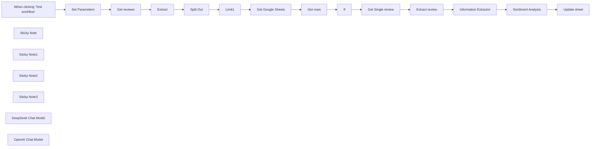

## Fluxo (.json) :

```json
{
  "id": "w434EiZ2z7klQAyp",
  "meta": {
    "instanceId": "a4bfc93e975ca233ac45ed7c9227d84cf5a2329310525917adaf3312e10d5462",
    "templateCredsSetupCompleted": true
  },
  "name": "Scrape Trustpilot Reviews with DeepSeek, Analyze Sentiment with OpenAI",
  "tags": [
    {
      "id": "2VG6RbmUdJ2VZbrj",
      "name": "Google Drive",
      "createdAt": "2024-12-04T16:50:56.177Z",
      "updatedAt": "2024-12-04T16:50:56.177Z"
    },
    {
      "id": "paTcf5QZDJsC2vKY",
      "name": "OpenAI",
      "createdAt": "2024-12-04T16:52:10.768Z",
      "updatedAt": "2024-12-04T16:52:10.768Z"
    }
  ],
  "nodes": [
    {
      "id": "095a8e10-1630-4a1a-b6c9-7950ae1ed803",
      "name": "Split Out",
      "type": "n8n-nodes-base.splitOut",
      "position": [
        320,
        -380
      ],
      "parameters": {
        "options": {},
        "fieldToSplitOut": "recensioni"
      },
      "typeVersion": 1
    },
    {
      "id": "6ff4dd9d-eedd-4d84-b13a-b3c0db717409",
      "name": "Information Extractor",
      "type": "@n8n/n8n-nodes-langchain.informationExtractor",
      "position": [
        -440,
        140
      ],
      "parameters": {
        "text": "=You need to extract the review from the following HTML: {{ $json.recensione }}",
        "options": {
          "systemPromptTemplate": "You are a review expert. You need to extract only the required information and report it without changing anything.\nAll the required information is in the text."
        },
        "attributes": {
          "attributes": [
            {
              "name": "autore",
              "required": true,
              "description": "Extract the name of the review author"
            },
            {
              "name": "valutazione",
              "type": "number",
              "required": true,
              "description": "Extract the rating given to the review (from 1 to 5)"
            },
            {
              "name": "data",
              "required": true,
              "description": "Extract review date in YYYY-MM-DD format"
            },
            {
              "name": "titolo",
              "required": true,
              "description": "Extract the review title"
            },
            {
              "name": "testo",
              "required": true,
              "description": "Extract the review text"
            },
            {
              "name": "n_recensioni",
              "type": "number",
              "required": true,
              "description": "Extract the total number of reviews made by the user"
            },
            {
              "name": "nazione",
              "required": true,
              "description": "Extract the country of the user who wrote the review. Must be two characters"
            }
          ]
        }
      },
      "typeVersion": 1
    },
    {
      "id": "0036f3b1-4832-4a35-8694-0893475a4119",
      "name": "If",
      "type": "n8n-nodes-base.if",
      "position": [
        60,
        -100
      ],
      "parameters": {
        "options": {},
        "conditions": {
          "options": {
            "version": 2,
            "leftValue": "",
            "caseSensitive": true,
            "typeValidation": "loose"
          },
          "combinator": "and",
          "conditions": [
            {
              "id": "ab666549-4eec-40e2-a702-0575c094a2d4",
              "operator": {
                "type": "string",
                "operation": "empty",
                "singleValue": true
              },
              "leftValue": "={{ $json.Valutazione }}",
              "rightValue": "={{ $('Split Out').item.json.recensioni.replace('/reviews/','') }}"
            }
          ]
        },
        "looseTypeValidation": true
      },
      "executeOnce": false,
      "typeVersion": 2.2
    },
    {
      "id": "5423b55d-eb6c-41c6-9b26-410e3c92b85d",
      "name": "When clicking ‘Test workflow’",
      "type": "n8n-nodes-base.manualTrigger",
      "position": [
        -700,
        -380
      ],
      "parameters": {},
      "typeVersion": 1
    },
    {
      "id": "506cdaa1-e0ba-4f29-b137-69d321b13c94",
      "name": "Limit1",
      "type": "n8n-nodes-base.limit",
      "position": [
        540,
        -380
      ],
      "parameters": {
        "maxItems": 3
      },
      "typeVersion": 1
    },
    {
      "id": "40f1e30d-8aed-4995-b4e4-2239248bd6e7",
      "name": "Sticky Note",
      "type": "n8n-nodes-base.stickyNote",
      "position": [
        -460,
        -480
      ],
      "parameters": {
        "width": 212.25249169435213,
        "height": 245.55481727574733,
        "content": "Change to the name of the company registered on Trustpilot and the maximum number of pages to scrape"
      },
      "typeVersion": 1
    },
    {
      "id": "e6d2fec1-7255-4270-86b4-6d6f39f44ccb",
      "name": "Sticky Note1",
      "type": "n8n-nodes-base.stickyNote",
      "position": [
        -460,
        80
      ],
      "parameters": {
        "width": 381,
        "height": 177,
        "content": "Extract all information with DeepSeek (remember to change base_url with https://api.deepseek.com/v1)"
      },
      "typeVersion": 1
    },
    {
      "id": "af5e962c-4faf-41cc-a8b8-2fbb145b7af6",
      "name": "Sticky Note2",
      "type": "n8n-nodes-base.stickyNote",
      "position": [
        -240,
        -160
      ],
      "parameters": {
        "width": 501.28903654485043,
        "height": 195.84053156146172,
        "content": "Check if the review has already been saved to Google Drive"
      },
      "typeVersion": 1
    },
    {
      "id": "400dff0c-8b2e-4fe2-933e-1f4d14624ca1",
      "name": "Sticky Note3",
      "type": "n8n-nodes-base.stickyNote",
      "position": [
        40,
        80
      ],
      "parameters": {
        "width": 301.27574750830576,
        "height": 177.34219269102988,
        "content": "Analyze review sentiment"
      },
      "typeVersion": 1
    },
    {
      "id": "52757ade-4206-40f9-bf4f-c3aefb004d2e",
      "name": "Set Parameters",
      "type": "n8n-nodes-base.set",
      "position": [
        -440,
        -380
      ],
      "parameters": {
        "options": {},
        "assignments": {
          "assignments": [
            {
              "id": "556e201d-242a-4c0e-bc13-787c2b60f800",
              "name": "company_id",
              "type": "string",
              "value": "COMPANY"
            },
            {
              "id": "a1f239df-df08-41d8-8b78-d6502266a581",
              "name": "max_page",
              "type": "number",
              "value": 2
            }
          ]
        }
      },
      "typeVersion": 3.4
    },
    {
      "id": "cd7e9d36-7ecd-4d9c-b552-8f46b0cfcc03",
      "name": "Get reviews",
      "type": "n8n-nodes-base.httpRequest",
      "position": [
        -200,
        -380
      ],
      "parameters": {
        "url": "=https://it.trustpilot.com/review/{{ $json.company_id }}",
        "options": {
          "pagination": {
            "pagination": {
              "parameters": {
                "parameters": [
                  {
                    "name": "page",
                    "value": "={{ $pageCount + 1 }}"
                  }
                ]
              },
              "maxRequests": "={{ $json.max_page }}",
              "requestInterval": 5000,
              "limitPagesFetched": true
            }
          }
        },
        "sendQuery": true,
        "queryParameters": {
          "parameters": [
            {
              "name": "sort",
              "value": "recency"
            }
          ]
        }
      },
      "typeVersion": 4.2
    },
    {
      "id": "476ff7b6-ab30-4674-a7fe-b032128ee51a",
      "name": "Extract",
      "type": "n8n-nodes-base.html",
      "position": [
        60,
        -380
      ],
      "parameters": {
        "options": {},
        "operation": "extractHtmlContent",
        "extractionValues": {
          "values": [
            {
              "key": "recensioni",
              "attribute": "href",
              "cssSelector": "article section a",
              "returnArray": true,
              "returnValue": "attribute"
            }
          ]
        }
      },
      "typeVersion": 1.2
    },
    {
      "id": "a2a35455-7d3e-4c4c-aa66-6cbbd48d867a",
      "name": "Get rows",
      "type": "n8n-nodes-base.googleSheets",
      "position": [
        -200,
        -100
      ],
      "parameters": {
        "options": {},
        "filtersUI": {
          "values": [
            {
              "lookupValue": "={{ $('Split Out').item.json.recensioni.replace('/reviews/','') }}",
              "lookupColumn": "Id"
            }
          ]
        },
        "sheetName": {
          "__rl": true,
          "mode": "list",
          "value": "gid=0",
          "cachedResultUrl": "",
          "cachedResultName": "Foglio1"
        },
        "documentId": {
          "__rl": true,
          "mode": "list",
          "value": "1QZhQqg79-HVBQh8Y2ihMq67UIYIRrJFKLQalcFvtDaY",
          "cachedResultUrl": "",
          "cachedResultName": "Trustpilot Review"
        }
      },
      "credentials": {
        "googleSheetsOAuth2Api": {
          "id": "JYR6a64Qecd6t8Hb",
          "name": "Google Sheets account"
        }
      },
      "typeVersion": 4.5
    },
    {
      "id": "2d507fe6-a4fc-42ff-97ff-dfd552c651ab",
      "name": "Get Google Sheets",
      "type": "n8n-nodes-base.googleSheets",
      "position": [
        -440,
        -100
      ],
      "parameters": {
        "columns": {
          "value": {
            "Id": "={{ $('Split Out').item.json.recensioni.replace('/reviews/','') }}"
          },
          "schema": [
            {
              "id": "Id",
              "type": "string",
              "display": true,
              "removed": false,
              "required": false,
              "displayName": "Id",
              "defaultMatch": false,
              "canBeUsedToMatch": true
            },
            {
              "id": "Data",
              "type": "string",
              "display": true,
              "required": false,
              "displayName": "Data",
              "defaultMatch": false,
              "canBeUsedToMatch": true
            },
            {
              "id": "Nome",
              "type": "string",
              "display": true,
              "required": false,
              "displayName": "Nome",
              "defaultMatch": false,
              "canBeUsedToMatch": true
            },
            {
              "id": "Titolo",
              "type": "string",
              "display": true,
              "required": false,
              "displayName": "Titolo",
              "defaultMatch": false,
              "canBeUsedToMatch": true
            },
            {
              "id": "Testo",
              "type": "string",
              "display": true,
              "required": false,
              "displayName": "Testo",
              "defaultMatch": false,
              "canBeUsedToMatch": true
            },
            {
              "id": "Località",
              "type": "string",
              "display": true,
              "required": false,
              "displayName": "Località",
              "defaultMatch": false,
              "canBeUsedToMatch": true
            },
            {
              "id": "N. Recensioni",
              "type": "string",
              "display": true,
              "required": false,
              "displayName": "N. Recensioni",
              "defaultMatch": false,
              "canBeUsedToMatch": true
            },
            {
              "id": "URL",
              "type": "string",
              "display": true,
              "required": false,
              "displayName": "URL",
              "defaultMatch": false,
              "canBeUsedToMatch": true
            },
            {
              "id": "Valutazione",
              "type": "string",
              "display": true,
              "required": false,
              "displayName": "Valutazione",
              "defaultMatch": false,
              "canBeUsedToMatch": true
            },
            {
              "id": "Sentiment",
              "type": "string",
              "display": true,
              "removed": false,
              "required": false,
              "displayName": "Sentiment",
              "defaultMatch": false,
              "canBeUsedToMatch": true
            }
          ],
          "mappingMode": "defineBelow",
          "matchingColumns": [
            "Id"
          ],
          "attemptToConvertTypes": false,
          "convertFieldsToString": false
        },
        "options": {},
        "operation": "appendOrUpdate",
        "sheetName": {
          "__rl": true,
          "mode": "list",
          "value": "gid=0",
          "cachedResultUrl": "",
          "cachedResultName": "Foglio1"
        },
        "documentId": {
          "__rl": true,
          "mode": "list",
          "value": "1QZhQqg79-HVBQh8Y2ihMq67UIYIRrJFKLQalcFvtDaY",
          "cachedResultUrl": "",
          "cachedResultName": "Trustpilot Reviews"
        }
      },
      "credentials": {
        "googleSheetsOAuth2Api": {
          "id": "JYR6a64Qecd6t8Hb",
          "name": "Google Sheets account"
        }
      },
      "executeOnce": false,
      "typeVersion": 4.5
    },
    {
      "id": "0a1fab6e-96b7-403b-884e-f67be6e23fa5",
      "name": "Get Single review",
      "type": "n8n-nodes-base.httpRequest",
      "position": [
        320,
        -120
      ],
      "parameters": {
        "url": "=https://it.trustpilot.com{{ $('Split Out').item.json.recensioni }}",
        "options": {}
      },
      "typeVersion": 4.2,
      "alwaysOutputData": false
    },
    {
      "id": "7d322d76-1032-405a-9d46-2958761a184d",
      "name": "Extract review",
      "type": "n8n-nodes-base.html",
      "position": [
        540,
        -120
      ],
      "parameters": {
        "options": {},
        "operation": "extractHtmlContent",
        "extractionValues": {
          "values": [
            {
              "key": "recensione",
              "cssSelector": "article",
              "returnArray": true
            }
          ]
        }
      },
      "typeVersion": 1.2
    },
    {
      "id": "952484e5-8e87-4eb3-99a6-5bf26c701ba8",
      "name": "Update sheet",
      "type": "n8n-nodes-base.googleSheets",
      "position": [
        520,
        120
      ],
      "parameters": {
        "columns": {
          "value": {
            "Id": "={{ $('Split Out').item.json.recensioni.replace('/reviews/','') }}",
            "URL": "=https://it.trustpilot.com{{ $('Split Out').item.json.recensioni }}",
            "Data": "={{ $('Information Extractor').item.json.output.data }}",
            "Nome": "={{ $json.output.autore }}",
            "Testo": "={{ $('Information Extractor').item.json.output.testo }}",
            "Titolo": "={{ $('Information Extractor').item.json.output.titolo }}",
            "Località": "={{ $('Information Extractor').item.json.output.nazione }}",
            "Sentiment": "={{ $json.sentimentAnalysis.category }}",
            "Valutazione": "={{ $('Information Extractor').item.json.output.valutazione }}",
            "N. Recensioni": "={{ $('Information Extractor').item.json.output.n_recensioni }}"
          },
          "schema": [
            {
              "id": "Id",
              "type": "string",
              "display": true,
              "removed": false,
              "required": false,
              "displayName": "Id",
              "defaultMatch": false,
              "canBeUsedToMatch": true
            },
            {
              "id": "Data",
              "type": "string",
              "display": true,
              "required": false,
              "displayName": "Data",
              "defaultMatch": false,
              "canBeUsedToMatch": true
            },
            {
              "id": "Nome",
              "type": "string",
              "display": true,
              "required": false,
              "displayName": "Nome",
              "defaultMatch": false,
              "canBeUsedToMatch": true
            },
            {
              "id": "Titolo",
              "type": "string",
              "display": true,
              "required": false,
              "displayName": "Titolo",
              "defaultMatch": false,
              "canBeUsedToMatch": true
            },
            {
              "id": "Testo",
              "type": "string",
              "display": true,
              "required": false,
              "displayName": "Testo",
              "defaultMatch": false,
              "canBeUsedToMatch": true
            },
            {
              "id": "Località",
              "type": "string",
              "display": true,
              "required": false,
              "displayName": "Località",
              "defaultMatch": false,
              "canBeUsedToMatch": true
            },
            {
              "id": "N. Recensioni",
              "type": "string",
              "display": true,
              "required": false,
              "displayName": "N. Recensioni",
              "defaultMatch": false,
              "canBeUsedToMatch": true
            },
            {
              "id": "URL",
              "type": "string",
              "display": true,
              "required": false,
              "displayName": "URL",
              "defaultMatch": false,
              "canBeUsedToMatch": true
            },
            {
              "id": "Valutazione",
              "type": "string",
              "display": true,
              "required": false,
              "displayName": "Valutazione",
              "defaultMatch": false,
              "canBeUsedToMatch": true
            },
            {
              "id": "Sentiment",
              "type": "string",
              "display": true,
              "removed": false,
              "required": false,
              "displayName": "Sentiment",
              "defaultMatch": false,
              "canBeUsedToMatch": true
            }
          ],
          "mappingMode": "defineBelow",
          "matchingColumns": [
            "Id"
          ],
          "attemptToConvertTypes": false,
          "convertFieldsToString": false
        },
        "options": {},
        "operation": "appendOrUpdate",
        "sheetName": {
          "__rl": true,
          "mode": "list",
          "value": "gid=0",
          "cachedResultUrl": "",
          "cachedResultName": "Foglio1"
        },
        "documentId": {
          "__rl": true,
          "mode": "list",
          "value": "1QZhQqg79-HVBQh8Y2ihMq67UIYIRrJFKLQalcFvtDaY",
          "cachedResultUrl": "",
          "cachedResultName": "Trustpilot Reviews"
        }
      },
      "credentials": {
        "googleSheetsOAuth2Api": {
          "id": "JYR6a64Qecd6t8Hb",
          "name": "Google Sheets account"
        }
      },
      "typeVersion": 4.5
    },
    {
      "id": "eb853885-816d-4df7-b5ac-900fa89d3df9",
      "name": "Sentiment Analysis",
      "type": "@n8n/n8n-nodes-langchain.sentimentAnalysis",
      "position": [
        60,
        140
      ],
      "parameters": {
        "options": {
          "categories": "Positive, Neutral, Negative",
          "systemPromptTemplate": "You are highly intelligent and accurate sentiment analyzer. Analyze the sentiment of the provided text. Categorize it into one of the following: {categories}. Use the provided formatting instructions. Only output the JSON."
        },
        "inputText": "={{ $json.output.testo }}"
      },
      "typeVersion": 1
    },
    {
      "id": "79f1b9ea-6297-4735-9c0f-9f28dd65efa0",
      "name": "DeepSeek Chat Model",
      "type": "@n8n/n8n-nodes-langchain.lmChatOpenAi",
      "position": [
        -460,
        320
      ],
      "parameters": {
        "model": "deepseek-reasoner",
        "options": {
          "baseURL": "https://api.deepseek.com/v1"
        }
      },
      "credentials": {
        "openAiApi": {
          "id": "97Cz4cqyiy1RdcQL",
          "name": "DeepSeek"
        }
      },
      "typeVersion": 1
    },
    {
      "id": "159cc88e-1dd3-4bba-a3c8-59a9aad14c88",
      "name": "OpenAI Chat Model",
      "type": "@n8n/n8n-nodes-langchain.lmChatOpenAi",
      "position": [
        40,
        320
      ],
      "parameters": {
        "options": {}
      },
      "credentials": {
        "openAiApi": {
          "id": "CDX6QM4gLYanh0P4",
          "name": "OpenAi account"
        }
      },
      "typeVersion": 1.1
    }
  ],
  "active": false,
  "pinData": {},
  "settings": {
    "executionOrder": "v1"
  },
  "versionId": "43c8ee74-159c-4217-9cb4-554c63a3b183",
  "connections": {
    "If": {
      "main": [
        [
          {
            "node": "Get Single review",
            "type": "main",
            "index": 0
          }
        ]
      ]
    },
    "Limit1": {
      "main": [
        [
          {
            "node": "Get Google Sheets",
            "type": "main",
            "index": 0
          }
        ]
      ]
    },
    "Extract": {
      "main": [
        [
          {
            "node": "Split Out",
            "type": "main",
            "index": 0
          }
        ]
      ]
    },
    "Get rows": {
      "main": [
        [
          {
            "node": "If",
            "type": "main",
            "index": 0
          }
        ]
      ]
    },
    "Split Out": {
      "main": [
        [
          {
            "node": "Limit1",
            "type": "main",
            "index": 0
          }
        ]
      ]
    },
    "Get reviews": {
      "main": [
        [
          {
            "node": "Extract",
            "type": "main",
            "index": 0
          }
        ]
      ]
    },
    "Extract review": {
      "main": [
        [
          {
            "node": "Information Extractor",
            "type": "main",
            "index": 0
          }
        ]
      ]
    },
    "Set Parameters": {
      "main": [
        [
          {
            "node": "Get reviews",
            "type": "main",
            "index": 0
          }
        ]
      ]
    },
    "Get Google Sheets": {
      "main": [
        [
          {
            "node": "Get rows",
            "type": "main",
            "index": 0
          }
        ]
      ]
    },
    "Get Single review": {
      "main": [
        [
          {
            "node": "Extract review",
            "type": "main",
            "index": 0
          }
        ]
      ]
    },
    "OpenAI Chat Model": {
      "ai_languageModel": [
        [
          {
            "node": "Sentiment Analysis",
            "type": "ai_languageModel",
            "index": 0
          }
        ]
      ]
    },
    "Sentiment Analysis": {
      "main": [
        [
          {
            "node": "Update sheet",
            "type": "main",
            "index": 0
          }
        ],
        [
          {
            "node": "Update sheet",
            "type": "main",
            "index": 0
          }
        ],
        [
          {
            "node": "Update sheet",
            "type": "main",
            "index": 0
          }
        ]
      ]
    },
    "DeepSeek Chat Model": {
      "ai_languageModel": [
        [
          {
            "node": "Information Extractor",
            "type": "ai_languageModel",
            "index": 0
          }
        ]
      ]
    },
    "Information Extractor": {
      "main": [
        [
          {
            "node": "Sentiment Analysis",
            "type": "main",
            "index": 0
          }
        ]
      ]
    },
    "When clicking ‘Test workflow’": {
      "main": [
        [
          {
            "node": "Set Parameters",
            "type": "main",
            "index": 0
          }
        ]
      ]
    }
  }
}
```
