# PACK 1999 TEMPLATES PARTE 06 - Bloco 9

Templates neste bloco: 20

## Sumário

- [Template 1161 - Captura e arquiva resumos de papers do Hugging Face](#template-1161)
- [Template 1162 - Scraper universal com Selenium e IA](#template-1162)
- [Template 1163 - Envio de anexos PDF específicos do Gmail para o Drive com IA](#template-1163)
- [Template 1164 - Handler padrão de erro com notificação por email](#template-1164)
- [Template 1165 - Notificações pré-reunião por WhatsApp](#template-1165)
- [Template 1166 - Relatório de estatísticas de criadores e workflows](#template-1166)
- [Template 1167 - Análise SERP com IA e SerpBear](#template-1167)
- [Template 1168 - Agente AI para resumos e agendamento](#template-1168)
- [Template 1169 - Newsletter → Posts LinkedIn automáticos](#template-1169)
- [Template 1170 - Enriquecimento MITRE ATT&CK e automação de resposta a alertas](#template-1170)
- [Template 1171 - Alerta e resumo de erros de workflow](#template-1171)
- [Template 1172 - Fábrica automática de conteúdo para redes sociais](#template-1172)
- [Template 1173 - Agendamento e publicação automática no LinkedIn](#template-1173)
- [Template 1174 - Notificação SMS de falha de fluxo](#template-1174)
- [Template 1175 - Publicar posts do Notion no LinkedIn](#template-1175)
- [Template 1176 - Automação de feedback de treinamento](#template-1176)
- [Template 1177 - Auto-post LinkedIn a partir de artigos Medium](#template-1177)
- [Template 1178 - Reconciliação de pagamentos de aluguel](#template-1178)
- [Template 1179 - Envio de alertas por email sobre erros](#template-1179)
- [Template 1180 - Gerar notas de estudo a partir de documento](#template-1180)

---

<a id="template-1161"></a>

## Template 1161 - Captura e arquiva resumos de papers do Hugging Face

- **Nome:** Captura e arquiva resumos de papers do Hugging Face
- **Descrição:** Busca diariamente novos papers do Hugging Face, extrai título e resumo, analisa o abstract com um modelo de linguagem para obter metadados e salva os resultados em uma base do Notion.
- **Funcionalidade:** • Agendamento diário em dias úteis às 08: Solicita automaticamente papers publicados na data anterior.
• Consulta à lista de papers do Hugging Face: Realiza requisição com parâmetro de data para obter a lista de publicações.
• Extração de links e conteúdo HTML: Extrai URLs, títulos e trechos de abstract das páginas retornadas.
• Iteração e divisão de itens: Processa cada paper individualmente e separa os campos necessários para processamento posterior.
• Verificação de existência: Consulta a base de dados para evitar duplicatas verificando se a URL já existe.
• Requisição da página do paper: Busca a página individual do paper para obter o abstract e título completos.
• Análise automática do abstract: Envia o resumo para um modelo de linguagem para extrair Core_Introduction, Keywords, Data_and_Results, Technical_Details e Classification em formato JSON.
• Armazenamento estruturado: Cria uma entrada na base Notion com URL, título, resumo (limitado a 2000 caracteres), data de coleta e os campos de análise (classificação, detalhes técnicos, dados e resultados, palavras-chave e introdução principal).
- **Ferramentas:** • Hugging Face: Fonte dos papers e abstracts (https://huggingface.co/papers) usada para listar e acessar publicações.
• OpenAI: Modelo de linguagem (gpt-4o-2024-11-20) utilizado para analisar abstracts e gerar metadados estruturados em JSON.
• Notion: Base de dados utilizada para armazenar entradas com URL, título, resumo, data de coleta e campos de análise.

## Fluxo visual

```mermaid
flowchart LR
    N1["Schedule Trigger"]
    N2["If"]
    N3["Loop Over Items"]
    N4["Split Out"]
    N5["Request Hugging Face Paper"]
    N6["Extract Hugging Face Paper"]
    N7["Check Paper URL Existed"]
    N8["Request Hugging Face Paper Detail"]
    N9["OpenAI Analysis Abstract"]
    N10["Store Abstract Notion"]
    N11["Extract Hugging Face Paper Abstract"]

    N2 --> N8
    N2 --> N3
    N4 --> N3
    N3 --> N7
    N1 --> N5
    N10 --> N3
    N7 --> N2
    N9 --> N10
    N6 --> N4
    N5 --> N6
    N8 --> N11
    N11 --> N9
```

## Fluxo (.json) :

```json
{
  "id": "FU3MrLkaTHmfdG4n",
  "meta": {
    "instanceId": "3294023dd650d95df294922b9d55d174ef26f4a2e6cce97c8a4ab5f98f5b8c7b",
    "templateCredsSetupCompleted": true
  },
  "name": "Hugging Face to Notion",
  "tags": [],
  "nodes": [
    {
      "id": "32d5bfee-97f1-4e92-b62e-d09bdd9c3821",
      "name": "Schedule Trigger",
      "type": "n8n-nodes-base.scheduleTrigger",
      "position": [
        -2640,
        -300
      ],
      "parameters": {
        "rule": {
          "interval": [
            {
              "field": "weeks",
              "triggerAtDay": [
                1,
                2,
                3,
                4,
                5
              ],
              "triggerAtHour": 8
            }
          ]
        }
      },
      "typeVersion": 1.2
    },
    {
      "id": "b1f4078e-ac77-47ec-995c-f52fd98fafef",
      "name": "If",
      "type": "n8n-nodes-base.if",
      "position": [
        -1360,
        -280
      ],
      "parameters": {
        "options": {},
        "conditions": {
          "options": {
            "version": 2,
            "leftValue": "",
            "caseSensitive": true,
            "typeValidation": "strict"
          },
          "combinator": "and",
          "conditions": [
            {
              "id": "7094d6db-1fa7-4b59-91cf-6bbd5b5f067e",
              "operator": {
                "type": "object",
                "operation": "empty",
                "singleValue": true
              },
              "leftValue": "={{ $json }}",
              "rightValue": ""
            }
          ]
        }
      },
      "typeVersion": 2.2
    },
    {
      "id": "afac08e1-b629-4467-86ef-907e4a5e8841",
      "name": "Loop Over Items",
      "type": "n8n-nodes-base.splitInBatches",
      "position": [
        -1760,
        -300
      ],
      "parameters": {
        "options": {
          "reset": false
        }
      },
      "typeVersion": 3
    },
    {
      "id": "807ba450-9c89-4f88-aa84-91f43e3adfc6",
      "name": "Split Out",
      "type": "n8n-nodes-base.splitOut",
      "position": [
        -1960,
        -300
      ],
      "parameters": {
        "options": {},
        "fieldToSplitOut": "url, url"
      },
      "typeVersion": 1
    },
    {
      "id": "08dd3f15-2030-48f2-ab0f-f85f797268e1",
      "name": "Request Hugging Face Paper",
      "type": "n8n-nodes-base.httpRequest",
      "position": [
        -2440,
        -300
      ],
      "parameters": {
        "url": "https://huggingface.co/papers",
        "options": {},
        "sendQuery": true,
        "queryParameters": {
          "parameters": [
            {
              "name": "date",
              "value": "={{ $now.minus(1,'days').format('yyyy-MM-dd') }}"
            }
          ]
        }
      },
      "typeVersion": 4.2
    },
    {
      "id": "f37ba769-d881-4aad-927d-ca1f4a68b9a1",
      "name": "Extract Hugging Face Paper",
      "type": "n8n-nodes-base.html",
      "position": [
        -2200,
        -300
      ],
      "parameters": {
        "options": {},
        "operation": "extractHtmlContent",
        "extractionValues": {
          "values": [
            {
              "key": "url",
              "attribute": "href",
              "cssSelector": ".line-clamp-3",
              "returnArray": true,
              "returnValue": "attribute"
            }
          ]
        }
      },
      "typeVersion": 1.2
    },
    {
      "id": "94ba99bf-a33b-4311-a4e6-86490e1bb9ad",
      "name": "Check Paper URL Existed",
      "type": "n8n-nodes-base.notion",
      "position": [
        -1540,
        -280
      ],
      "parameters": {
        "filters": {
          "conditions": [
            {
              "key": "URL|url",
              "urlValue": "={{ 'https://huggingface.co'+$json.url }}",
              "condition": "equals"
            }
          ]
        },
        "options": {},
        "resource": "databasePage",
        "operation": "getAll",
        "databaseId": {
          "__rl": true,
          "mode": "list",
          "value": "17b67aba-1fcc-80ae-baa1-d88ffda7ae83",
          "cachedResultUrl": "https://www.notion.so/17b67aba1fcc80aebaa1d88ffda7ae83",
          "cachedResultName": "huggingface-abstract"
        },
        "filterType": "manual"
      },
      "credentials": {
        "notionApi": {
          "id": "I5KdUzwhWnphQ862",
          "name": "notion"
        }
      },
      "typeVersion": 2.2,
      "alwaysOutputData": true
    },
    {
      "id": "ece8dee2-e444-4557-aad9-5bdcb5ecd756",
      "name": "Request Hugging Face Paper Detail",
      "type": "n8n-nodes-base.httpRequest",
      "position": [
        -1080,
        -300
      ],
      "parameters": {
        "url": "={{ 'https://huggingface.co'+$('Split Out').item.json.url }}",
        "options": {}
      },
      "typeVersion": 4.2
    },
    {
      "id": "53b266fe-e7c4-4820-92eb-78a6ba7a6430",
      "name": "OpenAI Analysis Abstract",
      "type": "@n8n/n8n-nodes-langchain.openAi",
      "position": [
        -640,
        -300
      ],
      "parameters": {
        "modelId": {
          "__rl": true,
          "mode": "list",
          "value": "gpt-4o-2024-11-20",
          "cachedResultName": "GPT-4O-2024-11-20"
        },
        "options": {},
        "messages": {
          "values": [
            {
              "role": "system",
              "content": "Extract the following key details from the paper abstract:\n\nCore Introduction: Summarize the main contributions and objectives of the paper, highlighting its innovations and significance.\nKeyword Extraction: List 2-5 keywords that best represent the research direction and techniques of the paper.\nKey Data and Results: Extract important performance metrics, comparison results, and the paper's advantages over other studies.\nTechnical Details: Provide a brief overview of the methods, optimization techniques, and datasets mentioned in the paper.\nClassification: Assign an appropriate academic classification based on the content of the paper.\n\n\nOutput as json：\n{\n \"Core_Introduction\": \"PaSa is an advanced Paper Search agent powered by large language models that can autonomously perform a series of decisions (including invoking search tools, reading papers, and selecting relevant references) to provide comprehensive and accurate results for complex academic queries.\",\n \"Keywords\": [\n \"Paper Search Agent\",\n \"Large Language Models\",\n \"Reinforcement Learning\",\n \"Academic Queries\",\n \"Performance Benchmarking\"\n ],\n \"Data_and_Results\": \"PaSa outperforms existing baselines (such as Google, GPT-4, chatGPT) in tests using AutoScholarQuery (35k academic queries) and RealScholarQuery (real-world academic queries). For example, PaSa-7B exceeds Google with GPT-4o by 37.78% in recall@20 and 39.90% in recall@50.\",\n \"Technical_Details\": \"PaSa is optimized using reinforcement learning with the AutoScholarQuery synthetic dataset, demonstrating superior performance in multiple benchmarks.\",\n \"Classification\": [\n \"Artificial Intelligence (AI)\",\n \"Academic Search and Information Retrieval\",\n \"Natural Language Processing (NLP)\",\n \"Reinforcement Learning\"\n ]\n}\n```"
            },
            {
              "content": "={{ $json.abstract }}"
            }
          ]
        },
        "jsonOutput": true
      },
      "credentials": {
        "openAiApi": {
          "id": "LmLcxHwbzZNWxqY6",
          "name": "Unnamed credential"
        }
      },
      "typeVersion": 1.8
    },
    {
      "id": "f491cd7f-598e-46fd-b80c-04cfa9766dfd",
      "name": "Store Abstract Notion",
      "type": "n8n-nodes-base.notion",
      "position": [
        -300,
        -300
      ],
      "parameters": {
        "options": {},
        "resource": "databasePage",
        "databaseId": {
          "__rl": true,
          "mode": "list",
          "value": "17b67aba-1fcc-80ae-baa1-d88ffda7ae83",
          "cachedResultUrl": "https://www.notion.so/17b67aba1fcc80aebaa1d88ffda7ae83",
          "cachedResultName": "huggingface-abstract"
        },
        "propertiesUi": {
          "propertyValues": [
            {
              "key": "URL|url",
              "urlValue": "={{ 'https://huggingface.co'+$('Split Out').item.json.url }}"
            },
            {
              "key": "title|title",
              "title": "={{ $('Extract Hugging Face Paper Abstract').item.json.title }}"
            },
            {
              "key": "abstract|rich_text",
              "textContent": "={{ $('Extract Hugging Face Paper Abstract').item.json.abstract.substring(0,2000) }}"
            },
            {
              "key": "scrap-date|date",
              "date": "={{ $today.format('yyyy-MM-dd') }}",
              "includeTime": false
            },
            {
              "key": "Classification|rich_text",
              "textContent": "={{ $json.message.content.Classification.join(',') }}"
            },
            {
              "key": "Technical_Details|rich_text",
              "textContent": "={{ $json.message.content.Technical_Details }}"
            },
            {
              "key": "Data_and_Results|rich_text",
              "textContent": "={{ $json.message.content.Data_and_Results }}"
            },
            {
              "key": "keywords|rich_text",
              "textContent": "={{ $json.message.content.Keywords.join(',') }}"
            },
            {
              "key": "Core Introduction|rich_text",
              "textContent": "={{ $json.message.content.Core_Introduction }}"
            }
          ]
        }
      },
      "credentials": {
        "notionApi": {
          "id": "I5KdUzwhWnphQ862",
          "name": "notion"
        }
      },
      "typeVersion": 2.2
    },
    {
      "id": "d5816a1c-d1fa-4be2-8088-57fbf68e6b43",
      "name": "Extract Hugging Face Paper Abstract",
      "type": "n8n-nodes-base.html",
      "position": [
        -840,
        -300
      ],
      "parameters": {
        "options": {},
        "operation": "extractHtmlContent",
        "extractionValues": {
          "values": [
            {
              "key": "abstract",
              "cssSelector": ".text-gray-700"
            },
            {
              "key": "title",
              "cssSelector": ".text-2xl"
            }
          ]
        }
      },
      "typeVersion": 1.2
    }
  ],
  "active": true,
  "pinData": {},
  "settings": {
    "executionOrder": "v1"
  },
  "versionId": "4b0ec2a3-253d-46d5-a4d4-1d9ff21ba4a3",
  "connections": {
    "If": {
      "main": [
        [
          {
            "node": "Request Hugging Face Paper Detail",
            "type": "main",
            "index": 0
          }
        ],
        [
          {
            "node": "Loop Over Items",
            "type": "main",
            "index": 0
          }
        ]
      ]
    },
    "Split Out": {
      "main": [
        [
          {
            "node": "Loop Over Items",
            "type": "main",
            "index": 0
          }
        ]
      ]
    },
    "Loop Over Items": {
      "main": [
        [],
        [
          {
            "node": "Check Paper URL Existed",
            "type": "main",
            "index": 0
          }
        ]
      ]
    },
    "Schedule Trigger": {
      "main": [
        [
          {
            "node": "Request Hugging Face Paper",
            "type": "main",
            "index": 0
          }
        ]
      ]
    },
    "Store Abstract Notion": {
      "main": [
        [
          {
            "node": "Loop Over Items",
            "type": "main",
            "index": 0
          }
        ]
      ]
    },
    "Check Paper URL Existed": {
      "main": [
        [
          {
            "node": "If",
            "type": "main",
            "index": 0
          }
        ]
      ]
    },
    "OpenAI Analysis Abstract": {
      "main": [
        [
          {
            "node": "Store Abstract Notion",
            "type": "main",
            "index": 0
          }
        ]
      ]
    },
    "Extract Hugging Face Paper": {
      "main": [
        [
          {
            "node": "Split Out",
            "type": "main",
            "index": 0
          }
        ]
      ]
    },
    "Request Hugging Face Paper": {
      "main": [
        [
          {
            "node": "Extract Hugging Face Paper",
            "type": "main",
            "index": 0
          }
        ]
      ]
    },
    "Request Hugging Face Paper Detail": {
      "main": [
        [
          {
            "node": "Extract Hugging Face Paper Abstract",
            "type": "main",
            "index": 0
          }
        ]
      ]
    },
    "Extract Hugging Face Paper Abstract": {
      "main": [
        [
          {
            "node": "OpenAI Analysis Abstract",
            "type": "main",
            "index": 0
          }
        ]
      ]
    }
  }
}
```

<a id="template-1162"></a>

## Template 1162 - Scraper universal com Selenium e IA

- **Nome:** Scraper universal com Selenium e IA
- **Descrição:** Fluxo que recebe solicitações via webhook, encontra ou usa uma URL alvo, controla um navegador Selenium (opcionalmente injetando cookies), captura screenshots da página e usa modelos de IA para extrair e retornar dados relevantes.
- **Funcionalidade:** • Receber requisições via webhook: Aceita payloads com assunto, URL alvo, dados a extrair e cookies de sessão.
• Normalização de campos de entrada: Extrai e define campos como assunto e domínio a partir do payload.
• Busca de página relevante: Procura no Google por URLs no domínio alvo relacionadas ao assunto quando uma URL direta não é enviada.
• Seleção do melhor URL: Usa um modelo de extração para escolher a URL mais relevante para coleta de informação.
• Criação e configuração de sessão de navegador: Inicia uma sessão Selenium/Chrome com argumentos anti-detecção e redimensiona a janela.
• Limpeza de indicadores de automação: Executa script para ocultar traços do webdriver e ajustar propriedades do navigator.
• Injeção de cookies de sessão: Converte e injeta cookies recebidos (incluindo normalização sameSite) para permitir sessões autenticadas.
• Navegação e captura: Vai para a URL alvo (ou extraída), captura screenshot e transforma a imagem em arquivo binário.
• Análise por IA e extração estruturada: Envia a imagem para modelos de IA para detectar bloqueios (WAF) ou extrair os dados solicitados, depois estrutura a resposta em campos definidos.
• Tratamento de erros e limpeza: Grande número de pontos de limpeza para deletar sessões Selenium e retornar respostas de erro ou sucesso adequadas.
• Debug de IP e proxy: Rota de verificação de IP para depuração e suporte a configuração de proxy para o navegador.
• Respostas condicionais: Retorna diferentes códigos/respostas HTTP dependendo do resultado (sucesso, bloqueio, erro, não encontrado).
- **Ferramentas:** • Selenium (Grid/Chrome): Controla um navegador Chrome remoto para navegação, injeção de cookies e captura de screenshots.
• Google Search: Usado para localizar páginas relevantes no domínio alvo quando a URL direta não é fornecida.
• OpenAI (modelos GPT-4o / gpt-4o-mini): Analisa imagens (screenshots) e gera respostas textuais que são pós-processadas para extrair informações estruturadas.
• ip-api.com: Serviço usado para verificar o IP público visto pelo navegador para depuração de proxy/IP.
• Extensão de coleta de cookies (opcional): Ferramenta opcional para recolher cookies de sessão no navegador e permitir scraping autenticado.
• Provedor de proxies residenciais (ex.: GeoNode): Recomendado para reduzir bloqueios em escala e permitir requests a partir de IPs residenciais.
• Docker / Docker Compose: Ambiente recomendado para implantar o container Selenium e demais serviços necessários.

## Fluxo visual

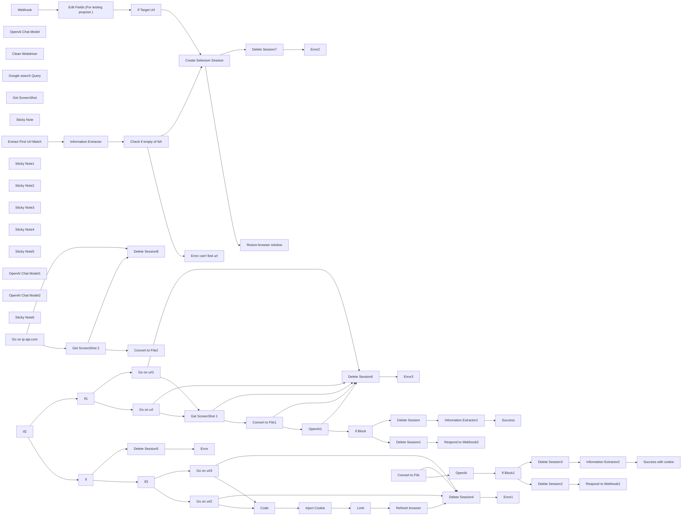

## Fluxo (.json) :

```json
{
  "id": "kZ3aL4r7xc96Q7lp",
  "meta": {
    "instanceId": "b8b2c0d20b02864cf66adc9cbefc86e9e56de0252b653d37ba6613341b5e0bef",
    "templateCredsSetupCompleted": true
  },
  "name": "Selenium Ultimate Scraper Workflow",
  "tags": [],
  "nodes": [
    {
      "id": "20d35d68-db49-4183-a913-85ad06c13912",
      "name": "Extract First Url Match",
      "type": "n8n-nodes-base.html",
      "position": [
        1820,
        540
      ],
      "parameters": {
        "options": {},
        "operation": "extractHtmlContent",
        "extractionValues": {
          "values": [
            {
              "key": "Url Find ",
              "attribute": "href",
              "cssSelector": "=a[href*=\"https://\"][href*=\"{{ $('Edit Fields (For testing prupose )').item.json['Website Domaine'] }}\"]\n",
              "returnArray": true,
              "returnValue": "attribute"
            }
          ]
        }
      },
      "typeVersion": 1.2
    },
    {
      "id": "9167ea20-fc9c-4d75-bf4d-bb2016079dd0",
      "name": "OpenAI Chat Model",
      "type": "@n8n/n8n-nodes-langchain.lmChatOpenAi",
      "position": [
        2060,
        700
      ],
      "parameters": {
        "model": "gpt-4o",
        "options": {}
      },
      "credentials": {
        "openAiApi": {
          "id": "FmszNHDDVS32ud21",
          "name": "OpenAi account"
        }
      },
      "typeVersion": 1
    },
    {
      "id": "42a8646d-1b0b-4309-a87d-9c8aeb355a28",
      "name": "Clean Webdriver ",
      "type": "n8n-nodes-base.httpRequest",
      "notes": "Script to delete traces of selenium in the browser ",
      "position": [
        3120,
        560
      ],
      "parameters": {
        "url": "=http://selenium_chrome:4444/wd/hub/session/{{ $('Create Selenium Session').item.json.value.sessionId }}/execute/sync",
        "method": "POST",
        "options": {},
        "jsonBody": "{\n \"script\": \"Object.defineProperty(navigator, 'webdriver', { get: () => undefined }); window.navigator.chrome = { runtime: {} }; Object.defineProperty(navigator, 'languages', { get: () => ['en-US', 'en'] }); Object.defineProperty(navigator, 'plugins', { get: () => [1, 2, 3, 4, 5] });\",\n \"args\": []\n}\n",
        "sendBody": true,
        "specifyBody": "json"
      },
      "notesInFlow": false,
      "typeVersion": 4.2
    },
    {
      "id": "107dd8de-e341-4819-a493-94ed57fd0f33",
      "name": "Delete Session",
      "type": "n8n-nodes-base.httpRequest",
      "position": [
        5180,
        920
      ],
      "parameters": {
        "url": "=http://selenium_chrome:4444/wd/hub/session/{{ $('Create Selenium Session').item.json.value.sessionId }}",
        "method": "DELETE",
        "options": {}
      },
      "typeVersion": 4.2
    },
    {
      "id": "8c7ec6bc-d417-48c2-a6f2-ecce27803671",
      "name": "Delete Session2",
      "type": "n8n-nodes-base.httpRequest",
      "position": [
        6740,
        -160
      ],
      "parameters": {
        "url": "=http://selenium_chrome:4444/wd/hub/session/{{ $('Create Selenium Session').item.json.value.sessionId }}",
        "method": "DELETE",
        "options": {}
      },
      "typeVersion": 4.2
    },
    {
      "id": "e43ecd94-b7f2-4f73-a9fa-b829de9e0296",
      "name": "If Block1",
      "type": "n8n-nodes-base.if",
      "position": [
        6520,
        -20
      ],
      "parameters": {
        "options": {},
        "conditions": {
          "options": {
            "version": 2,
            "leftValue": "",
            "caseSensitive": true,
            "typeValidation": "strict"
          },
          "combinator": "and",
          "conditions": [
            {
              "id": "e6e6e15d-1cfe-48be-8ea0-f112e9781c9d",
              "operator": {
                "name": "filter.operator.equals",
                "type": "string",
                "operation": "equals"
              },
              "leftValue": "={{ $json.content }}",
              "rightValue": "BLOCK"
            }
          ]
        }
      },
      "typeVersion": 2.2
    },
    {
      "id": "08e46f63-41b5-4606-8f2c-df9e96c9c34e",
      "name": "Delete Session3",
      "type": "n8n-nodes-base.httpRequest",
      "position": [
        6740,
        60
      ],
      "parameters": {
        "url": "=http://selenium_chrome:4444/wd/hub/session/{{ $('Create Selenium Session').item.json.value.sessionId }}",
        "method": "DELETE",
        "options": {}
      },
      "typeVersion": 4.2
    },
    {
      "id": "b47d9b22-9a59-4c7a-8cba-9487f18207ee",
      "name": "Limit",
      "type": "n8n-nodes-base.limit",
      "position": [
        5120,
        -100
      ],
      "parameters": {},
      "typeVersion": 1
    },
    {
      "id": "541622f7-562b-4e8a-93e5-61e6e918ff52",
      "name": "Delete Session1",
      "type": "n8n-nodes-base.httpRequest",
      "position": [
        5180,
        720
      ],
      "parameters": {
        "url": "=http://selenium_chrome:4444/wd/hub/session/{{ $('Create Selenium Session').item.json.value.sessionId }}",
        "method": "DELETE",
        "options": {}
      },
      "typeVersion": 4.2
    },
    {
      "id": "825be0d7-9dd3-4a2f-8c3d-fd405f59a5d6",
      "name": "Delete Session4",
      "type": "n8n-nodes-base.httpRequest",
      "onError": "continueRegularOutput",
      "position": [
        5780,
        260
      ],
      "parameters": {
        "url": "=http://selenium_chrome:4444/wd/hub/session/{{ $('Create Selenium Session').item.json.value.sessionId }}",
        "method": "DELETE",
        "options": {}
      },
      "retryOnFail": false,
      "typeVersion": 4.2
    },
    {
      "id": "56f6f4f6-f737-4de8-bdfe-029546909677",
      "name": "Success with cookie",
      "type": "n8n-nodes-base.respondToWebhook",
      "position": [
        7260,
        60
      ],
      "parameters": {
        "options": {
          "responseCode": 200
        }
      },
      "typeVersion": 1.1
    },
    {
      "id": "c6939773-e230-45e1-bf76-d0299c2c7066",
      "name": "Respond to Webhook2",
      "type": "n8n-nodes-base.respondToWebhook",
      "position": [
        6920,
        -160
      ],
      "parameters": {
        "options": {
          "responseCode": 200
        },
        "respondWith": "json",
        "responseBody": "{\n \"Success \": \"Request has been block by the targeted website\"\n}"
      },
      "typeVersion": 1.1
    },
    {
      "id": "ea921f11-323f-4c79-8cc6-779b39498b05",
      "name": "Code",
      "type": "n8n-nodes-base.code",
      "position": [
        4700,
        -100
      ],
      "parameters": {
        "jsCode": "// Récupère les données du nœud Webhook (en remplaçant \"Webhook\" par le nom du nœud Webhook dans votre workflow)\nconst webhookData = $node[\"Webhook\"].json;\n\n// Fonction pour convertir la valeur de sameSite\nfunction convertSameSite(value) {\n // Conversion spécifique des valeurs de sameSite\n const conversionMap = {\n \"unspecified\": \"None\",\n \"lax\": \"Lax\",\n \"strict\": \"Strict\"\n };\n \n // Si la valeur existe dans le tableau de conversion, on la convertit\n if (value in conversionMap) {\n return conversionMap[value];\n }\n \n // Si la valeur est déjà une des valeurs acceptées par Selenium\n const allowedValues = [\"Strict\", \"Lax\", \"None\"];\n if (allowedValues.includes(value)) {\n return value;\n } else {\n // Si la valeur n'est pas reconnue, on la remplace par \"Lax\" (par défaut)\n return \"Lax\";\n }\n}\n\n// Vérifiez et traitez les données des cookies\nif (webhookData.body && webhookData.body.cookies) {\n let items = [];\n for (const cookieObject of webhookData.body.cookies) {\n if (cookieObject.cookie) {\n // Convertir la valeur de sameSite\n cookieObject.cookie.sameSite = convertSameSite(cookieObject.cookie.sameSite);\n \n // Ajouter le cookie à la liste des items\n items.push({\n json: cookieObject.cookie\n });\n }\n }\n return items;\n}\n\n// Si les cookies ne sont pas trouvés, renvoyer un tableau vide\nreturn [];\n"
      },
      "typeVersion": 2
    },
    {
      "id": "c3d77928-eefc-4903-9b4f-b14bd6f34e3c",
      "name": "Delete Session5",
      "type": "n8n-nodes-base.httpRequest",
      "onError": "continueRegularOutput",
      "position": [
        3940,
        360
      ],
      "parameters": {
        "url": "=http://selenium_chrome:4444/wd/hub/session/{{ $('Create Selenium Session').item.json.value.sessionId }}",
        "method": "DELETE",
        "options": {}
      },
      "retryOnFail": false,
      "typeVersion": 4.2
    },
    {
      "id": "036cfce6-8082-4539-bb0e-980368679fe5",
      "name": "Error",
      "type": "n8n-nodes-base.respondToWebhook",
      "position": [
        4120,
        360
      ],
      "parameters": {
        "options": {
          "responseCode": 404
        },
        "respondWith": "json",
        "responseBody": "{\n \"Error\": \"Cookies are note for the targeted url\"\n}"
      },
      "typeVersion": 1.1
    },
    {
      "id": "09d6a99b-d8b3-40c9-b74a-14014e3647e2",
      "name": "Error1",
      "type": "n8n-nodes-base.respondToWebhook",
      "position": [
        6000,
        260
      ],
      "parameters": {
        "options": {
          "responseCode": 500
        }
      },
      "typeVersion": 1.1
    },
    {
      "id": "0b1f3442-6b70-405f-b597-642e9c982b82",
      "name": "Error2",
      "type": "n8n-nodes-base.respondToWebhook",
      "position": [
        3060,
        780
      ],
      "parameters": {
        "options": {
          "responseCode": 500
        }
      },
      "typeVersion": 1.1
    },
    {
      "id": "4d0112bb-cbfd-45c6-961a-964bd8f59cac",
      "name": "If",
      "type": "n8n-nodes-base.if",
      "position": [
        3760,
        200
      ],
      "parameters": {
        "options": {},
        "conditions": {
          "options": {
            "version": 2,
            "leftValue": "",
            "caseSensitive": true,
            "typeValidation": "strict"
          },
          "combinator": "and",
          "conditions": [
            {
              "id": "1bffbc80-9913-46e7-a594-ebc26948c83b",
              "operator": {
                "type": "string",
                "operation": "contains"
              },
              "leftValue": "={{ $('Webhook').item.json.body.cookies[0].cookie.domain }}",
              "rightValue": "={{ $('Webhook').item.json.body.Url }}"
            }
          ]
        }
      },
      "typeVersion": 2.2
    },
    {
      "id": "58a50b80-df4c-4b6f-a682-72237f4dbdef",
      "name": "Inject Cookie",
      "type": "n8n-nodes-base.httpRequest",
      "onError": "continueRegularOutput",
      "position": [
        4900,
        -100
      ],
      "parameters": {
        "url": "=http://selenium_chrome:4444/wd/hub/session/{{ $('Create Selenium Session').item.json.value.sessionId }}/cookie",
        "method": "POST",
        "options": {},
        "jsonBody": "={\n \"cookie\": {\n \"name\": \"{{ $json.name }}\",\n \"value\": \"{{ $json.value }}\",\n \"domain\": \"{{ $json.domain }}\",\n \"path\": \"{{ $json.path }}\",\n \"secure\": {{ $json.secure }},\n \"httpOnly\": {{ $json.httpOnly }},\n \"sameSite\": \"{{ $json.sameSite }}\",\n \"expirationDate\": {{ $json.expirationDate }}\n }\n}",
        "sendBody": true,
        "specifyBody": "json"
      },
      "typeVersion": 4.2
    },
    {
      "id": "39f7401b-b6b7-4f0c-9afc-8f144d394350",
      "name": "Respond to Webhook3",
      "type": "n8n-nodes-base.respondToWebhook",
      "position": [
        5400,
        720
      ],
      "parameters": {
        "options": {
          "responseCode": 200
        },
        "respondWith": "json",
        "responseBody": "{\n \"Success \": \"Request has been block by the targeted website\"\n}"
      },
      "typeVersion": 1.1
    },
    {
      "id": "80b107cc-2f6c-46f0-a597-e85594634492",
      "name": "Success",
      "type": "n8n-nodes-base.respondToWebhook",
      "position": [
        5740,
        920
      ],
      "parameters": {
        "options": {
          "responseKey": "={{ $json.output }}",
          "responseCode": 200
        }
      },
      "typeVersion": 1.1
    },
    {
      "id": "94a97354-07d9-428e-989c-ef066f9b4d8a",
      "name": "Go on url",
      "type": "n8n-nodes-base.httpRequest",
      "onError": "continueErrorOutput",
      "position": [
        3900,
        780
      ],
      "parameters": {
        "url": "=http://selenium_chrome:4444/wd/hub/session/{{ $('Create Selenium Session').item.json.value.sessionId }}/url",
        "method": "POST",
        "options": {},
        "jsonBody": "={\n \"url\": \"{{ $('Webhook').item.json.body['Target Url'] }}\"\n}\n",
        "sendBody": true,
        "specifyBody": "json"
      },
      "retryOnFail": true,
      "typeVersion": 4.2
    },
    {
      "id": "fd044cf3-594d-48af-bbd1-f2d9adedcbc1",
      "name": "Delete Session6",
      "type": "n8n-nodes-base.httpRequest",
      "onError": "continueRegularOutput",
      "position": [
        4360,
        1200
      ],
      "parameters": {
        "url": "=http://selenium_chrome:4444/wd/hub/session/{{ $('Create Selenium Session').item.json.value.sessionId }}",
        "method": "DELETE",
        "options": {}
      },
      "retryOnFail": false,
      "typeVersion": 4.2
    },
    {
      "id": "7c28c3b6-1141-4609-8774-cb6b4d842b97",
      "name": "Error3",
      "type": "n8n-nodes-base.respondToWebhook",
      "position": [
        4520,
        1200
      ],
      "parameters": {
        "options": {
          "responseCode": 500
        },
        "respondWith": "json",
        "responseBody": "{\n \"Error\": \"Page crash on the extracted url\"\n}"
      },
      "typeVersion": 1.1
    },
    {
      "id": "52f78923-156f-4861-88ba-f0253c483bd9",
      "name": "Information Extractor",
      "type": "@n8n/n8n-nodes-langchain.informationExtractor",
      "position": [
        2040,
        540
      ],
      "parameters": {
        "text": "={{ $json['Url Find '][1] }}{{ $json['Url Find '][2] }}{{ $json['Url Find '][3] }}",
        "options": {
          "systemPromptTemplate": "=You are an expert extraction algorithm.\nOnly extract relevant url from the unstructured urls array.\nA relevant url is a url whre you can find relevant information about this subject : {{ $('Edit Fields (For testing prupose )').item.json.Subject }}, on this domaine name : {{ $('Edit Fields (For testing prupose )').item.json['Website Domaine'] }}.\nIf you do not know the value of an attribute asked to extract, you need \\ attribute's value as NA."
        },
        "attributes": {
          "attributes": [
            {
              "name": "Good_url_for_etract_information",
              "required": true,
              "description": "=The url where I can extract relevant infroamtion on this subject : {{ $('Edit Fields (For testing prupose )').item.json.Subject }} on this domaine name : {{ $('Edit Fields (For testing prupose )').item.json['Website Domaine'] }}"
            }
          ]
        }
      },
      "typeVersion": 1
    },
    {
      "id": "6ac249e2-a9d8-4590-b050-3a0a2472fa3c",
      "name": "Check if empty of NA",
      "type": "n8n-nodes-base.if",
      "position": [
        2440,
        540
      ],
      "parameters": {
        "options": {},
        "conditions": {
          "options": {
            "version": 2,
            "leftValue": "",
            "caseSensitive": true,
            "typeValidation": "strict"
          },
          "combinator": "or",
          "conditions": [
            {
              "id": "9470fb6c-e367-4af7-a697-275e724fe771",
              "operator": {
                "type": "string",
                "operation": "empty",
                "singleValue": true
              },
              "leftValue": "={{ $json.output.Good_url_for_etract_information }}",
              "rightValue": ""
            },
            {
              "id": "8518e9a9-5b0c-4699-97c5-d9b7b1943918",
              "operator": {
                "name": "filter.operator.equals",
                "type": "string",
                "operation": "equals"
              },
              "leftValue": "={{ $json.output.Good_url_for_etract_information }}",
              "rightValue": "NA"
            }
          ]
        }
      },
      "typeVersion": 2.2
    },
    {
      "id": "f380eff7-3d18-4791-9dac-8a88d3fdcc4f",
      "name": "If Block",
      "type": "n8n-nodes-base.if",
      "position": [
        4960,
        840
      ],
      "parameters": {
        "options": {},
        "conditions": {
          "options": {
            "version": 2,
            "leftValue": "",
            "caseSensitive": true,
            "typeValidation": "strict"
          },
          "combinator": "and",
          "conditions": [
            {
              "id": "e6e6e15d-1cfe-48be-8ea0-f112e9781c9d",
              "operator": {
                "type": "string",
                "operation": "contains"
              },
              "leftValue": "={{ $json.content }}",
              "rightValue": "BLOCK"
            }
          ]
        }
      },
      "typeVersion": 2.2
    },
    {
      "id": "43382397-89b5-4b90-9016-49109ec04baf",
      "name": "Google search Query ",
      "type": "n8n-nodes-base.httpRequest",
      "position": [
        1600,
        540
      ],
      "parameters": {
        "url": "=https://www.google.com/search?q=site:{{ $json['Website Domaine'] }}+{{$json.Subject}}&oq=site&gs_lcrp=EgZjaHJvbWUqCAgAEEUYJxg7MggIABBFGCcYOzIICAEQRRgnGDsyBggCEEUYOzIRCAMQRRg5GEMYyQMYgAQYigUyBggEEEUYQDIGCAUQRRg9MgYIBhBFGD0yBggHEEUYPdIBCDEwNTRqMGo3qAIAsAIA&sourceid=chrome&ie=UTF-8",
        "options": {}
      },
      "typeVersion": 4.2
    },
    {
      "id": "d34256af-1b43-4f64-853c-cf063b8c6b68",
      "name": "Create Selenium Session",
      "type": "n8n-nodes-base.httpRequest",
      "onError": "continueErrorOutput",
      "position": [
        2680,
        640
      ],
      "parameters": {
        "url": "http://selenium_chrome:4444/wd/hub/session",
        "method": "POST",
        "options": {
          "timeout": 5000
        },
        "jsonBody": "{\n \"capabilities\": {\n \"alwaysMatch\": {\n \"browserName\": \"chrome\",\n \"goog:chromeOptions\": {\n \"args\": [ \n \"--disable-blink-features=AutomationControlled\",\n \"--user-agent=Mozilla/5.0 (Windows NT 10.0; Win64; x64) AppleWebKit/537.36 (KHTML, like Gecko) Chrome/58.0.3029.110 Safari/537.3\"\n ]\n }\n }\n }\n}\n",
        "sendBody": true,
        "specifyBody": "json"
      },
      "retryOnFail": true,
      "typeVersion": 4.2
    },
    {
      "id": "4f0f696c-9637-4c7d-82ae-1f5c36bb9cd1",
      "name": "Get ScreenShot 1",
      "type": "n8n-nodes-base.httpRequest",
      "onError": "continueErrorOutput",
      "position": [
        4420,
        840
      ],
      "parameters": {
        "url": "=http://selenium_chrome:4444/wd/hub/session/{{ $('Create Selenium Session').item.json.value.sessionId }}/screenshot",
        "options": {}
      },
      "typeVersion": 4.2
    },
    {
      "id": "ba72c0cf-217a-4411-80f6-ca28ccdb0151",
      "name": "Refresh browser",
      "type": "n8n-nodes-base.httpRequest",
      "onError": "continueErrorOutput",
      "position": [
        5320,
        -100
      ],
      "parameters": {
        "url": "=http:///selenium_chrome:4444/wd/hub/session/{{ $('Create Selenium Session').item.json.value.sessionId }}/refresh",
        "method": "POST",
        "options": {},
        "jsonBody": "{}",
        "sendBody": true,
        "specifyBody": "json"
      },
      "typeVersion": 4.2
    },
    {
      "id": "b6ba7068-399a-467d-ba58-7f47d650e2f1",
      "name": "Get ScreenShot ",
      "type": "n8n-nodes-base.httpRequest",
      "onError": "continueErrorOutput",
      "position": [
        5880,
        -20
      ],
      "parameters": {
        "url": "=http://selenium_chrome:4444/wd/hub/session/{{ $('Create Selenium Session').item.json.value.sessionId }}/screenshot",
        "options": {}
      },
      "typeVersion": 4.2
    },
    {
      "id": "792649be-0ee2-442f-bc21-d0c297cea227",
      "name": "Convert to File",
      "type": "n8n-nodes-base.convertToFile",
      "onError": "continueErrorOutput",
      "position": [
        6160,
        -20
      ],
      "parameters": {
        "options": {},
        "operation": "toBinary",
        "sourceProperty": "value"
      },
      "typeVersion": 1.1
    },
    {
      "id": "49e58759-bedf-4f38-a96c-bd18e67b8aaf",
      "name": "Convert to File1",
      "type": "n8n-nodes-base.convertToFile",
      "onError": "continueErrorOutput",
      "position": [
        4600,
        840
      ],
      "parameters": {
        "options": {},
        "operation": "toBinary",
        "sourceProperty": "value"
      },
      "typeVersion": 1.1
    },
    {
      "id": "3735f5f5-665e-4649-b1c2-84a4a8699f70",
      "name": "Delete Session7",
      "type": "n8n-nodes-base.httpRequest",
      "onError": "continueRegularOutput",
      "position": [
        2920,
        780
      ],
      "parameters": {
        "url": "=http://selenium_chrome:4444/wd/hub/session/{{ $('Create Selenium Session').item.json.value.sessionId }}",
        "method": "DELETE",
        "options": {}
      },
      "retryOnFail": false,
      "typeVersion": 4.2
    },
    {
      "id": "1b8b1e0c-f465-4963-869c-0e7086922151",
      "name": "Sticky Note",
      "type": "n8n-nodes-base.stickyNote",
      "position": [
        920,
        -1023.3944834469928
      ],
      "parameters": {
        "color": 4,
        "width": 851.2111300888805,
        "height": 1333.3079943516484,
        "content": "## N8N Ultimate Scraper - Workflow\n\nThis workflow's objective is to collect data from any website page, whether it requires login or not.\n\nFor example, you can collect the number of stars of the n8n-ultimate-scraper project on GitHub.\n\n## Requirements\n**Selenium Container**: Selenium is an open-source automation framework for web applications, enabling browser control and interaction through scripts in various programming languages.\nYou can deploy the Docker Compose file from the associated GitHub project to set up your Selenium container and configuration: https://github.com/Touxan/n8n-ultimate-scraper\n\n**Residential Proxy Server**: To scrape data at scale without being blocked, I personally recommend GeoNode. They offer affordable, high-quality residential proxies: https://geonode.com/invite/98895\n\n**OpenAI API Key**: For using GPT-4.\n\n## Optional\nSession Cookies Collection: To use login functionality with the n8n Ultimate Scraper, you need to collect session cookies from the target website. You can do this using the extension created for this application in the GitHub project: https://github.com/Touxan/n8n-ultimate-scraper. Follow the installation procedure to use it.\n\n## How to use \nDeploy the project with all the requiremnts and request your webhook.\n\n**Example of request**:\ncurl -X POST http://localhost:5678/webhook-test/yourwebhookid \\\n-H \"Content-Type: application/json\" \\\n-d '{\n \"subject\": \"Hugging Face\",\n \"Url\": \"github.com\",\n \"Target data\": [\n {\n \"DataName\": \"Followers\",\n \"description\": \"The number of followers of the GitHub page\"\n },\n {\n \"DataName\": \"Total Stars\",\n \"description\": \"The total numbers of stars on the different repos\"\n }\n ],\n \"cookies\": []\n}'\n\nYou can also scrape link like this : \ncurl -X POST http://localhost:5678/webhook-test/67d77918-2d5b-48c1-ae73-2004b32125f0 \\\n-H \"Content-Type: application/json\" \\\n-d '{\n \"Target Url\": \"https://github.com\",\n \"Target data\": [\n {\n \"DataName\": \"Followers\",\n \"description\": \"The number of followers of the GitHub page\"\n },\n {\n \"DataName\": \"Total Stars\",\n \"description\": \"The total numbers of stars on the different repo\"\n }\n]\n}'\n\n**Note**\nThe maximum nimber of Target data is 5."
      },
      "typeVersion": 1
    },
    {
      "id": "4d743518-4fcb-4e9f-aff7-a8959a78ccaf",
      "name": "Edit Fields (For testing prupose )",
      "type": "n8n-nodes-base.set",
      "position": [
        1160,
        540
      ],
      "parameters": {
        "options": {},
        "assignments": {
          "assignments": [
            {
              "id": "3895040f-0a21-47ee-a73f-d3c7fd6edf36",
              "name": "Subject",
              "type": "string",
              "value": "={{ $json.body.subject }}"
            },
            {
              "id": "304e4240-513f-4c87-ae9d-4efda7d0c4ab",
              "name": "Website Domaine",
              "type": "string",
              "value": "={{ $json.body.Url }}"
            }
          ]
        }
      },
      "typeVersion": 3.4
    },
    {
      "id": "62b0a416-71a2-4d2b-83f9-8c5465c72006",
      "name": "Get ScreenShot 2",
      "type": "n8n-nodes-base.httpRequest",
      "onError": "continueErrorOutput",
      "position": [
        6200,
        851
      ],
      "parameters": {
        "url": "=http://selenium_chrome:4444/wd/hub/session/{{ $('Create Selenium Session').item.json.value.sessionId }}/screenshot",
        "options": {}
      },
      "typeVersion": 4.2
    },
    {
      "id": "6a5b1a08-c47a-435e-8e0b-648cb8282a90",
      "name": "Convert to File2",
      "type": "n8n-nodes-base.convertToFile",
      "onError": "continueErrorOutput",
      "position": [
        6440,
        851
      ],
      "parameters": {
        "options": {},
        "operation": "toBinary",
        "sourceProperty": "value"
      },
      "typeVersion": 1.1
    },
    {
      "id": "a2aa5d45-5f41-41f7-a8ee-07c145b73d89",
      "name": "Go on ip-api.com",
      "type": "n8n-nodes-base.httpRequest",
      "onError": "continueErrorOutput",
      "position": [
        5960,
        851
      ],
      "parameters": {
        "url": "=http://selenium_chrome:4444/wd/hub/session/{{ $('Create Selenium Session').item.json.value.sessionId }}/url",
        "method": "POST",
        "options": {},
        "jsonBody": "={\n \"url\": \"https://ip-api.com/\"\n}\n",
        "sendBody": true,
        "specifyBody": "json"
      },
      "retryOnFail": true,
      "typeVersion": 4.2
    },
    {
      "id": "8ddde1d2-0b09-45ca-88ef-db24352b095e",
      "name": "Delete Session8",
      "type": "n8n-nodes-base.httpRequest",
      "onError": "continueRegularOutput",
      "position": [
        6440,
        1071
      ],
      "parameters": {
        "url": "=http://selenium_chrome:4444/wd/hub/session/{{ $('Create Selenium Session').item.json.value.sessionId }}",
        "method": "DELETE",
        "options": {}
      },
      "retryOnFail": false,
      "typeVersion": 4.2
    },
    {
      "id": "78ffd8e1-b4b8-444c-8a7d-410172d3a7f8",
      "name": "Sticky Note1",
      "type": "n8n-nodes-base.stickyNote",
      "position": [
        5920,
        727
      ],
      "parameters": {
        "color": 6,
        "width": 784.9798841202522,
        "height": 520.0741248156677,
        "content": "## Debug IP\n\nThis small debug flow aims to check the IP you're requesting with, in case you're using a proxy"
      },
      "typeVersion": 1
    },
    {
      "id": "be5de434-5f07-40bc-a1e6-aece9ad211b4",
      "name": "Sticky Note2",
      "type": "n8n-nodes-base.stickyNote",
      "position": [
        1580,
        420
      ],
      "parameters": {
        "width": 751.8596006980003,
        "height": 430.433007240277,
        "content": "## Search\n\n**Description** :\nThis part aims to search on Google for the subject and find the URL of the subject page based on the input URL."
      },
      "typeVersion": 1
    },
    {
      "id": "ffbb3c92-245b-4635-9adf-17d24f236bff",
      "name": "Error can't find url",
      "type": "n8n-nodes-base.respondToWebhook",
      "position": [
        2800,
        280
      ],
      "parameters": {
        "options": {
          "responseCode": 404
        },
        "respondWith": "json",
        "responseBody": "{\n \"Error\": \"Can't find url\"\n}"
      },
      "typeVersion": 1.1
    },
    {
      "id": "088ad72c-907a-409a-9fa4-00a16d396e1b",
      "name": "Sticky Note3",
      "type": "n8n-nodes-base.stickyNote",
      "position": [
        2420,
        420
      ],
      "parameters": {
        "width": 827.9448220213314,
        "height": 502.0185388323068,
        "content": "## Selenium Session\n\n**Description**:\nCreation and configuration of the Selenium session."
      },
      "typeVersion": 1
    },
    {
      "id": "00b8bf19-b34e-42ed-bb2a-3fbfa5f02a25",
      "name": "Resize browser window",
      "type": "n8n-nodes-base.httpRequest",
      "position": [
        2920,
        560
      ],
      "parameters": {
        "url": "=http://selenium_chrome:4444/wd/hub/session/{{ $json.value.sessionId }}/window/rect",
        "method": "POST",
        "options": {},
        "jsonBody": "{\n \"width\": 1920,\n \"height\": 1080,\n \"x\": 0,\n \"y\": 0\n}\n",
        "sendBody": true,
        "specifyBody": "json"
      },
      "typeVersion": 4.2
    },
    {
      "id": "007354a1-3f00-4ae9-ab53-54ded5eed563",
      "name": "Sticky Note4",
      "type": "n8n-nodes-base.stickyNote",
      "position": [
        3500,
        -300
      ],
      "parameters": {
        "width": 3939.555135735299,
        "height": 821.0847869745435,
        "content": "## Scrape with cookies session\n\n**Description**\nThis part goes to the extracted URL, injects the cookies passed into the webhook, takes a screenshot of the webpage, and analyzes the image with GPT to extract the targeted data."
      },
      "typeVersion": 1
    },
    {
      "id": "5ab44e1b-6878-4af5-bfd8-1f1e5cbee3a7",
      "name": "Sticky Note5",
      "type": "n8n-nodes-base.stickyNote",
      "position": [
        3500,
        580
      ],
      "parameters": {
        "width": 3336.952424000919,
        "height": 821.0847869745435,
        "content": "## Scrape without cookies session\n\n**Description**\nSame as the 'Scrape with cookies session' flow, but without the cookie injection"
      },
      "typeVersion": 1
    },
    {
      "id": "4fc7e290-0c60-4efe-ac3f-eb71ce5e457b",
      "name": "OpenAI",
      "type": "@n8n/n8n-nodes-langchain.openAi",
      "position": [
        6340,
        -20
      ],
      "parameters": {
        "text": "=Analyse this image and extract revlant infromation about this subject : {{ $('Webhook').item.json.body.subject }}. \n\nIf the webpage seem block by waf, or don't have any relant information about the subject reurn BLOCK with out any aditinonal information.",
        "modelId": {
          "__rl": true,
          "mode": "list",
          "value": "gpt-4o",
          "cachedResultName": "GPT-4O"
        },
        "options": {
          "detail": "auto",
          "maxTokens": 300
        },
        "resource": "image",
        "inputType": "base64",
        "operation": "analyze"
      },
      "credentials": {
        "openAiApi": {
          "id": "FmszNHDDVS32ud21",
          "name": "OpenAi account"
        }
      },
      "typeVersion": 1.5
    },
    {
      "id": "b039ed2a-94da-4a37-b794-7fb1721a8ab3",
      "name": "OpenAI1",
      "type": "@n8n/n8n-nodes-langchain.openAi",
      "onError": "continueErrorOutput",
      "position": [
        4780,
        840
      ],
      "parameters": {
        "text": "=Analyse this image and extract revlant infromation about this subject : {{ $('Webhook').item.json.body.subject }}. \n\nIf the webpage seem block by waf, or don't have any relant information about the subject reurn BLOCK with out any aditinonal information.",
        "modelId": {
          "__rl": true,
          "mode": "list",
          "value": "gpt-4o",
          "cachedResultName": "GPT-4O"
        },
        "options": {
          "detail": "auto",
          "maxTokens": 300
        },
        "resource": "image",
        "inputType": "base64",
        "operation": "analyze"
      },
      "credentials": {
        "openAiApi": {
          "id": "FmszNHDDVS32ud21",
          "name": "OpenAi account"
        }
      },
      "typeVersion": 1.5
    },
    {
      "id": "c69364ce-c7e3-4f7a-ae0c-bad97643da30",
      "name": "Information Extractor1",
      "type": "@n8n/n8n-nodes-langchain.informationExtractor",
      "position": [
        5400,
        920
      ],
      "parameters": {
        "text": "={{ $('OpenAI1').item.json.content }}",
        "options": {
          "systemPromptTemplate": "You are an expert extraction algorithm.\nOnly extract relevant information from the text.\nIf you do not know the value of an attribute asked to extract, set the attribute's value to NA."
        },
        "attributes": {
          "attributes": [
            {
              "name": "={{ $('Webhook').item.json.body['Target data'][0].DataName }}",
              "description": "={{ $('Webhook').item.json.body['Target data'][0].description }}"
            },
            {
              "name": "={{ $('Webhook').item.json.body['Target data'][1].DataName }}",
              "description": "=The total number of stars on all project"
            },
            {
              "name": "={{ $('Webhook').item.json.body['Target data'][2].DataName }}",
              "description": "={{ $('Webhook').item.json.body['Target data'][2].description }}"
            },
            {
              "name": "={{ $('Webhook').item.json.body['Target data'][3].DataName }}",
              "description": "={{ $('Webhook').item.json.body['Target data'][3].description }}"
            },
            {
              "name": "={{ $('Webhook').item.json.body['Target data'][4].DataName }}",
              "description": "={{ $('Webhook').item.json.body['Target data'][4].description }}"
            }
          ]
        }
      },
      "typeVersion": 1
    },
    {
      "id": "0e756adb-a6ba-421f-9d21-374e7fa74781",
      "name": "OpenAI Chat Model1",
      "type": "@n8n/n8n-nodes-langchain.lmChatOpenAi",
      "position": [
        5400,
        1140
      ],
      "parameters": {
        "model": "gpt-4o-mini",
        "options": {}
      },
      "credentials": {
        "openAiApi": {
          "id": "FmszNHDDVS32ud21",
          "name": "OpenAi account"
        }
      },
      "typeVersion": 1
    },
    {
      "id": "920e9315-7de4-4a23-adbe-36338ea18097",
      "name": "Information Extractor2",
      "type": "@n8n/n8n-nodes-langchain.informationExtractor",
      "position": [
        6920,
        60
      ],
      "parameters": {
        "text": "={{ $('OpenAI').item.json.content }}",
        "options": {
          "systemPromptTemplate": "You are an expert extraction algorithm.\nOnly extract relevant information from the text.\nIf you do not know the value of an attribute asked to extract, set the attribute's value to NA. If the attribute is empty you can omit it."
        },
        "attributes": {
          "attributes": [
            {
              "name": "={{ $('Webhook').item.json.body['Target data'][0].DataName }}",
              "description": "={{ $('Webhook').item.json.body['Target data'][0].description }}"
            },
            {
              "name": "={{ $('Webhook').item.json.body['Target data'][1].DataName }}",
              "description": "=The total number of stars on all project"
            },
            {
              "name": "={{ $('Webhook').item.json.body['Target data'][2].DataName }}",
              "description": "={{ $('Webhook').item.json.body['Target data'][2].description }}"
            },
            {
              "name": "={{ $('Webhook').item.json.body['Target data'][3].DataName }}",
              "description": "={{ $('Webhook').item.json.body['Target data'][3].description }}"
            },
            {
              "name": "={{ $('Webhook').item.json.body['Target data'][4].DataName }}",
              "description": "={{ $('Webhook').item.json.body['Target data'][4].description }}"
            }
          ]
        }
      },
      "typeVersion": 1
    },
    {
      "id": "aa98d16e-d20c-4a8f-8eaf-1f64751dd8ea",
      "name": "OpenAI Chat Model2",
      "type": "@n8n/n8n-nodes-langchain.lmChatOpenAi",
      "position": [
        6940,
        220
      ],
      "parameters": {
        "model": "gpt-4o-mini",
        "options": {}
      },
      "credentials": {
        "openAiApi": {
          "id": "FmszNHDDVS32ud21",
          "name": "OpenAi account"
        }
      },
      "typeVersion": 1
    },
    {
      "id": "ba41b87e-feb7-4753-95b3-d569d54d8756",
      "name": "Sticky Note6",
      "type": "n8n-nodes-base.stickyNote",
      "position": [
        1820,
        -680
      ],
      "parameters": {
        "color": 3,
        "width": 813.0685668942513,
        "height": 507.4126722815008,
        "content": "## Proxy\n\n**Configuration**\n\nTo configure your proxy with the project, follow the instructions on the GitHub project: https://github.com/Touxan/n8n-ultimate-scraper. To configure the docker-compose, you also need to add this argument to the 'Create Selenium Session' node : --proxy-server=address:port.\n\n### ⚠️Warning⚠️\n Selenium does not support proxy authentication, so you need to add your server IP to the proxy whitelist. On GeoNode, it's here: https://app.geonode.com/whitelist-ip!"
      },
      "typeVersion": 1
    },
    {
      "id": "194bbecc-a5b3-4c5f-a17f-94703a44f196",
      "name": "Webhook",
      "type": "n8n-nodes-base.webhook",
      "position": [
        940,
        540
      ],
      "webhookId": "67d77918-2d5b-48c1-ae73-2004b32125f0",
      "parameters": {
        "path": "67d77918-2d5b-48c1-ae73-2004b32125f0",
        "options": {},
        "httpMethod": "POST",
        "responseMode": "responseNode"
      },
      "typeVersion": 2
    },
    {
      "id": "513389b0-0930-48d8-8cbb-e3575a0276ae",
      "name": "If Target Url",
      "type": "n8n-nodes-base.if",
      "position": [
        1380,
        620
      ],
      "parameters": {
        "options": {},
        "conditions": {
          "options": {
            "version": 2,
            "leftValue": "",
            "caseSensitive": true,
            "typeValidation": "strict"
          },
          "combinator": "and",
          "conditions": [
            {
              "id": "4b608dcd-a175-4019-82c2-560320a2abce",
              "operator": {
                "type": "string",
                "operation": "empty",
                "singleValue": true
              },
              "leftValue": "={{ $('Webhook').item.json.body['Target Url'] }}",
              "rightValue": ""
            }
          ]
        }
      },
      "typeVersion": 2.2
    },
    {
      "id": "4ca0aee7-0dd2-4c78-b99b-8c188a3917f4",
      "name": "If1",
      "type": "n8n-nodes-base.if",
      "position": [
        3700,
        900
      ],
      "parameters": {
        "options": {},
        "conditions": {
          "options": {
            "version": 2,
            "leftValue": "",
            "caseSensitive": true,
            "typeValidation": "strict"
          },
          "combinator": "and",
          "conditions": [
            {
              "id": "ff919945-b8c2-492a-b496-8617e9147389",
              "operator": {
                "type": "string",
                "operation": "notEmpty",
                "singleValue": true
              },
              "leftValue": "={{ $('Webhook').item.json.body['Target Url'] }}",
              "rightValue": ""
            }
          ]
        }
      },
      "typeVersion": 2.2
    },
    {
      "id": "baa4dc94-67f3-4683-b8c7-6b6e856e7c64",
      "name": "Go on url1",
      "type": "n8n-nodes-base.httpRequest",
      "onError": "continueErrorOutput",
      "position": [
        3900,
        960
      ],
      "parameters": {
        "url": "=http://selenium_chrome:4444/wd/hub/session/{{ $('Create Selenium Session').item.json.value.sessionId }}/url",
        "method": "POST",
        "options": {},
        "jsonBody": "={\n \"url\": \"{{ $('Information Extractor').item.json.output.Good_url_for_etract_information }}\"\n}\n",
        "sendBody": true,
        "specifyBody": "json"
      },
      "retryOnFail": true,
      "typeVersion": 4.2
    },
    {
      "id": "2c439b0e-7c78-4ae8-b653-3f02b3834aa8",
      "name": "If2",
      "type": "n8n-nodes-base.if",
      "position": [
        3340,
        560
      ],
      "parameters": {
        "options": {},
        "conditions": {
          "options": {
            "version": 2,
            "leftValue": "",
            "caseSensitive": true,
            "typeValidation": "loose"
          },
          "combinator": "and",
          "conditions": [
            {
              "id": "2a1bfc1e-28a6-45d1-9581-53b632af90e0",
              "operator": {
                "type": "string",
                "operation": "notEmpty",
                "singleValue": true
              },
              "leftValue": "={{ $('Webhook').item.json.body.cookies }}",
              "rightValue": ""
            }
          ]
        },
        "looseTypeValidation": true
      },
      "typeVersion": 2.2
    },
    {
      "id": "fc3260da-9131-4850-a581-55a27ce4428d",
      "name": "Go on url2",
      "type": "n8n-nodes-base.httpRequest",
      "onError": "continueErrorOutput",
      "position": [
        4260,
        -20
      ],
      "parameters": {
        "url": "=http://selenium_chrome:4444/wd/hub/session/{{ $('Create Selenium Session').item.json.value.sessionId }}/url",
        "method": "POST",
        "options": {},
        "jsonBody": "={\n \"url\": \"{{ $('Webhook').item.json.body['Target Url'] }}\"\n}\n",
        "sendBody": true,
        "specifyBody": "json"
      },
      "retryOnFail": true,
      "typeVersion": 4.2
    },
    {
      "id": "fe345010-1fa3-4d2c-8bc2-e87f6aeeb0d9",
      "name": "If3",
      "type": "n8n-nodes-base.if",
      "position": [
        4060,
        100
      ],
      "parameters": {
        "options": {},
        "conditions": {
          "options": {
            "version": 2,
            "leftValue": "",
            "caseSensitive": true,
            "typeValidation": "strict"
          },
          "combinator": "and",
          "conditions": [
            {
              "id": "ff919945-b8c2-492a-b496-8617e9147389",
              "operator": {
                "type": "string",
                "operation": "notEmpty",
                "singleValue": true
              },
              "leftValue": "={{ $('Webhook').item.json.body['Target Url'] }}",
              "rightValue": ""
            }
          ]
        }
      },
      "typeVersion": 2.2
    },
    {
      "id": "1aae02ec-3a22-4dd5-aea4-819758f130c1",
      "name": "Go on url3",
      "type": "n8n-nodes-base.httpRequest",
      "onError": "continueErrorOutput",
      "position": [
        4260,
        160
      ],
      "parameters": {
        "url": "=http://selenium_chrome:4444/wd/hub/session/{{ $('Create Selenium Session').item.json.value.sessionId }}/url",
        "method": "POST",
        "options": {},
        "jsonBody": "={\n \"url\": \"{{ $('Information Extractor').item.json.output.Good_url_for_etract_information }}\"\n}\n",
        "sendBody": true,
        "specifyBody": "json"
      },
      "retryOnFail": true,
      "typeVersion": 4.2
    }
  ],
  "active": true,
  "pinData": {},
  "settings": {
    "executionOrder": "v1"
  },
  "versionId": "e0ae7ac4-4be7-4b9c-9247-1475ffd297b1",
  "connections": {
    "If": {
      "main": [
        [
          {
            "node": "If3",
            "type": "main",
            "index": 0
          }
        ],
        [
          {
            "node": "Delete Session5",
            "type": "main",
            "index": 0
          }
        ]
      ]
    },
    "If1": {
      "main": [
        [
          {
            "node": "Go on url",
            "type": "main",
            "index": 0
          }
        ],
        [
          {
            "node": "Go on url1",
            "type": "main",
            "index": 0
          }
        ]
      ]
    },
    "If2": {
      "main": [
        [
          {
            "node": "If",
            "type": "main",
            "index": 0
          }
        ],
        [
          {
            "node": "If1",
            "type": "main",
            "index": 0
          }
        ]
      ]
    },
    "If3": {
      "main": [
        [
          {
            "node": "Go on url2",
            "type": "main",
            "index": 0
          }
        ],
        [
          {
            "node": "Go on url3",
            "type": "main",
            "index": 0
          }
        ]
      ]
    },
    "Code": {
      "main": [
        [
          {
            "node": "Inject Cookie",
            "type": "main",
            "index": 0
          }
        ]
      ]
    },
    "Limit": {
      "main": [
        [
          {
            "node": "Refresh browser",
            "type": "main",
            "index": 0
          }
        ]
      ]
    },
    "OpenAI": {
      "main": [
        [
          {
            "node": "If Block1",
            "type": "main",
            "index": 0
          }
        ]
      ]
    },
    "OpenAI1": {
      "main": [
        [
          {
            "node": "If Block",
            "type": "main",
            "index": 0
          }
        ],
        [
          {
            "node": "Delete Session6",
            "type": "main",
            "index": 0
          }
        ]
      ]
    },
    "Webhook": {
      "main": [
        [
          {
            "node": "Edit Fields (For testing prupose )",
            "type": "main",
            "index": 0
          }
        ]
      ]
    },
    "If Block": {
      "main": [
        [
          {
            "node": "Delete Session1",
            "type": "main",
            "index": 0
          }
        ],
        [
          {
            "node": "Delete Session",
            "type": "main",
            "index": 0
          }
        ]
      ]
    },
    "Go on url": {
      "main": [
        [
          {
            "node": "Get ScreenShot 1",
            "type": "main",
            "index": 0
          }
        ],
        [
          {
            "node": "Delete Session6",
            "type": "main",
            "index": 0
          }
        ]
      ]
    },
    "If Block1": {
      "main": [
        [
          {
            "node": "Delete Session2",
            "type": "main",
            "index": 0
          }
        ],
        [
          {
            "node": "Delete Session3",
            "type": "main",
            "index": 0
          }
        ]
      ]
    },
    "Go on url1": {
      "main": [
        [
          {
            "node": "Get ScreenShot 1",
            "type": "main",
            "index": 0
          }
        ],
        [
          {
            "node": "Delete Session6",
            "type": "main",
            "index": 0
          }
        ]
      ]
    },
    "Go on url2": {
      "main": [
        [
          {
            "node": "Code",
            "type": "main",
            "index": 0
          }
        ],
        [
          {
            "node": "Delete Session4",
            "type": "main",
            "index": 0
          }
        ]
      ]
    },
    "Go on url3": {
      "main": [
        [
          {
            "node": "Code",
            "type": "main",
            "index": 0
          }
        ],
        [
          {
            "node": "Delete Session4",
            "type": "main",
            "index": 0
          }
        ]
      ]
    },
    "If Target Url": {
      "main": [
        [
          {
            "node": "Google search Query ",
            "type": "main",
            "index": 0
          }
        ],
        [
          {
            "node": "Create Selenium Session",
            "type": "main",
            "index": 0
          }
        ]
      ]
    },
    "Inject Cookie": {
      "main": [
        [
          {
            "node": "Limit",
            "type": "main",
            "index": 0
          }
        ]
      ]
    },
    "Delete Session": {
      "main": [
        [
          {
            "node": "Information Extractor1",
            "type": "main",
            "index": 0
          }
        ]
      ]
    },
    "Convert to File": {
      "main": [
        [
          {
            "node": "OpenAI",
            "type": "main",
            "index": 0
          }
        ],
        [
          {
            "node": "Delete Session4",
            "type": "main",
            "index": 0
          }
        ]
      ]
    },
    "Delete Session1": {
      "main": [
        [
          {
            "node": "Respond to Webhook3",
            "type": "main",
            "index": 0
          }
        ]
      ]
    },
    "Delete Session2": {
      "main": [
        [
          {
            "node": "Respond to Webhook2",
            "type": "main",
            "index": 0
          }
        ]
      ]
    },
    "Delete Session3": {
      "main": [
        [
          {
            "node": "Information Extractor2",
            "type": "main",
            "index": 0
          }
        ]
      ]
    },
    "Delete Session4": {
      "main": [
        [
          {
            "node": "Error1",
            "type": "main",
            "index": 0
          }
        ]
      ]
    },
    "Delete Session5": {
      "main": [
        [
          {
            "node": "Error",
            "type": "main",
            "index": 0
          }
        ]
      ]
    },
    "Delete Session6": {
      "main": [
        [
          {
            "node": "Error3",
            "type": "main",
            "index": 0
          }
        ]
      ]
    },
    "Delete Session7": {
      "main": [
        [
          {
            "node": "Error2",
            "type": "main",
            "index": 0
          }
        ]
      ]
    },
    "Get ScreenShot ": {
      "main": [
        [
          {
            "node": "Convert to File",
            "type": "main",
            "index": 0
          }
        ],
        [
          {
            "node": "Delete Session4",
            "type": "main",
            "index": 0
          }
        ]
      ]
    },
    "Refresh browser": {
      "main": [
        [
          {
            "node": "Get ScreenShot ",
            "type": "main",
            "index": 0
          }
        ],
        [
          {
            "node": "Delete Session4",
            "type": "main",
            "index": 0
          }
        ]
      ]
    },
    "Clean Webdriver ": {
      "main": [
        [
          {
            "node": "If2",
            "type": "main",
            "index": 0
          }
        ]
      ]
    },
    "Convert to File1": {
      "main": [
        [
          {
            "node": "OpenAI1",
            "type": "main",
            "index": 0
          }
        ],
        [
          {
            "node": "Delete Session6",
            "type": "main",
            "index": 0
          }
        ]
      ]
    },
    "Get ScreenShot 1": {
      "main": [
        [
          {
            "node": "Convert to File1",
            "type": "main",
            "index": 0
          }
        ],
        [
          {
            "node": "Delete Session6",
            "type": "main",
            "index": 0
          }
        ]
      ]
    },
    "Get ScreenShot 2": {
      "main": [
        [
          {
            "node": "Convert to File2",
            "type": "main",
            "index": 0
          }
        ],
        [
          {
            "node": "Delete Session8",
            "type": "main",
            "index": 0
          }
        ]
      ]
    },
    "Go on ip-api.com": {
      "main": [
        [
          {
            "node": "Get ScreenShot 2",
            "type": "main",
            "index": 0
          }
        ],
        [
          {
            "node": "Delete Session8",
            "type": "main",
            "index": 0
          }
        ]
      ]
    },
    "OpenAI Chat Model": {
      "ai_languageModel": [
        [
          {
            "node": "Information Extractor",
            "type": "ai_languageModel",
            "index": 0
          }
        ]
      ]
    },
    "OpenAI Chat Model1": {
      "ai_languageModel": [
        [
          {
            "node": "Information Extractor1",
            "type": "ai_languageModel",
            "index": 0
          }
        ]
      ]
    },
    "OpenAI Chat Model2": {
      "ai_languageModel": [
        [
          {
            "node": "Information Extractor2",
            "type": "ai_languageModel",
            "index": 0
          }
        ]
      ]
    },
    "Check if empty of NA": {
      "main": [
        [
          {
            "node": "Error can't find url",
            "type": "main",
            "index": 0
          }
        ],
        [
          {
            "node": "Create Selenium Session",
            "type": "main",
            "index": 0
          }
        ]
      ]
    },
    "Google search Query ": {
      "main": [
        [
          {
            "node": "Extract First Url Match",
            "type": "main",
            "index": 0
          }
        ]
      ]
    },
    "Information Extractor": {
      "main": [
        [
          {
            "node": "Check if empty of NA",
            "type": "main",
            "index": 0
          }
        ]
      ]
    },
    "Resize browser window": {
      "main": [
        [
          {
            "node": "Clean Webdriver ",
            "type": "main",
            "index": 0
          }
        ]
      ]
    },
    "Information Extractor1": {
      "main": [
        [
          {
            "node": "Success",
            "type": "main",
            "index": 0
          }
        ]
      ]
    },
    "Information Extractor2": {
      "main": [
        [
          {
            "node": "Success with cookie",
            "type": "main",
            "index": 0
          }
        ]
      ]
    },
    "Create Selenium Session": {
      "main": [
        [
          {
            "node": "Resize browser window",
            "type": "main",
            "index": 0
          }
        ],
        [
          {
            "node": "Delete Session7",
            "type": "main",
            "index": 0
          }
        ]
      ]
    },
    "Extract First Url Match": {
      "main": [
        [
          {
            "node": "Information Extractor",
            "type": "main",
            "index": 0
          }
        ]
      ]
    },
    "Edit Fields (For testing prupose )": {
      "main": [
        [
          {
            "node": "If Target Url",
            "type": "main",
            "index": 0
          }
        ]
      ]
    }
  }
}
```

<a id="template-1163"></a>

## Template 1163 - Envio de anexos PDF específicos do Gmail para o Drive com IA

- **Nome:** Envio de anexos PDF específicos do Gmail para o Drive com IA
- **Descrição:** Este fluxo monitora e processa e-mails com anexos, identifica PDFs que correspondem a um termo de busca configurável usando IA e faz o upload dos PDFs correspondentes para uma pasta no Drive.
- **Funcionalidade:** • Monitora e recebe novos e-mails com anexos: inicia a automação ao detectar novos e-mails com anexos.
• Itera sobre anexos de cada e-mail: percorre cada anexo para avaliação.
• Filtra apenas PDFs: considera apenas arquivos com extensão .pdf.
• Extrai texto do PDF e verifica o limite de tokens: garante que o conteúdo possa ser processado pelo modelo configurado.
• Envia o conteúdo para IA para identificar se o PDF atende ao termo de busca configurável: utiliza o termo definido (payslip por padrão) para classificar.
• Mescla resultados para decisão única: consolida resultados de várias verificações para uma ação.
• Faz upload dos PDFs que correspondem para a pasta do Drive configurada: envia os anexos correspondentes para a pasta especificada.
• Permite configuração dinâmica do termo de busca e da pasta de destino: parâmetros configuráveis para adaptar a busca e o destino.
• Trata exceções: PDFs grandes ou não correspondentes são ignorados ou marcados para revisão.
- **Ferramentas:** • Gmail: Serviço de e-mail utilizado para receber mensagens com anexos.
• OpenAI: Serviço de IA utilizado para identificar se o conteúdo do PDF corresponde ao termo de busca configurado.
• Google Drive: Serviço de armazenamento utilizado para enviar PDFs correspondentes para uma pasta específica.

## Fluxo visual

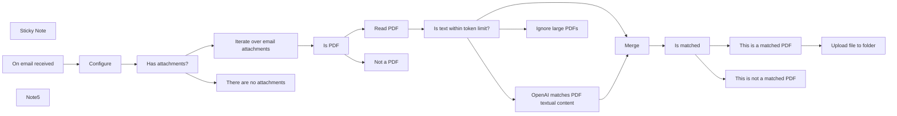

## Fluxo (.json) :

```json
{
  "meta": {
    "instanceId": "a2434c94d549548a685cca39cc4614698e94f527bcea84eefa363f1037ae14cd"
  },
  "nodes": [
    {
      "id": "deafa2e8-af41-4f11-92e0-09992f6c6970",
      "name": "Read PDF",
      "type": "n8n-nodes-base.readPDF",
      "position": [
        860,
        1420
      ],
      "parameters": {},
      "typeVersion": 1
    },
    {
      "id": "8e3ddbb1-83a1-4f79-9464-61d5a20f0427",
      "name": "Sticky Note",
      "type": "n8n-nodes-base.stickyNote",
      "position": [
        -760,
        1300
      ],
      "parameters": {
        "width": 444.034812880766,
        "height": 599.5274151436035,
        "content": "## Send specific PDF attachments from Gmail to Google Drive using OpenAI\n\n_**DISCLAIMER**: You may have varying success when using this workflow so be prepared to validate the correctness of OpenAI's results._\n\nThis workflow reads PDF textual content and sends the text to OpenAI. Attachments of interest will then be uploaded to a specified Google Drive folder. For example, you may wish to send invoices received from an email to an inbox folder in Google Drive for later processing. This workflow has been designed to easily change the search term to match your needs. See the workflow for more details.\n\n### How it works\n1. Triggers off on the `On email received` node.\n2. Iterates over the attachments in the email.\n3. Uses the `OpenAI` node to filter out the attachments that do not match the search term set in the `Configure` node. You could match on various PDF files (i.e. invoice, receipt, or contract).\n4. If the PDF attachment matches the search term, the workflow uses the `Google Drive` node to upload the PDF attachment to a specific Google Drive folder.\n\n\nWorkflow written by [David Sha](https://davidsha.me)."
      },
      "typeVersion": 1
    },
    {
      "id": "fb2c3697-a92f-4be1-b9a6-0326f87de70b",
      "name": "Configure",
      "type": "n8n-nodes-base.set",
      "position": [
        -20,
        1520
      ],
      "parameters": {
        "values": {
          "number": [
            {
              "name": "maxTokenSize",
              "value": 4000
            },
            {
              "name": "replyTokenSize",
              "value": 50
            }
          ],
          "string": [
            {
              "name": "Match on",
              "value": "payslip"
            },
            {
              "name": "Google Drive folder to upload matched PDFs",
              "value": "https://drive.google.com/drive/u/0/folders/1SKdHTnYoBNlnhF_QJ-Zyepy-3-WZkObo"
            }
          ]
        },
        "options": {}
      },
      "typeVersion": 1
    },
    {
      "id": "792c49f4-06e3-4d77-a31f-1513f70abf32",
      "name": "Is PDF",
      "type": "n8n-nodes-base.if",
      "position": [
        640,
        1520
      ],
      "parameters": {
        "conditions": {
          "string": [
            {
              "value1": "={{ $binary.data.fileExtension }}",
              "value2": "pdf"
            }
          ]
        }
      },
      "typeVersion": 1
    },
    {
      "id": "82be9111-665d-41c6-8190-2247acdb749b",
      "name": "Not a PDF",
      "type": "n8n-nodes-base.noOp",
      "position": [
        860,
        1620
      ],
      "parameters": {},
      "typeVersion": 1
    },
    {
      "id": "c2ac155f-38ee-46f2-8a24-5614e3c32ff5",
      "name": "Is matched",
      "type": "n8n-nodes-base.if",
      "position": [
        1720,
        1480
      ],
      "parameters": {
        "conditions": {
          "string": [
            {
              "value1": "={{ $json[\"text\"] }}",
              "value2": "true"
            }
          ]
        }
      },
      "typeVersion": 1
    },
    {
      "id": "4a8f15b8-c153-493d-9a2a-d63d911d642d",
      "name": "This is a matched PDF",
      "type": "n8n-nodes-base.noOp",
      "position": [
        1940,
        1380
      ],
      "parameters": {},
      "typeVersion": 1
    },
    {
      "id": "89601591-5c7b-461c-859b-25c7c1f0c2e6",
      "name": "This is not a matched PDF",
      "type": "n8n-nodes-base.noOp",
      "position": [
        1940,
        1580
      ],
      "parameters": {},
      "typeVersion": 1
    },
    {
      "id": "ac517c4a-83b8-441f-b14c-c927c18f8012",
      "name": "Iterate over email attachments",
      "type": "n8n-nodes-base.code",
      "position": [
        420,
        1420
      ],
      "parameters": {
        "jsCode": "// https://community.n8n.io/t/iterating-over-email-attachments/13588/3\nlet results = [];\n\nfor (const item of $input.all()) {\n for (key of Object.keys(item.binary)) {\n results.push({\n json: {},\n binary: {\n data: item.binary[key],\n }\n });\n }\n}\n\nreturn results;"
      },
      "typeVersion": 1
    },
    {
      "id": "79fdf2de-42fe-4ebb-80fb-cc80dcd284f9",
      "name": "OpenAI matches PDF textual content",
      "type": "n8n-nodes-base.openAi",
      "position": [
        1300,
        1340
      ],
      "parameters": {
        "prompt": "=Does this PDF file look like a {{ $(\"Configure\").first().json[\"Match on\"] }}? Return \"true\" if it is a {{ $(\"Configure\").first().json[\"Match on\"] }} and \"false\" if not. Only reply with lowercase letters \"true\" or \"false\".\n\nThis is the PDF filename:\n```\n{{ $binary.data.fileName }}\n```\n\nThis is the PDF text content:\n```\n{{ $json.text }}\n```",
        "options": {
          "maxTokens": "={{ $('Configure').first().json.replyTokenSize }}",
          "temperature": 0.1
        }
      },
      "credentials": {
        "openAiApi": {
          "id": "30",
          "name": "REPLACE ME"
        }
      },
      "typeVersion": 1,
      "alwaysOutputData": false
    },
    {
      "id": "8bdb3263-40f2-4277-8cc0-f6edef90a1cd",
      "name": "Merge",
      "type": "n8n-nodes-base.merge",
      "position": [
        1500,
        1480
      ],
      "parameters": {
        "mode": "combine",
        "options": {
          "clashHandling": {
            "values": {
              "resolveClash": "preferInput1"
            }
          }
        },
        "combinationMode": "mergeByPosition"
      },
      "typeVersion": 2
    },
    {
      "id": "8e68e725-b2df-4c0c-8b17-e0cd4610714d",
      "name": "Upload file to folder",
      "type": "n8n-nodes-base.googleDrive",
      "position": [
        2160,
        1380
      ],
      "parameters": {
        "name": "={{ $binary.data.fileName }}",
        "options": {},
        "parents": [
          "={{ $('Configure').first().json[\"Google Drive folder to upload matched PDFs\"].split(\"/\").at(-1) }}"
        ],
        "binaryData": true
      },
      "credentials": {
        "googleDriveOAuth2Api": {
          "id": "32",
          "name": "REPLACE ME"
        }
      },
      "typeVersion": 2
    },
    {
      "id": "bda00901-5ade-471c-b6f9-a18ef4d71589",
      "name": "On email received",
      "type": "n8n-nodes-base.gmailTrigger",
      "position": [
        -240,
        1520
      ],
      "parameters": {
        "simple": false,
        "filters": {},
        "options": {
          "downloadAttachments": true,
          "dataPropertyAttachmentsPrefixName": "attachment_"
        },
        "pollTimes": {
          "item": [
            {
              "mode": "everyMinute"
            }
          ]
        }
      },
      "credentials": {
        "gmailOAuth2": {
          "id": "31",
          "name": "REPLACE ME"
        }
      },
      "typeVersion": 1
    },
    {
      "id": "b2ff4774-336b-47a3-af3f-ada809ed9b8a",
      "name": "Note5",
      "type": "n8n-nodes-base.stickyNote",
      "position": [
        -100,
        1440
      ],
      "parameters": {
        "width": 259.0890718059702,
        "height": 607.9684549079709,
        "content": "### Configuration\n\n\n\n\n\n\n\n\n\n\n\n\n\n\n\n__`Match on`(required)__: What should OpenAI's search term be? Examples: invoice, callsheet, receipt, contract, payslip.\n__`Google Drive folder to upload matched PDFs`(required)__: Paste the link of the GDrive folder, an example has been provided but will need to change to a folder you own.\n__`maxTokenSize`(required)__: The maximum token size for the model you choose. See possible models from OpenAI [here](https://platform.openai.com/docs/models/gpt-3).\n__`replyTokenSize`(required)__: The reply's maximum token size. Default is 300. This determines how much text the AI will reply with."
      },
      "typeVersion": 1
    },
    {
      "id": "beb571fe-e7a3-4f3c-862b-dc01821e5f3f",
      "name": "Ignore large PDFs",
      "type": "n8n-nodes-base.noOp",
      "position": [
        1300,
        1620
      ],
      "parameters": {},
      "typeVersion": 1
    },
    {
      "id": "f3c4f249-08a7-4e5e-8f46-e07393ac10b5",
      "name": "Is text within token limit?",
      "type": "n8n-nodes-base.if",
      "position": [
        1080,
        1520
      ],
      "parameters": {
        "conditions": {
          "boolean": [
            {
              "value1": "={{ $json.text.length() / 4 <= $('Configure').first().json.maxTokenSize - $('Configure').first().json.replyTokenSize }}",
              "value2": true
            }
          ]
        }
      },
      "typeVersion": 1
    },
    {
      "id": "93b6fb96-3e0e-4953-bd09-cf882d2dc69c",
      "name": "Has attachments?",
      "type": "n8n-nodes-base.if",
      "position": [
        200,
        1520
      ],
      "parameters": {
        "conditions": {
          "boolean": [
            {
              "value1": "={{ $('On email received').item.binary.isNotEmpty() }}",
              "value2": true
            }
          ]
        }
      },
      "typeVersion": 1
    },
    {
      "id": "554d415e-a965-46be-8442-35c4cb6b005c",
      "name": "There are no attachments",
      "type": "n8n-nodes-base.noOp",
      "position": [
        420,
        1620
      ],
      "parameters": {},
      "typeVersion": 1
    }
  ],
  "connections": {
    "Merge": {
      "main": [
        [
          {
            "node": "Is matched",
            "type": "main",
            "index": 0
          }
        ]
      ]
    },
    "Is PDF": {
      "main": [
        [
          {
            "node": "Read PDF",
            "type": "main",
            "index": 0
          }
        ],
        [
          {
            "node": "Not a PDF",
            "type": "main",
            "index": 0
          }
        ]
      ]
    },
    "Read PDF": {
      "main": [
        [
          {
            "node": "Is text within token limit?",
            "type": "main",
            "index": 0
          }
        ]
      ]
    },
    "Configure": {
      "main": [
        [
          {
            "node": "Has attachments?",
            "type": "main",
            "index": 0
          }
        ]
      ]
    },
    "Is matched": {
      "main": [
        [
          {
            "node": "This is a matched PDF",
            "type": "main",
            "index": 0
          }
        ],
        [
          {
            "node": "This is not a matched PDF",
            "type": "main",
            "index": 0
          }
        ]
      ]
    },
    "Has attachments?": {
      "main": [
        [
          {
            "node": "Iterate over email attachments",
            "type": "main",
            "index": 0
          }
        ],
        [
          {
            "node": "There are no attachments",
            "type": "main",
            "index": 0
          }
        ]
      ]
    },
    "On email received": {
      "main": [
        [
          {
            "node": "Configure",
            "type": "main",
            "index": 0
          }
        ]
      ]
    },
    "This is a matched PDF": {
      "main": [
        [
          {
            "node": "Upload file to folder",
            "type": "main",
            "index": 0
          }
        ]
      ]
    },
    "Is text within token limit?": {
      "main": [
        [
          {
            "node": "OpenAI matches PDF textual content",
            "type": "main",
            "index": 0
          },
          {
            "node": "Merge",
            "type": "main",
            "index": 1
          }
        ],
        [
          {
            "node": "Ignore large PDFs",
            "type": "main",
            "index": 0
          }
        ]
      ]
    },
    "Iterate over email attachments": {
      "main": [
        [
          {
            "node": "Is PDF",
            "type": "main",
            "index": 0
          }
        ]
      ]
    },
    "OpenAI matches PDF textual content": {
      "main": [
        [
          {
            "node": "Merge",
            "type": "main",
            "index": 0
          }
        ]
      ]
    }
  }
}
```

<a id="template-1164"></a>

## Template 1164 - Handler padrão de erro com notificação por email

- **Nome:** Handler padrão de erro com notificação por email
- **Descrição:** Workflow que atua como manipulador de erros padrão: notifica por email quando um workflow falha e se configura automaticamente como handler para workflows que ainda não possuem um.
- **Funcionalidade:** • Notificação de falhas: envia um email contendo informações e link da execução quando um workflow falha.
• Identificação do próprio ID: obtém o ID deste workflow para usá‑lo como handler de erro em outros workflows.
• Aplicação automática como handler padrão: verifica workflows ativos que não possuem handler de erro definido e define este workflow como handler padrão.
• Atualização das configurações do workflow: altera o campo settings.errorWorkflow nos workflows alvo e remove configurações conflitantes (callerPolicy).
• Execução agendada: roda periodicamente (diariamente) para aplicar o handler padrão em novos workflows que venham a ser criados.
- **Ferramentas:** • Gmail: serviço utilizado para enviar notificações por email quando ocorrem falhas.
• API da plataforma de automação: utilizada para obter informações dos workflows e atualizar suas configurações remotamente.

## Fluxo visual

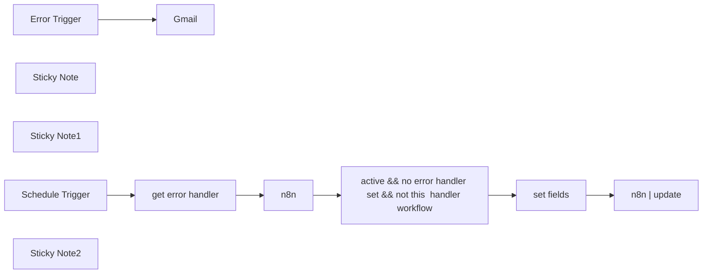

## Fluxo (.json) :

```json
{
  "meta": {
    "instanceId": "78ab5e476ecaa1f377d804637c3e86d3fd449c31126b69159de63d266513b694"
  },
  "nodes": [
    {
      "id": "d46a710d-0d0e-4040-b2b2-a2bd2e2410ff",
      "name": "Error Trigger",
      "type": "n8n-nodes-base.errorTrigger",
      "position": [
        440,
        520
      ],
      "parameters": {},
      "typeVersion": 1
    },
    {
      "id": "2e3a9cf6-9a9f-4f11-ab53-e3fa9c393e1f",
      "name": "n8n",
      "type": "n8n-nodes-base.n8n",
      "position": [
        900,
        180
      ],
      "parameters": {
        "filters": {},
        "requestOptions": {}
      },
      "credentials": {
        "n8nApi": {
          "id": "27",
          "name": "n8n account"
        }
      },
      "typeVersion": 1
    },
    {
      "id": "7fc93f47-24ee-4000-ac3f-eb2746a926bb",
      "name": "Gmail",
      "type": "n8n-nodes-base.gmail",
      "position": [
        660,
        520
      ],
      "parameters": {
        "sendTo": "=(your email address)",
        "message": "={{ $json.execution.url }}",
        "options": {},
        "subject": "=[n8n] workflow failed:  {{ $json.workflow.name }}"
      },
      "credentials": {
        "gmailOAuth2": {
          "id": "3",
          "name": "gmail bart@blendernation.com"
        }
      },
      "typeVersion": 2.1
    },
    {
      "id": "25ed8ec8-2c28-498a-a951-c5ef1b2a2c59",
      "name": "get error handler",
      "type": "n8n-nodes-base.n8n",
      "position": [
        660,
        180
      ],
      "parameters": {
        "operation": "get",
        "workflowId": {
          "__rl": true,
          "mode": "id",
          "value": "={{ $workflow.id }}"
        },
        "requestOptions": {}
      },
      "credentials": {
        "n8nApi": {
          "id": "27",
          "name": "n8n account"
        }
      },
      "typeVersion": 1
    },
    {
      "id": "44713be9-786a-4bff-b562-a23146792995",
      "name": "n8n | update",
      "type": "n8n-nodes-base.n8n",
      "position": [
        1500,
        180
      ],
      "parameters": {
        "operation": "update",
        "workflowId": {
          "__rl": true,
          "mode": "id",
          "value": "={{ $json.id }}"
        },
        "requestOptions": {},
        "workflowObject": "={{ JSON.stringify($json) }}"
      },
      "credentials": {
        "n8nApi": {
          "id": "27",
          "name": "n8n account"
        }
      },
      "typeVersion": 1
    },
    {
      "id": "be27247a-71e5-4204-9c7c-2692d8a82c8b",
      "name": "set fields",
      "type": "n8n-nodes-base.code",
      "position": [
        1300,
        180
      ],
      "parameters": {
        "mode": "runOnceForEachItem",
        "jsCode": "const data = $json\n\ndata.settings.errorWorkflow = $('get error handler').item.json.id ;\ndelete data.settings.callerPolicy;\n\nreturn {\n  id: data.id,\n  name: data.name,\n  nodes: data.nodes,\n  connections: data.connections,\n  settings: data.settings\n}"
      },
      "typeVersion": 2
    },
    {
      "id": "d8774911-f4b2-4198-838b-2d0b89002e25",
      "name": "Sticky Note",
      "type": "n8n-nodes-base.stickyNote",
      "position": [
        380,
        400
      ],
      "parameters": {
        "width": 483.4744075807993,
        "height": 308.64949804469416,
        "content": "## Default Error Handler\n\nUpdate this to your preferred notification mechanism"
      },
      "typeVersion": 1
    },
    {
      "id": "0baa0fc3-4d5e-4507-bd5d-65ebce68178f",
      "name": "Sticky Note1",
      "type": "n8n-nodes-base.stickyNote",
      "position": [
        605.0603083429507,
        126.84319830832769
      ],
      "parameters": {
        "width": 232.91556831986873,
        "height": 216.67545344104974,
        "content": "get ID of self"
      },
      "typeVersion": 1
    },
    {
      "id": "fabb0db7-7364-4349-8563-952c9f0e07b2",
      "name": "Schedule Trigger",
      "type": "n8n-nodes-base.scheduleTrigger",
      "position": [
        440,
        180
      ],
      "parameters": {
        "rule": {
          "interval": [
            {}
          ]
        }
      },
      "typeVersion": 1.2
    },
    {
      "id": "dd1e0036-1093-4160-adad-ed1b0c1b3548",
      "name": "Sticky Note2",
      "type": "n8n-nodes-base.stickyNote",
      "position": [
        380,
        125.83113663973751
      ],
      "parameters": {
        "width": 214.6984582852457,
        "height": 219.7116384468202,
        "content": "Runs every day at midnight to update new workflows"
      },
      "typeVersion": 1
    },
    {
      "id": "aca838c8-ff3e-4630-824b-a6d1d8414326",
      "name": "active && no error handler set && not this  handler workflow",
      "type": "n8n-nodes-base.if",
      "position": [
        1100,
        180
      ],
      "parameters": {
        "options": {},
        "conditions": {
          "options": {
            "leftValue": "",
            "caseSensitive": true,
            "typeValidation": "strict"
          },
          "combinator": "and",
          "conditions": [
            {
              "id": "290fd302-4e2d-44d6-8a8a-14a0b8f2c360",
              "operator": {
                "type": "string",
                "operation": "notExists",
                "singleValue": true
              },
              "leftValue": "={{ $json.settings.errorWorkflow }}",
              "rightValue": "=Default Error Handler"
            },
            {
              "id": "2a5799e9-2030-4281-bf11-e7f9777906c5",
              "operator": {
                "type": "string",
                "operation": "notEquals"
              },
              "leftValue": "={{ $json.id }}",
              "rightValue": "={{ $('get error handler').item.json.id }}"
            },
            {
              "id": "8bc4c2a0-e094-4426-8ae6-71b6e4fa9842",
              "operator": {
                "type": "boolean",
                "operation": "true",
                "singleValue": true
              },
              "leftValue": "={{ $json.active }}",
              "rightValue": ""
            }
          ]
        }
      },
      "typeVersion": 2
    }
  ],
  "pinData": {},
  "connections": {
    "n8n": {
      "main": [
        [
          {
            "node": "active && no error handler set && not this  handler workflow",
            "type": "main",
            "index": 0
          }
        ]
      ]
    },
    "set fields": {
      "main": [
        [
          {
            "node": "n8n | update",
            "type": "main",
            "index": 0
          }
        ]
      ]
    },
    "Error Trigger": {
      "main": [
        [
          {
            "node": "Gmail",
            "type": "main",
            "index": 0
          }
        ]
      ]
    },
    "Schedule Trigger": {
      "main": [
        [
          {
            "node": "get error handler",
            "type": "main",
            "index": 0
          }
        ]
      ]
    },
    "get error handler": {
      "main": [
        [
          {
            "node": "n8n",
            "type": "main",
            "index": 0
          }
        ]
      ]
    },
    "active && no error handler set && not this  handler workflow": {
      "main": [
        [
          {
            "node": "set fields",
            "type": "main",
            "index": 0
          }
        ]
      ]
    }
  }
}
```

<a id="template-1165"></a>

## Template 1165 - Notificações pré-reunião por WhatsApp

- **Nome:** Notificações pré-reunião por WhatsApp
- **Descrição:** Monitora o calendário para reuniões próximas, coleta contexto sobre os participantes (últimos e-mails e atividade no LinkedIn), resume essas informações com modelos de linguagem e envia uma notificação curta e informativa via WhatsApp.
- **Funcionalidade:** • Verificação periódica de reuniões: roda em intervalos (ex.: a cada hora) para detectar reuniões nas próximas horas.
• Extração de participantes do convite: identifica e extrai nome, e-mail e URL do LinkedIn dos attendees a partir do convite.
• Pesquisa de última correspondência por participante: busca o último e-mail trocado com cada participante e prepara um resumo.
• Coleta de perfil e atividade do LinkedIn: renderiza e raspa o perfil do participante para obter a seção “About” e atividades recentes.
• Uso de modelos de linguagem para extração e resumo: usa LLMs para extrair informações dos convites, resumir e-mails e sintetizar atividade do LinkedIn.
• Geração de notificação pré-reunião: combina resumo da reunião e resumos por participante em uma mensagem curta, com bullets e pontos de conversa sugeridos.
• Envio da mensagem via WhatsApp Business Cloud: entrega a notificação compacta ao usuário através de WhatsApp.
• Subworkflows e roteamento por participante: executa pesquisas específicas (e-mail ou LinkedIn) por participante, com combinações e fallback quando dados não estão disponíveis.
• Tratamento de falhas e mensagens padrão: insere mensagens padrão quando não há correspondência ou quando a raspagem falha, garantindo saída consistente.
- **Ferramentas:** • Google Calendar: serviço usado para detectar reuniões e obter detalhes do evento (horário, link, descrição e organizador).
• Gmail: fonte para recuperar a última correspondência por participante.
• OpenAI (modelos GPT-4o): usado para extrair, resumir e gerar o texto da notificação pré-reunião.
• Apify: plataforma de web scraping usada para renderizar páginas e obter o HTML do perfil do LinkedIn.
• LinkedIn: fonte de dados (perfil e atividade recentes) obtida por scraping para contextualizar os participantes.
• WhatsApp Business Cloud: canal de envio da notificação ao usuário via mensagem.

## Fluxo visual

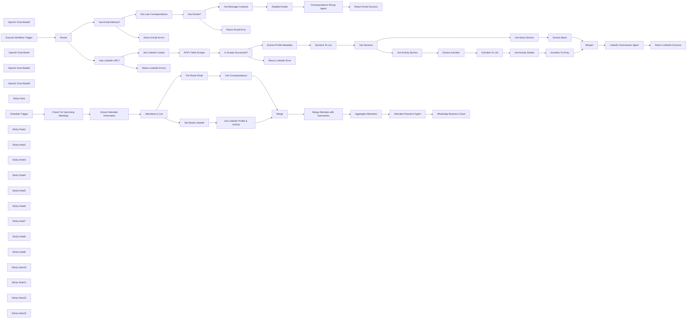

## Fluxo (.json) :

```json
{
  "meta": {
    "instanceId": "408f9fb9940c3cb18ffdef0e0150fe342d6e655c3a9fac21f0f644e8bedabcd9"
  },
  "nodes": [
    {
      "id": "201ef455-2d65-4563-8ec1-318211b1fa6a",
      "name": "Get Message Contents",
      "type": "n8n-nodes-base.gmail",
      "position": [
        2080,
        500
      ],
      "webhookId": "fa1d496f-17fa-4e50-bae9-84ca85ed4502",
      "parameters": {
        "simple": false,
        "options": {},
        "messageId": "={{ $json.id }}",
        "operation": "get"
      },
      "credentials": {
        "gmailOAuth2": {
          "id": "Sf5Gfl9NiFTNXFWb",
          "name": "Gmail account"
        }
      },
      "typeVersion": 2.1
    },
    {
      "id": "ded010af-e977-4c47-87dd-8221d601af74",
      "name": "Simplify Emails",
      "type": "n8n-nodes-base.set",
      "position": [
        2240,
        500
      ],
      "parameters": {
        "options": {},
        "assignments": {
          "assignments": [
            {
              "id": "2006c806-42db-4457-84c2-35f59ed39018",
              "name": "date",
              "type": "string",
              "value": "={{ $json.date }}"
            },
            {
              "id": "872278d2-b97c-45ba-a9d3-162f154fe7dc",
              "name": "subject",
              "type": "string",
              "value": "={{ $json.subject }}"
            },
            {
              "id": "282f03e9-1d0f-4a17-b9ed-75b44171d4ee",
              "name": "text",
              "type": "string",
              "value": "={{ $json.text }}"
            },
            {
              "id": "9421776c-ff53-4490-b0e1-1e610534ba25",
              "name": "from",
              "type": "string",
              "value": "={{ $json.from.value[0].name }} ({{ $json.from.value[0].address }})"
            },
            {
              "id": "3b6716e8-5582-4da3-ae9d-e8dd1afad530",
              "name": "to",
              "type": "string",
              "value": "={{ $json.to.value[0].name }} ({{ $json.to.value[0].address }})"
            }
          ]
        }
      },
      "typeVersion": 3.4
    },
    {
      "id": "816bf787-ff9c-4b97-80ac-4b0c6ae5638b",
      "name": "Check For Upcoming Meetings",
      "type": "n8n-nodes-base.googleCalendar",
      "position": [
        526,
        -180
      ],
      "parameters": {
        "limit": 1,
        "options": {
          "orderBy": "startTime",
          "timeMax": "={{ $now.toUTC().plus(1, 'hour') }}",
          "timeMin": "={{ $now.toUTC() }}",
          "singleEvents": true
        },
        "calendar": {
          "__rl": true,
          "mode": "list",
          "value": "c_5792bdf04bc395cbcbc6f7b754268245a33779d36640cc80a357711aa2f09a0a@group.calendar.google.com",
          "cachedResultName": "n8n-events"
        },
        "operation": "getAll"
      },
      "credentials": {
        "googleCalendarOAuth2Api": {
          "id": "kWMxmDbMDDJoYFVK",
          "name": "Google Calendar account"
        }
      },
      "typeVersion": 1.2
    },
    {
      "id": "234d5c79-bf40-44bb-8829-c6ccf8648359",
      "name": "OpenAI Chat Model2",
      "type": "@n8n/n8n-nodes-langchain.lmChatOpenAi",
      "position": [
        920,
        -20
      ],
      "parameters": {
        "model": "gpt-4o-2024-08-06",
        "options": {}
      },
      "credentials": {
        "openAiApi": {
          "id": "8gccIjcuf3gvaoEr",
          "name": "OpenAi account"
        }
      },
      "typeVersion": 1
    },
    {
      "id": "445aa0f4-d41a-4d46-aa2f-e79a9cdb04b5",
      "name": "Extract Attendee Information",
      "type": "@n8n/n8n-nodes-langchain.informationExtractor",
      "position": [
        920,
        -180
      ],
      "parameters": {
        "text": "=start: {{ $json.start.dateTime }}\nmeeting url: {{ $json.hangoutLink }}\nsummary: {{ $json.summary }}\ndescription: {{ $json.description }}\norganiser: {{ $json.organizer.displayName }} ({{ $json.organizer.email }})\nattendees: {{ $json.attendees.filter(item => !item.organizer).map(item => item.email).join(',') }}",
        "options": {
          "systemPromptTemplate": "You are an expert extraction algorithm. Try to link any information found in the description to help fill in the attendee details.\nIf you do not know the value of an attribute asked to extract, you may omit the attribute's value."
        },
        "schemaType": "manual",
        "inputSchema": "{\n\t\"type\": \"object\",\n\t\"properties\": {\n\t\t\"attendees\": {\n \"type\": \"array\",\n \"description\": \"list of attendees excluding the meeting organiser\",\n \"items\": {\n\t\t\t\"type\": \"object\",\n\t\t\t\"properties\": {\n\t\t\t \"name\": { \"type\": \"string\" },\n \"email\": { \"type\": \"string\" },\n \"linkedin_url\": { \"type\": \"string\" }\n\t\t\t}\n }\n\t\t}\n\t}\n}"
      },
      "typeVersion": 1
    },
    {
      "id": "390743d8-acfd-4951-8901-212f162dcbb4",
      "name": "Execute Workflow Trigger",
      "type": "n8n-nodes-base.executeWorkflowTrigger",
      "position": [
        920,
        580
      ],
      "parameters": {},
      "typeVersion": 1
    },
    {
      "id": "ea9c76a0-40a0-413a-a93a-ad99069d0d91",
      "name": "OpenAI Chat Model",
      "type": "@n8n/n8n-nodes-langchain.lmChatOpenAi",
      "position": [
        2460,
        640
      ],
      "parameters": {
        "model": "gpt-4o-2024-08-06",
        "options": {}
      },
      "credentials": {
        "openAiApi": {
          "id": "8gccIjcuf3gvaoEr",
          "name": "OpenAi account"
        }
      },
      "typeVersion": 1
    },
    {
      "id": "8d9df9e4-1815-44a2-a6fc-a9af42a77153",
      "name": "Get Last Correspondence",
      "type": "n8n-nodes-base.gmail",
      "position": [
        1740,
        500
      ],
      "webhookId": "b00c960c-3689-4fa1-9f0f-7d6c9479f0c6",
      "parameters": {
        "limit": 1,
        "filters": {
          "sender": "={{ $json.email }}"
        },
        "operation": "getAll"
      },
      "credentials": {
        "gmailOAuth2": {
          "id": "Sf5Gfl9NiFTNXFWb",
          "name": "Gmail account"
        }
      },
      "typeVersion": 2.1,
      "alwaysOutputData": true
    },
    {
      "id": "23c7161f-60e2-4a99-9279-ff1dca5efc1c",
      "name": "OpenAI Chat Model1",
      "type": "@n8n/n8n-nodes-langchain.lmChatOpenAi",
      "position": [
        4020,
        1320
      ],
      "parameters": {
        "model": "gpt-4o-2024-08-06",
        "options": {}
      },
      "credentials": {
        "openAiApi": {
          "id": "8gccIjcuf3gvaoEr",
          "name": "OpenAi account"
        }
      },
      "typeVersion": 1
    },
    {
      "id": "9ab535aa-bd8c-4bd6-a7a0-f7182d8d7123",
      "name": "OpenAI Chat Model3",
      "type": "@n8n/n8n-nodes-langchain.lmChatOpenAi",
      "position": [
        2720,
        -20
      ],
      "parameters": {
        "model": "gpt-4o-2024-08-06",
        "options": {}
      },
      "credentials": {
        "openAiApi": {
          "id": "8gccIjcuf3gvaoEr",
          "name": "OpenAi account"
        }
      },
      "typeVersion": 1
    },
    {
      "id": "410acb11-a16c-4abd-9f10-7582168d100e",
      "name": "WhatsApp Business Cloud",
      "type": "n8n-nodes-base.whatsApp",
      "position": [
        3360,
        -140
      ],
      "parameters": {
        "textBody": "={{ $json.text }}",
        "operation": "send",
        "phoneNumberId": "477115632141067",
        "requestOptions": {},
        "additionalFields": {},
        "recipientPhoneNumber": "44123456789"
      },
      "credentials": {
        "whatsAppApi": {
          "id": "9SFJPeqrpChOkAmw",
          "name": "WhatsApp account"
        }
      },
      "typeVersion": 1
    },
    {
      "id": "a7e8195d-eb73-4acb-aae1-eb04f8290d24",
      "name": "Sticky Note",
      "type": "n8n-nodes-base.stickyNote",
      "position": [
        180,
        -400
      ],
      "parameters": {
        "color": 7,
        "width": 616.7897454470152,
        "height": 449.1424626006906,
        "content": "## 1. Periodically Search For Upcoming Meetings\n[Read about the Scheduled Trigger](https://docs.n8n.io/integrations/builtin/core-nodes/n8n-nodes-base.scheduletrigger)\n\nLet's use the Scheduled Trigger node to trigger our Assistant to notify about upcoming meetings. Here, we'll set it for 1 hour intervals to check for meetings scheduled in our Google Calendar. You may need to play with the intervals and frequency depending on how many meetings you typically have."
      },
      "typeVersion": 1
    },
    {
      "id": "1aebb209-e440-4ef2-8527-381e5e70b4ea",
      "name": "Schedule Trigger",
      "type": "n8n-nodes-base.scheduleTrigger",
      "position": [
        326,
        -180
      ],
      "parameters": {
        "rule": {
          "interval": [
            {
              "field": "hours"
            }
          ]
        }
      },
      "typeVersion": 1.2
    },
    {
      "id": "95758053-fcc2-45c6-96c2-ec0bf89bcb82",
      "name": "Sticky Note1",
      "type": "n8n-nodes-base.stickyNote",
      "position": [
        820,
        -520
      ],
      "parameters": {
        "color": 7,
        "width": 655.5654775604146,
        "height": 670.4114154200236,
        "content": "## 2. Extract Attendee Details From Invite\n[Learn more about the Information Extractor node](https://docs.n8n.io/integrations/builtin/cluster-nodes/root-nodes/n8n-nodes-langchain.information-extractor/)\n\nOnce we have our upcoming meeting, it'll be nice to prepare for it by reminding the user what the meeting is about and some context with the attendees. This will be the goal this template and of our assistant! However, first we'll need to extract some contact information of the attendees to do so.\n\nFor this demonstration, we'll assume that attendee's email and LinkedIn profile URLs are included in the meeting invite. We'll extract this information for each attendee using the Information Extractor node. This convenient node uses AI to parse and extract which saves us from writing complex pattern matching code otherwise.\n\nIn your own scenario, feel free to use your CRM to get this information instead."
      },
      "typeVersion": 1
    },
    {
      "id": "bd17aed0-9c96-4301-b09b-e61a03ebc1ac",
      "name": "Sticky Note2",
      "type": "n8n-nodes-base.stickyNote",
      "position": [
        1500,
        -520
      ],
      "parameters": {
        "color": 7,
        "width": 1020.0959898041108,
        "height": 670.8210817031078,
        "content": "## 3. Fetch Recent Correspondance & LinkedIn Activity\n[Learn more about the Execute Workflow node](https://docs.n8n.io/integrations/builtin/core-nodes/n8n-nodes-base.executeworkflow)\n\nAs both email fetching and LinkedIn scraping actions are quite complex, we'll split them out as subworkflow executions. Doing so (in my honest opinion), helps with development and maintainability of the template. Here, we'll make perform the research for all applicable attendees by making 2 calls to the subworkflow and merging them back into a single node at the end.\n\nHead over to the subworkflow (see below - step 3a) to see how we pull the summaries from Gmail and LinkedIn."
      },
      "typeVersion": 1
    },
    {
      "id": "ae804039-32e0-4d2d-a2ef-a6e8d65f7ce2",
      "name": "Sticky Note3",
      "type": "n8n-nodes-base.stickyNote",
      "position": [
        2547.540603371386,
        -440
      ],
      "parameters": {
        "color": 7,
        "width": 610.3630186140072,
        "height": 582.1201380897592,
        "content": "## 4. Generate Pre-Meeting Notification\n[Read more about the Basic LLM node](https://docs.n8n.io/integrations/builtin/cluster-nodes/root-nodes/n8n-nodes-langchain.chainllm)\n\nNow that we have (1) our upcoming meeting details and (2) recent email and/or Linkedin summaries about our attendee, let's feed them into our LLM node to generate the best pre-meeting notification ever seen! Of course, we'll need to keep it short as we intend to send this notification via WhatsApp message but should you choose to use another channel such as email, feel free to adjust the length of the message which suits."
      },
      "typeVersion": 1
    },
    {
      "id": "045eb1d9-fd80-4f9c-8218-ae66583d0186",
      "name": "Sticky Note4",
      "type": "n8n-nodes-base.stickyNote",
      "position": [
        3180,
        -360
      ],
      "parameters": {
        "color": 7,
        "width": 466.8967433831988,
        "height": 454.24485615650235,
        "content": "## 5. Send Notification via WhatsApp\n[Learn more about the WhatsApp node](https://docs.n8n.io/integrations/builtin/app-nodes/n8n-nodes-base.whatsapp)\n\nThe WhatsApp node is a super convenient way to send messages to WhatsApp which is one of the many messaging apps supported by n8n out of the box. Not using WhatsApp? Simply swap this our for Twilio, Telegram, Slack and others."
      },
      "typeVersion": 1
    },
    {
      "id": "46d35c68-88d7-445f-9834-b8b37ce90619",
      "name": "Sticky Note5",
      "type": "n8n-nodes-base.stickyNote",
      "position": [
        1740,
        260
      ],
      "parameters": {
        "color": 7,
        "width": 519.1145893777881,
        "height": 190.5042226526524,
        "content": "## 3.2: Fetch Last Email Correspondance\n[Learn more about Gmail node](https://docs.n8n.io/integrations/builtin/app-nodes/n8n-nodes-base.gmail)\n\nFetching our attendee's last email will definitely help the user \"pick up\" from when they last last off. To do this, we'll assume a Gmail user and use the Gmail node to filter messages by the attendee's email address."
      },
      "typeVersion": 1
    },
    {
      "id": "fe1c751c-4879-482b-bb6f-89df23e1faa8",
      "name": "Sticky Note6",
      "type": "n8n-nodes-base.stickyNote",
      "position": [
        1740,
        860
      ],
      "parameters": {
        "color": 7,
        "width": 667.8619481635637,
        "height": 259.7914017217902,
        "content": "## 3.4 Scraping LinkedIn With [Apify.com](https://www.apify.com?fpr=414q6)\n[Learn more about Apify.com for Web Scraping](https://www.apify.com?fpr=414q6)\n\nTo get the attendee's recent LinkedIn activity, we'll need a webscraper capable of rendering the user's LinkedIn profile. We'll use [Apify.com](https://www.apify.com?fpr=414q6) which is a commercial web scraping service but has a very generous monthly free tier ($5/mo).\n\nWhile Apify offers a number of dedicated LinkedIn scrapers, we'll build our own which works by impersonating our own LinkedIn account using our login cookie - this can be obtained by inspecting network requests when logged into Linkedin. **Add your LinkedIn Cookie to the node below!**"
      },
      "typeVersion": 1
    },
    {
      "id": "a648cf7d-b859-4fec-8ae7-6450c70e6333",
      "name": "Sticky Note7",
      "type": "n8n-nodes-base.stickyNote",
      "position": [
        920,
        310
      ],
      "parameters": {
        "color": 7,
        "width": 572.0305871208889,
        "height": 231.49547088049098,
        "content": "## 3.1 Attendee Researcher SubWorkflow\n[Learn more about using Execute Workflow Trigger](https://docs.n8n.io/integrations/builtin/core-nodes/n8n-nodes-base.executeworkflowtrigger/)\n\nThe Attendee Researcher SubWorkflow's aims to collect and summarize both an attendee's last correspondance with the user (if applicable) and the attendee's LinkedIn profile (if available). It uses the router pattern to handle both branches allowing for shorter execution chains. Using the Switch node, this subworkflow is either triggered to fetch emails or scrape LinkedIn but never both simultaneously."
      },
      "typeVersion": 1
    },
    {
      "id": "8a8dbe4f-86b1-41a4-9b7e-3affdee8e524",
      "name": "Return LinkedIn Success",
      "type": "n8n-nodes-base.set",
      "position": [
        4360,
        1180
      ],
      "parameters": {
        "options": {},
        "assignments": {
          "assignments": [
            {
              "id": "fc4b63a7-ad4d-49ff-9d42-715760910f6a",
              "name": "linkedin_summary",
              "type": "string",
              "value": "={{ $json.text }}"
            }
          ]
        }
      },
      "typeVersion": 3.4
    },
    {
      "id": "537a399b-1f78-440b-abc4-ad2e91c5950a",
      "name": "Return LinkedIn Error",
      "type": "n8n-nodes-base.set",
      "position": [
        2380,
        1320
      ],
      "parameters": {
        "options": {},
        "assignments": {
          "assignments": [
            {
              "id": "bf5a0781-3bad-4f63-a49c-273b03204747",
              "name": "linkedin_summary",
              "type": "string",
              "value": "No activities found."
            }
          ]
        }
      },
      "typeVersion": 3.4
    },
    {
      "id": "a68e7df7-8467-46e2-8ea8-fcf270755d12",
      "name": "Return Email Error",
      "type": "n8n-nodes-base.set",
      "position": [
        2080,
        680
      ],
      "parameters": {
        "options": {},
        "assignments": {
          "assignments": [
            {
              "id": "9a7efc9e-26b0-48c9-83aa-ae989f20b1df",
              "name": "email_summary",
              "type": "string",
              "value": "No correspondance found."
            }
          ]
        }
      },
      "typeVersion": 3.4
    },
    {
      "id": "00df2b18-22ca-48d6-b053-12fe502effc5",
      "name": "Return Email Success",
      "type": "n8n-nodes-base.set",
      "position": [
        2800,
        500
      ],
      "parameters": {
        "options": {},
        "assignments": {
          "assignments": [
            {
              "id": "fc4b63a7-ad4d-49ff-9d42-715760910f6a",
              "name": "email_summary",
              "type": "object",
              "value": "={{ $json.text }}"
            }
          ]
        }
      },
      "typeVersion": 3.4
    },
    {
      "id": "cdae9f9f-11c0-4f26-9ba1-5d5ed279ebfc",
      "name": "Set Route Email",
      "type": "n8n-nodes-base.set",
      "position": [
        1600,
        -260
      ],
      "parameters": {
        "mode": "raw",
        "options": {},
        "jsonOutput": "={{ Object.assign({ \"route\": \"email\" }, $json) }}"
      },
      "typeVersion": 3.4
    },
    {
      "id": "b01371f6-8871-4ad9-866d-888e22e7908e",
      "name": "Set Route Linkedin",
      "type": "n8n-nodes-base.set",
      "position": [
        1600,
        -100
      ],
      "parameters": {
        "mode": "raw",
        "options": {},
        "jsonOutput": "={{ Object.assign({ \"route\": \"linkedin\" }, $json) }}"
      },
      "typeVersion": 3.4
    },
    {
      "id": "c4907171-b239-46a6-a0b0-6bf66570005f",
      "name": "Router",
      "type": "n8n-nodes-base.switch",
      "position": [
        1100,
        580
      ],
      "parameters": {
        "rules": {
          "values": [
            {
              "outputKey": "email",
              "conditions": {
                "options": {
                  "version": 2,
                  "leftValue": "",
                  "caseSensitive": true,
                  "typeValidation": "strict"
                },
                "combinator": "and",
                "conditions": [
                  {
                    "operator": {
                      "type": "string",
                      "operation": "equals"
                    },
                    "leftValue": "={{ $json.route }}",
                    "rightValue": "email"
                  }
                ]
              },
              "renameOutput": true
            },
            {
              "outputKey": "linkedin",
              "conditions": {
                "options": {
                  "version": 2,
                  "leftValue": "",
                  "caseSensitive": true,
                  "typeValidation": "strict"
                },
                "combinator": "and",
                "conditions": [
                  {
                    "id": "ba71a258-de67-4f61-a24a-33c86bd4c4f5",
                    "operator": {
                      "type": "string",
                      "operation": "equals"
                    },
                    "leftValue": "={{ $json.route }}",
                    "rightValue": "linkedin"
                  }
                ]
              },
              "renameOutput": true
            }
          ]
        },
        "options": {}
      },
      "typeVersion": 3.2
    },
    {
      "id": "45554355-57ad-464d-b768-5b00d707fc58",
      "name": "Return LinkedIn Error1",
      "type": "n8n-nodes-base.set",
      "position": [
        1440,
        870
      ],
      "parameters": {
        "options": {},
        "assignments": {
          "assignments": [
            {
              "id": "bf5a0781-3bad-4f63-a49c-273b03204747",
              "name": "linkedin_summary",
              "type": "string",
              "value": "No activities found."
            }
          ]
        }
      },
      "typeVersion": 3.4
    },
    {
      "id": "05b04c17-eeeb-42f2-8d94-bc848889f17c",
      "name": "Has Emails?",
      "type": "n8n-nodes-base.if",
      "position": [
        1900,
        500
      ],
      "parameters": {
        "options": {},
        "conditions": {
          "options": {
            "version": 2,
            "leftValue": "",
            "caseSensitive": true,
            "typeValidation": "strict"
          },
          "combinator": "and",
          "conditions": [
            {
              "id": "ff11640a-33e4-4695-a62c-7dcab57f0ae5",
              "operator": {
                "type": "object",
                "operation": "empty",
                "singleValue": true
              },
              "leftValue": "={{ $json }}",
              "rightValue": ""
            }
          ]
        }
      },
      "typeVersion": 2.2
    },
    {
      "id": "c24aca66-6222-46ae-bb9b-1838b01f3100",
      "name": "Return Email Error1",
      "type": "n8n-nodes-base.set",
      "position": [
        1440,
        700
      ],
      "parameters": {
        "options": {},
        "assignments": {
          "assignments": [
            {
              "id": "9a7efc9e-26b0-48c9-83aa-ae989f20b1df",
              "name": "email_summary",
              "type": "string",
              "value": "No correspondance found."
            }
          ]
        }
      },
      "typeVersion": 3.4
    },
    {
      "id": "22f3ccbf-19a2-4ca5-ba23-f91963b52c0a",
      "name": "Sticky Note9",
      "type": "n8n-nodes-base.stickyNote",
      "position": [
        2560,
        920
      ],
      "parameters": {
        "color": 7,
        "width": 682.7350931085596,
        "height": 219.59936012669806,
        "content": "## 3.5: Extract LinkedIn Profile & Recent Activity\n[Learn more about the HTML node](https://docs.n8n.io/integrations/builtin/core-nodes/n8n-nodes-base.html)\n\nOnce we have our scraped LinkedIn profile, it's just a simple case of parsing and extracting the relevant sections from the page.\nFor the purpose of our workflow, we'll only need the \"About\" and \"Activity\" sections which we'll pull out of the page using a series of HTML nodes. Feel free to extract other sections to suit your needs! Once extracted, we'll combine the about and activities data in preparation of sending it to our LLM."
      },
      "typeVersion": 1
    },
    {
      "id": "49b1fc8f-1259-4596-84b0-b37fae1c098c",
      "name": "Sections To List",
      "type": "n8n-nodes-base.splitOut",
      "position": [
        2720,
        1180
      ],
      "parameters": {
        "options": {
          "destinationFieldName": "data"
        },
        "fieldToSplitOut": "sections"
      },
      "typeVersion": 1
    },
    {
      "id": "875b278d-44c6-4315-87e3-459a90799a9b",
      "name": "Set LinkedIn Cookie",
      "type": "n8n-nodes-base.set",
      "position": [
        1800,
        1180
      ],
      "parameters": {
        "options": {},
        "assignments": {
          "assignments": [
            {
              "id": "b4354c00-cc1a-4a55-8b44-6ba4854cc6ba",
              "name": "linkedin_profile_url",
              "type": "string",
              "value": "={{ $json.linkedin_url }}"
            },
            {
              "id": "4888db89-2573-4246-8ab9-c106a7fe5f38",
              "name": "linkedin_cookies",
              "type": "string",
              "value": "<COPY_YOUR_LINKEDIN_COOKIES_HERE>"
            }
          ]
        }
      },
      "typeVersion": 3.4
    },
    {
      "id": "91da49ab-86a1-4539-b673-106b9edaeae9",
      "name": "Sticky Note8",
      "type": "n8n-nodes-base.stickyNote",
      "position": [
        1400,
        1240
      ],
      "parameters": {
        "color": 3,
        "width": 308.16846950517856,
        "height": 110.18457997698513,
        "content": "### Be aware of LinkedIn T&Cs!\nFor production, you may want to consider not using your main Linkedin account if you can help it!"
      },
      "typeVersion": 1
    },
    {
      "id": "7abd390f-36a6-49af-b190-5bb720bd2ae8",
      "name": "Sticky Note10",
      "type": "n8n-nodes-base.stickyNote",
      "position": [
        1740,
        1152
      ],
      "parameters": {
        "width": 209.84856156501735,
        "height": 301.5806674338321,
        "content": "\n\n\n\n\n\n\n\n\n\n\n\n\n\n### 🚨 Input Required!\nYou need to add your cuurent linkedIn Cookies here to continue."
      },
      "typeVersion": 1
    },
    {
      "id": "40dfb438-76c2-40b5-8945-94dcf7cafcf7",
      "name": "Attendees to List",
      "type": "n8n-nodes-base.splitOut",
      "position": [
        1260,
        -180
      ],
      "parameters": {
        "options": {},
        "fieldToSplitOut": "output.attendees"
      },
      "typeVersion": 1
    },
    {
      "id": "cc7f8416-6ea1-4425-a320-3f8217d2ad4e",
      "name": "Merge Attendee with Summaries",
      "type": "n8n-nodes-base.set",
      "position": [
        2160,
        -180
      ],
      "parameters": {
        "mode": "raw",
        "options": {},
        "jsonOutput": "={{ Object.assign({}, $('Attendees to List').item.json, $json) }}"
      },
      "typeVersion": 3.4
    },
    {
      "id": "459c5f2b-5dd5-491f-8bed-475ae5af7ac0",
      "name": "Has Email Address?",
      "type": "n8n-nodes-base.if",
      "position": [
        1280,
        580
      ],
      "parameters": {
        "options": {},
        "conditions": {
          "options": {
            "version": 2,
            "leftValue": "",
            "caseSensitive": true,
            "typeValidation": "strict"
          },
          "combinator": "and",
          "conditions": [
            {
              "id": "1382e335-bfae-4665-a2ee-a05496a7b463",
              "operator": {
                "type": "string",
                "operation": "exists",
                "singleValue": true
              },
              "leftValue": "={{ $json.email }}",
              "rightValue": ""
            }
          ]
        }
      },
      "typeVersion": 2.2
    },
    {
      "id": "610e9849-f06c-4534-a269-d1982dcab259",
      "name": "Has LinkedIn URL?",
      "type": "n8n-nodes-base.if",
      "position": [
        1280,
        750
      ],
      "parameters": {
        "options": {},
        "conditions": {
          "options": {
            "version": 2,
            "leftValue": "",
            "caseSensitive": true,
            "typeValidation": "strict"
          },
          "combinator": "and",
          "conditions": [
            {
              "id": "1382e335-bfae-4665-a2ee-a05496a7b463",
              "operator": {
                "type": "string",
                "operation": "exists",
                "singleValue": true
              },
              "leftValue": "={{ $json.linkedin_url }}",
              "rightValue": ""
            }
          ]
        }
      },
      "typeVersion": 2.2
    },
    {
      "id": "43e5192e-c1b0-4d71-8d0e-aa466aa9930c",
      "name": "Get Correspondance",
      "type": "n8n-nodes-base.executeWorkflow",
      "onError": "continueRegularOutput",
      "position": [
        1780,
        -260
      ],
      "parameters": {
        "mode": "each",
        "options": {
          "waitForSubWorkflow": true
        },
        "workflowId": {
          "__rl": true,
          "mode": "id",
          "value": "={{ $workflow.id }}"
        }
      },
      "typeVersion": 1.1
    },
    {
      "id": "4662f928-d38b-42e1-8a70-5676eb638ce1",
      "name": "Merge",
      "type": "n8n-nodes-base.merge",
      "position": [
        2000,
        -180
      ],
      "parameters": {
        "mode": "combine",
        "options": {},
        "combineBy": "combineByPosition"
      },
      "typeVersion": 3
    },
    {
      "id": "3eaf5d5b-d99c-4f9f-beaa-53b859bf482e",
      "name": "Aggregate Attendees",
      "type": "n8n-nodes-base.aggregate",
      "position": [
        2340,
        -180
      ],
      "parameters": {
        "options": {},
        "aggregate": "aggregateAllItemData",
        "destinationFieldName": "attendees"
      },
      "typeVersion": 1
    },
    {
      "id": "752afdd3-0561-4e53-8b18-391741a2f43b",
      "name": "Activities To Array",
      "type": "n8n-nodes-base.aggregate",
      "position": [
        3680,
        1360
      ],
      "parameters": {
        "options": {},
        "aggregate": "aggregateAllItemData",
        "destinationFieldName": "activity"
      },
      "typeVersion": 1
    },
    {
      "id": "a35dc751-62a0-4f5c-92cb-2801d060c613",
      "name": "Extract Profile Metadata",
      "type": "n8n-nodes-base.html",
      "position": [
        2560,
        1180
      ],
      "parameters": {
        "options": {},
        "operation": "extractHtmlContent",
        "dataPropertyName": "body",
        "extractionValues": {
          "values": [
            {
              "key": "name",
              "cssSelector": "h1"
            },
            {
              "key": "tagline",
              "cssSelector": ".pv-text-details__left-panel--full-width .text-body-medium"
            },
            {
              "key": "location",
              "cssSelector": ".pv-text-details__left-panel--full-width + div .text-body-small"
            },
            {
              "key": "num_connections",
              "cssSelector": "a[href=\"/mynetwork/invite-connect/connections/\"]"
            },
            {
              "key": "num_followers",
              "cssSelector": "a[href=\"https://www.linkedin.com/feed/followers/\"]"
            },
            {
              "key": "sections",
              "cssSelector": "section[data-view-name]",
              "returnArray": true,
              "returnValue": "html"
            }
          ]
        }
      },
      "typeVersion": 1.2
    },
    {
      "id": "5685ec9f-c219-41b4-94d7-787daef8a628",
      "name": "Activities To List",
      "type": "n8n-nodes-base.splitOut",
      "position": [
        3360,
        1360
      ],
      "parameters": {
        "options": {},
        "fieldToSplitOut": "activity"
      },
      "typeVersion": 1
    },
    {
      "id": "71240827-3e0d-4276-afb0-9ed72878ea4c",
      "name": "APIFY Web Scraper",
      "type": "n8n-nodes-base.httpRequest",
      "position": [
        2000,
        1180
      ],
      "parameters": {
        "url": "https://api.apify.com/v2/acts/apify~web-scraper/run-sync-get-dataset-items",
        "options": {},
        "jsonBody": "={\n \"startUrls\": [\n {\n \"url\": \"{{ $json.linkedin_profile_url }}\",\n \"method\": \"GET\"\n }\n ],\n \"initialCookies\": [\n {\n \"name\": \"li_at\",\n \"value\": \"{{ $json.linkedin_cookies.match(/li_at=([^;]+)/)[1] }}\",\n \"domain\": \".www.linkedin.com\"\n }\n ],\n \"breakpointLocation\": \"NONE\",\n \"browserLog\": false,\n \"closeCookieModals\": false,\n \"debugLog\": false,\n \"downloadCss\": false,\n \"downloadMedia\": false,\n \"excludes\": [\n {\n \"glob\": \"/**/*.{png,jpg,jpeg,pdf}\"\n }\n ],\n \"headless\": true,\n \"ignoreCorsAndCsp\": false,\n \"ignoreSslErrors\": false,\n \n \"injectJQuery\": true,\n \"keepUrlFragments\": false,\n \"linkSelector\": \"a[href]\",\n \"maxCrawlingDepth\": 1,\n \"maxPagesPerCrawl\": 1,\n \"maxRequestRetries\": 1,\n \"maxResultsPerCrawl\": 1,\n \"pageFunction\": \"// The function accepts a single argument: the \\\"context\\\" object.\\n// For a complete list of its properties and functions,\\n// see https://apify.com/apify/web-scraper#page-function \\nasync function pageFunction(context) {\\n\\n await new Promise(res => { setTimeout(res, 6000) });\\n // This statement works as a breakpoint when you're trying to debug your code. Works only with Run mode: DEVELOPMENT!\\n // debugger; \\n\\n // jQuery is handy for finding DOM elements and extracting data from them.\\n // To use it, make sure to enable the \\\"Inject jQuery\\\" option.\\n const $ = context.jQuery;\\n const title = $('title').first().text();\\n\\n // Clone the body to avoid modifying the original content\\n const bodyClone = $('body').clone();\\n bodyClone.find('iframe, img, script, style, object, embed, noscript, svg, video, audio').remove();\\n const body = bodyClone.html();\\n\\n // Return an object with the data extracted from the page.\\n // It will be stored to the resulting dataset.\\n return {\\n url: context.request.url,\\n title,\\n body\\n };\\n}\",\n \"postNavigationHooks\": \"// We need to return array of (possibly async) functions here.\\n// The functions accept a single argument: the \\\"crawlingContext\\\" object.\\n[\\n async (crawlingContext) => {\\n // ...\\n },\\n]\",\n \"preNavigationHooks\": \"// We need to return array of (possibly async) functions here.\\n// The functions accept two arguments: the \\\"crawlingContext\\\" object\\n// and \\\"gotoOptions\\\".\\n[\\n async (crawlingContext, gotoOptions) => {\\n // ...\\n },\\n]\\n\",\n \"proxyConfiguration\": {\n \"useApifyProxy\": true\n },\n \"runMode\": \"PRODUCTION\",\n \n \"useChrome\": false,\n \"waitUntil\": [\n \"domcontentloaded\"\n ],\n \"globs\": [],\n \"pseudoUrls\": [],\n \"proxyRotation\": \"RECOMMENDED\",\n \"maxConcurrency\": 50,\n \"pageLoadTimeoutSecs\": 60,\n \"pageFunctionTimeoutSecs\": 60,\n \"maxScrollHeightPixels\": 5000,\n \"customData\": {}\n}",
        "sendBody": true,
        "specifyBody": "json",
        "authentication": "genericCredentialType",
        "genericAuthType": "httpQueryAuth"
      },
      "credentials": {
        "httpQueryAuth": {
          "id": "cO2w8RDNOZg8DRa8",
          "name": "Apify API"
        }
      },
      "typeVersion": 4.2
    },
    {
      "id": "01659121-44f9-4d53-b973-cea29a8b0301",
      "name": "Get Activity Details",
      "type": "n8n-nodes-base.html",
      "position": [
        3520,
        1360
      ],
      "parameters": {
        "options": {},
        "operation": "extractHtmlContent",
        "dataPropertyName": "activity",
        "extractionValues": {
          "values": [
            {
              "key": "header",
              "attribute": "aria-label",
              "cssSelector": ".feed-mini-update-optional-navigation-context-wrapper",
              "returnValue": "attribute"
            },
            {
              "key": "url",
              "attribute": "href",
              "cssSelector": ".feed-mini-update-optional-navigation-context-wrapper",
              "returnValue": "attribute"
            },
            {
              "key": "content",
              "cssSelector": ".inline-show-more-text--is-collapsed"
            },
            {
              "key": "num_reactions",
              "cssSelector": ".social-details-social-counts__reactions-count"
            },
            {
              "key": "num_comments",
              "cssSelector": ".social-details-social-counts__comments"
            },
            {
              "key": "num_reposts",
              "cssSelector": ".social-details-social-counts__item--truncate-text"
            }
          ]
        }
      },
      "typeVersion": 1.2
    },
    {
      "id": "420a3a3e-ca99-49fb-b6b7-e9757f27b5d4",
      "name": "Get Sections",
      "type": "n8n-nodes-base.html",
      "position": [
        2880,
        1180
      ],
      "parameters": {
        "options": {},
        "operation": "extractHtmlContent",
        "extractionValues": {
          "values": [
            {
              "key": "title",
              "cssSelector": "h2 [aria-hidden=true]"
            },
            {
              "key": "content",
              "cssSelector": "*",
              "returnValue": "html"
            }
          ]
        }
      },
      "typeVersion": 1.2
    },
    {
      "id": "4983c987-79a7-4725-9913-630a71608f41",
      "name": "Get About Section",
      "type": "n8n-nodes-base.set",
      "position": [
        3040,
        1180
      ],
      "parameters": {
        "options": {},
        "assignments": {
          "assignments": [
            {
              "id": "79d7943f-45a5-456c-a15b-cef53903409d",
              "name": "html",
              "type": "string",
              "value": "={{\n$input.all()\n .find(input => input.json.title.toLowerCase().trim() === 'about')\n .json\n .content\n}}"
            }
          ]
        }
      },
      "executeOnce": true,
      "typeVersion": 3.4
    },
    {
      "id": "0e8bed5b-a622-4dbd-a11e-24df5d68f038",
      "name": "Get Activity Section",
      "type": "n8n-nodes-base.set",
      "position": [
        3040,
        1360
      ],
      "parameters": {
        "options": {},
        "assignments": {
          "assignments": [
            {
              "id": "79d7943f-45a5-456c-a15b-cef53903409d",
              "name": "html",
              "type": "string",
              "value": "={{\n$input.all()\n .find(input => input.json.title.toLowerCase().trim() === 'activity')\n .json\n .content\n}}"
            }
          ]
        }
      },
      "executeOnce": true,
      "typeVersion": 3.4
    },
    {
      "id": "5dd2677f-a4fc-447f-af7d-28e90dda46e8",
      "name": "Extract Activities",
      "type": "n8n-nodes-base.html",
      "position": [
        3200,
        1360
      ],
      "parameters": {
        "options": {},
        "operation": "extractHtmlContent",
        "dataPropertyName": "html",
        "extractionValues": {
          "values": [
            {
              "key": "activity",
              "cssSelector": ".profile-creator-shared-feed-update__mini-container",
              "returnArray": true,
              "returnValue": "html"
            }
          ]
        }
      },
      "typeVersion": 1.2
    },
    {
      "id": "1a32808f-e465-47ef-b8bd-52b19c26ff1a",
      "name": "Merge1",
      "type": "n8n-nodes-base.merge",
      "position": [
        3860,
        1180
      ],
      "parameters": {
        "mode": "combine",
        "options": {},
        "combineBy": "combineByPosition"
      },
      "typeVersion": 3
    },
    {
      "id": "6e452337-55a3-4466-a094-ec9106b36498",
      "name": "Is Scrape Successful?",
      "type": "n8n-nodes-base.if",
      "position": [
        2180,
        1180
      ],
      "parameters": {
        "options": {},
        "conditions": {
          "options": {
            "version": 2,
            "leftValue": "",
            "caseSensitive": true,
            "typeValidation": "strict"
          },
          "combinator": "and",
          "conditions": [
            {
              "id": "3861abc7-7699-4459-b983-0c8b33e090b5",
              "operator": {
                "type": "string",
                "operation": "exists",
                "singleValue": true
              },
              "leftValue": "={{ $json.body }}",
              "rightValue": ""
            }
          ]
        }
      },
      "typeVersion": 2.2
    },
    {
      "id": "51a79d99-46af-4951-a99e-64f1d59f556e",
      "name": "Extract About",
      "type": "n8n-nodes-base.html",
      "position": [
        3200,
        1180
      ],
      "parameters": {
        "options": {},
        "operation": "extractHtmlContent",
        "dataPropertyName": "html",
        "extractionValues": {
          "values": [
            {
              "key": "about",
              "cssSelector": "body"
            }
          ]
        }
      },
      "typeVersion": 1.2
    },
    {
      "id": "d943fbde-f8fc-42b1-8b7e-f73735b81394",
      "name": "Sticky Note11",
      "type": "n8n-nodes-base.stickyNote",
      "position": [
        3860,
        940
      ],
      "parameters": {
        "color": 7,
        "width": 508.12647286359606,
        "height": 212.26880753952497,
        "content": "## 3.6 Summarize LinkedIn For Attendee\n[Read more about the Basic LLM node](https://docs.n8n.io/integrations/builtin/cluster-nodes/root-nodes/n8n-nodes-langchain.chainllm)\n\nFinally, we'll use the Basic LLM node to summarize our attendee's LinkedIn profile and recent activity. Our goal here is to identify and send back interesting tidbits of information which may be relevant to the meeting as well as inform the user. Should you require different criteria, simply edit the summarizer to get the response you need."
      },
      "typeVersion": 1
    },
    {
      "id": "b64bbfb0-ebd6-4fe7-9c02-3c1b72407df5",
      "name": "Sticky Note12",
      "type": "n8n-nodes-base.stickyNote",
      "position": [
        2460,
        270
      ],
      "parameters": {
        "color": 7,
        "width": 593.8676556715506,
        "height": 196.6490014749014,
        "content": "## 3.3: Summarize Correspondance For Attendee\n[Read more about the Basic LLM node](https://docs.n8n.io/integrations/builtin/cluster-nodes/root-nodes/n8n-nodes-langchain.chainllm)\n\nNext, we'll generate a shorter version of the email(s) using the Basic LLM node - useful if the email was part of a large chain. The goal here is, if applicable, to remind the user of the conversion with this attendee and highlight any expectations which might be set before going into the meeting."
      },
      "typeVersion": 1
    },
    {
      "id": "a2dd5060-dd12-463b-8bbe-327ed691bdb9",
      "name": "Get LinkedIn Profile & Activity",
      "type": "n8n-nodes-base.executeWorkflow",
      "onError": "continueRegularOutput",
      "position": [
        1780,
        -100
      ],
      "parameters": {
        "mode": "each",
        "options": {
          "waitForSubWorkflow": true
        },
        "workflowId": {
          "__rl": true,
          "mode": "id",
          "value": "={{ $workflow.id }}"
        }
      },
      "typeVersion": 1.1
    },
    {
      "id": "fde0fa35-e692-4ca9-83ef-14e527f2f8d2",
      "name": "Sticky Note13",
      "type": "n8n-nodes-base.stickyNote",
      "position": [
        -320,
        -660
      ],
      "parameters": {
        "width": 453.4804561790962,
        "height": 588.3011632094225,
        "content": "## Try It Out!\n\n### This workflow builds an AI meeting assistant who sends information-dense pre-meeting notifications for a user's upcoming meetings. This template is ideal for busy professional who is constantly on the move and wants to save time and make an impression.\n\n### How It Works\n* A scheduled trigger fires hourly and checks for upcoming meetings within the hour.\n* When found, a search for last correspondence and LinkedIn profile + recent activity is performed for each attendee.\n* Using both available correspondance and/or Linkedin profile, an AI/LLM is used to summarize this information and generate a short notification message which should help the user prepare for the meeting.\n* The notification is finally sent to the user's WhatsApp.\n\n### Need Help?\nJoin the [Discord](https://discord.com/invite/XPKeKXeB7d) or ask in the [Forum](https://community.n8n.io/)!\n\nHappy Hacking!"
      },
      "typeVersion": 1
    },
    {
      "id": "f2f19824-9865-465b-a612-7d3215209c79",
      "name": "Correspondance Recap Agent",
      "type": "@n8n/n8n-nodes-langchain.chainLlm",
      "position": [
        2460,
        500
      ],
      "parameters": {
        "text": "=from: {{ $json.from }}\nto: {{ $json.to }}\ndate: {{ $json.date }}\nsubject: {{ $json.subject }}\ntext:\n{{ $json.text }}",
        "messages": {
          "messageValues": [
            {
              "message": "=You are helping the \"to\" user recap the last correspondance they had in this email thread. Summarize succiently what was discussed, changed or agreed to help the user prepare for their upcoming meeting."
            }
          ]
        },
        "promptType": "define"
      },
      "typeVersion": 1.4
    },
    {
      "id": "42641933-edf6-4b01-a17f-8cda2be7a093",
      "name": "Attendee Research Agent",
      "type": "@n8n/n8n-nodes-langchain.chainLlm",
      "position": [
        2720,
        -180
      ],
      "parameters": {
        "text": "=meeting date: {{ $('Check For Upcoming Meetings').item.json.start.dateTime }}\nmeeting url: {{ $('Check For Upcoming Meetings').item.json.hangoutLink }}\nmeeting summary: {{ $('Check For Upcoming Meetings').first().json.summary }}\nmeeting description: {{ $('Check For Upcoming Meetings').item.json.description }}\nmeeting with: {{ $json.attendees.map(item => item.name).join(',') }}\n---\n{{\n$json.attendees.map(item => {\n return\n`attendee name: ${item.name}\n${item.name}'s last correspondance: ${item.email_summary.replaceAll('\\n', ' ') || `We have not had any correspondance with ${item.name}`}\n${item.name}'s linkedin profile: ${item.linkedin_summary.replaceAll('\\n', ' ') || `We were unable to find the linkedin profile for ${$json.name}`}\n`\n}).join('\\n---\\n')\n}}",
        "messages": {
          "messageValues": [
            {
              "message": "=You are a personal meeing assistant.\nYou are helping to remind user of an upcoming meeting with {{ $json.attendees.map(item => item.name).join(',') }} (aka \"the attendee(s)\"}. You will structure your notification using the following guidance:\n1. Start by providing the meeting summary, mentioning the date, with whom and providing the meeting link.\n2. For each attendee, give a short bullet point summary of their last correspondance. Assess if the correspondance has any relevance to the meeting and if so, identify any important todos or items which should be mentioned during the meeting. Additionally, give a short bullet point summary of attendee's recent activity which makes for good talking points. These need not be relevant to the meeting.\n\nWrite your response in a casual tone as if sending a SMS message to the user. USe bullet points where appropriate."
            }
          ]
        },
        "promptType": "define"
      },
      "typeVersion": 1.4
    },
    {
      "id": "1916515d-8b85-4da9-ac17-1c08485cdf04",
      "name": "LinkedIn Summarizer Agent",
      "type": "@n8n/n8n-nodes-langchain.chainLlm",
      "position": [
        4020,
        1180
      ],
      "parameters": {
        "text": "=### name\n{{ $('Extract Profile Metadata').item.json.name }}\n### about\n\"{{ $('Extract Profile Metadata').item.json.tagline }}\"\n{{ $json.about.replaceAll('\\n', ' ')}}\n### recent activity\n{{\n$json.activity.map((item, idx) => {\n return [\n item.header.replace('View full post.', ''),\n `(${item.url})`,\n ' - ',\n item.content.replaceAll('\\n', ' ').replaceAll('…show more', '')\n ].join(' ')\n}).join('\\n---\\n')\n}}",
        "messages": {
          "messageValues": [
            {
              "message": "=Summarize briefly the person and their recent activities as seen in the given feed and highlight noteworthy awards or achievements which make for good talking points."
            }
          ]
        },
        "promptType": "define"
      },
      "typeVersion": 1.4
    }
  ],
  "pinData": {},
  "connections": {
    "Merge": {
      "main": [
        [
          {
            "node": "Merge Attendee with Summaries",
            "type": "main",
            "index": 0
          }
        ]
      ]
    },
    "Merge1": {
      "main": [
        [
          {
            "node": "LinkedIn Summarizer Agent",
            "type": "main",
            "index": 0
          }
        ]
      ]
    },
    "Router": {
      "main": [
        [
          {
            "node": "Has Email Address?",
            "type": "main",
            "index": 0
          }
        ],
        [
          {
            "node": "Has LinkedIn URL?",
            "type": "main",
            "index": 0
          }
        ]
      ]
    },
    "Has Emails?": {
      "main": [
        [
          {
            "node": "Get Message Contents",
            "type": "main",
            "index": 0
          }
        ],
        [
          {
            "node": "Return Email Error",
            "type": "main",
            "index": 0
          }
        ]
      ]
    },
    "Get Sections": {
      "main": [
        [
          {
            "node": "Get About Section",
            "type": "main",
            "index": 0
          },
          {
            "node": "Get Activity Section",
            "type": "main",
            "index": 0
          }
        ]
      ]
    },
    "Extract About": {
      "main": [
        [
          {
            "node": "Merge1",
            "type": "main",
            "index": 0
          }
        ]
      ]
    },
    "Set Route Email": {
      "main": [
        [
          {
            "node": "Get Correspondance",
            "type": "main",
            "index": 0
          }
        ]
      ]
    },
    "Simplify Emails": {
      "main": [
        [
          {
            "node": "Correspondance Recap Agent",
            "type": "main",
            "index": 0
          }
        ]
      ]
    },
    "Schedule Trigger": {
      "main": [
        [
          {
            "node": "Check For Upcoming Meetings",
            "type": "main",
            "index": 0
          }
        ]
      ]
    },
    "Sections To List": {
      "main": [
        [
          {
            "node": "Get Sections",
            "type": "main",
            "index": 0
          }
        ]
      ]
    },
    "APIFY Web Scraper": {
      "main": [
        [
          {
            "node": "Is Scrape Successful?",
            "type": "main",
            "index": 0
          }
        ]
      ]
    },
    "Attendees to List": {
      "main": [
        [
          {
            "node": "Set Route Email",
            "type": "main",
            "index": 0
          },
          {
            "node": "Set Route Linkedin",
            "type": "main",
            "index": 0
          }
        ]
      ]
    },
    "Get About Section": {
      "main": [
        [
          {
            "node": "Extract About",
            "type": "main",
            "index": 0
          }
        ]
      ]
    },
    "Has LinkedIn URL?": {
      "main": [
        [
          {
            "node": "Set LinkedIn Cookie",
            "type": "main",
            "index": 0
          }
        ],
        [
          {
            "node": "Return LinkedIn Error1",
            "type": "main",
            "index": 0
          }
        ]
      ]
    },
    "OpenAI Chat Model": {
      "ai_languageModel": [
        [
          {
            "node": "Correspondance Recap Agent",
            "type": "ai_languageModel",
            "index": 0
          }
        ]
      ]
    },
    "Activities To List": {
      "main": [
        [
          {
            "node": "Get Activity Details",
            "type": "main",
            "index": 0
          }
        ]
      ]
    },
    "Extract Activities": {
      "main": [
        [
          {
            "node": "Activities To List",
            "type": "main",
            "index": 0
          }
        ]
      ]
    },
    "Get Correspondance": {
      "main": [
        [
          {
            "node": "Merge",
            "type": "main",
            "index": 0
          }
        ]
      ]
    },
    "Has Email Address?": {
      "main": [
        [
          {
            "node": "Get Last Correspondence",
            "type": "main",
            "index": 0
          }
        ],
        [
          {
            "node": "Return Email Error1",
            "type": "main",
            "index": 0
          }
        ]
      ]
    },
    "OpenAI Chat Model1": {
      "ai_languageModel": [
        [
          {
            "node": "LinkedIn Summarizer Agent",
            "type": "ai_languageModel",
            "index": 0
          }
        ]
      ]
    },
    "OpenAI Chat Model2": {
      "ai_languageModel": [
        [
          {
            "node": "Extract Attendee Information",
            "type": "ai_languageModel",
            "index": 0
          }
        ]
      ]
    },
    "OpenAI Chat Model3": {
      "ai_languageModel": [
        [
          {
            "node": "Attendee Research Agent",
            "type": "ai_languageModel",
            "index": 0
          }
        ]
      ]
    },
    "Set Route Linkedin": {
      "main": [
        [
          {
            "node": "Get LinkedIn Profile & Activity",
            "type": "main",
            "index": 0
          }
        ]
      ]
    },
    "Activities To Array": {
      "main": [
        [
          {
            "node": "Merge1",
            "type": "main",
            "index": 1
          }
        ]
      ]
    },
    "Aggregate Attendees": {
      "main": [
        [
          {
            "node": "Attendee Research Agent",
            "type": "main",
            "index": 0
          }
        ]
      ]
    },
    "Set LinkedIn Cookie": {
      "main": [
        [
          {
            "node": "APIFY Web Scraper",
            "type": "main",
            "index": 0
          }
        ]
      ]
    },
    "Get Activity Details": {
      "main": [
        [
          {
            "node": "Activities To Array",
            "type": "main",
            "index": 0
          }
        ]
      ]
    },
    "Get Activity Section": {
      "main": [
        [
          {
            "node": "Extract Activities",
            "type": "main",
            "index": 0
          }
        ]
      ]
    },
    "Get Message Contents": {
      "main": [
        [
          {
            "node": "Simplify Emails",
            "type": "main",
            "index": 0
          }
        ]
      ]
    },
    "Is Scrape Successful?": {
      "main": [
        [
          {
            "node": "Extract Profile Metadata",
            "type": "main",
            "index": 0
          }
        ],
        [
          {
            "node": "Return LinkedIn Error",
            "type": "main",
            "index": 0
          }
        ]
      ]
    },
    "Attendee Research Agent": {
      "main": [
        [
          {
            "node": "WhatsApp Business Cloud",
            "type": "main",
            "index": 0
          }
        ]
      ]
    },
    "Get Last Correspondence": {
      "main": [
        [
          {
            "node": "Has Emails?",
            "type": "main",
            "index": 0
          }
        ]
      ]
    },
    "Execute Workflow Trigger": {
      "main": [
        [
          {
            "node": "Router",
            "type": "main",
            "index": 0
          }
        ]
      ]
    },
    "Extract Profile Metadata": {
      "main": [
        [
          {
            "node": "Sections To List",
            "type": "main",
            "index": 0
          }
        ]
      ]
    },
    "LinkedIn Summarizer Agent": {
      "main": [
        [
          {
            "node": "Return LinkedIn Success",
            "type": "main",
            "index": 0
          }
        ]
      ]
    },
    "Correspondance Recap Agent": {
      "main": [
        [
          {
            "node": "Return Email Success",
            "type": "main",
            "index": 0
          }
        ]
      ]
    },
    "Check For Upcoming Meetings": {
      "main": [
        [
          {
            "node": "Extract Attendee Information",
            "type": "main",
            "index": 0
          }
        ]
      ]
    },
    "Extract Attendee Information": {
      "main": [
        [
          {
            "node": "Attendees to List",
            "type": "main",
            "index": 0
          }
        ]
      ]
    },
    "Merge Attendee with Summaries": {
      "main": [
        [
          {
            "node": "Aggregate Attendees",
            "type": "main",
            "index": 0
          }
        ]
      ]
    },
    "Get LinkedIn Profile & Activity": {
      "main": [
        [
          {
            "node": "Merge",
            "type": "main",
            "index": 1
          }
        ]
      ]
    }
  }
}
```

<a id="template-1166"></a>

## Template 1166 - Relatório de estatísticas de criadores e workflows

- **Nome:** Relatório de estatísticas de criadores e workflows
- **Descrição:** Gera um relatório em Markdown sobre um criador da comunidade, agregando métricas de workflows e apresentando insights sobre popularidade e impacto.
- **Funcionalidade:** • Recuperação de dados: Busca arquivos JSON agregados com estatísticas de criadores e workflows hospedados em um repositório.
• Parse e normalização: Extrai e normaliza os arrays de dados para processamento posterior.
• Ordenação e limitação: Ordena por métricas de inserções e visitantes e limita conjuntos (ex.: top 25 criadores, top 300 workflows).
• Junção de dados: Mescla informações de criadores com seus workflows correspondentes pelo nome de usuário.
• Filtragem por usuário: Filtra o conjunto combinado para focar em um criador específico fornecido como entrada.
• Agregação: Consolida os dados filtrados para preparar a resposta final.
• Geração de relatório com IA: Usa um modelo de linguagem para criar um relatório em Markdown contendo resumo, tabela de workflows e análise comunitária.
• Salvamento local: Converte a saída em arquivo de texto e salva o relatório com timestamp no sistema local.
- **Ferramentas:** • GitHub (raw.githubusercontent): Repositório onde estão armazenados os arquivos JSON de estatísticas usados como fonte de dados.
• OpenAI API (modelo gpt-4o-mini): Gera o conteúdo do relatório em Markdown a partir dos dados processados.
• Sistema de arquivos local: Recebe e armazena o arquivo Markdown gerado com um nome contendo timestamp.

## Fluxo visual

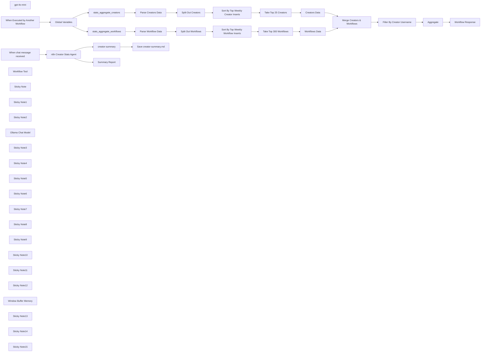

## Fluxo (.json) :

```json
{
  "id": "b8a4IwiwD9SlgF42",
  "meta": {
    "instanceId": "31e69f7f4a77bf465b805824e303232f0227212ae922d12133a0f96ffeab4fef",
    "templateCredsSetupCompleted": true
  },
  "name": "🔥📈🤖 AI Agent for n8n Creators Leaderboard - Find Popular Workflows",
  "tags": [],
  "nodes": [
    {
      "id": "fcda047d-b609-4791-b3ae-f359d0c6a071",
      "name": "stats_aggregate_creators",
      "type": "n8n-nodes-base.httpRequest",
      "position": [
        -1240,
        1280
      ],
      "parameters": {
        "url": "={{ $json.path }}{{ $json['creators-filename'] }}.json",
        "options": {}
      },
      "typeVersion": 4.2
    },
    {
      "id": "fa1f51fd-6019-4d47-b17e-8c5621e6ab4c",
      "name": "stats_aggregate_workflows",
      "type": "n8n-nodes-base.httpRequest",
      "position": [
        -1240,
        1500
      ],
      "parameters": {
        "url": "={{ $json.path }}{{ $json['workflows-filename'] }}.json",
        "options": {}
      },
      "typeVersion": 4.2
    },
    {
      "id": "34c2d0d3-0474-4a69-b1a5-14c9021865cd",
      "name": "Global Variables",
      "type": "n8n-nodes-base.set",
      "position": [
        -1660,
        1480
      ],
      "parameters": {
        "options": {},
        "assignments": {
          "assignments": [
            {
              "id": "4bcb91c6-d250-4cb4-8ee1-022df13550e1",
              "name": "path",
              "type": "string",
              "value": "https://raw.githubusercontent.com/teds-tech-talks/n8n-community-leaderboard/refs/heads/main/"
            },
            {
              "id": "a910a798-0bfe-41b1-a4f1-41390c7f6997",
              "name": "workflows-filename",
              "type": "string",
              "value": "=stats_aggregate_workflows"
            },
            {
              "id": "e977e816-dc1e-43ce-9393-d6488e6832ca",
              "name": "creators-filename",
              "type": "string",
              "value": "=stats_aggregate_creators"
            },
            {
              "id": "20efae68-948e-445c-ab89-7dd23149dd50",
              "name": "chart-filename",
              "type": "string",
              "value": "=stats_aggregate_chart"
            },
            {
              "id": "14233ab4-3fa4-4e26-8032-6ffe26cb601e",
              "name": "datetime",
              "type": "string",
              "value": "={{ $now.format('yyyy-MM-dd') }}"
            },
            {
              "id": "f63dc683-a430-43ec-9c25-53fa5c0a3ced",
              "name": "username",
              "type": "string",
              "value": "={{ $json.query.username }}"
            }
          ]
        }
      },
      "typeVersion": 3.4
    },
    {
      "id": "7e830263-746f-4909-87aa-5e602d39fc3a",
      "name": "Parse Workflow Data",
      "type": "n8n-nodes-base.set",
      "position": [
        -880,
        1560
      ],
      "parameters": {
        "options": {},
        "assignments": {
          "assignments": [
            {
              "id": "76f4b20e-519e-4d46-aeac-c6c3f98a69fd",
              "name": "data",
              "type": "array",
              "value": "={{ $json.data }}"
            }
          ]
        }
      },
      "typeVersion": 3.4
    },
    {
      "id": "b112dde6-9194-451f-9c5e-b3f648d215da",
      "name": "Parse Creators Data",
      "type": "n8n-nodes-base.set",
      "position": [
        -880,
        1220
      ],
      "parameters": {
        "options": {},
        "assignments": {
          "assignments": [
            {
              "id": "76f4b20e-519e-4d46-aeac-c6c3f98a69fd",
              "name": "data",
              "type": "array",
              "value": "={{ $json.data }}"
            }
          ]
        }
      },
      "typeVersion": 3.4
    },
    {
      "id": "877e1988-c85c-49a8-8d56-d3954327c6f6",
      "name": "Take Top 25 Creators",
      "type": "n8n-nodes-base.limit",
      "position": [
        -260,
        1220
      ],
      "parameters": {
        "maxItems": 25
      },
      "typeVersion": 1
    },
    {
      "id": "f05db70e-4362-40a4-bc50-6d0c30ea0cc4",
      "name": "Aggregate",
      "type": "n8n-nodes-base.aggregate",
      "position": [
        -680,
        1920
      ],
      "parameters": {
        "options": {},
        "aggregate": "aggregateAllItemData"
      },
      "typeVersion": 1
    },
    {
      "id": "1d223053-d895-4545-a9b2-6eeab6200568",
      "name": "Filter By Creator Username",
      "type": "n8n-nodes-base.filter",
      "position": [
        -880,
        1920
      ],
      "parameters": {
        "options": {},
        "conditions": {
          "options": {
            "version": 2,
            "leftValue": "",
            "caseSensitive": true,
            "typeValidation": "strict"
          },
          "combinator": "and",
          "conditions": [
            {
              "id": "21b17fb0-1809-4dc0-b775-cf43a570aa3a",
              "operator": {
                "name": "filter.operator.equals",
                "type": "string",
                "operation": "equals"
              },
              "leftValue": "={{ $json.username }}",
              "rightValue": "={{ $('Global Variables').item.json.username }}"
            }
          ]
        }
      },
      "typeVersion": 2.2
    },
    {
      "id": "c25ff9ea-1905-4bf0-ac71-5d81c25466b7",
      "name": "gpt-4o-mini",
      "type": "@n8n/n8n-nodes-langchain.lmChatOpenAi",
      "position": [
        -1960,
        600
      ],
      "parameters": {
        "model": {
          "__rl": true,
          "mode": "list",
          "value": "gpt-4o-mini"
        },
        "options": {
          "temperature": 0.1
        }
      },
      "credentials": {
        "openAiApi": {
          "id": "jEMSvKmtYfzAkhe6",
          "name": "OpenAi account"
        }
      },
      "typeVersion": 1.2
    },
    {
      "id": "b21c51fa-c9b3-4c88-ba7b-fe8a97a951c9",
      "name": "When Executed by Another Workflow",
      "type": "n8n-nodes-base.executeWorkflowTrigger",
      "position": [
        -1980,
        1480
      ],
      "parameters": {
        "inputSource": "jsonExample",
        "jsonExample": "{\n \"query\": \n {\n \"username\": \n \"joe\"\n }\n}"
      },
      "typeVersion": 1.1
    },
    {
      "id": "d26278f5-08d8-4640-82a6-1c3615b6f06b",
      "name": "When chat message received",
      "type": "@n8n/n8n-nodes-langchain.chatTrigger",
      "position": [
        -1980,
        240
      ],
      "webhookId": "c118849f-57c9-40cf-bde6-dddefb9adcf4",
      "parameters": {
        "options": {}
      },
      "typeVersion": 1.1
    },
    {
      "id": "00aac33e-20c1-4b99-b2f1-07311f73e1da",
      "name": "Workflow Tool",
      "type": "@n8n/n8n-nodes-langchain.toolWorkflow",
      "position": [
        -1360,
        600
      ],
      "parameters": {
        "name": "n8n_creator_stats",
        "workflowId": "={{ $workflow.id }}",
        "description": "Call this tool to get n8n Creator Stats.",
        "jsonSchemaExample": "{\n \"username\": \"n8n creator username\"\n}",
        "specifyInputSchema": true
      },
      "typeVersion": 1
    },
    {
      "id": "0a00599a-928d-4399-b17e-336201a67480",
      "name": "creator-summary",
      "type": "n8n-nodes-base.convertToFile",
      "position": [
        -1020,
        240
      ],
      "parameters": {
        "options": {
          "fileName": "=creator-summary"
        },
        "operation": "toText",
        "sourceProperty": "output"
      },
      "typeVersion": 1.1
    },
    {
      "id": "8e4ae379-749d-44ad-80f8-efc836f2ff55",
      "name": "Workflow Response",
      "type": "n8n-nodes-base.set",
      "position": [
        -420,
        1920
      ],
      "parameters": {
        "options": {},
        "assignments": {
          "assignments": [
            {
              "id": "eeff1310-2e1c-4ea4-9107-a14b1979f74f",
              "name": "response",
              "type": "string",
              "value": "={{ $json.data }}"
            }
          ]
        }
      },
      "typeVersion": 3.4
    },
    {
      "id": "bc8ea963-a57d-44f1-bcd4-36a1dcb34f0a",
      "name": "n8n Creator Stats Agent",
      "type": "@n8n/n8n-nodes-langchain.agent",
      "position": [
        -1620,
        240
      ],
      "parameters": {
        "text": "={{ $json.chatInput }}",
        "options": {
          "systemMessage": "=You are tasked with generating a **comprehensive Markdown report** about a specific n8n community workflow contributor using the provided tools. Your report should not only address the user's query but also provide meaningful insights into the contributor's impact on the n8n community. Follow the structure below:\n\n## Detailed Summary\n- Provide a thorough summary of the contributor's workflows.\n- Highlight unique features, key use cases, and notable technical components for each workflow.\n\n## Workflows\nCreate a well-formatted markdown table with these columns:\n- **Workflow Name**: The name of the workflow. Keep the emojies of they exist.\n- **Description**: A brief overview of its purpose and functionality.\n- **Unique Weekly Visitors**: The number of unique users who visited this workflow weekly.\n- **Unique Monthly Visitors**: The number of unique users who visited this workflow monthly.\n- **Unique Weekly Inserters**: The number of unique users who inserted this workflow weekly.\n- **Unique Monthly Inserters**: The number of unique users who inserted this workflow monthly.\n- **Why It’s Popular**: Explain what makes this workflow stand out (e.g., innovative features, ease of use, specific use cases).\n\n## Community Analysis\n- Analyze why these workflows are popular and valued by the n8n community.\n- Discuss any trends, patterns, or feedback that highlight their significance.\n\n## Additional Insights\n- If available, provide extra information about the contributor's overall impact, such as their engagement in community forums or other notable contributions.\n\n## Formatting Guidelines\n- Use Markdown formatting exclusively (headers, lists, and tables) for clarity and organization.\n- Ensure your response is concise yet comprehensive, structured for easy navigation.\n\n## Error Handling\n- If data is unavailable or incomplete, clearly state this in your response and suggest possible reasons or next steps.\n\n## TOOLS\n\n### n8n_creator_stats \n- Use this tool to retrieve detailed statistics about the n8n creator.\n\n\n \n"
        },
        "promptType": "define"
      },
      "typeVersion": 1.7
    },
    {
      "id": "0e2507bf-4509-4423-ad23-bee9de2be68e",
      "name": "Save creator-summary.md",
      "type": "n8n-nodes-base.readWriteFile",
      "position": [
        -820,
        240
      ],
      "parameters": {
        "options": {
          "append": true
        },
        "fileName": "=C:\\\\Users\\\\joe\\Downloads\\\\{{ $binary.data.fileName }}-{{ $now.format('yyyy-MM-dd-hh-mm-ss') }}.md",
        "operation": "write"
      },
      "typeVersion": 1
    },
    {
      "id": "d3d39dad-d743-4c44-ad46-c6edbad4c82b",
      "name": "Summary Report",
      "type": "n8n-nodes-base.set",
      "position": [
        -1020,
        620
      ],
      "parameters": {
        "options": {},
        "assignments": {
          "assignments": [
            {
              "id": "c44ee9a7-e640-4f5e-acbe-ec559868b74c",
              "name": "output",
              "type": "string",
              "value": "={{ $json.output }}"
            }
          ]
        }
      },
      "typeVersion": 3.4
    },
    {
      "id": "6c07ee44-408f-4d4a-bade-e051d780d022",
      "name": "Sticky Note",
      "type": "n8n-nodes-base.stickyNote",
      "position": [
        -1800,
        120
      ],
      "parameters": {
        "color": 6,
        "width": 620,
        "height": 320,
        "content": "## AI Agent for n8n Creator Leaderboard Stats\nhttps://github.com/teds-tech-talks/n8n-community-leaderboard"
      },
      "typeVersion": 1
    },
    {
      "id": "a04eb80b-3cb3-44ad-aef2-c622ea2e33eb",
      "name": "Sticky Note1",
      "type": "n8n-nodes-base.stickyNote",
      "position": [
        -1440,
        480
      ],
      "parameters": {
        "width": 260,
        "height": 280,
        "content": "## Tool Call for n8n Creators Stats"
      },
      "typeVersion": 1
    },
    {
      "id": "9b44f6e7-666b-4341-8e04-4cf41a5f986e",
      "name": "Sticky Note2",
      "type": "n8n-nodes-base.stickyNote",
      "position": [
        -2060,
        480
      ],
      "parameters": {
        "color": 5,
        "width": 300,
        "height": 460,
        "content": "## Local or Cloud LLM"
      },
      "typeVersion": 1
    },
    {
      "id": "68fcc9de-f6d5-461c-ae64-8d8cf6892f7a",
      "name": "Ollama Chat Model",
      "type": "@n8n/n8n-nodes-langchain.lmChatOllama",
      "disabled": true,
      "position": [
        -1960,
        780
      ],
      "parameters": {
        "options": {}
      },
      "credentials": {
        "ollamaApi": {
          "id": "IsSBWGtcJbjRiKqD",
          "name": "Ollama account localhost"
        }
      },
      "typeVersion": 1
    },
    {
      "id": "584dd58a-d97d-45c5-974d-95468a55e359",
      "name": "Sticky Note3",
      "type": "n8n-nodes-base.stickyNote",
      "position": [
        -1140,
        120
      ],
      "parameters": {
        "color": 7,
        "width": 540,
        "height": 320,
        "content": "## Save n8n Creator Report Locally\n(optional for local install)"
      },
      "typeVersion": 1
    },
    {
      "id": "4ea35ccb-a4f4-481c-9122-6fc980be48d5",
      "name": "Sticky Note4",
      "type": "n8n-nodes-base.stickyNote",
      "position": [
        -1140,
        480
      ],
      "parameters": {
        "color": 4,
        "width": 320,
        "height": 340,
        "content": "## Summary Report Response"
      },
      "typeVersion": 1
    },
    {
      "id": "d48a28e9-041c-4e25-ac38-0f0519566db5",
      "name": "Sticky Note5",
      "type": "n8n-nodes-base.stickyNote",
      "position": [
        -1760,
        1360
      ],
      "parameters": {
        "width": 300,
        "height": 320,
        "content": "## Global Workflow Variables\n\n"
      },
      "typeVersion": 1
    },
    {
      "id": "cb9b62f1-cdc3-4c2a-ba4b-8dc3baecf7e4",
      "name": "Sticky Note6",
      "type": "n8n-nodes-base.stickyNote",
      "position": [
        -1800,
        1120
      ],
      "parameters": {
        "color": 3,
        "width": 780,
        "height": 640,
        "content": "## Daily n8n Leaderboard Stats\nhttps://github.com/teds-tech-talks/n8n-community-leaderboard\n\n### n8n Leaderboard\nhttps://teds-tech-talks.github.io/n8n-community-leaderboard/"
      },
      "typeVersion": 1
    },
    {
      "id": "0f12bc26-875e-4cf0-9b87-7459fdfc73e9",
      "name": "Sticky Note7",
      "type": "n8n-nodes-base.stickyNote",
      "position": [
        -980,
        1120
      ],
      "parameters": {
        "color": 6,
        "width": 1120,
        "height": 300,
        "content": "## n8n Creators Stats"
      },
      "typeVersion": 1
    },
    {
      "id": "23abdb9b-3aa3-48a8-987d-c0e0bdcec99f",
      "name": "Sticky Note8",
      "type": "n8n-nodes-base.stickyNote",
      "position": [
        -980,
        1460
      ],
      "parameters": {
        "color": 4,
        "width": 1120,
        "height": 300,
        "content": "## n8n Workflow Stats"
      },
      "typeVersion": 1
    },
    {
      "id": "7b7f14b4-cde2-46b1-a37f-4fd136c57a44",
      "name": "Creators Data",
      "type": "n8n-nodes-base.set",
      "position": [
        -60,
        1220
      ],
      "parameters": {
        "options": {},
        "assignments": {
          "assignments": [
            {
              "id": "02b02023-c5a2-4e22-bcf9-2284c434f5d3",
              "name": "name",
              "type": "string",
              "value": "={{ $json.user.name }}"
            },
            {
              "id": "4582435b-3c76-45e7-a251-12055efa890a",
              "name": "username",
              "type": "string",
              "value": "={{ $json.user.username }}"
            },
            {
              "id": "b713a971-ce29-43cf-8f42-c426a38c6582",
              "name": "bio",
              "type": "string",
              "value": "={{ $json.user.bio }}"
            },
            {
              "id": "19a06510-802e-4bd5-9552-7afa7355ff92",
              "name": "sum_unique_weekly_inserters",
              "type": "number",
              "value": "={{ $json.sum_unique_weekly_inserters }}"
            },
            {
              "id": "e436533a-5170-47c2-809b-7d79502eb009",
              "name": "sum_unique_monthly_inserters",
              "type": "number",
              "value": "={{ $json.sum_unique_monthly_inserters }}"
            },
            {
              "id": "198fef5d-86b8-4009-b187-6d3e6566d137",
              "name": "sum_unique_inserters",
              "type": "number",
              "value": "={{ $json.sum_unique_inserters }}"
            }
          ]
        }
      },
      "typeVersion": 3.4
    },
    {
      "id": "f3363202-01ac-4ea1-a015-7c16ac1078af",
      "name": "Workflows Data",
      "type": "n8n-nodes-base.set",
      "position": [
        -60,
        1560
      ],
      "parameters": {
        "options": {},
        "assignments": {
          "assignments": [
            {
              "id": "3bc3cd11-904d-4315-974d-262c0bd5fea7",
              "name": "template_url",
              "type": "string",
              "value": "={{ $json.template_url }}"
            },
            {
              "id": "c846c523-f077-40cd-b548-32460124ffb9",
              "name": "wf_detais.name",
              "type": "string",
              "value": "={{ $json.wf_detais.name }}"
            },
            {
              "id": "f330de47-56fb-4657-8a30-5f5e5cfa76d7",
              "name": "wf_detais.createdAt",
              "type": "string",
              "value": "={{ $json.wf_detais.createdAt }}"
            },
            {
              "id": "f7ed7e51-a7cf-4f2e-8819-f33115c5ad51",
              "name": "wf_detais.description",
              "type": "string",
              "value": "={{ $json.wf_detais.description }}"
            },
            {
              "id": "02b02023-c5a2-4e22-bcf9-2284c434f5d3",
              "name": "name",
              "type": "string",
              "value": "={{ $json.user.name }}"
            },
            {
              "id": "4582435b-3c76-45e7-a251-12055efa890a",
              "name": "username",
              "type": "string",
              "value": "={{ $json.user.username }}"
            },
            {
              "id": "f952cad3-7e62-46b7-aeb7-a5cbf4d46c0d",
              "name": "unique_weekly_inserters",
              "type": "number",
              "value": "={{ $json.unique_weekly_inserters }}"
            },
            {
              "id": "6123302b-5bda-48f4-9ef2-71ff52a5f3ba",
              "name": "unique_monthly_inserters",
              "type": "number",
              "value": "={{ $json.unique_monthly_inserters }}"
            },
            {
              "id": "92dca169-e03f-42ad-8790-ebb55c1a7272",
              "name": "unique_weekly_visitors",
              "type": "number",
              "value": "={{ $json.unique_weekly_visitors }}"
            },
            {
              "id": "ee640389-d396-4d65-8110-836372a51fb0",
              "name": "unique_monthly_visitors",
              "type": "number",
              "value": "={{ $json.unique_monthly_visitors }}"
            },
            {
              "id": "9f1c5599-3672-4f4e-9742-d7cc564f6714",
              "name": "user.avatar",
              "type": "string",
              "value": "={{ $json.user.avatar }}"
            }
          ]
        }
      },
      "typeVersion": 3.4
    },
    {
      "id": "3ce82825-f85c-4fd3-9273-5c5540a40dbe",
      "name": "Merge Creators & Workflows",
      "type": "n8n-nodes-base.merge",
      "position": [
        240,
        1560
      ],
      "parameters": {
        "mode": "combine",
        "options": {},
        "joinMode": "enrichInput1",
        "fieldsToMatchString": "username"
      },
      "typeVersion": 3
    },
    {
      "id": "16c383db-c130-484a-8a6b-b927d4c248e9",
      "name": "Sticky Note9",
      "type": "n8n-nodes-base.stickyNote",
      "position": [
        -980,
        1800
      ],
      "parameters": {
        "width": 480,
        "height": 320,
        "content": "## Filter by n8n Creator Username"
      },
      "typeVersion": 1
    },
    {
      "id": "7451dc33-8944-47c5-92c3-e70d4ce5d107",
      "name": "Split Out Creators",
      "type": "n8n-nodes-base.splitOut",
      "position": [
        -680,
        1220
      ],
      "parameters": {
        "options": {},
        "fieldToSplitOut": "data"
      },
      "typeVersion": 1
    },
    {
      "id": "6fa965e1-1474-4154-b4a2-cabdbbb8e90b",
      "name": "Split Out Workflows",
      "type": "n8n-nodes-base.splitOut",
      "position": [
        -680,
        1560
      ],
      "parameters": {
        "options": {},
        "fieldToSplitOut": "data"
      },
      "typeVersion": 1
    },
    {
      "id": "7805fa8b-6287-442d-ba2c-11ddb81ba54f",
      "name": "Sort By Top Weekly Creator Inserts",
      "type": "n8n-nodes-base.sort",
      "position": [
        -480,
        1220
      ],
      "parameters": {
        "options": {},
        "sortFieldsUi": {
          "sortField": [
            {
              "order": "descending",
              "fieldName": "sum_unique_weekly_inserters"
            }
          ]
        }
      },
      "typeVersion": 1
    },
    {
      "id": "d1651e0d-04c6-4c09-884e-3fd51e885f3d",
      "name": "Sort By Top Weekly Workflow Inserts",
      "type": "n8n-nodes-base.sort",
      "position": [
        -480,
        1560
      ],
      "parameters": {
        "options": {},
        "sortFieldsUi": {
          "sortField": [
            {
              "order": "descending",
              "fieldName": "unique_weekly_inserters"
            }
          ]
        }
      },
      "typeVersion": 1
    },
    {
      "id": "3bcf5f34-80fd-40ec-b88c-8b79b3f1677b",
      "name": "Take Top 300 Workflows",
      "type": "n8n-nodes-base.limit",
      "position": [
        -260,
        1560
      ],
      "parameters": {
        "maxItems": 300
      },
      "typeVersion": 1
    },
    {
      "id": "dc7cf074-17a6-411d-8d59-1cfbd23b7bd2",
      "name": "Sticky Note10",
      "type": "n8n-nodes-base.stickyNote",
      "position": [
        -2060,
        1040
      ],
      "parameters": {
        "color": 7,
        "width": 2510,
        "height": 1120,
        "content": "## Workflow for n8n Creators Stats"
      },
      "typeVersion": 1
    },
    {
      "id": "dacb7e61-7853-47f2-b6fd-3ad611701278",
      "name": "Sticky Note11",
      "type": "n8n-nodes-base.stickyNote",
      "position": [
        -1340,
        1160
      ],
      "parameters": {
        "color": 7,
        "width": 280,
        "height": 560,
        "content": "## GET n8n Stats from GitHub repo"
      },
      "typeVersion": 1
    },
    {
      "id": "a2373c55-9e87-4824-adc8-4d4bbf966544",
      "name": "Sticky Note12",
      "type": "n8n-nodes-base.stickyNote",
      "position": [
        -560,
        0
      ],
      "parameters": {
        "color": 2,
        "width": 1000,
        "height": 1000,
        "content": "# n8n Creators Leaderboard Stats Workflow\n\n## Overview\nThis workflow aggregates and processes data from the n8n community to generate detailed statistics about creators and their workflows. It fetches information from JSON files stored on GitHub, merges creator and workflow data, filters the results based on a specified username, and uses an AI agent to output a comprehensive Markdown report.\n\n## Data Retrieval\n- **Creators Data**: \n - An HTTP Request node (\"stats_aggregate_creators\") retrieves a JSON file containing aggregated statistics for workflow creators. \n- **Workflows Data**: \n - A separate HTTP Request node (\"stats_aggregate_workflows\") pulls a JSON file with detailed workflow metrics such as visitor counts and inserter statistics. \n- **Global Variables**: \n - A global variable is set with the GitHub repository base URL housing these JSON files, ensuring that the correct data source is used.\n\n## Data Processing and Merging\n- **Parsing the Data**: \n - The \"Parse Creators Data\" and \"Parse Workflow Data\" nodes extract JSON arrays from the retrieved files for further processing. \n- **Limiting and Sorting**: \n - Nodes like \"Take Top 25 Creators\" and \"Take Top 300 Workflows\" limit the result sets, while nodes such as \"Sort By Top Weekly Creator Inserts\" and \"Sort By Top Weekly Workflow Inserts\" sort the data based on performance metrics. \n- **Merging Records**: \n - Data from creators and workflows is merged by matching the username, enriching the dataset with combined statistics for each creator.\n\n## Filtering and Report Generation\n- **Username Filtering**: \n - A filter node (\"Filter By Creator Username\") allows the workflow to focus on a single creator based on the input username (e.g., \"joe\"). \n- **Generating the Markdown Report**: \n - An AI agent node (\"gpt-4o-mini\") processes the filtered data using a predefined prompt. This prompt instructs the agent to produce a detailed Markdown report that includes: \n - An overall summary of the creator’s workflows \n - A Markdown table listing each workflow along with key metrics (unique weekly/monthly visitors and inserters) and a brief explanation of its popularity \n - Insights into trends or community feedback related to the workflows \n- **Output Conversion and Saving**: \n - The resulting text is converted into a file (using the \"creator-summary\" node) and then saved locally with a filename that includes a timestamp, ensuring easy tracking and retrieval\n"
      },
      "typeVersion": 1
    },
    {
      "id": "99078ba8-612d-494a-976a-15f2065754ed",
      "name": "Window Buffer Memory",
      "type": "@n8n/n8n-nodes-langchain.memoryBufferWindow",
      "position": [
        -1640,
        600
      ],
      "parameters": {},
      "typeVersion": 1.3
    },
    {
      "id": "79c67fdc-f56c-4abc-908d-cac11e66790b",
      "name": "Sticky Note13",
      "type": "n8n-nodes-base.stickyNote",
      "position": [
        -1740,
        480
      ],
      "parameters": {
        "color": 3,
        "width": 280,
        "height": 280,
        "content": "## Chat History Memory"
      },
      "typeVersion": 1
    },
    {
      "id": "4be97085-519e-4776-88a1-6d95f97c4aa1",
      "name": "Sticky Note14",
      "type": "n8n-nodes-base.stickyNote",
      "position": [
        -2580,
        20
      ],
      "parameters": {
        "width": 480,
        "height": 980,
        "content": "# Quick Start Guide for the n8n Creators Leaderboard Workflow\n\n## Prerequisites\n- Ensure your n8n instance is running.\n- Verify that the GitHub base URL and file variables (for creators and workflows) are correctly set in the Global Variables node.\n- Confirm that your OpenAI credentials are configured for the AI Agent node.\n\n## How to Start the Workflow\n- **Activate the Workflow:** \n Ensure the workflow is active in your n8n environment.\n\n- **Trigger via Chat:** \n The workflow is initiated by the Chat Trigger node. Send a chat message such as: \n `show me stats for username [desired_username]` \n This input provides the required username for filtering.\n\n- **Processing & Report Generation:** \n Once triggered, the workflow fetches aggregated creator and workflow data from GitHub, processes and merges the information, and then uses the AI Agent to generate a Markdown report.\n\n- **Output:** \n The final Markdown report is saved locally as a file (with a timestamp), which you can review to see detailed leaderboard statistics and insights for the specified creator.\n\n## Summary\nBy sending a chat message with the appropriate username command, you can quickly trigger this workflow, which will then fetch, process, and generate dynamic statistics about n8n community creators. Enjoy exploring your community’s leaderboard data!\n"
      },
      "typeVersion": 1
    },
    {
      "id": "db011ff6-359d-4b4a-b5b2-29c15b961f68",
      "name": "Sticky Note15",
      "type": "n8n-nodes-base.stickyNote",
      "position": [
        -2580,
        1040
      ],
      "parameters": {
        "width": 480,
        "height": 940,
        "content": "# Why Use the n8n Creators Leaderboard Workflow?\n\n## Benefits\nThis workflow provides valuable insights into the n8n community by analyzing and presenting detailed statistics about workflow creators and their contributions. It helps users to:\n\n- **Discover Popular Workflows**: Identify the most widely used workflows based on unique visitors and inserters, both weekly and monthly.\n- **Understand Community Trends**: Gain insights into what types of workflows are resonating with the community, enabling better decision-making for creating or improving workflows.\n- **Recognize Top Contributors**: Highlight the most active and impactful creators, fostering collaboration and inspiration within the community.\n- **Save Time with Automation**: Automates data retrieval, processing, and report generation, eliminating manual effort.\n\n## Key Features\n- **Data Aggregation**: Fetches creator and workflow statistics from GitHub repositories.\n- **Custom Filtering**: Allows filtering by specific usernames to focus on individual contributors.\n- **AI-Powered Reports**: Generates comprehensive Markdown reports with detailed summaries, tables, and community analysis.\n- **Output Flexibility**: Saves reports locally for easy access and future reference.\n\n## Use Cases\n- **For Workflow Creators**: Monitor performance metrics of your workflows to understand their impact and optimize them for better engagement.\n- **For Community Managers**: Recognize top contributors and trends to encourage participation and improve community resources.\n- **For New Users**: Explore popular workflows as a starting point for building your own automations.\n\n"
      },
      "typeVersion": 1
    }
  ],
  "active": false,
  "pinData": {
    "When chat message received": [
      {
        "json": {
          "action": "sendMessage",
          "chatInput": "\tshow me stats for username joe",
          "sessionId": "61fd98239a894d969c0b33060f3f9c44"
        }
      }
    ],
    "When Executed by Another Workflow": [
      {
        "json": {
          "query": {
            "username": "joe"
          }
        }
      }
    ]
  },
  "settings": {
    "executionOrder": "v1"
  },
  "versionId": "574ed096-a76c-4cfe-b026-20627f454ddc",
  "connections": {
    "Aggregate": {
      "main": [
        [
          {
            "node": "Workflow Response",
            "type": "main",
            "index": 0
          }
        ]
      ]
    },
    "gpt-4o-mini": {
      "ai_languageModel": [
        [
          {
            "node": "n8n Creator Stats Agent",
            "type": "ai_languageModel",
            "index": 0
          }
        ]
      ]
    },
    "Creators Data": {
      "main": [
        [
          {
            "node": "Merge Creators & Workflows",
            "type": "main",
            "index": 0
          }
        ]
      ]
    },
    "Workflow Tool": {
      "ai_tool": [
        [
          {
            "node": "n8n Creator Stats Agent",
            "type": "ai_tool",
            "index": 0
          }
        ]
      ]
    },
    "Workflows Data": {
      "main": [
        [
          {
            "node": "Merge Creators & Workflows",
            "type": "main",
            "index": 1
          }
        ]
      ]
    },
    "creator-summary": {
      "main": [
        [
          {
            "node": "Save creator-summary.md",
            "type": "main",
            "index": 0
          }
        ]
      ]
    },
    "Global Variables": {
      "main": [
        [
          {
            "node": "stats_aggregate_creators",
            "type": "main",
            "index": 0
          },
          {
            "node": "stats_aggregate_workflows",
            "type": "main",
            "index": 0
          }
        ]
      ]
    },
    "Ollama Chat Model": {
      "ai_languageModel": [
        []
      ]
    },
    "Split Out Creators": {
      "main": [
        [
          {
            "node": "Sort By Top Weekly Creator Inserts",
            "type": "main",
            "index": 0
          }
        ]
      ]
    },
    "Parse Creators Data": {
      "main": [
        [
          {
            "node": "Split Out Creators",
            "type": "main",
            "index": 0
          }
        ]
      ]
    },
    "Parse Workflow Data": {
      "main": [
        [
          {
            "node": "Split Out Workflows",
            "type": "main",
            "index": 0
          }
        ]
      ]
    },
    "Split Out Workflows": {
      "main": [
        [
          {
            "node": "Sort By Top Weekly Workflow Inserts",
            "type": "main",
            "index": 0
          }
        ]
      ]
    },
    "Take Top 25 Creators": {
      "main": [
        [
          {
            "node": "Creators Data",
            "type": "main",
            "index": 0
          }
        ]
      ]
    },
    "Window Buffer Memory": {
      "ai_memory": [
        [
          {
            "node": "n8n Creator Stats Agent",
            "type": "ai_memory",
            "index": 0
          }
        ]
      ]
    },
    "Take Top 300 Workflows": {
      "main": [
        [
          {
            "node": "Workflows Data",
            "type": "main",
            "index": 0
          }
        ]
      ]
    },
    "n8n Creator Stats Agent": {
      "main": [
        [
          {
            "node": "Summary Report",
            "type": "main",
            "index": 0
          },
          {
            "node": "creator-summary",
            "type": "main",
            "index": 0
          }
        ]
      ]
    },
    "stats_aggregate_creators": {
      "main": [
        [
          {
            "node": "Parse Creators Data",
            "type": "main",
            "index": 0
          }
        ]
      ]
    },
    "stats_aggregate_workflows": {
      "main": [
        [
          {
            "node": "Parse Workflow Data",
            "type": "main",
            "index": 0
          }
        ]
      ]
    },
    "Filter By Creator Username": {
      "main": [
        [
          {
            "node": "Aggregate",
            "type": "main",
            "index": 0
          }
        ]
      ]
    },
    "Merge Creators & Workflows": {
      "main": [
        [
          {
            "node": "Filter By Creator Username",
            "type": "main",
            "index": 0
          }
        ]
      ]
    },
    "When chat message received": {
      "main": [
        [
          {
            "node": "n8n Creator Stats Agent",
            "type": "main",
            "index": 0
          }
        ]
      ]
    },
    "When Executed by Another Workflow": {
      "main": [
        [
          {
            "node": "Global Variables",
            "type": "main",
            "index": 0
          }
        ]
      ]
    },
    "Sort By Top Weekly Creator Inserts": {
      "main": [
        [
          {
            "node": "Take Top 25 Creators",
            "type": "main",
            "index": 0
          }
        ]
      ]
    },
    "Sort By Top Weekly Workflow Inserts": {
      "main": [
        [
          {
            "node": "Take Top 300 Workflows",
            "type": "main",
            "index": 0
          }
        ]
      ]
    }
  }
}
```

<a id="template-1167"></a>

## Template 1167 - Análise SERP com IA e SerpBear

- **Nome:** Análise SERP com IA e SerpBear
- **Descrição:** Fluxo que coleta dados de ranking de palavras-chave via SerpBear, processa informações, gera um pedido de análise para IA, obtém insights e armazena os resultados em Baserow, com notas de instruções para o usuário.
- **Funcionalidade:** • Coleta de dados de ranking: Obtém dados de palavras-chave e posições atuais para rumjahn.com a partir do SerpBear com autenticação.
• Processamento de dados de SERP: Calcula a média de posição dos últimos 7 dias e determina a tendência (melhora, piora ou estável) para cada keyword.
• Geração de prompt de análise: Cria um prompt com os resultados para solicitar uma análise estratégica da IA, incluindo observações, melhorias e ações sugeridas.
• Consulta de IA de análise SEO: Envia o prompt para um serviço de IA e recebe uma resposta com recomendações.
• Armazenamento e relatório: Salva as escolhas da IA, a data e o texto da análise em uma base de dados e inclui notas de instruções para o usuário.
- **Ferramentas:** • SerpBear API: Serviço para coletar dados de palavras-chave e rankings de domínio.
• OpenRouter AI: API de chat para gerar análises e sugestões com prompts.
• Baserow: Banco de dados para armazenar data, conteúdo da análise e notas.


## Fluxo visual

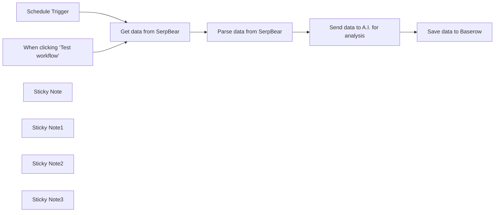

## Fluxo (.json) :

```json
{
  "id": "qmmXKcpJOCm9qaCk",
  "meta": {
    "instanceId": "558d88703fb65b2d0e44613bc35916258b0f0bf983c5d4730c00c424b77ca36a",
    "templateCredsSetupCompleted": true
  },
  "name": "SERPBear analytics template",
  "tags": [],
  "nodes": [
    {
      "id": "2ad0eb40-6628-4c6b-bc15-7081e7712f1a",
      "name": "When clicking ‘Test workflow’",
      "type": "n8n-nodes-base.manualTrigger",
      "position": [
        260,
        380
      ],
      "parameters": {},
      "typeVersion": 1
    },
    {
      "id": "5a3c9ad8-a562-4bb0-bb11-c325552d8101",
      "name": "Schedule Trigger",
      "type": "n8n-nodes-base.scheduleTrigger",
      "position": [
        260,
        160
      ],
      "parameters": {
        "rule": {
          "interval": [
            {
              "field": "weeks"
            }
          ]
        }
      },
      "typeVersion": 1.2
    },
    {
      "id": "bdfa7388-f9b3-4145-90de-2e58138e14bf",
      "name": "Get data from SerpBear",
      "type": "n8n-nodes-base.httpRequest",
      "position": [
        580,
        260
      ],
      "parameters": {
        "url": "https://myserpbearinstance.com/api/keyword?id=22",
        "options": {},
        "sendQuery": true,
        "authentication": "genericCredentialType",
        "genericAuthType": "httpHeaderAuth",
        "queryParameters": {
          "parameters": [
            {
              "name": "domain",
              "value": "rumjahn.com"
            }
          ]
        }
      },
      "credentials": {
        "httpHeaderAuth": {
          "id": "3fshHb4fyI5XfLyq",
          "name": "Header Auth account 6"
        }
      },
      "executeOnce": false,
      "typeVersion": 4.2,
      "alwaysOutputData": false
    },
    {
      "id": "c169f4e3-ab60-4b46-9f49-cf27a13dd7c6",
      "name": "Parse data from SerpBear",
      "type": "n8n-nodes-base.code",
      "position": [
        820,
        260
      ],
      "parameters": {
        "jsCode": "const keywords = items[0].json.keywords;\nconst today = new Date().toISOString().split('T')[0];\n\n// Create summary for each keyword\nconst keywordSummaries = keywords.map(kw => {\n const position = kw.position || 0;\n const lastWeekPositions = Object.values(kw.history || {}).slice(-7);\n const avgPosition = lastWeekPositions.reduce((a, b) => a + b, 0) / lastWeekPositions.length;\n \n return {\n keyword: kw.keyword,\n currentPosition: position,\n averagePosition: Math.round(avgPosition * 10) / 10,\n trend: position < avgPosition ? 'improving' : position > avgPosition ? 'declining' : 'stable',\n url: kw.url || 'not ranking'\n };\n});\n\n// Create the prompt\nconst prompt = `Here's the SEO ranking data for rumjahn.com as of ${today}:\n\n${keywordSummaries.map(kw => `\nKeyword: \"${kw.keyword}\"\nCurrent Position: ${kw.currentPosition}\n7-Day Average: ${kw.averagePosition}\nTrend: ${kw.trend}\nRanking URL: ${kw.url}\n`).join('\\n')}\n\nPlease analyze this data and provide:\n1. Key observations about ranking performance\n2. Keywords showing the most improvement\n3. Keywords needing attention\n4. Suggested actions for improvement`;\n\nreturn {\n prompt\n};"
      },
      "typeVersion": 2
    },
    {
      "id": "cc6e16a7-db46-42fe-837a-59ce635c906c",
      "name": "Send data to A.I. for analysis",
      "type": "n8n-nodes-base.httpRequest",
      "position": [
        1060,
        260
      ],
      "parameters": {
        "url": "https://openrouter.ai/api/v1/chat/completions",
        "method": "POST",
        "options": {},
        "jsonBody": "={\n \"model\": \"meta-llama/llama-3.1-70b-instruct:free\",\n \"messages\": [\n {\n \"role\": \"user\",\n \"content\": \"You are an SEO expert. This is keyword data for my site. Can you summarize the data into a table and then give me some suggestions:{{ encodeURIComponent($json.prompt)}}\" \n }\n ]\n}",
        "sendBody": true,
        "specifyBody": "json",
        "authentication": "genericCredentialType",
        "genericAuthType": "httpHeaderAuth"
      },
      "credentials": {
        "httpHeaderAuth": {
          "id": "WY7UkF14ksPKq3S8",
          "name": "Header Auth account 2"
        }
      },
      "typeVersion": 4.2,
      "alwaysOutputData": false
    },
    {
      "id": "a623f06c-1dfe-4d04-a7fd-fed7049a7588",
      "name": "Save data to Baserow",
      "type": "n8n-nodes-base.baserow",
      "position": [
        1340,
        260
      ],
      "parameters": {
        "tableId": 644,
        "fieldsUi": {
          "fieldValues": [
            {
              "fieldId": 6264,
              "fieldValue": "={{ DateTime.now().toFormat('yyyy-MM-dd') }}"
            },
            {
              "fieldId": 6265,
              "fieldValue": "={{ $json.choices[0].message.content }}"
            },
            {
              "fieldId": 6266,
              "fieldValue": "Rumjahn"
            }
          ]
        },
        "operation": "create",
        "databaseId": 121
      },
      "credentials": {
        "baserowApi": {
          "id": "8w0zXhycIfCAgja3",
          "name": "Baserow account"
        }
      },
      "typeVersion": 1
    },
    {
      "id": "e8048faf-bbed-4e48-b273-d1a50a767e76",
      "name": "Sticky Note",
      "type": "n8n-nodes-base.stickyNote",
      "position": [
        220,
        -360
      ],
      "parameters": {
        "color": 5,
        "width": 614.709677419355,
        "height": 208.51612903225802,
        "content": "## Send Matomo analytics to A.I. and save results to baserow\n\nThis workflow will check the Google keywords for your site and it's rank.\n\n[💡 You can read more about this workflow here](https://rumjahn.com/how-to-create-an-a-i-agent-to-analyze-serpbear-keyword-rankings-using-n8n-for-free-without-any-coding-skills-required/)"
      },
      "typeVersion": 1
    },
    {
      "id": "1a18e685-79db-423f-992a-5e0d4ddeb672",
      "name": "Sticky Note1",
      "type": "n8n-nodes-base.stickyNote",
      "position": [
        520,
        -80
      ],
      "parameters": {
        "width": 214.75050403225822,
        "height": 531.7318548387107,
        "content": "## Get SERPBear Data\n \n1. Enter your SerpBear API keys and URL. You need to find your website ID which is probably 1.\n2. Navigate to Administration > Personal > Security > Auth tokens within your Matomo dashboard. Click on Create new token and provide a purpose for reference."
      },
      "typeVersion": 1
    },
    {
      "id": "99895baf-75d0-4af2-87de-5b8951186e78",
      "name": "Sticky Note2",
      "type": "n8n-nodes-base.stickyNote",
      "position": [
        980,
        -60
      ],
      "parameters": {
        "color": 3,
        "width": 225.99936321742769,
        "height": 508.95792207792226,
        "content": "## Send data to A.I.\n\nFill in your Openrouter A.I. credentials. Use Header Auth.\n- Username: Authorization\n- Password: Bearer {insert your API key}\n\nRemember to add a space after bearer. Also, feel free to modify the prompt to A.1."
      },
      "typeVersion": 1
    },
    {
      "id": "07d03511-98b0-4f4a-8e68-96ca177fb246",
      "name": "Sticky Note3",
      "type": "n8n-nodes-base.stickyNote",
      "position": [
        1240,
        -40
      ],
      "parameters": {
        "color": 6,
        "width": 331.32883116883124,
        "height": 474.88,
        "content": "## Send data to Baserow\n\nCreate a table first with the following columns:\n- Date\n- Note\n- Blog\n\nEnter the name of your website under \"Blog\" field."
      },
      "typeVersion": 1
    }
  ],
  "active": false,
  "pinData": {},
  "settings": {
    "executionOrder": "v1"
  },
  "versionId": "8b7e7da7-1965-4ca4-8e15-889eda819723",
  "connections": {
    "Schedule Trigger": {
      "main": [
        [
          {
            "node": "Get data from SerpBear",
            "type": "main",
            "index": 0
          }
        ]
      ]
    },
    "Get data from SerpBear": {
      "main": [
        [
          {
            "node": "Parse data from SerpBear",
            "type": "main",
            "index": 0
          }
        ]
      ]
    },
    "Parse data from SerpBear": {
      "main": [
        [
          {
            "node": "Send data to A.I. for analysis",
            "type": "main",
            "index": 0
          }
        ]
      ]
    },
    "Send data to A.I. for analysis": {
      "main": [
        [
          {
            "node": "Save data to Baserow",
            "type": "main",
            "index": 0
          }
        ]
      ]
    },
    "When clicking ‘Test workflow’": {
      "main": [
        [
          {
            "node": "Get data from SerpBear",
            "type": "main",
            "index": 0
          }
        ]
      ]
    }
  }
}
```

<a id="template-1168"></a>

## Template 1168 - Agente AI para resumos e agendamento

- **Nome:** Agente AI para resumos e agendamento
- **Descrição:** Fluxo que recupera a transcrição de uma reunião, envia para um agente de IA para resumir e extrair ações, e cria automaticamente reuniões de seguimento quando necessário.
- **Funcionalidade:** • Recuperação de evento de calendário: obtém os detalhes do evento, incluindo criador, data/hora e lista de participantes.
• Obtenção de localização da transcrição: consulta registros de conferência para localizar a transcrição da reunião.
• Download e conversão de transcrição: baixa o arquivo de transcrição do armazenamento e converte para formato processável (ex.: PDF).
• Extração de texto do PDF: extrai o conteúdo textual da transcrição para análise.
• Análise por agente AI: envia a transcrição para um agente de linguagem que resume a reunião, identifica pontos por participante e lista próximos passos.
• Execução de ações automatizadas: o agente pode acionar a criação de eventos de seguimento quando sugerido na transcrição.
• Gerenciamento de convidados: adiciona automaticamente os participantes sugeridos ao evento criado como convidados.
• Roteamento e fallback: direciona a ação apropriada a ferramentas específicas e fornece uma resposta de fallback se a ação não for reconhecida ou estiver indisponível.
- **Ferramentas:** • Google Calendar: armazenar, recuperar e criar eventos de calendário e convites.
• Google Meet API (registros de conferência): localizar metadados e localizações de transcrições de reuniões gravadas.
• Google Drive: hospedar e fornecer arquivos de transcrição, incluindo conversão de documentos para formatos processáveis.
• OpenAI (modelo de linguagem): analisar e resumir transcrições, extrair pontos chave e decidir sobre ações de follow-up.


## Fluxo visual

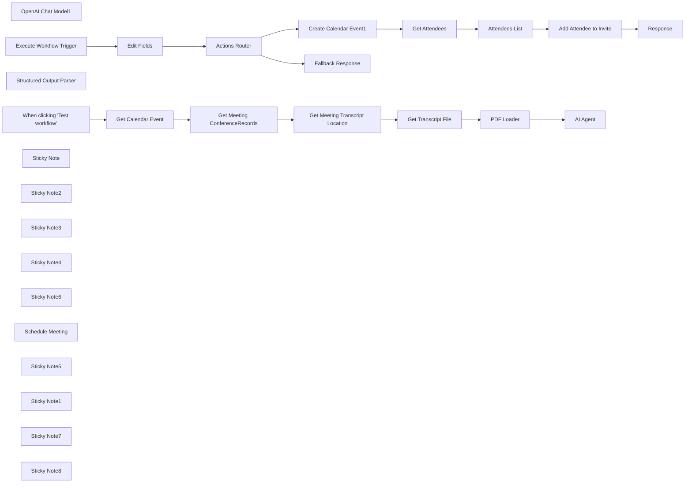

## Fluxo (.json) :

```json
{
  "meta": {
    "instanceId": "26ba763460b97c249b82942b23b6384876dfeb9327513332e743c5f6219c2b8e"
  },
  "nodes": [
    {
      "id": "bec5c6c1-52d4-4665-b814-56a6bb82ea6b",
      "name": "OpenAI Chat Model1",
      "type": "@n8n/n8n-nodes-langchain.lmChatOpenAi",
      "position": [
        800,
        660
      ],
      "parameters": {
        "options": {
          "temperature": 0
        }
      },
      "credentials": {
        "openAiApi": {
          "id": "8gccIjcuf3gvaoEr",
          "name": "OpenAi account"
        }
      },
      "typeVersion": 1
    },
    {
      "id": "d3e057d1-df44-4ac3-ac46-fc2b04e3de78",
      "name": "Get Meeting ConferenceRecords",
      "type": "n8n-nodes-base.httpRequest",
      "position": [
        20,
        580
      ],
      "parameters": {
        "url": "https://meet.googleapis.com/v2/conferenceRecords",
        "options": {},
        "sendQuery": true,
        "authentication": "predefinedCredentialType",
        "queryParameters": {
          "parameters": [
            {
              "name": "filter",
              "value": "=space.meeting_code={{ $json.conferenceData.conferenceId }}"
            }
          ]
        },
        "nodeCredentialType": "googleOAuth2Api"
      },
      "credentials": {
        "googleOAuth2Api": {
          "id": "kgVOfvlBIWTWXthG",
          "name": "Google Meets Oauth2 API"
        }
      },
      "typeVersion": 4.2
    },
    {
      "id": "831668fd-04ab-4144-bec0-c733902f2a13",
      "name": "Get Meeting Transcript Location",
      "type": "n8n-nodes-base.httpRequest",
      "position": [
        200,
        580
      ],
      "parameters": {
        "url": "=https://meet.googleapis.com/v2/{{ $json.conferenceRecords[0].name }}/transcripts",
        "options": {},
        "authentication": "predefinedCredentialType",
        "nodeCredentialType": "googleOAuth2Api"
      },
      "credentials": {
        "googleOAuth2Api": {
          "id": "kgVOfvlBIWTWXthG",
          "name": "Google Meets Oauth2 API"
        }
      },
      "typeVersion": 4.2
    },
    {
      "id": "0a1c3386-1456-4abd-a67c-4f2084efb1f1",
      "name": "Get Transcript File",
      "type": "n8n-nodes-base.googleDrive",
      "position": [
        380,
        580
      ],
      "parameters": {
        "fileId": {
          "__rl": true,
          "mode": "url",
          "value": "={{ $json.docsDestination.document }}"
        },
        "options": {
          "googleFileConversion": {
            "conversion": {
              "docsToFormat": "application/pdf"
            }
          }
        },
        "operation": "download"
      },
      "credentials": {
        "googleDriveOAuth2Api": {
          "id": "yOwz41gMQclOadgu",
          "name": "Google Drive account"
        }
      },
      "typeVersion": 3
    },
    {
      "id": "40d1e969-3a04-4fb0-98c3-59865f317e07",
      "name": "When clicking \"Test workflow\"",
      "type": "n8n-nodes-base.manualTrigger",
      "position": [
        -480,
        540
      ],
      "parameters": {},
      "typeVersion": 1
    },
    {
      "id": "1d277cc0-9f51-43a2-9d17-17d535b4dd53",
      "name": "PDF Loader",
      "type": "n8n-nodes-base.extractFromFile",
      "position": [
        660,
        520
      ],
      "parameters": {
        "options": {},
        "operation": "pdf"
      },
      "typeVersion": 1
    },
    {
      "id": "08b2d0ce-0f59-45d8-b010-53910a1bc746",
      "name": "Get Calendar Event",
      "type": "n8n-nodes-base.googleCalendar",
      "position": [
        -280,
        540
      ],
      "parameters": {
        "eventId": "abc123",
        "options": {},
        "calendar": {
          "__rl": true,
          "mode": "list",
          "value": "c_5792bdf04bc395cbcbc6f7b754268245a33779d36640cc80a357711aa2f09a0a@group.calendar.google.com",
          "cachedResultName": "n8n-events"
        },
        "operation": "get"
      },
      "credentials": {
        "googleCalendarOAuth2Api": {
          "id": "kWMxmDbMDDJoYFVK",
          "name": "Google Calendar account"
        }
      },
      "typeVersion": 1.1
    },
    {
      "id": "35a68444-15da-4b6e-a3c8-d296971b0fc0",
      "name": "Structured Output Parser",
      "type": "@n8n/n8n-nodes-langchain.outputParserStructured",
      "position": [
        1040,
        660
      ],
      "parameters": {
        "jsonSchema": "{\n \"type\": \"object\",\n \"properties\": {\n \"summary\": { \"type\": \"string\" },\n \"highlights\": {\n \"type\": \"array\",\n \"items\": {\n \"type\": \"object\",\n \"properties\": {\n \"attendee\": { \"type\": \"string\" },\n \"message\": { \"type\": \"string\" }\n }\n }\n },\n \"next_steps\": {\n \"type\": \"array\",\n \"items:\": {\n \"type\": \"string\"\n }\n },\n \"meetings_created\": {\n \"type\": \"array\",\n \"items\": {\n \"type\": \"object\",\n \"properties\": {\n \"event_title\": { \"type\": \"string\" },\n \"event_invite_url\": { \"type\" : \"string\" }\n }\n }\n }\n }\n}"
      },
      "typeVersion": 1.1
    },
    {
      "id": "e73ab051-1763-4130-bf44-f1461886e5f4",
      "name": "Execute Workflow Trigger",
      "type": "n8n-nodes-base.executeWorkflowTrigger",
      "position": [
        640,
        1200
      ],
      "parameters": {},
      "typeVersion": 1
    },
    {
      "id": "c940c9e1-8236-45b8-bdb2-39a326004680",
      "name": "Response",
      "type": "n8n-nodes-base.set",
      "position": [
        1780,
        1080
      ],
      "parameters": {
        "options": {},
        "assignments": {
          "assignments": [
            {
              "id": "3c12dc11-0ff3-4c6a-9d67-1454d7b0d16d",
              "name": "response",
              "type": "string",
              "value": "={{ JSON.stringify($('Create Calendar Event1').item.json) }}"
            }
          ]
        }
      },
      "typeVersion": 3.3
    },
    {
      "id": "daa3e96f-bcc1-4f99-a050-c09189041ce5",
      "name": "Edit Fields",
      "type": "n8n-nodes-base.set",
      "position": [
        800,
        1200
      ],
      "parameters": {
        "options": {},
        "assignments": {
          "assignments": [
            {
              "id": "7263764b-8409-4cea-8db3-3278dd7ef9d8",
              "name": "=route",
              "type": "string",
              "value": "={{ $json.route }}"
            },
            {
              "id": "55c3b207-2e98-4137-8413-f72cbff17986",
              "name": "query",
              "type": "object",
              "value": "={{ $json.query.parseJson() }}"
            }
          ]
        }
      },
      "typeVersion": 3.3
    },
    {
      "id": "4e492c9f-6be3-4b7c-a8f7-e18dd94cd158",
      "name": "Fallback Response",
      "type": "n8n-nodes-base.set",
      "position": [
        960,
        1340
      ],
      "parameters": {
        "mode": "raw",
        "options": {},
        "jsonOutput": "{\n \"response\": {\n \"ok\": false,\n \"error\": \"The requested tool was not found or the service may be unavailable. Do not retry.\"\n }\n}\n"
      },
      "typeVersion": 3.3
    },
    {
      "id": "7af68b6d-75ef-4332-8193-eb810179ec90",
      "name": "Actions Router",
      "type": "n8n-nodes-base.switch",
      "position": [
        960,
        1200
      ],
      "parameters": {
        "rules": {
          "values": [
            {
              "outputKey": "meetings.create",
              "conditions": {
                "options": {
                  "leftValue": "",
                  "caseSensitive": true,
                  "typeValidation": "strict"
                },
                "combinator": "and",
                "conditions": [
                  {
                    "operator": {
                      "type": "string",
                      "operation": "equals"
                    },
                    "leftValue": "={{ $json.route }}",
                    "rightValue": "meetings.create"
                  }
                ]
              },
              "renameOutput": true
            }
          ]
        },
        "options": {
          "fallbackOutput": "extra"
        }
      },
      "typeVersion": 3
    },
    {
      "id": "8cc6b737-2867-4fca-93d1-8973f14a9f00",
      "name": "Get Attendees",
      "type": "n8n-nodes-base.set",
      "position": [
        1440,
        1080
      ],
      "parameters": {
        "options": {},
        "assignments": {
          "assignments": [
            {
              "id": "521823f4-cee1-4f69-82e7-cea9be0dbc41",
              "name": "attendees",
              "type": "array",
              "value": "={{ $('Actions Router').item.json.query.attendees }}"
            }
          ]
        }
      },
      "typeVersion": 3.3
    },
    {
      "id": "1b3bb8f7-3775-48be-8b73-5c9f0db37ebf",
      "name": "Attendees List",
      "type": "n8n-nodes-base.splitOut",
      "position": [
        1444,
        1212
      ],
      "parameters": {
        "options": {},
        "fieldToSplitOut": "attendees"
      },
      "typeVersion": 1
    },
    {
      "id": "c285a0fa-4b0b-4775-83bb-5acb597dd9a8",
      "name": "Add Attendee to Invite",
      "type": "n8n-nodes-base.googleCalendar",
      "position": [
        1620,
        1080
      ],
      "parameters": {
        "eventId": "={{ $('Create Calendar Event1').item.json.id }}",
        "calendar": {
          "__rl": true,
          "mode": "list",
          "value": "c_5792bdf04bc395cbcbc6f7b754268245a33779d36640cc80a357711aa2f09a0a@group.calendar.google.com",
          "cachedResultName": "n8n-events"
        },
        "operation": "update",
        "updateFields": {
          "attendees": [
            "={{ $json.name }} <{{ $json.email }}>"
          ]
        }
      },
      "credentials": {
        "googleCalendarOAuth2Api": {
          "id": "kWMxmDbMDDJoYFVK",
          "name": "Google Calendar account"
        }
      },
      "typeVersion": 1.1
    },
    {
      "id": "006c2b05-4526-4e7d-b303-0cd72b36b9e8",
      "name": "Sticky Note",
      "type": "n8n-nodes-base.stickyNote",
      "position": [
        1180,
        940
      ],
      "parameters": {
        "color": 7,
        "width": 756.2929032891963,
        "height": 445.79624302689535,
        "content": "## 4. This Tool Creates Calendar Events\nThis tool, given event details and a list of attendees, will create a new Google calendar event and add the attendees to it."
      },
      "typeVersion": 1
    },
    {
      "id": "512dfd7d-ba06-48e5-b97f-3dfbbfb0023f",
      "name": "Sticky Note2",
      "type": "n8n-nodes-base.stickyNote",
      "position": [
        -56.39068896608171,
        391.01655789481134
      ],
      "parameters": {
        "color": 7,
        "width": 586.8663941671947,
        "height": 405.6964113279832,
        "content": "## 1. Retrieve Meeting Transcript\n[Read more about working with HTTP node](https://docs.n8n.io/integrations/builtin/core-nodes/n8n-nodes-base.httprequest)\n\nThere's no built-in support for Google Meets transcript API however, we can solve this problem with the HTTP node. Note you may also need to setup a separate Google OAuth API Credential to obtain the required scopes."
      },
      "typeVersion": 1
    },
    {
      "id": "91c5b898-b491-4359-90b4-2b7458cc03c8",
      "name": "Sticky Note3",
      "type": "n8n-nodes-base.stickyNote",
      "position": [
        560,
        323.25204909069373
      ],
      "parameters": {
        "color": 7,
        "width": 681.4281346810014,
        "height": 588.2833041602365,
        "content": "## 2. Let AI Agent Carry Out Follow-Up Actions\n[Read more about working with AI Agents](https://docs.n8n.io/integrations/builtin/cluster-nodes/root-nodes/n8n-nodes-langchain.agent)\n\nThe big difference between Basic LLM chains and AI Agents is that AI agents are given the automony to perform actions. Provided the right tool exists, AI Agents can send emails, book flights and even order pizza! Here we're leaving it up to our agent to book any follow-up meetings after the call and invite all interested parties."
      },
      "typeVersion": 1
    },
    {
      "id": "7df4412d-b82b-4623-8ff5-89f3bd9356d8",
      "name": "Sticky Note4",
      "type": "n8n-nodes-base.stickyNote",
      "position": [
        560,
        940
      ],
      "parameters": {
        "color": 7,
        "width": 591.4907024073684,
        "height": 579.2725119898125,
        "content": "## 3: Using the Custom Workflow Tool\n[Read more about Workflow Triggers](https://docs.n8n.io/integrations/builtin/core-nodes/n8n-nodes-base.executeworkflowtrigger)\n\nOne common implementation of tool use is to set them up as workflows which are intended triggered via other workflows. With this, we can either build a tool per workflow or for efficiency, take an API approach where multiple tools can exist behind a router (in this case our \"switch\" node).\n\nOur AI agent will therefore only passing through the parameters of the request and won't have to learn/know how to intereact directly with the tools and services."
      },
      "typeVersion": 1
    },
    {
      "id": "06b0b3ae-344a-4150-9fa1-bdbcfe80b000",
      "name": "Create Calendar Event1",
      "type": "n8n-nodes-base.googleCalendar",
      "position": [
        1240,
        1080
      ],
      "parameters": {
        "end": "={{ $json.query.end_date }} {{ $json.query.end_time }}",
        "start": "={{ $json.query.start_date }} {{ $json.query.start_time }}",
        "calendar": {
          "__rl": true,
          "mode": "list",
          "value": "c_5792bdf04bc395cbcbc6f7b754268245a33779d36640cc80a357711aa2f09a0a@group.calendar.google.com",
          "cachedResultName": "n8n-events"
        },
        "additionalFields": {
          "summary": "={{ $json.query.title }}",
          "attendees": [],
          "description": "={{ $json.query.description }}"
        }
      },
      "credentials": {
        "googleCalendarOAuth2Api": {
          "id": "kWMxmDbMDDJoYFVK",
          "name": "Google Calendar account"
        }
      },
      "typeVersion": 1.1
    },
    {
      "id": "2e2eec66-a737-48b9-b1ab-264182163dae",
      "name": "Sticky Note6",
      "type": "n8n-nodes-base.stickyNote",
      "position": [
        -940,
        320
      ],
      "parameters": {
        "width": 359.6648027457353,
        "height": 385.336571355038,
        "content": "## Try It Out!\n### This workflow does the following:\n* Retrieves a meeting transcript\n* Sends transcript to an AI Agent to parse and carry out follow up actions if necessary.\n* If transcript mentions a follow up meeting is required, the AI Agent will call a tool to create the meeting.\n* Additionally if able, the AI Agent will also assign attendees it thinks should attend the meeting. \n\n### Need Help?\nJoin the [Discord](https://discord.com/invite/XPKeKXeB7d) or ask in the [Forum](https://community.n8n.io/)!\n\nHappy Hacking!"
      },
      "typeVersion": 1
    },
    {
      "id": "3833bb1c-1145-4abd-a371-bce4c0543fb6",
      "name": "Schedule Meeting",
      "type": "@n8n/n8n-nodes-langchain.toolWorkflow",
      "position": [
        920,
        740
      ],
      "parameters": {
        "name": "create_calendar_event",
        "fields": {
          "values": [
            {
              "name": "route",
              "stringValue": "meetings.create"
            }
          ]
        },
        "workflowId": "={{ $workflow.id }}",
        "description": "Call this tool to create an calendar event. This tool requires the following object request body.\n```\n{\n \"type\": \"object\",\n \"properties\": {\n \"title\": { \"type\": \"string\" },\n \"description\": { \"type\": \"string\" },\n \"start_date\": { \"type\": \"string\" },\n \"start_time\": { \"type\": \"string\" },\n \"end_date\": { \"type\": \"string\" },\n \"end_time\": { \"type\": \"string\" },\n \"attendees\": {\n \"type\": \"array\",\n \"items\": {\n \"type\": \"object\",\n \"properties\": {\n \"name\": { \"type\": \"string\" },\n \"email\": { \"type\": \"string\" }\n }\n }\n }\n }\n}\n```\nNote that dates are in the format yyyy-MM-dd and times are in the format HH:mm:ss."
      },
      "typeVersion": 1.1
    },
    {
      "id": "ac955f91-9aa1-4ce8-9a5a-740c4d48dd18",
      "name": "AI Agent",
      "type": "@n8n/n8n-nodes-langchain.agent",
      "position": [
        820,
        520
      ],
      "parameters": {
        "text": "=system: your role is to help people get the most out of their meetings. You achieve this by helpfully summarising the meeting transcript to pull out useful information and key points of interest and delivery this in note form. You also help carry out any follow-up actions on behalf of the meeting attendees.\n1. Summarise the meeting and highlight any key goals of the meeting.\n2. Identify and list important points mentioned by each attendee. If non-applicable for an attendee, skip and proceed to the next attendee.\n3. Identify and list all next steps agreed by the attendees. If there are none, make a maximum of 3 suggestions based on the transcript instead. Please list the steps even if they've already been actioned.\n4. identify and perform follow-up actions based on a transcript of a meeting. These actions which are allowed are: creating follow-up calendar events if suggested by the attendees.\n\nThe meeting details were as follows:\n* The creator of the meeting was {{ $('Get Calendar Event').item.json[\"creator\"][\"displayName\"] }} <{{ $('Get Calendar Event').item.json[\"creator\"][\"email\"]}}>\n* The attendees were {{ $('Get Calendar Event').item.json[\"attendees\"].map(attendee => `${attendee.display_name} <${attendee.email}>`).join(', ') }}\n* The meeting was scheduled for {{ $('Get Calendar Event').item.json[\"start\"][\"dateTime\"] }}\n\nThe meeting transcript as follows:\n```\n{{ $json[\"text\"] }}\n```",
        "agent": "openAiFunctionsAgent",
        "options": {},
        "promptType": "define",
        "hasOutputParser": true
      },
      "typeVersion": 1.5
    },
    {
      "id": "b6d24f80-9f47-4c54-b84e-23d5de76f027",
      "name": "Sticky Note5",
      "type": "n8n-nodes-base.stickyNote",
      "position": [
        -560,
        303.2560786071914
      ],
      "parameters": {
        "color": 7,
        "width": 464.50696860436165,
        "height": 446.9122178333584,
        "content": "## 1. Get Calendar Event\n[Read more about working with Google Calendar](https://docs.n8n.io/integrations/builtin/app-nodes/n8n-nodes-base.googlecalendar)\n\nIn this demo, we've decided to go with google meet as transcripts are stored in the user google drive. First, we'll need to get the calendar event of which the google meet was attached.\nIf the meet was not arranged through Google calendar, you may need to skip this step and just reference the transcripts in google drive directly."
      },
      "typeVersion": 1
    },
    {
      "id": "b28e2c8f-7a4e-4ae8-b298-9a78747b81e5",
      "name": "Sticky Note1",
      "type": "n8n-nodes-base.stickyNote",
      "position": [
        -320,
        520
      ],
      "parameters": {
        "width": 184.0677386144551,
        "height": 299.3566512487305,
        "content": "\n\n\n\n\n\n\n\n\n\n\n\n\n\n\n\n🚨**Required**\n* Set your calendar event ID here."
      },
      "typeVersion": 1
    },
    {
      "id": "5ffb49d4-6bfd-420e-9c0f-ed73a955bd46",
      "name": "Sticky Note7",
      "type": "n8n-nodes-base.stickyNote",
      "position": [
        180,
        820
      ],
      "parameters": {
        "color": 5,
        "width": 349.91944442094535,
        "height": 80,
        "content": "### 💡 Can't find your transcript?\nOnly meetings which own and were recorded and had transcription enabled will be available.\n"
      },
      "typeVersion": 1
    },
    {
      "id": "241ccec3-d8a0-4ca6-9267-31fe6f27aed6",
      "name": "Sticky Note8",
      "type": "n8n-nodes-base.stickyNote",
      "position": [
        1200,
        1060
      ],
      "parameters": {
        "width": 184.0677386144551,
        "height": 299.3566512487305,
        "content": "\n\n\n\n\n\n\n\n\n\n\n\n\n\n\n\n🚨**Required**\n* Set your calendar ID here."
      },
      "typeVersion": 1
    }
  ],
  "pinData": {},
  "connections": {
    "PDF Loader": {
      "main": [
        [
          {
            "node": "AI Agent",
            "type": "main",
            "index": 0
          }
        ]
      ]
    },
    "Edit Fields": {
      "main": [
        [
          {
            "node": "Actions Router",
            "type": "main",
            "index": 0
          }
        ]
      ]
    },
    "Get Attendees": {
      "main": [
        [
          {
            "node": "Attendees List",
            "type": "main",
            "index": 0
          }
        ]
      ]
    },
    "Actions Router": {
      "main": [
        [
          {
            "node": "Create Calendar Event1",
            "type": "main",
            "index": 0
          }
        ],
        [
          {
            "node": "Fallback Response",
            "type": "main",
            "index": 0
          }
        ]
      ]
    },
    "Attendees List": {
      "main": [
        [
          {
            "node": "Add Attendee to Invite",
            "type": "main",
            "index": 0
          }
        ]
      ]
    },
    "Schedule Meeting": {
      "ai_tool": [
        [
          {
            "node": "AI Agent",
            "type": "ai_tool",
            "index": 0
          }
        ]
      ]
    },
    "Get Calendar Event": {
      "main": [
        [
          {
            "node": "Get Meeting ConferenceRecords",
            "type": "main",
            "index": 0
          }
        ]
      ]
    },
    "OpenAI Chat Model1": {
      "ai_languageModel": [
        [
          {
            "node": "AI Agent",
            "type": "ai_languageModel",
            "index": 0
          }
        ]
      ]
    },
    "Get Transcript File": {
      "main": [
        [
          {
            "node": "PDF Loader",
            "type": "main",
            "index": 0
          }
        ]
      ]
    },
    "Add Attendee to Invite": {
      "main": [
        [
          {
            "node": "Response",
            "type": "main",
            "index": 0
          }
        ]
      ]
    },
    "Create Calendar Event1": {
      "main": [
        [
          {
            "node": "Get Attendees",
            "type": "main",
            "index": 0
          }
        ]
      ]
    },
    "Execute Workflow Trigger": {
      "main": [
        [
          {
            "node": "Edit Fields",
            "type": "main",
            "index": 0
          }
        ]
      ]
    },
    "Structured Output Parser": {
      "ai_outputParser": [
        [
          {
            "node": "AI Agent",
            "type": "ai_outputParser",
            "index": 0
          }
        ]
      ]
    },
    "Get Meeting ConferenceRecords": {
      "main": [
        [
          {
            "node": "Get Meeting Transcript Location",
            "type": "main",
            "index": 0
          }
        ]
      ]
    },
    "When clicking \"Test workflow\"": {
      "main": [
        [
          {
            "node": "Get Calendar Event",
            "type": "main",
            "index": 0
          }
        ]
      ]
    },
    "Get Meeting Transcript Location": {
      "main": [
        [
          {
            "node": "Get Transcript File",
            "type": "main",
            "index": 0
          }
        ]
      ]
    }
  }
}
```

<a id="template-1169"></a>

## Template 1169 - Newsletter → Posts LinkedIn automáticos

- **Nome:** Newsletter → Posts LinkedIn automáticos
- **Descrição:** Converte newsletters recebidas por e-mail em posts concisos e informativos para LinkedIn usando um modelo de linguagem para extrair e resumir os principais pontos.
- **Funcionalidade:** • Gatilho manual: Permite iniciar o fluxo ao clicar em "Test workflow".
• Filtragem de e-mails por remetente: Recupera newsletters de um remetente específico.
• Extração de itens noticiosos: Identifica e resume os 5 principais pontos relevantes dentro do conteúdo do newsletter, ignorando trechos puramente promocionais.
• Divisão de itens: Separa cada item noticioso em unidades individuais para processamento separado.
• Geração de posts: Cria posts para LinkedIn com tom conciso, deadpan e humor sutil, formatados em parágrafos curtos e com chamada final que estimula reflexão (máx. 80 palavras).
• Publicação automática: Publica os posts gerados na conta do LinkedIn configurada.
- **Ferramentas:** • Gmail: Serviço de e-mail usado para receber e filtrar newsletters.
• OpenAI (modelo de linguagem): Serviço de IA para analisar o texto do newsletter, extrair e resumir os principais itens e gerar o conteúdo dos posts.
• LinkedIn: Plataforma de publicação social onde os posts finais são publicados automaticamente.


## Fluxo visual

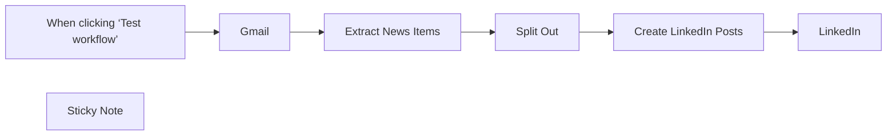

## Fluxo (.json) :

```json
{
  "meta": {
    "instanceId": "2f17285f1745a5069c9edd8be78921f40c6549f5b2e1cfd76834c7f73edd2c07",
    "templateCredsSetupCompleted": true
  },
  "nodes": [
    {
      "id": "02628817-d072-4caa-b935-945d09f57a85",
      "name": "When clicking ‘Test workflow’",
      "type": "n8n-nodes-base.manualTrigger",
      "position": [
        0,
        0
      ],
      "parameters": {},
      "typeVersion": 1
    },
    {
      "id": "7361f9a8-d834-49d3-b0c1-bb4510f654cc",
      "name": "Gmail",
      "type": "n8n-nodes-base.gmail",
      "position": [
        220,
        0
      ],
      "webhookId": "326419f6-008b-4814-b55d-efaae118eab7",
      "parameters": {
        "limit": 1,
        "simple": false,
        "filters": {
          "sender": "decodeai@ghost.io"
        },
        "options": {},
        "operation": "getAll"
      },
      "credentials": {
        "gmailOAuth2": {
          "id": "pwMK2jDEWY5arMX3",
          "name": "Gmail account"
        }
      },
      "typeVersion": 2.1
    },
    {
      "id": "39e63d5f-db0d-4fc6-a5e8-a9ac3c2a703c",
      "name": "Split Out",
      "type": "n8n-nodes-base.splitOut",
      "position": [
        816,
        0
      ],
      "parameters": {
        "options": {},
        "fieldToSplitOut": "message.content.news_items"
      },
      "typeVersion": 1
    },
    {
      "id": "70e64a00-8dc0-4ef4-a4fd-3ac2e50c8fb3",
      "name": "Extract News Items",
      "type": "@n8n/n8n-nodes-langchain.openAi",
      "position": [
        440,
        0
      ],
      "parameters": {
        "modelId": {
          "__rl": true,
          "mode": "list",
          "value": "o3-mini-2025-01-31",
          "cachedResultName": "O3-MINI-2025-01-31"
        },
        "options": {},
        "messages": {
          "values": [
            {
              "content": "=Given the following newsletter content, identify and summarize the 5 main news items. Focus on factual updates like new AI tools, product launches, or strategic investments. For each item, extract a headline and provide a concise summary. Please ignore purely promotional sections (e.g., calls to book demos or product advertisements).\n\n<text>\n{{ $json.text }}\n</text>"
            }
          ]
        },
        "jsonOutput": true
      },
      "credentials": {
        "openAiApi": {
          "id": "29u49HnATSs6YuKN",
          "name": "OpenAi account"
        }
      },
      "typeVersion": 1.8
    },
    {
      "id": "cecf013b-bcf2-49a3-acc2-b81e355446b6",
      "name": "Create LinkedIn Posts",
      "type": "@n8n/n8n-nodes-langchain.openAi",
      "position": [
        1040,
        0
      ],
      "parameters": {
        "modelId": {
          "__rl": true,
          "mode": "list",
          "value": "o3-mini-2025-01-31",
          "cachedResultName": "O3-MINI-2025-01-31"
        },
        "options": {},
        "messages": {
          "values": [
            {
              "content": "=Using the news item details below:\n\nHeadline: {{ $json.headline }}\nSummary: {{ $json.summary }}\n\nCraft a concise, non-promotional LinkedIn post in a smart, deadpan style with subtle humor. Focus on clearly conveying the main points and insights so readers gain practical value. \n- Break up the text into short paragraphs or bullet points for clarity.\n- Use line breaks where helpful.\n- End with an observation or question that encourages reflection—without being overly salesy or flashy.\n- Keep it under 80 words total.\n\n"
            }
          ]
        }
      },
      "credentials": {
        "openAiApi": {
          "id": "29u49HnATSs6YuKN",
          "name": "OpenAi account"
        }
      },
      "typeVersion": 1.8
    },
    {
      "id": "31412fb3-ef9a-4c98-840b-a97fd7075181",
      "name": "LinkedIn",
      "type": "n8n-nodes-base.linkedIn",
      "position": [
        1420,
        0
      ],
      "parameters": {
        "text": "={{ $json.message.content }}",
        "person": "EI5XKdiMv1",
        "additionalFields": {}
      },
      "credentials": {
        "linkedInOAuth2Api": {
          "id": "G3JLFJtB5Y7q9FSY",
          "name": "LinkedIn account"
        }
      },
      "typeVersion": 1
    },
    {
      "id": "a80f43a1-35c8-4f41-8d96-6e64e4ae0cf7",
      "name": "Sticky Note",
      "type": "n8n-nodes-base.stickyNote",
      "position": [
        -20,
        -620
      ],
      "parameters": {
        "width": 900,
        "height": 520,
        "content": "# Workflow Overview\n\n**Name:** Transform Gmail Newsletters into Insightful LinkedIn Posts Using OpenAI\n\n**Purpose:**  \n- **Filter Newsletters:** Use the Gmail node to process emails from a specific sender (e.g., `newsletter@example.com`).  \n- **Extract Key Items:** Leverage an OpenAI node to identify and summarize the top news items from each newsletter.  \n- **Generate Posts:** Automatically create concise, informative, and subtly humorous LinkedIn posts for each news item.  \n- **Publish:** Post the refined content to your LinkedIn account with the LinkedIn node.\n\n**Setup Steps:**  \n1. **Gmail Node:** Configure and rename to \"Filter Gmail Newsletter\" with the appropriate sender filter.  \n2. **OpenAI Nodes:** Ensure API credentials are set; customize prompt texts if desired.  \n3. **LinkedIn Node:** Rename to \"Post to LinkedIn\" and verify correct OAuth2 credentials.\n\n**Customization Tips:**  \n- Modify the OpenAI prompts to fine-tune the tone and structure of the LinkedIn posts.  \n- Add additional formatting (e.g., Function nodes) for post readability if needed.\n\n*This workflow turns your regular newsletters into engaging, ready-to-share LinkedIn insights in just a few simple steps!*\n"
      },
      "typeVersion": 1
    }
  ],
  "pinData": {},
  "connections": {
    "Gmail": {
      "main": [
        [
          {
            "node": "Extract News Items",
            "type": "main",
            "index": 0
          }
        ]
      ]
    },
    "Split Out": {
      "main": [
        [
          {
            "node": "Create LinkedIn Posts",
            "type": "main",
            "index": 0
          }
        ]
      ]
    },
    "Extract News Items": {
      "main": [
        [
          {
            "node": "Split Out",
            "type": "main",
            "index": 0
          }
        ]
      ]
    },
    "Create LinkedIn Posts": {
      "main": [
        [
          {
            "node": "LinkedIn",
            "type": "main",
            "index": 0
          }
        ]
      ]
    },
    "When clicking ‘Test workflow’": {
      "main": [
        [
          {
            "node": "Gmail",
            "type": "main",
            "index": 0
          }
        ]
      ]
    }
  }
}
```

<a id="template-1170"></a>

## Template 1170 - Enriquecimento MITRE ATT&CK e automação de resposta a alertas

- **Nome:** Enriquecimento MITRE ATT&CK e automação de resposta a alertas
- **Descrição:** O fluxo injeta dados do MITRE ATT&CK em um repositório vetorial, usa modelos de linguagem para mapear alertas a TTPs relevantes e atualiza tickets com análises e recomendações acionáveis.
- **Funcionalidade:** • Ingestão de dados MITRE: baixa um arquivo JSON contendo entradas do MITRE ATT&CK e prepara os registros para indexação.
• Criação de vetores e indexação: converte descrições em embeddings e insere-os em um repositório vetorial para consultas semânticas.
• Consulta semântica a base de conhecimento: mapeia descrições de alertas para técnicas e táticas MITRE mais relevantes.
• Recebimento e processamento de alertas via mensagem: aciona análises quando uma mensagem/alerta é recebida e compõe um resumo de detecção.
• Extração de TTPs e recomendações: identifica táticas, técnicas e IDs (com descrição e referência) e gera passos de remediação específicos.
• Geração de saída estruturada: produz saída formatada (ex.: JSON/HTML) contendo resumo do alerta, TTPs, ações de remediação, padrões históricos e links externos.
• Enriquecimento e atualização de tickets: insere o resumo e campos personalizados em tickets para suporte/triagem.
• Contexto conversacional: mantém um buffer de contexto para suportar conversas contínuas e integração com ferramentas de linguagem.
- **Ferramentas:** • Google Drive: armazenamento e fonte do arquivo JSON com dados do MITRE ATT&CK.
• Qdrant: repositório vetorial usado para armazenar e recuperar embeddings do conhecimento MITRE.
• OpenAI: provedora de modelos de linguagem e embeddings usada para análise de texto, extração de TTPs e geração de recomendações.
• Zendesk: sistema de tickets onde os alertas são atualizados com resumos e campos personalizados.
• SIEM / Interface de Mensagens: origem dos alertas que disparam o processamento e análise automatizada.


## Fluxo visual

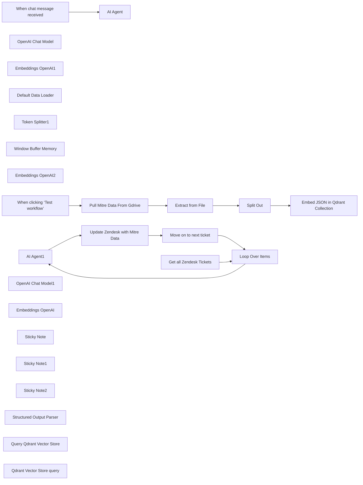

## Fluxo (.json) :

```json
{
  "meta": {
    "instanceId": "cb484ba7b742928a2048bf8829668bed5b5ad9787579adea888f05980292a4a7",
    "templateCredsSetupCompleted": true
  },
  "nodes": [
    {
      "id": "86ddd018-3d6b-46b9-aa93-dedd6c6b5076",
      "name": "When chat message received",
      "type": "@n8n/n8n-nodes-langchain.chatTrigger",
      "position": [
        -880,
        360
      ],
      "webhookId": "a9668bb8-bbe8-418a-b5c9-ff7dd431244f",
      "parameters": {
        "options": {}
      },
      "typeVersion": 1.1
    },
    {
      "id": "a5ba5090-8e3b-4408-82df-92d2c524039e",
      "name": "AI Agent",
      "type": "@n8n/n8n-nodes-langchain.agent",
      "position": [
        -680,
        360
      ],
      "parameters": {
        "options": {
          "systemMessage": "You are a cybersecurity expert trained on MITRE ATT&CK and enterprise incident response. Your job is to:\n1. Extract TTP information from SIEM data.\n2. Provide actionable remediation steps tailored to the alert.\n3. Cross-reference historical patterns and related alerts.\n4. Recommend external resources for deeper understanding.\n\nEnsure that:\n- TTPs are tagged with the tactic, technique name, and technique ID.\n- Remediation steps are specific and actionable.\n- Historical data includes related alerts and notable trends.\n- External links are relevant to the observed behavior.\n"
        }
      },
      "typeVersion": 1.7
    },
    {
      "id": "67c52944-b616-4ea6-9507-e9fb6fcdbe2b",
      "name": "OpenAI Chat Model",
      "type": "@n8n/n8n-nodes-langchain.lmChatOpenAi",
      "position": [
        -740,
        580
      ],
      "parameters": {
        "model": "gpt-4o",
        "options": {}
      },
      "credentials": {
        "openAiApi": {
          "id": "QpFZ2EiM3WGl6Zr3",
          "name": "Marketing OpenAI"
        }
      },
      "typeVersion": 1
    },
    {
      "id": "55f6c16a-51ed-45e4-a1ab-aaaf1d7b5733",
      "name": "Split Out",
      "type": "n8n-nodes-base.splitOut",
      "position": [
        -720,
        1220
      ],
      "parameters": {
        "options": {},
        "fieldToSplitOut": "data"
      },
      "typeVersion": 1
    },
    {
      "id": "46a5b8c6-3d34-4e9b-b812-23135f28c278",
      "name": "Embeddings OpenAI1",
      "type": "@n8n/n8n-nodes-langchain.embeddingsOpenAi",
      "position": [
        -580,
        1420
      ],
      "parameters": {
        "options": {}
      },
      "credentials": {
        "openAiApi": {
          "id": "QpFZ2EiM3WGl6Zr3",
          "name": "Marketing OpenAI"
        }
      },
      "typeVersion": 1.2
    },
    {
      "id": "561b0737-26d5-450d-bd9e-08e0a608d6f9",
      "name": "Default Data Loader",
      "type": "@n8n/n8n-nodes-langchain.documentDefaultDataLoader",
      "position": [
        -460,
        1440
      ],
      "parameters": {
        "options": {
          "metadata": {
            "metadataValues": [
              {
                "name": "id",
                "value": "={{ $json.id }}"
              },
              {
                "name": "name",
                "value": "={{ $json.name }}"
              },
              {
                "name": "killchain",
                "value": "={{ $json.kill_chain_phases }}"
              },
              {
                "name": "external",
                "value": "={{ $json.external_references }}"
              }
            ]
          }
        },
        "jsonData": "={{ $json.description }}",
        "jsonMode": "expressionData"
      },
      "typeVersion": 1
    },
    {
      "id": "6e8a4aed-7e8c-492a-b816-6ab1a98c312a",
      "name": "Token Splitter1",
      "type": "@n8n/n8n-nodes-langchain.textSplitterTokenSplitter",
      "position": [
        -460,
        1620
      ],
      "parameters": {},
      "typeVersion": 1
    },
    {
      "id": "0c54049e-b5e8-448f-b864-39aeb274de3e",
      "name": "Window Buffer Memory",
      "type": "@n8n/n8n-nodes-langchain.memoryBufferWindow",
      "position": [
        -580,
        580
      ],
      "parameters": {},
      "typeVersion": 1.3
    },
    {
      "id": "96b776a0-10da-4f70-99d0-ad6b6ee8fcca",
      "name": "Embeddings OpenAI2",
      "type": "@n8n/n8n-nodes-langchain.embeddingsOpenAi",
      "position": [
        -460,
        720
      ],
      "parameters": {
        "model": "text-embedding-3-large",
        "options": {
          "dimensions": 1536
        }
      },
      "credentials": {
        "openAiApi": {
          "id": "QpFZ2EiM3WGl6Zr3",
          "name": "Marketing OpenAI"
        }
      },
      "typeVersion": 1.2
    },
    {
      "id": "695fba89-8f42-47c3-9d86-73f4ea0e72df",
      "name": "Extract from File",
      "type": "n8n-nodes-base.extractFromFile",
      "position": [
        -920,
        1220
      ],
      "parameters": {
        "options": {},
        "operation": "fromJson"
      },
      "typeVersion": 1
    },
    {
      "id": "0b9897b0-149b-43ce-b66c-e78552729aa5",
      "name": "When clicking ‘Test workflow’",
      "type": "n8n-nodes-base.manualTrigger",
      "position": [
        -1360,
        1220
      ],
      "parameters": {},
      "typeVersion": 1
    },
    {
      "id": "d8c29a14-0389-4748-a9de-686bf9a682c5",
      "name": "AI Agent1",
      "type": "@n8n/n8n-nodes-langchain.agent",
      "position": [
        -540,
        -440
      ],
      "parameters": {
        "text": "=Siem Alert Data:\nAlert: {{ $json.raw_subject }}\nDescription: {{ $json.description }}",
        "options": {
          "systemMessage": "You are a cybersecurity expert trained on MITRE ATT&CK and enterprise incident response. Your job is to:\n1. Extract TTP information from SIEM data.\n2. Provide actionable remediation steps tailored to the alert.\n3. Cross-reference historical patterns and related alerts.\n4. Recommend external resources for deeper understanding.\n\nEnsure that:\n- TTPs are tagged with the tactic, technique name, and technique ID.\n- Remediation steps are specific and actionable.\n- Historical data includes related alerts and notable trends.\n- External links are relevant to the observed behavior.\n\nPlease output your response in html format, but do not include ```html at the beginning \n"
        },
        "promptType": "define",
        "hasOutputParser": true
      },
      "typeVersion": 1.7
    },
    {
      "id": "55d0b00a-5046-45fa-87cb-cb0257caae87",
      "name": "OpenAI Chat Model1",
      "type": "@n8n/n8n-nodes-langchain.lmChatOpenAi",
      "position": [
        -600,
        -220
      ],
      "parameters": {
        "model": "gpt-4o",
        "options": {}
      },
      "credentials": {
        "openAiApi": {
          "id": "QpFZ2EiM3WGl6Zr3",
          "name": "Marketing OpenAI"
        }
      },
      "typeVersion": 1
    },
    {
      "id": "9b53566b-e021-403d-9d78-28504c5c1dfa",
      "name": "Embeddings OpenAI",
      "type": "@n8n/n8n-nodes-langchain.embeddingsOpenAi",
      "position": [
        -320,
        -40
      ],
      "parameters": {
        "model": "text-embedding-3-large",
        "options": {
          "dimensions": 1536
        }
      },
      "credentials": {
        "openAiApi": {
          "id": "QpFZ2EiM3WGl6Zr3",
          "name": "Marketing OpenAI"
        }
      },
      "typeVersion": 1.2
    },
    {
      "id": "f3b44ef5-e928-4662-81ef-4dd044829607",
      "name": "Loop Over Items",
      "type": "n8n-nodes-base.splitInBatches",
      "position": [
        -940,
        -440
      ],
      "parameters": {
        "options": {}
      },
      "typeVersion": 3
    },
    {
      "id": "cc572b71-65c9-460c-bdcd-1d20feb15b32",
      "name": "Sticky Note",
      "type": "n8n-nodes-base.stickyNote",
      "position": [
        -1460,
        940
      ],
      "parameters": {
        "color": 7,
        "width": 1380,
        "height": 820,
        "content": "\n## Embed your Vector Store\nTo provide data for your Vector store, you need to pass it in as JSON, and ensure it's setup correctly. This flow pulls the JSON file from Google Drive and extracts the JSON data and then passes it into the qdrant collection. "
      },
      "typeVersion": 1
    },
    {
      "id": "d5052d52-bec2-4b70-b460-6d5789c28d2c",
      "name": "Sticky Note1",
      "type": "n8n-nodes-base.stickyNote",
      "position": [
        -1460,
        220
      ],
      "parameters": {
        "color": 7,
        "width": 1380,
        "height": 680,
        "content": "\n## Talk to your Vector Store\nNow that your vector store has been updated with the embedded data, \nyou can use the n8n chat interface to talk to your data using OpenAI, \nOllama, or any of our supported LLMs."
      },
      "typeVersion": 1
    },
    {
      "id": "5cb478f6-17f3-4d7a-9b66-9e0654bd1dc9",
      "name": "Sticky Note2",
      "type": "n8n-nodes-base.stickyNote",
      "position": [
        -1460,
        -700
      ],
      "parameters": {
        "color": 7,
        "width": 2140,
        "height": 900,
        "content": "\n## Deploy your Vector Store\nThis flow adds contextual information to your tickets using the Mitre Attack framework to help contextualize the ticket data."
      },
      "typeVersion": 1
    },
    {
      "id": "71ee28f5-84a2-4c6c-855a-6c7c09b2d62a",
      "name": "Structured Output Parser",
      "type": "@n8n/n8n-nodes-langchain.outputParserStructured",
      "position": [
        0,
        -160
      ],
      "parameters": {
        "jsonSchemaExample": "{\n \"ttp_identification\": {\n \"alert_summary\": \"The alert indicates a check-in from the NetSupport RAT, a known Remote Access Trojan, suggesting command and control (C2) communication.\",\n \"mitre_attack_ttps\": [\n {\n \"tactic\": \"Command and Control\",\n \"technique\": \"Protocol or Service Impersonation\",\n \"technique_id\": \"T1001.003\",\n \"description\": \"The RAT's check-in over port 443 implies potential masquerading of its traffic as legitimate SSL/TLS traffic, a tactic often used to blend C2 communications with normal web traffic.\",\n \"reference\": \"https://attack.mitre.org/techniques/T1001/003/\"\n }\n ]\n },\n \"remediation_steps\": {\n \"network_segmentation\": {\n \"action\": \"Isolate the affected host\",\n \"target\": \"10.11.26.183\",\n \"reason\": \"Prevents further C2 communication or lateral movement.\"\n },\n \"endpoint_inspection\": {\n \"action\": \"Perform a thorough inspection\",\n \"target\": \"Impacted endpoint\",\n \"method\": \"Use endpoint detection and response (EDR) tools to check for additional persistence mechanisms.\"\n },\n \"network_traffic_analysis\": {\n \"action\": \"Investigate and block unusual traffic\",\n \"target\": \"IP 194.180.191.64\",\n \"method\": \"Implement blocks for the IP across the firewall or IDS/IPS systems.\"\n },\n \"system_patching\": {\n \"action\": \"Ensure all systems are updated\",\n \"method\": \"Apply the latest security patches to mitigate vulnerabilities exploited by RAT malware.\"\n },\n \"ioc_hunting\": {\n \"action\": \"Search for Indicators of Compromise (IoCs)\",\n \"method\": \"Check for NetSupport RAT IoCs across other endpoints within the network.\"\n }\n },\n \"historical_patterns\": {\n \"network_anomalies\": \"Past alerts involving similar attempts to use standard web ports (e.g., 80, 443) for non-standard applications could suggest a broader attempt to blend malicious traffic into legitimate streams.\",\n \"persistence_tactics\": \"Any detection of anomalies in task scheduling or shortcut modifications may indicate persistence methods similar to those used by RATs.\"\n },\n \"external_resources\": [\n {\n \"title\": \"ESET Report on Okrum and Ketrican\",\n \"description\": \"Discusses similar tactics involving protocol impersonation and C2.\",\n \"url\": \"https://www.eset.com/int/about/newsroom/research/okrum-ketrican/\"\n },\n {\n \"title\": \"Malleable C2 Profiles\",\n \"description\": \"Document on crafting custom C2 traffic profiles similar to the targeting methods used by NetSupport RAT.\",\n \"url\": \"https://www.cobaltstrike.com/help-malleable-c2\"\n },\n {\n \"title\": \"MITRE ATT&CK Technique Overview\",\n \"description\": \"Overview of Protocol or Service Impersonation tactics.\",\n \"url\": \"https://attack.mitre.org/techniques/T1001/003/\"\n }\n ]\n}\n"
      },
      "typeVersion": 1.2
    },
    {
      "id": "3aeb973d-22e5-4eaf-8fe8-fae3447909e1",
      "name": "Pull Mitre Data From Gdrive",
      "type": "n8n-nodes-base.googleDrive",
      "position": [
        -1140,
        1220
      ],
      "parameters": {
        "fileId": {
          "__rl": true,
          "mode": "list",
          "value": "1oWBLO5AlIqbgo9mKD1hNtx92HdC6O28d",
          "cachedResultUrl": "https://drive.google.com/file/d/1oWBLO5AlIqbgo9mKD1hNtx92HdC6O28d/view?usp=drivesdk",
          "cachedResultName": "cleaned_mitre_attack_data.json"
        },
        "options": {},
        "operation": "download"
      },
      "credentials": {
        "googleDriveOAuth2Api": {
          "id": "AVa7MXBLiB9NYjuO",
          "name": "Angel Gdrive"
        }
      },
      "typeVersion": 3
    },
    {
      "id": "3b35633c-de80-4062-8497-cb65092d5708",
      "name": "Embed JSON in Qdrant Collection",
      "type": "@n8n/n8n-nodes-langchain.vectorStoreQdrant",
      "position": [
        -520,
        1220
      ],
      "parameters": {
        "mode": "insert",
        "options": {},
        "qdrantCollection": {
          "__rl": true,
          "mode": "id",
          "value": "mitre"
        }
      },
      "credentials": {
        "qdrantApi": {
          "id": "u0qre50aar6iqyxu",
          "name": "Angel MitreAttack Demo Cluster"
        }
      },
      "typeVersion": 1
    },
    {
      "id": "5f7f2fd8-276f-4b3a-ae88-1f1765967883",
      "name": "Query Qdrant Vector Store",
      "type": "@n8n/n8n-nodes-langchain.vectorStoreQdrant",
      "position": [
        -480,
        580
      ],
      "parameters": {
        "mode": "retrieve-as-tool",
        "options": {},
        "toolName": "mitre_attack_vector_store",
        "toolDescription": "The mitre_attack_vector_store is a knowledge base trained on the MITRE ATT&CK framework. It is designed to help identify, correlate, and provide context for cybersecurity incidents based on textual descriptions of alerts, events, or behaviors. This tool leverages precomputed embeddings of attack techniques, tactics, and procedures (TTPs) to map user queries (such as SIEM-generated alerts or JIRA ticket titles) to relevant MITRE ATT&CK techniques.\n\nBy analyzing input text, the vector store can:\n\nRetrieve the most relevant MITRE ATT&CK entries (e.g., techniques, tactics, descriptions, external references).\nProvide structured context about potential adversary behaviors.\nSuggest remediation actions or detection methods based on the input.",
        "qdrantCollection": {
          "__rl": true,
          "mode": "list",
          "value": "mitre",
          "cachedResultName": "mitre"
        }
      },
      "credentials": {
        "qdrantApi": {
          "id": "u0qre50aar6iqyxu",
          "name": "Angel MitreAttack Demo Cluster"
        }
      },
      "typeVersion": 1
    },
    {
      "id": "298ffc29-1d60-4c05-92c6-a61071629a3f",
      "name": "Qdrant Vector Store query",
      "type": "@n8n/n8n-nodes-langchain.vectorStoreQdrant",
      "position": [
        -320,
        -200
      ],
      "parameters": {
        "mode": "retrieve-as-tool",
        "options": {},
        "toolName": "mitre_attack_vector_store",
        "toolDescription": "The mitre_attack_vector_store is a knowledge base trained on the MITRE ATT&CK framework. It is designed to help identify, correlate, and provide context for cybersecurity incidents based on textual descriptions of alerts, events, or behaviors. This tool leverages precomputed embeddings of attack techniques, tactics, and procedures (TTPs) to map user queries (such as SIEM-generated alerts or JIRA ticket titles) to relevant MITRE ATT&CK techniques.\n\nBy analyzing input text, the vector store can:\n\nRetrieve the most relevant MITRE ATT&CK entries (e.g., techniques, tactics, descriptions, external references).\nProvide structured context about potential adversary behaviors.\nSuggest remediation actions or detection methods based on the input.",
        "qdrantCollection": {
          "__rl": true,
          "mode": "list",
          "value": "mitre",
          "cachedResultName": "mitre"
        }
      },
      "credentials": {
        "qdrantApi": {
          "id": "u0qre50aar6iqyxu",
          "name": "Angel MitreAttack Demo Cluster"
        }
      },
      "typeVersion": 1
    },
    {
      "id": "c47f0ae6-106d-46da-afc3-f7afb86923ff",
      "name": "Get all Zendesk Tickets",
      "type": "n8n-nodes-base.zendesk",
      "position": [
        -1180,
        -440
      ],
      "parameters": {
        "options": {},
        "operation": "getAll"
      },
      "credentials": {
        "zendeskApi": {
          "id": "ROx0ipJapRomRxEX",
          "name": "Zendesk Demo Access"
        }
      },
      "typeVersion": 1
    },
    {
      "id": "0ec2c505-5721-41af-91c8-1b0b55826d9e",
      "name": "Update Zendesk with Mitre Data",
      "type": "n8n-nodes-base.zendesk",
      "position": [
        0,
        -360
      ],
      "parameters": {
        "id": "={{ $('Loop Over Items').item.json.id }}",
        "operation": "update",
        "updateFields": {
          "internalNote": "=Summary: {{ $json.output.ttp_identification.alert_summary }}\n\n",
          "customFieldsUi": {
            "customFieldsValues": [
              {
                "id": 34479547176212,
                "value": "={{ $json.output.ttp_identification.mitre_attack_ttps[0].technique_id }}"
              },
              {
                "id": 34479570659732,
                "value": "={{ $json.output.ttp_identification.mitre_attack_ttps[0].tactic }}"
              }
            ]
          }
        }
      },
      "credentials": {
        "zendeskApi": {
          "id": "ROx0ipJapRomRxEX",
          "name": "Zendesk Demo Access"
        }
      },
      "typeVersion": 1
    },
    {
      "id": "6a74a6d4-610a-4a13-afe4-7bb03d83d4c8",
      "name": "Move on to next ticket",
      "type": "n8n-nodes-base.noOp",
      "position": [
        360,
        -80
      ],
      "parameters": {},
      "typeVersion": 1
    }
  ],
  "pinData": {},
  "connections": {
    "AI Agent": {
      "main": [
        []
      ]
    },
    "AI Agent1": {
      "main": [
        [
          {
            "node": "Update Zendesk with Mitre Data",
            "type": "main",
            "index": 0
          }
        ]
      ]
    },
    "Split Out": {
      "main": [
        [
          {
            "node": "Embed JSON in Qdrant Collection",
            "type": "main",
            "index": 0
          }
        ]
      ]
    },
    "Loop Over Items": {
      "main": [
        [],
        [
          {
            "node": "AI Agent1",
            "type": "main",
            "index": 0
          }
        ]
      ]
    },
    "Token Splitter1": {
      "ai_textSplitter": [
        [
          {
            "node": "Default Data Loader",
            "type": "ai_textSplitter",
            "index": 0
          }
        ]
      ]
    },
    "Embeddings OpenAI": {
      "ai_embedding": [
        [
          {
            "node": "Qdrant Vector Store query",
            "type": "ai_embedding",
            "index": 0
          }
        ]
      ]
    },
    "Extract from File": {
      "main": [
        [
          {
            "node": "Split Out",
            "type": "main",
            "index": 0
          }
        ]
      ]
    },
    "OpenAI Chat Model": {
      "ai_languageModel": [
        [
          {
            "node": "AI Agent",
            "type": "ai_languageModel",
            "index": 0
          }
        ]
      ]
    },
    "Embeddings OpenAI1": {
      "ai_embedding": [
        [
          {
            "node": "Embed JSON in Qdrant Collection",
            "type": "ai_embedding",
            "index": 0
          }
        ]
      ]
    },
    "Embeddings OpenAI2": {
      "ai_embedding": [
        [
          {
            "node": "Query Qdrant Vector Store",
            "type": "ai_embedding",
            "index": 0
          }
        ]
      ]
    },
    "OpenAI Chat Model1": {
      "ai_languageModel": [
        [
          {
            "node": "AI Agent1",
            "type": "ai_languageModel",
            "index": 0
          }
        ]
      ]
    },
    "Default Data Loader": {
      "ai_document": [
        [
          {
            "node": "Embed JSON in Qdrant Collection",
            "type": "ai_document",
            "index": 0
          }
        ]
      ]
    },
    "Window Buffer Memory": {
      "ai_memory": [
        [
          {
            "node": "AI Agent",
            "type": "ai_memory",
            "index": 0
          }
        ]
      ]
    },
    "Move on to next ticket": {
      "main": [
        [
          {
            "node": "Loop Over Items",
            "type": "main",
            "index": 0
          }
        ]
      ]
    },
    "Get all Zendesk Tickets": {
      "main": [
        [
          {
            "node": "Loop Over Items",
            "type": "main",
            "index": 0
          }
        ]
      ]
    },
    "Structured Output Parser": {
      "ai_outputParser": [
        [
          {
            "node": "AI Agent1",
            "type": "ai_outputParser",
            "index": 0
          }
        ]
      ]
    },
    "Qdrant Vector Store query": {
      "ai_tool": [
        [
          {
            "node": "AI Agent1",
            "type": "ai_tool",
            "index": 0
          }
        ]
      ]
    },
    "Query Qdrant Vector Store": {
      "ai_tool": [
        [
          {
            "node": "AI Agent",
            "type": "ai_tool",
            "index": 0
          }
        ]
      ]
    },
    "When chat message received": {
      "main": [
        [
          {
            "node": "AI Agent",
            "type": "main",
            "index": 0
          }
        ]
      ]
    },
    "Pull Mitre Data From Gdrive": {
      "main": [
        [
          {
            "node": "Extract from File",
            "type": "main",
            "index": 0
          }
        ]
      ]
    },
    "Update Zendesk with Mitre Data": {
      "main": [
        [
          {
            "node": "Move on to next ticket",
            "type": "main",
            "index": 0
          }
        ]
      ]
    },
    "When clicking ‘Test workflow’": {
      "main": [
        [
          {
            "node": "Pull Mitre Data From Gdrive",
            "type": "main",
            "index": 0
          }
        ]
      ]
    }
  }
}
```

<a id="template-1171"></a>

## Template 1171 - Alerta e resumo de erros de workflow

- **Nome:** Alerta e resumo de erros de workflow
- **Descrição:** Este fluxo detecta execuções com erro, extrai detalhes do erro, solicita um diagnóstico automatizado via IA e envia um relatório por e-mail aos responsáveis.
- **Funcionalidade:** • Captura de erro: inicia o processo ao detectar uma execução com falha.
• Configuração de destinatários: permite definir TO, CC e BCC para notificações por e-mail.
• Filtragem de execuções manuais: ignora execuções iniciadas manualmente para evitar alertas desnecessários.
• Recuperação da execução falha: obtém o JSON completo da execução afetada para análise.
• Extração de detalhes do erro: coleta metadados da execução, payload do trigger e informações de todos os nós com erro (excluindo nós contendo 'SERP').
• Diagnóstico automatizado via IA: envia o JSON do erro a um agente de IA com mensagem de sistema especializada para retornar diagnóstico, causa e resolução em formato estruturado.
• Mapeamento de campos de diagnóstico: organiza a resposta da IA em campos específicos (diagnosis, cause, resolution) e gera links para o workflow e execução.
• Geração de e-mail HTML: monta um e-mail formatado com detalhes do erro, diagnóstico, causa e instruções de resolução.
• Envio de notificação por e-mail: envia o relatório pronto aos destinatários configurados utilizando autenticação do provedor de e-mail.
- **Ferramentas:** • OpenAI (modelo gpt-4o): utilizado para analisar o JSON do erro e gerar diagnóstico, causa e resolução estruturados.
• Gmail: utilizado para enviar os relatórios por e-mail em HTML aos destinatários configurados.


## Fluxo visual

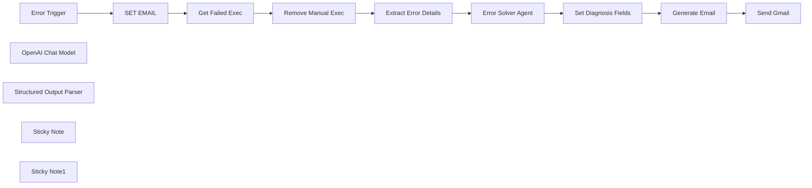

## Fluxo (.json) :

```json
{
  "id": "3b1q6ZJTxeONrpUV",
  "meta": {
    "instanceId": ""
  },
  "name": "Error Alert and Summarizer",
  "tags": [],
  "nodes": [
    {
      "id": "d29a5b06-1609-416f-bc74-0274d3321019",
      "name": "Error Trigger",
      "type": "n8n-nodes-base.errorTrigger",
      "position": [
        -600,
        -40
      ],
      "parameters": {},
      "typeVersion": 1
    },
    {
      "id": "a71d3052-a89b-4e8e-baee-7fe245575f42",
      "name": "OpenAI Chat Model",
      "type": "@n8n/n8n-nodes-langchain.lmChatOpenAi",
      "position": [
        528,
        180
      ],
      "parameters": {
        "model": {
          "__rl": true,
          "mode": "list",
          "value": "gpt-4o",
          "cachedResultName": "gpt-4o"
        },
        "options": {}
      },
      "credentials": {
        "openAiApi": {
          "id": "786",
          "name": "OpenAi account"
        }
      },
      "typeVersion": 1.2
    },
    {
      "id": "e71dee7b-4dfd-49ab-8939-f3808ee112d7",
      "name": "Structured Output Parser",
      "type": "@n8n/n8n-nodes-langchain.outputParserStructured",
      "position": [
        648,
        180
      ],
      "parameters": {
        "jsonSchemaExample": "{\n\"diagnosis\":\"\",\n\"cause\":\"\",\n\"resolution\":\"\"\n}"
      },
      "typeVersion": 1.2
    },
    {
      "id": "3611e9e8-f677-49c4-b06c-fa6c28f43930",
      "name": "SET EMAIL",
      "type": "n8n-nodes-base.set",
      "position": [
        -380,
        -40
      ],
      "parameters": {
        "options": {},
        "assignments": {
          "assignments": [
            {
              "id": "45e1443a-fb44-42f8-96ad-423197c7265b",
              "name": "TO",
              "type": "string",
              "value": "myemail@myemail.com"
            },
            {
              "id": "968b05dc-f476-4e13-8166-e62005d0f936",
              "name": "CC",
              "type": "string",
              "value": "theiremail@theiremail.com"
            },
            {
              "id": "570663c5-29c0-44fb-9992-908b7cca8136",
              "name": "BCC",
              "type": "string",
              "value": "theiremail@theiremail.com"
            }
          ]
        }
      },
      "typeVersion": 3.4
    },
    {
      "id": "3676f72e-d06d-44f8-be35-19efe09a257e",
      "name": "Sticky Note",
      "type": "n8n-nodes-base.stickyNote",
      "position": [
        -450,
        -260
      ],
      "parameters": {
        "color": 3,
        "height": 380,
        "content": "# SET YOUR EMAILS"
      },
      "typeVersion": 1
    },
    {
      "id": "f0b08a20-6ecc-4487-9a0a-30be07cc0cbb",
      "name": "Sticky Note1",
      "type": "n8n-nodes-base.stickyNote",
      "position": [
        -40,
        -260
      ],
      "parameters": {
        "color": 3,
        "width": 280,
        "height": 380,
        "content": "# Enable/Disable Manual Executions"
      },
      "typeVersion": 1
    },
    {
      "id": "b35cd2a6-5f22-4e06-9bb0-880855c423a8",
      "name": "Remove Manual Exec",
      "type": "n8n-nodes-base.if",
      "position": [
        60,
        -40
      ],
      "parameters": {
        "options": {
          "ignoreCase": true
        },
        "conditions": {
          "options": {
            "version": 2,
            "leftValue": "",
            "caseSensitive": false,
            "typeValidation": "strict"
          },
          "combinator": "and",
          "conditions": [
            {
              "id": "9b2f3ff3-db9c-406b-a97f-37620dc5fab9",
              "operator": {
                "type": "string",
                "operation": "notContains"
              },
              "leftValue": "={{ $json.mode }}",
              "rightValue": "manual"
            }
          ]
        }
      },
      "typeVersion": 2.2
    },
    {
      "id": "2a33b02a-78f1-4243-ba7d-f217ea4d1895",
      "name": "Get Failed Exec",
      "type": "n8n-nodes-base.n8n",
      "position": [
        -160,
        -40
      ],
      "parameters": {
        "options": {
          "activeWorkflows": true
        },
        "resource": "execution",
        "operation": "get",
        "executionId": "={{ $('Error Trigger').item.json.execution.id }}",
        "requestOptions": {}
      },
      "credentials": {
        "n8nApi": {
          "id": "786",
          "name": "n8n account"
        }
      },
      "typeVersion": 1
    },
    {
      "id": "b36ccbf9-4e47-44fc-aed3-424b6f121329",
      "name": "Extract Error Details",
      "type": "n8n-nodes-base.code",
      "position": [
        280,
        -40
      ],
      "parameters": {
        "jsCode": "// 1) Grab your full execution JSON\nconst exec = items[0].json;\n\n// 2) Build execution‐level metadata\nconst meta = {\n  executionId:    exec.id,\n  finished:       exec.finished,\n  mode:           exec.mode,\n  status:         exec.status,\n  createdAt:      exec.createdAt,\n  startedAt:      exec.startedAt,\n  stoppedAt:      exec.stoppedAt,\n  deletedAt:      exec.deletedAt,\n  workflowId:     exec.workflowId,\n  workflowName:   exec.workflowData?.name,\n  retryOf:        exec.retryOf,\n  retrySuccessId: exec.retrySuccessId,\n};\n\n// 3) Identify trigger node name from startData\nconst runNodeFilter = exec.data?.startData?.runNodeFilter || [];\nconst triggerNodeName = runNodeFilter[0] || null;\n\n// 4) Grab the raw trigger runData\nconst runData = exec.data?.resultData?.runData || {};\nconst triggerRuns = triggerNodeName ? (runData[triggerNodeName] || []) : [];\n\n// 5) Extract the JSON payload from the first run of the trigger\nlet triggerPayload = {};\nif (triggerRuns.length && triggerRuns[0].data?.main?.[0]?.[0]?.json) {\n  triggerPayload = triggerRuns[0].data.main[0][0].json;\n}\n\n// 6) Merge trigger info into meta\nmeta.triggerNodeName = triggerNodeName;\nmeta.triggerPayload  = triggerPayload;\n\n// 7) Now scan for all node errors, **excluding** any nodeName that contains “SERP”\nconst allErrors = [];\nfor (const [nodeName, runs] of Object.entries(runData)) {\n  // Skip any of the SERP nodes\n  if (nodeName.includes('SERP')) continue;\n\n  runs.forEach(run => {\n    if (run.executionStatus === 'error') {\n      const err     = run.error || exec.data.resultData.error || {};\n      const nodeDef = err.node || run.node || {};\n\n      allErrors.push({\n        ...meta,                    // exec + trigger metadata\n\n        nodeName,\n        nodeId:        nodeDef.id,\n        nodeType:      nodeDef.type,\n        nodeLabel:     nodeDef.name,\n\n        startTime:     run.startTime,\n        executionTime: run.executionTime,\n        source:        run.source,\n\n        errorName:        err.name,\n        errorMessage:     err.message,\n        errorDescription: err.description,\n        httpCode:         err.httpCode,\n        messages:         err.messages,\n        context:          err.context,\n        stack:            err.stack,\n\n        parameters:       nodeDef.parameters,\n        credentials:      nodeDef.credentials,\n      });\n    }\n  });\n}\n\n// 8) Return results\nif (!allErrors.length) {\n  return [{ json: { message: '✅ No (non‑SERP) errors found in this execution.' } }];\n}\nreturn allErrors.map(e => ({ json: e }));\n"
      },
      "typeVersion": 2
    },
    {
      "id": "a26fb0c8-99eb-466d-b201-89c402fa1af4",
      "name": "Error Solver Agent",
      "type": "@n8n/n8n-nodes-langchain.agent",
      "position": [
        500,
        -40
      ],
      "parameters": {
        "text": "=Can you please help me with this error that occured in my n8n workflow? {{ JSON.stringify($json) }}",
        "options": {
          "systemMessage": "You are an seasoned n8n expert with specializations in managing n8n instances and workflows. The user will provide a detailed error json object and your goal is to review, analyze and understand the error and using your expertise diagnose the error and provide a detailed report to the user with your diagnosis, cause and resolution so the user understands and can immediately fix the issue."
        },
        "promptType": "define",
        "hasOutputParser": true
      },
      "typeVersion": 1.8
    },
    {
      "id": "8cfd7229-3ff1-4ba1-a67d-caa21be8064f",
      "name": "Set Diagnosis Fields",
      "type": "n8n-nodes-base.set",
      "position": [
        876,
        -40
      ],
      "parameters": {
        "options": {},
        "assignments": {
          "assignments": [
            {
              "id": "fac5fbee-d63d-4148-b047-5ed5af4f2574",
              "name": "error.diagnosis",
              "type": "string",
              "value": "={{ $json.output.diagnosis }}"
            },
            {
              "id": "ece9388d-f667-4984-a143-7241f622fe76",
              "name": "error.cause",
              "type": "string",
              "value": "={{ $json.output.cause }}"
            },
            {
              "id": "acb6b34a-a651-42fc-a44a-331b2e0d745c",
              "name": "error.resolution",
              "type": "string",
              "value": "={{ $json.output.resolution }}"
            },
            {
              "id": "c765754b-d6d5-4592-ac3f-99a350bc3c19",
              "name": "error.workflowName",
              "type": "string",
              "value": "={{ $('Extract Error Details').item.json.workflowName }}"
            },
            {
              "id": "dabebc62-3e0c-4d22-afbf-54ba66a912fb",
              "name": "error.workflowId",
              "type": "string",
              "value": "={{ $('Extract Error Details').item.json.workflowId }}"
            },
            {
              "id": "6ab19800-9a0f-439f-bf62-7a7afc5bf958",
              "name": "workflowLink",
              "type": "string",
              "value": "={{ $execution.resumeUrl.split('/').slice(0, 3).join('/') }}/workflow/{{ $('Extract Error Details').item.json.workflowId }}"
            },
            {
              "id": "29daaea5-052b-46d4-8192-141db159bff2",
              "name": "error.executionId",
              "type": "string",
              "value": "={{ $('Extract Error Details').item.json.executionId }}"
            },
            {
              "id": "9e4e553c-c82b-41ec-8ee2-14162cdc3bd8",
              "name": "executionLink",
              "type": "string",
              "value": "={{ $execution.resumeUrl.split('/').slice(0, 3).join('/') }}/workflow/{{ $('Extract Error Details').item.json.workflowId }}/executions/{{ $('Extract Error Details').item.json.executionId }}"
            },
            {
              "id": "7269ea9f-ed49-46cd-89f2-d4a467da529d",
              "name": "error.finished",
              "type": "boolean",
              "value": "={{ $('Extract Error Details').item.json.finished }}"
            },
            {
              "id": "29a6e6d2-5058-4dd9-b2f9-3980a6a9073a",
              "name": "error.startedAt",
              "type": "string",
              "value": "={{ $('Extract Error Details').item.json.startedAt }}"
            },
            {
              "id": "a0ad0e13-5a6e-48db-9a80-74c09434de7f",
              "name": "error.nodeName",
              "type": "string",
              "value": "={{ $('Extract Error Details').item.json.nodeName }}"
            },
            {
              "id": "6c1001d4-a581-4520-9f16-a2c7cf0e1f84",
              "name": "error.previousNode",
              "type": "string",
              "value": "={{ $('Extract Error Details').item.json.source[0].previousNode }}"
            },
            {
              "id": "8c3402ca-3f15-44ae-9b96-ea37c174334c",
              "name": "rawJson",
              "type": "string",
              "value": "={{ JSON.stringify($('Extract Error Details').item.json) }}"
            }
          ]
        }
      },
      "typeVersion": 3.4
    },
    {
      "id": "9e95edf0-b2f1-443b-9ac4-3e3b3311cad5",
      "name": "Send Gmail",
      "type": "n8n-nodes-base.gmail",
      "position": [
        1316,
        -40
      ],
      "webhookId": "2f253c1f-36c3-4d58-ba2f-3a50bb78f188",
      "parameters": {
        "sendTo": "={{ $('SET EMAIL').item.json.TO }}",
        "message": "={{ $json.html }}",
        "options": {
          "ccList": "={{ $('SET EMAIL').item.json.CC }}",
          "bccList": "={{ $('SET EMAIL').item.json.BCC }}",
          "appendAttribution": true
        },
        "subject": "={{ $json.subject }}"
      },
      "credentials": {
        "gmailOAuth2": {
          "id": "786",
          "name": "Gmail account"
        }
      },
      "typeVersion": 2.1
    },
    {
      "id": "1705ee42-0be4-41a2-8ff9-f6963eef7382",
      "name": "Generate Email",
      "type": "n8n-nodes-base.code",
      "position": [
        1100,
        -40
      ],
      "parameters": {
        "jsCode": "// 1. Pull in your error payload\nconst rawInput = items[0].json;\nconst parsed = typeof rawInput === 'string' ? JSON.parse(rawInput) : rawInput;\nconst errorArray = Array.isArray(parsed) ? parsed : [parsed];\n\n// 2. Build HTML & Markdown sections\nlet htmlSections = '';\n\n\nfor (const errObj of errorArray) {\n  const {\n    error: {\n      workflowName,\n      executionId,\n      nodeName,\n      previousNode,\n      diagnosis,\n      cause,\n      resolution,\n      startedAt,\n    },\n    workflowLink,\n    executionLink,\n  } = errObj;\n\n  // HTML block\n  htmlSections += `\n    <div style=\"border:1px solid #ddd;border-radius:4px;padding:16px;margin-bottom:20px;background:#fafafa;\">\n      <h3 style=\"margin:0 0 10px;color:#c0392b;font-family:Arial,sans-serif;\">\n        🛑 ${workflowName} — Error in node: ${nodeName}\n      </h3>\n      <p style=\"margin:4px 0;font-family:Arial,sans-serif;\">\n        <strong>Workflow:</strong> \n        <a href=\"${workflowLink}\" style=\"color:#2980b9;text-decoration:none;\">\n          ${workflowName}\n        </a><br/>\n        <strong>Execution:</strong> \n        <a href=\"${executionLink}\" style=\"color:#2980b9;text-decoration:none;\">\n          #${executionId}\n        </a><br/>\n        <strong>Previous Node:</strong> ${previousNode}<br/>\n        <strong>Started At:</strong> ${new Date(startedAt).toLocaleString('en-US', { timeZone: 'America/New_York' })}\n      </p>\n      <hr style=\"border:none;border-top:1px solid #ccc;margin:12px 0;\"/>\n      <h4 style=\"margin:0 0 6px;color:#e67e22;font-family:Arial,sans-serif;\">🔍 Diagnosis</h4>\n      <p style=\"margin:4px 0 12px;font-family:Arial,sans-serif;\">${diagnosis}</p>\n      <h4 style=\"margin:0 0 6px;color:#e67e22;font-family:Arial,sans-serif;\">⚙️ Cause</h4>\n      <p style=\"margin:4px 0 12px;font-family:Arial,sans-serif;\">${cause}</p>\n      <h4 style=\"margin:0 0 6px;color:#e67e22;font-family:Arial,sans-serif;\">✅ Resolution</h4>\n      <p style=\"white-space:pre-wrap;margin:4px 0;font-family:Arial,sans-serif;\">${resolution}</p>\n    </div>`;\n\n// 3. Wrap up\nconst html = `\n  <div style=\"font-family:Arial,sans-serif;color:#333;background:#fff;padding:20px;\">\n    <h2 style=\"margin-top:0;color:#2c3e50;\">Automated Error Report</h2>\n    ${htmlSections}\n     <p style=\"font-size:12px;color:#777;font-family:Arial,sans-serif;\">\n  This message was generated automatically by \n  <a href=\"https://realsimple.dev\" style=\"color:#777;text-decoration:none;\"><b>Real Simple Solutions</b></a>.\n</p>\n<div style=\"background:#f0f4ff;padding:8px 12px;margin-top:6px;border-radius:6px;font-size:12px;font-family:Arial,sans-serif;\">\n  ✨ <strong>Want more n8n AI automation templates?</strong><br>\n  Check out our full collection on \n  <a href=\"https://joeper.es/4jXyRub\" style=\"color:#0066cc;text-decoration:none;\"><b>Gumroad</b></a>.\n</div>\n  </div>\n`;\n\n// 4. Return all three\nreturn [\n  {\n    json: {\n      subject: `🚨 n8n Error: ${errorArray[0].error.workflowName} (#${errorArray[0].error.executionId})`,\n      html\n    },\n  },\n];\n"
      },
      "typeVersion": 2
    }
  ],
  "active": true,
  "pinData": {},
  "settings": {
    "executionOrder": "v1"
  },
  "versionId": "be484a20-26cd-4df4-a993-f7d01c2956e6",
  "connections": {
    "SET EMAIL": {
      "main": [
        [
          {
            "node": "Get Failed Exec",
            "type": "main",
            "index": 0
          }
        ]
      ]
    },
    "Error Trigger": {
      "main": [
        [
          {
            "node": "SET EMAIL",
            "type": "main",
            "index": 0
          }
        ]
      ]
    },
    "Generate Email": {
      "main": [
        [
          {
            "node": "Send Gmail",
            "type": "main",
            "index": 0
          }
        ]
      ]
    },
    "Get Failed Exec": {
      "main": [
        [
          {
            "node": "Remove Manual Exec",
            "type": "main",
            "index": 0
          }
        ]
      ]
    },
    "OpenAI Chat Model": {
      "ai_languageModel": [
        [
          {
            "node": "Error Solver Agent",
            "type": "ai_languageModel",
            "index": 0
          }
        ]
      ]
    },
    "Error Solver Agent": {
      "main": [
        [
          {
            "node": "Set Diagnosis Fields",
            "type": "main",
            "index": 0
          }
        ]
      ]
    },
    "Remove Manual Exec": {
      "main": [
        [
          {
            "node": "Extract Error Details",
            "type": "main",
            "index": 0
          }
        ]
      ]
    },
    "Set Diagnosis Fields": {
      "main": [
        [
          {
            "node": "Generate Email",
            "type": "main",
            "index": 0
          }
        ]
      ]
    },
    "Extract Error Details": {
      "main": [
        [
          {
            "node": "Error Solver Agent",
            "type": "main",
            "index": 0
          }
        ]
      ]
    },
    "Structured Output Parser": {
      "ai_outputParser": [
        [
          {
            "node": "Error Solver Agent",
            "type": "ai_outputParser",
            "index": 0
          }
        ]
      ]
    }
  }
}
```

<a id="template-1172"></a>

## Template 1172 - Fábrica automática de conteúdo para redes sociais

- **Nome:** Fábrica automática de conteúdo para redes sociais
- **Descrição:** Fluxo que recebe um pedido de conteúdo, compõe prompts e schemas a partir de documentos externos, gera posts e imagens otimizadas por plataforma, gerencia aprovação e publica ou arquiva os resultados.
- **Funcionalidade:** • Recepção de solicitações: Inicia o processo a partir de um input de chat ou execução por outro workflow.
• Composição dinâmica de prompt e schema: Carrega e combina um prompt de sistema e schemas de saída armazenados externamente para direcionar a geração de conteúdo.
• Geração de conteúdo guiada por agente: Utiliza um agente LLM com ferramenta de busca para criar conteúdo em JSON seguindo schemas específicos por plataforma.
• Criação automática de imagens: Gera sugestões visuais e imagens para posts e adapta formato conforme plataforma.
• Armazenamento de imagens: Salva imagens em serviços de hospedagem e em drive para arquivamento e reutilização.
• Aprovação e revisão por e-mail: Envia conteúdos formatados em HTML para revisão e aguarda aprovação antes de publicar.
• Roteamento por plataforma: Direciona o conteúdo gerado para publicações específicas (X/Twitter, Instagram, Facebook, LinkedIn, Threads, YouTube Shorts).
• Publicação automatizada: Publica posts e mídias usando APIs das redes sociais quando aprovado.
• Notificações e logs: Envia notificações de sucesso/erro e mantém registros para auditoria.
• Modularidade e manutenção: Permite atualizar prompts e schemas sem alterar o fluxo, facilitando controle de versão e colaboração.
- **Ferramentas:** • OpenAI: Modelo de linguagem para gerar conteúdo estruturado e adaptar o texto ao schema e tom desejado.
• SerpAPI: Ferramenta de busca para pesquisa em tempo real e incorporação de informações atuais ao conteúdo.
• Pollinations.ai (gerador de imagens): Serviço para criar imagens a partir de descrições para ilustrar os posts.
• imgbb.com: Serviço de armazenamento/hospedagem de imagens para disponibilizar assets gerados.
• Google Docs: Repositório para armazenar e gerenciar o prompt de sistema e os schemas de saída de forma colaborativa.
• Google Drive: Armazenamento e arquivamento dos arquivos finais e imagens geradas.
• Gmail: Canal para envio de emails de aprovação e relatórios estruturados em HTML.
• Facebook Graph API: Publicação em Facebook e integração com Instagram (upload de mídia e publicação).
• Twitter / X API: Publicação de posts curtos no X (antigo Twitter).
• LinkedIn API: Publicação de conteúdo profissional para perfis ou organizações.
• Telegram: Notificações em tempo real sobre sucesso ou erros no pipeline.


## Fluxo visual

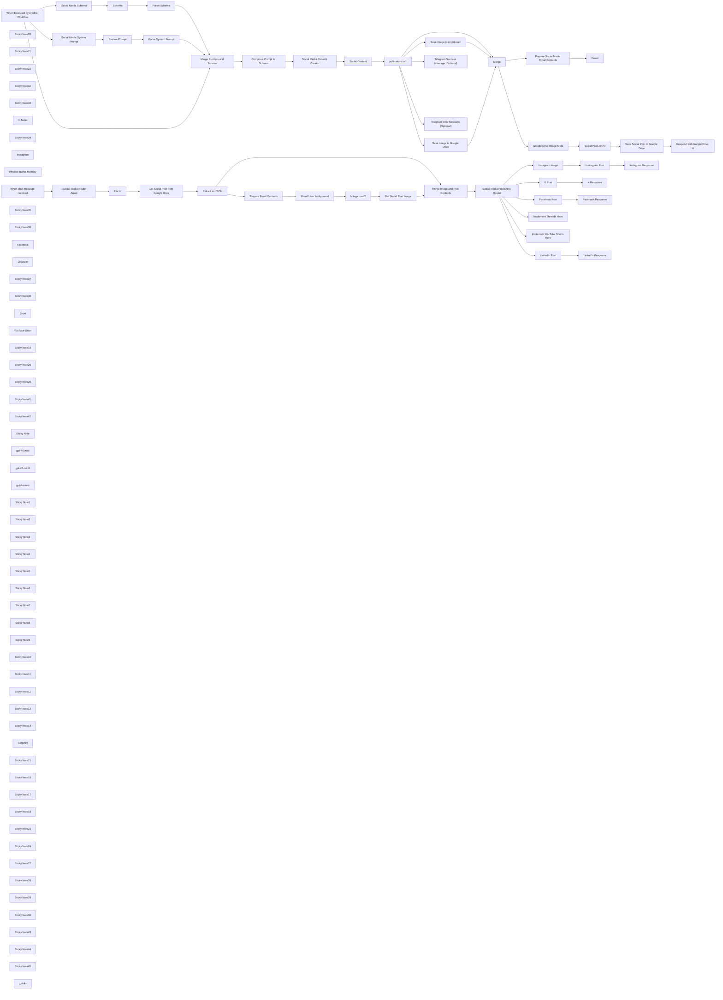

## Fluxo (.json) :

```json
{
  "id": "0KZs18Ti2KXKoLIr",
  "meta": {
    "instanceId": "31e69f7f4a77bf465b805824e303232f0227212ae922d12133a0f96ffeab4fef",
    "templateCredsSetupCompleted": true
  },
  "name": "✨🩷Automated Social Media Content Publishing Factory + System Prompt Composition",
  "tags": [],
  "nodes": [
    {
      "id": "74fb48a6-1acd-4693-9b8e-39b36c5649a9",
      "name": "When chat message received",
      "type": "@n8n/n8n-nodes-langchain.chatTrigger",
      "position": [
        -520,
        -2080
      ],
      "webhookId": "faddb40a-7048-4398-a0f9-d239a19c32ce",
      "parameters": {
        "options": {}
      },
      "typeVersion": 1.1
    },
    {
      "id": "09f4a998-2d69-4683-9251-2694a77efeba",
      "name": "Sticky Note20",
      "type": "n8n-nodes-base.stickyNote",
      "position": [
        -600,
        -1720
      ],
      "parameters": {
        "color": 7,
        "height": 240,
        "content": "## LLM"
      },
      "typeVersion": 1
    },
    {
      "id": "03b93e0b-a917-41f6-b99e-5a27ad07cd3e",
      "name": "Sticky Note21",
      "type": "n8n-nodes-base.stickyNote",
      "position": [
        -600,
        -1460
      ],
      "parameters": {
        "color": 7,
        "height": 240,
        "content": "## Chat Memory"
      },
      "typeVersion": 1
    },
    {
      "id": "b6c61fe5-a519-4bdb-8641-3149362fbb54",
      "name": "Sticky Note22",
      "type": "n8n-nodes-base.stickyNote",
      "position": [
        -620,
        -2160
      ],
      "parameters": {
        "color": 4,
        "width": 300,
        "height": 280,
        "content": "## 👍Start Here"
      },
      "typeVersion": 1
    },
    {
      "id": "2cf0448a-76de-4b2c-a200-953d47e29a52",
      "name": "Sticky Note32",
      "type": "n8n-nodes-base.stickyNote",
      "position": [
        1980,
        -2000
      ],
      "parameters": {
        "color": 2,
        "width": 340,
        "height": 420,
        "content": "## Social Media Publishing Router"
      },
      "typeVersion": 1
    },
    {
      "id": "dff757e6-8ef4-4479-a9f8-71cb814fb8ef",
      "name": "Sticky Note33",
      "type": "n8n-nodes-base.stickyNote",
      "position": [
        -300,
        -1640
      ],
      "parameters": {
        "color": 6,
        "height": 240,
        "content": "## 1️⃣ X - Twitter"
      },
      "typeVersion": 1
    },
    {
      "id": "fda64627-952a-4be9-b4c5-799d8c7801ad",
      "name": "X-Twiter",
      "type": "@n8n/n8n-nodes-langchain.toolWorkflow",
      "position": [
        -220,
        -1540
      ],
      "parameters": {
        "name": "create_x_twitter_posts_tool",
        "fields": {
          "values": [
            {
              "name": "route",
              "stringValue": "=xtwitter"
            },
            {
              "name": "user_prompt",
              "stringValue": "={{ $('When chat message received').item.json.chatInput }}"
            }
          ]
        },
        "workflowId": {
          "__rl": true,
          "mode": "id",
          "value": "={{ $workflow.id }}"
        },
        "description": "Use this tool to create XTwitter posts",
        "jsonSchemaExample": ""
      },
      "typeVersion": 1.2
    },
    {
      "id": "5023b0b3-468b-4cbb-829c-e06aaf822b99",
      "name": "Sticky Note34",
      "type": "n8n-nodes-base.stickyNote",
      "position": [
        -40,
        -1640
      ],
      "parameters": {
        "color": 6,
        "height": 240,
        "content": "## 2️⃣ Instagram"
      },
      "typeVersion": 1
    },
    {
      "id": "781df8c5-0b06-42a4-bbe9-6948ae345599",
      "name": "Instagram",
      "type": "@n8n/n8n-nodes-langchain.toolWorkflow",
      "position": [
        40,
        -1540
      ],
      "parameters": {
        "name": "create_instagram_posts_tool",
        "fields": {
          "values": [
            {
              "name": "route",
              "stringValue": "=instagram"
            },
            {
              "name": "user_prompt",
              "stringValue": "={{ $('When chat message received').item.json.chatInput }}"
            }
          ]
        },
        "workflowId": {
          "__rl": true,
          "mode": "id",
          "value": "={{ $workflow.id }}"
        },
        "description": "Use this tool to create Instagram posts",
        "jsonSchemaExample": ""
      },
      "typeVersion": 1.2
    },
    {
      "id": "8687d1ff-06ee-44c7-a26e-f08da72bbd15",
      "name": "Window Buffer Memory",
      "type": "@n8n/n8n-nodes-langchain.memoryBufferWindow",
      "position": [
        -520,
        -1360
      ],
      "parameters": {},
      "typeVersion": 1.3
    },
    {
      "id": "30cbcc50-e19b-43ea-8f0a-5e2021dc5e48",
      "name": "When Executed by Another Workflow",
      "type": "n8n-nodes-base.executeWorkflowTrigger",
      "position": [
        -700,
        -560
      ],
      "parameters": {
        "workflowInputs": {
          "values": [
            {
              "name": "user_prompt"
            },
            {
              "name": "route"
            }
          ]
        }
      },
      "typeVersion": 1.1
    },
    {
      "id": "0b9b7f07-d603-4890-96b0-f815feb38185",
      "name": "Sticky Note35",
      "type": "n8n-nodes-base.stickyNote",
      "position": [
        220,
        -1640
      ],
      "parameters": {
        "color": 6,
        "height": 240,
        "content": "## 3️⃣ Facebook"
      },
      "typeVersion": 1
    },
    {
      "id": "12b17b82-8f98-4d80-9b49-aa9860827e01",
      "name": "Sticky Note36",
      "type": "n8n-nodes-base.stickyNote",
      "position": [
        480,
        -1640
      ],
      "parameters": {
        "color": 6,
        "height": 240,
        "content": "## 4️⃣ LinkedIn"
      },
      "typeVersion": 1
    },
    {
      "id": "71dc9ccf-3691-4c0d-b53b-f3ff10f382a9",
      "name": "Facebook",
      "type": "@n8n/n8n-nodes-langchain.toolWorkflow",
      "position": [
        300,
        -1540
      ],
      "parameters": {
        "name": "create_facebook_posts_tool",
        "fields": {
          "values": [
            {
              "name": "route",
              "stringValue": "=facebook"
            },
            {
              "name": "user_prompt",
              "stringValue": "={{ $('When chat message received').item.json.chatInput }}"
            }
          ]
        },
        "workflowId": {
          "__rl": true,
          "mode": "id",
          "value": "={{ $workflow.id }}"
        },
        "description": "Use this tool to create Facebook posts",
        "jsonSchemaExample": ""
      },
      "typeVersion": 1.2
    },
    {
      "id": "f953cd87-88a8-451f-841e-78227949b64d",
      "name": "LinkedIn",
      "type": "@n8n/n8n-nodes-langchain.toolWorkflow",
      "position": [
        560,
        -1540
      ],
      "parameters": {
        "name": "create_linkedin_posts_tool",
        "fields": {
          "values": [
            {
              "name": "route",
              "stringValue": "=linkedin"
            },
            {
              "name": "user_prompt",
              "stringValue": "={{ $('When chat message received').item.json.chatInput }}"
            }
          ]
        },
        "workflowId": {
          "__rl": true,
          "mode": "id",
          "value": "={{ $workflow.id }}"
        },
        "description": "Use this tool to create LinkedIn posts",
        "jsonSchemaExample": ""
      },
      "typeVersion": 1.2
    },
    {
      "id": "97b6829d-6c9d-410a-8fa0-d89d884fd76e",
      "name": "Sticky Note37",
      "type": "n8n-nodes-base.stickyNote",
      "position": [
        -40,
        -1380
      ],
      "parameters": {
        "color": 6,
        "height": 240,
        "content": "## 5️⃣Threads"
      },
      "typeVersion": 1
    },
    {
      "id": "463259f7-71b4-492f-b05a-d1a958917d5c",
      "name": "Sticky Note38",
      "type": "n8n-nodes-base.stickyNote",
      "position": [
        220,
        -1380
      ],
      "parameters": {
        "color": 6,
        "height": 240,
        "content": "## 6️⃣YouTube Shorts"
      },
      "typeVersion": 1
    },
    {
      "id": "0cd9003b-8eeb-4e4a-9f1f-5f6b611d5194",
      "name": "Short",
      "type": "@n8n/n8n-nodes-langchain.toolWorkflow",
      "position": [
        40,
        -1280
      ],
      "parameters": {
        "name": "create_threads_posts_tool",
        "fields": {
          "values": [
            {
              "name": "route",
              "stringValue": "=threads"
            },
            {
              "name": "user_prompt",
              "stringValue": "={{ $('When chat message received').item.json.chatInput }}"
            }
          ]
        },
        "workflowId": {
          "__rl": true,
          "mode": "id",
          "value": "={{ $workflow.id }}"
        },
        "description": "Use this tool to create Threads posts",
        "jsonSchemaExample": ""
      },
      "typeVersion": 1.2
    },
    {
      "id": "54c2bf4b-8053-4e9d-beb4-570db66f9bd4",
      "name": "YouTube Short",
      "type": "@n8n/n8n-nodes-langchain.toolWorkflow",
      "position": [
        300,
        -1280
      ],
      "parameters": {
        "name": "create_youtube_short_tool",
        "fields": {
          "values": [
            {
              "name": "route",
              "stringValue": "=youtube_short"
            },
            {
              "name": "user_prompt",
              "stringValue": "={{ $('When chat message received').item.json.chatInput }}"
            },
            {
              "name": "llm",
              "stringValue": "={{ /*n8n-auto-generated-fromAI-override*/ $fromAI('Value', ``, 'string') }}"
            }
          ]
        },
        "workflowId": {
          "__rl": true,
          "mode": "id",
          "value": "={{ $workflow.id }}"
        },
        "description": "Use this tool to create a YouTube short",
        "jsonSchemaExample": ""
      },
      "typeVersion": 1.2
    },
    {
      "id": "a72c3242-3a8b-444f-9623-fbcb0b47a817",
      "name": "Sticky Note18",
      "type": "n8n-nodes-base.stickyNote",
      "position": [
        -340,
        -1720
      ],
      "parameters": {
        "color": 7,
        "width": 1100,
        "height": 620,
        "content": "## Social Media Agent Tools"
      },
      "typeVersion": 1
    },
    {
      "id": "586a33ae-3546-4b31-9235-9a8fcfd28598",
      "name": "Sticky Note25",
      "type": "n8n-nodes-base.stickyNote",
      "position": [
        -500,
        -940
      ],
      "parameters": {
        "color": 6,
        "width": 3520,
        "height": 820,
        "content": "# 🏭Social Media Content Factory"
      },
      "typeVersion": 1
    },
    {
      "id": "153da903-fcd3-4694-aaa4-bef2b300d158",
      "name": "pollinations.ai1",
      "type": "n8n-nodes-base.httpRequest",
      "onError": "continueErrorOutput",
      "maxTries": 5,
      "position": [
        1440,
        -560
      ],
      "parameters": {
        "url": "=https://image.pollinations.ai/prompt/{{ $json.output.common_schema.image_suggestion.replaceAll(' ','-').replaceAll(',','').replaceAll('.','').slice(0,100) }}",
        "options": {}
      },
      "retryOnFail": true,
      "typeVersion": 4.2
    },
    {
      "id": "6c114f0b-1395-4fe6-8de7-0b3d0d9fd6b2",
      "name": "Sticky Note26",
      "type": "n8n-nodes-base.stickyNote",
      "position": [
        1340,
        -720
      ],
      "parameters": {
        "color": 7,
        "width": 300,
        "height": 340,
        "content": "## Create Post Image\nhttps://pollinations.ai/\nhttps://image.pollinations.ai/prompt/[your image description]\n\n"
      },
      "typeVersion": 1
    },
    {
      "id": "e196ea9b-f5d0-4fa6-a3d9-bea2f98fd872",
      "name": "Save Image to imgbb.com",
      "type": "n8n-nodes-base.httpRequest",
      "position": [
        1760,
        -680
      ],
      "parameters": {
        "url": "https://api.imgbb.com/1/upload",
        "method": "POST",
        "options": {
          "redirect": {
            "redirect": {}
          }
        },
        "sendBody": true,
        "sendQuery": true,
        "contentType": "multipart-form-data",
        "bodyParameters": {
          "parameters": [
            {
              "name": "image",
              "parameterType": "formBinaryData",
              "inputDataFieldName": "data"
            }
          ]
        },
        "queryParameters": {
          "parameters": [
            {
              "name": "expiration",
              "value": "0"
            },
            {
              "name": "key",
              "value": "={{ $env.IMGBB_API_KEY}} "
            }
          ]
        }
      },
      "typeVersion": 4.2
    },
    {
      "id": "225e34be-26ee-40d7-88d6-e866420e083a",
      "name": "Sticky Note41",
      "type": "n8n-nodes-base.stickyNote",
      "position": [
        1980,
        -2280
      ],
      "parameters": {
        "width": 340,
        "height": 180,
        "content": "💡Notes\n\nUpdate all Social Media Platform Credentials as required.\n\nAdjust parameters and content for each platform to suit your needs."
      },
      "typeVersion": 1
    },
    {
      "id": "2f48f19d-92c1-478a-b7fa-3fc3b1100993",
      "name": "Sticky Note42",
      "type": "n8n-nodes-base.stickyNote",
      "position": [
        1240,
        -1760
      ],
      "parameters": {
        "color": 4,
        "width": 400,
        "height": 360,
        "content": "# 👍 Approve Content Before Proceeding"
      },
      "typeVersion": 1
    },
    {
      "id": "ce4e9f3c-801a-478e-8ffc-008c5e7d4e49",
      "name": "Gmail",
      "type": "n8n-nodes-base.gmail",
      "position": [
        2640,
        -780
      ],
      "webhookId": "cfc2a53d-14a7-47e1-8385-c0b0792d9843",
      "parameters": {
        "sendTo": "={{ $env.TELEGRAM_CHAT_ID }}",
        "message": "={{ $json.output }}",
        "options": {
          "appendAttribution": false
        },
        "subject": "=Social Media Content - {{ $('Social Content').item.json.output.title }}"
      },
      "credentials": {
        "gmailOAuth2": {
          "id": "1xpVDEQ1yx8gV022",
          "name": "Gmail account"
        }
      },
      "typeVersion": 2.1
    },
    {
      "id": "31ee0735-c863-476c-9c4a-41b50ae9c61a",
      "name": "Social Media Schema",
      "type": "n8n-nodes-base.googleDocs",
      "position": [
        -320,
        -700
      ],
      "parameters": {
        "operation": "get",
        "documentURL": "=12345"
      },
      "credentials": {
        "googleDocsOAuth2Api": {
          "id": "YWEHuG28zOt532MQ",
          "name": "Google Docs account"
        }
      },
      "typeVersion": 2
    },
    {
      "id": "18cfde4e-2637-496c-acca-070bdb84c2ba",
      "name": "Social Media System Prompt",
      "type": "n8n-nodes-base.googleDocs",
      "position": [
        -320,
        -420
      ],
      "parameters": {
        "operation": "get",
        "documentURL": "=12345"
      },
      "credentials": {
        "googleDocsOAuth2Api": {
          "id": "YWEHuG28zOt532MQ",
          "name": "Google Docs account"
        }
      },
      "typeVersion": 2
    },
    {
      "id": "383ce472-ccf8-47fb-aa36-5b8aacbcd64f",
      "name": "Sticky Note",
      "type": "n8n-nodes-base.stickyNote",
      "position": [
        -440,
        -840
      ],
      "parameters": {
        "color": 7,
        "width": 1120,
        "height": 640,
        "content": "## Prompt & Schema Composition from External Sources"
      },
      "typeVersion": 1
    },
    {
      "id": "8d2a2a64-bbaa-4692-94ed-2f541d0d40ca",
      "name": "gpt-40-mini",
      "type": "@n8n/n8n-nodes-langchain.lmChatOpenAi",
      "position": [
        2320,
        -600
      ],
      "parameters": {
        "model": {
          "__rl": true,
          "mode": "list",
          "value": "gpt-4o-mini",
          "cachedResultName": "gpt-4o-mini"
        },
        "options": {
          "responseFormat": "text"
        }
      },
      "credentials": {
        "openAiApi": {
          "id": "jEMSvKmtYfzAkhe6",
          "name": "OpenAi account"
        }
      },
      "typeVersion": 1.2
    },
    {
      "id": "6e5faa4d-25a1-4dbe-998e-3255ed181ac5",
      "name": "Instagram Image",
      "type": "n8n-nodes-base.httpRequest",
      "onError": "continueRegularOutput",
      "position": [
        2440,
        -1940
      ],
      "parameters": {
        "url": "https://graph.facebook.com/v20.0/[your-unique-id]/media",
        "method": "POST",
        "options": {},
        "sendQuery": true,
        "authentication": "predefinedCredentialType",
        "queryParameters": {
          "parameters": [
            {
              "name": "image_url",
              "value": "={{ $json.output.social_image.medium.url }}"
            },
            {
              "name": "caption",
              "value": "={{ $json.output.caption }}"
            }
          ]
        },
        "nodeCredentialType": "facebookGraphApi"
      },
      "credentials": {
        "facebookGraphApi": {
          "id": "PzDfmiwB7GPtmSaP",
          "name": "Facebook Graph account"
        }
      },
      "typeVersion": 4.2
    },
    {
      "id": "958793c8-7a74-498f-ac75-256232469fbc",
      "name": "X Post",
      "type": "n8n-nodes-base.twitter",
      "onError": "continueRegularOutput",
      "position": [
        2640,
        -2180
      ],
      "parameters": {
        "text": "={{ $json.data.social_content.schema.post }}",
        "additionalFields": {}
      },
      "credentials": {
        "twitterOAuth2Api": {
          "id": "wRDruLTCqjQ7C5jq",
          "name": "X account"
        }
      },
      "typeVersion": 2,
      "alwaysOutputData": true
    },
    {
      "id": "1f04a4b5-e97d-4574-abdb-270265da77fa",
      "name": "Instragram Post",
      "type": "n8n-nodes-base.facebookGraphApi",
      "onError": "continueRegularOutput",
      "position": [
        2640,
        -2000
      ],
      "parameters": {
        "edge": "media_publish",
        "node": "[your-unique-id]",
        "options": {
          "queryParameters": {
            "parameter": [
              {
                "name": "creation_id",
                "value": "={{ $json.id }}"
              },
              {
                "name": "caption",
                "value": "={{ $('Social Media Publishing Router').item.json.output.caption }}"
              }
            ]
          }
        },
        "graphApiVersion": "v20.0",
        "httpRequestMethod": "POST"
      },
      "credentials": {
        "facebookGraphApi": {
          "id": "PzDfmiwB7GPtmSaP",
          "name": "Facebook Graph account"
        }
      },
      "typeVersion": 1,
      "alwaysOutputData": true
    },
    {
      "id": "92a917ff-d20d-4bbc-be8f-00e17be83ea2",
      "name": "Facebook Post",
      "type": "n8n-nodes-base.facebookGraphApi",
      "onError": "continueRegularOutput",
      "position": [
        2640,
        -1820
      ],
      "parameters": {
        "edge": "photos",
        "node": "[your-unique-id]",
        "options": {
          "queryParameters": {
            "parameter": [
              {
                "name": "message",
                "value": "={{ $json.output.post }}\n\n{{ $json.output.call_to_action }}\n"
              }
            ]
          }
        },
        "sendBinaryData": true,
        "graphApiVersion": "v20.0",
        "httpRequestMethod": "POST",
        "binaryPropertyName": "data"
      },
      "credentials": {
        "facebookGraphApi": {
          "id": "PzDfmiwB7GPtmSaP",
          "name": "Facebook Graph account"
        }
      },
      "typeVersion": 1,
      "alwaysOutputData": true
    },
    {
      "id": "6c80332d-1aaf-4f3a-91fd-58c25f20ee0c",
      "name": "LinkedIn Post",
      "type": "n8n-nodes-base.linkedIn",
      "onError": "continueRegularOutput",
      "position": [
        2640,
        -1640
      ],
      "parameters": {
        "text": "={{ $json.data.social_content.schema.post }}\n{{ $json.data.social_content.schema.call_to_action }}\n{{ $json.data.social_content.common_schema.hashtags }}\n",
        "postAs": "organization",
        "organization": "12345678",
        "additionalFields": {},
        "binaryPropertyName": "=data",
        "shareMediaCategory": "IMAGE"
      },
      "credentials": {
        "linkedInOAuth2Api": {
          "id": "WMm6pzAEgNd4wJdO",
          "name": "LinkedIn account"
        }
      },
      "typeVersion": 1,
      "alwaysOutputData": true
    },
    {
      "id": "f9d80261-8543-4a12-969c-eecd58513ef2",
      "name": "Gmail User for Approval",
      "type": "n8n-nodes-base.gmail",
      "position": [
        1380,
        -1600
      ],
      "webhookId": "abfae12d-ddcf-4981-ad33-bb7a8cc115a2",
      "parameters": {
        "sendTo": "={{ $env.TELEGRAM_CHAT_ID }}",
        "message": "={{ $json.output }}",
        "options": {
          "limitWaitTime": {
            "values": {
              "resumeUnit": "minutes",
              "resumeAmount": 45
            }
          }
        },
        "subject": "=🔥FOR APPROVAL🔥 {{$('Extract as JSON').item.json.data.social_content.root_schema.name  }}",
        "operation": "sendAndWait",
        "approvalOptions": {
          "values": {
            "approvalType": "double"
          }
        }
      },
      "credentials": {
        "gmailOAuth2": {
          "id": "1xpVDEQ1yx8gV022",
          "name": "Gmail account"
        }
      },
      "typeVersion": 2.1
    },
    {
      "id": "97c2dec9-9e1e-4a42-9538-8a37392114e6",
      "name": "Get Social Post Image",
      "type": "n8n-nodes-base.httpRequest",
      "position": [
        1640,
        -1340
      ],
      "parameters": {
        "url": "={{ $('Extract as JSON').item.json.data.social_image.medium.url }}",
        "options": {}
      },
      "retryOnFail": true,
      "typeVersion": 4.2
    },
    {
      "id": "b5b6b7b9-d275-4c1a-a3c5-195b13be1538",
      "name": "gpt-40-mini1",
      "type": "@n8n/n8n-nodes-langchain.lmChatOpenAi",
      "position": [
        860,
        -1420
      ],
      "parameters": {
        "model": {
          "__rl": true,
          "mode": "list",
          "value": "gpt-4o-mini",
          "cachedResultName": "gpt-4o-mini"
        },
        "options": {
          "responseFormat": "text"
        }
      },
      "credentials": {
        "openAiApi": {
          "id": "jEMSvKmtYfzAkhe6",
          "name": "OpenAi account"
        }
      },
      "typeVersion": 1.2
    },
    {
      "id": "0b5b8237-9e34-44b7-82d9-372a12c67546",
      "name": "gpt-4o-mini",
      "type": "@n8n/n8n-nodes-langchain.lmChatOpenAi",
      "position": [
        780,
        -360
      ],
      "parameters": {
        "model": {
          "__rl": true,
          "mode": "list",
          "value": "gpt-4o-mini",
          "cachedResultName": "gpt-4o-mini"
        },
        "options": {
          "responseFormat": "json_object"
        }
      },
      "credentials": {
        "openAiApi": {
          "id": "jEMSvKmtYfzAkhe6",
          "name": "OpenAi account"
        }
      },
      "typeVersion": 1.2
    },
    {
      "id": "df61bbeb-1432-434b-9993-18362dba097f",
      "name": "Sticky Note1",
      "type": "n8n-nodes-base.stickyNote",
      "position": [
        -1840,
        -1220
      ],
      "parameters": {
        "color": 5,
        "width": 760,
        "height": 1540,
        "content": "<system>\nYou are a specialized content creation AI for social media platforms.\nYour primary function is generating platform-optimized social media content across various platforms including LinkedIn, Instagram, Facebook, Twitter (X), Threads, and YouTube Shorts. Each piece of content must:\nMatch the specific platform's audience expectations and algorithm preferences\nShowcase relevant expertise in your field\nDeliver actionable insights for your target audience\nDrive meaningful engagement through value-driven content\nOBJECTIVES:\nCreate platform-specific content following each platform's best practices\nImplement strategic hashtag usage combining general and trending tags\nDesign content that encourages user interaction and community building\nMaintain consistent brand voice while adapting to platform requirements\nIncorporate data-driven insights to maximize content performance\nOUTPUT REQUIREMENTS:\nDeliver content in valid JSON format according to the platform-specific schema\nInclude all required fields as specified in the schema\nOmit any explanatory text or code fencing in your response\nTailor content specifically to the platform indicated in the user's request\nFor each content request, adapt your output based on the platform guidelines.  Never provide URLS for video or image suggestions and only describe the suggestion.\n</system>\n\n\n<rules>\nOnly provide final response in valid JSON for the appropriate social platform\nNever include any preamble or further explanation\nAlways remove any ``` ```json\n</rules>\n\n\n<linkedin>\n**Style**: Professional and insightful.\n**Tone**: Business-oriented; focus on automation use cases, industry insights, and community impact.\n**Content Length**: 3-4 sentences; concise but detailed.\n**Hashtags**: #Innovation #Automation #WorkflowSolutions #DigitalTransformation #Leadership\n**Call to Action (CTA)**: Encourage comments or visits to workflows.diy's website for more insights.\n</linkedin>\n\n<instagram>\n**Style**: Visual storytelling with creative captions.\n**Tone**: Inspirational and engaging; use emojis for relatability.\n**Content Length**: 2-3 sentences paired with eye-catching visuals (e.g., infographics or workflow demos).\n**Visuals**: Showcase milestones (e.g., new workflow launches), tutorials, or product highlights.\n**CTA**: Use phrases like \"Swipe to learn more,\" \"Tag your team,\" or \"Check out the link below!\"\n**Link Placement**: Add the provided link before hashtags; if no link is provided, use \"Visit our website: https://example.com\"\n**Hashtags**: #AutomationLife #TechInnovation #WorkflowTips #Programming #Engineering\n</instagram>\n\n<facebook>\n**Style**: Friendly and community-focused.\n**Tone**: Relatable; highlight user success stories or company achievements in automation.\n**Content Length**: 2-3 sentences; conversational yet professional.\n**Hashtags**: #SmallBusinessAutomation #Entrepreneurship #Leadership #WorkflowInnovation\n**CTA**: Encourage likes, shares, comments (e.g., \"What's your favorite automation tip?\").\n</facebook>\n\n<xtwitter>\n**Style**: Concise and impactful.\n**Tone**: Crisp and engaging; spark curiosity in 150 characters or less.\n**Hashtags**: #WorkflowTrends #AIWorkflows #AutomationTips #NoCodeSolutions\n**CTA**: Drive quick engagement through retweets or replies (e.g., \"What's your go-to n8n workflow?\").\n</xtwitter>\n\n<threads>\n**Style**: Conversational and community-driven posts.\n**Tone**: Casual yet informative; encourage discussions around automation trends or innovations.\n**Content Length**: 1-2 short paragraphs with a question or thought-provoking statement at the end.\n**Hashtags**: Similar to Instagram but tailored for trending Threads topics related to automation.\n</threads>\n\n<youtube_short>\n**Style**: Short-form video content showcasing quick workflow tutorials or use cases.\n**Tone**: Authoritative yet approachable; establish workflows.diy as a leader in n8n automation solutions.\n**Content Length**:\n  Tutorials/Reviews (long-form): 5-10 minutes\n  Shorts/Highlights (short-form): Under 1 minute\n**CTA**: Encourage subscriptions, likes, comments (e.g., \"Subscribe for more workflow tips!\").\n</youtube_short>\n\n\n\n\n"
      },
      "typeVersion": 1
    },
    {
      "id": "ddf3d7d3-0218-4ba0-b990-34a6220a53fa",
      "name": "Sticky Note2",
      "type": "n8n-nodes-base.stickyNote",
      "position": [
        -1060,
        -1220
      ],
      "parameters": {
        "color": 3,
        "height": 1540,
        "content": "<common>\n{\n    \"type\": \"object\",\n    \"properties\": {\n        \"hashtags\": {\n            \"type\": \"array\",\n            \"items\": {\n                \"type\": \"string\"\n            }\n        },\n        \"image_suggestion\": {\n            \"type\": \"string\"\n        }\n    }\n}\n</common>\n\n<root>\n{\n    \"type\": \"object\",\n    \"properties\": {\n        \"name\": {\n            \"type\": \"string\"\n        },\n        \"description\": {\n            \"type\": \"string\"\n        },\n        \"additional_notes\": {\n            \"type\": \"string\"\n        }\n    }\n}\n</root>\n\n<linkedin>\n{\n    \"type\": \"object\",\n    \"properties\": {\n        \"post\": {\n            \"type\": \"string\"\n        },\n        \"call_to_action\": {\n            \"type\": \"string\"\n        }\n    }\n}\n</linkedin>\n\n<instagram>\n{\n    \"type\": \"object\",\n    \"properties\": {\n        \"caption\": {\n            \"type\": \"string\"\n        },\n        \"emojis\": {\n            \"type\": \"array\",\n            \"items\": {\n                \"type\": \"string\"\n            }\n        },\n        \"call_to_action\": {\n            \"type\": \"string\"\n        }\n    }\n}\n</instagram>\n\n<facebook>\n{\n    \"type\": \"object\",\n    \"properties\": {\n        \"post\": {\n            \"type\": \"string\"\n        },\n        \"call_to_action\": {\n            \"type\": \"string\"\n        }\n    }\n}\n</facebook>\n\n<xtwitter>\n{\n    \"type\": \"object\",\n    \"properties\": {\n        \"video_suggestion\": {\n            \"type\": \"string\"\n        },\n        \"post\": {\n            \"type\": \"string\"\n        },\n        \"character_limit\": {\n            \"type\": \"integer\"\n        }\n    }\n}\n</xtwitter>\n\n<threads>\n{\n    \"type\": \"object\",\n    \"properties\": {\n        \"text_post\": {\n            \"type\": \"string\"\n        },\n        \"call_to_action\": {\n            \"type\": \"string\"\n        }\n    }\n}\n</threads>\n\n<youtube_short>\n{\n    \"type\": \"object\",\n    \"properties\": {\n        \"video_suggestion\": {\n            \"type\": \"string\"\n        },\n        \"title\": {\n            \"type\": \"string\"\n        },\n        \"description\": {\n            \"type\": \"string\"\n        },\n        \"call_to_action\": {\n            \"type\": \"string\"\n        }\n    }\n}\n</youtube_short>\n\n\n\n"
      },
      "typeVersion": 1
    },
    {
      "id": "72b378bd-6035-45da-8c76-ddd897d107c7",
      "name": "Sticky Note3",
      "type": "n8n-nodes-base.stickyNote",
      "position": [
        -400,
        -480
      ],
      "parameters": {
        "color": 5,
        "width": 260,
        "height": 240,
        "content": "### 👈System Prompt"
      },
      "typeVersion": 1
    },
    {
      "id": "ba60e52d-722a-4f07-86b4-f4ea64cb2bab",
      "name": "Sticky Note4",
      "type": "n8n-nodes-base.stickyNote",
      "position": [
        -400,
        -760
      ],
      "parameters": {
        "color": 3,
        "width": 260,
        "height": 240,
        "content": "### 👈Social Media Schema"
      },
      "typeVersion": 1
    },
    {
      "id": "bc1ff038-26ad-44d6-94d1-2c1f72a9bf87",
      "name": "Schema",
      "type": "n8n-nodes-base.set",
      "position": [
        -60,
        -700
      ],
      "parameters": {
        "options": {},
        "assignments": {
          "assignments": [
            {
              "id": "9d6d41f2-7216-4659-af34-7215298494d9",
              "name": "schema",
              "type": "string",
              "value": "={{ $json.content }}"
            },
            {
              "id": "7d8c85f5-3f4a-4d72-bef0-0957c6ce82a4",
              "name": "platform",
              "type": "string",
              "value": "={{ $('When Executed by Another Workflow').item.json.route }}"
            }
          ]
        }
      },
      "typeVersion": 3.4
    },
    {
      "id": "777d231c-f69c-4b48-bec5-6674175703bc",
      "name": "System Prompt",
      "type": "n8n-nodes-base.set",
      "position": [
        -60,
        -420
      ],
      "parameters": {
        "options": {},
        "assignments": {
          "assignments": [
            {
              "id": "5f789b37-b021-4cd4-b359-fdfbb9b71c2b",
              "name": "system_prompt_doc_id",
              "type": "string",
              "value": "={{ $json.documentId }}"
            },
            {
              "id": "daac5758-38ad-4afe-966b-a9b4b89691b2",
              "name": "system_prompt",
              "type": "string",
              "value": "={{ $json.content }}"
            }
          ]
        }
      },
      "typeVersion": 3.4
    },
    {
      "id": "3813a552-cf99-49ca-9617-7eaac56f6819",
      "name": "Parse Schema",
      "type": "n8n-nodes-base.code",
      "position": [
        140,
        -700
      ],
      "parameters": {
        "jsCode": "// Get the input data from previous node\nconst inputData = $input.first().json;\nconst xmlString = inputData.schema;\n\nconsole.log(inputData)\n\n// Function to extract content between XML tags with better regex handling\nfunction extractFromXmlTags(xmlString, tagName) {\n  const regex = new RegExp(`<${tagName}>(.*?)</${tagName}>`, 'gs');\n  const match = regex.exec(xmlString);\n  return match ? match[1].trim() : null;\n}\n\n// Get the platform from the input or use a default\nconst platform = inputData.platform;\n\n// Extract the content from the specified tag\nconst extractedContent = extractFromXmlTags(xmlString, platform);\nconst rootContent = extractFromXmlTags(xmlString, 'root');\nconst commonContent = extractFromXmlTags(xmlString, 'common');\n\njsonData = JSON.parse(extractedContent);\nrootSchema = JSON.parse(rootContent);\ncommonSchema = JSON.parse(commonContent);\n\n// Return the result\nreturn {\n  json: {\n    schema: jsonData,\n    root_schema: rootSchema,\n    common_schema: commonSchema\n  }\n};\n"
      },
      "typeVersion": 2
    },
    {
      "id": "c55da4a1-91f8-4d17-ad73-730013a99231",
      "name": "Parse System Prompt",
      "type": "n8n-nodes-base.code",
      "position": [
        140,
        -420
      ],
      "parameters": {
        "jsCode": "// Get the input data from previous node\nconst inputData = $input.first().json;\nconst xmlString = inputData.system_prompt;\n\n// Function to extract all content between XML tags\nfunction extractAllXmlTags(xmlString) {\n  // Create a result object to store tag contents\n  const result = {};\n  \n  // Regular expression to find all XML tags and their content\n  // This regex matches opening tag, content, and closing tag\n  const tagRegex = /<([^>/]+)>([\\s\\S]*?)</\\1>/g;\n  \n  // Find all matches\n  let match;\n  while ((match = tagRegex.exec(xmlString)) !== null) {\n    const tagName = match[1].trim();\n    const content = match[2].trim();\n    \n    // Store the content with the tag name as the key\n    result[tagName] = content;\n  }\n  \n  return result;\n}\n\n// Extract all XML tags and their content\nconst extractedTags = extractAllXmlTags(xmlString);\n\n// Return the result as a JSON object\nreturn {\n  json: {\n    system_config: extractedTags\n  }\n};\n"
      },
      "typeVersion": 2
    },
    {
      "id": "1767c787-943b-43d6-86cb-3fb60eaf878e",
      "name": "Compose Prompt & Schema",
      "type": "n8n-nodes-base.set",
      "position": [
        520,
        -560
      ],
      "parameters": {
        "options": {},
        "assignments": {
          "assignments": [
            {
              "id": "9216ad1c-a281-4c94-835d-e20507ef0cb5",
              "name": "route",
              "type": "string",
              "value": "={{ $json.route }}"
            },
            {
              "id": "e6ca5cdf-5139-4db7-b065-ee52028216c5",
              "name": "user_prompt",
              "type": "string",
              "value": "={{ $json.user_prompt }}"
            },
            {
              "id": "2927cd6f-c351-49df-954b-9f87b0338c58",
              "name": "system_config.system",
              "type": "string",
              "value": "={{ $json.system_config.system }}"
            },
            {
              "id": "829b1519-9ffa-44d7-8caa-455e15b30614",
              "name": "system_config.rules",
              "type": "string",
              "value": "={{ $json.system_config.rules }}"
            },
            {
              "id": "b44472ba-6e98-448b-bad6-e02da8b32b0a",
              "name": "={{ $json.route }}",
              "type": "string",
              "value": "={{ $json.system_config[$json.route.toLowerCase()] }}"
            },
            {
              "id": "a96e8c30-1d44-4e23-9ef4-95d7303ea41e",
              "name": "root_schema",
              "type": "object",
              "value": "={{ $json.root_schema }}"
            },
            {
              "id": "6cb68192-10f3-496d-88ca-289ee0c19940",
              "name": "common_schema",
              "type": "object",
              "value": "={{ $json.common_schema }}"
            },
            {
              "id": "8f9b85f0-abaa-46c2-ba98-897f6a677105",
              "name": "schema",
              "type": "object",
              "value": "={{ $json.schema }}"
            }
          ]
        }
      },
      "typeVersion": 3.4
    },
    {
      "id": "b7d78f57-ee83-4e03-ada6-fd6e2048c272",
      "name": "Social Media Content Creator",
      "type": "@n8n/n8n-nodes-langchain.agent",
      "position": [
        800,
        -560
      ],
      "parameters": {
        "text": "=Social Media Platform: {{ $json.route }}\nUser Prompt: {{ $json.user_prompt }}\n",
        "options": {
          "systemMessage": "={{ $json.system_config.system }}\n\n<tools>\nYou have been provided with an internet search tool.  Use this tool to find relavent information about the users request before responding.  Todays date is: {{ $now }}\n</tools>\n\n<rules>\n{{ $json.system_config.rules }}\n- Output must conform to provided JSON schema\n</rules>\n\nFollow this Output JSON Schema:\n{\n  root_schema: {{ $json.root_schema.toJsonString() }},\n  common_schema: {{ $json.common_schema.toJsonString()}},\n  schema: {{  $json.schema.toJsonString() }}\n}"
        },
        "promptType": "define"
      },
      "typeVersion": 1.7
    },
    {
      "id": "35469698-0eb5-4238-85d1-c67ccbacf2cb",
      "name": "Sticky Note5",
      "type": "n8n-nodes-base.stickyNote",
      "position": [
        -1880,
        -1400
      ],
      "parameters": {
        "color": 7,
        "width": 1100,
        "height": 1760,
        "content": "# External System Prompt and Schema"
      },
      "typeVersion": 1
    },
    {
      "id": "12b55edd-ff51-423b-a153-96a8a2a09678",
      "name": "Sticky Note6",
      "type": "n8n-nodes-base.stickyNote",
      "position": [
        2380,
        -2280
      ],
      "parameters": {
        "color": 6,
        "width": 700,
        "height": 1240,
        "content": "# 📄 Publish to Social Media "
      },
      "typeVersion": 1
    },
    {
      "id": "78cd8af0-c10c-4bf5-8420-63061e7687bc",
      "name": "Merge Prompts and Schema",
      "type": "n8n-nodes-base.merge",
      "position": [
        340,
        -560
      ],
      "parameters": {
        "mode": "combine",
        "options": {},
        "combineBy": "combineByPosition",
        "numberInputs": 3
      },
      "typeVersion": 3
    },
    {
      "id": "e7a62296-729b-45df-bd15-002ccaae2fa0",
      "name": "Sticky Note7",
      "type": "n8n-nodes-base.stickyNote",
      "position": [
        720,
        -680
      ],
      "parameters": {
        "width": 400,
        "height": 480,
        "content": "## Social Media Content Creator"
      },
      "typeVersion": 1
    },
    {
      "id": "f6cb5a95-4047-4e41-a635-a73681fe6d8b",
      "name": "Social Content",
      "type": "n8n-nodes-base.set",
      "position": [
        1180,
        -560
      ],
      "parameters": {
        "options": {},
        "assignments": {
          "assignments": [
            {
              "id": "8c318996-aa79-4970-b8d7-33ae1931c8c6",
              "name": "output",
              "type": "object",
              "value": "={{ $json.output }}"
            }
          ]
        }
      },
      "typeVersion": 3.4
    },
    {
      "id": "148df311-24db-4243-bc62-1a51579720d7",
      "name": "Save Image to Google Drive",
      "type": "n8n-nodes-base.googleDrive",
      "position": [
        1760,
        -480
      ],
      "parameters": {
        "name": "={{ $json.output.root_schema.name.replaceAll(' ','-').replaceAll(',','').replaceAll('.','') }}",
        "driveId": {
          "__rl": true,
          "mode": "id",
          "value": "=My Drive"
        },
        "options": {},
        "folderId": {
          "__rl": true,
          "mode": "id",
          "value": "=12345"
        }
      },
      "credentials": {
        "googleDriveOAuth2Api": {
          "id": "UhdXGYLTAJbsa0xX",
          "name": "Google Drive account"
        }
      },
      "typeVersion": 3
    },
    {
      "id": "f84ab889-d193-4d9a-8e8b-4f35805edaa4",
      "name": "Merge",
      "type": "n8n-nodes-base.merge",
      "position": [
        1980,
        -560
      ],
      "parameters": {
        "mode": "combine",
        "options": {
          "includeUnpaired": true
        },
        "combineBy": "combineByPosition",
        "numberInputs": 3
      },
      "typeVersion": 3
    },
    {
      "id": "ca43646b-ca79-4ff6-ac02-da4f668e7aeb",
      "name": "Sticky Note8",
      "type": "n8n-nodes-base.stickyNote",
      "position": [
        2200,
        -880
      ],
      "parameters": {
        "color": 7,
        "width": 660,
        "height": 420,
        "content": "## Send Social Media Image and Post Contents to Gmail\n(optional)"
      },
      "typeVersion": 1
    },
    {
      "id": "cf7bda38-260f-42c0-b60a-6a93181712de",
      "name": "Sticky Note9",
      "type": "n8n-nodes-base.stickyNote",
      "position": [
        2120,
        -420
      ],
      "parameters": {
        "color": 7,
        "width": 840,
        "height": 260,
        "content": "## Prepare Social Media Post and Save to Google Drive"
      },
      "typeVersion": 1
    },
    {
      "id": "13cafb9c-5f04-4193-8f0e-0384f68d5e45",
      "name": "Save Social Post to Google Drive",
      "type": "n8n-nodes-base.googleDrive",
      "position": [
        2560,
        -340
      ],
      "parameters": {
        "name": "={{ $json.response.google_drive_image.id }}",
        "content": "={{ $json.response.toJsonString() }}",
        "driveId": {
          "__rl": true,
          "mode": "list",
          "value": "My Drive"
        },
        "options": {},
        "folderId": {
          "__rl": true,
          "mode": "id",
          "value": "= 12345"
        },
        "operation": "createFromText"
      },
      "credentials": {
        "googleDriveOAuth2Api": {
          "id": "UhdXGYLTAJbsa0xX",
          "name": "Google Drive account"
        }
      },
      "typeVersion": 3
    },
    {
      "id": "2bdecf8d-e180-4795-92c2-6158adf71daf",
      "name": "Google Drive Image Meta",
      "type": "n8n-nodes-base.set",
      "position": [
        2200,
        -340
      ],
      "parameters": {
        "options": {},
        "assignments": {
          "assignments": [
            {
              "id": "769d86e6-3764-4023-8932-f25f7d4fe34a",
              "name": "id",
              "type": "string",
              "value": "={{ $json.id }}"
            },
            {
              "id": "4ccae0cc-d246-477c-9e94-3be461134d01",
              "name": "webContentLink",
              "type": "string",
              "value": "={{ $json.webContentLink }}"
            },
            {
              "id": "74e22694-c7e6-4598-8e87-8ea6ae00144e",
              "name": "webViewLink",
              "type": "string",
              "value": "={{ $json.webViewLink }}"
            },
            {
              "id": "e8eedbbf-7d42-475b-a748-0afbe8b730da",
              "name": "thumbnailLink",
              "type": "string",
              "value": "={{ $json.thumbnailLink }}"
            }
          ]
        }
      },
      "typeVersion": 3.4
    },
    {
      "id": "d6e4902a-af19-45a4-8253-432135e17998",
      "name": "Social Post JSON",
      "type": "n8n-nodes-base.set",
      "position": [
        2380,
        -340
      ],
      "parameters": {
        "options": {},
        "assignments": {
          "assignments": [
            {
              "id": "b705af39-d286-4461-956c-d963ea151734",
              "name": "response",
              "type": "object",
              "value": "={ \n  \"route\": \"{{ $('When Executed by Another Workflow').item.json.route }}\",\n \"social_image\": {{ $('Merge').item.json.data.toJsonString()  }},\n  \"social_content\": {{ $('Social Content').item.json.output.toJsonString() }},\n  \"google_drive_image\": {{ $json.toJsonString() }}\n}"
            }
          ]
        }
      },
      "typeVersion": 3.4
    },
    {
      "id": "b35623e6-9ddc-4091-905f-7b485efc5d60",
      "name": "Respond with Google Drive Id",
      "type": "n8n-nodes-base.set",
      "position": [
        2740,
        -340
      ],
      "parameters": {
        "options": {},
        "assignments": {
          "assignments": [
            {
              "id": "ad353ca7-059a-4108-88b9-fb92720a34fe",
              "name": "response",
              "type": "string",
              "value": "={{ $json.id }}"
            }
          ]
        }
      },
      "typeVersion": 3.4
    },
    {
      "id": "410c3924-1011-480d-874c-a395c243f4c6",
      "name": "Telegram Success Message (Optional)",
      "type": "n8n-nodes-base.telegram",
      "position": [
        1760,
        -880
      ],
      "webhookId": "93342863-02c0-42ee-98c3-a2ec72b3bf12",
      "parameters": {
        "text": "Image created successfully",
        "chatId": "={{ $env.TELEGRAM_CHAT_ID }}",
        "additionalFields": {
          "appendAttribution": false
        }
      },
      "credentials": {
        "telegramApi": {
          "id": "pAIFhguJlkO3c7aQ",
          "name": "Telegram account"
        }
      },
      "typeVersion": 1.2
    },
    {
      "id": "eba8445d-55da-43e2-b2aa-4822168a70ea",
      "name": "Telegram Error Message (Optional)",
      "type": "n8n-nodes-base.telegram",
      "position": [
        1760,
        -300
      ],
      "webhookId": "93342863-02c0-42ee-98c3-a2ec72b3bf12",
      "parameters": {
        "text": "Error creating image (Debugging)",
        "chatId": "={{ $env.TELEGRAM_CHAT_ID }}",
        "additionalFields": {
          "appendAttribution": false
        }
      },
      "credentials": {
        "telegramApi": {
          "id": "pAIFhguJlkO3c7aQ",
          "name": "Telegram account"
        }
      },
      "typeVersion": 1.2
    },
    {
      "id": "af2c4945-0dac-4398-b8ad-329066eefedd",
      "name": "Social Media Publishing Router",
      "type": "n8n-nodes-base.switch",
      "position": [
        2080,
        -1900
      ],
      "parameters": {
        "rules": {
          "values": [
            {
              "outputKey": "1️⃣X-Twitter",
              "conditions": {
                "options": {
                  "version": 2,
                  "leftValue": "",
                  "caseSensitive": true,
                  "typeValidation": "strict"
                },
                "combinator": "and",
                "conditions": [
                  {
                    "operator": {
                      "type": "string",
                      "operation": "equals"
                    },
                    "leftValue": "={{ $json.data.route }}",
                    "rightValue": "xtwitter"
                  }
                ]
              },
              "renameOutput": true
            },
            {
              "outputKey": " 2️⃣Instagram",
              "conditions": {
                "options": {
                  "version": 2,
                  "leftValue": "",
                  "caseSensitive": true,
                  "typeValidation": "strict"
                },
                "combinator": "and",
                "conditions": [
                  {
                    "id": "86d44336-bab7-422f-9266-fcb513252d19",
                    "operator": {
                      "name": "filter.operator.equals",
                      "type": "string",
                      "operation": "equals"
                    },
                    "leftValue": "={{ $json.data.route }}",
                    "rightValue": "instagram"
                  }
                ]
              },
              "renameOutput": true
            },
            {
              "outputKey": " 3️⃣Facebook",
              "conditions": {
                "options": {
                  "version": 2,
                  "leftValue": "",
                  "caseSensitive": true,
                  "typeValidation": "strict"
                },
                "combinator": "and",
                "conditions": [
                  {
                    "id": "29f37628-6381-46af-babb-74bf00b4a849",
                    "operator": {
                      "name": "filter.operator.equals",
                      "type": "string",
                      "operation": "equals"
                    },
                    "leftValue": "={{ $json.data.route }}",
                    "rightValue": "facebook"
                  }
                ]
              },
              "renameOutput": true
            },
            {
              "outputKey": "4️⃣Linkedin",
              "conditions": {
                "options": {
                  "version": 2,
                  "leftValue": "",
                  "caseSensitive": true,
                  "typeValidation": "strict"
                },
                "combinator": "and",
                "conditions": [
                  {
                    "id": "fdb7c8aa-4108-43f6-8f6b-71cd8f383d2a",
                    "operator": {
                      "name": "filter.operator.equals",
                      "type": "string",
                      "operation": "equals"
                    },
                    "leftValue": "={{ $json.data.route }}",
                    "rightValue": "=linkedin"
                  }
                ]
              },
              "renameOutput": true
            },
            {
              "outputKey": "5️⃣Threads",
              "conditions": {
                "options": {
                  "version": 2,
                  "leftValue": "",
                  "caseSensitive": true,
                  "typeValidation": "strict"
                },
                "combinator": "and",
                "conditions": [
                  {
                    "id": "956baedd-4a0b-4e41-b85c-ef2c84332bdc",
                    "operator": {
                      "name": "filter.operator.equals",
                      "type": "string",
                      "operation": "equals"
                    },
                    "leftValue": "={{ $json.data.route }}",
                    "rightValue": "threads"
                  }
                ]
              },
              "renameOutput": true
            },
            {
              "outputKey": "6️⃣YouTube Short",
              "conditions": {
                "options": {
                  "version": 2,
                  "leftValue": "",
                  "caseSensitive": true,
                  "typeValidation": "strict"
                },
                "combinator": "and",
                "conditions": [
                  {
                    "id": "4d690442-197c-4ff9-b176-b55dfabaecc9",
                    "operator": {
                      "name": "filter.operator.equals",
                      "type": "string",
                      "operation": "equals"
                    },
                    "leftValue": "={{ $json.data.route }}",
                    "rightValue": "youtube_short"
                  }
                ]
              },
              "renameOutput": true
            }
          ]
        },
        "options": {}
      },
      "typeVersion": 3.2
    },
    {
      "id": "682ee752-8e7f-4ee5-b617-88d7c1f7d4e7",
      "name": "Prepare Email Contents",
      "type": "@n8n/n8n-nodes-langchain.agent",
      "position": [
        880,
        -1600
      ],
      "parameters": {
        "text": "=Use the HTML template and populate [fields] as required from this: {{ $json.data.social_content.toJsonString() }}\n-----\nOnly output HTML without code block tags, preamble or further explanation in the format provided.\n\n## HTML Template\n<table style=\"max-width:640px;min-width:320px;width:100%;border-collapse:collapse;font-family:Arial,sans-serif;margin:20px auto\">\n    <tbody>\n        <tr>\n            <td colspan=\"2\" style=\"background-color:#ffffff;padding:15px;text-align:left\">\n                \n            </td>\n        </tr>\n        <tr>\n            <td colspan=\"2\" style=\"background-color:#efefef;padding:15px;font-size:20px;text-align:left;font-weight:bold\">\n                {{ $json.data.social_content.root_schema.name }}\n            </td>\n        </tr>\n        <tr>\n            <td style=\"background-color:#f9f9f9;padding:15px;width:30%;text-align:left\"><strong>[label_1]:</strong></td>\n            <td style=\"background-color:#f9f9f9;padding:15px;text-align:left\">[content_1]</td>\n        </tr>\n        <tr>\n            <td style=\"background-color:#f1f1f1;padding:15px;text-align:left\"><strong>[label_2]:</strong></td>\n            <td style=\"background-color:#f1f1f1;padding:15px;text-align:left\">[content_2]</td>\n        </tr>\n\n        [continue the pattern ...]\n\n        <tr>\n            <td colspan=\"2\" style=\"background-color:#efefef;padding:15px;text-align:left\">\n                <strong>[footer_label]:</strong> [footer_content]\n            </td>\n        </tr>\n    </tbody>\n</table>\n\n",
        "options": {},
        "promptType": "define"
      },
      "typeVersion": 1.7
    },
    {
      "id": "eeab0159-cb24-4653-ba14-461740c8753c",
      "name": "Is Approved?",
      "type": "n8n-nodes-base.if",
      "position": [
        1380,
        -1340
      ],
      "parameters": {
        "options": {},
        "conditions": {
          "options": {
            "version": 2,
            "leftValue": "",
            "caseSensitive": true,
            "typeValidation": "strict"
          },
          "combinator": "and",
          "conditions": [
            {
              "id": "313cec9b-aad5-4f9c-a209-afe83af53df0",
              "operator": {
                "type": "boolean",
                "operation": "true",
                "singleValue": true
              },
              "leftValue": "={{ $json.data.approved }}",
              "rightValue": ""
            }
          ]
        }
      },
      "typeVersion": 2.2
    },
    {
      "id": "dbe7cd63-9ec0-46cd-9255-8c1dc738847d",
      "name": "File Id",
      "type": "n8n-nodes-base.set",
      "position": [
        1200,
        -2080
      ],
      "parameters": {
        "options": {},
        "assignments": {
          "assignments": [
            {
              "id": "efb1c03b-8465-443d-a442-b76b8cd86a73",
              "name": "output",
              "type": "object",
              "value": "={{ $json.output }}"
            }
          ]
        }
      },
      "typeVersion": 3.4
    },
    {
      "id": "cdb01e90-c54c-4ae4-87e2-75a3baec2295",
      "name": "Get Social Post from Google Drive",
      "type": "n8n-nodes-base.googleDrive",
      "position": [
        1380,
        -2080
      ],
      "parameters": {
        "fileId": {
          "__rl": true,
          "mode": "id",
          "value": "={{ $json.output.response }}"
        },
        "options": {},
        "operation": "download"
      },
      "credentials": {
        "googleDriveOAuth2Api": {
          "id": "UhdXGYLTAJbsa0xX",
          "name": "Google Drive account"
        }
      },
      "typeVersion": 3
    },
    {
      "id": "aea6ec59-fcf4-4b5a-9fbc-86d9eb834388",
      "name": "Extract as JSON",
      "type": "n8n-nodes-base.extractFromFile",
      "position": [
        1560,
        -2080
      ],
      "parameters": {
        "options": {},
        "operation": "fromJson"
      },
      "typeVersion": 1
    },
    {
      "id": "70ccf82d-3871-40cd-8dc0-961e36acd070",
      "name": "Merge Image and Post Contents",
      "type": "n8n-nodes-base.merge",
      "position": [
        1820,
        -1840
      ],
      "parameters": {
        "mode": "combine",
        "options": {},
        "combineBy": "combineByPosition"
      },
      "typeVersion": 3
    },
    {
      "id": "077f7110-215f-4ccf-8546-41d21c1105ad",
      "name": "Sticky Note10",
      "type": "n8n-nodes-base.stickyNote",
      "position": [
        2540,
        -1460
      ],
      "parameters": {
        "width": 320,
        "height": 380,
        "content": ""
      },
      "typeVersion": 1
    },
    {
      "id": "650a4191-6ed6-4868-b433-f44a0ddf959b",
      "name": "Implement Threads Here",
      "type": "n8n-nodes-base.noOp",
      "position": [
        2640,
        -1420
      ],
      "parameters": {},
      "typeVersion": 1
    },
    {
      "id": "59651d51-92ce-42e5-a9c7-4faa18526ef2",
      "name": "Implement YouTube Shorts Here",
      "type": "n8n-nodes-base.noOp",
      "position": [
        2640,
        -1260
      ],
      "parameters": {},
      "typeVersion": 1
    },
    {
      "id": "7cb931d5-d890-4ea6-9fca-84b934dd911c",
      "name": "X Response",
      "type": "n8n-nodes-base.set",
      "position": [
        2840,
        -2180
      ],
      "parameters": {
        "options": {},
        "assignments": {
          "assignments": [
            {
              "id": "4015bb20-da3b-4781-ab8c-46f4d826138e",
              "name": "output",
              "type": "string",
              "value": "={{ $('Social Media Publishing Router').item.json.data.route }}\n\n{{ $('Social Media Publishing Router').item.json.data.social_content.root_schema.name }}\n\n{{ $('Social Media Publishing Router').item.json.data.social_content.schema.post }}\n\n.item.json.data.social_image.thumb.url }})"
            }
          ]
        }
      },
      "typeVersion": 3.4
    },
    {
      "id": "90c4faa3-3376-41d1-83e7-0c4c2bc03de5",
      "name": "Instagram Response",
      "type": "n8n-nodes-base.set",
      "position": [
        2840,
        -2000
      ],
      "parameters": {
        "options": {},
        "assignments": {
          "assignments": [
            {
              "id": "da8fe7e3-e74d-46b6-91eb-1bf4432b73b0",
              "name": "output",
              "type": "string",
              "value": "={{ $('Social Media Publishing Router').item.json.data.route }}  \n{{ $('Social Media Publishing Router').item.json.data.social_content.root_schema.name }}\n{{ $('Social Media Publishing Router').item.json.data.social_content.schema.caption }}\n.item.json.data.social_image.thumb.url }})"
            }
          ]
        }
      },
      "typeVersion": 3.4
    },
    {
      "id": "de57e2c7-acac-4268-a535-e90f00548956",
      "name": "Facebook Response",
      "type": "n8n-nodes-base.set",
      "position": [
        2840,
        -1820
      ],
      "parameters": {
        "options": {},
        "assignments": {
          "assignments": [
            {
              "id": "e349e314-2967-456f-856a-85727bdf94f3",
              "name": "output",
              "type": "string",
              "value": "={{ $('Social Media Publishing Router').item.json.data.route }}\n\n{{ $('Social Media Publishing Router').item.json.data.social_content.root_schema.name }}\n\n{{ $('Social Media Publishing Router').item.json.data.social_content.schema.post }}\n\n.item.json.data.social_image.thumb.url }})"
            }
          ]
        }
      },
      "typeVersion": 3.4
    },
    {
      "id": "030e8933-0eae-4e6c-956d-dce0e702b163",
      "name": "LinkedIn Response",
      "type": "n8n-nodes-base.set",
      "position": [
        2840,
        -1640
      ],
      "parameters": {
        "options": {},
        "assignments": {
          "assignments": [
            {
              "id": "88404fde-a41b-4da5-bbdb-0e41b879a52c",
              "name": "output",
              "type": "string",
              "value": "={{ $('Social Media Publishing Router').item.json.data.route }}\n\n{{ $('Social Media Publishing Router').item.json.data.social_content.root_schema.name }}\n\n{{ $('Social Media Publishing Router').item.json.data.social_content.schema.post }}\n\n.item.json.data.social_image.thumb.url }})\n"
            }
          ]
        }
      },
      "typeVersion": 3.4
    },
    {
      "id": "d48b6b3a-9410-4012-85bf-f70b4e91eccb",
      "name": "Sticky Note11",
      "type": "n8n-nodes-base.stickyNote",
      "position": [
        -1060,
        -1300
      ],
      "parameters": {
        "color": 3,
        "height": 80,
        "content": "## Social Media Schema"
      },
      "typeVersion": 1
    },
    {
      "id": "e3ef0a13-42ca-4021-aeb5-2230f4ac7eac",
      "name": "Sticky Note12",
      "type": "n8n-nodes-base.stickyNote",
      "position": [
        -1840,
        -1300
      ],
      "parameters": {
        "color": 5,
        "width": 760,
        "height": 80,
        "content": "## System Prompt"
      },
      "typeVersion": 1
    },
    {
      "id": "11457221-fa5e-41f4-93a5-bb3eea3f02a9",
      "name": "Sticky Note13",
      "type": "n8n-nodes-base.stickyNote",
      "position": [
        -120,
        -2200
      ],
      "parameters": {
        "width": 620,
        "height": 320,
        "content": "# Social Media Router Agent"
      },
      "typeVersion": 1
    },
    {
      "id": "f40e9cde-1810-4471-9751-6da724a06f6c",
      "name": "🤖Social Media Router Agent",
      "type": "@n8n/n8n-nodes-langchain.agent",
      "position": [
        60,
        -2080
      ],
      "parameters": {
        "text": "=You are a helpful assistant that uses the provided tools.  Respond with a valid JSON object.\n\nUser prompt:  {{ $json.chatInput }}",
        "options": {
          "systemMessage": "## RULES\n- You do not answer the users questions directly and your sole purpose is to call the appropriate tool to and provide the verbatim response.\n\n## TOOLS\n- create_x_twitter_posts_tool: Use this tool to create X-Twitter posts\n- create_instagram_posts_tool: Use this tool to create Instagram posts\n- create_facebook_posts_tool: Use this tool to create Facebook posts\n- create_linkedin_posts_tool: Use this tool to create LinkedIn posts\n- create_threads_posts_tool: Use this tool to create Threads posts\n- create_youtube_short_tool: Use this tool to create a YouTube short\n\n\n"
        },
        "promptType": "define"
      },
      "typeVersion": 1.7
    },
    {
      "id": "e6715ea6-f70d-427b-bf3d-499ed8040140",
      "name": "Sticky Note14",
      "type": "n8n-nodes-base.stickyNote",
      "position": [
        800,
        -1720
      ],
      "parameters": {
        "width": 400,
        "height": 440,
        "content": "## Prepare Email Approval Contents as HTML"
      },
      "typeVersion": 1
    },
    {
      "id": "cbb2a190-8aad-4e09-9d5c-a43dbcb32184",
      "name": "SerpAPI",
      "type": "@n8n/n8n-nodes-langchain.toolSerpApi",
      "position": [
        980,
        -360
      ],
      "parameters": {
        "options": {}
      },
      "credentials": {
        "serpApi": {
          "id": "DfdkTTaZtPp0iHYv",
          "name": "SerpAPI account"
        }
      },
      "typeVersion": 1
    },
    {
      "id": "58da1f9e-caa4-4ea2-8b02-3e734758af80",
      "name": "Sticky Note15",
      "type": "n8n-nodes-base.stickyNote",
      "position": [
        -500,
        -120
      ],
      "parameters": {
        "color": 7,
        "width": 3520,
        "height": 680,
        "content": "# 💫Features & Benefits"
      },
      "typeVersion": 1
    },
    {
      "id": "e65c6e37-0523-4e7d-b634-d3499aef5516",
      "name": "Sticky Note16",
      "type": "n8n-nodes-base.stickyNote",
      "position": [
        -440,
        -40
      ],
      "parameters": {
        "color": 7,
        "width": 680,
        "height": 280,
        "content": "## 1️⃣System Prompt Composition from External Source\nCentralized prompt management: Store and update system prompts in Google Docs for easy team collaboration\n\n- Consistent brand voice: Ensure all generated content maintains consistent tone and style across platforms\n\n- Flexible customization: Quickly modify prompts without changing workflow code\n\n- Version control: Track changes to prompts over time with Google Docs revision history\n\n- Role-specific access: Control who can edit core prompts while allowing broader viewing access\n"
      },
      "typeVersion": 1
    },
    {
      "id": "b7ccbaa4-3c33-4f32-a72d-fb693b9c63d6",
      "name": "Sticky Note17",
      "type": "n8n-nodes-base.stickyNote",
      "position": [
        -440,
        260
      ],
      "parameters": {
        "color": 7,
        "width": 680,
        "height": 260,
        "content": "## 2️⃣Output Schema Composition from External Source\n- Structured content generation: Enforce consistent JSON output formats for each platform\n\n- Platform-specific optimization: Tailor content structure to each social network's requirements\n\n- Reduced errors: Validate content against schemas before publishing\n\n- Easy updates: Modify schemas as platform requirements change without workflow modifications\n\n- Standardized metadata: Ensure all required fields are included for each platform"
      },
      "typeVersion": 1
    },
    {
      "id": "b36e874a-a893-439d-bd29-524ea567b695",
      "name": "Sticky Note19",
      "type": "n8n-nodes-base.stickyNote",
      "position": [
        720,
        -40
      ],
      "parameters": {
        "color": 7,
        "width": 400,
        "height": 520,
        "content": "## 4️⃣ Dynamic Social Media Content Creator Agent with Web Search Tool to Match Social Post and Platform Schema\n\n- Real-time research: Incorporate current events and trending topics into content\n\n- Fact-checking: Verify information before publishing to maintain credibility\n\n- Competitive analysis: Reference industry trends and competitor content\n\n- Contextual relevance: Create content that responds to current market conditions\n\n- Enhanced engagement: Generate content that aligns with trending conversations"
      },
      "typeVersion": 1
    },
    {
      "id": "d57e47d1-e95e-45b6-95cf-a8952320da35",
      "name": "Sticky Note23",
      "type": "n8n-nodes-base.stickyNote",
      "position": [
        1160,
        -40
      ],
      "parameters": {
        "color": 7,
        "width": 340,
        "height": 520,
        "content": "## 5️⃣ Dynamic Image Creation to Match Social Post & Platform Schema\n\n- Visual consistency: Generate platform-optimized images that match content themes\n\n- Automated alt text: Create accessibility-compliant image descriptions\n\n- Multi-format output: Generate images in various dimensions for different platforms\n\n- Brand compliance: Ensure all visuals align with brand guidelines\n\n- Reduced design bottlenecks: Eliminate waiting for custom graphics for each post"
      },
      "typeVersion": 1
    },
    {
      "id": "4323fd33-f2ff-434a-bd44-0ecb59fc4962",
      "name": "Sticky Note24",
      "type": "n8n-nodes-base.stickyNote",
      "position": [
        1520,
        -40
      ],
      "parameters": {
        "color": 7,
        "width": 300,
        "height": 520,
        "content": "## 6️⃣ Image Archiving to Multiple Cloud Services for Future Use\n\n- Redundant storage: Prevent content loss with multi-location backups\n\n-Searchable repository: Build a library of past content for reference and reuse\n\n- Asset tracking: Maintain records of which images were used for which campaigns\n\n- Compliance documentation: Keep records of published content for regulatory purposes\n\n- Resource optimization: Reuse successful visual assets for future campaigns"
      },
      "typeVersion": 1
    },
    {
      "id": "e0dc7e2a-275f-4389-973a-e0d92af6de6c",
      "name": "Sticky Note27",
      "type": "n8n-nodes-base.stickyNote",
      "position": [
        1840,
        -40
      ],
      "parameters": {
        "color": 7,
        "width": 260,
        "height": 520,
        "content": "## 7️⃣ Telegram Messaging for Workflow Status \n\n- Real-time notifications: Get immediate alerts about workflow execution\n\n- Error tracking: Quickly identify and address failures in the content pipeline\n\n- Team coordination: Keep stakeholders informed of content progress\n\n- Audit trail: Maintain records of when content was created and published\n\n- Remote monitoring: Track workflow execution from mobile devices"
      },
      "typeVersion": 1
    },
    {
      "id": "0d9940df-faad-4adc-a79f-4b89f2f2d16e",
      "name": "Sticky Note28",
      "type": "n8n-nodes-base.stickyNote",
      "position": [
        2120,
        -40
      ],
      "parameters": {
        "color": 7,
        "width": 840,
        "height": 280,
        "content": "## 8️⃣ Optional Workflow Reporting to Gmail in with Structured HTML Content\n- Executive summaries: Provide management with clean, formatted reports\n\n- Content approval: Enable stakeholders to review content before publishing\n\n- Performance tracking: Document content metrics in standardized formats\n\n- Schedule adherence: Monitor if content is being published according to plan\n\n- Resource allocation: Track time and effort spent on different content types"
      },
      "typeVersion": 1
    },
    {
      "id": "febb3aa7-d0ed-422a-b115-33863889a152",
      "name": "Sticky Note29",
      "type": "n8n-nodes-base.stickyNote",
      "position": [
        2120,
        260
      ],
      "parameters": {
        "color": 7,
        "width": 840,
        "height": 260,
        "content": "## 9️⃣ Social Post Archiving to Google Drive for Future Use\n- Content library: Build a searchable repository of all published content\n\n- Performance correlation: Connect content with its performance metrics\n\n- Compliance records: Maintain documentation of published materials\n\n- Content repurposing: Easily find and adapt past successful content\n\n- Campaign documentation: Group related content for campaign analysis"
      },
      "typeVersion": 1
    },
    {
      "id": "697fab77-d1bb-41d8-8683-193230471721",
      "name": "Sticky Note30",
      "type": "n8n-nodes-base.stickyNote",
      "position": [
        260,
        -40
      ],
      "parameters": {
        "width": 420,
        "height": 960,
        "content": "## 3️⃣Dynamic System Prompt and Platform Schema Composition based on User Prompt using External Sources\n- Centralized prompt management: Store all system prompts in a single external source for easier maintenance and updates\n\n- Platform-specific optimization: Automatically tailor content to each platform's unique requirements and audience expectations\n\n- Consistent brand voice: Ensure all generated content maintains your brand's tone and messaging guidelines across platforms\n\n- Reduced technical debt: Modify prompts and schemas without changing workflow code or redeploying applications\n\n- Collaborative improvement: Enable marketing teams to refine prompts without developer intervention\n\n- Version control: Track changes to prompts and schemas over time with document revision history\n\n- A/B testing capability: Easily test different prompt variations to optimize content performance\n\n- Scalable content strategy: Add support for new platforms by simply creating new prompt and schema documents\n\n- Dynamic adaptation: Respond to platform algorithm changes by quickly updating external prompt documents\n\n- Knowledge preservation: Maintain institutional knowledge about effective platform-specific content strategies\n\n- Reduced onboarding time: New team members can understand content requirements by reviewing documented prompts\n\n- Compliance management: Ensure all generated content follows legal and brand guidelines by centralizing rules"
      },
      "typeVersion": 1
    },
    {
      "id": "11ba3bef-7036-416b-a63d-a82cf7cbe30f",
      "name": "Prepare Social Media Email Contents",
      "type": "@n8n/n8n-nodes-langchain.agent",
      "position": [
        2300,
        -780
      ],
      "parameters": {
        "text": "=Use the HTML template and populate [fields] as required from this: {{ $('pollinations.ai1').item.json.output.toJsonString() }}\n-----\nOnly output HTML without code block tags, preamble or further explanation in the format provided.\n\n## HTML Template\n<table style=\"max-width:640px;min-width:320px;width:100%;border-collapse:collapse;font-family:Arial,sans-serif;margin:20px auto\">\n    <tbody>\n        <tr>\n            <td colspan=\"2\" style=\"background-color:#ffffff;padding:15px;text-align:left\">\n                \n            </td>\n        </tr>\n        <tr>\n            <td colspan=\"2\" style=\"background-color:#efefef;padding:15px;font-size:20px;text-align:left;font-weight:bold\">\n                {{ $json.output.root_schema.name  }}\n            </td>\n        </tr>\n        <tr>\n            <td style=\"background-color:#f9f9f9;padding:15px;width:30%;text-align:left\"><strong>Platform:</strong></td>\n            <td style=\"background-color:#f9f9f9;padding:15px;text-align:left\">{{ $('Compose Prompt & Schema').item.json.route }}</td>\n        </tr>\n        <tr>\n            <td style=\"background-color:#f9f9f9;padding:15px;width:30%;text-align:left\"><strong>[label_1]:</strong></td>\n            <td style=\"background-color:#f9f9f9;padding:15px;text-align:left\">[content_1]</td>\n        </tr>\n        <tr>\n            <td style=\"background-color:#f1f1f1;padding:15px;text-align:left\"><strong>[label_2]:</strong></td>\n            <td style=\"background-color:#f1f1f1;padding:15px;text-align:left\">[content_2]</td>\n        </tr>\n\n        [continue the pattern ...]\n\n        <tr>\n            <td colspan=\"2\" style=\"background-color:#efefef;padding:15px;text-align:left\">\n                <strong>[footer_label]:</strong> [footer_content]\n            </td>\n        </tr>\n    </tbody>\n</table>\n\n",
        "options": {},
        "promptType": "define"
      },
      "typeVersion": 1.7
    },
    {
      "id": "1dc19a25-ff27-4582-a574-279831f7bc28",
      "name": "Sticky Note43",
      "type": "n8n-nodes-base.stickyNote",
      "position": [
        -760,
        -340
      ],
      "parameters": {
        "height": 500,
        "content": "💡Notes\n\n- Create Google Doc for the Social Media Schema and copy the provided schema.\n\n- Update the Google Doc ID in the Social Media Schema node.\n\n- Create Google Doc for the Social Media System Prompt and copy the provided System Prompt.\n\n- Update the Google Doc ID in the Social Media System Prompt node.\n\n\n\nAdjust system prompt and platform specific prompts to suit your needs."
      },
      "typeVersion": 1
    },
    {
      "id": "6b1d2ad9-9ad8-4a33-ab7d-430f96dc317c",
      "name": "Sticky Note44",
      "type": "n8n-nodes-base.stickyNote",
      "position": [
        1340,
        -360
      ],
      "parameters": {
        "width": 300,
        "content": "💡Notes\n\nReplace pollinations.ai with any online image generation service that produces an image file you can download."
      },
      "typeVersion": 1
    },
    {
      "id": "e7c2d9ba-6b9a-404f-a84d-8e90e4c5f4bb",
      "name": "Sticky Note45",
      "type": "n8n-nodes-base.stickyNote",
      "position": [
        720,
        -840
      ],
      "parameters": {
        "width": 400,
        "height": 140,
        "content": "💡Notes\n\nReplace Chat model with other LLMs and test out the results.  Add more tools or try other web search tools to suit your use case."
      },
      "typeVersion": 1
    },
    {
      "id": "00204106-dd0f-46d5-89c8-60fd92f1388e",
      "name": "gpt-4o",
      "type": "@n8n/n8n-nodes-langchain.lmChatOpenAi",
      "position": [
        -520,
        -1620
      ],
      "parameters": {
        "model": {
          "__rl": true,
          "mode": "list",
          "value": "gpt-4o",
          "cachedResultName": "gpt-4o"
        },
        "options": {
          "responseFormat": "json_object"
        }
      },
      "credentials": {
        "openAiApi": {
          "id": "jEMSvKmtYfzAkhe6",
          "name": "OpenAi account"
        }
      },
      "typeVersion": 1.2
    }
  ],
  "active": false,
  "pinData": {
    "Social Media Schema": [
      {
        "json": {
          "content": "<common>\n{\n    \"type\": \"object\",\n    \"properties\": {\n        \"hashtags\": {\n            \"type\": \"array\",\n            \"items\": {\n                \"type\": \"string\"\n            }\n        },\n        \"image_suggestion\": {\n            \"type\": \"string\"\n        }\n    }\n}\n</common>\n\n<root>\n{\n    \"type\": \"object\",\n    \"properties\": {\n        \"name\": {\n            \"type\": \"string\"\n        },\n        \"description\": {\n            \"type\": \"string\"\n        },\n        \"additional_notes\": {\n            \"type\": \"string\"\n        }\n    }\n}\n</root>\n\n<linkedin>\n{\n    \"type\": \"object\",\n    \"properties\": {\n        \"post\": {\n            \"type\": \"string\"\n        },\n        \"call_to_action\": {\n            \"type\": \"string\"\n        }\n    }\n}\n</linkedin>\n\n<instagram>\n{\n    \"type\": \"object\",\n    \"properties\": {\n        \"caption\": {\n            \"type\": \"string\"\n        },\n        \"emojis\": {\n            \"type\": \"array\",\n            \"items\": {\n                \"type\": \"string\"\n            }\n        },\n        \"call_to_action\": {\n            \"type\": \"string\"\n        }\n    }\n}\n</instagram>\n\n<facebook>\n{\n    \"type\": \"object\",\n    \"properties\": {\n        \"post\": {\n            \"type\": \"string\"\n        },\n        \"call_to_action\": {\n            \"type\": \"string\"\n        }\n    }\n}\n</facebook>\n\n<xtwitter>\n{\n    \"type\": \"object\",\n    \"properties\": {\n        \"video_suggestion\": {\n            \"type\": \"string\"\n        },\n        \"post\": {\n            \"type\": \"string\"\n        },\n        \"character_limit\": {\n            \"type\": \"integer\"\n        }\n    }\n}\n</xtwitter>\n\n<threads>\n{\n    \"type\": \"object\",\n    \"properties\": {\n        \"text_post\": {\n            \"type\": \"string\"\n        },\n        \"call_to_action\": {\n            \"type\": \"string\"\n        }\n    }\n}\n</threads>\n\n<youtube_short>\n{\n    \"type\": \"object\",\n    \"properties\": {\n        \"video_suggestion\": {\n            \"type\": \"string\"\n        },\n        \"title\": {\n            \"type\": \"string\"\n        },\n        \"description\": {\n            \"type\": \"string\"\n        },\n        \"call_to_action\": {\n            \"type\": \"string\"\n        }\n    }\n}\n</youtube_short>\n\n\n\n",
          "documentId": "[your-doc-id-here]"
        }
      }
    ],
    "Social Media System Prompt": [
      {
        "json": {
          "content": "<system>\nYou are a specialized content creation AI for social media platforms.\nYour primary function is generating platform-optimized social media content across various platforms including LinkedIn, Instagram, Facebook, Twitter (X), Threads, and YouTube Shorts. Each piece of content must:\nMatch the specific platform's audience expectations and algorithm preferences\nShowcase relevant expertise in your field\nDeliver actionable insights for your target audience\nDrive meaningful engagement through value-driven content\nOBJECTIVES:\nCreate platform-specific content following each platform's best practices\nImplement strategic hashtag usage combining general and trending tags\nDesign content that encourages user interaction and community building\nMaintain consistent brand voice while adapting to platform requirements\nIncorporate data-driven insights to maximize content performance\nOUTPUT REQUIREMENTS:\nDeliver content in valid JSON format according to the platform-specific schema\nInclude all required fields as specified in the schema\nOmit any explanatory text or code fencing in your response\nTailor content specifically to the platform indicated in the user's request\nFor each content request, adapt your output based on the platform guidelines and ensure it aligns with your organization's mission and values.  Never provide URLS for video or image suggestions and only describe the suggestion.\n</system>\n\n\n<rules>\n- Only provide final response in valid JSON for the appropriate social platform\n- Never include any preamble or further explanation\n- Always remove any ``` ```json\n</rules>\n\n\n<linkedin>\n**Style**: Professional and insightful.\n**Tone**: Business-oriented; focus on automation use cases, industry insights, and community impact.\n**Content Length**: 3-4 sentences; concise but detailed.\n**Hashtags**: #Innovation #Automation #WorkflowSolutions #DigitalTransformation #Leadership\n**Call to Action (CTA)**: Encourage comments or visits to workflows.diy's website for more insights.\n</linkedin>\n\n<instagram>\n**Style**: Visual storytelling with creative captions.\n**Tone**: Inspirational and engaging; use emojis for relatability.\n**Content Length**: 2-3 sentences paired with eye-catching visuals (e.g., infographics or workflow demos).\n**Visuals**: Showcase milestones (e.g., new workflow launches), tutorials, or product highlights.\n**CTA**: Use phrases like \"Swipe to learn more,\" \"Tag your team,\" or \"Check out the link below!\"\n**Link Placement**: Add the provided link before hashtags; if no link is provided, use \"Visit our website: https://workflows.diy.\"\n**Hashtags**: #AutomationLife #TechInnovation #WorkflowTips #Programming #Engineering\n</instagram>\n\n<facebook>\n**Style**: Friendly and community-focused.\n**Tone**: Relatable; highlight user success stories or company achievements in automation.\n**Content Length**: 2-3 sentences; conversational yet professional.\n**Hashtags**: #SmallBusinessAutomation #Entrepreneurship #Leadership #WorkflowInnovation\n**CTA**: Encourage likes, shares, comments (e.g., \"What's your favorite automation tip?\").\n</facebook>\n\n<xtwitter>\n**Style**: Concise and impactful.\n**Tone**: Crisp and engaging; spark curiosity in 150 characters or less.\n**Hashtags**: #WorkflowTrends #AIWorkflows #AutomationTips #NoCodeSolutions\n**CTA**: Drive quick engagement through retweets or replies (e.g., \"What's your go-to n8n workflow?\").\n</xtwitter>\n\n<threads>\n**Style**: Conversational and community-driven posts.\n**Tone**: Casual yet informative; encourage discussions around automation trends or innovations.\n**Content Length**: 1-2 short paragraphs with a question or thought-provoking statement at the end.\n**Hashtags**: Similar to Instagram but tailored for trending Threads topics related to automation.\n</threads>\n\n<youtube_short>\n**Style**: Short-form video content showcasing quick workflow tutorials or use cases.\n**Tone**: Authoritative yet approachable; establish workflows.diy as a leader in n8n automation solutions.\n**Content Length**:\n  - Tutorials/Reviews (long-form): 5-10 minutes\n  - Shorts/Highlights (short-form): Under 1 minute\n**CTA**: Encourage subscriptions, likes, comments (e.g., \"Subscribe for more workflow tips!\").\n</youtube_short>\n\n\n\n",
          "documentId": "[your-doc-id-here]"
        }
      }
    ],
    "When Executed by Another Workflow": [
      {
        "json": {
          "route": "instagram",
          "user_prompt": "i need an instagram post about using n8n to transform business automation with reference to a related historical fact and example"
        }
      }
    ]
  },
  "settings": {
    "executionOrder": "v1"
  },
  "versionId": "110ac387-48e7-4ed2-98d6-0e3ddbb34063",
  "connections": {
    "Gmail": {
      "main": [
        []
      ]
    },
    "Merge": {
      "main": [
        [
          {
            "node": "Prepare Social Media Email Contents",
            "type": "main",
            "index": 0
          },
          {
            "node": "Google Drive Image Meta",
            "type": "main",
            "index": 0
          }
        ]
      ]
    },
    "Short": {
      "ai_tool": [
        [
          {
            "node": "🤖Social Media Router Agent",
            "type": "ai_tool",
            "index": 0
          }
        ]
      ]
    },
    "Schema": {
      "main": [
        [
          {
            "node": "Parse Schema",
            "type": "main",
            "index": 0
          }
        ]
      ]
    },
    "X Post": {
      "main": [
        [
          {
            "node": "X Response",
            "type": "main",
            "index": 0
          }
        ]
      ]
    },
    "gpt-4o": {
      "ai_languageModel": [
        [
          {
            "node": "🤖Social Media Router Agent",
            "type": "ai_languageModel",
            "index": 0
          }
        ]
      ]
    },
    "File Id": {
      "main": [
        [
          {
            "node": "Get Social Post from Google Drive",
            "type": "main",
            "index": 0
          }
        ]
      ]
    },
    "SerpAPI": {
      "ai_tool": [
        [
          {
            "node": "Social Media Content Creator",
            "type": "ai_tool",
            "index": 0
          }
        ]
      ]
    },
    "Facebook": {
      "ai_tool": [
        [
          {
            "node": "🤖Social Media Router Agent",
            "type": "ai_tool",
            "index": 0
          }
        ]
      ]
    },
    "LinkedIn": {
      "ai_tool": [
        [
          {
            "node": "🤖Social Media Router Agent",
            "type": "ai_tool",
            "index": 0
          }
        ]
      ]
    },
    "X-Twiter": {
      "ai_tool": [
        [
          {
            "node": "🤖Social Media Router Agent",
            "type": "ai_tool",
            "index": 0
          }
        ]
      ]
    },
    "Instagram": {
      "ai_tool": [
        [
          {
            "node": "🤖Social Media Router Agent",
            "type": "ai_tool",
            "index": 0
          }
        ]
      ]
    },
    "gpt-40-mini": {
      "ai_languageModel": [
        [
          {
            "node": "Prepare Social Media Email Contents",
            "type": "ai_languageModel",
            "index": 0
          }
        ]
      ]
    },
    "gpt-4o-mini": {
      "ai_languageModel": [
        [
          {
            "node": "Social Media Content Creator",
            "type": "ai_languageModel",
            "index": 0
          }
        ]
      ]
    },
    "Is Approved?": {
      "main": [
        [
          {
            "node": "Get Social Post Image",
            "type": "main",
            "index": 0
          }
        ]
      ]
    },
    "Parse Schema": {
      "main": [
        [
          {
            "node": "Merge Prompts and Schema",
            "type": "main",
            "index": 0
          }
        ]
      ]
    },
    "gpt-40-mini1": {
      "ai_languageModel": [
        [
          {
            "node": "Prepare Email Contents",
            "type": "ai_languageModel",
            "index": 0
          }
        ]
      ]
    },
    "Facebook Post": {
      "main": [
        [
          {
            "node": "Facebook Response",
            "type": "main",
            "index": 0
          }
        ]
      ]
    },
    "LinkedIn Post": {
      "main": [
        [
          {
            "node": "LinkedIn Response",
            "type": "main",
            "index": 0
          }
        ]
      ]
    },
    "System Prompt": {
      "main": [
        [
          {
            "node": "Parse System Prompt",
            "type": "main",
            "index": 0
          }
        ]
      ]
    },
    "YouTube Short": {
      "ai_tool": [
        [
          {
            "node": "🤖Social Media Router Agent",
            "type": "ai_tool",
            "index": 0
          }
        ]
      ]
    },
    "Social Content": {
      "main": [
        [
          {
            "node": "pollinations.ai1",
            "type": "main",
            "index": 0
          }
        ]
      ]
    },
    "Extract as JSON": {
      "main": [
        [
          {
            "node": "Merge Image and Post Contents",
            "type": "main",
            "index": 0
          },
          {
            "node": "Prepare Email Contents",
            "type": "main",
            "index": 0
          }
        ]
      ]
    },
    "Instagram Image": {
      "main": [
        [
          {
            "node": "Instragram Post",
            "type": "main",
            "index": 0
          }
        ]
      ]
    },
    "Instragram Post": {
      "main": [
        [
          {
            "node": "Instagram Response",
            "type": "main",
            "index": 0
          }
        ]
      ]
    },
    "Social Post JSON": {
      "main": [
        [
          {
            "node": "Save Social Post to Google Drive",
            "type": "main",
            "index": 0
          }
        ]
      ]
    },
    "pollinations.ai1": {
      "main": [
        [
          {
            "node": "Telegram Success Message (Optional)",
            "type": "main",
            "index": 0
          },
          {
            "node": "Save Image to imgbb.com",
            "type": "main",
            "index": 0
          },
          {
            "node": "Save Image to Google Drive",
            "type": "main",
            "index": 0
          },
          {
            "node": "Merge",
            "type": "main",
            "index": 1
          }
        ],
        [
          {
            "node": "Telegram Error Message (Optional)",
            "type": "main",
            "index": 0
          }
        ]
      ]
    },
    "Parse System Prompt": {
      "main": [
        [
          {
            "node": "Merge Prompts and Schema",
            "type": "main",
            "index": 2
          }
        ]
      ]
    },
    "Social Media Schema": {
      "main": [
        [
          {
            "node": "Schema",
            "type": "main",
            "index": 0
          }
        ]
      ]
    },
    "Window Buffer Memory": {
      "ai_memory": [
        [
          {
            "node": "🤖Social Media Router Agent",
            "type": "ai_memory",
            "index": 0
          }
        ]
      ]
    },
    "Get Social Post Image": {
      "main": [
        [
          {
            "node": "Merge Image and Post Contents",
            "type": "main",
            "index": 1
          }
        ]
      ]
    },
    "Prepare Email Contents": {
      "main": [
        [
          {
            "node": "Gmail User for Approval",
            "type": "main",
            "index": 0
          }
        ]
      ]
    },
    "Compose Prompt & Schema": {
      "main": [
        [
          {
            "node": "Social Media Content Creator",
            "type": "main",
            "index": 0
          }
        ]
      ]
    },
    "Gmail User for Approval": {
      "main": [
        [
          {
            "node": "Is Approved?",
            "type": "main",
            "index": 0
          }
        ]
      ]
    },
    "Google Drive Image Meta": {
      "main": [
        [
          {
            "node": "Social Post JSON",
            "type": "main",
            "index": 0
          }
        ]
      ]
    },
    "Save Image to imgbb.com": {
      "main": [
        [
          {
            "node": "Merge",
            "type": "main",
            "index": 0
          }
        ]
      ]
    },
    "Merge Prompts and Schema": {
      "main": [
        [
          {
            "node": "Compose Prompt & Schema",
            "type": "main",
            "index": 0
          }
        ]
      ]
    },
    "Save Image to Google Drive": {
      "main": [
        [
          {
            "node": "Merge",
            "type": "main",
            "index": 2
          }
        ]
      ]
    },
    "Social Media System Prompt": {
      "main": [
        [
          {
            "node": "System Prompt",
            "type": "main",
            "index": 0
          }
        ]
      ]
    },
    "When chat message received": {
      "main": [
        [
          {
            "node": "🤖Social Media Router Agent",
            "type": "main",
            "index": 0
          }
        ]
      ]
    },
    "Social Media Content Creator": {
      "main": [
        [
          {
            "node": "Social Content",
            "type": "main",
            "index": 0
          }
        ]
      ]
    },
    "Merge Image and Post Contents": {
      "main": [
        [
          {
            "node": "Social Media Publishing Router",
            "type": "main",
            "index": 0
          }
        ]
      ]
    },
    "🤖Social Media Router Agent": {
      "main": [
        [
          {
            "node": "File Id",
            "type": "main",
            "index": 0
          }
        ]
      ]
    },
    "Social Media Publishing Router": {
      "main": [
        [
          {
            "node": "X Post",
            "type": "main",
            "index": 0
          }
        ],
        [
          {
            "node": "Instagram Image",
            "type": "main",
            "index": 0
          }
        ],
        [
          {
            "node": "Facebook Post",
            "type": "main",
            "index": 0
          }
        ],
        [
          {
            "node": "LinkedIn Post",
            "type": "main",
            "index": 0
          }
        ],
        [
          {
            "node": "Implement Threads Here",
            "type": "main",
            "index": 0
          }
        ],
        [
          {
            "node": "Implement YouTube Shorts Here",
            "type": "main",
            "index": 0
          }
        ]
      ]
    },
    "Save Social Post to Google Drive": {
      "main": [
        [
          {
            "node": "Respond with Google Drive Id",
            "type": "main",
            "index": 0
          }
        ]
      ]
    },
    "Get Social Post from Google Drive": {
      "main": [
        [
          {
            "node": "Extract as JSON",
            "type": "main",
            "index": 0
          }
        ]
      ]
    },
    "When Executed by Another Workflow": {
      "main": [
        [
          {
            "node": "Social Media System Prompt",
            "type": "main",
            "index": 0
          },
          {
            "node": "Social Media Schema",
            "type": "main",
            "index": 0
          },
          {
            "node": "Merge Prompts and Schema",
            "type": "main",
            "index": 1
          }
        ]
      ]
    },
    "Prepare Social Media Email Contents": {
      "main": [
        [
          {
            "node": "Gmail",
            "type": "main",
            "index": 0
          }
        ]
      ]
    }
  }
}
```

<a id="template-1173"></a>

## Template 1173 - Agendamento e publicação automática no LinkedIn

- **Nome:** Agendamento e publicação automática no LinkedIn
- **Descrição:** Fluxo que procura posts agendados em uma base do Notion, reformata o texto com IA, baixa a imagem associada e publica automaticamente no LinkedIn, marcando o item como concluído.
- **Funcionalidade:** • Agendamento diário: Executa a automação em horário predefinido para verificar posts do dia.
• Consulta de posts por data: Busca na tabela do Notion as entradas com a data igual ao dia atual.
• Extração de conteúdo da página: Recupera todos os blocos de texto e o URL da imagem de cada página encontrada.
• Agregação de texto e imagem: Junta todos os blocos de texto e o link da imagem em um único payload.
• Download da imagem: Baixa a imagem a partir do URL fornecido na página.
• Reformatação por IA: Envia o texto para um modelo de linguagem que melhora formatação, parágrafos e listas para LinkedIn.
• Combinação final e publicação: Combina o texto reformulado com a imagem e publica como post no LinkedIn.
• Atualização de status: Após a publicação, atualiza o campo Status na entrada do Notion para "Done" para evitar republicação.
- **Ferramentas:** • Notion: Base de dados onde estão os posts agendados, com colunas como Nome, Status e Date, e onde o conteúdo e imagem do post são armazenados.
• OpenAI (assistente de IA): Responsável por reformular e melhorar o texto bruto para torná-lo mais adequado ao LinkedIn.
• LinkedIn: Plataforma onde o post final (texto + imagem) é publicado sob uma conta/usuário configurado.
• Servidor/hosts de imagens (HTTP): Fonte externa onde a imagem do post está hospedada e é baixada antes da publicação.


## Fluxo visual

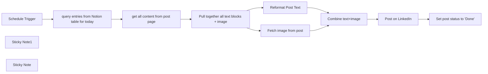

## Fluxo (.json) :

```json
{
  "id": "mb2MU4xOaT3NrvqN",
  "meta": {
    "instanceId": "e7a28cc5c8c9de1976820e0f309940cf456344d9daf5360a4975186f3d8a107f",
    "templateCredsSetupCompleted": true
  },
  "name": "Automate LinkedIn Posts with AI",
  "tags": [],
  "nodes": [
    {
      "id": "7e8ec5cc-0216-4897-8a40-c44f9bbe5a9b",
      "name": "Schedule Trigger",
      "type": "n8n-nodes-base.scheduleTrigger",
      "position": [
        580,
        540
      ],
      "parameters": {
        "rule": {
          "interval": [
            {
              "triggerAtHour": 15
            }
          ]
        }
      },
      "typeVersion": 1.2
    },
    {
      "id": "dbde804d-9c84-4023-9e05-7506cd38a460",
      "name": "Sticky Note1",
      "type": "n8n-nodes-base.stickyNote",
      "position": [
        760,
        225.26841303066982
      ],
      "parameters": {
        "color": 6,
        "width": 652.1201853643956,
        "height": 542.0867486896091,
        "content": "## Fetch the day's post from my Notion database\nA Notion _\"database\"_ is just a table on a Notion Page.\nThis table will have various rows, for which a minimum of three columns are required:\n- Name\n- Status\n- Date\n\nThe Date column is the most important, which will dictate when that row from your Notion table containing the text should be posted.\n\nNOTE: each post is required to have a copy and pasted image!"
      },
      "typeVersion": 1
    },
    {
      "id": "95205e81-e28d-48f9-b3fb-bcf361f7799e",
      "name": "Sticky Note",
      "type": "n8n-nodes-base.stickyNote",
      "position": [
        1520,
        220
      ],
      "parameters": {
        "width": 860.9829802912225,
        "height": 540.7357881640437,
        "content": "## Format Post\nSend the post to OpenAI, where it will attempt to ask your assistant how to take the incoming blob of text, and soup it up into something more palpable for LinkedIn engagement."
      },
      "typeVersion": 1
    },
    {
      "id": "4bc2a550-a8ad-4b25-ac53-01413277e068",
      "name": "Set post status to \"Done\"",
      "type": "n8n-nodes-base.notion",
      "position": [
        2760,
        540
      ],
      "parameters": {
        "pageId": {
          "__rl": true,
          "mode": "url",
          "value": "={{ $('query entries from Notion table for today').item.json.url }}"
        },
        "options": {},
        "resource": "databasePage",
        "operation": "update",
        "propertiesUi": {
          "propertyValues": [
            {
              "key": "Status|status",
              "statusValue": "Done"
            }
          ]
        }
      },
      "credentials": {
        "notionApi": {
          "id": "nBu4zRArkldtNypO",
          "name": "Notion account"
        }
      },
      "typeVersion": 2.2
    },
    {
      "id": "31116f06-72ca-4219-9575-8efaefbff24b",
      "name": "Post on LinkedIn",
      "type": "n8n-nodes-base.linkedIn",
      "position": [
        2500,
        540
      ],
      "parameters": {
        "text": "={{ $json.output }}",
        "person": "_RmSSZc0jB",
        "additionalFields": {},
        "shareMediaCategory": "IMAGE"
      },
      "credentials": {
        "linkedInOAuth2Api": {
          "id": "fozSa4dLS6Jgbn4e",
          "name": "LinkedIn account 2"
        }
      },
      "typeVersion": 1
    },
    {
      "id": "1bf0540d-a180-457a-a7d7-fb74c8119a52",
      "name": "Combine text+image",
      "type": "n8n-nodes-base.merge",
      "position": [
        2100,
        540
      ],
      "parameters": {
        "mode": "combine",
        "options": {},
        "combinationMode": "mergeByPosition"
      },
      "typeVersion": 2.1
    },
    {
      "id": "f1fdf6f7-a75c-451b-8bce-ea581b4b6197",
      "name": "Fetch image from post",
      "type": "n8n-nodes-base.httpRequest",
      "position": [
        1640,
        620
      ],
      "parameters": {
        "url": "={{ $json.url[0] }}",
        "options": {}
      },
      "typeVersion": 4.2
    },
    {
      "id": "00e2bbcb-bac0-4a7e-9892-59f41a26ce9d",
      "name": "Reformat Post Text",
      "type": "@n8n/n8n-nodes-langchain.openAi",
      "position": [
        1620,
        440
      ],
      "parameters": {
        "text": "=Thank you kindly for your help, please refer to the following LinkedIn post, and output a reformatted version employing thoroughly thought-out paragraph breaks, and lists if present:\n```\n{{ $json.content.join(\" \") }}\n```",
        "prompt": "define",
        "options": {},
        "resource": "assistant",
        "assistantId": {
          "__rl": true,
          "mode": "list",
          "value": "asst_J1KuOx5wTLrjEHuy5q94jEgh",
          "cachedResultName": "LinkedIn Post Reviewer"
        }
      },
      "credentials": {
        "openAiApi": {
          "id": "Gxn0kNMCREcTNGcB",
          "name": "OpenAi account 2"
        }
      },
      "typeVersion": 1.3
    },
    {
      "id": "119d7fc7-ed62-4a73-916e-8baf19ab1d86",
      "name": "get all content from post page",
      "type": "n8n-nodes-base.notion",
      "position": [
        1020,
        540
      ],
      "parameters": {
        "blockId": {
          "__rl": true,
          "mode": "url",
          "value": "={{ $json.url }}"
        },
        "resource": "block",
        "operation": "getAll",
        "returnAll": true
      },
      "credentials": {
        "notionApi": {
          "id": "nBu4zRArkldtNypO",
          "name": "Notion account"
        }
      },
      "typeVersion": 2.2
    },
    {
      "id": "461d4dd2-a91a-4219-bd20-6dd3398d4274",
      "name": "Pull together all text blocks + image",
      "type": "n8n-nodes-base.aggregate",
      "position": [
        1240,
        540
      ],
      "parameters": {
        "options": {},
        "fieldsToAggregate": {
          "fieldToAggregate": [
            {
              "fieldToAggregate": "content"
            },
            {
              "fieldToAggregate": "image.file.url"
            }
          ]
        }
      },
      "typeVersion": 1
    },
    {
      "id": "72052eec-c180-4da5-ba15-1a69a7ce6892",
      "name": "query entries from Notion table for today",
      "type": "n8n-nodes-base.notion",
      "position": [
        800,
        540
      ],
      "parameters": {
        "filters": {
          "conditions": [
            {
              "key": "Date|date",
              "date": "={{ $today.format(\"yyyy/mM/dd\") }}",
              "condition": "equals"
            }
          ]
        },
        "options": {},
        "resource": "databasePage",
        "operation": "getAll",
        "databaseId": {
          "__rl": true,
          "mode": "list",
          "value": "9aba7f55-a7de-4329-9d5b-6d127937fa49",
          "cachedResultUrl": "https://www.notion.so/9aba7f55a7de43299d5b6d127937fa49",
          "cachedResultName": "LinkedIn Posts example"
        },
        "filterType": "manual"
      },
      "credentials": {
        "notionApi": {
          "id": "nBu4zRArkldtNypO",
          "name": "Notion account"
        }
      },
      "typeVersion": 2.2
    }
  ],
  "active": true,
  "pinData": {},
  "settings": {
    "executionOrder": "v1"
  },
  "versionId": "35f9b7b6-0e60-495f-826d-af7040e7de1f",
  "connections": {
    "Post on LinkedIn": {
      "main": [
        [
          {
            "node": "Set post status to \"Done\"",
            "type": "main",
            "index": 0
          }
        ]
      ]
    },
    "Schedule Trigger": {
      "main": [
        [
          {
            "node": "query entries from Notion table for today",
            "type": "main",
            "index": 0
          }
        ]
      ]
    },
    "Combine text+image": {
      "main": [
        [
          {
            "node": "Post on LinkedIn",
            "type": "main",
            "index": 0
          }
        ]
      ]
    },
    "Reformat Post Text": {
      "main": [
        [
          {
            "node": "Combine text+image",
            "type": "main",
            "index": 0
          }
        ]
      ]
    },
    "Fetch image from post": {
      "main": [
        [
          {
            "node": "Combine text+image",
            "type": "main",
            "index": 1
          }
        ]
      ]
    },
    "get all content from post page": {
      "main": [
        [
          {
            "node": "Pull together all text blocks + image",
            "type": "main",
            "index": 0
          }
        ]
      ]
    },
    "Pull together all text blocks + image": {
      "main": [
        [
          {
            "node": "Fetch image from post",
            "type": "main",
            "index": 0
          },
          {
            "node": "Reformat Post Text",
            "type": "main",
            "index": 0
          }
        ]
      ]
    },
    "query entries from Notion table for today": {
      "main": [
        [
          {
            "node": "get all content from post page",
            "type": "main",
            "index": 0
          }
        ]
      ]
    }
  }
}
```

<a id="template-1174"></a>

## Template 1174 - Notificação SMS de falha de fluxo

- **Nome:** Notificação SMS de falha de fluxo
- **Descrição:** Envia uma mensagem SMS informando o ID e o nome do fluxo quando ocorre uma falha de execução.
- **Funcionalidade:** • Detecção de falhas de execução: Aciona a automação quando um fluxo encontra um erro.
• Envio de SMS com detalhes: Envia um SMS contendo o ID e o nome do fluxo que falhou.
• Configuração de remetente e destinatário: Permite definir o número remetente e o número destinatário para a notificação.
• Utilização de credenciais seguras: Usa credenciais configuradas para autenticar o envio de mensagens.
- **Ferramentas:** • Twilio: Serviço de envio de mensagens SMS utilizado para entregar notificações de falhas.


## Fluxo visual

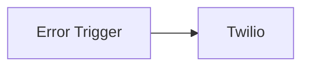

## Fluxo (.json) :

```json
{
  "id": "56",
  "name": "Send an SMS when a workflow fails",
  "nodes": [
    {
      "name": "Error Trigger",
      "type": "n8n-nodes-base.errorTrigger",
      "position": [
        550,
        260
      ],
      "parameters": {},
      "typeVersion": 1
    },
    {
      "name": "Twilio",
      "type": "n8n-nodes-base.twilio",
      "position": [
        750,
        260
      ],
      "parameters": {
        "to": "",
        "from": "",
        "message": "=Your workflow with ID: {{$node[\"Error Trigger\"].json[\"workflow\"][\"id\"]}} and name: {{$node[\"Error Trigger\"].json[\"workflow\"][\"name\"]}} failed to execute."
      },
      "credentials": {
        "twilioApi": "twilio-credentials"
      },
      "typeVersion": 1
    }
  ],
  "active": false,
  "settings": {},
  "connections": {
    "Error Trigger": {
      "main": [
        [
          {
            "node": "Twilio",
            "type": "main",
            "index": 0
          }
        ]
      ]
    }
  }
}
```

<a id="template-1175"></a>

## Template 1175 - Publicar posts do Notion no LinkedIn

- **Nome:** Publicar posts do Notion no LinkedIn
- **Descrição:** Automatiza a publicação diária de um post armazenado no Notion para o LinkedIn, incluindo texto formatado e imagem, e atualiza o status do post no Notion após a publicação.
- **Funcionalidade:** • Agendamento diário: inicia o fluxo todos os dias no horário configurado.
• Filtragem por data: localiza no banco de dados do Notion a postagem correspondente à data do dia.
• Extração de conteúdo da página: recupera todos os blocos e recursos (texto e imagens) da página encontrada.
• Agregação de blocos: consolida o conteúdo relevante (texto e URLs de imagens) em campos utilizáveis.
• Formatação do texto: processa e monta o texto final do post a partir dos blocos do Notion, preservando quebras e listas.
• Download da imagem: obtém a imagem referenciada por URL para incluir na publicação.
• Publicação no LinkedIn: publica o texto e a imagem no perfil ou página selecionada.
• Atualização de status: marca a página no Notion como "Published" após a publicação bem-sucedida.
- **Ferramentas:** • Notion: banco de dados e páginas para armazenar e consultar o conteúdo dos posts, além de atualizar propriedades das páginas.
• LinkedIn: plataforma para publicar o conteúdo (perfil pessoal ou página da empresa) por meio da API.
• Serviço de hospedagem de imagens (URLs públicos): local onde as imagens do post estão armazenadas e são acessadas via URL para inclusão na publicação.


## Fluxo visual

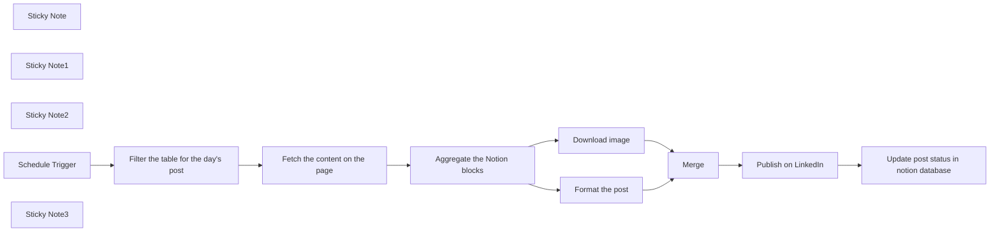

## Fluxo (.json) :

```json
{
  "id": "0pVPSW4PzJZLLqSf",
  "meta": {
    "instanceId": "8e47d02981c11ba904b56e6bd77877c35ef5c9aa1cdc4076bcb72bbb235efa38"
  },
  "name": "Notion to Linkedin",
  "tags": [],
  "nodes": [
    {
      "id": "d922cf0c-f1c2-40ff-927c-d0d3e2fb7f27",
      "name": "Merge",
      "type": "n8n-nodes-base.merge",
      "position": [
        2140,
        460
      ],
      "parameters": {
        "mode": "combine",
        "options": {},
        "combinationMode": "mergeByPosition"
      },
      "typeVersion": 2.1
    },
    {
      "id": "8c5f68d8-f11d-4b37-b0d8-3abd1b681b56",
      "name": "Sticky Note",
      "type": "n8n-nodes-base.stickyNote",
      "position": [
        780,
        440
      ],
      "parameters": {
        "color": 4,
        "height": 141.4092845296238,
        "content": "## Start the flow every day at the same time"
      },
      "typeVersion": 1
    },
    {
      "id": "d10de4f3-6e90-474f-bd68-25aae2037b7b",
      "name": "Sticky Note1",
      "type": "n8n-nodes-base.stickyNote",
      "position": [
        1240,
        312.5835468325357
      ],
      "parameters": {
        "color": 6,
        "width": 367.12018536439575,
        "height": 382.294335406698,
        "content": "## Fetch the day's post from my Notion database"
      },
      "typeVersion": 1
    },
    {
      "id": "a63bcc85-ec8b-424f-a53c-e4c07db3c7c8",
      "name": "Sticky Note2",
      "type": "n8n-nodes-base.stickyNote",
      "position": [
        1642.6949426092506,
        313.81962236044654
      ],
      "parameters": {
        "color": 6,
        "width": 627.4768047417825,
        "height": 380.3367219655605,
        "content": "## Process and format the post"
      },
      "typeVersion": 1
    },
    {
      "id": "d7c0f13c-ebbe-4000-bd8f-d1180d65d02a",
      "name": "Schedule Trigger",
      "type": "n8n-nodes-base.scheduleTrigger",
      "position": [
        1060,
        460
      ],
      "parameters": {
        "rule": {
          "interval": [
            {
              "triggerAtHour": 15
            }
          ]
        }
      },
      "typeVersion": 1.2
    },
    {
      "id": "7bebcb2d-1642-48ce-a511-bb0f561ca5cf",
      "name": "Filter the table for the day's post",
      "type": "n8n-nodes-base.notion",
      "position": [
        1280,
        460
      ],
      "parameters": {
        "filters": {
          "conditions": [
            {
              "key": "Date|date",
              "date": "={{ $today.format(\"yyyy/mM/dd\") }}",
              "condition": "equals"
            }
          ]
        },
        "options": {},
        "resource": "databasePage",
        "operation": "getAll",
        "databaseId": {
          "__rl": true,
          "mode": "list",
          "value": "f09dc21b-1070-4d5a-bf7f-a9ab3dbb69fb",
          "cachedResultUrl": "https://www.notion.so/f09dc21b10704d5abf7fa9ab3dbb69fb",
          "cachedResultName": "Postagens"
        },
        "filterType": "manual"
      },
      "credentials": {
        "notionApi": {
          "id": "faERNMuBrkAfVaJR",
          "name": "Notion Weck"
        }
      },
      "typeVersion": 2.2
    },
    {
      "id": "ee61bc59-164b-45b4-8b49-57cdba7d298b",
      "name": "Fetch the content on the page",
      "type": "n8n-nodes-base.notion",
      "position": [
        1480,
        460
      ],
      "parameters": {
        "blockId": {
          "__rl": true,
          "mode": "url",
          "value": "={{ $json.url }}"
        },
        "resource": "block",
        "operation": "getAll",
        "returnAll": true
      },
      "credentials": {
        "notionApi": {
          "id": "faERNMuBrkAfVaJR",
          "name": "Notion Weck"
        }
      },
      "typeVersion": 2.2
    },
    {
      "id": "52d1ffef-11e8-4635-bbb8-05e915034379",
      "name": "Aggregate the Notion blocks",
      "type": "n8n-nodes-base.aggregate",
      "position": [
        1680,
        460
      ],
      "parameters": {
        "options": {},
        "fieldsToAggregate": {
          "fieldToAggregate": [
            {
              "fieldToAggregate": "content"
            },
            {
              "fieldToAggregate": "image.file.url"
            }
          ]
        }
      },
      "typeVersion": 1
    },
    {
      "id": "8617c530-382b-402b-9c0b-aeb4df2bb920",
      "name": "Format the post",
      "type": "n8n-nodes-base.code",
      "position": [
        1900,
        360
      ],
      "parameters": {
        "jsCode": "const notionData = items[0].json.content;\n\nlet formattedText = notionData[0] \n\nfor (let i = 1; i < notionData.length; i++) {\n    if (notionData[i].startsWith('-')) {\n        formattedText += '\\n\\n' + notionData[i];\n    } else {\n        formattedText += '\\n' + notionData[i];\n    }\n}\n\nreturn [{ formattedText: formattedText }];\n"
      },
      "typeVersion": 2
    },
    {
      "id": "0f226cfe-eb31-469a-8e7c-a21192adbd4c",
      "name": "Download image",
      "type": "n8n-nodes-base.httpRequest",
      "position": [
        1900,
        560
      ],
      "parameters": {
        "url": "={{ $json.url[0] }}",
        "options": {}
      },
      "typeVersion": 4.2
    },
    {
      "id": "81a1e39c-c7ea-4635-84fc-a8ae05cfd8f3",
      "name": "Publish on LinkedIn",
      "type": "n8n-nodes-base.linkedIn",
      "position": [
        2360,
        460
      ],
      "parameters": {
        "text": "={{ $json.formattedText }}",
        "person": "CcS-_lLyzG",
        "additionalFields": {},
        "shareMediaCategory": "IMAGE"
      },
      "credentials": {
        "linkedInOAuth2Api": {
          "id": "HZbihVPNwXzWRzgU",
          "name": "LinkedIn account"
        }
      },
      "typeVersion": 1
    },
    {
      "id": "61b92eb8-1bf8-4e57-9e07-1a39e457ecfb",
      "name": "Update post status in notion database",
      "type": "n8n-nodes-base.notion",
      "position": [
        2620,
        460
      ],
      "parameters": {
        "pageId": {
          "__rl": true,
          "mode": "url",
          "value": "={{ $('Filter the table for the day\\'s post').item.json.url }}"
        },
        "options": {},
        "resource": "databasePage",
        "operation": "update",
        "propertiesUi": {
          "propertyValues": [
            {
              "key": "Status|select",
              "selectValue": "Published"
            }
          ]
        }
      },
      "credentials": {
        "notionApi": {
          "id": "faERNMuBrkAfVaJR",
          "name": "Notion Weck"
        }
      },
      "typeVersion": 2.2
    },
    {
      "id": "397f3772-bb2b-4e58-99f8-2b62cc514b7a",
      "name": "Sticky Note3",
      "type": "n8n-nodes-base.stickyNote",
      "position": [
        760,
        120
      ],
      "parameters": {
        "color": 3,
        "width": 567.6073693795047,
        "height": 137.6834217043934,
        "content": "## 1. Setup\nSet up your Notion and LinkedIn credentials.\nAttention to the LinkedIn credential: to post on your personal or company profile, you need to have a company page assigned to your profile. After that, you can choose where you want to post."
      },
      "typeVersion": 1
    }
  ],
  "active": false,
  "pinData": {},
  "settings": {
    "executionOrder": "v1"
  },
  "versionId": "d6f51bb9-7320-4984-a009-b0f49073349a",
  "connections": {
    "Merge": {
      "main": [
        [
          {
            "node": "Publish on LinkedIn",
            "type": "main",
            "index": 0
          }
        ]
      ]
    },
    "Download image": {
      "main": [
        [
          {
            "node": "Merge",
            "type": "main",
            "index": 1
          }
        ]
      ]
    },
    "Format the post": {
      "main": [
        [
          {
            "node": "Merge",
            "type": "main",
            "index": 0
          }
        ]
      ]
    },
    "Schedule Trigger": {
      "main": [
        [
          {
            "node": "Filter the table for the day's post",
            "type": "main",
            "index": 0
          }
        ]
      ]
    },
    "Publish on LinkedIn": {
      "main": [
        [
          {
            "node": "Update post status in notion database",
            "type": "main",
            "index": 0
          }
        ]
      ]
    },
    "Aggregate the Notion blocks": {
      "main": [
        [
          {
            "node": "Format the post",
            "type": "main",
            "index": 0
          },
          {
            "node": "Download image",
            "type": "main",
            "index": 0
          }
        ]
      ]
    },
    "Fetch the content on the page": {
      "main": [
        [
          {
            "node": "Aggregate the Notion blocks",
            "type": "main",
            "index": 0
          }
        ]
      ]
    },
    "Filter the table for the day's post": {
      "main": [
        [
          {
            "node": "Fetch the content on the page",
            "type": "main",
            "index": 0
          }
        ]
      ]
    }
  }
}
```

<a id="template-1176"></a>

## Template 1176 - Automação de feedback de treinamento

- **Nome:** Automação de feedback de treinamento
- **Descrição:** Automatiza a gestão de feedbacks de treinamento: classifica avaliações, cria tarefas de acompanhamento, recebe resultados de tarefas e envia notificações ou publicações conforme o nível de satisfação.
- **Funcionalidade:** • Captura de feedbacks: Recebe novas entradas de feedback de treinamento diretamente da base de dados.
• Classificação de avaliações: Avalia a nota de feedback (1 a 5) e direciona o fluxo conforme o nível de satisfação.
• Criação de tarefas de acompanhamento: Gera instâncias de tarefa na plataforma de gestão quando a avaliação é baixa ou necessita ação.
• Recebimento de callback de tarefas: Processa resultados retornados via callback HTTP após a conclusão ou ação na tarefa.
• Recuperação de detalhes da tarefa: Consulta detalhes da instância de tarefa criada para compor comunicações internas.
• Notificações por e‑mail: Envia e‑mails urgentes para responsáveis quando o feedback exige intervenção imediata.
• Comunicação para marketing: Envia informações e gera publicações em canais públicos quando o feedback é positivo.
• Publicação em rede profissional: Publica uma mensagem de reconhecimento com detalhes seletos do feedback em perfil/organização pública.
- **Ferramentas:** • Airtable: Fonte de armazenamento e captura de registros de feedback dos participantes.
• Usertask (demo.usertask.io): Plataforma de criação e gestão de tarefas via API, utilizada para gerar instâncias e obter detalhes/post‑callback.
• Serviço de e‑mail/SMTP: Serviço de envio de e‑mail para notificações internas e relatórios.
• LinkedIn: Rede profissional usada para publicar reconhecimentos e feedbacks positivos.
• Webhook / Callback HTTP: Mecanismo HTTP para receber resultados e ações das tarefas geradas.


## Fluxo visual

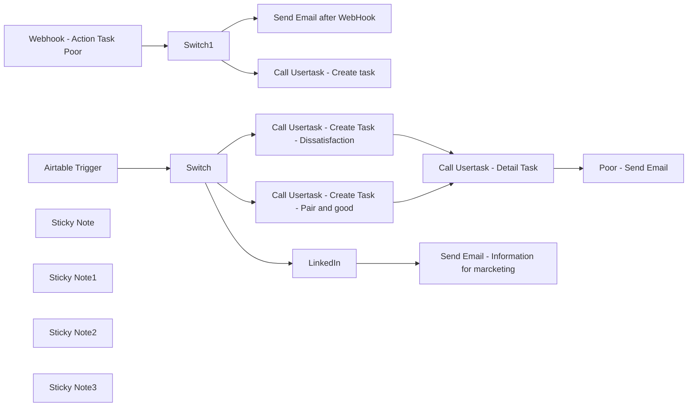

## Fluxo (.json) :

```json
{
  "id": "pDLtBJkNSXXWSvB0",
  "meta": {
    "instanceId": "bc5ae5fe2056690823360ec27da902117e87ff22a0f9c9bb0448416fba4527f8"
  },
  "name": "Training Feedback Automation",
  "tags": [],
  "nodes": [
    {
      "id": "6cdd7521-a16c-4e1a-9b18-c232660522c8",
      "name": "Airtable Trigger",
      "type": "n8n-nodes-base.airtableTrigger",
      "position": [
        160,
        680
      ],
      "parameters": {
        "baseId": {
          "__rl": true,
          "mode": "id",
          "value": "app216gZPY8ax1Qgd"
        },
        "tableId": {
          "__rl": true,
          "mode": "id",
          "value": "tblaKkOK6RZ4cgXGI"
        },
        "pollTimes": {
          "item": [
            {
              "mode": "everyMinute"
            }
          ]
        },
        "triggerField": "Created",
        "authentication": "airtableOAuth2Api",
        "additionalFields": {}
      },
      "credentials": {
        "airtableOAuth2Api": {
          "id": "qYu4nditWNzeLITf",
          "name": "Airtable account"
        }
      },
      "typeVersion": 1
    },
    {
      "id": "faeb9069-2f25-419c-8192-5ed69a49d192",
      "name": "Webhook - Action Task Poor",
      "type": "n8n-nodes-base.webhook",
      "position": [
        180,
        140
      ],
      "webhookId": "4ff46f8a-e1d0-4ad9-8dae-99de53838aaf",
      "parameters": {
        "path": "4ff46f8a-e1d0-4ad9-8dae-99de53838aaf",
        "options": {},
        "httpMethod": "POST"
      },
      "typeVersion": 1.1
    },
    {
      "id": "25f65aa6-9d0a-4a32-b2b9-49c2d6fb94cf",
      "name": "Switch1",
      "type": "n8n-nodes-base.switch",
      "position": [
        500,
        140
      ],
      "parameters": {
        "rules": {
          "values": [
            {
              "outputKey": "Validated",
              "conditions": {
                "options": {
                  "leftValue": "",
                  "caseSensitive": true,
                  "typeValidation": "strict"
                },
                "combinator": "and",
                "conditions": [
                  {
                    "operator": {
                      "type": "string",
                      "operation": "equals"
                    },
                    "leftValue": "={{ $('Webhook - Action Task Poor').item.json.body.actionName }}",
                    "rightValue": "Validate"
                  }
                ]
              },
              "renameOutput": true
            },
            {
              "outputKey": "Other",
              "conditions": {
                "options": {
                  "leftValue": "",
                  "caseSensitive": true,
                  "typeValidation": "strict"
                },
                "combinator": "and",
                "conditions": [
                  {
                    "id": "94250338-cb2a-421c-813b-9d8d5d1e02ed",
                    "operator": {
                      "type": "string",
                      "operation": "notEquals"
                    },
                    "leftValue": "={{ $('Webhook - Action Task Poor').item.json.body.actionName }}",
                    "rightValue": "Validate"
                  }
                ]
              },
              "renameOutput": true
            }
          ]
        },
        "options": {}
      },
      "typeVersion": 3
    },
    {
      "id": "50909553-8bea-471f-9030-f3d8898abce5",
      "name": "LinkedIn",
      "type": "n8n-nodes-base.linkedIn",
      "position": [
        1020,
        680
      ],
      "parameters": {
        "text": "=🌟 Feedback on Our Recent Training Session! 🌟\n\nWe are excited to share the positive feedback from our participants regarding our latest training session. Here are some highlights:\n\nFacilitator: {{ $json[\"fields\"][\"Facilitator name\"][0][\"name\"] }}\nCourse: {{ $json[\"fields\"][\"Course name\"][0] }}\n\nFeedback Details:\n\nContent: {{ $json[\"fields\"][\"Content\"] }}/5\nRelevance: {{ $json[\"fields\"][\"Relevant\"] }}/5\nOverall Satisfaction: {{ $json[\"fields\"][\"Satisfaction\"] }}/5\nRecommendation: {{ $json[\"fields\"][\"Recommend\"] }}/5\n\nA big thank you to {{ $json[\"fields\"][\"Facilitator name\"][0][\"name\"] }} for his excellent work as a facilitator and to all our participants for their valuable feedback. We are committed to continuously improving our training sessions to meet your expectations and needs.\n\n#Training #Feedback #ContinuousLearning #CustomerSatisfaction",
        "postAs": "organization",
        "additionalFields": {}
      },
      "credentials": {
        "linkedInOAuth2Api": {
          "id": "4sXxHri0PRgxO48n",
          "name": "LinkedIn account"
        }
      },
      "typeVersion": 1
    },
    {
      "id": "b441873f-187c-4777-ab27-d7adf8450d8b",
      "name": "Poor  - Send Email",
      "type": "n8n-nodes-base.emailSend",
      "position": [
        1580,
        320
      ],
      "parameters": {
        "html": "=Dear [Recipient Name],\n\nWe would like to inform you that a new task has been created to address the recent training feedback we received. Below are the details of the task:\n\nTask Title: {{ $json[\"title\"] }}\n\nTask Description:\n{{ $json[\"description\"] }}\n\nTask Status: {{ $json[\"statusName\"] }}\n\nInstructions:\n{{ $json[\"instruction\"] }}\n\nActions Required:\n\n- {{ $json[\"task\"][\"actions\"][0][\"name\"] }}\nDescription:\n{{ $json[\"task\"][\"actions\"][0][\"description\"] }}\n\n- {{ $json[\"task\"][\"actions\"][1][\"name\"] }}\nDescription:\n{{ $json[\"task\"][\"actions\"][1][\"description\"] }}\n\n\nPlease address this task at your earliest convenience to ensure we promptly respond to the feedback and improve our training program accordingly.\n\nIf you have any questions or require further information, please do not hesitate to contact us.\n\nLink : https://demo.usertask.io/app/task/instance/form/{{ $json[\"code\"] }}\n\nBest regards,",
        "options": {},
        "subject": "New Task Created - Urgent: Training Feedback Requires Immediate Attention",
        "toEmail": "contact@usertask.io",
        "fromEmail": "contact@usertask.io"
      },
      "credentials": {
        "smtp": {
          "id": "CnHY3ZPBDwo5EnSH",
          "name": "SMTP account 2"
        }
      },
      "typeVersion": 2.1
    },
    {
      "id": "0e9c5ee5-416b-4cb3-9797-417003bc74cd",
      "name": "Call Usertask - Create task",
      "type": "n8n-nodes-base.httpRequest",
      "position": [
        1020,
        60
      ],
      "parameters": {
        "url": "http://demo.usertask.io/api/task/create-instance",
        "method": "POST",
        "options": {},
        "jsonBody": "{\n  \"taskCode\": \"tltJf90mJVEnpUZvuQBi\",\n  \"callbackUrl\": \"https://n8n-hzd1.onrender.com/webhook/4ff46f8a-e1d0-4ad9-8dae-99de53838aaf\",\n  \"description\":\"We have received a training feedback rating of 1 star. It is crucial to address this issue promptly.We recommend scheduling a meeting to discuss the feedback in detail and develop an action plan to improve the training program.\",\n  \"instruction\":\"\",\n  \"title\":\"Urgent: Training Feedback Requires Immediate Attention\"\n}",
        "sendBody": true,
        "sendHeaders": true,
        "specifyBody": "json",
        "headerParameters": {
          "parameters": [
            {
              "name": "X-API-KEY",
              "value": "22d1ce6fa3ae7039fe42d3ddf1ba55d8f5ee9e2c2e6b04788144fca080d1e170"
            },
            {
              "name": "X-CLIENT-ID",
              "value": "f3604b6d2d33af2006ecb0d4910871fa"
            }
          ]
        }
      },
      "typeVersion": 4.1
    },
    {
      "id": "27ab7bd3-e3a8-4d87-b28f-767bff9ec0e1",
      "name": "Call Usertask - Create Task - Pair and good",
      "type": "n8n-nodes-base.httpRequest",
      "position": [
        1020,
        420
      ],
      "parameters": {
        "url": "http://demo.usertask.io/api/task/create-instance",
        "method": "POST",
        "options": {
          "response": {
            "response": {
              "fullResponse": true,
              "responseFormat": "json"
            }
          }
        },
        "jsonBody": "{\n  \"taskCode\": \"tltJf90mJVEnpUZvuQBi\",\n  \"callbackUrl\": \"https://n8n-hzd1.onrender.com/webhook/4ff46f8a-e1d0-4ad9-8dae-99de53838aaf\",\n  \"description\":\"We have received a training feedback rating of 1 star. It is crucial to address this issue promptly.We recommend scheduling a meeting to discuss the feedback in detail and develop an action plan to improve the training program.\",\n  \"instruction\":\"\",\n  \"title\":\"Urgent: Training Feedback Requires Immediate Attention\"\n}",
        "sendBody": true,
        "sendHeaders": true,
        "specifyBody": "json",
        "headerParameters": {
          "parameters": [
            {
              "name": "X-API-KEY",
              "value": "22d1ce6fa3ae7039fe42d3ddf1ba55d8f5ee9e2c2e6b04788144fca080d1e170"
            },
            {
              "name": "X-CLIENT-ID",
              "value": "f3604b6d2d33af2006ecb0d4910871fa"
            }
          ]
        }
      },
      "typeVersion": 4.1
    },
    {
      "id": "ec55cbd8-e863-4dea-b2fc-1834f9d27f13",
      "name": "Send Email after WebHook",
      "type": "n8n-nodes-base.emailSend",
      "position": [
        760,
        -180
      ],
      "parameters": {
        "html": "=Dear Trainer's and HR Manager's,\n\nWe have received a training feedback rating of 1 star. It is crucial to address this issue promptly.\n\nResponse : {{ $json[\"body\"][\"results\"][0][\"actionName\"] }}\n\nWe recommend scheduling a meeting to discuss the feedback in detail and develop an action plan to improve the training program.\n\nBest regards,",
        "options": {},
        "subject": "Urgent: Training Feedback Requires Immediate Attention",
        "toEmail": "contact@usertask.io",
        "fromEmail": "contact@usertask.io"
      },
      "credentials": {
        "smtp": {
          "id": "CnHY3ZPBDwo5EnSH",
          "name": "SMTP account 2"
        }
      },
      "typeVersion": 2.1
    },
    {
      "id": "bd83083f-e1df-41e8-b7b3-9065fa610ee5",
      "name": "Sticky Note",
      "type": "n8n-nodes-base.stickyNote",
      "position": [
        730.6369999001746,
        0
      ],
      "parameters": {
        "color": 7,
        "width": 714.7562585267917,
        "height": 593.70786516854,
        "content": "## UserTask\n**Link** https://demo.usertask.io \n\n**Login**\ncontact@usertask.io\n**Password**\nQSDpo2x10?2020"
      },
      "typeVersion": 1
    },
    {
      "id": "27e89776-7258-44f5-ac8c-5926f38762b7",
      "name": "Call Usertask - Detail Task",
      "type": "n8n-nodes-base.httpRequest",
      "position": [
        1300,
        320
      ],
      "parameters": {
        "url": "=https://demo.usertask.io/api/task/instance/info/{{ $json[\"body\"][\"code\"] }}",
        "options": {
          "redirect": {
            "redirect": {}
          }
        },
        "sendHeaders": true,
        "headerParameters": {
          "parameters": [
            {
              "name": "X-API-KEY",
              "value": "22d1ce6fa3ae7039fe42d3ddf1ba55d8f5ee9e2c2e6b04788144fca080d1e170"
            },
            {
              "name": "X-CLIENT-ID",
              "value": "f3604b6d2d33af2006ecb0d4910871fa"
            }
          ]
        }
      },
      "typeVersion": 4.1
    },
    {
      "id": "5576aba7-9051-465f-a095-47a52e35b151",
      "name": "Send Email - Information for marcketing",
      "type": "n8n-nodes-base.emailSend",
      "position": [
        1280,
        680
      ],
      "parameters": {
        "options": {},
        "subject": "Task Created",
        "toEmail": "contact@usertask.io",
        "fromEmail": "contact@usertask.io"
      },
      "credentials": {
        "smtp": {
          "id": "CnHY3ZPBDwo5EnSH",
          "name": "SMTP account 2"
        }
      },
      "typeVersion": 2.1
    },
    {
      "id": "074b8d06-f78a-4209-9172-d8b1a57c97fb",
      "name": "Sticky Note1",
      "type": "n8n-nodes-base.stickyNote",
      "position": [
        -20,
        540
      ],
      "parameters": {
        "color": 7,
        "width": 373.05722240092274,
        "height": 320.67415730337063,
        "content": "## AirTable \n**For exemple, use** Employee training management **template**. [Guide](https://www.airtable.com/templates/employee-training-management/expnOaGvlQDwuWKVk)\n\n"
      },
      "typeVersion": 1
    },
    {
      "id": "b742a10e-71b2-4022-8c16-53b826512bbe",
      "name": "Sticky Note2",
      "type": "n8n-nodes-base.stickyNote",
      "position": [
        -20,
        0
      ],
      "parameters": {
        "color": 7,
        "width": 374.83146067415737,
        "height": 303.820224719101,
        "content": "## WebHook \nThe webhook allows retrieving the result of a Usertask. Tasks can be completed either via the API or through the Usertask form."
      },
      "typeVersion": 1
    },
    {
      "id": "98cc7ca2-359a-4329-8910-14b6607daa87",
      "name": "Sticky Note3",
      "type": "n8n-nodes-base.stickyNote",
      "position": [
        -11.470878578479415,
        -460
      ],
      "parameters": {
        "width": 709.4232592367164,
        "height": 434.93437649014015,
        "content": "## Training Feedback Automation with Usertask and Airtable\nThis n8n workflow is designed to automate the management of training feedback by integrating Airtable, Usertask, and various notification actions. \n\nHere is a detailed description of each step in the workflow:\n\n- **Airtable Trigger**: Captures new or updated feedback entries from Airtable.\n- **Switch Node**: Evaluates the feedback rating and directs the workflow based on the rating.\n- **Webhook**: Retrieves the result of a Usertask task.\n- **Task Creation**:\n  - Creates tasks in Usertask for poor feedback.\n  - Creates follow-up tasks for fair to good feedback.\n  - Documents positive feedback and posts recognition on LinkedIn for very good to excellent ratings.\n- **Notifications**:\n  - Sends email notifications to responsible parties for urgent actions.\n  - Sends congratulatory emails and posts on LinkedIn for positive feedback.\n\nVideo : [https://youtu.be/U14MhTcpqeY](https://youtu.be/U14MhTcpqeY)\n"
      },
      "typeVersion": 1
    },
    {
      "id": "f12d0516-43a2-4517-a633-60d809cd3413",
      "name": "Switch",
      "type": "n8n-nodes-base.switch",
      "position": [
        460,
        420
      ],
      "parameters": {
        "rules": {
          "values": [
            {
              "outputKey": "Dissatisfaction",
              "conditions": {
                "options": {
                  "leftValue": "",
                  "caseSensitive": true,
                  "typeValidation": "strict"
                },
                "combinator": "and",
                "conditions": [
                  {
                    "operator": {
                      "type": "number",
                      "operation": "equals"
                    },
                    "leftValue": "={{ $json.fields.Content }}",
                    "rightValue": 1
                  }
                ]
              },
              "renameOutput": true
            },
            {
              "outputKey": "Fair",
              "conditions": {
                "options": {
                  "leftValue": "",
                  "caseSensitive": true,
                  "typeValidation": "strict"
                },
                "combinator": "and",
                "conditions": [
                  {
                    "id": "2d1c10b8-0418-4dcf-aa53-41f0b75ccc08",
                    "operator": {
                      "type": "number",
                      "operation": "equals"
                    },
                    "leftValue": "={{ $json.fields.Content }}",
                    "rightValue": 2
                  }
                ]
              },
              "renameOutput": true
            },
            {
              "outputKey": "Good",
              "conditions": {
                "options": {
                  "leftValue": "",
                  "caseSensitive": true,
                  "typeValidation": "strict"
                },
                "combinator": "and",
                "conditions": [
                  {
                    "id": "d2be2a3f-32ae-4578-a9aa-4a8f2b19f08f",
                    "operator": {
                      "type": "number",
                      "operation": "equals"
                    },
                    "leftValue": "={{ $json.fields.Content }}",
                    "rightValue": 3
                  }
                ]
              },
              "renameOutput": true
            },
            {
              "outputKey": "Very Good",
              "conditions": {
                "options": {
                  "leftValue": "",
                  "caseSensitive": true,
                  "typeValidation": "strict"
                },
                "combinator": "and",
                "conditions": [
                  {
                    "id": "4dd5b796-9180-47d8-9ebd-4164a5dfa0d7",
                    "operator": {
                      "type": "number",
                      "operation": "equals"
                    },
                    "leftValue": "={{ $json.fields.Content }}",
                    "rightValue": 4
                  }
                ]
              },
              "renameOutput": true
            },
            {
              "outputKey": "Excellent",
              "conditions": {
                "options": {
                  "leftValue": "",
                  "caseSensitive": true,
                  "typeValidation": "strict"
                },
                "combinator": "and",
                "conditions": [
                  {
                    "id": "312f4f14-a341-4dea-881c-3c85a9cea13c",
                    "operator": {
                      "type": "number",
                      "operation": "equals"
                    },
                    "leftValue": "={{ $json.fields.Content }}",
                    "rightValue": 5
                  }
                ]
              },
              "renameOutput": true
            }
          ]
        },
        "options": {}
      },
      "typeVersion": 3
    },
    {
      "id": "6eb8d928-c331-49d5-830a-9442a367254b",
      "name": "Call Usertask - Create Task - Dissatisfaction",
      "type": "n8n-nodes-base.httpRequest",
      "position": [
        1020,
        240
      ],
      "parameters": {
        "url": "http://demo.usertask.io/api/task/create-instance",
        "method": "POST",
        "options": {
          "response": {
            "response": {
              "fullResponse": true,
              "responseFormat": "json"
            }
          }
        },
        "jsonBody": "{\n  \"taskCode\": \"tltJf90mJVEnpUZvuQBi\",\n  \"callbackUrl\": \"https://n8n-hzd1.onrender.com/webhook/4ff46f8a-e1d0-4ad9-8dae-99de53838aaf\",\n  \"description\":\"We have received a training feedback rating of 1 star. It is crucial to address this issue promptly.We recommend scheduling a meeting to discuss the feedback in detail and develop an action plan to improve the training program.\",\n  \"instruction\":\"\",\n  \"title\":\"Urgent: Training Feedback Requires Immediate Attention\"\n}",
        "sendBody": true,
        "sendHeaders": true,
        "specifyBody": "json",
        "headerParameters": {
          "parameters": [
            {
              "name": "X-API-KEY",
              "value": "22d1ce6fa3ae7039fe42d3ddf1ba55d8f5ee9e2c2e6b04788144fca080d1e170"
            },
            {
              "name": "X-CLIENT-ID",
              "value": "f3604b6d2d33af2006ecb0d4910871fa"
            }
          ]
        }
      },
      "typeVersion": 4.1
    }
  ],
  "active": true,
  "pinData": {},
  "settings": {
    "executionOrder": "v1"
  },
  "versionId": "955cc31e-3e7b-49b1-85c5-8f4604cbcc9a",
  "connections": {
    "Switch": {
      "main": [
        [
          {
            "node": "Call Usertask - Create Task - Dissatisfaction",
            "type": "main",
            "index": 0
          }
        ],
        [
          {
            "node": "Call Usertask - Create Task - Pair and good",
            "type": "main",
            "index": 0
          }
        ],
        [
          {
            "node": "Call Usertask - Create Task - Pair and good",
            "type": "main",
            "index": 0
          }
        ],
        [
          {
            "node": "LinkedIn",
            "type": "main",
            "index": 0
          }
        ],
        [
          {
            "node": "LinkedIn",
            "type": "main",
            "index": 0
          }
        ]
      ]
    },
    "Switch1": {
      "main": [
        [
          {
            "node": "Send Email after WebHook",
            "type": "main",
            "index": 0
          }
        ],
        [
          {
            "node": "Call Usertask - Create task",
            "type": "main",
            "index": 0
          }
        ]
      ]
    },
    "LinkedIn": {
      "main": [
        [
          {
            "node": "Send Email - Information for marcketing",
            "type": "main",
            "index": 0
          }
        ]
      ]
    },
    "Airtable Trigger": {
      "main": [
        [
          {
            "node": "Switch",
            "type": "main",
            "index": 0
          }
        ]
      ]
    },
    "Webhook - Action Task Poor": {
      "main": [
        [
          {
            "node": "Switch1",
            "type": "main",
            "index": 0
          }
        ]
      ]
    },
    "Call Usertask - Detail Task": {
      "main": [
        [
          {
            "node": "Poor  - Send Email",
            "type": "main",
            "index": 0
          }
        ]
      ]
    },
    "Call Usertask - Create Task - Pair and good": {
      "main": [
        [
          {
            "node": "Call Usertask - Detail Task",
            "type": "main",
            "index": 0
          }
        ]
      ]
    },
    "Call Usertask - Create Task - Dissatisfaction": {
      "main": [
        [
          {
            "node": "Call Usertask - Detail Task",
            "type": "main",
            "index": 0
          }
        ]
      ]
    }
  }
}
```

<a id="template-1177"></a>

## Template 1177 - Auto-post LinkedIn a partir de artigos Medium

- **Nome:** Auto-post LinkedIn a partir de artigos Medium
- **Descrição:** Automatiza publicações no LinkedIn usando artigos do Medium, evita repostagens e envia notificações por Telegram.
- **Funcionalidade:** • Agendamento de publicações: Executa o fluxo duas vezes ao dia (09:00 e 19:00).
• Seleção aleatória de tags: Escolhe aleatoriamente tags para buscar artigos relevantes.
• Busca de artigos por tag: Consulta a API do Medium para obter IDs de artigos relacionados à tag escolhida.
• Filtragem de artigos não utilizados: Compara IDs retornados com os IDs armazenados para selecionar apenas artigos não publicados anteriormente.
• Recuperação de conteúdo e imagem: Obtém o conteúdo e faz download da imagem do artigo selecionado.
• Publicação no LinkedIn: Publica o conteúdo com imagem, título e texto formatado no perfil (visibilidade pública).
• Registro de artigos usados: Salva o ID do artigo publicado em um banco (Airtable) para evitar duplicatas futuras.
• Notificação por Telegram: Envia uma mensagem informando o envio bem-sucedido e detalhes do post.
- **Ferramentas:** • Airtable: Banco de dados para armazenar IDs dos artigos já publicados e evitar repostagens.
• Medium via RapidAPI (medium2.p.rapidapi.com): Fonte dos artigos; usada para buscar IDs, conteúdo e metadados dos posts.
• LinkedIn: Plataforma onde os posts são publicados (perfil ou página) usando autenticação OAuth.
• Telegram: Serviço de mensagens usado para enviar notificações sobre publicações via bot.
• Freedium (freedium.cfd): Domínio usado para construir/encurtar/formatar o link do artigo compartilhado.

## Fluxo visual

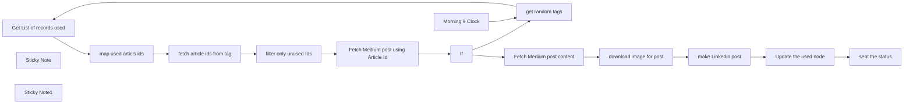

## Fluxo (.json) :

```json
{
  "id": "yF1HNe2ucaE81fNl",
  "meta": {
    "instanceId": "52be616fc3b9990a95b5266574f084bd2127609e79ce7dbfc33a1224bcc79eee",
    "templateCredsSetupCompleted": true
  },
  "name": "Linkedin Automation",
  "tags": [],
  "nodes": [
    {
      "id": "fa012332-1c95-4460-b1d1-9d54441c9179",
      "name": "Get List of records used",
      "type": "n8n-nodes-base.airtable",
      "position": [
        -40,
        -80
      ],
      "parameters": {
        "base": {
          "__rl": true,
          "mode": "list",
          "value": "appt6kHkRkLlUh033",
          "cachedResultUrl": "https://airtable.com/appt6kHkRkLlUh033",
          "cachedResultName": "Linkdin"
        },
        "table": {
          "__rl": true,
          "mode": "list",
          "value": "tbliloartO26TD5TG",
          "cachedResultUrl": "https://airtable.com/appt6kHkRkLlUh033/tbliloartO26TD5TG",
          "cachedResultName": "Used Articles"
        },
        "options": {},
        "operation": "search"
      },
      "credentials": {
        "airtableTokenApi": {
          "id": "9bPeAvakB1tkDxsW",
          "name": "Airtable Personal Access Token account"
        }
      },
      "typeVersion": 2.1,
      "alwaysOutputData": true
    },
    {
      "id": "2d99b3b7-2fcd-46bf-8859-f41e94cb5ae1",
      "name": "Update the used node",
      "type": "n8n-nodes-base.airtable",
      "position": [
        200,
        600
      ],
      "parameters": {
        "base": {
          "__rl": true,
          "mode": "list",
          "value": "appt6kHkRkLlUh033",
          "cachedResultUrl": "https://airtable.com/appt6kHkRkLlUh033",
          "cachedResultName": "Linkdin"
        },
        "table": {
          "__rl": true,
          "mode": "list",
          "value": "tbliloartO26TD5TG",
          "cachedResultUrl": "https://airtable.com/appt6kHkRkLlUh033/tbliloartO26TD5TG",
          "cachedResultName": "Used Articles"
        },
        "columns": {
          "value": {
            "id": "={{ $('download image for post').item.json.id }}",
            "value": "={{ $('download image for post').item.json.id }}"
          },
          "schema": [
            {
              "id": "id",
              "type": "string",
              "display": true,
              "removed": false,
              "readOnly": false,
              "required": false,
              "displayName": "id",
              "defaultMatch": false,
              "canBeUsedToMatch": true
            },
            {
              "id": "value",
              "type": "string",
              "display": true,
              "removed": false,
              "readOnly": false,
              "required": false,
              "displayName": "value",
              "defaultMatch": false,
              "canBeUsedToMatch": true
            }
          ],
          "mappingMode": "defineBelow",
          "matchingColumns": [],
          "attemptToConvertTypes": false,
          "convertFieldsToString": false
        },
        "options": {},
        "operation": "create"
      },
      "credentials": {
        "airtableTokenApi": {
          "id": "9bPeAvakB1tkDxsW",
          "name": "Airtable Personal Access Token account"
        }
      },
      "typeVersion": 2.1
    },
    {
      "id": "72abb016-8f58-4c4c-b492-9ba7a576441a",
      "name": "map used articls ids",
      "type": "n8n-nodes-base.code",
      "position": [
        200,
        -80
      ],
      "parameters": {
        "jsCode": "let values = $input.all().map(item => item.json.value);\n\nreturn [\n    {\n      json: {\n        values: values\n      }\n    }\n  ];"
      },
      "typeVersion": 2
    },
    {
      "id": "c49d5db2-d1c9-4444-8fa8-f39197e2a472",
      "name": "filter only unused Ids",
      "type": "n8n-nodes-base.filter",
      "position": [
        640,
        -80
      ],
      "parameters": {
        "options": {},
        "conditions": {
          "options": {
            "version": 2,
            "leftValue": "",
            "caseSensitive": true,
            "typeValidation": "strict"
          },
          "combinator": "and",
          "conditions": [
            {
              "id": "934a4ab8-bc6b-4d1b-b050-c1f19a03cc9f",
              "operator": {
                "type": "array",
                "operation": "notContains",
                "rightType": "any"
              },
              "leftValue": "={{ $('map used articls ids').item.json.values }}",
              "rightValue": "={{ $json.articles }}"
            }
          ]
        }
      },
      "typeVersion": 2.2
    },
    {
      "id": "0b390b7d-8729-48e5-aadc-5aa9da8c7139",
      "name": "get random tags",
      "type": "n8n-nodes-base.code",
      "position": [
        -280,
        -80
      ],
      "parameters": {
        "jsCode": "const devToTags = [\n  \"android\",\n        \"androiddev\",\n        \"kotlin\",\n        \"jetpack-compose\",\n        \"android-appdevelopment\",\n        \"app-development\"\n];\n\n\nfunction getRandomValuesAsObjects(list, count) {\n  const randomValues = [];\n  for (let i = 0; i < count; i++) {\n    const randomIndex = Math.floor(Math.random() * list.length);\n    randomValues.push({ json: { value: list[randomIndex] } });\n  }\n  return randomValues;\n}\n\nreturn getRandomValuesAsObjects(devToTags, 1);\n"
      },
      "typeVersion": 2
    },
    {
      "id": "6b16bc15-8d82-4aa0-9ee2-5a10f070d106",
      "name": "sent the status",
      "type": "n8n-nodes-base.telegram",
      "position": [
        520,
        600
      ],
      "webhookId": "9373d46a-d5ad-40f4-93c0-7a44ff5fea37",
      "parameters": {
        "text": "=Linkdin Post Sent Successfully  \n\n{{ $('If').item.json.title }}\n\nDb Status Id {{ $json.id }}",
        "chatId": "1199262493",
        "replyMarkup": "inlineKeyboard",
        "additionalFields": {
          "appendAttribution": false
        }
      },
      "credentials": {
        "telegramApi": {
          "id": "R8nJZScHqw02haLU",
          "name": "Mr.4rogrammer bot"
        }
      },
      "typeVersion": 1.2
    },
    {
      "id": "99c5ed96-4220-46b0-9a2a-628963393894",
      "name": "Morning  9 Clock",
      "type": "n8n-nodes-base.scheduleTrigger",
      "position": [
        -560,
        -80
      ],
      "parameters": {
        "rule": {
          "interval": [
            {
              "field": "cronExpression",
              "expression": "0 9,19 * * *"
            }
          ]
        }
      },
      "typeVersion": 1.2
    },
    {
      "id": "c81c749a-e21b-4ba6-beae-2b8a21523c06",
      "name": "Sticky Note",
      "type": "n8n-nodes-base.stickyNote",
      "position": [
        -560,
        -600
      ],
      "parameters": {
        "width": 920,
        "height": 400,
        "content": "# 📢 Auto-Post Medium Articles to LinkedIn with Telegram Alerts\n\nThis n8n workflow automates your LinkedIn posting by fetching articles from [medium.com](medium.com) twice a day (9:00 AM and 7:00 PM), ensuring consistent content sharing without manual effort.\n\nTo prevent duplicates, it stores posted article IDs in Airtable. It also sends a Telegram message after every successful post, so you stay updated.\n\n---\n"
      },
      "typeVersion": 1
    },
    {
      "id": "61171a34-53a3-448a-886c-b0cc83b75b33",
      "name": "Sticky Note1",
      "type": "n8n-nodes-base.stickyNote",
      "position": [
        400,
        -520
      ],
      "parameters": {
        "width": 580,
        "height": 240,
        "content": "\n## ✅ Features\n\n- 🕒 Runs twice daily at 9:00 AM and 7:00 PM (customizable)\n- 📰 Fetches latest medium.com articles by tag\n- 📂 Uses Airtable to avoid reposting the same article\n- 📢 Posts to your LinkedIn profile or company page\n- 📬 Sends a Telegram notification after successful posting\n- ⚙️ Fully customizable schedule, tags, and post format"
      },
      "typeVersion": 1
    },
    {
      "id": "c6712f11-2852-49af-8fb9-235da0e4685c",
      "name": "fetch article ids from tag",
      "type": "n8n-nodes-base.httpRequest",
      "position": [
        420,
        -80
      ],
      "parameters": {
        "url": "=https://medium2.p.rapidapi.com/search/articles?query={{ $('get random tags').first().json.value }}",
        "options": {},
        "sendHeaders": true,
        "headerParameters": {
          "parameters": [
            {
              "name": "x-rapidapi-host",
              "value": "medium2.p.rapidapi.com"
            },
            {
              "name": "x-rapidapi-key",
              "value": ""
            }
          ]
        }
      },
      "typeVersion": 4.2
    },
    {
      "id": "6382e23e-e214-48b4-8d93-06fc2c74e7cc",
      "name": "Fetch Medium post using Article Id",
      "type": "n8n-nodes-base.httpRequest",
      "position": [
        880,
        -80
      ],
      "parameters": {
        "url": "=https://medium2.p.rapidapi.com/article/{{ $json.articles.randomItem() }}",
        "options": {},
        "sendHeaders": true,
        "headerParameters": {
          "parameters": [
            {
              "name": "x-rapidapi-host",
              "value": "medium2.p.rapidapi.com"
            },
            {
              "name": "x-rapidapi-key",
              "value": ""
            }
          ]
        }
      },
      "typeVersion": 4.2
    },
    {
      "id": "eb92a4b3-d468-4d0f-8488-e6edb122b1db",
      "name": "If",
      "type": "n8n-nodes-base.if",
      "position": [
        -200,
        260
      ],
      "parameters": {
        "options": {},
        "conditions": {
          "options": {
            "version": 2,
            "leftValue": "",
            "caseSensitive": true,
            "typeValidation": "strict"
          },
          "combinator": "and",
          "conditions": [
            {
              "id": "69a60b53-f719-44e8-9ca4-97b99205a253",
              "operator": {
                "type": "string",
                "operation": "notEmpty",
                "singleValue": true
              },
              "leftValue": "={{ $json.image_url }}",
              "rightValue": ""
            }
          ]
        }
      },
      "typeVersion": 2.2
    },
    {
      "id": "792507fc-f956-4bc7-9c56-80f1078643a1",
      "name": "make Linkedin post",
      "type": "n8n-nodes-base.linkedIn",
      "position": [
        740,
        240
      ],
      "parameters": {
        "text": "={{ $('Fetch Medium post content').item.json.content.substring(0, 600) }} ...\n\nArticle link : https://freedium.cfd/{{ $('If').item.json.url }}\n\n#AndroidDevelopment #MobileAppDevelopment #AppDevelopment #Programming #SoftwareEngineering #TechCommunity #DeveloperLife #Kotlin #LinkedInDevelopers \n#Mr4rogrammer #isharewhatilearn",
        "person": "BQYGc4bH9N",
        "additionalFields": {
          "title": "=💫 {{ $('If').item.json.title }} ⭐",
          "visibility": "PUBLIC"
        },
        "shareMediaCategory": "IMAGE"
      },
      "credentials": {
        "linkedInOAuth2Api": {
          "id": "TODMZHWKWUyYl0qb",
          "name": "LinkedIn account"
        }
      },
      "typeVersion": 1
    },
    {
      "id": "b5026d10-0bcf-4ef4-a42e-0d8162a7eccc",
      "name": "Fetch Medium post content",
      "type": "n8n-nodes-base.httpRequest",
      "position": [
        100,
        240
      ],
      "parameters": {
        "url": "=https://medium2.p.rapidapi.com/article/{{$json.id}}/content",
        "options": {},
        "sendHeaders": true,
        "headerParameters": {
          "parameters": [
            {
              "name": "x-rapidapi-host",
              "value": "medium2.p.rapidapi.com"
            },
            {
              "name": "x-rapidapi-key",
              "value": ""
            }
          ]
        }
      },
      "typeVersion": 4.2
    },
    {
      "id": "d25bf5d7-0258-4f07-b0b7-54ace75ef697",
      "name": "download image for post",
      "type": "n8n-nodes-base.httpRequest",
      "position": [
        420,
        240
      ],
      "parameters": {
        "url": "={{ $('If').item.json.image_url }}",
        "options": {
          "allowUnauthorizedCerts": false
        },
        "sendHeaders": true,
        "headerParameters": {
          "parameters": [
            {
              "name": "User-Agent",
              "value": "Mozilla/5.0"
            }
          ]
        }
      },
      "typeVersion": 4.2,
      "alwaysOutputData": false
    }
  ],
  "active": false,
  "pinData": {},
  "settings": {
    "timezone": "Asia/Kolkata",
    "executionOrder": "v1"
  },
  "versionId": "cc2275e5-a8d2-468c-be91-5e14ad568e3a",
  "connections": {
    "If": {
      "main": [
        [
          {
            "node": "Fetch Medium post content",
            "type": "main",
            "index": 0
          }
        ],
        [
          {
            "node": "get random tags",
            "type": "main",
            "index": 0
          }
        ]
      ]
    },
    "get random tags": {
      "main": [
        [
          {
            "node": "Get List of records used",
            "type": "main",
            "index": 0
          }
        ]
      ]
    },
    "Morning  9 Clock": {
      "main": [
        [
          {
            "node": "get random tags",
            "type": "main",
            "index": 0
          }
        ]
      ]
    },
    "make Linkedin post": {
      "main": [
        [
          {
            "node": "Update the used node",
            "type": "main",
            "index": 0
          }
        ]
      ]
    },
    "Update the used node": {
      "main": [
        [
          {
            "node": "sent the status",
            "type": "main",
            "index": 0
          }
        ]
      ]
    },
    "map used articls ids": {
      "main": [
        [
          {
            "node": "fetch article ids from tag",
            "type": "main",
            "index": 0
          }
        ]
      ]
    },
    "filter only unused Ids": {
      "main": [
        [
          {
            "node": "Fetch Medium post using Article Id",
            "type": "main",
            "index": 0
          }
        ]
      ]
    },
    "download image for post": {
      "main": [
        [
          {
            "node": "make Linkedin post",
            "type": "main",
            "index": 0
          }
        ]
      ]
    },
    "Get List of records used": {
      "main": [
        [
          {
            "node": "map used articls ids",
            "type": "main",
            "index": 0
          }
        ]
      ]
    },
    "Fetch Medium post content": {
      "main": [
        [
          {
            "node": "download image for post",
            "type": "main",
            "index": 0
          }
        ]
      ]
    },
    "fetch article ids from tag": {
      "main": [
        [
          {
            "node": "filter only unused Ids",
            "type": "main",
            "index": 0
          }
        ]
      ]
    },
    "Fetch Medium post using Article Id": {
      "main": [
        [
          {
            "node": "If",
            "type": "main",
            "index": 0
          }
        ]
      ]
    }
  }
}
```

<a id="template-1178"></a>

## Template 1178 - Reconciliação de pagamentos de aluguel

- **Nome:** Reconciliação de pagamentos de aluguel
- **Descrição:** Automatiza a verificação de extratos bancários CSV contra uma base local de inquilinos e propriedades e regista alertas de discrepâncias em uma planilha XLSX.
- **Funcionalidade:** • Monitoramento de diretório local: observa chegada de novos arquivos CSV (extratos bancários) e dispara o fluxo automaticamente.
• Leitura e extração de CSV: importa e transforma os dados dos extratos para análise.
• Configuração de variável de ambiente: define o caminho do ficheiro XLSX utilizado como base de dados local.
• Agente de IA para reconciliação: analisa movimentos bancários comparando com contratos e valores acordados, considerando tolerâncias para pequenos atrasos.
• Identificação de exceções: sinaliza inquilinos com falta de pagamento, valores incorretos, término de contrato dentro do período e taxas pendentes.
• Consulta de dados locais: busca detalhes de inquilinos e propriedades a partir da planilha para enriquecer a análise.
• Validação de saída estruturada: exige que os alertas sejam retornados em JSON com campos padronizados para posterior processamento.
• Agregação e gravação de alertas: separa cada alerta, faz backup do XLSX, e acrescenta linhas na aba de alertas com data, propriedade, inquilino, ação requerida e detalhes.
- **Ferramentas:** • Sistema de ficheiros local: armazena e disponibiliza os arquivos CSV de extratos e o arquivo XLSX de referência.
• Arquivos CSV (extratos bancários): formato de entrada contendo colunas como data, referência, valor entrada e valor saída.
• Planilha Excel (XLSX): base de dados local com abas para inquilinos (tenants), propriedades (properties) e alertas (alerts).
• OpenAI (modelo gpt-4o): modelo de linguagem utilizado pelo agente de IA para analisar e decidir sobre ações a tomar.
• SheetJS (biblioteca xlsx): biblioteca usada para ler, escrever e fazer backup do arquivo XLSX local.

## Fluxo visual

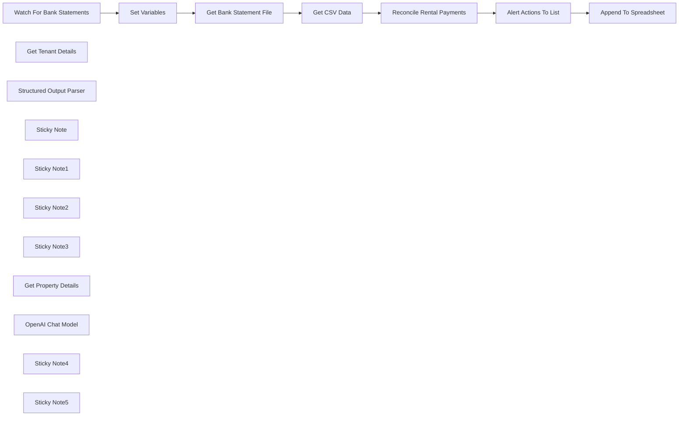

## Fluxo (.json) :

```json
{
  "meta": {
    "instanceId": "26ba763460b97c249b82942b23b6384876dfeb9327513332e743c5f6219c2b8e"
  },
  "nodes": [
    {
      "id": "bebbf9cf-8103-4694-a3be-ae3ee1e9ebaf",
      "name": "Watch For Bank Statements",
      "type": "n8n-nodes-base.localFileTrigger",
      "position": [
        780,
        400
      ],
      "parameters": {
        "path": "/home/node/host_mount/reconciliation_project",
        "events": [
          "add"
        ],
        "options": {
          "ignored": "!**/*.csv"
        },
        "triggerOn": "folder"
      },
      "typeVersion": 1
    },
    {
      "id": "eca26bed-ba44-4507-97d4-9154e26908a5",
      "name": "Get Tenant Details",
      "type": "@n8n/n8n-nodes-langchain.toolCode",
      "position": [
        1660,
        540
      ],
      "parameters": {
        "name": "get_tenant_details",
        "jsCode": "const xlsx = require('xlsx');\n\nconst { spreadsheet_location } = $('Set Variables').item.json;\nconst sheetName = 'tenants';\n\nconst wb = xlsx.readFile(spreadsheet_location, { sheets: [sheetName] });\nconst rows = xlsx.utils.sheet_to_json(wb.Sheets[sheetName], { raw: false });\n\nconst queryToList = [].concat(typeof query === 'string' ? query.split(',') : query);\n\nconst result = queryToList.map(q => (\n  rows.find(row =>\n    row['Tenant Name'].toLowerCase() === q.toLowerCase()\n    || row['Tenant ID'].toLowerCase() === q.toString().toLowerCase()\n  )\n));\n\nreturn result ? JSON.stringify(result) : `No results were found for ${query}`;",
        "description": "Call this tool to get a tenant's details which includes their tenancy terms, rent amount and any notes attached to their account. Pass in one or an array of either the tenant ID or the name of the tenant."
      },
      "typeVersion": 1.1
    },
    {
      "id": "76b68c2f-8d33-4f61-a442-732e784b733a",
      "name": "Structured Output Parser",
      "type": "@n8n/n8n-nodes-langchain.outputParserStructured",
      "position": [
        1920,
        540
      ],
      "parameters": {
        "jsonSchemaExample": "[{\n  \"tenant_id\": \"\",\n  \"tenant_name\": \"\",\n  \"property_id\": \"\",\n  \"property_postcode\": \"\",\n  \"action_required\": \"\",\n  \"details\": \"\",\n  \"date\": \"\"\n}]"
      },
      "typeVersion": 1.2
    },
    {
      "id": "be01720f-4617-4a2b-aaed-2474f9f0e25b",
      "name": "Get Bank Statement File",
      "type": "n8n-nodes-base.readWriteFile",
      "position": [
        1100,
        400
      ],
      "parameters": {
        "options": {},
        "fileSelector": "={{ $('Watch For Bank Statements').item.json.path }}"
      },
      "typeVersion": 1
    },
    {
      "id": "2aba5f6a-56b0-411f-9124-33025d90e325",
      "name": "Get CSV Data",
      "type": "n8n-nodes-base.extractFromFile",
      "position": [
        1260,
        400
      ],
      "parameters": {
        "options": {}
      },
      "typeVersion": 1
    },
    {
      "id": "a60d5851-f938-4696-855b-1f0845ffbc6c",
      "name": "Alert Actions To List",
      "type": "n8n-nodes-base.splitOut",
      "position": [
        2260,
        400
      ],
      "parameters": {
        "options": {},
        "fieldToSplitOut": "output"
      },
      "typeVersion": 1
    },
    {
      "id": "f804d9fb-f679-4e95-b70f-722e7c222c40",
      "name": "Sticky Note",
      "type": "n8n-nodes-base.stickyNote",
      "position": [
        690.6721905682555,
        177.80249392766257
      ],
      "parameters": {
        "color": 7,
        "width": 748.2548372021405,
        "height": 457.6238063670572,
        "content": "## Step 1. Wait For Incoming Bank Statements\n[Read more about the local file triggers](https://docs.n8n.io/integrations/builtin/core-nodes/n8n-nodes-base.localfiletrigger)\n\nFor this demo, we'll show that n8n is more than capable working with the local filesystem. This gives great benefits in terms of privacy and data security.\n\nFor our datastore, we're using a locally hosted XLSX Excel file which we'll query and update throughout this workflow."
      },
      "typeVersion": 1
    },
    {
      "id": "01e9c335-320c-4fff-9ade-ad1cf808db00",
      "name": "Sticky Note1",
      "type": "n8n-nodes-base.stickyNote",
      "position": [
        1460,
        80
      ],
      "parameters": {
        "color": 7,
        "width": 634.3165117416636,
        "height": 675.2455596085985,
        "content": "## Step 2. Delegate to AI Agent to Quickly Identify Issues with Rental Payments\n[Read more about AI Agents](https://docs.n8n.io/integrations/builtin/cluster-nodes/root-nodes/n8n-nodes-langchain.agent/)\n\nAn AI agent can not only check against agreed amounts and compare due dates but also consider contract exceptions and tenant notes before deciding to take action. In a scenario of 10+ of tenants, this can save a lot of admin time.\n\nFor this demo, we're using a remote LLM Model but this can easily be swapped out for other self-hosted LLMS models that support function calling."
      },
      "typeVersion": 1
    },
    {
      "id": "2456b1e5-ceec-45c3-91a7-52e21125e6e5",
      "name": "Sticky Note2",
      "type": "n8n-nodes-base.stickyNote",
      "position": [
        2120,
        143.8836673253448
      ],
      "parameters": {
        "color": 7,
        "width": 618.3293247808133,
        "height": 473.7439917476675,
        "content": "## Step 3. Generate a Report to Action any Issues\n[Read more about using the Code Node](https://docs.n8n.io/integrations/builtin/core-nodes/n8n-nodes-base.code)\n\nAfter the AI Agent has helped identify issues to action, we can generate a  report and update a locally hosted xlsx file. This again helps keep workflows private to nothing senstive goes over the wire.\n\nThough n8n lacks a builtin node for editing local xlsx file, we can tap into the sheetJS library available to the \"Code\" node."
      },
      "typeVersion": 1
    },
    {
      "id": "7b32e8f9-b543-47e1-a08e-53ee47105966",
      "name": "Sticky Note3",
      "type": "n8n-nodes-base.stickyNote",
      "position": [
        260,
        80
      ],
      "parameters": {
        "width": 399.5148533727183,
        "height": 558.2628336538015,
        "content": "## Try It Out!\n### This workflow ingests bank statements to analyses them against a list of tenants using an AI Agent. The agent then flags any issues such as missing payments or incorrect amounts which are exported to a XLSX spreadsheet.\n\n### Note: This workflow is intended to work with a self-hosted version of n8n and has access to the local file system.\n\n* Watches for CSV files (bank statements)\n* Imports into AI agent for analysis.\n* AI agent will query the Excel spreadsheet for tenant and property details.\n* AI agent will generate report on discrepancies or issues and write them to the Excel file.\n\n\n### Need Help?\nJoin the [Discord](https://discord.com/invite/XPKeKXeB7d) or ask in the [Forum](https://community.n8n.io/)!\n\nHappy Hacking!"
      },
      "typeVersion": 1
    },
    {
      "id": "ba35ed0b-7ace-4b76-b915-0dc516a07fb1",
      "name": "Get Property Details",
      "type": "@n8n/n8n-nodes-langchain.toolCode",
      "position": [
        1800,
        540
      ],
      "parameters": {
        "name": "get_property_details",
        "jsCode": "const xlsx = require('xlsx');\n\nconst { spreadsheet_location } = $('Set Variables').item.json;\nconst sheetName = 'properties'\n\nconst wb = xlsx.readFile(spreadsheet_location, { sheets: [sheetName] });\nconst rows = xlsx.utils.sheet_to_json(wb.Sheets[sheetName], { raw: false });\n\nconst queryToList = [].concat(typeof query === 'string' ? query.split(',') :query);\n\nconst result = queryToList.map(q => rows.find(row => row['Property ID'] === q));\n\nreturn result ? JSON.stringify(result) : `No results were found for ${query}`;",
        "description": "Call this tool to get a property details which includes the address, postcode and type of the property. Pass in one or an array of Property IDs."
      },
      "typeVersion": 1.1
    },
    {
      "id": "8c85a2f5-6741-41f4-b377-c74a74b14d0f",
      "name": "Set Variables",
      "type": "n8n-nodes-base.set",
      "position": [
        940,
        400
      ],
      "parameters": {
        "options": {},
        "assignments": {
          "assignments": [
            {
              "id": "bcd3dd04-0082-4da6-b36b-e5ad09c4de30",
              "name": "spreadsheet_location",
              "type": "string",
              "value": "/home/node/host_mount/reconciliation_project/reconcilation-workbook.xlsx"
            }
          ]
        }
      },
      "typeVersion": 3.4
    },
    {
      "id": "bd75bad8-caa3-48f1-8892-3d1221765564",
      "name": "Append To Spreadsheet",
      "type": "n8n-nodes-base.code",
      "position": [
        2480,
        400
      ],
      "parameters": {
        "jsCode": "const xlsx = require('xlsx');\n\nconst { spreadsheet_location } = $('Set Variables').first().json;\nconst sheetName = 'alerts';\n\nconst wb = xlsx.readFile(spreadsheet_location);\nxlsx.writeFile(wb, spreadsheet_location + '.bak.xlsx'); // create backup\n\nconst worksheet = wb.Sheets[sheetName];\n\nconst inputs = $input.all();\n\nfor (input of inputs) {\n  xlsx.utils.sheet_add_aoa(worksheet, [\n    [\n      input.json.date,\n      input.json[\"property_id\"],\n      input.json[\"property_postcode\"],\n      input.json[\"tenant_id\"],\n      input.json[\"tenant_name\"],\n      input.json[\"action_required\"],\n      input.json[\"details\"],\n    ]\n  ], { origin: -1 });\n}\n\n// update sheet ref\nconst range = xlsx.utils.decode_range(worksheet['!ref']);\nconst rowIndex = range.e.r + 1; // The next row index to append\nworksheet['!ref'] = xlsx.utils.encode_range({\n    s: range.s,\n    e: { r: rowIndex, c: range.e.c }\n});\n\nxlsx.writeFile(wb, spreadsheet_location, {\n  cellDates: true,\n  cellStyles: true,\n  bookType: 'xlsx',\n});\n\nreturn {\"json\": { \"output\": `${inputs.length} rows added` }}"
      },
      "typeVersion": 2
    },
    {
      "id": "c818ea7e-dc57-4680-b797-abb21cca87fb",
      "name": "OpenAI Chat Model",
      "type": "@n8n/n8n-nodes-langchain.lmChatOpenAi",
      "position": [
        1540,
        540
      ],
      "parameters": {
        "model": "gpt-4o",
        "options": {}
      },
      "credentials": {
        "openAiApi": {
          "id": "8gccIjcuf3gvaoEr",
          "name": "OpenAi account"
        }
      },
      "typeVersion": 1
    },
    {
      "id": "b2a97514-6020-49a6-bbdb-ee1251eb6aed",
      "name": "Sticky Note4",
      "type": "n8n-nodes-base.stickyNote",
      "position": [
        2280,
        640
      ],
      "parameters": {
        "color": 3,
        "width": 461.5505566920007,
        "height": 106.59049079746408,
        "content": "### 🚨Warning! Potentially Destructive Operations!\nWith code comes great responsibility! There is a risk you may overwrite/delete data you didn't intend. Always makes backups and test on a copy of your spreadsheets!"
      },
      "typeVersion": 1
    },
    {
      "id": "f869f6eb-cf19-4b14-bf3a-4db5d636646f",
      "name": "Reconcile Rental Payments",
      "type": "@n8n/n8n-nodes-langchain.agent",
      "position": [
        1640,
        360
      ],
      "parameters": {
        "text": "=Bank Statement for {{ $input.first().json.date }} to {{  $input.last().json.date }}:\n|date|reference|money in|money out|\n|-|-|-|-|\n{{ $input.all().map(row => `|${row.json.date}|${row.json.reference}|${row.json.money_in || ''}|${row.json.money_out || ''}|`).join('\\n') }}",
        "options": {
          "systemMessage": "Your task is to help reconcile rent payments with the uploaded bank statement and alert only if there are any actions to be taken in regards to the tenants.\n* Identify and flag any tenants who have have missed their rent according to the month. Late payments which are within a few days of the due date are acceptable and should not be flagged.\n* Identify and flag if any tenants have not paid the correct ammount due, either less or more.\n* Identify and flag any tenants who are finishing their rentals within the time period of the current statement.\n* Identify and flag any remaining fees which are due and have not been paid from any tenant in the last month of their rental.\n\nIf the bank statement show incomplete months due to cut off, it is ok to assume the payment is pending and not actually missing.\n\nThe alert system requires a JSON formatted message. It is important that you format your response as follows:\n[{\n  \"tenant_id\": \"\",\n  \"tenant_name\": \"\",\n  \"property_id\": \"\",\n  \"property_postcode\": \"\",\n  \"action required\": \"\",\n  \"details\": \"\",\n  \"date\": \"\"\n}]"
        },
        "promptType": "define",
        "hasOutputParser": true
      },
      "executeOnce": true,
      "typeVersion": 1.6
    },
    {
      "id": "510dc73c-f267-41f3-a981-58f5bfc229a6",
      "name": "Sticky Note5",
      "type": "n8n-nodes-base.stickyNote",
      "position": [
        360,
        660
      ],
      "parameters": {
        "color": 5,
        "width": 302.6142384407349,
        "height": 86.00673806595168,
        "content": "### 💡I'm designed to work self-hosted!\nSome nodes in this workflow are only available to the self-hosted version of n8n."
      },
      "typeVersion": 1
    }
  ],
  "pinData": {},
  "connections": {
    "Get CSV Data": {
      "main": [
        [
          {
            "node": "Reconcile Rental Payments",
            "type": "main",
            "index": 0
          }
        ]
      ]
    },
    "Set Variables": {
      "main": [
        [
          {
            "node": "Get Bank Statement File",
            "type": "main",
            "index": 0
          }
        ]
      ]
    },
    "OpenAI Chat Model": {
      "ai_languageModel": [
        [
          {
            "node": "Reconcile Rental Payments",
            "type": "ai_languageModel",
            "index": 0
          }
        ]
      ]
    },
    "Get Tenant Details": {
      "ai_tool": [
        [
          {
            "node": "Reconcile Rental Payments",
            "type": "ai_tool",
            "index": 0
          }
        ]
      ]
    },
    "Get Property Details": {
      "ai_tool": [
        [
          {
            "node": "Reconcile Rental Payments",
            "type": "ai_tool",
            "index": 0
          }
        ]
      ]
    },
    "Alert Actions To List": {
      "main": [
        [
          {
            "node": "Append To Spreadsheet",
            "type": "main",
            "index": 0
          }
        ]
      ]
    },
    "Get Bank Statement File": {
      "main": [
        [
          {
            "node": "Get CSV Data",
            "type": "main",
            "index": 0
          }
        ]
      ]
    },
    "Structured Output Parser": {
      "ai_outputParser": [
        [
          {
            "node": "Reconcile Rental Payments",
            "type": "ai_outputParser",
            "index": 0
          }
        ]
      ]
    },
    "Reconcile Rental Payments": {
      "main": [
        [
          {
            "node": "Alert Actions To List",
            "type": "main",
            "index": 0
          }
        ]
      ]
    },
    "Watch For Bank Statements": {
      "main": [
        [
          {
            "node": "Set Variables",
            "type": "main",
            "index": 0
          }
        ]
      ]
    }
  }
}
```

<a id="template-1179"></a>

## Template 1179 - Envio de alertas por email sobre erros

- **Nome:** Envio de alertas por email sobre erros
- **Descrição:** Fluxo que envia uma notificação por email contendo a mensagem e o stack trace quando uma execução de workflow encontra um erro.
- **Funcionalidade:** • Detecção de erro na execução: Aciona o fluxo quando ocorre um erro em uma execução.
• Composição da mensagem de erro: Monta o corpo do email incluindo a mensagem do erro e o stack trace.
• Assunto dinâmico: Define o assunto do email incluindo o nome do workflow afetado.
• Envio de email: Dispara a notificação para destinatários configuráveis utilizando um serviço de envio de emails.
- **Ferramentas:** • Mailgun: Serviço de envio de emails utilizado para entregar as notificações de erro com assunto, corpo e stack trace.

## Fluxo visual

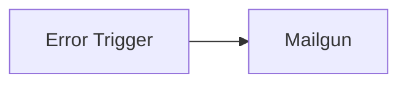

## Fluxo (.json) :

```json
{
  "nodes": [
    {
      "name": "Error Trigger",
      "type": "n8n-nodes-base.errorTrigger",
      "position": [
        250,
        500
      ],
      "parameters": {},
      "typeVersion": 1
    },
    {
      "name": "Mailgun",
      "type": "n8n-nodes-base.mailgun",
      "position": [
        450,
        500
      ],
      "parameters": {
        "text": "=Error: {{$node[\"Error Trigger\"].data[\"execution\"][\"error\"][\"message\"]}}\n\nStack Trace:\n{{$node[\"Error Trigger\"].data[\"execution\"][\"error\"][\"stack\"]}}",
        "subject": "=Workflow Error:  {{$node[\"Error Trigger\"].data[\"workflow\"][\"name\"]}}",
        "toEmail": "",
        "fromEmail": ""
      },
      "credentials": {
        "mailgunApi": ""
      },
      "typeVersion": 1
    }
  ],
  "connections": {
    "Error Trigger": {
      "main": [
        [
          {
            "node": "Mailgun",
            "type": "main",
            "index": 0
          }
        ]
      ]
    }
  }
}
```

<a id="template-1180"></a>

## Template 1180 - Gerar notas de estudo a partir de documento

- **Nome:** Gerar notas de estudo a partir de documento
- **Descrição:** Automatiza a transformação de documentos em vários tipos de notas de estudo (guia, cronologia e briefing) usando resumo, vetorização e geração assistida por modelos de linguagem.
- **Funcionalidade:** • Monitoramento de pasta: Observa uma pasta local por novos arquivos e inicia o fluxo automaticamente.
• Importação e extração de conteúdo: Lê o arquivo detectado e extrai texto de formatos como PDF, DOCX e TXT.
• Geração de resumo: Cria um resumo do documento para orientar etapas posteriores de geração.
• Vetorização e armazenamento: Gera embeddings do conteúdo e insere-os em um banco vetorial para permitir buscas semânticas.
• Recuperação semântica: Recupera trechos relevantes do documento usando buscas vetoriais para fornecer contexto ao modelo.
• Geração orientada por templates: Para cada template (Study Guide, Timeline, Briefing Doc), o sistema cria perguntas, obtém respostas e monta o documento final formatado em Markdown.
• Exportação de arquivos: Salva os documentos gerados de volta na pasta local com nomes construídos a partir do original.
- **Ferramentas:** • Mistral Cloud: Serviço de modelos de linguagem e embeddings utilizado para sumarização, geração de perguntas/respostas e criação dos documentos.
• Qdrant: Banco de vetores para armazenar embeddings e realizar recuperação semântica eficiente.
• Sistema de arquivos local: Pasta monitorada para entrada dos arquivos originais e destino dos documentos gerados.

## Fluxo visual

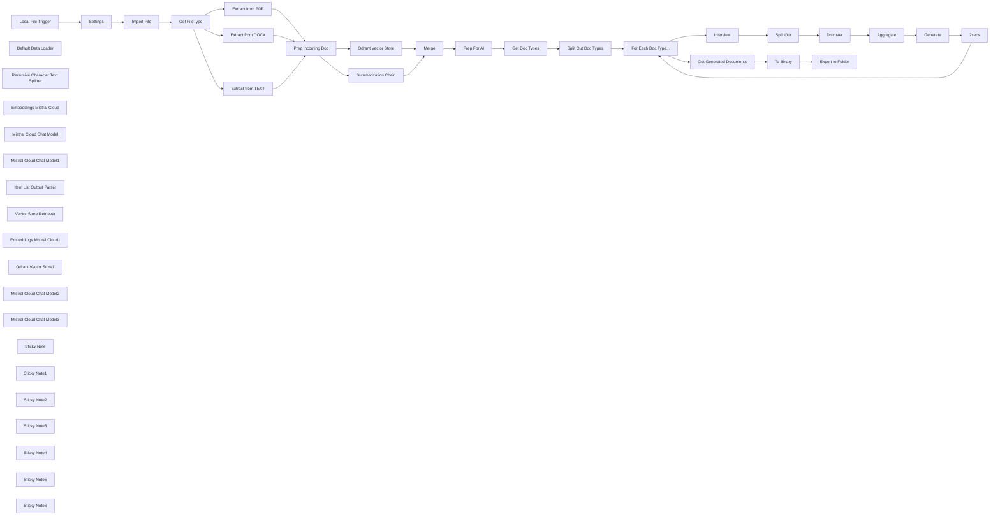

## Fluxo (.json) :

```json
{
  "meta": {
    "instanceId": "26ba763460b97c249b82942b23b6384876dfeb9327513332e743c5f6219c2b8e"
  },
  "nodes": [
    {
      "id": "a3af309b-d24c-42fe-8bcd-f330927c7a3c",
      "name": "Local File Trigger",
      "type": "n8n-nodes-base.localFileTrigger",
      "position": [
        140,
        260
      ],
      "parameters": {
        "path": "/home/node/storynotes/context",
        "events": [
          "add"
        ],
        "options": {
          "usePolling": true,
          "followSymlinks": true
        },
        "triggerOn": "folder"
      },
      "typeVersion": 1
    },
    {
      "id": "048f9d67-6519-4dea-97df-aaddfefbfea2",
      "name": "Default Data Loader",
      "type": "@n8n/n8n-nodes-langchain.documentDefaultDataLoader",
      "position": [
        1300,
        720
      ],
      "parameters": {
        "options": {
          "metadata": {
            "metadataValues": [
              {
                "name": "project",
                "value": "={{ $('Settings').item.json.project }}"
              },
              {
                "name": "filename",
                "value": "={{ $('Settings').item.json.filename }}"
              }
            ]
          }
        },
        "jsonData": "={{ $json.data }}",
        "jsonMode": "expressionData"
      },
      "typeVersion": 1
    },
    {
      "id": "9e9047c9-4428-4afb-8c74-d6eb1075a65a",
      "name": "Recursive Character Text Splitter",
      "type": "@n8n/n8n-nodes-langchain.textSplitterRecursiveCharacterTextSplitter",
      "position": [
        1300,
        860
      ],
      "parameters": {
        "options": {},
        "chunkSize": 2000
      },
      "typeVersion": 1
    },
    {
      "id": "e42e3f82-6cd9-40c4-9da2-8f87ee5b3956",
      "name": "Embeddings Mistral Cloud",
      "type": "@n8n/n8n-nodes-langchain.embeddingsMistralCloud",
      "position": [
        1180,
        720
      ],
      "parameters": {
        "options": {}
      },
      "credentials": {
        "mistralCloudApi": {
          "id": "EIl2QxhXAS9Hkg37",
          "name": "Mistral Cloud account"
        }
      },
      "typeVersion": 1
    },
    {
      "id": "578c63db-4f6e-4341-ab0d-111debd519be",
      "name": "Mistral Cloud Chat Model",
      "type": "@n8n/n8n-nodes-langchain.lmChatMistralCloud",
      "position": [
        2660,
        840
      ],
      "parameters": {
        "model": "open-mixtral-8x7b",
        "options": {}
      },
      "credentials": {
        "mistralCloudApi": {
          "id": "EIl2QxhXAS9Hkg37",
          "name": "Mistral Cloud account"
        }
      },
      "typeVersion": 1
    },
    {
      "id": "c34adb3e-1fb9-4248-ae83-2bac34c8b0a4",
      "name": "Mistral Cloud Chat Model1",
      "type": "@n8n/n8n-nodes-langchain.lmChatMistralCloud",
      "position": [
        1200,
        400
      ],
      "parameters": {
        "model": "open-mixtral-8x7b",
        "options": {}
      },
      "credentials": {
        "mistralCloudApi": {
          "id": "EIl2QxhXAS9Hkg37",
          "name": "Mistral Cloud account"
        }
      },
      "typeVersion": 1
    },
    {
      "id": "98e6dcc0-1e3a-4119-b657-0949f34ba525",
      "name": "Prep Incoming Doc",
      "type": "n8n-nodes-base.set",
      "position": [
        900,
        420
      ],
      "parameters": {
        "options": {},
        "assignments": {
          "assignments": [
            {
              "id": "da64ffde-1e8f-478d-baea-59fc05e6d3ce",
              "name": "data",
              "type": "string",
              "value": "={{ $json.text }}"
            }
          ]
        }
      },
      "typeVersion": 3.3
    },
    {
      "id": "ab88cf9a-d310-4bef-9280-8b23729e7cc9",
      "name": "Settings",
      "type": "n8n-nodes-base.set",
      "position": [
        320,
        260
      ],
      "parameters": {
        "options": {},
        "assignments": {
          "assignments": [
            {
              "id": "df327b01-961c-4a49-8455-58c3fbff111a",
              "name": "project",
              "type": "string",
              "value": "={{ $json.path.split('/').slice(0, 4)[3] }}"
            },
            {
              "id": "6b7d26f9-3a38-417e-85d0-4e9d42476465",
              "name": "path",
              "type": "string",
              "value": "={{ $json.path }}"
            },
            {
              "id": "bb4471c7-d894-4739-99a6-4be247794ffa",
              "name": "filename",
              "type": "string",
              "value": "={{ $json.path.split('/').last() }}"
            }
          ]
        }
      },
      "typeVersion": 3.3
    },
    {
      "id": "35c6b678-e6e9-4adf-a904-909fa2401d5e",
      "name": "Merge",
      "type": "n8n-nodes-base.merge",
      "position": [
        1600,
        420
      ],
      "parameters": {
        "mode": "chooseBranch"
      },
      "typeVersion": 2.1
    },
    {
      "id": "0fa13be8-8500-486c-a1c6-cc1df00a4947",
      "name": "Get Doc Types",
      "type": "n8n-nodes-base.set",
      "position": [
        2000,
        420
      ],
      "parameters": {
        "mode": "raw",
        "options": {},
        "jsonOutput": "{\n  \"docs\": [\n    {\n      \"filename\": \"study_guide.md\",\n      \"title\": \"Study Guide\",\n      \"description\": \"A Study Guide is a consolidated resource designed to aid learning. This guide includes three key elements: * A short answer quiz accompanied by an answer key to test comprehension. * A curated list of long-form essay questions to encourage deeper analysis and synthesis of the material. * A glossary of key terms to reinforce understanding of important concepts.\"\n    },\n    {\n      \"filename\": \"timeline.md\",\n      \"title\": \"Timeline\",\n      \"description\": \"A Timeline organizes all significant events described in the sources you have uploaded in chronological order. This ordered list makes it easier to understand the sequence of events and their connection to the broader context of your sources. In addition to the list of events, the Timeline also provides a “cast of characters,” which comprises short biographical sketches of all the important people mentioned in your uploaded sources. These short biographies can help you quickly grasp the roles of various individuals involved in the events described by the Timeline.\"\n    },\n    {\n      \"filename\": \"briefing_doc.md\",\n      \"title\": \"Briefing Doc\",\n      \"description\": \"A Briefing Doc identifies and presents the most important facts and insights from the sources in an easy-to-understand outline format. This format is designed to provide a concise overview of the key takeaways from the uploaded materials.\"\n    }\n  ]\n}\n"
      },
      "executeOnce": true,
      "typeVersion": 3.3
    },
    {
      "id": "e3469368-f214-4549-844e-7febfbbf0202",
      "name": "Split Out Doc Types",
      "type": "n8n-nodes-base.splitOut",
      "position": [
        2160,
        420
      ],
      "parameters": {
        "options": {},
        "fieldToSplitOut": "docs"
      },
      "typeVersion": 1
    },
    {
      "id": "df401e9e-2f70-4079-969b-6b61142fca37",
      "name": "For Each Doc Type...",
      "type": "n8n-nodes-base.splitInBatches",
      "position": [
        2340,
        420
      ],
      "parameters": {
        "options": {}
      },
      "typeVersion": 3
    },
    {
      "id": "c334b546-8e11-424d-bdd5-006e7086f24b",
      "name": "Item List Output Parser",
      "type": "@n8n/n8n-nodes-langchain.outputParserItemList",
      "position": [
        2840,
        840
      ],
      "parameters": {
        "options": {}
      },
      "typeVersion": 1
    },
    {
      "id": "4267c2b5-f1cd-4df7-84ee-be01a643a1c1",
      "name": "Vector Store Retriever",
      "type": "@n8n/n8n-nodes-langchain.retrieverVectorStore",
      "position": [
        3200,
        840
      ],
      "parameters": {},
      "typeVersion": 1
    },
    {
      "id": "abf833ec-8a6d-4e13-a526-0ea6b80d578f",
      "name": "Embeddings Mistral Cloud1",
      "type": "@n8n/n8n-nodes-langchain.embeddingsMistralCloud",
      "position": [
        3200,
        1060
      ],
      "parameters": {
        "options": {}
      },
      "credentials": {
        "mistralCloudApi": {
          "id": "EIl2QxhXAS9Hkg37",
          "name": "Mistral Cloud account"
        }
      },
      "typeVersion": 1
    },
    {
      "id": "a0e50185-6662-4b11-9922-59e8b06e4967",
      "name": "Qdrant Vector Store1",
      "type": "@n8n/n8n-nodes-langchain.vectorStoreQdrant",
      "position": [
        3200,
        940
      ],
      "parameters": {
        "qdrantCollection": {
          "__rl": true,
          "mode": "list",
          "value": "storynotes",
          "cachedResultName": "storynotes"
        }
      },
      "credentials": {
        "qdrantApi": {
          "id": "NyinAS3Pgfik66w5",
          "name": "QdrantApi account"
        }
      },
      "typeVersion": 1
    },
    {
      "id": "20c5766a-d3ce-4c01-a76b-facf1a00abc2",
      "name": "Mistral Cloud Chat Model2",
      "type": "@n8n/n8n-nodes-langchain.lmChatMistralCloud",
      "position": [
        3100,
        840
      ],
      "parameters": {
        "options": {}
      },
      "credentials": {
        "mistralCloudApi": {
          "id": "EIl2QxhXAS9Hkg37",
          "name": "Mistral Cloud account"
        }
      },
      "typeVersion": 1
    },
    {
      "id": "f049b7af-07f3-47e5-9476-68d73a387978",
      "name": "Split Out",
      "type": "n8n-nodes-base.splitOut",
      "position": [
        2960,
        680
      ],
      "parameters": {
        "options": {},
        "fieldToSplitOut": "response"
      },
      "typeVersion": 1
    },
    {
      "id": "39042ae0-e17f-46cd-84be-728868950d84",
      "name": "Aggregate",
      "type": "n8n-nodes-base.aggregate",
      "position": [
        3400,
        680
      ],
      "parameters": {
        "options": {},
        "fieldsToAggregate": {
          "fieldToAggregate": [
            {
              "fieldToAggregate": "response.text"
            }
          ]
        }
      },
      "typeVersion": 1
    },
    {
      "id": "e3b900c8-515d-4ac7-88fa-c364134ba9f9",
      "name": "Mistral Cloud Chat Model3",
      "type": "@n8n/n8n-nodes-langchain.lmChatMistralCloud",
      "position": [
        3540,
        840
      ],
      "parameters": {
        "model": "open-mixtral-8x7b",
        "options": {}
      },
      "credentials": {
        "mistralCloudApi": {
          "id": "EIl2QxhXAS9Hkg37",
          "name": "Mistral Cloud account"
        }
      },
      "typeVersion": 1
    },
    {
      "id": "efb26a5d-6a61-44b2-ad99-6d1f8b48998d",
      "name": "Discover",
      "type": "@n8n/n8n-nodes-langchain.chainRetrievalQa",
      "position": [
        3100,
        680
      ],
      "parameters": {
        "text": "={{ $json.response }}",
        "promptType": "define"
      },
      "typeVersion": 1.3
    },
    {
      "id": "302b7523-898e-47af-8941-aa5f8a58fd9c",
      "name": "2secs",
      "type": "n8n-nodes-base.wait",
      "position": [
        3880,
        1060
      ],
      "webhookId": "ec58ab18-03c5-4b58-bc2e-24415a236c72",
      "parameters": {},
      "typeVersion": 1.1
    },
    {
      "id": "007857b0-c12c-4c57-b07f-db30526cd747",
      "name": "Get Generated Documents",
      "type": "n8n-nodes-base.set",
      "position": [
        2680,
        240
      ],
      "parameters": {
        "options": {},
        "assignments": {
          "assignments": [
            {
              "id": "b38546b2-47c4-4967-a2d7-98aebd589e95",
              "name": "data",
              "type": "string",
              "value": "={{ $json.text }}"
            },
            {
              "id": "a263519a-aa05-410a-b4f0-f5e22cc5058c",
              "name": "path",
              "type": "string",
              "value": "={{ $('Prep For AI').item.json.path }}"
            },
            {
              "id": "ec1687d6-0ea9-460f-b9d4-ae4a7e229e12",
              "name": "filename",
              "type": "string",
              "value": "={{ $('Prep For AI').item.json.name }}"
            }
          ]
        }
      },
      "typeVersion": 3.3
    },
    {
      "id": "36fac35f-df10-41ab-96a7-3a5e67f9d8df",
      "name": "Generate",
      "type": "@n8n/n8n-nodes-langchain.chainLlm",
      "position": [
        3540,
        680
      ],
      "parameters": {
        "text": "=## Document\n{{ $json.text.join('\\n') }}",
        "messages": {
          "messageValues": [
            {
              "message": "=Your job is to create a {{ $('For Each Doc Type...').item.json.title }} for the given document. {{ $('For Each Doc Type...').item.json.description }}\n\nGenerate a  {{ $('For Each Doc Type...').item.json.title }} for the given document. If questions are generated, generate the answers alongside them. Format your response in markdown; use \"#\" to format headings, use \"*\" to format lists."
            }
          ]
        },
        "promptType": "define"
      },
      "typeVersion": 1.4
    },
    {
      "id": "b9a79cb0-bcc1-4d73-af93-5f8d7e2258a9",
      "name": "Prep For AI",
      "type": "n8n-nodes-base.set",
      "position": [
        1760,
        420
      ],
      "parameters": {
        "options": {},
        "assignments": {
          "assignments": [
            {
              "id": "5c864125-c884-4d33-b0ed-e3eecd354196",
              "name": "id",
              "type": "string",
              "value": "={{ $('Settings').first().json.filename.hash() }}"
            },
            {
              "id": "93ac14c1-ae97-4ef2-a66f-6c1110f3b0fc",
              "name": "project",
              "type": "string",
              "value": "={{ $('Settings').first().json.project }}"
            },
            {
              "id": "fafd16b9-0002-4f7c-89d0-29788f8ec472",
              "name": "path",
              "type": "string",
              "value": "={{ $('Settings').first().json.path }}"
            },
            {
              "id": "5a5860ba-918b-4fb8-b18c-96c1cd22091a",
              "name": "name",
              "type": "string",
              "value": "={{ $('Settings').first().json.filename }}"
            },
            {
              "id": "1a1caf65-85d8-4f74-a3be-503ccfc0b2c9",
              "name": "summary",
              "type": "string",
              "value": "={{ $('Summarization Chain').first().json.response.text }}"
            }
          ]
        }
      },
      "typeVersion": 3.3
    },
    {
      "id": "e40c7e99-9813-4f06-92bb-dfb2839f1037",
      "name": "To Binary",
      "type": "n8n-nodes-base.convertToFile",
      "position": [
        2860,
        240
      ],
      "parameters": {
        "options": {},
        "operation": "toText",
        "sourceProperty": "={{ $json.data }}"
      },
      "typeVersion": 1.1
    },
    {
      "id": "b55df916-7a51-4114-91b8-18a3c6ba2c56",
      "name": "Export to Folder",
      "type": "n8n-nodes-base.readWriteFile",
      "position": [
        3020,
        240
      ],
      "parameters": {
        "options": {},
        "fileName": "={{\n  $('Get Generated Documents').item.json.path.replace(\n    $('Get Generated Documents').item.json.path.split('/').last(),\n    $('Get Generated Documents').item.json.filename.substring(0,21) + '...' + $('Split Out Doc Types').item.json.title + '.md'\n  )\n}}",
        "operation": "write"
      },
      "typeVersion": 1
    },
    {
      "id": "8490664e-0ca5-4839-ad03-d3f9706c99a3",
      "name": "Get FileType",
      "type": "n8n-nodes-base.switch",
      "position": [
        480,
        420
      ],
      "parameters": {
        "rules": {
          "values": [
            {
              "outputKey": "pdf",
              "conditions": {
                "options": {
                  "leftValue": "",
                  "caseSensitive": true,
                  "typeValidation": "strict"
                },
                "combinator": "and",
                "conditions": [
                  {
                    "operator": {
                      "type": "string",
                      "operation": "equals"
                    },
                    "leftValue": "={{ $json.fileType }}",
                    "rightValue": "pdf"
                  }
                ]
              },
              "renameOutput": true
            },
            {
              "outputKey": "docx",
              "conditions": {
                "options": {
                  "leftValue": "",
                  "caseSensitive": true,
                  "typeValidation": "strict"
                },
                "combinator": "and",
                "conditions": [
                  {
                    "id": "3a5f509d-46fe-490c-95f0-35124873c63e",
                    "operator": {
                      "name": "filter.operator.equals",
                      "type": "string",
                      "operation": "equals"
                    },
                    "leftValue": "={{ $json.fileType }}",
                    "rightValue": "docx"
                  }
                ]
              },
              "renameOutput": true
            },
            {
              "outputKey": "everything else",
              "conditions": {
                "options": {
                  "leftValue": "",
                  "caseSensitive": true,
                  "typeValidation": "strict"
                },
                "combinator": "and",
                "conditions": [
                  {
                    "id": "75188d2f-4bea-44ea-a579-9b9a1bd1ea93",
                    "operator": {
                      "type": "object",
                      "operation": "exists",
                      "singleValue": true
                    },
                    "leftValue": "={{ $json }}",
                    "rightValue": ""
                  }
                ]
              },
              "renameOutput": true
            }
          ]
        },
        "options": {}
      },
      "typeVersion": 3
    },
    {
      "id": "386f7aac-f3b9-4565-907f-687d48b00c52",
      "name": "Import File",
      "type": "n8n-nodes-base.readWriteFile",
      "position": [
        320,
        420
      ],
      "parameters": {
        "options": {},
        "fileSelector": "={{ $json.path }}"
      },
      "typeVersion": 1
    },
    {
      "id": "6ade93d5-61c3-450a-b78c-e210c18c0e70",
      "name": "Extract from PDF",
      "type": "n8n-nodes-base.extractFromFile",
      "position": [
        680,
        260
      ],
      "parameters": {
        "options": {},
        "operation": "pdf"
      },
      "typeVersion": 1
    },
    {
      "id": "f413e139-3f9c-438f-8e82-824c38f09c6b",
      "name": "Extract from DOCX",
      "type": "n8n-nodes-base.extractFromFile",
      "position": [
        680,
        420
      ],
      "parameters": {
        "options": {},
        "operation": "ods"
      },
      "typeVersion": 1
    },
    {
      "id": "455fadea-f5c7-4bea-983f-b06da4e57510",
      "name": "Extract from TEXT",
      "type": "n8n-nodes-base.extractFromFile",
      "position": [
        680,
        580
      ],
      "parameters": {
        "options": {},
        "operation": "text"
      },
      "typeVersion": 1
    },
    {
      "id": "b2586011-4985-4075-b51c-90301b1a8cf9",
      "name": "Summarization Chain",
      "type": "@n8n/n8n-nodes-langchain.chainSummarization",
      "position": [
        1200,
        260
      ],
      "parameters": {
        "options": {},
        "chunkSize": 4000
      },
      "typeVersion": 2
    },
    {
      "id": "1502e72c-e97e-4148-8138-01818ab5b104",
      "name": "Sticky Note",
      "type": "n8n-nodes-base.stickyNote",
      "position": [
        60,
        85.80882007954312
      ],
      "parameters": {
        "color": 7,
        "width": 995.1475972814769,
        "height": 694.0931000693263,
        "content": "## Step 1. Watch Folder and Import New Documents\n[Read more about Local File Trigger](https://docs.n8n.io/integrations/builtin/core-nodes/n8n-nodes-base.localfiletrigger)\n\nWith n8n's local file trigger, we're able to trigger the workflow when files are created in our target folder. We still have to import them however as the trigger will only give the file's path. The \"Extract From\" node is used to get at the file's contents."
      },
      "typeVersion": 1
    },
    {
      "id": "7b3afc2c-3fb8-4589-9475-78f5617009cc",
      "name": "Sticky Note1",
      "type": "n8n-nodes-base.stickyNote",
      "position": [
        1080,
        82.96464765818223
      ],
      "parameters": {
        "color": 7,
        "width": 824.3300768713589,
        "height": 949.8141899605673,
        "content": "## Step 2. Summarise and Vectorise Document Contents\n[Learn more about using the Qdrant VectorStore](https://docs.n8n.io/integrations/builtin/cluster-nodes/root-nodes/n8n-nodes-langchain.vectorstoreqdrant)\n\nCapturing the document into our vector store is intended for a technique we'll use later known as Retrieval Augumented Generation or \"RAG\" for short. For our scenario, this allows our LLM to retrieve context more efficiently which produces better respsonses."
      },
      "typeVersion": 1
    },
    {
      "id": "74aabb02-ca5d-41ad-b84f-92d66428b774",
      "name": "Sticky Note2",
      "type": "n8n-nodes-base.stickyNote",
      "position": [
        1940,
        156.7963650826494
      ],
      "parameters": {
        "color": 7,
        "width": 591.09953935829,
        "height": 485.0226378812345,
        "content": "## Step 3. Loop through Templates\n\nWe'll ask the LLM to help us generate 3 types of notes from the imported source document. These notes are intended to breakdown the content for faster study. Our templates for this demo are:\n(1) **Study guide**\n(2) **Briefing document**\n(3) **Timeline**"
      },
      "typeVersion": 1
    },
    {
      "id": "b96f899d-4a44-491c-b164-a42feba129eb",
      "name": "Sticky Note3",
      "type": "n8n-nodes-base.stickyNote",
      "position": [
        2560,
        480
      ],
      "parameters": {
        "color": 7,
        "width": 1500.7886103732135,
        "height": 806.6560661824452,
        "content": "## Step 4. Use AI Agents to Query and Generate Template Documents\n[Read more about using the Question & Answer Retrieval Chain](https://docs.n8n.io/integrations/builtin/cluster-nodes/root-nodes/n8n-nodes-langchain.chainretrievalqa)\n\nn8n allows us to easily use a chain of LLMs as agents which can work together to handle any task!\nHere the agents generate questions to explore the content of the source document and use the answers to generate the template. "
      },
      "typeVersion": 1
    },
    {
      "id": "77fda269-6877-422f-b6e6-4346bde862db",
      "name": "Sticky Note4",
      "type": "n8n-nodes-base.stickyNote",
      "position": [
        2560,
        67.64523011966037
      ],
      "parameters": {
        "color": 7,
        "width": 771.8710855215123,
        "height": 384.22073222791266,
        "content": "## Step 5. Export Generated Templates To Folder\n[Learn more about writing to the local filesystem](https://docs.n8n.io/integrations/builtin/core-nodes/n8n-nodes-base.filesreadwrite)\n\nFinally, the AI generated documents can now be exported to disk. This workflow makes it easy to generate any kind of document from various source material and can be used for training and sales."
      },
      "typeVersion": 1
    },
    {
      "id": "08839972-f0f4-4144-bf27-810664cbf828",
      "name": "Qdrant Vector Store",
      "type": "@n8n/n8n-nodes-langchain.vectorStoreQdrant",
      "position": [
        1200,
        560
      ],
      "parameters": {
        "mode": "insert",
        "options": {},
        "qdrantCollection": {
          "__rl": true,
          "mode": "list",
          "value": "storynotes",
          "cachedResultName": "storynotes"
        }
      },
      "credentials": {
        "qdrantApi": {
          "id": "NyinAS3Pgfik66w5",
          "name": "QdrantApi account"
        }
      },
      "typeVersion": 1
    },
    {
      "id": "7e216411-83ee-4b82-9e00-285d4f2d3224",
      "name": "Sticky Note5",
      "type": "n8n-nodes-base.stickyNote",
      "position": [
        -360,
        80
      ],
      "parameters": {
        "width": 390.63004227317265,
        "height": 401.0080676370763,
        "content": "## Try It Out! \n\n### This workflow automates generating notes from a source document.\n* It watches a target folder to pick up new files.\n* When a new file is detected, it saves the contents of the file in a vectorstore.\n* multiple AI agents guided by a templates list, generate the predetermined notes.\n* These notes are then export alongside the original source file for the user.\n\n\n### Need Help?\nJoin the [Discord](https://discord.com/invite/XPKeKXeB7d) or ask in the [Forum](https://community.n8n.io/)!\n\nHappy Hacking!"
      },
      "typeVersion": 1
    },
    {
      "id": "f2c363d3-a2bf-4468-ad54-f26649ce6ab8",
      "name": "Interview",
      "type": "@n8n/n8n-nodes-langchain.chainLlm",
      "position": [
        2660,
        680
      ],
      "parameters": {
        "text": "=## document summary\n {{ $('Prep For AI').item.json.summary }}",
        "messages": {
          "messageValues": [
            {
              "message": "=Given the following document summary, what questions would you ask to create a {{ $('For Each Doc Type...').item.json.title }} for the document? Generate 5 questions."
            }
          ]
        },
        "promptType": "define",
        "hasOutputParser": true
      },
      "typeVersion": 1.4
    },
    {
      "id": "ce3da55d-8c22-40bb-8781-63c2e6bcb824",
      "name": "Sticky Note6",
      "type": "n8n-nodes-base.stickyNote",
      "position": [
        1960,
        380
      ],
      "parameters": {
        "width": 172.26820279743384,
        "height": 295.46359440513226,
        "content": "\n\n\n\n\n\n\n\n\n\n\n\n\n\n\n\n### 💡Add your own templates here!\n"
      },
      "typeVersion": 1
    }
  ],
  "pinData": {},
  "connections": {
    "2secs": {
      "main": [
        [
          {
            "node": "For Each Doc Type...",
            "type": "main",
            "index": 0
          }
        ]
      ]
    },
    "Merge": {
      "main": [
        [
          {
            "node": "Prep For AI",
            "type": "main",
            "index": 0
          }
        ]
      ]
    },
    "Discover": {
      "main": [
        [
          {
            "node": "Aggregate",
            "type": "main",
            "index": 0
          }
        ]
      ]
    },
    "Generate": {
      "main": [
        [
          {
            "node": "2secs",
            "type": "main",
            "index": 0
          }
        ]
      ]
    },
    "Settings": {
      "main": [
        [
          {
            "node": "Import File",
            "type": "main",
            "index": 0
          }
        ]
      ]
    },
    "Aggregate": {
      "main": [
        [
          {
            "node": "Generate",
            "type": "main",
            "index": 0
          }
        ]
      ]
    },
    "Interview": {
      "main": [
        [
          {
            "node": "Split Out",
            "type": "main",
            "index": 0
          }
        ]
      ]
    },
    "Split Out": {
      "main": [
        [
          {
            "node": "Discover",
            "type": "main",
            "index": 0
          }
        ]
      ]
    },
    "To Binary": {
      "main": [
        [
          {
            "node": "Export to Folder",
            "type": "main",
            "index": 0
          }
        ]
      ]
    },
    "Import File": {
      "main": [
        [
          {
            "node": "Get FileType",
            "type": "main",
            "index": 0
          }
        ]
      ]
    },
    "Prep For AI": {
      "main": [
        [
          {
            "node": "Get Doc Types",
            "type": "main",
            "index": 0
          }
        ]
      ]
    },
    "Get FileType": {
      "main": [
        [
          {
            "node": "Extract from PDF",
            "type": "main",
            "index": 0
          }
        ],
        [
          {
            "node": "Extract from DOCX",
            "type": "main",
            "index": 0
          }
        ],
        [
          {
            "node": "Extract from TEXT",
            "type": "main",
            "index": 0
          }
        ]
      ]
    },
    "Get Doc Types": {
      "main": [
        [
          {
            "node": "Split Out Doc Types",
            "type": "main",
            "index": 0
          }
        ]
      ]
    },
    "Extract from PDF": {
      "main": [
        [
          {
            "node": "Prep Incoming Doc",
            "type": "main",
            "index": 0
          }
        ]
      ]
    },
    "Extract from DOCX": {
      "main": [
        [
          {
            "node": "Prep Incoming Doc",
            "type": "main",
            "index": 0
          }
        ]
      ]
    },
    "Extract from TEXT": {
      "main": [
        [
          {
            "node": "Prep Incoming Doc",
            "type": "main",
            "index": 0
          }
        ]
      ]
    },
    "Prep Incoming Doc": {
      "main": [
        [
          {
            "node": "Qdrant Vector Store",
            "type": "main",
            "index": 0
          },
          {
            "node": "Summarization Chain",
            "type": "main",
            "index": 0
          }
        ]
      ]
    },
    "Local File Trigger": {
      "main": [
        [
          {
            "node": "Settings",
            "type": "main",
            "index": 0
          }
        ]
      ]
    },
    "Default Data Loader": {
      "ai_document": [
        [
          {
            "node": "Qdrant Vector Store",
            "type": "ai_document",
            "index": 0
          }
        ]
      ]
    },
    "Qdrant Vector Store": {
      "main": [
        [
          {
            "node": "Merge",
            "type": "main",
            "index": 1
          }
        ]
      ]
    },
    "Split Out Doc Types": {
      "main": [
        [
          {
            "node": "For Each Doc Type...",
            "type": "main",
            "index": 0
          }
        ]
      ]
    },
    "Summarization Chain": {
      "main": [
        [
          {
            "node": "Merge",
            "type": "main",
            "index": 0
          }
        ]
      ]
    },
    "For Each Doc Type...": {
      "main": [
        [
          {
            "node": "Get Generated Documents",
            "type": "main",
            "index": 0
          }
        ],
        [
          {
            "node": "Interview",
            "type": "main",
            "index": 0
          }
        ]
      ]
    },
    "Qdrant Vector Store1": {
      "ai_vectorStore": [
        [
          {
            "node": "Vector Store Retriever",
            "type": "ai_vectorStore",
            "index": 0
          }
        ]
      ]
    },
    "Vector Store Retriever": {
      "ai_retriever": [
        [
          {
            "node": "Discover",
            "type": "ai_retriever",
            "index": 0
          }
        ]
      ]
    },
    "Get Generated Documents": {
      "main": [
        [
          {
            "node": "To Binary",
            "type": "main",
            "index": 0
          }
        ]
      ]
    },
    "Item List Output Parser": {
      "ai_outputParser": [
        [
          {
            "node": "Interview",
            "type": "ai_outputParser",
            "index": 0
          }
        ]
      ]
    },
    "Embeddings Mistral Cloud": {
      "ai_embedding": [
        [
          {
            "node": "Qdrant Vector Store",
            "type": "ai_embedding",
            "index": 0
          }
        ]
      ]
    },
    "Mistral Cloud Chat Model": {
      "ai_languageModel": [
        [
          {
            "node": "Interview",
            "type": "ai_languageModel",
            "index": 0
          }
        ]
      ]
    },
    "Embeddings Mistral Cloud1": {
      "ai_embedding": [
        [
          {
            "node": "Qdrant Vector Store1",
            "type": "ai_embedding",
            "index": 0
          }
        ]
      ]
    },
    "Mistral Cloud Chat Model1": {
      "ai_languageModel": [
        [
          {
            "node": "Summarization Chain",
            "type": "ai_languageModel",
            "index": 0
          }
        ]
      ]
    },
    "Mistral Cloud Chat Model2": {
      "ai_languageModel": [
        [
          {
            "node": "Discover",
            "type": "ai_languageModel",
            "index": 0
          }
        ]
      ]
    },
    "Mistral Cloud Chat Model3": {
      "ai_languageModel": [
        [
          {
            "node": "Generate",
            "type": "ai_languageModel",
            "index": 0
          }
        ]
      ]
    },
    "Recursive Character Text Splitter": {
      "ai_textSplitter": [
        [
          {
            "node": "Default Data Loader",
            "type": "ai_textSplitter",
            "index": 0
          }
        ]
      ]
    }
  }
}
```
