# PACK 1999 TEMPLATES PARTE 06 - Bloco 10

Templates neste bloco: 20

## Sumário

- [Template 1181 - Sincronizar arquivos locais com Qdrant e criar agente de Q&A](#template-1181)
- [Template 1182 - Log de erros com controle de alertas](#template-1182)
- [Template 1183 - Gatilho de pedidos do Eventbrite](#template-1183)
- [Template 1184 - Chatbot AI para resumo e análise de vídeos do YouTube](#template-1184)
- [Template 1185 - Reconciliação de pagamentos de aluguel com IA](#template-1185)
- [Template 1186 - Validação de emails e atualização no Airtable](#template-1186)
- [Template 1187 - Organizador de arquivos por IA](#template-1187)
- [Template 1188 - Escuta de eventos SSE](#template-1188)
- [Template 1189 - Gravar nomes de arquivo em arquivo de saída](#template-1189)
- [Template 1190 - Criar contato no Mailchimp a partir do Airtable](#template-1190)
- [Template 1191 - Organizador de arquivos com IA](#template-1191)
- [Template 1192 - Extração e análise de imagens de PDF com GPT-4o](#template-1192)
- [Template 1193 - Gatilho de novas inscrições Mailchimp](#template-1193)
- [Template 1194 - Chat com Assistente OpenAI e ferramentas](#template-1194)
- [Template 1195 - Gerar códigos TOTP manualmente](#template-1195)
- [Template 1196 - Capturar e armazenar novos tweets](#template-1196)
- [Template 1197 - Agente de IA com ferramenta de escalonamento por email](#template-1197)
- [Template 1198 - Criar tarefa no Todoist](#template-1198)
- [Template 1199 - Criar, atualizar e obter contato no Copper](#template-1199)
- [Template 1200 - Gerador de posts de blog com pesquisa e LLM](#template-1200)

---

<a id="template-1181"></a>

## Template 1181 - Sincronizar arquivos locais com Qdrant e criar agente de Q&A

- **Nome:** Sincronizar arquivos locais com Qdrant e criar agente de Q&A
- **Descrição:** Monitora uma pasta local para alterações em arquivos, sincroniza essas mudanças com uma coleção vetorial e expõe um agente de perguntas e respostas treinado sobre os documentos indexados.
- **Funcionalidade:** • Monitoramento de pasta local: Observa uma pasta específica e dispara o fluxo quando arquivos são adicionados, modificados ou removidos.
• Mapeamento de variáveis de evento: Extrai e organiza informações como caminho do diretório, arquivo adicionado/alterado/removido e nome da coleção alvo.
• Roteamento por tipo de evento: Encaminha o processamento para ramificações diferentes dependendo se o arquivo foi adicionado, alterado ou excluído.
• Remoção de vetores obsoletos: Pesquisa pontos existentes na coleção vetorial por metadados do nome do arquivo e exclui os pontos correspondentes quando o arquivo é removido ou atualizado.
• Atualização de ponto vetorial: Ao detectar mudanças em um arquivo, remove o ponto antigo e reindexa o conteúdo atualizado para manter a loja vetorial consistente.
• Indexação de novos arquivos: Lê o arquivo, prepara um documento com metadados (local e data) e o conteúdo, gera embeddings e insere os vetores na coleção.
• Pré-processamento e divisão de texto: Constrói o documento de entrada (incluindo decodificação do conteúdo) e aplica divisão de texto para criar fragmentos apropriados para embeddings.
• Agente de Q&A com recuperação vetorial: Configura um retriever que consulta a coleção vetorial e um modelo de chat para responder perguntas usando os documentos indexados.
• Gatilho de teste manual e webhook de chat: Permite testes manuais do fluxo e expõe ponto de entrada para interações de chat/consulta.
- **Ferramentas:** • Qdrant: Banco de dados vetorial usado para armazenar, buscar e filtrar vetores/documentos por metadados.
• Mistral Cloud: Serviço de modelo de linguagem usado para gerar embeddings e atuar como modelo de chat para o agente de Q&A.
• Sistema de arquivos local (pasta montada/volume): Fonte dos documentos que são monitorados e sincronizados com a loja vetorial.

## Fluxo visual

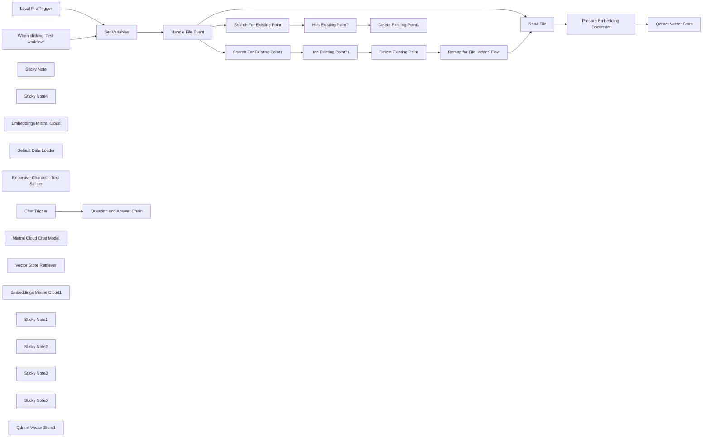

## Fluxo (.json) :

```json
{
  "meta": {
    "instanceId": "26ba763460b97c249b82942b23b6384876dfeb9327513332e743c5f6219c2b8e"
  },
  "nodes": [
    {
      "id": "c5525f47-4d91-4b98-87bb-566b90da64a1",
      "name": "Local File Trigger",
      "type": "n8n-nodes-base.localFileTrigger",
      "position": [
        660,
        700
      ],
      "parameters": {
        "path": "/home/node/host_mount/local_file_search",
        "events": [
          "add",
          "change",
          "unlink"
        ],
        "options": {
          "awaitWriteFinish": true
        },
        "triggerOn": "folder"
      },
      "typeVersion": 1
    },
    {
      "id": "804334d6-e34d-40d1-9555-b331ffe66f6f",
      "name": "When clicking \"Test workflow\"",
      "type": "n8n-nodes-base.manualTrigger",
      "position": [
        664.5766613599001,
        881.8474780113352
      ],
      "parameters": {},
      "typeVersion": 1
    },
    {
      "id": "7ab0e284-b667-4d1f-8ceb-fb05e4081a06",
      "name": "Set Variables",
      "type": "n8n-nodes-base.set",
      "position": [
        840,
        700
      ],
      "parameters": {
        "options": {},
        "assignments": {
          "assignments": [
            {
              "id": "35ea70c4-8669-4975-a68d-bbaa094713c0",
              "name": "directory",
              "type": "string",
              "value": "/home/node/BankStatements"
            },
            {
              "id": "1d081d19-ff4e-462a-9cbe-7af2244bf87f",
              "name": "file_added",
              "type": "string",
              "value": "={{ $json.event === 'add' && $json.path || ''}}"
            },
            {
              "id": "18f8dc03-51ca-48c7-947f-87ce8e1979bf",
              "name": "file_changed",
              "type": "string",
              "value": "={{ $json.event === 'change' && $json.path || '' }}"
            },
            {
              "id": "65074ff7-037b-4b3b-b2c3-8a61755ab43b",
              "name": "file_deleted",
              "type": "string",
              "value": "={{ $json.event === 'unlink' && $json.path || '' }}"
            },
            {
              "id": "9a1902e7-f94d-4d1f-9006-91c67354d3e8",
              "name": "qdrant_collection",
              "type": "string",
              "value": "local_file_search"
            }
          ]
        }
      },
      "typeVersion": 3.3
    },
    {
      "id": "76173972-ceca-43a4-b85f-00b41f774304",
      "name": "Sticky Note",
      "type": "n8n-nodes-base.stickyNote",
      "position": [
        580,
        460
      ],
      "parameters": {
        "color": 7,
        "width": 665.0909497859384,
        "height": 596.8351502261468,
        "content": "## Step 1. Select the target folder\n[Read more about local file trigger](https://docs.n8n.io/integrations/builtin/core-nodes/n8n-nodes-base.localfiletrigger)\n\nIn this workflow, we'll monitor a specific folder on disk that n8n has access to. Since we're using docker, we can either use the n8n volume or mount a folder from the host machine.\n\nThe local file trigger is useful to execute the workflow whenever changes are made to our target folder."
      },
      "typeVersion": 1
    },
    {
      "id": "eda839f7-dde4-4d1f-9fe6-692df4ac7282",
      "name": "Sticky Note4",
      "type": "n8n-nodes-base.stickyNote",
      "position": [
        184.57666135990007,
        461.84747801133517
      ],
      "parameters": {
        "width": 372.51107341403605,
        "height": 356.540665091993,
        "content": "## Try It Out!\n### This workflow does the following:\n* Monitors a target folder for changes using the local file trigger\n* Synchronises files in the target folder with their vectors in Qdrant\n* Mistral AI is used to create a Q&A AI agent on all files in the target folder\n\n### Need Help?\nJoin the [Discord](https://discord.com/invite/XPKeKXeB7d) or ask in the [Forum](https://community.n8n.io/)!\n\nHappy Hacking!"
      },
      "typeVersion": 1
    },
    {
      "id": "f82f6de0-af8f-4fdf-a733-f59ba4fed02f",
      "name": "Read File",
      "type": "n8n-nodes-base.readWriteFile",
      "position": [
        1340,
        1120
      ],
      "parameters": {
        "options": {},
        "fileSelector": "={{ $json.file_added }}"
      },
      "typeVersion": 1
    },
    {
      "id": "7354a080-051b-479f-97b1-49cc0c14c9d8",
      "name": "Embeddings Mistral Cloud",
      "type": "@n8n/n8n-nodes-langchain.embeddingsMistralCloud",
      "position": [
        1720,
        1280
      ],
      "parameters": {
        "options": {}
      },
      "credentials": {
        "mistralCloudApi": {
          "id": "EIl2QxhXAS9Hkg37",
          "name": "Mistral Cloud account"
        }
      },
      "typeVersion": 1
    },
    {
      "id": "a1ad45ff-a882-4aed-82e2-cad2483cf4e8",
      "name": "Default Data Loader",
      "type": "@n8n/n8n-nodes-langchain.documentDefaultDataLoader",
      "position": [
        1820,
        1280
      ],
      "parameters": {
        "options": {
          "metadata": {
            "metadataValues": [
              {
                "name": "filter_by_filename",
                "value": "={{ $json.file_location }}"
              },
              {
                "name": "filter_by_created_month",
                "value": "={{ $now.year + '-' + $now.monthShort }}"
              },
              {
                "name": "filter_by_created_week",
                "value": "={{ $now.year + '-' + $now.monthShort + '-W' + $now.weekNumber }}"
              }
            ]
          }
        },
        "jsonData": "={{ $json.data }}",
        "jsonMode": "expressionData"
      },
      "typeVersion": 1
    },
    {
      "id": "0b0e29b9-8873-4074-94dc-9f0364c28835",
      "name": "Recursive Character Text Splitter",
      "type": "@n8n/n8n-nodes-langchain.textSplitterRecursiveCharacterTextSplitter",
      "position": [
        1840,
        1400
      ],
      "parameters": {
        "options": {}
      },
      "typeVersion": 1
    },
    {
      "id": "c0555ba6-a1bd-4aa9-a340-a9c617f8e6db",
      "name": "Prepare Embedding Document",
      "type": "n8n-nodes-base.set",
      "position": [
        1520,
        1120
      ],
      "parameters": {
        "options": {},
        "assignments": {
          "assignments": [
            {
              "id": "41a1d4ca-e5a5-4fb9-b249-8796ae759b33",
              "name": "data",
              "type": "string",
              "value": "=## file location\n{{ [$json.directory, $json.fileName].join('/') }}\n## file created\n{{ $now.toISO() }}\n## file contents\n{{ $input.item.binary.data.data.base64Decode() }}"
            },
            {
              "id": "c091704d-b81c-448b-8c90-156ef568b871",
              "name": "file_location",
              "type": "string",
              "value": "={{ [$json.directory, $json.fileName].join('/') }}"
            }
          ]
        }
      },
      "typeVersion": 3.3
    },
    {
      "id": "ffe8c363-0809-4d21-aa8f-34b0fc2dc57f",
      "name": "Chat Trigger",
      "type": "@n8n/n8n-nodes-langchain.chatTrigger",
      "position": [
        2280,
        680
      ],
      "webhookId": "37587fe0-b8db-4012-90a7-1f65b9bfd0df",
      "parameters": {},
      "typeVersion": 1
    },
    {
      "id": "8d958669-60be-4bb2-80fc-2a6c7c7bfae6",
      "name": "Question and Answer Chain",
      "type": "@n8n/n8n-nodes-langchain.chainRetrievalQa",
      "position": [
        2500,
        680
      ],
      "parameters": {},
      "typeVersion": 1.3
    },
    {
      "id": "f143e438-8176-4923-a866-3f9a2a16793d",
      "name": "Mistral Cloud Chat Model",
      "type": "@n8n/n8n-nodes-langchain.lmChatMistralCloud",
      "position": [
        2500,
        840
      ],
      "parameters": {
        "model": "mistral-small-2402",
        "options": {}
      },
      "credentials": {
        "mistralCloudApi": {
          "id": "EIl2QxhXAS9Hkg37",
          "name": "Mistral Cloud account"
        }
      },
      "typeVersion": 1
    },
    {
      "id": "06dd8f4c-3b66-43e0-85c8-ec222e275f87",
      "name": "Vector Store Retriever",
      "type": "@n8n/n8n-nodes-langchain.retrieverVectorStore",
      "position": [
        2620,
        840
      ],
      "parameters": {},
      "typeVersion": 1
    },
    {
      "id": "2fdabcb5-a7a7-4e02-8c1b-9190e2e52385",
      "name": "Embeddings Mistral Cloud1",
      "type": "@n8n/n8n-nodes-langchain.embeddingsMistralCloud",
      "position": [
        2620,
        1080
      ],
      "parameters": {
        "options": {}
      },
      "credentials": {
        "mistralCloudApi": {
          "id": "EIl2QxhXAS9Hkg37",
          "name": "Mistral Cloud account"
        }
      },
      "typeVersion": 1
    },
    {
      "id": "e5664534-de07-481f-87dd-68d7d0715baa",
      "name": "Remap for File_Added Flow",
      "type": "n8n-nodes-base.set",
      "position": [
        1920,
        700
      ],
      "parameters": {
        "options": {},
        "assignments": {
          "assignments": [
            {
              "id": "840219e1-ed47-4b00-83fd-6b3c0bd71650",
              "name": "file_added",
              "type": "string",
              "value": "={{ $('Set Variables').item.json.file_changed }}"
            }
          ]
        }
      },
      "typeVersion": 3.3
    },
    {
      "id": "1fd14832-aafe-4d72-b4f2-7afc72df97dc",
      "name": "Search For Existing Point",
      "type": "n8n-nodes-base.httpRequest",
      "position": [
        1340,
        280
      ],
      "parameters": {
        "url": "=http://qdrant:6333/collections/{{ $('Set Variables').item.json.qdrant_collection }}/points/scroll",
        "method": "POST",
        "options": {},
        "jsonBody": "={\n \"filter\": {\n \"must\": [\n {\n \"key\": \"metadata.filter_by_filename\",\n \"match\": {\n \"value\": \"{{ $json.file_changed }}\"\n }\n }\n ]\n },\n \"limit\": 1,\n \"with_payload\": false,\n \"with_vector\": false\n}",
        "sendBody": true,
        "specifyBody": "json",
        "authentication": "predefinedCredentialType",
        "nodeCredentialType": "qdrantApi"
      },
      "credentials": {
        "qdrantApi": {
          "id": "NyinAS3Pgfik66w5",
          "name": "QdrantApi account"
        }
      },
      "typeVersion": 4.2
    },
    {
      "id": "b5fa817f-82d6-41dd-9817-4c1dd9137b76",
      "name": "Has Existing Point?",
      "type": "n8n-nodes-base.if",
      "position": [
        1520,
        280
      ],
      "parameters": {
        "options": {},
        "conditions": {
          "options": {
            "leftValue": "",
            "caseSensitive": true,
            "typeValidation": "strict"
          },
          "combinator": "and",
          "conditions": [
            {
              "id": "0392bac0-8fb5-406b-b59f-575edf5ab30d",
              "operator": {
                "type": "array",
                "operation": "notEmpty",
                "singleValue": true
              },
              "leftValue": "={{ $json.result.points }}",
              "rightValue": ""
            }
          ]
        }
      },
      "typeVersion": 2
    },
    {
      "id": "b0fa4fa4-5d1b-4a12-b8ba-a10d71f31f94",
      "name": "Delete Existing Point",
      "type": "n8n-nodes-base.httpRequest",
      "position": [
        1720,
        700
      ],
      "parameters": {
        "url": "=http://qdrant:6333/collections/{{ $('Set Variables').item.json.qdrant_collection }}/points/delete",
        "method": "POST",
        "options": {},
        "sendBody": true,
        "authentication": "predefinedCredentialType",
        "bodyParameters": {
          "parameters": [
            {
              "name": "points",
              "value": "={{ $json.result.points.map(point => point.id) }}"
            }
          ]
        },
        "nodeCredentialType": "qdrantApi"
      },
      "credentials": {
        "qdrantApi": {
          "id": "NyinAS3Pgfik66w5",
          "name": "QdrantApi account"
        }
      },
      "typeVersion": 4.2
    },
    {
      "id": "5408adfe-4d6b-407c-aac7-e87c9b1a1592",
      "name": "Search For Existing Point1",
      "type": "n8n-nodes-base.httpRequest",
      "position": [
        1340,
        700
      ],
      "parameters": {
        "url": "=http://qdrant:6333/collections/{{ $('Set Variables').item.json.qdrant_collection }}/points/scroll",
        "method": "POST",
        "options": {},
        "jsonBody": "={\n \"filter\": {\n \"must\": [\n {\n \"key\": \"metadata.filter_by_filename\",\n \"match\": {\n \"value\": \"{{ $json.file_changed }}\"\n }\n }\n ]\n },\n \"limit\": 1,\n \"with_payload\": false,\n \"with_vector\": false\n}",
        "sendBody": true,
        "specifyBody": "json",
        "authentication": "predefinedCredentialType",
        "nodeCredentialType": "qdrantApi"
      },
      "credentials": {
        "qdrantApi": {
          "id": "NyinAS3Pgfik66w5",
          "name": "QdrantApi account"
        }
      },
      "typeVersion": 4.2
    },
    {
      "id": "fac43587-0d24-4d6e-a0d5-8cc8f9615967",
      "name": "Has Existing Point?1",
      "type": "n8n-nodes-base.if",
      "position": [
        1520,
        700
      ],
      "parameters": {
        "options": {},
        "conditions": {
          "options": {
            "leftValue": "",
            "caseSensitive": true,
            "typeValidation": "strict"
          },
          "combinator": "and",
          "conditions": [
            {
              "id": "0392bac0-8fb5-406b-b59f-575edf5ab30d",
              "operator": {
                "type": "array",
                "operation": "notEmpty",
                "singleValue": true
              },
              "leftValue": "={{ $json.result.points }}",
              "rightValue": ""
            }
          ]
        }
      },
      "typeVersion": 2
    },
    {
      "id": "010baacd-fac1-4cc1-86bf-9d6ef11916fe",
      "name": "Delete Existing Point1",
      "type": "n8n-nodes-base.httpRequest",
      "position": [
        1700,
        280
      ],
      "parameters": {
        "url": "=http://qdrant:6333/collections/{{ $('Set Variables').item.json.qdrant_collection }}/points/delete",
        "method": "POST",
        "options": {},
        "sendBody": true,
        "authentication": "predefinedCredentialType",
        "bodyParameters": {
          "parameters": [
            {
              "name": "points",
              "value": "={{ $json.result.points.map(point => point.id) }}"
            }
          ]
        },
        "nodeCredentialType": "qdrantApi"
      },
      "credentials": {
        "qdrantApi": {
          "id": "NyinAS3Pgfik66w5",
          "name": "QdrantApi account"
        }
      },
      "typeVersion": 4.2
    },
    {
      "id": "2d6fb29c-2fac-41de-9ad0-cc781b246378",
      "name": "Handle File Event",
      "type": "n8n-nodes-base.switch",
      "position": [
        1000,
        700
      ],
      "parameters": {
        "rules": {
          "values": [
            {
              "outputKey": "file_deleted",
              "conditions": {
                "options": {
                  "leftValue": "",
                  "caseSensitive": true,
                  "typeValidation": "strict"
                },
                "combinator": "and",
                "conditions": [
                  {
                    "id": "a1f6d86a-9805-4d0e-ac70-90c9cf0ad339",
                    "operator": {
                      "type": "string",
                      "operation": "notEmpty",
                      "singleValue": true
                    },
                    "leftValue": "={{ $json.file_deleted }}",
                    "rightValue": ""
                  }
                ]
              },
              "renameOutput": true
            },
            {
              "outputKey": "file_changed",
              "conditions": {
                "options": {
                  "leftValue": "",
                  "caseSensitive": true,
                  "typeValidation": "strict"
                },
                "combinator": "and",
                "conditions": [
                  {
                    "id": "d15cde67-b5b0-4676-b4fb-ead749147392",
                    "operator": {
                      "type": "string",
                      "operation": "notEmpty",
                      "singleValue": true
                    },
                    "leftValue": "={{ $json.file_changed }}",
                    "rightValue": ""
                  }
                ]
              },
              "renameOutput": true
            },
            {
              "outputKey": "file_added",
              "conditions": {
                "options": {
                  "leftValue": "",
                  "caseSensitive": true,
                  "typeValidation": "strict"
                },
                "combinator": "and",
                "conditions": [
                  {
                    "operator": {
                      "type": "string",
                      "operation": "notEmpty",
                      "singleValue": true
                    },
                    "leftValue": "={{ $json.file_added }}",
                    "rightValue": ""
                  }
                ]
              },
              "renameOutput": true
            }
          ]
        },
        "options": {}
      },
      "typeVersion": 3
    },
    {
      "id": "da91b2aa-613c-4e3e-af83-fbd3bb7e922e",
      "name": "Sticky Note1",
      "type": "n8n-nodes-base.stickyNote",
      "position": [
        1280,
        123.92779403575491
      ],
      "parameters": {
        "color": 7,
        "width": 847.032584995578,
        "height": 335.8400964393443,
        "content": "## Step 2. When files are removed, the vector point is cleared.\n[Learn how to delete points using the Qdrant API](https://qdrant.tech/documentation/concepts/points/#delete-points)\n\nTo keep our vectorstore relevant, we'll implement a simple synchronisation system whereby documents deleted from the local file folder are also purged from Qdrant. This can be simply achieved using Qdrant APIs."
      },
      "typeVersion": 1
    },
    {
      "id": "2f9f5b2b-6504-4b27-a0c4-f3373df352df",
      "name": "Sticky Note2",
      "type": "n8n-nodes-base.stickyNote",
      "position": [
        1280,
        480
      ],
      "parameters": {
        "color": 7,
        "width": 855.9952607674757,
        "height": 433.01782147687817,
        "content": "## Step 3. When files are updated, the vector point is updated.\n[Learn how to delete points using the Qdrant API](https://qdrant.tech/documentation/concepts/points/#delete-points)\n\nSimilarly to the files deleted branch, when we encounter a change in a file we'll update the matching vector point in Qdrant to ensure our vector store stays relevant. Here, we can achieve this my deleting the existing vector point and creating it anew with the updated bank statement."
      },
      "typeVersion": 1
    },
    {
      "id": "38128b7f-d0f2-405c-a7de-662df812c344",
      "name": "Sticky Note3",
      "type": "n8n-nodes-base.stickyNote",
      "position": [
        1280,
        940
      ],
      "parameters": {
        "color": 7,
        "width": 846.8204626627492,
        "height": 629.9714759033081,
        "content": "## Step 4. When new files are added, add them to Qdrant Vectorstore.\n[Read more about the Qdrant node](https://docs.n8n.io/integrations/builtin/cluster-nodes/root-nodes/n8n-nodes-langchain.vectorstoreqdrant)\n\nUsing Qdrant, we'll able to create a simple yet powerful RAG based application for our bank statements. One of Qdrant's most powerful features is its filtering system, we'll use it to manage the synchronisation of our local file system and Qdrant."
      },
      "typeVersion": 1
    },
    {
      "id": "e85e2a30-e775-42fe-a12a-ac5de4eb4673",
      "name": "Sticky Note5",
      "type": "n8n-nodes-base.stickyNote",
      "position": [
        2180,
        491.43199269284935
      ],
      "parameters": {
        "color": 7,
        "width": 744.4578330639196,
        "height": 759.7908149448928,
        "content": "## Step 5. Create AI Agent expert on historic bank statements \n[Read more about the Question & Answer Chain](https://docs.n8n.io/integrations/builtin/cluster-nodes/root-nodes/n8n-nodes-langchain.chainretrievalqa)\n\nFinally, let's use a Question & Answer AI node to combine the Mistral AI model and Qdrant as the vector store retriever to create a local expert for all our bank statements questions. "
      },
      "typeVersion": 1
    },
    {
      "id": "7b29b0b9-ffee-4456-b036-9b39400d2b31",
      "name": "Qdrant Vector Store",
      "type": "@n8n/n8n-nodes-langchain.vectorStoreQdrant",
      "position": [
        1700,
        1120
      ],
      "parameters": {
        "mode": "insert",
        "options": {},
        "qdrantCollection": {
          "__rl": true,
          "mode": "id",
          "value": "={{ $('Set Variables').item.json.qdrant_collection }}"
        }
      },
      "credentials": {
        "qdrantApi": {
          "id": "NyinAS3Pgfik66w5",
          "name": "QdrantApi account"
        }
      },
      "typeVersion": 1
    },
    {
      "id": "1857bebb-b492-415e-96c8-235329bfd28a",
      "name": "Qdrant Vector Store1",
      "type": "@n8n/n8n-nodes-langchain.vectorStoreQdrant",
      "position": [
        2620,
        960
      ],
      "parameters": {
        "qdrantCollection": {
          "__rl": true,
          "mode": "id",
          "value": "BankStatements"
        }
      },
      "credentials": {
        "qdrantApi": {
          "id": "NyinAS3Pgfik66w5",
          "name": "QdrantApi account"
        }
      },
      "typeVersion": 1
    }
  ],
  "pinData": {},
  "connections": {
    "Read File": {
      "main": [
        [
          {
            "node": "Prepare Embedding Document",
            "type": "main",
            "index": 0
          }
        ]
      ]
    },
    "Chat Trigger": {
      "main": [
        [
          {
            "node": "Question and Answer Chain",
            "type": "main",
            "index": 0
          }
        ]
      ]
    },
    "Set Variables": {
      "main": [
        [
          {
            "node": "Handle File Event",
            "type": "main",
            "index": 0
          }
        ]
      ]
    },
    "Handle File Event": {
      "main": [
        [
          {
            "node": "Search For Existing Point",
            "type": "main",
            "index": 0
          }
        ],
        [
          {
            "node": "Search For Existing Point1",
            "type": "main",
            "index": 0
          }
        ],
        [
          {
            "node": "Read File",
            "type": "main",
            "index": 0
          }
        ]
      ]
    },
    "Local File Trigger": {
      "main": [
        [
          {
            "node": "Set Variables",
            "type": "main",
            "index": 0
          }
        ]
      ]
    },
    "Default Data Loader": {
      "ai_document": [
        [
          {
            "node": "Qdrant Vector Store",
            "type": "ai_document",
            "index": 0
          }
        ]
      ]
    },
    "Has Existing Point?": {
      "main": [
        [
          {
            "node": "Delete Existing Point1",
            "type": "main",
            "index": 0
          }
        ]
      ]
    },
    "Has Existing Point?1": {
      "main": [
        [
          {
            "node": "Delete Existing Point",
            "type": "main",
            "index": 0
          }
        ]
      ]
    },
    "Qdrant Vector Store1": {
      "ai_vectorStore": [
        [
          {
            "node": "Vector Store Retriever",
            "type": "ai_vectorStore",
            "index": 0
          }
        ]
      ]
    },
    "Delete Existing Point": {
      "main": [
        [
          {
            "node": "Remap for File_Added Flow",
            "type": "main",
            "index": 0
          }
        ]
      ]
    },
    "Vector Store Retriever": {
      "ai_retriever": [
        [
          {
            "node": "Question and Answer Chain",
            "type": "ai_retriever",
            "index": 0
          }
        ]
      ]
    },
    "Embeddings Mistral Cloud": {
      "ai_embedding": [
        [
          {
            "node": "Qdrant Vector Store",
            "type": "ai_embedding",
            "index": 0
          }
        ]
      ]
    },
    "Mistral Cloud Chat Model": {
      "ai_languageModel": [
        [
          {
            "node": "Question and Answer Chain",
            "type": "ai_languageModel",
            "index": 0
          }
        ]
      ]
    },
    "Embeddings Mistral Cloud1": {
      "ai_embedding": [
        [
          {
            "node": "Qdrant Vector Store1",
            "type": "ai_embedding",
            "index": 0
          }
        ]
      ]
    },
    "Remap for File_Added Flow": {
      "main": [
        [
          {
            "node": "Read File",
            "type": "main",
            "index": 0
          }
        ]
      ]
    },
    "Search For Existing Point": {
      "main": [
        [
          {
            "node": "Has Existing Point?",
            "type": "main",
            "index": 0
          }
        ]
      ]
    },
    "Prepare Embedding Document": {
      "main": [
        [
          {
            "node": "Qdrant Vector Store",
            "type": "main",
            "index": 0
          }
        ]
      ]
    },
    "Search For Existing Point1": {
      "main": [
        [
          {
            "node": "Has Existing Point?1",
            "type": "main",
            "index": 0
          }
        ]
      ]
    },
    "When clicking \"Test workflow\"": {
      "main": [
        [
          {
            "node": "Set Variables",
            "type": "main",
            "index": 0
          }
        ]
      ]
    },
    "Recursive Character Text Splitter": {
      "ai_textSplitter": [
        [
          {
            "node": "Default Data Loader",
            "type": "ai_textSplitter",
            "index": 0
          }
        ]
      ]
    }
  }
}
```

<a id="template-1182"></a>

## Template 1182 - Log de erros com controle de alertas

- **Nome:** Log de erros com controle de alertas
- **Descrição:** Registra detalhes de erros em banco de dados e evita envio excessivo de notificações, permitindo uma notificação a cada 5 minutos quando necessário.
- **Funcionalidade:** • Recepção de eventos de erro: Aceita eventos de erro para iniciar o fluxo ou pode ser chamado como sub-fluxo.
• Registro completo em banco: Insere registro com URL, stack, mensagem, último nó executado, nome do workflow e JSON completo com timestamp.
• Contagem de ocorrências recentes: Consulta o número de logs gerados nos últimos 5 minutos para avaliação de disparo de alertas.
• Limitação de alertas: Só envia notificações se não houver logs nos últimos 5 minutos, evitando excesso de emails/push durante surtos de erro.
• Envio de notificações configuráveis: Suporte a envio de e-mail principal, e-mail de fallback e notificação push (opcionais/ativáveis).
• Modo sub-fluxo e integração: Pode ser integrado antes do tratamento de erro principal ou chamado como sub-rotina dedicada.
• Limpeza/rotina manual: Opção para truncar/limpar a tabela de logs, útil em ambientes de desenvolvimento.
- **Ferramentas:** • PostgreSQL: Banco de dados relacional usado para armazenar registros de erro, executar contagens por período e limpar a tabela.
• Servidor SMTP / Serviço de e-mail: Envia notificações por e-mail (principal e fallback) para alertar responsáveis.
• Pushover (ou serviço de push): Serviço de envio de notificações móveis para alertas em dispositivos.

## Fluxo visual

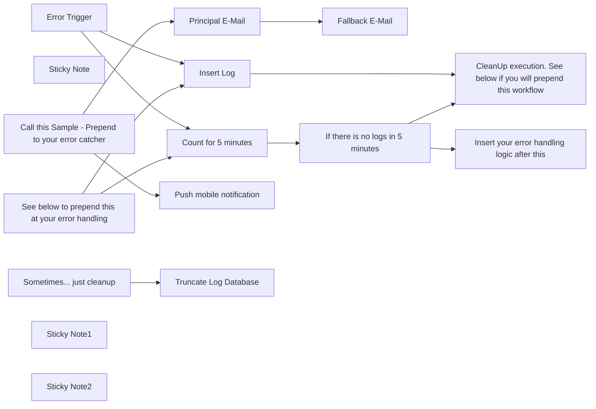

## Fluxo (.json) :

```json
{
  "id": "YybYYc430rmZWJPJ",
  "meta": {
    "instanceId": "febfa0961d1e55a48938f0337f348b73a50538aa16673607611ead85d95f662c",
    "templateCredsSetupCompleted": true
  },
  "name": "Log errors and avoid sending too many emails",
  "tags": [
    {
      "id": "7YoU4oTsaGGEtWJj",
      "name": "sample",
      "createdAt": "2025-01-31T16:41:27.407Z",
      "updatedAt": "2025-01-31T16:41:27.407Z"
    }
  ],
  "nodes": [
    {
      "id": "0e44df4c-00d2-4545-89ae-844a590de369",
      "name": "Error Trigger",
      "type": "n8n-nodes-base.errorTrigger",
      "position": [
        -1200,
        90
      ],
      "parameters": {},
      "typeVersion": 1
    },
    {
      "id": "7101542a-5146-4917-a1f2-13686cad197e",
      "name": "Insert Log",
      "type": "n8n-nodes-base.postgres",
      "position": [
        -980,
        40
      ],
      "parameters": {
        "table": {
          "__rl": true,
          "mode": "list",
          "value": "N8Err",
          "cachedResultName": "N8Err"
        },
        "schema": {
          "__rl": true,
          "mode": "name",
          "value": "p1gq6ljdsam3x1m"
        },
        "columns": {
          "value": {
            "URL": "={{ $json.execution.url }}",
            "json": "={{ JSON.stringify($json) }}",
            "Stack": "={{ $json.execution.error.stack }}",
            "title": "={{ $json.workflow.name }}",
            "Message": "={{ $json.execution.error.message }}",
            "LastNode": "={{ $json.execution.lastNodeExecuted }}",
            "created_at": "={{ $now }}"
          },
          "schema": [
            {
              "id": "id",
              "type": "number",
              "display": true,
              "removed": true,
              "required": false,
              "displayName": "id",
              "defaultMatch": true,
              "canBeUsedToMatch": true
            },
            {
              "id": "created_at",
              "type": "dateTime",
              "display": true,
              "required": false,
              "displayName": "created_at",
              "defaultMatch": false,
              "canBeUsedToMatch": true
            },
            {
              "id": "updated_at",
              "type": "dateTime",
              "display": true,
              "removed": true,
              "required": false,
              "displayName": "updated_at",
              "defaultMatch": false,
              "canBeUsedToMatch": true
            },
            {
              "id": "created_by",
              "type": "string",
              "display": true,
              "removed": true,
              "required": false,
              "displayName": "created_by",
              "defaultMatch": false,
              "canBeUsedToMatch": true
            },
            {
              "id": "updated_by",
              "type": "string",
              "display": true,
              "removed": true,
              "required": false,
              "displayName": "updated_by",
              "defaultMatch": false,
              "canBeUsedToMatch": true
            },
            {
              "id": "nc_order",
              "type": "number",
              "display": true,
              "removed": true,
              "required": false,
              "displayName": "nc_order",
              "defaultMatch": false,
              "canBeUsedToMatch": true
            },
            {
              "id": "title",
              "type": "string",
              "display": true,
              "required": false,
              "displayName": "title",
              "defaultMatch": false,
              "canBeUsedToMatch": true
            },
            {
              "id": "URL",
              "type": "string",
              "display": true,
              "required": false,
              "displayName": "URL",
              "defaultMatch": false,
              "canBeUsedToMatch": true
            },
            {
              "id": "Stack",
              "type": "string",
              "display": true,
              "required": false,
              "displayName": "Stack",
              "defaultMatch": false,
              "canBeUsedToMatch": true
            },
            {
              "id": "json",
              "type": "object",
              "display": true,
              "required": false,
              "displayName": "json",
              "defaultMatch": false,
              "canBeUsedToMatch": true
            },
            {
              "id": "Message",
              "type": "string",
              "display": true,
              "required": false,
              "displayName": "Message",
              "defaultMatch": false,
              "canBeUsedToMatch": true
            },
            {
              "id": "LastNode",
              "type": "string",
              "display": true,
              "required": false,
              "displayName": "LastNode",
              "defaultMatch": false,
              "canBeUsedToMatch": true
            }
          ],
          "mappingMode": "defineBelow",
          "matchingColumns": [
            "id"
          ],
          "attemptToConvertTypes": false,
          "convertFieldsToString": false
        },
        "options": {}
      },
      "credentials": {
        "postgres": {
          "id": "2VsRB7eDnG0FA3z2",
          "name": "Postgres Nocodb"
        }
      },
      "typeVersion": 2.6
    },
    {
      "id": "8fb1201c-353e-466c-8d08-fd969e6b10b1",
      "name": "Count for 5 minutes",
      "type": "n8n-nodes-base.postgres",
      "position": [
        -980,
        -210
      ],
      "parameters": {
        "query": "SELECT count(*) FROM p1gq6ljdsam3x1m.\"N8Err\" where created_at >= $1;\n",
        "options": {
          "queryReplacement": "={{ $now.minus(5, 'minutes').toString() }}"
        },
        "operation": "executeQuery"
      },
      "credentials": {
        "postgres": {
          "id": "2VsRB7eDnG0FA3z2",
          "name": "Postgres Nocodb"
        }
      },
      "typeVersion": 2.6
    },
    {
      "id": "89f836dc-8141-4c20-a758-bf7ff261a87b",
      "name": "Sticky Note",
      "type": "n8n-nodes-base.stickyNote",
      "position": [
        -2260,
        -300
      ],
      "parameters": {
        "color": 5,
        "width": 820,
        "height": 1140,
        "content": "# Log errors and avoid sending too many emails\n\n## Use case\n\nMost of the time, it’s necessary to log all errors that occur. However, in some cases, a scheduled task or service consuming excessive resources might trigger a surge of errors.\n\nTo address this, we can log all errors but limit alerts to a maximum of one notification every 5 minutes.\n\n## What this workflow does\n\nThis workflow can be configured to receive error events, or you can integrate it **before your own error-handling logic.**  \n\nIf used as the **primary error handler**, note that this flow will **only add a database log entry** and take no further action. You’ll need to add your own alerts (e.g., email or push notifications). Below is an example of a notification setup I prefer to use.  \n\nAt the end, there’s an **error cleanup** option. This feature is particularly useful in development environments.  \n\nIf you already have an error-handling workflow, you can call this one as a **sub-workflow**. Its final steps include cleanup logic to reset the execution state and terminate the workflow.\n\n## Setup\n\n**Verify all Postgres nodes and credentials when using the 'Error Handling Sample'**\n\n## How to adjust it to your needs\n\n1) You can set this workflow as a sub-workflow within your existing error-handling setup.\n\n2) Alternatively, you can add the \"Error Handling Sample\" at the end of this workflow, which sends email and push notifications.\n\nConfiguration Requirements:\n\n⚠️ You must create a database table for this to work!\n\n\n\nDDL of this sample:\n\ncreate table p1gq6ljdsam3x1m.\"N8Err\"\n(\n    id         serial\n        primary key,\n    created_at timestamp,\n    updated_at timestamp,\n    created_by varchar,\n    updated_by varchar,\n    nc_order   numeric,\n    title      text,\n    \"URL\"      text,\n    \"Stack\"    text,\n    json       json,\n    \"Message\"  text,\n    \"LastNode\" text\n);\n\nalter table p1gq6ljdsam3x1m.\"N8Err\"\n    owner to postgres;\n\ncreate index \"N8Err_order_idx\"\n    on p1gq6ljdsam3x1m.\"N8Err\" (nc_order);\n\nby Davi Saranszky Mesquita\nhttps://www.linkedin.com/in/mesquitadavi/"
      },
      "typeVersion": 1
    },
    {
      "id": "fba7fec5-5285-46bd-9cc7-270b7dcc8c5f",
      "name": "Principal E-Mail",
      "type": "n8n-nodes-base.emailSend",
      "onError": "continueErrorOutput",
      "disabled": true,
      "position": [
        -980,
        350
      ],
      "webhookId": "d76d2e82-b0a8-4e35-88f9-1815d4ce6c79",
      "parameters": {
        "text": "={{ $(\"Error Trigger\").item.json.execution.url }}\n\n{{ $(\"Error Trigger\").item.json.execution.lastNodeExecuted }}\n\n{{ $(\"Error Trigger\").item.json.execution.error.message }}\n{{ $(\"Error Trigger\").item.json.execution.error.stack }}",
        "options": {
          "appendAttribution": false
        },
        "subject": "=Erro -  {{ $(\"Error Trigger\").item.json.workflow.name }}",
        "toEmail": "davimesquita@gmail.com",
        "fromEmail": "suporte@ideias.casa",
        "emailFormat": "text"
      },
      "credentials": {
        "smtp": {
          "id": "0YIoKeISQNR2kxwO",
          "name": "SMTP Resent"
        }
      },
      "typeVersion": 2.1
    },
    {
      "id": "979d0e82-42e8-450a-95b1-3c204ad61a50",
      "name": "Fallback E-Mail",
      "type": "n8n-nodes-base.emailSend",
      "disabled": true,
      "position": [
        -760,
        350
      ],
      "webhookId": "d76d2e82-b0a8-4e35-88f9-1815d4ce6c79",
      "parameters": {
        "text": "={{ $(\"Error Trigger\").item.json.execution.url }}\n\n{{ $(\"Error Trigger\").item.json.execution.lastNodeExecuted }}\n\n{{ $(\"Error Trigger\").item.json.execution.error.message }}\n{{ $(\"Error Trigger\").item.json.execution.error.stack }}",
        "options": {
          "appendAttribution": false
        },
        "subject": "=Erro -  {{ $(\"Error Trigger\").item.json.workflow.name }}",
        "toEmail": "davimesquita@gmail.com",
        "fromEmail": "contato@ideias.casa",
        "emailFormat": "text"
      },
      "credentials": {
        "smtp": {
          "id": "UvWloRL7Jyqt8tm9",
          "name": "SMTP Contato"
        }
      },
      "typeVersion": 2.1
    },
    {
      "id": "6c073c03-e00e-45b1-8f14-faa29fd58472",
      "name": "Push mobile notification",
      "type": "n8n-nodes-base.pushover",
      "disabled": true,
      "position": [
        -980,
        550
      ],
      "parameters": {
        "message": "={{ $(\"Error Trigger\").item.json.workflow.name }} - {{ $(\"Error Trigger\").item.json.execution.url }}\n\n{{ $(\"Error Trigger\").item.json.execution.lastNodeExecuted }}\n\n{{ $(\"Error Trigger\").item.json.execution.error.message }}\n{{ $(\"Error Trigger\").item.json.execution.error.stack }}",
        "userKey": "=u4RMqXQR9EFdeSQBfaL1riBy1Qd953",
        "additionalFields": {}
      },
      "credentials": {
        "pushoverApi": {
          "id": "ae8Jsj87n2hSWDbs",
          "name": "Pushover account"
        }
      },
      "typeVersion": 1
    },
    {
      "id": "4ca939e4-dcb1-40bd-b5eb-4cd00cb403fb",
      "name": "Truncate Log Database",
      "type": "n8n-nodes-base.postgres",
      "position": [
        -980,
        810
      ],
      "parameters": {
        "table": {
          "__rl": true,
          "mode": "list",
          "value": "N8Err",
          "cachedResultName": "N8Err"
        },
        "schema": {
          "__rl": true,
          "mode": "list",
          "value": "p1gq6ljdsam3x1m",
          "cachedResultName": "p1gq6ljdsam3x1m"
        },
        "options": {},
        "operation": "deleteTable",
        "restartSequences": true
      },
      "credentials": {
        "postgres": {
          "id": "2VsRB7eDnG0FA3z2",
          "name": "Postgres Nocodb"
        }
      },
      "typeVersion": 2.6
    },
    {
      "id": "1eaf67ca-fb77-4b76-8ee3-ae65d4b79182",
      "name": "Sometimes... just cleanup",
      "type": "n8n-nodes-base.manualTrigger",
      "position": [
        -1200,
        810
      ],
      "parameters": {},
      "typeVersion": 1
    },
    {
      "id": "01e5a7dd-41a2-43f1-bbf5-241e6791cf18",
      "name": "Call this Sample - Prepend to your error catcher",
      "type": "n8n-nodes-base.executeWorkflow",
      "disabled": true,
      "position": [
        -1200,
        450
      ],
      "parameters": {
        "options": {},
        "workflowId": {
          "__rl": true,
          "mode": "id",
          "value": ""
        }
      },
      "typeVersion": 1.2
    },
    {
      "id": "4386788d-5f10-468a-8a02-cff45a4a7ed5",
      "name": "See below to prepend this at your error handling",
      "type": "n8n-nodes-base.executeWorkflowTrigger",
      "position": [
        -1200,
        -260
      ],
      "parameters": {
        "inputSource": "passthrough"
      },
      "typeVersion": 1.1
    },
    {
      "id": "d6aed974-4a36-4edd-809d-867a95d0f6ef",
      "name": "If there is no logs in 5 minutes",
      "type": "n8n-nodes-base.if",
      "position": [
        -760,
        -210
      ],
      "parameters": {
        "options": {},
        "conditions": {
          "options": {
            "version": 2,
            "leftValue": "",
            "caseSensitive": true,
            "typeValidation": "loose"
          },
          "combinator": "and",
          "conditions": [
            {
              "id": "a17b915d-f581-4774-a78a-48bc386aebc9",
              "operator": {
                "type": "number",
                "operation": "lte"
              },
              "leftValue": "={{ $json.count }}",
              "rightValue": 0
            }
          ]
        },
        "looseTypeValidation": true
      },
      "typeVersion": 2.2
    },
    {
      "id": "3c49f611-f1a6-409a-a4c6-903dadb27165",
      "name": "CleanUp execution. See below if you will prepend this workflow",
      "type": "n8n-nodes-base.code",
      "position": [
        -540,
        -10
      ],
      "parameters": {
        "jsCode": "return [];"
      },
      "typeVersion": 2
    },
    {
      "id": "192443fc-c032-4815-acc7-c8cf6040cc34",
      "name": "Insert your error handling logic after this",
      "type": "n8n-nodes-base.noOp",
      "position": [
        -540,
        -260
      ],
      "parameters": {},
      "typeVersion": 1
    },
    {
      "id": "2f87907f-816f-4054-8517-bb713a203131",
      "name": "Sticky Note1",
      "type": "n8n-nodes-base.stickyNote",
      "position": [
        -1350,
        250
      ],
      "parameters": {
        "width": 840,
        "height": 460,
        "content": "# Error handling sample\n"
      },
      "typeVersion": 1
    },
    {
      "id": "b173898f-d1d8-4f83-b7b7-ba52cab7651e",
      "name": "Sticky Note2",
      "type": "n8n-nodes-base.stickyNote",
      "position": [
        -1610,
        630
      ],
      "parameters": {
        "width": 1140,
        "height": 340,
        "content": "# Database Cleanup: Useful in DEV, but DO NOT run in production"
      },
      "typeVersion": 1
    }
  ],
  "active": false,
  "pinData": {
    "Error Trigger": [
      {
        "json": {
          "workflow": {
            "id": "1",
            "name": "Example Workflow"
          },
          "execution": {
            "id": 231,
            "url": "https://work.ideias.casa/execution/workflow/1/231",
            "mode": "manual",
            "error": {
              "stack": "Stacktrace",
              "message": "Example Error Message"
            },
            "retryOf": "34",
            "lastNodeExecuted": "Node With Error"
          }
        }
      }
    ]
  },
  "settings": {
    "executionOrder": "v1"
  },
  "versionId": "07c6795a-f906-4e22-a15a-4f1984e540a3",
  "connections": {
    "Insert Log": {
      "main": [
        [
          {
            "node": "CleanUp execution. See below if you will prepend this workflow",
            "type": "main",
            "index": 0
          }
        ]
      ]
    },
    "Error Trigger": {
      "main": [
        [
          {
            "node": "Insert Log",
            "type": "main",
            "index": 0
          },
          {
            "node": "Count for 5 minutes",
            "type": "main",
            "index": 0
          }
        ]
      ]
    },
    "Principal E-Mail": {
      "main": [
        [],
        [
          {
            "node": "Fallback E-Mail",
            "type": "main",
            "index": 0
          }
        ]
      ]
    },
    "Count for 5 minutes": {
      "main": [
        [
          {
            "node": "If there is no logs in 5 minutes",
            "type": "main",
            "index": 0
          }
        ]
      ]
    },
    "Sometimes... just cleanup": {
      "main": [
        [
          {
            "node": "Truncate Log Database",
            "type": "main",
            "index": 0
          }
        ]
      ]
    },
    "If there is no logs in 5 minutes": {
      "main": [
        [
          {
            "node": "Insert your error handling logic after this",
            "type": "main",
            "index": 0
          }
        ],
        [
          {
            "node": "CleanUp execution. See below if you will prepend this workflow",
            "type": "main",
            "index": 0
          }
        ]
      ]
    },
    "Call this Sample - Prepend to your error catcher": {
      "main": [
        [
          {
            "node": "Principal E-Mail",
            "type": "main",
            "index": 0
          },
          {
            "node": "Push mobile notification",
            "type": "main",
            "index": 0
          }
        ]
      ]
    },
    "See below to prepend this at your error handling": {
      "main": [
        [
          {
            "node": "Insert Log",
            "type": "main",
            "index": 0
          },
          {
            "node": "Count for 5 minutes",
            "type": "main",
            "index": 0
          }
        ]
      ]
    },
    "CleanUp execution. See below if you will prepend this workflow": {
      "main": [
        []
      ]
    }
  }
}
```

<a id="template-1183"></a>

## Template 1183 - Gatilho de pedidos do Eventbrite

- **Nome:** Gatilho de pedidos do Eventbrite
- **Descrição:** Escuta eventos de pedidos (criados, atualizados e reembolsados) para um evento e organização específicos no Eventbrite e inicia automações quando esses eventos ocorrem.
- **Funcionalidade:** • Monitoramento de pedidos: escuta ações order.placed, order.updated e order.refunded para um evento específico.
• Filtro por evento e organização: limita os eventos recebidos ao ID do evento 114095913950 e à organização 461207981776.
• Gatilho via webhook: ativa o fluxo automaticamente ao receber os eventos correspondentes.
• Integração autenticada: utiliza credenciais configuradas para permitir a recepção segura dos eventos.
- **Ferramentas:** • Eventbrite: Plataforma de gestão de eventos e ingressos que envia notificações de pedidos via webhooks para informar sobre criação, atualização e reembolso de pedidos.

## Fluxo visual

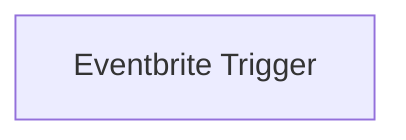

## Fluxo (.json) :

```json
{
  "nodes": [
    {
      "name": "Eventbrite Trigger",
      "type": "n8n-nodes-base.eventbriteTrigger",
      "position": [
        880,
        400
      ],
      "webhookId": "90ebf00a-536b-4553-b879-2e2c3e35bd60",
      "parameters": {
        "event": "114095913950",
        "actions": [
          "order.placed",
          "order.updated",
          "order.refunded"
        ],
        "organization": "461207981776"
      },
      "credentials": {
        "eventbriteApi": "eventbrite api"
      },
      "typeVersion": 1
    }
  ],
  "connections": {}
}
```

<a id="template-1184"></a>

## Template 1184 - Chatbot AI para resumo e análise de vídeos do YouTube

- **Nome:** Chatbot AI para resumo e análise de vídeos do YouTube
- **Descrição:** Fluxo que recebe um ID de vídeo, obtém metadados e transcrição do YouTube e disponibiliza um agente AI conversacional para resumir e analisar o conteúdo.
- **Funcionalidade:** • Recepção de entrada: aceita solicitações com ID de vídeo ou mensagens de chat.
• Extração do ID do vídeo: identifica e valida o videoId fornecido pelo usuário.
• Recuperação de transcrição: obtém a transcrição do vídeo usando uma biblioteca de extração de legendas.
• Obtenção de metadados do vídeo: consulta a API do YouTube para buscar título, descrição, estatísticas e outros dados.
• Processamento de segmentos: divide, combina e sumariza segmentos de transcrição para formar um texto coeso.
• Agente AI conversacional: permite interações em linguagem natural para responder perguntas e gerar resumos a partir do conteúdo do vídeo.
• Memória de contexto: mantém histórico de conversa para maior coerência nas interações.
• Exposição como ferramenta: disponibiliza a funcionalidade de análise de vídeo como uma ferramenta reutilizável para chamadas de agentes.
- **Ferramentas:** • YouTube Data API (Google): fornece metadados do vídeo como título, descrição, estatísticas e detalhes do conteúdo.
• youtube-transcript (biblioteca npm): extrai transcrições/legendas de vídeos do YouTube.
• OpenAI: gera respostas, resumos e análises usando modelos de linguagem.
• DeepSeek (serviço de modelo personalizado): oferece modelo de chat alternativo/auxiliar para processamento de linguagem.
• Google Cloud (chave de API): gerenciamento e provisionamento da chave necessária para acessar a API do YouTube.

## Fluxo visual

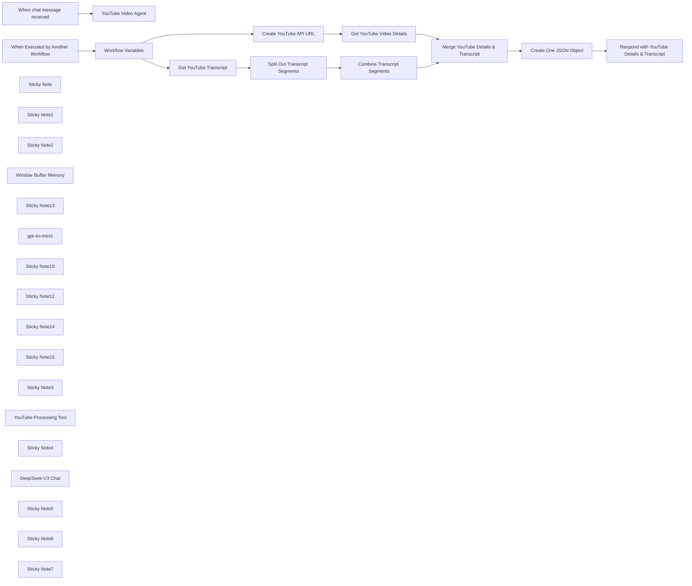

## Fluxo (.json) :

```json
{
  "id": "GM9Qxzul4NPQpJkn",
  "meta": {
    "instanceId": "31e69f7f4a77bf465b805824e303232f0227212ae922d12133a0f96ffeab4fef",
    "templateCredsSetupCompleted": true
  },
  "name": "⚡📽️ Ultimate AI-Powered Chatbot for YouTube Summarization & Analysis",
  "tags": [],
  "nodes": [
    {
      "id": "10cfb27f-ef93-41cd-972e-37dfdcab97ad",
      "name": "Get YouTube Transcript",
      "type": "n8n-nodes-base.code",
      "position": [
        20,
        360
      ],
      "parameters": {
        "jsCode": "// Get all input items\nconst items = $input.all();\nconst results = [];\n\n// Import the YoutubeTranscript module from the youtube-transcript package\n// npm i -g youtube-transcript\nconst { YoutubeTranscript } = require('youtube-transcript');\n\nfor (let i = 0; i < items.length; i++) {\n  // Extract the VIDEO_ID from the input JSON\n  const VIDEO_ID = items[i].json.VIDEO_ID;\n  \n  if (!VIDEO_ID) {\n    throw new Error('The video ID parameter is empty.');\n  }\n  \n  try {\n    // Fetch the transcript for the provided video ID\n    const transcript = await YoutubeTranscript.fetchTranscript(VIDEO_ID);\n    \n    // Append the fetched transcript data to the results\n    results.push({\n      json: {\n        youtubeId: VIDEO_ID,\n        transcript,\n      },\n    });\n  } catch (error) {\n    // In case of an error, add an error message to the output for this item\n    results.push({\n      json: {\n        youtubeId: VIDEO_ID,\n        error: error.message,\n      },\n    });\n  }\n}\n\n// Return the results to be used by the next node in the workflow\nreturn results;\n"
      },
      "typeVersion": 2
    },
    {
      "id": "a7b7740e-7470-4ce0-a698-6043559eb781",
      "name": "When Executed by Another Workflow",
      "type": "n8n-nodes-base.executeWorkflowTrigger",
      "position": [
        -580,
        180
      ],
      "parameters": {
        "inputSource": "jsonExample",
        "jsonExample": "{\n  \"query\": {\n\t\"videoId\": \"YouTube video id\"\n  }\n}"
      },
      "typeVersion": 1.1
    },
    {
      "id": "f6c6cbc2-ba2d-4f16-a3f2-ad4d6280f6b6",
      "name": "When chat message received",
      "type": "@n8n/n8n-nodes-langchain.chatTrigger",
      "position": [
        -180,
        -720
      ],
      "webhookId": "5ed6c28d-2469-4f32-bd16-939f2942a0de",
      "parameters": {
        "options": {}
      },
      "typeVersion": 1.1
    },
    {
      "id": "ac051c4a-0dc7-4f75-97a7-cb4bed0c8845",
      "name": "Sticky Note",
      "type": "n8n-nodes-base.stickyNote",
      "position": [
        40,
        -860
      ],
      "parameters": {
        "color": 6,
        "width": 580,
        "height": 380,
        "content": "## 🤖 AI Agent Chatbot for YouTube Videos"
      },
      "typeVersion": 1
    },
    {
      "id": "1a737d98-747e-40ae-9075-2b30c93f83a6",
      "name": "Sticky Note1",
      "type": "n8n-nodes-base.stickyNote",
      "position": [
        340,
        -460
      ],
      "parameters": {
        "width": 280,
        "height": 280,
        "content": "## 🛠️ YouTube Video Processing Tool"
      },
      "typeVersion": 1
    },
    {
      "id": "54d39566-a028-48be-87d6-4412d4c53f33",
      "name": "Sticky Note2",
      "type": "n8n-nodes-base.stickyNote",
      "position": [
        -260,
        -460
      ],
      "parameters": {
        "color": 5,
        "width": 280,
        "height": 280,
        "content": "## OpenAI\nhttps://platform.openai.com/api-keys"
      },
      "typeVersion": 1
    },
    {
      "id": "90468bc1-9f91-49ab-bde3-d823d7ac6d05",
      "name": "Window Buffer Memory",
      "type": "@n8n/n8n-nodes-langchain.memoryBufferWindow",
      "position": [
        140,
        -340
      ],
      "parameters": {},
      "typeVersion": 1.3
    },
    {
      "id": "fe54da1d-05e7-4da1-9347-83e1cf370710",
      "name": "Sticky Note13",
      "type": "n8n-nodes-base.stickyNote",
      "position": [
        40,
        -460
      ],
      "parameters": {
        "color": 2,
        "width": 280,
        "height": 280,
        "content": "## Chat History Memory"
      },
      "typeVersion": 1
    },
    {
      "id": "0fce1309-2982-4579-8454-34df88e5976c",
      "name": "gpt-4o-mini1",
      "type": "@n8n/n8n-nodes-langchain.lmChatOpenAi",
      "position": [
        -160,
        -340
      ],
      "parameters": {
        "model": {
          "__rl": true,
          "mode": "list",
          "value": "gpt-4o-mini"
        },
        "options": {
          "temperature": 0.1
        }
      },
      "credentials": {
        "openAiApi": {
          "id": "jEMSvKmtYfzAkhe6",
          "name": "OpenAi account"
        }
      },
      "typeVersion": 1.2
    },
    {
      "id": "8d841054-2096-49bf-8539-822b14f598df",
      "name": "YouTube Video Agent",
      "type": "@n8n/n8n-nodes-langchain.agent",
      "position": [
        200,
        -720
      ],
      "parameters": {
        "text": "={{ $json.chatInput }}",
        "options": {
          "systemMessage": "=You are an AI assistant tasked with analyzing and summarizing the transcript of a YouTube video. Your role is to answer user questions and extract relevant insights from the video content. Additionally, identify and extract the **YouTube video ID** from the user's input.\n\nYou have access to a tool called `youtube_video_analyzer`, which can analyze YouTube videos. Use this tool effectively to process video transcripts and generate structured summaries.\n\n#### Instructions:\n1. **Extract YouTube Video ID**:\n   - Identify the **video ID** from the user's input.\n   - Use this ID to analyze the video using the `youtube_video_analyzer` tool.\n\n2. **Analyze and Summarize**:\n   - Break down the video content into main topics using Level 2 headers (##).\n  2.1. Under each header:\n     - List only the most essential concepts and key points\n     - Use bullet points for clarity\n     - Keep explanations concise\n     - Preserve technical accuracy\n     - Highlight key terms in bold\n  2.2. Organize the information in this sequence:\n     - Definition/Background\n     - Main characteristics\n     - Implementation details\n     - Advantages/Disadvantages\n  2.3. Format requirements:\n     - Use markdown formatting\n     - Keep bullet points simple (no nesting)\n     - Bold important terms using **term**\n     - Use tables for comparisons\n     - Include relevant technical details\n\n3. **Organize Output**:\n   - Structure your response in this sequence:\n     1. **Definition/Background**: Provide a brief overview or context of the topic.\n     2. **Main Characteristics**: Highlight critical features or ideas.\n     3. **Implementation Details**: Explain how concepts are applied or executed.\n     4. **Advantages/Disadvantages**: Summarize benefits and limitations.\n\n4. **Formatting Requirements**:\n   - Use markdown formatting for clarity.\n   - Keep bullet points simple (no nested lists).\n   - Use tables for comparisons when applicable.\n   - Include relevant technical details where necessary.\n\nPlease provide a clear, structured summary that captures the core concepts while maintaining technical accuracy.\n\n#### Example Output Structure:\n## Title: Title of video.\n\n## Topic 1: [Main Topic]\n- **Definition/Background**: Brief explanation of the topic.\n- **Main Characteristics**:\n  - Key feature 1\n  - Key feature 2\n- **Implementation Details**:\n  - How it works\n- **Advantages/Disadvantages**:\n  - Advantage 1\n  - Disadvantage 1\n\n## Topic 2: [Next Main Topic]\n...\n\n#### Additional Notes:\n- Ensure your summaries are clear, structured, and technically accurate.\n- If any information is missing or unclear, note it explicitly in your response.\n\nCurrent date: {{ $now }}\n\n\n\n\n \n"
        },
        "promptType": "define"
      },
      "typeVersion": 1.7
    },
    {
      "id": "5252b7ce-0e3f-4f1d-a76a-6df780b4f8d4",
      "name": "Sticky Note10",
      "type": "n8n-nodes-base.stickyNote",
      "position": [
        -640,
        -140
      ],
      "parameters": {
        "color": 7,
        "width": 1910,
        "height": 720,
        "content": "## 🛠️YouTube Video Processing Tool"
      },
      "typeVersion": 1
    },
    {
      "id": "d458ef6c-9149-4515-89ac-1c0569186123",
      "name": "Create YouTube API URL",
      "type": "n8n-nodes-base.code",
      "position": [
        20,
        20
      ],
      "parameters": {
        "jsCode": "// Define the base URL for the YouTube Data API\nconst BASE_URL = 'https://www.googleapis.com/youtube/v3/videos';\n\n// Get the first input item\nconst item = $input.first();\n\n// Extract the videoId and google_api_key from the input JSON\nconst VIDEO_ID = item.json.VIDEO_ID;\nconst GOOGLE_API_KEY = item.json.GOOGLE_API_KEY; // Dynamically retrieve API key\n\nif (!VIDEO_ID) {\n  throw new Error('The video ID parameter is empty.');\n}\n\nif (!GOOGLE_API_KEY) {\n  throw new Error('The Google API Key is missing.');\n}\n\n// Construct the API URL with the video ID and dynamically retrieved API key\nconst youtubeUrl = `${BASE_URL}?part=snippet,contentDetails,status,statistics,player,topicDetails&id=${VIDEO_ID}&key=${GOOGLE_API_KEY}`;\n\n// Return the constructed URL\nreturn [\n  {\n    json: {\n      youtubeUrl: youtubeUrl,\n    },\n  },\n];\n"
      },
      "typeVersion": 2
    },
    {
      "id": "f6cf2215-8ad2-4890-a67d-f91a4752e076",
      "name": "Split Out Transcript Segments",
      "type": "n8n-nodes-base.splitOut",
      "position": [
        220,
        360
      ],
      "parameters": {
        "options": {},
        "fieldToSplitOut": "transcript"
      },
      "typeVersion": 1
    },
    {
      "id": "93c499e0-a10d-4cfb-959f-9590390722f3",
      "name": "Combine Transcript Segments",
      "type": "n8n-nodes-base.summarize",
      "position": [
        420,
        360
      ],
      "parameters": {
        "options": {},
        "fieldsToSummarize": {
          "values": [
            {
              "field": "text",
              "separateBy": " ",
              "aggregation": "concatenate"
            }
          ]
        }
      },
      "typeVersion": 1
    },
    {
      "id": "39e4c739-e241-4113-a003-25cee18b01e1",
      "name": "Get YouTube Video Details",
      "type": "n8n-nodes-base.httpRequest",
      "position": [
        220,
        20
      ],
      "parameters": {
        "url": "={{ $json.youtubeUrl }}",
        "options": {}
      },
      "typeVersion": 4.2
    },
    {
      "id": "a76d8498-5556-40b6-b259-3d93940f0a04",
      "name": "Merge YouTube Details & Transcript",
      "type": "n8n-nodes-base.merge",
      "position": [
        660,
        160
      ],
      "parameters": {
        "mode": "combine",
        "options": {},
        "combineBy": "combineByPosition"
      },
      "typeVersion": 3
    },
    {
      "id": "db7233ee-8491-47e2-b3c6-ef3f7765470e",
      "name": "Create One JSON Object",
      "type": "n8n-nodes-base.aggregate",
      "position": [
        860,
        160
      ],
      "parameters": {
        "options": {},
        "aggregate": "aggregateAllItemData"
      },
      "typeVersion": 1
    },
    {
      "id": "1f910801-a802-4e21-bc1e-383f03267711",
      "name": "Respond with YouTube Details & Transcript",
      "type": "n8n-nodes-base.set",
      "position": [
        1060,
        160
      ],
      "parameters": {
        "options": {},
        "assignments": {
          "assignments": [
            {
              "id": "56c5bc98-fdd1-41c0-8da8-bc81a257570d",
              "name": "response",
              "type": "string",
              "value": "={{ $json.data }}"
            }
          ]
        }
      },
      "typeVersion": 3.4
    },
    {
      "id": "961cec25-9f95-4564-bbdb-4c136bea34f6",
      "name": "Workflow Variables",
      "type": "n8n-nodes-base.set",
      "position": [
        -340,
        180
      ],
      "parameters": {
        "options": {},
        "assignments": {
          "assignments": [
            {
              "id": "e656b8ef-4266-4f50-bd41-703b4bdb04df",
              "name": "GOOGLE_API_KEY",
              "type": "string",
              "value": "[Your-Google-API-Key]"
            },
            {
              "id": "32db428d-a2e2-48a0-92c6-3880e744d140",
              "name": "VIDEO_ID",
              "type": "string",
              "value": "={{ $json.query.videoId }}"
            }
          ]
        }
      },
      "typeVersion": 3.4
    },
    {
      "id": "2819e5fb-4c6d-4672-9fe5-ce83bb51b92f",
      "name": "Sticky Note12",
      "type": "n8n-nodes-base.stickyNote",
      "position": [
        -420,
        60
      ],
      "parameters": {
        "width": 260,
        "height": 340,
        "content": "## Workflow Variables\nhttps://cloud.google.com/docs/get-started/access-apis\n\n"
      },
      "typeVersion": 1
    },
    {
      "id": "cdf3e883-8835-408a-901e-037ad46e9bde",
      "name": "Sticky Note14",
      "type": "n8n-nodes-base.stickyNote",
      "position": [
        -100,
        -100
      ],
      "parameters": {
        "color": 4,
        "width": 500,
        "height": 300,
        "content": "## YouTube Video Details\nhttps://developers.google.com/youtube/v3/docs\n"
      },
      "typeVersion": 1
    },
    {
      "id": "d34d3603-f527-4c77-b219-3db3fe634d1f",
      "name": "Sticky Note15",
      "type": "n8n-nodes-base.stickyNote",
      "position": [
        -100,
        240
      ],
      "parameters": {
        "color": 5,
        "width": 700,
        "height": 300,
        "content": "## YouTube Video Transcript\nhttps://docs.n8n.io/integrations/creating-nodes/test/run-node-locally/\nhttps://www.npmjs.com/package/youtube-transcript"
      },
      "typeVersion": 1
    },
    {
      "id": "4ab8a422-90df-4efd-91dd-582cef76b865",
      "name": "Sticky Note3",
      "type": "n8n-nodes-base.stickyNote",
      "position": [
        -260,
        -860
      ],
      "parameters": {
        "color": 4,
        "width": 280,
        "height": 380,
        "content": "## 👍 Try Me!"
      },
      "typeVersion": 1
    },
    {
      "id": "a4cdd7b8-3be1-42ff-a59c-9a615c69093b",
      "name": "YouTube Processing Tool",
      "type": "@n8n/n8n-nodes-langchain.toolWorkflow",
      "position": [
        440,
        -340
      ],
      "parameters": {
        "name": "youtube_video_analyzer",
        "workflowId": "={{ $workflow.id }}",
        "description": "Call this tool to get details and transcript from a YouTube video.  Get the videoId from the users prompt.",
        "jsonSchemaExample": "{\n\t\"videoId\": \"YouTube video id\"\n}",
        "specifyInputSchema": true
      },
      "typeVersion": 1
    },
    {
      "id": "bb254e70-e416-451e-8334-9297e6714d0c",
      "name": "Sticky Note4",
      "type": "n8n-nodes-base.stickyNote",
      "position": [
        640,
        -960
      ],
      "parameters": {
        "color": 3,
        "width": 620,
        "height": 780,
        "content": "## 📽️ YouTube Video AI Agent Workflow\n\nThis n8n workflow template enables users to interact with an AI agent that extracts details and the transcript of a YouTube video based on a provided video ID. Once the video details and transcript are retrieved, users can chat with the AI agent to explore or analyze the content of the video in a conversational manner.\n\n### How the Workflow Works\n1. **Input Video ID**: The user provides a YouTube video ID as input to the workflow.\n   \n2. **Data Retrieval**: The workflow fetches key details about the video (e.g., title, description, upload date) and retrieves its transcript. This involves using YouTube's Data API and other integrated tools for transcript extraction.\n\n3. **AI Agent Interaction**: The extracted details and transcript are processed by an AI-powered agent. Users can then ask questions or engage in a discussion with the agent regarding the video's content, such as summarizing the transcript, analyzing key points, or clarifying specific sections.\n\n4. **Dynamic Responses**: The AI agent uses natural language processing to provide contextual and accurate responses based on the video data, making the interaction intuitive and user-friendly.\n\n### Use Cases\n- **Content Analysis**: Quickly analyze long YouTube videos by querying specific sections or extracting summaries.\n- **Research and Learning**: Use the AI agent to gain insights from educational videos or tutorials without watching them in full.\n- **Content Creation**: Creators can use this workflow to repurpose transcripts into blogs, social media posts, or other formats.\n- **Accessibility**: Improve accessibility for users who prefer text-based interaction over watching videos.\n\n"
      },
      "typeVersion": 1
    },
    {
      "id": "dfe4a389-cb16-4eea-bd48-d5850c113401",
      "name": "DeepSeek-V3   Chat",
      "type": "@n8n/n8n-nodes-langchain.lmChatOpenAi",
      "position": [
        -500,
        -340
      ],
      "parameters": {
        "model": "=deepseek-chat",
        "options": {}
      },
      "credentials": {
        "openAiApi": {
          "id": "MSl7SdcvZe0SqCYI",
          "name": "deepseek"
        }
      },
      "typeVersion": 1.1
    },
    {
      "id": "8e6b8e43-bbac-4e5a-ab9f-6b23c50b156b",
      "name": "Sticky Note5",
      "type": "n8n-nodes-base.stickyNote",
      "position": [
        -640,
        -960
      ],
      "parameters": {
        "color": 3,
        "width": 360,
        "height": 480,
        "content": "## 🛠️ Resources for Getting Started\n\n- **Google Cloud Console** (for API setup): Visit Google Cloud's [Get Started Guide](https://cloud.google.com/docs/get-started/access-apis) to configure your API access.\n- **YouTube Data API Key Setup**: Follow this [guide](https://developers.google.com/youtube/v3/docs) to create and manage your YouTube Data API key.\n- **Install n8n Locally**: Refer to this [installation guide](https://docs.n8n.io/integrations/creating-nodes/test/run-node-locally/) for setting up n8n on your local machine.\n\n---\n\n## ✨ Sample Prompt\n*\"Tell me about this YouTube video with id: JWfNLF_g_V0\"*  \n \n*\"Can you provide a list of key takeaways from this video with id: [youtube-video-id]?\"*\n"
      },
      "typeVersion": 1
    },
    {
      "id": "65fc9096-57c7-4d68-84e9-2e93094e561e",
      "name": "Sticky Note6",
      "type": "n8n-nodes-base.stickyNote",
      "position": [
        -640,
        -460
      ],
      "parameters": {
        "color": 6,
        "width": 360,
        "height": 280,
        "content": "## DeepSeek\nhttps://api-docs.deepseek.com/"
      },
      "typeVersion": 1
    },
    {
      "id": "f75c6462-ec46-48e7-9b82-7de7590f5422",
      "name": "Sticky Note7",
      "type": "n8n-nodes-base.stickyNote",
      "position": [
        -260,
        -960
      ],
      "parameters": {
        "color": 7,
        "width": 880,
        "height": 80,
        "content": "## 📽️Ultimate AI-Powered Chatbot for YouTube Summarization & Analysis"
      },
      "typeVersion": 1
    }
  ],
  "active": false,
  "pinData": {
    "When Executed by Another Workflow": [
      {
        "json": {
          "query": {
            "videoId": "JWfNLF_g_V0"
          }
        }
      }
    ]
  },
  "settings": {
    "executionOrder": "v1"
  },
  "versionId": "9b1e07da-c789-4b3a-bb41-337dd42ee551",
  "connections": {
    "gpt-4o-mini1": {
      "ai_languageModel": [
        [
          {
            "node": "YouTube Video Agent",
            "type": "ai_languageModel",
            "index": 0
          }
        ]
      ]
    },
    "Workflow Variables": {
      "main": [
        [
          {
            "node": "Create YouTube API URL",
            "type": "main",
            "index": 0
          },
          {
            "node": "Get YouTube Transcript",
            "type": "main",
            "index": 0
          }
        ]
      ]
    },
    "YouTube Video Agent": {
      "main": [
        []
      ]
    },
    "Window Buffer Memory": {
      "ai_memory": [
        [
          {
            "node": "YouTube Video Agent",
            "type": "ai_memory",
            "index": 0
          }
        ]
      ]
    },
    "Create One JSON Object": {
      "main": [
        [
          {
            "node": "Respond with YouTube Details & Transcript",
            "type": "main",
            "index": 0
          }
        ]
      ]
    },
    "Create YouTube API URL": {
      "main": [
        [
          {
            "node": "Get YouTube Video Details",
            "type": "main",
            "index": 0
          }
        ]
      ]
    },
    "Get YouTube Transcript": {
      "main": [
        [
          {
            "node": "Split Out Transcript Segments",
            "type": "main",
            "index": 0
          }
        ]
      ]
    },
    "YouTube Processing Tool": {
      "ai_tool": [
        [
          {
            "node": "YouTube Video Agent",
            "type": "ai_tool",
            "index": 0
          }
        ]
      ]
    },
    "Get YouTube Video Details": {
      "main": [
        [
          {
            "node": "Merge YouTube Details & Transcript",
            "type": "main",
            "index": 0
          }
        ]
      ]
    },
    "When chat message received": {
      "main": [
        [
          {
            "node": "YouTube Video Agent",
            "type": "main",
            "index": 0
          }
        ]
      ]
    },
    "Combine Transcript Segments": {
      "main": [
        [
          {
            "node": "Merge YouTube Details & Transcript",
            "type": "main",
            "index": 1
          }
        ]
      ]
    },
    "Split Out Transcript Segments": {
      "main": [
        [
          {
            "node": "Combine Transcript Segments",
            "type": "main",
            "index": 0
          }
        ]
      ]
    },
    "When Executed by Another Workflow": {
      "main": [
        [
          {
            "node": "Workflow Variables",
            "type": "main",
            "index": 0
          }
        ]
      ]
    },
    "Merge YouTube Details & Transcript": {
      "main": [
        [
          {
            "node": "Create One JSON Object",
            "type": "main",
            "index": 0
          }
        ]
      ]
    }
  }
}
```

<a id="template-1185"></a>

## Template 1185 - Reconciliação de pagamentos de aluguel com IA

- **Nome:** Reconciliação de pagamentos de aluguel com IA
- **Descrição:** Monitora extratos bancários locais, analisa pagamentos contra dados de inquilinos e imóveis usando um modelo de linguagem e registra alertas de discrepâncias em uma planilha local.
- **Funcionalidade:** • Detecção de extratos bancários: monitora uma pasta local por novos arquivos CSV e inicia o processo automaticamente.
• Leitura e extração de CSV: importa o conteúdo do extrato e converte em registros estruturados (data, referência, entrada/saída).
• Configuração de variáveis: define a localização do arquivo de dados (planilha Excel) usado como fonte de verdade.
• Consulta de dados dos inquilinos e propriedades: busca informações como termos de locação, valor do aluguel, endereço e notas na planilha local.
• Análise por agente de IA: utiliza um modelo de linguagem para reconciliar pagamentos, identificando valores incorretos, pagamentos em atraso, encerramentos de contratos e taxas pendentes, considerando exceções contratuais e tolerâncias de prazo.
• Saída estruturada: exige que o resultado da análise seja fornecido em formato JSON padronizado para facilitar processamento posterior.
• Separação e processamento de ações: divide a lista de alertas resultante em entradas individuais para posterior gravação.
• Geração de relatório e escrita na planilha: adiciona as linhas de alerta à aba de alertas do arquivo Excel, criando um backup antes de sobrescrever.
• Precauções de segurança: criação de backup da planilha e aviso sobre risco de operações potencialmente destrutivas.
- **Ferramentas:** • Modelo LLM remoto (OpenAI GPT-4o): modelo de linguagem usado para analisar o extrato e tomar decisões sobre discrepâncias e ações necessárias.
• Biblioteca sheetJS (xlsx): usada para ler, manipular e escrever o arquivo Excel local (planilha de inquilinos, propriedades e alertas).
• Sistema de arquivos local: pasta monitorada para receber extratos CSV e local onde a planilha Excel é armazenada e atualizada.
• Arquivos CSV de extrato bancário: fonte de transações a serem reconciliadas.
• Arquivo Excel local de reconciliação: base de dados local com abas para inquilinos, propriedades e registro de alertas.

## Fluxo visual

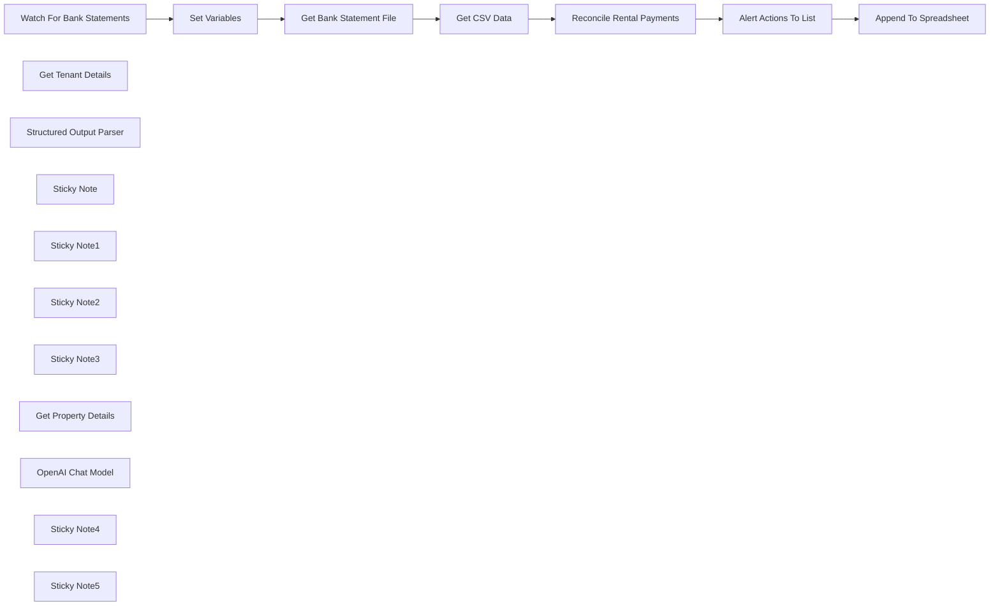

## Fluxo (.json) :

```json
{
  "meta": {
    "instanceId": "26ba763460b97c249b82942b23b6384876dfeb9327513332e743c5f6219c2b8e"
  },
  "nodes": [
    {
      "id": "bebbf9cf-8103-4694-a3be-ae3ee1e9ebaf",
      "name": "Watch For Bank Statements",
      "type": "n8n-nodes-base.localFileTrigger",
      "position": [
        780,
        400
      ],
      "parameters": {
        "path": "/home/node/host_mount/reconciliation_project",
        "events": [
          "add"
        ],
        "options": {
          "ignored": "!**/*.csv"
        },
        "triggerOn": "folder"
      },
      "typeVersion": 1
    },
    {
      "id": "eca26bed-ba44-4507-97d4-9154e26908a5",
      "name": "Get Tenant Details",
      "type": "@n8n/n8n-nodes-langchain.toolCode",
      "position": [
        1660,
        540
      ],
      "parameters": {
        "name": "get_tenant_details",
        "jsCode": "const xlsx = require('xlsx');\n\nconst { spreadsheet_location } = $('Set Variables').item.json;\nconst sheetName = 'tenants';\n\nconst wb = xlsx.readFile(spreadsheet_location, { sheets: [sheetName] });\nconst rows = xlsx.utils.sheet_to_json(wb.Sheets[sheetName], { raw: false });\n\nconst queryToList = [].concat(typeof query === 'string' ? query.split(',') : query);\n\nconst result = queryToList.map(q => (\n rows.find(row =>\n row['Tenant Name'].toLowerCase() === q.toLowerCase()\n || row['Tenant ID'].toLowerCase() === q.toString().toLowerCase()\n )\n));\n\nreturn result ? JSON.stringify(result) : `No results were found for ${query}`;",
        "description": "Call this tool to get a tenant's details which includes their tenancy terms, rent amount and any notes attached to their account. Pass in one or an array of either the tenant ID or the name of the tenant."
      },
      "typeVersion": 1.1
    },
    {
      "id": "76b68c2f-8d33-4f61-a442-732e784b733a",
      "name": "Structured Output Parser",
      "type": "@n8n/n8n-nodes-langchain.outputParserStructured",
      "position": [
        1920,
        540
      ],
      "parameters": {
        "jsonSchemaExample": "[{\n \"tenant_id\": \"\",\n \"tenant_name\": \"\",\n \"property_id\": \"\",\n \"property_postcode\": \"\",\n \"action_required\": \"\",\n \"details\": \"\",\n \"date\": \"\"\n}]"
      },
      "typeVersion": 1.2
    },
    {
      "id": "be01720f-4617-4a2b-aaed-2474f9f0e25b",
      "name": "Get Bank Statement File",
      "type": "n8n-nodes-base.readWriteFile",
      "position": [
        1100,
        400
      ],
      "parameters": {
        "options": {},
        "fileSelector": "={{ $('Watch For Bank Statements').item.json.path }}"
      },
      "typeVersion": 1
    },
    {
      "id": "2aba5f6a-56b0-411f-9124-33025d90e325",
      "name": "Get CSV Data",
      "type": "n8n-nodes-base.extractFromFile",
      "position": [
        1260,
        400
      ],
      "parameters": {
        "options": {}
      },
      "typeVersion": 1
    },
    {
      "id": "a60d5851-f938-4696-855b-1f0845ffbc6c",
      "name": "Alert Actions To List",
      "type": "n8n-nodes-base.splitOut",
      "position": [
        2260,
        400
      ],
      "parameters": {
        "options": {},
        "fieldToSplitOut": "output"
      },
      "typeVersion": 1
    },
    {
      "id": "f804d9fb-f679-4e95-b70f-722e7c222c40",
      "name": "Sticky Note",
      "type": "n8n-nodes-base.stickyNote",
      "position": [
        690.6721905682555,
        177.80249392766257
      ],
      "parameters": {
        "color": 7,
        "width": 748.2548372021405,
        "height": 457.6238063670572,
        "content": "## Step 1. Wait For Incoming Bank Statements\n[Read more about the local file triggers](https://docs.n8n.io/integrations/builtin/core-nodes/n8n-nodes-base.localfiletrigger)\n\nFor this demo, we'll show that n8n is more than capable working with the local filesystem. This gives great benefits in terms of privacy and data security.\n\nFor our datastore, we're using a locally hosted XLSX Excel file which we'll query and update throughout this workflow."
      },
      "typeVersion": 1
    },
    {
      "id": "01e9c335-320c-4fff-9ade-ad1cf808db00",
      "name": "Sticky Note1",
      "type": "n8n-nodes-base.stickyNote",
      "position": [
        1460,
        80
      ],
      "parameters": {
        "color": 7,
        "width": 634.3165117416636,
        "height": 675.2455596085985,
        "content": "## Step 2. Delegate to AI Agent to Quickly Identify Issues with Rental Payments\n[Read more about AI Agents](https://docs.n8n.io/integrations/builtin/cluster-nodes/root-nodes/n8n-nodes-langchain.agent/)\n\nAn AI agent can not only check against agreed amounts and compare due dates but also consider contract exceptions and tenant notes before deciding to take action. In a scenario of 10+ of tenants, this can save a lot of admin time.\n\nFor this demo, we're using a remote LLM Model but this can easily be swapped out for other self-hosted LLMS models that support function calling."
      },
      "typeVersion": 1
    },
    {
      "id": "2456b1e5-ceec-45c3-91a7-52e21125e6e5",
      "name": "Sticky Note2",
      "type": "n8n-nodes-base.stickyNote",
      "position": [
        2120,
        143.8836673253448
      ],
      "parameters": {
        "color": 7,
        "width": 618.3293247808133,
        "height": 473.7439917476675,
        "content": "## Step 3. Generate a Report to Action any Issues\n[Read more about using the Code Node](https://docs.n8n.io/integrations/builtin/core-nodes/n8n-nodes-base.code)\n\nAfter the AI Agent has helped identify issues to action, we can generate a report and update a locally hosted xlsx file. This again helps keep workflows private to nothing senstive goes over the wire.\n\nThough n8n lacks a builtin node for editing local xlsx file, we can tap into the sheetJS library available to the \"Code\" node."
      },
      "typeVersion": 1
    },
    {
      "id": "7b32e8f9-b543-47e1-a08e-53ee47105966",
      "name": "Sticky Note3",
      "type": "n8n-nodes-base.stickyNote",
      "position": [
        260,
        80
      ],
      "parameters": {
        "width": 399.5148533727183,
        "height": 558.2628336538015,
        "content": "## Try It Out!\n### This workflow ingests bank statements to analyses them against a list of tenants using an AI Agent. The agent then flags any issues such as missing payments or incorrect amounts which are exported to a XLSX spreadsheet.\n\n### Note: This workflow is intended to work with a self-hosted version of n8n and has access to the local file system.\n\n* Watches for CSV files (bank statements)\n* Imports into AI agent for analysis.\n* AI agent will query the Excel spreadsheet for tenant and property details.\n* AI agent will generate report on discrepancies or issues and write them to the Excel file.\n\n\n### Need Help?\nJoin the [Discord](https://discord.com/invite/XPKeKXeB7d) or ask in the [Forum](https://community.n8n.io/)!\n\nHappy Hacking!"
      },
      "typeVersion": 1
    },
    {
      "id": "ba35ed0b-7ace-4b76-b915-0dc516a07fb1",
      "name": "Get Property Details",
      "type": "@n8n/n8n-nodes-langchain.toolCode",
      "position": [
        1800,
        540
      ],
      "parameters": {
        "name": "get_property_details",
        "jsCode": "const xlsx = require('xlsx');\n\nconst { spreadsheet_location } = $('Set Variables').item.json;\nconst sheetName = 'properties'\n\nconst wb = xlsx.readFile(spreadsheet_location, { sheets: [sheetName] });\nconst rows = xlsx.utils.sheet_to_json(wb.Sheets[sheetName], { raw: false });\n\nconst queryToList = [].concat(typeof query === 'string' ? query.split(',') :query);\n\nconst result = queryToList.map(q => rows.find(row => row['Property ID'] === q));\n\nreturn result ? JSON.stringify(result) : `No results were found for ${query}`;",
        "description": "Call this tool to get a property details which includes the address, postcode and type of the property. Pass in one or an array of Property IDs."
      },
      "typeVersion": 1.1
    },
    {
      "id": "8c85a2f5-6741-41f4-b377-c74a74b14d0f",
      "name": "Set Variables",
      "type": "n8n-nodes-base.set",
      "position": [
        940,
        400
      ],
      "parameters": {
        "options": {},
        "assignments": {
          "assignments": [
            {
              "id": "bcd3dd04-0082-4da6-b36b-e5ad09c4de30",
              "name": "spreadsheet_location",
              "type": "string",
              "value": "/home/node/host_mount/reconciliation_project/reconcilation-workbook.xlsx"
            }
          ]
        }
      },
      "typeVersion": 3.4
    },
    {
      "id": "bd75bad8-caa3-48f1-8892-3d1221765564",
      "name": "Append To Spreadsheet",
      "type": "n8n-nodes-base.code",
      "position": [
        2480,
        400
      ],
      "parameters": {
        "jsCode": "const xlsx = require('xlsx');\n\nconst { spreadsheet_location } = $('Set Variables').first().json;\nconst sheetName = 'alerts';\n\nconst wb = xlsx.readFile(spreadsheet_location);\nxlsx.writeFile(wb, spreadsheet_location + '.bak.xlsx'); // create backup\n\nconst worksheet = wb.Sheets[sheetName];\n\nconst inputs = $input.all();\n\nfor (input of inputs) {\n xlsx.utils.sheet_add_aoa(worksheet, [\n [\n input.json.date,\n input.json[\"property_id\"],\n input.json[\"property_postcode\"],\n input.json[\"tenant_id\"],\n input.json[\"tenant_name\"],\n input.json[\"action_required\"],\n input.json[\"details\"],\n ]\n ], { origin: -1 });\n}\n\n// update sheet ref\nconst range = xlsx.utils.decode_range(worksheet['!ref']);\nconst rowIndex = range.e.r + 1; // The next row index to append\nworksheet['!ref'] = xlsx.utils.encode_range({\n s: range.s,\n e: { r: rowIndex, c: range.e.c }\n});\n\nxlsx.writeFile(wb, spreadsheet_location, {\n cellDates: true,\n cellStyles: true,\n bookType: 'xlsx',\n});\n\nreturn {\"json\": { \"output\": `${inputs.length} rows added` }}"
      },
      "typeVersion": 2
    },
    {
      "id": "c818ea7e-dc57-4680-b797-abb21cca87fb",
      "name": "OpenAI Chat Model",
      "type": "@n8n/n8n-nodes-langchain.lmChatOpenAi",
      "position": [
        1540,
        540
      ],
      "parameters": {
        "model": "gpt-4o",
        "options": {}
      },
      "credentials": {
        "openAiApi": {
          "id": "8gccIjcuf3gvaoEr",
          "name": "OpenAi account"
        }
      },
      "typeVersion": 1
    },
    {
      "id": "b2a97514-6020-49a6-bbdb-ee1251eb6aed",
      "name": "Sticky Note4",
      "type": "n8n-nodes-base.stickyNote",
      "position": [
        2280,
        640
      ],
      "parameters": {
        "color": 3,
        "width": 461.5505566920007,
        "height": 106.59049079746408,
        "content": "### 🚨Warning! Potentially Destructive Operations!\nWith code comes great responsibility! There is a risk you may overwrite/delete data you didn't intend. Always makes backups and test on a copy of your spreadsheets!"
      },
      "typeVersion": 1
    },
    {
      "id": "f869f6eb-cf19-4b14-bf3a-4db5d636646f",
      "name": "Reconcile Rental Payments",
      "type": "@n8n/n8n-nodes-langchain.agent",
      "position": [
        1640,
        360
      ],
      "parameters": {
        "text": "=Bank Statement for {{ $input.first().json.date }} to {{ $input.last().json.date }}:\n|date|reference|money in|money out|\n|-|-|-|-|\n{{ $input.all().map(row => `|${row.json.date}|${row.json.reference}|${row.json.money_in || ''}|${row.json.money_out || ''}|`).join('\\n') }}",
        "options": {
          "systemMessage": "Your task is to help reconcile rent payments with the uploaded bank statement and alert only if there are any actions to be taken in regards to the tenants.\n* Identify and flag any tenants who have have missed their rent according to the month. Late payments which are within a few days of the due date are acceptable and should not be flagged.\n* Identify and flag if any tenants have not paid the correct ammount due, either less or more.\n* Identify and flag any tenants who are finishing their rentals within the time period of the current statement.\n* Identify and flag any remaining fees which are due and have not been paid from any tenant in the last month of their rental.\n\nIf the bank statement show incomplete months due to cut off, it is ok to assume the payment is pending and not actually missing.\n\nThe alert system requires a JSON formatted message. It is important that you format your response as follows:\n[{\n \"tenant_id\": \"\",\n \"tenant_name\": \"\",\n \"property_id\": \"\",\n \"property_postcode\": \"\",\n \"action required\": \"\",\n \"details\": \"\",\n \"date\": \"\"\n}]"
        },
        "promptType": "define",
        "hasOutputParser": true
      },
      "executeOnce": true,
      "typeVersion": 1.6
    },
    {
      "id": "510dc73c-f267-41f3-a981-58f5bfc229a6",
      "name": "Sticky Note5",
      "type": "n8n-nodes-base.stickyNote",
      "position": [
        360,
        660
      ],
      "parameters": {
        "color": 5,
        "width": 302.6142384407349,
        "height": 86.00673806595168,
        "content": "### 💡I'm designed to work self-hosted!\nSome nodes in this workflow are only available to the self-hosted version of n8n."
      },
      "typeVersion": 1
    }
  ],
  "pinData": {},
  "connections": {
    "Get CSV Data": {
      "main": [
        [
          {
            "node": "Reconcile Rental Payments",
            "type": "main",
            "index": 0
          }
        ]
      ]
    },
    "Set Variables": {
      "main": [
        [
          {
            "node": "Get Bank Statement File",
            "type": "main",
            "index": 0
          }
        ]
      ]
    },
    "OpenAI Chat Model": {
      "ai_languageModel": [
        [
          {
            "node": "Reconcile Rental Payments",
            "type": "ai_languageModel",
            "index": 0
          }
        ]
      ]
    },
    "Get Tenant Details": {
      "ai_tool": [
        [
          {
            "node": "Reconcile Rental Payments",
            "type": "ai_tool",
            "index": 0
          }
        ]
      ]
    },
    "Get Property Details": {
      "ai_tool": [
        [
          {
            "node": "Reconcile Rental Payments",
            "type": "ai_tool",
            "index": 0
          }
        ]
      ]
    },
    "Alert Actions To List": {
      "main": [
        [
          {
            "node": "Append To Spreadsheet",
            "type": "main",
            "index": 0
          }
        ]
      ]
    },
    "Get Bank Statement File": {
      "main": [
        [
          {
            "node": "Get CSV Data",
            "type": "main",
            "index": 0
          }
        ]
      ]
    },
    "Structured Output Parser": {
      "ai_outputParser": [
        [
          {
            "node": "Reconcile Rental Payments",
            "type": "ai_outputParser",
            "index": 0
          }
        ]
      ]
    },
    "Reconcile Rental Payments": {
      "main": [
        [
          {
            "node": "Alert Actions To List",
            "type": "main",
            "index": 0
          }
        ]
      ]
    },
    "Watch For Bank Statements": {
      "main": [
        [
          {
            "node": "Set Variables",
            "type": "main",
            "index": 0
          }
        ]
      ]
    }
  }
}
```

<a id="template-1186"></a>

## Template 1186 - Validação de emails e atualização no Airtable

- **Nome:** Validação de emails e atualização no Airtable
- **Descrição:** Este fluxo busca registros em uma tabela, valida o email de cada registro usando um serviço de verificação e atualiza o campo de validade no mesmo registro.
- **Funcionalidade:** • Leitura de registros: Lista registros de uma tabela para processar os emails.
• Validação de email: Verifica se o endereço de email existe e sua validade utilizando um serviço de verificação.
• Mapeamento de resultados: Extrai o ID do registro e o resultado da validação para uso posterior.
• Atualização de registro: Atualiza o campo "Valid" no registro correspondente com o resultado da verificação.
- **Ferramentas:** • Airtable: Plataforma de banco de dados/tabela usada para armazenar e atualizar os registros.
• Mailcheck: Serviço/API para validação e verificação de endereços de email.

## Fluxo visual

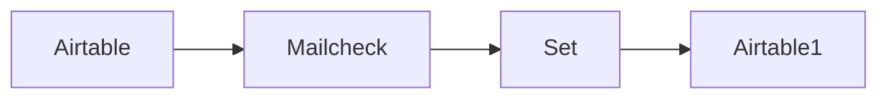

## Fluxo (.json) :

```json
{
  "nodes": [
    {
      "name": "Airtable",
      "type": "n8n-nodes-base.airtable",
      "position": [
        470,
        200
      ],
      "parameters": {
        "table": "Table 1",
        "operation": "list",
        "additionalOptions": {}
      },
      "credentials": {
        "airtableApi": ""
      },
      "typeVersion": 1
    },
    {
      "name": "Mailcheck",
      "type": "n8n-nodes-base.mailcheck",
      "position": [
        670,
        200
      ],
      "parameters": {
        "email": "={{$json[\"fields\"][\"Email\"]}}"
      },
      "credentials": {
        "mailcheckApi": "Mailcheck API Credentials"
      },
      "typeVersion": 1
    },
    {
      "name": "Set",
      "type": "n8n-nodes-base.set",
      "position": [
        870,
        200
      ],
      "parameters": {
        "values": {
          "string": [
            {
              "name": "ID",
              "value": "={{$node[\"Airtable\"].json[\"id\"]}}"
            }
          ],
          "boolean": [
            {
              "name": "Valid",
              "value": "={{$json[\"mxExists\"]}}"
            }
          ]
        },
        "options": {},
        "keepOnlySet": true
      },
      "typeVersion": 1
    },
    {
      "name": "Airtable1",
      "type": "n8n-nodes-base.airtable",
      "position": [
        1070,
        200
      ],
      "parameters": {
        "id": "={{$json[\"ID\"]}}",
        "table": "=Table 1",
        "fields": [
          "Valid"
        ],
        "options": {},
        "operation": "update",
        "application": "={{$node[\"Airtable\"].parameter[\"application\"]}}",
        "updateAllFields": false
      },
      "credentials": {
        "airtableApi": "Airtable Credentials n8n"
      },
      "typeVersion": 1
    }
  ],
  "connections": {
    "Set": {
      "main": [
        [
          {
            "node": "Airtable1",
            "type": "main",
            "index": 0
          }
        ]
      ]
    },
    "Airtable": {
      "main": [
        [
          {
            "node": "Mailcheck",
            "type": "main",
            "index": 0
          }
        ]
      ]
    },
    "Mailcheck": {
      "main": [
        [
          {
            "node": "Set",
            "type": "main",
            "index": 0
          }
        ]
      ]
    }
  }
}
```

<a id="template-1187"></a>

## Template 1187 - Organizador de arquivos por IA

- **Nome:** Organizador de arquivos por IA
- **Descrição:** Monitora uma pasta local, usa um modelo de IA para sugerir em quais subpastas os arquivos devem ficar e realiza a reorganização no sistema de arquivos.
- **Funcionalidade:** • Monitoramento de pasta local: dispara o fluxo quando arquivos são adicionados ao diretório alvo.
• Listagem de arquivos e pastas: obtém a lista de arquivos no nível raiz e dos diretórios existentes.
• Preparação e filtragem da lista: limpa e organiza os nomes de arquivos antes do processamento.
• Sugestões de organização por IA: envia a lista para um modelo de linguagem que agrupa arquivos e sugere subpastas.
• Conversão da resposta em estrutura: transforma a resposta da IA em um formato estruturado de pastas e arquivos.
• Criação de subdiretórios: cria as pastas sugeridas caso não existam.
• Movimentação segura de arquivos: move os arquivos para as pastas indicadas, tratando conflitos de nome para evitar sobrescritas.
- **Ferramentas:** • Mistral Cloud: serviço de IA que fornece sugestões de agrupamento e nomeação de pastas (modelo utilizado: mistral-small-2402).
• Bash / utilitários Linux: comandos como ls, grep, mkdir e mv são usados para listar, filtrar, criar pastas e mover arquivos.
• Sistema de arquivos local (diretório montado do host): pasta monitorada onde os arquivos residem e onde ocorrem as operações de criação e movimentação.

## Fluxo visual

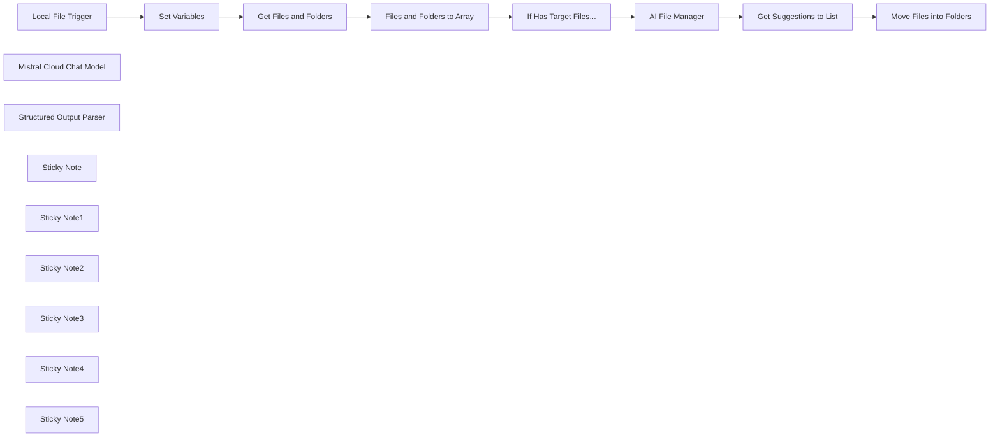

## Fluxo (.json) :

```json
{
  "meta": {
    "instanceId": "26ba763460b97c249b82942b23b6384876dfeb9327513332e743c5f6219c2b8e"
  },
  "nodes": [
    {
      "id": "c92e3d01-4385-4e99-a9a7-77279b3d9cb3",
      "name": "Local File Trigger",
      "type": "n8n-nodes-base.localFileTrigger",
      "position": [
        720,
        120
      ],
      "parameters": {
        "path": "/home/node/host_mount/shared_drive",
        "events": [
          "add"
        ],
        "options": {
          "awaitWriteFinish": true
        },
        "triggerOn": "folder"
      },
      "typeVersion": 1
    },
    {
      "id": "a08f5acc-ee46-49e7-be4d-99edc95ab41f",
      "name": "Get Files and Folders",
      "type": "n8n-nodes-base.executeCommand",
      "position": [
        1200,
        120
      ],
      "parameters": {
        "command": "=ls -p {{ $json.directory }} | grep -v / || true; \\\necho \"===\"; \\\nls -p {{ $json.directory }} | grep / || true;"
      },
      "typeVersion": 1
    },
    {
      "id": "f3ab100a-986d-49bc-aeb5-979f16b2fd46",
      "name": "Files and Folders to Array",
      "type": "n8n-nodes-base.set",
      "position": [
        1380,
        120
      ],
      "parameters": {
        "options": {},
        "assignments": {
          "assignments": [
            {
              "id": "ad893795-cae8-4418-99e0-2c68126337d3",
              "name": "files",
              "type": "array",
              "value": "={{ $json.stdout.split('===')[0].split('\\n').filter(item => !item.endsWith('Zone.Identifier')).compact() }}"
            },
            {
              "id": "0e7e8571-6b86-481d-a20c-3a7c621c562f",
              "name": "folders",
              "type": "array",
              "value": "={{ $json.stdout.split('===')[1].split('\\n').compact() }}"
            }
          ]
        }
      },
      "typeVersion": 3.3
    },
    {
      "id": "56c4a8b4-c5b0-4e2f-806b-fef5fb5260b5",
      "name": "Mistral Cloud Chat Model",
      "type": "@n8n/n8n-nodes-langchain.lmChatMistralCloud",
      "position": [
        1860,
        240
      ],
      "parameters": {
        "model": "mistral-small-2402",
        "options": {}
      },
      "credentials": {
        "mistralCloudApi": {
          "id": "EIl2QxhXAS9Hkg37",
          "name": "Mistral Cloud account"
        }
      },
      "typeVersion": 1
    },
    {
      "id": "0d586481-904d-4fbd-9b53-77bc2faf08dd",
      "name": "Structured Output Parser",
      "type": "@n8n/n8n-nodes-langchain.outputParserStructured",
      "position": [
        2040,
        240
      ],
      "parameters": {
        "schemaType": "manual",
        "inputSchema": "{\n\t\"type\": \"array\",\n\t\"items\": {\n    \t\"type\": \"object\",\n        \"properties\": {\n          \"folder\": { \"type\": \"string\" },\n          \"files\": {\n            \"type\": \"array\",\n            \"items\": { \"type\": \"string\" }\n          }\n\t\t}\n    }\n}"
      },
      "typeVersion": 1.2
    },
    {
      "id": "86025668-aac9-49a2-92ff-ce15df16488c",
      "name": "Set Variables",
      "type": "n8n-nodes-base.set",
      "position": [
        940,
        120
      ],
      "parameters": {
        "options": {},
        "assignments": {
          "assignments": [
            {
              "id": "35ea70c4-8669-4975-a68d-bbaa094713c0",
              "name": "directory",
              "type": "string",
              "value": "={{ $('Local File Trigger').params.path }}"
            }
          ]
        }
      },
      "typeVersion": 3.3
    },
    {
      "id": "457bfd30-5cca-417a-88d3-666afe567fd5",
      "name": "Move Files into Folders",
      "type": "n8n-nodes-base.executeCommand",
      "position": [
        2560,
        140
      ],
      "parameters": {
        "command": "=directory=\"{{ $('Set Variables').item.json.directory }}\"\nsubdirectory=\"$directory/{{ $json.folder }}\";\nfile_list=\"{{ $json.files.join(' ') }}\";\n\n# create subdirectory if not exists\nmkdir -p $subdirectory;\n\n# for each suggestion, move the file into the subdirectory.\n# If the file in the subdirectory exists, then we'll rename the current file by adding a small random string to the end of the filename.\nfor filename in $file_list; do\n    if [ -e \"$subdirectory/$filename\" ]; then\n        mv \"$directory/$filename-$RANDOM\" -t $subdirectory;\n    else\n        mv \"$directory/$filename\" -t $subdirectory;\n    fi\ndone",
        "executeOnce": false
      },
      "typeVersion": 1
    },
    {
      "id": "e9a610bf-b2ae-4b98-870a-2e63790a3b5f",
      "name": "Sticky Note",
      "type": "n8n-nodes-base.stickyNote",
      "position": [
        635.4233386400999,
        -161.84747801133517
      ],
      "parameters": {
        "color": 7,
        "width": 483.7926535356806,
        "height": 501.2939838391483,
        "content": "## Step 1. Select the target folder\n[Read more about local file trigger](https://docs.n8n.io/integrations/builtin/core-nodes/n8n-nodes-base.localfiletrigger)\n\nIn this workflow, we'll monitor a specific folder on disk that n8n has access to. Since we're using docker, we can either use the n8n volume or mount a folder from the host machine.\n\nThe local file trigger is useful to execute the workflow whenever changes are made to our target folder."
      },
      "typeVersion": 1
    },
    {
      "id": "c8961322-a6da-4fc0-a46d-6119c5eac2b0",
      "name": "Sticky Note1",
      "type": "n8n-nodes-base.stickyNote",
      "position": [
        1140,
        -54.28207683557787
      ],
      "parameters": {
        "color": 7,
        "width": 583.2857596176409,
        "height": 391.527066537946,
        "content": "## Step 2. Identify files that need to be organised\n[Read more about Execute Command node](https://docs.n8n.io/integrations/builtin/core-nodes/n8n-nodes-base.executecommand)\n\nFor all Files in the root level of our selected target folder, we want  them to be sorted and moved into categorised subdirectories. In this step, we'll use linux commands to get a list of files and folders currently present in the target folder."
      },
      "typeVersion": 1
    },
    {
      "id": "6e31b2d1-288c-479b-8dd8-a171ecd03dea",
      "name": "If Has Target Files...",
      "type": "n8n-nodes-base.if",
      "position": [
        1560,
        120
      ],
      "parameters": {
        "options": {},
        "conditions": {
          "options": {
            "leftValue": "",
            "caseSensitive": true,
            "typeValidation": "strict"
          },
          "combinator": "and",
          "conditions": [
            {
              "id": "9be5a175-e7aa-4d68-9ddc-8b43b43e2d37",
              "operator": {
                "type": "array",
                "operation": "lengthGte",
                "rightType": "number"
              },
              "leftValue": "={{ $json.files }}",
              "rightValue": "={{ 1 }}"
            }
          ]
        }
      },
      "typeVersion": 2
    },
    {
      "id": "07fd70ca-9126-4846-a2b0-4f3a8fc5eb69",
      "name": "Sticky Note2",
      "type": "n8n-nodes-base.stickyNote",
      "position": [
        1760,
        -107.13740439436373
      ],
      "parameters": {
        "color": 7,
        "width": 631.2649908751414,
        "height": 506.8242545618477,
        "content": "## Step 3. Using Mistral AI to organise our target folder\n[Read more about Mistral AI](https://docs.n8n.io/integrations/builtin/cluster-nodes/sub-nodes/n8n-nodes-langchain.lmchatmistralcloud)\n\nUsing Mistral AI as our AI file manager, it can help us suggest which files go into which categorised subdirectory. If the subdirectory doesn't exist, Mistral can also suggest one to be created."
      },
      "typeVersion": 1
    },
    {
      "id": "2ca9a56c-ed1b-4f16-b207-7229c8d90b76",
      "name": "Get Suggestions to List",
      "type": "n8n-nodes-base.splitOut",
      "position": [
        2200,
        80
      ],
      "parameters": {
        "options": {},
        "fieldToSplitOut": "output"
      },
      "typeVersion": 1
    },
    {
      "id": "29d425df-e513-429a-802f-02ad3ad86344",
      "name": "Sticky Note3",
      "type": "n8n-nodes-base.stickyNote",
      "position": [
        2420,
        -62.701160902940615
      ],
      "parameters": {
        "color": 7,
        "width": 401.0065589583014,
        "height": 374.8503908496576,
        "content": "## Step 4. Move the files into subdirectories\n[Read more about Execute Command node](https://docs.n8n.io/integrations/builtin/core-nodes/n8n-nodes-base.executecommand)\n\nFor this step, we'll use the execute command node to execute a shellscript to move the files into their respective subdirectories."
      },
      "typeVersion": 1
    },
    {
      "id": "a2ee79ea-6b0d-46c0-876f-8cfe12130a62",
      "name": "Sticky Note4",
      "type": "n8n-nodes-base.stickyNote",
      "position": [
        240,
        -160
      ],
      "parameters": {
        "width": 372.51107341403605,
        "height": 422.70324544339167,
        "content": "## Try It Out!\n### This workflow does the following:\n* Monitors a target folder for changes using the local file trigger\n* identifies all files and subdirectories in the target folder and passes this to Mistral AI\n* Mistral AI suggests where to move top level files into which subdirectories. It can also suggest subdirectories tp create if none are suitable.\n* Finally, we take the AI's suggestions are perform the move operations using the execute command node.\n\n### Need Help?\nJoin the [Discord](https://discord.com/invite/XPKeKXeB7d) or ask in the [Forum](https://community.n8n.io/)!\n\nHappy Hacking!"
      },
      "typeVersion": 1
    },
    {
      "id": "a0db31b1-10e2-40bb-9ec6-b91569bf1072",
      "name": "Sticky Note5",
      "type": "n8n-nodes-base.stickyNote",
      "position": [
        174.82571715185748,
        280
      ],
      "parameters": {
        "color": 3,
        "width": 438.23697639546396,
        "height": 97.88076166036412,
        "content": "### 🚨 Warning! Potential destructive operations ahead!\nThis workflow manipulates the filesystem. Always make backups of your files before running local workflows."
      },
      "typeVersion": 1
    },
    {
      "id": "c932813c-913c-47bd-a4ba-79056bc6dfd7",
      "name": "AI File Manager",
      "type": "@n8n/n8n-nodes-langchain.chainLlm",
      "position": [
        1860,
        80
      ],
      "parameters": {
        "text": "=Here is the list of current files in the directory:\n{{ $json.files.map(file => `* ${file}`).join('\\n') }}\n\nHere is the list of current folders in the directory:\n{{ $json.folders.length ? $json.folders.map(item => `* ${item}`).join('\\n') : 'There are currently no directories' }}\n\nGroup the current files using the filename as a hint and decide which of the current folders should they be moved to. If there are no current folders, then suggest a folder to be created.\n\nIf you can't decide which folder to put the file in, the file should be moved to the misc folder.",
        "messages": {
          "messageValues": [
            {
              "message": "You manage a linux directory on behalf of the user."
            }
          ]
        },
        "promptType": "define",
        "hasOutputParser": true
      },
      "typeVersion": 1.4
    }
  ],
  "pinData": {},
  "connections": {
    "Set Variables": {
      "main": [
        [
          {
            "node": "Get Files and Folders",
            "type": "main",
            "index": 0
          }
        ]
      ]
    },
    "AI File Manager": {
      "main": [
        [
          {
            "node": "Get Suggestions to List",
            "type": "main",
            "index": 0
          }
        ]
      ]
    },
    "Local File Trigger": {
      "main": [
        [
          {
            "node": "Set Variables",
            "type": "main",
            "index": 0
          }
        ]
      ]
    },
    "Get Files and Folders": {
      "main": [
        [
          {
            "node": "Files and Folders to Array",
            "type": "main",
            "index": 0
          }
        ]
      ]
    },
    "If Has Target Files...": {
      "main": [
        [
          {
            "node": "AI File Manager",
            "type": "main",
            "index": 0
          }
        ]
      ]
    },
    "Get Suggestions to List": {
      "main": [
        [
          {
            "node": "Move Files into Folders",
            "type": "main",
            "index": 0
          }
        ]
      ]
    },
    "Mistral Cloud Chat Model": {
      "ai_languageModel": [
        [
          {
            "node": "AI File Manager",
            "type": "ai_languageModel",
            "index": 0
          }
        ]
      ]
    },
    "Structured Output Parser": {
      "ai_outputParser": [
        [
          {
            "node": "AI File Manager",
            "type": "ai_outputParser",
            "index": 0
          }
        ]
      ]
    },
    "Files and Folders to Array": {
      "main": [
        [
          {
            "node": "If Has Target Files...",
            "type": "main",
            "index": 0
          }
        ]
      ]
    }
  }
}
```

<a id="template-1188"></a>

## Template 1188 - Escuta de eventos SSE

- **Nome:** Escuta de eventos SSE
- **Descrição:** Escuta eventos em tempo real via Server-Sent Events (SSE) a partir de uma URL configurada e aciona o fluxo quando eventos chegam.
- **Funcionalidade:** • Escuta de eventos SSE: conecta-se a uma URL que fornece eventos em tempo real via Server-Sent Events.
• Início automático do fluxo: aciona o fluxo sempre que um evento é recebido.
• URL configurável: permite definir a origem dos eventos por meio de uma URL.
- **Ferramentas:** • Fonte SSE (URL configurada): servidor que emite eventos em tempo real via Server-Sent Events (SSE).

## Fluxo visual

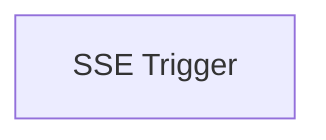

## Fluxo (.json) :

```json
{
  "name": "",
  "nodes": [
    {
      "name": "SSE Trigger",
      "type": "n8n-nodes-base.sseTrigger",
      "position": [
        850,
        420
      ],
      "parameters": {
        "url": "https://n8n.io"
      },
      "typeVersion": 1
    }
  ],
  "active": false,
  "settings": {},
  "connections": {}
}
```

<a id="template-1189"></a>

## Template 1189 - Gravar nomes de arquivo em arquivo de saída

- **Nome:** Gravar nomes de arquivo em arquivo de saída
- **Descrição:** Lê um arquivo de texto contendo uma lista de nomes, itera por cada linha e anexa uma linha formatada a um arquivo de saída usando um comando de shell.
- **Funcionalidade:** • Leitura de arquivo de texto: Carrega o conteúdo do arquivo de entrada (/home/n8n/filelist.txt) como dados binários.
• Conversão para linhas: Divide o conteúdo em um array de linhas para processamento individual.
• Preparação de metadados: Calcula o número de entradas válidas e limpa o campo de dados original.
• Iteração controlada por índice: Processa uma linha por execução usando um índice de execução e compara com o tamanho do array para decidir continuidade.
• Execução de comando de shell: Para cada linha válida, executa um comando que anexa a mensagem formatada ao arquivo de saída (/home/n8n/n8n-output.txt).
- **Ferramentas:** • Shell (comando echo): Utilizado para escrever ou anexar linhas formatadas ao arquivo de saída.
• Sistema de arquivos local: Leitura do arquivo de entrada e gravação do arquivo de saída no sistema de arquivos do host.

## Fluxo visual

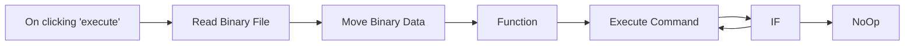

## Fluxo (.json) :

```json
{
  "nodes": [
    {
      "name": "On clicking 'execute'",
      "type": "n8n-nodes-base.manualTrigger",
      "position": [
        250,
        300
      ],
      "parameters": {},
      "typeVersion": 1
    },
    {
      "name": "Read Binary File",
      "type": "n8n-nodes-base.readBinaryFile",
      "position": [
        440,
        300
      ],
      "parameters": {
        "filePath": "/home/n8n/filelist.txt"
      },
      "typeVersion": 1
    },
    {
      "name": "Move Binary Data",
      "type": "n8n-nodes-base.moveBinaryData",
      "position": [
        610,
        300
      ],
      "parameters": {
        "options": {},
        "setAllData": false
      },
      "typeVersion": 1
    },
    {
      "name": "Function",
      "type": "n8n-nodes-base.function",
      "position": [
        810,
        300
      ],
      "parameters": {
        "functionCode": "items[0].json.arrData = items[0].json.data.split(\"\\n\");\nitems[0].json.data = {};\nitems[0].json.dataSize = items[0].json.arrData.length-2;\nreturn items;"
      },
      "typeVersion": 1
    },
    {
      "name": "Execute Command",
      "type": "n8n-nodes-base.executeCommand",
      "position": [
        1040,
        300
      ],
      "parameters": {
        "command": "=echo \"The file name is {{$node[\"Function\"].json[\"arrData\"][$runIndex]}}\" >> /home/n8n/n8n-output.txt"
      },
      "typeVersion": 1
    },
    {
      "name": "IF",
      "type": "n8n-nodes-base.if",
      "position": [
        1250,
        520
      ],
      "parameters": {
        "conditions": {
          "number": [
            {
              "value1": "={{$node[\"Function\"].json[\"dataSize\"]}}",
              "value2": "={{$runIndex}}",
              "operation": "larger"
            }
          ],
          "string": []
        }
      },
      "typeVersion": 1
    },
    {
      "name": "NoOp",
      "type": "n8n-nodes-base.noOp",
      "position": [
        1450,
        540
      ],
      "parameters": {},
      "typeVersion": 1
    }
  ],
  "connections": {
    "IF": {
      "main": [
        [
          {
            "node": "Execute Command",
            "type": "main",
            "index": 0
          }
        ],
        [
          {
            "node": "NoOp",
            "type": "main",
            "index": 0
          }
        ]
      ]
    },
    "Function": {
      "main": [
        [
          {
            "node": "Execute Command",
            "type": "main",
            "index": 0
          }
        ]
      ]
    },
    "Execute Command": {
      "main": [
        [
          {
            "node": "IF",
            "type": "main",
            "index": 0
          }
        ]
      ]
    },
    "Move Binary Data": {
      "main": [
        [
          {
            "node": "Function",
            "type": "main",
            "index": 0
          }
        ]
      ]
    },
    "Read Binary File": {
      "main": [
        [
          {
            "node": "Move Binary Data",
            "type": "main",
            "index": 0
          }
        ]
      ]
    },
    "On clicking 'execute'": {
      "main": [
        [
          {
            "node": "Read Binary File",
            "type": "main",
            "index": 0
          }
        ]
      ]
    }
  }
}
```

<a id="template-1190"></a>

## Template 1190 - Criar contato no Mailchimp a partir do Airtable

- **Nome:** Criar contato no Mailchimp a partir do Airtable
- **Descrição:** Este fluxo agenda verificações periódicas, obtém registros da tabela de usuários no Airtable e cria/inscreve esses contatos em uma lista do Mailchimp.
- **Funcionalidade:** • Agendamento periódico: Inicia o processo em intervalos programados usando um gatilho Cron.
• Listagem de registros do Airtable: Recupera registros da tabela "Users" solicitando especificamente os campos Name, Email e Interest.
• Criação/inscrição de contato no Mailchimp: Adiciona ou atualiza um membro na lista definida usando o e-mail como identificador e define o status como "subscribed".
• Mapeamento de merge fields: Preenche o campo de nome (FNAME) no Mailchimp com o valor Name proveniente do Airtable.
• Aplicação de tags: Associa ao contato a tag correspondente ao campo Interest do registro do Airtable.
- **Ferramentas:** • Airtable: Banco de dados em nuvem usado para armazenar e recuperar registros de usuários (tabela "Users" com campos como Name, Email e Interest).
• Mailchimp: Plataforma de e-mail marketing para gerenciar listas, inscrever contatos, aplicar tags e preencher campos mesclados (merge fields).

## Fluxo visual

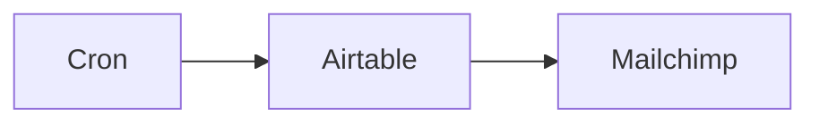

## Fluxo (.json) :

```json
{
  "id": "1",
  "name": "Create entry in Mailchimp from Airtable",
  "nodes": [
    {
      "name": "Cron",
      "type": "n8n-nodes-base.cron",
      "position": [
        450,
        450
      ],
      "parameters": {
        "triggerTimes": {
          "item": [
            {}
          ]
        }
      },
      "typeVersion": 1
    },
    {
      "name": "Airtable",
      "type": "n8n-nodes-base.airtable",
      "position": [
        650,
        450
      ],
      "parameters": {
        "table": "Users",
        "operation": "list",
        "application": "=apprZs8g4tIGDUtqQ",
        "additionalOptions": {
          "fields": [
            "Name",
            "Email",
            "Interest"
          ]
        }
      },
      "credentials": {
        "airtableApi": "claudiajanebates@gmail.com"
      },
      "typeVersion": 1
    },
    {
      "name": "Mailchimp",
      "type": "n8n-nodes-base.mailchimp",
      "position": [
        840,
        450
      ],
      "parameters": {
        "list": "777b2643d4",
        "email": "={{$node[\"Airtable\"].json[\"fields\"][\"Email\"]}}",
        "status": "subscribed",
        "options": {
          "tags": "Interest"
        },
        "mergeFieldsUi": {
          "mergeFieldsValues": [
            {
              "name": "FNAME",
              "value": "={{$node[\"Airtable\"].json[\"fields\"][\"Name\"]}}"
            }
          ]
        }
      },
      "credentials": {
        "mailchimpApi": "claudiajanebates@gmail.com"
      },
      "typeVersion": 1
    }
  ],
  "active": false,
  "settings": {},
  "connections": {
    "Cron": {
      "main": [
        [
          {
            "node": "Airtable",
            "type": "main",
            "index": 0
          }
        ]
      ]
    },
    "Airtable": {
      "main": [
        [
          {
            "node": "Mailchimp",
            "type": "main",
            "index": 0
          }
        ]
      ]
    }
  }
}
```

<a id="template-1191"></a>

## Template 1191 - Organizador de arquivos com IA

- **Nome:** Organizador de arquivos com IA
- **Descrição:** Monitora uma pasta local e reorganiza arquivos top-level movendo-os para subpastas sugeridas por um modelo de IA.
- **Funcionalidade:** • Monitoramento de pasta: Observa uma pasta local para detectar adição de arquivos.
• Listagem de conteúdo: Obtém listas de arquivos e subpastas presentes no diretório alvo.
• Preparação de dados: Converte a saída de comandos shell em arrays de arquivos e pastas para processamento.
• Sugestões por IA: Envia a lista de arquivos e pastas para um modelo de linguagem que sugere agrupamentos e nomes de subpastas.
• Parsing estruturado: Recebe a resposta da IA em formato estruturado (lista de objetos com pasta e arquivos) para processamento automático.
• Criação de subpastas: Cria subdiretórios sugeridos se não existirem.
• Movimentação de arquivos: Move os arquivos para as subpastas recomendadas usando comandos shell.
• Tratamento de conflitos: Se um arquivo com o mesmo nome já existir na subpasta, renomeia o arquivo atual adicionando um sufixo aleatório antes de mover.
- **Ferramentas:** • Mistral Cloud (modelo de linguagem): Serviço de IA usado para sugerir como agrupar e nomear subpastas com base nos nomes de arquivos.
• Sistema de arquivos local e utilitários shell: Comandos como ls, grep, mkdir e mv são usados para listar, criar pastas e mover arquivos.
• Pasta montada/volume do host (ex.: em ambiente Docker): Diretório acessível ao processo que é monitorado e manipulado pelo fluxo.

## Fluxo visual


## Fluxo (.json) :

```json
{
  "meta": {
    "instanceId": "26ba763460b97c249b82942b23b6384876dfeb9327513332e743c5f6219c2b8e"
  },
  "nodes": [
    {
      "id": "c92e3d01-4385-4e99-a9a7-77279b3d9cb3",
      "name": "Local File Trigger",
      "type": "n8n-nodes-base.localFileTrigger",
      "position": [
        720,
        120
      ],
      "parameters": {
        "path": "/home/node/host_mount/shared_drive",
        "events": [
          "add"
        ],
        "options": {
          "awaitWriteFinish": true
        },
        "triggerOn": "folder"
      },
      "typeVersion": 1
    },
    {
      "id": "a08f5acc-ee46-49e7-be4d-99edc95ab41f",
      "name": "Get Files and Folders",
      "type": "n8n-nodes-base.executeCommand",
      "position": [
        1200,
        120
      ],
      "parameters": {
        "command": "=ls -p {{ $json.directory }} | grep -v / || true; \\\necho \"===\"; \\\nls -p {{ $json.directory }} | grep / || true;"
      },
      "typeVersion": 1
    },
    {
      "id": "f3ab100a-986d-49bc-aeb5-979f16b2fd46",
      "name": "Files and Folders to Array",
      "type": "n8n-nodes-base.set",
      "position": [
        1380,
        120
      ],
      "parameters": {
        "options": {},
        "assignments": {
          "assignments": [
            {
              "id": "ad893795-cae8-4418-99e0-2c68126337d3",
              "name": "files",
              "type": "array",
              "value": "={{ $json.stdout.split('===')[0].split('\\n').filter(item => !item.endsWith('Zone.Identifier')).compact() }}"
            },
            {
              "id": "0e7e8571-6b86-481d-a20c-3a7c621c562f",
              "name": "folders",
              "type": "array",
              "value": "={{ $json.stdout.split('===')[1].split('\\n').compact() }}"
            }
          ]
        }
      },
      "typeVersion": 3.3
    },
    {
      "id": "56c4a8b4-c5b0-4e2f-806b-fef5fb5260b5",
      "name": "Mistral Cloud Chat Model",
      "type": "@n8n/n8n-nodes-langchain.lmChatMistralCloud",
      "position": [
        1860,
        240
      ],
      "parameters": {
        "model": "mistral-small-2402",
        "options": {}
      },
      "credentials": {
        "mistralCloudApi": {
          "id": "EIl2QxhXAS9Hkg37",
          "name": "Mistral Cloud account"
        }
      },
      "typeVersion": 1
    },
    {
      "id": "0d586481-904d-4fbd-9b53-77bc2faf08dd",
      "name": "Structured Output Parser",
      "type": "@n8n/n8n-nodes-langchain.outputParserStructured",
      "position": [
        2040,
        240
      ],
      "parameters": {
        "schemaType": "manual",
        "inputSchema": "{\n\t\"type\": \"array\",\n\t\"items\": {\n \t\"type\": \"object\",\n \"properties\": {\n \"folder\": { \"type\": \"string\" },\n \"files\": {\n \"type\": \"array\",\n \"items\": { \"type\": \"string\" }\n }\n\t\t}\n }\n}"
      },
      "typeVersion": 1.2
    },
    {
      "id": "86025668-aac9-49a2-92ff-ce15df16488c",
      "name": "Set Variables",
      "type": "n8n-nodes-base.set",
      "position": [
        940,
        120
      ],
      "parameters": {
        "options": {},
        "assignments": {
          "assignments": [
            {
              "id": "35ea70c4-8669-4975-a68d-bbaa094713c0",
              "name": "directory",
              "type": "string",
              "value": "={{ $('Local File Trigger').params.path }}"
            }
          ]
        }
      },
      "typeVersion": 3.3
    },
    {
      "id": "457bfd30-5cca-417a-88d3-666afe567fd5",
      "name": "Move Files into Folders",
      "type": "n8n-nodes-base.executeCommand",
      "position": [
        2560,
        140
      ],
      "parameters": {
        "command": "=directory=\"{{ $('Set Variables').item.json.directory }}\"\nsubdirectory=\"$directory/{{ $json.folder }}\";\nfile_list=\"{{ $json.files.join(' ') }}\";\n\n# create subdirectory if not exists\nmkdir -p $subdirectory;\n\n# for each suggestion, move the file into the subdirectory.\n# If the file in the subdirectory exists, then we'll rename the current file by adding a small random string to the end of the filename.\nfor filename in $file_list; do\n if [ -e \"$subdirectory/$filename\" ]; then\n mv \"$directory/$filename-$RANDOM\" -t $subdirectory;\n else\n mv \"$directory/$filename\" -t $subdirectory;\n fi\ndone",
        "executeOnce": false
      },
      "typeVersion": 1
    },
    {
      "id": "e9a610bf-b2ae-4b98-870a-2e63790a3b5f",
      "name": "Sticky Note",
      "type": "n8n-nodes-base.stickyNote",
      "position": [
        635.4233386400999,
        -161.84747801133517
      ],
      "parameters": {
        "color": 7,
        "width": 483.7926535356806,
        "height": 501.2939838391483,
        "content": "## Step 1. Select the target folder\n[Read more about local file trigger](https://docs.n8n.io/integrations/builtin/core-nodes/n8n-nodes-base.localfiletrigger)\n\nIn this workflow, we'll monitor a specific folder on disk that n8n has access to. Since we're using docker, we can either use the n8n volume or mount a folder from the host machine.\n\nThe local file trigger is useful to execute the workflow whenever changes are made to our target folder."
      },
      "typeVersion": 1
    },
    {
      "id": "c8961322-a6da-4fc0-a46d-6119c5eac2b0",
      "name": "Sticky Note1",
      "type": "n8n-nodes-base.stickyNote",
      "position": [
        1140,
        -54.28207683557787
      ],
      "parameters": {
        "color": 7,
        "width": 583.2857596176409,
        "height": 391.527066537946,
        "content": "## Step 2. Identify files that need to be organised\n[Read more about Execute Command node](https://docs.n8n.io/integrations/builtin/core-nodes/n8n-nodes-base.executecommand)\n\nFor all Files in the root level of our selected target folder, we want them to be sorted and moved into categorised subdirectories. In this step, we'll use linux commands to get a list of files and folders currently present in the target folder."
      },
      "typeVersion": 1
    },
    {
      "id": "6e31b2d1-288c-479b-8dd8-a171ecd03dea",
      "name": "If Has Target Files...",
      "type": "n8n-nodes-base.if",
      "position": [
        1560,
        120
      ],
      "parameters": {
        "options": {},
        "conditions": {
          "options": {
            "leftValue": "",
            "caseSensitive": true,
            "typeValidation": "strict"
          },
          "combinator": "and",
          "conditions": [
            {
              "id": "9be5a175-e7aa-4d68-9ddc-8b43b43e2d37",
              "operator": {
                "type": "array",
                "operation": "lengthGte",
                "rightType": "number"
              },
              "leftValue": "={{ $json.files }}",
              "rightValue": "={{ 1 }}"
            }
          ]
        }
      },
      "typeVersion": 2
    },
    {
      "id": "07fd70ca-9126-4846-a2b0-4f3a8fc5eb69",
      "name": "Sticky Note2",
      "type": "n8n-nodes-base.stickyNote",
      "position": [
        1760,
        -107.13740439436373
      ],
      "parameters": {
        "color": 7,
        "width": 631.2649908751414,
        "height": 506.8242545618477,
        "content": "## Step 3. Using Mistral AI to organise our target folder\n[Read more about Mistral AI](https://docs.n8n.io/integrations/builtin/cluster-nodes/sub-nodes/n8n-nodes-langchain.lmchatmistralcloud)\n\nUsing Mistral AI as our AI file manager, it can help us suggest which files go into which categorised subdirectory. If the subdirectory doesn't exist, Mistral can also suggest one to be created."
      },
      "typeVersion": 1
    },
    {
      "id": "2ca9a56c-ed1b-4f16-b207-7229c8d90b76",
      "name": "Get Suggestions to List",
      "type": "n8n-nodes-base.splitOut",
      "position": [
        2200,
        80
      ],
      "parameters": {
        "options": {},
        "fieldToSplitOut": "output"
      },
      "typeVersion": 1
    },
    {
      "id": "29d425df-e513-429a-802f-02ad3ad86344",
      "name": "Sticky Note3",
      "type": "n8n-nodes-base.stickyNote",
      "position": [
        2420,
        -62.701160902940615
      ],
      "parameters": {
        "color": 7,
        "width": 401.0065589583014,
        "height": 374.8503908496576,
        "content": "## Step 4. Move the files into subdirectories\n[Read more about Execute Command node](https://docs.n8n.io/integrations/builtin/core-nodes/n8n-nodes-base.executecommand)\n\nFor this step, we'll use the execute command node to execute a shellscript to move the files into their respective subdirectories."
      },
      "typeVersion": 1
    },
    {
      "id": "a2ee79ea-6b0d-46c0-876f-8cfe12130a62",
      "name": "Sticky Note4",
      "type": "n8n-nodes-base.stickyNote",
      "position": [
        240,
        -160
      ],
      "parameters": {
        "width": 372.51107341403605,
        "height": 422.70324544339167,
        "content": "## Try It Out!\n### This workflow does the following:\n* Monitors a target folder for changes using the local file trigger\n* identifies all files and subdirectories in the target folder and passes this to Mistral AI\n* Mistral AI suggests where to move top level files into which subdirectories. It can also suggest subdirectories tp create if none are suitable.\n* Finally, we take the AI's suggestions are perform the move operations using the execute command node.\n\n### Need Help?\nJoin the [Discord](https://discord.com/invite/XPKeKXeB7d) or ask in the [Forum](https://community.n8n.io/)!\n\nHappy Hacking!"
      },
      "typeVersion": 1
    },
    {
      "id": "a0db31b1-10e2-40bb-9ec6-b91569bf1072",
      "name": "Sticky Note5",
      "type": "n8n-nodes-base.stickyNote",
      "position": [
        174.82571715185748,
        280
      ],
      "parameters": {
        "color": 3,
        "width": 438.23697639546396,
        "height": 97.88076166036412,
        "content": "### 🚨 Warning! Potential destructive operations ahead!\nThis workflow manipulates the filesystem. Always make backups of your files before running local workflows."
      },
      "typeVersion": 1
    },
    {
      "id": "c932813c-913c-47bd-a4ba-79056bc6dfd7",
      "name": "AI File Manager",
      "type": "@n8n/n8n-nodes-langchain.chainLlm",
      "position": [
        1860,
        80
      ],
      "parameters": {
        "text": "=Here is the list of current files in the directory:\n{{ $json.files.map(file => `* ${file}`).join('\\n') }}\n\nHere is the list of current folders in the directory:\n{{ $json.folders.length ? $json.folders.map(item => `* ${item}`).join('\\n') : 'There are currently no directories' }}\n\nGroup the current files using the filename as a hint and decide which of the current folders should they be moved to. If there are no current folders, then suggest a folder to be created.\n\nIf you can't decide which folder to put the file in, the file should be moved to the misc folder.",
        "messages": {
          "messageValues": [
            {
              "message": "You manage a linux directory on behalf of the user."
            }
          ]
        },
        "promptType": "define",
        "hasOutputParser": true
      },
      "typeVersion": 1.4
    }
  ],
  "pinData": {},
  "connections": {
    "Set Variables": {
      "main": [
        [
          {
            "node": "Get Files and Folders",
            "type": "main",
            "index": 0
          }
        ]
      ]
    },
    "AI File Manager": {
      "main": [
        [
          {
            "node": "Get Suggestions to List",
            "type": "main",
            "index": 0
          }
        ]
      ]
    },
    "Local File Trigger": {
      "main": [
        [
          {
            "node": "Set Variables",
            "type": "main",
            "index": 0
          }
        ]
      ]
    },
    "Get Files and Folders": {
      "main": [
        [
          {
            "node": "Files and Folders to Array",
            "type": "main",
            "index": 0
          }
        ]
      ]
    },
    "If Has Target Files...": {
      "main": [
        [
          {
            "node": "AI File Manager",
            "type": "main",
            "index": 0
          }
        ]
      ]
    },
    "Get Suggestions to List": {
      "main": [
        [
          {
            "node": "Move Files into Folders",
            "type": "main",
            "index": 0
          }
        ]
      ]
    },
    "Mistral Cloud Chat Model": {
      "ai_languageModel": [
        [
          {
            "node": "AI File Manager",
            "type": "ai_languageModel",
            "index": 0
          }
        ]
      ]
    },
    "Structured Output Parser": {
      "ai_outputParser": [
        [
          {
            "node": "AI File Manager",
            "type": "ai_outputParser",
            "index": 0
          }
        ]
      ]
    },
    "Files and Folders to Array": {
      "main": [
        [
          {
            "node": "If Has Target Files...",
            "type": "main",
            "index": 0
          }
        ]
      ]
    }
  }
}
```

<a id="template-1192"></a>

## Template 1192 - Extração e análise de imagens de PDF com GPT-4o

- **Nome:** Extração e análise de imagens de PDF com GPT-4o
- **Descrição:** Automatiza a extração de imagens de um PDF armazenado no Google Drive, analisa cada imagem com o modelo GPT-4o e compila os resultados em um arquivo .txt.
- **Funcionalidade:** • Acionamento manual: inicia a automação ao executar o fluxo manualmente.
• Download do PDF: baixa o arquivo PDF especificado a partir do Google Drive.
• Extração de imagens do PDF: envia o PDF a um serviço de conversão para extrair imagens em formato JPG.
• Tratamento e separação das imagens: divide o conjunto de imagens retornadas para processar cada uma individualmente.
• Coleta de URLs das imagens: obtém os links das imagens extraídas para posterior análise.
• Análise das imagens com GPT-4o: envia cada URL de imagem ao modelo GPT-4o para obter descrições detalhadas e insights.
• Integração do conteúdo: agrega as URLs e os conteúdos de análise em um único corpo de texto.
• Geração de arquivo de saída: converte o conteúdo integrado em um arquivo .txt para download ou armazenamento.
• Retry e configuração de credenciais: inclui recomendações para configurar credenciais das APIs e retentar conversões em caso de falhas temporárias.
- **Ferramentas:** • Google Drive: armazenamento na nuvem usado como fonte do arquivo PDF a ser processado.
• ConvertAPI: serviço de conversão utilizado para extrair imagens do PDF e fornecer URLs das imagens.
• OpenAI (GPT-4o): API de inteligência artificial usada para analisar o conteúdo visual das imagens e gerar descrições detalhadas.

## Fluxo visual

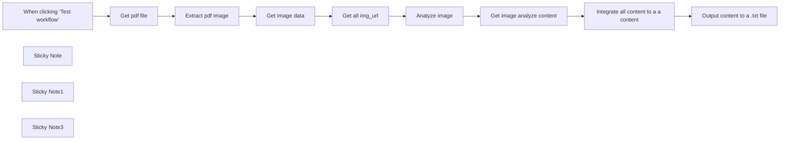

## Fluxo (.json) :

```json
{
  "id": "NDCN2arRu5tLuP61",
  "meta": {
    "instanceId": "36147281c0732d54779505fe69cf0516d4b8760fdbbc308b1950e452edcf85e8",
    "templateCredsSetupCompleted": true
  },
  "name": "Automate PDF Image Extraction & Analysis with GPT-4o and Google Drive",
  "tags": [],
  "nodes": [
    {
      "id": "78bb478a-721d-433f-a615-8f131ef1d87f",
      "name": "When clicking ‘Test workflow’",
      "type": "n8n-nodes-base.manualTrigger",
      "position": [
        -1180,
        140
      ],
      "parameters": {},
      "typeVersion": 1
    },
    {
      "id": "b1c2e97b-3539-4e16-89df-434a34c6a243",
      "name": "Sticky Note",
      "type": "n8n-nodes-base.stickyNote",
      "position": [
        -740,
        -440
      ],
      "parameters": {
        "color": 3,
        "width": 360,
        "height": 480,
        "content": "###  Setup\n1.Set up your credentials when you first open the workflow. You’ll need accounts for OpenAI, Convert API, and Google Drive.\n2.Convert API does not rate-limit your API, sometimes you may receive 503 service unavailable error.\nNevertheless, it doesn’t mean that you cannot convert your file. It simply means that you should retry the conversion in a few seconds.\n3.Upload a PDF with images to Google Drive.\n4.Remove unnecessary parts and retrieve image-related information.\n5.Integrate image and image analysis information together.\n6.Analyze each image using the OPENAI GPT-4o model.\n7.Retrieve all image analysis content and image URL\n8.Integrate multiple image URLs and analysis content\n9.Output content to a .txt file.\n\nTemplate was created in n8n v1.83.2"
      },
      "typeVersion": 1
    },
    {
      "id": "3b2a81eb-19b4-4685-90a3-1b4096b2d3b7",
      "name": "Get pdf file",
      "type": "n8n-nodes-base.googleDrive",
      "position": [
        -1000,
        40
      ],
      "parameters": {
        "fileId": {
          "__rl": true,
          "mode": "list",
          "value": "1WoqaMgaCD-gChGWUqPRJ7-pxbTozEuXN",
          "cachedResultUrl": "https://drive.google.com/file/d/1WoqaMgaCD-gChGWUqPRJ7-pxbTozEuXN/view?usp=drivesdk",
          "cachedResultName": "Building Effective AI Agents _ Anthropic.pdf"
        },
        "options": {},
        "operation": "download"
      },
      "credentials": {
        "googleDriveOAuth2Api": {
          "id": "nxqV58j7kOaLFzhj",
          "name": "Google Drive account"
        }
      },
      "typeVersion": 3
    },
    {
      "id": "89208aa8-37d8-424c-a936-52539a9bc7ee",
      "name": "Get all img_url",
      "type": "n8n-nodes-base.set",
      "position": [
        -520,
        160
      ],
      "parameters": {
        "options": {},
        "assignments": {
          "assignments": [
            {
              "id": "7715e33a-c5cc-4a22-aa28-ac19a24bbd7c",
              "name": "url",
              "type": "string",
              "value": "={{ $json.Url }}"
            }
          ]
        }
      },
      "typeVersion": 3.4
    },
    {
      "id": "5c1ece53-1910-42d6-a1e4-bfa6d5a83fe9",
      "name": "Analyze image",
      "type": "@n8n/n8n-nodes-langchain.openAi",
      "position": [
        -360,
        40
      ],
      "parameters": {
        "text": "Please analyze the video in detail and provide a thorough explanation",
        "modelId": {
          "__rl": true,
          "mode": "list",
          "value": "gpt-4o",
          "cachedResultName": "GPT-4O"
        },
        "options": {},
        "resource": "image",
        "simplify": false,
        "imageUrls": "={{ $json.url }}",
        "operation": "analyze"
      },
      "credentials": {
        "openAiApi": {
          "id": "4wadssyBOfOAfo2P",
          "name": "OpenAi account"
        }
      },
      "typeVersion": 1.8
    },
    {
      "id": "9e09364d-fb82-4524-b6aa-b8a6040893ba",
      "name": "Extract pdf image",
      "type": "n8n-nodes-base.httpRequest",
      "position": [
        -840,
        140
      ],
      "parameters": {
        "url": "https://v2.convertapi.com/convert/pdf/to/extract-images",
        "method": "POST",
        "options": {},
        "sendBody": true,
        "contentType": "multipart-form-data",
        "sendHeaders": true,
        "authentication": "genericCredentialType",
        "bodyParameters": {
          "parameters": [
            {
              "name": "StoreFile",
              "value": "true"
            },
            {
              "name": "ImageOutputFormat",
              "value": "jpg"
            },
            {
              "name": "File",
              "parameterType": "formBinaryData",
              "inputDataFieldName": "data"
            }
          ]
        },
        "genericAuthType": "httpHeaderAuth",
        "headerParameters": {
          "parameters": [
            {}
          ]
        }
      },
      "credentials": {
        "httpHeaderAuth": {
          "id": "5hUN8DpheywQE5v6",
          "name": "convertapi extract image"
        }
      },
      "retryOnFail": true,
      "typeVersion": 4.2,
      "waitBetweenTries": 5000
    },
    {
      "id": "8fd6e8ae-bea1-4d7f-8599-7bf6f4eee9e5",
      "name": "Sticky Note1",
      "type": "n8n-nodes-base.stickyNote",
      "position": [
        -1080,
        280
      ],
      "parameters": {
        "color": 5,
        "width": 202,
        "height": 99,
        "content": "### You can exchange this with any trigger you like (*e.g. google drive trigger*)"
      },
      "typeVersion": 1
    },
    {
      "id": "b0ce7fdd-7328-49b2-8ec6-797205aa7ab5",
      "name": "Get image data",
      "type": "n8n-nodes-base.splitOut",
      "position": [
        -680,
        40
      ],
      "parameters": {
        "options": {},
        "fieldToSplitOut": "Files"
      },
      "typeVersion": 1
    },
    {
      "id": "c5855876-41d9-46a4-bdec-e60effa116e8",
      "name": "Sticky Note3",
      "type": "n8n-nodes-base.stickyNote",
      "position": [
        -1060,
        -220
      ],
      "parameters": {
        "width": 300,
        "content": "### PDF Image Extraction and Analysis  with GPT-4o\nThis n8n workflow automates the process of extracting images from PDF files and analyzing them with AI, then compiling the results into a document."
      },
      "typeVersion": 1
    },
    {
      "id": "7cea9e1b-0094-4220-bdf6-f13ab795e394",
      "name": "Get image analyze content",
      "type": "n8n-nodes-base.set",
      "position": [
        -200,
        160
      ],
      "parameters": {
        "options": {},
        "assignments": {
          "assignments": [
            {
              "id": "2868a5bd-86a8-4962-a867-b4a354276181",
              "name": "content",
              "type": "string",
              "value": "={{ $('Get all img_url').item.json.url }}\n{{ $json.choices[0].message.content }}"
            }
          ]
        }
      },
      "typeVersion": 3.4
    },
    {
      "id": "de4b6fab-d086-4bf3-81fc-a6f7b7eac24b",
      "name": "Integrate all content to a a content",
      "type": "n8n-nodes-base.code",
      "position": [
        -40,
        40
      ],
      "parameters": {
        "jsCode": "const mergedContent = items.map(item => item.json.content).join('\\n');\n\nreturn [\n  {\n    json: {\n      content: mergedContent\n    }\n  }\n];\n"
      },
      "typeVersion": 2
    },
    {
      "id": "e66f7c66-9096-4bf5-b1dc-02dafeaa62ee",
      "name": "Output content to a .txt file",
      "type": "n8n-nodes-base.convertToFile",
      "position": [
        140,
        140
      ],
      "parameters": {
        "options": {},
        "operation": "toText",
        "sourceProperty": "content"
      },
      "typeVersion": 1.1
    }
  ],
  "active": false,
  "pinData": {},
  "settings": {
    "timezone": "Asia/Taipei",
    "executionOrder": "v1"
  },
  "versionId": "4c2771a6-f532-4bfd-bb98-3eae8b0ee85a",
  "connections": {
    "Get pdf file": {
      "main": [
        [
          {
            "node": "Extract pdf image",
            "type": "main",
            "index": 0
          }
        ]
      ]
    },
    "Analyze image": {
      "main": [
        [
          {
            "node": "Get image analyze content",
            "type": "main",
            "index": 0
          }
        ]
      ]
    },
    "Get image data": {
      "main": [
        [
          {
            "node": "Get all img_url",
            "type": "main",
            "index": 0
          }
        ]
      ]
    },
    "Get all img_url": {
      "main": [
        [
          {
            "node": "Analyze image",
            "type": "main",
            "index": 0
          }
        ]
      ]
    },
    "Extract pdf image": {
      "main": [
        [
          {
            "node": "Get image data",
            "type": "main",
            "index": 0
          }
        ]
      ]
    },
    "Get image analyze content": {
      "main": [
        [
          {
            "node": "Integrate all content to a a content",
            "type": "main",
            "index": 0
          }
        ]
      ]
    },
    "Output content to a .txt file": {
      "main": [
        []
      ]
    },
    "When clicking ‘Test workflow’": {
      "main": [
        [
          {
            "node": "Get pdf file",
            "type": "main",
            "index": 0
          }
        ]
      ]
    },
    "Integrate all content to a a content": {
      "main": [
        [
          {
            "node": "Output content to a .txt file",
            "type": "main",
            "index": 0
          }
        ]
      ]
    }
  }
}
```

<a id="template-1193"></a>

## Template 1193 - Gatilho de novas inscrições Mailchimp

- **Nome:** Gatilho de novas inscrições Mailchimp
- **Descrição:** Este fluxo dispara quando um novo contato se inscreve em uma lista específica do Mailchimp, permitindo ações automáticas com base na inscrição.
- **Funcionalidade:** • Monitoramento de lista: Observa uma lista específica identificada pelo ID 0a5a4ca5de para alterações.
• Detecção de novas inscrições: Aciona o fluxo ao ocorrerem eventos de subscribe (novas assinaturas).
• Identificação da origem: Filtra e diferencia inscrições vindas via API, admin ou usuário.
• Autenticação com conta: Utiliza credenciais configuradas para acessar e monitorar a conta Mailchimp.
- **Ferramentas:** • Mailchimp: Plataforma de e-mail marketing para gerenciar listas, contatos e registrar eventos de inscrição.

## Fluxo visual

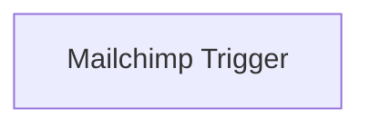

## Fluxo (.json) :

```json
{
  "nodes": [
    {
      "name": "Mailchimp Trigger",
      "type": "n8n-nodes-base.mailchimpTrigger",
      "position": [
        870,
        370
      ],
      "parameters": {
        "list": "0a5a4ca5de",
        "events": [
          "subscribe"
        ],
        "sources": [
          "api",
          "admin",
          "user"
        ]
      },
      "credentials": {
        "mailchimpApi": "mailchimp_creds"
      },
      "typeVersion": 1
    }
  ],
  "connections": {}
}
```

<a id="template-1194"></a>

## Template 1194 - Chat com Assistente OpenAI e ferramentas

- **Nome:** Chat com Assistente OpenAI e ferramentas
- **Descrição:** Fluxo que recebe mensagens de chat, encaminha a um assistente OpenAI que pode acionar ferramentas internas (consulta de capitais fictícias e obtenção do timestamp) e retorna respostas ao usuário. Também permite que outros fluxos executem a consulta de capitais.
- **Funcionalidade:** • Recepção de mensagens de chat: inicia o fluxo ao receber uma mensagem de usuário.
• Integração com assistente OpenAI: envia o contexto da conversa para um assistente que gera a resposta final.
• Memória de contexto: mantém um buffer de memória para preservar histórico recente da conversa.
• Ferramentas acionáveis pelo assistente: o assistente pode chamar uma ferramenta para listar países fictícios ou retornar a capital de um país específico, e outra ferramenta para obter o timestamp atual.
• Execução por outros fluxos: permite que fluxos externos invoquem o sub-workflow para consultar capitais fornecendo um parâmetro de consulta.
• Preparação e formatação de respostas: monta respostas específicas (lista de países ou capital encontrada) e retorna mensagens apropriadas quando não há correspondência.
- **Ferramentas:** • OpenAI Assistant: serviço de modelo de linguagem usado para interpretar mensagens, gerar respostas e decidir quando acionar ferramentas externas/internas.

## Fluxo visual

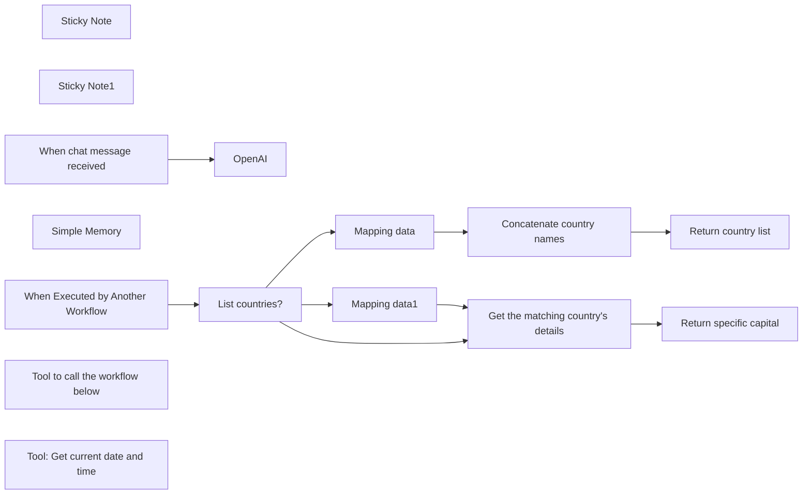

## Fluxo (.json) :

```json
{
  "meta": {
    "instanceId": "408f9fb9940c3cb18ffdef0e0150fe342d6e655c3a9fac21f0f644e8bedabcd9",
    "templateCredsSetupCompleted": true
  },
  "nodes": [
    {
      "id": "79573e58-f33f-445a-ad9a-0a92fde845c2",
      "name": "Sticky Note",
      "type": "n8n-nodes-base.stickyNote",
      "position": [
        -280,
        480
      ],
      "parameters": {
        "width": 1174.6162657502882,
        "height": 578.9520146851776,
        "content": "## Sub-workflow: Return the capitals of fictional countries\nIt can either list the countries it knows about or return the capital of a specific country"
      },
      "typeVersion": 1
    },
    {
      "id": "5eddcce9-7ee5-4ec7-a0a1-525a9b806994",
      "name": "Sticky Note1",
      "type": "n8n-nodes-base.stickyNote",
      "position": [
        -280,
        -80
      ],
      "parameters": {
        "width": 1168,
        "height": 528,
        "content": "## Main workflow: Chat with OpenAI Assistant\nClick the 'Chat' button at the bottom of the screen to try"
      },
      "typeVersion": 1
    },
    {
      "id": "a6c38394-1be1-4002-a9b7-c4672823aaa5",
      "name": "When chat message received",
      "type": "@n8n/n8n-nodes-langchain.chatTrigger",
      "position": [
        -180,
        40
      ],
      "webhookId": "91f22813-2f7b-4ff9-a3e6-9d53fc86fbd9",
      "parameters": {
        "options": {}
      },
      "typeVersion": 1.1
    },
    {
      "id": "de0398ea-c2ad-49b9-860b-695149b94590",
      "name": "OpenAI",
      "type": "@n8n/n8n-nodes-langchain.openAi",
      "position": [
        100,
        40
      ],
      "parameters": {
        "options": {},
        "resource": "assistant",
        "assistantId": {
          "__rl": true,
          "mode": "id",
          "value": "asst_BWy0154vMGMdrX7MjCYaYv6a"
        }
      },
      "credentials": {
        "openAiApi": {
          "id": "8gccIjcuf3gvaoEr",
          "name": "OpenAi account"
        }
      },
      "typeVersion": 1.8
    },
    {
      "id": "050042f4-f5ff-433a-9651-43cbec8eafb6",
      "name": "Simple Memory",
      "type": "@n8n/n8n-nodes-langchain.memoryBufferWindow",
      "position": [
        360,
        260
      ],
      "parameters": {},
      "typeVersion": 1.3
    },
    {
      "id": "e4ed4cfe-78fb-44a5-8bef-67168dac95ec",
      "name": "When Executed by Another Workflow",
      "type": "n8n-nodes-base.executeWorkflowTrigger",
      "position": [
        -180,
        740
      ],
      "parameters": {
        "workflowInputs": {
          "values": [
            {
              "name": "query"
            }
          ]
        }
      },
      "typeVersion": 1.1
    },
    {
      "id": "a3a1059c-5c36-4d90-90e2-98e37f62bdd2",
      "name": "Tool to call the workflow below",
      "type": "@n8n/n8n-nodes-langchain.toolWorkflow",
      "position": [
        40,
        260
      ],
      "parameters": {
        "name": "country_capitals_tool",
        "workflowId": {
          "__rl": true,
          "mode": "id",
          "value": "={{ $workflow.id }}"
        },
        "description": "This tool has two modes:\n1. Pass 'list' to the tool to get a list of countries that the tool has the capitals for (one per line). This is useful if you can't find a match, to see if the country being asked about might have been misspelled.\n2. Pass one of the country names in the list to the tool to get the capital of that country. Note that the country must be spelled exactly as it is in the list of countries returned in mode 1",
        "workflowInputs": {
          "value": {
            "query": "={{ /*n8n-auto-generated-fromAI-override*/ $fromAI('query', ``, 'string') }}"
          },
          "schema": [
            {
              "id": "query",
              "type": "string",
              "display": true,
              "removed": false,
              "required": false,
              "displayName": "query",
              "defaultMatch": false,
              "canBeUsedToMatch": true
            }
          ],
          "mappingMode": "defineBelow",
          "matchingColumns": [],
          "attemptToConvertTypes": false,
          "convertFieldsToString": false
        }
      },
      "typeVersion": 2
    },
    {
      "id": "80924ec9-5e82-4e90-8b72-42fc805d83c0",
      "name": "Tool: Get current date and time",
      "type": "@n8n/n8n-nodes-langchain.toolCode",
      "position": [
        200,
        260
      ],
      "parameters": {
        "name": "date_tool",
        "jsCode": "let now = DateTime.now()\nreturn now.toISO()",
        "description": "Call this tool to get the current timestamp (in ISO format). No parameters necessary"
      },
      "typeVersion": 1.1
    },
    {
      "id": "8f6a83bd-71eb-4f2d-b906-a18476f18f40",
      "name": "List countries?",
      "type": "n8n-nodes-base.if",
      "position": [
        40,
        740
      ],
      "parameters": {
        "options": {},
        "conditions": {
          "options": {
            "version": 2,
            "leftValue": "",
            "caseSensitive": true,
            "typeValidation": "strict"
          },
          "combinator": "and",
          "conditions": [
            {
              "id": "ca43a9bd-5db3-4240-ae46-0402c8411818",
              "operator": {
                "name": "filter.operator.equals",
                "type": "string",
                "operation": "equals"
              },
              "leftValue": "={{ $json.query }}",
              "rightValue": "list"
            }
          ]
        }
      },
      "typeVersion": 2.2
    },
    {
      "id": "40d93a59-4c91-43e4-a4a3-3732475617d6",
      "name": "Mapping data",
      "type": "n8n-nodes-base.code",
      "position": [
        260,
        600
      ],
      "parameters": {
        "jsCode": "return [\n    {\n        \"country\": \"Wakanda\",\n        \"capital\": \"Birnin Zana\"\n    },\n    {\n        \"country\": \"Narnia\",\n        \"capital\": \"Cair Paravel\"\n    },\n    {\n        \"country\": \"Gondor\",\n        \"capital\": \"Minas Tirith\"\n    },\n    {\n        \"country\": \"Oz\",\n        \"capital\": \"The Emerald City\"\n    },\n    {\n        \"country\": \"Westeros\",\n        \"capital\": \"King's Landing\"\n    },\n    {\n        \"country\": \"Panem\",\n        \"capital\": \"The Capitol\"\n    },\n    {\n        \"country\": \"Ruritania\",\n        \"capital\": \"Strelsau\"\n    },\n    {\n        \"country\": \"Mordor\",\n        \"capital\": \"Barad-dûr\"\n    },\n    {\n        \"country\": \"Latveria\",\n        \"capital\": \"Doomstadt\"\n    },\n    {\n        \"country\": \"Atlantis\",\n        \"capital\": \"Poseidonis\"\n    }\n]\n"
      },
      "typeVersion": 2
    },
    {
      "id": "8765b405-8991-421c-bdc5-3eb6d3757fcb",
      "name": "Concatenate country names",
      "type": "n8n-nodes-base.summarize",
      "position": [
        460,
        600
      ],
      "parameters": {
        "options": {},
        "fieldsToSummarize": {
          "values": [
            {
              "field": "country",
              "separateBy": "\n",
              "aggregation": "concatenate"
            }
          ]
        }
      },
      "typeVersion": 1.1
    },
    {
      "id": "c0b21934-8518-49b4-bbab-f13ad0a74343",
      "name": "Return country list",
      "type": "n8n-nodes-base.set",
      "position": [
        660,
        600
      ],
      "parameters": {
        "options": {},
        "assignments": {
          "assignments": [
            {
              "id": "c97c3abc-40b2-4238-912d-030eb9ca3440",
              "name": "response",
              "type": "string",
              "value": "={{ $json.concatenated_country }}"
            }
          ]
        }
      },
      "typeVersion": 3.4
    },
    {
      "id": "5d4f05cc-f4e3-4ce6-9ea8-a324257fa7c3",
      "name": "Mapping data1",
      "type": "n8n-nodes-base.code",
      "position": [
        260,
        880
      ],
      "parameters": {
        "jsCode": "return [\n    {\n        \"country\": \"Wakanda\",\n        \"capital\": \"Birnin Zana\"\n    },\n    {\n        \"country\": \"Narnia\",\n        \"capital\": \"Cair Paravel\"\n    },\n    {\n        \"country\": \"Gondor\",\n        \"capital\": \"Minas Tirith\"\n    },\n    {\n        \"country\": \"Oz\",\n        \"capital\": \"The Emerald City\"\n    },\n    {\n        \"country\": \"Westeros\",\n        \"capital\": \"King's Landing\"\n    },\n    {\n        \"country\": \"Panem\",\n        \"capital\": \"The Capitol\"\n    },\n    {\n        \"country\": \"Ruritania\",\n        \"capital\": \"Strelsau\"\n    },\n    {\n        \"country\": \"Mordor\",\n        \"capital\": \"Barad-dûr\"\n    },\n    {\n        \"country\": \"Latveria\",\n        \"capital\": \"Doomstadt\"\n    },\n    {\n        \"country\": \"Atlantis\",\n        \"capital\": \"Poseidonis\"\n    }\n]\n"
      },
      "typeVersion": 2
    },
    {
      "id": "5ed65e2c-b56d-49d9-a205-1e4cc8914fa9",
      "name": "Get the matching country's details",
      "type": "n8n-nodes-base.merge",
      "position": [
        460,
        820
      ],
      "parameters": {
        "mode": "combine",
        "options": {},
        "advanced": true,
        "joinMode": "enrichInput1",
        "mergeByFields": {
          "values": [
            {
              "field1": "query",
              "field2": "country"
            }
          ]
        }
      },
      "typeVersion": 3
    },
    {
      "id": "313775a0-a4ce-488e-a7db-b1ddd49dc3cd",
      "name": "Return specific capital",
      "type": "n8n-nodes-base.set",
      "position": [
        660,
        820
      ],
      "parameters": {
        "options": {},
        "assignments": {
          "assignments": [
            {
              "id": "03ac1883-126f-4419-93e4-c5062b2d766d",
              "name": "response",
              "type": "string",
              "value": "={{ $ifEmpty($json.capital, 'Capital not found') }}"
            }
          ]
        }
      },
      "typeVersion": 3.4
    }
  ],
  "pinData": {},
  "connections": {
    "Mapping data": {
      "main": [
        [
          {
            "node": "Concatenate country names",
            "type": "main",
            "index": 0
          }
        ]
      ]
    },
    "Mapping data1": {
      "main": [
        [
          {
            "node": "Get the matching country's details",
            "type": "main",
            "index": 1
          }
        ]
      ]
    },
    "Simple Memory": {
      "ai_memory": [
        [
          {
            "node": "OpenAI",
            "type": "ai_memory",
            "index": 0
          }
        ]
      ]
    },
    "List countries?": {
      "main": [
        [
          {
            "node": "Mapping data",
            "type": "main",
            "index": 0
          }
        ],
        [
          {
            "node": "Get the matching country's details",
            "type": "main",
            "index": 0
          },
          {
            "node": "Mapping data1",
            "type": "main",
            "index": 0
          }
        ]
      ]
    },
    "Concatenate country names": {
      "main": [
        [
          {
            "node": "Return country list",
            "type": "main",
            "index": 0
          }
        ]
      ]
    },
    "When chat message received": {
      "main": [
        [
          {
            "node": "OpenAI",
            "type": "main",
            "index": 0
          }
        ]
      ]
    },
    "Tool to call the workflow below": {
      "ai_tool": [
        [
          {
            "node": "OpenAI",
            "type": "ai_tool",
            "index": 0
          }
        ]
      ]
    },
    "Tool: Get current date and time": {
      "ai_tool": [
        [
          {
            "node": "OpenAI",
            "type": "ai_tool",
            "index": 0
          }
        ]
      ]
    },
    "When Executed by Another Workflow": {
      "main": [
        [
          {
            "node": "List countries?",
            "type": "main",
            "index": 0
          }
        ]
      ]
    },
    "Get the matching country's details": {
      "main": [
        [
          {
            "node": "Return specific capital",
            "type": "main",
            "index": 0
          }
        ]
      ]
    }
  }
}
```

<a id="template-1195"></a>

## Template 1195 - Gerar códigos TOTP manualmente

- **Nome:** Gerar códigos TOTP manualmente
- **Descrição:** Fluxo que gera códigos TOTP temporários a partir de uma conta de autenticação quando acionado manualmente.
- **Funcionalidade:** • Acionamento manual: Inicia o fluxo por meio de um acionador manual (teste/manual trigger).
• Geração de código TOTP: Produz códigos temporários usando as credenciais configuradas.
• Uso de credenciais específicas: Recupera o segredo da conta designada para calcular o TOTP (neste caso, a conta "TOTP account Mars55").
• Fuso horário configurado: Executa considerando o fuso horário definido (Asia/Tehran).
- **Ferramentas:** • TOTP account Mars55: Conta/serviço que armazena o segredo compartilhado e permite gerar códigos TOTP (códigos de autenticação temporária).

## Fluxo visual


## Fluxo (.json) :

```json
{
  "id": "0wfomsVO0TQtQkwU",
  "meta": {
    "instanceId": "2e75c9fb3cdcf631da470c0180f0739986baa0ee860de53281e9edc3491b82a3"
  },
  "name": "Complete Guide to Setting Up and Generating TOTP Codes in n8n 🔐",
  "tags": [],
  "nodes": [
    {
      "id": "0fe95b9a-be2b-4022-829e-8b6c801e5baf",
      "name": "When clicking ‘Test workflow’",
      "type": "n8n-nodes-base.manualTrigger",
      "position": [
        -280,
        -340
      ],
      "parameters": {},
      "typeVersion": 1
    },
    {
      "id": "02fee6b5-7770-4889-b9bb-89bface8872d",
      "name": "TOTP",
      "type": "n8n-nodes-base.totp",
      "position": [
        -40,
        -340
      ],
      "parameters": {
        "options": {}
      },
      "credentials": {
        "totpApi": {
          "id": "9487Zco8UqMQWnpf",
          "name": "TOTP account Mars55"
        }
      },
      "typeVersion": 1
    }
  ],
  "active": false,
  "pinData": {},
  "settings": {
    "timezone": "Asia/Tehran",
    "executionOrder": "v1"
  },
  "versionId": "d7a5fff3-3fcd-45cd-ba06-564097567ff5",
  "connections": {
    "When clicking ‘Test workflow’": {
      "main": [
        [
          {
            "node": "TOTP",
            "type": "main",
            "index": 0
          }
        ]
      ]
    }
  }
}
```

<a id="template-1196"></a>

## Template 1196 - Capturar e armazenar novos tweets

- **Nome:** Capturar e armazenar novos tweets
- **Descrição:** Busca tweets contendo 'verstappen', compara com registros existentes no Airtable e adiciona apenas os novos.
- **Funcionalidade:** • Busca de tweets por palavra-chave: Pesquisa tweets que contenham "verstappen" e obtém até 100 resultados.
• Preparação de dados do tweet: Extrai campos relevantes (texto, id, URL, autor, horário e número de likes) para comparação e armazenamento.
• Recuperação de registros existentes: Obtém a lista atual de tweets já armazenados no Airtable para referência.
• Filtragem de novos tweets: Compara os IDs dos tweets e remove aqueles que já existem na base.
• Inserção de novos registros: Adiciona apenas os tweets identificados como novos ao Airtable.
- **Ferramentas:** • Twitter: Plataforma de microblogging usada para pesquisar e obter dados dos tweets (texto, autor, id, data e favoritos).
• Airtable: Base de dados em nuvem usada para listar registros existentes e armazenar novos tweets.

## Fluxo visual

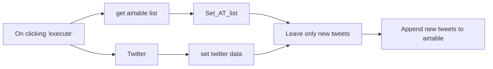

## Fluxo (.json) :

```json
{
  "id": 1003,
  "name": "New tweets",
  "nodes": [
    {
      "name": "On clicking 'execute'",
      "type": "n8n-nodes-base.manualTrigger",
      "position": [
        240,
        260
      ],
      "parameters": {},
      "typeVersion": 1
    },
    {
      "name": "Twitter",
      "type": "n8n-nodes-base.twitter",
      "position": [
        520,
        160
      ],
      "parameters": {
        "limit": 100,
        "operation": "search",
        "searchText": "verstappen",
        "additionalFields": {
          "resultType": "mixed"
        }
      },
      "typeVersion": 1
    },
    {
      "name": "Set_AT_list",
      "type": "n8n-nodes-base.set",
      "position": [
        780,
        360
      ],
      "parameters": {
        "values": {
          "number": [
            {
              "name": "Likes",
              "value": "={{$node[\"Twitter\"].json[\"favorite_count\"] ? $node[\"Twitter\"].json[\"favorite_count\"] : 0 }}"
            }
          ],
          "string": [
            {
              "name": "Tweet",
              "value": "={{$node[\"get airtable list\"].json[\"fields\"][\"Tweet\"]}}"
            },
            {
              "name": "Tweet_id",
              "value": "={{$node[\"get airtable list\"].json[\"fields\"][\"Tweet_id\"]}}"
            },
            {
              "name": "Tweet URL",
              "value": "={{$node[\"get airtable list\"].json[\"fields\"][\"Tweet URL\"]}}"
            },
            {
              "name": "Author",
              "value": "={{$node[\"get airtable list\"].json[\"fields\"][\"Author\"]}}"
            },
            {
              "name": "Time",
              "value": "={{$node[\"get airtable list\"].json[\"fields\"][\"Time\"]}}"
            }
          ]
        },
        "options": {
          "dotNotation": false
        },
        "keepOnlySet": true
      },
      "typeVersion": 1
    },
    {
      "name": "get airtable list",
      "type": "n8n-nodes-base.airtable",
      "position": [
        520,
        360
      ],
      "parameters": {
        "table": "tbl6rexxFBodzKVoC",
        "operation": "list",
        "application": "app36P08S3Jzki6qJ",
        "additionalOptions": {}
      },
      "credentials": {
        "airtableApi": {
          "id": "2",
          "name": "airtable_api"
        }
      },
      "typeVersion": 1
    },
    {
      "name": "set twitter data",
      "type": "n8n-nodes-base.set",
      "position": [
        780,
        160
      ],
      "parameters": {
        "values": {
          "number": [
            {
              "name": "Likes",
              "value": "={{$node[\"Twitter\"].json[\"favorite_count\"]}}"
            }
          ],
          "string": [
            {
              "name": "Tweet",
              "value": "={{$node[\"Twitter\"].json[\"text\"]}}"
            },
            {
              "name": "Tweet_id",
              "value": "={{$node[\"Twitter\"].json[\"id\"]}}"
            },
            {
              "name": "Tweet URL",
              "value": "=https://twitter.com/{{$node[\"Twitter\"].json[\"user\"][\"screen_name\"]}}/status/{{$node[\"Twitter\"].json[\"id_str\"]}}"
            },
            {
              "name": "Author",
              "value": "={{$node[\"Twitter\"].json[\"in_reply_to_screen_name\"]}}"
            },
            {
              "name": "Time",
              "value": "={{$node[\"Twitter\"].json[\"created_at\"]}}"
            }
          ]
        },
        "options": {
          "dotNotation": false
        },
        "keepOnlySet": true
      },
      "typeVersion": 1
    },
    {
      "name": "Leave only new tweets",
      "type": "n8n-nodes-base.merge",
      "position": [
        1060,
        260
      ],
      "parameters": {
        "mode": "removeKeyMatches",
        "propertyName1": "Tweet_id",
        "propertyName2": "Tweet_id"
      },
      "typeVersion": 1
    },
    {
      "name": "Append new tweets to airtable",
      "type": "n8n-nodes-base.airtable",
      "position": [
        1300,
        260
      ],
      "parameters": {
        "table": "tbl6rexxFBodzKVoC",
        "options": {},
        "operation": "append",
        "application": "app36P08S3Jzki6qJ",
        "addAllFields": "={{true}}"
      },
      "credentials": {
        "airtableApi": {
          "id": "2",
          "name": "airtable_api"
        }
      },
      "typeVersion": 1
    }
  ],
  "active": false,
  "settings": {},
  "connections": {
    "Twitter": {
      "main": [
        [
          {
            "node": "set twitter data",
            "type": "main",
            "index": 0
          }
        ]
      ]
    },
    "Set_AT_list": {
      "main": [
        [
          {
            "node": "Leave only new tweets",
            "type": "main",
            "index": 1
          }
        ]
      ]
    },
    "set twitter data": {
      "main": [
        [
          {
            "node": "Leave only new tweets",
            "type": "main",
            "index": 0
          }
        ]
      ]
    },
    "get airtable list": {
      "main": [
        [
          {
            "node": "Set_AT_list",
            "type": "main",
            "index": 0
          }
        ]
      ]
    },
    "Leave only new tweets": {
      "main": [
        [
          {
            "node": "Append new tweets to airtable",
            "type": "main",
            "index": 0
          }
        ]
      ]
    },
    "On clicking 'execute'": {
      "main": [
        [
          {
            "node": "Twitter",
            "type": "main",
            "index": 0
          },
          {
            "node": "get airtable list",
            "type": "main",
            "index": 0
          }
        ]
      ]
    }
  }
}
```

<a id="template-1197"></a>

## Template 1197 - Agente de IA com ferramenta de escalonamento por email

- **Nome:** Agente de IA com ferramenta de escalonamento por email
- **Descrição:** Fluxo que recebe mensagens de chat, processa com um agente de IA e, quando necessário, aciona um sub-fluxo que verifica se há um email do usuário e notifica a equipe de suporte.
- **Funcionalidade:** • Recepção de mensagens de chat: Inicia o fluxo ao receber mensagens de usuários via gatilho de chat.
• Processamento por agente de IA: Utiliza um modelo de linguagem para gerar respostas e decidir quando acionar a ferramenta de escalonamento.
• Memória de contexto: Mantém um histórico curto de conversas para fornecer respostas mais consistentes.
• Ferramenta "Não sei": Disponibiliza um sub-fluxo que o agente chama quando não tem confiança na resposta.
• Verificação e solicitação de email: O sub-fluxo detecta se a mensagem contém um endereço de email e, se não, solicita que o usuário repita a pergunta incluindo o email.
• Notificação da equipe de suporte: Se um email for encontrado, o sub-fluxo envia a mensagem do usuário para um canal de suporte e confirma ao usuário que um humano foi contatado.
• Respostas padronizadas: Gera respostas pré-formatadas para confirmar ação ao usuário ou solicitar informações adicionais.
- **Ferramentas:** • OpenAI: Modelo de linguagem usado para gerar respostas e apoiar a tomada de decisão (ex.: gpt-4o-mini).
• Slack: Canal de comunicação para notificar a equipe de suporte com a mensagem do usuário.

## Fluxo visual

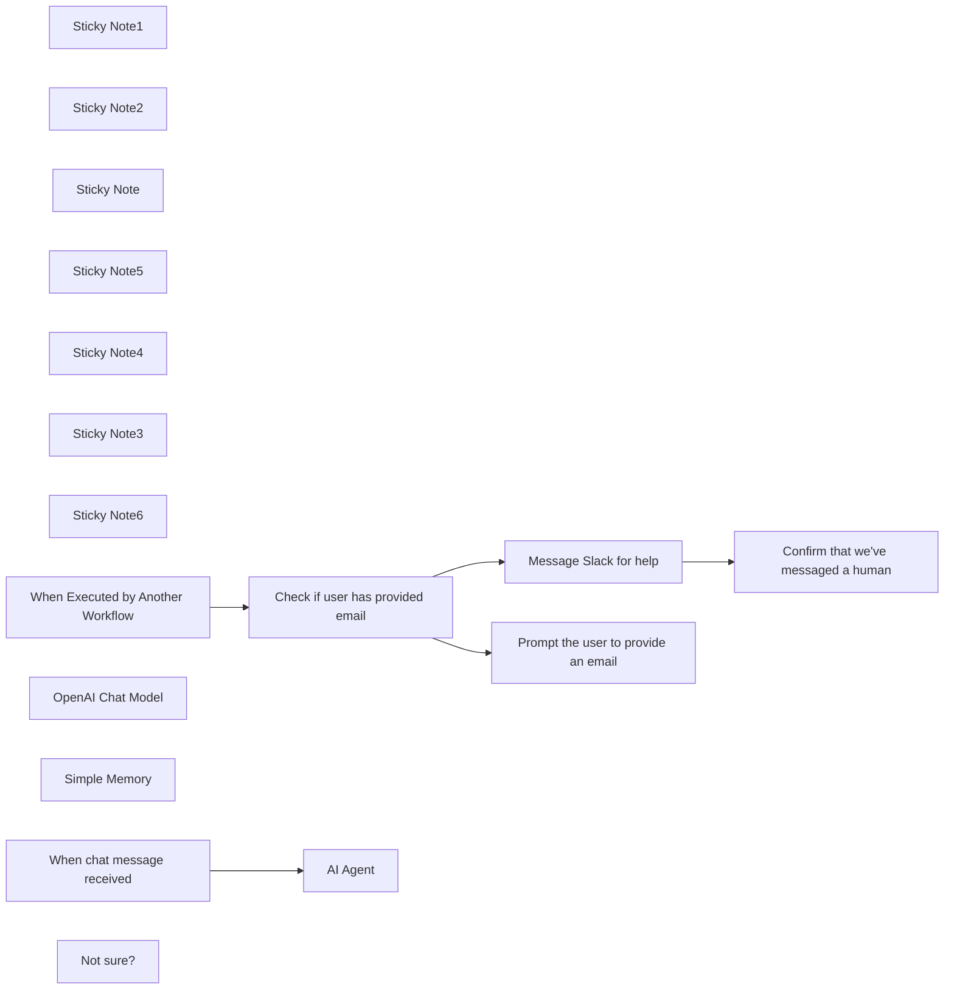

## Fluxo (.json) :

```json
{
  "meta": {
    "instanceId": "408f9fb9940c3cb18ffdef0e0150fe342d6e655c3a9fac21f0f644e8bedabcd9",
    "templateCredsSetupCompleted": true
  },
  "nodes": [
    {
      "id": "e12611f4-37d2-48f9-8a60-ddcf4ff34cfc",
      "name": "Sticky Note1",
      "type": "n8n-nodes-base.stickyNote",
      "position": [
        -480,
        380
      ],
      "parameters": {
        "color": 7,
        "width": 1118.3459011229047,
        "height": 775.3931210698682,
        "content": "### Sub-workflow: Custom tool\nThe agent above can call this workflow. It checks if the user has supplied an email address. If they haven't it prompts them to provide one. If they have, it messages a customer support channel for help."
      },
      "typeVersion": 1
    },
    {
      "id": "72dbee3e-fe3b-4354-9b02-2fe52af23035",
      "name": "Sticky Note2",
      "type": "n8n-nodes-base.stickyNote",
      "position": [
        -480,
        -180
      ],
      "parameters": {
        "color": 7,
        "width": 927.5,
        "height": 486.5625,
        "content": "### Main workflow: AI agent using custom tool"
      },
      "typeVersion": 1
    },
    {
      "id": "a1c9660d-84b1-418a-bbb3-88d79cdd79d3",
      "name": "Sticky Note",
      "type": "n8n-nodes-base.stickyNote",
      "position": [
        80,
        60
      ],
      "parameters": {
        "color": 5,
        "width": 197.45572294791873,
        "height": 179.21380662202682,
        "content": "**This tool calls the sub-workflow below**"
      },
      "typeVersion": 1
    },
    {
      "id": "b4ffb76d-c44f-46d6-b2d9-4e5d551adee1",
      "name": "Sticky Note5",
      "type": "n8n-nodes-base.stickyNote",
      "position": [
        -280,
        40
      ],
      "parameters": {
        "color": 2,
        "width": 150,
        "height": 213.44323866265472,
        "content": "**Set your credentials**"
      },
      "typeVersion": 1
    },
    {
      "id": "8a9187f1-3cf9-479f-aa7f-5581880394d0",
      "name": "Sticky Note4",
      "type": "n8n-nodes-base.stickyNote",
      "position": [
        40,
        540
      ],
      "parameters": {
        "color": 2,
        "width": 178.0499248677781,
        "height": 250.57252651663197,
        "content": "**Set your credentials and Slack details**"
      },
      "typeVersion": 1
    },
    {
      "id": "3f72d117-e07a-4af4-aa1b-92ce04bf0b3c",
      "name": "Sticky Note3",
      "type": "n8n-nodes-base.stickyNote",
      "position": [
        -640,
        -120
      ],
      "parameters": {
        "color": 4,
        "width": 185.9375,
        "height": 214.8397420554627,
        "content": "## Try it out\n\nSelect **Chat** at the bottom and enter:\n\n_Hi! Please respond to this as if you don't know the answer to my query._"
      },
      "typeVersion": 1
    },
    {
      "id": "b85eff07-ee3c-4aeb-871e-b25a131a7afb",
      "name": "Sticky Note6",
      "type": "n8n-nodes-base.stickyNote",
      "position": [
        360,
        900
      ],
      "parameters": {
        "height": 145,
        "content": "## Next steps\n\nLearn more about [Advanced AI in n8n](https://docs.n8n.io/advanced-ai/)"
      },
      "typeVersion": 1
    },
    {
      "id": "feb1e50d-5044-4ea6-8719-72e176581e27",
      "name": "When chat message received",
      "type": "@n8n/n8n-nodes-langchain.chatTrigger",
      "position": [
        -400,
        -120
      ],
      "webhookId": "e0e69202-32e8-41b5-963b-50905dd93e88",
      "parameters": {
        "options": {}
      },
      "typeVersion": 1.1
    },
    {
      "id": "6af81471-7cd4-4517-9677-b634b59620b4",
      "name": "OpenAI Chat Model",
      "type": "@n8n/n8n-nodes-langchain.lmChatOpenAi",
      "position": [
        -240,
        120
      ],
      "parameters": {
        "model": {
          "__rl": true,
          "mode": "list",
          "value": "gpt-4o-mini"
        },
        "options": {}
      },
      "credentials": {
        "openAiApi": {
          "id": "8gccIjcuf3gvaoEr",
          "name": "OpenAi account"
        }
      },
      "typeVersion": 1.2
    },
    {
      "id": "37604c8d-5c70-4a81-a1d0-eafe42ce612d",
      "name": "Simple Memory",
      "type": "@n8n/n8n-nodes-langchain.memoryBufferWindow",
      "position": [
        -60,
        120
      ],
      "parameters": {},
      "typeVersion": 1.3
    },
    {
      "id": "fd404bb5-0703-4d08-8b9b-4a8b01fd2bff",
      "name": "When Executed by Another Workflow",
      "type": "n8n-nodes-base.executeWorkflowTrigger",
      "position": [
        -380,
        740
      ],
      "parameters": {
        "workflowInputs": {
          "values": [
            {
              "name": "chatInput"
            }
          ]
        }
      },
      "typeVersion": 1.1
    },
    {
      "id": "a807ca29-65bf-4d97-b89f-5ce16cd05347",
      "name": "Check if user has provided email",
      "type": "n8n-nodes-base.if",
      "position": [
        -200,
        740
      ],
      "parameters": {
        "options": {},
        "conditions": {
          "options": {
            "version": 2,
            "leftValue": "",
            "caseSensitive": true,
            "typeValidation": "strict"
          },
          "combinator": "and",
          "conditions": [
            {
              "id": "e6dce436-5e85-4722-a7e4-0ceb940a5477",
              "operator": {
                "type": "string",
                "operation": "regex"
              },
              "leftValue": "={{ $('When Executed by Another Workflow').item.json.chatInput }}",
              "rightValue": "=/([a-zA-Z0-9._-]+@[a-zA-Z0-9._-]+\\.[a-zA-Z0-9_-]+)/gi"
            }
          ]
        }
      },
      "typeVersion": 2.2
    },
    {
      "id": "b9c552ce-4c58-48dd-b168-5e277de89954",
      "name": "Message Slack for help",
      "type": "n8n-nodes-base.slack",
      "position": [
        80,
        620
      ],
      "webhookId": "c54bea4c-bdb6-4f42-9f82-525857df5a9a",
      "parameters": {
        "text": "={{ \"A user had a question the bot couldn't answer. Here's their message: \" + $('When Executed by Another Workflow').first().json.chatInput }}",
        "select": "channel",
        "channelId": {
          "__rl": true,
          "mode": "name",
          "value": "#general"
        },
        "otherOptions": {}
      },
      "credentials": {
        "slackApi": {
          "id": "VfK3js0YdqBdQLGP",
          "name": "Slack account"
        }
      },
      "typeVersion": 2.3
    },
    {
      "id": "644a05fc-ac7e-4ea9-ab03-3b6fbf7a3654",
      "name": "Confirm that we've messaged a human",
      "type": "n8n-nodes-base.code",
      "position": [
        300,
        620
      ],
      "parameters": {
        "jsCode": "const response = {\"response\": \"Thank you for getting in touch. I've messaged a human to help.\"}\nreturn response;"
      },
      "typeVersion": 2
    },
    {
      "id": "38e81aa5-30b3-48f9-88e8-1039f607f3e7",
      "name": "Prompt the user to provide an email",
      "type": "n8n-nodes-base.code",
      "position": [
        80,
        860
      ],
      "parameters": {
        "jsCode": "const response = {\"response\":\"I'm sorry I don't know the answer. Please repeat your question and include your email address so I can request help.\"};\nreturn response;"
      },
      "typeVersion": 2
    },
    {
      "id": "61ddb25a-f7f2-4691-94d5-3f32c183ec46",
      "name": "Not sure?",
      "type": "@n8n/n8n-nodes-langchain.toolWorkflow",
      "position": [
        140,
        120
      ],
      "parameters": {
        "name": "dont_know_tool",
        "workflowId": {
          "__rl": true,
          "mode": "id",
          "value": "={{ $workflow.id }}"
        },
        "description": "Use this tool if you don't know the answer to the user's question, or if you're not very confident about your answer.",
        "workflowInputs": {
          "value": {
            "chatInput": "={{ /*n8n-auto-generated-fromAI-override*/ $fromAI('chatInput', ``, 'string') }}"
          },
          "schema": [
            {
              "id": "chatInput",
              "type": "string",
              "display": true,
              "removed": false,
              "required": false,
              "displayName": "chatInput",
              "defaultMatch": false,
              "canBeUsedToMatch": true
            }
          ],
          "mappingMode": "defineBelow",
          "matchingColumns": [],
          "attemptToConvertTypes": false,
          "convertFieldsToString": false
        }
      },
      "typeVersion": 2
    },
    {
      "id": "395349d1-1715-4550-a0c8-1388d17b4386",
      "name": "AI Agent",
      "type": "@n8n/n8n-nodes-langchain.agent",
      "position": [
        -180,
        -120
      ],
      "parameters": {
        "options": {}
      },
      "typeVersion": 1.8
    }
  ],
  "pinData": {},
  "connections": {
    "Not sure?": {
      "ai_tool": [
        [
          {
            "node": "AI Agent",
            "type": "ai_tool",
            "index": 0
          }
        ]
      ]
    },
    "Simple Memory": {
      "ai_memory": [
        [
          {
            "node": "AI Agent",
            "type": "ai_memory",
            "index": 0
          }
        ]
      ]
    },
    "OpenAI Chat Model": {
      "ai_languageModel": [
        [
          {
            "node": "AI Agent",
            "type": "ai_languageModel",
            "index": 0
          }
        ]
      ]
    },
    "Message Slack for help": {
      "main": [
        [
          {
            "node": "Confirm that we've messaged a human",
            "type": "main",
            "index": 0
          }
        ]
      ]
    },
    "When chat message received": {
      "main": [
        [
          {
            "node": "AI Agent",
            "type": "main",
            "index": 0
          }
        ]
      ]
    },
    "Check if user has provided email": {
      "main": [
        [
          {
            "node": "Message Slack for help",
            "type": "main",
            "index": 0
          }
        ],
        [
          {
            "node": "Prompt the user to provide an email",
            "type": "main",
            "index": 0
          }
        ]
      ]
    },
    "When Executed by Another Workflow": {
      "main": [
        [
          {
            "node": "Check if user has provided email",
            "type": "main",
            "index": 0
          }
        ]
      ]
    }
  }
}
```

<a id="template-1198"></a>

## Template 1198 - Criar tarefa no Todoist

- **Nome:** Criar tarefa no Todoist
- **Descrição:** Este fluxo cria uma nova tarefa no Todoist quando é executado manualmente.
- **Funcionalidade:** • Gatilho manual: inicia o fluxo quando o usuário clica em 'execute'.
• Criação de tarefa no Todoist: envia os dados da tarefa para a conta configurada no Todoist; o campo de conteúdo está atualmente vazio e pode ser preenchido antes da execução.
• Uso de credenciais do Todoist: autentica a requisição usando credenciais vinculadas para permitir a criação da tarefa.
- **Ferramentas:** • Todoist: serviço de gerenciamento de tarefas onde o fluxo cria novas tarefas usando a API do Todoist.

## Fluxo visual

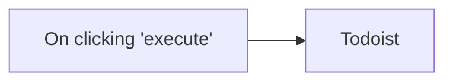

## Fluxo (.json) :

```json
{
  "id": "100",
  "name": "Create a new task in Todoist",
  "nodes": [
    {
      "name": "On clicking 'execute'",
      "type": "n8n-nodes-base.manualTrigger",
      "position": [
        550,
        250
      ],
      "parameters": {},
      "typeVersion": 1
    },
    {
      "name": "Todoist",
      "type": "n8n-nodes-base.todoist",
      "position": [
        750,
        250
      ],
      "parameters": {
        "content": "",
        "options": {}
      },
      "credentials": {
        "todoistApi": ""
      },
      "typeVersion": 1
    }
  ],
  "active": false,
  "settings": {},
  "connections": {
    "On clicking 'execute'": {
      "main": [
        [
          {
            "node": "Todoist",
            "type": "main",
            "index": 0
          }
        ]
      ]
    }
  }
}
```

<a id="template-1199"></a>

## Template 1199 - Criar, atualizar e obter contato no Copper

- **Nome:** Criar, atualizar e obter contato no Copper
- **Descrição:** Cria um contato com email no Copper, atualiza o número de telefone desse contato e, em seguida, recupera os dados atualizados.
- **Funcionalidade:** • Gatilho manual: Inicia o fluxo quando o usuário executa manualmente.
• Criação de pessoa: Cria um novo contato com nome e email fornecidos.
• Atualização de telefone: Atualiza o contato recém-criado adicionando um número de telefone categorizado.
• Recuperação de dados: Obtém os dados atualizados da pessoa para verificação ou uso posterior.
- **Ferramentas:** • Copper: CRM usado para criar, atualizar e recuperar registros de contatos (pessoas).

## Fluxo visual

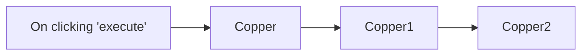

## Fluxo (.json) :

```json
{
  "nodes": [
    {
      "name": "On clicking 'execute'",
      "type": "n8n-nodes-base.manualTrigger",
      "position": [
        250,
        320
      ],
      "parameters": {},
      "typeVersion": 1
    },
    {
      "name": "Copper",
      "type": "n8n-nodes-base.copper",
      "position": [
        450,
        320
      ],
      "parameters": {
        "name": "Harshil",
        "resource": "person",
        "additionalFields": {
          "emails": {
            "emailFields": [
              {
                "email": "harshil@n8n.io",
                "category": "work"
              }
            ]
          }
        }
      },
      "credentials": {
        "copperApi": "Copper API Credentials"
      },
      "typeVersion": 1
    },
    {
      "name": "Copper1",
      "type": "n8n-nodes-base.copper",
      "position": [
        650,
        320
      ],
      "parameters": {
        "personId": "={{$json[\"id\"]}}",
        "resource": "person",
        "operation": "update",
        "updateFields": {
          "phone_numbers": {
            "phoneFields": [
              {
                "number": "1234567890",
                "category": "work"
              }
            ]
          }
        }
      },
      "credentials": {
        "copperApi": "Copper API Credentials"
      },
      "typeVersion": 1
    },
    {
      "name": "Copper2",
      "type": "n8n-nodes-base.copper",
      "position": [
        850,
        320
      ],
      "parameters": {
        "personId": "={{$json[\"id\"]}}",
        "resource": "person",
        "operation": "get"
      },
      "credentials": {
        "copperApi": "Copper API Credentials"
      },
      "typeVersion": 1
    }
  ],
  "connections": {
    "Copper": {
      "main": [
        [
          {
            "node": "Copper1",
            "type": "main",
            "index": 0
          }
        ]
      ]
    },
    "Copper1": {
      "main": [
        [
          {
            "node": "Copper2",
            "type": "main",
            "index": 0
          }
        ]
      ]
    },
    "On clicking 'execute'": {
      "main": [
        [
          {
            "node": "Copper",
            "type": "main",
            "index": 0
          }
        ]
      ]
    }
  }
}
```

<a id="template-1200"></a>

## Template 1200 - Gerador de posts de blog com pesquisa e LLM

- **Nome:** Gerador de posts de blog com pesquisa e LLM
- **Descrição:** Fluxo que recebe um pedido de criação de blog, pesquisa conteúdo relevante na web e gera um post em HTML otimizado via modelo de linguagem, retornando o resultado formatado ou uma mensagem de erro.
- **Funcionalidade:** • Gatilho por outro fluxo: Inicia a execução quando chamado por outro processo.
• Busca na web com parâmetros: Envia uma requisição POST ao endpoint de busca (Tavily) usando um corpo JSON com a consulta do usuário e parâmetros de pesquisa.
• Agente de criação de conteúdo: Recebe resultados da busca e instruções de sistema para gerar posts de blog em HTML, exigindo citações preservadas e formato específico.
• Geração de texto por LLM: Utiliza um modelo de linguagem para compor o conteúdo final conforme o prompt do agente.
• Preparação da resposta: Armazena a saída final em uma variável de resposta para ser consumida por outros processos.
• Tratamento de erro simples: Em caso de falha, define uma resposta padrão orientando a tentar novamente.
- **Ferramentas:** • Tavily (API de busca): Serviço de pesquisa na web usado para obter resultados, conteúdo bruto e links de referência para fundamentar o texto.
• Anthropic (modelo de linguagem): Serviço de geração de texto usado para redigir o post de blog em HTML seguindo as instruções e formatação desejadas.

## Fluxo visual

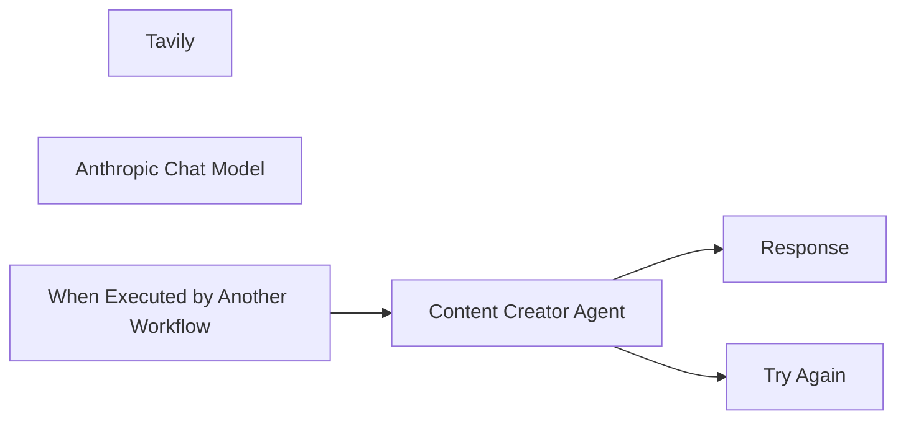

## Fluxo (.json) :

```json
{
  "id": "WWSu94V939ATcqvi",
  "meta": {
    "instanceId": "95e5a8c2e51c83e33b232ea792bbe3f063c094c33d9806a5565cb31759e1ad39",
    "templateCredsSetupCompleted": true
  },
  "name": "🤖Content Creator Agent",
  "tags": [],
  "nodes": [
    {
      "id": "0fb22922-121d-4f1c-8423-77c3cb7893ce",
      "name": "Tavily",
      "type": "@n8n/n8n-nodes-langchain.toolHttpRequest",
      "position": [
        240,
        180
      ],
      "parameters": {
        "url": "https://api.tavily.com/search",
        "method": "POST",
        "jsonBody": "{\n    \"api_key\": \"your-api-key\",\n    \"query\": \"{searchTerm}\",\n    \"search_depth\": \"basic\",\n    \"include_answer\": true,\n    \"topic\": \"news\",\n    \"include_raw_content\": true,\n    \"max_results\": 3\n} ",
        "sendBody": true,
        "specifyBody": "json",
        "toolDescription": "Use this tool to search the internet",
        "placeholderDefinitions": {
          "values": [
            {
              "name": "searchTerm",
              "type": "string",
              "description": "What the user has requested to write a blog about"
            }
          ]
        }
      },
      "typeVersion": 1.1
    },
    {
      "id": "585eaf6a-3f7b-4a85-973e-fd78806ba230",
      "name": "Content Creator Agent",
      "type": "@n8n/n8n-nodes-langchain.agent",
      "onError": "continueErrorOutput",
      "position": [
        120,
        -100
      ],
      "parameters": {
        "text": "={{ $json.query}}",
        "options": {
          "systemMessage": "=# Overview\nYou are a skilled AI blog writer specializing in engaging, well-structured, and informative content. Your writing style is clear, compelling, and tailored to the target audience. You optimize for readability, SEO, and value, ensuring blogs are well-researched, original, and free of fluff.\n\n## Tools\nTavily - Use this to search the web about the requested topic for the blog post.\n\n## Blog Requirements\nFormat all blog content in HTML, using proper headings (<h1>, <h2>), paragraphs (<p>), bullet points (<ul><li>), and links (<a href=\"URL\">) for citations. All citations from the Tavily tool must be preserved, with clickable hyperlinks so readers can access the original sources.\n\nMaintain a natural, human-like tone, use varied sentence structures, and include relevant examples or data when needed. Structure content for easy reading with concise paragraphs and logical flow. Always ensure factual accuracy and align the tone with the intended brand or purpose.\""
        },
        "promptType": "define"
      },
      "typeVersion": 1.7
    },
    {
      "id": "0ad7fbd5-5317-4979-9688-d99bc3a3fad2",
      "name": "Anthropic Chat Model",
      "type": "@n8n/n8n-nodes-langchain.lmChatAnthropic",
      "position": [
        -40,
        140
      ],
      "parameters": {
        "options": {}
      },
      "credentials": {
        "anthropicApi": {
          "id": "iEsH2oywXIJiWHnM",
          "name": "Anthropic account"
        }
      },
      "typeVersion": 1.2
    },
    {
      "id": "ec1997eb-6a99-488b-b496-8355df6c003c",
      "name": "Response",
      "type": "n8n-nodes-base.set",
      "position": [
        560,
        -180
      ],
      "parameters": {
        "options": {},
        "assignments": {
          "assignments": [
            {
              "id": "14d9076e-27ea-4846-8b44-f83cf4022b9e",
              "name": "response",
              "type": "string",
              "value": "={{ $json.output }}"
            }
          ]
        }
      },
      "typeVersion": 3.4
    },
    {
      "id": "0cf971a0-cd9f-4bcf-b020-4839fd3a3708",
      "name": "Try Again",
      "type": "n8n-nodes-base.set",
      "position": [
        560,
        0
      ],
      "parameters": {
        "options": {},
        "assignments": {
          "assignments": [
            {
              "id": "f2a8ff2d-6b59-4ad6-a2e7-8705354f4105",
              "name": "response",
              "type": "string",
              "value": "Error occurred. Please try again."
            }
          ]
        }
      },
      "typeVersion": 3.4
    },
    {
      "id": "9ad2ac76-7c2b-40ca-9bf2-9c30ac8d132b",
      "name": "When Executed by Another Workflow",
      "type": "n8n-nodes-base.executeWorkflowTrigger",
      "position": [
        -140,
        -100
      ],
      "parameters": {
        "inputSource": "passthrough"
      },
      "typeVersion": 1.1
    }
  ],
  "active": false,
  "pinData": {},
  "settings": {
    "executionOrder": "v1"
  },
  "versionId": "18d27333-3b4c-4fe7-a85d-bbc7000820cf",
  "connections": {
    "Tavily": {
      "ai_tool": [
        [
          {
            "node": "Content Creator Agent",
            "type": "ai_tool",
            "index": 0
          }
        ]
      ]
    },
    "Anthropic Chat Model": {
      "ai_languageModel": [
        [
          {
            "node": "Content Creator Agent",
            "type": "ai_languageModel",
            "index": 0
          }
        ]
      ]
    },
    "Content Creator Agent": {
      "main": [
        [
          {
            "node": "Response",
            "type": "main",
            "index": 0
          }
        ],
        [
          {
            "node": "Try Again",
            "type": "main",
            "index": 0
          }
        ]
      ]
    },
    "When Executed by Another Workflow": {
      "main": [
        [
          {
            "node": "Content Creator Agent",
            "type": "main",
            "index": 0
          }
        ]
      ]
    }
  }
}
```
