# PACK 1999 TEMPLATES PARTE 07 - Bloco 1

Templates neste bloco: 20

## Sumário

- [Template 1201 - Insights de pesquisas por clusterização de respostas](#template-1201)
- [Template 1202 - Inserir linha em tabela do Coda](#template-1202)
- [Template 1203 - Formatar números de telefone dos EUA](#template-1203)
- [Template 1204 - Criação automática de post WordPress com IA](#template-1204)
- [Template 1205 - Extrair miniaturas de apresentação Google Slides](#template-1205)
- [Template 1206 - Assistente de logging Clockify via Slack](#template-1206)
- [Template 1207 - Verificação de entregabilidade de e-mail](#template-1207)
- [Template 1208 - Criar e atualizar membro no Orbit com nota e post](#template-1208)
- [Template 1209 - Criar tarefa no ClickUp](#template-1209)
- [Template 1210 - Agente RAG com Milvus e Cohere](#template-1210)
- [Template 1211 - Comparação de LLMs com registro em Google Sheets](#template-1211)
- [Template 1212 - Publicar histórias com prefixo release](#template-1212)
- [Template 1213 - Auditoria automática de XHTML CSRD e resposta](#template-1213)
- [Template 1214 - Automação de triagem de currículos com IA](#template-1214)
- [Template 1215 - Transcrição automática de arquivos em bucket S3](#template-1215)
- [Template 1216 - Processamento de candidaturas e extração automática de CV](#template-1216)
- [Template 1217 - Chatbot RH para políticas e benefícios](#template-1217)
- [Template 1218 - Gerador de palavras-chave Amazon](#template-1218)
- [Template 1219 - Avaliação automatizada de currículos](#template-1219)
- [Template 1220 - Criação e atualização de tarefa](#template-1220)

---

<a id="template-1201"></a>

## Template 1201 - Insights de pesquisas por clusterização de respostas

- **Nome:** Insights de pesquisas por clusterização de respostas
- **Descrição:** Importa respostas de uma planilha, transforma cada resposta em vetor, agrupa respostas semelhantes usando clusterização, gera resumos e sentimento por grupo e exporta os insights para uma nova aba na mesma planilha.
- **Funcionalidade:** • Importação de respostas: Busca todas as respostas de uma planilha do survey para processamento.
• Conversão em pares pergunta-resposta: Normaliza cada resposta como um par pergunta/answer com metadados do participante e pesquisa.
• Geração de embeddings: Cria vetores de cada resposta para permitir buscas e comparações semânticas.
• Armazenamento vetorial: Insere os vetores e metadados em um repositório vetorial para consulta posterior.
• Extração de perguntas: Lê os cabeçalhos da planilha para identificar as perguntas do questionário.
• Busca por respostas similares: Recupera do repositório vetorial todas as respostas relacionadas a uma pergunta específica.
• Clusterização de respostas: Agrupa respostas semelhantes usando K-means para identificar padrões e grupos populares.
• Filtragem de clusters: Mantém apenas clusters relevantes (por exemplo, com 3+ respostas) para análise.
• Recuperação de payloads: Busca os conteúdos completos e metadados dos pontos vetoriais de cada cluster.
• Sumário e análise por LLM: Resume cada grupo de respostas, gera insight e classifica o sentimento geral.
• Criação de aba de insights: Cria uma nova aba na planilha para armazenar resultados e detalhes de participantes.
• Exportação dos resultados: Apende os insights gerados e metadados (contagem, IDs, respostas brutas) na aba criada.
- **Ferramentas:** • Google Sheets API: Armazenamento e leitura das respostas do survey e gravação dos insights em uma nova aba.
• Qdrant: Banco vetorial utilizado para armazenar embeddings e permitir buscas semânticas por similaridade.
• OpenAI API: Geração de embeddings para as respostas e uso de modelo de linguagem para resumir clusters e avaliar sentimento.
• Python / scikit-learn: Execução do algoritmo K-means para agrupar vetores de respostas e identificar clusters relevantes.

## Fluxo visual

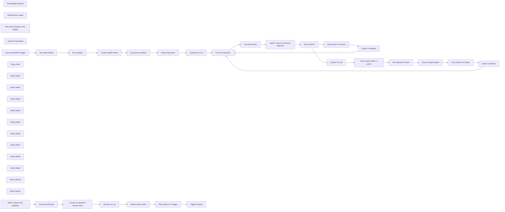

## Fluxo (.json) :

```json
{
  "meta": {
    "instanceId": "408f9fb9940c3cb18ffdef0e0150fe342d6e655c3a9fac21f0f644e8bedabcd9"
  },
  "nodes": [
    {
      "id": "0404384b-10b6-4666-84a4-8870db30c607",
      "name": "Embeddings OpenAI",
      "type": "@n8n/n8n-nodes-langchain.embeddingsOpenAi",
      "position": [
        1220,
        280
      ],
      "parameters": {
        "model": "text-embedding-3-small",
        "options": {}
      },
      "credentials": {
        "openAiApi": {
          "id": "8gccIjcuf3gvaoEr",
          "name": "OpenAi account"
        }
      },
      "typeVersion": 1
    },
    {
      "id": "a6741f04-5a5b-47a9-ac08-eb562f9f6052",
      "name": "Default Data Loader",
      "type": "@n8n/n8n-nodes-langchain.documentDefaultDataLoader",
      "position": [
        1340,
        280
      ],
      "parameters": {
        "options": {
          "metadata": {
            "metadataValues": [
              {
                "name": "question",
                "value": "={{ $json.question }}"
              },
              {
                "name": "participant",
                "value": "={{ $json.participant }}"
              },
              {
                "name": "survey",
                "value": "={{ $('Get Survey Results').params.documentId.cachedResultName }}"
              }
            ]
          }
        },
        "jsonData": "={{ $json.answer }}",
        "jsonMode": "expressionData"
      },
      "typeVersion": 1
    },
    {
      "id": "7663c3dd-f713-4034-bef6-0c000285f54f",
      "name": "Convert to Question Answer Pairs",
      "type": "n8n-nodes-base.set",
      "position": [
        720,
        160
      ],
      "parameters": {
        "options": {},
        "assignments": {
          "assignments": [
            {
              "id": "6b593ffb-ffbd-4cf5-a508-cd4f2a6d1004",
              "name": "data",
              "type": "array",
              "value": "={{\n Object.keys($json)\n .filter(key => !['row_number', 'Participant'].includes(key))\n .map(key => ({ question: key, answer: $json[key], participant: $json.Participant }))\n}}"
            }
          ]
        }
      },
      "typeVersion": 3.4
    },
    {
      "id": "84873f0c-81ce-442f-a33c-d7c6c2efa11b",
      "name": "Recursive Character Text Splitter",
      "type": "@n8n/n8n-nodes-langchain.textSplitterRecursiveCharacterTextSplitter",
      "position": [
        1340,
        420
      ],
      "parameters": {
        "options": {}
      },
      "typeVersion": 1
    },
    {
      "id": "da9a8ee8-5e3f-49db-8d1f-26a61ca82344",
      "name": "Get Survey Results",
      "type": "n8n-nodes-base.googleSheets",
      "position": [
        540,
        160
      ],
      "parameters": {
        "options": {},
        "sheetName": {
          "__rl": true,
          "mode": "list",
          "value": "gid=0",
          "cachedResultUrl": "https://docs.google.com/spreadsheets/d/1-168Vm-1kCeHkqGLAs6odha4DhPE93njfHlYIviKE50/edit#gid=0",
          "cachedResultName": "Sheet1"
        },
        "documentId": {
          "__rl": true,
          "mode": "list",
          "value": "1-168Vm-1kCeHkqGLAs6odha4DhPE93njfHlYIviKE50",
          "cachedResultUrl": "https://docs.google.com/spreadsheets/d/1-168Vm-1kCeHkqGLAs6odha4DhPE93njfHlYIviKE50/edit?usp=drivesdk",
          "cachedResultName": "Remote Working Survey Responses"
        }
      },
      "credentials": {
        "googleSheetsOAuth2Api": {
          "id": "XHvC7jIRR8A2TlUl",
          "name": "Google Sheets account"
        }
      },
      "typeVersion": 4.4
    },
    {
      "id": "4bad90b2-eefe-49c8-8caa-41cd4cb5e60f",
      "name": "Get Survey Headers",
      "type": "n8n-nodes-base.googleSheets",
      "position": [
        740,
        940
      ],
      "parameters": {
        "options": {
          "dataLocationOnSheet": {
            "values": {
              "range": "A1:Z2",
              "rangeDefinition": "specifyRangeA1"
            }
          }
        },
        "sheetName": {
          "__rl": true,
          "mode": "id",
          "value": "={{ $('Execute Workflow Trigger').first().json.sheetName }}"
        },
        "documentId": {
          "__rl": true,
          "mode": "id",
          "value": "={{ $('Execute Workflow Trigger').first().json.sheetID }}"
        }
      },
      "credentials": {
        "googleSheetsOAuth2Api": {
          "id": "XHvC7jIRR8A2TlUl",
          "name": "Google Sheets account"
        }
      },
      "typeVersion": 4.4
    },
    {
      "id": "47c64994-9d1f-42ca-a849-3eeab5335b66",
      "name": "Extract Questions",
      "type": "n8n-nodes-base.set",
      "position": [
        940,
        940
      ],
      "parameters": {
        "options": {},
        "assignments": {
          "assignments": [
            {
              "id": "d655b165-dfa2-46cb-bc27-140399bc4227",
              "name": "question",
              "type": "array",
              "value": "={{\n Object.keys($('Get Survey Headers').item.json)\n .filter(key => key.includes('?'))\n}}"
            }
          ]
        }
      },
      "typeVersion": 3.4
    },
    {
      "id": "c237d523-b290-41ca-b323-4cc7c7f6ff37",
      "name": "Questions to List",
      "type": "n8n-nodes-base.splitOut",
      "position": [
        940,
        1120
      ],
      "parameters": {
        "options": {},
        "fieldToSplitOut": "question"
      },
      "typeVersion": 1
    },
    {
      "id": "7f44a770-4c5d-4404-ae95-d9dee8348380",
      "name": "Find All Answers",
      "type": "n8n-nodes-base.httpRequest",
      "position": [
        1460,
        1120
      ],
      "parameters": {
        "url": "=http://qdrant:6333/collections/{{ $('Set Variables').item.json.collectionName }}/points/scroll",
        "method": "POST",
        "options": {},
        "jsonBody": "={\n \"limit\": 500,\n \"filter\":{\n \"must\": [\n {\n \"key\": \"metadata.question\",\n \"match\": { \"value\": \"{{ $('For Each Question...').item.json.question }}\" }\n },\n {\n \"key\": \"metadata.survey\",\n \"match\": { \"value\": \"{{ $('Set Variables').item.json.surveyName }}\" }\n }\n ]\n },\n \"with_vector\":true\n}",
        "sendBody": true,
        "specifyBody": "json",
        "authentication": "predefinedCredentialType",
        "nodeCredentialType": "qdrantApi"
      },
      "credentials": {
        "qdrantApi": {
          "id": "NyinAS3Pgfik66w5",
          "name": "QdrantApi account"
        }
      },
      "typeVersion": 4.2
    },
    {
      "id": "2b6dc317-f8f3-4201-a9e1-d35ee578e79e",
      "name": "Get Payload of Points",
      "type": "n8n-nodes-base.httpRequest",
      "position": [
        2380,
        800
      ],
      "parameters": {
        "url": "=http://qdrant:6333/collections/{{ $('Set Variables').first().json.collectionName }}/points",
        "method": "POST",
        "options": {},
        "jsonBody": "={{\n {\n \"ids\": $json.points,\n \"with_payload\": true\n }\n}}",
        "sendBody": true,
        "specifyBody": "json",
        "authentication": "predefinedCredentialType",
        "nodeCredentialType": "qdrantApi"
      },
      "credentials": {
        "qdrantApi": {
          "id": "NyinAS3Pgfik66w5",
          "name": "QdrantApi account"
        }
      },
      "typeVersion": 4.2
    },
    {
      "id": "d4a37d97-975a-4243-a7ea-81b3e30558a5",
      "name": "Clusters To List",
      "type": "n8n-nodes-base.splitOut",
      "position": [
        2180,
        800
      ],
      "parameters": {
        "options": {},
        "fieldToSplitOut": "output"
      },
      "typeVersion": 1
    },
    {
      "id": "c78f1bf6-8390-48ee-88f4-7d1a893a8ade",
      "name": "Set Variables",
      "type": "n8n-nodes-base.set",
      "position": [
        200,
        1060
      ],
      "parameters": {
        "options": {},
        "assignments": {
          "assignments": [
            {
              "id": "b77c94a0-d865-4bd6-b078-a09b2ddb2a99",
              "name": "collectionName",
              "type": "string",
              "value": "ux_survey_insights"
            },
            {
              "id": "7b0a4d14-b5f9-4597-84c0-8cfdb363c3d3",
              "name": "surveyName",
              "type": "string",
              "value": "={{ $json.properties.title }}"
            },
            {
              "id": "45434b3b-3b74-4262-82e0-7ed02155caad",
              "name": "insightsSheetName",
              "type": "string",
              "value": "=Insights-{{ $now.format('yyyyMMdd') }}"
            }
          ]
        }
      },
      "typeVersion": 3.4
    },
    {
      "id": "fbb1f3c3-06ad-44b5-b020-6fc3c8eda7c4",
      "name": "OpenAI Chat Model",
      "type": "@n8n/n8n-nodes-langchain.lmChatOpenAi",
      "position": [
        2560,
        980
      ],
      "parameters": {
        "model": "gpt-4o-mini",
        "options": {}
      },
      "credentials": {
        "openAiApi": {
          "id": "8gccIjcuf3gvaoEr",
          "name": "OpenAi account"
        }
      },
      "typeVersion": 1
    },
    {
      "id": "83d3b413-a661-4c4c-9b8d-6ee395a15348",
      "name": "Prep Output For Export",
      "type": "n8n-nodes-base.set",
      "position": [
        3160,
        1300
      ],
      "parameters": {
        "mode": "raw",
        "options": {},
        "jsonOutput": "={{ {\n ...$json.output,\n \"Number of Response\": $('Get Payload of Points').item.json.result.length,\n \"Participant IDs\": $('Get Payload of Points').item.json.result.map(item =>\n item.payload.metadata.participant\n ).join(','),\n \"Raw Responses\": $('Get Payload of Points').item.json.result.map(item =>\n `Participant ${item.payload.metadata.participant},${item.payload.content.replaceAll('\"', '\\\"')}`\n ).join('\\n')\n} }}\n"
      },
      "typeVersion": 3.4
    },
    {
      "id": "14784dff-a8ea-4b6b-8379-b0c9051a8f98",
      "name": "Export To Sheets",
      "type": "n8n-nodes-base.googleSheets",
      "position": [
        3360,
        1300
      ],
      "parameters": {
        "columns": {
          "value": {},
          "schema": [
            {
              "id": "What is your name?",
              "type": "string",
              "display": true,
              "removed": false,
              "required": false,
              "displayName": "What is your name?",
              "defaultMatch": false,
              "canBeUsedToMatch": true
            },
            {
              "id": "The responses indicate that two participants have the same name, 'Kwame Nkosi', which suggests a commonality in names or cultural naming traditions among the respondents. This could highlight the importance of understanding cultural context in survey responses.",
              "type": "string",
              "display": true,
              "removed": false,
              "required": false,
              "displayName": "The responses indicate that two participants have the same name, 'Kwame Nkosi', which suggests a commonality in names or cultural naming traditions among the respondents. This could highlight the importance of understanding cultural context in survey responses.",
              "defaultMatch": false,
              "canBeUsedToMatch": true
            },
            {
              "id": "neutral",
              "type": "string",
              "display": true,
              "removed": false,
              "required": false,
              "displayName": "neutral",
              "defaultMatch": false,
              "canBeUsedToMatch": true
            },
            {
              "id": "3",
              "type": "string",
              "display": true,
              "removed": false,
              "required": false,
              "displayName": "3",
              "defaultMatch": false,
              "canBeUsedToMatch": true
            },
            {
              "id": "77,17,54",
              "type": "string",
              "display": true,
              "removed": false,
              "required": false,
              "displayName": "77,17,54",
              "defaultMatch": false,
              "canBeUsedToMatch": true
            },
            {
              "id": "Participant 77,Kwame Nkosi\nParticipant 17,Kwame Nkosi\nParticipant 54,Kwame Nkansah",
              "type": "string",
              "display": true,
              "removed": false,
              "required": false,
              "displayName": "Participant 77,Kwame Nkosi\nParticipant 17,Kwame Nkosi\nParticipant 54,Kwame Nkansah",
              "defaultMatch": false,
              "canBeUsedToMatch": true
            }
          ],
          "mappingMode": "autoMapInputData",
          "matchingColumns": []
        },
        "options": {},
        "operation": "append",
        "sheetName": {
          "__rl": true,
          "mode": "name",
          "value": "={{ $('Set Variables').first().json.insightsSheetName }}"
        },
        "documentId": {
          "__rl": true,
          "mode": "id",
          "value": "={{ $('Execute Workflow Trigger').first().json.sheetID }}"
        }
      },
      "credentials": {
        "googleSheetsOAuth2Api": {
          "id": "XHvC7jIRR8A2TlUl",
          "name": "Google Sheets account"
        }
      },
      "typeVersion": 4.4
    },
    {
      "id": "779b9411-db3e-44f3-ad2a-c9d40a70580d",
      "name": "Export To Sheets1",
      "type": "n8n-nodes-base.googleSheets",
      "position": [
        2360,
        1300
      ],
      "parameters": {
        "columns": {
          "value": {},
          "schema": [],
          "mappingMode": "autoMapInputData",
          "matchingColumns": []
        },
        "options": {},
        "operation": "append",
        "sheetName": {
          "__rl": true,
          "mode": "name",
          "value": "={{ $('Set Variables').first().json.insightsSheetName }}"
        },
        "documentId": {
          "__rl": true,
          "mode": "id",
          "value": "={{ $('Execute Workflow Trigger').first().json.sheetID }}"
        }
      },
      "credentials": {
        "googleSheetsOAuth2Api": {
          "id": "XHvC7jIRR8A2TlUl",
          "name": "Google Sheets account"
        }
      },
      "typeVersion": 4.4
    },
    {
      "id": "a31ab677-f57c-4b78-a290-d4a913ed4f8e",
      "name": "For Each Question...",
      "type": "n8n-nodes-base.splitInBatches",
      "position": [
        1280,
        940
      ],
      "parameters": {
        "options": {}
      },
      "typeVersion": 3
    },
    {
      "id": "dcfaf927-6ecd-4ebe-aee0-5fb3367b2725",
      "name": "Trigger Insights",
      "type": "n8n-nodes-base.executeWorkflow",
      "position": [
        1980,
        160
      ],
      "parameters": {
        "options": {},
        "workflowId": "={{ $workflow.id }}"
      },
      "typeVersion": 1
    },
    {
      "id": "2579adf0-9c00-4b87-b53e-740044577ab0",
      "name": "Prep Values For Trigger",
      "type": "n8n-nodes-base.set",
      "position": [
        1800,
        160
      ],
      "parameters": {
        "options": {},
        "assignments": {
          "assignments": [
            {
              "id": "24dd90ad-390f-444e-ba6c-8c06a41e836e",
              "name": "sheetID",
              "type": "string",
              "value": "={{ $('Get Survey Results').params.documentId.value }}"
            },
            {
              "id": "90199bbb-3938-411c-a7a8-faa7ccba6059",
              "name": "sheetName",
              "type": "string",
              "value": "={{ $('Get Survey Results').params.sheetName.value }}"
            }
          ]
        }
      },
      "executeOnce": true,
      "typeVersion": 3.4
    },
    {
      "id": "9b29e850-b9d0-4358-af62-92c20ab3b088",
      "name": "Execute Workflow Trigger",
      "type": "n8n-nodes-base.executeWorkflowTrigger",
      "position": [
        20,
        900
      ],
      "parameters": {},
      "typeVersion": 1
    },
    {
      "id": "70a0dcec-9f74-4af2-bd64-0ab762a77e51",
      "name": "Create Insights Sheet",
      "type": "n8n-nodes-base.googleSheets",
      "position": [
        420,
        900
      ],
      "parameters": {
        "title": "={{ $('Set Variables').first().json.insightsSheetName }}",
        "options": {},
        "operation": "create",
        "documentId": {
          "__rl": true,
          "mode": "id",
          "value": "={{ $('Execute Workflow Trigger').first().json.sheetID }}"
        }
      },
      "credentials": {
        "googleSheetsOAuth2Api": {
          "id": "XHvC7jIRR8A2TlUl",
          "name": "Google Sheets account"
        }
      },
      "typeVersion": 4.4,
      "alwaysOutputData": true
    },
    {
      "id": "f31400fb-dd7a-4c62-90ec-e9d78bbaa5e8",
      "name": "Prep Values For Export",
      "type": "n8n-nodes-base.set",
      "position": [
        2180,
        1300
      ],
      "parameters": {
        "mode": "raw",
        "options": {},
        "jsonOutput": "={\n \"Question\": \"{{ $('For Each Question...').item.json.question }}\",\n \"Insight\": \"No Insight Found\"\n}\n"
      },
      "typeVersion": 3.4
    },
    {
      "id": "506c20df-5109-422c-8c9e-0eb50fbd3ff9",
      "name": "Sticky Note",
      "type": "n8n-nodes-base.stickyNote",
      "position": [
        459.27570452141345,
        -42.168106366729035
      ],
      "parameters": {
        "color": 7,
        "width": 617.2130261221611,
        "height": 420.7389587470384,
        "content": "## Step 1. Import Survey Responses\n[Read more about Google Sheets](https://docs.n8n.io/integrations/builtin/app-nodes/n8n-nodes-base.googlesheets)\n\nOur approach requires to import all participant responses as vectors with metadata linking them to the questions being answered. To do this, we'll generate questiona and answer pairs from the survey."
      },
      "typeVersion": 1
    },
    {
      "id": "bddcafa8-6f54-4829-93c9-37bbb9e7edf3",
      "name": "QA Pairs to List",
      "type": "n8n-nodes-base.splitOut",
      "position": [
        900,
        160
      ],
      "parameters": {
        "options": {},
        "fieldToSplitOut": "data"
      },
      "typeVersion": 1
    },
    {
      "id": "8d6e6bf6-c94c-43cb-a29e-5d10207cb8bd",
      "name": "Sticky Note1",
      "type": "n8n-nodes-base.stickyNote",
      "position": [
        1100,
        -102.05898437632061
      ],
      "parameters": {
        "color": 7,
        "width": 563.8350682199533,
        "height": 678.1641960508446,
        "content": "## Step 2. Vectorize Each Response Into Qdrant\n[Read more about using Qdrant](https://docs.n8n.io/integrations/builtin/cluster-nodes/root-nodes/n8n-nodes-langchain.vectorstoreqdrant)\n\nSpecial attention is given to how metadata is captured as it becomes key to this workflow is being able to retrieve subsets of the data for analysis."
      },
      "typeVersion": 1
    },
    {
      "id": "613d4a32-a87a-423e-a1d1-ee23db0de6d1",
      "name": "Sticky Note2",
      "type": "n8n-nodes-base.stickyNote",
      "position": [
        1680,
        -30.440883940004255
      ],
      "parameters": {
        "color": 7,
        "width": 519.6419932444072,
        "height": 429.11782776909047,
        "content": "## Step 3. Trigger Insights SubWorkflow\n[Learn more about Workflow Triggers](https://docs.n8n.io/integrations/builtin/core-nodes/n8n-nodes-base.executeworkflow)\n\nA subworkflow is used to trigger the analysis for the survey. This separation is optional but used here to better demonstrate the two part process."
      },
      "typeVersion": 1
    },
    {
      "id": "1e858e4a-b91b-4411-8e2a-6eb76647b796",
      "name": "Sticky Note3",
      "type": "n8n-nodes-base.stickyNote",
      "position": [
        -57.47778952966382,
        710.393394209128
      ],
      "parameters": {
        "color": 7,
        "width": 668.3083616841852,
        "height": 528.2386658883073,
        "content": "## Step 4. Create Insights Sheet\n[Learn more about Workflow Triggers](https://docs.n8n.io/integrations/builtin/core-nodes/n8n-nodes-base.executeworkflowtrigger)\n\nTo capture the generated insights, we'll create a new unique sheet within the survey spreadsheet. This is optional and you may want to capture in other datastores depending on your needs."
      },
      "typeVersion": 1
    },
    {
      "id": "9170c566-07d3-49dc-aafb-2dbe79940d2c",
      "name": "Sticky Note4",
      "type": "n8n-nodes-base.stickyNote",
      "position": [
        640,
        683.5153164275844
      ],
      "parameters": {
        "color": 7,
        "width": 536.9288458983389,
        "height": 622.1362463986454,
        "content": "## Step 5. Get List Of Questions From Survey\n[Read more about using Google Sheets](https://docs.n8n.io/integrations/builtin/app-nodes/n8n-nodes-base.googlesheets)\n\nNext we'll fetch the survey for metadata and questions, splitting them into separate workflow items. Our intention is to process each question end-to-end before moving to the next. This approach is a little \"safer\" in the scenario where an interruption occurs we won't lose all our work."
      },
      "typeVersion": 1
    },
    {
      "id": "8488df77-055d-41cc-94f1-92ac5d54ef10",
      "name": "Sticky Note5",
      "type": "n8n-nodes-base.stickyNote",
      "position": [
        1200,
        673.291535602609
      ],
      "parameters": {
        "color": 7,
        "width": 823.147012265536,
        "height": 868.2579789328703,
        "content": "## Step 6. Find Groups of Similar Answers For Each Question\n[Learn more about using the Code Node](https://docs.n8n.io/integrations/builtin/core-nodes/n8n-nodes-base.code/)\n\nGiving all the responses to an LLM to analyse is the common but naive approach; the summarisation is usually too high level for real insights and loses a lot of detail such as the number and identity of respondants. What we want to do instead is find and group popular answers for each question to ensure all perspectives are considered.\n\nOur approach does this by mapping our answer vectors to a 2D grid and then identifying where the vector points are \"clustered\"; where a group of points are within close proximity to each other."
      },
      "typeVersion": 1
    },
    {
      "id": "f4748b6d-5bd8-48cf-942f-3a0dc681078d",
      "name": "Sticky Note6",
      "type": "n8n-nodes-base.stickyNote",
      "position": [
        2060,
        1180
      ],
      "parameters": {
        "color": 7,
        "width": 536.9288458983389,
        "height": 359.90385684071794,
        "content": "## Step 7b. Skip If No Clusters Found\nWhere no clusters were found, it means the answers were unique enough to not show any pattern. eg. \"What's you name?\""
      },
      "typeVersion": 1
    },
    {
      "id": "d55d6a47-da8c-46ae-bd10-0eb671dcd121",
      "name": "Sticky Note7",
      "type": "n8n-nodes-base.stickyNote",
      "position": [
        2060,
        611.6915003841909
      ],
      "parameters": {
        "color": 7,
        "width": 871.451300407926,
        "height": 541.1135860445843,
        "content": "## Step 7a. Summarise the Top Groups of Similar Answers\n[Read more about using the Information Extractor Node](https://docs.n8n.io/integrations/builtin/cluster-nodes/root-nodes/n8n-nodes-langchain.information-extractor)\n\nEach discovered cluster will return a reference vector which is used to fetch all related answers in the group.\nThe group is then sent to the LLM to summarise as well as assign a sentiment score."
      },
      "typeVersion": 1
    },
    {
      "id": "e5d5f88f-5832-43fc-a5b9-f747d08e7e77",
      "name": "Sticky Note8",
      "type": "n8n-nodes-base.stickyNote",
      "position": [
        2620,
        1180
      ],
      "parameters": {
        "color": 7,
        "width": 924.2798021207429,
        "height": 363.07347551845976,
        "content": "## Step 8. Write To Insights Sheet\nFinally, our completed insights to appended to\nthe Insights Sheet we created earlier in the workflow."
      },
      "typeVersion": 1
    },
    {
      "id": "49ac1504-7b43-4fa1-b4ce-15c7a53c9018",
      "name": "Sticky Note9",
      "type": "n8n-nodes-base.stickyNote",
      "position": [
        460,
        400
      ],
      "parameters": {
        "color": 5,
        "width": 323.2987132716669,
        "height": 80,
        "content": "### Run this once! \nIf for any reason you need to run more than once, be sure to clear the existing data first."
      },
      "typeVersion": 1
    },
    {
      "id": "450f89c5-ef0f-4bf8-8db9-6347247c7f4d",
      "name": "Has Clusters?",
      "type": "n8n-nodes-base.if",
      "position": [
        1820,
        1120
      ],
      "parameters": {
        "options": {},
        "conditions": {
          "options": {
            "leftValue": "",
            "caseSensitive": true,
            "typeValidation": "strict"
          },
          "combinator": "and",
          "conditions": [
            {
              "id": "40b6bb62-a2d6-4422-8fbb-7ae49898bad9",
              "operator": {
                "type": "array",
                "operation": "notEmpty",
                "singleValue": true
              },
              "leftValue": "={{ $json.output }}",
              "rightValue": ""
            }
          ]
        }
      },
      "typeVersion": 2
    },
    {
      "id": "1652a108-8fb8-4229-a76d-abf9fbcff626",
      "name": "Sticky Note10",
      "type": "n8n-nodes-base.stickyNote",
      "position": [
        20,
        -400
      ],
      "parameters": {
        "width": 400.381109509268,
        "height": 679.5610243514676,
        "content": "## Try It Out!\n\n### This workflow generates highly-detailed insights from survey responses. Works best when dealing with a large number of participants.\n\n* Import survey responses and vectorise in Qdrant vectorstore.\n* Identify clusters of popular responses to questions using K-means clustering algorithm. \n* Each valid cluster is analysed and summarised by LLM.\n* Export LLM response and cluster results back into sheet.\n\nCheck out the reference google sheet here: https://docs.google.com/spreadsheets/d/e/2PACX-1vT6m8XH8JWJTUAfwojc68NAUGC7q0lO7iV738J7aO5fuVjiVzdTRRPkMmT1C4N8TwejaiT0XrmF1Q48/pubhtml\n\n### Need Help?\nJoin the [Discord](https://discord.com/invite/XPKeKXeB7d) or ask in the [Forum](https://community.n8n.io/)!\n\nHappy Hacking!"
      },
      "typeVersion": 1
    },
    {
      "id": "6eef981e-b2ce-433c-b71f-78be64812a56",
      "name": "Sticky Note11",
      "type": "n8n-nodes-base.stickyNote",
      "position": [
        1260,
        1340
      ],
      "parameters": {
        "color": 5,
        "width": 323.2987132716669,
        "height": 110.05160146874424,
        "content": "### First Time Running?\nThere is a slight delay on first run because the code node has to download the required packages."
      },
      "typeVersion": 1
    },
    {
      "id": "fa0c14be-03f4-4ed2-bd60-e93817382ded",
      "name": "When clicking ‘Test workflow’",
      "type": "n8n-nodes-base.manualTrigger",
      "position": [
        240,
        100
      ],
      "parameters": {},
      "typeVersion": 1
    },
    {
      "id": "30323019-59ba-4a19-a46e-196d469f097d",
      "name": "Get Sheet Details",
      "type": "n8n-nodes-base.httpRequest",
      "position": [
        200,
        900
      ],
      "parameters": {
        "url": "=https://sheets.googleapis.com/v4/spreadsheets/{{ $json.sheetID }}",
        "options": {},
        "authentication": "predefinedCredentialType",
        "nodeCredentialType": "googleSheetsOAuth2Api"
      },
      "credentials": {
        "googleSheetsOAuth2Api": {
          "id": "XHvC7jIRR8A2TlUl",
          "name": "Google Sheets account"
        }
      },
      "typeVersion": 4.2
    },
    {
      "id": "6ced8012-1dd3-4da3-8c27-e4f4dfc959f6",
      "name": "Only Clusters With 3+ points",
      "type": "n8n-nodes-base.filter",
      "position": [
        2180,
        960
      ],
      "parameters": {
        "options": {},
        "conditions": {
          "options": {
            "leftValue": "",
            "caseSensitive": true,
            "typeValidation": "strict"
          },
          "combinator": "and",
          "conditions": [
            {
              "id": "328f806c-0792-4d90-9bee-a1e10049e78f",
              "operator": {
                "type": "array",
                "operation": "lengthGt",
                "rightType": "number"
              },
              "leftValue": "={{ $json.points }}",
              "rightValue": 2
            }
          ]
        }
      },
      "typeVersion": 2
    },
    {
      "id": "8ae81a55-75e2-40a3-bef6-0935ff08128f",
      "name": "Apply K-means Clustering Algorithm",
      "type": "n8n-nodes-base.code",
      "position": [
        1640,
        1120
      ],
      "parameters": {
        "language": "python",
        "pythonCode": "import numpy as np\nfrom sklearn.cluster import KMeans\n\n# get vectors for all answers\npoint_ids = [item.id for item in _input.first().json.result.points]\nvectors = [item.vector.to_py() for item in _input.first().json.result.points]\nvectors_array = np.array(vectors)\n\n# apply k-means clustering where n_clusters = 10\n# this is a max and we'll discard some of these clusters later\nkmeans = KMeans(n_clusters=min(len(vectors), 10), random_state=42).fit(vectors_array)\nlabels = kmeans.labels_\nunique_labels = set(labels)\n\n# Extract and print points in each cluster\nclusters = {}\nfor label in set(labels):\n clusters[label] = vectors_array[labels == label]\n\n# return Qdrant point ids for each cluster\n# we'll use these ids to fetch the payloads from the vector store.\noutput = []\nfor cluster_id, cluster_points in clusters.items():\n points = [point_ids[i] for i in range(len(labels)) if labels[i] == cluster_id]\n output.append({\n \"id\": f\"Cluster {cluster_id}\",\n \"total\": len(cluster_points),\n \"points\": points\n })\n\nreturn {\"json\": {\"output\": output } }"
      },
      "typeVersion": 2
    },
    {
      "id": "cbb42384-d46b-471f-a7d8-27e3de042492",
      "name": "Qdrant Vector Store",
      "type": "@n8n/n8n-nodes-langchain.vectorStoreQdrant",
      "position": [
        1220,
        100
      ],
      "parameters": {
        "mode": "insert",
        "options": {},
        "qdrantCollection": {
          "__rl": true,
          "mode": "list",
          "value": "ux_survey_insights",
          "cachedResultName": "ux_survey_insights"
        }
      },
      "credentials": {
        "qdrantApi": {
          "id": "NyinAS3Pgfik66w5",
          "name": "QdrantApi account"
        }
      },
      "typeVersion": 1
    },
    {
      "id": "17584901-15d6-421f-ad69-3ba872276055",
      "name": "Survey Insights Agent",
      "type": "@n8n/n8n-nodes-langchain.informationExtractor",
      "position": [
        2580,
        800
      ],
      "parameters": {
        "text": "=The {{ $json.result.length }} participant responses were:\n{{\n$json.result.map(item =>\n`* Participant ${item.payload.metadata.participant}: \"${item.payload.content.replaceAll('\"', '\\\"')}\"`\n).join('\\n')\n}}",
        "options": {
          "systemPromptTemplate": "=You help summarise a selection of participant responses to a specific question for a survey called \"{{ $json.result[0].payload.metadata.survey }}\".\nThe question asked was \"{{ $json.result[0].payload.metadata.question }}\".\nThe {{ $json.result.length }} participant responses were selected because their answers were similar in context.\n\nYour task is to: \n* summarise the given participant responses into a short paragraph. Provide an insight from this summary and what we could learn from the answers.\n* determine if the overall sentiment of all the listed responses to be either negative, mildy negative, neutral, mildy positive or positive."
        },
        "schemaType": "fromJson",
        "jsonSchemaExample": "{\n\t\"Question\": \"What do you enjoy most about working remotely, and why?\",\n\t\"Insight\": \"\",\n \"Sentiment\": \"Positive\"\n}"
      },
      "typeVersion": 1
    }
  ],
  "pinData": {},
  "connections": {
    "Has Clusters?": {
      "main": [
        [
          {
            "node": "Clusters To List",
            "type": "main",
            "index": 0
          }
        ],
        [
          {
            "node": "Prep Values For Export",
            "type": "main",
            "index": 0
          }
        ]
      ]
    },
    "Set Variables": {
      "main": [
        [
          {
            "node": "Create Insights Sheet",
            "type": "main",
            "index": 0
          }
        ]
      ]
    },
    "Clusters To List": {
      "main": [
        [
          {
            "node": "Only Clusters With 3+ points",
            "type": "main",
            "index": 0
          }
        ]
      ]
    },
    "Export To Sheets": {
      "main": [
        [
          {
            "node": "For Each Question...",
            "type": "main",
            "index": 0
          }
        ]
      ]
    },
    "Find All Answers": {
      "main": [
        [
          {
            "node": "Apply K-means Clustering Algorithm",
            "type": "main",
            "index": 0
          }
        ]
      ]
    },
    "QA Pairs to List": {
      "main": [
        [
          {
            "node": "Qdrant Vector Store",
            "type": "main",
            "index": 0
          }
        ]
      ]
    },
    "Embeddings OpenAI": {
      "ai_embedding": [
        [
          {
            "node": "Qdrant Vector Store",
            "type": "ai_embedding",
            "index": 0
          }
        ]
      ]
    },
    "Export To Sheets1": {
      "main": [
        [
          {
            "node": "For Each Question...",
            "type": "main",
            "index": 0
          }
        ]
      ]
    },
    "Extract Questions": {
      "main": [
        [
          {
            "node": "Questions to List",
            "type": "main",
            "index": 0
          }
        ]
      ]
    },
    "Get Sheet Details": {
      "main": [
        [
          {
            "node": "Set Variables",
            "type": "main",
            "index": 0
          }
        ]
      ]
    },
    "OpenAI Chat Model": {
      "ai_languageModel": [
        [
          {
            "node": "Survey Insights Agent",
            "type": "ai_languageModel",
            "index": 0
          }
        ]
      ]
    },
    "Questions to List": {
      "main": [
        [
          {
            "node": "For Each Question...",
            "type": "main",
            "index": 0
          }
        ]
      ]
    },
    "Get Survey Headers": {
      "main": [
        [
          {
            "node": "Extract Questions",
            "type": "main",
            "index": 0
          }
        ]
      ]
    },
    "Get Survey Results": {
      "main": [
        [
          {
            "node": "Convert to Question Answer Pairs",
            "type": "main",
            "index": 0
          }
        ]
      ]
    },
    "Default Data Loader": {
      "ai_document": [
        [
          {
            "node": "Qdrant Vector Store",
            "type": "ai_document",
            "index": 0
          }
        ]
      ]
    },
    "Qdrant Vector Store": {
      "main": [
        [
          {
            "node": "Prep Values For Trigger",
            "type": "main",
            "index": 0
          }
        ]
      ]
    },
    "For Each Question...": {
      "main": [
        null,
        [
          {
            "node": "Find All Answers",
            "type": "main",
            "index": 0
          }
        ]
      ]
    },
    "Create Insights Sheet": {
      "main": [
        [
          {
            "node": "Get Survey Headers",
            "type": "main",
            "index": 0
          }
        ]
      ]
    },
    "Get Payload of Points": {
      "main": [
        [
          {
            "node": "Survey Insights Agent",
            "type": "main",
            "index": 0
          }
        ]
      ]
    },
    "Survey Insights Agent": {
      "main": [
        [
          {
            "node": "Prep Output For Export",
            "type": "main",
            "index": 0
          }
        ]
      ]
    },
    "Prep Output For Export": {
      "main": [
        [
          {
            "node": "Export To Sheets",
            "type": "main",
            "index": 0
          }
        ]
      ]
    },
    "Prep Values For Export": {
      "main": [
        [
          {
            "node": "Export To Sheets1",
            "type": "main",
            "index": 0
          }
        ]
      ]
    },
    "Prep Values For Trigger": {
      "main": [
        [
          {
            "node": "Trigger Insights",
            "type": "main",
            "index": 0
          }
        ]
      ]
    },
    "Execute Workflow Trigger": {
      "main": [
        [
          {
            "node": "Get Sheet Details",
            "type": "main",
            "index": 0
          }
        ]
      ]
    },
    "Only Clusters With 3+ points": {
      "main": [
        [
          {
            "node": "Get Payload of Points",
            "type": "main",
            "index": 0
          }
        ]
      ]
    },
    "Convert to Question Answer Pairs": {
      "main": [
        [
          {
            "node": "QA Pairs to List",
            "type": "main",
            "index": 0
          }
        ]
      ]
    },
    "Recursive Character Text Splitter": {
      "ai_textSplitter": [
        [
          {
            "node": "Default Data Loader",
            "type": "ai_textSplitter",
            "index": 0
          }
        ]
      ]
    },
    "When clicking ‘Test workflow’": {
      "main": [
        [
          {
            "node": "Get Survey Results",
            "type": "main",
            "index": 0
          }
        ]
      ]
    },
    "Apply K-means Clustering Algorithm": {
      "main": [
        [
          {
            "node": "Has Clusters?",
            "type": "main",
            "index": 0
          }
        ]
      ]
    }
  }
}
```

<a id="template-1202"></a>

## Template 1202 - Inserir linha em tabela do Coda

- **Nome:** Inserir linha em tabela do Coda
- **Descrição:** Insere uma nova linha em uma tabela de um documento do Coda usando valores pré-definidos.
- **Funcionalidade:** • Acionamento manual: Inicia o fluxo quando o usuário executa manualmente.
• Preparação de dados: Define valores estáticos para três colunas (Column 1, Column 2, Column 3).
• Inserção de linha no Coda: Envia os dados preparados para um documento e tabela do Coda, criando uma nova linha.
• Autenticação: Utiliza credenciais configuradas para acessar a API do Coda e permitir a operação.
- **Ferramentas:** • Coda: Plataforma de documentos com tabelas que permite inserir e manipular linhas por meio da API; utilizada para armazenar os dados enviados pelo fluxo.

## Fluxo visual


## Fluxo (.json) :

```json
{
  "id": "102",
  "name": "Insert data into a new row for a table in Coda",
  "nodes": [
    {
      "name": "On clicking 'execute'",
      "type": "n8n-nodes-base.manualTrigger",
      "position": [
        250,
        300
      ],
      "parameters": {},
      "typeVersion": 1
    },
    {
      "name": "Coda",
      "type": "n8n-nodes-base.coda",
      "position": [
        650,
        300
      ],
      "parameters": {
        "docId": "",
        "options": {},
        "tableId": ""
      },
      "credentials": {
        "codaApi": ""
      },
      "typeVersion": 1
    },
    {
      "name": "Set",
      "type": "n8n-nodes-base.set",
      "position": [
        450,
        300
      ],
      "parameters": {
        "values": {
          "string": [
            {
              "name": "Column 1",
              "value": "This is column 1 data"
            },
            {
              "name": "Column 2",
              "value": "This is column 2 data"
            },
            {
              "name": "Column 3",
              "value": "This is column 3 data"
            }
          ]
        },
        "options": {}
      },
      "typeVersion": 1
    }
  ],
  "active": false,
  "settings": {},
  "connections": {
    "Set": {
      "main": [
        [
          {
            "node": "Coda",
            "type": "main",
            "index": 0
          }
        ]
      ]
    },
    "On clicking 'execute'": {
      "main": [
        [
          {
            "node": "Set",
            "type": "main",
            "index": 0
          }
        ]
      ]
    }
  }
}
```

<a id="template-1203"></a>

## Template 1203 - Formatar números de telefone dos EUA

- **Nome:** Formatar números de telefone dos EUA
- **Descrição:** Recebe números de telefone em vários formatos, valida comprimento e código de país, normaliza os dígitos e gera múltiplas representações padronizadas (E.164, nacional, internacional), além de extrair extensão quando presente.
- **Funcionalidade:** • Receber entrada de outro fluxo: Aceita um campo 'Phone Number' enviado por outro processo.
• Remover formatação: Extrai apenas os dígitos do texto de entrada, removendo caracteres não numéricos.
• Validar comprimento: Classifica números com base na quantidade de dígitos (>=11 como número completo, 10 como número sem código de país, <10 como inválido, ou não-numérico).
• Adicionar código de país válido: Para números com 10 dígitos, acrescenta o código de país '1' (EUA) automaticamente.
• Verificar código de país: Confirma se o primeiro dígito é o código de país esperado (1) em números completos.
• Limpar números inválidos: Limpa o campo quando o número é considerado inválido ou o código de país não corresponde.
• Gerar formatos variados: Produz representações em E.164, formato nacional entre parênteses, nacional completo com '1', formato internacional (ex.: 00-1-...), e extrai a extensão quando presente.
• Preservar entrada original: Mantém o valor original recebido em um campo separado para referência.
- **Ferramentas:** • Nenhuma externa: O fluxo realiza somente processamento e formatação local dos dados de telefone, sem integrar serviços ou APIs externas.

## Fluxo visual

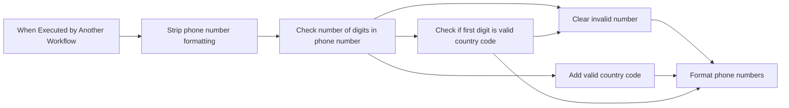

## Fluxo (.json) :

```json
{
  "id": "mNbQmMNEvpiZqASG",
  "meta": {
    "instanceId": "f80e038bf7b8c99e3db7e7d6a34de2c19f0af25e5d7445b15c36d79b6e8e9e55"
  },
  "name": "Format US Phone Number",
  "tags": [],
  "nodes": [
    {
      "id": "bf150da4-5e01-4571-a606-10a0fb25004b",
      "name": "When Executed by Another Workflow",
      "type": "n8n-nodes-base.executeWorkflowTrigger",
      "position": [
        0,
        275
      ],
      "parameters": {
        "workflowInputs": {
          "values": [
            {
              "name": "Phone Number",
              "type": "any"
            }
          ]
        }
      },
      "typeVersion": 1.1
    },
    {
      "id": "7c560ecf-c827-413f-a115-7b6bc8f21a41",
      "name": "Check if first digit is valid country code",
      "type": "n8n-nodes-base.if",
      "position": [
        660,
        275
      ],
      "parameters": {
        "options": {},
        "conditions": {
          "options": {
            "version": 2,
            "leftValue": "",
            "caseSensitive": true,
            "typeValidation": "strict"
          },
          "combinator": "and",
          "conditions": [
            {
              "id": "4d5c838e-9b08-4466-b00d-c695fd76d66d",
              "operator": {
                "type": "number",
                "operation": "equals"
              },
              "leftValue": "={{ $json['Phone Number'].toString().slice(0,1).toNumber() }}",
              "rightValue": 1
            }
          ]
        }
      },
      "typeVersion": 2.2
    },
    {
      "id": "783d8fd0-2a38-41fc-87c9-b0aec9933070",
      "name": "Add valid country code",
      "type": "n8n-nodes-base.set",
      "position": [
        880,
        475
      ],
      "parameters": {
        "options": {},
        "assignments": {
          "assignments": [
            {
              "id": "e47a1812-f69c-4182-bed5-cf037071cd9b",
              "name": "Phone Number",
              "type": "number",
              "value": "=1{{ $json['Phone Number'] }}"
            }
          ]
        }
      },
      "typeVersion": 3.4
    },
    {
      "id": "a93923f3-5d8d-4617-a63d-50b66b3b1128",
      "name": "Strip phone number formatting",
      "type": "n8n-nodes-base.set",
      "position": [
        220,
        275
      ],
      "parameters": {
        "options": {},
        "assignments": {
          "assignments": [
            {
              "id": "91d348df-6937-4118-8f7b-c9d386eb5c21",
              "name": "Phone Number",
              "type": "number",
              "value": "={{ $json['Phone Number'].match(/[0-9]+/gmi).join('') }}"
            }
          ]
        }
      },
      "typeVersion": 3.4
    },
    {
      "id": "58d6d280-ec86-4b69-a89c-e43571ce1035",
      "name": "Check number of digits in phone number",
      "type": "n8n-nodes-base.switch",
      "position": [
        440,
        254
      ],
      "parameters": {
        "rules": {
          "values": [
            {
              "outputKey": "Full Number",
              "conditions": {
                "options": {
                  "version": 2,
                  "leftValue": "",
                  "caseSensitive": true,
                  "typeValidation": "strict"
                },
                "combinator": "and",
                "conditions": [
                  {
                    "id": "66c9d1e7-dc56-4ce8-b7e4-64274feb8750",
                    "operator": {
                      "type": "number",
                      "operation": "gte"
                    },
                    "leftValue": "={{ $json['Phone Number'].toString().length }}",
                    "rightValue": 11
                  }
                ]
              },
              "renameOutput": true
            },
            {
              "outputKey": "Number",
              "conditions": {
                "options": {
                  "version": 2,
                  "leftValue": "",
                  "caseSensitive": true,
                  "typeValidation": "strict"
                },
                "combinator": "and",
                "conditions": [
                  {
                    "id": "2b9be422-2c4d-402a-b598-e8ab55aa5196",
                    "operator": {
                      "type": "number",
                      "operation": "equals"
                    },
                    "leftValue": "={{ $json['Phone Number'].toString().length }}",
                    "rightValue": 10
                  }
                ]
              },
              "renameOutput": true
            },
            {
              "outputKey": "Invalid Number",
              "conditions": {
                "options": {
                  "version": 2,
                  "leftValue": "",
                  "caseSensitive": true,
                  "typeValidation": "strict"
                },
                "combinator": "and",
                "conditions": [
                  {
                    "id": "a442130a-f2f8-4399-8edb-180d3607ec9b",
                    "operator": {
                      "type": "number",
                      "operation": "lt"
                    },
                    "leftValue": "={{ $json['Phone Number'].toString().length }}",
                    "rightValue": 10
                  }
                ]
              },
              "renameOutput": true
            },
            {
              "outputKey": "Not a Number",
              "conditions": {
                "options": {
                  "version": 2,
                  "leftValue": "",
                  "caseSensitive": true,
                  "typeValidation": "strict"
                },
                "combinator": "and",
                "conditions": [
                  {
                    "id": "efba5af9-dfe4-47f0-8e82-253accd4f238",
                    "operator": {
                      "type": "number",
                      "operation": "notExists",
                      "singleValue": true
                    },
                    "leftValue": "={{ $json['Phone Number'] }}",
                    "rightValue": ""
                  }
                ]
              },
              "renameOutput": true
            }
          ]
        },
        "options": {}
      },
      "typeVersion": 3.2
    },
    {
      "id": "1f6a4aa7-0595-4db3-a9c3-dc7a72656597",
      "name": "Format phone numbers",
      "type": "n8n-nodes-base.set",
      "position": [
        1100,
        325
      ],
      "parameters": {
        "options": {},
        "assignments": {
          "assignments": [
            {
              "id": "402c8481-3dee-4b90-8a08-7e611156d012",
              "name": "Phone Number (Input)",
              "type": "string",
              "value": "={{ $('When Executed by Another Workflow').item.json['Phone Number'] }}"
            },
            {
              "id": "9bc193b1-664f-40c0-8545-6792b5599777",
              "name": "Phone Number",
              "type": "number",
              "value": "={{ $json['Phone Number'].toString().slice(0,11).toNumber() }}"
            },
            {
              "id": "a4944be5-bfd5-4804-aeb5-d84c59145485",
              "name": "=Phone Number (E-164)",
              "type": "string",
              "value": "={{ $json['Phone Number'] ? '+' + $json['Phone Number'] : '' }}"
            },
            {
              "id": "3a8d506c-45ba-4843-b186-78bf877b7903",
              "name": "Phone Number (National)",
              "type": "string",
              "value": "={{ $json['Phone Number'] ? '(' + $json['Phone Number'].toString().slice(1,4) + ') ' + $json['Phone Number'].toString().slice(4,7) + '-' + $json['Phone Number'].toString().slice(7,11) : '' }}"
            },
            {
              "id": "14daf876-5f94-44d7-915b-bc4a8d6afbc4",
              "name": "Phone Number (Full National)",
              "type": "string",
              "value": "={{ $json['Phone Number'] ? '1 (' + $json['Phone Number'].toString().slice(1,4) + ') ' + $json['Phone Number'].toString().slice(4,7) + '-' + $json['Phone Number'].toString().slice(7,11) : '' }}"
            },
            {
              "id": "3270cc41-bfd7-4c5d-a05e-4af8da028bd5",
              "name": "Phone Number (International)",
              "type": "string",
              "value": "={{ $json['Phone Number'] ? '00-1-' + $json['Phone Number'].toString().slice(1,4) + '-' + $json['Phone Number'].toString().slice(4,7) + '-' + $json['Phone Number'].toString().slice(7,11) : '' }}"
            },
            {
              "id": "a6bd3652-071f-41b6-b523-bca427ef54f5",
              "name": "Extension",
              "type": "number",
              "value": "={{ $json['Phone Number'].toString().slice(11).toNumber() }}"
            },
            {
              "id": "7b808bfb-0d69-410c-b8f4-cbf2cafcf7e8",
              "name": "Extension (String)",
              "type": "string",
              "value": "={{ $json['Phone Number'].toString().slice(11).toNumber() > 0 ? $json['Phone Number'].toString().slice(11).toNumber() : '' }}"
            }
          ]
        }
      },
      "typeVersion": 3.4
    },
    {
      "id": "7bc3c1a0-2056-48a0-b826-21a8c1bff31b",
      "name": "Clear invalid number",
      "type": "n8n-nodes-base.set",
      "position": [
        880,
        125
      ],
      "parameters": {
        "options": {},
        "assignments": {
          "assignments": [
            {
              "id": "c8d90980-61c9-49c5-8769-32c445790328",
              "name": "Phone Number",
              "type": "string",
              "value": ""
            }
          ]
        },
        "includeOtherFields": true
      },
      "typeVersion": 3.4
    }
  ],
  "active": false,
  "pinData": {
    "When Executed by Another Workflow": [
      {
        "json": {
          "Phone Number": "1-800-555-5555"
        }
      },
      {
        "json": {
          "Phone Number": "1.800.555.5555"
        }
      },
      {
        "json": {
          "Phone Number": "800.555.5555"
        }
      },
      {
        "json": {
          "Phone Number": "1.800.555.55551234"
        }
      },
      {
        "json": {
          "Phone Number": "1(800)555-55"
        }
      },
      {
        "json": {
          "Phone Number": "5(800)555-5555"
        }
      },
      {
        "json": {
          "Phone Number": "1(800)555-5555 extension 1234"
        }
      },
      {
        "json": {
          "Phone Number": "A string"
        }
      }
    ]
  },
  "settings": {
    "executionOrder": "v1"
  },
  "versionId": "1b7626d5-b32b-41bd-989a-a79616769278",
  "connections": {
    "Clear invalid number": {
      "main": [
        [
          {
            "node": "Format phone numbers",
            "type": "main",
            "index": 0
          }
        ]
      ]
    },
    "Format phone numbers": {
      "main": [
        []
      ]
    },
    "Add valid country code": {
      "main": [
        [
          {
            "node": "Format phone numbers",
            "type": "main",
            "index": 0
          }
        ]
      ]
    },
    "Strip phone number formatting": {
      "main": [
        [
          {
            "node": "Check number of digits in phone number",
            "type": "main",
            "index": 0
          }
        ]
      ]
    },
    "When Executed by Another Workflow": {
      "main": [
        [
          {
            "node": "Strip phone number formatting",
            "type": "main",
            "index": 0
          }
        ]
      ]
    },
    "Check number of digits in phone number": {
      "main": [
        [
          {
            "node": "Check if first digit is valid country code",
            "type": "main",
            "index": 0
          }
        ],
        [
          {
            "node": "Add valid country code",
            "type": "main",
            "index": 0
          }
        ],
        [
          {
            "node": "Clear invalid number",
            "type": "main",
            "index": 0
          }
        ],
        [
          {
            "node": "Clear invalid number",
            "type": "main",
            "index": 0
          }
        ]
      ]
    },
    "Check if first digit is valid country code": {
      "main": [
        [
          {
            "node": "Format phone numbers",
            "type": "main",
            "index": 0
          }
        ],
        [
          {
            "node": "Clear invalid number",
            "type": "main",
            "index": 0
          }
        ]
      ]
    }
  }
}
```

<a id="template-1204"></a>

## Template 1204 - Criação automática de post WordPress com IA

- **Nome:** Criação automática de post WordPress com IA
- **Descrição:** Gera um rascunho de artigo SEO a partir de palavras-chave, produz o conteúdo dividido em capítulos, cria uma imagem de capa e publica tudo como rascunho no WordPress.
- **Funcionalidade:** • Coleta de entrada do usuário: Recebe palavras-chave, número de capítulos e limite máximo de palavras.
• Geração de estrutura do artigo: Cria título, subtítulo, introdução, conclusões, prompts dos capítulos e prompt para imagem de capa a partir das palavras-chave.
• Pesquisa e verificação: Consulta fontes enciclopédicas para embasar e validar informações usadas na geração do conteúdo.
• Validação de dados: Verifica se título, subtítulo, introdução, conclusões, capítulos e prompt de imagem foram gerados corretamente antes de prosseguir.
• Geração de capítulos: Divide os capítulos e gera o texto de cada um, mantendo coerência entre capítulos e respeitando tamanho total definido.
• Montagem do artigo: Combina introdução, capítulos e conclusões em um conteúdo HTML pronto para publicação.
• Publicação como rascunho: Cria o post no WordPress com status de rascunho.
• Geração da imagem de destaque: Produz uma imagem fotográfica baseada no prompt gerado para usar como capa.
• Upload e associação da imagem: Envia a imagem ao site e define-a como imagem destacada do post.
• Resposta ao usuário: Informa sucesso ou erro da operação ao final do processo.
- **Ferramentas:** • OpenAI: Gera a estrutura do artigo e os textos dos capítulos usando modelos de linguagem (GPT) e também produz imagens fotográficas a partir de prompts (geração de imagem).
• Wikipedia: Fonte de pesquisa e verificação de informações para garantir precisão e aprofundamento no conteúdo.
• WordPress (REST API): Recebe o rascunho do post, faz upload da mídia e associa a imagem de destaque ao artigo.


## Fluxo visual

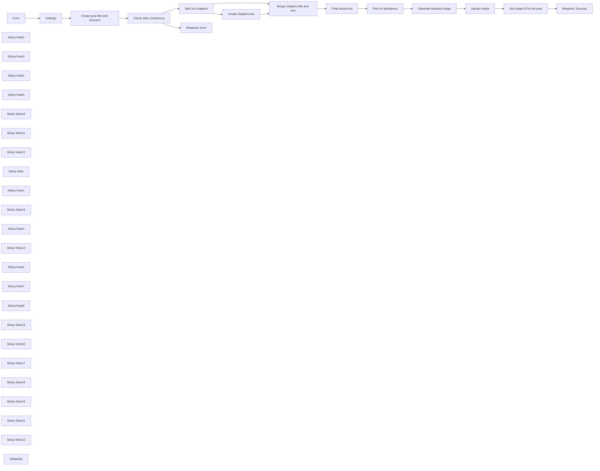

## Fluxo (.json) :

```json
{
  "id": "mKGMYXJottl0PDtM",
  "meta": {
    "instanceId": "cb484ba7b742928a2048bf8829668bed5b5ad9787579adea888f05980292a4a7"
  },
  "name": "Write a WordPress post with AI (starting from a few keywords)",
  "tags": [],
  "nodes": [
    {
      "id": "a4f19a81-6101-48c2-9560-9cf231bc240b",
      "name": "Form",
      "type": "n8n-nodes-base.formTrigger",
      "position": [
        -580,
        320
      ],
      "webhookId": "4b937814-e829-4df7-aaba-31192babf7e1",
      "parameters": {
        "path": "create-wordpress-post",
        "formTitle": "Create a WordPress post with AI",
        "formFields": {
          "values": [
            {
              "fieldLabel": "Keywords (comma-separated)",
              "requiredField": true
            },
            {
              "fieldType": "dropdown",
              "fieldLabel": "Number of chapters",
              "fieldOptions": {
                "values": [
                  {
                    "option": "1"
                  },
                  {
                    "option": "2"
                  },
                  {
                    "option": "3"
                  },
                  {
                    "option": "4"
                  },
                  {
                    "option": "5"
                  },
                  {
                    "option": "6"
                  },
                  {
                    "option": "7"
                  },
                  {
                    "option": "8"
                  },
                  {
                    "option": "9"
                  },
                  {
                    "option": "10"
                  }
                ]
              },
              "requiredField": true
            },
            {
              "fieldType": "number",
              "fieldLabel": "Max words count",
              "requiredField": true
            }
          ]
        },
        "responseMode": "responseNode",
        "formDescription": "Fill this form with the required information to create a draft post on WordPress"
      },
      "typeVersion": 2
    },
    {
      "id": "e4cf75f7-00e7-473a-a944-af635581715f",
      "name": "Sticky Note2",
      "type": "n8n-nodes-base.stickyNote",
      "position": [
        209.98769233621147,
        140
      ],
      "parameters": {
        "color": 4,
        "width": 301.3874093724939,
        "height": 371.765663140765,
        "content": "## Data check"
      },
      "typeVersion": 1
    },
    {
      "id": "e949a487-6701-4650-b9be-08146b4e93ad",
      "name": "Sticky Note3",
      "type": "n8n-nodes-base.stickyNote",
      "position": [
        225.20535922952297,
        200
      ],
      "parameters": {
        "color": 7,
        "width": 272.8190508599808,
        "height": 80,
        "content": "Checks that the data returned by OpenAI is correct"
      },
      "typeVersion": 1
    },
    {
      "id": "662fe28b-c0b7-4aef-b99c-a8c4c641251c",
      "name": "Sticky Note5",
      "type": "n8n-nodes-base.stickyNote",
      "position": [
        1580,
        140
      ],
      "parameters": {
        "color": 5,
        "width": 282.3398199598652,
        "height": 371.7656631407652,
        "content": "## Draft on WordPress"
      },
      "typeVersion": 1
    },
    {
      "id": "85996d51-ab98-41f5-b525-d926f04f50a8",
      "name": "Sticky Note9",
      "type": "n8n-nodes-base.stickyNote",
      "position": [
        1595,
        200
      ],
      "parameters": {
        "color": 7,
        "width": 254.77269221373095,
        "height": 80,
        "content": "The article is posted as a draft on WordPress"
      },
      "typeVersion": 1
    },
    {
      "id": "46f67505-f2dc-4110-b1d4-a27d7814cb52",
      "name": "Sticky Note10",
      "type": "n8n-nodes-base.stickyNote",
      "position": [
        1881,
        140
      ],
      "parameters": {
        "color": 3,
        "width": 557.7592769264069,
        "height": 369.2595606183891,
        "content": "## Featured image"
      },
      "typeVersion": 1
    },
    {
      "id": "a1beeb4f-f171-4c6a-ac19-7086b09757ab",
      "name": "Sticky Note11",
      "type": "n8n-nodes-base.stickyNote",
      "position": [
        1900,
        200
      ],
      "parameters": {
        "color": 7,
        "width": 517.9195082760601,
        "height": 80,
        "content": "The image is generated with Dall-E, uploaded to WordPress, and then connected to the post as its featured image"
      },
      "typeVersion": 1
    },
    {
      "id": "d1fd737b-7f14-4371-8720-7742f708e641",
      "name": "Sticky Note12",
      "type": "n8n-nodes-base.stickyNote",
      "position": [
        -117.99507693448459,
        200
      ],
      "parameters": {
        "color": 7,
        "width": 287.370178643191,
        "height": 80,
        "content": "Starting from the given keywords, generates the article title, subtitle, chapters, and image prompt"
      },
      "typeVersion": 1
    },
    {
      "id": "ccaaf851-613b-4d0c-8b3d-99a35ec9cdad",
      "name": "Sticky Note",
      "type": "n8n-nodes-base.stickyNote",
      "position": [
        -129.93405171072595,
        142
      ],
      "parameters": {
        "color": 6,
        "width": 319.697690939268,
        "height": 370.512611879577,
        "content": "## Article structure"
      },
      "typeVersion": 1
    },
    {
      "id": "69bebd7b-8ad5-4b0d-a8df-1b2e6d4be96e",
      "name": "Sticky Note1",
      "type": "n8n-nodes-base.stickyNote",
      "position": [
        -640,
        140
      ],
      "parameters": {
        "color": 7,
        "width": 239.97343293577688,
        "height": 370.512611879577,
        "content": "## User form"
      },
      "typeVersion": 1
    },
    {
      "id": "2037f81b-189c-4dc4-a4dc-179e4283544c",
      "name": "Sticky Note13",
      "type": "n8n-nodes-base.stickyNote",
      "position": [
        -623,
        200
      ],
      "parameters": {
        "color": 7,
        "width": 199.7721486302032,
        "height": 80,
        "content": "The user triggers the post creation"
      },
      "typeVersion": 1
    },
    {
      "id": "e8d7f711-185d-499b-ba58-de52ac6a4e58",
      "name": "Sticky Note4",
      "type": "n8n-nodes-base.stickyNote",
      "position": [
        2461,
        140
      ],
      "parameters": {
        "color": 7,
        "width": 219.70753707029849,
        "height": 370.512611879577,
        "content": "## User feedback"
      },
      "typeVersion": 1
    },
    {
      "id": "d89bebca-3607-4c66-a13d-07c32262e01a",
      "name": "Sticky Note14",
      "type": "n8n-nodes-base.stickyNote",
      "position": [
        2481,
        200
      ],
      "parameters": {
        "color": 7,
        "width": 183.38125554060056,
        "height": 80,
        "content": "Final confirmation to the user"
      },
      "typeVersion": 1
    },
    {
      "id": "7df452e2-52f3-4efe-94a4-7d4eab0670c8",
      "name": "Sticky Note6",
      "type": "n8n-nodes-base.stickyNote",
      "position": [
        534.9876923362115,
        530.9889231025903
      ],
      "parameters": {
        "color": 7,
        "width": 281.2716777103785,
        "height": 288.4116890365125,
        "content": "\n\n\n\n\n\n\n\n\n\n\n\n\n\n\n\n\nUser is notified to try again since some data is missing"
      },
      "typeVersion": 1
    },
    {
      "id": "f881bcd9-c7d2-4a1c-bc1a-beb515d52ade",
      "name": "Sticky Note7",
      "type": "n8n-nodes-base.stickyNote",
      "position": [
        -128.98646156983267,
        532.991384635348
      ],
      "parameters": {
        "color": 7,
        "width": 319.8306137081817,
        "height": 275.3956890735875,
        "content": "\n\n\n\n\n\n\n\n\n\n\n\n\n\n\n\n\nWikipedia is used to write the article"
      },
      "typeVersion": 1
    },
    {
      "id": "1b788b37-b8b5-47f6-8198-547dac8c76d6",
      "name": "Settings",
      "type": "n8n-nodes-base.set",
      "position": [
        -320,
        320
      ],
      "parameters": {
        "options": {},
        "assignments": {
          "assignments": [
            {
              "id": "3a433b0f-9957-4b64-ad81-359ab5e521d5",
              "name": "wordpress_url",
              "type": "string",
              "value": "https://you-wordpress-url-here.com/"
            },
            {
              "id": "ec5430e3-92c5-46e4-8c2c-c87291680892",
              "name": "keywords",
              "type": "string",
              "value": "={{ $json['Keywords (comma-separated)'] }}"
            },
            {
              "id": "5defb0a2-d921-4909-b10d-da59e1768496",
              "name": "chapters",
              "type": "number",
              "value": "={{ $json['Number of chapters'] }}"
            },
            {
              "id": "230ebd0b-73c2-4265-9b3c-57af7fbc48c8",
              "name": "words",
              "type": "number",
              "value": "={{ $json['Max words count'] }}"
            }
          ]
        }
      },
      "typeVersion": 3.3
    },
    {
      "id": "af29ed91-84b5-43f8-b1ce-1c8dc35c2c1b",
      "name": "Sticky Note8",
      "type": "n8n-nodes-base.stickyNote",
      "position": [
        -377,
        140
      ],
      "parameters": {
        "color": 2,
        "width": 226.71615243495023,
        "height": 370.512611879577,
        "content": "## Settings"
      },
      "typeVersion": 1
    },
    {
      "id": "a6fe2238-22ba-4c54-adef-663bd3955dcc",
      "name": "Sticky Note15",
      "type": "n8n-nodes-base.stickyNote",
      "position": [
        -360,
        200
      ],
      "parameters": {
        "color": 7,
        "width": 179.37633247508526,
        "height": 80,
        "content": "Set the URL of your WordPress here"
      },
      "typeVersion": 1
    },
    {
      "id": "358ac79f-be7d-44eb-a353-b2ad4ac8d582",
      "name": "Check data consistency",
      "type": "n8n-nodes-base.if",
      "position": [
        300,
        320
      ],
      "parameters": {
        "options": {},
        "conditions": {
          "options": {
            "leftValue": "",
            "caseSensitive": true,
            "typeValidation": "strict"
          },
          "combinator": "and",
          "conditions": [
            {
              "id": "9c8c53ea-6079-48da-9d6e-dd527167b123",
              "operator": {
                "type": "string",
                "operation": "notEmpty",
                "singleValue": true
              },
              "leftValue": "={{ $json.message.content.title }}",
              "rightValue": ""
            },
            {
              "id": "a7fabfe1-3539-453a-93d9-8d6d395c3de4",
              "operator": {
                "type": "array",
                "operation": "lengthGte",
                "rightType": "number"
              },
              "leftValue": "={{ $json.message.content.chapters }}",
              "rightValue": "={{ 1 }}"
            },
            {
              "id": "a687081e-24e2-423c-a2da-b7c18baf0715",
              "operator": {
                "type": "string",
                "operation": "notEmpty",
                "singleValue": true
              },
              "leftValue": "={{ $json.message.content.subtitle }}",
              "rightValue": ""
            },
            {
              "id": "0a435a69-3699-4b98-b46f-40954c7a7816",
              "operator": {
                "type": "string",
                "operation": "notEmpty",
                "singleValue": true
              },
              "leftValue": "={{ $json.message.content.introduction }}",
              "rightValue": ""
            },
            {
              "id": "1a440144-21f3-42bd-9222-774bd564f3ef",
              "operator": {
                "type": "string",
                "operation": "notEmpty",
                "singleValue": true
              },
              "leftValue": "={{ $json.message.content.conclusions }}",
              "rightValue": ""
            },
            {
              "id": "834ce92d-b1e9-48ef-ae63-1d0841c900b5",
              "operator": {
                "type": "string",
                "operation": "notEmpty",
                "singleValue": true
              },
              "leftValue": "={{ $json.message.content.imagePrompt }}",
              "rightValue": ""
            }
          ]
        }
      },
      "typeVersion": 2
    },
    {
      "id": "479f474a-1687-4588-8485-d793afc6757d",
      "name": "Split out chapters",
      "type": "n8n-nodes-base.splitOut",
      "position": [
        600,
        320
      ],
      "parameters": {
        "options": {},
        "fieldToSplitOut": "message.content.chapters"
      },
      "typeVersion": 1
    },
    {
      "id": "bde7b7db-45c6-4ab3-a705-358000cefbec",
      "name": "Merge chapters title and text",
      "type": "n8n-nodes-base.merge",
      "position": [
        1220,
        460
      ],
      "parameters": {
        "mode": "combine",
        "options": {},
        "combinationMode": "mergeByPosition"
      },
      "typeVersion": 2.1
    },
    {
      "id": "0079022b-eaa2-481b-8c78-f8623a63645b",
      "name": "Final article text",
      "type": "n8n-nodes-base.code",
      "position": [
        1400,
        320
      ],
      "parameters": {
        "jsCode": "let article = \"\";\n\n// Introduction\narticle += $('Create post title and structure').first().json.message.content.introduction;\narticle += \"<br><br>\";\n\nfor (const item of $input.all()) {\n article += \"<strong>\" + item.json.title + \"</strong>\";\n article += \"<br><br>\";\n article += item.json.message.content;\n article += \"<br><br>\";\n}\n\n// Conclusions\narticle += \"<strong>Conclusions</strong>\";\narticle += \"<br><br>\";\narticle += $('Create post title and structure').first().json.message.content.conclusions;\n\n\nreturn [\n {\n \"article\": article\n }\n];"
      },
      "typeVersion": 1
    },
    {
      "id": "d892f00a-90fd-4bbb-bac6-4684d7d0c638",
      "name": "Post on Wordpress",
      "type": "n8n-nodes-base.wordpress",
      "position": [
        1680,
        320
      ],
      "parameters": {
        "title": "={{ $('Create post title and structure').all()[0].json.message.content.title }}",
        "additionalFields": {
          "status": "draft",
          "content": "={{ $json.article }}"
        }
      },
      "credentials": {
        "wordpressApi": {
          "id": "xxxxxxxxxxx",
          "name": "WordPress Credentials"
        }
      },
      "typeVersion": 1
    },
    {
      "id": "a609d80d-f586-4e5f-a72d-01257f676574",
      "name": "Upload media",
      "type": "n8n-nodes-base.httpRequest",
      "position": [
        2120,
        320
      ],
      "parameters": {
        "url": "https://wp-demo.mondo.surf/wp-json/wp/v2/media",
        "method": "POST",
        "options": {},
        "sendBody": true,
        "contentType": "binaryData",
        "sendHeaders": true,
        "authentication": "predefinedCredentialType",
        "headerParameters": {
          "parameters": [
            {
              "name": "Content-Disposition",
              "value": "attachment; filename=\"example.jpg\""
            }
          ]
        },
        "inputDataFieldName": "data",
        "nodeCredentialType": "wordpressApi"
      },
      "credentials": {
        "wordpressApi": {
          "id": "xxxxxxxxxxx",
          "name": "WordPress Credentials"
        }
      },
      "typeVersion": 4.1
    },
    {
      "id": "bdb2ef52-0201-4fe1-a7a6-59e34e21bf5e",
      "name": "Set image ID for the post",
      "type": "n8n-nodes-base.httpRequest",
      "position": [
        2280,
        320
      ],
      "parameters": {
        "url": "=https://wp-demo.mondo.surf/wp-json/wp/v2/posts/{{ $('Post on Wordpress').item.json.id }}",
        "method": "POST",
        "options": {},
        "sendQuery": true,
        "authentication": "predefinedCredentialType",
        "queryParameters": {
          "parameters": [
            {
              "name": "featured_media",
              "value": "={{ $json.id }}"
            }
          ]
        },
        "nodeCredentialType": "wordpressApi"
      },
      "credentials": {
        "wordpressApi": {
          "id": "xxxxxxxxxxx",
          "name": "WordPress Credentials"
        }
      },
      "typeVersion": 4.1
    },
    {
      "id": "a721762f-168d-4c87-ab6d-0d31deecd9a5",
      "name": "Respond: Success",
      "type": "n8n-nodes-base.respondToWebhook",
      "position": [
        2520,
        320
      ],
      "parameters": {
        "options": {},
        "respondWith": "json",
        "responseBody": "={\n \"formSubmittedText\": \"The article {{ $json.title.rendered }} was correctly created as a draft on WordPress!\"\n}"
      },
      "typeVersion": 1
    },
    {
      "id": "51b79bc2-035d-4db8-87bb-db6c889b164e",
      "name": "Respond: Error",
      "type": "n8n-nodes-base.respondToWebhook",
      "position": [
        620,
        580
      ],
      "parameters": {
        "options": {},
        "respondWith": "json",
        "responseBody": "={\n 'formSubmittedText': 'There was a problem creating the article, please refresh the form and try again!'\n}\n\n"
      },
      "typeVersion": 1
    },
    {
      "id": "d8748498-0800-4208-b993-f233d14da7b6",
      "name": "Sticky Note16",
      "type": "n8n-nodes-base.stickyNote",
      "position": [
        533.7711864406776,
        140
      ],
      "parameters": {
        "color": 2,
        "width": 225.47038972308582,
        "height": 370.512611879577,
        "content": "## Chapters split"
      },
      "typeVersion": 1
    },
    {
      "id": "4115de31-d4e9-4d77-a055-3dead31c4dc5",
      "name": "Sticky Note17",
      "type": "n8n-nodes-base.stickyNote",
      "position": [
        550.7711864406779,
        200
      ],
      "parameters": {
        "color": 7,
        "width": 185.6051460344073,
        "height": 80,
        "content": "Splits out chapter contents from the previous node"
      },
      "typeVersion": 1
    },
    {
      "id": "aff8edf6-4e1e-4522-86f7-f0ce88cd0cd4",
      "name": "Sticky Note18",
      "type": "n8n-nodes-base.stickyNote",
      "position": [
        792,
        198
      ],
      "parameters": {
        "color": 7,
        "width": 287.370178643191,
        "height": 80,
        "content": "Writes the text for each chapter"
      },
      "typeVersion": 1
    },
    {
      "id": "e45715a8-b1ca-4499-a16a-854f8bd4f370",
      "name": "Sticky Note19",
      "type": "n8n-nodes-base.stickyNote",
      "position": [
        780,
        140
      ],
      "parameters": {
        "color": 6,
        "width": 333.40108076977657,
        "height": 370.512611879577,
        "content": "## Chapters text"
      },
      "typeVersion": 1
    },
    {
      "id": "5c4cd7a1-7dc9-4159-9bd2-dbe5f8feb663",
      "name": "Sticky Note21",
      "type": "n8n-nodes-base.stickyNote",
      "position": [
        1138.423429009716,
        140
      ],
      "parameters": {
        "color": 4,
        "width": 420.4253447940705,
        "height": 514.2177254645992,
        "content": "## Content preparation"
      },
      "typeVersion": 1
    },
    {
      "id": "7a6d3f7d-0436-4844-b09a-37e805b95a2f",
      "name": "Sticky Note22",
      "type": "n8n-nodes-base.stickyNote",
      "position": [
        1160,
        200
      ],
      "parameters": {
        "color": 7,
        "width": 368.1523541074699,
        "height": 80,
        "content": "Merges the content and prepare it before sending it to WordPress"
      },
      "typeVersion": 1
    },
    {
      "id": "903b695d-015a-4956-9c63-45802dfb9fdb",
      "name": "Generate featured image",
      "type": "@n8n/n8n-nodes-langchain.openAi",
      "position": [
        1940,
        320
      ],
      "parameters": {
        "prompt": "=Generate a photographic image to be used as the cover image for the article titled: {{ $('Create post title and structure').all()[0].json.message.content.title }}. This is the prompt for the image: {{ $('Create post title and structure').all()[0].json.message.content.imagePrompt }}, photography, realistic, sigma 85mm f/1.4",
        "options": {
          "size": "1792x1024",
          "style": "natural",
          "quality": "hd"
        },
        "resource": "image"
      },
      "credentials": {
        "openAiApi": {
          "id": "xxxxxxxxxxx",
          "name": "OpenAI Credentials"
        }
      },
      "typeVersion": 1
    },
    {
      "id": "faa847cb-9702-4207-aa1e-6d9f62493527",
      "name": "Wikipedia",
      "type": "@n8n/n8n-nodes-langchain.toolWikipedia",
      "position": [
        -20,
        620
      ],
      "parameters": {},
      "typeVersion": 1
    },
    {
      "id": "9d09c92e-11c0-4ea9-81d6-13bc9266741a",
      "name": "Create post title and structure",
      "type": "@n8n/n8n-nodes-langchain.openAi",
      "position": [
        -100,
        320
      ],
      "parameters": {
        "modelId": {
          "__rl": true,
          "mode": "list",
          "value": "gpt-4-1106-preview",
          "cachedResultName": "GPT-4-1106-PREVIEW"
        },
        "options": {
          "maxTokens": 2048
        },
        "messages": {
          "values": [
            {
              "content": "=Write the title, the subtitle, the chapters details, the introduction, the conclusions, and an image prompt for a SEO-friendly article about these topics:\n{{ $json.keywords }}.\n\nInstructions:\n- Place the article title in a JSON field called `title`\n- Place the subtitle in a JSON field called `subtitle`\n- Place the introduction in a JSON field called `introduction`\n- In the introduction introduce the topic that is then explored in depth in the rest of the text\n- The introduction should be around 60 words\n- Place the conclusions in a JSON field called `conclusions`\n- The conclusions should be around 60 words\n- Use the conclusions to sum all said in the article and offer a conclusion to the reader\n- The image prompt will be used to produce a photographic cover image for the article and should depict the topics discussed in the article\n- Place the image prompt in a JSON field called `imagePrompt`\n- There should be {{ $json.chapters.toString() }} chapters.\n- For each chapter provide a title and an exaustive prompt that will be used to write the chapter text.\n- Place the chapters in an array field called `chapters`\n- For each chapter provide the fields `title` and `prompt`\n- The chapters should follow a logical flow and not repeat the same concepts.\n- The chapters should be one related to the other and not isolated blocks of text. The text should be fluent and folow a linear logic.\n- Don't start the chapters with \"Chapter 1\", \"Chapter 2\", \"Chapter 3\"... just write the title of the chapter\n- For the title and the capthers' titles don't use colons (`:`)\n- For the text, use HTML for formatting, but limited to bold, italic and lists.\n- Don't use markdown for formatting.\n- Always search on Wikipedia for useful information or verify the accuracy of what you write.\n- Never mention it if you don't find information on Wikipedia or the web\n- Go deep in the topic you treat, don't just throw some superficial info"
            }
          ]
        },
        "jsonOutput": true
      },
      "credentials": {
        "openAiApi": {
          "id": "xxxxxxxxxxx",
          "name": "OpenAI Credentials"
        }
      },
      "typeVersion": 1
    },
    {
      "id": "2ecd3a50-a34f-4ab9-ad31-e4e6608708fb",
      "name": "Create chapters text",
      "type": "@n8n/n8n-nodes-langchain.openAi",
      "position": [
        820,
        320
      ],
      "parameters": {
        "modelId": {
          "__rl": true,
          "mode": "list",
          "value": "gpt-4-0125-preview",
          "cachedResultName": "GPT-4-0125-PREVIEW"
        },
        "options": {
          "maxTokens": 2048
        },
        "messages": {
          "values": [
            {
              "content": "=Write a chapter for the article: {{ $('Create post title and structure').item.json.message.content.title }}, {{ $('Create post title and structure').item.json.message.content.subtitle }}, that talks about {{ $('Settings').item.json[\"keywords\"] }}\n\nThis is the prompt for the chapter titled {{ $json.title }}: {{ $json.prompt }}.\n\nGuidelines:\n- Just return the plain text for each chapter (no JSON structure).\n- Don't use markdown for formatting.\n- Use HTML for formatting, but limited to bold, italic and lists.\n- Don't add internal titles or headings.\n- The length of each chapther should be around {{ Math.round(($('Settings').item.json.words - 120)/ $('Settings').item.json.chapters) }} words long\n- Go deep in the topic you treat, don't just throw some superficial info\n{{ $itemIndex > 0 ? \"- The previous chapter talks about \" + $input.all()[$itemIndex-1].json.title : \"\" }}\n{{ $itemIndex > 0 ? \"- The promt for the previous chapter is \" + $input.all()[$itemIndex-1].json.prompt : \"\" }}\n{{ $itemIndex < $input.all().length ? \"- The following chapter will talk about \" + $input.all()[$itemIndex+1].json.title: \"\" }}\n{{ $itemIndex < $input.all().length ? \"- The prompt for the following chapter is \" + $input.all()[$itemIndex+1].json.prompt : \"\" }}\n- Consider the previous and following chapters what writing the text for this chapter. The text must be coherent with the previous and following chapters.\n- This chapter should not repeat the concepts already exposed in the previous chapter.\n- This chapter is a part of a larger article so don't include an introduction or conclusions. This chapter should merge with the rest of the article.\n"
            }
          ]
        }
      },
      "credentials": {
        "openAiApi": {
          "id": "xxxxxxxxxxx",
          "name": "OpenAI Credentials"
        }
      },
      "typeVersion": 1
    }
  ],
  "active": true,
  "pinData": {},
  "settings": {
    "executionOrder": "v1"
  },
  "versionId": "64d94f1e-51c8-40f7-a6b3-80fc43d9e71a",
  "connections": {
    "Form": {
      "main": [
        [
          {
            "node": "Settings",
            "type": "main",
            "index": 0
          }
        ]
      ]
    },
    "Settings": {
      "main": [
        [
          {
            "node": "Create post title and structure",
            "type": "main",
            "index": 0
          }
        ]
      ]
    },
    "Wikipedia": {
      "ai_tool": [
        [
          {
            "node": "Create post title and structure",
            "type": "ai_tool",
            "index": 0
          }
        ]
      ]
    },
    "Upload media": {
      "main": [
        [
          {
            "node": "Set image ID for the post",
            "type": "main",
            "index": 0
          }
        ]
      ]
    },
    "Post on Wordpress": {
      "main": [
        [
          {
            "node": "Generate featured image",
            "type": "main",
            "index": 0
          }
        ]
      ]
    },
    "Final article text": {
      "main": [
        [
          {
            "node": "Post on Wordpress",
            "type": "main",
            "index": 0
          }
        ]
      ]
    },
    "Split out chapters": {
      "main": [
        [
          {
            "node": "Merge chapters title and text",
            "type": "main",
            "index": 1
          },
          {
            "node": "Create chapters text",
            "type": "main",
            "index": 0
          }
        ]
      ]
    },
    "Create chapters text": {
      "main": [
        [
          {
            "node": "Merge chapters title and text",
            "type": "main",
            "index": 0
          }
        ]
      ]
    },
    "Check data consistency": {
      "main": [
        [
          {
            "node": "Split out chapters",
            "type": "main",
            "index": 0
          }
        ],
        [
          {
            "node": "Respond: Error",
            "type": "main",
            "index": 0
          }
        ]
      ]
    },
    "Generate featured image": {
      "main": [
        [
          {
            "node": "Upload media",
            "type": "main",
            "index": 0
          }
        ]
      ]
    },
    "Set image ID for the post": {
      "main": [
        [
          {
            "node": "Respond: Success",
            "type": "main",
            "index": 0
          }
        ]
      ]
    },
    "Merge chapters title and text": {
      "main": [
        [
          {
            "node": "Final article text",
            "type": "main",
            "index": 0
          }
        ]
      ]
    },
    "Create post title and structure": {
      "main": [
        [
          {
            "node": "Check data consistency",
            "type": "main",
            "index": 0
          }
        ]
      ]
    }
  }
}
```

<a id="template-1205"></a>

## Template 1205 - Extrair miniaturas de apresentação Google Slides

- **Nome:** Extrair miniaturas de apresentação Google Slides
- **Descrição:** Recupera todos os slides de uma apresentação do Google Slides e baixa a miniatura de cada slide.
- **Funcionalidade:** • Disparo manual: Inicia o fluxo quando o usuário clica em executar.
• Listagem de slides: Recupera todos os slides da apresentação especificada.
• Download de miniaturas: Para cada slide, obtém e baixa a miniatura correspondente.
• Reutilização de parâmetros: Usa o mesmo ID da apresentação para as chamadas subsequentes.
• Autenticação OAuth2: Acessa a apresentação utilizando credenciais autorizadas.
- **Ferramentas:** • Google Slides: Plataforma de apresentações do Google com API que permite listar slides e obter miniaturas; requer autenticação OAuth2.


## Fluxo visual

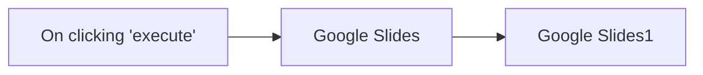

## Fluxo (.json) :

```json
{
  "nodes": [
    {
      "name": "On clicking 'execute'",
      "type": "n8n-nodes-base.manualTrigger",
      "position": [
        270,
        280
      ],
      "parameters": {},
      "typeVersion": 1
    },
    {
      "name": "Google Slides",
      "type": "n8n-nodes-base.googleSlides",
      "position": [
        470,
        280
      ],
      "parameters": {
        "operation": "getSlides",
        "returnAll": true,
        "authentication": "oAuth2",
        "presentationId": "11myCBTn3IT-Iww01WMz43L7HUmQdL6cCR6NCtpsZer0"
      },
      "credentials": {
        "googleSlidesOAuth2Api": "Google Slides Credentials"
      },
      "typeVersion": 1
    },
    {
      "name": "Google Slides1",
      "type": "n8n-nodes-base.googleSlides",
      "position": [
        670,
        280
      ],
      "parameters": {
        "download": true,
        "resource": "page",
        "operation": "getThumbnail",
        "pageObjectId": "={{$json[\"objectId\"]}}",
        "authentication": "oAuth2",
        "presentationId": "={{$node[\"Google Slides\"].parameter[\"presentationId\"]}}"
      },
      "credentials": {
        "googleSlidesOAuth2Api": "Google Slides Credentials"
      },
      "typeVersion": 1
    }
  ],
  "connections": {
    "Google Slides": {
      "main": [
        [
          {
            "node": "Google Slides1",
            "type": "main",
            "index": 0
          }
        ]
      ]
    },
    "On clicking 'execute'": {
      "main": [
        [
          {
            "node": "Google Slides",
            "type": "main",
            "index": 0
          }
        ]
      ]
    }
  }
}
```

<a id="template-1206"></a>

## Template 1206 - Assistente de logging Clockify via Slack

- **Nome:** Assistente de logging Clockify via Slack
- **Descrição:** Atende menções no Slack para auxiliar engenheiros a buscar, criar, atualizar e apagar entradas de tempo no Clockify, usando um assistente de linguagem para guiar e confirmar ações.
- **Funcionalidade:** • Detecção de menções no Slack: inicia o fluxo quando o assistente é mencionado.
• Confirmação visual de recebimento: adiciona reação (+1) à mensagem para indicar que foi recebida.
• Interpretação por IA: utiliza um modelo de linguagem para entender pedidos, corrigir descrições e fornecer orientação proativa.
• Memória por usuário: mantém contexto de conversa limitado para sessões individuais.
• Recuperação de usuário atual: obtém dados do usuário autenticado no Clockify para operações de registro.
• Busca e filtragem de clientes e projetos: pesquisa clientes e projetos no Clockify por nome ou identificador para mapear entradas corretamente.
• Consulta de entradas de tempo: recupera entradas de um usuário em um intervalo de datas para verificar histórico e sobreposições.
• Criação de entradas de tempo: cria novos registros com descrição, projeto, início e fim, após validação/confirmção.
• Atualização de entradas de tempo: atualiza registros existentes com validação de horários e descrições.
• Exclusão de entradas de tempo: apaga registros com confirmação explícita e individual (fluxo seguro para operações críticas).
• Conversão e cálculo de datas/durações: converte datas e calcula durações para evitar sobreposição de horários.
• Resposta no Slack: envia a resposta do assistente em formato Markdown no mesmo thread, com orientação clara e gramaticalmente correta.
- **Ferramentas:** • Clockify: API para gerenciar workspaces, usuários, clientes, projetos e entradas de tempo (criação, leitura, atualização e exclusão).
• Slack: plataforma de comunicação utilizada para acionar o assistente por menção, receber confirmações visuais e enviar respostas no thread.
• OpenAI: modelo de linguagem para interpretar solicitações em linguagem natural, gerar respostas, corrigir descrições e orientar o usuário.


## Fluxo visual

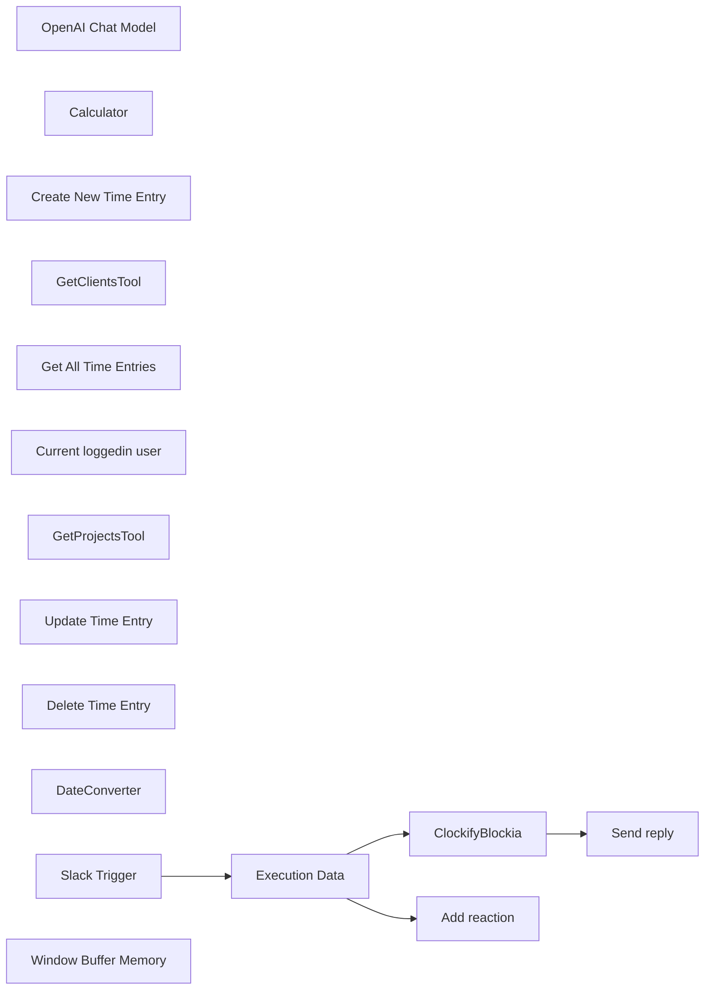

## Fluxo (.json) :

```json
{
  "id": "WsksMHrmAQrG32db",
  "meta": {
    "instanceId": "92fc20bda79393649a623da4b0a65937bcc52015ab24e5a11633573bf81c05ba"
  },
  "name": "ClockifyBlockiaWorkflow",
  "tags": [
    {
      "id": "0zJNrNQJD49aoFYO",
      "name": "Clockify",
      "createdAt": "2024-12-02T21:53:54.940Z",
      "updatedAt": "2024-12-02T21:53:54.940Z"
    },
    {
      "id": "JvuYX1WC7uT4mYl7",
      "name": "Slack",
      "createdAt": "2024-12-02T21:53:56.825Z",
      "updatedAt": "2024-12-02T21:53:56.825Z"
    }
  ],
  "nodes": [
    {
      "id": "98efbcb6-7d13-436d-bb78-22999944b4da",
      "name": "OpenAI Chat Model",
      "type": "@n8n/n8n-nodes-langchain.lmChatOpenAi",
      "position": [
        -800,
        260
      ],
      "parameters": {
        "options": {}
      },
      "credentials": {
        "openAiApi": {
          "id": "oMvpfPJuOGdwct9R",
          "name": "OpenAi account"
        }
      },
      "typeVersion": 1
    },
    {
      "id": "1e32c1a0-3fb6-4fb6-b706-805b16f95528",
      "name": "Calculator",
      "type": "@n8n/n8n-nodes-langchain.toolCalculator",
      "position": [
        -20,
        260
      ],
      "parameters": {},
      "typeVersion": 1
    },
    {
      "id": "363b9823-5c97-4da6-889f-4fa83fac539f",
      "name": "Create New Time Entry",
      "type": "@n8n/n8n-nodes-langchain.toolHttpRequest",
      "position": [
        -120,
        260
      ],
      "parameters": {
        "url": "=https://api.clockify.me/api/v1/workspaces/6735b75fe9244e75e2123fba/time-entries",
        "method": "POST",
        "jsonBody": "{\n  \"billable\": true,\n  \"description\": \"{logDescription}\",\n  \"end\": \"{endTime}\",\n  \"projectId\": \"{projectId}\",\n  \"start\": \"{startTime}\",\n  \"type\": \"REGULAR\"\n}",
        "sendBody": true,
        "specifyBody": "json",
        "authentication": "predefinedCredentialType",
        "toolDescription": "Call this workflow whenever you need to work with Clockify for create a new time entry.",
        "nodeCredentialType": "clockifyApi",
        "placeholderDefinitions": {
          "values": [
            {
              "name": "logDescription",
              "type": "string",
              "description": "Description of the time log entry"
            },
            {
              "name": "endTime",
              "type": "string",
              "description": "Represents an end date of the time log in yyyy-MM-ddThh:mm:ssZ format."
            },
            {
              "name": "projectId",
              "type": "string",
              "description": "Represents project unique identifier across the system."
            },
            {
              "name": "startTime",
              "type": "string",
              "description": "Represents a start date of the time log in yyyy-MM-ddThh:mm:ssZ format."
            }
          ]
        }
      },
      "credentials": {
        "clockifyApi": {
          "id": "sArgwd7fRqmYH3Pc",
          "name": "Clockify account"
        }
      },
      "typeVersion": 1.1
    },
    {
      "id": "dac03c89-823e-46c5-af76-39b09b0b073b",
      "name": "GetClientsTool",
      "type": "@n8n/n8n-nodes-langchain.toolHttpRequest",
      "position": [
        -380,
        260
      ],
      "parameters": {
        "url": "=https://api.clockify.me/api/v1/workspaces/6735b75fe9244e75e2123fba/clients",
        "fields": "id,name,workspaceId",
        "sendQuery": true,
        "authentication": "predefinedCredentialType",
        "fieldsToInclude": "selected",
        "parametersQuery": {
          "values": [
            {
              "name": "name",
              "valueProvider": "modelOptional"
            }
          ]
        },
        "toolDescription": "Call this tool whenever you need to get or filter clients on Clockify, especially if you need to find client id by name.",
        "optimizeResponse": true,
        "nodeCredentialType": "clockifyApi",
        "placeholderDefinitions": {
          "values": [
            {
              "name": "name",
              "type": "string",
              "description": "Filters client results that matches with the string provided in their client name."
            }
          ]
        }
      },
      "credentials": {
        "clockifyApi": {
          "id": "sArgwd7fRqmYH3Pc",
          "name": "Clockify account"
        }
      },
      "typeVersion": 1.1
    },
    {
      "id": "3a615bf3-c237-423b-919d-62c161dd0a50",
      "name": "Get All Time Entries",
      "type": "@n8n/n8n-nodes-langchain.toolHttpRequest",
      "position": [
        -260,
        260
      ],
      "parameters": {
        "url": "=https://api.clockify.me/api/v1/workspaces/6735b75fe9244e75e2123fba/user/{userId}/time-entries",
        "fields": "id,description,userId,projectId,workspaceId,timeInterval",
        "sendQuery": true,
        "authentication": "predefinedCredentialType",
        "fieldsToInclude": "selected",
        "parametersQuery": {
          "values": [
            {
              "name": "start",
              "value": "{startTime}",
              "valueProvider": "fieldValue"
            },
            {
              "name": "end",
              "value": "{endTime}",
              "valueProvider": "fieldValue"
            }
          ]
        },
        "toolDescription": "Call this tool whenever you need to get time entries on Clockify for a given user identified by its user Id (not name).\nBy default fetch entries from the last month if no dates are provided.",
        "optimizeResponse": true,
        "nodeCredentialType": "clockifyApi",
        "placeholderDefinitions": {
          "values": [
            {
              "name": "startTime",
              "type": "string",
              "description": "Represents start date in yyyy-MM-ddThh:mm:ssZ format. Optional"
            },
            {
              "name": "endTime",
              "type": "string",
              "description": "Represents end date in yyyy-MM-ddThh:mm:ssZ format. Optional"
            },
            {
              "name": "userId",
              "type": "string",
              "description": "Id of the user that is logged in, for which we are retrieving time logs"
            }
          ]
        }
      },
      "credentials": {
        "clockifyApi": {
          "id": "sArgwd7fRqmYH3Pc",
          "name": "Clockify account"
        }
      },
      "typeVersion": 1.1
    },
    {
      "id": "29bc1d81-07b2-42e3-bc3b-0bd30aaa796a",
      "name": "Current loggedin user",
      "type": "@n8n/n8n-nodes-langchain.toolHttpRequest",
      "position": [
        100,
        260
      ],
      "parameters": {
        "url": "https://api.clockify.me/api/v1/user",
        "fields": "id,email,name",
        "authentication": "predefinedCredentialType",
        "fieldsToInclude": "selected",
        "toolDescription": "Gel the current logged in user that you are operating from. Use it to get user profikle information, especially its id, email, name etc.",
        "optimizeResponse": true,
        "nodeCredentialType": "clockifyApi"
      },
      "credentials": {
        "clockifyApi": {
          "id": "sArgwd7fRqmYH3Pc",
          "name": "Clockify account"
        }
      },
      "typeVersion": 1.1
    },
    {
      "id": "5472ac8d-b843-4031-acfb-4b5f60d8e84f",
      "name": "GetProjectsTool",
      "type": "@n8n/n8n-nodes-langchain.toolHttpRequest",
      "position": [
        -520,
        260
      ],
      "parameters": {
        "url": "=https://api.clockify.me/api/v1/workspaces/6735b75fe9244e75e2123fba/projects",
        "fields": "id,name,currency,clientId,workspaceId",
        "sendQuery": true,
        "authentication": "predefinedCredentialType",
        "fieldsToInclude": "selected",
        "parametersQuery": {
          "values": [
            {
              "name": "name",
              "value": "{projectName}",
              "valueProvider": "fieldValue"
            },
            {
              "name": "clients",
              "value": "{clientId}",
              "valueProvider": "fieldValue"
            }
          ]
        },
        "toolDescription": "Call this tool whenever you need to get projects on Clockify. \nThis is a tool to use if you want to find all projects and project ids for the logged in user.\n\nOptionally you can filter projects by clients or by project names.",
        "optimizeResponse": true,
        "nodeCredentialType": "clockifyApi",
        "placeholderDefinitions": {
          "values": [
            {
              "name": "projectName",
              "type": "string",
              "description": "Project name; not project ID; not client ID; can be empty"
            },
            {
              "name": "clientId",
              "type": "string",
              "description": "Client unique identifier, this is not a name of the client; so if you fail you need to try again with client id; can be empty"
            }
          ]
        }
      },
      "credentials": {
        "clockifyApi": {
          "id": "sArgwd7fRqmYH3Pc",
          "name": "Clockify account"
        }
      },
      "typeVersion": 1.1
    },
    {
      "id": "89e935ef-34c8-4b9b-9182-ccf4c339e7d1",
      "name": "Update Time Entry",
      "type": "@n8n/n8n-nodes-langchain.toolHttpRequest",
      "position": [
        240,
        260
      ],
      "parameters": {
        "url": "=https://api.clockify.me/api/v1/workspaces/6735b75fe9244e75e2123fba/time-entries/{id}",
        "method": "PUT",
        "jsonBody": "{\n  \"billable\": true,\n  \"description\": \"{logDescription}\",\n  \"end\": \"{endTime}\",\n  \"projectId\": \"{projectId}\",\n  \"start\": \"{startTime}\",\n  \"type\": \"REGULAR\"\n}",
        "sendBody": true,
        "specifyBody": "json",
        "authentication": "predefinedCredentialType",
        "toolDescription": "Call this workflow whenever you need to work with Clockify for update an existing time entry.",
        "nodeCredentialType": "clockifyApi",
        "placeholderDefinitions": {
          "values": [
            {
              "name": "logDescription",
              "type": "string",
              "description": "Description of the time log entry"
            },
            {
              "name": "endTime",
              "type": "string",
              "description": "Represents an end date of the time log in yyyy-MM-ddThh:mm:ssZ format."
            },
            {
              "name": "projectId",
              "type": "string",
              "description": "Represents project unique identifier across the system."
            },
            {
              "name": "startTime",
              "type": "string",
              "description": "Represents a start date of the time log in yyyy-MM-ddThh:mm:ssZ format."
            },
            {
              "name": "id",
              "type": "string",
              "description": "Id of the time entry"
            }
          ]
        }
      },
      "credentials": {
        "clockifyApi": {
          "id": "sArgwd7fRqmYH3Pc",
          "name": "Clockify account"
        }
      },
      "typeVersion": 1.1
    },
    {
      "id": "88a0e515-ee3e-4546-a053-a11b135bde18",
      "name": "Delete Time Entry",
      "type": "@n8n/n8n-nodes-langchain.toolHttpRequest",
      "position": [
        380,
        260
      ],
      "parameters": {
        "url": "=https://api.clockify.me/api/v1/workspaces/6735b75fe9244e75e2123fba/time-entries/{id}",
        "method": "DELETE",
        "authentication": "predefinedCredentialType",
        "toolDescription": "Call this workflow whenever you need to work with Clockify for deleating an existing time entry.",
        "nodeCredentialType": "clockifyApi",
        "placeholderDefinitions": {
          "values": [
            {
              "name": "id",
              "type": "string",
              "description": "Id of the time entry"
            }
          ]
        }
      },
      "credentials": {
        "clockifyApi": {
          "id": "sArgwd7fRqmYH3Pc",
          "name": "Clockify account"
        }
      },
      "typeVersion": 1.1
    },
    {
      "id": "19ddc949-1ee3-4871-8c5c-415e9d560d26",
      "name": "DateConverter",
      "type": "@n8n/n8n-nodes-langchain.toolCode",
      "position": [
        540,
        260
      ],
      "parameters": {
        "name": "DateToMilisecondsConvertorTool",
        "jsCode": "// Example: convert the incoming query to uppercase and return it\nreturn (new Date(query)).getTime() ",
        "description": "Call this tool to convert dates from format to miliseconds.\nExample 2024-12-02T21:04:23.623Z date is converted into time miliseconds.\n\nthis ideally is combinated with calculator to calculate duration periods."
      },
      "typeVersion": 1.1
    },
    {
      "id": "ec208aa4-8f58-4837-8bf7-42e11cd10ab9",
      "name": "ClockifyBlockia",
      "type": "@n8n/n8n-nodes-langchain.agent",
      "position": [
        -600,
        20
      ],
      "parameters": {
        "text": "={{ $json.text }}",
        "options": {
          "systemMessage": "=You are an smart assistant assisting engineers in the time logging management on Clockify for an agency called Blockia Labs using conversational chat system. Be precise and concise, you are engineers best friend copilot.\nYour goals is to guide and help engineers in the logging process; by proactively guiding them one step again in the process and giving them options and proactive guidance, not passively waiting only on instructions.\n\nNote that todays day is {{ $now.toUTC() }}\n\nFor date duration calculation use the date convertor tool along with the calculator.\nUse step by step guidance and reasoning for this process.\n\nFor creates, updates and delete operations always double confirm with the user. Especially when deleting, make the confirmation one by one since deleting is critical ops.\n\nMake sure the descriptions are checked, ethic and gramatically correct. \nMake sure there is no overlap in time entries or logging when one user is working on more projects at the same time. \nReturn a simple mardown resposne (no bold or ****)",
          "passthroughBinaryImages": true
        },
        "promptType": "define",
        "hasOutputParser": true
      },
      "typeVersion": 1.7
    },
    {
      "id": "75718cd6-00e1-4d7f-91a8-150c5cf5522f",
      "name": "Slack Trigger",
      "type": "n8n-nodes-base.slackTrigger",
      "position": [
        -1140,
        -240
      ],
      "webhookId": "cc2d1f3f-c366-48a5-9285-b424f00504cf",
      "parameters": {
        "options": {
          "resolveIds": true
        },
        "trigger": [
          "app_mention"
        ],
        "watchWorkspace": true
      },
      "credentials": {
        "slackApi": {
          "id": "FAG5NeHyfVWEAZBF",
          "name": "Slack account 2"
        }
      },
      "typeVersion": 1
    },
    {
      "id": "638463bd-4e71-4260-91b4-b5068db7abe6",
      "name": "Execution Data",
      "type": "n8n-nodes-base.executionData",
      "position": [
        -820,
        -240
      ],
      "parameters": {},
      "typeVersion": 1
    },
    {
      "id": "4c0d8360-a353-4ae5-901a-f66065b00258",
      "name": "Window Buffer Memory",
      "type": "@n8n/n8n-nodes-langchain.memoryBufferWindow",
      "position": [
        -660,
        260
      ],
      "parameters": {
        "sessionKey": "={{ $json.user }}",
        "sessionIdType": "customKey",
        "contextWindowLength": 10
      },
      "typeVersion": 1.3
    },
    {
      "id": "81bc56b4-2864-4b3e-801c-2c96244d524c",
      "name": "Add reaction",
      "type": "n8n-nodes-base.slack",
      "position": [
        -500,
        -400
      ],
      "webhookId": "81d9777e-2ea1-4938-966a-e2fe491d0bba",
      "parameters": {
        "name": "+1",
        "resource": "reaction",
        "channelId": {
          "__rl": true,
          "mode": "id",
          "value": "={{ $('Execution Data').item.json.channel }}"
        },
        "timestamp": "={{ $json.ts }}"
      },
      "credentials": {
        "slackApi": {
          "id": "FAG5NeHyfVWEAZBF",
          "name": "Slack account 2"
        }
      },
      "typeVersion": 2.2
    },
    {
      "id": "b330f17f-b0c1-4025-813f-d20ca1b1d896",
      "name": "Send reply",
      "type": "n8n-nodes-base.slack",
      "position": [
        -240,
        -240
      ],
      "webhookId": "81d9777e-2ea1-4938-966a-e2fe491d0bba",
      "parameters": {
        "text": "={{ $json.output }}",
        "select": "channel",
        "channelId": {
          "__rl": true,
          "mode": "id",
          "value": "={{ $('Execution Data').item.json.channel }}"
        },
        "otherOptions": {
          "mrkdwn": true,
          "thread_ts": {
            "replyValues": {
              "thread_ts": "={{ $('Execution Data').item.json.ts }}"
            }
          },
          "link_names": false,
          "unfurl_links": false,
          "includeLinkToWorkflow": false
        }
      },
      "credentials": {
        "slackApi": {
          "id": "FAG5NeHyfVWEAZBF",
          "name": "Slack account 2"
        }
      },
      "typeVersion": 2.2
    }
  ],
  "active": true,
  "pinData": {},
  "settings": {
    "executionOrder": "v1"
  },
  "versionId": "91f32f58-1060-4473-9313-7a5b31dbcf26",
  "connections": {
    "Calculator": {
      "ai_tool": [
        [
          {
            "node": "ClockifyBlockia",
            "type": "ai_tool",
            "index": 0
          }
        ]
      ]
    },
    "DateConverter": {
      "ai_tool": [
        [
          {
            "node": "ClockifyBlockia",
            "type": "ai_tool",
            "index": 0
          }
        ]
      ]
    },
    "Slack Trigger": {
      "main": [
        [
          {
            "node": "Execution Data",
            "type": "main",
            "index": 0
          }
        ]
      ]
    },
    "Execution Data": {
      "main": [
        [
          {
            "node": "ClockifyBlockia",
            "type": "main",
            "index": 0
          },
          {
            "node": "Add reaction",
            "type": "main",
            "index": 0
          }
        ]
      ]
    },
    "GetClientsTool": {
      "ai_tool": [
        [
          {
            "node": "ClockifyBlockia",
            "type": "ai_tool",
            "index": 0
          }
        ]
      ]
    },
    "ClockifyBlockia": {
      "main": [
        [
          {
            "node": "Send reply",
            "type": "main",
            "index": 0
          }
        ]
      ]
    },
    "GetProjectsTool": {
      "ai_tool": [
        [
          {
            "node": "ClockifyBlockia",
            "type": "ai_tool",
            "index": 0
          }
        ]
      ]
    },
    "Delete Time Entry": {
      "ai_tool": [
        [
          {
            "node": "ClockifyBlockia",
            "type": "ai_tool",
            "index": 0
          }
        ]
      ]
    },
    "OpenAI Chat Model": {
      "ai_languageModel": [
        [
          {
            "node": "ClockifyBlockia",
            "type": "ai_languageModel",
            "index": 0
          }
        ]
      ]
    },
    "Update Time Entry": {
      "ai_tool": [
        [
          {
            "node": "ClockifyBlockia",
            "type": "ai_tool",
            "index": 0
          }
        ]
      ]
    },
    "Get All Time Entries": {
      "ai_tool": [
        [
          {
            "node": "ClockifyBlockia",
            "type": "ai_tool",
            "index": 0
          }
        ]
      ]
    },
    "Window Buffer Memory": {
      "ai_memory": [
        [
          {
            "node": "ClockifyBlockia",
            "type": "ai_memory",
            "index": 0
          }
        ]
      ]
    },
    "Create New Time Entry": {
      "ai_tool": [
        [
          {
            "node": "ClockifyBlockia",
            "type": "ai_tool",
            "index": 0
          }
        ]
      ]
    },
    "Current loggedin user": {
      "ai_tool": [
        [
          {
            "node": "ClockifyBlockia",
            "type": "ai_tool",
            "index": 0
          }
        ]
      ]
    }
  }
}
```

<a id="template-1207"></a>

## Template 1207 - Verificação de entregabilidade de e-mail

- **Nome:** Verificação de entregabilidade de e-mail
- **Descrição:** Fluxo que verifica se um endereço de e-mail é entregável usando um serviço externo de verificação.
- **Funcionalidade:** • Início manual: permite executar o fluxo manualmente ao clicar em 'execute'.
• Criação de item de e-mail: gera um item contendo o e-mail definido (mcolomer@gmail.com).
• Verificação de entregabilidade: consulta um serviço externo (checkEmailExists) para checar se o e-mail é entregável.
• Avaliação do resultado: compara a resposta do serviço com o valor "deliverable" para determinar o caminho lógico subsequente.
- **Ferramentas:** • Uproc (serviço de verificação de e-mails): serviço externo utilizado para checar existência e entregabilidade de endereços de e-mail; acessado via credencial vinculada ao serviço.


## Fluxo visual

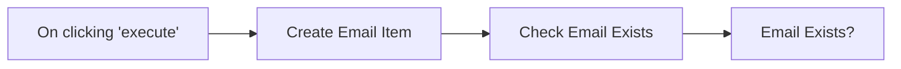

## Fluxo (.json) :

```json
{
  "id": "103",
  "name": "verify email",
  "nodes": [
    {
      "name": "On clicking 'execute'",
      "type": "n8n-nodes-base.manualTrigger",
      "position": [
        440,
        510
      ],
      "parameters": {},
      "typeVersion": 1
    },
    {
      "name": "Create Email Item",
      "type": "n8n-nodes-base.functionItem",
      "position": [
        640,
        510
      ],
      "parameters": {
        "functionCode": "item.email = \"mcolomer@gmail.com\";\nreturn item;"
      },
      "typeVersion": 1
    },
    {
      "name": "Check Email Exists",
      "type": "n8n-nodes-base.uproc",
      "position": [
        850,
        510
      ],
      "parameters": {
        "tool": "checkEmailExists",
        "email": "={{$node[\"Create Email Item\"].json[\"email\"]}}",
        "additionalOptions": {}
      },
      "credentials": {
        "uprocApi": "miquel-uproc"
      },
      "typeVersion": 1
    },
    {
      "name": "Email Exists?",
      "type": "n8n-nodes-base.if",
      "position": [
        1050,
        510
      ],
      "parameters": {
        "conditions": {
          "string": [
            {
              "value1": "={{$node[\"Check Email Exists\"].json[\"message\"][\"response\"]}}",
              "value2": "deliverable"
            }
          ]
        }
      },
      "typeVersion": 1
    }
  ],
  "active": false,
  "settings": {},
  "connections": {
    "Create Email Item": {
      "main": [
        [
          {
            "node": "Check Email Exists",
            "type": "main",
            "index": 0
          }
        ]
      ]
    },
    "Check Email Exists": {
      "main": [
        [
          {
            "node": "Email Exists?",
            "type": "main",
            "index": 0
          }
        ]
      ]
    },
    "On clicking 'execute'": {
      "main": [
        [
          {
            "node": "Create Email Item",
            "type": "main",
            "index": 0
          }
        ]
      ]
    }
  }
}
```

<a id="template-1208"></a>

## Template 1208 - Criar e atualizar membro no Orbit com nota e post

- **Nome:** Criar e atualizar membro no Orbit com nota e post
- **Descrição:** Cria ou atualiza um membro em um workspace do Orbit, atualiza informações do membro, adiciona uma nota e registra um post associado.
- **Funcionalidade:** • Criação/atualização de membro: Insere ou atualiza um membro no workspace especificado usando uma identidade (por exemplo, username do GitHub).
• Atualização de informações do membro: Aplica alterações no registro do membro, como inclusão de tags ou outros campos.
• Adição de nota: Cria uma nota vinculada ao membro recém-criado ou atualizado para registrar informações adicionais.
• Registro de post: Registra um post associado ao membro com URL de referência.
• Encadeamento de operações: Usa o ID do membro retornado pelo upsert para executar automaticamente as operações seguintes.
- **Ferramentas:** • Orbit: Plataforma para gerenciar membros, notas e posts em workspaces, utilizada para upsert, atualização e criação de conteúdos relacionados aos membros.
• GitHub: Utilizado como fonte de identidade para localizar ou referenciar o membro por nome de usuário.


## Fluxo visual

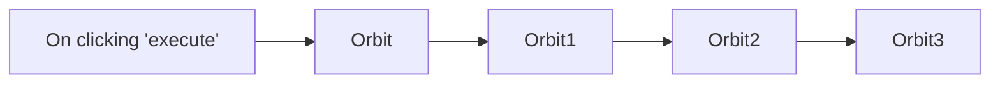

## Fluxo (.json) :

```json
{
  "id": "105",
  "name": "Create a new member, update the information of the member, create a note and a post for the member in Orbit",
  "nodes": [
    {
      "name": "On clicking 'execute'",
      "type": "n8n-nodes-base.manualTrigger",
      "position": [
        250,
        300
      ],
      "parameters": {},
      "typeVersion": 1
    },
    {
      "name": "Orbit",
      "type": "n8n-nodes-base.orbit",
      "position": [
        450,
        300
      ],
      "parameters": {
        "operation": "upsert",
        "identityUi": {
          "identityValue": {
            "source": "github",
            "searchBy": "username",
            "username": ""
          }
        },
        "workspaceId": "425",
        "additionalFields": {}
      },
      "credentials": {
        "orbitApi": "orbit-review"
      },
      "typeVersion": 1
    },
    {
      "name": "Orbit1",
      "type": "n8n-nodes-base.orbit",
      "position": [
        650,
        300
      ],
      "parameters": {
        "memberId": "={{$node[\"Orbit\"].json[\"id\"]}}",
        "operation": "update",
        "workspaceId": "={{$node[\"Orbit\"].parameter[\"workspaceId\"]}}",
        "updateFields": {
          "tagsToAdd": ""
        }
      },
      "credentials": {
        "orbitApi": "orbit-review"
      },
      "typeVersion": 1
    },
    {
      "name": "Orbit2",
      "type": "n8n-nodes-base.orbit",
      "position": [
        850,
        300
      ],
      "parameters": {
        "note": "",
        "memberId": "={{$node[\"Orbit\"].json[\"id\"]}}",
        "resource": "note",
        "workspaceId": "={{$node[\"Orbit\"].parameter[\"workspaceId\"]}}"
      },
      "credentials": {
        "orbitApi": "orbit-review"
      },
      "typeVersion": 1
    },
    {
      "name": "Orbit3",
      "type": "n8n-nodes-base.orbit",
      "position": [
        1050,
        300
      ],
      "parameters": {
        "url": "https://medium.com/n8n-io/sending-sms-the-low-code-way-with-airtable-twilio-programmable-sms-and-n8n-90dbde74223e",
        "memberId": "={{$node[\"Orbit\"].json[\"id\"]}}",
        "resource": "post",
        "workspaceId": "={{$node[\"Orbit\"].parameter[\"workspaceId\"]}}",
        "additionalFields": {}
      },
      "credentials": {
        "orbitApi": "orbit-review"
      },
      "typeVersion": 1
    }
  ],
  "active": false,
  "settings": {},
  "connections": {
    "Orbit": {
      "main": [
        [
          {
            "node": "Orbit1",
            "type": "main",
            "index": 0
          }
        ]
      ]
    },
    "Orbit1": {
      "main": [
        [
          {
            "node": "Orbit2",
            "type": "main",
            "index": 0
          }
        ]
      ]
    },
    "Orbit2": {
      "main": [
        [
          {
            "node": "Orbit3",
            "type": "main",
            "index": 0
          }
        ]
      ]
    },
    "On clicking 'execute'": {
      "main": [
        [
          {
            "node": "Orbit",
            "type": "main",
            "index": 0
          }
        ]
      ]
    }
  }
}
```

<a id="template-1209"></a>

## Template 1209 - Criar tarefa no ClickUp

- **Nome:** Criar tarefa no ClickUp
- **Descrição:** Este fluxo cria uma tarefa no ClickUp quando acionado manualmente.
- **Funcionalidade:** • Gatilho manual: Inicia o fluxo ao clicar em 'execute', permitindo execução sob demanda.
• Criação de tarefa: Envia uma solicitação para criar uma nova tarefa no ClickUp.
• Configuração de campos da tarefa: Permite definir lista, nome, equipe, espaço, pasta e campos adicionais para a tarefa.
• Autenticação por API: Utiliza credenciais da API do ClickUp para autenticar a operação de criação.
- **Ferramentas:** • ClickUp: Plataforma de gestão de tarefas e projetos usada para criar e armazenar a tarefa via API.


## Fluxo visual


## Fluxo (.json) :

```json
{
  "id": "105",
  "name": "Create a task in ClickUp",
  "nodes": [
    {
      "name": "On clicking 'execute'",
      "type": "n8n-nodes-base.manualTrigger",
      "position": [
        250,
        300
      ],
      "parameters": {},
      "typeVersion": 1
    },
    {
      "name": "ClickUp",
      "type": "n8n-nodes-base.clickUp",
      "position": [
        450,
        300
      ],
      "parameters": {
        "list": "",
        "name": "",
        "team": "",
        "space": "",
        "folder": "",
        "additionalFields": {}
      },
      "credentials": {
        "clickUpApi": ""
      },
      "typeVersion": 1
    }
  ],
  "active": false,
  "settings": {},
  "connections": {
    "On clicking 'execute'": {
      "main": [
        [
          {
            "node": "ClickUp",
            "type": "main",
            "index": 0
          }
        ]
      ]
    }
  }
}
```

<a id="template-1210"></a>

## Template 1210 - Agente RAG com Milvus e Cohere

- **Nome:** Agente RAG com Milvus e Cohere
- **Descrição:** Fluxo que ingere PDFs de uma pasta na nuvem, transforma o conteúdo em vetores, armazena em um banco vetorial e permite consultas via um agente conversacional que recupera informação relevante.
- **Funcionalidade:** • Monitoramento de pasta: Observa uma pasta específica para detectar novos arquivos PDF automaticamente.
• Download automático de arquivos: Baixa os PDFs adicionados na pasta monitorada.
• Extração de texto de PDF: Extrai o conteúdo textual dos PDFs para processamento.
• Quebra em chunks: Divide o texto em pedaços maiores para melhor indexação e recuperação.
• Geração de embeddings: Converte os chunks em vetores semânticos usando um serviço de embeddings.
• Inserção em banco vetorial: Armazena os vetores e metadados em uma coleção do banco vetorial para buscas futuras.
• Recuperação como ferramenta: Disponibiliza a busca vetorial como uma ferramenta que o agente pode chamar para obter contexto.
• Agente conversacional RAG: Recebe mensagens de chat, consulta o banco vetorial e gera respostas baseadas nas informações recuperadas.
• Memória de contexto: Mantém um buffer de memória para preservar contexto recente nas conversas.
- **Ferramentas:** • Google Drive: Armazenamento e fonte dos arquivos PDF que são processados.
• Milvus (Zilliz): Banco de dados vetorial na nuvem para armazenar e buscar embeddings.
• Cohere: Serviço de geração de embeddings multilíngue para converter texto em vetores.
• OpenAI (gpt-4o): Modelo de linguagem usado pelo agente para gerar respostas conversacionais.


## Fluxo visual

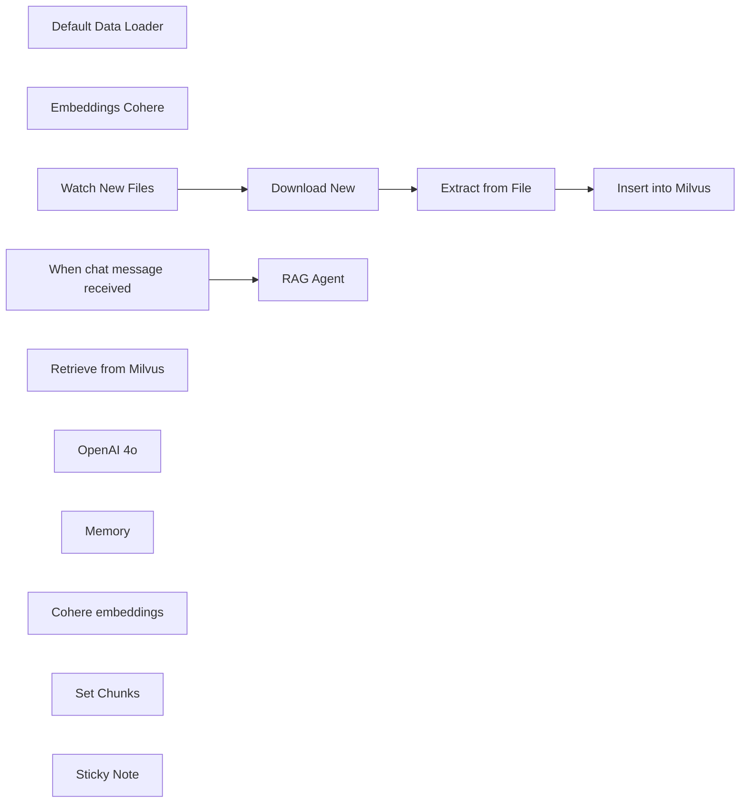

## Fluxo (.json) :

```json
{
  "id": "2Eba0OHGtOmoTWOU",
  "meta": {
    "instanceId": "9219ebc7795bea866f70aa3d977d54417fdf06c41944be95e20cfb60f992db19",
    "templateCredsSetupCompleted": true
  },
  "name": "RAG AI Agent with Milvus and Cohere",
  "tags": [
    {
      "id": "yj7cF3GCsZiargFT",
      "name": "rag",
      "createdAt": "2025-05-03T17:14:30.099Z",
      "updatedAt": "2025-05-03T17:14:30.099Z"
    }
  ],
  "nodes": [
    {
      "id": "361065cc-edbf-47da-8da7-c59b564db6f3",
      "name": "Default Data Loader",
      "type": "@n8n/n8n-nodes-langchain.documentDefaultDataLoader",
      "position": [
        0,
        320
      ],
      "parameters": {
        "options": {}
      },
      "typeVersion": 1
    },
    {
      "id": "a01b9512-ced1-4e28-a2aa-88077ab79d9a",
      "name": "Embeddings Cohere",
      "type": "@n8n/n8n-nodes-langchain.embeddingsCohere",
      "position": [
        -140,
        320
      ],
      "parameters": {
        "modelName": "embed-multilingual-v3.0"
      },
      "credentials": {
        "cohereApi": {
          "id": "8gcYMleu1b8Hm03D",
          "name": "CohereApi account"
        }
      },
      "typeVersion": 1
    },
    {
      "id": "1da6ea4b-de88-44d3-a215-78c55b5592a2",
      "name": "When chat message received",
      "type": "@n8n/n8n-nodes-langchain.chatTrigger",
      "position": [
        -800,
        520
      ],
      "webhookId": "a4257301-3fb9-4b9d-a965-1fa66f314696",
      "parameters": {
        "options": {}
      },
      "typeVersion": 1.1
    },
    {
      "id": "23004477-3f6d-4909-a626-0eba0557a5bd",
      "name": "Watch New Files",
      "type": "n8n-nodes-base.googleDriveTrigger",
      "position": [
        -800,
        100
      ],
      "parameters": {
        "event": "fileCreated",
        "options": {},
        "pollTimes": {
          "item": [
            {
              "mode": "everyMinute"
            }
          ]
        },
        "triggerOn": "specificFolder",
        "folderToWatch": {
          "__rl": true,
          "mode": "list",
          "value": "15gjDQZiHZuBeVscnK8Ic_kIWt3mOaVfs",
          "cachedResultUrl": "https://drive.google.com/drive/folders/15gjDQZiHZuBeVscnK8Ic_kIWt3mOaVfs",
          "cachedResultName": "RAG template"
        }
      },
      "credentials": {
        "googleDriveOAuth2Api": {
          "id": "r1DVmNxwkIL8JO17",
          "name": "Google Drive account"
        }
      },
      "typeVersion": 1
    },
    {
      "id": "001fbdbe-dfcb-4552-bf09-de416b253389",
      "name": "Download New",
      "type": "n8n-nodes-base.googleDrive",
      "position": [
        -580,
        100
      ],
      "parameters": {
        "fileId": {
          "__rl": true,
          "mode": "id",
          "value": "={{ $json.id }}"
        },
        "options": {},
        "operation": "download"
      },
      "credentials": {
        "googleDriveOAuth2Api": {
          "id": "r1DVmNxwkIL8JO17",
          "name": "Google Drive account"
        }
      },
      "typeVersion": 3
    },
    {
      "id": "c1116cba-beb9-4d28-843d-c5c21c0643de",
      "name": "Insert into Milvus",
      "type": "@n8n/n8n-nodes-langchain.vectorStoreMilvus",
      "position": [
        -124,
        100
      ],
      "parameters": {
        "mode": "insert",
        "options": {
          "clearCollection": false
        },
        "milvusCollection": {
          "__rl": true,
          "mode": "list",
          "value": "collectionName",
          "cachedResultName": "collectionName"
        }
      },
      "credentials": {
        "milvusApi": {
          "id": "Gpsxqr2l9Qxu48h0",
          "name": "Milvus account"
        }
      },
      "typeVersion": 1.1
    },
    {
      "id": "2dbc7139-46f6-41d8-8c13-9fafad5aec55",
      "name": "RAG Agent",
      "type": "@n8n/n8n-nodes-langchain.agent",
      "position": [
        -540,
        520
      ],
      "parameters": {
        "options": {}
      },
      "typeVersion": 1.8
    },
    {
      "id": "a103506e-9019-41f2-9b0d-9b831434c9e9",
      "name": "Retrieve from Milvus",
      "type": "@n8n/n8n-nodes-langchain.vectorStoreMilvus",
      "position": [
        -340,
        740
      ],
      "parameters": {
        "mode": "retrieve-as-tool",
        "topK": 10,
        "toolName": "vector_store",
        "toolDescription": "You are an AI agent that responds based on information received from a vector database.",
        "milvusCollection": {
          "__rl": true,
          "mode": "list",
          "value": "collectionName",
          "cachedResultName": "collectionName"
        }
      },
      "credentials": {
        "milvusApi": {
          "id": "Gpsxqr2l9Qxu48h0",
          "name": "Milvus account"
        }
      },
      "typeVersion": 1.1
    },
    {
      "id": "74ccdff1-b976-4e1c-a2c4-237ffff19e34",
      "name": "OpenAI 4o",
      "type": "@n8n/n8n-nodes-langchain.lmChatOpenAi",
      "position": [
        -580,
        740
      ],
      "parameters": {
        "model": {
          "__rl": true,
          "mode": "list",
          "value": "gpt-4o",
          "cachedResultName": "gpt-4o"
        },
        "options": {}
      },
      "credentials": {
        "openAiApi": {
          "id": "vupAk5StuhOafQcb",
          "name": "OpenAi account"
        }
      },
      "typeVersion": 1.2
    },
    {
      "id": "36e35eaf-f723-4eeb-9658-143d5bc390a0",
      "name": "Memory",
      "type": "@n8n/n8n-nodes-langchain.memoryBufferWindow",
      "position": [
        -460,
        740
      ],
      "parameters": {},
      "typeVersion": 1.3
    },
    {
      "id": "ec7b6b92-065c-455c-a3f0-17586d9e48d7",
      "name": "Cohere embeddings",
      "type": "@n8n/n8n-nodes-langchain.embeddingsCohere",
      "position": [
        -220,
        900
      ],
      "parameters": {
        "modelName": "embed-multilingual-v3.0"
      },
      "credentials": {
        "cohereApi": {
          "id": "8gcYMleu1b8Hm03D",
          "name": "CohereApi account"
        }
      },
      "typeVersion": 1
    },
    {
      "id": "3c3a8900-0b98-4479-8602-16b21e011ba1",
      "name": "Set Chunks",
      "type": "@n8n/n8n-nodes-langchain.textSplitterRecursiveCharacterTextSplitter",
      "position": [
        80,
        480
      ],
      "parameters": {
        "options": {},
        "chunkSize": 700,
        "chunkOverlap": 60
      },
      "typeVersion": 1
    },
    {
      "id": "3a43bf1a-7e22-4b5e-bbb1-6bb2c1798c07",
      "name": "Extract from File",
      "type": "n8n-nodes-base.extractFromFile",
      "position": [
        -360,
        100
      ],
      "parameters": {
        "options": {},
        "operation": "pdf"
      },
      "typeVersion": 1
    },
    {
      "id": "e0c9d4d7-5e3e-4e47-bb1f-dbdca360b20a",
      "name": "Sticky Note",
      "type": "n8n-nodes-base.stickyNote",
      "position": [
        -1440,
        120
      ],
      "parameters": {
        "color": 2,
        "width": 540,
        "height": 600,
        "content": "## Why Milvus\nBased on comparisons and user feedback, **Milvus is often considered a more performant and scalable vector database solution compared to Supabase**, particularly for demanding use cases involving large datasets, high-volume vector search operations, and multilingual support.\n\n\n### Requirements\n- Create an account on [Zilliz](https://zilliz.com/) to generate the Milvus cluster. \n- There is no need to create docker containers or your own instance, Zilliz provides the cloud infraestructure to build it easily\n- Get your credentials ready from Drive, Milvus (Zilliz), and [Cohere](https://cohere.com)\n\n### Usage\nEvery time a new pdf is added into the Drive folder, it will be inserted into the Milvus Vector Store, allowing for the interaction with the RAG agent in seconds.\n\n## Calculate your company's RAG costs\n\nWant to run Milvus on your own server on n8n? Zilliz provides a great [cost calculator](https://zilliz.com/rag-cost-calculator/)\n\n### Get in touch with us\nWant to implement a RAG AI agent for your company? [Shoot us a message](https://1node.ai)\n"
      },
      "typeVersion": 1
    }
  ],
  "active": true,
  "pinData": {},
  "settings": {
    "executionOrder": "v1"
  },
  "versionId": "8b5fc2b8-50f7-425c-8fc8-94ba4f76ecf3",
  "connections": {
    "Memory": {
      "ai_memory": [
        [
          {
            "node": "RAG Agent",
            "type": "ai_memory",
            "index": 0
          }
        ]
      ]
    },
    "OpenAI 4o": {
      "ai_languageModel": [
        [
          {
            "node": "RAG Agent",
            "type": "ai_languageModel",
            "index": 0
          }
        ]
      ]
    },
    "Set Chunks": {
      "ai_textSplitter": [
        [
          {
            "node": "Default Data Loader",
            "type": "ai_textSplitter",
            "index": 0
          }
        ]
      ]
    },
    "Download New": {
      "main": [
        [
          {
            "node": "Extract from File",
            "type": "main",
            "index": 0
          }
        ]
      ]
    },
    "Watch New Files": {
      "main": [
        [
          {
            "node": "Download New",
            "type": "main",
            "index": 0
          }
        ]
      ]
    },
    "Cohere embeddings": {
      "ai_embedding": [
        [
          {
            "node": "Retrieve from Milvus",
            "type": "ai_embedding",
            "index": 0
          }
        ]
      ]
    },
    "Embeddings Cohere": {
      "ai_embedding": [
        [
          {
            "node": "Insert into Milvus",
            "type": "ai_embedding",
            "index": 0
          }
        ]
      ]
    },
    "Extract from File": {
      "main": [
        [
          {
            "node": "Insert into Milvus",
            "type": "main",
            "index": 0
          }
        ]
      ]
    },
    "Default Data Loader": {
      "ai_document": [
        [
          {
            "node": "Insert into Milvus",
            "type": "ai_document",
            "index": 0
          }
        ]
      ]
    },
    "Retrieve from Milvus": {
      "ai_tool": [
        [
          {
            "node": "RAG Agent",
            "type": "ai_tool",
            "index": 0
          }
        ]
      ]
    },
    "When chat message received": {
      "main": [
        [
          {
            "node": "RAG Agent",
            "type": "main",
            "index": 0
          }
        ]
      ]
    }
  }
}
```

<a id="template-1211"></a>

## Template 1211 - Comparação de LLMs com registro em Google Sheets

- **Nome:** Comparação de LLMs com registro em Google Sheets
- **Descrição:** Fluxo que recebe uma mensagem de chat, envia o mesmo prompt para dois modelos de linguagem diferentes, isola memória por modelo e registra as respostas e contexto em uma planilha do Google para avaliação e comparação.
- **Funcionalidade:** • Recepção de mensagem: inicia o fluxo quando uma mensagem de chat é recebida.
• Comparação entre modelos: duplica o input do usuário e envia para dois modelos distintos para avaliação paralela.
• Isolamento de memória por modelo: cria sessionIds específicos por modelo para manter contextos separados durante as interações.
• Seleção dinâmica de modelo: o modelo utilizado é definido dinamicamente para cada iteração, permitindo testar diferentes IDs de modelo.
• Execução de agente AI com contexto: roda um agente configurável que processa o prompt usando o modelo selecionado.
• Consolidação de respostas para chat: formata e concatena as respostas dos modelos para exibição lado a lado na interface de chat.
• Registro em planilha para avaliação: grava user input, respostas dos dois modelos e contexto associado em uma Google Sheet para avaliação manual ou automatizada.
• Agrupamento de dados para avaliação: organiza outputs e metadados dos modelos em conjunto, facilitando comparação e análise posterior.
• Personalização e escalabilidade: permite ajustar prompts, ferramentas e lista de modelos; pode ser estendido para comparar mais modelos se necessário.
- **Ferramentas:** • OpenRouter: provedor de modelos LLM utilizado para executar os modelos dinamicamente.
• Google Sheets: planilha usada para registrar entradas, respostas, contexto e campos de avaliação (modelo colaborativo para revisão humana).
• Provedores LLM adicionais (opcional): possibilidade de usar outros provedores como Vertex AI ou OpenAI para testar e comparar modelos alternativos.


## Fluxo visual

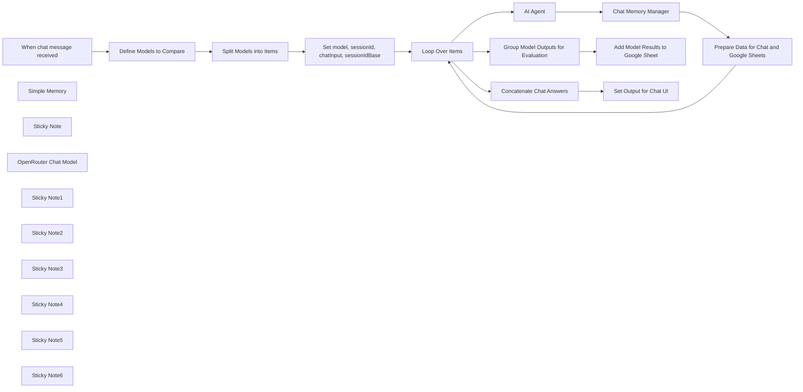

## Fluxo (.json) :

```json
{
  "id": "",
  "meta": {
    "instanceId": "",
    "templateCredsSetupCompleted": true
  },
  "name": "Easily Compare LLMs Using OpenAI and Google Sheets",
  "tags": [],
  "nodes": [
    {
      "id": "",
      "name": "When chat message received",
      "type": "@n8n/n8n-nodes-langchain.chatTrigger",
      "position": [
        -7400,
        3040
      ],
      "webhookId": "",
      "parameters": {
        "options": {}
      },
      "typeVersion": 1.1
    },
    {
      "id": "",
      "name": "Loop Over Items",
      "type": "n8n-nodes-base.splitInBatches",
      "position": [
        -5960,
        3040
      ],
      "parameters": {
        "options": {
          "reset": false
        }
      },
      "typeVersion": 3
    },
    {
      "id": "",
      "name": "Simple Memory",
      "type": "@n8n/n8n-nodes-langchain.memoryBufferWindow",
      "position": [
        -4880,
        3000
      ],
      "parameters": {
        "sessionKey": "={{$('Set model, sessionId, chatInput, sessionIdBase').item.json.sessionId}}",
        "sessionIdType": "customKey"
      },
      "typeVersion": 1.3
    },
    {
      "id": "",
      "name": "Chat Memory Manager",
      "type": "@n8n/n8n-nodes-langchain.memoryManager",
      "position": [
        -4980,
        3180
      ],
      "parameters": {
        "options": {}
      },
      "typeVersion": 1.1
    },
    {
      "id": "",
      "name": "Sticky Note",
      "type": "n8n-nodes-base.stickyNote",
      "position": [
        -8120,
        2600
      ],
      "parameters": {
        "color": 5,
        "width": 640,
        "height": 1180,
        "content": "## Easily Compare LLMs Using OpenAI and Google Sheets\n\nThis workflow allows you to **easily evaluate and compare the outputs of two language models (LLMs)** before choosing one for production.\n\nIn the chat interface, both model outputs are shown side by side. Their responses are also logged into a Google Sheet, where they can be evaluated manually or automatically using a more advanced model.\n\n### Use Case\nYou're developing an AI agent, and since LLMs are non-deterministic, you want to determine which one performs best for your specific use case. This template is designed to help you compare them effectively.\n\n### How It Works\n- The user sends a message to the chat interface.\n- The input is duplicated and sent to two different LLMs.\n- Each model processes the same prompt independently, using its own memory context.\n- Their answers, along with the user input and previous context, are logged to Google Sheets.\n- You can review, compare, and evaluate the model outputs manually (or automate it later).\n- In the chat, both responses are also shown one after the other for direct comparison.\n\n### How To Use It\n- Copy this [Google Sheets template](https://docs.google.com/spreadsheets/d/1grO5jxm05kJ7if9wBIOozjkqW27i8tRedrheLRrpxf4/) (File > Make a Copy).\n- Set up your **System Prompt** and **Tools** in the **AI Agent** node to suit your use case.\n- Start chatting! Each message will trigger both models and log their responses to the spreadsheet.\n\n\n*Note: This version is set up for two models. If you want to compare more, you’ll need to extend the workflow logic and update the sheet.*\n\n### About Models\nYou can use **OpenRouter** or **Vertex AI** to test models across providers.  \nIf you're using a node for a specific provider, like OpenAI, you can compare different models from that provider (e.g., `gpt-4.1` vs `gpt-4.1-mini`).\n\n### Evaluation in Google Sheets\nThis is ideal for teams, allowing non-technical stakeholders (not just data scientists) to evaluate responses based on real-world needs.\n\nAdvanced users can automate this evaluation using a more capable model (like `o3` from **OpenAI**), but note that this will increase token usage and cost.\n\n### Token Considerations\nSince **each input is processed by two different models**, the workflow will consume more tokens overall.  \nKeep an eye on usage, especially if working with longer prompts or running multiple evaluations, as this can impact cost.\n\n"
      },
      "typeVersion": 1
    },
    {
      "id": "",
      "name": "OpenRouter Chat Model",
      "type": "@n8n/n8n-nodes-langchain.lmChatOpenRouter",
      "position": [
        -5180,
        3000
      ],
      "parameters": {
        "model": "={{$json.model}}"
      },
      "credentials": {
        "openRouterApi": {
          "id": "",
          "name": ""
        }
      },
      "typeVersion": 1
    },
    {
      "id": "",
      "name": "Sticky Note1",
      "type": "n8n-nodes-base.stickyNote",
      "position": [
        -7220,
        2620
      ],
      "parameters": {
        "color": 7,
        "width": 360,
        "height": 580,
        "content": "## Define Models to Compare\n\nThis node defines the array of model IDs to be compared.\n\nIn this template, we compare two models using the OpenRouter API. You can modify the list by specifying the full model IDs you want to test.\n\nExample:\n**[\"openai/gpt-4.1\", \"mistralai/mistral-large\"]**\n\nIf you're using a different LLM provider (like OpenAI directly, or Google Vertex AI), make sure to update the model IDs according to that provider's naming conventions.\n\n*Note: This template is built for two models. For more, you’ll need to adjust the workflow logic and the Google Sheet structure.*\n"
      },
      "typeVersion": 1
    },
    {
      "id": "",
      "name": "Sticky Note2",
      "type": "n8n-nodes-base.stickyNote",
      "position": [
        -6500,
        2620
      ],
      "parameters": {
        "color": 7,
        "width": 360,
        "height": 580,
        "content": "## Set model, sessionId, chatInput, sessionIdBase\n\nThis node prepares the variables used during the loop that queries each model.\n\n- **model**: The ID of the model being used in the current iteration.\n- **sessionId**: A unique session key combining the original session ID and model name. This ensures memory isolation per model.\n- **chatInput**: The user’s input message.\n- **sessionIdBase**: The original session ID without any model-specific suffix. Used in Sheets to group evaluations from the same session."
      },
      "typeVersion": 1
    },
    {
      "id": "",
      "name": "Set model, sessionId, chatInput, sessionIdBase",
      "type": "n8n-nodes-base.set",
      "position": [
        -6380,
        3040
      ],
      "parameters": {
        "options": {},
        "assignments": {
          "assignments": [
            {
              "id": "",
              "name": "model",
              "type": "string",
              "value": "={{ $json.models }}"
            },
            {
              "id": "",
              "name": "sessionId",
              "type": "string",
              "value": "={{ $('When chat message received').item.json.sessionId }}{{$json.models }}"
            },
            {
              "id": "",
              "name": "chatInput",
              "type": "string",
              "value": "={{ $('When chat message received').item.json.chatInput }}"
            },
            {
              "id": "",
              "name": "sessionIdBase",
              "type": "string",
              "value": "={{ $('When chat message received').item.json.sessionId }}"
            }
          ]
        }
      },
      "typeVersion": 3.4
    },
    {
      "id": "",
      "name": "AI Agent",
      "type": "@n8n/n8n-nodes-langchain.agent",
      "position": [
        -5480,
        3180
      ],
      "parameters": {
        "options": {
          "returnIntermediateSteps": false
        }
      },
      "typeVersion": 1.8
    },
    {
      "id": "",
      "name": "Sticky Note3",
      "type": "n8n-nodes-base.stickyNote",
      "position": [
        -5600,
        3160
      ],
      "parameters": {
        "color": 7,
        "width": 540,
        "height": 520,
        "content": "\n\n\n\n\n\n\n\n\n\n\n\n\n\n\n\n\n## AI Agent\n\nThis AI Agent is connected to OpenRouter Models. The model is selected dynamically from the variable `{{$json.model}}`, defined earlier.\n\nMemory is isolated per model using the `{{$('Set model, sessionId, chatInput, sessionIdBase').item.json.sessionId}}` key.\n\n**⚠️ This agent currently has no system prompt or tools configured**. If you want to test specific tasks, you must define them yourself to reflect realistic use cases."
      },
      "typeVersion": 1
    },
    {
      "id": "",
      "name": "Sticky Note4",
      "type": "n8n-nodes-base.stickyNote",
      "position": [
        -5040,
        3160
      ],
      "parameters": {
        "color": 7,
        "width": 380,
        "height": 520,
        "content": "\n\n\n\n\n\n\n\n\n\n\n\n\n\n\n\n## Chat Memory Manager\n\nThis node handles retrieval of prior context for the chat session. It helps with qualitative evaluation by storing context that’s injected into the Google Sheet.\n\nIt shares memory with the AI Agent via the “Simple Memory” node.\n\n> You can switch to Redis or Postgres memory backends if needed."
      },
      "typeVersion": 1
    },
    {
      "id": "",
      "name": "Sticky Note5",
      "type": "n8n-nodes-base.stickyNote",
      "position": [
        -4640,
        3160
      ],
      "parameters": {
        "color": 7,
        "width": 380,
        "height": 760,
        "content": "\n\n\n\n\n\n\n\n\n\n\n\n\n\n\n\n## Prepare Data for Chat and Google Sheets\n\nThis node sets the following fields:\n\n- **output**: The model's response, formatted for chat display with visual separation to make comparison easier.\n- **chatInput**: The user input that will be recorded in Google Sheets.\n- **model_answer**: The actual answer from the model being evaluated.\n- **model**: The name or ID of the model providing the answer, used for identifying performance.\n- **context**: A history of the prior conversation (excluding the latest input). If it's the user's first message, a placeholder is used.\n- **sessionId**: A unique session identifier combining model name and session, ensuring separate context windows for each model.\n- **sessionIdBase**: The original user session ID (without model suffix), useful for grouping responses from different models in Sheets."
      },
      "typeVersion": 1
    },
    {
      "id": "",
      "name": "Concatenate Chat Answers",
      "type": "n8n-nodes-base.summarize",
      "position": [
        -5300,
        2620
      ],
      "parameters": {
        "options": {},
        "fieldsToSummarize": {
          "values": [
            {
              "field": "output",
              "separateBy": "\n",
              "aggregation": "concatenate"
            }
          ]
        }
      },
      "typeVersion": 1.1
    },
    {
      "id": "",
      "name": "Sticky Note6",
      "type": "n8n-nodes-base.stickyNote",
      "position": [
        -5080,
        2120
      ],
      "parameters": {
        "color": 5,
        "width": 460,
        "height": 500,
        "content": "## Add Model Results to Google Sheet\n\nThis Google Sheets step records both model responses along for evaluation.\n\n⚠️ Depending on the length of model responses, you may need to adjust row height or column width.\n\nThe template includes basic evaluation fields (`model_1_eval`, `model_2_eval`) with a dropdown like:  \n**\"Good\", \"Correct\", \"Bad\"**, but feel free to customize with more granular rating criteria."
      },
      "typeVersion": 1
    },
    {
      "id": "",
      "name": "Group Model Outputs for Evaluation",
      "type": "n8n-nodes-base.aggregate",
      "position": [
        -5300,
        2440
      ],
      "parameters": {
        "options": {},
        "fieldsToAggregate": {
          "fieldToAggregate": [
            {
              "fieldToAggregate": "model_answer"
            },
            {
              "fieldToAggregate": "context"
            },
            {
              "fieldToAggregate": "chatInput"
            },
            {
              "fieldToAggregate": "sessionIdBase"
            },
            {
              "fieldToAggregate": "model"
            }
          ]
        }
      },
      "typeVersion": 1
    },
    {
      "id": "",
      "name": "Add Model Results to Google Sheet",
      "type": "n8n-nodes-base.googleSheets",
      "onError": "continueRegularOutput",
      "position": [
        -4940,
        2440
      ],
      "parameters": {
        "columns": {
          "value": {
            "sessionId": "={{ $json.sessionIdBase[0] }}",
            "model_1_id": "={{ $json.model[0] }}",
            "model_2_id": "={{ $json.model[1] }}",
            "user_input": "={{ $json.chatInput[0] }}",
            "model_1_answer": "={{ $json.model_answer[0] }}",
            "model_2_answer": "={{ $json.model_answer[1] }}",
            "context_model_1": "={{ $json.context[0] }}",
            "context_model_2": "={{ $json.context[1] }}"
          },
          "schema": [
            {
              "id": "sessionId",
              "type": "string",
              "display": true,
              "required": false,
              "displayName": "sessionId",
              "defaultMatch": false,
              "canBeUsedToMatch": true
            },
            {
              "id": "model_1_id",
              "type": "string",
              "display": true,
              "required": false,
              "displayName": "model_1_id",
              "defaultMatch": false,
              "canBeUsedToMatch": true
            },
            {
              "id": "model_2_id",
              "type": "string",
              "display": true,
              "required": false,
              "displayName": "model_2_id",
              "defaultMatch": false,
              "canBeUsedToMatch": true
            },
            {
              "id": "user_input",
              "type": "string",
              "display": true,
              "required": false,
              "displayName": "user_input",
              "defaultMatch": false,
              "canBeUsedToMatch": true
            },
            {
              "id": "model_1_answer",
              "type": "string",
              "display": true,
              "required": false,
              "displayName": "model_1_answer",
              "defaultMatch": false,
              "canBeUsedToMatch": true
            },
            {
              "id": "model_2_answer",
              "type": "string",
              "display": true,
              "required": false,
              "displayName": "model_2_answer",
              "defaultMatch": false,
              "canBeUsedToMatch": true
            },
            {
              "id": "model_1_eval",
              "type": "string",
              "display": true,
              "required": false,
              "displayName": "model_1_eval",
              "defaultMatch": false,
              "canBeUsedToMatch": true
            },
            {
              "id": "model_2_eval",
              "type": "string",
              "display": true,
              "required": false,
              "displayName": "model_2_eval",
              "defaultMatch": false,
              "canBeUsedToMatch": true
            },
            {
              "id": "context_model_1",
              "type": "string",
              "display": true,
              "required": false,
              "displayName": "context_model_1",
              "defaultMatch": false,
              "canBeUsedToMatch": true
            },
            {
              "id": "context_model_2",
              "type": "string",
              "display": true,
              "required": false,
              "displayName": "context_model_2",
              "defaultMatch": false,
              "canBeUsedToMatch": true
            }
          ],
          "mappingMode": "defineBelow",
          "matchingColumns": [],
          "attemptToConvertTypes": false,
          "convertFieldsToString": false
        },
        "options": {},
        "operation": "append",
        "sheetName": {
          "__rl": true,
          "mode": "list",
          "value": "gid=0",
          "cachedResultUrl": "https://docs.google.com/spreadsheets/d/1grO5jxm05kJ7if9wBIOozjkqW27i8tRedrheLRrpxf4/",
          "cachedResultName": "llms_eval"
        },
        "documentId": {
          "__rl": true,
          "mode": "list",
          "value": "1grO5jxm05kJ7if9wBIOozjkqW27i8tRedrheLRrpxf4",
          "cachedResultUrl": "https://docs.google.com/spreadsheets/d/1grO5jxm05kJ7if9wBIOozjkqW27i8tRedrheLRrpxf4/",
          "cachedResultName": "Template - Easy LLMs Eval"
        },
        "authentication": "serviceAccount"
      },
      "credentials": {
        "googleApi": {
          "id": "",
          "name": ""
        }
      },
      "typeVersion": 4.5
    },
    {
      "id": "",
      "name": "Prepare Data for Chat and Google Sheets",
      "type": "n8n-nodes-base.set",
      "position": [
        -4500,
        3180
      ],
      "parameters": {
        "options": {},
        "assignments": {
          "assignments": [
            {
              "id": "",
              "name": "output",
              "type": "string",
              "value": "=### `{{ $('Set model, sessionId, chatInput, sessionIdBase').item.json.model }}` answered :\n\n\n{{ $('AI Agent').item.json.output }}\n\n----------\n"
            },
            {
              "id": "",
              "name": "chatInput",
              "type": "string",
              "value": "={{ $('Set model, sessionId, chatInput, sessionIdBase').item.json.chatInput }}"
            },
            {
              "id": "",
              "name": "model_answer",
              "type": "string",
              "value": "={{ $('AI Agent').item.json.output }}"
            },
            {
              "id": "",
              "name": "model",
              "type": "string",
              "value": "={{ $('Set model, sessionId, chatInput, sessionIdBase').item.json.model }}"
            },
            {
              "id": "",
              "name": "context",
              "type": "string",
              "value": "={{\n  (() => {\n    const history = $json[\"messages\"]; // ou adapter selon ton chemin réel\n    if (!Array.isArray(history) || history.length <= 1) {\n      return \"No prior context available — likely the user's first message or memory not yet initialized.\";\n    }\n\n    const truncated = history.slice(0, -1); // on enlève le dernier échange\n    return truncated.map(pair => `Human: ${pair.human}\\nAI: ${pair.ai}`).join('\\n');\n  })()\n}}\n"
            },
            {
              "id": "",
              "name": "sessionId",
              "type": "string",
              "value": "={{ $('Loop Over Items').item.json.sessionId }}"
            },
            {
              "id": "",
              "name": "sessionIdBase",
              "type": "string",
              "value": "={{ $('Loop Over Items').item.json.sessionIdBase }}"
            }
          ]
        }
      },
      "typeVersion": 3.4
    },
    {
      "id": "",
      "name": "Define Models to Compare",
      "type": "n8n-nodes-base.set",
      "position": [
        -7100,
        3040
      ],
      "parameters": {
        "options": {},
        "assignments": {
          "assignments": [
            {
              "id": "",
              "name": "=models",
              "type": "array",
              "value": "=[\"openai/gpt-4.1\", \"mistralai/mistral-large\"]"
            }
          ]
        }
      },
      "typeVersion": 3.4
    },
    {
      "id": "",
      "name": "Split Models into Items",
      "type": "n8n-nodes-base.splitOut",
      "position": [
        -6760,
        3040
      ],
      "parameters": {
        "options": {},
        "fieldToSplitOut": "models"
      },
      "typeVersion": 1
    },
    {
      "id": "",
      "name": "Set Output for Chat UI",
      "type": "n8n-nodes-base.set",
      "position": [
        -4940,
        2620
      ],
      "parameters": {
        "options": {},
        "assignments": {
          "assignments": [
            {
              "id": "",
              "name": "output",
              "type": "string",
              "value": "={{ $json.concatenated_output }}"
            }
          ]
        }
      },
      "typeVersion": 3.4
    }
  ],
  "active": false,
  "pinData": {},
  "settings": {
    "executionOrder": "v1"
  },
  "versionId": "",
  "connections": {
    "AI Agent": {
      "main": [
        [
          {
            "node": "Chat Memory Manager",
            "type": "main",
            "index": 0
          }
        ]
      ]
    },
    "Simple Memory": {
      "ai_memory": [
        [
          {
            "node": "Chat Memory Manager",
            "type": "ai_memory",
            "index": 0
          },
          {
            "node": "AI Agent",
            "type": "ai_memory",
            "index": 0
          }
        ]
      ]
    },
    "Loop Over Items": {
      "main": [
        [
          {
            "node": "Concatenate Chat Answers",
            "type": "main",
            "index": 0
          },
          {
            "node": "Group Model Outputs for Evaluation",
            "type": "main",
            "index": 0
          }
        ],
        [
          {
            "node": "AI Agent",
            "type": "main",
            "index": 0
          }
        ]
      ]
    },
    "Chat Memory Manager": {
      "main": [
        [
          {
            "node": "Prepare Data for Chat and Google Sheets",
            "type": "main",
            "index": 0
          }
        ]
      ]
    },
    "OpenRouter Chat Model": {
      "ai_languageModel": [
        [
          {
            "node": "AI Agent",
            "type": "ai_languageModel",
            "index": 0
          }
        ]
      ]
    },
    "Split Models into Items": {
      "main": [
        [
          {
            "node": "Set model, sessionId, chatInput, sessionIdBase",
            "type": "main",
            "index": 0
          }
        ]
      ]
    },
    "Concatenate Chat Answers": {
      "main": [
        [
          {
            "node": "Set Output for Chat UI",
            "type": "main",
            "index": 0
          }
        ]
      ]
    },
    "Define Models to Compare": {
      "main": [
        [
          {
            "node": "Split Models into Items",
            "type": "main",
            "index": 0
          }
        ]
      ]
    },
    "When chat message received": {
      "main": [
        [
          {
            "node": "Define Models to Compare",
            "type": "main",
            "index": 0
          }
        ]
      ]
    },
    "Group Model Outputs for Evaluation": {
      "main": [
        [
          {
            "node": "Add Model Results to Google Sheet",
            "type": "main",
            "index": 0
          }
        ]
      ]
    },
    "Prepare Data for Chat and Google Sheets": {
      "main": [
        [
          {
            "node": "Loop Over Items",
            "type": "main",
            "index": 0
          }
        ]
      ]
    },
    "Set model, sessionId, chatInput, sessionIdBase": {
      "main": [
        [
          {
            "node": "Loop Over Items",
            "type": "main",
            "index": 0
          }
        ]
      ]
    }
  }
}
```

<a id="template-1212"></a>

## Template 1212 - Publicar histórias com prefixo release

- **Nome:** Publicar histórias com prefixo release
- **Descrição:** Busca todas as histórias cujo identificador começa com 'release' em um espaço do Storyblok e as publica automaticamente.
- **Funcionalidade:** • Acionamento manual: Inicia o fluxo ao clicar em executar.
• Busca por prefixo: Recupera todas as histórias do espaço cujo slug/ID começa com 'release'.
• Publicação em lote: Publica cada história encontrada no mesmo espaço usando a API de gerenciamento.
• Uso de credenciais: Utiliza credenciais do Storyblok para autenticar as operações de busca e publicação.
- **Ferramentas:** • Storyblok: Plataforma de gerenciamento de conteúdo usada para listar e publicar histórias via API de gerenciamento.


## Fluxo visual

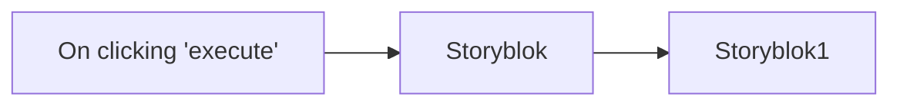

## Fluxo (.json) :

```json
{
  "id": "110",
  "name": "Get all the stories starting with `release` and publish them",
  "nodes": [
    {
      "name": "On clicking 'execute'",
      "type": "n8n-nodes-base.manualTrigger",
      "position": [
        250,
        300
      ],
      "parameters": {},
      "typeVersion": 1
    },
    {
      "name": "Storyblok",
      "type": "n8n-nodes-base.storyblok",
      "position": [
        450,
        300
      ],
      "parameters": {
        "space": 96940,
        "source": "managementApi",
        "filters": {
          "starts_with": "release"
        },
        "operation": "getAll"
      },
      "credentials": {
        "storyblokManagementApi": "storyblok-tanay"
      },
      "typeVersion": 1
    },
    {
      "name": "Storyblok1",
      "type": "n8n-nodes-base.storyblok",
      "position": [
        650,
        300
      ],
      "parameters": {
        "space": "={{$node[\"Storyblok\"].parameter[\"space\"]}}",
        "source": "managementApi",
        "options": {},
        "storyId": "={{$node[\"Storyblok\"].json[\"id\"]}}",
        "operation": "publish"
      },
      "credentials": {
        "storyblokManagementApi": "storyblok-tanay"
      },
      "typeVersion": 1
    }
  ],
  "active": false,
  "settings": {},
  "connections": {
    "Storyblok": {
      "main": [
        [
          {
            "node": "Storyblok1",
            "type": "main",
            "index": 0
          }
        ]
      ]
    },
    "On clicking 'execute'": {
      "main": [
        [
          {
            "node": "Storyblok",
            "type": "main",
            "index": 0
          }
        ]
      ]
    }
  }
}
```

<a id="template-1213"></a>

## Template 1213 - Auditoria automática de XHTML CSRD e resposta

- **Nome:** Auditoria automática de XHTML CSRD e resposta
- **Descrição:** Automatiza a análise de anexos XHTML de relatórios CSRD recebidos por e-mail, gera um resumo de conformidade e envia uma resposta ao remetente com os resultados.
- **Funcionalidade:** • Detecção de e-mails com assunto específico: Inicia o processo quando o assunto contém "CSRD Reporting".
• Download e extração do anexo XHTML: Recupera o arquivo anexo e extrai o conteúdo em texto para análise.
• Validação do formato e presença de elementos-chave: Verifica presença de header e tags não numéricas relevantes (por exemplo, governança e estratégia).
• Identificação de KPIs e métricas relevantes: Procura tags relacionadas a emissões GHG (escopos 1, 2 e 3) e conta KPIs encontrados.
• Detecção de problemas de qualidade: Conta tags não numéricas vazias e identifica divulgações duplicadas.
• Consolidação dos resultados em JSON: Gera um objeto com métricas da auditoria (totais, checagens PASS/MISSING, duplicados).
• Geração de e-mail resumido via IA: Converte os resultados da auditoria em um assunto e corpo de e-mail claros, neutros e com sugestões de próximos passos.
• Envio de resposta automática ao remetente: Envia o resumo gerado como reply ao e-mail original.
- **Ferramentas:** • Gmail API: Recebe e busca e-mails, faz download de anexos e envia respostas ao remetente.
• OpenAI API (modelo gpt-4o-mini): Gera o texto do e-mail resumido a partir do JSON da auditoria.


## Fluxo visual

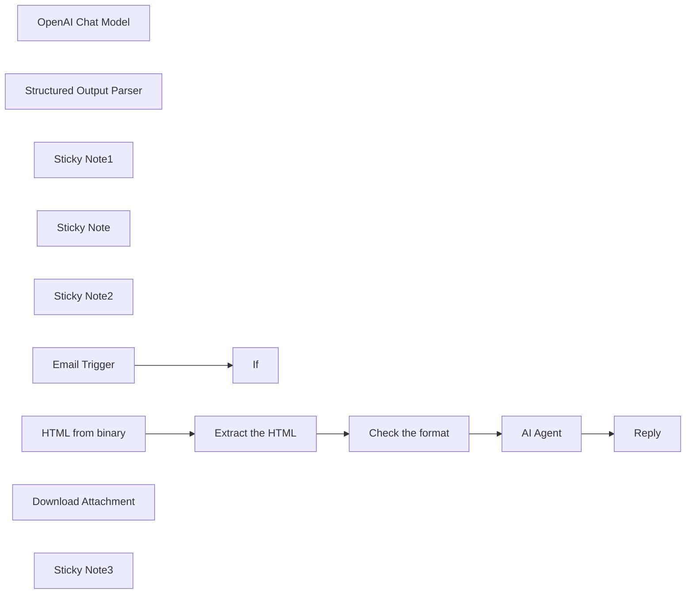

## Fluxo (.json) :

```json
{
  "meta": {
    "instanceId": "="
  },
  "nodes": [
    {
      "id": "a2d54127-d1d1-44d2-859e-b89e2e6c3b4d",
      "name": "If",
      "type": "n8n-nodes-base.if",
      "position": [
        260,
        260
      ],
      "parameters": {
        "options": {},
        "conditions": {
          "options": {
            "version": 2,
            "leftValue": "",
            "caseSensitive": true,
            "typeValidation": "strict"
          },
          "combinator": "and",
          "conditions": [
            {
              "id": "=",
              "operator": {
                "type": "string",
                "operation": "contains"
              },
              "leftValue": "={{ $json.subject }}",
              "rightValue": "CSRD Reporting"
            }
          ]
        }
      },
      "typeVersion": 2.2
    },
    {
      "id": "6a664023-ea8c-4973-b3ac-13a9e0664a58",
      "name": "Check the format",
      "type": "n8n-nodes-base.code",
      "position": [
        960,
        260
      ],
      "parameters": {
        "jsCode": "const content = $input.first().json.xhtml_content;\n\n// Helper to extract tags\nfunction extractTags(tagName) {\n  const regex = new RegExp(`<${tagName}[^>]*>(.*?)<\\/${tagName}>`, 'gs');\n  let matches = [];\n  let match;\n  while ((match = regex.exec(content)) !== null) {\n    matches.push(match[1].trim());\n  }\n  return matches;\n}\n\n// Basic Tests\nconst headerPresent = /<ix:header>/i.test(content);\nconst governanceTag = /<ix:nonNumeric[^>]*name=\"esrs:SustainabilityGovernance\"/i.test(content);\nconst strategyTag = /<ix:nonNumeric[^>]*name=\"esrs:StrategySustainability\"/i.test(content);\n\n// KPI Tags\nconst kpiTags = [\"esrs:GHGScope1Emissions\", \"esrs:GHGScope2Emissions\", \"esrs:GHGScope3Emissions\"];\nconst kpiMatches = kpiTags.filter(tag => content.includes(tag));\n\n// Check for empty tags\nconst emptyNonNumeric = (content.match(/<ix:nonNumeric[^>]*>\\s*</ix:nonNumeric>/g) || []).length;\n\n// Check duplicate text\nconst nonNumericValues = extractTags(\"ix:nonNumeric\");\nconst duplicates = [...new Set(nonNumericValues.filter((v, i, arr) => arr.indexOf(v) !== i))];\n\n// Final Result\nreturn [\n  {\n    json: {\n      audit_results:{\n      total_nonNumeric_tags: nonNumericValues.length,\n      total_kpis_found: kpiMatches.length,\n      empty_disclosures: emptyNonNumeric,\n      governance_check: governanceTag ? \"PASS\" : \"MISSING\",\n      strategy_check: strategyTag ? \"PASS\" : \"MISSING\",\n      header_check: headerPresent ? \"PASS\" : \"MISSING\",\n      duplicate_disclosures: duplicates,\n      }\n\n    }\n  }\n];\n"
      },
      "typeVersion": 2
    },
    {
      "id": "a16b613e-a7c2-4079-9ff9-46c485019ca3",
      "name": "AI Agent",
      "type": "@n8n/n8n-nodes-langchain.agent",
      "position": [
        1240,
        260
      ],
      "parameters": {
        "text": "=Generate an email to the sustainability team summarizing this CSRD XHTML report audit:\n\n{{JSON.stringify($json.audit_results, null, 2)}}\n\nReturn the output in the following JSON format:\n\n{\n  \"subject\": \"...\",\n  \"body\": \"...\"\n}",
        "options": {
          "systemMessage": "=You are LogiGreen CSRD Audit Bot, an ESG compliance assistant writing professional email summaries based on automated XHTML audits for CSRD compliance. Your role is to translate JSON audit results into clear, actionable summaries. Keep a neutral, helpful tone and highlight any risks or missing disclosures. Include key findings and suggest next steps if needed.\n\nWrite emails in plain English with no markdown (avoid **, #, ##, etc.).\nFormat your message with proper line breaks for readability.\nAlways sign with:\nBest regards,\nLogiGreen CSRD Audit Bot"
        },
        "promptType": "define",
        "hasOutputParser": true
      },
      "typeVersion": 1.8
    },
    {
      "id": "3dcbaf39-58be-465e-9ec2-0b2a9a8c8fe3",
      "name": "OpenAI Chat Model",
      "type": "@n8n/n8n-nodes-langchain.lmChatOpenAi",
      "position": [
        1200,
        420
      ],
      "parameters": {
        "model": {
          "__rl": true,
          "mode": "list",
          "value": "gpt-4o-mini"
        },
        "options": {}
      },
      "typeVersion": 1.2
    },
    {
      "id": "6e742627-f315-4ee2-be1b-023b38103978",
      "name": "Structured Output Parser",
      "type": "@n8n/n8n-nodes-langchain.outputParserStructured",
      "position": [
        1500,
        440
      ],
      "parameters": {
        "jsonSchemaExample": "{\n  \"subject\": \"CSRD XHTML Report Audit – Key Findings and Next Steps\",\n  \"body\": \"Content of the email\"\n}"
      },
      "typeVersion": 1.2
    },
    {
      "id": "994e5b98-5bda-4a4f-a3eb-cb521de9d88a",
      "name": "Reply",
      "type": "n8n-nodes-base.gmail",
      "position": [
        1620,
        260
      ],
      "webhookId": "=",
      "parameters": {
        "message": "={{ $json.output.body }}",
        "options": {},
        "emailType": "text",
        "messageId": "={{ $('Gmail').item.json.id }}",
        "operation": "reply"
      },
      "notesInFlow": true,
      "typeVersion": 2.1
    },
    {
      "id": "8a7fbdcb-2197-437e-b3ba-126c7942ba4d",
      "name": "Extract the HTML",
      "type": "n8n-nodes-base.code",
      "position": [
        800,
        260
      ],
      "parameters": {
        "jsCode": "return [\n  {\n    json: {\n      xhtml_content:$input.first().json.data \n    }\n  }\n];\n"
      },
      "typeVersion": 2
    },
    {
      "id": "90f271b9-4b8b-49ef-90cc-d10d8e22a203",
      "name": "Sticky Note1",
      "type": "n8n-nodes-base.stickyNote",
      "position": [
        20,
        -140
      ],
      "parameters": {
        "color": 7,
        "width": 380,
        "height": 680,
        "content": "### 1. Workflow Trigger with Gmail Trigger\nThe workflow is triggered by a new email received in your Gmail mailbox. \nIf the subject includes the string \"CSRD Reporting\" we proceed, if not we do nothing.\n\n#### How to setup?\n- **Gmail Trigger Node:** set up your Gmail API credentials\n[Learn more about the Gmail Trigger Node](https://docs.n8n.io/integrations/builtin/trigger-nodes/n8n-nodes-base.gmailtrigger)\n"
      },
      "typeVersion": 1
    },
    {
      "id": "803a758c-fba4-4f48-818b-1272c4509e81",
      "name": "Sticky Note",
      "type": "n8n-nodes-base.stickyNote",
      "position": [
        440,
        -140
      ],
      "parameters": {
        "color": 7,
        "width": 640,
        "height": 680,
        "content": "### 2. Extract and Process the xHTML report\nThis block extract the attachment file from the email, process the xHTML and perform the audit of the content.\n\n#### How to setup?\n- **Gmail Node:** set up your Gmail API credentials\n[Learn more about the Gmail Trigger Node](https://docs.n8n.io/integrations/builtin/trigger-nodes/n8n-nodes-base.gmailtrigger)\n"
      },
      "typeVersion": 1
    },
    {
      "id": "0b72f7d8-23ce-4243-b2e5-e3ff5c7f163e",
      "name": "Sticky Note2",
      "type": "n8n-nodes-base.stickyNote",
      "position": [
        1120,
        -140
      ],
      "parameters": {
        "color": 7,
        "width": 640,
        "height": 680,
        "content": "### 3. AI Agent write and sends an audit report to the send\nThis summarize the results of the analysis in an email sent as a reply to the sender.\n\n#### How to setup?\n- **Gmail Node:** set up your Gmail API credentials\n[Learn more about the Gmail Trigger Node](https://docs.n8n.io/integrations/builtin/trigger-nodes/n8n-nodes-base.gmailtrigger)\n- **AI Agent with the Chat Model**:\n   1. Add a **chat model** with the required credentials *(Example: Open AI 4o-mini)*\n   2. Adapt the system prompt to the format of emails you want to send\n  [Learn more about the AI Agent Node](https://docs.n8n.io/integrations/builtin/cluster-nodes/root-nodes/n8n-nodes-langchain.agent)\n"
      },
      "typeVersion": 1
    },
    {
      "id": "18103fec-6761-4604-872e-dab251211ba0",
      "name": "HTML from binary",
      "type": "n8n-nodes-base.extractFromFile",
      "position": [
        660,
        260
      ],
      "parameters": {
        "options": {},
        "operation": "text",
        "binaryPropertyName": "attachment_0"
      },
      "notesInFlow": true,
      "typeVersion": 1
    },
    {
      "id": "5c31c49d-2324-4d08-a5b5-309925266517",
      "name": "Email Trigger",
      "type": "n8n-nodes-base.gmailTrigger",
      "position": [
        40,
        260
      ],
      "parameters": {
        "simple": false,
        "filters": {},
        "options": {},
        "pollTimes": {
          "item": [
            {
              "mode": "everyMinute"
            }
          ]
        }
      },
      "notesInFlow": true,
      "typeVersion": 1.2
    },
    {
      "id": "bacbd57d-af9b-49c8-82ae-c74aa2898fc8",
      "name": "Download Attachment",
      "type": "n8n-nodes-base.gmail",
      "position": [
        480,
        260
      ],
      "webhookId": "=",
      "parameters": {
        "simple": false,
        "options": {
          "downloadAttachments": true
        },
        "messageId": "={{ $json.id }}",
        "operation": "get"
      },
      "notesInFlow": true,
      "typeVersion": 2.1
    },
    {
      "id": "af087293-0c3c-4c96-9523-ddb9ed238e00",
      "name": "Sticky Note3",
      "type": "n8n-nodes-base.stickyNote",
      "position": [
        1780,
        -140
      ],
      "parameters": {
        "width": 780,
        "height": 540,
        "content": "### 4. Do you need more details?\nFind a step-by-step guide in this tutorial\n\n[🎥 Watch My Tutorial](https://www.youtube.com/watch?v=npeJZv5U7og)"
      },
      "typeVersion": 1
    }
  ],
  "pinData": {},
  "connections": {
    "AI Agent": {
      "main": [
        [
          {
            "node": "Reply",
            "type": "main",
            "index": 0
          }
        ]
      ]
    },
    "Email Trigger": {
      "main": [
        [
          {
            "node": "If",
            "type": "main",
            "index": 0
          }
        ]
      ]
    },
    "Check the format": {
      "main": [
        [
          {
            "node": "AI Agent",
            "type": "main",
            "index": 0
          }
        ]
      ]
    },
    "Extract the HTML": {
      "main": [
        [
          {
            "node": "Check the format",
            "type": "main",
            "index": 0
          }
        ]
      ]
    },
    "HTML from binary": {
      "main": [
        [
          {
            "node": "Extract the HTML",
            "type": "main",
            "index": 0
          }
        ]
      ]
    },
    "OpenAI Chat Model": {
      "ai_languageModel": [
        [
          {
            "node": "AI Agent",
            "type": "ai_languageModel",
            "index": 0
          }
        ]
      ]
    },
    "Structured Output Parser": {
      "ai_outputParser": [
        [
          {
            "node": "AI Agent",
            "type": "ai_outputParser",
            "index": 0
          }
        ]
      ]
    }
  }
}
```

<a id="template-1214"></a>

## Template 1214 - Automação de triagem de currículos com IA

- **Nome:** Automação de triagem de currículos com IA
- **Descrição:** Automatiza a recepção, análise e classificação de candidaturas, extraindo informações de currículos em PDF, avaliando a compatibilidade com um perfil desejado por meio de IA e registrando os resultados.
- **Funcionalidade:** • Coleta via formulário web: Recebe nome, e-mail e currículo em PDF diretamente de candidatos.
• Armazenamento automático do CV: Faz upload dos arquivos de currículo para um repositório na nuvem.
• Extração de texto do PDF: Converte o conteúdo do currículo em texto para análise automática.
• Extração de dados pessoais: Identifica e captura informações como cidade, data de nascimento e telefone.
• Extração de qualificações: Extrai resumo de formação acadêmica, histórico profissional e lista de habilidades técnicas.
• Geração de resumo conciso: Cria um sumário curto e claro do candidato (até 100 palavras).
• Avaliação por especialista IA: Compara o perfil do candidato com o perfil desejado, atribui uma nota de 1 a 10 e fornece justificativa.
• Parser estruturado de saída: Garante que a avaliação e considerações saiam em formato estruturado (ex.: voto e motivação).
• Registro em planilha: Armazena todos os dados extraídos, resumo e avaliação em uma planilha para acompanhamento.
- **Ferramentas:** • Formulário web: Interface usada para receber dados e o arquivo do currículo.
• Google Drive: Armazenamento em nuvem onde os CVs são salvos.
• Serviço de conversão/extrator de PDF para texto: Ferramenta que transforma PDF em texto processável.
• Modelo de linguagem (OpenAI - ex.: GPT-4o-mini): Utilizado para extrair informações, gerar resumos e avaliar a compatibilidade do candidato.
• Google Sheets: Planilha para registrar candidatos, resumos, qualificações e avaliação final.

## Fluxo visual

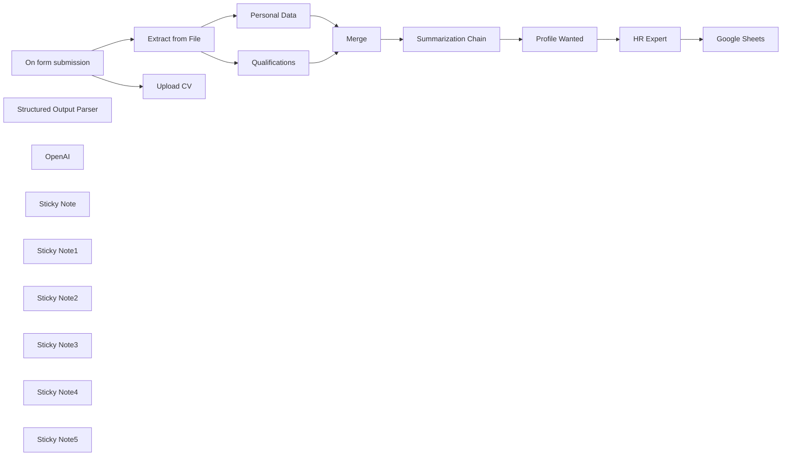

## Fluxo (.json) :

```json
{
  "id": "t1P14FvfibKYCh3E",
  "meta": {
    "instanceId": "a4bfc93e975ca233ac45ed7c9227d84cf5a2329310525917adaf3312e10d5462",
    "templateCredsSetupCompleted": true
  },
  "name": "HR-focused automation pipeline with AI",
  "tags": [],
  "nodes": [
    {
      "id": "b1092f93-502c-4af0-962e-2b69311b92a3",
      "name": "On form submission",
      "type": "n8n-nodes-base.formTrigger",
      "position": [
        -520,
        -200
      ],
      "webhookId": "2a87705d-8ba1-41f1-80ef-85f364ce253e",
      "parameters": {
        "options": {},
        "formTitle": "Send CV",
        "formFields": {
          "values": [
            {
              "fieldLabel": "Name",
              "placeholder": "Name",
              "requiredField": true
            },
            {
              "fieldType": "email",
              "fieldLabel": "Email",
              "placeholder": "Email",
              "requiredField": true
            },
            {
              "fieldType": "file",
              "fieldLabel": "CV",
              "requiredField": true,
              "acceptFileTypes": ".pdf"
            }
          ]
        }
      },
      "typeVersion": 2.2
    },
    {
      "id": "77edfe2a-4c6a-48c8-8dc9-b275491be090",
      "name": "Extract from File",
      "type": "n8n-nodes-base.extractFromFile",
      "position": [
        -160,
        -200
      ],
      "parameters": {
        "options": {},
        "operation": "pdf",
        "binaryPropertyName": "CV"
      },
      "typeVersion": 1
    },
    {
      "id": "ebf2e194-3515-4c0a-8745-790b63bf336f",
      "name": "Qualifications",
      "type": "@n8n/n8n-nodes-langchain.informationExtractor",
      "position": [
        160,
        -100
      ],
      "parameters": {
        "text": "={{ $json.text }}",
        "options": {
          "systemPromptTemplate": "You are an expert extraction algorithm.\nOnly extract relevant information from the text.\nIf you do not know the value of an attribute asked to extract, you may omit the attribute's value."
        },
        "attributes": {
          "attributes": [
            {
              "name": "Educational qualification",
              "required": true,
              "description": "Summary of your academic career. Focus on your high school and university studies. Summarize in 100 words maximum and also include your grade if applicable."
            },
            {
              "name": "Job History",
              "required": true,
              "description": "Work history summary. Focus on your most recent work experiences. Summarize in 100 words maximum"
            },
            {
              "name": "Skills",
              "required": true,
              "description": "Extract the candidate’s technical skills. What software and frameworks they are proficient in. Make a bulleted list."
            }
          ]
        }
      },
      "typeVersion": 1
    },
    {
      "id": "4f40404c-1d47-4bde-9b4b-16367cf11e4f",
      "name": "Summarization Chain",
      "type": "@n8n/n8n-nodes-langchain.chainSummarization",
      "position": [
        900,
        -220
      ],
      "parameters": {
        "options": {
          "summarizationMethodAndPrompts": {
            "values": {
              "prompt": "=Write a concise summary of the following:\n\nCity: {{ $json.output.city }}\nBirthdate: {{ $json.output.birthdate }}\nEducational qualification: {{ $json.output[\"Educational qualification\"] }}\nJob History: {{ $json.output[\"Job History\"] }}\nSkills: {{ $json.output.Skills }}\n\nUse 100 words or less. Be concise and conversational.",
              "combineMapPrompt": "=Write a concise summary of the following:\n\nCity: {{ $json.output.city }}\nBirthdate: {{ $json.output.birthdate }}\nEducational qualification: {{ $json.output[\"Educational qualification\"] }}\nJob History: {{ $json.output[\"Job History\"] }}\nSkills: {{ $json.output.Skills }}\n\nUse 100 words or less. Be concise and conversational."
            }
          }
        }
      },
      "typeVersion": 2
    },
    {
      "id": "9f9c5f16-1dc2-4928-aef8-284daeb6be51",
      "name": "Merge",
      "type": "n8n-nodes-base.merge",
      "position": [
        660,
        -220
      ],
      "parameters": {
        "mode": "combine",
        "options": {},
        "combineBy": "combineAll"
      },
      "typeVersion": 3
    },
    {
      "id": "51bd14cc-2c54-4f72-b162-255f7e277aff",
      "name": "Profile Wanted",
      "type": "n8n-nodes-base.set",
      "position": [
        1300,
        -220
      ],
      "parameters": {
        "options": {},
        "assignments": {
          "assignments": [
            {
              "id": "a3d049b0-5a70-4e7b-a6f2-81447da5282a",
              "name": "profile_wanted",
              "type": "string",
              "value": "We are a web agency and we are looking for a full-stack web developer who knows how to use PHP, Python and Javascript. He has experience in the sector and lives in Northern Italy."
            }
          ]
        }
      },
      "typeVersion": 3.4
    },
    {
      "id": "4a120e5d-b849-4a29-b7f3-12c653552367",
      "name": "Google Sheets",
      "type": "n8n-nodes-base.googleSheets",
      "position": [
        1960,
        -220
      ],
      "parameters": {
        "columns": {
          "value": {
            "CITY": "={{ $('Merge').item.json.output.city }}",
            "DATA": "={{ $now.format('dd/LL/yyyy') }}",
            "NAME": "={{ $('On form submission').item.json.Nome }}",
            "VOTE": "={{ $json.output.vote }}",
            "EMAIL": "={{ $('On form submission').item.json.Email }}",
            "SKILLS": "={{ $('Merge').item.json.output.Skills }}",
            "TELEFONO": "={{ $('Merge').item.json.output.telephone }}",
            "SUMMARIZE": "={{ $('Summarization Chain').item.json.response.text }}",
            "EDUCATIONAL": "={{ $('Merge').item.json.output[\"Educational qualification\"] }}",
            "JOB HISTORY": "={{ $('Merge').item.json.output[\"Job History\"] }}",
            "DATA NASCITA": "={{ $('Merge').item.json.output.birthdate }}",
            "CONSIDERATION": "={{ $json.output.consideration }}"
          },
          "schema": [
            {
              "id": "DATA",
              "type": "string",
              "display": true,
              "required": false,
              "displayName": "DATA",
              "defaultMatch": false,
              "canBeUsedToMatch": true
            },
            {
              "id": "NAME",
              "type": "string",
              "display": true,
              "required": false,
              "displayName": "NAME",
              "defaultMatch": false,
              "canBeUsedToMatch": true
            },
            {
              "id": "PHONE",
              "type": "string",
              "display": true,
              "removed": false,
              "required": false,
              "displayName": "PHONE",
              "defaultMatch": false,
              "canBeUsedToMatch": true
            },
            {
              "id": "CITY",
              "type": "string",
              "display": true,
              "required": false,
              "displayName": "CITY",
              "defaultMatch": false,
              "canBeUsedToMatch": true
            },
            {
              "id": "EMAIL",
              "type": "string",
              "display": true,
              "required": false,
              "displayName": "EMAIL",
              "defaultMatch": false,
              "canBeUsedToMatch": true
            },
            {
              "id": "DATA NASCITA",
              "type": "string",
              "display": true,
              "required": false,
              "displayName": "DATA NASCITA",
              "defaultMatch": false,
              "canBeUsedToMatch": true
            },
            {
              "id": "EDUCATIONAL",
              "type": "string",
              "display": true,
              "required": false,
              "displayName": "EDUCATIONAL",
              "defaultMatch": false,
              "canBeUsedToMatch": true
            },
            {
              "id": "JOB HISTORY",
              "type": "string",
              "display": true,
              "required": false,
              "displayName": "JOB HISTORY",
              "defaultMatch": false,
              "canBeUsedToMatch": true
            },
            {
              "id": "SKILLS",
              "type": "string",
              "display": true,
              "required": false,
              "displayName": "SKILLS",
              "defaultMatch": false,
              "canBeUsedToMatch": true
            },
            {
              "id": "SUMMARIZE",
              "type": "string",
              "display": true,
              "required": false,
              "displayName": "SUMMARIZE",
              "defaultMatch": false,
              "canBeUsedToMatch": true
            },
            {
              "id": "VOTE",
              "type": "string",
              "display": true,
              "removed": false,
              "required": false,
              "displayName": "VOTE",
              "defaultMatch": false,
              "canBeUsedToMatch": true
            },
            {
              "id": "CONSIDERATION",
              "type": "string",
              "display": true,
              "required": false,
              "displayName": "CONSIDERATION",
              "defaultMatch": false,
              "canBeUsedToMatch": true
            }
          ],
          "mappingMode": "defineBelow",
          "matchingColumns": [],
          "attemptToConvertTypes": false,
          "convertFieldsToString": false
        },
        "options": {},
        "operation": "append",
        "sheetName": {
          "__rl": true,
          "mode": "list",
          "value": "gid=0",
          "cachedResultUrl": "https://docs.google.com/spreadsheets/d/1ssz5RvN1Hr20Q31pnYnbjCLu1MGBvoLttBAjXunMRQE/edit#gid=0",
          "cachedResultName": "Foglio1"
        },
        "documentId": {
          "__rl": true,
          "mode": "list",
          "value": "1ssz5RvN1Hr20Q31pnYnbjCLu1MGBvoLttBAjXunMRQE",
          "cachedResultUrl": "https://docs.google.com/spreadsheets/d/1ssz5RvN1Hr20Q31pnYnbjCLu1MGBvoLttBAjXunMRQE/edit?usp=drivesdk",
          "cachedResultName": "Ricerca WebDev"
        }
      },
      "credentials": {
        "googleSheetsOAuth2Api": {
          "id": "JYR6a64Qecd6t8Hb",
          "name": "Google Sheets account"
        }
      },
      "typeVersion": 4.5
    },
    {
      "id": "a154d8a5-9f85-45bb-b082-f702c13c3507",
      "name": "Structured Output Parser",
      "type": "@n8n/n8n-nodes-langchain.outputParserStructured",
      "position": [
        1720,
        -20
      ],
      "parameters": {
        "schemaType": "manual",
        "inputSchema": "{\n\t\"type\": \"object\",\n\t\"properties\": {\n\t\t\"vote\": {\n\t\t\t\"type\": \"string\"\n\t\t},\n\t\t\"consideration\": {\n\t\t\t\"type\": \"string\"\n\t\t}\n\t}\n}"
      },
      "typeVersion": 1.2
    },
    {
      "id": "037ac851-7885-4b78-ac75-dfa0ebb6003d",
      "name": "HR Expert",
      "type": "@n8n/n8n-nodes-langchain.chainLlm",
      "position": [
        1560,
        -220
      ],
      "parameters": {
        "text": "=Profilo ricercato:\n{{ $json.profile_wanted }}\n\nCandidato:\n{{ $('Summarization Chain').item.json.response.text }}",
        "messages": {
          "messageValues": [
            {
              "message": "Sei un esperto HR e devi capire se il candidato è in linea con il profilo ricercato dall'azienda.\n\nDevi dare un voto da 1 a 10 dove 1 significa che il candidato non è in linea con quanto richiesto mentre 10 significa che è il candidato ideale perchè rispecchia in toto il profilo cercato.\n\nInoltre nel campo \"consideration\" motiva il perchè hai dato quel voto. "
            }
          ]
        },
        "promptType": "define",
        "hasOutputParser": true
      },
      "typeVersion": 1.5
    },
    {
      "id": "ed5744c4-df06-4a01-a103-af4dd470d482",
      "name": "Personal Data",
      "type": "@n8n/n8n-nodes-langchain.informationExtractor",
      "position": [
        160,
        -280
      ],
      "parameters": {
        "text": "={{ $json.text }}",
        "options": {
          "systemPromptTemplate": "You are an expert extraction algorithm.\nOnly extract relevant information from the text.\nIf you do not know the value of an attribute asked to extract, you may omit the attribute's value."
        },
        "schemaType": "manual",
        "inputSchema": "{\n\t\"type\": \"object\",\n\t\"properties\": {\n\t\t\"telephone\": {\n\t\t\t\"type\": \"string\"\n\t\t},\n \"city\": {\n\t\t\t\"type\": \"string\"\n\t\t},\n \"birthdate\": {\n\t\t\t\"type\": \"string\"\n\t\t}\n\t}\n}"
      },
      "typeVersion": 1
    },
    {
      "id": "181c1249-b05c-4c35-8cac-5f9738cc1fe6",
      "name": "Upload CV",
      "type": "n8n-nodes-base.googleDrive",
      "position": [
        -160,
        -380
      ],
      "parameters": {
        "name": "=CV-{{ $now.format('yyyyLLdd') }}-{{ $json.CV[0].filename }}",
        "driveId": {
          "__rl": true,
          "mode": "list",
          "value": "My Drive"
        },
        "options": {},
        "folderId": {
          "__rl": true,
          "mode": "list",
          "value": "1tzeSpx4D3EAGXa3Wg-gqGbdaUk6LIZTV",
          "cachedResultUrl": "https://drive.google.com/drive/folders/1tzeSpx4D3EAGXa3Wg-gqGbdaUk6LIZTV",
          "cachedResultName": "CV"
        },
        "inputDataFieldName": "CV"
      },
      "credentials": {
        "googleDriveOAuth2Api": {
          "id": "HEy5EuZkgPZVEa9w",
          "name": "Google Drive account"
        }
      },
      "typeVersion": 3
    },
    {
      "id": "d31ee1c4-e4be-41d9-8f36-e6fb797ced8e",
      "name": "OpenAI",
      "type": "@n8n/n8n-nodes-langchain.lmChatOpenAi",
      "position": [
        920,
        240
      ],
      "parameters": {
        "model": {
          "__rl": true,
          "mode": "list",
          "value": "gpt-4o-mini"
        },
        "options": {}
      },
      "credentials": {
        "openAiApi": {
          "id": "CDX6QM4gLYanh0P4",
          "name": "OpenAi account"
        }
      },
      "typeVersion": 1.2
    },
    {
      "id": "0290cb72-a581-4aff-8b5d-1aa63e0a630f",
      "name": "Sticky Note",
      "type": "n8n-nodes-base.stickyNote",
      "position": [
        -560,
        -680
      ],
      "parameters": {
        "color": 3,
        "width": 540,
        "content": "## HR Expert \nThis workflow automates the process of handling job applications by extracting relevant information from submitted CVs, analyzing the candidate's qualifications against a predefined profile, and storing the results in a Google Sheet"
      },
      "typeVersion": 1
    },
    {
      "id": "361084ff-9735-4a56-8988-be573391838b",
      "name": "Sticky Note1",
      "type": "n8n-nodes-base.stickyNote",
      "position": [
        -240,
        -460
      ],
      "parameters": {
        "width": 300,
        "height": 420,
        "content": "The CV is uploaded to Google Drive and converted so that it can be processed\n"
      },
      "typeVersion": 1
    },
    {
      "id": "4b6f004f-c77b-4522-99d4-737a68f6cfac",
      "name": "Sticky Note2",
      "type": "n8n-nodes-base.stickyNote",
      "position": [
        120,
        -380
      ],
      "parameters": {
        "width": 360,
        "height": 440,
        "content": "The essential information for evaluating the candidate is collected in two different chains"
      },
      "typeVersion": 1
    },
    {
      "id": "73e11af9-65e3-4fcd-bb99-8a3f212ce9fb",
      "name": "Sticky Note3",
      "type": "n8n-nodes-base.stickyNote",
      "position": [
        860,
        -300
      ],
      "parameters": {
        "width": 320,
        "height": 240,
        "content": "Summary of relevant information useful for classifying the candidate"
      },
      "typeVersion": 1
    },
    {
      "id": "606711d1-8e6d-44b3-91ac-c047d8a4054f",
      "name": "Sticky Note4",
      "type": "n8n-nodes-base.stickyNote",
      "position": [
        1240,
        -300
      ],
      "parameters": {
        "width": 220,
        "height": 240,
        "content": "Characteristics of the profile sought by the company that intends to hire the candidate"
      },
      "typeVersion": 1
    },
    {
      "id": "89c3210c-c599-41dc-97a3-bf8df2beb751",
      "name": "Sticky Note5",
      "type": "n8n-nodes-base.stickyNote",
      "position": [
        1500,
        -300
      ],
      "parameters": {
        "width": 360,
        "height": 240,
        "content": "Candidate evaluation with vote and considerations of the HR agent relating the profile sought with the candidate's skills"
      },
      "typeVersion": 1
    }
  ],
  "active": false,
  "pinData": {},
  "settings": {
    "executionOrder": "v1"
  },
  "versionId": "594728c0-b842-404d-8810-c6f7f3f4631d",
  "connections": {
    "Merge": {
      "main": [
        [
          {
            "node": "Summarization Chain",
            "type": "main",
            "index": 0
          }
        ]
      ]
    },
    "OpenAI": {
      "ai_languageModel": [
        [
          {
            "node": "Qualifications",
            "type": "ai_languageModel",
            "index": 0
          },
          {
            "node": "Summarization Chain",
            "type": "ai_languageModel",
            "index": 0
          },
          {
            "node": "HR Expert",
            "type": "ai_languageModel",
            "index": 0
          },
          {
            "node": "Personal Data",
            "type": "ai_languageModel",
            "index": 0
          }
        ]
      ]
    },
    "HR Expert": {
      "main": [
        [
          {
            "node": "Google Sheets",
            "type": "main",
            "index": 0
          }
        ]
      ]
    },
    "Upload CV": {
      "main": [
        []
      ]
    },
    "Personal Data": {
      "main": [
        [
          {
            "node": "Merge",
            "type": "main",
            "index": 0
          }
        ]
      ]
    },
    "Profile Wanted": {
      "main": [
        [
          {
            "node": "HR Expert",
            "type": "main",
            "index": 0
          }
        ]
      ]
    },
    "Qualifications": {
      "main": [
        [
          {
            "node": "Merge",
            "type": "main",
            "index": 1
          }
        ]
      ]
    },
    "Extract from File": {
      "main": [
        [
          {
            "node": "Qualifications",
            "type": "main",
            "index": 0
          },
          {
            "node": "Personal Data",
            "type": "main",
            "index": 0
          }
        ]
      ]
    },
    "On form submission": {
      "main": [
        [
          {
            "node": "Extract from File",
            "type": "main",
            "index": 0
          },
          {
            "node": "Upload CV",
            "type": "main",
            "index": 0
          }
        ]
      ]
    },
    "Summarization Chain": {
      "main": [
        [
          {
            "node": "Profile Wanted",
            "type": "main",
            "index": 0
          }
        ]
      ]
    },
    "Structured Output Parser": {
      "ai_outputParser": [
        [
          {
            "node": "HR Expert",
            "type": "ai_outputParser",
            "index": 0
          }
        ]
      ]
    }
  }
}
```

<a id="template-1215"></a>

## Template 1215 - Transcrição automática de arquivos em bucket S3

- **Nome:** Transcrição automática de arquivos em bucket S3
- **Descrição:** Ao ser executado manualmente, o fluxo lista todos os objetos de um bucket S3 e inicia trabalhos de transcrição automática para cada arquivo encontrado.
- **Funcionalidade:** • Gatilho manual: Inicia o fluxo quando o usuário executa manualmente.
• Listagem de arquivos do bucket: Recupera todos os objetos presentes em um bucket S3 especificado.
• Início de trabalhos de transcrição: Para cada arquivo listado, inicia um job de transcrição usando o URI do arquivo no bucket.
• Detecção de idioma e nomeação de jobs: Ativa a detecção automática de idioma e gera nomes de trabalho substituindo espaços por hífens no nome do arquivo.
- **Ferramentas:** • Amazon S3: Armazenamento de objetos (bucket) onde os arquivos de mídia estão hospedados.
• Amazon Transcribe: Serviço de transcrição automática que converte áudio em texto e realiza detecção de idioma.

## Fluxo visual


## Fluxo (.json) :

```json
{
  "nodes": [
    {
      "name": "On clicking 'execute'",
      "type": "n8n-nodes-base.manualTrigger",
      "position": [
        190,
        160
      ],
      "parameters": {},
      "typeVersion": 1
    },
    {
      "name": "AWS Transcribe",
      "type": "n8n-nodes-base.awsTranscribe",
      "position": [
        590,
        160
      ],
      "parameters": {
        "options": {},
        "mediaFileUri": "=s3://{{$node[\"AWS S3\"].parameter[\"bucketName\"]}}/{{$json[\"Key\"]}}",
        "detectLanguage": true,
        "transcriptionJobName": "={{$json[\"Key\"].replace(/\\s/g,'-')}}"
      },
      "credentials": {
        "aws": "AWS Transcribe Credentials"
      },
      "typeVersion": 1
    },
    {
      "name": "AWS S3",
      "type": "n8n-nodes-base.awsS3",
      "position": [
        390,
        160
      ],
      "parameters": {
        "options": {},
        "operation": "getAll",
        "returnAll": true,
        "bucketName": "n8n-docs"
      },
      "credentials": {
        "aws": "AWS S3 Credentials"
      },
      "typeVersion": 1
    }
  ],
  "connections": {
    "AWS S3": {
      "main": [
        [
          {
            "node": "AWS Transcribe",
            "type": "main",
            "index": 0
          }
        ]
      ]
    },
    "On clicking 'execute'": {
      "main": [
        [
          {
            "node": "AWS S3",
            "type": "main",
            "index": 0
          }
        ]
      ]
    }
  }
}
```

<a id="template-1216"></a>

## Template 1216 - Processamento de candidaturas e extração automática de CV

- **Nome:** Processamento de candidaturas e extração automática de CV
- **Descrição:** Automatiza a submissão de candidaturas: recebe CVs em PDF, valida o documento, extrai informações relevantes com IA, gera uma carta de apresentação sucinta e armazena os dados no sistema de recrutamento, permitindo que o candidato revise e complete o formulário final.
- **Funcionalidade:** • Recepção de CV em PDF: aceita upload de arquivo em PDF como ponto de entrada do processo.
• Classificação de documento: verifica se o arquivo enviado é efetivamente um CV e solicita reenvio quando inválido.
• Extração de texto do PDF: converte o conteúdo do PDF em texto para posterior análise.
• Extração de dados relevantes com IA: identifica e estrutura dados como nome, endereço, e-mail, telefone, educação, habilidades e anos de experiência.
• Geração de carta de apresentação direcionada: cria uma carta breve e profissional alinhada ao anúncio de vaga fornecido.
• Armazenamento no ATS: grava os campos extraídos em um sistema de recrutamento e anexa o PDF ao registro do candidato.
• Pré-preenchimento e revisão do formulário: redireciona o candidato para um segundo formulário com campos preenchidos automaticamente para revisão e ajustes antes da submissão final.
• Atualização de registros existentes: tenta casar registros por nome e e-mail para atualizar entradas já existentes e evitar duplicação.
- **Ferramentas:** • Airtable: usado como sistema de rastreamento de candidatos (ATS) para armazenar campos do candidato e anexar o PDF enviado.
• OpenAI: provedora de modelos de linguagem usados para classificar documentos, extrair informações estruturadas e gerar a carta de apresentação.

## Fluxo visual

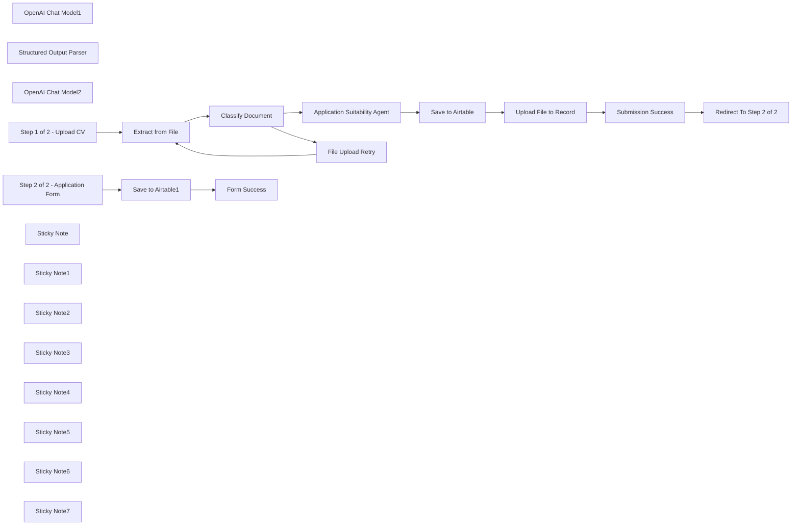

## Fluxo (.json) :

```json
{
  "meta": {
    "instanceId": "408f9fb9940c3cb18ffdef0e0150fe342d6e655c3a9fac21f0f644e8bedabcd9"
  },
  "nodes": [
    {
      "id": "10565888-4a1b-439a-a188-c6ee7990bb63",
      "name": "Extract from File",
      "type": "n8n-nodes-base.extractFromFile",
      "position": [
        860,
        260
      ],
      "parameters": {
        "options": {},
        "operation": "pdf",
        "binaryPropertyName": "File_Upload"
      },
      "typeVersion": 1
    },
    {
      "id": "583aff4b-d9f5-44e7-8e91-4938592b5630",
      "name": "OpenAI Chat Model1",
      "type": "@n8n/n8n-nodes-langchain.lmChatOpenAi",
      "position": [
        1740,
        380
      ],
      "parameters": {
        "options": {}
      },
      "credentials": {
        "openAiApi": {
          "id": "8gccIjcuf3gvaoEr",
          "name": "OpenAi account"
        }
      },
      "typeVersion": 1
    },
    {
      "id": "3a09afd0-0dce-41fd-bec3-783fcb3d01fc",
      "name": "Structured Output Parser",
      "type": "@n8n/n8n-nodes-langchain.outputParserStructured",
      "position": [
        1920,
        380
      ],
      "parameters": {
        "schemaType": "manual",
        "inputSchema": "{\n \"type\": \"object\",\n \"properties\": {\n \"Name\": { \"type\": \"string\" },\n \"Address\": { \"type\": \"string\" },\n \"Email\": { \"type\": \"string\" },\n \"Telephone\": { \"type\": \"string\" },\n \"Education\": { \"type\": \"string\" },\n \"Skills & Technologies\": { \"type\": \"string\" },\n \"Years of Experience\": { \"type\": \"string\" },\n \"Cover Letter\": { \"type\": \"string\" }\n }\n}"
      },
      "typeVersion": 1.2
    },
    {
      "id": "541a00d0-1635-48ad-b69e-83b28e178d6e",
      "name": "OpenAI Chat Model2",
      "type": "@n8n/n8n-nodes-langchain.lmChatOpenAi",
      "position": [
        1020,
        420
      ],
      "parameters": {
        "options": {}
      },
      "credentials": {
        "openAiApi": {
          "id": "8gccIjcuf3gvaoEr",
          "name": "OpenAi account"
        }
      },
      "typeVersion": 1
    },
    {
      "id": "19e4ad5b-2f96-491c-bcb3-52cca526ff82",
      "name": "Step 1 of 2 - Upload CV",
      "type": "n8n-nodes-base.formTrigger",
      "position": [
        460,
        220
      ],
      "webhookId": "4cf0f3b7-6282-47af-a7f1-3dfb00a1311d",
      "parameters": {
        "options": {
          "path": "job-application-step1of2",
          "ignoreBots": true,
          "buttonLabel": "Submit",
          "useWorkflowTimezone": true
        },
        "formTitle": "Step 1 of 2: Submit Your CV",
        "formFields": {
          "values": [
            {
              "fieldLabel": "Name",
              "placeholder": "Eg. Sam Smith",
              "requiredField": true
            },
            {
              "fieldType": "file",
              "fieldLabel": "File Upload",
              "multipleFiles": false,
              "requiredField": true,
              "acceptFileTypes": "pdf"
            },
            {
              "fieldType": "dropdown",
              "fieldLabel": "Acknowledgement of Terms",
              "multiselect": true,
              "fieldOptions": {
                "values": [
                  {
                    "option": "I agree to the terms & conditions"
                  }
                ]
              },
              "requiredField": true
            }
          ]
        },
        "responseMode": "lastNode",
        "formDescription": "Thank you for your interest in applying for Acme Inc. To ensure a speedy process, please ensure you following all instructions and fill out all required inputs.\n\nThis step requires you upload your CV in a password-free PDF document. Any document that is not a CV will be rejected."
      },
      "typeVersion": 2.2
    },
    {
      "id": "ec54096b-5f9f-444e-87b1-db99197731f1",
      "name": "Save to Airtable",
      "type": "n8n-nodes-base.airtable",
      "position": [
        2340,
        320
      ],
      "parameters": {
        "base": {
          "__rl": true,
          "mode": "list",
          "value": "appQ6mE9KSzlvaGDT",
          "cachedResultUrl": "https://airtable.com/appQ6mE9KSzlvaGDT",
          "cachedResultName": "Job Applications with AI & Forms"
        },
        "table": {
          "__rl": true,
          "mode": "list",
          "value": "tblUwwRXGnNzesNgr",
          "cachedResultUrl": "https://airtable.com/appQ6mE9KSzlvaGDT/tblUwwRXGnNzesNgr",
          "cachedResultName": "Table 1"
        },
        "columns": {
          "value": {
            "Name": "={{ $json.output.Name }}",
            "Email": "={{ $json.output.Email }}",
            "Address": "={{ $json.output.Address }}",
            "Education": "={{ $json.output.Education }}",
            "Telephone": "={{ $json.output.Telephone }}",
            "Cover Letter": "={{ $json.output['Cover Letter'] }}",
            "Submitted By": "={{ $('Step 1 of 2 - Upload CV').first().json.Name }}",
            "Years of Experience": "={{ $json.output['Years of Experience'] }}",
            "Skills & Technologies": "={{ $json.output['Skills & Technologies'] }}"
          },
          "schema": [
            {
              "id": "Name",
              "type": "string",
              "display": true,
              "removed": false,
              "readOnly": false,
              "required": false,
              "displayName": "Name",
              "defaultMatch": false,
              "canBeUsedToMatch": true
            },
            {
              "id": "File",
              "type": "array",
              "display": true,
              "removed": true,
              "readOnly": false,
              "required": false,
              "displayName": "File",
              "defaultMatch": false,
              "canBeUsedToMatch": true
            },
            {
              "id": "Cover Letter",
              "type": "string",
              "display": true,
              "removed": false,
              "readOnly": false,
              "required": false,
              "displayName": "Cover Letter",
              "defaultMatch": false,
              "canBeUsedToMatch": true
            },
            {
              "id": "Address",
              "type": "string",
              "display": true,
              "removed": false,
              "readOnly": false,
              "required": false,
              "displayName": "Address",
              "defaultMatch": false,
              "canBeUsedToMatch": true
            },
            {
              "id": "Email",
              "type": "string",
              "display": true,
              "removed": false,
              "readOnly": false,
              "required": false,
              "displayName": "Email",
              "defaultMatch": false,
              "canBeUsedToMatch": true
            },
            {
              "id": "Telephone",
              "type": "string",
              "display": true,
              "removed": false,
              "readOnly": false,
              "required": false,
              "displayName": "Telephone",
              "defaultMatch": false,
              "canBeUsedToMatch": true
            },
            {
              "id": "Education",
              "type": "string",
              "display": true,
              "removed": false,
              "readOnly": false,
              "required": false,
              "displayName": "Education",
              "defaultMatch": false,
              "canBeUsedToMatch": true
            },
            {
              "id": "Skills & Technologies",
              "type": "string",
              "display": true,
              "removed": false,
              "readOnly": false,
              "required": false,
              "displayName": "Skills & Technologies",
              "defaultMatch": false,
              "canBeUsedToMatch": true
            },
            {
              "id": "Years of Experience",
              "type": "string",
              "display": true,
              "removed": false,
              "readOnly": false,
              "required": false,
              "displayName": "Years of Experience",
              "defaultMatch": false,
              "canBeUsedToMatch": true
            },
            {
              "id": "Created",
              "type": "string",
              "display": true,
              "removed": true,
              "readOnly": true,
              "required": false,
              "displayName": "Created",
              "defaultMatch": false,
              "canBeUsedToMatch": true
            },
            {
              "id": "Last Modified",
              "type": "string",
              "display": true,
              "removed": true,
              "readOnly": true,
              "required": false,
              "displayName": "Last Modified",
              "defaultMatch": false,
              "canBeUsedToMatch": true
            },
            {
              "id": "Submitted By",
              "type": "string",
              "display": true,
              "removed": false,
              "readOnly": false,
              "required": false,
              "displayName": "Submitted By",
              "defaultMatch": false,
              "canBeUsedToMatch": true
            }
          ],
          "mappingMode": "defineBelow",
          "matchingColumns": []
        },
        "options": {},
        "operation": "create"
      },
      "credentials": {
        "airtableTokenApi": {
          "id": "Und0frCQ6SNVX3VV",
          "name": "Airtable Personal Access Token account"
        }
      },
      "typeVersion": 2.1
    },
    {
      "id": "127965b3-a2c6-443b-942d-8691b5bcb25d",
      "name": "Classify Document",
      "type": "@n8n/n8n-nodes-langchain.textClassifier",
      "position": [
        1020,
        260
      ],
      "parameters": {
        "options": {
          "fallback": "other"
        },
        "inputText": "={{ $json.text }}",
        "categories": {
          "categories": [
            {
              "category": "CV or Resume",
              "description": "This document is a CV or Resume"
            }
          ]
        }
      },
      "typeVersion": 1
    },
    {
      "id": "b82476c8-b285-467f-b344-e1f667f42479",
      "name": "Upload File to Record",
      "type": "n8n-nodes-base.httpRequest",
      "position": [
        2540,
        320
      ],
      "parameters": {
        "url": "=https://content.airtable.com/v0/{{ $('Save to Airtable').params.base.value }}/{{ $json.id }}/File/uploadAttachment",
        "method": "POST",
        "options": {},
        "sendBody": true,
        "authentication": "predefinedCredentialType",
        "bodyParameters": {
          "parameters": [
            {
              "name": "contentType",
              "value": "application/pdf"
            },
            {
              "name": "filename",
              "value": "={{ $workflow.id }}-{{ $execution.id }}.pdf"
            },
            {
              "name": "file",
              "value": "={{ $('Step 1 of 2 - Upload CV').first().binary.File_Upload.data }}"
            }
          ]
        },
        "nodeCredentialType": "airtableTokenApi"
      },
      "credentials": {
        "airtableTokenApi": {
          "id": "Und0frCQ6SNVX3VV",
          "name": "Airtable Personal Access Token account"
        }
      },
      "typeVersion": 4.2
    },
    {
      "id": "ee6f59ee-781f-4ed4-8cec-b7de70a82dac",
      "name": "Form Success",
      "type": "n8n-nodes-base.form",
      "position": [
        3900,
        320
      ],
      "webhookId": "4b154ccc-ad54-4cc2-a239-cf8354fc91bf",
      "parameters": {
        "options": {},
        "operation": "completion",
        "completionTitle": "Application Success",
        "completionMessage": "Thank you for completing the application process.\nYour informaion is filed securely and will be reviewed by our team.\n\nWe will be in touch shortly."
      },
      "typeVersion": 1
    },
    {
      "id": "43d46474-b9f8-4adf-89f8-d4c993641448",
      "name": "Save to Airtable1",
      "type": "n8n-nodes-base.airtable",
      "onError": "continueErrorOutput",
      "position": [
        3720,
        320
      ],
      "parameters": {
        "base": {
          "__rl": true,
          "mode": "list",
          "value": "appQ6mE9KSzlvaGDT",
          "cachedResultUrl": "https://airtable.com/appQ6mE9KSzlvaGDT",
          "cachedResultName": "Job Applications with AI & Forms"
        },
        "table": {
          "__rl": true,
          "mode": "list",
          "value": "tblUwwRXGnNzesNgr",
          "cachedResultUrl": "https://airtable.com/appQ6mE9KSzlvaGDT/tblUwwRXGnNzesNgr",
          "cachedResultName": "Table 1"
        },
        "columns": {
          "value": {
            "Name": "={{ $json.Name }}",
            "Email": "={{ $json.Email }}",
            "Address": "={{ $json.Address }}",
            "Education": "={{ $json.Education }}",
            "Telephone": "={{ $json.Telephone }}",
            "Cover Letter": "={{ $json.output['Cover Letter'] }}",
            "Years of Experience": "={{ $json['Years of Experience'] }}",
            "Skills & Technologies": "={{ $json['Skills & Technologies'] }}"
          },
          "schema": [
            {
              "id": "Name",
              "type": "string",
              "display": true,
              "removed": false,
              "readOnly": false,
              "required": false,
              "displayName": "Name",
              "defaultMatch": false,
              "canBeUsedToMatch": true
            },
            {
              "id": "File",
              "type": "array",
              "display": true,
              "removed": true,
              "readOnly": false,
              "required": false,
              "displayName": "File",
              "defaultMatch": false,
              "canBeUsedToMatch": true
            },
            {
              "id": "Cover Letter",
              "type": "string",
              "display": true,
              "removed": false,
              "readOnly": false,
              "required": false,
              "displayName": "Cover Letter",
              "defaultMatch": false,
              "canBeUsedToMatch": true
            },
            {
              "id": "Address",
              "type": "string",
              "display": true,
              "removed": false,
              "readOnly": false,
              "required": false,
              "displayName": "Address",
              "defaultMatch": false,
              "canBeUsedToMatch": true
            },
            {
              "id": "Email",
              "type": "string",
              "display": true,
              "removed": false,
              "readOnly": false,
              "required": false,
              "displayName": "Email",
              "defaultMatch": false,
              "canBeUsedToMatch": true
            },
            {
              "id": "Telephone",
              "type": "string",
              "display": true,
              "removed": false,
              "readOnly": false,
              "required": false,
              "displayName": "Telephone",
              "defaultMatch": false,
              "canBeUsedToMatch": true
            },
            {
              "id": "Education",
              "type": "string",
              "display": true,
              "removed": false,
              "readOnly": false,
              "required": false,
              "displayName": "Education",
              "defaultMatch": false,
              "canBeUsedToMatch": true
            },
            {
              "id": "Skills & Technologies",
              "type": "string",
              "display": true,
              "removed": false,
              "readOnly": false,
              "required": false,
              "displayName": "Skills & Technologies",
              "defaultMatch": false,
              "canBeUsedToMatch": true
            },
            {
              "id": "Years of Experience",
              "type": "string",
              "display": true,
              "removed": false,
              "readOnly": false,
              "required": false,
              "displayName": "Years of Experience",
              "defaultMatch": false,
              "canBeUsedToMatch": true
            },
            {
              "id": "Created",
              "type": "string",
              "display": true,
              "removed": true,
              "readOnly": true,
              "required": false,
              "displayName": "Created",
              "defaultMatch": false,
              "canBeUsedToMatch": true
            },
            {
              "id": "Last Modified",
              "type": "string",
              "display": true,
              "removed": true,
              "readOnly": true,
              "required": false,
              "displayName": "Last Modified",
              "defaultMatch": false,
              "canBeUsedToMatch": true
            },
            {
              "id": "Submitted By",
              "type": "string",
              "display": true,
              "removed": true,
              "readOnly": false,
              "required": false,
              "displayName": "Submitted By",
              "defaultMatch": false,
              "canBeUsedToMatch": true
            }
          ],
          "mappingMode": "defineBelow",
          "matchingColumns": [
            "Email",
            "Name"
          ]
        },
        "options": {},
        "operation": "update"
      },
      "credentials": {
        "airtableTokenApi": {
          "id": "Und0frCQ6SNVX3VV",
          "name": "Airtable Personal Access Token account"
        }
      },
      "typeVersion": 2.1
    },
    {
      "id": "38115307-824c-4354-917c-b18e93178f87",
      "name": "Step 2 of 2 - Application Form",
      "type": "n8n-nodes-base.formTrigger",
      "position": [
        3520,
        320
      ],
      "webhookId": "db923d6c-ea24-4679-b4ba-d3b142ef8338",
      "parameters": {
        "options": {
          "path": "job-application-step2of2",
          "ignoreBots": true,
          "useWorkflowTimezone": true
        },
        "formTitle": "Step 2 of 2: Application Form",
        "formFields": {
          "values": [
            {
              "fieldLabel": "Name",
              "placeholder": "Eg. Sam Smith",
              "requiredField": true
            },
            {
              "fieldLabel": "Address",
              "requiredField": true
            },
            {
              "fieldType": "email",
              "fieldLabel": "Email",
              "requiredField": true
            },
            {
              "fieldLabel": "Telephone",
              "requiredField": true
            },
            {
              "fieldType": "textarea",
              "fieldLabel": "Education",
              "requiredField": true
            },
            {
              "fieldType": "textarea",
              "fieldLabel": "Skills & Technologies",
              "requiredField": true
            },
            {
              "fieldType": "textarea",
              "fieldLabel": "Years of Experience",
              "requiredField": true
            },
            {
              "fieldType": "textarea",
              "fieldLabel": "Cover Letter",
              "requiredField": true
            },
            {
              "fieldType": "dropdown",
              "fieldLabel": "Acknowledgement of Terms",
              "multiselect": true,
              "fieldOptions": {
                "values": [
                  {
                    "option": "I agree to consent to the terms and conditions"
                  }
                ]
              },
              "requiredField": true
            }
          ]
        },
        "formDescription": "This application form prefills using the CV you submitted. Please make any amendments as required and once satisfied, please submit the form to complete the application process."
      },
      "typeVersion": 2.2
    },
    {
      "id": "1171540b-ebb2-41cb-b9f1-2da335caaece",
      "name": "Sticky Note",
      "type": "n8n-nodes-base.stickyNote",
      "position": [
        300,
        20
      ],
      "parameters": {
        "color": 7,
        "width": 430,
        "height": 381,
        "content": "## 1. Application Form To Upload CV\n[Learn more the Form Trigger node](https://docs.n8n.io/integrations/builtin/core-nodes/n8n-nodes-base.formtrigger/)\n\nOur application process starts with a simple file upload to get the applicant's CV for processing."
      },
      "typeVersion": 1
    },
    {
      "id": "4791901b-31a6-44c3-a1da-9c32b78cf305",
      "name": "Sticky Note1",
      "type": "n8n-nodes-base.stickyNote",
      "position": [
        760,
        17.5
      ],
      "parameters": {
        "color": 7,
        "width": 774,
        "height": 593,
        "content": "## 2. Document Classifier and ReUpload Form\n[Read more about the Text Classifier](https://docs.n8n.io/integrations/builtin/cluster-nodes/root-nodes/n8n-nodes-langchain.text-classifier/)\n\nForm validation remains a critical step and before the introduction of LLMs, classifying document types was a relatively troublesome process. Today, n8n's text classifier node does an excellent job at this task.\n\nContextual validation powered by AI means invalid, incomplete or poorly created applicant CVs can be rejected as a quality check. When this happens in our workflow, we present the user again with the file upload form to retry."
      },
      "typeVersion": 1
    },
    {
      "id": "4dc1a316-15b7-4568-9910-79b4a7989dcb",
      "name": "Sticky Note2",
      "type": "n8n-nodes-base.stickyNote",
      "position": [
        1560,
        -20
      ],
      "parameters": {
        "color": 7,
        "width": 648,
        "height": 584,
        "content": "## 3. Smarter Application Pre-fill with Job Role Context\n[Read more about the Basic LLM node](https://docs.n8n.io/integrations/builtin/cluster-nodes/root-nodes/n8n-nodes-langchain.chainllm)\n\nInformation extraction is a logical next step once we have our PDF contents but we can extend further by only extracting data which is relevant to our job post. This ensure the information we extract is always relevant which saves time for the hiring team.\n\nTo achieve this for this demo, I've included the job post in the prompt for the LLM to compare the CV against. The provides the AI enough context to complete the task successfully."
      },
      "typeVersion": 1
    },
    {
      "id": "76006a7b-32ce-4606-be98-9a7b7b451215",
      "name": "Application Suitability Agent",
      "type": "@n8n/n8n-nodes-langchain.chainLlm",
      "position": [
        1740,
        220
      ],
      "parameters": {
        "text": "=Here is the candidate's CV:\n{{ $json.text }}",
        "messages": {
          "messageValues": [
            {
              "message": "=Extract information from the applicant's CV which is relevant to the job post.\nWhen writing the cover letter, use no more than a few paragraphs. No need to address the hiring company or personnel as this text will be input into an online form.\nUse a formal and professional tone.\nThis is the job post which the cover letter should address:\n\n```\nJob Post: General Operations Manager – Manufacturing Industry\nJob Type: Full-time\nExperience Level: Mid to Senior\n\nAbout Us:\nWe are a forward-thinking manufacturing company committed to innovation, quality, and sustainability. We strive to improve operations, enhance product quality, and implement eco-friendly practices, fostering a productive and collaborative work environment.\n\nJob Description:\nWe are seeking an experienced and dynamic General Operations Manager to lead and optimize our manufacturing processes. The successful candidate will oversee production, enhance efficiency, and implement effective strategies to support our mission. This role is ideal for a seasoned professional with a strong background in operational management and a knack for process improvement.\n\nKey Responsibilities:\n\nOversee and manage production and sales teams across multiple shifts, ensuring seamless 24/6 operations.\nDevelop and implement cost-effective quality control and accountability measures to maintain high manufacturing standards.\nManage inventory and procurement, strategically timing raw material purchases to maximize cost efficiency.\nLead ERP system upgrades or similar digital transformation projects, ensuring timely and budget-friendly execution.\nOptimize credit control and payment terms to improve cash flow while maintaining client relationships.\nAdvocate for sustainable practices, including integrating recycled materials into production processes.\nQualifications:\n\nBachelor's degree in Business Administration or a related field; a Master's in Financial Economics is a plus.\nProven experience in a leadership role within the manufacturing industry.\nExpertise in managing teams, production cycles, and quality assurance.\nProficiency in ERP systems and software such as Stata, Bloomberg Professional, and Thomson Reuters DataStream.\nStrong analytical, decision-making, and organizational skills.\nFamiliarity with capital markets, private equity, or strategic management consulting is a plus.\nPreferred Skills:\n\nAdvanced knowledge of plastics manufacturing, including polyethylene and polypropylene applications.\nExperience in implementing sustainability initiatives and green business practices.\nExcellent communication skills, with a history of collaboration and team-building.\nWhat We Offer:\n\nCompetitive salary and benefits package.\nOpportunities for professional growth and development.\nA collaborative and innovative work environment.\nHow to Apply:\nPlease send your resume and a cover letter highlighting your experience and achievements to [HR Email]. Applications will be reviewed on a rolling basis.\n\nJoin us and drive operational excellence in manufacturing!\n```"
            }
          ]
        },
        "promptType": "define",
        "hasOutputParser": true
      },
      "typeVersion": 1.5
    },
    {
      "id": "cfc6a1a1-d42c-49b1-a93b-4a04e7e88521",
      "name": "Sticky Note3",
      "type": "n8n-nodes-base.stickyNote",
      "position": [
        2240,
        40
      ],
      "parameters": {
        "color": 7,
        "width": 528,
        "height": 524,
        "content": "## 4. Save to Applicant Tracking System\n[Read more about the Airtable node](https://docs.n8n.io/integrations/builtin/app-nodes/n8n-nodes-base.airtable/)\n\nNext, we can complete our simple data capture by integrating and pushing data to our Applicant Tracking System.\n\nHere, we're using Airtable because we can also store PDF files in our rows.\n\nSee our example Airtable here: [https://airtable.com/appQ6mE9KSzlvaGDT/shrIivfe9qH6YEYAs](https://airtable.com/appQ6mE9KSzlvaGDT/shrIivfe9qH6YEYAs)"
      },
      "typeVersion": 1
    },
    {
      "id": "8f21067f-a851-4480-84b8-bb37eddfd7d6",
      "name": "Sticky Note4",
      "type": "n8n-nodes-base.stickyNote",
      "position": [
        2780,
        40
      ],
      "parameters": {
        "color": 7,
        "width": 575.8190139534884,
        "height": 524,
        "content": "## 5. Redirect to Application Form\n[Learn more about Form Ending](https://docs.n8n.io/integrations/builtin/core-nodes/n8n-nodes-base.form/#form-ending)\n\nFinally to complete the form flow for step 1 of 2, we'll use a form ending node to redirect the user to step 2 of 2.\n\nHere, we using query params as part of our redirect as this will pre-fill the form fields in step 2 of 2."
      },
      "typeVersion": 1
    },
    {
      "id": "2ba9cea6-173f-45be-bdda-a6ef061d91f5",
      "name": "Sticky Note5",
      "type": "n8n-nodes-base.stickyNote",
      "position": [
        3380,
        40
      ],
      "parameters": {
        "color": 7,
        "width": 788,
        "height": 524,
        "content": "## 6. Application Form to Amend Details\n[Learn more about Forms](https://docs.n8n.io/integrations/builtin/core-nodes/n8n-nodes-base.form)\n\nIn the second part of the application process, applicants are presented with a form containing multiple fields to complete. This step has often been a source of frustration for many, as they end up duplicating information that’s already in their CV.\n\nIf our redirection with prefilled data works as intended, this issue will be resolved, as the fields will be automatically populated by our LLM during step 1 of 2. This also allows candidates the opportunity to review and refine the application fields before submitting."
      },
      "typeVersion": 1
    },
    {
      "id": "5add63c3-19d4-4035-a718-b1c125a03c67",
      "name": "File Upload Retry",
      "type": "n8n-nodes-base.form",
      "position": [
        1340,
        380
      ],
      "webhookId": "c3e8dc74-c6e0-4d0b-acf3-8bbc2f7c9ae2",
      "parameters": {
        "options": {
          "formTitle": "Please upload a CV",
          "formDescription": "Unfortunately, we were unable to process your previous file upload.\n\nTo continue, you must upload a valid CV in PDF format. "
        },
        "formFields": {
          "values": [
            {
              "fieldType": "file",
              "fieldLabel": "File Upload",
              "multipleFiles": false,
              "requiredField": true,
              "acceptFileTypes": "pdf"
            }
          ]
        }
      },
      "typeVersion": 1
    },
    {
      "id": "cc27b37f-26f5-47c3-9ac2-4412352070e5",
      "name": "Redirect To Step 2 of 2",
      "type": "n8n-nodes-base.form",
      "position": [
        3120,
        280
      ],
      "webhookId": "1b6e2375-e21d-4e4f-a44e-3ef0de95320e",
      "parameters": {
        "operation": "completion",
        "redirectUrl": "=https://<HOST>/form/job-application-step2of2?{{ $('Application Suitability Agent').first().json.output.urlEncode() }}",
        "respondWith": "redirect"
      },
      "typeVersion": 1
    },
    {
      "id": "1cba63a9-57cb-4e17-a601-2bd64fb50dbf",
      "name": "Sticky Note6",
      "type": "n8n-nodes-base.stickyNote",
      "position": [
        -140,
        -240
      ],
      "parameters": {
        "width": 420,
        "height": 640,
        "content": "## Try It Out!\n\n### This n8n template combines form file uploads with AI components to create a simple but effective job application submission flow.\nIt's a perfect low-cost solution without the bells and whistles of the surface yet is highly advanced with its use of AI.\n\n### How it works\n* The application submission process starts with an n8n form trigger to accept CV files in the form of PDFs.\n* The PDF is validated using the text classifier node to determine if it is a valid CV.\n* A basic LLM node is used to extract relevant information from the CV as data capture. A copy of the original job post is included to ensure relevancy.\n* Applicant's data is then sent to an ATS for processing. For our demo, we used airtable because we could attach PDFs to rows.\n* Finally, a second form trigger is used to allow the applicant to amend any of the generated application fields.\n\n\n### Need Help?\nJoin the [Discord](https://discord.com/invite/XPKeKXeB7d) or ask in the [Forum](https://community.n8n.io/)!\n\nHappy Hacking!\n"
      },
      "typeVersion": 1
    },
    {
      "id": "4289f9f2-2286-4bc7-9045-c645ff292341",
      "name": "Sticky Note7",
      "type": "n8n-nodes-base.stickyNote",
      "position": [
        3060,
        460
      ],
      "parameters": {
        "height": 120,
        "content": "### 🚨 Change Base URL here!\nThis redirect requires the full base URL, change it to the host of your n8n instance."
      },
      "typeVersion": 1
    },
    {
      "id": "fca5b2ab-291f-4ac3-b4e1-13911666359f",
      "name": "Submission Success",
      "type": "n8n-nodes-base.form",
      "position": [
        2900,
        280
      ],
      "webhookId": "f3b12dd4-dd5d-47a9-8bc1-727ba7eb5d15",
      "parameters": {
        "options": {
          "formTitle": "CV Submission Successful!",
          "buttonLabel": "Continue",
          "formDescription": "We'll now redirect you to step 2 of 2 - our Application form. Please note, some fields will be prefilled with information from your CV. Feel free to amend this information as needed."
        },
        "formFields": {
          "values": [
            {
              "fieldType": "dropdown",
              "fieldLabel": "Acknowledgement",
              "multiselect": true,
              "fieldOptions": {
                "values": [
                  {
                    "option": "I understand my CV will be held soley for purpose of application and for no more than 90 days."
                  }
                ]
              },
              "requiredField": true
            }
          ]
        }
      },
      "typeVersion": 1
    }
  ],
  "pinData": {},
  "connections": {
    "Save to Airtable": {
      "main": [
        [
          {
            "node": "Upload File to Record",
            "type": "main",
            "index": 0
          }
        ]
      ]
    },
    "Classify Document": {
      "main": [
        [
          {
            "node": "Application Suitability Agent",
            "type": "main",
            "index": 0
          }
        ],
        [
          {
            "node": "File Upload Retry",
            "type": "main",
            "index": 0
          }
        ]
      ]
    },
    "Extract from File": {
      "main": [
        [
          {
            "node": "Classify Document",
            "type": "main",
            "index": 0
          }
        ]
      ]
    },
    "File Upload Retry": {
      "main": [
        [
          {
            "node": "Extract from File",
            "type": "main",
            "index": 0
          }
        ]
      ]
    },
    "Save to Airtable1": {
      "main": [
        [
          {
            "node": "Form Success",
            "type": "main",
            "index": 0
          }
        ],
        [
          {
            "node": "Form Success",
            "type": "main",
            "index": 0
          }
        ]
      ]
    },
    "OpenAI Chat Model1": {
      "ai_languageModel": [
        [
          {
            "node": "Application Suitability Agent",
            "type": "ai_languageModel",
            "index": 0
          }
        ]
      ]
    },
    "OpenAI Chat Model2": {
      "ai_languageModel": [
        [
          {
            "node": "Classify Document",
            "type": "ai_languageModel",
            "index": 0
          }
        ]
      ]
    },
    "Submission Success": {
      "main": [
        [
          {
            "node": "Redirect To Step 2 of 2",
            "type": "main",
            "index": 0
          }
        ]
      ]
    },
    "Upload File to Record": {
      "main": [
        [
          {
            "node": "Submission Success",
            "type": "main",
            "index": 0
          }
        ]
      ]
    },
    "Step 1 of 2 - Upload CV": {
      "main": [
        [
          {
            "node": "Extract from File",
            "type": "main",
            "index": 0
          }
        ]
      ]
    },
    "Structured Output Parser": {
      "ai_outputParser": [
        [
          {
            "node": "Application Suitability Agent",
            "type": "ai_outputParser",
            "index": 0
          }
        ]
      ]
    },
    "Application Suitability Agent": {
      "main": [
        [
          {
            "node": "Save to Airtable",
            "type": "main",
            "index": 0
          }
        ]
      ]
    },
    "Step 2 of 2 - Application Form": {
      "main": [
        [
          {
            "node": "Save to Airtable1",
            "type": "main",
            "index": 0
          }
        ]
      ]
    }
  }
}
```

<a id="template-1217"></a>

## Template 1217 - Chatbot RH para políticas e benefícios

- **Nome:** Chatbot RH para políticas e benefícios
- **Descrição:** Um assistente conversacional alimentado por IA que responde perguntas sobre políticas da empresa e benefícios, usando documentos da empresa e o diretório de funcionários para fornecer contatos e orientações.
- **Funcionalidade:** • Recuperação de arquivos: busca arquivos da conta de RH e filtra pela categoria de documentos da empresa.
• Filtragem e download de PDFs: seleciona apenas PDFs relevantes e os baixa para processamento.
• Processamento de documentos: divide textos em trechos com sobreposição para melhor indexação.
• Geração de embeddings: cria vetores a partir do conteúdo dos documentos para busca semântica.
• Armazenamento vetorial: insere embeddings e metadados em um banco vetorial para consultas posteriores.
• Busca semântica: consulta o banco vetorial para recuperar trechos relevantes ao responder perguntas dos funcionários.
• Chat conversacional com contexto: inicia conversas por webhook e mantém histórico com memória de janela para continuidade.
• Agente de IA orquestrador: combina recuperação de documentos e uso de ferramentas para responder e executar ações.
• Classificação de consultas: determina se a solicitação refere-se a uma pessoa ou a um departamento.
• Consulta ao diretório de funcionários: busca informações de funcionários (nome, cargo, email) e pode identificar o líder mais sênior de um departamento.
• Lógica de contato escalonada: tenta primeiro localizar contato nos documentos; se faltarem detalhes, usa o lookup de funcionários; se necessário, localiza supervisor ou líder de departamento e recomenda o próximo ponto de contato.
• Formatação de saída: converte registros de funcionários e respostas em formato legível para retorno ao usuário.
- **Ferramentas:** • BambooHR: sistema de gestão de RH usado como fonte de arquivos PDF e diretório de funcionários para download e consultas.
• Supabase: armazenamento de vetores e banco de dados vetorial usado para indexar e recuperar embeddings dos documentos.
• OpenAI: serviços de modelos de linguagem e embeddings utilizados para gerar embeddings, classificar texto, processar prompts e tomar decisões de IA.

## Fluxo visual

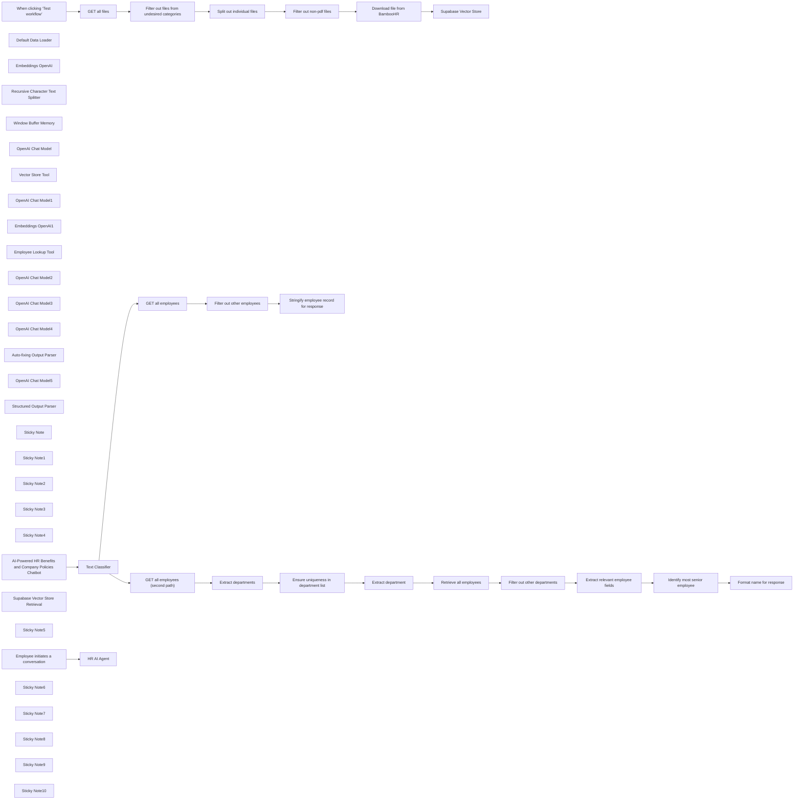

## Fluxo (.json) :

```json
{
  "id": "dYjQS1bJmVSAxNnj",
  "meta": {
    "instanceId": "a9f3b18652ddc96459b459de4fa8fa33252fb820a9e5a1593074f3580352864a",
    "templateCredsSetupCompleted": true
  },
  "name": "BambooHR AI-Powered Company Policies and Benefits Chatbot",
  "tags": [],
  "nodes": [
    {
      "id": "832e4a1d-320f-4793-be3c-8829776a3ce6",
      "name": "When clicking ‘Test workflow’",
      "type": "n8n-nodes-base.manualTrigger",
      "position": [
        760,
        560
      ],
      "parameters": {},
      "typeVersion": 1
    },
    {
      "id": "63be0638-d7df-4af8-ba56-555593a6de0c",
      "name": "Default Data Loader",
      "type": "@n8n/n8n-nodes-langchain.documentDefaultDataLoader",
      "position": [
        2080,
        740
      ],
      "parameters": {
        "options": {},
        "dataType": "binary"
      },
      "typeVersion": 1
    },
    {
      "id": "ffe33bb2-efd0-4b6e-a146-aaded7c28304",
      "name": "Embeddings OpenAI",
      "type": "@n8n/n8n-nodes-langchain.embeddingsOpenAi",
      "position": [
        1860,
        740
      ],
      "parameters": {
        "options": {}
      },
      "credentials": {
        "openAiApi": {
          "id": "XXXXXX",
          "name": "OpenAi account"
        }
      },
      "typeVersion": 1.1
    },
    {
      "id": "32de5318-ea5d-4951-b81c-3c96167bc320",
      "name": "Recursive Character Text Splitter",
      "type": "@n8n/n8n-nodes-langchain.textSplitterRecursiveCharacterTextSplitter",
      "position": [
        2060,
        880
      ],
      "parameters": {
        "options": {},
        "chunkOverlap": 100
      },
      "typeVersion": 1
    },
    {
      "id": "6306d263-16c1-4a68-9318-c58fea1e3e62",
      "name": "Window Buffer Memory",
      "type": "@n8n/n8n-nodes-langchain.memoryBufferWindow",
      "position": [
        1000,
        1340
      ],
      "parameters": {},
      "typeVersion": 1.2
    },
    {
      "id": "364cf0ce-524c-4b61-89f3-40b2801bc7e3",
      "name": "OpenAI Chat Model",
      "type": "@n8n/n8n-nodes-langchain.lmChatOpenAi",
      "position": [
        840,
        1340
      ],
      "parameters": {
        "options": {}
      },
      "credentials": {
        "openAiApi": {
          "id": "XXXXXX",
          "name": "OpenAi account"
        }
      },
      "typeVersion": 1
    },
    {
      "id": "901163a1-1e66-42ee-bfd0-9ed815a7c83d",
      "name": "Vector Store Tool",
      "type": "@n8n/n8n-nodes-langchain.toolVectorStore",
      "position": [
        1120,
        1380
      ],
      "parameters": {
        "name": "company_files",
        "topK": 5,
        "description": "Retrieves information from the company handbook, 401k policies, benefits overview, and expense policies available to all employees."
      },
      "typeVersion": 1
    },
    {
      "id": "b87fa113-6a32-48fc-8e06-049345c66f38",
      "name": "OpenAI Chat Model1",
      "type": "@n8n/n8n-nodes-langchain.lmChatOpenAi",
      "position": [
        1220,
        1600
      ],
      "parameters": {
        "options": {}
      },
      "credentials": {
        "openAiApi": {
          "id": "XXXXXX",
          "name": "OpenAi account"
        }
      },
      "typeVersion": 1
    },
    {
      "id": "9dc1a896-c8a5-4d22-b029-14eae0717bd8",
      "name": "Embeddings OpenAI1",
      "type": "@n8n/n8n-nodes-langchain.embeddingsOpenAi",
      "position": [
        940,
        1700
      ],
      "parameters": {
        "options": {}
      },
      "credentials": {
        "openAiApi": {
          "id": "XXXXXX",
          "name": "OpenAi account"
        }
      },
      "typeVersion": 1.1
    },
    {
      "id": "20cda474-ef6f-48af-b299-04f1fe980d3d",
      "name": "Employee Lookup Tool",
      "type": "@n8n/n8n-nodes-langchain.toolWorkflow",
      "position": [
        1440,
        1360
      ],
      "parameters": {
        "name": "employee_lookup_tool",
        "workflowId": {
          "__rl": true,
          "mode": "id",
          "value": "={{ $workflow.id }}"
        },
        "description": "Call this tool with the full name of an employee to retrieve their details from our HRIS, including their job title, department, and supervisor. If an employee name is not provided, you may call this tool with a department name to retrieve the most senior person in that department. This tool requires an exact match on employee names but can infer the senior-most person for a department query.",
        "jsonSchemaExample": "{\n\t\"name\": \"The name of an employee or department\"\n}",
        "specifyInputSchema": true
      },
      "typeVersion": 1.2
    },
    {
      "id": "55718295-459b-4a4b-8c57-fd6b31e3d963",
      "name": "OpenAI Chat Model2",
      "type": "@n8n/n8n-nodes-langchain.lmChatOpenAi",
      "position": [
        1960,
        1500
      ],
      "parameters": {
        "options": {}
      },
      "credentials": {
        "openAiApi": {
          "id": "XXXXXX",
          "name": "OpenAi account"
        }
      },
      "typeVersion": 1
    },
    {
      "id": "e574d63d-7e38-4d90-9533-64a4ddbe2e36",
      "name": "OpenAI Chat Model3",
      "type": "@n8n/n8n-nodes-langchain.lmChatOpenAi",
      "position": [
        2980,
        1600
      ],
      "parameters": {
        "options": {}
      },
      "credentials": {
        "openAiApi": {
          "id": "XXXXXX",
          "name": "OpenAi account"
        }
      },
      "typeVersion": 1
    },
    {
      "id": "04d53430-b8d9-43ff-b2c4-ef0da2d799c0",
      "name": "OpenAI Chat Model4",
      "type": "@n8n/n8n-nodes-langchain.lmChatOpenAi",
      "position": [
        3700,
        1620
      ],
      "parameters": {
        "options": {}
      },
      "credentials": {
        "openAiApi": {
          "id": "XXXXXX",
          "name": "OpenAi account"
        }
      },
      "typeVersion": 1
    },
    {
      "id": "9759fe08-3c81-4472-8d62-2c5d26156984",
      "name": "Auto-fixing Output Parser",
      "type": "@n8n/n8n-nodes-langchain.outputParserAutofixing",
      "position": [
        3880,
        1600
      ],
      "parameters": {},
      "typeVersion": 1
    },
    {
      "id": "d8830fd8-f238-4e5d-8c5f-bf83c9450dbe",
      "name": "OpenAI Chat Model5",
      "type": "@n8n/n8n-nodes-langchain.lmChatOpenAi",
      "position": [
        3780,
        1700
      ],
      "parameters": {
        "options": {}
      },
      "credentials": {
        "openAiApi": {
          "id": "XXXXXX",
          "name": "OpenAi account"
        }
      },
      "typeVersion": 1
    },
    {
      "id": "da580308-e4ed-400b-99e2-31baf27b039d",
      "name": "Structured Output Parser",
      "type": "@n8n/n8n-nodes-langchain.outputParserStructured",
      "position": [
        4080,
        1700
      ],
      "parameters": {
        "jsonSchemaExample": "{\n\t\"name\": \"The name of an employee\"\n}"
      },
      "typeVersion": 1.2
    },
    {
      "id": "e81dbe81-5f6b-4b2c-a4bc-afa0136e33ac",
      "name": "Sticky Note",
      "type": "n8n-nodes-base.stickyNote",
      "position": [
        680,
        460
      ],
      "parameters": {
        "color": 7,
        "width": 1695.17727595829,
        "height": 582.7965199011514,
        "content": "## STEP #1: Retrieve company policies and load them into a vector store"
      },
      "typeVersion": 1
    },
    {
      "id": "629872ed-2f99-424d-96da-feee6df96d3d",
      "name": "Sticky Note1",
      "type": "n8n-nodes-base.stickyNote",
      "position": [
        680,
        1080
      ],
      "parameters": {
        "color": 4,
        "width": 873.5637402697844,
        "height": 780.6181567295652,
        "content": "## BambooHR AI-Powered HR Benefits and Company Policies Chatbot"
      },
      "typeVersion": 1
    },
    {
      "id": "8888281b-5701-4c62-b76b-a0b6a80d8463",
      "name": "Sticky Note2",
      "type": "n8n-nodes-base.stickyNote",
      "position": [
        1580,
        1075.4375994898523
      ],
      "parameters": {
        "color": 7,
        "width": 2783.3549952823255,
        "height": 781.525845027296,
        "content": "## (Optional) STEP #2: Set up employee lookup tool"
      },
      "typeVersion": 1
    },
    {
      "id": "17044553-d081-4c17-8108-d0327709f352",
      "name": "GET all files",
      "type": "n8n-nodes-base.bambooHr",
      "position": [
        960,
        560
      ],
      "parameters": {
        "resource": "file",
        "operation": "getAll",
        "returnAll": true,
        "simplifyOutput": false
      },
      "credentials": {
        "bambooHrApi": {
          "id": "XXXXXX",
          "name": "BambooHR account"
        }
      },
      "typeVersion": 1
    },
    {
      "id": "939881b1-eb18-4ab7-ac4a-9edcc218356f",
      "name": "Sticky Note3",
      "type": "n8n-nodes-base.stickyNote",
      "position": [
        920,
        720
      ],
      "parameters": {
        "color": 5,
        "width": 177.89252000024067,
        "height": 99.24268260893132,
        "content": "Toggle **off** the _simplify_ option to ensure categories are retrieved as well"
      },
      "typeVersion": 1
    },
    {
      "id": "0907a1d3-97e2-4219-bfbc-524186f6d889",
      "name": "Filter out files from undesired categories",
      "type": "n8n-nodes-base.filter",
      "position": [
        1160,
        560
      ],
      "parameters": {
        "options": {},
        "conditions": {
          "options": {
            "version": 2,
            "leftValue": "",
            "caseSensitive": true,
            "typeValidation": "strict"
          },
          "combinator": "and",
          "conditions": [
            {
              "id": "b85b86cd-0b54-4348-a538-8ff4ae625b9a",
              "operator": {
                "name": "filter.operator.equals",
                "type": "string",
                "operation": "equals"
              },
              "leftValue": "={{ $json.name }}",
              "rightValue": "=Company Files"
            }
          ]
        }
      },
      "typeVersion": 2.2
    },
    {
      "id": "43069219-7cd9-4515-846d-ed6a0f9bbb61",
      "name": "Split out individual files",
      "type": "n8n-nodes-base.splitOut",
      "position": [
        1360,
        560
      ],
      "parameters": {
        "options": {},
        "fieldToSplitOut": "files"
      },
      "typeVersion": 1
    },
    {
      "id": "8412af5f-f07f-4a98-a174-e363ba04f902",
      "name": "Filter out non-pdf files",
      "type": "n8n-nodes-base.filter",
      "position": [
        1560,
        560
      ],
      "parameters": {
        "options": {},
        "conditions": {
          "options": {
            "version": 2,
            "leftValue": "",
            "caseSensitive": true,
            "typeValidation": "strict"
          },
          "combinator": "and",
          "conditions": [
            {
              "id": "73cc2cb9-04fa-43e7-a459-de0bf26ffb18",
              "operator": {
                "type": "boolean",
                "operation": "true",
                "singleValue": true
              },
              "leftValue": "={{ $json.originalFileName.endsWith(\".pdf\") }}",
              "rightValue": ""
            }
          ]
        }
      },
      "typeVersion": 2.2
    },
    {
      "id": "7e007a29-c902-41d3-ab22-f6a93bc43f7d",
      "name": "Download file from BambooHR",
      "type": "n8n-nodes-base.bambooHr",
      "position": [
        1760,
        560
      ],
      "parameters": {
        "fileId": "={{ $json.id }}",
        "resource": "file",
        "operation": "download"
      },
      "credentials": {
        "bambooHrApi": {
          "id": "XXXXXX",
          "name": "BambooHR account"
        }
      },
      "typeVersion": 1
    },
    {
      "id": "cec7ce3a-77df-4400-8683-fb5cf87004b6",
      "name": "Supabase Vector Store",
      "type": "@n8n/n8n-nodes-langchain.vectorStoreSupabase",
      "position": [
        1960,
        560
      ],
      "parameters": {
        "mode": "insert",
        "options": {
          "queryName": "match_files"
        },
        "tableName": {
          "__rl": true,
          "mode": "list",
          "value": "company_files",
          "cachedResultName": "company_files"
        }
      },
      "credentials": {
        "supabaseApi": {
          "id": "XXXXXX",
          "name": "Supabase account"
        }
      },
      "typeVersion": 1
    },
    {
      "id": "5e070dc3-5f6d-44bb-a655-b769aac14890",
      "name": "Sticky Note4",
      "type": "n8n-nodes-base.stickyNote",
      "position": [
        1600,
        1140
      ],
      "parameters": {
        "color": 5,
        "width": 530.9221622705562,
        "height": 91.00370621080086,
        "content": "This employee lookup tool gives the AI Benefits and Company Policies chatbot additional superpowers by allowing it to **search for an individual or a department to retrieve contact information from BambooHR**."
      },
      "typeVersion": 1
    },
    {
      "id": "8f3cd44e-d1e5-4806-9d89-78c8728ea0e4",
      "name": "Employee initiates a conversation",
      "type": "@n8n/n8n-nodes-langchain.chatTrigger",
      "position": [
        760,
        1140
      ],
      "webhookId": "27ec9df7-5007-4642-81c7-7fcf7e834c43",
      "parameters": {
        "options": {}
      },
      "typeVersion": 1.1
    },
    {
      "id": "3d56dc6a-13e2-404b-ad38-6370b9610f61",
      "name": "Supabase Vector Store Retrieval",
      "type": "@n8n/n8n-nodes-langchain.vectorStoreSupabase",
      "position": [
        940,
        1540
      ],
      "parameters": {
        "options": {
          "queryName": "match_files"
        },
        "tableName": {
          "__rl": true,
          "mode": "list",
          "value": "company_files",
          "cachedResultName": "company_files"
        }
      },
      "credentials": {
        "supabaseApi": {
          "id": "XXXXXX",
          "name": "Supabase account"
        }
      },
      "typeVersion": 1
    },
    {
      "id": "1e6f5d4a-5897-42b7-bfcf-e69b7880b6c4",
      "name": "Sticky Note5",
      "type": "n8n-nodes-base.stickyNote",
      "position": [
        680,
        1880
      ],
      "parameters": {
        "width": 865.771928038017,
        "height": 281.07009330339326,
        "content": "### AI Chatbot Operating Guidelines \n- When an employee asks for a contact person, first attempt to find the relevant contact in company_files.  \n- If a contact person is found but their details (e.g., email or phone number) are missing, use the `employee_lookup_tool` to retrieve their contact details.  \n- If no contact person is found:  \n  1. Use the `employee_lookup_tool` with \"HR\" (or another relevant department) to retrieve the most senior person in that department.  \n  2. If no senior contact is found, ask the employee for their name.  \n  3. Use the `employee_lookup_tool` to retrieve their supervisor’s name.  \n  4. Use the `employee_lookup_tool` to retrieve their supervisor’s details.  \n  5. Provide the supervisor's contact information and recommend them as the best next point of contact.  "
      },
      "typeVersion": 1
    },
    {
      "id": "ba8c82cb-4972-46cc-8594-dfe71149a41c",
      "name": "AI-Powered HR Benefits and Company Policies Chatbot",
      "type": "n8n-nodes-base.executeWorkflowTrigger",
      "position": [
        1640,
        1340
      ],
      "parameters": {},
      "typeVersion": 1
    },
    {
      "id": "aaf611fd-1779-4826-8f9c-4e9a7a538af0",
      "name": "Text Classifier",
      "type": "@n8n/n8n-nodes-langchain.textClassifier",
      "position": [
        1840,
        1340
      ],
      "parameters": {
        "options": {},
        "inputText": "={{ $json.query.name }}",
        "categories": {
          "categories": [
            {
              "category": "person",
              "description": "This is the name of a person."
            },
            {
              "category": "department",
              "description": "This is the name of a department within the company."
            }
          ]
        }
      },
      "typeVersion": 1
    },
    {
      "id": "4a1e0d47-87f8-4301-9aee-2227003a40e6",
      "name": "GET all employees",
      "type": "n8n-nodes-base.bambooHr",
      "position": [
        2260,
        1240
      ],
      "parameters": {
        "operation": "getAll",
        "returnAll": true
      },
      "credentials": {
        "bambooHrApi": {
          "id": "XXXXXX",
          "name": "BambooHR account"
        }
      },
      "typeVersion": 1
    },
    {
      "id": "93e1017a-07c6-4b97-be90-659a91fdc065",
      "name": "Filter out other employees",
      "type": "n8n-nodes-base.filter",
      "position": [
        2460,
        1240
      ],
      "parameters": {
        "options": {},
        "conditions": {
          "options": {
            "version": 2,
            "leftValue": "",
            "caseSensitive": true,
            "typeValidation": "strict"
          },
          "combinator": "and",
          "conditions": [
            {
              "id": "e80c892e-21dc-4d6e-8ef6-c2ffaea6d43e",
              "operator": {
                "name": "filter.operator.equals",
                "type": "string",
                "operation": "equals"
              },
              "leftValue": "={{ $json.displayName }}",
              "rightValue": "={{ $('AI-Powered HR Benefits and Company Policies Chatbot').item.json.query.name }}"
            }
          ]
        }
      },
      "typeVersion": 2.2
    },
    {
      "id": "c45eec9a-05ca-4b35-b595-42f2251a01ec",
      "name": "Stringify employee record for response",
      "type": "n8n-nodes-base.set",
      "position": [
        2660,
        1240
      ],
      "parameters": {
        "options": {},
        "assignments": {
          "assignments": [
            {
              "id": "73ae7ef0-339a-4e32-bbc9-c40cefd37757",
              "name": "response",
              "type": "string",
              "value": "={{ $json.toJsonString() }}"
            }
          ]
        }
      },
      "typeVersion": 3.4
    },
    {
      "id": "aa30062a-2476-4fc2-8380-6d2106885ae2",
      "name": "GET all employees (second path)",
      "type": "n8n-nodes-base.bambooHr",
      "position": [
        2260,
        1440
      ],
      "parameters": {
        "operation": "getAll",
        "returnAll": true
      },
      "credentials": {
        "bambooHrApi": {
          "id": "XXXXXX",
          "name": "BambooHR account"
        }
      },
      "typeVersion": 1
    },
    {
      "id": "f44cb9ab-00aa-4ebc-bb1a-6ba1da2e2aaa",
      "name": "Extract departments",
      "type": "n8n-nodes-base.aggregate",
      "position": [
        2460,
        1440
      ],
      "parameters": {
        "options": {},
        "fieldsToAggregate": {
          "fieldToAggregate": [
            {
              "renameField": true,
              "outputFieldName": "departments",
              "fieldToAggregate": "department"
            }
          ]
        }
      },
      "typeVersion": 1
    },
    {
      "id": "855a6968-d919-4071-96d8-04cbc4b6ec39",
      "name": "Ensure uniqueness in department list",
      "type": "n8n-nodes-base.set",
      "position": [
        2660,
        1440
      ],
      "parameters": {
        "options": {},
        "assignments": {
          "assignments": [
            {
              "id": "34f456ff-d2c5-431f-ade3-ace48abd0c6a",
              "name": "departments",
              "type": "array",
              "value": "={{ $json.departments.unique() }}"
            },
            {
              "id": "cf31288a-65fc-45c6-8b6f-6680020dce09",
              "name": "query",
              "type": "string",
              "value": "={{ $('Text Classifier').item.json.query.name }}"
            }
          ]
        }
      },
      "typeVersion": 3.4
    },
    {
      "id": "0dca5763-33c6-4444-b4e0-f26127bb91d5",
      "name": "Extract department",
      "type": "@n8n/n8n-nodes-langchain.informationExtractor",
      "position": [
        2860,
        1440
      ],
      "parameters": {
        "text": "={{ $json.query }}",
        "options": {},
        "attributes": {
          "attributes": [
            {
              "name": "department",
              "description": "=The department from the following list that would be most applicable:\n{{ $json.departments }}"
            }
          ]
        }
      },
      "typeVersion": 1
    },
    {
      "id": "833b43e8-7ed5-4431-b362-b5d11bb9f787",
      "name": "Retrieve all employees",
      "type": "n8n-nodes-base.bambooHr",
      "position": [
        3220,
        1440
      ],
      "parameters": {
        "operation": "getAll",
        "returnAll": true
      },
      "credentials": {
        "bambooHrApi": {
          "id": "XXXXXX",
          "name": "BambooHR account"
        }
      },
      "typeVersion": 1
    },
    {
      "id": "adcaafb5-700f-4e93-a7f4-c393967fb4f0",
      "name": "Filter out other departments",
      "type": "n8n-nodes-base.filter",
      "position": [
        3420,
        1440
      ],
      "parameters": {
        "options": {},
        "conditions": {
          "options": {
            "version": 2,
            "leftValue": "",
            "caseSensitive": true,
            "typeValidation": "strict"
          },
          "combinator": "and",
          "conditions": [
            {
              "id": "a88bf53c-ecfd-49a7-8180-1e8b8eaeb6fd",
              "operator": {
                "name": "filter.operator.equals",
                "type": "string",
                "operation": "equals"
              },
              "leftValue": "={{ $json.department }}",
              "rightValue": "={{ $('Extract department').item.json.output.department }}"
            }
          ]
        }
      },
      "typeVersion": 2.2
    },
    {
      "id": "fe928eb9-2b70-4ab9-a5a6-a4c141467ad7",
      "name": "Extract relevant employee fields",
      "type": "n8n-nodes-base.aggregate",
      "position": [
        3620,
        1440
      ],
      "parameters": {
        "include": "specifiedFields",
        "options": {},
        "aggregate": "aggregateAllItemData",
        "fieldsToInclude": "id, displayName, jobTitle, workEmail",
        "destinationFieldName": "department_employees"
      },
      "typeVersion": 1
    },
    {
      "id": "0632ae1b-280e-486e-9cdd-c6c9fd2a1b6e",
      "name": "Identify most senior employee",
      "type": "@n8n/n8n-nodes-langchain.chainLlm",
      "position": [
        3800,
        1440
      ],
      "parameters": {
        "text": "=Who is the most senior employee from this list:\n{{ $json.department_employees.toJsonString() }}",
        "promptType": "define",
        "hasOutputParser": true
      },
      "typeVersion": 1.4
    },
    {
      "id": "0e6c8d0a-d84f-468b-993b-c5a14d7d458f",
      "name": "Format name for response",
      "type": "n8n-nodes-base.set",
      "position": [
        4160,
        1440
      ],
      "parameters": {
        "options": {},
        "assignments": {
          "assignments": [
            {
              "id": "2b4412bf-142b-4ba0-a6b2-654e97c263e5",
              "name": "response",
              "type": "string",
              "value": "={{ $json.output.name }}"
            }
          ]
        }
      },
      "typeVersion": 3.4
    },
    {
      "id": "e865d8bf-ab6d-4d23-9d7c-a76f96ba75a1",
      "name": "HR AI Agent",
      "type": "@n8n/n8n-nodes-langchain.agent",
      "position": [
        1040,
        1140
      ],
      "parameters": {
        "options": {
          "systemMessage": "You are a helpful HR assistant accessible by employees at our company.\n\nObjective:  \nAssist employees with questions regarding company policies, documents, and escalation procedures.\n\nTools:  \n1. A vector store database (company_files) containing the company handbook, 401k policy, expense policy, and employee benefits.  \n2. An employee lookup tool (employee_lookup_tool) that retrieves details about an employee when provided with their name. It can also retrieve the most senior person in a department if given a department name.  \n\nGuidelines:  \n- When an employee asks for a contact person, first attempt to find the relevant contact in company_files.  \n- If a contact person is found but their details (e.g., email or phone number) are missing, use the `employee_lookup_tool` to retrieve their contact details.  \n- If no contact person is found:  \n  1. Use the `employee_lookup_tool` with \"HR\" (or another relevant department) to retrieve the most senior person in that department.  \n  2. If no senior contact is found, ask the employee for their name.  \n  3. Use the `employee_lookup_tool` to retrieve their supervisor’s name.  \n  4. Use the `employee_lookup_tool` to retrieve their supervisor’s details.  \n  5. Provide the supervisor's contact information and recommend them as the best next point of contact.  \n"
        }
      },
      "typeVersion": 1.7
    },
    {
      "id": "3aa42dcf-a411-4bd8-87b3-9ab9d0043303",
      "name": "Sticky Note6",
      "type": "n8n-nodes-base.stickyNote",
      "position": [
        1600,
        1660
      ],
      "parameters": {
        "color": 3,
        "width": 340.93489445096634,
        "height": 180.79319430657273,
        "content": "### GetAll employees from BambooHR\nBambooHR does not offer search by {field} functionality for its `/employees` endpoint, so filtering must be done after data retrieval. This can be inefficient for very large organizations where there may be multiple employees with the same name or simply a large number of employees."
      },
      "typeVersion": 1
    },
    {
      "id": "3b3b400c-9c7e-4fd0-91f3-1c6bcf05617f",
      "name": "Sticky Note7",
      "type": "n8n-nodes-base.stickyNote",
      "position": [
        2240,
        1140
      ],
      "parameters": {
        "color": 5,
        "width": 542.9452105095002,
        "height": 89.69037140899545,
        "content": "### GET singular employee by name path\nThis path may be used multiple times by the HR AI Agent to look up the employee's details, and then to look up their supervisor's details."
      },
      "typeVersion": 1
    },
    {
      "id": "6ad78a36-e68d-4b0d-b532-ca67bcd0738d",
      "name": "Sticky Note8",
      "type": "n8n-nodes-base.stickyNote",
      "position": [
        2240,
        1620
      ],
      "parameters": {
        "color": 5,
        "width": 542.9452105095002,
        "height": 121.0648445295759,
        "content": "### GET senior leader of department path\nThis path would normally only be used when no other contacts can be identified from the company_files. The employee can retrieve the contact details for the most senior leader of a department should they request it."
      },
      "typeVersion": 1
    },
    {
      "id": "25d1e603-cce0-4cd1-9293-810880c65584",
      "name": "Sticky Note9",
      "type": "n8n-nodes-base.stickyNote",
      "position": [
        4020,
        1320
      ],
      "parameters": {
        "color": 5,
        "width": 300.8019702746294,
        "height": 97.8161667645835,
        "content": "### Final node returns employee name\nThe AI Agent can then call the employee lookup path to retrieve details, if requested."
      },
      "typeVersion": 1
    },
    {
      "id": "e7076eaa-a67e-4b02-9aec-553c405f3bb9",
      "name": "Sticky Note10",
      "type": "n8n-nodes-base.stickyNote",
      "position": [
        700,
        940
      ],
      "parameters": {
        "color": 4,
        "width": 244.3952545193282,
        "height": 87.34661077350344,
        "content": "## About the maker\n**[Find Ludwig Gerdes on LinkedIn](https://www.linkedin.com/in/ludwiggerdes)**"
      },
      "typeVersion": 1
    }
  ],
  "active": false,
  "pinData": {
    "AI-Powered HR Benefits and Company Policies Chatbot": [
      {
        "json": {
          "query": {
            "name": "HR"
          }
        }
      }
    ]
  },
  "settings": {
    "executionOrder": "v1"
  },
  "versionId": "b4306b84-994f-4cd0-b40c-33a234f75ef9",
  "connections": {
    "GET all files": {
      "main": [
        [
          {
            "node": "Filter out files from undesired categories",
            "type": "main",
            "index": 0
          }
        ]
      ]
    },
    "Text Classifier": {
      "main": [
        [
          {
            "node": "GET all employees",
            "type": "main",
            "index": 0
          }
        ],
        [
          {
            "node": "GET all employees (second path)",
            "type": "main",
            "index": 0
          }
        ]
      ]
    },
    "Embeddings OpenAI": {
      "ai_embedding": [
        [
          {
            "node": "Supabase Vector Store",
            "type": "ai_embedding",
            "index": 0
          }
        ]
      ]
    },
    "GET all employees": {
      "main": [
        [
          {
            "node": "Filter out other employees",
            "type": "main",
            "index": 0
          }
        ]
      ]
    },
    "OpenAI Chat Model": {
      "ai_languageModel": [
        [
          {
            "node": "HR AI Agent",
            "type": "ai_languageModel",
            "index": 0
          }
        ]
      ]
    },
    "Vector Store Tool": {
      "ai_tool": [
        [
          {
            "node": "HR AI Agent",
            "type": "ai_tool",
            "index": 0
          }
        ]
      ]
    },
    "Embeddings OpenAI1": {
      "ai_embedding": [
        [
          {
            "node": "Supabase Vector Store Retrieval",
            "type": "ai_embedding",
            "index": 0
          }
        ]
      ]
    },
    "Extract department": {
      "main": [
        [
          {
            "node": "Retrieve all employees",
            "type": "main",
            "index": 0
          }
        ]
      ]
    },
    "OpenAI Chat Model1": {
      "ai_languageModel": [
        [
          {
            "node": "Vector Store Tool",
            "type": "ai_languageModel",
            "index": 0
          }
        ]
      ]
    },
    "OpenAI Chat Model2": {
      "ai_languageModel": [
        [
          {
            "node": "Text Classifier",
            "type": "ai_languageModel",
            "index": 0
          }
        ]
      ]
    },
    "OpenAI Chat Model3": {
      "ai_languageModel": [
        [
          {
            "node": "Extract department",
            "type": "ai_languageModel",
            "index": 0
          }
        ]
      ]
    },
    "OpenAI Chat Model4": {
      "ai_languageModel": [
        [
          {
            "node": "Identify most senior employee",
            "type": "ai_languageModel",
            "index": 0
          }
        ]
      ]
    },
    "OpenAI Chat Model5": {
      "ai_languageModel": [
        [
          {
            "node": "Auto-fixing Output Parser",
            "type": "ai_languageModel",
            "index": 0
          }
        ]
      ]
    },
    "Default Data Loader": {
      "ai_document": [
        [
          {
            "node": "Supabase Vector Store",
            "type": "ai_document",
            "index": 0
          }
        ]
      ]
    },
    "Extract departments": {
      "main": [
        [
          {
            "node": "Ensure uniqueness in department list",
            "type": "main",
            "index": 0
          }
        ]
      ]
    },
    "Employee Lookup Tool": {
      "ai_tool": [
        [
          {
            "node": "HR AI Agent",
            "type": "ai_tool",
            "index": 0
          }
        ]
      ]
    },
    "Window Buffer Memory": {
      "ai_memory": [
        [
          {
            "node": "HR AI Agent",
            "type": "ai_memory",
            "index": 0
          }
        ]
      ]
    },
    "Retrieve all employees": {
      "main": [
        [
          {
            "node": "Filter out other departments",
            "type": "main",
            "index": 0
          }
        ]
      ]
    },
    "Filter out non-pdf files": {
      "main": [
        [
          {
            "node": "Download file from BambooHR",
            "type": "main",
            "index": 0
          }
        ]
      ]
    },
    "Structured Output Parser": {
      "ai_outputParser": [
        [
          {
            "node": "Auto-fixing Output Parser",
            "type": "ai_outputParser",
            "index": 0
          }
        ]
      ]
    },
    "Auto-fixing Output Parser": {
      "ai_outputParser": [
        [
          {
            "node": "Identify most senior employee",
            "type": "ai_outputParser",
            "index": 0
          }
        ]
      ]
    },
    "Filter out other employees": {
      "main": [
        [
          {
            "node": "Stringify employee record for response",
            "type": "main",
            "index": 0
          }
        ]
      ]
    },
    "Split out individual files": {
      "main": [
        [
          {
            "node": "Filter out non-pdf files",
            "type": "main",
            "index": 0
          }
        ]
      ]
    },
    "Download file from BambooHR": {
      "main": [
        [
          {
            "node": "Supabase Vector Store",
            "type": "main",
            "index": 0
          }
        ]
      ]
    },
    "Filter out other departments": {
      "main": [
        [
          {
            "node": "Extract relevant employee fields",
            "type": "main",
            "index": 0
          }
        ]
      ]
    },
    "Identify most senior employee": {
      "main": [
        [
          {
            "node": "Format name for response",
            "type": "main",
            "index": 0
          }
        ]
      ]
    },
    "GET all employees (second path)": {
      "main": [
        [
          {
            "node": "Extract departments",
            "type": "main",
            "index": 0
          }
        ]
      ]
    },
    "Supabase Vector Store Retrieval": {
      "ai_vectorStore": [
        [
          {
            "node": "Vector Store Tool",
            "type": "ai_vectorStore",
            "index": 0
          }
        ]
      ]
    },
    "Extract relevant employee fields": {
      "main": [
        [
          {
            "node": "Identify most senior employee",
            "type": "main",
            "index": 0
          }
        ]
      ]
    },
    "Employee initiates a conversation": {
      "main": [
        [
          {
            "node": "HR AI Agent",
            "type": "main",
            "index": 0
          }
        ]
      ]
    },
    "Recursive Character Text Splitter": {
      "ai_textSplitter": [
        [
          {
            "node": "Default Data Loader",
            "type": "ai_textSplitter",
            "index": 0
          }
        ]
      ]
    },
    "When clicking ‘Test workflow’": {
      "main": [
        [
          {
            "node": "GET all files",
            "type": "main",
            "index": 0
          }
        ]
      ]
    },
    "Ensure uniqueness in department list": {
      "main": [
        [
          {
            "node": "Extract department",
            "type": "main",
            "index": 0
          }
        ]
      ]
    },
    "Filter out files from undesired categories": {
      "main": [
        [
          {
            "node": "Split out individual files",
            "type": "main",
            "index": 0
          }
        ]
      ]
    },
    "AI-Powered HR Benefits and Company Policies Chatbot": {
      "main": [
        [
          {
            "node": "Text Classifier",
            "type": "main",
            "index": 0
          }
        ]
      ]
    }
  }
}
```

<a id="template-1218"></a>

## Template 1218 - Gerador de palavras-chave Amazon

- **Nome:** Gerador de palavras-chave Amazon
- **Descrição:** Recebe uma palavra-chave, consulta a API de sugestões da Amazon para obter variações e salva as palavras-chave geradas em um registro do Airtable.
- **Funcionalidade:** • Recepção via webhook: Recebe uma palavra-chave através de um endpoint HTTP.
• Recuperação de dados do Airtable: Busca o registro correspondente no Airtable usando o ID recebido.
• Consulta à API de sugestões da Amazon: Envia a palavra-chave para a API de completion da Amazon para obter sugestões relacionadas.
• Formatação e limpeza: Extrai e formata as sugestões retornadas pela API, limpando e padronizando os resultados.
• Agregação e combinação: Agrupa as sugestões em uma lista única e converte para uma string consolidada.
• Atualização no Airtable: Atualiza o registro original no Airtable com as palavras-chave geradas.
- **Ferramentas:** • Webhook (endpoint HTTP): Ponto de entrada para receber a palavra-chave que inicia o fluxo.
• Airtable: Armazenamento e recuperação de registros onde a palavra-chave original e o resultado são salvos.
• Amazon Completion API (completion.amazon.com): Serviço que fornece sugestões de busca/autocompletar para gerar variações de palavras-chave.

## Fluxo visual

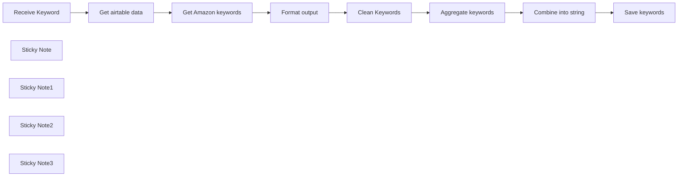

## Fluxo (.json) :

```json
{
  "id": "kJMoiGRorIlsTYZv",
  "meta": {
    "instanceId": "558d88703fb65b2d0e44613bc35916258b0f0bf983c5d4730c00c424b77ca36a",
    "templateCredsSetupCompleted": true
  },
  "name": "Amazon keywords",
  "tags": [],
  "nodes": [
    {
      "id": "ac4b8cad-b8a3-4cc0-a848-1b6976c1d78a",
      "name": "Clean Keywords",
      "type": "n8n-nodes-base.set",
      "position": [
        380,
        620
      ],
      "parameters": {
        "options": {
          "ignoreConversionErrors": true
        },
        "assignments": {
          "assignments": [
            {
              "id": "fb95058f-0c20-4249-8a45-7b935fde1874",
              "name": "Keywords",
              "type": "array",
              "value": "={{ $json.value }}"
            }
          ]
        }
      },
      "typeVersion": 3.3
    },
    {
      "id": "62575572-e4d2-43e8-9339-d4737961883e",
      "name": "Get airtable data",
      "type": "n8n-nodes-base.airtable",
      "position": [
        -220,
        620
      ],
      "parameters": {
        "id": "={{ $json.query.q }}",
        "base": {
          "__rl": true,
          "mode": "list",
          "value": "appGZ14ny5J2PYbq8",
          "cachedResultUrl": "https://airtable.com/appGZ14ny5J2PYbq8",
          "cachedResultName": "Amazon keyword"
        },
        "table": {
          "__rl": true,
          "mode": "list",
          "value": "tblvK8Nq4Jqb2Ubun",
          "cachedResultUrl": "https://airtable.com/appGZ14ny5J2PYbq8/tblvK8Nq4Jqb2Ubun",
          "cachedResultName": "Table 1"
        },
        "options": {}
      },
      "credentials": {
        "airtableTokenApi": {
          "id": "FV1F34pRcGoKZ8GY",
          "name": "Airtable Personal Access Token account"
        }
      },
      "typeVersion": 2.1
    },
    {
      "id": "e165df91-c212-4c47-8b79-2e637d0fcb7b",
      "name": "Get Amazon keywords",
      "type": "n8n-nodes-base.httpRequest",
      "position": [
        0,
        620
      ],
      "parameters": {
        "url": "=https://completion.amazon.com/api/2017/suggestions?mid=ATVPDKIKX0DER&alias=aps&prefix={{ $json.Keyword }}",
        "options": {}
      },
      "typeVersion": 4.1
    },
    {
      "id": "49fca0c4-7d1b-4369-9274-2c0b2bb81c8b",
      "name": "Format output",
      "type": "n8n-nodes-base.splitOut",
      "position": [
        200,
        620
      ],
      "parameters": {
        "options": {},
        "fieldToSplitOut": "suggestions"
      },
      "typeVersion": 1
    },
    {
      "id": "cb00c467-49dd-4504-b5bb-d512baf55bfd",
      "name": "Aggregate keywords",
      "type": "n8n-nodes-base.aggregate",
      "position": [
        600,
        620
      ],
      "parameters": {
        "options": {},
        "fieldsToAggregate": {
          "fieldToAggregate": [
            {
              "fieldToAggregate": "Keywords"
            }
          ]
        }
      },
      "typeVersion": 1
    },
    {
      "id": "0b04d232-488d-4420-b991-d12b511d5fde",
      "name": "Combine into string",
      "type": "n8n-nodes-base.code",
      "position": [
        800,
        620
      ],
      "parameters": {
        "jsCode": "return [{\n  json: {\n    keywords: items[0].json.Keywords.join(\", \")\n  }\n}];"
      },
      "typeVersion": 2
    },
    {
      "id": "dae32617-6d15-4f30-a27f-894787c137e2",
      "name": "Save keywords",
      "type": "n8n-nodes-base.airtable",
      "position": [
        1000,
        620
      ],
      "parameters": {
        "base": {
          "__rl": true,
          "mode": "list",
          "value": "appGZ14ny5J2PYbq8",
          "cachedResultUrl": "https://airtable.com/appGZ14ny5J2PYbq8",
          "cachedResultName": "Amazon keyword"
        },
        "table": {
          "__rl": true,
          "mode": "list",
          "value": "tblvK8Nq4Jqb2Ubun",
          "cachedResultUrl": "https://airtable.com/appGZ14ny5J2PYbq8/tblvK8Nq4Jqb2Ubun",
          "cachedResultName": "Table 1"
        },
        "columns": {
          "value": {
            "id": "={{ $('Get airtable data').item.json.id }}",
            "Keyword output": "={{ $json.keywords }}"
          },
          "schema": [
            {
              "id": "id",
              "type": "string",
              "display": true,
              "removed": false,
              "readOnly": true,
              "required": false,
              "displayName": "id",
              "defaultMatch": true
            },
            {
              "id": "Keyword",
              "type": "string",
              "display": true,
              "removed": false,
              "readOnly": false,
              "required": false,
              "displayName": "Keyword",
              "defaultMatch": false,
              "canBeUsedToMatch": true
            },
            {
              "id": "Trigger",
              "type": "string",
              "display": true,
              "removed": true,
              "readOnly": true,
              "required": false,
              "displayName": "Trigger",
              "defaultMatch": false,
              "canBeUsedToMatch": true
            },
            {
              "id": "Keyword output",
              "type": "string",
              "display": true,
              "removed": false,
              "readOnly": false,
              "required": false,
              "displayName": "Keyword output",
              "defaultMatch": false,
              "canBeUsedToMatch": true
            }
          ],
          "mappingMode": "defineBelow",
          "matchingColumns": [
            "id"
          ]
        },
        "options": {},
        "operation": "update"
      },
      "credentials": {
        "airtableTokenApi": {
          "id": "FV1F34pRcGoKZ8GY",
          "name": "Airtable Personal Access Token account"
        }
      },
      "typeVersion": 2.1
    },
    {
      "id": "aa451c9b-cfc7-4a9a-9ab5-1e6690039eb6",
      "name": "Receive Keyword",
      "type": "n8n-nodes-base.webhook",
      "position": [
        -460,
        620
      ],
      "webhookId": "e1df17af-e8b8-4261-ba45-aba7106c65bd",
      "parameters": {
        "path": "e1df17af-e8b8-4261-ba45-aba7106c65bd",
        "options": {},
        "responseMode": "lastNode"
      },
      "typeVersion": 1.1
    },
    {
      "id": "8dc19b86-ac56-487d-9678-04c9f8306786",
      "name": "Sticky Note",
      "type": "n8n-nodes-base.stickyNote",
      "position": [
        -560,
        140
      ],
      "parameters": {
        "width": 589.0376569037658,
        "height": 163.2468619246862,
        "content": "## How to build your own Amazon keywords tool with n8n (For free and no coding)\n\nThis workflow gives you Amazon keywords for your Amazon FBA business.\n\n[💡 You can read more about this workflow here](https://rumjahn.com/how-to-build-your-own-amazon-keywords-tool-with-n8n-for-free-and-no-coding/)"
      },
      "typeVersion": 1
    },
    {
      "id": "c1341984-f1a7-4c7e-8a23-46adea6d2afe",
      "name": "Sticky Note1",
      "type": "n8n-nodes-base.stickyNote",
      "position": [
        -520,
        420
      ],
      "parameters": {
        "color": 4,
        "width": 239.99999999999977,
        "height": 389.08073541167073,
        "content": "## Send keywords \nYou need to send the workflow a keyword through webhook. You can get my airtable example to see how to send keyword.\n[Download airtable here.](https://airtable.com/invite/l?inviteId=invgv9FzNB258bm5Z&inviteToken=6f820e142d3324318254c1768fa57809b3ef0bcb7212ea27730fd2d140c69ad5&utm_medium=email&utm_source=product_team&utm_content=transactional-alerts)"
      },
      "typeVersion": 1
    },
    {
      "id": "17c13b36-a350-4031-bb9b-a6f8dabd1b90",
      "name": "Sticky Note2",
      "type": "n8n-nodes-base.stickyNote",
      "position": [
        -60,
        418.41726618705036
      ],
      "parameters": {
        "color": 6,
        "width": 218.65707434052769,
        "height": 386.2350119904079,
        "content": "## Send to Amazon\nAmazon has a completion API that gives you keyword data."
      },
      "typeVersion": 1
    },
    {
      "id": "3deef28b-90b9-4357-a46d-78d750126b65",
      "name": "Sticky Note3",
      "type": "n8n-nodes-base.stickyNote",
      "position": [
        960,
        400
      ],
      "parameters": {
        "color": 4,
        "width": 181.6626698641084,
        "height": 389.08073541167073,
        "content": "## Save keywords \nDownload my airtable example to save the keywords.\n[Download airtable here.](https://airtable.com/invite/l?inviteId=invgv9FzNB258bm5Z&inviteToken=6f820e142d3324318254c1768fa57809b3ef0bcb7212ea27730fd2d140c69ad5&utm_medium=email&utm_source=product_team&utm_content=transactional-alerts)"
      },
      "typeVersion": 1
    }
  ],
  "active": false,
  "pinData": {},
  "settings": {
    "executionOrder": "v1"
  },
  "versionId": "6db9ae9c-6c1f-48e0-8bb0-b18db21809bf",
  "connections": {
    "Format output": {
      "main": [
        [
          {
            "node": "Clean Keywords",
            "type": "main",
            "index": 0
          }
        ]
      ]
    },
    "Clean Keywords": {
      "main": [
        [
          {
            "node": "Aggregate keywords",
            "type": "main",
            "index": 0
          }
        ]
      ]
    },
    "Receive Keyword": {
      "main": [
        [
          {
            "node": "Get airtable data",
            "type": "main",
            "index": 0
          }
        ]
      ]
    },
    "Get airtable data": {
      "main": [
        [
          {
            "node": "Get Amazon keywords",
            "type": "main",
            "index": 0
          }
        ]
      ]
    },
    "Aggregate keywords": {
      "main": [
        [
          {
            "node": "Combine into string",
            "type": "main",
            "index": 0
          }
        ]
      ]
    },
    "Combine into string": {
      "main": [
        [
          {
            "node": "Save keywords",
            "type": "main",
            "index": 0
          }
        ]
      ]
    },
    "Get Amazon keywords": {
      "main": [
        [
          {
            "node": "Format output",
            "type": "main",
            "index": 0
          }
        ]
      ]
    }
  }
}
```

<a id="template-1219"></a>

## Template 1219 - Avaliação automatizada de currículos

- **Nome:** Avaliação automatizada de currículos
- **Descrição:** Fluxo que recebe currículos via formulário, extrai informações relevantes do PDF, gera um resumo profissional, avalia compatibilidade com um perfil desejado e registra os resultados em uma planilha.
- **Funcionalidade:** • Captura de submissão via formulário: Recebe nome, e-mail e arquivo de currículo em PDF.
• Armazenamento dos uploads: Salva o arquivo do candidato em armazenamento em nuvem com nome padronizado.
• Extração de texto do PDF: Converte o currículo em texto para posterior análise.
• Extração de informações pessoais: Identifica nome, e-mail, telefone, cidade, data de nascimento, LinkedIn, site e resumo pessoal.
• Extração de qualificações: Obtém histórico educacional, experiências de trabalho e lista de habilidades (formato de tópicos).
• Consolidação dos dados: Une as informações extraídas em um formato estruturado.
• Sumário profissional: Gera um resumo conciso e profissional (até ~100 palavras) do candidato.
• Avaliação de compatibilidade: Compara o perfil resumido com o perfil desejado e atribui uma nota de 1 a 10 com justificativa.
• Registro em planilha: Anexa os dados extraídos, a nota e a consideração em uma planilha para acompanhamento.
- **Ferramentas:** • Google Drive: Armazenamento dos arquivos de currículo enviados.
• Google Sheets: Armazenamento e registro estruturado dos dados extraídos e avaliações dos candidatos.
• OpenAI (modelos de linguagem): Extração de informações, geração de resumos e avaliação/justificativa da compatibilidade do candidato com o perfil desejado.

## Fluxo visual

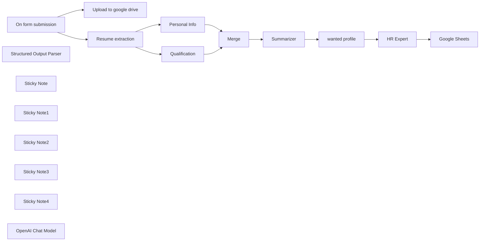

## Fluxo (.json) :

```json
{
  "id": "IO0OrQ6ao4vm9urI",
  "meta": {
    "instanceId": "0d6ec6d73242e93a616bed7dc657bb92fd6b05466b19318f83d18293848e971a",
    "templateCredsSetupCompleted": true
  },
  "name": "Automated Resume Review System Using OpenAI + Google Sheets",
  "tags": [],
  "nodes": [
    {
      "id": "8585c01d-f26c-453e-a705-7783b3a28a46",
      "name": "On form submission",
      "type": "n8n-nodes-base.formTrigger",
      "position": [
        -780,
        180
      ],
      "webhookId": "6ea62ea0-de12-4134-b646-121474b3b846",
      "parameters": {
        "options": {
          "ignoreBots": true,
          "appendAttribution": false
        },
        "formTitle": "Submit your CV",
        "formFields": {
          "values": [
            {
              "fieldLabel": "First name",
              "placeholder": "First Name",
              "requiredField": true
            },
            {
              "fieldLabel": "Last Name",
              "placeholder": "Last Name",
              "requiredField": true
            },
            {
              "fieldType": "email",
              "fieldLabel": "Email",
              "placeholder": "Email",
              "requiredField": true
            },
            {
              "fieldType": "file",
              "fieldLabel": "Resume",
              "requiredField": true,
              "acceptFileTypes": "=.pdf"
            }
          ]
        }
      },
      "typeVersion": 2.2
    },
    {
      "id": "d7acbd9b-f24a-4801-9a00-94308df9a55e",
      "name": "Merge",
      "type": "n8n-nodes-base.merge",
      "position": [
        540,
        140
      ],
      "parameters": {
        "mode": "combine",
        "options": {},
        "combineBy": "combineAll"
      },
      "typeVersion": 3
    },
    {
      "id": "68f1cb96-fca5-473b-b79c-707682206135",
      "name": "Structured Output Parser",
      "type": "@n8n/n8n-nodes-langchain.outputParserStructured",
      "position": [
        1600,
        340
      ],
      "parameters": {
        "schemaType": "manual",
        "inputSchema": "{\n  \"type\": \"object\",\n  \"properties\": {\n    \"vote\": {\n      \"type\": \"string\"\n    },\n    \"consideration\": {\n      \"type\": \"string\"\n    }\n  }\n}\n"
      },
      "typeVersion": 1.2
    },
    {
      "id": "04b20070-141a-466c-87d3-7de4323f83df",
      "name": "Google Sheets",
      "type": "n8n-nodes-base.googleSheets",
      "position": [
        1900,
        120
      ],
      "parameters": {
        "columns": {
          "value": {
            "DOB": "={{ $('Merge').item.json.output.birthdate }}",
            "City": "={{ $('Merge').item.json.output.city }}",
            "Vote": "={{ $json.output.vote }}",
            "Email": "={{ $('Merge').item.json.output.email }}",
            "Skills": "={{ $('Merge').item.json.output.Skills }}",
            "Website": "={{ $('Merge').item.json.output.website }}",
            "Last Name": "={{ $('Merge').item.json.output.last_name }}",
            "Experience": "={{ $('Merge').item.json.output['Job History'] }}",
            "First Name": "={{ $('Merge').item.json.output.first_name }}",
            "Applied Date": "={{ $now.format('MM-dd-yyyy') }}",
            "Education Qualification": "={{ $('Merge').item.json.output['Educational Qualification'] }}"
          },
          "schema": [
            {
              "id": "First Name",
              "type": "string",
              "display": true,
              "required": false,
              "displayName": "First Name",
              "defaultMatch": false,
              "canBeUsedToMatch": true
            },
            {
              "id": "Last Name",
              "type": "string",
              "display": true,
              "required": false,
              "displayName": "Last Name",
              "defaultMatch": false,
              "canBeUsedToMatch": true
            },
            {
              "id": "City",
              "type": "string",
              "display": true,
              "required": false,
              "displayName": "City",
              "defaultMatch": false,
              "canBeUsedToMatch": true
            },
            {
              "id": "Phone number",
              "type": "string",
              "display": true,
              "removed": false,
              "required": false,
              "displayName": "Phone number",
              "defaultMatch": false,
              "canBeUsedToMatch": true
            },
            {
              "id": "Email",
              "type": "string",
              "display": true,
              "required": false,
              "displayName": "Email",
              "defaultMatch": false,
              "canBeUsedToMatch": true
            },
            {
              "id": "LinkedIn",
              "type": "string",
              "display": true,
              "removed": false,
              "required": false,
              "displayName": "LinkedIn",
              "defaultMatch": false,
              "canBeUsedToMatch": true
            },
            {
              "id": "Website",
              "type": "string",
              "display": true,
              "required": false,
              "displayName": "Website",
              "defaultMatch": false,
              "canBeUsedToMatch": true
            },
            {
              "id": "DOB",
              "type": "string",
              "display": true,
              "required": false,
              "displayName": "DOB",
              "defaultMatch": false,
              "canBeUsedToMatch": true
            },
            {
              "id": "Education Qualification",
              "type": "string",
              "display": true,
              "required": false,
              "displayName": "Education Qualification",
              "defaultMatch": false,
              "canBeUsedToMatch": true
            },
            {
              "id": "Experience",
              "type": "string",
              "display": true,
              "required": false,
              "displayName": "Experience",
              "defaultMatch": false,
              "canBeUsedToMatch": true
            },
            {
              "id": "Skills",
              "type": "string",
              "display": true,
              "required": false,
              "displayName": "Skills",
              "defaultMatch": false,
              "canBeUsedToMatch": true
            },
            {
              "id": "Vote",
              "type": "string",
              "display": true,
              "required": false,
              "displayName": "Vote",
              "defaultMatch": false,
              "canBeUsedToMatch": true
            },
            {
              "id": "Consideration",
              "type": "string",
              "display": true,
              "removed": false,
              "required": false,
              "displayName": "Consideration",
              "defaultMatch": false,
              "canBeUsedToMatch": true
            },
            {
              "id": "Applied Date",
              "type": "string",
              "display": true,
              "removed": false,
              "required": false,
              "displayName": "Applied Date",
              "defaultMatch": false,
              "canBeUsedToMatch": true
            }
          ],
          "mappingMode": "defineBelow",
          "matchingColumns": [],
          "attemptToConvertTypes": false,
          "convertFieldsToString": false
        },
        "options": {},
        "operation": "append",
        "sheetName": {
          "__rl": true,
          "mode": "list",
          "value": "gid=0",
          "cachedResultUrl": "https://docs.google.com/spreadsheets/d/1tmg5CW1d3ZNVJ98hODs24RLGyKul98cAtVHULLNDAyU/edit#gid=0",
          "cachedResultName": "Sheet1"
        },
        "documentId": {
          "__rl": true,
          "mode": "list",
          "value": "1tmg5CW1d3ZNVJ98hODs24RLGyKul98cAtVHULLNDAyU",
          "cachedResultUrl": "https://docs.google.com/spreadsheets/d/1tmg5CW1d3ZNVJ98hODs24RLGyKul98cAtVHULLNDAyU/edit?usp=drivesdk",
          "cachedResultName": "HR New"
        }
      },
      "credentials": {
        "googleSheetsOAuth2Api": {
          "id": "d63Esv5UOI7IgJEf",
          "name": "Google Sheets account 2"
        }
      },
      "typeVersion": 4.5
    },
    {
      "id": "dab7587f-890d-4571-b03d-1a2948baa91c",
      "name": "Personal Info",
      "type": "@n8n/n8n-nodes-langchain.informationExtractor",
      "position": [
        -140,
        80
      ],
      "parameters": {
        "text": "={{ $json.text }}",
        "options": {},
        "schemaType": "manual",
        "inputSchema": "{\n  \"type\": \"object\",\n  \"properties\": {\n    \"first_name\": {\n      \"type\": \"string\"\n    },\n    \"last_name\": {\n      \"type\": \"string\"\n    },\n    \"email\": {\n      \"type\": \"string\"\n    },\n    \"telephone\": {\n      \"type\": \"string\"\n    },\n    \"city\": {\n      \"type\": \"string\"\n    },\n    \"birthdate\": {\n      \"type\": \"string\"\n    },\n    \"linkedin\": {\n      \"type\": \"string\"\n    },\n    \"website\": {\n      \"type\": \"string\"\n    },\n    \"summary\": {\n      \"type\": \"string\"\n    }\n  }\n}\n"
      },
      "typeVersion": 1
    },
    {
      "id": "5c815337-80c4-4332-9179-77c0a446c205",
      "name": "Qualification",
      "type": "@n8n/n8n-nodes-langchain.informationExtractor",
      "position": [
        -140,
        320
      ],
      "parameters": {
        "text": "={{ $json.text }}",
        "options": {
          "systemPromptTemplate": "You are an expert extraction algorithm.\nOnly extract relevant information from the text.\nIf you do not know the value of an attribute asked to extract, you may omit the attribute's value."
        },
        "attributes": {
          "attributes": [
            {
              "name": "Educational Qualification",
              "required": true,
              "description": "Summary of your academic career. Focus on your high school and university studies. Summarize in 100 words maximum and also include your grade if applicable."
            },
            {
              "name": "Job History",
              "required": true,
              "description": "Work history summary. Focus on your most recent work experiences. Summarize in 100 words maximum"
            },
            {
              "name": "Skills",
              "required": true,
              "description": "Extract the candidate’s technical skills. What software and frameworks they are proficient in. Make a bulleted list."
            }
          ]
        }
      },
      "typeVersion": 1
    },
    {
      "id": "ad245152-b1cc-4dcd-b9bc-c8ec8a592115",
      "name": "HR Expert",
      "type": "@n8n/n8n-nodes-langchain.chainLlm",
      "position": [
        1500,
        120
      ],
      "parameters": {
        "text": "=Profile:\n{{ $json['wanted-profile'] }}\n\nCandidate:{{ $('Summarizer').item.json.response.text }}",
        "messages": {
          "messageValues": [
            {
              "message": "=You are an HR expert, and your task is to determine whether a candidate aligns with the company's desired profile. You must assign a rating from 1 to 10, where 1 means the candidate does not meet the requirements, while 10 means the candidate is the perfect match for the role. Additionally, in the \"consideration\" field, explain the reasoning behind the given score."
            }
          ]
        },
        "promptType": "define",
        "hasOutputParser": true
      },
      "typeVersion": 1.5
    },
    {
      "id": "86a37824-a3d0-4199-bb2d-c7608d65f6de",
      "name": "Sticky Note",
      "type": "n8n-nodes-base.stickyNote",
      "position": [
        -820,
        -140
      ],
      "parameters": {
        "width": 500,
        "height": 660,
        "content": "## Submission, Saving to Google Drive & Extraction\n\n**Captures user info from the form.**\n**Uploads resume to Google Drive.**\n**Extracts data from the PDF (resume).**"
      },
      "typeVersion": 1
    },
    {
      "id": "6a42aedf-e2a0-44fc-ae02-00d25ab56a91",
      "name": "Sticky Note1",
      "type": "n8n-nodes-base.stickyNote",
      "position": [
        -300,
        -140
      ],
      "parameters": {
        "color": 7,
        "width": 560,
        "height": 660,
        "content": "## Extraction (Personal Info & Qualification)\n\n**Extracts personal details (name, city, etc.).**\n**Retrieves educational qualifications and job history.**"
      },
      "typeVersion": 1
    },
    {
      "id": "17134f76-322d-4621-ab85-340d1f9ea115",
      "name": "Sticky Note2",
      "type": "n8n-nodes-base.stickyNote",
      "position": [
        280,
        -140
      ],
      "parameters": {
        "color": 5,
        "width": 1120,
        "height": 660,
        "content": "## Merge & Summarization\n\n**Merges extracted information.**\n**Generates a concise professional summary.**\n\n"
      },
      "typeVersion": 1
    },
    {
      "id": "cf09a615-65dc-4c4d-8419-f05cadeb9405",
      "name": "Sticky Note3",
      "type": "n8n-nodes-base.stickyNote",
      "position": [
        1420,
        -140
      ],
      "parameters": {
        "color": 4,
        "width": 640,
        "height": 660,
        "content": "## Voting, Consideration & Google Sheets\n\n**HR expert reviews and analyzes the summary.\n\nAssigns a rating (1-10) and provides hiring insights.\n\nAppends all details to Google Sheets for record-keeping.**\n\n"
      },
      "typeVersion": 1
    },
    {
      "id": "ee76a66a-ce2a-4a4f-8c57-0cc48b8f7dcb",
      "name": "Sticky Note4",
      "type": "n8n-nodes-base.stickyNote",
      "position": [
        -1960,
        -140
      ],
      "parameters": {
        "color": 2,
        "width": 1060,
        "height": 660,
        "content": "# Automated Resume Processing & Evaluation System\n\n**This workflow streamlines the process of handling resume submissions, extracting key details, summarizing qualifications, and aiding HR in the decision-making process.**\n\n## 1. Submission, Saving to Google Drive & Extraction\n**The user submits a resume via a form.\nThe system saves the uploaded file to Google Drive for record-keeping.\nAI-powered text extraction retrieves personal details, qualifications, and job history from the document.**\n\n## 2. Extraction (Personal Info & Qualification)\n**The workflow identifies and extracts key details such as the candidate’s name, contact information, and location.\nIt scans for educational background, certifications, and past work experiences.**\n\n## 3. Merge & Summarization\n**The extracted data is merged into a structured format.\nA concise summary is generated, highlighting the candidate’s most relevant qualifications and experiences.**\n\n## 4. Voting, Consideration & Google Sheets\n**HR reviews the summarized profile and assigns a rating (1-10).\nHiring insights and comments are recorded for evaluation.\nAll processed data, including extracted details and review scores, are appended to a Google Sheet for tracking and further consideration.**\n\n"
      },
      "typeVersion": 1
    },
    {
      "id": "51e5290b-fadd-4f7c-99fc-8bfd54a1ee27",
      "name": "Upload to google drive",
      "type": "n8n-nodes-base.googleDrive",
      "position": [
        -440,
        100
      ],
      "parameters": {
        "name": "=Resume-{{ $now.format('yyyyLLdd') }}-{{ $json.Resume[0].filename }}",
        "driveId": {
          "__rl": true,
          "mode": "list",
          "value": "My Drive"
        },
        "options": {},
        "folderId": {
          "__rl": true,
          "mode": "list",
          "value": "root",
          "cachedResultName": "/ (Root folder)"
        },
        "inputDataFieldName": "Resume"
      },
      "credentials": {
        "googleDriveOAuth2Api": {
          "id": "Z5vnQSvmzFvtqQeL",
          "name": "Google Drive account"
        }
      },
      "typeVersion": 3
    },
    {
      "id": "b69e22ba-ab56-4199-830a-4d74fd8c8e74",
      "name": "Resume extraction",
      "type": "n8n-nodes-base.extractFromFile",
      "position": [
        -440,
        260
      ],
      "parameters": {
        "options": {},
        "operation": "pdf",
        "binaryPropertyName": "Resume"
      },
      "typeVersion": 1
    },
    {
      "id": "653d83ad-309f-4e09-acf5-e7d0a1890e1e",
      "name": "wanted profile",
      "type": "n8n-nodes-base.set",
      "position": [
        1240,
        120
      ],
      "parameters": {
        "options": {},
        "assignments": {
          "assignments": [
            {
              "id": "8b812d8f-87d6-46e2-855a-b465c1248c2d",
              "name": "wanted-profile",
              "type": "string",
              "value": "We are a web agency looking for an Automation Expert skilled in workflow automation, API integrations, and AI-driven process optimization. The ideal candidate should have expertise in n8n, Python, and JavaScript, with a strong understanding of automation tools and webhooks. Experience in building custom automations for businesses is required.  Requirements:  Proficiency in n8n, Python, and JavaScript Experience in workflow automation, API integrations, and AI agents Ability to optimize business processes through automation Prior experience in the automation industry Must be based in Northern Italy If you have a passion for automation and want to work with a forward-thinking agency, we'd love to hear from you!"
            }
          ]
        }
      },
      "typeVersion": 3.4
    },
    {
      "id": "9ed47811-30d8-48e7-a05e-e5213f0e0526",
      "name": "Summarizer",
      "type": "@n8n/n8n-nodes-langchain.chainSummarization",
      "position": [
        840,
        120
      ],
      "parameters": {
        "options": {
          "summarizationMethodAndPrompts": {
            "values": {
              "prompt": "=Write a concise summary of the following:\nFirst name:{{ $json.output.first_name }}\nLast name:{{ $json.output.last_name }}\nCity: {{ $json.output.city }}\nEducational Qualification:{{ $json.output['Educational Qualification'] }}\nPrevious experience:{{ $json.output['Job History'] }}\nSkills:{{ $json.output.Skills }}\nApplied date:{{$now.format('yyyy-MM-dd')}}\n\nWrite a concise Summary and summary of 100 words or less. Be concise and professional.\n\n",
              "combineMapPrompt": "=Write a concise summary of the following:\nFirst name:{{ $json.output.first_name }}\nLast name:{{ $json.output.last_name }}\nCity: {{ $json.output.city }}\nEducational Qualification:{{ $json.output['Educational Qualification'] }}\nPrevious experience:{{ $json.output['Job History'] }}\nSkills:{{ $json.output.Skills }}\nApplied date:{{$now.format('yyyy-MM-dd')}}\n\nWrite a concise Summary and summary of 100 words or less. Be concise and professional.\n\n"
            }
          }
        }
      },
      "typeVersion": 2
    },
    {
      "id": "56329dd0-53e2-4617-ba54-c91e9f96d6ca",
      "name": "OpenAI Chat Model",
      "type": "@n8n/n8n-nodes-langchain.lmChatOpenAi",
      "position": [
        860,
        400
      ],
      "parameters": {
        "model": {
          "__rl": true,
          "mode": "list",
          "value": "gpt-4o-mini"
        },
        "options": {}
      },
      "credentials": {
        "openAiApi": {
          "id": "n2UwuicTmLclqMaY",
          "name": "OpenAi account 2"
        }
      },
      "typeVersion": 1.2
    }
  ],
  "active": false,
  "pinData": {},
  "settings": {
    "executionOrder": "v1"
  },
  "versionId": "24ebf6c2-c041-4dc0-8fec-5728f86625f1",
  "connections": {
    "Merge": {
      "main": [
        [
          {
            "node": "Summarizer",
            "type": "main",
            "index": 0
          }
        ]
      ]
    },
    "HR Expert": {
      "main": [
        [
          {
            "node": "Google Sheets",
            "type": "main",
            "index": 0
          }
        ]
      ]
    },
    "Summarizer": {
      "main": [
        [
          {
            "node": "wanted profile",
            "type": "main",
            "index": 0
          }
        ]
      ]
    },
    "Personal Info": {
      "main": [
        [
          {
            "node": "Merge",
            "type": "main",
            "index": 1
          }
        ]
      ]
    },
    "Qualification": {
      "main": [
        [
          {
            "node": "Merge",
            "type": "main",
            "index": 0
          }
        ]
      ]
    },
    "wanted profile": {
      "main": [
        [
          {
            "node": "HR Expert",
            "type": "main",
            "index": 0
          }
        ]
      ]
    },
    "OpenAI Chat Model": {
      "ai_languageModel": [
        [
          {
            "node": "Qualification",
            "type": "ai_languageModel",
            "index": 0
          },
          {
            "node": "Personal Info",
            "type": "ai_languageModel",
            "index": 0
          },
          {
            "node": "Summarizer",
            "type": "ai_languageModel",
            "index": 0
          },
          {
            "node": "HR Expert",
            "type": "ai_languageModel",
            "index": 0
          }
        ]
      ]
    },
    "Resume extraction": {
      "main": [
        [
          {
            "node": "Personal Info",
            "type": "main",
            "index": 0
          },
          {
            "node": "Qualification",
            "type": "main",
            "index": 0
          }
        ]
      ]
    },
    "On form submission": {
      "main": [
        [
          {
            "node": "Upload to google drive",
            "type": "main",
            "index": 0
          },
          {
            "node": "Resume extraction",
            "type": "main",
            "index": 0
          }
        ]
      ]
    },
    "Structured Output Parser": {
      "ai_outputParser": [
        [
          {
            "node": "HR Expert",
            "type": "ai_outputParser",
            "index": 0
          }
        ]
      ]
    }
  }
}
```

<a id="template-1220"></a>

## Template 1220 - Criação e atualização de tarefa

- **Nome:** Criação e atualização de tarefa
- **Descrição:** Automatiza a criação de uma tarefa no Microsoft To Do, atualiza seu estado para em andamento e obtém os detalhes da tarefa.
- **Funcionalidade:** • Início manual: Permite acionar o fluxo manualmente para executar a sequência.
• Criação de tarefa: Cria uma nova tarefa com título definido e importância alta na lista especificada.
• Atualização de tarefa: Atualiza a tarefa criada, alterando seu status para em andamento.
• Recuperação de tarefa: Obtém os detalhes da tarefa após a atualização.
- **Ferramentas:** • Microsoft To Do: Serviço de gerenciamento de tarefas usado para criar, atualizar e recuperar tarefas.
• Autenticação Microsoft OAuth 2.0: Provedor de autenticação que permite acesso seguro à conta e às APIs do Microsoft To Do.

## Fluxo visual

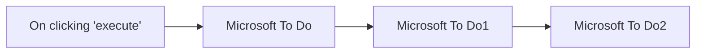

## Fluxo (.json) :

```json
{
  "nodes": [
    {
      "name": "On clicking 'execute'",
      "type": "n8n-nodes-base.manualTrigger",
      "position": [
        250,
        200
      ],
      "parameters": {},
      "typeVersion": 1
    },
    {
      "name": "Microsoft To Do",
      "type": "n8n-nodes-base.microsoftToDo",
      "position": [
        450,
        200
      ],
      "parameters": {
        "title": "Document Microsoft To Do node",
        "operation": "create",
        "taskListId": "AQMkADAwATNiZmYAZC0zOTkAMy02ZWZjLTAwAi0wMAoALgAAA3i1fHMTrftIhQBzhywL64UBAFB0wRiJW1FJmmlvlAkVFQA-AAACARIAAAA=",
        "additionalFields": {
          "importance": "high"
        }
      },
      "credentials": {
        "microsoftToDoOAuth2Api": "Microsoft OAuth Credentials"
      },
      "typeVersion": 1
    },
    {
      "name": "Microsoft To Do1",
      "type": "n8n-nodes-base.microsoftToDo",
      "position": [
        650,
        200
      ],
      "parameters": {
        "taskId": "={{$json[\"id\"]}}",
        "operation": "update",
        "taskListId": "={{$node[\"Microsoft To Do\"].parameter[\"taskListId\"]}}",
        "updateFields": {
          "status": "inProgress"
        }
      },
      "credentials": {
        "microsoftToDoOAuth2Api": "Microsoft OAuth Credentials"
      },
      "typeVersion": 1
    },
    {
      "name": "Microsoft To Do2",
      "type": "n8n-nodes-base.microsoftToDo",
      "position": [
        850,
        200
      ],
      "parameters": {
        "taskId": "={{$json[\"id\"]}}",
        "taskListId": "={{$node[\"Microsoft To Do\"].parameter[\"taskListId\"]}}"
      },
      "credentials": {
        "microsoftToDoOAuth2Api": "Microsoft OAuth Credentials"
      },
      "typeVersion": 1
    }
  ],
  "connections": {
    "Microsoft To Do": {
      "main": [
        [
          {
            "node": "Microsoft To Do1",
            "type": "main",
            "index": 0
          }
        ]
      ]
    },
    "Microsoft To Do1": {
      "main": [
        [
          {
            "node": "Microsoft To Do2",
            "type": "main",
            "index": 0
          }
        ]
      ]
    },
    "On clicking 'execute'": {
      "main": [
        [
          {
            "node": "Microsoft To Do",
            "type": "main",
            "index": 0
          }
        ]
      ]
    }
  }
}
```
