# PACK 1999 TEMPLATES PARTE 07 - Bloco 2

Templates neste bloco: 20

## Sumário

- [Template 1221 - Automação de pesquisa de palavras-chave SEO com IA](#template-1221)
- [Template 1222 - Busca de empresa por nome](#template-1222)
- [Template 1223 - Salvar anexos do Gmail no Drive e registrar dados em Sheets](#template-1223)
- [Template 1224 - Triagem e agendamento de candidatos com IA](#template-1224)
- [Template 1225 - Leitura de configuração do Standup Bot](#template-1225)
- [Template 1226 - Citações automáticas para File Retrieval (RAG)](#template-1226)
- [Template 1227 - Análise de sentimento de comentários do YouTube](#template-1227)
- [Template 1228 - Geração de blueprint SEO para página de serviço](#template-1228)
- [Template 1229 - Sincronização do Google Sheets com Postgres](#template-1229)
- [Template 1230 - Clonar workflows entre instâncias via API](#template-1230)
- [Template 1231 - Enviar faturas do Clockify para o Notion](#template-1231)
- [Template 1232 - Agente conversacional com pesquisa e memória](#template-1232)
- [Template 1233 - Gerar cartões Trello diários do calendário](#template-1233)
- [Template 1234 - Chamar modelos LLM configuráveis via OpenRouter](#template-1234)
- [Template 1235 - Raspagem visual com AI e Google Sheets](#template-1235)
- [Template 1236 - Responder chat com Mistral-7B-Instruct](#template-1236)
- [Template 1237 - Chat com assistente e memória de sessão](#template-1237)
- [Template 1238 - Extrair texto de PDF/imagem para CSV com AI](#template-1238)
- [Template 1239 - Envio condicional de Tweet](#template-1239)
- [Template 1240 - Agente de chat com consulta de clima e pesquisa](#template-1240)

---

<a id="template-1221"></a>

## Template 1221 - Automação de pesquisa de palavras-chave SEO com IA

- **Nome:** Automação de pesquisa de palavras-chave SEO com IA
- **Descrição:** Automatiza a geração e análise de pesquisa de palavras-chave para conteúdo, combinando sugestões geradas por IA com métricas de mercado e análise de concorrentes, e salvando o resultado como um briefing acionável.
- **Funcionalidade:** • Recepção de input: Recebe solicitações de pesquisa (tema, público, tipo de conteúdo, localização, idioma e URLs de concorrentes) via webhook conectado ao banco de dados.
• Notificações e status: Atualiza o status do pedido e envia notificações de início e conclusão para uma equipa via Slack.
• Expansão de tópicos com IA: Gera listas de palavras-chave primárias, variações long-tail, perguntas e tópicos relacionados usando um modelo de linguagem.
• Parser estruturado: Converte a saída da IA para um formato JSON estruturado para processamento posterior.
• Consulta de métricas de mercado: Obtém volume de busca, CPC e dificuldade de palavras-chave para as palavras primárias usando uma API de dados de SEO.
• Análise de concorrentes: Normaliza URLs de concorrentes, consulta palavras-chave rankeadas por URL e executa análise de concorrentes com IA para identificar lacunas e ângulos únicos.
• Agregação e combinação de dados: Consolida resultados da geração de tópicos, métricas e análise de concorrentes em um único conjunto de dados.
• Geração de briefing final: Cria uma estratégia de palavras-chave e briefing de conteúdo acionável usando IA, explicando recomendações e estrutura de conteúdo.
• Armazenamento e atualização: Salva o briefing gerado no banco de dados e marca o pedido como concluído.
- **Ferramentas:** • OpenAI: Modelo de linguagem para gerar listas de palavras-chave, perguntas, tópicos relacionados e análises qualitativas de concorrentes.
• DataForSEO: Fornece métricas de palavras-chave como volume de busca, CPC e dificuldade, além de relatórios de palavras-chave rankeadas por URL.
• NocoDB: Fonte de input e destino para salvar briefings e atualizar o status dos pedidos no banco de dados.
• Slack: Envia notificações de início e conclusão do processo para a equipa responsável.

## Fluxo visual

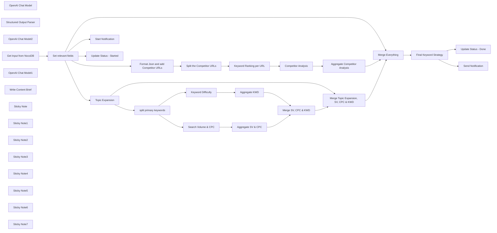

## Fluxo (.json) :

```json
{
  "id": "nGpVbW7RTylKujyT",
  "meta": {
    "instanceId": "dcb7e9805ce8fe33e4ef843b02947aacc9de2ca8e3594435f3a36d9f33df54fc",
    "templateCredsSetupCompleted": true
  },
  "name": "AI powered SEO Keyword Research Automation - The vibe Marketer",
  "tags": [
    {
      "id": "SRzFKUr6fVtmWq2d",
      "name": "works",
      "createdAt": "2025-04-14T11:05:17.062Z",
      "updatedAt": "2025-04-14T11:05:17.062Z"
    }
  ],
  "nodes": [
    {
      "id": "65aacfa5-4891-49f9-a614-2866c96142ee",
      "name": "OpenAI Chat Model",
      "type": "@n8n/n8n-nodes-langchain.lmChatOpenAi",
      "position": [
        88,
        455
      ],
      "parameters": {
        "model": {
          "__rl": true,
          "mode": "list",
          "value": "o1",
          "cachedResultName": "o1"
        },
        "options": {}
      },
      "credentials": {
        "openAiApi": {
          "id": "AZynAxNG099jyj7B",
          "name": "OpenAi account"
        }
      },
      "typeVersion": 1.2
    },
    {
      "id": "5a0445ad-20c9-4e62-8e04-62451d3e8f7e",
      "name": "Structured Output Parser",
      "type": "@n8n/n8n-nodes-langchain.outputParserStructured",
      "position": [
        208,
        455
      ],
      "parameters": {
        "jsonSchemaExample": "{\n  \"primary_keywords\": [\"string\"],\n  \"long_tail_keywords\": [\n    {\n      \"keyword\": \"string\",\n      \"intent\": \"string\"\n    }\n  ],\n  \"question_based_keywords\": [\"string\"],\n  \"related_topics\": [\"string\"]\n}\n"
      },
      "typeVersion": 1.2
    },
    {
      "id": "38cd2c66-d4b7-47a9-a3eb-f58eb32f55ab",
      "name": "Topic Expansion",
      "type": "@n8n/n8n-nodes-langchain.agent",
      "position": [
        60,
        235
      ],
      "parameters": {
        "text": "=I need to create comprehensive SEO keyword research for content about: \n{{ $json.primary_topic }}\n\nMy target audience is: {{ $json.target_audience }}\nThis will be used for a: {{ $json.content_type }}\nLocation: {{ $json.location }}\nLanguage: {{ $json.language }}\n\nPlease generate:\n1. A list of 20 primary keywords directly related to {{ $json.primary_topic }}\n2. 30 long-tail keyword variations with search intent (informational, commercial, transactional)\n3. 15 question-based keywords people might ask about this topic\n4. 10 related topics that could be used for supporting content\n\nFormat the output as a structured JSON with these categories. ",
        "options": {},
        "promptType": "define",
        "hasOutputParser": true
      },
      "typeVersion": 1.8
    },
    {
      "id": "14811f51-5992-4e35-af8d-f05f5b488bc1",
      "name": "Competitor Analysis",
      "type": "@n8n/n8n-nodes-langchain.agent",
      "position": [
        1100,
        660
      ],
      "parameters": {
        "text": "=Analyze the following competitor content for the Primary Topic \"{{ $('Format Json and add Competitor URLs').item.json.primary_topic }}\":\n\nCompetitor: {{ $('Split the Competitor URLs').item.json.competitorUrls }}\nDATA: ```\n{{ $json.tasks[0].result.toJsonString() }}\n```\n\nPlease identify:\n1. Primary keywords they appear to be targeting\n2. Content gaps or missing topics they aren't covering\n3. Unique angles or approaches they're taking\n4. Questions they're answering (or not answering)\n\nFormat the output as a structured analysis. ",
        "options": {},
        "promptType": "define"
      },
      "typeVersion": 1.8
    },
    {
      "id": "564866ac-c287-48a3-816c-78207dfce133",
      "name": "Keyword Difficulty",
      "type": "n8n-nodes-dataforseo.dataForSeo",
      "position": [
        656,
        260
      ],
      "parameters": {
        "keywords": {
          "values": [
            {
              "value": "={{ $json['output.primary_keywords'] }}"
            }
          ]
        },
        "resource": "labs",
        "operation": "get-keyword-difficulty",
        "language_name_required": "={{ $('Set relevant fields').item.json.language }}",
        "location_name_required": "={{ $('Set relevant fields').item.json.location }}"
      },
      "credentials": {
        "dataForSeoApi": {
          "id": "owHrK02rkWLlYrl3",
          "name": "DataForSEO account"
        }
      },
      "typeVersion": 1
    },
    {
      "id": "d39e392c-c547-4edd-8fe9-014c26152915",
      "name": "Search Volume & CPC",
      "type": "n8n-nodes-dataforseo.dataForSeo",
      "position": [
        656,
        60
      ],
      "parameters": {
        "date_to": {},
        "keywords": {
          "values": [
            {
              "value": "={{ $json['output.primary_keywords'] }}"
            }
          ]
        },
        "resource": "keywords_data",
        "date_from": {},
        "language_name": "={{ $('Set relevant fields').item.json.language }}",
        "location_name": "={{ $('Set relevant fields').item.json.location }}"
      },
      "credentials": {
        "dataForSeoApi": {
          "id": "owHrK02rkWLlYrl3",
          "name": "DataForSEO account"
        }
      },
      "typeVersion": 1
    },
    {
      "id": "2985d85c-4373-4f18-9c27-188f19c920a6",
      "name": "split primary keywords",
      "type": "n8n-nodes-base.splitOut",
      "position": [
        440,
        160
      ],
      "parameters": {
        "options": {},
        "fieldToSplitOut": "output.primary_keywords"
      },
      "typeVersion": 1
    },
    {
      "id": "49819332-744d-45a5-b0ed-b74a1a57aad8",
      "name": "OpenAI Chat Model2",
      "type": "@n8n/n8n-nodes-langchain.lmChatOpenAi",
      "position": [
        1920,
        640
      ],
      "parameters": {
        "model": {
          "__rl": true,
          "mode": "list",
          "value": "o1",
          "cachedResultName": "o1"
        },
        "options": {}
      },
      "credentials": {
        "openAiApi": {
          "id": "AZynAxNG099jyj7B",
          "name": "OpenAi account"
        }
      },
      "typeVersion": 1.2
    },
    {
      "id": "07576442-14b1-402a-a084-50fd775d6523",
      "name": "Keyword Ranking per URL",
      "type": "n8n-nodes-dataforseo.dataForSeo",
      "position": [
        880,
        660
      ],
      "parameters": {
        "limit": 10,
        "target": "={{ $json.competitorUrls }}",
        "resource": "labs",
        "operation": "get-ranked-keywords",
        "language_name_required": "={{ $('Format Json and add Competitor URLs').item.json.language }}",
        "location_name_required": "={{ $('Format Json and add Competitor URLs').item.json.location }}"
      },
      "credentials": {
        "dataForSeoApi": {
          "id": "owHrK02rkWLlYrl3",
          "name": "DataForSEO account"
        }
      },
      "typeVersion": 1
    },
    {
      "id": "1e1f4a81-31b9-450d-85ba-65dbe2b6e8c2",
      "name": "Final Keyword Strategy",
      "type": "@n8n/n8n-nodes-langchain.agent",
      "position": [
        1940,
        440
      ],
      "parameters": {
        "text": "=# Role: Act as an expert SEO Strategist and Content Planner.\n\n# Context:\n# You are creating an actionable SEO Keyword Strategy & Content Brief based on prior AI-driven keyword generation and competitor analysis.\n# The goal is content creation for the 'Primary Topic', targeting the specified 'Target Audience' and 'Content Type' in the given 'Location' and 'Language'.\n# Data provided includes initial keyword ideas (primary, long-tail, questions), keyword metrics (volume, difficulty), related topics, and competitor analysis insights (their likely keywords, content gaps, unique angles).\n\n# Input Parameters for this Task:\nPrimary Topic: {{ $json.primary_topic }}\nTarget Audience: {{ $json.target_audience }}\nContent Type: {{ $json.content_type }}\nLocation: {{ $json.location }}\nLanguage: {{ $json.language }}\nAnalyzed Compeitors: {{ $json.competitor_urls }}\n\n# Your Task:\n# Analyze the provided input parameters and the detailed 'DATA' section below.\n# Synthesize this information into a clear, concise, and actionable SEO Keyword Strategy & Content Brief.\n# Structure the output logically using Markdown. Focus on providing insights and actionable recommendations, not just listing data. Explain the 'why' behind key recommendations. Keep the language easy to understand, assuming the reader (e.g., a content writer or marketing manager) understands basic SEO concepts but isn't necessarily a deep expert.\n\n# Required Output Sections (Use Markdown Headers):\n\n## 1. Executive Summary\n   - **Objective:** Briefly state the primary goal of creating content on this topic for this audience (e.g., \"Attract [Target Audience] seeking information on [Primary Topic]...\" or \"Position our brand as a thought leader for [Target Audience] regarding [Primary Topic]\").\n   - **Key Opportunity:** Summarize the most significant keyword opportunity identified (e.g., \"Target the high-volume term '[Example Keyword]' while capturing related informational queries via long-tail variations.\")\n   - **Competitor Angle:** Briefly mention the main strategic takeaway from the competitor analysis (e.g., \"Competitors focus heavily on [X], leaving an opportunity to address [Y] or provide a unique angle on [Z].\")\n\n## 2. Target Keyword Strategy & Rationale\n   - **Primary Target Keywords:**\n      - List the top 5-10 recommended primary keywords.\n      - For each, include Search Volume (SV) and Keyword Difficulty (KD).\n      - **Add brief commentary/rationale for each group or key term:** Why were these chosen? (e.g., \"High relevance and strong search volume despite moderate difficulty,\" or \"Balances primary topic focus with user search behavior.\")\n   - **Secondary & Long-Tail Opportunities:**\n      - List the top 10-15 recommended long-tail and secondary keywords.\n      - Group them by likely Search Intent (e.g., Informational, Commercial, Transactional) if discernible from the input data.\n      - **Add brief commentary on the overall opportunity:** What specific user needs or funnel stages do these address? Note any clusters with particularly low competition.\n   - **Key Question Keywords:**\n      - List the top 5 question-based keywords the content *must* answer.\n      - **Add brief commentary:** Why are these questions crucial for the target audience or content goals?\n\n## 3. Competitive Landscape & Content Gaps\n   - **Competitor Focus:** Briefly summarize the main keyword themes or angles competitors seem to be targeting, based on the provided analysis.\n   - **Identified Gaps/Opportunities:** Highlight 1-3 specific content gaps, under-served intents, or unique angles identified from the competitor analysis that this content piece should leverage. Be specific (e.g., \"Competitors explain 'what', but not 'how to implement',\" or \"Lack of practical examples for [Target Audience]\").\n\n## 4. Content Outline & Actionable Recommendations\n   - **Recommended Structure:** Propose a logical H2/H3 structure or outline for the content piece, designed to cover the target keywords and address user intent effectively.\n   - **Keyword Integration:** Briefly suggest how to naturally incorporate the different keyword types (primary, long-tail, questions) within the proposed structure.\n   - **Content Enhancement:** Provide 2-3 specific, actionable recommendations to make the content stand out for the target audience and potentially outperform competitors (e.g., \"Include step-by-step instructions,\" \"Add original data/charts,\" \"Feature quotes from [Target Audience Role],\" \"Create a downloadable checklist\").\n\n## 5. Proposed SEO Titles\n   - List 3-5 compelling, SEO-optimized title options for the content piece. Ensure they are relevant, incorporate keywords naturally, and entice clicks.\n\n# DATA for Analysis:\n# (Analyze the following JSON data containing keyword suggestions, metrics, and competitor analysis results)\n```json\n{{ $json.data.toJsonString() }}\n\n{{ $json.output.toJsonString() }}\n```\n\nFinal Output Format: Ensure the entire response is well-structured, clean Markdown, ready to be used as a content brief.",
        "options": {},
        "promptType": "define"
      },
      "typeVersion": 1.8
    },
    {
      "id": "613e1d25-3e9d-4a7f-8657-392854eb00de",
      "name": "Get Input from NocoDB",
      "type": "n8n-nodes-base.webhook",
      "position": [
        -680,
        340
      ],
      "webhookId": "ac7e989d-6e32-4850-83c4-f10421467fb8",
      "parameters": {
        "path": "ac7e989d-6e32-4850-83c4-f10421467fb8",
        "options": {},
        "httpMethod": "POST"
      },
      "typeVersion": 2
    },
    {
      "id": "88076d36-fe04-4a7a-a176-9ba93388b089",
      "name": "Split the Competitor URLs",
      "type": "n8n-nodes-base.splitOut",
      "position": [
        580,
        660
      ],
      "parameters": {
        "options": {},
        "fieldToSplitOut": "competitorUrls"
      },
      "typeVersion": 1
    },
    {
      "id": "88d8ad2f-4b66-48e3-aaf7-d6f8210f264b",
      "name": "Set relevant fields",
      "type": "n8n-nodes-base.set",
      "position": [
        -500,
        340
      ],
      "parameters": {
        "options": {},
        "assignments": {
          "assignments": [
            {
              "id": "e729ab88-95f8-44c0-948c-d2476262fd17",
              "name": "primary_topic",
              "type": "string",
              "value": "={{ $json.body.data.rows[0]['Primary Topic'] }}"
            },
            {
              "id": "1c6fbf22-fb3f-4577-b6cc-4d0672ff2046",
              "name": "competitor_urls",
              "type": "string",
              "value": "={{ $json.body.data.rows[0]['Competitor URLs'] }}"
            },
            {
              "id": "ea8518c8-8f89-4aa5-9546-44be77deeebb",
              "name": "target_audience",
              "type": "string",
              "value": "={{ $json.body.data.rows[0]['Target Audience'] }}"
            },
            {
              "id": "4b27d628-6cc1-4161-bb49-d39a4b1d320e",
              "name": "content_type",
              "type": "string",
              "value": "={{ $json.body.data.rows[0]['Content Type'] }}"
            },
            {
              "id": "bb3fefe7-7eea-4a6d-b2de-307b791ff1b6",
              "name": "id",
              "type": "string",
              "value": "={{ $json.body.data.rows[0].Id }}"
            },
            {
              "id": "09e64ce6-39de-4550-9078-fe4f233edd9a",
              "name": "status",
              "type": "string",
              "value": "={{ $json.body.data.rows[0].Status }}"
            },
            {
              "id": "c10736b0-dece-40a7-9fb0-86b23b44e517",
              "name": "location",
              "type": "string",
              "value": "={{ $json.body.data.rows[0].Location }}"
            },
            {
              "id": "6508a1e9-963d-4a79-bd35-f537c892e8d4",
              "name": "language",
              "type": "string",
              "value": "={{ $json.body.data.rows[0].Language }}"
            }
          ]
        }
      },
      "typeVersion": 3.4
    },
    {
      "id": "1f083fb0-8b55-43f0-85de-58a81f30a9f2",
      "name": "OpenAI Chat Model1",
      "type": "@n8n/n8n-nodes-langchain.lmChatOpenAi",
      "position": [
        1100,
        860
      ],
      "parameters": {
        "model": {
          "__rl": true,
          "mode": "list",
          "value": "o1",
          "cachedResultName": "o1"
        },
        "options": {}
      },
      "credentials": {
        "openAiApi": {
          "id": "AZynAxNG099jyj7B",
          "name": "OpenAi account"
        }
      },
      "typeVersion": 1.2
    },
    {
      "id": "ffcc38ac-0f0a-4fc7-8e65-86950ea6a01d",
      "name": "Format Json and add Competitor URLs",
      "type": "n8n-nodes-base.code",
      "position": [
        300,
        660
      ],
      "parameters": {
        "jsCode": "const inputJson = $input.first().json;\nconst rawUrls = inputJson.competitor_urls;\n\nconst competitorUrls = rawUrls\n  .split(\",\")\n  .map(url => url.trim())\n  .filter(url => url.length > 0);\n\nconst outputJson = {\n  ...inputJson,\n  competitorUrls: competitorUrls\n};\n\nreturn [{ json: outputJson }];\n"
      },
      "typeVersion": 2
    },
    {
      "id": "cf522a25-6e62-4a34-b5dd-6684ea67e938",
      "name": "Aggregate SV & CPC",
      "type": "n8n-nodes-base.aggregate",
      "position": [
        880,
        60
      ],
      "parameters": {
        "options": {},
        "aggregate": "aggregateAllItemData"
      },
      "typeVersion": 1
    },
    {
      "id": "781614a6-7afd-4465-86cb-05ef781b70fe",
      "name": "Aggregate KWD",
      "type": "n8n-nodes-base.aggregate",
      "position": [
        880,
        260
      ],
      "parameters": {
        "options": {},
        "aggregate": "aggregateAllItemData"
      },
      "typeVersion": 1
    },
    {
      "id": "15ab5e60-1f8d-4fd5-bfd8-983a8e0861bb",
      "name": "Merge SV, CPC & KWD",
      "type": "n8n-nodes-base.merge",
      "position": [
        1174,
        160
      ],
      "parameters": {
        "mode": "combine",
        "options": {},
        "combineBy": "combineByPosition"
      },
      "typeVersion": 3.1
    },
    {
      "id": "19b056e8-8fb3-436a-b8be-356eeedbb57e",
      "name": "Merge Topic Expansion, SV, CPC & KWD",
      "type": "n8n-nodes-base.merge",
      "position": [
        1472,
        235
      ],
      "parameters": {
        "mode": "combine",
        "options": {},
        "combineBy": "combineByPosition"
      },
      "typeVersion": 3.1
    },
    {
      "id": "460a5cf3-691e-44c8-a1d3-8dcd43728851",
      "name": "Aggregate Competitor Analysis",
      "type": "n8n-nodes-base.aggregate",
      "position": [
        1472,
        660
      ],
      "parameters": {
        "options": {},
        "aggregate": "aggregateAllItemData"
      },
      "typeVersion": 1
    },
    {
      "id": "b28fe5bb-2ca1-4c02-b45f-033af494d706",
      "name": "Merge Everything",
      "type": "n8n-nodes-base.merge",
      "position": [
        1720,
        440
      ],
      "parameters": {
        "mode": "combine",
        "options": {
          "includeUnpaired": false
        },
        "combineBy": "combineByPosition",
        "numberInputs": 3
      },
      "typeVersion": 3.1
    },
    {
      "id": "a4851979-f231-458b-be3f-13eb3c14b0ee",
      "name": "Write Content Brief ",
      "type": "n8n-nodes-base.nocoDb",
      "position": [
        2320,
        440
      ],
      "parameters": {
        "table": "mfsjucjn304v1hc",
        "fieldsUi": {
          "fieldValues": [
            {
              "fieldName": "primary_topic_used",
              "fieldValue": "={{ $('Merge Everything').item.json.primary_topic }}"
            },
            {
              "fieldName": "report_content",
              "fieldValue": "={{ $json.output }}"
            }
          ]
        },
        "operation": "create",
        "projectId": "pl6znsxtne8x3yh",
        "authentication": "nocoDbApiToken"
      },
      "credentials": {
        "nocoDbApiToken": {
          "id": "Nqxw0TptKnROWv9i",
          "name": "NocoDB (hosted) Token account"
        }
      },
      "typeVersion": 3
    },
    {
      "id": "e13ecdf4-0696-4bd7-bbf5-49cb508072c6",
      "name": "Update Status - Done",
      "type": "n8n-nodes-base.nocoDb",
      "position": [
        2320,
        600
      ],
      "parameters": {
        "table": "mp3qmbuye3pyihc",
        "fieldsUi": {
          "fieldValues": [
            {
              "fieldName": "Id",
              "fieldValue": "={{ $('Merge Everything').item.json.id }}"
            },
            {
              "fieldName": "=Status",
              "fieldValue": "Done"
            }
          ]
        },
        "operation": "update",
        "projectId": "pl6znsxtne8x3yh",
        "authentication": "nocoDbApiToken"
      },
      "credentials": {
        "nocoDbApiToken": {
          "id": "Nqxw0TptKnROWv9i",
          "name": "NocoDB (hosted) Token account"
        }
      },
      "typeVersion": 3
    },
    {
      "id": "c23e1c12-41d3-4c91-8175-f035024c6339",
      "name": "Send Notification",
      "type": "n8n-nodes-base.slack",
      "position": [
        2320,
        800
      ],
      "webhookId": "d4615307-81b9-45a3-9d03-4fe5875811c1",
      "parameters": {
        "text": "=>> DONE << \n\nSEO Keyword Research \nPrimary Topic: {{ $('Merge Everything').item.json.primary_topic }}\nTarget Audience: {{ $('Merge Everything').item.json.target_audience }}\nContent Type: {{ $('Merge Everything').item.json.content_type }}\nLocation: {{ $('Merge Everything').item.json.location }}\nLanguage: {{ $('Merge Everything').item.json.language }}\nCompetitor URLs: {{ $('Merge Everything').item.json.competitor_urls }}",
        "select": "channel",
        "channelId": {
          "__rl": true,
          "mode": "list",
          "value": "C08Q7EQ8JNS",
          "cachedResultName": "seo-keyword-research"
        },
        "otherOptions": {
          "mrkdwn": false,
          "includeLinkToWorkflow": false
        }
      },
      "credentials": {
        "slackApi": {
          "id": "WSpsCFfmEwBZkHv1",
          "name": "Slack account"
        }
      },
      "typeVersion": 2.3
    },
    {
      "id": "acfee96e-7d37-4a36-b652-3b0798688538",
      "name": "Start Notification",
      "type": "n8n-nodes-base.slack",
      "position": [
        -340,
        20
      ],
      "webhookId": "d4615307-81b9-45a3-9d03-4fe5875811c1",
      "parameters": {
        "text": "=>> START << \n\nSEO Keyword Research \nPrimary Topic: {{ $json.primary_topic }}\nTarget Audience: {{ $json.target_audience }}\nContent Type: {{ $json.content_type }}\nLocation: {{ $json.location }}\nLanguage: {{ $json.language }}\nCompetitor URLs: {{ $json.competitor_urls }}",
        "select": "channel",
        "channelId": {
          "__rl": true,
          "mode": "list",
          "value": "C08Q7EQ8JNS",
          "cachedResultName": "seo-keyword-research"
        },
        "otherOptions": {
          "mrkdwn": false,
          "includeLinkToWorkflow": false
        }
      },
      "credentials": {
        "slackApi": {
          "id": "WSpsCFfmEwBZkHv1",
          "name": "Slack account"
        }
      },
      "typeVersion": 2.3
    },
    {
      "id": "5af5855d-b858-4b9f-91bc-1cbb14c08258",
      "name": "Update Status - Started",
      "type": "n8n-nodes-base.nocoDb",
      "position": [
        -140,
        40
      ],
      "parameters": {
        "table": "mp3qmbuye3pyihc",
        "fieldsUi": {
          "fieldValues": [
            {
              "fieldName": "Id",
              "fieldValue": "={{ $json.id }}"
            },
            {
              "fieldName": "=Status",
              "fieldValue": "Started"
            }
          ]
        },
        "operation": "update",
        "projectId": "pl6znsxtne8x3yh",
        "authentication": "nocoDbApiToken"
      },
      "credentials": {
        "nocoDbApiToken": {
          "id": "Nqxw0TptKnROWv9i",
          "name": "NocoDB (hosted) Token account"
        }
      },
      "typeVersion": 3
    },
    {
      "id": "a9db9a15-acc1-411c-b596-810a2ce6b8f6",
      "name": "Sticky Note",
      "type": "n8n-nodes-base.stickyNote",
      "position": [
        -440,
        -140
      ],
      "parameters": {
        "color": 7,
        "width": 480,
        "height": 360,
        "content": "## Notification and Update Status\n"
      },
      "typeVersion": 1
    },
    {
      "id": "bd0e0d35-dce3-47c4-bb85-de02ded10691",
      "name": "Sticky Note1",
      "type": "n8n-nodes-base.stickyNote",
      "position": [
        60,
        40
      ],
      "parameters": {
        "width": 280,
        "height": 540,
        "content": "## Topic Expansion"
      },
      "typeVersion": 1
    },
    {
      "id": "9bb138db-cf51-4614-aeb4-abe7b298aab7",
      "name": "Sticky Note2",
      "type": "n8n-nodes-base.stickyNote",
      "position": [
        400,
        -80
      ],
      "parameters": {
        "color": 5,
        "width": 1220,
        "height": 540,
        "content": "## Search Volume, Cost Per Click, Keyword Difficulty"
      },
      "typeVersion": 1
    },
    {
      "id": "757c15fc-5b5f-44d6-ae06-43dac9c32b2c",
      "name": "Sticky Note3",
      "type": "n8n-nodes-base.stickyNote",
      "position": [
        260,
        600
      ],
      "parameters": {
        "color": 4,
        "width": 1360,
        "height": 460,
        "content": "## Competitor Research"
      },
      "typeVersion": 1
    },
    {
      "id": "5459b4ee-f8dd-426b-b0f2-52b8ad6e1222",
      "name": "Sticky Note4",
      "type": "n8n-nodes-base.stickyNote",
      "position": [
        1700,
        260
      ],
      "parameters": {
        "color": 6,
        "width": 500,
        "height": 540,
        "content": "## Merge and write Final Keyword Strategy"
      },
      "typeVersion": 1
    },
    {
      "id": "398ff4dd-d143-4944-96f3-3284cb391d84",
      "name": "Sticky Note5",
      "type": "n8n-nodes-base.stickyNote",
      "position": [
        2260,
        260
      ],
      "parameters": {
        "color": 7,
        "height": 720,
        "content": "## Save, Update Status and Notify"
      },
      "typeVersion": 1
    },
    {
      "id": "7d0ee538-62c7-4bdc-bd4a-be5f600c78b4",
      "name": "Sticky Note6",
      "type": "n8n-nodes-base.stickyNote",
      "position": [
        -740,
        240
      ],
      "parameters": {
        "width": 400,
        "height": 320,
        "content": "## Input"
      },
      "typeVersion": 1
    },
    {
      "id": "42f81576-ac7c-4ab2-a93b-3c95410bd801",
      "name": "Sticky Note7",
      "type": "n8n-nodes-base.stickyNote",
      "position": [
        460,
        -280
      ],
      "parameters": {
        "color": 3,
        "width": 820,
        "height": 80,
        "content": "# AI-Powered SEO Keyword Research Automation"
      },
      "typeVersion": 1
    }
  ],
  "active": true,
  "pinData": {},
  "settings": {
    "executionOrder": "v1"
  },
  "versionId": "9abcff0c-1aff-4594-8796-8828963a3f75",
  "connections": {
    "Aggregate KWD": {
      "main": [
        [
          {
            "node": "Merge SV, CPC & KWD",
            "type": "main",
            "index": 1
          }
        ]
      ]
    },
    "Topic Expansion": {
      "main": [
        [
          {
            "node": "split primary keywords",
            "type": "main",
            "index": 0
          },
          {
            "node": "Merge Topic Expansion, SV, CPC & KWD",
            "type": "main",
            "index": 1
          }
        ]
      ]
    },
    "Merge Everything": {
      "main": [
        [
          {
            "node": "Final Keyword Strategy",
            "type": "main",
            "index": 0
          }
        ]
      ]
    },
    "OpenAI Chat Model": {
      "ai_languageModel": [
        [
          {
            "node": "Topic Expansion",
            "type": "ai_languageModel",
            "index": 0
          }
        ]
      ]
    },
    "Aggregate SV & CPC": {
      "main": [
        [
          {
            "node": "Merge SV, CPC & KWD",
            "type": "main",
            "index": 0
          }
        ]
      ]
    },
    "Keyword Difficulty": {
      "main": [
        [
          {
            "node": "Aggregate KWD",
            "type": "main",
            "index": 0
          }
        ]
      ]
    },
    "OpenAI Chat Model1": {
      "ai_languageModel": [
        [
          {
            "node": "Competitor Analysis",
            "type": "ai_languageModel",
            "index": 0
          }
        ]
      ]
    },
    "OpenAI Chat Model2": {
      "ai_languageModel": [
        [
          {
            "node": "Final Keyword Strategy",
            "type": "ai_languageModel",
            "index": 0
          }
        ]
      ]
    },
    "Competitor Analysis": {
      "main": [
        [
          {
            "node": "Aggregate Competitor Analysis",
            "type": "main",
            "index": 0
          }
        ]
      ]
    },
    "Merge SV, CPC & KWD": {
      "main": [
        [
          {
            "node": "Merge Topic Expansion, SV, CPC & KWD",
            "type": "main",
            "index": 0
          }
        ]
      ]
    },
    "Search Volume & CPC": {
      "main": [
        [
          {
            "node": "Aggregate SV & CPC",
            "type": "main",
            "index": 0
          }
        ]
      ]
    },
    "Set relevant fields": {
      "main": [
        [
          {
            "node": "Topic Expansion",
            "type": "main",
            "index": 0
          },
          {
            "node": "Format Json and add Competitor URLs",
            "type": "main",
            "index": 0
          },
          {
            "node": "Merge Everything",
            "type": "main",
            "index": 2
          },
          {
            "node": "Update Status - Started",
            "type": "main",
            "index": 0
          },
          {
            "node": "Start Notification",
            "type": "main",
            "index": 0
          }
        ]
      ]
    },
    "Write Content Brief ": {
      "main": [
        []
      ]
    },
    "Get Input from NocoDB": {
      "main": [
        [
          {
            "node": "Set relevant fields",
            "type": "main",
            "index": 0
          }
        ]
      ]
    },
    "Final Keyword Strategy": {
      "main": [
        [
          {
            "node": "Write Content Brief ",
            "type": "main",
            "index": 0
          },
          {
            "node": "Update Status - Done",
            "type": "main",
            "index": 0
          },
          {
            "node": "Send Notification",
            "type": "main",
            "index": 0
          }
        ]
      ]
    },
    "split primary keywords": {
      "main": [
        [
          {
            "node": "Search Volume & CPC",
            "type": "main",
            "index": 0
          },
          {
            "node": "Keyword Difficulty",
            "type": "main",
            "index": 0
          }
        ]
      ]
    },
    "Keyword Ranking per URL": {
      "main": [
        [
          {
            "node": "Competitor Analysis",
            "type": "main",
            "index": 0
          }
        ]
      ]
    },
    "Structured Output Parser": {
      "ai_outputParser": [
        [
          {
            "node": "Topic Expansion",
            "type": "ai_outputParser",
            "index": 0
          }
        ]
      ]
    },
    "Split the Competitor URLs": {
      "main": [
        [
          {
            "node": "Keyword Ranking per URL",
            "type": "main",
            "index": 0
          }
        ]
      ]
    },
    "Aggregate Competitor Analysis": {
      "main": [
        [
          {
            "node": "Merge Everything",
            "type": "main",
            "index": 1
          }
        ]
      ]
    },
    "Format Json and add Competitor URLs": {
      "main": [
        [
          {
            "node": "Split the Competitor URLs",
            "type": "main",
            "index": 0
          }
        ]
      ]
    },
    "Merge Topic Expansion, SV, CPC & KWD": {
      "main": [
        [
          {
            "node": "Merge Everything",
            "type": "main",
            "index": 0
          }
        ]
      ]
    }
  }
}
```

<a id="template-1222"></a>

## Template 1222 - Busca de empresa por nome

- **Nome:** Busca de empresa por nome
- **Descrição:** Fluxo que recebe um item com nome e país de uma empresa e consulta um serviço externo para obter os dados da empresa por nome.
- **Funcionalidade:** • Gatilho manual: Permite iniciar a execução do fluxo manualmente.
• Criação de item de empresa: Constrói um item contendo o nome da empresa e o país (ex.: "Killia technologies", Espanha).
• Consulta externa por nome: Envia o nome e o país ao serviço de consulta para recuperar os dados da empresa.
• Verificação de resultado: Avalia a resposta para determinar se a empresa foi encontrada, usando uma verificação por expressão regular no campo de nome retornado.
- **Ferramentas:** • miquel-uproc (API externa de consulta de empresas): Serviço utilizado para buscar informações da empresa com base no nome e país fornecidos.

## Fluxo visual

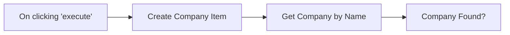

## Fluxo (.json) :

```json
{
  "id": "112",
  "name": "Get Company by Name",
  "nodes": [
    {
      "name": "On clicking 'execute'",
      "type": "n8n-nodes-base.manualTrigger",
      "position": [
        440,
        510
      ],
      "parameters": {},
      "typeVersion": 1
    },
    {
      "name": "Create Company Item",
      "type": "n8n-nodes-base.functionItem",
      "position": [
        640,
        510
      ],
      "parameters": {
        "functionCode": "item.company = \"Killia technologies\";\nitem.country = \"Spain\";\n\nreturn item;"
      },
      "typeVersion": 1
    },
    {
      "name": "Get Company by Name",
      "type": "n8n-nodes-base.uproc",
      "position": [
        850,
        510
      ],
      "parameters": {
        "name": "={{$node[\"Create Company Item\"].json[\"company\"]}}",
        "tool": "getCompanyByName",
        "group": "company",
        "country": "={{$node[\"Create Company Item\"].json[\"country\"]}}",
        "additionalOptions": {}
      },
      "credentials": {
        "uprocApi": "miquel-uproc"
      },
      "typeVersion": 1
    },
    {
      "name": "Company Found?",
      "type": "n8n-nodes-base.if",
      "position": [
        1050,
        510
      ],
      "parameters": {
        "conditions": {
          "number": [],
          "string": [
            {
              "value1": "={{$node[\"Get Company by Name\"].json[\"message\"][\"name\"]}}",
              "value2": ".+",
              "operation": "regex"
            }
          ]
        }
      },
      "typeVersion": 1
    }
  ],
  "active": false,
  "settings": {},
  "connections": {
    "Create Company Item": {
      "main": [
        [
          {
            "node": "Get Company by Name",
            "type": "main",
            "index": 0
          }
        ]
      ]
    },
    "Get Company by Name": {
      "main": [
        [
          {
            "node": "Company Found?",
            "type": "main",
            "index": 0
          }
        ]
      ]
    },
    "On clicking 'execute'": {
      "main": [
        [
          {
            "node": "Create Company Item",
            "type": "main",
            "index": 0
          }
        ]
      ]
    }
  }
}
```

<a id="template-1223"></a>

## Template 1223 - Salvar anexos do Gmail no Drive e registrar dados em Sheets

- **Nome:** Salvar anexos do Gmail no Drive e registrar dados em Sheets
- **Descrição:** Automatiza o processamento de emails com anexos (faturas): salva PDFs no Google Drive, extrai informações com um modelo de linguagem e registra os dados em uma planilha.
- **Funcionalidade:** • Detecção de emails não lidos com anexos: monitora a caixa de entrada por mensagens unread com anexos.
• Filtragem de emails relevantes: verifica content-type e existência de anexos para processar apenas emails de fatura.
• Download de anexos: obtém os arquivos anexados às mensagens.
• Upload de PDF ao Drive: envia o PDF para o Google Drive via API.
• Renomear arquivo: atualiza o nome do arquivo com o assunto do email e a data.
• Mover arquivo para pasta específica: organiza o PDF dentro de uma pasta determinada no Drive.
• Download do arquivo do Drive para processamento: recupera o PDF armazenado para extração de conteúdo.
• Extração de texto do PDF: converte o conteúdo do PDF em texto para análise.
• Extração de dados com LLM: usa um modelo de linguagem para extrair campos estruturados (data, descrição, valor total e link do ficheiro).
• Mapeamento e inserção na planilha: prepara os dados extraídos e acrescenta uma nova linha em uma Google Sheet de reconciliação.
• Marcar email como lido: atualiza o status do email após o processamento.
- **Ferramentas:** • Gmail: serviço de email usado como gatilho e fonte dos anexos.
• Google Drive: armazenamento dos PDFs; usado para upload, renomear, mover e fornecer link ao ficheiro.
• Google Sheets: planilha utilizada para registrar e consolidar os dados extraídos das faturas.
• OpenAI (modelo de linguagem): extrai e estrutura automaticamente os valores e campos relevantes a partir do texto do PDF.

## Fluxo visual

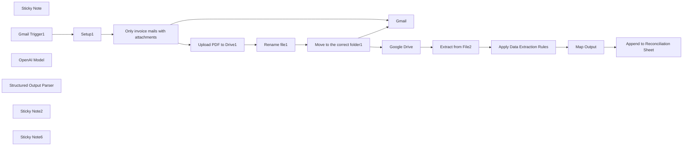

## Fluxo (.json) :

```json
{
  "id": "XnGZZfT5u0Cw1X3p",
  "meta": {
    "instanceId": "3378b0d68c3b7ebfc71b79896d94e1a044dec38e99a1160aed4e9c323910fbe2",
    "templateCredsSetupCompleted": true
  },
  "name": "Attachments Gmail to drive and google sheets",
  "tags": [],
  "nodes": [
    {
      "id": "0404ef0a-9750-495a-8798-98d4b059a083",
      "name": "Sticky Note",
      "type": "n8n-nodes-base.stickyNote",
      "position": [
        -580,
        -420
      ],
      "parameters": {
        "height": 440,
        "content": "## Setup\n1. Setup your **Gmail** and **Google Drive** credentials\n2. Setup your **Google Sheets** credentials\n3. Setup your **Openai** api key"
      },
      "typeVersion": 1
    },
    {
      "id": "8751a7f1-aae4-4746-aae7-3d8563845b8c",
      "name": "Gmail Trigger1",
      "type": "n8n-nodes-base.gmailTrigger",
      "position": [
        -640,
        120
      ],
      "parameters": {
        "simple": false,
        "filters": {
          "readStatus": "unread"
        },
        "options": {
          "downloadAttachments": true
        },
        "pollTimes": {
          "item": [
            {
              "mode": "everyMinute"
            }
          ]
        }
      },
      "credentials": {
        "gmailOAuth2": {
          "id": "v8YJP3VfeGtRk5la",
          "name": "Gmail account"
        }
      },
      "typeVersion": 1.1
    },
    {
      "id": "40f62192-5acb-4915-aa07-e5a0dfeb7581",
      "name": "Setup1",
      "type": "n8n-nodes-base.set",
      "position": [
        -300,
        120
      ],
      "parameters": {
        "options": {},
        "assignments": {
          "assignments": [
            {
              "id": "4cca07a2-6a70-4011-a025-65246e652fb9",
              "name": "url_to_drive_folder",
              "type": "string",
              "value": "1fCWCdqrFP3WrjjLc-gJtxMaiaF5lh8Ko"
            }
          ]
        },
        "includeOtherFields": true
      },
      "typeVersion": 3.4
    },
    {
      "id": "d928e797-8851-4ab4-9199-cd555a40eae9",
      "name": "Upload PDF to Drive1",
      "type": "n8n-nodes-base.httpRequest",
      "maxTries": 5,
      "position": [
        220,
        0
      ],
      "parameters": {
        "url": "https://www.googleapis.com/upload/drive/v3/files",
        "method": "POST",
        "options": {},
        "sendBody": true,
        "sendQuery": true,
        "contentType": "binaryData",
        "authentication": "predefinedCredentialType",
        "queryParameters": {
          "parameters": [
            {
              "name": "uploadType",
              "value": "media"
            }
          ]
        },
        "inputDataFieldName": "={{ $binary.attachment_0.mimeType === \"application/pdf\"\n     ? \"attachment_0\"\n     : \"attachment_1\" }}",
        "nodeCredentialType": "googleDriveOAuth2Api"
      },
      "credentials": {
        "googleDriveOAuth2Api": {
          "id": "p5I6S4YkJps1zvwz",
          "name": "Google Drive account 2"
        }
      },
      "retryOnFail": true,
      "typeVersion": 4.2
    },
    {
      "id": "22df6933-a0c7-4cce-8114-5332038a14c3",
      "name": "Rename file1",
      "type": "n8n-nodes-base.googleDrive",
      "position": [
        400,
        0
      ],
      "parameters": {
        "fileId": {
          "__rl": true,
          "mode": "id",
          "value": "={{ $json.id }}"
        },
        "options": {},
        "operation": "update",
        "newUpdatedFileName": "={{ $('Setup1').item.json.subject }}_invoice_{{ $now.format('yyyy-MM-dd') }}.pdf"
      },
      "credentials": {
        "googleDriveOAuth2Api": {
          "id": "p5I6S4YkJps1zvwz",
          "name": "Google Drive account 2"
        }
      },
      "typeVersion": 3
    },
    {
      "id": "ce6a6a4c-17ba-4cf7-b07a-97b9d8d80844",
      "name": "Move to the correct folder1",
      "type": "n8n-nodes-base.googleDrive",
      "position": [
        580,
        0
      ],
      "parameters": {
        "fileId": {
          "__rl": true,
          "mode": "id",
          "value": "={{ $json.id }}"
        },
        "driveId": {
          "__rl": true,
          "mode": "list",
          "value": "My Drive",
          "cachedResultUrl": "https://drive.google.com/drive/my-drive",
          "cachedResultName": "My Drive"
        },
        "folderId": {
          "__rl": true,
          "mode": "list",
          "value": "1fCWCdqrFP3WrjjLc-gJtxMaiaF5lh8Ko",
          "cachedResultUrl": "",
          "cachedResultName": "2025"
        },
        "operation": "move"
      },
      "credentials": {
        "googleDriveOAuth2Api": {
          "id": "p5I6S4YkJps1zvwz",
          "name": "Google Drive account 2"
        }
      },
      "typeVersion": 3
    },
    {
      "id": "e64aac5c-a314-46b6-b7db-fc0d6f450e1f",
      "name": "Gmail",
      "type": "n8n-nodes-base.gmail",
      "position": [
        1240,
        0
      ],
      "webhookId": "556cbee3-8de0-4645-9e91-e7c0c252f2ab",
      "parameters": {
        "messageId": "={{ $('Gmail Trigger1').item.json.id }}",
        "operation": "markAsRead"
      },
      "credentials": {
        "gmailOAuth2": {
          "id": "v8YJP3VfeGtRk5la",
          "name": "Gmail account"
        }
      },
      "typeVersion": 2.1
    },
    {
      "id": "ea74cfc1-0305-418d-9f5f-bffcfb3bb2c7",
      "name": "Extract from File2",
      "type": "n8n-nodes-base.extractFromFile",
      "position": [
        1200,
        -180
      ],
      "parameters": {
        "options": {},
        "operation": "pdf"
      },
      "typeVersion": 1
    },
    {
      "id": "0398d982-78fd-4830-b5cf-271195af80fd",
      "name": "Google Drive",
      "type": "n8n-nodes-base.googleDrive",
      "position": [
        800,
        0
      ],
      "parameters": {
        "fileId": {
          "__rl": true,
          "mode": "id",
          "value": "={{ $json.id }}"
        },
        "options": {},
        "operation": "download"
      },
      "credentials": {
        "googleDriveOAuth2Api": {
          "id": "p5I6S4YkJps1zvwz",
          "name": "Google Drive account 2"
        }
      },
      "typeVersion": 3
    },
    {
      "id": "3b4a96d4-a6ee-486a-a795-fe410ccc38b2",
      "name": "OpenAI Model",
      "type": "@n8n/n8n-nodes-langchain.lmOpenAi",
      "position": [
        1740,
        20
      ],
      "parameters": {
        "model": {
          "__rl": true,
          "mode": "list",
          "value": "gpt-4o",
          "cachedResultName": "gpt-4o"
        },
        "options": {
          "temperature": 0
        }
      },
      "credentials": {
        "openAiApi": {
          "id": "XJdxgMSXFgwReSsh",
          "name": "n8n key"
        }
      },
      "typeVersion": 1
    },
    {
      "id": "a7dd0d95-5e79-4bd2-a8a6-2178264d19fc",
      "name": "Structured Output Parser",
      "type": "@n8n/n8n-nodes-langchain.outputParserStructured",
      "position": [
        1940,
        40
      ],
      "parameters": {
        "jsonSchema": "{\n  \"Invoice date\": { \"type\": \"date\" },\n  \"Invoice description\": { \"type\": \"string\" },\n  \"Total price\": { \"type\": \"number\" },\n  \"Fichero\": { \"type\": \"string\" }\n}"
      },
      "typeVersion": 1.1
    },
    {
      "id": "68d98f4c-e679-48e3-a1a1-529cda4e31a4",
      "name": "Append to Reconciliation Sheet",
      "type": "n8n-nodes-base.googleSheets",
      "position": [
        2280,
        -140
      ],
      "parameters": {
        "columns": {
          "value": {},
          "schema": [
            {
              "id": "Invoice date",
              "type": "string",
              "display": true,
              "removed": false,
              "required": false,
              "displayName": "Invoice date",
              "defaultMatch": false,
              "canBeUsedToMatch": true
            },
            {
              "id": "Invoice Description",
              "type": "string",
              "display": true,
              "removed": false,
              "required": false,
              "displayName": "Invoice Description",
              "defaultMatch": false,
              "canBeUsedToMatch": true
            },
            {
              "id": "Total price",
              "type": "string",
              "display": true,
              "removed": false,
              "required": false,
              "displayName": "Total price",
              "defaultMatch": false,
              "canBeUsedToMatch": true
            },
            {
              "id": "Fichero",
              "type": "string",
              "display": true,
              "removed": false,
              "required": false,
              "displayName": "Fichero",
              "defaultMatch": false,
              "canBeUsedToMatch": true
            }
          ],
          "mappingMode": "autoMapInputData",
          "matchingColumns": [],
          "attemptToConvertTypes": false,
          "convertFieldsToString": false
        },
        "options": {},
        "operation": "append",
        "sheetName": {
          "__rl": true,
          "mode": "id",
          "value": "gid=0"
        },
        "documentId": {
          "__rl": true,
          "mode": "list",
          "value": "1gIUnjSWUhsoTOVVd4ZoVjARCGQfGE8s7FWcju3lNajM",
          "cachedResultUrl": "",
          "cachedResultName": "facturas"
        }
      },
      "credentials": {
        "googleSheetsOAuth2Api": {
          "id": "3IOU2VjBnR4hGohx",
          "name": "Google Sheets account"
        }
      },
      "typeVersion": 4.3
    },
    {
      "id": "80e1c8f4-b593-4c5f-b9e2-f3b7996ee6d4",
      "name": "Sticky Note2",
      "type": "n8n-nodes-base.stickyNote",
      "position": [
        1680,
        -400
      ],
      "parameters": {
        "color": 7,
        "width": 805.0578351924228,
        "height": 656.5014186128178,
        "content": "## 3. Use LLMs to Extract Values from Data\n[Read more about Basic LLM Chain](https://docs.n8n.io/integrations/builtin/cluster-nodes/root-nodes/n8n-nodes-langchain.chainllm/)\n\nLarge language models are perfect for data extraction tasks as they can work across a range of document layouts without human intervention. The extracted data can then be sent to a variety of datastores such as spreadsheets, accounting systems and/or CRMs.\n\n**Tip:** The \"Structured Output Parser\" ensures the AI output can be\ninserted to our spreadsheet without additional clean up and/or formatting. "
      },
      "typeVersion": 1
    },
    {
      "id": "3754e10e-a233-4ce0-bc79-bb5c01db9695",
      "name": "Map Output",
      "type": "n8n-nodes-base.set",
      "position": [
        2080,
        -140
      ],
      "parameters": {
        "mode": "raw",
        "options": {},
        "jsonOutput": "={{ $json.output }}"
      },
      "typeVersion": 3.3
    },
    {
      "id": "a42ff16f-d0df-4b6d-9a36-849f85d1facc",
      "name": "Apply Data Extraction Rules",
      "type": "@n8n/n8n-nodes-langchain.chainLlm",
      "position": [
        1740,
        -140
      ],
      "parameters": {
        "text": "=Given the following invoice in the <invoice> xml tags, extract the following information as listed below.\nIf you cannot the information for a specific item, then leave blank and skip to the next. \n\n* Invoice date\n* Invoice Description: {{ $('Rename file1').item.json.name }}\n* Total price\n* Fichero: =HYPERLINK(\"https://drive.google.com/file/d/{{ $('Move to the correct folder1').item.json.id }}/view\", \"Ver Documento\")\n\n\n<invoice>{{ $json.text }}</invoice>",
        "promptType": "define",
        "hasOutputParser": true
      },
      "typeVersion": 1.4
    },
    {
      "id": "f6de5d5a-d2dc-4590-8f46-3f250b8fca9f",
      "name": "Sticky Note6",
      "type": "n8n-nodes-base.stickyNote",
      "position": [
        1860,
        0
      ],
      "parameters": {
        "width": 192.26896179623753,
        "height": 213.73043662572252,
        "content": "\n\n\n\n\n\n\n\n\n\n\n\n**Need more attributes?**\nChange it here!"
      },
      "typeVersion": 1
    },
    {
      "id": "255fe8c1-5bd7-41cc-b1f9-c8956b5ad101",
      "name": "Only invoice mails with attachments",
      "type": "n8n-nodes-base.if",
      "position": [
        0,
        120
      ],
      "parameters": {
        "options": {},
        "conditions": {
          "options": {
            "version": 1,
            "leftValue": "",
            "caseSensitive": true,
            "typeValidation": "strict"
          },
          "combinator": "or",
          "conditions": [
            {
              "id": "229200d1-ec13-4970-ae0e-2c8e17da0bdf",
              "operator": {
                "type": "string",
                "operation": "contains"
              },
              "leftValue": "={{ $('Gmail Trigger1').item.json.headers['content-type'] }}",
              "rightValue": "multipart/mixed"
            },
            {
              "id": "new-condition",
              "operator": {
                "type": "boolean",
                "operation": "isNotEmpty"
              },
              "leftValue": "={{ $json.attachments }}"
            }
          ]
        }
      },
      "typeVersion": 2.1
    }
  ],
  "active": true,
  "pinData": {},
  "settings": {
    "executionOrder": "v1"
  },
  "versionId": "eb152808-e993-4e18-9dd8-10f21df57bf1",
  "connections": {
    "Gmail": {
      "main": [
        []
      ]
    },
    "Setup1": {
      "main": [
        [
          {
            "node": "Only invoice mails with attachments",
            "type": "main",
            "index": 0
          }
        ]
      ]
    },
    "Map Output": {
      "main": [
        [
          {
            "node": "Append to Reconciliation Sheet",
            "type": "main",
            "index": 0
          }
        ]
      ]
    },
    "Google Drive": {
      "main": [
        [
          {
            "node": "Extract from File2",
            "type": "main",
            "index": 0
          }
        ]
      ]
    },
    "OpenAI Model": {
      "ai_languageModel": [
        [
          {
            "node": "Apply Data Extraction Rules",
            "type": "ai_languageModel",
            "index": 0
          }
        ]
      ]
    },
    "Rename file1": {
      "main": [
        [
          {
            "node": "Move to the correct folder1",
            "type": "main",
            "index": 0
          }
        ]
      ]
    },
    "Gmail Trigger1": {
      "main": [
        [
          {
            "node": "Setup1",
            "type": "main",
            "index": 0
          }
        ]
      ]
    },
    "Extract from File2": {
      "main": [
        [
          {
            "node": "Apply Data Extraction Rules",
            "type": "main",
            "index": 0
          }
        ]
      ]
    },
    "Upload PDF to Drive1": {
      "main": [
        [
          {
            "node": "Rename file1",
            "type": "main",
            "index": 0
          }
        ]
      ]
    },
    "Structured Output Parser": {
      "ai_outputParser": [
        [
          {
            "node": "Apply Data Extraction Rules",
            "type": "ai_outputParser",
            "index": 0
          }
        ]
      ]
    },
    "Apply Data Extraction Rules": {
      "main": [
        [
          {
            "node": "Map Output",
            "type": "main",
            "index": 0
          }
        ]
      ]
    },
    "Move to the correct folder1": {
      "main": [
        [
          {
            "node": "Gmail",
            "type": "main",
            "index": 0
          },
          {
            "node": "Google Drive",
            "type": "main",
            "index": 0
          }
        ]
      ]
    },
    "Only invoice mails with attachments": {
      "main": [
        [
          {
            "node": "Upload PDF to Drive1",
            "type": "main",
            "index": 0
          }
        ],
        [
          {
            "node": "Gmail",
            "type": "main",
            "index": 0
          }
        ]
      ]
    }
  }
}
```

<a id="template-1224"></a>

## Template 1224 - Triagem e agendamento de candidatos com IA

- **Nome:** Triagem e agendamento de candidatos com IA
- **Descrição:** Automatiza o recebimento de candidaturas, armazenamento, avaliação de CVs com IA, geração de perguntas, agendamento de entrevistas e comunicação com candidatos.
- **Funcionalidade:** • Captura de candidatura via formulário: Recebe nome, email, telefone, anos de experiência e CV em PDF.
• Armazenamento de CVs em nuvem: Faz upload dos CVs para um armazenamento central e guarda o link.
• Registro de candidatos em base de dados: Cria/atualiza registros de candidatos numa base de dados para acompanhamento.
• Extração de texto do CV: Converte o PDF do candidato em texto para análise automática.
• Avaliação automática com IA: Compara descrição da vaga e currículo para gerar uma pontuação e motivo sucinto.
• Decisão automática de triagem: Atualiza o estado do candidato (rechazado ou em entrevista) conforme a pontuação.
• Geração de questionário personalizado: Cria 5 perguntas de entrevista com base na vaga e no CV e publica um formulário para o candidato responder.
• Registro das respostas do candidato: Salva as respostas do questionário no registro do candidato na base de dados.
• Criação de perguntas de triagem: Gera perguntas de triagem adicionais baseadas no CV e respostas para uso em entrevista telefônica.
• Personalização e envio de email: Cria um email profissional personalizado destacando pontos fortes e convida para chamada telefônica.
• Agendamento automático de entrevista: Verifica disponibilidade, agenda uma reunião no calendário e atualiza o horário no registro do candidato.
- **Ferramentas:** • Airtable: Base de dados usada para armazenar registros de candidatos, vagas, pontuações e respostas.
• Google Drive: Armazenamento de arquivos usado para guardar os CVs em PDF e gerar links públicos.
• Google Calendar: Ferramenta de calendário utilizada para agendar reuniões e bloquear horários de entrevista.
• OpenAI (modelos GPT): Serviço de IA usado para avaliar compatibilidade CV-vaga, gerar perguntas de entrevista e redigir emails personalizados.
• Servidor SMTP / Provedor de email: Serviço usado para enviar emails personalizados aos candidatos.
• Extração de texto de PDFs: Serviço/técnica de OCR ou extração para converter CVs PDF em texto legível para análise pela IA.

## Fluxo visual

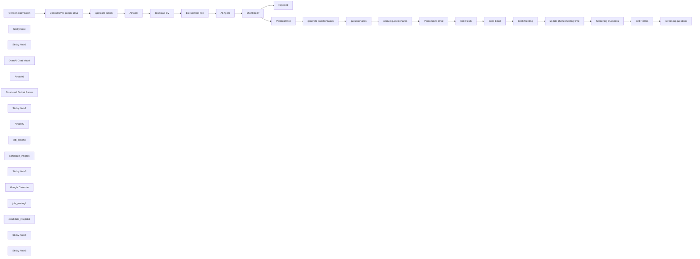

## Fluxo (.json) :

```json
{
  "id": "eMxH0GjgfWEvBDic",
  "meta": {
    "instanceId": "be27b2af86ae3a5dc19ef2a1947644c0aec45fd8c88f29daa7dea6f0ce537691"
  },
  "name": "HR Job Posting and Evaluation with AI",
  "tags": [
    {
      "id": "9ZApRtWeNXlymyQ6",
      "name": "HR",
      "createdAt": "2025-01-08T08:47:43.054Z",
      "updatedAt": "2025-01-08T08:47:43.054Z"
    }
  ],
  "nodes": [
    {
      "id": "450e15b2-bddf-4853-b44e-822facaac14d",
      "name": "On form submission",
      "type": "n8n-nodes-base.formTrigger",
      "position": [
        -700,
        -80
      ],
      "webhookId": "18f7428c-9990-413f-aff3-bdcca1bbbe2d",
      "parameters": {
        "options": {
          "path": "automation-specialist-application",
          "ignoreBots": false,
          "buttonLabel": "Submit",
          "appendAttribution": false,
          "useWorkflowTimezone": true
        },
        "formTitle": "Job Application",
        "formFields": {
          "values": [
            {
              "fieldLabel": "First Name",
              "requiredField": true
            },
            {
              "fieldLabel": "Last Name",
              "requiredField": true
            },
            {
              "fieldType": "email",
              "fieldLabel": "Email",
              "requiredField": true
            },
            {
              "fieldType": "number",
              "fieldLabel": "Phone",
              "requiredField": true
            },
            {
              "fieldType": "number",
              "fieldLabel": "Years of experience",
              "requiredField": true
            },
            {
              "fieldType": "file",
              "fieldLabel": "Upload your CV",
              "requiredField": true,
              "acceptFileTypes": ".pdf"
            }
          ]
        },
        "formDescription": "=Fill this for to apply for the role Automation Specialist:\n\nLocation: Remote\nExperience: Minimum 3 years\nEmployment Type: Full-time\n\nJob Description:\nWe are seeking a highly skilled Automation Specialist with at least 3 years of experience in designing and implementing workflow automation solutions. The ideal candidate will have expertise in tools such as n8n, Zapier, Make.com, or similar platforms, and a strong background in integrating APIs, streamlining processes, and enhancing operational efficiency.\n\nKey Responsibilities:\n\n    Develop and implement automated workflows to optimize business processes.\n    Integrate third-party APIs and systems to create seamless data flow.\n    Analyze, debug, and improve existing automation setups.\n    Collaborate with cross-functional teams to identify automation opportunities.\n    Monitor and maintain automation systems to ensure reliability.\n\nRequired Skills & Qualifications:\n\n    Proven 3+ years of experience in workflow automation and integration.\n    Proficiency with tools like n8n, Zapier, or Make.com.\n    Strong understanding of APIs, webhooks, and data transformation.\n    Familiarity with scripting languages (e.g., JavaScript or Python).\n    Excellent problem-solving and communication skills.\n\nPreferred Qualifications:\n\n    Experience with database management and cloud services.\n    Background in business process analysis or RPA tools.\n\nWhy Join Us?\n\n    Opportunity to work on cutting-edge automation projects.\n    Supportive and collaborative team environment.\n    Competitive salary and benefits package."
      },
      "typeVersion": 2.2
    },
    {
      "id": "5005e9ba-a68a-4795-8a65-22374a182bdb",
      "name": "Airtable",
      "type": "n8n-nodes-base.airtable",
      "position": [
        -60,
        -80
      ],
      "parameters": {
        "base": {
          "__rl": true,
          "mode": "list",
          "value": "appublMkWVQfHkZ09",
          "cachedResultUrl": "https://airtable.com/appublMkWVQfHkZ09",
          "cachedResultName": "Simple applicant tracker"
        },
        "table": {
          "__rl": true,
          "mode": "list",
          "value": "tblllvQaRTSnEr17a",
          "cachedResultUrl": "https://airtable.com/appublMkWVQfHkZ09/tblllvQaRTSnEr17a",
          "cachedResultName": "Applicants"
        },
        "columns": {
          "value": {
            "Name": "={{ $json.Name }}",
            "Phone": "={{ $json.Phone }}",
            "CV Link": "={{ $json[\"CV link\"] }}",
            "Applying for": "=[\"Automation Specialist\"]",
            "Email address": "={{ $json.email }}"
          },
          "schema": [
            {
              "id": "Name",
              "type": "string",
              "display": true,
              "removed": false,
              "readOnly": false,
              "required": false,
              "displayName": "Name",
              "defaultMatch": false,
              "canBeUsedToMatch": true
            },
            {
              "id": "Email address",
              "type": "string",
              "display": true,
              "removed": false,
              "readOnly": false,
              "required": false,
              "displayName": "Email address",
              "defaultMatch": false,
              "canBeUsedToMatch": true
            },
            {
              "id": "Phone",
              "type": "string",
              "display": true,
              "removed": false,
              "readOnly": false,
              "required": false,
              "displayName": "Phone",
              "defaultMatch": false,
              "canBeUsedToMatch": true
            },
            {
              "id": "Stage",
              "type": "options",
              "display": true,
              "options": [
                {
                  "name": "No hire",
                  "value": "No hire"
                },
                {
                  "name": "Interviewing",
                  "value": "Interviewing"
                },
                {
                  "name": "Decision needed",
                  "value": "Decision needed"
                },
                {
                  "name": "Hire",
                  "value": "Hire"
                }
              ],
              "removed": true,
              "readOnly": false,
              "required": false,
              "displayName": "Stage",
              "defaultMatch": false,
              "canBeUsedToMatch": true
            },
            {
              "id": "Applying for",
              "type": "array",
              "display": true,
              "removed": false,
              "readOnly": false,
              "required": false,
              "displayName": "Applying for",
              "defaultMatch": false,
              "canBeUsedToMatch": true
            },
            {
              "id": "CV Link",
              "type": "string",
              "display": true,
              "removed": false,
              "readOnly": false,
              "required": false,
              "displayName": "CV Link",
              "defaultMatch": false,
              "canBeUsedToMatch": true
            },
            {
              "id": "JD CV score",
              "type": "options",
              "display": true,
              "options": [
                {
                  "name": "0 – No hire",
                  "value": "0 – No hire"
                },
                {
                  "name": "1 – Probably no hire",
                  "value": "1 – Probably no hire"
                },
                {
                  "name": "2 – Worth consideration",
                  "value": "2 – Worth consideration"
                },
                {
                  "name": "3 – Good candidate",
                  "value": "3 – Good candidate"
                },
                {
                  "name": "4 – Please hire this person",
                  "value": "4 – Please hire this person"
                }
              ],
              "removed": true,
              "readOnly": false,
              "required": false,
              "displayName": "JD CV score",
              "defaultMatch": false,
              "canBeUsedToMatch": true
            },
            {
              "id": "Phone interview",
              "type": "dateTime",
              "display": true,
              "removed": true,
              "readOnly": false,
              "required": false,
              "displayName": "Phone interview",
              "defaultMatch": false,
              "canBeUsedToMatch": true
            },
            {
              "id": "Phone interviewer",
              "type": "array",
              "display": true,
              "removed": true,
              "readOnly": false,
              "required": false,
              "displayName": "Phone interviewer",
              "defaultMatch": false,
              "canBeUsedToMatch": true
            },
            {
              "id": "Phone interview score",
              "type": "options",
              "display": true,
              "options": [
                {
                  "name": "0 – No hire",
                  "value": "0 – No hire"
                },
                {
                  "name": "1 – Probably no hire",
                  "value": "1 – Probably no hire"
                },
                {
                  "name": "2 – Worth consideration",
                  "value": "2 – Worth consideration"
                },
                {
                  "name": "3 – Good candidate",
                  "value": "3 – Good candidate"
                },
                {
                  "name": "4 – Please hire this person",
                  "value": "4 – Please hire this person"
                }
              ],
              "removed": true,
              "readOnly": false,
              "required": false,
              "displayName": "Phone interview score",
              "defaultMatch": false,
              "canBeUsedToMatch": true
            },
            {
              "id": "Phone interview notes",
              "type": "string",
              "display": true,
              "removed": true,
              "readOnly": false,
              "required": false,
              "displayName": "Phone interview notes",
              "defaultMatch": false,
              "canBeUsedToMatch": true
            },
            {
              "id": "Onsite interview",
              "type": "dateTime",
              "display": true,
              "removed": true,
              "readOnly": false,
              "required": false,
              "displayName": "Onsite interview",
              "defaultMatch": false,
              "canBeUsedToMatch": true
            },
            {
              "id": "Onsite interviewer",
              "type": "array",
              "display": true,
              "removed": true,
              "readOnly": false,
              "required": false,
              "displayName": "Onsite interviewer",
              "defaultMatch": false,
              "canBeUsedToMatch": true
            },
            {
              "id": "Onsite interview score",
              "type": "options",
              "display": true,
              "options": [
                {
                  "name": "0 – No hire",
                  "value": "0 – No hire"
                },
                {
                  "name": "1 – Probably no hire",
                  "value": "1 – Probably no hire"
                },
                {
                  "name": "2 – Worth consideration",
                  "value": "2 – Worth consideration"
                },
                {
                  "name": "3 – Good candidate",
                  "value": "3 – Good candidate"
                },
                {
                  "name": "4 – Please hire this person",
                  "value": "4 – Please hire this person"
                }
              ],
              "removed": true,
              "readOnly": false,
              "required": false,
              "displayName": "Onsite interview score",
              "defaultMatch": false,
              "canBeUsedToMatch": true
            },
            {
              "id": "Onsite interview notes",
              "type": "string",
              "display": true,
              "removed": true,
              "readOnly": false,
              "required": false,
              "displayName": "Onsite interview notes",
              "defaultMatch": false,
              "canBeUsedToMatch": true
            },
            {
              "id": "Attachments",
              "type": "array",
              "display": true,
              "removed": true,
              "readOnly": false,
              "required": false,
              "displayName": "Attachments",
              "defaultMatch": false,
              "canBeUsedToMatch": true
            }
          ],
          "mappingMode": "defineBelow",
          "matchingColumns": []
        },
        "options": {
          "typecast": true
        },
        "operation": "create"
      },
      "credentials": {
        "airtableTokenApi": {
          "id": "gQtK3HX661rFA6KW",
          "name": "gaturanjenga account"
        }
      },
      "typeVersion": 2.1
    },
    {
      "id": "b291527b-9937-4388-a712-2b60dd292f65",
      "name": "Upload CV to google drive",
      "type": "n8n-nodes-base.googleDrive",
      "position": [
        -480,
        -80
      ],
      "parameters": {
        "name": "={{ $binary.Upload_your_CV.fileName }}",
        "driveId": {
          "__rl": true,
          "mode": "list",
          "value": "My Drive"
        },
        "options": {},
        "folderId": {
          "__rl": true,
          "mode": "list",
          "value": "1u_YBpqSU5TjNsu72sQKFMIesb62JKHXz",
          "cachedResultUrl": "https://drive.google.com/drive/folders/1u_YBpqSU5TjNsu72sQKFMIesb62JKHXz",
          "cachedResultName": "HR Test"
        },
        "inputDataFieldName": "Upload_your_CV"
      },
      "credentials": {
        "googleDriveOAuth2Api": {
          "id": "MHcgKR744VHXSe3X",
          "name": "Drive n8n"
        }
      },
      "typeVersion": 3
    },
    {
      "id": "83a965f9-bdb1-42ca-9701-24a82438ea0e",
      "name": "applicant details",
      "type": "n8n-nodes-base.set",
      "position": [
        -260,
        -80
      ],
      "parameters": {
        "options": {},
        "assignments": {
          "assignments": [
            {
              "id": "bffff778-859a-4bb8-b973-39237ce7486e",
              "name": "Name",
              "type": "string",
              "value": "={{ $('On form submission').item.json['First Name'] + \" \" + $('On form submission').item.json['Last Name'] }}"
            },
            {
              "id": "cd6e7372-c65f-4e6f-9612-6ea513bb8e15",
              "name": "Phone",
              "type": "number",
              "value": "={{ $('On form submission').item.json.Phone }}"
            },
            {
              "id": "eb19138e-7ff3-4f0c-ad95-ac33f8835717",
              "name": "email",
              "type": "string",
              "value": "={{ $('On form submission').item.json.Email }}"
            },
            {
              "id": "25172db9-91fb-45da-b036-ee9aea1e8b09",
              "name": "Experience",
              "type": "number",
              "value": "={{ $('On form submission').item.json[\"Years of experience\"] }}"
            },
            {
              "id": "64393285-3770-47e0-bbbb-3c5d5e14f1f4",
              "name": "Applied On",
              "type": "string",
              "value": "={{ $('On form submission').item.json.submittedAt }}"
            },
            {
              "id": "dc052fd6-f57d-4da1-9976-67fcd9496e58",
              "name": "CV link",
              "type": "string",
              "value": "={{ $json.webViewLink }}"
            }
          ]
        }
      },
      "typeVersion": 3.4
    },
    {
      "id": "41038c1c-876d-46a6-9dcc-f40c77e834df",
      "name": "Sticky Note",
      "type": "n8n-nodes-base.stickyNote",
      "position": [
        -720,
        -160
      ],
      "parameters": {
        "color": 3,
        "width": 760,
        "height": 220,
        "content": "## Grab User Details and Update in Airtable\n"
      },
      "typeVersion": 1
    },
    {
      "id": "d0f85487-8e78-4cde-8ecb-a55ab94940cc",
      "name": "Sticky Note1",
      "type": "n8n-nodes-base.stickyNote",
      "position": [
        120,
        -180
      ],
      "parameters": {
        "width": 820,
        "height": 460,
        "content": "## Download the CV and get the job description and requirements.\n- ### Send the details to ChatGPT to score the viability of the candidate"
      },
      "typeVersion": 1
    },
    {
      "id": "334c4580-a0e6-45f0-9b3a-3904eb80b3e8",
      "name": "download CV",
      "type": "n8n-nodes-base.googleDrive",
      "position": [
        140,
        -80
      ],
      "parameters": {
        "fileId": {
          "__rl": true,
          "mode": "url",
          "value": "={{ $json.fields[\"CV Link\"] }}"
        },
        "options": {},
        "operation": "download"
      },
      "credentials": {
        "googleDriveOAuth2Api": {
          "id": "MHcgKR744VHXSe3X",
          "name": "Drive n8n"
        }
      },
      "typeVersion": 3
    },
    {
      "id": "b7d8013a-71bd-49a4-a58f-f63186e1b6d8",
      "name": "Extract from File",
      "type": "n8n-nodes-base.extractFromFile",
      "position": [
        360,
        -80
      ],
      "parameters": {
        "options": {},
        "operation": "pdf"
      },
      "typeVersion": 1
    },
    {
      "id": "22ba7844-9f20-41b1-96bb-f2e33e18d14a",
      "name": "AI Agent",
      "type": "@n8n/n8n-nodes-langchain.agent",
      "position": [
        580,
        -80
      ],
      "parameters": {
        "text": "=Compare the following job description and resume. Assign a qualification score between 0 and 1, where 1 indicates the best match. Provide only the score and the reason for the score in less than 20 words.\nJob Description: Use Airtable tool to get the job description\nResume: \n{{ $json.text }}",
        "options": {},
        "promptType": "define",
        "hasOutputParser": true
      },
      "typeVersion": 1.7
    },
    {
      "id": "5f0317cb-35a5-4e57-938d-0d604c1f7f4f",
      "name": "OpenAI Chat Model",
      "type": "@n8n/n8n-nodes-langchain.lmChatOpenAi",
      "position": [
        500,
        120
      ],
      "parameters": {
        "options": {}
      },
      "credentials": {
        "openAiApi": {
          "id": "0Q6M4JEKewP9VKl8",
          "name": "Bulkbox"
        }
      },
      "typeVersion": 1
    },
    {
      "id": "d040091b-282b-4bb7-8a82-de3030c14b91",
      "name": "Airtable1",
      "type": "n8n-nodes-base.airtableTool",
      "position": [
        700,
        120
      ],
      "parameters": {
        "base": {
          "__rl": true,
          "mode": "list",
          "value": "appublMkWVQfHkZ09",
          "cachedResultUrl": "https://airtable.com/appublMkWVQfHkZ09",
          "cachedResultName": "Simple applicant tracker"
        },
        "table": {
          "__rl": true,
          "mode": "list",
          "value": "tbljhmLdPULqSya0d",
          "cachedResultUrl": "https://airtable.com/appublMkWVQfHkZ09/tbljhmLdPULqSya0d",
          "cachedResultName": "Positions"
        },
        "options": {},
        "operation": "search"
      },
      "credentials": {
        "airtableTokenApi": {
          "id": "gQtK3HX661rFA6KW",
          "name": "gaturanjenga account"
        }
      },
      "typeVersion": 2.1
    },
    {
      "id": "fba48717-a068-44de-a776-6e0c14ebd667",
      "name": "Structured Output Parser",
      "type": "@n8n/n8n-nodes-langchain.outputParserStructured",
      "position": [
        820,
        120
      ],
      "parameters": {
        "jsonSchemaExample": "{\n  \"score\": 0.8,\n  \"reason\": \"Does not meet required number of experience in years\"\n}"
      },
      "typeVersion": 1.2
    },
    {
      "id": "2eef8181-3e4d-4c66-acd7-d440eb2f6748",
      "name": "Sticky Note2",
      "type": "n8n-nodes-base.stickyNote",
      "position": [
        960,
        -340
      ],
      "parameters": {
        "color": 2,
        "width": 1200,
        "height": 600,
        "content": "## Update Airtable with score and reason for the score\n\n- ### if score is above 0.7, shortlist and continue flow.\n\n## Get questionnaires based on the JD and CV\n\n- ### Update the responses in Airtable"
      },
      "typeVersion": 1
    },
    {
      "id": "ed42fa6c-be05-4d62-aa1f-390b5fc471dd",
      "name": "shortlisted?",
      "type": "n8n-nodes-base.if",
      "position": [
        960,
        -80
      ],
      "parameters": {
        "options": {},
        "conditions": {
          "options": {
            "version": 2,
            "leftValue": "",
            "caseSensitive": true,
            "typeValidation": "strict"
          },
          "combinator": "and",
          "conditions": [
            {
              "id": "7b4950b2-d218-4911-89cd-22a60b7465d8",
              "operator": {
                "type": "number",
                "operation": "gte"
              },
              "leftValue": "={{ $json.output.score }}",
              "rightValue": 0.7
            }
          ]
        }
      },
      "typeVersion": 2.2
    },
    {
      "id": "6df70bee-6a9f-43f6-8c39-46663b572f5c",
      "name": "Rejected",
      "type": "n8n-nodes-base.airtable",
      "position": [
        1240,
        60
      ],
      "parameters": {
        "base": {
          "__rl": true,
          "mode": "list",
          "value": "appublMkWVQfHkZ09",
          "cachedResultUrl": "https://airtable.com/appublMkWVQfHkZ09",
          "cachedResultName": "Simple applicant tracker"
        },
        "table": {
          "__rl": true,
          "mode": "list",
          "value": "tblllvQaRTSnEr17a",
          "cachedResultUrl": "https://airtable.com/appublMkWVQfHkZ09/tblllvQaRTSnEr17a",
          "cachedResultName": "Applicants"
        },
        "columns": {
          "value": {
            "id": "={{ $('Airtable').item.json.id }}",
            "Stage": "No hire",
            "JD CV score": "={{ $json.output.score }}",
            "CV Score Notes": "={{ $json.output.reason }}"
          },
          "schema": [
            {
              "id": "id",
              "type": "string",
              "display": true,
              "removed": false,
              "readOnly": true,
              "required": false,
              "displayName": "id",
              "defaultMatch": true
            },
            {
              "id": "Name",
              "type": "string",
              "display": true,
              "removed": true,
              "readOnly": false,
              "required": false,
              "displayName": "Name",
              "defaultMatch": false,
              "canBeUsedToMatch": true
            },
            {
              "id": "Email address",
              "type": "string",
              "display": true,
              "removed": true,
              "readOnly": false,
              "required": false,
              "displayName": "Email address",
              "defaultMatch": false,
              "canBeUsedToMatch": true
            },
            {
              "id": "Phone",
              "type": "number",
              "display": true,
              "removed": true,
              "readOnly": false,
              "required": false,
              "displayName": "Phone",
              "defaultMatch": false,
              "canBeUsedToMatch": true
            },
            {
              "id": "Stage",
              "type": "options",
              "display": true,
              "options": [
                {
                  "name": "No hire",
                  "value": "No hire"
                },
                {
                  "name": "Interviewing",
                  "value": "Interviewing"
                },
                {
                  "name": "Decision needed",
                  "value": "Decision needed"
                },
                {
                  "name": "Hire",
                  "value": "Hire"
                }
              ],
              "removed": false,
              "readOnly": false,
              "required": false,
              "displayName": "Stage",
              "defaultMatch": false,
              "canBeUsedToMatch": true
            },
            {
              "id": "Applying for",
              "type": "array",
              "display": true,
              "removed": true,
              "readOnly": false,
              "required": false,
              "displayName": "Applying for",
              "defaultMatch": false,
              "canBeUsedToMatch": true
            },
            {
              "id": "CV Link",
              "type": "string",
              "display": true,
              "removed": true,
              "readOnly": false,
              "required": false,
              "displayName": "CV Link",
              "defaultMatch": false,
              "canBeUsedToMatch": true
            },
            {
              "id": "JD CV score",
              "type": "number",
              "display": true,
              "removed": false,
              "readOnly": false,
              "required": false,
              "displayName": "JD CV score",
              "defaultMatch": false,
              "canBeUsedToMatch": true
            },
            {
              "id": "CV Score Notes",
              "type": "string",
              "display": true,
              "removed": false,
              "readOnly": false,
              "required": false,
              "displayName": "CV Score Notes",
              "defaultMatch": false,
              "canBeUsedToMatch": true
            },
            {
              "id": "Phone interview",
              "type": "dateTime",
              "display": true,
              "removed": true,
              "readOnly": false,
              "required": false,
              "displayName": "Phone interview",
              "defaultMatch": false,
              "canBeUsedToMatch": true
            },
            {
              "id": "Phone interviewer",
              "type": "array",
              "display": true,
              "removed": true,
              "readOnly": false,
              "required": false,
              "displayName": "Phone interviewer",
              "defaultMatch": false,
              "canBeUsedToMatch": true
            },
            {
              "id": "Phone interview score",
              "type": "options",
              "display": true,
              "options": [
                {
                  "name": "0 – No hire",
                  "value": "0 – No hire"
                },
                {
                  "name": "1 – Probably no hire",
                  "value": "1 – Probably no hire"
                },
                {
                  "name": "2 – Worth consideration",
                  "value": "2 – Worth consideration"
                },
                {
                  "name": "3 – Good candidate",
                  "value": "3 – Good candidate"
                },
                {
                  "name": "4 – Please hire this person",
                  "value": "4 – Please hire this person"
                }
              ],
              "removed": true,
              "readOnly": false,
              "required": false,
              "displayName": "Phone interview score",
              "defaultMatch": false,
              "canBeUsedToMatch": true
            },
            {
              "id": "Phone interview notes",
              "type": "string",
              "display": true,
              "removed": true,
              "readOnly": false,
              "required": false,
              "displayName": "Phone interview notes",
              "defaultMatch": false,
              "canBeUsedToMatch": true
            },
            {
              "id": "Onsite interview",
              "type": "dateTime",
              "display": true,
              "removed": true,
              "readOnly": false,
              "required": false,
              "displayName": "Onsite interview",
              "defaultMatch": false,
              "canBeUsedToMatch": true
            },
            {
              "id": "Onsite interviewer",
              "type": "array",
              "display": true,
              "removed": true,
              "readOnly": false,
              "required": false,
              "displayName": "Onsite interviewer",
              "defaultMatch": false,
              "canBeUsedToMatch": true
            },
            {
              "id": "Onsite interview score",
              "type": "options",
              "display": true,
              "options": [
                {
                  "name": "0 – No hire",
                  "value": "0 – No hire"
                },
                {
                  "name": "1 – Probably no hire",
                  "value": "1 – Probably no hire"
                },
                {
                  "name": "2 – Worth consideration",
                  "value": "2 – Worth consideration"
                },
                {
                  "name": "3 – Good candidate",
                  "value": "3 – Good candidate"
                },
                {
                  "name": "4 – Please hire this person",
                  "value": "4 – Please hire this person"
                }
              ],
              "removed": true,
              "readOnly": false,
              "required": false,
              "displayName": "Onsite interview score",
              "defaultMatch": false,
              "canBeUsedToMatch": true
            },
            {
              "id": "Onsite interview notes",
              "type": "string",
              "display": true,
              "removed": true,
              "readOnly": false,
              "required": false,
              "displayName": "Onsite interview notes",
              "defaultMatch": false,
              "canBeUsedToMatch": true
            },
            {
              "id": "Attachments",
              "type": "array",
              "display": true,
              "removed": true,
              "readOnly": false,
              "required": false,
              "displayName": "Attachments",
              "defaultMatch": false,
              "canBeUsedToMatch": true
            }
          ],
          "mappingMode": "defineBelow",
          "matchingColumns": [
            "id"
          ]
        },
        "options": {},
        "operation": "update"
      },
      "credentials": {
        "airtableTokenApi": {
          "id": "gQtK3HX661rFA6KW",
          "name": "gaturanjenga account"
        }
      },
      "typeVersion": 2.1
    },
    {
      "id": "888869bb-6fca-4d91-8428-cf5159d410e3",
      "name": "Potential Hire",
      "type": "n8n-nodes-base.airtable",
      "position": [
        1240,
        -140
      ],
      "parameters": {
        "base": {
          "__rl": true,
          "mode": "list",
          "value": "appublMkWVQfHkZ09",
          "cachedResultUrl": "https://airtable.com/appublMkWVQfHkZ09",
          "cachedResultName": "Simple applicant tracker"
        },
        "table": {
          "__rl": true,
          "mode": "list",
          "value": "tblllvQaRTSnEr17a",
          "cachedResultUrl": "https://airtable.com/appublMkWVQfHkZ09/tblllvQaRTSnEr17a",
          "cachedResultName": "Applicants"
        },
        "columns": {
          "value": {
            "id": "={{ $('Airtable').item.json.id }}",
            "Stage": "Interviewing",
            "JD CV score": "={{ $json.output.score }}",
            "CV Score Notes": "={{ $json.output.reason }}"
          },
          "schema": [
            {
              "id": "id",
              "type": "string",
              "display": true,
              "removed": false,
              "readOnly": true,
              "required": false,
              "displayName": "id",
              "defaultMatch": true
            },
            {
              "id": "Name",
              "type": "string",
              "display": true,
              "removed": true,
              "readOnly": false,
              "required": false,
              "displayName": "Name",
              "defaultMatch": false,
              "canBeUsedToMatch": true
            },
            {
              "id": "Email address",
              "type": "string",
              "display": true,
              "removed": true,
              "readOnly": false,
              "required": false,
              "displayName": "Email address",
              "defaultMatch": false,
              "canBeUsedToMatch": true
            },
            {
              "id": "Phone",
              "type": "number",
              "display": true,
              "removed": true,
              "readOnly": false,
              "required": false,
              "displayName": "Phone",
              "defaultMatch": false,
              "canBeUsedToMatch": true
            },
            {
              "id": "Stage",
              "type": "options",
              "display": true,
              "options": [
                {
                  "name": "No hire",
                  "value": "No hire"
                },
                {
                  "name": "Interviewing",
                  "value": "Interviewing"
                },
                {
                  "name": "Decision needed",
                  "value": "Decision needed"
                },
                {
                  "name": "Hire",
                  "value": "Hire"
                }
              ],
              "removed": false,
              "readOnly": false,
              "required": false,
              "displayName": "Stage",
              "defaultMatch": false,
              "canBeUsedToMatch": true
            },
            {
              "id": "Applying for",
              "type": "array",
              "display": true,
              "removed": true,
              "readOnly": false,
              "required": false,
              "displayName": "Applying for",
              "defaultMatch": false,
              "canBeUsedToMatch": true
            },
            {
              "id": "CV Link",
              "type": "string",
              "display": true,
              "removed": true,
              "readOnly": false,
              "required": false,
              "displayName": "CV Link",
              "defaultMatch": false,
              "canBeUsedToMatch": true
            },
            {
              "id": "JD CV score",
              "type": "number",
              "display": true,
              "removed": false,
              "readOnly": false,
              "required": false,
              "displayName": "JD CV score",
              "defaultMatch": false,
              "canBeUsedToMatch": true
            },
            {
              "id": "CV Score Notes",
              "type": "string",
              "display": true,
              "removed": false,
              "readOnly": false,
              "required": false,
              "displayName": "CV Score Notes",
              "defaultMatch": false,
              "canBeUsedToMatch": true
            },
            {
              "id": "Phone interview",
              "type": "dateTime",
              "display": true,
              "removed": true,
              "readOnly": false,
              "required": false,
              "displayName": "Phone interview",
              "defaultMatch": false,
              "canBeUsedToMatch": true
            },
            {
              "id": "Phone interviewer",
              "type": "array",
              "display": true,
              "removed": true,
              "readOnly": false,
              "required": false,
              "displayName": "Phone interviewer",
              "defaultMatch": false,
              "canBeUsedToMatch": true
            },
            {
              "id": "Phone interview score",
              "type": "options",
              "display": true,
              "options": [
                {
                  "name": "0 – No hire",
                  "value": "0 – No hire"
                },
                {
                  "name": "1 – Probably no hire",
                  "value": "1 – Probably no hire"
                },
                {
                  "name": "2 – Worth consideration",
                  "value": "2 – Worth consideration"
                },
                {
                  "name": "3 – Good candidate",
                  "value": "3 – Good candidate"
                },
                {
                  "name": "4 – Please hire this person",
                  "value": "4 – Please hire this person"
                }
              ],
              "removed": true,
              "readOnly": false,
              "required": false,
              "displayName": "Phone interview score",
              "defaultMatch": false,
              "canBeUsedToMatch": true
            },
            {
              "id": "Phone interview notes",
              "type": "string",
              "display": true,
              "removed": true,
              "readOnly": false,
              "required": false,
              "displayName": "Phone interview notes",
              "defaultMatch": false,
              "canBeUsedToMatch": true
            },
            {
              "id": "Onsite interview",
              "type": "dateTime",
              "display": true,
              "removed": true,
              "readOnly": false,
              "required": false,
              "displayName": "Onsite interview",
              "defaultMatch": false,
              "canBeUsedToMatch": true
            },
            {
              "id": "Onsite interviewer",
              "type": "array",
              "display": true,
              "removed": true,
              "readOnly": false,
              "required": false,
              "displayName": "Onsite interviewer",
              "defaultMatch": false,
              "canBeUsedToMatch": true
            },
            {
              "id": "Onsite interview score",
              "type": "options",
              "display": true,
              "options": [
                {
                  "name": "0 – No hire",
                  "value": "0 – No hire"
                },
                {
                  "name": "1 – Probably no hire",
                  "value": "1 – Probably no hire"
                },
                {
                  "name": "2 – Worth consideration",
                  "value": "2 – Worth consideration"
                },
                {
                  "name": "3 – Good candidate",
                  "value": "3 – Good candidate"
                },
                {
                  "name": "4 – Please hire this person",
                  "value": "4 – Please hire this person"
                }
              ],
              "removed": true,
              "readOnly": false,
              "required": false,
              "displayName": "Onsite interview score",
              "defaultMatch": false,
              "canBeUsedToMatch": true
            },
            {
              "id": "Onsite interview notes",
              "type": "string",
              "display": true,
              "removed": true,
              "readOnly": false,
              "required": false,
              "displayName": "Onsite interview notes",
              "defaultMatch": false,
              "canBeUsedToMatch": true
            },
            {
              "id": "Attachments",
              "type": "array",
              "display": true,
              "removed": true,
              "readOnly": false,
              "required": false,
              "displayName": "Attachments",
              "defaultMatch": false,
              "canBeUsedToMatch": true
            }
          ],
          "mappingMode": "defineBelow",
          "matchingColumns": [
            "id"
          ]
        },
        "options": {},
        "operation": "update"
      },
      "credentials": {
        "airtableTokenApi": {
          "id": "gQtK3HX661rFA6KW",
          "name": "gaturanjenga account"
        }
      },
      "typeVersion": 2.1
    },
    {
      "id": "8f59889d-dff7-4eef-85f4-7c6d9e171c17",
      "name": "Airtable2",
      "type": "n8n-nodes-base.airtableTool",
      "position": [
        1560,
        100
      ],
      "parameters": {
        "base": {
          "__rl": true,
          "mode": "list",
          "value": "appublMkWVQfHkZ09",
          "cachedResultUrl": "https://airtable.com/appublMkWVQfHkZ09",
          "cachedResultName": "Simple applicant tracker"
        },
        "table": {
          "__rl": true,
          "mode": "list",
          "value": "tbljhmLdPULqSya0d",
          "cachedResultUrl": "https://airtable.com/appublMkWVQfHkZ09/tbljhmLdPULqSya0d",
          "cachedResultName": "Positions"
        },
        "options": {},
        "operation": "search"
      },
      "credentials": {
        "airtableTokenApi": {
          "id": "gQtK3HX661rFA6KW",
          "name": "gaturanjenga account"
        }
      },
      "typeVersion": 2.1
    },
    {
      "id": "8358ab12-a0b9-4a21-b9eb-7054716b6f5b",
      "name": "generate questionnaires",
      "type": "@n8n/n8n-nodes-langchain.openAi",
      "position": [
        1460,
        -140
      ],
      "parameters": {
        "modelId": {
          "__rl": true,
          "mode": "list",
          "value": "gpt-4o-mini",
          "cachedResultName": "GPT-4O-MINI"
        },
        "options": {},
        "messages": {
          "values": [
            {
              "content": "=Given the following job description and candidate CV, create 5 insightful interview questions to gather more information about the candidate's suitability for the role. The questions should focus on:\n\n    Specific projects the candidate has worked on.\n    Key responsibilities and achievements in their previous roles.\n    Skills relevant to the job description.\n    Problem-solving abilities and how they handled challenges.\n    Alignment with the company’s goals and values.\n\nProvide the questions in a clear, concise format.\n\nJob Description:\nUse the airtable tool to get the job description\n\nCandidate CV:\n{{ $('Extract from File').item.json.text }}"
            }
          ]
        },
        "jsonOutput": true
      },
      "credentials": {
        "openAiApi": {
          "id": "lcpI0YZU9bebg3uW",
          "name": "OpenAi account"
        }
      },
      "typeVersion": 1.7
    },
    {
      "id": "21ffd179-42d9-4da3-9f1b-e2bbeb9cdee7",
      "name": "questionnaires",
      "type": "n8n-nodes-base.form",
      "position": [
        1820,
        -140
      ],
      "webhookId": "3f654280-b5d0-4392-824f-bc384d91a1df",
      "parameters": {
        "options": {
          "formTitle": "Questionnaires",
          "buttonLabel": "Submit",
          "formDescription": "Kindly fill in the following questions to proceed."
        },
        "formFields": {
          "values": [
            {
              "fieldLabel": "={{ $json.message.content.interview_questions[0].question }}",
              "requiredField": true
            },
            {
              "fieldLabel": "={{ $json.message.content.interview_questions[1].question }}",
              "requiredField": true
            },
            {
              "fieldLabel": "={{ $json.message.content.interview_questions[2].question }}",
              "requiredField": true
            },
            {
              "fieldLabel": "={{ $json.message.content.interview_questions[3].question }}",
              "requiredField": true
            },
            {
              "fieldLabel": "={{ $json.message.content.interview_questions[4].question }}",
              "requiredField": true
            }
          ]
        }
      },
      "typeVersion": 1
    },
    {
      "id": "29a228ca-6b8e-458f-a030-372b50151a94",
      "name": "update questionnaires",
      "type": "n8n-nodes-base.airtable",
      "position": [
        2040,
        -140
      ],
      "parameters": {
        "base": {
          "__rl": true,
          "mode": "list",
          "value": "appublMkWVQfHkZ09",
          "cachedResultUrl": "https://airtable.com/appublMkWVQfHkZ09",
          "cachedResultName": "Simple applicant tracker"
        },
        "table": {
          "__rl": true,
          "mode": "list",
          "value": "tblllvQaRTSnEr17a",
          "cachedResultUrl": "https://airtable.com/appublMkWVQfHkZ09/tblllvQaRTSnEr17a",
          "cachedResultName": "Applicants"
        },
        "columns": {
          "value": {
            "id": "={{ $('Airtable').item.json.id }}",
            "Questonnaires and responses": "={{ $('generate questionnaires').item.json.message.content.interview_questions[0].question }}: {{ $json['Can you describe one of the most complex automation projects you worked on, particularly detailing your role and the technologies you used?'] }}\n\n\n{{ $('generate questionnaires').item.json.message.content.interview_questions[1].question }}: {{ $json['What specific achievements in your previous roles do you believe demonstrate your ability to meet the responsibilities listed in the Automation Specialist position?'] }}\n\n\n{{ $('generate questionnaires').item.json.message.content.interview_questions[2].question }}: {{ $json['Given your experience with automation tools like n8n and APIs, can you provide an example of how you\\'ve successfully integrated different systems to improve operational efficiency?'] }}\n\n\n{{ $('generate questionnaires').item.json.message.content.interview_questions[3].question }}: {{ $json['Describe a challenging situation you faced during a project, how you approached the problem, and what the outcome was.'] }}\n\n\n{{ $('generate questionnaires').item.json.message.content.interview_questions[4].question }}: {{ $json['How do your values and career goals align with our company\\'s mission to optimize and enhance automation solutions?'] }}\n\n"
          },
          "schema": [
            {
              "id": "id",
              "type": "string",
              "display": true,
              "removed": false,
              "readOnly": true,
              "required": false,
              "displayName": "id",
              "defaultMatch": true
            },
            {
              "id": "Name",
              "type": "string",
              "display": true,
              "removed": true,
              "readOnly": false,
              "required": false,
              "displayName": "Name",
              "defaultMatch": false,
              "canBeUsedToMatch": true
            },
            {
              "id": "Email address",
              "type": "string",
              "display": true,
              "removed": true,
              "readOnly": false,
              "required": false,
              "displayName": "Email address",
              "defaultMatch": false,
              "canBeUsedToMatch": true
            },
            {
              "id": "Phone",
              "type": "number",
              "display": true,
              "removed": true,
              "readOnly": false,
              "required": false,
              "displayName": "Phone",
              "defaultMatch": false,
              "canBeUsedToMatch": true
            },
            {
              "id": "Stage",
              "type": "options",
              "display": true,
              "options": [
                {
                  "name": "No hire",
                  "value": "No hire"
                },
                {
                  "name": "Interviewing",
                  "value": "Interviewing"
                },
                {
                  "name": "Decision needed",
                  "value": "Decision needed"
                },
                {
                  "name": "Hire",
                  "value": "Hire"
                }
              ],
              "removed": true,
              "readOnly": false,
              "required": false,
              "displayName": "Stage",
              "defaultMatch": false,
              "canBeUsedToMatch": true
            },
            {
              "id": "Applying for",
              "type": "array",
              "display": true,
              "removed": true,
              "readOnly": false,
              "required": false,
              "displayName": "Applying for",
              "defaultMatch": false,
              "canBeUsedToMatch": true
            },
            {
              "id": "CV Link",
              "type": "string",
              "display": true,
              "removed": true,
              "readOnly": false,
              "required": false,
              "displayName": "CV Link",
              "defaultMatch": false,
              "canBeUsedToMatch": true
            },
            {
              "id": "JD CV score",
              "type": "number",
              "display": true,
              "removed": true,
              "readOnly": false,
              "required": false,
              "displayName": "JD CV score",
              "defaultMatch": false,
              "canBeUsedToMatch": true
            },
            {
              "id": "CV Score Notes",
              "type": "string",
              "display": true,
              "removed": true,
              "readOnly": false,
              "required": false,
              "displayName": "CV Score Notes",
              "defaultMatch": false,
              "canBeUsedToMatch": true
            },
            {
              "id": "Questonnaires and responses",
              "type": "string",
              "display": true,
              "removed": false,
              "readOnly": false,
              "required": false,
              "displayName": "Questonnaires and responses",
              "defaultMatch": false,
              "canBeUsedToMatch": true
            },
            {
              "id": "Phone interview",
              "type": "dateTime",
              "display": true,
              "removed": true,
              "readOnly": false,
              "required": false,
              "displayName": "Phone interview",
              "defaultMatch": false,
              "canBeUsedToMatch": true
            },
            {
              "id": "Phone interviewer",
              "type": "array",
              "display": true,
              "removed": true,
              "readOnly": false,
              "required": false,
              "displayName": "Phone interviewer",
              "defaultMatch": false,
              "canBeUsedToMatch": true
            },
            {
              "id": "Phone interview score",
              "type": "options",
              "display": true,
              "options": [
                {
                  "name": "0 – No hire",
                  "value": "0 – No hire"
                },
                {
                  "name": "1 – Probably no hire",
                  "value": "1 – Probably no hire"
                },
                {
                  "name": "2 – Worth consideration",
                  "value": "2 – Worth consideration"
                },
                {
                  "name": "3 – Good candidate",
                  "value": "3 – Good candidate"
                },
                {
                  "name": "4 – Please hire this person",
                  "value": "4 – Please hire this person"
                }
              ],
              "removed": true,
              "readOnly": false,
              "required": false,
              "displayName": "Phone interview score",
              "defaultMatch": false,
              "canBeUsedToMatch": true
            },
            {
              "id": "Phone interview notes",
              "type": "string",
              "display": true,
              "removed": true,
              "readOnly": false,
              "required": false,
              "displayName": "Phone interview notes",
              "defaultMatch": false,
              "canBeUsedToMatch": true
            },
            {
              "id": "Onsite interview",
              "type": "dateTime",
              "display": true,
              "removed": true,
              "readOnly": false,
              "required": false,
              "displayName": "Onsite interview",
              "defaultMatch": false,
              "canBeUsedToMatch": true
            },
            {
              "id": "Onsite interviewer",
              "type": "array",
              "display": true,
              "removed": true,
              "readOnly": false,
              "required": false,
              "displayName": "Onsite interviewer",
              "defaultMatch": false,
              "canBeUsedToMatch": true
            },
            {
              "id": "Onsite interview score",
              "type": "options",
              "display": true,
              "options": [
                {
                  "name": "0 – No hire",
                  "value": "0 – No hire"
                },
                {
                  "name": "1 – Probably no hire",
                  "value": "1 – Probably no hire"
                },
                {
                  "name": "2 – Worth consideration",
                  "value": "2 – Worth consideration"
                },
                {
                  "name": "3 – Good candidate",
                  "value": "3 – Good candidate"
                },
                {
                  "name": "4 – Please hire this person",
                  "value": "4 – Please hire this person"
                }
              ],
              "removed": true,
              "readOnly": false,
              "required": false,
              "displayName": "Onsite interview score",
              "defaultMatch": false,
              "canBeUsedToMatch": true
            },
            {
              "id": "Onsite interview notes",
              "type": "string",
              "display": true,
              "removed": true,
              "readOnly": false,
              "required": false,
              "displayName": "Onsite interview notes",
              "defaultMatch": false,
              "canBeUsedToMatch": true
            },
            {
              "id": "Attachments",
              "type": "array",
              "display": true,
              "removed": true,
              "readOnly": false,
              "required": false,
              "displayName": "Attachments",
              "defaultMatch": false,
              "canBeUsedToMatch": true
            }
          ],
          "mappingMode": "defineBelow",
          "matchingColumns": [
            "id"
          ]
        },
        "options": {},
        "operation": "update"
      },
      "credentials": {
        "airtableTokenApi": {
          "id": "gQtK3HX661rFA6KW",
          "name": "gaturanjenga account"
        }
      },
      "typeVersion": 2.1
    },
    {
      "id": "9a72a172-4272-4715-8e57-75ca010bc0e5",
      "name": "job_posting",
      "type": "n8n-nodes-base.airtableTool",
      "position": [
        2300,
        100
      ],
      "parameters": {
        "base": {
          "__rl": true,
          "mode": "list",
          "value": "appublMkWVQfHkZ09",
          "cachedResultUrl": "https://airtable.com/appublMkWVQfHkZ09",
          "cachedResultName": "Simple applicant tracker"
        },
        "table": {
          "__rl": true,
          "mode": "list",
          "value": "tbljhmLdPULqSya0d",
          "cachedResultUrl": "https://airtable.com/appublMkWVQfHkZ09/tbljhmLdPULqSya0d",
          "cachedResultName": "Positions"
        },
        "options": {},
        "operation": "search"
      },
      "credentials": {
        "airtableTokenApi": {
          "id": "gQtK3HX661rFA6KW",
          "name": "gaturanjenga account"
        }
      },
      "typeVersion": 2.1
    },
    {
      "id": "28c210c8-5684-4683-a168-5a02b39eb0f2",
      "name": "candidate_insights",
      "type": "n8n-nodes-base.airtableTool",
      "position": [
        2420,
        100
      ],
      "parameters": {
        "id": "={{ $('update questionnaires').item.json.id }}",
        "base": {
          "__rl": true,
          "mode": "list",
          "value": "appublMkWVQfHkZ09",
          "cachedResultUrl": "https://airtable.com/appublMkWVQfHkZ09",
          "cachedResultName": "Simple applicant tracker"
        },
        "table": {
          "__rl": true,
          "mode": "list",
          "value": "tblllvQaRTSnEr17a",
          "cachedResultUrl": "https://airtable.com/appublMkWVQfHkZ09/tblllvQaRTSnEr17a",
          "cachedResultName": "Applicants"
        },
        "options": {}
      },
      "credentials": {
        "airtableTokenApi": {
          "id": "gQtK3HX661rFA6KW",
          "name": "gaturanjenga account"
        }
      },
      "typeVersion": 2.1
    },
    {
      "id": "6e6f43f4-43a7-426f-b3c7-264a7980c771",
      "name": "Personalize email",
      "type": "@n8n/n8n-nodes-langchain.openAi",
      "position": [
        2260,
        -140
      ],
      "parameters": {
        "modelId": {
          "__rl": true,
          "mode": "list",
          "value": "gpt-4o",
          "cachedResultName": "GPT-4O"
        },
        "options": {},
        "messages": {
          "values": [
            {
              "content": "=Craft a personalized email to the interviewee, expressing interest in continuing the conversation over a phone call. The email should mention strengths or achievements from their CV or questionnaire responses, and include a polite request to have the phone conversation. Ensure the tone is professional and warm.\n\nProvide an output of \nTo:\nSubject:\nEmail Content:\n\nInputs:\n\n    The candidate's CV.\n    The job description.\n    The candidate's questionnaire responses stored in Airtable.\n\n\nExample email:\nDear [Candidate's Name],\n\nThank you for submitting your application and responses to the questionnaire for the [Job Title] position. We were impressed by [specific strength or achievement from their CV or questionnaire, e.g., \"your experience in automating workflows using n8n, which aligns closely with our goals\"].\n\nWe’d love to continue the conversation to discuss your experience further. \n\nLooking forward to speaking with you soon.\n\n\n\nNOTE: \nSign off the email with\n\nRegards,\nFrancis"
            }
          ]
        },
        "jsonOutput": true
      },
      "credentials": {
        "openAiApi": {
          "id": "lcpI0YZU9bebg3uW",
          "name": "OpenAi account"
        }
      },
      "typeVersion": 1.7
    },
    {
      "id": "ee3f1a4e-d262-461d-93c5-9aed81de9825",
      "name": "Edit Fields",
      "type": "n8n-nodes-base.set",
      "position": [
        2620,
        -140
      ],
      "parameters": {
        "options": {},
        "assignments": {
          "assignments": [
            {
              "id": "b3d6e85e-c478-452d-aafc-c325dfbe2c9b",
              "name": "To",
              "type": "string",
              "value": "={{ $json.message.content.To }}"
            },
            {
              "id": "f24eb1d5-fa61-48ce-8685-a0b2022bf576",
              "name": "Subject",
              "type": "string",
              "value": "={{ $json.message.content.Subject }}"
            },
            {
              "id": "25de1423-b66a-4389-906f-8b0c9c1d3826",
              "name": "Email Content",
              "type": "string",
              "value": "={{ $json.message.content['Email Content'] }}"
            }
          ]
        }
      },
      "typeVersion": 3.4
    },
    {
      "id": "7454b4ea-1b43-4a4a-8623-7848c13298c7",
      "name": "Send Email",
      "type": "n8n-nodes-base.emailSend",
      "position": [
        2840,
        -140
      ],
      "parameters": {
        "text": "={{ $json['Email Content'] }}",
        "options": {
          "appendAttribution": false
        },
        "subject": "={{ $json.Subject }}",
        "toEmail": "={{ $json.To }}",
        "fromEmail": "gatura@bulkbox.co.ke",
        "emailFormat": "text"
      },
      "credentials": {
        "smtp": {
          "id": "FRchTiFJGPeC5YNE",
          "name": "SMTP account"
        }
      },
      "typeVersion": 2.1
    },
    {
      "id": "92be970b-8514-4842-bbc9-f6680681df60",
      "name": "Sticky Note3",
      "type": "n8n-nodes-base.stickyNote",
      "position": [
        2220,
        -280
      ],
      "parameters": {
        "color": 5,
        "width": 1340,
        "height": 480,
        "content": "## Personalize email and send\n\n## Schedule Meeting and update meeting time in AIrtable"
      },
      "typeVersion": 1
    },
    {
      "id": "38a7f43b-f7b2-4dda-8dea-045d637870e8",
      "name": "Book Meeting",
      "type": "@n8n/n8n-nodes-langchain.openAi",
      "position": [
        3060,
        -140
      ],
      "parameters": {
        "modelId": {
          "__rl": true,
          "mode": "list",
          "value": "gpt-4o",
          "cachedResultName": "GPT-4O"
        },
        "options": {},
        "messages": {
          "values": [
            {
              "content": "=Check the interviewer's calendar for available 30-minute time slots within working hours (8 AM - 5 PM) the next day. Schedule the meeting and confirm the time with the candidate. Ensure that the meeting time is aligned with the candidate's and interviewer's availability.\n\nInputs:\n\n    The interviewer's calendar for scheduling.\n    Today's date: {{ $today }}\n\nUse the calendar tool to book the meeting\n\n\nGive back the follwoing information:\nStart time:\nEnd time:"
            }
          ]
        },
        "jsonOutput": true
      },
      "credentials": {
        "openAiApi": {
          "id": "lcpI0YZU9bebg3uW",
          "name": "OpenAi account"
        }
      },
      "typeVersion": 1.7
    },
    {
      "id": "b6a94b8c-8c92-49f2-931b-44d23f627152",
      "name": "Google Calendar",
      "type": "n8n-nodes-base.googleCalendarTool",
      "position": [
        3160,
        80
      ],
      "parameters": {
        "end": "={{ $fromAI(\"end_time\", \"The end time for the meeting\", \"string\", \"2025-01-01T09:00:00Z\") }}",
        "start": "={{ $fromAI(\"start_time\", \"The start time for the meeting\", \"string\", \"2025-01-01T09:00:00Z\") }}\n",
        "calendar": {
          "__rl": true,
          "mode": "list",
          "value": "gaturanjenga@gmail.com",
          "cachedResultName": "gaturanjenga@gmail.com"
        },
        "additionalFields": {
          "location": "=Online"
        }
      },
      "credentials": {
        "googleCalendarOAuth2Api": {
          "id": "nzPOQoEN0ibAA9xT",
          "name": "Google Calendar account"
        }
      },
      "typeVersion": 1.2
    },
    {
      "id": "9ff2433f-c2f8-4716-aa22-92fb1e4028dd",
      "name": "update phone meeting time",
      "type": "n8n-nodes-base.airtable",
      "position": [
        3440,
        -140
      ],
      "parameters": {
        "base": {
          "__rl": true,
          "mode": "list",
          "value": "appublMkWVQfHkZ09",
          "cachedResultUrl": "https://airtable.com/appublMkWVQfHkZ09",
          "cachedResultName": "Simple applicant tracker"
        },
        "table": {
          "__rl": true,
          "mode": "list",
          "value": "tblllvQaRTSnEr17a",
          "cachedResultUrl": "https://airtable.com/appublMkWVQfHkZ09/tblllvQaRTSnEr17a",
          "cachedResultName": "Applicants"
        },
        "columns": {
          "value": {
            "id": "={{ $('update questionnaires').item.json.id }}",
            "Phone interview": "={{ $json.message.content['Start time'] }}"
          },
          "schema": [
            {
              "id": "id",
              "type": "string",
              "display": true,
              "removed": false,
              "readOnly": true,
              "required": false,
              "displayName": "id",
              "defaultMatch": true
            },
            {
              "id": "Name",
              "type": "string",
              "display": true,
              "removed": true,
              "readOnly": false,
              "required": false,
              "displayName": "Name",
              "defaultMatch": false,
              "canBeUsedToMatch": true
            },
            {
              "id": "Email address",
              "type": "string",
              "display": true,
              "removed": true,
              "readOnly": false,
              "required": false,
              "displayName": "Email address",
              "defaultMatch": false,
              "canBeUsedToMatch": true
            },
            {
              "id": "Phone",
              "type": "number",
              "display": true,
              "removed": true,
              "readOnly": false,
              "required": false,
              "displayName": "Phone",
              "defaultMatch": false,
              "canBeUsedToMatch": true
            },
            {
              "id": "Stage",
              "type": "options",
              "display": true,
              "options": [
                {
                  "name": "No hire",
                  "value": "No hire"
                },
                {
                  "name": "Interviewing",
                  "value": "Interviewing"
                },
                {
                  "name": "Decision needed",
                  "value": "Decision needed"
                },
                {
                  "name": "Hire",
                  "value": "Hire"
                }
              ],
              "removed": true,
              "readOnly": false,
              "required": false,
              "displayName": "Stage",
              "defaultMatch": false,
              "canBeUsedToMatch": true
            },
            {
              "id": "Applying for",
              "type": "array",
              "display": true,
              "removed": true,
              "readOnly": false,
              "required": false,
              "displayName": "Applying for",
              "defaultMatch": false,
              "canBeUsedToMatch": true
            },
            {
              "id": "CV Link",
              "type": "string",
              "display": true,
              "removed": true,
              "readOnly": false,
              "required": false,
              "displayName": "CV Link",
              "defaultMatch": false,
              "canBeUsedToMatch": true
            },
            {
              "id": "JD CV score",
              "type": "number",
              "display": true,
              "removed": true,
              "readOnly": false,
              "required": false,
              "displayName": "JD CV score",
              "defaultMatch": false,
              "canBeUsedToMatch": true
            },
            {
              "id": "CV Score Notes",
              "type": "string",
              "display": true,
              "removed": true,
              "readOnly": false,
              "required": false,
              "displayName": "CV Score Notes",
              "defaultMatch": false,
              "canBeUsedToMatch": true
            },
            {
              "id": "Questonnaires and responses",
              "type": "string",
              "display": true,
              "removed": true,
              "readOnly": false,
              "required": false,
              "displayName": "Questonnaires and responses",
              "defaultMatch": false,
              "canBeUsedToMatch": true
            },
            {
              "id": "Phone interview",
              "type": "dateTime",
              "display": true,
              "removed": false,
              "readOnly": false,
              "required": false,
              "displayName": "Phone interview",
              "defaultMatch": false,
              "canBeUsedToMatch": true
            },
            {
              "id": "Phone interviewer",
              "type": "array",
              "display": true,
              "removed": true,
              "readOnly": false,
              "required": false,
              "displayName": "Phone interviewer",
              "defaultMatch": false,
              "canBeUsedToMatch": true
            },
            {
              "id": "Phone interview score",
              "type": "options",
              "display": true,
              "options": [
                {
                  "name": "0 – No hire",
                  "value": "0 – No hire"
                },
                {
                  "name": "1 – Probably no hire",
                  "value": "1 – Probably no hire"
                },
                {
                  "name": "2 – Worth consideration",
                  "value": "2 – Worth consideration"
                },
                {
                  "name": "3 – Good candidate",
                  "value": "3 – Good candidate"
                },
                {
                  "name": "4 – Please hire this person",
                  "value": "4 – Please hire this person"
                }
              ],
              "removed": true,
              "readOnly": false,
              "required": false,
              "displayName": "Phone interview score",
              "defaultMatch": false,
              "canBeUsedToMatch": true
            },
            {
              "id": "Phone interview notes",
              "type": "string",
              "display": true,
              "removed": true,
              "readOnly": false,
              "required": false,
              "displayName": "Phone interview notes",
              "defaultMatch": false,
              "canBeUsedToMatch": true
            },
            {
              "id": "Onsite interview",
              "type": "dateTime",
              "display": true,
              "removed": true,
              "readOnly": false,
              "required": false,
              "displayName": "Onsite interview",
              "defaultMatch": false,
              "canBeUsedToMatch": true
            },
            {
              "id": "Onsite interviewer",
              "type": "array",
              "display": true,
              "removed": true,
              "readOnly": false,
              "required": false,
              "displayName": "Onsite interviewer",
              "defaultMatch": false,
              "canBeUsedToMatch": true
            },
            {
              "id": "Onsite interview score",
              "type": "options",
              "display": true,
              "options": [
                {
                  "name": "0 – No hire",
                  "value": "0 – No hire"
                },
                {
                  "name": "1 – Probably no hire",
                  "value": "1 – Probably no hire"
                },
                {
                  "name": "2 – Worth consideration",
                  "value": "2 – Worth consideration"
                },
                {
                  "name": "3 – Good candidate",
                  "value": "3 – Good candidate"
                },
                {
                  "name": "4 – Please hire this person",
                  "value": "4 – Please hire this person"
                }
              ],
              "removed": true,
              "readOnly": false,
              "required": false,
              "displayName": "Onsite interview score",
              "defaultMatch": false,
              "canBeUsedToMatch": true
            },
            {
              "id": "Onsite interview notes",
              "type": "string",
              "display": true,
              "removed": true,
              "readOnly": false,
              "required": false,
              "displayName": "Onsite interview notes",
              "defaultMatch": false,
              "canBeUsedToMatch": true
            },
            {
              "id": "Attachments",
              "type": "array",
              "display": true,
              "removed": true,
              "readOnly": false,
              "required": false,
              "displayName": "Attachments",
              "defaultMatch": false,
              "canBeUsedToMatch": true
            }
          ],
          "mappingMode": "defineBelow",
          "matchingColumns": [
            "id"
          ]
        },
        "options": {},
        "operation": "update"
      },
      "credentials": {
        "airtableTokenApi": {
          "id": "gQtK3HX661rFA6KW",
          "name": "gaturanjenga account"
        }
      },
      "typeVersion": 2.1
    },
    {
      "id": "a9233b89-c4a4-4c68-bb88-ce34381f9c99",
      "name": "Screening Questions",
      "type": "@n8n/n8n-nodes-langchain.openAi",
      "position": [
        3660,
        -140
      ],
      "parameters": {
        "modelId": {
          "__rl": true,
          "mode": "list",
          "value": "gpt-4o",
          "cachedResultName": "GPT-4O"
        },
        "options": {},
        "messages": {
          "values": [
            {
              "content": "=Given the  job description, along with the candidate's CV and their responses to the questionnaires, generate a list of screening questions that will help gauge the candidate's suitability for the role. The questions should focus on understanding the candidate’s relevant experience, skills, and cultural fit. The questions should take into account both the job description and the candidate's background and responses. Provide a minimum of 5 questions.\n\nUse the tools to get the job description and the applicant's responses to the questionnaires.\n\nApplicant's CV:\n{{ $('Extract from File').item.json.text }}\n\n\nGive the output as various sentences as a paragraph with every new question in a new line:\nScreening Questions:"
            }
          ]
        },
        "jsonOutput": true
      },
      "credentials": {
        "openAiApi": {
          "id": "lcpI0YZU9bebg3uW",
          "name": "OpenAi account"
        }
      },
      "typeVersion": 1.7
    },
    {
      "id": "de53c452-bd8f-4bdb-88a9-152f287bd796",
      "name": "job_posting1",
      "type": "n8n-nodes-base.airtableTool",
      "position": [
        3680,
        80
      ],
      "parameters": {
        "base": {
          "__rl": true,
          "mode": "list",
          "value": "appublMkWVQfHkZ09",
          "cachedResultUrl": "https://airtable.com/appublMkWVQfHkZ09",
          "cachedResultName": "Simple applicant tracker"
        },
        "table": {
          "__rl": true,
          "mode": "list",
          "value": "tbljhmLdPULqSya0d",
          "cachedResultUrl": "https://airtable.com/appublMkWVQfHkZ09/tbljhmLdPULqSya0d",
          "cachedResultName": "Positions"
        },
        "options": {},
        "operation": "search"
      },
      "credentials": {
        "airtableTokenApi": {
          "id": "gQtK3HX661rFA6KW",
          "name": "gaturanjenga account"
        }
      },
      "typeVersion": 2.1
    },
    {
      "id": "dcca85af-d194-427c-83a1-3ef686e4e4c4",
      "name": "candidate_insights1",
      "type": "n8n-nodes-base.airtableTool",
      "position": [
        3880,
        80
      ],
      "parameters": {
        "id": "={{ $('update questionnaires').item.json.id }}",
        "base": {
          "__rl": true,
          "mode": "list",
          "value": "appublMkWVQfHkZ09",
          "cachedResultUrl": "https://airtable.com/appublMkWVQfHkZ09",
          "cachedResultName": "Simple applicant tracker"
        },
        "table": {
          "__rl": true,
          "mode": "list",
          "value": "tblllvQaRTSnEr17a",
          "cachedResultUrl": "https://airtable.com/appublMkWVQfHkZ09/tblllvQaRTSnEr17a",
          "cachedResultName": "Applicants"
        },
        "options": {}
      },
      "credentials": {
        "airtableTokenApi": {
          "id": "gQtK3HX661rFA6KW",
          "name": "gaturanjenga account"
        }
      },
      "typeVersion": 2.1
    },
    {
      "id": "092bc9a2-7d22-436c-a625-f182a55caf06",
      "name": "screening questions",
      "type": "n8n-nodes-base.airtable",
      "position": [
        4240,
        -140
      ],
      "parameters": {
        "base": {
          "__rl": true,
          "mode": "list",
          "value": "appublMkWVQfHkZ09",
          "cachedResultUrl": "https://airtable.com/appublMkWVQfHkZ09",
          "cachedResultName": "Simple applicant tracker"
        },
        "table": {
          "__rl": true,
          "mode": "list",
          "value": "tblllvQaRTSnEr17a",
          "cachedResultUrl": "https://airtable.com/appublMkWVQfHkZ09/tblllvQaRTSnEr17a",
          "cachedResultName": "Applicants"
        },
        "columns": {
          "value": {
            "id": "={{ $('update phone meeting time').item.json.id }}",
            "Phne interview screening questions": "={{ $json['Screening Questions'] }}"
          },
          "schema": [
            {
              "id": "id",
              "type": "string",
              "display": true,
              "removed": false,
              "readOnly": true,
              "required": false,
              "displayName": "id",
              "defaultMatch": true
            },
            {
              "id": "Name",
              "type": "string",
              "display": true,
              "removed": true,
              "readOnly": false,
              "required": false,
              "displayName": "Name",
              "defaultMatch": false,
              "canBeUsedToMatch": true
            },
            {
              "id": "Email address",
              "type": "string",
              "display": true,
              "removed": true,
              "readOnly": false,
              "required": false,
              "displayName": "Email address",
              "defaultMatch": false,
              "canBeUsedToMatch": true
            },
            {
              "id": "Phone",
              "type": "number",
              "display": true,
              "removed": true,
              "readOnly": false,
              "required": false,
              "displayName": "Phone",
              "defaultMatch": false,
              "canBeUsedToMatch": true
            },
            {
              "id": "Stage",
              "type": "options",
              "display": true,
              "options": [
                {
                  "name": "No hire",
                  "value": "No hire"
                },
                {
                  "name": "Interviewing",
                  "value": "Interviewing"
                },
                {
                  "name": "Decision needed",
                  "value": "Decision needed"
                },
                {
                  "name": "Hire",
                  "value": "Hire"
                }
              ],
              "removed": true,
              "readOnly": false,
              "required": false,
              "displayName": "Stage",
              "defaultMatch": false,
              "canBeUsedToMatch": true
            },
            {
              "id": "Applying for",
              "type": "array",
              "display": true,
              "removed": true,
              "readOnly": false,
              "required": false,
              "displayName": "Applying for",
              "defaultMatch": false,
              "canBeUsedToMatch": true
            },
            {
              "id": "CV Link",
              "type": "string",
              "display": true,
              "removed": true,
              "readOnly": false,
              "required": false,
              "displayName": "CV Link",
              "defaultMatch": false,
              "canBeUsedToMatch": true
            },
            {
              "id": "JD CV score",
              "type": "number",
              "display": true,
              "removed": true,
              "readOnly": false,
              "required": false,
              "displayName": "JD CV score",
              "defaultMatch": false,
              "canBeUsedToMatch": true
            },
            {
              "id": "CV Score Notes",
              "type": "string",
              "display": true,
              "removed": true,
              "readOnly": false,
              "required": false,
              "displayName": "CV Score Notes",
              "defaultMatch": false,
              "canBeUsedToMatch": true
            },
            {
              "id": "Questonnaires and responses",
              "type": "string",
              "display": true,
              "removed": true,
              "readOnly": false,
              "required": false,
              "displayName": "Questonnaires and responses",
              "defaultMatch": false,
              "canBeUsedToMatch": true
            },
            {
              "id": "Phone interview",
              "type": "string",
              "display": true,
              "removed": true,
              "readOnly": false,
              "required": false,
              "displayName": "Phone interview",
              "defaultMatch": false,
              "canBeUsedToMatch": true
            },
            {
              "id": "Phne interview screening questions",
              "type": "string",
              "display": true,
              "removed": false,
              "readOnly": false,
              "required": false,
              "displayName": "Phne interview screening questions",
              "defaultMatch": false,
              "canBeUsedToMatch": true
            },
            {
              "id": "Phone interviewer",
              "type": "array",
              "display": true,
              "removed": true,
              "readOnly": false,
              "required": false,
              "displayName": "Phone interviewer",
              "defaultMatch": false,
              "canBeUsedToMatch": true
            },
            {
              "id": "Phone interview score",
              "type": "options",
              "display": true,
              "options": [
                {
                  "name": "0 – No hire",
                  "value": "0 – No hire"
                },
                {
                  "name": "1 – Probably no hire",
                  "value": "1 – Probably no hire"
                },
                {
                  "name": "2 – Worth consideration",
                  "value": "2 – Worth consideration"
                },
                {
                  "name": "3 – Good candidate",
                  "value": "3 – Good candidate"
                },
                {
                  "name": "4 – Please hire this person",
                  "value": "4 – Please hire this person"
                }
              ],
              "removed": true,
              "readOnly": false,
              "required": false,
              "displayName": "Phone interview score",
              "defaultMatch": false,
              "canBeUsedToMatch": true
            },
            {
              "id": "Phone interview notes",
              "type": "string",
              "display": true,
              "removed": true,
              "readOnly": false,
              "required": false,
              "displayName": "Phone interview notes",
              "defaultMatch": false,
              "canBeUsedToMatch": true
            },
            {
              "id": "Onsite interview",
              "type": "dateTime",
              "display": true,
              "removed": true,
              "readOnly": false,
              "required": false,
              "displayName": "Onsite interview",
              "defaultMatch": false,
              "canBeUsedToMatch": true
            },
            {
              "id": "Onsite interviewer",
              "type": "array",
              "display": true,
              "removed": true,
              "readOnly": false,
              "required": false,
              "displayName": "Onsite interviewer",
              "defaultMatch": false,
              "canBeUsedToMatch": true
            },
            {
              "id": "Onsite interview score",
              "type": "options",
              "display": true,
              "options": [
                {
                  "name": "0 – No hire",
                  "value": "0 – No hire"
                },
                {
                  "name": "1 – Probably no hire",
                  "value": "1 – Probably no hire"
                },
                {
                  "name": "2 – Worth consideration",
                  "value": "2 – Worth consideration"
                },
                {
                  "name": "3 – Good candidate",
                  "value": "3 – Good candidate"
                },
                {
                  "name": "4 – Please hire this person",
                  "value": "4 – Please hire this person"
                }
              ],
              "removed": true,
              "readOnly": false,
              "required": false,
              "displayName": "Onsite interview score",
              "defaultMatch": false,
              "canBeUsedToMatch": true
            },
            {
              "id": "Onsite interview notes",
              "type": "string",
              "display": true,
              "removed": true,
              "readOnly": false,
              "required": false,
              "displayName": "Onsite interview notes",
              "defaultMatch": false,
              "canBeUsedToMatch": true
            },
            {
              "id": "Attachments",
              "type": "array",
              "display": true,
              "removed": true,
              "readOnly": false,
              "required": false,
              "displayName": "Attachments",
              "defaultMatch": false,
              "canBeUsedToMatch": true
            }
          ],
          "mappingMode": "defineBelow",
          "matchingColumns": [
            "id"
          ]
        },
        "options": {},
        "operation": "update"
      },
      "credentials": {
        "airtableTokenApi": {
          "id": "gQtK3HX661rFA6KW",
          "name": "gaturanjenga account"
        }
      },
      "typeVersion": 2.1
    },
    {
      "id": "c466c71b-ab9d-41f0-9467-975f62a80ad6",
      "name": "Edit Fields1",
      "type": "n8n-nodes-base.set",
      "position": [
        4020,
        -140
      ],
      "parameters": {
        "options": {},
        "assignments": {
          "assignments": [
            {
              "id": "d51edc4a-60cd-41fe-8cc3-afc3c266d588",
              "name": "Screening Questions",
              "type": "string",
              "value": "={{ $json.message.content['Screening Questions'] }}"
            }
          ]
        }
      },
      "typeVersion": 3.4
    },
    {
      "id": "4bfab808-9353-4293-8e21-f8ca64095aaa",
      "name": "Sticky Note4",
      "type": "n8n-nodes-base.stickyNote",
      "position": [
        3640,
        -200
      ],
      "parameters": {
        "width": 720,
        "height": 420,
        "content": "## Generate Screening Questions and post to Airtable"
      },
      "typeVersion": 1
    },
    {
      "id": "9635d334-8ff7-4c16-813e-d91a5765c252",
      "name": "Sticky Note5",
      "type": "n8n-nodes-base.stickyNote",
      "position": [
        -1300,
        -300
      ],
      "parameters": {
        "width": 580,
        "height": 460,
        "content": "## Actions\n- ### Change the `Form Description` with the job description you are hiring for.\n- ### Make sure to check and change the prompts if need be to suit your use case.\n- ### Use the Simple Applicant Tracker template on Airtable to set up the tables required."
      },
      "typeVersion": 1
    }
  ],
  "active": false,
  "pinData": {},
  "settings": {
    "timezone": "Africa/Nairobi",
    "executionOrder": "v1"
  },
  "versionId": "64ab9bc5-f060-49e7-aa78-819114c88f5b",
  "connections": {
    "AI Agent": {
      "main": [
        [
          {
            "node": "shortlisted?",
            "type": "main",
            "index": 0
          }
        ]
      ]
    },
    "Airtable": {
      "main": [
        [
          {
            "node": "download CV",
            "type": "main",
            "index": 0
          }
        ]
      ]
    },
    "Airtable1": {
      "ai_tool": [
        [
          {
            "node": "AI Agent",
            "type": "ai_tool",
            "index": 0
          }
        ]
      ]
    },
    "Airtable2": {
      "ai_tool": [
        [
          {
            "node": "generate questionnaires",
            "type": "ai_tool",
            "index": 0
          }
        ]
      ]
    },
    "Send Email": {
      "main": [
        [
          {
            "node": "Book Meeting",
            "type": "main",
            "index": 0
          }
        ]
      ]
    },
    "Edit Fields": {
      "main": [
        [
          {
            "node": "Send Email",
            "type": "main",
            "index": 0
          }
        ]
      ]
    },
    "download CV": {
      "main": [
        [
          {
            "node": "Extract from File",
            "type": "main",
            "index": 0
          }
        ]
      ]
    },
    "job_posting": {
      "ai_tool": [
        [
          {
            "node": "Personalize email",
            "type": "ai_tool",
            "index": 0
          }
        ]
      ]
    },
    "Book Meeting": {
      "main": [
        [
          {
            "node": "update phone meeting time",
            "type": "main",
            "index": 0
          }
        ]
      ]
    },
    "Edit Fields1": {
      "main": [
        [
          {
            "node": "screening questions",
            "type": "main",
            "index": 0
          }
        ]
      ]
    },
    "job_posting1": {
      "ai_tool": [
        [
          {
            "node": "Screening Questions",
            "type": "ai_tool",
            "index": 0
          }
        ]
      ]
    },
    "shortlisted?": {
      "main": [
        [
          {
            "node": "Potential Hire",
            "type": "main",
            "index": 0
          }
        ],
        [
          {
            "node": "Rejected",
            "type": "main",
            "index": 0
          }
        ]
      ]
    },
    "Potential Hire": {
      "main": [
        [
          {
            "node": "generate questionnaires",
            "type": "main",
            "index": 0
          }
        ]
      ]
    },
    "questionnaires": {
      "main": [
        [
          {
            "node": "update questionnaires",
            "type": "main",
            "index": 0
          }
        ]
      ]
    },
    "Google Calendar": {
      "ai_tool": [
        [
          {
            "node": "Book Meeting",
            "type": "ai_tool",
            "index": 0
          }
        ]
      ]
    },
    "Extract from File": {
      "main": [
        [
          {
            "node": "AI Agent",
            "type": "main",
            "index": 0
          }
        ]
      ]
    },
    "OpenAI Chat Model": {
      "ai_languageModel": [
        [
          {
            "node": "AI Agent",
            "type": "ai_languageModel",
            "index": 0
          }
        ]
      ]
    },
    "Personalize email": {
      "main": [
        [
          {
            "node": "Edit Fields",
            "type": "main",
            "index": 0
          }
        ]
      ]
    },
    "applicant details": {
      "main": [
        [
          {
            "node": "Airtable",
            "type": "main",
            "index": 0
          }
        ]
      ]
    },
    "On form submission": {
      "main": [
        [
          {
            "node": "Upload CV to google drive",
            "type": "main",
            "index": 0
          }
        ]
      ]
    },
    "candidate_insights": {
      "ai_tool": [
        [
          {
            "node": "Personalize email",
            "type": "ai_tool",
            "index": 0
          }
        ]
      ]
    },
    "Screening Questions": {
      "main": [
        [
          {
            "node": "Edit Fields1",
            "type": "main",
            "index": 0
          }
        ]
      ]
    },
    "candidate_insights1": {
      "ai_tool": [
        [
          {
            "node": "Screening Questions",
            "type": "ai_tool",
            "index": 0
          }
        ]
      ]
    },
    "update questionnaires": {
      "main": [
        [
          {
            "node": "Personalize email",
            "type": "main",
            "index": 0
          }
        ]
      ]
    },
    "generate questionnaires": {
      "main": [
        [
          {
            "node": "questionnaires",
            "type": "main",
            "index": 0
          }
        ]
      ]
    },
    "Structured Output Parser": {
      "ai_outputParser": [
        [
          {
            "node": "AI Agent",
            "type": "ai_outputParser",
            "index": 0
          }
        ]
      ]
    },
    "Upload CV to google drive": {
      "main": [
        [
          {
            "node": "applicant details",
            "type": "main",
            "index": 0
          }
        ]
      ]
    },
    "update phone meeting time": {
      "main": [
        [
          {
            "node": "Screening Questions",
            "type": "main",
            "index": 0
          }
        ]
      ]
    }
  }
}
```

<a id="template-1225"></a>

## Template 1225 - Leitura de configuração do Standup Bot

- **Nome:** Leitura de configuração do Standup Bot
- **Descrição:** Lê um arquivo de configuração do bot de standup e converte seu conteúdo para JSON para uso em etapas seguintes.
- **Funcionalidade:** • Gatilho manual: Inicia o fluxo quando o usuário clica em executar.
• Leitura de arquivo de configuração: Lê o arquivo /home/node/.n8n/standup-bot-config.json do sistema de arquivos e anexa seu conteúdo como dado binário.
• Conversão para JSON/UTF-8: Converte os dados binários lidos para texto UTF-8 e disponibiliza o conteúdo convertido para etapas subsequentes.
- **Ferramentas:** • Sistema de arquivos local: Armazena e fornece o arquivo de configuração (/home/node/.n8n/standup-bot-config.json) lido pelo fluxo.

## Fluxo visual


## Fluxo (.json) :

```json
{
  "id": 112,
  "name": "Standup Bot - Read Config",
  "nodes": [
    {
      "name": "On clicking 'execute'",
      "type": "n8n-nodes-base.manualTrigger",
      "position": [
        240,
        300
      ],
      "parameters": {},
      "typeVersion": 1
    },
    {
      "name": "Read Config File",
      "type": "n8n-nodes-base.readBinaryFile",
      "position": [
        420,
        300
      ],
      "parameters": {
        "filePath": "/home/node/.n8n/standup-bot-config.json",
        "dataPropertyName": "config"
      },
      "typeVersion": 1
    },
    {
      "name": "Convert to JSON",
      "type": "n8n-nodes-base.moveBinaryData",
      "position": [
        600,
        300
      ],
      "parameters": {
        "options": {
          "encoding": "utf8"
        },
        "sourceKey": "config"
      },
      "typeVersion": 1
    }
  ],
  "active": false,
  "settings": {},
  "connections": {
    "Read Config File": {
      "main": [
        [
          {
            "node": "Convert to JSON",
            "type": "main",
            "index": 0
          }
        ]
      ]
    },
    "On clicking 'execute'": {
      "main": [
        [
          {
            "node": "Read Config File",
            "type": "main",
            "index": 0
          }
        ]
      ]
    }
  }
}
```

<a id="template-1226"></a>

## Template 1226 - Citações automáticas para File Retrieval (RAG)

- **Nome:** Citações automáticas para File Retrieval (RAG)
- **Descrição:** Fluxo que garante que respostas de um assistente OpenAI utilizando file retrieval retornem citações e nomes de arquivos, com opção de formatar o resultado em Markdown ou HTML.
- **Funcionalidade:** • Gatilho de chat: ponto de entrada para iniciar e testar conversas com o assistente.
• Assistente OpenAI com vector store: realiza buscas em arquivos indexados (file retrieval) para responder consultas com evidências.
• Recuperação completa de thread: consulta todas as mensagens de um thread para obter citações que o assistente pode não retornar diretamente.
• Extração e divisão de conteúdo: separa mensagens, conteúdos e anotações (citações) para processar cada ocorrência individualmente.
• Resolução de file_id para nome de arquivo: consulta o endpoint de arquivos para obter o filename associado a cada file_id citado.
• Agregação de citações: consolida múltiplas citações e textos em um único conjunto para processamento eficiente.
• Substituição e formatação do output: altera o texto original do assistente substituindo trechos citados por referências ao nome do arquivo, usando formatação Markdown.
• Conversão opcional para HTML: opção para transformar o Markdown gerado em HTML para apresentação.
• Memória de contexto (window buffer): mantém contexto recente da conversa para melhorar as respostas do assistente.
- **Ferramentas:** • OpenAI API: plataforma para executar o assistente, realizar buscas em vector store (file retrieval), acessar threads e recuperar metadados de arquivos.
• Chamadas HTTP/REST: usadas para consultar endpoints da API e obter mensagens de thread e detalhes de arquivos.

## Fluxo visual

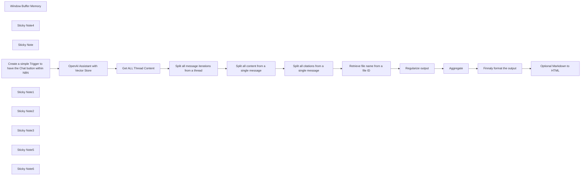

## Fluxo (.json) :

```json
{
  "id": "5NAbfX550LJsfz6f",
  "meta": {
    "instanceId": "00493e38fecfc163cb182114bc2fab90114038eb9aad665a7a752d076920d3d5",
    "templateCredsSetupCompleted": true
  },
  "name": "Make OpenAI Citation for File Retrieval RAG",
  "tags": [
    {
      "id": "urxRtGxxLObZWPvX",
      "name": "sample",
      "createdAt": "2024-09-13T02:43:13.014Z",
      "updatedAt": "2024-09-13T02:43:13.014Z"
    },
    {
      "id": "nMXS3c9l1WqDwWF5",
      "name": "assist",
      "createdAt": "2024-12-23T16:09:38.737Z",
      "updatedAt": "2024-12-23T16:09:38.737Z"
    }
  ],
  "nodes": [
    {
      "id": "b9033511-3421-467a-9bfa-73af01b99c4f",
      "name": "Aggregate",
      "type": "n8n-nodes-base.aggregate",
      "position": [
        740,
        120
      ],
      "parameters": {
        "options": {},
        "aggregate": "aggregateAllItemData"
      },
      "typeVersion": 1,
      "alwaysOutputData": true
    },
    {
      "id": "a61dd9d3-4faa-4878-a6f3-ba8277279002",
      "name": "Window Buffer Memory",
      "type": "@n8n/n8n-nodes-langchain.memoryBufferWindow",
      "position": [
        980,
        -320
      ],
      "parameters": {},
      "typeVersion": 1.3
    },
    {
      "id": "2daabca5-37ec-4cad-9157-29926367e1a7",
      "name": "Sticky Note4",
      "type": "n8n-nodes-base.stickyNote",
      "position": [
        220,
        320
      ],
      "parameters": {
        "color": 3,
        "width": 840,
        "height": 80,
        "content": "## Within N8N, there will be a chat button to test"
      },
      "typeVersion": 1
    },
    {
      "id": "bf4485b1-cd94-41c8-a183-bf1b785f2761",
      "name": "Sticky Note",
      "type": "n8n-nodes-base.stickyNote",
      "position": [
        -440,
        -520
      ],
      "parameters": {
        "color": 5,
        "width": 500,
        "height": 720,
        "content": "## Make OpenAI Citation for File Retrieval RAG\n\n## Use case\n\nIn this example, we will ensure that all texts from the OpenAI assistant search for citations and sources in the vector store files. We can also format the output for Markdown or HTML tags.\n\nThis is necessary because the assistant sometimes generates strange characters, and we can also use dynamic references such as citations 1, 2, 3, for example.\n\n## What this workflow does\n\nIn this workflow, we will use an OpenAI assistant created within their interface, equipped with a vector store containing some files for file retrieval.\n\nThe assistant will perform the file search within the OpenAI infrastructure and will return the content with citations.\n\n- We will make an HTTP request to retrieve all the details we need to format the text output.\n\n## Setup\n\nInsert an OpenAI Key\n\n## How to adjust it to your needs\n\nAt the end of the workflow, we have a block of code that will format the output, and there we can add Markdown tags to create links. Optionally, we can transform the Markdown formatting into HTML.\n\n\nby Davi Saranszky Mesquita\nhttps://www.linkedin.com/in/mesquitadavi/"
      },
      "typeVersion": 1
    },
    {
      "id": "539a4e40-9745-4a26-aba8-2cc2b0dd6364",
      "name": "Create a simple Trigger to have the Chat button within N8N",
      "type": "@n8n/n8n-nodes-langchain.chatTrigger",
      "notes": "https://www.npmjs.com/package/@n8n/chat",
      "position": [
        260,
        -520
      ],
      "webhookId": "8ccaa299-6f99-427b-9356-e783893a3d0c",
      "parameters": {
        "options": {}
      },
      "notesInFlow": true,
      "typeVersion": 1.1
    },
    {
      "id": "aa5b2951-df32-43ac-9939-83b02d818e73",
      "name": "OpenAI Assistant with Vector Store",
      "type": "@n8n/n8n-nodes-langchain.openAi",
      "position": [
        580,
        -520
      ],
      "parameters": {
        "options": {
          "preserveOriginalTools": false
        },
        "resource": "assistant",
        "assistantId": {
          "__rl": true,
          "mode": "list",
          "value": "asst_QAfdobVCVCMJz8LmaEC7nlId",
          "cachedResultName": "Teste"
        }
      },
      "credentials": {
        "openAiApi": {
          "id": "UfNrqPCRlD8FD9mk",
          "name": "OpenAi Lourival"
        }
      },
      "typeVersion": 1.7
    },
    {
      "id": "1817b673-6cb3-49aa-9f38-a5876eb0e6fa",
      "name": "Sticky Note1",
      "type": "n8n-nodes-base.stickyNote",
      "position": [
        560,
        -680
      ],
      "parameters": {
        "width": 300,
        "content": "## Setup\n\n- Configure OpenAI Key\n\n### In this step, we will use an assistant created within the OpenAI platform that contains a vector store a.k.a file retrieval"
      },
      "typeVersion": 1
    },
    {
      "id": "16429226-e850-4698-b419-fd9805a03fb7",
      "name": "Get ALL Thread Content",
      "type": "n8n-nodes-base.httpRequest",
      "position": [
        1260,
        -520
      ],
      "parameters": {
        "url": "=https://api.openai.com/v1/threads/{{ $json.threadId }}/messages",
        "options": {},
        "sendHeaders": true,
        "authentication": "predefinedCredentialType",
        "headerParameters": {
          "parameters": [
            {
              "name": "OpenAI-Beta",
              "value": "assistants=v2"
            }
          ]
        },
        "nodeCredentialType": "openAiApi"
      },
      "credentials": {
        "openAiApi": {
          "id": "UfNrqPCRlD8FD9mk",
          "name": "OpenAi Lourival"
        }
      },
      "typeVersion": 4.2,
      "alwaysOutputData": true
    },
    {
      "id": "e8c88b08-5be2-4f7e-8b17-8cf804b3fe9f",
      "name": "Sticky Note2",
      "type": "n8n-nodes-base.stickyNote",
      "position": [
        1160,
        -620
      ],
      "parameters": {
        "content": "### Retrieving all thread content is necessary because the OpenAI tool does not retrieve all citations upon request."
      },
      "typeVersion": 1
    },
    {
      "id": "0f51e09f-2782-4e2d-b797-d4d58fcabdaf",
      "name": "Split all message iterations from a thread",
      "type": "n8n-nodes-base.splitOut",
      "position": [
        220,
        -300
      ],
      "parameters": {
        "options": {},
        "fieldToSplitOut": "data"
      },
      "typeVersion": 1,
      "alwaysOutputData": true
    },
    {
      "id": "4d569993-1ce3-4b32-beaf-382feac25da9",
      "name": "Split all content from a single message",
      "type": "n8n-nodes-base.splitOut",
      "position": [
        460,
        -300
      ],
      "parameters": {
        "options": {},
        "fieldToSplitOut": "content"
      },
      "typeVersion": 1,
      "alwaysOutputData": true
    },
    {
      "id": "999e1c2b-1927-4483-aac1-6e8903f7ed25",
      "name": "Split all citations from a single message",
      "type": "n8n-nodes-base.splitOut",
      "position": [
        700,
        -300
      ],
      "parameters": {
        "options": {},
        "fieldToSplitOut": "text.annotations"
      },
      "typeVersion": 1,
      "alwaysOutputData": true
    },
    {
      "id": "98af62f5-adb0-4e07-a146-fc2f13b851ce",
      "name": "Retrieve file name from a file ID",
      "type": "n8n-nodes-base.httpRequest",
      "onError": "continueRegularOutput",
      "position": [
        220,
        120
      ],
      "parameters": {
        "url": "=https://api.openai.com/v1/files/{{ $json.file_citation.file_id }}",
        "options": {},
        "sendQuery": true,
        "authentication": "predefinedCredentialType",
        "queryParameters": {
          "parameters": [
            {
              "name": "limit",
              "value": "1"
            }
          ]
        },
        "nodeCredentialType": "openAiApi"
      },
      "credentials": {
        "openAiApi": {
          "id": "UfNrqPCRlD8FD9mk",
          "name": "OpenAi Lourival"
        }
      },
      "typeVersion": 4.2,
      "alwaysOutputData": true
    },
    {
      "id": "b11f0d3d-bdc4-4845-b14b-d0b0de214f01",
      "name": "Regularize output",
      "type": "n8n-nodes-base.set",
      "position": [
        480,
        120
      ],
      "parameters": {
        "options": {},
        "assignments": {
          "assignments": [
            {
              "id": "2dcaafee-5037-4a97-942a-bcdd02bc2ad9",
              "name": "id",
              "type": "string",
              "value": "={{ $json.id }}"
            },
            {
              "id": "b63f967d-ceea-4aa8-98b9-91f5ab21bfe8",
              "name": "filename",
              "type": "string",
              "value": "={{ $json.filename }}"
            },
            {
              "id": "f611e749-054a-441d-8610-df8ba42de2e1",
              "name": "text",
              "type": "string",
              "value": "={{ $('Split all citations from a single message').item.json.text }}"
            }
          ]
        }
      },
      "typeVersion": 3.4,
      "alwaysOutputData": true
    },
    {
      "id": "0e999a0e-76ed-4897-989b-228f075e9bfb",
      "name": "Sticky Note3",
      "type": "n8n-nodes-base.stickyNote",
      "position": [
        440,
        -60
      ],
      "parameters": {
        "width": 200,
        "height": 220,
        "content": "### A file retrieval request contains a lot of information, and we want only the text that will be substituted and the file name.\n\n- id\n- filename\n- text\n"
      },
      "typeVersion": 1
    },
    {
      "id": "53c79a6c-7543-435f-b40e-966dff0904d4",
      "name": "Sticky Note5",
      "type": "n8n-nodes-base.stickyNote",
      "position": [
        700,
        -60
      ],
      "parameters": {
        "width": 200,
        "height": 220,
        "content": "### With the last three splits, we may have many citations and texts to substitute. By doing an aggregation, it will be possible to handle everything as a single request."
      },
      "typeVersion": 1
    },
    {
      "id": "381fb6d6-64fc-4668-9d3c-98aaa43a45ca",
      "name": "Sticky Note6",
      "type": "n8n-nodes-base.stickyNote",
      "position": [
        960,
        -60
      ],
      "parameters": {
        "height": 220,
        "content": "### This simple code will take all the previous files and citations and alter the original text, formatting the output. In this way, we can use Markdown tags to create links, or if you prefer, we can add an HTML transformation node."
      },
      "typeVersion": 1
    },
    {
      "id": "d0cbb943-57ab-4850-8370-1625610a852a",
      "name": "Optional Markdown to HTML",
      "type": "n8n-nodes-base.markdown",
      "disabled": true,
      "position": [
        1220,
        120
      ],
      "parameters": {
        "html": "={{ $json.output }}",
        "options": {},
        "destinationKey": "output"
      },
      "typeVersion": 1
    },
    {
      "id": "589e2418-5dec-47d0-ba08-420d84f09da7",
      "name": "Finnaly format the output",
      "type": "n8n-nodes-base.code",
      "position": [
        980,
        120
      ],
      "parameters": {
        "mode": "runOnceForEachItem",
        "jsCode": "let saida = $('OpenAI Assistant with Vector Store').item.json.output;\n\nfor (let i of $input.item.json.data) {\n  saida = saida.replaceAll(i.text, \"  _(\"+ i.filename+\")_  \");\n}\n\n$input.item.json.output = saida;\nreturn $input.item;"
      },
      "typeVersion": 2
    }
  ],
  "active": false,
  "pinData": {},
  "settings": {
    "executionOrder": "v1"
  },
  "versionId": "0e621a5a-d99d-4db3-9ae4-ea98c31467e9",
  "connections": {
    "Aggregate": {
      "main": [
        [
          {
            "node": "Finnaly format the output",
            "type": "main",
            "index": 0
          }
        ]
      ]
    },
    "Regularize output": {
      "main": [
        [
          {
            "node": "Aggregate",
            "type": "main",
            "index": 0
          }
        ]
      ]
    },
    "Window Buffer Memory": {
      "ai_memory": [
        [
          {
            "node": "OpenAI Assistant with Vector Store",
            "type": "ai_memory",
            "index": 0
          }
        ]
      ]
    },
    "Get ALL Thread Content": {
      "main": [
        [
          {
            "node": "Split all message iterations from a thread",
            "type": "main",
            "index": 0
          }
        ]
      ]
    },
    "Finnaly format the output": {
      "main": [
        [
          {
            "node": "Optional Markdown to HTML",
            "type": "main",
            "index": 0
          }
        ]
      ]
    },
    "Retrieve file name from a file ID": {
      "main": [
        [
          {
            "node": "Regularize output",
            "type": "main",
            "index": 0
          }
        ]
      ]
    },
    "OpenAI Assistant with Vector Store": {
      "main": [
        [
          {
            "node": "Get ALL Thread Content",
            "type": "main",
            "index": 0
          }
        ]
      ]
    },
    "Split all content from a single message": {
      "main": [
        [
          {
            "node": "Split all citations from a single message",
            "type": "main",
            "index": 0
          }
        ]
      ]
    },
    "Split all citations from a single message": {
      "main": [
        [
          {
            "node": "Retrieve file name from a file ID",
            "type": "main",
            "index": 0
          }
        ]
      ]
    },
    "Split all message iterations from a thread": {
      "main": [
        [
          {
            "node": "Split all content from a single message",
            "type": "main",
            "index": 0
          }
        ]
      ]
    },
    "Create a simple Trigger to have the Chat button within N8N": {
      "main": [
        [
          {
            "node": "OpenAI Assistant with Vector Store",
            "type": "main",
            "index": 0
          }
        ]
      ]
    }
  }
}
```

<a id="template-1227"></a>

## Template 1227 - Análise de sentimento de comentários do YouTube

- **Nome:** Análise de sentimento de comentários do YouTube
- **Descrição:** Coleta comentários de vídeos do YouTube e adiciona uma análise de sentimento aos registros em uma planilha do Google Sheets, sincronizando timestamps de execução.
- **Funcionalidade:** • Leitura de URLs de vídeos: Recupera a lista de URLs de uma aba dedicada na planilha.
• Verificação de agendamento: Verifica o campo next_fetch_time para decidir se deve executar a busca de comentários.
• Busca de comentários com paginação: Consulta a API do YouTube para obter threads de comentários, suportando múltiplas páginas de resultados.
• Validação de resposta HTTP: Confirma que a resposta da API foi bem-sucedida antes de processar os dados.
• Análise de sentimento por comentário: Envia cada comentário para um modelo de linguagem para classificar como Positivo, Neutro ou Negativo.
• Formatação dos dados: Prepara campos (ID do comentário, URL do vídeo, autor, likes, replies, data de publicação e sentimento) para armazenamento.
• Inserção/atualização na planilha de resultados: Adiciona ou atualiza comentários na aba de resultados, evitando duplicatas com base no ID do comentário.
• Atualização de timestamps: Atualiza last_fetched_time e next_fetch_time na planilha de URLs após o processamento.
• Execução manual: Possibilidade de disparar o fluxo manualmente para testes ou execuções ad-hoc.
- **Ferramentas:** • Google Sheets: Armazena a lista de URLs dos vídeos, os resultados dos comentários e os timestamps de execução (requer conta/credenciais de serviço).
• YouTube Data API v3: Fonte dos comentários dos vídeos, incluindo suporte a paginação de resultados.
• OpenAI API (modelo de linguagem): Realiza a análise de sentimento dos textos dos comentários.

## Fluxo visual

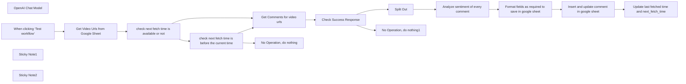

## Fluxo (.json) :

```json
{
  "id": "xaC6zL4bWBo14xyJ",
  "meta": {
    "instanceId": "10f6e8a86649316fe7041c503c24e6d77b68a961a9f4f1f76d0100c435446092",
    "templateCredsSetupCompleted": true
  },
  "name": "YouTube Comment Sentiment Analyzer",
  "tags": [],
  "nodes": [
    {
      "id": "0bacd739-7ea3-42f5-8986-2f7d47628ee9",
      "name": "Split Out",
      "type": "n8n-nodes-base.splitOut",
      "position": [
        820,
        -40
      ],
      "parameters": {
        "options": {},
        "fieldToSplitOut": "body.items"
      },
      "typeVersion": 1
    },
    {
      "id": "236aaaab-6a9a-42d7-8645-980bf8c3254d",
      "name": "OpenAI Chat Model",
      "type": "@n8n/n8n-nodes-langchain.lmChatOpenAi",
      "position": [
        1080,
        180
      ],
      "parameters": {
        "model": {
          "__rl": true,
          "mode": "list",
          "value": "gpt-4o-mini"
        },
        "options": {}
      },
      "credentials": {
        "openAiApi": {
          "id": "4d73v7kxEDNu3n25",
          "name": "OpenAi account"
        }
      },
      "typeVersion": 1.2
    },
    {
      "id": "c1eda3a6-9fbe-4150-8086-c3ffebaeb2e1",
      "name": "No Operation, do nothing",
      "type": "n8n-nodes-base.noOp",
      "position": [
        380,
        140
      ],
      "parameters": {},
      "typeVersion": 1
    },
    {
      "id": "d28f3fbf-6013-47af-ba84-3bdd9800fd3b",
      "name": "Get Video Urls from Google Sheet",
      "type": "n8n-nodes-base.googleSheets",
      "position": [
        -200,
        -40
      ],
      "parameters": {
        "options": {},
        "sheetName": {
          "__rl": true,
          "mode": "list",
          "value": 760258523,
          "cachedResultUrl": "https://docs.google.com/spreadsheets/d/1xoCVr_mlwn4jFcnJENtrU-_K5nkIytZ8qBXzxMq55n4/edit#gid=760258523",
          "cachedResultName": "Sheet2"
        },
        "documentId": {
          "__rl": true,
          "mode": "list",
          "value": "1xoCVr_mlwn4jFcnJENtrU-_K5nkIytZ8qBXzxMq55n4",
          "cachedResultUrl": "https://docs.google.com/spreadsheets/d/1xoCVr_mlwn4jFcnJENtrU-_K5nkIytZ8qBXzxMq55n4/edit?usp=drivesdk",
          "cachedResultName": "Youtube Videos Comments"
        },
        "authentication": "serviceAccount"
      },
      "credentials": {
        "googleApi": {
          "id": "jPoTdPxgVL0vr9SQ",
          "name": "Google Sheets account"
        }
      },
      "typeVersion": 4.5
    },
    {
      "id": "0ac06530-cfe7-4f1c-8c0a-8def2126df0f",
      "name": "check next fetch time is available or not",
      "type": "n8n-nodes-base.if",
      "position": [
        -20,
        -40
      ],
      "parameters": {
        "options": {},
        "conditions": {
          "options": {
            "version": 2,
            "leftValue": "",
            "caseSensitive": true,
            "typeValidation": "strict"
          },
          "combinator": "and",
          "conditions": [
            {
              "id": "92084960-e023-4cd6-a5c0-ddd43275cc33",
              "operator": {
                "type": "string",
                "operation": "empty",
                "singleValue": true
              },
              "leftValue": "={{ $json.next_fetch_time }}",
              "rightValue": "={{ $now.toISO() }}"
            }
          ]
        }
      },
      "typeVersion": 2.2
    },
    {
      "id": "ba42f450-3b0c-41a3-8e72-d2a38b97cfc7",
      "name": "check next fetch time is before the current time",
      "type": "n8n-nodes-base.if",
      "position": [
        160,
        80
      ],
      "parameters": {
        "options": {},
        "conditions": {
          "options": {
            "version": 2,
            "leftValue": "",
            "caseSensitive": true,
            "typeValidation": "strict"
          },
          "combinator": "and",
          "conditions": [
            {
              "id": "40c8d081-b298-46b1-850c-2322ed89d18d",
              "operator": {
                "type": "dateTime",
                "operation": "before"
              },
              "leftValue": "={{ $json.next_fetch_time }}",
              "rightValue": "={{ $now.toISO() }}"
            }
          ]
        }
      },
      "typeVersion": 2.2
    },
    {
      "id": "aad11f42-b976-41d7-b771-151da60391d6",
      "name": "Get Comments for video urls",
      "type": "n8n-nodes-base.httpRequest",
      "position": [
        360,
        -60
      ],
      "parameters": {
        "url": "https://www.googleapis.com/youtube/v3/commentThreads",
        "options": {
          "response": {
            "response": {
              "fullResponse": true,
              "responseFormat": "json"
            }
          },
          "pagination": {
            "pagination": {
              "parameters": {
                "parameters": [
                  {
                    "name": "pageToken",
                    "value": "={{ $response.body.nextPageToken }}"
                  }
                ]
              },
              "completeExpression": "={{ !$response.body.nextPageToken}}",
              "paginationCompleteWhen": "other"
            }
          }
        },
        "sendQuery": true,
        "authentication": "genericCredentialType",
        "genericAuthType": "httpQueryAuth",
        "queryParameters": {
          "parameters": [
            {
              "name": "part",
              "value": "snippet"
            },
            {
              "name": "videoId",
              "value": "={{ $json[\"video_urls\"].match(/(?:v=|/)([0-9A-Za-z_-]{11})/)[1] || ''}}"
            },
            {
              "name": "maxResults",
              "value": "100"
            }
          ]
        }
      },
      "credentials": {
        "httpQueryAuth": {
          "id": "LmsYEaslJmA6CMdL",
          "name": "Query Auth account 4"
        }
      },
      "typeVersion": 4.2
    },
    {
      "id": "4cf1ebd0-e260-4e53-bc26-be1db2f6e7f2",
      "name": "Analyze sentiment of every comment",
      "type": "@n8n/n8n-nodes-langchain.sentimentAnalysis",
      "position": [
        1060,
        -40
      ],
      "parameters": {
        "options": {
          "categories": "Positive, Neutral, Negative",
          "systemPromptTemplate": "You are highly intelligent and accurate sentiment analyzer. Analyze the sentiment of the provided text. Categorize it into one of the following: {categories}. Use the provided formatting instructions. Only output the JSON."
        },
        "inputText": "={{ $json.snippet.topLevelComment.snippet.textOriginal }}"
      },
      "typeVersion": 1
    },
    {
      "id": "f306c5cd-6b6b-46fa-b7ef-f3ccef960931",
      "name": "Format fields as required to save in google sheet",
      "type": "n8n-nodes-base.set",
      "position": [
        1500,
        -40
      ],
      "parameters": {
        "options": {},
        "assignments": {
          "assignments": [
            {
              "id": "25fb96a0-de38-4495-8473-0385a3fd5df9",
              "name": "commentId",
              "type": "string",
              "value": "={{ $json.snippet.topLevelComment.id }}"
            },
            {
              "id": "d824ecd0-89c0-4c07-992f-6a5d3421690e",
              "name": "video_url",
              "type": "string",
              "value": "=https://www.youtube.com/watch?v={{ $json.snippet.videoId }}"
            },
            {
              "id": "cdcbc3d9-ab3e-4d7d-80a7-bfe168b0ed27",
              "name": "comment",
              "type": "string",
              "value": "={{ $json.snippet.topLevelComment.snippet.textOriginal }}"
            },
            {
              "id": "20bcfe96-3904-44d2-b72a-9eb49d603c8d",
              "name": "authorName",
              "type": "string",
              "value": "={{ $json.snippet.topLevelComment.snippet.authorDisplayName }}"
            },
            {
              "id": "c92f56bf-8b37-4c4e-9ce7-b7a49d63deee",
              "name": "likes",
              "type": "string",
              "value": "={{ $json.snippet.topLevelComment.snippet.likeCount }}"
            },
            {
              "id": "7cc4fdb3-7c41-418a-bf4f-71081fe9df74",
              "name": "reply",
              "type": "string",
              "value": "={{ $json.snippet.totalReplyCount }}"
            },
            {
              "id": "9988ea66-7f31-4b2c-90ab-3cad8efabf95",
              "name": "sentiment",
              "type": "string",
              "value": "={{ $json.sentimentAnalysis.category }}"
            },
            {
              "id": "6552df27-6e04-4048-b3c2-1e1755ccac28",
              "name": "published_at",
              "type": "string",
              "value": "={{ $json.snippet.topLevelComment.snippet.publishedAt }}"
            }
          ]
        }
      },
      "typeVersion": 3.4
    },
    {
      "id": "6cd20a6e-8bcc-44c7-a62d-e3c3c75e6d9a",
      "name": "Insert and update comment in google sheet",
      "type": "n8n-nodes-base.googleSheets",
      "position": [
        1720,
        -40
      ],
      "parameters": {
        "columns": {
          "value": {},
          "schema": [
            {
              "id": "commentId",
              "type": "string",
              "display": true,
              "removed": false,
              "required": false,
              "displayName": "commentId",
              "defaultMatch": false,
              "canBeUsedToMatch": true
            },
            {
              "id": "video_url",
              "type": "string",
              "display": true,
              "required": false,
              "displayName": "video_url",
              "defaultMatch": false,
              "canBeUsedToMatch": true
            },
            {
              "id": "comment",
              "type": "string",
              "display": true,
              "required": false,
              "displayName": "comment",
              "defaultMatch": false,
              "canBeUsedToMatch": true
            },
            {
              "id": "authorName",
              "type": "string",
              "display": true,
              "required": false,
              "displayName": "authorName",
              "defaultMatch": false,
              "canBeUsedToMatch": true
            },
            {
              "id": "likes",
              "type": "string",
              "display": true,
              "required": false,
              "displayName": "likes",
              "defaultMatch": false,
              "canBeUsedToMatch": true
            },
            {
              "id": "reply",
              "type": "string",
              "display": true,
              "required": false,
              "displayName": "reply",
              "defaultMatch": false,
              "canBeUsedToMatch": true
            },
            {
              "id": "sentiment",
              "type": "string",
              "display": true,
              "required": false,
              "displayName": "sentiment",
              "defaultMatch": false,
              "canBeUsedToMatch": true
            },
            {
              "id": "published_at",
              "type": "string",
              "display": true,
              "required": false,
              "displayName": "published_at",
              "defaultMatch": false,
              "canBeUsedToMatch": true
            }
          ],
          "mappingMode": "autoMapInputData",
          "matchingColumns": [
            "commentId"
          ],
          "attemptToConvertTypes": false,
          "convertFieldsToString": false
        },
        "options": {},
        "operation": "appendOrUpdate",
        "sheetName": {
          "__rl": true,
          "mode": "list",
          "value": "gid=0",
          "cachedResultUrl": "https://docs.google.com/spreadsheets/d/1xoCVr_mlwn4jFcnJENtrU-_K5nkIytZ8qBXzxMq55n4/edit#gid=0",
          "cachedResultName": "Sheet1"
        },
        "documentId": {
          "__rl": true,
          "mode": "list",
          "value": "1xoCVr_mlwn4jFcnJENtrU-_K5nkIytZ8qBXzxMq55n4",
          "cachedResultUrl": "https://docs.google.com/spreadsheets/d/1xoCVr_mlwn4jFcnJENtrU-_K5nkIytZ8qBXzxMq55n4/edit?usp=drivesdk",
          "cachedResultName": "Youtube Videos Comments"
        },
        "authentication": "serviceAccount"
      },
      "credentials": {
        "googleApi": {
          "id": "jPoTdPxgVL0vr9SQ",
          "name": "Google Sheets account"
        }
      },
      "typeVersion": 4.5
    },
    {
      "id": "ea240f38-1462-402b-8db2-36b3e8664c2f",
      "name": "Update last fetched time and next_fetch_time",
      "type": "n8n-nodes-base.googleSheets",
      "position": [
        1940,
        -40
      ],
      "parameters": {
        "columns": {
          "value": {
            "video_urls": "={{ $('Get Video Urls from Google Sheet').item.json.video_urls }}",
            "next_fetch_time": "={{ $now.plus(5, 'min').toISO() }}",
            "last_fetched_time": "={{ $now.toISO() }}"
          },
          "schema": [
            {
              "id": "video_urls",
              "type": "string",
              "display": true,
              "removed": false,
              "required": false,
              "displayName": "video_urls",
              "defaultMatch": false,
              "canBeUsedToMatch": true
            },
            {
              "id": "last_fetched_time",
              "type": "string",
              "display": true,
              "required": false,
              "displayName": "last_fetched_time",
              "defaultMatch": false,
              "canBeUsedToMatch": true
            },
            {
              "id": "next_fetch_time",
              "type": "string",
              "display": true,
              "required": false,
              "displayName": "next_fetch_time",
              "defaultMatch": false,
              "canBeUsedToMatch": true
            }
          ],
          "mappingMode": "defineBelow",
          "matchingColumns": [
            "video_urls"
          ],
          "attemptToConvertTypes": false,
          "convertFieldsToString": false
        },
        "options": {},
        "operation": "appendOrUpdate",
        "sheetName": {
          "__rl": true,
          "mode": "list",
          "value": 760258523,
          "cachedResultUrl": "https://docs.google.com/spreadsheets/d/1xoCVr_mlwn4jFcnJENtrU-_K5nkIytZ8qBXzxMq55n4/edit#gid=760258523",
          "cachedResultName": "Sheet2"
        },
        "documentId": {
          "__rl": true,
          "mode": "list",
          "value": "1xoCVr_mlwn4jFcnJENtrU-_K5nkIytZ8qBXzxMq55n4",
          "cachedResultUrl": "https://docs.google.com/spreadsheets/d/1xoCVr_mlwn4jFcnJENtrU-_K5nkIytZ8qBXzxMq55n4/edit?usp=drivesdk",
          "cachedResultName": "Youtube Videos Comments"
        },
        "authentication": "serviceAccount"
      },
      "credentials": {
        "googleApi": {
          "id": "jPoTdPxgVL0vr9SQ",
          "name": "Google Sheets account"
        }
      },
      "typeVersion": 4.5
    },
    {
      "id": "610fa83c-a626-42c0-aa8b-1ebb1a6bcf44",
      "name": "No Operation, do nothing1",
      "type": "n8n-nodes-base.noOp",
      "position": [
        820,
        140
      ],
      "parameters": {},
      "typeVersion": 1
    },
    {
      "id": "30570a68-78b8-434e-bb20-ea85a0689a63",
      "name": "When clicking ‘Test workflow’",
      "type": "n8n-nodes-base.manualTrigger",
      "position": [
        -380,
        -40
      ],
      "parameters": {},
      "typeVersion": 1
    },
    {
      "id": "4fe79a97-fc39-41c0-9d2f-f07865deef5e",
      "name": "Sticky Note1",
      "type": "n8n-nodes-base.stickyNote",
      "position": [
        -440,
        -160
      ],
      "parameters": {
        "color": 5,
        "width": 2620,
        "height": 480,
        "content": "\n# 🚀 YouTube Comment Sentiment Analyzer with Google Sheets & OpenAI"
      },
      "typeVersion": 1
    },
    {
      "id": "0ccb85d8-d29e-44a7-b644-49b3dcc6ce9b",
      "name": "Check Success Response",
      "type": "n8n-nodes-base.if",
      "position": [
        560,
        -60
      ],
      "parameters": {
        "options": {},
        "conditions": {
          "options": {
            "version": 2,
            "leftValue": "",
            "caseSensitive": true,
            "typeValidation": "strict"
          },
          "combinator": "and",
          "conditions": [
            {
              "id": "bce76f94-5904-4fdb-b172-adc1134855f9",
              "operator": {
                "type": "number",
                "operation": "equals"
              },
              "leftValue": "={{ $json.statusCode }}",
              "rightValue": 200
            }
          ]
        }
      },
      "typeVersion": 2.2
    },
    {
      "id": "880f570f-6300-4659-9dcf-d47880140131",
      "name": "Sticky Note2",
      "type": "n8n-nodes-base.stickyNote",
      "position": [
        -1100,
        -500
      ],
      "parameters": {
        "width": 640,
        "height": 820,
        "content": "### **How to Use This Workflow:**\n📝 **YouTube Comment Sentiment Analyzer**\n\n1. 🔘 **Trigger:** Click \"Execute Workflow\" to run it manually.\n\n2. 📄 Your Google Sheet should have **2 sheets**:\n   - **Sheet1 (Results with Sentiment):**\n     - Column A: `commentId` (YouTube comment id)\n     - Column B: `video_url` (url of video)\n     - Column C: `comment` (YouTube comment)\n     - Column D: `authorName` (Name of author as per Youtube)\n     - Column E: `likes` (Number of likes on that particular comment)\n     - Column f: `reply` (Number of replies on that particular comment)\n     - Column g: `sentiment` (Analyzed sentiment of the comment)\n     - Column h: `published_at` (timestamp of comment published)\n   \n   - **Sheet2 (Video URLs):**\n     - Column A: `video_urls` (list of YouTube video URLs)\n     - Column B: `last_fetched_time` (timestamp of the last fetch)\n     - Column C: `next_fetch_time` (time for the next fetch)\n\n3. 🔐 **Make sure these credentials are set up**:\n   - Google Sheets (Service Account)\n   - YouTube Data API v3\n   - OpenAI API Key (for sentiment analysis)\n\n4. ✅ **What this workflow does**:\n   - Reads **video URLs** from **Sheet2**.\n   - Checks **last fetched time** (if applicable).\n   - Fetches new comments from YouTube.\n   - Analyzes sentiment using OpenAI.\n   - Appends **comment**, **sentiment**, **video ID**, and **timestamp** to **Sheet1**.\n   - Updates **last_fetched** timestamp in **Sheet2**.\n\n5. 💡 **Tip:**\n   - You can replace the **Manual Trigger** with a **Cron node** for automatic execution at specified intervals.\n"
      },
      "typeVersion": 1
    }
  ],
  "active": false,
  "pinData": {},
  "settings": {
    "executionOrder": "v1"
  },
  "versionId": "70007187-7437-4053-b909-5057bf816906",
  "connections": {
    "Split Out": {
      "main": [
        [
          {
            "node": "Analyze sentiment of every comment",
            "type": "main",
            "index": 0
          }
        ]
      ]
    },
    "OpenAI Chat Model": {
      "ai_languageModel": [
        [
          {
            "node": "Analyze sentiment of every comment",
            "type": "ai_languageModel",
            "index": 0
          }
        ]
      ]
    },
    "Check Success Response": {
      "main": [
        [
          {
            "node": "Split Out",
            "type": "main",
            "index": 0
          }
        ],
        [
          {
            "node": "No Operation, do nothing1",
            "type": "main",
            "index": 0
          }
        ]
      ]
    },
    "Get Comments for video urls": {
      "main": [
        [
          {
            "node": "Check Success Response",
            "type": "main",
            "index": 0
          }
        ]
      ]
    },
    "Get Video Urls from Google Sheet": {
      "main": [
        [
          {
            "node": "check next fetch time is available or not",
            "type": "main",
            "index": 0
          }
        ]
      ]
    },
    "When clicking ‘Test workflow’": {
      "main": [
        [
          {
            "node": "Get Video Urls from Google Sheet",
            "type": "main",
            "index": 0
          }
        ]
      ]
    },
    "Analyze sentiment of every comment": {
      "main": [
        [
          {
            "node": "Format fields as required to save in google sheet",
            "type": "main",
            "index": 0
          }
        ],
        [
          {
            "node": "Format fields as required to save in google sheet",
            "type": "main",
            "index": 0
          }
        ],
        [
          {
            "node": "Format fields as required to save in google sheet",
            "type": "main",
            "index": 0
          }
        ]
      ]
    },
    "Insert and update comment in google sheet": {
      "main": [
        [
          {
            "node": "Update last fetched time and next_fetch_time",
            "type": "main",
            "index": 0
          }
        ]
      ]
    },
    "check next fetch time is available or not": {
      "main": [
        [
          {
            "node": "Get Comments for video urls",
            "type": "main",
            "index": 0
          }
        ],
        [
          {
            "node": "check next fetch time is before the current time",
            "type": "main",
            "index": 0
          }
        ]
      ]
    },
    "Update last fetched time and next_fetch_time": {
      "main": [
        []
      ]
    },
    "check next fetch time is before the current time": {
      "main": [
        [
          {
            "node": "Get Comments for video urls",
            "type": "main",
            "index": 0
          }
        ],
        [
          {
            "node": "No Operation, do nothing",
            "type": "main",
            "index": 0
          }
        ]
      ]
    },
    "Format fields as required to save in google sheet": {
      "main": [
        [
          {
            "node": "Insert and update comment in google sheet",
            "type": "main",
            "index": 0
          }
        ]
      ]
    }
  }
}
```

<a id="template-1228"></a>

## Template 1228 - Geração de blueprint SEO para página de serviço

- **Nome:** Geração de blueprint SEO para página de serviço
- **Descrição:** Fluxo que analisa páginas concorrentes e a intenção do usuário para gerar um blueprint acionável de página de serviço (outline, recomendações de UX/copy e plano de conversão) em formato Markdown.
- **Funcionalidade:** • Captura de parâmetros via formulário: coleta lista de concorrentes, palavra-chave alvo, serviços oferecidos, nome da marca e se é homepage.
• Normalização e loop de URLs: transforma a lista de concorrentes em itens individuais e itera sobre cada URL.
• Recuperação de HTML renderizado: obtém o conteúdo das páginas concorrentes para análise.
• Extração de elementos HTML: identifica títulos, meta tags, headings (H1–H6) e blocos de JSON‑LD.
• Análise de headings por n‑grams: gera e conta 2‑gram, 3‑gram e 4‑gram para identificar conceitos recorrentes nas headings.
• Consolidação dos dados dos concorrentes: formata e agrega outline, meta e ngrams para uso em análises posteriores.
• Análises com modelo de linguagem: produz relatório de análise de concorrência e relatório de intenção do usuário.
• Síntese e gap analysis: combina insights dos concorrentes e da intenção para identificar oportunidades e prioridades de conteúdo/SEO.
• Geração do outline ideal: cria H1/H2/H3 (e H4 quando necessário) com justificativas estratégicas.
• Recomendações de UX, conversão e copywriting: define CTAs, trust signals, tom de voz, elementos visuais e estratégias de risco reverso.
• Compilação do blueprint final: consolida todas as saídas em um documento Markdown estruturado e exporta como arquivo .txt.
• Controles operacionais: inclui esperas entre chamadas, configuração de chave API e escolha do modelo para gerir taxa de solicitações.
- **Ferramentas:** • Jina Reader API: serviço que retorna conteúdo HTML renderizado a partir de URLs, usado para coletar o HTML das páginas concorrentes.
• Google Gemini (PaLM) API: modelo de linguagem utilizado para análises, síntese, geração de outline, recomendações de UX/copy e montagem do blueprint final.

## Fluxo visual

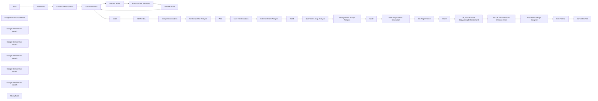

## Fluxo (.json) :

```json
{
  "id": "WETMyIJCbD3et6Rh",
  "meta": {
    "instanceId": "ddfdf733df99a65c801a91865dba5b7c087c95cc22a459ff3647e6deddf2aee6"
  },
  "name": "High-Level Service Page SEO Blueprint Report",
  "tags": [],
  "nodes": [
    {
      "id": "49aa0dd2-1d64-4047-9988-8e4f386d557a",
      "name": "Convert URLs to Items",
      "type": "n8n-nodes-base.code",
      "position": [
        600,
        500
      ],
      "parameters": {
        "jsCode": "// Get the raw input string from the \"Start\" node\nconst input = $('Start').item.json.Competitors;\n\n// Split the string by line breaks and filter out any empty lines\nconst urls = input\n  .split('\\n')\n  .map(url => url.trim())\n  .filter(url => url.length > 0);\n\n// Return the array as output with \"competitor_url\" field\nreturn urls.map(url => ({ json: { competitor_url: url } }));"
      },
      "typeVersion": 2
    },
    {
      "id": "ec7b74db-43fc-4041-b63e-02ff21b9442e",
      "name": "Start",
      "type": "n8n-nodes-base.formTrigger",
      "position": [
        240,
        500
      ],
      "webhookId": "dafbc2ba-7397-4f83-b84d-630294e636b0",
      "parameters": {
        "options": {},
        "formTitle": "Competitors Analysis for Service-Based Queries",
        "formFields": {
          "values": [
            {
              "fieldType": "textarea",
              "fieldLabel": "Competitors",
              "placeholder": "competitor1.com\ncompetitor2.com",
              "requiredField": true
            },
            {
              "fieldLabel": "Target Keyword",
              "requiredField": true
            },
            {
              "fieldType": "textarea",
              "fieldLabel": "Services Offered",
              "requiredField": true
            },
            {
              "fieldLabel": "Brand Name",
              "requiredField": true
            },
            {
              "fieldType": "dropdown",
              "fieldLabel": "Is Homepage?",
              "fieldOptions": {
                "values": [
                  {
                    "option": "Yes"
                  },
                  {
                    "option": "No"
                  }
                ]
              }
            }
          ]
        },
        "formDescription": "Generate a high-level service page content blueprint report to follow to beat the competition. \n\nNote: Do not add more than 5 competitors otherwise this could dilute the context and quality of the final report."
      },
      "typeVersion": 2.2
    },
    {
      "id": "c517d397-4962-4281-962e-a57e3a12bea0",
      "name": "Loop Over Items",
      "type": "n8n-nodes-base.splitInBatches",
      "position": [
        880,
        500
      ],
      "parameters": {
        "options": {}
      },
      "typeVersion": 3
    },
    {
      "id": "ac532215-626d-4690-9c99-d11f09fa86dc",
      "name": "Get URL HTML",
      "type": "n8n-nodes-base.httpRequest",
      "onError": "continueErrorOutput",
      "maxTries": 5,
      "position": [
        1100,
        340
      ],
      "parameters": {
        "url": "=https://r.jina.ai/{{ $json.competitor_url }}",
        "options": {},
        "sendHeaders": true,
        "headerParameters": {
          "parameters": [
            {
              "name": "Authorization",
              "value": "=Bearer {{ $('Edit Fields').first().json['JINA Reader API Key'] }}"
            },
            {
              "name": "X-Return-Format",
              "value": "html"
            }
          ]
        }
      },
      "executeOnce": false,
      "retryOnFail": true,
      "typeVersion": 4.2,
      "waitBetweenTries": 5000
    },
    {
      "id": "ed03887c-9996-4dfb-b46a-a745bc64864a",
      "name": "Extract HTML Elements",
      "type": "n8n-nodes-base.code",
      "position": [
        1300,
        340
      ],
      "parameters": {
        "jsCode": "// Function to remove inner HTML tags and decode common HTML entities\nfunction cleanText(text) {\n  // Remove any HTML tags inside the text\n  let cleaned = text.replace(/</?[^>]+(>|$)/g, '');\n\n  // Decode common HTML entities\n  cleaned = cleaned\n    .replace(/&nbsp;/g, ' ')  // Non-breaking space\n    .replace(/&amp;/g, '&')   // Ampersand\n    .replace(/&quot;/g, '\"')  // Double quote\n    .replace(/&lt;/g, '<')    // Less-than\n    .replace(/&gt;/g, '>')    // Greater-than\n    .replace(/&#8217;/g, \"'\")  // Right single quotation mark\n    .replace(/&#8220;/g, '\"')  // Left double quotation mark\n    .replace(/&#8221;/g, '\"')  // Right double quotation mark\n    .replace(/&rsquo;/g, \"'\")  // Right single quotation mark\n    .replace(/&lsquo;/g, \"'\")  // Left single quotation mark\n    .replace(/&rdquo;/g, '\"')  // Right double quotation mark\n    .replace(/&ldquo;/g, '\"')  // Left double quotation mark\n    .replace(/&mdash;/g, '—')  // Em dash\n    .replace(/&ndash;/g, '–')  // En dash\n    .replace(/&hellip;/g, '…') // Ellipsis\n    .replace(/&#(\\d+);/g, (match, dec) => String.fromCharCode(dec)); // Handle numeric entities\n\n  return cleaned.trim();  // Remove extra whitespace\n}\n\n// Function to generate n-grams from text\nfunction generateNgrams(text, n) {\n  // Convert text to lowercase and split into words\n  const words = text.toLowerCase()\n    .replace(/[^\\w\\s]|_/g, ' ')  // Replace punctuation and underscores with spaces\n    .replace(/\\s+/g, ' ')        // Replace multiple spaces with a single space\n    .trim()                       // Remove leading/trailing spaces\n    .split(' ');                  // Split into words\n  \n  // Filter out stop words and very short words (optional)\n  const filteredWords = words.filter(word => word.length > 1);\n  \n  // Generate n-grams\n  const ngrams = [];\n  for (let i = 0; i <= filteredWords.length - n; i++) {\n    ngrams.push(filteredWords.slice(i, i + n).join(' '));\n  }\n  \n  return ngrams;\n}\n\n// Function to count n-grams\nfunction countNgrams(textArray, n) {\n  const ngramCounts = {};\n  \n  textArray.forEach(text => {\n    const ngrams = generateNgrams(text, n);\n    \n    ngrams.forEach(ngram => {\n      ngramCounts[ngram] = (ngramCounts[ngram] || 0) + 1;\n    });\n  });\n  \n  // Convert to array of objects and sort by count (descending)\n  return Object.entries(ngramCounts)\n    .map(([phrase, count]) => ({ phrase, count }))\n    .sort((a, b) => b.count - a.count);\n}\n\n// Initialize an array to store the results for each item\nlet results = [];\n\n// Iterate through all items (each item corresponds to one URL in the loop)\nitems.forEach(item => {\n  // Get the raw HTML content for the current item\n  const html = item.json.data || '';  // Ensure you're getting the correct field where HTML is stored\n\n  // Initialize arrays to store the extracted outline\n  let outline = [];\n  let meta = {};\n  let schemas = [];\n  let headingTexts = []; // Store all heading texts for n-gram analysis\n\n  // Store all headings with their positions to maintain original order\n  let headingsWithPositions = [];\n  \n  // Extract heading content with a more robust approach\n  for (let i = 1; i <= 6; i++) {\n    // This regex pattern matches h1-h6 tags, capturing everything between opening and closing tags\n    // even if there are nested elements\n    const pattern = new RegExp(`<h${i}[^>]*>((?:.|\\n)*?)</h${i}>`, 'gi');\n    let match;\n    \n    while ((match = pattern.exec(html)) !== null) {\n      const fullContent = match[1];\n      const cleanedText = cleanText(fullContent);\n      \n      // Only add non-empty headings\n      if (cleanedText && cleanedText.trim().length > 0) {\n        headingsWithPositions.push({\n          position: match.index,\n          level: i,\n          tag: `h${i}`,\n          text: cleanedText\n        });\n        \n        // Add to headingTexts for n-gram analysis\n        headingTexts.push(cleanedText);\n      }\n    }\n  }\n  \n  // Sort headings by their position in the HTML to maintain the original order\n  headingsWithPositions.sort((a, b) => a.position - b.position);\n  \n  // Process the sorted headings\n  headingsWithPositions.forEach(heading => {\n    // Build the outline based on the heading level with dot-based indentation\n    const indentation = '.'.repeat(heading.level - 1);  // No dots for H1, one for H2, etc.\n    outline.push(`${indentation}${heading.tag.toUpperCase()}: ${heading.text}`);\n  });\n\n  // Generate n-grams (2-gram, 3-gram, and 4-gram) from all headings\n  const ngrams = {\n    '2gram': countNgrams(headingTexts, 2),\n    '3gram': countNgrams(headingTexts, 3),\n    '4gram': countNgrams(headingTexts, 4)\n  };\n  \n  // Filter out n-grams with only one occurrence (optional)\n  // This can be adjusted based on preference\n  const filteredNgrams = {\n    '2gram': ngrams['2gram'].filter(item => item.count > 1),\n    '3gram': ngrams['3gram'].filter(item => item.count > 1),\n    '4gram': ngrams['4gram'].filter(item => item.count > 1)\n  };\n\n  // Extract title tag\n  const titleMatch = html.match(/<title>(.*?)</title>/i);\n  if (titleMatch && titleMatch[1]) {\n    meta.title = cleanText(titleMatch[1]);\n  }\n\n  // Extract meta tags\n  const metaTags = [\n    { name: 'description', regex: /<meta\\s+name=\"description\"\\s+content=\"([^\"]*)\"[^>]*>/i },\n    { name: 'canonical', regex: /<link\\s+rel=\"canonical\"\\s+href=\"([^\"]*)\"[^>]*>/i },\n    { name: 'og:locale', regex: /<meta\\s+property=\"og:locale\"\\s+content=\"([^\"]*)\"[^>]*>/i },\n    { name: 'og:type', regex: /<meta\\s+property=\"og:type\"\\s+content=\"([^\"]*)\"[^>]*>/i },\n    { name: 'og:title', regex: /<meta\\s+property=\"og:title\"\\s+content=\"([^\"]*)\"[^>]*>/i },\n    { name: 'og:description', regex: /<meta\\s+property=\"og:description\"\\s+content=\"([^\"]*)\"[^>]*>/i },\n    { name: 'og:url', regex: /<meta\\s+property=\"og:url\"\\s+content=\"([^\"]*)\"[^>]*>/i },\n    { name: 'og:site_name', regex: /<meta\\s+property=\"og:site_name\"\\s+content=\"([^\"]*)\"[^>]*>/i },\n    { name: 'article:publisher', regex: /<meta\\s+property=\"article:publisher\"\\s+content=\"([^\"]*)\"[^>]*>/i },\n    { name: 'article:modified_time', regex: /<meta\\s+property=\"article:modified_time\"\\s+content=\"([^\"]*)\"[^>]*>/i },\n    { name: 'og:image', regex: /<meta\\s+property=\"og:image\"\\s+content=\"([^\"]*)\"[^>]*>/i },\n    { name: 'og:image:width', regex: /<meta\\s+property=\"og:image:width\"\\s+content=\"([^\"]*)\"[^>]*>/i },\n    { name: 'og:image:height', regex: /<meta\\s+property=\"og:image:height\"\\s+content=\"([^\"]*)\"[^>]*>/i },\n    { name: 'og:image:type', regex: /<meta\\s+property=\"og:image:type\"\\s+content=\"([^\"]*)\"[^>]*>/i },\n    { name: 'twitter:card', regex: /<meta\\s+name=\"twitter:card\"\\s+content=\"([^\"]*)\"[^>]*>/i },\n    { name: 'twitter:title', regex: /<meta\\s+name=\"twitter:title\"\\s+content=\"([^\"]*)\"[^>]*>/i },\n    { name: 'twitter:site', regex: /<meta\\s+name=\"twitter:site\"\\s+content=\"([^\"]*)\"[^>]*>/i }\n  ];\n\n  // Extract each meta tag\n  metaTags.forEach(tag => {\n    const match = html.match(tag.regex);\n    if (match && match[1]) {\n      meta[tag.name] = cleanText(match[1]);\n    }\n  });\n\n  // Extract all meta tags with name or property attributes (more general approach)\n  const generalMetaRegex = /<meta\\s+(?:name|property)=\"([^\"]*)\"\\s+content=\"([^\"]*)\"[^>]*>/gi;\n  let metaMatch;\n  while ((metaMatch = generalMetaRegex.exec(html)) !== null) {\n    const name = metaMatch[1];\n    const content = cleanText(metaMatch[2]);\n    \n    // Only add if not already captured and has content\n    if (content && !meta[name]) {\n      meta[name] = content;\n    }\n  }\n\n  // Extract JSON-LD schema data\n  const schemaRegex = /<script\\s+type=\"application/ld\\+json\"[^>]*>([\\s\\S]*?)</script>/gi;\n  let schemaMatch;\n  \n  while ((schemaMatch = schemaRegex.exec(html)) !== null) {\n    try {\n      const schemaText = schemaMatch[1].trim();\n      if (schemaText) {\n        const schemaData = JSON.parse(schemaText);\n        schemas.push(schemaData);\n      }\n    } catch (e) {\n      // If JSON parsing fails, add the raw text\n      schemas.push({ raw: schemaMatch[1].trim() });\n    }\n  }\n\n  // Add the outline, meta, schema, and ngrams for the current item to the results array\n  results.push({\n    json: {\n      outline: outline,  // Array containing the hierarchy of headings with dot-based indentation\n      meta: Object.keys(meta).length > 0 ? meta : undefined,  // Only include if meta tags were found\n      schema: schemas.length > 0 ? schemas : undefined,  // Only include if schema data was found\n      ngrams: headingTexts.length > 0 ? filteredNgrams : undefined  // Only include if headings were found\n    }\n  });\n});\n\n// Return the results for all items (all URLs in the loop)\nreturn results;"
      },
      "typeVersion": 2
    },
    {
      "id": "9c873ba5-84b2-4366-ac96-a1380ce66701",
      "name": "Set URL Data",
      "type": "n8n-nodes-base.set",
      "position": [
        1480,
        340
      ],
      "parameters": {
        "options": {},
        "assignments": {
          "assignments": [
            {
              "id": "186daf52-90b2-4608-9c94-243187069bf4",
              "name": "Competitor URL",
              "type": "string",
              "value": "={{ $('Loop Over Items').item.json.competitor_url }}"
            },
            {
              "id": "3bb3057c-d84f-4eac-8da2-22740a2c293c",
              "name": "Outline",
              "type": "string",
              "value": "={{ JSON.stringify($json.outline) }}"
            },
            {
              "id": "53c1b42c-14ce-48a0-8802-5b175d7ab127",
              "name": "Meta",
              "type": "string",
              "value": "={{ JSON.stringify($json.meta) }}"
            },
            {
              "id": "ca84a96b-f370-42b6-9f4d-a1e4d1ab066a",
              "name": "Ngrams",
              "type": "string",
              "value": "={{ JSON.stringify($json.ngrams) }}"
            }
          ]
        }
      },
      "typeVersion": 3.4
    },
    {
      "id": "5fae604a-d44d-4022-905a-51742ab23144",
      "name": "Code",
      "type": "n8n-nodes-base.code",
      "position": [
        1100,
        520
      ],
      "parameters": {
        "jsCode": "let output = '';\n\nfor (const [index, item] of items.entries()) {\n  const data = item.json;\n\n  const formatField = (value) => {\n    if (typeof value === 'string') {\n      try {\n        const parsed = JSON.parse(value);\n        return JSON.stringify(parsed, null, 2); // Pretty print with 2-space indent\n      } catch {\n        return value; // Not JSON, return as-is\n      }\n    }\n    return value;\n  };\n\n  output += `<competitor${index + 1}>\\n`;\n  output += `  <competitor url>\\n    ${data[\"Competitor URL\"]}\\n  </competitor url>\\n\\n`;\n  output += `  <outline>\\n    ${formatField(data[\"Outline\"])}\\n  </outline>\\n\\n`;\n  output += `  <meta>\\n${formatField(data[\"Meta\"])}\\n  </meta>\\n\\n`;\n  output += `  <ngrams>\\n${formatField(data[\"Ngrams\"])}\\n  </ngrams>\\n`;\n  output += `</competitor${index + 1}>\\n\\n`;\n}\n\nreturn [\n  {\n    json: {\n      competitors_data: output.trim()\n    }\n  }\n];\n"
      },
      "typeVersion": 2
    },
    {
      "id": "a2d9be92-5a1e-448c-a4c8-e7ca8d6ce8ca",
      "name": "Edit Fields1",
      "type": "n8n-nodes-base.set",
      "position": [
        1300,
        520
      ],
      "parameters": {
        "options": {},
        "assignments": {
          "assignments": [
            {
              "id": "27ea4c8c-3cd1-47e4-9f22-a4bd5b4b6b3a",
              "name": "competitors_data",
              "type": "string",
              "value": "={{ $json.competitors_data }}"
            }
          ]
        }
      },
      "typeVersion": 3.4
    },
    {
      "id": "715317ae-e896-48cf-b732-31a0a1ee7999",
      "name": "Google Gemini Chat Model",
      "type": "@n8n/n8n-nodes-langchain.lmChatGoogleGemini",
      "position": [
        320,
        880
      ],
      "parameters": {
        "options": {
          "temperature": 0.4
        },
        "modelName": "=models/{{ $('Edit Fields').first().json['Google Gemini Model'] }}"
      },
      "credentials": {
        "googlePalmApi": {
          "id": "E9AQr0xc0FLNxbSQ",
          "name": "Google Gemini(PaLM) Api account"
        }
      },
      "typeVersion": 1
    },
    {
      "id": "e96eeecb-9b82-4cba-bf2c-3c5041b724b1",
      "name": "Wait",
      "type": "n8n-nodes-base.wait",
      "position": [
        940,
        720
      ],
      "webhookId": "2231c6d5-575e-46be-b1e3-6fac3af1a830",
      "parameters": {
        "amount": "={{ $('Edit Fields').first().json['Waiting Time (Seconds)'] }}"
      },
      "typeVersion": 1.1
    },
    {
      "id": "998ac0b0-d3e6-4e4a-b8a6-ae8994dbfa58",
      "name": "Google Gemini Chat Model1",
      "type": "@n8n/n8n-nodes-langchain.lmChatGoogleGemini",
      "position": [
        1040,
        920
      ],
      "parameters": {
        "options": {
          "temperature": 0.4
        },
        "modelName": "=models/{{ $('Edit Fields').first().json['Google Gemini Model'] }}"
      },
      "credentials": {
        "googlePalmApi": {
          "id": "E9AQr0xc0FLNxbSQ",
          "name": "Google Gemini(PaLM) Api account"
        }
      },
      "typeVersion": 1
    },
    {
      "id": "6ee11671-eb61-4d9f-a4f3-93898809d4e1",
      "name": "Set Competitor Analysis",
      "type": "n8n-nodes-base.set",
      "position": [
        740,
        720
      ],
      "parameters": {
        "options": {},
        "assignments": {
          "assignments": [
            {
              "id": "5f9f0ff2-7e00-449a-a5c4-14233315125a",
              "name": "Competitor Analysis Report",
              "type": "string",
              "value": "={{ $json.text.replace(/[\\s\\S]*<competitor_analysis_report>/, '').replace(/</competitor_analysis_report>[\\s\\S]*/, '') }}"
            }
          ]
        }
      },
      "typeVersion": 3.4
    },
    {
      "id": "728cf9c2-7988-4b23-8e00-7511a0f10858",
      "name": "Set User Intent Analysis",
      "type": "n8n-nodes-base.set",
      "position": [
        1480,
        720
      ],
      "parameters": {
        "options": {},
        "assignments": {
          "assignments": [
            {
              "id": "c5b72bf5-a084-4dfe-aad8-d77c64138c54",
              "name": "User Intent Analysis Report",
              "type": "string",
              "value": "={{ $json.text.replace(/[\\s\\S]*<user_intent_report>/, '').replace(/</user_intent_report>[\\s\\S]*/, '') }}"
            }
          ]
        }
      },
      "typeVersion": 3.4
    },
    {
      "id": "ecf01be1-fe6a-49f2-836f-8fb2c37a5da5",
      "name": "Wait1",
      "type": "n8n-nodes-base.wait",
      "position": [
        1660,
        720
      ],
      "webhookId": "2231c6d5-575e-46be-b1e3-6fac3af1a830",
      "parameters": {
        "amount": "={{ $('Edit Fields').first().json['Waiting Time (Seconds)'] }}"
      },
      "typeVersion": 1.1
    },
    {
      "id": "8ac6dc7a-d32f-4366-9b21-fb20aaf1043f",
      "name": "Google Gemini Chat Model2",
      "type": "@n8n/n8n-nodes-langchain.lmChatGoogleGemini",
      "position": [
        420,
        1220
      ],
      "parameters": {
        "options": {
          "temperature": 0.4
        },
        "modelName": "=models/{{ $('Edit Fields').first().json['Google Gemini Model'] }}"
      },
      "typeVersion": 1
    },
    {
      "id": "ac65fd5d-6e4b-47cc-a8e2-778295651723",
      "name": "Competitors Analysis",
      "type": "@n8n/n8n-nodes-langchain.chainLlm",
      "position": [
        400,
        720
      ],
      "parameters": {
        "text": "=<target_query>{{ $('Start').first().json['Target Keyword'] }}</target_query>\n<competitors_data>\n{{ $json.competitors_data }}\n</competitors_data>",
        "messages": {
          "messageValues": [
            {
              "message": "=You are a Data Analyst specializing in SEO and Content Structure Analysis. Your task is to meticulously analyze the provided data from top-ranking competitor pages for a specific target query. Focus on identifying recurring patterns, themes, and structural elements.\n\nAnalyze the following inputs:\n<target_query>{target_query}</target_query>\n<competitors_data>\n{competitors_data}\n</competitors_data>\n\nBased on your analysis, generate a report summarizing:\n1. **List of Competitors**: Create a numbered coding system for competitors by assigning each competitor a unique code (e.g., C1, C2, C3) followed by their full brand name. For example: 'C1 = Nike, C2 = Adidas, C3 = Under Armour'. This coding system will be used for efficient reference throughout the remainder of the report.\n2.  **Meta Title & Description Trends:** Common keywords, angles (e.g., benefit-driven, location-focused, speed-focused), and calls-to-action observed.\n3.  **Common Outline Sections/Topics:** Identify frequently recurring sections (based on H2s/H3s) across competitors (e.g., \"What is X?\", \"Our Process\", \"Pricing\", \"Why Choose Us\", \"FAQs\", specific service features/types).\n4.  **Key Heading Concepts (from N-grams):** List the most prominent and recurring 2, 3, and 4-word phrases found in competitor headings. Highlight concepts that appear critical for demonstrating topic relevance.\n5.  **Structural & Content Element Observations:** Note any common patterns in page structure (e.g., typical flow of sections), use of specific elements (e.g., lists, tables, videos, forms, calculators), and perceived content depth/length.\n\nStructure your entire output within a single XML tag: <competitor_analysis_report>"
            }
          ]
        },
        "promptType": "define"
      },
      "typeVersion": 1.5
    },
    {
      "id": "97d45dd2-4278-4294-8759-7b076e41d684",
      "name": "User Intent Analysis",
      "type": "@n8n/n8n-nodes-langchain.chainLlm",
      "position": [
        1140,
        720
      ],
      "parameters": {
        "text": "=<target_query>{{ $('Start').first().json['Target Keyword'] }}</target_query>",
        "messages": {
          "messageValues": [
            {
              "message": "=You are a User Experience (UX) Researcher and Intent Analyst. Your task is to analyze the provided target query to understand the underlying user needs and expectations, completely independent of any competitor implementations.\n\nAnalyze the following input:\n<target_query>{target_query}</target_query>\n\nGenerate a report based *only* on the query, covering:\n1.  **Primary User Intent:** What is the main goal? (Informational, Navigational, Transactional, Commercial Investigation).\n2.  **Secondary Intents:** What related questions or needs might the user have?\n3.  **Implicit User Persona:** Describe the likely searcher (e.g., role, pain points, context).\n4.  **Stage in Buyer's Journey:** (Awareness, Consideration, Decision).\n5.  **Expected Services/Content:** What specific services or information types would this user logically expect to find on a page satisfying their intent?\n6.  **Problem/Solution Framing:** How should the user's core problem be articulated, and how should a service be positioned as the solution for this specific query?\n\nStructure your entire output within a single XML tag: <user_intent_report>"
            }
          ]
        },
        "promptType": "define"
      },
      "typeVersion": 1.5
    },
    {
      "id": "731d7b56-fa16-4f7d-a1af-f7908664e477",
      "name": "Synthesis & Gap Analysis",
      "type": "@n8n/n8n-nodes-langchain.chainLlm",
      "position": [
        500,
        1060
      ],
      "parameters": {
        "text": "=<target_query>{{ $('Start').first().json['Target Keyword'] }}</target_query>\n<competitor_analysis_report>\n{{ $('Set Competitor Analysis').first().json['Competitor Analysis Report'] }}\n</competitor_analysis_report>\n<user_intent_report>\n{{ $('Set User Intent Analysis').first().json['User Intent Analysis Report'] }}\n</user_intent_report>",
        "messages": {
          "messageValues": [
            {
              "message": "=You are an SEO Content Strategist and UX Architect. Your task is to synthesize the findings from the competitor analysis and the user intent analysis to identify strategic opportunities.\n\nAnalyze the following inputs:\n<target_query>{target_query}</target_query>\n<competitor_analysis_report>\n{competitor_analysis_report}\n</competitor_analysis_report>\n<user_intent_report>\n{user_intent_report}\n</user_intent_report>\n\nGenerate a synthesis report identifying:\n1.  **Content Overlaps (\"Table Stakes\"):** List the topics, sections, and information points that are BOTH expected by users (from user intent report) AND commonly covered by competitors (from competitor analysis). These are essential baseline requirements.\n2.  **Content & UX Gaps (Opportunities):** Identify user needs/expectations (from user intent report) that competitors are NOT addressing well or are missing entirely (based on competitor analysis). Highlight areas where you can provide superior value or a better user experience.\n3.  **SEO Keyword/Topic Priorities:** Based on both competitor heading N-grams/themes and user intent, list the most critical keywords, concepts, and semantic topics that the page structure and content must address for relevance and ranking potential.\n4.  **Potential UX/Conversion Advantages:** Suggest high-level ways to improve upon common competitor weaknesses in presentation, clarity, navigation, or calls-to-action, based on the combined analysis.\n\nStructure your entire output within a single XML tag: <synthesis_and_gap_analysis>"
            }
          ]
        },
        "promptType": "define"
      },
      "typeVersion": 1.5
    },
    {
      "id": "144f8050-c395-4f02-a786-5dca80bf1f3b",
      "name": "Set Synthesis & Gap Analysis",
      "type": "n8n-nodes-base.set",
      "position": [
        840,
        1060
      ],
      "parameters": {
        "options": {},
        "assignments": {
          "assignments": [
            {
              "id": "4d580b58-4843-43c1-9aa2-a46d82842465",
              "name": "Synthesis & Gap Analysis",
              "type": "string",
              "value": "={{ $json.text.replace(/[\\s\\S]*<synthesis_and_gap_analysis>/, '').replace(/</synthesis_and_gap_analysis>[\\s\\S]*/, '') }}"
            }
          ]
        }
      },
      "typeVersion": 3.4
    },
    {
      "id": "9b5739a8-ac4a-47c5-882d-5f8ecfe08831",
      "name": "Wait2",
      "type": "n8n-nodes-base.wait",
      "position": [
        1020,
        1060
      ],
      "webhookId": "2231c6d5-575e-46be-b1e3-6fac3af1a830",
      "parameters": {
        "amount": "={{ $('Edit Fields').first().json['Waiting Time (Seconds)'] }}"
      },
      "typeVersion": 1.1
    },
    {
      "id": "0282d60c-c030-4ccd-8716-dd56bbc636e2",
      "name": "Google Gemini Chat Model3",
      "type": "@n8n/n8n-nodes-langchain.lmChatGoogleGemini",
      "position": [
        1160,
        1260
      ],
      "parameters": {
        "options": {
          "temperature": 0.4
        },
        "modelName": "=models/{{ $('Edit Fields').first().json['Google Gemini Model'] }}"
      },
      "credentials": {
        "googlePalmApi": {
          "id": "E9AQr0xc0FLNxbSQ",
          "name": "Google Gemini(PaLM) Api account"
        }
      },
      "typeVersion": 1
    },
    {
      "id": "1f156e28-7b4c-441d-9626-7762d47acd93",
      "name": "Ideal Page Outline Generation",
      "type": "@n8n/n8n-nodes-langchain.chainLlm",
      "position": [
        1200,
        1060
      ],
      "parameters": {
        "text": "=<target_query>{{ $('Start').first().json['Target Keyword'] }}</target_query>\n<synthesis_and_gap_analysis>\n{{ $('Set Synthesis & Gap Analysis').first().json['Synthesis & Gap Analysis'] }}\n</synthesis_and_gap_analysis>\n<is_homepage>{{ $('Start').first().json['Is Homepage?'] }}</is_homepage>\n<brand_name>{{ $('Start').first().json['Brand Name'] }}</brand_name>\n<services_offered>\n{{ $('Start').first().json['Services Offered'] }}\n</services_offered>",
        "messages": {
          "messageValues": [
            {
              "message": "=You are an SEO Content Architect, Information Designer, **and Conversion-Focused Structuring Expert.** Your task is to create the optimal page outline (H1, H2s, H3s, potentially H4s) for the target query, based on the strategic insights from the synthesis and gap analysis. The outline must satisfy user intent, incorporate SEO best practices derived from competitors, provide a logical user experience, **and be structured to effectively persuade and convert visitors.**\n\nAnalyze the following inputs:\n<target_query>{target_query}</target_query>\n<synthesis_and_gap_analysis>\n{synthesis_and_gap_analysis}\n</synthesis_and_gap_analysis>\n<is_homepage>{is_homepage}</is_homepage>\n<brand_name>{brand_name}</brand_name>\n<services_offered>{services_offered}</services_offered>\n\nBased on the inputs, generate a recommended page outline:\n1.  **H1:** Propose a compelling, keyword-rich, **and benefit-oriented** H1 tag.\n2.  **Logical & Persuasive Section Flow (H2s):** Structure the main sections (H2s) in a sequence that guides the user naturally (e.g., addressing the problem, introducing the solution/value proposition, detailing the service & benefits, building trust/credibility, addressing potential objections, clear call to action path).\n    *   Incorporate the \"Table Stakes\" sections identified in the synthesis.\n    *   Strategically place sections that address the identified \"Gaps\" to offer unique value.\n    *   **Ensure key persuasive elements are included as distinct sections or integrated strategically:** Strong Value Proposition, Key Benefits/Outcomes, Social Proof (e.g., Testimonials/Case Studies placeholder), How it Works/Process, Pricing/Investment (or how pricing is determined), Why Choose Us/Unique Differentiators.\n3.  **Detailed Sub-sections (H3s/H4s):** Flesh out each H2 section with relevant H3s (and H4s if needed) that cover specific details, features, benefits, process steps, etc. Naturally weave in the \"SEO Keyword/Topic Priorities\" identified in the synthesis within these headings. **Ensure H3s under benefit/value sections clearly articulate positive outcomes for the user.**\n4.  **Homepage Consideration:** If <is_homepage> is \"Yes\", adjust the structure to be broader, potentially summarizing multiple services and directing users deeper, while still strongly addressing the core <target_query> intent **and presenting a compelling overall brand value proposition.** If \"No\", keep it focused specifically on the service related to the query.\n5.  **Justification:** Briefly explain the rationale behind the placement and content focus of major H2 sections, linking back to user intent, competitor insights, gap-filling, **and persuasive flow.**\n\nStructure your entire output within a single XML tag: <recommended_page_outline>"
            }
          ]
        },
        "promptType": "define"
      },
      "typeVersion": 1.5
    },
    {
      "id": "95003089-66bc-4c5c-b281-71009be099ea",
      "name": "Set Page Outline",
      "type": "n8n-nodes-base.set",
      "position": [
        1560,
        1060
      ],
      "parameters": {
        "options": {},
        "assignments": {
          "assignments": [
            {
              "id": "7c205f79-bdaf-4fd5-8fae-14713a0d2eff",
              "name": "Page Outline",
              "type": "string",
              "value": "={{ $json.text.replace(/[\\s\\S]*<recommended_page_outline>/, '').replace(/</recommended_page_outline>[\\s\\S]*/, '') }}"
            }
          ]
        }
      },
      "typeVersion": 3.4
    },
    {
      "id": "e101cf81-973a-44af-8c7c-3c316398ccda",
      "name": "Wait3",
      "type": "n8n-nodes-base.wait",
      "position": [
        1740,
        1060
      ],
      "webhookId": "2231c6d5-575e-46be-b1e3-6fac3af1a830",
      "parameters": {
        "amount": "={{ $('Edit Fields').first().json['Waiting Time (Seconds)'] }}"
      },
      "typeVersion": 1.1
    },
    {
      "id": "bd098536-18dd-4f23-98da-d86c3f0baf2a",
      "name": "Google Gemini Chat Model4",
      "type": "@n8n/n8n-nodes-langchain.lmChatGoogleGemini",
      "position": [
        500,
        1540
      ],
      "parameters": {
        "options": {
          "temperature": 0.4
        },
        "modelName": "=models/{{ $('Edit Fields').first().json['Google Gemini Model'] }}"
      },
      "typeVersion": 1
    },
    {
      "id": "5429f86e-2883-4547-a69f-dd8c356b0247",
      "name": "UX, Conversion & Copywriting Enhancement",
      "type": "@n8n/n8n-nodes-langchain.chainLlm",
      "position": [
        600,
        1400
      ],
      "parameters": {
        "text": "=<target_query>{{ $('Start').first().json['Target Keyword'] }}</target_query>\n<recommended_page_outline>\n{{ $('Set Page Outline').first().json['Page Outline'] }}\n</recommended_page_outline>\n<user_intent_report>\n{{ $('Set User Intent Analysis').first().json['User Intent Analysis Report'] }}\n</user_intent_report>\n<brand_name>{{ $('Start').first().json['Brand Name'] }}</brand_name>\n<services_offered>\n{{ $('Start').first().json['Services Offered'] }}\n</services_offered>",
        "messages": {
          "messageValues": [
            {
              "message": "=You are a Conversion Rate Optimization (CRO) Specialist and UX Copywriter. Your task is to take the recommended page outline and layer on specific, actionable recommendations to maximize user experience, conversions, and persuasive communication.\n\nAnalyze the following inputs:\n<target_query>{target_query}</target_query>\n<recommended_page_outline>\n{recommended_page_outline}\n</recommended_page_outline>\n<user_intent_report>\n{user_intent_report} <!-- Reference for user needs/pain points -->\n</user_intent_report>\n<brand_name>{brand_name}</brand_name>\n<services_offered>{services_offered}</services_offered> <!-- Reference for service specifics -->\n\nBased on the inputs, provide detailed recommendations covering:\n1.  **Calls-to-Action (CTAs):**\n    *   Suggest specific wording for Primary and Secondary CTAs relevant to the service and user journey stage.\n    *   Recommend optimal placement within the proposed outline (e.g., above the fold, after key sections, end of page).\n    *   Advise on visual prominence/design.\n2.  **Trust Signals:** Recommend specific types of trust signals (e.g., testimonials, case studies, logos, certifications, guarantees, team bios) and suggest where they should be integrated into the outline structure. Tailor suggestions to the likely concerns of the user persona identified in the <user_intent_report>.\n3.  **Copywriting & Tone:**\n    *   Advise on the overall tone of voice (e.g., professional, empathetic, urgent, reassuring) suitable for the <target_query> and <brand_name>.\n    *   Emphasize using benefit-driven language (translating service features into user outcomes) throughout the content. Provide examples related to <services_offered>.\n    *   Suggest how to address user pain points (from <user_intent_report>) directly in the copy.\n4.  **Visual & Interactive Elements:** Recommend types of visuals (e.g., high-quality photos, videos, infographics, icons) or interactive elements (e.g., calculators, quizzes, forms) that would enhance understanding, engagement, and trust, suggesting where they fit within the outline.\n5.  **Risk Reversal:** Suggest potential guarantees, free consultations, trials, or clear explanations of processes that can reduce perceived risk for the user.\n6.  **Readability & UX:** Reinforce the importance of short paragraphs, bullet points, clear headings (already outlined), whitespace, and mobile responsiveness.\n\nStructure your entire output within a single XML tag: <ux_conversion_copy_recommendations>"
            }
          ]
        },
        "promptType": "define"
      },
      "typeVersion": 1.5
    },
    {
      "id": "4478e4a6-604b-4a5c-a7a8-bfadcbf0103d",
      "name": "Set UX & Conversions Enhancements",
      "type": "n8n-nodes-base.set",
      "position": [
        960,
        1400
      ],
      "parameters": {
        "options": {},
        "assignments": {
          "assignments": [
            {
              "id": "a35489c5-7db5-4d5e-8a3a-9a27ea21c241",
              "name": "UX & Conversions Enhancements",
              "type": "string",
              "value": "={{ $json.text.replace(/[\\s\\S]*<ux_conversion_copy_recommendations>/, '').replace(/</ux_conversion_copy_recommendations>[\\s\\S]*/, '') }}"
            }
          ]
        }
      },
      "typeVersion": 3.4
    },
    {
      "id": "1e9482a5-6b59-456c-8a92-49cdea47e973",
      "name": "Google Gemini Chat Model5",
      "type": "@n8n/n8n-nodes-langchain.lmChatGoogleGemini",
      "position": [
        1100,
        1560
      ],
      "parameters": {
        "options": {
          "temperature": 0.4
        },
        "modelName": "=models/{{ $('Edit Fields').first().json['Google Gemini Model'] }}"
      },
      "typeVersion": 1
    },
    {
      "id": "de163dd6-9e8b-462e-a125-84dfdfbff8ab",
      "name": "Final Service Page Blueprint",
      "type": "@n8n/n8n-nodes-langchain.chainLlm",
      "position": [
        1160,
        1400
      ],
      "parameters": {
        "text": "=<target_query>{{ $('Start').first().json['Target Keyword'] }}</target_query>\n<brand_name>{{ $('Start').first().json['Brand Name'] }}</brand_name>\n<services_offered>\n{{ $('Start').first().json['Services Offered'] }}\n</services_offered>\n<is_homepage>{{ $('Start').first().json['Is Homepage?'] }}</is_homepage>\n<competitor_analysis_report>\n{{ $('Set Competitor Analysis').first().json['Competitor Analysis Report'] }}\n</competitor_analysis_report>\n<user_intent_report>\n{{ $('Set User Intent Analysis').first().json['User Intent Analysis Report'] }}\n</user_intent_report>\n<synthesis_and_gap_analysis>\n{{ $('Set Synthesis & Gap Analysis').first().json['Synthesis & Gap Analysis'] }}\n</synthesis_and_gap_analysis>\n<recommended_page_outline>\n{{ $('Set Page Outline').first().json['Page Outline'] }}\n</recommended_page_outline>\n<ux_conversion_copy_recommendations>\n{{ $json['UX & Conversions Enhancements'] }}\n</ux_conversion_copy_recommendations>",
        "messages": {
          "messageValues": [
            {
              "message": "=You are a Senior Digital Marketing Strategist. Your final task is to compile all the preceding analyses and recommendations into a single, comprehensive, and actionable Service Page Blueprint. This document will serve as the definitive guide for creating the page.\n\nImportant Context: Remember, this blueprint is for a service page. While comprehensive analysis is crucial, the final page structure and content recommendations should prioritize clarity, conciseness, and a direct path towards user action or conversion, rather than exhaustive detail suitable for a long-form blog post.\n\nConsolidate the following inputs:\n<target_query>{target_query}</target_query>\n<brand_name>{brand_name}</brand_name>\n<services_offered>{services_offered}</services_offered>\n<is_homepage>{is_homepage}</is_homepage>\n<competitor_analysis_report>\n{competitor_analysis_report}\n</competitor_analysis_report>\n<user_intent_report>\n{user_intent_report}\n</user_intent_report>\n<synthesis_and_gap_analysis>\n{synthesis_and_gap_analysis}\n</synthesis_and_gap_analysis>\n<recommended_page_outline>\n{recommended_page_outline}\n</recommended_page_outline>\n<ux_conversion_copy_recommendations>\n{ux_conversion_copy_recommendations}\n</ux_conversion_copy_recommendations>\n\n**Output Requirements:**\n\n*   Generate the final blueprint entirely in **Markdown format**.\n*   Enclose the *entire* Markdown output within a single XML tag: `<final_service_page_blueprint>`.\n*   **Do NOT use any XML tags *inside* the `<final_service_page_blueprint>` tag.** Use Markdown headings (`#`, `##`, `###`) to structure the content as specified below.\n*   Ensure the final output is highly readable, well-organized, and suitable for direct presentation to a client.\n\n**Blueprint Structure (Use Markdown Headings):**\n\n#   **1. Executive Summary**\n    *   Briefly state the target query, the primary user intent, and the overall strategy for the page (e.g., \"Create a focused service page for '{target_query}' targeting users with [primary intent]. The strategy is to highlight [key benefit/service aspect], address the common gap of [identified gap], aiming to outperform competitors by offering [unique value proposition] and convert users seeking [user goal].\"). Reference `{brand_name}` where appropriate.\n\n#   **2. User Intent Deep Dive**\n    *   Summarize the key findings from the `<user_intent_report>`.\n    *   Clearly state Primary and Secondary Intents.\n    *   Describe the Target User Persona(s).\n    *   Identify the typical User Journey Stage(s).\n    *   List the Core User Needs and Pain Points this page must address.\n\n#   **3. Competitor Landscape Summary**\n    *   Summarize the key findings from the `<competitor_analysis_report>`.\n    *   Highlight common tactics, topics covered, and keywords targeted by top competitors.\n    *   Describe typical page structures and common elements observed (e.g., types of CTAs, content sections, trust signals used).\n\n#   **4. Strategic Opportunities & Gaps**\n    *   Summarize the core findings from the `<synthesis_and_gap_analysis>`.\n    *   Identify key content/feature overlaps between user intent and competitor offerings.\n    *   Pinpoint specific content, angle, or feature gaps the `{brand_name}` page can exploit for differentiation.\n    *   List the priority SEO elements (keywords, themes, E-E-A-T considerations) based on the analysis.\n\n#   **5. Recommended Page Outline**\n    *   **Page Structure:**\n        *   Present the recommended page structure derived from `<recommended_page_outline>`.\n        *   Use nested Markdown headings (`H1`, `H2`, `H3`, `H4`) to represent the hierarchy.\n        *   Use indentation (e.g., two spaces per level) for visual clarity.\n        *   **Example Structure Format (Illustrates Formatting Only):**\n            H1: Primary Heading\n              H2: First Subheading\n              H2: Second Subheading\n                H3: First Sub-subheading under Second H2\n                H3: Second Sub-subheading under Second H2\n                  H4: Detail under Second H3\n              H2: Third Subheading\n    *   **Heading Justifications:**\n        *   Immediately following the structure, provide a list detailing the justification/purpose for *each* heading included in the structure above. Reference the heading text clearly. (e.g., \"**H1: [Actual H1 Text]:** Justification for H1...\" \"**H2: [Actual H2 Text]:** Justification for H2...\")\n\n#   **6. UX, Conversion & Copywriting Plan**\n    *   Consolidate and present the detailed recommendations from `<ux_conversion_copy_recommendations>`.\n    *   Use subheadings (e.g., `## Calls to Action (CTAs)`, `## Trust Signals`, `## Copywriting & Tone of Voice`, `## Visual Elements`, `## Risk Reversal`, `## Readability & Accessibility`) for clarity.\n    *   Ensure recommendations are actionable and specific to this service page.\n\n#   **7. Key Success Factors**\n    *   Conclude with a bulleted list summarizing the 3-5 most critical elements required for this page's success.\n    *   Focus on factors directly related to satisfying user intent, achieving SEO goals (ranking), and driving conversions based on the preceding analysis."
            }
          ]
        },
        "promptType": "define"
      },
      "typeVersion": 1.5
    },
    {
      "id": "35812205-2573-4c30-9c66-168b7af5a530",
      "name": "Edit Fields2",
      "type": "n8n-nodes-base.set",
      "position": [
        1520,
        1400
      ],
      "parameters": {
        "options": {},
        "assignments": {
          "assignments": [
            {
              "id": "4ec86dd3-14e7-420b-94f0-2e13b11ec622",
              "name": "Final Blueprint",
              "type": "string",
              "value": "={{ $json.text.replace(/[\\s\\S]*<final_service_page_blueprint>/, '').replace(/</final_service_page_blueprint>[\\s\\S]*/, '') }}"
            }
          ]
        }
      },
      "typeVersion": 3.4
    },
    {
      "id": "780a5e01-6f26-43da-b650-5cd3cdf1cfa0",
      "name": "Convert to File",
      "type": "n8n-nodes-base.convertToFile",
      "position": [
        1740,
        1400
      ],
      "parameters": {
        "options": {
          "fileName": "Blueprint.txt"
        },
        "operation": "toText",
        "sourceProperty": "Final Blueprint"
      },
      "typeVersion": 1.1
    },
    {
      "id": "008ec54d-0791-41b0-bad6-38db3ae42bde",
      "name": "Edit Fields",
      "type": "n8n-nodes-base.set",
      "position": [
        420,
        500
      ],
      "parameters": {
        "options": {},
        "assignments": {
          "assignments": [
            {
              "id": "d279426b-1764-4989-9202-9bab9ce295fa",
              "name": "JINA Reader API Key",
              "type": "string",
              "value": "YOUR_API_KEY"
            },
            {
              "id": "74cc4b3d-6256-453c-ac16-f860c01549ec",
              "name": "Google Gemini Model",
              "type": "string",
              "value": "gemini-2.5-pro-preview-03-25"
            },
            {
              "id": "eaa9f0cb-478e-4ebc-972a-8e8bd4945602",
              "name": "Waiting Time (Seconds)",
              "type": "string",
              "value": "1"
            }
          ]
        }
      },
      "typeVersion": 3.4
    },
    {
      "id": "54ad00ab-6e54-49a2-a8dc-5d258e6ae64a",
      "name": "Sticky Note",
      "type": "n8n-nodes-base.stickyNote",
      "position": [
        0,
        0
      ],
      "parameters": {
        "width": 1020,
        "height": 460,
        "content": "## Generate High-Level Service Page Blueprint Report\nThis powerful workflow generates comprehensive SEO blueprints for service pages by analyzing competitor websites and user intent. By examining the structure, headings, and meta information of top-ranking competitors for a specific target keyword, the workflow creates a detailed content strategy tailored to your brand and services, designed to outperform the competition and maximize conversions.\n\n### Setup Instructions:\n1. Create a new Jina Reader API key [here](https://jina.ai/api-dashboard/key-manager). You can claim a free API key, which allow you to use up to 1m tokens for free.  \n2. Create a new Google Gemini(PaLM) credentials by following the guide [here](https://docs.n8n.io/integrations/builtin/credentials/googleai/#using-geminipalm-api-key). Please note, if you are using the free tier, you need to set the \"Waiting Time\" to 20s as the free tier allow a maximum of 5 requests per minute.\n3. Update the node \"Set Fields\" with your Jina API Key. Change the Waiting Time to \"20\" if using free Google Gemini API key. You can change the Gemini model from here as well, in the case Gemini make changes to their Gemini models.\n4. Start the form trigger and answer to the following questions:\n4.1. Competitors: A list of direct competitors. Up to 5, use their direct service page URL.\n4.2. Target Keyword: The query related with your service. (E.g. International accounting services, Chicago cleaning services, etc...)\n4.3. Services Offered: Details your complete service offerings. This will be ensure the outline recommended align with your services.\n4.4. Brand Name: The name of your brand, your company name.\n4.5. Homepage: If you try to rank for a homepage, check that box.\n5. Download the .txt file generated at the end, copy/paste it's content (Markdown format) and copy it [here](https://markdownlivepreview.com/). You can after copy/paste the rendered results in Gdocs and share with your client/team.\n\nYou can see a demo of the report [here](https://docs.google.com/document/d/1XDJV3zNB7cLPBzaMXstzEl7ZvPrjiuBbet5C5ZlC4bo/edit). "
      },
      "typeVersion": 1
    }
  ],
  "active": false,
  "pinData": {},
  "settings": {
    "executionOrder": "v1"
  },
  "versionId": "443f606c-8007-41cd-959e-71d17bbabec5",
  "connections": {
    "Code": {
      "main": [
        [
          {
            "node": "Edit Fields1",
            "type": "main",
            "index": 0
          }
        ]
      ]
    },
    "Wait": {
      "main": [
        [
          {
            "node": "User Intent Analysis",
            "type": "main",
            "index": 0
          }
        ]
      ]
    },
    "Start": {
      "main": [
        [
          {
            "node": "Edit Fields",
            "type": "main",
            "index": 0
          }
        ]
      ]
    },
    "Wait1": {
      "main": [
        [
          {
            "node": "Synthesis & Gap Analysis",
            "type": "main",
            "index": 0
          }
        ]
      ]
    },
    "Wait2": {
      "main": [
        [
          {
            "node": "Ideal Page Outline Generation",
            "type": "main",
            "index": 0
          }
        ]
      ]
    },
    "Wait3": {
      "main": [
        [
          {
            "node": "UX, Conversion & Copywriting Enhancement",
            "type": "main",
            "index": 0
          }
        ]
      ]
    },
    "Edit Fields": {
      "main": [
        [
          {
            "node": "Convert URLs to Items",
            "type": "main",
            "index": 0
          }
        ]
      ]
    },
    "Edit Fields1": {
      "main": [
        [
          {
            "node": "Competitors Analysis",
            "type": "main",
            "index": 0
          }
        ]
      ]
    },
    "Edit Fields2": {
      "main": [
        [
          {
            "node": "Convert to File",
            "type": "main",
            "index": 0
          }
        ]
      ]
    },
    "Get URL HTML": {
      "main": [
        [
          {
            "node": "Extract HTML Elements",
            "type": "main",
            "index": 0
          }
        ]
      ]
    },
    "Set URL Data": {
      "main": [
        [
          {
            "node": "Loop Over Items",
            "type": "main",
            "index": 0
          }
        ]
      ]
    },
    "Loop Over Items": {
      "main": [
        [
          {
            "node": "Code",
            "type": "main",
            "index": 0
          }
        ],
        [
          {
            "node": "Get URL HTML",
            "type": "main",
            "index": 0
          }
        ]
      ]
    },
    "Set Page Outline": {
      "main": [
        [
          {
            "node": "Wait3",
            "type": "main",
            "index": 0
          }
        ]
      ]
    },
    "Competitors Analysis": {
      "main": [
        [
          {
            "node": "Set Competitor Analysis",
            "type": "main",
            "index": 0
          }
        ]
      ]
    },
    "User Intent Analysis": {
      "main": [
        [
          {
            "node": "Set User Intent Analysis",
            "type": "main",
            "index": 0
          }
        ]
      ]
    },
    "Convert URLs to Items": {
      "main": [
        [
          {
            "node": "Loop Over Items",
            "type": "main",
            "index": 0
          }
        ]
      ]
    },
    "Extract HTML Elements": {
      "main": [
        [
          {
            "node": "Set URL Data",
            "type": "main",
            "index": 0
          }
        ]
      ]
    },
    "Set Competitor Analysis": {
      "main": [
        [
          {
            "node": "Wait",
            "type": "main",
            "index": 0
          }
        ]
      ]
    },
    "Google Gemini Chat Model": {
      "ai_languageModel": [
        [
          {
            "node": "Competitors Analysis",
            "type": "ai_languageModel",
            "index": 0
          }
        ]
      ]
    },
    "Set User Intent Analysis": {
      "main": [
        [
          {
            "node": "Wait1",
            "type": "main",
            "index": 0
          }
        ]
      ]
    },
    "Synthesis & Gap Analysis": {
      "main": [
        [
          {
            "node": "Set Synthesis & Gap Analysis",
            "type": "main",
            "index": 0
          }
        ]
      ]
    },
    "Google Gemini Chat Model1": {
      "ai_languageModel": [
        [
          {
            "node": "User Intent Analysis",
            "type": "ai_languageModel",
            "index": 0
          }
        ]
      ]
    },
    "Google Gemini Chat Model2": {
      "ai_languageModel": [
        [
          {
            "node": "Synthesis & Gap Analysis",
            "type": "ai_languageModel",
            "index": 0
          }
        ]
      ]
    },
    "Google Gemini Chat Model3": {
      "ai_languageModel": [
        [
          {
            "node": "Ideal Page Outline Generation",
            "type": "ai_languageModel",
            "index": 0
          }
        ]
      ]
    },
    "Google Gemini Chat Model4": {
      "ai_languageModel": [
        [
          {
            "node": "UX, Conversion & Copywriting Enhancement",
            "type": "ai_languageModel",
            "index": 0
          }
        ]
      ]
    },
    "Google Gemini Chat Model5": {
      "ai_languageModel": [
        [
          {
            "node": "Final Service Page Blueprint",
            "type": "ai_languageModel",
            "index": 0
          }
        ]
      ]
    },
    "Final Service Page Blueprint": {
      "main": [
        [
          {
            "node": "Edit Fields2",
            "type": "main",
            "index": 0
          }
        ]
      ]
    },
    "Set Synthesis & Gap Analysis": {
      "main": [
        [
          {
            "node": "Wait2",
            "type": "main",
            "index": 0
          }
        ]
      ]
    },
    "Ideal Page Outline Generation": {
      "main": [
        [
          {
            "node": "Set Page Outline",
            "type": "main",
            "index": 0
          }
        ]
      ]
    },
    "Set UX & Conversions Enhancements": {
      "main": [
        [
          {
            "node": "Final Service Page Blueprint",
            "type": "main",
            "index": 0
          }
        ]
      ]
    },
    "UX, Conversion & Copywriting Enhancement": {
      "main": [
        [
          {
            "node": "Set UX & Conversions Enhancements",
            "type": "main",
            "index": 0
          }
        ]
      ]
    }
  }
}
```

<a id="template-1229"></a>

## Template 1229 - Sincronização do Google Sheets com Postgres

- **Nome:** Sincronização do Google Sheets com Postgres
- **Descrição:** Sincroniza dados de uma planilha do Google Sheets com uma tabela PostgreSQL, inserindo novos registros e atualizando registros existentes.
- **Funcionalidade:** • Execução agendada: Dispara o fluxo periodicamente (a cada hora) para manter os dados sincronizados.
• Recuperação de dados: Lê os registros de uma planilha do Google Sheets configurada.
• Seleção de registros do banco: Consulta todas as linhas de uma tabela PostgreSQL para comparação.
• Extração de campos relevantes: Separa os campos first_name, last_name, town e age para processamento.
• Comparação de datasets: Compara os dados da planilha com os do banco, usando first_name como chave de correspondência e resolvendo conflitos priorizando a entrada da planilha.
• Inserção de novos registros: Insere no PostgreSQL os registros que existem na planilha mas não no banco.
• Atualização de registros existentes: Atualiza no PostgreSQL os registros correspondentes, mapeando os campos first_name, last_name, town e age.
- **Ferramentas:** • Google Sheets: Planilha de origem que contém os registros a sincronizar; o fluxo lê uma aba específica do documento.
• PostgreSQL: Banco de dados relacional de destino onde os registros são consultados, inseridos e atualizados (ex.: tabela 'testing' no esquema 'public').

## Fluxo visual

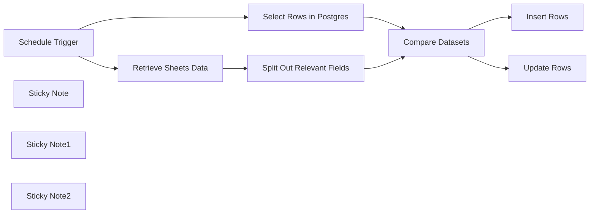

## Fluxo (.json) :

```json
{
  "id": "wDD4XugmHIvx3KMT",
  "meta": {
    "instanceId": "149cdf730f0c143663259ddc6124c9c26e824d8d2d059973b871074cf4bda531"
  },
  "name": "Synchronize your Google Sheets with Postgres",
  "tags": [],
  "nodes": [
    {
      "id": "44171bad-84b6-49f8-b538-fb0c2d52db43",
      "name": "Schedule Trigger",
      "type": "n8n-nodes-base.scheduleTrigger",
      "position": [
        900,
        360
      ],
      "parameters": {
        "rule": {
          "interval": [
            {
              "field": "hours"
            }
          ]
        }
      },
      "typeVersion": 1.1
    },
    {
      "id": "1d1558cc-523b-4985-81e2-da49e3d0f4b7",
      "name": "Compare Datasets",
      "type": "n8n-nodes-base.compareDatasets",
      "position": [
        1820,
        380
      ],
      "parameters": {
        "options": {},
        "resolve": "preferInput1",
        "mergeByFields": {
          "values": [
            {
              "field1": "first_name",
              "field2": "first_name"
            }
          ]
        }
      },
      "typeVersion": 2.3
    },
    {
      "id": "b4442fd7-6817-40bb-a76e-851659c836ec",
      "name": "Split Out Relevant Fields",
      "type": "n8n-nodes-base.splitOut",
      "position": [
        1460,
        240
      ],
      "parameters": {
        "options": {},
        "fieldToSplitOut": "first_name, last_name, town, age"
      },
      "typeVersion": 1
    },
    {
      "id": "b63899bd-f842-4ead-a590-9bdacdc9b3c0",
      "name": "Retrieve Sheets Data",
      "type": "n8n-nodes-base.googleSheets",
      "position": [
        1200,
        240
      ],
      "parameters": {
        "options": {},
        "sheetName": {
          "__rl": true,
          "mode": "list",
          "value": "gid=0",
          "cachedResultUrl": "https://docs.google.com/spreadsheets/d/1jhUobbdaEuX093J745TsPFMPFbzAIIgx6HnIzdqYqhg/edit#gid=0",
          "cachedResultName": "Sheet1"
        },
        "documentId": {
          "__rl": true,
          "mode": "list",
          "value": "1jhUobbdaEuX093J745TsPFMPFbzAIIgx6HnIzdqYqhg",
          "cachedResultUrl": "https://docs.google.com/spreadsheets/d/1jhUobbdaEuX093J745TsPFMPFbzAIIgx6HnIzdqYqhg/edit?usp=drivesdk",
          "cachedResultName": "Testing_Sheet"
        }
      },
      "typeVersion": 4.2
    },
    {
      "id": "ae4918fb-07ef-48db-ba25-ea34c5af43af",
      "name": "Select Rows in Postgres",
      "type": "n8n-nodes-base.postgres",
      "position": [
        1200,
        540
      ],
      "parameters": {
        "table": {
          "__rl": true,
          "mode": "list",
          "value": "testing",
          "cachedResultName": "testing"
        },
        "schema": {
          "__rl": true,
          "mode": "list",
          "value": "public"
        },
        "options": {},
        "operation": "select",
        "returnAll": true
      },
      "typeVersion": 2.3
    },
    {
      "id": "4d08d771-0e80-445e-92db-08197418512d",
      "name": "Insert Rows",
      "type": "n8n-nodes-base.postgres",
      "position": [
        2300,
        260
      ],
      "parameters": {
        "table": {
          "__rl": true,
          "mode": "list",
          "value": "testing",
          "cachedResultName": "testing"
        },
        "schema": {
          "__rl": true,
          "mode": "list",
          "value": "public"
        },
        "columns": {
          "value": {},
          "schema": [
            {
              "id": "first_name",
              "type": "string",
              "display": true,
              "required": false,
              "displayName": "first_name",
              "defaultMatch": false,
              "canBeUsedToMatch": true
            },
            {
              "id": "last_name",
              "type": "string",
              "display": true,
              "required": false,
              "displayName": "last_name",
              "defaultMatch": false,
              "canBeUsedToMatch": true
            },
            {
              "id": "town",
              "type": "string",
              "display": true,
              "required": false,
              "displayName": "town",
              "defaultMatch": false,
              "canBeUsedToMatch": true
            },
            {
              "id": "age",
              "type": "number",
              "display": true,
              "required": false,
              "displayName": "age",
              "defaultMatch": false,
              "canBeUsedToMatch": true
            }
          ],
          "mappingMode": "autoMapInputData",
          "matchingColumns": []
        },
        "options": {}
      },
      "typeVersion": 2.3
    },
    {
      "id": "3fd7baa1-72c7-4587-a557-02eb4dfa92f5",
      "name": "Update Rows",
      "type": "n8n-nodes-base.postgres",
      "position": [
        2300,
        460
      ],
      "parameters": {
        "table": {
          "__rl": true,
          "mode": "list",
          "value": "testing",
          "cachedResultName": "testing"
        },
        "schema": {
          "__rl": true,
          "mode": "list",
          "value": "public"
        },
        "columns": {
          "value": {
            "age": "={{ $json.age }}",
            "town": "={{ $json.town }}",
            "last_name": "={{ $json.last_name }}",
            "first_name": "={{ $json.first_name }}"
          },
          "schema": [
            {
              "id": "first_name",
              "type": "string",
              "display": true,
              "removed": false,
              "required": false,
              "displayName": "first_name",
              "defaultMatch": false,
              "canBeUsedToMatch": true
            },
            {
              "id": "last_name",
              "type": "string",
              "display": true,
              "removed": false,
              "required": false,
              "displayName": "last_name",
              "defaultMatch": false,
              "canBeUsedToMatch": true
            },
            {
              "id": "town",
              "type": "string",
              "display": true,
              "required": false,
              "displayName": "town",
              "defaultMatch": false,
              "canBeUsedToMatch": true
            },
            {
              "id": "age",
              "type": "number",
              "display": true,
              "required": false,
              "displayName": "age",
              "defaultMatch": false,
              "canBeUsedToMatch": true
            }
          ],
          "mappingMode": "defineBelow",
          "matchingColumns": [
            "first_name",
            "last_name"
          ]
        },
        "options": {},
        "operation": "update"
      },
      "typeVersion": 2.3
    },
    {
      "id": "fc8dbe79-a54d-46fb-8ef7-4bb8b2a402ee",
      "name": "Sticky Note",
      "type": "n8n-nodes-base.stickyNote",
      "position": [
        360,
        260
      ],
      "parameters": {
        "width": 485.5994596522446,
        "height": 350.08576009540855,
        "content": "## Setup ##\nIn order to make this automation work for you, you need to make a few adjustments:\n\n1. Add your Postgres & Google Sheets Credentials to the respective Nodes\n\n2. Select the Sheet (Google Sheets) and the table (Postgres) you want to sync\n\n3. Update the Insert & Update Queries so that the data is updated in the table you also selected the rows from in the first step"
      },
      "typeVersion": 1
    },
    {
      "id": "3719112b-1ec7-4402-a366-b1b845819e8d",
      "name": "Sticky Note1",
      "type": "n8n-nodes-base.stickyNote",
      "position": [
        2080,
        160
      ],
      "parameters": {
        "width": 485.5994596522446,
        "height": 486.693620858174,
        "content": "## Updating Your Database \nUsing Insert Rows & Update Rows as Separate Postgres Node's"
      },
      "typeVersion": 1
    },
    {
      "id": "7742972b-7996-4f9a-9c1d-700737b94eec",
      "name": "Sticky Note2",
      "type": "n8n-nodes-base.stickyNote",
      "position": [
        1080,
        140
      ],
      "parameters": {
        "width": 543.3950930518761,
        "height": 553.2461684092643,
        "content": "## Retrieving Data & Spitting Out Fields \nGet the Data you want to compare and split out the relevant fields"
      },
      "typeVersion": 1
    }
  ],
  "active": false,
  "pinData": {},
  "settings": {
    "executionOrder": "v1"
  },
  "versionId": "ac0f0ed3-3f25-4672-a34a-29b5f4402e63",
  "connections": {
    "Compare Datasets": {
      "main": [
        [
          {
            "node": "Insert Rows",
            "type": "main",
            "index": 0
          }
        ],
        [],
        [
          {
            "node": "Update Rows",
            "type": "main",
            "index": 0
          }
        ]
      ]
    },
    "Schedule Trigger": {
      "main": [
        [
          {
            "node": "Retrieve Sheets Data",
            "type": "main",
            "index": 0
          },
          {
            "node": "Select Rows in Postgres",
            "type": "main",
            "index": 0
          }
        ]
      ]
    },
    "Retrieve Sheets Data": {
      "main": [
        [
          {
            "node": "Split Out Relevant Fields",
            "type": "main",
            "index": 0
          }
        ]
      ]
    },
    "Select Rows in Postgres": {
      "main": [
        [
          {
            "node": "Compare Datasets",
            "type": "main",
            "index": 1
          }
        ]
      ]
    },
    "Split Out Relevant Fields": {
      "main": [
        [
          {
            "node": "Compare Datasets",
            "type": "main",
            "index": 0
          }
        ]
      ]
    }
  }
}
```

<a id="template-1230"></a>

## Template 1230 - Clonar workflows entre instâncias via API

- **Nome:** Clonar workflows entre instâncias via API
- **Descrição:** Clona workflows de uma instância de automação para outra, evitando duplicatas e movendo-os para um projeto específico no ambiente de destino.
- **Funcionalidade:** • Inicio manual para testes: permite disparar a rotina manualmente para testar a cópia de workflows.
• Obtenção de workflows na origem: lista os workflows disponíveis no ambiente fonte.
• Obtenção de workflows no destino: lista os workflows já existentes no ambiente destino para comparação.
• Comparação e filtragem por nome: identifica workflows ausentes no destino para evitar criar duplicatas.
• Criação de workflows no destino: recria o workflow com nodes, conexões e configurações no ambiente de destino.
• Transferência para projeto específico: localiza o projeto destino por nome e transfere o workflow criado para esse projeto.
• Processamento em lotes: executa a criação em batches (ex.: 5 por vez) para controle de carga e estabilidade.
• Configuração via credenciais: permite alterar instâncias de origem e destino trocando as credenciais configuradas.
• Mensagens orientativas: inclui notas que instruem como alterar a instância de origem, destino e o projeto alvo.
- **Ferramentas:** • APIs REST das instâncias de automação: endpoints usados para listar, criar e transferir workflows entre ambientes.
• API de gerenciamento de projetos da instância: endpoint utilizado para obter a lista de projetos e identificar o projeto destino por nome.
• Autenticação por credenciais de API: mecanismo para autenticar requests entre as instâncias e permitir operações administrativas.

## Fluxo visual

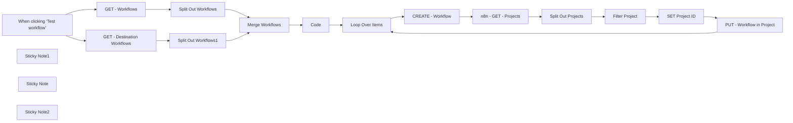

## Fluxo (.json) :

```json
{
  "id": "yOhH9SGiZgZTDUB4",
  "meta": {
    "instanceId": "ecc960f484e18b0e09045fd93acf0d47f4cfff25cc212ea348a08ac3aae81850",
    "templateCredsSetupCompleted": true
  },
  "name": "Clone n8n Workflows between Instances using n8n API",
  "tags": [
    {
      "id": "aw8suPYTKfXDtMZl",
      "name": "Utility",
      "createdAt": "2025-02-10T14:41:49.045Z",
      "updatedAt": "2025-02-10T14:41:49.045Z"
    },
    {
      "id": "6rb8rVhKZj4t0Kne",
      "name": "Current",
      "createdAt": "2025-02-04T18:13:17.427Z",
      "updatedAt": "2025-02-04T18:13:17.427Z"
    }
  ],
  "nodes": [
    {
      "id": "9e61140a-2b09-4dab-9a3b-3ca9781410cf",
      "name": "When clicking ‘Test workflow’",
      "type": "n8n-nodes-base.manualTrigger",
      "position": [
        -80,
        -260
      ],
      "parameters": {},
      "typeVersion": 1
    },
    {
      "id": "50fdfb08-0ca1-4bb4-82a6-46b81ef6e3b2",
      "name": "GET - Workflows",
      "type": "n8n-nodes-base.n8n",
      "position": [
        180,
        -400
      ],
      "parameters": {
        "filters": {},
        "requestOptions": {}
      },
      "credentials": {
        "n8nApi": {
          "id": "HBPpxcTQs4aNcq4K",
          "name": "AK n8n original account"
        }
      },
      "typeVersion": 1
    },
    {
      "id": "7c1b5530-bc0c-41f8-ac5f-d53c42ea9c44",
      "name": "CREATE - Workflow",
      "type": "n8n-nodes-base.n8n",
      "position": [
        1200,
        -160
      ],
      "parameters": {
        "operation": "create",
        "requestOptions": {},
        "workflowObject": "={\n  \"name\": \"{{ $json.name }}\",\n  \"nodes\": {{ JSON.stringify($json[\"nodes\"]) }},\n  \"connections\": {{ JSON.stringify($json[\"connections\"] || {}) }}\n}\n"
      },
      "credentials": {
        "n8nApi": {
          "id": "0XLL6lxiSB0ORf5Z",
          "name": "AlexK1919 n8n ent account"
        }
      },
      "typeVersion": 1
    },
    {
      "id": "af3a81b1-f09f-4373-b603-657bba8c1776",
      "name": "n8n - GET - Projects",
      "type": "n8n-nodes-base.httpRequest",
      "position": [
        1400,
        -160
      ],
      "parameters": {
        "url": "https://n8n-ent.alexk1919.com/api/v1/projects",
        "options": {},
        "authentication": "predefinedCredentialType",
        "nodeCredentialType": "n8nApi"
      },
      "credentials": {
        "n8nApi": {
          "id": "0XLL6lxiSB0ORf5Z",
          "name": "AlexK1919 n8n ent account"
        }
      },
      "typeVersion": 4.2
    },
    {
      "id": "852e6236-aafd-4223-bb90-42db4c923a59",
      "name": "SET Project ID",
      "type": "n8n-nodes-base.set",
      "position": [
        2000,
        -160
      ],
      "parameters": {
        "options": {},
        "assignments": {
          "assignments": [
            {
              "id": "6ba45511-cf1b-42e6-b711-b9abd33ed7e3",
              "name": "data.id",
              "type": "string",
              "value": "={{ $json.data.id }}"
            }
          ]
        }
      },
      "typeVersion": 3.4
    },
    {
      "id": "e8dfa94b-82c1-45ee-b87b-f88996569957",
      "name": "PUT - Workflow in Project",
      "type": "n8n-nodes-base.httpRequest",
      "position": [
        2200,
        -160
      ],
      "parameters": {
        "url": "=https://n8n-ent.alexk1919.com/api/v1/workflows/{{ $('CREATE - Workflow').item.json.id }}/transfer",
        "method": "PUT",
        "options": {},
        "sendBody": true,
        "authentication": "predefinedCredentialType",
        "bodyParameters": {
          "parameters": [
            {
              "name": "destinationProjectId",
              "value": "={{ $json.data.id }}"
            }
          ]
        },
        "nodeCredentialType": "n8nApi"
      },
      "credentials": {
        "n8nApi": {
          "id": "0XLL6lxiSB0ORf5Z",
          "name": "AlexK1919 n8n ent account"
        }
      },
      "typeVersion": 4.2
    },
    {
      "id": "e705f445-c125-4ce5-aa33-f91c3f1fb2a6",
      "name": "Loop Over Items",
      "type": "n8n-nodes-base.splitInBatches",
      "position": [
        1000,
        -260
      ],
      "parameters": {
        "options": {},
        "batchSize": 5
      },
      "typeVersion": 3
    },
    {
      "id": "cec95100-64a0-4d56-986a-1cdeb6063b96",
      "name": "Sticky Note1",
      "type": "n8n-nodes-base.stickyNote",
      "position": [
        1740,
        -300
      ],
      "parameters": {
        "color": 3,
        "width": 220,
        "content": "### Change the Destination Project by changing the Project Name"
      },
      "typeVersion": 1
    },
    {
      "id": "b23a6293-a732-42b4-9976-6d3ab750bd44",
      "name": "Sticky Note",
      "type": "n8n-nodes-base.stickyNote",
      "position": [
        120,
        -540
      ],
      "parameters": {
        "color": 3,
        "width": 220,
        "content": "### Change the Source n8n Instance by changing the Credential"
      },
      "typeVersion": 1
    },
    {
      "id": "a4e2f1f9-dab9-4576-ba66-d36a16a4d82a",
      "name": "Sticky Note2",
      "type": "n8n-nodes-base.stickyNote",
      "position": [
        120,
        -220
      ],
      "parameters": {
        "color": 3,
        "width": 220,
        "content": "### Change the Destination n8n Instance by changing the Credential"
      },
      "typeVersion": 1
    },
    {
      "id": "56997c18-8985-4fdd-b313-de07ee67c6d7",
      "name": "GET - Destination Workflows",
      "type": "n8n-nodes-base.n8n",
      "position": [
        180,
        -80
      ],
      "parameters": {
        "limit": 200,
        "filters": {},
        "returnAll": false,
        "requestOptions": {
          "batching": {
            "batch": {}
          }
        }
      },
      "credentials": {
        "n8nApi": {
          "id": "0XLL6lxiSB0ORf5Z",
          "name": "AlexK1919 n8n ent account"
        }
      },
      "typeVersion": 1
    },
    {
      "id": "c9bb6d33-a674-416b-916d-56352b74a603",
      "name": "Code",
      "type": "n8n-nodes-base.code",
      "disabled": true,
      "position": [
        800,
        -260
      ],
      "parameters": {
        "jsCode": "const data = $json;\nconsole.log(\"Merged Output:\", data);\nreturn [data];\n"
      },
      "typeVersion": 2
    },
    {
      "id": "3357623e-e41a-4441-aba4-4593cbc77bdd",
      "name": "Split Out Workflows",
      "type": "n8n-nodes-base.splitOut",
      "position": [
        380,
        -400
      ],
      "parameters": {
        "include": "allOtherFields",
        "options": {},
        "fieldToSplitOut": "id"
      },
      "typeVersion": 1
    },
    {
      "id": "b1a2d1df-4957-491d-9c8d-347c4c5197f1",
      "name": "Split Out Workflows1",
      "type": "n8n-nodes-base.splitOut",
      "position": [
        380,
        -80
      ],
      "parameters": {
        "include": "allOtherFields",
        "options": {},
        "fieldToSplitOut": "id"
      },
      "typeVersion": 1
    },
    {
      "id": "f0f4c869-f171-4019-a081-9c232851f0a9",
      "name": "Merge Workflows",
      "type": "n8n-nodes-base.merge",
      "position": [
        600,
        -260
      ],
      "parameters": {
        "mode": "combineBySql",
        "query": "SELECT input1.name, input1.createdAt, input1.updatedAt, input1.active, input1.nodes, input1.settings, input1.connections, input1.pinData, input1.tags, input1.id\nFROM input1\nLEFT JOIN input2 \nON input1.name = input2.name\nWHERE input2.name IS NULL\n"
      },
      "typeVersion": 3
    },
    {
      "id": "f69c8787-7590-4011-a36f-36c9192089cf",
      "name": "Split Out Projects",
      "type": "n8n-nodes-base.splitOut",
      "position": [
        1600,
        -160
      ],
      "parameters": {
        "include": "allOtherFields",
        "options": {},
        "fieldToSplitOut": "data"
      },
      "typeVersion": 1
    },
    {
      "id": "7c8f8957-f80c-4250-96fb-f86032e3aacc",
      "name": "Filter Project",
      "type": "n8n-nodes-base.filter",
      "position": [
        1800,
        -160
      ],
      "parameters": {
        "options": {},
        "conditions": {
          "options": {
            "version": 2,
            "leftValue": "",
            "caseSensitive": true,
            "typeValidation": "strict"
          },
          "combinator": "and",
          "conditions": [
            {
              "id": "74ca2595-359b-4e17-988b-799306f748cf",
              "operator": {
                "name": "filter.operator.equals",
                "type": "string",
                "operation": "equals"
              },
              "leftValue": "={{ $json.data.name }}",
              "rightValue": "z Original n8n Workflows from AlexK1919"
            }
          ]
        }
      },
      "typeVersion": 2.2
    }
  ],
  "active": false,
  "pinData": {},
  "settings": {
    "executionOrder": "v1"
  },
  "versionId": "0178ee38-a035-40e7-9a62-34dfdf6f0b93",
  "connections": {
    "Code": {
      "main": [
        [
          {
            "node": "Loop Over Items",
            "type": "main",
            "index": 0
          }
        ]
      ]
    },
    "Filter Project": {
      "main": [
        [
          {
            "node": "SET Project ID",
            "type": "main",
            "index": 0
          }
        ]
      ]
    },
    "SET Project ID": {
      "main": [
        [
          {
            "node": "PUT - Workflow in Project",
            "type": "main",
            "index": 0
          }
        ]
      ]
    },
    "GET - Workflows": {
      "main": [
        [
          {
            "node": "Split Out Workflows",
            "type": "main",
            "index": 0
          }
        ]
      ]
    },
    "Loop Over Items": {
      "main": [
        [],
        [
          {
            "node": "CREATE - Workflow",
            "type": "main",
            "index": 0
          }
        ]
      ]
    },
    "Merge Workflows": {
      "main": [
        [
          {
            "node": "Code",
            "type": "main",
            "index": 0
          }
        ]
      ]
    },
    "CREATE - Workflow": {
      "main": [
        [
          {
            "node": "n8n - GET - Projects",
            "type": "main",
            "index": 0
          }
        ]
      ]
    },
    "Split Out Projects": {
      "main": [
        [
          {
            "node": "Filter Project",
            "type": "main",
            "index": 0
          }
        ]
      ]
    },
    "Split Out Workflows": {
      "main": [
        [
          {
            "node": "Merge Workflows",
            "type": "main",
            "index": 0
          }
        ]
      ]
    },
    "Split Out Workflows1": {
      "main": [
        [
          {
            "node": "Merge Workflows",
            "type": "main",
            "index": 1
          }
        ]
      ]
    },
    "n8n - GET - Projects": {
      "main": [
        [
          {
            "node": "Split Out Projects",
            "type": "main",
            "index": 0
          }
        ]
      ]
    },
    "PUT - Workflow in Project": {
      "main": [
        [
          {
            "node": "Loop Over Items",
            "type": "main",
            "index": 0
          }
        ]
      ]
    },
    "GET - Destination Workflows": {
      "main": [
        [
          {
            "node": "Split Out Workflows1",
            "type": "main",
            "index": 0
          }
        ]
      ]
    },
    "When clicking ‘Test workflow’": {
      "main": [
        [
          {
            "node": "GET - Workflows",
            "type": "main",
            "index": 0
          },
          {
            "node": "GET - Destination Workflows",
            "type": "main",
            "index": 0
          }
        ]
      ]
    }
  }
}
```

<a id="template-1231"></a>

## Template 1231 - Enviar faturas do Clockify para o Notion

- **Nome:** Enviar faturas do Clockify para o Notion
- **Descrição:** Cria automaticamente uma página em um banco de dados do Notion quando uma nova fatura é gerada no Clockify, preenchendo campos essenciais da fatura.
- **Funcionalidade:** • Detecção de novas faturas via webhook: inicia o fluxo ao receber o evento de criação de fatura do Clockify.
• Criação de página no banco de dados: gera uma nova entrada no banco do Notion usando o número da fatura como título.
• Mapeamento de campos da fatura: popula campos do Notion como data de emissão, data de vencimento e valor.
• Extensibilidade de mapeamento: permite adicionar e mapear campos adicionais do Clockify para o Notion conforme necessário.
- **Ferramentas:** • Clockify: serviço de rastreamento de tempo e faturamento que emite eventos de fatura via webhook.
• Notion: plataforma de organização e banco de dados usada para armazenar e visualizar as faturas como páginas.

## Fluxo visual

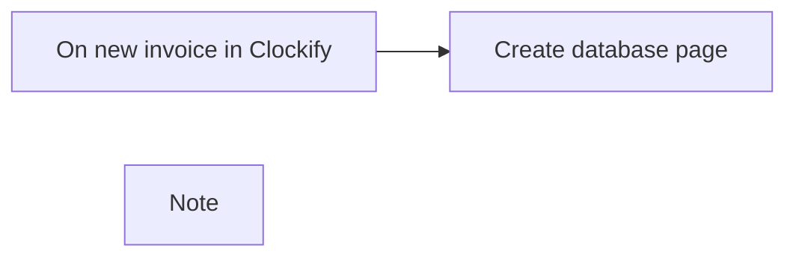

## Fluxo (.json) :

```json
{
  "meta": {
    "instanceId": "237600ca44303ce91fa31ee72babcdc8493f55ee2c0e8aa2b78b3b4ce6f70bd9"
  },
  "nodes": [
    {
      "id": "cc514d10-89cc-4fcf-8c1f-b65395cd168a",
      "name": "On new invoice in Clockify",
      "type": "n8n-nodes-base.webhook",
      "position": [
        460,
        460
      ],
      "webhookId": "8af31ab8-e16a-4401-84b7-b246c65ba6a9",
      "parameters": {
        "path": "8af31ab8-e16a-4401-84b7-b246c65ba6a9",
        "options": {},
        "httpMethod": "POST"
      },
      "typeVersion": 1
    },
    {
      "id": "ef9e5ce6-cb3e-4cb9-b33d-3b05a2ab589d",
      "name": "Create database page",
      "type": "n8n-nodes-base.notion",
      "position": [
        680,
        460
      ],
      "parameters": {
        "title": "={{ $json[\"body\"][\"number\"] }}",
        "resource": "databasePage",
        "databaseId": "ea3219a7-0a1a-4792-8dd6-ab450204dc06",
        "propertiesUi": {
          "propertyValues": [
            {
              "key": "Issue date|date",
              "date": "={{ $json[\"body\"][\"issuedDate\"] }}"
            },
            {
              "key": "Due date|date",
              "date": "={{ $json[\"body\"][\"dueDate\"] }}"
            },
            {
              "key": "Amount|number",
              "numberValue": "={{ $json[\"body\"][\"amount\"] }}"
            }
          ]
        }
      },
      "credentials": {
        "notionApi": {
          "id": "9",
          "name": "[UPDATE ME]"
        }
      },
      "typeVersion": 2
    },
    {
      "id": "e2ecb86f-2f0c-4fe7-8919-e9095abdb5a0",
      "name": "Note",
      "type": "n8n-nodes-base.stickyNote",
      "position": [
        -60,
        240
      ],
      "parameters": {
        "width": 462,
        "height": 595,
        "content": "## Send new Clockify invoice to Notion database\n### How it works\n1. `On new invoice in Clockify` webhook node will trigger when a new invoice is created in Clockify. Setup is involved.\n2. `Create database page` Notion node will create a database page with the information specified from the Clockify trigger. You can add additional fields if required by following the setup.\n\n### Setup\n1. Create a Clockify webhook by going to the [webhooks section in Clockify](https://app.clockify.me/webhooks).\n2. Create the webhook specifying the \"Invoice created\" event and paste in the URL provided from `On new invoice in Clockify` webhook step.\n3. Now go to Notion and create a new database where we will store our Clockify invoices.\n4. In the new Notion database, create the following fields:\n    - Invoice number (renamed from \"Name\" field)\n    - Issue date (date field)\n    - Due date (date field)\n    - Amount (number field)\n5. If you want to add more fields to Notion, create those fields in Notion and map it accordingly in `Create database page` node."
      },
      "typeVersion": 1
    }
  ],
  "connections": {
    "On new invoice in Clockify": {
      "main": [
        [
          {
            "node": "Create database page",
            "type": "main",
            "index": 0
          }
        ]
      ]
    }
  }
}
```

<a id="template-1232"></a>

## Template 1232 - Agente conversacional com pesquisa e memória

- **Nome:** Agente conversacional com pesquisa e memória
- **Descrição:** Recebe mensagens de chat e gera respostas utilizando um agente que combina memória de contexto e ferramentas externas de pesquisa para fornecer respostas informadas.
- **Funcionalidade:** • Recepção de mensagens de chat: inicia o fluxo ao receber uma mensagem via webhook.
• Memória de contexto (janela): mantém as últimas 20 mensagens para fornecer contexto relevante à conversa.
• Modelo de linguagem: utiliza um modelo avançado para interpretar a entrada do usuário e gerar respostas coerentes.
• Uso de ferramentas externas: realiza buscas e consultas em fontes externas quando necessário para complementar a resposta.
• Agente orquestrador: decide quando acionar as ferramentas disponíveis e integra os resultados para formar a resposta final.
- **Ferramentas:** • OpenAI (gpt-4o-mini): modelo de linguagem utilizado para compreensão da entrada e geração de texto.
• SerpAPI: serviço de busca na web para obter informações atualizadas.
• Wikipedia: fonte enciclopédica para consulta de fatos e resumos de tópicos.

## Fluxo visual

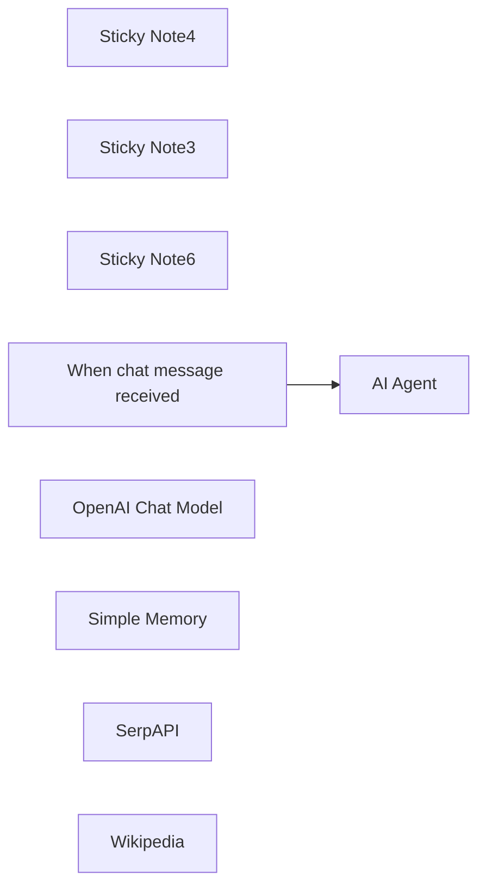

## Fluxo (.json) :

```json
{
  "meta": {
    "instanceId": "408f9fb9940c3cb18ffdef0e0150fe342d6e655c3a9fac21f0f644e8bedabcd9",
    "templateCredsSetupCompleted": true
  },
  "nodes": [
    {
      "id": "a8211c61-5ca5-4b0a-adce-b7954a387aba",
      "name": "Sticky Note4",
      "type": "n8n-nodes-base.stickyNote",
      "position": [
        -540,
        900
      ],
      "parameters": {
        "width": 300,
        "height": 225,
        "content": "### The conversation history (last 20 messages) is stored in a buffer memory"
      },
      "typeVersion": 1
    },
    {
      "id": "639ef27d-3e6e-4d2b-804a-5d1c95d509fc",
      "name": "Sticky Note3",
      "type": "n8n-nodes-base.stickyNote",
      "position": [
        -200,
        900
      ],
      "parameters": {
        "width": 340,
        "height": 225,
        "content": "### Tools which agent can use to accomplish the task"
      },
      "typeVersion": 1
    },
    {
      "id": "dcb7ade3-005c-44e3-a369-526baa5b8813",
      "name": "Sticky Note6",
      "type": "n8n-nodes-base.stickyNote",
      "position": [
        -500,
        500
      ],
      "parameters": {
        "width": 422,
        "height": 211,
        "content": "### Conversational agent will utilise available tools to answer the prompt. "
      },
      "typeVersion": 1
    },
    {
      "id": "2830de15-bdd2-48f4-8957-659014cd0a82",
      "name": "When chat message received",
      "type": "@n8n/n8n-nodes-langchain.chatTrigger",
      "position": [
        -800,
        580
      ],
      "webhookId": "d48f9e07-3c05-4be8-86ca-5cee4c27b78f",
      "parameters": {
        "options": {}
      },
      "typeVersion": 1.1
    },
    {
      "id": "bd1865fc-c37f-4b81-8ee1-83205e67e42b",
      "name": "OpenAI Chat Model",
      "type": "@n8n/n8n-nodes-langchain.lmChatOpenAi",
      "position": [
        -720,
        1000
      ],
      "parameters": {
        "model": {
          "__rl": true,
          "mode": "list",
          "value": "gpt-4o-mini"
        },
        "options": {}
      },
      "credentials": {
        "openAiApi": {
          "id": "8gccIjcuf3gvaoEr",
          "name": "OpenAi account"
        }
      },
      "typeVersion": 1.2
    },
    {
      "id": "d9ee6da6-f2cd-4077-913c-9215433dfc31",
      "name": "Simple Memory",
      "type": "@n8n/n8n-nodes-langchain.memoryBufferWindow",
      "position": [
        -440,
        1000
      ],
      "parameters": {
        "contextWindowLength": 20
      },
      "typeVersion": 1.3
    },
    {
      "id": "fe8ddba3-37ba-43c3-9797-021b14a1be49",
      "name": "SerpAPI",
      "type": "@n8n/n8n-nodes-langchain.toolSerpApi",
      "position": [
        -140,
        1000
      ],
      "parameters": {
        "options": {}
      },
      "credentials": {
        "serpApi": {
          "id": "aJCKjxx6U3K7ydDe",
          "name": "SerpAPI account"
        }
      },
      "typeVersion": 1
    },
    {
      "id": "f7cee7ea-6a21-4eae-a1c6-36716683a3eb",
      "name": "Wikipedia",
      "type": "@n8n/n8n-nodes-langchain.toolWikipedia",
      "position": [
        0,
        1000
      ],
      "parameters": {},
      "typeVersion": 1
    },
    {
      "id": "e6f6fe48-3ad0-4bfe-a2f2-922e4c652306",
      "name": "AI Agent",
      "type": "@n8n/n8n-nodes-langchain.agent",
      "position": [
        -420,
        580
      ],
      "parameters": {
        "options": {}
      },
      "typeVersion": 1.8
    }
  ],
  "pinData": {},
  "connections": {
    "SerpAPI": {
      "ai_tool": [
        [
          {
            "node": "AI Agent",
            "type": "ai_tool",
            "index": 0
          }
        ]
      ]
    },
    "Wikipedia": {
      "ai_tool": [
        [
          {
            "node": "AI Agent",
            "type": "ai_tool",
            "index": 0
          }
        ]
      ]
    },
    "Simple Memory": {
      "ai_memory": [
        [
          {
            "node": "AI Agent",
            "type": "ai_memory",
            "index": 0
          }
        ]
      ]
    },
    "OpenAI Chat Model": {
      "ai_languageModel": [
        [
          {
            "node": "AI Agent",
            "type": "ai_languageModel",
            "index": 0
          }
        ]
      ]
    },
    "When chat message received": {
      "main": [
        [
          {
            "node": "AI Agent",
            "type": "main",
            "index": 0
          }
        ]
      ]
    }
  }
}
```

<a id="template-1233"></a>

## Template 1233 - Gerar cartões Trello diários do calendário

- **Nome:** Gerar cartões Trello diários do calendário
- **Descrição:** Cria cartões no Trello para os eventos do dia de um calendário especificado, executando automaticamente todas as manhãs às 8h.
- **Funcionalidade:** • Disparo diário às 8h: inicia a automação todos os dias às 08:00.
• Cálculo do intervalo do dia atual: determina o início (00:00) e o fim (23:59:59) do dia corrente para consulta de eventos.
• Busca de eventos do dia: recupera todos os eventos do calendário no intervalo calculado.
• Processamento individual de eventos: divide os resultados em lotes individuais para tratar cada evento separadamente.
• Remoção/filtragem de tarefas recorrentes: ignora eventos com títulos específicos (ex.: "Check email and start day", "Lunch", "Wrap Up & Clear Desk", "Beers and Griping").
• Preparação dos dados do cartão: mapeia campos do evento (título, descrição, data de início, link) para os campos do cartão.
• Criação de cartões no Trello com template: cria cartões incluindo descrição pré-formatada, data de vencimento e link de origem.
- **Ferramentas:** • Google Calendar: fonte dos eventos do dia para serem transformados em tarefas.
• Trello: destino onde são criados os cartões com título, descrição, data de vencimento e link.

## Fluxo visual

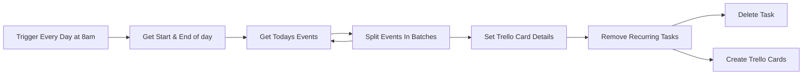

## Fluxo (.json) :

```json
{
  "nodes": [
    {
      "name": "Get Start & End of day",
      "type": "n8n-nodes-base.function",
      "position": [
        850,
        450
      ],
      "parameters": {
        "functionCode": "var curr = new Date;\nvar first = (curr.getDate());\nvar last = first;\n\nvar firstday = new Date(curr.setDate(first));\nvar lastday = new Date(curr.setDate(last));\n\nbeginning = new Date(firstday.setHours(0,0,0,0));\nending = new Date(lastday.setHours(23,59,59,99));\n\nitems[0].json.from = beginning.toISOString();\nitems[0].json.to = ending.toISOString();\n\nreturn items;items[0].json.myVariable = 1;\nreturn items;"
      },
      "typeVersion": 1
    },
    {
      "name": "Set Trello Card Details",
      "type": "n8n-nodes-base.set",
      "position": [
        1460,
        640
      ],
      "parameters": {
        "values": {
          "string": [
            {
              "name": "name",
              "value": "={{$node[\"Split Events In Batches\"].json[\"summary\"]}}"
            },
            {
              "name": "description",
              "value": "={{$node[\"Split Events In Batches\"].json[\"description\"]}}"
            },
            {
              "name": "duedate",
              "value": "={{$node[\"Split Events In Batches\"].json[\"start\"][\"dateTime\"]}}"
            },
            {
              "name": "URL",
              "value": "={{$node[\"Split Events In Batches\"].json[\"htmlLink\"]}}"
            }
          ]
        },
        "options": {}
      },
      "typeVersion": 1
    },
    {
      "name": "Remove Recurring Tasks",
      "type": "n8n-nodes-base.if",
      "position": [
        1650,
        640
      ],
      "parameters": {
        "conditions": {
          "string": [
            {
              "value1": "={{$node[\"Split Events In Batches\"].json[\"summary\"]}}",
              "value2": "Check email and start day"
            },
            {
              "value1": "={{$node[\"Split Events In Batches\"].json[\"summary\"]}}",
              "value2": "Lunch"
            },
            {
              "value1": "={{$node[\"Split Events In Batches\"].json[\"summary\"]}}",
              "value2": "Wrap Up & Clear Desk"
            },
            {
              "value1": "={{$node[\"Split Events In Batches\"].json[\"summary\"]}}",
              "value2": "Beers and Griping"
            }
          ],
          "boolean": []
        },
        "combineOperation": "any"
      },
      "typeVersion": 1
    },
    {
      "name": "Get Todays Events",
      "type": "n8n-nodes-base.googleCalendar",
      "position": [
        1060,
        450
      ],
      "parameters": {
        "options": {
          "timeMax": "={{$node[\"Get Start & End of day\"].json[\"to\"]}}",
          "timeMin": "={{$node[\"Get Start & End of day\"].json[\"from\"]}}",
          "singleEvents": true
        },
        "calendar": "amenendez@threatconnect.com",
        "operation": "getAll"
      },
      "credentials": {
        "googleCalendarOAuth2Api": "Angel TC Calendar API"
      },
      "typeVersion": 1
    },
    {
      "name": "Split Events In Batches",
      "type": "n8n-nodes-base.splitInBatches",
      "position": [
        1260,
        640
      ],
      "parameters": {
        "options": {},
        "batchSize": 1
      },
      "typeVersion": 1
    },
    {
      "name": "Create Trello Cards",
      "type": "n8n-nodes-base.trello",
      "position": [
        1830,
        730
      ],
      "parameters": {
        "name": "={{$node[\"Set Trello Card Details\"].json[\"name\"]}}",
        "description": "=**Meeting purpose (*Integrations, Playbooks, UI Issues, Project*):**\n\n- Task\n\n**Next Steps (*Task, Assigned to, Checkpoint Date*):**\n\n- Task\n\n**Decisions Made: (*What, Why, Impacts*):**\n\n- Task\n\n**Discussion: (*Items/Knowledge Shared*):**\n\n- Task",
        "additionalFields": {
          "due": "={{$node[\"Set Trello Card Details\"].json[\"duedate\"]}}",
          "idLabels": "",
          "urlSource": "={{$node[\"Set Trello Card Details\"].json[\"URL\"]}}"
        }
      },
      "credentials": {
        "trelloApi": "Angel Work Trello"
      },
      "typeVersion": 1
    },
    {
      "name": "Delete Task",
      "type": "n8n-nodes-base.noOp",
      "position": [
        1830,
        560
      ],
      "parameters": {},
      "typeVersion": 1
    },
    {
      "name": "Trigger Every Day at 8am",
      "type": "n8n-nodes-base.cron",
      "position": [
        650,
        450
      ],
      "parameters": {
        "triggerTimes": {
          "item": [
            {
              "hour": 8
            }
          ]
        }
      },
      "typeVersion": 1
    }
  ],
  "connections": {
    "Get Todays Events": {
      "main": [
        [
          {
            "node": "Split Events In Batches",
            "type": "main",
            "index": 0
          }
        ]
      ]
    },
    "Get Start & End of day": {
      "main": [
        [
          {
            "node": "Get Todays Events",
            "type": "main",
            "index": 0
          }
        ]
      ]
    },
    "Remove Recurring Tasks": {
      "main": [
        [
          {
            "node": "Delete Task",
            "type": "main",
            "index": 0
          }
        ],
        [
          {
            "node": "Create Trello Cards",
            "type": "main",
            "index": 0
          }
        ]
      ]
    },
    "Set Trello Card Details": {
      "main": [
        [
          {
            "node": "Remove Recurring Tasks",
            "type": "main",
            "index": 0
          }
        ]
      ]
    },
    "Split Events In Batches": {
      "main": [
        [
          {
            "node": "Set Trello Card Details",
            "type": "main",
            "index": 0
          },
          {
            "node": "Get Todays Events",
            "type": "main",
            "index": 0
          }
        ]
      ]
    },
    "Trigger Every Day at 8am": {
      "main": [
        [
          {
            "node": "Get Start & End of day",
            "type": "main",
            "index": 0
          }
        ]
      ]
    }
  }
}
```

<a id="template-1234"></a>

## Template 1234 - Chamar modelos LLM configuráveis via OpenRouter

- **Nome:** Chamar modelos LLM configuráveis via OpenRouter
- **Descrição:** Fluxo que recebe mensagens de chat, mantém contexto por sessão e encaminha prompts para um modelo LLM configurável através do OpenRouter.
- **Funcionalidade:** • Receber mensagem de chat: Aciona o fluxo quando uma nova mensagem de chat é recebida.
• Configurar modelo dinamicamente: Permite definir qual modelo LLM será usado através de uma variável de configuração.
• Definir prompt do agente: Usa o texto de entrada como prompt para um agente de IA que processa a conversa.
• Gerenciar sessão e memória de contexto: Associa mensagens a um sessionId e mantém um buffer de memória para manter contexto da conversa.
• Encaminhar requisição ao provedor de modelos: Envia o prompt e o contexto para o modelo selecionado usando as credenciais do OpenRouter.
• Exibir exemplos de modelos: Inclui notas com exemplos de modelos suportados e link para consulta de modelos.
- **Ferramentas:** • OpenRouter: Plataforma/API que atua como credencial proxy para acessar diferentes modelos LLM.
• Modelos LLM (ex.: OpenAI, Google Gemini, Deepseek, Mistral, Qwen): Fornecedores de modelos de linguagem que podem ser usados via OpenRouter para gerar respostas.

## Fluxo visual

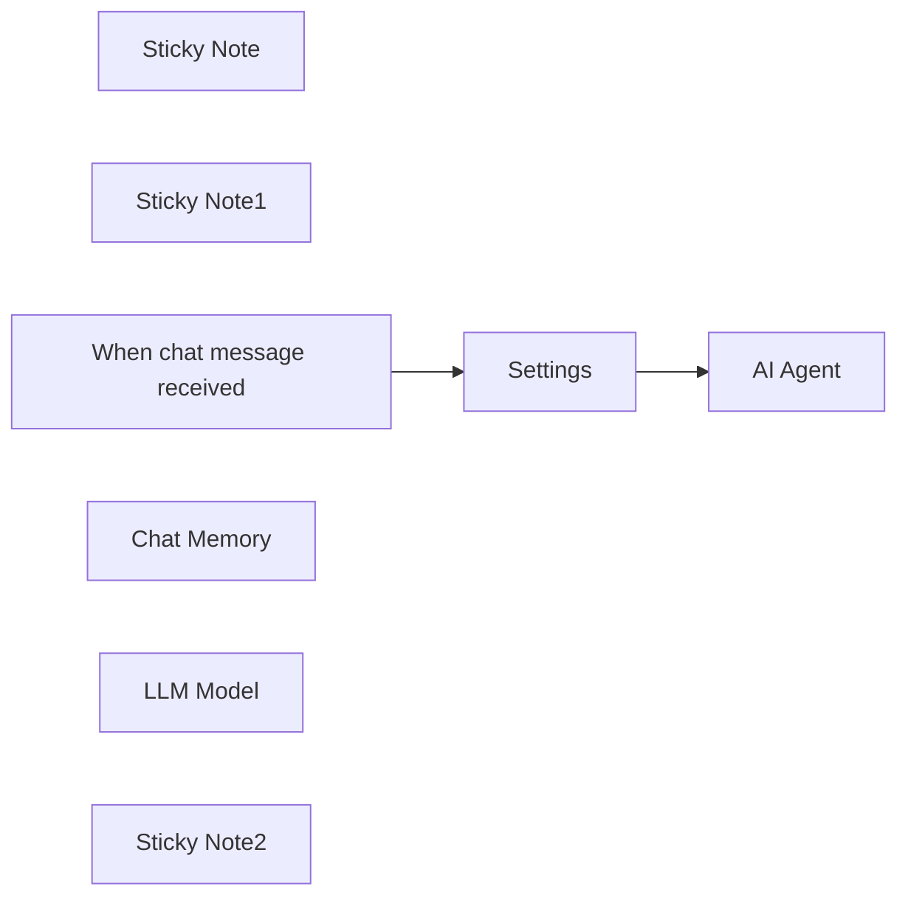

## Fluxo (.json) :

```json
{
  "id": "VhN3CX6QPBkX77pZ",
  "meta": {
    "instanceId": "98bf0d6aef1dd8b7a752798121440fb171bf7686b95727fd617f43452393daa3",
    "templateCredsSetupCompleted": true
  },
  "name": "Use any LLM-Model via OpenRouter",
  "tags": [
    {
      "id": "uumvgGHY5e6zEL7V",
      "name": "Published Template",
      "createdAt": "2025-02-10T11:18:10.923Z",
      "updatedAt": "2025-02-10T11:18:10.923Z"
    }
  ],
  "nodes": [
    {
      "id": "b72721d2-bce7-458d-8ff1-cc9f6d099aaf",
      "name": "Settings",
      "type": "n8n-nodes-base.set",
      "position": [
        -420,
        -640
      ],
      "parameters": {
        "options": {},
        "assignments": {
          "assignments": [
            {
              "id": "3d7f9677-c753-4126-b33a-d78ef701771f",
              "name": "model",
              "type": "string",
              "value": "deepseek/deepseek-r1-distill-llama-8b"
            },
            {
              "id": "301f86ec-260f-4d69-abd9-bde982e3e0aa",
              "name": "prompt",
              "type": "string",
              "value": "={{ $json.chatInput }}"
            },
            {
              "id": "a9f65181-902d-48f5-95ce-1352d391a056",
              "name": "sessionId",
              "type": "string",
              "value": "={{ $json.sessionId }}"
            }
          ]
        }
      },
      "typeVersion": 3.4
    },
    {
      "id": "a4593d64-e67a-490e-9cb4-936cc46273a0",
      "name": "Sticky Note",
      "type": "n8n-nodes-base.stickyNote",
      "position": [
        -460,
        -740
      ],
      "parameters": {
        "width": 180,
        "height": 400,
        "content": "## Settings\nSpecify the model"
      },
      "typeVersion": 1
    },
    {
      "id": "3ea3b09a-0ab7-4e0f-bb4f-3d807d072d4e",
      "name": "Sticky Note1",
      "type": "n8n-nodes-base.stickyNote",
      "position": [
        -240,
        -740
      ],
      "parameters": {
        "color": 3,
        "width": 380,
        "height": 400,
        "content": "## Run LLM\nUsing OpenRouter to make model fully configurable"
      },
      "typeVersion": 1
    },
    {
      "id": "19d47fcb-af37-4daa-84fd-3f43ffcb90ff",
      "name": "When chat message received",
      "type": "@n8n/n8n-nodes-langchain.chatTrigger",
      "position": [
        -660,
        -640
      ],
      "webhookId": "71f56e44-401f-44ba-b54d-c947e283d034",
      "parameters": {
        "options": {}
      },
      "typeVersion": 1.1
    },
    {
      "id": "f5a793f2-1e2f-4349-a075-9b9171297277",
      "name": "AI Agent",
      "type": "@n8n/n8n-nodes-langchain.agent",
      "position": [
        -180,
        -640
      ],
      "parameters": {
        "text": "={{ $json.prompt }}",
        "options": {},
        "promptType": "define"
      },
      "typeVersion": 1.7
    },
    {
      "id": "dbbd9746-ca25-4163-91c5-a9e33bff62a4",
      "name": "Chat Memory",
      "type": "@n8n/n8n-nodes-langchain.memoryBufferWindow",
      "position": [
        -80,
        -460
      ],
      "parameters": {
        "sessionKey": "={{ $json.sessionId }}",
        "sessionIdType": "customKey"
      },
      "typeVersion": 1.3
    },
    {
      "id": "ef368cea-1b38-455b-b46a-5d0ef7a3ceb3",
      "name": "LLM Model",
      "type": "@n8n/n8n-nodes-langchain.lmChatOpenAi",
      "position": [
        -200,
        -460
      ],
      "parameters": {
        "model": "={{ $json.model }}",
        "options": {}
      },
      "credentials": {
        "openAiApi": {
          "id": "66JEQJ5kJel1P9t3",
          "name": "OpenRouter"
        }
      },
      "typeVersion": 1.1
    },
    {
      "id": "32601e76-0979-4690-8dcf-149ddbf61983",
      "name": "Sticky Note2",
      "type": "n8n-nodes-base.stickyNote",
      "position": [
        -460,
        -320
      ],
      "parameters": {
        "width": 600,
        "height": 240,
        "content": "## Model examples\n\n* openai/o3-mini\n* google/gemini-2.0-flash-001\n* deepseek/deepseek-r1-distill-llama-8b\n* mistralai/mistral-small-24b-instruct-2501:free\n* qwen/qwen-turbo\n\nFor more see https://openrouter.ai/models"
      },
      "typeVersion": 1
    }
  ],
  "active": false,
  "pinData": {},
  "settings": {
    "executionOrder": "v1"
  },
  "versionId": "6d0caf5d-d6e6-4059-9211-744b0f4bc204",
  "connections": {
    "Settings": {
      "main": [
        [
          {
            "node": "AI Agent",
            "type": "main",
            "index": 0
          }
        ]
      ]
    },
    "LLM Model": {
      "ai_languageModel": [
        [
          {
            "node": "AI Agent",
            "type": "ai_languageModel",
            "index": 0
          }
        ]
      ]
    },
    "Chat Memory": {
      "ai_memory": [
        [
          {
            "node": "AI Agent",
            "type": "ai_memory",
            "index": 0
          }
        ]
      ]
    },
    "When chat message received": {
      "main": [
        [
          {
            "node": "Settings",
            "type": "main",
            "index": 0
          }
        ]
      ]
    }
  }
}
```

<a id="template-1235"></a>

## Template 1235 - Raspagem visual com AI e Google Sheets

- **Nome:** Raspagem visual com AI e Google Sheets
- **Descrição:** Fluxo que captura screenshots de páginas, extrai dados de produtos usando um agente multimodal e registra resultados estruturados em uma planilha.
- **Funcionalidade:** • Gatilho manual: Inicia o processo ao executar o fluxo manualmente.
• Leitura de URLs: Obtém a lista de páginas a serem processadas a partir de uma planilha.
• Preparação de campos: Prepara e padroniza os campos (ex.: url) enviados aos serviços de captura e ao agente.
• Captura de screenshot full-page: Tira captura completa da página para análise visual pelo agente.
• Agente multimodal de visão: Analisa a imagem para extrair títulos de produtos, preços, marcas e informações promocionais; reporta incertezas ou limites da extração.
• Fallback por HTML: Quando a imagem não é suficiente, solicita o HTML da página, converte para Markdown e usa-o para complementar a extração.
• Parser estruturado: Converte a saída do agente em JSON padronizado (ex.: título, preço, marca, promo, porcentagem).
• Separação de resultados: Divide o array de resultados em linhas individuais para processamento posterior.
• Gravação em planilha de resultados: Insere os registros extraídos na aba de resultados da planilha, alinhando colunas conforme a estrutura definida.
• Economia de tokens: Converte HTML para Markdown antes de enviar ao modelo para reduzir custo de processamento.
- **Ferramentas:** • Google Sheets: Armazena a lista de URLs e recebe os resultados estruturados.
• ScrapingBee: Captura screenshots e recupera o HTML das páginas para análise.
• Google Gemini (PaLM, ex.: gemini-1.5-pro): Modelo multimodal usado pelo agente para analisar imagens e texto e extrair dados.

## Fluxo visual

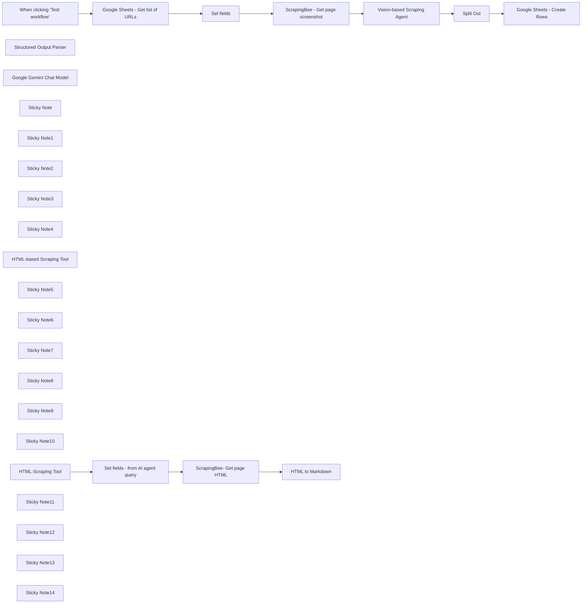

## Fluxo (.json) :

```json
{
  "id": "PpFVCrTiYoa35q1m",
  "meta": {
    "instanceId": "b9faf72fe0d7c3be94b3ebff0778790b50b135c336412d28fd4fca2cbbf8d1f5",
    "templateCredsSetupCompleted": true
  },
  "name": "Vision-Based AI Agent Scraper - with Google Sheets, ScrapingBee, and Gemini",
  "tags": [],
  "nodes": [
    {
      "id": "90ac8845-342e-4fdb-ae09-cb9d169b4119",
      "name": "When clicking ‘Test workflow’",
      "type": "n8n-nodes-base.manualTrigger",
      "position": [
        160,
        460
      ],
      "parameters": {},
      "typeVersion": 1
    },
    {
      "id": "7a2bfc41-1527-448d-a52c-794ca4c9e7ee",
      "name": "ScrapingBee- Get page HTML",
      "type": "n8n-nodes-base.httpRequest",
      "position": [
        2280,
        1360
      ],
      "parameters": {
        "url": "https://app.scrapingbee.com/api/v1",
        "options": {},
        "sendQuery": true,
        "queryParameters": {
          "parameters": [
            {
              "name": "api_key",
              "value": "<your_scrapingbee_apikey>"
            },
            {
              "name": "url",
              "value": "={{$json.url}}"
            }
          ]
        }
      },
      "typeVersion": 4.2
    },
    {
      "id": "a0ab6dcb-ffad-40bf-8a22-f2e152e69b00",
      "name": "Structured Output Parser",
      "type": "@n8n/n8n-nodes-langchain.outputParserStructured",
      "position": [
        2480,
        880
      ],
      "parameters": {
        "jsonSchemaExample": "[{\n \"product_title\":\"The title of the product\",\n \"product_price\":\"The price of the product\",\n \"product_brand\": \"The brand of the product\",\n \"promo\":\"true or false\",\n \"promo_percentage\":\"NUM %\"\n}]"
      },
      "typeVersion": 1.2
    },
    {
      "id": "34f50603-a969-425d-8a1a-ec8031a5cdfd",
      "name": "Google Gemini Chat Model",
      "type": "@n8n/n8n-nodes-langchain.lmChatGoogleGemini",
      "position": [
        1800,
        900
      ],
      "parameters": {
        "options": {},
        "modelName": "models/gemini-1.5-pro-latest"
      },
      "credentials": {
        "googlePalmApi": {
          "id": "",
          "name": "Google Gemini(PaLM) Api account"
        }
      },
      "typeVersion": 1
    },
    {
      "id": "2054612e-f3e1-4633-9c1a-0644ae07613c",
      "name": "Split Out",
      "type": "n8n-nodes-base.splitOut",
      "position": [
        2880,
        460
      ],
      "parameters": {
        "options": {},
        "fieldToSplitOut": "output"
      },
      "typeVersion": 1
    },
    {
      "id": "1a59a962-f483-4a27-8686-607a7d375584",
      "name": "Google Sheets - Get list of URLs",
      "type": "n8n-nodes-base.googleSheets",
      "position": [
        620,
        460
      ],
      "parameters": {
        "options": {},
        "sheetName": {
          "__rl": true,
          "mode": "list",
          "value": "gid=0",
          "cachedResultUrl": "",
          "cachedResultName": "List of URLs"
        },
        "documentId": {
          "__rl": true,
          "mode": "list",
          "value": "",
          "cachedResultUrl": "",
          "cachedResultName": "Google Sheets - Workflow Vision-Based Scraping"
        },
        "authentication": "serviceAccount"
      },
      "credentials": {
        "googleApi": {
          "id": "",
          "name": "Google Sheets account"
        }
      },
      "typeVersion": 4.5
    },
    {
      "id": "e33defac-e5c4-4bf5-ae31-98cf6f1d2579",
      "name": "Sticky Note",
      "type": "n8n-nodes-base.stickyNote",
      "position": [
        76.45348837209309,
        -6.191860465116179
      ],
      "parameters": {
        "color": 7,
        "width": 364.53488372093034,
        "height": 652.6453488372096,
        "content": "## Trigger\nThe default trigger is **When clicking ‘Test workflow’**, meaning the workflow will **need to be triggered manually**. \n\nYou can replace this by selecting a **trigger of your choice**.\n"
      },
      "typeVersion": 1
    },
    {
      "id": "9f56e57e-8505-4a7a-a531-f7df87a6ea9c",
      "name": "Sticky Note1",
      "type": "n8n-nodes-base.stickyNote",
      "position": [
        480,
        -12.906976744186068
      ],
      "parameters": {
        "color": 7,
        "width": 364.53488372093034,
        "height": 664.2441860465121,
        "content": "## Google Sheets - List of URLs\n\nThe Google Sheet will contain two sheets: \n- **List of URLs to** scrape \n- **Results** page, populated with the scraping results and AI-extracted data.\n\nHere is an **[example Google Sheet](https://docs.google.com/spreadsheets/d/10Gc7ooUeTBbOOE6bgdNe5vSKRkkcAamonsFSjFevkOE/)** you can use. The \"Results\" sheet is pre-configured for e-commerce website scraping. You can adapt it to your specific needs, but remember to adjust the `Structured Output Parser` node accordingly.\n"
      },
      "typeVersion": 1
    },
    {
      "id": "e4497a81-6849-4c79-af45-40e518837e2e",
      "name": "Sticky Note2",
      "type": "n8n-nodes-base.stickyNote",
      "position": [
        880,
        -15.959302325581348
      ],
      "parameters": {
        "color": 7,
        "width": 364.53488372093034,
        "height": 667.2965116279074,
        "content": "## Set Fields\n\nThis node allows you to **define the fields** that will be sent to the **ScrapingBee HTTP Node** and the AI Agent. \n\nIn this template, **only one field** is pre-configured: **url**. You can customize it by adding additional fields as needed.\n"
      },
      "typeVersion": 1
    },
    {
      "id": "82dcdc23-3d71-4281-a3d0-fdbc27327dd0",
      "name": "Set fields",
      "type": "n8n-nodes-base.set",
      "position": [
        1040,
        460
      ],
      "parameters": {
        "options": {},
        "assignments": {
          "assignments": [
            {
              "id": "c53c5ed2-9c7b-4365-9953-790264c722ab",
              "name": "url",
              "type": "string",
              "value": "={{ $json.url }}"
            }
          ]
        }
      },
      "typeVersion": 3.4
    },
    {
      "id": "ad06f56f-4a02-49d6-9fda-94cdcfadec3b",
      "name": "Sticky Note3",
      "type": "n8n-nodes-base.stickyNote",
      "position": [
        1280,
        -20.537790697674154
      ],
      "parameters": {
        "color": 7,
        "width": 364.53488372093034,
        "height": 671.8750000000002,
        "content": "## ScrapingBee - Get Page Screenshot\n\nThis node uses ScrapingBee, a powerful scraping tool, to capture a screenshot of the desired URL. \nYou can [try ScrapingBee](https://www.scrapingbee.com/) and enjoy 1,000 free requests (non-affiliate link). \n\nEnsure the `screenshot_full_page` parameter is set to *`true`* for a full-page screenshot. This is crucial for vision-based scraping with the AI Agent. \n\nAlternatively, you can **choose to screenshot only a specific part of the page**. However, keep in mind that the **AI Agent will extract data only from the visible section—it has vision**, but not a crystal ball 🔮!\n"
      },
      "typeVersion": 1
    },
    {
      "id": "01cbc1eb-2910-49b1-89e6-d32d340e5273",
      "name": "ScrapingBee - Get page screenshot",
      "type": "n8n-nodes-base.httpRequest",
      "position": [
        1440,
        460
      ],
      "parameters": {
        "url": "https://app.scrapingbee.com/api/v1",
        "options": {},
        "sendQuery": true,
        "sendHeaders": true,
        "queryParameters": {
          "parameters": [
            {
              "name": "api_key",
              "value": "<your_scrapingbee_apikey>"
            },
            {
              "name": "url",
              "value": "={{ $json.url }}"
            },
            {
              "name": "screenshot_full_page",
              "value": "true"
            }
          ]
        },
        "headerParameters": {
          "parameters": [
            {
              "name": "User-Agent",
              "value": "Mozilla/5.0 (Windows NT 10.0; Win64; x64) AppleWebKit/537.36 (KHTML, like Gecko) Chrome/58.0.3029.110 Safari/537.36"
            }
          ]
        }
      },
      "typeVersion": 4.2
    },
    {
      "id": "3e61d7cb-c2af-4275-b075-3dc14ed320b7",
      "name": "Sticky Note4",
      "type": "n8n-nodes-base.stickyNote",
      "position": [
        1680,
        -26.831395348837077
      ],
      "parameters": {
        "color": 7,
        "width": 1000.334302325581,
        "height": 679.5058139534889,
        "content": "## Vision-Based Scraping AI Agent\n\nThis is the central node of the workflow, powered by an AI Agent with two key prompts:\n\n- **System Prompt**: Instructs the AI on how and what data to extract from the screenshot. You can customize this to suit your needs. It also includes fallback instructions to call a tool for retrieving the HTML page if data extraction from the screenshot fails. \n- **User Message**: Provides the page URL for context.\n\n### Sub-Nodes\n\n1. **Google Gemini Chat Model** \n Chosen because tests show that **Gemini-1.5-Pro** outperforms GPT-4 and GPT-4-Vision in visual tasks. *Either my prompt wasn’t optimized for GPT models, or GPT might need glasses 👓*. \n**Other multimodal LLMs haven’t been tested yet**.\n\n2. **HTML-Based Scraping Tool** \n A **fallback tool** the agent **uses if it cannot extract data directly from the screenshot**.\n\n3. **Structured Output Parser** \n Formats the **extracted data into an easy-to-use structure**, ready to be added to the **results page in Google Sheets**."
      },
      "typeVersion": 1
    },
    {
      "id": "9fe8ee54-755a-44f2-a2bf-a695e3754b3d",
      "name": "HTML-based Scraping Tool",
      "type": "@n8n/n8n-nodes-langchain.toolWorkflow",
      "position": [
        2160,
        900
      ],
      "parameters": {
        "name": "HTMLScrapingTool",
        "workflowId": {
          "__rl": true,
          "mode": "list",
          "value": "PpFVCrTiYoa35q1m",
          "cachedResultName": "vb-scraping"
        },
        "description": "=Call this tool ONLY when you need to retrieve the HTML content of a webpage.",
        "responsePropertyName": "data"
      },
      "typeVersion": 1.2
    },
    {
      "id": "12c4fd7e-b662-488a-b779-792cff5464e4",
      "name": "Sticky Note5",
      "type": "n8n-nodes-base.stickyNote",
      "position": [
        1680,
        720
      ],
      "parameters": {
        "color": 6,
        "width": 305.625,
        "height": 337.03488372093034,
        "content": "### Google Gemini Chat Model\n\nThe **default model is gemini-1.5-pro**. It offers excellent performance for this use case, but **it’s not the most cost-effective option—use it judiciously**.\n\n"
      },
      "typeVersion": 1
    },
    {
      "id": "86cf37d9-a4c1-42f4-a98e-ef2ca4410efd",
      "name": "Sticky Note6",
      "type": "n8n-nodes-base.stickyNote",
      "position": [
        2020,
        720
      ],
      "parameters": {
        "color": 6,
        "width": 305.625,
        "height": 337.03488372093034,
        "content": "### HTML-Based Scraping Tool\n\nThis tool is **invoked when the AI Agent requires the HTML** (*converted to Markdown*) to extract data because the **screenshot alone wasn’t sufficient**.\n"
      },
      "typeVersion": 1
    },
    {
      "id": "a3dc3c83-ed18-4a58-bc36-440efe9462a2",
      "name": "Sticky Note7",
      "type": "n8n-nodes-base.stickyNote",
      "position": [
        2360,
        720
      ],
      "parameters": {
        "color": 6,
        "width": 305.625,
        "height": 337.03488372093034,
        "content": "### Structured Output Parser\n\nThis node **organizes the extracted data into an easy-to-use JSON format**. \n\nIn this template, the JSON is **designed for an e-commerce webpage**. Customize it to fit your specific needs.\n"
      },
      "typeVersion": 1
    },
    {
      "id": "939f0f2d-19c8-4447-9b25-accfcd5f6a16",
      "name": "Sticky Note8",
      "type": "n8n-nodes-base.stickyNote",
      "position": [
        2740,
        -20
      ],
      "parameters": {
        "color": 7,
        "width": 364.53488372093034,
        "height": 671.8750000000002,
        "content": "## Split Out\n\nThis node **splits the array** created by the `Structured Output Parser` into **individual rows**, making them easy to append to the **subsequent Google Sheets node**.\n"
      },
      "typeVersion": 1
    },
    {
      "id": "71404369-d2f6-4ca5-ae87-47a51fabfa4a",
      "name": "Sticky Note9",
      "type": "n8n-nodes-base.stickyNote",
      "position": [
        3200,
        -20
      ],
      "parameters": {
        "color": 7,
        "width": 364.53488372093034,
        "height": 671.8750000000002,
        "content": "## Google Sheets - Create Rows\n\nThis node **creates rows** in the **Results** sheet using the extracted data. \n\nYou can use the **[example Google Sheet](https://docs.google.com/spreadsheets/d/10Gc7ooUeTBbOOE6bgdNe5vSKRkkcAamonsFSjFevkOE/)** as a template. However, ensure that the **columns in the Results sheet are aligned with the structure of the output** from the `Structured Output Parser node`.\n"
      },
      "typeVersion": 1
    },
    {
      "id": "226520d1-2edb-4ade-9940-0bae461eb161",
      "name": "Google Sheets - Create Rows",
      "type": "n8n-nodes-base.googleSheets",
      "position": [
        3340,
        460
      ],
      "parameters": {
        "columns": {
          "value": {
            "promo": "={{ $json.promo }}",
            "category": "={{ $('Set fields').item.json.url }}",
            "product_url": "={{ $json.product_title }}",
            "product_brand": "={{ $json.product_brand }}",
            "product_price": "={{ $json.product_price }}",
            "promo_percent": "={{ $json.promo_percentage }}"
          },
          "schema": [
            {
              "id": "category",
              "type": "string",
              "display": true,
              "required": false,
              "displayName": "category",
              "defaultMatch": false,
              "canBeUsedToMatch": true
            },
            {
              "id": "product_url",
              "type": "string",
              "display": true,
              "required": false,
              "displayName": "product_url",
              "defaultMatch": false,
              "canBeUsedToMatch": true
            },
            {
              "id": "product_price",
              "type": "string",
              "display": true,
              "required": false,
              "displayName": "product_price",
              "defaultMatch": false,
              "canBeUsedToMatch": true
            },
            {
              "id": "product_brand",
              "type": "string",
              "display": true,
              "required": false,
              "displayName": "product_brand",
              "defaultMatch": false,
              "canBeUsedToMatch": true
            },
            {
              "id": "promo",
              "type": "string",
              "display": true,
              "required": false,
              "displayName": "promo",
              "defaultMatch": false,
              "canBeUsedToMatch": true
            },
            {
              "id": "promo_percent",
              "type": "string",
              "display": true,
              "required": false,
              "displayName": "promo_percent",
              "defaultMatch": false,
              "canBeUsedToMatch": true
            }
          ],
          "mappingMode": "defineBelow",
          "matchingColumns": []
        },
        "options": {},
        "operation": "append",
        "sheetName": {
          "__rl": true,
          "mode": "list",
          "value": 648398171,
          "cachedResultUrl": "",
          "cachedResultName": "Results"
        },
        "documentId": {
          "__rl": true,
          "mode": "list",
          "value": "1g81_39MJUlwnInX30ZuBtHUb-Y80WrYyF5lccaRtcu0",
          "cachedResultUrl": "",
          "cachedResultName": "Google Sheets - Workflow Vision-Based Scraping"
        },
        "authentication": "serviceAccount"
      },
      "credentials": {
        "googleApi": {
          "id": "",
          "name": "Google Sheets account"
        }
      },
      "typeVersion": 4.5
    },
    {
      "id": "2c142537-d8fe-4fc1-9758-6a3538c43fc0",
      "name": "Vision-based Scraping Agent",
      "type": "@n8n/n8n-nodes-langchain.agent",
      "position": [
        2040,
        460
      ],
      "parameters": {
        "text": "=Here is the screenshot you need to use to extract data about the page:\n\n{{ $json.url }}",
        "options": {
          "systemMessage": "=Extract the following details from the input screenshot:\n\n- Product Titles\n- Product Prices\n- Brands\n- Promotional Information (e.g., if the product is on promo)\n\nStep 1: Image-Based Extraction\nAnalyze the provided screenshot to identify and extract all the required details: product titles, prices, brands, and promotional information.\nEnsure the extraction is thorough and validate the completeness of the information.\nCross-check all products for missing or unclear details.\nHighlight any limitations (e.g., text is unclear, partially cropped, or missing) in the extraction process.\n\nStep 2: HTML-Based Extraction (If Needed)\nIf you determine that any required information is:\n\nIncomplete or missing (e.g., not all titles, prices, or brands could be retrieved).\nAmbiguous or uncertain (e.g., unclear text or potential errors in OCR).\nUnavailable due to the limitations of image processing (e.g., product links).\n\nThen:\n\nCall the HTML-based tool with the input URL to access the page content.\nExtract the required details from the HTML to supplement or replace the image-based results.\nCombine data from both sources (if applicable) to ensure the final result is comprehensive and accurate.\n\nAdditional Notes\nAvoid redundant HTML tool usage—confirm deficiencies in image-based extraction before proceeding.\nFor products on promotion, explicitly label this status in the output.\nReport extraction errors or potential ambiguities (e.g., text illegibility).\n\nIn your output, include all these fields as shown in the example below. If there is no promotion, set \"promo\" to false and \"promo_percent\" to 0.\n\njson\nCopy code\n[{\n \"product_title\": \"The title of the product\",\n \"product_price\": \"The price of the product\",\n \"product_brand\": \"The brand of the product\",\n \"promo\": true,\n \"promo_percent\": 25\n}]",
          "passthroughBinaryImages": true
        },
        "promptType": "define",
        "hasOutputParser": true
      },
      "typeVersion": 1.7
    },
    {
      "id": "f4acf278-edec-4bb4-a7cb-1e3c32a6ef4a",
      "name": "Sticky Note10",
      "type": "n8n-nodes-base.stickyNote",
      "position": [
        1360,
        1160
      ],
      "parameters": {
        "color": 7,
        "width": 364.53488372093034,
        "height": 357.10392441860495,
        "content": "## HTML-Scraping Tool Trigger\n\nThis **node serves as the entry point for the HTML scraping tool. \n\nIt is triggered by the **AI Agent only when it fails to extract data** from the screenshot. The **URL** is sent as a **parameter for the query**."
      },
      "typeVersion": 1
    },
    {
      "id": "79f7b4db-57f1-4004-88b3-51cfcfe9884e",
      "name": "HTML-Scraping Tool",
      "type": "n8n-nodes-base.executeWorkflowTrigger",
      "position": [
        1480,
        1360
      ],
      "parameters": {},
      "typeVersion": 1
    },
    {
      "id": "94aa7169-30b5-49dd-864a-be2eabbf85d3",
      "name": "Sticky Note11",
      "type": "n8n-nodes-base.stickyNote",
      "position": [
        1760,
        1160
      ],
      "parameters": {
        "color": 7,
        "width": 364.53488372093034,
        "height": 357.10392441860495,
        "content": "## Set Fields - From AI Agent Query\n\nThis node sets the fields from the AI Agent’s query. \n\nIn this template, the only field configured is **url**.\n"
      },
      "typeVersion": 1
    },
    {
      "id": "f2615921-d060-410b-aef4-cd484edb2897",
      "name": "Set fields - from AI agent query",
      "type": "n8n-nodes-base.set",
      "position": [
        1880,
        1360
      ],
      "parameters": {
        "options": {},
        "assignments": {
          "assignments": [
            {
              "id": "c53c5ed2-9c7b-4365-9953-790264c722ab",
              "name": "url",
              "type": "string",
              "value": "={{ $json.query }}"
            }
          ]
        }
      },
      "typeVersion": 3.4
    },
    {
      "id": "807e263a-97ce-4369-9ad0-8f973fc8dcc9",
      "name": "Sticky Note12",
      "type": "n8n-nodes-base.stickyNote",
      "position": [
        2180,
        1160
      ],
      "parameters": {
        "color": 7,
        "width": 364.53488372093034,
        "height": 357.10392441860495,
        "content": "## ScrapingBee - Get Page HTML\n\nThis node utilizes the ScrapingBee API to **retrieve the HTML of the webpage**.\n"
      },
      "typeVersion": 1
    },
    {
      "id": "1cd32b9d-b07e-4dbb-9418-a99019c9deae",
      "name": "Sticky Note13",
      "type": "n8n-nodes-base.stickyNote",
      "position": [
        2600,
        1160
      ],
      "parameters": {
        "color": 7,
        "width": 364.53488372093034,
        "height": 357.10392441860495,
        "content": "## HTML to Markdown\n\nThis node **converts the HTML from the previous node** into Markdown format, **helping to save tokens**. \n\nThe converted **Markdown is then automatically sent to the AI Agent** through this node.\n"
      },
      "typeVersion": 1
    },
    {
      "id": "3b9096d1-ab5a-48a8-90ee-465483881d95",
      "name": "HTML to Markdown",
      "type": "n8n-nodes-base.markdown",
      "position": [
        2740,
        1360
      ],
      "parameters": {
        "html": "={{ $json.data }}",
        "options": {}
      },
      "typeVersion": 1
    },
    {
      "id": "966ad92a-ddda-4fb9-86ac-9c62f47dfc37",
      "name": "Sticky Note14",
      "type": "n8n-nodes-base.stickyNote",
      "position": [
        -880.9927663601949,
        0
      ],
      "parameters": {
        "width": 829.9937466197946,
        "height": 646.0101744186061,
        "content": "# ✨ Vision-Based AI Agent Scraper - with Google Sheets, ScrapingBee, and Gemini\n\n## Important notes :\n### Check legal regulations: \nThis workflow involves scraping, so make sure to check the legal regulations around scraping in your country before getting started. Better safe than sorry!\n\n## Workflow description\nThis workflow leverages a **vision-based AI Agent**, integrated with Google Sheets, ScrapingBee, and the Gemini-1.5-Pro model, to **extract structured data from webpages**. The AI Agent primarily **uses screenshots for data extraction** but switches to HTML scraping when necessary, ensuring high accuracy. \n\nKey features include: \n- **Google Sheets Integration**: Manage URLs to scrape and store structured results. \n- **ScrapingBee**: Capture full-page screenshots and retrieve HTML data for fallback extraction. \n- **AI-Powered Data Parsing**: Use Gemini-1.5-Pro for vision-based scraping and a Structured Output Parser to format extracted data into JSON. \n- **Token Efficiency**: HTML is converted to Markdown to optimize processing costs.\n\nThis template is designed for e-commerce scraping but can be customized for various use cases. \n"
      },
      "typeVersion": 1
    }
  ],
  "active": false,
  "pinData": {},
  "settings": {
    "executionOrder": "v1"
  },
  "versionId": "cf87b8bb-6218-4549-831f-02ff4be611eb",
  "connections": {
    "Split Out": {
      "main": [
        [
          {
            "node": "Google Sheets - Create Rows",
            "type": "main",
            "index": 0
          }
        ]
      ]
    },
    "Set fields": {
      "main": [
        [
          {
            "node": "ScrapingBee - Get page screenshot",
            "type": "main",
            "index": 0
          }
        ]
      ]
    },
    "HTML-Scraping Tool": {
      "main": [
        [
          {
            "node": "Set fields - from AI agent query",
            "type": "main",
            "index": 0
          }
        ]
      ]
    },
    "Google Gemini Chat Model": {
      "ai_languageModel": [
        [
          {
            "node": "Vision-based Scraping Agent",
            "type": "ai_languageModel",
            "index": 0
          }
        ]
      ]
    },
    "HTML-based Scraping Tool": {
      "ai_tool": [
        [
          {
            "node": "Vision-based Scraping Agent",
            "type": "ai_tool",
            "index": 0
          }
        ]
      ]
    },
    "Structured Output Parser": {
      "ai_outputParser": [
        [
          {
            "node": "Vision-based Scraping Agent",
            "type": "ai_outputParser",
            "index": 0
          }
        ]
      ]
    },
    "ScrapingBee- Get page HTML": {
      "main": [
        [
          {
            "node": "HTML to Markdown",
            "type": "main",
            "index": 0
          }
        ]
      ]
    },
    "Vision-based Scraping Agent": {
      "main": [
        [
          {
            "node": "Split Out",
            "type": "main",
            "index": 0
          }
        ]
      ]
    },
    "Google Sheets - Get list of URLs": {
      "main": [
        [
          {
            "node": "Set fields",
            "type": "main",
            "index": 0
          }
        ]
      ]
    },
    "Set fields - from AI agent query": {
      "main": [
        [
          {
            "node": "ScrapingBee- Get page HTML",
            "type": "main",
            "index": 0
          }
        ]
      ]
    },
    "ScrapingBee - Get page screenshot": {
      "main": [
        [
          {
            "node": "Vision-based Scraping Agent",
            "type": "main",
            "index": 0
          }
        ]
      ]
    },
    "When clicking ‘Test workflow’": {
      "main": [
        [
          {
            "node": "Google Sheets - Get list of URLs",
            "type": "main",
            "index": 0
          }
        ]
      ]
    }
  }
}
```

<a id="template-1236"></a>

## Template 1236 - Responder chat com Mistral-7B-Instruct

- **Nome:** Responder chat com Mistral-7B-Instruct
- **Descrição:** Fluxo que recebe mensagens de chat, envia a entrada a uma cadeia LLM com um prompt fixo e utiliza um modelo de inferência open-source para gerar respostas educadas e com emojis.
- **Funcionalidade:** • Recepção de mensagens de chat: inicia o fluxo quando uma mensagem de chat é recebida via webhook.
• Cadeia LLM básica com prompt fixo: aplica um prompt do sistema pedindo respostas educadas, com emojis e formato definido (A:).
• Uso de modelo de inferência open-source: encaminha a entrada para um modelo para gerar a resposta.
• Configuração de geração: controla parâmetros como número máximo de tokens, temperatura e penalidade de frequência para ajustar a saída.
• Resposta direta ao usuário: estrutura a saída para responder imediatamente à pergunta conforme o prompt.
• Indicação de limitações e alternativa: informa que o modo de inferência não suporta agentes LangChain e sugere uma alternativa quando necessário.
- **Ferramentas:** • Hugging Face Inference API: serviço de inferência que hospeda modelos de linguagem para gerar respostas.
• Mistral-7B-Instruct (mistralai/Mistral-7B-Instruct-v0.1): modelo open-source utilizado para a geração de texto com instruções.
• Ollama Chat Model: alternativa recomendada quando é necessário suporte a agentes de conversação (LangChain Agents).

## Fluxo visual

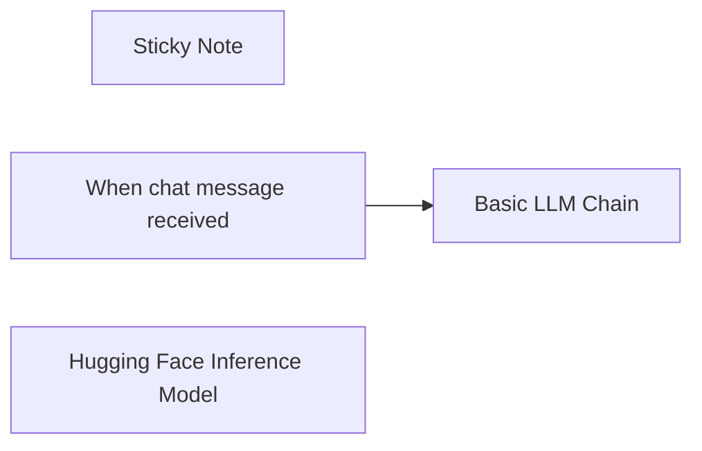

## Fluxo (.json) :

```json
{
  "meta": {
    "instanceId": "408f9fb9940c3cb18ffdef0e0150fe342d6e655c3a9fac21f0f644e8bedabcd9",
    "templateCredsSetupCompleted": true
  },
  "nodes": [
    {
      "id": "27e5f0c0-ba88-4c28-b3be-99c973be15cb",
      "name": "Sticky Note",
      "type": "n8n-nodes-base.stickyNote",
      "position": [
        -480,
        -140
      ],
      "parameters": {
        "width": 1083,
        "height": 357,
        "content": "## This is an example of basic LLM Chain connected to an open-source model\n### The Chain is connected to the Mistral-7B-Instruct-v0.1 model, but you can change this\n\nPlease note the initial prompt that guides the model:\n```\nYou are a helpful assistant.\nPlease reply politely to the users.\nUse emojis and a text.\nQ: {{ $json.input }}\nA: \n```\n\nThis way the model \"knows\" that it needs to answer the question right after the `A: `.\n\nSince Hugging Face node is this is an inference mode, it does not support LangChain Agents at the moment. Please use [Ollama Chat Model](https://docs.n8n.io/integrations/builtin/cluster-nodes/sub-nodes/n8n-nodes-langchain.lmchatollama/) node for that"
      },
      "typeVersion": 1
    },
    {
      "id": "4756d5a8-7027-4942-b214-a5ff8310869a",
      "name": "When chat message received",
      "type": "@n8n/n8n-nodes-langchain.chatTrigger",
      "position": [
        -200,
        280
      ],
      "webhookId": "bf2e38b8-566a-4aeb-8efe-28240f4a6991",
      "parameters": {
        "options": {}
      },
      "typeVersion": 1.1
    },
    {
      "id": "20a36351-8579-4ac6-9746-526b072aeaa6",
      "name": "Basic LLM Chain",
      "type": "@n8n/n8n-nodes-langchain.chainLlm",
      "position": [
        20,
        280
      ],
      "parameters": {
        "messages": {
          "messageValues": [
            {
              "message": "=You are a helpful assistant. Please reply politely to the users. Use emojis and a text."
            }
          ]
        }
      },
      "typeVersion": 1.5
    },
    {
      "id": "9b88e307-3ad5-4167-8c5f-e5827f7444ac",
      "name": "Hugging Face Inference Model",
      "type": "@n8n/n8n-nodes-langchain.lmOpenHuggingFaceInference",
      "position": [
        120,
        440
      ],
      "parameters": {
        "model": "mistralai/Mistral-7B-Instruct-v0.1",
        "options": {
          "maxTokens": 512,
          "temperature": 0.8,
          "frequencyPenalty": 2
        }
      },
      "credentials": {
        "huggingFaceApi": {
          "id": "ARQ5mOhvBxi283Qk",
          "name": "HuggingFaceApi account"
        }
      },
      "typeVersion": 1
    }
  ],
  "pinData": {},
  "connections": {
    "When chat message received": {
      "main": [
        [
          {
            "node": "Basic LLM Chain",
            "type": "main",
            "index": 0
          }
        ]
      ]
    },
    "Hugging Face Inference Model": {
      "ai_languageModel": [
        [
          {
            "node": "Basic LLM Chain",
            "type": "ai_languageModel",
            "index": 0
          }
        ]
      ]
    }
  }
}
```

<a id="template-1237"></a>

## Template 1237 - Chat com assistente e memória de sessão

- **Nome:** Chat com assistente e memória de sessão
- **Descrição:** Recebe mensagens de chat públicas, encaminha para um assistente OpenAI, mantém uma memória de contexto por sessão e permite uso de uma ferramenta de cálculo.
- **Funcionalidade:** • Recepção de mensagens públicas: aceita mensagens através de um gatilho de chat público e identifica a sessão do usuário.
• Encaminhamento para assistente OpenAI: envia o texto recebido para um assistente configurado (identificado por assistantId) para gerar respostas.
• Memória de contexto por sessão: carrega e armazena histórico limitado por sessão usando uma janela de contexto (20 entradas), mantendo contexto entre mensagens.
• Suporte a ferramenta de cálculo: permite que o assistente utilize um recurso de cálculo para operações numéricas quando necessário.
• Instruções de uso integradas: inclui notas com orientações rápidas para testar o fluxo e interagir com o assistente.
• Autenticação com credenciais: utiliza credenciais configuradas para autenticação junto à API do assistente.
- **Ferramentas:** • OpenAI: API de assistente conversacional usada para processar entradas de chat e gerar respostas a partir de um assistente configurado.


## Fluxo visual

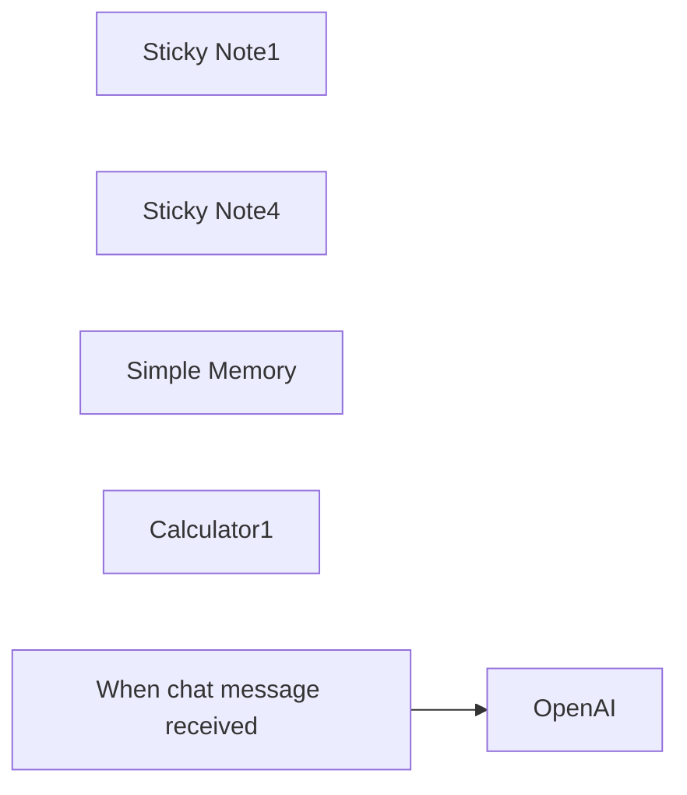

## Fluxo (.json) :

```json
{
  "meta": {
    "instanceId": "408f9fb9940c3cb18ffdef0e0150fe342d6e655c3a9fac21f0f644e8bedabcd9",
    "templateCredsSetupCompleted": true
  },
  "nodes": [
    {
      "id": "b26e5f35-214a-4eba-83f6-a61736a2f017",
      "name": "Sticky Note1",
      "type": "n8n-nodes-base.stickyNote",
      "position": [
        240,
        560
      ],
      "parameters": {
        "color": 7,
        "width": 398,
        "height": 217,
        "content": "Call the assistant, passing in the previous chat messages"
      },
      "typeVersion": 1
    },
    {
      "id": "7cba00f3-7824-47eb-a17f-6e34fab51c0d",
      "name": "Sticky Note4",
      "type": "n8n-nodes-base.stickyNote",
      "position": [
        -440,
        460
      ],
      "parameters": {
        "height": 300.48941882630095,
        "content": "## Try me out\n1. In the OpenAI Assistant node, make sure your OpenAI credentials are set and choose an assistant to use (you'll need to create one if you don't have one already)\n2. Click the 'Chat' button below\n\n  - In the first message, tell the AI what your name is\n  - In a second message, ask the AI what your name is"
      },
      "typeVersion": 1
    },
    {
      "id": "a71b8aef-5ee9-4ff2-9a77-5154fee67cc8",
      "name": "Simple Memory",
      "type": "@n8n/n8n-nodes-langchain.memoryBufferWindow",
      "position": [
        180,
        920
      ],
      "parameters": {
        "sessionKey": "={{ $('When chat message received').first().json.sessionId }}",
        "sessionIdType": "customKey",
        "contextWindowLength": 20
      },
      "typeVersion": 1.3
    },
    {
      "id": "24faa70e-52e7-40e4-abc1-05c8b18df583",
      "name": "OpenAI",
      "type": "@n8n/n8n-nodes-langchain.openAi",
      "position": [
        300,
        640
      ],
      "parameters": {
        "text": "={{ $('When chat message received').item.json.chatInput }}",
        "prompt": "define",
        "options": {},
        "resource": "assistant",
        "assistantId": {
          "__rl": true,
          "mode": "id",
          "value": "asst_HDSAnzsp4WqY4UC1iI9auH5z"
        }
      },
      "credentials": {
        "openAiApi": {
          "id": "8gccIjcuf3gvaoEr",
          "name": "OpenAi account"
        }
      },
      "typeVersion": 1.8
    },
    {
      "id": "37b70475-f28b-4e5f-a7e2-3dad715b2e8d",
      "name": "Calculator1",
      "type": "@n8n/n8n-nodes-langchain.toolCalculator",
      "position": [
        600,
        920
      ],
      "parameters": {},
      "typeVersion": 1
    },
    {
      "id": "79d644c4-6d24-4f1e-9c43-08fa8b20da0e",
      "name": "When chat message received",
      "type": "@n8n/n8n-nodes-langchain.chatTrigger",
      "position": [
        -100,
        640
      ],
      "webhookId": "9eab0524-6cd7-4b81-8bd8-4d050a972a08",
      "parameters": {
        "public": true,
        "options": {
          "loadPreviousSession": "memory"
        }
      },
      "typeVersion": 1.1
    }
  ],
  "pinData": {},
  "connections": {
    "Calculator1": {
      "ai_tool": [
        [
          {
            "node": "OpenAI",
            "type": "ai_tool",
            "index": 0
          }
        ]
      ]
    },
    "Simple Memory": {
      "ai_memory": [
        [
          {
            "node": "OpenAI",
            "type": "ai_memory",
            "index": 0
          },
          {
            "node": "When chat message received",
            "type": "ai_memory",
            "index": 0
          }
        ]
      ]
    },
    "When chat message received": {
      "main": [
        [
          {
            "node": "OpenAI",
            "type": "main",
            "index": 0
          }
        ]
      ]
    }
  }
}
```

<a id="template-1238"></a>

## Template 1238 - Extrair texto de PDF/imagem para CSV com AI

- **Nome:** Extrair texto de PDF/imagem para CSV com AI
- **Descrição:** Automatiza a detecção de novos PDFs e imagens em uma pasta do Google Drive, extrai o texto usando serviços de IA, estrutura transações em formato CSV com categorização e salva o resultado de volta no Drive.
- **Funcionalidade:** • Monitoramento de pasta no Google Drive: inicia o processo quando um novo arquivo é adicionado.
• Roteamento por tipo de arquivo: separa PDFs de imagens para tratamentos diferentes.
• Download automático de arquivos: obtém os PDFs e imagens para processamento.
• Extração de texto de PDFs: converte conteúdo de PDFs em texto legível para processamento posterior.
• Extração e interpretação de imagens: usa IA para reconhecer texto em screenshots ou fotos de transações.
• Processamento por modelo de linguagem: transforma o texto extraído em linhas de transações e atribui categorias.
• Geração de CSV: converte a saída do modelo em arquivo CSV com cabeçalho.
• Upload do CSV para Drive: salva automaticamente o arquivo resultante em uma pasta designada no Google Drive.
- **Ferramentas:** • Google Drive: armazenamento, gatilho para novos arquivos, download e upload dos CSVs.
• Google Cloud (conta de serviço / Vertex API): credenciais e permissões necessárias para acesso e processamento em serviços Google.
• Vertex AI (modelo Gemini / PaLM): reconhecimento de texto em imagens e interpretação multimodal.
• Plataforma de modelo de linguagem (OpenRouter / meta-llama): processamento do texto extraído para estruturar transações em CSV e atribuir categorias.

## Fluxo visual

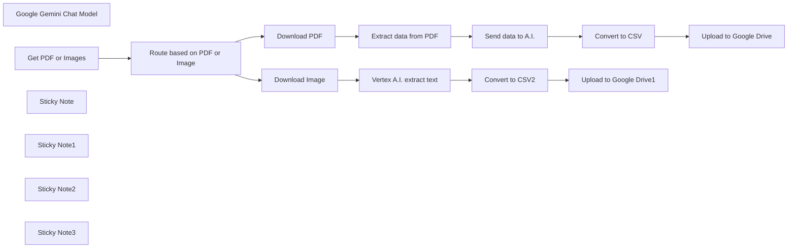

## Fluxo (.json) :

```json
{
  "id": "sUIPemKdKqmUQFt6",
  "meta": {
    "instanceId": "558d88703fb65b2d0e44613bc35916258b0f0bf983c5d4730c00c424b77ca36a",
    "templateCredsSetupCompleted": true
  },
  "name": "Extract text from PDF and image using Vertex AI (Gemini) into CSV",
  "tags": [],
  "nodes": [
    {
      "id": "f60ef5f9-bc08-4cc9-804e-697ae6f88b9b",
      "name": "Google Gemini Chat Model",
      "type": "@n8n/n8n-nodes-langchain.lmChatGoogleGemini",
      "position": [
        980,
        920
      ],
      "parameters": {
        "options": {},
        "modelName": "models/gemini-1.5-pro-latest"
      },
      "credentials": {
        "googlePalmApi": {
          "id": "hmNTKSKfppgtDbM5",
          "name": "Google Gemini(PaLM) Api account"
        }
      },
      "typeVersion": 1
    },
    {
      "id": "81d3f7b8-20cb-4aac-82a9-d4e8e6581105",
      "name": "Get PDF or Images",
      "type": "n8n-nodes-base.googleDriveTrigger",
      "position": [
        220,
        420
      ],
      "parameters": {
        "event": "fileCreated",
        "options": {},
        "pollTimes": {
          "item": [
            {
              "mode": "everyMinute"
            }
          ]
        },
        "triggerOn": "specificFolder",
        "folderToWatch": {
          "__rl": true,
          "mode": "list",
          "value": "1HOeRP5iwccg93UPUYmWYD7DyDmRREkhj",
          "cachedResultUrl": "https://drive.google.com/drive/folders/1HOeRP5iwccg93UPUYmWYD7DyDmRREkhj",
          "cachedResultName": "Actual Budget"
        },
        "authentication": "serviceAccount"
      },
      "credentials": {
        "googleApi": {
          "id": "axkK6IN61bEAT6GM",
          "name": "Google Service Account account"
        }
      },
      "typeVersion": 1
    },
    {
      "id": "fe9a8228-7950-4e2c-8982-328e03725782",
      "name": "Route based on PDF or Image",
      "type": "n8n-nodes-base.switch",
      "position": [
        480,
        420
      ],
      "parameters": {
        "rules": {
          "rules": [
            {
              "value2": "application/pdf",
              "outputKey": "pdf"
            },
            {
              "value2": "image/",
              "operation": "contains",
              "outputKey": "image"
            }
          ]
        },
        "value1": "={{$json.mimeType}}",
        "dataType": "string"
      },
      "typeVersion": 2
    },
    {
      "id": "f62b71e5-af17-4f85-abff-7cee5100affc",
      "name": "Download PDF",
      "type": "n8n-nodes-base.googleDrive",
      "position": [
        740,
        320
      ],
      "parameters": {
        "fileId": {
          "__rl": true,
          "mode": "id",
          "value": "={{ $('Get PDF or Images').item.json.id }}"
        },
        "options": {},
        "operation": "download",
        "authentication": "serviceAccount"
      },
      "credentials": {
        "googleApi": {
          "id": "axkK6IN61bEAT6GM",
          "name": "Google Service Account account"
        }
      },
      "executeOnce": true,
      "typeVersion": 3
    },
    {
      "id": "fa99fbcf-1353-410d-a0db-48cea1178a76",
      "name": "Download Image",
      "type": "n8n-nodes-base.googleDrive",
      "position": [
        740,
        740
      ],
      "parameters": {
        "fileId": {
          "__rl": true,
          "mode": "id",
          "value": "={{ $('Get PDF or Images').item.json.id }}"
        },
        "options": {},
        "operation": "download",
        "authentication": "serviceAccount"
      },
      "credentials": {
        "googleApi": {
          "id": "axkK6IN61bEAT6GM",
          "name": "Google Service Account account"
        }
      },
      "executeOnce": true,
      "retryOnFail": false,
      "typeVersion": 3,
      "alwaysOutputData": true
    },
    {
      "id": "e4979746-44bb-493e-b5eb-f9646b510888",
      "name": "Extract data from PDF",
      "type": "n8n-nodes-base.extractFromFile",
      "position": [
        980,
        320
      ],
      "parameters": {
        "options": {},
        "operation": "pdf"
      },
      "typeVersion": 1
    },
    {
      "id": "6549c335-e749-4b95-b77d-096a5e77af5e",
      "name": "Send data to A.I.",
      "type": "n8n-nodes-base.httpRequest",
      "position": [
        1180,
        320
      ],
      "parameters": {
        "url": "https://openrouter.ai/api/v1/chat/completions",
        "method": "POST",
        "options": {},
        "jsonBody": "={\n  \"model\": \"meta-llama/llama-3.1-70b-instruct:free\",\n  \"messages\": [\n    {\n      \"role\": \"user\",\n      \"content\": \"You are given a bank statement.{{encodeURIComponent($json.text)}}. Read the PDF and export all the transactions as CSV. Add a column called category and based on the information assign a category name. Return only the CSV data starting with the header row.\"\n    }\n  ]\n}",
        "sendBody": true,
        "specifyBody": "json",
        "authentication": "genericCredentialType",
        "genericAuthType": "httpHeaderAuth"
      },
      "credentials": {
        "httpHeaderAuth": {
          "id": "WY7UkF14ksPKq3S8",
          "name": "Header Auth account 2"
        }
      },
      "typeVersion": 4.2,
      "alwaysOutputData": false
    },
    {
      "id": "42341f03-c9fc-4290-963e-1a723202a739",
      "name": "Convert to CSV",
      "type": "n8n-nodes-base.convertToFile",
      "position": [
        1400,
        320
      ],
      "parameters": {
        "options": {}
      },
      "typeVersion": 1.1
    },
    {
      "id": "bb446447-3f46-47e7-96a2-3fc720715828",
      "name": "Upload to Google Drive",
      "type": "n8n-nodes-base.googleDrive",
      "position": [
        1640,
        320
      ],
      "parameters": {
        "name": "={{$today}}",
        "driveId": {
          "__rl": true,
          "mode": "list",
          "value": "My Drive",
          "cachedResultUrl": "https://drive.google.com/drive/my-drive",
          "cachedResultName": "My Drive"
        },
        "options": {},
        "folderId": {
          "__rl": true,
          "mode": "list",
          "value": "1Zo4OFCv1qWRX1jo0VL_iqUBf4v0fZEXe",
          "cachedResultUrl": "https://drive.google.com/drive/folders/1Zo4OFCv1qWRX1jo0VL_iqUBf4v0fZEXe",
          "cachedResultName": "CSV Exports"
        },
        "authentication": "serviceAccount"
      },
      "credentials": {
        "googleApi": {
          "id": "axkK6IN61bEAT6GM",
          "name": "Google Service Account account"
        }
      },
      "typeVersion": 3
    },
    {
      "id": "843bc9c1-79a6-4f42-b9ee-fbec5f30b18d",
      "name": "Convert to CSV2",
      "type": "n8n-nodes-base.convertToFile",
      "position": [
        1360,
        740
      ],
      "parameters": {
        "options": {}
      },
      "typeVersion": 1.1
    },
    {
      "id": "6404bf65-3a7e-4be9-9b7f-98a23dca2ffd",
      "name": "Upload to Google Drive1",
      "type": "n8n-nodes-base.googleDrive",
      "position": [
        1640,
        740
      ],
      "parameters": {
        "name": "={{$today}}",
        "driveId": {
          "__rl": true,
          "mode": "list",
          "value": "My Drive",
          "cachedResultUrl": "https://drive.google.com/drive/my-drive",
          "cachedResultName": "My Drive"
        },
        "options": {},
        "folderId": {
          "__rl": true,
          "mode": "list",
          "value": "1Zo4OFCv1qWRX1jo0VL_iqUBf4v0fZEXe",
          "cachedResultUrl": "https://drive.google.com/drive/folders/1Zo4OFCv1qWRX1jo0VL_iqUBf4v0fZEXe",
          "cachedResultName": "CSV Exports"
        },
        "authentication": "serviceAccount"
      },
      "credentials": {
        "googleApi": {
          "id": "axkK6IN61bEAT6GM",
          "name": "Google Service Account account"
        }
      },
      "typeVersion": 3
    },
    {
      "id": "5dd5771f-6ccb-47ab-acbb-d6cbec60d22b",
      "name": "Sticky Note",
      "type": "n8n-nodes-base.stickyNote",
      "position": [
        220,
        -40
      ],
      "parameters": {
        "width": 589.0376569037658,
        "height": 163.2468619246862,
        "content": "## How to extract PDF and image text into CSV using n8n (without manual data entry)\n\nThis workflow will extract text data from PDF and images, then store it as CSV.\n\n[💡 You can read more about this workflow here](https://rumjahn.com/how-to-create-an-a-i-agent-to-analyze-matomo-analytics-using-n8n-for-free/)"
      },
      "typeVersion": 1
    },
    {
      "id": "37416630-9b52-4ce6-98d0-1bdd39ff0d6b",
      "name": "Sticky Note1",
      "type": "n8n-nodes-base.stickyNote",
      "position": [
        160,
        160
      ],
      "parameters": {
        "color": 4,
        "width": 248.11715481171547,
        "height": 432.7364016736402,
        "content": "## Get PDF or image\nYou need to create a new folder inside Google Drive for uploading your PDF and images.\n\nOnce you create a folder, you need to add your Google cloud user by going to Share -> Add user. The user email should be like: n8n-server@n8n-server-435232.iam.gserviceaccount.com"
      },
      "typeVersion": 1
    },
    {
      "id": "3ab10f17-de8f-4263-aef8-cc2fb090ffe5",
      "name": "Sticky Note2",
      "type": "n8n-nodes-base.stickyNote",
      "position": [
        1120,
        52.864368048917754
      ],
      "parameters": {
        "color": 5,
        "height": 446.3929762816575,
        "content": "## Send to Openrouter\nYou need to set up an Openrouter account to use this. It sends the data to openrouter to extract text.\n\nUse Header Auth. Name is \"Authorization\" and value is \"Bearer {API token}\"."
      },
      "typeVersion": 1
    },
    {
      "id": "e966f95c-c54e-4d11-895d-d5f75c53aca5",
      "name": "Sticky Note3",
      "type": "n8n-nodes-base.stickyNote",
      "position": [
        920,
        540
      ],
      "parameters": {
        "color": 6,
        "width": 399.0962343096232,
        "height": 517.154811715481,
        "content": "## Vertex AI for image recogniztion\nWe send the photo to Vertex AI to extract text. You'll need to activate Vertex AI and add the correct rights to your Google cloud credentials. \n- Enable Vertex API\n- Add vertex to user account"
      },
      "typeVersion": 1
    },
    {
      "id": "daa3ab66-fa14-4792-96d0-3bcbeffd5d60",
      "name": "Vertex A.I. extract text",
      "type": "@n8n/n8n-nodes-langchain.chainLlm",
      "position": [
        980,
        740
      ],
      "parameters": {
        "text": "=Extract the transactions from the image",
        "messages": {
          "messageValues": [
            {
              "message": "=You are given a screenshot of payment transactions. Read the image and export all the transactions as CSV. Add a column called category and based on the information assign a category name. Return only the CSV data starting with the header row."
            },
            {
              "type": "HumanMessagePromptTemplate",
              "messageType": "imageBinary"
            }
          ]
        },
        "promptType": "define",
        "hasOutputParser": true
      },
      "typeVersion": 1.4
    }
  ],
  "active": false,
  "pinData": {},
  "settings": {
    "executionOrder": "v1"
  },
  "versionId": "80635382-3d1c-4e46-a753-84b033cfc3a7",
  "connections": {
    "Download PDF": {
      "main": [
        [
          {
            "node": "Extract data from PDF",
            "type": "main",
            "index": 0
          }
        ]
      ]
    },
    "Convert to CSV": {
      "main": [
        [
          {
            "node": "Upload to Google Drive",
            "type": "main",
            "index": 0
          }
        ]
      ]
    },
    "Download Image": {
      "main": [
        [
          {
            "node": "Vertex A.I. extract text",
            "type": "main",
            "index": 0
          }
        ]
      ]
    },
    "Convert to CSV2": {
      "main": [
        [
          {
            "node": "Upload to Google Drive1",
            "type": "main",
            "index": 0
          }
        ]
      ]
    },
    "Get PDF or Images": {
      "main": [
        [
          {
            "node": "Route based on PDF or Image",
            "type": "main",
            "index": 0
          }
        ]
      ]
    },
    "Send data to A.I.": {
      "main": [
        [
          {
            "node": "Convert to CSV",
            "type": "main",
            "index": 0
          }
        ]
      ]
    },
    "Extract data from PDF": {
      "main": [
        [
          {
            "node": "Send data to A.I.",
            "type": "main",
            "index": 0
          }
        ]
      ]
    },
    "Google Gemini Chat Model": {
      "ai_languageModel": [
        [
          {
            "node": "Vertex A.I. extract text",
            "type": "ai_languageModel",
            "index": 0
          }
        ]
      ]
    },
    "Vertex A.I. extract text": {
      "main": [
        [
          {
            "node": "Convert to CSV2",
            "type": "main",
            "index": 0
          }
        ]
      ]
    },
    "Route based on PDF or Image": {
      "main": [
        [
          {
            "node": "Download PDF",
            "type": "main",
            "index": 0
          }
        ],
        [
          {
            "node": "Download Image",
            "type": "main",
            "index": 0
          }
        ]
      ]
    }
  }
}
```

<a id="template-1239"></a>

## Template 1239 - Envio condicional de Tweet

- **Nome:** Envio condicional de Tweet
- **Descrição:** Este fluxo publica um tweet quando executado e usa uma condição baseada no índice de execução para decidir se reenviar ou seguir sem ação.
- **Funcionalidade:** • Gatilho manual: inicia o fluxo ao clicar em executar.
• Publicação no Twitter: envia a mensagem 'Hello from n8n!' para a conta configurada.
• Verificação de condição: avalia se o índice de execução (runIndex) é igual a 4 para decidir o caminho.
• Rota alternativa sem efeito: quando a condição não é satisfeita, encaminha para uma operação que não realiza ação.
- **Ferramentas:** • Twitter: API de microblogging usada para publicar tweets através de uma conta autenticada.

## Fluxo visual

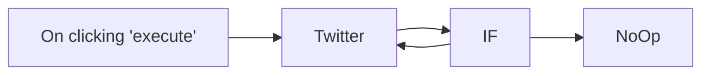

## Fluxo (.json) :

```json
{
  "nodes": [
    {
      "name": "On clicking 'execute'",
      "type": "n8n-nodes-base.manualTrigger",
      "position": [
        250,
        300
      ],
      "parameters": {},
      "typeVersion": 1
    },
    {
      "name": "IF",
      "type": "n8n-nodes-base.if",
      "position": [
        600,
        150
      ],
      "parameters": {
        "conditions": {
          "number": [
            {
              "value1": "={{$runIndex}}",
              "value2": 4
            }
          ]
        }
      },
      "typeVersion": 1
    },
    {
      "name": "NoOp",
      "type": "n8n-nodes-base.noOp",
      "position": [
        750,
        300
      ],
      "parameters": {},
      "typeVersion": 1
    },
    {
      "name": "Twitter",
      "type": "n8n-nodes-base.twitter",
      "position": [
        440,
        300
      ],
      "parameters": {
        "text": "Hello from n8n!",
        "additionalFields": {}
      },
      "credentials": {
        "twitterOAuth1Api": "Dummy Account"
      },
      "typeVersion": 1
    }
  ],
  "connections": {
    "IF": {
      "main": [
        [
          {
            "node": "Twitter",
            "type": "main",
            "index": 0
          }
        ],
        [
          {
            "node": "NoOp",
            "type": "main",
            "index": 0
          }
        ]
      ]
    },
    "Twitter": {
      "main": [
        [
          {
            "node": "IF",
            "type": "main",
            "index": 0
          }
        ]
      ]
    },
    "On clicking 'execute'": {
      "main": [
        [
          {
            "node": "Twitter",
            "type": "main",
            "index": 0
          }
        ]
      ]
    }
  }
}
```

<a id="template-1240"></a>

## Template 1240 - Agente de chat com consulta de clima e pesquisa

- **Nome:** Agente de chat com consulta de clima e pesquisa
- **Descrição:** Fluxo que inicia por uma mensagem manual do usuário, mantém contexto de conversa e utiliza um modelo de linguagem junto com ferramentas externas para consultar clima (por coordenadas) e informações gerais na Wikipédia.
- **Funcionalidade:** • Gatilho de chat manual: inicia o agente quando o usuário envia uma mensagem manualmente.
• Memória de contexto (janela de 20 mensagens): mantém o histórico recente para respostas mais coerentes.
• Processamento por modelo de linguagem: interpreta a pergunta do usuário e decide ações.
• Resolução de localização: extrai ou solicita latitude e longitude de uma localização indicada.
• Consulta meteorológica: chama a API de clima para obter temperatura atual e previsão baseada em coordenadas.
• Pesquisa enciclopédica: recupera informações gerais sobre tópicos ou localidades na Wikipédia.
• Orquestração de ferramentas: combina resultados das ferramentas e gera uma resposta final guiada por instruções do sistema.
- **Ferramentas:** • Ollama (modelo Llama 3.2 local): modelo de linguagem usado para interpretar entradas, planejar ações e gerar respostas.
• Open-Meteo (API de clima): serviço externo para obter dados meteorológicos (temperatura e previsão) a partir de latitude e longitude.
• Wikipedia: fonte pública para recuperar informações gerais e contextuais sobre localidades e outros tópicos.

## Fluxo visual

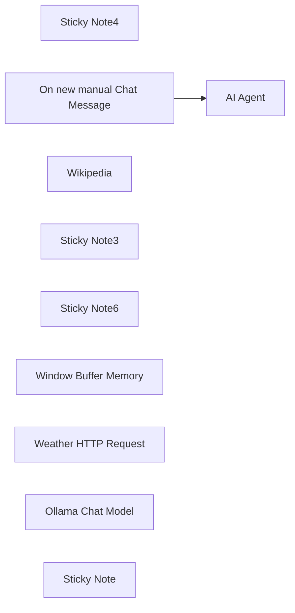

## Fluxo (.json) :

```json
{
  "meta": {
    "instanceId": "558d88703fb65b2d0e44613bc35916258b0f0bf983c5d4730c00c424b77ca36a",
    "templateId": "2931",
    "templateCredsSetupCompleted": true
  },
  "nodes": [
    {
      "id": "100f23d3-cbe9-458a-9ef1-7cc5fcba8f3c",
      "name": "Sticky Note4",
      "type": "n8n-nodes-base.stickyNote",
      "position": [
        640,
        540
      ],
      "parameters": {
        "width": 300,
        "height": 205,
        "content": "### The conversation history(last 20 messages) is stored in a buffer memory"
      },
      "typeVersion": 1
    },
    {
      "id": "b48f989f-deb9-479c-b163-03f098d00c9c",
      "name": "On new manual Chat Message",
      "type": "@n8n/n8n-nodes-langchain.manualChatTrigger",
      "position": [
        380,
        240
      ],
      "parameters": {},
      "typeVersion": 1
    },
    {
      "id": "add8e8df-6b2a-4cbd-84e7-3b006733ef7d",
      "name": "Wikipedia",
      "type": "@n8n/n8n-nodes-langchain.toolWikipedia",
      "position": [
        1180,
        640
      ],
      "parameters": {},
      "typeVersion": 1
    },
    {
      "id": "a97454a8-001d-4986-9cb5-83176229ea70",
      "name": "Sticky Note3",
      "type": "n8n-nodes-base.stickyNote",
      "position": [
        980,
        540
      ],
      "parameters": {
        "width": 300,
        "height": 205,
        "content": "### Tools which agent can use to accomplish the task"
      },
      "typeVersion": 1
    },
    {
      "id": "52b57e72-8cc9-4865-9a00-d03b2e7f1b92",
      "name": "Sticky Note6",
      "type": "n8n-nodes-base.stickyNote",
      "position": [
        600,
        160
      ],
      "parameters": {
        "width": 422,
        "height": 211,
        "content": "### Conversational agent will utilise available tools to answer the prompt. "
      },
      "typeVersion": 1
    },
    {
      "id": "8f0653ab-376b-40b9-b876-e608defdeb89",
      "name": "Window Buffer Memory",
      "type": "@n8n/n8n-nodes-langchain.memoryBufferWindow",
      "position": [
        740,
        600
      ],
      "parameters": {
        "contextWindowLength": 20
      },
      "typeVersion": 1
    },
    {
      "id": "13237945-e143-4f65-b034-785f5ebde5bb",
      "name": "AI Agent",
      "type": "@n8n/n8n-nodes-langchain.agent",
      "position": [
        680,
        240
      ],
      "parameters": {
        "text": "={{ $json.input }}",
        "options": {
          "systemMessage": "=You are a helpful assistant, with weather tool and wiki tool. find out the latitude and longitude information of a location then use the weather tool for current weather and weather forecast. For general info, use the wiki tool."
        },
        "promptType": "define"
      },
      "typeVersion": 1.6
    },
    {
      "id": "ee06c0f4-b2de-4257-9735-3ec228f2b794",
      "name": "Weather HTTP Request",
      "type": "@n8n/n8n-nodes-langchain.toolHttpRequest",
      "position": [
        1020,
        620
      ],
      "parameters": {
        "url": "https://api.open-meteo.com/v1/forecast",
        "sendQuery": true,
        "parametersQuery": {
          "values": [
            {
              "name": "latitude"
            },
            {
              "name": "longitude"
            },
            {
              "name": "forecast_days",
              "value": "1",
              "valueProvider": "fieldValue"
            },
            {
              "name": "hourly",
              "value": "temperature_2m",
              "valueProvider": "fieldValue"
            }
          ]
        },
        "toolDescription": "Fetch current temperature for given coordinates."
      },
      "notesInFlow": true,
      "typeVersion": 1.1
    },
    {
      "id": "3e5608c8-281d-47e0-af9d-77707530fd6b",
      "name": "Ollama Chat Model",
      "type": "@n8n/n8n-nodes-langchain.lmChatOllama",
      "position": [
        520,
        620
      ],
      "parameters": {
        "model": "llama3.2:latest",
        "options": {}
      },
      "credentials": {
        "ollamaApi": {
          "id": "xHuYe0MDGOs9IpBW",
          "name": "Local Ollama service"
        }
      },
      "typeVersion": 1
    },
    {
      "id": "b3d794f4-37b5-46c8-9d7d-ad1087006ce5",
      "name": "Sticky Note",
      "type": "n8n-nodes-base.stickyNote",
      "position": [
        1040,
        140
      ],
      "parameters": {
        "color": 4,
        "height": 240,
        "content": "### In System Message, add the following.\n\n\"You are a helpful assistant, with weather tool and wiki tool. find out the latitude and longitude information of a location then use the weather tool for current weather and weather forecast. For general info, use the wiki tool.\""
      },
      "typeVersion": 1
    }
  ],
  "pinData": {},
  "connections": {
    "Wikipedia": {
      "ai_tool": [
        [
          {
            "node": "AI Agent",
            "type": "ai_tool",
            "index": 0
          }
        ]
      ]
    },
    "Ollama Chat Model": {
      "ai_languageModel": [
        [
          {
            "node": "AI Agent",
            "type": "ai_languageModel",
            "index": 0
          }
        ]
      ]
    },
    "Weather HTTP Request": {
      "ai_tool": [
        [
          {
            "node": "AI Agent",
            "type": "ai_tool",
            "index": 0
          }
        ]
      ]
    },
    "Window Buffer Memory": {
      "ai_memory": [
        [
          {
            "node": "AI Agent",
            "type": "ai_memory",
            "index": 0
          }
        ]
      ]
    },
    "On new manual Chat Message": {
      "main": [
        [
          {
            "node": "AI Agent",
            "type": "main",
            "index": 0
          }
        ]
      ]
    }
  }
}
```
