# PACK 1999 TEMPLATES PARTE 07 - Bloco 3

Templates neste bloco: 20

## Sumário

- [Template 1241 - Leads Facebook → KlickTipp](#template-1241)
- [Template 1242 - Servidor MCP SQLite — ler/inserir/atualizar](#template-1242)
- [Template 1243 - Notificações em tempo real de resultados Icypeas](#template-1243)
- [Template 1244 - Assistente de base de conhecimento Notion via chat](#template-1244)
- [Template 1245 - Enriquecer e sincronizar para HubSpot](#template-1245)
- [Template 1246 - Criação de deal no Pipedrive](#template-1246)
- [Template 1247 - Verificação de números de telefone](#template-1247)
- [Template 1248 - Classificação automática de bugs e reatribuição de time](#template-1248)
- [Template 1249 - Envio de alertas PRISM Elastic por e-mail](#template-1249)
- [Template 1250 - Mesclar feeds RSS](#template-1250)
- [Template 1251 - Salvar URLs no Notion](#template-1251)
- [Template 1252 - Classificação automática de e-mails Outlook com IA](#template-1252)
- [Template 1253 - Criar, atualizar e obter entrada no Strapi](#template-1253)
- [Template 1254 - Criar cliente no Harvest](#template-1254)
- [Template 1255 - Criar ticket no Zendesk](#template-1255)
- [Template 1256 - Servidor MCP para gestão de funcionários PayCaptain](#template-1256)
- [Template 1257 - Agente de planejamento de viagens com busca vetorial](#template-1257)
- [Template 1258 - Pesquisa profunda e compilação de relatório](#template-1258)
- [Template 1259 - Gerador de workflow para banco de dados Notion](#template-1259)
- [Template 1260 - Notificações WhatsApp via KlickTipp com gestão de opt-out](#template-1260)

---

<a id="template-1241"></a>

## Template 1241 - Leads Facebook → KlickTipp

- **Nome:** Leads Facebook → KlickTipp
- **Descrição:** Captura automaticamente envios de formulários do Facebook Lead Ads e insere ou atualiza contatos no KlickTipp preenchendo campos personalizados para ativar campanhas.
- **Funcionalidade:** • Captura de leads em tempo real: Monitora envios de formulários no Facebook/Instagram e inicia o fluxo automaticamente.
• Mapeamento de campos: Associa campos padrão (nome, e-mail) e campos personalizados (curso, forma de pagamento, comentários) aos campos do sistema de contatos.
• Extração de nome: Separa o nome completo para preencher primeiro nome e sobrenome em campos distintos.
• Criação/atualização de assinantes: Adiciona novos contatos ou atualiza existentes na lista alvo.
• Adição de tags para segmentação: Aplica tags para ativar campanhas automatizadas e segmentação de contatos.
• Suporte a testes e validação: Permite testes de transmissão e alerta sobre endereços de teste que podem ser rejeitados pelo sistema de destino.
- **Ferramentas:** • Facebook Lead Ads: Plataforma de anúncios que coleta dados via formulários para geração de leads.
• KlickTipp: Sistema de gerenciamento de contatos e automação de e-mail que armazena assinantes, campos personalizados e permite segmentação por tags.


## Fluxo visual

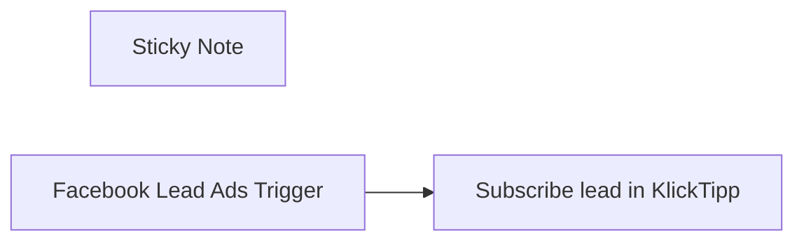

## Fluxo (.json) :

```json
{
  "meta": {
    "instanceId": "95b3ab5a70ab1c8c1906357a367f1b236ef12a1409406fd992f60255f0f95f85",
    "templateCredsSetupCompleted": true
  },
  "nodes": [
    {
      "id": "0b6d74c3-e034-40be-9f42-df42c2ffbb03",
      "name": "Sticky Note",
      "type": "n8n-nodes-base.stickyNote",
      "position": [
        1080,
        1040
      ],
      "parameters": {
        "width": 1219,
        "height": 674,
        "content": "### Introduction\nThis workflow streamlines the process of capturing leads via Facebook Lead Ads and transferring them automatically into KlickTipp. It ensures that contact data is accurately mapped and added to KlickTipp to trigger personalized email campaigns.\n\n### Benefits\n- **Automated lead import**: New leads from Facebook forms are automatically synced to KlickTipp without manual effort.\n- **Seamless campaign activation**: Tags can be assigned during the process, instantly triggering follow-up campaigns like welcome emails or webinar reminders.\n- **Reliable data structure**: Validated form entries are mapped to predefined custom fields, ensuring a high-quality contact base in KlickTipp.\n\n### Key Feature\n- **Facebook Lead Ads Trigger**: Captures form submissions from Facebook Ads in real-time.\n- **Data Processing**: Assigns and formats lead data based on field mappings:\n  - Maps standard Facebook fields (name, email) directly.\n  - Matches custom fields such as course selection, payment method, and comments to KlickTipp custom fields.\n- **Subscriber Management in KlickTipp**: Adds or updates contacts with structured mapping to custom fields. Tags can be dynamically added for segmentation:\n  - Personal data: First name, email address.\n  - Form responses: Selected course, payment method, comments.\n  - Tag-based segmentation for automated workflows.\n\n#### Setup Instructions\n1. Set up the Facebook Leads Ads (choose your form) and KlickTipp nodes (choose opt-in, tagging and field mapping) in your n8n instance.\n2. Authenticate your Facebook Lead Ads and KlickTipp accounts.\n3. Create the necessary custom fields to match the data structure\n4. Verify and customize field assignments in the workflow to align with your specific form and subscriber list setup.\n\nCustom Fields:\n   - `Facebook_Leads_Ads_Kommentar` (Text)\n   - `Facebook_Leads_Ads_Kursauswahl` (Text)\n   - `Facebook_Leads_Ads_Zahlungsweise` (Text)\n\n\n### Testing and Deployment\n1. Perform a test with the meta developer tool verify the transmission. (⚠️ Attention: KlickTipp rightfully rejects this test address test@fb.com due to its validation rules, as it cannot receive emails. You can manipulate the output in the node for testing.)\n2. Confirm new subscribers appear in KlickTipp with mapped fields and tags.\n3. Launch your campaign in Facebook with full automation in place.\n\n- **Customization**: Adjust tag names and field mappings in the KlickTipp module of Make to fit your specific setup. Ensure any additional fields are created beforehand in KlickTipp to avoid sync errors."
      },
      "typeVersion": 1
    },
    {
      "id": "84d11f91-5a50-49a0-a511-93d83fa434f4",
      "name": "Facebook Lead Ads Trigger",
      "type": "n8n-nodes-base.facebookLeadAdsTrigger",
      "notes": "This node listens for new leads generated via Facebook Lead Ads. When a user submits a form on Facebook or Instagram, it triggers the workflow and captures the lead's details.",
      "position": [
        1460,
        840
      ],
      "webhookId": "04c33978-2df7-4ab1-a37c-3ab3c0a0d21f",
      "parameters": {
        "form": {
          "__rl": true,
          "mode": "list",
          "value": "989636452637732",
          "cachedResultName": "Integrations Manual - Kursregistrierung"
        },
        "page": {
          "__rl": true,
          "mode": "list",
          "value": "315574741814190",
          "cachedResultUrl": "https://facebook.com/315574741814190",
          "cachedResultName": "KlickTipp"
        },
        "options": {}
      },
      "credentials": {
        "facebookLeadAdsOAuth2Api": {
          "id": "bBzZPOu1M8YbIM9L",
          "name": "Facebook Lead Ads account 3"
        }
      },
      "notesInFlow": true,
      "typeVersion": 1
    },
    {
      "id": "e4532533-b447-4340-b750-6e3c47809cb8",
      "name": "Subscribe lead in KlickTipp",
      "type": "n8n-nodes-klicktipp.klicktipp",
      "notes": "Subscribes the incoming Facebook lead to the KlickTipp. This allows automatic follow-up, tagging, or integration with email campaigns.",
      "position": [
        1780,
        840
      ],
      "parameters": {
        "email": "={{ $json.data.email }}",
        "fields": {
          "dataFields": [
            {
              "fieldId": "fieldFirstName",
              "fieldValue": "={{ // Extracts the first name (the first part of the full name), which will be identified by the letters before the first empty space \" \". This implementation only supports the first name.\n$json[\"data\"][\"full name\"].split(\" \")[0] }}"
            },
            {
              "fieldId": "fieldLastName",
              "fieldValue": "={{ // Extracts the last name (the last part of the full name), which will be identified by the letters after the last empty space \" \". This implementation does not support double names.\n$json[\"data\"][\"full name\"].split(\" \").pop() }}"
            },
            {
              "fieldId": "field216784",
              "fieldValue": "={{ $json.data['hast_du_zusätzliche_kommentare_für_uns?'] }}"
            },
            {
              "fieldId": "field216785",
              "fieldValue": "={{ $json.data['welcher_kurs_interessiert_dich?'] }}"
            },
            {
              "fieldId": "field216786",
              "fieldValue": "={{ $json.data['was_ist_deine_bevorzugte_zahlungsweise?'] }}"
            }
          ]
        },
        "listId": "358895",
        "resource": "subscriber",
        "operation": "subscribe"
      },
      "credentials": {
        "klickTippApi": {
          "id": "K9JyBdCM4SZc1cXl",
          "name": "DEMO KlickTipp account"
        }
      },
      "notesInFlow": true,
      "typeVersion": 2
    }
  ],
  "pinData": {},
  "connections": {
    "Facebook Lead Ads Trigger": {
      "main": [
        [
          {
            "node": "Subscribe lead in KlickTipp",
            "type": "main",
            "index": 0
          }
        ]
      ]
    }
  }
}
```

<a id="template-1242"></a>

## Template 1242 - Servidor MCP SQLite — ler/inserir/atualizar

- **Nome:** Servidor MCP SQLite — ler/inserir/atualizar
- **Descrição:** Fluxo que expõe um servidor MCP para listar tabelas, descrever esquemas e executar leituras, inserções e atualizações em um banco de dados SQLite local.
- **Funcionalidade:** • Configurar gatilho MCP: inicia um servidor que aceita conexões de clientes compatíveis com MCP.
• Listar tabelas: fornece a lista de tabelas disponíveis no arquivo de banco de dados SQLite.
• Descrever tabela: retorna o esquema e metadados das colunas de uma tabela específica.
• Ler linhas: executa consultas SELECT com cláusula WHERE opcional e retorna resultados.
• Inserir registro: insere uma nova linha em uma tabela usando parâmetros fornecidos (sem SQL bruto).
• Atualizar registro: realiza atualizações em linhas usando parâmetros de valores e condição WHERE.
• Roteamento de operações: recebe a operação solicitada (read/insert/update) e encaminha para o manipulador apropriado.
• Boas práticas de segurança: força uso de parâmetros para reduzir risco de injeção e recomenda habilitar autenticação; indicado para execução em ambiente self-hosted.
- **Ferramentas:** • SQLite: banco de dados local armazenado em arquivo (.db) usado para persistência dos dados.
• Cliente MCP (Model Context Protocol): agente ou cliente compatível que se conecta ao servidor MCP para enviar consultas e receber respostas (ex.: clients tipo Claude Desktop).
• Biblioteca sqlite3 no Node.js: biblioteca utilizada para abrir o arquivo de banco e executar consultas a partir do código.

## Fluxo visual

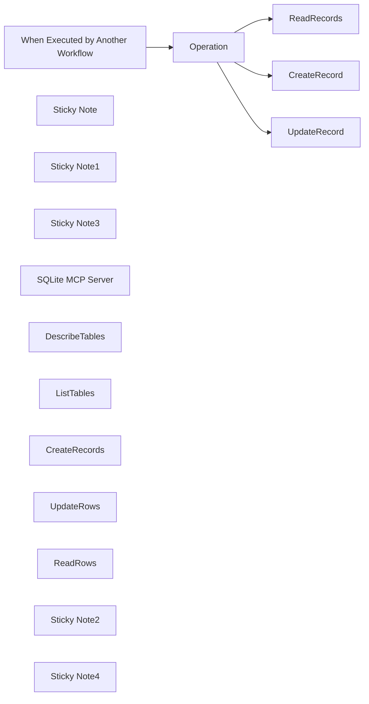

## Fluxo (.json) :

```json
{
  "meta": {
    "instanceId": "408f9fb9940c3cb18ffdef0e0150fe342d6e655c3a9fac21f0f644e8bedabcd9"
  },
  "nodes": [
    {
      "id": "fcbf7023-7e12-49d8-9c7d-4cb431c79905",
      "name": "When Executed by Another Workflow",
      "type": "n8n-nodes-base.executeWorkflowTrigger",
      "position": [
        460,
        260
      ],
      "parameters": {
        "workflowInputs": {
          "values": [
            {
              "name": "operation"
            },
            {
              "name": "tableName"
            },
            {
              "name": "values",
              "type": "object"
            },
            {
              "name": "where",
              "type": "object"
            }
          ]
        }
      },
      "typeVersion": 1.1
    },
    {
      "id": "58c93321-ded9-48c1-812f-c35d160e257b",
      "name": "Operation",
      "type": "n8n-nodes-base.switch",
      "position": [
        640,
        260
      ],
      "parameters": {
        "rules": {
          "values": [
            {
              "outputKey": "READ",
              "conditions": {
                "options": {
                  "version": 2,
                  "leftValue": "",
                  "caseSensitive": true,
                  "typeValidation": "strict"
                },
                "combinator": "and",
                "conditions": [
                  {
                    "id": "81b134bc-d671-4493-b3ad-8df9be3f49a6",
                    "operator": {
                      "type": "string",
                      "operation": "equals"
                    },
                    "leftValue": "={{ $json.operation }}",
                    "rightValue": "read"
                  }
                ]
              },
              "renameOutput": true
            },
            {
              "outputKey": "INSERT",
              "conditions": {
                "options": {
                  "version": 2,
                  "leftValue": "",
                  "caseSensitive": true,
                  "typeValidation": "strict"
                },
                "combinator": "and",
                "conditions": [
                  {
                    "id": "8d57914f-6587-4fb3-88e0-aa1de6ba56c1",
                    "operator": {
                      "name": "filter.operator.equals",
                      "type": "string",
                      "operation": "equals"
                    },
                    "leftValue": "={{ $json.operation }}",
                    "rightValue": "insert"
                  }
                ]
              },
              "renameOutput": true
            },
            {
              "outputKey": "UPDATE",
              "conditions": {
                "options": {
                  "version": 2,
                  "leftValue": "",
                  "caseSensitive": true,
                  "typeValidation": "strict"
                },
                "combinator": "and",
                "conditions": [
                  {
                    "id": "7c38f238-213a-46ec-aefe-22e0bcb8dffc",
                    "operator": {
                      "name": "filter.operator.equals",
                      "type": "string",
                      "operation": "equals"
                    },
                    "leftValue": "={{ $json.operation }}",
                    "rightValue": "update"
                  }
                ]
              },
              "renameOutput": true
            }
          ]
        },
        "options": {}
      },
      "typeVersion": 3.2
    },
    {
      "id": "865ae43a-14ec-4aac-9396-d0aef1ab4a75",
      "name": "Sticky Note",
      "type": "n8n-nodes-base.stickyNote",
      "position": [
        -340,
        -100
      ],
      "parameters": {
        "color": 7,
        "width": 680,
        "height": 660,
        "content": "## 1. Set up an MCP Server Trigger\n[Read more about the MCP Server Trigger](https://docs.n8n.io/integrations/builtin/core-nodes/n8n-nodes-langchain.mcptrigger)"
      },
      "typeVersion": 1
    },
    {
      "id": "35551851-319a-47cf-87cd-a63b128300cc",
      "name": "Sticky Note1",
      "type": "n8n-nodes-base.stickyNote",
      "position": [
        360,
        -100
      ],
      "parameters": {
        "color": 7,
        "width": 820,
        "height": 720,
        "content": "## 2. Keep Secure by Preventing Raw SQL Statements\n[Read more about the Code Node](https://docs.n8n.io/integrations/builtin/core-nodes/n8n-nodes-base.code/)\n\nWhilst it may be easier to just let the Agent provide the full raw SQL statement,\nit may expose you or your organisation to a real security risk where in the worst\ncase, data may be unknowingly leaked or deleted.\n\nForcing the agent to provide only the parameters of the query\nmeans we can guard somewhat against this risk and also allows\nuse of query parameters as best practice against SQL injection attacks.\n"
      },
      "typeVersion": 1
    },
    {
      "id": "95c35568-e447-4634-afe8-c902ba5c7d2f",
      "name": "Sticky Note3",
      "type": "n8n-nodes-base.stickyNote",
      "position": [
        -340,
        -220
      ],
      "parameters": {
        "color": 5,
        "width": 380,
        "height": 100,
        "content": "### Always Authenticate Your Server!\nBefore going to production, it's always advised to enable authentication on your MCP server trigger."
      },
      "typeVersion": 1
    },
    {
      "id": "2d0f98f8-043a-459c-8b77-634e06ee0f57",
      "name": "SQLite MCP Server",
      "type": "@n8n/n8n-nodes-langchain.mcpTrigger",
      "position": [
        -160,
        60
      ],
      "webhookId": "3124a4cd-4e93-4c1b-b4db-b5599f4889b1",
      "parameters": {
        "path": "3124a4cd-4e93-4c1b-b4db-b5599f4889b1"
      },
      "typeVersion": 1
    },
    {
      "id": "6f313137-eb8f-429b-a6c9-7b17e067dc5e",
      "name": "CreateRecord",
      "type": "n8n-nodes-base.code",
      "position": [
        940,
        260
      ],
      "parameters": {
        "jsCode": "const sqlite3 = require('sqlite3').verbose();\nconst { promisify } = require('util');\n\nconst db = new sqlite3.Database('/home/node/test.db');\nconst run = promisify(db.run.bind(db));\n\nconst { json } = $input.first();\n\n\nlet output = '';\nconst statement = [\n  `INSERT INTO ${json.tableName}`,\n  `   (${Object.keys(json.values).join(',')})`,\n  `VALUES`,\n  `  (${Object.keys(json.values).map(_ => '?').join(',')})`\n].join(' ');\nconst params = Object.values(json.values);\n\ntry {\n  await run(statement.trim(), params);\n  output = { output: 'ok', error: null };\n} catch (err) {\n  output = { output: null, error: err };\n} finally {\n  await db.close();\n}\n\nreturn output;"
      },
      "typeVersion": 2
    },
    {
      "id": "b2530656-bbf4-4316-8b8e-c5d27865e45f",
      "name": "UpdateRecord",
      "type": "n8n-nodes-base.code",
      "position": [
        940,
        440
      ],
      "parameters": {
        "jsCode": "const sqlite3 = require('sqlite3').verbose();\nconst { promisify } = require('util');\n\nconst db = new sqlite3.Database('/home/node/test.db');\nconst run = promisify(db.run.bind(db));\n\nconst { json } = $input.first();\n\nlet output = '';\nconst statement = [\n  `UPDATE ${json.tableName}`,\n  `SET`,\n  `${Object.keys(json.values)\n    .map(key => `${key} = ?`)\n    .join(',')}`,\n  `WHERE`,\n  `${Object.keys(json.where)\n     .map((key,idx) => `${key} = ?`)\n     .join(' AND ')}`\n].join(' ');\nconst params = [ ...Object.values(json.values), ...Object.values(json.where)];\n\ntry {\n  await run(statement, params);\n  output = { output: 'ok', error: null };\n} catch (err) {\n  output = { output: null, error: err };\n} finally {\n  await db.close();\n}\n\nreturn output;"
      },
      "typeVersion": 2
    },
    {
      "id": "8c1b8bcb-20f1-4ef9-b646-9d89177651dd",
      "name": "ReadRecords",
      "type": "n8n-nodes-base.code",
      "position": [
        940,
        80
      ],
      "parameters": {
        "jsCode": "const sqlite3 = require('sqlite3').verbose();\nconst { promisify } = require('util');\n\nconst db = new sqlite3.Database('/home/node/test.db');\nconst all = promisify(db.all.bind(db));\n\nconst { json } = $input.first();\n\nlet output = '';\nconst statement = [\n  `SELECT * FROM ${json.tableName}`,\n  json?.where && Object.keys(json?.where).length > 0\n    ? `WHERE ` + Object.keys(json.where)\n        .map((key,idx) => `${key} = $${idx+1}`)\n        .join(' AND ')\n    : ''\n].join(' ');\nconst params = json.where ? Object.values(json.where) : undefined;\n\ntry {\n  \n  const results = await all(statement.trim(), params);\n\n  output = { output: [].concat(results), error: null };\n} catch (err) {\n  output = { output: null, error: err };\n} finally {\n  await db.close();\n}\n\nreturn output"
      },
      "typeVersion": 2
    },
    {
      "id": "87df3eed-b4d5-4a9c-bd82-0ad455449cd2",
      "name": "DescribeTables",
      "type": "@n8n/n8n-nodes-langchain.toolCode",
      "position": [
        -160,
        340
      ],
      "parameters": {
        "name": "describeTable",
        "jsCode": "const sqlite3 = require('sqlite3').verbose();\nconst { promisify } = require('util');\n\nconst db = new sqlite3.Database('/home/node/test.db');\nconst all = promisify(db.all.bind(db));\n\nlet output = '';\ntry {\n  const rows = await all(`PRAGMA table_info(${query.tableName})`);\n  const results = rows.map((col) => (\n    `${col.name} | ${col.type} | NOT NULL: ${col.notnull} | Default: ${col.dflt_value}`\n  )).join('\\n');\n  \n  output = { output: [].concat(results), error: null };\n} catch (err) {\n  output = { output: null, error: err };\n} finally {\n  await db.close();\n}\n\nreturn JSON.stringify(output);",
        "schemaType": "manual",
        "description": "Call this tool to describe a table's schema.",
        "inputSchema": "{\n  \"type\": \"object\",\n  \"required\": [\"tableName\"],\n  \"properties\": {\n    \"tableName\": {\n      \"type\": \"string\",\n      \"description\": \"Name of the table\"\n    }\n  }\n}",
        "specifyInputSchema": true
      },
      "typeVersion": 1.1
    },
    {
      "id": "4a0ba0d0-4955-44fd-92de-ad031ebb64cb",
      "name": "ListTables",
      "type": "@n8n/n8n-nodes-langchain.toolCode",
      "position": [
        -260,
        240
      ],
      "parameters": {
        "name": "listTables",
        "jsCode": "const sqlite3 = require('sqlite3').verbose();\nconst { promisify } = require('util');\n\nconst db = new sqlite3.Database('/home/node/test.db');\nconst all = promisify(db.all.bind(db));\n\nlet output = '';\ntry {\n  const rows = await all(`SELECT name FROM sqlite_master WHERE type='table' AND name NOT LIKE 'sqlite_%'`, []);\n  const results = rows.map((row) => row.name).join('\\n');\n  \n  output = { output: [].concat(results), error: null };\n} catch (err) {\n  output = { output: null, error: err };\n} finally {\n  await db.close();\n}\n\nreturn JSON.stringify(output);",
        "description": "Call this tool to list all available tables in the SQLite Database."
      },
      "typeVersion": 1.1
    },
    {
      "id": "69e8e720-7e91-4b46-8db5-1afdf1f3dbe0",
      "name": "CreateRecords",
      "type": "@n8n/n8n-nodes-langchain.toolWorkflow",
      "position": [
        -40,
        440
      ],
      "parameters": {
        "name": "CreateRecords",
        "workflowId": {
          "__rl": true,
          "mode": "id",
          "value": "={{ $workflow.id }}"
        },
        "description": "Call this tool to create a row in a SQLite table.",
        "workflowInputs": {
          "value": {
            "where": "={{ {} }}",
            "values": "={{ /*n8n-auto-generated-fromAI-override*/ $fromAI('values', `An object of key-value pair where key represents the column name.`, 'string') }}",
            "operation": "insert",
            "tableName": "={{ /*n8n-auto-generated-fromAI-override*/ $fromAI('tableName', `table to insert into`, 'string') }}"
          },
          "schema": [
            {
              "id": "operation",
              "type": "string",
              "display": true,
              "removed": false,
              "required": false,
              "displayName": "operation",
              "defaultMatch": false,
              "canBeUsedToMatch": true
            },
            {
              "id": "tableName",
              "type": "string",
              "display": true,
              "removed": false,
              "required": false,
              "displayName": "tableName",
              "defaultMatch": false,
              "canBeUsedToMatch": true
            },
            {
              "id": "values",
              "type": "object",
              "display": true,
              "removed": false,
              "required": false,
              "displayName": "values",
              "defaultMatch": false,
              "canBeUsedToMatch": true
            },
            {
              "id": "where",
              "type": "object",
              "display": true,
              "removed": false,
              "required": false,
              "displayName": "where",
              "defaultMatch": false,
              "canBeUsedToMatch": true
            }
          ],
          "mappingMode": "defineBelow",
          "matchingColumns": [],
          "attemptToConvertTypes": false,
          "convertFieldsToString": false
        }
      },
      "typeVersion": 2.1
    },
    {
      "id": "f2e18ae5-89a0-4d61-805b-e777f11300a2",
      "name": "UpdateRows",
      "type": "@n8n/n8n-nodes-langchain.toolWorkflow",
      "position": [
        100,
        360
      ],
      "parameters": {
        "name": "updateRows",
        "workflowId": {
          "__rl": true,
          "mode": "id",
          "value": "={{ $workflow.id }}"
        },
        "description": "Call this tool to create a row in a table.",
        "workflowInputs": {
          "value": {
            "where": "={{ /*n8n-auto-generated-fromAI-override*/ $fromAI('where', `An object of key-value pair where key represents the column name.`, 'string') }}",
            "values": "={{ /*n8n-auto-generated-fromAI-override*/ $fromAI('values', `An object of key-value pair where key represents the column name.`, 'string') }}",
            "operation": "update",
            "tableName": "={{ /*n8n-auto-generated-fromAI-override*/ $fromAI('tableName', `table to update`, 'string') }}"
          },
          "schema": [
            {
              "id": "operation",
              "type": "string",
              "display": true,
              "required": false,
              "displayName": "operation",
              "defaultMatch": false,
              "canBeUsedToMatch": true
            },
            {
              "id": "tableName",
              "type": "string",
              "display": true,
              "required": false,
              "displayName": "tableName",
              "defaultMatch": false,
              "canBeUsedToMatch": true
            },
            {
              "id": "values",
              "type": "object",
              "display": true,
              "required": false,
              "displayName": "values",
              "defaultMatch": false,
              "canBeUsedToMatch": true
            },
            {
              "id": "where",
              "type": "object",
              "display": true,
              "required": false,
              "displayName": "where",
              "defaultMatch": false,
              "canBeUsedToMatch": true
            }
          ],
          "mappingMode": "defineBelow",
          "matchingColumns": [],
          "attemptToConvertTypes": false,
          "convertFieldsToString": false
        }
      },
      "typeVersion": 2.1
    },
    {
      "id": "22645721-1b66-4a36-9be5-f1e5edde30f8",
      "name": "ReadRows",
      "type": "@n8n/n8n-nodes-langchain.toolWorkflow",
      "position": [
        180,
        240
      ],
      "parameters": {
        "name": "readRows",
        "workflowId": {
          "__rl": true,
          "mode": "id",
          "value": "={{ $workflow.id }}"
        },
        "description": "Call this tool to read one or more rows in a table",
        "workflowInputs": {
          "value": {
            "where": "={{ /*n8n-auto-generated-fromAI-override*/ $fromAI('where', `An object of key-value pair where key represents the column name.`, 'string') }}",
            "values": "={}",
            "operation": "read",
            "tableName": "={{ /*n8n-auto-generated-fromAI-override*/ $fromAI('tableName', `table to read from`, 'string') }}"
          },
          "schema": [
            {
              "id": "operation",
              "type": "string",
              "display": true,
              "required": false,
              "displayName": "operation",
              "defaultMatch": false,
              "canBeUsedToMatch": true
            },
            {
              "id": "tableName",
              "type": "string",
              "display": true,
              "required": false,
              "displayName": "tableName",
              "defaultMatch": false,
              "canBeUsedToMatch": true
            },
            {
              "id": "values",
              "type": "object",
              "display": true,
              "required": false,
              "displayName": "values",
              "defaultMatch": false,
              "canBeUsedToMatch": true
            },
            {
              "id": "where",
              "type": "object",
              "display": true,
              "required": false,
              "displayName": "where",
              "defaultMatch": false,
              "canBeUsedToMatch": true
            }
          ],
          "mappingMode": "defineBelow",
          "matchingColumns": [],
          "attemptToConvertTypes": false,
          "convertFieldsToString": false
        }
      },
      "typeVersion": 2.1
    },
    {
      "id": "2176742a-5a28-41c6-9cd7-ac3229ddcdb6",
      "name": "Sticky Note2",
      "type": "n8n-nodes-base.stickyNote",
      "position": [
        -820,
        -800
      ],
      "parameters": {
        "width": 440,
        "height": 1360,
        "content": "## Try It Out!\n**NOTE: This template is for Self-Hosted N8N Instances only.**\n\n### This n8n demonstrates how to build a simple SQLite MCP server to perform local database operations as well as use it for Business Intelligence.\n\nThis MCP example is based off an official MCP reference implementation which can be found here -https://github.com/modelcontextprotocol/servers/tree/main/src/sqlite\n\n### How it works\n* A MCP server trigger is used and connected to 5 tools: 2 Code Node and 3 Custom Workflow.\n* The 2 Code Node tools use the SQLLite3 library and are simple read-only queries and as such, the Code Node tool can be simply used.\n* The 3 custom workflow tools are used for select, insert and update queries as these are operations which require a bit more discretion.\n* Whilst it may be easier to allow the agent to use raw SQL queries, we may find it a little safer to just allow for the parameters instead. The custom workflow tool allows us to define this restricted schema for tool input which we'll use to construct the SQL statement ourselves.\n* All 3 custom workflow tools trigger the same \"Execute workflow\" trigger in this very template which has a switch to route the operation to the correct handler.\n* Finally, we use our Code nodes to handle select, insert and update operations. The responses are then sent back to the the MCP client.\n\n### How to use\n* This SQLite MCP server allows any compatible MCP client to manage a SQLite database by supporting select, create and update operations. You will need to have a SQLite database available before you can use this server.\n* Connect your MCP client by following the n8n guidelines here - https://docs.n8n.io/integrations/builtin/core-nodes/n8n-nodes-langchain.mcptrigger/#integrating-with-claude-desktop\n* Try the following queries in your MCP client:\n  * \"Please create a table to store business insights and add the following...\"\n  * \"what business insights do we have on current retail trends?\"\n  * \"Who has contributed the most business insights in the past week?\"\n\n### Requirements\n* SQLite for database.\n* MCP Client or Agent for usage such as Claude Desktop - https://claude.ai/download\n\n### Customising this workflow\n* If the scope of schemas or tables is too open, try restrict it so the MCP serves a specific purpose for business operations. eg. Confine the querying and editing to HR only tables before providing access to people in that department.\n* Remember to set the MCP server to require credentials before going to production and sharing this MCP server with others!"
      },
      "typeVersion": 1
    },
    {
      "id": "5a9a4763-2952-4d95-8f35-25238affa049",
      "name": "Sticky Note4",
      "type": "n8n-nodes-base.stickyNote",
      "position": [
        -340,
        -340
      ],
      "parameters": {
        "color": 3,
        "width": 380,
        "height": 100,
        "content": "### SELF-HOSTED ONLY\nThis template only works for self-hosted n8n instances as it reads the database file on disk."
      },
      "typeVersion": 1
    }
  ],
  "pinData": {},
  "connections": {
    "ReadRows": {
      "ai_tool": [
        [
          {
            "node": "SQLite MCP Server",
            "type": "ai_tool",
            "index": 0
          }
        ]
      ]
    },
    "Operation": {
      "main": [
        [
          {
            "node": "ReadRecords",
            "type": "main",
            "index": 0
          }
        ],
        [
          {
            "node": "CreateRecord",
            "type": "main",
            "index": 0
          }
        ],
        [
          {
            "node": "UpdateRecord",
            "type": "main",
            "index": 0
          }
        ]
      ]
    },
    "ListTables": {
      "ai_tool": [
        [
          {
            "node": "SQLite MCP Server",
            "type": "ai_tool",
            "index": 0
          }
        ]
      ]
    },
    "UpdateRows": {
      "ai_tool": [
        [
          {
            "node": "SQLite MCP Server",
            "type": "ai_tool",
            "index": 0
          }
        ]
      ]
    },
    "CreateRecords": {
      "ai_tool": [
        [
          {
            "node": "SQLite MCP Server",
            "type": "ai_tool",
            "index": 0
          }
        ]
      ]
    },
    "DescribeTables": {
      "ai_tool": [
        [
          {
            "node": "SQLite MCP Server",
            "type": "ai_tool",
            "index": 0
          }
        ]
      ]
    },
    "When Executed by Another Workflow": {
      "main": [
        [
          {
            "node": "Operation",
            "type": "main",
            "index": 0
          }
        ]
      ]
    }
  }
}
```

<a id="template-1243"></a>

## Template 1243 - Notificações em tempo real de resultados Icypeas

- **Nome:** Notificações em tempo real de resultados Icypeas
- **Descrição:** Recebe resultados de buscas do Icypeas via webhook e extrai email, nome e sobrenome para processamento ou encaminhamento em tempo real.
- **Funcionalidade:** • Recepção de notificações POST: Aceita chamadas HTTP enviadas pelo Icypeas quando novos resultados ficam disponíveis.
• Extração de dados relevantes: Obtém email, firstname e lastname dos dados recebidos para uso posterior.
• Processamento em tempo real: Permite agir imediatamente sobre cada resultado assim que é enviado.
• Encaminhamento para serviços externos: Pode ser estendido para criar leads ou integrar com ferramentas de outreach (ex.: criação automática de contatos).
• Instruções de configuração: Fornece orientação para registrar a URL do webhook no painel do usuário do Icypeas e alerta para usar a URL de produção ao ativar o fluxo.
• Escopo suportado: Projetado para buscas por email e varreduras de domínio (verificação de emails não incluída nesta versão).
- **Ferramentas:** • Icypeas: Plataforma de buscas e API que envia notificações push com os resultados de pesquisas.
• Lemlist (exemplo opcional): Serviço de automação de outreach por email que pode receber leads e campanhas a partir dos resultados.

## Fluxo visual

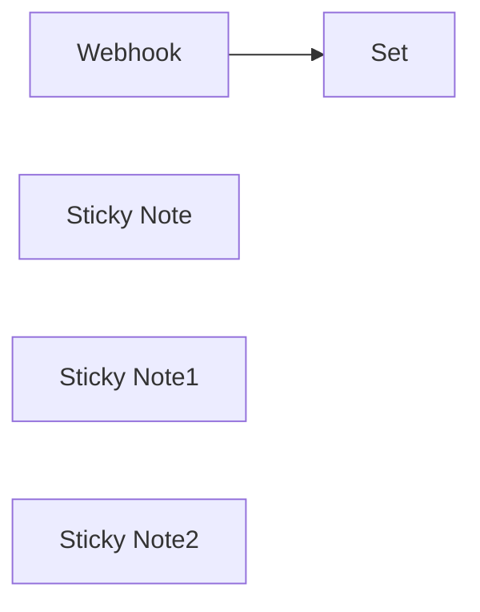

## Fluxo (.json) :

```json
{
  "meta": {
    "instanceId": "257476b1ef58bf3cb6a46e65fac7ee34a53a5e1a8492d5c6e4da5f87c9b82833"
  },
  "nodes": [
    {
      "id": "23dc1873-b376-473e-935b-b1df5e663c9e",
      "name": "Webhook",
      "type": "n8n-nodes-base.webhook",
      "position": [
        1100,
        1120
      ],
      "webhookId": "c80ce133-899b-41c9-b2ae-2c876694f9fd",
      "parameters": {
        "path": "c80ce133-899b-41c9-b2ae-2c876694f9fd",
        "options": {},
        "httpMethod": "POST"
      },
      "typeVersion": 1
    },
    {
      "id": "417ddfd1-8a27-498b-b203-0f410f8092b8",
      "name": "Set",
      "type": "n8n-nodes-base.set",
      "position": [
        1320,
        1120
      ],
      "parameters": {
        "values": {
          "string": [
            {
              "name": "email",
              "value": "={{ $json.body.data.results.emails[0].email }}"
            },
            {
              "name": "firstname",
              "value": "={{ $json.body.data.results.firstname }}"
            },
            {
              "name": "lastname",
              "value": "={{ $json.body.data.results.lastname }}"
            }
          ]
        },
        "options": {},
        "keepOnlySet": true
      },
      "typeVersion": 2
    },
    {
      "id": "ecf055ad-3f12-43c0-8dcc-0868fdfff5d8",
      "name": "Sticky Note",
      "type": "n8n-nodes-base.stickyNote",
      "position": [
        660,
        760
      ],
      "parameters": {
        "height": 395,
        "content": "## Real-time listening and processing of search results with Icypeas.\n\n‍\n\nThis workflow, with the webhook, allows you to retrieve the results of your searches with Icypeas (https://www.icypeas.com/) and redirect them wherever you want."
      },
      "typeVersion": 1
    },
    {
      "id": "1c4410ef-d5c8-4da1-8f7a-104082a1aacd",
      "name": "Sticky Note1",
      "type": "n8n-nodes-base.stickyNote",
      "position": [
        980,
        886
      ],
      "parameters": {
        "width": 332,
        "height": 882.9729093050651,
        "content": "## Link your Icypeas account with a webhook\n\n\n\nThe first node, « Webhook », is a webhook that needs to be referenced in the Icypeas application under the API section of the user’s profile (see documentation here : https://api-doc.icypeas.com/category/push-notifications/).\n\n\n\n‍\n\n\n\n\n\n\n\nYou need to copy the Test URL (don't forget to change it to the production URL before you active the workflow) provided by n8n when clicking on the node. \n\nThen go to the user profile in the Icypeas application (https://app.icypeas.com/bo/profile). After logging in, click on the profile icon > Select Your Profile > Go to the API section > Click on the Enable API Access button, and enter the URL in the field \"Notification when each row is treated during a bulk search\".\n\nSave the notification routes.\n\nThe webhook will be called by our system whenever a new result is available.\n\nThis allows for real-time notification of new results as they become available. \n\n\n**Be careful** : this template only works for email searches and domain scans. An adaptation for email verification will be made very soon."
      },
      "typeVersion": 1
    },
    {
      "id": "03417e50-c191-4f75-91e7-158a16e5ee55",
      "name": "Sticky Note2",
      "type": "n8n-nodes-base.stickyNote",
      "position": [
        1310,
        857
      ],
      "parameters": {
        "width": 237,
        "height": 628,
        "content": "## Retrieve the relevant informations\n\n\n\nFinally, the « Set » node allows you to retrieve the relevant information from the search: name / first name / email.\n\n\n\n\n\n\n\n\n\n\n\n\n\n\nFor your information, you can manipulate this webhook as you want. For example, you can add an additional node to redirect the responses to the service of your choice, like Lemlist (https://www.lemlist.com/). Simply click on the “+” and create a lead on Lemlist"
      },
      "typeVersion": 1
    }
  ],
  "pinData": {},
  "connections": {
    "Webhook": {
      "main": [
        [
          {
            "node": "Set",
            "type": "main",
            "index": 0
          }
        ]
      ]
    }
  }
}
```

<a id="template-1244"></a>

## Template 1244 - Assistente de base de conhecimento Notion via chat

- **Nome:** Assistente de base de conhecimento Notion via chat
- **Descrição:** Fluxo expõe um chat público que consulta uma base de conhecimento no Notion e responde com trechos relevantes ou resumos extraídos das páginas, entregando links para as fontes quando apropriado.
- **Funcionalidade:** • Recepção de mensagens por chat: inicia o fluxo via webhook e apresenta uma saudação inicial personalizada.
• Normalização de entrada: extrai sessionId, ação, texto do usuário e metadados do banco para uso posterior.
• Obtenção de metadados do banco: recupera detalhes da base (nome, opções de tags) para informar buscas e sugestões.
• Busca na base por palavra-chave ou tag: consulta a base do Notion usando keyword ou tag (relaçao OR) e ordena resultados.
• Recuperação de conteúdo de página: busca os blocos de uma página específica para extrair resposta estruturada (pergunta/respota) e contexto.
• Agente de IA para seleção e sumarização: usa um modelo de linguagem para localizar registros relevantes, resumir múltiplos resultados e formatar respostas concisas, sempre citando URLs das páginas que contém respostas.
• Memória de contexto janela: mantém as últimas interações para dar continuidade à conversa sem perder contexto recente.
• Configuração do modelo: controla temperatura e timeout do modelo para balancear criatividade e velocidade.
• Tratamento de erros e fallback sem inventar: se nenhum registro for encontrado, tenta termos alternativos e explica problemas de consulta ao usuário de forma clara.
- **Ferramentas:** • Notion: API de armazenamento e consulta da base de conhecimento, com suporte a buscas por texto e filtros por tags, e acesso ao conteúdo dos blocos das páginas.
• OpenAI (modelo de linguagem): provê o modelo de chat usado para interpretar a pergunta, pesquisar resultados, resumir textos e gerar respostas formatadas com links às páginas relevantes.

## Fluxo visual

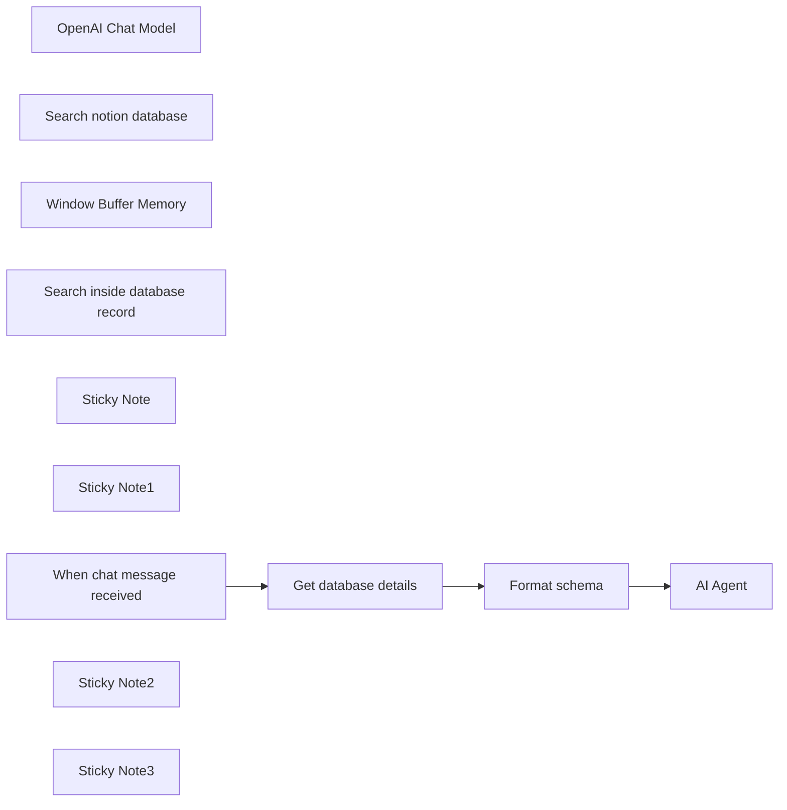

## Fluxo (.json) :

```json
{
  "meta": {
    "instanceId": "205b3bc06c96f2dc835b4f00e1cbf9a937a74eeb3b47c99d0c30b0586dbf85aa"
  },
  "nodes": [
    {
      "id": "d1d4291e-fa37-43d0-81e0-f0a594371426",
      "name": "OpenAI Chat Model",
      "type": "@n8n/n8n-nodes-langchain.lmChatOpenAi",
      "position": [
        680,
        620
      ],
      "parameters": {
        "model": "gpt-4o",
        "options": {
          "timeout": 25000,
          "temperature": 0.7
        }
      },
      "credentials": {
        "openAiApi": {
          "id": "AzPPV759YPBxJj3o",
          "name": "Max's DevRel OpenAI account"
        }
      },
      "typeVersion": 1
    },
    {
      "id": "68e6805b-9c19-4c9e-a300-8983f2b7c28a",
      "name": "Search notion database",
      "type": "@n8n/n8n-nodes-langchain.toolHttpRequest",
      "position": [
        980,
        620
      ],
      "parameters": {
        "url": "=https://api.notion.com/v1/databases/{{ $json.notionID }}/query",
        "method": "POST",
        "jsonBody": "{\n \"filter\": {\n \"or\": [\n {\n \"property\": \"question\",\n \"rich_text\": {\n \"contains\": \"{keyword}\"\n }\n },\n {\n \"property\": \"tags\",\n \"multi_select\": {\n \"contains\": \"{tag}\"\n }\n }\n ]\n },\n \"sorts\": [\n {\n \"property\": \"updated_at\",\n \"direction\": \"ascending\"\n }\n ]\n}",
        "sendBody": true,
        "specifyBody": "json",
        "authentication": "predefinedCredentialType",
        "toolDescription": "=Use this tool to search the \"\" Notion app database.\n\nIt is structured with question and answer format. \nYou can filter query result by:\n- By keyword\n- filter by tag.\n\nKeyword and Tag have an OR relationship not AND.\n\n",
        "nodeCredentialType": "notionApi",
        "placeholderDefinitions": {
          "values": [
            {
              "name": "keyword",
              "description": "Searches question of the record. Use one keyword at a time."
            },
            {
              "name": "tag",
              "description": "=Options: {{ $json.tagsOptions }}"
            }
          ]
        }
      },
      "credentials": {
        "notionApi": {
          "id": "gfNp6Jup8rsmFLRr",
          "name": "max-bot"
        }
      },
      "typeVersion": 1.1
    },
    {
      "id": "c3164d38-a9fb-4ee3-b6bd-fccb4aa5a1a4",
      "name": "Get database details",
      "type": "n8n-nodes-base.notion",
      "position": [
        420,
        380
      ],
      "parameters": {
        "simple": false,
        "resource": "database",
        "databaseId": {
          "__rl": true,
          "mode": "list",
          "value": "7ea9697d-4875-441e-b262-1105337d232e",
          "cachedResultUrl": "https://www.notion.so/7ea9697d4875441eb2621105337d232e",
          "cachedResultName": "StarLens Company Knowledge Base"
        }
      },
      "credentials": {
        "notionApi": {
          "id": "gfNp6Jup8rsmFLRr",
          "name": "max-bot"
        }
      },
      "typeVersion": 2.2
    },
    {
      "id": "98300243-efcc-4427-88da-c1af8a91ddae",
      "name": "Window Buffer Memory",
      "type": "@n8n/n8n-nodes-langchain.memoryBufferWindow",
      "position": [
        820,
        620
      ],
      "parameters": {
        "contextWindowLength": 4
      },
      "typeVersion": 1.2
    },
    {
      "id": "a8473f48-1343-4eb2-8e48-ec89377a2a00",
      "name": "Search inside database record",
      "type": "@n8n/n8n-nodes-langchain.toolHttpRequest",
      "notes": " ",
      "position": [
        1140,
        620
      ],
      "parameters": {
        "url": "https://api.notion.com/v1/blocks/{page_id}/children",
        "fields": "id, type, paragraph.text, heading_1.text, heading_2.text, heading_3.text, bulleted_list_item.text, numbered_list_item.text, to_do.text, children",
        "dataField": "results",
        "authentication": "predefinedCredentialType",
        "fieldsToInclude": "selected",
        "toolDescription": "=Use this tool to retrieve Notion page content using the page ID. \n\nIt is structured with question and answer format. \nYou can filter query result by:\n- By keyword\n- filter by tag.\n\nKeyword and Tag have an OR relationship not AND.\n\n",
        "optimizeResponse": true,
        "nodeCredentialType": "notionApi",
        "placeholderDefinitions": {
          "values": [
            {
              "name": "page_id",
              "description": "Notion page id from 'Search notion database' tool results"
            }
          ]
        }
      },
      "credentials": {
        "notionApi": {
          "id": "gfNp6Jup8rsmFLRr",
          "name": "max-bot"
        }
      },
      "notesInFlow": true,
      "typeVersion": 1.1
    },
    {
      "id": "115c328e-84b0-43d2-8df7-8b3f74cbb2fb",
      "name": "Format schema",
      "type": "n8n-nodes-base.set",
      "position": [
        620,
        380
      ],
      "parameters": {
        "options": {},
        "assignments": {
          "assignments": [
            {
              "id": "a8e58791-ba51-46a2-8645-386dd1a0ff6e",
              "name": "sessionId",
              "type": "string",
              "value": "={{ $('When chat message received').item.json.sessionId }}"
            },
            {
              "id": "434209de-39d5-43d8-a964-0fcb7396306c",
              "name": "action",
              "type": "string",
              "value": "={{ $('When chat message received').item.json.action }}"
            },
            {
              "id": "cad4c972-51a9-4e16-a627-b00eea77eb30",
              "name": "chatInput",
              "type": "string",
              "value": "={{ $('When chat message received').item.json.chatInput }}"
            },
            {
              "id": "8e88876c-2714-494d-bd5e-5e80c99f83e3",
              "name": "notionID",
              "type": "string",
              "value": "={{ $('Get database details').item.json.id }}"
            },
            {
              "id": "a88a15f6-317c-4d2e-9d64-26f5ccaf7a97",
              "name": "databaseName",
              "type": "string",
              "value": "={{ $json.title[0].text.content }}"
            },
            {
              "id": "7c3bf758-8ed3-469a-8695-6777f4af4fb9",
              "name": "tagsOptions",
              "type": "string",
              "value": "={{ $json.properties.tags.multi_select.options.map(item => item.name).join(',') }}"
            }
          ]
        }
      },
      "typeVersion": 3.4
    },
    {
      "id": "3b82f4fe-6c0c-4e6e-a387-27de31fec758",
      "name": "Sticky Note",
      "type": "n8n-nodes-base.stickyNote",
      "position": [
        -340,
        240
      ],
      "parameters": {
        "color": 6,
        "width": 462.3561535890252,
        "height": 95.12709218477178,
        "content": "## Notion knowledge base assistant [v1]\nBuilt as part of the [30 Day AI Sprint](https://30dayaisprint.notion.site/) by [@maxtkacz](https://x.com/maxtkacz)\n"
      },
      "typeVersion": 1
    },
    {
      "id": "31debc55-6608-4e64-be18-1bc0fc0fbf16",
      "name": "Sticky Note1",
      "type": "n8n-nodes-base.stickyNote",
      "position": [
        -340,
        1060
      ],
      "parameters": {
        "color": 7,
        "width": 462.3561535890252,
        "height": 172.4760209818479,
        "content": "### FAQ\n- In `Get database details` if you see a `The resource you are requesting could not be found` error, you need to add your connection to the database (in the Notion app).\n- The `Get database details` pulls most recent `Tags` and informs AI Agent of them. However this step adds ~250-800ms per run. Watch detailed video to see how to remove this step. "
      },
      "typeVersion": 1
    },
    {
      "id": "9f48e548-f032-477c-960d-9c99d61443df",
      "name": "AI Agent",
      "type": "@n8n/n8n-nodes-langchain.agent",
      "position": [
        820,
        380
      ],
      "parameters": {
        "text": "={{ $json.chatInput }}",
        "options": {
          "systemMessage": "=# Role:\nYou are a helpful agent. Query the \"{{ $json.databaseName }}\" Notion database to find relevant records or summarize insights based on multiple records.\n\n# Behavior:\n\nBe clear, very concise, efficient, and accurate in responses. Do not hallucinate.\nIf the request is ambiguous, ask for clarification. Do not embellish, only use facts from the Notion records. Do not offer general advice.\n\n# Error Handling:\n\nIf no matching records are found, try alternative search criteria. Example 1: Laptop, then Computer, then Equipment. Example 2: meetings, then meeting.\nClearly explain any issues with queries (e.g., missing fields or unsupported filters).\n\n# Output:\n\nReturn concise, user-friendly results or summaries.\nFor large sets, show top results by default and offer more if needed. Output URLs in markdown format. \n\nWhen a record has the answer to user question, always output the URL to that page. Do not output links twice."
        },
        "promptType": "define"
      },
      "typeVersion": 1.6
    },
    {
      "id": "f1274a12-128c-4549-a19b-6bfc3beccd89",
      "name": "When chat message received",
      "type": "@n8n/n8n-nodes-langchain.chatTrigger",
      "position": [
        220,
        380
      ],
      "webhookId": "b76d02c0-b406-4d21-b6bf-8ad2c623def3",
      "parameters": {
        "public": true,
        "options": {
          "title": "Notion Knowledge Base",
          "subtitle": ""
        },
        "initialMessages": "=Happy {{ $today.weekdayLong }}!\nKnowledge source assistant at your service. How can I help you?"
      },
      "typeVersion": 1.1
    },
    {
      "id": "2e25e4bc-7970-4d00-a757-ba1e418873aa",
      "name": "Sticky Note2",
      "type": "n8n-nodes-base.stickyNote",
      "position": [
        -340,
        360
      ],
      "parameters": {
        "color": 7,
        "width": 463.90418399676537,
        "height": 318.2958135288425,
        "content": "### Template set up quickstart video 👇\n[](https://www.youtube.com/watch?v=ynLZwS2Nhnc)\n"
      },
      "typeVersion": 1
    },
    {
      "id": "ba6fe953-fd5c-497f-ac2a-7afa04b7e6cc",
      "name": "Sticky Note3",
      "type": "n8n-nodes-base.stickyNote",
      "position": [
        -340,
        700
      ],
      "parameters": {
        "color": 7,
        "width": 461.5634274842711,
        "height": 332.14098134070576,
        "content": "### Written set up steps\n1. Add a Notion credential to your n8n workspace (follow [this Notion guide](https://developers.notion.com/docs/create-a-notion-integration))\n2. [Duplicate Company knowledge base Notion template](https://www.notion.so/templates/knowledge-base-ai-assistant-with-n8n) to your Notion workspace, then make sure to share the new knowledge base with connection you created in Step 1. \n3. Add Notion cred to `Get database details`:`Credential to connect with` parameter, then to `Search notion database`:`Notion API` parameter (same for `Search inside database record`)\n4. Add OpenAI credential to `Open AI Chat Model` node (tested and working with Anthropic Claude 3.5 too)\n5. In `Get database details`, select the db you created from Step 2 in `Database` dropdown.\n6. Click `Chat` button to test the workflow. Then Activate it and copy the `Chat URL` from `When chat message received`."
      },
      "typeVersion": 1
    }
  ],
  "pinData": {},
  "connections": {
    "Format schema": {
      "main": [
        [
          {
            "node": "AI Agent",
            "type": "main",
            "index": 0
          }
        ]
      ]
    },
    "OpenAI Chat Model": {
      "ai_languageModel": [
        [
          {
            "node": "AI Agent",
            "type": "ai_languageModel",
            "index": 0
          }
        ]
      ]
    },
    "Get database details": {
      "main": [
        [
          {
            "node": "Format schema",
            "type": "main",
            "index": 0
          }
        ]
      ]
    },
    "Window Buffer Memory": {
      "ai_memory": [
        [
          {
            "node": "AI Agent",
            "type": "ai_memory",
            "index": 0
          }
        ]
      ]
    },
    "Search notion database": {
      "ai_tool": [
        [
          {
            "node": "AI Agent",
            "type": "ai_tool",
            "index": 0
          }
        ]
      ]
    },
    "When chat message received": {
      "main": [
        [
          {
            "node": "Get database details",
            "type": "main",
            "index": 0
          }
        ]
      ]
    },
    "Search inside database record": {
      "ai_tool": [
        [
          {
            "node": "AI Agent",
            "type": "ai_tool",
            "index": 0
          }
        ]
      ]
    }
  }
}
```

<a id="template-1245"></a>

## Template 1245 - Enriquecer e sincronizar para HubSpot

- **Nome:** Enriquecer e sincronizar para HubSpot
- **Descrição:** Enriquecer assinantes vindos de um formulário e sincronizar contatos e empresas no CRM automaticamente.
- **Funcionalidade:** • Disparo por inscrição em formulário: inicia o fluxo ao receber uma nova inscrição de formulário.
• Filtragem de emails pessoais: exclui domínios pessoais comuns (gmail, yahoo, outlook, hotmail, icloud, mail, aol, zoho, gmx) antes de prosseguir.
• Enriquecimento de pessoa: obtém dados adicionais do assinante (nome, email, emprego) a partir do email.
• Tratamento de falha no enriquecimento: se o enriquecimento do email falhar, o fluxo não cria ou atualiza registros.
• Ramo quando existe emprego: quando o perfil inclui domínio de emprego, enriquece também a empresa e busca-a no CRM.
• Criação ou atualização de empresa: se a empresa não existir no CRM, cria-a com dados enriquecidos; se existir, atualiza campos relevantes.
• Upsert de contato/lead: cria ou atualiza o contato associado; quando não há empresa, registra o assinante como lead com dados enriquecidos.
• Mapeamento de campos de enriquecimento: transfere campos como nome, sobrenome, descrição, twitter, ano de fundação, país, número de funcionários e total captado para o CRM.
- **Ferramentas:** • ConvertKit: captura eventos de inscrição em formulários e fornece os dados do assinante.
• Clearbit: realiza o enriquecimento de dados de pessoa pelo email e de empresa pelo domínio.
• HubSpot: armazena e gerencia empresas e contatos, permite busca por domínio, criação, atualização e upsert de registros.

## Fluxo visual

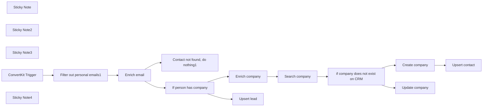

## Fluxo (.json) :

```json
{
  "meta": {
    "instanceId": "257476b1ef58bf3cb6a46e65fac7ee34a53a5e1a8492d5c6e4da5f87c9b82833",
    "templateId": "2130"
  },
  "nodes": [
    {
      "id": "10e83e54-7043-4894-bc92-be1fb0cfba04",
      "name": "if company does not exist on CRM",
      "type": "n8n-nodes-base.if",
      "position": [
        2120,
        140
      ],
      "parameters": {
        "options": {},
        "conditions": {
          "options": {
            "leftValue": "",
            "caseSensitive": true,
            "typeValidation": "strict"
          },
          "combinator": "and",
          "conditions": [
            {
              "id": "19bf6d06-76f4-479a-a9d8-2157414190b3",
              "operator": {
                "type": "object",
                "operation": "empty",
                "singleValue": true
              },
              "leftValue": "={{ $input.item.json }}",
              "rightValue": ""
            }
          ]
        }
      },
      "typeVersion": 2
    },
    {
      "id": "0afb1099-c0b8-4316-84ad-0b1d718bf07d",
      "name": "Sticky Note",
      "type": "n8n-nodes-base.stickyNote",
      "position": [
        240,
        240
      ],
      "parameters": {
        "width": 257.64008049230523,
        "height": 255.97404402400312,
        "content": "## Setup\n1. Add `Clearbit`, `Hubspot`, and `ConvertKit` credentials\n2. Click on `Test workflow`\n3. Subscribe user to form/list so the event starts the workflow"
      },
      "typeVersion": 1
    },
    {
      "id": "4b7f0086-49cc-4662-8fba-a31abb25a76a",
      "name": "Sticky Note2",
      "type": "n8n-nodes-base.stickyNote",
      "position": [
        2340,
        40
      ],
      "parameters": {
        "color": 4,
        "width": 219.1588560076235,
        "height": 260.45841271216835,
        "content": "Map all data found about the company that you interested in"
      },
      "typeVersion": 1
    },
    {
      "id": "868af061-52ca-4c3b-870c-21b954da7c64",
      "name": "Sticky Note3",
      "type": "n8n-nodes-base.stickyNote",
      "position": [
        920,
        240
      ],
      "parameters": {
        "color": 4,
        "width": 233.74765680228705,
        "height": 260.45841271216835,
        "content": "Make sure to map the email field from the data your email automation tool provides"
      },
      "typeVersion": 1
    },
    {
      "id": "d8a8082b-ec9e-4295-b675-0bbf346e5831",
      "name": "Enrich company",
      "type": "n8n-nodes-base.clearbit",
      "notes": "Enrich company",
      "position": [
        1560,
        140
      ],
      "parameters": {
        "domain": "={{ $json.employment.domain }}",
        "additionalFields": {}
      },
      "notesInFlow": false,
      "typeVersion": 1
    },
    {
      "id": "ccbe7caf-a256-4273-bedb-ff6b59e1843f",
      "name": "Search company",
      "type": "n8n-nodes-base.hubspot",
      "position": [
        1860,
        140
      ],
      "parameters": {
        "limit": 1,
        "domain": "={{ $json.domain }}",
        "options": {},
        "resource": "company",
        "operation": "searchByDomain",
        "authentication": "oAuth2"
      },
      "typeVersion": 2,
      "alwaysOutputData": true
    },
    {
      "id": "8e7ee0cd-7b23-4077-a4c9-3b4e40de0695",
      "name": "Upsert lead",
      "type": "n8n-nodes-base.hubspot",
      "position": [
        1560,
        440
      ],
      "parameters": {
        "email": "={{ $('Enrich email').item.json.email }}",
        "options": {},
        "authentication": "oAuth2",
        "additionalFields": {
          "lastName": "={{ $('Enrich email').item.json.name.familyName }}",
          "firstName": "={{ $('Enrich email').item.json.name.fullName }}"
        }
      },
      "typeVersion": 2
    },
    {
      "id": "d7dde1e3-cd14-4977-8065-a2ec23e97d55",
      "name": "Create company",
      "type": "n8n-nodes-base.hubspot",
      "position": [
        2400,
        120
      ],
      "parameters": {
        "name": "={{ $('Enrich company').item.json.name }}",
        "resource": "company",
        "authentication": "oAuth2",
        "additionalFields": {
          "twitterBio": "={{ $('Enrich company').item.json.twitter.bio }}",
          "description": "={{ $('Enrich company').item.json.description }}",
          "yearFounded": "={{ $('Enrich company').item.json.foundedYear }}",
          "countryRegion": "={{ $('Enrich company').item.json.geo.country }}",
          "twitterHandle": "={{ $('Enrich company').item.json.twitter.handle }}",
          "totalMoneyRaised": "={{ $('Enrich company').item.json.metrics.raised }}",
          "twitterFollowers": "={{ $('Enrich company').item.json.twitter.followers }}",
          "companyDomainName": "={{ $('Enrich company').item.json.domain }}",
          "numberOfEmployees": "={{ $('Enrich company').item.json.metrics.employees }}"
        }
      },
      "typeVersion": 2,
      "alwaysOutputData": true
    },
    {
      "id": "c2f3015c-24ce-47ad-bce5-81f85145ef5c",
      "name": "Upsert contact",
      "type": "n8n-nodes-base.hubspot",
      "position": [
        2660,
        120
      ],
      "parameters": {
        "email": "={{ $('Enrich email').item.json.email }}",
        "options": {
          "resolveData": true
        },
        "authentication": "oAuth2",
        "additionalFields": {
          "associatedCompanyId": "={{ $json.companyId }}"
        }
      },
      "typeVersion": 2
    },
    {
      "id": "fe33b776-b30f-44b8-b0db-77c2fd198fc7",
      "name": "Update company",
      "type": "n8n-nodes-base.hubspot",
      "position": [
        2400,
        420
      ],
      "parameters": {
        "resource": "company",
        "companyId": {
          "__rl": true,
          "mode": "id",
          "value": "={{ $json.companyId }}"
        },
        "operation": "update",
        "updateFields": {
          "twitterBio": "={{ $('Enrich company').item.json.twitter.bio }}",
          "description": "={{ $('Enrich company').item.json.description }}",
          "countryRegion": "={{ $('Enrich company').item.json.geo.country }}",
          "twitterHandle": "={{ $('Enrich company').item.json.twitter.handle }}",
          "totalMoneyRaised": "={{ $('Enrich company').item.json.metrics.raised }}",
          "twitterFollowers": "={{ $('Enrich company').item.json.twitter.followers }}",
          "numberOfEmployees": "={{ $('Enrich company').item.json.metrics.employees }}"
        },
        "authentication": "oAuth2"
      },
      "typeVersion": 2
    },
    {
      "id": "b7432f23-eb19-48bd-a76b-916c072bfb76",
      "name": "ConvertKit Trigger",
      "type": "n8n-nodes-base.convertKitTrigger",
      "position": [
        580,
        340
      ],
      "webhookId": "f0a3fa8a-a364-47c3-a261-ed71ba7abb8c",
      "parameters": {
        "event": "formSubscribe",
        "formId": 6242124
      },
      "typeVersion": 1
    },
    {
      "id": "97376217-0388-43fd-af20-06ef790e652c",
      "name": "Sticky Note4",
      "type": "n8n-nodes-base.stickyNote",
      "position": [
        520,
        240
      ],
      "parameters": {
        "color": 4,
        "width": 225.41119920533646,
        "height": 260.45841271216835,
        "content": "Replace this node with your email automation tool of choice"
      },
      "typeVersion": 1
    },
    {
      "id": "e19ad9e9-781a-47a6-9a8e-f27d0b0167f1",
      "name": "Filter out personal emails1",
      "type": "n8n-nodes-base.filter",
      "position": [
        780,
        340
      ],
      "parameters": {
        "options": {},
        "conditions": {
          "options": {
            "leftValue": "",
            "caseSensitive": true,
            "typeValidation": "strict"
          },
          "combinator": "and",
          "conditions": [
            {
              "id": "df6da257-7ec4-4433-9d29-2f12f6f11944",
              "operator": {
                "type": "string",
                "operation": "notContains"
              },
              "leftValue": "={{ $json.subscriber.email_address }}",
              "rightValue": "@gmail.com"
            },
            {
              "id": "6a66410c-a2e8-494b-b972-751116e49418",
              "operator": {
                "type": "string",
                "operation": "notContains"
              },
              "leftValue": "={{ $json.subscriber.email_address }}",
              "rightValue": "@yahoo.com"
            },
            {
              "id": "378fbe41-0e37-4756-93ca-bf81bfe8b258",
              "operator": {
                "type": "string",
                "operation": "notContains"
              },
              "leftValue": "={{ $json.subscriber.email_address }}",
              "rightValue": "@outlook.com"
            },
            {
              "id": "fd05b842-3c11-4e1a-9226-0b0fd359ccab",
              "operator": {
                "type": "string",
                "operation": "notContains"
              },
              "leftValue": "={{ $json.subscriber.email_address }}",
              "rightValue": "@hotmail.com"
            },
            {
              "id": "6040ea5d-3c15-4513-915b-47a55c24e8a7",
              "operator": {
                "type": "string",
                "operation": "notContains"
              },
              "leftValue": "={{ $json.subscriber.email_address }}",
              "rightValue": "@icloud.com"
            },
            {
              "id": "ce67ed8b-34f9-4ba2-83d4-cc04cea090bb",
              "operator": {
                "type": "string",
                "operation": "notContains"
              },
              "leftValue": "={{ $json.subscriber.email_address }}",
              "rightValue": "@mail.com"
            },
            {
              "id": "92c043ae-72de-41d8-887b-9e94755a9060",
              "operator": {
                "type": "string",
                "operation": "notContains"
              },
              "leftValue": "={{ $json.subscriber.email_address }}",
              "rightValue": "@aol.com"
            },
            {
              "id": "377bcc07-e5a1-4e3a-a4da-4446f316a0b2",
              "operator": {
                "type": "string",
                "operation": "notContains"
              },
              "leftValue": "={{ $json.subscriber.email_address }}",
              "rightValue": "@zoho.com"
            },
            {
              "id": "c09c7057-2833-4085-8cb9-d2f28d853724",
              "operator": {
                "type": "string",
                "operation": "notContains"
              },
              "leftValue": "={{ $json.subscriber.email_address }}",
              "rightValue": "@gmx"
            }
          ]
        }
      },
      "typeVersion": 2
    },
    {
      "id": "b5258a3e-966c-4ac8-ab30-e1727f22db5a",
      "name": "Contact not found, do nothing1",
      "type": "n8n-nodes-base.noOp",
      "position": [
        1260,
        540
      ],
      "parameters": {},
      "typeVersion": 1
    },
    {
      "id": "bd5fc02e-eded-4e67-b880-e94678d7d728",
      "name": "Enrich email",
      "type": "n8n-nodes-base.clearbit",
      "notes": "Enrich email",
      "onError": "continueErrorOutput",
      "position": [
        980,
        340
      ],
      "parameters": {
        "email": "={{ $json.subscriber.email_address }}",
        "resource": "person",
        "additionalFields": {}
      },
      "notesInFlow": false,
      "typeVersion": 1
    },
    {
      "id": "972a4bee-6fd5-4c49-9a69-9f4f203e8285",
      "name": "If person has company",
      "type": "n8n-nodes-base.if",
      "position": [
        1260,
        340
      ],
      "parameters": {
        "options": {},
        "conditions": {
          "options": {
            "leftValue": "",
            "caseSensitive": true,
            "typeValidation": "strict"
          },
          "combinator": "and",
          "conditions": [
            {
              "id": "1a7aad55-5f4c-4bbc-a098-90f00a29be85",
              "operator": {
                "type": "string",
                "operation": "notEquals"
              },
              "leftValue": "={{ $json.employment.domain }}",
              "rightValue": "={{ null }}"
            }
          ]
        }
      },
      "typeVersion": 2
    }
  ],
  "pinData": {},
  "connections": {
    "Enrich email": {
      "main": [
        [
          {
            "node": "If person has company",
            "type": "main",
            "index": 0
          }
        ],
        [
          {
            "node": "Contact not found, do nothing1",
            "type": "main",
            "index": 0
          }
        ]
      ]
    },
    "Create company": {
      "main": [
        [
          {
            "node": "Upsert contact",
            "type": "main",
            "index": 0
          }
        ]
      ]
    },
    "Enrich company": {
      "main": [
        [
          {
            "node": "Search company",
            "type": "main",
            "index": 0
          }
        ]
      ]
    },
    "Search company": {
      "main": [
        [
          {
            "node": "if company does not exist on CRM",
            "type": "main",
            "index": 0
          }
        ]
      ]
    },
    "ConvertKit Trigger": {
      "main": [
        [
          {
            "node": "Filter out personal emails1",
            "type": "main",
            "index": 0
          }
        ]
      ]
    },
    "If person has company": {
      "main": [
        [
          {
            "node": "Enrich company",
            "type": "main",
            "index": 0
          }
        ],
        [
          {
            "node": "Upsert lead",
            "type": "main",
            "index": 0
          }
        ]
      ]
    },
    "Filter out personal emails1": {
      "main": [
        [
          {
            "node": "Enrich email",
            "type": "main",
            "index": 0
          }
        ]
      ]
    },
    "if company does not exist on CRM": {
      "main": [
        [
          {
            "node": "Create company",
            "type": "main",
            "index": 0
          }
        ],
        [
          {
            "node": "Update company",
            "type": "main",
            "index": 0
          }
        ]
      ]
    }
  }
}
```

<a id="template-1246"></a>

## Template 1246 - Criação de deal no Pipedrive

- **Nome:** Criação de deal no Pipedrive
- **Descrição:** Ao ser executado manualmente, este fluxo cria um negócio (deal) no Pipedrive utilizando os campos configurados.
- **Funcionalidade:** • Gatilho manual: Inicia o fluxo quando acionado manualmente.
• Criação de negócio no Pipedrive: Envia os dados de título e campos adicionais para criar um deal.
• Autenticação com credenciais: Utiliza credenciais configuradas para autenticar a requisição à API do Pipedrive.
- **Ferramentas:** • Pipedrive: CRM para criação e gerenciamento de negócios (deals) via API.

## Fluxo visual

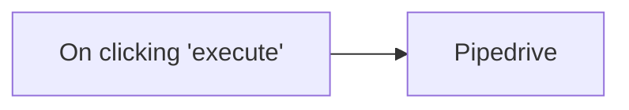

## Fluxo (.json) :

```json
{
  "id": "113",
  "name": "Create an deal in Pipedrive",
  "nodes": [
    {
      "name": "On clicking 'execute'",
      "type": "n8n-nodes-base.manualTrigger",
      "position": [
        250,
        300
      ],
      "parameters": {},
      "typeVersion": 1
    },
    {
      "name": "Pipedrive",
      "type": "n8n-nodes-base.pipedrive",
      "position": [
        450,
        300
      ],
      "parameters": {
        "title": "",
        "additionalFields": {}
      },
      "credentials": {
        "pipedriveApi": ""
      },
      "typeVersion": 1
    }
  ],
  "active": false,
  "settings": {},
  "connections": {
    "On clicking 'execute'": {
      "main": [
        [
          {
            "node": "Pipedrive",
            "type": "main",
            "index": 0
          }
        ]
      ]
    }
  }
}
```

<a id="template-1247"></a>

## Template 1247 - Verificação de números de telefone

- **Nome:** Verificação de números de telefone
- **Descrição:** Fluxo que cria um item com um número de telefone, envia-o para parsing e validação e verifica se o número é válido.
- **Funcionalidade:** • Gatilho manual: inicia a execução ao clicar em 'execute'.
• Criação de item de telefone: gera um item contendo o número de telefone a ser verificado.
• Parsing e validação do telefone: envia o número para um serviço de análise que verifica formato e validade.
• Verificação condicional: avalia o resultado da validação e permite encaminhamentos diferentes conforme o número ser válido ou não.
- **Ferramentas:** • Serviço de parsing e validação de telefones (UPROC): API externa usada para analisar e validar números de telefone, retornando informações sobre formato e validade.

## Fluxo visual

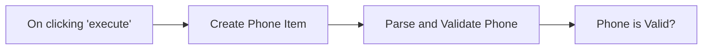

## Fluxo (.json) :

```json
{
  "id": "114",
  "name": "Verify phone numbers",
  "nodes": [
    {
      "name": "On clicking 'execute'",
      "type": "n8n-nodes-base.manualTrigger",
      "position": [
        440,
        510
      ],
      "parameters": {},
      "typeVersion": 1
    },
    {
      "name": "Create Phone Item",
      "type": "n8n-nodes-base.functionItem",
      "position": [
        640,
        510
      ],
      "parameters": {
        "functionCode": "item.phone = \"+34605281220\";\nreturn item;"
      },
      "typeVersion": 1
    },
    {
      "name": "Parse and Validate Phone",
      "type": "n8n-nodes-base.uproc",
      "position": [
        850,
        510
      ],
      "parameters": {
        "tool": "getPhoneParsed",
        "phone": "={{$node[\"Create Phone Item\"].json[\"phone\"]}}",
        "additionalOptions": {}
      },
      "credentials": {
        "uprocApi": "miquel-uproc"
      },
      "typeVersion": 1
    },
    {
      "name": "Phone is Valid?",
      "type": "n8n-nodes-base.if",
      "position": [
        1050,
        510
      ],
      "parameters": {
        "conditions": {
          "string": [
            {
              "value1": "={{$node[\"Parse and Validate Phone\"].json[\"message\"][\"valid\"]+\"\"}}",
              "value2": "true"
            }
          ]
        }
      },
      "typeVersion": 1
    }
  ],
  "active": false,
  "settings": {},
  "connections": {
    "Create Phone Item": {
      "main": [
        [
          {
            "node": "Parse and Validate Phone",
            "type": "main",
            "index": 0
          }
        ]
      ]
    },
    "On clicking 'execute'": {
      "main": [
        [
          {
            "node": "Create Phone Item",
            "type": "main",
            "index": 0
          }
        ]
      ]
    },
    "Parse and Validate Phone": {
      "main": [
        [
          {
            "node": "Phone is Valid?",
            "type": "main",
            "index": 0
          }
        ]
      ]
    }
  }
}
```

<a id="template-1248"></a>

## Template 1248 - Classificação automática de bugs e reatribuição de time

- **Nome:** Classificação automática de bugs e reatribuição de time
- **Descrição:** O fluxo captura tickets de bug no Linear, usa um modelo de linguagem para identificar o time responsável e atualiza o time do ticket; notifica via Slack se não for possível identificar um time.
- **Funcionalidade:** • Captura de eventos de ticket: Recebe atualizações de issues de um time específico no Linear.
• Filtragem de tickets relevantes: Processa apenas issues que estejam em estado de triagem, que tenham a label de bug e cuja descrição não seja a padrão vazia.
• Definição de times e canal: Permite configurar uma lista de times com suas responsabilidades e o canal de Slack destino.
• Classificação por IA: Envia título e descrição do bug para um modelo de linguagem para decidir qual time deve tratar o problema, usando a lista de times fornecida.
• Consulta de times na organização: Recupera a lista de times disponíveis para mapear o nome retornado pela IA ao ID do time.
• Atualização do ticket: Altera o time responsável do ticket no Linear quando a IA identifica um time válido.
• Notificação quando não há correspondência: Envia uma mensagem para um canal de Slack caso a IA retorne "Other" ou não consiga identificar um time.
- **Ferramentas:** • Linear: Plataforma de rastreamento de issues usada para receber webhooks, consultar times e atualizar a propriedade de time dos tickets.
• OpenAI (GPT-4): Modelo de linguagem utilizado para classificar qual time deve trabalhar no bug com base no título e descrição.
• Slack: Canal de comunicação usado para notificar quando a IA não consegue identificar um time apropriado.

## Fluxo visual

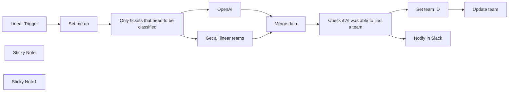

## Fluxo (.json) :

```json
{
  "meta": {
    "instanceId": "cb484ba7b742928a2048bf8829668bed5b5ad9787579adea888f05980292a4a7"
  },
  "nodes": [
    {
      "id": "8920dc6e-b2fb-4446-8cb3-f3f6d626dcb3",
      "name": "Linear Trigger",
      "type": "n8n-nodes-base.linearTrigger",
      "position": [
        420,
        360
      ],
      "webhookId": "a02faf62-684f-44bb-809f-e962c9ede70d",
      "parameters": {
        "teamId": "7a330c36-4b39-4bf1-922e-b4ceeb91850a",
        "resources": [
          "issue"
        ],
        "authentication": "oAuth2"
      },
      "credentials": {
        "linearOAuth2Api": {
          "id": "02MqKUMdPxr9t3mX",
          "name": "Nik's Linear Creds"
        }
      },
      "typeVersion": 1
    },
    {
      "id": "61214884-62f9-4a00-9517-e2d51b44d0ae",
      "name": "Only tickets that need to be classified",
      "type": "n8n-nodes-base.filter",
      "position": [
        1000,
        360
      ],
      "parameters": {
        "options": {},
        "conditions": {
          "options": {
            "leftValue": "",
            "caseSensitive": true,
            "typeValidation": "strict"
          },
          "combinator": "and",
          "conditions": [
            {
              "id": "bc3a756d-b2b6-407b-91c9-a1cd9da004e0",
              "operator": {
                "type": "string",
                "operation": "notContains"
              },
              "leftValue": "={{ $('Linear Trigger').item.json.data.description }}",
              "rightValue": "Add a description here"
            },
            {
              "id": "f3d8d0fc-332d-41a6-aef8-1f221bf30c0e",
              "operator": {
                "name": "filter.operator.equals",
                "type": "string",
                "operation": "equals"
              },
              "leftValue": "={{ $('Linear Trigger').item.json.data.state.id }}",
              "rightValue": "6b9a8eec-82dc-453a-878b-50f4c98d3e53"
            },
            {
              "id": "9cdb55b2-3ca9-43bd-84b0-ef025b59ce18",
              "operator": {
                "type": "number",
                "operation": "gt"
              },
              "leftValue": "={{ $('Linear Trigger').item.json.data.labels.filter(label => label.id === 'f2b6e3e9-b42d-4106-821c-6a08dcb489a9').length }}",
              "rightValue": 0
            }
          ]
        }
      },
      "typeVersion": 2
    },
    {
      "id": "da4d8e0c-895b-4a84-8319-438f971af403",
      "name": "Sticky Note",
      "type": "n8n-nodes-base.stickyNote",
      "position": [
        1000,
        111.31510859283728
      ],
      "parameters": {
        "color": 7,
        "height": 219.68489140716272,
        "content": "### When does this fire?\nIn our setup we have a general team in Linear where we post new tickets to. Additionally, the bug needs to have a certain label and the description needs to be filled. \nYou're of course free to adjust this to your needs\n👇"
      },
      "typeVersion": 1
    },
    {
      "id": "b7e3a328-96c4-4082-93a9-0cb331367190",
      "name": "Update team",
      "type": "n8n-nodes-base.linear",
      "position": [
        2160,
        280
      ],
      "parameters": {
        "issueId": "={{ $('Linear Trigger').item.json.data.id }}",
        "operation": "update",
        "updateFields": {
          "teamId": "={{ $json.teamId }}"
        }
      },
      "credentials": {
        "linearApi": {
          "id": "oYIZvhmcNt5JWTCP",
          "name": "Nik's Linear Key"
        }
      },
      "typeVersion": 1
    },
    {
      "id": "858764ce-cd24-4399-88ce-cf69e676beaa",
      "name": "Get all linear teams",
      "type": "n8n-nodes-base.httpRequest",
      "position": [
        1300,
        540
      ],
      "parameters": {
        "url": "https://api.linear.app/graphql",
        "method": "POST",
        "options": {},
        "sendBody": true,
        "authentication": "predefinedCredentialType",
        "bodyParameters": {
          "parameters": [
            {
              "name": "query",
              "value": "{ teams { nodes { id name } } }"
            }
          ]
        },
        "nodeCredentialType": "linearOAuth2Api"
      },
      "credentials": {
        "linearOAuth2Api": {
          "id": "02MqKUMdPxr9t3mX",
          "name": "Nik's Linear Creds"
        }
      },
      "typeVersion": 3
    },
    {
      "id": "167f0c66-5bfb-4dd7-a345-81f4d62df2c4",
      "name": "Set team ID",
      "type": "n8n-nodes-base.set",
      "position": [
        2000,
        280
      ],
      "parameters": {
        "options": {},
        "assignments": {
          "assignments": [
            {
              "id": "a46c4476-b851-4112-ac72-e805308c5ab7",
              "name": "teamId",
              "type": "string",
              "value": "={{ $('Get all linear teams').first().json.data.teams.nodes.find(team => team.name === $json.message.content).id }}"
            }
          ]
        }
      },
      "typeVersion": 3.3
    },
    {
      "id": "36363240-2b03-4af8-8987-0db95094403b",
      "name": "Set me up",
      "type": "n8n-nodes-base.set",
      "position": [
        700,
        360
      ],
      "parameters": {
        "options": {},
        "assignments": {
          "assignments": [
            {
              "id": "a56f24c8-0a28-4dd2-885a-cb6a081a5bf4",
              "name": "teams",
              "type": "string",
              "value": "- [Adore][Is responsible for every persona that is not Enterprise. This includes signup journeys, trials, n8n Cloud, the Canvas building experience and more, the nodes detail view (NDV), the nodes panel, the workflows list and the executions view] \n- [Payday][Is responsible for the Enterprise persona. This includes making sure n8n is performant, the enterprise features SSO, LDAP, SAML, Log streaming, environments, queue mode, version control, external storage. Additionally the team looks out for the execution logic in n8n and how branching works] \n- [Nodes][This team is responsible for everything that is related to a specific node in n8n] \n- [Other][This is a placeholder if you don't know to which team something belongs]"
            },
            {
              "id": "d672cb59-72be-4fc8-9327-2623795f225d",
              "name": "slackChannel",
              "type": "string",
              "value": "#yourChannelName"
            }
          ]
        }
      },
      "typeVersion": 3.3
    },
    {
      "id": "49f2a157-b037-46d9-a6d7-97f8a72ee093",
      "name": "Sticky Note1",
      "type": "n8n-nodes-base.stickyNote",
      "position": [
        581.3284642016245,
        85.15358950105212
      ],
      "parameters": {
        "color": 5,
        "width": 349.85308830334156,
        "height": 439.62604295396085,
        "content": "## Setup\n1. Add your Linear and OpenAi credentials\n2. Change the team in the `Linear Trigger` to match your needs\n3. Customize your teams and their areas of responsibility in the `Set me up` node. Please use the format `[Teamname][Description/Areas of responsibility]`. Also make sure that the teamnames match the names in Linear exactly.\n4. Change the Slack channel in the `Set me up` node to your Slack channel of choice."
      },
      "typeVersion": 1
    },
    {
      "id": "8cdb3d0d-4fd3-4ea2-957f-daf746934728",
      "name": "Check if AI was able to find a team",
      "type": "n8n-nodes-base.if",
      "position": [
        1780,
        380
      ],
      "parameters": {
        "options": {},
        "conditions": {
          "options": {
            "leftValue": "",
            "caseSensitive": true,
            "typeValidation": "strict"
          },
          "combinator": "and",
          "conditions": [
            {
              "id": "86bfb688-3ecc-4360-b83a-d706bb11c8f9",
              "operator": {
                "type": "string",
                "operation": "notEquals"
              },
              "leftValue": "={{ $json.message.content }}",
              "rightValue": "Other"
            }
          ]
        }
      },
      "typeVersion": 2
    },
    {
      "id": "a4cb20ca-658a-4b30-9185-5af9a32a7e20",
      "name": "Notify in Slack",
      "type": "n8n-nodes-base.slack",
      "position": [
        2000,
        460
      ],
      "parameters": {
        "text": "The AI was not able to identify a fitting team for a bug",
        "select": "channel",
        "channelId": {
          "__rl": true,
          "mode": "name",
          "value": "={{ $('Set me up').first().json.slackChannel }}"
        },
        "otherOptions": {}
      },
      "credentials": {
        "slackApi": {
          "id": "376",
          "name": "Idea Bot"
        }
      },
      "typeVersion": 2.1
    },
    {
      "id": "393b2392-80be-4a68-9240-dc1065e0081a",
      "name": "Merge data",
      "type": "n8n-nodes-base.merge",
      "position": [
        1600,
        380
      ],
      "parameters": {
        "mode": "chooseBranch"
      },
      "typeVersion": 2.1
    },
    {
      "id": "f25da511-b255-4a53-ba4e-5765916e90be",
      "name": "OpenAI",
      "type": "@n8n/n8n-nodes-langchain.openAi",
      "position": [
        1220,
        360
      ],
      "parameters": {
        "modelId": {
          "__rl": true,
          "mode": "list",
          "value": "gpt-4-32k-0314",
          "cachedResultName": "GPT-4-32K-0314"
        },
        "options": {},
        "messages": {
          "values": [
            {
              "role": "system",
              "content": "I need you to classify a bug ticket and tell me which team should work on it"
            },
            {
              "role": "system",
              "content": "All possible teams will be described in the following format: [Teamname][Areas of responsibility] "
            },
            {
              "role": "system",
              "content": "=The possible teams are the following:\n {{ $('Set me up').first().json.teams }}"
            },
            {
              "role": "system",
              "content": "=This is the bug that we're trying to classify:\nTitle: {{ $('Linear Trigger').first().json.data.title }}\nDescription: {{ $('Linear Trigger').first().json.data.description }}"
            },
            {
              "content": "Which team should work on this bug?"
            },
            {
              "role": "system",
              "content": "Do not respond with anything else than the name of the team from the list you were given"
            }
          ]
        }
      },
      "credentials": {
        "openAiApi": {
          "id": "VQtv7frm7eLiEDnd",
          "name": "OpenAi account 7"
        }
      },
      "typeVersion": 1
    }
  ],
  "pinData": {
    "Linear Trigger": [
      {
        "url": "https://linear.app/n8n/issue/N8N-6945/cannot-scroll-the-canvas-after-duplicating-or-pausing-a-note",
        "data": {
          "id": "94a4b770-3c80-4099-9376-ffe951f633db",
          "url": "https://linear.app/n8n/issue/N8N-6945/cannot-scroll-the-canvas-after-duplicating-or-pausing-a-note",
          "team": {
            "id": "7a330c36-4b39-4bf1-922e-b4ceeb91850a",
            "key": "N8N",
            "name": "Engineering"
          },
          "state": {
            "id": "6b9a8eec-82dc-453a-878b-50f4c98d3e53",
            "name": "Triage",
            "type": "triage",
            "color": "#FC7840"
          },
          "title": "cannot scroll the canvas after duplicating or pausing a note",
          "labels": [
            {
              "id": "f2b6e3e9-b42d-4106-821c-6a08dcb489a9",
              "name": "type/bug",
              "color": "#eb5757"
            }
          ],
          "number": 6945,
          "teamId": "7a330c36-4b39-4bf1-922e-b4ceeb91850a",
          "cycleId": null,
          "dueDate": null,
          "stateId": "6b9a8eec-82dc-453a-878b-50f4c98d3e53",
          "trashed": null,
          "botActor": {
            "name": "Unknown",
            "type": "apiKey"
          },
          "estimate": null,
          "labelIds": [
            "f2b6e3e9-b42d-4106-821c-6a08dcb489a9"
          ],
          "parentId": null,
          "priority": 0,
          "createdAt": "2023-09-12T12:51:41.696Z",
          "creatorId": "49ae7598-ae5d-42e6-8a03-9f6038a0d37a",
          "projectId": null,
          "sortOrder": -154747,
          "startedAt": null,
          "triagedAt": null,
          "updatedAt": "2024-02-29T16:00:27.794Z",
          "archivedAt": null,
          "assigneeId": null,
          "boardOrder": 0,
          "canceledAt": null,
          "identifier": "N8N-6945",
          "completedAt": null,
          "description": "## Description\n\nAfter using the canvas for a while I always had issues where the scrolling would stop working. I finally found a way to reproduce the issue reliably.\n\n## Expected\n\nI would like to always be able to scroll the canvas using CMD + click\n\n## Actual\n\nSometimes when using the app the scrolling stops working and you have to refresh to get it back to work.\n\n## Steps or workflow to reproduce (with screenshots/recordings)\n\n**n8n version:** \\[Deployment type\\] \\[version\\]\n\n1. Add any nodes to the canvas\n2. Click either the Duplicate or Pause buttons that appear when hovering over a node\n3. Try scrolling using CMD/CTRL + Click. Scrolling should no longer work while it should still work\n\nCreated by Omar",
          "snoozedById": null,
          "autoClosedAt": null,
          "slaStartedAt": null,
          "priorityLabel": "No priority",
          "slaBreachesAt": null,
          "subscriberIds": [
            "49ae7598-ae5d-42e6-8a03-9f6038a0d37a"
          ],
          "autoArchivedAt": null,
          "snoozedUntilAt": null,
          "descriptionData": "{\"type\":\"doc\",\"content\":[{\"type\":\"heading\",\"attrs\":{\"level\":2,\"id\":\"d836020f-77f5-4ae0-9d6e-a69bd4567656\"},\"content\":[{\"type\":\"text\",\"text\":\"Description\"}]},{\"type\":\"paragraph\",\"content\":[{\"type\":\"text\",\"text\":\"After using the canvas for a while I always had issues where the scrolling would stop working. I finally found a way to reproduce the issue reliably.\"}]},{\"type\":\"heading\",\"attrs\":{\"level\":2,\"id\":\"4125614d-17b0-4530-bfc0-384d43bf80f9\"},\"content\":[{\"type\":\"text\",\"text\":\"Expected\"}]},{\"type\":\"paragraph\",\"content\":[{\"type\":\"text\",\"text\":\"I would like to always be able to scroll the canvas using CMD + click\"}]},{\"type\":\"heading\",\"attrs\":{\"level\":2,\"id\":\"3e8caaae-c152-46c1-a604-f0f9c75fb8c9\"},\"content\":[{\"type\":\"text\",\"text\":\"Actual\"}]},{\"type\":\"paragraph\",\"content\":[{\"type\":\"text\",\"text\":\"Sometimes when using the app the scrolling stops working and you have to refresh to get it back to work.\"}]},{\"type\":\"heading\",\"attrs\":{\"level\":2,\"id\":\"73e4d549-a030-4b0c-b7d8-bcfa69d1b832\"},\"content\":[{\"type\":\"text\",\"text\":\"Steps or workflow to reproduce (with screenshots/recordings)\"}]},{\"type\":\"paragraph\",\"content\":[{\"type\":\"text\",\"text\":\"n8n version:\",\"marks\":[{\"type\":\"strong\",\"attrs\":{}}]},{\"type\":\"text\",\"text\":\" [Deployment type] [version]\"}]},{\"type\":\"ordered_list\",\"attrs\":{\"order\":1},\"content\":[{\"type\":\"list_item\",\"content\":[{\"type\":\"paragraph\",\"content\":[{\"type\":\"text\",\"text\":\"Add any nodes to the canvas\"}]}]},{\"type\":\"list_item\",\"content\":[{\"type\":\"paragraph\",\"content\":[{\"type\":\"text\",\"text\":\"Click either the Duplicate or Pause buttons that appear when hovering over a node\"}]}]},{\"type\":\"list_item\",\"content\":[{\"type\":\"paragraph\",\"content\":[{\"type\":\"text\",\"text\":\"Try scrolling using CMD/CTRL + Click. Scrolling should no longer work while it should still work\"}]}]}]},{\"type\":\"paragraph\",\"content\":[{\"type\":\"text\",\"text\":\"Created by Omar\"}]}]}",
          "startedTriageAt": "2023-09-12T12:51:41.825Z",
          "subIssueSortOrder": null,
          "projectMilestoneId": null,
          "previousIdentifiers": [],
          "externalUserCreatorId": null,
          "lastAppliedTemplateId": null
        },
        "type": "Issue",
        "actor": {
          "id": "49ae7598-ae5d-42e6-8a03-9f6038a0d37a",
          "name": "Niklas Hatje"
        },
        "action": "update",
        "createdAt": "2024-02-29T16:00:27.794Z",
        "webhookId": "2120ca07-c896-413a-ab8d-a270e14c1d9e",
        "updatedFrom": {
          "updatedAt": "2024-02-29T16:00:27.794Z",
          "description": "## Description\n\nAfter using the canvas for a while I always had issues where the scrolling would stop working. I finally found a way to reproduce the issue reliably.\n\n## Expected\n\nI would like to always be able to scroll the canvas using CMD + click\n\n## Actual\n\nSometimes when using the app the scrolling stops working and you have to refresh to get it back to work.\n\n## Steps or workflow to reproduce (with screenshots/recordings)\n\n**n8n version:** \\[Deployment type\\] \\[version\\]\n\n1. Add any nodes to the canvas\n2. Click either the Duplicate or Pause buttons that appear when hovering over a node\n3. Try scrolling using CMD/CTRL + Click. Scrolling should no longer work while it should still work\n\nCreated by: Omar",
          "descriptionData": "{\"type\":\"doc\",\"content\":[{\"type\":\"heading\",\"attrs\":{\"id\":\"d836020f-77f5-4ae0-9d6e-a69bd4567656\",\"level\":2},\"content\":[{\"text\":\"Description\",\"type\":\"text\"}]},{\"type\":\"paragraph\",\"content\":[{\"text\":\"After using the canvas for a while I always had issues where the scrolling would stop working. I finally found a way to reproduce the issue reliably.\",\"type\":\"text\"}]},{\"type\":\"heading\",\"attrs\":{\"id\":\"4125614d-17b0-4530-bfc0-384d43bf80f9\",\"level\":2},\"content\":[{\"text\":\"Expected\",\"type\":\"text\"}]},{\"type\":\"paragraph\",\"content\":[{\"text\":\"I would like to always be able to scroll the canvas using CMD + click\",\"type\":\"text\"}]},{\"type\":\"heading\",\"attrs\":{\"id\":\"3e8caaae-c152-46c1-a604-f0f9c75fb8c9\",\"level\":2},\"content\":[{\"text\":\"Actual\",\"type\":\"text\"}]},{\"type\":\"paragraph\",\"content\":[{\"text\":\"Sometimes when using the app the scrolling stops working and you have to refresh to get it back to work.\",\"type\":\"text\"}]},{\"type\":\"heading\",\"attrs\":{\"id\":\"73e4d549-a030-4b0c-b7d8-bcfa69d1b832\",\"level\":2},\"content\":[{\"text\":\"Steps or workflow to reproduce (with screenshots/recordings)\",\"type\":\"text\"}]},{\"type\":\"paragraph\",\"content\":[{\"text\":\"n8n version:\",\"type\":\"text\",\"marks\":[{\"type\":\"strong\",\"attrs\":{}}]},{\"text\":\" [Deployment type] [version]\",\"type\":\"text\"}]},{\"type\":\"ordered_list\",\"attrs\":{\"order\":1},\"content\":[{\"type\":\"list_item\",\"content\":[{\"type\":\"paragraph\",\"content\":[{\"text\":\"Add any nodes to the canvas\",\"type\":\"text\"}]}]},{\"type\":\"list_item\",\"content\":[{\"type\":\"paragraph\",\"content\":[{\"text\":\"Click either the Duplicate or Pause buttons that appear when hovering over a node\",\"type\":\"text\"}]}]},{\"type\":\"list_item\",\"content\":[{\"type\":\"paragraph\",\"content\":[{\"text\":\"Try scrolling using CMD/CTRL + Click. Scrolling should no longer work while it should still work\",\"type\":\"text\"}]}]}]},{\"type\":\"paragraph\",\"content\":[{\"text\":\"Created by: Omar\",\"type\":\"text\"}]}]}"
        },
        "organizationId": "1c35bbc6-9cd4-427e-8bc5-e5d370a9869f",
        "webhookTimestamp": 1709222430026
      }
    ]
  },
  "connections": {
    "OpenAI": {
      "main": [
        [
          {
            "node": "Merge data",
            "type": "main",
            "index": 0
          }
        ]
      ]
    },
    "Set me up": {
      "main": [
        [
          {
            "node": "Only tickets that need to be classified",
            "type": "main",
            "index": 0
          }
        ]
      ]
    },
    "Merge data": {
      "main": [
        [
          {
            "node": "Check if AI was able to find a team",
            "type": "main",
            "index": 0
          }
        ]
      ]
    },
    "Set team ID": {
      "main": [
        [
          {
            "node": "Update team",
            "type": "main",
            "index": 0
          }
        ]
      ]
    },
    "Linear Trigger": {
      "main": [
        [
          {
            "node": "Set me up",
            "type": "main",
            "index": 0
          }
        ]
      ]
    },
    "Get all linear teams": {
      "main": [
        [
          {
            "node": "Merge data",
            "type": "main",
            "index": 1
          }
        ]
      ]
    },
    "Check if AI was able to find a team": {
      "main": [
        [
          {
            "node": "Set team ID",
            "type": "main",
            "index": 0
          }
        ],
        [
          {
            "node": "Notify in Slack",
            "type": "main",
            "index": 0
          }
        ]
      ]
    },
    "Only tickets that need to be classified": {
      "main": [
        [
          {
            "node": "OpenAI",
            "type": "main",
            "index": 0
          },
          {
            "node": "Get all linear teams",
            "type": "main",
            "index": 0
          }
        ]
      ]
    }
  }
}
```

<a id="template-1249"></a>

## Template 1249 - Envio de alertas PRISM Elastic por e-mail

- **Nome:** Envio de alertas PRISM Elastic por e-mail
- **Descrição:** Verifica periodicamente o endpoint de alertas PRISM/Elastic e envia notificações por e-mail para cada alerta encontrado.
- **Funcionalidade:** • Agendamento periódico: Executa a verificação em intervalos regulares.
• Requisição ao endpoint PRISM Elastic: Realiza chamada HTTP para obter a lista de alertas.
• Verificação de resposta vazia: Avalia se a resposta contém alertas e evita ações quando não há dados.
• Processamento em lote: Divide os resultados em itens individuais e itera sobre cada alerta.
• Envio de notificações por e-mail: Constrói e envia mensagens formatadas com assunto, corpo HTML e destinatários para cada alerta.
• Caminho de não-operação: Mantém um fluxo inativo quando não existem alertas para processar.
- **Ferramentas:** • PRISM Elastic API: Endpoint que fornece os alertas gerados pelo sistema PRISM/Elastic.
• Microsoft Graph (SendMail): Serviço utilizado para enviar os e-mails de notificação.
• OAuth2: Método de autenticação utilizado para autorizar o envio de e-mails via API.

## Fluxo visual

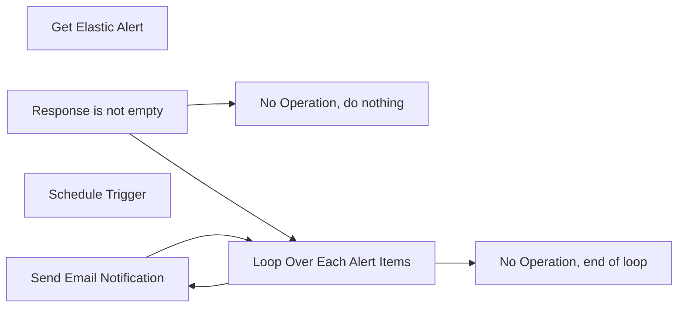

## Fluxo (.json) :

```json
{
  "nodes": [
    {
      "id": "e4929773-39f9-4b8a-b462-235c37514479",
      "name": "Get Elastic Alert",
      "type": "n8n-nodes-base.httpRequest",
      "position": [
        620,
        440
      ],
      "parameters": {
        "url": "https://your-prism-elastic-api-endpoint.com/alerts",
        "options": {}
      },
      "typeVersion": 2
    },
    {
      "id": "973a8254-5ec0-4ea0-95b5-7e6a0f0625ab",
      "name": "Send Email Notification",
      "type": "n8n-nodes-base.httpRequest",
      "position": [
        1440,
        220
      ],
      "parameters": {
        "url": "https://graph.microsoft.com/v1.0/me/sendMail",
        "options": {
          "bodyContentType": "json"
        },
        "requestMethod": "POST",
        "authentication": "oAuth2",
        "jsonParameters": true,
        "bodyParametersJson": "={\n  \"message\": {\n    \"subject\": \"PRISM Elastic Alert: {{$json[\"alert_name\"]}}\",\n    \"body\": {\n      \"contentType\": \"HTML\",\n      \"content\": \"Hello,<br><br>An alert has been triggered:<br><strong>Alert Name:</strong> {{$json[\"alert_name\"]}}<br><strong>Severity:</strong> {{$json[\"severity\"]}}<br><strong>Timestamp:</strong> {{$json[\"timestamp\"]}}<br><br>Details:<br>{{$json[\"alert_message\"]}}<br><br>Regards,<br>PRISM Alert System\"\n    },\n    \"toRecipients\": [\n      {\n        \"emailAddress\": {\n          \"address\": \"user@example.com\"\n        }\n      }\n    ]\n  },\n  \"saveToSentItems\": \"true\"\n}"
      },
      "typeVersion": 2
    },
    {
      "id": "f7f4feee-6854-4997-ae15-870cab4abdbb",
      "name": "Schedule Trigger",
      "type": "n8n-nodes-base.scheduleTrigger",
      "position": [
        380,
        440
      ],
      "parameters": {
        "rule": {
          "interval": [
            {}
          ]
        }
      },
      "typeVersion": 1.2
    },
    {
      "id": "b8578c55-a052-43f2-9d6a-24d8084dae8a",
      "name": "Response is not empty",
      "type": "n8n-nodes-base.if",
      "position": [
        840,
        440
      ],
      "parameters": {
        "options": {}
      },
      "typeVersion": 2.1
    },
    {
      "id": "664216e6-c212-4f4b-8b09-60675c4fcd91",
      "name": "No Operation, do nothing",
      "type": "n8n-nodes-base.noOp",
      "position": [
        1100,
        680
      ],
      "parameters": {},
      "typeVersion": 1
    },
    {
      "id": "bcead903-56ed-4ae8-bff9-cec274b2fe71",
      "name": "Loop Over Each Alert Items",
      "type": "n8n-nodes-base.splitInBatches",
      "position": [
        1100,
        200
      ],
      "parameters": {
        "options": {}
      },
      "typeVersion": 3
    },
    {
      "id": "a5e55903-a245-4d70-88e7-14c1f18cde25",
      "name": "No Operation, end of loop",
      "type": "n8n-nodes-base.noOp",
      "position": [
        1440,
        0
      ],
      "parameters": {},
      "typeVersion": 1
    }
  ],
  "pinData": {},
  "connections": {
    "Schedule Trigger": {
      "main": [
        [
          {
            "node": "Get PRISM Elastic Alert",
            "type": "main",
            "index": 0
          }
        ]
      ]
    },
    "Response is not empty": {
      "main": [
        [
          {
            "node": "Loop Over Each Alert Items",
            "type": "main",
            "index": 0
          }
        ],
        [
          {
            "node": "No Operation, do nothing",
            "type": "main",
            "index": 0
          }
        ]
      ]
    },
    "Get PRISM Elastic Alert": {
      "main": [
        [
          {
            "node": "Response is not empty",
            "type": "main",
            "index": 0
          }
        ]
      ]
    },
    "Send Email Notification": {
      "main": [
        [
          {
            "node": "Loop Over Each Alert Items",
            "type": "main",
            "index": 0
          }
        ]
      ]
    },
    "Loop Over Each Alert Items": {
      "main": [
        [
          {
            "node": "No Operation, end of loop",
            "type": "main",
            "index": 0
          }
        ],
        [
          {
            "node": "Send Email Notification",
            "type": "main",
            "index": 0
          }
        ]
      ]
    }
  }
}
```

<a id="template-1250"></a>

## Template 1250 - Mesclar feeds RSS

- **Nome:** Mesclar feeds RSS
- **Descrição:** Ao executar manualmente, o fluxo lê múltiplos feeds RSS e concatena todos os itens em um único conjunto de dados.
- **Funcionalidade:** • Inicialização manual: Inicia o fluxo quando o usuário clica em executar.
• Definição de fontes: Fornece uma lista de URLs de feeds RSS para processamento.
• Processamento em lotes: Itera sobre cada URL individualmente usando processamento em lotes.
• Leitura de feeds RSS: Recupera os itens de cada feed RSS informado.
• Detecção de fim de iteração: Verifica quando não há mais URLs a processar para disparar a etapa de mesclagem.
• Mesclagem de dados: Agrega e retorna todos os itens lidos de todos os feeds em um único array.
- **Ferramentas:** • Medium: fonte de artigos via RSS (https://medium.com/feed/n8n-io).
• Dev.to: fonte de artigos via RSS (https://dev.to/feed/n8n).


## Fluxo visual

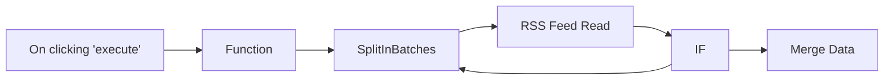

## Fluxo (.json) :

```json
{
  "nodes": [
    {
      "name": "On clicking 'execute'",
      "type": "n8n-nodes-base.manualTrigger",
      "position": [
        270,
        330
      ],
      "parameters": {},
      "typeVersion": 1
    },
    {
      "name": "Merge Data",
      "type": "n8n-nodes-base.function",
      "position": [
        1230,
        430
      ],
      "parameters": {
        "functionCode": "const allData = []\n\nlet counter = 0;\ndo {\n  try {\n    const items = $items(\"RSS Feed Read\", 0, counter).map(item => item.json);\n    allData.push.apply(allData, items);\n  } catch (error) {\n    return [{json: {allData}}];  \n  }\n\n  counter++;\n} while(true);\n\n\n"
      },
      "typeVersion": 1
    },
    {
      "name": "Function",
      "type": "n8n-nodes-base.function",
      "position": [
        470,
        330
      ],
      "parameters": {
        "functionCode": "return [\n  {\n    json: {\n      url: 'https://medium.com/feed/n8n-io',\n    }\n  },\n  {\n    json: {\n      url: 'https://dev.to/feed/n8n',\n    }\n  }\n];"
      },
      "typeVersion": 1
    },
    {
      "name": "RSS Feed Read",
      "type": "n8n-nodes-base.rssFeedRead",
      "position": [
        870,
        330
      ],
      "parameters": {
        "url": "={{$json[\"url\"]}}"
      },
      "typeVersion": 1
    },
    {
      "name": "SplitInBatches",
      "type": "n8n-nodes-base.splitInBatches",
      "position": [
        670,
        330
      ],
      "parameters": {
        "options": {},
        "batchSize": 1
      },
      "typeVersion": 1
    },
    {
      "name": "IF",
      "type": "n8n-nodes-base.if",
      "position": [
        1070,
        520
      ],
      "parameters": {
        "conditions": {
          "boolean": [
            {
              "value1": true,
              "value2": "={{$node[\"SplitInBatches\"].context[\"noItemsLeft\"]}}"
            }
          ]
        }
      },
      "typeVersion": 1
    }
  ],
  "connections": {
    "IF": {
      "main": [
        [
          {
            "node": "Merge Data",
            "type": "main",
            "index": 0
          }
        ],
        [
          {
            "node": "SplitInBatches",
            "type": "main",
            "index": 0
          }
        ]
      ]
    },
    "Function": {
      "main": [
        [
          {
            "node": "SplitInBatches",
            "type": "main",
            "index": 0
          }
        ]
      ]
    },
    "RSS Feed Read": {
      "main": [
        [
          {
            "node": "IF",
            "type": "main",
            "index": 0
          }
        ]
      ]
    },
    "SplitInBatches": {
      "main": [
        [
          {
            "node": "RSS Feed Read",
            "type": "main",
            "index": 0
          }
        ]
      ]
    },
    "On clicking 'execute'": {
      "main": [
        [
          {
            "node": "Function",
            "type": "main",
            "index": 0
          }
        ]
      ]
    }
  }
}
```

<a id="template-1251"></a>

## Template 1251 - Salvar URLs no Notion

- **Nome:** Salvar URLs no Notion
- **Descrição:** Recebe requisições POST enviadas por um bookmarklet e cria uma nova entrada numa base de dados do Notion com a URL recebida.
- **Funcionalidade:** • Receber requisições POST de um bookmarklet: Gatilho que inicia o fluxo ao receber dados enviados pelo bookmarklet.
• Criar página na base de dados do Notion: Salva a URL recebida como título de uma nova página/registro na base especificada.
• Direcionamento para base específica: Utiliza o identificador da base de dados para garantir que os bookmarks sejam armazenados no local correto.
• Teste e verificação do formato: Permite testar o webhook para conferir como as URLs são formatadas antes do uso em produção.
- **Ferramentas:** • Notion: Banco de dados onde serão armazenadas as páginas/links (requer integração e autorização).
• Bookmarklet (favorito do navegador): Pequeno script salvo como favorito que envia a URL da página atual via POST para o endpoint público.
• Endpoint HTTP (webhook): URL pública que recebe as requisições POST do bookmarklet e encaminha os dados para armazenamento.

## Fluxo visual

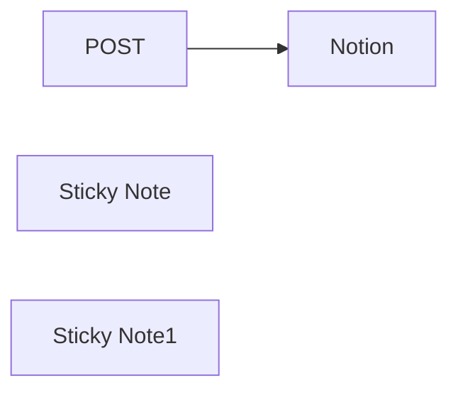

## Fluxo (.json) :

```json
{
  "meta": {
    "instanceId": "257476b1ef58bf3cb6a46e65fac7ee34a53a5e1a8492d5c6e4da5f87c9b82833",
    "templateId": "2038"
  },
  "nodes": [
    {
      "id": "0db90229-9929-4d48-93f0-2425c83993ea",
      "name": "POST",
      "type": "n8n-nodes-base.webhook",
      "position": [
        780,
        280
      ],
      "webhookId": "0626e4cc-e132-4024-9ab9-443a9ac7b133",
      "parameters": {
        "path": "1c04b027-39d2-491a-a9c6-194289fe400c",
        "options": {},
        "httpMethod": "POST"
      },
      "typeVersion": 1
    },
    {
      "id": "5441fa4b-adea-4cdc-a224-b4240e3711ea",
      "name": "Notion",
      "type": "n8n-nodes-base.notion",
      "position": [
        1080,
        280
      ],
      "parameters": {
        "title": "={{ $json.body.url }}",
        "options": {},
        "resource": "databasePage",
        "databaseId": {
          "__rl": true,
          "mode": "list",
          "value": "1420d3ae-bedc-4d23-a932-b402814db9d1",
          "cachedResultUrl": "https://www.notion.so/1420d3aebedc4d23a932b402814db9d1",
          "cachedResultName": "Bookmarks"
        }
      },
      "typeVersion": 2.1
    },
    {
      "id": "9cde5c9e-743a-4368-be53-d8fb57e2da01",
      "name": "Sticky Note",
      "type": "n8n-nodes-base.stickyNote",
      "position": [
        720,
        100
      ],
      "parameters": {
        "color": 7,
        "width": 223,
        "height": 350,
        "content": "## Webhook Trigger\nThis node listens for the event on the bookmarklet we are going to create.\nThe settings for this should be POST "
      },
      "typeVersion": 1
    },
    {
      "id": "0763df72-8eb0-4fe5-9dbb-f5cc12445e46",
      "name": "Sticky Note1",
      "type": "n8n-nodes-base.stickyNote",
      "position": [
        1000,
        100
      ],
      "parameters": {
        "color": 7,
        "width": 463,
        "height": 349,
        "content": "## Adding data to notion\nGo to your notion database and add a new database that shall be recording all your bookmarks. Make sure to add your application. (If you do not add this your bookmark wont be saved)\n\nTest the webhook with to see how the urls are formated in the database\n"
      },
      "typeVersion": 1
    }
  ],
  "pinData": {},
  "connections": {
    "POST": {
      "main": [
        [
          {
            "node": "Notion",
            "type": "main",
            "index": 0
          }
        ]
      ]
    }
  }
}
```

<a id="template-1252"></a>

## Template 1252 - Classificação automática de e-mails Outlook com IA

- **Nome:** Classificação automática de e-mails Outlook com IA
- **Descrição:** Automatiza a classificação e organização de e-mails do Outlook usando um agente de IA para atribuir categorias e mover mensagens para pastas apropriadas.
- **Funcionalidade:** • Captura de e-mails filtrados: Busca e-mails não assinalados e sem categoria definidos pelos filtros.
• Processamento em lote: Itera pelos itens em lotes para processar múltiplos e-mails de maneira controlada.
• Sanitização do corpo do e-mail: Remove HTML, links, imagens, tabelas e caracteres especiais, deixando texto limpo para análise.
• Conversão para Markdown: Converte o conteúdo do e-mail para Markdown para facilitar a extração de texto relevante.
• Extração de campos do e-mail: Prepara variáveis como assunto, remetente, prioridade e corpo para o agente de IA.
• Classificação por agente de IA: Usa um modelo de linguagem para atribuir uma categoria principal e opcional subcategoria, retornando saída estrita em JSON.
• Validação e tratamento de output: Converte a saída do agente para JSON e continua o fluxo mesmo se houver erros, permitindo captura e registro de falhas.
• Roteamento por categoria: Encaminha o e-mail para diferentes ações (definir categorias e/ou mover para pastas específicas) com base na categoria determinada.
• Atualização de categorias e movimentação: Aplica categorias ao e-mail e move mensagens para pastas como Junk, Receipt, SaaS, Community, Business ou Actioned.
• Verificação do estado de leitura: Condicionalmente move mensagens dependendo se já foram lidas.
• Tratamento de erros e continuidade: Registra erros e permite que o processamento continue sem interromper o lote.
- **Ferramentas:** • Microsoft Outlook / Office 365 (Exchange): Fornece acesso, leitura, atualização de categorias e movimentação de mensagens entre pastas.
• Ollama (modelo Qwen2.5): Modelo de linguagem usado como agente de IA para analisar o conteúdo do e-mail e gerar a categorização em JSON.

## Fluxo visual

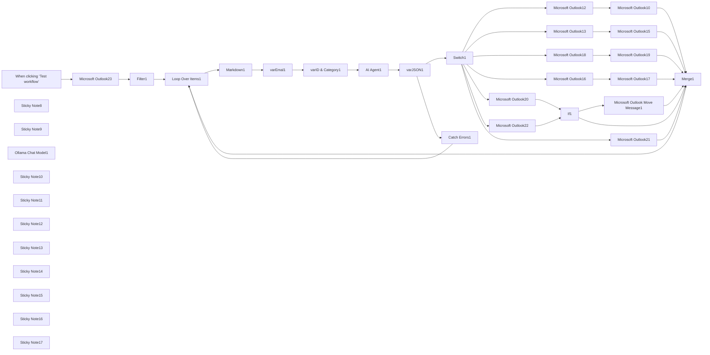

## Fluxo (.json) :

```json
{
  "meta": {
    "instanceId": "67d4d33d8b0ad4e5e12f051d8ad92fc35893d7f48d7f801bc6da4f39967b3592"
  },
  "nodes": [
    {
      "id": "30f5203b-469d-4f0c-8493-e8f08e14e4fe",
      "name": "When clicking ‘Test workflow’",
      "type": "n8n-nodes-base.manualTrigger",
      "position": [
        -560,
        440
      ],
      "parameters": {},
      "typeVersion": 1
    },
    {
      "id": "d16f59dd-f54e-487b-9aac-67f109ba9869",
      "name": "Sticky Note8",
      "type": "n8n-nodes-base.stickyNote",
      "position": [
        1000,
        -280
      ],
      "parameters": {
        "color": 7,
        "width": 727.9032097745135,
        "height": 110.58643966444157,
        "content": "# Auto Categorise Outlook Emails with AI\nBuilt by [Wayne Simpson](https://www.linkedin.com/in/simpsonwayne/) at [nocodecreative.io](https://nocodecreative.io)"
      },
      "typeVersion": 1
    },
    {
      "id": "4e110412-8530-4322-bc5c-7f9df2b63bcb",
      "name": "Sticky Note9",
      "type": "n8n-nodes-base.stickyNote",
      "position": [
        1100,
        -120
      ],
      "parameters": {
        "color": 7,
        "width": 506.8102696237577,
        "height": 337.24177957113216,
        "content": "### Watch Set Up Video 👇\n[](https://www.youtube.com/watch?v=EhRBkkjv_3c)\n\n"
      },
      "typeVersion": 1
    },
    {
      "id": "9d79875f-148e-46ef-967a-95c07298456d",
      "name": "Ollama Chat Model1",
      "type": "@n8n/n8n-nodes-langchain.lmChatOllama",
      "position": [
        1129,
        684
      ],
      "parameters": {
        "model": "qwen2.5:14b",
        "options": {
          "temperature": 0.2
        }
      },
      "typeVersion": 1
    },
    {
      "id": "bcf92a71-ff5f-46a7-bec3-cedb5be2bf98",
      "name": "Microsoft Outlook10",
      "type": "n8n-nodes-base.microsoftOutlook",
      "position": [
        3020,
        8
      ],
      "parameters": {
        "folderId": {
          "__rl": true,
          "mode": "list",
          "value": "AQMkAGE3ZTU5MGMzLTFkNGItNGQ5Zi04MDQ1LThmNGFlMTVhYjMwYgAuAAAD8UhruVwm402lgPBG2Tj-aQEAnz-IOcWBGE2lrVuQgAF6zAAAAgFJAAAA",
          "cachedResultUrl": "https://outlook.office365.com/mail/AQMkAGE3ZTU5MGMzLTFkNGItNGQ5Zi04MDQ1LThmNGFlMTVhYjMwYgAuAAAD8UhruVwm402lgPBG2Tj%2FaQEAnz%2FIOcWBGE2lrVuQgAF6zAAAAgFJAAAA",
          "cachedResultName": "Junk Email"
        },
        "messageId": {
          "__rl": true,
          "mode": "id",
          "value": "={{ $('varID & Category1').item.json.id }}"
        },
        "operation": "move"
      },
      "typeVersion": 2
    },
    {
      "id": "100db1cb-3819-43c7-a74b-5c087ad4f2da",
      "name": "Microsoft Outlook12",
      "type": "n8n-nodes-base.microsoftOutlook",
      "position": [
        2700,
        8
      ],
      "parameters": {
        "messageId": {
          "__rl": true,
          "mode": "id",
          "value": "={{ $('varID & Category1').item.json.id }}"
        },
        "operation": "update",
        "updateFields": {
          "categories": "={{ \n  [$('varJSON1').first().json.output.category, $('varJSON1').first().json.output.subCategory]\n    .filter(item => item && item.trim() !== \"\")\n    .map(item => item.charAt(0).toUpperCase() + item.slice(1))\n}}"
        }
      },
      "typeVersion": 2
    },
    {
      "id": "d4969259-a3ae-473d-82ef-0c9f7933c899",
      "name": "Loop Over Items1",
      "type": "n8n-nodes-base.splitInBatches",
      "position": [
        160,
        448
      ],
      "parameters": {
        "options": {}
      },
      "typeVersion": 3
    },
    {
      "id": "524f6be3-7708-4aae-b9ab-e0ef8180a627",
      "name": "Microsoft Outlook13",
      "type": "n8n-nodes-base.microsoftOutlook",
      "position": [
        2700,
        188
      ],
      "parameters": {
        "messageId": {
          "__rl": true,
          "mode": "id",
          "value": "={{ $('varID & Category1').item.json.id }}"
        },
        "operation": "update",
        "updateFields": {
          "categories": "={{ \n  [$('varJSON1').first().json.output.category, $('varJSON1').first().json.output.subCategory]\n    .filter(item => item && item.trim() !== \"\")\n    .map(item => item.charAt(0).toUpperCase() + item.slice(1))\n}}"
        }
      },
      "typeVersion": 2
    },
    {
      "id": "72cb54f3-4e4e-4ad2-8845-11a38fc29f1a",
      "name": "Microsoft Outlook15",
      "type": "n8n-nodes-base.microsoftOutlook",
      "position": [
        3020,
        188
      ],
      "parameters": {
        "folderId": {
          "__rl": true,
          "mode": "list",
          "value": "AQMkAGE3ZTU5MGMzLTFkNGItNGQ5Zi04MDQ1LThmNGFlMTVhYjMwYgAuAAAD8UhruVwm402lgPBG2Tj-aQEAnz-IOcWBGE2lrVuQgAF6zAADLJmrBwAAAA==",
          "cachedResultUrl": "https://outlook.office365.com/mail/AQMkAGE3ZTU5MGMzLTFkNGItNGQ5Zi04MDQ1LThmNGFlMTVhYjMwYgAuAAAD8UhruVwm402lgPBG2Tj%2FaQEAnz%2FIOcWBGE2lrVuQgAF6zAADLJmrBwAAAA%3D%3D",
          "cachedResultName": "Receipt"
        },
        "messageId": {
          "__rl": true,
          "mode": "id",
          "value": "={{ $('varID & Category1').item.json.id }}"
        },
        "operation": "move"
      },
      "typeVersion": 2
    },
    {
      "id": "e4446e84-c05e-4d04-b415-7608e39024ee",
      "name": "Microsoft Outlook16",
      "type": "n8n-nodes-base.microsoftOutlook",
      "position": [
        2709,
        504
      ],
      "parameters": {
        "messageId": {
          "__rl": true,
          "mode": "id",
          "value": "={{ $('varID & Category1').item.json.id }}"
        },
        "operation": "update",
        "updateFields": {
          "categories": "={{ \n  [$('varJSON1').first().json.output.category, $('varJSON1').first().json.output.subCategory]\n    .filter(item => item && item.trim() !== \"\")\n    .map(item => item.charAt(0).toUpperCase() + item.slice(1))\n}}"
        }
      },
      "typeVersion": 2
    },
    {
      "id": "3ee05cfe-a528-472e-aa3d-c890fd88b6c4",
      "name": "Microsoft Outlook17",
      "type": "n8n-nodes-base.microsoftOutlook",
      "position": [
        3020,
        508
      ],
      "parameters": {
        "folderId": {
          "__rl": true,
          "mode": "list",
          "value": "AQMkAGE3ZTU5MGMzLTFkNGItNGQ5Zi04MDQ1LThmNGFlMTVhYjMwYgAuAAAD8UhruVwm402lgPBG2Tj-aQEAnz-IOcWBGE2lrVuQgAF6zAADLJmrCAAAAA==",
          "cachedResultUrl": "https://outlook.office365.com/mail/AQMkAGE3ZTU5MGMzLTFkNGItNGQ5Zi04MDQ1LThmNGFlMTVhYjMwYgAuAAAD8UhruVwm402lgPBG2Tj%2FaQEAnz%2FIOcWBGE2lrVuQgAF6zAADLJmrCAAAAA%3D%3D",
          "cachedResultName": "Community"
        },
        "messageId": {
          "__rl": true,
          "mode": "id",
          "value": "={{ $('varID & Category1').item.json.id }}"
        },
        "operation": "move"
      },
      "typeVersion": 2
    },
    {
      "id": "2fcecd9e-95cc-489a-b874-699c54518e44",
      "name": "Microsoft Outlook18",
      "type": "n8n-nodes-base.microsoftOutlook",
      "position": [
        2709,
        344
      ],
      "parameters": {
        "messageId": {
          "__rl": true,
          "mode": "id",
          "value": "={{ $('varID & Category1').item.json.id }}"
        },
        "operation": "update",
        "updateFields": {
          "categories": "={{ \n  [$('varJSON1').first().json.output.category, $('varJSON1').first().json.output.subCategory]\n    .filter(item => item && item.trim() !== \"\")\n    .map(item => item.charAt(0).toUpperCase() + item.slice(1))\n}}"
        }
      },
      "typeVersion": 2
    },
    {
      "id": "41a39309-1a94-461f-9308-63dd5b9a94a7",
      "name": "Microsoft Outlook19",
      "type": "n8n-nodes-base.microsoftOutlook",
      "position": [
        3020,
        348
      ],
      "parameters": {
        "folderId": {
          "__rl": true,
          "mode": "list",
          "value": "AQMkAGE3ZTU5MGMzLTFkNGItNGQ5Zi04MDQ1LThmNGFlMTVhYjMwYgAuAAAD8UhruVwm402lgPBG2Tj-aQEAnz-IOcWBGE2lrVuQgAF6zAADLJmrCQAAAA==",
          "cachedResultUrl": "https://outlook.office365.com/mail/AQMkAGE3ZTU5MGMzLTFkNGItNGQ5Zi04MDQ1LThmNGFlMTVhYjMwYgAuAAAD8UhruVwm402lgPBG2Tj%2FaQEAnz%2FIOcWBGE2lrVuQgAF6zAADLJmrCQAAAA%3D%3D",
          "cachedResultName": "SaaS"
        },
        "messageId": {
          "__rl": true,
          "mode": "id",
          "value": "={{ $('varID & Category1').item.json.id }}"
        },
        "operation": "move"
      },
      "typeVersion": 2
    },
    {
      "id": "ebf606f9-099c-4218-b23b-66e2487262d0",
      "name": "Markdown1",
      "type": "n8n-nodes-base.markdown",
      "notes": "Converts the body of the email to markdown",
      "position": [
        420,
        468
      ],
      "parameters": {
        "html": "={{ $('Loop Over Items1').item.json.body.content }}",
        "options": {}
      },
      "notesInFlow": true,
      "typeVersion": 1
    },
    {
      "id": "ff447dd5-3ef6-4a02-8453-3489af8bf6b5",
      "name": "varEmal1",
      "type": "n8n-nodes-base.set",
      "notes": "Set email fields",
      "position": [
        620,
        468
      ],
      "parameters": {
        "options": {},
        "assignments": {
          "assignments": [
            {
              "id": "edb304e1-3e9f-4a77-918c-25646addbc53",
              "name": "subject",
              "type": "string",
              "value": "={{ $json.subject }}"
            },
            {
              "id": "57a3ef3a-2701-40d9-882f-f43a7219f148",
              "name": "importance",
              "type": "string",
              "value": "={{ $json.importance }}"
            },
            {
              "id": "d8317f4f-aa0e-4196-89af-cb016765490a",
              "name": "sender",
              "type": "object",
              "value": "={{ $json.sender.emailAddress }}"
            },
            {
              "id": "908716c8-9ff7-4bdc-a1a3-64227559635e",
              "name": "from",
              "type": "object",
              "value": "={{ $json.from.emailAddress }}"
            },
            {
              "id": "ce007329-e221-4c5a-8130-2f8e9130160f",
              "name": "body",
              "type": "string",
              "value": "={{ $json.data\n    .replace(/<[^>]*>/g, '')                      // Remove HTML tags\n    .replace(/\\[(.*?)\\]\\((.*?)\\)/g, '')            // Remove Markdown links like [text](link)\n    .replace(/!\\[.*?\\]\\(.*?\\)/g, '')               // Remove Markdown images like \n    .replace(/\\|/g, '')                            // Remove table separators \"|\"\n    .replace(/-{3,}/g, '')                         // Remove horizontal rule \"---\"\n    .replace(/\\n+/g, ' ')                          // Remove multiple newlines\n    .replace(/([^\\w\\s.,!?@])/g, '')                // Remove special characters except essential ones\n    .replace(/\\s{2,}/g, ' ')                       // Replace multiple spaces with a single space\n    .trim()                                        // Trim leading/trailing whitespace\n}}\n"
            }
          ]
        }
      },
      "typeVersion": 3.4
    },
    {
      "id": "198524cb-c9f0-4261-8c38-7c878efe7457",
      "name": "Microsoft Outlook20",
      "type": "n8n-nodes-base.microsoftOutlook",
      "position": [
        2700,
        668
      ],
      "parameters": {
        "messageId": {
          "__rl": true,
          "mode": "id",
          "value": "={{ $('varID & Category1').item.json.id }}"
        },
        "operation": "update",
        "updateFields": {
          "categories": "={{ \n  [$('varJSON1').first().json.output.category, $('varJSON1').first().json.output.subCategory]\n    .filter(item => item && item.trim() !== \"\")\n    .map(item => item.charAt(0).toUpperCase() + item.slice(1))\n}}"
        }
      },
      "typeVersion": 2
    },
    {
      "id": "ec73629c-59ac-4f0e-a432-2c06934952ab",
      "name": "Microsoft Outlook21",
      "type": "n8n-nodes-base.microsoftOutlook",
      "position": [
        2709,
        1044
      ],
      "parameters": {
        "messageId": {
          "__rl": true,
          "mode": "id",
          "value": "={{ $('varID & Category1').item.json.id }}"
        },
        "operation": "update",
        "updateFields": {
          "categories": "={{ \n  [$('varJSON1').first().json.output.category, $('varJSON1').first().json.output.subCategory]\n    .filter(item => item && item.trim() !== \"\")\n    .map(item => item.charAt(0).toUpperCase() + item.slice(1))\n}}"
        }
      },
      "typeVersion": 2
    },
    {
      "id": "0a19d15c-0cd3-4f26-9be2-4914522751fb",
      "name": "Filter1",
      "type": "n8n-nodes-base.filter",
      "position": [
        -100,
        448
      ],
      "parameters": {
        "options": {},
        "conditions": {
          "options": {
            "version": 2,
            "leftValue": "",
            "caseSensitive": true,
            "typeValidation": "strict"
          },
          "combinator": "and",
          "conditions": [
            {
              "id": "c8cd6917-f94e-4fb7-8601-b8ed8f1aa8bf",
              "operator": {
                "type": "array",
                "operation": "empty",
                "singleValue": true
              },
              "leftValue": "={{ $json.categories }}",
              "rightValue": ""
            }
          ]
        }
      },
      "typeVersion": 2.2
    },
    {
      "id": "96e6e31c-6306-44a8-a57a-2b5216636b00",
      "name": "If1",
      "type": "n8n-nodes-base.if",
      "notes": "Checks if the email has been read",
      "position": [
        3320,
        668
      ],
      "parameters": {
        "options": {},
        "conditions": {
          "options": {
            "version": 2,
            "leftValue": "",
            "caseSensitive": true,
            "typeValidation": "strict"
          },
          "combinator": "and",
          "conditions": [
            {
              "id": "f8cf2a56-cea8-4150-b7a0-048dbda20f2f",
              "operator": {
                "type": "boolean",
                "operation": "true",
                "singleValue": true
              },
              "leftValue": "={{ $json.isRead }}",
              "rightValue": ""
            }
          ]
        }
      },
      "typeVersion": 2.2
    },
    {
      "id": "8a6e0118-abe3-45e2-aefc-94640348b2ec",
      "name": "Microsoft Outlook22",
      "type": "n8n-nodes-base.microsoftOutlook",
      "position": [
        2709,
        864
      ],
      "parameters": {
        "messageId": {
          "__rl": true,
          "mode": "id",
          "value": "={{ $('varID & Category1').item.json.id }}"
        },
        "operation": "update",
        "updateFields": {
          "categories": "={{ \n  [$('varJSON1').first().json.output.category, $('varJSON1').first().json.output.subCategory]\n    .filter(item => item && item.trim() !== \"\")\n    .map(item => item.charAt(0).toUpperCase() + item.slice(1))\n}}"
        }
      },
      "typeVersion": 2
    },
    {
      "id": "e2d8e7b5-4447-4327-9f4e-b8d52765667e",
      "name": "Catch Errors1",
      "type": "n8n-nodes-base.set",
      "position": [
        1760,
        608
      ],
      "parameters": {
        "options": {},
        "assignments": {
          "assignments": [
            {
              "id": "0dc6d439-60fb-49f6-b4d5-f5cce6f030ad",
              "name": "error",
              "type": "string",
              "value": "={{ $json }}"
            }
          ]
        }
      },
      "typeVersion": 3.4
    },
    {
      "id": "17f6ac43-51e4-4bee-b0d8-13deb3bf3cc9",
      "name": "varJSON1",
      "type": "n8n-nodes-base.set",
      "onError": "continueErrorOutput",
      "position": [
        1540,
        468
      ],
      "parameters": {
        "options": {
          "ignoreConversionErrors": true
        },
        "assignments": {
          "assignments": [
            {
              "id": "0c52f57f-74eb-4385-ac6b-f3e5f4f50e73",
              "name": "output",
              "type": "object",
              "value": "={{ $json.output.replace(/^.*?({.*}).*$/s, '$1') }}"
            }
          ]
        }
      },
      "typeVersion": 3.4
    },
    {
      "id": "82dd9631-a34b-4d54-be28-6f8dcc3548f0",
      "name": "Sticky Note10",
      "type": "n8n-nodes-base.stickyNote",
      "position": [
        -360,
        220
      ],
      "parameters": {
        "width": 411.91693012378937,
        "height": 401.49417117683515,
        "content": "## Outlook Business with filters\nFilters:\n```\nflag/flagStatus eq 'notFlagged' and not categories/any()\n```\n\nThese filters ensure we do not process flagged emails or email that already have a category set."
      },
      "typeVersion": 1
    },
    {
      "id": "0583e196-37a5-43db-8c0a-aa624029c926",
      "name": "Microsoft Outlook23",
      "type": "n8n-nodes-base.microsoftOutlook",
      "position": [
        -300,
        448
      ],
      "parameters": {
        "limit": 1,
        "fields": [
          "flag",
          "from",
          "importance",
          "replyTo",
          "sender",
          "subject",
          "toRecipients",
          "body",
          "categories",
          "isRead"
        ],
        "output": "fields",
        "options": {},
        "filtersUI": {
          "values": {
            "filters": {
              "custom": "flag/flagStatus eq 'notFlagged' and not categories/any()",
              "foldersToInclude": [
                "AQMkAGE3ZTU5MGMzLTFkNGItNGQ5Zi04MDQ1LThmNGFlMTVhYjMwYgAuAAAD8UhruVwm402lgPBG2Tj-aQEAnz-IOcWBGE2lrVuQgAF6zAAAAgEMAAAA"
              ]
            }
          }
        },
        "operation": "getAll"
      },
      "typeVersion": 2
    },
    {
      "id": "a9540e6b-929b-4460-8972-93e4d19cd934",
      "name": "varID & Category1",
      "type": "n8n-nodes-base.set",
      "position": [
        900,
        468
      ],
      "parameters": {
        "options": {},
        "assignments": {
          "assignments": [
            {
              "id": "de2ad4f2-7381-4715-a3f4-59611e161b74",
              "name": "id",
              "type": "string",
              "value": "={{ $('Microsoft Outlook23').item.json.id }}"
            },
            {
              "id": "458c7a89-e4a3-46d0-8b38-72d87748e306",
              "name": "category",
              "type": "string",
              "value": "\"action\", \"junk\", \"receipt\", \"SaaS\", \"community\", \"business\" or \"other\""
            }
          ]
        }
      },
      "typeVersion": 3.4
    },
    {
      "id": "e6b3b41e-d7d3-4c9b-8189-a005c748ff18",
      "name": "Sticky Note11",
      "type": "n8n-nodes-base.stickyNote",
      "position": [
        360,
        348
      ],
      "parameters": {
        "color": 6,
        "width": 418.7820408163265,
        "height": 301.40952380952365,
        "content": "## Sanitise Email \nRemoves HTML and useless information in preparation for the AI Agent"
      },
      "typeVersion": 1
    },
    {
      "id": "f9787a75-526c-4ef1-b0a7-0db7d890ab3f",
      "name": "Sticky Note12",
      "type": "n8n-nodes-base.stickyNote",
      "position": [
        820,
        348
      ],
      "parameters": {
        "color": 6,
        "width": 256.16108843537415,
        "height": 298.37931972789124,
        "content": "## Modify Categories \nEdit this to customise category selection"
      },
      "typeVersion": 1
    },
    {
      "id": "50223a01-34cf-4191-9dd7-3dac02a9e945",
      "name": "Sticky Note13",
      "type": "n8n-nodes-base.stickyNote",
      "position": [
        1480,
        328
      ],
      "parameters": {
        "color": 5,
        "width": 441.003537414966,
        "height": 463.0204081632651,
        "content": "## Convert to JSON\n* Ensures the Agent output to converted to JSON\n* Catches any errors and continues processing"
      },
      "typeVersion": 1
    },
    {
      "id": "4580c532-96a6-46b4-8922-d79316d1cc01",
      "name": "Sticky Note14",
      "type": "n8n-nodes-base.stickyNote",
      "position": [
        2120,
        328
      ],
      "parameters": {
        "color": 5,
        "width": 311.71482993197264,
        "height": 454.93986394557805,
        "content": "## Switch Categories\nEnsure your categories match the **varID & Category** Edit Fields node"
      },
      "typeVersion": 1
    },
    {
      "id": "b51a7c34-2a5e-4670-81a4-d1582711c69a",
      "name": "Sticky Note15",
      "type": "n8n-nodes-base.stickyNote",
      "position": [
        2629,
        -76
      ],
      "parameters": {
        "color": 4,
        "width": 251.3480889735252,
        "height": 1289.0156245602684,
        "content": "## Set Categories\n"
      },
      "typeVersion": 1
    },
    {
      "id": "3a7ede7b-539b-49d2-8803-153ca6c9eb69",
      "name": "Sticky Note16",
      "type": "n8n-nodes-base.stickyNote",
      "position": [
        2949,
        -76
      ],
      "parameters": {
        "color": 4,
        "width": 251.3480889735252,
        "height": 770.995811762121,
        "content": "## Move to Folders\n"
      },
      "typeVersion": 1
    },
    {
      "id": "ee9a9d78-8c07-470a-9d1b-ceddfc8875ca",
      "name": "Sticky Note17",
      "type": "n8n-nodes-base.stickyNote",
      "position": [
        3260,
        553
      ],
      "parameters": {
        "color": 4,
        "height": 293.65527013262994,
        "content": "## Check if email has been read\n\n"
      },
      "typeVersion": 1
    },
    {
      "id": "c75b9d38-79a7-4be2-a90b-a99da1bbd745",
      "name": "Microsoft Outlook Move Message1",
      "type": "n8n-nodes-base.microsoftOutlook",
      "position": [
        3609,
        604
      ],
      "parameters": {
        "folderId": {
          "__rl": true,
          "mode": "list",
          "value": "AQMkAGE3ZTU5MGMzLTFkNGItNGQ5Zi04MDQ1LThmNGFlMTVhYjMwYgAuAAAD8UhruVwm402lgPBG2Tj-aQEAnz-IOcWBGE2lrVuQgAF6zAADLJmrCwAAAA==",
          "cachedResultUrl": "https://outlook.office365.com/mail/AQMkAGE3ZTU5MGMzLTFkNGItNGQ5Zi04MDQ1LThmNGFlMTVhYjMwYgAuAAAD8UhruVwm402lgPBG2Tj%2FaQEAnz%2FIOcWBGE2lrVuQgAF6zAADLJmrCwAAAA%3D%3D",
          "cachedResultName": "Actioned"
        },
        "messageId": {
          "__rl": true,
          "mode": "id",
          "value": "={{ $('varID & Category1').item.json.id }}"
        },
        "operation": "move"
      },
      "typeVersion": 2
    },
    {
      "id": "85ff0348-16dc-46e6-bf70-48a10fe0ded8",
      "name": "AI Agent1",
      "type": "@n8n/n8n-nodes-langchain.agent",
      "position": [
        1160,
        468
      ],
      "parameters": {
        "text": "=Categorise the following email\n<email>\n{{ $('varEmal1').first().json.toJsonString() }}\n</email>\n\nEnsure your final output is valid JSON with no additional text or token in the following format:\n\n{\n  \"subject\": \"SUBJECT_LINE\",1\n  \"category\": \"CATEGORY\",\n  \"subCategory\": \"SUBCATEGORY\", //use sparingly\n  \"analysis\": \"ANALYSIS_REASONING\"\n}\n\nRemember you can only use ONE of the following categories {{ $json.category }}. No other categories can be used. Use the subcategory for additional context, for example, if a SaaS email requires action, or if a business email requires action. Do not create any additional subcategories, you can only use ONE of the following {{ $json.category }}.",
        "options": {
          "systemMessage": "=You're an AI assistant for a freelance developer, categorizing emails as {{ $json.category }}. Email info is in <email> tags.\n\nCategorization priority:\n\nAction: Needs response or action (includes some SaaS emails), avoid sales email but include enquires.\nJunk: Ads, sales, newsletters, promotions, daily digests, (emojis often indicate junk), phishing, scams, discounts etc.\nReceipt: Any purchase confirmation.\nSaaS: Account/security updates, unless action required, generic SaaS information, usually from a non-personal email address.\nCommunity: Updates, events, forums, everything related to \"community\".\nBusiness: Any communication related to freelance work, usually from a humans email address\nOther: Doesn't fit into any other category.\n\nKey points:\n\nSaaS emails needing action are \"SaaS\" and subcategory \"action\".\nAnalyze the subject, body, email addresses and other data.\nLook for specific keywords and phrases for each category.\nEmail can have 2 categories, primary and sub, for example, \"action\" and \"SaaS\" or \"action\" and \"business\".\nEmails from business development executives are often junk.\n\n\nOutput in valid JSON format:\n{\n\"subject\": \"SUBJECT_LINE\",\n\"category\": \"PRIMARY CATEGORY\",\n\"subCategory\": \"SUBCATEGORY\", //use sparingly\n\"analysis\": \"Brief 1-2 sentence explanation of category choice\"\n}\nNo additional text or tokens outside the JSON.\n\nYou may only use the following categories and subcategories, do not create any more categories or subcategories: {{ $json.category }}"
        },
        "promptType": "define",
        "hasOutputParser": true
      },
      "typeVersion": 1.6
    },
    {
      "id": "93e7be79-9035-4b58-9a83-b9182a0515f8",
      "name": "Merge1",
      "type": "n8n-nodes-base.merge",
      "position": [
        3989,
        564
      ],
      "parameters": {
        "numberInputs": 7
      },
      "typeVersion": 3
    },
    {
      "id": "cbaeaed1-cb09-4614-93f1-3fe349cd0e4e",
      "name": "Switch1",
      "type": "n8n-nodes-base.switch",
      "position": [
        2220,
        488
      ],
      "parameters": {
        "rules": {
          "values": [
            {
              "outputKey": "junk",
              "conditions": {
                "options": {
                  "version": 2,
                  "leftValue": "",
                  "caseSensitive": false,
                  "typeValidation": "strict"
                },
                "combinator": "and",
                "conditions": [
                  {
                    "operator": {
                      "type": "string",
                      "operation": "equals"
                    },
                    "leftValue": "={{ $json.output.category }}",
                    "rightValue": "junk"
                  }
                ]
              },
              "renameOutput": true
            },
            {
              "outputKey": "receipt",
              "conditions": {
                "options": {
                  "version": 2,
                  "leftValue": "",
                  "caseSensitive": false,
                  "typeValidation": "strict"
                },
                "combinator": "and",
                "conditions": [
                  {
                    "id": "0c61c7a8-e8b4-49c5-a96c-402d5eae7089",
                    "operator": {
                      "name": "filter.operator.equals",
                      "type": "string",
                      "operation": "equals"
                    },
                    "leftValue": "={{ $json.output.category }}",
                    "rightValue": "receipt"
                  }
                ]
              },
              "renameOutput": true
            },
            {
              "outputKey": "SaaS",
              "conditions": {
                "options": {
                  "version": 2,
                  "leftValue": "",
                  "caseSensitive": false,
                  "typeValidation": "strict"
                },
                "combinator": "and",
                "conditions": [
                  {
                    "id": "703f65c8-cf4a-47fe-ad1a-a5f6e0412ae7",
                    "operator": {
                      "name": "filter.operator.equals",
                      "type": "string",
                      "operation": "equals"
                    },
                    "leftValue": "={{ $json.output.category }}",
                    "rightValue": "SaaS"
                  }
                ]
              },
              "renameOutput": true
            },
            {
              "outputKey": "community",
              "conditions": {
                "options": {
                  "version": 2,
                  "leftValue": "",
                  "caseSensitive": false,
                  "typeValidation": "strict"
                },
                "combinator": "and",
                "conditions": [
                  {
                    "id": "b074d5cd-9215-40df-8877-5df904edc000",
                    "operator": {
                      "name": "filter.operator.equals",
                      "type": "string",
                      "operation": "equals"
                    },
                    "leftValue": "={{ $json.output.category }}",
                    "rightValue": "community"
                  }
                ]
              },
              "renameOutput": true
            },
            {
              "outputKey": "action",
              "conditions": {
                "options": {
                  "version": 2,
                  "leftValue": "",
                  "caseSensitive": false,
                  "typeValidation": "strict"
                },
                "combinator": "and",
                "conditions": [
                  {
                    "id": "bece338a-e0c5-43b5-b8cc-41229a374213",
                    "operator": {
                      "name": "filter.operator.equals",
                      "type": "string",
                      "operation": "equals"
                    },
                    "leftValue": "={{ $json.output.category }}",
                    "rightValue": "action"
                  }
                ]
              },
              "renameOutput": true
            },
            {
              "outputKey": "business",
              "conditions": {
                "options": {
                  "version": 2,
                  "leftValue": "",
                  "caseSensitive": false,
                  "typeValidation": "strict"
                },
                "combinator": "and",
                "conditions": [
                  {
                    "id": "d6c9751f-0ffa-4041-a579-6957bb9c9296",
                    "operator": {
                      "name": "filter.operator.equals",
                      "type": "string",
                      "operation": "equals"
                    },
                    "leftValue": "={{ $json.output.category }}",
                    "rightValue": "business"
                  }
                ]
              },
              "renameOutput": true
            }
          ]
        },
        "options": {
          "ignoreCase": true,
          "fallbackOutput": "extra"
        }
      },
      "typeVersion": 3.2
    }
  ],
  "pinData": {},
  "connections": {
    "If1": {
      "main": [
        [
          {
            "node": "Microsoft Outlook Move Message1",
            "type": "main",
            "index": 0
          }
        ],
        [
          {
            "node": "Merge1",
            "type": "main",
            "index": 5
          }
        ]
      ]
    },
    "Merge1": {
      "main": [
        [
          {
            "node": "Loop Over Items1",
            "type": "main",
            "index": 0
          }
        ]
      ]
    },
    "Filter1": {
      "main": [
        [
          {
            "node": "Loop Over Items1",
            "type": "main",
            "index": 0
          }
        ]
      ]
    },
    "Switch1": {
      "main": [
        [
          {
            "node": "Microsoft Outlook12",
            "type": "main",
            "index": 0
          }
        ],
        [
          {
            "node": "Microsoft Outlook13",
            "type": "main",
            "index": 0
          }
        ],
        [
          {
            "node": "Microsoft Outlook18",
            "type": "main",
            "index": 0
          }
        ],
        [
          {
            "node": "Microsoft Outlook16",
            "type": "main",
            "index": 0
          }
        ],
        [
          {
            "node": "Microsoft Outlook20",
            "type": "main",
            "index": 0
          }
        ],
        [
          {
            "node": "Microsoft Outlook22",
            "type": "main",
            "index": 0
          }
        ],
        [
          {
            "node": "Microsoft Outlook21",
            "type": "main",
            "index": 0
          }
        ]
      ]
    },
    "varEmal1": {
      "main": [
        [
          {
            "node": "varID & Category1",
            "type": "main",
            "index": 0
          }
        ]
      ]
    },
    "varJSON1": {
      "main": [
        [
          {
            "node": "Switch1",
            "type": "main",
            "index": 0
          }
        ],
        [
          {
            "node": "Catch Errors1",
            "type": "main",
            "index": 0
          }
        ]
      ]
    },
    "AI Agent1": {
      "main": [
        [
          {
            "node": "varJSON1",
            "type": "main",
            "index": 0
          }
        ]
      ]
    },
    "Markdown1": {
      "main": [
        [
          {
            "node": "varEmal1",
            "type": "main",
            "index": 0
          }
        ]
      ]
    },
    "Catch Errors1": {
      "main": [
        [
          {
            "node": "Loop Over Items1",
            "type": "main",
            "index": 0
          }
        ]
      ]
    },
    "Loop Over Items1": {
      "main": [
        null,
        [
          {
            "node": "Markdown1",
            "type": "main",
            "index": 0
          }
        ]
      ]
    },
    "varID & Category1": {
      "main": [
        [
          {
            "node": "AI Agent1",
            "type": "main",
            "index": 0
          }
        ]
      ]
    },
    "Ollama Chat Model1": {
      "ai_languageModel": [
        [
          {
            "node": "AI Agent1",
            "type": "ai_languageModel",
            "index": 0
          }
        ]
      ]
    },
    "Microsoft Outlook10": {
      "main": [
        [
          {
            "node": "Merge1",
            "type": "main",
            "index": 0
          }
        ]
      ]
    },
    "Microsoft Outlook12": {
      "main": [
        [
          {
            "node": "Microsoft Outlook10",
            "type": "main",
            "index": 0
          }
        ]
      ]
    },
    "Microsoft Outlook13": {
      "main": [
        [
          {
            "node": "Microsoft Outlook15",
            "type": "main",
            "index": 0
          }
        ]
      ]
    },
    "Microsoft Outlook15": {
      "main": [
        [
          {
            "node": "Merge1",
            "type": "main",
            "index": 1
          }
        ]
      ]
    },
    "Microsoft Outlook16": {
      "main": [
        [
          {
            "node": "Microsoft Outlook17",
            "type": "main",
            "index": 0
          }
        ]
      ]
    },
    "Microsoft Outlook17": {
      "main": [
        [
          {
            "node": "Merge1",
            "type": "main",
            "index": 3
          }
        ]
      ]
    },
    "Microsoft Outlook18": {
      "main": [
        [
          {
            "node": "Microsoft Outlook19",
            "type": "main",
            "index": 0
          }
        ]
      ]
    },
    "Microsoft Outlook19": {
      "main": [
        [
          {
            "node": "Merge1",
            "type": "main",
            "index": 2
          }
        ]
      ]
    },
    "Microsoft Outlook20": {
      "main": [
        [
          {
            "node": "If1",
            "type": "main",
            "index": 0
          }
        ]
      ]
    },
    "Microsoft Outlook21": {
      "main": [
        [
          {
            "node": "Merge1",
            "type": "main",
            "index": 6
          }
        ]
      ]
    },
    "Microsoft Outlook22": {
      "main": [
        [
          {
            "node": "If1",
            "type": "main",
            "index": 0
          }
        ]
      ]
    },
    "Microsoft Outlook23": {
      "main": [
        [
          {
            "node": "Filter1",
            "type": "main",
            "index": 0
          }
        ]
      ]
    },
    "Microsoft Outlook Move Message1": {
      "main": [
        [
          {
            "node": "Merge1",
            "type": "main",
            "index": 4
          }
        ]
      ]
    },
    "When clicking ‘Test workflow’": {
      "main": [
        [
          {
            "node": "Microsoft Outlook23",
            "type": "main",
            "index": 0
          }
        ]
      ]
    }
  }
}
```

<a id="template-1253"></a>

## Template 1253 - Criar, atualizar e obter entrada no Strapi

- **Nome:** Criar, atualizar e obter entrada no Strapi
- **Descrição:** Fluxo que cria uma entrada do tipo 'posts' no Strapi, atualiza o slug da entrada criada e em seguida recupera a entrada atualizada.
- **Funcionalidade:** • Disparo manual: Inicia o fluxo ao clicar em executar.
• Criação de entrada: Cria um conteúdo do tipo 'posts' com os campos Title, Content e Description.
• Extração de ID: Captura o identificador (id) retornado após a criação para uso posterior.
• Atualização de entrada: Atualiza o campo slug da entrada criada utilizando o id capturado.
• Recuperação de entrada: Obtém a entrada atualizada pelo id para validar ou processar os dados finais.
• Encadeamento de dados: Passa valores entre etapas (por exemplo, id e slug) para manter consistência do fluxo.
- **Ferramentas:** • Strapi: CMS headless utilizado para criar, atualizar e obter entradas de conteúdo.

## Fluxo visual

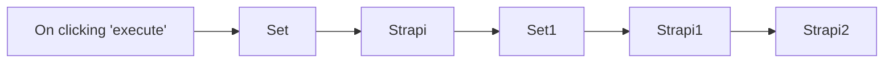

## Fluxo (.json) :

```json
{
  "id": "119",
  "name": "Create, update, and get an entry in Strapi",
  "nodes": [
    {
      "name": "On clicking 'execute'",
      "type": "n8n-nodes-base.manualTrigger",
      "position": [
        250,
        300
      ],
      "parameters": {},
      "typeVersion": 1
    },
    {
      "name": "Strapi",
      "type": "n8n-nodes-base.strapi",
      "position": [
        650,
        300
      ],
      "parameters": {
        "columns": "Title, Content, Description",
        "operation": "create",
        "contentType": "posts"
      },
      "credentials": {
        "strapiApi": "strapi"
      },
      "typeVersion": 1
    },
    {
      "name": "Set",
      "type": "n8n-nodes-base.set",
      "position": [
        450,
        300
      ],
      "parameters": {
        "values": {
          "string": [
            {
              "name": "Title",
              "value": "Automate Strapi with n8n"
            },
            {
              "name": "Content",
              "value": "Strapi is a headless CMS. We will use Strapi and n8n to automate our content creation workflows."
            },
            {
              "name": "Description",
              "value": "Learn how to automate Strapi with n8n."
            }
          ]
        },
        "options": {}
      },
      "typeVersion": 1
    },
    {
      "name": "Strapi1",
      "type": "n8n-nodes-base.strapi",
      "position": [
        1050,
        300
      ],
      "parameters": {
        "columns": "slug",
        "operation": "update",
        "contentType": "={{$node[\"Strapi\"].parameter[\"contentType\"]}}"
      },
      "credentials": {
        "strapiApi": "strapi"
      },
      "typeVersion": 1
    },
    {
      "name": "Set1",
      "type": "n8n-nodes-base.set",
      "position": [
        850,
        300
      ],
      "parameters": {
        "values": {
          "string": [
            {
              "name": "id",
              "value": "={{$node[\"Strapi\"].json[\"id\"]}}"
            },
            {
              "name": "slug",
              "value": "automate-strapi-with-n8n"
            }
          ]
        },
        "options": {},
        "keepOnlySet": true
      },
      "typeVersion": 1
    },
    {
      "name": "Strapi2",
      "type": "n8n-nodes-base.strapi",
      "position": [
        1250,
        300
      ],
      "parameters": {
        "entryId": "={{$node[\"Strapi1\"].json[\"id\"]}}",
        "contentType": "={{$node[\"Strapi\"].parameter[\"contentType\"]}}"
      },
      "credentials": {
        "strapiApi": "strapi"
      },
      "typeVersion": 1
    }
  ],
  "active": false,
  "settings": {},
  "connections": {
    "Set": {
      "main": [
        [
          {
            "node": "Strapi",
            "type": "main",
            "index": 0
          }
        ]
      ]
    },
    "Set1": {
      "main": [
        [
          {
            "node": "Strapi1",
            "type": "main",
            "index": 0
          }
        ]
      ]
    },
    "Strapi": {
      "main": [
        [
          {
            "node": "Set1",
            "type": "main",
            "index": 0
          }
        ]
      ]
    },
    "Strapi1": {
      "main": [
        [
          {
            "node": "Strapi2",
            "type": "main",
            "index": 0
          }
        ]
      ]
    },
    "On clicking 'execute'": {
      "main": [
        [
          {
            "node": "Set",
            "type": "main",
            "index": 0
          }
        ]
      ]
    }
  }
}
```

<a id="template-1254"></a>

## Template 1254 - Criar cliente no Harvest

- **Nome:** Criar cliente no Harvest
- **Descrição:** Fluxo manual para criar um novo cliente na conta do Harvest utilizando a API.
- **Funcionalidade:** • Gatilho manual: inicia o fluxo quando o usuário clica em executar.
• Criação de cliente: envia uma solicitação para criar um cliente no Harvest.
• Suporte a campos adicionais: permite incluir campos adicionais ao criar o cliente.
• Uso de credenciais: requer credenciais da API do Harvest para autenticação.
- **Ferramentas:** • Harvest: serviço de gestão de tempo e faturamento que fornece API para gerenciar clientes e projetos.

## Fluxo visual

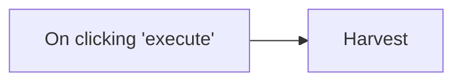

## Fluxo (.json) :

```json
{
  "id": "120",
  "name": "Create a client in Harvest",
  "nodes": [
    {
      "name": "On clicking 'execute'",
      "type": "n8n-nodes-base.manualTrigger",
      "position": [
        250,
        300
      ],
      "parameters": {},
      "typeVersion": 1
    },
    {
      "name": "Harvest",
      "type": "n8n-nodes-base.harvest",
      "position": [
        450,
        300
      ],
      "parameters": {
        "name": "",
        "resource": "client",
        "operation": "create",
        "additionalFields": {}
      },
      "credentials": {
        "harvestApi": ""
      },
      "typeVersion": 1
    }
  ],
  "active": false,
  "settings": {},
  "connections": {
    "On clicking 'execute'": {
      "main": [
        [
          {
            "node": "Harvest",
            "type": "main",
            "index": 0
          }
        ]
      ]
    }
  }
}
```

<a id="template-1255"></a>

## Template 1255 - Criar ticket no Zendesk

- **Nome:** Criar ticket no Zendesk
- **Descrição:** Este fluxo inicia manualmente e cria um ticket no Zendesk utilizando os dados configurados nos parâmetros do fluxo.
- **Funcionalidade:** • Disparo manual: Inicia o fluxo ao clicar em 'executar'.
• Criação de ticket no Zendesk: Gera um novo ticket usando a descrição e campos adicionais fornecidos.
• Uso de credenciais: Requer credenciais do Zendesk para autenticação e envio seguro do ticket.
- **Ferramentas:** • Zendesk: Plataforma de suporte ao cliente para criar, gerenciar e rastrear tickets de atendimento.

## Fluxo visual

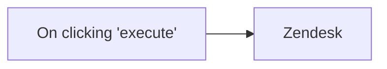

## Fluxo (.json) :

```json
{
  "id": "123",
  "name": "Create a ticket in Zendesk",
  "nodes": [
    {
      "name": "On clicking 'execute'",
      "type": "n8n-nodes-base.manualTrigger",
      "position": [
        250,
        300
      ],
      "parameters": {},
      "typeVersion": 1
    },
    {
      "name": "Zendesk",
      "type": "n8n-nodes-base.zendesk",
      "position": [
        450,
        300
      ],
      "parameters": {
        "description": "",
        "additionalFields": {}
      },
      "credentials": {
        "zendeskApi": ""
      },
      "typeVersion": 1
    }
  ],
  "active": false,
  "settings": {},
  "connections": {
    "On clicking 'execute'": {
      "main": [
        [
          {
            "node": "Zendesk",
            "type": "main",
            "index": 0
          }
        ]
      ]
    }
  }
}
```

<a id="template-1256"></a>

## Template 1256 - Servidor MCP para gestão de funcionários PayCaptain

- **Nome:** Servidor MCP para gestão de funcionários PayCaptain
- **Descrição:** Este fluxo expõe um servidor MCP que permite buscar, obter por ID e atualizar dados de funcionários usando a API da PayCaptain, aplicando validações e registando operações para auditoria.
- **Funcionalidade:** • Servidor MCP: Recebe requisições de clientes MCP e encaminha para as ferramentas disponíveis (buscar, obter por ID, atualizar).
• Busca por empregados: Pesquisa texto livre em múltiplos campos (nome, email, código, cargo, equipa, etc.) e filtra resultados relevantes.
• Obter empregado por ID: Recupera os detalhes de um funcionário usando o identificador interno.
• Atualização controlada de empregado: Aceita pedidos de atualização apenas com campos permitidos e rejeita solicitações que tentem alterar campos não editáveis.
• Sanitização de dados: Remove ou limita campos sensíveis antes de devolver resultados ao cliente para reduzir exposição de informação.
• Paginação de API: Faz múltiplas chamadas paginadas à API externa para agregar resultados de empregados.
• Agregação de respostas: Consolida e formata os resultados antes de enviar a resposta ao cliente MCP.
• Registo para auditoria: Regista cada chamada (operação, query, valores, employeeId e timestamp) para posterior auditoria.
- **Ferramentas:** • PayCaptain API: API externa usada para listar, consultar e actualizar dados de empregados.
• Google Sheets: Armazena registos de auditoria das operações para histórico e conformidade.
• Autenticação via JWT (header): Token JWT usado como credencial HTTP para autenticar chamadas à API da PayCaptain.
• Clientes MCP (ex.: Claude Desktop): Agentes/clients MCP que iniciam consultas e invocam as ferramentas expostas pelo servidor MCP.


## Fluxo visual

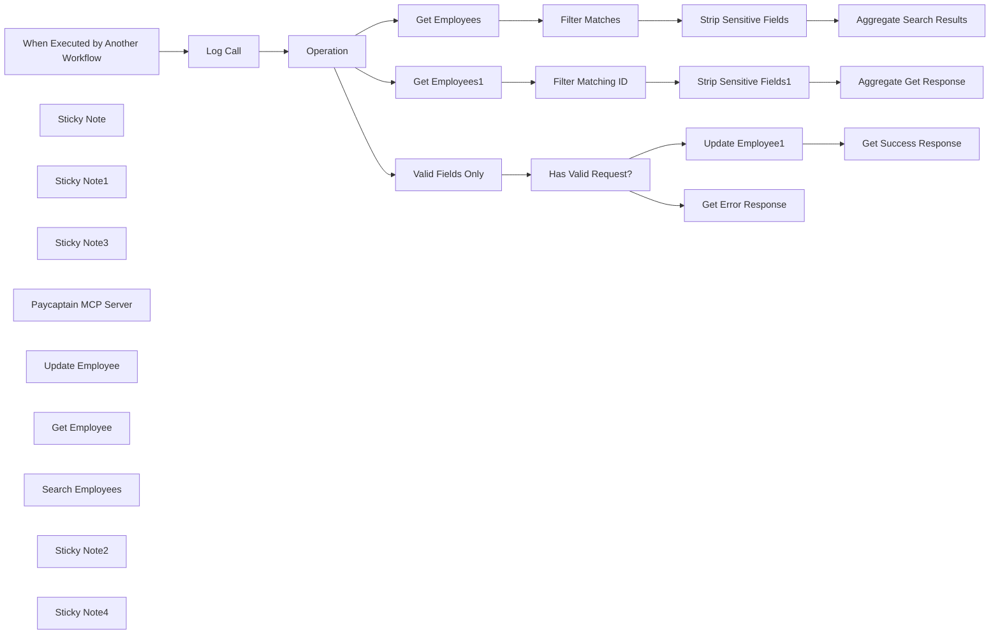

## Fluxo (.json) :

```json
{
  "meta": {
    "instanceId": "408f9fb9940c3cb18ffdef0e0150fe342d6e655c3a9fac21f0f644e8bedabcd9",
    "templateCredsSetupCompleted": true
  },
  "nodes": [
    {
      "id": "4bdd4360-b518-4b46-81fa-0d3183ce642d",
      "name": "When Executed by Another Workflow",
      "type": "n8n-nodes-base.executeWorkflowTrigger",
      "position": [
        680,
        260
      ],
      "parameters": {
        "workflowInputs": {
          "values": [
            {
              "name": "operation"
            },
            {
              "name": "query"
            },
            {
              "name": "employeeId"
            },
            {
              "name": "values",
              "type": "object"
            }
          ]
        }
      },
      "typeVersion": 1.1
    },
    {
      "id": "74bdcff0-0615-4d81-82ff-ff8340939399",
      "name": "Operation",
      "type": "n8n-nodes-base.switch",
      "position": [
        1040,
        260
      ],
      "parameters": {
        "rules": {
          "values": [
            {
              "outputKey": "searchEmployee",
              "conditions": {
                "options": {
                  "version": 2,
                  "leftValue": "",
                  "caseSensitive": true,
                  "typeValidation": "strict"
                },
                "combinator": "and",
                "conditions": [
                  {
                    "id": "81b134bc-d671-4493-b3ad-8df9be3f49a6",
                    "operator": {
                      "type": "string",
                      "operation": "equals"
                    },
                    "leftValue": "={{ $('When Executed by Another Workflow').first().json.operation }}",
                    "rightValue": "searchEmployees"
                  }
                ]
              },
              "renameOutput": true
            },
            {
              "outputKey": "getEmployeeById",
              "conditions": {
                "options": {
                  "version": 2,
                  "leftValue": "",
                  "caseSensitive": true,
                  "typeValidation": "strict"
                },
                "combinator": "and",
                "conditions": [
                  {
                    "id": "8d57914f-6587-4fb3-88e0-aa1de6ba56c1",
                    "operator": {
                      "name": "filter.operator.equals",
                      "type": "string",
                      "operation": "equals"
                    },
                    "leftValue": "={{ $('When Executed by Another Workflow').first().json.operation }}",
                    "rightValue": "getEmployeeById"
                  }
                ]
              },
              "renameOutput": true
            },
            {
              "outputKey": "updateEmployee",
              "conditions": {
                "options": {
                  "version": 2,
                  "leftValue": "",
                  "caseSensitive": true,
                  "typeValidation": "strict"
                },
                "combinator": "and",
                "conditions": [
                  {
                    "id": "7c38f238-213a-46ec-aefe-22e0bcb8dffc",
                    "operator": {
                      "name": "filter.operator.equals",
                      "type": "string",
                      "operation": "equals"
                    },
                    "leftValue": "={{ $('When Executed by Another Workflow').first().json.operation }}",
                    "rightValue": "updateEmployee"
                  }
                ]
              },
              "renameOutput": true
            }
          ]
        },
        "options": {}
      },
      "typeVersion": 3.2
    },
    {
      "id": "8850cd57-9bc1-43b7-9366-7d91afc7bc42",
      "name": "Sticky Note",
      "type": "n8n-nodes-base.stickyNote",
      "position": [
        -80,
        -120
      ],
      "parameters": {
        "color": 7,
        "width": 680,
        "height": 660,
        "content": "## 1. Set up an MCP Server Trigger\n[Read more about the MCP Server Trigger](https://docs.n8n.io/integrations/builtin/core-nodes/n8n-nodes-langchain.mcptrigger)"
      },
      "typeVersion": 1
    },
    {
      "id": "ad541df3-44ed-4ef4-af91-841dc9986b4c",
      "name": "Sticky Note1",
      "type": "n8n-nodes-base.stickyNote",
      "position": [
        620,
        -120
      ],
      "parameters": {
        "color": 7,
        "width": 600,
        "height": 260,
        "content": "## 2. Build Your MCP Server from Existing APIs\n[Read more about the HTTP Request Node](https://docs.n8n.io/integrations/builtin/core-nodes/n8n-nodes-base.httprequest)\n\nN8N allows any organisation to quickly build and host their own MCP server by leveraging existing APIs. Here's a quick example for PayCaptain.com - a cloud-based payroll software for modern companies.\n\nWith this set of tools, Paycaptain customers can simplify employee management from within their favourite MCP client such as Claude Desktop. Better yet, n8n also handles distribution so this MCP server can serve entire departments as well."
      },
      "typeVersion": 1
    },
    {
      "id": "962cb379-8916-4a9f-8a7b-5aa9d31d5d88",
      "name": "Sticky Note3",
      "type": "n8n-nodes-base.stickyNote",
      "position": [
        -80,
        -240
      ],
      "parameters": {
        "color": 5,
        "width": 380,
        "height": 100,
        "content": "### Always Authenticate Your Server!\nBefore going to production, it's always advised to enable authentication on your MCP server trigger."
      },
      "typeVersion": 1
    },
    {
      "id": "27163110-36d7-46f3-92fc-dce7d000655e",
      "name": "Paycaptain MCP Server",
      "type": "@n8n/n8n-nodes-langchain.mcpTrigger",
      "position": [
        80,
        40
      ],
      "webhookId": "5f6728df-d3e8-48bb-9a38-0f2e54c7962c",
      "parameters": {
        "path": "5f6728df-d3e8-48bb-9a38-0f2e54c7962c"
      },
      "typeVersion": 1
    },
    {
      "id": "13a69580-de33-489a-85c8-582877efbfe0",
      "name": "Update Employee",
      "type": "@n8n/n8n-nodes-langchain.toolWorkflow",
      "position": [
        380,
        260
      ],
      "parameters": {
        "name": "updateEmployee",
        "workflowId": {
          "__rl": true,
          "mode": "id",
          "value": "={{ $workflow.id }}"
        },
        "description": "Updates an employee's details.",
        "workflowInputs": {
          "value": {
            "query": "null",
            "values": "={{ /*n8n-auto-generated-fromAI-override*/ $fromAI('values', ``, 'string') }}",
            "operation": "updateEmployee",
            "employeeId": "={{ /*n8n-auto-generated-fromAI-override*/ $fromAI('employeeId', ``, 'string') }}"
          },
          "schema": [
            {
              "id": "operation",
              "type": "string",
              "display": true,
              "required": false,
              "displayName": "operation",
              "defaultMatch": false,
              "canBeUsedToMatch": true
            },
            {
              "id": "query",
              "type": "string",
              "display": true,
              "removed": false,
              "required": false,
              "displayName": "query",
              "defaultMatch": false,
              "canBeUsedToMatch": true
            },
            {
              "id": "employeeId",
              "type": "string",
              "display": true,
              "removed": false,
              "required": false,
              "displayName": "employeeId",
              "defaultMatch": false,
              "canBeUsedToMatch": true
            },
            {
              "id": "values",
              "type": "object",
              "display": true,
              "required": false,
              "displayName": "values",
              "defaultMatch": false,
              "canBeUsedToMatch": true
            }
          ],
          "mappingMode": "defineBelow",
          "matchingColumns": [],
          "attemptToConvertTypes": false,
          "convertFieldsToString": false
        }
      },
      "typeVersion": 2.1
    },
    {
      "id": "68c066f0-657c-46cb-a9fe-b31e9850c512",
      "name": "Get Employee",
      "type": "@n8n/n8n-nodes-langchain.toolWorkflow",
      "position": [
        240,
        360
      ],
      "parameters": {
        "name": "getEmployeeById",
        "workflowId": {
          "__rl": true,
          "mode": "id",
          "value": "={{ $workflow.id }}"
        },
        "description": "Returns an employee's details by employee ID.",
        "workflowInputs": {
          "value": {
            "query": "null",
            "values": "null",
            "operation": "getEmployeeById",
            "employeeId": "={{ /*n8n-auto-generated-fromAI-override*/ $fromAI('employeeId', ``, 'string') }}"
          },
          "schema": [
            {
              "id": "operation",
              "type": "string",
              "display": true,
              "removed": false,
              "required": false,
              "displayName": "operation",
              "defaultMatch": false,
              "canBeUsedToMatch": true
            },
            {
              "id": "query",
              "type": "string",
              "display": true,
              "removed": false,
              "required": false,
              "displayName": "query",
              "defaultMatch": false,
              "canBeUsedToMatch": true
            },
            {
              "id": "employeeId",
              "type": "string",
              "display": true,
              "removed": false,
              "required": false,
              "displayName": "employeeId",
              "defaultMatch": false,
              "canBeUsedToMatch": true
            },
            {
              "id": "values",
              "type": "object",
              "display": true,
              "removed": false,
              "required": false,
              "displayName": "values",
              "defaultMatch": false,
              "canBeUsedToMatch": true
            }
          ],
          "mappingMode": "defineBelow",
          "matchingColumns": [],
          "attemptToConvertTypes": false,
          "convertFieldsToString": false
        }
      },
      "typeVersion": 2.1
    },
    {
      "id": "87661e95-b618-4701-b0f3-9f0532d5fc75",
      "name": "Get Employees",
      "type": "n8n-nodes-base.httpRequest",
      "position": [
        1380,
        60
      ],
      "parameters": {
        "url": "https://api.paycaptain.com/employees",
        "options": {
          "pagination": {
            "pagination": {
              "parameters": {
                "parameters": [
                  {
                    "name": "page",
                    "value": "={{ $request.qs.page + 1 }}"
                  }
                ]
              },
              "maxRequests": 3,
              "requestInterval": 1000,
              "limitPagesFetched": true
            }
          }
        },
        "sendQuery": true,
        "authentication": "genericCredentialType",
        "genericAuthType": "httpHeaderAuth",
        "queryParameters": {
          "parameters": [
            {
              "name": "company",
              "value": "paycaptain"
            },
            {
              "name": "page",
              "value": "={{ $json.page ?? 1 }}"
            }
          ]
        }
      },
      "credentials": {
        "httpHeaderAuth": {
          "id": "sPolCkoJ1zhzWabJ",
          "name": "JWT TOKEN"
        }
      },
      "typeVersion": 4.2
    },
    {
      "id": "866868e2-e0b0-4d8d-bf3c-57d68fea8b86",
      "name": "Search Employees",
      "type": "@n8n/n8n-nodes-langchain.toolWorkflow",
      "position": [
        100,
        260
      ],
      "parameters": {
        "name": "searchEmployees",
        "workflowId": {
          "__rl": true,
          "mode": "id",
          "value": "={{ $workflow.id }}"
        },
        "description": "Searches for and returns an employee's details.",
        "workflowInputs": {
          "value": {
            "query": "={{ /*n8n-auto-generated-fromAI-override*/ $fromAI('query', ``, 'string') }}",
            "values": "null",
            "operation": "searchEmployees",
            "employeeId": "null"
          },
          "schema": [
            {
              "id": "operation",
              "type": "string",
              "display": true,
              "removed": false,
              "required": false,
              "displayName": "operation",
              "defaultMatch": false,
              "canBeUsedToMatch": true
            },
            {
              "id": "query",
              "type": "string",
              "display": true,
              "removed": false,
              "required": false,
              "displayName": "query",
              "defaultMatch": false,
              "canBeUsedToMatch": true
            },
            {
              "id": "employeeId",
              "type": "string",
              "display": true,
              "removed": false,
              "required": false,
              "displayName": "employeeId",
              "defaultMatch": false,
              "canBeUsedToMatch": true
            },
            {
              "id": "values",
              "type": "object",
              "display": true,
              "removed": false,
              "required": false,
              "displayName": "values",
              "defaultMatch": false,
              "canBeUsedToMatch": true
            }
          ],
          "mappingMode": "defineBelow",
          "matchingColumns": [],
          "attemptToConvertTypes": false,
          "convertFieldsToString": false
        }
      },
      "typeVersion": 2.1
    },
    {
      "id": "679a2413-448f-43d8-98fc-7fd8b83775e7",
      "name": "Log Call",
      "type": "n8n-nodes-base.googleSheets",
      "position": [
        860,
        260
      ],
      "parameters": {
        "columns": {
          "value": {
            "query": "={{ $json.query }}",
            "values": "={{ $json.values.toJsonString() }}",
            "operation": "={{ $json.operation }}",
            "timestamp": "={{ $now.toISO() }}",
            "employeeId": "={{ $json.employeeId }}"
          },
          "schema": [
            {
              "id": "timestamp",
              "type": "string",
              "display": true,
              "removed": false,
              "required": false,
              "displayName": "timestamp",
              "defaultMatch": false,
              "canBeUsedToMatch": true
            },
            {
              "id": "operation",
              "type": "string",
              "display": true,
              "removed": false,
              "required": false,
              "displayName": "operation",
              "defaultMatch": false,
              "canBeUsedToMatch": true
            },
            {
              "id": "query",
              "type": "string",
              "display": true,
              "removed": false,
              "required": false,
              "displayName": "query",
              "defaultMatch": false,
              "canBeUsedToMatch": true
            },
            {
              "id": "employeeId",
              "type": "string",
              "display": true,
              "removed": false,
              "required": false,
              "displayName": "employeeId",
              "defaultMatch": false,
              "canBeUsedToMatch": true
            },
            {
              "id": "values",
              "type": "string",
              "display": true,
              "removed": false,
              "required": false,
              "displayName": "values",
              "defaultMatch": false,
              "canBeUsedToMatch": true
            }
          ],
          "mappingMode": "defineBelow",
          "matchingColumns": [],
          "attemptToConvertTypes": false,
          "convertFieldsToString": false
        },
        "options": {
          "useAppend": true
        },
        "operation": "append",
        "sheetName": {
          "__rl": true,
          "mode": "list",
          "value": "gid=0",
          "cachedResultUrl": "https://docs.google.com/spreadsheets/d/1Ls_3pmzIafl1NUAzzflkJgyq1smPW6vfGjbVuVzdkac/edit#gid=0",
          "cachedResultName": "Sheet1"
        },
        "documentId": {
          "__rl": true,
          "mode": "list",
          "value": "1Ls_3pmzIafl1NUAzzflkJgyq1smPW6vfGjbVuVzdkac",
          "cachedResultUrl": "https://docs.google.com/spreadsheets/d/1Ls_3pmzIafl1NUAzzflkJgyq1smPW6vfGjbVuVzdkac/edit?usp=drivesdk",
          "cachedResultName": "98. MCP Audit"
        }
      },
      "credentials": {
        "googleSheetsOAuth2Api": {
          "id": "XHvC7jIRR8A2TlUl",
          "name": "Google Sheets account"
        }
      },
      "typeVersion": 4.5
    },
    {
      "id": "7723947c-94a3-4bf1-b6c8-b595027a33dc",
      "name": "Filter Matches",
      "type": "n8n-nodes-base.filter",
      "position": [
        1580,
        60
      ],
      "parameters": {
        "options": {},
        "conditions": {
          "options": {
            "version": 2,
            "leftValue": "",
            "caseSensitive": true,
            "typeValidation": "strict"
          },
          "combinator": "and",
          "conditions": [
            {
              "id": "baa681eb-d6d9-450b-99ab-58d33e81cef4",
              "operator": {
                "name": "filter.operator.equals",
                "type": "string",
                "operation": "equals"
              },
              "leftValue": "={{\n[\n  $json.hrEmployeeId,\n  $json.payrollCode,\n  $json.firstName + ' ' + $json.lastName,\n  $json.email,\n  $json.niNumber,\n  $json.mailingCity,\n  $json.jobTitle,\n  $json.jobGrade,\n  $json.department,\n  $json.team\n]\n  .join(' ')\n  .toLowerCase()\n}}",
              "rightValue": "={{ $('When Executed by Another Workflow').first().json.query.toLowerCase() }}"
            }
          ]
        }
      },
      "typeVersion": 2.2
    },
    {
      "id": "f4d1ddd9-dde7-437f-9aa2-969ea0832f71",
      "name": "Aggregate Search Results",
      "type": "n8n-nodes-base.aggregate",
      "position": [
        2020,
        60
      ],
      "parameters": {
        "options": {},
        "aggregate": "aggregateAllItemData",
        "destinationFieldName": "response"
      },
      "typeVersion": 1
    },
    {
      "id": "45076cec-f554-44ae-b314-e43ba080abb5",
      "name": "Get Employees1",
      "type": "n8n-nodes-base.httpRequest",
      "position": [
        1380,
        260
      ],
      "parameters": {
        "url": "https://api.paycaptain.com/employees",
        "options": {
          "pagination": {
            "pagination": {
              "parameters": {
                "parameters": [
                  {
                    "name": "page",
                    "value": "={{ $request.qs.page + 1 }}"
                  }
                ]
              },
              "maxRequests": 3,
              "requestInterval": 1000,
              "limitPagesFetched": true
            }
          }
        },
        "sendQuery": true,
        "authentication": "genericCredentialType",
        "genericAuthType": "httpHeaderAuth",
        "queryParameters": {
          "parameters": [
            {
              "name": "company",
              "value": "paycaptain"
            },
            {
              "name": "page",
              "value": "={{ $json.page ?? 1 }}"
            }
          ]
        }
      },
      "credentials": {
        "httpHeaderAuth": {
          "id": "sPolCkoJ1zhzWabJ",
          "name": "JWT TOKEN"
        }
      },
      "typeVersion": 4.2
    },
    {
      "id": "b6f3a56f-5cd2-4f4d-904b-49e82ec591b8",
      "name": "Filter Matching ID",
      "type": "n8n-nodes-base.filter",
      "position": [
        1580,
        260
      ],
      "parameters": {
        "options": {},
        "conditions": {
          "options": {
            "version": 2,
            "leftValue": "",
            "caseSensitive": true,
            "typeValidation": "strict"
          },
          "combinator": "and",
          "conditions": [
            {
              "id": "cfb2ba5b-14c0-4867-be4d-180306c896ae",
              "operator": {
                "name": "filter.operator.equals",
                "type": "string",
                "operation": "equals"
              },
              "leftValue": "={{ $json.hrEmployeeId }}",
              "rightValue": "={{ $('When Executed by Another Workflow').first().json.employeeId }}"
            }
          ]
        }
      },
      "typeVersion": 2.2
    },
    {
      "id": "ecc2d8d5-4a23-4bfd-840b-63c28980462f",
      "name": "Strip Sensitive Fields1",
      "type": "n8n-nodes-base.set",
      "position": [
        1800,
        260
      ],
      "parameters": {
        "options": {},
        "assignments": {
          "assignments": [
            {
              "id": "e20217cf-7c70-4907-9da6-a114104a099e",
              "name": "company",
              "type": "string",
              "value": "={{ $json.company }}"
            },
            {
              "id": "2dfe8342-c442-4ac3-90bd-92fe7d38d407",
              "name": "hrEmployeeId",
              "type": "string",
              "value": "={{ $json.hrEmployeeId }}"
            },
            {
              "id": "57fe4519-246b-44aa-a0c9-22e1e865041c",
              "name": "payrollCode",
              "type": "string",
              "value": "={{ $json.payrollCode }}"
            },
            {
              "id": "d296021c-09b2-43b2-8b8e-ebb5d7d9d14d",
              "name": "firstName",
              "type": "string",
              "value": "={{ $json.firstName }}"
            },
            {
              "id": "661e0049-d28f-4f78-83fc-7a1b21f742c2",
              "name": "lastName",
              "type": "string",
              "value": "={{ $json.lastName }}"
            },
            {
              "id": "59f7fd87-ba84-426a-ad61-c682cf8227bf",
              "name": "email",
              "type": "string",
              "value": "={{ $json.email }}"
            },
            {
              "id": "9769c078-c5f5-4d56-b467-765dd73444f9",
              "name": "phone",
              "type": "string",
              "value": "={{ $json.phone }}"
            },
            {
              "id": "e387bc11-dccf-4baf-b87f-a2abb5f61b5d",
              "name": "mailingStreet",
              "type": "string",
              "value": "={{ $json.mailingStreet }}"
            },
            {
              "id": "415451c5-c3c1-42d4-9f5b-829277bfb7f3",
              "name": "mailingStateProvince",
              "type": "string",
              "value": "={{ $json.mailingStateProvince }}"
            },
            {
              "id": "cf2a83f4-28a8-44bd-9d06-780db1406f8f",
              "name": "mailingPostalCode",
              "type": "string",
              "value": "={{ $json.mailingPostalCode }}"
            },
            {
              "id": "94ee2e05-9969-43f2-a732-57356f8b4dfe",
              "name": "mailingCountry",
              "type": "string",
              "value": "={{ $json.mailingCountry }}"
            },
            {
              "id": "b01a56c9-fc42-4bff-9443-27075699986f",
              "name": "location",
              "type": "string",
              "value": "={{ $json.location }}"
            },
            {
              "id": "b9175d72-6976-4765-b773-f4521668d130",
              "name": "department",
              "type": "string",
              "value": "={{ $json.department }}"
            },
            {
              "id": "d784e800-e13b-4d43-907c-11aaaf4ee24f",
              "name": "team",
              "type": "string",
              "value": "={{ $json.team }}"
            },
            {
              "id": "1ff68eb6-35f9-4a2d-9a37-14b3a6f6e0ee",
              "name": "jobGrade",
              "type": "string",
              "value": "={{ $json.jobGrade }}"
            },
            {
              "id": "5628bbf8-872d-4e3a-bf37-c36f13c0f4b1",
              "name": "jobTitle",
              "type": "string",
              "value": "={{ $json.jobTitle }}"
            },
            {
              "id": "34f26d59-43b3-4f2c-955b-f6d5ab22a083",
              "name": "jobEffectiveDate",
              "type": "string",
              "value": "={{ $json.jobEffectiveDate }}"
            },
            {
              "id": "e3023e94-fbc8-4e9b-b106-687ea533e3f8",
              "name": "contractType",
              "type": "string",
              "value": "={{ $json.contractType }}"
            },
            {
              "id": "d3dcf24c-5e9b-40e5-9f54-fca930ab1528",
              "name": "normalWeeklyHours",
              "type": "number",
              "value": "={{ $json.normalWeeklyHours }}"
            },
            {
              "id": "65ed75a6-1ec1-456f-b19b-4492e31f5c18",
              "name": "daysWorkedPerWeek",
              "type": "number",
              "value": "={{ $json.daysWorkedPerWeek }}"
            }
          ]
        }
      },
      "typeVersion": 3.4
    },
    {
      "id": "77a71a55-f0cf-4f76-b697-b31dba447f30",
      "name": "Strip Sensitive Fields",
      "type": "n8n-nodes-base.set",
      "position": [
        1800,
        60
      ],
      "parameters": {
        "options": {},
        "assignments": {
          "assignments": [
            {
              "id": "e20217cf-7c70-4907-9da6-a114104a099e",
              "name": "company",
              "type": "string",
              "value": "={{ $json.company }}"
            },
            {
              "id": "2dfe8342-c442-4ac3-90bd-92fe7d38d407",
              "name": "hrEmployeeId",
              "type": "string",
              "value": "={{ $json.hrEmployeeId }}"
            },
            {
              "id": "57fe4519-246b-44aa-a0c9-22e1e865041c",
              "name": "payrollCode",
              "type": "string",
              "value": "={{ $json.payrollCode }}"
            },
            {
              "id": "d296021c-09b2-43b2-8b8e-ebb5d7d9d14d",
              "name": "firstName",
              "type": "string",
              "value": "={{ $json.firstName }}"
            },
            {
              "id": "661e0049-d28f-4f78-83fc-7a1b21f742c2",
              "name": "lastName",
              "type": "string",
              "value": "={{ $json.lastName }}"
            },
            {
              "id": "59f7fd87-ba84-426a-ad61-c682cf8227bf",
              "name": "email",
              "type": "string",
              "value": "={{ $json.email }}"
            },
            {
              "id": "9769c078-c5f5-4d56-b467-765dd73444f9",
              "name": "phone",
              "type": "string",
              "value": "={{ $json.phone }}"
            },
            {
              "id": "e387bc11-dccf-4baf-b87f-a2abb5f61b5d",
              "name": "mailingStreet",
              "type": "string",
              "value": "={{ $json.mailingStreet }}"
            },
            {
              "id": "415451c5-c3c1-42d4-9f5b-829277bfb7f3",
              "name": "mailingStateProvince",
              "type": "string",
              "value": "={{ $json.mailingStateProvince }}"
            },
            {
              "id": "cf2a83f4-28a8-44bd-9d06-780db1406f8f",
              "name": "mailingPostalCode",
              "type": "string",
              "value": "={{ $json.mailingPostalCode }}"
            },
            {
              "id": "94ee2e05-9969-43f2-a732-57356f8b4dfe",
              "name": "mailingCountry",
              "type": "string",
              "value": "={{ $json.mailingCountry }}"
            },
            {
              "id": "b01a56c9-fc42-4bff-9443-27075699986f",
              "name": "location",
              "type": "string",
              "value": "={{ $json.location }}"
            },
            {
              "id": "b9175d72-6976-4765-b773-f4521668d130",
              "name": "department",
              "type": "string",
              "value": "={{ $json.department }}"
            },
            {
              "id": "d784e800-e13b-4d43-907c-11aaaf4ee24f",
              "name": "team",
              "type": "string",
              "value": "={{ $json.team }}"
            },
            {
              "id": "1ff68eb6-35f9-4a2d-9a37-14b3a6f6e0ee",
              "name": "jobGrade",
              "type": "string",
              "value": "={{ $json.jobGrade }}"
            },
            {
              "id": "5628bbf8-872d-4e3a-bf37-c36f13c0f4b1",
              "name": "jobTitle",
              "type": "string",
              "value": "={{ $json.jobTitle }}"
            },
            {
              "id": "34f26d59-43b3-4f2c-955b-f6d5ab22a083",
              "name": "jobEffectiveDate",
              "type": "string",
              "value": "={{ $json.jobEffectiveDate }}"
            },
            {
              "id": "e3023e94-fbc8-4e9b-b106-687ea533e3f8",
              "name": "contractType",
              "type": "string",
              "value": "={{ $json.contractType }}"
            },
            {
              "id": "d3dcf24c-5e9b-40e5-9f54-fca930ab1528",
              "name": "normalWeeklyHours",
              "type": "number",
              "value": "={{ $json.normalWeeklyHours }}"
            },
            {
              "id": "65ed75a6-1ec1-456f-b19b-4492e31f5c18",
              "name": "daysWorkedPerWeek",
              "type": "number",
              "value": "={{ $json.daysWorkedPerWeek }}"
            }
          ]
        }
      },
      "typeVersion": 3.4
    },
    {
      "id": "86f73b12-afc8-4694-a79d-45c908cc88dd",
      "name": "Update Employee1",
      "type": "n8n-nodes-base.httpRequest",
      "position": [
        1800,
        460
      ],
      "parameters": {
        "url": "https://api.paycaptain.com/employee",
        "method": "POST",
        "options": {
          "pagination": {
            "pagination": {
              "parameters": {
                "parameters": [
                  {
                    "name": "page",
                    "value": "={{ $request.qs.page + 1 }}"
                  }
                ]
              },
              "maxRequests": 3,
              "requestInterval": 1000,
              "limitPagesFetched": true
            }
          }
        },
        "jsonBody": "={{\n{\n  hrEmployeeId: $('When Executed by Another Workflow').item.json.employeeId,\n  ..\n}\n}}",
        "sendBody": true,
        "specifyBody": "json",
        "authentication": "genericCredentialType",
        "genericAuthType": "httpHeaderAuth"
      },
      "credentials": {
        "httpHeaderAuth": {
          "id": "sPolCkoJ1zhzWabJ",
          "name": "JWT TOKEN"
        }
      },
      "typeVersion": 4.2
    },
    {
      "id": "122fe6f7-3bcd-4f29-a95c-c727a799e1fd",
      "name": "Valid Fields Only",
      "type": "n8n-nodes-base.set",
      "position": [
        1380,
        460
      ],
      "parameters": {
        "options": {},
        "assignments": {
          "assignments": [
            {
              "id": "4f3d0703-21f3-4ca1-bf7a-9c80d9efc936",
              "name": "values",
              "type": "object",
              "value": "={{\n([\n  \"firstname\",\n  \"middlename\",\n  \"lastname\",\n  \"mailingStreet\",\n  \"mailingCity\",\n  \"mailingStateProvince\",\n  \"mailingPostalCode\",\n  \"mailingCountry\",\n  \"email\",\n  \"phone\",\n  \"niNumber\",\n  \"location\",\n  \"department\",\n  \"team\",\n  \"jobGrade\",\n  \"jobTitle\",\n]\n  .reduce((acc, key) => ({\n    ...acc,\n    [key]: $('When Executed by Another Workflow').item.json.values[key] ?? undefined\n  }), {}))\n}}"
            }
          ]
        }
      },
      "typeVersion": 3.4
    },
    {
      "id": "13e5f143-1abf-444c-b86c-ae51fe839894",
      "name": "Has Valid Request?",
      "type": "n8n-nodes-base.if",
      "position": [
        1580,
        460
      ],
      "parameters": {
        "options": {},
        "conditions": {
          "options": {
            "version": 2,
            "leftValue": "",
            "caseSensitive": true,
            "typeValidation": "strict"
          },
          "combinator": "and",
          "conditions": [
            {
              "id": "54d35a49-e698-427d-9fca-280b83f2827d",
              "operator": {
                "type": "object",
                "operation": "notEmpty",
                "singleValue": true
              },
              "leftValue": "={{ $json.values }}",
              "rightValue": ""
            }
          ]
        }
      },
      "typeVersion": 2.2
    },
    {
      "id": "b98f1d73-a994-4040-b421-75e626ec4ce6",
      "name": "Get Error Response",
      "type": "n8n-nodes-base.set",
      "position": [
        1800,
        640
      ],
      "parameters": {
        "options": {},
        "assignments": {
          "assignments": [
            {
              "id": "b33ebf1d-d0e8-4dda-90e7-b53c21b2a410",
              "name": "response",
              "type": "string",
              "value": "=Request included fields which cannot be updated. Editable fields are: {{ [\n  \"firstname\",\n  \"middlename\",\n  \"lastname\",\n  \"mailingStreet\",\n  \"mailingCity\",\n  \"mailingStateProvince\",\n  \"mailingPostalCode\",\n  \"mailingCountry\",\n  \"email\",\n  \"phone\",\n  \"niNumber\",\n  \"location\",\n  \"department\",\n  \"team\",\n  \"jobGrade\",\n  \"jobTitle\",\n].join(', ')}}"
            }
          ]
        }
      },
      "typeVersion": 3.4
    },
    {
      "id": "cb140f3f-571c-49a4-a24d-dcee11c5b7e1",
      "name": "Get Success Response",
      "type": "n8n-nodes-base.set",
      "position": [
        2020,
        460
      ],
      "parameters": {
        "options": {},
        "assignments": {
          "assignments": [
            {
              "id": "a1d245c9-b1e5-4cec-a901-4a6ecc9bd98d",
              "name": "response",
              "type": "string",
              "value": "ok"
            }
          ]
        }
      },
      "typeVersion": 3.4
    },
    {
      "id": "39cd1188-5f2e-45ce-8bbc-0586812491ec",
      "name": "Aggregate Get Response",
      "type": "n8n-nodes-base.aggregate",
      "position": [
        2020,
        260
      ],
      "parameters": {
        "options": {},
        "aggregate": "aggregateAllItemData",
        "destinationFieldName": "response"
      },
      "typeVersion": 1
    },
    {
      "id": "d9c1ed21-29e4-41a6-9855-36f1568f7944",
      "name": "Sticky Note2",
      "type": "n8n-nodes-base.stickyNote",
      "position": [
        620,
        -360
      ],
      "parameters": {
        "color": 7,
        "width": 400,
        "height": 220,
        "content": "\n**Website**: https://paycaptain.com\n**DeveloperHub**: https://developer.paycaptain.com\n\n**Good to know:** PayCaptain also sponsors the n8n London Meetups - Definitely check them out!"
      },
      "typeVersion": 1
    },
    {
      "id": "efc7ab35-202d-4a1f-98ce-7ae310c22250",
      "name": "Sticky Note4",
      "type": "n8n-nodes-base.stickyNote",
      "position": [
        -540,
        -640
      ],
      "parameters": {
        "width": 440,
        "height": 1180,
        "content": "## Try It Out!\n### This n8n demonstrates how any organisation can quickly and easily build and offer MCP servers to their customers or internal staff to improve productivity.\n\nThis MCP example uses PayCaptain.com as an example and shows how to create an MCP server which can search for and update employee data.\n\n### How it works\n* A MCP server trigger is used and connected to 3 custom workflow tools: Search Employee, Get Employee by ID and Update Employee.\n* Each tool makes calls to the PayCaptain API to perform their respective tasks. Extra care  is performed to strip out sensitive data and ensure we're not sharing too much.\n* The Update Employee too also guards against updating fields which would preferably remain readonly. When you control the MCP server, you can determine behaviour of the tool.\n* Finally, a Google Sheet node is used to log all operations for later audit. This will add a tiny bit of latency but recommended if sensitive data is being accessed.\n\n### How to use\n* This MCP server allows any compatible MCP client to manage their PayCaptain employee database. You will need to have a PayCaptain account and developer key to use it.\n* Connect your MCP client by following the n8n guidelines here - https://docs.n8n.io/integrations/builtin/core-nodes/n8n-nodes-langchain.mcptrigger/#integrating-with-claude-desktop\n* Try the following queries in your MCP client:\n  * \"When did Sarah start here employment at the company?\"\n  * \"Does Jack work Wednesdays or Fridays?\"\n  * \"Please update Tracy's NI number to ABCD123456\"\n\n### Requirements\n* PayCaptain Account and Developer Key.\n* Google Sheets to log actions for later audit.\n* MCP Client or Agent for usage such as Claude Desktop - https://claude.ai/download\n\n### Customising this workflow\n* Add or remove employee attributes as required for your user case.\n* If Google Sheets is too slow, consider an API call to a faster service to log calls to the MCP server.\n* Remember to set the MCP server to require credentials before going to production and sharing this MCP server with others!"
      },
      "typeVersion": 1
    }
  ],
  "pinData": {},
  "connections": {
    "Log Call": {
      "main": [
        [
          {
            "node": "Operation",
            "type": "main",
            "index": 0
          }
        ]
      ]
    },
    "Operation": {
      "main": [
        [
          {
            "node": "Get Employees",
            "type": "main",
            "index": 0
          }
        ],
        [
          {
            "node": "Get Employees1",
            "type": "main",
            "index": 0
          }
        ],
        [
          {
            "node": "Valid Fields Only",
            "type": "main",
            "index": 0
          }
        ]
      ]
    },
    "Get Employee": {
      "ai_tool": [
        [
          {
            "node": "Paycaptain MCP Server",
            "type": "ai_tool",
            "index": 0
          }
        ]
      ]
    },
    "Get Employees": {
      "main": [
        [
          {
            "node": "Filter Matches",
            "type": "main",
            "index": 0
          }
        ]
      ]
    },
    "Filter Matches": {
      "main": [
        [
          {
            "node": "Strip Sensitive Fields",
            "type": "main",
            "index": 0
          }
        ]
      ]
    },
    "Get Employees1": {
      "main": [
        [
          {
            "node": "Filter Matching ID",
            "type": "main",
            "index": 0
          }
        ]
      ]
    },
    "Update Employee": {
      "ai_tool": [
        [
          {
            "node": "Paycaptain MCP Server",
            "type": "ai_tool",
            "index": 0
          }
        ]
      ]
    },
    "Search Employees": {
      "ai_tool": [
        [
          {
            "node": "Paycaptain MCP Server",
            "type": "ai_tool",
            "index": 0
          }
        ]
      ]
    },
    "Update Employee1": {
      "main": [
        [
          {
            "node": "Get Success Response",
            "type": "main",
            "index": 0
          }
        ]
      ]
    },
    "Valid Fields Only": {
      "main": [
        [
          {
            "node": "Has Valid Request?",
            "type": "main",
            "index": 0
          }
        ]
      ]
    },
    "Filter Matching ID": {
      "main": [
        [
          {
            "node": "Strip Sensitive Fields1",
            "type": "main",
            "index": 0
          }
        ]
      ]
    },
    "Has Valid Request?": {
      "main": [
        [
          {
            "node": "Update Employee1",
            "type": "main",
            "index": 0
          }
        ],
        [
          {
            "node": "Get Error Response",
            "type": "main",
            "index": 0
          }
        ]
      ]
    },
    "Strip Sensitive Fields": {
      "main": [
        [
          {
            "node": "Aggregate Search Results",
            "type": "main",
            "index": 0
          }
        ]
      ]
    },
    "Strip Sensitive Fields1": {
      "main": [
        [
          {
            "node": "Aggregate Get Response",
            "type": "main",
            "index": 0
          }
        ]
      ]
    },
    "When Executed by Another Workflow": {
      "main": [
        [
          {
            "node": "Log Call",
            "type": "main",
            "index": 0
          }
        ]
      ]
    }
  }
}
```

<a id="template-1257"></a>

## Template 1257 - Agente de planejamento de viagens com busca vetorial

- **Nome:** Agente de planejamento de viagens com busca vetorial
- **Descrição:** Fluxo que permite ingerir pontos de interesse, indexá-los como vetores e responder perguntas de planejamento de viagem usando um modelo de linguagem e busca vetorial.
- **Funcionalidade:** • Recepção de mensagens de chat: Inicia o processo quando recebe uma mensagem do usuário.
• Agente conversacional com LLM: Gera respostas orientadas para planejamento de viagens utilizando um modelo de linguagem grande.
• Busca vetorial de pontos de interesse: Recupera documentos relevantes a partir de um índice vetorial para fundamentar as respostas.
• Geração de embeddings: Converte descrições de pontos de interesse em vetores para indexação e busca.
• Inserção de documentos via webhook: Aceita requisições HTTP para inserir novos pontos de interesse no banco vetorial.
• Pré-processamento de texto: Divide e prepara textos longos antes de gerar embeddings.
• Memória de conversação: Mantém contexto recente das interações para respostas mais coerentes.
• Ferramenta de consulta integrada: Expõe a busca por pontos de interesse como uma ferramenta que o agente pode chamar para obter dados factuais.
- **Ferramentas:** • Google Gemini (Gemini 2.0 Flash): Modelo de linguagem usado para gerar respostas conversacionais.
• OpenAI Embeddings (text-embedding-3-small): Serviço para criar embeddings a partir de textos e permitir busca semântica.
• Couchbase (Capella ou Server): Armazenamento e índice de vetores para armazenar e buscar pontos de interesse.
• Endpoint HTTP / Webhook: Interface para ingestão de dados (ex.: cURL ou scripts) para inserir novos pontos de interesse no sistema.

## Fluxo visual

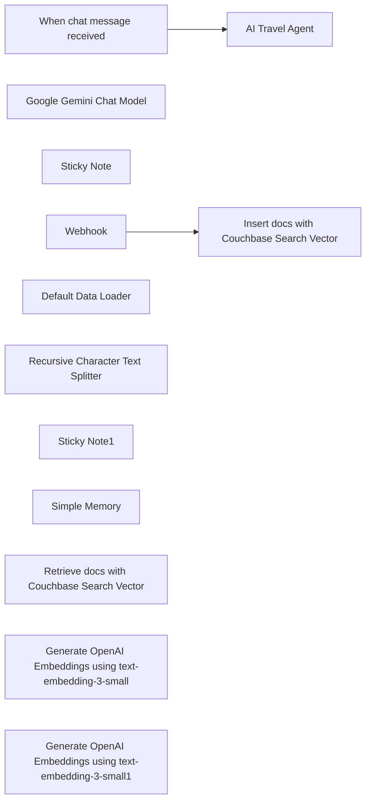

## Fluxo (.json) :

```json
{
  "id": "iGAzT789R7Q1fOOE",
  "meta": {
    "instanceId": "7a1e9dd164c758cbdeb7cf88274e567a937a36ed99d4d22ff24b645841097c48",
    "templateId": "3577",
    "templateCredsSetupCompleted": true
  },
  "name": "Travel Planning Agent with Couchbase Vector Search, Gemini 2.0 Flash and OpenAI",
  "tags": [],
  "nodes": [
    {
      "id": "0f361616-a552-43ed-9754-794780113955",
      "name": "When chat message received",
      "type": "@n8n/n8n-nodes-langchain.chatTrigger",
      "position": [
        380,
        240
      ],
      "webhookId": "c22b2240-ff07-44e5-a1aa-63584150a1cb",
      "parameters": {
        "options": {}
      },
      "typeVersion": 1.1
    },
    {
      "id": "e8b9815d-0fe5-4e7c-a20b-1602384580cd",
      "name": "Google Gemini Chat Model",
      "type": "@n8n/n8n-nodes-langchain.lmChatGoogleGemini",
      "position": [
        560,
        480
      ],
      "parameters": {
        "options": {},
        "modelName": "models/gemini-2.0-flash"
      },
      "typeVersion": 1
    },
    {
      "id": "a4b15997-de4d-4c78-b623-e936442134af",
      "name": "Sticky Note",
      "type": "n8n-nodes-base.stickyNote",
      "position": [
        1260,
        280
      ],
      "parameters": {
        "color": 3,
        "width": 800,
        "height": 500,
        "content": "## AI Travel Agent Powered by Couchbase.\n\n### You will need to:\n1. Setup your Google API Credentials for the Gemini LLM\n2. Setup your OpenAI Credentials for the OpenAI embedding nodes.\n3. Create a Couchbase cluster (using [Couchbase Capella](https://cloud.couchbase.com/) in the cloud, or Couchbase Server)\n4. Add [Database credentials](https://docs.couchbase.com/cloud/clusters/manage-database-users.html#create-database-credentials) with appropriate permissions for the operations you want to perform\n5. Configure [Allowed IP addresses](https://docs.couchbase.com/cloud/clusters/allow-ip-address.html) for your n8n instance. Use `0.0.0.0/0` for easier testing.\n6. Create a bucket, scope, and collection. We recommend the following:\n   - Bucket: `travel-agent`\n   - Scope: `vectors`\n   - Collection: `points-of-interest`\n7. Navigate to the Data Tools, click the Search tab, and click Import Search Index. Upload the following JSON file found [here](https://gist.github.com/ejscribner/6f16343d4b44b1af31e8f344557814b0).\n\n\nOnce all of that is configured you will need to send the loading webhook with some data points (see example).\n\nThis should create vectorized data in  `points-of-interest` collection.\n\nOnce you have data points there try to ask the Agent questions about the data points and test the response. Eg. \"Where should I go for a romantic getaway?\""
      },
      "typeVersion": 1
    },
    {
      "id": "34866f8e-00b0-4706-82d7-491b9531a8b6",
      "name": "Webhook",
      "type": "n8n-nodes-base.webhook",
      "position": [
        800,
        1000
      ],
      "webhookId": "3ca6fbdd-a157-4e9d-9042-237048da85b6",
      "parameters": {
        "path": "3ca6fbdd-a157-4e9d-9042-237048da85b6",
        "options": {
          "rawBody": true
        },
        "httpMethod": "POST"
      },
      "typeVersion": 2
    },
    {
      "id": "26d4e62a-42b0-4e09-8585-827e5bcc9fff",
      "name": "Default Data Loader",
      "type": "@n8n/n8n-nodes-langchain.documentDefaultDataLoader",
      "position": [
        1180,
        1360
      ],
      "parameters": {
        "options": {},
        "jsonData": "={{ $json.body.raw_body.point_of_interest.title }} - {{ $json.body.raw_body.point_of_interest.description }}",
        "jsonMode": "expressionData"
      },
      "typeVersion": 1
    },
    {
      "id": "63fc308f-4d1c-4d24-9b20-68d7e6c2dbba",
      "name": "Recursive Character Text Splitter",
      "type": "@n8n/n8n-nodes-langchain.textSplitterRecursiveCharacterTextSplitter",
      "position": [
        1280,
        1540
      ],
      "parameters": {
        "options": {}
      },
      "typeVersion": 1
    },
    {
      "id": "84f8c32b-8e0c-457c-aaec-17827042674d",
      "name": "Sticky Note1",
      "type": "n8n-nodes-base.stickyNote",
      "position": [
        -60,
        1060
      ],
      "parameters": {
        "width": 720,
        "height": 460,
        "content": "## CURL Command to Ingest Data.\n\nHere is an example of how you can load data into your webhook once its active and ready to get requests.\n\n```\ncurl -X POST \"webhook url\" \\\n  -H \"Content-Type: application/json\" \\\n  -d '{\n    \"raw_body\": {\n      \"point_of_interest\": {\n        \"title\": \"Eiffel Tower\",\n        \"description\": \"Iconic iron lattice tower located on the Champ de Mars in Paris, France.\"\n      }\n    }\n  }'\n```\n\n(replace webhook url with the URL listed in the webhook node)\n\nA shell script to bulk insert six data points can be found [here](https://gist.github.com/ejscribner/355a46a0a383a4878e65e2230b92c6b5). Be sure to activate the workflow and use the production Webhook URL when running the script."
      },
      "typeVersion": 1
    },
    {
      "id": "b2cf8788-849c-4420-b448-bd49caa4941e",
      "name": "Simple Memory",
      "type": "@n8n/n8n-nodes-langchain.memoryBufferWindow",
      "position": [
        720,
        480
      ],
      "parameters": {},
      "typeVersion": 1.3
    },
    {
      "id": "0bf7fef9-f999-42a8-a6a8-ab111fe9a084",
      "name": "AI Travel Agent",
      "type": "@n8n/n8n-nodes-langchain.agent",
      "position": [
        600,
        240
      ],
      "parameters": {
        "options": {
          "maxIterations": 10,
          "systemMessage": "You are a helpful assistant for a trip planner. You have a vector search capability to locate points of interest, Use it and don't invent much."
        }
      },
      "typeVersion": 1.8
    },
    {
      "id": "3af3c8ce-582b-407c-847a-8063f9ad2e1a",
      "name": "Retrieve docs with Couchbase Search Vector",
      "type": "n8n-nodes-couchbase.vectorStoreCouchbaseSearch",
      "position": [
        860,
        500
      ],
      "parameters": {
        "mode": "retrieve-as-tool",
        "topK": 10,
        "options": {},
        "toolName": "PointofinterestKB",
        "embedding": "embedding",
        "textFieldKey": "description",
        "couchbaseScope": {
          "__rl": true,
          "mode": "list",
          "value": "",
          "cachedResultUrl": "",
          "cachedResultName": ""
        },
        "couchbaseBucket": {
          "__rl": true,
          "mode": "list",
          "value": ""
        },
        "toolDescription": "The list of Points of Interest from the database.",
        "vectorIndexName": {
          "__rl": true,
          "mode": "list",
          "value": "",
          "cachedResultUrl": "",
          "cachedResultName": ""
        },
        "couchbaseCollection": {
          "__rl": true,
          "mode": "list",
          "value": "",
          "cachedResultUrl": "",
          "cachedResultName": ""
        }
      },
      "typeVersion": 1.1
    },
    {
      "id": "77a4e857-607a-4bbc-a28d-8a715f9415d5",
      "name": "Insert docs with Couchbase Search Vector",
      "type": "n8n-nodes-couchbase.vectorStoreCouchbaseSearch",
      "position": [
        1100,
        1120
      ],
      "parameters": {
        "mode": "insert",
        "options": {},
        "embedding": "embedding",
        "textFieldKey": "description",
        "couchbaseScope": {
          "__rl": true,
          "mode": "list",
          "value": "",
          "cachedResultUrl": "",
          "cachedResultName": ""
        },
        "couchbaseBucket": {
          "__rl": true,
          "mode": "list",
          "value": ""
        },
        "vectorIndexName": {
          "__rl": true,
          "mode": "list",
          "value": "",
          "cachedResultUrl": "",
          "cachedResultName": ""
        },
        "embeddingBatchSize": 1,
        "couchbaseCollection": {
          "__rl": true,
          "mode": "list",
          "value": "",
          "cachedResultUrl": "",
          "cachedResultName": ""
        }
      },
      "typeVersion": 1.1
    },
    {
      "id": "4c0274c3-6647-4f45-b7d4-d63cfe2102ea",
      "name": "Generate OpenAI Embeddings using text-embedding-3-small",
      "type": "@n8n/n8n-nodes-langchain.embeddingsOpenAi",
      "position": [
        960,
        740
      ],
      "parameters": {
        "options": {}
      },
      "typeVersion": 1.2
    },
    {
      "id": "83f864fa-a298-4738-a102-ca2d283377de",
      "name": "Generate OpenAI Embeddings using text-embedding-3-small1",
      "type": "@n8n/n8n-nodes-langchain.embeddingsOpenAi",
      "position": [
        1000,
        1340
      ],
      "parameters": {
        "options": {}
      },
      "typeVersion": 1.2
    }
  ],
  "active": true,
  "pinData": {},
  "settings": {
    "executionOrder": "v1"
  },
  "versionId": "80e40e5a-35a3-4fa4-b90e-ac9d76897bbd",
  "connections": {
    "Webhook": {
      "main": [
        [
          {
            "node": "Insert docs with Couchbase Search Vector",
            "type": "main",
            "index": 0
          }
        ]
      ]
    },
    "Simple Memory": {
      "ai_memory": [
        [
          {
            "node": "AI Travel Agent",
            "type": "ai_memory",
            "index": 0
          }
        ]
      ]
    },
    "Default Data Loader": {
      "ai_document": [
        [
          {
            "node": "Insert docs with Couchbase Search Vector",
            "type": "ai_document",
            "index": 0
          }
        ]
      ]
    },
    "Google Gemini Chat Model": {
      "ai_languageModel": [
        [
          {
            "node": "AI Travel Agent",
            "type": "ai_languageModel",
            "index": 0
          }
        ]
      ]
    },
    "When chat message received": {
      "main": [
        [
          {
            "node": "AI Travel Agent",
            "type": "main",
            "index": 0
          }
        ]
      ]
    },
    "Recursive Character Text Splitter": {
      "ai_textSplitter": [
        [
          {
            "node": "Default Data Loader",
            "type": "ai_textSplitter",
            "index": 0
          }
        ]
      ]
    },
    "Retrieve docs with Couchbase Search Vector": {
      "ai_tool": [
        [
          {
            "node": "AI Travel Agent",
            "type": "ai_tool",
            "index": 0
          }
        ]
      ]
    },
    "Generate OpenAI Embeddings using text-embedding-3-small": {
      "ai_embedding": [
        [
          {
            "node": "Retrieve docs with Couchbase Search Vector",
            "type": "ai_embedding",
            "index": 0
          }
        ]
      ]
    },
    "Generate OpenAI Embeddings using text-embedding-3-small1": {
      "ai_embedding": [
        [
          {
            "node": "Insert docs with Couchbase Search Vector",
            "type": "ai_embedding",
            "index": 0
          }
        ]
      ]
    }
  }
}
```

<a id="template-1258"></a>

## Template 1258 - Pesquisa profunda e compilação de relatório

- **Nome:** Pesquisa profunda e compilação de relatório
- **Descrição:** Automatiza uma pesquisa profunda na web a partir de uma solicitação do usuário, coleta e sintetiza achados e publica um relatório detalhado em uma página de destino.
- **Funcionalidade:** • Coleta via formulário: Recebe a solicitação do usuário com parâmetros de profundidade e abrangência.
• Geração de perguntas de clarificação: Cria até 3 perguntas para refinar o escopo quando necessário.
• Geração de subqueries SERP: Cria consultas de pesquisa concisas e variadas para explorar o tópico.
• Busca e raspagem web recursiva: Executa buscas e extrai conteúdo de páginas (configurável por profundidade e abrangência).
• Extração de aprendizados (learnings): Usa um modelo de raciocínio para gerar até 3 aprendizados únicos por conjunto de resultados, incluindo entidades e métricas.
• Acumulação e controle de loop: Agrega aprendizados e URLs ao longo de iterações e interrompe quando o limite de profundidade é atingido.
• Geração de relatório final: Compila todos os aprendizados em um relatório em markdown, longo e estruturado.
• Conversão e formatação para publicação: Converte o markdown para HTML, segmenta em blocos e transforma em blocos no formato da API de destino.
• Publicação e atualização de página de destino: Cria uma página placeholder no começo, atualiza o status (In progress → Done) e envia os blocos finais à página.
• Anexar lista de fontes: Gera e acrescenta uma seção com URLs das fontes pesquisadas.
• Execução assíncrona e subworkflows: Executa o trabalho de forma independente e recursiva usando subexecuções para escalabilidade.
• Tratamento de erros e validações: Detecta erros de autenticação nos serviços externos e inclui lógica de retry/validação para uploads.
- **Ferramentas:** • OpenAI (o3-mini): Modelo de raciocínio usado para extrair aprendizados e compilar o relatório final.
• Google Gemini (PaLM, gemini-2.0-flash): Utilizado para converter HTML/markdown em blocos compatíveis com a API de destino.
• Apify: Serviço de busca e raspagem web para executar pesquisas SERP e retornar conteúdo em formato markdown.
• Notion (API): Base de destino para criar a página de relatório, atualizar status e inserir blocos finais.
• APIs HTTP genéricas: Chamadas para acionar atores externos, enviar e receber resultados e gerenciar integrações.

## Fluxo visual

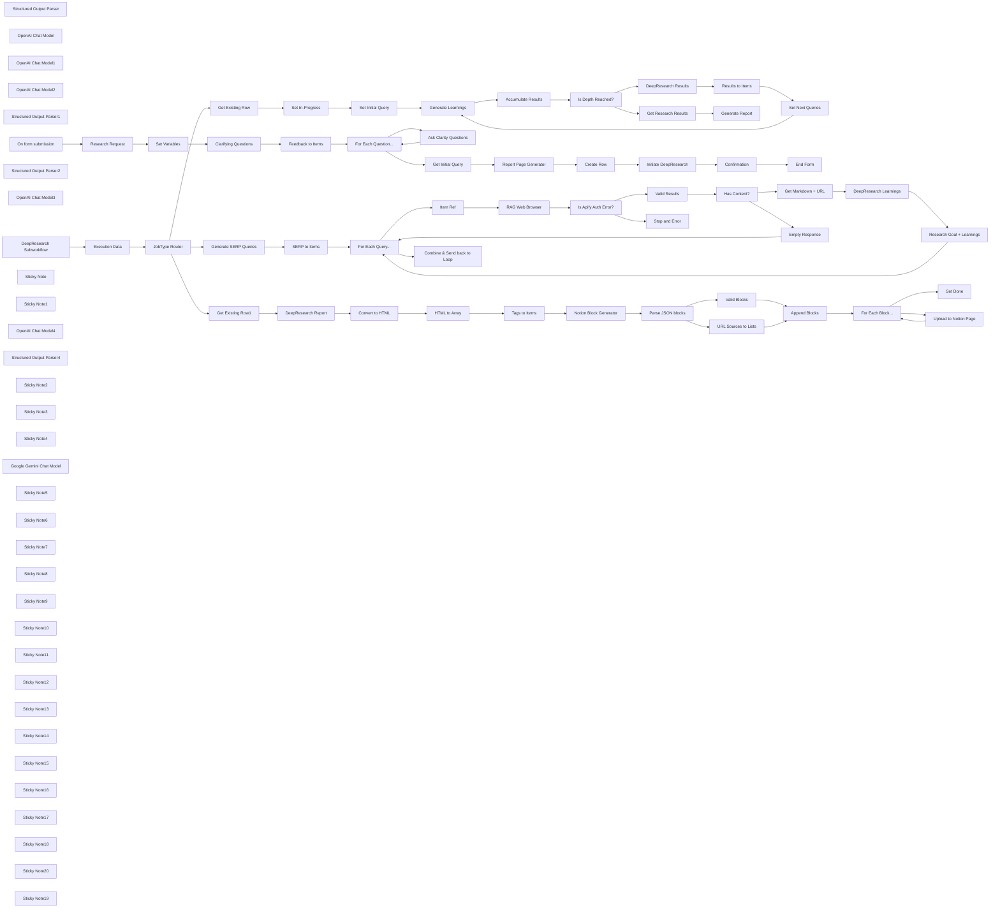

## Fluxo (.json) :

```json
{
  "meta": {
    "instanceId": "408f9fb9940c3cb18ffdef0e0150fe342d6e655c3a9fac21f0f644e8bedabcd9",
    "templateCredsSetupCompleted": true
  },
  "nodes": [
    {
      "id": "a342005e-a88e-419b-b929-56ecbba4a936",
      "name": "Structured Output Parser",
      "type": "@n8n/n8n-nodes-langchain.outputParserStructured",
      "position": [
        1300,
        1180
      ],
      "parameters": {
        "schemaType": "manual",
        "inputSchema": "{\n  \"type\": \"object\",\n  \"properties\": {\n    \"learnings\": {\n      \"type\": \"array\",\n      \"description\": \"List of learnings, max of 3.\",\n      \"items\": { \"type\": \"string\" }\n    },\n    \"followUpQuestions\": {\n      \"type\": \"array\",\n      \"items\": {\n        \"type\": \"string\",\n        \"description\": \"List of follow-up questions to research the topic further, max of 3.\"\n      }\n    }\n  }\n}"
      },
      "typeVersion": 1.2
    },
    {
      "id": "126b8151-6d20-43b8-8028-8163112c4c5b",
      "name": "Set Variables",
      "type": "n8n-nodes-base.set",
      "position": [
        -1360,
        -460
      ],
      "parameters": {
        "options": {},
        "assignments": {
          "assignments": [
            {
              "id": "df28b12e-7c20-4ff5-b5b8-dc773aa14d4b",
              "name": "request_id",
              "type": "string",
              "value": "={{ $execution.id }}"
            },
            {
              "id": "9362c1e7-717d-444a-8ea2-6b5f958c9f3f",
              "name": "prompt",
              "type": "string",
              "value": "={{ $json['What would you like to research?'] }}"
            },
            {
              "id": "09094be4-7844-4a9e-af82-cc8e39322398",
              "name": "depth",
              "type": "number",
              "value": "={{\n!isNaN($json['input-depth'][0].toNumber())\n  ? $json['input-depth'][0].toNumber()\n  : 1\n}}"
            },
            {
              "id": "3fc30a30-7806-4013-835d-97e27ddd7ae1",
              "name": "breadth",
              "type": "number",
              "value": "={{\n!isNaN($json['input-breadth'][0].toNumber())\n  ? $json['input-breadth'][0].toNumber()\n  : 1\n}}"
            }
          ]
        }
      },
      "typeVersion": 3.4
    },
    {
      "id": "1d0fb87b-263d-46c2-b016-a29ba1d407ab",
      "name": "OpenAI Chat Model",
      "type": "@n8n/n8n-nodes-langchain.lmChatOpenAi",
      "position": [
        1120,
        1180
      ],
      "parameters": {
        "model": {
          "__rl": true,
          "mode": "id",
          "value": "o3-mini"
        },
        "options": {}
      },
      "credentials": {
        "openAiApi": {
          "id": "8gccIjcuf3gvaoEr",
          "name": "OpenAi account"
        }
      },
      "typeVersion": 1.2
    },
    {
      "id": "39b300d9-11ba-44f6-8f43-2fe256fe4856",
      "name": "OpenAI Chat Model1",
      "type": "@n8n/n8n-nodes-langchain.lmChatOpenAi",
      "position": [
        -860,
        1760
      ],
      "parameters": {
        "model": {
          "__rl": true,
          "mode": "id",
          "value": "o3-mini"
        },
        "options": {}
      },
      "credentials": {
        "openAiApi": {
          "id": "8gccIjcuf3gvaoEr",
          "name": "OpenAi account"
        }
      },
      "typeVersion": 1.2
    },
    {
      "id": "018da029-a796-45c5-947c-791e087fe934",
      "name": "OpenAI Chat Model2",
      "type": "@n8n/n8n-nodes-langchain.lmChatOpenAi",
      "position": [
        -1060,
        -300
      ],
      "parameters": {
        "model": {
          "__rl": true,
          "mode": "id",
          "value": "o3-mini"
        },
        "options": {}
      },
      "credentials": {
        "openAiApi": {
          "id": "8gccIjcuf3gvaoEr",
          "name": "OpenAi account"
        }
      },
      "typeVersion": 1.2
    },
    {
      "id": "525da936-a9eb-4523-b27a-ff6ae7b0e5ef",
      "name": "Structured Output Parser1",
      "type": "@n8n/n8n-nodes-langchain.outputParserStructured",
      "position": [
        -840,
        -300
      ],
      "parameters": {
        "schemaType": "manual",
        "inputSchema": "{\n  \"type\": \"object\",\n  \"properties\": {\n    \"questions\": {\n      \"type\": \"array\",\n      \"description\": \"Follow up questions to clarify the research direction, max of 3.\",\n      \"items\": {\n          \"type\": \"string\"\n      }\n    }\n  }\n}"
      },
      "typeVersion": 1.2
    },
    {
      "id": "e6664883-cff4-4e09-881e-6b6f684f9cac",
      "name": "On form submission",
      "type": "n8n-nodes-base.formTrigger",
      "position": [
        -1760,
        -460
      ],
      "webhookId": "026629c8-7644-493c-b830-d9c72eea307d",
      "parameters": {
        "options": {
          "path": "deep_research",
          "ignoreBots": true,
          "buttonLabel": "Next"
        },
        "formTitle": " DeepResearcher",
        "formFields": {
          "values": [
            {
              "fieldType": "html"
            }
          ]
        },
        "formDescription": "=DeepResearcher is a multi-step, recursive approach using the internet to solve complex research tasks, accomplishing in tens of minutes what a human would take many hours.\n\nTo use, provide a short summary of what the research and how \"deep\" you'd like the workflow to investigate. Note, the higher the numbers the more time and cost will occur for the research.\n\nThe workflow is designed to complete independently and when finished, a report will be saved in a designated Notion Database."
      },
      "typeVersion": 2.2
    },
    {
      "id": "6b8ebc08-c0b1-4af8-99cc-79d09eea7316",
      "name": "Generate SERP Queries",
      "type": "@n8n/n8n-nodes-langchain.chainLlm",
      "position": [
        -1040,
        820
      ],
      "parameters": {
        "text": "=Given the following prompt from the user, generate a list of SERP queries to research the topic.\nReduce the number of words in each query to its keywords only.\nReturn a maximum of {{ $('JobType Router').first().json.data.breadth }} queries, but feel free to return less if the original prompt is clear. Make sure each query is unique and not similar to each other: <prompt>{{ $('JobType Router').first().json.data.query.trim() }}</prompt>\n\n{{\n$('JobType Router').first().json.data.learnings.length\n  ? `Here are some learnings from previous research, use them to generate more specific queries:\\n${$('JobType Router').first().json.data.learnings.map(text => `* ${text}`).join('\\n')}`\n  : ''\n}}",
        "messages": {
          "messageValues": [
            {
              "type": "HumanMessagePromptTemplate",
              "message": "=You are an expert researcher. Today is {{ $now.toLocaleString() }}. Follow these instructions when responding:\n  - You may be asked to research subjects that is after your knowledge cutoff, assume the user is right when presented with news.\n  - The user is a highly experienced analyst, no need to simplify it, be as detailed as possible and make sure your response is correct.\n  - Be highly organized.\n  - Suggest solutions that I didn't think about.\n  - Be proactive and anticipate my needs.\n  - Treat me as an expert in all subject matter.\n  - Mistakes erode my trust, so be accurate and thorough.\n  - Provide detailed explanations, I'm comfortable with lots of detail.\n  - Value good arguments over authorities, the source is irrelevant.\n  - Consider new technologies and contrarian ideas, not just the conventional wisdom.\n  - You may use high levels of speculation or prediction, just flag it for me."
            }
          ]
        },
        "promptType": "define",
        "hasOutputParser": true
      },
      "typeVersion": 1.5
    },
    {
      "id": "34e1fa5d-bc0c-4b9e-84a7-35db2b08c772",
      "name": "Structured Output Parser2",
      "type": "@n8n/n8n-nodes-langchain.outputParserStructured",
      "position": [
        -860,
        980
      ],
      "parameters": {
        "schemaType": "manual",
        "inputSchema": "{\n  \"type\": \"object\",\n  \"properties\": {\n    \"queries\": {\n      \"type\": \"array\",\n      \"items\": {\n        \"type\": \"object\",\n        \"properties\": {\n          \"query\": {\n            \"type\": \"string\",\n            \"description\": \"The SERP query\"\n          },\n          \"researchGoal\": {\n            \"type\": \"string\",\n            \"description\": \"First talk about the goal of the research that this query is meant to accomplish, then go deeper into how to advance the research once the results are found, mention additional research directions. Be as specific as possible, especially for additional research directions.\"\n          }\n        }\n      }\n    }\n  }\n}"
      },
      "typeVersion": 1.2
    },
    {
      "id": "be6dd6a2-aacf-4682-8f13-8ae24c4249a3",
      "name": "OpenAI Chat Model3",
      "type": "@n8n/n8n-nodes-langchain.lmChatOpenAi",
      "position": [
        -1040,
        980
      ],
      "parameters": {
        "model": {
          "__rl": true,
          "mode": "id",
          "value": "o3-mini"
        },
        "options": {}
      },
      "credentials": {
        "openAiApi": {
          "id": "8gccIjcuf3gvaoEr",
          "name": "OpenAi account"
        }
      },
      "typeVersion": 1.2
    },
    {
      "id": "d5ce6e21-cd07-44fa-b6d0-90bf7531ee01",
      "name": "Set Initial Query",
      "type": "n8n-nodes-base.set",
      "position": [
        -580,
        180
      ],
      "parameters": {
        "options": {},
        "assignments": {
          "assignments": [
            {
              "id": "acb41e93-70c6-41a3-be0f-e5a74ec3ec88",
              "name": "query",
              "type": "string",
              "value": "={{ $('JobType Router').first().json.data.query }}"
            },
            {
              "id": "7fc54063-b610-42bc-a250-b1e8847c4d1e",
              "name": "learnings",
              "type": "array",
              "value": "={{ $('JobType Router').first().json.data.learnings }}"
            },
            {
              "id": "e8f1c158-56fb-41c8-8d86-96add16289bb",
              "name": "breadth",
              "type": "number",
              "value": "={{ $('JobType Router').first().json.data.breadth }}"
            }
          ]
        }
      },
      "typeVersion": 3.4
    },
    {
      "id": "9de6e4a1-a2b5-4a6f-948e-a0585edcae48",
      "name": "SERP to Items",
      "type": "n8n-nodes-base.splitOut",
      "position": [
        -700,
        820
      ],
      "parameters": {
        "options": {},
        "fieldToSplitOut": "output.queries"
      },
      "typeVersion": 1
    },
    {
      "id": "2c9c4cdf-942b-494c-83fb-ed5ec37385ee",
      "name": "Item Ref",
      "type": "n8n-nodes-base.noOp",
      "position": [
        -220,
        1020
      ],
      "parameters": {},
      "typeVersion": 1
    },
    {
      "id": "703c57af-de19-4f00-b580-711a272fa5ca",
      "name": "Research Goal + Learnings",
      "type": "n8n-nodes-base.set",
      "position": [
        1460,
        1160
      ],
      "parameters": {
        "options": {},
        "assignments": {
          "assignments": [
            {
              "id": "9acec2cc-64c8-4e62-bed4-c3d9ffab1379",
              "name": "researchGoal",
              "type": "string",
              "value": "={{ $('Item Ref').first().json.researchGoal }}"
            },
            {
              "id": "1b2d2dad-429b-4fc9-96c5-498f572a85c3",
              "name": "learnings",
              "type": "array",
              "value": "={{ $json.output.learnings }}"
            },
            {
              "id": "7025f533-02ab-4031-9413-43390fb61f05",
              "name": "followUpQuestions",
              "type": "string",
              "value": "={{ $json.output.followUpQuestions }}"
            },
            {
              "id": "c9e34ea4-5606-46d6-8d66-cb42d772a8b4",
              "name": "urls",
              "type": "array",
              "value": "={{\n$('Get Markdown + URL')\n  .all()\n  .map(item => item.json.url)\n}}"
            }
          ]
        }
      },
      "typeVersion": 3.4
    },
    {
      "id": "16ed2835-3af4-45e3-b5a7-e4342d571aa0",
      "name": "Accumulate Results",
      "type": "n8n-nodes-base.set",
      "position": [
        -200,
        180
      ],
      "parameters": {
        "options": {},
        "assignments": {
          "assignments": [
            {
              "id": "db509e90-9a86-431f-8149-4094d22666cc",
              "name": "should_stop",
              "type": "boolean",
              "value": "={{\n$runIndex >= ($('JobType Router').first().json.data.depth)\n}}"
            },
            {
              "id": "90986e2b-8aca-4a22-a9db-ed8809d6284d",
              "name": "all_learnings",
              "type": "array",
              "value": "={{\nArray($runIndex+1)\n  .fill(0)\n  .flatMap((_,idx) => {\n    try {\n      return $('Generate Learnings')\n        .all(0,idx)\n        .flatMap(item => item.json.data.flatMap(d => d.learnings))\n    } catch (e) {\n      return []\n    }\n  })\n}}"
            },
            {
              "id": "3eade958-e8ab-4975-aac4-f4a4a983c163",
              "name": "all_urls",
              "type": "array",
              "value": "={{\nArray($runIndex+1)\n  .fill(0)\n  .flatMap((_,idx) => {\n    try {\n      return $('Generate Learnings')\n        .all(0,idx)\n        .flatMap(item => item.json.data.flatMap(d => d.urls))\n    } catch (e) {\n      return []\n    }\n  })\n}}"
            }
          ]
        }
      },
      "executeOnce": true,
      "typeVersion": 3.4
    },
    {
      "id": "0011773e-85c6-4fe1-8554-c23ce50706d0",
      "name": "DeepResearch Results",
      "type": "n8n-nodes-base.set",
      "position": [
        160,
        360
      ],
      "parameters": {
        "mode": "raw",
        "options": {},
        "jsonOutput": "={{ $('Generate Learnings').item.json }}"
      },
      "typeVersion": 3.4
    },
    {
      "id": "c0b646d0-1246-4864-8f79-8b7a66e4e083",
      "name": "Results to Items",
      "type": "n8n-nodes-base.splitOut",
      "position": [
        320,
        360
      ],
      "parameters": {
        "options": {},
        "fieldToSplitOut": "data"
      },
      "typeVersion": 1
    },
    {
      "id": "3c52ec3e-c952-4b5f-ab12-f1b5d02aba74",
      "name": "Set Next Queries",
      "type": "n8n-nodes-base.set",
      "position": [
        480,
        360
      ],
      "parameters": {
        "options": {},
        "assignments": {
          "assignments": [
            {
              "id": "d88bfe95-9e73-4d25-b45c-9f164b940b0e",
              "name": "query",
              "type": "string",
              "value": "=Previous research goal: {{ $json.researchGoal }}\nFollow-up research directions: {{ $json.followUpQuestions.map(q => `\\n${q}`).join('') }}"
            },
            {
              "id": "4aa20690-d998-458a-b1e4-0d72e6a68e6b",
              "name": "learnings",
              "type": "array",
              "value": "={{ $('Accumulate Results').item.json.all_learnings }}"
            },
            {
              "id": "89acafae-b04a-4d5d-b08b-656e715654e4",
              "name": "breadth",
              "type": "number",
              "value": "={{ $('JobType Router').first().json.data.breadth }}"
            }
          ]
        }
      },
      "typeVersion": 3.4
    },
    {
      "id": "bc59dddc-2b03-481f-91c6-ea8aa378eef0",
      "name": "For Each Query...",
      "type": "n8n-nodes-base.splitInBatches",
      "position": [
        -420,
        860
      ],
      "parameters": {
        "options": {}
      },
      "typeVersion": 3
    },
    {
      "id": "903c31c4-5fdc-4cb6-8baa-402555997266",
      "name": "Feedback to Items",
      "type": "n8n-nodes-base.splitOut",
      "position": [
        -720,
        -460
      ],
      "parameters": {
        "options": {},
        "fieldToSplitOut": "output.questions"
      },
      "typeVersion": 1
    },
    {
      "id": "59ff671d-5d4f-42ff-b94f-ed30a8531e55",
      "name": "Ask Clarity Questions",
      "type": "n8n-nodes-base.form",
      "position": [
        -360,
        -380
      ],
      "webhookId": "d3375ba6-0008-4fcb-96bc-110374de2603",
      "parameters": {
        "options": {
          "formTitle": "DeepResearcher",
          "buttonLabel": "Answer",
          "formDescription": "=\n<p style=\"text-align:left\">\nAnswer the following clarification questions to assist the DeepResearcher better under the research topic.\n</p>\n<hr style=\"display:block;margin-top:16px;margin-bottom:0\" />\n<p style=\"text-align:left;font-family:sans-serif;font-weight:700;\">\nTotal {{ $('Feedback to Items').all().length }} questions.\n</p>"
        },
        "formFields": {
          "values": [
            {
              "fieldType": "textarea",
              "fieldLabel": "={{ $json[\"output.questions\"] }}",
              "placeholder": "=",
              "requiredField": true
            }
          ]
        }
      },
      "typeVersion": 1
    },
    {
      "id": "1c2cf79b-f1a1-4ecc-bb45-3d4460c947bd",
      "name": "For Each Question...",
      "type": "n8n-nodes-base.splitInBatches",
      "position": [
        -540,
        -460
      ],
      "parameters": {
        "options": {}
      },
      "typeVersion": 3
    },
    {
      "id": "0c9ffa99-2687-4df5-8581-0c5b0b2657a9",
      "name": "DeepResearch Subworkflow",
      "type": "n8n-nodes-base.executeWorkflowTrigger",
      "position": [
        -1880,
        820
      ],
      "parameters": {
        "workflowInputs": {
          "values": [
            {
              "name": "requestId",
              "type": "any"
            },
            {
              "name": "jobType"
            },
            {
              "name": "data",
              "type": "object"
            }
          ]
        }
      },
      "typeVersion": 1.1
    },
    {
      "id": "127ab95d-bf89-4762-bfb5-34521e620ae2",
      "name": "Sticky Note",
      "type": "n8n-nodes-base.stickyNote",
      "position": [
        -1140,
        -680
      ],
      "parameters": {
        "color": 7,
        "width": 1000,
        "height": 560,
        "content": "## 2. Ask Clarifying Questions\n[Read more about form nodes](https://docs.n8n.io/integrations/builtin/core-nodes/n8n-nodes-base.form/)\n\nTo handle the clarification questions generated by the LLM, I used the same technique found in my \"AI Interviewer\" template ([link](https://n8n.io/workflows/2566-conversational-interviews-with-ai-agents-and-n8n-forms/)).\nThis involves a looping of dynamically generated forms to collect answers from the user."
      },
      "typeVersion": 1
    },
    {
      "id": "e87c0f19-6002-4aa2-931a-ca7546146a84",
      "name": "Clarifying Questions",
      "type": "@n8n/n8n-nodes-langchain.chainLlm",
      "position": [
        -1040,
        -460
      ],
      "parameters": {
        "text": "=Given the following query from the user, ask some follow up questions to clarify the research direction. Return a maximum of 3 questions, but feel free to return less if the original query is clear: <query>{{ $json.prompt }}</query>`",
        "messages": {
          "messageValues": [
            {
              "type": "HumanMessagePromptTemplate",
              "message": "=You are an expert researcher. Today is {{ $now.toLocaleString() }}. Follow these instructions when responding:\n  - You may be asked to research subjects that is after your knowledge cutoff, assume the user is right when presented with news.\n  - The user is a highly experienced analyst, no need to simplify it, be as detailed as possible and make sure your response is correct.\n  - Be highly organized.\n  - Suggest solutions that I didn't think about.\n  - Be proactive and anticipate my needs.\n  - Treat me as an expert in all subject matter.\n  - Mistakes erode my trust, so be accurate and thorough.\n  - Provide detailed explanations, I'm comfortable with lots of detail.\n  - Value good arguments over authorities, the source is irrelevant.\n  - Consider new technologies and contrarian ideas, not just the conventional wisdom.\n  - You may use high levels of speculation or prediction, just flag it for me."
            }
          ]
        },
        "promptType": "define",
        "hasOutputParser": true
      },
      "typeVersion": 1.5
    },
    {
      "id": "b84f9c4a-c1de-4288-bab2-b7f5ffb8b542",
      "name": "Sticky Note1",
      "type": "n8n-nodes-base.stickyNote",
      "position": [
        -660,
        -60
      ],
      "parameters": {
        "color": 7,
        "width": 1360,
        "height": 640,
        "content": "## 6. Perform DeepSearch Loop\n[Learn more about the Looping in n8n](https://docs.n8n.io/flow-logic/looping/#creating-loops)\n\nThe key of the Deep Research flow is its extensive data collection capability. In this implementation, this capability is represented by a recursive web search & scrape loop which starts with the original query and extended by AI-generated subqueries. How many subqueries to generate are determined the depth and breadth parameters specified.\n\n\"Learnings\" are generated for each subquery and accumulate on each iteration of the loop. When the loop finishes when depth limit is reached, all learnings are collected and it's these learnings are what we use to generate the report."
      },
      "typeVersion": 1
    },
    {
      "id": "0a8c3a01-d4d4-4075-9521-035b7df9aa5a",
      "name": "End Form",
      "type": "n8n-nodes-base.form",
      "position": [
        960,
        -420
      ],
      "webhookId": "88f2534b-2b82-4b40-a4bc-97d96384e8fd",
      "parameters": {
        "options": {},
        "operation": "completion",
        "completionTitle": "=Thank you for using DeepResearcher.",
        "completionMessage": "=You may now close this window."
      },
      "typeVersion": 1
    },
    {
      "id": "44a3603f-a5a1-4031-8c5f-c748b1007b47",
      "name": "Initiate DeepResearch",
      "type": "n8n-nodes-base.executeWorkflow",
      "position": [
        600,
        -420
      ],
      "parameters": {
        "mode": "each",
        "options": {
          "waitForSubWorkflow": false
        },
        "workflowId": {
          "__rl": true,
          "mode": "id",
          "value": "={{ $workflow.id }}"
        },
        "workflowInputs": {
          "value": {
            "data": "={{\n{\n  \"query\": $('Get Initial Query').first().json.query,\n  \"learnings\": [],\n  \"depth\": $('Set Variables').first().json.depth,\n  \"breadth\": $('Set Variables').first().json.breadth,\n}\n}}",
            "jobType": "deepresearch_initiate",
            "requestId": "={{ $('Set Variables').first().json.request_id }}"
          },
          "schema": [
            {
              "id": "requestId",
              "display": true,
              "removed": false,
              "required": false,
              "displayName": "requestId",
              "defaultMatch": false,
              "canBeUsedToMatch": true
            },
            {
              "id": "jobType",
              "type": "string",
              "display": true,
              "removed": false,
              "required": false,
              "displayName": "jobType",
              "defaultMatch": false,
              "canBeUsedToMatch": true
            },
            {
              "id": "data",
              "type": "object",
              "display": true,
              "removed": false,
              "required": false,
              "displayName": "data",
              "defaultMatch": false,
              "canBeUsedToMatch": true
            }
          ],
          "mappingMode": "defineBelow",
          "matchingColumns": [],
          "attemptToConvertTypes": false,
          "convertFieldsToString": true
        }
      },
      "typeVersion": 1.2
    },
    {
      "id": "b243eb76-9ed9-4327-968f-c21844bc9df4",
      "name": "Execution Data",
      "type": "n8n-nodes-base.executionData",
      "position": [
        -1700,
        820
      ],
      "parameters": {
        "dataToSave": {
          "values": [
            {
              "key": "requestId",
              "value": "={{ $json.requestId }}"
            },
            {
              "key": "=jobType",
              "value": "={{ $json.jobType }}"
            }
          ]
        }
      },
      "typeVersion": 1
    },
    {
      "id": "57ca4b22-9349-4b34-8f6b-c502905b5172",
      "name": "JobType Router",
      "type": "n8n-nodes-base.switch",
      "position": [
        -1520,
        820
      ],
      "parameters": {
        "rules": {
          "values": [
            {
              "outputKey": "initiate",
              "conditions": {
                "options": {
                  "version": 2,
                  "leftValue": "",
                  "caseSensitive": true,
                  "typeValidation": "strict"
                },
                "combinator": "and",
                "conditions": [
                  {
                    "operator": {
                      "type": "string",
                      "operation": "equals"
                    },
                    "leftValue": "={{ $json.jobType }}",
                    "rightValue": "deepresearch_initiate"
                  }
                ]
              },
              "renameOutput": true
            },
            {
              "outputKey": "learnings",
              "conditions": {
                "options": {
                  "version": 2,
                  "leftValue": "",
                  "caseSensitive": true,
                  "typeValidation": "strict"
                },
                "combinator": "and",
                "conditions": [
                  {
                    "id": "ecbfa54d-fc97-48c5-8d3d-f0538b8d727b",
                    "operator": {
                      "name": "filter.operator.equals",
                      "type": "string",
                      "operation": "equals"
                    },
                    "leftValue": "={{ $json.jobType }}",
                    "rightValue": "deepresearch_learnings"
                  }
                ]
              },
              "renameOutput": true
            },
            {
              "outputKey": "report",
              "conditions": {
                "options": {
                  "version": 2,
                  "leftValue": "",
                  "caseSensitive": true,
                  "typeValidation": "strict"
                },
                "combinator": "and",
                "conditions": [
                  {
                    "id": "392f9a98-ec22-4e57-9c8e-0e1ed6b7dafa",
                    "operator": {
                      "name": "filter.operator.equals",
                      "type": "string",
                      "operation": "equals"
                    },
                    "leftValue": "={{ $json.jobType }}",
                    "rightValue": "deepresearch_report"
                  }
                ]
              },
              "renameOutput": true
            }
          ]
        },
        "options": {}
      },
      "typeVersion": 3.2
    },
    {
      "id": "1f880fbd-71ba-4e5b-8d99-9654ae0c949f",
      "name": "OpenAI Chat Model4",
      "type": "@n8n/n8n-nodes-langchain.lmChatOpenAi",
      "position": [
        -20,
        -280
      ],
      "parameters": {
        "model": {
          "__rl": true,
          "mode": "id",
          "value": "o3-mini"
        },
        "options": {}
      },
      "credentials": {
        "openAiApi": {
          "id": "8gccIjcuf3gvaoEr",
          "name": "OpenAi account"
        }
      },
      "typeVersion": 1.2
    },
    {
      "id": "ea65589b-106f-4ff1-a6f2-763393c2cb07",
      "name": "Get Initial Query",
      "type": "n8n-nodes-base.set",
      "position": [
        -360,
        -540
      ],
      "parameters": {
        "options": {},
        "assignments": {
          "assignments": [
            {
              "id": "14b77741-c3c3-4bd2-be6e-37bd09fcea2b",
              "name": "query",
              "type": "string",
              "value": "=Initial query: {{ $('Set Variables').first().json.prompt }}\nFollow-up Questions and Answers:\n{{\n$input.all()\n  .map(item => {\n    const q = Object.keys(item.json)[0];\n    const a = item.json[q];\n    return `question: ${q}\\nanswer: ${a}`;\n  })\n  .join('\\n')\n}}"
            }
          ]
        }
      },
      "executeOnce": true,
      "typeVersion": 3.4
    },
    {
      "id": "09a363f2-6300-430d-8c7e-3e1611ab8e68",
      "name": "Structured Output Parser4",
      "type": "@n8n/n8n-nodes-langchain.outputParserStructured",
      "position": [
        160,
        -280
      ],
      "parameters": {
        "schemaType": "manual",
        "inputSchema": "{\n  \"type\": \"object\",\n  \"properties\": {\n    \"title\": {\n      \"type\": \"string\",\n      \"description\":\" A short title summarising the research topic\"\n    },\n    \"description\": {\n      \"type\": \"string\",\n      \"description\": \"A short description to summarise the research topic\"\n    }\n  }\n}"
      },
      "typeVersion": 1.2
    },
    {
      "id": "9910804e-8376-4e2e-a011-7d32ca951edf",
      "name": "Create Row",
      "type": "n8n-nodes-base.notion",
      "position": [
        300,
        -420
      ],
      "parameters": {
        "title": "={{ $json.output.title }}",
        "options": {},
        "resource": "databasePage",
        "databaseId": {
          "__rl": true,
          "mode": "list",
          "value": "19486dd6-0c0c-80da-9cb7-eb1468ea9afd",
          "cachedResultUrl": "https://www.notion.so/19486dd60c0c80da9cb7eb1468ea9afd",
          "cachedResultName": "n8n DeepResearch"
        },
        "propertiesUi": {
          "propertyValues": [
            {
              "key": "Description|rich_text",
              "textContent": "={{ $json.output.description }}"
            },
            {
              "key": "Status|status",
              "statusValue": "Not started"
            },
            {
              "key": "Request ID|rich_text",
              "textContent": "={{ $('Set Variables').first().json.request_id }}"
            },
            {
              "key": "Name|title",
              "title": "={{ $json.output.title }}"
            }
          ]
        }
      },
      "credentials": {
        "notionApi": {
          "id": "iHBHe7ypzz4mZExM",
          "name": "Notion account"
        }
      },
      "typeVersion": 2.2
    },
    {
      "id": "9f06d9ae-220d-4f5b-bcbf-761b88ba255c",
      "name": "Report Page Generator",
      "type": "@n8n/n8n-nodes-langchain.chainLlm",
      "position": [
        -20,
        -420
      ],
      "parameters": {
        "text": "=Create a suitable title for the research report which will be created from the user's query.\n<query>{{ $json.query }}</query>",
        "promptType": "define",
        "hasOutputParser": true
      },
      "typeVersion": 1.5
    },
    {
      "id": "5b434bdc-e1e7-4348-b03d-dcbb6a485263",
      "name": "Sticky Note2",
      "type": "n8n-nodes-base.stickyNote",
      "position": [
        -120,
        -680
      ],
      "parameters": {
        "color": 7,
        "width": 600,
        "height": 560,
        "content": "## 3. Create Empty Report Page in Notion\n[Read more about the Notion node](https://docs.n8n.io/integrations/builtin/app-nodes/n8n-nodes-base.notion/)\n\nSome thought was given where to upload the final report and Notion was selected due to familiarity. This can be easily changed to whatever wiki tools you prefer.\n\nIf you're following along however, here's the Notion database you need to replicate - [Jim's n8n DeepResearcher Database](https://jimleuk.notion.site/19486dd60c0c80da9cb7eb1468ea9afd?v=19486dd60c0c805c8e0c000ce8c87acf)."
      },
      "typeVersion": 1
    },
    {
      "id": "0cfb3548-14a8-4dcc-8362-a7ca1d4c328f",
      "name": "Sticky Note3",
      "type": "n8n-nodes-base.stickyNote",
      "position": [
        500,
        -680
      ],
      "parameters": {
        "color": 7,
        "width": 640,
        "height": 560,
        "content": "## 4. Trigger DeepResearch Asynchronously\n[Learn more about the Execute Trigger node](https://docs.n8n.io/integrations/builtin/core-nodes/n8n-nodes-base.executeworkflow/)\n\nn8n handles asynchronous jobs by spinning them off as separate executions. This basically means the user doesn't have to wait or keep their browser window open for our researcher to do its job.\n\nOnce we initiate the Deepresearcher job, we can close out the onboarding journey for a nice user experience."
      },
      "typeVersion": 1
    },
    {
      "id": "b90456d0-fae3-4809-bc13-55649e6e919a",
      "name": "Sticky Note4",
      "type": "n8n-nodes-base.stickyNote",
      "position": [
        -1160,
        620
      ],
      "parameters": {
        "color": 7,
        "width": 620,
        "height": 540,
        "content": "## 7. Generate Search Queries\n[Learn more about the Basic LLM node](https://docs.n8n.io/integrations/builtin/cluster-nodes/root-nodes/n8n-nodes-langchain.chainllm/)\n\nMuch like a human researcher, the DeepResearcher will rely on web search and content as the preferred source of information. To ensure it can cover a wide range of sources, the AI can first generate relevant research queries of which each can be explored separately."
      },
      "typeVersion": 1
    },
    {
      "id": "9fd00d55-1c76-425b-8386-7bc5b2bb47ac",
      "name": "Is Depth Reached?",
      "type": "n8n-nodes-base.if",
      "position": [
        -40,
        180
      ],
      "parameters": {
        "options": {},
        "conditions": {
          "options": {
            "version": 2,
            "leftValue": "",
            "caseSensitive": true,
            "typeValidation": "strict"
          },
          "combinator": "and",
          "conditions": [
            {
              "id": "75d18d88-6ba6-43df-bef7-3e8ad99ad8bd",
              "operator": {
                "type": "boolean",
                "operation": "true",
                "singleValue": true
              },
              "leftValue": "={{ $json.should_stop }}",
              "rightValue": ""
            }
          ]
        }
      },
      "typeVersion": 2.2
    },
    {
      "id": "f658537b-4f4c-4427-a66f-56cfd950bffc",
      "name": "Get Research Results",
      "type": "n8n-nodes-base.set",
      "position": [
        160,
        180
      ],
      "parameters": {
        "options": {},
        "assignments": {
          "assignments": [
            {
              "id": "90b3da00-dcd5-4289-bd45-953146a3b0ba",
              "name": "all_learnings",
              "type": "array",
              "value": "={{ $json.all_learnings }}"
            },
            {
              "id": "623dbb3d-83a1-44a9-8ad3-48d92bc42811",
              "name": "all_urls",
              "type": "array",
              "value": "={{ $json.all_urls }}"
            }
          ]
        }
      },
      "typeVersion": 3.4
    },
    {
      "id": "6059f3ba-e4a0-4528-894c-6080eedb91c3",
      "name": "Get Existing Row",
      "type": "n8n-nodes-base.notion",
      "position": [
        -1040,
        180
      ],
      "parameters": {
        "limit": 1,
        "filters": {
          "conditions": [
            {
              "key": "Request ID|rich_text",
              "condition": "equals",
              "richTextValue": "={{ $json.requestId.toString() }}"
            }
          ]
        },
        "options": {},
        "resource": "databasePage",
        "matchType": "allFilters",
        "operation": "getAll",
        "databaseId": {
          "__rl": true,
          "mode": "list",
          "value": "19486dd6-0c0c-80da-9cb7-eb1468ea9afd",
          "cachedResultUrl": "https://www.notion.so/19486dd60c0c80da9cb7eb1468ea9afd",
          "cachedResultName": "n8n DeepResearch"
        },
        "filterType": "manual"
      },
      "credentials": {
        "notionApi": {
          "id": "iHBHe7ypzz4mZExM",
          "name": "Notion account"
        }
      },
      "typeVersion": 2.2
    },
    {
      "id": "100625bb-bf9a-4993-b387-1c61e486ba6d",
      "name": "Set In-Progress",
      "type": "n8n-nodes-base.notion",
      "position": [
        -840,
        180
      ],
      "parameters": {
        "pageId": {
          "__rl": true,
          "mode": "id",
          "value": "={{ $json.id }}"
        },
        "options": {},
        "resource": "databasePage",
        "operation": "update",
        "propertiesUi": {
          "propertyValues": [
            {
              "key": "Status|status",
              "statusValue": "In progress"
            }
          ]
        }
      },
      "credentials": {
        "notionApi": {
          "id": "iHBHe7ypzz4mZExM",
          "name": "Notion account"
        }
      },
      "typeVersion": 2.2
    },
    {
      "id": "864332ea-dd25-4347-a49d-68ed6495c1a9",
      "name": "Set Done",
      "type": "n8n-nodes-base.notion",
      "position": [
        1680,
        1600
      ],
      "parameters": {
        "pageId": {
          "__rl": true,
          "mode": "id",
          "value": "={{ $('Get Existing Row1').first().json.id }}"
        },
        "options": {},
        "resource": "databasePage",
        "operation": "update",
        "propertiesUi": {
          "propertyValues": [
            {
              "key": "Status|status",
              "statusValue": "Done"
            },
            {
              "key": "Last Updated|date",
              "date": "={{ $now.toISO() }}"
            }
          ]
        }
      },
      "credentials": {
        "notionApi": {
          "id": "iHBHe7ypzz4mZExM",
          "name": "Notion account"
        }
      },
      "executeOnce": true,
      "typeVersion": 2.2
    },
    {
      "id": "6771568a-e6bd-4c89-a535-089fd1c18fc3",
      "name": "Tags to Items",
      "type": "n8n-nodes-base.splitOut",
      "position": [
        -60,
        1600
      ],
      "parameters": {
        "options": {},
        "fieldToSplitOut": "tag"
      },
      "typeVersion": 1
    },
    {
      "id": "47fce580-7b5b-4bc6-ba52-a8e7af6595b5",
      "name": "Convert to HTML",
      "type": "n8n-nodes-base.markdown",
      "position": [
        -380,
        1600
      ],
      "parameters": {
        "mode": "markdownToHtml",
        "options": {
          "tables": true
        },
        "markdown": "={{ $json.text }}"
      },
      "typeVersion": 1
    },
    {
      "id": "e2fb5a31-9ca5-487b-a7f8-f020759ec53a",
      "name": "HTML to Array",
      "type": "n8n-nodes-base.set",
      "position": [
        -220,
        1600
      ],
      "parameters": {
        "options": {},
        "assignments": {
          "assignments": [
            {
              "id": "851b8a3f-c2d3-41ad-bf60-4e0e667f6c58",
              "name": "tag",
              "type": "array",
              "value": "={{ $json.data.match(/<table[\\s\\S]*?</table>|<ul[\\s\\S]*?</ul>|<[^>]+>[^<]*</[^>]+>/g) }}"
            }
          ]
        }
      },
      "typeVersion": 3.4
    },
    {
      "id": "5275f9dd-5420-4c59-a330-5f2775b47e51",
      "name": "Notion Block Generator",
      "type": "@n8n/n8n-nodes-langchain.chainLlm",
      "position": [
        100,
        1600
      ],
      "parameters": {
        "text": "={{ $json.tag.trim() }}",
        "messages": {
          "messageValues": [
            {
              "message": "=Convert the following html into its equivalent Notion Block as per Notion's API schema.\n* Ensure the content is always included and remains the same.\n* Return only a json response.\n* Generate child-level blocks. Should not define \"parent\" or \"children\" property.\n* Strongly prefer headings, paragraphs, tables and lists type blocks.\n* available headings are heading_1, heading_2 and heading_3 - h4,h5,h6 should use heading_3 type instead. ensure headings use the rich text definition.\n* ensure lists blocks include all list items.\n\n## Examples\n\n1. headings\n```\n<h3 id=\"references\">References</h3>\n```\nwould convert to \n```\n{\"object\":  \"block\", \"type\": \"heading_3\", \"heading_3\": { \"rich_text\": [{\"type\": \"text\",\"text\": {\"content\": \"References\"}}]}}\n```\n\n2. lists\n```\n<ul><li>hello</li><li>world</li></ul>\n```\nwould convert to\n```\n[\n{\n  \"object\": \"block\",\n  \"type\": \"bulleted_list_item\",\n  \"bulleted_list_item\": {\"rich_text\": [{\"type\": \"text\",\"text\": {\"content\": \"hello\"}}]}\n},\n{\n  \"object\": \"block\",\n  \"type\": \"bulleted_list_item\",\n  \"bulleted_list_item\": {\"rich_text\": [{\"type\": \"text\",\"text\": {\"content\": \"world\"}}]}\n}\n]\n```\n\n3. tables\n```\n<table>\n  <thead>\n    <tr><th>Technology</th><th>Potential Impact</th></tr>\n  </thead>\n  <tbody>\n    <tr>\n      <td>5G Connectivity</td><td>Enables faster data speeds and advanced apps</td>\n    </tr>\n  </tbody>\n</table>\n```\nwould convert to\n```\n{\n  \"object\": \"block\",\n  \"type\": \"table\",\n  \"table\": {\n    \"table_width\": 2,\n    \"has_column_header\": true,\n    \"has_row_header\": false,\n    \"children\": [\n      {\n        \"object\": \"block\",\n        \"type\": \"table_row\",\n        \"table_row\": {\n          \"cells\": [\n            [\n              {\n                \"type\": \"text\",\n                \"text\": {\n                  \"content\": \"Technology\",\n                  \"link\": null\n                }\n              },\n              {\n                \"type\": \"text\",\n                \"text\": {\n                  \"content\": \"Potential Impact\",\n                  \"link\": null\n                }\n              }\n            ],\n            [\n              {\n                \"type\": \"text\",\n                \"text\": {\n                  \"content\": \"5G Connectivity\",\n                  \"link\": null\n                }\n              },\n              {\n                \"type\": \"text\",\n                \"text\": {\n                  \"content\": \"Enables faster data speeds and advanced apps\",\n                  \"link\": null\n                }\n              }\n            ]\n          ]\n        }\n      }\n    ]\n  }\n}\n```\n4. anchor links\nSince Notion doesn't support anchor links, just convert them to rich text blocks instead.\n```\n<a href=\"#module-0-pre-course-setup-and-learning-principles\">Module 0: Pre-Course Setup and Learning Principles</a>\n```\nconverts to\n```\n{\n  \"object\": \"block\",\n  \"type\": \"paragraph\",\n  \"paragraph\": {\n    \"rich_text\": [\n      {\n        \"type\": \"text\",\n        \"text\": {\n          \"content\": \"Module 0: Pre-Course Setup and Learning Principles\"\n        }\n      }\n    ]\n  }\n}\n```\n5. Invalid html parts\nWhen the html is not syntax valid eg. orphaned closing tags, then just skip the conversion and use an empty rich text block.\n```\n</li>\\n</ol>\n```\ncan be substituted with\n```\n{\n  \"object\": \"block\",\n  \"type\": \"paragraph\",\n  \"paragraph\": {\n    \"rich_text\": [\n      {\n        \"type\": \"text\",\n        \"text\": {\n          \"content\": \" \"\n        }\n      }\n    ]\n  }\n}\n```"
            }
          ]
        },
        "promptType": "define"
      },
      "typeVersion": 1.5
    },
    {
      "id": "30e73ecf-5994-4229-b7f6-01e043e0e65b",
      "name": "Google Gemini Chat Model",
      "type": "@n8n/n8n-nodes-langchain.lmChatGoogleGemini",
      "position": [
        80,
        1760
      ],
      "parameters": {
        "options": {},
        "modelName": "models/gemini-2.0-flash"
      },
      "credentials": {
        "googlePalmApi": {
          "id": "dSxo6ns5wn658r8N",
          "name": "Google Gemini(PaLM) Api account"
        }
      },
      "typeVersion": 1
    },
    {
      "id": "85ce9f7e-0369-41bd-8c31-c4217f400472",
      "name": "Parse JSON blocks",
      "type": "n8n-nodes-base.set",
      "onError": "continueRegularOutput",
      "position": [
        420,
        1600
      ],
      "parameters": {
        "options": {},
        "assignments": {
          "assignments": [
            {
              "id": "73fcb8a0-2672-4bd5-86de-8075e1e02baf",
              "name": "=block",
              "type": "array",
              "value": "={{\n(function(){\n  const block = $json.text\n    .replace('```json', '')\n    .replace('```', '')\n    .trim()\n    .parseJson();\n  if (Array.isArray(block)) return block;\n  if (block.type.startsWith('heading_')) {\n    const prev = Number(block.type.split('_')[1]);\n    const next = Math.max(1, prev - 1);\n    if (next !== prev) {\n      block.type = `heading_${next}`;\n      block[`heading_${next}`] = Object.assign({}, block[`heading_${prev}`]);\n      block[`heading_${prev}`] = undefined;\n    }\n  }\n  return [block];\n})()\n}}"
            }
          ]
        }
      },
      "executeOnce": false,
      "typeVersion": 3.4
    },
    {
      "id": "349f4323-d65f-4845-accc-6f51340a84c4",
      "name": "Upload to Notion Page",
      "type": "n8n-nodes-base.httpRequest",
      "onError": "continueRegularOutput",
      "maxTries": 2,
      "position": [
        1680,
        1760
      ],
      "parameters": {
        "url": "=https://api.notion.com/v1/blocks/{{ $('Get Existing Row1').first().json.id }}/children",
        "method": "PATCH",
        "options": {
          "timeout": "={{ 1000 * 60 }}"
        },
        "jsonBody": "={{\n{\n  \"children\": $json.block\n}\n}}",
        "sendBody": true,
        "sendHeaders": true,
        "specifyBody": "json",
        "authentication": "predefinedCredentialType",
        "headerParameters": {
          "parameters": [
            {
              "name": "Notion-Version",
              "value": "2022-06-28"
            }
          ]
        },
        "nodeCredentialType": "notionApi"
      },
      "credentials": {
        "notionApi": {
          "id": "iHBHe7ypzz4mZExM",
          "name": "Notion account"
        }
      },
      "retryOnFail": true,
      "typeVersion": 4.2,
      "waitBetweenTries": 3000
    },
    {
      "id": "44c732a9-b805-432e-8e9c-ba279e4cca46",
      "name": "Sticky Note5",
      "type": "n8n-nodes-base.stickyNote",
      "position": [
        -520,
        620
      ],
      "parameters": {
        "color": 7,
        "width": 1340,
        "height": 740,
        "content": "## 8. Web Search and Extracting Web Page Contents using [APIFY.com](https://www.apify.com?fpr=414q6)\n[Read more about the HTTP Request node](https://docs.n8n.io/integrations/builtin/core-nodes/n8n-nodes-base.httprequest/)\n\nHere is where I deviated a little from the reference implementation. I opted not to use Firecrawl.ai due to (1) high cost of the service and (2) a regular non-ai crawler would work just as well and probably quicker. Instead I'm using [APIFY.com](https://www.apify.com?fpr=414q6) which is a more performant, cost-effective and reliable web scraper service. If you don't want to use Apify, feel free to swap this out with your preferred service.\n\nThis step is the most exciting in terms of improvements and optimisations eg. mix in internal data sources! Add in Perplexity.ai or Jina.ai! Possibilities are endless."
      },
      "typeVersion": 1
    },
    {
      "id": "daf2e775-72d3-4366-882b-8c9eb65f11e8",
      "name": "Sticky Note6",
      "type": "n8n-nodes-base.stickyNote",
      "position": [
        -1140,
        60
      ],
      "parameters": {
        "color": 7,
        "width": 460,
        "height": 360,
        "content": "## 5. Set Report to In-Progress\n[Read more about the Notion node](https://docs.n8n.io/integrations/builtin/app-nodes/n8n-nodes-base.notion/)"
      },
      "typeVersion": 1
    },
    {
      "id": "2d1b394d-8b9a-43fc-a646-c4e05c92da5b",
      "name": "Sticky Note7",
      "type": "n8n-nodes-base.stickyNote",
      "position": [
        860,
        780
      ],
      "parameters": {
        "color": 7,
        "width": 800,
        "height": 580,
        "content": "## 9. Compile Learnings with Reasoning Model\n[Read more about the Basic LLM node](https://docs.n8n.io/integrations/builtin/cluster-nodes/root-nodes/n8n-nodes-langchain.chainllm/)\n\nWith our gathered sources, it's now just a case of giving it to our LLM to compile a list of \"learnings\" from them. For our DeepResearcher, we'll use OpenAI's o3-mini which is the latest reasoning model at time of writing. Reasoning perform better than regular chat models due their chain-of-thought or \"thinking\" process that they perform.\n\nThe \"Learnings\" are then combined with the generated research goal to complete one loop."
      },
      "typeVersion": 1
    },
    {
      "id": "e2c29aa2-ff79-4bdd-b3c7-cf5e5866db8a",
      "name": "Get Existing Row1",
      "type": "n8n-nodes-base.notion",
      "position": [
        -1020,
        1600
      ],
      "parameters": {
        "limit": 1,
        "filters": {
          "conditions": [
            {
              "key": "Request ID|rich_text",
              "condition": "equals",
              "richTextValue": "={{ $json.requestId.toString() }}"
            }
          ]
        },
        "options": {},
        "resource": "databasePage",
        "matchType": "allFilters",
        "operation": "getAll",
        "databaseId": {
          "__rl": true,
          "mode": "list",
          "value": "19486dd6-0c0c-80da-9cb7-eb1468ea9afd",
          "cachedResultUrl": "https://www.notion.so/19486dd60c0c80da9cb7eb1468ea9afd",
          "cachedResultName": "n8n DeepResearch"
        },
        "filterType": "manual"
      },
      "credentials": {
        "notionApi": {
          "id": "iHBHe7ypzz4mZExM",
          "name": "Notion account"
        }
      },
      "typeVersion": 2.2
    },
    {
      "id": "9dff368e-c282-4fef-8894-e218ea266695",
      "name": "Sticky Note8",
      "type": "n8n-nodes-base.stickyNote",
      "position": [
        -1140,
        1400
      ],
      "parameters": {
        "color": 7,
        "width": 660,
        "height": 540,
        "content": "## 10. Generate DeepSearch Report using Learnings\n[Read more about the Basic LLM node](https://docs.n8n.io/integrations/builtin/cluster-nodes/root-nodes/n8n-nodes-langchain.chainllm/)\n\nFinally! After all learnings have been gathered - which may have taken up to an hour or more on the higher settings! - they are given to our LLM to generate the final research report in markdown format. Technically, the DeepResearch ends here but for this template, we need to push the output to Notion. If you're not using Notion, feel free to ignore the last few steps."
      },
      "typeVersion": 1
    },
    {
      "id": "14bfd0fd-6bc4-4dbf-86b2-44ef1c3586f7",
      "name": "Sticky Note9",
      "type": "n8n-nodes-base.stickyNote",
      "position": [
        -460,
        1400
      ],
      "parameters": {
        "color": 7,
        "width": 1060,
        "height": 540,
        "content": "## 11. Reformat Report as Notion Blocks\n[Learn more about the Markdown node](https://docs.n8n.io/integrations/builtin/core-nodes/n8n-nodes-base.markdown/)\n\nTo write our report to our Notion page, we'll have to convert it to Notion \"blocks\" - these are specialised json objects which are required by the Notion API. There are quite a number of ways to do this conversion not involving the use of AI but for kicks, I decided to do so anyway. In this step, we first convert to HTML as it allows us to split the report semantically and makes for easier parsing for the LLM."
      },
      "typeVersion": 1
    },
    {
      "id": "a2aff56d-78b9-40a4-ac78-bd8380802ea0",
      "name": "Sticky Note10",
      "type": "n8n-nodes-base.stickyNote",
      "position": [
        1220,
        1400
      ],
      "parameters": {
        "color": 7,
        "width": 800,
        "height": 580,
        "content": "## 13. Update Report in Notion\n[Read more about the HTTP request node](https://docs.n8n.io/integrations/builtin/core-nodes/n8n-nodes-base.httprequest/)\n\nIn this step, we can use the Notion API to add the blocks to our page sequentially. A loop is used due to the unstable Notion API - the loop allows retries for blocks that require it."
      },
      "typeVersion": 1
    },
    {
      "id": "b5beeccd-e498-48ed-b6f2-b29d4599e2c9",
      "name": "Sticky Note11",
      "type": "n8n-nodes-base.stickyNote",
      "position": [
        -1840,
        -680
      ],
      "parameters": {
        "color": 7,
        "width": 680,
        "height": 560,
        "content": "## 1. Let's Research!\n[Learn more about the form trigger node](https://docs.n8n.io/integrations/builtin/core-nodes/n8n-nodes-base.formtrigger)\n\nn8n forms are a really nice way to get our frontend up and running quickly and compared to chat, offers a superior user interface for user input. I've gone perhaps a little extra with the custom html fields but I do enjoy adding a little customisation now and then."
      },
      "typeVersion": 1
    },
    {
      "id": "533ede84-1138-426c-93df-c2b862e2d063",
      "name": "DeepResearch Report",
      "type": "@n8n/n8n-nodes-langchain.chainLlm",
      "position": [
        -860,
        1600
      ],
      "parameters": {
        "text": "=You are are an expert and insightful researcher.\n* Given the following prompt from the user, write a final report on the topic using the learnings from research.\n* Make it as as detailed as possible, aim for 3 or more pages, include ALL the learnings from research.\n* Format the report in markdown. Use headings, lists and tables only and where appropriate.\n\n<prompt>{{ $('JobType Router').first().json.data.query }}</prompt>\n\nHere are all the learnings from previous research:\n\n<learnings>\n{{\n$('JobType Router').first().json.data\n  .all_learnings\n  .map(item => `<learning>${item}</learning>`)  \n  .join('\\n')\n}}\n</learnings>",
        "promptType": "define"
      },
      "typeVersion": 1.5
    },
    {
      "id": "efe47725-7fd5-45e7-97c4-d6c133745e5f",
      "name": "DeepResearch Learnings",
      "type": "@n8n/n8n-nodes-langchain.chainLlm",
      "position": [
        1120,
        1020
      ],
      "parameters": {
        "text": "=Given the following contents from a SERP search for the query <query>{{ $('Item Ref').first().json.query }}</query>, generate a list of learnings from the contents. Return a maximum of 3 learnings, but feel free to return less if the contents are clear. Make sure each learning is unique and not similar to each other. The learnings should be concise and to the point, as detailed and infromation dense as possible. Make sure to include any entities like people, places, companies, products, things, etc in the learnings, as well as any exact metrics, numbers, or dates. The learnings will be used to research the topic further.\n\n<contents>\n{{\n$input\n  .all()\n  .map(item =>`<content>\\n${item.json.markdown.substr(0, 25_000)}\\n</content>`)\n  .join('\\n')\n}}\n</contents>",
        "messages": {
          "messageValues": [
            {
              "type": "HumanMessagePromptTemplate",
              "message": "=You are an expert researcher. Today is {{ $now.toLocaleString() }}. Follow these instructions when responding:\n  - You may be asked to research subjects that is after your knowledge cutoff, assume the user is right when presented with news.\n  - The user is a highly experienced analyst, no need to simplify it, be as detailed as possible and make sure your response is correct.\n  - Be highly organized.\n  - Suggest solutions that I didn't think about.\n  - Be proactive and anticipate my needs.\n  - Treat me as an expert in all subject matter.\n  - Mistakes erode my trust, so be accurate and thorough.\n  - Provide detailed explanations, I'm comfortable with lots of detail.\n  - Value good arguments over authorities, the source is irrelevant.\n  - Consider new technologies and contrarian ideas, not just the conventional wisdom.\n  - You may use high levels of speculation or prediction, just flag it for me."
            }
          ]
        },
        "promptType": "define",
        "hasOutputParser": true
      },
      "executeOnce": true,
      "typeVersion": 1.5
    },
    {
      "id": "d3b42d13-e8ca-4085-ace9-1d9fb53f5e71",
      "name": "Generate Report",
      "type": "n8n-nodes-base.executeWorkflow",
      "position": [
        480,
        180
      ],
      "parameters": {
        "options": {
          "waitForSubWorkflow": false
        },
        "workflowId": {
          "__rl": true,
          "mode": "id",
          "value": "={{ $workflow.id }}"
        },
        "workflowInputs": {
          "value": {
            "data": "={{\n{\n  ...Object.assign({}, $json),\n  query: $('JobType Router').first().json.data.query\n}\n}}",
            "jobType": "deepresearch_report",
            "requestId": "={{ $('JobType Router').first().json.requestId }}"
          },
          "schema": [
            {
              "id": "requestId",
              "display": true,
              "required": false,
              "displayName": "requestId",
              "defaultMatch": false,
              "canBeUsedToMatch": true
            },
            {
              "id": "jobType",
              "type": "string",
              "display": true,
              "required": false,
              "displayName": "jobType",
              "defaultMatch": false,
              "canBeUsedToMatch": true
            },
            {
              "id": "data",
              "type": "object",
              "display": true,
              "required": false,
              "displayName": "data",
              "defaultMatch": false,
              "canBeUsedToMatch": true
            }
          ],
          "mappingMode": "defineBelow",
          "matchingColumns": [],
          "attemptToConvertTypes": false,
          "convertFieldsToString": true
        }
      },
      "typeVersion": 1.2
    },
    {
      "id": "2b0314ff-cd82-4b3b-a4a9-5fd8067391eb",
      "name": "Generate Learnings",
      "type": "n8n-nodes-base.executeWorkflow",
      "position": [
        -380,
        180
      ],
      "parameters": {
        "mode": "each",
        "options": {
          "waitForSubWorkflow": true
        },
        "workflowId": {
          "__rl": true,
          "mode": "id",
          "value": "={{ $workflow.id }}"
        },
        "workflowInputs": {
          "value": {
            "data": "={{ $json }}",
            "jobType": "deepresearch_learnings",
            "requestId": "={{ $('JobType Router').first().json.requestId }}"
          },
          "schema": [
            {
              "id": "requestId",
              "display": true,
              "removed": false,
              "required": false,
              "displayName": "requestId",
              "defaultMatch": false,
              "canBeUsedToMatch": true
            },
            {
              "id": "jobType",
              "type": "string",
              "display": true,
              "removed": false,
              "required": false,
              "displayName": "jobType",
              "defaultMatch": false,
              "canBeUsedToMatch": true
            },
            {
              "id": "data",
              "type": "object",
              "display": true,
              "removed": false,
              "required": false,
              "displayName": "data",
              "defaultMatch": false,
              "canBeUsedToMatch": true
            }
          ],
          "mappingMode": "defineBelow",
          "matchingColumns": [],
          "attemptToConvertTypes": false,
          "convertFieldsToString": true
        }
      },
      "typeVersion": 1.2
    },
    {
      "id": "f4457d0b-d708-4bca-9973-46d96ed55826",
      "name": "Confirmation",
      "type": "n8n-nodes-base.form",
      "position": [
        780,
        -420
      ],
      "webhookId": "2eb17c47-c887-4e95-8641-1b3796452ab9",
      "parameters": {
        "options": {
          "formTitle": "DeepResearcher",
          "buttonLabel": "Done",
          "formDescription": "=\n<p style=\"text-align:left\">\n<strong style=\"display:block;font-family:sans-serif;font-weight:700;font-size:16px;margin-top:12px;margin-bottom:0;\">Your Report Is On Its Way!</strong>\n<br/>\nDeepResearcher will now work independently to conduct the research and the compiled report will be uploaded to the following Notion page below when finished.\n<br/><br/>\nPlease click the \"Done\" button to complete the form.\n</p>\n<hr style=\"display:block;margin-top:16px;margin-bottom:0\" />"
        },
        "formFields": {
          "values": [
            {
              "html": "=<a href=\"{{ $json.url }}\" style=\"text-decoration:none\" target=\"_blank\">\n<div style=\"display:flex;text-align:left;font-family:sans-serif;\">\n  <div style=\"width:150px;height:150px;padding:12px;\">\n    \n  </div>\n  <div style=\"width:100%;padding:12px;\">\n    <div style=\"font-size:14px;font-weight:700\">{{ $json.name }}</div>\n    <div style=\"font-size:12px;color:#666\">\n      {{ $json.property_description }}\n    </div>\n  </div>\n</div>\n</a>",
              "fieldType": "html"
            }
          ]
        }
      },
      "typeVersion": 1
    },
    {
      "id": "af8fe17a-4314-4e92-ad8e-8be0be62984b",
      "name": "Research Request",
      "type": "n8n-nodes-base.form",
      "position": [
        -1560,
        -460
      ],
      "webhookId": "46142c14-3692-40f6-80e5-f3d976e95191",
      "parameters": {
        "options": {
          "formTitle": "DeepResearcher",
          "formDescription": "="
        },
        "formFields": {
          "values": [
            {
              "fieldType": "textarea",
              "fieldLabel": "What would you like to research?",
              "requiredField": true
            },
            {
              "html": "<video\n    style=\"display:none\"\n    src=\"/when_will_n8n_support_range_sliders.mp4\"\n    onerror='\n  this.insertAdjacentHTML(`afterend`,\n  `<div class=\"form-group\" style=\"margin-bottom:16px;\">\n    <label class=\"form-label\" for=\"breadth\">\n      Enter research depth (Default 1)\n    </label>\n    <p style=\"font-size:12px;color:#666;text-align:left\">\n      This value determines how many sub-queries to generate.\n    </p>\n    <input\n      class=\"form-input\"\n      type=\"range\"\n      id=\"depth\"\n      name=\"field-1\"\n      value=\"1\"\n      step=\"1\"\n      max=\"5\"\n      min=\"1\"\n      list=\"depth-markers\"\n    >\n    <datalist\n      id=\"depth-markers\"\n      style=\"display: flex;\n      flex-direction: row;\n      justify-content: space-between;\n      writing-mode: horizontal-tb;\n      margin-top: -10px;\n      text-align: center;\n      font-size: 10px;\n      margin-left: 16px;\n      margin-right: 16px;\"\n    >\n      <option value=\"1\" label=\"1\"></option>\n      <option value=\"2\" label=\"2\"></option>\n      <option value=\"3\" label=\"3\"></option>\n      <option value=\"4\" label=\"4\"></option>\n      <option value=\"5\" label=\"5\"></option>\n    </datalist>\n  </div>`)\n  '\n/>",
              "fieldType": "html",
              "elementName": "input-depth"
            },
            {
              "html": "<video\n    style=\"display:none\"\n    src=\"/when_will_n8n_support_range_sliders.mp4\"\n    onerror='\n  this.insertAdjacentHTML(`afterend`,\n  `<div class=\"form-group\" style=\"margin-bottom:16px;\">\n    <label class=\"form-label\" for=\"breadth\">\n      Enter research breadth (Default 2)\n    </label>\n    <p style=\"font-size:12px;color:#666;text-align:left\">\n      This value determines how many sources to explore.\n    </p>\n    <input\n      class=\"form-input\"\n      type=\"range\"\n      id=\"breadth\"\n      name=\"field-2\"\n      value=\"2\"\n      step=\"1\"\n      max=\"5\"\n      min=\"1\"\n      list=\"breadth-markers\"\n    >\n    <datalist\n      id=\"breadth-markers\"\n      style=\"display: flex;\n      flex-direction: row;\n      justify-content: space-between;\n      writing-mode: horizontal-tb;\n      margin-top: -10px;\n      text-align: center;\n      font-size: 10px;\n      margin-left: 16px;\n      margin-right: 16px;\"\n    >\n      <option value=\"1\" label=\"1\"></option>\n      <option value=\"2\" label=\"2\"></option>\n      <option value=\"3\" label=\"3\"></option>\n      <option value=\"4\" label=\"4\"></option>\n      <option value=\"5\" label=\"5\"></option>\n    </datalist>\n  </div>`)\n  '\n/>\n",
              "fieldType": "html",
              "elementName": "input-breadth"
            },
            {
              "fieldType": "dropdown",
              "fieldLabel": "={{ \"\" }}",
              "multiselect": true,
              "fieldOptions": {
                "values": [
                  {
                    "option": "=I understand higher depth and breath values I've selected may incur longer wait times and higher costs. I acknowledging this and wish to proceed with the research request."
                  }
                ]
              },
              "requiredField": true
            }
          ]
        }
      },
      "typeVersion": 1
    },
    {
      "id": "c67a5e5c-f82b-4e8a-9c99-065d16dfa576",
      "name": "Valid Blocks",
      "type": "n8n-nodes-base.filter",
      "position": [
        740,
        1600
      ],
      "parameters": {
        "options": {},
        "conditions": {
          "options": {
            "version": 2,
            "leftValue": "",
            "caseSensitive": true,
            "typeValidation": "strict"
          },
          "combinator": "and",
          "conditions": [
            {
              "id": "f68cefe0-e109-4d41-9aa3-043f3bc6c449",
              "operator": {
                "type": "string",
                "operation": "notExists",
                "singleValue": true
              },
              "leftValue": "={{ $json.error }}",
              "rightValue": ""
            }
          ]
        }
      },
      "typeVersion": 2.2
    },
    {
      "id": "b89cf700-d955-4de4-bbac-b5c55995a1ee",
      "name": "Sticky Note12",
      "type": "n8n-nodes-base.stickyNote",
      "position": [
        620,
        1400
      ],
      "parameters": {
        "color": 7,
        "width": 580,
        "height": 580,
        "content": "## 12. Append URL Sources List\n[Read more about the Code node](https://docs.n8n.io/integrations/builtin/core-nodes/n8n-nodes-base.code)\n\nFor our source URLs, we'll manually compose the Notion blocks for them - this is because there's usually a lot of them! We'll then append to the end of the other blocks."
      },
      "typeVersion": 1
    },
    {
      "id": "70c898a1-a757-452d-83ef-de1998fe13ae",
      "name": "Append Blocks",
      "type": "n8n-nodes-base.merge",
      "position": [
        1000,
        1760
      ],
      "parameters": {},
      "typeVersion": 3
    },
    {
      "id": "591a3fcd-1748-43f7-9766-bc2059c195a0",
      "name": "URL Sources to Lists",
      "type": "n8n-nodes-base.code",
      "position": [
        740,
        1760
      ],
      "parameters": {
        "jsCode": "const urls = Object.values($('JobType Router').first().json.data.all_urls\n  .reduce((acc, url) => ({ ...acc, [url]: url }),{}));\nconst chunksize = 50;\nconst splits = Math.max(1, Math.floor(urls.length/chunksize));\n\nconst blocks = Array(splits).fill(0)\n  .map((_, idx) => {\n    const block = urls\n      .slice(\n        idx * chunksize, \n        (idx * chunksize) + chunksize - 1\n      )\n      .map(url => {\n        return {\n          object: \"block\",\n          type: \"bulleted_list_item\",\n          bulleted_list_item: {\n            rich_text: [\n              { type: \"text\", text: { content: url } }\n            ]\n          }\n        }\n      });\n    return { json: { block } }\n  });\n\nreturn [\n  { json: {\n    block:[{\n      \"object\": \"block\",\n      \"type\": \"heading_2\",\n      \"heading_2\": {\n        \"rich_text\": [\n          {\n            \"type\": \"text\",\n            \"text\": {\n              \"content\": \"Sources\"\n            }\n          }\n        ]\n      }\n    }]\n  } },\n  ...blocks\n];"
      },
      "typeVersion": 2
    },
    {
      "id": "e59dbeea-ccf3-4619-9fe1-24874a91bdab",
      "name": "Empty Response",
      "type": "n8n-nodes-base.set",
      "position": [
        640,
        1160
      ],
      "parameters": {
        "options": {},
        "assignments": {
          "assignments": [
            {
              "id": "1de40158-338b-4db3-9e22-6fd63b21f825",
              "name": "ResearchGoal",
              "type": "string",
              "value": "={{ $('Item Ref').first().json.researchGoal }}"
            },
            {
              "id": "9f59a2d4-5e5a-4d0b-8adf-2832ce746f0f",
              "name": "learnings",
              "type": "array",
              "value": "={{ [] }}"
            },
            {
              "id": "972ab5f5-0537-4755-afcb-d1db4f09ad60",
              "name": "followUpQuestions",
              "type": "array",
              "value": "={{ [] }}"
            },
            {
              "id": "90cef471-76b0-465d-91a4-a0e256335cd3",
              "name": "urls",
              "type": "array",
              "value": "={{ [] }}"
            }
          ]
        }
      },
      "typeVersion": 3.4
    },
    {
      "id": "34035b2e-eee9-483e-8125-3b6f1f41cd1d",
      "name": "Has Content?",
      "type": "n8n-nodes-base.if",
      "position": [
        480,
        1020
      ],
      "parameters": {
        "options": {},
        "conditions": {
          "options": {
            "version": 2,
            "leftValue": "",
            "caseSensitive": true,
            "typeValidation": "strict"
          },
          "combinator": "and",
          "conditions": [
            {
              "id": "1ef1039a-4792-47f9-860b-d2ffcffd7129",
              "operator": {
                "type": "object",
                "operation": "notEmpty",
                "singleValue": true
              },
              "leftValue": "={{ $json }}",
              "rightValue": ""
            }
          ]
        }
      },
      "typeVersion": 2.2
    },
    {
      "id": "5e9f80e2-db58-4f89-8aec-a1b8e73e18eb",
      "name": "Sticky Note13",
      "type": "n8n-nodes-base.stickyNote",
      "position": [
        -1820,
        -240
      ],
      "parameters": {
        "color": 5,
        "width": 300,
        "height": 100,
        "content": "### Not using forms?\nFeel free ot swap this out for chat or even webhooks to fit your existing workflows."
      },
      "typeVersion": 1
    },
    {
      "id": "3e513463-2f4c-4e3e-921d-e5c8ea5ec078",
      "name": "Sticky Note14",
      "type": "n8n-nodes-base.stickyNote",
      "position": [
        -1880,
        540
      ],
      "parameters": {
        "color": 5,
        "width": 460,
        "height": 240,
        "content": "### 🚏 The Subworkflow Event Pattern \nIf you're new to n8n, this advanced technique might need some explaining but in gist, we're using subworkflows to run different parts of our DeepResearcher workflow as separate executions.\n\n* Necessary to implement the recursive loop mechanism needed to enable this workflow.\n* Negates the need to split this workflow into multiple templates.\n* Great generally for building high performance n8n workflows (a topic for a future post!)"
      },
      "typeVersion": 1
    },
    {
      "id": "fea2568e-86c9-4663-b141-a9b2a36b84f5",
      "name": "Sticky Note15",
      "type": "n8n-nodes-base.stickyNote",
      "position": [
        720,
        -60
      ],
      "parameters": {
        "color": 5,
        "width": 340,
        "height": 200,
        "content": "### Recursive Looping\nThe recursive looping implemented for this workflow is an advanced item-linking technique. It works by specifically controlling which nodes \"execute once\" vs\" execute for each item\" because of this becareful of ermoving nodes! Always check the settings of the node you're replacing and ensure the settings match. "
      },
      "typeVersion": 1
    },
    {
      "id": "fd3fec73-4b1a-4882-8c5a-d4825d9038ad",
      "name": "Combine & Send back to Loop",
      "type": "n8n-nodes-base.aggregate",
      "position": [
        -220,
        860
      ],
      "parameters": {
        "options": {},
        "aggregate": "aggregateAllItemData"
      },
      "typeVersion": 1
    },
    {
      "id": "7c183897-e2ce-46da-90bd-0a39122b85f2",
      "name": "For Each Block...",
      "type": "n8n-nodes-base.splitInBatches",
      "position": [
        1440,
        1600
      ],
      "parameters": {
        "options": {}
      },
      "typeVersion": 3
    },
    {
      "id": "bc04462a-780c-48e9-bc38-8eaf8ac1175c",
      "name": "Sticky Note16",
      "type": "n8n-nodes-base.stickyNote",
      "position": [
        -2420,
        -920
      ],
      "parameters": {
        "width": 520,
        "height": 1060,
        "content": "## n8n DeepResearcher\n### This template attempts to replicate OpenAI's DeepResearch feature which, at time of writing, is only available to their pro subscribers.\n\nThough the inner workings of DeepResearch have not been made public, it is presumed the feature relies on the ability to deep search the web, scrape web content and invoking reasoning models to generate reports. All of which n8n is really good at!\n\n### How it works\n* A form is used to first capture the user's research query and how deep they'd like the researcher to go.\n* Once submitted, a blank Notion page is created which will later hold the final report and the researcher gets to work.\n* The user's query goes through a recursive series of web serches and web scraping to collect data on the research topic to generate partial learnings.\n* Once complete, all learnings are combined and given to a reasoning LLM to generate the final report.\n* The report is then written to the placeholder Notion page created earlier. \n\n### How to use\n* Duplicate this Notion database to use with this template: https://jimleuk.notion.site/19486dd60c0c80da9cb7eb1468ea9afd?v=19486dd60c0c805c8e0c000ce8c87acf\n* Sign-up for [APIFY.com](https://www.apify.com?fpr=414q6) API Key for web search and scraping services.\n* Ensure you have access to OpenAI's o3-mini model. Alternatively, switch this out for o1 series.\n* You must publish this workflow and ensure the form url is publically accessible.\n\n### On Depth & Breadth Configuration\nFor more detailed reports, increase depth and breadth but be warned the workflow will take a exponentially more time and money to complete. The defaults are usually good enough.\n\nDepth=1 & Breadth=2 - will take about 5 - 10mins.\nDepth=1 & Breadth=3 - will take about 15 - 20mins.\nDpeth=3 & Breadth=5 - will take about 2+ hours!\n\n### Need Help?\nJoin the [Discord](https://discord.com/invite/XPKeKXeB7d) or ask in the [Forum](https://community.n8n.io/)!\n\nHappy Hacking!"
      },
      "typeVersion": 1
    },
    {
      "id": "654362c8-bc85-47d1-b277-50630f6f3999",
      "name": "Sticky Note17",
      "type": "n8n-nodes-base.stickyNote",
      "position": [
        -2420,
        -1180
      ],
      "parameters": {
        "color": 7,
        "width": 520,
        "height": 240,
        "content": ""
      },
      "typeVersion": 1
    },
    {
      "id": "c2ddbec3-4579-4d4e-81bf-293c9eee9b73",
      "name": "Sticky Note18",
      "type": "n8n-nodes-base.stickyNote",
      "position": [
        -80,
        1000
      ],
      "parameters": {
        "width": 180,
        "height": 260,
        "content": "\n\n\n\n\n\n\n\n\n\n\n\n\n\n### UPDATE APIFY CREDENTIAL HERE!"
      },
      "typeVersion": 1
    },
    {
      "id": "43461d7d-1a04-424a-b2b0-4a4cbc46f1c2",
      "name": "Sticky Note20",
      "type": "n8n-nodes-base.stickyNote",
      "position": [
        1640,
        1740
      ],
      "parameters": {
        "width": 180,
        "height": 260,
        "content": "\n\n\n\n\n\n\n\n\n\n\n\n### UPDATE NOTION CREDENTIAL HERE!"
      },
      "typeVersion": 1
    },
    {
      "id": "48b83b0f-94e7-44e2-8bd4-0addddd62264",
      "name": "Valid Results",
      "type": "n8n-nodes-base.filter",
      "position": [
        300,
        1020
      ],
      "parameters": {
        "options": {},
        "conditions": {
          "options": {
            "version": 2,
            "leftValue": "",
            "caseSensitive": true,
            "typeValidation": "strict"
          },
          "combinator": "and",
          "conditions": [
            {
              "id": "f44691e4-f753-47b0-b66a-068a723b6beb",
              "operator": {
                "type": "string",
                "operation": "equals"
              },
              "leftValue": "={{ $json.crawl.requestStatus }}",
              "rightValue": "handled"
            },
            {
              "id": "8e05df2b-0d4a-47da-9aab-da7e8907cbca",
              "operator": {
                "type": "string",
                "operation": "notEmpty",
                "singleValue": true
              },
              "leftValue": "={{ $json.markdown }}",
              "rightValue": ""
            }
          ]
        }
      },
      "typeVersion": 2.2,
      "alwaysOutputData": true
    },
    {
      "id": "6124becb-2584-472d-8354-b714d9f1e858",
      "name": "RAG Web Browser",
      "type": "n8n-nodes-base.httpRequest",
      "onError": "continueRegularOutput",
      "position": [
        -40,
        1020
      ],
      "parameters": {
        "url": "https://api.apify.com/v2/acts/apify~rag-web-browser/run-sync-get-dataset-items",
        "method": "POST",
        "options": {},
        "sendBody": true,
        "sendQuery": true,
        "authentication": "genericCredentialType",
        "bodyParameters": {
          "parameters": [
            {
              "name": "query",
              "value": "={{\n`${$json.query} -filetype:pdf (-site:tiktok.com OR -site:instagram.com OR -site:youtube.com OR -site:linkedin.com OR -site:reddit.com)`\n}}"
            }
          ]
        },
        "genericAuthType": "httpHeaderAuth",
        "queryParameters": {
          "parameters": [
            {
              "name": "memory",
              "value": "4096"
            },
            {
              "name": "timeout",
              "value": "180"
            }
          ]
        }
      },
      "credentials": {
        "httpQueryAuth": {
          "id": "cO2w8RDNOZg8DRa8",
          "name": "Apify API"
        },
        "httpHeaderAuth": {
          "id": "SV9BDKc1cRbZBeoL",
          "name": "Apify.com (personal token)"
        }
      },
      "typeVersion": 4.2
    },
    {
      "id": "749a5d4d-85ae-4ee3-a79b-6659af666a3a",
      "name": "Get Markdown + URL",
      "type": "n8n-nodes-base.set",
      "position": [
        940,
        1020
      ],
      "parameters": {
        "options": {},
        "assignments": {
          "assignments": [
            {
              "id": "c41592db-f9f0-4228-b6d8-0514c9a21fca",
              "name": "markdown",
              "type": "string",
              "value": "={{ $json.markdown }}"
            },
            {
              "id": "5579a411-94dc-4b10-a276-24adf775be1d",
              "name": "url",
              "type": "string",
              "value": "={{ $json.searchResult.url }}"
            }
          ]
        }
      },
      "typeVersion": 3.4
    },
    {
      "id": "4a5ad2e4-b274-4a2f-bc0f-15d067ad469c",
      "name": "Is Apify Auth Error?",
      "type": "n8n-nodes-base.if",
      "position": [
        140,
        1020
      ],
      "parameters": {
        "options": {},
        "conditions": {
          "options": {
            "version": 2,
            "leftValue": "",
            "caseSensitive": true,
            "typeValidation": "strict"
          },
          "combinator": "and",
          "conditions": [
            {
              "id": "8722e13a-d788-4145-8bea-5bc0ce0a83f8",
              "operator": {
                "type": "number",
                "operation": "equals"
              },
              "leftValue": "={{ $json.error.status }}",
              "rightValue": 401
            }
          ]
        }
      },
      "typeVersion": 2.2
    },
    {
      "id": "54118cbc-6466-448d-8832-91ad62a931e2",
      "name": "Stop and Error",
      "type": "n8n-nodes-base.stopAndError",
      "position": [
        300,
        860
      ],
      "parameters": {
        "errorMessage": "=Apify Auth Error! Check your API token is valid and make sure you put \"Bearer <api_key>\" if using HeaderAuth."
      },
      "typeVersion": 1
    },
    {
      "id": "aae46fd1-70bc-4629-8a47-6ae75ce8afb1",
      "name": "Sticky Note19",
      "type": "n8n-nodes-base.stickyNote",
      "position": [
        -460,
        1960
      ],
      "parameters": {
        "color": 5,
        "width": 560,
        "height": 300,
        "content": "### Self-hosting n8n? Consider using one of these to upload to Notion!\nThis template uses an LLM to convert markdown to Notion which isn't the most efficient but it's \"easier\" because doesn't require installing other software. To speed this up and reduce errors in the conversation, consider the following options to replace this flow if you're able to install them yourself.\n\n* [Notion ⇄ Markdown Conversion Community Node](https://community.n8n.io/t/now-available-notion-markdown-conversion-community-node/59087)\n* [tryfabric/martian: Markdown to Notion: Convert Markdown and GitHub Flavoured Markdown to Notion API Blocks and RichText 🔀📝](https://github.com/tryfabric/martian)\n* [brittonhayes/notionmd: 🪄 Convert Markdown into Notion Blocks](https://github.com/brittonhayes/notionmd)\n\n\n**Note**: Recommendation onl, requires due diligence and use at your own risk!"
      },
      "typeVersion": 1
    }
  ],
  "pinData": {},
  "connections": {
    "Item Ref": {
      "main": [
        [
          {
            "node": "RAG Web Browser",
            "type": "main",
            "index": 0
          }
        ]
      ]
    },
    "Create Row": {
      "main": [
        [
          {
            "node": "Initiate DeepResearch",
            "type": "main",
            "index": 0
          }
        ]
      ]
    },
    "Confirmation": {
      "main": [
        [
          {
            "node": "End Form",
            "type": "main",
            "index": 0
          }
        ]
      ]
    },
    "Has Content?": {
      "main": [
        [
          {
            "node": "Get Markdown + URL",
            "type": "main",
            "index": 0
          }
        ],
        [
          {
            "node": "Empty Response",
            "type": "main",
            "index": 0
          }
        ]
      ]
    },
    "Valid Blocks": {
      "main": [
        [
          {
            "node": "Append Blocks",
            "type": "main",
            "index": 0
          }
        ]
      ]
    },
    "Append Blocks": {
      "main": [
        [
          {
            "node": "For Each Block...",
            "type": "main",
            "index": 0
          }
        ]
      ]
    },
    "HTML to Array": {
      "main": [
        [
          {
            "node": "Tags to Items",
            "type": "main",
            "index": 0
          }
        ]
      ]
    },
    "SERP to Items": {
      "main": [
        [
          {
            "node": "For Each Query...",
            "type": "main",
            "index": 0
          }
        ]
      ]
    },
    "Set Variables": {
      "main": [
        [
          {
            "node": "Clarifying Questions",
            "type": "main",
            "index": 0
          }
        ]
      ]
    },
    "Tags to Items": {
      "main": [
        [
          {
            "node": "Notion Block Generator",
            "type": "main",
            "index": 0
          }
        ]
      ]
    },
    "Valid Results": {
      "main": [
        [
          {
            "node": "Has Content?",
            "type": "main",
            "index": 0
          }
        ]
      ]
    },
    "Empty Response": {
      "main": [
        [
          {
            "node": "For Each Query...",
            "type": "main",
            "index": 0
          }
        ]
      ]
    },
    "Execution Data": {
      "main": [
        [
          {
            "node": "JobType Router",
            "type": "main",
            "index": 0
          }
        ]
      ]
    },
    "JobType Router": {
      "main": [
        [
          {
            "node": "Get Existing Row",
            "type": "main",
            "index": 0
          }
        ],
        [
          {
            "node": "Generate SERP Queries",
            "type": "main",
            "index": 0
          }
        ],
        [
          {
            "node": "Get Existing Row1",
            "type": "main",
            "index": 0
          }
        ]
      ]
    },
    "Convert to HTML": {
      "main": [
        [
          {
            "node": "HTML to Array",
            "type": "main",
            "index": 0
          }
        ]
      ]
    },
    "RAG Web Browser": {
      "main": [
        [
          {
            "node": "Is Apify Auth Error?",
            "type": "main",
            "index": 0
          }
        ]
      ]
    },
    "Set In-Progress": {
      "main": [
        [
          {
            "node": "Set Initial Query",
            "type": "main",
            "index": 0
          }
        ]
      ]
    },
    "Get Existing Row": {
      "main": [
        [
          {
            "node": "Set In-Progress",
            "type": "main",
            "index": 0
          }
        ]
      ]
    },
    "Research Request": {
      "main": [
        [
          {
            "node": "Set Variables",
            "type": "main",
            "index": 0
          }
        ]
      ]
    },
    "Results to Items": {
      "main": [
        [
          {
            "node": "Set Next Queries",
            "type": "main",
            "index": 0
          }
        ]
      ]
    },
    "Set Next Queries": {
      "main": [
        [
          {
            "node": "Generate Learnings",
            "type": "main",
            "index": 0
          }
        ]
      ]
    },
    "Feedback to Items": {
      "main": [
        [
          {
            "node": "For Each Question...",
            "type": "main",
            "index": 0
          }
        ]
      ]
    },
    "For Each Block...": {
      "main": [
        [
          {
            "node": "Set Done",
            "type": "main",
            "index": 0
          }
        ],
        [
          {
            "node": "Upload to Notion Page",
            "type": "main",
            "index": 0
          }
        ]
      ]
    },
    "For Each Query...": {
      "main": [
        [
          {
            "node": "Combine & Send back to Loop",
            "type": "main",
            "index": 0
          }
        ],
        [
          {
            "node": "Item Ref",
            "type": "main",
            "index": 0
          }
        ]
      ]
    },
    "Get Existing Row1": {
      "main": [
        [
          {
            "node": "DeepResearch Report",
            "type": "main",
            "index": 0
          }
        ]
      ]
    },
    "Get Initial Query": {
      "main": [
        [
          {
            "node": "Report Page Generator",
            "type": "main",
            "index": 0
          }
        ]
      ]
    },
    "Is Depth Reached?": {
      "main": [
        [
          {
            "node": "Get Research Results",
            "type": "main",
            "index": 0
          }
        ],
        [
          {
            "node": "DeepResearch Results",
            "type": "main",
            "index": 0
          }
        ]
      ]
    },
    "OpenAI Chat Model": {
      "ai_languageModel": [
        [
          {
            "node": "DeepResearch Learnings",
            "type": "ai_languageModel",
            "index": 0
          }
        ]
      ]
    },
    "Parse JSON blocks": {
      "main": [
        [
          {
            "node": "Valid Blocks",
            "type": "main",
            "index": 0
          },
          {
            "node": "URL Sources to Lists",
            "type": "main",
            "index": 0
          }
        ]
      ]
    },
    "Set Initial Query": {
      "main": [
        [
          {
            "node": "Generate Learnings",
            "type": "main",
            "index": 0
          }
        ]
      ]
    },
    "Accumulate Results": {
      "main": [
        [
          {
            "node": "Is Depth Reached?",
            "type": "main",
            "index": 0
          }
        ]
      ]
    },
    "Generate Learnings": {
      "main": [
        [
          {
            "node": "Accumulate Results",
            "type": "main",
            "index": 0
          }
        ]
      ]
    },
    "Get Markdown + URL": {
      "main": [
        [
          {
            "node": "DeepResearch Learnings",
            "type": "main",
            "index": 0
          }
        ]
      ]
    },
    "On form submission": {
      "main": [
        [
          {
            "node": "Research Request",
            "type": "main",
            "index": 0
          }
        ]
      ]
    },
    "OpenAI Chat Model1": {
      "ai_languageModel": [
        [
          {
            "node": "DeepResearch Report",
            "type": "ai_languageModel",
            "index": 0
          }
        ]
      ]
    },
    "OpenAI Chat Model2": {
      "ai_languageModel": [
        [
          {
            "node": "Clarifying Questions",
            "type": "ai_languageModel",
            "index": 0
          }
        ]
      ]
    },
    "OpenAI Chat Model3": {
      "ai_languageModel": [
        [
          {
            "node": "Generate SERP Queries",
            "type": "ai_languageModel",
            "index": 0
          }
        ]
      ]
    },
    "OpenAI Chat Model4": {
      "ai_languageModel": [
        [
          {
            "node": "Report Page Generator",
            "type": "ai_languageModel",
            "index": 0
          }
        ]
      ]
    },
    "DeepResearch Report": {
      "main": [
        [
          {
            "node": "Convert to HTML",
            "type": "main",
            "index": 0
          }
        ]
      ]
    },
    "Clarifying Questions": {
      "main": [
        [
          {
            "node": "Feedback to Items",
            "type": "main",
            "index": 0
          }
        ]
      ]
    },
    "DeepResearch Results": {
      "main": [
        [
          {
            "node": "Results to Items",
            "type": "main",
            "index": 0
          }
        ]
      ]
    },
    "For Each Question...": {
      "main": [
        [
          {
            "node": "Get Initial Query",
            "type": "main",
            "index": 0
          }
        ],
        [
          {
            "node": "Ask Clarity Questions",
            "type": "main",
            "index": 0
          }
        ]
      ]
    },
    "Get Research Results": {
      "main": [
        [
          {
            "node": "Generate Report",
            "type": "main",
            "index": 0
          }
        ]
      ]
    },
    "Is Apify Auth Error?": {
      "main": [
        [
          {
            "node": "Stop and Error",
            "type": "main",
            "index": 0
          }
        ],
        [
          {
            "node": "Valid Results",
            "type": "main",
            "index": 0
          }
        ]
      ]
    },
    "URL Sources to Lists": {
      "main": [
        [
          {
            "node": "Append Blocks",
            "type": "main",
            "index": 1
          }
        ]
      ]
    },
    "Ask Clarity Questions": {
      "main": [
        [
          {
            "node": "For Each Question...",
            "type": "main",
            "index": 0
          }
        ]
      ]
    },
    "Generate SERP Queries": {
      "main": [
        [
          {
            "node": "SERP to Items",
            "type": "main",
            "index": 0
          }
        ]
      ]
    },
    "Initiate DeepResearch": {
      "main": [
        [
          {
            "node": "Confirmation",
            "type": "main",
            "index": 0
          }
        ]
      ]
    },
    "Report Page Generator": {
      "main": [
        [
          {
            "node": "Create Row",
            "type": "main",
            "index": 0
          }
        ]
      ]
    },
    "Upload to Notion Page": {
      "main": [
        [
          {
            "node": "For Each Block...",
            "type": "main",
            "index": 0
          }
        ],
        []
      ]
    },
    "DeepResearch Learnings": {
      "main": [
        [
          {
            "node": "Research Goal + Learnings",
            "type": "main",
            "index": 0
          }
        ]
      ]
    },
    "Notion Block Generator": {
      "main": [
        [
          {
            "node": "Parse JSON blocks",
            "type": "main",
            "index": 0
          }
        ]
      ]
    },
    "DeepResearch Subworkflow": {
      "main": [
        [
          {
            "node": "Execution Data",
            "type": "main",
            "index": 0
          }
        ]
      ]
    },
    "Google Gemini Chat Model": {
      "ai_languageModel": [
        [
          {
            "node": "Notion Block Generator",
            "type": "ai_languageModel",
            "index": 0
          }
        ]
      ]
    },
    "Structured Output Parser": {
      "ai_outputParser": [
        [
          {
            "node": "DeepResearch Learnings",
            "type": "ai_outputParser",
            "index": 0
          }
        ]
      ]
    },
    "Research Goal + Learnings": {
      "main": [
        [
          {
            "node": "For Each Query...",
            "type": "main",
            "index": 0
          }
        ]
      ]
    },
    "Structured Output Parser1": {
      "ai_outputParser": [
        [
          {
            "node": "Clarifying Questions",
            "type": "ai_outputParser",
            "index": 0
          }
        ]
      ]
    },
    "Structured Output Parser2": {
      "ai_outputParser": [
        [
          {
            "node": "Generate SERP Queries",
            "type": "ai_outputParser",
            "index": 0
          }
        ]
      ]
    },
    "Structured Output Parser4": {
      "ai_outputParser": [
        [
          {
            "node": "Report Page Generator",
            "type": "ai_outputParser",
            "index": 0
          }
        ]
      ]
    }
  }
}
```

<a id="template-1259"></a>

## Template 1259 - Gerador de workflow para banco de dados Notion

- **Nome:** Gerador de workflow para banco de dados Notion
- **Descrição:** Gera uma versão personalizada de um workflow a partir de um template, adaptando-o ao esquema de um banco de dados Notion informado pelo usuário e retornando o JSON pronto para importação.
- **Funcionalidade:** • Recepção de URL e gatilho de chat: Recebe uma URL de banco de dados Notion via chat e inicia o processo.
• Validação e obtenção do esquema: Valida a URL e consulta a API do Notion para obter detalhes e metadados do banco de dados.
• Normalização do esquema: Padroniza e simplifica o objeto de propriedades do banco (tipos, opções) para uso eficiente em modelos de linguagem.
• Geração baseada em template: Fornece o template de workflow e os detalhes do banco ao agente de IA para produzir um workflow JSON adaptado.
• Correção automática e reexecução: Detecta problemas comuns no JSON gerado (ex.: placeholders ou objetos inesperados) e reitera com prompts de feedback até corrigir.
• Validação do JSON final: Classifica e verifica se o JSON resultante segue o formato esperado de workflow; separa fluxos válidos e inválidos.
• Resposta ao usuário: Retorna ao chat o JSON do workflow gerado quando válido ou uma mensagem de erro/orientação quando inválido.
• Mecanismo de retry com contexto: Mantém dados de entrada e permite reexecuções automáticas com prompts de feedback para melhorar resultados.
- **Ferramentas:** • Notion: API utilizada para recuperar detalhes do banco de dados, consultar registros e buscar conteúdo das páginas.
• OpenAI: Modelo de linguagem (gpt-4o) usado para compor e adaptar o workflow JSON com base no template e no esquema fornecido.
• Anthropic: Modelos de chat e classificação empregados para validar, corrigir e classificar o JSON gerado.

## Fluxo visual

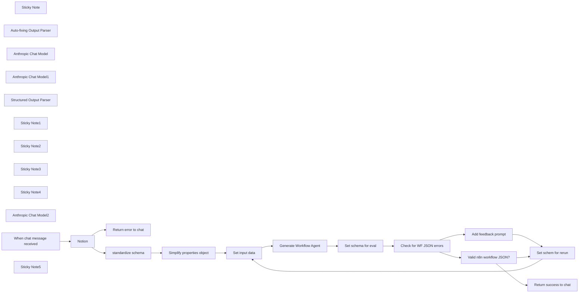

## Fluxo (.json) :

```json
{
  "nodes": [
    {
      "id": "9052b5b2-1e2d-425c-92e5-1ed51323e71c",
      "name": "Sticky Note",
      "type": "n8n-nodes-base.stickyNote",
      "position": [
        380,
        240
      ],
      "parameters": {
        "color": 7,
        "width": 616.7964812508943,
        "height": 231.27721611949534,
        "content": "# Generate new workflow version for specific notion db schema\nInput a Notion database URL and get an AI Assistant chatbot workflow for it based on this template: https://n8n.io/workflows/2413-notion-knowledge-base-ai-assistant/\n\nProject in notion: https://www.notion.so/n8n/Chat-with-notion-database-84eec91b74dd4e36ba97edda17c2c306"
      },
      "typeVersion": 1
    },
    {
      "id": "b4a83f76-2bad-4bbe-9b7f-1df684166035",
      "name": "Notion",
      "type": "n8n-nodes-base.notion",
      "onError": "continueErrorOutput",
      "position": [
        1280,
        480
      ],
      "parameters": {
        "simple": false,
        "resource": "database",
        "databaseId": {
          "__rl": true,
          "mode": "url",
          "value": "={{ $json.chatInput.match(/https?://[^\\s/$.?#].[^\\s]*/g)[0] }}"
        }
      },
      "credentials": {
        "notionApi": {
          "id": "aDS2eHXMOtsMrQnJ",
          "name": "Nathan's notion account"
        }
      },
      "typeVersion": 2.2
    },
    {
      "id": "39537c95-5ca0-47a9-b2bf-2c0134d3f236",
      "name": "Return success to chat",
      "type": "n8n-nodes-base.set",
      "position": [
        3540,
        740
      ],
      "parameters": {
        "options": {},
        "assignments": {
          "assignments": [
            {
              "id": "bebcb43c-461d-40d7-af83-436d94733622",
              "name": "output",
              "type": "string",
              "value": "=Created workflow:\n```\n{{ $json.generatedWorkflow }}\n```\n\n☝️ Copy and paste JSON above into an n8n workflow canvas (on v 1.52.0+)"
            }
          ]
        }
      },
      "typeVersion": 3.4
    },
    {
      "id": "5ae0fcfb-c3e2-443d-9a0c-25e7b17dc189",
      "name": "Auto-fixing Output Parser",
      "type": "@n8n/n8n-nodes-langchain.outputParserAutofixing",
      "position": [
        2340,
        640
      ],
      "parameters": {},
      "typeVersion": 1
    },
    {
      "id": "4cd182ff-040a-4c0f-819f-a0648c67ab66",
      "name": "Anthropic Chat Model",
      "type": "@n8n/n8n-nodes-langchain.lmChatAnthropic",
      "position": [
        2100,
        640
      ],
      "parameters": {
        "options": {
          "temperature": 0.7,
          "maxTokensToSample": 8192
        }
      },
      "typeVersion": 1.2
    },
    {
      "id": "dc751c1f-4cd6-4d04-8152-402eb5e24574",
      "name": "Set schema for eval",
      "type": "n8n-nodes-base.set",
      "position": [
        2720,
        440
      ],
      "parameters": {
        "options": {},
        "assignments": {
          "assignments": [
            {
              "id": "f82e26dd-f5c5-43b5-b97d-ee63c3ef124e",
              "name": "searchNotionDBJsonBody",
              "type": "string",
              "value": "={{ $json.output.output.workflowJson.parseJson().nodes.find(node => node.name === \"Search notion database\").parameters.jsonBody }}"
            },
            {
              "id": "a804139b-8bf0-43dc-aa8c-9c0dcb387392",
              "name": "generatedWorkflow",
              "type": "string",
              "value": "={{ $json.output.output.workflowJson }}"
            },
            {
              "id": "1e24fdfe-c31f-43e3-bca2-7124352fd62e",
              "name": "inputDatabase",
              "type": "object",
              "value": "={{ $('Set input data').first().json.inputDatabase }}"
            }
          ]
        }
      },
      "typeVersion": 3.4
    },
    {
      "id": "8f8c9d29-c901-4c3c-83a6-23bfe51809bd",
      "name": "Return error to chat",
      "type": "n8n-nodes-base.set",
      "position": [
        1500,
        660
      ],
      "parameters": {
        "options": {},
        "assignments": {
          "assignments": [
            {
              "id": "b561b640-7fcb-4613-8b66-068dbd115b4e",
              "name": "sessionId",
              "type": "string",
              "value": "={{ $('When chat message received').item.json.sessionId }}"
            },
            {
              "id": "74d91d28-b73a-4341-a037-693468120d2d",
              "name": "output",
              "type": "string",
              "value": "Sorry that doesn't look like a valid notion database url. Try again."
            }
          ]
        }
      },
      "typeVersion": 3.4
    },
    {
      "id": "518d2e58-6f2e-4497-9f74-7dbfeff4fd6f",
      "name": "Anthropic Chat Model1",
      "type": "@n8n/n8n-nodes-langchain.lmChatAnthropic",
      "position": [
        2300,
        800
      ],
      "parameters": {
        "options": {
          "maxTokensToSample": 8192
        }
      },
      "typeVersion": 1.2
    },
    {
      "id": "0e7a4d05-db00-4915-9df4-d3cb79bf5789",
      "name": "standardize schema",
      "type": "n8n-nodes-base.set",
      "position": [
        1500,
        440
      ],
      "parameters": {
        "options": {},
        "assignments": {
          "assignments": [
            {
              "id": "8fc7df86-4a47-43ec-baea-f9ee87a899a8",
              "name": "inputDatabase.id",
              "type": "string",
              "value": "={{ $json.id }}"
            },
            {
              "id": "fdeb5b1b-0bf3-46d6-a266-7f85e212a427",
              "name": "inputDatabase.url",
              "type": "string",
              "value": "={{ $json.url }}"
            },
            {
              "id": "b2b06176-b4df-41bd-9422-9c89726fa3fd",
              "name": "inputDatabase.public_url",
              "type": "string",
              "value": "={{ $json.public_url }}"
            },
            {
              "id": "c7b65a70-8af6-4808-aae9-898df9b10340",
              "name": "inputDatabase.name",
              "type": "string",
              "value": "={{ $json.title[0].text.content }}"
            },
            {
              "id": "87c1be85-e180-487b-9c82-61c87c7c460b",
              "name": "inputDatabase.properties",
              "type": "object",
              "value": "={{ $json.properties }}"
            }
          ]
        }
      },
      "typeVersion": 3.4
    },
    {
      "id": "8244fb04-75ec-4b41-93cf-e9c5755fabfd",
      "name": "Simplify properties object",
      "type": "n8n-nodes-base.code",
      "position": [
        1720,
        440
      ],
      "parameters": {
        "jsCode": "// Loop through each incoming item\nreturn items.map(item => {\n  const inputDatabase = item.json[\"inputDatabase\"];\n\n  const simplifiedProperties = Object.fromEntries(Object.entries(inputDatabase.properties).map(([key, value]) => {\n    const simplifiedValue = {\n      id: value.id,\n      name: value.name,\n      type: value.type\n    };\n\n    // Simplify based on type\n    if (value.type === 'multi_select' || value.type === 'select') {\n      simplifiedValue.options = value.multi_select?.options?.map(option => option.name) || [];\n    }\n    \n    return [key, simplifiedValue];\n  }));\n\n  // Overwrite the properties object with simplifiedProperties\n  item.json.inputDatabase.properties = simplifiedProperties;\n\n  return item;  // Return the modified item\n});\n"
      },
      "typeVersion": 2
    },
    {
      "id": "41b615cc-de7d-4c3f-b608-2d1856e0541a",
      "name": "Structured Output Parser",
      "type": "@n8n/n8n-nodes-langchain.outputParserStructured",
      "position": [
        2500,
        800
      ],
      "parameters": {
        "jsonSchemaExample": "{\n\t\"workflowJson\": \"json of workflow\"\n}"
      },
      "typeVersion": 1.2
    },
    {
      "id": "8016baac-9242-44e6-b487-111bb560019d",
      "name": "Set input data",
      "type": "n8n-nodes-base.code",
      "notes": "This allows different routes to input into our agent (e.g. the retry branch). In the AI Agent, we can use a relative $json reference for data, since it's always the same input schema going in. ",
      "position": [
        1980,
        440
      ],
      "parameters": {
        "jsCode": "\nreturn [{\n  json: {\n    inputDatabase: $input.first().json.inputDatabase,\n    feedbackPrompt: (typeof yourVariable !== 'undefined' && yourVariable) ? yourVariable : \" \",\n    workflowTemplate: {\n  \"nodes\": [\n    {\n      \"parameters\": {\n        \"model\": \"gpt-4o\",\n        \"options\": {\n          \"temperature\": 0.7,\n          \"timeout\": 25000\n        }\n      },\n      \"id\": \"f262c0b4-d627-4fd4-ad78-0aa2f57d963f\",\n      \"name\": \"OpenAI Chat Model\",\n      \"type\": \"@n8n/n8n-nodes-langchain.lmChatOpenAi\",\n      \"typeVersion\": 1,\n      \"position\": [\n        1320,\n        640\n      ],\n      \"credentials\": {\n        \"openAiApi\": {\n          \"id\": \"AzPPV759YPBxJj3o\",\n          \"name\": \"Max's DevRel OpenAI account\"\n        }\n      }\n    },\n    {\n      \"parameters\": {\n        \"assignments\": {\n          \"assignments\": [\n            {\n              \"id\": \"055e8a80-4aff-4466-aaa5-ac58bb90f2d0\",\n              \"name\": \"databaseName\",\n              \"value\": \"={{ $json.name }}\",\n              \"type\": \"string\"\n            },\n            {\n              \"id\": \"2a61e473-72e7-46f6-98b0-817508d701c7\",\n              \"name\": \"databaseId\",\n              \"value\": \"={{ $json.id }}\",\n              \"type\": \"string\"\n            }\n          ]\n        },\n        \"options\": {}\n      },\n      \"id\": \"fb74819f-660e-479c-9519-73cfc41c7ee0\",\n      \"name\": \"workflow vars\",\n      \"type\": \"n8n-nodes-base.set\",\n      \"typeVersion\": 3.4,\n      \"position\": [\n        940,\n        460\n      ]\n    },\n    {\n      \"parameters\": {\n        \"assignments\": {\n          \"assignments\": [\n            {\n              \"id\": \"a8e58791-ba51-46a2-8645-386dd1a0ff6e\",\n              \"name\": \"sessionId\",\n              \"value\": \"={{ $('When chat message received').item.json.sessionId }}\",\n              \"type\": \"string\"\n            },\n            {\n              \"id\": \"434209de-39d5-43d8-a964-0fcb7396306c\",\n              \"name\": \"action\",\n              \"value\": \"={{ $('When chat message received').item.json.action }}\",\n              \"type\": \"string\"\n            },\n            {\n              \"id\": \"cad4c972-51a9-4e16-a627-b00eea77eb30\",\n              \"name\": \"chatInput\",\n              \"value\": \"={{ $('When chat message received').item.json.chatInput }}\",\n              \"type\": \"string\"\n            }\n          ]\n        },\n        \"options\": {}\n      },\n      \"id\": \"832ec8ce-0f7c-4380-9a24-633f490a60a9\",\n      \"name\": \"format input for agent\",\n      \"type\": \"n8n-nodes-base.set\",\n      \"typeVersion\": 3.4,\n      \"position\": [\n        1160,\n        460\n      ]\n    },\n    {\n      \"parameters\": {\n        \"toolDescription\": \"=Use this tool to search the \\\"{{ $('workflow vars').item.json.databaseName }}\\\" Notion app database.\\n\\nIt is structured with question and answer format. \\nYou can filter query result by:\\n- By keyword\\n- filter by tag.\\n\\nKeyword and Tag have an OR relationship not AND.\\n\\n\",\n        \"method\": \"POST\",\n        \"url\": \"https://api.notion.com/v1/databases/7ea9697d-4875-441e-b262-1105337d232e/query\",\n        \"authentication\": \"predefinedCredentialType\",\n        \"nodeCredentialType\": \"notionApi\",\n        \"sendBody\": true,\n        \"specifyBody\": \"json\",\n        \"jsonBody\": \"{\\n  \\\"filter\\\": {\\n    \\\"or\\\": [\\n      {\\n        \\\"property\\\": \\\"question\\\",\\n        \\\"rich_text\\\": {\\n          \\\"contains\\\": \\\"{keyword}\\\"\\n        }\\n      },\\n      {\\n        \\\"property\\\": \\\"tags\\\",\\n        \\\"multi_select\\\": {\\n          \\\"contains\\\": \\\"{tag}\\\"\\n        }\\n      }\\n    ]\\n  },\\n  \\\"sorts\\\": [\\n    {\\n      \\\"property\\\": \\\"updated_at\\\",\\n      \\\"direction\\\": \\\"ascending\\\"\\n    }\\n  ]\\n}\",\n        \"placeholderDefinitions\": {\n          \"values\": [\n            {\n              \"name\": \"keyword\",\n              \"description\": \"Searches question of the record. Use one keyword at a time.\"\n            },\n            {\n              \"name\": \"tag\",\n              \"description\": \"Options: PTO, HR Policy, Health Benefits, Direct Deposit, Payroll, Sick Leave, 1:1 Meetings, Scheduling, Internal Jobs, Performance Review, Diversity, Inclusion, Training, Harassment, Discrimination, Product Roadmap, Development, Feature Request, Product Management, Support, Ticket Submission, Password Reset, Email, Slack, GitHub, Team Collaboration, Development Setup, DevOps, GitHub Profile Analyzer, Security Breach, Incident Report, New Software, Software Request, IT, Hardware, Procurement, Software Licenses, JetBrains, Adobe, Data Backup, IT Policy, Security, MFA, Okta, Device Policy, Support Ticket, Phishing, Office Supplies, Operations, Meeting Room, Berlin Office, Travel Expenses, Reimbursement, Facilities, Maintenance, Equipment, Expense Reimbursement, Mobile Phones, SIM Cards, Parking, OKRs, Dashboard, Catering, Office Events\"\n            }\n          ]\n        }\n      },\n      \"id\": \"f16acb7e-f27d-4a95-845c-c990fc334795\",\n      \"name\": \"Search notion database\",\n      \"type\": \"@n8n/n8n-nodes-langchain.toolHttpRequest\",\n      \"typeVersion\": 1.1,\n      \"position\": [\n        1620,\n        640\n      ],\n      \"credentials\": {\n        \"notionApi\": {\n          \"id\": \"gfNp6Jup8rsmFLRr\",\n          \"name\": \"max-bot\"\n        }\n      }\n    },\n    {\n      \"parameters\": {\n        \"public\": true,\n        \"initialMessages\": \"=Happy {{ $today.weekdayLong }}!\\nKnowledge source assistant at your service. How can I help?\",\n        \"options\": {\n          \"subtitle\": \"\",\n          \"title\": \"Notion Knowledge Base\"\n        }\n      },\n      \"id\": \"9fc1ae38-d115-44d0-a088-7cec7036be6f\",\n      \"name\": \"When chat message received\",\n      \"type\": \"@n8n/n8n-nodes-langchain.chatTrigger\",\n      \"typeVersion\": 1.1,\n      \"position\": [\n        560,\n        460\n      ],\n      \"webhookId\": \"b76d02c0-b406-4d21-b6bf-8ad2c623def3\"\n    },\n    {\n      \"parameters\": {\n        \"resource\": \"database\",\n        \"databaseId\": {\n          \"__rl\": true,\n          \"value\": \"7ea9697d-4875-441e-b262-1105337d232e\",\n          \"mode\": \"list\",\n          \"cachedResultName\": \"StarLens Company Knowledge Base\",\n          \"cachedResultUrl\": \"https://www.notion.so/7ea9697d4875441eb2621105337d232e\"\n        }\n      },\n      \"id\": \"9325e0fe-549f-423b-af48-85e802429a7f\",\n      \"name\": \"Get database details\",\n      \"type\": \"n8n-nodes-base.notion\",\n      \"typeVersion\": 2.2,\n      \"position\": [\n        760,\n        460\n      ],\n      \"credentials\": {\n        \"notionApi\": {\n          \"id\": \"gfNp6Jup8rsmFLRr\",\n          \"name\": \"max-bot\"\n        }\n      }\n    },\n    {\n      \"parameters\": {\n        \"contextWindowLength\": 4\n      },\n      \"id\": \"637f5731-4442-42be-9151-30ee29ad97c6\",\n      \"name\": \"Window Buffer Memory\",\n      \"type\": \"@n8n/n8n-nodes-langchain.memoryBufferWindow\",\n      \"typeVersion\": 1.2,\n      \"position\": [\n        1460,\n        640\n      ]\n    },\n    {\n      \"parameters\": {\n        \"toolDescription\": \"=Use this tool to retrieve Notion page content using the page ID. \\n\\nIt is structured with question and answer format. \\nYou can filter query result by:\\n- By keyword\\n- filter by tag.\\n\\nKeyword and Tag have an OR relationship not AND.\\n\\n\",\n        \"url\": \"https://api.notion.com/v1/blocks/{page_id}/children\",\n        \"authentication\": \"predefinedCredentialType\",\n        \"nodeCredentialType\": \"notionApi\",\n        \"placeholderDefinitions\": {\n          \"values\": [\n            {\n              \"name\": \"page_id\",\n              \"description\": \"Notion page id from 'Search notion database' tool results\"\n            }\n          ]\n        },\n        \"optimizeResponse\": true,\n        \"dataField\": \"results\",\n        \"fieldsToInclude\": \"selected\",\n        \"fields\": \"id, type, paragraph.text, heading_1.text, heading_2.text, heading_3.text, bulleted_list_item.text, numbered_list_item.text, to_do.text, children\"\n      },\n      \"id\": \"6b87ae47-fac9-4ef5-aa9a-f1a1ae1adc5f\",\n      \"name\": \"Search inside database record\",\n      \"type\": \"@n8n/n8n-nodes-langchain.toolHttpRequest\",\n      \"typeVersion\": 1.1,\n      \"position\": [\n        1800,\n        640\n      ],\n      \"credentials\": {\n        \"notionApi\": {\n          \"id\": \"gfNp6Jup8rsmFLRr\",\n          \"name\": \"max-bot\"\n        }\n      }\n    },\n    {\n      \"parameters\": {\n        \"promptType\": \"define\",\n        \"text\": \"={{ $json.chatInput }}\",\n        \"options\": {\n          \"systemMessage\": \"=# Role:\\nYou are a helpful agent. Query the \\\"{{ $('workflow vars').item.json.databaseName }}\\\" Notion database to find relevant records or provide insights based on multiple records.\\n\\n# Behavior:\\n\\nBe clear, very concise, efficient, and accurate in responses. Do not hallucinate.\\nIf the request is ambiguous, ask for clarification. Do not embellish, only use facts from the Notion records. Never offer general advice.\\n\\n# Error Handling:\\n\\nIf no matching records are found, try alternative search criteria. Example: Laptop, then Computer, then Equipment. \\nClearly explain any issues with queries (e.g., missing fields or unsupported filters).\\n\\n# Output:\\n\\nReturn concise, user-friendly results or summaries.\\nFor large sets, show top results by default and offer more if needed. Output URLs in markdown format. \\n\\nWhen a record has the answer to user question, always output the URL to that page. Always list links to records separately at the end of the message like this:\\n\\\"Relevant pages: \\n(links in markdown format)\\\"\\nDo not output links twice, only in Relevant pages section\\n\"\n        }\n      },\n      \"id\": \"17f2c426-c48e-48e0-9c5e-e35bdafe5109\",\n      \"name\": \"AI Agent\",\n      \"type\": \"@n8n/n8n-nodes-langchain.agent\",\n      \"typeVersion\": 1.6,\n      \"position\": [\n        1380,\n        460\n      ]\n    }\n  ],\n  \"connections\": {\n    \"OpenAI Chat Model\": {\n      \"ai_languageModel\": [\n        [\n          {\n            \"node\": \"AI Agent\",\n            \"type\": \"ai_languageModel\",\n            \"index\": 0\n          }\n        ]\n      ]\n    },\n    \"workflow vars\": {\n      \"main\": [\n        [\n          {\n            \"node\": \"format input for agent\",\n            \"type\": \"main\",\n            \"index\": 0\n          }\n        ]\n      ]\n    },\n    \"format input for agent\": {\n      \"main\": [\n        [\n          {\n            \"node\": \"AI Agent\",\n            \"type\": \"main\",\n            \"index\": 0\n          }\n        ]\n      ]\n    },\n    \"Search notion database\": {\n      \"ai_tool\": [\n        [\n          {\n            \"node\": \"AI Agent\",\n            \"type\": \"ai_tool\",\n            \"index\": 0\n          }\n        ]\n      ]\n    },\n    \"When chat message received\": {\n      \"main\": [\n        [\n          {\n            \"node\": \"Get database details\",\n            \"type\": \"main\",\n            \"index\": 0\n          }\n        ]\n      ]\n    },\n    \"Get database details\": {\n      \"main\": [\n        [\n          {\n            \"node\": \"workflow vars\",\n            \"type\": \"main\",\n            \"index\": 0\n          }\n        ]\n      ]\n    },\n    \"Window Buffer Memory\": {\n      \"ai_memory\": [\n        [\n          {\n            \"node\": \"AI Agent\",\n            \"type\": \"ai_memory\",\n            \"index\": 0\n          }\n        ]\n      ]\n    },\n    \"Search inside database record\": {\n      \"ai_tool\": [\n        [\n          {\n            \"node\": \"AI Agent\",\n            \"type\": \"ai_tool\",\n            \"index\": 0\n          }\n        ]\n      ]\n    }\n  },\n  \"pinData\": {}\n}\n  }\n}];"
      },
      "typeVersion": 2
    },
    {
      "id": "dc15a250-074e-4aed-8eec-5c60c91cc42d",
      "name": "Set schem for rerun",
      "type": "n8n-nodes-base.set",
      "position": [
        3540,
        240
      ],
      "parameters": {
        "options": {},
        "assignments": {
          "assignments": [
            {
              "id": "b4669a2c-7780-4c54-aef6-89a56ddf1d06",
              "name": "inputDatabase",
              "type": "object",
              "value": "={{ $json.inputDatabase }}"
            }
          ]
        }
      },
      "typeVersion": 3.4
    },
    {
      "id": "224f4963-caac-4438-a61b-90e2c0858f24",
      "name": "Sticky Note1",
      "type": "n8n-nodes-base.stickyNote",
      "position": [
        1060,
        240
      ],
      "parameters": {
        "color": 7,
        "width": 747.234277816171,
        "height": 110.78786136085805,
        "content": "## #1 Serve chat, get URL from user, pull new notion DB schema\nUses n8n Chat trigger. Notion node will fail if an invalid URL is used, or if n8n doesn't have access to it. Also attempts to strip non URL text input. Simplifies notion DB outputs for more efficient token usage in AI Agent."
      },
      "typeVersion": 1
    },
    {
      "id": "7e18ca8d-3181-446f-96f5-0e4b1000d855",
      "name": "Sticky Note2",
      "type": "n8n-nodes-base.stickyNote",
      "position": [
        1939,
        240
      ],
      "parameters": {
        "color": 7,
        "width": 638.6509136143742,
        "height": 114.20873484539783,
        "content": "## #2 GenAI step\nTakes 2 inputs: [original workflow template](https://n8n.io/workflows/2413-notion-knowledge-base-ai-assistant/) and new Notion database details from #1"
      },
      "typeVersion": 1
    },
    {
      "id": "b54b8c03-eb66-4ec7-bc7f-f62ddc566bbe",
      "name": "Sticky Note3",
      "type": "n8n-nodes-base.stickyNote",
      "position": [
        2660,
        240
      ],
      "parameters": {
        "color": 7,
        "width": 727.8599253628195,
        "height": 111.9281525223713,
        "content": "## #3 Does the new workflow look right?\nChecks for previously identified cases (e.g. LLM outputs placeholder for certain values) then does general LLM check on whether it looks like valid n8n workflow JSON."
      },
      "typeVersion": 1
    },
    {
      "id": "a5cc97a7-33e3-45fe-9e13-45ebafd469d7",
      "name": "Add feedback prompt",
      "type": "n8n-nodes-base.set",
      "position": [
        3220,
        440
      ],
      "parameters": {
        "options": {},
        "assignments": {
          "assignments": [
            {
              "id": "1243a328-8420-4be0-8932-4e153472a638",
              "name": "feedbackPrompt",
              "type": "string",
              "value": "=You attempted the below task and outputted incorrect JSON. Below is your incorrect attempt and original task prompt. Try again.\n\n# Incorrect task prompt\n"
            }
          ]
        },
        "includeOtherFields": true
      },
      "typeVersion": 3.4
    },
    {
      "id": "b066fa2d-77ba-4466-ae3b-9ab2405bae3c",
      "name": "Check for WF JSON errors",
      "type": "n8n-nodes-base.switch",
      "notes": "Placeholder jsonBody in tool - this means the 'Search notion database' tool got [object Object] as it's value (happening ~25% of the time)",
      "position": [
        2920,
        440
      ],
      "parameters": {
        "rules": {
          "values": [
            {
              "outputKey": "Placeholder jsonBody in tool",
              "conditions": {
                "options": {
                  "leftValue": "",
                  "caseSensitive": true,
                  "typeValidation": "strict"
                },
                "combinator": "and",
                "conditions": [
                  {
                    "operator": {
                      "type": "string",
                      "operation": "contains"
                    },
                    "leftValue": "={{ $json.searchNotionDBJsonBody }}",
                    "rightValue": "object Object"
                  }
                ]
              },
              "renameOutput": true
            }
          ]
        },
        "options": {
          "fallbackOutput": "extra",
          "allMatchingOutputs": false
        }
      },
      "typeVersion": 3.1
    },
    {
      "id": "e4b38c13-255d-4136-9c7b-90678cbe523b",
      "name": "Sticky Note4",
      "type": "n8n-nodes-base.stickyNote",
      "position": [
        3540,
        60
      ],
      "parameters": {
        "color": 7,
        "width": 343.3887397891673,
        "height": 132.30907857627597,
        "content": "## #4 Respond to Chat trigger\nEach response to the chat trigger is one run. Data of the last node that runs in the workflow is sent to chat trigger, like `Return success to chat`"
      },
      "typeVersion": 1
    },
    {
      "id": "3ecfadc2-2499-4e0f-94c4-1e68770beefb",
      "name": "Generate Workflow Agent",
      "type": "@n8n/n8n-nodes-langchain.agent",
      "onError": "continueRegularOutput",
      "position": [
        2220,
        440
      ],
      "parameters": {
        "text": "=Your task is to output a modified version of a n8n workflow template so it works with the provided new notion database schema. \n\n\n# new notion database details\n{{ $json.inputDatabase.toJsonString() }}\n\n# n8n workflow template to use as reference\n{{ $json.workflowTemplate.toJsonString() }}\n\nJSON Output:\n- Ensure valid JSON with properly quoted keys and values, no trailing commas, and correctly nested braces `{}` and brackets `[]`. If unable to format, return an error or a valid example.\n- Output linebreaks so user can copy working JSON",
        "agent": "reActAgent",
        "options": {
          "prefix": "You are an n8n expert and understand n8n's workflow JSON Structure. You take n8n workflows and make changes to them based on the user request. \n\nDon't hallucinate. Only output n8n workflow json. \n\n",
          "returnIntermediateSteps": false
        },
        "promptType": "define",
        "hasOutputParser": true
      },
      "typeVersion": 1.6
    },
    {
      "id": "3ac37a66-30d5-404a-8c22-1402874e4f37",
      "name": "Anthropic Chat Model2",
      "type": "@n8n/n8n-nodes-langchain.lmChatAnthropic",
      "position": [
        3120,
        860
      ],
      "parameters": {
        "options": {
          "maxTokensToSample": 8192
        }
      },
      "typeVersion": 1.2
    },
    {
      "id": "f71ddd6e-7d41-405c-8cd8-bb21fc0654ae",
      "name": "When chat message received",
      "type": "@n8n/n8n-nodes-langchain.chatTrigger",
      "position": [
        1100,
        480
      ],
      "webhookId": "49dfdc22-b4c8-4ed3-baef-6751ec52f278",
      "parameters": {
        "public": true,
        "options": {
          "title": "🤖 Notion database assistant generator",
          "subtitle": "Generates an n8n workflow-based AI Agent that can query any arbitrary Notion database. ",
          "inputPlaceholder": "e.g. https://www.notion.so/n8n/34f67a14195344fda645691c63dc3901",
          "loadPreviousSession": "manually"
        },
        "initialMessages": "Hi there, I can help you make an AI Agent assistant that can query a Notion database.\n\nGenerating the workflow may take a few minutes as I check whether it works and try again if I oopsie.\n\nEnter a notion database URL and I'll output the workflow in JSON that you can paste in to the n8n canvas. \n"
      },
      "typeVersion": 1.1
    },
    {
      "id": "5a549080-0ad0-4f94-87b1-8b735d7b95a3",
      "name": "Valid n8n workflow JSON?",
      "type": "@n8n/n8n-nodes-langchain.textClassifier",
      "position": [
        3140,
        700
      ],
      "parameters": {
        "options": {
          "systemPromptTemplate": "You are an expert in n8n workflow automation tool. You know whether the json representation of an n8n workflow is valid. \n\nPlease classify the text provided by the user into one of the following categories: {categories}, and use the provided formatting instructions below. Don't explain, and only output the json."
        },
        "inputText": "={{ $json.generatedWorkflow }}",
        "categories": {
          "categories": [
            {
              "category": "invalidJSON",
              "description": "Any other workflow JSON"
            },
            {
              "category": "validJSON",
              "description": "A valid n8n workflow JSON"
            }
          ]
        }
      },
      "typeVersion": 1
    },
    {
      "id": "02bf6e06-6671-4d18-ba30-117459e9d58a",
      "name": "Sticky Note5",
      "type": "n8n-nodes-base.stickyNote",
      "position": [
        380,
        500
      ],
      "parameters": {
        "color": 7,
        "width": 614.8565246662145,
        "height": 416.2640726760381,
        "content": "## Watch a quick set up video 👇\n[](https://youtu.be/iK87ppcaNgM)\n"
      },
      "typeVersion": 1
    }
  ],
  "pinData": {},
  "connections": {
    "Notion": {
      "main": [
        [
          {
            "node": "standardize schema",
            "type": "main",
            "index": 0
          }
        ],
        [
          {
            "node": "Return error to chat",
            "type": "main",
            "index": 0
          }
        ]
      ]
    },
    "Set input data": {
      "main": [
        [
          {
            "node": "Generate Workflow Agent",
            "type": "main",
            "index": 0
          }
        ]
      ]
    },
    "standardize schema": {
      "main": [
        [
          {
            "node": "Simplify properties object",
            "type": "main",
            "index": 0
          }
        ]
      ]
    },
    "Add feedback prompt": {
      "main": [
        [
          {
            "node": "Set schem for rerun",
            "type": "main",
            "index": 0
          }
        ]
      ]
    },
    "Set schem for rerun": {
      "main": [
        [
          {
            "node": "Set input data",
            "type": "main",
            "index": 0
          }
        ]
      ]
    },
    "Set schema for eval": {
      "main": [
        [
          {
            "node": "Check for WF JSON errors",
            "type": "main",
            "index": 0
          }
        ]
      ]
    },
    "Anthropic Chat Model": {
      "ai_languageModel": [
        [
          {
            "node": "Generate Workflow Agent",
            "type": "ai_languageModel",
            "index": 0
          }
        ]
      ]
    },
    "Anthropic Chat Model1": {
      "ai_languageModel": [
        [
          {
            "node": "Auto-fixing Output Parser",
            "type": "ai_languageModel",
            "index": 0
          }
        ]
      ]
    },
    "Anthropic Chat Model2": {
      "ai_languageModel": [
        [
          {
            "node": "Valid n8n workflow JSON?",
            "type": "ai_languageModel",
            "index": 0
          }
        ]
      ]
    },
    "Generate Workflow Agent": {
      "main": [
        [
          {
            "node": "Set schema for eval",
            "type": "main",
            "index": 0
          }
        ]
      ]
    },
    "Check for WF JSON errors": {
      "main": [
        [
          {
            "node": "Add feedback prompt",
            "type": "main",
            "index": 0
          }
        ],
        [
          {
            "node": "Valid n8n workflow JSON?",
            "type": "main",
            "index": 0
          }
        ]
      ]
    },
    "Structured Output Parser": {
      "ai_outputParser": [
        [
          {
            "node": "Auto-fixing Output Parser",
            "type": "ai_outputParser",
            "index": 0
          }
        ]
      ]
    },
    "Valid n8n workflow JSON?": {
      "main": [
        [
          {
            "node": "Set schem for rerun",
            "type": "main",
            "index": 0
          }
        ],
        [
          {
            "node": "Return success to chat",
            "type": "main",
            "index": 0
          }
        ]
      ]
    },
    "Auto-fixing Output Parser": {
      "ai_outputParser": [
        [
          {
            "node": "Generate Workflow Agent",
            "type": "ai_outputParser",
            "index": 0
          }
        ]
      ]
    },
    "Simplify properties object": {
      "main": [
        [
          {
            "node": "Set input data",
            "type": "main",
            "index": 0
          }
        ]
      ]
    },
    "When chat message received": {
      "main": [
        [
          {
            "node": "Notion",
            "type": "main",
            "index": 0
          }
        ]
      ]
    }
  }
}
```

<a id="template-1260"></a>

## Template 1260 - Notificações WhatsApp via KlickTipp com gestão de opt-out

- **Nome:** Notificações WhatsApp via KlickTipp com gestão de opt-out
- **Descrição:** Dispara mensagens template do WhatsApp a partir de eventos do KlickTipp e processa respostas dos contatos para enviar auto-resposta e inscrever no opt-out quando solicitado.
- **Funcionalidade:** • Disparo por evento: Inicia o envio de mensagens quando um evento/trigger é recebido do sistema de origem.
• Envio de templates personalizados: Preenche placeholders dos templates WhatsApp com campos personalizados do contato (nome, produto, link, etc.).
• Formatação de número: Ajusta o formato do número de telefone (ex.: substitui prefixo 00 por +) antes do envio.
• Filtragem de mensagens: Filtra mensagens de entrada para ignorar respostas automáticas e processar apenas mensagens de usuários reais.
• Detecção de palavra-chave STOP: Verifica se a mensagem do usuário inicia com "STOP" (ignorando espaços e caixa) para acionar fluxo de suporte/opt-out.
• Auto-resposta a solicitações de suporte: Envia um template automático ao usuário que solicita suporte (mensagem iniciada por STOP), incluindo personalização com o nome do contato.
• Inscrição em lista de opt-out: Adiciona o número do remetente a uma lista específica para marcar opt-out/assinatura negada no sistema de mailing.
- **Ferramentas:** • KlickTipp: Plataforma de email marketing/CRM usada para acionar o fluxo, gerenciar listas e inscrever contatos.
• WhatsApp Business Cloud API: Serviço usado para enviar templates pré-aprovados ao usuário e receber mensagens de entrada.

## Fluxo visual

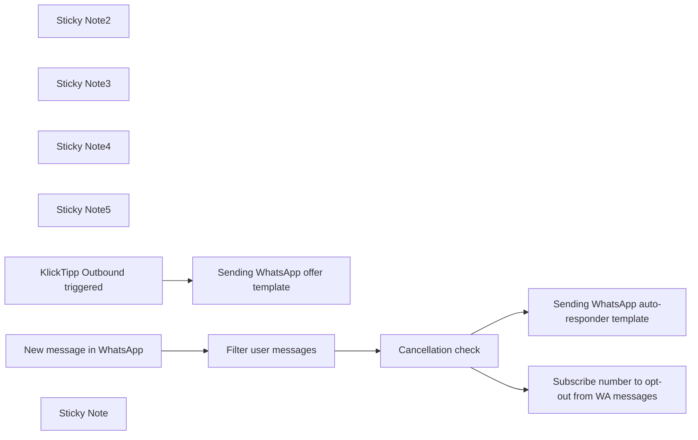

## Fluxo (.json) :

```json
{
  "meta": {
    "instanceId": "95b3ab5a70ab1c8c1906357a367f1b236ef12a1409406fd992f60255f0f95f85",
    "templateCredsSetupCompleted": true
  },
  "nodes": [
    {
      "id": "aec24e02-fc90-482f-98b0-ba1fe8e069ef",
      "name": "Sticky Note2",
      "type": "n8n-nodes-base.stickyNote",
      "position": [
        140,
        -240
      ],
      "parameters": {
        "color": 4,
        "width": 380,
        "height": 880,
        "content": "## Data reception via Webhook call or message"
      },
      "typeVersion": 1
    },
    {
      "id": "16d48a81-06cf-4c58-8769-8e8fd90ed735",
      "name": "Sticky Note3",
      "type": "n8n-nodes-base.stickyNote",
      "position": [
        540,
        40
      ],
      "parameters": {
        "color": 5,
        "width": 380,
        "height": 600,
        "content": "## Data filtering and message check"
      },
      "typeVersion": 1
    },
    {
      "id": "b137f46c-2e00-42be-a708-b6d9e803cde7",
      "name": "Sticky Note4",
      "type": "n8n-nodes-base.stickyNote",
      "position": [
        940,
        -240
      ],
      "parameters": {
        "width": 380,
        "height": 560,
        "content": "## Sending WhatsApp message templates"
      },
      "typeVersion": 1
    },
    {
      "id": "661df01d-7f5c-429f-a1ea-c29278e76f29",
      "name": "Sticky Note5",
      "type": "n8n-nodes-base.stickyNote",
      "position": [
        940,
        340
      ],
      "parameters": {
        "color": 3,
        "width": 380,
        "height": 300,
        "content": "## Contact subscription and tagging"
      },
      "typeVersion": 1
    },
    {
      "id": "b44aba0c-1ecc-44f2-bd6c-66e903a0b5e7",
      "name": "New message in WhatsApp",
      "type": "n8n-nodes-base.whatsAppTrigger",
      "notes": "Listens for incoming WhatsApp messages. This serves as the entry point of the workflow, capturing the message content and sender details for routing decisions.",
      "position": [
        320,
        140
      ],
      "webhookId": "e2861f19-0da7-4320-878c-6ec0e138a7d4",
      "parameters": {
        "options": {},
        "updates": [
          "messages"
        ]
      },
      "credentials": {
        "whatsAppTriggerApi": {
          "id": "hGrWILflNJ7mqZq6",
          "name": "Ricardo'S WhatsApp OAuth account"
        }
      },
      "notesInFlow": true,
      "typeVersion": 1
    },
    {
      "id": "018da945-7aca-45ca-a1dc-a25d6ed1eeb7",
      "name": "Cancellation check",
      "type": "n8n-nodes-base.switch",
      "notes": "Evaluates incoming WhatsApp message content to determine if it begins with the keyword 'STOP' (ignoring whitespace and case). This allows routing messages either towards support or subscription logic.",
      "position": [
        780,
        140
      ],
      "parameters": {
        "rules": {
          "values": [
            {
              "conditions": {
                "options": {
                  "version": 2,
                  "leftValue": "",
                  "caseSensitive": true,
                  "typeValidation": "strict"
                },
                "combinator": "and",
                "conditions": [
                  {
                    "id": "fb517cd9-362b-4ea2-b9c0-7aaad80255b4",
                    "operator": {
                      "type": "string",
                      "operation": "notStartsWith"
                    },
                    "leftValue": "={{ \n// Normalize the message content to lowercase and remove all spaces\n$json.messages[0].text.body.toLowerCase().replace(/\\s+/g, '') }}",
                    "rightValue": "stop"
                  }
                ]
              }
            },
            {
              "conditions": {
                "options": {
                  "version": 2,
                  "leftValue": "",
                  "caseSensitive": true,
                  "typeValidation": "strict"
                },
                "combinator": "and",
                "conditions": [
                  {
                    "id": "55d55779-eb4d-4562-a462-8dbcfc85852d",
                    "operator": {
                      "type": "string",
                      "operation": "startsWith"
                    },
                    "leftValue": "={{ \n// Normalize the message content to lowercase and remove all spaces\n$json.messages[0].text.body.toLowerCase().replace(/\\s+/g, '') }}",
                    "rightValue": "stop"
                  }
                ]
              }
            }
          ]
        },
        "options": {}
      },
      "notesInFlow": true,
      "typeVersion": 3.2
    },
    {
      "id": "7d13f787-95f7-4c13-8674-ef20c82e6fa1",
      "name": "KlickTipp Outbound triggered",
      "type": "CUSTOM.klicktippTrigger",
      "notes": "Triggers this workflow when a relevant event occurs in KlickTipp. Used to initiate notifications via WhatsApp message templates when subscriber data changes or a specific event is captured.",
      "position": [
        320,
        -140
      ],
      "webhookId": "ede76771-57d8-440e-8daf-73cc4c27b7cb",
      "parameters": {},
      "credentials": {
        "klickTippApi": {
          "id": "K9JyBdCM4SZc1cXl",
          "name": "DEMO KlickTipp account"
        }
      },
      "notesInFlow": true,
      "typeVersion": 1
    },
    {
      "id": "964324f7-a818-46e6-b51f-181837479172",
      "name": "Sending WhatsApp offer template",
      "type": "n8n-nodes-base.whatsApp",
      "notes": "Sends a WhatsApp message template when the KlickTipp trigger is activated. This is typically used to confirm an action, notify about updates, or alert based on subscriber activity.",
      "position": [
        1060,
        -140
      ],
      "webhookId": "fd384a0a-0356-490c-bc7c-9be38ef7754f",
      "parameters": {
        "template": "offer_for_manual|de",
        "components": {
          "component": [
            {
              "bodyParameters": {
                "parameter": [
                  {
                    "text": "={{ $json.CustomFieldFirstName }}"
                  },
                  {
                    "text": "={{ $json.CustomField217373 }}"
                  },
                  {
                    "text": "={{ $json.CustomField217511 }}"
                  }
                ]
              }
            },
            {
              "type": "button",
              "sub_type": "url",
              "buttonParameters": {
                "parameter": {
                  "text": "={{ $json.CustomField218042 }}",
                  "type": "text"
                }
              }
            }
          ]
        },
        "phoneNumberId": "114317595015150",
        "recipientPhoneNumber": "={{ //Formats phone numbers by replacing the international dialing prefix eg. (0049) with the plus format (+49)\n$json.PhoneNumber.replace(/^00/, '+') }}"
      },
      "credentials": {
        "whatsAppApi": {
          "id": "HqfpRQa1HyDz8IQI",
          "name": "Ricardo's WhatsApp account"
        }
      },
      "notesInFlow": true,
      "typeVersion": 1
    },
    {
      "id": "629c4059-c03e-4b66-841e-674f03519a3f",
      "name": "Sending WhatsApp auto-responder template",
      "type": "n8n-nodes-base.whatsApp",
      "notes": "Sends a WhatsApp template message to the sender when their message begins with 'STOP', signaling intent to reach support. Personalizes the message using the sender’s name.",
      "position": [
        1060,
        140
      ],
      "webhookId": "632b8645-0d1c-479c-875b-b04e01dcff34",
      "parameters": {
        "template": "auto_forward_to_support|de",
        "components": {
          "component": [
            {
              "bodyParameters": {
                "parameter": [
                  {
                    "text": "={{ \n// Insert the profile name of the contact to personalize the message\n$json.contacts[0].profile.name }}"
                  }
                ]
              }
            }
          ]
        },
        "phoneNumberId": "114317595015150",
        "recipientPhoneNumber": "={{ \n// Extract the phone number of the sender from the message\n$json.messages[0].from }}"
      },
      "credentials": {
        "whatsAppApi": {
          "id": "HqfpRQa1HyDz8IQI",
          "name": "Ricardo's WhatsApp account"
        }
      },
      "notesInFlow": true,
      "typeVersion": 1
    },
    {
      "id": "a5142a5b-d0cc-4965-8462-588477641d3f",
      "name": "Subscribe number to opt-out from WA messages",
      "type": "CUSTOM.klicktipp",
      "notes": "Subscribes the WhatsApp sender to the KlickTipp list using their phone number. Formats the number with a '+' prefix for compatibility with KlickTipp.",
      "position": [
        1060,
        460
      ],
      "parameters": {
        "listId": "358895",
        "resource": "subscriber",
        "operation": "subscribe",
        "smsNumber": "={{\n// Add a \"+\" prefix to the WhatsApp ID to align with expected format in KlickTipp\n'+' + $json.contacts[0].wa_id }}"
      },
      "credentials": {
        "klickTippApi": {
          "id": "K9JyBdCM4SZc1cXl",
          "name": "DEMO KlickTipp account"
        }
      },
      "notesInFlow": true,
      "typeVersion": 2
    },
    {
      "id": "3593831c-4c99-441b-9424-c59440feba3b",
      "name": "Filter user messages",
      "type": "n8n-nodes-base.filter",
      "notes": "This node filters out the messages that come from users responding to automated messages. Otherwise automated messages would trigger the flow.",
      "position": [
        580,
        140
      ],
      "parameters": {
        "options": {},
        "conditions": {
          "options": {
            "version": 2,
            "leftValue": "",
            "caseSensitive": true,
            "typeValidation": "strict"
          },
          "combinator": "and",
          "conditions": [
            {
              "id": "c3399312-f3df-4a89-9ce4-3e7773b025fb",
              "operator": {
                "type": "object",
                "operation": "exists",
                "singleValue": true
              },
              "leftValue": "={{ $json.messages[0] }}",
              "rightValue": ""
            }
          ]
        }
      },
      "notesInFlow": true,
      "typeVersion": 2.2
    },
    {
      "id": "96d54af1-44c1-48c0-9bf3-269e2d084a5c",
      "name": "Sticky Note",
      "type": "n8n-nodes-base.stickyNote",
      "position": [
        240,
        660
      ],
      "parameters": {
        "color": 7,
        "width": 988,
        "height": 1109,
        "content": "### Introduction\nThis workflow enables the automated delivery of personalized WhatsApp messages via WhatsApp Business Cloud triggered by KlickTipp and processes the user's responses to control campaigns in KlickTipp. The setup is ideal for use cases like birthday greetings, coupon codes, or product-specific campaigns using pre-approved WhatsApp templates.\n\n### Benefits\n- **Multi-channel automation**: Enrich your email campaigns with WhatsApp messages, ensuring higher open and engagement rates.\n- **Personalized outreach**: Templates can dynamically insert contact-specific info such as name, product, or promo link.\n- **Full integration**: Connect KlickTipp and WhatsApp through n8n for seamless, event-driven messaging.\n\n### Key Feature\n- **KlickTipp Trigger**: Starts the workflow when a contact is tagged via Outbound.\n- **WhatsApp Template Messaging and response processing**:\n  - Uses pre-approved WhatsApp Message Templates (required for messages outside of a 24h session).\n  - Fills dynamic placeholders with data from KlickTipp custom fields such as:\n    - First name\n    - Product name\n    - Discount link\n    - Sender name\n  - Supports CTAs like \"Redeem Now\" with dynamic URLs - you can control the ending of the base URL.\n  - Listens to the contacts responses and either answers with an auto responder or tags the contact in KlickTipp\n\n#### Setup Instructions\n1. Set up the KlickTipp and WhatsApp Business nodes in your n8n instance.\n2. Authenticate your KlickTipp and Whatsapp accounts.\n3. Create the necessary custom fields to match the data structure\n4. Verify and customize field assignments in the workflow to align with your specific form and subscriber list setup.\n\nCustom Fields:\n   - `Whatsapp_Produkt/Dienstleistung` (Zeile)  \n   - `Whatsapp_Name/Unternehmen` (Zeile)  \n   - `Whatsapp_Link_Endung` (Zeile)\n\n### Testing and Deployment:\n1. Test the workflow by triggering the activation Tag of your Outbound in KlickTipp or by sending a response to the offer template message. Fill the custom fields with all the necessary data beforehand.\n2. Verify the reception of the message template from WhatsApp and or the subscription and tagging in KlickTipp.\n\n> ⚠️ *Cooldown Warning*: Repeated tests via Outbound trigger may require a 6-hour wait unless routed through a campaign, which bypasses the cooldown.\n\n- **Customization**: Adjust templates per product or audience segment. Use custom domain endings to redirect to different product pages. Segment users by WhatsApp availability (e.g. fallback to email for non-WA users).\n\n### Campaign Expansion Ideas\n- Combine with KlickTipp email series (e.g. welcome mail + WA message).\n- Add product-based segmentation tags (e.g. `product_X_interest`).\n- Analyze click rates from WhatsApp CTAs and experiment with A/B message variants.\n\n"
      },
      "typeVersion": 1
    }
  ],
  "pinData": {},
  "connections": {
    "Cancellation check": {
      "main": [
        [
          {
            "node": "Sending WhatsApp auto-responder template",
            "type": "main",
            "index": 0
          }
        ],
        [
          {
            "node": "Subscribe number to opt-out from WA messages",
            "type": "main",
            "index": 0
          }
        ]
      ]
    },
    "Filter user messages": {
      "main": [
        [
          {
            "node": "Cancellation check",
            "type": "main",
            "index": 0
          }
        ]
      ]
    },
    "New message in WhatsApp": {
      "main": [
        [
          {
            "node": "Filter user messages",
            "type": "main",
            "index": 0
          }
        ]
      ]
    },
    "KlickTipp Outbound triggered": {
      "main": [
        [
          {
            "node": "Sending WhatsApp offer template",
            "type": "main",
            "index": 0
          }
        ]
      ]
    }
  }
}
```
