# PACK 1999 TEMPLATES PARTE 07 - Bloco 4

Templates neste bloco: 20

## Sumário

- [Template 1261 - Consulta de incidente ServiceNow via Slack](#template-1261)
- [Template 1262 - Criar contato no Drift](#template-1262)
- [Template 1263 - Criar perfil de usuário no Vero](#template-1263)
- [Template 1264 - Salvar páginas do Notion como vetores no Supabase](#template-1264)
- [Template 1265 - Gerar leads via Google Maps](#template-1265)
- [Template 1266 - Importar CSV público para Google Sheets](#template-1266)
- [Template 1267 - Obter informações de empresa via UpLead](#template-1267)
- [Template 1268 - Recomendação semanal de livro aleatório](#template-1268)
- [Template 1269 - Recuperar todas as tarefas do Flow](#template-1269)
- [Template 1270 - APOD diário para canal Telegram](#template-1270)
- [Template 1271 - Monitoramento de avisos de segurança Palo Alto](#template-1271)
- [Template 1272 - Campanha de e-mail personalizada com decisão de cupom](#template-1272)
- [Template 1273 - Registrar feedbacks com análise de sentimento](#template-1273)
- [Template 1274 - Gerar apresentações personalizadas por lead](#template-1274)
- [Template 1275 - Chat com LLM Ollama](#template-1275)
- [Template 1276 - Enviar registros de clientes para webhook com chave API](#template-1276)
- [Template 1277 - Servidor MCP para gerenciar PostgreSQL](#template-1277)
- [Template 1278 - Lembrete diário de registro](#template-1278)
- [Template 1279 - Lista de espera com verificação por código](#template-1279)
- [Template 1280 - Banner com avatares de novos seguidores](#template-1280)

---

<a id="template-1261"></a>

## Template 1261 - Consulta de incidente ServiceNow via Slack

- **Nome:** Consulta de incidente ServiceNow via Slack
- **Descrição:** Este fluxo recebe um comando do Slack contendo um ID de incidente, consulta a instância do ServiceNow e retorna os detalhes do incidente ou mensagens informando erro ou ausência do registro.
- **Funcionalidade:** • Receber comando do Slack: aceita requisições de comando (slash) enviadas pelo usuário e inicia o processamento.
• Extrair ID do incidente: captura o identificador do payload recebido para ser usado na busca.
• Buscar incidente no ServiceNow: realiza uma consulta na instância do ServiceNow usando o ID extraído.
• Analisar resposta do ServiceNow: determina se houve erro de conexão, se o incidente não foi encontrado ou se foi localizado com sucesso.
• Enviar detalhes ao Slack: quando o incidente é encontrado, formata e retorna uma resposta em blocos contendo número, descrição, severidade, prioridade, estado, categoria, data de abertura e um botão/link para abrir o incidente no ServiceNow.
• Notificar ausência ou erro: retorna mensagens amigáveis ao usuário no Slack quando o ID não retorna resultados ou quando há problema de conexão com o ServiceNow.
- **Ferramentas:** • Slack: plataforma utilizada para entrada do usuário via comando slash e para receber mensagens formatadas com blocos e botões.
• ServiceNow: sistema de gerenciamento de incidentes consultado para recuperar dados do incidente (número, descrição, prioridade, estado, caller e sys_id).

## Fluxo visual

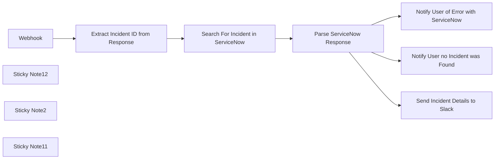

## Fluxo (.json) :

```json
{
  "meta": {
    "instanceId": "03e9d14e9196363fe7191ce21dc0bb17387a6e755dcc9acc4f5904752919dca8"
  },
  "nodes": [
    {
      "id": "eece2f27-2a2f-4207-a756-c3b8062c0028",
      "name": "Webhook",
      "type": "n8n-nodes-base.webhook",
      "position": [
        0,
        0
      ],
      "webhookId": "f6ec2074-6c23-410e-ad31-ac1eaf7381ad",
      "parameters": {
        "path": "f6ec2074-6c23-410e-ad31-ac1eaf7381ad",
        "options": {},
        "httpMethod": "POST",
        "responseMode": "responseNode"
      },
      "typeVersion": 2
    },
    {
      "id": "3a710d14-a56b-4a9a-a30a-f298de68d92b",
      "name": "Extract Incident ID from Response",
      "type": "n8n-nodes-base.set",
      "position": [
        200,
        0
      ],
      "parameters": {
        "options": {},
        "assignments": {
          "assignments": [
            {
              "id": "38125eed-d2ab-4a69-b48f-97cb8d1905b1",
              "name": "incident_id",
              "type": "string",
              "value": "={{ $json.body.text }}"
            }
          ]
        }
      },
      "typeVersion": 3.4
    },
    {
      "id": "cf285efd-f722-4c26-9b64-0b91206c739c",
      "name": "Search For Incident in ServiceNow",
      "type": "n8n-nodes-base.serviceNow",
      "onError": "continueRegularOutput",
      "position": [
        440,
        0
      ],
      "parameters": {
        "options": {
          "sysparm_query": "=GOTOnumber={{ $json.incident_id }}",
          "sysparm_display_value": "true"
        },
        "resource": "incident",
        "operation": "getAll",
        "authentication": "basicAuth"
      },
      "credentials": {
        "serviceNowBasicApi": {
          "id": "wjkWiUNQxo5PzTIb",
          "name": "ServiceNow Basic Auth account"
        }
      },
      "typeVersion": 1,
      "alwaysOutputData": true
    },
    {
      "id": "84fbfbe2-e922-439e-aa33-7c70ebc2215d",
      "name": "Send Incident Details to Slack",
      "type": "n8n-nodes-base.respondToWebhook",
      "position": [
        960,
        180
      ],
      "parameters": {
        "options": {
          "responseCode": 200,
          "responseHeaders": {
            "entries": [
              {
                "name": "Content-Type",
                "value": "application/json"
              }
            ]
          }
        },
        "respondWith": "json",
        "responseBody": "={\n    \"response_type\": \"in_channel\",\n    \"blocks\": [\n        {\n            \"type\": \"header\",\n            \"text\": {\n                \"type\": \"plain_text\",\n                \"text\": \"ServiceNow Incident Notification\",\n                \"emoji\": true\n            }\n        },\n        {\n            \"type\": \"section\",\n            \"fields\": [\n                {\n                    \"type\": \"mrkdwn\",\n                    \"text\": \"*Incident ID:*\\n{{ $('Search For Incident in ServiceNow').item.json.number }}\"\n                },\n                {\n                    \"type\": \"mrkdwn\",\n                    \"text\": \"*Description:*\\n{{ $('Search For Incident in ServiceNow').item.json.short_description }}\"\n                },\n                {\n                    \"type\": \"mrkdwn\",\n                    \"text\": \"*Severity:*\\n{{ $('Search For Incident in ServiceNow').item.json.severity }}\"\n                },\n                {\n                    \"type\": \"mrkdwn\",\n                    \"text\": \"*Caller:*\\n{{ $('Search For Incident in ServiceNow').item.json.caller_id.display_value }}\"\n                },\n                {\n                    \"type\": \"mrkdwn\",\n                    \"text\": \"*Priority:*\\n{{ $('Search For Incident in ServiceNow').item.json.priority }}\"\n                },\n                {\n                    \"type\": \"mrkdwn\",\n                    \"text\": \"*State:*\\n{{ $('Search For Incident in ServiceNow').item.json.incident_state }}\"\n                },\n                {\n                    \"type\": \"mrkdwn\",\n                    \"text\": \"*Category:*\\n{{ $('Search For Incident in ServiceNow').item.json.category }}\"\n                },\n                {\n                    \"type\": \"mrkdwn\",\n                    \"text\": \"*Date Opened:*\\n{{ $('Search For Incident in ServiceNow').item.json.opened_at }}\"\n                }\n            ]\n        },\n        {\n            \"type\": \"actions\",\n            \"elements\": [\n                {\n                    \"type\": \"button\",\n                    \"text\": {\n                        \"type\": \"plain_text\",\n                        \"text\": \"View Incident\",\n                        \"emoji\": true\n                    },\n                    \"url\": \"https://dev206761.service-now.com/nav_to.do?uri=incident.do?sys_id={{ $('Search For Incident in ServiceNow').item.json.sys_id }}\",\n                    \"action_id\": \"view_incident\"\n                }\n            ]\n        }\n    ]\n}"
      },
      "typeVersion": 1.1
    },
    {
      "id": "2bfefc69-8b4e-4bc2-8fea-1216aa95e58b",
      "name": "Notify User no Incident was Found",
      "type": "n8n-nodes-base.respondToWebhook",
      "position": [
        960,
        0
      ],
      "parameters": {
        "options": {
          "responseCode": 200,
          "responseHeaders": {
            "entries": [
              {
                "name": "Content-Type",
                "value": "application/json"
              }
            ]
          }
        },
        "respondWith": "json",
        "responseBody": "={\n\t\"blocks\": [\n\t\t{\n\t\t\t\"type\": \"section\",\n\t\t\t\"text\": {\n\t\t\t\t\"type\": \"mrkdwn\",\n\t\t\t\t\"text\": \":warning: No incident was found with that ID. Please double check and try again. :warning:\"\n\t\t\t}\n\t\t}\n\t]\n}"
      },
      "typeVersion": 1.1
    },
    {
      "id": "47e3fdb0-9824-4b95-b794-972adadcfe5c",
      "name": "Notify User of Error with ServiceNow",
      "type": "n8n-nodes-base.respondToWebhook",
      "position": [
        960,
        -180
      ],
      "parameters": {
        "options": {
          "responseCode": 200,
          "responseHeaders": {
            "entries": [
              {
                "name": "Content-Type",
                "value": "application/json"
              }
            ]
          }
        },
        "respondWith": "json",
        "responseBody": "={\n\t\"blocks\": [\n\t\t{\n\t\t\t\"type\": \"section\",\n\t\t\t\"text\": {\n\t\t\t\t\"type\": \"mrkdwn\",\n\t\t\t\t\"text\": \":rotating_light: Issue connecting to ServiceNow. Please investigate in n8n. :rotating_light:\"\n\t\t\t}\n\t\t}\n\t]\n}"
      },
      "typeVersion": 1.1
    },
    {
      "id": "a64be48f-c318-41f0-950f-d5c545b56001",
      "name": "Sticky Note12",
      "type": "n8n-nodes-base.stickyNote",
      "position": [
        -60,
        -400
      ],
      "parameters": {
        "color": 7,
        "width": 431.79628558910616,
        "height": 756.5967348425984,
        "content": "\n## Receive Slack Webhook Slash Command\n\nThis section begins with the `Webhook` node, which listens for incoming Slack Slash Command requests. When triggered, it extracts the incident ID from the request payload using the `Extract Incident ID from Response` node. The incident ID is then passed forward for further processing. This setup allows users to initiate ServiceNow incident lookups directly from Slack.\n"
      },
      "typeVersion": 1
    },
    {
      "id": "1434eb2a-5a9c-47f4-9e69-abaca2047c65",
      "name": "Sticky Note2",
      "type": "n8n-nodes-base.stickyNote",
      "position": [
        378.80172279482787,
        -402.30436380125093
      ],
      "parameters": {
        "color": 7,
        "width": 390.19827720517213,
        "height": 753.3043638012509,
        "content": "\n## Search ServiceNow for Incident\n\nIn this section, the `Search For Incident in ServiceNow` node queries the ServiceNow platform using the extracted incident ID. If the query returns a valid incident, the details are prepared for the Slack response. If no incident is found, the workflow routes this outcome for a corresponding Slack notification. The `Parse ServiceNow Response` node evaluates the outcome of the ServiceNow query. This ensures accurate and responsive communication with ServiceNow.\n"
      },
      "typeVersion": 1
    },
    {
      "id": "b5a063f6-3676-4ff0-b1ca-944e8285db0d",
      "name": "Sticky Note11",
      "type": "n8n-nodes-base.stickyNote",
      "position": [
        777,
        -646.1743824166542
      ],
      "parameters": {
        "color": 7,
        "width": 448,
        "height": 998.1743824166542,
        "content": "\n## Respond to Slack Webhook\n\nBased on the ServiceNow result:\n- The `Send Incident Details to Slack` node formats and sends detailed incident information to Slack.\n- The `Notify User no Incident was Found` node sends a user-friendly notification indicating the incident ID was invalid.\n- The `Notify User of Error with ServiceNow` node alerts the user if the ServiceNow connection fails.\nThis ensures users receive the right response for every scenario, enabling seamless incident management directly from Slack.\n"
      },
      "typeVersion": 1
    },
    {
      "id": "907e9461-2cf8-4c2a-8d25-38a319861937",
      "name": "Parse ServiceNow Response",
      "type": "n8n-nodes-base.switch",
      "position": [
        640,
        0
      ],
      "parameters": {
        "rules": {
          "values": [
            {
              "outputKey": "ServiceNow Error",
              "conditions": {
                "options": {
                  "version": 2,
                  "leftValue": "",
                  "caseSensitive": true,
                  "typeValidation": "strict"
                },
                "combinator": "and",
                "conditions": [
                  {
                    "operator": {
                      "type": "string",
                      "operation": "exists",
                      "singleValue": true
                    },
                    "leftValue": "={{ $json.error }}",
                    "rightValue": ""
                  }
                ]
              },
              "renameOutput": true
            },
            {
              "outputKey": "Incident Not Found",
              "conditions": {
                "options": {
                  "version": 2,
                  "leftValue": "",
                  "caseSensitive": true,
                  "typeValidation": "strict"
                },
                "combinator": "and",
                "conditions": [
                  {
                    "id": "6d9ff397-8bb6-41df-979c-4eb7ef16bfc1",
                    "operator": {
                      "type": "string",
                      "operation": "notExists",
                      "singleValue": true
                    },
                    "leftValue": "={{ $json.number }}",
                    "rightValue": ""
                  }
                ]
              },
              "renameOutput": true
            },
            {
              "outputKey": "Incident Found",
              "conditions": {
                "options": {
                  "version": 2,
                  "leftValue": "",
                  "caseSensitive": true,
                  "typeValidation": "strict"
                },
                "combinator": "and",
                "conditions": [
                  {
                    "id": "aed034ac-8a45-44d5-9734-813a36aeadaa",
                    "operator": {
                      "type": "string",
                      "operation": "exists",
                      "singleValue": true
                    },
                    "leftValue": "={{ $json.number }}",
                    "rightValue": ""
                  }
                ]
              },
              "renameOutput": true
            }
          ]
        },
        "options": {}
      },
      "typeVersion": 3.2
    }
  ],
  "pinData": {},
  "connections": {
    "Webhook": {
      "main": [
        [
          {
            "node": "Extract Incident ID from Response",
            "type": "main",
            "index": 0
          }
        ]
      ]
    },
    "Parse ServiceNow Response": {
      "main": [
        [
          {
            "node": "Notify User of Error with ServiceNow",
            "type": "main",
            "index": 0
          }
        ],
        [
          {
            "node": "Notify User no Incident was Found",
            "type": "main",
            "index": 0
          }
        ],
        [
          {
            "node": "Send Incident Details to Slack",
            "type": "main",
            "index": 0
          }
        ]
      ]
    },
    "Extract Incident ID from Response": {
      "main": [
        [
          {
            "node": "Search For Incident in ServiceNow",
            "type": "main",
            "index": 0
          }
        ]
      ]
    },
    "Search For Incident in ServiceNow": {
      "main": [
        [
          {
            "node": "Parse ServiceNow Response",
            "type": "main",
            "index": 0
          }
        ]
      ]
    }
  }
}
```

<a id="template-1262"></a>

## Template 1262 - Criar contato no Drift

- **Nome:** Criar contato no Drift
- **Descrição:** Cria um novo contato na conta Drift quando o fluxo é executado manualmente.
- **Funcionalidade:** • Gatilho manual: inicia o fluxo quando acionado pelo usuário.
• Criação de contato: envia dados (email e campos adicionais) para criar um novo contato no Drift.
• Campos adicionais configuráveis: permite incluir informações extras do contato através de campos adicionais.
• Autenticação com API: utiliza credenciais da API do Drift para autorizar a operação.
- **Ferramentas:** • Drift: Plataforma de comunicação e CRM que permite criar e gerenciar contatos e conversas via API.


## Fluxo visual

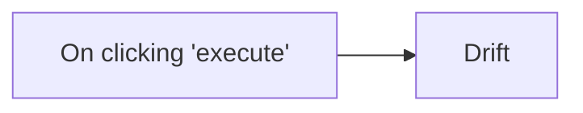

## Fluxo (.json) :

```json
{
  "id": "125",
  "name": "Create a contact in Drift",
  "nodes": [
    {
      "name": "On clicking 'execute'",
      "type": "n8n-nodes-base.manualTrigger",
      "position": [
        250,
        300
      ],
      "parameters": {},
      "typeVersion": 1
    },
    {
      "name": "Drift ",
      "type": "n8n-nodes-base.drift",
      "position": [
        450,
        300
      ],
      "parameters": {
        "email": "",
        "additionalFields": {}
      },
      "credentials": {
        "driftApi": ""
      },
      "typeVersion": 1
    }
  ],
  "active": false,
  "settings": {},
  "connections": {
    "On clicking 'execute'": {
      "main": [
        [
          {
            "node": "Drift ",
            "type": "main",
            "index": 0
          }
        ]
      ]
    }
  }
}
```

<a id="template-1263"></a>

## Template 1263 - Criar perfil de usuário no Vero

- **Nome:** Criar perfil de usuário no Vero
- **Descrição:** Ao ser executado manualmente, o fluxo cria ou atualiza um perfil de usuário no Vero com os dados fornecidos.
- **Funcionalidade:** • Acionamento manual: inicia o processo quando o usuário clica em executar.
• Criação/atualização de perfil: envia dados para o Vero para criar ou atualizar um perfil de usuário.
• Inclusão de campos adicionais: permite adicionar campos extras no perfil através de parâmetros configuráveis.
• Uso de credenciais: autentica a chamada ao Vero usando credenciais configuradas no fluxo.
- **Ferramentas:** • Vero: plataforma de automação de marketing e engajamento de clientes para criar e gerenciar perfis de usuários, enviar campanhas e rastrear comportamento.

## Fluxo visual


## Fluxo (.json) :

```json
{
  "id": "127",
  "name": "Create a user profile in Vero",
  "nodes": [
    {
      "name": "On clicking 'execute'",
      "type": "n8n-nodes-base.manualTrigger",
      "position": [
        250,
        300
      ],
      "parameters": {},
      "typeVersion": 1
    },
    {
      "name": "Vero",
      "type": "n8n-nodes-base.vero",
      "position": [
        450,
        300
      ],
      "parameters": {
        "id": "",
        "additionalFields": {}
      },
      "credentials": {
        "veroApi": ""
      },
      "typeVersion": 1
    }
  ],
  "active": false,
  "settings": {},
  "connections": {
    "On clicking 'execute'": {
      "main": [
        [
          {
            "node": "Vero",
            "type": "main",
            "index": 0
          }
        ]
      ]
    }
  }
}
```

<a id="template-1264"></a>

## Template 1264 - Salvar páginas do Notion como vetores no Supabase

- **Nome:** Salvar páginas do Notion como vetores no Supabase
- **Descrição:** Automatiza a captura de páginas do Notion, processa o conteúdo textual em fragmentos, gera embeddings e armazena os documentos junto com seus vetores no Supabase.
- **Funcionalidade:** • Detecção de novas páginas do Notion: Monitora um banco de páginas para iniciar o processo quando uma nova página é adicionada.
• Recuperação do conteúdo da página: Obtém todos os blocos de conteúdo da página recém-adicionada.
• Filtragem de mídia: Exclui blocos de tipo imagem e vídeo para focar no conteúdo textual.
• Consolidação do texto: Concatena o conteúdo dos blocos em um único texto para processamento.
• Criação de metadados: Associa informações como ID da página, data de criação e título como metadados do documento.
• Quebra em chunks/tokenização: Divide o texto em fragmentos menores com sobreposição para melhores embeddings.
• Geração de embeddings: Produz vetores de representação do texto usando um serviço de embeddings.
• Armazenamento em coluna vetorial: Insere os documentos e seus embeddings em uma tabela no Supabase com coluna vetorial.
- **Ferramentas:** • Notion: Plataforma onde as páginas são criadas e que fornece o conteúdo a ser processado.
• OpenAI: Serviço utilizado para gerar embeddings (vetores) a partir do conteúdo textual.
• Supabase: Banco de dados onde os documentos e seus vetores são armazenados em uma coluna vetorial.

## Fluxo visual

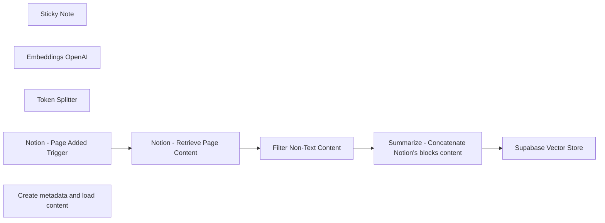

## Fluxo (.json) :

```json
{
  "id": "DvP6IHWymTIVg8Up",
  "meta": {
    "instanceId": "b9faf72fe0d7c3be94b3ebff0778790b50b135c336412d28fd4fca2cbbf8d1f5",
    "templateCredsSetupCompleted": true
  },
  "name": "Store Notion's Pages as Vector Documents into Supabase with OpenAI",
  "tags": [],
  "nodes": [
    {
      "id": "495609cd-4ca0-426d-8413-69e771398188",
      "name": "Sticky Note",
      "type": "n8n-nodes-base.stickyNote",
      "position": [
        480,
        400
      ],
      "parameters": {
        "width": 637.1327972412109,
        "height": 1113.7434387207031,
        "content": "## Store Notion's Pages as Vector Documents into Supabase\n\n**This workflow assumes you have a Supabase project with a table that has a vector column. If you don't have it, follow the instructions here:** [Supabase Vector Columns Guide](https://supabase.com/docs/guides/ai/vector-columns)\n\n## Workflow Description\n\nThis workflow automates the process of storing Notion pages as vector documents in a Supabase database with a vector column. The steps are as follows:\n\n1. **Notion Page Added Trigger**:\n   - Monitors a specified Notion database for newly added pages. You can create a specific Notion database where you copy the pages you want to store in Supabase.\n   - Node: `Page Added in Notion Database`\n\n2. **Retrieve Page Content**:\n   - Fetches all block content from the newly added Notion page.\n   - Node: `Get Blocks Content`\n\n3. **Filter Non-Text Content**:\n   - Excludes blocks of type \"image\" and \"video\" to focus on textual content.\n   - Node: `Filter - Exclude Media Content`\n\n4. **Summarize Content**:\n   - Concatenates the Notion blocks content to create a single text for embedding.\n   - Node: `Summarize - Concatenate Notion's blocks content`\n\n5. **Store in Supabase**:\n   - Stores the processed documents and their embeddings into a Supabase table with a vector column.\n   - Node: `Store Documents in Supabase`\n\n6. **Generate Embeddings**:\n   - Utilizes OpenAI's API to generate embeddings for the textual content.\n   - Node: `Generate Text Embeddings`\n\n\n7. **Create Metadata and Load Content**:\n   - Loads the block content and creates associated metadata, such as page ID and block ID.\n   - Node: `Load Block Content & Create Metadata`\n\n8. **Split Content into Chunks**:\n   - Divides the text into smaller chunks for easier processing and embedding generation.\n   - Node: `Token Splitter`\n\n\n\n"
      },
      "typeVersion": 1
    },
    {
      "id": "3f3e65dc-2b26-407c-87e5-52ba3b315fed",
      "name": "Embeddings OpenAI",
      "type": "@n8n/n8n-nodes-langchain.embeddingsOpenAi",
      "position": [
        2200,
        760
      ],
      "parameters": {
        "options": {}
      },
      "typeVersion": 1
    },
    {
      "id": "6d2579b8-376f-44c3-82e8-9dc608efd98b",
      "name": "Token Splitter",
      "type": "@n8n/n8n-nodes-langchain.textSplitterTokenSplitter",
      "position": [
        2340,
        960
      ],
      "parameters": {
        "chunkSize": 256,
        "chunkOverlap": 30
      },
      "typeVersion": 1
    },
    {
      "id": "79b3c147-08ca-4db4-9116-958a868cbfd9",
      "name": "Notion - Page Added Trigger",
      "type": "n8n-nodes-base.notionTrigger",
      "position": [
        1180,
        520
      ],
      "parameters": {
        "simple": false,
        "pollTimes": {
          "item": [
            {
              "mode": "everyMinute"
            }
          ]
        },
        "databaseId": {
          "__rl": true,
          "mode": "list",
          "value": "",
          "cachedResultUrl": "",
          "cachedResultName": ""
        }
      },
      "typeVersion": 1
    },
    {
      "id": "e4a6f524-e3f5-4d02-949a-8523f2d21965",
      "name": "Notion - Retrieve Page Content",
      "type": "n8n-nodes-base.notion",
      "position": [
        1400,
        520
      ],
      "parameters": {
        "blockId": {
          "__rl": true,
          "mode": "url",
          "value": "={{ $json.url }}"
        },
        "resource": "block",
        "operation": "getAll",
        "returnAll": true
      },
      "typeVersion": 2.2
    },
    {
      "id": "bfebc173-8d4b-4f8f-a625-4622949dd545",
      "name": "Filter Non-Text Content",
      "type": "n8n-nodes-base.filter",
      "position": [
        1620,
        520
      ],
      "parameters": {
        "options": {},
        "conditions": {
          "options": {
            "leftValue": "",
            "caseSensitive": true,
            "typeValidation": "strict"
          },
          "combinator": "and",
          "conditions": [
            {
              "id": "e5b605e5-6d05-4bca-8f19-a859e474620f",
              "operator": {
                "type": "string",
                "operation": "notEquals"
              },
              "leftValue": "={{ $json.type }}",
              "rightValue": "image"
            },
            {
              "id": "c7415859-5ffd-4c78-b497-91a3d6303b6f",
              "operator": {
                "type": "string",
                "operation": "notEquals"
              },
              "leftValue": "={{ $json.type }}",
              "rightValue": "video"
            }
          ]
        }
      },
      "typeVersion": 2
    },
    {
      "id": "b04939f9-355a-430b-a069-b11800066313",
      "name": "Summarize - Concatenate Notion's blocks content",
      "type": "n8n-nodes-base.summarize",
      "position": [
        1920,
        520
      ],
      "parameters": {
        "options": {
          "outputFormat": "separateItems"
        },
        "fieldsToSummarize": {
          "values": [
            {
              "field": "content",
              "separateBy": "\n",
              "aggregation": "concatenate"
            }
          ]
        }
      },
      "typeVersion": 1
    },
    {
      "id": "0e64dbb5-20c1-4b90-b818-a1726aaf5112",
      "name": "Create metadata and load content",
      "type": "@n8n/n8n-nodes-langchain.documentDefaultDataLoader",
      "position": [
        2320,
        760
      ],
      "parameters": {
        "options": {
          "metadata": {
            "metadataValues": [
              {
                "name": "pageId",
                "value": "={{ $('Notion - Page Added Trigger').item.json.id }}"
              },
              {
                "name": "createdTime",
                "value": "={{ $('Notion - Page Added Trigger').item.json.created_time }}"
              },
              {
                "name": "pageTitle",
                "value": "={{ $('Notion - Page Added Trigger').item.json.properties.Page.title[0].text.content }}"
              }
            ]
          }
        },
        "jsonData": "={{ $('Summarize - Concatenate Notion's blocks content').item.json.concatenated_content }}",
        "jsonMode": "expressionData"
      },
      "typeVersion": 1
    },
    {
      "id": "187aba6f-eaed-4427-8d40-b9da025fb37d",
      "name": "Supabase Vector Store",
      "type": "@n8n/n8n-nodes-langchain.vectorStoreSupabase",
      "position": [
        2200,
        520
      ],
      "parameters": {
        "mode": "insert",
        "options": {},
        "tableName": {
          "__rl": true,
          "mode": "list",
          "value": "",
          "cachedResultName": ""
        }
      },
      "typeVersion": 1
    }
  ],
  "active": false,
  "pinData": {},
  "settings": {
    "executionOrder": "v1"
  },
  "versionId": "77f6b6f7-d699-4a7e-b3e7-fe8a60bde7ba",
  "connections": {
    "Token Splitter": {
      "ai_textSplitter": [
        [
          {
            "node": "Create metadata and load content",
            "type": "ai_textSplitter",
            "index": 0
          }
        ]
      ]
    },
    "Embeddings OpenAI": {
      "ai_embedding": [
        [
          {
            "node": "Supabase Vector Store",
            "type": "ai_embedding",
            "index": 0
          }
        ]
      ]
    },
    "Filter Non-Text Content": {
      "main": [
        [
          {
            "node": "Summarize - Concatenate Notion's blocks content",
            "type": "main",
            "index": 0
          }
        ]
      ]
    },
    "Notion - Page Added Trigger": {
      "main": [
        [
          {
            "node": "Notion - Retrieve Page Content",
            "type": "main",
            "index": 0
          }
        ]
      ]
    },
    "Notion - Retrieve Page Content": {
      "main": [
        [
          {
            "node": "Filter Non-Text Content",
            "type": "main",
            "index": 0
          }
        ]
      ]
    },
    "Create metadata and load content": {
      "ai_document": [
        [
          {
            "node": "Supabase Vector Store",
            "type": "ai_document",
            "index": 0
          }
        ]
      ]
    },
    "Summarize - Concatenate Notion's blocks content": {
      "main": [
        [
          {
            "node": "Supabase Vector Store",
            "type": "main",
            "index": 0
          }
        ]
      ]
    }
  }
}
```

<a id="template-1265"></a>

## Template 1265 - Gerar leads via Google Maps

- **Nome:** Gerar leads via Google Maps
- **Descrição:** Automatiza buscas de estabelecimentos combinando subcategorias e códigos postais, grava resultados em uma planilha e atualiza o status de cada ZIP.
- **Funcionalidade:** • Carregamento de configurações: Lê URL da planilha e nomes de abas definidos nas configurações iniciais.
• Leitura de subcategorias: Obtém subcategorias de pesquisa de uma aba e ignora entradas marcadas como "Ignore".
• Leitura de códigos postais: Lê lista de ZIPs e filtra apenas aqueles sem status definido para processar.
• Loop aninhado de subcategorias e ZIPs: Itera por cada subcategoria e por lotes de códigos postais para executar buscas controladas.
• Consulta ao Google Maps (Places) via textQuery: Realiza requisições combinando subcategoria + ZIP para buscar estabelecimentos locais.
• Expansão de resultados: Converte o array de lugares retornado pela API em itens individuais para processamento posterior.
• Remoção de duplicados: Elimina entradas duplicadas com base no identificador do local antes de gravar na planilha de resultados.
• Inserção/atualização na planilha de resultados: Adiciona ou atualiza linhas com dados do lugar (telefone, endereço, rating, website, coordenadas, etc.).
• Atualização de status do ZIP: Marca o ZIP como "scraped" após processamento bem-sucedido.
• Controle de concorrência: Limita o número de buscas paralelas para evitar sobrecarga (maxItems configurado).
• Retry exponencial e espera: Implementa lógica de backoff exponencial com esperas e parada com erro caso ultrapasse o número máximo de tentativas.
• Tratamento de respostas vazias: Detecta respostas vazias da API e segue fluxo alternativo sem gravar resultados.
- **Ferramentas:** • Google Maps Places API: Serviço de busca de estabelecimentos que retorna detalhes dos locais via requisições textQuery.
• Google Sheets: Planilha usada para armazenar subcategorias, códigos postais, resultados e para registrar o status de processamento.
• Conta Google / Google Cloud (OAuth2): Autenticação e credenciais necessárias para acessar as APIs do Google (Sheets e Maps).

## Fluxo visual

```mermaid
flowchart LR
    N1["When clicking 'Execute Workflow'"]
    N2["Run workflow every hours"]
    N3["Execute Workflow Trigger"]
    N4["Check Max Retries1"]
    N5["Stop and Error1"]
    N6["GMaps API"]
    N7["Update Status to Success"]
    N8["Add rows in Google Sheets"]
    N9["Set Row Number"]
    N10["Set Zip"]
    N11["Set Place ID"]
    N12["Exponential Backoff"]
    N13["Remove Duplicates"]
    N14["Wait"]
    N15["Check Max Retries"]
    N16["Stop and Error"]
    N17["Exponential Backoff1"]
    N18["Wait1"]
    N19["Settings"]
    N20["GS - Get Subcategory"]
    N21["Subcategory"]
    N22["GS - Get Zip Codes"]
    N23["Place Array"]
    N24["Loop Zips"]
    N25["Loop Subcats"]
    N26["GS - Get Status"]
    N27["Check Max Retries2"]
    N28["Stop and Error2"]
    N29["Exponential Backoff2"]
    N30["Wait2"]
    N31["Limit"]
    N32["Sticky Note20"]
    N33["Sticky Note8"]
    N34["Sticky Note15"]
    N35["Sticky Note"]
    N36["Zips"]
    N37["Sticky Note1"]
    N38["Filter Zips"]
    N39["Filter Subcategories"]
    N40["If Empty"]
    N41["Split Out"]
    N42["Sticky Note2"]

    N14 --> N4
    N36 --> N38
    N31 --> N24
    N18 --> N15
    N30 --> N27
    N10 --> N6
    N40 --> N25
    N40 --> N23
    N19 --> N22
    N6 --> N40
    N24 --> N20
    N41 --> N31
    N38 --> N9
    N23 --> N11
    N21 --> N25
    N25 --> N24
    N25 --> N10
    N11 --> N13
    N9 --> N41
    N26 --> N7
    N26 --> N29
    N15 --> N16
    N15 --> N7
    N13 --> N8
    N4 --> N5
    N4 --> N8
    N27 --> N28
    N22 --> N36
    N12 --> N14
    N17 --> N18
    N29 --> N30
    N39 --> N21
    N20 --> N39
    N3 --> N19
    N2 --> N19
    N7 --> N25
    N7 --> N17
    N8 --> N26
    N8 --> N12
    N1 --> N19
```

## Fluxo (.json) :

```json
{
  "id": "cQAILffOajE9n2cf",
  "meta": {
    "instanceId": "a14364f050ddf078652622522c15b502c09f9ef0c34946b703b7489667faedef",
    "templateCredsSetupCompleted": true
  },
  "name": "Generate Leads with Google Maps - AlexK1919",
  "tags": [
    {
      "id": "yS42KACueZegnCTR",
      "name": "AlexK1919",
      "createdAt": "2024-06-04T02:58:48.480Z",
      "updatedAt": "2024-06-04T02:58:48.480Z"
    }
  ],
  "nodes": [
    {
      "id": "edc9d8f5-e1f4-48e2-b7f7-36e53674d5b3",
      "name": "When clicking \"Execute Workflow\"",
      "type": "n8n-nodes-base.manualTrigger",
      "position": [
        -1080,
        540
      ],
      "parameters": {},
      "typeVersion": 1
    },
    {
      "id": "b761e882-298f-454e-8c21-f77b336ce54e",
      "name": "Run workflow every hours",
      "type": "n8n-nodes-base.scheduleTrigger",
      "disabled": true,
      "position": [
        -1080,
        360
      ],
      "parameters": {
        "rule": {
          "interval": [
            {
              "field": "minutes",
              "minutesInterval": 15
            }
          ]
        }
      },
      "typeVersion": 1.1
    },
    {
      "id": "63d30ea8-1e31-47d2-8f3a-6757f438ab8a",
      "name": "Execute Workflow Trigger",
      "type": "n8n-nodes-base.executeWorkflowTrigger",
      "disabled": true,
      "position": [
        -1080,
        200
      ],
      "parameters": {},
      "typeVersion": 1
    },
    {
      "id": "10f40f60-c29f-47db-a4d1-3d0b8e8363d7",
      "name": "Check Max Retries1",
      "type": "n8n-nodes-base.if",
      "position": [
        1680,
        740
      ],
      "parameters": {
        "options": {},
        "conditions": {
          "options": {
            "version": 2,
            "leftValue": "",
            "caseSensitive": true,
            "typeValidation": "strict"
          },
          "combinator": "and",
          "conditions": [
            {
              "id": "51e191cb-af20-423b-9303-8523caa4ae0d",
              "operator": {
                "type": "number",
                "operation": "gt"
              },
              "leftValue": "={{ $('Exponential Backoff').item.json[\"retryCount\"] }}",
              "rightValue": 10
            }
          ]
        }
      },
      "typeVersion": 2.2
    },
    {
      "id": "6665de66-8e00-4a45-b26a-93be044e9b8d",
      "name": "Stop and Error1",
      "type": "n8n-nodes-base.stopAndError",
      "position": [
        1880,
        740
      ],
      "parameters": {
        "errorMessage": "Google Sheets API Limit has been triggered and the workflow has stopped"
      },
      "typeVersion": 1
    },
    {
      "id": "f0b15937-3734-4cdf-9256-ae36e39a2046",
      "name": "GMaps API",
      "type": "n8n-nodes-base.httpRequest",
      "position": [
        80,
        680
      ],
      "parameters": {
        "url": "https://places.googleapis.com/v1/places:searchText",
        "method": "POST",
        "options": {
          "response": {
            "response": {
              "fullResponse": true
            }
          }
        },
        "sendBody": true,
        "sendHeaders": true,
        "authentication": "predefinedCredentialType",
        "bodyParameters": {
          "parameters": [
            {
              "name": "textQuery",
              "value": "={{ $('Subcategory').item.json.Subcategory }} {{ $json.zip }}"
            }
          ]
        },
        "headerParameters": {
          "parameters": [
            {
              "name": "X-Goog-FieldMask",
              "value": "places.id,places.displayName,places.addressComponents,places.formattedAddress,places.primaryType,places.primaryTypeDisplayName,places.types,places.location,places.nationalPhoneNumber,places.rating,places.userRatingCount,places.websiteUri,places.editorialSummary,places.reviews,places.attributions,places.userRatingCount"
            }
          ]
        },
        "nodeCredentialType": "googleOAuth2Api"
      },
      "credentials": {
        "googleOAuth2Api": {
          "id": "mfmC5Vkz0fz2YJ77",
          "name": "KBB Google OAuth"
        }
      },
      "typeVersion": 4.2
    },
    {
      "id": "539bb125-173a-45b8-a6fc-0b755a013525",
      "name": "Update Status to Success",
      "type": "n8n-nodes-base.googleSheets",
      "onError": "continueErrorOutput",
      "position": [
        1520,
        1160
      ],
      "parameters": {
        "columns": {
          "value": {
            "zip": "={{ $('Set Zip').first().json.zip }}",
            "status": "scraped",
            "subcat": "={{ $('Subcategory').first().json.Subcategory }}"
          },
          "schema": [
            {
              "id": "zip",
              "type": "string",
              "display": true,
              "removed": false,
              "required": false,
              "displayName": "zip",
              "defaultMatch": false,
              "canBeUsedToMatch": true
            },
            {
              "id": "status",
              "type": "string",
              "display": true,
              "removed": false,
              "required": false,
              "displayName": "status",
              "defaultMatch": false,
              "canBeUsedToMatch": true
            },
            {
              "id": "subcat",
              "type": "string",
              "display": true,
              "removed": false,
              "required": false,
              "displayName": "subcat",
              "defaultMatch": false,
              "canBeUsedToMatch": true
            },
            {
              "id": "row_number",
              "type": "string",
              "display": true,
              "removed": false,
              "readOnly": true,
              "required": false,
              "displayName": "row_number",
              "defaultMatch": false,
              "canBeUsedToMatch": true
            }
          ],
          "mappingMode": "defineBelow",
          "matchingColumns": [
            "zip"
          ]
        },
        "options": {},
        "operation": "update",
        "sheetName": {
          "__rl": true,
          "mode": "name",
          "value": "={{ $('Settings').first().json.sheet }}"
        },
        "documentId": {
          "__rl": true,
          "mode": "url",
          "value": "={{ $('Settings').first().json.gs_url }}"
        }
      },
      "credentials": {
        "googleSheetsOAuth2Api": {
          "id": "OnIKN60kSWkHVPHx",
          "name": "Google Sheets - KBB"
        }
      },
      "executeOnce": true,
      "typeVersion": 4.2,
      "alwaysOutputData": true
    },
    {
      "id": "848b71e5-7ff5-4fb5-aad3-33b630ee42c8",
      "name": "Add rows in Google Sheets",
      "type": "n8n-nodes-base.googleSheets",
      "onError": "continueErrorOutput",
      "position": [
        1080,
        740
      ],
      "parameters": {
        "columns": {
          "value": {
            "type": "={{ $('Subcategory').item.json.Subcategory }}",
            "phone": "={{ $json.place.nationalPhoneNumber }}",
            "title": "={{ $json.place.displayName.text }}",
            "types": "={{ $json.place.types }}",
            "rating": "={{ $json.place.rating }}",
            "address": "={{ $json.place.formattedAddress }}",
            "reviews": "={{ $json.place.reviews }}",
            "website": "={{ $json.place.websiteUri }}",
            "place_id": "={{ $json.place.id }}",
            "gps_coordinates": "={\"latitude\":{{ $json.place.location.latitude }},\"longitude\":{{ $json.place.location.longitude }}}"
          },
          "schema": [
            {
              "id": "ACTION",
              "type": "string",
              "display": true,
              "required": false,
              "displayName": "ACTION",
              "defaultMatch": false,
              "canBeUsedToMatch": true
            },
            {
              "id": "STATUS",
              "type": "string",
              "display": true,
              "required": false,
              "displayName": "STATUS",
              "defaultMatch": false,
              "canBeUsedToMatch": true
            },
            {
              "id": "title",
              "type": "string",
              "display": true,
              "required": false,
              "displayName": "title",
              "defaultMatch": false,
              "canBeUsedToMatch": true
            },
            {
              "id": "email",
              "type": "string",
              "display": true,
              "required": false,
              "displayName": "email",
              "defaultMatch": false,
              "canBeUsedToMatch": true
            },
            {
              "id": "name",
              "type": "string",
              "display": true,
              "required": false,
              "displayName": "name",
              "defaultMatch": false,
              "canBeUsedToMatch": true
            },
            {
              "id": "firstname",
              "type": "string",
              "display": true,
              "required": false,
              "displayName": "firstname",
              "defaultMatch": false,
              "canBeUsedToMatch": true
            },
            {
              "id": "lastname",
              "type": "string",
              "display": true,
              "required": false,
              "displayName": "lastname",
              "defaultMatch": false,
              "canBeUsedToMatch": true
            },
            {
              "id": "phone",
              "type": "string",
              "display": true,
              "required": false,
              "displayName": "phone",
              "defaultMatch": false,
              "canBeUsedToMatch": true
            },
            {
              "id": "clean url",
              "type": "string",
              "display": true,
              "required": false,
              "displayName": "clean url",
              "defaultMatch": false,
              "canBeUsedToMatch": true
            },
            {
              "id": "website",
              "type": "string",
              "display": true,
              "required": false,
              "displayName": "website",
              "defaultMatch": false,
              "canBeUsedToMatch": true
            },
            {
              "id": "WP API",
              "type": "string",
              "display": true,
              "required": false,
              "displayName": "WP API",
              "defaultMatch": false,
              "canBeUsedToMatch": true
            },
            {
              "id": "WP",
              "type": "string",
              "display": true,
              "required": false,
              "displayName": "WP",
              "defaultMatch": false,
              "canBeUsedToMatch": true
            },
            {
              "id": "facebook",
              "type": "string",
              "display": true,
              "required": false,
              "displayName": "facebook",
              "defaultMatch": false,
              "canBeUsedToMatch": true
            },
            {
              "id": "instagram",
              "type": "string",
              "display": true,
              "required": false,
              "displayName": "instagram",
              "defaultMatch": false,
              "canBeUsedToMatch": true
            },
            {
              "id": "youtube",
              "type": "string",
              "display": true,
              "required": false,
              "displayName": "youtube",
              "defaultMatch": false,
              "canBeUsedToMatch": true
            },
            {
              "id": "tiktok",
              "type": "string",
              "display": true,
              "required": false,
              "displayName": "tiktok",
              "defaultMatch": false,
              "canBeUsedToMatch": true
            },
            {
              "id": "twitter",
              "type": "string",
              "display": true,
              "required": false,
              "displayName": "twitter",
              "defaultMatch": false,
              "canBeUsedToMatch": true
            },
            {
              "id": "linkedin",
              "type": "string",
              "display": true,
              "required": false,
              "displayName": "linkedin",
              "defaultMatch": false,
              "canBeUsedToMatch": true
            },
            {
              "id": "pinterest",
              "type": "string",
              "display": true,
              "required": false,
              "displayName": "pinterest",
              "defaultMatch": false,
              "canBeUsedToMatch": true
            },
            {
              "id": "reddit",
              "type": "string",
              "display": true,
              "required": false,
              "displayName": "reddit",
              "defaultMatch": false,
              "canBeUsedToMatch": true
            },
            {
              "id": "rating",
              "type": "string",
              "display": true,
              "required": false,
              "displayName": "rating",
              "defaultMatch": false,
              "canBeUsedToMatch": true
            },
            {
              "id": "reviews",
              "type": "string",
              "display": true,
              "required": false,
              "displayName": "reviews",
              "defaultMatch": false,
              "canBeUsedToMatch": true
            },
            {
              "id": "type",
              "type": "string",
              "display": true,
              "required": false,
              "displayName": "type",
              "defaultMatch": false,
              "canBeUsedToMatch": true
            },
            {
              "id": "address",
              "type": "string",
              "display": true,
              "required": false,
              "displayName": "address",
              "defaultMatch": false,
              "canBeUsedToMatch": true
            },
            {
              "id": "price",
              "type": "string",
              "display": true,
              "required": false,
              "displayName": "price",
              "defaultMatch": false,
              "canBeUsedToMatch": true
            },
            {
              "id": "place_id",
              "type": "string",
              "display": true,
              "removed": false,
              "required": false,
              "displayName": "place_id",
              "defaultMatch": false,
              "canBeUsedToMatch": true
            },
            {
              "id": "position",
              "type": "string",
              "display": true,
              "required": false,
              "displayName": "position",
              "defaultMatch": false,
              "canBeUsedToMatch": true
            },
            {
              "id": "data_id",
              "type": "string",
              "display": true,
              "required": false,
              "displayName": "data_id",
              "defaultMatch": false,
              "canBeUsedToMatch": true
            },
            {
              "id": "data_cid",
              "type": "string",
              "display": true,
              "required": false,
              "displayName": "data_cid",
              "defaultMatch": false,
              "canBeUsedToMatch": true
            },
            {
              "id": "reviews_link",
              "type": "string",
              "display": true,
              "required": false,
              "displayName": "reviews_link",
              "defaultMatch": false,
              "canBeUsedToMatch": true
            },
            {
              "id": "photos_link",
              "type": "string",
              "display": true,
              "required": false,
              "displayName": "photos_link",
              "defaultMatch": false,
              "canBeUsedToMatch": true
            },
            {
              "id": "gps_coordinates",
              "type": "string",
              "display": true,
              "required": false,
              "displayName": "gps_coordinates",
              "defaultMatch": false,
              "canBeUsedToMatch": true
            },
            {
              "id": "place_id_search",
              "type": "string",
              "display": true,
              "required": false,
              "displayName": "place_id_search",
              "defaultMatch": false,
              "canBeUsedToMatch": true
            },
            {
              "id": "provider_id",
              "type": "string",
              "display": true,
              "required": false,
              "displayName": "provider_id",
              "defaultMatch": false,
              "canBeUsedToMatch": true
            },
            {
              "id": "types",
              "type": "string",
              "display": true,
              "required": false,
              "displayName": "types",
              "defaultMatch": false,
              "canBeUsedToMatch": true
            },
            {
              "id": "open_state",
              "type": "string",
              "display": true,
              "required": false,
              "displayName": "open_state",
              "defaultMatch": false,
              "canBeUsedToMatch": true
            },
            {
              "id": "hours",
              "type": "string",
              "display": true,
              "required": false,
              "displayName": "hours",
              "defaultMatch": false,
              "canBeUsedToMatch": true
            },
            {
              "id": "operating_hours",
              "type": "string",
              "display": true,
              "required": false,
              "displayName": "operating_hours",
              "defaultMatch": false,
              "canBeUsedToMatch": true
            },
            {
              "id": "description",
              "type": "string",
              "display": true,
              "required": false,
              "displayName": "description",
              "defaultMatch": false,
              "canBeUsedToMatch": true
            },
            {
              "id": "service_options",
              "type": "string",
              "display": true,
              "required": false,
              "displayName": "service_options",
              "defaultMatch": false,
              "canBeUsedToMatch": true
            },
            {
              "id": "order_online",
              "type": "string",
              "display": true,
              "required": false,
              "displayName": "order_online",
              "defaultMatch": false,
              "canBeUsedToMatch": true
            },
            {
              "id": "thumbnail",
              "type": "string",
              "display": true,
              "required": false,
              "displayName": "thumbnail",
              "defaultMatch": false,
              "canBeUsedToMatch": true
            },
            {
              "id": "editorial_reviews",
              "type": "string",
              "display": true,
              "required": false,
              "displayName": "editorial_reviews",
              "defaultMatch": false,
              "canBeUsedToMatch": true
            },
            {
              "id": "unclaimed_listing",
              "type": "string",
              "display": true,
              "required": false,
              "displayName": "unclaimed_listing",
              "defaultMatch": false,
              "canBeUsedToMatch": true
            },
            {
              "id": "reserve_a_table",
              "type": "string",
              "display": true,
              "required": false,
              "displayName": "reserve_a_table",
              "defaultMatch": false,
              "canBeUsedToMatch": true
            },
            {
              "id": "user_review",
              "type": "string",
              "display": true,
              "required": false,
              "displayName": "user_review",
              "defaultMatch": false,
              "canBeUsedToMatch": true
            },
            {
              "id": "amenities",
              "type": "string",
              "display": true,
              "required": false,
              "displayName": "amenities",
              "defaultMatch": false,
              "canBeUsedToMatch": true
            },
            {
              "id": "book_online",
              "type": "string",
              "display": true,
              "required": false,
              "displayName": "book_online",
              "defaultMatch": false,
              "canBeUsedToMatch": true
            }
          ],
          "mappingMode": "defineBelow",
          "matchingColumns": [
            "place_id"
          ]
        },
        "options": {},
        "operation": "appendOrUpdate",
        "sheetName": {
          "__rl": true,
          "mode": "name",
          "value": "=Results"
        },
        "documentId": {
          "__rl": true,
          "mode": "url",
          "value": "={{ $('Settings').item.json.gs_url }}"
        }
      },
      "credentials": {
        "googleSheetsOAuth2Api": {
          "id": "OnIKN60kSWkHVPHx",
          "name": "Google Sheets - KBB"
        }
      },
      "typeVersion": 4.2,
      "alwaysOutputData": true
    },
    {
      "id": "4e1e9438-8091-4cf6-8a99-179960a35eae",
      "name": "Set Row Number",
      "type": "n8n-nodes-base.set",
      "position": [
        80,
        80
      ],
      "parameters": {
        "options": {},
        "assignments": {
          "assignments": [
            {
              "id": "4c5ad6be-28aa-455f-8ee2-edce1ab1bdbb",
              "name": "row_number",
              "type": "number",
              "value": "={{ $json.row_number }}"
            }
          ]
        },
        "includeOtherFields": true
      },
      "typeVersion": 3.4
    },
    {
      "id": "a1939e46-7a56-4e41-9f12-86e784acd044",
      "name": "Set Zip",
      "type": "n8n-nodes-base.set",
      "position": [
        -120,
        680
      ],
      "parameters": {
        "options": {},
        "assignments": {
          "assignments": [
            {
              "id": "7b1629c5-cbfe-4769-8286-66b46c51cd7e",
              "name": "zip",
              "type": "number",
              "value": "={{ $('Loop Zips').first().json.zip }}"
            }
          ]
        },
        "includeOtherFields": true
      },
      "typeVersion": 3.4
    },
    {
      "id": "062d2c9f-f957-43ee-9fc2-2a8600828b58",
      "name": "Set Place ID",
      "type": "n8n-nodes-base.set",
      "position": [
        680,
        740
      ],
      "parameters": {
        "options": {},
        "assignments": {
          "assignments": [
            {
              "id": "758ff896-7cd8-4f72-bfbb-e64583c5937c",
              "name": "places.id",
              "type": "string",
              "value": "={{ $json.place.id }}"
            }
          ]
        },
        "includeOtherFields": true
      },
      "typeVersion": 3.4
    },
    {
      "id": "0e3f4e19-0067-4233-afa8-1b9dd0a6bf30",
      "name": "Exponential Backoff",
      "type": "n8n-nodes-base.code",
      "position": [
        1280,
        740
      ],
      "parameters": {
        "mode": "runOnceForEachItem",
        "jsCode": "// Define the retry count (coming from a previous node or set manually)\nconst retryCount = $json[\"retryCount\"] || 0;  // If not present, default to 0\nconst maxRetries = 5;  // Define the maximum number of retries\nconst initialDelay = 1;  // Initial delay in seconds (1 second)\n\n// If the retry count is less than the max retries, calculate the delay\nif (retryCount < maxRetries) {\n    const currentDelayInSeconds = initialDelay * Math.pow(2, retryCount);  // Exponential backoff delay in seconds\n    \n    // Log the delay time for debugging\n    console.log(`Waiting for ${currentDelayInSeconds} seconds before retry...`);\n    \n    return {\n        json: {\n            retryCount: retryCount + 1,  // Increment retry count\n            waitTimeInSeconds: currentDelayInSeconds, // Pass the delay time in seconds\n            status: 'retrying',\n        }\n    };\n} else {\n    // If max retries are exceeded, return a failure response\n    return {\n        json: {\n            error: 'Max retries exceeded',\n            retryCount: retryCount,\n            status: 'failed'\n        }\n    };\n}\n"
      },
      "typeVersion": 2
    },
    {
      "id": "68e13297-e299-4218-a02e-354c4bdd61db",
      "name": "Remove Duplicates",
      "type": "n8n-nodes-base.removeDuplicates",
      "position": [
        880,
        740
      ],
      "parameters": {
        "compare": "selectedFields",
        "options": {},
        "fieldsToCompare": "place.id,places.id"
      },
      "typeVersion": 1.1
    },
    {
      "id": "ee71fd03-8e15-4c38-b10a-8ff5853da476",
      "name": "Wait",
      "type": "n8n-nodes-base.wait",
      "position": [
        1480,
        740
      ],
      "webhookId": "e0cf8da3-e4ab-490e-abcd-0c0c55b90846",
      "parameters": {
        "amount": "={{ $json[\"waitTime\"] }}"
      },
      "typeVersion": 1.1
    },
    {
      "id": "761d8d0e-c185-41a5-9a75-53e51ab67add",
      "name": "Check Max Retries",
      "type": "n8n-nodes-base.if",
      "position": [
        2120,
        1160
      ],
      "parameters": {
        "options": {},
        "conditions": {
          "options": {
            "version": 2,
            "leftValue": "",
            "caseSensitive": true,
            "typeValidation": "strict"
          },
          "combinator": "and",
          "conditions": [
            {
              "id": "51e191cb-af20-423b-9303-8523caa4ae0d",
              "operator": {
                "type": "number",
                "operation": "gt"
              },
              "leftValue": "={{ $('Exponential Backoff1').item.json[\"retryCount\"] }}",
              "rightValue": 10
            }
          ]
        }
      },
      "typeVersion": 2.2
    },
    {
      "id": "d8fa857a-e195-405c-ae15-44fecd3fea3e",
      "name": "Stop and Error",
      "type": "n8n-nodes-base.stopAndError",
      "position": [
        2320,
        1160
      ],
      "parameters": {
        "errorMessage": "Google Sheets API Limit has been triggered and the workflow has stopped"
      },
      "typeVersion": 1
    },
    {
      "id": "127dc44e-dd79-4735-b818-b95ec00184f2",
      "name": "Exponential Backoff1",
      "type": "n8n-nodes-base.code",
      "position": [
        1720,
        1160
      ],
      "parameters": {
        "mode": "runOnceForEachItem",
        "jsCode": "// Define the retry count (coming from a previous node or set manually)\nconst retryCount = $json[\"retryCount\"] || 0;  // If not present, default to 0\nconst maxRetries = 5;  // Define the maximum number of retries\nconst initialDelay = 1;  // Initial delay in seconds (1 second)\n\n// If the retry count is less than the max retries, calculate the delay\nif (retryCount < maxRetries) {\n    const currentDelayInSeconds = initialDelay * Math.pow(2, retryCount);  // Exponential backoff delay in seconds\n    \n    // Log the delay time for debugging\n    console.log(`Waiting for ${currentDelayInSeconds} seconds before retry...`);\n    \n    return {\n        json: {\n            retryCount: retryCount + 1,  // Increment retry count\n            waitTimeInSeconds: currentDelayInSeconds, // Pass the delay time in seconds\n            status: 'retrying',\n        }\n    };\n} else {\n    // If max retries are exceeded, return a failure response\n    return {\n        json: {\n            error: 'Max retries exceeded',\n            retryCount: retryCount,\n            status: 'failed'\n        }\n    };\n}\n"
      },
      "typeVersion": 2
    },
    {
      "id": "fb7e37c4-f0b3-4a19-a4cc-29fd0c158f9d",
      "name": "Wait1",
      "type": "n8n-nodes-base.wait",
      "position": [
        1920,
        1160
      ],
      "webhookId": "670750d4-0c4d-4fff-b139-1d60be1eac68",
      "parameters": {
        "amount": "={{ $json[\"waitTime\"] }}"
      },
      "typeVersion": 1.1
    },
    {
      "id": "520c9d50-bf23-402f-abf2-cb107341da4d",
      "name": "Settings",
      "type": "n8n-nodes-base.set",
      "position": [
        -800,
        360
      ],
      "parameters": {
        "options": {},
        "assignments": {
          "assignments": [
            {
              "id": "fa469a25-eb00-4011-a626-87fae7fb8bbd",
              "name": "gs_url",
              "type": "string",
              "value": "https://docs.google.com/spreadsheets/d/11bzNIQDE4GB2NWkyGv2IfEsTggSIBCKe2z39Ecp2Z4g/edit?gid=853393043#gid=853393043"
            },
            {
              "id": "df0a7a51-0ec6-47d2-9f73-bc8268385305",
              "name": "catSheet",
              "type": "string",
              "value": "Google Maps Categories"
            },
            {
              "id": "a1ff9a58-9ae6-4000-9fcd-6c11de23bd48",
              "name": "sheet",
              "type": "string",
              "value": "AZ Zips"
            }
          ]
        }
      },
      "typeVersion": 3.4
    },
    {
      "id": "1e9c68db-5ccd-4db7-a469-47aabb38dca1",
      "name": "GS - Get Subcategory",
      "type": "n8n-nodes-base.googleSheets",
      "position": [
        -220,
        340
      ],
      "parameters": {
        "options": {},
        "sheetName": {
          "__rl": true,
          "mode": "name",
          "value": "={{ $('Settings').item.json.catSheet }}"
        },
        "documentId": {
          "__rl": true,
          "mode": "url",
          "value": "={{ $('Settings').item.json.gs_url }}"
        }
      },
      "credentials": {
        "googleSheetsOAuth2Api": {
          "id": "OnIKN60kSWkHVPHx",
          "name": "Google Sheets - KBB"
        }
      },
      "executeOnce": true,
      "typeVersion": 4.2
    },
    {
      "id": "e822be8c-ac7e-472e-a6e6-8835a1001323",
      "name": "Subcategory",
      "type": "n8n-nodes-base.set",
      "position": [
        180,
        340
      ],
      "parameters": {
        "options": {},
        "assignments": {
          "assignments": [
            {
              "id": "d3470f6f-c66e-4223-bbf5-81e45201d45d",
              "name": "Subcategory",
              "type": "string",
              "value": "={{ $json.Subcategory }}"
            }
          ]
        },
        "includeOtherFields": true
      },
      "typeVersion": 3.4
    },
    {
      "id": "003af494-cb09-441b-87c7-43d7d98682e6",
      "name": "GS - Get Zip Codes",
      "type": "n8n-nodes-base.googleSheets",
      "position": [
        -520,
        80
      ],
      "parameters": {
        "options": {},
        "sheetName": {
          "__rl": true,
          "mode": "name",
          "value": "={{ $('Settings').item.json.sheet }}"
        },
        "documentId": {
          "__rl": true,
          "mode": "url",
          "value": "={{ $('Settings').item.json.gs_url }}"
        }
      },
      "credentials": {
        "googleSheetsOAuth2Api": {
          "id": "OnIKN60kSWkHVPHx",
          "name": "Google Sheets - KBB"
        }
      },
      "executeOnce": true,
      "typeVersion": 4.2
    },
    {
      "id": "cccc740e-55e5-4a64-b7f1-b1ca3fbb236e",
      "name": "Place Array",
      "type": "n8n-nodes-base.code",
      "position": [
        480,
        740
      ],
      "parameters": {
        "jsCode": "// Get the places array from the input data\nconst places = items[0]?.json?.body?.places || [];\n\n// Create an output array to hold each place as a separate item\nlet output = [];\n\nif (places.length > 0) {\n  for (let i = 0; i < places.length; i++) {\n    // For each place, push a new item into the output array\n    output.push({\n      json: {\n        place: places[i], // The individual place object\n        otherData: items[0].json.otherData || null  // Include other data or default to null\n      }\n    });\n  }\n} else {\n  // Log an error or handle the case where places array is empty or undefined\n  console.log('Places array is empty or undefined.');\n}\n\n// Return the output array, so each place becomes its own item\nreturn output;\n"
      },
      "typeVersion": 2
    },
    {
      "id": "4cd6a14a-084f-4389-90c5-f4d5921fc80d",
      "name": "Loop Zips",
      "type": "n8n-nodes-base.splitInBatches",
      "position": [
        -420,
        280
      ],
      "parameters": {
        "options": {}
      },
      "typeVersion": 3
    },
    {
      "id": "33bbb601-86ad-40b2-94fc-ccb7753d690e",
      "name": "Loop Subcats",
      "type": "n8n-nodes-base.splitInBatches",
      "position": [
        -320,
        620
      ],
      "parameters": {
        "options": {}
      },
      "typeVersion": 3
    },
    {
      "id": "fc1f56d7-ac1c-4447-a897-5b48ab4be430",
      "name": "GS - Get Status",
      "type": "n8n-nodes-base.googleSheets",
      "onError": "continueErrorOutput",
      "position": [
        1280,
        960
      ],
      "parameters": {
        "options": {},
        "sheetName": {
          "__rl": true,
          "mode": "name",
          "value": "={{ $('Settings').first().json.sheet }}"
        },
        "documentId": {
          "__rl": true,
          "mode": "url",
          "value": "={{ $('Settings').first().json.gs_url }}"
        }
      },
      "credentials": {
        "googleSheetsOAuth2Api": {
          "id": "OnIKN60kSWkHVPHx",
          "name": "Google Sheets - KBB"
        }
      },
      "executeOnce": true,
      "typeVersion": 4.2
    },
    {
      "id": "04e698d9-2455-4884-8f95-e2a9dbc16d57",
      "name": "Check Max Retries2",
      "type": "n8n-nodes-base.if",
      "position": [
        1880,
        960
      ],
      "parameters": {
        "options": {},
        "conditions": {
          "options": {
            "version": 2,
            "leftValue": "",
            "caseSensitive": true,
            "typeValidation": "strict"
          },
          "combinator": "and",
          "conditions": [
            {
              "id": "51e191cb-af20-423b-9303-8523caa4ae0d",
              "operator": {
                "type": "number",
                "operation": "gt"
              },
              "leftValue": "={{ $('Exponential Backoff2').item.json[\"retryCount\"] }}",
              "rightValue": 10
            }
          ]
        }
      },
      "typeVersion": 2.2
    },
    {
      "id": "be784eb9-1d18-4ddc-a91a-1a78355eabed",
      "name": "Stop and Error2",
      "type": "n8n-nodes-base.stopAndError",
      "position": [
        2080,
        960
      ],
      "parameters": {
        "errorMessage": "Google Sheets API Limit has been triggered and the workflow has stopped"
      },
      "typeVersion": 1
    },
    {
      "id": "3226891f-2e03-442e-9be3-7bc41d067d23",
      "name": "Exponential Backoff2",
      "type": "n8n-nodes-base.code",
      "position": [
        1480,
        960
      ],
      "parameters": {
        "mode": "runOnceForEachItem",
        "jsCode": "// Define the retry count (coming from a previous node or set manually)\nconst retryCount = $json[\"retryCount\"] || 0;  // If not present, default to 0\nconst maxRetries = 5;  // Define the maximum number of retries\nconst initialDelay = 1;  // Initial delay in seconds (1 second)\n\n// If the retry count is less than the max retries, calculate the delay\nif (retryCount < maxRetries) {\n    const currentDelayInSeconds = initialDelay * Math.pow(2, retryCount);  // Exponential backoff delay in seconds\n    \n    // Log the delay time for debugging\n    console.log(`Waiting for ${currentDelayInSeconds} seconds before retry...`);\n    \n    return {\n        json: {\n            retryCount: retryCount + 1,  // Increment retry count\n            waitTimeInSeconds: currentDelayInSeconds, // Pass the delay time in seconds\n            status: 'retrying',\n        }\n    };\n} else {\n    // If max retries are exceeded, return a failure response\n    return {\n        json: {\n            error: 'Max retries exceeded',\n            retryCount: retryCount,\n            status: 'failed'\n        }\n    };\n}\n"
      },
      "typeVersion": 2
    },
    {
      "id": "04435aaa-0ba7-45f9-80a7-248fbd47ff0e",
      "name": "Wait2",
      "type": "n8n-nodes-base.wait",
      "position": [
        1680,
        960
      ],
      "webhookId": "d9b32a26-861f-46d5-a8d7-0ede2ea37fe6",
      "parameters": {
        "amount": "={{ $json[\"waitTime\"] }}"
      },
      "typeVersion": 1.1
    },
    {
      "id": "4c246eb7-5ec2-4c89-b0c0-c851cb318c34",
      "name": "Limit",
      "type": "n8n-nodes-base.limit",
      "position": [
        500,
        80
      ],
      "parameters": {
        "maxItems": 3
      },
      "typeVersion": 1
    },
    {
      "id": "b141c344-c011-41b2-b87d-b5a067e37c0f",
      "name": "Sticky Note20",
      "type": "n8n-nodes-base.stickyNote",
      "position": [
        -1420,
        0
      ],
      "parameters": {
        "color": 6,
        "width": 250,
        "height": 1390,
        "content": "# AlexK1919 \n\n\n#### I’m Alex Kim, an AI-Native Workflow Automation Architect Building Solutions to Optimize your Personal and Professional Life.\n\n\n### About Me\nhttps://beacons.ai/alexk1919\n\n\n### Products Used \n[Google Maps API via Google Cloud Account](https://docs.n8n.io/integrations/builtin/credentials/google/oauth-generic/?utm_source=n8n_app&utm_medium=credential_settings&utm_campaign=create_new_credentials_modal)\n"
      },
      "typeVersion": 1
    },
    {
      "id": "3fd43827-bc14-4337-89d3-2e48fc010e9f",
      "name": "Sticky Note8",
      "type": "n8n-nodes-base.stickyNote",
      "position": [
        -860,
        0
      ],
      "parameters": {
        "color": 3,
        "width": 247,
        "height": 1391,
        "content": "# Settings"
      },
      "typeVersion": 1
    },
    {
      "id": "c4ddef39-75e4-4a04-808c-2057ed59eddf",
      "name": "Sticky Note15",
      "type": "n8n-nodes-base.stickyNote",
      "position": [
        -860,
        80
      ],
      "parameters": {
        "color": 7,
        "width": 219,
        "height": 220,
        "content": "In the Google Sheets document, set the subcategories you'd like to search for\n\nSet the URL of your Google Sheets document\n\nSet the Zip Code sheet name"
      },
      "typeVersion": 1
    },
    {
      "id": "b02c6a3a-3939-469a-bb50-0417cf2bc3c5",
      "name": "Sticky Note",
      "type": "n8n-nodes-base.stickyNote",
      "position": [
        -1140,
        0
      ],
      "parameters": {
        "color": 7,
        "width": 247,
        "height": 1391,
        "content": "# Triggers"
      },
      "typeVersion": 1
    },
    {
      "id": "0aeeaed1-e0dd-4837-ba69-31e0205ea824",
      "name": "Zips",
      "type": "n8n-nodes-base.set",
      "position": [
        -320,
        80
      ],
      "parameters": {
        "options": {},
        "assignments": {
          "assignments": [
            {
              "id": "3d16d922-0ed3-4a0f-9707-43797438970d",
              "name": "zip",
              "type": "number",
              "value": "={{ $json.zip }}"
            }
          ]
        },
        "includeOtherFields": true
      },
      "typeVersion": 3.4
    },
    {
      "id": "e186129c-202b-409a-8028-e7434ab70093",
      "name": "Sticky Note1",
      "type": "n8n-nodes-base.stickyNote",
      "position": [
        -580,
        520
      ],
      "parameters": {
        "color": 5,
        "width": 3060,
        "height": 880,
        "content": "# Google Maps API"
      },
      "typeVersion": 1
    },
    {
      "id": "6e142b17-55e7-4a2f-ae2a-829edd330aad",
      "name": "Filter Zips",
      "type": "n8n-nodes-base.filter",
      "position": [
        -120,
        80
      ],
      "parameters": {
        "options": {},
        "conditions": {
          "options": {
            "version": 2,
            "leftValue": "",
            "caseSensitive": true,
            "typeValidation": "strict"
          },
          "combinator": "and",
          "conditions": [
            {
              "id": "9f5a5e37-faae-45db-8a22-ad7d5786ecfe",
              "operator": {
                "type": "string",
                "operation": "empty",
                "singleValue": true
              },
              "leftValue": "={{ $json.status }}",
              "rightValue": ""
            }
          ]
        }
      },
      "typeVersion": 2.2
    },
    {
      "id": "077dc67e-eab4-413a-8f17-a17b298bf3f4",
      "name": "Filter Subcategories",
      "type": "n8n-nodes-base.filter",
      "position": [
        -20,
        340
      ],
      "parameters": {
        "options": {},
        "conditions": {
          "options": {
            "version": 2,
            "leftValue": "",
            "caseSensitive": true,
            "typeValidation": "strict"
          },
          "combinator": "and",
          "conditions": [
            {
              "id": "b64333b6-67ce-47c4-a2cc-07303278d178",
              "operator": {
                "type": "string",
                "operation": "notEquals"
              },
              "leftValue": "={{ $json.STATUS }}",
              "rightValue": "Ignore"
            }
          ]
        }
      },
      "typeVersion": 2.2
    },
    {
      "id": "2d5f5e14-4958-4b60-9ae3-b66a7ad095e9",
      "name": "If Empty",
      "type": "n8n-nodes-base.if",
      "position": [
        280,
        680
      ],
      "parameters": {
        "options": {},
        "conditions": {
          "options": {
            "version": 2,
            "leftValue": "",
            "caseSensitive": true,
            "typeValidation": "strict"
          },
          "combinator": "and",
          "conditions": [
            {
              "id": "7424452f-e208-4e7e-8144-d0c6278bc0f0",
              "operator": {
                "type": "object",
                "operation": "empty",
                "singleValue": true
              },
              "leftValue": "={{ $json.body }}",
              "rightValue": ""
            }
          ]
        }
      },
      "typeVersion": 2.2
    },
    {
      "id": "594eee9f-35d2-4b7f-8926-47010891298b",
      "name": "Split Out",
      "type": "n8n-nodes-base.splitOut",
      "position": [
        300,
        80
      ],
      "parameters": {
        "include": "allOtherFields",
        "options": {},
        "fieldToSplitOut": "row_number"
      },
      "typeVersion": 1
    },
    {
      "id": "2402643d-605e-40d8-b4ed-1678a144960b",
      "name": "Sticky Note2",
      "type": "n8n-nodes-base.stickyNote",
      "position": [
        -580,
        0
      ],
      "parameters": {
        "color": 4,
        "width": 3060,
        "height": 500,
        "content": "# Data Prep"
      },
      "typeVersion": 1
    }
  ],
  "active": false,
  "pinData": {},
  "settings": {
    "executionOrder": "v1"
  },
  "versionId": "5b91dfd7-b915-46b5-a195-c6cfa0d90dc6",
  "connections": {
    "Wait": {
      "main": [
        [
          {
            "node": "Check Max Retries1",
            "type": "main",
            "index": 0
          }
        ]
      ]
    },
    "Zips": {
      "main": [
        [
          {
            "node": "Filter Zips",
            "type": "main",
            "index": 0
          }
        ]
      ]
    },
    "Limit": {
      "main": [
        [
          {
            "node": "Loop Zips",
            "type": "main",
            "index": 0
          }
        ]
      ]
    },
    "Wait1": {
      "main": [
        [
          {
            "node": "Check Max Retries",
            "type": "main",
            "index": 0
          }
        ]
      ]
    },
    "Wait2": {
      "main": [
        [
          {
            "node": "Check Max Retries2",
            "type": "main",
            "index": 0
          }
        ]
      ]
    },
    "Set Zip": {
      "main": [
        [
          {
            "node": "GMaps API",
            "type": "main",
            "index": 0
          }
        ]
      ]
    },
    "If Empty": {
      "main": [
        [
          {
            "node": "Loop Subcats",
            "type": "main",
            "index": 0
          }
        ],
        [
          {
            "node": "Place Array",
            "type": "main",
            "index": 0
          }
        ]
      ]
    },
    "Settings": {
      "main": [
        [
          {
            "node": "GS - Get Zip Codes",
            "type": "main",
            "index": 0
          }
        ]
      ]
    },
    "GMaps API": {
      "main": [
        [
          {
            "node": "If Empty",
            "type": "main",
            "index": 0
          }
        ]
      ]
    },
    "Loop Zips": {
      "main": [
        [],
        [
          {
            "node": "GS - Get Subcategory",
            "type": "main",
            "index": 0
          }
        ]
      ]
    },
    "Split Out": {
      "main": [
        [
          {
            "node": "Limit",
            "type": "main",
            "index": 0
          }
        ]
      ]
    },
    "Filter Zips": {
      "main": [
        [
          {
            "node": "Set Row Number",
            "type": "main",
            "index": 0
          }
        ]
      ]
    },
    "Place Array": {
      "main": [
        [
          {
            "node": "Set Place ID",
            "type": "main",
            "index": 0
          }
        ]
      ]
    },
    "Subcategory": {
      "main": [
        [
          {
            "node": "Loop Subcats",
            "type": "main",
            "index": 0
          }
        ]
      ]
    },
    "Loop Subcats": {
      "main": [
        [
          {
            "node": "Loop Zips",
            "type": "main",
            "index": 0
          }
        ],
        [
          {
            "node": "Set Zip",
            "type": "main",
            "index": 0
          }
        ]
      ]
    },
    "Set Place ID": {
      "main": [
        [
          {
            "node": "Remove Duplicates",
            "type": "main",
            "index": 0
          }
        ]
      ]
    },
    "Set Row Number": {
      "main": [
        [
          {
            "node": "Split Out",
            "type": "main",
            "index": 0
          }
        ]
      ]
    },
    "GS - Get Status": {
      "main": [
        [
          {
            "node": "Update Status to Success",
            "type": "main",
            "index": 0
          }
        ],
        [
          {
            "node": "Exponential Backoff2",
            "type": "main",
            "index": 0
          }
        ]
      ]
    },
    "Check Max Retries": {
      "main": [
        [
          {
            "node": "Stop and Error",
            "type": "main",
            "index": 0
          }
        ],
        [
          {
            "node": "Update Status to Success",
            "type": "main",
            "index": 0
          }
        ]
      ]
    },
    "Remove Duplicates": {
      "main": [
        [
          {
            "node": "Add rows in Google Sheets",
            "type": "main",
            "index": 0
          }
        ]
      ]
    },
    "Check Max Retries1": {
      "main": [
        [
          {
            "node": "Stop and Error1",
            "type": "main",
            "index": 0
          }
        ],
        [
          {
            "node": "Add rows in Google Sheets",
            "type": "main",
            "index": 0
          }
        ]
      ]
    },
    "Check Max Retries2": {
      "main": [
        [
          {
            "node": "Stop and Error2",
            "type": "main",
            "index": 0
          }
        ]
      ]
    },
    "GS - Get Zip Codes": {
      "main": [
        [
          {
            "node": "Zips",
            "type": "main",
            "index": 0
          }
        ]
      ]
    },
    "Exponential Backoff": {
      "main": [
        [
          {
            "node": "Wait",
            "type": "main",
            "index": 0
          }
        ]
      ]
    },
    "Exponential Backoff1": {
      "main": [
        [
          {
            "node": "Wait1",
            "type": "main",
            "index": 0
          }
        ]
      ]
    },
    "Exponential Backoff2": {
      "main": [
        [
          {
            "node": "Wait2",
            "type": "main",
            "index": 0
          }
        ]
      ]
    },
    "Filter Subcategories": {
      "main": [
        [
          {
            "node": "Subcategory",
            "type": "main",
            "index": 0
          }
        ]
      ]
    },
    "GS - Get Subcategory": {
      "main": [
        [
          {
            "node": "Filter Subcategories",
            "type": "main",
            "index": 0
          }
        ]
      ]
    },
    "Execute Workflow Trigger": {
      "main": [
        [
          {
            "node": "Settings",
            "type": "main",
            "index": 0
          }
        ]
      ]
    },
    "Run workflow every hours": {
      "main": [
        [
          {
            "node": "Settings",
            "type": "main",
            "index": 0
          }
        ]
      ]
    },
    "Update Status to Success": {
      "main": [
        [
          {
            "node": "Loop Subcats",
            "type": "main",
            "index": 0
          }
        ],
        [
          {
            "node": "Exponential Backoff1",
            "type": "main",
            "index": 0
          }
        ]
      ]
    },
    "Add rows in Google Sheets": {
      "main": [
        [
          {
            "node": "GS - Get Status",
            "type": "main",
            "index": 0
          }
        ],
        [
          {
            "node": "Exponential Backoff",
            "type": "main",
            "index": 0
          }
        ]
      ]
    },
    "When clicking \"Execute Workflow\"": {
      "main": [
        [
          {
            "node": "Settings",
            "type": "main",
            "index": 0
          }
        ]
      ]
    }
  }
}
```

<a id="template-1266"></a>

## Template 1266 - Importar CSV público para Google Sheets

- **Nome:** Importar CSV público para Google Sheets
- **Descrição:** Importa dados de um CSV público para uma planilha do Google aplicando filtro por país e ano e usando uma chave única para inserir ou atualizar registros.
- **Funcionalidade:** • Execução manual: permite iniciar o processo ao acionar a execução do fluxo.
• Download de CSV remoto: baixa um arquivo CSV a partir de uma URL pública.
• Importação e parsing do CSV: converte o arquivo CSV em registros estruturados para processamento.
• Geração de chave única: adiciona um campo unique_key combinando country_code e year_week para identificação de registros.
• Filtragem de registros: seleciona apenas entradas dos países DACH (DE, AT, CH) e relativas a 2023.
• Inserção/atualização na planilha: envia os registros para uma planilha do Google e faz append ou update com base na chave única.
• Consideração de limites de API: inclui observação sobre limites de leitura/escrita e recomendado uso de processamento em lotes e pausas para importar conjuntos grandes.
- **Ferramentas:** • Google Sheets: destino dos dados, usado para inserir ou atualizar linhas na planilha.
• ECDC Open Data (European Centre for Disease Prevention and Control): fonte pública do CSV com dados de testes de COVID-19.

## Fluxo visual

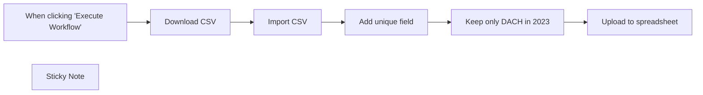

## Fluxo (.json) :

```json
{
  "id": "NLVfecejH0cTtcdd",
  "meta": {
    "instanceId": "fb924c73af8f703905bc09c9ee8076f48c17b596ed05b18c0ff86915ef8a7c4a"
  },
  "name": "Import CSV from URL to GoogleSheet",
  "tags": [],
  "nodes": [
    {
      "id": "90cced3d-b03b-4b51-b1f7-4cbd2dac25eb",
      "name": "When clicking \"Execute Workflow\"",
      "type": "n8n-nodes-base.manualTrigger",
      "position": [
        860,
        380
      ],
      "parameters": {},
      "typeVersion": 1
    },
    {
      "id": "df9519b6-937e-4a9e-bdb9-86fb722ca3c1",
      "name": "Upload to spreadsheet",
      "type": "n8n-nodes-base.googleSheets",
      "position": [
        1880,
        380
      ],
      "parameters": {
        "columns": {
          "value": {},
          "schema": [
            {
              "id": "unique_key",
              "type": "string",
              "display": true,
              "removed": false,
              "required": false,
              "displayName": "unique_key",
              "defaultMatch": false,
              "canBeUsedToMatch": true
            },
            {
              "id": "country",
              "type": "string",
              "display": true,
              "required": false,
              "displayName": "country",
              "defaultMatch": false,
              "canBeUsedToMatch": true
            },
            {
              "id": "country_code",
              "type": "string",
              "display": true,
              "required": false,
              "displayName": "country_code",
              "defaultMatch": false,
              "canBeUsedToMatch": true
            },
            {
              "id": "year_week",
              "type": "string",
              "display": true,
              "required": false,
              "displayName": "year_week",
              "defaultMatch": false,
              "canBeUsedToMatch": true
            },
            {
              "id": "level",
              "type": "string",
              "display": true,
              "required": false,
              "displayName": "level",
              "defaultMatch": false,
              "canBeUsedToMatch": true
            },
            {
              "id": "region",
              "type": "string",
              "display": true,
              "required": false,
              "displayName": "region",
              "defaultMatch": false,
              "canBeUsedToMatch": true
            },
            {
              "id": "region_name",
              "type": "string",
              "display": true,
              "required": false,
              "displayName": "region_name",
              "defaultMatch": false,
              "canBeUsedToMatch": true
            },
            {
              "id": "new_cases",
              "type": "string",
              "display": true,
              "required": false,
              "displayName": "new_cases",
              "defaultMatch": false,
              "canBeUsedToMatch": true
            },
            {
              "id": "tests_done",
              "type": "string",
              "display": true,
              "required": false,
              "displayName": "tests_done",
              "defaultMatch": false,
              "canBeUsedToMatch": true
            },
            {
              "id": "population",
              "type": "string",
              "display": true,
              "required": false,
              "displayName": "population",
              "defaultMatch": false,
              "canBeUsedToMatch": true
            },
            {
              "id": "testing_rate",
              "type": "string",
              "display": true,
              "required": false,
              "displayName": "testing_rate",
              "defaultMatch": false,
              "canBeUsedToMatch": true
            },
            {
              "id": "positivity_rate",
              "type": "string",
              "display": true,
              "required": false,
              "displayName": "positivity_rate",
              "defaultMatch": false,
              "canBeUsedToMatch": true
            },
            {
              "id": "testing_data_source",
              "type": "string",
              "display": true,
              "required": false,
              "displayName": "testing_data_source",
              "defaultMatch": false,
              "canBeUsedToMatch": true
            }
          ],
          "mappingMode": "autoMapInputData",
          "matchingColumns": [
            "unique_key"
          ]
        },
        "options": {
          "cellFormat": "USER_ENTERED"
        },
        "operation": "appendOrUpdate",
        "sheetName": {
          "__rl": true,
          "mode": "list",
          "value": 383583634,
          "cachedResultUrl": "https://docs.google.com/spreadsheets/d/13YYuEJ1cDf-t8P2MSTFWnnNHCreQ6Zo8oPSp7WeNnbY/edit#gid=383583634",
          "cachedResultName": "COVID-weekly"
        },
        "documentId": {
          "__rl": true,
          "mode": "url",
          "value": "https://docs.google.com/spreadsheets/d/13YYuEJ1cDf-t8P2MSTFWnnNHCreQ6Zo8oPSp7WeNnbY"
        }
      },
      "credentials": {
        "googleSheetsOAuth2Api": {
          "id": "54",
          "name": "Google Sheets account"
        }
      },
      "typeVersion": 4
    },
    {
      "id": "8298b29e-8784-4e15-902f-dc073fa73668",
      "name": "Add unique field",
      "type": "n8n-nodes-base.set",
      "position": [
        1460,
        380
      ],
      "parameters": {
        "fields": {
          "values": [
            {
              "name": "unique_key",
              "stringValue": "={{ $json.country_code }}-{{ $json.year_week }}"
            }
          ]
        },
        "options": {}
      },
      "typeVersion": 3
    },
    {
      "id": "b71bb998-4df2-4311-ae98-42c3e5e41d58",
      "name": "Import CSV",
      "type": "n8n-nodes-base.spreadsheetFile",
      "position": [
        1260,
        380
      ],
      "parameters": {
        "options": {
          "headerRow": true
        },
        "fileFormat": "csv"
      },
      "typeVersion": 2
    },
    {
      "id": "36204081-3995-46d4-ac8f-3408cbaed657",
      "name": "Download CSV",
      "type": "n8n-nodes-base.httpRequest",
      "position": [
        1060,
        380
      ],
      "parameters": {
        "url": "https://opendata.ecdc.europa.eu/covid19/testing/csv/data.csv",
        "options": {
          "response": {
            "response": {
              "responseFormat": "file"
            }
          }
        }
      },
      "typeVersion": 4.1
    },
    {
      "id": "b1a78d2e-1a8b-4d98-b130-080b3017192d",
      "name": "Keep only DACH in 2023",
      "type": "n8n-nodes-base.filter",
      "position": [
        1680,
        380
      ],
      "parameters": {
        "conditions": {
          "string": [
            {
              "value1": "={{ $json.year_week }}",
              "value2": "2023",
              "operation": "startsWith"
            }
          ],
          "boolean": [
            {
              "value1": "={{ ['DE', 'AT', 'CH'].includes($json.country_code )}}",
              "value2": true
            }
          ]
        }
      },
      "typeVersion": 1
    },
    {
      "id": "c5a3af9b-30a0-4337-bbb7-cff54007b22f",
      "name": "Sticky Note",
      "type": "n8n-nodes-base.stickyNote",
      "position": [
        1620,
        241
      ],
      "parameters": {
        "width": 460,
        "height": 293,
        "content": "### Google API has rate-limits for read and write operations, that's why we take only a subset of the data\n\nTo import the whole dataset please add Split In Batches and a Wait node with a sufficient delay."
      },
      "typeVersion": 1
    }
  ],
  "active": false,
  "pinData": {},
  "settings": {
    "executionOrder": "v1"
  },
  "versionId": "d49a3f54-a422-4e76-b410-f8c12b4dd78b",
  "connections": {
    "Import CSV": {
      "main": [
        [
          {
            "node": "Add unique field",
            "type": "main",
            "index": 0
          }
        ]
      ]
    },
    "Download CSV": {
      "main": [
        [
          {
            "node": "Import CSV",
            "type": "main",
            "index": 0
          }
        ]
      ]
    },
    "Add unique field": {
      "main": [
        [
          {
            "node": "Keep only DACH in 2023",
            "type": "main",
            "index": 0
          }
        ]
      ]
    },
    "Keep only DACH in 2023": {
      "main": [
        [
          {
            "node": "Upload to spreadsheet",
            "type": "main",
            "index": 0
          }
        ]
      ]
    },
    "When clicking \"Execute Workflow\"": {
      "main": [
        [
          {
            "node": "Download CSV",
            "type": "main",
            "index": 0
          }
        ]
      ]
    }
  }
}
```

<a id="template-1267"></a>

## Template 1267 - Obter informações de empresa via UpLead

- **Nome:** Obter informações de empresa via UpLead
- **Descrição:** Este fluxo busca informações sobre uma empresa específica usando o serviço UpLead quando acionado manualmente.
- **Funcionalidade:** • Disparo manual: inicia a execução ao clicar em 'execute'.
• Busca de empresa por nome: consulta o serviço UpLead utilizando o nome da empresa configurado (ex.: Apple).
• Retorno dos dados da empresa: recebe e disponibiliza os dados retornados pelo UpLead para uso posterior no fluxo.
• Suporte a credenciais de API: possibilidade de conectar ao serviço UpLead mediante credenciais configuradas.
- **Ferramentas:** • UpLead: plataforma de inteligência comercial que fornece informações e dados de empresas e contatos via API.


## Fluxo visual

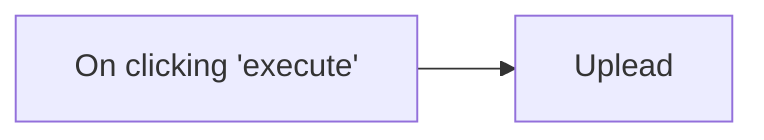

## Fluxo (.json) :

```json
{
  "id": "129",
  "name": "Get information about a company with UpLead",
  "nodes": [
    {
      "name": "On clicking 'execute'",
      "type": "n8n-nodes-base.manualTrigger",
      "position": [
        250,
        300
      ],
      "parameters": {},
      "typeVersion": 1
    },
    {
      "name": "Uplead",
      "type": "n8n-nodes-base.uplead",
      "position": [
        450,
        300
      ],
      "parameters": {
        "company": "Apple"
      },
      "credentials": {
        "upleadApi": ""
      },
      "typeVersion": 1
    }
  ],
  "active": false,
  "settings": {},
  "connections": {
    "On clicking 'execute'": {
      "main": [
        [
          {
            "node": "Uplead",
            "type": "main",
            "index": 0
          }
        ]
      ]
    }
  }
}
```

<a id="template-1268"></a>

## Template 1268 - Recomendação semanal de livro aleatório

- **Nome:** Recomendação semanal de livro aleatório
- **Descrição:** Seleciona um livro aleatório de um assunto no Open Library e envia uma recomendação por e‑mail em formato HTML.
- **Funcionalidade:** • Gatilho manual e agendado: Permite execução manual ou automática toda sexta às 11:00.
• Definição de assunto: Define o assunto (por exemplo, juvenile_literature) usado para buscar livros.
• Consulta ao catálogo: Interroga o Open Library para obter o total de obras disponíveis no assunto.
• Validação de disponibilidade: Verifica se existem livros no assunto e envia alerta por e‑mail se não houver.
• Seleção aleatória: Calcula um índice aleatório dentro do número total de obras para escolher um livro.
• Recuperação de detalhes: Busca informações básicas e detalhadas da obra selecionada (título, autores, descrição, URL).
• Formatação de autores: Constrói uma string HTML com links para os autores da obra.
• Montagem da mensagem: Gera assunto e corpo em HTML com título linkado, autores formatados e descrição.
• Envio de e‑mail: Envia a recomendação por e‑mail ao destinatário configurado.
- **Ferramentas:** • Open Library API: Fonte de dados pública usada para obter contagem de obras, metadados básicos e detalhes das obras.
• Serviço SMTP (Gmail): Serviço de e‑mail utilizado para enviar as recomendações e notificações ao destinatário.


## Fluxo visual


## Fluxo (.json) :

```json
{
  "id": "12",
  "name": "Find a New Book",
  "nodes": [
    {
      "name": "On clicking 'execute'",
      "type": "n8n-nodes-base.manualTrigger",
      "position": [
        40,
        140
      ],
      "parameters": {},
      "typeVersion": 1
    },
    {
      "name": "Every Friday at 11:00 AM",
      "type": "n8n-nodes-base.cron",
      "position": [
        20,
        330
      ],
      "parameters": {
        "triggerTimes": {
          "item": [
            {
              "hour": 11,
              "mode": "everyWeek",
              "weekday": "5"
            }
          ]
        }
      },
      "typeVersion": 1
    },
    {
      "name": "Set Subject",
      "type": "n8n-nodes-base.set",
      "position": [
        220,
        330
      ],
      "parameters": {
        "values": {
          "string": [
            {
              "name": "subject",
              "value": "juvenile_literature"
            }
          ]
        },
        "options": {},
        "keepOnlySet": true
      },
      "typeVersion": 1
    },
    {
      "name": "Retrieve Book Count",
      "type": "n8n-nodes-base.httpRequest",
      "position": [
        420,
        330
      ],
      "parameters": {
        "url": "=http://openlibrary.org/subjects/{{$json[\"subject\"]}}.json",
        "options": {},
        "queryParametersUi": {
          "parameter": [
            {
              "name": "limit",
              "value": "0"
            }
          ]
        }
      },
      "typeVersion": 1
    },
    {
      "name": "Check Book Count",
      "type": "n8n-nodes-base.if",
      "position": [
        620,
        330
      ],
      "parameters": {
        "conditions": {
          "number": [
            {
              "value1": "={{$node[\"Retrieve Book Count\"].json[\"work_count\"]}}",
              "operation": "larger"
            }
          ]
        }
      },
      "typeVersion": 1
    },
    {
      "name": "Select Random Book",
      "type": "n8n-nodes-base.function",
      "position": [
        820,
        330
      ],
      "parameters": {
        "functionCode": "var retrieve_book = 0;\nvar book_count = items[0].json.work_count;\n\nretrieve_book = Math.floor(Math.random() * book_count) + 1\n\nitems[0].json.retrieve_book = retrieve_book;\nreturn items;"
      },
      "typeVersion": 1
    },
    {
      "name": "Retrieve Detailed Book Info",
      "type": "n8n-nodes-base.httpRequest",
      "position": [
        1260,
        330
      ],
      "parameters": {
        "url": "=http://openlibrary.org.{{$node[\"Retrieve Basic Book Info\"].json[\"works\"][0][\"key\"]}}.json",
        "options": {},
        "queryParametersUi": {
          "parameter": [
            {
              "name": "limit",
              "value": "1"
            }
          ]
        }
      },
      "typeVersion": 1
    },
    {
      "name": "Retrieve Basic Book Info",
      "type": "n8n-nodes-base.httpRequest",
      "position": [
        1040,
        330
      ],
      "parameters": {
        "url": "=http://openlibrary.org/subjects/{{$json[\"name\"]}}.json",
        "options": {},
        "queryParametersUi": {
          "parameter": [
            {
              "name": "limit",
              "value": "1"
            },
            {
              "name": "offset",
              "value": "={{$json[\"retrieve_book\"]}}"
            },
            {
              "name": "detail",
              "value": "true"
            }
          ]
        }
      },
      "typeVersion": 1
    },
    {
      "name": "Book Recommendation",
      "type": "n8n-nodes-base.set",
      "position": [
        1830,
        330
      ],
      "parameters": {
        "values": {
          "string": [
            {
              "name": "msgSubject",
              "value": "=Book Recommendation: {{$node[\"Create Author String\"].json[\"title\"]}}"
            },
            {
              "name": "msgBody",
              "value": "=<H2><a href=\"{{$node[\"Create Author String\"].json[\"URL\"]}}\">{{$node[\"Create Author String\"].json[\"title\"]}}</a></H2>\n<p><em>By {{$node[\"Create Author String\"].json[\"authors\"]}}</em><br>\n{{$node[\"Create Author String\"].json[\"description\"]}}</p>"
            }
          ]
        },
        "options": {},
        "keepOnlySet": true
      },
      "typeVersion": 1
    },
    {
      "name": "Filtered Book Info",
      "type": "n8n-nodes-base.set",
      "position": [
        1460,
        330
      ],
      "parameters": {
        "values": {
          "string": [
            {
              "name": "authors",
              "value": "={{$node[\"Retrieve Basic Book Info\"].json[\"works\"][0][\"authors\"]}}"
            },
            {
              "name": "title",
              "value": "={{$node[\"Retrieve Basic Book Info\"].json[\"works\"][0][\"title\"]}}"
            },
            {
              "name": "description",
              "value": "={{$node[\"Retrieve Detailed Book Info\"].json[\"description\"][\"value\"]}}"
            },
            {
              "name": "URL",
              "value": "=https://openlibrary.org{{$node[\"Retrieve Basic Book Info\"].json[\"works\"][0][\"key\"]}}"
            }
          ]
        },
        "options": {},
        "keepOnlySet": true
      },
      "typeVersion": 1
    },
    {
      "name": "Create Author String",
      "type": "n8n-nodes-base.function",
      "position": [
        1630,
        330
      ],
      "parameters": {
        "functionCode": "var arrAuthors = items[0].json.authors;\n\nvar arrNames = arrAuthors.map(function(author) {\n  return \"<a href=\\\"https://openlibrary.org\" + author['key'] + \"\\\">\" + author['name'] + \"</a>\";\n});\n\nvar names = arrNames.join(\", \");\n\nitems[0].json.authors = names;\n\nreturn items;"
      },
      "typeVersion": 1
    },
    {
      "name": "Send No Book Email",
      "type": "n8n-nodes-base.emailSend",
      "position": [
        830,
        520
      ],
      "parameters": {
        "html": "=<p>Unfortunately, there are no books available for the subject of <em>{{$node[\"Check Book Count\"].json[\"name\"]}}</em>. Please update your n8n workflow with a different subject.</p>\n\n<p>A list of all available subjects can be found at <a href=\"https://openlibrary.org/subjects\">the Open Library</a>.</p>",
        "options": {},
        "subject": "=Book not found in {{$node[\"Check Book Count\"].json[\"name\"]}}",
        "toEmail": "john.doe@example.com",
        "fromEmail": "john.doe@example.com"
      },
      "credentials": {
        "smtp": "Gmail Creds"
      },
      "typeVersion": 1
    },
    {
      "name": "Send Book Email",
      "type": "n8n-nodes-base.emailSend",
      "position": [
        2030,
        330
      ],
      "parameters": {
        "html": "={{$node[\"Book Recommendation\"].json[\"msgBody\"]}}",
        "options": {},
        "subject": "={{$node[\"Book Recommendation\"].json[\"msgSubject\"]}}",
        "toEmail": "john.doe@example.com",
        "fromEmail": "john.doe@example.com"
      },
      "credentials": {
        "smtp": "Gmail Creds"
      },
      "typeVersion": 1
    }
  ],
  "active": false,
  "settings": {},
  "connections": {
    "Set Subject": {
      "main": [
        [
          {
            "node": "Retrieve Book Count",
            "type": "main",
            "index": 0
          }
        ]
      ]
    },
    "Check Book Count": {
      "main": [
        [
          {
            "node": "Select Random Book",
            "type": "main",
            "index": 0
          }
        ],
        [
          {
            "node": "Send No Book Email",
            "type": "main",
            "index": 0
          }
        ]
      ]
    },
    "Filtered Book Info": {
      "main": [
        [
          {
            "node": "Create Author String",
            "type": "main",
            "index": 0
          }
        ]
      ]
    },
    "Select Random Book": {
      "main": [
        [
          {
            "node": "Retrieve Basic Book Info",
            "type": "main",
            "index": 0
          }
        ]
      ]
    },
    "Book Recommendation": {
      "main": [
        [
          {
            "node": "Send Book Email",
            "type": "main",
            "index": 0
          }
        ]
      ]
    },
    "Retrieve Book Count": {
      "main": [
        [
          {
            "node": "Check Book Count",
            "type": "main",
            "index": 0
          }
        ]
      ]
    },
    "Create Author String": {
      "main": [
        [
          {
            "node": "Book Recommendation",
            "type": "main",
            "index": 0
          }
        ]
      ]
    },
    "On clicking 'execute'": {
      "main": [
        [
          {
            "node": "Set Subject",
            "type": "main",
            "index": 0
          }
        ]
      ]
    },
    "Every Friday at 11:00 AM": {
      "main": [
        [
          {
            "node": "Set Subject",
            "type": "main",
            "index": 0
          }
        ]
      ]
    },
    "Retrieve Basic Book Info": {
      "main": [
        [
          {
            "node": "Retrieve Detailed Book Info",
            "type": "main",
            "index": 0
          }
        ]
      ]
    },
    "Retrieve Detailed Book Info": {
      "main": [
        [
          {
            "node": "Filtered Book Info",
            "type": "main",
            "index": 0
          }
        ]
      ]
    }
  }
}
```

<a id="template-1269"></a>

## Template 1269 - Recuperar todas as tarefas do Flow

- **Nome:** Recuperar todas as tarefas do Flow
- **Descrição:** Este fluxo recupera todas as tarefas presentes na conta do Flow quando é executado manualmente.
- **Funcionalidade:** • Gatilho manual: Inicia a execução do fluxo ao clicar em executar.
• Recuperação de tarefas: Solicita à API do Flow todas as tarefas disponíveis e retorna todos os registros.
• Suporte a filtros (não configurados): Possibilita aplicação de filtros para refinar a consulta, atualmente sem filtros aplicados.
• Uso de credenciais: Utiliza credenciais configuradas para autenticar a chamada à API do Flow.
- **Ferramentas:** • Flow (API): Serviço de gerenciamento de tarefas/projetos utilizado para listar e recuperar informações de tarefas.

## Fluxo visual

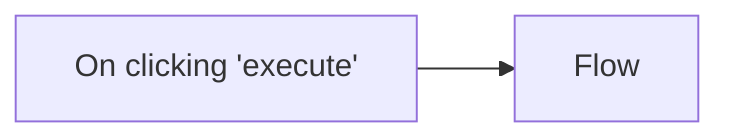

## Fluxo (.json) :

```json
{
  "id": "130",
  "name": "Get all the tasks in Flow",
  "nodes": [
    {
      "name": "On clicking 'execute'",
      "type": "n8n-nodes-base.manualTrigger",
      "position": [
        250,
        300
      ],
      "parameters": {},
      "typeVersion": 1
    },
    {
      "name": "Flow",
      "type": "n8n-nodes-base.flow",
      "position": [
        450,
        300
      ],
      "parameters": {
        "filters": {},
        "operation": "getAll",
        "returnAll": true
      },
      "credentials": {
        "flowApi": ""
      },
      "typeVersion": 1
    }
  ],
  "active": false,
  "settings": {},
  "connections": {
    "On clicking 'execute'": {
      "main": [
        [
          {
            "node": "Flow",
            "type": "main",
            "index": 0
          }
        ]
      ]
    }
  }
}
```

<a id="template-1270"></a>

## Template 1270 - APOD diário para canal Telegram

- **Nome:** APOD diário para canal Telegram
- **Descrição:** Envia diariamente a Astronomy Picture of the Day (APOD) da NASA para um canal do Telegram.
- **Funcionalidade:** • Agendamento diário: Executa o fluxo automaticamente todos os dias às 20:00.
• Recuperação da imagem APOD: Obtém a imagem e metadados do Astronomy Picture of the Day da NASA.
• Envio para canal Telegram: Envia a imagem ao canal especificado como foto, usando o título da APOD como legenda.
- **Ferramentas:** • NASA APOD API: Fornece a imagem e os metadados do Astronomy Picture of the Day.
• Telegram: Plataforma de mensagens usada para enviar a foto ao canal alvo.

## Fluxo visual

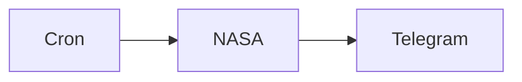

## Fluxo (.json) :

```json
{
  "id": "174",
  "name": "Send the Astronomy Picture of the day daily to a Telegram channel",
  "nodes": [
    {
      "name": "Cron",
      "type": "n8n-nodes-base.cron",
      "position": [
        450,
        300
      ],
      "parameters": {
        "triggerTimes": {
          "item": [
            {
              "hour": 20
            }
          ]
        }
      },
      "typeVersion": 1
    },
    {
      "name": "NASA",
      "type": "n8n-nodes-base.nasa",
      "position": [
        650,
        300
      ],
      "parameters": {
        "download": false,
        "additionalFields": {}
      },
      "credentials": {
        "nasaApi": "NASA"
      },
      "typeVersion": 1
    },
    {
      "name": "Telegram",
      "type": "n8n-nodes-base.telegram",
      "position": [
        850,
        300
      ],
      "parameters": {
        "file": "={{$node[\"NASA\"].json[\"url\"]}}",
        "chatId": "-485365454",
        "operation": "sendPhoto",
        "additionalFields": {
          "caption": "={{$node[\"NASA\"].json[\"title\"]}}"
        }
      },
      "credentials": {
        "telegramApi": "Telegram n8n bot"
      },
      "typeVersion": 1
    }
  ],
  "active": false,
  "settings": {},
  "connections": {
    "Cron": {
      "main": [
        [
          {
            "node": "NASA",
            "type": "main",
            "index": 0
          }
        ]
      ]
    },
    "NASA": {
      "main": [
        [
          {
            "node": "Telegram",
            "type": "main",
            "index": 0
          }
        ]
      ]
    }
  }
}
```

<a id="template-1271"></a>

## Template 1271 - Monitoramento de avisos de segurança Palo Alto

- **Nome:** Monitoramento de avisos de segurança Palo Alto
- **Descrição:** Fluxo que monitora o feed de segurança da Palo Alto, identifica avisos relevantes para produtos específicos, cria tickets e notifica contatos por e-mail.
- **Funcionalidade:** • Coleta de avisos via RSS: Recupera o feed de segurança da Palo Alto Networks.
• Extração de informações: Processa o título do aviso para obter tipo, assunto e severidade.
• Filtragem por data: Filtra avisos publicados nas últimas 24 horas para evitar redundância.
• Filtragem por produto/keyword: Identifica avisos relacionados a produtos específicos (ex.: GlobalProtect, Traps) para ações direcionadas.
• Criação de tickets: Gera issues no sistema de gestão de incidentes para avisos relevantes.
• Notificação por e-mail: Envia o aviso para uma lista de contatos/cliente com detalhes e link.
• Deduplicação: Evita processamento de avisos antigos ou repetidos com base na data.
• Agendamento: Executa automaticamente em intervalo diário (ex.: todo dia às 1h).
- **Ferramentas:** • Palo Alto Networks Security RSS: Fonte oficial de avisos de segurança utilizada como entrada.
• Jira Software Cloud: Plataforma utilizada para criar issues/tickets de investigação.
• Gmail: Serviço utilizado para enviar as notificações por e-mail aos contatos.
• Diretório de e-mails da empresa: Fonte de contatos para distribuição dos avisos (por exemplo, planilha ou diretório corporativo).

## Fluxo visual

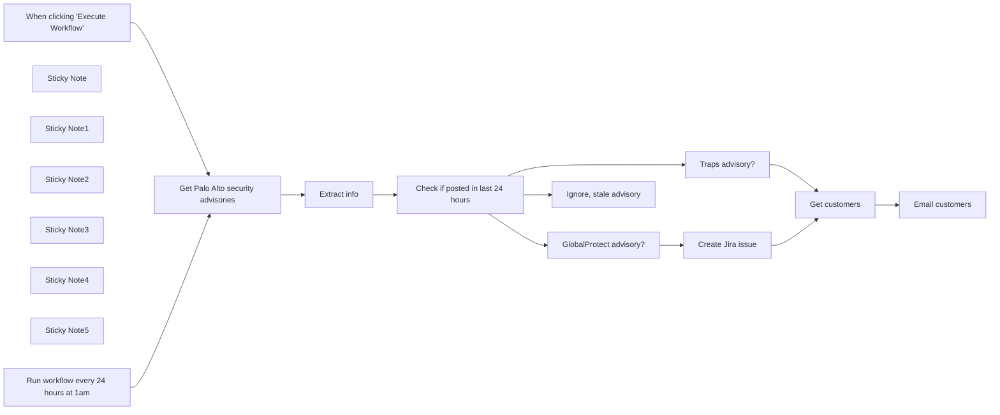

## Fluxo (.json) :

```json
{
  "id": "YSjQ7TVCNY9v1F2A",
  "meta": {
    "instanceId": "03e9d14e9196363fe7191ce21dc0bb17387a6e755dcc9acc4f5904752919dca8"
  },
  "name": "Monitor_security_advisories",
  "tags": [
    {
      "id": "DlIeVDZxzko5ifNi",
      "name": "createdBy:David",
      "createdAt": "2023-10-31T02:21:50.700Z",
      "updatedAt": "2023-10-31T02:21:50.700Z"
    },
    {
      "id": "QPJKatvLSxxtrE8U",
      "name": "Secops",
      "createdAt": "2023-10-31T02:15:11.396Z",
      "updatedAt": "2023-10-31T02:15:11.396Z"
    },
    {
      "id": "oyHT7KfD0rdIizVw",
      "name": "Pending",
      "createdAt": "2023-11-10T23:19:06.319Z",
      "updatedAt": "2023-11-10T23:19:06.319Z"
    }
  ],
  "nodes": [
    {
      "id": "62ef1311-a623-4a7d-b59a-6c0a0d7751d7",
      "name": "When clicking \"Execute Workflow\"",
      "type": "n8n-nodes-base.manualTrigger",
      "position": [
        100,
        200
      ],
      "parameters": {},
      "typeVersion": 1
    },
    {
      "id": "808c1b88-69e9-4e96-bcfd-b93810740fda",
      "name": "Get Palo Alto security advisories",
      "type": "n8n-nodes-base.rssFeedRead",
      "position": [
        400,
        360
      ],
      "parameters": {
        "url": "https://security.paloaltonetworks.com/rss.xml",
        "options": {}
      },
      "typeVersion": 1
    },
    {
      "id": "97f16fe1-c720-40e0-85ff-61fdbfb9a2c2",
      "name": "GlobalProtect advisory?",
      "type": "n8n-nodes-base.filter",
      "position": [
        1240,
        240
      ],
      "parameters": {
        "conditions": {
          "string": [
            {
              "value1": "={{ $json.title }}",
              "value2": "GlobalProtect",
              "operation": "contains"
            }
          ]
        }
      },
      "typeVersion": 1
    },
    {
      "id": "3602f7bb-87d3-49a2-9916-b9ab7d86f58b",
      "name": "Traps advisory?",
      "type": "n8n-nodes-base.filter",
      "position": [
        1240,
        380
      ],
      "parameters": {
        "conditions": {
          "string": [
            {
              "value1": "={{ $json.title }}",
              "value2": "Traps",
              "operation": "contains"
            }
          ]
        }
      },
      "typeVersion": 1
    },
    {
      "id": "97c108f0-bdf1-4ed9-a545-d52acb7c9cec",
      "name": "Create Jira issue",
      "type": "n8n-nodes-base.jira",
      "position": [
        1520,
        240
      ],
      "parameters": {
        "project": {
          "__rl": true,
          "mode": "list",
          "value": ""
        },
        "summary": "={{ $json.title.substring(14) }}",
        "issueType": {
          "__rl": true,
          "mode": "list",
          "value": ""
        },
        "additionalFields": {
          "priority": {
            "mode": "list",
            "value": ""
          },
          "description": "=Severity: {{ $json.title.split('(Severity:')[1].replace(')', '').trim() }}\nLink: {{ $json.link }}\nPublished: {{ $json.pubDate }} "
        }
      },
      "credentials": {
        "jiraSoftwareCloudApi": {
          "id": "4",
          "name": "Jira Ricardo"
        }
      },
      "typeVersion": 1
    },
    {
      "id": "acb89eb0-c9e5-4fbb-a750-3607ae280670",
      "name": "Get customers",
      "type": "n8n-nodes-base.n8nTrainingCustomerDatastore",
      "position": [
        1960,
        380
      ],
      "parameters": {
        "operation": "getAllPeople",
        "returnAll": true
      },
      "typeVersion": 1
    },
    {
      "id": "babf1ce4-6ed4-4bd9-a1df-429a15fa6849",
      "name": "Sticky Note",
      "type": "n8n-nodes-base.stickyNote",
      "position": [
        -13.168003380834136,
        -396.06737036843754
      ],
      "parameters": {
        "width": 332.0284684971131,
        "height": 926.523360092614,
        "content": "\n## Workflow Overview\nThis n8n workflow is designed to streamline security oversight by fetching advisories from Palo Alto's feed and filtering out alerts not pertinent to your products. \n\nBy utilizing a dynamic filter system, it excludes unrelated advisories, ensuring that your team receives only relevant security updates. \n\nCoupled with a sample database of emails, this workflow offers a customizable solution to align with any corporate email directory, providing a strong foundation for your security information management strategy. \n\n## Execution Schedule\n\nScheduled to run every 24 hours at 1 am. If you change this timer, ensure to update the `Deduplicate Advisories` section to match. \n"
      },
      "typeVersion": 1
    },
    {
      "id": "820112fc-e635-4d51-b152-8a2ee4de8f56",
      "name": "Email customers",
      "type": "n8n-nodes-base.gmail",
      "position": [
        2360,
        380
      ],
      "parameters": {
        "sendTo": "={{ $json.email }}",
        "message": "=Dear {{ $json.name.split(' ')[0] }},\n\nWe wanted to let you know of a new security advisory:\n\n{{ $('GlobalProtect advisory?').item.json.title }}\n{{ $('GlobalProtect advisory?').item.json.link }}\n\nRegards,\n\nNathan",
        "options": {},
        "subject": "=New {{ $('Extract info').item.json.type }} security advisory "
      },
      "credentials": {
        "gmailOAuth2": {
          "id": "198",
          "name": "Gmail account (David)"
        }
      },
      "typeVersion": 2
    },
    {
      "id": "06497e48-37ea-4c2a-a633-6b0f02d1da5f",
      "name": "Extract info",
      "type": "n8n-nodes-base.set",
      "position": [
        600,
        360
      ],
      "parameters": {
        "values": {
          "string": [
            {
              "name": "type",
              "value": "={{ $json.title.match(/[^ ]* ([^:]*):/)[1].trim() }}"
            },
            {
              "name": "subject",
              "value": "={{ $json.title.match(/[^ ]* [^:]*: (.*)(?=\\(Severity:)/)[1].trim() }}"
            },
            {
              "name": "severity",
              "value": "={{ $json.title.split('Severity:')[1].replaceAll(')', '').trim().toLowerCase().toTitleCase() }}"
            }
          ]
        },
        "options": {}
      },
      "typeVersion": 2
    },
    {
      "id": "79a85d6e-2550-4351-9356-6f2f8c330693",
      "name": "Sticky Note1",
      "type": "n8n-nodes-base.stickyNote",
      "position": [
        340,
        -54.852630774649356
      ],
      "parameters": {
        "width": 419.37209302325573,
        "height": 577.9223982165106,
        "content": "\n## Get Palo Alto security advisories\nAdaptable and efficient, this segment of the workflow retrieves Palo Alto security advisories directly through their RSS feed. \n\nYou can tailor the feed URL in the RSS node below to meet your needs and ensure the `Extract Info` node captures the correct information. \n\nThis flexibility allows the workflow to stay current with the latest advisories, making it a vital component in maintaining up-to-date security measures across your network infrastructure.\n"
      },
      "typeVersion": 1
    },
    {
      "id": "f2c5155d-28ab-4ae4-a402-5244ccac94e3",
      "name": "Check if posted in last 24 hours",
      "type": "n8n-nodes-base.if",
      "position": [
        920,
        360
      ],
      "parameters": {
        "conditions": {
          "dateTime": [
            {
              "value1": "={{ $json.pubDate }}",
              "value2": "={{$today.minus({days: 1})}}"
            }
          ]
        }
      },
      "typeVersion": 1
    },
    {
      "id": "a3553ba4-3581-4844-abaf-e872cb6dc7ea",
      "name": "Sticky Note2",
      "type": "n8n-nodes-base.stickyNote",
      "position": [
        1751,
        -366.68188678732713
      ],
      "parameters": {
        "width": 461.89918009735027,
        "height": 893.2712326436663,
        "content": "\n## Query Company Email Directory\nThe workflow includes a sample node setup that queries a company email directory, allowing for dynamic distribution of advisories to relevant personnel. \n\nReplace the sample node with a connection to your corporate directory or a Google Sheet for an integrated approach. If you choose to go the google sheets route, create a column for `name` and a column for `email` and use the Google Sheets node to get the rows. \n\nThis ensures that every advisory reaches the appropriate individual, promoting a proactive security posture organization-wide.\n\nEnsure that the node you use outputs the json in this format:\n\n```\n[\n  {\n    \"name\": \"Jay Gatsby\",\n    \"email\": \"gatsby@west-egg.com\"\n  },\n  {\n    \"name\": \"José Arcadio Buendía\",\n    \"email\": \"jab@macondo.co\"\n  },\n  {\n    \"name\": \"Max Sendak\",\n    \"email\": \"info@in-and-out-of-weeks.org\"\n  }\n]\n```"
      },
      "typeVersion": 1
    },
    {
      "id": "4c6a7aac-8aa3-480e-9691-bfa5472d3d91",
      "name": "Sticky Note3",
      "type": "n8n-nodes-base.stickyNote",
      "position": [
        2240,
        -113.74332300803701
      ],
      "parameters": {
        "width": 324.2540832882642,
        "height": 639.8357317519218,
        "content": "\n## Email advisory information to your team\nOnce advisories are filtered and prepared, this final node uses Gmail to disseminate the information to your team, ensuring that those who need to be aware of security updates are informed in a timely manner. \n\nThis step is pivotal in the communication chain, turning advisories into actionable insights for your team, thereby promoting a culture of responsiveness and awareness regarding network security.\n\nYou can replace this with your preferred email provider by substituting the node and expressions in the Gmail node. "
      },
      "typeVersion": 1
    },
    {
      "id": "75aae5d6-bcaf-4d69-9adf-f71075b16318",
      "name": "Sticky Note4",
      "type": "n8n-nodes-base.stickyNote",
      "position": [
        1180,
        -320
      ],
      "parameters": {
        "width": 552.9069767441861,
        "height": 844.9721583936011,
        "content": "\n## Filter advisories based on Palo Alto Products used in your organization \nThis node enhances specificity by filtering advisories based on the Palo Alto products utilized within your organization. \n\nBy customizing the filter nodes to match your environment, you create a streamlined process that directs pertinent advisories to a Jira issue (or any incident management system that uses an API) for further investigation, ensuring your incident management process is both efficient and tailored to your specific security landscape.\n\n**Want to add a new filter?** Duplicate one of the `filter nodes` below and connect it to the `true output` of the date filter node, decide whether you wish to add an incident management node, and then connect to your email directory node.\n \n**Want to create a ticket for your team to investigate if an advisory is found for your filtered product/keyword?** Simply add the node for your favorite incident management platform if it exists, and an http request if it doesn't to integrate with any REST api.\n"
      },
      "typeVersion": 1
    },
    {
      "id": "4c34c8aa-3876-4248-9c5e-cd362ffb6833",
      "name": "Sticky Note5",
      "type": "n8n-nodes-base.stickyNote",
      "position": [
        780,
        -176.24786257310654
      ],
      "parameters": {
        "width": 382.81395348837174,
        "height": 700.2899123297333,
        "content": "\n## Deduplicate Advisories\n### Filter advisories based on date \nTo maintain accuracy and avoid redundancy, this n8n node deduplicates advisories by date, ensuring that each security notice is unique and relevant. \n\nIt's programmed to sync with the scheduled trigger, preventing any overlap in data analysis. \n\nAdjustments can be made to alter the frequency and timing of the trigger, allowing for weekly or custom schedules, demonstrating n8n's versatile capability to adapt to your operational requirements.\n\nFor example if you preferred to change it to weekly, set the `Trigger Node` to run weekly, and adjust the expression in the `If` node below from `{{$today.minus({days: 1})}}` to `{{$today.minus({days: 7})}}`."
      },
      "typeVersion": 1
    },
    {
      "id": "518de294-2961-419b-b936-3519fc4bdcf8",
      "name": "Ignore, stale advisory",
      "type": "n8n-nodes-base.noOp",
      "position": [
        1220,
        600
      ],
      "parameters": {},
      "typeVersion": 1
    },
    {
      "id": "699ba4b3-ef02-4e7c-8894-c302566ac5e7",
      "name": "Run workflow every 24 hours at 1am",
      "type": "n8n-nodes-base.scheduleTrigger",
      "position": [
        100,
        360
      ],
      "parameters": {
        "rule": {
          "interval": [
            {
              "triggerAtHour": 1
            }
          ]
        }
      },
      "typeVersion": 1.1
    }
  ],
  "active": false,
  "pinData": {},
  "settings": {
    "executionOrder": "v1"
  },
  "versionId": "e64a6ec2-b231-4cb7-9d36-8933c844d482",
  "connections": {
    "Extract info": {
      "main": [
        [
          {
            "node": "Check if posted in last 24 hours",
            "type": "main",
            "index": 0
          }
        ]
      ]
    },
    "Get customers": {
      "main": [
        [
          {
            "node": "Email customers",
            "type": "main",
            "index": 0
          }
        ]
      ]
    },
    "Traps advisory?": {
      "main": [
        [
          {
            "node": "Get customers",
            "type": "main",
            "index": 0
          }
        ]
      ]
    },
    "Create Jira issue": {
      "main": [
        [
          {
            "node": "Get customers",
            "type": "main",
            "index": 0
          }
        ]
      ]
    },
    "GlobalProtect advisory?": {
      "main": [
        [
          {
            "node": "Create Jira issue",
            "type": "main",
            "index": 0
          }
        ]
      ]
    },
    "Check if posted in last 24 hours": {
      "main": [
        [
          {
            "node": "GlobalProtect advisory?",
            "type": "main",
            "index": 0
          },
          {
            "node": "Traps advisory?",
            "type": "main",
            "index": 0
          }
        ],
        [
          {
            "node": "Ignore, stale advisory",
            "type": "main",
            "index": 0
          }
        ]
      ]
    },
    "When clicking \"Execute Workflow\"": {
      "main": [
        [
          {
            "node": "Get Palo Alto security advisories",
            "type": "main",
            "index": 0
          }
        ]
      ]
    },
    "Get Palo Alto security advisories": {
      "main": [
        [
          {
            "node": "Extract info",
            "type": "main",
            "index": 0
          }
        ]
      ]
    },
    "Run workflow every 24 hours at 1am": {
      "main": [
        [
          {
            "node": "Get Palo Alto security advisories",
            "type": "main",
            "index": 0
          }
        ]
      ]
    }
  }
}
```

<a id="template-1272"></a>

## Template 1272 - Campanha de e-mail personalizada com decisão de cupom

- **Nome:** Campanha de e-mail personalizada com decisão de cupom
- **Descrição:** Automatiza a leitura de feedbacks de clientes, gera conteúdo de e-mail personalizado via IA, decide se oferece um cupom e envia o e-mail ao cliente.
- **Funcionalidade:** • Importação de dados: Baixa e extrai uma planilha Excel com dados e feedbacks dos clientes.
• Configuração rápida de campanha: Permite ajustar alvo da campanha e tom ('Flavour') sem alterar o fluxo principal.
• Análise de sentimento e geração de conteúdo: Usa IA para determinar sentimento do feedback e gerar Headline e Body para o e-mail, sem incluir dados pessoais no prompt.
• Decisão sobre cupom: A IA devolve um campo booleano indicando se o cliente deve receber um cupom de recuperação.
• Geração de cupom (simulada): Em caso positivo, gera um cupom mockado com valor e termos (ponto de extensão para integrar gerador real).
• Validação de saída da IA: Verifica se Headline e Body não estão vazios e interrompe o envio em caso de resultado inválido.
• Criação de templates HTML: Monta dois templates HTML (com e sem cupom) preenchendo com o conteúdo gerado e dados do cliente.
• Junção de dados: Combina o conteúdo gerado pela IA com os dados originais do cliente antes do envio.
• Envio de e-mail: Envia a mensagem final ao cliente via servidor de e-mail SMTP.
- **Ferramentas:** • LangChain: Orquestra os prompts e extrai estrutura de saída (Headline, Body, SendCoupon) a partir do modelo de linguagem.
• OpenAI (gpt-4o-mini): Modelo de linguagem usado para analisar feedback e gerar conteúdo personalizado e a decisão de cupom.
• Servidor HTTP (let-the-work-flow.com): Hospeda a planilha Excel de dados de exemplo (.xlsx) utilizada como entrada.
• Serviço SMTP (ex.: Greenmail ou provedor SMTP do usuário): Responsável pelo envio dos e-mails gerados.
• Hospedagem de imagens (logoipsum.com): Fornece o logotipo utilizado nos templates HTML.

## Fluxo visual

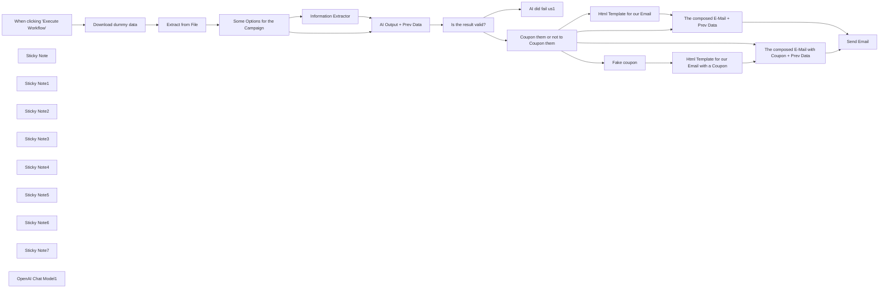

## Fluxo (.json) :

```json
{
  "meta": {
    "instanceId": "408f9fb9940c3cb18ffdef0e0150fe342d6e655c3a9fac21f0f644e8bedabcd9",
    "templateCredsSetupCompleted": true
  },
  "nodes": [
    {
      "id": "9681490a-68f1-4c6a-86ea-bf2331c3125d",
      "name": "When clicking \"Execute Workflow\"",
      "type": "n8n-nodes-base.manualTrigger",
      "position": [
        -600,
        1040
      ],
      "parameters": {},
      "typeVersion": 1
    },
    {
      "id": "f665f0c6-7694-456f-b877-5f8d69b9f503",
      "name": "Sticky Note",
      "type": "n8n-nodes-base.stickyNote",
      "position": [
        -680,
        920
      ],
      "parameters": {
        "width": 715.3278290432247,
        "height": 315.32782904322477,
        "content": "## Get and prepare Dummy Data"
      },
      "typeVersion": 1
    },
    {
      "id": "79a9ece6-daa5-4cc0-bfb8-5cf8c9e81296",
      "name": "Sticky Note1",
      "type": "n8n-nodes-base.stickyNote",
      "position": [
        340,
        480
      ],
      "parameters": {
        "width": 520.9323109877616,
        "height": 577.5426854600692,
        "content": "## Let GPT do the heavy work\n\nFor the prompt we follow the one-shot'ish principle. Also I've decided to **_NOT_** give the AI the personal data. Keeps it simpler regarding data privacy.\n\nThe AI-Chain will generate a **Headline** and the **Text** for the Email and even **decides** if we should send the user a **Coupon**."
      },
      "typeVersion": 1
    },
    {
      "id": "51e1bc15-0b9e-4d53-9b99-0ec8ed5e00f8",
      "name": "Sticky Note2",
      "type": "n8n-nodes-base.stickyNote",
      "position": [
        2240,
        620
      ],
      "parameters": {
        "width": 358,
        "height": 324,
        "content": "## HTML Email-Template without Coupon"
      },
      "typeVersion": 1
    },
    {
      "id": "ee29375a-77fe-4d13-a453-c8b62f0884a7",
      "name": "Sticky Note3",
      "type": "n8n-nodes-base.stickyNote",
      "position": [
        1100,
        880
      ],
      "parameters": {
        "width": 447,
        "height": 465,
        "content": "## Make sure we have what we need\nWe do not want to sent empty messages to our customers"
      },
      "typeVersion": 1
    },
    {
      "id": "37e09224-3649-43e0-a40f-f8177aa93cda",
      "name": "Sticky Note4",
      "type": "n8n-nodes-base.stickyNote",
      "position": [
        2240,
        1140
      ],
      "parameters": {
        "width": 369.917435648372,
        "height": 330.56011245057107,
        "content": "## HTML Email-Template with Coupon"
      },
      "typeVersion": 1
    },
    {
      "id": "5147fe48-606d-4dad-9977-2713f40fc8e6",
      "name": "Sticky Note5",
      "type": "n8n-nodes-base.stickyNote",
      "position": [
        1880,
        1140
      ],
      "parameters": {
        "width": 319.84249777513367,
        "height": 330.6656654860422,
        "content": "## Mocked: Fake a Coupon Code\nFor a real life scenario add the automated coupon generation here"
      },
      "typeVersion": 1
    },
    {
      "id": "6a3ee9b0-540e-4242-a6ac-535e2b23ea3a",
      "name": "Sticky Note6",
      "type": "n8n-nodes-base.stickyNote",
      "position": [
        -680,
        300
      ],
      "parameters": {
        "width": 534.1315466553021,
        "height": 566.556517486655,
        "content": "# Documentation\n\nThis Workflow is for the n8n AI / Langchain Competition.\n\nIt solves the Problem: Personalizing marketing emails based on customer purchase history.\n\nI've found it a bit ambiguous and decided to go the \"Convert unhappy customers with a Coupon\"-Route.\n\nSo this workflow utilizes the new LangChain Node for generating personalized E-Mail campaigns and decide if the user might need a coupon to be satisfied. Classic Rebound stuff. \n\nThere is also a Node \"Some Options...\" which can be adjusted to quickly change the direction this Campaign should go.\n\nAdditionally we use n8n to generate the HTML Mails by two different Templates. One with simple text and another for that Coupon handling.\n\n\nEnjoy the Workflow! ❤️ \nhttps://let-the-work-flow.com\n"
      },
      "typeVersion": 1
    },
    {
      "id": "01cf3e60-c280-46c1-9971-ccf63a28ab9a",
      "name": "Sticky Note7",
      "type": "n8n-nodes-base.stickyNote",
      "position": [
        3040,
        760
      ],
      "parameters": {
        "width": 326.9476248855971,
        "height": 414.15459581943776,
        "content": "## Send the Email to the Customer\n\nAlthough it's cool that n8n allows sending emails via SMPT I would recommend to stick to your newsletter tool for that to keep track of opt-outs and stuff."
      },
      "typeVersion": 1
    },
    {
      "id": "6c458bf6-ea7b-43b5-bc65-d9ae68542a8c",
      "name": "Extract from File",
      "type": "n8n-nodes-base.extractFromFile",
      "position": [
        -160,
        1040
      ],
      "parameters": {
        "options": {},
        "operation": "xls"
      },
      "typeVersion": 1
    },
    {
      "id": "780dd707-4493-4679-9064-acc3c59011f8",
      "name": "Some Options for the Campaign",
      "type": "n8n-nodes-base.set",
      "position": [
        140,
        1040
      ],
      "parameters": {
        "options": {},
        "assignments": {
          "assignments": [
            {
              "id": "8ef766db-4ad1-43c7-b621-8ea3ed0a44b2",
              "name": "Campaign Target",
              "type": "string",
              "value": "Engage the Customer"
            },
            {
              "id": "9f9ce88a-a24a-4a27-8b25-25ee85e730d6",
              "name": "Flavour",
              "type": "string",
              "value": "be friendly and witty but also cool and direct. Critique is valuable and embrace the feedback."
            }
          ]
        },
        "includeOtherFields": true
      },
      "typeVersion": 3.4
    },
    {
      "id": "3b152bdc-acb8-4f37-8b91-1ab02c0e9532",
      "name": "Information Extractor",
      "type": "@n8n/n8n-nodes-langchain.informationExtractor",
      "position": [
        480,
        700
      ],
      "parameters": {
        "text": "=Item Purchased: {{ $json['Item Purchased'] }} \nFeedback: {{ $json.Feedback }}\nShould we send a coupon to make the customer happy? Yes/No",
        "options": {
          "systemPromptTemplate": "=Determine the sentiment of the given product feedback. Then generate a Headline and Text without salutation or any greeting for a personalized Email Campagin after a User gave a product review. If the user seems not happy, tell them that you have a Coupon for them. The User finds the Coupon Code below this E-mail. \nThe target of the campagin: {{ $json['Campaign Target'] }}.\nRemember: {{ $json['Flavour'] }}. Avoid any greeting.\n"
        },
        "schemaType": "manual",
        "inputSchema": "{\n  \"type\": \"object\",\n  \"required\": [\"Headline\",\"Body\",\"SendCoupon\"],\n  \"properties\": {\n    \"Headline\": {\n      \"type\": \"string\"\n    },\n    \"Body\": {\n      \"type\": \"string\"\n    },\n    \"SendCoupon\": {\n      \"type\": \"boolean\"\n    }\n  }\n}"
      },
      "typeVersion": 1
    },
    {
      "id": "f597a54e-27e9-46e8-b9d5-46dd54406803",
      "name": "OpenAI Chat Model1",
      "type": "@n8n/n8n-nodes-langchain.lmChatOpenAi",
      "position": [
        480,
        880
      ],
      "parameters": {
        "model": {
          "__rl": true,
          "mode": "list",
          "value": "gpt-4o-mini"
        },
        "options": {}
      },
      "credentials": {
        "openAiApi": {
          "id": "8gccIjcuf3gvaoEr",
          "name": "OpenAi account"
        }
      },
      "typeVersion": 1.2
    },
    {
      "id": "716e4281-cf18-4cc7-b5ed-4de0308bf9aa",
      "name": "AI did fail us1",
      "type": "n8n-nodes-base.stopAndError",
      "position": [
        1380,
        1180
      ],
      "parameters": {
        "errorMessage": "Unexpected Langchain Output"
      },
      "typeVersion": 1
    },
    {
      "id": "1dc51ad5-e605-4cad-9a5b-3b20eabd9797",
      "name": "Fake coupon",
      "type": "n8n-nodes-base.set",
      "position": [
        1980,
        1280
      ],
      "parameters": {
        "options": {},
        "assignments": {
          "assignments": [
            {
              "id": "73989d0e-667f-4227-ab41-4eb1e8c1c10e",
              "name": "Coupon",
              "type": "string",
              "value": "F4k3ItT1llY0uM4k3It"
            },
            {
              "id": "4d86d8c8-1be3-40b0-b4fd-09f9ffc24386",
              "name": "Coupon Value",
              "type": "string",
              "value": "20% of any purchase"
            },
            {
              "id": "f73b8a70-5bf6-45c2-8061-d10f95b199a8",
              "name": "Coupon Terms",
              "type": "string",
              "value": "=Valid until {{ $today.plus({days: 14}).format(\"d. MMM. y\") }} | minimum purchase amount: 20$ "
            }
          ]
        },
        "includeOtherFields": true
      },
      "typeVersion": 3.4
    },
    {
      "id": "dfa6b376-dd66-40f1-8626-0f3f04e4c4bd",
      "name": "Download dummy data",
      "type": "n8n-nodes-base.httpRequest",
      "position": [
        -380,
        1040
      ],
      "parameters": {
        "url": "https://let-the-work-flow.com/dummy/n8n-contest-merch.xlsx",
        "options": {}
      },
      "typeVersion": 4.2
    },
    {
      "id": "a95ce7c4-c592-40c7-9dfa-db0e37d5b71f",
      "name": "AI Output + Prev Data",
      "type": "n8n-nodes-base.merge",
      "position": [
        940,
        1040
      ],
      "parameters": {
        "mode": "combine",
        "options": {},
        "combineBy": "combineByPosition"
      },
      "typeVersion": 3
    },
    {
      "id": "bb0474a1-425c-4a02-a13e-385272091189",
      "name": "Is the result valid?",
      "type": "n8n-nodes-base.if",
      "position": [
        1160,
        1040
      ],
      "parameters": {
        "options": {},
        "conditions": {
          "options": {
            "version": 2,
            "leftValue": "",
            "caseSensitive": true,
            "typeValidation": "strict"
          },
          "combinator": "and",
          "conditions": [
            {
              "id": "9b4ced26-dd86-4ae4-8f69-6177ec42c827",
              "operator": {
                "type": "string",
                "operation": "notEmpty",
                "singleValue": true
              },
              "leftValue": "Headline",
              "rightValue": ""
            },
            {
              "id": "7723102c-43d2-48df-82f6-5bb45ddf615c",
              "operator": {
                "type": "string",
                "operation": "notEmpty",
                "singleValue": true
              },
              "leftValue": "Body",
              "rightValue": ""
            }
          ]
        }
      },
      "typeVersion": 2.2
    },
    {
      "id": "b39e0b98-6824-4265-94a0-fe12154f2ad4",
      "name": "Coupon them or not to Coupon them",
      "type": "n8n-nodes-base.if",
      "position": [
        1620,
        1040
      ],
      "parameters": {
        "options": {},
        "conditions": {
          "options": {
            "version": 2,
            "leftValue": "",
            "caseSensitive": true,
            "typeValidation": "strict"
          },
          "combinator": "and",
          "conditions": [
            {
              "id": "967f37a1-a600-46a2-82cf-f340dd3c7a96",
              "operator": {
                "type": "boolean",
                "operation": "true",
                "singleValue": true
              },
              "leftValue": "={{ $json.SendCoupon }}",
              "rightValue": ""
            }
          ]
        }
      },
      "typeVersion": 2.2
    },
    {
      "id": "13c4426f-f522-4127-b899-7e6397e18182",
      "name": "Html Template for our Email",
      "type": "n8n-nodes-base.html",
      "position": [
        2360,
        740
      ],
      "parameters": {
        "html": "<!DOCTYPE html>\n<html>\n<head>\n  <meta charset=\"UTF-8\" />\n  <title>{{ $json['Headline'] }}</title>\n</head>\n<body>\n  <div class=\"container\">\n    \n    <h1>Hey {{ $json['Custome Name'] ? $json['Custome Name']+', ' : '!' }}</h1>\n    <p>{{ $json['Body'] }}</p>\n    \n  <div class=\"footer\">\n   <p>\n    Definitely not a real company Lmt.<br>\n    Also not a real street 123<br>\n    Unreal Town\n   </p>  \n</div> \n </div>\n \n  \n</body>\n</html>\n\n<style>\n.logo {\n  margin-top: 20px;\n }\n.container {\n  background-color: #ffffff;\n  font-family: sans-serif;\n  padding: 16px;\n  border-radius: 8px;\n}\n\nh1 {\n  color: #ff6d5a;\n  font-size: 24px;\n  font-weight: bold;\n  margin-top: 30px;\n}\n\np {\n  color: #606060;\n  line-height: 1.6;\n}\n\nh2 {\n  color: #909399;\n  font-size: 20px;\n  font-weight: bold;\n  padding: 8px;\n}\n\n.footer {\n  margin-top: 30px;\n}\n\n.footer > p {\n    font-size: 14px;\n  color: #ccc;\n }\n\n</style>"
      },
      "typeVersion": 1.2
    },
    {
      "id": "71e36c09-6e24-4eb2-9b1a-4fb3bb4b4536",
      "name": "The composed E-Mail + Prev Data",
      "type": "n8n-nodes-base.merge",
      "position": [
        2740,
        860
      ],
      "parameters": {
        "mode": "combine",
        "options": {},
        "combineBy": "combineByPosition"
      },
      "typeVersion": 3
    },
    {
      "id": "a2b6ec8e-1bcf-4216-b9b6-476c0d82f706",
      "name": "Html Template for our Email with a Coupon",
      "type": "n8n-nodes-base.html",
      "position": [
        2360,
        1280
      ],
      "parameters": {
        "html": "<!DOCTYPE html>\n<html>\n<head>\n  <meta charset=\"UTF-8\" />\n  <title>{{ $json.output['Headline'] }}</title>\n</head>\n<body>\n  <div class=\"container\">\n    \n    <h1>Hey {{ $json['Custome Name'] ? $json['Custome Name']+', ' : '!' }}</h1>\n    <p>{{ $json.output['Body'] }}</p>\n    \n    <div class=\"coupon\">\n        <h3>Here's a Coupon for you!<br>\n        {{ $json['Coupon Value'] }}</h3>\n        <h4 class=\"code\">{{ $json['Coupon'] }}</h4>\n        <p>{{ $json['Coupon Terms'] }}</p>\n    </div>\n  <div class=\"footer\">\n   <p>\n    Definitely not a real company Lmt.<br>\n    Also not a real street 123<br>\n    Unreal Town\n   </p>  \n</div> \n </div>\n \n  \n</body>\n</html>\n\n<style>\n.logo {\n  margin-top: 20px;\n }\n.container {\n  background-color: #ffffff;\n  font-family: sans-serif;\n  padding: 16px;\n  border-radius: 8px;\n}\n\nh1 {\n  color: #ff6d5a;\n  font-size: 24px;\n  font-weight: bold;\n  margin-top: 30px;\n}\n\np {\n  color: #606060;\n  line-height: 1.6;\n}\n\nh2 {\n  color: #909399;\n  font-size: 20px;\n  font-weight: bold;\n  padding: 8px;\n}\n\n.coupon {\n  background: #ff6d5a;\n  color: #fff;\n  padding: 20px;\n}\n.coupon p {\n  color: #fff;\n}\n  \n.coupon .code {\n  font-weight: bold;\n  font-size: 24px;\n  font-family: monospace;\n }\n\n.footer {\n  margin-top: 30px;\n}\n\n.footer > p {\n    font-size: 14px;\n  color: #ccc;\n }\n\n</style>"
      },
      "typeVersion": 1.2
    },
    {
      "id": "2d5dd858-cf61-4136-b405-e6ad4a372725",
      "name": "The composed E-Mail with Coupon + Prev Data",
      "type": "n8n-nodes-base.merge",
      "position": [
        2740,
        1040
      ],
      "parameters": {
        "mode": "combine",
        "options": {},
        "combineBy": "combineByPosition"
      },
      "typeVersion": 3
    },
    {
      "id": "5b1606b4-903a-4e90-8cf6-01fd92006195",
      "name": "Send Email",
      "type": "n8n-nodes-base.emailSend",
      "position": [
        3140,
        960
      ],
      "webhookId": "a155d7b3-39b1-4a96-adc5-4f8e984506ec",
      "parameters": {
        "html": "={{ $json.html }}",
        "options": {},
        "subject": "={{ $json.output.Headline }}",
        "toEmail": "={{ $json.Email }}",
        "fromEmail": "n8n@myemail.com"
      },
      "credentials": {
        "smtp": {
          "id": "EagS3depRLAKo3Sw",
          "name": "Greenmail SMTP account (bob@example.com)"
        }
      },
      "typeVersion": 2.1
    }
  ],
  "pinData": {},
  "connections": {
    "Fake coupon": {
      "main": [
        [
          {
            "node": "Html Template for our Email with a Coupon",
            "type": "main",
            "index": 0
          }
        ]
      ]
    },
    "Extract from File": {
      "main": [
        [
          {
            "node": "Some Options for the Campaign",
            "type": "main",
            "index": 0
          }
        ]
      ]
    },
    "OpenAI Chat Model1": {
      "ai_languageModel": [
        [
          {
            "node": "Information Extractor",
            "type": "ai_languageModel",
            "index": 0
          }
        ]
      ]
    },
    "Download dummy data": {
      "main": [
        [
          {
            "node": "Extract from File",
            "type": "main",
            "index": 0
          }
        ]
      ]
    },
    "Is the result valid?": {
      "main": [
        [
          {
            "node": "Coupon them or not to Coupon them",
            "type": "main",
            "index": 0
          }
        ],
        [
          {
            "node": "AI did fail us1",
            "type": "main",
            "index": 0
          }
        ]
      ]
    },
    "AI Output + Prev Data": {
      "main": [
        [
          {
            "node": "Is the result valid?",
            "type": "main",
            "index": 0
          }
        ]
      ]
    },
    "Information Extractor": {
      "main": [
        [
          {
            "node": "AI Output + Prev Data",
            "type": "main",
            "index": 0
          }
        ]
      ]
    },
    "Html Template for our Email": {
      "main": [
        [
          {
            "node": "The composed E-Mail + Prev Data",
            "type": "main",
            "index": 0
          }
        ]
      ]
    },
    "Some Options for the Campaign": {
      "main": [
        [
          {
            "node": "Information Extractor",
            "type": "main",
            "index": 0
          },
          {
            "node": "AI Output + Prev Data",
            "type": "main",
            "index": 1
          }
        ]
      ]
    },
    "The composed E-Mail + Prev Data": {
      "main": [
        [
          {
            "node": "Send Email",
            "type": "main",
            "index": 0
          }
        ]
      ]
    },
    "When clicking \"Execute Workflow\"": {
      "main": [
        [
          {
            "node": "Download dummy data",
            "type": "main",
            "index": 0
          }
        ]
      ]
    },
    "Coupon them or not to Coupon them": {
      "main": [
        [
          {
            "node": "Html Template for our Email",
            "type": "main",
            "index": 0
          },
          {
            "node": "The composed E-Mail + Prev Data",
            "type": "main",
            "index": 1
          }
        ],
        [
          {
            "node": "Fake coupon",
            "type": "main",
            "index": 0
          },
          {
            "node": "The composed E-Mail with Coupon + Prev Data",
            "type": "main",
            "index": 0
          }
        ]
      ]
    },
    "Html Template for our Email with a Coupon": {
      "main": [
        [
          {
            "node": "The composed E-Mail with Coupon + Prev Data",
            "type": "main",
            "index": 1
          }
        ]
      ]
    },
    "The composed E-Mail with Coupon + Prev Data": {
      "main": [
        [
          {
            "node": "Send Email",
            "type": "main",
            "index": 0
          }
        ]
      ]
    }
  }
}
```

<a id="template-1273"></a>

## Template 1273 - Registrar feedbacks com análise de sentimento

- **Nome:** Registrar feedbacks com análise de sentimento
- **Descrição:** Recebe submissões de um formulário, avalia o sentimento do feedback e distribui os resultados para registro e notificação em serviços externos.
- **Funcionalidade:** • Captura de respostas do formulário: Inicia o fluxo ao receber uma submissão de um formulário específico.
• Análise de sentimento do texto: Avalia o texto do campo de sugestões para obter um score de sentimento.
• Roteamento condicional: Separa o fluxo em caminhos diferentes com base no score do sentimento.
• Registro de feedbacks: Cria uma entrada em uma base de dados com nome e conteúdo do feedback.
• Notificação em canal: Envia uma mensagem para um canal com o nome do usuário, feedback e score de sentimento.
• Criação de tarefa/seguimento: Gera um cartão contendo score, feedback e usuário para acompanhamento posterior.
- **Ferramentas:** • Typeform: Ferramenta para coleta de respostas de formulários online que dispara o fluxo.
• Google Cloud Natural Language: Serviço de processamento de linguagem usado para análise de sentimento do texto.
• Notion: Plataforma utilizada para armazenar o feedback como uma página/registro em uma base de dados.
• Slack: Canal de comunicação usado para enviar notificações com detalhes do feedback e score.
• Trello: Ferramenta de gestão visual usada para criar cartões de acompanhamento com descrição e score.

## Fluxo visual

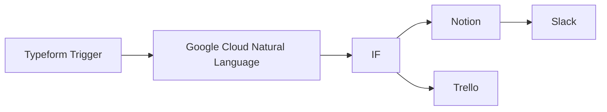

## Fluxo (.json) :

```json
{
  "nodes": [
    {
      "name": "Typeform Trigger",
      "type": "n8n-nodes-base.typeformTrigger",
      "position": [
        0,
        400
      ],
      "webhookId": "ad8a87ef-d293-4e48-8d36-838d69ebce0f",
      "parameters": {
        "formId": "fBYjtY5e"
      },
      "credentials": {
        "typeformApi": ""
      },
      "typeVersion": 1
    },
    {
      "name": "Google Cloud Natural Language",
      "type": "n8n-nodes-base.googleCloudNaturalLanguage",
      "position": [
        200,
        400
      ],
      "parameters": {
        "content": "={{$json[\"Any suggestions for us? \"]}}",
        "options": {}
      },
      "credentials": {
        "googleCloudNaturalLanguageOAuth2Api": ""
      },
      "typeVersion": 1
    },
    {
      "name": "IF",
      "type": "n8n-nodes-base.if",
      "position": [
        400,
        400
      ],
      "parameters": {
        "conditions": {
          "number": [
            {
              "value1": "={{$node[\"Google Cloud Natural Language\"].json[\"documentSentiment\"][\"score\"]}}",
              "operation": "larger"
            }
          ]
        }
      },
      "typeVersion": 1
    },
    {
      "name": "Notion",
      "type": "n8n-nodes-base.notion",
      "position": [
        600,
        300
      ],
      "parameters": {
        "resource": "databasePage",
        "databaseId": "b7d1130a-3756-4bb3-aa56-0c77bf416437",
        "propertiesUi": {
          "propertyValues": [
            {
              "key": "Name|title",
              "title": "={{$node[\"Typeform Trigger\"].json[\"Name\"]}}"
            },
            {
              "key": "Feedback|rich_text",
              "textContent": "={{$node[\"Typeform Trigger\"].json[\"Any suggestions for us? \"]}}"
            }
          ]
        }
      },
      "credentials": {
        "notionApi": ""
      },
      "typeVersion": 1
    },
    {
      "name": "Slack",
      "type": "n8n-nodes-base.slack",
      "position": [
        800,
        300
      ],
      "parameters": {
        "channel": "general",
        "blocksUi": {
          "blocksValues": []
        },
        "attachments": [
          {
            "text": "={{$node[\"Typeform Trigger\"].json[\"Any suggestions for us? \"]}}",
            "title": "={{$node[\"Typeform Trigger\"].json[\"Name\"]}} {{$node[\"Google Cloud Natural Language\"].json[\"documentSentiment\"][\"score\"]}}"
          }
        ],
        "otherOptions": {}
      },
      "credentials": {
        "slackApi": ""
      },
      "typeVersion": 1
    },
    {
      "name": "Trello",
      "type": "n8n-nodes-base.trello",
      "position": [
        600,
        500
      ],
      "parameters": {
        "name": "=Score: {{$json[\"documentSentiment\"][\"score\"]}}",
        "listId": "5fbb9e2eb1d5cc0a8a7ab8ac",
        "description": "=Score: {{$json[\"documentSentiment\"][\"score\"]}}\nFeedback: {{$node[\"Typeform Trigger\"].json[\"Any suggestions for us? \"]}}\nUser: {{$node[\"Typeform Trigger\"].json[\"Name\"]}}",
        "additionalFields": {}
      },
      "credentials": {
        "trelloApi": ""
      },
      "typeVersion": 1
    }
  ],
  "connections": {
    "IF": {
      "main": [
        [
          {
            "node": "Notion",
            "type": "main",
            "index": 0
          }
        ],
        [
          {
            "node": "Trello",
            "type": "main",
            "index": 0
          }
        ]
      ]
    },
    "Notion": {
      "main": [
        [
          {
            "node": "Slack",
            "type": "main",
            "index": 0
          }
        ]
      ]
    },
    "Typeform Trigger": {
      "main": [
        [
          {
            "node": "Google Cloud Natural Language",
            "type": "main",
            "index": 0
          }
        ]
      ]
    },
    "Google Cloud Natural Language": {
      "main": [
        [
          {
            "node": "IF",
            "type": "main",
            "index": 0
          }
        ]
      ]
    }
  }
}
```

<a id="template-1274"></a>

## Template 1274 - Gerar apresentações personalizadas por lead

- **Nome:** Gerar apresentações personalizadas por lead
- **Descrição:** Automatiza a criação de planilhas com dados de leads recebidos e gera apresentações duplicadas a partir de um template, preenchendo textos com informações específicas de cada lead e registrando o ID da apresentação na lista de leads.
- **Funcionalidade:** • Monitoramento de pasta: Detecta novos arquivos de leads adicionados a uma pasta específica.
• Identificação do tipo de arquivo: Diferencia arquivos CSV e XLSX para processamento adequado.
• Download e extração de dados: Faz download do arquivo recebido e extrai os dados (por exemplo CSV com cabeçalho).
• Criação de planilha nova: Cria uma nova planilha para armazenar os dados dos leads com nome padronizado por data.
• Inserção/mesclagem de dados: Insere ou mescla os dados extraídos na nova planilha, organizando colunas como Nome, Email, Empresa, etc.
• Movimentação de arquivo: Move a planilha criada para uma pasta de lista de leads específica.
• Cópia de template de apresentação: Duplica um modelo de apresentação para criar uma versão por lead com nome padronizado.
• Substituição de textos na apresentação: Substitui marcadores no template (placeholders) por informações do lead (ex.: nome, empresa).
• Registro do ID da apresentação: Atualiza a lista de leads com o ID da apresentação gerada para referência posterior.
- **Ferramentas:** • Google Drive: Armazenamento e gerenciamento de arquivos, monitoramento de pastas, download, cópia e movimentação de documentos.
• Google Sheets: Criação de novas planilhas, inserção e atualização de dados de leads, leitura de conteúdo para uso em outras etapas.
• Google Slides: Cópia de template de apresentação e substituição de textos (placeholders) com dados dos leads.


## Fluxo visual

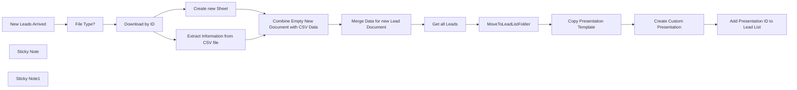

## Fluxo (.json) :

```json
{
  "id": "eF84e2NyJWTCVClW",
  "meta": {
    "instanceId": "5ce52989094be90be3b3bdd9ed9cee1d7ce1fcecaa598afaec4a50646d32e291",
    "templateCredsSetupCompleted": true
  },
  "name": "Create Custom Presentations per Lead",
  "tags": [
    {
      "id": "fSDcaaN3w5sV5e3S",
      "name": "Templates",
      "createdAt": "2025-02-23T15:20:47.262Z",
      "updatedAt": "2025-02-23T15:20:47.262Z"
    },
    {
      "id": "iMiiPG3ObM1yILch",
      "name": "SD - Sales",
      "createdAt": "2025-02-23T15:27:45.789Z",
      "updatedAt": "2025-02-23T15:28:28.561Z"
    }
  ],
  "nodes": [
    {
      "id": "4cc04b1c-d97d-4d5a-b614-ba22b7b447bd",
      "name": "Download by ID",
      "type": "n8n-nodes-base.googleDrive",
      "position": [
        -280,
        160
      ],
      "parameters": {
        "fileId": {
          "__rl": true,
          "mode": "id",
          "value": "={{ $json.id }}"
        },
        "options": {},
        "operation": "download"
      },
      "credentials": {
        "googleDriveOAuth2Api": {
          "id": "J7noNRzf26R3DpFF",
          "name": "Jim Privat"
        }
      },
      "typeVersion": 3
    },
    {
      "id": "8d550abf-a5f8-424d-8bfb-d9a9732eb93f",
      "name": "MoveToLeadListFolder",
      "type": "n8n-nodes-base.googleDrive",
      "position": [
        1060,
        160
      ],
      "parameters": {
        "fileId": {
          "__rl": true,
          "mode": "id",
          "value": "={{ $('Create new Sheet').first().json.spreadsheetId }}"
        },
        "driveId": {
          "__rl": true,
          "mode": "list",
          "value": "My Drive"
        },
        "folderId": {
          "__rl": true,
          "mode": "id",
          "value": "=1-oMQTyijYXNmt-Dwh748JFjlDZVCu6ii"
        },
        "operation": "move"
      },
      "credentials": {
        "googleDriveOAuth2Api": {
          "id": "J7noNRzf26R3DpFF",
          "name": "Jim Privat"
        }
      },
      "typeVersion": 3
    },
    {
      "id": "4872b5ec-6dda-4920-b6e2-120bdc273c00",
      "name": "Add Presentation ID to Lead List",
      "type": "n8n-nodes-base.googleSheets",
      "position": [
        1740,
        160
      ],
      "parameters": {
        "columns": {
          "value": {
            "Email": "={{ $('Get all Leads').item.json.Email }}",
            "PresentationID": "={{ $json.presentationId }}"
          },
          "schema": [
            {
              "id": "First Name",
              "type": "string",
              "display": true,
              "required": false,
              "displayName": "First Name",
              "defaultMatch": false,
              "canBeUsedToMatch": true
            },
            {
              "id": "Last Name",
              "type": "string",
              "display": true,
              "required": false,
              "displayName": "Last Name",
              "defaultMatch": false,
              "canBeUsedToMatch": true
            },
            {
              "id": "Full Name",
              "type": "string",
              "display": true,
              "required": false,
              "displayName": "Full Name",
              "defaultMatch": false,
              "canBeUsedToMatch": true
            },
            {
              "id": "Title",
              "type": "string",
              "display": true,
              "required": false,
              "displayName": "Title",
              "defaultMatch": false,
              "canBeUsedToMatch": true
            },
            {
              "id": "Email",
              "type": "string",
              "display": true,
              "removed": false,
              "required": false,
              "displayName": "Email",
              "defaultMatch": false,
              "canBeUsedToMatch": true
            },
            {
              "id": "Company",
              "type": "string",
              "display": true,
              "required": false,
              "displayName": "Company",
              "defaultMatch": false,
              "canBeUsedToMatch": true
            },
            {
              "id": "Contact Location",
              "type": "string",
              "display": true,
              "required": false,
              "displayName": "Contact Location",
              "defaultMatch": false,
              "canBeUsedToMatch": true
            },
            {
              "id": "Employees",
              "type": "string",
              "display": true,
              "required": false,
              "displayName": "Employees",
              "defaultMatch": false,
              "canBeUsedToMatch": true
            },
            {
              "id": "Phone",
              "type": "string",
              "display": true,
              "required": false,
              "displayName": "Phone",
              "defaultMatch": false,
              "canBeUsedToMatch": true
            },
            {
              "id": "Industry",
              "type": "string",
              "display": true,
              "required": false,
              "displayName": "Industry",
              "defaultMatch": false,
              "canBeUsedToMatch": true
            },
            {
              "id": "Country",
              "type": "string",
              "display": true,
              "required": false,
              "displayName": "Country",
              "defaultMatch": false,
              "canBeUsedToMatch": true
            },
            {
              "id": "State",
              "type": "string",
              "display": true,
              "required": false,
              "displayName": "State",
              "defaultMatch": false,
              "canBeUsedToMatch": true
            },
            {
              "id": "City",
              "type": "string",
              "display": true,
              "required": false,
              "displayName": "City",
              "defaultMatch": false,
              "canBeUsedToMatch": true
            },
            {
              "id": "PresentationID",
              "type": "string",
              "display": true,
              "removed": false,
              "required": false,
              "displayName": "PresentationID",
              "defaultMatch": false,
              "canBeUsedToMatch": true
            },
            {
              "id": "Keywords",
              "type": "string",
              "display": true,
              "required": false,
              "displayName": "Keywords",
              "defaultMatch": false,
              "canBeUsedToMatch": true
            },
            {
              "id": "row_number",
              "type": "string",
              "display": true,
              "removed": false,
              "readOnly": true,
              "required": false,
              "displayName": "row_number",
              "defaultMatch": false,
              "canBeUsedToMatch": true
            }
          ],
          "mappingMode": "defineBelow",
          "matchingColumns": [
            "Email"
          ]
        },
        "options": {},
        "operation": "update",
        "sheetName": {
          "__rl": true,
          "mode": "id",
          "value": "={{ $('Create new Sheet').first().json.sheets[0].properties.sheetId }}"
        },
        "documentId": {
          "__rl": true,
          "mode": "id",
          "value": "={{ $('Create new Sheet').first().json.spreadsheetId }}"
        }
      },
      "credentials": {
        "googleSheetsOAuth2Api": {
          "id": "tO62CXNbmAYSCBIY",
          "name": "Midgard"
        }
      },
      "typeVersion": 4.5
    },
    {
      "id": "afe225e3-fb82-4091-8310-6645d883c54d",
      "name": "Get all Leads",
      "type": "n8n-nodes-base.googleSheets",
      "position": [
        840,
        160
      ],
      "parameters": {
        "options": {},
        "sheetName": {
          "__rl": true,
          "mode": "id",
          "value": "={{ $('Create new Sheet').first().json.sheets[0].properties.sheetId }}"
        },
        "documentId": {
          "__rl": true,
          "mode": "id",
          "value": "={{ $('Create new Sheet').first().json.spreadsheetId }}"
        }
      },
      "credentials": {
        "googleSheetsOAuth2Api": {
          "id": "tO62CXNbmAYSCBIY",
          "name": "Midgard"
        }
      },
      "executeOnce": true,
      "typeVersion": 4.5
    },
    {
      "id": "635c62cf-4369-442b-8fd7-be2e4caa6ebc",
      "name": "Create new Sheet",
      "type": "n8n-nodes-base.googleSheets",
      "position": [
        0,
        40
      ],
      "parameters": {
        "title": "=Leads_{{ $now.setZone('Europe/Berlin').toFormat('yyyy-dd-MM') }}",
        "options": {},
        "resource": "spreadsheet",
        "sheetsUi": {
          "sheetValues": [
            {
              "title": "sample_data"
            }
          ]
        }
      },
      "credentials": {
        "googleSheetsOAuth2Api": {
          "id": "tO62CXNbmAYSCBIY",
          "name": "Midgard"
        }
      },
      "typeVersion": 4.5
    },
    {
      "id": "d55c0f32-b74a-484a-b759-9ca1c4cf8d65",
      "name": "Merge Data for new Lead Document",
      "type": "n8n-nodes-base.googleSheets",
      "position": [
        580,
        160
      ],
      "parameters": {
        "columns": {
          "value": {},
          "schema": [
            {
              "id": "First Name",
              "type": "string",
              "display": true,
              "removed": false,
              "required": false,
              "displayName": "First Name",
              "defaultMatch": false,
              "canBeUsedToMatch": true
            },
            {
              "id": "Last Name",
              "type": "string",
              "display": true,
              "removed": false,
              "required": false,
              "displayName": "Last Name",
              "defaultMatch": false,
              "canBeUsedToMatch": true
            },
            {
              "id": "Full Name",
              "type": "string",
              "display": true,
              "removed": false,
              "required": false,
              "displayName": "Full Name",
              "defaultMatch": false,
              "canBeUsedToMatch": true
            },
            {
              "id": "Title",
              "type": "string",
              "display": true,
              "removed": false,
              "required": false,
              "displayName": "Title",
              "defaultMatch": false,
              "canBeUsedToMatch": true
            },
            {
              "id": "Email",
              "type": "string",
              "display": true,
              "removed": false,
              "required": false,
              "displayName": "Email",
              "defaultMatch": false,
              "canBeUsedToMatch": true
            },
            {
              "id": "Company",
              "type": "string",
              "display": true,
              "removed": false,
              "required": false,
              "displayName": "Company",
              "defaultMatch": false,
              "canBeUsedToMatch": true
            },
            {
              "id": "Contact Location",
              "type": "string",
              "display": true,
              "removed": false,
              "required": false,
              "displayName": "Contact Location",
              "defaultMatch": false,
              "canBeUsedToMatch": true
            },
            {
              "id": "Employees",
              "type": "string",
              "display": true,
              "removed": false,
              "required": false,
              "displayName": "Employees",
              "defaultMatch": false,
              "canBeUsedToMatch": true
            },
            {
              "id": "Phone",
              "type": "string",
              "display": true,
              "removed": false,
              "required": false,
              "displayName": "Phone",
              "defaultMatch": false,
              "canBeUsedToMatch": true
            },
            {
              "id": "Industry",
              "type": "string",
              "display": true,
              "removed": false,
              "required": false,
              "displayName": "Industry",
              "defaultMatch": false,
              "canBeUsedToMatch": true
            },
            {
              "id": "Country",
              "type": "string",
              "display": true,
              "removed": false,
              "required": false,
              "displayName": "Country",
              "defaultMatch": false,
              "canBeUsedToMatch": true
            },
            {
              "id": "State",
              "type": "string",
              "display": true,
              "removed": false,
              "required": false,
              "displayName": "State",
              "defaultMatch": false,
              "canBeUsedToMatch": true
            },
            {
              "id": "City",
              "type": "string",
              "display": true,
              "removed": false,
              "required": false,
              "displayName": "City",
              "defaultMatch": false,
              "canBeUsedToMatch": true
            },
            {
              "id": "Keywords",
              "type": "string",
              "display": true,
              "removed": false,
              "required": false,
              "displayName": "Keywords",
              "defaultMatch": false,
              "canBeUsedToMatch": true
            }
          ],
          "mappingMode": "autoMapInputData",
          "matchingColumns": []
        },
        "options": {
          "useAppend": true
        },
        "operation": "append",
        "sheetName": {
          "__rl": true,
          "mode": "id",
          "value": "={{ $('Create new Sheet').first().json.sheets[0].properties.sheetId }}"
        },
        "documentId": {
          "__rl": true,
          "mode": "id",
          "value": "={{ $('Create new Sheet').first().json.spreadsheetId }}"
        }
      },
      "credentials": {
        "googleSheetsOAuth2Api": {
          "id": "tO62CXNbmAYSCBIY",
          "name": "Midgard"
        }
      },
      "typeVersion": 4.5
    },
    {
      "id": "9d93741a-93b2-4556-9f2e-2d40617c69ac",
      "name": "New Leads Arrived",
      "type": "n8n-nodes-base.googleDriveTrigger",
      "position": [
        -800,
        160
      ],
      "parameters": {
        "event": "fileCreated",
        "options": {},
        "pollTimes": {
          "item": [
            {
              "mode": "everyMinute"
            }
          ]
        },
        "triggerOn": "specificFolder",
        "folderToWatch": {
          "__rl": true,
          "mode": "list",
          "value": "1GYT9Z8_BnqqY9dqsMpFWJqjeNVsq_xTY",
          "cachedResultUrl": "https://drive.google.com/drive/folders/1GYT9Z8_BnqqY9dqsMpFWJqjeNVsq_xTY",
          "cachedResultName": "__cmath"
        }
      },
      "credentials": {
        "googleDriveOAuth2Api": {
          "id": "J7noNRzf26R3DpFF",
          "name": "Jim Privat"
        }
      },
      "typeVersion": 1
    },
    {
      "id": "174ff078-e06a-47c3-93c2-441667e0f8e5",
      "name": "File Type?",
      "type": "n8n-nodes-base.switch",
      "position": [
        -560,
        160
      ],
      "parameters": {
        "rules": {
          "values": [
            {
              "outputKey": "csv",
              "conditions": {
                "options": {
                  "version": 2,
                  "leftValue": "",
                  "caseSensitive": true,
                  "typeValidation": "strict"
                },
                "combinator": "and",
                "conditions": [
                  {
                    "operator": {
                      "type": "string",
                      "operation": "equals"
                    },
                    "leftValue": "={{ $json.mimeType }}",
                    "rightValue": "text/csv"
                  }
                ]
              },
              "renameOutput": true
            },
            {
              "outputKey": "xlsx",
              "conditions": {
                "options": {
                  "version": 2,
                  "leftValue": "",
                  "caseSensitive": true,
                  "typeValidation": "strict"
                },
                "combinator": "and",
                "conditions": [
                  {
                    "id": "c2f2fb50-a750-4870-aff7-11df142a9be5",
                    "operator": {
                      "name": "filter.operator.equals",
                      "type": "string",
                      "operation": "equals"
                    },
                    "leftValue": "={{ $json.mimeType }}",
                    "rightValue": "application/vnd.openxmlformats-officedocument.spreadsheetml.sheet"
                  }
                ]
              },
              "renameOutput": true
            }
          ]
        },
        "options": {}
      },
      "typeVersion": 3.2
    },
    {
      "id": "23d71fb1-c8f2-4144-a40e-be378aa2043a",
      "name": "Combine Empty New Document with CSV Data",
      "type": "n8n-nodes-base.merge",
      "position": [
        300,
        160
      ],
      "parameters": {
        "mode": "chooseBranch",
        "useDataOfInput": 2
      },
      "typeVersion": 3
    },
    {
      "id": "195d7ed6-7dc0-4f49-8256-f47b4c8d426b",
      "name": "Create Custom Presentation",
      "type": "n8n-nodes-base.googleSlides",
      "position": [
        1520,
        160
      ],
      "parameters": {
        "textUi": {
          "textValues": [
            {
              "text": "{COMPANYNAME}",
              "replaceText": "={{ $('Get all Leads').item.json.Company }}"
            },
            {
              "text": "{Testdurchgestrichen}",
              "replaceText": "={{ $('Get all Leads').item.json['Full Name'] }}"
            },
            {
              "text": "{nichtdurchgestrichen}",
              "replaceText": "={{ $('Get all Leads').item.json['First Name'] }}"
            }
          ]
        },
        "options": {},
        "operation": "replaceText",
        "presentationId": "={{ $json.id }}"
      },
      "credentials": {
        "googleSlidesOAuth2Api": {
          "id": "e9cejsZpBHAaXKv0",
          "name": "GSlides Midgard"
        }
      },
      "typeVersion": 2
    },
    {
      "id": "97d47391-20ea-4db7-bdf6-22eebc22a9dd",
      "name": "Sticky Note",
      "type": "n8n-nodes-base.stickyNote",
      "position": [
        980,
        60
      ],
      "parameters": {
        "color": 4,
        "width": 960,
        "height": 340,
        "content": "# Duplicate Template and Create Custom Presentations"
      },
      "typeVersion": 1
    },
    {
      "id": "acded411-6cdf-489a-bb14-c7c14cdaee23",
      "name": "Sticky Note1",
      "type": "n8n-nodes-base.stickyNote",
      "position": [
        -320,
        -120
      ],
      "parameters": {
        "color": 4,
        "width": 1300,
        "height": 520,
        "content": "# Create New Google Sheets and Insert Data from CSV file"
      },
      "typeVersion": 1
    },
    {
      "id": "9dd9e32a-5c1b-4faf-8054-63b66f5dd24e",
      "name": "Extract Information from CSV file",
      "type": "n8n-nodes-base.extractFromFile",
      "position": [
        0,
        220
      ],
      "parameters": {
        "options": {
          "encoding": "utf-8",
          "delimiter": ",",
          "headerRow": true
        }
      },
      "typeVersion": 1
    },
    {
      "id": "0329eabe-dee1-41fd-a7eb-017343523e40",
      "name": "Copy Presentation Template",
      "type": "n8n-nodes-base.googleDrive",
      "position": [
        1300,
        160
      ],
      "parameters": {
        "name": "={{ $('Get all Leads').item.json.Company }} X MYCOMPANYNAME_{{ $now.setZone('Europe/Berlin').toFormat('yyyy-dd-MM') }}",
        "fileId": {
          "__rl": true,
          "mode": "list",
          "value": "1FtMBECbZY-9gSW6L6DtioOOJv-V9LXduEjZO0pp-NmA",
          "cachedResultUrl": "https://docs.google.com/presentation/d/1FtMBECbZY-9gSW6L6DtioOOJv-V9LXduEjZO0pp-NmA/edit?usp=drivesdk",
          "cachedResultName": "Stardawn Updated"
        },
        "driveId": {
          "__rl": true,
          "mode": "list",
          "value": "My Drive"
        },
        "options": {},
        "folderId": {
          "__rl": true,
          "mode": "list",
          "value": "1Yu2s72rgOJlz1-tMuzlaeN8UZezYftRT",
          "cachedResultUrl": "https://drive.google.com/drive/folders/1Yu2s72rgOJlz1-tMuzlaeN8UZezYftRT",
          "cachedResultName": "Custom Presentations"
        },
        "operation": "copy",
        "sameFolder": false
      },
      "credentials": {
        "googleDriveOAuth2Api": {
          "id": "J7noNRzf26R3DpFF",
          "name": "Jim Privat"
        }
      },
      "typeVersion": 3
    }
  ],
  "active": false,
  "pinData": {},
  "settings": {
    "executionOrder": "v1"
  },
  "versionId": "bd03e5b5-be73-444f-a1e6-f037db77a01b",
  "connections": {
    "File Type?": {
      "main": [
        [
          {
            "node": "Download by ID",
            "type": "main",
            "index": 0
          }
        ]
      ]
    },
    "Get all Leads": {
      "main": [
        [
          {
            "node": "MoveToLeadListFolder",
            "type": "main",
            "index": 0
          }
        ]
      ]
    },
    "Download by ID": {
      "main": [
        [
          {
            "node": "Extract Information from CSV file",
            "type": "main",
            "index": 0
          },
          {
            "node": "Create new Sheet",
            "type": "main",
            "index": 0
          }
        ]
      ]
    },
    "Create new Sheet": {
      "main": [
        [
          {
            "node": "Combine Empty New Document with CSV Data",
            "type": "main",
            "index": 0
          }
        ]
      ]
    },
    "New Leads Arrived": {
      "main": [
        [
          {
            "node": "File Type?",
            "type": "main",
            "index": 0
          }
        ]
      ]
    },
    "MoveToLeadListFolder": {
      "main": [
        [
          {
            "node": "Copy Presentation Template",
            "type": "main",
            "index": 0
          }
        ]
      ]
    },
    "Copy Presentation Template": {
      "main": [
        [
          {
            "node": "Create Custom Presentation",
            "type": "main",
            "index": 0
          }
        ]
      ]
    },
    "Create Custom Presentation": {
      "main": [
        [
          {
            "node": "Add Presentation ID to Lead List",
            "type": "main",
            "index": 0
          }
        ]
      ]
    },
    "Merge Data for new Lead Document": {
      "main": [
        [
          {
            "node": "Get all Leads",
            "type": "main",
            "index": 0
          }
        ]
      ]
    },
    "Extract Information from CSV file": {
      "main": [
        [
          {
            "node": "Combine Empty New Document with CSV Data",
            "type": "main",
            "index": 1
          }
        ]
      ]
    },
    "Combine Empty New Document with CSV Data": {
      "main": [
        [
          {
            "node": "Merge Data for new Lead Document",
            "type": "main",
            "index": 0
          }
        ]
      ]
    }
  }
}
```

<a id="template-1275"></a>

## Template 1275 - Chat com LLM Ollama

- **Nome:** Chat com LLM Ollama
- **Descrição:** Fluxo que recebe mensagens de chat, usa um modelo Llama 3.2 via Ollama para gerar respostas e retorna essas respostas em formato JSON estruturado.
- **Funcionalidade:** • Recepção de mensagens de chat: inicia o fluxo ao receber a mensagem do usuário.
• Processamento por LLM: envia a entrada para o modelo Llama 3.2 hospedado via Ollama para gerar a resposta.
• Formatação de saída como JSON: solicita ao modelo que retorne um objeto JSON com os campos Prompt e Response.
• Conversão de JSON para objeto: transforma o texto JSON retornado pelo modelo em um objeto interno para uso posterior.
• Montagem de resposta estruturada: combina o prompt original e a resposta gerada em um texto final para envio ao usuário.
• Tratamento de erro: fornece uma resposta padrão caso o processamento pelo LLM falhe.
- **Ferramentas:** • Ollama: plataforma/API utilizada para hospedar e executar modelos de linguagem remotamente.
• Llama 3.2: modelo de linguagem utilizado para gerar as respostas do chat.

## Fluxo visual

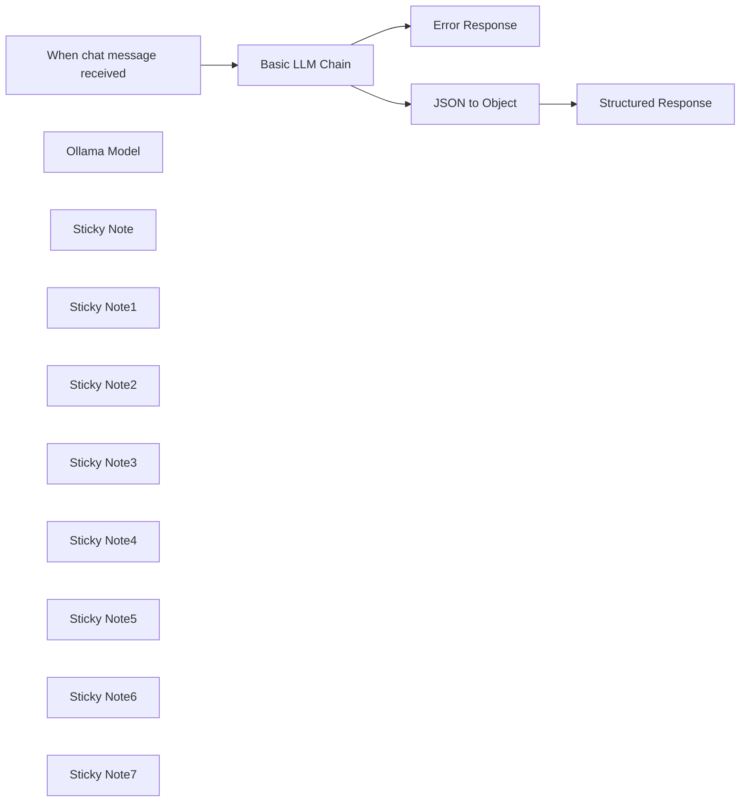

## Fluxo (.json) :

```json
{
  "id": "Telr6HU0ltH7s9f7",
  "meta": {
    "instanceId": "31e69f7f4a77bf465b805824e303232f0227212ae922d12133a0f96ffeab4fef"
  },
  "name": "🗨️Ollama Chat",
  "tags": [],
  "nodes": [
    {
      "id": "9560e89b-ea08-49dc-924e-ec8b83477340",
      "name": "When chat message received",
      "type": "@n8n/n8n-nodes-langchain.chatTrigger",
      "position": [
        280,
        60
      ],
      "webhookId": "4d06a912-2920-489c-a33c-0e3ea0b66745",
      "parameters": {
        "options": {}
      },
      "typeVersion": 1.1
    },
    {
      "id": "c7919677-233f-4c48-ba01-ae923aef511e",
      "name": "Basic LLM Chain",
      "type": "@n8n/n8n-nodes-langchain.chainLlm",
      "onError": "continueErrorOutput",
      "position": [
        640,
        60
      ],
      "parameters": {
        "text": "=Provide the users prompt and response as a JSON object with two fields:\n- Prompt\n- Response\n\nAvoid any preample or further explanation.\n\nThis is the question: {{ $json.chatInput }}",
        "promptType": "define"
      },
      "typeVersion": 1.5
    },
    {
      "id": "b9676a8b-f790-4661-b8b9-3056c969bdf5",
      "name": "Ollama Model",
      "type": "@n8n/n8n-nodes-langchain.lmOllama",
      "position": [
        740,
        340
      ],
      "parameters": {
        "model": "llama3.2:latest",
        "options": {}
      },
      "credentials": {
        "ollamaApi": {
          "id": "IsSBWGtcJbjRiKqD",
          "name": "Ollama account"
        }
      },
      "typeVersion": 1
    },
    {
      "id": "61dfcda5-083c-43ff-8451-b2417f1e4be4",
      "name": "Sticky Note",
      "type": "n8n-nodes-base.stickyNote",
      "position": [
        -380,
        -380
      ],
      "parameters": {
        "color": 4,
        "width": 520,
        "height": 860,
        "content": "# 🦙 Ollama Chat Workflow\n\nA simple N8N workflow that integrates Ollama LLM for chat message processing and returns a structured JSON object.\n\n## Overview\nThis workflow creates a chat interface that processes messages using the Llama 3.2 model through Ollama. When a chat message is received, it gets processed through a basic LLM chain and returns a response.\n\n## Components\n- **Trigger Node**\n- **Processing Node**\n- **Model Node**\n- **JSON to Object Node**\n- **Structured Response Node**\n- **Error Response Node**\n\n## Workflow Structure\n1. The chat trigger node receives incoming messages\n2. Messages are passed to the Basic LLM Chain\n3. The Ollama Model processes the input using Llama 3.2\n4. Responses are returned through the chain\n\n## Prerequisites\n- N8N installation\n- Ollama setup with Llama 3.2 model\n- Valid Ollama API credentials\n\n## Configuration\n1. Set up the Ollama API credentials in N8N\n2. Ensure the Llama 3.2 model is available in your Ollama installation\n\n"
      },
      "typeVersion": 1
    },
    {
      "id": "64f60ee1-7870-461e-8fac-994c9c08b3f9",
      "name": "Sticky Note1",
      "type": "n8n-nodes-base.stickyNote",
      "position": [
        340,
        280
      ],
      "parameters": {
        "width": 560,
        "height": 200,
        "content": "## Model Node\n- Name: Ollama Model\n- Type: LangChain Ollama Integration\n- Model: llama3.2:latest\n- Purpose: Provides the language model capabilities"
      },
      "typeVersion": 1
    },
    {
      "id": "bb46210d-450c-405b-a451-42458b3af4ae",
      "name": "Sticky Note2",
      "type": "n8n-nodes-base.stickyNote",
      "position": [
        200,
        -160
      ],
      "parameters": {
        "color": 6,
        "width": 280,
        "height": 400,
        "content": "## Trigger Node\n- Name: When chat message received\n- Type: Chat Trigger\n- Purpose: Initiates the workflow when a new chat message arrives"
      },
      "typeVersion": 1
    },
    {
      "id": "7f21b9e6-6831-4117-a2e2-9c9fb6edc492",
      "name": "Sticky Note3",
      "type": "n8n-nodes-base.stickyNote",
      "position": [
        520,
        -380
      ],
      "parameters": {
        "color": 3,
        "width": 500,
        "height": 620,
        "content": "## Processing Node\n- Name: Basic LLM Chain\n- Type: LangChain LLM Chain\n- Purpose: Handles the processing of messages through the language model and returns a structured JSON object.\n\n"
      },
      "typeVersion": 1
    },
    {
      "id": "871bac4e-002f-4a1d-b3f9-0b7d309db709",
      "name": "Sticky Note4",
      "type": "n8n-nodes-base.stickyNote",
      "position": [
        560,
        -200
      ],
      "parameters": {
        "color": 7,
        "width": 420,
        "height": 200,
        "content": "### Prompt (Change this for your use case)\nProvide the users prompt and response as a JSON object with two fields:\n- Prompt\n- Response\n\n\nAvoid any preample or further explanation.\nThis is the question: {{ $json.chatInput }}"
      },
      "typeVersion": 1
    },
    {
      "id": "c9e1b2af-059b-4330-a194-45ae0161aa1c",
      "name": "Sticky Note5",
      "type": "n8n-nodes-base.stickyNote",
      "position": [
        1060,
        -280
      ],
      "parameters": {
        "color": 5,
        "width": 420,
        "height": 520,
        "content": "## JSON to Object Node\n- Type: Set Node\n- Purpose: A node designed to transform and structure response data in a specific format before sending it through the workflow. It operates in manual mapping mode to allow precise control over the response format.\n\n**Key Features**\n- Manual field mapping capabilities\n- Object transformation and restructuring\n- Support for JSON data formatting\n- Field-to-field value mapping\n- Includes option to add additional input fields\n"
      },
      "typeVersion": 1
    },
    {
      "id": "3fb912b8-86ac-42f7-a19c-45e59898a62e",
      "name": "Sticky Note6",
      "type": "n8n-nodes-base.stickyNote",
      "position": [
        1520,
        -180
      ],
      "parameters": {
        "color": 6,
        "width": 460,
        "height": 420,
        "content": "## Structured Response Node\n- Type: Set Node\n- Purpose: Controls how the workflow responds to users chat prompt.\n\n**Response Mode**\n- Manual Mapping: Allows custom formatting of response data\n- Fields to Set: Specify which data fields to include in response\n\n"
      },
      "typeVersion": 1
    },
    {
      "id": "fdfd1a5c-e1a6-4390-9807-ce665b96b9ae",
      "name": "Structured Response",
      "type": "n8n-nodes-base.set",
      "position": [
        1700,
        60
      ],
      "parameters": {
        "options": {},
        "assignments": {
          "assignments": [
            {
              "id": "13c4058d-2d50-46b7-a5a6-c788828a1764",
              "name": "text",
              "type": "string",
              "value": "=Your prompt was: {{ $json.response.Prompt }}\n\nMy response is: {{ $json.response.Response }}\n\nThis is the JSON object:\n\n{{ $('Basic LLM Chain').item.json.text }}"
            }
          ]
        }
      },
      "typeVersion": 3.4
    },
    {
      "id": "76baa6fc-72dd-41f9-aef9-4fd718b526df",
      "name": "Error Response",
      "type": "n8n-nodes-base.set",
      "position": [
        1460,
        660
      ],
      "parameters": {
        "options": {},
        "assignments": {
          "assignments": [
            {
              "id": "13c4058d-2d50-46b7-a5a6-c788828a1764",
              "name": "text",
              "type": "string",
              "value": "=There was an error."
            }
          ]
        }
      },
      "typeVersion": 3.4
    },
    {
      "id": "bde3b9df-af55-451b-b287-1b5038f9936c",
      "name": "Sticky Note7",
      "type": "n8n-nodes-base.stickyNote",
      "position": [
        1240,
        280
      ],
      "parameters": {
        "color": 2,
        "width": 540,
        "height": 560,
        "content": "## Error Response Node\n- Type: Set Node\n- Purpose: Handles error cases when the Basic LLM Chain fails to process the chat message properly. It provides a fallback response mechanism to ensure the workflow remains robust.\n\n**Key Features**\n- Provides default error messaging\n- Maintains consistent response structure\n- Connects to the error output branch of the LLM Chain\n- Ensures graceful failure handling\n\nThe Error Response node activates when the main processing chain encounters issues, ensuring users always receive feedback even when errors occur in the language model processing.\n"
      },
      "typeVersion": 1
    },
    {
      "id": "b9b2ab8d-9bea-457a-b7bf-51c8ef0de69f",
      "name": "JSON to Object",
      "type": "n8n-nodes-base.set",
      "position": [
        1220,
        60
      ],
      "parameters": {
        "options": {},
        "assignments": {
          "assignments": [
            {
              "id": "12af1a54-62a2-44c3-9001-95bb0d7c769d",
              "name": "response",
              "type": "object",
              "value": "={{ $json.text }}"
            }
          ]
        }
      },
      "typeVersion": 3.4
    }
  ],
  "active": false,
  "pinData": {},
  "settings": {
    "executionOrder": "v1"
  },
  "versionId": "5175454a-91b7-4c57-890d-629bd4e8d2fd",
  "connections": {
    "Ollama Model": {
      "ai_languageModel": [
        [
          {
            "node": "Basic LLM Chain",
            "type": "ai_languageModel",
            "index": 0
          }
        ]
      ]
    },
    "JSON to Object": {
      "main": [
        [
          {
            "node": "Structured Response",
            "type": "main",
            "index": 0
          }
        ]
      ]
    },
    "Basic LLM Chain": {
      "main": [
        [
          {
            "node": "JSON to Object",
            "type": "main",
            "index": 0
          }
        ],
        [
          {
            "node": "Error Response",
            "type": "main",
            "index": 0
          }
        ]
      ]
    },
    "When chat message received": {
      "main": [
        [
          {
            "node": "Basic LLM Chain",
            "type": "main",
            "index": 0
          }
        ]
      ]
    }
  }
}
```

<a id="template-1276"></a>

## Template 1276 - Enviar registros de clientes para webhook com chave API

- **Nome:** Enviar registros de clientes para webhook com chave API
- **Descrição:** Fluxo manual que recupera todos os clientes de um datastore e envia cada registro para um endpoint via requisição POST incluindo uma chave de API no cabeçalho.
- **Funcionalidade:** • Início manual: inicia a execução quando o usuário clica em 'execute'.
• Definição de chave API: configura uma variável contendo a chave de API usada nas requisições.
• Recuperação de clientes: obtém todos os registros de pessoas do datastore de clientes (returnAll = true).
• Envio de dados via POST: para cada pessoa retornada, envia uma requisição POST ao endpoint destino com o nome no corpo e a chave de API no cabeçalho.
- **Ferramentas:** • Datastore de clientes: fonte de dados contendo registros de pessoas usada para recuperar todos os clientes.
• Endpoint de webhook (webhook.site): URL de destino que recebe as requisições POST para inspeção ou registro dos dados enviados.

## Fluxo visual

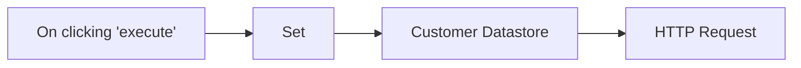

## Fluxo (.json) :

```json
{
  "nodes": [
    {
      "name": "On clicking 'execute'",
      "type": "n8n-nodes-base.manualTrigger",
      "position": [
        250,
        300
      ],
      "parameters": {},
      "typeVersion": 1
    },
    {
      "name": "Set",
      "type": "n8n-nodes-base.set",
      "position": [
        450,
        300
      ],
      "parameters": {
        "values": {
          "string": [
            {
              "name": "apiKey",
              "value": "n8n-secret-keey"
            }
          ]
        },
        "options": {},
        "keepOnlySet": true
      },
      "typeVersion": 1
    },
    {
      "name": "Customer Datastore",
      "type": "n8n-nodes-base.n8nTrainingCustomerDatastore",
      "position": [
        650,
        300
      ],
      "parameters": {
        "operation": "getAllPeople",
        "returnAll": true
      },
      "typeVersion": 1
    },
    {
      "name": "HTTP Request",
      "type": "n8n-nodes-base.httpRequest",
      "position": [
        850,
        300
      ],
      "parameters": {
        "url": "https://webhook.site/f99d65ab-8959-4466-a427-cdd0ad482220",
        "options": {},
        "requestMethod": "POST",
        "bodyParametersUi": {
          "parameter": [
            {
              "name": "name",
              "value": "={{$json[\"name\"]}}"
            }
          ]
        },
        "headerParametersUi": {
          "parameter": [
            {
              "name": "api-key",
              "value": "={{ $item(0).$node[\"Set\"].json[\"apiKey\"] }}"
            }
          ]
        }
      },
      "typeVersion": 1
    }
  ],
  "connections": {
    "Set": {
      "main": [
        [
          {
            "node": "Customer Datastore",
            "type": "main",
            "index": 0
          }
        ]
      ]
    },
    "Customer Datastore": {
      "main": [
        [
          {
            "node": "HTTP Request",
            "type": "main",
            "index": 0
          }
        ]
      ]
    },
    "On clicking 'execute'": {
      "main": [
        [
          {
            "node": "Set",
            "type": "main",
            "index": 0
          }
        ]
      ]
    }
  }
}
```

<a id="template-1277"></a>

## Template 1277 - Servidor MCP para gerenciar PostgreSQL

- **Nome:** Servidor MCP para gerenciar PostgreSQL
- **Descrição:** Fluxo que expõe um servidor MCP para permitir leitura, inserção e atualização de registros em um banco de dados PostgreSQL por meio de ferramentas controladas.
- **Funcionalidade:** • Iniciar servidor MCP: Aceita requisições de clientes/agents compatíveis com o protocolo MCP.
• Listar tabelas disponíveis: Recupera a lista de tabelas no schema público do banco de dados.
• Obter esquema da tabela: Retorna nomes e tipos de colunas de uma tabela específica.
• Ler registros com filtros: Executa consultas SELECT parametrizadas usando filtros fornecidos pelo cliente.
• Criar registros: Insere novas linhas usando parâmetros fornecidos (colunas e valores).
• Atualizar registros: Atualiza linhas existentes com parâmetros para valores e condições WHERE.
• Segurança por parâmetros: Força uso de parâmetros em vez de SQL bruto para reduzir risco de injeção e exposição de dados.
• Ferramentas de orquestração de chamadas: Usa workflows/tarefas específicas para validar e transformar inputs antes de executar operações no banco.
- **Ferramentas:** • PostgreSQL: Banco de dados relacional usado para armazenar e consultar dados (pode ser hospedado externamente, ex. Supabase).
• Model Context Protocol (MCP): Protocolo para comunicação entre agentes/clients e o servidor que permite execução de ferramentas remotamente.
• Cliente MCP (ex.: Claude Desktop): Agente ou aplicação que se conecta ao servidor MCP para enviar solicitações e receber respostas.


## Fluxo visual

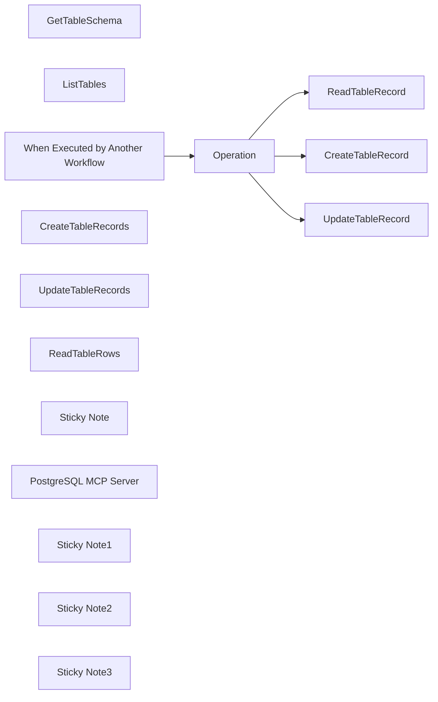

## Fluxo (.json) :

```json
{
  "meta": {
    "instanceId": "408f9fb9940c3cb18ffdef0e0150fe342d6e655c3a9fac21f0f644e8bedabcd9",
    "templateCredsSetupCompleted": true
  },
  "nodes": [
    {
      "id": "0c49141e-128c-424e-afdf-ea131b7a3dd8",
      "name": "GetTableSchema",
      "type": "n8n-nodes-base.postgresTool",
      "position": [
        -460,
        220
      ],
      "parameters": {
        "query": "SELECT column_name, data_type FROM information_schema.columns WHERE table_name = $1",
        "options": {
          "queryReplacement": "={{ $fromAI('tableName', 'The name of the table.') }}"
        },
        "operation": "executeQuery",
        "descriptionType": "manual",
        "toolDescription": "Read a table's schema."
      },
      "credentials": {
        "postgres": {
          "id": "elRn5sxKOfCdlEs6",
          "name": "Postgres account"
        }
      },
      "typeVersion": 2.6
    },
    {
      "id": "8ffeefb9-357c-41bc-8239-0c07c706be97",
      "name": "ListTables",
      "type": "n8n-nodes-base.postgresTool",
      "position": [
        -340,
        300
      ],
      "parameters": {
        "query": "SELECT table_name FROM information_schema.tables WHERE table_schema = 'public'",
        "options": {},
        "operation": "executeQuery",
        "descriptionType": "manual",
        "toolDescription": "List all available tables."
      },
      "credentials": {
        "postgres": {
          "id": "elRn5sxKOfCdlEs6",
          "name": "Postgres account"
        }
      },
      "typeVersion": 2.6
    },
    {
      "id": "efcf7ff3-976e-448a-9d47-47a98f3b0fcb",
      "name": "When Executed by Another Workflow",
      "type": "n8n-nodes-base.executeWorkflowTrigger",
      "position": [
        280,
        200
      ],
      "parameters": {
        "workflowInputs": {
          "values": [
            {
              "name": "operation"
            },
            {
              "name": "tableName"
            },
            {
              "name": "values",
              "type": "object"
            },
            {
              "name": "where",
              "type": "object"
            }
          ]
        }
      },
      "typeVersion": 1.1
    },
    {
      "id": "abd292d7-fc2b-4e98-a474-b50e44d16b6c",
      "name": "CreateTableRecords",
      "type": "@n8n/n8n-nodes-langchain.toolWorkflow",
      "position": [
        -240,
        400
      ],
      "parameters": {
        "name": "CreateTableRows",
        "workflowId": {
          "__rl": true,
          "mode": "id",
          "value": "={{ $workflow.id }}"
        },
        "description": "Call this tool to create a row in the database.",
        "workflowInputs": {
          "value": {
            "where": "={{ {} }}",
            "values": "={{ /*n8n-auto-generated-fromAI-override*/ $fromAI('values', `An object of key-value pair where key represents the column name.`, 'string') }}",
            "operation": "insert",
            "tableName": "={{ /*n8n-auto-generated-fromAI-override*/ $fromAI('tableName', `Name of table to update`, 'string') }}"
          },
          "schema": [
            {
              "id": "operation",
              "type": "string",
              "display": true,
              "removed": false,
              "required": false,
              "displayName": "operation",
              "defaultMatch": false,
              "canBeUsedToMatch": true
            },
            {
              "id": "tableName",
              "type": "string",
              "display": true,
              "removed": false,
              "required": false,
              "displayName": "tableName",
              "defaultMatch": false,
              "canBeUsedToMatch": true
            },
            {
              "id": "values",
              "type": "object",
              "display": true,
              "removed": false,
              "required": false,
              "displayName": "values",
              "defaultMatch": false,
              "canBeUsedToMatch": true
            },
            {
              "id": "where",
              "type": "object",
              "display": true,
              "removed": false,
              "required": false,
              "displayName": "where",
              "defaultMatch": false,
              "canBeUsedToMatch": true
            }
          ],
          "mappingMode": "defineBelow",
          "matchingColumns": [],
          "attemptToConvertTypes": false,
          "convertFieldsToString": false
        }
      },
      "typeVersion": 2.1
    },
    {
      "id": "4a71d42a-99a5-489e-b449-09c3c5081505",
      "name": "ReadTableRecord",
      "type": "n8n-nodes-base.postgres",
      "position": [
        760,
        0
      ],
      "parameters": {
        "query": "SELECT * FROM {{ $json.tableName }}\n{{ $json.where && Object.keys($json.where).length > 0\n  ? `WHERE ` + Object.keys($json.where).map((key,idx) => `${key} = $${idx+1}`).join(' AND ')\n  : ''\n}}",
        "options": {
          "queryReplacement": "={{ Object.values($json.where).join(',') }}"
        },
        "operation": "executeQuery"
      },
      "credentials": {
        "postgres": {
          "id": "elRn5sxKOfCdlEs6",
          "name": "Postgres account"
        }
      },
      "typeVersion": 2.6,
      "alwaysOutputData": true
    },
    {
      "id": "bdc60aa8-9ab1-4bbd-8b9e-89c968d54043",
      "name": "Operation",
      "type": "n8n-nodes-base.switch",
      "position": [
        460,
        200
      ],
      "parameters": {
        "rules": {
          "values": [
            {
              "outputKey": "READ",
              "conditions": {
                "options": {
                  "version": 2,
                  "leftValue": "",
                  "caseSensitive": true,
                  "typeValidation": "strict"
                },
                "combinator": "and",
                "conditions": [
                  {
                    "id": "81b134bc-d671-4493-b3ad-8df9be3f49a6",
                    "operator": {
                      "type": "string",
                      "operation": "equals"
                    },
                    "leftValue": "={{ $json.operation }}",
                    "rightValue": "read"
                  }
                ]
              },
              "renameOutput": true
            },
            {
              "outputKey": "INSERT",
              "conditions": {
                "options": {
                  "version": 2,
                  "leftValue": "",
                  "caseSensitive": true,
                  "typeValidation": "strict"
                },
                "combinator": "and",
                "conditions": [
                  {
                    "id": "8d57914f-6587-4fb3-88e0-aa1de6ba56c1",
                    "operator": {
                      "name": "filter.operator.equals",
                      "type": "string",
                      "operation": "equals"
                    },
                    "leftValue": "={{ $json.operation }}",
                    "rightValue": "insert"
                  }
                ]
              },
              "renameOutput": true
            },
            {
              "outputKey": "UPDATE",
              "conditions": {
                "options": {
                  "version": 2,
                  "leftValue": "",
                  "caseSensitive": true,
                  "typeValidation": "strict"
                },
                "combinator": "and",
                "conditions": [
                  {
                    "id": "7c38f238-213a-46ec-aefe-22e0bcb8dffc",
                    "operator": {
                      "name": "filter.operator.equals",
                      "type": "string",
                      "operation": "equals"
                    },
                    "leftValue": "={{ $json.operation }}",
                    "rightValue": "update"
                  }
                ]
              },
              "renameOutput": true
            }
          ]
        },
        "options": {}
      },
      "typeVersion": 3.2
    },
    {
      "id": "cdb5b556-3638-4fa5-94c6-bff0c03f6c89",
      "name": "UpdateTableRecord",
      "type": "n8n-nodes-base.postgres",
      "position": [
        760,
        400
      ],
      "parameters": {
        "query": "UPDATE {{ $json.tableName }}\nSET\n  {{ Object.keys($json.values)\n  .map((key,idx) => `${key} = $${idx+1}`)\n  .join(',')\n}}\nWHERE\n  {{ Object.keys($json.where)\n  .map((key,idx) => `${key} = $${idx+Object.keys($json.values).length+1}`)\n  .join(' AND ')\n}}",
        "options": {
          "queryReplacement": "={{ Object.values($json.values).join(',') }},{{ Object.values($json.where).join(',') }}"
        },
        "operation": "executeQuery"
      },
      "credentials": {
        "postgres": {
          "id": "elRn5sxKOfCdlEs6",
          "name": "Postgres account"
        }
      },
      "typeVersion": 2.6
    },
    {
      "id": "9263fc78-321e-4c83-90d3-890dd87d6aed",
      "name": "UpdateTableRecords",
      "type": "@n8n/n8n-nodes-langchain.toolWorkflow",
      "position": [
        -100,
        320
      ],
      "parameters": {
        "name": "UpdateTableRows",
        "workflowId": {
          "__rl": true,
          "mode": "id",
          "value": "={{ $workflow.id }}"
        },
        "description": "Call this tool to create a row in the database.",
        "workflowInputs": {
          "value": {
            "where": "={{ /*n8n-auto-generated-fromAI-override*/ $fromAI('where', `An object of key-value pair where key represents the column name.`, 'string') }}",
            "values": "={{ /*n8n-auto-generated-fromAI-override*/ $fromAI('values', `An object of key-value pair where key represents the column name.`, 'string') }}",
            "operation": "=update",
            "tableName": "={{ /*n8n-auto-generated-fromAI-override*/ $fromAI('tableName', `Table to update`, 'string') }}"
          },
          "schema": [
            {
              "id": "operation",
              "type": "string",
              "display": true,
              "removed": false,
              "required": false,
              "displayName": "operation",
              "defaultMatch": false,
              "canBeUsedToMatch": true
            },
            {
              "id": "tableName",
              "type": "string",
              "display": true,
              "removed": false,
              "required": false,
              "displayName": "tableName",
              "defaultMatch": false,
              "canBeUsedToMatch": true
            },
            {
              "id": "values",
              "type": "object",
              "display": true,
              "removed": false,
              "required": false,
              "displayName": "values",
              "defaultMatch": false,
              "canBeUsedToMatch": true
            },
            {
              "id": "where",
              "type": "object",
              "display": true,
              "removed": false,
              "required": false,
              "displayName": "where",
              "defaultMatch": false,
              "canBeUsedToMatch": true
            }
          ],
          "mappingMode": "defineBelow",
          "matchingColumns": [],
          "attemptToConvertTypes": false,
          "convertFieldsToString": false
        }
      },
      "typeVersion": 2.1
    },
    {
      "id": "dd7e28fb-b2c7-4084-bc9b-9aa3e0187682",
      "name": "CreateTableRecord",
      "type": "n8n-nodes-base.postgres",
      "position": [
        760,
        200
      ],
      "parameters": {
        "query": "INSERT INTO {{ $json.tableName }}\n  ({{ Object.keys($json.values).join(',') }})\nVALUES\n  ({{ Object.keys($json.values).map((_,idx) => `$${idx+1}`).join(',') }})",
        "options": {
          "queryReplacement": "={{ Object.values($json.values).join(',') }}"
        },
        "operation": "executeQuery"
      },
      "credentials": {
        "postgres": {
          "id": "elRn5sxKOfCdlEs6",
          "name": "Postgres account"
        }
      },
      "typeVersion": 2.6
    },
    {
      "id": "324503c0-117b-45ec-97dd-7074eb1db22e",
      "name": "ReadTableRows",
      "type": "@n8n/n8n-nodes-langchain.toolWorkflow",
      "position": [
        20,
        240
      ],
      "parameters": {
        "name": "ReadTableRows",
        "workflowId": {
          "__rl": true,
          "mode": "id",
          "value": "={{ $workflow.id }}"
        },
        "description": "Call this tool to read a row in the database.",
        "workflowInputs": {
          "value": {
            "where": "={{ /*n8n-auto-generated-fromAI-override*/ $fromAI('where', `An object of key-value pair where key represents the column name.`, 'string') }}",
            "values": "{}",
            "operation": "read",
            "tableName": "={{ /*n8n-auto-generated-fromAI-override*/ $fromAI('tableName', ``, 'string') }}"
          },
          "schema": [
            {
              "id": "operation",
              "type": "string",
              "display": true,
              "removed": false,
              "required": false,
              "displayName": "operation",
              "defaultMatch": false,
              "canBeUsedToMatch": true
            },
            {
              "id": "tableName",
              "type": "string",
              "display": true,
              "removed": false,
              "required": false,
              "displayName": "tableName",
              "defaultMatch": false,
              "canBeUsedToMatch": true
            },
            {
              "id": "values",
              "type": "object",
              "display": true,
              "removed": false,
              "required": false,
              "displayName": "values",
              "defaultMatch": false,
              "canBeUsedToMatch": true
            },
            {
              "id": "where",
              "type": "object",
              "display": true,
              "removed": false,
              "required": false,
              "displayName": "where",
              "defaultMatch": false,
              "canBeUsedToMatch": true
            }
          ],
          "mappingMode": "defineBelow",
          "matchingColumns": [],
          "attemptToConvertTypes": false,
          "convertFieldsToString": false
        }
      },
      "typeVersion": 2.1
    },
    {
      "id": "9cf39ca3-b704-49ce-b6e2-db2703c4acad",
      "name": "Sticky Note",
      "type": "n8n-nodes-base.stickyNote",
      "position": [
        -520,
        -120
      ],
      "parameters": {
        "color": 7,
        "width": 680,
        "height": 660,
        "content": "## 1. Set up an MCP Server Trigger\n[Read more about the MCP Server Trigger](https://docs.n8n.io/integrations/builtin/core-nodes/n8n-nodes-langchain.mcptrigger)"
      },
      "typeVersion": 1
    },
    {
      "id": "ac3d9b98-8f1e-4abd-972c-1725aac1ad1e",
      "name": "PostgreSQL MCP Server",
      "type": "@n8n/n8n-nodes-langchain.mcpTrigger",
      "position": [
        -340,
        20
      ],
      "webhookId": "a5fd7047-e31b-4c0d-bd68-c36072c3da0d",
      "parameters": {
        "path": "a5fd7047-e31b-4c0d-bd68-c36072c3da0d"
      },
      "typeVersion": 1
    },
    {
      "id": "416a09d5-c327-410d-b951-a2d08402c6fe",
      "name": "Sticky Note1",
      "type": "n8n-nodes-base.stickyNote",
      "position": [
        180,
        -120
      ],
      "parameters": {
        "color": 7,
        "width": 820,
        "height": 720,
        "content": "## 2. Keep Secure by Preventing Raw SQL Statements\n[Read more about the PostgreSQL Node](https://docs.n8n.io/integrations/builtin/app-nodes/n8n-nodes-base.postgres/)\n\nWhilst it may be easier to just let the Agent provide the full raw SQL statement,\nit may expose you or your organisation to a real security risk where in the worst\ncase, data may be unknowingly leaked or deleted.\n\nForcing the agent to provide only the parameters of the query\nmeans we can guard somewhat against this risk and also allows\nuse of query parameters as best practice against SQL injection attacks.\n"
      },
      "typeVersion": 1
    },
    {
      "id": "0187fb3f-4c31-461d-84e9-4a4a0bf4188d",
      "name": "Sticky Note2",
      "type": "n8n-nodes-base.stickyNote",
      "position": [
        -1000,
        -560
      ],
      "parameters": {
        "width": 440,
        "height": 1320,
        "content": "## Try It Out!\n### This n8n demonstrates how to build a simple PostgreSQL MCP server to manage your PostgreSQL database such as HR, Payroll, Sale, Inventory and More!\n\nThis MCP example is based off an official MCP reference implementation which can be found here -https://github.com/modelcontextprotocol/servers/tree/main/src/postgres\n\n### How it works\n* A MCP server trigger is used and connected to 5 tools: 2 postgreSQL and 3 custom workflow.\n* The 2 postgreSQL tools are simple read-only queries and as such, the postgreSQL tool can be simply used.\n* The 3 custom workflow tools are used for select, insert and update queries as these are operations which require a bit more discretion.\n* Whilst it may be easier to allow the agent to use raw SQL queries, we may find it a little safer to just allow for the parameters instead. The custom workflow tool allows us to define this restricted schema for tool input which we'll use to construct the SQL statement ourselves.\n* All 3 custom workflow tools trigger the same \"Execute workflow\" trigger in this very template which has a switch to route the operation to the correct handler.\n* Finally, we use our standard PostgreSQL node to handle select, insert and update operations. The responses are then sent back to the the MCP client.\n\n### How to use\n* This PostgreSQL MCP server allows any compatible MCP client to manage a PostgreSQL database by supporting select, create and update operations. You will need to have a database available before you can use this server.\n* Connect your MCP client by following the n8n guidelines here - https://docs.n8n.io/integrations/builtin/core-nodes/n8n-nodes-langchain.mcptrigger/#integrating-with-claude-desktop\n* Try the following queries in your MCP client:\n  * \"Please help me check if Alex has an entry in the users table. If not, please help me create a record for her.\"\n  * \"What was the top selling product in the last week?\"\n  * \"How many high priority support tickets are still open this morning?\"\n\n### Requirements\n* PostgreSQL for database. This can be an external database such as Supabase or one you can host internally.\n* MCP Client or Agent for usage such as Claude Desktop - https://claude.ai/download\n\n### Customising this workflow\n* If the scope of schemas or tables is too open, try restrict it so the MCP serves a specific purpose for business operations. eg. Confine the querying and editing to HR only tables before providing access to people in that department.\n* Remember to set the MCP server to require credentials before going to production and sharing this MCP server with others!"
      },
      "typeVersion": 1
    },
    {
      "id": "bc4e427f-f6fd-4243-844a-8edf2dc1a0e9",
      "name": "Sticky Note3",
      "type": "n8n-nodes-base.stickyNote",
      "position": [
        -520,
        -240
      ],
      "parameters": {
        "color": 5,
        "width": 380,
        "height": 100,
        "content": "### Always Authenticate Your Server!\nBefore going to production, it's always advised to enable authentication on your MCP server trigger."
      },
      "typeVersion": 1
    }
  ],
  "pinData": {},
  "connections": {
    "Operation": {
      "main": [
        [
          {
            "node": "ReadTableRecord",
            "type": "main",
            "index": 0
          }
        ],
        [
          {
            "node": "CreateTableRecord",
            "type": "main",
            "index": 0
          }
        ],
        [
          {
            "node": "UpdateTableRecord",
            "type": "main",
            "index": 0
          }
        ]
      ]
    },
    "ListTables": {
      "ai_tool": [
        [
          {
            "node": "PostgreSQL MCP Server",
            "type": "ai_tool",
            "index": 0
          }
        ]
      ]
    },
    "ReadTableRows": {
      "ai_tool": [
        [
          {
            "node": "PostgreSQL MCP Server",
            "type": "ai_tool",
            "index": 0
          }
        ]
      ]
    },
    "GetTableSchema": {
      "ai_tool": [
        [
          {
            "node": "PostgreSQL MCP Server",
            "type": "ai_tool",
            "index": 0
          }
        ]
      ]
    },
    "ReadTableRecord": {
      "main": [
        []
      ]
    },
    "CreateTableRecords": {
      "ai_tool": [
        [
          {
            "node": "PostgreSQL MCP Server",
            "type": "ai_tool",
            "index": 0
          }
        ]
      ]
    },
    "UpdateTableRecords": {
      "ai_tool": [
        [
          {
            "node": "PostgreSQL MCP Server",
            "type": "ai_tool",
            "index": 0
          }
        ]
      ]
    },
    "When Executed by Another Workflow": {
      "main": [
        [
          {
            "node": "Operation",
            "type": "main",
            "index": 0
          }
        ]
      ]
    }
  }
}
```

<a id="template-1278"></a>

## Template 1278 - Lembrete diário de registro

- **Nome:** Lembrete diário de registro
- **Descrição:** Envia todas as manhãs uma mensagem lembrando o usuário de registrar o que fez no dia anterior.
- **Funcionalidade:** • Agendamento matinal: dispara automaticamente todas as manhãs às 06:00.
• Geração de mensagem com data: monta uma mensagem que inclui a data de ontem no formato AAAA-MM-DD.
• Envio de lembrete: envia a mensagem formatada ao destinatário especificado.
• Configuração de destinatário: permite definir o chatId para direcionar o lembrete a um chat específico.
- **Ferramentas:** • Telegram: plataforma de mensagens utilizada para enviar o lembrete ao chat especificado.

## Fluxo visual

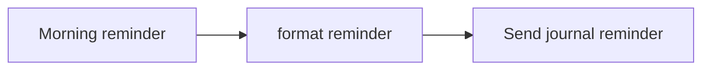

## Fluxo (.json) :

```json
{
  "id": 1,
  "name": "Daily Journal Reminder",
  "nodes": [
    {
      "name": "Morning reminder",
      "type": "n8n-nodes-base.cron",
      "notes": "Trigger very morning",
      "position": [
        220,
        60
      ],
      "parameters": {
        "triggerTimes": {
          "item": [
            {
              "hour": 6
            }
          ]
        }
      },
      "notesInFlow": true,
      "typeVersion": 1,
      "alwaysOutputData": true
    },
    {
      "name": "format reminder",
      "type": "n8n-nodes-base.functionItem",
      "position": [
        460,
        60
      ],
      "parameters": {
        "functionCode": "\n// Creates message with todays date\nconst today = new Date()\nconst yesterday = new Date(today)\n\nyesterday.setDate(yesterday.getDate() - 1)\nconst message = `What did you do: ${yesterday.toISOString().split('T')[0]}`\n\nreturn {message};"
      },
      "typeVersion": 1
    },
    {
      "name": "Send journal reminder",
      "type": "n8n-nodes-base.telegram",
      "position": [
        700,
        60
      ],
      "parameters": {
        "text": "={{$node[\"format reminder\"].json[\"message\"]}}",
        "chatId": "666884239",
        "additionalFields": {}
      },
      "credentials": {},
      "typeVersion": 1
    }
  ],
  "active": true,
  "settings": {},
  "connections": {
    "format reminder": {
      "main": [
        [
          {
            "node": "Send journal reminder",
            "type": "main",
            "index": 0
          }
        ]
      ]
    },
    "Morning reminder": {
      "main": [
        [
          {
            "node": "format reminder",
            "type": "main",
            "index": 0
          }
        ]
      ]
    }
  }
}
```

<a id="template-1279"></a>

## Template 1279 - Lista de espera com verificação por código

- **Nome:** Lista de espera com verificação por código
- **Descrição:** Coleta dados de um formulário, gera e envia um código de verificação por email, valida o código em loop se necessário e atualiza uma planilha com o estado e informações adicionais do usuário.
- **Funcionalidade:** • Coleta de dados via formulário: Recebe primeiro nome, sobrenome, email e site da empresa.
• Limpeza e padronização de dados: Normaliza email e formato do site (trim, lowercase, remoção de prefixes/sufixos indesejados).
• Geração de código de verificação: Cria um código aleatório para validação do usuário.
• Armazenamento inicial em planilha: Adiciona ou atualiza o registro do usuário na lista de espera com o código gerado.
• Envio de email de verificação: Envia o código para o email informado pelo usuário.
• Validação do código em loop: Permite que o usuário insira o código; se inválido, solicita nova tentativa até aprovação.
• Marcação como verificado: Ao confirmar o código, atualiza o registro do usuário como verificado.
• Coleta de uso pretendido: Após verificação, solicita e salva informações adicionais sobre o caso de uso do usuário.
• Manutenção de dados de cada etapa: Mantém e repassa os dados coletados entre os passos do fluxo para garantir integridade das informações.
- **Ferramentas:** • Google Sheets: Armazenamento e atualização da lista de espera, incluindo campos como nome, email, empresa, código de verificação, estado de verificação e uso pretendido.
• Serviço SMTP / Email: Envio de mensagens de verificação contendo o código para os endereços de email dos usuários.

## Fluxo visual

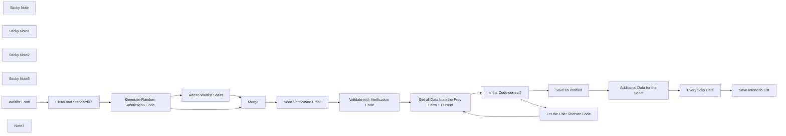

## Fluxo (.json) :

```json
{
  "nodes": [
    {
      "id": "4110f060-6945-4c52-9ea0-1dedb9309704",
      "name": "Add  to Waitlist Sheet",
      "type": "n8n-nodes-base.googleSheets",
      "position": [
        160,
        -440
      ],
      "parameters": {
        "columns": {
          "value": {
            "Email": "={{ $json.Email }}",
            "Company": "={{ $json['Company Website'] }}",
            "Lastname": "={{ $json.Lastname }}",
            "Firstname": "={{ $json.Firstname }}",
            "Verification-Code": "={{ $json.code }}"
          },
          "schema": [
            {
              "id": "Firstname",
              "type": "string",
              "display": true,
              "required": false,
              "displayName": "Firstname",
              "defaultMatch": false,
              "canBeUsedToMatch": true
            },
            {
              "id": "Lastname",
              "type": "string",
              "display": true,
              "required": false,
              "displayName": "Lastname",
              "defaultMatch": false,
              "canBeUsedToMatch": true
            },
            {
              "id": "Email",
              "type": "string",
              "display": true,
              "removed": false,
              "required": false,
              "displayName": "Email",
              "defaultMatch": false,
              "canBeUsedToMatch": true
            },
            {
              "id": "Company",
              "type": "string",
              "display": true,
              "required": false,
              "displayName": "Company",
              "defaultMatch": false,
              "canBeUsedToMatch": true
            },
            {
              "id": "Verification-Code",
              "type": "string",
              "display": true,
              "required": false,
              "displayName": "Verification-Code",
              "defaultMatch": false,
              "canBeUsedToMatch": true
            },
            {
              "id": "Verified",
              "type": "string",
              "display": true,
              "removed": true,
              "required": false,
              "displayName": "Verified",
              "defaultMatch": false,
              "canBeUsedToMatch": true
            },
            {
              "id": "Intended Use",
              "type": "string",
              "display": true,
              "removed": true,
              "required": false,
              "displayName": "Intended Use",
              "defaultMatch": false,
              "canBeUsedToMatch": true
            }
          ],
          "mappingMode": "defineBelow",
          "matchingColumns": [
            "Email"
          ]
        },
        "options": {},
        "operation": "appendOrUpdate",
        "sheetName": {
          "__rl": true,
          "mode": "list",
          "value": "gid=0",
          "cachedResultUrl": "https://docs.google.com/spreadsheets/d/1ydEoVn5uY36bEVXDmfdbj3Q-OabaPIqTifrzx49PTHA/edit#gid=0",
          "cachedResultName": "Sheet1"
        },
        "documentId": {
          "__rl": true,
          "mode": "list",
          "value": "1ydEoVn5uY36bEVXDmfdbj3Q-OabaPIqTifrzx49PTHA",
          "cachedResultUrl": "https://docs.google.com/spreadsheets/d/1ydEoVn5uY36bEVXDmfdbj3Q-OabaPIqTifrzx49PTHA/edit?usp=drivesdk",
          "cachedResultName": "n8n demo Waitlist"
        }
      },
      "credentials": {
        "googleSheetsOAuth2Api": {
          "id": "7508uyvd9qA3loJG",
          "name": "Demo Creds Sheets"
        }
      },
      "typeVersion": 4.5
    },
    {
      "id": "44bd9df4-5744-4beb-acfc-ad4c2d7a4359",
      "name": "Clean and Standardize",
      "type": "n8n-nodes-base.set",
      "position": [
        -320,
        -280
      ],
      "parameters": {
        "options": {},
        "assignments": {
          "assignments": [
            {
              "id": "f17a256a-f7cc-444b-9a10-29ab471c0510",
              "name": "Email",
              "type": "string",
              "value": "={{ $json.Email.trim().toLowerCase() }}"
            },
            {
              "id": "7c84b1f2-518b-4966-8dd1-594123a54e6e",
              "name": "Company Website",
              "type": "string",
              "value": "=https://{{ $json['Company Website'].toLowerCase().trim().trim('/').replace('https://','').replace('http://','') }}"
            }
          ]
        },
        "includeOtherFields": true
      },
      "typeVersion": 3.4
    },
    {
      "id": "ba3db4e8-8622-4b9f-bf6e-bb563adcf4cc",
      "name": "Send Verification Email",
      "type": "n8n-nodes-base.emailSend",
      "position": [
        660,
        -300
      ],
      "parameters": {
        "html": "=Hey {{ $json.Firstname }}\n\nThank you for your interest in joining the white list. To complete your registration, please verify your email address by using the code provided below:\n\nYour Verification Code: {{ $json.code }}\n\nPlease enter this code on the verification page to secure your spot on our waitlist.\n\nIf you didn’t request this email or believe it was sent to you by mistake, please ignore it.\n\nFor any questions or assistance, feel free to contact us.\n\nBest regards,\n[your name]\n\nNote: This is an automated message. Please do not reply directly to this email.",
        "options": {},
        "subject": "Your Waitlist Verification Code",
        "toEmail": "={{ $json.Email }}",
        "fromEmail": "noreply@company.com"
      },
      "credentials": {
        "smtp": {
          "id": "kiPWdk4KFJwOLaYT",
          "name": "Demo Automailer"
        }
      },
      "typeVersion": 2.1,
      "alwaysOutputData": false
    },
    {
      "id": "4fdc7af2-0739-40ab-a3b8-04394eab2732",
      "name": "Validate with Verification Code",
      "type": "n8n-nodes-base.form",
      "position": [
        880,
        -300
      ],
      "webhookId": "15fbe5e4-88f8-4b74-8a29-eb1cac45c261",
      "parameters": {
        "options": {
          "formTitle": "Validate your Email",
          "buttonLabel": "Verify",
          "formDescription": "You should have received an Email with a Verification Code."
        },
        "formFields": {
          "values": [
            {
              "fieldLabel": "Verification Code",
              "requiredField": true
            }
          ]
        }
      },
      "typeVersion": 1
    },
    {
      "id": "2f764fe1-da60-4804-9caf-8eb3b2d15093",
      "name": "Sticky Note",
      "type": "n8n-nodes-base.stickyNote",
      "position": [
        -400,
        -540
      ],
      "parameters": {
        "width": 740,
        "height": 520,
        "content": "## Adding to GSheet-List, Creating a OTP / Verification Code\n\n"
      },
      "typeVersion": 1
    },
    {
      "id": "c3168dc7-e25f-4d9c-9efe-8bfb46b14a09",
      "name": "Sticky Note1",
      "type": "n8n-nodes-base.stickyNote",
      "position": [
        580,
        -420
      ],
      "parameters": {
        "color": 4,
        "width": 480,
        "height": 360,
        "content": "## Let the user enter the Verification Code\n"
      },
      "typeVersion": 1
    },
    {
      "id": "5bdf433e-d9e6-4e63-a995-9781ac21a07d",
      "name": "Get all Data from the Prev Form + Current",
      "type": "n8n-nodes-base.set",
      "position": [
        1240,
        -300
      ],
      "parameters": {
        "mode": "raw",
        "options": {},
        "jsonOutput": "={{ $(\"Generate Random Verification Code\").item.json }}",
        "includeOtherFields": true
      },
      "typeVersion": 3.4
    },
    {
      "id": "788d6847-25a0-4ea3-8dfb-50fed04a497d",
      "name": "Additional Data for the Sheet",
      "type": "n8n-nodes-base.form",
      "position": [
        2220,
        -400
      ],
      "webhookId": "6bd68611-49e9-49f4-a470-4a2da66a29df",
      "parameters": {
        "options": {
          "formTitle": "Intended Use",
          "buttonLabel": "Submit",
          "formDescription": "What are you planing to Build with our Software?"
        },
        "formFields": {
          "values": [
            {
              "fieldType": "textarea",
              "fieldLabel": "Use Case"
            }
          ]
        }
      },
      "typeVersion": 1
    },
    {
      "id": "5fed2449-3225-4678-a35e-e7408fe3e1ea",
      "name": "Every Step Data",
      "type": "n8n-nodes-base.set",
      "position": [
        2420,
        -400
      ],
      "parameters": {
        "mode": "raw",
        "options": {},
        "jsonOutput": "={{ $(\"Get all Data from the Prev Form + Current\").item.json }}",
        "includeOtherFields": true
      },
      "typeVersion": 3.4
    },
    {
      "id": "92d2b42b-9190-48c1-92c1-34c2144bfdf9",
      "name": "is the Code correct?",
      "type": "n8n-nodes-base.if",
      "position": [
        1420,
        -300
      ],
      "parameters": {
        "options": {},
        "conditions": {
          "options": {
            "version": 2,
            "leftValue": "",
            "caseSensitive": true,
            "typeValidation": "strict"
          },
          "combinator": "and",
          "conditions": [
            {
              "id": "e2fe68a3-f1df-4912-af93-393a046b9114",
              "operator": {
                "name": "filter.operator.equals",
                "type": "string",
                "operation": "equals"
              },
              "leftValue": "={{ $json['Verification Code'] }}",
              "rightValue": "={{ $json.code }}"
            }
          ]
        }
      },
      "typeVersion": 2.2
    },
    {
      "id": "ce161a0a-aec4-40db-97c0-5ce53cffacac",
      "name": "Let the User Reenter Code",
      "type": "n8n-nodes-base.form",
      "position": [
        1640,
        -220
      ],
      "webhookId": "9a39ad9a-8c7d-445f-93e4-9af472678d38",
      "parameters": {
        "options": {
          "formTitle": "Code was not valid",
          "buttonLabel": "Verify",
          "formDescription": "Please enter your Verification Code and try again."
        },
        "formFields": {
          "values": [
            {
              "fieldLabel": "Verification Code",
              "requiredField": true
            }
          ]
        }
      },
      "typeVersion": 1
    },
    {
      "id": "008ed28c-2af3-4006-987e-9e083e72f10b",
      "name": "Merge",
      "type": "n8n-nodes-base.merge",
      "position": [
        400,
        -300
      ],
      "parameters": {
        "mode": "chooseBranch",
        "useDataOfInput": 2
      },
      "typeVersion": 3
    },
    {
      "id": "099e9089-ea39-4d67-a1ec-c063257c8cb0",
      "name": "Sticky Note2",
      "type": "n8n-nodes-base.stickyNote",
      "position": [
        1160,
        -440
      ],
      "parameters": {
        "color": 2,
        "width": 680,
        "height": 480,
        "content": "## Verification Loop"
      },
      "typeVersion": 1
    },
    {
      "id": "073574ce-f55c-4b01-a4a1-18171c4647c5",
      "name": "Save Intend to List",
      "type": "n8n-nodes-base.googleSheets",
      "position": [
        2620,
        -400
      ],
      "parameters": {
        "columns": {
          "value": {
            "Email": "={{ $json.Email }}",
            "Intended Use": "={{ $json['Use Case'] }}"
          },
          "schema": [
            {
              "id": "Firstname",
              "type": "string",
              "display": true,
              "removed": true,
              "required": false,
              "displayName": "Firstname",
              "defaultMatch": false,
              "canBeUsedToMatch": true
            },
            {
              "id": "Lastname",
              "type": "string",
              "display": true,
              "removed": true,
              "required": false,
              "displayName": "Lastname",
              "defaultMatch": false,
              "canBeUsedToMatch": true
            },
            {
              "id": "Email",
              "type": "string",
              "display": true,
              "removed": false,
              "required": false,
              "displayName": "Email",
              "defaultMatch": false,
              "canBeUsedToMatch": true
            },
            {
              "id": "Company",
              "type": "string",
              "display": true,
              "removed": true,
              "required": false,
              "displayName": "Company",
              "defaultMatch": false,
              "canBeUsedToMatch": true
            },
            {
              "id": "Verification-Code",
              "type": "string",
              "display": true,
              "removed": true,
              "required": false,
              "displayName": "Verification-Code",
              "defaultMatch": false,
              "canBeUsedToMatch": true
            },
            {
              "id": "Verified",
              "type": "string",
              "display": true,
              "removed": true,
              "required": false,
              "displayName": "Verified",
              "defaultMatch": false,
              "canBeUsedToMatch": true
            },
            {
              "id": "Intended Use",
              "type": "string",
              "display": true,
              "removed": false,
              "required": false,
              "displayName": "Intended Use",
              "defaultMatch": false,
              "canBeUsedToMatch": true
            }
          ],
          "mappingMode": "defineBelow",
          "matchingColumns": [
            "Email"
          ]
        },
        "options": {},
        "operation": "appendOrUpdate",
        "sheetName": {
          "__rl": true,
          "mode": "list",
          "value": "gid=0",
          "cachedResultUrl": "https://docs.google.com/spreadsheets/d/1ydEoVn5uY36bEVXDmfdbj3Q-OabaPIqTifrzx49PTHA/edit#gid=0",
          "cachedResultName": "Sheet1"
        },
        "documentId": {
          "__rl": true,
          "mode": "list",
          "value": "1ydEoVn5uY36bEVXDmfdbj3Q-OabaPIqTifrzx49PTHA",
          "cachedResultUrl": "https://docs.google.com/spreadsheets/d/1ydEoVn5uY36bEVXDmfdbj3Q-OabaPIqTifrzx49PTHA/edit?usp=drivesdk",
          "cachedResultName": "n8n demo Waitlist"
        }
      },
      "credentials": {
        "googleSheetsOAuth2Api": {
          "id": "7508uyvd9qA3loJG",
          "name": "Demo Creds Sheets"
        }
      },
      "typeVersion": 4.5
    },
    {
      "id": "e1a4618c-4a58-4ed0-bbad-68c8af3fba5d",
      "name": "Save as Verified",
      "type": "n8n-nodes-base.googleSheets",
      "position": [
        1960,
        -400
      ],
      "parameters": {
        "columns": {
          "value": {
            "Email": "={{ $json.Email }}",
            "Verified": "true"
          },
          "schema": [
            {
              "id": "Firstname",
              "type": "string",
              "display": true,
              "removed": true,
              "required": false,
              "displayName": "Firstname",
              "defaultMatch": false,
              "canBeUsedToMatch": true
            },
            {
              "id": "Lastname",
              "type": "string",
              "display": true,
              "removed": true,
              "required": false,
              "displayName": "Lastname",
              "defaultMatch": false,
              "canBeUsedToMatch": true
            },
            {
              "id": "Email",
              "type": "string",
              "display": true,
              "removed": false,
              "required": false,
              "displayName": "Email",
              "defaultMatch": false,
              "canBeUsedToMatch": true
            },
            {
              "id": "Company",
              "type": "string",
              "display": true,
              "removed": true,
              "required": false,
              "displayName": "Company",
              "defaultMatch": false,
              "canBeUsedToMatch": true
            },
            {
              "id": "Verification-Code",
              "type": "string",
              "display": true,
              "removed": true,
              "required": false,
              "displayName": "Verification-Code",
              "defaultMatch": false,
              "canBeUsedToMatch": true
            },
            {
              "id": "Verified",
              "type": "string",
              "display": true,
              "removed": false,
              "required": false,
              "displayName": "Verified",
              "defaultMatch": false,
              "canBeUsedToMatch": true
            },
            {
              "id": "Intended Use",
              "type": "string",
              "display": true,
              "removed": true,
              "required": false,
              "displayName": "Intended Use",
              "defaultMatch": false,
              "canBeUsedToMatch": true
            }
          ],
          "mappingMode": "defineBelow",
          "matchingColumns": [
            "Email"
          ]
        },
        "options": {},
        "operation": "appendOrUpdate",
        "sheetName": {
          "__rl": true,
          "mode": "list",
          "value": "gid=0",
          "cachedResultUrl": "https://docs.google.com/spreadsheets/d/1ydEoVn5uY36bEVXDmfdbj3Q-OabaPIqTifrzx49PTHA/edit#gid=0",
          "cachedResultName": "Sheet1"
        },
        "documentId": {
          "__rl": true,
          "mode": "list",
          "value": "1ydEoVn5uY36bEVXDmfdbj3Q-OabaPIqTifrzx49PTHA",
          "cachedResultUrl": "https://docs.google.com/spreadsheets/d/1ydEoVn5uY36bEVXDmfdbj3Q-OabaPIqTifrzx49PTHA/edit?usp=drivesdk",
          "cachedResultName": "n8n demo Waitlist"
        }
      },
      "credentials": {
        "googleSheetsOAuth2Api": {
          "id": "7508uyvd9qA3loJG",
          "name": "Demo Creds Sheets"
        }
      },
      "typeVersion": 4.5
    },
    {
      "id": "1e48dc65-18ba-45b4-a3f1-7a9298697596",
      "name": "Sticky Note3",
      "type": "n8n-nodes-base.stickyNote",
      "position": [
        2160,
        -500
      ],
      "parameters": {
        "color": 4,
        "width": 640,
        "height": 340,
        "content": "## Last Page, let them add some details and save them"
      },
      "typeVersion": 1
    },
    {
      "id": "9f899bac-9a8f-4659-a90f-b9835f5abc51",
      "name": "Generate Random Verification Code",
      "type": "n8n-nodes-base.crypto",
      "position": [
        -60,
        -280
      ],
      "parameters": {
        "action": "generate",
        "encodingType": "hex",
        "stringLength": 6,
        "dataPropertyName": "code"
      },
      "typeVersion": 1
    },
    {
      "id": "f009aec4-c640-4a85-9417-98c4938db380",
      "name": "Waitlist Form",
      "type": "n8n-nodes-base.formTrigger",
      "position": [
        -560,
        -280
      ],
      "webhookId": "b1fac105-169a-47b9-83b7-8ed52edb3209",
      "parameters": {
        "options": {
          "path": "demo-waitlist-2"
        },
        "formTitle": "Waitlist Form",
        "formFields": {
          "values": [
            {
              "fieldLabel": "Firstname",
              "requiredField": true
            },
            {
              "fieldLabel": "Lastname",
              "requiredField": true
            },
            {
              "fieldType": "email",
              "fieldLabel": "Email",
              "placeholder": "name@my-company.com",
              "requiredField": true
            },
            {
              "fieldLabel": "Company Website",
              "placeholder": "https://my-company.com"
            }
          ]
        },
        "responseMode": "lastNode",
        "formDescription": "Thank you for the interest in our Service!\nJoin our waitlist to be one of the first users getting access to our service!"
      },
      "typeVersion": 2.2
    },
    {
      "id": "1a71859d-24a1-4f2c-a7ff-3cb7e6a1f522",
      "name": "Note3",
      "type": "n8n-nodes-base.stickyNote",
      "position": [
        -1320,
        -620
      ],
      "parameters": {
        "width": 668,
        "height": 786,
        "content": "## Instructions\n\nThis automation streamlines the process of **collecting user information** using a Form Node, enabling individuals to join a **waitlist managed via Google Sheets.**\n\nIt also **generates a verification code**, prompting users to input this code in the Second Form Step. If the code is _nvalid, the workflow keeps the user in a verification loop until a valid code is entered.\n\nOnce a **valid code is provided**, the workflow proceeds to the final step, where **additional information** can be collected.\n\nAll e**ntered data and intermediate states** are securely **stored in the Google Sheet**.\n\n### Structure of the GoogleSheet\n\nFirstname | Lastname | Email | Company | Verification-Code | Verified | Intended Use\nMarcel | Claus-Ahrens | foo[at]bar| foobar | abc123 | TRUE | Just testing\n\n### Setup\n\n1. Set Up a Google Sheet: Create a Google Sheet with the specified columns, or customize them to suit your needs.\n2. Verify the \"Send Mail\" Node: Ensure your \"Send Mail\" node is functional, or replace it with another email-sending node.\n3. Customize Texts and Fields: Update email content, form texts, and form fields to align with your specific use case.\n4. Done!\n\n  \nEnjoy the workflow! ❤️  \n[let the workf low](https://let-the-work-flow.com) — Workflow Automation & Development"
      },
      "typeVersion": 1
    }
  ],
  "pinData": {},
  "connections": {
    "Merge": {
      "main": [
        [
          {
            "node": "Send Verification Email",
            "type": "main",
            "index": 0
          }
        ]
      ]
    },
    "Waitlist Form": {
      "main": [
        [
          {
            "node": "Clean and Standardize",
            "type": "main",
            "index": 0
          }
        ]
      ]
    },
    "Every Step Data": {
      "main": [
        [
          {
            "node": "Save Intend to List",
            "type": "main",
            "index": 0
          }
        ]
      ]
    },
    "Save as Verified": {
      "main": [
        [
          {
            "node": "Additional Data for the Sheet",
            "type": "main",
            "index": 0
          }
        ]
      ]
    },
    "is the Code correct?": {
      "main": [
        [
          {
            "node": "Save as Verified",
            "type": "main",
            "index": 0
          }
        ],
        [
          {
            "node": "Let the User Reenter Code",
            "type": "main",
            "index": 0
          }
        ]
      ]
    },
    "Clean and Standardize": {
      "main": [
        [
          {
            "node": "Generate Random Verification Code",
            "type": "main",
            "index": 0
          }
        ]
      ]
    },
    "Add  to Waitlist Sheet": {
      "main": [
        [
          {
            "node": "Merge",
            "type": "main",
            "index": 0
          }
        ]
      ]
    },
    "Send Verification Email": {
      "main": [
        [
          {
            "node": "Validate with Verification Code",
            "type": "main",
            "index": 0
          }
        ]
      ]
    },
    "Let the User Reenter Code": {
      "main": [
        [
          {
            "node": "Get all Data from the Prev Form + Current",
            "type": "main",
            "index": 0
          }
        ]
      ]
    },
    "Additional Data for the Sheet": {
      "main": [
        [
          {
            "node": "Every Step Data",
            "type": "main",
            "index": 0
          }
        ]
      ]
    },
    "Validate with Verification Code": {
      "main": [
        [
          {
            "node": "Get all Data from the Prev Form + Current",
            "type": "main",
            "index": 0
          }
        ]
      ]
    },
    "Generate Random Verification Code": {
      "main": [
        [
          {
            "node": "Add  to Waitlist Sheet",
            "type": "main",
            "index": 0
          },
          {
            "node": "Merge",
            "type": "main",
            "index": 1
          }
        ]
      ]
    },
    "Get all Data from the Prev Form + Current": {
      "main": [
        [
          {
            "node": "is the Code correct?",
            "type": "main",
            "index": 0
          }
        ]
      ]
    }
  }
}
```

<a id="template-1280"></a>

## Template 1280 - Banner com avatares de novos seguidores

- **Nome:** Banner com avatares de novos seguidores
- **Descrição:** O fluxo obtém os seguidores mais recentes, processa seus avatares e atualiza o banner do Twitter combinando-os sobre um template de fundo.
- **Funcionalidade:** • Gatilho manual: inicia o fluxo ao clicar em executar.
• Busca de novos seguidores: consulta a API do Twitter para obter até 3 seguidores mais recentes, incluindo a URL do avatar.
• Download de avatares: baixa as imagens de perfil ajustando a URL para maior resolução (substitui 'normal' por '400x400').
• Redimensionamento de avatares: redimensiona as imagens para tamanhos intermediários (200x200) e finais (75x75) conforme necessário para composição.
• Recorte e máscara circular: cria uma máscara circular em PNG e aplica aos avatares para torná-los circulares com fundo transparente.
• Combinação de imagens: compõe os avatares processados sobre um template de fundo em posições específicas para formar o banner final.
• Upload do novo banner: envia o arquivo final para o endpoint de atualização de banner do Twitter usando autenticação OAuth1.
- **Ferramentas:** • Twitter API: usado para obter a lista de seguidores (API v2) e para atualizar o banner do perfil (endpoint update_profile_banner da API v1.1) com autenticação OAuth1.
• Serviço de hospedagem de imagem: URL externa que fornece a imagem de template do fundo usada como base para compor o banner.

## Fluxo visual

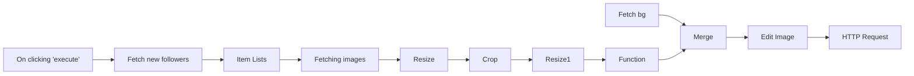

## Fluxo (.json) :

```json
{
  "nodes": [
    {
      "name": "On clicking 'execute'",
      "type": "n8n-nodes-base.manualTrigger",
      "position": [
        260,
        210
      ],
      "parameters": {},
      "typeVersion": 1
    },
    {
      "name": "Fetch new followers",
      "type": "n8n-nodes-base.httpRequest",
      "position": [
        460,
        210
      ],
      "parameters": {
        "url": "https://api.twitter.com/2/users/{YOUR_USER_ID}/followers?user.fields=profile_image_url&max_results=3",
        "options": {},
        "authentication": "headerAuth"
      },
      "credentials": {
        "httpHeaderAuth": {
          "id": "2",
          "name": "Twitter Token"
        }
      },
      "typeVersion": 1
    },
    {
      "name": "Item Lists",
      "type": "n8n-nodes-base.itemLists",
      "position": [
        660,
        210
      ],
      "parameters": {
        "options": {},
        "fieldToSplitOut": "data"
      },
      "typeVersion": 1
    },
    {
      "name": "Function",
      "type": "n8n-nodes-base.function",
      "position": [
        1660,
        210
      ],
      "parameters": {
        "functionCode": "const binary = {};\nfor (let i=0; i < items.length; i++) {\n  binary[`data${i}`] = items[i].binary.avatar;\n}\n\nreturn [\n  {\n    json: {\n      numIcons: items.length,\n    },\n    binary,\n  }\n];\n"
      },
      "typeVersion": 1
    },
    {
      "name": "Merge",
      "type": "n8n-nodes-base.merge",
      "position": [
        1910,
        110
      ],
      "parameters": {
        "mode": "mergeByIndex"
      },
      "typeVersion": 1
    },
    {
      "name": "Fetching images",
      "type": "n8n-nodes-base.httpRequest",
      "position": [
        860,
        210
      ],
      "parameters": {
        "url": "={{$json[\"profile_image_url\"].replace('normal','400x400')}}",
        "options": {},
        "responseFormat": "file",
        "dataPropertyName": "avatar"
      },
      "typeVersion": 1
    },
    {
      "name": "Fetch bg",
      "type": "n8n-nodes-base.httpRequest",
      "position": [
        1660,
        -40
      ],
      "parameters": {
        "url": "{TEMPLATE_IMAGE_URL}",
        "options": {},
        "responseFormat": "file",
        "dataPropertyName": "bg"
      },
      "typeVersion": 1
    },
    {
      "name": "Resize",
      "type": "n8n-nodes-base.editImage",
      "position": [
        1060,
        210
      ],
      "parameters": {
        "width": 200,
        "height": 200,
        "options": {},
        "operation": "resize",
        "dataPropertyName": "avatar"
      },
      "typeVersion": 1
    },
    {
      "name": "Crop",
      "type": "n8n-nodes-base.editImage",
      "position": [
        1260,
        210
      ],
      "parameters": {
        "options": {
          "format": "png"
        },
        "operation": "multiStep",
        "operations": {
          "operations": [
            {
              "width": 200,
              "height": 200,
              "operation": "create",
              "backgroundColor": "#000000ff"
            },
            {
              "color": "#ffffff00",
              "operation": "draw",
              "primitive": "circle",
              "endPositionX": 25,
              "endPositionY": 50,
              "startPositionX": 100,
              "startPositionY": 100
            },
            {
              "operator": "In",
              "operation": "composite",
              "dataPropertyNameComposite": "avatar"
            }
          ]
        },
        "dataPropertyName": "avatar"
      },
      "typeVersion": 1
    },
    {
      "name": "Edit Image",
      "type": "n8n-nodes-base.editImage",
      "position": [
        2110,
        110
      ],
      "parameters": {
        "options": {},
        "operation": "multiStep",
        "operations": {
          "operations": [
            {
              "operation": "composite",
              "positionX": 1000,
              "positionY": 375,
              "dataPropertyNameComposite": "data0"
            },
            {
              "operation": "composite",
              "positionX": 1100,
              "positionY": 375,
              "dataPropertyNameComposite": "data1"
            },
            {
              "operation": "composite",
              "positionX": 1200,
              "positionY": 375,
              "dataPropertyNameComposite": "data2"
            }
          ]
        },
        "dataPropertyName": "bg"
      },
      "typeVersion": 1
    },
    {
      "name": "Resize1",
      "type": "n8n-nodes-base.editImage",
      "position": [
        1450,
        210
      ],
      "parameters": {
        "width": 75,
        "height": 75,
        "options": {},
        "operation": "resize",
        "dataPropertyName": "avatar"
      },
      "typeVersion": 1
    },
    {
      "name": "HTTP Request",
      "type": "n8n-nodes-base.httpRequest",
      "position": [
        2310,
        110
      ],
      "parameters": {
        "url": "https://api.twitter.com/1.1/account/update_profile_banner.json",
        "options": {
          "bodyContentType": "multipart-form-data"
        },
        "requestMethod": "POST",
        "authentication": "oAuth1",
        "jsonParameters": true,
        "sendBinaryData": true,
        "binaryPropertyName": "banner:bg"
      },
      "credentials": {
        "oAuth1Api": {
          "id": "13",
          "name": "Twitter OAuth1.0"
        }
      },
      "typeVersion": 1
    }
  ],
  "connections": {
    "Crop": {
      "main": [
        [
          {
            "node": "Resize1",
            "type": "main",
            "index": 0
          }
        ]
      ]
    },
    "Merge": {
      "main": [
        [
          {
            "node": "Edit Image",
            "type": "main",
            "index": 0
          }
        ]
      ]
    },
    "Resize": {
      "main": [
        [
          {
            "node": "Crop",
            "type": "main",
            "index": 0
          }
        ]
      ]
    },
    "Resize1": {
      "main": [
        [
          {
            "node": "Function",
            "type": "main",
            "index": 0
          }
        ]
      ]
    },
    "Fetch bg": {
      "main": [
        [
          {
            "node": "Merge",
            "type": "main",
            "index": 0
          }
        ]
      ]
    },
    "Function": {
      "main": [
        [
          {
            "node": "Merge",
            "type": "main",
            "index": 1
          }
        ]
      ]
    },
    "Edit Image": {
      "main": [
        [
          {
            "node": "HTTP Request",
            "type": "main",
            "index": 0
          }
        ]
      ]
    },
    "Item Lists": {
      "main": [
        [
          {
            "node": "Fetching images",
            "type": "main",
            "index": 0
          }
        ]
      ]
    },
    "Fetching images": {
      "main": [
        [
          {
            "node": "Resize",
            "type": "main",
            "index": 0
          }
        ]
      ]
    },
    "Fetch new followers": {
      "main": [
        [
          {
            "node": "Item Lists",
            "type": "main",
            "index": 0
          }
        ]
      ]
    },
    "On clicking 'execute'": {
      "main": [
        [
          {
            "node": "Fetch new followers",
            "type": "main",
            "index": 0
          }
        ]
      ]
    }
  }
}
```
