# PACK 1999 TEMPLATES PARTE 07 - Bloco 5

Templates neste bloco: 20

## Sumário

- [Template 1281 - Adicionar assinante e enviar campanha](#template-1281)
- [Template 1282 - Cadastro de newsletter com pesquisa curta](#template-1282)
- [Template 1283 - Registrar posição da ISS a cada minuto](#template-1283)
- [Template 1284 - Pipeline de embeddings e armazenamento em Qdrant](#template-1284)
- [Template 1285 - Chat RAG via Telegram com ingestão de PDFs](#template-1285)
- [Template 1286 - Baixar imagem e enviar para Slack](#template-1286)
- [Template 1287 - Buscar sinônimos em alemão](#template-1287)
- [Template 1288 - Criar, atualizar e obter incidente no PagerDuty](#template-1288)
- [Template 1289 - Backup mensal do Clockify para GitHub](#template-1289)
- [Template 1290 - Classificação automática de mensagens de contato](#template-1290)
- [Template 1291 - Busca de perfis LinkedIn a partir de planilha](#template-1291)
- [Template 1292 - Extrair contatos de e-mails e registrar no HubSpot](#template-1292)
- [Template 1293 - Tagueamento automático de metadados de imagem](#template-1293)
- [Template 1294 - Resposta automática por IA no Telegram](#template-1294)
- [Template 1295 - Auditoria On-Page de SEO automatizada](#template-1295)
- [Template 1296 - RAG Chat do livro 'How To Transform Your Life'](#template-1296)
- [Template 1297 - Baixar e salvar arquivo no host](#template-1297)
- [Template 1298 - Criar tabela e inserir registro no QuestDB](#template-1298)
- [Template 1299 - Publicador de mídias sociais](#template-1299)
- [Template 1300 - Criar, atualizar e obter usuário no Iterable](#template-1300)

---

<a id="template-1281"></a>

## Template 1281 - Adicionar assinante e enviar campanha

- **Nome:** Adicionar assinante e enviar campanha
- **Descrição:** Adiciona um assinante a uma lista de contatos e cria e envia uma campanha de email para essa lista.
- **Funcionalidade:** • Gatilho manual: Inicia o fluxo quando executado manualmente.
• Adição de assinante: Registra um novo contato (email e nome) na lista identificada pelo ID 2.
• Criação de campanha: Gera uma campanha de email com título, assunto, remetente e conteúdo HTML predefinidos.
• Envio da campanha: Associa a campanha à lista de contatos e envia-a imediatamente.
- **Ferramentas:** • Sendy: Plataforma de email marketing para gerenciar listas de contatos, criar campanhas de email e enviá-las.


## Fluxo visual

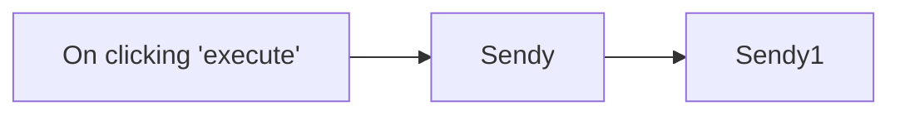

## Fluxo (.json) :

```json
{
  "id": "14",
  "name": "Add a subscriber to a list and create and send a campaign",
  "nodes": [
    {
      "name": "On clicking 'execute'",
      "type": "n8n-nodes-base.manualTrigger",
      "position": [
        250,
        300
      ],
      "parameters": {},
      "typeVersion": 1
    },
    {
      "name": "Sendy",
      "type": "n8n-nodes-base.sendy",
      "position": [
        450,
        300
      ],
      "parameters": {
        "email": "harshil@n8n.io",
        "listId": "2",
        "additionalFields": {
          "name": "Harshil"
        }
      },
      "credentials": {
        "sendyApi": "sendy"
      },
      "typeVersion": 1
    },
    {
      "name": "Sendy1",
      "type": "n8n-nodes-base.sendy",
      "position": [
        650,
        300
      ],
      "parameters": {
        "title": "Welcome to n8n",
        "replyTo": "docs@n8n.io",
        "subject": "Welcome to n8n",
        "fromName": "n8n",
        "htmlText": "<body>\n  <p>Hey!</p>\n  <p>Welcome to n8n!</p>\n</body>",
        "resource": "campaign",
        "fromEmail": "docs@n8n.io",
        "sendCampaign": true,
        "additionalFields": {
          "listIds": "2"
        }
      },
      "credentials": {
        "sendyApi": "sendy"
      },
      "typeVersion": 1
    }
  ],
  "active": false,
  "settings": {},
  "connections": {
    "Sendy": {
      "main": [
        [
          {
            "node": "Sendy1",
            "type": "main",
            "index": 0
          }
        ]
      ]
    },
    "On clicking 'execute'": {
      "main": [
        [
          {
            "node": "Sendy",
            "type": "main",
            "index": 0
          }
        ]
      ]
    }
  }
}
```

<a id="template-1282"></a>

## Template 1282 - Cadastro de newsletter com pesquisa curta

- **Nome:** Cadastro de newsletter com pesquisa curta
- **Descrição:** Fluxo para capturar inscrições em uma newsletter, coletar informações adicionais via formulário multi-página, armazenar e atualizar os dados em uma planilha e notificar a equipe.
- **Funcionalidade:** • Captura inicial de email: Registra o email do usuário no momento da inscrição.
• Notificação imediata: Envia uma mensagem formatada para um canal da equipe quando há nova inscrição.
• Formulários multi-página opcionais: Apresenta etapas adicionais para coletar nome, cargo, função e objetivos do usuário.
• Coleta de preferências de participação: Pergunta se o usuário deseja integrar a lista de testadores beta.
• Armazenamento e atualização de dados: Salva a inscrição inicial e atualiza a mesma linha da planilha com as respostas posteriores.
• Vinculação por execução: Usa um identificador de execução para garantir que os dados do mesmo usuário sejam agrupados.
• Tela de conclusão personalizada: Exibe uma mensagem final de agradecimento e instruções após o término da pesquisa.
• Campos obrigatórios e validação: Garante que perguntas críticas sejam preenchidas antes de avançar.
- **Ferramentas:** • Google Sheets: Armazena e atualiza os registros de inscrições e respostas do formulário em uma planilha compartilhada.
• Slack: Canal de comunicação para notificar a equipe sobre novas inscrições com mensagem formatada.

## Fluxo visual

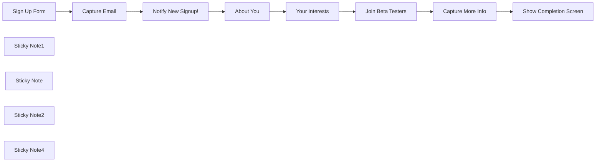

## Fluxo (.json) :

```json
{
  "meta": {
    "instanceId": "408f9fb9940c3cb18ffdef0e0150fe342d6e655c3a9fac21f0f644e8bedabcd9"
  },
  "nodes": [
    {
      "id": "7263f921-1622-47eb-903c-729a75965e20",
      "name": "About You",
      "type": "n8n-nodes-base.form",
      "position": [
        600,
        200
      ],
      "webhookId": "14efc5e8-0984-4ccb-a118-ce3492f8ea02",
      "parameters": {
        "options": {
          "formTitle": "Thanks For Signing Up!",
          "buttonLabel": "Continue (1 of 3)",
          "formDescription": "Before you go, we'd love to know more about you and why you're interested in our service. Complete the following questions for a nice treat at the end!\n\n* This survey is optional."
        },
        "formFields": {
          "values": [
            {
              "fieldLabel": "First Name",
              "placeholder": "eg. Mark",
              "requiredField": true
            },
            {
              "fieldLabel": "Last Name",
              "placeholder": "eg. Zuckerberg",
              "requiredField": true
            },
            {
              "fieldLabel": "Country/Region"
            },
            {
              "fieldType": "dropdown",
              "fieldLabel": "Job Level",
              "fieldOptions": {
                "values": [
                  {
                    "option": "CEO"
                  },
                  {
                    "option": "VP"
                  },
                  {
                    "option": "Director"
                  },
                  {
                    "option": "Manager"
                  },
                  {
                    "option": "Non-manager"
                  },
                  {
                    "option": "Student or Intern"
                  },
                  {
                    "option": "Other"
                  }
                ]
              },
              "requiredField": true
            },
            {
              "fieldType": "dropdown",
              "fieldLabel": "Job Function",
              "multiselect": true,
              "fieldOptions": {
                "values": [
                  {
                    "option": "Accounting/Finance"
                  },
                  {
                    "option": "Admin/Office"
                  },
                  {
                    "option": "Customer Service"
                  },
                  {
                    "option": "Design"
                  },
                  {
                    "option": "Engineering/Software"
                  },
                  {
                    "option": "HR/Operations"
                  },
                  {
                    "option": "Leadership/Management"
                  },
                  {
                    "option": "Legal"
                  },
                  {
                    "option": "Other"
                  }
                ]
              },
              "requiredField": true
            }
          ]
        }
      },
      "typeVersion": 1
    },
    {
      "id": "590e8da4-e4b5-46de-af19-f07f82305c19",
      "name": "Your Interests",
      "type": "n8n-nodes-base.form",
      "position": [
        780,
        200
      ],
      "webhookId": "14efc5e8-0984-4ccb-a118-ce3492f8ea02",
      "parameters": {
        "options": {
          "formTitle": "What Brings You Here?",
          "buttonLabel": "Continue (2 of 3)",
          "formDescription": "Thanks <name>!\nPlease tell us why you are interested in our product? It'll help us tailor your onboarding and communication journeys to better suit your needs."
        },
        "formFields": {
          "values": [
            {
              "fieldType": "dropdown",
              "fieldLabel": "How familiar are you with no-code automation?",
              "fieldOptions": {
                "values": [
                  {
                    "option": "I've Just started or exploring no-code automation tools"
                  },
                  {
                    "option": "I've tried tools like Zapier to automate small tasks"
                  },
                  {
                    "option": "I've built several no-code automations and workflows already"
                  }
                ]
              },
              "requiredField": true
            },
            {
              "fieldType": "textarea",
              "fieldLabel": "Describe briefly what you'd like to get out of our product?",
              "placeholder": "Eg. short term pain points and long term solutions...",
              "requiredField": true
            }
          ]
        }
      },
      "typeVersion": 1
    },
    {
      "id": "c8f837be-4c09-4cf5-be33-913814d7b1c4",
      "name": "Join Beta Testers",
      "type": "n8n-nodes-base.form",
      "position": [
        960,
        200
      ],
      "webhookId": "14efc5e8-0984-4ccb-a118-ce3492f8ea02",
      "parameters": {
        "options": {
          "formTitle": "Join Our Beta Testers List",
          "buttonLabel": "Finish (3 of 3)",
          "formDescription": "Finally, we're always looking for Beta testers to try out our latest features and help us figure out what works. Beta testers join on a voluntary basis but we often send little tokens of appreciation such as increased usage limits and sometimes brand merchandise!"
        },
        "formFields": {
          "values": [
            {
              "fieldType": "dropdown",
              "fieldLabel": "Would you like to be considered for our beta testers list?",
              "fieldOptions": {
                "values": [
                  {
                    "option": "Yes"
                  },
                  {
                    "option": "No"
                  },
                  {
                    "option": "Maybe"
                  }
                ]
              },
              "requiredField": true
            }
          ]
        }
      },
      "typeVersion": 1
    },
    {
      "id": "9d8f8a98-7cf6-4dc9-bbed-b999dbdfc6d5",
      "name": "Sign Up Form",
      "type": "n8n-nodes-base.formTrigger",
      "position": [
        -120,
        160
      ],
      "webhookId": "c9deb1b7-52c5-4046-bb8f-7dcfdd00fa4b",
      "parameters": {
        "path": "newsletter-signup",
        "options": {
          "buttonLabel": "Sign Up to Newsletter",
          "appendAttribution": true,
          "useWorkflowTimezone": true
        },
        "formTitle": "Sign Up for My Newsletter",
        "formFields": {
          "values": [
            {
              "fieldType": "email",
              "fieldLabel": "Email",
              "placeholder": "eg. jim@example.com",
              "requiredField": true
            }
          ]
        },
        "responseMode": "lastNode",
        "formDescription": "Use this form to signup for my newsletter where members will receive the latest workflow templates from me before everyone else!\n\nYou can unsubscribe at any time."
      },
      "typeVersion": 2.1
    },
    {
      "id": "e7143922-7de1-448d-9abb-72034437f79c",
      "name": "Capture More Info",
      "type": "n8n-nodes-base.googleSheets",
      "position": [
        1140,
        200
      ],
      "parameters": {
        "columns": {
          "value": {
            "job_level": "={{ $('About You').item.json['Job Level'] }}",
            "last_name": "={{ $('About You').item.json['Last Name'] }}",
            "first_name": "={{ $('About You').item.json['First Name'] }}",
            "execution_id": "={{ $execution.id }}",
            "job_function": "={{ $('About You').item.json['Job Function'].join(', ') }}",
            "product_goals": "={{ $('Your Interests').item.json['Describe briefly what you\\'d like to get out of our product?'] }}",
            "country_region": "={{ $('About You').item.json['Country/Region'] }}",
            "enrol_betatesters": "={{ $json['Would you like to be considered for our beta testers list?'] }}",
            "product_experience": "={{ $('Your Interests').item.json['How familiar are you with no-code automation?'] }}"
          },
          "schema": [
            {
              "id": "execution_id",
              "type": "string",
              "display": true,
              "removed": false,
              "required": false,
              "displayName": "execution_id",
              "defaultMatch": false,
              "canBeUsedToMatch": true
            },
            {
              "id": "date",
              "type": "string",
              "display": true,
              "removed": true,
              "required": false,
              "displayName": "date",
              "defaultMatch": false,
              "canBeUsedToMatch": true
            },
            {
              "id": "email",
              "type": "string",
              "display": true,
              "removed": true,
              "required": false,
              "displayName": "email",
              "defaultMatch": false,
              "canBeUsedToMatch": true
            },
            {
              "id": "first_name",
              "type": "string",
              "display": true,
              "required": false,
              "displayName": "first_name",
              "defaultMatch": false,
              "canBeUsedToMatch": true
            },
            {
              "id": "last_name",
              "type": "string",
              "display": true,
              "required": false,
              "displayName": "last_name",
              "defaultMatch": false,
              "canBeUsedToMatch": true
            },
            {
              "id": "job_level",
              "type": "string",
              "display": true,
              "required": false,
              "displayName": "job_level",
              "defaultMatch": false,
              "canBeUsedToMatch": true
            },
            {
              "id": "job_function",
              "type": "string",
              "display": true,
              "required": false,
              "displayName": "job_function",
              "defaultMatch": false,
              "canBeUsedToMatch": true
            },
            {
              "id": "country_region",
              "type": "string",
              "display": true,
              "removed": false,
              "required": false,
              "displayName": "country_region",
              "defaultMatch": false,
              "canBeUsedToMatch": true
            },
            {
              "id": "product_experience",
              "type": "string",
              "display": true,
              "required": false,
              "displayName": "product_experience",
              "defaultMatch": false,
              "canBeUsedToMatch": true
            },
            {
              "id": "product_goals",
              "type": "string",
              "display": true,
              "required": false,
              "displayName": "product_goals",
              "defaultMatch": false,
              "canBeUsedToMatch": true
            },
            {
              "id": "enrol_betatesters",
              "type": "string",
              "display": true,
              "required": false,
              "displayName": "enrol_betatesters",
              "defaultMatch": false,
              "canBeUsedToMatch": true
            },
            {
              "id": "row_number",
              "type": "string",
              "display": true,
              "removed": true,
              "readOnly": true,
              "required": false,
              "displayName": "row_number",
              "defaultMatch": false,
              "canBeUsedToMatch": true
            }
          ],
          "mappingMode": "defineBelow",
          "matchingColumns": [
            "execution_id"
          ]
        },
        "options": {},
        "operation": "update",
        "sheetName": {
          "__rl": true,
          "mode": "list",
          "value": "gid=0",
          "cachedResultUrl": "https://docs.google.com/spreadsheets/d/15W1PiFjCoiEBHHKKCRVMLmpKg4AWIy9w1dQ2Dq8qxPs/edit#gid=0",
          "cachedResultName": "Sheet1"
        },
        "documentId": {
          "__rl": true,
          "mode": "list",
          "value": "15W1PiFjCoiEBHHKKCRVMLmpKg4AWIy9w1dQ2Dq8qxPs",
          "cachedResultUrl": "https://docs.google.com/spreadsheets/d/15W1PiFjCoiEBHHKKCRVMLmpKg4AWIy9w1dQ2Dq8qxPs/edit?usp=drivesdk",
          "cachedResultName": "Newsletter Signup"
        }
      },
      "credentials": {
        "googleSheetsOAuth2Api": {
          "id": "XHvC7jIRR8A2TlUl",
          "name": "Google Sheets account"
        }
      },
      "typeVersion": 4.5
    },
    {
      "id": "0cacb296-0d12-44e5-a749-65aa2e89a42d",
      "name": "Capture Email",
      "type": "n8n-nodes-base.googleSheets",
      "position": [
        60,
        160
      ],
      "parameters": {
        "columns": {
          "value": {
            "date": "={{ $json.submittedAt }}",
            "email": "={{ $json.Email }}",
            "execution_id": "={{ $execution.id }}"
          },
          "schema": [
            {
              "id": "execution_id",
              "type": "string",
              "display": true,
              "required": false,
              "displayName": "execution_id",
              "defaultMatch": false,
              "canBeUsedToMatch": true
            },
            {
              "id": "date",
              "type": "string",
              "display": true,
              "required": false,
              "displayName": "date",
              "defaultMatch": false,
              "canBeUsedToMatch": true
            },
            {
              "id": "email",
              "type": "string",
              "display": true,
              "required": false,
              "displayName": "email",
              "defaultMatch": false,
              "canBeUsedToMatch": true
            },
            {
              "id": "first_name",
              "type": "string",
              "display": true,
              "removed": true,
              "required": false,
              "displayName": "first_name",
              "defaultMatch": false,
              "canBeUsedToMatch": true
            },
            {
              "id": "last_name",
              "type": "string",
              "display": true,
              "removed": true,
              "required": false,
              "displayName": "last_name",
              "defaultMatch": false,
              "canBeUsedToMatch": true
            },
            {
              "id": "job_level",
              "type": "string",
              "display": true,
              "removed": true,
              "required": false,
              "displayName": "job_level",
              "defaultMatch": false,
              "canBeUsedToMatch": true
            },
            {
              "id": "job_function",
              "type": "string",
              "display": true,
              "removed": true,
              "required": false,
              "displayName": "job_function",
              "defaultMatch": false,
              "canBeUsedToMatch": true
            },
            {
              "id": "country_region",
              "type": "string",
              "display": true,
              "removed": true,
              "required": false,
              "displayName": "country_region",
              "defaultMatch": false,
              "canBeUsedToMatch": true
            },
            {
              "id": "product_experience",
              "type": "string",
              "display": true,
              "removed": true,
              "required": false,
              "displayName": "product_experience",
              "defaultMatch": false,
              "canBeUsedToMatch": true
            },
            {
              "id": "product_goals",
              "type": "string",
              "display": true,
              "removed": true,
              "required": false,
              "displayName": "product_goals",
              "defaultMatch": false,
              "canBeUsedToMatch": true
            },
            {
              "id": "enrol_betatesters",
              "type": "string",
              "display": true,
              "removed": true,
              "required": false,
              "displayName": "enrol_betatesters",
              "defaultMatch": false,
              "canBeUsedToMatch": true
            }
          ],
          "mappingMode": "defineBelow",
          "matchingColumns": []
        },
        "options": {},
        "operation": "append",
        "sheetName": {
          "__rl": true,
          "mode": "list",
          "value": "gid=0",
          "cachedResultUrl": "https://docs.google.com/spreadsheets/d/15W1PiFjCoiEBHHKKCRVMLmpKg4AWIy9w1dQ2Dq8qxPs/edit#gid=0",
          "cachedResultName": "Sheet1"
        },
        "documentId": {
          "__rl": true,
          "mode": "list",
          "value": "15W1PiFjCoiEBHHKKCRVMLmpKg4AWIy9w1dQ2Dq8qxPs",
          "cachedResultUrl": "https://docs.google.com/spreadsheets/d/15W1PiFjCoiEBHHKKCRVMLmpKg4AWIy9w1dQ2Dq8qxPs/edit?usp=drivesdk",
          "cachedResultName": "Newsletter Signup"
        }
      },
      "credentials": {
        "googleSheetsOAuth2Api": {
          "id": "XHvC7jIRR8A2TlUl",
          "name": "Google Sheets account"
        }
      },
      "typeVersion": 4.5
    },
    {
      "id": "9befb4d6-7c50-4acb-9972-97e95981632f",
      "name": "Show Completion Screen",
      "type": "n8n-nodes-base.form",
      "position": [
        1560,
        140
      ],
      "webhookId": "c1e775ff-f9fd-44ee-b4c6-257fdf291227",
      "parameters": {
        "options": {
          "formTitle": "NewsLetter Signup Short Survey Complete"
        },
        "operation": "completion",
        "completionTitle": "Thank you!",
        "completionMessage": "Many thanks for taking the time to complete this short survey. A community representative will contact you shortly!\n\nWe hope you enjoy the newsletter and please feel free to contact us at <EMAIL> should you have any questions.\n\nGo back to <HOMEPAGE>."
      },
      "typeVersion": 1
    },
    {
      "id": "01b7b455-a64f-42a1-9c5a-f04908eced41",
      "name": "Sticky Note1",
      "type": "n8n-nodes-base.stickyNote",
      "position": [
        -260,
        -120
      ],
      "parameters": {
        "color": 7,
        "width": 740,
        "height": 480,
        "content": "## 1. Easy Lead Capture with n8n Forms\n[Learn more about Form Triggers](https://docs.n8n.io/integrations/builtin/core-nodes/n8n-nodes-base.formtrigger)\n\nPreviously, the n8n form experience was quite limited as you were only given one form page to work with. Now with multi-page forms where its possible to link between them, you can get creative on providing a richer form experience for your users.\n\nHere, we start by capturing the most important information first - the user's email address - and saving it to our Google Sheet. We can then follow-up with an optional short onboarding survey to capture more details about the user if they are willing."
      },
      "typeVersion": 1
    },
    {
      "id": "00b6bcac-2c39-4b5c-aef6-bd6e2731240b",
      "name": "Sticky Note",
      "type": "n8n-nodes-base.stickyNote",
      "position": [
        500,
        -60.69767441860472
      ],
      "parameters": {
        "color": 7,
        "width": 840,
        "height": 460.6976744186047,
        "content": "## 2. Follow-on Short Survey via Multi-Step Forms\n[Read more about n8n Form node](https://docs.n8n.io/integrations/builtin/core-nodes/n8n-nodes-base.form/)\n\nMulti-page forms are built by simply chaining a series of n8n form nodes. n8n handles the progress of the form for you - ie. proceeds when the form validates and the user submits the form - which makes it easier to build as you don't need to add additional nodes in between.\n\nAfter the user provides their email, we present an optional short survey to capture additional details. This step is made of 3 form nodes capturing profession, experience and goals of the user which is then saved to the same row in the google sheet."
      },
      "typeVersion": 1
    },
    {
      "id": "e76311ce-ab8e-4563-9fe4-a58a7578b3d0",
      "name": "Sticky Note2",
      "type": "n8n-nodes-base.stickyNote",
      "position": [
        1360,
        -60
      ],
      "parameters": {
        "color": 7,
        "width": 500,
        "height": 460,
        "content": "## 3. Customise Your Completion Screen\n[Read more about n8n Form node](https://docs.n8n.io/integrations/builtin/core-nodes/n8n-nodes-base.form/)\n\nOnce complete, use the Form node in \"form ending\" page type to show the completion screen. This screen can be customised with a personal message or set to redirect the user depending on the use-case."
      },
      "typeVersion": 1
    },
    {
      "id": "56dc48c4-0232-4dce-bdb5-08e928389425",
      "name": "Sticky Note4",
      "type": "n8n-nodes-base.stickyNote",
      "position": [
        -740,
        -300
      ],
      "parameters": {
        "width": 440,
        "height": 660,
        "content": "## Try It Out!\n\n### This template builds a simple newsletter signup form with a follow-on short survey entirely in n8n! Taking full advantage of n8n's new multi-page form functionality, it's easy to build impactful forms to serve your business.\n\n### How it works\n* Our flow begins with a form trigger to capture a newsletter signup and the user's email is captured into a google sheet. Google Sheet is used for demonstration purposes but this could be any database.\n* Multi-page forms allow you to continue the onboarding experience with a short survey. 3 form nodes are chained to capture more details from the user which update the same row in the google sheet.\n* Finally, a form ending node shows a customised completion screen for our user.\n\nCheck out the example sheet here: https://docs.google.com/spreadsheets/d/15W1PiFjCoiEBHHKKCRVMLmpKg4AWIy9w1dQ2Dq8qxPs/edit?usp=sharing\n\n\n### Need Help?\nJoin the [Discord](https://discord.com/invite/XPKeKXeB7d) or ask in the [Forum](https://community.n8n.io/)!\n\nHappy Hacking!\n"
      },
      "typeVersion": 1
    },
    {
      "id": "8035269e-224f-4036-9e8a-9447cfa87252",
      "name": "Notify New Signup!",
      "type": "n8n-nodes-base.slack",
      "position": [
        240,
        160
      ],
      "webhookId": "1a9cb618-a2fd-4ee8-b3cf-4140b65d55c1",
      "parameters": {
        "text": "=A user signed up to the newsletter!",
        "select": "channel",
        "blocksUi": "={\n\t\"blocks\": [\n\t\t{\n\t\t\t\"type\": \"section\",\n\t\t\t\"text\": {\n\t\t\t\t\"type\": \"mrkdwn\",\n\t\t\t\t\"text\": \"{{ $('Sign Up Form').first().json.Email.extractEmail() }} *just signed up to the newsletter!*\"\n\t\t\t}\n\t\t}\n\t]\n}",
        "channelId": {
          "__rl": true,
          "mode": "name",
          "value": "#general"
        },
        "messageType": "block",
        "otherOptions": {}
      },
      "credentials": {
        "slackApi": {
          "id": "VfK3js0YdqBdQLGP",
          "name": "Slack account"
        }
      },
      "typeVersion": 2.2
    }
  ],
  "pinData": {},
  "connections": {
    "About You": {
      "main": [
        [
          {
            "node": "Your Interests",
            "type": "main",
            "index": 0
          }
        ]
      ]
    },
    "Sign Up Form": {
      "main": [
        [
          {
            "node": "Capture Email",
            "type": "main",
            "index": 0
          }
        ]
      ]
    },
    "Capture Email": {
      "main": [
        [
          {
            "node": "Notify New Signup!",
            "type": "main",
            "index": 0
          }
        ]
      ]
    },
    "Your Interests": {
      "main": [
        [
          {
            "node": "Join Beta Testers",
            "type": "main",
            "index": 0
          }
        ]
      ]
    },
    "Capture More Info": {
      "main": [
        [
          {
            "node": "Show Completion Screen",
            "type": "main",
            "index": 0
          }
        ]
      ]
    },
    "Join Beta Testers": {
      "main": [
        [
          {
            "node": "Capture More Info",
            "type": "main",
            "index": 0
          }
        ]
      ]
    },
    "Notify New Signup!": {
      "main": [
        [
          {
            "node": "About You",
            "type": "main",
            "index": 0
          }
        ]
      ]
    }
  }
}
```

<a id="template-1283"></a>

## Template 1283 - Registrar posição da ISS a cada minuto

- **Nome:** Registrar posição da ISS a cada minuto
- **Descrição:** Coleta a posição da Estação Espacial Internacional a cada minuto e armazena os dados (latitude, longitude e timestamp) em um banco de dados em tempo real.
- **Funcionalidade:** • Agendamento periódico: Executa o processo automaticamente a cada minuto para obter atualizações contínuas.
• Consulta à API de posição da ISS: Solicita a posição atual da Estação Espacial Internacional incluindo timestamp.
• Extração e normalização de dados: Seleciona e mantém apenas latitude, longitude e timestamp da resposta recebida.
• Armazenamento em banco em tempo real: Envia os dados coletados para um banco de dados em tempo real usando operação de push, criando registros sequenciais.
• Uso de credenciais seguras: Realiza a autenticação necessária para gravar no banco de dados configurado.
- **Ferramentas:** • WhereTheISS API: Serviço público que fornece as coordenadas e timestamp da Estação Espacial Internacional via endpoint HTTP.
• Google Firebase Realtime Database: Banco de dados em tempo real que armazena os registros de posição enviados pelo fluxo.

## Fluxo visual

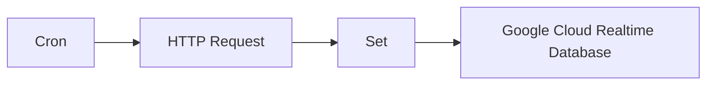

## Fluxo (.json) :

```json
{
  "id": "134",
  "name": "Receive updates for the position of the ISS every minute and push it to a database",
  "nodes": [
    {
      "name": "Cron",
      "type": "n8n-nodes-base.cron",
      "position": [
        550,
        300
      ],
      "parameters": {
        "triggerTimes": {
          "item": [
            {
              "mode": "everyMinute"
            }
          ]
        }
      },
      "typeVersion": 1
    },
    {
      "name": "HTTP Request",
      "type": "n8n-nodes-base.httpRequest",
      "position": [
        750,
        300
      ],
      "parameters": {
        "url": "https://api.wheretheiss.at/v1/satellites/25544/positions",
        "options": {},
        "queryParametersUi": {
          "parameter": [
            {
              "name": "timestamps",
              "value": "={{Date.now();}}"
            }
          ]
        }
      },
      "typeVersion": 1
    },
    {
      "name": "Set",
      "type": "n8n-nodes-base.set",
      "position": [
        950,
        300
      ],
      "parameters": {
        "values": {
          "number": [
            {
              "name": "latitude",
              "value": "={{$node[\"HTTP Request\"].json[\"0\"][\"latitude\"]}}"
            },
            {
              "name": "longitude",
              "value": "={{$node[\"HTTP Request\"].json[\"0\"][\"longitude\"]}}"
            },
            {
              "name": "timestamp",
              "value": "={{$node[\"HTTP Request\"].json[\"0\"][\"timestamp\"]}}"
            }
          ],
          "string": []
        },
        "options": {},
        "keepOnlySet": true
      },
      "typeVersion": 1
    },
    {
      "name": "Google Cloud Realtime Database",
      "type": "n8n-nodes-base.googleFirebaseRealtimeDatabase",
      "position": [
        1150,
        300
      ],
      "parameters": {
        "path": "iss",
        "operation": "push",
        "projectId": "",
        "attributes": "latitude, longitude, timestamp"
      },
      "credentials": {
        "googleFirebaseRealtimeDatabaseOAuth2Api": "firebase realtime credentials"
      },
      "typeVersion": 1
    }
  ],
  "active": false,
  "settings": {},
  "connections": {
    "Set": {
      "main": [
        [
          {
            "node": "Google Cloud Realtime Database",
            "type": "main",
            "index": 0
          }
        ]
      ]
    },
    "Cron": {
      "main": [
        [
          {
            "node": "HTTP Request",
            "type": "main",
            "index": 0
          }
        ]
      ]
    },
    "HTTP Request": {
      "main": [
        [
          {
            "node": "Set",
            "type": "main",
            "index": 0
          }
        ]
      ]
    }
  }
}
```

<a id="template-1284"></a>

## Template 1284 - Pipeline de embeddings e armazenamento em Qdrant

- **Nome:** Pipeline de embeddings e armazenamento em Qdrant
- **Descrição:** Fluxo que lista arquivos JSON em um repositório, baixa e converte os documentos em chunks, gera embeddings usando OpenAI e armazena os vetores em uma coleção Qdrant para recuperação semântica.
- **Funcionalidade:** • Listagem de arquivos no repositório: Pesquisa recursivamente arquivos .json em um caminho especificado no servidor.
• Iteração por arquivo: Processa cada arquivo individualmente em lotes para controle de fluxo.
• Download de arquivos em binário: Baixa o arquivo JSON selecionado para processamento local.
• Conversão de JSON em documentos: Transforma a estrutura JSON em documentos compatíveis para geração de embeddings.
• Divisão de texto em chunks: Separa o conteúdo em fragmentos menores (usando separador por "chunk_id" ou lógica semelhante) para normalizar tamanhos antes de embutir.
• Geração de embeddings: Envia os fragmentos ao serviço de embeddings para obter vetores semânticos.
• Inserção em banco vetorial: Agrupa embeddings em lotes (tamanho 100) e insere na coleção configurada no banco vetorial para busca semântica.
- **Ferramentas:** • Servidor FTP: Armazena e fornece os arquivos .json que serão processados e baixados para geração de embeddings.
• OpenAI Embeddings API: Gera vetores de embeddings a partir dos textos/chunks dos documentos.
• Qdrant Vector Database: Armazena os vetores gerados em uma coleção dedicada (ex.: sv_lang_data) para recuperação semântica e consultas vetoriais.

## Fluxo visual

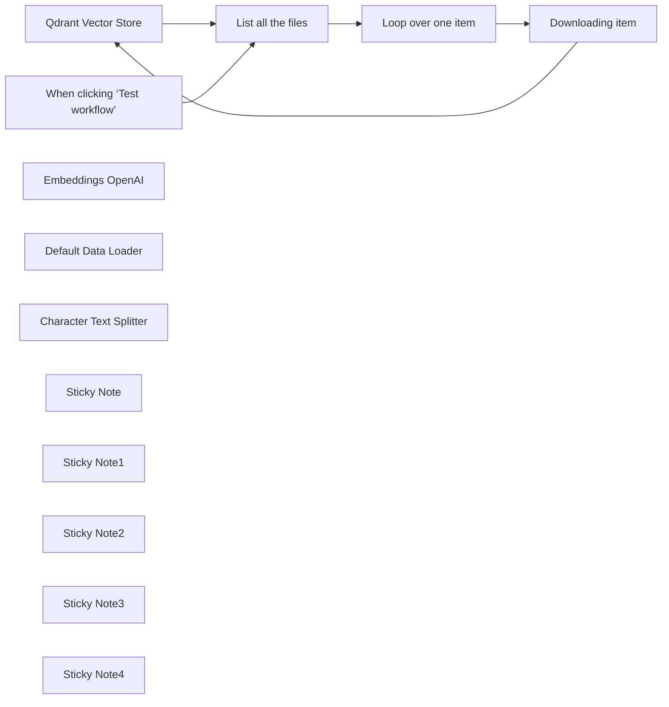

## Fluxo (.json) :

```json
{
  "id": "YoUP55V241b9F2ze",
  "meta": {
    "instanceId": "35ec7a1e5284dd5dab4dac454bbb30405138d2784c99e56ef8887a4fa9cd1977",
    "templateCredsSetupCompleted": true
  },
  "name": "Qdrant Vector Database Embedding Pipeline",
  "tags": [],
  "nodes": [
    {
      "id": "934ffad4-c93e-40c1-b4fd-1c09b518a9c3",
      "name": "Qdrant Vector Store",
      "type": "@n8n/n8n-nodes-langchain.vectorStoreQdrant",
      "position": [
        460,
        -460
      ],
      "parameters": {
        "mode": "insert",
        "options": {},
        "qdrantCollection": {
          "__rl": true,
          "mode": "list",
          "value": "sv_lang_data",
          "cachedResultName": "sv_lang_data"
        },
        "embeddingBatchSize": 100
      },
      "credentials": {
        "qdrantApi": {
          "id": "vUb9tbEnXzu7uNUb",
          "name": "QdrantApi svenska"
        }
      },
      "typeVersion": 1.1
    },
    {
      "id": "4127d85d-45c9-4536-a15d-08af9dfdcfa8",
      "name": "When clicking ‘Test workflow’",
      "type": "n8n-nodes-base.manualTrigger",
      "position": [
        -960,
        -460
      ],
      "parameters": {},
      "typeVersion": 1
    },
    {
      "id": "abb61b81-72e0-468e-855b-72402db828fc",
      "name": "Embeddings OpenAI",
      "type": "@n8n/n8n-nodes-langchain.embeddingsOpenAi",
      "position": [
        400,
        -240
      ],
      "parameters": {
        "options": {}
      },
      "credentials": {
        "openAiApi": {
          "id": "kftHaZgVKiB9BmKU",
          "name": "OpenAi account"
        }
      },
      "typeVersion": 1.2
    },
    {
      "id": "e9ae24be-6da9-4c04-b891-7e450f505e02",
      "name": "Default Data Loader",
      "type": "@n8n/n8n-nodes-langchain.documentDefaultDataLoader",
      "position": [
        780,
        -180
      ],
      "parameters": {
        "options": {},
        "dataType": "binary"
      },
      "typeVersion": 1
    },
    {
      "id": "9aff896d-4edb-494c-b84f-ede4e47db1e3",
      "name": "Character Text Splitter",
      "type": "@n8n/n8n-nodes-langchain.textSplitterCharacterTextSplitter",
      "position": [
        800,
        20
      ],
      "parameters": {
        "separator": "\"chunk_id\""
      },
      "typeVersion": 1
    },
    {
      "id": "a083a47e-a835-4323-86a8-a2eaed226aaa",
      "name": "Sticky Note",
      "type": "n8n-nodes-base.stickyNote",
      "position": [
        -760,
        -680
      ],
      "parameters": {
        "color": 4,
        "width": 260,
        "height": 200,
        "content": "### Fetch JSON File List\n**Node:** FTP (all files)\n**Operation:** List\n**Path:** <file path>\n\nRecursively lists all .json files prepared for embedding."
      },
      "typeVersion": 1
    },
    {
      "id": "072ae9dc-c1cd-4ceb-954a-6b6b1b984e29",
      "name": "Sticky Note1",
      "type": "n8n-nodes-base.stickyNote",
      "position": [
        -460,
        -660
      ],
      "parameters": {
        "color": 5,
        "height": 180,
        "content": "### Iterate Over Files\n**Node:** Loop Over Items\n\nBatches each file path individually for processing."
      },
      "typeVersion": 1
    },
    {
      "id": "08d852f2-f1de-42ce-b882-1dc1343ed967",
      "name": "Sticky Note2",
      "type": "n8n-nodes-base.stickyNote",
      "position": [
        -160,
        -700
      ],
      "parameters": {
        "color": 4,
        "width": 420,
        "height": 220,
        "content": "### Download Each File\n**Node:** FTP (1 file download)\n\nDownloads the current file in binary form using:\n```\nPath = file_path/{{ $json.name }}\n```"
      },
      "typeVersion": 1
    },
    {
      "id": "905c3d74-2817-4aa3-865d-51e972cbbb5a",
      "name": "Sticky Note3",
      "type": "n8n-nodes-base.stickyNote",
      "position": [
        920,
        -80
      ],
      "parameters": {
        "color": 3,
        "width": 320,
        "height": 400,
        "content": "### Parse JSON Document (Default Data Loader)\n**Node:** Default Data Loader\n**Loader Type**: binary\n- Converts JSON structure into a document format compatible with embedding.\n\n\n### Split into Smaller Chunks\n**Node:** Character Text Splitter\n**Split by:** \"chunk_id\" or custom logic based on chunk formatting\n\nOptional node if chunk size normalization is required before embedding."
      },
      "typeVersion": 1
    },
    {
      "id": "9fb8e5be-3ee1-42b4-a858-40bc6afcf457",
      "name": "List all the files",
      "type": "n8n-nodes-base.ftp",
      "position": [
        -700,
        -460
      ],
      "parameters": {
        "path": "Oracle/AI/embedding/svenska",
        "operation": "list"
      },
      "credentials": {
        "ftp": {
          "id": "JufoKeNjsIgbCBWe",
          "name": "FTP account"
        }
      },
      "typeVersion": 1
    },
    {
      "id": "6f8d0390-5851-44ca-9712-0ae51f9a22ef",
      "name": "Loop over one item",
      "type": "n8n-nodes-base.splitInBatches",
      "position": [
        -400,
        -460
      ],
      "parameters": {
        "options": {}
      },
      "typeVersion": 3
    },
    {
      "id": "1c89a4a9-ec68-4c48-b7bc-74f5b30d8ac2",
      "name": "Downloading item",
      "type": "n8n-nodes-base.ftp",
      "position": [
        -40,
        -440
      ],
      "parameters": {
        "path": "=Oracle/AI/embedding/svenska/{{ $json.name }}",
        "binaryPropertyName": "binary.data"
      },
      "credentials": {
        "ftp": {
          "id": "JufoKeNjsIgbCBWe",
          "name": "FTP account"
        }
      },
      "typeVersion": 1,
      "alwaysOutputData": true
    },
    {
      "id": "01ca4ee3-5f1c-4977-a7f9-88e46db580ad",
      "name": "Sticky Note4",
      "type": "n8n-nodes-base.stickyNote",
      "position": [
        360,
        -960
      ],
      "parameters": {
        "width": 480,
        "height": 460,
        "content": "### Store in Vector DB\n**Node:** Qdrant Vector Store\n**Batch Size:** 100\n\n**Collection:** <collection_name>\nSends cleaned text chunks to OpenAI to get embeddings (1536 dim for text-embedding-ada-002)\n\n#### collection settings in Qdrant cluster\n```\nPUT /collections/{collection_name}\n{\n    \"vectors\": {\n      \"size\": 1536,\n      \"distance\": \"Cosine\"\n    }\n}\n```\nEmbed Chunks\n**Node:** Embeddings OpenAI\nPushes the embedded chunks (with metadata) into Qdrant for semantic retrieval."
      },
      "typeVersion": 1
    }
  ],
  "active": false,
  "pinData": {},
  "settings": {
    "executionOrder": "v1"
  },
  "versionId": "c71fca63-26e9-4795-9a00-942dab6d07ce",
  "connections": {
    "Downloading item": {
      "main": [
        [
          {
            "node": "Qdrant Vector Store",
            "type": "main",
            "index": 0
          }
        ]
      ]
    },
    "Embeddings OpenAI": {
      "ai_embedding": [
        [
          {
            "node": "Qdrant Vector Store",
            "type": "ai_embedding",
            "index": 0
          }
        ]
      ]
    },
    "List all the files": {
      "main": [
        [
          {
            "node": "Loop over one item",
            "type": "main",
            "index": 0
          }
        ]
      ]
    },
    "Loop over one item": {
      "main": [
        [],
        [
          {
            "node": "Downloading item",
            "type": "main",
            "index": 0
          }
        ]
      ]
    },
    "Default Data Loader": {
      "ai_document": [
        [
          {
            "node": "Qdrant Vector Store",
            "type": "ai_document",
            "index": 0
          }
        ]
      ]
    },
    "Qdrant Vector Store": {
      "main": [
        [
          {
            "node": "List all the files",
            "type": "main",
            "index": 0
          }
        ]
      ]
    },
    "Character Text Splitter": {
      "ai_textSplitter": [
        [
          {
            "node": "Default Data Loader",
            "type": "ai_textSplitter",
            "index": 0
          }
        ]
      ]
    },
    "When clicking ‘Test workflow’": {
      "main": [
        [
          {
            "node": "List all the files",
            "type": "main",
            "index": 0
          }
        ]
      ]
    }
  }
}
```

<a id="template-1285"></a>

## Template 1285 - Chat RAG via Telegram com ingestão de PDFs

- **Nome:** Chat RAG via Telegram com ingestão de PDFs
- **Descrição:** Fluxo que recebe PDFs pelo Telegram, indexa seu conteúdo em um banco vetorial e atende consultas usando recuperação de documentos para gerar respostas precisas.
- **Funcionalidade:** • Recepção de mensagens do Telegram: Escuta mensagens e identifica quando um arquivo/documento é enviado.
• Verificação de documento: Decide se a mensagem contém um documento (PDF) ou é uma consulta de chat.
• Download do arquivo: Obtém o arquivo enviado pelo usuário a partir do Telegram.
• Normalização do arquivo: Ajusta metadados binários para garantir que o arquivo seja tratado como PDF (mimeType e extensão).
• Split de texto em chunks: Divide o conteúdo do PDF em pedaços (chunks) configuráveis para indexação.
• Geração de embeddings: Cria vetores de embeddings para cada chunk do documento.
• Inserção no banco vetorial: Armazena os embeddings e metadados no índice vetorial (nome do índice: telegram).
• Confirmação ao usuário: Envia mensagem ao usuário informando quantas páginas/itens foram salvos no banco.
• Recuperação para perguntas: Para mensagens que não são documentos, busca chunks relevantes no índice vetorial.
• Cadeia de QA com modelo: Passa os trechos recuperados para um modelo de linguagem para construir a resposta ao usuário.
• Envio de resposta ao Telegram: Retorna a resposta gerada ao chat de origem.
• Tratamento de erros: Existem pontos que interrompem o fluxo e enviam mensagens de erro quando necessário.
- **Ferramentas:** • Telegram: Canal de entrada/saída para receber arquivos e enviar respostas aos usuários.
• OpenAI (embeddings): Serviço utilizado para gerar embeddings vetoriais dos trechos do documento.
• Pinecone: Banco vetorial para armazenar e recuperar embeddings, permitindo busca semântica.
• Groq (modelo de chat LLM): Modelo de linguagem usado para gerar respostas a partir dos documentos recuperados.

## Fluxo visual

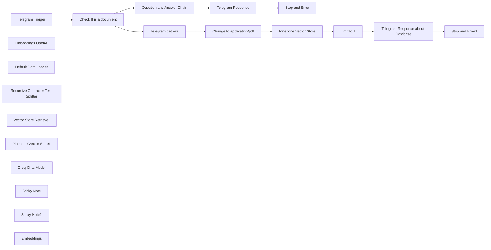

## Fluxo (.json) :

```json
{
  "id": "5Ycrm1MuK8htwd96",
  "meta": {
    "instanceId": "e5595d8cd58f3a24b5a8cf05dd852846c05423873db868a2b7d01a778210c45a",
    "templateCredsSetupCompleted": true
  },
  "name": "Telegram RAG pdf",
  "tags": [],
  "nodes": [
    {
      "id": "9fbce801-8c42-43a4-bc70-d93042d68b2c",
      "name": "Telegram Trigger",
      "type": "n8n-nodes-base.telegramTrigger",
      "position": [
        -220,
        240
      ],
      "webhookId": "b178f034-9997-4832-9bb4-a43c3015506e",
      "parameters": {
        "updates": [
          "message"
        ],
        "additionalFields": {}
      },
      "credentials": {
        "telegramApi": {
          "id": "",
          "name": ""
        }
      },
      "typeVersion": 1.1
    },
    {
      "id": "1bfc1fbd-86b1-4a8a-9301-fe54497f5acd",
      "name": "Embeddings OpenAI",
      "type": "@n8n/n8n-nodes-langchain.embeddingsOpenAi",
      "position": [
        720,
        460
      ],
      "parameters": {
        "options": {}
      },
      "credentials": {
        "openAiApi": {
          "id": "",
          "name": ""
        }
      },
      "typeVersion": 1
    },
    {
      "id": "d5ad7851-ed40-4b3a-b0d5-aeaf04362f1c",
      "name": "Default Data Loader",
      "type": "@n8n/n8n-nodes-langchain.documentDefaultDataLoader",
      "position": [
        860,
        460
      ],
      "parameters": {
        "options": {},
        "dataType": "binary"
      },
      "typeVersion": 1
    },
    {
      "id": "fed803d0-49a2-4b82-8f20-a02a10caa027",
      "name": "Recursive Character Text Splitter",
      "type": "@n8n/n8n-nodes-langchain.textSplitterRecursiveCharacterTextSplitter",
      "position": [
        940,
        680
      ],
      "parameters": {
        "options": {},
        "chunkSize": 3000,
        "chunkOverlap": 200
      },
      "typeVersion": 1
    },
    {
      "id": "ab60f36f-fada-4812-8dbd-441ad372cb80",
      "name": "Stop and Error",
      "type": "n8n-nodes-base.stopAndError",
      "position": [
        220,
        840
      ],
      "parameters": {
        "errorMessage": "An error occurred"
      },
      "typeVersion": 1
    },
    {
      "id": "c87f1db3-7cc9-4063-9895-4b4d68ea53a1",
      "name": "Question and Answer Chain",
      "type": "@n8n/n8n-nodes-langchain.chainRetrievalQa",
      "position": [
        -280,
        500
      ],
      "parameters": {
        "text": "={{ $json.message.text }}\nSearch the database with the retriever for information for the answer",
        "promptType": "define"
      },
      "typeVersion": 1.3
    },
    {
      "id": "c9bc4c80-8e57-48bc-a405-131ed7348c1d",
      "name": "Vector Store Retriever",
      "type": "@n8n/n8n-nodes-langchain.retrieverVectorStore",
      "position": [
        -240,
        680
      ],
      "parameters": {},
      "typeVersion": 1
    },
    {
      "id": "0217056f-2b71-4308-adf1-19dcd4d2cc11",
      "name": "Pinecone Vector Store1",
      "type": "@n8n/n8n-nodes-langchain.vectorStorePinecone",
      "position": [
        -280,
        860
      ],
      "parameters": {
        "options": {},
        "pineconeIndex": {
          "__rl": true,
          "mode": "list",
          "value": "telegram",
          "cachedResultName": "telegram"
        }
      },
      "credentials": {
        "pineconeApi": {
          "id": "",
          "name": ""
        }
      },
      "typeVersion": 1
    },
    {
      "id": "693f9026-f47f-48dc-8e5d-e8b832a37235",
      "name": "Groq Chat Model",
      "type": "@n8n/n8n-nodes-langchain.lmChatGroq",
      "position": [
        -380,
        660
      ],
      "parameters": {
        "model": "llama-3.1-70b-versatile",
        "options": {}
      },
      "credentials": {
        "groqApi": {
          "id": "",
          "name": ""
        }
      },
      "typeVersion": 1
    },
    {
      "id": "c7acf014-138f-4be7-b569-c309bb10e50d",
      "name": "Sticky Note",
      "type": "n8n-nodes-base.stickyNote",
      "position": [
        500,
        73.04879287725316
      ],
      "parameters": {
        "color": 7,
        "width": 1139.5159692915001,
        "height": 873.6068151028411,
        "content": "# Load data into database\nFetch file from **Telegram**, split it into chunks and insert into **Pinecone** index, a message from **Telegram** will be sent just to let the user know that the process finished"
      },
      "typeVersion": 1
    },
    {
      "id": "dd3b9d8b-5771-4a09-8c1b-794cb8737d5d",
      "name": "Sticky Note1",
      "type": "n8n-nodes-base.stickyNote",
      "position": [
        -878.769,
        400
      ],
      "parameters": {
        "color": 7,
        "width": 1344.7918019808176,
        "height": 806.8716167324012,
        "content": "# Chat with Database\n\n1. **Receive** the incoming chat message.\n2. **Retrieve** relevant chunks from the _vector store_.\n3. **Pass** these chunks to the model.\n\nThe model will use the retrieved information to **formulate a precise response**.\n"
      },
      "typeVersion": 1
    },
    {
      "id": "9aaf575a-5e40-407c-951c-10b1d16e5d3c",
      "name": "Check If is a document",
      "type": "n8n-nodes-base.if",
      "position": [
        220,
        240
      ],
      "parameters": {
        "options": {},
        "conditions": {
          "options": {
            "leftValue": "",
            "caseSensitive": true,
            "typeValidation": "strict"
          },
          "combinator": "and",
          "conditions": [
            {
              "id": "8839993b-9fe7-4e1e-a1cc-fe5de6b0bb62",
              "operator": {
                "type": "object",
                "operation": "exists",
                "singleValue": true
              },
              "leftValue": "={{ $json.message.document }}",
              "rightValue": ""
            }
          ]
        }
      },
      "typeVersion": 2
    },
    {
      "id": "c1edb6bf-ba95-4a5f-9626-add673274086",
      "name": "Change to application/pdf",
      "type": "n8n-nodes-base.code",
      "position": [
        700,
        220
      ],
      "parameters": {
        "jsCode": "// Função para modificar os metadados do arquivo binário\nfunction modifyBinaryMetadata(items) {\n for (const item of items) {\n if (item.binary && item.binary.data) {\n // Modifica o tipo MIME\n item.binary.data.mimeType = 'application/pdf';\n \n // Garante que o nome do arquivo termine com .pdf\n if (!item.binary.data.fileName.toLowerCase().endsWith('.pdf')) {\n item.binary.data.fileName += '.pdf';\n }\n \n // Atualiza o contentType no fileType (se existir)\n if (item.binary.data.fileType) {\n item.binary.data.fileType.contentType = 'application/pdf';\n }\n }\n }\n return items;\n}\n\n// Aplica a modificação e retorna os itens atualizados\nreturn modifyBinaryMetadata($input.all());"
      },
      "typeVersion": 2
    },
    {
      "id": "ea4d4e74-8954-47f0-a3a0-662d47ea2298",
      "name": "Telegram get File",
      "type": "n8n-nodes-base.telegram",
      "position": [
        520,
        220
      ],
      "parameters": {
        "fileId": "={{ $json.message.document.file_id }}",
        "resource": "file"
      },
      "credentials": {
        "telegramApi": {
          "id": "",
          "name": ""
        }
      },
      "typeVersion": 1.2
    },
    {
      "id": "cf548bee-d5d5-4f1a-a059-932ea163e155",
      "name": "Embeddings",
      "type": "@n8n/n8n-nodes-langchain.embeddingsOpenAi",
      "position": [
        -100,
        1080
      ],
      "parameters": {
        "options": {}
      },
      "credentials": {
        "openAiApi": {
          "id": "",
          "name": ""
        }
      },
      "typeVersion": 1
    },
    {
      "id": "e3bd4759-80cc-42bb-ba53-f9e88e9ba916",
      "name": "Telegram Response",
      "type": "n8n-nodes-base.telegram",
      "onError": "continueErrorOutput",
      "position": [
        160,
        560
      ],
      "parameters": {
        "text": "={{ $json.response.text }}",
        "chatId": "={{ $('Telegram Trigger').item.json.message.chat.id }}",
        "additionalFields": {
          "appendAttribution": false
        }
      },
      "credentials": {
        "telegramApi": {
          "id": "",
          "name": ""
        }
      },
      "typeVersion": 1.2
    },
    {
      "id": "e478df48-9e6d-4a84-89be-beb569914ae3",
      "name": "Telegram Response about Database",
      "type": "n8n-nodes-base.telegram",
      "onError": "continueErrorOutput",
      "position": [
        1400,
        220
      ],
      "parameters": {
        "text": "={{ $json.metadata.pdf.totalPages }} pages saved on Pinecone",
        "chatId": "={{ $('Telegram Trigger').item.json.message.chat.id }}",
        "additionalFields": {
          "appendAttribution": false
        }
      },
      "credentials": {
        "telegramApi": {
          "id": "",
          "name": ""
        }
      },
      "typeVersion": 1.2
    },
    {
      "id": "5be7a321-1be6-4173-83de-3d569666718d",
      "name": "Stop and Error1",
      "type": "n8n-nodes-base.stopAndError",
      "position": [
        1400,
        580
      ],
      "parameters": {
        "errorMessage": "An error occurred."
      },
      "typeVersion": 1
    },
    {
      "id": "aae26861-f34d-4b59-bd99-3662fbd6676c",
      "name": "Pinecone Vector Store",
      "type": "@n8n/n8n-nodes-langchain.vectorStorePinecone",
      "position": [
        880,
        220
      ],
      "parameters": {
        "mode": "insert",
        "options": {},
        "pineconeIndex": {
          "__rl": true,
          "mode": "list",
          "value": "telegram",
          "cachedResultName": "telegram"
        }
      },
      "credentials": {
        "pineconeApi": {
          "id": "",
          "name": ""
        }
      },
      "typeVersion": 1
    },
    {
      "id": "312fb807-4225-4630-ab32-aa12fe07c127",
      "name": "Limit to 1",
      "type": "n8n-nodes-base.limit",
      "position": [
        1220,
        220
      ],
      "parameters": {},
      "typeVersion": 1
    }
  ],
  "active": true,
  "pinData": {},
  "settings": {
    "timezone": "America/Sao_Paulo",
    "executionOrder": "v1"
  },
  "versionId": "03612d23-6630-4ec6-8738-1dae593c8d23",
  "connections": {
    "Embeddings": {
      "ai_embedding": [
        [
          {
            "node": "Pinecone Vector Store1",
            "type": "ai_embedding",
            "index": 0
          }
        ]
      ]
    },
    "Limit to 1": {
      "main": [
        [
          {
            "node": "Telegram Response about Database",
            "type": "main",
            "index": 0
          }
        ]
      ]
    },
    "Groq Chat Model": {
      "ai_languageModel": [
        [
          {
            "node": "Question and Answer Chain",
            "type": "ai_languageModel",
            "index": 0
          }
        ]
      ]
    },
    "Telegram Trigger": {
      "main": [
        [
          {
            "node": "Check If is a document",
            "type": "main",
            "index": 0
          }
        ]
      ]
    },
    "Embeddings OpenAI": {
      "ai_embedding": [
        [
          {
            "node": "Pinecone Vector Store",
            "type": "ai_embedding",
            "index": 0
          }
        ]
      ]
    },
    "Telegram Response": {
      "main": [
        [],
        [
          {
            "node": "Stop and Error",
            "type": "main",
            "index": 0
          }
        ]
      ]
    },
    "Telegram get File": {
      "main": [
        [
          {
            "node": "Change to application/pdf",
            "type": "main",
            "index": 0
          }
        ]
      ]
    },
    "Default Data Loader": {
      "ai_document": [
        [
          {
            "node": "Pinecone Vector Store",
            "type": "ai_document",
            "index": 0
          }
        ]
      ]
    },
    "Pinecone Vector Store": {
      "main": [
        [
          {
            "node": "Limit to 1",
            "type": "main",
            "index": 0
          }
        ]
      ]
    },
    "Check If is a document": {
      "main": [
        [
          {
            "node": "Telegram get File",
            "type": "main",
            "index": 0
          }
        ],
        [
          {
            "node": "Question and Answer Chain",
            "type": "main",
            "index": 0
          }
        ]
      ]
    },
    "Pinecone Vector Store1": {
      "ai_vectorStore": [
        [
          {
            "node": "Vector Store Retriever",
            "type": "ai_vectorStore",
            "index": 0
          }
        ]
      ]
    },
    "Vector Store Retriever": {
      "ai_retriever": [
        [
          {
            "node": "Question and Answer Chain",
            "type": "ai_retriever",
            "index": 0
          }
        ]
      ]
    },
    "Change to application/pdf": {
      "main": [
        [
          {
            "node": "Pinecone Vector Store",
            "type": "main",
            "index": 0
          }
        ]
      ]
    },
    "Question and Answer Chain": {
      "main": [
        [
          {
            "node": "Telegram Response",
            "type": "main",
            "index": 0
          }
        ]
      ]
    },
    "Telegram Response about Database": {
      "main": [
        [],
        [
          {
            "node": "Stop and Error1",
            "type": "main",
            "index": 0
          }
        ]
      ]
    },
    "Recursive Character Text Splitter": {
      "ai_textSplitter": [
        [
          {
            "node": "Default Data Loader",
            "type": "ai_textSplitter",
            "index": 0
          }
        ]
      ]
    }
  }
}
```

<a id="template-1286"></a>

## Template 1286 - Baixar imagem e enviar para Slack

- **Nome:** Baixar imagem e enviar para Slack
- **Descrição:** Ao executar manualmente, o fluxo baixa um arquivo de imagem a partir de uma URL e publica esse arquivo em um canal do Slack com um comentário inicial.
- **Funcionalidade:** • Gatilho manual: inicia o fluxo ao clicar em executar.
• Download do arquivo a partir de URL: obtém o arquivo de imagem usando uma requisição HTTP e recebe o conteúdo em formato de arquivo.
• Publicação do arquivo no Slack: envia o arquivo para um canal específico com um comentário inicial.
• Autenticação OAuth2 para Slack: usa credenciais OAuth2 para autorizar o envio do arquivo.
- **Ferramentas:** • Slack: plataforma de mensagens para enviar arquivos e mensagens a canais.
• Servidor HTTP/host do arquivo: fonte externa que hospeda a imagem a ser baixada.

## Fluxo visual


## Fluxo (.json) :

```json
{
  "nodes": [
    {
      "name": "On clicking 'execute'",
      "type": "n8n-nodes-base.manualTrigger",
      "position": [
        160,
        300
      ],
      "parameters": {},
      "typeVersion": 1
    },
    {
      "name": "Download the file",
      "type": "n8n-nodes-base.httpRequest",
      "position": [
        420,
        300
      ],
      "parameters": {
        "url": "https://n8n.io/_nuxt/img/sync-data-between-apps.a4be8c7.png",
        "options": {},
        "responseFormat": "file"
      },
      "typeVersion": 1
    },
    {
      "name": "Post to Slack",
      "type": "n8n-nodes-base.slack",
      "position": [
        640,
        300
      ],
      "parameters": {
        "options": {
          "channelIds": [
            "C02GP22NHJ6"
          ],
          "initialComment": "This is the file"
        },
        "resource": "file",
        "binaryData": true,
        "authentication": "oAuth2"
      },
      "credentials": {
        "slackOAuth2Api": {
          "id": "124",
          "name": "cloud_demo"
        }
      },
      "typeVersion": 1
    }
  ],
  "connections": {
    "Download the file": {
      "main": [
        [
          {
            "node": "Post to Slack",
            "type": "main",
            "index": 0
          }
        ]
      ]
    },
    "On clicking 'execute'": {
      "main": [
        [
          {
            "node": "Download the file",
            "type": "main",
            "index": 0
          }
        ]
      ]
    }
  }
}
```

<a id="template-1287"></a>

## Template 1287 - Buscar sinônimos em alemão

- **Nome:** Buscar sinônimos em alemão
- **Descrição:** Este fluxo busca sinônimos para uma palavra em alemão ao ser executado manualmente.
- **Funcionalidade:** • Gatilho manual: inicia o fluxo quando o usuário aciona a execução.
• Busca de sinônimos: consulta um serviço de thesaurus para obter sinônimos da palavra fornecida.
• Entrada de texto configurável: permite definir a palavra alvo a ser pesquisada (ex.: "Hallo").
- **Ferramentas:** • OpenThesaurus: serviço/API para obter sinônimos e relações semânticas de palavras em alemão.

## Fluxo visual

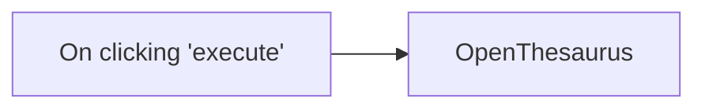

## Fluxo (.json) :

```json
{
  "id": "157",
  "name": "Get synonyms of a German word",
  "nodes": [
    {
      "name": "On clicking 'execute'",
      "type": "n8n-nodes-base.manualTrigger",
      "position": [
        550,
        260
      ],
      "parameters": {},
      "typeVersion": 1
    },
    {
      "name": "OpenThesaurus",
      "type": "n8n-nodes-base.openThesaurus",
      "position": [
        750,
        260
      ],
      "parameters": {
        "text": "Hallo",
        "options": {}
      },
      "typeVersion": 1
    }
  ],
  "active": false,
  "settings": {},
  "connections": {
    "On clicking 'execute'": {
      "main": [
        [
          {
            "node": "OpenThesaurus",
            "type": "main",
            "index": 0
          }
        ]
      ]
    }
  }
}
```

<a id="template-1288"></a>

## Template 1288 - Criar, atualizar e obter incidente no PagerDuty

- **Nome:** Criar, atualizar e obter incidente no PagerDuty
- **Descrição:** Fluxo para criar um incidente no PagerDuty, atualizá-lo em seguida e recuperar seus detalhes.
- **Funcionalidade:** • Gatilho manual: Permite iniciar a execução do fluxo manualmente.
• Criação de incidente: Cria um incidente com título inicial "Firewall on Fire" e campos de serviço e email configuráveis.
• Atualização do incidente: Atualiza o incidente criado alterando o título para "Firewalls on Fire".
• Consulta do incidente: Recupera os detalhes do incidente usando o ID retornado após a criação/atualização.
- **Ferramentas:** • PagerDuty: Plataforma de gerenciamento de incidentes usada para criar, atualizar e consultar incidentes.

## Fluxo visual


## Fluxo (.json) :

```json
{
  "id": "158",
  "name": "Create, update, and get an incident on PagerDuty",
  "nodes": [
    {
      "name": "On clicking 'execute'",
      "type": "n8n-nodes-base.manualTrigger",
      "position": [
        240,
        260
      ],
      "parameters": {},
      "typeVersion": 1
    },
    {
      "name": "PagerDuty",
      "type": "n8n-nodes-base.pagerDuty",
      "position": [
        440,
        260
      ],
      "parameters": {
        "email": "",
        "title": "Firewall on Fire",
        "serviceId": "",
        "additionalFields": {}
      },
      "credentials": {
        "pagerDutyApi": ""
      },
      "typeVersion": 1
    },
    {
      "name": "PagerDuty2",
      "type": "n8n-nodes-base.pagerDuty",
      "position": [
        840,
        260
      ],
      "parameters": {
        "operation": "get",
        "incidentId": "={{$node[\"PagerDuty1\"].json[\"id\"]}}"
      },
      "credentials": {
        "pagerDutyApi": ""
      },
      "typeVersion": 1
    },
    {
      "name": "PagerDuty1",
      "type": "n8n-nodes-base.pagerDuty",
      "position": [
        640,
        260
      ],
      "parameters": {
        "email": "={{$node[\"PagerDuty\"].parameter[\"email\"]}}",
        "operation": "update",
        "incidentId": "={{$node[\"PagerDuty\"].json[\"id\"]}}",
        "updateFields": {
          "title": "Firewalls on Fire"
        }
      },
      "credentials": {
        "pagerDutyApi": ""
      },
      "typeVersion": 1
    }
  ],
  "active": false,
  "settings": {},
  "connections": {
    "PagerDuty": {
      "main": [
        [
          {
            "node": "PagerDuty1",
            "type": "main",
            "index": 0
          }
        ]
      ]
    },
    "PagerDuty1": {
      "main": [
        [
          {
            "node": "PagerDuty2",
            "type": "main",
            "index": 0
          }
        ]
      ]
    },
    "On clicking 'execute'": {
      "main": [
        [
          {
            "node": "PagerDuty",
            "type": "main",
            "index": 0
          }
        ]
      ]
    }
  }
}
```

<a id="template-1289"></a>

## Template 1289 - Backup mensal do Clockify para GitHub

- **Nome:** Backup mensal do Clockify para GitHub
- **Descrição:** Realiza backup mensal dos relatórios detalhados de um workspace do Clockify salvando-os como arquivos em um repositório do GitHub, criando ou atualizando os arquivos conforme necessário.
- **Funcionalidade:** • Agendamento: executa o processo periodicamente (padrão: uma vez ao dia).
• Seleção de workspace: obtém o workspace padrão (ou permite sobrescrever o ID) para extrair dados.
• Escopo temporal configurável: itera sobre índices de mês (por padrão os últimos 3 meses, onde 0 = mês atual) para definir intervalos de data.
• Geração de nomes e intervalos: cria nomes de arquivo por mês e calcula startDate/endDate para cada intervalo mensal.
• Solicitação de relatório detalhado: consulta a API de relatórios do Clockify para obter time entries no intervalo definido.
• Filtragem de relatórios vazios: pula a criação de arquivo se o relatório não contiver entradas.
• Verificação de existência no repositório: checa se o arquivo do relatório já existe no repositório GitHub.
• Comparação de datasets: compara os dados recuperados com o conteúdo existente para detectar diferenças antes de atualizar.
• Criação ou atualização de arquivo: cria novo arquivo se não existir ou atualiza o arquivo existente com os dados mais recentes.
• Tratamento de erros: interrompe com mensagem em caso de erros não esperados e trata especificamente retorno 404 para criar arquivos novos.
- **Ferramentas:** • Clockify: API de relatórios detalhados utilizada para extrair time entries e metadados por intervalo de datas.
• GitHub: repositório usado para armazenar os relatórios como arquivos, suportando criação e atualização com commits.


## Fluxo visual

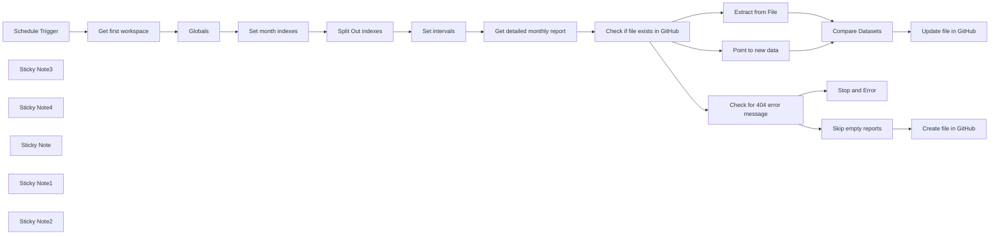

## Fluxo (.json) :

```json
{
  "id": "k22TSNIZXHaQ9rGr",
  "meta": {
    "instanceId": "fb8bc2e315f7f03c97140b30aa454a27bc7883a19000fa1da6e6b571bf56ad6d",
    "templateCredsSetupCompleted": true
  },
  "name": "Clockify Backup Template",
  "tags": [
    {
      "id": "RKga6I6NviNI12bx",
      "name": "template",
      "createdAt": "2024-09-19T19:09:21.997Z",
      "updatedAt": "2024-09-19T19:09:21.997Z"
    }
  ],
  "nodes": [
    {
      "id": "24115363-9a03-4f8a-aa6e-2a9d4247f035",
      "name": "Extract from File",
      "type": "n8n-nodes-base.extractFromFile",
      "position": [
        660,
        400
      ],
      "parameters": {
        "options": {},
        "operation": "fromJson"
      },
      "typeVersion": 1
    },
    {
      "id": "11aa4b51-98f9-4df8-b2d2-6757fe686894",
      "name": "Compare Datasets",
      "type": "n8n-nodes-base.compareDatasets",
      "position": [
        880,
        280
      ],
      "parameters": {
        "options": {},
        "mergeByFields": {
          "values": [
            {
              "field1": "data",
              "field2": "data"
            }
          ]
        }
      },
      "typeVersion": 2.3
    },
    {
      "id": "831ad368-6a46-4dd4-bb6c-8ea46200cdf0",
      "name": "Stop and Error",
      "type": "n8n-nodes-base.stopAndError",
      "position": [
        880,
        700
      ],
      "parameters": {
        "errorMessage": "={{ $json.error }}"
      },
      "typeVersion": 1
    },
    {
      "id": "2f838fc8-96bf-4111-aaba-743e0c88b688",
      "name": "Globals",
      "type": "n8n-nodes-base.set",
      "position": [
        -660,
        480
      ],
      "parameters": {
        "options": {},
        "assignments": {
          "assignments": [
            {
              "id": "6bd5904d-0218-4075-a767-d4b659def9b0",
              "name": "workspace_id",
              "type": "string",
              "value": "={{ $json.id }}"
            },
            {
              "id": "63fa6231-6c5b-414f-b813-18f7dd5c33e9",
              "name": "github_repo.owner",
              "type": "string",
              "value": ""
            },
            {
              "id": "be2530d7-b2b5-41c5-af19-ab8d27f18e2e",
              "name": "github_repo.name",
              "type": "string",
              "value": ""
            }
          ]
        }
      },
      "typeVersion": 3.4
    },
    {
      "id": "bea9590e-355e-410a-bc4b-ae777efb9f15",
      "name": "Set month indexes",
      "type": "n8n-nodes-base.set",
      "position": [
        -440,
        480
      ],
      "parameters": {
        "options": {},
        "assignments": {
          "assignments": [
            {
              "id": "ad278249-5320-4ffa-8d75-e47194c83e58",
              "name": "monthIndex",
              "type": "array",
              "value": "=[0, 1, 2]"
            }
          ]
        }
      },
      "typeVersion": 3.4
    },
    {
      "id": "f541d535-80d9-439d-8543-9c3cb156a5ff",
      "name": "Split Out indexes",
      "type": "n8n-nodes-base.splitOut",
      "position": [
        -220,
        480
      ],
      "parameters": {
        "options": {},
        "fieldToSplitOut": "monthIndex"
      },
      "typeVersion": 1
    },
    {
      "id": "76c74727-d338-4a61-9bf2-e97893721995",
      "name": "Set intervals",
      "type": "n8n-nodes-base.set",
      "position": [
        0,
        480
      ],
      "parameters": {
        "options": {},
        "assignments": {
          "assignments": [
            {
              "id": "7f5ff2ee-b93c-4121-b3dc-ce592513db88",
              "name": "reportName",
              "type": "string",
              "value": "=detailed_report_{{ $now.minus($json.monthIndex, 'month').format('yyyy-MM') }}"
            },
            {
              "id": "ea571bdb-8f51-4852-9fda-55ff1a929d1f",
              "name": "startDate",
              "type": "string",
              "value": "={{ $now.minus($json.monthIndex, 'month').startOf('month').format('yyyy-MM-dd') }}"
            },
            {
              "id": "e88726c4-1eb8-4f29-9805-7b0a5ee484a4",
              "name": "endDate",
              "type": "string",
              "value": "={{ $now.minus($json.monthIndex, 'month').endOf('month').format('yyyy-MM-dd') }}"
            }
          ]
        }
      },
      "typeVersion": 3.4
    },
    {
      "id": "6d5e917e-68ac-4dbd-98be-4c8ad97fa54a",
      "name": "Skip empty reports",
      "type": "n8n-nodes-base.filter",
      "position": [
        880,
        500
      ],
      "parameters": {
        "options": {},
        "conditions": {
          "options": {
            "version": 2,
            "leftValue": "",
            "caseSensitive": true,
            "typeValidation": "strict"
          },
          "combinator": "and",
          "conditions": [
            {
              "id": "f6c69f9b-9e78-4a1e-af33-a1197f35e970",
              "operator": {
                "type": "array",
                "operation": "notEmpty",
                "singleValue": true
              },
              "leftValue": "={{ $json.timeentries }}",
              "rightValue": ""
            }
          ]
        }
      },
      "typeVersion": 2.2
    },
    {
      "id": "60c7a408-74d3-4c6c-ac78-1ed1071e873e",
      "name": "Get first workspace",
      "type": "n8n-nodes-base.clockify",
      "position": [
        -880,
        480
      ],
      "parameters": {
        "limit": 1,
        "resource": "workspace"
      },
      "credentials": {
        "clockifyApi": {
          "id": "CMJ0LAYOs143GAXw",
          "name": "Clockify (octionictest)"
        }
      },
      "typeVersion": 1
    },
    {
      "id": "824bf2c6-9159-40ec-83f3-3f0b8d87c208",
      "name": "Get detailed monthly report",
      "type": "n8n-nodes-base.httpRequest",
      "position": [
        220,
        480
      ],
      "parameters": {
        "url": "=https://reports.api.clockify.me/v1/workspaces/{{ $('Globals').item.json.workspace_id }}/reports/detailed",
        "method": "POST",
        "options": {},
        "jsonBody": "={\n  \"dateRangeStart\": \"{{ $json.startDate }}T00:00:00Z\",\n  \"dateRangeEnd\": \"{{ $json.endDate }}T23:59:59.999Z\",\n  \"detailedFilter\": {\n    \"page\": 1,\n    \"pageSize\": 50\n  },\n  \"exportType\": \"json\"\n}",
        "sendBody": true,
        "specifyBody": "json",
        "authentication": "predefinedCredentialType",
        "nodeCredentialType": "clockifyApi"
      },
      "credentials": {
        "clockifyApi": {
          "id": "CMJ0LAYOs143GAXw",
          "name": "Clockify (octionictest)"
        }
      },
      "typeVersion": 4.2
    },
    {
      "id": "f9323c68-c70f-4f22-ae18-916d5fc1b264",
      "name": "Check if file exists in GitHub",
      "type": "n8n-nodes-base.github",
      "onError": "continueErrorOutput",
      "position": [
        440,
        480
      ],
      "parameters": {
        "owner": {
          "__rl": true,
          "mode": "name",
          "value": "={{ $('Globals').first().json.github_repo.owner }}"
        },
        "filePath": "=reports/{{ $('Set intervals').item.json.reportName }}",
        "resource": "file",
        "operation": "get",
        "repository": {
          "__rl": true,
          "mode": "name",
          "value": "={{ $('Globals').first().json.github_repo.name }}"
        },
        "additionalParameters": {}
      },
      "credentials": {
        "githubApi": {
          "id": "Eb9yCfVJGJvXD05z",
          "name": "GitHub (n8n-test-01)"
        }
      },
      "retryOnFail": false,
      "typeVersion": 1
    },
    {
      "id": "41877a6a-ba5b-43bd-8ca3-f8402793685f",
      "name": "Point to new data",
      "type": "n8n-nodes-base.set",
      "position": [
        660,
        200
      ],
      "parameters": {
        "options": {},
        "assignments": {
          "assignments": [
            {
              "id": "00d2885f-451e-436e-8852-b9ad086d231b",
              "name": "data",
              "type": "array",
              "value": "={{ $('Get detailed monthly report').item.json.timeentries }}"
            }
          ]
        }
      },
      "typeVersion": 3.4
    },
    {
      "id": "9f448921-5b9d-4937-a7d9-00a62b1fba99",
      "name": "Check for 404 error message",
      "type": "n8n-nodes-base.if",
      "position": [
        660,
        600
      ],
      "parameters": {
        "options": {},
        "conditions": {
          "options": {
            "version": 2,
            "leftValue": "",
            "caseSensitive": true,
            "typeValidation": "strict"
          },
          "combinator": "and",
          "conditions": [
            {
              "id": "6b34c09d-0136-433c-856d-b29a0c3aac34",
              "operator": {
                "type": "string",
                "operation": "contains"
              },
              "leftValue": "={{ $json.error }}",
              "rightValue": "could not be found"
            }
          ]
        }
      },
      "typeVersion": 2.2
    },
    {
      "id": "900905ed-cff6-4ebb-b0da-67db9f02b301",
      "name": "Update file in GitHub",
      "type": "n8n-nodes-base.github",
      "position": [
        1100,
        180
      ],
      "parameters": {
        "owner": {
          "__rl": true,
          "mode": "name",
          "value": "={{ $('Globals').first().json.github_repo.owner }}"
        },
        "filePath": "=reports/{{ $('Set intervals').item.json.reportName }}",
        "resource": "file",
        "operation": "edit",
        "repository": {
          "__rl": true,
          "mode": "name",
          "value": "={{ $('Globals').first().json.github_repo.name }}"
        },
        "fileContent": "={{ JSON.stringify($json.data, null, 2) }}",
        "commitMessage": "Update report"
      },
      "credentials": {
        "githubApi": {
          "id": "Eb9yCfVJGJvXD05z",
          "name": "GitHub (n8n-test-01)"
        }
      },
      "typeVersion": 1
    },
    {
      "id": "b928cdb2-b21a-45ff-9bc6-9be483891c4c",
      "name": "Create file in GitHub",
      "type": "n8n-nodes-base.github",
      "position": [
        1100,
        500
      ],
      "parameters": {
        "owner": {
          "__rl": true,
          "mode": "name",
          "value": "={{ $('Globals').first().json.github_repo.owner }}"
        },
        "filePath": "=reports/{{ $('Set intervals').item.json.reportName }}",
        "resource": "file",
        "repository": {
          "__rl": true,
          "mode": "name",
          "value": "={{ $('Globals').first().json.github_repo.name }}"
        },
        "fileContent": "={{ JSON.stringify($json.timeentries, null, 2) }}",
        "commitMessage": "Create report"
      },
      "credentials": {
        "githubApi": {
          "id": "Eb9yCfVJGJvXD05z",
          "name": "GitHub (n8n-test-01)"
        }
      },
      "typeVersion": 1
    },
    {
      "id": "04a5b42d-ea1f-4b32-98b5-953e22b26819",
      "name": "Schedule Trigger",
      "type": "n8n-nodes-base.scheduleTrigger",
      "position": [
        -1100,
        480
      ],
      "parameters": {
        "rule": {
          "interval": [
            {
              "triggerAtHour": 5
            }
          ]
        }
      },
      "typeVersion": 1.2
    },
    {
      "id": "4728f389-df04-4f8d-a436-ac06508d28ba",
      "name": "Sticky Note3",
      "type": "n8n-nodes-base.stickyNote",
      "position": [
        -720,
        260
      ],
      "parameters": {
        "width": 220,
        "height": 380,
        "content": "## Set Globals\n- Define the repository owner (username / organization) and repository name\n- By default the fist available Clockify workspace ID is set. This can be overridden here."
      },
      "typeVersion": 1
    },
    {
      "id": "2e31df0a-1e67-4a9a-8dc1-42360b4da978",
      "name": "Sticky Note4",
      "type": "n8n-nodes-base.stickyNote",
      "position": [
        -1160,
        360
      ],
      "parameters": {
        "width": 220,
        "height": 280,
        "content": "## Set trigger\nBy default this workflow runs once a day."
      },
      "typeVersion": 1
    },
    {
      "id": "696721c6-25fc-48f9-b0f5-53d1b6462183",
      "name": "Sticky Note",
      "type": "n8n-nodes-base.stickyNote",
      "position": [
        -500,
        300
      ],
      "parameters": {
        "width": 220,
        "height": 340,
        "content": "## Set Scope (optional)\nBy default the last three moths are being backed up.\n_0 = current month, 1 = last month, etc._"
      },
      "typeVersion": 1
    },
    {
      "id": "a0ebb845-7472-40ec-b2b5-abc2f118b0e1",
      "name": "Sticky Note1",
      "type": "n8n-nodes-base.stickyNote",
      "position": [
        160,
        360
      ],
      "parameters": {
        "color": 7,
        "width": 220,
        "height": 280,
        "content": "A detailed report is being retrieved for every month across all entries in the workspace."
      },
      "typeVersion": 1
    },
    {
      "id": "feb9f194-4c9d-41c8-9b46-3759dcdae9d5",
      "name": "Sticky Note2",
      "type": "n8n-nodes-base.stickyNote",
      "position": [
        380,
        100
      ],
      "parameters": {
        "color": 7,
        "width": 920,
        "height": 780,
        "content": "The reports are created or updated in GitHub.\n**It is essential to back up previous months as well, as values like tags may still change over time.**"
      },
      "typeVersion": 1
    }
  ],
  "active": false,
  "pinData": {},
  "settings": {
    "executionOrder": "v1"
  },
  "versionId": "34ab93f2-a965-42ac-bd44-478c19a0f7d6",
  "connections": {
    "Globals": {
      "main": [
        [
          {
            "node": "Set month indexes",
            "type": "main",
            "index": 0
          }
        ]
      ]
    },
    "Set intervals": {
      "main": [
        [
          {
            "node": "Get detailed monthly report",
            "type": "main",
            "index": 0
          }
        ]
      ]
    },
    "Compare Datasets": {
      "main": [
        [
          {
            "node": "Update file in GitHub",
            "type": "main",
            "index": 0
          }
        ],
        [],
        []
      ]
    },
    "Schedule Trigger": {
      "main": [
        [
          {
            "node": "Get first workspace",
            "type": "main",
            "index": 0
          }
        ]
      ]
    },
    "Extract from File": {
      "main": [
        [
          {
            "node": "Compare Datasets",
            "type": "main",
            "index": 1
          }
        ]
      ]
    },
    "Point to new data": {
      "main": [
        [
          {
            "node": "Compare Datasets",
            "type": "main",
            "index": 0
          }
        ]
      ]
    },
    "Set month indexes": {
      "main": [
        [
          {
            "node": "Split Out indexes",
            "type": "main",
            "index": 0
          }
        ]
      ]
    },
    "Split Out indexes": {
      "main": [
        [
          {
            "node": "Set intervals",
            "type": "main",
            "index": 0
          }
        ]
      ]
    },
    "Skip empty reports": {
      "main": [
        [
          {
            "node": "Create file in GitHub",
            "type": "main",
            "index": 0
          }
        ]
      ]
    },
    "Get first workspace": {
      "main": [
        [
          {
            "node": "Globals",
            "type": "main",
            "index": 0
          }
        ]
      ]
    },
    "Check for 404 error message": {
      "main": [
        [
          {
            "node": "Skip empty reports",
            "type": "main",
            "index": 0
          }
        ],
        [
          {
            "node": "Stop and Error",
            "type": "main",
            "index": 0
          }
        ]
      ]
    },
    "Get detailed monthly report": {
      "main": [
        [
          {
            "node": "Check if file exists in GitHub",
            "type": "main",
            "index": 0
          }
        ]
      ]
    },
    "Check if file exists in GitHub": {
      "main": [
        [
          {
            "node": "Point to new data",
            "type": "main",
            "index": 0
          },
          {
            "node": "Extract from File",
            "type": "main",
            "index": 0
          }
        ],
        [
          {
            "node": "Check for 404 error message",
            "type": "main",
            "index": 0
          }
        ]
      ]
    }
  }
}
```

<a id="template-1290"></a>

## Template 1290 - Classificação automática de mensagens de contato

- **Nome:** Classificação automática de mensagens de contato
- **Descrição:** Classifica mensagens recebidas por um formulário de contato e encaminha e registra cada submissão conforme a categoria identificada.
- **Funcionalidade:** • Captura de submissão de formulário: Recebe entradas de um formulário de contato (Nome, Email, Mensagem).
• Classificação de texto: Classifica a mensagem em categorias predefinidas (Request Quote, Product info, General problem, Order, Other) com fallback para "other".
• Roteamento condicional: Direciona cada submissão ao departamento apropriado com base na categoria detectada.
• Encaminhamento por email: Envia a mensagem e os dados do remetente ao e-mail do departamento correspondente, configurando o reply-to para o e-mail do usuário.
• Registro em base de dados: Adiciona cada submissão a uma planilha separada por categoria, incluindo metadados como data/hora e destinatário.
• Personalização de conteúdo: Insere campos do formulário (nome, email, mensagem) no corpo do email e nas entradas da planilha.
- **Ferramentas:** • Formulário/Webhook: Ponto de entrada para recebimento das submissões de contato (pode ser formulários externos como CF7).
• OpenAI API: Modelo de linguagem usado para analisar e classificar o texto das mensagens.
• Servidor SMTP / Provedor de email: Envio das notificações por email para os departamentos.
• Google Sheets: Armazenamento e organização das submissões classificadas em planilhas.

## Fluxo visual

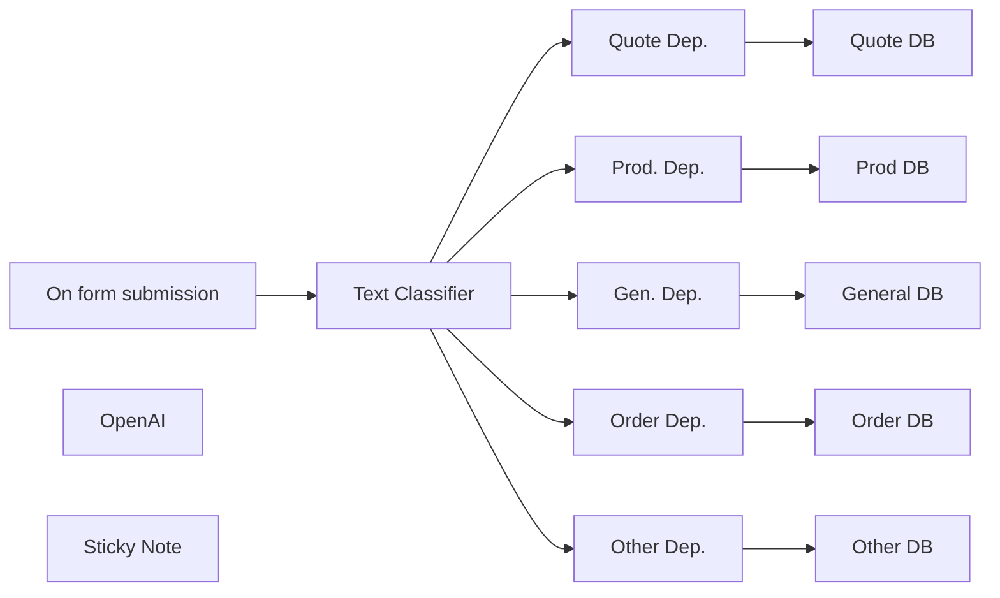

## Fluxo (.json) :

```json
{
  "id": "LGpVLWPpNZSt9ISM",
  "meta": {
    "instanceId": "a4bfc93e975ca233ac45ed7c9227d84cf5a2329310525917adaf3312e10d5462",
    "templateCredsSetupCompleted": true
  },
  "name": "Contact Form Text Classifier for eCommerce",
  "tags": [],
  "nodes": [
    {
      "id": "13175d48-c3a6-4ca6-afed-b70f40289f38",
      "name": "On form submission",
      "type": "n8n-nodes-base.formTrigger",
      "position": [
        -480,
        -320
      ],
      "webhookId": "8e10c8ca-895c-4274-ba95-0d646b8bda4e",
      "parameters": {
        "options": {},
        "formTitle": "Contacts",
        "formFields": {
          "values": [
            {
              "fieldLabel": "Name",
              "placeholder": "Name",
              "requiredField": true
            },
            {
              "fieldLabel": "Email",
              "placeholder": "Email",
              "requiredField": true
            },
            {
              "fieldType": "textarea",
              "fieldLabel": "Message",
              "placeholder": "Message",
              "requiredField": true
            }
          ]
        },
        "responseMode": "lastNode",
        "formDescription": "Basic Contact Form"
      },
      "typeVersion": 2.2
    },
    {
      "id": "7b352c9f-5d2e-46ca-9499-594063167e9a",
      "name": "Text Classifier",
      "type": "@n8n/n8n-nodes-langchain.textClassifier",
      "position": [
        -160,
        -320
      ],
      "parameters": {
        "options": {
          "fallback": "other",
          "systemPromptTemplate": "=Please classify the text provided by the user into one of the following categories: {categories}, and use the provided formatting instructions below. Don't explain, and only output the json with the selected {categories}."
        },
        "inputText": "={{ $json.Message }}",
        "categories": {
          "categories": [
            {
              "category": "Request Quote",
              "description": "Request for quote"
            },
            {
              "category": "Product info",
              "description": "General information about a product"
            },
            {
              "category": "General problem",
              "description": "General problems about a product"
            },
            {
              "category": "Order",
              "description": "Information about an order placed"
            }
          ]
        }
      },
      "typeVersion": 1
    },
    {
      "id": "efef4c71-5f56-44b0-a613-9fa888e495b8",
      "name": "OpenAI",
      "type": "@n8n/n8n-nodes-langchain.lmChatOpenAi",
      "position": [
        -220,
        -100
      ],
      "parameters": {
        "model": {
          "__rl": true,
          "mode": "list",
          "value": "gpt-4o-mini",
          "cachedResultName": "gpt-4o-mini"
        },
        "options": {}
      },
      "credentials": {
        "openAiApi": {
          "id": "CDX6QM4gLYanh0P4",
          "name": "OpenAi account"
        }
      },
      "typeVersion": 1.2
    },
    {
      "id": "83f0d528-884c-4701-8fdd-dc07c05fafb5",
      "name": "Prod. Dep.",
      "type": "n8n-nodes-base.emailSend",
      "position": [
        320,
        -540
      ],
      "parameters": {
        "html": "=Name: {{ $json.Name }}\nEmail: {{ $json.Email }}\n\nMessage:\n{{ $json.Message }}\n\nTipo prodotto: {{ $json[\"tipo prodotto\"] }}",
        "options": {
          "replyTo": "={{ $json.Email }}"
        },
        "subject": "=[n8n Contacts] Product info",
        "toEmail": "to@domain.com",
        "fromEmail": "from@domain.com"
      },
      "credentials": {
        "smtp": {
          "id": "hRjP3XbDiIQqvi7x",
          "name": "SMTP info@n3witalia.com"
        }
      },
      "typeVersion": 2.1
    },
    {
      "id": "88486500-dcea-4db9-9ffd-f55193eaa83d",
      "name": "Quote Dep.",
      "type": "n8n-nodes-base.emailSend",
      "position": [
        320,
        -780
      ],
      "parameters": {
        "html": "=Name: {{ $json.Name }}\nEmail: {{ $json.Email }}\n\nMessage:\n{{ $json.Message }}\n\nTipo prodotto: {{ $json[\"tipo prodotto\"] }}",
        "options": {
          "replyTo": "={{ $json.Email }}"
        },
        "subject": "=[n8n Contacts] Quote",
        "toEmail": "to@domain.com",
        "fromEmail": "from@domain.com"
      },
      "credentials": {
        "smtp": {
          "id": "hRjP3XbDiIQqvi7x",
          "name": "SMTP info@n3witalia.com"
        }
      },
      "typeVersion": 2.1
    },
    {
      "id": "f6a63c4f-ee2e-42f1-a12c-b1fc6cf48f94",
      "name": "Gen. Dep.",
      "type": "n8n-nodes-base.emailSend",
      "position": [
        320,
        -320
      ],
      "parameters": {
        "html": "=Name: {{ $json.Name }}\nEmail: {{ $json.Email }}\n\nMessage:\n{{ $json.Message }}\n\nTipo prodotto: {{ $json[\"tipo prodotto\"] }}",
        "options": {
          "replyTo": "={{ $json.Email }}"
        },
        "subject": "=[n8n Contacts] General",
        "toEmail": "to@domain.com",
        "fromEmail": "from@domain.com"
      },
      "credentials": {
        "smtp": {
          "id": "hRjP3XbDiIQqvi7x",
          "name": "SMTP info@n3witalia.com"
        }
      },
      "typeVersion": 2.1
    },
    {
      "id": "04a3e144-af75-4a95-819f-d5f1d4591b67",
      "name": "Order Dep.",
      "type": "n8n-nodes-base.emailSend",
      "position": [
        320,
        -80
      ],
      "parameters": {
        "html": "=Name: {{ $json.Name }}\nEmail: {{ $json.Email }}\n\nMessage:\n{{ $json.Message }}\n\nTipo prodotto: {{ $json[\"tipo prodotto\"] }}",
        "options": {
          "replyTo": "={{ $json.Email }}"
        },
        "subject": "=[n8n Contacts] Order info",
        "toEmail": "to@domain.com",
        "fromEmail": "from@domain.com"
      },
      "credentials": {
        "smtp": {
          "id": "hRjP3XbDiIQqvi7x",
          "name": "SMTP info@n3witalia.com"
        }
      },
      "typeVersion": 2.1
    },
    {
      "id": "3767e3c7-b792-4b0d-a1f2-fc068310cb11",
      "name": "Other Dep.",
      "type": "n8n-nodes-base.emailSend",
      "position": [
        320,
        140
      ],
      "parameters": {
        "html": "=Name: {{ $json.Name }}\nEmail: {{ $json.Email }}\n\nMessage:\n{{ $json.Message }}\n\nTipo prodotto: {{ $json[\"tipo prodotto\"] }}",
        "options": {
          "replyTo": "={{ $json.Email }}"
        },
        "subject": "=[n8n Contacts] Other",
        "toEmail": "to@domain.com",
        "fromEmail": "from@domain.com"
      },
      "credentials": {
        "smtp": {
          "id": "hRjP3XbDiIQqvi7x",
          "name": "SMTP info@n3witalia.com"
        }
      },
      "typeVersion": 2.1
    },
    {
      "id": "c411a82d-0b86-49da-a11f-47ec79f9f7ff",
      "name": "Quote DB",
      "type": "n8n-nodes-base.googleSheets",
      "position": [
        520,
        -780
      ],
      "parameters": {
        "columns": {
          "value": {
            "TO": "={{ (JSON.stringify($json.envelope.to)) }}",
            "DATA": "={{ $('Text Classifier').item.json.submittedAt }}",
            "NOME": "={{ $('Text Classifier').item.json.Name }}",
            "EMAIL": "={{ $('Text Classifier').item.json.Email }}",
            "CATEGORIA": "info prodotti",
            "RICHIESTA": "={{ $('Text Classifier').item.json.Message }}"
          },
          "schema": [
            {
              "id": "DATA",
              "type": "string",
              "display": true,
              "required": false,
              "displayName": "DATA",
              "defaultMatch": false,
              "canBeUsedToMatch": true
            },
            {
              "id": "NOME",
              "type": "string",
              "display": true,
              "required": false,
              "displayName": "NOME",
              "defaultMatch": false,
              "canBeUsedToMatch": true
            },
            {
              "id": "EMAIL",
              "type": "string",
              "display": true,
              "required": false,
              "displayName": "EMAIL",
              "defaultMatch": false,
              "canBeUsedToMatch": true
            },
            {
              "id": "RICHIESTA",
              "type": "string",
              "display": true,
              "required": false,
              "displayName": "RICHIESTA",
              "defaultMatch": false,
              "canBeUsedToMatch": true
            },
            {
              "id": "CATEGORIA",
              "type": "string",
              "display": true,
              "required": false,
              "displayName": "CATEGORIA",
              "defaultMatch": false,
              "canBeUsedToMatch": true
            },
            {
              "id": "TO",
              "type": "string",
              "display": true,
              "removed": false,
              "required": false,
              "displayName": "TO",
              "defaultMatch": false,
              "canBeUsedToMatch": true
            }
          ],
          "mappingMode": "defineBelow",
          "matchingColumns": [],
          "attemptToConvertTypes": false,
          "convertFieldsToString": false
        },
        "options": {},
        "operation": "append",
        "sheetName": {
          "__rl": true,
          "mode": "list",
          "value": "gid=0",
          "cachedResultUrl": "https://docs.google.com/spreadsheets/d/1D6tfsAK81ZE6VA0-sd_syuyI_rloNYjgWOhwgszPIZw/edit#gid=0",
          "cachedResultName": "Foglio1"
        },
        "documentId": {
          "__rl": true,
          "mode": "list",
          "value": "1D6tfsAK81ZE6VA0-sd_syuyI_rloNYjgWOhwgszPIZw",
          "cachedResultUrl": "https://docs.google.com/spreadsheets/d/1D6tfsAK81ZE6VA0-sd_syuyI_rloNYjgWOhwgszPIZw/edit?usp=drivesdk",
          "cachedResultName": "Classified Contact Form"
        }
      },
      "credentials": {
        "googleSheetsOAuth2Api": {
          "id": "JYR6a64Qecd6t8Hb",
          "name": "Google Sheets account"
        }
      },
      "typeVersion": 4.5
    },
    {
      "id": "c14008fb-8932-44ad-88ef-42f6d4029fb1",
      "name": "Prod DB",
      "type": "n8n-nodes-base.googleSheets",
      "position": [
        520,
        -540
      ],
      "parameters": {
        "columns": {
          "value": {
            "TO": "={{ (JSON.stringify($json.envelope.to)) }}",
            "DATA": "={{ $('Text Classifier').item.json.submittedAt }}",
            "NOME": "={{ $('Text Classifier').item.json.Name }}",
            "EMAIL": "={{ $('Text Classifier').item.json.Email }}",
            "CATEGORIA": "info prodotti",
            "RICHIESTA": "={{ $('Text Classifier').item.json.Message }}"
          },
          "schema": [
            {
              "id": "DATA",
              "type": "string",
              "display": true,
              "required": false,
              "displayName": "DATA",
              "defaultMatch": false,
              "canBeUsedToMatch": true
            },
            {
              "id": "NOME",
              "type": "string",
              "display": true,
              "required": false,
              "displayName": "NOME",
              "defaultMatch": false,
              "canBeUsedToMatch": true
            },
            {
              "id": "EMAIL",
              "type": "string",
              "display": true,
              "required": false,
              "displayName": "EMAIL",
              "defaultMatch": false,
              "canBeUsedToMatch": true
            },
            {
              "id": "RICHIESTA",
              "type": "string",
              "display": true,
              "required": false,
              "displayName": "RICHIESTA",
              "defaultMatch": false,
              "canBeUsedToMatch": true
            },
            {
              "id": "CATEGORIA",
              "type": "string",
              "display": true,
              "required": false,
              "displayName": "CATEGORIA",
              "defaultMatch": false,
              "canBeUsedToMatch": true
            },
            {
              "id": "TO",
              "type": "string",
              "display": true,
              "removed": false,
              "required": false,
              "displayName": "TO",
              "defaultMatch": false,
              "canBeUsedToMatch": true
            }
          ],
          "mappingMode": "defineBelow",
          "matchingColumns": [],
          "attemptToConvertTypes": false,
          "convertFieldsToString": false
        },
        "options": {},
        "operation": "append",
        "sheetName": {
          "__rl": true,
          "mode": "list",
          "value": "gid=0",
          "cachedResultUrl": "https://docs.google.com/spreadsheets/d/1D6tfsAK81ZE6VA0-sd_syuyI_rloNYjgWOhwgszPIZw/edit#gid=0",
          "cachedResultName": "Foglio1"
        },
        "documentId": {
          "__rl": true,
          "mode": "list",
          "value": "1D6tfsAK81ZE6VA0-sd_syuyI_rloNYjgWOhwgszPIZw",
          "cachedResultUrl": "https://docs.google.com/spreadsheets/d/1D6tfsAK81ZE6VA0-sd_syuyI_rloNYjgWOhwgszPIZw/edit?usp=drivesdk",
          "cachedResultName": "Classified Contact Form"
        }
      },
      "credentials": {
        "googleSheetsOAuth2Api": {
          "id": "JYR6a64Qecd6t8Hb",
          "name": "Google Sheets account"
        }
      },
      "typeVersion": 4.5
    },
    {
      "id": "f2e02c07-7218-4d08-a816-1ce2de289312",
      "name": "General DB",
      "type": "n8n-nodes-base.googleSheets",
      "position": [
        520,
        -320
      ],
      "parameters": {
        "columns": {
          "value": {
            "TO": "={{ (JSON.stringify($json.envelope.to)) }}",
            "DATA": "={{ $('Text Classifier').item.json.submittedAt }}",
            "NOME": "={{ $('Text Classifier').item.json.Name }}",
            "EMAIL": "={{ $('Text Classifier').item.json.Email }}",
            "CATEGORIA": "info prodotti",
            "RICHIESTA": "={{ $('Text Classifier').item.json.Message }}"
          },
          "schema": [
            {
              "id": "DATA",
              "type": "string",
              "display": true,
              "required": false,
              "displayName": "DATA",
              "defaultMatch": false,
              "canBeUsedToMatch": true
            },
            {
              "id": "NOME",
              "type": "string",
              "display": true,
              "required": false,
              "displayName": "NOME",
              "defaultMatch": false,
              "canBeUsedToMatch": true
            },
            {
              "id": "EMAIL",
              "type": "string",
              "display": true,
              "required": false,
              "displayName": "EMAIL",
              "defaultMatch": false,
              "canBeUsedToMatch": true
            },
            {
              "id": "RICHIESTA",
              "type": "string",
              "display": true,
              "required": false,
              "displayName": "RICHIESTA",
              "defaultMatch": false,
              "canBeUsedToMatch": true
            },
            {
              "id": "CATEGORIA",
              "type": "string",
              "display": true,
              "required": false,
              "displayName": "CATEGORIA",
              "defaultMatch": false,
              "canBeUsedToMatch": true
            },
            {
              "id": "TO",
              "type": "string",
              "display": true,
              "removed": false,
              "required": false,
              "displayName": "TO",
              "defaultMatch": false,
              "canBeUsedToMatch": true
            }
          ],
          "mappingMode": "defineBelow",
          "matchingColumns": [],
          "attemptToConvertTypes": false,
          "convertFieldsToString": false
        },
        "options": {},
        "operation": "append",
        "sheetName": {
          "__rl": true,
          "mode": "list",
          "value": "gid=0",
          "cachedResultUrl": "https://docs.google.com/spreadsheets/d/1D6tfsAK81ZE6VA0-sd_syuyI_rloNYjgWOhwgszPIZw/edit#gid=0",
          "cachedResultName": "Foglio1"
        },
        "documentId": {
          "__rl": true,
          "mode": "list",
          "value": "1D6tfsAK81ZE6VA0-sd_syuyI_rloNYjgWOhwgszPIZw",
          "cachedResultUrl": "https://docs.google.com/spreadsheets/d/1D6tfsAK81ZE6VA0-sd_syuyI_rloNYjgWOhwgszPIZw/edit?usp=drivesdk",
          "cachedResultName": "Classified Contact Form"
        }
      },
      "credentials": {
        "googleSheetsOAuth2Api": {
          "id": "JYR6a64Qecd6t8Hb",
          "name": "Google Sheets account"
        }
      },
      "typeVersion": 4.5
    },
    {
      "id": "d6ee5c05-d966-47c1-a7ec-df721f77c5d0",
      "name": "Order DB",
      "type": "n8n-nodes-base.googleSheets",
      "position": [
        520,
        -80
      ],
      "parameters": {
        "columns": {
          "value": {
            "TO": "={{ (JSON.stringify($json.envelope.to)) }}",
            "DATA": "={{ $('Text Classifier').item.json.submittedAt }}",
            "NOME": "={{ $('Text Classifier').item.json.Name }}",
            "EMAIL": "={{ $('Text Classifier').item.json.Email }}",
            "CATEGORIA": "info prodotti",
            "RICHIESTA": "={{ $('Text Classifier').item.json.Message }}"
          },
          "schema": [
            {
              "id": "DATA",
              "type": "string",
              "display": true,
              "required": false,
              "displayName": "DATA",
              "defaultMatch": false,
              "canBeUsedToMatch": true
            },
            {
              "id": "NOME",
              "type": "string",
              "display": true,
              "required": false,
              "displayName": "NOME",
              "defaultMatch": false,
              "canBeUsedToMatch": true
            },
            {
              "id": "EMAIL",
              "type": "string",
              "display": true,
              "required": false,
              "displayName": "EMAIL",
              "defaultMatch": false,
              "canBeUsedToMatch": true
            },
            {
              "id": "RICHIESTA",
              "type": "string",
              "display": true,
              "required": false,
              "displayName": "RICHIESTA",
              "defaultMatch": false,
              "canBeUsedToMatch": true
            },
            {
              "id": "CATEGORIA",
              "type": "string",
              "display": true,
              "required": false,
              "displayName": "CATEGORIA",
              "defaultMatch": false,
              "canBeUsedToMatch": true
            },
            {
              "id": "TO",
              "type": "string",
              "display": true,
              "removed": false,
              "required": false,
              "displayName": "TO",
              "defaultMatch": false,
              "canBeUsedToMatch": true
            }
          ],
          "mappingMode": "defineBelow",
          "matchingColumns": [],
          "attemptToConvertTypes": false,
          "convertFieldsToString": false
        },
        "options": {},
        "operation": "append",
        "sheetName": {
          "__rl": true,
          "mode": "list",
          "value": "gid=0",
          "cachedResultUrl": "https://docs.google.com/spreadsheets/d/1D6tfsAK81ZE6VA0-sd_syuyI_rloNYjgWOhwgszPIZw/edit#gid=0",
          "cachedResultName": "Foglio1"
        },
        "documentId": {
          "__rl": true,
          "mode": "list",
          "value": "1D6tfsAK81ZE6VA0-sd_syuyI_rloNYjgWOhwgszPIZw",
          "cachedResultUrl": "https://docs.google.com/spreadsheets/d/1D6tfsAK81ZE6VA0-sd_syuyI_rloNYjgWOhwgszPIZw/edit?usp=drivesdk",
          "cachedResultName": "Classified Contact Form"
        }
      },
      "credentials": {
        "googleSheetsOAuth2Api": {
          "id": "JYR6a64Qecd6t8Hb",
          "name": "Google Sheets account"
        }
      },
      "typeVersion": 4.5
    },
    {
      "id": "b4f344bd-a5c4-4977-af96-edbab85b49d0",
      "name": "Other DB",
      "type": "n8n-nodes-base.googleSheets",
      "position": [
        520,
        140
      ],
      "parameters": {
        "columns": {
          "value": {
            "TO": "={{ (JSON.stringify($json.envelope.to)) }}",
            "DATA": "={{ $('Text Classifier').item.json.submittedAt }}",
            "NOME": "={{ $('Text Classifier').item.json.Name }}",
            "EMAIL": "={{ $('Text Classifier').item.json.Email }}",
            "CATEGORIA": "info prodotti",
            "RICHIESTA": "={{ $('Text Classifier').item.json.Message }}"
          },
          "schema": [
            {
              "id": "DATA",
              "type": "string",
              "display": true,
              "required": false,
              "displayName": "DATA",
              "defaultMatch": false,
              "canBeUsedToMatch": true
            },
            {
              "id": "NOME",
              "type": "string",
              "display": true,
              "required": false,
              "displayName": "NOME",
              "defaultMatch": false,
              "canBeUsedToMatch": true
            },
            {
              "id": "EMAIL",
              "type": "string",
              "display": true,
              "required": false,
              "displayName": "EMAIL",
              "defaultMatch": false,
              "canBeUsedToMatch": true
            },
            {
              "id": "RICHIESTA",
              "type": "string",
              "display": true,
              "required": false,
              "displayName": "RICHIESTA",
              "defaultMatch": false,
              "canBeUsedToMatch": true
            },
            {
              "id": "CATEGORIA",
              "type": "string",
              "display": true,
              "required": false,
              "displayName": "CATEGORIA",
              "defaultMatch": false,
              "canBeUsedToMatch": true
            },
            {
              "id": "TO",
              "type": "string",
              "display": true,
              "removed": false,
              "required": false,
              "displayName": "TO",
              "defaultMatch": false,
              "canBeUsedToMatch": true
            }
          ],
          "mappingMode": "defineBelow",
          "matchingColumns": [],
          "attemptToConvertTypes": false,
          "convertFieldsToString": false
        },
        "options": {},
        "operation": "append",
        "sheetName": {
          "__rl": true,
          "mode": "list",
          "value": "gid=0",
          "cachedResultUrl": "https://docs.google.com/spreadsheets/d/1D6tfsAK81ZE6VA0-sd_syuyI_rloNYjgWOhwgszPIZw/edit#gid=0",
          "cachedResultName": "Foglio1"
        },
        "documentId": {
          "__rl": true,
          "mode": "list",
          "value": "1D6tfsAK81ZE6VA0-sd_syuyI_rloNYjgWOhwgszPIZw",
          "cachedResultUrl": "https://docs.google.com/spreadsheets/d/1D6tfsAK81ZE6VA0-sd_syuyI_rloNYjgWOhwgszPIZw/edit?usp=drivesdk",
          "cachedResultName": "Classified Contact Form"
        }
      },
      "credentials": {
        "googleSheetsOAuth2Api": {
          "id": "JYR6a64Qecd6t8Hb",
          "name": "Google Sheets account"
        }
      },
      "typeVersion": 4.5
    },
    {
      "id": "99872f49-85c3-47a0-b0ea-10ebbdbb67f5",
      "name": "Sticky Note",
      "type": "n8n-nodes-base.stickyNote",
      "position": [
        -480,
        -680
      ],
      "parameters": {
        "width": 580,
        "height": 280,
        "content": "## Important notes\n\nThis very simple workflow is ideal for eCommerce businesses or customer support teams looking to automate and streamline the handling of contact form submissions.\n\n- It is possible to hook any external form such as CF7 for Wordpress through a webhook\n- It is possible to send the email through other providers by replacing them with the relative nodes (Gmail, Outlook....)\n- It is possible to change the collection database with other tools"
      },
      "typeVersion": 1
    }
  ],
  "active": false,
  "pinData": {},
  "settings": {
    "executionOrder": "v1"
  },
  "versionId": "649d6a6a-a2a1-49f6-b63a-6def1a8831f1",
  "connections": {
    "OpenAI": {
      "ai_languageModel": [
        [
          {
            "node": "Text Classifier",
            "type": "ai_languageModel",
            "index": 0
          }
        ]
      ]
    },
    "Gen. Dep.": {
      "main": [
        [
          {
            "node": "General DB",
            "type": "main",
            "index": 0
          }
        ]
      ]
    },
    "Order Dep.": {
      "main": [
        [
          {
            "node": "Order DB",
            "type": "main",
            "index": 0
          }
        ]
      ]
    },
    "Other Dep.": {
      "main": [
        [
          {
            "node": "Other DB",
            "type": "main",
            "index": 0
          }
        ]
      ]
    },
    "Prod. Dep.": {
      "main": [
        [
          {
            "node": "Prod DB",
            "type": "main",
            "index": 0
          }
        ]
      ]
    },
    "Quote Dep.": {
      "main": [
        [
          {
            "node": "Quote DB",
            "type": "main",
            "index": 0
          }
        ]
      ]
    },
    "Text Classifier": {
      "main": [
        [
          {
            "node": "Quote Dep.",
            "type": "main",
            "index": 0
          },
          {
            "node": "Prod. Dep.",
            "type": "main",
            "index": 0
          }
        ],
        [],
        [
          {
            "node": "Gen. Dep.",
            "type": "main",
            "index": 0
          }
        ],
        [
          {
            "node": "Order Dep.",
            "type": "main",
            "index": 0
          }
        ],
        [
          {
            "node": "Other Dep.",
            "type": "main",
            "index": 0
          }
        ]
      ]
    },
    "On form submission": {
      "main": [
        [
          {
            "node": "Text Classifier",
            "type": "main",
            "index": 0
          }
        ]
      ]
    }
  }
}
```

<a id="template-1291"></a>

## Template 1291 - Busca de perfis LinkedIn a partir de planilha

- **Nome:** Busca de perfis LinkedIn a partir de planilha
- **Descrição:** Lê informações de pessoas em uma planilha, procura o perfil LinkedIn correspondente e grava a URL encontrada de volta na mesma linha.
- **Funcionalidade:** • Gatilho manual: inicia o fluxo quando acionado manualmente.
• Leitura da planilha: obtém linhas com informações das pessoas a partir de um documento do Google.
• Busca no Google por cada pessoa: realiza uma pesquisa na web usando o nome/entrada da planilha como termo de busca.
• Extração do URL do LinkedIn: processa os resultados e retorna somente a URL válida do perfil do LinkedIn (verifica prefixo esperado).
• Atualização da planilha por linha: grava a URL encontrada na mesma linha correspondente; registra uma string vazia se não for encontrado.
• Processamento individualizado: executa a busca, extração e atualização para cada registro separadamente, permitindo operações por linha.
- **Ferramentas:** • Google Sheets / Google Drive: armazena os dados de entrada (nomes/infos) e recebe as atualizações com as URLs encontradas.
• Google Search: fonte de resultados públicos usada para localizar perfis LinkedIn.
• Airtop: serviço de extração/IA que analisa a página de resultados e retorna o link do perfil do LinkedIn.

## Fluxo visual

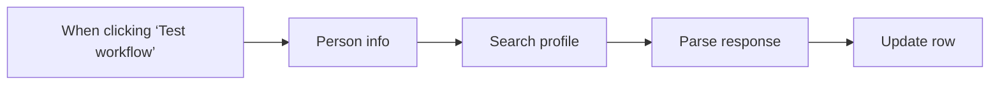

## Fluxo (.json) :

```json
{
  "id": "lifB7iUXlDzr5dmI",
  "meta": {
    "instanceId": "660cf2c29eb19fa42319afac3bd2a4a74c6354b7c006403f6cba388968b63f5d",
    "templateCredsSetupCompleted": true
  },
  "name": "LinkedIn Profile Discovery",
  "tags": [
    {
      "id": "a8B9vqj0vNLXcKVQ",
      "name": "template",
      "createdAt": "2025-04-04T15:38:37.785Z",
      "updatedAt": "2025-04-04T15:38:37.785Z"
    }
  ],
  "nodes": [
    {
      "id": "9ae64a3a-c7e7-45ca-88ee-ebf6144f3197",
      "name": "When clicking ‘Test workflow’",
      "type": "n8n-nodes-base.manualTrigger",
      "position": [
        0,
        0
      ],
      "parameters": {},
      "typeVersion": 1
    },
    {
      "id": "a22416bb-ef9e-422f-b480-cd52d8c93bfa",
      "name": "Person info",
      "type": "n8n-nodes-base.googleSheets",
      "position": [
        220,
        0
      ],
      "parameters": {
        "options": {},
        "sheetName": {
          "__rl": true,
          "mode": "list",
          "value": "gid=0",
          "cachedResultUrl": "https://docs.google.com/spreadsheets/d/1rjlKzphEbknNh_ToS9pR_dP_Tw93FsxDte5AI4LH5_E/edit#gid=0",
          "cachedResultName": "Sheet1"
        },
        "documentId": {
          "__rl": true,
          "mode": "list",
          "value": "1rjlKzphEbknNh_ToS9pR_dP_Tw93FsxDte5AI4LH5_E",
          "cachedResultUrl": "https://docs.google.com/spreadsheets/d/1rjlKzphEbknNh_ToS9pR_dP_Tw93FsxDte5AI4LH5_E/edit?usp=drivesdk",
          "cachedResultName": "Linkedin Profile URLs"
        }
      },
      "credentials": {
        "googleSheetsOAuth2Api": {
          "id": "CwpCAR1HwgHZpRtJ",
          "name": "Google Drive"
        }
      },
      "typeVersion": 4.5
    },
    {
      "id": "a4699dd8-54ef-478e-9ff8-2c2046ad6ea8",
      "name": "Search profile",
      "type": "n8n-nodes-base.airtop",
      "notes": "This could take a few minutes depending on the number of rows",
      "position": [
        440,
        0
      ],
      "parameters": {
        "url": "=https://www.google.com/search?q={{ encodeURI($json['Person Info']) }}",
        "prompt": "=This is Google Search results. the first results should be the Linkedin Page of {{ $json['Person Info'] }} \nReturn the Linkedin URL and nothing else.\nIf you cannot find the Linkedin URL, return an empty string. \nA valid Linkedin profile URL starts with \"https://www.linkedin.com/in/\"",
        "resource": "extraction",
        "operation": "query",
        "sessionMode": "new",
        "additionalFields": {}
      },
      "credentials": {
        "airtopApi": {
          "id": "byhouJF8RLH5DkmY",
          "name": "Airtop"
        }
      },
      "notesInFlow": true,
      "typeVersion": 1
    },
    {
      "id": "2dd4d350-743e-48a7-ab69-d0996bc46f49",
      "name": "Parse response",
      "type": "n8n-nodes-base.code",
      "position": [
        660,
        0
      ],
      "parameters": {
        "mode": "runOnceForEachItem",
        "jsCode": "const linkedInProfile = $json.data.modelResponse\nconst rowData = $('Person info').item.json\n\nreturn { json: {\n  ...rowData,\n  'LinkedIn URL': linkedInProfile\n}};"
      },
      "typeVersion": 2
    },
    {
      "id": "3efc182a-8707-4c8d-8263-a2aebe62b0a7",
      "name": "Update row",
      "type": "n8n-nodes-base.googleSheets",
      "position": [
        880,
        0
      ],
      "parameters": {
        "columns": {
          "value": {},
          "schema": [
            {
              "id": "Person Info",
              "type": "string",
              "display": true,
              "required": false,
              "displayName": "Person Info",
              "defaultMatch": false,
              "canBeUsedToMatch": true
            },
            {
              "id": "Linkedin URL",
              "type": "string",
              "display": true,
              "required": false,
              "displayName": "Linkedin URL",
              "defaultMatch": false,
              "canBeUsedToMatch": true
            },
            {
              "id": "Validated",
              "type": "string",
              "display": true,
              "required": false,
              "displayName": "Validated",
              "defaultMatch": false,
              "canBeUsedToMatch": true
            },
            {
              "id": "row_number",
              "type": "string",
              "display": true,
              "removed": false,
              "readOnly": true,
              "required": false,
              "displayName": "row_number",
              "defaultMatch": false,
              "canBeUsedToMatch": true
            }
          ],
          "mappingMode": "autoMapInputData",
          "matchingColumns": [
            "row_number"
          ],
          "attemptToConvertTypes": false,
          "convertFieldsToString": false
        },
        "options": {},
        "operation": "update",
        "sheetName": {
          "__rl": true,
          "mode": "list",
          "value": "gid=0",
          "cachedResultUrl": "https://docs.google.com/spreadsheets/d/1rjlKzphEbknNh_ToS9pR_dP_Tw93FsxDte5AI4LH5_E/edit#gid=0",
          "cachedResultName": "Sheet1"
        },
        "documentId": {
          "__rl": true,
          "mode": "list",
          "value": "1rjlKzphEbknNh_ToS9pR_dP_Tw93FsxDte5AI4LH5_E",
          "cachedResultUrl": "https://docs.google.com/spreadsheets/d/1rjlKzphEbknNh_ToS9pR_dP_Tw93FsxDte5AI4LH5_E/edit?usp=drivesdk",
          "cachedResultName": "Linkedin Profile URLs"
        }
      },
      "credentials": {
        "googleSheetsOAuth2Api": {
          "id": "CwpCAR1HwgHZpRtJ",
          "name": "Google Drive"
        }
      },
      "typeVersion": 4.5
    }
  ],
  "active": false,
  "pinData": {},
  "settings": {
    "executionOrder": "v1"
  },
  "versionId": "97cd5141-63d5-4ece-83eb-e544455097d3",
  "connections": {
    "Person info": {
      "main": [
        [
          {
            "node": "Search profile",
            "type": "main",
            "index": 0
          }
        ]
      ]
    },
    "Parse response": {
      "main": [
        [
          {
            "node": "Update row",
            "type": "main",
            "index": 0
          }
        ]
      ]
    },
    "Search profile": {
      "main": [
        [
          {
            "node": "Parse response",
            "type": "main",
            "index": 0
          }
        ]
      ]
    },
    "When clicking ‘Test workflow’": {
      "main": [
        [
          {
            "node": "Person info",
            "type": "main",
            "index": 0
          }
        ]
      ]
    }
  }
}
```

<a id="template-1292"></a>

## Template 1292 - Extrair contatos de e-mails e registrar no HubSpot

- **Nome:** Extrair contatos de e-mails e registrar no HubSpot
- **Descrição:** Monitora uma caixa de entrada, extrai informações de contato dos e-mails usando IA, procura o contato no CRM e cria ou atualiza o contato, registrando um engajamento de e-mail associado.
- **Funcionalidade:** • Monitoramento de e-mail: Verifica uma conta IMAP para novos e-mails recebidos.
• Extração de dados com IA: Usa um modelo de linguagem para analisar o conteúdo do e-mail e retornar informações importantes (nome, sobrenome, e-mail, telefone, empresa, cargo, endereço, país, CEP, cidade, etc.) em JSON estruturado.
• Parser estruturado: Converte a saída do modelo em um JSON padronizado para uso posterior.
• Busca de contato no CRM: Procura no HubSpot por um contato usando o e-mail extraído.
• Ramificação condicional: Verifica se o contato existe e decide o próximo passo (usar contato existente ou criar novo).
• Criação de contato: Se não existir, cria um contato no HubSpot mapeando campos como nome, sobrenome, cargo, empresa, telefone, site e endereço.
• Criação de engajamento de e-mail: Registra um engajamento/atividade de e-mail no HubSpot com assunto, remetente, destinatário e corpo do e-mail (HTML ou texto) e associa ao contato apropriado.
• Persistência de identificador: Armazena o identificador do contato (vid) para associar o engajamento ao contato correto.
- **Ferramentas:** • Conta de e-mail (IMAP): Fonte dos e-mails que disparam a automação.
• OpenAI (modelo de linguagem): Analisa e interpreta o conteúdo do e-mail para extrair informações de contato em formato estruturado.
• HubSpot (CRM): Pesquisa contatos, cria contatos novos quando necessário e registra engajamentos/atividades de e-mail associados aos contatos.

## Fluxo visual

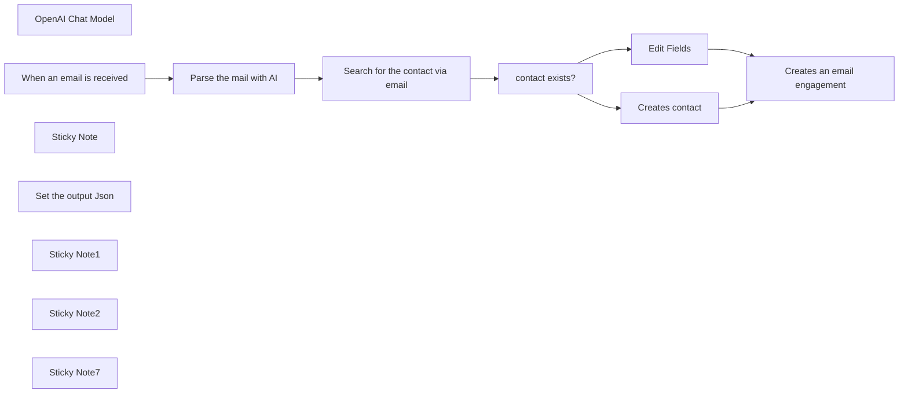

## Fluxo (.json) :

```json
{
  "nodes": [
    {
      "id": "9f2dc93f-bae5-4419-8411-d2fff4b31f5e",
      "name": "Creates an email engagement",
      "type": "n8n-nodes-base.hubspot",
      "position": [
        916,
        -260
      ],
      "parameters": {
        "type": "email",
        "metadata": {
          "html": "={{ $('When an email is received').item.json.textHtml || $('When an email is received').item.json.textPlain}}",
          "subject": "={{ $('When an email is received').item.json.subject }}",
          "toEmail": [
            "={{ $('When an email is received').item.json.to }}"
          ],
          "fromEmail": "={{ $('When an email is received').item.json.from }}"
        },
        "resource": "engagement",
        "authentication": "oAuth2",
        "additionalFields": {
          "associations": {
            "contactIds": "={{ $json.vid }}"
          }
        }
      },
      "credentials": {
        "hubspotOAuth2Api": {
          "id": "JxzF93M0SJ00jDD9",
          "name": "HubSpot account"
        }
      },
      "typeVersion": 2.1
    },
    {
      "id": "0a56ec28-afc6-40a9-bf42-4d8742e48eb4",
      "name": "OpenAI Chat Model",
      "type": "@n8n/n8n-nodes-langchain.lmChatOpenAi",
      "position": [
        -140,
        -40
      ],
      "parameters": {
        "model": {
          "__rl": true,
          "mode": "list",
          "value": "gpt-4o-mini"
        },
        "options": {}
      },
      "credentials": {
        "openAiApi": {
          "id": "1IOLtYX7aTspCAN8",
          "name": "OpenAI Pollup"
        }
      },
      "typeVersion": 1.2
    },
    {
      "id": "8e53aeb6-7d84-4739-b482-b8cd844b89ac",
      "name": "Search for the contact via email",
      "type": "n8n-nodes-base.hubspot",
      "position": [
        256,
        -260
      ],
      "parameters": {
        "operation": "search",
        "authentication": "oAuth2",
        "filterGroupsUi": {
          "filterGroupsValues": [
            {
              "filtersUi": {
                "filterValues": [
                  {
                    "value": "={{ $json.output.contact_info.email }}",
                    "propertyName": "email|string"
                  }
                ]
              }
            }
          ]
        },
        "additionalFields": {}
      },
      "credentials": {
        "hubspotOAuth2Api": {
          "id": "JxzF93M0SJ00jDD9",
          "name": "HubSpot account"
        }
      },
      "typeVersion": 2.1,
      "alwaysOutputData": true
    },
    {
      "id": "19e54445-d0cb-40f2-a11f-5e4cb22ad7ec",
      "name": "Parse the mail with AI",
      "type": "@n8n/n8n-nodes-langchain.chainLlm",
      "position": [
        -120,
        -260
      ],
      "parameters": {
        "text": "=Get all important info from this email like first name, last name, email, phone number, name of the company, country, Postal code, city, etc. Return it as a json.  The email content:  {{ $json.textHtml || $json.textPlain}} \nFrom: {{ $json.from }} \nSubject: {{ $json.subject }}\nDate sent:  {{ $json.date }}",
        "messages": {
          "messageValues": [
            {
              "message": "=You are a professional Email parser"
            }
          ]
        },
        "promptType": "define",
        "hasOutputParser": true
      },
      "typeVersion": 1.6
    },
    {
      "id": "8b257214-0001-46aa-84df-cad844e3130b",
      "name": "When an email is received",
      "type": "n8n-nodes-base.emailReadImap",
      "position": [
        -340,
        -260
      ],
      "parameters": {
        "options": {
          "forceReconnect": 3
        }
      },
      "credentials": {
        "imap": {
          "id": "g7C5Z9V9vQUbsLIw",
          "name": "IMAP account"
        }
      },
      "typeVersion": 2
    },
    {
      "id": "32820b69-3918-4951-9ddc-45bdbcb60aca",
      "name": "Sticky Note",
      "type": "n8n-nodes-base.stickyNote",
      "position": [
        -440,
        -400
      ],
      "parameters": {
        "color": 4,
        "width": 280,
        "height": 300,
        "content": "## Set receiving email account\n- Ddefaults to an IMAP account node, but you can put a gmail account or any  email trigger"
      },
      "typeVersion": 1
    },
    {
      "id": "adbed044-08ae-4744-9b0c-09a225860267",
      "name": "Set the output Json",
      "type": "@n8n/n8n-nodes-langchain.outputParserStructured",
      "position": [
        80,
        -40
      ],
      "parameters": {
        "jsonSchemaExample": "{\"contact_info\": \n{\n\"first name\": \n\"Thomas\",\n\"last name\": \"Vie\",\n\"position\": \n\"CTO\",\n\"company\": \n\"Pollup Data Services\",\n\"email\": \n\"Thomas@pollup.net\",\n\"phone\": \n\"+34 673626552\",\n\"website\": \n\"https://pollup.net\",\n\"address\": \n{\n\"street\": \n\"Oppelner Str. 32\",\n\"postal_code\": \n\"10997\",\n\"city\": \n\"Berlin\",\n\"country\": \n\"Germany\"\n}}}"
      },
      "typeVersion": 1.2
    },
    {
      "id": "e58575ee-6ac8-4de1-b4db-8525146efd74",
      "name": "Sticky Note1",
      "type": "n8n-nodes-base.stickyNote",
      "position": [
        -140,
        -400
      ],
      "parameters": {
        "color": 4,
        "width": 320,
        "height": 300,
        "content": "## Upgrade the prompt!\nThis is a very simple prompt but oit does the job. Improve it and send it to me!"
      },
      "typeVersion": 1
    },
    {
      "id": "23465910-0a89-45f7-9bbf-fb17abadc5de",
      "name": "Sticky Note2",
      "type": "n8n-nodes-base.stickyNote",
      "position": [
        200,
        -400
      ],
      "parameters": {
        "color": 4,
        "width": 840,
        "height": 400,
        "content": "## Hubspot integration\n- Search for the contact in hubspot\n- If it is present creates an egagement\n- It it is not, creates it and adds an engagement"
      },
      "typeVersion": 1
    },
    {
      "id": "f5573c22-85f3-4eda-ba5a-172567827991",
      "name": "contact exists?",
      "type": "n8n-nodes-base.if",
      "position": [
        476,
        -260
      ],
      "parameters": {
        "options": {},
        "conditions": {
          "options": {
            "version": 2,
            "leftValue": "",
            "caseSensitive": true,
            "typeValidation": "strict"
          },
          "combinator": "and",
          "conditions": [
            {
              "id": "554c2aa3-dbdb-4955-8510-6b09bc762f63",
              "operator": {
                "type": "string",
                "operation": "exists",
                "singleValue": true
              },
              "leftValue": "={{ $json.id }}",
              "rightValue": ""
            }
          ]
        }
      },
      "typeVersion": 2.2
    },
    {
      "id": "914f2e6b-7a5f-4c9c-bd3b-4bfb2693728d",
      "name": "Edit Fields",
      "type": "n8n-nodes-base.set",
      "position": [
        696,
        -360
      ],
      "parameters": {
        "options": {},
        "assignments": {
          "assignments": [
            {
              "id": "75c8fc2d-dc8e-4b6c-a853-1dbd8d72f779",
              "name": "vid",
              "type": "string",
              "value": "={{ $json.id }}"
            }
          ]
        }
      },
      "typeVersion": 3.4
    },
    {
      "id": "4c8fa2d1-e3b4-4323-bdc8-3a4e2bbc706d",
      "name": "Creates contact",
      "type": "n8n-nodes-base.hubspot",
      "position": [
        696,
        -160
      ],
      "parameters": {
        "email": "={{ $('Parse the mail with AI').item.json.output.contact_info.email }}",
        "options": {},
        "authentication": "oAuth2",
        "additionalFields": {
          "city": "={{ $('Parse the mail with AI').item.json.output.contact_info.address.city }}",
          "country": "={{ $('Parse the mail with AI').item.json.output.contact_info.address.country }}",
          "jobTitle": "={{ $('Parse the mail with AI').item.json.output.contact_info.position }}",
          "lastName": "={{ $('Parse the mail with AI').item.json.output.contact_info['last name'] }}",
          "postalCode": "={{ $('Parse the mail with AI').item.json.output.contact_info.address.postal_code }}",
          "websiteUrl": "={{ $('Parse the mail with AI').item.json.output.contact_info.website }}",
          "companyName": "={{ $('Parse the mail with AI').item.json.output.contact_info.company }}",
          "phoneNumber": "={{ $('Parse the mail with AI').item.json.output.contact_info.phone }}",
          "streetAddress": "={{ $('Parse the mail with AI').item.json.output.contact_info.address.street }}"
        }
      },
      "credentials": {
        "hubspotOAuth2Api": {
          "id": "JxzF93M0SJ00jDD9",
          "name": "HubSpot account"
        }
      },
      "typeVersion": 2.1
    },
    {
      "id": "5f94ba18-49db-4bc0-9f0a-16a9d05ca6b0",
      "name": "Sticky Note7",
      "type": "n8n-nodes-base.stickyNote",
      "position": [
        -440,
        -620
      ],
      "parameters": {
        "width": 460,
        "height": 200,
        "content": "## Contact me\n- If you need any modification to this workflow\n- if you need some help with this workflow\n- Or if you need any workflow in n8n, Make, or Langchain / Langgraph\n\nWrite to me: [thomas@pollup.net](mailto:thomas@pollup.net)"
      },
      "typeVersion": 1
    }
  ],
  "connections": {
    "Edit Fields": {
      "main": [
        [
          {
            "node": "Creates an email engagement",
            "type": "main",
            "index": 0
          }
        ]
      ]
    },
    "Creates contact": {
      "main": [
        [
          {
            "node": "Creates an email engagement",
            "type": "main",
            "index": 0
          }
        ]
      ]
    },
    "contact exists?": {
      "main": [
        [
          {
            "node": "Edit Fields",
            "type": "main",
            "index": 0
          }
        ],
        [
          {
            "node": "Creates contact",
            "type": "main",
            "index": 0
          }
        ]
      ]
    },
    "OpenAI Chat Model": {
      "ai_languageModel": [
        [
          {
            "node": "Parse the mail with AI",
            "type": "ai_languageModel",
            "index": 0
          }
        ]
      ]
    },
    "Set the output Json": {
      "ai_outputParser": [
        [
          {
            "node": "Parse the mail with AI",
            "type": "ai_outputParser",
            "index": 0
          }
        ]
      ]
    },
    "Parse the mail with AI": {
      "main": [
        [
          {
            "node": "Search for the contact via email",
            "type": "main",
            "index": 0
          }
        ]
      ]
    },
    "When an email is received": {
      "main": [
        [
          {
            "node": "Parse the mail with AI",
            "type": "main",
            "index": 0
          }
        ]
      ]
    },
    "Search for the contact via email": {
      "main": [
        [
          {
            "node": "contact exists?",
            "type": "main",
            "index": 0
          }
        ]
      ]
    }
  }
}
```

<a id="template-1293"></a>

## Template 1293 - Tagueamento automático de metadados de imagem

- **Nome:** Tagueamento automático de metadados de imagem
- **Descrição:** Analisa automaticamente o conteúdo de imagens adicionadas a uma pasta específica e grava palavras-chave/descritivos nos metadados do arquivo, atualizando o arquivo original.
- **Funcionalidade:** • Detecção de novo arquivo em pasta específica: Monitora uma pasta e inicia o processo quando um novo arquivo é adicionado.
• Download do arquivo de imagem: Faz o download da imagem adicionada para processamento.
• Análise do conteúdo por IA: Envia a imagem para um modelo de IA que retorna uma lista de descrições/keywords.
• Combinação de metadados e arquivo: Junta o resultado da análise com o arquivo de imagem para preparação da escrita de metadata.
• Escrita de metadados EXIF/IPTC: Insere as descrições/keywords nos campos de assunto/keywords da imagem.
• Atualização do arquivo na nuvem: Substitui/atualiza o arquivo original na pasta com a versão enriquecida com metadados.
- **Ferramentas:** • Google Drive: Armazenamento em nuvem onde os arquivos são monitorados, baixados e atualizados.
• Serviço de IA (ex.: OpenAI ou similar): Analisa o conteúdo visual da imagem e gera uma lista de descrições/keywords.
• Biblioteca de edição EXIF/IPTC: Ferramenta responsável por escrever campos de metadados (subject/keywords) diretamente no arquivo de imagem.

## Fluxo visual

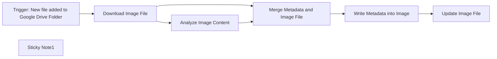

## Fluxo (.json) :

```json
{
  "id": "4nBQyhwqDqmXY2AL",
  "meta": {
    "instanceId": "558d88703fb65b2d0e44613bc35916258b0f0bf983c5d4730c00c424b77ca36a",
    "templateCredsSetupCompleted": true
  },
  "name": "Automated Image Metadata Tagging (Community Node)",
  "tags": [],
  "nodes": [
    {
      "id": "b0b030f5-8a8c-4254-bc18-a2790748248e",
      "name": "Trigger: New file added to Google Drive Folder",
      "type": "n8n-nodes-base.googleDriveTrigger",
      "position": [
        -760,
        120
      ],
      "parameters": {
        "event": "fileCreated",
        "options": {},
        "pollTimes": {
          "item": [
            {
              "mode": "everyMinute"
            }
          ]
        },
        "triggerOn": "specificFolder",
        "folderToWatch": {
          "__rl": true,
          "mode": "list",
          "value": "1WaIRWXcaeNViKmpW5IyQ3YGARWYdMg47",
          "cachedResultUrl": "https://drive.google.com/drive/folders/1WaIRWXcaeNViKmpW5IyQ3YGARWYdMg47",
          "cachedResultName": "EXIF"
        }
      },
      "credentials": {
        "googleDriveOAuth2Api": {
          "id": "L47XiMFzcjUgBp2i",
          "name": "Google Drive account"
        }
      },
      "typeVersion": 1
    },
    {
      "id": "1df51279-b3bd-49bd-9711-951eb4164290",
      "name": "Download Image File",
      "type": "n8n-nodes-base.googleDrive",
      "position": [
        -540,
        120
      ],
      "parameters": {
        "fileId": {
          "__rl": true,
          "mode": "id",
          "value": "={{ $json.id }}"
        },
        "options": {},
        "operation": "download"
      },
      "credentials": {
        "googleDriveOAuth2Api": {
          "id": "L47XiMFzcjUgBp2i",
          "name": "Google Drive account"
        }
      },
      "typeVersion": 3
    },
    {
      "id": "50a59e8e-ca95-4594-b8a9-0ba709795d42",
      "name": "Analyze Image Content",
      "type": "@n8n/n8n-nodes-langchain.openAi",
      "position": [
        -340,
        200
      ],
      "parameters": {
        "text": "=Deliver a comma separated list describing the content of this image.",
        "modelId": {
          "__rl": true,
          "mode": "list",
          "value": "chatgpt-4o-latest",
          "cachedResultName": "CHATGPT-4O-LATEST"
        },
        "options": {},
        "resource": "image",
        "inputType": "base64",
        "operation": "analyze"
      },
      "credentials": {
        "openAiApi": {
          "id": "niikB3HA4fT5WAqt",
          "name": "OpenAi account"
        }
      },
      "typeVersion": 1.8
    },
    {
      "id": "456164cc-ed41-4482-adb4-4ed00682153d",
      "name": "Merge Metadata and Image File",
      "type": "n8n-nodes-base.merge",
      "position": [
        -140,
        120
      ],
      "parameters": {
        "mode": "combine",
        "options": {},
        "combineBy": "combineByPosition"
      },
      "typeVersion": 3
    },
    {
      "id": "ddd6aef5-4dae-48e3-a806-3c58adea6552",
      "name": "Write Metadata into Image",
      "type": "n8n-nodes-exif-data.exifData",
      "position": [
        40,
        120
      ],
      "parameters": {
        "options": {},
        "operation": "write",
        "exifMetadata": {
          "metadataValues": [
            {
              "name": "Subject",
              "value": "={{$json.content}}"
            },
            {
              "name": "Keywords",
              "value": "={{$json.content}}"
            }
          ]
        }
      },
      "typeVersion": 1
    },
    {
      "id": "9c531288-7fca-4cca-9717-6dd059266f47",
      "name": "Update Image File",
      "type": "n8n-nodes-base.googleDrive",
      "position": [
        220,
        120
      ],
      "parameters": {
        "fileId": {
          "__rl": true,
          "mode": "id",
          "value": "={{ $('Download Image File').item.json.id }}"
        },
        "options": {},
        "operation": "update",
        "changeFileContent": true,
        "newUpdatedFileName": "={{ $('Download Image File').item.json.name }}"
      },
      "credentials": {
        "googleDriveOAuth2Api": {
          "id": "L47XiMFzcjUgBp2i",
          "name": "Google Drive account"
        }
      },
      "typeVersion": 3
    },
    {
      "id": "70b6bb63-fedf-42eb-a6a0-30faae883f2c",
      "name": "Sticky Note1",
      "type": "n8n-nodes-base.stickyNote",
      "position": [
        -1080,
        320
      ],
      "parameters": {
        "width": 660,
        "height": 680,
        "content": "# Welcome to my Automated Image Metadata Tagging Workflow!\n\nThis workflow automatically analyzes the image content with the help of AI and writes it directly back into the image file as keywords.\n\n## This workflow has the following sequence:\n\n1. Google Drive trigger (scan for new files added in a specific folder)\n2. Download the added image file\n3. Analyse the content of the image\n4. Merge Metadata and image file\n5. Write the Keywords into the Metadata (dc:subject/keywords) and create new image file\n6. Update the original file in the Google Drive folder\n\n## The following accesses are required for the workflow:\n- You have to install the [n8n-nodes-exif-data Community Node](https://www.npmjs.com/package/n8n-nodes-exif-data)\n- Google Drive: [Documentation](https://docs.n8n.io/integrations/builtin/credentials/google)\n- AI API access (e.g. via OpenAI, Anthropic, Google or Ollama)\n\nYou can contact me via LinkedIn, if you have any questions: https://www.linkedin.com/in/friedemann-schuetz"
      },
      "typeVersion": 1
    }
  ],
  "active": false,
  "pinData": {},
  "settings": {
    "executionOrder": "v1"
  },
  "versionId": "c4d1520b-6df4-4e76-98ba-4d7555aec35d",
  "connections": {
    "Download Image File": {
      "main": [
        [
          {
            "node": "Analyze Image Content",
            "type": "main",
            "index": 0
          },
          {
            "node": "Merge Metadata and Image File",
            "type": "main",
            "index": 0
          }
        ]
      ]
    },
    "Analyze Image Content": {
      "main": [
        [
          {
            "node": "Merge Metadata and Image File",
            "type": "main",
            "index": 1
          }
        ]
      ]
    },
    "Write Metadata into Image": {
      "main": [
        [
          {
            "node": "Update Image File",
            "type": "main",
            "index": 0
          }
        ]
      ]
    },
    "Merge Metadata and Image File": {
      "main": [
        [
          {
            "node": "Write Metadata into Image",
            "type": "main",
            "index": 0
          }
        ]
      ]
    },
    "Trigger: New file added to Google Drive Folder": {
      "main": [
        [
          {
            "node": "Download Image File",
            "type": "main",
            "index": 0
          }
        ]
      ]
    }
  }
}
```

<a id="template-1294"></a>

## Template 1294 - Resposta automática por IA no Telegram

- **Nome:** Resposta automática por IA no Telegram
- **Descrição:** Recebe mensagens de um chat do Telegram, gera respostas com um agente de IA que adiciona emojis e envia as respostas de volta ao usuário.
- **Funcionalidade:** • Detecção de mensagens do Telegram: Inicia o fluxo ao receber mensagens novas em um chat.
• Encaminhamento para agente de IA: Envia o texto recebido para um agente configurado com um prompt que pede respostas úteis com emojis.
• Geração de resposta por modelo de linguagem: Utiliza um modelo de IA (gpt-4o-mini) para criar a resposta baseada no prompt.
• Envio de resposta ao chat: Retorna a resposta gerada ao mesmo chat do Telegram que originou a mensagem.
- **Ferramentas:** • Telegram: Plataforma de mensagens usada para receber entradas dos usuários e enviar respostas via bot.
• OpenAI: Serviço de modelos de linguagem usado para gerar as respostas do agente (modelo gpt-4o-mini).

## Fluxo visual

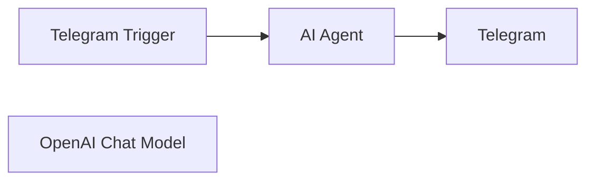

## Fluxo (.json) :

```json
{
  "meta": {
    "instanceId": "408f9fb9940c3cb18ffdef0e0150fe342d6e655c3a9fac21f0f644e8bedabcd9",
    "templateCredsSetupCompleted": true
  },
  "nodes": [
    {
      "id": "0f5aae97-3819-4704-ada2-abbcf14cea5f",
      "name": "AI Agent",
      "type": "@n8n/n8n-nodes-langchain.agent",
      "position": [
        20,
        380
      ],
      "parameters": {
        "text": "=Respond to this as a helpful assistant with emojis:  {{ $json.message.text }}",
        "options": {},
        "promptType": "define"
      },
      "typeVersion": 1.8
    },
    {
      "id": "9f828f62-b587-43be-a47f-b2500e36bd9c",
      "name": "Telegram Trigger",
      "type": "n8n-nodes-base.telegramTrigger",
      "position": [
        -220,
        380
      ],
      "webhookId": "9bf61652-efa6-47b0-9f52-e0c3362d93e5",
      "parameters": {
        "updates": [
          "message"
        ],
        "additionalFields": {}
      },
      "credentials": {
        "telegramApi": {
          "id": "XVBXGXSsaCjU2DOS",
          "name": "jimleuk_handoff_bot"
        }
      },
      "typeVersion": 1.1
    },
    {
      "id": "abb92991-faee-4678-9038-7555f694acb1",
      "name": "Telegram",
      "type": "n8n-nodes-base.telegram",
      "position": [
        380,
        380
      ],
      "webhookId": "5babdcad-dabe-4c8e-8f84-6957e9f1aa15",
      "parameters": {
        "text": "={{ $json.output }}",
        "chatId": "={{ $('Telegram Trigger').item.json.message.chat.id }}",
        "additionalFields": {}
      },
      "credentials": {
        "telegramApi": {
          "id": "XVBXGXSsaCjU2DOS",
          "name": "jimleuk_handoff_bot"
        }
      },
      "typeVersion": 1.2
    },
    {
      "id": "b20244ba-e15d-4f7f-939f-1c9d8474743a",
      "name": "OpenAI Chat Model",
      "type": "@n8n/n8n-nodes-langchain.lmChatOpenAi",
      "position": [
        -80,
        600
      ],
      "parameters": {
        "model": {
          "__rl": true,
          "mode": "list",
          "value": "gpt-4o-mini"
        },
        "options": {}
      },
      "credentials": {
        "openAiApi": {
          "id": "8gccIjcuf3gvaoEr",
          "name": "OpenAi account"
        }
      },
      "typeVersion": 1.2
    }
  ],
  "pinData": {},
  "connections": {
    "AI Agent": {
      "main": [
        [
          {
            "node": "Telegram",
            "type": "main",
            "index": 0
          }
        ]
      ]
    },
    "Telegram Trigger": {
      "main": [
        [
          {
            "node": "AI Agent",
            "type": "main",
            "index": 0
          }
        ]
      ]
    },
    "OpenAI Chat Model": {
      "ai_languageModel": [
        [
          {
            "node": "AI Agent",
            "type": "ai_languageModel",
            "index": 0
          }
        ]
      ]
    }
  }
}
```

<a id="template-1295"></a>

## Template 1295 - Auditoria On-Page de SEO automatizada

- **Nome:** Auditoria On-Page de SEO automatizada
- **Descrição:** Coleta uma URL de landing page, extrai o conteúdo e o HTML, executa auditorias técnicas e de conteúdo via modelos de IA e envia um relatório formatado por email.
- **Funcionalidade:** • Coleta de URL via formulário: Recebe o endereço da landing page que será auditada.
• Extração do conteúdo da página: Acessa a URL fornecida e obtém o HTML e o conteúdo visível.
• Auditoria técnica automatizada: Analisa o código HTML para identificar problemas on-page e recomendações técnicas.
• Auditoria de conteúdo automatizada: Avalia qualidade do texto, pesquisa de palavras-chave e legibilidade, gerando recomendações práticas.
• Consolidação de resultados: Combina saídas das auditorias técnica e de conteúdo em um único relatório.
• Conversão para Markdown/HTML: Formata o relatório final em Markdown convertido para HTML para fácil leitura.
• Envio de relatório por email: Envia o relatório formatado para um endereço de email especificado.
- **Ferramentas:** • OpenAI (modelo GPT-4o-mini): Gera análises detalhadas e recomendações para auditoria técnica e de conteúdo usando IA.
• Gmail: Envia o relatório final por email para o destinatário configurado.
• Website alvo (URL fornecida): Fonte do HTML e do conteúdo que será analisado pelo fluxo.

## Fluxo visual

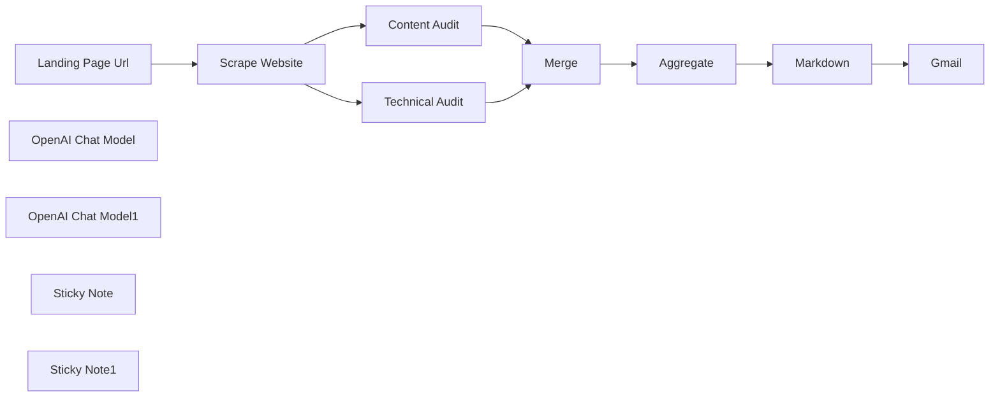

## Fluxo (.json) :

```json
{
  "id": "iLpBIRuhpWToO22N",
  "meta": {
    "instanceId": "e8ec316b54e91908f34cbfdc330e5d1d5e97aa0ea8f7277c00d8a8a3892c9983",
    "templateCredsSetupCompleted": true
  },
  "name": "🤖 On-Page SEO Audit",
  "tags": [
    {
      "id": "TF9zcHoRnyCYBNVV",
      "name": "SEO",
      "createdAt": "2025-03-14T12:08:26.948Z",
      "updatedAt": "2025-03-14T12:08:26.948Z"
    }
  ],
  "nodes": [
    {
      "id": "f4a971be-a961-4ad6-b38d-830c5fca5407",
      "name": "Landing Page Url",
      "type": "n8n-nodes-base.formTrigger",
      "position": [
        -180,
        0
      ],
      "webhookId": "afe067a5-4878-4c9d-b746-691f77190f54",
      "parameters": {
        "options": {},
        "formTitle": "Conversion Rate Optimizer",
        "formFields": {
          "values": [
            {
              "fieldLabel": "Landing Page Url",
              "placeholder": "https://yuzuu.co",
              "requiredField": true
            }
          ]
        },
        "formDescription": "Your Landing Page is Leaking Sales—Fix It Now"
      },
      "typeVersion": 2.2
    },
    {
      "id": "e280139f-94b8-49dc-91e7-c6ffa0c04716",
      "name": "Scrape Website",
      "type": "n8n-nodes-base.httpRequest",
      "position": [
        20,
        0
      ],
      "parameters": {
        "url": "={{ $json['Landing Page Url'] }}",
        "options": {}
      },
      "typeVersion": 4.2
    },
    {
      "id": "de9ff0da-4ef9-4878-af0d-5733e010402c",
      "name": "OpenAI Chat Model",
      "type": "@n8n/n8n-nodes-langchain.lmChatOpenAi",
      "position": [
        320,
        20
      ],
      "parameters": {
        "model": {
          "__rl": true,
          "mode": "list",
          "value": "gpt-4o-mini",
          "cachedResultName": "gpt-4o-mini"
        },
        "options": {}
      },
      "credentials": {
        "openAiApi": {
          "id": "MtyWeuRTqwi3Yx9H",
          "name": "OpenAi account"
        }
      },
      "typeVersion": 1.2
    },
    {
      "id": "25969781-4b1c-42ad-969c-efbb605be9e5",
      "name": "OpenAI Chat Model1",
      "type": "@n8n/n8n-nodes-langchain.lmChatOpenAi",
      "position": [
        360,
        400
      ],
      "parameters": {
        "model": {
          "__rl": true,
          "mode": "list",
          "value": "gpt-4o-mini",
          "cachedResultName": "gpt-4o-mini"
        },
        "options": {}
      },
      "credentials": {
        "openAiApi": {
          "id": "MtyWeuRTqwi3Yx9H",
          "name": "OpenAi account"
        }
      },
      "typeVersion": 1.2
    },
    {
      "id": "0f135a2d-156c-43ee-b254-581c7d543a8c",
      "name": "Content Audit",
      "type": "@n8n/n8n-nodes-langchain.agent",
      "position": [
        380,
        200
      ],
      "parameters": {
        "text": "=You are the best SEO Manager in the country—a world-class expert in optimizing websites to rank on Google.\n\nIn this task, you will analyze the content of the webpage and perform a detailed and structured SEO Content Audit.\n\nAudit Structure\nYou will divide your audit in 2 parts:\n- The first part is the Analysis\n- The second is the Recommendations\n\nIn the Analysis, you will include:\n- Content Quality Assessment – Evaluate the content's overall quality, accuracy, and relevance to the target audience.\n- Keyword Research and Analysis – Identify primary and secondary keywords, keyword density, and keyword placement strategies.\n- Readability Analysis – Assess the content's readability score using metrics such as Flesch-Kincaid Grade Level, Flesch Reading Ease, and Gunning-Fog Index.\n\nIn the Recommendations, you will present your recommendations and actionable suggestions in clear, organized bullet points. Recommendations must improve the rankings in Google but also the user engagement. \n\nEnsure the output is properly formatted, clean, and highly readable. Do not include any introductory or explanatory text—only the audit findings.\n\nHere is the content of my landing page: {{ $json.data }}",
        "options": {},
        "promptType": "define"
      },
      "typeVersion": 1.7
    },
    {
      "id": "b693e35c-c0d4-4202-8c5e-2a5646a16cc4",
      "name": "Technical Audit",
      "type": "@n8n/n8n-nodes-langchain.agent",
      "position": [
        380,
        -200
      ],
      "parameters": {
        "text": "=You are the best SEO Manager in the country—a world-class expert in optimizing websites to rank on Google.\nIn this task, you will analyze the HTML code of a webpage and perform a detailed and structured On-Page Technical SEO Audit.\n\nAudit Structure\nYou will review all technical SEO aspects of the page. Once completed, you will present your findings and recommendations in clear, organized bullet points, categorized into three sections:\n- Critical Issues – Must be fixed immediately.\n- Quick Wins – Easy fixes with a big impact.\n- Opportunities for Improvement – Require more effort but offer potential benefits.\n\nEnsure the output is properly formatted, clean, and highly readable. Do not include any introductory or explanatory text—only the audit findings.\n\nHere is the content of my landing page: {{ $json.data }}",
        "options": {},
        "promptType": "define"
      },
      "typeVersion": 1.7
    },
    {
      "id": "3d172f93-7d94-4a43-9403-5cec799bbe47",
      "name": "Merge",
      "type": "n8n-nodes-base.merge",
      "position": [
        880,
        0
      ],
      "parameters": {},
      "typeVersion": 3,
      "alwaysOutputData": true
    },
    {
      "id": "2081bf62-0e47-497e-8a3e-d30d330f6a9d",
      "name": "Aggregate",
      "type": "n8n-nodes-base.aggregate",
      "position": [
        1080,
        0
      ],
      "parameters": {
        "options": {},
        "fieldsToAggregate": {
          "fieldToAggregate": [
            {
              "fieldToAggregate": "output"
            }
          ]
        }
      },
      "typeVersion": 1
    },
    {
      "id": "e1cfc16e-e0dc-4298-9b94-ffb7f23b45aa",
      "name": "Markdown",
      "type": "n8n-nodes-base.markdown",
      "position": [
        1280,
        0
      ],
      "parameters": {
        "mode": "markdownToHtml",
        "options": {},
        "markdown": "=# On-Page Technical Audit\n{{ $json.output[0] }}\n\n# On-Page SEO Content Audit\n{{ $json.output[1] }}"
      },
      "typeVersion": 1
    },
    {
      "id": "7dc41215-e276-439c-be11-92278b1c3a60",
      "name": "Sticky Note",
      "type": "n8n-nodes-base.stickyNote",
      "position": [
        1360,
        -160
      ],
      "parameters": {
        "color": 3,
        "width": 360,
        "height": 100,
        "content": "## Send Email \nConnect your credentials & Easily send emails from a Gmail address. "
      },
      "typeVersion": 1
    },
    {
      "id": "28aea6bd-beef-4116-97c2-e8b88e96d5ac",
      "name": "Sticky Note1",
      "type": "n8n-nodes-base.stickyNote",
      "position": [
        320,
        -380
      ],
      "parameters": {
        "color": 3,
        "width": 420,
        "height": 140,
        "content": "## Open AI Setup\n- Add your credentials\n- Select o1 model for (way) better results. \n- One run = one page audit = around $0.3 with o1"
      },
      "typeVersion": 1
    },
    {
      "id": "3242a0c3-4439-4ad1-8185-47185046080d",
      "name": "Gmail",
      "type": "n8n-nodes-base.gmail",
      "position": [
        1480,
        0
      ],
      "webhookId": "2979e4dc-1689-447e-8cd4-eb907b4eedf4",
      "parameters": {
        "sendTo": "hello@youremail.com",
        "message": "={{ $json.data }}",
        "options": {},
        "subject": "=On-Page SEO Audit -  {{ $('Landing Page Url').item.json['Landing Page Url'] }}"
      },
      "credentials": {
        "gmailOAuth2": {
          "id": "9EELWJ0jA3PIbx13",
          "name": "Gmail account"
        }
      },
      "typeVersion": 2.1
    }
  ],
  "active": false,
  "pinData": {},
  "settings": {
    "executionOrder": "v1"
  },
  "versionId": "bc4ac79c-71a0-4dae-805d-55b682b0c199",
  "connections": {
    "Merge": {
      "main": [
        [
          {
            "node": "Aggregate",
            "type": "main",
            "index": 0
          }
        ]
      ]
    },
    "Markdown": {
      "main": [
        [
          {
            "node": "Gmail",
            "type": "main",
            "index": 0
          }
        ]
      ]
    },
    "Aggregate": {
      "main": [
        [
          {
            "node": "Markdown",
            "type": "main",
            "index": 0
          }
        ]
      ]
    },
    "Content Audit": {
      "main": [
        [
          {
            "node": "Merge",
            "type": "main",
            "index": 1
          }
        ]
      ]
    },
    "Scrape Website": {
      "main": [
        [
          {
            "node": "Content Audit",
            "type": "main",
            "index": 0
          },
          {
            "node": "Technical Audit",
            "type": "main",
            "index": 0
          }
        ]
      ]
    },
    "Technical Audit": {
      "main": [
        [
          {
            "node": "Merge",
            "type": "main",
            "index": 0
          }
        ]
      ]
    },
    "Landing Page Url": {
      "main": [
        [
          {
            "node": "Scrape Website",
            "type": "main",
            "index": 0
          }
        ]
      ]
    },
    "OpenAI Chat Model": {
      "ai_languageModel": [
        [
          {
            "node": "Technical Audit",
            "type": "ai_languageModel",
            "index": 0
          }
        ]
      ]
    },
    "OpenAI Chat Model1": {
      "ai_languageModel": [
        [
          {
            "node": "Content Audit",
            "type": "ai_languageModel",
            "index": 0
          }
        ]
      ]
    }
  }
}
```

<a id="template-1296"></a>

## Template 1296 - RAG Chat do livro 'How To Transform Your Life'

- **Nome:** RAG Chat do livro 'How To Transform Your Life'
- **Descrição:** Fluxo que ingere um arquivo EPUB, gera embeddings, armazena em uma tabela vetorial no banco e responde a perguntas em modo chat usando recuperação por similaridade e um modelo de linguagem.
- **Funcionalidade:** • Download de arquivo: Baixa um arquivo (ex: EPUB) de uma fonte de armazenamento remoto.
• Carregamento de documento EPUB: Converte o arquivo EPUB em conteúdo processável.
• Segmentação de texto recursiva: Divide o texto em fragmentos menores para melhor indexação e recuperação.
• Geração de embeddings para inserção: Calcula vetores de embedding (modelo consistente) para armazenar conteúdo na base vetorial.
• Inserção de documentos na tabela vetorial: Insere conteúdos e embeddings na tabela configurada com coluna de vetor, metadata e texto.
• Atualização / Upsert de documentos: Atualiza embeddings e conteúdo existentes na tabela vetorial quando necessário.
• Recuperação por similaridade: Consulta a tabela vetorial usando uma função SQL customizada (ex: match_documents) para retornar os trechos mais relevantes.
• Cadeia de Perguntas e Respostas (QA): Usa os documentos recuperados como contexto para gerar respostas com um modelo de chat.
• Gatilho de chat público com webhook: Recebe mensagens de usuários via endpoint público e inicia a cadeia de QA, incluindo mensagem inicial personalizada.
• Personalização da resposta de saída: Formata a resposta final antes de retornar ao usuário.
• Consulta de linhas da tabela: Permite recuperar registros da tabela (ex.: para inspeção ou operações administrativas).
• Instruções para deleção: Fornece procedimento recomendado para excluir registros via API autorizada (DELETE), com atenção a permissões e cabeçalhos.
- **Ferramentas:** • Google Drive: Armazenamento e fonte do arquivo EPUB a ser processado e importado.
• Supabase (Postgres + pgvector): Banco de dados vetorial para armazenar embeddings, metadata e conteúdo; inclui execução de funções SQL customizadas para busca por similaridade e operações CRUD na tabela.
• OpenAI: Serviço de modelos de embeddings (ex: text-embedding-3-small) e de conversação (modelos de chat) usados para gerar vetores e responder perguntas com base no contexto recuperado.

## Fluxo visual

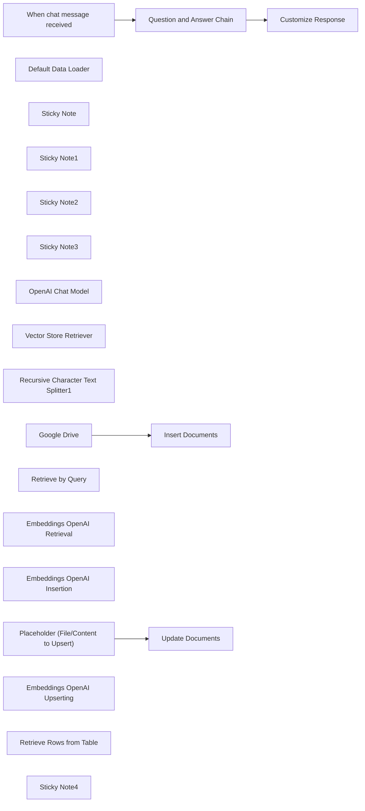

## Fluxo (.json) :

```json
{
  "meta": {
    "instanceId": "1a23006df50de49624f69e85993be557d137b6efe723a867a7d68a84e0b32704"
  },
  "nodes": [
    {
      "id": "54065cc9-047c-4741-95f6-cec3e352abd7",
      "name": "Google Drive",
      "type": "n8n-nodes-base.googleDrive",
      "position": [
        2700,
        -1840
      ],
      "parameters": {
        "fileId": {
          "__rl": true,
          "mode": "url",
          "value": "https://drive.google.com/file/d/xxxxxxxxxxxxxxx/view"
        },
        "options": {},
        "operation": "download"
      },
      "typeVersion": 3
    },
    {
      "id": "62af57f5-a001-4174-bece-260a1fc595e8",
      "name": "Default Data Loader",
      "type": "@n8n/n8n-nodes-langchain.documentDefaultDataLoader",
      "position": [
        3120,
        -1620
      ],
      "parameters": {
        "loader": "epubLoader",
        "options": {},
        "dataType": "binary"
      },
      "typeVersion": 1
    },
    {
      "id": "ce3d9c7c-6ce9-421a-b4d0-4235217cf8e6",
      "name": "Sticky Note",
      "type": "n8n-nodes-base.stickyNote",
      "position": [
        2620,
        -2000
      ],
      "parameters": {
        "width": 749.1276349295781,
        "height": 820.5109034066329,
        "content": "# INSERTING\n\n- it's important to use the same embedding model when for any interaction with your vector database (inserting, upserting and retrieval)"
      },
      "typeVersion": 1
    },
    {
      "id": "81cb3d3e-70af-46c8-bc18-3d076a222d0b",
      "name": "Sticky Note1",
      "type": "n8n-nodes-base.stickyNote",
      "position": [
        1720,
        -1160
      ],
      "parameters": {
        "color": 3,
        "width": 873.9739981925188,
        "height": 534.0012007720542,
        "content": "# UPSERTING\n"
      },
      "typeVersion": 1
    },
    {
      "id": "60ebdb71-c7e0-429b-9394-b680cc000951",
      "name": "Sticky Note2",
      "type": "n8n-nodes-base.stickyNote",
      "position": [
        1720,
        -2000
      ],
      "parameters": {
        "color": 4,
        "width": 876.5116990000852,
        "height": 821.787041589866,
        "content": "# PREPARATION (in Supabase)\n\n- your database needs the extension 'pgvector' enabled -> select Database > Extension > Search for 'vector'\n- make sure you have a table that has the following columns (if not, use the query below in the Supabase SQL Editor)\n\n```\nALTER TABLE \"YOUR TABLE NAME\"\nADD COLUMN embedding VECTOR(1536), // check which number of dimensions you need (depends on the embed model)\nADD COLUMN metadata JSONB,\nADD COLUMN content TEXT;\n```\n\n- make sure you have the right policies set -> select Authentication > Policies\n- make sure you have the custom function `match_documents` set up in Supabase -> This is needed for the Vector Store Node (as query name) \n(if not, use the query below in the Supabase SQL Editor to create that function)\n- make sure you check the size of the AI model as it should be the same vector size for the table \n(e.g. OpenAI's Text-Embedding-3-Small uses 1536)\n\n```\nCREATE OR REPLACE FUNCTION public.match_documents(\n filter JSONB,\n match_count INT,\n query_embedding VECTOR(1536) // should match same dimensions as from insertion\n)\nRETURNS TABLE (\n id BIGINT,\n content TEXT,\n metadata JSONB,\n embedding VECTOR(1536), // should match same dimensions as from insertion\n similarity FLOAT\n)\nLANGUAGE plpgsql AS $$\nBEGIN\n RETURN QUERY\n SELECT\n v.id,\n v.content,\n v.metadata,\n v.embedding,\n 1 - (v.embedding <=> match_documents.query_embedding) AS similarity\n FROM \"YOUR TABLE NAME\" v\n WHERE v.metadata @> filter\n ORDER BY v.embedding <=> match_documents.query_embedding\n LIMIT match_count;\nEND;\n$$\n;\n```\n"
      },
      "typeVersion": 1
    },
    {
      "id": "ae95b0c3-b8b3-44eb-8070-b1bc6cac5cd2",
      "name": "Sticky Note3",
      "type": "n8n-nodes-base.stickyNote",
      "position": [
        3400,
        -2000
      ],
      "parameters": {
        "color": 5,
        "width": 810.9488123113013,
        "height": 821.9537074055816,
        "content": "# RETRIEVAL"
      },
      "typeVersion": 1
    },
    {
      "id": "58168721-cbd7-498c-9d16-41b4d5c6a68f",
      "name": "Question and Answer Chain",
      "type": "@n8n/n8n-nodes-langchain.chainRetrievalQa",
      "position": [
        3680,
        -1860
      ],
      "parameters": {},
      "typeVersion": 1.3
    },
    {
      "id": "ddf1228f-f051-445b-8a42-54c2510a0b2e",
      "name": "OpenAI Chat Model",
      "type": "@n8n/n8n-nodes-langchain.lmChatOpenAi",
      "position": [
        3600,
        -1680
      ],
      "parameters": {
        "options": {}
      },
      "typeVersion": 1
    },
    {
      "id": "734a2c48-b445-4e62-99b7-dc1dcd921c52",
      "name": "Vector Store Retriever",
      "type": "@n8n/n8n-nodes-langchain.retrieverVectorStore",
      "position": [
        3760,
        -1680
      ],
      "parameters": {
        "topK": 10
      },
      "typeVersion": 1
    },
    {
      "id": "43f761b7-f4da-4b29-8099-9b2c15f79fe9",
      "name": "Recursive Character Text Splitter1",
      "type": "@n8n/n8n-nodes-langchain.textSplitterRecursiveCharacterTextSplitter",
      "position": [
        3120,
        -1460
      ],
      "parameters": {
        "options": {}
      },
      "typeVersion": 1
    },
    {
      "id": "de0d2666-88e4-4a4d-ba46-cf789b9cba85",
      "name": "Customize Response",
      "type": "n8n-nodes-base.set",
      "notes": "output || text",
      "position": [
        4020,
        -1860
      ],
      "parameters": {
        "options": {},
        "assignments": {
          "assignments": [
            {
              "id": "440fc115-ccae-4e30-85a5-501d0617b2cf",
              "name": "output",
              "type": "string",
              "value": "={{ $json.response.text }}"
            }
          ]
        }
      },
      "notesInFlow": true,
      "typeVersion": 3.4
    },
    {
      "id": "a396671f-a217-4f05-b969-cb64f10e4b01",
      "name": "When chat message received",
      "type": "@n8n/n8n-nodes-langchain.chatTrigger",
      "position": [
        3480,
        -1860
      ],
      "webhookId": "d7431c58-89aa-4d70-b5bd-044be981b3a9",
      "parameters": {
        "public": true,
        "options": {
          "responseMode": "lastNode"
        },
        "initialMessages": "=Hi there! 🙏\n\nYou can ask me anything about Venerable Geshe Kelsang Gyatso's Book - 'How To Transform Your Life'\n\nWhat would you like to know? "
      },
      "typeVersion": 1.1
    },
    {
      "id": "6312f6bc-c69c-4d4f-8838-8a9d0d22ed55",
      "name": "Retrieve by Query",
      "type": "@n8n/n8n-nodes-langchain.vectorStoreSupabase",
      "position": [
        3700,
        -1520
      ],
      "parameters": {
        "options": {
          "queryName": "match_documents"
        },
        "tableName": {
          "__rl": true,
          "mode": "list",
          "value": "Kadampa",
          "cachedResultName": "Kadampa"
        }
      },
      "typeVersion": 1
    },
    {
      "id": "ba6b87b9-e96d-47a3-83f8-169d7172325a",
      "name": "Embeddings OpenAI Retrieval",
      "type": "@n8n/n8n-nodes-langchain.embeddingsOpenAi",
      "position": [
        3700,
        -1360
      ],
      "parameters": {
        "options": {}
      },
      "typeVersion": 1
    },
    {
      "id": "bcd1b31f-c60b-4c40-b039-d47dadc86b23",
      "name": "Embeddings OpenAI Insertion",
      "type": "@n8n/n8n-nodes-langchain.embeddingsOpenAi",
      "position": [
        2920,
        -1620
      ],
      "parameters": {
        "model": "text-embedding-3-small",
        "options": {}
      },
      "typeVersion": 1
    },
    {
      "id": "dfd7f734-eb00-4af3-9179-724503422fe4",
      "name": "Placeholder (File/Content to Upsert)",
      "type": "n8n-nodes-base.set",
      "position": [
        1900,
        -1000
      ],
      "parameters": {
        "mode": "raw",
        "options": {},
        "jsonOutput": "={\n \"Date\": \"{{ $now.format('dd MMM yyyy') }}\",\n \"Time\": \"{{ $now.format('HH:mm ZZZZ z') }}\"\n}\n"
      },
      "typeVersion": 3.4
    },
    {
      "id": "c54c9458-9b8a-4ef1-a6db-5265729be19d",
      "name": "Embeddings OpenAI Upserting",
      "type": "@n8n/n8n-nodes-langchain.embeddingsOpenAi",
      "position": [
        2120,
        -840
      ],
      "parameters": {
        "model": "text-embedding-3-small",
        "options": {}
      },
      "typeVersion": 1
    },
    {
      "id": "30c18e9e-d047-40d3-8324-f5d0e7892db6",
      "name": "Insert Documents",
      "type": "@n8n/n8n-nodes-langchain.vectorStoreSupabase",
      "position": [
        2920,
        -1840
      ],
      "parameters": {
        "mode": "insert",
        "options": {},
        "tableName": {
          "__rl": true,
          "mode": "list",
          "value": "Kadampa",
          "cachedResultName": "Kadampa"
        }
      },
      "typeVersion": 1
    },
    {
      "id": "3c0ed0ee-9134-4b4e-bcfd-632dd67a57da",
      "name": "Retrieve Rows from Table",
      "type": "n8n-nodes-base.supabase",
      "position": [
        3960,
        -1380
      ],
      "parameters": {
        "tableId": "n8n",
        "operation": "getAll",
        "returnAll": true
      },
      "typeVersion": 1
    },
    {
      "id": "53aca1b4-31e8-4699-b158-673623bc9b95",
      "name": "Sticky Note4",
      "type": "n8n-nodes-base.stickyNote",
      "position": [
        2620,
        -1160
      ],
      "parameters": {
        "color": 6,
        "width": 1587.0771183771394,
        "height": 537.3056597675153,
        "content": "# DELETION\n\nAt the moment n8n does not have a built-in Supabase Node to delete records in a Vector Database. For this you would typically use the HTTP Request node to make an authorized API call to Supabase. \n\n## HTTP Request Node\n\nUse this node to send a DELETE request to your Supabase instance.\n\n- Supabase API Endpoint: Use the appropriate URL for your Supabase project. The endpoint will typically look like this: [https://<your-supabase-ref>.supabase.co/rest/v1/<your-vector-table>](https://supabase.com/docs/guides/api). Replace `<your-supabase-ref>` and `<your-vector-table>` with your details.\n### HEADERS:\n- apikey: Your Supabase API key.\n- Authorization: Bearer token with your Supabase JWT.\n- Query Parameters: Use query parameters to specify which record(s) to delete. For example, `?id=eq.<your-record-id>` where `<your-record-id>` is the specific record ID you want to delete \n(You can also reference back to the **Retrieve Rows From Table** Node to get the ID dynamically)\n\nEnsure you have the necessary permissions set up in Supabase to delete records through the API.\n\nPlease refer to the official n8n documentation for more detailed information on using the [HTTP Request Node](https://docs.n8n.io/integrations/builtin/core-nodes/n8n-nodes-base.httprequest/).\n\n_Note:_ Deleting records is a sensitive operation, so make sure that your permissions are correctly configured and that you are targeting the correct records to avoid unwanted data loss."
      },
      "typeVersion": 1
    },
    {
      "id": "4ffaccdb-9e0f-464d-9284-7771f6599fd8",
      "name": "Update Documents",
      "type": "@n8n/n8n-nodes-langchain.vectorStoreSupabase",
      "position": [
        2100,
        -1000
      ],
      "parameters": {
        "id": "1",
        "mode": "update",
        "options": {
          "queryName": "match_documents"
        },
        "tableName": {
          "__rl": true,
          "mode": "list",
          "value": "n8n",
          "cachedResultName": "n8n"
        }
      },
      "typeVersion": 1
    }
  ],
  "pinData": {},
  "connections": {
    "Google Drive": {
      "main": [
        [
          {
            "node": "Insert Documents",
            "type": "main",
            "index": 0
          }
        ]
      ]
    },
    "OpenAI Chat Model": {
      "ai_languageModel": [
        [
          {
            "node": "Question and Answer Chain",
            "type": "ai_languageModel",
            "index": 0
          }
        ]
      ]
    },
    "Retrieve by Query": {
      "ai_vectorStore": [
        [
          {
            "node": "Vector Store Retriever",
            "type": "ai_vectorStore",
            "index": 0
          }
        ]
      ]
    },
    "Default Data Loader": {
      "ai_document": [
        [
          {
            "node": "Insert Documents",
            "type": "ai_document",
            "index": 0
          }
        ]
      ]
    },
    "Vector Store Retriever": {
      "ai_retriever": [
        [
          {
            "node": "Question and Answer Chain",
            "type": "ai_retriever",
            "index": 0
          }
        ]
      ]
    },
    "Question and Answer Chain": {
      "main": [
        [
          {
            "node": "Customize Response",
            "type": "main",
            "index": 0
          }
        ]
      ]
    },
    "When chat message received": {
      "main": [
        [
          {
            "node": "Question and Answer Chain",
            "type": "main",
            "index": 0
          }
        ]
      ]
    },
    "Embeddings OpenAI Insertion": {
      "ai_embedding": [
        [
          {
            "node": "Insert Documents",
            "type": "ai_embedding",
            "index": 0
          }
        ]
      ]
    },
    "Embeddings OpenAI Retrieval": {
      "ai_embedding": [
        [
          {
            "node": "Retrieve by Query",
            "type": "ai_embedding",
            "index": 0
          }
        ]
      ]
    },
    "Embeddings OpenAI Upserting": {
      "ai_embedding": [
        [
          {
            "node": "Update Documents",
            "type": "ai_embedding",
            "index": 0
          }
        ]
      ]
    },
    "Recursive Character Text Splitter1": {
      "ai_textSplitter": [
        [
          {
            "node": "Default Data Loader",
            "type": "ai_textSplitter",
            "index": 0
          }
        ]
      ]
    },
    "Placeholder (File/Content to Upsert)": {
      "main": [
        [
          {
            "node": "Update Documents",
            "type": "main",
            "index": 0
          }
        ]
      ]
    }
  }
}
```

<a id="template-1297"></a>

## Template 1297 - Baixar e salvar arquivo no host

- **Nome:** Baixar e salvar arquivo no host
- **Descrição:** Fluxo que baixa um arquivo a partir de uma URL e salva-o no sistema de arquivos do computador host.
- **Funcionalidade:** • Disparo manual: Inicia o fluxo ao clicar em executar.
• Download via HTTP: Realiza uma requisição HTTP para baixar o arquivo disponível em https://docs.n8n.io/assets/img/n8n-logo.png.
• Gravação de arquivo binário: Salva o conteúdo baixado como um arquivo no caminho especificado (/Users/tanay/Desktop/n8n-logo.png).
- **Ferramentas:** • Servidor web (docs.n8n.io): Hospeda a imagem acessível em https://docs.n8n.io/assets/img/n8n-logo.png.
• Sistema de arquivos local: Local onde o arquivo baixado é gravado, neste caso o caminho /Users/tanay/Desktop/n8n-logo.png no host.

## Fluxo visual

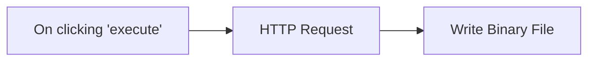

## Fluxo (.json) :

```json
{
  "id": "160",
  "name": "Write a file to the host machine",
  "nodes": [
    {
      "name": "On clicking 'execute'",
      "type": "n8n-nodes-base.manualTrigger",
      "position": [
        260,
        300
      ],
      "parameters": {},
      "typeVersion": 1
    },
    {
      "name": "HTTP Request",
      "type": "n8n-nodes-base.httpRequest",
      "position": [
        460,
        300
      ],
      "parameters": {
        "url": "https://docs.n8n.io/assets/img/n8n-logo.png",
        "options": {},
        "responseFormat": "file"
      },
      "typeVersion": 1
    },
    {
      "name": "Write Binary File",
      "type": "n8n-nodes-base.writeBinaryFile",
      "position": [
        660,
        300
      ],
      "parameters": {
        "fileName": "/Users/tanay/Desktop/n8n-logo.png"
      },
      "typeVersion": 1
    }
  ],
  "active": false,
  "settings": {},
  "connections": {
    "HTTP Request": {
      "main": [
        [
          {
            "node": "Write Binary File",
            "type": "main",
            "index": 0
          }
        ]
      ]
    },
    "On clicking 'execute'": {
      "main": [
        [
          {
            "node": "HTTP Request",
            "type": "main",
            "index": 0
          }
        ]
      ]
    }
  }
}
```

<a id="template-1298"></a>

## Template 1298 - Criar tabela e inserir registro no QuestDB

- **Nome:** Criar tabela e inserir registro no QuestDB
- **Descrição:** Fluxo que cria uma tabela chamada 'test' e insere um registro com campos de id e nome.
- **Funcionalidade:** • Disparo manual: inicia o fluxo por ação manual.
• Criação de tabela: executa um comando SQL para criar a tabela 'test' com colunas id (INT) e name (STRING).
• Preparação de dados: define os valores a serem inseridos, incluindo o campo name com valor "Tanay" e o campo id.
• Inserção de registro: insere os dados preparados na tabela criada.
• Sequenciamento de operações: garante que a criação da tabela ocorra antes da inserção dos dados.
- **Ferramentas:** • QuestDB: banco de dados de séries temporais compatível com SQL, utilizado para executar comandos DDL e inserir registros.

## Fluxo visual

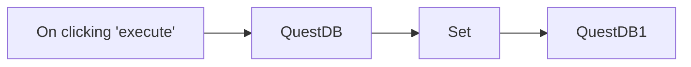

## Fluxo (.json) :

```json
{
  "id": "161",
  "name": "Create a table and insert data into it",
  "nodes": [
    {
      "name": "On clicking 'execute'",
      "type": "n8n-nodes-base.manualTrigger",
      "position": [
        440,
        460
      ],
      "parameters": {},
      "typeVersion": 1
    },
    {
      "name": "Set",
      "type": "n8n-nodes-base.set",
      "position": [
        840,
        460
      ],
      "parameters": {
        "values": {
          "number": [
            {
              "name": "id"
            }
          ],
          "string": [
            {
              "name": "name",
              "value": "Tanay"
            }
          ]
        },
        "options": {}
      },
      "typeVersion": 1
    },
    {
      "name": "QuestDB",
      "type": "n8n-nodes-base.questDb",
      "position": [
        640,
        460
      ],
      "parameters": {
        "query": "CREATE TABLE test (id INT, name STRING);",
        "operation": "executeQuery"
      },
      "credentials": {
        "questDb": "QuestDB"
      },
      "typeVersion": 1,
      "alwaysOutputData": true
    },
    {
      "name": "QuestDB1",
      "type": "n8n-nodes-base.questDb",
      "position": [
        1040,
        460
      ],
      "parameters": {
        "table": "test",
        "columns": "id, name"
      },
      "credentials": {
        "questDb": "QuestDB"
      },
      "typeVersion": 1
    }
  ],
  "active": false,
  "settings": {},
  "connections": {
    "Set": {
      "main": [
        [
          {
            "node": "QuestDB1",
            "type": "main",
            "index": 0
          }
        ]
      ]
    },
    "QuestDB": {
      "main": [
        [
          {
            "node": "Set",
            "type": "main",
            "index": 0
          }
        ]
      ]
    },
    "On clicking 'execute'": {
      "main": [
        [
          {
            "node": "QuestDB",
            "type": "main",
            "index": 0
          }
        ]
      ]
    }
  }
}
```

<a id="template-1299"></a>

## Template 1299 - Publicador de mídias sociais

- **Nome:** Publicador de mídias sociais
- **Descrição:** Automatiza o envio de fotos e vídeos para um serviço que publica em múltiplas redes sociais a partir de um formulário web.
- **Funcionalidade:** • Receber submissão de formulário: coleta Plataforma, Conta, Legenda, Upload (jpg ou mp4) e opcional Facebook Id.
• Diferenciação de tipo de mídia: identifica se o arquivo é imagem (image/jpeg) ou vídeo (video/mp4) e encaminha corretamente.
• Envio de fotos: envia imagens para o endpoint de upload de fotos com campos de título, usuário, plataforma, arquivo e facebook_id quando fornecido.
• Envio de vídeos: envia vídeos para o endpoint de upload de vídeo com campos de título, usuário, plataforma e arquivo de vídeo.
• Autenticação por cabeçalho: usa chave de API no cabeçalho Authorization para autenticar as requisições ao serviço de upload.
• Interpretação de resposta por plataforma: verifica o campo results[plataforma].success na resposta para determinar sucesso ou falha.
• Feedback ao usuário: apresenta mensagens de confirmação ou erro ao final do processo, dependendo do resultado do upload.
• Validação básica de arquivo: aceita apenas .jpg para fotos e .mp4 para vídeos, conforme configuração do formulário.
- **Ferramentas:** • Upload-post.com (API e painel): serviço usado para receber fotos e vídeos e distribuí-los para contas conectadas; fornece endpoints de upload e exige chave de API no cabeçalho Authorization.
• Plataformas sociais (destinatários): TikTok, X, Facebook, YouTube, Instagram, Threads e LinkedIn - destinos finais onde o conteúdo será publicado através do serviço de upload.

## Fluxo visual

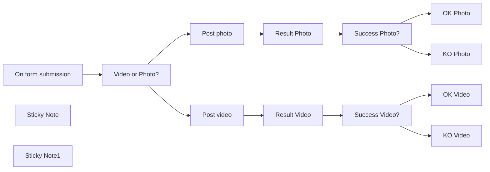

## Fluxo (.json) :

```json
{
  "id": "r1u4HOJu5j5sP27x",
  "meta": {
    "instanceId": "a4bfc93e975ca233ac45ed7c9227d84cf5a2329310525917adaf3312e10d5462"
  },
  "name": "Social Media Publisher",
  "tags": [],
  "nodes": [
    {
      "id": "f5050652-6170-41c6-b3c3-0f6616c9d575",
      "name": "On form submission",
      "type": "n8n-nodes-base.formTrigger",
      "position": [
        -380,
        120
      ],
      "webhookId": "bb578d47-feaa-4973-96df-659089838de5",
      "parameters": {
        "options": {},
        "formTitle": "Post Publisher",
        "formFields": {
          "values": [
            {
              "fieldType": "dropdown",
              "fieldLabel": "Platform",
              "fieldOptions": {
                "values": [
                  {
                    "option": "instagram"
                  },
                  {
                    "option": "linkedin"
                  },
                  {
                    "option": "facebook"
                  },
                  {
                    "option": "x"
                  },
                  {
                    "option": "tiktok"
                  },
                  {
                    "option": "threads"
                  }
                ]
              },
              "requiredField": true
            },
            {
              "fieldLabel": "Account",
              "placeholder": "User Profile name set on Upload-post.com",
              "requiredField": true
            },
            {
              "fieldType": "textarea",
              "fieldLabel": "Caption",
              "requiredField": true
            },
            {
              "fieldType": "file",
              "fieldLabel": "Upload",
              "multipleFiles": false,
              "requiredField": true,
              "acceptFileTypes": ".jpg,.mp4"
            },
            {
              "fieldLabel": "Facebook Id",
              "placeholder": "Facebook page Id (eg. 00000111122222)"
            }
          ]
        }
      },
      "typeVersion": 2.2
    },
    {
      "id": "e9d8b8c9-3e40-420d-98c3-82c92f1c53c7",
      "name": "Post photo",
      "type": "n8n-nodes-base.httpRequest",
      "position": [
        220,
        -180
      ],
      "parameters": {
        "url": "https://api.upload-post.com/api/upload_photos",
        "method": "POST",
        "options": {},
        "sendBody": true,
        "contentType": "multipart-form-data",
        "authentication": "genericCredentialType",
        "bodyParameters": {
          "parameters": [
            {
              "name": "title",
              "value": "={{ $json.Caption }}"
            },
            {
              "name": "user",
              "value": "={{ $json.Account }}"
            },
            {
              "name": "platform[]",
              "value": "={{ $json.Platform }}"
            },
            {
              "name": "photos[]",
              "parameterType": "formBinaryData",
              "inputDataFieldName": "=Upload"
            },
            {
              "name": "facebook_id",
              "value": "={{ $('On form submission').item.json['Facebook Id'] }}"
            }
          ]
        },
        "genericAuthType": "httpHeaderAuth"
      },
      "credentials": {
        "httpHeaderAuth": {
          "id": "DEE2XGvhGodgbAJh",
          "name": "Upload-post.com API"
        }
      },
      "typeVersion": 4.2
    },
    {
      "id": "04103be2-a1d8-4b00-942b-44e13dffa666",
      "name": "Post video",
      "type": "n8n-nodes-base.httpRequest",
      "position": [
        220,
        280
      ],
      "parameters": {
        "url": "https://api.upload-post.com/api/upload",
        "method": "POST",
        "options": {},
        "sendBody": true,
        "contentType": "multipart-form-data",
        "authentication": "genericCredentialType",
        "bodyParameters": {
          "parameters": [
            {
              "name": "title",
              "value": "={{ $json.Caption }}"
            },
            {
              "name": "user",
              "value": "={{ $json.Account }}"
            },
            {
              "name": "platform[]",
              "value": "={{ $json.Platform }}"
            },
            {
              "name": "video",
              "parameterType": "formBinaryData",
              "inputDataFieldName": "=Upload"
            }
          ]
        },
        "genericAuthType": "httpHeaderAuth"
      },
      "credentials": {
        "httpHeaderAuth": {
          "id": "DEE2XGvhGodgbAJh",
          "name": "Upload-post.com API"
        }
      },
      "typeVersion": 4.2
    },
    {
      "id": "e7803375-20b0-4e12-80a4-b102ba48b6ba",
      "name": "KO Video",
      "type": "n8n-nodes-base.form",
      "position": [
        880,
        380
      ],
      "webhookId": "d03e4286-f252-4a35-a65e-ea8ac96222e4",
      "parameters": {
        "options": {},
        "operation": "completion",
        "completionTitle": "=Oops",
        "completionMessage": "There was an error"
      },
      "typeVersion": 1
    },
    {
      "id": "91f2b501-4021-4ecc-9cc3-4e804d020135",
      "name": "OK Video",
      "type": "n8n-nodes-base.form",
      "position": [
        880,
        180
      ],
      "webhookId": "d03e4286-f252-4a35-a65e-ea8ac96222e4",
      "parameters": {
        "options": {},
        "operation": "completion",
        "completionTitle": "=Congratulations!",
        "completionMessage": "Your post has been published correctly"
      },
      "typeVersion": 1
    },
    {
      "id": "b3eead97-f995-42dc-b937-6d05f284f601",
      "name": "KO Photo",
      "type": "n8n-nodes-base.form",
      "position": [
        880,
        -80
      ],
      "webhookId": "d03e4286-f252-4a35-a65e-ea8ac96222e4",
      "parameters": {
        "options": {},
        "operation": "completion",
        "completionTitle": "=Oops",
        "completionMessage": "There was an error"
      },
      "typeVersion": 1
    },
    {
      "id": "8ead4dfa-cb9e-4ab4-b52c-7a681876269f",
      "name": "OK Photo",
      "type": "n8n-nodes-base.form",
      "position": [
        880,
        -280
      ],
      "webhookId": "d03e4286-f252-4a35-a65e-ea8ac96222e4",
      "parameters": {
        "options": {},
        "operation": "completion",
        "completionTitle": "=Congratulations!",
        "completionMessage": "Your post has been published correctly"
      },
      "typeVersion": 1
    },
    {
      "id": "a5fba676-4e7b-42e2-af36-e9d63458870b",
      "name": "Success Photo?",
      "type": "n8n-nodes-base.if",
      "position": [
        640,
        -180
      ],
      "parameters": {
        "options": {},
        "conditions": {
          "options": {
            "version": 2,
            "leftValue": "",
            "caseSensitive": true,
            "typeValidation": "loose"
          },
          "combinator": "and",
          "conditions": [
            {
              "id": "47eee8ce-0237-48f2-b67f-04021d3acda2",
              "operator": {
                "type": "string",
                "operation": "equals"
              },
              "leftValue": "={{ $json.result }}\n",
              "rightValue": "true"
            }
          ]
        },
        "looseTypeValidation": true
      },
      "typeVersion": 2.2
    },
    {
      "id": "310853de-ab7e-481e-8efa-5a681f08032b",
      "name": "Success Video?",
      "type": "n8n-nodes-base.if",
      "position": [
        660,
        280
      ],
      "parameters": {
        "options": {},
        "conditions": {
          "options": {
            "version": 2,
            "leftValue": "",
            "caseSensitive": true,
            "typeValidation": "loose"
          },
          "combinator": "and",
          "conditions": [
            {
              "id": "47eee8ce-0237-48f2-b67f-04021d3acda2",
              "operator": {
                "type": "string",
                "operation": "equals"
              },
              "leftValue": "={{ $json.result }}\n",
              "rightValue": "true"
            }
          ]
        },
        "looseTypeValidation": true
      },
      "typeVersion": 2.2
    },
    {
      "id": "81ec87fc-9298-4cd6-8a46-45ee6cb050b3",
      "name": "Result Photo",
      "type": "n8n-nodes-base.set",
      "position": [
        440,
        -180
      ],
      "parameters": {
        "options": {},
        "assignments": {
          "assignments": [
            {
              "id": "551c5179-055a-415e-bf17-61f2a5dd2769",
              "name": "=result",
              "type": "string",
              "value": "={{ $json.results[$('Video or Photo?').item.json.Platform].success.toBoolean() }}"
            }
          ]
        }
      },
      "typeVersion": 3.4
    },
    {
      "id": "936ac765-0e7c-411d-b70d-bdfbe8e180a6",
      "name": "Result Video",
      "type": "n8n-nodes-base.set",
      "position": [
        440,
        280
      ],
      "parameters": {
        "options": {},
        "assignments": {
          "assignments": [
            {
              "id": "551c5179-055a-415e-bf17-61f2a5dd2769",
              "name": "=result",
              "type": "string",
              "value": "={{ $json.results[$('Video or Photo?').item.json.Platform].success.toBoolean() }}"
            }
          ]
        }
      },
      "typeVersion": 3.4
    },
    {
      "id": "3a3d66ae-7ecd-43aa-a905-10afdab753b3",
      "name": "Video or Photo?",
      "type": "n8n-nodes-base.switch",
      "position": [
        -120,
        120
      ],
      "parameters": {
        "rules": {
          "values": [
            {
              "outputKey": "Image",
              "conditions": {
                "options": {
                  "version": 2,
                  "leftValue": "",
                  "caseSensitive": true,
                  "typeValidation": "strict"
                },
                "combinator": "and",
                "conditions": [
                  {
                    "id": "879af56a-8979-4d9d-9acd-6009d821f6a7",
                    "operator": {
                      "type": "string",
                      "operation": "equals"
                    },
                    "leftValue": "={{ $json.Upload.mimetype }}",
                    "rightValue": "image/jpeg"
                  }
                ]
              },
              "renameOutput": true
            },
            {
              "outputKey": "Video",
              "conditions": {
                "options": {
                  "version": 2,
                  "leftValue": "",
                  "caseSensitive": true,
                  "typeValidation": "strict"
                },
                "combinator": "and",
                "conditions": [
                  {
                    "id": "d7ee147d-d775-4b81-b043-0873c535b400",
                    "operator": {
                      "name": "filter.operator.equals",
                      "type": "string",
                      "operation": "equals"
                    },
                    "leftValue": "={{ $json.Upload.mimetype }}",
                    "rightValue": "video/mp4"
                  }
                ]
              },
              "renameOutput": true
            }
          ]
        },
        "options": {}
      },
      "typeVersion": 3.2
    },
    {
      "id": "76d1cc06-8bb5-43cd-8dcc-2da1656b0335",
      "name": "Sticky Note",
      "type": "n8n-nodes-base.stickyNote",
      "position": [
        -400,
        -1020
      ],
      "parameters": {
        "width": 1380,
        "height": 680,
        "content": "## SETTINGS\n\n- Find your API key in your [Upload-Post Manage Api Keys](https://app.upload-post.com/) 10 FREE uploads per month\n- Set the the \"Auth Header\":\n-- Name: Authorization\n-- Value: Apikey YOUR_API_KEY_HERE\n- Create profiles to manage your social media accounts. The \"Profile\" you choose will be used in the field \"Account\" on form submission (eg. test1 or test2).  \n\n\n\nApr-2025: YouTube integration is currently being verified by Google, and may not work as expected.\n"
      },
      "typeVersion": 1
    },
    {
      "id": "e9b40e23-cde9-459d-b490-8adda6b9253f",
      "name": "Sticky Note1",
      "type": "n8n-nodes-base.stickyNote",
      "position": [
        -400,
        -1240
      ],
      "parameters": {
        "color": 3,
        "width": 1380,
        "height": 180,
        "content": "## Upload video and photo on TikTok, X, Facebook, Youtube, Instagram, Threads and Linkedin\n\nSimplify your social media workflow with our powerful platform designed for content creators and marketers.\n\nUpload your video once and let Upload-Post distribute it across all your connected social media accounts effortlessly."
      },
      "typeVersion": 1
    }
  ],
  "active": false,
  "pinData": {},
  "settings": {
    "executionOrder": "v1"
  },
  "versionId": "ac29ff60-2d87-4646-ae63-ab543f3849de",
  "connections": {
    "Post photo": {
      "main": [
        [
          {
            "node": "Result Photo",
            "type": "main",
            "index": 0
          }
        ]
      ]
    },
    "Post video": {
      "main": [
        [
          {
            "node": "Result Video",
            "type": "main",
            "index": 0
          }
        ]
      ]
    },
    "Result Photo": {
      "main": [
        [
          {
            "node": "Success Photo?",
            "type": "main",
            "index": 0
          }
        ]
      ]
    },
    "Result Video": {
      "main": [
        [
          {
            "node": "Success Video?",
            "type": "main",
            "index": 0
          }
        ]
      ]
    },
    "Success Photo?": {
      "main": [
        [
          {
            "node": "OK Photo",
            "type": "main",
            "index": 0
          }
        ],
        [
          {
            "node": "KO Photo",
            "type": "main",
            "index": 0
          }
        ]
      ]
    },
    "Success Video?": {
      "main": [
        [
          {
            "node": "OK Video",
            "type": "main",
            "index": 0
          }
        ],
        [
          {
            "node": "KO Video",
            "type": "main",
            "index": 0
          }
        ]
      ]
    },
    "Video or Photo?": {
      "main": [
        [
          {
            "node": "Post photo",
            "type": "main",
            "index": 0
          }
        ],
        [
          {
            "node": "Post video",
            "type": "main",
            "index": 0
          }
        ]
      ]
    },
    "On form submission": {
      "main": [
        [
          {
            "node": "Video or Photo?",
            "type": "main",
            "index": 0
          }
        ]
      ]
    }
  }
}
```

<a id="template-1300"></a>

## Template 1300 - Criar, atualizar e obter usuário no Iterable

- **Nome:** Criar, atualizar e obter usuário no Iterable
- **Descrição:** Fluxo que, ao ser executado manualmente, cria ou atualiza um usuário no Iterable usando um e-mail e campos de dados, e em seguida recupera os dados desse usuário.
- **Funcionalidade:** • Disparo manual: inicia o fluxo quando o usuário aciona a execução.
• Criação/atualização de usuário: cria ou atualiza um usuário no Iterable utilizando o e-mail fornecido e atualiza o campo de dados "Name".
• Recuperação de usuário: consulta e obtém os dados do usuário no Iterable pelo e-mail.
- **Ferramentas:** • Iterable: serviço de marketing por e-mail e plataforma de gestão de contatos, utilizado via API para criar, atualizar e consultar perfis de usuário.

## Fluxo visual

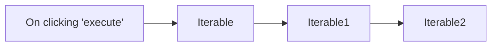

## Fluxo (.json) :

```json
{
  "id": "165",
  "name": "Create, update and get a user from Iterable",
  "nodes": [
    {
      "name": "On clicking 'execute'",
      "type": "n8n-nodes-base.manualTrigger",
      "position": [
        310,
        340
      ],
      "parameters": {},
      "typeVersion": 1
    },
    {
      "name": "Iterable",
      "type": "n8n-nodes-base.iterable",
      "position": [
        510,
        340
      ],
      "parameters": {
        "value": "",
        "identifier": "email",
        "additionalFields": {}
      },
      "credentials": {
        "iterableApi": "Iterable"
      },
      "typeVersion": 1
    },
    {
      "name": "Iterable1",
      "type": "n8n-nodes-base.iterable",
      "position": [
        710,
        340
      ],
      "parameters": {
        "value": "={{$node[\"Iterable\"].parameter[\"value\"]}}",
        "identifier": "email",
        "additionalFields": {
          "dataFieldsUi": {
            "dataFieldValues": [
              {
                "key": "Name",
                "value": ""
              }
            ]
          }
        }
      },
      "credentials": {
        "iterableApi": "Iterable"
      },
      "typeVersion": 1
    },
    {
      "name": "Iterable2",
      "type": "n8n-nodes-base.iterable",
      "position": [
        910,
        340
      ],
      "parameters": {
        "email": "={{$node[\"Iterable\"].parameter[\"value\"]}}",
        "operation": "get"
      },
      "credentials": {
        "iterableApi": "Iterable"
      },
      "typeVersion": 1
    }
  ],
  "active": false,
  "settings": {},
  "connections": {
    "Iterable": {
      "main": [
        [
          {
            "node": "Iterable1",
            "type": "main",
            "index": 0
          }
        ]
      ]
    },
    "Iterable1": {
      "main": [
        [
          {
            "node": "Iterable2",
            "type": "main",
            "index": 0
          }
        ]
      ]
    },
    "On clicking 'execute'": {
      "main": [
        [
          {
            "node": "Iterable",
            "type": "main",
            "index": 0
          }
        ]
      ]
    }
  }
}
```
