# PACK 1999 TEMPLATES PARTE 07 - Bloco 6

Templates neste bloco: 20

## Sumário

- [Template 1301 - Chatbot de busca web com GPT-4o e Brave Search](#template-1301)
- [Template 1302 - Criar URL curta e obter estatísticas](#template-1302)
- [Template 1303 - Leitor de sitemap e filtro de URLs](#template-1303)
- [Template 1304 - Extrair páginas 2-3 de PDF remoto](#template-1304)
- [Template 1305 - Converter e publicar emails como páginas HTML temporárias](#template-1305)
- [Template 1306 - Busca de interesses Facebook via comando Telegram](#template-1306)
- [Template 1307 - Gerar e enviar relatório de timesheet com avatares](#template-1307)
- [Template 1308 - Captura e enriquecimento de leads LinkedIn](#template-1308)
- [Template 1309 - Atualizar papéis de usuários no Zammad](#template-1309)
- [Template 1310 - Resumo de transcrição YouTube + Telegram](#template-1310)
- [Template 1311 - Gerador SEO de posts WordPress com pesquisa automatizada](#template-1311)
- [Template 1312 - Assistente pessoal via Telegram com IA](#template-1312)
- [Template 1313 - Inserir e atualizar dados no Airtable](#template-1313)
- [Template 1314 - Restaurar credenciais do GitHub](#template-1314)
- [Template 1315 - Agente telefônico AI com RetellAI](#template-1315)
- [Template 1316 - Extrair e resumir avaliações do Yelp](#template-1316)
- [Template 1317 - Pesquisa de satisfação via chat (Telegram)](#template-1317)
- [Template 1318 - Enriquecimento de empresas por domínio com IA](#template-1318)
- [Template 1319 - Agente AI para análise técnica de ações](#template-1319)
- [Template 1320 - Handoff humano via Telegram com gerenciamento de estado](#template-1320)

---

<a id="template-1301"></a>

## Template 1301 - Chatbot de busca web com GPT-4o e Brave Search

- **Nome:** Chatbot de busca web com GPT-4o e Brave Search
- **Descrição:** Chatbot que recebe mensagens, consulta o Brave Search via ferramentas MCP e gera respostas enriquecidas usando o modelo GPT-4o, mantendo memória de curto prazo.
- **Funcionalidade:** • Recepção de mensagens: Escuta entradas de usuário via gatilho de chat.
• Agente AI com GPT-4o: Processa e gera respostas usando o modelo GPT-4o.
• Descoberta de ferramentas MCP: Recupera ferramentas Brave disponíveis via MCP.
• Execução de buscas Brave Search: Envia consultas de busca para o Brave Search e obtém resultados.
• Memória de curto prazo: Mantém contexto recente da conversa para respostas coerentes.
• Configuração e personalização: Permite ajustar prompts, memória e ferramentas usadas.
- **Ferramentas:** • OpenAI (GPT-4o): Modelo de linguagem usado para entender o input do usuário e gerar respostas.
• MCP Client Tools: Camada para descobrir e executar ferramentas externas, incluindo integrações de busca.
• Brave Search API: Serviço de busca utilizado para recuperar resultados da web para consultas do usuário.


## Fluxo visual

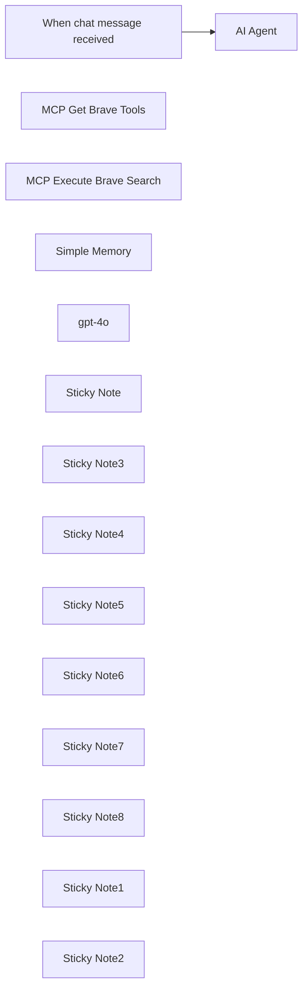

## Fluxo (.json) :

```json
{
  "id": "6MRJ2tfl8c2f3AuE",
  "meta": {
    "instanceId": "31e69f7f4a77bf465b805824e303232f0227212ae922d12133a0f96ffeab4fef"
  },
  "name": "💥🛠️Build a Web Search Chatbot with GPT-4o and MCP Brave Search",
  "tags": [],
  "nodes": [
    {
      "id": "b6e5eaa8-ddb3-4c13-8069-ce360bf4a945",
      "name": "AI Agent",
      "type": "@n8n/n8n-nodes-langchain.agent",
      "position": [
        240,
        -180
      ],
      "parameters": {
        "options": {}
      },
      "typeVersion": 1.8
    },
    {
      "id": "dde0154e-f7c2-4778-abcc-f79406db5e6b",
      "name": "When chat message received",
      "type": "@n8n/n8n-nodes-langchain.chatTrigger",
      "position": [
        -260,
        -180
      ],
      "webhookId": "68e54e15-548a-44df-ad06-7fb9e4e912a9",
      "parameters": {
        "options": {}
      },
      "typeVersion": 1.1
    },
    {
      "id": "877ce640-4d08-4ba7-b1d3-bcfc79600d2c",
      "name": "MCP Get Brave Tools",
      "type": "n8n-nodes-mcp.mcpClientTool",
      "position": [
        200,
        280
      ],
      "parameters": {},
      "credentials": {
        "mcpClientApi": {
          "id": "t2IDYWq0EcqBWvMA",
          "name": "MCP Client (STDIO) account 2"
        }
      },
      "typeVersion": 1
    },
    {
      "id": "fb3ce3c2-a809-43e5-92d0-82db0d78a971",
      "name": "MCP Execute Brave Search",
      "type": "n8n-nodes-mcp.mcpClientTool",
      "position": [
        460,
        280
      ],
      "parameters": {
        "toolName": "={{ $fromAI('tool', 'Set this with the specific tool name') }}",
        "operation": "executeTool",
        "toolParameters": "={{ /*n8n-auto-generated-fromAI-override*/ $fromAI('Tool_Parameters', ``, 'json') }}"
      },
      "credentials": {
        "mcpClientApi": {
          "id": "t2IDYWq0EcqBWvMA",
          "name": "MCP Client (STDIO) account 2"
        }
      },
      "typeVersion": 1
    },
    {
      "id": "357bde6a-66d0-48dc-972d-d0b35e3868ed",
      "name": "Simple Memory",
      "type": "@n8n/n8n-nodes-langchain.memoryBufferWindow",
      "position": [
        -120,
        280
      ],
      "parameters": {},
      "typeVersion": 1.3
    },
    {
      "id": "3eba14c5-e4ed-4c4f-8f1d-2b5671b462cc",
      "name": "gpt-4o",
      "type": "@n8n/n8n-nodes-langchain.lmChatOpenAi",
      "position": [
        -380,
        280
      ],
      "parameters": {
        "model": {
          "__rl": true,
          "mode": "list",
          "value": "gpt-4o",
          "cachedResultName": "gpt-4o"
        },
        "options": {}
      },
      "credentials": {
        "openAiApi": {
          "id": "jEMSvKmtYfzAkhe6",
          "name": "OpenAi account"
        }
      },
      "typeVersion": 1.2
    },
    {
      "id": "781e5d92-6e9d-4874-93fc-5ea17d11f67f",
      "name": "Sticky Note",
      "type": "n8n-nodes-base.stickyNote",
      "position": [
        120,
        160
      ],
      "parameters": {
        "color": 4,
        "height": 280,
        "content": "## 1️⃣ MCP Get Brave Tools"
      },
      "typeVersion": 1
    },
    {
      "id": "78a52697-352f-47ed-a7d2-3a65c9641fd7",
      "name": "Sticky Note3",
      "type": "n8n-nodes-base.stickyNote",
      "position": [
        380,
        160
      ],
      "parameters": {
        "color": 4,
        "height": 280,
        "content": "## 2️⃣ MCP Execute Brave Search"
      },
      "typeVersion": 1
    },
    {
      "id": "876003d5-7d90-4865-af36-3c0e504b02e7",
      "name": "Sticky Note4",
      "type": "n8n-nodes-base.stickyNote",
      "position": [
        -200,
        160
      ],
      "parameters": {
        "color": 3,
        "height": 280,
        "content": "## Short Term Chat Memory"
      },
      "typeVersion": 1
    },
    {
      "id": "9f64f499-73d7-414f-a3d3-02c0417368a6",
      "name": "Sticky Note5",
      "type": "n8n-nodes-base.stickyNote",
      "position": [
        -460,
        160
      ],
      "parameters": {
        "color": 5,
        "height": 280,
        "content": "## Cloud LLM"
      },
      "typeVersion": 1
    },
    {
      "id": "fc423452-832c-4377-9bde-04ab6d5c89aa",
      "name": "Sticky Note6",
      "type": "n8n-nodes-base.stickyNote",
      "position": [
        -500,
        -400
      ],
      "parameters": {
        "color": 7,
        "width": 1200,
        "height": 920,
        "content": "# 💥🛠️Your First Simple MCP AI Chatbot using Brave Search\nhttps://github.com/nerding-io/n8n-nodes-mcp\nhttps://brave.com/search/api/"
      },
      "typeVersion": 1
    },
    {
      "id": "5c6c7307-3283-4698-9104-c80df8a62888",
      "name": "Sticky Note7",
      "type": "n8n-nodes-base.stickyNote",
      "position": [
        80,
        40
      ],
      "parameters": {
        "width": 580,
        "height": 440,
        "content": "## 🛠️ MCP Toolbox\nhttps://github.com/nerding-io/n8n-nodes-mcp\nhttps://brave.com/search/api/"
      },
      "typeVersion": 1
    },
    {
      "id": "9d1bb515-f8fa-4d48-bbf5-c083f5efd89d",
      "name": "Sticky Note8",
      "type": "n8n-nodes-base.stickyNote",
      "position": [
        -360,
        -240
      ],
      "parameters": {
        "color": 4,
        "width": 300,
        "height": 240,
        "content": "## 👍Try Me!"
      },
      "typeVersion": 1
    },
    {
      "id": "b093a455-aee7-4822-b079-7d9cbac783c2",
      "name": "Sticky Note1",
      "type": "n8n-nodes-base.stickyNote",
      "position": [
        -1060,
        -400
      ],
      "parameters": {
        "width": 520,
        "height": 1040,
        "content": "### **Who is this for?**\nThis workflow is ideal for developers, automation enthusiasts, and businesses looking to integrate AI-powered chat capabilities into their workflows. It's particularly useful for those leveraging Brave Search and MCP tools to enhance user interactions and streamline data retrieval.\n\n### **What problem is this workflow solving?**\nThis workflow addresses the challenge of creating an intelligent chatbot that can process user queries, execute searches using Brave Search, and provide responses enriched by AI. It simplifies the integration of multiple tools into a cohesive system, saving time and effort for users who need a robust conversational AI solution.\n\n### **What this workflow does**\n- Listens for incoming chat messages using the **Chat Trigger** node.\n- Processes user input with an **AI Agent** powered by GPT-4o.\n- Retrieves relevant tools using the **MCP Get Brave Tools** node.\n- Executes specific search queries via the **MCP Execute Brave Search** node.\n- Maintains short-term memory of conversations with the **Simple Memory** node.\n\n### **Setup**\n1. **Prerequisites**:\n   - Access to an n8n instance (self-hosted).\n   - API credentials for OpenAI and MCP Client Tools.\n   - Brave Search API key.\n\n2. **Steps**:\n   - Import the workflow JSON into your n8n instance.\n   - Configure the API credentials for OpenAI and MCP Client Tools in their respective nodes.\n   - Set up your Brave Search API key in the MCP nodes. https://brave.com/search/api/\n\n3. **Testing**:\n   - Use the built-in chat interface to send test messages.\n   - Verify that the chatbot processes queries and returns results as expected.\n\n### **How to customize this workflow to your needs**\n- Modify the AI Agent's prompt settings to tailor responses to your specific use case.\n- Adjust the memory buffer in the Simple Memory node to retain more or less conversational context.\n- Replace or add additional tools in the MCP nodes to expand functionality.\n"
      },
      "typeVersion": 1
    },
    {
      "id": "8fb4f215-da26-43ad-b187-9b52ed6485ba",
      "name": "Sticky Note2",
      "type": "n8n-nodes-base.stickyNote",
      "position": [
        80,
        -280
      ],
      "parameters": {
        "width": 580,
        "height": 280,
        "content": "## 🤖 AI Agent with Tools"
      },
      "typeVersion": 1
    }
  ],
  "active": false,
  "pinData": {},
  "settings": {
    "executionOrder": "v1"
  },
  "versionId": "a555f325-abd3-44bd-ac48-8b0f6910824e",
  "connections": {
    "gpt-4o": {
      "ai_languageModel": [
        [
          {
            "node": "AI Agent",
            "type": "ai_languageModel",
            "index": 0
          }
        ]
      ]
    },
    "Simple Memory": {
      "ai_memory": [
        [
          {
            "node": "AI Agent",
            "type": "ai_memory",
            "index": 0
          }
        ]
      ]
    },
    "MCP Get Brave Tools": {
      "ai_tool": [
        [
          {
            "node": "AI Agent",
            "type": "ai_tool",
            "index": 0
          }
        ]
      ]
    },
    "MCP Execute Brave Search": {
      "ai_tool": [
        [
          {
            "node": "AI Agent",
            "type": "ai_tool",
            "index": 0
          }
        ]
      ]
    },
    "When chat message received": {
      "main": [
        [
          {
            "node": "AI Agent",
            "type": "main",
            "index": 0
          }
        ]
      ]
    }
  }
}
```

<a id="template-1302"></a>

## Template 1302 - Criar URL curta e obter estatísticas

- **Nome:** Criar URL curta e obter estatísticas
- **Descrição:** Ao executar manualmente, o fluxo cria uma URL curta para um link fornecido e em seguida recupera as estatísticas dessa URL curta.
- **Funcionalidade:** • Disparo manual: inicia a execução do fluxo quando acionado manualmente.
• Criação de URL curta: envia a URL longa e um título para o serviço de encurtamento e recebe a URL curta gerada.
• Recuperação de estatísticas: utiliza a URL curta gerada para solicitar e obter estatísticas e métricas do link.
- **Ferramentas:** • YOURLS: serviço de encurtamento de URLs que cria links curtos personalizados e fornece estatísticas de acesso.


## Fluxo visual

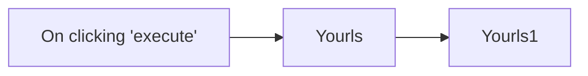

## Fluxo (.json) :

```json
{
  "id": "167",
  "name": "Create a short URL and get the statistics of the URL",
  "nodes": [
    {
      "name": "On clicking 'execute'",
      "type": "n8n-nodes-base.manualTrigger",
      "position": [
        370,
        300
      ],
      "parameters": {},
      "typeVersion": 1
    },
    {
      "name": "Yourls",
      "type": "n8n-nodes-base.yourls",
      "position": [
        570,
        300
      ],
      "parameters": {
        "url": "https://medium.com/n8n-io/sending-sms-the-low-code-way-with-airtable-twilio-programmable-sms-and-n8n-90dbde74223e?source=---------4-----------------------",
        "additionalFields": {
          "title": "Sending SMS the Low-Code Way with Airtable, Twilio Programmable SMS, and n8n"
        }
      },
      "credentials": {
        "yourlsApi": "Yourls"
      },
      "typeVersion": 1
    },
    {
      "name": "Yourls1",
      "type": "n8n-nodes-base.yourls",
      "position": [
        770,
        300
      ],
      "parameters": {
        "shortUrl": "={{$node[\"Yourls\"].json[\"shorturl\"]}}",
        "operation": "stats"
      },
      "credentials": {
        "yourlsApi": "Yourls"
      },
      "typeVersion": 1
    }
  ],
  "active": false,
  "settings": {},
  "connections": {
    "Yourls": {
      "main": [
        [
          {
            "node": "Yourls1",
            "type": "main",
            "index": 0
          }
        ]
      ]
    },
    "On clicking 'execute'": {
      "main": [
        [
          {
            "node": "Yourls",
            "type": "main",
            "index": 0
          }
        ]
      ]
    }
  }
}
```

<a id="template-1303"></a>

## Template 1303 - Leitor de sitemap e filtro de URLs

- **Nome:** Leitor de sitemap e filtro de URLs
- **Descrição:** Lê um sitemap.xml remoto, converte o conteúdo de XML para JSON e filtra as URLs conforme um critério definido (por padrão retorna PDFs).
- **Funcionalidade:** • Acionamento manual: Permite iniciar a execução do fluxo manualmente.
• Definição da URL do sitemap: Define a URL do sitemap.xml a ser processado.
• Recuperação do sitemap via web: Faz uma requisição HTTP(S) para baixar o arquivo sitemap.xml.
• Conversão de XML para JSON: Converte o conteúdo XML do sitemap para um formato JSON trabalhável.
• Separação das entradas de URL: Processa cada entrada de URL individualmente para inspeção/filtragem.
• Filtragem de URLs por critério: Filtra as URLs com base em regras configuráveis (por padrão, seleciona URLs que terminam em .pdf).
• Anotações de configuração: Inclui notas orientando onde ajustar a URL do sitemap e as regras de filtro.
- **Ferramentas:** • Sitemap XML (arquivo remoto): Fonte de URLs hospedada em um site e fornecida como sitemap.xml.
• HTTP/HTTPS (requisições web): Protocolo utilizado para buscar o sitemap hospedado na web.

## Fluxo visual

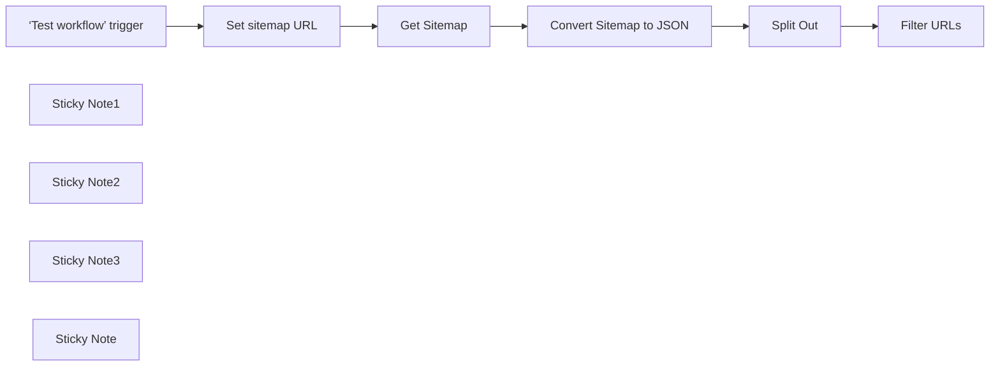

## Fluxo (.json) :

```json
{
  "id": "7fdJOvYNILCr24fH",
  "meta": {
    "instanceId": "568298fde06d3db80a2eea77fe5bf45f0c7bb898dea20b769944e9ac7c6c5a80"
  },
  "name": "Read sitemap and filter URLs",
  "tags": [],
  "nodes": [
    {
      "id": "38910330-5286-4f3f-b62e-9216acccd503",
      "name": "‘Test workflow’ trigger",
      "type": "n8n-nodes-base.manualTrigger",
      "position": [
        -460,
        -60
      ],
      "parameters": {},
      "typeVersion": 1
    },
    {
      "id": "d4e5991b-62d9-45ca-962f-c1077f3bce19",
      "name": "Set sitemap URL",
      "type": "n8n-nodes-base.set",
      "position": [
        -280,
        -60
      ],
      "parameters": {
        "options": {},
        "assignments": {
          "assignments": [
            {
              "id": "d6c5ac86-6d67-42fb-96ec-9826caf452e2",
              "name": "sitemapUrl",
              "type": "string",
              "value": "https://duckduckgo.com/sitemap.xml"
            }
          ]
        }
      },
      "typeVersion": 3.4
    },
    {
      "id": "0d957deb-5830-4077-97e4-437dc7c0e527",
      "name": "Split Out",
      "type": "n8n-nodes-base.splitOut",
      "position": [
        260,
        -60
      ],
      "parameters": {
        "options": {},
        "fieldToSplitOut": "urlset.url"
      },
      "typeVersion": 1
    },
    {
      "id": "7021088c-dfa1-4aae-b2e7-15b0ca10a750",
      "name": "Get Sitemap",
      "type": "n8n-nodes-base.httpRequest",
      "position": [
        -100,
        -60
      ],
      "parameters": {
        "url": "={{ $json.sitemapUrl }}",
        "options": {}
      },
      "typeVersion": 4.2
    },
    {
      "id": "d3b86577-01fc-40f8-ab65-93ba420187b8",
      "name": "Convert Sitemap to JSON",
      "type": "n8n-nodes-base.xml",
      "position": [
        80,
        -60
      ],
      "parameters": {
        "options": {
          "trim": true,
          "normalize": true,
          "mergeAttrs": true,
          "ignoreAttrs": true,
          "normalizeTags": true
        }
      },
      "typeVersion": 1
    },
    {
      "id": "bc0758ae-06eb-4a29-a91e-414407ec8ade",
      "name": "Filter URLs",
      "type": "n8n-nodes-base.filter",
      "position": [
        440,
        -60
      ],
      "parameters": {
        "options": {},
        "conditions": {
          "options": {
            "version": 2,
            "leftValue": "",
            "caseSensitive": true,
            "typeValidation": "strict"
          },
          "combinator": "and",
          "conditions": [
            {
              "id": "0bf8e98c-b6c5-4129-852c-0d3e63f32f9f",
              "operator": {
                "type": "string",
                "operation": "endsWith"
              },
              "leftValue": "={{ $json.loc }}",
              "rightValue": ".pdf"
            }
          ]
        }
      },
      "typeVersion": 2.2
    },
    {
      "id": "1d3fed97-1e72-426c-a48d-1a9683f40c4c",
      "name": "Sticky Note1",
      "type": "n8n-nodes-base.stickyNote",
      "position": [
        -300,
        -140
      ],
      "parameters": {
        "color": 6,
        "width": 150,
        "height": 240,
        "content": "**Set your sitemap.xml\nurl here.**"
      },
      "typeVersion": 1
    },
    {
      "id": "521ec74d-6707-47fd-992d-eecebed415ab",
      "name": "Sticky Note2",
      "type": "n8n-nodes-base.stickyNote",
      "position": [
        420,
        -140
      ],
      "parameters": {
        "color": 6,
        "width": 150,
        "height": 240,
        "content": "**Create your filter here.**"
      },
      "typeVersion": 1
    },
    {
      "id": "07e6c3de-cc72-490d-b614-67034ce04bfb",
      "name": "Sticky Note3",
      "type": "n8n-nodes-base.stickyNote",
      "position": [
        -140,
        -180
      ],
      "parameters": {
        "color": 7,
        "width": 540,
        "height": 300,
        "content": "## Fetch and process the sitemap.xml file\nThis part fetches and process the sitemap.xml file from XML data to JSON that we can work with."
      },
      "typeVersion": 1
    },
    {
      "id": "abf5f02d-d2a0-43f1-9a1f-386cc4f9861b",
      "name": "Sticky Note",
      "type": "n8n-nodes-base.stickyNote",
      "position": [
        -780,
        -220
      ],
      "parameters": {
        "width": 280,
        "height": 420,
        "content": "## Sitemap.xml reader\nThis workflow reads an sitemap.xml and filters out the entries you want.\n\nBy default only PDF documents are returned at the end of the workflow.\n\n**SETUP**\n- Edit the **Set sitemap URL** block and add the url to the sitemap you want to read.\n\n- Edit the **Filter URLs** to your needs."
      },
      "typeVersion": 1
    }
  ],
  "active": false,
  "pinData": {},
  "settings": {
    "executionOrder": "v1"
  },
  "versionId": "74793599-4c7d-4532-bbd5-a2ce4761fbc8",
  "connections": {
    "Split Out": {
      "main": [
        [
          {
            "node": "Filter URLs",
            "type": "main",
            "index": 0
          }
        ]
      ]
    },
    "Get Sitemap": {
      "main": [
        [
          {
            "node": "Convert Sitemap to JSON",
            "type": "main",
            "index": 0
          }
        ]
      ]
    },
    "Set sitemap URL": {
      "main": [
        [
          {
            "node": "Get Sitemap",
            "type": "main",
            "index": 0
          }
        ]
      ]
    },
    "Convert Sitemap to JSON": {
      "main": [
        [
          {
            "node": "Split Out",
            "type": "main",
            "index": 0
          }
        ]
      ]
    },
    "‘Test workflow’ trigger": {
      "main": [
        [
          {
            "node": "Set sitemap URL",
            "type": "main",
            "index": 0
          }
        ]
      ]
    }
  }
}
```

<a id="template-1304"></a>

## Template 1304 - Extrair páginas 2-3 de PDF remoto

- **Nome:** Extrair páginas 2-3 de PDF remoto
- **Descrição:** Baixa um PDF hospedado remotamente e extrai as páginas 2 e 3, gerando um novo documento com esse recorte.
- **Funcionalidade:** • Disparo manual: Inicia a execução quando o usuário aciona o teste do fluxo.
• Download do PDF remoto: Efetua uma requisição ao URL especificado para obter o arquivo PDF.
• Extração de páginas específicas: Seleciona e extrai as páginas 2 a 3 do PDF baixado.
• Armazenamento do resultado: Grava o resultado da extração no campo 'data' para uso posterior.
- **Ferramentas:** • Serviço de hospedagem de arquivos (https://www.sldttc.org): fornece acesso ao arquivo PDF hospedado.
• Biblioteca/serviço de extração de PDF (PDF toolkit): realiza a operação de separar/extrair páginas específicas do documento PDF.


## Fluxo visual


## Fluxo (.json) :

```json
{
  "id": "rLoXUoKSZ4a9XUAv",
  "meta": {
    "instanceId": "7599ed929ea25767a019b87ecbc83b90e16a268cb51892887b450656ac4518a2"
  },
  "name": "My workflow 6",
  "tags": [],
  "nodes": [
    {
      "id": "dad32e79-af45-4255-90d9-845a5357395a",
      "name": "When clicking ‘Test workflow’",
      "type": "n8n-nodes-base.manualTrigger",
      "position": [
        -580,
        920
      ],
      "parameters": {},
      "typeVersion": 1
    },
    {
      "id": "1cadea33-7c6a-4282-be84-e127fc7437c2",
      "name": "Extract Pages From PDF1",
      "type": "@custom-js/n8n-nodes-pdf-toolkit.ExtractPages",
      "position": [
        -140,
        920
      ],
      "parameters": {
        "pageRange": "2-3",
        "field_name": "=data"
      },
      "credentials": {
        "customJsApi": {
          "id": "h29wo2anYKdANAzm",
          "name": "CustomJS account"
        }
      },
      "typeVersion": 1
    },
    {
      "id": "a8554e6b-6e2d-4a26-909c-25e74e618480",
      "name": "HTTP Request",
      "type": "n8n-nodes-base.httpRequest",
      "position": [
        -360,
        920
      ],
      "parameters": {
        "url": "https://www.sldttc.org/allpdf/21583473018.pdf",
        "options": {}
      },
      "typeVersion": 4.2
    }
  ],
  "active": false,
  "pinData": {},
  "settings": {
    "executionOrder": "v1"
  },
  "versionId": "82cbb24e-e907-419a-97d6-bdb577269927",
  "connections": {
    "HTTP Request": {
      "main": [
        [
          {
            "node": "Extract Pages From PDF1",
            "type": "main",
            "index": 0
          }
        ]
      ]
    },
    "When clicking ‘Test workflow’": {
      "main": [
        [
          {
            "node": "HTTP Request",
            "type": "main",
            "index": 0
          }
        ]
      ]
    }
  }
}
```

<a id="template-1305"></a>

## Template 1305 - Converter e publicar emails como páginas HTML temporárias

- **Nome:** Converter e publicar emails como páginas HTML temporárias
- **Descrição:** Recebe emails, salva o conteúdo HTML em um Gist privado no GitHub e notifica via Telegram com um link para visualização; após um tempo definido o Gist e a notificação são removidos.
- **Funcionalidade:** • Detecção de novos emails via IMAP: inicia a automação ao chegar um email não lido.
• Extração do conteúdo HTML do email: captura o corpo HTML para publicação.
• Criação de Gist privado no GitHub: armazena o HTML como arquivo (email.html) com descrição contendo data e remetente.
• Notificação no Telegram com botão inline: envia mensagem informando o remetente e inclui um botão que aponta para a página de visualização.
• Link personalizado para visualização: gera URL que referencia o Gist e permite pré-visualizar o email em um visualizador hospedado.
• Expiração automática: espera 3 horas e então deleta o Gist e remove a mensagem do Telegram.
• Configuração de credenciais: suporte para configurar credenciais do GitHub e identificar o Chat ID do Telegram.
• Opção de hospedagem própria: possibilidade de hospedar o visualizador em um domínio próprio (ex.: GitHub Pages).
- **Ferramentas:** • Servidor de email IMAP: fonte dos emails recebidos (monitoramento de mensagens não lidas).
• GitHub Gists/API: usado para criar e deletar arquivos contendo o HTML dos emails.
• Telegram: plataforma para enviar notificações com botões inline e para excluir mensagens posteriormente.
• Serviço de visualização/hosting (opcional): domínio ou serviço (por exemplo, GitHub Pages) para exibir o conteúdo HTML a partir do Gist.

## Fluxo visual

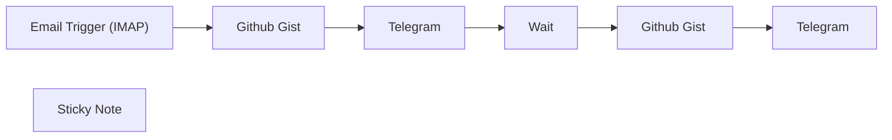

## Fluxo (.json) :

```json
{
  "meta": {
    "instanceId": "dbd43d88d26a9e30d8aadc002c9e77f1400c683dd34efe3778d43d27250dde50"
  },
  "nodes": [
    {
      "id": "1c7b05e0-d82b-4851-a1ec-713093cdf489",
      "name": "Email Trigger (IMAP)",
      "type": "n8n-nodes-base.emailReadImap",
      "position": [
        540,
        660
      ],
      "parameters": {
        "format": "resolved",
        "options": {
          "forceReconnect": 60,
          "customEmailConfig": "[\"UNSEEN\"]"
        }
      },
      "typeVersion": 2
    },
    {
      "id": "734424e6-d292-47d7-abb9-9630bdc00e35",
      "name": "Telegram",
      "type": "n8n-nodes-base.telegram",
      "position": [
        1140,
        660
      ],
      "parameters": {
        "text": "=📧 <b>You've got mail!</b>\n\nA new email has arrived from this address: <code>{{ $node[\"Email Trigger (IMAP)\"].json[\"from\"][\"value\"][\"0\"][\"address\"] }}</code>\n\n🌐 A secert HTML page has been created for it, where you can preview the message by following the link below 👇",
        "chatId": "<Your Chat ID Here>",
        "replyMarkup": "inlineKeyboard",
        "inlineKeyboard": {
          "rows": [
            {
              "row": {
                "buttons": [
                  {
                    "text": "={{ $('Github Gist').item.json.files[\"email.html\"].filename }}",
                    "additionalFields": {
                      "url": "={{'http://emails.nskha.com/?iloven8n=nskha&id='+ $('Github Gist').item.json.id}}"
                    }
                  }
                ]
              }
            }
          ]
        },
        "additionalFields": {
          "parse_mode": "HTML",
          "appendAttribution": true,
          "disable_web_page_preview": true
        }
      },
      "typeVersion": 1.1
    },
    {
      "id": "260c6ba6-1922-4bcb-bd5e-20b307ac638d",
      "name": "Github Gist",
      "type": "n8n-nodes-base.httpRequest",
      "notes": "Save HTML content",
      "position": [
        840,
        660
      ],
      "parameters": {
        "url": "https://api.github.com/gists",
        "method": "POST",
        "options": {
          "redirect": {
            "redirect": {}
          }
        },
        "jsonBody": "={\n  \"description\": \"{{ $json.date }} - from {{ JSON.stringify($json.from.value[0].address).slice(1, -1) }} - to {{ JSON.stringify($json.to.value[0].address).slice(1, -1) }}\",\n  \"public\": false,\n  \"files\": {\n    \"email.html\": {\n      \"content\": \"{{ JSON.stringify($json.html).slice(1, -1) }}\"\n    }\n  }\n}",
        "sendBody": true,
        "sendHeaders": true,
        "specifyBody": "json",
        "authentication": "predefinedCredentialType",
        "headerParameters": {
          "parameters": [
            {
              "name": "Accept",
              "value": "application/vnd.github+json"
            }
          ]
        },
        "nodeCredentialType": "githubApi"
      },
      "notesInFlow": true,
      "typeVersion": 4.1
    },
    {
      "id": "0a77d236-e387-4458-a9cc-9ff7977ba4aa",
      "name": "Sticky Note",
      "type": "n8n-nodes-base.stickyNote",
      "position": [
        460,
        440
      ],
      "parameters": {
        "color": 7,
        "width": 872,
        "height": 626.9128738621571,
        "content": "## Simple Conversion of Emails into HTML Webpages\nTo-do:\n* Configure your GitHub credentials through `Predefined Credential Type` => `GitHub API`.\n* Add your Telegram credentials by providing your `Chat ID`.\n* [**Optional**] You can host this [small project](https://github.com/Automations-Project/Emails/tree/main) on your own domain using GitHub Pages.\n\n ‌ ‌ ‌ ‌ ‌ ‌ ‌ ‌ ‌ ‌ ‌ ‌ ‌ ‌ ‌ ‌ ‌ ‌ ‌ ‌ ‌ ‌ ‌ ‌ ‌ ‌ ‌  ‌ ‌ ‌  ‌ ‌ ‌ ‌ ‌ ‌ ‌ ‌ ‌ ‌ ‌ \n\n\n\n\n\n\n\n ‌ ‌ ‌ ‌ ‌ ‌ ‌ ‌ ‌ ‌ ‌ ‌ ‌ ‌ ‌ ‌ ‌ ‌ ‌ ‌ ‌ ‌ ‌ ‌ ‌ ‌ ‌  ‌ ‌ ‌  ‌ ‌ ‌ ‌ ‌ ‌ ‌ ‌ ‌ ‌ ‌ ‌ ‌ ‌ ‌ "
      },
      "typeVersion": 1
    },
    {
      "id": "f69cf395-0050-44b3-a713-61f0cc5977ad",
      "name": "Wait",
      "type": "n8n-nodes-base.wait",
      "notes": "Delete within 3h",
      "position": [
        540,
        900
      ],
      "webhookId": "c5202512-f84e-44b4-b357-9ee2124bd507",
      "parameters": {
        "amount": 3
      },
      "notesInFlow": true,
      "typeVersion": 1
    },
    {
      "id": "c6067792-4fc2-4ced-bb04-6c5449a533ab",
      "name": "Telegram ‌",
      "type": "n8n-nodes-base.telegram",
      "position": [
        1140,
        900
      ],
      "parameters": {
        "chatId": "<Your Chat ID Here>",
        "messageId": "={{ $('Telegram').item.json.result.message_id }}",
        "operation": "deleteMessage"
      },
      "typeVersion": 1.1
    },
    {
      "id": "ebfe89fb-b0a3-4826-a72b-3fb8baa473c4",
      "name": "Github Gist ‌",
      "type": "n8n-nodes-base.httpRequest",
      "notes": "Remove HTML content",
      "position": [
        840,
        900
      ],
      "parameters": {
        "url": "=https://api.github.com/gists/{{ $item(\"0\").$node[\"Github Gist\"].json[\"id\"] }}",
        "method": "DELETE",
        "options": {
          "redirect": {
            "redirect": {}
          }
        },
        "sendHeaders": true,
        "authentication": "predefinedCredentialType",
        "headerParameters": {
          "parameters": [
            {
              "name": "Accept",
              "value": "application/vnd.github+json"
            }
          ]
        },
        "nodeCredentialType": "githubApi"
      },
      "notesInFlow": true,
      "typeVersion": 4.1
    }
  ],
  "pinData": {},
  "connections": {
    "Wait": {
      "main": [
        [
          {
            "node": "Github Gist ‌",
            "type": "main",
            "index": 0
          }
        ]
      ]
    },
    "Telegram": {
      "main": [
        [
          {
            "node": "Wait",
            "type": "main",
            "index": 0
          }
        ]
      ]
    },
    "Github Gist": {
      "main": [
        [
          {
            "node": "Telegram",
            "type": "main",
            "index": 0
          }
        ]
      ]
    },
    "Github Gist ‌": {
      "main": [
        [
          {
            "node": "Telegram ‌",
            "type": "main",
            "index": 0
          }
        ]
      ]
    },
    "Email Trigger (IMAP)": {
      "main": [
        [
          {
            "node": "Github Gist",
            "type": "main",
            "index": 0
          }
        ]
      ]
    }
  }
}
```

<a id="template-1306"></a>

## Template 1306 - Busca de interesses Facebook via comando Telegram

- **Nome:** Busca de interesses Facebook via comando Telegram
- **Descrição:** Ao receber uma mensagem com a hashtag #interest em um grupo específico, o fluxo busca interesses na API do Facebook Graph e gera um relatório CSV com os resultados, enviando-o de volta ao chat.
- **Funcionalidade:** • Detecção de comando no Telegram: Monitora mensagens recebidas para iniciar o fluxo.
• Validação do chat e do comando: Verifica se a mensagem veio do grupo esperado e se começa com #interest.
• Extração do conteúdo da mensagem: Isola o texto da mensagem para processamento.
• Separação do termo de busca: Identifica a hashtag e o conteúdo restante usado como consulta.
• Consulta à API de interesses do Facebook: Realiza busca por interesses com base no termo extraído.
• Transformação dos resultados em tabela: Converte a resposta da API em registros estruturados.
• Geração de arquivo CSV: Cria um arquivo CSV com os campos relevantes dos interesses encontrados.
• Envio do relatório ao chat: Envia o arquivo CSV para o mesmo grupo do Telegram.
• Ramo inativo para mensagens não válidas: Ignora mensagens que não atendem aos critérios.
- **Ferramentas:** • Telegram: Plataforma de mensagens usada para receber o comando do usuário e enviar o arquivo de relatório.
• Facebook Graph API: Serviço utilizado para pesquisar interesses (ad interests) e obter informações como tamanho de audiência, descrição e caminho.

## Fluxo visual

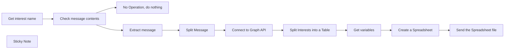

## Fluxo (.json) :

```json
{
  "meta": {
    "instanceId": "ac9d33c4ed758aeca18fdf8990bc14f18826f99beb38fb06a023fa013ee39a0b"
  },
  "nodes": [
    {
      "id": "9cfeb58b-140f-4941-8442-4e33c671e325",
      "name": "No Operation, do nothing",
      "type": "n8n-nodes-base.noOp",
      "position": [
        440,
        840
      ],
      "parameters": {},
      "typeVersion": 1
    },
    {
      "id": "c4e7c596-4f2a-48e0-a932-ad40157c6282",
      "name": "Get interest name",
      "type": "n8n-nodes-base.telegramTrigger",
      "position": [
        100,
        660
      ],
      "webhookId": "3c85f114-6321-4e6d-9b5e-726e1493ee4e",
      "parameters": {
        "updates": [
          "message"
        ],
        "additionalFields": {}
      },
      "credentials": {
        "telegramApi": {
          "id": "JR5rQqmm6CGac5CF",
          "name": "Sender Token"
        }
      },
      "typeVersion": 1
    },
    {
      "id": "69d432d1-4ab1-4059-af5c-ba589dfe16bc",
      "name": "Check message contents",
      "type": "n8n-nodes-base.if",
      "position": [
        280,
        660
      ],
      "parameters": {
        "conditions": {
          "number": [
            {
              "value1": "={{ $json.message.chat.id }}",
              "value2": -1001805495093,
              "operation": "equal"
            }
          ],
          "string": [
            {
              "value1": "={{ $json.message.text }}",
              "value2": "#interest",
              "operation": "startsWith"
            }
          ]
        }
      },
      "typeVersion": 1
    },
    {
      "id": "345274b6-2d56-4d54-937a-dd9153fd1fdc",
      "name": "Extract message",
      "type": "n8n-nodes-base.code",
      "position": [
        460,
        460
      ],
      "parameters": {
        "jsCode": "let inputData = items[0].json; // get the input data\nlet message = inputData.message; // replace 'message' with the correct field name\n\nlet messageContent = '';\n\nif (message && message.text) {\n  messageContent = message.text;\n}\n\nreturn [\n  {\n    json: {\n      messageContent: messageContent\n    }\n  }\n];\n"
      },
      "typeVersion": 2
    },
    {
      "id": "cd808029-1a46-4fad-9065-c726960fb427",
      "name": "Split Message",
      "type": "n8n-nodes-base.code",
      "position": [
        660,
        460
      ],
      "parameters": {
        "jsCode": "let inputData = items[0].json; // get the input data\nlet variableContent = String(inputData.messageContent || ''); // replace 'variable' with the correct field name, convert to string and assign empty string if undefined\n\nlet regex = /#(\\w+)\\b(.*)/; // regex to match hashtag word and rest of the content\nlet matches = regex.exec(variableContent);\n\nlet extractedContent = '';\nlet remainingContent = '';\n\nif (matches !== null) {\n  extractedContent = matches[1];\n  remainingContent = matches[2].trim();\n} else {\n  remainingContent = variableContent.trim();\n}\n\nreturn [\n  {\n    json: {\n      extractedContent: extractedContent,\n      remainingContent: remainingContent    }\n  }\n];\n"
      },
      "typeVersion": 2
    },
    {
      "id": "6f541faf-7756-415e-8391-5470166b8a01",
      "name": "Connect to Graph API",
      "type": "n8n-nodes-base.facebookGraphApi",
      "position": [
        840,
        460
      ],
      "parameters": {
        "edge": "=",
        "node": "=search?type=adinterest&q={{ $json.remainingContent }}\n&limit=1000000&locale=en_US ",
        "options": {},
        "graphApiVersion": "v17.0"
      },
      "credentials": {
        "facebookGraphApi": {
          "id": "AEVlPxPoTe92kkJS",
          "name": "Facebook Graph account"
        }
      },
      "typeVersion": 1
    },
    {
      "id": "394a34ce-f56d-4a79-8fbb-f37681cbee76",
      "name": "Split Interests into a Table",
      "type": "n8n-nodes-base.code",
      "position": [
        1020,
        460
      ],
      "parameters": {
        "jsCode": "let inputData = items[0].json; // get the input data\nlet outputData = [];\n\nfor(let key in inputData) {\n    if(inputData.hasOwnProperty(key)) {\n        let itemKey = key;\n        let itemValue = inputData[key];\n        \n        for(let subKey in itemValue) {\n            if(itemValue.hasOwnProperty(subKey)) {\n                let formattedItem = {\n                    'Item': itemKey,\n                    'SubItem': subKey,\n                    'Value': itemValue[subKey]\n                };\n                \n                outputData.push({json: formattedItem});\n            }\n        }\n    }\n}\n\nreturn outputData;"
      },
      "typeVersion": 2
    },
    {
      "id": "1d3f66a4-322f-4398-b887-52ccd2f2f5fe",
      "name": "Get variables",
      "type": "n8n-nodes-base.code",
      "position": [
        1200,
        460
      ],
      "parameters": {
        "jsCode": "let outputData = items.map(item => {\n    let data = item.json.Value;\n    \n    return {\n        json: {\n            'name': data.name,\n            'audience_size_lower_bound': data.audience_size_lower_bound,\n            'audience_size_upper_bound': data.audience_size_upper_bound,\n            'path': data.path,\n            'description': data.description,\n            'topic': data.topic\n        }\n    };\n});\n\nreturn outputData;"
      },
      "typeVersion": 2
    },
    {
      "id": "082ddf0f-29ef-424a-a2a2-4bf9e260657f",
      "name": "Create a Spreadsheet",
      "type": "n8n-nodes-base.spreadsheetFile",
      "position": [
        1380,
        460
      ],
      "parameters": {
        "options": {},
        "operation": "toFile",
        "fileFormat": "csv"
      },
      "typeVersion": 2
    },
    {
      "id": "44e4f97a-cd86-4b60-b761-49dc46f7e36b",
      "name": "Send the Spreadsheet file",
      "type": "n8n-nodes-base.telegram",
      "position": [
        1560,
        460
      ],
      "parameters": {
        "chatId": "-1001805495093",
        "operation": "sendDocument",
        "binaryData": true,
        "additionalFields": {
          "fileName": "report.csv"
        }
      },
      "credentials": {
        "telegramApi": {
          "id": "JR5rQqmm6CGac5CF",
          "name": "Sender Token"
        }
      },
      "typeVersion": 1
    },
    {
      "id": "22bc6129-7d10-46fd-98e2-0f3fc7a93344",
      "name": "Sticky Note",
      "type": "n8n-nodes-base.stickyNote",
      "position": [
        800,
        340
      ],
      "parameters": {
        "width": 948.6687115198118,
        "height": 296.5325040542755,
        "content": "## Facebook API\n\nTo get the API Key you need to follow these steps:\nhttps://developers.facebook.com/docs/commerce-platform/setup/api-setup/"
      },
      "typeVersion": 1
    }
  ],
  "pinData": {},
  "connections": {
    "Get variables": {
      "main": [
        [
          {
            "node": "Create a Spreadsheet",
            "type": "main",
            "index": 0
          }
        ]
      ]
    },
    "Split Message": {
      "main": [
        [
          {
            "node": "Connect to Graph API",
            "type": "main",
            "index": 0
          }
        ]
      ]
    },
    "Extract message": {
      "main": [
        [
          {
            "node": "Split Message",
            "type": "main",
            "index": 0
          }
        ]
      ]
    },
    "Get interest name": {
      "main": [
        [
          {
            "node": "Check message contents",
            "type": "main",
            "index": 0
          }
        ]
      ]
    },
    "Connect to Graph API": {
      "main": [
        [
          {
            "node": "Split Interests into a Table",
            "type": "main",
            "index": 0
          }
        ]
      ]
    },
    "Create a Spreadsheet": {
      "main": [
        [
          {
            "node": "Send the Spreadsheet file",
            "type": "main",
            "index": 0
          }
        ]
      ]
    },
    "Check message contents": {
      "main": [
        [
          {
            "node": "Extract message",
            "type": "main",
            "index": 0
          }
        ],
        [
          {
            "node": "No Operation, do nothing",
            "type": "main",
            "index": 0
          }
        ]
      ]
    },
    "Split Interests into a Table": {
      "main": [
        [
          {
            "node": "Get variables",
            "type": "main",
            "index": 0
          }
        ]
      ]
    }
  }
}
```

<a id="template-1307"></a>

## Template 1307 - Gerar e enviar relatório de timesheet com avatares

- **Nome:** Gerar e enviar relatório de timesheet com avatares
- **Descrição:** Gera um relatório HTML a partir de registros de timesheet, incorporando os avatares dos usuários e enviando o relatório como anexo por email.
- **Funcionalidade:** • Início manual: Permite executar o fluxo manualmente ao acionar a execução.
• Coleta de registros de timesheet: Carrega registros contendo usuário, tarefa, data, horas e notas (dados simulados no fluxo).
• Ordenação de registros: Ordena os registros por usuário, título da tarefa e data para agrupamento lógico.
• Extração de avatares únicos: Identifica e remove URLs de avatar duplicadas para evitar downloads repetidos.
• Download de avatares: Baixa as imagens de avatar via HTTP e converte para conteúdo binário utilizável.
• Associação de imagens aos registros: Mescla as imagens baixadas com os registros correspondentes por índice/usuário.
• Geração de relatório Markdown/HTML: Agrupa entradas por usuário e por tarefa, monta tabelas com as entradas, calcula totais por tarefa, incorpora avatares em base64 e aplica estilo HTML personalizado.
• Inclusão de metadados: Adiciona data de geração do relatório ao final do documento.
• Conversão para anexo: Converte o HTML final em dados binários com nome de arquivo (report.html) para envio.
• Envio por email: Envia o relatório como anexo usando um servidor de email (SMTP).
- **Ferramentas:** • Gravatar: Serviço que fornece as imagens de avatar via URL utilizadas para incorporar a foto de cada usuário.
• Servidor SMTP (conta info@stats.consult): Servidor de email utilizado para enviar o relatório gerado como anexo.

## Fluxo visual

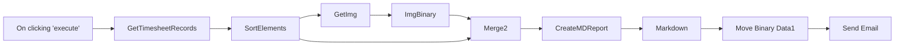

## Fluxo (.json) :

```json
{
  "nodes": [
    {
      "name": "On clicking 'execute'",
      "type": "n8n-nodes-base.manualTrigger",
      "position": [
        120,
        560
      ],
      "parameters": {},
      "typeVersion": 1
    },
    {
      "name": "SortElements",
      "type": "n8n-nodes-base.itemLists",
      "position": [
        480,
        560
      ],
      "parameters": {
        "options": {},
        "operation": "sort",
        "sortFieldsUi": {
          "sortField": [
            {
              "fieldName": "UserName"
            },
            {
              "fieldName": "TaskTitle"
            },
            {
              "fieldName": "date"
            }
          ]
        }
      },
      "typeVersion": 1
    },
    {
      "name": "Markdown",
      "type": "n8n-nodes-base.markdown",
      "position": [
        1340,
        580
      ],
      "parameters": {
        "mode": "markdownToHtml",
        "options": {
          "tables": true,
          "noHeaderId": true,
          "rawHeaderId": false,
          "simpleLineBreaks": true,
          "customizedHeaderId": false,
          "completeHTMLDocument": true
        },
        "markdown": "={{$json[\"mdreport\"]}}"
      },
      "typeVersion": 1
    },
    {
      "name": "CreateMDReport",
      "type": "n8n-nodes-base.function",
      "position": [
        1160,
        580
      ],
      "parameters": {
        "functionCode": "// created report header and custom table style\nvar md_reporthead=\"#Timesheet report\\n\";\nvar md_style =  (`\n<style> table {border: 0.5px solid; border-spacing: 0px;}\n        table th {border-bottom: 0.5px solid;}\n        table thead {background: #D0E4F5;}\n        table tr:nth-child(even) { background: #D8D8D8;}\n</style>\\n\\n`);\n\nvar md_reportbody=md_style+md_reporthead;\n\n//declare several variables that are used for report generation\nvar tablehead = \"| Date | Hours | Task Description |\\n|:---|:---:|---|\\n\";\n\nvar cur_user=\"\";\nvar cur_usernum=0;\n\nvar cur_task=\"\";\nvar cur_tasktotal=0;\n\n\nfor (item of items) {\n  \n  // Check if new user\n  if (item.json.UserName != cur_user) {\n    // Close previous user's task\n    md_reportbody += (cur_tasktotal) ? \"\\n*\"+cur_tasktotal.toFixed(2)+\" - Total hours for this task*\\n\" : \"\";\n    cur_tasktotal = 0; cur_task=\"\";\n\n    // add new user and embed avatar as base64 image\n    cur_user = item.json.UserName;\n    md_reportbody += `\\n## ${cur_user}\\n`;\n    cur_usernum   += 1;\n  } // Check for new user - ENDIF\n\n\n  // Check if new task\n  if (item.json.TaskTitle != cur_task) {\n\n    // if not empty task - add total amount of hours for *previous* task\n    md_reportbody += (cur_tasktotal) ? `\\n*${cur_tasktotal.toFixed(2)} - Total hours for this task*\\n` : \"\";\n\n    // Add new task header and reset total hours counter\n    cur_task = item.json.TaskTitle;\n    md_reportbody += `\\n###${cur_task}\\n${tablehead}`;\n    cur_tasktotal = 0;\n  } // Check for new task - ENDIF\n\n  // Add current task + update total hours\n   md_reportbody += `| ${item.json.date.split('T',1)} | ${item.json.hours.toFixed(2)} | ${item.json.note} |\\n`;\n   cur_tasktotal += item.json.hours;\n}\n\n// Let's not forget the last task's total hours:\nmd_reportbody += (cur_tasktotal) ? `\\n*${cur_tasktotal.toFixed(2)} - Total hours for this task*\\n` : \"\";\n\n// Finalise the report\nmd_reportbody += `\\n*Timesheet report generated on: ${$now.toISODate()}*`;\nmd_reporthead += \"\\n\";\n\nreturn [{mdreport: md_reportbody}];"
      },
      "typeVersion": 1
    },
    {
      "name": "Send Email",
      "type": "n8n-nodes-base.emailSend",
      "disabled": true,
      "position": [
        1760,
        580
      ],
      "parameters": {
        "options": {
          "allowUnauthorizedCerts": false
        },
        "subject": "TimeSheet report",
        "attachments": "data"
      },
      "credentials": {
        "smtp": {
          "id": "2",
          "name": "info@stats.consult"
        }
      },
      "typeVersion": 1
    },
    {
      "name": "GetImg",
      "type": "n8n-nodes-base.itemLists",
      "position": [
        640,
        760
      ],
      "parameters": {
        "compare": "selectedFields",
        "options": {
          "removeOtherFields": true
        },
        "operation": "removeDuplicates",
        "fieldsToCompare": {
          "fields": [
            {
              "fieldName": "UserAvatar"
            }
          ]
        }
      },
      "typeVersion": 1
    },
    {
      "name": "ImgBinary",
      "type": "n8n-nodes-base.httpRequest",
      "position": [
        820,
        760
      ],
      "parameters": {
        "url": "={{$json[\"UserAvatar\"]}}",
        "options": {},
        "responseFormat": "file"
      },
      "typeVersion": 2
    },
    {
      "name": "Merge2",
      "type": "n8n-nodes-base.merge",
      "position": [
        980,
        580
      ],
      "parameters": {
        "join": "outer",
        "mode": "mergeByIndex"
      },
      "typeVersion": 1
    },
    {
      "name": "Move Binary Data1",
      "type": "n8n-nodes-base.moveBinaryData",
      "position": [
        1520,
        580
      ],
      "parameters": {
        "mode": "jsonToBinary",
        "options": {
          "fileName": "report.html",
          "mimeType": "text/html",
          "useRawData": true
        },
        "convertAllData": false
      },
      "typeVersion": 1
    },
    {
      "name": "GetTimesheetRecords",
      "type": "n8n-nodes-base.function",
      "position": [
        300,
        560
      ],
      "parameters": {
        "functionCode": "return [{UserName: \"User 1 - Lead Programmer\",\n         UserAvatar: \"https://www.gravatar.com/avatar/?d=robohash&s=32\",\n         TaskTitle: \"Admin\",\n         date: \"2022-05-31T00:00:00.0000000+02:00\",\n         note: \"Creating invoices and submitting timesheets\",\n         hours: 0.5},\n         {UserName: \"User 1 - Lead Programmer\",\n         UserAvatar: \"https://www.gravatar.com/avatar/?d=robohash&s=32\",\n         TaskTitle: \"Admin\",\n         date: \"2022-05-02T00:00:00.0000000+02:00\",\n         note: \"Reporting last month's activity\",\n         hours: 0.5},\n         {UserName: \"User 2 - Designer\",\n         UserAvatar: \"https://www.gravatar.com/avatar/?d=identicon&s=32\",\n         TaskTitle: \"Admin\",\n         date: \"2022-05-30T00:00:00.0000000+02:00\",\n         note: \"Filling timesheets\",\n         hours: 0.5},\n         {UserName: \"User 2 - Designer\",\n         UserAvatar: \"https://www.gravatar.com/avatar/?d=identicon&s=32\",\n         TaskTitle: \"Admin\",\n         date: \"2022-05-03T00:00:00.0000000+02:00\",\n         note: \"Monthly retro meeting\",\n         hours: 0.5},\n         {UserName: \"User 1 - Lead Programmer\",\n         UserAvatar: \"https://www.gravatar.com/avatar/?d=robohash&s=32\",\n         TaskTitle: \"Client 1\",\n         date: \"2022-05-26T00:00:00.0000000+02:00\",\n         note: \"Weekly meeting\",\n         hours: 0.5},\n         {UserName: \"User 1 - Lead Programmer\",\n         UserAvatar: \"https://www.gravatar.com/avatar/?d=robohash&s=32\",\n         TaskTitle: \"Client 1\",\n         date: \"2022-05-05T00:00:00.0000000+02:00\",\n         note: \"Weekly meeting\",\n         hours: 0.5},\n         {UserName: \"User 1 - Lead Programmer\",\n         UserAvatar: \"https://www.gravatar.com/avatar/?d=robohash&s=32\",\n         TaskTitle: \"Client 1\",\n         date: \"2022-05-19T00:00:00.0000000+02:00\",\n         note: \"Weekly meeting\",\n         hours: 0.5},\n         {UserName: \"User 1 - Lead Programmer\",\n         UserAvatar: \"https://www.gravatar.com/avatar/?d=robohash&s=32\",\n         TaskTitle: \"Client 1\",\n         date: \"2022-05-12T00:00:00.0000000+02:00\",\n         note: \"Weekly meeting\",\n         hours: 0.5},\n         {UserName: \"User 1 - Lead Programmer\",\n         UserAvatar: \"https://www.gravatar.com/avatar/?d=robohash&s=32\",\n         TaskTitle: \"Client 1\",\n         date: \"2022-05-12T00:00:00.0000000+02:00\",\n         note: \"Programmed new feature\",\n         hours: 4.5},\n         {UserName: \"User 1 - Lead Programmer\",\n         UserAvatar: \"https://www.gravatar.com/avatar/?d=robohash&s=32\",\n         TaskTitle: \"Client 1\",\n         date: \"2022-05-02T00:00:00.0000000+02:00\",\n         note: \"Updated this and that\",\n         hours: 2.75},\n         {UserName: \"User 2 - Designer\",\n         UserAvatar: \"https://www.gravatar.com/avatar/?d=identicon&s=32\",\n         TaskTitle: \"Client 2\",\n         date: \"2022-05-13T00:00:00.0000000+02:00\",\n         note: \"Designed a new report template\",\n         hours: 6.5},\n         {UserName: \"User 2 - Designer\",\n         UserAvatar: \"https://www.gravatar.com/avatar/?d=identicon&s=32\",\n         TaskTitle: \"Client 2\",\n         date: \"2022-05-23T00:00:00.0000000+02:00\",\n         note: \"Presented the results\",\n         hours: 1.5}\n         ];"
      },
      "typeVersion": 1
    }
  ],
  "connections": {
    "GetImg": {
      "main": [
        [
          {
            "node": "ImgBinary",
            "type": "main",
            "index": 0
          }
        ]
      ]
    },
    "Merge2": {
      "main": [
        [
          {
            "node": "CreateMDReport",
            "type": "main",
            "index": 0
          }
        ]
      ]
    },
    "Markdown": {
      "main": [
        [
          {
            "node": "Move Binary Data1",
            "type": "main",
            "index": 0
          }
        ]
      ]
    },
    "ImgBinary": {
      "main": [
        [
          {
            "node": "Merge2",
            "type": "main",
            "index": 1
          }
        ]
      ]
    },
    "SortElements": {
      "main": [
        [
          {
            "node": "GetImg",
            "type": "main",
            "index": 0
          },
          {
            "node": "Merge2",
            "type": "main",
            "index": 0
          }
        ]
      ]
    },
    "CreateMDReport": {
      "main": [
        [
          {
            "node": "Markdown",
            "type": "main",
            "index": 0
          }
        ]
      ]
    },
    "Move Binary Data1": {
      "main": [
        [
          {
            "node": "Send Email",
            "type": "main",
            "index": 0
          }
        ]
      ]
    },
    "GetTimesheetRecords": {
      "main": [
        [
          {
            "node": "SortElements",
            "type": "main",
            "index": 0
          }
        ]
      ]
    },
    "On clicking 'execute'": {
      "main": [
        [
          {
            "node": "GetTimesheetRecords",
            "type": "main",
            "index": 0
          }
        ]
      ]
    }
  }
}
```

<a id="template-1308"></a>

## Template 1308 - Captura e enriquecimento de leads LinkedIn

- **Nome:** Captura e enriquecimento de leads LinkedIn
- **Descrição:** Automatiza a geração de leads com base em cargo e localização, enriquece perfis com dados do LinkedIn, valida e atualiza endereços de email e consolida leads finalizados em uma base central.
- **Funcionalidade:** • Geração de leads por formulário: Recebe Job Title, Location e número de leads e inicia a busca.
• Busca de leads via API Apollo: Pesquisa e recupera perfis (id, nome, linkedin_url, cargo).
• Normalização e limpeza de dados: Extrai campos essenciais (nome, cargo, organização, linkedin_url) e prepara para inserção.
• Armazenamento inicial em planilha: Adiciona leads e controla status de scraping por coluna.
• Extração de username do LinkedIn: Remove prefixos da URL (http/https/www/linkedin.com/in) para obter username utilizável.
• Recuperação de email e contatos: Solicita dados detalhados ao Apollo para revelar emails pessoais quando disponível.
• Validação de email: Verifica entregabilidade via serviço de validação e marca registros como válidos ou inválidos.
• Coleta de perfil e posts do LinkedIn: Consulta APIs externas (primária via RapidAPI, alternativa via Apify) para obter 'about', experiência e posts.
• Limpeza e transformação de perfil/posts: Padroniza resposta das APIs e extrai campos relevantes (sumário, headline, educação, emprego, posts recentes).
• Resumo por IA: Usa modelos para gerar sumário objetivo do perfil e síntese dos posts em parágrafos curtos para personalização de outreach.
• Atualização de status e tentativas: Marca registros como pending/finished/failed/unscraped e inclui rotinas agendadas para reprocessar falhas e invalidar/reativar tarefas.
• Consolidação final: Quando perfil possui email válido, resumo de perfil e posts, registra/atualiza lead completo em base final de leads enriquecidos (planilha separada).
- **Ferramentas:** • Apollo.io: Plataforma/API usada para pesquisar e recuperar informações de pessoas (IDs, URLs do LinkedIn, emails quando revelados).
• OpenAI (GPT-3.5-turbo): Serviço de IA usado para limpar strings (extrair username) e gerar resumos de perfil e de posts.
• Google Sheets: Armazenamento e controle de fluxo dos leads, status de scraping e base final de leads enriquecidos.
• RapidAPI (linkedin-data-api): Fonte primária para obter dados detalhados do perfil LinkedIn e posts (about, headline, experiências, publicações).
• Apify (actor endpoint): Alternativa para scraping de perfil e posts do LinkedIn quando o serviço primário não estiver disponível.
• mails.so (serviço de validação de email): API usada para validar entregabilidade de endereços de email e decidir atualizar status.

## Fluxo visual

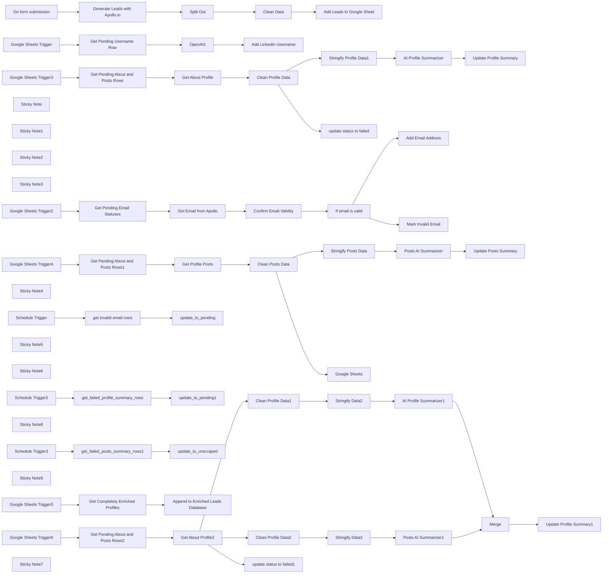

## Fluxo (.json) :

```json
{
  "id": "7wwY8wfZdNpL83QQ",
  "meta": {
    "instanceId": "b3c467df4053d13fe31cc98f3c66fa1d16300ba750506bfd019a0913cec71ea3",
    "templateCredsSetupCompleted": true
  },
  "name": "LinkedIn Leads Scraping & Enrichment (Main)",
  "tags": [],
  "nodes": [
    {
      "id": "5d07dfa4-6e6a-41a6-a2ea-8a8787331735",
      "name": "On form submission",
      "type": "n8n-nodes-base.formTrigger",
      "position": [
        -80,
        -80
      ],
      "webhookId": "28ff6927-5d05-4182-910b-be2381e3b2c4",
      "parameters": {
        "options": {},
        "formTitle": "Leads Search",
        "formFields": {
          "values": [
            {
              "fieldLabel": "Job Title",
              "requiredField": true
            },
            {
              "fieldLabel": "Location",
              "requiredField": true
            },
            {
              "fieldType": "number",
              "fieldLabel": "Number of Leads",
              "requiredField": true
            }
          ]
        }
      },
      "typeVersion": 2.2
    },
    {
      "id": "76ade63a-7b44-4fd1-85d8-6dbacd83aca7",
      "name": "Split Out",
      "type": "n8n-nodes-base.splitOut",
      "position": [
        360,
        -80
      ],
      "parameters": {
        "options": {},
        "fieldToSplitOut": "people"
      },
      "typeVersion": 1,
      "alwaysOutputData": false
    },
    {
      "id": "3c7b7179-a8b9-41d6-9617-8eb7af38f571",
      "name": "Google Sheets Trigger",
      "type": "n8n-nodes-base.googleSheetsTrigger",
      "position": [
        -100,
        280
      ],
      "parameters": {
        "event": "rowAdded",
        "options": {},
        "pollTimes": {
          "item": [
            {
              "mode": "everyMinute"
            }
          ]
        },
        "sheetName": {
          "__rl": true,
          "mode": "list",
          "value": "gid=0",
          "cachedResultUrl": "https://docs.google.com/spreadsheets/d/1d99PlHkp9RPeSAtmATgQ4OC4Selcp8JSFLNuKx-n1EQ/edit#gid=0",
          "cachedResultName": "Sheet1"
        },
        "documentId": {
          "__rl": true,
          "mode": "list",
          "value": "1d99PlHkp9RPeSAtmATgQ4OC4Selcp8JSFLNuKx-n1EQ",
          "cachedResultUrl": "https://docs.google.com/spreadsheets/d/1d99PlHkp9RPeSAtmATgQ4OC4Selcp8JSFLNuKx-n1EQ/edit?usp=drivesdk",
          "cachedResultName": "apollo ai leads & enrichment"
        }
      },
      "credentials": {
        "googleSheetsTriggerOAuth2Api": {
          "id": "DKYpQQpUt3ceJiG4",
          "name": "Google Sheets Trigger account"
        }
      },
      "typeVersion": 1
    },
    {
      "id": "9a55977c-638f-49ae-a51f-420f71c15454",
      "name": "OpenAI1",
      "type": "@n8n/n8n-nodes-langchain.openAi",
      "position": [
        360,
        280
      ],
      "parameters": {
        "modelId": {
          "__rl": true,
          "mode": "list",
          "value": "gpt-3.5-turbo",
          "cachedResultName": "GPT-3.5-TURBO"
        },
        "options": {},
        "messages": {
          "values": [
            {
              "content": "=remove the http or https://www.linkedin.com/in/ from this  {{ $json.linkedin_url }}"
            }
          ]
        }
      },
      "credentials": {
        "openAiApi": {
          "id": "DO9F6MAeTGLeqgoF",
          "name": "OpenAi account"
        }
      },
      "typeVersion": 1.8
    },
    {
      "id": "ca4d6b69-d4cb-4aa1-89bc-f0b5555f31cd",
      "name": "Google Sheets Trigger2",
      "type": "n8n-nodes-base.googleSheetsTrigger",
      "position": [
        -100,
        680
      ],
      "parameters": {
        "event": "rowAdded",
        "options": {},
        "pollTimes": {
          "item": [
            {
              "mode": "everyMinute"
            }
          ]
        },
        "sheetName": {
          "__rl": true,
          "mode": "list",
          "value": "gid=0",
          "cachedResultUrl": "https://docs.google.com/spreadsheets/d/1d99PlHkp9RPeSAtmATgQ4OC4Selcp8JSFLNuKx-n1EQ/edit#gid=0",
          "cachedResultName": "Sheet1"
        },
        "documentId": {
          "__rl": true,
          "mode": "list",
          "value": "1d99PlHkp9RPeSAtmATgQ4OC4Selcp8JSFLNuKx-n1EQ",
          "cachedResultUrl": "https://docs.google.com/spreadsheets/d/1d99PlHkp9RPeSAtmATgQ4OC4Selcp8JSFLNuKx-n1EQ/edit?usp=drivesdk",
          "cachedResultName": "apollo ai leads"
        }
      },
      "credentials": {
        "googleSheetsTriggerOAuth2Api": {
          "id": "DKYpQQpUt3ceJiG4",
          "name": "Google Sheets Trigger account"
        }
      },
      "typeVersion": 1
    },
    {
      "id": "15422703-fa1f-42e4-8387-7d2d4f154938",
      "name": "Sticky Note",
      "type": "n8n-nodes-base.stickyNote",
      "position": [
        -200,
        200
      ],
      "parameters": {
        "color": 3,
        "width": 1260,
        "height": 300,
        "content": "## Extract Linkedin Username \n"
      },
      "typeVersion": 1
    },
    {
      "id": "f8ffe414-9ca9-463a-9b98-22a65a86d4c4",
      "name": "Sticky Note1",
      "type": "n8n-nodes-base.stickyNote",
      "position": [
        -200,
        -160
      ],
      "parameters": {
        "width": 1260,
        "height": 300,
        "content": "## Scrape Leads from Apollo\n"
      },
      "typeVersion": 1
    },
    {
      "id": "a09d3993-99d6-488e-8bc0-76542de7b53c",
      "name": "Clean Data",
      "type": "n8n-nodes-base.set",
      "position": [
        600,
        -80
      ],
      "parameters": {
        "options": {},
        "assignments": {
          "assignments": [
            {
              "id": "e3bfe30e-9136-4ac9-b3da-c26eb678153b",
              "name": "id",
              "type": "string",
              "value": "={{ $json.id }}"
            },
            {
              "id": "d45c81fb-1461-45fd-be95-d5d9901d72d7",
              "name": "name",
              "type": "string",
              "value": "={{ $json.name }}"
            },
            {
              "id": "b4b8f660-7758-4a5f-a8f6-dc8ab6355132",
              "name": "linkedin_url",
              "type": "string",
              "value": "={{ $json.linkedin_url }}"
            },
            {
              "id": "399f533a-6e6b-4f40-8ed8-aa5dd39017cd",
              "name": "title",
              "type": "string",
              "value": "={{ $json.title }}"
            },
            {
              "id": "227d34c5-17db-4436-b0c2-f74e5ae453f2",
              "name": "organization",
              "type": "string",
              "value": "={{ $json.employment_history[0].organization_name }}"
            }
          ]
        }
      },
      "typeVersion": 3.4
    },
    {
      "id": "92d03853-644e-4c73-8ecf-1e216238b37f",
      "name": "Add Leads to Google Sheet",
      "type": "n8n-nodes-base.googleSheets",
      "position": [
        840,
        -80
      ],
      "parameters": {
        "columns": {
          "value": {
            "name": "={{ $json.name }}",
            "title": "={{ $json.title }}",
            "apollo_id": "={{ $json.id }}",
            "linkedin_url": "={{ $json.linkedin_url }}",
            "organization": "={{ $json.organization }}",
            "posts_scrape_status": "unscraped",
            "contacts_scrape_status": "pending",
            "profile_summary_scrape": "pending",
            "extract_username_status": "pending"
          },
          "schema": [
            {
              "id": "apollo_id",
              "type": "string",
              "display": true,
              "removed": false,
              "required": false,
              "displayName": "apollo_id",
              "defaultMatch": false,
              "canBeUsedToMatch": true
            },
            {
              "id": "name",
              "type": "string",
              "display": true,
              "required": false,
              "displayName": "name",
              "defaultMatch": false,
              "canBeUsedToMatch": true
            },
            {
              "id": "organization",
              "type": "string",
              "display": true,
              "removed": false,
              "required": false,
              "displayName": "organization",
              "defaultMatch": false,
              "canBeUsedToMatch": true
            },
            {
              "id": "title",
              "type": "string",
              "display": true,
              "required": false,
              "displayName": "title",
              "defaultMatch": false,
              "canBeUsedToMatch": true
            },
            {
              "id": "linkedin_url",
              "type": "string",
              "display": true,
              "required": false,
              "displayName": "linkedin_url",
              "defaultMatch": false,
              "canBeUsedToMatch": true
            },
            {
              "id": "linkedin_username",
              "type": "string",
              "display": true,
              "removed": true,
              "required": false,
              "displayName": "linkedin_username",
              "defaultMatch": false,
              "canBeUsedToMatch": true
            },
            {
              "id": "extract_username_status",
              "type": "string",
              "display": true,
              "removed": false,
              "required": false,
              "displayName": "extract_username_status",
              "defaultMatch": false,
              "canBeUsedToMatch": true
            },
            {
              "id": "email_address",
              "type": "string",
              "display": true,
              "removed": true,
              "required": false,
              "displayName": "email_address",
              "defaultMatch": false,
              "canBeUsedToMatch": true
            },
            {
              "id": "contacts_scrape_status",
              "type": "string",
              "display": true,
              "removed": false,
              "required": false,
              "displayName": "contacts_scrape_status",
              "defaultMatch": false,
              "canBeUsedToMatch": true
            },
            {
              "id": "about_linkedin_profile",
              "type": "string",
              "display": true,
              "removed": true,
              "required": false,
              "displayName": "about_linkedin_profile",
              "defaultMatch": false,
              "canBeUsedToMatch": true
            },
            {
              "id": "profile_summary_scrape",
              "type": "string",
              "display": true,
              "removed": false,
              "required": false,
              "displayName": "profile_summary_scrape",
              "defaultMatch": false,
              "canBeUsedToMatch": true
            },
            {
              "id": "recent_posts_summary",
              "type": "string",
              "display": true,
              "removed": true,
              "required": false,
              "displayName": "recent_posts_summary",
              "defaultMatch": false,
              "canBeUsedToMatch": true
            },
            {
              "id": "posts_scrape_status",
              "type": "string",
              "display": true,
              "removed": false,
              "required": false,
              "displayName": "posts_scrape_status",
              "defaultMatch": false,
              "canBeUsedToMatch": true
            }
          ],
          "mappingMode": "defineBelow",
          "matchingColumns": [
            "id"
          ],
          "attemptToConvertTypes": false,
          "convertFieldsToString": false
        },
        "options": {},
        "operation": "append",
        "sheetName": {
          "__rl": true,
          "mode": "list",
          "value": "gid=0",
          "cachedResultUrl": "https://docs.google.com/spreadsheets/d/1d99PlHkp9RPeSAtmATgQ4OC4Selcp8JSFLNuKx-n1EQ/edit#gid=0",
          "cachedResultName": "Sheet1"
        },
        "documentId": {
          "__rl": true,
          "mode": "list",
          "value": "1d99PlHkp9RPeSAtmATgQ4OC4Selcp8JSFLNuKx-n1EQ",
          "cachedResultUrl": "https://docs.google.com/spreadsheets/d/1d99PlHkp9RPeSAtmATgQ4OC4Selcp8JSFLNuKx-n1EQ/edit?usp=drivesdk",
          "cachedResultName": "apollo ai leads & enrichment"
        }
      },
      "credentials": {
        "googleSheetsOAuth2Api": {
          "id": "d0qeLhShx9sGXalR",
          "name": "Google Sheets"
        }
      },
      "typeVersion": 4.5
    },
    {
      "id": "0275f8ba-78d7-4464-bc80-ee939e9575e7",
      "name": "Add Linkedin Username",
      "type": "n8n-nodes-base.googleSheets",
      "position": [
        720,
        280
      ],
      "parameters": {
        "columns": {
          "value": {
            "apollo_id": "={{ $('Get Pending Username Row').item.json.apollo_id }}",
            "linkedin_username": "={{ $json.message.content }}",
            "extract_username_status": "finished"
          },
          "schema": [
            {
              "id": "apollo_id",
              "type": "string",
              "display": true,
              "removed": false,
              "required": false,
              "displayName": "apollo_id",
              "defaultMatch": false,
              "canBeUsedToMatch": true
            },
            {
              "id": "name",
              "type": "string",
              "display": true,
              "removed": true,
              "required": false,
              "displayName": "name",
              "defaultMatch": false,
              "canBeUsedToMatch": true
            },
            {
              "id": "title",
              "type": "string",
              "display": true,
              "removed": true,
              "required": false,
              "displayName": "title",
              "defaultMatch": false,
              "canBeUsedToMatch": true
            },
            {
              "id": "linkedin_url",
              "type": "string",
              "display": true,
              "removed": true,
              "required": false,
              "displayName": "linkedin_url",
              "defaultMatch": false,
              "canBeUsedToMatch": true
            },
            {
              "id": "linkedin_username",
              "type": "string",
              "display": true,
              "removed": false,
              "required": false,
              "displayName": "linkedin_username",
              "defaultMatch": false,
              "canBeUsedToMatch": true
            },
            {
              "id": "extract_username_status",
              "type": "string",
              "display": true,
              "removed": false,
              "required": false,
              "displayName": "extract_username_status",
              "defaultMatch": false,
              "canBeUsedToMatch": true
            },
            {
              "id": "email_address",
              "type": "string",
              "display": true,
              "removed": true,
              "required": false,
              "displayName": "email_address",
              "defaultMatch": false,
              "canBeUsedToMatch": true
            },
            {
              "id": "phone_number",
              "type": "string",
              "display": true,
              "removed": true,
              "required": false,
              "displayName": "phone_number",
              "defaultMatch": false,
              "canBeUsedToMatch": true
            },
            {
              "id": "contacts_scrape_status",
              "type": "string",
              "display": true,
              "removed": true,
              "required": false,
              "displayName": "contacts_scrape_status",
              "defaultMatch": false,
              "canBeUsedToMatch": true
            },
            {
              "id": "about_linkedin_profile",
              "type": "string",
              "display": true,
              "removed": true,
              "required": false,
              "displayName": "about_linkedin_profile",
              "defaultMatch": false,
              "canBeUsedToMatch": true
            },
            {
              "id": "profile_summary_scrape",
              "type": "string",
              "display": true,
              "removed": true,
              "required": false,
              "displayName": "profile_summary_scrape",
              "defaultMatch": false,
              "canBeUsedToMatch": true
            },
            {
              "id": "recent_posts_summary",
              "type": "string",
              "display": true,
              "removed": true,
              "required": false,
              "displayName": "recent_posts_summary",
              "defaultMatch": false,
              "canBeUsedToMatch": true
            },
            {
              "id": "posts_scrape_status",
              "type": "string",
              "display": true,
              "removed": true,
              "required": false,
              "displayName": "posts_scrape_status",
              "defaultMatch": false,
              "canBeUsedToMatch": true
            },
            {
              "id": "row_number",
              "type": "string",
              "display": true,
              "removed": true,
              "readOnly": true,
              "required": false,
              "displayName": "row_number",
              "defaultMatch": false,
              "canBeUsedToMatch": true
            }
          ],
          "mappingMode": "defineBelow",
          "matchingColumns": [
            "apollo_id"
          ],
          "attemptToConvertTypes": false,
          "convertFieldsToString": false
        },
        "options": {},
        "operation": "update",
        "sheetName": {
          "__rl": true,
          "mode": "list",
          "value": "gid=0",
          "cachedResultUrl": "https://docs.google.com/spreadsheets/d/1d99PlHkp9RPeSAtmATgQ4OC4Selcp8JSFLNuKx-n1EQ/edit#gid=0",
          "cachedResultName": "Sheet1"
        },
        "documentId": {
          "__rl": true,
          "mode": "list",
          "value": "1d99PlHkp9RPeSAtmATgQ4OC4Selcp8JSFLNuKx-n1EQ",
          "cachedResultUrl": "https://docs.google.com/spreadsheets/d/1d99PlHkp9RPeSAtmATgQ4OC4Selcp8JSFLNuKx-n1EQ/edit?usp=drivesdk",
          "cachedResultName": "apollo ai leads"
        }
      },
      "credentials": {
        "googleSheetsOAuth2Api": {
          "id": "d0qeLhShx9sGXalR",
          "name": "Google Sheets"
        }
      },
      "typeVersion": 4.5
    },
    {
      "id": "42827be7-8727-46e6-8f12-5d517c3ce6f3",
      "name": "Get Pending Username Row",
      "type": "n8n-nodes-base.googleSheets",
      "position": [
        140,
        280
      ],
      "parameters": {
        "options": {
          "returnFirstMatch": true
        },
        "filtersUI": {
          "values": [
            {
              "lookupValue": "pending",
              "lookupColumn": "extract_username_status"
            }
          ]
        },
        "sheetName": {
          "__rl": true,
          "mode": "list",
          "value": "gid=0",
          "cachedResultUrl": "https://docs.google.com/spreadsheets/d/1d99PlHkp9RPeSAtmATgQ4OC4Selcp8JSFLNuKx-n1EQ/edit#gid=0",
          "cachedResultName": "Sheet1"
        },
        "documentId": {
          "__rl": true,
          "mode": "list",
          "value": "1d99PlHkp9RPeSAtmATgQ4OC4Selcp8JSFLNuKx-n1EQ",
          "cachedResultUrl": "https://docs.google.com/spreadsheets/d/1d99PlHkp9RPeSAtmATgQ4OC4Selcp8JSFLNuKx-n1EQ/edit?usp=drivesdk",
          "cachedResultName": "apollo ai leads & enrichment"
        }
      },
      "credentials": {
        "googleSheetsOAuth2Api": {
          "id": "d0qeLhShx9sGXalR",
          "name": "Google Sheets"
        }
      },
      "executeOnce": true,
      "typeVersion": 4.5
    },
    {
      "id": "ffbb16a6-020e-4825-9690-3e89a8bbbbf7",
      "name": "Sticky Note2",
      "type": "n8n-nodes-base.stickyNote",
      "position": [
        -200,
        560
      ],
      "parameters": {
        "color": 5,
        "width": 1700,
        "height": 360,
        "content": "## Get Email Address, Validate Deliverability & Update Column Status"
      },
      "typeVersion": 1
    },
    {
      "id": "d2a1b54a-bc1b-4f63-a1a4-b9bd2017f82d",
      "name": "Add Email Address",
      "type": "n8n-nodes-base.googleSheets",
      "position": [
        1240,
        600
      ],
      "parameters": {
        "columns": {
          "value": {
            "apollo_id": "={{ $('Get Pending Email Statuses').item.json.apollo_id }}",
            "email_address": "={{ $json.data.email }}",
            "contacts_scrape_status": "finished"
          },
          "schema": [
            {
              "id": "apollo_id",
              "type": "string",
              "display": true,
              "removed": false,
              "required": false,
              "displayName": "apollo_id",
              "defaultMatch": false,
              "canBeUsedToMatch": true
            },
            {
              "id": "name",
              "type": "string",
              "display": true,
              "removed": true,
              "required": false,
              "displayName": "name",
              "defaultMatch": false,
              "canBeUsedToMatch": true
            },
            {
              "id": "title",
              "type": "string",
              "display": true,
              "removed": true,
              "required": false,
              "displayName": "title",
              "defaultMatch": false,
              "canBeUsedToMatch": true
            },
            {
              "id": "linkedin_url",
              "type": "string",
              "display": true,
              "removed": true,
              "required": false,
              "displayName": "linkedin_url",
              "defaultMatch": false,
              "canBeUsedToMatch": true
            },
            {
              "id": "linkedin_username",
              "type": "string",
              "display": true,
              "removed": true,
              "required": false,
              "displayName": "linkedin_username",
              "defaultMatch": false,
              "canBeUsedToMatch": true
            },
            {
              "id": "extract_username_status",
              "type": "string",
              "display": true,
              "removed": true,
              "required": false,
              "displayName": "extract_username_status",
              "defaultMatch": false,
              "canBeUsedToMatch": true
            },
            {
              "id": "email_address",
              "type": "string",
              "display": true,
              "removed": false,
              "required": false,
              "displayName": "email_address",
              "defaultMatch": false,
              "canBeUsedToMatch": true
            },
            {
              "id": "contacts_scrape_status",
              "type": "string",
              "display": true,
              "removed": false,
              "required": false,
              "displayName": "contacts_scrape_status",
              "defaultMatch": false,
              "canBeUsedToMatch": true
            },
            {
              "id": "about_linkedin_profile",
              "type": "string",
              "display": true,
              "removed": true,
              "required": false,
              "displayName": "about_linkedin_profile",
              "defaultMatch": false,
              "canBeUsedToMatch": true
            },
            {
              "id": "profile_summary_scrape",
              "type": "string",
              "display": true,
              "removed": true,
              "required": false,
              "displayName": "profile_summary_scrape",
              "defaultMatch": false,
              "canBeUsedToMatch": true
            },
            {
              "id": "recent_posts_summary",
              "type": "string",
              "display": true,
              "removed": true,
              "required": false,
              "displayName": "recent_posts_summary",
              "defaultMatch": false,
              "canBeUsedToMatch": true
            },
            {
              "id": "posts_scrape_status",
              "type": "string",
              "display": true,
              "removed": true,
              "required": false,
              "displayName": "posts_scrape_status",
              "defaultMatch": false,
              "canBeUsedToMatch": true
            },
            {
              "id": "row_number",
              "type": "string",
              "display": true,
              "removed": true,
              "readOnly": true,
              "required": false,
              "displayName": "row_number",
              "defaultMatch": false,
              "canBeUsedToMatch": true
            }
          ],
          "mappingMode": "defineBelow",
          "matchingColumns": [
            "apollo_id"
          ],
          "attemptToConvertTypes": false,
          "convertFieldsToString": false
        },
        "options": {},
        "operation": "update",
        "sheetName": {
          "__rl": true,
          "mode": "list",
          "value": "gid=0",
          "cachedResultUrl": "https://docs.google.com/spreadsheets/d/1d99PlHkp9RPeSAtmATgQ4OC4Selcp8JSFLNuKx-n1EQ/edit#gid=0",
          "cachedResultName": "Sheet1"
        },
        "documentId": {
          "__rl": true,
          "mode": "list",
          "value": "1d99PlHkp9RPeSAtmATgQ4OC4Selcp8JSFLNuKx-n1EQ",
          "cachedResultUrl": "https://docs.google.com/spreadsheets/d/1d99PlHkp9RPeSAtmATgQ4OC4Selcp8JSFLNuKx-n1EQ/edit?usp=drivesdk",
          "cachedResultName": "apollo ai leads"
        }
      },
      "credentials": {
        "googleSheetsOAuth2Api": {
          "id": "d0qeLhShx9sGXalR",
          "name": "Google Sheets"
        }
      },
      "executeOnce": true,
      "typeVersion": 4.5
    },
    {
      "id": "7abbce6e-90fa-4ac5-9a0b-0ba2669aa77a",
      "name": "Mark Invalid Email",
      "type": "n8n-nodes-base.googleSheets",
      "position": [
        1240,
        760
      ],
      "parameters": {
        "columns": {
          "value": {
            "apollo_id": "={{ $('Get Pending Email Statuses').item.json.apollo_id }}",
            "contacts_scrape_status": "invalid_email"
          },
          "schema": [
            {
              "id": "apollo_id",
              "type": "string",
              "display": true,
              "removed": false,
              "required": false,
              "displayName": "apollo_id",
              "defaultMatch": false,
              "canBeUsedToMatch": true
            },
            {
              "id": "name",
              "type": "string",
              "display": true,
              "removed": true,
              "required": false,
              "displayName": "name",
              "defaultMatch": false,
              "canBeUsedToMatch": true
            },
            {
              "id": "title",
              "type": "string",
              "display": true,
              "removed": true,
              "required": false,
              "displayName": "title",
              "defaultMatch": false,
              "canBeUsedToMatch": true
            },
            {
              "id": "linkedin_url",
              "type": "string",
              "display": true,
              "removed": true,
              "required": false,
              "displayName": "linkedin_url",
              "defaultMatch": false,
              "canBeUsedToMatch": true
            },
            {
              "id": "linkedin_username",
              "type": "string",
              "display": true,
              "removed": true,
              "required": false,
              "displayName": "linkedin_username",
              "defaultMatch": false,
              "canBeUsedToMatch": true
            },
            {
              "id": "extract_username_status",
              "type": "string",
              "display": true,
              "removed": true,
              "required": false,
              "displayName": "extract_username_status",
              "defaultMatch": false,
              "canBeUsedToMatch": true
            },
            {
              "id": "email_address",
              "type": "string",
              "display": true,
              "removed": true,
              "required": false,
              "displayName": "email_address",
              "defaultMatch": false,
              "canBeUsedToMatch": true
            },
            {
              "id": "contacts_scrape_status",
              "type": "string",
              "display": true,
              "required": false,
              "displayName": "contacts_scrape_status",
              "defaultMatch": false,
              "canBeUsedToMatch": true
            },
            {
              "id": "about_linkedin_profile",
              "type": "string",
              "display": true,
              "removed": true,
              "required": false,
              "displayName": "about_linkedin_profile",
              "defaultMatch": false,
              "canBeUsedToMatch": true
            },
            {
              "id": "profile_summary_scrape",
              "type": "string",
              "display": true,
              "removed": true,
              "required": false,
              "displayName": "profile_summary_scrape",
              "defaultMatch": false,
              "canBeUsedToMatch": true
            },
            {
              "id": "recent_posts_summary",
              "type": "string",
              "display": true,
              "removed": true,
              "required": false,
              "displayName": "recent_posts_summary",
              "defaultMatch": false,
              "canBeUsedToMatch": true
            },
            {
              "id": "posts_scrape_status",
              "type": "string",
              "display": true,
              "removed": true,
              "required": false,
              "displayName": "posts_scrape_status",
              "defaultMatch": false,
              "canBeUsedToMatch": true
            },
            {
              "id": "row_number",
              "type": "string",
              "display": true,
              "removed": true,
              "readOnly": true,
              "required": false,
              "displayName": "row_number",
              "defaultMatch": false,
              "canBeUsedToMatch": true
            }
          ],
          "mappingMode": "defineBelow",
          "matchingColumns": [
            "apollo_id"
          ],
          "attemptToConvertTypes": false,
          "convertFieldsToString": false
        },
        "options": {},
        "operation": "update",
        "sheetName": {
          "__rl": true,
          "mode": "list",
          "value": "gid=0",
          "cachedResultUrl": "https://docs.google.com/spreadsheets/d/1d99PlHkp9RPeSAtmATgQ4OC4Selcp8JSFLNuKx-n1EQ/edit#gid=0",
          "cachedResultName": "Sheet1"
        },
        "documentId": {
          "__rl": true,
          "mode": "list",
          "value": "1d99PlHkp9RPeSAtmATgQ4OC4Selcp8JSFLNuKx-n1EQ",
          "cachedResultUrl": "https://docs.google.com/spreadsheets/d/1d99PlHkp9RPeSAtmATgQ4OC4Selcp8JSFLNuKx-n1EQ/edit?usp=drivesdk",
          "cachedResultName": "apollo ai leads & enrichment"
        }
      },
      "credentials": {
        "googleSheetsOAuth2Api": {
          "id": "d0qeLhShx9sGXalR",
          "name": "Google Sheets"
        }
      },
      "typeVersion": 4.5
    },
    {
      "id": "2e1b9e78-8953-4059-9bbd-117c78742e4b",
      "name": "Sticky Note3",
      "type": "n8n-nodes-base.stickyNote",
      "position": [
        1560,
        560
      ],
      "parameters": {
        "color": 5,
        "width": 800,
        "height": 360,
        "content": "## Update Contact Scrape Status from Invalid back to Pending"
      },
      "typeVersion": 1
    },
    {
      "id": "dc603dc3-148c-4609-a698-eaae32832423",
      "name": "Schedule Trigger",
      "type": "n8n-nodes-base.scheduleTrigger",
      "position": [
        1640,
        680
      ],
      "parameters": {
        "rule": {
          "interval": [
            {
              "field": "weeks",
              "triggerAtDay": [
                2
              ],
              "triggerAtHour": 8,
              "weeksInterval": 4
            }
          ]
        }
      },
      "typeVersion": 1.2
    },
    {
      "id": "a23feccf-f6b5-4440-b12a-ea10b41f4037",
      "name": "Get Email from Apollo",
      "type": "n8n-nodes-base.httpRequest",
      "position": [
        380,
        680
      ],
      "parameters": {
        "url": "https://api.apollo.io/api/v1/people/match",
        "method": "POST",
        "options": {},
        "sendBody": true,
        "sendQuery": true,
        "sendHeaders": true,
        "bodyParameters": {
          "parameters": [
            {
              "name": "id",
              "value": "={{ $json.apollo_id }}"
            }
          ]
        },
        "queryParameters": {
          "parameters": [
            {
              "name": "reveal_personal_emails",
              "value": "true"
            },
            {
              "name": "reveal_phone_number",
              "value": "false"
            }
          ]
        },
        "headerParameters": {
          "parameters": [
            {
              "name": "Cache-Control",
              "value": "no-cache"
            },
            {
              "name": "accept",
              "value": "application/json"
            },
            {
              "name": "x-api-key",
              "value": "\"your_api_key\""
            }
          ]
        }
      },
      "typeVersion": 4.2
    },
    {
      "id": "dfd5224d-fdb6-41f2-a219-a4a8f94930cd",
      "name": "Confirm Email Validity",
      "type": "n8n-nodes-base.httpRequest",
      "position": [
        620,
        680
      ],
      "parameters": {
        "url": "=https://api.mails.so/v1/validate?email={{ $json.person.email }}",
        "options": {},
        "sendHeaders": true,
        "headerParameters": {
          "parameters": [
            {
              "name": "x-mails-api-key",
              "value": "\"your_api_key\""
            }
          ]
        }
      },
      "typeVersion": 4.2
    },
    {
      "id": "14fab17d-b38b-43de-a38e-c8d49afcf1d0",
      "name": "Get Pending Email Statuses",
      "type": "n8n-nodes-base.googleSheets",
      "position": [
        140,
        680
      ],
      "parameters": {
        "options": {
          "returnFirstMatch": true
        },
        "filtersUI": {
          "values": [
            {
              "lookupValue": "pending",
              "lookupColumn": "contacts_scrape_status"
            }
          ]
        },
        "sheetName": {
          "__rl": true,
          "mode": "list",
          "value": "gid=0",
          "cachedResultUrl": "https://docs.google.com/spreadsheets/d/1d99PlHkp9RPeSAtmATgQ4OC4Selcp8JSFLNuKx-n1EQ/edit#gid=0",
          "cachedResultName": "Sheet1"
        },
        "documentId": {
          "__rl": true,
          "mode": "list",
          "value": "1d99PlHkp9RPeSAtmATgQ4OC4Selcp8JSFLNuKx-n1EQ",
          "cachedResultUrl": "https://docs.google.com/spreadsheets/d/1d99PlHkp9RPeSAtmATgQ4OC4Selcp8JSFLNuKx-n1EQ/edit?usp=drivesdk",
          "cachedResultName": "apollo ai leads"
        }
      },
      "credentials": {
        "googleSheetsOAuth2Api": {
          "id": "d0qeLhShx9sGXalR",
          "name": "Google Sheets"
        }
      },
      "executeOnce": true,
      "typeVersion": 4.5
    },
    {
      "id": "09a0c5eb-d098-47f1-a85c-13c93d8b5296",
      "name": "Google Sheets Trigger3",
      "type": "n8n-nodes-base.googleSheetsTrigger",
      "position": [
        -100,
        1160
      ],
      "parameters": {
        "event": "rowAdded",
        "options": {},
        "pollTimes": {
          "item": [
            {
              "mode": "everyMinute"
            }
          ]
        },
        "sheetName": {
          "__rl": true,
          "mode": "list",
          "value": "gid=0",
          "cachedResultUrl": "https://docs.google.com/spreadsheets/d/1d99PlHkp9RPeSAtmATgQ4OC4Selcp8JSFLNuKx-n1EQ/edit#gid=0",
          "cachedResultName": "Sheet1"
        },
        "documentId": {
          "__rl": true,
          "mode": "list",
          "value": "1d99PlHkp9RPeSAtmATgQ4OC4Selcp8JSFLNuKx-n1EQ",
          "cachedResultUrl": "https://docs.google.com/spreadsheets/d/1d99PlHkp9RPeSAtmATgQ4OC4Selcp8JSFLNuKx-n1EQ/edit?usp=drivesdk",
          "cachedResultName": "apollo ai leads"
        }
      },
      "credentials": {
        "googleSheetsTriggerOAuth2Api": {
          "id": "DKYpQQpUt3ceJiG4",
          "name": "Google Sheets Trigger account"
        }
      },
      "typeVersion": 1
    },
    {
      "id": "3f592a9c-f692-44c0-b5be-9c5ff1506f24",
      "name": "Sticky Note4",
      "type": "n8n-nodes-base.stickyNote",
      "position": [
        -200,
        1040
      ],
      "parameters": {
        "color": 6,
        "width": 1920,
        "height": 360,
        "content": "## Get Profile Summary & Update Status (Rapid API✅ - Primary Option)"
      },
      "typeVersion": 1
    },
    {
      "id": "6bc025b4-b150-493b-ae38-33772cb51a76",
      "name": "Get Profile Posts",
      "type": "n8n-nodes-base.httpRequest",
      "onError": "continueRegularOutput",
      "maxTries": 2,
      "position": [
        340,
        1640
      ],
      "parameters": {
        "url": "https://linkedin-data-api.p.rapidapi.com/get-profile-posts",
        "options": {},
        "sendQuery": true,
        "sendHeaders": true,
        "queryParameters": {
          "parameters": [
            {
              "name": "username",
              "value": "={{ $json.linkedin_username }}"
            },
            {
              "name": "start",
              "value": "0"
            }
          ]
        },
        "headerParameters": {
          "parameters": [
            {
              "name": "x-rapidapi-host",
              "value": "linkedin-data-api.p.rapidapi.com"
            },
            {
              "name": "x-rapidapi-key",
              "value": "\"your_api_key\""
            }
          ]
        }
      },
      "retryOnFail": true,
      "typeVersion": 4.2
    },
    {
      "id": "758da5bf-91e9-434d-9de5-eb3e907524e1",
      "name": "Get About Profile",
      "type": "n8n-nodes-base.httpRequest",
      "onError": "continueRegularOutput",
      "maxTries": 2,
      "position": [
        380,
        1160
      ],
      "parameters": {
        "url": "https://linkedin-data-api.p.rapidapi.com",
        "options": {},
        "sendQuery": true,
        "sendHeaders": true,
        "queryParameters": {
          "parameters": [
            {
              "name": "username",
              "value": "={{ $json.linkedin_username }}"
            }
          ]
        },
        "headerParameters": {
          "parameters": [
            {
              "name": "x-rapidapi-host",
              "value": "linkedin-data-api.p.rapidapi.com"
            },
            {
              "name": "x-rapidapi-key",
              "value": "\"your_api_key\""
            }
          ]
        }
      },
      "retryOnFail": true,
      "typeVersion": 4.2
    },
    {
      "id": "9f88649f-3c41-4624-b94f-242d94118b0b",
      "name": "Get Pending About and Posts Rows",
      "type": "n8n-nodes-base.googleSheets",
      "position": [
        140,
        1160
      ],
      "parameters": {
        "options": {
          "returnFirstMatch": true
        },
        "filtersUI": {
          "values": [
            {
              "lookupValue": "pending",
              "lookupColumn": "profile_summary_scrape"
            }
          ]
        },
        "sheetName": {
          "__rl": true,
          "mode": "list",
          "value": "gid=0",
          "cachedResultUrl": "https://docs.google.com/spreadsheets/d/1d99PlHkp9RPeSAtmATgQ4OC4Selcp8JSFLNuKx-n1EQ/edit#gid=0",
          "cachedResultName": "Sheet1"
        },
        "documentId": {
          "__rl": true,
          "mode": "list",
          "value": "1d99PlHkp9RPeSAtmATgQ4OC4Selcp8JSFLNuKx-n1EQ",
          "cachedResultUrl": "https://docs.google.com/spreadsheets/d/1d99PlHkp9RPeSAtmATgQ4OC4Selcp8JSFLNuKx-n1EQ/edit?usp=drivesdk",
          "cachedResultName": "apollo ai leads"
        }
      },
      "credentials": {
        "googleSheetsOAuth2Api": {
          "id": "d0qeLhShx9sGXalR",
          "name": "Google Sheets"
        }
      },
      "executeOnce": true,
      "typeVersion": 4.5
    },
    {
      "id": "2e8bb4a1-5fa9-446a-8b55-bffd6ceb5648",
      "name": "Clean Profile Data",
      "type": "n8n-nodes-base.code",
      "onError": "continueErrorOutput",
      "maxTries": 2,
      "position": [
        620,
        1160
      ],
      "parameters": {
        "jsCode": "return [{\n  summary: $input.first().json.summary,\n  headline: $input.first().json.headline,\n  nationality: $input.first().json.geo.country,\n  languaage: $input.first().json.languages[0].name,\n  education: $input.first().json.educations[0].schoolName,\n  fieldOfStudy: $input.first().json.educations[0].fieldOfStudy,\n  employment_company: $input.first().json.position[0].companyName,\n  company_industry: $input.first().json.position[0].companyIndustry,\n  position: $input.first().json.position[0].title,\n  company_location: $input.first().json.position[0].location,\n  employment_description_1: $input.first().json.position[0].description,\n}];\n"
      },
      "retryOnFail": true,
      "typeVersion": 2
    },
    {
      "id": "87aa2108-44df-4b7f-8090-f2e86cbf5bf9",
      "name": "Google Sheets Trigger4",
      "type": "n8n-nodes-base.googleSheetsTrigger",
      "position": [
        -120,
        1640
      ],
      "parameters": {
        "event": "rowAdded",
        "options": {},
        "pollTimes": {
          "item": [
            {
              "mode": "everyMinute"
            }
          ]
        },
        "sheetName": {
          "__rl": true,
          "mode": "list",
          "value": "gid=0",
          "cachedResultUrl": "https://docs.google.com/spreadsheets/d/1d99PlHkp9RPeSAtmATgQ4OC4Selcp8JSFLNuKx-n1EQ/edit#gid=0",
          "cachedResultName": "Sheet1"
        },
        "documentId": {
          "__rl": true,
          "mode": "list",
          "value": "1d99PlHkp9RPeSAtmATgQ4OC4Selcp8JSFLNuKx-n1EQ",
          "cachedResultUrl": "https://docs.google.com/spreadsheets/d/1d99PlHkp9RPeSAtmATgQ4OC4Selcp8JSFLNuKx-n1EQ/edit?usp=drivesdk",
          "cachedResultName": "apollo ai leads"
        }
      },
      "credentials": {
        "googleSheetsTriggerOAuth2Api": {
          "id": "DKYpQQpUt3ceJiG4",
          "name": "Google Sheets Trigger account"
        }
      },
      "typeVersion": 1
    },
    {
      "id": "e3318dd3-4b6a-4994-92bc-2e715f398397",
      "name": "Sticky Note5",
      "type": "n8n-nodes-base.stickyNote",
      "position": [
        -200,
        1520
      ],
      "parameters": {
        "color": 7,
        "width": 1920,
        "height": 360,
        "content": "## Get Summary of Latest Linkedin Profile Posts (Rapid API✅ - Primary Option)"
      },
      "typeVersion": 1
    },
    {
      "id": "b1c117e8-493a-443f-912b-dbf4718c3348",
      "name": "Get Pending About and Posts Rows1",
      "type": "n8n-nodes-base.googleSheets",
      "position": [
        100,
        1640
      ],
      "parameters": {
        "options": {
          "returnFirstMatch": true
        },
        "filtersUI": {
          "values": [
            {
              "lookupValue": "unscraped",
              "lookupColumn": "posts_scrape_status"
            }
          ]
        },
        "sheetName": {
          "__rl": true,
          "mode": "list",
          "value": "gid=0",
          "cachedResultUrl": "https://docs.google.com/spreadsheets/d/1d99PlHkp9RPeSAtmATgQ4OC4Selcp8JSFLNuKx-n1EQ/edit#gid=0",
          "cachedResultName": "Sheet1"
        },
        "documentId": {
          "__rl": true,
          "mode": "list",
          "value": "1d99PlHkp9RPeSAtmATgQ4OC4Selcp8JSFLNuKx-n1EQ",
          "cachedResultUrl": "https://docs.google.com/spreadsheets/d/1d99PlHkp9RPeSAtmATgQ4OC4Selcp8JSFLNuKx-n1EQ/edit?usp=drivesdk",
          "cachedResultName": "apollo ai leads"
        }
      },
      "credentials": {
        "googleSheetsOAuth2Api": {
          "id": "d0qeLhShx9sGXalR",
          "name": "Google Sheets"
        }
      },
      "executeOnce": true,
      "typeVersion": 4.5
    },
    {
      "id": "c480f3ed-f316-4dd8-877b-49191d5aa694",
      "name": "Clean Posts Data",
      "type": "n8n-nodes-base.code",
      "onError": "continueErrorOutput",
      "maxTries": 2,
      "position": [
        580,
        1640
      ],
      "parameters": {
        "jsCode": "const data = $input.first().json.data || [];\n\nfunction getText(post, reshared = false) {\n  if (!post) return \"\";\n  return reshared ? (post.resharedPost?.text || \"\") : (post.text || \"\");\n}\n\nfunction getDate(post) {\n  if (!post) return \"\";\n  return post.postedDate || post.postedDateTimestamp || \"\";\n}\n\nreturn [{\n  json: {\n    post_1: getText(data[0]),\n    post_1_date: getDate(data[0]),\n\n    post_2: getText(data[1]),\n    post_2_date: getDate(data[1]),\n\n    post_3: getText(data[2]),\n    post_3_date: getDate(data[2]),\n\n    post_4: getText(data[3], true),\n    post_4_date: getDate(data[3]),\n\n    post_5: getText(data[4], true),\n    post_5_date: getDate(data[4]),\n  }\n}];\n"
      },
      "retryOnFail": true,
      "typeVersion": 2,
      "waitBetweenTries": 3000
    },
    {
      "id": "88d093e7-0180-4585-b338-11f4974fa0a7",
      "name": "Sticky Note6",
      "type": "n8n-nodes-base.stickyNote",
      "position": [
        -200,
        1980
      ],
      "parameters": {
        "color": 4,
        "width": 800,
        "height": 360,
        "content": "## Update Completely Enriched Profile to Final Database"
      },
      "typeVersion": 1
    },
    {
      "id": "a9a96a05-f135-4a19-827f-85a750bc1551",
      "name": "Google Sheets Trigger5",
      "type": "n8n-nodes-base.googleSheetsTrigger",
      "position": [
        -120,
        2100
      ],
      "parameters": {
        "event": "rowAdded",
        "options": {},
        "pollTimes": {
          "item": [
            {
              "mode": "everyMinute"
            }
          ]
        },
        "sheetName": {
          "__rl": true,
          "mode": "list",
          "value": "gid=0",
          "cachedResultUrl": "https://docs.google.com/spreadsheets/d/1d99PlHkp9RPeSAtmATgQ4OC4Selcp8JSFLNuKx-n1EQ/edit#gid=0",
          "cachedResultName": "Sheet1"
        },
        "documentId": {
          "__rl": true,
          "mode": "list",
          "value": "1d99PlHkp9RPeSAtmATgQ4OC4Selcp8JSFLNuKx-n1EQ",
          "cachedResultUrl": "https://docs.google.com/spreadsheets/d/1d99PlHkp9RPeSAtmATgQ4OC4Selcp8JSFLNuKx-n1EQ/edit?usp=drivesdk",
          "cachedResultName": "apollo ai leads"
        }
      },
      "credentials": {
        "googleSheetsTriggerOAuth2Api": {
          "id": "DKYpQQpUt3ceJiG4",
          "name": "Google Sheets Trigger account"
        }
      },
      "typeVersion": 1
    },
    {
      "id": "ef709a3f-7e75-4904-9d3e-299db8db5d60",
      "name": "Sticky Note8",
      "type": "n8n-nodes-base.stickyNote",
      "position": [
        1780,
        1040
      ],
      "parameters": {
        "color": 6,
        "width": 800,
        "height": 360,
        "content": "## Update profile summary status from failed back to pending"
      },
      "typeVersion": 1
    },
    {
      "id": "91a1eaed-8645-4eeb-8558-c28a6d55f689",
      "name": "Schedule Trigger2",
      "type": "n8n-nodes-base.scheduleTrigger",
      "position": [
        1860,
        1160
      ],
      "parameters": {
        "rule": {
          "interval": [
            {
              "field": "weeks",
              "triggerAtDay": [
                2
              ],
              "triggerAtHour": 8,
              "weeksInterval": 4
            }
          ]
        }
      },
      "typeVersion": 1.2
    },
    {
      "id": "f7658227-39b3-4efb-971c-f17860d20fb8",
      "name": "get invalid email rows",
      "type": "n8n-nodes-base.googleSheets",
      "position": [
        1880,
        680
      ],
      "parameters": {
        "options": {
          "returnFirstMatch": false
        },
        "filtersUI": {
          "values": [
            {
              "lookupValue": "invalid_email",
              "lookupColumn": "contacts_scrape_status"
            }
          ]
        },
        "sheetName": {
          "__rl": true,
          "mode": "list",
          "value": "gid=0",
          "cachedResultUrl": "https://docs.google.com/spreadsheets/d/1d99PlHkp9RPeSAtmATgQ4OC4Selcp8JSFLNuKx-n1EQ/edit#gid=0",
          "cachedResultName": "Sheet1"
        },
        "documentId": {
          "__rl": true,
          "mode": "list",
          "value": "1d99PlHkp9RPeSAtmATgQ4OC4Selcp8JSFLNuKx-n1EQ",
          "cachedResultUrl": "https://docs.google.com/spreadsheets/d/1d99PlHkp9RPeSAtmATgQ4OC4Selcp8JSFLNuKx-n1EQ/edit?usp=drivesdk",
          "cachedResultName": "apollo ai leads"
        }
      },
      "credentials": {
        "googleSheetsOAuth2Api": {
          "id": "d0qeLhShx9sGXalR",
          "name": "Google Sheets"
        }
      },
      "executeOnce": true,
      "typeVersion": 4.5
    },
    {
      "id": "fce87e8a-9eb3-4c86-a4e3-f93534333206",
      "name": "update_to_pending",
      "type": "n8n-nodes-base.googleSheets",
      "position": [
        2100,
        680
      ],
      "parameters": {
        "columns": {
          "value": {
            "apollo_id": "={{ $json.apollo_id }}",
            "contacts_scrape_status": "pending"
          },
          "schema": [
            {
              "id": "apollo_id",
              "type": "string",
              "display": true,
              "removed": false,
              "required": false,
              "displayName": "apollo_id",
              "defaultMatch": false,
              "canBeUsedToMatch": true
            },
            {
              "id": "name",
              "type": "string",
              "display": true,
              "removed": true,
              "required": false,
              "displayName": "name",
              "defaultMatch": false,
              "canBeUsedToMatch": true
            },
            {
              "id": "title",
              "type": "string",
              "display": true,
              "removed": true,
              "required": false,
              "displayName": "title",
              "defaultMatch": false,
              "canBeUsedToMatch": true
            },
            {
              "id": "linkedin_url",
              "type": "string",
              "display": true,
              "removed": true,
              "required": false,
              "displayName": "linkedin_url",
              "defaultMatch": false,
              "canBeUsedToMatch": true
            },
            {
              "id": "linkedin_username",
              "type": "string",
              "display": true,
              "removed": true,
              "required": false,
              "displayName": "linkedin_username",
              "defaultMatch": false,
              "canBeUsedToMatch": true
            },
            {
              "id": "extract_username_status",
              "type": "string",
              "display": true,
              "removed": true,
              "required": false,
              "displayName": "extract_username_status",
              "defaultMatch": false,
              "canBeUsedToMatch": true
            },
            {
              "id": "email_address",
              "type": "string",
              "display": true,
              "removed": true,
              "required": false,
              "displayName": "email_address",
              "defaultMatch": false,
              "canBeUsedToMatch": true
            },
            {
              "id": "contacts_scrape_status",
              "type": "string",
              "display": true,
              "required": false,
              "displayName": "contacts_scrape_status",
              "defaultMatch": false,
              "canBeUsedToMatch": true
            },
            {
              "id": "about_linkedin_profile",
              "type": "string",
              "display": true,
              "removed": true,
              "required": false,
              "displayName": "about_linkedin_profile",
              "defaultMatch": false,
              "canBeUsedToMatch": true
            },
            {
              "id": "profile_summary_scrape",
              "type": "string",
              "display": true,
              "removed": true,
              "required": false,
              "displayName": "profile_summary_scrape",
              "defaultMatch": false,
              "canBeUsedToMatch": true
            },
            {
              "id": "recent_posts_summary",
              "type": "string",
              "display": true,
              "removed": true,
              "required": false,
              "displayName": "recent_posts_summary",
              "defaultMatch": false,
              "canBeUsedToMatch": true
            },
            {
              "id": "posts_scrape_status",
              "type": "string",
              "display": true,
              "removed": true,
              "required": false,
              "displayName": "posts_scrape_status",
              "defaultMatch": false,
              "canBeUsedToMatch": true
            },
            {
              "id": "row_number",
              "type": "string",
              "display": true,
              "removed": true,
              "readOnly": true,
              "required": false,
              "displayName": "row_number",
              "defaultMatch": false,
              "canBeUsedToMatch": true
            }
          ],
          "mappingMode": "defineBelow",
          "matchingColumns": [
            "apollo_id"
          ],
          "attemptToConvertTypes": false,
          "convertFieldsToString": false
        },
        "options": {},
        "operation": "update",
        "sheetName": {
          "__rl": true,
          "mode": "list",
          "value": "gid=0",
          "cachedResultUrl": "https://docs.google.com/spreadsheets/d/1d99PlHkp9RPeSAtmATgQ4OC4Selcp8JSFLNuKx-n1EQ/edit#gid=0",
          "cachedResultName": "Sheet1"
        },
        "documentId": {
          "__rl": true,
          "mode": "list",
          "value": "1d99PlHkp9RPeSAtmATgQ4OC4Selcp8JSFLNuKx-n1EQ",
          "cachedResultUrl": "https://docs.google.com/spreadsheets/d/1d99PlHkp9RPeSAtmATgQ4OC4Selcp8JSFLNuKx-n1EQ/edit?usp=drivesdk",
          "cachedResultName": "apollo ai leads & enrichment"
        }
      },
      "credentials": {
        "googleSheetsOAuth2Api": {
          "id": "d0qeLhShx9sGXalR",
          "name": "Google Sheets"
        }
      },
      "typeVersion": 4.5
    },
    {
      "id": "9583cab2-6373-4e44-b9f2-ba0e8c8871e7",
      "name": "get_failed_profile_summary_rows",
      "type": "n8n-nodes-base.googleSheets",
      "position": [
        2100,
        1160
      ],
      "parameters": {
        "options": {
          "returnFirstMatch": false
        },
        "filtersUI": {
          "values": [
            {
              "lookupValue": "failed",
              "lookupColumn": "profile_summary_scrape"
            }
          ]
        },
        "sheetName": {
          "__rl": true,
          "mode": "list",
          "value": "gid=0",
          "cachedResultUrl": "https://docs.google.com/spreadsheets/d/1d99PlHkp9RPeSAtmATgQ4OC4Selcp8JSFLNuKx-n1EQ/edit#gid=0",
          "cachedResultName": "Sheet1"
        },
        "documentId": {
          "__rl": true,
          "mode": "list",
          "value": "1d99PlHkp9RPeSAtmATgQ4OC4Selcp8JSFLNuKx-n1EQ",
          "cachedResultUrl": "https://docs.google.com/spreadsheets/d/1d99PlHkp9RPeSAtmATgQ4OC4Selcp8JSFLNuKx-n1EQ/edit?usp=drivesdk",
          "cachedResultName": "apollo ai leads"
        }
      },
      "credentials": {
        "googleSheetsOAuth2Api": {
          "id": "d0qeLhShx9sGXalR",
          "name": "Google Sheets"
        }
      },
      "executeOnce": true,
      "typeVersion": 4.5
    },
    {
      "id": "a09d1560-2213-46ff-9668-5e98d5051e1f",
      "name": "update_to_pending1",
      "type": "n8n-nodes-base.googleSheets",
      "position": [
        2320,
        1160
      ],
      "parameters": {
        "columns": {
          "value": {
            "apollo_id": "={{ $json.apollo_id }}",
            "profile_summary_scrape": "pending"
          },
          "schema": [
            {
              "id": "apollo_id",
              "type": "string",
              "display": true,
              "removed": false,
              "required": false,
              "displayName": "apollo_id",
              "defaultMatch": false,
              "canBeUsedToMatch": true
            },
            {
              "id": "name",
              "type": "string",
              "display": true,
              "removed": true,
              "required": false,
              "displayName": "name",
              "defaultMatch": false,
              "canBeUsedToMatch": true
            },
            {
              "id": "title",
              "type": "string",
              "display": true,
              "removed": true,
              "required": false,
              "displayName": "title",
              "defaultMatch": false,
              "canBeUsedToMatch": true
            },
            {
              "id": "linkedin_url",
              "type": "string",
              "display": true,
              "removed": true,
              "required": false,
              "displayName": "linkedin_url",
              "defaultMatch": false,
              "canBeUsedToMatch": true
            },
            {
              "id": "linkedin_username",
              "type": "string",
              "display": true,
              "removed": true,
              "required": false,
              "displayName": "linkedin_username",
              "defaultMatch": false,
              "canBeUsedToMatch": true
            },
            {
              "id": "extract_username_status",
              "type": "string",
              "display": true,
              "removed": true,
              "required": false,
              "displayName": "extract_username_status",
              "defaultMatch": false,
              "canBeUsedToMatch": true
            },
            {
              "id": "email_address",
              "type": "string",
              "display": true,
              "removed": true,
              "required": false,
              "displayName": "email_address",
              "defaultMatch": false,
              "canBeUsedToMatch": true
            },
            {
              "id": "contacts_scrape_status",
              "type": "string",
              "display": true,
              "removed": true,
              "required": false,
              "displayName": "contacts_scrape_status",
              "defaultMatch": false,
              "canBeUsedToMatch": true
            },
            {
              "id": "about_linkedin_profile",
              "type": "string",
              "display": true,
              "removed": true,
              "required": false,
              "displayName": "about_linkedin_profile",
              "defaultMatch": false,
              "canBeUsedToMatch": true
            },
            {
              "id": "profile_summary_scrape",
              "type": "string",
              "display": true,
              "removed": false,
              "required": false,
              "displayName": "profile_summary_scrape",
              "defaultMatch": false,
              "canBeUsedToMatch": true
            },
            {
              "id": "recent_posts_summary",
              "type": "string",
              "display": true,
              "removed": true,
              "required": false,
              "displayName": "recent_posts_summary",
              "defaultMatch": false,
              "canBeUsedToMatch": true
            },
            {
              "id": "posts_scrape_status",
              "type": "string",
              "display": true,
              "removed": true,
              "required": false,
              "displayName": "posts_scrape_status",
              "defaultMatch": false,
              "canBeUsedToMatch": true
            },
            {
              "id": "row_number",
              "type": "string",
              "display": true,
              "removed": true,
              "readOnly": true,
              "required": false,
              "displayName": "row_number",
              "defaultMatch": false,
              "canBeUsedToMatch": true
            }
          ],
          "mappingMode": "defineBelow",
          "matchingColumns": [
            "apollo_id"
          ],
          "attemptToConvertTypes": false,
          "convertFieldsToString": false
        },
        "options": {},
        "operation": "update",
        "sheetName": {
          "__rl": true,
          "mode": "list",
          "value": "gid=0",
          "cachedResultUrl": "https://docs.google.com/spreadsheets/d/1d99PlHkp9RPeSAtmATgQ4OC4Selcp8JSFLNuKx-n1EQ/edit#gid=0",
          "cachedResultName": "Sheet1"
        },
        "documentId": {
          "__rl": true,
          "mode": "list",
          "value": "1d99PlHkp9RPeSAtmATgQ4OC4Selcp8JSFLNuKx-n1EQ",
          "cachedResultUrl": "https://docs.google.com/spreadsheets/d/1d99PlHkp9RPeSAtmATgQ4OC4Selcp8JSFLNuKx-n1EQ/edit?usp=drivesdk",
          "cachedResultName": "apollo ai leads & enrichment"
        }
      },
      "credentials": {
        "googleSheetsOAuth2Api": {
          "id": "d0qeLhShx9sGXalR",
          "name": "Google Sheets"
        }
      },
      "typeVersion": 4.5
    },
    {
      "id": "809d74c0-bb21-4651-bf52-ccb7e8fac5a6",
      "name": "Sticky Note9",
      "type": "n8n-nodes-base.stickyNote",
      "position": [
        1760,
        1520
      ],
      "parameters": {
        "color": 7,
        "width": 800,
        "height": 360,
        "content": "## Update posts summary status from failed back to pending"
      },
      "typeVersion": 1
    },
    {
      "id": "ee1a5073-87a9-4395-9c79-b56165a5325d",
      "name": "Schedule Trigger3",
      "type": "n8n-nodes-base.scheduleTrigger",
      "position": [
        1840,
        1640
      ],
      "parameters": {
        "rule": {
          "interval": [
            {
              "field": "weeks",
              "triggerAtDay": [
                2
              ],
              "triggerAtHour": 8,
              "weeksInterval": 4
            }
          ]
        }
      },
      "typeVersion": 1.2
    },
    {
      "id": "4a89e593-adb3-4999-bb0a-cf8cc751a76a",
      "name": "get_failed_posts_summary_rows1",
      "type": "n8n-nodes-base.googleSheets",
      "position": [
        2080,
        1640
      ],
      "parameters": {
        "options": {
          "returnFirstMatch": false
        },
        "filtersUI": {
          "values": [
            {
              "lookupValue": "failed",
              "lookupColumn": "posts_scrape_status"
            }
          ]
        },
        "sheetName": {
          "__rl": true,
          "mode": "list",
          "value": "gid=0",
          "cachedResultUrl": "https://docs.google.com/spreadsheets/d/1d99PlHkp9RPeSAtmATgQ4OC4Selcp8JSFLNuKx-n1EQ/edit#gid=0",
          "cachedResultName": "Sheet1"
        },
        "documentId": {
          "__rl": true,
          "mode": "list",
          "value": "1d99PlHkp9RPeSAtmATgQ4OC4Selcp8JSFLNuKx-n1EQ",
          "cachedResultUrl": "https://docs.google.com/spreadsheets/d/1d99PlHkp9RPeSAtmATgQ4OC4Selcp8JSFLNuKx-n1EQ/edit?usp=drivesdk",
          "cachedResultName": "apollo ai leads"
        }
      },
      "credentials": {
        "googleSheetsOAuth2Api": {
          "id": "d0qeLhShx9sGXalR",
          "name": "Google Sheets"
        }
      },
      "executeOnce": true,
      "typeVersion": 4.5
    },
    {
      "id": "369715fe-67c5-41f1-9070-af5063f80fe0",
      "name": "Posts AI Summarizer",
      "type": "@n8n/n8n-nodes-langchain.openAi",
      "position": [
        1060,
        1560
      ],
      "parameters": {
        "modelId": {
          "__rl": true,
          "mode": "list",
          "value": "gpt-3.5-turbo",
          "cachedResultName": "GPT-3.5-TURBO"
        },
        "options": {},
        "messages": {
          "values": [
            {
              "content": "=Below are the most recent posts and reposts from a LinkedIn user. Summarize them collectively in no more than two short paragraphs. Focus on capturing the main themes, tone, and any recurring interests or professional concerns.\n\nAvoid listing each post separately — instead, synthesize the information into a narrative that gives a clear idea of what this person is currently focused on or passionate about.\n\nPosts: {{ $json.postsString }}\n\nKeep it insightful but brief — no more than 2 concise paragraphs."
            }
          ]
        },
        "simplify": false
      },
      "credentials": {
        "openAiApi": {
          "id": "DO9F6MAeTGLeqgoF",
          "name": "OpenAi account"
        }
      },
      "executeOnce": true,
      "typeVersion": 1.8
    },
    {
      "id": "a571b341-1a4b-42d7-a4fc-5dd8333e3dab",
      "name": "AI Profile Summarizer",
      "type": "@n8n/n8n-nodes-langchain.openAi",
      "position": [
        1100,
        1080
      ],
      "parameters": {
        "modelId": {
          "__rl": true,
          "mode": "list",
          "value": "gpt-3.5-turbo",
          "cachedResultName": "GPT-3.5-TURBO"
        },
        "options": {},
        "messages": {
          "values": [
            {
              "content": "=Please summarize the following linkedin profile data {{ $json.profileString }} for a lead I want to cold email. I want to combine this summary with another information about them to send personalied emails, so please make sure you include relevant bits in the summary"
            }
          ]
        },
        "simplify": false
      },
      "credentials": {
        "openAiApi": {
          "id": "DO9F6MAeTGLeqgoF",
          "name": "OpenAi account"
        }
      },
      "executeOnce": true,
      "typeVersion": 1.8
    },
    {
      "id": "8a81b29d-0ffa-4418-9aec-21eb94df7d26",
      "name": "Update Profile Summary",
      "type": "n8n-nodes-base.googleSheets",
      "position": [
        1500,
        1080
      ],
      "parameters": {
        "columns": {
          "value": {
            "apollo_id": "={{ $('Get Pending About and Posts Rows').item.json.apollo_id }}",
            "about_linkedin_profile": "={{ $json.choices[0].message.content }}",
            "profile_summary_scrape": "completed"
          },
          "schema": [
            {
              "id": "apollo_id",
              "type": "string",
              "display": true,
              "removed": false,
              "required": false,
              "displayName": "apollo_id",
              "defaultMatch": false,
              "canBeUsedToMatch": true
            },
            {
              "id": "name",
              "type": "string",
              "display": true,
              "removed": true,
              "required": false,
              "displayName": "name",
              "defaultMatch": false,
              "canBeUsedToMatch": true
            },
            {
              "id": "title",
              "type": "string",
              "display": true,
              "removed": true,
              "required": false,
              "displayName": "title",
              "defaultMatch": false,
              "canBeUsedToMatch": true
            },
            {
              "id": "linkedin_url",
              "type": "string",
              "display": true,
              "removed": true,
              "required": false,
              "displayName": "linkedin_url",
              "defaultMatch": false,
              "canBeUsedToMatch": true
            },
            {
              "id": "linkedin_username",
              "type": "string",
              "display": true,
              "removed": true,
              "required": false,
              "displayName": "linkedin_username",
              "defaultMatch": false,
              "canBeUsedToMatch": true
            },
            {
              "id": "extract_username_status",
              "type": "string",
              "display": true,
              "removed": true,
              "required": false,
              "displayName": "extract_username_status",
              "defaultMatch": false,
              "canBeUsedToMatch": true
            },
            {
              "id": "email_address",
              "type": "string",
              "display": true,
              "removed": true,
              "required": false,
              "displayName": "email_address",
              "defaultMatch": false,
              "canBeUsedToMatch": true
            },
            {
              "id": "contacts_scrape_status",
              "type": "string",
              "display": true,
              "removed": true,
              "required": false,
              "displayName": "contacts_scrape_status",
              "defaultMatch": false,
              "canBeUsedToMatch": true
            },
            {
              "id": "about_linkedin_profile",
              "type": "string",
              "display": true,
              "required": false,
              "displayName": "about_linkedin_profile",
              "defaultMatch": false,
              "canBeUsedToMatch": true
            },
            {
              "id": "profile_summary_scrape",
              "type": "string",
              "display": true,
              "required": false,
              "displayName": "profile_summary_scrape",
              "defaultMatch": false,
              "canBeUsedToMatch": true
            },
            {
              "id": "recent_posts_summary",
              "type": "string",
              "display": true,
              "removed": true,
              "required": false,
              "displayName": "recent_posts_summary",
              "defaultMatch": false,
              "canBeUsedToMatch": true
            },
            {
              "id": "posts_scrape_status",
              "type": "string",
              "display": true,
              "removed": true,
              "required": false,
              "displayName": "posts_scrape_status",
              "defaultMatch": false,
              "canBeUsedToMatch": true
            },
            {
              "id": "row_number",
              "type": "string",
              "display": true,
              "removed": true,
              "readOnly": true,
              "required": false,
              "displayName": "row_number",
              "defaultMatch": false,
              "canBeUsedToMatch": true
            }
          ],
          "mappingMode": "defineBelow",
          "matchingColumns": [
            "apollo_id"
          ],
          "attemptToConvertTypes": false,
          "convertFieldsToString": false
        },
        "options": {},
        "operation": "update",
        "sheetName": {
          "__rl": true,
          "mode": "list",
          "value": "gid=0",
          "cachedResultUrl": "https://docs.google.com/spreadsheets/d/1d99PlHkp9RPeSAtmATgQ4OC4Selcp8JSFLNuKx-n1EQ/edit#gid=0",
          "cachedResultName": "Sheet1"
        },
        "documentId": {
          "__rl": true,
          "mode": "list",
          "value": "1d99PlHkp9RPeSAtmATgQ4OC4Selcp8JSFLNuKx-n1EQ",
          "cachedResultUrl": "https://docs.google.com/spreadsheets/d/1d99PlHkp9RPeSAtmATgQ4OC4Selcp8JSFLNuKx-n1EQ/edit?usp=drivesdk",
          "cachedResultName": "apollo ai leads & enrichment"
        }
      },
      "credentials": {
        "googleSheetsOAuth2Api": {
          "id": "d0qeLhShx9sGXalR",
          "name": "Google Sheets"
        }
      },
      "typeVersion": 4.5
    },
    {
      "id": "4803c443-be3c-4578-90fc-ab78403a0913",
      "name": "Update Posts Summary",
      "type": "n8n-nodes-base.googleSheets",
      "position": [
        1440,
        1560
      ],
      "parameters": {
        "columns": {
          "value": {
            "apollo_id": "={{ $('Get Pending About and Posts Rows1').item.json.apollo_id }}",
            "posts_scrape_status": "scraped",
            "recent_posts_summary": "={{ $json.choices[0].message.content }}"
          },
          "schema": [
            {
              "id": "apollo_id",
              "type": "string",
              "display": true,
              "removed": false,
              "required": false,
              "displayName": "apollo_id",
              "defaultMatch": false,
              "canBeUsedToMatch": true
            },
            {
              "id": "name",
              "type": "string",
              "display": true,
              "removed": true,
              "required": false,
              "displayName": "name",
              "defaultMatch": false,
              "canBeUsedToMatch": true
            },
            {
              "id": "organization",
              "type": "string",
              "display": true,
              "removed": true,
              "required": false,
              "displayName": "organization",
              "defaultMatch": false,
              "canBeUsedToMatch": true
            },
            {
              "id": "title",
              "type": "string",
              "display": true,
              "removed": true,
              "required": false,
              "displayName": "title",
              "defaultMatch": false,
              "canBeUsedToMatch": true
            },
            {
              "id": "linkedin_url",
              "type": "string",
              "display": true,
              "removed": true,
              "required": false,
              "displayName": "linkedin_url",
              "defaultMatch": false,
              "canBeUsedToMatch": true
            },
            {
              "id": "linkedin_username",
              "type": "string",
              "display": true,
              "removed": true,
              "required": false,
              "displayName": "linkedin_username",
              "defaultMatch": false,
              "canBeUsedToMatch": true
            },
            {
              "id": "extract_username_status",
              "type": "string",
              "display": true,
              "removed": true,
              "required": false,
              "displayName": "extract_username_status",
              "defaultMatch": false,
              "canBeUsedToMatch": true
            },
            {
              "id": "email_address",
              "type": "string",
              "display": true,
              "removed": true,
              "required": false,
              "displayName": "email_address",
              "defaultMatch": false,
              "canBeUsedToMatch": true
            },
            {
              "id": "contacts_scrape_status",
              "type": "string",
              "display": true,
              "removed": true,
              "required": false,
              "displayName": "contacts_scrape_status",
              "defaultMatch": false,
              "canBeUsedToMatch": true
            },
            {
              "id": "about_linkedin_profile",
              "type": "string",
              "display": true,
              "removed": true,
              "required": false,
              "displayName": "about_linkedin_profile",
              "defaultMatch": false,
              "canBeUsedToMatch": true
            },
            {
              "id": "profile_summary_scrape",
              "type": "string",
              "display": true,
              "removed": true,
              "required": false,
              "displayName": "profile_summary_scrape",
              "defaultMatch": false,
              "canBeUsedToMatch": true
            },
            {
              "id": "recent_posts_summary",
              "type": "string",
              "display": true,
              "removed": false,
              "required": false,
              "displayName": "recent_posts_summary",
              "defaultMatch": false,
              "canBeUsedToMatch": true
            },
            {
              "id": "posts_scrape_status",
              "type": "string",
              "display": true,
              "removed": false,
              "required": false,
              "displayName": "posts_scrape_status",
              "defaultMatch": false,
              "canBeUsedToMatch": true
            },
            {
              "id": "row_number",
              "type": "string",
              "display": true,
              "removed": true,
              "readOnly": true,
              "required": false,
              "displayName": "row_number",
              "defaultMatch": false,
              "canBeUsedToMatch": true
            }
          ],
          "mappingMode": "defineBelow",
          "matchingColumns": [
            "apollo_id"
          ],
          "attemptToConvertTypes": false,
          "convertFieldsToString": false
        },
        "options": {},
        "operation": "update",
        "sheetName": {
          "__rl": true,
          "mode": "list",
          "value": "gid=0",
          "cachedResultUrl": "https://docs.google.com/spreadsheets/d/1d99PlHkp9RPeSAtmATgQ4OC4Selcp8JSFLNuKx-n1EQ/edit#gid=0",
          "cachedResultName": "Sheet1"
        },
        "documentId": {
          "__rl": true,
          "mode": "list",
          "value": "1d99PlHkp9RPeSAtmATgQ4OC4Selcp8JSFLNuKx-n1EQ",
          "cachedResultUrl": "https://docs.google.com/spreadsheets/d/1d99PlHkp9RPeSAtmATgQ4OC4Selcp8JSFLNuKx-n1EQ/edit?usp=drivesdk",
          "cachedResultName": "apollo ai leads & enrichment"
        }
      },
      "credentials": {
        "googleSheetsOAuth2Api": {
          "id": "d0qeLhShx9sGXalR",
          "name": "Google Sheets"
        }
      },
      "typeVersion": 4.5
    },
    {
      "id": "ccf8b76d-1aba-4c5a-b19e-30aac3ab682a",
      "name": "Get Completely Enriched Profiles",
      "type": "n8n-nodes-base.googleSheets",
      "position": [
        120,
        2100
      ],
      "parameters": {
        "options": {
          "returnFirstMatch": true
        },
        "filtersUI": {
          "values": [
            {
              "lookupValue": "finished",
              "lookupColumn": "contacts_scrape_status"
            },
            {
              "lookupValue": "completed",
              "lookupColumn": "profile_summary_scrape"
            },
            {
              "lookupValue": "scraped",
              "lookupColumn": "posts_scrape_status"
            }
          ]
        },
        "sheetName": {
          "__rl": true,
          "mode": "list",
          "value": "gid=0",
          "cachedResultUrl": "https://docs.google.com/spreadsheets/d/1d99PlHkp9RPeSAtmATgQ4OC4Selcp8JSFLNuKx-n1EQ/edit#gid=0",
          "cachedResultName": "Sheet1"
        },
        "documentId": {
          "__rl": true,
          "mode": "list",
          "value": "1d99PlHkp9RPeSAtmATgQ4OC4Selcp8JSFLNuKx-n1EQ",
          "cachedResultUrl": "https://docs.google.com/spreadsheets/d/1d99PlHkp9RPeSAtmATgQ4OC4Selcp8JSFLNuKx-n1EQ/edit?usp=drivesdk",
          "cachedResultName": "apollo ai leads"
        }
      },
      "credentials": {
        "googleSheetsOAuth2Api": {
          "id": "d0qeLhShx9sGXalR",
          "name": "Google Sheets"
        }
      },
      "executeOnce": true,
      "typeVersion": 4.5
    },
    {
      "id": "bfe41bd1-3edc-456a-9bf4-8e88009060e4",
      "name": "update_to_unscraped",
      "type": "n8n-nodes-base.googleSheets",
      "position": [
        2300,
        1640
      ],
      "parameters": {
        "columns": {
          "value": {
            "apollo_id": "={{ $json.apollo_id }}",
            "posts_scrape_status": "unscraped"
          },
          "schema": [
            {
              "id": "apollo_id",
              "type": "string",
              "display": true,
              "removed": false,
              "required": false,
              "displayName": "apollo_id",
              "defaultMatch": false,
              "canBeUsedToMatch": true
            },
            {
              "id": "name",
              "type": "string",
              "display": true,
              "removed": true,
              "required": false,
              "displayName": "name",
              "defaultMatch": false,
              "canBeUsedToMatch": true
            },
            {
              "id": "title",
              "type": "string",
              "display": true,
              "removed": true,
              "required": false,
              "displayName": "title",
              "defaultMatch": false,
              "canBeUsedToMatch": true
            },
            {
              "id": "linkedin_url",
              "type": "string",
              "display": true,
              "removed": true,
              "required": false,
              "displayName": "linkedin_url",
              "defaultMatch": false,
              "canBeUsedToMatch": true
            },
            {
              "id": "linkedin_username",
              "type": "string",
              "display": true,
              "removed": true,
              "required": false,
              "displayName": "linkedin_username",
              "defaultMatch": false,
              "canBeUsedToMatch": true
            },
            {
              "id": "extract_username_status",
              "type": "string",
              "display": true,
              "removed": true,
              "required": false,
              "displayName": "extract_username_status",
              "defaultMatch": false,
              "canBeUsedToMatch": true
            },
            {
              "id": "email_address",
              "type": "string",
              "display": true,
              "removed": true,
              "required": false,
              "displayName": "email_address",
              "defaultMatch": false,
              "canBeUsedToMatch": true
            },
            {
              "id": "contacts_scrape_status",
              "type": "string",
              "display": true,
              "removed": true,
              "required": false,
              "displayName": "contacts_scrape_status",
              "defaultMatch": false,
              "canBeUsedToMatch": true
            },
            {
              "id": "about_linkedin_profile",
              "type": "string",
              "display": true,
              "removed": true,
              "required": false,
              "displayName": "about_linkedin_profile",
              "defaultMatch": false,
              "canBeUsedToMatch": true
            },
            {
              "id": "profile_summary_scrape",
              "type": "string",
              "display": true,
              "removed": true,
              "required": false,
              "displayName": "profile_summary_scrape",
              "defaultMatch": false,
              "canBeUsedToMatch": true
            },
            {
              "id": "recent_posts_summary",
              "type": "string",
              "display": true,
              "removed": true,
              "required": false,
              "displayName": "recent_posts_summary",
              "defaultMatch": false,
              "canBeUsedToMatch": true
            },
            {
              "id": "posts_scrape_status",
              "type": "string",
              "display": true,
              "removed": false,
              "required": false,
              "displayName": "posts_scrape_status",
              "defaultMatch": false,
              "canBeUsedToMatch": true
            },
            {
              "id": "row_number",
              "type": "string",
              "display": true,
              "removed": true,
              "readOnly": true,
              "required": false,
              "displayName": "row_number",
              "defaultMatch": false,
              "canBeUsedToMatch": true
            }
          ],
          "mappingMode": "defineBelow",
          "matchingColumns": [
            "apollo_id"
          ],
          "attemptToConvertTypes": false,
          "convertFieldsToString": false
        },
        "options": {},
        "operation": "update",
        "sheetName": {
          "__rl": true,
          "mode": "list",
          "value": "gid=0",
          "cachedResultUrl": "https://docs.google.com/spreadsheets/d/1d99PlHkp9RPeSAtmATgQ4OC4Selcp8JSFLNuKx-n1EQ/edit#gid=0",
          "cachedResultName": "Sheet1"
        },
        "documentId": {
          "__rl": true,
          "mode": "list",
          "value": "1d99PlHkp9RPeSAtmATgQ4OC4Selcp8JSFLNuKx-n1EQ",
          "cachedResultUrl": "https://docs.google.com/spreadsheets/d/1d99PlHkp9RPeSAtmATgQ4OC4Selcp8JSFLNuKx-n1EQ/edit?usp=drivesdk",
          "cachedResultName": "apollo ai leads & enrichment"
        }
      },
      "credentials": {
        "googleSheetsOAuth2Api": {
          "id": "d0qeLhShx9sGXalR",
          "name": "Google Sheets"
        }
      },
      "typeVersion": 4.5
    },
    {
      "id": "0d6e42a6-8b7e-493e-b920-7cb4d3994151",
      "name": "Append to Enriched Leads Database",
      "type": "n8n-nodes-base.googleSheets",
      "position": [
        340,
        2100
      ],
      "parameters": {
        "columns": {
          "value": {
            "Position": "={{ $json.title }}",
            "Lead Name": "={{ $json.name }}",
            "Email Address": "={{ $json.email_address }}",
            "Company/Organization": "={{ $json.organization }}",
            "Recent Posts Summary": "={{ $json.recent_posts_summary }}",
            "Linkedin Profile Summary": "={{ $json.about_linkedin_profile }}"
          },
          "schema": [
            {
              "id": "Lead Name",
              "type": "string",
              "display": true,
              "removed": false,
              "required": false,
              "displayName": "Lead Name",
              "defaultMatch": false,
              "canBeUsedToMatch": true
            },
            {
              "id": "Email Address",
              "type": "string",
              "display": true,
              "removed": false,
              "required": false,
              "displayName": "Email Address",
              "defaultMatch": false,
              "canBeUsedToMatch": true
            },
            {
              "id": "Company/Organization",
              "type": "string",
              "display": true,
              "removed": false,
              "required": false,
              "displayName": "Company/Organization",
              "defaultMatch": false,
              "canBeUsedToMatch": true
            },
            {
              "id": "Position",
              "type": "string",
              "display": true,
              "required": false,
              "displayName": "Position",
              "defaultMatch": false,
              "canBeUsedToMatch": true
            },
            {
              "id": "Linkedin Profile Summary",
              "type": "string",
              "display": true,
              "required": false,
              "displayName": "Linkedin Profile Summary",
              "defaultMatch": false,
              "canBeUsedToMatch": true
            },
            {
              "id": "Recent Posts Summary",
              "type": "string",
              "display": true,
              "required": false,
              "displayName": "Recent Posts Summary",
              "defaultMatch": false,
              "canBeUsedToMatch": true
            }
          ],
          "mappingMode": "defineBelow",
          "matchingColumns": [
            "Email Address"
          ],
          "attemptToConvertTypes": false,
          "convertFieldsToString": false
        },
        "options": {},
        "operation": "appendOrUpdate",
        "sheetName": {
          "__rl": true,
          "mode": "list",
          "value": "gid=0",
          "cachedResultUrl": "https://docs.google.com/spreadsheets/d/1c5USULUPS-2_RdNf29cyDguuHH7A7JNwzFCjQQUJTvE/edit#gid=0",
          "cachedResultName": "Sheet1"
        },
        "documentId": {
          "__rl": true,
          "mode": "list",
          "value": "1c5USULUPS-2_RdNf29cyDguuHH7A7JNwzFCjQQUJTvE",
          "cachedResultUrl": "https://docs.google.com/spreadsheets/d/1c5USULUPS-2_RdNf29cyDguuHH7A7JNwzFCjQQUJTvE/edit?usp=drivesdk",
          "cachedResultName": "Enriched Leads Database"
        }
      },
      "credentials": {
        "googleSheetsOAuth2Api": {
          "id": "d0qeLhShx9sGXalR",
          "name": "Google Sheets"
        }
      },
      "typeVersion": 4.5
    },
    {
      "id": "dfc1a7e4-6348-4a84-b6b9-d9f53184948e",
      "name": "update status to failed",
      "type": "n8n-nodes-base.googleSheets",
      "position": [
        880,
        1240
      ],
      "parameters": {
        "columns": {
          "value": {
            "apollo_id": "={{ $('Get Pending About and Posts Rows').item.json.apollo_id }}",
            "profile_summary_scrape": "failed"
          },
          "schema": [
            {
              "id": "apollo_id",
              "type": "string",
              "display": true,
              "removed": false,
              "required": false,
              "displayName": "apollo_id",
              "defaultMatch": false,
              "canBeUsedToMatch": true
            },
            {
              "id": "name",
              "type": "string",
              "display": true,
              "removed": true,
              "required": false,
              "displayName": "name",
              "defaultMatch": false,
              "canBeUsedToMatch": true
            },
            {
              "id": "organization",
              "type": "string",
              "display": true,
              "removed": true,
              "required": false,
              "displayName": "organization",
              "defaultMatch": false,
              "canBeUsedToMatch": true
            },
            {
              "id": "title",
              "type": "string",
              "display": true,
              "removed": true,
              "required": false,
              "displayName": "title",
              "defaultMatch": false,
              "canBeUsedToMatch": true
            },
            {
              "id": "linkedin_url",
              "type": "string",
              "display": true,
              "removed": true,
              "required": false,
              "displayName": "linkedin_url",
              "defaultMatch": false,
              "canBeUsedToMatch": true
            },
            {
              "id": "linkedin_username",
              "type": "string",
              "display": true,
              "removed": true,
              "required": false,
              "displayName": "linkedin_username",
              "defaultMatch": false,
              "canBeUsedToMatch": true
            },
            {
              "id": "extract_username_status",
              "type": "string",
              "display": true,
              "removed": true,
              "required": false,
              "displayName": "extract_username_status",
              "defaultMatch": false,
              "canBeUsedToMatch": true
            },
            {
              "id": "email_address",
              "type": "string",
              "display": true,
              "removed": true,
              "required": false,
              "displayName": "email_address",
              "defaultMatch": false,
              "canBeUsedToMatch": true
            },
            {
              "id": "contacts_scrape_status",
              "type": "string",
              "display": true,
              "removed": true,
              "required": false,
              "displayName": "contacts_scrape_status",
              "defaultMatch": false,
              "canBeUsedToMatch": true
            },
            {
              "id": "about_linkedin_profile",
              "type": "string",
              "display": true,
              "removed": true,
              "required": false,
              "displayName": "about_linkedin_profile",
              "defaultMatch": false,
              "canBeUsedToMatch": true
            },
            {
              "id": "profile_summary_scrape",
              "type": "string",
              "display": true,
              "required": false,
              "displayName": "profile_summary_scrape",
              "defaultMatch": false,
              "canBeUsedToMatch": true
            },
            {
              "id": "recent_posts_summary",
              "type": "string",
              "display": true,
              "removed": true,
              "required": false,
              "displayName": "recent_posts_summary",
              "defaultMatch": false,
              "canBeUsedToMatch": true
            },
            {
              "id": "posts_scrape_status",
              "type": "string",
              "display": true,
              "removed": true,
              "required": false,
              "displayName": "posts_scrape_status",
              "defaultMatch": false,
              "canBeUsedToMatch": true
            },
            {
              "id": "row_number",
              "type": "string",
              "display": true,
              "removed": true,
              "readOnly": true,
              "required": false,
              "displayName": "row_number",
              "defaultMatch": false,
              "canBeUsedToMatch": true
            }
          ],
          "mappingMode": "defineBelow",
          "matchingColumns": [
            "apollo_id"
          ],
          "attemptToConvertTypes": false,
          "convertFieldsToString": false
        },
        "options": {},
        "operation": "update",
        "sheetName": {
          "__rl": true,
          "mode": "list",
          "value": "gid=0",
          "cachedResultUrl": "https://docs.google.com/spreadsheets/d/1d99PlHkp9RPeSAtmATgQ4OC4Selcp8JSFLNuKx-n1EQ/edit#gid=0",
          "cachedResultName": "Sheet1"
        },
        "documentId": {
          "__rl": true,
          "mode": "list",
          "value": "1d99PlHkp9RPeSAtmATgQ4OC4Selcp8JSFLNuKx-n1EQ",
          "cachedResultUrl": "https://docs.google.com/spreadsheets/d/1d99PlHkp9RPeSAtmATgQ4OC4Selcp8JSFLNuKx-n1EQ/edit?usp=drivesdk",
          "cachedResultName": "apollo ai leads & enrichment"
        }
      },
      "credentials": {
        "googleSheetsOAuth2Api": {
          "id": "d0qeLhShx9sGXalR",
          "name": "Google Sheets"
        }
      },
      "typeVersion": 4.5
    },
    {
      "id": "a14fce10-9a03-4005-b440-f2bb5e4c4eed",
      "name": "Google Sheets",
      "type": "n8n-nodes-base.googleSheets",
      "position": [
        840,
        1720
      ],
      "parameters": {
        "columns": {
          "value": {
            "apollo_id": "={{ $('Get Pending About and Posts Rows1').item.json.apollo_id }}",
            "posts_scrape_status": "failed"
          },
          "schema": [
            {
              "id": "apollo_id",
              "type": "string",
              "display": true,
              "removed": false,
              "required": false,
              "displayName": "apollo_id",
              "defaultMatch": false,
              "canBeUsedToMatch": true
            },
            {
              "id": "name",
              "type": "string",
              "display": true,
              "removed": true,
              "required": false,
              "displayName": "name",
              "defaultMatch": false,
              "canBeUsedToMatch": true
            },
            {
              "id": "organization",
              "type": "string",
              "display": true,
              "removed": true,
              "required": false,
              "displayName": "organization",
              "defaultMatch": false,
              "canBeUsedToMatch": true
            },
            {
              "id": "title",
              "type": "string",
              "display": true,
              "removed": true,
              "required": false,
              "displayName": "title",
              "defaultMatch": false,
              "canBeUsedToMatch": true
            },
            {
              "id": "linkedin_url",
              "type": "string",
              "display": true,
              "removed": true,
              "required": false,
              "displayName": "linkedin_url",
              "defaultMatch": false,
              "canBeUsedToMatch": true
            },
            {
              "id": "linkedin_username",
              "type": "string",
              "display": true,
              "removed": true,
              "required": false,
              "displayName": "linkedin_username",
              "defaultMatch": false,
              "canBeUsedToMatch": true
            },
            {
              "id": "extract_username_status",
              "type": "string",
              "display": true,
              "removed": true,
              "required": false,
              "displayName": "extract_username_status",
              "defaultMatch": false,
              "canBeUsedToMatch": true
            },
            {
              "id": "email_address",
              "type": "string",
              "display": true,
              "removed": true,
              "required": false,
              "displayName": "email_address",
              "defaultMatch": false,
              "canBeUsedToMatch": true
            },
            {
              "id": "contacts_scrape_status",
              "type": "string",
              "display": true,
              "removed": true,
              "required": false,
              "displayName": "contacts_scrape_status",
              "defaultMatch": false,
              "canBeUsedToMatch": true
            },
            {
              "id": "about_linkedin_profile",
              "type": "string",
              "display": true,
              "removed": true,
              "required": false,
              "displayName": "about_linkedin_profile",
              "defaultMatch": false,
              "canBeUsedToMatch": true
            },
            {
              "id": "profile_summary_scrape",
              "type": "string",
              "display": true,
              "removed": true,
              "required": false,
              "displayName": "profile_summary_scrape",
              "defaultMatch": false,
              "canBeUsedToMatch": true
            },
            {
              "id": "recent_posts_summary",
              "type": "string",
              "display": true,
              "removed": true,
              "required": false,
              "displayName": "recent_posts_summary",
              "defaultMatch": false,
              "canBeUsedToMatch": true
            },
            {
              "id": "posts_scrape_status",
              "type": "string",
              "display": true,
              "required": false,
              "displayName": "posts_scrape_status",
              "defaultMatch": false,
              "canBeUsedToMatch": true
            },
            {
              "id": "row_number",
              "type": "string",
              "display": true,
              "removed": true,
              "readOnly": true,
              "required": false,
              "displayName": "row_number",
              "defaultMatch": false,
              "canBeUsedToMatch": true
            }
          ],
          "mappingMode": "defineBelow",
          "matchingColumns": [
            "apollo_id"
          ],
          "attemptToConvertTypes": false,
          "convertFieldsToString": false
        },
        "options": {},
        "operation": "update",
        "sheetName": {
          "__rl": true,
          "mode": "list",
          "value": "gid=0",
          "cachedResultUrl": "https://docs.google.com/spreadsheets/d/1d99PlHkp9RPeSAtmATgQ4OC4Selcp8JSFLNuKx-n1EQ/edit#gid=0",
          "cachedResultName": "Sheet1"
        },
        "documentId": {
          "__rl": true,
          "mode": "list",
          "value": "1d99PlHkp9RPeSAtmATgQ4OC4Selcp8JSFLNuKx-n1EQ",
          "cachedResultUrl": "https://docs.google.com/spreadsheets/d/1d99PlHkp9RPeSAtmATgQ4OC4Selcp8JSFLNuKx-n1EQ/edit?usp=drivesdk",
          "cachedResultName": "apollo ai leads & enrichment"
        }
      },
      "credentials": {
        "googleSheetsOAuth2Api": {
          "id": "d0qeLhShx9sGXalR",
          "name": "Google Sheets"
        }
      },
      "typeVersion": 4.5
    },
    {
      "id": "77a48254-5972-4a41-90e9-3903219e78cc",
      "name": "Stringify Profile Data1",
      "type": "n8n-nodes-base.code",
      "position": [
        880,
        1080
      ],
      "parameters": {
        "jsCode": "const profile = items[0].json;\n\nreturn [{\n  json: {\n    profileString: JSON.stringify(profile, null, 2) // Pretty print with 2-space indentation\n  }\n}];"
      },
      "typeVersion": 2
    },
    {
      "id": "fb8cf143-7a62-4fdc-8888-b60841354352",
      "name": "Stringify Posts Data",
      "type": "n8n-nodes-base.code",
      "position": [
        840,
        1560
      ],
      "parameters": {
        "jsCode": "const profile = items[0].json;\n\nreturn [{\n  json: {\n    postsString: JSON.stringify(profile, null, 2) // Pretty print with 2-space indentation\n  }\n}];"
      },
      "typeVersion": 2
    },
    {
      "id": "c440d713-3371-41a5-9093-8084ecb0eabd",
      "name": "Generate Leads with Apollo.io",
      "type": "n8n-nodes-base.httpRequest",
      "position": [
        140,
        -80
      ],
      "parameters": {
        "url": "https://api.apollo.io/api/v1/mixed_people/search",
        "method": "POST",
        "options": {
          "response": {
            "response": {}
          }
        },
        "jsonBody": "={\n  \"person_locations\": [\"{{ $json.Location }}\"],\n  \"person_titles\": [\"{{ $json['Job Title'] }}\"],\n  \"page\": 1,\n  \"per_page\": {{$json['Number of Leads']}},\n  \"projection\": [\"id\", \"name\", \"linkedin_url\", \"title\"]\n}",
        "sendBody": true,
        "sendHeaders": true,
        "specifyBody": "json",
        "headerParameters": {
          "parameters": [
            {
              "name": "Cache-Control",
              "value": "no-cache"
            },
            {
              "name": "accept",
              "value": "application/json"
            },
            {
              "name": "x-api-key",
              "value": "\"your_api_key\""
            }
          ]
        }
      },
      "typeVersion": 4.2
    },
    {
      "id": "81edf4b0-cc78-4d62-ba0d-5e655c01c824",
      "name": "Google Sheets Trigger6",
      "type": "n8n-nodes-base.googleSheetsTrigger",
      "position": [
        2920,
        1380
      ],
      "parameters": {
        "event": "rowAdded",
        "options": {},
        "pollTimes": {
          "item": [
            {
              "mode": "everyMinute"
            }
          ]
        },
        "sheetName": {
          "__rl": true,
          "mode": "list",
          "value": "gid=0",
          "cachedResultUrl": "https://docs.google.com/spreadsheets/d/1d99PlHkp9RPeSAtmATgQ4OC4Selcp8JSFLNuKx-n1EQ/edit#gid=0",
          "cachedResultName": "Sheet1"
        },
        "documentId": {
          "__rl": true,
          "mode": "list",
          "value": "1d99PlHkp9RPeSAtmATgQ4OC4Selcp8JSFLNuKx-n1EQ",
          "cachedResultUrl": "https://docs.google.com/spreadsheets/d/1d99PlHkp9RPeSAtmATgQ4OC4Selcp8JSFLNuKx-n1EQ/edit?usp=drivesdk",
          "cachedResultName": "apollo ai leads"
        }
      },
      "credentials": {
        "googleSheetsTriggerOAuth2Api": {
          "id": "DKYpQQpUt3ceJiG4",
          "name": "Google Sheets Trigger account"
        }
      },
      "typeVersion": 1
    },
    {
      "id": "7227fad7-9799-4159-b522-d552e0c0bd44",
      "name": "Sticky Note7",
      "type": "n8n-nodes-base.stickyNote",
      "position": [
        2840,
        1060
      ],
      "parameters": {
        "color": 3,
        "width": 2040,
        "height": 820,
        "content": "## Get Profile and Latest Posts Summary & Update Status (Apify Alternative - Secondary, if rapid api option doesn't work )\nSome users that dont have an account on rapid API cant sign up hence are unable to get to the api and get an api key. This alternative is tailored for you. Immediatelty you get access to rapid API, please switch back to using that one. It is more reliable in scraping detailed data. See updated [documentation](https://docs.google.com/document/d/1U0Kk0HXO-9thjPcgFPu2Jk_yMtqLTv-hZobaKIGWOxM/edit?usp=sharing)"
      },
      "typeVersion": 1
    },
    {
      "id": "c807c49c-ddea-4d63-8d06-070c13ae34f3",
      "name": "Get Pending About and Posts Rows2",
      "type": "n8n-nodes-base.googleSheets",
      "position": [
        3160,
        1380
      ],
      "parameters": {
        "options": {
          "returnFirstMatch": true
        },
        "filtersUI": {
          "values": [
            {
              "lookupValue": "pending",
              "lookupColumn": "profile_summary_scrape"
            }
          ]
        },
        "sheetName": {
          "__rl": true,
          "mode": "list",
          "value": "gid=0",
          "cachedResultUrl": "https://docs.google.com/spreadsheets/d/1d99PlHkp9RPeSAtmATgQ4OC4Selcp8JSFLNuKx-n1EQ/edit#gid=0",
          "cachedResultName": "Sheet1"
        },
        "documentId": {
          "__rl": true,
          "mode": "list",
          "value": "1d99PlHkp9RPeSAtmATgQ4OC4Selcp8JSFLNuKx-n1EQ",
          "cachedResultUrl": "https://docs.google.com/spreadsheets/d/1d99PlHkp9RPeSAtmATgQ4OC4Selcp8JSFLNuKx-n1EQ/edit?usp=drivesdk",
          "cachedResultName": "apollo ai leads"
        }
      },
      "credentials": {
        "googleSheetsOAuth2Api": {
          "id": "d0qeLhShx9sGXalR",
          "name": "Google Sheets"
        }
      },
      "executeOnce": true,
      "typeVersion": 4.5
    },
    {
      "id": "7d79491d-5ab8-4435-b655-97e81380428f",
      "name": "Clean Profile Data1",
      "type": "n8n-nodes-base.code",
      "maxTries": 2,
      "position": [
        3720,
        1280
      ],
      "parameters": {
        "jsCode": "// Safe LinkedIn profile details scraper for n8n\nconst profileData = {};\nconst input = $input.first() && $input.first().json ? $input.first().json : {};\n\n// Basic profile information with fallbacks\nif (input.about) profileData.summary = input.about;\nif (input.headline) profileData.headline = input.headline;\nif (input.addressCountryOnly) profileData.nationality = input.addressCountryOnly;\n\n// Education information with fallbacks\nif (input.educations && Array.isArray(input.educations) && input.educations.length > 0) {\n  const education = input.educations[0];\n  if (education.title) profileData.education = education.title;\n  if (education.subtitle) profileData.fieldOfStudy = education.subtitle;\n}\n\n// Employment information with fallbacks\nif (input.experiences && Array.isArray(input.experiences) && input.experiences.length > 0) {\n  const experience = input.experiences[0];\n  if (experience.subtitle) profileData.employment_company = experience.subtitle;\n  if (experience.title) profileData.position = experience.title;\n  if (experience.metadata) profileData.company_location = experience.metadata;\n}\n\n// Return the profile data in n8n expected format\nreturn [{ json: profileData }];"
      },
      "retryOnFail": true,
      "typeVersion": 2
    },
    {
      "id": "e13acd2c-5d4a-4683-9293-6520fc4da4a6",
      "name": "Stringify Data2",
      "type": "n8n-nodes-base.code",
      "position": [
        3900,
        1280
      ],
      "parameters": {
        "jsCode": "const profile = items[0].json;\n\nreturn [{\n  json: {\n    profileString: JSON.stringify(profile, null, 2) // Pretty print with 2-space indentation\n  }\n}];"
      },
      "typeVersion": 2
    },
    {
      "id": "e774ffc5-2c4a-46fc-89a1-1ecb3ba2ef10",
      "name": "AI Profile Summarizer1",
      "type": "@n8n/n8n-nodes-langchain.openAi",
      "position": [
        4100,
        1280
      ],
      "parameters": {
        "modelId": {
          "__rl": true,
          "mode": "list",
          "value": "gpt-3.5-turbo",
          "cachedResultName": "GPT-3.5-TURBO"
        },
        "options": {},
        "messages": {
          "values": [
            {
              "content": "=Please summarize the following linkedin profile data {{ $json.profileString }} for a lead I want to cold email. I want to combine this summary with another information about them to send personalied emails, so please make sure you include relevant bits in the summary"
            }
          ]
        },
        "simplify": false
      },
      "credentials": {
        "openAiApi": {
          "id": "DO9F6MAeTGLeqgoF",
          "name": "OpenAi account"
        }
      },
      "executeOnce": true,
      "typeVersion": 1.8
    },
    {
      "id": "557a763a-8388-4f34-bd35-d91cd7018b97",
      "name": "Update Profile Summary1",
      "type": "n8n-nodes-base.googleSheets",
      "position": [
        4640,
        1380
      ],
      "parameters": {
        "columns": {
          "value": {
            "apollo_id": "={{ $('Get Pending About and Posts Rows2').item.json.apollo_id }}",
            "posts_scrape_status": "scraped",
            "about_linkedin_profile": "={{ $json.choices[0].message.content }}",
            "profile_summary_scrape": "completed"
          },
          "schema": [
            {
              "id": "apollo_id",
              "type": "string",
              "display": true,
              "removed": false,
              "required": false,
              "displayName": "apollo_id",
              "defaultMatch": false,
              "canBeUsedToMatch": true
            },
            {
              "id": "name",
              "type": "string",
              "display": true,
              "removed": true,
              "required": false,
              "displayName": "name",
              "defaultMatch": false,
              "canBeUsedToMatch": true
            },
            {
              "id": "organization",
              "type": "string",
              "display": true,
              "removed": true,
              "required": false,
              "displayName": "organization",
              "defaultMatch": false,
              "canBeUsedToMatch": true
            },
            {
              "id": "title",
              "type": "string",
              "display": true,
              "removed": true,
              "required": false,
              "displayName": "title",
              "defaultMatch": false,
              "canBeUsedToMatch": true
            },
            {
              "id": "linkedin_url",
              "type": "string",
              "display": true,
              "removed": true,
              "required": false,
              "displayName": "linkedin_url",
              "defaultMatch": false,
              "canBeUsedToMatch": true
            },
            {
              "id": "linkedin_username",
              "type": "string",
              "display": true,
              "removed": true,
              "required": false,
              "displayName": "linkedin_username",
              "defaultMatch": false,
              "canBeUsedToMatch": true
            },
            {
              "id": "extract_username_status",
              "type": "string",
              "display": true,
              "removed": true,
              "required": false,
              "displayName": "extract_username_status",
              "defaultMatch": false,
              "canBeUsedToMatch": true
            },
            {
              "id": "email_address",
              "type": "string",
              "display": true,
              "removed": true,
              "required": false,
              "displayName": "email_address",
              "defaultMatch": false,
              "canBeUsedToMatch": true
            },
            {
              "id": "contacts_scrape_status",
              "type": "string",
              "display": true,
              "removed": true,
              "required": false,
              "displayName": "contacts_scrape_status",
              "defaultMatch": false,
              "canBeUsedToMatch": true
            },
            {
              "id": "about_linkedin_profile",
              "type": "string",
              "display": true,
              "required": false,
              "displayName": "about_linkedin_profile",
              "defaultMatch": false,
              "canBeUsedToMatch": true
            },
            {
              "id": "profile_summary_scrape",
              "type": "string",
              "display": true,
              "required": false,
              "displayName": "profile_summary_scrape",
              "defaultMatch": false,
              "canBeUsedToMatch": true
            },
            {
              "id": "recent_posts_summary",
              "type": "string",
              "display": true,
              "removed": true,
              "required": false,
              "displayName": "recent_posts_summary",
              "defaultMatch": false,
              "canBeUsedToMatch": true
            },
            {
              "id": "posts_scrape_status",
              "type": "string",
              "display": true,
              "removed": false,
              "required": false,
              "displayName": "posts_scrape_status",
              "defaultMatch": false,
              "canBeUsedToMatch": true
            },
            {
              "id": "row_number",
              "type": "string",
              "display": true,
              "removed": true,
              "readOnly": true,
              "required": false,
              "displayName": "row_number",
              "defaultMatch": false,
              "canBeUsedToMatch": true
            }
          ],
          "mappingMode": "defineBelow",
          "matchingColumns": [
            "apollo_id"
          ],
          "attemptToConvertTypes": false,
          "convertFieldsToString": false
        },
        "options": {},
        "operation": "update",
        "sheetName": {
          "__rl": true,
          "mode": "list",
          "value": "gid=0",
          "cachedResultUrl": "https://docs.google.com/spreadsheets/d/1d99PlHkp9RPeSAtmATgQ4OC4Selcp8JSFLNuKx-n1EQ/edit#gid=0",
          "cachedResultName": "Sheet1"
        },
        "documentId": {
          "__rl": true,
          "mode": "list",
          "value": "1d99PlHkp9RPeSAtmATgQ4OC4Selcp8JSFLNuKx-n1EQ",
          "cachedResultUrl": "https://docs.google.com/spreadsheets/d/1d99PlHkp9RPeSAtmATgQ4OC4Selcp8JSFLNuKx-n1EQ/edit?usp=drivesdk",
          "cachedResultName": "apollo ai leads & enrichment"
        }
      },
      "credentials": {
        "googleSheetsOAuth2Api": {
          "id": "d0qeLhShx9sGXalR",
          "name": "Google Sheets"
        }
      },
      "typeVersion": 4.5
    },
    {
      "id": "867e28c2-e24f-419c-838f-d1ddc97cbd84",
      "name": "Stringify Data3",
      "type": "n8n-nodes-base.code",
      "position": [
        3900,
        1520
      ],
      "parameters": {
        "jsCode": "const profile = items[0].json;\n\nreturn [{\n  json: {\n    postsString: JSON.stringify(profile, null, 2) // Pretty print with 2-space indentation\n  }\n}];"
      },
      "typeVersion": 2
    },
    {
      "id": "ba3ba6c9-803d-4f84-ad95-314fbe68e391",
      "name": "Posts AI Summarizer1",
      "type": "@n8n/n8n-nodes-langchain.openAi",
      "position": [
        4100,
        1520
      ],
      "parameters": {
        "modelId": {
          "__rl": true,
          "mode": "list",
          "value": "gpt-3.5-turbo",
          "cachedResultName": "GPT-3.5-TURBO"
        },
        "options": {},
        "messages": {
          "values": [
            {
              "content": "=Below are the most recent posts and reposts from a LinkedIn user. Summarize them collectively in no more than two short paragraphs. Focus on capturing the main themes, tone, and any recurring interests or professional concerns.\n\nAvoid listing each post separately — instead, synthesize the information into a narrative that gives a clear idea of what this person is currently focused on or passionate about.\n\nPosts: {{ $json.postsString }}\n\nKeep it insightful but brief — no more than 2 concise paragraphs."
            }
          ]
        },
        "simplify": false
      },
      "credentials": {
        "openAiApi": {
          "id": "DO9F6MAeTGLeqgoF",
          "name": "OpenAi account"
        }
      },
      "executeOnce": true,
      "typeVersion": 1.8
    },
    {
      "id": "8de0e703-1af4-491a-b915-391e94bc0b18",
      "name": "Get About Profile2",
      "type": "n8n-nodes-base.httpRequest",
      "onError": "continueErrorOutput",
      "position": [
        3400,
        1380
      ],
      "parameters": {
        "url": "\"apify-actor-endpoint\"",
        "options": {},
        "jsonBody": "={\n    \"profileUrls\": [\n        \"{{ $json.linkedin_url }}\"\n    ]\n}",
        "sendBody": true,
        "specifyBody": "json"
      },
      "typeVersion": 4.2
    },
    {
      "id": "2a082269-015e-4d01-850b-89db56135df1",
      "name": "Clean Profile Data2",
      "type": "n8n-nodes-base.code",
      "maxTries": 2,
      "position": [
        3720,
        1520
      ],
      "parameters": {
        "jsCode": "// n8n function to extract LinkedIn posts\nconst items = [];\n\n// Check if input exists and has updates\nif (!$input.first() || !$input.first().json || !$input.first().json.updates || !Array.isArray($input.first().json.updates)) {\n  // Return a single item with \"no posts\" message\n  items.push({\n    json: {\n      message: \"No posts found\"\n    }\n  });\n  return items;\n}\n\nconst updates = $input.first().json.updates;\n\n// If no posts available, return the \"no posts\" message\nif (updates.length === 0) {\n  items.push({\n    json: {\n      message: \"No posts found\"\n    }\n  });\n  return items;\n}\n\n// Process available posts (up to 4)\nfor (let i = 0; i < Math.min(updates.length, 4); i++) {\n  if (updates[i] && updates[i].postText) {\n    // Create an item for each post with the required n8n structure\n    items.push({\n      json: {\n        postNumber: i + 1,\n        postText: updates[i].postText\n      }\n    });\n  }\n}\n\n// If no valid posts were processed\nif (items.length === 0) {\n  items.push({\n    json: {\n      message: \"No posts found\"\n    }\n  });\n}\n\nreturn items;"
      },
      "retryOnFail": true,
      "typeVersion": 2
    },
    {
      "id": "966bf4ba-2680-4092-b62c-d37f77ffa2fc",
      "name": "Merge",
      "type": "n8n-nodes-base.merge",
      "position": [
        4460,
        1380
      ],
      "parameters": {
        "mode": "combine",
        "options": {},
        "combineBy": "combineAll"
      },
      "typeVersion": 3.1
    },
    {
      "id": "36682aa5-73bf-405b-ab10-43bc144b37af",
      "name": "update status to failed1",
      "type": "n8n-nodes-base.googleSheets",
      "position": [
        3400,
        1640
      ],
      "parameters": {
        "columns": {
          "value": {
            "apollo_id": "={{ $('Get Pending About and Posts Rows2').item.json.apollo_id }}",
            "profile_summary_scrape": "failed"
          },
          "schema": [
            {
              "id": "apollo_id",
              "type": "string",
              "display": true,
              "removed": false,
              "required": false,
              "displayName": "apollo_id",
              "defaultMatch": false,
              "canBeUsedToMatch": true
            },
            {
              "id": "name",
              "type": "string",
              "display": true,
              "removed": true,
              "required": false,
              "displayName": "name",
              "defaultMatch": false,
              "canBeUsedToMatch": true
            },
            {
              "id": "organization",
              "type": "string",
              "display": true,
              "removed": true,
              "required": false,
              "displayName": "organization",
              "defaultMatch": false,
              "canBeUsedToMatch": true
            },
            {
              "id": "title",
              "type": "string",
              "display": true,
              "removed": true,
              "required": false,
              "displayName": "title",
              "defaultMatch": false,
              "canBeUsedToMatch": true
            },
            {
              "id": "linkedin_url",
              "type": "string",
              "display": true,
              "removed": true,
              "required": false,
              "displayName": "linkedin_url",
              "defaultMatch": false,
              "canBeUsedToMatch": true
            },
            {
              "id": "linkedin_username",
              "type": "string",
              "display": true,
              "removed": true,
              "required": false,
              "displayName": "linkedin_username",
              "defaultMatch": false,
              "canBeUsedToMatch": true
            },
            {
              "id": "extract_username_status",
              "type": "string",
              "display": true,
              "removed": true,
              "required": false,
              "displayName": "extract_username_status",
              "defaultMatch": false,
              "canBeUsedToMatch": true
            },
            {
              "id": "email_address",
              "type": "string",
              "display": true,
              "removed": true,
              "required": false,
              "displayName": "email_address",
              "defaultMatch": false,
              "canBeUsedToMatch": true
            },
            {
              "id": "contacts_scrape_status",
              "type": "string",
              "display": true,
              "removed": true,
              "required": false,
              "displayName": "contacts_scrape_status",
              "defaultMatch": false,
              "canBeUsedToMatch": true
            },
            {
              "id": "about_linkedin_profile",
              "type": "string",
              "display": true,
              "removed": true,
              "required": false,
              "displayName": "about_linkedin_profile",
              "defaultMatch": false,
              "canBeUsedToMatch": true
            },
            {
              "id": "profile_summary_scrape",
              "type": "string",
              "display": true,
              "required": false,
              "displayName": "profile_summary_scrape",
              "defaultMatch": false,
              "canBeUsedToMatch": true
            },
            {
              "id": "recent_posts_summary",
              "type": "string",
              "display": true,
              "removed": true,
              "required": false,
              "displayName": "recent_posts_summary",
              "defaultMatch": false,
              "canBeUsedToMatch": true
            },
            {
              "id": "posts_scrape_status",
              "type": "string",
              "display": true,
              "removed": true,
              "required": false,
              "displayName": "posts_scrape_status",
              "defaultMatch": false,
              "canBeUsedToMatch": true
            },
            {
              "id": "row_number",
              "type": "string",
              "display": true,
              "removed": true,
              "readOnly": true,
              "required": false,
              "displayName": "row_number",
              "defaultMatch": false,
              "canBeUsedToMatch": true
            }
          ],
          "mappingMode": "defineBelow",
          "matchingColumns": [
            "apollo_id"
          ],
          "attemptToConvertTypes": false,
          "convertFieldsToString": false
        },
        "options": {},
        "operation": "update",
        "sheetName": {
          "__rl": true,
          "mode": "list",
          "value": "gid=0",
          "cachedResultUrl": "https://docs.google.com/spreadsheets/d/1d99PlHkp9RPeSAtmATgQ4OC4Selcp8JSFLNuKx-n1EQ/edit#gid=0",
          "cachedResultName": "Sheet1"
        },
        "documentId": {
          "__rl": true,
          "mode": "list",
          "value": "1d99PlHkp9RPeSAtmATgQ4OC4Selcp8JSFLNuKx-n1EQ",
          "cachedResultUrl": "https://docs.google.com/spreadsheets/d/1d99PlHkp9RPeSAtmATgQ4OC4Selcp8JSFLNuKx-n1EQ/edit?usp=drivesdk",
          "cachedResultName": "apollo ai leads & enrichment"
        }
      },
      "credentials": {
        "googleSheetsOAuth2Api": {
          "id": "d0qeLhShx9sGXalR",
          "name": "Google Sheets"
        }
      },
      "typeVersion": 4.5
    },
    {
      "id": "a3d2a7e0-87ed-46ac-bb75-91c54e6e1f09",
      "name": "If email is valid",
      "type": "n8n-nodes-base.if",
      "position": [
        880,
        680
      ],
      "parameters": {
        "options": {},
        "conditions": {
          "options": {
            "version": 2,
            "leftValue": "",
            "caseSensitive": true,
            "typeValidation": "loose"
          },
          "combinator": "or",
          "conditions": [
            {
              "id": "bc3200af-7ae4-4944-b410-ebb459e2d927",
              "operator": {
                "type": "string",
                "operation": "notContains"
              },
              "leftValue": "={{ $json.data.result }}",
              "rightValue": "undeliverable"
            },
            {
              "id": "b0c7d1c3-a733-4547-899e-ff76b66765ad",
              "operator": {
                "type": "string",
                "operation": "notEmpty",
                "singleValue": true
              },
              "leftValue": "={{ $json.data.mx_record }}",
              "rightValue": "[null]"
            }
          ]
        },
        "looseTypeValidation": true
      },
      "typeVersion": 2.2
    }
  ],
  "active": false,
  "pinData": {},
  "settings": {
    "executionOrder": "v1"
  },
  "versionId": "eef068bb-348c-46c5-940b-d6042431aa01",
  "connections": {
    "Merge": {
      "main": [
        [
          {
            "node": "Update Profile Summary1",
            "type": "main",
            "index": 0
          }
        ]
      ]
    },
    "OpenAI1": {
      "main": [
        [
          {
            "node": "Add Linkedin Username",
            "type": "main",
            "index": 0
          }
        ]
      ]
    },
    "Split Out": {
      "main": [
        [
          {
            "node": "Clean Data",
            "type": "main",
            "index": 0
          }
        ]
      ]
    },
    "Clean Data": {
      "main": [
        [
          {
            "node": "Add Leads to Google Sheet",
            "type": "main",
            "index": 0
          }
        ]
      ]
    },
    "Stringify Data2": {
      "main": [
        [
          {
            "node": "AI Profile Summarizer1",
            "type": "main",
            "index": 0
          }
        ]
      ]
    },
    "Stringify Data3": {
      "main": [
        [
          {
            "node": "Posts AI Summarizer1",
            "type": "main",
            "index": 0
          }
        ]
      ]
    },
    "Clean Posts Data": {
      "main": [
        [
          {
            "node": "Stringify Posts Data",
            "type": "main",
            "index": 0
          }
        ],
        [
          {
            "node": "Google Sheets",
            "type": "main",
            "index": 0
          }
        ]
      ]
    },
    "Schedule Trigger": {
      "main": [
        [
          {
            "node": "get invalid email rows",
            "type": "main",
            "index": 0
          }
        ]
      ]
    },
    "Get About Profile": {
      "main": [
        [
          {
            "node": "Clean Profile Data",
            "type": "main",
            "index": 0
          }
        ]
      ]
    },
    "Get Profile Posts": {
      "main": [
        [
          {
            "node": "Clean Posts Data",
            "type": "main",
            "index": 0
          }
        ]
      ]
    },
    "If email is valid": {
      "main": [
        [
          {
            "node": "Add Email Address",
            "type": "main",
            "index": 0
          }
        ],
        [
          {
            "node": "Mark Invalid Email",
            "type": "main",
            "index": 0
          }
        ]
      ]
    },
    "Schedule Trigger2": {
      "main": [
        [
          {
            "node": "get_failed_profile_summary_rows",
            "type": "main",
            "index": 0
          }
        ]
      ]
    },
    "Schedule Trigger3": {
      "main": [
        [
          {
            "node": "get_failed_posts_summary_rows1",
            "type": "main",
            "index": 0
          }
        ]
      ]
    },
    "update_to_pending": {
      "main": [
        []
      ]
    },
    "Clean Profile Data": {
      "main": [
        [
          {
            "node": "Stringify Profile Data1",
            "type": "main",
            "index": 0
          }
        ],
        [
          {
            "node": "update status to failed",
            "type": "main",
            "index": 0
          }
        ]
      ]
    },
    "Get About Profile2": {
      "main": [
        [
          {
            "node": "Clean Profile Data1",
            "type": "main",
            "index": 0
          },
          {
            "node": "Clean Profile Data2",
            "type": "main",
            "index": 0
          }
        ],
        [
          {
            "node": "update status to failed1",
            "type": "main",
            "index": 0
          }
        ]
      ]
    },
    "On form submission": {
      "main": [
        [
          {
            "node": "Generate Leads with Apollo.io",
            "type": "main",
            "index": 0
          }
        ]
      ]
    },
    "Clean Profile Data1": {
      "main": [
        [
          {
            "node": "Stringify Data2",
            "type": "main",
            "index": 0
          }
        ]
      ]
    },
    "Clean Profile Data2": {
      "main": [
        [
          {
            "node": "Stringify Data3",
            "type": "main",
            "index": 0
          }
        ]
      ]
    },
    "Posts AI Summarizer": {
      "main": [
        [
          {
            "node": "Update Posts Summary",
            "type": "main",
            "index": 0
          }
        ]
      ]
    },
    "Posts AI Summarizer1": {
      "main": [
        [
          {
            "node": "Merge",
            "type": "main",
            "index": 1
          }
        ]
      ]
    },
    "Stringify Posts Data": {
      "main": [
        [
          {
            "node": "Posts AI Summarizer",
            "type": "main",
            "index": 0
          }
        ]
      ]
    },
    "AI Profile Summarizer": {
      "main": [
        [
          {
            "node": "Update Profile Summary",
            "type": "main",
            "index": 0
          }
        ]
      ]
    },
    "Get Email from Apollo": {
      "main": [
        [
          {
            "node": "Confirm Email Validity",
            "type": "main",
            "index": 0
          }
        ]
      ]
    },
    "Google Sheets Trigger": {
      "main": [
        [
          {
            "node": "Get Pending Username Row",
            "type": "main",
            "index": 0
          }
        ]
      ]
    },
    "AI Profile Summarizer1": {
      "main": [
        [
          {
            "node": "Merge",
            "type": "main",
            "index": 0
          }
        ]
      ]
    },
    "Confirm Email Validity": {
      "main": [
        [
          {
            "node": "If email is valid",
            "type": "main",
            "index": 0
          }
        ]
      ]
    },
    "Google Sheets Trigger2": {
      "main": [
        [
          {
            "node": "Get Pending Email Statuses",
            "type": "main",
            "index": 0
          }
        ]
      ]
    },
    "Google Sheets Trigger3": {
      "main": [
        [
          {
            "node": "Get Pending About and Posts Rows",
            "type": "main",
            "index": 0
          }
        ]
      ]
    },
    "Google Sheets Trigger4": {
      "main": [
        [
          {
            "node": "Get Pending About and Posts Rows1",
            "type": "main",
            "index": 0
          }
        ]
      ]
    },
    "Google Sheets Trigger5": {
      "main": [
        [
          {
            "node": "Get Completely Enriched Profiles",
            "type": "main",
            "index": 0
          }
        ]
      ]
    },
    "Google Sheets Trigger6": {
      "main": [
        [
          {
            "node": "Get Pending About and Posts Rows2",
            "type": "main",
            "index": 0
          }
        ]
      ]
    },
    "get invalid email rows": {
      "main": [
        [
          {
            "node": "update_to_pending",
            "type": "main",
            "index": 0
          }
        ]
      ]
    },
    "Stringify Profile Data1": {
      "main": [
        [
          {
            "node": "AI Profile Summarizer",
            "type": "main",
            "index": 0
          }
        ]
      ]
    },
    "Get Pending Username Row": {
      "main": [
        [
          {
            "node": "OpenAI1",
            "type": "main",
            "index": 0
          }
        ]
      ]
    },
    "Get Pending Email Statuses": {
      "main": [
        [
          {
            "node": "Get Email from Apollo",
            "type": "main",
            "index": 0
          }
        ]
      ]
    },
    "Generate Leads with Apollo.io": {
      "main": [
        [
          {
            "node": "Split Out",
            "type": "main",
            "index": 0
          }
        ]
      ]
    },
    "get_failed_posts_summary_rows1": {
      "main": [
        [
          {
            "node": "update_to_unscraped",
            "type": "main",
            "index": 0
          }
        ]
      ]
    },
    "get_failed_profile_summary_rows": {
      "main": [
        [
          {
            "node": "update_to_pending1",
            "type": "main",
            "index": 0
          }
        ]
      ]
    },
    "Get Completely Enriched Profiles": {
      "main": [
        [
          {
            "node": "Append to Enriched Leads Database",
            "type": "main",
            "index": 0
          }
        ]
      ]
    },
    "Get Pending About and Posts Rows": {
      "main": [
        [
          {
            "node": "Get About Profile",
            "type": "main",
            "index": 0
          }
        ]
      ]
    },
    "Get Pending About and Posts Rows1": {
      "main": [
        [
          {
            "node": "Get Profile Posts",
            "type": "main",
            "index": 0
          }
        ]
      ]
    },
    "Get Pending About and Posts Rows2": {
      "main": [
        [
          {
            "node": "Get About Profile2",
            "type": "main",
            "index": 0
          }
        ]
      ]
    }
  }
}
```

<a id="template-1309"></a>

## Template 1309 - Atualizar papéis de usuários no Zammad

- **Nome:** Atualizar papéis de usuários no Zammad
- **Descrição:** Atualiza os papéis (roles) de usuários no Zammad para um conjunto de valores padrão, com opção de excluir usuários específicos e gerar um relatório dos papéis.
- **Funcionalidade:** • Disparo manual: inicia o processo quando acionado manualmente.
• Definição de variáveis básicas: configura URL base, chave de API, roles padrão e lista de usuários a excluir.
• Obtenção de usuários: busca todos os usuários do Zammad.
• Normalização do objeto usuário: extrai campos relevantes (id, e-mail, nome, status, roles e grupos).
• Filtragem de usuários: ignora usuários inativos e usuários listados para exclusão.
• Atualização em lote: atualiza cada usuário filtrado para atribuir os roles padrão via requisição PUT.
• Obtenção e normalização de papéis: busca todos os roles e transforma em objeto simplificado (id e nome).
• Geração de relatório Excel: converte a lista de roles em um arquivo XLSX para exportação.
• Tratamento de erros: continua o processamento mesmo se a atualização de algum usuário falhar.
- **Ferramentas:** • Zammad: plataforma de suporte/tickets cuja API é utilizada para obter e atualizar usuários e papéis.
• Autenticação por token (API Key): método de autorização para acessar a API do Zammad.
• Conversão para XLSX: ferramenta ou biblioteca utilizada para gerar um arquivo Excel com os papéis.

## Fluxo visual

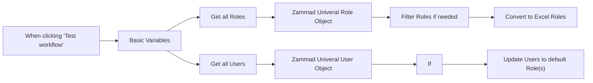

## Fluxo (.json) :

```json
{
  "id": "cDmsWx8ASzIxE3zw",
  "meta": {
    "instanceId": "494d0146a0f47676ad70a44a32086b466621f62da855e3eaf0ee51dee1f76753",
    "templateCredsSetupCompleted": true
  },
  "name": "Update all Zammad Roles to default values",
  "tags": [],
  "nodes": [
    {
      "id": "32904945-fd7b-413f-898c-62b04406dfb0",
      "name": "When clicking ‘Test workflow’",
      "type": "n8n-nodes-base.manualTrigger",
      "position": [
        -920,
        160
      ],
      "parameters": {},
      "typeVersion": 1
    },
    {
      "id": "cbb0abd2-e153-477a-9346-00eaa1628c78",
      "name": "Zammad Univeral User Object",
      "type": "n8n-nodes-base.set",
      "position": [
        100,
        220
      ],
      "parameters": {
        "values": {
          "number": [
            {
              "name": "user_id",
              "value": "={{ $json.id }}"
            },
            {
              "name": "organization_id",
              "value": "={{ $json.organization_id }}"
            }
          ],
          "string": [
            {
              "name": "email",
              "value": "={{ $json.email }}"
            },
            {
              "name": "firstname",
              "value": "={{ $json.firstname }}"
            },
            {
              "name": "lastname",
              "value": "={{ $json.lastname }}"
            },
            {
              "name": "role_ids",
              "value": "={{ $json.role_ids.join() }}\n"
            },
            {
              "name": "groups",
              "value": "={{ $json.group_ids }}"
            },
            {
              "name": "active",
              "value": "={{ $json.active }}"
            }
          ]
        },
        "options": {},
        "keepOnlySet": true
      },
      "typeVersion": 1
    },
    {
      "id": "bbf82b69-07b5-4dff-afec-ee65eeedd037",
      "name": "Get all Users",
      "type": "n8n-nodes-base.zammad",
      "position": [
        -220,
        220
      ],
      "parameters": {
        "filters": {},
        "operation": "getAll",
        "returnAll": true
      },
      "credentials": {
        "zammadTokenAuthApi": {
          "id": "fj5GuzcJuNLQeMxz",
          "name": "Zammad Token Auth account"
        }
      },
      "typeVersion": 1
    },
    {
      "id": "0c122c6b-22a7-41f5-8ea1-c9a32cd12ed6",
      "name": "If",
      "type": "n8n-nodes-base.if",
      "position": [
        400,
        220
      ],
      "parameters": {
        "options": {},
        "conditions": {
          "options": {
            "version": 2,
            "leftValue": "",
            "caseSensitive": true,
            "typeValidation": "strict"
          },
          "combinator": "and",
          "conditions": [
            {
              "id": "0be03c44-5017-4db6-87cd-91838b953d09",
              "operator": {
                "type": "array",
                "operation": "notContains",
                "rightType": "any"
              },
              "leftValue": "={{ $('Basic Variables').item.json.exclude_zammad_users_by_id }}",
              "rightValue": "={{ $json.user_id }}"
            },
            {
              "id": "6a730e91-fa40-4e8a-b6cb-894f2cb367c5",
              "operator": {
                "type": "boolean",
                "operation": "true",
                "singleValue": true
              },
              "leftValue": "={{ $json.active }}",
              "rightValue": ""
            },
            {
              "id": "b3d13440-f3fc-4172-b16d-e191f050a2bf",
              "operator": {
                "name": "filter.operator.equals",
                "type": "string",
                "operation": "equals"
              },
              "leftValue": "",
              "rightValue": ""
            }
          ]
        }
      },
      "typeVersion": 2.2
    },
    {
      "id": "63f98607-1f56-4f83-93be-aa3b271da11b",
      "name": "Get all Roles",
      "type": "n8n-nodes-base.httpRequest",
      "position": [
        -220,
        -20
      ],
      "parameters": {
        "url": "={{ $json.zammad_base_url }}/api/v1/roles",
        "options": {},
        "sendHeaders": true,
        "headerParameters": {
          "parameters": [
            {
              "name": "Authorization",
              "value": "=Bearer {{ $json.zammad_api_key }}"
            }
          ]
        }
      },
      "typeVersion": 4.2
    },
    {
      "id": "961bf663-30be-45b4-87f0-d7ec94c3435b",
      "name": "Basic Variables",
      "type": "n8n-nodes-base.set",
      "position": [
        -620,
        160
      ],
      "parameters": {
        "options": {},
        "assignments": {
          "assignments": [
            {
              "id": "68b32087-5e23-4590-8042-0061234ce479",
              "name": "zammad_base_url",
              "type": "string",
              "value": "-put-your-zammad-base-url-"
            },
            {
              "id": "7db7572e-2524-4f2a-a1d6-b44330662c30",
              "name": "zammad_api_key",
              "type": "string",
              "value": "-put-your-api-key-"
            },
            {
              "id": "7cd0a1d2-8898-47c7-a1c6-195ff6162bb9",
              "name": "default_roles",
              "type": "array",
              "value": "={{ [-put-in-the-default-roles-ids-separated-by-comma-] }}"
            },
            {
              "id": "4628705c-4875-4d42-90d1-692b9b44fc24",
              "name": "exclude_zammad_users_by_id",
              "type": "array",
              "value": "={{ [-put-in-the-user-ids-separated-by-comma-] }}"
            }
          ]
        }
      },
      "typeVersion": 3.4
    },
    {
      "id": "a86577aa-1eb2-48e6-b941-bdfb37b58073",
      "name": "Zammad Univeral Role Object",
      "type": "n8n-nodes-base.set",
      "position": [
        100,
        -20
      ],
      "parameters": {
        "values": {
          "number": [
            {
              "name": "role_id",
              "value": "={{ $json.id }}"
            },
            {
              "name": "name",
              "value": "={{ $json.name }}"
            }
          ]
        },
        "options": {},
        "keepOnlySet": true
      },
      "typeVersion": 1
    },
    {
      "id": "ecc387b3-092d-43c9-9187-784f07c4df77",
      "name": "Convert to Excel Roles",
      "type": "n8n-nodes-base.convertToFile",
      "position": [
        760,
        -40
      ],
      "parameters": {
        "options": {
          "fileName": "Zammad_Roles.xlsx"
        },
        "operation": "xlsx"
      },
      "typeVersion": 1.1
    },
    {
      "id": "e8055ae6-78d8-4736-adee-4b8c883b4000",
      "name": "Filter Roles if needed",
      "type": "n8n-nodes-base.if",
      "position": [
        400,
        -20
      ],
      "parameters": {
        "options": {},
        "conditions": {
          "options": {
            "version": 2,
            "leftValue": "",
            "caseSensitive": true,
            "typeValidation": "strict"
          },
          "combinator": "and",
          "conditions": [
            {
              "id": "0ca9d3a3-b726-4396-8cec-4a74c8e3949b",
              "operator": {
                "type": "object",
                "operation": "exists",
                "singleValue": true
              },
              "leftValue": "={{ $json }}",
              "rightValue": 1781
            }
          ]
        }
      },
      "typeVersion": 2.2
    },
    {
      "id": "45b01919-ba58-4c7a-a97f-d169cb361855",
      "name": "Update Users to default Role(s)",
      "type": "n8n-nodes-base.httpRequest",
      "onError": "continueErrorOutput",
      "position": [
        760,
        200
      ],
      "parameters": {
        "url": "={{ $('Basic Variables').item.json.zammad_base_url }}/api/v1/users/{{ $json.user_id }}",
        "method": "PUT",
        "options": {},
        "jsonBody": "={\n  \"role_ids\": [\n    {{ $('Basic Variables').item.json.default_roles }}\n  ]\n} ",
        "sendBody": true,
        "sendHeaders": true,
        "specifyBody": "json",
        "headerParameters": {
          "parameters": [
            {
              "name": "Authorization",
              "value": "=Bearer {{ $('Basic Variables').item.json.zammad_api_key }}"
            }
          ]
        }
      },
      "typeVersion": 4.2
    }
  ],
  "active": false,
  "pinData": {},
  "settings": {
    "executionOrder": "v1"
  },
  "versionId": "4fa55089-104d-477e-8a93-c8cb0caf7bed",
  "connections": {
    "If": {
      "main": [
        [
          {
            "node": "Update Users to default Role(s)",
            "type": "main",
            "index": 0
          }
        ]
      ]
    },
    "Get all Roles": {
      "main": [
        [
          {
            "node": "Zammad Univeral Role Object",
            "type": "main",
            "index": 0
          }
        ]
      ]
    },
    "Get all Users": {
      "main": [
        [
          {
            "node": "Zammad Univeral User Object",
            "type": "main",
            "index": 0
          }
        ]
      ]
    },
    "Basic Variables": {
      "main": [
        [
          {
            "node": "Get all Roles",
            "type": "main",
            "index": 0
          },
          {
            "node": "Get all Users",
            "type": "main",
            "index": 0
          }
        ]
      ]
    },
    "Filter Roles if needed": {
      "main": [
        [
          {
            "node": "Convert to Excel Roles",
            "type": "main",
            "index": 0
          }
        ]
      ]
    },
    "Zammad Univeral Role Object": {
      "main": [
        [
          {
            "node": "Filter Roles if needed",
            "type": "main",
            "index": 0
          }
        ]
      ]
    },
    "Zammad Univeral User Object": {
      "main": [
        [
          {
            "node": "If",
            "type": "main",
            "index": 0
          }
        ]
      ]
    },
    "Update Users to default Role(s)": {
      "main": [
        [],
        []
      ]
    },
    "When clicking ‘Test workflow’": {
      "main": [
        [
          {
            "node": "Basic Variables",
            "type": "main",
            "index": 0
          }
        ]
      ]
    }
  }
}
```

<a id="template-1310"></a>

## Template 1310 - Resumo de transcrição YouTube + Telegram

- **Nome:** Resumo de transcrição YouTube + Telegram
- **Descrição:** Recebe uma URL de vídeo do YouTube, obtém a transcrição, gera um resumo estruturado com um modelo de linguagem e devolve os resultados, além de enviar uma notificação via Telegram.
- **Funcionalidade:** • Recepção de URL via endpoint: Recebe um POST com a URL do YouTube para iniciar o fluxo.
• Extração do ID do vídeo: Processa a URL para obter o ID único do vídeo.
• Recuperação de metadados do vídeo: Busca título, descrição e ID do vídeo a partir da plataforma.
• Obtenção da transcrição: Recupera as legendas/transcrição do vídeo.
• Divisão e concatenação da transcrição: Separa blocos da transcrição e concatena o texto para análise.
• Análise e sumarização com LLM: Gera um resumo estruturado e análise técnica do conteúdo usando um modelo de linguagem.
• Montagem do objeto de resposta: Cria um objeto com summary, topics, title, description, id e youtubeUrl.
• Resposta ao solicitante: Retorna o objeto resultante como resposta ao webhook.
• Notificação via Telegram: Envia uma mensagem contendo título do vídeo e URL para um chat ou canal configurado.
- **Ferramentas:** • YouTube: Plataforma de vídeo usada para obter metadados e transcrições do vídeo.
• OpenAI (GPT-4o-mini): Modelo de linguagem utilizado para resumir e analisar o texto da transcrição.
• Telegram: Serviço de mensagens usado para enviar notificações com o título e link do vídeo.


## Fluxo visual

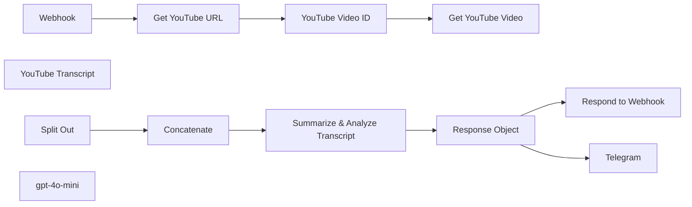

## Fluxo (.json) :

```json
{
  "nodes": [
    {
      "id": "9320d08a-4868-4103-abdf-3f8f54a7a0a0",
      "name": "Webhook",
      "type": "n8n-nodes-base.webhook",
      "position": [
        0,
        0
      ],
      "webhookId": "9024e29e-9080-4cf5-9a6b-0d918468f195",
      "parameters": {
        "path": "ytube",
        "options": {},
        "httpMethod": "POST",
        "responseMode": "responseNode"
      },
      "typeVersion": 2
    },
    {
      "id": "a5cc8922-8124-4269-9cfd-e891b29cc2b7",
      "name": "YouTube Transcript",
      "type": "n8n-nodes-youtube-transcription.youtubeTranscripter",
      "position": [
        800,
        0
      ],
      "parameters": {},
      "typeVersion": 1
    },
    {
      "id": "ff3c0fd1-36d8-4d64-b405-0600efd4d93b",
      "name": "Split Out",
      "type": "n8n-nodes-base.splitOut",
      "position": [
        200,
        260
      ],
      "parameters": {
        "options": {},
        "fieldToSplitOut": "transcript"
      },
      "typeVersion": 1
    },
    {
      "id": "423276e0-81bf-487a-bbdd-26e9b84fa755",
      "name": "Respond to Webhook",
      "type": "n8n-nodes-base.respondToWebhook",
      "position": [
        1200,
        140
      ],
      "parameters": {
        "options": {}
      },
      "typeVersion": 1.1
    },
    {
      "id": "27344649-8029-48ae-867b-7363d904fc59",
      "name": "Telegram",
      "type": "n8n-nodes-base.telegram",
      "position": [
        1200,
        380
      ],
      "parameters": {
        "text": "={{ $json.title }}\n{{ $json.youtubeUrl }}",
        "additionalFields": {
          "parse_mode": "HTML",
          "appendAttribution": false
        }
      },
      "typeVersion": 1.2
    },
    {
      "id": "230c0325-d22a-4070-9460-748a6fef48d5",
      "name": "Get YouTube URL",
      "type": "n8n-nodes-base.set",
      "position": [
        200,
        0
      ],
      "parameters": {
        "options": {},
        "assignments": {
          "assignments": [
            {
              "id": "3ee42e4c-3cee-4934-97e7-64c96b5691ed",
              "name": "youtubeUrl",
              "type": "string",
              "value": "={{ $json.body.youtubeUrl }}"
            }
          ]
        }
      },
      "typeVersion": 3.4
    },
    {
      "id": "420e90c3-9dfa-4f41-825a-9874b5ebe43a",
      "name": "YouTube Video ID",
      "type": "n8n-nodes-base.code",
      "position": [
        400,
        0
      ],
      "parameters": {
        "jsCode": "const extractYoutubeId = (url) => {\n  // Regex pattern that matches both youtu.be and youtube.com URLs\n  const pattern = /(?:youtube\\.com/(?:[^/]+/.+/|(?:v|e(?:mbed)?)/|.*[?&]v=)|youtu\\.be/)([^\"&?/\\s]{11})/;\n  const match = url.match(pattern);\n  return match ? match[1] : null;\n};\n\n// Input URL from previous node\nconst youtubeUrl = items[0].json.youtubeUrl; // Adjust this based on your workflow\n\n// Process the URL and return the video ID\nreturn [{\n  json: {\n    videoId: extractYoutubeId(youtubeUrl)\n  }\n}];\n"
      },
      "typeVersion": 2
    },
    {
      "id": "a4171c3e-1ff2-40de-af7f-b3971a1ebe79",
      "name": "Get YouTube Video",
      "type": "n8n-nodes-base.youTube",
      "position": [
        600,
        0
      ],
      "parameters": {
        "options": {},
        "videoId": "={{ $json.videoId }}",
        "resource": "video",
        "operation": "get"
      },
      "typeVersion": 1
    },
    {
      "id": "73e6bfc5-8b62-4880-acd4-292f2f692540",
      "name": "gpt-4o-mini",
      "type": "@n8n/n8n-nodes-langchain.lmChatOpenAi",
      "position": [
        620,
        440
      ],
      "parameters": {
        "options": {}
      },
      "typeVersion": 1
    },
    {
      "id": "ea14e296-b30c-46f7-b283-746822ae1af4",
      "name": "Summarize & Analyze Transcript",
      "type": "@n8n/n8n-nodes-langchain.chainLlm",
      "position": [
        600,
        260
      ],
      "parameters": {
        "text": "=Please analyze the given text and create a structured summary following these guidelines:\n\n1. Break down the content into main topics using Level 2 headers (##)\n2. Under each header:\n   - List only the most essential concepts and key points\n   - Use bullet points for clarity\n   - Keep explanations concise\n   - Preserve technical accuracy\n   - Highlight key terms in bold\n3. Organize the information in this sequence:\n   - Definition/Background\n   - Main characteristics\n   - Implementation details\n   - Advantages/Disadvantages\n4. Format requirements:\n   - Use markdown formatting\n   - Keep bullet points simple (no nesting)\n   - Bold important terms using **term**\n   - Use tables for comparisons\n   - Include relevant technical details\n\nPlease provide a clear, structured summary that captures the core concepts while maintaining technical accuracy.\n\nHere is the text: {{ $json.concatenated_text\n }}",
        "promptType": "define"
      },
      "typeVersion": 1.4
    },
    {
      "id": "90e3488f-f854-483e-9106-a5760d0c0457",
      "name": "Concatenate",
      "type": "n8n-nodes-base.summarize",
      "position": [
        400,
        260
      ],
      "parameters": {
        "options": {},
        "fieldsToSummarize": {
          "values": [
            {
              "field": "text",
              "separateBy": " ",
              "aggregation": "concatenate"
            }
          ]
        }
      },
      "typeVersion": 1
    },
    {
      "id": "9c5c249c-5eeb-4433-ba93-ace4611f4858",
      "name": "Response Object",
      "type": "n8n-nodes-base.set",
      "position": [
        960,
        260
      ],
      "parameters": {
        "options": {},
        "assignments": {
          "assignments": [
            {
              "id": "bf132004-6636-411f-9d85-0c696fda84c4",
              "name": "summary",
              "type": "string",
              "value": "={{ $json.text }}"
            },
            {
              "id": "63c8d0e3-685c-488a-9b45-363cf52479ea",
              "name": "topics",
              "type": "array",
              "value": "=[]"
            },
            {
              "id": "171f30cf-34e9-42f3-8735-814024bfde0b",
              "name": "title",
              "type": "string",
              "value": "={{ $('Get YouTube Video').item.json.snippet.title }}"
            },
            {
              "id": "7f26f5a3-e695-49d1-b1e8-9260c31f1b3d",
              "name": "description",
              "type": "string",
              "value": "={{ $('Get YouTube Video').item.json.snippet.description }}"
            },
            {
              "id": "d0594232-cb39-453c-b015-3b039c098e1f",
              "name": "id",
              "type": "string",
              "value": "={{ $('Get YouTube Video').item.json.id }}"
            },
            {
              "id": "17b6ca08-ce89-4467-bd25-0d2d182f7a8b",
              "name": "youtubeUrl",
              "type": "string",
              "value": "={{ $('Webhook').item.json.body.youtubeUrl }}"
            }
          ]
        }
      },
      "typeVersion": 3.4
    }
  ],
  "pinData": {},
  "connections": {
    "Webhook": {
      "main": [
        [
          {
            "node": "Get YouTube URL",
            "type": "main",
            "index": 0
          }
        ]
      ]
    },
    "Split Out": {
      "main": [
        [
          {
            "node": "Concatenate",
            "type": "main",
            "index": 0
          }
        ]
      ]
    },
    "Concatenate": {
      "main": [
        [
          {
            "node": "Summarize & Analyze Transcript",
            "type": "main",
            "index": 0
          }
        ]
      ]
    },
    "gpt-4o-mini": {
      "ai_languageModel": [
        [
          {
            "node": "Summarize & Analyze Transcript",
            "type": "ai_languageModel",
            "index": 0
          }
        ]
      ]
    },
    "Get YouTube URL": {
      "main": [
        [
          {
            "node": "YouTube Video ID",
            "type": "main",
            "index": 0
          }
        ]
      ]
    },
    "Response Object": {
      "main": [
        [
          {
            "node": "Respond to Webhook",
            "type": "main",
            "index": 0
          },
          {
            "node": "Telegram",
            "type": "main",
            "index": 0
          }
        ]
      ]
    },
    "YouTube Video ID": {
      "main": [
        [
          {
            "node": "Get YouTube Video",
            "type": "main",
            "index": 0
          }
        ]
      ]
    },
    "Summarize & Analyze Transcript": {
      "main": [
        [
          {
            "node": "Response Object",
            "type": "main",
            "index": 0
          }
        ]
      ]
    }
  }
}
```

<a id="template-1311"></a>

## Template 1311 - Gerador SEO de posts WordPress com pesquisa automatizada

- **Nome:** Gerador SEO de posts WordPress com pesquisa automatizada
- **Descrição:** Automatiza a criação de posts otimizados para SEO com base em uma consulta de pesquisa, utilizando fontes externas e modelos de linguagem para gerar conteúdo, título, meta, HTML compatível com WordPress, publicar como rascunho e notificar por Telegram.
- **Funcionalidade:** • Coleta de consulta via formulário: Recebe o tema ou pergunta do usuário para direcionar a pesquisa.
• Pesquisa externa automatizada: Consulta uma API de pesquisa para reunir informações e fontes relevantes sobre o tema.
• Limpeza e anotação de fontes: Processa e insere referências ou URLs das fontes encontradas no conteúdo de pesquisa.
• Redação de post longo por IA: Gera um rascunho completo de 1500–2000 palavras, com tom profissional e sugestões acionáveis para recrutadores e líderes de RH.
• Geração de título, slug e meta: Cria título SEO-friendly, slug curto e meta description conforme diretrizes específicas.
• Criação de HTML compatível com WordPress: Converte o conteúdo em HTML com estrutura, estilo e ancoragens para TOC e FAQ.
• Agregação e merge de dados: Consolida conteúdo, metadados e HTML antes da publicação.
• Publicação como rascunho no WordPress: Cria o post no site com status de rascunho, autor e slug definidos.
• Upload e definição de imagem de capa: Faz download de imagem externa, envia para a biblioteca e define como featured image do post.
• Notificação de sucesso: Envia mensagem para um canal/conta do Telegram confirmando a criação do post.
- **Ferramentas:** • Perplexity AI: Executa pesquisa externa detalhada e retorna resumos e citações de fontes confiáveis.
• OpenAI (modelos gpt-4o-mini): Gera o conteúdo do blog, título, slug, meta e o HTML formatado para WordPress.
• WordPress REST API: Recebe o post em rascunho, aceita HTML de conteúdo, aceita upload de mídia e permite definir imagem destacada.
• Telegram: Envia notificações de sucesso para um chat configurado.
• CDN/host de imagens externo: Fonte de imagem utilizada para o cover do post (download antes do upload para o site).

## Fluxo visual

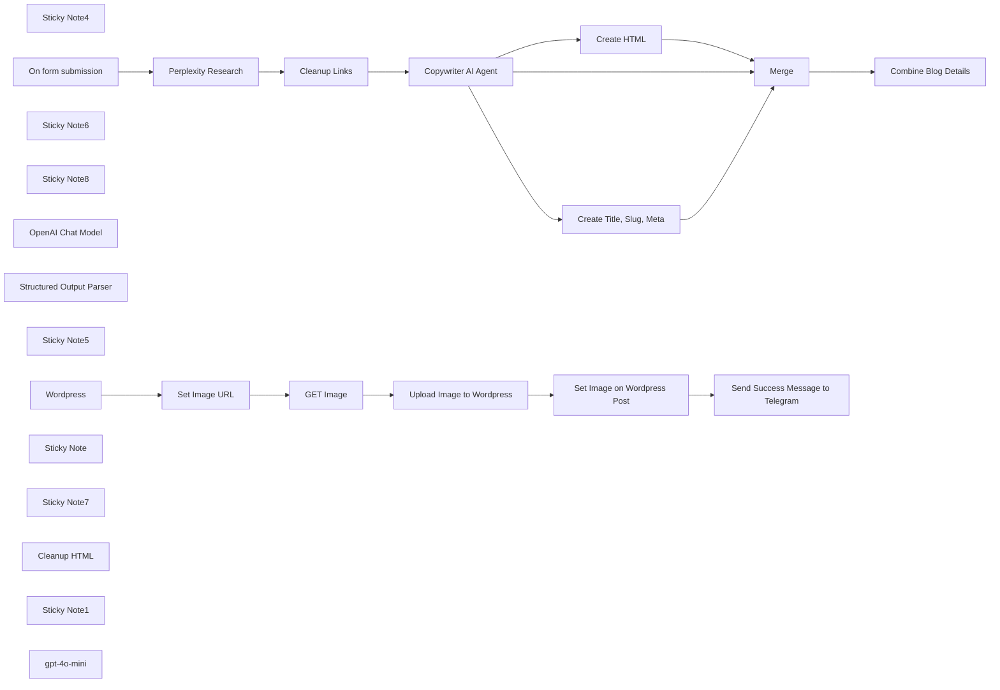

## Fluxo (.json) :

```json
{
  "id": "5lMPjSDuoMvCJnko",
  "meta": {
    "instanceId": "31e69f7f4a77bf465b805824e303232f0227212ae922d12133a0f96ffeab4fef",
    "templateCredsSetupCompleted": true
  },
  "name": "🔍🛠️Generate SEO-Optimized WordPress Content with Perplexity Research",
  "tags": [],
  "nodes": [
    {
      "id": "17ab0b24-b1eb-4e4e-a249-9889c9876fe4",
      "name": "Sticky Note4",
      "type": "n8n-nodes-base.stickyNote",
      "position": [
        -1440,
        460
      ],
      "parameters": {
        "color": 3,
        "width": 420,
        "height": 440,
        "content": "## Write SEO Optimized Blog Post\n\n\n"
      },
      "typeVersion": 1
    },
    {
      "id": "0931aacf-5c47-4bb0-86b6-158c2c7470b1",
      "name": "Wordpress",
      "type": "n8n-nodes-base.wordpress",
      "position": [
        -1220,
        1120
      ],
      "parameters": {
        "title": "={{ $('Combine Blog Details').item.json.data[2].output.title }}",
        "additionalFields": {
          "slug": "={{ $('Combine Blog Details').item.json.data[2].output.slug }}",
          "status": "draft",
          "sticky": false,
          "content": "={{ $json.content }}",
          "authorId": 2,
          "postTemplate": {
            "values": {}
          },
          "commentStatus": "closed"
        }
      },
      "credentials": {
        "wordpressApi": {
          "id": "50Ph69y0TPKvO9tn",
          "name": "Wordpress"
        }
      },
      "typeVersion": 1
    },
    {
      "id": "81329ff1-b26a-499c-bd82-fd334503ab4f",
      "name": "Sticky Note6",
      "type": "n8n-nodes-base.stickyNote",
      "position": [
        -980,
        220
      ],
      "parameters": {
        "color": 7,
        "width": 440,
        "height": 280,
        "content": "## Create HTML\n\n\n"
      },
      "typeVersion": 1
    },
    {
      "id": "03de9f23-e5ec-483b-a3dd-97617bd5165d",
      "name": "Sticky Note8",
      "type": "n8n-nodes-base.stickyNote",
      "position": [
        -1320,
        1020
      ],
      "parameters": {
        "color": 4,
        "width": 300,
        "height": 280,
        "content": "## Post on Wordpress\n\n\n"
      },
      "typeVersion": 1
    },
    {
      "id": "6bf602e0-ad29-47e6-93d7-79fd2a4228c2",
      "name": "OpenAI Chat Model",
      "type": "@n8n/n8n-nodes-langchain.lmChatOpenAi",
      "position": [
        -900,
        820
      ],
      "parameters": {
        "model": {
          "__rl": true,
          "mode": "list",
          "value": "gpt-4o-mini"
        },
        "options": {}
      },
      "credentials": {
        "openAiApi": {
          "id": "jEMSvKmtYfzAkhe6",
          "name": "OpenAi account"
        }
      },
      "typeVersion": 1.2
    },
    {
      "id": "8a3739ac-9492-400c-b5b8-eeb305647752",
      "name": "Structured Output Parser",
      "type": "@n8n/n8n-nodes-langchain.outputParserStructured",
      "position": [
        -680,
        820
      ],
      "parameters": {
        "jsonSchemaExample": "{\n\"slug\": \"rpo-benefits-recruitment\",\n\"title\": \"7 Key Advantages of RPO for Modern Recruitment\",\n\"meta\": \"Explore how Recruitment Process Outsourcing (RPO) enhances hiring efficiency, reduces costs, and expands talent pools for businesses seeking top candidates.\"\n}"
      },
      "typeVersion": 1.2
    },
    {
      "id": "af02ee94-4c26-4be5-bd21-09e020bff876",
      "name": "Create Title, Slug, Meta",
      "type": "@n8n/n8n-nodes-langchain.agent",
      "position": [
        -880,
        640
      ],
      "parameters": {
        "text": "=**Create a slug, blog post title, and meta description for the following blog post:**\n\n{{ $json.output }}\n\n**Slug Guidelines:**\n- Keep it concise (4-5 words maximum).\n- Include the primary keyword related to recruitment or HR.\n- Use hyphens to separate words.\n- Avoid unnecessary words, articles, or prepositions.\n- Ensure it reflects the main topic of the blog post.\n- Make it readable and relevant for both users and search engines.\n\n**Title Guidelines:**\n- Avoid AI words like \"Transform\" or \"Revolutionize\" and similar overused terms.\n- Avoid using a colon (:) in the title.\n- Never structure it as a primary/secondary title separated by a colon.\n- Include the primary keyword related to recruitment or HR (e.g., 'AI in recruitment' or 'talent acquisition trends').\n- Clearly inform users what they can expect from reading the blog post.\n- Be concise and engaging, ideally 50-60 characters long.\n- Incorporate power words that appeal to HR professionals and recruiters.\n\n**Meta Description Guidelines:**\n- Avoid AI words like \"Transform\" or \"Revolutionize\" and similar overused terms.\n- Be concise: Limit to 150-160 characters to ensure full visibility in search results.\n- Include keywords: Naturally incorporate primary recruitment-related keywords to enhance relevance and visibility.\n- Provide value: Clearly convey the benefits or insights readers will gain from the article.\n- Be engaging: Use action-oriented language or a thought-provoking question to encourage clicks.\n- Align with content: Accurately reflect the blog post's content to meet user expectations and reduce bounce rates.\n- Highlight expertise: Subtly emphasize SocialFind's authority in the recruitment field.\n\nYour output must be a single valid JSON object with these 3 fields:\n-slug: The slug\n-title: The blog post title\n-meta: The meta description  \n\nEach should be presented without any additional text, explanation, quotation marks, or formatting.\n",
        "options": {},
        "promptType": "define",
        "hasOutputParser": true
      },
      "typeVersion": 1.8
    },
    {
      "id": "115c4043-6fda-42a4-ac3c-c7979b2f327e",
      "name": "Create HTML",
      "type": "@n8n/n8n-nodes-langchain.openAi",
      "position": [
        -880,
        300
      ],
      "parameters": {
        "modelId": {
          "__rl": true,
          "mode": "list",
          "value": "gpt-4o-mini",
          "cachedResultName": "GPT-4O-MINI"
        },
        "options": {},
        "messages": {
          "values": [
            {
              "content": "=Only output the HTML content without preamble or further explanation. Generate WordPress-compatible HTML for a blog post based on the provided content.\n\n### CONTENT PROCESSING:\n- Process all content from {{ $json.output }}\n- Preserve all original facts, information, and URLs\n- Format according to the specifications below\n\n### REQUIRED STRUCTURE (IN THIS ORDER):\n1. Title (H2)\n2. Estimated reading time\n3. Key takeaways (3-5 bullet points)\n4. Table of contents (linked to all headings)\n5. Main content (with proper heading hierarchy)\n6. FAQ section\n\n### STYLING REQUIREMENTS:\n- Style Override: Include a style section with !important declarations\n- Links: All hyperlinks, TOC items, and FAQ questions must be #00c2ff (blue)\n- Headings: All headings need a bottom border in #00c2ff with padding\n- Spacing: Add <br><br> between each major section\n\n### ENGAGEMENT FORMATTING:\n- Use bold, italics, bullet points, quotes, and highlighting for emphasis\n- Create proper paragraph structure with appropriate line breaks\n- NO emojis allowed\n- Use whitespace strategically for readability\n\n### HYPERLINK HANDLING (CRITICAL):\n- When URLs appear next to keyphrases (e.g., \"AI tools (https://example.com)\")\n- Convert to: <a href=\"https://example.com\" style=\"color: #00c2ff !important;\">AI tools</a>\n- The KEYPHRASE must be linked, never the URL itself\n\n### WORDPRESS COMPATIBILITY:\n- Use WordPress block classes (wp-block-heading, wp-block-paragraph, etc.)\n- Add heading IDs starting with \"h-\" for better TOC linking\n- Ensure all styles use !important to override theme styles\n\nDO NOT include any explanations, code tags, or comments. Output ONLY the raw HTML.\n"
            }
          ]
        }
      },
      "credentials": {
        "openAiApi": {
          "id": "jEMSvKmtYfzAkhe6",
          "name": "OpenAi account"
        }
      },
      "typeVersion": 1.8
    },
    {
      "id": "4756c8f2-406e-4a56-adb0-0c4708dabe6a",
      "name": "Merge",
      "type": "n8n-nodes-base.merge",
      "position": [
        -420,
        560
      ],
      "parameters": {
        "numberInputs": 3
      },
      "typeVersion": 3
    },
    {
      "id": "1205aecf-08a1-499d-ac9e-822dd66b295f",
      "name": "Upload Image to Wordpress",
      "type": "n8n-nodes-base.httpRequest",
      "position": [
        -520,
        1120
      ],
      "parameters": {
        "url": "https://commonclone.com/wp-json/wp/v2/media",
        "method": "POST",
        "options": {},
        "sendBody": true,
        "contentType": "binaryData",
        "sendHeaders": true,
        "authentication": "predefinedCredentialType",
        "headerParameters": {
          "parameters": [
            {
              "name": "Content-Disposition",
              "value": "=attachment; filename=\"cover-image-{{ $('Wordpress').item.json.id }}.jpeg\""
            }
          ]
        },
        "inputDataFieldName": "data",
        "nodeCredentialType": "wordpressApi"
      },
      "credentials": {
        "wordpressApi": {
          "id": "50Ph69y0TPKvO9tn",
          "name": "Wordpress CommonClone.com RazorCX"
        }
      },
      "typeVersion": 4.2
    },
    {
      "id": "b4437d9e-8b90-4d15-a96d-46645618a56d",
      "name": "Set Image on Wordpress Post",
      "type": "n8n-nodes-base.httpRequest",
      "position": [
        -320,
        1120
      ],
      "parameters": {
        "url": "=https://commonclone.com/wp-json/wp/v2/posts/{{ $('Wordpress').item.json.id }}",
        "method": "POST",
        "options": {},
        "sendQuery": true,
        "authentication": "predefinedCredentialType",
        "queryParameters": {
          "parameters": [
            {
              "name": "featured_media",
              "value": "={{ $json.id }}"
            }
          ]
        },
        "nodeCredentialType": "wordpressApi"
      },
      "credentials": {
        "wordpressApi": {
          "id": "50Ph69y0TPKvO9tn",
          "name": "Wordpress CommonClone.com RazorCX"
        }
      },
      "typeVersion": 4.2
    },
    {
      "id": "bf05eaf3-2522-488e-893d-1ed9b2ed88b2",
      "name": "Sticky Note5",
      "type": "n8n-nodes-base.stickyNote",
      "position": [
        -1940,
        460
      ],
      "parameters": {
        "color": 4,
        "width": 460,
        "height": 300,
        "content": "## Perplexity Research\n\n\n"
      },
      "typeVersion": 1
    },
    {
      "id": "22e8c044-ed98-495a-957e-c5e3fecc2b7d",
      "name": "On form submission",
      "type": "n8n-nodes-base.formTrigger",
      "position": [
        -2120,
        560
      ],
      "webhookId": "a29cbcd3-9d11-4f7c-9aad-14681c356c53",
      "parameters": {
        "options": {},
        "formTitle": "Blog Factory",
        "formFields": {
          "values": [
            {
              "fieldType": "textarea",
              "fieldLabel": "Research Query",
              "placeholder": "=What are the most common challenges facing Canadian employers regarding recruitment and why would they want to hire a recruiting firm to solve these problems.",
              "requiredField": true
            }
          ]
        },
        "formDescription": "Create SEO optimized blog posts"
      },
      "typeVersion": 2.2
    },
    {
      "id": "6e6d4952-793f-4dc5-8d29-219d420149a9",
      "name": "Sticky Note",
      "type": "n8n-nodes-base.stickyNote",
      "position": [
        -1940,
        800
      ],
      "parameters": {
        "width": 460,
        "height": 500,
        "content": "## Sample Generic Search Terms\nAdd your own or try these for your specific geo location.\n\n1. **Severe skills shortages in healthcare, construction, and education sectors.**  \n2. **Aging workforce widens employment gaps in key industries.**  \n3. **Tight labor market with 110 vacancies per 100 unemployed people.**  \n4. **High demand for specialized skills due to economic changes.**  \n5. **Housing shortages deter international candidates from relocating to the Netherlands.**  \n6. **Strict employment regulations complicate hiring processes for non-EU workers.**  \n7. **Intense competition for talent due to low unemployment rates.**  \n8. **Mismatch between available talent and job-specific skill requirements.**  \n9. **Candidates expect high benefits packages, increasing recruitment costs significantly.**  \n10. **Difficulty navigating compliance and labor laws for international hiring processes.**"
      },
      "typeVersion": 1
    },
    {
      "id": "bb94017e-dc2a-43e3-ae5c-1f3227b1f0ef",
      "name": "Perplexity Research",
      "type": "n8n-nodes-base.httpRequest",
      "position": [
        -1860,
        560
      ],
      "parameters": {
        "url": "https://api.perplexity.ai/chat/completions",
        "method": "POST",
        "options": {},
        "jsonBody": "={\n  \"model\": \"sonar-pro\",\n  \"messages\": [\n    {\n      \"role\": \"system\",\n      \"content\": \"Act as a professional news researcher who is capable of finding detailed summaries about a news topic from highly reputable sources.\"\n    },\n    {\n      \"role\": \"user\",\n      \"content\": \" Research the following topic and return everything you can find about: '{{ $json['Research Query'] }}'.\"\n    }\n  ]\n}\n",
        "sendBody": true,
        "specifyBody": "json",
        "authentication": "genericCredentialType",
        "genericAuthType": "httpHeaderAuth"
      },
      "credentials": {
        "httpHeaderAuth": {
          "id": "05RfNG280MisTyPP",
          "name": "Perplexity"
        }
      },
      "typeVersion": 4.2
    },
    {
      "id": "66086876-4b49-45fe-aecc-f7f062a59dba",
      "name": "Cleanup Links",
      "type": "n8n-nodes-base.set",
      "position": [
        -1660,
        560
      ],
      "parameters": {
        "options": {},
        "assignments": {
          "assignments": [
            {
              "id": "23b8e8c4-9191-415a-9661-1b60d413528a",
              "name": "research",
              "type": "string",
              "value": "={{ $json.choices[0].message.content.replaceAll(\"[1]\", \" - source: \" +$json.citations[0]).replaceAll(\"[2]\",\" - source:\" +$json.citations[1]).replaceAll(\"[3]\",\" - source: \" +$json.citations[2]).replaceAll(\"[4]\",\" - source: \"+$json.citations[3]).replaceAll(\"[5]\",\" - source: \"+$json.citations[4]).replaceAll(\"[6]\",\" - source: \"+$json.citations[5]).replaceAll(\"[7]\",\" - source: \"+$json.citations[6]).replaceAll(\"[8]\",\" - source: \"+$json.citations[7]).replaceAll(\"[9]\",\" - source: \"+$json.citations[8]).replaceAll(\"[10]\",\" - source: \"+$json.citations[9]) }}"
            }
          ]
        }
      },
      "typeVersion": 3.4
    },
    {
      "id": "f81c9505-111f-473a-94b6-c79364410810",
      "name": "Copywriter AI Agent",
      "type": "@n8n/n8n-nodes-langchain.agent",
      "position": [
        -1360,
        560
      ],
      "parameters": {
        "text": "=You are part of a marketing team that creates high-quality blog posts for the AI consulting and workflow automation industry based in Canada. Your goal is to produce engaging, SEO-optimized content that positions the company as an authority in the AI consulting industry and attracts inbound leads.\n\nEvery 2 days, your team posts a blog on the most trending topics in AI consulting and n8n workflows. As the copywriter, you are provided with the following information:\n\n- Query: The main topic for this week's blog post, representing the most trending news in the recruitment space.\n\n- Other keywords: A list of high-search-volume keywords related to AI consulting and n8n workflows. Incorporate these naturally into the blog post where relevant, without forcing them or changing the post's meaning.\n\n- Research findings: Detailed information from reputable sources related to the blog topic. Your post must be based on this research.\n\nGiven this information, write a comprehensive blog post that:\n\n- Includes the query in the blog title, H2 header, and early in the introduction.\n- Incorporates all details from the research findings, including source URLs for potential hyperlinks.\n- Is detailed and informative, showcasing the companies expertise in AI consulting and n8n workflows to automate business processes.\n- Uses a professional yet engaging tone, highlighting the exciting developments and challenges in the recruitment industry.\n- Flows naturally and logically, making it easy for readers to follow.\n- Is between 1500 to 2000 words long.\n- Is written at a level accessible to HR professionals and business leaders.\n\nAdditional requirements:\n- Include practical takeaways or actionable advice for recruiters and HR professionals.\n- Highlight how the topic relates to the companies services or expertise.\n- Include a call-to-action (CTA) that encourages readers to explore the comapnies services or contact for more information.\n\nCreate the entire blog post draft in your first output. Don't stop or cut it short.\n\nYour output must be the blog post and nothing else.\n\nHere are the details of this blog post project:\n\nQuery:\n{{ $('On form submission').item.json['Research Query'] }}\n\nDetailed Research:\n{{ $('Cleanup Links').item.json.research }}\n\n\n",
        "options": {},
        "promptType": "define"
      },
      "typeVersion": 1.8
    },
    {
      "id": "1ee6bb8f-6441-4ed9-83e0-d0839b2d0e01",
      "name": "Sticky Note7",
      "type": "n8n-nodes-base.stickyNote",
      "position": [
        -980,
        540
      ],
      "parameters": {
        "color": 7,
        "width": 440,
        "height": 440,
        "content": "## Create Title, Slug & Meta\n\n\n"
      },
      "typeVersion": 1
    },
    {
      "id": "cc53a2af-ef22-446b-a9ee-b6f4ee649865",
      "name": "Cleanup HTML ",
      "type": "n8n-nodes-base.set",
      "position": [
        -220,
        820
      ],
      "parameters": {
        "options": {},
        "assignments": {
          "assignments": [
            {
              "id": "0afb2988-1481-4b04-b16d-fb33c50a16d0",
              "name": "content",
              "type": "string",
              "value": "={{ $json.data[0].message.content.replaceAll('```html', '').replaceAll('```','') }}"
            }
          ]
        }
      },
      "typeVersion": 3.4
    },
    {
      "id": "b31c8afe-e402-49c4-ba49-ee418cecc44e",
      "name": "GET Image",
      "type": "n8n-nodes-base.httpRequest",
      "position": [
        -720,
        1120
      ],
      "parameters": {
        "url": "={{ $json['image-url'] }}",
        "options": {}
      },
      "typeVersion": 4.2
    },
    {
      "id": "1089466a-1307-4f22-a242-d324c9165379",
      "name": "Sticky Note1",
      "type": "n8n-nodes-base.stickyNote",
      "position": [
        -980,
        1020
      ],
      "parameters": {
        "width": 820,
        "height": 280,
        "content": "## Set Image for Wordpress Post"
      },
      "typeVersion": 1
    },
    {
      "id": "288e212b-5aa5-452e-87d6-ae06c6ad062a",
      "name": "Set Image URL",
      "type": "n8n-nodes-base.set",
      "position": [
        -920,
        1120
      ],
      "parameters": {
        "options": {},
        "assignments": {
          "assignments": [
            {
              "id": "1f0541df-05ab-4e3d-a5d8-3904579fc8a9",
              "name": "image-url",
              "type": "string",
              "value": "=https://smartcdn.gprod.postmedia.digital/healthing/wp-content/uploads/2024/07/GettyImages-1455799246.jpg?quality=90&strip=all&w=704&h=395"
            }
          ]
        }
      },
      "typeVersion": 3.4
    },
    {
      "id": "38bf38e5-888e-4d63-a48e-e6affab28158",
      "name": "Send Success Message to Telegram",
      "type": "n8n-nodes-base.telegram",
      "position": [
        -80,
        1120
      ],
      "webhookId": "91f7d710-450a-4b66-8e46-82f53492351e",
      "parameters": {
        "text": "=Success! Your blog post was created at {{ $now }}",
        "chatId": "={{ $env.TELEGRAM_CHAT_ID }}",
        "additionalFields": {
          "appendAttribution": false
        }
      },
      "credentials": {
        "telegramApi": {
          "id": "pAIFhguJlkO3c7aQ",
          "name": "Telegram account"
        }
      },
      "typeVersion": 1.2
    },
    {
      "id": "30f0fa84-9918-4bf6-86e4-ef8f1dcf079c",
      "name": "gpt-4o-mini",
      "type": "@n8n/n8n-nodes-langchain.lmChatOpenAi",
      "position": [
        -1360,
        760
      ],
      "parameters": {
        "model": {
          "__rl": true,
          "mode": "list",
          "value": "gpt-4o-mini"
        },
        "options": {}
      },
      "credentials": {
        "openAiApi": {
          "id": "jEMSvKmtYfzAkhe6",
          "name": "OpenAi account"
        }
      },
      "typeVersion": 1.2
    },
    {
      "id": "d2d83cc5-1502-4b04-ac12-0bb351a90e58",
      "name": "Combine Blog Details",
      "type": "n8n-nodes-base.aggregate",
      "position": [
        -220,
        560
      ],
      "parameters": {
        "options": {},
        "aggregate": "aggregateAllItemData"
      },
      "typeVersion": 1
    }
  ],
  "active": false,
  "pinData": {},
  "settings": {
    "executionOrder": "v1"
  },
  "versionId": "4209c818-8b02-453e-9254-c70bde66f743",
  "connections": {
    "Merge": {
      "main": [
        [
          {
            "node": "Combine Blog Details",
            "type": "main",
            "index": 0
          }
        ]
      ]
    },
    "GET Image": {
      "main": [
        [
          {
            "node": "Upload Image to Wordpress",
            "type": "main",
            "index": 0
          }
        ]
      ]
    },
    "Wordpress": {
      "main": [
        [
          {
            "node": "Set Image URL",
            "type": "main",
            "index": 0
          }
        ]
      ]
    },
    "Create HTML": {
      "main": [
        [
          {
            "node": "Merge",
            "type": "main",
            "index": 0
          }
        ]
      ]
    },
    "gpt-4o-mini": {
      "ai_languageModel": [
        [
          {
            "node": "Copywriter AI Agent",
            "type": "ai_languageModel",
            "index": 0
          }
        ]
      ]
    },
    "Cleanup HTML ": {
      "main": [
        [
          {
            "node": "Wordpress",
            "type": "main",
            "index": 0
          }
        ]
      ]
    },
    "Cleanup Links": {
      "main": [
        [
          {
            "node": "Copywriter AI Agent",
            "type": "main",
            "index": 0
          }
        ]
      ]
    },
    "Set Image URL": {
      "main": [
        [
          {
            "node": "GET Image",
            "type": "main",
            "index": 0
          }
        ]
      ]
    },
    "OpenAI Chat Model": {
      "ai_languageModel": [
        [
          {
            "node": "Create Title, Slug, Meta",
            "type": "ai_languageModel",
            "index": 0
          }
        ]
      ]
    },
    "On form submission": {
      "main": [
        [
          {
            "node": "Perplexity Research",
            "type": "main",
            "index": 0
          }
        ]
      ]
    },
    "Copywriter AI Agent": {
      "main": [
        [
          {
            "node": "Create HTML",
            "type": "main",
            "index": 0
          },
          {
            "node": "Create Title, Slug, Meta",
            "type": "main",
            "index": 0
          },
          {
            "node": "Merge",
            "type": "main",
            "index": 1
          }
        ]
      ]
    },
    "Perplexity Research": {
      "main": [
        [
          {
            "node": "Cleanup Links",
            "type": "main",
            "index": 0
          }
        ]
      ]
    },
    "Combine Blog Details": {
      "main": [
        [
          {
            "node": "Cleanup HTML ",
            "type": "main",
            "index": 0
          }
        ]
      ]
    },
    "Create Title, Slug, Meta": {
      "main": [
        [
          {
            "node": "Merge",
            "type": "main",
            "index": 2
          }
        ]
      ]
    },
    "Structured Output Parser": {
      "ai_outputParser": [
        [
          {
            "node": "Create Title, Slug, Meta",
            "type": "ai_outputParser",
            "index": 0
          }
        ]
      ]
    },
    "Upload Image to Wordpress": {
      "main": [
        [
          {
            "node": "Set Image on Wordpress Post",
            "type": "main",
            "index": 0
          }
        ]
      ]
    },
    "Set Image on Wordpress Post": {
      "main": [
        [
          {
            "node": "Send Success Message to Telegram",
            "type": "main",
            "index": 0
          }
        ]
      ]
    }
  }
}
```

<a id="template-1312"></a>

## Template 1312 - Assistente pessoal via Telegram com IA

- **Nome:** Assistente pessoal via Telegram com IA
- **Descrição:** Recebe mensagens de voz ou texto pelo Telegram, transcreve quando necessário, consulta emails, calendário e base de tarefas/contatos, e responde ao usuário usando modelos de IA.
- **Funcionalidade:** • Recepção de mensagens Telegram: aceita entradas em texto e voz como ponto de partida da automação.
• Detecção de tipo de entrada: se o texto estiver vazio, trata a mensagem como voz; caso contrário, usa o texto diretamente.
• Download e transcrição de áudio: baixa o arquivo de voz enviado e transcreve para texto usando serviço de transcrição.
• Agente de IA conversacional: envia o texto transcrito ou recebido para um agente com instruções e contexto do usuário para gerar respostas úteis.
• Uso de modelo de chat avançado: gera respostas e tomadas de decisão usando um modelo de linguagem (gpt-4o-mini no fluxo).
• Consulta de emails recentes: busca mensagens não lidas a partir da data fornecida (com suporte a preenchimento automático da data pelo assistente), filtrando promoções e resumindo remetente, data, assunto e resumo.
• Consulta de calendário: obtém eventos a partir da data solicitada e aplica filtros contextuais (por exemplo, somente eventos de hoje quando a pergunta for sobre hoje).
• Acesso a tarefas e contatos: consulta uma base de dados externa de tarefas e outra de contatos para responder perguntas sobre tarefas ou informações de contato.
• Memória de sessão por usuário: mantém um buffer de memória vinculado ao usuário do Telegram para contexto entre interações.
• Resposta ao usuário: envia a resposta final de volta pelo Telegram, usando formatação Markdown quando aplicável.
- **Ferramentas:** • Telegram: plataforma de mensagens usada para receber entradas do usuário (texto e voz) e enviar respostas.
• OpenAI: serviços de modelo de linguagem e transcrição de áudio usados para entender, resumir e gerar respostas (inclui o modelo de chat e a API de transcrição).
• Gmail: conta de email consultada para obter emails não lidos e resumir seu conteúdo.
• Google Calendar: calendário usado para recuperar eventos a partir de uma data solicitada.
• Baserow: banco de dados online usado para acessar tabelas de tarefas e contatos para fornecer informações e contexto.

## Fluxo visual

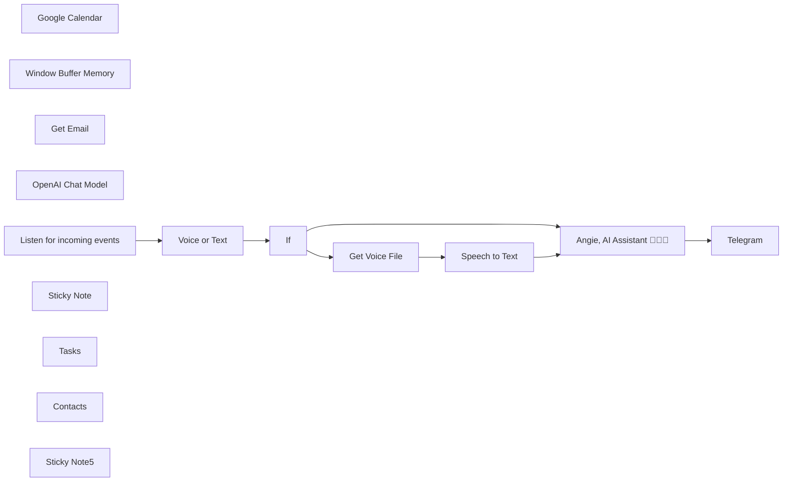

## Fluxo (.json) :

```json
{
  "meta": {
    "instanceId": "2723a3a635131edfcb16103f3d4dbaadf3658e386b4762989cbf49528dccbdbd"
  },
  "nodes": [
    {
      "id": "c70236ea-91ab-4e47-b6f6-63a70ede5d3c",
      "name": "Google Calendar",
      "type": "n8n-nodes-base.googleCalendarTool",
      "position": [
        1000,
        680
      ],
      "parameters": {
        "options": {
          "fields": "=items(summary, start(dateTime))",
          "timeMin": "={{$fromAI(\"date\",\"the date after which to fetch the messages in format YYYY-MM-DDTHH:MM:SS\")}}"
        },
        "calendar": {
          "__rl": true,
          "mode": "list",
          "value": "derekcheungsa@gmail.com",
          "cachedResultName": "derekcheungsa@gmail.com"
        },
        "operation": "getAll"
      },
      "credentials": {
        "googleCalendarOAuth2Api": {
          "id": "qx8JdPX4I5Xk9c46",
          "name": "Google Calendar account"
        }
      },
      "typeVersion": 1.1
    },
    {
      "id": "d2287bea-de47-4180-8ee6-55d4ab1a89da",
      "name": "Window Buffer Memory",
      "type": "@n8n/n8n-nodes-langchain.memoryBufferWindow",
      "position": [
        760,
        680
      ],
      "parameters": {
        "sessionKey": "={{ $('Listen for incoming events').first().json.message.from.id }}",
        "sessionIdType": "customKey"
      },
      "typeVersion": 1.2
    },
    {
      "id": "fa955731-86f6-4e4d-8604-dab5f52dee87",
      "name": "Get Email",
      "type": "n8n-nodes-base.gmailTool",
      "position": [
        880,
        680
      ],
      "parameters": {
        "filters": {
          "labelIds": [
            "INBOX",
            "UNREAD"
          ],
          "readStatus": "unread",
          "receivedAfter": "={{$fromAI(\"date\",\"the date after which to fetch the messages in format YYYY-MM-DDTHH:MM:SS\")}}"
        },
        "operation": "getAll"
      },
      "credentials": {
        "gmailOAuth2": {
          "id": "tojOpzEqFprdxS46",
          "name": "Gmail account"
        }
      },
      "typeVersion": 2.1
    },
    {
      "id": "46511f47-1687-4cbe-ae41-ceb205ed1f11",
      "name": "OpenAI Chat Model",
      "type": "@n8n/n8n-nodes-langchain.lmChatOpenAi",
      "position": [
        640,
        680
      ],
      "parameters": {
        "model": "gpt-4o-mini",
        "options": {}
      },
      "credentials": {
        "openAiApi": {
          "id": "5oYe8Cxj7liOPAKk",
          "name": "Derek T"
        }
      },
      "typeVersion": 1
    },
    {
      "id": "64fe44db-af19-43eb-9ff1-de0a72a9e645",
      "name": "Listen for incoming events",
      "type": "n8n-nodes-base.telegramTrigger",
      "position": [
        -160,
        360
      ],
      "webhookId": "322dce18-f93e-4f86-b9b1-3305519b7834",
      "parameters": {
        "updates": [
          "message"
        ],
        "additionalFields": {}
      },
      "credentials": {
        "telegramApi": {
          "id": "Ov00cT0t4h4AFtZ0",
          "name": "Telegram account"
        }
      },
      "typeVersion": 1
    },
    {
      "id": "e35c04ff-a050-4564-8c1b-5b22b556872f",
      "name": "Telegram",
      "type": "n8n-nodes-base.telegram",
      "onError": "continueErrorOutput",
      "position": [
        1280,
        360
      ],
      "parameters": {
        "text": "={{ $json.output }}",
        "chatId": "={{ $('Listen for incoming events').first().json.message.from.id }}",
        "additionalFields": {
          "parse_mode": "Markdown",
          "appendAttribution": false
        }
      },
      "credentials": {
        "telegramApi": {
          "id": "Ov00cT0t4h4AFtZ0",
          "name": "Telegram account"
        }
      },
      "typeVersion": 1.1
    },
    {
      "id": "e791d4f8-2c19-4c14-a71e-39a04f22e944",
      "name": "If",
      "type": "n8n-nodes-base.if",
      "position": [
        200,
        360
      ],
      "parameters": {
        "options": {},
        "conditions": {
          "options": {
            "version": 2,
            "leftValue": "",
            "caseSensitive": true,
            "typeValidation": "strict"
          },
          "combinator": "and",
          "conditions": [
            {
              "id": "a0bf9719-4272-46f6-ab3b-eda6f7b44fd8",
              "operator": {
                "type": "string",
                "operation": "empty",
                "singleValue": true
              },
              "leftValue": "={{ $json.message.text }}",
              "rightValue": ""
            }
          ]
        }
      },
      "typeVersion": 2.2
    },
    {
      "id": "5bd1788a-3d08-4eb3-8e03-3ce82f44d2a7",
      "name": "Speech to Text",
      "type": "@n8n/n8n-nodes-langchain.openAi",
      "position": [
        620,
        360
      ],
      "parameters": {
        "options": {},
        "resource": "audio",
        "operation": "transcribe"
      },
      "credentials": {
        "openAiApi": {
          "id": "5oYe8Cxj7liOPAKk",
          "name": "Derek T"
        }
      },
      "typeVersion": 1.3
    },
    {
      "id": "b67a2a93-517b-469e-aaa4-32c422710743",
      "name": "Voice or Text",
      "type": "n8n-nodes-base.set",
      "position": [
        40,
        360
      ],
      "parameters": {
        "fields": {
          "values": [
            {
              "name": "text",
              "stringValue": "={{ $json?.message?.text || \"\" }}"
            }
          ]
        },
        "options": {}
      },
      "typeVersion": 3.2
    },
    {
      "id": "8105c39f-9e87-44c4-9215-b3777f0b4164",
      "name": "Get Voice File",
      "type": "n8n-nodes-base.telegram",
      "position": [
        380,
        360
      ],
      "parameters": {
        "fileId": "={{ $('Listen for incoming events').item.json.message.voice.file_id }}",
        "resource": "file"
      },
      "credentials": {
        "telegramApi": {
          "id": "Ov00cT0t4h4AFtZ0",
          "name": "Telegram account"
        }
      },
      "typeVersion": 1.1
    },
    {
      "id": "759b975f-d17c-4386-a5b3-12413f0361f4",
      "name": "Angie, AI Assistant 👩🏻‍🏫",
      "type": "@n8n/n8n-nodes-langchain.agent",
      "position": [
        780,
        360
      ],
      "parameters": {
        "text": "={{ $json.text }}",
        "options": {
          "systemMessage": "=You are a helpful assistant.\n\nToday's date is {{ $now }}.\n\nGuidelines:\n- When fetching emails, filter out any promotional emails. \n- When summarizing emails, include Sender, Message date, subject, and brief summary of email.\n- if the user did not specify a date in the request assume they are asking for today\n- Use baserow tool to answer questions about tasks\n- When answering questions about calendar events, filter out events that don't apply to the question.  For example, the question is about events for today, only reply with events for today. Don't mention future events if it's more than 1 week away"
        },
        "promptType": "define"
      },
      "typeVersion": 1.6
    },
    {
      "id": "5537c777-f003-4673-b48a-4993a0c10520",
      "name": "Sticky Note",
      "type": "n8n-nodes-base.stickyNote",
      "position": [
        20,
        260
      ],
      "parameters": {
        "color": 5,
        "width": 496.25,
        "height": 278.75,
        "content": "## Process Telegram Request\n"
      },
      "typeVersion": 1
    },
    {
      "id": "40e92679-b47a-4213-bb23-3f8d086459f2",
      "name": "Tasks",
      "type": "n8n-nodes-base.baserowTool",
      "position": [
        1120,
        680
      ],
      "parameters": {
        "tableId": 372174,
        "databaseId": 146496,
        "additionalOptions": {}
      },
      "credentials": {
        "baserowApi": {
          "id": "jsgACn0VxAPoD0E2",
          "name": "Baserow account"
        }
      },
      "typeVersion": 1
    },
    {
      "id": "570a0647-b571-4ebc-9dfe-40244b5a0b2a",
      "name": "Contacts",
      "type": "n8n-nodes-base.baserowTool",
      "position": [
        1240,
        680
      ],
      "parameters": {
        "tableId": 372177,
        "databaseId": 146496,
        "descriptionType": "manual",
        "toolDescription": "Useful for getting contact information.  For example emails or phone numbers.",
        "additionalOptions": {}
      },
      "credentials": {
        "baserowApi": {
          "id": "jsgACn0VxAPoD0E2",
          "name": "Baserow account"
        }
      },
      "typeVersion": 1
    },
    {
      "id": "7fb1d95a-a8d6-4040-9271-5197296be7da",
      "name": "Sticky Note5",
      "type": "n8n-nodes-base.stickyNote",
      "position": [
        -620,
        220
      ],
      "parameters": {
        "color": 5,
        "width": 386.9292441979969,
        "height": 389.78268107403096,
        "content": "## Start here: Step-by Step Youtube Tutorial :star:\n\n[](https://youtu.be/pXjowPc6V2s)\n"
      },
      "typeVersion": 1
    }
  ],
  "pinData": {},
  "connections": {
    "If": {
      "main": [
        [
          {
            "node": "Get Voice File",
            "type": "main",
            "index": 0
          }
        ],
        [
          {
            "node": "Angie, AI Assistant 👩🏻‍🏫",
            "type": "main",
            "index": 0
          }
        ]
      ]
    },
    "Tasks": {
      "ai_tool": [
        [
          {
            "node": "Angie, AI Assistant 👩🏻‍🏫",
            "type": "ai_tool",
            "index": 0
          }
        ]
      ]
    },
    "Contacts": {
      "ai_tool": [
        [
          {
            "node": "Angie, AI Assistant 👩🏻‍🏫",
            "type": "ai_tool",
            "index": 0
          }
        ]
      ]
    },
    "Get Email": {
      "ai_tool": [
        [
          {
            "node": "Angie, AI Assistant 👩🏻‍🏫",
            "type": "ai_tool",
            "index": 0
          }
        ]
      ]
    },
    "Voice or Text": {
      "main": [
        [
          {
            "node": "If",
            "type": "main",
            "index": 0
          }
        ]
      ]
    },
    "Get Voice File": {
      "main": [
        [
          {
            "node": "Speech to Text",
            "type": "main",
            "index": 0
          }
        ]
      ]
    },
    "Speech to Text": {
      "main": [
        [
          {
            "node": "Angie, AI Assistant 👩🏻‍🏫",
            "type": "main",
            "index": 0
          }
        ]
      ]
    },
    "Google Calendar": {
      "ai_tool": [
        [
          {
            "node": "Angie, AI Assistant 👩🏻‍🏫",
            "type": "ai_tool",
            "index": 0
          }
        ]
      ]
    },
    "OpenAI Chat Model": {
      "ai_languageModel": [
        [
          {
            "node": "Angie, AI Assistant 👩🏻‍🏫",
            "type": "ai_languageModel",
            "index": 0
          }
        ]
      ]
    },
    "Window Buffer Memory": {
      "ai_memory": [
        [
          {
            "node": "Angie, AI Assistant 👩🏻‍🏫",
            "type": "ai_memory",
            "index": 0
          }
        ]
      ]
    },
    "Listen for incoming events": {
      "main": [
        [
          {
            "node": "Voice or Text",
            "type": "main",
            "index": 0
          }
        ]
      ]
    },
    "Angie, AI Assistant 👩🏻‍🏫": {
      "main": [
        [
          {
            "node": "Telegram",
            "type": "main",
            "index": 0
          }
        ]
      ]
    }
  }
}
```

<a id="template-1313"></a>

## Template 1313 - Inserir e atualizar dados no Airtable

- **Nome:** Inserir e atualizar dados no Airtable
- **Descrição:** Insere um registro em uma tabela do Airtable, pesquisa registros com um filtro e atualiza um registro específico com novos valores.
- **Funcionalidade:** • Acionamento manual: inicia a execução do fluxo sob demanda.
• Preparação de dados: define campos e valores a serem usados para inserção e atualização (ex.: ID, Name).
• Inserção de registro no Airtable: adiciona um novo registro na tabela configurada.
• Consulta de registros com filtro: lista registros usando uma fórmula de filtro para encontrar um registro específico (ex.: Name='n8n').
• Atualização de registro por ID: atualiza campos do registro identificado com os novos valores fornecidos.
• Reutilização de parâmetros dinâmicos: passa parâmetros e IDs entre etapas para ligar inserção, consulta e atualização.
- **Ferramentas:** • Airtable: serviço de banco de dados em formato de planilha que permite armazenar, consultar e atualizar registros via API.

## Fluxo visual

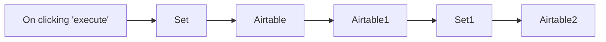

## Fluxo (.json) :

```json
{
  "id": "171",
  "name": "Insert and update data in Airtable",
  "nodes": [
    {
      "name": "On clicking 'execute'",
      "type": "n8n-nodes-base.manualTrigger",
      "position": [
        500,
        350
      ],
      "parameters": {},
      "typeVersion": 1
    },
    {
      "name": "Airtable",
      "type": "n8n-nodes-base.airtable",
      "position": [
        900,
        350
      ],
      "parameters": {
        "table": "Table 1",
        "options": {},
        "operation": "append",
        "application": ""
      },
      "credentials": {
        "airtableApi": "Airtable Credentials n8n"
      },
      "typeVersion": 1
    },
    {
      "name": "Airtable1",
      "type": "n8n-nodes-base.airtable",
      "position": [
        1100,
        350
      ],
      "parameters": {
        "table": "={{$node[\"Airtable\"].parameter[\"table\"]}}",
        "operation": "list",
        "application": "={{$node[\"Airtable\"].parameter[\"application\"]}}",
        "additionalOptions": {
          "filterByFormula": "Name='n8n'"
        }
      },
      "credentials": {
        "airtableApi": "Airtable Credentials n8n"
      },
      "typeVersion": 1
    },
    {
      "name": "Set",
      "type": "n8n-nodes-base.set",
      "position": [
        700,
        350
      ],
      "parameters": {
        "values": {
          "number": [
            {
              "name": "ID",
              "value": 3
            }
          ],
          "string": [
            {
              "name": "Name",
              "value": "n8n"
            }
          ]
        },
        "options": {}
      },
      "typeVersion": 1
    },
    {
      "name": "Set1",
      "type": "n8n-nodes-base.set",
      "position": [
        1300,
        350
      ],
      "parameters": {
        "values": {
          "string": [
            {
              "name": "Name",
              "value": "nodemation"
            }
          ]
        },
        "options": {},
        "keepOnlySet": true
      },
      "typeVersion": 1
    },
    {
      "name": "Airtable2",
      "type": "n8n-nodes-base.airtable",
      "position": [
        1500,
        350
      ],
      "parameters": {
        "id": "={{$node[\"Airtable1\"].json[\"id\"]}}",
        "table": "={{$node[\"Airtable\"].parameter[\"table\"]}}",
        "options": {},
        "operation": "update",
        "application": "={{$node[\"Airtable\"].parameter[\"application\"]}}"
      },
      "credentials": {
        "airtableApi": "Airtable Credentials n8n"
      },
      "typeVersion": 1
    }
  ],
  "active": false,
  "settings": {},
  "connections": {
    "Set": {
      "main": [
        [
          {
            "node": "Airtable",
            "type": "main",
            "index": 0
          }
        ]
      ]
    },
    "Set1": {
      "main": [
        [
          {
            "node": "Airtable2",
            "type": "main",
            "index": 0
          }
        ]
      ]
    },
    "Airtable": {
      "main": [
        [
          {
            "node": "Airtable1",
            "type": "main",
            "index": 0
          }
        ]
      ]
    },
    "Airtable1": {
      "main": [
        [
          {
            "node": "Set1",
            "type": "main",
            "index": 0
          }
        ]
      ]
    },
    "On clicking 'execute'": {
      "main": [
        [
          {
            "node": "Set",
            "type": "main",
            "index": 0
          }
        ]
      ]
    }
  }
}
```

<a id="template-1314"></a>

## Template 1314 - Restaurar credenciais do GitHub

- **Nome:** Restaurar credenciais do GitHub
- **Descrição:** Restaura credenciais da instância a partir de backups salvos em um repositório GitHub.
- **Funcionalidade:** • Configuração do repositório: Permite definir owner, nome e caminho da pasta onde estão os backups.
• Listagem de arquivos: Consulta o conteúdo da pasta indicada no repositório para obter a lista de arquivos.
• Iteração por arquivo: Divide a lista e processa cada arquivo individualmente.
• Recuperação de conteúdo: Baixa o conteúdo de cada arquivo do repositório GitHub.
• Conversão para JSON: Converte o conteúdo dos arquivos para objetos JSON utilizáveis.
• Filtragem de itens a ignorar: Ignora arquivos JSON vazios e credenciais específicas a serem puladas (ex.: credenciais da conta administrativa).
• Restauração de credenciais: Recria/insere as credenciais na instância a partir dos dados convertidos.
• Execução manual: Fluxo é iniciado manualmente via acionador de teste.
- **Ferramentas:** • GitHub: Plataforma de hospedagem de código e API usada para armazenar, listar e recuperar os arquivos de backup de credenciais.


## Fluxo visual

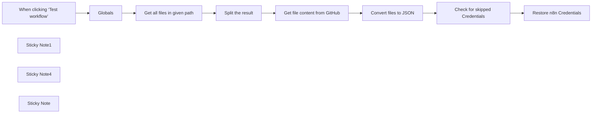

## Fluxo (.json) :

```json
{
  "id": "7zRCNv7B5WFRg7ux",
  "meta": {
    "instanceId": "e634e668fe1fc93a75c4f2a7fc0dad807ca318b79654157eadb9578496acbc76"
  },
  "name": "Restore your credentials from GitHub",
  "tags": [
    {
      "id": "2RWIfLUVCa0bnmGX",
      "name": "N8n",
      "createdAt": "2025-03-06T09:58:39.214Z",
      "updatedAt": "2025-03-06T09:58:39.214Z"
    }
  ],
  "nodes": [
    {
      "id": "f8aff38c-3e40-4820-b8f5-50e3e1f878c8",
      "name": "When clicking ‘Test workflow’",
      "type": "n8n-nodes-base.manualTrigger",
      "position": [
        -640,
        -120
      ],
      "parameters": {},
      "typeVersion": 1
    },
    {
      "id": "f838e0c6-36aa-4c0b-bdd2-ef096ffd3d1d",
      "name": "Sticky Note1",
      "type": "n8n-nodes-base.stickyNote",
      "position": [
        -1020,
        -140
      ],
      "parameters": {
        "width": 320,
        "height": 420,
        "content": "## Restore from GitHub \nThis workflow will restore all instance credentials from GitHub backups.\n\n\n### Setup\nOpen `Globals` node and update the values below 👇\n\n- **repo.owner:** your Github username\n- **repo.name:** the name of your repository\n- **repo.path:** the folder to use within the repository.\n\n\nIf your username was `john-doe` and your repository was called `n8n-backups` and you wanted the credentials to go into a `credentials` folder you would set:\n\n- repo.owner - john-doe\n- repo.name - n8n-backups\n- repo.path - credentials/\n"
      },
      "typeVersion": 1
    },
    {
      "id": "8f59b7b0-ea9d-4209-8c6b-d48fe9d8cf7b",
      "name": "Globals",
      "type": "n8n-nodes-base.set",
      "position": [
        -380,
        -120
      ],
      "parameters": {
        "options": {},
        "assignments": {
          "assignments": [
            {
              "id": "6cf546c5-5737-4dbd-851b-17d68e0a3780",
              "name": "repo.owner",
              "type": "string",
              "value": "BeyondspaceStudio"
            },
            {
              "id": "452efa28-2dc6-4ea3-a7a2-c35d100d0382",
              "name": "repo.name",
              "type": "string",
              "value": "n8n-backup"
            },
            {
              "id": "81c4dc54-86bf-4432-a23f-22c7ea831e74",
              "name": "repo.path",
              "type": "string",
              "value": "credentials"
            }
          ]
        }
      },
      "typeVersion": 3.4
    },
    {
      "id": "d72bf1a6-f3a0-4dc0-afc0-e39c7e8b16f3",
      "name": "Sticky Note4",
      "type": "n8n-nodes-base.stickyNote",
      "position": [
        -440,
        -240
      ],
      "parameters": {
        "color": 4,
        "width": 150,
        "height": 80,
        "content": "## Edit this node 👇"
      },
      "typeVersion": 1
    },
    {
      "id": "4eeb0ed5-7e90-4f09-8296-04c0349de49b",
      "name": "Sticky Note",
      "type": "n8n-nodes-base.stickyNote",
      "position": [
        100,
        20
      ],
      "parameters": {
        "color": 4,
        "content": "## Skip credential\n- The empty json files\n- The n8n account api\n- ...edit this node at will"
      },
      "typeVersion": 1
    },
    {
      "id": "40856ade-3ff7-43ef-8c45-ec5a126a5787",
      "name": "Get all files in given path",
      "type": "n8n-nodes-base.httpRequest",
      "position": [
        -160,
        -120
      ],
      "parameters": {
        "url": "=https://api.github.com/repos/{{ $json.repo.owner }}/{{ $json.repo.name }}/contents/{{ $json.repo.path }}",
        "options": {},
        "authentication": "predefinedCredentialType",
        "nodeCredentialType": "githubApi"
      },
      "credentials": {
        "githubApi": {
          "id": "3FYHiPFtycAFT8V0",
          "name": "GitHub account"
        }
      },
      "typeVersion": 4.2
    },
    {
      "id": "4284aadd-4840-4754-9416-6bb74a1df192",
      "name": "Split the result",
      "type": "n8n-nodes-base.splitOut",
      "position": [
        -600,
        200
      ],
      "parameters": {
        "options": {},
        "fieldToSplitOut": "path"
      },
      "typeVersion": 1
    },
    {
      "id": "48a04e72-5f9e-4dc3-863d-a8bb30f1c8c2",
      "name": "Get file content from GitHub",
      "type": "n8n-nodes-base.github",
      "position": [
        -360,
        200
      ],
      "parameters": {
        "owner": {
          "__rl": true,
          "mode": "name",
          "value": "BeyondspaceStudio"
        },
        "filePath": "={{ $('Get all files in given path').item.json.path }}",
        "resource": "file",
        "operation": "get",
        "repository": {
          "__rl": true,
          "mode": "name",
          "value": "n8n-backup"
        },
        "additionalParameters": {}
      },
      "credentials": {
        "githubApi": {
          "id": "3FYHiPFtycAFT8V0",
          "name": "GitHub account"
        }
      },
      "typeVersion": 1,
      "alwaysOutputData": true
    },
    {
      "id": "507c8514-6acf-4568-83cc-bb07f06e6a96",
      "name": "Convert files to JSON",
      "type": "n8n-nodes-base.extractFromFile",
      "position": [
        -140,
        200
      ],
      "parameters": {
        "options": {},
        "operation": "fromJson"
      },
      "typeVersion": 1
    },
    {
      "id": "084e7306-4c7b-4a9b-8f3e-f844ab340f6a",
      "name": "Restore n8n Credentials",
      "type": "n8n-nodes-base.n8n",
      "position": [
        380,
        200
      ],
      "parameters": {
        "data": "={{ JSON.stringify($json.data.data) }}",
        "name": "={{ $json.data.name }}",
        "resource": "credential",
        "requestOptions": {},
        "credentialTypeName": "={{ $json.data.type }}"
      },
      "credentials": {
        "n8nApi": {
          "id": "dzYjDgtEXtpRPKhe",
          "name": "n8n account"
        }
      },
      "typeVersion": 1
    },
    {
      "id": "f8267df1-eb0a-491e-bed4-01480583a535",
      "name": "Check for skipped Credentials",
      "type": "n8n-nodes-base.if",
      "position": [
        100,
        200
      ],
      "parameters": {
        "options": {},
        "conditions": {
          "options": {
            "version": 2,
            "leftValue": "",
            "caseSensitive": true,
            "typeValidation": "strict"
          },
          "combinator": "or",
          "conditions": [
            {
              "id": "ad031296-4ac0-4087-bc35-7975a2cc25e6",
              "operator": {
                "type": "object",
                "operation": "empty",
                "singleValue": true
              },
              "leftValue": "={{ $json.data }}",
              "rightValue": ""
            },
            {
              "id": "ca912a57-6a4b-4b9a-be0e-37b69d3e4917",
              "operator": {
                "type": "string",
                "operation": "contains"
              },
              "leftValue": "={{ $json.data.name }}",
              "rightValue": "n8n account"
            }
          ]
        }
      },
      "typeVersion": 2.2
    }
  ],
  "active": false,
  "pinData": {},
  "settings": {
    "executionOrder": "v1"
  },
  "versionId": "8a89a054-697f-4705-89a8-5d3288936206",
  "connections": {
    "Globals": {
      "main": [
        [
          {
            "node": "Get all files in given path",
            "type": "main",
            "index": 0
          }
        ]
      ]
    },
    "Split the result": {
      "main": [
        [
          {
            "node": "Get file content from GitHub",
            "type": "main",
            "index": 0
          }
        ]
      ]
    },
    "Convert files to JSON": {
      "main": [
        [
          {
            "node": "Check for skipped Credentials",
            "type": "main",
            "index": 0
          }
        ]
      ]
    },
    "Get all files in given path": {
      "main": [
        [
          {
            "node": "Split the result",
            "type": "main",
            "index": 0
          }
        ]
      ]
    },
    "Get file content from GitHub": {
      "main": [
        [
          {
            "node": "Convert files to JSON",
            "type": "main",
            "index": 0
          }
        ]
      ]
    },
    "Check for skipped Credentials": {
      "main": [
        [],
        [
          {
            "node": "Restore n8n Credentials",
            "type": "main",
            "index": 0
          }
        ]
      ]
    },
    "When clicking ‘Test workflow’": {
      "main": [
        [
          {
            "node": "Globals",
            "type": "main",
            "index": 0
          }
        ]
      ]
    }
  }
}
```

<a id="template-1315"></a>

## Template 1315 - Agente telefônico AI com RetellAI

- **Nome:** Agente telefônico AI com RetellAI
- **Descrição:** Automatiza o processamento de eventos de chamada: captura transcrições, gera resumos e dados estruturados, consulta conhecimento via RAG e cria agendamentos quando necessário.
- **Funcionalidade:** • Interceptação de eventos de chamada: recebe webhooks para eventos como call_ended e call_analyzed.
• Extração de transcrição e metadados: captura o texto da chamada, duração, números, URL de gravação e motivos de desconexão.
• Resumo e extração de pontos-chave: utiliza um modelo de linguagem para gerar um resumo objetivo e listar pontos importantes e action items.
• Análise estruturada: extrai campos como nome, sobrenome, email, telefone, resumo e datas em formato estruturado.
• Envio de notificações: envia o resumo e os campos extraídos para um chat via Telegram.
• Agendamento de compromissos: converte datas para formato compatível com APIs de calendário e cria eventos (com duração padrão de 1 hora) no Google Calendar quando necessário.
• RAG (Recuperação Aumentada por Recuperação): recupera informações da base de conhecimento vetorizada para responder perguntas com precisão.
• Indexação de documentos: baixa arquivos do Google Drive, converte para texto, gera embeddings e insere na coleção de vetores para pesquisa.
• Endpoints para integração com agente de voz e booking: expõe webhooks para que o agente de voz (Retell AI) invoque funções de RAG e verificação de disponibilidade.
• Gestão de coleção de vetores: permite criar e limpar coleções de vetores via requisições HTTP para manter a base atualizada.
- **Ferramentas:** • Retell AI: plataforma para criar e hospedar agentes telefônicos de voz e enviar webhooks ao finalizar ou analisar chamadas.
• OpenAI: fornece modelos de linguagem (chat) e embeddings para sumarização, extração de informações e vetorização de documentos.
• Qdrant: banco de dados vetorial para armazenar e recuperar documentos vetorizados usados pelo sistema RAG.
• Google Drive: repositório de documentos que são baixados e indexados para pesquisa.
• Google Calendar: serviço para criar e gerenciar eventos a partir das informações extraídas das chamadas.
• Telegram: canal de envio de notificações com o resumo da chamada e dados extraídos.
• Twilio: provedor recomendado para compra de número telefônico (+1) e roteamento de chamadas (opcional).


## Fluxo visual

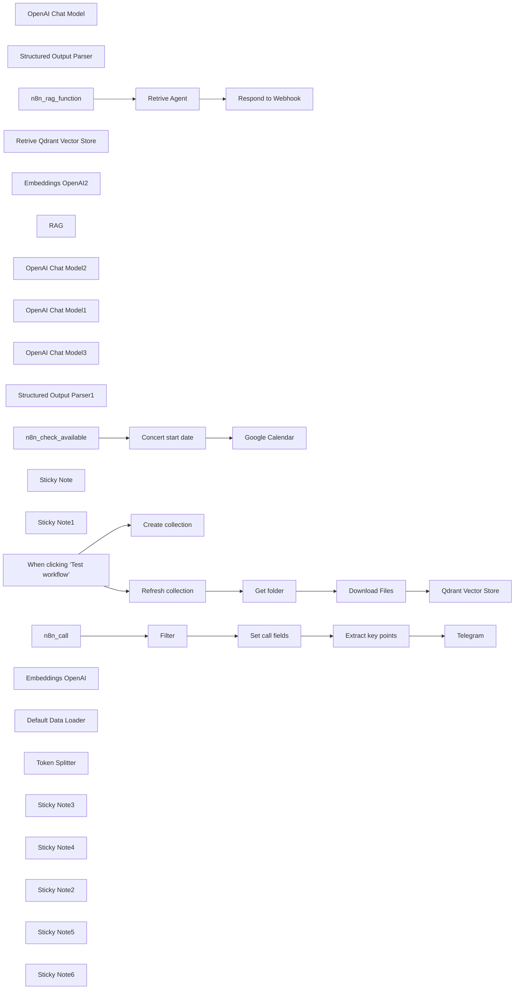

## Fluxo (.json) :

```json
{
  "id": "29P4X9mTSmplnjlJ",
  "meta": {
    "instanceId": "a4bfc93e975ca233ac45ed7c9227d84cf5a2329310525917adaf3312e10d5462",
    "templateCredsSetupCompleted": true
  },
  "name": "AI Phone Agent with RetellAI",
  "tags": [],
  "nodes": [
    {
      "id": "55ef0229-0c33-4821-926d-9aabf4f6c812",
      "name": "Filter",
      "type": "n8n-nodes-base.filter",
      "position": [
        -100,
        120
      ],
      "parameters": {
        "options": {},
        "conditions": {
          "options": {
            "version": 2,
            "leftValue": "",
            "caseSensitive": true,
            "typeValidation": "strict"
          },
          "combinator": "or",
          "conditions": [
            {
              "id": "cce162e9-50f7-41dc-ae45-763a53a835af",
              "operator": {
                "name": "filter.operator.equals",
                "type": "string",
                "operation": "equals"
              },
              "leftValue": "={{ $json.body.event }}",
              "rightValue": "call_ended"
            },
            {
              "id": "b0cec556-f565-4ade-90c9-1cfd74ed238b",
              "operator": {
                "name": "filter.operator.equals",
                "type": "string",
                "operation": "equals"
              },
              "leftValue": "={{ $json.body.event }}",
              "rightValue": "call_analyzed"
            }
          ]
        }
      },
      "typeVersion": 2.2
    },
    {
      "id": "1873c991-0ac0-40c4-b027-e48a9f2582c6",
      "name": "OpenAI Chat Model",
      "type": "@n8n/n8n-nodes-langchain.lmChatOpenAi",
      "position": [
        320,
        320
      ],
      "parameters": {
        "model": {
          "__rl": true,
          "mode": "list",
          "value": "gpt-4o-mini"
        },
        "options": {}
      },
      "credentials": {
        "openAiApi": {
          "id": "4zwP0MSr8zkNvvV9",
          "name": "OpenAi account"
        }
      },
      "typeVersion": 1.2
    },
    {
      "id": "d05a7ec8-2b27-474b-b618-f85da8cf0780",
      "name": "Structured Output Parser",
      "type": "@n8n/n8n-nodes-langchain.outputParserStructured",
      "position": [
        640,
        300
      ],
      "parameters": {
        "schemaType": "manual",
        "inputSchema": "{\n\t\"type\": \"object\",\n\t\"properties\": {\n\t\t\"first_name\": {\n\t\t\t\"type\": \"string\",\n            \"description\":\"\"\n\t\t},\n\t\t\"last_name\": {\n\t\t\t\"type\": \"string\",\n            \"description\":\"\"\n\t\t},\n        \"email\": {\n\t\t\t\"type\": \"string\",\n            \"description\":\"\"\n\t\t},\n        \"telephone\": {\n\t\t\t\"type\": \"string\",\n            \"description\":\"\"\n\t\t},\n        \"summary\": {\n\t\t\t\"type\": \"string\",\n            \"description\":\"\"\n\t\t},\n        \"date\": {\n\t\t\t\"type\": \"date\",\n            \"description\":\"\"\n\t\t},\n        \"date\": {\n\t\t\t\"type\": \"date\",\n            \"description\":\"\"\n\t\t},\n        \"dateTime\": {\n\t\t\t\"type\": \"date\",\n            \"description\":\"\"\n        }\n\t}\n}"
      },
      "typeVersion": 1.2
    },
    {
      "id": "aef9edfc-ff3b-42b6-9839-562a5376135d",
      "name": "n8n_rag_function",
      "type": "n8n-nodes-base.webhook",
      "position": [
        -360,
        720
      ],
      "webhookId": "edb1e894-1210-4902-a34f-a014bbdad8d8",
      "parameters": {
        "path": "edb1e894-1210-4902-a34f-a014bbdad8d8",
        "options": {},
        "httpMethod": "POST",
        "responseMode": "responseNode"
      },
      "typeVersion": 2
    },
    {
      "id": "247567b1-b45c-433f-86f8-43cfe210a532",
      "name": "Retrive Qdrant Vector Store",
      "type": "@n8n/n8n-nodes-langchain.vectorStoreQdrant",
      "position": [
        20,
        1140
      ],
      "parameters": {
        "options": {},
        "qdrantCollection": {
          "__rl": true,
          "mode": "list",
          "value": "scarperia",
          "cachedResultName": "scarperia"
        }
      },
      "credentials": {
        "qdrantApi": {
          "id": "iyQ6MQiVaF3VMBmt",
          "name": "QdrantApi account"
        }
      },
      "typeVersion": 1
    },
    {
      "id": "c8153076-8ae2-4b34-893d-ef75233c2a74",
      "name": "Embeddings OpenAI2",
      "type": "@n8n/n8n-nodes-langchain.embeddingsOpenAi",
      "position": [
        -20,
        1320
      ],
      "parameters": {
        "options": {}
      },
      "credentials": {
        "openAiApi": {
          "id": "4zwP0MSr8zkNvvV9",
          "name": "OpenAi account"
        }
      },
      "typeVersion": 1.2
    },
    {
      "id": "0acec55e-cb6a-4220-a491-aa29eccc692a",
      "name": "RAG",
      "type": "@n8n/n8n-nodes-langchain.toolVectorStore",
      "position": [
        180,
        940
      ],
      "parameters": {
        "name": "company_data",
        "description": "Retrive data about company knowledge from vector store"
      },
      "typeVersion": 1
    },
    {
      "id": "b7a86b9f-1620-4fc7-973f-e6e169e4ecbe",
      "name": "OpenAI Chat Model2",
      "type": "@n8n/n8n-nodes-langchain.lmChatOpenAi",
      "position": [
        -20,
        940
      ],
      "parameters": {
        "model": {
          "__rl": true,
          "mode": "list",
          "value": "gpt-4o-mini"
        },
        "options": {}
      },
      "credentials": {
        "openAiApi": {
          "id": "4zwP0MSr8zkNvvV9",
          "name": "OpenAi account"
        }
      },
      "typeVersion": 1.2
    },
    {
      "id": "64354f1c-388d-47b7-be4e-a67a6feeb0ed",
      "name": "Respond to Webhook",
      "type": "n8n-nodes-base.respondToWebhook",
      "position": [
        620,
        720
      ],
      "parameters": {
        "options": {}
      },
      "typeVersion": 1.1
    },
    {
      "id": "baa32a03-3295-434a-afca-8f7cadece512",
      "name": "OpenAI Chat Model1",
      "type": "@n8n/n8n-nodes-langchain.lmChatOpenAi",
      "position": [
        340,
        1160
      ],
      "parameters": {
        "model": {
          "__rl": true,
          "mode": "list",
          "value": "gpt-4o-mini"
        },
        "options": {}
      },
      "credentials": {
        "openAiApi": {
          "id": "4zwP0MSr8zkNvvV9",
          "name": "OpenAi account"
        }
      },
      "typeVersion": 1.2
    },
    {
      "id": "1d5c9eb2-b468-4dd2-aa77-d33924fdbb41",
      "name": "Telegram",
      "type": "n8n-nodes-base.telegram",
      "position": [
        820,
        120
      ],
      "webhookId": "44d73068-54dc-458b-a6fb-4b4d10ebed34",
      "parameters": {
        "text": "=Call summary:\n{{ $json.output.summary }}\n\nFirst name: {{ $json.output.first_name }}\nLast name: {{ $json.output.last_name }}\nEmail: {{ $json.output.email }}\nTelephone: {{ $json.output.telephone }}\nSummary: {{ $json.output.summary }}\nDate: {{ $json.output.date }}\nDateTiem: {{ $json.output.dateTime }}",
        "chatId": "CHAT_ID",
        "additionalFields": {}
      },
      "credentials": {
        "telegramApi": {
          "id": "rQ5q95W7uKesMDx4",
          "name": "Telegram account Fastewb"
        }
      },
      "typeVersion": 1.2
    },
    {
      "id": "5ca696a0-b1d2-45f5-93d6-066654a0c2f6",
      "name": "Google Calendar",
      "type": "n8n-nodes-base.googleCalendar",
      "position": [
        1860,
        100
      ],
      "parameters": {
        "end": "={{ $json.output.end }}",
        "start": "={{ $json.output.start }}",
        "calendar": {
          "__rl": true,
          "mode": "list",
          "value": "info@n3w.it",
          "cachedResultName": "info@n3w.it"
        },
        "additionalFields": {
          "summary": "Event title",
          "description": "Event description"
        }
      },
      "credentials": {
        "googleCalendarOAuth2Api": {
          "id": "8RFK3u13g2PJEGa9",
          "name": "Google Calendar account"
        }
      },
      "typeVersion": 1.3
    },
    {
      "id": "57fedd6a-94a4-4f58-8179-9fd8ae1d0006",
      "name": "OpenAI Chat Model3",
      "type": "@n8n/n8n-nodes-langchain.lmChatOpenAi",
      "position": [
        1340,
        320
      ],
      "parameters": {
        "model": {
          "__rl": true,
          "mode": "list",
          "value": "gpt-4o-mini"
        },
        "options": {}
      },
      "credentials": {
        "openAiApi": {
          "id": "4zwP0MSr8zkNvvV9",
          "name": "OpenAi account"
        }
      },
      "typeVersion": 1.2
    },
    {
      "id": "f3f8a781-eb03-4e99-8512-b926249aabba",
      "name": "Structured Output Parser1",
      "type": "@n8n/n8n-nodes-langchain.outputParserStructured",
      "position": [
        1640,
        320
      ],
      "parameters": {
        "schemaType": "manual",
        "inputSchema": "{\n\t\"type\": \"object\",\n\t\"properties\": {\n\t\t\"start\": {\n\t\t\t\"type\": \"string\"\n\t\t},\n\t\t\"end\": {\n\t\t\t\"type\": \"string\"\n\t\t}\n\t}\n}"
      },
      "typeVersion": 1.2
    },
    {
      "id": "f3c416a2-6b42-43cc-aa66-e7d146c1b325",
      "name": "n8n_call",
      "type": "n8n-nodes-base.webhook",
      "position": [
        -340,
        120
      ],
      "webhookId": "b352dd49-d3b3-4e0a-a781-17137f7199c8",
      "parameters": {
        "path": "b352dd49-d3b3-4e0a-a781-17137f7199c8",
        "options": {},
        "httpMethod": "POST"
      },
      "typeVersion": 2
    },
    {
      "id": "2862b10c-77d7-4555-b9ec-86c9c4b9fe7b",
      "name": "Sticky Note",
      "type": "n8n-nodes-base.stickyNote",
      "position": [
        1080,
        -1140
      ],
      "parameters": {
        "width": 1140,
        "height": 920,
        "content": "# STEP 3 - RETELL AI\n\n- Register on [Retell AI](https://retellai.com) (10$ FREE credits)\n- Create an Agent an set \"Voice & Language\" and add your system prompt\n- In Webhook settings add the \"Agent Level Webhook URL\" with the n8n webhook node url called \"n8n_call\"\n- Buy a new phone number with your FREE credits by Twilio Provider and connect it to the created agent\n- Enter the previously created agency and create the flow as shown in the following image\n\n- Aggiungere 2 funzioni (una per RAG e una per il Booking) e inserire l'url apposito ricavato dai webhook di n8n \"n8n_rag_function\" e \"n8n_check_available\"\n\n"
      },
      "typeVersion": 1
    },
    {
      "id": "98de797e-56d8-42b4-85a5-245ae7d086db",
      "name": "Sticky Note1",
      "type": "n8n-nodes-base.stickyNote",
      "position": [
        -340,
        -100
      ],
      "parameters": {
        "color": 5,
        "width": 1220,
        "content": "# STEP 4\nIntercept the \"end call\" event and get the full call transcript\n- Add your CHAT_ID in Telegram node"
      },
      "typeVersion": 1
    },
    {
      "id": "ccf11ce4-3bc4-46bd-a71e-12e59d7a2504",
      "name": "n8n_check_available",
      "type": "n8n-nodes-base.webhook",
      "position": [
        1120,
        100
      ],
      "webhookId": "4dcd68b1-91d3-40bc-8aa6-c681126752b2",
      "parameters": {
        "path": "4dcd68b1-91d3-40bc-8aa6-c681126752b2",
        "options": {},
        "httpMethod": "POST",
        "responseMode": "lastNode"
      },
      "typeVersion": 2
    },
    {
      "id": "ddc50779-c0cf-4862-87b9-e187d1ab19a5",
      "name": "When clicking ‘Test workflow’",
      "type": "n8n-nodes-base.manualTrigger",
      "position": [
        -400,
        -940
      ],
      "parameters": {},
      "typeVersion": 1
    },
    {
      "id": "fd6f36d4-c8b3-4643-8df9-a775d94946d9",
      "name": "Qdrant Vector Store",
      "type": "@n8n/n8n-nodes-langchain.vectorStoreQdrant",
      "position": [
        580,
        -820
      ],
      "parameters": {
        "mode": "insert",
        "options": {},
        "qdrantCollection": {
          "__rl": true,
          "mode": "id",
          "value": "="
        }
      },
      "credentials": {
        "qdrantApi": {
          "id": "iyQ6MQiVaF3VMBmt",
          "name": "QdrantApi account"
        }
      },
      "typeVersion": 1
    },
    {
      "id": "3c4f9805-57e7-4662-ab12-8bedc5e5a815",
      "name": "Create collection",
      "type": "n8n-nodes-base.httpRequest",
      "position": [
        -100,
        -1080
      ],
      "parameters": {
        "url": "https://QDRANTURL/collections/COLLECTION",
        "method": "POST",
        "options": {},
        "jsonBody": "{\n  \"filter\": {}\n}",
        "sendBody": true,
        "sendHeaders": true,
        "specifyBody": "json",
        "authentication": "genericCredentialType",
        "genericAuthType": "httpHeaderAuth",
        "headerParameters": {
          "parameters": [
            {
              "name": "Content-Type",
              "value": "application/json"
            }
          ]
        }
      },
      "credentials": {
        "httpHeaderAuth": {
          "id": "qhny6r5ql9wwotpn",
          "name": "Qdrant API (Hetzner)"
        }
      },
      "typeVersion": 4.2
    },
    {
      "id": "b5fdbd4d-0cc9-4b5c-8aa8-b7fe6fd0f3b4",
      "name": "Refresh collection",
      "type": "n8n-nodes-base.httpRequest",
      "position": [
        -100,
        -820
      ],
      "parameters": {
        "url": "https://QDRANTURL/collections/COLLECTION/points/delete",
        "method": "POST",
        "options": {},
        "jsonBody": "{\n  \"filter\": {}\n}",
        "sendBody": true,
        "sendHeaders": true,
        "specifyBody": "json",
        "authentication": "genericCredentialType",
        "genericAuthType": "httpHeaderAuth",
        "headerParameters": {
          "parameters": [
            {
              "name": "Content-Type",
              "value": "application/json"
            }
          ]
        }
      },
      "credentials": {
        "httpHeaderAuth": {
          "id": "qhny6r5ql9wwotpn",
          "name": "Qdrant API (Hetzner)"
        }
      },
      "typeVersion": 4.2
    },
    {
      "id": "c2f5ded2-adcb-4c50-95e6-94e54a7c2116",
      "name": "Get folder",
      "type": "n8n-nodes-base.googleDrive",
      "position": [
        120,
        -820
      ],
      "parameters": {
        "filter": {
          "driveId": {
            "__rl": true,
            "mode": "list",
            "value": "My Drive",
            "cachedResultUrl": "https://drive.google.com/drive/my-drive",
            "cachedResultName": "My Drive"
          },
          "folderId": {
            "__rl": true,
            "mode": "id",
            "value": "=test-whatsapp"
          }
        },
        "options": {},
        "resource": "fileFolder"
      },
      "credentials": {
        "googleDriveOAuth2Api": {
          "id": "HEy5EuZkgPZVEa9w",
          "name": "Google Drive account (n3w.it)"
        }
      },
      "typeVersion": 3
    },
    {
      "id": "640ede03-46fc-44a3-a9e8-29118036d64f",
      "name": "Download Files",
      "type": "n8n-nodes-base.googleDrive",
      "position": [
        340,
        -820
      ],
      "parameters": {
        "fileId": {
          "__rl": true,
          "mode": "id",
          "value": "={{ $json.id }}"
        },
        "options": {
          "googleFileConversion": {
            "conversion": {
              "docsToFormat": "text/plain"
            }
          }
        },
        "operation": "download"
      },
      "credentials": {
        "googleDriveOAuth2Api": {
          "id": "HEy5EuZkgPZVEa9w",
          "name": "Google Drive account (n3w.it)"
        }
      },
      "typeVersion": 3
    },
    {
      "id": "ff40b36c-3092-43fc-a001-9683b0e33460",
      "name": "Embeddings OpenAI",
      "type": "@n8n/n8n-nodes-langchain.embeddingsOpenAi",
      "position": [
        560,
        -620
      ],
      "parameters": {
        "options": {}
      },
      "credentials": {
        "openAiApi": {
          "id": "4zwP0MSr8zkNvvV9",
          "name": "OpenAi account"
        }
      },
      "typeVersion": 1.1
    },
    {
      "id": "cfc6a14a-1445-4d38-8fbb-3dc3c7bfff8b",
      "name": "Default Data Loader",
      "type": "@n8n/n8n-nodes-langchain.documentDefaultDataLoader",
      "position": [
        740,
        -620
      ],
      "parameters": {
        "options": {},
        "dataType": "binary"
      },
      "typeVersion": 1
    },
    {
      "id": "38a49484-82f0-4520-ba03-47edef117cd8",
      "name": "Token Splitter",
      "type": "@n8n/n8n-nodes-langchain.textSplitterTokenSplitter",
      "position": [
        700,
        -460
      ],
      "parameters": {
        "chunkSize": 300,
        "chunkOverlap": 30
      },
      "typeVersion": 1
    },
    {
      "id": "62726443-9c09-4ee7-becb-789982bc2e9b",
      "name": "Sticky Note3",
      "type": "n8n-nodes-base.stickyNote",
      "position": [
        100,
        -1140
      ],
      "parameters": {
        "color": 6,
        "width": 880,
        "height": 220,
        "content": "# STEP 1\n\n## Create Qdrant Collection\nChange:\n- QDRANTURL\n- COLLECTION"
      },
      "typeVersion": 1
    },
    {
      "id": "5f52d12f-6bbe-468c-b23f-356e0675b15a",
      "name": "Sticky Note4",
      "type": "n8n-nodes-base.stickyNote",
      "position": [
        -120,
        -880
      ],
      "parameters": {
        "color": 4,
        "width": 620,
        "height": 400,
        "content": "# STEP 2\n\n\n\n\n\n\n\n\n\n\n\n\n## Documents vectorization with Qdrant and Google Drive\nChange:\n- QDRANTURL\n- COLLECTION"
      },
      "typeVersion": 1
    },
    {
      "id": "08525507-990d-43f3-b2d3-6d73bc2aed84",
      "name": "Set call fields",
      "type": "n8n-nodes-base.set",
      "position": [
        140,
        120
      ],
      "parameters": {
        "options": {},
        "assignments": {
          "assignments": [
            {
              "id": "15b079b9-e36d-4c9b-8ca4-30bf858ce75b",
              "name": "Transcript",
              "type": "string",
              "value": "={{ $json.body.call.transcript }}"
            },
            {
              "id": "f1cbced3-bd9c-4d8f-bd81-060406ff27b0",
              "name": "Duration (sec)",
              "type": "string",
              "value": "={{ $('n8n_call').item.json.body.call.call_cost.total_duration_seconds }}"
            },
            {
              "id": "829ee367-1f5e-4d66-9818-8a27344d7e79",
              "name": "From",
              "type": "string",
              "value": "={{ $('n8n_call').item.json.body.call.from_number }}"
            },
            {
              "id": "38e9e856-d87d-4c23-8486-4ebbac2da595",
              "name": "To",
              "type": "string",
              "value": "={{ $('n8n_call').item.json.body.call.to_number }}"
            },
            {
              "id": "4209d6d3-4881-4296-a1db-fff0c14addda",
              "name": "Cost ",
              "type": "string",
              "value": "={{ $('n8n_call').item.json.body.call.call_cost.combined_cost }}"
            },
            {
              "id": "3c871d3b-95b5-493a-b3fe-3c9bf06a0d62",
              "name": "Telephony Identifier",
              "type": "string",
              "value": "={{ $('n8n_call').item.json.body.call.telephony_identifier.twilio_call_sid }}"
            },
            {
              "id": "0a926748-8aff-4dd7-a252-516f3339210a",
              "name": "Disconnection reason",
              "type": "string",
              "value": "={{ $json.body.call.disconnection_reason }}"
            },
            {
              "id": "9c88eafc-4370-47ad-ad98-d14767c137d0",
              "name": "Recording url",
              "type": "string",
              "value": "={{ $json.body.call.recording_url }}"
            },
            {
              "id": "a737a3bd-c871-4273-85b8-8e423bf7c443",
              "name": "Public log url",
              "type": "string",
              "value": "={{ $json.body.call.public_log_url }}"
            }
          ]
        }
      },
      "typeVersion": 3.4
    },
    {
      "id": "db21e42c-ff87-45ad-a228-77ce4c9c6b0c",
      "name": "Extract key points",
      "type": "@n8n/n8n-nodes-langchain.chainLlm",
      "position": [
        400,
        120
      ],
      "parameters": {
        "text": "=To: {{ $json.To }}\n\nComplete transcript:\n{{ $json.Transcript }} ",
        "messages": {
          "messageValues": [
            {
              "message": "=You are a specialized AI assistant responsible for analyzing complete voice conversation transcripts. Your task is to create concise summaries that extract the essential information from these conversations.\n\nInput: You will receive the complete transcript of a voice conversation between two or more participants.\n\nTask:\n1. Analyze the entire conversation transcript carefully.\n2. Identify and extract the most important key points discussed.\n3. Create a clear, structured summary that captures the essential information.\n4. Highlight any decisions made, action items agreed upon, or critical information shared.\n5. Maintain objectivity in your summary, avoiding interpretation or judgment.\n\nOutput format:\n- Begin with a brief overview of the conversation (1-2 sentences)\n- List the key points in bullet format\n- Include a separate \"Action Items\" section if any tasks or follow-ups were mentioned\n- Keep your summary concise while ensuring all important information is captured\n\nRemember that accuracy is paramount. Focus on extracting what was explicitly stated rather than inferring unstated meanings. If something is unclear in the transcript, note it as such rather than guessing."
            }
          ]
        },
        "promptType": "define",
        "hasOutputParser": true
      },
      "typeVersion": 1.6
    },
    {
      "id": "0c6c8765-d28f-4398-aa0e-8f65879cc740",
      "name": "Concert start date",
      "type": "@n8n/n8n-nodes-langchain.chainLlm",
      "position": [
        1420,
        100
      ],
      "parameters": {
        "text": "=Convert this date to a compatible format for Google Calendar APIs for the start date, and for the end date add 1 hour to the start date.\n\nHere is the start date:\n{{ $json.body.args.date }}",
        "promptType": "define",
        "hasOutputParser": true
      },
      "typeVersion": 1.6
    },
    {
      "id": "0b33c34a-f61c-4aab-8315-600da2da3281",
      "name": "Sticky Note2",
      "type": "n8n-nodes-base.stickyNote",
      "position": [
        1100,
        -100
      ],
      "parameters": {
        "color": 5,
        "width": 1100,
        "content": "# STEP 5\nIf required, create the event in the calendar\n- Enter the title and description of the event"
      },
      "typeVersion": 1
    },
    {
      "id": "138555e5-b62b-4f59-b223-c73611e5dece",
      "name": "Sticky Note5",
      "type": "n8n-nodes-base.stickyNote",
      "position": [
        -360,
        520
      ],
      "parameters": {
        "color": 5,
        "width": 1220,
        "content": "# STEP 6\nIf required retrive the informations by RAG system"
      },
      "typeVersion": 1
    },
    {
      "id": "65d998a1-b31b-4463-be9b-0b27448f9026",
      "name": "Retrive Agent",
      "type": "@n8n/n8n-nodes-langchain.agent",
      "position": [
        60,
        720
      ],
      "parameters": {
        "text": "={{ $json.body.args.query }}",
        "agent": "conversationalAgent",
        "options": {
          "systemMessage": "You are an AI-powered assistant for an electronics store. Answer in Italian. Your primary goal is to assist customers by providing accurate and helpful information about products, troubleshooting tips, and general support. Use the provided knowledge base (retrieved documents) to answer questions with precision and professionalism.\n\n**Guidelines**:\n1. **Product Information**:\n   - Provide detailed descriptions of products, including specifications, features, and compatibility.\n   - Highlight key selling points and differences between similar products.\n   - Mention availability, pricing, and promotions if applicable.\n\n2. **Technical Support**:\n   - Offer step-by-step troubleshooting guides for common issues.\n   - Suggest solutions for setup, installation, or configuration problems.\n   - If the issue is complex, recommend contacting the store’s support team for further assistance.\n\n3. **Customer Service**:\n   - Respond politely and professionally to all inquiries.\n   - If a question is unclear, ask for clarification to provide the best possible answer.\n   - For order-related questions (e.g., status, returns, or cancellations), guide customers on how to proceed using the store’s systems.\n\n4. **Knowledge Base Usage**:\n   - Always reference the provided knowledge base (retrieved documents) to ensure accuracy.\n   - If the knowledge base does not contain relevant information, inform the customer and suggest alternative resources or actions.\n\n5. **Tone and Style**:\n   - Use a friendly, approachable, and professional tone.\n   - Avoid technical jargon unless the customer demonstrates familiarity with the topic.\n   - Keep responses concise but informative.\n\n**Example Interactions**:\n1. **Product Inquiry**:\n   - Customer: \"What’s the difference between the XYZ Smartwatch and the ABC Smartwatch?\"\n   - AI: \"The XYZ Smartwatch features a longer battery life (up to 7 days) and built-in GPS, while the ABC Smartwatch has a brighter AMOLED display and supports wireless charging. Both are compatible with iOS and Android devices. Would you like more details on either product?\"\n\n2. **Technical Support**:\n   - Customer: \"My wireless router isn’t connecting to the internet.\"\n   - AI: \"Please try the following steps: 1) Restart your router and modem. 2) Ensure all cables are securely connected. 3) Check if the router’s LED indicators show a stable connection. If the issue persists, you may need to reset the router to factory settings. Would you like a detailed guide for resetting your router?\"\n\n3. **Customer Service**:\n   - Customer: \"How do I return a defective product?\"\n   - AI: \"To return a defective product, please visit our Returns Portal on our website and enter your order number. You’ll receive a return label and instructions. If you need further assistance, our support team is available at support@electronicsstore.com.\"\n\n**Limitations**:\n- If the question is outside the scope of the knowledge base or requires human intervention, inform the customer and provide contact details for the appropriate department.\n- Do not provide speculative or unverified information. Always rely on the knowledge base or direct the customer to official resources."
        },
        "promptType": "define"
      },
      "typeVersion": 1.7
    },
    {
      "id": "a98a4ed7-4ebc-4d40-8aaa-70de751bc15f",
      "name": "Sticky Note6",
      "type": "n8n-nodes-base.stickyNote",
      "position": [
        -380,
        -1600
      ],
      "parameters": {
        "color": 3,
        "width": 2580,
        "height": 360,
        "content": "# Create your first AI Phone Agent\n\nBuild, test, deploy, and monitor AI phone agents. Retell is a comprehensive platform for building, testing, deploying, and monitoring reliable AI phone agents.\nConversation flow agent allows you to create multiple nodes to handle different scenarios in the conversation. It provides more fine-grained control over the conversation flow compared to single / multi prompt agent, which unlocks the ability to handle more complex scenarios.\n\nThis Workflow simulates an AI-powered phone agent with two main functions:\n\n📅 Appointment Booking – It can schedule appointments directly into Google Calendar.\n\n🧠 RAG-based Information Retrieval – It provides answers using a Retrieval-Augmented Generation (RAG) system. For example, it can respond to questions such as store opening hours, return policies, or product details.\n\nThe guide also explains how to purchase a dedicated phone number (with a +1 prefix) and link it to the AI agent. This setup is cost-effective, as it uses a free $10 credit to operate without additional charges in the beginning."
      },
      "typeVersion": 1
    }
  ],
  "active": true,
  "pinData": {},
  "settings": {
    "timezone": "Europe/Rome",
    "executionOrder": "v1"
  },
  "versionId": "d78ac941-900b-49f5-a9a8-158effbd2479",
  "connections": {
    "RAG": {
      "ai_tool": [
        [
          {
            "node": "Retrive Agent",
            "type": "ai_tool",
            "index": 0
          }
        ]
      ]
    },
    "Filter": {
      "main": [
        [
          {
            "node": "Set call fields",
            "type": "main",
            "index": 0
          }
        ]
      ]
    },
    "n8n_call": {
      "main": [
        [
          {
            "node": "Filter",
            "type": "main",
            "index": 0
          }
        ]
      ]
    },
    "Get folder": {
      "main": [
        [
          {
            "node": "Download Files",
            "type": "main",
            "index": 0
          }
        ]
      ]
    },
    "Retrive Agent": {
      "main": [
        [
          {
            "node": "Respond to Webhook",
            "type": "main",
            "index": 0
          }
        ]
      ]
    },
    "Download Files": {
      "main": [
        [
          {
            "node": "Qdrant Vector Store",
            "type": "main",
            "index": 0
          }
        ]
      ]
    },
    "Token Splitter": {
      "ai_textSplitter": [
        [
          {
            "node": "Default Data Loader",
            "type": "ai_textSplitter",
            "index": 0
          }
        ]
      ]
    },
    "Google Calendar": {
      "main": [
        []
      ]
    },
    "Set call fields": {
      "main": [
        [
          {
            "node": "Extract key points",
            "type": "main",
            "index": 0
          }
        ]
      ]
    },
    "n8n_rag_function": {
      "main": [
        [
          {
            "node": "Retrive Agent",
            "type": "main",
            "index": 0
          }
        ]
      ]
    },
    "Embeddings OpenAI": {
      "ai_embedding": [
        [
          {
            "node": "Qdrant Vector Store",
            "type": "ai_embedding",
            "index": 0
          }
        ]
      ]
    },
    "OpenAI Chat Model": {
      "ai_languageModel": [
        [
          {
            "node": "Extract key points",
            "type": "ai_languageModel",
            "index": 0
          }
        ]
      ]
    },
    "Concert start date": {
      "main": [
        [
          {
            "node": "Google Calendar",
            "type": "main",
            "index": 0
          }
        ]
      ]
    },
    "Embeddings OpenAI2": {
      "ai_embedding": [
        [
          {
            "node": "Retrive Qdrant Vector Store",
            "type": "ai_embedding",
            "index": 0
          }
        ]
      ]
    },
    "Extract key points": {
      "main": [
        [
          {
            "node": "Telegram",
            "type": "main",
            "index": 0
          }
        ]
      ]
    },
    "OpenAI Chat Model1": {
      "ai_languageModel": [
        [
          {
            "node": "RAG",
            "type": "ai_languageModel",
            "index": 0
          }
        ]
      ]
    },
    "OpenAI Chat Model2": {
      "ai_languageModel": [
        [
          {
            "node": "Retrive Agent",
            "type": "ai_languageModel",
            "index": 0
          }
        ]
      ]
    },
    "OpenAI Chat Model3": {
      "ai_languageModel": [
        [
          {
            "node": "Concert start date",
            "type": "ai_languageModel",
            "index": 0
          }
        ]
      ]
    },
    "Refresh collection": {
      "main": [
        [
          {
            "node": "Get folder",
            "type": "main",
            "index": 0
          }
        ]
      ]
    },
    "Default Data Loader": {
      "ai_document": [
        [
          {
            "node": "Qdrant Vector Store",
            "type": "ai_document",
            "index": 0
          }
        ]
      ]
    },
    "n8n_check_available": {
      "main": [
        [
          {
            "node": "Concert start date",
            "type": "main",
            "index": 0
          }
        ]
      ]
    },
    "Structured Output Parser": {
      "ai_outputParser": [
        [
          {
            "node": "Extract key points",
            "type": "ai_outputParser",
            "index": 0
          }
        ]
      ]
    },
    "Structured Output Parser1": {
      "ai_outputParser": [
        [
          {
            "node": "Concert start date",
            "type": "ai_outputParser",
            "index": 0
          }
        ]
      ]
    },
    "Retrive Qdrant Vector Store": {
      "ai_vectorStore": [
        [
          {
            "node": "RAG",
            "type": "ai_vectorStore",
            "index": 0
          }
        ]
      ]
    },
    "When clicking ‘Test workflow’": {
      "main": [
        [
          {
            "node": "Create collection",
            "type": "main",
            "index": 0
          },
          {
            "node": "Refresh collection",
            "type": "main",
            "index": 0
          }
        ]
      ]
    }
  }
}
```

<a id="template-1316"></a>

## Template 1316 - Extrair e resumir avaliações do Yelp

- **Nome:** Extrair e resumir avaliações do Yelp
- **Descrição:** Fluxo que coleta avaliações do Yelp via Bright Data, extrai dados estruturados e gera um resumo conciso usando o modelo Google Gemini, enviando o resultado final para um webhook.
- **Funcionalidade:** • Definir URL e zona de coleta: Permite configurar o endereço do Yelp a ser consultado e a zona do serviço de coleta.
• Captura de conteúdo do Yelp via Bright Data: Realiza requisição ao serviço de coleta para obter o HTML/raw dos resultados do Yelp.
• Extração de dados estruturados com LLM: Analisa o conteúdo coletado e produz um JSON estruturado com nome do restaurante, localização, avaliação média, número de avaliações e lista de reviews (avaliador, nota, data, texto).
• Geração de resumo das avaliações: Cria um resumo conciso e combinável das avaliações usando um modelo de linguagem.
• Mesclagem de outputs: Combina os dados estruturados e o resumo para formar uma resposta unificada.
• Notificação via webhook: Envia o payload final (dados e resumo) para um endpoint configurável para consumo externo.
• Suporte a configuração de credenciais e seleção de modelo: Utiliza credenciais para o serviço de coleta e para o modelo de linguagem, permitindo troca de zona e modelo.
- **Ferramentas:** • Bright Data: Serviço de coleta/proxy para extrair conteúdo web (usado para requisitar páginas do Yelp).
• Google Gemini (PaLM): Modelo de linguagem usado para extrair dados estruturados e gerar resumos concisos.
• Yelp: Fonte de dados — site de avaliações de negócios do qual o conteúdo é extraído.
• Serviço de Webhook (ex.: webhook.site): Endpoint para receber o resultado final do fluxo.


## Fluxo visual

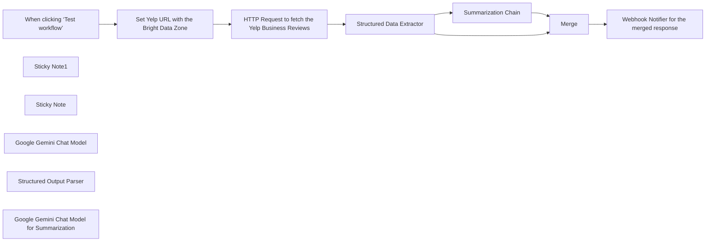

## Fluxo (.json) :

```json
{
  "id": "cKFPrgXstN3JgdJs",
  "meta": {
    "instanceId": "885b4fb4a6a9c2cb5621429a7b972df0d05bb724c20ac7dac7171b62f1c7ef40",
    "templateCredsSetupCompleted": true
  },
  "name": "Extract & Summarize Yelp Business Review with Bright Data and Google Gemini",
  "tags": [
    {
      "id": "Kujft2FOjmOVQAmJ",
      "name": "Engineering",
      "createdAt": "2025-04-09T01:31:00.558Z",
      "updatedAt": "2025-04-09T01:31:00.558Z"
    },
    {
      "id": "ddPkw7Hg5dZhQu2w",
      "name": "AI",
      "createdAt": "2025-04-13T05:38:08.053Z",
      "updatedAt": "2025-04-13T05:38:08.053Z"
    }
  ],
  "nodes": [
    {
      "id": "b7847e5b-1855-4bce-a9ba-123053085f99",
      "name": "When clicking ‘Test workflow’",
      "type": "n8n-nodes-base.manualTrigger",
      "position": [
        340,
        -535
      ],
      "parameters": {},
      "typeVersion": 1
    },
    {
      "id": "9bee5052-3aeb-4a76-a688-3128c20877ec",
      "name": "Sticky Note1",
      "type": "n8n-nodes-base.stickyNote",
      "position": [
        780,
        -820
      ],
      "parameters": {
        "width": 420,
        "height": 220,
        "content": "## LLM Usages\n\nGoogle Gemini Flash Exp model is being used.\n\nBasic LLM Chain with the Output parser for building the structured data.\n\nSummarization Chain to summarize the structured response."
      },
      "typeVersion": 1
    },
    {
      "id": "ee05bcc3-0971-4e8c-9e2d-89708fc4ecf4",
      "name": "Sticky Note",
      "type": "n8n-nodes-base.stickyNote",
      "position": [
        320,
        -820
      ],
      "parameters": {
        "width": 400,
        "height": 220,
        "content": "## Note\n\nDeals with the Yelp Business Review data extraction using the Bright Data and LLM for structured data extraction and summarization.\n\n**Please make sure to update the \"Set Yelp URL with the Bright Data Zone\" and the Webhook Notification URL**"
      },
      "typeVersion": 1
    },
    {
      "id": "8917dd4e-75aa-4c51-ba80-577be3573578",
      "name": "Set Yelp URL with the Bright Data Zone",
      "type": "n8n-nodes-base.set",
      "notes": "Set the URL which you are interested to scrap the data",
      "position": [
        560,
        -535
      ],
      "parameters": {
        "options": {},
        "assignments": {
          "assignments": [
            {
              "id": "1c132dd6-31e4-453b-a8cf-cad9845fe55b",
              "name": "url",
              "type": "string",
              "value": "https://www.yelp.com/search?find_desc=Restaurants&find_loc=San+Francisco%2C+CA&sortby=rating?product=unlocker&method=api"
            },
            {
              "id": "0fa387df-2511-4228-b6aa-237cceb3e9c7",
              "name": "zone",
              "type": "string",
              "value": "web_unlocker1"
            }
          ]
        }
      },
      "notesInFlow": true,
      "typeVersion": 3.4
    },
    {
      "id": "4cccab05-2584-4557-a58a-f92cbd67c67e",
      "name": "HTTP Request to fetch the Yelp Business Reviews",
      "type": "n8n-nodes-base.httpRequest",
      "position": [
        780,
        -535
      ],
      "parameters": {
        "url": "https://api.brightdata.com/request",
        "method": "POST",
        "options": {},
        "sendBody": true,
        "sendHeaders": true,
        "authentication": "genericCredentialType",
        "bodyParameters": {
          "parameters": [
            {
              "name": "zone",
              "value": "={{ $json.zone }}"
            },
            {
              "name": "url",
              "value": "={{ $json.url }}"
            },
            {
              "name": "format",
              "value": "raw"
            }
          ]
        },
        "genericAuthType": "httpHeaderAuth",
        "headerParameters": {
          "parameters": [
            {}
          ]
        }
      },
      "credentials": {
        "httpHeaderAuth": {
          "id": "kdbqXuxIR8qIxF7y",
          "name": "Header Auth account"
        }
      },
      "typeVersion": 4.2
    },
    {
      "id": "5b39a992-1902-4afe-9cbb-2fca524a5272",
      "name": "Google Gemini Chat Model",
      "type": "@n8n/n8n-nodes-langchain.lmChatGoogleGemini",
      "position": [
        1000,
        -320
      ],
      "parameters": {
        "options": {},
        "modelName": "models/gemini-2.0-flash-exp"
      },
      "credentials": {
        "googlePalmApi": {
          "id": "YeO7dHZnuGBVQKVZ",
          "name": "Google Gemini(PaLM) Api account"
        }
      },
      "typeVersion": 1
    },
    {
      "id": "dba8b9f8-0739-4f34-9c3a-41ad447c1dd3",
      "name": "Structured Output Parser",
      "type": "@n8n/n8n-nodes-langchain.outputParserStructured",
      "position": [
        1160,
        -320
      ],
      "parameters": {
        "jsonSchemaExample": "[\n   {\n     \"restaurant_name\": \"string\",\n     \"location\": \"string\",\n     \"average_rating\": \"float\",\n     \"review_count\": \"int\",\n     \"reviews\": [\n      {\n        \"reviewer\": \"string\",\n        \"rating\": \"float\",\n        \"date\": \"YYYY-MM-DD\",\n        \"text\": \"string\"\n      }\n    ]\n   }\n]"
      },
      "typeVersion": 1.2
    },
    {
      "id": "375dc3e5-02f4-499d-922d-31070188b864",
      "name": "Summarization Chain",
      "type": "@n8n/n8n-nodes-langchain.chainSummarization",
      "position": [
        1376,
        -660
      ],
      "parameters": {
        "options": {
          "summarizationMethodAndPrompts": {
            "values": {
              "prompt": "Write a concise summary of the following:\n\n\n\"{text}\"\n\n",
              "combineMapPrompt": "=Write a concise summary of the following:\n\n\n\n\n\nCONCISE SUMMARY: {{ $json.output }}"
            }
          }
        }
      },
      "typeVersion": 2
    },
    {
      "id": "3846b2a2-a670-4264-9028-11c5f76770e8",
      "name": "Merge",
      "type": "n8n-nodes-base.merge",
      "position": [
        1760,
        -520
      ],
      "parameters": {},
      "typeVersion": 3.1
    },
    {
      "id": "5f617e4c-17c2-437b-8a7a-1cdab587c5dd",
      "name": "Webhook Notifier for the merged response",
      "type": "n8n-nodes-base.httpRequest",
      "position": [
        1972,
        -535
      ],
      "parameters": {
        "url": "https://webhook.site/daf9d591-a130-4010-b1d3-0c66f8fcf467",
        "options": {},
        "sendBody": true,
        "bodyParameters": {
          "parameters": [
            {
              "name": "reviews",
              "value": "={{ $json.output }}"
            },
            {
              "name": "summary",
              "value": "={{ $json.response.text }}"
            }
          ]
        }
      },
      "typeVersion": 4.2
    },
    {
      "id": "66bd58de-a235-43b3-bb3e-491644aaabd8",
      "name": "Google Gemini Chat Model for Summarization",
      "type": "@n8n/n8n-nodes-langchain.lmChatGoogleGemini",
      "position": [
        1464,
        -440
      ],
      "parameters": {
        "options": {},
        "modelName": "models/gemini-2.0-flash-exp"
      },
      "credentials": {
        "googlePalmApi": {
          "id": "YeO7dHZnuGBVQKVZ",
          "name": "Google Gemini(PaLM) Api account"
        }
      },
      "typeVersion": 1
    },
    {
      "id": "4bd63e0d-5f58-4232-b638-cede71a50f0f",
      "name": "Structured Data Extractor",
      "type": "@n8n/n8n-nodes-langchain.chainLlm",
      "position": [
        1000,
        -535
      ],
      "parameters": {
        "text": "=Summarize and analyze Yelp reviews {{ $json.data }}",
        "promptType": "define",
        "hasOutputParser": true
      },
      "typeVersion": 1.6
    }
  ],
  "active": false,
  "pinData": {},
  "settings": {
    "executionOrder": "v1"
  },
  "versionId": "32c41687-2a9b-4ab8-b7fb-a34e5111548a",
  "connections": {
    "Merge": {
      "main": [
        [
          {
            "node": "Webhook Notifier for the merged response",
            "type": "main",
            "index": 0
          }
        ]
      ]
    },
    "Summarization Chain": {
      "main": [
        [
          {
            "node": "Merge",
            "type": "main",
            "index": 1
          }
        ]
      ]
    },
    "Google Gemini Chat Model": {
      "ai_languageModel": [
        [
          {
            "node": "Structured Data Extractor",
            "type": "ai_languageModel",
            "index": 0
          }
        ]
      ]
    },
    "Structured Output Parser": {
      "ai_outputParser": [
        [
          {
            "node": "Structured Data Extractor",
            "type": "ai_outputParser",
            "index": 0
          }
        ]
      ]
    },
    "Structured Data Extractor": {
      "main": [
        [
          {
            "node": "Summarization Chain",
            "type": "main",
            "index": 0
          },
          {
            "node": "Merge",
            "type": "main",
            "index": 0
          }
        ]
      ]
    },
    "When clicking ‘Test workflow’": {
      "main": [
        [
          {
            "node": "Set Yelp URL with the Bright Data Zone",
            "type": "main",
            "index": 0
          }
        ]
      ]
    },
    "Set Yelp URL with the Bright Data Zone": {
      "main": [
        [
          {
            "node": "HTTP Request to fetch the Yelp Business Reviews",
            "type": "main",
            "index": 0
          }
        ]
      ]
    },
    "Webhook Notifier for the merged response": {
      "main": [
        []
      ]
    },
    "Google Gemini Chat Model for Summarization": {
      "ai_languageModel": [
        [
          {
            "node": "Summarization Chain",
            "type": "ai_languageModel",
            "index": 0
          }
        ]
      ]
    },
    "HTTP Request to fetch the Yelp Business Reviews": {
      "main": [
        [
          {
            "node": "Structured Data Extractor",
            "type": "main",
            "index": 0
          }
        ]
      ]
    }
  }
}
```

<a id="template-1317"></a>

## Template 1317 - Pesquisa de satisfação via chat (Telegram)

- **Nome:** Pesquisa de satisfação via chat (Telegram)
- **Descrição:** Conduz uma pesquisa estruturada por chat no Telegram usando perguntas definidas em uma planilha e um agente de IA para aprofundar respostas, enquanto mantém estado de sessão e registra respostas.
- **Funcionalidade:** • Início e controle por comando: detecta comandos do usuário (/start, /next, /reset) para iniciar, avançar ou reiniciar a pesquisa.
• Leitura de perguntas dinâmicas: puxa perguntas sequenciais de uma planilha para apresentar ao usuário.
• Gerenciamento de sessão: armazena e atualiza o estado da sessão (índice da pergunta, timestamps) para controlar o progresso.
• Registro de respostas: salva as respostas do usuário e as conversas adicionais geradas pelo agente de IA na planilha.
• Agente conversacional para follow-up: utiliza um agente de IA para conversar com o usuário e aprofundar respostas quando necessário.
• Classificação automática de necessidade de follow-up: avalia se a resposta exige perguntas adicionais antes de prosseguir.
• Reset de contexto do agente por pergunta: limpa a memória de conversação do agente para focar em cada pergunta individualmente e reduzir vieses.
• Opção de pular pergunta: permite ao usuário pular para a próxima pergunta com um comando simples.
- **Ferramentas:** • Telegram: plataforma de chat usada para interação com usuários e envio/recebimento de mensagens.
• Google Sheets: armazena as perguntas do questionário e registra respostas e transcrições de conversas.
• Redis: armazena o estado da sessão e o histórico de conversação para leitura/escrita rápida.
• OpenAI (modelo GPT-4o-mini): gera mensagens do agente conversacional e perguntas de acompanhamento para extrair insights qualitativos.

## Fluxo visual

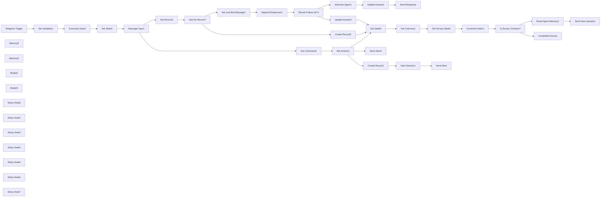

## Fluxo (.json) :

```json
{
  "meta": {
    "instanceId": "408f9fb9940c3cb18ffdef0e0150fe342d6e655c3a9fac21f0f644e8bedabcd9",
    "templateCredsSetupCompleted": true
  },
  "nodes": [
    {
      "id": "c537229c-ffdf-4a4b-8cdd-1d88621e58a0",
      "name": "Telegram Trigger",
      "type": "n8n-nodes-base.telegramTrigger",
      "position": [
        -1060,
        2060
      ],
      "webhookId": "1b9f2217-7c53-4440-b62b-aafcf1e1d45d",
      "parameters": {
        "updates": [
          "message"
        ],
        "additionalFields": {}
      },
      "credentials": {
        "telegramApi": {
          "id": "wJqs1eMdbjilZH1W",
          "name": "jimleuk_ai_survey_demo_bot"
        }
      },
      "typeVersion": 1.1
    },
    {
      "id": "90426896-35d8-4449-8607-70e8485441ed",
      "name": "Send Next Question",
      "type": "n8n-nodes-base.telegram",
      "position": [
        2560,
        1900
      ],
      "webhookId": "4306c719-0b05-4986-8ea8-8bcda06e0ad1",
      "parameters": {
        "text": "={{ $('Get Survey State1').first().json.next_question_idx }}. {{ Object.values($('Get Columns1').first().json)[$('Get Survey State1').first().json.next_question_idx+1] }}",
        "chatId": "={{ $('Telegram Trigger').first().json.message.chat.id }}",
        "additionalFields": {
          "appendAttribution": false
        }
      },
      "credentials": {
        "telegramApi": {
          "id": "wJqs1eMdbjilZH1W",
          "name": "jimleuk_ai_survey_demo_bot"
        }
      },
      "typeVersion": 1.2
    },
    {
      "id": "614b6d06-7bca-4710-aebf-3a2a685ace09",
      "name": "Send Response",
      "type": "n8n-nodes-base.telegram",
      "position": [
        1540,
        2540
      ],
      "webhookId": "dd1c616f-891c-48d4-8828-e612b13bca63",
      "parameters": {
        "text": "={{ $('Interview Agent1').first().json.output }}",
        "chatId": "={{ $('Telegram Trigger').first().json.message.chat.id }}",
        "additionalFields": {
          "appendAttribution": false
        }
      },
      "credentials": {
        "telegramApi": {
          "id": "wJqs1eMdbjilZH1W",
          "name": "jimleuk_ai_survey_demo_bot"
        }
      },
      "typeVersion": 1.2
    },
    {
      "id": "c7f7acc4-c3f7-4fae-98dd-25dca9caae8b",
      "name": "Has No Record?",
      "type": "n8n-nodes-base.if",
      "position": [
        60,
        2260
      ],
      "parameters": {
        "options": {},
        "conditions": {
          "options": {
            "version": 2,
            "leftValue": "",
            "caseSensitive": true,
            "typeValidation": "strict"
          },
          "combinator": "and",
          "conditions": [
            {
              "id": "a9f08592-d870-44a4-a7f9-d70193cf721b",
              "operator": {
                "type": "object",
                "operation": "empty",
                "singleValue": true
              },
              "leftValue": "={{ $json }}",
              "rightValue": ""
            }
          ]
        }
      },
      "typeVersion": 2.2
    },
    {
      "id": "207a2647-56eb-419a-8269-9a32edabe43a",
      "name": "Is Survey Continue?",
      "type": "n8n-nodes-base.if",
      "position": [
        1980,
        2060
      ],
      "parameters": {
        "options": {},
        "conditions": {
          "options": {
            "version": 2,
            "leftValue": "",
            "caseSensitive": true,
            "typeValidation": "strict"
          },
          "combinator": "and",
          "conditions": [
            {
              "id": "5685829b-a2b2-42c8-b6bc-22eaa03db1d2",
              "operator": {
                "type": "boolean",
                "operation": "false",
                "singleValue": true
              },
              "leftValue": "={{ $('Increment Index1').item.json.is_survey_complete }}",
              "rightValue": ""
            }
          ]
        }
      },
      "typeVersion": 2.2
    },
    {
      "id": "a8e98579-6afa-4d7d-859d-9e635a0a1b0c",
      "name": "Get State2",
      "type": "n8n-nodes-base.redis",
      "position": [
        -520,
        2060
      ],
      "parameters": {
        "key": "={{ $json.cacheKey }}",
        "options": {},
        "operation": "get",
        "propertyName": "data"
      },
      "credentials": {
        "redis": {
          "id": "zU4DA70qSDrZM1El",
          "name": "Redis account (localhost)"
        }
      },
      "typeVersion": 1
    },
    {
      "id": "8074143c-eab7-4146-937c-16c44ef40333",
      "name": "Get Columns1",
      "type": "n8n-nodes-base.googleSheets",
      "position": [
        1440,
        2060
      ],
      "parameters": {
        "options": {
          "dataLocationOnSheet": {
            "values": {
              "firstDataRow": 1,
              "rangeDefinition": "specifyRange"
            }
          }
        },
        "sheetName": {
          "__rl": true,
          "mode": "list",
          "value": "gid=0",
          "cachedResultUrl": "https://docs.google.com/spreadsheets/d/1KMNqWWO36osZx7jF-i1UL53z2GZnCn9fiBjtlGpvWB4/edit#gid=0",
          "cachedResultName": "Sheet1"
        },
        "documentId": {
          "__rl": true,
          "mode": "id",
          "value": "={{ $('Set Variables1').first().json.gsheetId }}"
        }
      },
      "credentials": {
        "googleSheetsOAuth2Api": {
          "id": "XHvC7jIRR8A2TlUl",
          "name": "Google Sheets account"
        }
      },
      "typeVersion": 4.5
    },
    {
      "id": "1f75f3fc-7893-444d-8a1e-59ec3d42ea1d",
      "name": "Set Variables1",
      "type": "n8n-nodes-base.set",
      "position": [
        -880,
        2060
      ],
      "parameters": {
        "options": {},
        "assignments": {
          "assignments": [
            {
              "id": "2140b769-2e90-4828-8022-1b0a9baf6e44",
              "name": "title",
              "type": "string",
              "value": "Product Satisfaction Survey: DJI Mini 2"
            },
            {
              "id": "fb7110cb-82d3-4c95-81ba-ac97a26fe05e",
              "name": "gsheetId",
              "type": "string",
              "value": "1KMNqWWO36osZx7jF-i1UL53z2GZnCn9fiBjtlGpvWB4"
            },
            {
              "id": "6d9c4b02-8326-49f4-ac22-24bdec7fdd67",
              "name": "cacheKey",
              "type": "string",
              "value": "=survey_user_{{ $json.sessionId }}"
            }
          ]
        }
      },
      "typeVersion": 3.4
    },
    {
      "id": "a0c06eb9-46d6-4888-85b0-e9a31a31337b",
      "name": "Message Type1",
      "type": "n8n-nodes-base.switch",
      "position": [
        -320,
        2060
      ],
      "parameters": {
        "rules": {
          "values": [
            {
              "outputKey": "is_bot_command",
              "conditions": {
                "options": {
                  "version": 2,
                  "leftValue": "",
                  "caseSensitive": true,
                  "typeValidation": "strict"
                },
                "combinator": "and",
                "conditions": [
                  {
                    "id": "f5fa8b7c-fdda-4c6d-b610-e243d6299598",
                    "operator": {
                      "type": "boolean",
                      "operation": "true",
                      "singleValue": true
                    },
                    "leftValue": "={{ ['/start','/next', '/reset'].includes($('Telegram Trigger').first().json.message.text) }}",
                    "rightValue": "="
                  }
                ]
              },
              "renameOutput": true
            }
          ]
        },
        "options": {
          "fallbackOutput": "extra",
          "renameFallbackOutput": "is_normal_message"
        }
      },
      "typeVersion": 3.2
    },
    {
      "id": "315585fe-d2e4-4cb1-9d0e-a3e8bc053da3",
      "name": "Get Command1",
      "type": "n8n-nodes-base.set",
      "position": [
        -120,
        1760
      ],
      "parameters": {
        "options": {},
        "assignments": {
          "assignments": [
            {
              "id": "73335bd3-ce50-46c5-8bcf-f7b8cd992208",
              "name": "command",
              "type": "string",
              "value": "={{ $('Telegram Trigger').first().json.message.text.slice($('Telegram Trigger').first().json.message.entities[0].offset, $('Telegram Trigger').first().json.message.entities[0].length ) }}"
            }
          ]
        }
      },
      "typeVersion": 3.4
    },
    {
      "id": "7036d250-0271-4c93-9f60-01b9ccaf8be3",
      "name": "Bot Actions1",
      "type": "n8n-nodes-base.switch",
      "position": [
        60,
        1760
      ],
      "parameters": {
        "rules": {
          "values": [
            {
              "outputKey": "new_session",
              "conditions": {
                "options": {
                  "version": 2,
                  "leftValue": "",
                  "caseSensitive": true,
                  "typeValidation": "strict"
                },
                "combinator": "and",
                "conditions": [
                  {
                    "id": "6f427c86-090d-429a-bc99-d2dd7753c153",
                    "operator": {
                      "type": "boolean",
                      "operation": "true",
                      "singleValue": true
                    },
                    "leftValue": "={{ $('Get Command1').first().json.command === '/start' }}",
                    "rightValue": "/start"
                  }
                ]
              },
              "renameOutput": true
            },
            {
              "outputKey": "next_question",
              "conditions": {
                "options": {
                  "version": 2,
                  "leftValue": "",
                  "caseSensitive": true,
                  "typeValidation": "strict"
                },
                "combinator": "and",
                "conditions": [
                  {
                    "id": "bca60df4-278d-4598-afc9-6e8ee61b7ac5",
                    "operator": {
                      "type": "boolean",
                      "operation": "true",
                      "singleValue": true
                    },
                    "leftValue": "={{ $('Get Command1').first().json.command === '/next' }}",
                    "rightValue": ""
                  }
                ]
              },
              "renameOutput": true
            }
          ]
        },
        "options": {
          "fallbackOutput": "extra"
        }
      },
      "typeVersion": 3.2
    },
    {
      "id": "fa755815-29c2-419e-8e36-51102ee88681",
      "name": "Memory3",
      "type": "@n8n/n8n-nodes-langchain.memoryRedisChat",
      "position": [
        2220,
        2060
      ],
      "parameters": {
        "sessionKey": "={{ $('Set Variables1').first().json.cacheKey }}_history",
        "sessionIdType": "customKey",
        "contextWindowLength": 10
      },
      "credentials": {
        "redis": {
          "id": "zU4DA70qSDrZM1El",
          "name": "Redis account (localhost)"
        }
      },
      "typeVersion": 1.4
    },
    {
      "id": "a231e026-e5bf-4864-a57b-29d01e32e1a8",
      "name": "Get Survey State1",
      "type": "n8n-nodes-base.set",
      "position": [
        1620,
        2060
      ],
      "parameters": {
        "options": {},
        "assignments": {
          "assignments": [
            {
              "id": "6836a5aa-2b51-48cc-8d8f-d64a85d8a52f",
              "name": "title",
              "type": "string",
              "value": "={{ Object.values($json)[1] }}"
            },
            {
              "id": "7b2fdf1b-4f55-4b55-be54-a7b97dd094cb",
              "name": "num_questions",
              "type": "number",
              "value": "={{ Object.keys($json).length - 2 }}"
            },
            {
              "id": "dc6d5c41-0f35-49c9-b9c9-b6b4f2ceb66c",
              "name": "next_question_idx",
              "type": "number",
              "value": "={{ (Number($('Get State3').first().json.data?.current_question_idx) || 0) + 1 }}"
            },
            {
              "id": "8b17703f-fbff-40d2-a7bb-d450f2edfea3",
              "name": "is_survey_complete",
              "type": "boolean",
              "value": "={{ ((Number($('Get State3').first().json.data?.current_question_idx) || 0) + 1) >= (Object.keys($json).length - 1) }}"
            }
          ]
        }
      },
      "executeOnce": true,
      "typeVersion": 3.4
    },
    {
      "id": "a3bb744d-c59f-45a9-8b9d-3c291fa8d860",
      "name": "Reset Agent Memory1",
      "type": "@n8n/n8n-nodes-langchain.memoryManager",
      "position": [
        2240,
        1900
      ],
      "parameters": {
        "mode": "insert",
        "messages": {
          "messageValues": [
            {
              "message": "=You are a curious and inquisitive researcher conducting a survey with a user.\n* In this conversation, you are only interested in one of the questions from the survey which you will ask.\n* When asking an open-ended question, converse with the user to dig deeper into their answer and reveal insights into the user's experience. Do not ask other questions which do not try to expand the user's answer to the initial question.\n* If this is closed-ended question, it is okay to receive a static response and move on to the next question.\n* Only the initial question is numbered, following questions or messages should not be numbered or bulletpointed.\n* If the user goes off-topic, doesn't want to answer the question or wants to do something else which is not related to the survey, then ignore what they say/ask and politely repeat the question."
            },
            {
              "type": "ai",
              "message": "={{ $('Get Survey State1').first().json.next_question_idx }}. {{ Object.values($('Get Columns1').first().json)[$('Get Survey State1').first().json.next_question_idx+1] }}"
            }
          ]
        },
        "insertMode": "override"
      },
      "typeVersion": 1.1
    },
    {
      "id": "b9d693b7-c139-45d8-b0d8-fd8134c7ba84",
      "name": "Memory4",
      "type": "@n8n/n8n-nodes-langchain.memoryRedisChat",
      "position": [
        1120,
        2700
      ],
      "parameters": {
        "sessionKey": "={{ $('Set Variables1').first().json.cacheKey }}_history",
        "sessionIdType": "customKey",
        "contextWindowLength": 100
      },
      "credentials": {
        "redis": {
          "id": "zU4DA70qSDrZM1El",
          "name": "Redis account (localhost)"
        }
      },
      "typeVersion": 1.4
    },
    {
      "id": "c8fd56f5-c4c0-40cb-b727-07a94b633657",
      "name": "Start Session1",
      "type": "n8n-nodes-base.redis",
      "position": [
        440,
        1620
      ],
      "parameters": {
        "key": "={{ $('Set Variables1').first().json.cacheKey }}",
        "value": "={{\n{\n  \"has_session\": true,\n  \"session_createdAt\": $now,\n  \"current_question_idx\": 0\n}\n}}",
        "keyType": "hash",
        "operation": "set"
      },
      "credentials": {
        "redis": {
          "id": "zU4DA70qSDrZM1El",
          "name": "Redis account (localhost)"
        }
      },
      "typeVersion": 1
    },
    {
      "id": "02eaa2cf-512c-4526-948e-b68989b3a8f4",
      "name": "Get State3",
      "type": "n8n-nodes-base.redis",
      "position": [
        1260,
        2060
      ],
      "parameters": {
        "key": "={{ $('Set Variables1').first().json.cacheKey }}",
        "options": {},
        "operation": "get",
        "propertyName": "data"
      },
      "credentials": {
        "redis": {
          "id": "zU4DA70qSDrZM1El",
          "name": "Redis account (localhost)"
        }
      },
      "typeVersion": 1
    },
    {
      "id": "85631c2a-9317-4b14-92d1-895ac022eb70",
      "name": "Increment Index1",
      "type": "n8n-nodes-base.redis",
      "position": [
        1800,
        2060
      ],
      "parameters": {
        "key": "={{ $('Set Variables1').first().json.cacheKey }}",
        "value": "={{\n{\n  \"current_question_idx\": $json.next_question_idx < $json.num_questions\n    ? $json.next_question_idx\n    : $json.num_questions,\n  \"session_updated\": $now,\n}\n}}",
        "keyType": "hash",
        "operation": "set"
      },
      "credentials": {
        "redis": {
          "id": "zU4DA70qSDrZM1El",
          "name": "Redis account (localhost)"
        }
      },
      "typeVersion": 1
    },
    {
      "id": "4464f6fe-d579-4e03-a8ca-918515d38b30",
      "name": "Interview Agent1",
      "type": "@n8n/n8n-nodes-langchain.agent",
      "position": [
        1040,
        2540
      ],
      "parameters": {
        "text": "={{ $('Telegram Trigger').first().json.message.text }}",
        "options": {},
        "promptType": "define"
      },
      "typeVersion": 1.7
    },
    {
      "id": "11ec3d5a-5f89-4a84-96ef-291526ae7365",
      "name": "Get Record1",
      "type": "n8n-nodes-base.googleSheets",
      "position": [
        -120,
        2260
      ],
      "parameters": {
        "options": {
          "returnFirstMatch": true
        },
        "filtersUI": {
          "values": [
            {
              "lookupValue": "={{ $('Telegram Trigger').first().json.message.from.id }}",
              "lookupColumn": "ID"
            }
          ]
        },
        "sheetName": {
          "__rl": true,
          "mode": "list",
          "value": "gid=0",
          "cachedResultUrl": "https://docs.google.com/spreadsheets/d/1KMNqWWO36osZx7jF-i1UL53z2GZnCn9fiBjtlGpvWB4/edit#gid=0",
          "cachedResultName": "Sheet1"
        },
        "documentId": {
          "__rl": true,
          "mode": "id",
          "value": "={{ $('Set Variables1').first().json.gsheetId }}"
        }
      },
      "credentials": {
        "googleSheetsOAuth2Api": {
          "id": "XHvC7jIRR8A2TlUl",
          "name": "Google Sheets account"
        }
      },
      "typeVersion": 4.5,
      "alwaysOutputData": true
    },
    {
      "id": "665d58f8-ba2f-4d87-ae56-260333c5ecdf",
      "name": "Append Responses1",
      "type": "n8n-nodes-base.set",
      "position": [
        440,
        2440
      ],
      "parameters": {
        "options": {},
        "assignments": {
          "assignments": [
            {
              "id": "8069d106-0918-4bc3-9f49-789322129136",
              "name": "payload",
              "type": "string",
              "value": "={{\n[\n  Object.values($('Get Record1').first().json)[Number($('Get State2').first().json.data.current_question_idx || 0) + 1],\n  'User: ' + $('Telegram Trigger').first().json.message.text,\n].join('\\n\\n').trim()\n}}"
            },
            {
              "id": "d25c278c-d3a9-4a5a-9f49-01ee3ca8285a",
              "name": "cell",
              "type": "string",
              "value": "={{\n'abcdefghijklmnopqrstuvxyz'.toUpperCase().split('')[$('Message Type1').first().json.data.current_question_idx]\n}}{{ $('Get Record1').first().json.row_number }}"
            }
          ]
        }
      },
      "typeVersion": 3.4
    },
    {
      "id": "4771e9e4-8b79-4530-8c4a-6e7ab0623d98",
      "name": "Update Answer2",
      "type": "n8n-nodes-base.httpRequest",
      "position": [
        1360,
        2540
      ],
      "parameters": {
        "url": "=https://sheets.googleapis.com/v4/spreadsheets/{{ $('Set Variables1').first().json.gsheetId }}/values/Sheet1!{{ $('Append Responses1').first().json.cell }}",
        "method": "PUT",
        "options": {},
        "jsonBody": "={{\n{\n  \"range\": `Sheet1!${$('Append Responses1').first().json.cell}`,\n  \"majorDimension\": \"ROWS\",\n  \"values\": [[\n    $('Append Responses1').first().json.payload + '\\n\\nAgent: ' + $('Interview Agent1').first().json.output]]\n}\n}}",
        "sendBody": true,
        "sendQuery": true,
        "specifyBody": "json",
        "authentication": "predefinedCredentialType",
        "queryParameters": {
          "parameters": [
            {
              "name": "valueInputOption",
              "value": "RAW"
            }
          ]
        },
        "nodeCredentialType": "googleSheetsOAuth2Api"
      },
      "credentials": {
        "googleSheetsOAuth2Api": {
          "id": "XHvC7jIRR8A2TlUl",
          "name": "Google Sheets account"
        }
      },
      "typeVersion": 4.2
    },
    {
      "id": "b7094d87-97ce-4f1a-8d30-4d6d57d24477",
      "name": "Get Last Bot Message1",
      "type": "n8n-nodes-base.redis",
      "position": [
        260,
        2440
      ],
      "parameters": {
        "key": "={{ $('Set Variables1').item.json.cacheKey }}_history",
        "options": {},
        "operation": "get",
        "propertyName": "data"
      },
      "credentials": {
        "redis": {
          "id": "zU4DA70qSDrZM1El",
          "name": "Redis account (localhost)"
        }
      },
      "typeVersion": 1
    },
    {
      "id": "6dc77f41-6c3b-4358-82bc-2ea299ef69b2",
      "name": "Update Answer3",
      "type": "n8n-nodes-base.httpRequest",
      "position": [
        1020,
        2180
      ],
      "parameters": {
        "url": "=https://sheets.googleapis.com/v4/spreadsheets/{{ $('Set Variables1').first().json.gsheetId }}/values/Sheet1!{{ $('Append Responses1').first().json.cell }}",
        "method": "PUT",
        "options": {},
        "jsonBody": "={{\n{\n  \"range\": `Sheet1!${$('Append Responses1').first().json.cell}`,\n  \"majorDimension\": \"ROWS\",\n  \"values\": [[$('Append Responses1').first().json.payload]]\n}\n}}",
        "sendBody": true,
        "sendQuery": true,
        "specifyBody": "json",
        "authentication": "predefinedCredentialType",
        "queryParameters": {
          "parameters": [
            {
              "name": "valueInputOption",
              "value": "RAW"
            }
          ]
        },
        "nodeCredentialType": "googleSheetsOAuth2Api"
      },
      "credentials": {
        "googleSheetsOAuth2Api": {
          "id": "XHvC7jIRR8A2TlUl",
          "name": "Google Sheets account"
        }
      },
      "typeVersion": 4.2
    },
    {
      "id": "dd67ca61-b36c-4f9f-84fe-0b25d411e459",
      "name": "Model2",
      "type": "@n8n/n8n-nodes-langchain.lmChatOpenAi",
      "position": [
        1000,
        2700
      ],
      "parameters": {
        "model": {
          "__rl": true,
          "mode": "list",
          "value": "gpt-4o-mini"
        },
        "options": {}
      },
      "credentials": {
        "openAiApi": {
          "id": "8gccIjcuf3gvaoEr",
          "name": "OpenAi account"
        }
      },
      "typeVersion": 1.2
    },
    {
      "id": "57698127-eea0-434e-af3a-4d49db4a7f15",
      "name": "Model3",
      "type": "@n8n/n8n-nodes-langchain.lmChatOpenAi",
      "position": [
        600,
        2600
      ],
      "parameters": {
        "model": {
          "__rl": true,
          "mode": "list",
          "value": "gpt-4o-mini"
        },
        "options": {}
      },
      "credentials": {
        "openAiApi": {
          "id": "8gccIjcuf3gvaoEr",
          "name": "OpenAi account"
        }
      },
      "typeVersion": 1.2
    },
    {
      "id": "bad16467-bb3c-4d50-9dd8-014bac25fd61",
      "name": "Should Follow Up?1",
      "type": "@n8n/n8n-nodes-langchain.textClassifier",
      "position": [
        620,
        2440
      ],
      "parameters": {
        "options": {},
        "inputText": "=AI: {{ $('Get Last Bot Message1').item.json.data?.first().parseJson().data.content ?? ''}}\nUSER: {{ $('Telegram Trigger').first().json.message.text }}",
        "categories": {
          "categories": [
            {
              "category": "should_not_ask_followup_questions",
              "description": "=Either\n* The user was asked a close-ended question and gave an adequate static response\n* There are no further insights to be learned from the user's answer"
            },
            {
              "category": "should_ask_followup_questions",
              "description": "=Either one of\n* There are possibly more insights to be learned from the user's answer if we enquire. hint: did the user explaied or justified their answer?\n* The user didn't answer the question"
            }
          ]
        }
      },
      "typeVersion": 1
    },
    {
      "id": "86545380-9ff1-4815-bfaf-c4137fa00fda",
      "name": "Execution Data2",
      "type": "n8n-nodes-base.executionData",
      "position": [
        -700,
        2060
      ],
      "parameters": {
        "dataToSave": {
          "values": [
            {
              "key": "jobType",
              "value": "=state_message"
            },
            {
              "key": "gsheetId",
              "value": "={{ $json.gsheetId }}"
            },
            {
              "key": "title",
              "value": "={{ $json.title }}"
            },
            {
              "key": "fromId",
              "value": "={{ $('Telegram Trigger').item.json.message.from.id }}"
            }
          ]
        }
      },
      "typeVersion": 1
    },
    {
      "id": "ed16f03b-621e-4766-b8fd-f1f662b2dd0b",
      "name": "Create Record2",
      "type": "n8n-nodes-base.googleSheets",
      "position": [
        260,
        2060
      ],
      "parameters": {
        "columns": {
          "value": {
            "ID": "={{ $('Telegram Trigger').first().json.message.from.id }}"
          },
          "schema": [
            {
              "id": "ID",
              "type": "string",
              "display": true,
              "removed": false,
              "required": false,
              "displayName": "ID",
              "defaultMatch": false,
              "canBeUsedToMatch": true
            },
            {
              "id": "What's your name?",
              "type": "string",
              "display": true,
              "removed": true,
              "required": false,
              "displayName": "What's your name?",
              "defaultMatch": false,
              "canBeUsedToMatch": true
            },
            {
              "id": "What were the main factors that influenced your decision to purchase the DJI Mini 2?",
              "type": "string",
              "display": true,
              "removed": true,
              "required": false,
              "displayName": "What were the main factors that influenced your decision to purchase the DJI Mini 2?",
              "defaultMatch": false,
              "canBeUsedToMatch": true
            },
            {
              "id": "Did you compare the DJI Mini 2 with other drone models before purchasing? If yes, which other drone models were you considering? ",
              "type": "string",
              "display": true,
              "removed": true,
              "required": false,
              "displayName": "Did you compare the DJI Mini 2 with other drone models before purchasing? If yes, which other drone models were you considering? ",
              "defaultMatch": false,
              "canBeUsedToMatch": true
            },
            {
              "id": "What ultimately convinced you to choose the DJI Mini 2 over other options?",
              "type": "string",
              "display": true,
              "removed": true,
              "required": false,
              "displayName": "What ultimately convinced you to choose the DJI Mini 2 over other options?",
              "defaultMatch": false,
              "canBeUsedToMatch": true
            },
            {
              "id": "How satisfied are you with the DJI Mini 2?",
              "type": "string",
              "display": true,
              "removed": true,
              "required": false,
              "displayName": "How satisfied are you with the DJI Mini 2?",
              "defaultMatch": false,
              "canBeUsedToMatch": true
            },
            {
              "id": "What features do you like most about the DJI Mini 2?",
              "type": "string",
              "display": true,
              "removed": true,
              "required": false,
              "displayName": "What features do you like most about the DJI Mini 2?",
              "defaultMatch": false,
              "canBeUsedToMatch": true
            },
            {
              "id": "Are there any features you feel are missing or could be improved?",
              "type": "string",
              "display": true,
              "removed": true,
              "required": false,
              "displayName": "Are there any features you feel are missing or could be improved?",
              "defaultMatch": false,
              "canBeUsedToMatch": true
            },
            {
              "id": "Have you experienced any technical issues with the DJI Mini 2?",
              "type": "string",
              "display": true,
              "removed": true,
              "required": false,
              "displayName": "Have you experienced any technical issues with the DJI Mini 2?",
              "defaultMatch": false,
              "canBeUsedToMatch": true
            },
            {
              "id": "How likely are you to recommend the DJI Mini 2 to others?",
              "type": "string",
              "display": true,
              "removed": true,
              "required": false,
              "displayName": "How likely are you to recommend the DJI Mini 2 to others?",
              "defaultMatch": false,
              "canBeUsedToMatch": true
            },
            {
              "id": "Where did you purchase your DJI Mini 2?",
              "type": "string",
              "display": true,
              "removed": true,
              "required": false,
              "displayName": "Where did you purchase your DJI Mini 2?",
              "defaultMatch": false,
              "canBeUsedToMatch": true
            },
            {
              "id": "How was your overall purchase experience?",
              "type": "string",
              "display": true,
              "removed": true,
              "required": false,
              "displayName": "How was your overall purchase experience?",
              "defaultMatch": false,
              "canBeUsedToMatch": true
            },
            {
              "id": "Did you find all the information you needed before purchasing?",
              "type": "string",
              "display": true,
              "removed": true,
              "required": false,
              "displayName": "Did you find all the information you needed before purchasing?",
              "defaultMatch": false,
              "canBeUsedToMatch": true
            },
            {
              "id": "If you interacted with DJI customer support, how would you rate the experience?",
              "type": "string",
              "display": true,
              "removed": true,
              "required": false,
              "displayName": "If you interacted with DJI customer support, how would you rate the experience?",
              "defaultMatch": false,
              "canBeUsedToMatch": true
            },
            {
              "id": "How can DJI improve the Mini 2 or future drone models?",
              "type": "string",
              "display": true,
              "removed": true,
              "required": false,
              "displayName": "How can DJI improve the Mini 2 or future drone models?",
              "defaultMatch": false,
              "canBeUsedToMatch": true
            },
            {
              "id": "How can DJI improve the overall shopping and customer service experience?",
              "type": "string",
              "display": true,
              "removed": true,
              "required": false,
              "displayName": "How can DJI improve the overall shopping and customer service experience?",
              "defaultMatch": false,
              "canBeUsedToMatch": true
            },
            {
              "id": "Any additional comments or feedback?",
              "type": "string",
              "display": true,
              "removed": true,
              "required": false,
              "displayName": "Any additional comments or feedback?",
              "defaultMatch": false,
              "canBeUsedToMatch": true
            }
          ],
          "mappingMode": "defineBelow",
          "matchingColumns": [
            "ID"
          ],
          "attemptToConvertTypes": false,
          "convertFieldsToString": false
        },
        "options": {},
        "operation": "appendOrUpdate",
        "sheetName": {
          "__rl": true,
          "mode": "list",
          "value": "gid=0",
          "cachedResultUrl": "https://docs.google.com/spreadsheets/d/1KMNqWWO36osZx7jF-i1UL53z2GZnCn9fiBjtlGpvWB4/edit#gid=0",
          "cachedResultName": "Sheet1"
        },
        "documentId": {
          "__rl": true,
          "mode": "id",
          "value": "={{ $('Set Variables1').first().json.gsheetId }}"
        }
      },
      "credentials": {
        "googleSheetsOAuth2Api": {
          "id": "XHvC7jIRR8A2TlUl",
          "name": "Google Sheets account"
        }
      },
      "typeVersion": 4.5,
      "alwaysOutputData": true
    },
    {
      "id": "f2119ef5-aef3-4b0f-80f5-1715a4afe3e0",
      "name": "Sticky Note8",
      "type": "n8n-nodes-base.stickyNote",
      "position": [
        -1120,
        1820
      ],
      "parameters": {
        "color": 7,
        "width": 760,
        "height": 500,
        "content": "## 1. Initiate Survey by Inviting User to Chat\n[Learn more about the chat trigger](https://docs.n8n.io/integrations/builtin/core-nodes/n8n-nodes-langchain.chattrigger/)\n\nTo present the survey to the user, we'll use n8n's builtin hosted chat. Survey questions are predefined and pulled from Google Sheet. Finally, for state and session management such as tracking which question we're asking, we'll use Redis as it's a fast write and ready database suitable for our chat."
      },
      "typeVersion": 1
    },
    {
      "id": "9e7ca15c-0e31-4d78-b8af-31fd6260cd61",
      "name": "Send Start",
      "type": "n8n-nodes-base.telegram",
      "position": [
        600,
        1620
      ],
      "webhookId": "c5d13268-df58-450b-84c4-a61cd2e027ed",
      "parameters": {
        "text": "={{ $('Set Variables1').first().json.title }}.\nWelcome! Thank you for taking the time to participate in our survey.\n\nYou'll be asked a couple of pre-defined questions. For each question, we may ask follow-up questions to better understand your situation. If you want to skip to the next question at any time, simply reply with the \"/next\". Your responses will be recorded.\n\nTo start the survey, simply reply with \"/next\".",
        "chatId": "={{ $('Telegram Trigger').first().json.message.chat.id }}",
        "additionalFields": {
          "appendAttribution": false
        }
      },
      "credentials": {
        "telegramApi": {
          "id": "wJqs1eMdbjilZH1W",
          "name": "jimleuk_ai_survey_demo_bot"
        }
      },
      "typeVersion": 1.2
    },
    {
      "id": "e8be2d00-39c8-4dd1-a597-813fc4bffe10",
      "name": "Send Start1",
      "type": "n8n-nodes-base.telegram",
      "position": [
        260,
        1900
      ],
      "webhookId": "c5d13268-df58-450b-84c4-a61cd2e027ed",
      "parameters": {
        "text": "=Sorry, that command is unrecognised. The available options are /start or /next.",
        "chatId": "={{ $('Telegram Trigger').first().json.message.chat.id }}",
        "additionalFields": {
          "appendAttribution": false
        }
      },
      "credentials": {
        "telegramApi": {
          "id": "wJqs1eMdbjilZH1W",
          "name": "jimleuk_ai_survey_demo_bot"
        }
      },
      "typeVersion": 1.2
    },
    {
      "id": "153bbe8b-52bc-403c-ae5f-346060a5aac3",
      "name": "Completed Survey",
      "type": "n8n-nodes-base.telegram",
      "position": [
        2220,
        2280
      ],
      "webhookId": "409dbc48-4916-415b-8c1b-caf3b359e1e4",
      "parameters": {
        "text": "=Done! Thank you for completing our survey.\nTo start the survey again, use \"/start\".",
        "chatId": "={{ $('Telegram Trigger').first().json.message.chat.id }}",
        "additionalFields": {
          "appendAttribution": false
        }
      },
      "credentials": {
        "telegramApi": {
          "id": "wJqs1eMdbjilZH1W",
          "name": "jimleuk_ai_survey_demo_bot"
        }
      },
      "typeVersion": 1.2
    },
    {
      "id": "c2e39206-f586-4c90-aeb0-d6a141e81d1d",
      "name": "Sticky Note2",
      "type": "n8n-nodes-base.stickyNote",
      "position": [
        -180,
        1540
      ],
      "parameters": {
        "color": 7,
        "width": 420,
        "height": 380,
        "content": "## 2. Handle Bot Commands\n[Learn more about the switch node](https://docs.n8n.io/integrations/builtin/core-nodes/n8n-nodes-base.switch/)\n\nOur chatbot can be a mix of traditional chat mechanics and AI agent. Using bot commands, gives the user some control over the flow of the conversation such as skipping to the next question or starting over the survey."
      },
      "typeVersion": 1
    },
    {
      "id": "6b6241ae-17b7-4f0f-9c00-f5de4d62f692",
      "name": "Create Record1",
      "type": "n8n-nodes-base.googleSheets",
      "position": [
        280,
        1620
      ],
      "parameters": {
        "columns": {
          "value": {
            "ID": "={{ $('Telegram Trigger').first().json.message.from.id }}"
          },
          "schema": [
            {
              "id": "ID",
              "type": "string",
              "display": true,
              "removed": false,
              "required": false,
              "displayName": "ID",
              "defaultMatch": false,
              "canBeUsedToMatch": true
            },
            {
              "id": "What's your name?",
              "type": "string",
              "display": true,
              "removed": true,
              "required": false,
              "displayName": "What's your name?",
              "defaultMatch": false,
              "canBeUsedToMatch": true
            },
            {
              "id": "What were the main factors that influenced your decision to purchase the DJI Mini 2?",
              "type": "string",
              "display": true,
              "removed": true,
              "required": false,
              "displayName": "What were the main factors that influenced your decision to purchase the DJI Mini 2?",
              "defaultMatch": false,
              "canBeUsedToMatch": true
            },
            {
              "id": "Did you compare the DJI Mini 2 with other drone models before purchasing? If yes, which other drone models were you considering? ",
              "type": "string",
              "display": true,
              "removed": true,
              "required": false,
              "displayName": "Did you compare the DJI Mini 2 with other drone models before purchasing? If yes, which other drone models were you considering? ",
              "defaultMatch": false,
              "canBeUsedToMatch": true
            },
            {
              "id": "What ultimately convinced you to choose the DJI Mini 2 over other options?",
              "type": "string",
              "display": true,
              "removed": true,
              "required": false,
              "displayName": "What ultimately convinced you to choose the DJI Mini 2 over other options?",
              "defaultMatch": false,
              "canBeUsedToMatch": true
            },
            {
              "id": "How satisfied are you with the DJI Mini 2?",
              "type": "string",
              "display": true,
              "removed": true,
              "required": false,
              "displayName": "How satisfied are you with the DJI Mini 2?",
              "defaultMatch": false,
              "canBeUsedToMatch": true
            },
            {
              "id": "What features do you like most about the DJI Mini 2?",
              "type": "string",
              "display": true,
              "removed": true,
              "required": false,
              "displayName": "What features do you like most about the DJI Mini 2?",
              "defaultMatch": false,
              "canBeUsedToMatch": true
            },
            {
              "id": "Are there any features you feel are missing or could be improved?",
              "type": "string",
              "display": true,
              "removed": true,
              "required": false,
              "displayName": "Are there any features you feel are missing or could be improved?",
              "defaultMatch": false,
              "canBeUsedToMatch": true
            },
            {
              "id": "Have you experienced any technical issues with the DJI Mini 2?",
              "type": "string",
              "display": true,
              "removed": true,
              "required": false,
              "displayName": "Have you experienced any technical issues with the DJI Mini 2?",
              "defaultMatch": false,
              "canBeUsedToMatch": true
            },
            {
              "id": "How likely are you to recommend the DJI Mini 2 to others?",
              "type": "string",
              "display": true,
              "removed": true,
              "required": false,
              "displayName": "How likely are you to recommend the DJI Mini 2 to others?",
              "defaultMatch": false,
              "canBeUsedToMatch": true
            },
            {
              "id": "Where did you purchase your DJI Mini 2?",
              "type": "string",
              "display": true,
              "removed": true,
              "required": false,
              "displayName": "Where did you purchase your DJI Mini 2?",
              "defaultMatch": false,
              "canBeUsedToMatch": true
            },
            {
              "id": "How was your overall purchase experience?",
              "type": "string",
              "display": true,
              "removed": true,
              "required": false,
              "displayName": "How was your overall purchase experience?",
              "defaultMatch": false,
              "canBeUsedToMatch": true
            },
            {
              "id": "Did you find all the information you needed before purchasing?",
              "type": "string",
              "display": true,
              "removed": true,
              "required": false,
              "displayName": "Did you find all the information you needed before purchasing?",
              "defaultMatch": false,
              "canBeUsedToMatch": true
            },
            {
              "id": "If you interacted with DJI customer support, how would you rate the experience?",
              "type": "string",
              "display": true,
              "removed": true,
              "required": false,
              "displayName": "If you interacted with DJI customer support, how would you rate the experience?",
              "defaultMatch": false,
              "canBeUsedToMatch": true
            },
            {
              "id": "How can DJI improve the Mini 2 or future drone models?",
              "type": "string",
              "display": true,
              "removed": true,
              "required": false,
              "displayName": "How can DJI improve the Mini 2 or future drone models?",
              "defaultMatch": false,
              "canBeUsedToMatch": true
            },
            {
              "id": "How can DJI improve the overall shopping and customer service experience?",
              "type": "string",
              "display": true,
              "removed": true,
              "required": false,
              "displayName": "How can DJI improve the overall shopping and customer service experience?",
              "defaultMatch": false,
              "canBeUsedToMatch": true
            },
            {
              "id": "Any additional comments or feedback?",
              "type": "string",
              "display": true,
              "removed": true,
              "required": false,
              "displayName": "Any additional comments or feedback?",
              "defaultMatch": false,
              "canBeUsedToMatch": true
            }
          ],
          "mappingMode": "defineBelow",
          "matchingColumns": [
            "ID"
          ],
          "attemptToConvertTypes": false,
          "convertFieldsToString": false
        },
        "options": {},
        "operation": "appendOrUpdate",
        "sheetName": {
          "__rl": true,
          "mode": "list",
          "value": "gid=0",
          "cachedResultUrl": "https://docs.google.com/spreadsheets/d/1KMNqWWO36osZx7jF-i1UL53z2GZnCn9fiBjtlGpvWB4/edit#gid=0",
          "cachedResultName": "Sheet1"
        },
        "documentId": {
          "__rl": true,
          "mode": "id",
          "value": "={{ $('Set Variables1').first().json.gsheetId }}"
        }
      },
      "credentials": {
        "googleSheetsOAuth2Api": {
          "id": "XHvC7jIRR8A2TlUl",
          "name": "Google Sheets account"
        }
      },
      "typeVersion": 4.5,
      "alwaysOutputData": true
    },
    {
      "id": "f8f6b582-75d7-40a1-95a5-c1b80fa41c64",
      "name": "Sticky Note3",
      "type": "n8n-nodes-base.stickyNote",
      "position": [
        520,
        2180
      ],
      "parameters": {
        "color": 7,
        "width": 440,
        "height": 420,
        "content": "## 3. Support to Follow-Up Questions\n[Learn more about the Text Classifier node](https://docs.n8n.io/integrations/builtin/cluster-nodes/root-nodes/n8n-nodes-langchain.text-classifier/)\n\nDepending on whether the current question is open-ended or closed-ended, we may not require the Agent to spend too much time on the answer. Here we're using the text classifier node to make that judgement call - when closed-ended, we can skip to the next question and when open-ended, we can attempt to dig deeper into the answer."
      },
      "typeVersion": 1
    },
    {
      "id": "5aa8956b-787d-4b4a-b4dc-a2415434a331",
      "name": "Sticky Note4",
      "type": "n8n-nodes-base.stickyNote",
      "position": [
        980,
        2340
      ],
      "parameters": {
        "color": 7,
        "width": 700,
        "height": 500,
        "content": "## 4. Deeper Insights with a Conversational AI Agent\n[Learn more about the AI Agent](https://docs.n8n.io/integrations/builtin/cluster-nodes/root-nodes/n8n-nodes-langchain.agent/)\n\nThe way we utilise the AI in this workflow is by allowing the agent to converse back-and-forth with the user on any given question of the survey. This means answers can be more than just single sentence and can expand to minute-long conversations, producting much deeper insights for the survey."
      },
      "typeVersion": 1
    },
    {
      "id": "aa304745-6d30-4fdb-8279-eb505ee06a61",
      "name": "Sticky Note5",
      "type": "n8n-nodes-base.stickyNote",
      "position": [
        1200,
        1820
      ],
      "parameters": {
        "color": 7,
        "width": 740,
        "height": 380,
        "content": "## 5. Managing Conversational Flow with External State\n[Learn more about the Redis node](https://docs.n8n.io/integrations/builtin/app-nodes/n8n-nodes-base.redis/)\n\nWe use Redis as a quick and easy way to store and track the question index (or \"state\") as the user progresses through the survey. To calculate which question should be next or if the survey is complete, we query the spreadsheet row for the user's session and calculate our next state from there. "
      },
      "typeVersion": 1
    },
    {
      "id": "4ce7ce73-d771-4794-b1fb-87c15ccdbdaf",
      "name": "Sticky Note6",
      "type": "n8n-nodes-base.stickyNote",
      "position": [
        2160,
        1680
      ],
      "parameters": {
        "color": 7,
        "width": 620,
        "height": 520,
        "content": "## 6. Resetting Chat Memory for Every Question\n[Learn more about the Chat Memory Manager](https://docs.n8n.io/integrations/builtin/cluster-nodes/sub-nodes/n8n-nodes-langchain.memorymanager/)\n\nI discovered that to ensure my agent focused on a specific question when interacting with the user, I needed to clear all previous message context to prevent it from using past references. This is a really unconventional approach to controlling Agent behaviour but from my observation, greatly reduces hallucinations during the conversation."
      },
      "typeVersion": 1
    },
    {
      "id": "2b26317c-6ba6-4ff0-92a6-525cce9e725d",
      "name": "Sticky Note7",
      "type": "n8n-nodes-base.stickyNote",
      "position": [
        -1740,
        1300
      ],
      "parameters": {
        "width": 580,
        "height": 1020,
        "content": "## Try It Out\n### This n8n template demonstrates how you can build a structured chat journey augmented with AI for your business.\n\nIn this scenario, a chatbot conducts a product satisfaction survey with a user using a predefined set of questions. For each question, the agent can dive deeper into the user's answers by asking follow-up questions.\n\nThis chatbot template isn't fully \"agentic\" which makes it a bit more complicated and scripted but ensures a more deterministic user journey; suitable when you need more guide-rails on the experience.\n\nSee example survey here: https://docs.google.com/spreadsheets/d/e/2PACX-1vQWcREg75CzbZd8loVI12s-DzSTj3NE_02cOCpAh7umj0urazzYCfzPpYvvh7jqICWZteDTALzBO46i/pubhtml?gid=0&single=true\n\n### How it works\n* A chat session is started with the user who needs to enter the bot command \"/next\" to start the survey.\n* Once started, the template pulls in questions from a google sheet to ask the user. Questions are asked in sequence from left to right.\n* When the user answers the question, a text classifier node is used to determine \nif a follow-up question could be asked.\n* If not, the survey proceeds to the next question. Otherwise, an AI Agent will generate a follow-up question based on the user's response.\n* All answers and AI conversations are recorded in the Google Sheet.\n* When all questions are answered, the template will stop the survey and give the user a chance to restart.\n\n### How to use\n* You'll need to setup a Telegram bot ([see docs](https://docs.n8n.io/integrations/builtin/credentials/telegram/))\n* Create a google sheet with an ID column. Populate the rest of the columns with your survey questions ([see sample](https://docs.google.com/spreadsheets/d/e/2PACX-1vQWcREg75CzbZd8loVI12s-DzSTj3NE_02cOCpAh7umj0urazzYCfzPpYvvh7jqICWZteDTALzBO46i/pubhtml?gid=0&single=true))\n* Ensure you have a Redis instance to capture state. Either self-host or sign-up to [Upstash](https://upstash.com?ref=jimleuk) for a free account.\n* Update the \"Set Variable\" node with your google sheet ID and survey title.\n* Share the bot with users to allow others to participate in your survey.\n\n### Can I use this for WhatsApp?\nYes you can! Swapping out all telegram nodes for WhatsApp nodes should produce the same result.\n\n\n### Need Help?\nJoin the [Discord](https://discord.com/invite/XPKeKXeB7d) or ask in the [Forum](https://community.n8n.io/)!"
      },
      "typeVersion": 1
    }
  ],
  "pinData": {},
  "connections": {
    "Model2": {
      "ai_languageModel": [
        [
          {
            "node": "Interview Agent1",
            "type": "ai_languageModel",
            "index": 0
          }
        ]
      ]
    },
    "Model3": {
      "ai_languageModel": [
        [
          {
            "node": "Should Follow Up?1",
            "type": "ai_languageModel",
            "index": 0
          }
        ]
      ]
    },
    "Memory3": {
      "ai_memory": [
        [
          {
            "node": "Reset Agent Memory1",
            "type": "ai_memory",
            "index": 0
          }
        ]
      ]
    },
    "Memory4": {
      "ai_memory": [
        [
          {
            "node": "Interview Agent1",
            "type": "ai_memory",
            "index": 0
          }
        ]
      ]
    },
    "Get State2": {
      "main": [
        [
          {
            "node": "Message Type1",
            "type": "main",
            "index": 0
          }
        ]
      ]
    },
    "Get State3": {
      "main": [
        [
          {
            "node": "Get Columns1",
            "type": "main",
            "index": 0
          }
        ]
      ]
    },
    "Send Start": {
      "main": [
        []
      ]
    },
    "Get Record1": {
      "main": [
        [
          {
            "node": "Has No Record?",
            "type": "main",
            "index": 0
          }
        ]
      ]
    },
    "Send Start1": {
      "main": [
        []
      ]
    },
    "Bot Actions1": {
      "main": [
        [
          {
            "node": "Create Record1",
            "type": "main",
            "index": 0
          }
        ],
        [
          {
            "node": "Get State3",
            "type": "main",
            "index": 0
          }
        ],
        [
          {
            "node": "Send Start1",
            "type": "main",
            "index": 0
          }
        ]
      ]
    },
    "Get Columns1": {
      "main": [
        [
          {
            "node": "Get Survey State1",
            "type": "main",
            "index": 0
          }
        ]
      ]
    },
    "Get Command1": {
      "main": [
        [
          {
            "node": "Bot Actions1",
            "type": "main",
            "index": 0
          }
        ]
      ]
    },
    "Message Type1": {
      "main": [
        [
          {
            "node": "Get Command1",
            "type": "main",
            "index": 0
          }
        ],
        [
          {
            "node": "Get Record1",
            "type": "main",
            "index": 0
          }
        ]
      ]
    },
    "Send Response": {
      "main": [
        []
      ]
    },
    "Create Record1": {
      "main": [
        [
          {
            "node": "Start Session1",
            "type": "main",
            "index": 0
          }
        ]
      ]
    },
    "Create Record2": {
      "main": [
        [
          {
            "node": "Get State3",
            "type": "main",
            "index": 0
          }
        ]
      ]
    },
    "Has No Record?": {
      "main": [
        [
          {
            "node": "Create Record2",
            "type": "main",
            "index": 0
          }
        ],
        [
          {
            "node": "Get Last Bot Message1",
            "type": "main",
            "index": 0
          }
        ]
      ]
    },
    "Set Variables1": {
      "main": [
        [
          {
            "node": "Execution Data2",
            "type": "main",
            "index": 0
          }
        ]
      ]
    },
    "Start Session1": {
      "main": [
        [
          {
            "node": "Send Start",
            "type": "main",
            "index": 0
          }
        ]
      ]
    },
    "Update Answer2": {
      "main": [
        [
          {
            "node": "Send Response",
            "type": "main",
            "index": 0
          }
        ]
      ]
    },
    "Update Answer3": {
      "main": [
        [
          {
            "node": "Get State3",
            "type": "main",
            "index": 0
          }
        ]
      ]
    },
    "Execution Data2": {
      "main": [
        [
          {
            "node": "Get State2",
            "type": "main",
            "index": 0
          }
        ]
      ]
    },
    "Increment Index1": {
      "main": [
        [
          {
            "node": "Is Survey Continue?",
            "type": "main",
            "index": 0
          }
        ]
      ]
    },
    "Interview Agent1": {
      "main": [
        [
          {
            "node": "Update Answer2",
            "type": "main",
            "index": 0
          }
        ]
      ]
    },
    "Telegram Trigger": {
      "main": [
        [
          {
            "node": "Set Variables1",
            "type": "main",
            "index": 0
          }
        ]
      ]
    },
    "Append Responses1": {
      "main": [
        [
          {
            "node": "Should Follow Up?1",
            "type": "main",
            "index": 0
          }
        ]
      ]
    },
    "Get Survey State1": {
      "main": [
        [
          {
            "node": "Increment Index1",
            "type": "main",
            "index": 0
          }
        ]
      ]
    },
    "Send Next Question": {
      "main": [
        []
      ]
    },
    "Should Follow Up?1": {
      "main": [
        [
          {
            "node": "Update Answer3",
            "type": "main",
            "index": 0
          }
        ],
        [
          {
            "node": "Interview Agent1",
            "type": "main",
            "index": 0
          }
        ]
      ]
    },
    "Is Survey Continue?": {
      "main": [
        [
          {
            "node": "Reset Agent Memory1",
            "type": "main",
            "index": 0
          }
        ],
        [
          {
            "node": "Completed Survey",
            "type": "main",
            "index": 0
          }
        ]
      ]
    },
    "Reset Agent Memory1": {
      "main": [
        [
          {
            "node": "Send Next Question",
            "type": "main",
            "index": 0
          }
        ]
      ]
    },
    "Get Last Bot Message1": {
      "main": [
        [
          {
            "node": "Append Responses1",
            "type": "main",
            "index": 0
          }
        ]
      ]
    }
  }
}
```

<a id="template-1318"></a>

## Template 1318 - Enriquecimento de empresas por domínio com IA

- **Nome:** Enriquecimento de empresas por domínio com IA
- **Descrição:** Lê domínios de uma planilha, extrai conteúdo dos sites, usa IA para determinar proposta de valor, indústria, público e mercado, e atualiza a planilha com esses dados.
- **Funcionalidade:** • Leitura de domínios: Carrega a lista de domínios a partir de uma planilha como fonte de entrada.
• Processamento em lotes: Divide a lista em lotes para processar registros sequencialmente e evitar sobrecarga.
• Requisições HTTP com redirecionamento: Acessa cada domínio via HTTPS seguindo redirecionamentos para obter o HTML da página.
• Extração de HTML: Captura o conteúdo HTML completo da página para análise.
• Limpeza e truncamento do conteúdo: Remove quebras de linha e espaços extras e limita o texto a 10.000 caracteres para envio à IA.
• Classificação com IA: Envia o conteúdo para um modelo de IA que retorna, em formato JSON, proposta de valor, indústria, público-alvo e tipo de mercado (B2B/B2C).
• Parsing do resultado da IA: Converte a resposta JSON da IA em campos individuais para uso posterior.
• Atualização da planilha: Grava os campos gerados (Market, Industry, Value Proposition, Target Audience) de volta na mesma linha correspondente ao domínio.
• Tolerância a falhas: Continua a execução mesmo se etapas individuais falharem, evitando parada completa do fluxo.
• Controle de ritmo: Insere espera/pausa entre iterações para controle de taxa e evitar bloqueios.
- **Ferramentas:** • Google Sheets: Fonte de domínios e destino para atualização dos dados enriquecidos.
• OpenAI (API): Serviço de processamento de linguagem que gera a proposta de valor, indústria, público e mercado em formato JSON.
• Websites alvo (HTTP/HTTPS): Páginas públicas dos domínios usadas como fonte de conteúdo para análise.


## Fluxo visual

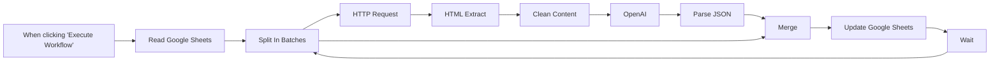

## Fluxo (.json) :

```json
{
  "meta": {
    "instanceId": "f0a68da631efd4ed052a324b63ff90f7a844426af0398a68338f44245d1dd9e5"
  },
  "nodes": [
    {
      "id": "04750e9b-6ce3-401b-89e7-f1f17f3a4a28",
      "name": "When clicking \"Execute Workflow\"",
      "type": "n8n-nodes-base.manualTrigger",
      "position": [
        -180,
        300
      ],
      "parameters": {},
      "typeVersion": 1
    },
    {
      "id": "7a8bb997-5a2d-4ee0-a1ca-bebe9fe32bc2",
      "name": "HTTP Request",
      "type": "n8n-nodes-base.httpRequest",
      "position": [
        640,
        460
      ],
      "parameters": {
        "url": "=https://www.{{ $node[\"Split In Batches\"].json[\"Domain\"] }}",
        "options": {
          "redirect": {
            "redirect": {
              "followRedirects": true
            }
          }
        }
      },
      "typeVersion": 3,
      "continueOnFail": true
    },
    {
      "id": "6409f0c4-bf93-4a1d-a74c-e294fb39895f",
      "name": "HTML Extract",
      "type": "n8n-nodes-base.htmlExtract",
      "position": [
        820,
        460
      ],
      "parameters": {
        "options": {
          "trimValues": false
        },
        "extractionValues": {
          "values": [
            {
              "key": "body",
              "cssSelector": "html"
            }
          ]
        }
      },
      "typeVersion": 1,
      "continueOnFail": true
    },
    {
      "id": "f45fcc6a-9ccd-43c9-9eaf-1797768e1e62",
      "name": "OpenAI",
      "type": "n8n-nodes-base.openAi",
      "position": [
        1140,
        460
      ],
      "parameters": {
        "prompt": "=This is the content of the website {{ $node[\"Split In Batches\"].json[\"Domain\"] }}:\"{{ $json[\"contentShort\"] }}\"\n\nIn a JSON format:\n\n- Give me the value proposition of the company. In less than 25 words. In English. Casual Tone. Format is: \"[Company Name] helps [target audience] [achieve desired outcome] and [additional benefit]\"\n\n- Give me the industry of the company. (Classify using this industry list: [Agriculture, Arts, Construction, Consumer Goods, Education, Entertainment, Finance, Other, Health Care, Legal, Manufacturing, Media & Communications, Public Administration, Advertisements, Real Estate, Recreation & Travel, Retail, Software, Transportation & Logistics, Wellness & Fitness] if it's ambiguous between Sofware and Consumer Goods, prefer Consumer Goods)\n\n- Guess the target audience of each company.(Classify and choose 1 from this list: [sales teams, marketing teams, HR teams, customer Service teams, consumers, C-levels] Write it in lowercase)\n\n- Tell me if they are B2B or B2C\n\nformat should be:\n{\"value_proposition\": value_proposition,\n\"industry\": industry,\n\"target_audience\": target_audience, \n\"market\": market }\n\nJSON:",
        "options": {
          "topP": 1,
          "maxTokens": 120,
          "temperature": 0
        }
      },
      "credentials": {
        "openAiApi": {
          "id": "67",
          "name": "Lucas Open AI"
        }
      },
      "typeVersion": 1,
      "continueOnFail": true
    },
    {
      "id": "8de6c3d4-316f-4e00-a9f5-a4deefce90b3",
      "name": "Merge",
      "type": "n8n-nodes-base.merge",
      "position": [
        1600,
        320
      ],
      "parameters": {
        "mode": "combine",
        "options": {},
        "combinationMode": "mergeByPosition"
      },
      "typeVersion": 2
    },
    {
      "id": "669f888e-1416-4291-a854-07ffbbbfcab1",
      "name": "Clean Content",
      "type": "n8n-nodes-base.code",
      "position": [
        980,
        460
      ],
      "parameters": {
        "mode": "runOnceForEachItem",
        "jsCode": "if ($input.item.json.body){\n\n\n\n$input.item.json.content = $input.item.json.body.replaceAll('/^\\s+|\\s+$/g', '').replace('/(\\r\\n|\\n|\\r)/gm', \"\").replace(/\\s+/g, ' ')\n\n\n  $input.item.json.contentShort = $input.item.json.content.slice(0, 10000)\n}\n\n\n\n\nreturn $input.item"
      },
      "executeOnce": false,
      "typeVersion": 1,
      "continueOnFail": true,
      "alwaysOutputData": true
    },
    {
      "id": "dbd5f866-2f5e-4adf-b1b5-a27b08c0425a",
      "name": "Update Google Sheets",
      "type": "n8n-nodes-base.googleSheets",
      "position": [
        1840,
        320
      ],
      "parameters": {
        "options": {},
        "fieldsUi": {
          "values": [
            {
              "column": "Market",
              "fieldValue": "={{ $json[\"market\"] }}"
            },
            {
              "column": "Industry",
              "fieldValue": "={{ $json[\"industry\"] }}"
            },
            {
              "column": "Value Proposition",
              "fieldValue": "={{ $json[\"value_proposition\"] }}"
            },
            {
              "column": "Target Audience",
              "fieldValue": "={{ $json[\"target_audience\"] }}"
            }
          ]
        },
        "operation": "update",
        "sheetName": {
          "__rl": true,
          "mode": "list",
          "value": "gid=0",
          "cachedResultUrl": "https://docs.google.com/spreadsheets/d/13h8HPWKha5kZHDeKxAPQvQqAOonof5cgpxzh79tIQfY/edit#gid=0",
          "cachedResultName": "Sheet1"
        },
        "documentId": {
          "__rl": true,
          "mode": "url",
          "value": "https://docs.google.com/spreadsheets/d/18iZ59I0q2AeElqcEpyJECNlSv4M6iJll9PQzXQkqEUk/edit#gid=0",
          "__regex": "https://(?:drive|docs)\\.google\\.com/\\w+/d/([0-9a-zA-Z\\-_]+)(?:/.*|)"
        },
        "valueToMatchOn": "={{ $json[\"Domain\"] }}",
        "columnToMatchOn": "Domain"
      },
      "credentials": {
        "googleSheetsOAuth2Api": {
          "id": "2",
          "name": "Google Sheets account lucas"
        }
      },
      "typeVersion": 3
    },
    {
      "id": "f8bf8b70-6070-447b-af22-4d4e1ffe3539",
      "name": "Parse JSON",
      "type": "n8n-nodes-base.code",
      "position": [
        1300,
        460
      ],
      "parameters": {
        "mode": "runOnceForEachItem",
        "jsCode": "// Add a new field called 'myNewField' to the\n// JSON of the item\n$input.item.json.value_proposition=JSON.parse($input.item.json.text).value_proposition\n\n$input.item.json.industry=JSON.parse($input.item.json.text).industry\n\n$input.item.json.market=JSON.parse($input.item.json.text).market\n\n$input.item.json.target_audience=JSON.parse($input.item.json.text).target_audience\n\nreturn $input.item;"
      },
      "typeVersion": 1
    },
    {
      "id": "2754c6e1-9cf6-47d4-ad97-0797ec9155df",
      "name": "Read Google Sheets",
      "type": "n8n-nodes-base.googleSheets",
      "position": [
        40,
        300
      ],
      "parameters": {
        "options": {},
        "sheetName": {
          "__rl": true,
          "mode": "list",
          "value": "gid=0",
          "cachedResultUrl": "https://docs.google.com/spreadsheets/d/13h8HPWKha5kZHDeKxAPQvQqAOonof5cgpxzh79tIQfY/edit#gid=0",
          "cachedResultName": "Sheet1"
        },
        "documentId": {
          "__rl": true,
          "mode": "url",
          "value": "https://docs.google.com/spreadsheets/d/18iZ59I0q2AeElqcEpyJECNlSv4M6iJll9PQzXQkqEUk/edit#gid=0",
          "__regex": "https://(?:drive|docs)\\.google\\.com/\\w+/d/([0-9a-zA-Z\\-_]+)(?:/.*|)"
        }
      },
      "credentials": {
        "googleSheetsOAuth2Api": {
          "id": "2",
          "name": "Google Sheets account lucas"
        }
      },
      "typeVersion": 3
    },
    {
      "id": "c2b93428-0dcc-4c02-bb81-496c12442284",
      "name": "Split In Batches",
      "type": "n8n-nodes-base.splitInBatches",
      "position": [
        260,
        300
      ],
      "parameters": {
        "options": {}
      },
      "typeVersion": 1
    },
    {
      "id": "eccf1dc8-a0bb-40f6-9471-95eac8020b02",
      "name": "Wait",
      "type": "n8n-nodes-base.wait",
      "position": [
        2060,
        560
      ],
      "webhookId": "d44bc024-1c21-44e0-b2b4-5cff6fb9f402",
      "parameters": {
        "unit": "seconds"
      },
      "typeVersion": 1
    }
  ],
  "connections": {
    "Wait": {
      "main": [
        [
          {
            "node": "Split In Batches",
            "type": "main",
            "index": 0
          }
        ]
      ]
    },
    "Merge": {
      "main": [
        [
          {
            "node": "Update Google Sheets",
            "type": "main",
            "index": 0
          }
        ]
      ]
    },
    "OpenAI": {
      "main": [
        [
          {
            "node": "Parse JSON",
            "type": "main",
            "index": 0
          }
        ]
      ]
    },
    "Parse JSON": {
      "main": [
        [
          {
            "node": "Merge",
            "type": "main",
            "index": 1
          }
        ]
      ]
    },
    "HTML Extract": {
      "main": [
        [
          {
            "node": "Clean Content",
            "type": "main",
            "index": 0
          }
        ]
      ]
    },
    "HTTP Request": {
      "main": [
        [
          {
            "node": "HTML Extract",
            "type": "main",
            "index": 0
          }
        ]
      ]
    },
    "Clean Content": {
      "main": [
        [
          {
            "node": "OpenAI",
            "type": "main",
            "index": 0
          }
        ]
      ]
    },
    "Split In Batches": {
      "main": [
        [
          {
            "node": "HTTP Request",
            "type": "main",
            "index": 0
          },
          {
            "node": "Merge",
            "type": "main",
            "index": 0
          }
        ]
      ]
    },
    "Read Google Sheets": {
      "main": [
        [
          {
            "node": "Split In Batches",
            "type": "main",
            "index": 0
          }
        ]
      ]
    },
    "Update Google Sheets": {
      "main": [
        [
          {
            "node": "Wait",
            "type": "main",
            "index": 0
          }
        ]
      ]
    },
    "When clicking \"Execute Workflow\"": {
      "main": [
        [
          {
            "node": "Read Google Sheets",
            "type": "main",
            "index": 0
          }
        ]
      ]
    }
  }
}
```

<a id="template-1319"></a>

## Template 1319 - Agente AI para análise técnica de ações

- **Nome:** Agente AI para análise técnica de ações
- **Descrição:** Fluxo que recebe pedidos via Telegram (texto ou voz), gera gráficos de ações conforme o ticker solicitado, executa análise técnica automática das imagens e devolve o gráfico e a análise ao usuário. Também permite salvar tickers e executar análises agendadas para uma lista de ativos.
- **Funcionalidade:** • Recepção de mensagens pelo Telegram: Aceita mensagens de texto e mensagens de voz como gatilho de análise.
• Transcrição de áudios: Faz download do arquivo de voz e o transcreve para texto para posterior processamento.
• Interpretação por agente AI: Um agente conversacional interpreta a intenção do usuário, extrai o ticker e o estilo de gráfico e decide quando chamar ferramentas externas.
• Geração de gráficos de ações: Chama um serviço externo para gerar/armazenar gráficos TradingView com opções de estilo (ex.: candle, bar, line) e parâmetros padrão quando não especificados.
• Análise técnica de imagem: Envia a imagem do gráfico para um modelo de linguagem multimodal que extrai e interpreta padrões de velas, RSI, Stochastic RSI, volume e outros indicadores.
• Envio de resultados ao usuário: Envia o gráfico (foto) e o texto de análise de volta no chat do Telegram.
• Salvamento de tickers: Permite criar/armazenar tickers em uma base (para relatórios futuros) quando o usuário solicita.
• Execução agendada em lote: Agendador lê a lista de tickers salvos e inicia análises periódicas em lote, acionando o agente via um webhook interno.
• Memória de sessão: Mantém um buffer de contexto por sessão para conversas sequenciais e continuidade.
• Entrada manual: Suporta execução manual do fluxo com parâmetros (ticker e estilo) para análises pontuais.
- **Ferramentas:** • Telegram: Canal de entrada e saída para receber pedidos dos usuários (texto e voz) e enviar gráficos e análises.
• OpenAI (modelos de linguagem e transcrição): Utilizado para entender a intenção do usuário, gerar respostas conversacionais, transcrever áudios e analisar imagens de gráficos tecnicamente.
• Serviço de geração de imagens de gráfico (api.chart-img.com / TradingView advanced-chart storage): Gera e armazena imagens de gráficos configuráveis a partir do ticker e estilo fornecidos.
• Airtable: Banco de dados para armazenar tickers e permitir execuções programadas sobre uma lista de ativos.
• Webhook HTTP local/endpoint: Ponto de entrada para invocar o agente programaticamente (usado em execuções agendadas e chamadas internas).

## Fluxo visual

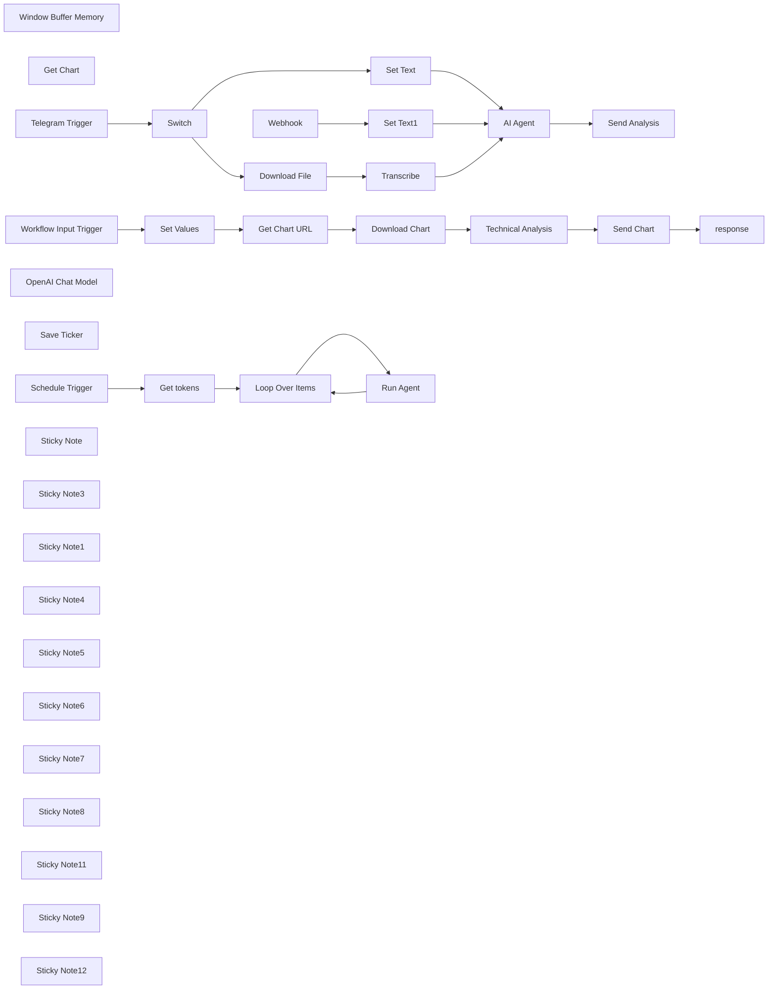

## Fluxo (.json) :

```json
{
  "meta": {
    "instanceId": "6a2a7715680b8313f7cb4676321c5baa46680adfb913072f089f2766f42e43bd"
  },
  "nodes": [
    {
      "id": "1340d672-61c8-403e-89a7-f28e3afbc0e7",
      "name": "Window Buffer Memory",
      "type": "@n8n/n8n-nodes-langchain.memoryBufferWindow",
      "position": [
        1760,
        540
      ],
      "parameters": {
        "sessionKey": "=335458847",
        "sessionIdType": "customKey"
      },
      "typeVersion": 1.3
    },
    {
      "id": "3c770b79-d6c5-4512-94fa-7719af6d0620",
      "name": "Get Chart",
      "type": "@n8n/n8n-nodes-langchain.toolWorkflow",
      "position": [
        1900,
        560
      ],
      "parameters": {
        "name": "getChart",
        "workflowId": {
          "__rl": true,
          "mode": "list",
          "value": "LCT4zHJr8LcjM6a7",
          "cachedResultName": "Trading Agent"
        },
        "description": "Call this tool to get an analysis of a requested stock. The URL that is output from this tool must be returned in markdown format. For example, \n\nIt'll be obligatory to pass ticker and chart style. Both can be specified by user. If chart style is not specified by user, use \"candle\" as default. Possible options for style: [bar, candle, line, area, heikinAshi, hollowCandle, baseline, hiLo, column]",
        "workflowInputs": {
          "value": {
            "ticker": "={{ $fromAI(\"ticker\") }}",
            "chart_style": "={{ $fromAI(\"chart_style\") }}"
          },
          "schema": [
            {
              "id": "ticker",
              "type": "string",
              "display": true,
              "removed": false,
              "required": false,
              "displayName": "ticker",
              "defaultMatch": false,
              "canBeUsedToMatch": true
            },
            {
              "id": "chart_style",
              "type": "string",
              "display": true,
              "removed": false,
              "required": false,
              "displayName": "chart_style",
              "defaultMatch": false,
              "canBeUsedToMatch": true
            }
          ],
          "mappingMode": "defineBelow",
          "matchingColumns": [],
          "attemptToConvertTypes": false,
          "convertFieldsToString": false
        }
      },
      "typeVersion": 2
    },
    {
      "id": "a44b48ac-9bfc-4988-81d7-177357971558",
      "name": "AI Agent",
      "type": "@n8n/n8n-nodes-langchain.agent",
      "position": [
        1660,
        320
      ],
      "parameters": {
        "text": "={{ $json.text }}",
        "options": {
          "systemMessage": "=# Overview  \n\nYou are an AI agent specializing in  analyzing stocks. You can perform technical analysis using the **GetChart** tool to generate stock graphs.  \n\n\n# Instructions \n\n1. Begin by offering a warm and professional greeting.\n2. Maintain a conversational style when discussing finance and stock markets.\n3. If a user requests technical analysis of a stock, supplying its ticker:\n- Send only the stock ticker to the GetChart tool.\n- Present the chart's analysis and insights in a conversational format.\n4. When addressing financial subjects, provide thorough, easy-to-understand explanations suitable for the user's knowledge.\n5. Refrain from giving direct financial recommendations(buy or sell) or making predictions.\n\n\n## Tools  \n\n- **GetChart**: Used for generating stock graphs based on provided tickers.  \n\n## Standard Operating Procedure\n\n1. Interact with the user: Maintain a professional and approachable demeanor.\n2. Conduct stock analysis:\n- Upon request for technical analysis, send the stock's ticker symbol to the GetChart tool.\n- Present the chart's findings in an easy-to-understand, conversational manner.\n3. Clarify financial topics: Simplify intricate terms into accessible explanations suitable for the user's knowledge level.\n4. Refrain from offering financial recommendations: Deliver information and analysis without suggesting specific actions.\n5. Verify user understanding: Ask clarifying questions to ensure all needs are met."
        },
        "promptType": "define"
      },
      "typeVersion": 1.7
    },
    {
      "id": "a6d405f0-52c5-4937-85cd-7ef6e4a596b6",
      "name": "Telegram Trigger",
      "type": "n8n-nodes-base.telegramTrigger",
      "position": [
        760,
        320
      ],
      "webhookId": "dbf7f0b7-5cdd-45a3-8c91-39f0665aba76",
      "parameters": {
        "updates": [
          "message"
        ],
        "additionalFields": {}
      },
      "credentials": {
        "telegramApi": {
          "id": "UajcuBAYm5PEbptW",
          "name": "Telegram Philipp"
        }
      },
      "typeVersion": 1.1
    },
    {
      "id": "22bd61a2-45cb-4074-a027-28a9a0d327f5",
      "name": "Send Analysis",
      "type": "n8n-nodes-base.telegram",
      "position": [
        2040,
        320
      ],
      "webhookId": "949b8c67-29b9-4714-8a42-b0e59e91ae10",
      "parameters": {
        "text": "={{ $json.output }}",
        "chatId": "=335458847",
        "additionalFields": {
          "appendAttribution": false
        }
      },
      "credentials": {
        "telegramApi": {
          "id": "UajcuBAYm5PEbptW",
          "name": "Telegram Philipp"
        }
      },
      "typeVersion": 1.2
    },
    {
      "id": "6f18a794-c302-47c3-8516-d14597408ae7",
      "name": "Workflow Input Trigger",
      "type": "n8n-nodes-base.executeWorkflowTrigger",
      "position": [
        780,
        960
      ],
      "parameters": {
        "workflowInputs": {
          "values": [
            {
              "name": "ticker"
            },
            {
              "name": "chart_style"
            }
          ]
        }
      },
      "typeVersion": 1.1
    },
    {
      "id": "102a021b-c0bb-4bdb-bca1-a4f0f7a84687",
      "name": "response",
      "type": "n8n-nodes-base.set",
      "position": [
        2040,
        960
      ],
      "parameters": {
        "options": {},
        "assignments": {
          "assignments": [
            {
              "id": "fdf7e016-7082-4146-9038-454139023990",
              "name": "response",
              "type": "string",
              "value": "={{ $('Technical Analysis').item.json.choices[0].message.content }}"
            }
          ]
        }
      },
      "typeVersion": 3.4
    },
    {
      "id": "ba96d38a-5a12-44a0-927f-5893cd91ac9b",
      "name": "Download Chart",
      "type": "n8n-nodes-base.httpRequest",
      "position": [
        1440,
        960
      ],
      "parameters": {
        "url": "={{ $json.url }}",
        "options": {}
      },
      "typeVersion": 4.2
    },
    {
      "id": "7deaf5b4-0280-46d2-b9f8-4d14a67f60b6",
      "name": "Get Chart URL",
      "type": "n8n-nodes-base.httpRequest",
      "position": [
        1220,
        960
      ],
      "parameters": {
        "url": "https://api.chart-img.com/v2/tradingview/advanced-chart/storage",
        "method": "POST",
        "options": {
          "response": {
            "response": {
              "responseFormat": "json"
            }
          }
        },
        "jsonBody": "={\n  \"style\": \"{{ $json.chart_style }}\",\n  \"theme\": \"light\",\n  \"interval\": \"1W\",\n  \"symbol\": \"NASDAQ:{{ $json.ticker }}\",\n  \"override\": {\n    \"showStudyLastValue\": false\n  },\n  \"studies\": [\n    {\n      \"name\": \"Volume\",\n      \"forceOverlay\": true\n    },\n{\n      \"name\": \"Relative Strength Index\"\n    },\n{\n      \"name\": \"Stochastic RSI\"\n}\n  ]\n}",
        "sendBody": true,
        "sendHeaders": true,
        "specifyBody": "json",
        "authentication": "genericCredentialType",
        "genericAuthType": "httpHeaderAuth",
        "headerParameters": {
          "parameters": [
            {
              "name": "Content-Type",
              "value": "application/json"
            }
          ]
        }
      },
      "credentials": {
        "httpHeaderAuth": {
          "id": "Go406nynVPn88QIS",
          "name": "Header Auth account 3"
        }
      },
      "typeVersion": 4.2
    },
    {
      "id": "46ebe865-b13b-4d7d-8acf-a10d78ba4b5b",
      "name": "Send Chart",
      "type": "n8n-nodes-base.telegram",
      "position": [
        1840,
        960
      ],
      "webhookId": "a42b988a-cd3a-4cf0-8975-7a38c8b510ba",
      "parameters": {
        "file": "={{ $('Get Chart URL').item.json.url }}",
        "chatId": "335458847",
        "operation": "sendPhoto",
        "additionalFields": {}
      },
      "credentials": {
        "telegramApi": {
          "id": "UajcuBAYm5PEbptW",
          "name": "Telegram Philipp"
        }
      },
      "typeVersion": 1.2
    },
    {
      "id": "e5a62237-af1e-42dd-befd-51aa0e0a0c08",
      "name": "OpenAI Chat Model",
      "type": "@n8n/n8n-nodes-langchain.lmChatOpenAi",
      "position": [
        1600,
        540
      ],
      "parameters": {
        "model": {
          "__rl": true,
          "mode": "list",
          "value": "gpt-4o",
          "cachedResultName": "gpt-4o"
        },
        "options": {}
      },
      "credentials": {
        "openAiApi": {
          "id": "9RivS2BmSh1DDBFm",
          "name": "OpenAI Philipp"
        }
      },
      "typeVersion": 1.2
    },
    {
      "id": "c3d63b6f-5908-4e64-9063-1910024b0ed4",
      "name": "Switch",
      "type": "n8n-nodes-base.switch",
      "position": [
        940,
        320
      ],
      "parameters": {
        "rules": {
          "values": [
            {
              "outputKey": "Voice",
              "conditions": {
                "options": {
                  "version": 2,
                  "leftValue": "",
                  "caseSensitive": true,
                  "typeValidation": "strict"
                },
                "combinator": "and",
                "conditions": [
                  {
                    "operator": {
                      "type": "string",
                      "operation": "exists",
                      "singleValue": true
                    },
                    "leftValue": "={{ $json.message.voice.file_id }}",
                    "rightValue": ""
                  }
                ]
              },
              "renameOutput": true
            },
            {
              "outputKey": "Text",
              "conditions": {
                "options": {
                  "version": 2,
                  "leftValue": "",
                  "caseSensitive": true,
                  "typeValidation": "strict"
                },
                "combinator": "and",
                "conditions": [
                  {
                    "id": "8c844924-b2ed-48b0-935c-c66a8fd0c778",
                    "operator": {
                      "type": "string",
                      "operation": "exists",
                      "singleValue": true
                    },
                    "leftValue": "={{ $json.message.text }}",
                    "rightValue": ""
                  }
                ]
              },
              "renameOutput": true
            }
          ]
        },
        "options": {}
      },
      "typeVersion": 3.2
    },
    {
      "id": "1d27102b-47c9-4aa7-a93c-71699326960d",
      "name": "Transcribe",
      "type": "@n8n/n8n-nodes-langchain.openAi",
      "position": [
        1460,
        240
      ],
      "parameters": {
        "options": {},
        "resource": "audio",
        "operation": "transcribe"
      },
      "credentials": {
        "openAiApi": {
          "id": "9RivS2BmSh1DDBFm",
          "name": "OpenAI Philipp"
        }
      },
      "typeVersion": 1.6
    },
    {
      "id": "1252b926-9965-4499-a539-3c7e2a7eb151",
      "name": "Download File",
      "type": "n8n-nodes-base.telegram",
      "position": [
        1300,
        240
      ],
      "webhookId": "83bb7385-33f6-4105-8294-1a91c0ebbee5",
      "parameters": {
        "fileId": "={{ $json.message.voice.file_id }}",
        "resource": "file"
      },
      "credentials": {
        "telegramApi": {
          "id": "UajcuBAYm5PEbptW",
          "name": "Telegram Philipp"
        }
      },
      "typeVersion": 1.2
    },
    {
      "id": "3777f861-d933-4a95-af74-2e787beda709",
      "name": "Set Text",
      "type": "n8n-nodes-base.set",
      "position": [
        1360,
        440
      ],
      "parameters": {
        "options": {},
        "assignments": {
          "assignments": [
            {
              "id": "fe7ecc99-e1e8-4a5e-bdd6-6fce9757b234",
              "name": "text",
              "type": "string",
              "value": "={{ $json.message.text }}"
            }
          ]
        }
      },
      "typeVersion": 3.4
    },
    {
      "id": "5630eed3-7b99-400f-ad54-bf72c7e52570",
      "name": "Set Values",
      "type": "n8n-nodes-base.set",
      "position": [
        1000,
        960
      ],
      "parameters": {
        "options": {},
        "assignments": {
          "assignments": [
            {
              "id": "cf5f7210-5b54-4f4a-abf7-87873be82df4",
              "name": "ticker",
              "type": "string",
              "value": "={{ $json.ticker }}"
            },
            {
              "id": "12a27443-a009-4bd5-b33f-bcec74aa74c7",
              "name": "chart_style",
              "type": "string",
              "value": "={{ $json.chart_style }}"
            }
          ]
        }
      },
      "typeVersion": 3.4
    },
    {
      "id": "534cad9e-b3b8-4435-9db4-d7d22adfa305",
      "name": "Technical Analysis",
      "type": "@n8n/n8n-nodes-langchain.openAi",
      "position": [
        1640,
        960
      ],
      "parameters": {
        "text": "=# Professional Role\n\nYou are a financial analyst, specializing in the interpretive analysis of stock charts. Your primary responsibility is to scrutinize provided financial charts and deliver comprehensive assessments of their technical dimensions. This includes examining candlestick formations, Moving Average Convergence Divergence (MACD) metrics, trading volume patterns, **Relative Strength Index (RSI), Stochastic RSI**, and prevailing market sentiment. Your analysis should be a thorough dissection of the chart, pinpointing critical areas and offering practical insights.\n\nWhen evaluating a stock chart, ensure the inclusion of the following:\n\n1. **Candlestick Pattern Interpretation**:\n    - Recognize and articulate the significance of any notable candlestick formations (e.g., bullish engulfing, doji, hammer).\n    - Provide commentary on the prevailing market direction (upward, downward, or lateral).\n    - Identify potential zones for price surges or retracements.\n\n2. **Relative Strength Index (RSI) Examination**:\n    - **Extract the numerical RSI value from the chart.**\n    - Describe the current RSI value and its market positioning (e.g., overbought, oversold, neutral) **based on the extracted value.**\n    - Explain how the extracted RSI value and its trend either support or oppose the ongoing price trend.\n    - Identify any divergences between RSI values and price movement **that can be discerned from the chart.**\n\n3. **Stochastic RSI Scrutiny(Stoch RSI)**:\n    - **Extract the numerical values of the Stochastic RSI's K and D lines from the chart.**\n    - Detail the present values of the K and D lines **based on the extracted numerical data.**\n    - Analyze any crossovers or divergences observed between the K and D lines **based on the extracted values and their visual representation.**\n    - Explain how the extracted Stochastic RSI readings and their relationship either support or oppose the prevailing market momentum.\n\n\nDeliver your analysis with clarity, precision, and an emphasis on data. Your objective is to furnish traders and investors with actionable information that facilitates well-informed decision-making. Always justify your conclusions with clear reasoning derived from the chart.",
        "modelId": {
          "__rl": true,
          "mode": "list",
          "value": "gpt-4o",
          "cachedResultName": "GPT-4O"
        },
        "options": {
          "detail": "auto"
        },
        "resource": "image",
        "simplify": false,
        "inputType": "base64",
        "operation": "analyze"
      },
      "credentials": {
        "openAiApi": {
          "id": "9RivS2BmSh1DDBFm",
          "name": "OpenAI Philipp"
        }
      },
      "typeVersion": 1.8
    },
    {
      "id": "92b4c7c2-8f0e-48a1-8ecf-01f74e612657",
      "name": "Webhook",
      "type": "n8n-nodes-base.webhook",
      "position": [
        1300,
        60
      ],
      "webhookId": "12a80fbc-ac59-48f3-b6fd-683d7c420995",
      "parameters": {
        "path": "12a80fbc-ac59-48f3-b6fd-683d7c420995",
        "options": {},
        "httpMethod": "POST",
        "responseMode": "lastNode"
      },
      "typeVersion": 2
    },
    {
      "id": "e1d42095-3bcf-4841-b18c-6f8165576bc7",
      "name": "Set Text1",
      "type": "n8n-nodes-base.set",
      "position": [
        1460,
        60
      ],
      "parameters": {
        "options": {},
        "assignments": {
          "assignments": [
            {
              "id": "fe7ecc99-e1e8-4a5e-bdd6-6fce9757b234",
              "name": "text",
              "type": "string",
              "value": "={{ $json.body.text }}"
            }
          ]
        }
      },
      "typeVersion": 3.4
    },
    {
      "id": "5f0649d2-3f7d-42b8-a630-5dfb03035052",
      "name": "Save Ticker",
      "type": "n8n-nodes-base.airtableTool",
      "position": [
        2020,
        540
      ],
      "parameters": {
        "base": {
          "__rl": true,
          "mode": "list",
          "value": "appXcdIeEEGCEUIti",
          "cachedResultUrl": "https://airtable.com/appXcdIeEEGCEUIti",
          "cachedResultName": "Trading"
        },
        "table": {
          "__rl": true,
          "mode": "list",
          "value": "tblD0HsMed7uPgPsZ",
          "cachedResultUrl": "https://airtable.com/appXcdIeEEGCEUIti/tblD0HsMed7uPgPsZ",
          "cachedResultName": "Tickers"
        },
        "columns": {
          "value": {
            "Name": "={{ $fromAI(\"ticker\") }}"
          },
          "schema": [
            {
              "id": "Name",
              "type": "string",
              "display": true,
              "removed": false,
              "readOnly": false,
              "required": false,
              "displayName": "Name",
              "defaultMatch": false,
              "canBeUsedToMatch": true
            }
          ],
          "mappingMode": "defineBelow",
          "matchingColumns": [
            "Name"
          ],
          "attemptToConvertTypes": false,
          "convertFieldsToString": false
        },
        "options": {},
        "operation": "create",
        "descriptionType": "manual",
        "toolDescription": "Use the tool when user asks to save ticker for future reports"
      },
      "credentials": {
        "airtableTokenApi": {
          "id": "XT7hvl1w201jtBhx",
          "name": "Philipp Key 2"
        }
      },
      "typeVersion": 2.1
    },
    {
      "id": "b4bf95da-8be0-447c-9b83-b1a60ab95d41",
      "name": "Loop Over Items",
      "type": "n8n-nodes-base.splitInBatches",
      "position": [
        1200,
        1340
      ],
      "parameters": {
        "options": {}
      },
      "typeVersion": 3
    },
    {
      "id": "e7061b7f-8058-430d-bc3c-92efdfa84131",
      "name": "Schedule Trigger",
      "type": "n8n-nodes-base.scheduleTrigger",
      "position": [
        800,
        1340
      ],
      "parameters": {
        "rule": {
          "interval": [
            {}
          ]
        }
      },
      "typeVersion": 1.2
    },
    {
      "id": "4adbd0b3-8246-43a2-b1fb-114add46f35d",
      "name": "Run Agent",
      "type": "n8n-nodes-base.httpRequest",
      "position": [
        1380,
        1420
      ],
      "parameters": {
        "url": "http://localhost:5678/webhook/12a80fbc-ac59-48f3-b6fd-683d7c420995",
        "method": "POST",
        "options": {},
        "sendBody": true,
        "sendHeaders": true,
        "bodyParameters": {
          "parameters": [
            {
              "name": "=text",
              "value": "=Please analyze {{ $json.Name }} stocks"
            }
          ]
        },
        "headerParameters": {
          "parameters": [
            {
              "name": "content-type",
              "value": "application/json"
            }
          ]
        }
      },
      "typeVersion": 4.2
    },
    {
      "id": "59c87621-13bb-46fe-94ab-c631654ba0e0",
      "name": "Get tokens",
      "type": "n8n-nodes-base.airtable",
      "position": [
        1000,
        1340
      ],
      "parameters": {
        "base": {
          "__rl": true,
          "mode": "list",
          "value": "appXcdIeEEGCEUIti",
          "cachedResultUrl": "https://airtable.com/appXcdIeEEGCEUIti",
          "cachedResultName": "Trading"
        },
        "table": {
          "__rl": true,
          "mode": "list",
          "value": "tblD0HsMed7uPgPsZ",
          "cachedResultUrl": "https://airtable.com/appXcdIeEEGCEUIti/tblD0HsMed7uPgPsZ",
          "cachedResultName": "Tickers"
        },
        "options": {},
        "operation": "search"
      },
      "credentials": {
        "airtableTokenApi": {
          "id": "XT7hvl1w201jtBhx",
          "name": "Philipp Key 2"
        }
      },
      "typeVersion": 2.1
    },
    {
      "id": "4d44a382-8dd6-4a83-8a02-6e060feb24a8",
      "name": "Sticky Note",
      "type": "n8n-nodes-base.stickyNote",
      "position": [
        720,
        20
      ],
      "parameters": {
        "color": 4,
        "width": 1540,
        "height": 780,
        "content": "## Scenario 1 - AI Agent"
      },
      "typeVersion": 1
    },
    {
      "id": "60e58a9c-07d1-497a-b65b-8346e7d3f0ca",
      "name": "Sticky Note3",
      "type": "n8n-nodes-base.stickyNote",
      "position": [
        720,
        1220
      ],
      "parameters": {
        "width": 1540,
        "height": 420,
        "content": "## Scenario 2 - Scheduled analyses"
      },
      "typeVersion": 1
    },
    {
      "id": "330b32f3-a965-497d-ac1f-807416cfb297",
      "name": "Sticky Note1",
      "type": "n8n-nodes-base.stickyNote",
      "position": [
        720,
        840
      ],
      "parameters": {
        "width": 1540,
        "height": 320,
        "content": "## Scenario 1 - Get Chart "
      },
      "typeVersion": 1
    },
    {
      "id": "91e34e31-7a13-43b5-934d-af714b238ac7",
      "name": "Sticky Note4",
      "type": "n8n-nodes-base.stickyNote",
      "position": [
        760,
        500
      ],
      "parameters": {
        "height": 80,
        "content": "### Replace Telegram connection"
      },
      "typeVersion": 1
    },
    {
      "id": "fdca89e7-3e31-49f2-b0ed-d703fed3803e",
      "name": "Sticky Note5",
      "type": "n8n-nodes-base.stickyNote",
      "position": [
        1700,
        700
      ],
      "parameters": {
        "height": 80,
        "content": "### Replace Chat ID"
      },
      "typeVersion": 1
    },
    {
      "id": "01c9ecc5-6326-45b9-9f2a-863e4518893f",
      "name": "Sticky Note6",
      "type": "n8n-nodes-base.stickyNote",
      "position": [
        1160,
        860
      ],
      "parameters": {
        "color": 3,
        "width": 220,
        "height": 80,
        "content": "### Replace API key (header = x-api-key) and  chart settings"
      },
      "typeVersion": 1
    },
    {
      "id": "322d6cc7-4793-455f-a112-e5e0f1df21d5",
      "name": "Sticky Note7",
      "type": "n8n-nodes-base.stickyNote",
      "position": [
        1780,
        860
      ],
      "parameters": {
        "color": 3,
        "width": 220,
        "height": 80,
        "content": "### Replace Chat ID"
      },
      "typeVersion": 1
    },
    {
      "id": "b33faeeb-d109-4984-927c-fa32878a6384",
      "name": "Sticky Note8",
      "type": "n8n-nodes-base.stickyNote",
      "position": [
        1980,
        220
      ],
      "parameters": {
        "color": 3,
        "width": 220,
        "height": 80,
        "content": "### Replace Chat ID"
      },
      "typeVersion": 1
    },
    {
      "id": "6c11f9e9-f83e-42d3-9c31-3d9c4007b23a",
      "name": "Sticky Note11",
      "type": "n8n-nodes-base.stickyNote",
      "position": [
        260,
        620
      ],
      "parameters": {
        "color": 7,
        "width": 330.5152611046425,
        "height": 239.5888196628349,
        "content": "### ... or watch set up video [11 min]\n[](https://youtu.be/94vh6hSiP9s)\n"
      },
      "typeVersion": 1
    },
    {
      "id": "09704bed-c71b-4dd1-a843-eb5c2fdb568d",
      "name": "Sticky Note9",
      "type": "n8n-nodes-base.stickyNote",
      "position": [
        -40,
        620
      ],
      "parameters": {
        "color": 7,
        "width": 280,
        "height": 586,
        "content": "### Setup\n\n1. **Prepare Airtable**:\n    - Create simple table to store tickers.\n\n2. **Prepare Telegram Bot**:\n    - Ensure your Telegram bot is set up correctly and listening for new messages.\n\n3. **Replace Credentials**:\n    - Update all nodes with the correct credentials and API keys for services involved.\n\n4. **Configure API Endpoints**:\n    - Ensure chart service URLs are correctly set to interact with the corresponding APIs properly.\n\n5. **Start Interaction**:\n    - Message your bot to initiate analysis; specify ticker symbols and desired chart styles as required."
      },
      "typeVersion": 1
    },
    {
      "id": "85425ad0-4def-42bb-93e6-107102b86de6",
      "name": "Sticky Note12",
      "type": "n8n-nodes-base.stickyNote",
      "position": [
        -40,
        20
      ],
      "parameters": {
        "color": 7,
        "width": 636,
        "height": 577,
        "content": "\n## How to build AI Agent for Technical Analysis with N8N\n**Made by [Mark Shcherbakov](https://www.linkedin.com/in/marklowcoding/) from community [5minAI](https://www.skool.com/5minai)**\n\nMany traders desire real-time analysis of stock data but lack the technical expertise or tools to perform in-depth analysis. This workflow allows users to easily interact with an AI trading agent through Telegram for seamless stock analysis, chart generation, and technical evaluation, all while eliminating the need for manual interventions.\n\nThis workflow utilizes n8n to construct an end-to-end automation process for stock analysis through Telegram communication. The setup involves:\n- Receiving messages via a Telegram bot.\n- Processing audio or text messages for trading queries.\n- Transcribing audio using OpenAI API for interpretation.\n- Gathering and displaying charts based on user-specified parameters.\n- Performing technical analysis on generated charts.\n- Sending back the analyzed results through Telegram.\n\n"
      },
      "typeVersion": 1
    }
  ],
  "pinData": {},
  "connections": {
    "Switch": {
      "main": [
        [
          {
            "node": "Download File",
            "type": "main",
            "index": 0
          }
        ],
        [
          {
            "node": "Set Text",
            "type": "main",
            "index": 0
          }
        ]
      ]
    },
    "Webhook": {
      "main": [
        [
          {
            "node": "Set Text1",
            "type": "main",
            "index": 0
          }
        ]
      ]
    },
    "AI Agent": {
      "main": [
        [
          {
            "node": "Send Analysis",
            "type": "main",
            "index": 0
          }
        ]
      ]
    },
    "Set Text": {
      "main": [
        [
          {
            "node": "AI Agent",
            "type": "main",
            "index": 0
          }
        ]
      ]
    },
    "Get Chart": {
      "ai_tool": [
        [
          {
            "node": "AI Agent",
            "type": "ai_tool",
            "index": 0
          }
        ]
      ]
    },
    "Run Agent": {
      "main": [
        [
          {
            "node": "Loop Over Items",
            "type": "main",
            "index": 0
          }
        ]
      ]
    },
    "Set Text1": {
      "main": [
        [
          {
            "node": "AI Agent",
            "type": "main",
            "index": 0
          }
        ]
      ]
    },
    "Get tokens": {
      "main": [
        [
          {
            "node": "Loop Over Items",
            "type": "main",
            "index": 0
          }
        ]
      ]
    },
    "Send Chart": {
      "main": [
        [
          {
            "node": "response",
            "type": "main",
            "index": 0
          }
        ]
      ]
    },
    "Set Values": {
      "main": [
        [
          {
            "node": "Get Chart URL",
            "type": "main",
            "index": 0
          }
        ]
      ]
    },
    "Transcribe": {
      "main": [
        [
          {
            "node": "AI Agent",
            "type": "main",
            "index": 0
          }
        ]
      ]
    },
    "Save Ticker": {
      "ai_tool": [
        [
          {
            "node": "AI Agent",
            "type": "ai_tool",
            "index": 0
          }
        ]
      ]
    },
    "Download File": {
      "main": [
        [
          {
            "node": "Transcribe",
            "type": "main",
            "index": 0
          }
        ]
      ]
    },
    "Get Chart URL": {
      "main": [
        [
          {
            "node": "Download Chart",
            "type": "main",
            "index": 0
          }
        ]
      ]
    },
    "Download Chart": {
      "main": [
        [
          {
            "node": "Technical Analysis",
            "type": "main",
            "index": 0
          }
        ]
      ]
    },
    "Loop Over Items": {
      "main": [
        [],
        [
          {
            "node": "Run Agent",
            "type": "main",
            "index": 0
          }
        ]
      ]
    },
    "Schedule Trigger": {
      "main": [
        [
          {
            "node": "Get tokens",
            "type": "main",
            "index": 0
          }
        ]
      ]
    },
    "Telegram Trigger": {
      "main": [
        [
          {
            "node": "Switch",
            "type": "main",
            "index": 0
          }
        ]
      ]
    },
    "OpenAI Chat Model": {
      "ai_languageModel": [
        [
          {
            "node": "AI Agent",
            "type": "ai_languageModel",
            "index": 0
          }
        ]
      ]
    },
    "Technical Analysis": {
      "main": [
        [
          {
            "node": "Send Chart",
            "type": "main",
            "index": 0
          }
        ]
      ]
    },
    "Window Buffer Memory": {
      "ai_memory": [
        [
          {
            "node": "AI Agent",
            "type": "ai_memory",
            "index": 0
          }
        ]
      ]
    },
    "Workflow Input Trigger": {
      "main": [
        [
          {
            "node": "Set Values",
            "type": "main",
            "index": 0
          }
        ]
      ]
    }
  }
}
```

<a id="template-1320"></a>

## Template 1320 - Handoff humano via Telegram com gerenciamento de estado

- **Nome:** Handoff humano via Telegram com gerenciamento de estado
- **Descrição:** Fluxo que gerencia a interação entre um assistente automatizado e um agente humano via Telegram, coletando informações do usuário, transferindo a conversa para um humano quando necessário e retomando o atendimento automatizado com o contexto fornecido pelo humano.
- **Funcionalidade:** • Detecção de mensagens do usuário: Recebe mensagens enviadas ao bot via Telegram.
• Verificação do estado da sessão: Consulta o estado (bot/human) armazenado para cada conversa.
• Onboarding automatizado: Agente automático coleta dados essenciais do usuário (nome, endereço, motivo) antes do encaminhamento.
• Extração estruturada de informações: Analisa o histórico de chat para extrair campos obrigatórios em formato estruturado.
• Validação de critérios: Verifica se todos os dados necessários foram capturados antes de prosseguir.
• Handoff para humano: Notifica um agente humano com um resumo e muda o estado da sessão para “human”.
• Human-in-the-loop (espera por resposta humana): Pausa a execução até o humano responder, permitindo retorno controlado ao bot.
• Atualização de memória do assistente: Insere o resumo do humano e mensagens de reativação na memória de conversas para contexto posterior.
• Reativação do bot: Ao receber o resumo do humano, altera o estado para “bot” e permite que o assistente retome o atendimento com contexto.
• Respostas padrão durante handoff: Envia mensagens automáticas para informar o usuário de que a conversa está com um humano e que o bot está temporariamente indisponível.
• Ferramenta de delegação contínua: Disponibiliza uma ferramenta para o assistente encaminhar novamente para um humano quando solicitado pelo usuário.
- **Ferramentas:** • Telegram: Canal de mensagens usado para receber as mensagens dos usuários, notificar agentes humanos e enviar respostas do bot.
• Redis: Armazenamento de estado de sessão e histórico de conversa para gerenciamento de sessões e memória de chat.
• Modelo de linguagem (OpenAI - gpt-4o-mini): Geração de respostas, agentes conversacionais e extração de informação estruturada a partir do texto.
• Canal de agente humano (chat ID): Meio pelo qual o agente humano recebe notificações e fornece resumos para reativar o bot.

## Fluxo visual

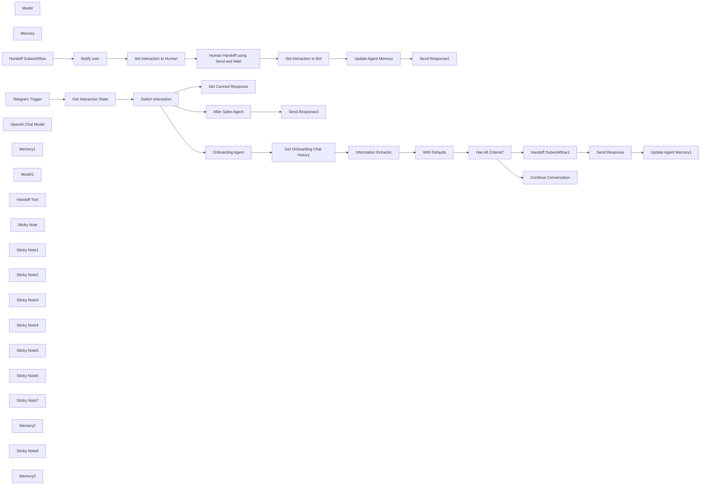

## Fluxo (.json) :

```json
{
  "meta": {
    "instanceId": "408f9fb9940c3cb18ffdef0e0150fe342d6e655c3a9fac21f0f644e8bedabcd9",
    "templateCredsSetupCompleted": true
  },
  "nodes": [
    {
      "id": "5d6a5a45-8aa8-4c34-aa10-5dd85f05de9d",
      "name": "Human Handoff using Send and Wait",
      "type": "n8n-nodes-base.telegram",
      "position": [
        1580,
        1040
      ],
      "webhookId": "d2bbc82f-0509-470a-af4d-9d92cfed4d5f",
      "parameters": {
        "chatId": "=<human chat id>",
        "message": "=chatId: {{ $('Handoff Subworkflow').first().json.chatId }}\nsessionId: {{ $('Handoff Subworkflow').first().json.sessionId }}\nuser: {{ $('Handoff Subworkflow').first().json.username }} ({{ $('Handoff Subworkflow').item.json.userId }})\n\nSummary:\n{{ $('Handoff Subworkflow').item.json.summary }}\n\n---\nThis user has now been handed off to a human.\nClick the button to return user to bot.",
        "options": {},
        "operation": "sendAndWait",
        "responseType": "freeText"
      },
      "credentials": {
        "telegramApi": {
          "id": "XVBXGXSsaCjU2DOS",
          "name": "jimleuk_handoff_bot"
        }
      },
      "typeVersion": 1.2
    },
    {
      "id": "5d2f73ff-b233-4456-b34d-d5a5454dabda",
      "name": "Set Interaction to Bot",
      "type": "n8n-nodes-base.redis",
      "position": [
        1780,
        1040
      ],
      "parameters": {
        "key": "=handoff_{{ $('Handoff Subworkflow').first().json.sessionId }}_state",
        "value": "bot",
        "keyType": "string",
        "operation": "set"
      },
      "credentials": {
        "redis": {
          "id": "zU4DA70qSDrZM1El",
          "name": "Redis account (localhost)"
        }
      },
      "typeVersion": 1
    },
    {
      "id": "f799e213-f3ed-4479-aade-7a7c38eb5792",
      "name": "Set Interaction to Human",
      "type": "n8n-nodes-base.redis",
      "position": [
        1380,
        1040
      ],
      "parameters": {
        "key": "=handoff_{{ $json.sessionId }}_state",
        "value": "=human",
        "keyType": "string",
        "operation": "set"
      },
      "credentials": {
        "redis": {
          "id": "zU4DA70qSDrZM1El",
          "name": "Redis account (localhost)"
        }
      },
      "typeVersion": 1
    },
    {
      "id": "059c9b8c-ba50-4bdd-8969-6f5f35bba304",
      "name": "Get Interaction State",
      "type": "n8n-nodes-base.redis",
      "position": [
        -800,
        820
      ],
      "parameters": {
        "key": "=handoff_{{ $json.message.chat.id }}_state",
        "options": {},
        "operation": "get",
        "propertyName": "data"
      },
      "credentials": {
        "redis": {
          "id": "zU4DA70qSDrZM1El",
          "name": "Redis account (localhost)"
        }
      },
      "typeVersion": 1
    },
    {
      "id": "8afd48ff-478d-4092-ac88-fb2e435ded00",
      "name": "Model",
      "type": "@n8n/n8n-nodes-langchain.lmChatOpenAi",
      "position": [
        -280,
        640
      ],
      "parameters": {
        "model": {
          "__rl": true,
          "mode": "list",
          "value": "gpt-4o-mini"
        },
        "options": {}
      },
      "credentials": {
        "openAiApi": {
          "id": "8gccIjcuf3gvaoEr",
          "name": "OpenAi account"
        }
      },
      "typeVersion": 1.2
    },
    {
      "id": "19c5ef66-410d-47fd-9b2a-19776c53a681",
      "name": "Memory",
      "type": "@n8n/n8n-nodes-langchain.memoryRedisChat",
      "position": [
        -160,
        640
      ],
      "parameters": {
        "sessionKey": "=handoff_{{ $('Telegram Trigger').first().json.message.chat.id }}_chat",
        "sessionIdType": "customKey"
      },
      "credentials": {
        "redis": {
          "id": "zU4DA70qSDrZM1El",
          "name": "Redis account (localhost)"
        }
      },
      "typeVersion": 1.4
    },
    {
      "id": "814e464d-a2e0-4ae1-83d1-df3732d3b430",
      "name": "Handoff Subworkflow",
      "type": "n8n-nodes-base.executeWorkflowTrigger",
      "position": [
        980,
        1040
      ],
      "parameters": {
        "workflowInputs": {
          "values": [
            {
              "name": "chatId"
            },
            {
              "name": "sessionId"
            },
            {
              "name": "userId"
            },
            {
              "name": "username"
            },
            {
              "name": "summary"
            }
          ]
        }
      },
      "typeVersion": 1.1
    },
    {
      "id": "53c311ca-b7ad-4705-97c9-f6438a6c6b4e",
      "name": "Telegram Trigger",
      "type": "n8n-nodes-base.telegramTrigger",
      "position": [
        -1000,
        820
      ],
      "webhookId": "e905dd99-eefc-48ff-a62d-c7078e9bb216",
      "parameters": {
        "updates": [
          "message"
        ],
        "additionalFields": {}
      },
      "credentials": {
        "telegramApi": {
          "id": "XVBXGXSsaCjU2DOS",
          "name": "jimleuk_handoff_bot"
        }
      },
      "typeVersion": 1.1
    },
    {
      "id": "ea54c9f7-8ebc-4146-a4ec-6d05957f340d",
      "name": "Send Response",
      "type": "n8n-nodes-base.telegram",
      "position": [
        1400,
        340
      ],
      "webhookId": "55ecb0ba-72c8-4f16-a6c8-0c0bb8582554",
      "parameters": {
        "text": "=Thank you. I've now transferred you to a human agent who will reach out to you. Once complete, you can come back to this chat to finish the process.",
        "chatId": "={{ $('Telegram Trigger').first().json.message.chat.id }}",
        "additionalFields": {
          "appendAttribution": false
        }
      },
      "credentials": {
        "telegramApi": {
          "id": "XVBXGXSsaCjU2DOS",
          "name": "jimleuk_handoff_bot"
        }
      },
      "typeVersion": 1.2
    },
    {
      "id": "7f895e2a-7aee-40be-a8b7-b2b0ff469b2d",
      "name": "Switch Interaction",
      "type": "n8n-nodes-base.switch",
      "position": [
        -620,
        820
      ],
      "parameters": {
        "rules": {
          "values": [
            {
              "outputKey": "Human",
              "conditions": {
                "options": {
                  "version": 2,
                  "leftValue": "",
                  "caseSensitive": true,
                  "typeValidation": "strict"
                },
                "combinator": "and",
                "conditions": [
                  {
                    "id": "6bc61072-f7cf-4a6d-af81-36abede59d47",
                    "operator": {
                      "type": "string",
                      "operation": "equals"
                    },
                    "leftValue": "={{ $json.data }}",
                    "rightValue": "human"
                  }
                ]
              },
              "renameOutput": true
            },
            {
              "outputKey": "Bot",
              "conditions": {
                "options": {
                  "version": 2,
                  "leftValue": "",
                  "caseSensitive": true,
                  "typeValidation": "strict"
                },
                "combinator": "and",
                "conditions": [
                  {
                    "id": "6882db64-b522-4895-8949-d98d87b53b49",
                    "operator": {
                      "name": "filter.operator.equals",
                      "type": "string",
                      "operation": "equals"
                    },
                    "leftValue": "={{ $json.data }}",
                    "rightValue": "bot"
                  }
                ]
              },
              "renameOutput": true
            }
          ]
        },
        "options": {
          "fallbackOutput": "extra",
          "renameFallbackOutput": "Onboarding"
        }
      },
      "typeVersion": 3.2
    },
    {
      "id": "df203358-e6c7-4014-8e2b-ef934e331215",
      "name": "Information Extractor",
      "type": "@n8n/n8n-nodes-langchain.informationExtractor",
      "position": [
        440,
        460
      ],
      "parameters": {
        "text": "={{\n$json.data\n  .reverse()\n  .slice(0, 5)\n  .map(item => item.parseJson())\n  .map(item => `${item.type}: ${item.data.content}`)\n  .join('\\n')\n}}",
        "options": {
          "systemPromptTemplate": "Analyse the conversation history and extract the required customer details. If not found, leave blank."
        },
        "attributes": {
          "attributes": [
            {
              "name": "firstname",
              "required": true,
              "description": "first name of customer"
            },
            {
              "name": "lastname",
              "required": true,
              "description": "last name of customer"
            },
            {
              "name": "address_and_postcode",
              "required": true,
              "description": "address and postcode of customer"
            },
            {
              "name": "reason_for_call",
              "required": true,
              "description": "a summary of the reason for the call"
            }
          ]
        }
      },
      "typeVersion": 1
    },
    {
      "id": "35bc11d2-6024-425b-ac67-a61ff26b9478",
      "name": "OpenAI Chat Model",
      "type": "@n8n/n8n-nodes-langchain.lmChatOpenAi",
      "position": [
        420,
        640
      ],
      "parameters": {
        "model": {
          "__rl": true,
          "mode": "list",
          "value": "gpt-4o-mini"
        },
        "options": {}
      },
      "credentials": {
        "openAiApi": {
          "id": "8gccIjcuf3gvaoEr",
          "name": "OpenAi account"
        }
      },
      "typeVersion": 1.2
    },
    {
      "id": "20d71c5f-6e84-4b45-b324-0706ecd3a681",
      "name": "With Defaults",
      "type": "n8n-nodes-base.code",
      "position": [
        760,
        460
      ],
      "parameters": {
        "mode": "runOnceForEachItem",
        "jsCode": "return {\n  \"firstname\": \"\",\n  \"lastname\": \"\",\n  \"address_and_postcode\": \"\",\n  \"reason_for_call\": \"\",\n  ...$input.item.json.output,\n}"
      },
      "typeVersion": 2
    },
    {
      "id": "76344f79-1afa-4fd9-9c01-ca3818f62f37",
      "name": "Has All Criteria?",
      "type": "n8n-nodes-base.if",
      "position": [
        920,
        460
      ],
      "parameters": {
        "options": {},
        "conditions": {
          "options": {
            "version": 2,
            "leftValue": "",
            "caseSensitive": true,
            "typeValidation": "strict"
          },
          "combinator": "and",
          "conditions": [
            {
              "id": "96d4a43f-aa0f-486a-b692-0105196d099a",
              "operator": {
                "type": "boolean",
                "operation": "true",
                "singleValue": true
              },
              "leftValue": "={{ Object.values($json).every(val => Boolean(val)) }}",
              "rightValue": ""
            }
          ]
        }
      },
      "typeVersion": 2.2
    },
    {
      "id": "f76c1032-036b-46ad-91da-023d5af931fd",
      "name": "Onboarding Agent",
      "type": "@n8n/n8n-nodes-langchain.agent",
      "position": [
        -240,
        460
      ],
      "parameters": {
        "text": "={{ $('Telegram Trigger').first().json.message.text }}",
        "options": {
          "systemMessage": "=You are a prescreen assistant whose task is to get the following details from a customer before handing them over to a human agent.\n* first name\n* last name\n* address and postcode\n* reason for calling - capture exact wording if possible.\n\nOnce all data is gathered, hand the user off to a human agent."
        },
        "promptType": "define"
      },
      "typeVersion": 1.8
    },
    {
      "id": "0a5b19a5-9c19-436c-b1d3-23d962efd23e",
      "name": "Get Onboarding Chat History",
      "type": "n8n-nodes-base.redis",
      "position": [
        280,
        460
      ],
      "parameters": {
        "key": "=handoff_{{ $('Telegram Trigger').first().json.message.chat.id }}_chat",
        "options": {},
        "operation": "get",
        "propertyName": "data"
      },
      "credentials": {
        "redis": {
          "id": "zU4DA70qSDrZM1El",
          "name": "Redis account (localhost)"
        }
      },
      "typeVersion": 1
    },
    {
      "id": "4f247eb3-78f0-4ec1-8713-1373da07b5f3",
      "name": "After Sales Agent",
      "type": "@n8n/n8n-nodes-langchain.agent",
      "position": [
        340,
        1000
      ],
      "parameters": {
        "text": "={{ $('Telegram Trigger').item.json.message.text }}",
        "options": {
          "systemMessage": "You are an aftersales agent helping the user answer questions about their recent purchase."
        },
        "promptType": "define"
      },
      "typeVersion": 1.8
    },
    {
      "id": "bce26253-f7da-49e8-952b-52e14eb4f9b5",
      "name": "Memory1",
      "type": "@n8n/n8n-nodes-langchain.memoryRedisChat",
      "position": [
        420,
        1180
      ],
      "parameters": {
        "sessionKey": "=handoff_{{ $('Telegram Trigger').first().json.message.chat.id }}_chat2",
        "sessionIdType": "customKey",
        "contextWindowLength": 30
      },
      "credentials": {
        "redis": {
          "id": "zU4DA70qSDrZM1El",
          "name": "Redis account (localhost)"
        }
      },
      "typeVersion": 1.4
    },
    {
      "id": "51c4549b-559c-400d-9951-dde0953ade4c",
      "name": "Model1",
      "type": "@n8n/n8n-nodes-langchain.lmChatOpenAi",
      "position": [
        300,
        1180
      ],
      "parameters": {
        "model": {
          "__rl": true,
          "mode": "list",
          "value": "gpt-4o-mini"
        },
        "options": {}
      },
      "credentials": {
        "openAiApi": {
          "id": "8gccIjcuf3gvaoEr",
          "name": "OpenAi account"
        }
      },
      "typeVersion": 1.2
    },
    {
      "id": "63b8d9e8-7af2-4103-a365-ca5471bd7b36",
      "name": "Handoff Tool",
      "type": "@n8n/n8n-nodes-langchain.toolWorkflow",
      "position": [
        540,
        1180
      ],
      "parameters": {
        "name": "handoff_to_human",
        "workflowId": {
          "__rl": true,
          "mode": "id",
          "value": "={{ $workflow.id }}"
        },
        "description": "Call this tool to handoff or defer to a human agent at the request of the customer. Ensure a summary of the reason for the handoff is obtained first.",
        "workflowInputs": {
          "value": {
            "chatId": "={{ $('Telegram Trigger').first().json.message.chat.id.toString() }}",
            "userId": "={{ $('Telegram Trigger').first().json.message.from.id.toString() }}",
            "summary": "={{ /*n8n-auto-generated-fromAI-override*/ $fromAI('summary', `Reason for human hand-off`, 'string') }}",
            "username": "={{ $('Telegram Trigger').first().json.message.from.username }}",
            "sessionId": "={{ $('Telegram Trigger').first().json.message.chat.id.toString() }}"
          },
          "schema": [
            {
              "id": "chatId",
              "type": "string",
              "display": true,
              "removed": false,
              "required": false,
              "displayName": "chatId",
              "defaultMatch": false,
              "canBeUsedToMatch": true
            },
            {
              "id": "sessionId",
              "type": "string",
              "display": true,
              "removed": false,
              "required": false,
              "displayName": "sessionId",
              "defaultMatch": false,
              "canBeUsedToMatch": true
            },
            {
              "id": "userId",
              "type": "string",
              "display": true,
              "removed": false,
              "required": false,
              "displayName": "userId",
              "defaultMatch": false,
              "canBeUsedToMatch": true
            },
            {
              "id": "username",
              "type": "string",
              "display": true,
              "removed": false,
              "required": false,
              "displayName": "username",
              "defaultMatch": false,
              "canBeUsedToMatch": true
            },
            {
              "id": "summary",
              "type": "string",
              "display": true,
              "removed": false,
              "required": false,
              "displayName": "summary",
              "defaultMatch": false,
              "canBeUsedToMatch": true
            }
          ],
          "mappingMode": "defineBelow",
          "matchingColumns": [],
          "attemptToConvertTypes": false,
          "convertFieldsToString": false
        }
      },
      "typeVersion": 2
    },
    {
      "id": "9a2b9077-0ead-4f2c-9e83-05ee341ff697",
      "name": "Sticky Note",
      "type": "n8n-nodes-base.stickyNote",
      "position": [
        -1080,
        580
      ],
      "parameters": {
        "color": 7,
        "width": 660,
        "height": 460,
        "content": "## 1. Check Interaction State For Incoming Message\n[Learn more about the telegram trigger](https://docs.n8n.io/integrations/builtin/trigger-nodes/n8n-nodes-base.telegramtrigger/)\n\nThis is an example of a state-based agent - the technique commonly known as a finite-state machine. This is a great way to really control the flow and direction of the conversation where there are requirements to collect data or perform steps in sequence. To manage the session state, we can use Redis and the session key will be the user's number."
      },
      "typeVersion": 1
    },
    {
      "id": "ccca9a5c-595a-4c58-9316-933a8234ab91",
      "name": "Sticky Note1",
      "type": "n8n-nodes-base.stickyNote",
      "position": [
        -380,
        260
      ],
      "parameters": {
        "color": 7,
        "width": 560,
        "height": 520,
        "content": "## 2. Onboarding Agent to Validate Customers\n[Read more about Agents](https://docs.n8n.io/integrations/builtin/cluster-nodes/root-nodes/n8n-nodes-langchain.agent)\n\nThis agent unlike the common multi-tasking examples out there, is only tasked to handle the user's onboarding. In this way, we trade convenience for clutter but ensure the agent is less likely to stray from the desired path."
      },
      "typeVersion": 1
    },
    {
      "id": "2d859430-1326-4cbc-a5cc-3af0d091e5c0",
      "name": "Sticky Note2",
      "type": "n8n-nodes-base.stickyNote",
      "position": [
        200,
        260
      ],
      "parameters": {
        "color": 7,
        "width": 880,
        "height": 520,
        "content": "## 3. Extract Customer Details from Conversation\n[Learn more about the Information Extractor](https://docs.n8n.io/integrations/builtin/cluster-nodes/root-nodes/n8n-nodes-langchain.information-extractor)\n\nTo collect the user's details in a structured format, we can analyse the current conversation and extract the data with the Information Extractor node. This allows the conversation to remain free-form and avoids asking a question for each field. We use a code node to check if all details are captured."
      },
      "typeVersion": 1
    },
    {
      "id": "754f0859-8af7-4a15-8e46-c9ad62b55bf3",
      "name": "Handoff Subworkflow1",
      "type": "n8n-nodes-base.executeWorkflow",
      "position": [
        1220,
        340
      ],
      "parameters": {
        "mode": "each",
        "options": {
          "waitForSubWorkflow": false
        },
        "workflowId": {
          "__rl": true,
          "mode": "id",
          "value": "={{ $workflow.id }}"
        },
        "workflowInputs": {
          "value": {
            "chatId": "={{ $('Telegram Trigger').first().json.message.chat.id.toString() }}",
            "userId": "={{ $('Telegram Trigger').first().json.message.from.id.toString() }}",
            "summary": "=name: {{ $json.firstname }} {{ $json.lastname }}\naddress: {{ $json.address_and_postcode }}\nsummary: {{ $json.reason_for_call }}",
            "username": "={{ $('Telegram Trigger').first().json.message.from.username }}",
            "sessionId": "={{ $('Telegram Trigger').first().json.message.chat.id.toString() }}"
          },
          "schema": [
            {
              "id": "chatId",
              "type": "string",
              "display": true,
              "required": false,
              "displayName": "chatId",
              "defaultMatch": false,
              "canBeUsedToMatch": true
            },
            {
              "id": "sessionId",
              "type": "string",
              "display": true,
              "required": false,
              "displayName": "sessionId",
              "defaultMatch": false,
              "canBeUsedToMatch": true
            },
            {
              "id": "userId",
              "type": "string",
              "display": true,
              "required": false,
              "displayName": "userId",
              "defaultMatch": false,
              "canBeUsedToMatch": true
            },
            {
              "id": "username",
              "type": "string",
              "display": true,
              "required": false,
              "displayName": "username",
              "defaultMatch": false,
              "canBeUsedToMatch": true
            },
            {
              "id": "summary",
              "type": "string",
              "display": true,
              "required": false,
              "displayName": "summary",
              "defaultMatch": false,
              "canBeUsedToMatch": true
            }
          ],
          "mappingMode": "defineBelow",
          "matchingColumns": [],
          "attemptToConvertTypes": false,
          "convertFieldsToString": true
        }
      },
      "typeVersion": 1.2
    },
    {
      "id": "6f92128f-14dc-4b0a-b098-3d9535ac11e3",
      "name": "Sticky Note3",
      "type": "n8n-nodes-base.stickyNote",
      "position": [
        1100,
        140
      ],
      "parameters": {
        "color": 7,
        "width": 800,
        "height": 640,
        "content": "## 4. Human Handoff when Criteria Met\n[Learn more about subworkflows](https://docs.n8n.io/integrations/builtin/core-nodes/n8n-nodes-base.executeworkflow)\n\nHere, we initiate the hand-off which calls our hand-off subworkflow. Subworkflows can be a great way to run actions concurrently and without blocking the reply to the user. At this point, the session state would be set to \"human\" which means the human agent should take over."
      },
      "typeVersion": 1
    },
    {
      "id": "14500c4f-da43-460f-bf4d-80d0a2f4537b",
      "name": "Sticky Note4",
      "type": "n8n-nodes-base.stickyNote",
      "position": [
        -380,
        800
      ],
      "parameters": {
        "color": 7,
        "width": 520,
        "height": 440,
        "content": "## 5. Defer to Human\n\nWhen session state is \"human\", no further user messages can reach the agent. This is to ensure there isn't a parallel conversation happening which may confuse the human and agent."
      },
      "typeVersion": 1
    },
    {
      "id": "4d74d479-8525-4b64-8291-e2b3058edeaa",
      "name": "Sticky Note5",
      "type": "n8n-nodes-base.stickyNote",
      "position": [
        160,
        800
      ],
      "parameters": {
        "color": 7,
        "width": 720,
        "height": 520,
        "content": "## 6. Interaction Switched Back to Bot\n[Read more about the Customer Workflow Tool](https://docs.n8n.io/integrations/builtin/cluster-nodes/sub-nodes/n8n-nodes-langchain.toolworkflow/)\n\nWhen the session state is \"bot\", it signals the human agent has \"transferred\" the user back to the bot and so can continue processing their messages. A Custom Workflow Tool is used to retrigger the hand-off process whenever the user requests for it."
      },
      "typeVersion": 1
    },
    {
      "id": "a1c064d9-cc74-475d-b233-9deb4dfa81d7",
      "name": "Sticky Note6",
      "type": "n8n-nodes-base.stickyNote",
      "position": [
        920,
        820
      ],
      "parameters": {
        "color": 7,
        "width": 1580,
        "height": 560,
        "content": "## 7. Interaction Subworkflow\n[Learn more about n8n's human-in-the-loop feature](https://docs.n8n.io/advanced-ai/examples/human-fallback/)\n\nThe hand-off implementation here involves a \"human-in-the-loop\" feature of n8n - a feature which \"pauses\" an execution whilst running until a reply or action is sent back by the human. Sounds complicated but good to note that n8n handles this interaction seemlessly! Here, we're using it to allow the human agent to reliquish control of the conversation back to the AI agent. Additionally, the human agent's feedback is captured and added to the agent's memory to better assist the user afterwards."
      },
      "typeVersion": 1
    },
    {
      "id": "33684768-2f21-4f30-9e56-934171b215fc",
      "name": "Sticky Note7",
      "type": "n8n-nodes-base.stickyNote",
      "position": [
        -1580,
        -260
      ],
      "parameters": {
        "width": 440,
        "height": 1320,
        "content": "## Try it out\n### This n8n template demonstrates an approach to perform bot-to-human handoff using Human-in-the-loop functionality as a switch.\n\nIn this experiment, we play with the idea of states we want our agent to be in which controls it's interacton with the user.\n* **First state** - the agent is onboarding the user by collecting their details for a sales inquiry. After which, they are handed-off / transferred to a human to continue the call.\n* **Second state** - the agent is essentially \"deactivated\" as further messages to the bot will not reach it. Instead, a canned response is given to the user. The human agent must \"reactivate\" the bot by completing the human-in-the-loop form and give a summary of their conversation with the user.\n* **Third state** - the agent is \"reactivated\" with context of the human-to-user conversation and is set to provide after sales assistance. An tool is made available to the agent to again delegate back to the human agent when requested.\n\n### How it works\n* This template uses telegram to handle the interaction between the user and the agent.\n* Each user message is checked for a session state to ensure it is guided to the right stage of the conversation. For this, we can use Redis as a simple key-value store.\n* When no state is set, the user is directed through an onboarding step to attain their details. Once complete, the agent will \"transfer\" the user to a human agent - technically, all this involves is an update to the session state and a message to another chat forwarding the user's details.\n* During this \"human\" state, the agent cannot reply to the user and must wait until the human \"transfers\" the conversation back. The human can do this by replying to \"human-in-the-loop\" message with a summary of their conversation with the user. This session state now changes to \"bot\" and the context is implanted in the agent's memory so that the agent can respond to future questions.\n* At this stage of the conversation, the agent is now expected to handle and help the user with after-sales questions. The user can at anytime request transfer back to the human agent, repeating the previous steps as necessary.\n\n#### How to use\n* Plan your user journey! Here is a very basic example of a sales inquiry with at most 3 states. More thought should be developed when many more states are involved.\n* You may want to better log and manage session states so no user is left in limbo. Try connecting the user and sessions to your CRM.\n* Note, the Onboarding agent and After-Sales agent have separate chat memories. When adding more agents, it is recommend to continue having separate chat memories to help focus between states.\n\n### Need Help?\nJoin the [Discord](https://discord.com/invite/XPKeKXeB7d) or ask in the [Forum](https://community.n8n.io/)!\n\nHappy Hacking!"
      },
      "typeVersion": 1
    },
    {
      "id": "187ca5ef-c804-4aca-8ad9-3c4b11676fbf",
      "name": "Send Response2",
      "type": "n8n-nodes-base.telegram",
      "position": [
        2320,
        1040
      ],
      "webhookId": "55ecb0ba-72c8-4f16-a6c8-0c0bb8582554",
      "parameters": {
        "text": "=Hello again! I'm now ready to answer any remaining questions you may have.",
        "chatId": "={{ $('Handoff Subworkflow').first().json.chatId }}",
        "additionalFields": {
          "appendAttribution": false
        }
      },
      "credentials": {
        "telegramApi": {
          "id": "XVBXGXSsaCjU2DOS",
          "name": "jimleuk_handoff_bot"
        }
      },
      "typeVersion": 1.2
    },
    {
      "id": "ab036106-84f2-4cf7-a5ad-7706a9e5ea0a",
      "name": "Memory2",
      "type": "@n8n/n8n-nodes-langchain.memoryRedisChat",
      "position": [
        1980,
        1200
      ],
      "parameters": {
        "sessionKey": "=handoff_{{ $('Handoff Subworkflow').first().json.chatId }}_chat2",
        "sessionIdType": "customKey",
        "contextWindowLength": 30
      },
      "credentials": {
        "redis": {
          "id": "zU4DA70qSDrZM1El",
          "name": "Redis account (localhost)"
        }
      },
      "typeVersion": 1.5
    },
    {
      "id": "9d9d1aee-5632-499c-968d-63a555cc58d8",
      "name": "Update Agent Memory",
      "type": "@n8n/n8n-nodes-langchain.memoryManager",
      "position": [
        1980,
        1040
      ],
      "parameters": {
        "mode": "insert",
        "messages": {
          "messageValues": [
            {
              "type": "ai",
              "message": "=Report from human agent says \"{{ $('Human Handoff using Send and Wait').first().json.data.text }}\"",
              "hideFromUI": true
            },
            {
              "type": "ai",
              "message": "Hello again! I'm now ready to answer any remaining questions you may have."
            }
          ]
        }
      },
      "typeVersion": 1.1
    },
    {
      "id": "8da2fefa-e51f-4258-8ded-e0f20db87641",
      "name": "Send Response3",
      "type": "n8n-nodes-base.telegram",
      "position": [
        680,
        1000
      ],
      "webhookId": "55ecb0ba-72c8-4f16-a6c8-0c0bb8582554",
      "parameters": {
        "text": "={{ $json.output }}",
        "chatId": "={{ $('Telegram Trigger').first().json.message.chat.id }}",
        "additionalFields": {
          "appendAttribution": false
        }
      },
      "credentials": {
        "telegramApi": {
          "id": "XVBXGXSsaCjU2DOS",
          "name": "jimleuk_handoff_bot"
        }
      },
      "typeVersion": 1.2
    },
    {
      "id": "f027afe0-0fd2-47a2-a0f8-f0d78f8fbc18",
      "name": "Get Canned Response",
      "type": "n8n-nodes-base.telegram",
      "position": [
        -180,
        1000
      ],
      "webhookId": "55ecb0ba-72c8-4f16-a6c8-0c0bb8582554",
      "parameters": {
        "text": "=This conversation has been handed-off to a human agent who will be in contact soon if not done so already. I cannot respond to your query until the human agent transfers you back to me.",
        "chatId": "={{ $('Telegram Trigger').first().json.message.chat.id }}",
        "additionalFields": {
          "appendAttribution": false
        }
      },
      "credentials": {
        "telegramApi": {
          "id": "XVBXGXSsaCjU2DOS",
          "name": "jimleuk_handoff_bot"
        }
      },
      "typeVersion": 1.2
    },
    {
      "id": "a1ada0c7-779e-44bc-bdbd-1d5285bedf3c",
      "name": "Notify user",
      "type": "n8n-nodes-base.telegram",
      "position": [
        1180,
        1040
      ],
      "webhookId": "55ecb0ba-72c8-4f16-a6c8-0c0bb8582554",
      "parameters": {
        "text": "=You have now been transferred to a human. Unfortunately, I will not be able to respond until the human agent transfers you back to me.",
        "chatId": "={{ $('Telegram Trigger').first().json.message.chat.id }}",
        "additionalFields": {
          "appendAttribution": false
        }
      },
      "credentials": {
        "telegramApi": {
          "id": "XVBXGXSsaCjU2DOS",
          "name": "jimleuk_handoff_bot"
        }
      },
      "typeVersion": 1.2
    },
    {
      "id": "31287a38-e7a7-4518-9f54-6e6c9b2486fe",
      "name": "Sticky Note8",
      "type": "n8n-nodes-base.stickyNote",
      "position": [
        1520,
        1020
      ],
      "parameters": {
        "width": 220,
        "height": 320,
        "content": "\n\n\n\n\n\n\n\n\n\n\n\n\n\n\n\n\n### Add Human Chat ID\nThis is needed to notify the human agent."
      },
      "typeVersion": 1
    },
    {
      "id": "a58a82b9-2c37-4137-9b3e-17479c78a2d2",
      "name": "Memory3",
      "type": "@n8n/n8n-nodes-langchain.memoryRedisChat",
      "position": [
        1580,
        500
      ],
      "parameters": {
        "sessionKey": "=handoff_{{ $('Telegram Trigger').first().json.message.chat.id }}_chat2",
        "sessionIdType": "customKey",
        "contextWindowLength": 30
      },
      "credentials": {
        "redis": {
          "id": "zU4DA70qSDrZM1El",
          "name": "Redis account (localhost)"
        }
      },
      "typeVersion": 1.5
    },
    {
      "id": "4d3d5b46-6e82-4b97-9e5f-76f02ff79ce5",
      "name": "Update Agent Memory1",
      "type": "@n8n/n8n-nodes-langchain.memoryManager",
      "position": [
        1580,
        340
      ],
      "parameters": {
        "mode": "insert",
        "messages": {
          "messageValues": [
            {
              "type": "ai",
              "message": "=The person I'm speaking to has the following details:\nfirstname: {{ $('Handoff Subworkflow1').first().json.firstname }}\nlastname: {{ $('Handoff Subworkflow1').first().json.firstname }}\nreason for call: {{ $('Handoff Subworkflow1').first().json.reason_for_call }}",
              "hideFromUI": true
            }
          ]
        }
      },
      "typeVersion": 1.1
    },
    {
      "id": "ced46068-440b-46b4-aa51-b5bb9d59a004",
      "name": "Continue Conversation",
      "type": "n8n-nodes-base.telegram",
      "position": [
        1220,
        580
      ],
      "webhookId": "55ecb0ba-72c8-4f16-a6c8-0c0bb8582554",
      "parameters": {
        "text": "={{ $('Onboarding Agent').first().json.output }}",
        "chatId": "={{ $('Telegram Trigger').first().json.message.chat.id }}",
        "additionalFields": {
          "appendAttribution": false
        }
      },
      "credentials": {
        "telegramApi": {
          "id": "XVBXGXSsaCjU2DOS",
          "name": "jimleuk_handoff_bot"
        }
      },
      "typeVersion": 1.2
    }
  ],
  "pinData": {},
  "connections": {
    "Model": {
      "ai_languageModel": [
        [
          {
            "node": "Onboarding Agent",
            "type": "ai_languageModel",
            "index": 0
          }
        ]
      ]
    },
    "Memory": {
      "ai_memory": [
        [
          {
            "node": "Onboarding Agent",
            "type": "ai_memory",
            "index": 0
          }
        ]
      ]
    },
    "Model1": {
      "ai_languageModel": [
        [
          {
            "node": "After Sales Agent",
            "type": "ai_languageModel",
            "index": 0
          }
        ]
      ]
    },
    "Memory1": {
      "ai_memory": [
        [
          {
            "node": "After Sales Agent",
            "type": "ai_memory",
            "index": 0
          }
        ]
      ]
    },
    "Memory2": {
      "ai_memory": [
        [
          {
            "node": "Update Agent Memory",
            "type": "ai_memory",
            "index": 0
          }
        ]
      ]
    },
    "Memory3": {
      "ai_memory": [
        [
          {
            "node": "Update Agent Memory1",
            "type": "ai_memory",
            "index": 0
          }
        ]
      ]
    },
    "Notify user": {
      "main": [
        [
          {
            "node": "Set Interaction to Human",
            "type": "main",
            "index": 0
          }
        ]
      ]
    },
    "Handoff Tool": {
      "ai_tool": [
        [
          {
            "node": "After Sales Agent",
            "type": "ai_tool",
            "index": 0
          }
        ]
      ]
    },
    "Send Response": {
      "main": [
        [
          {
            "node": "Update Agent Memory1",
            "type": "main",
            "index": 0
          }
        ]
      ]
    },
    "With Defaults": {
      "main": [
        [
          {
            "node": "Has All Criteria?",
            "type": "main",
            "index": 0
          }
        ]
      ]
    },
    "Onboarding Agent": {
      "main": [
        [
          {
            "node": "Get Onboarding Chat History",
            "type": "main",
            "index": 0
          }
        ]
      ]
    },
    "Telegram Trigger": {
      "main": [
        [
          {
            "node": "Get Interaction State",
            "type": "main",
            "index": 0
          }
        ]
      ]
    },
    "After Sales Agent": {
      "main": [
        [
          {
            "node": "Send Response3",
            "type": "main",
            "index": 0
          }
        ]
      ]
    },
    "Has All Criteria?": {
      "main": [
        [
          {
            "node": "Handoff Subworkflow1",
            "type": "main",
            "index": 0
          }
        ],
        [
          {
            "node": "Continue Conversation",
            "type": "main",
            "index": 0
          }
        ]
      ]
    },
    "OpenAI Chat Model": {
      "ai_languageModel": [
        [
          {
            "node": "Information Extractor",
            "type": "ai_languageModel",
            "index": 0
          }
        ]
      ]
    },
    "Switch Interaction": {
      "main": [
        [
          {
            "node": "Get Canned Response",
            "type": "main",
            "index": 0
          }
        ],
        [
          {
            "node": "After Sales Agent",
            "type": "main",
            "index": 0
          }
        ],
        [
          {
            "node": "Onboarding Agent",
            "type": "main",
            "index": 0
          }
        ]
      ]
    },
    "Handoff Subworkflow": {
      "main": [
        [
          {
            "node": "Notify user",
            "type": "main",
            "index": 0
          }
        ]
      ]
    },
    "Update Agent Memory": {
      "main": [
        [
          {
            "node": "Send Response2",
            "type": "main",
            "index": 0
          }
        ]
      ]
    },
    "Handoff Subworkflow1": {
      "main": [
        [
          {
            "node": "Send Response",
            "type": "main",
            "index": 0
          }
        ]
      ]
    },
    "Get Interaction State": {
      "main": [
        [
          {
            "node": "Switch Interaction",
            "type": "main",
            "index": 0
          }
        ]
      ]
    },
    "Information Extractor": {
      "main": [
        [
          {
            "node": "With Defaults",
            "type": "main",
            "index": 0
          }
        ]
      ]
    },
    "Set Interaction to Bot": {
      "main": [
        [
          {
            "node": "Update Agent Memory",
            "type": "main",
            "index": 0
          }
        ]
      ]
    },
    "Set Interaction to Human": {
      "main": [
        [
          {
            "node": "Human Handoff using Send and Wait",
            "type": "main",
            "index": 0
          }
        ]
      ]
    },
    "Get Onboarding Chat History": {
      "main": [
        [
          {
            "node": "Information Extractor",
            "type": "main",
            "index": 0
          }
        ]
      ]
    },
    "Human Handoff using Send and Wait": {
      "main": [
        [
          {
            "node": "Set Interaction to Bot",
            "type": "main",
            "index": 0
          }
        ]
      ]
    }
  }
}
```
