# PACK 1999 TEMPLATES PARTE 07 - Bloco 7

Templates neste bloco: 20

## Sumário

- [Template 1321 - Extrato bancário PDF para Markdown com extração de depósitos](#template-1321)
- [Template 1322 - Criador de links UTM com QR e relatórios GA programados](#template-1322)
- [Template 1323 - Criar, inserir e atualizar tabela no Snowflake](#template-1323)
- [Template 1324 - Notificação Mattermost ao atualizar fluxo](#template-1324)
- [Template 1325 - Rastreamento financeiro: faturas Telegram → Notion](#template-1325)
- [Template 1326 - Resumo Semanal Todoist com Email](#template-1326)
- [Template 1327 - Registo automático de entrada/saída por localização](#template-1327)
- [Template 1328 - Criar e atualizar canal e enviar mensagem no Twist](#template-1328)
- [Template 1329 - Sugerir linguagem inclusiva de gênero](#template-1329)
- [Template 1330 - Manipulação de datas e horários](#template-1330)
- [Template 1331 - Assistente AI para Telegram com memória e notas](#template-1331)
- [Template 1333 - Fluxo de gestão de incidentes com PagerDuty, Jira e Mattermost](#template-1333)
- [Template 1335 - Monitoramento de saldo USDT com notificações Telegram](#template-1335)
- [Template 1337 - Filtrar e encaminhar clientes por país e nome](#template-1337)
- [Template 1339 - Assistente de preparação de discursos via Telegram](#template-1339)
- [Template 1341 - Pedido de feedback por Mattermost](#template-1341)
- [Template 1343 - Exemplos de junções e combinações de dados](#template-1343)
- [Template 1344 - Comparação de conjuntos de dados SQL por cliente e ano](#template-1344)
- [Template 1347 - Notificações de novos eventos no Telegram](#template-1347)
- [Template 1349 - Capturar identidade visual e salvar em Airtable](#template-1349)

---

<a id="template-1321"></a>

## Template 1321 - Extrato bancário PDF para Markdown com extração de depósitos

- **Nome:** Extrato bancário PDF para Markdown com extração de depósitos
- **Descrição:** Este fluxo baixa um extrato bancário em PDF, converte cada página em imagens, transcreve as imagens para Markdown usando IA multimodal, agrega as páginas em um único texto e extrai as linhas de depósito.
- **Funcionalidade:** • Baixar o extrato em PDF do Google Drive: obtém o arquivo a partir de um ID.
• Converter PDF em imagens: utiliza um serviço externo para transformar cada página em imagens JPEG.
• Descompactar ZIP de imagens: extrai as imagens contidas no arquivo ZIP de saída.
• Gerar lista de imagens: cria itens com o nome de cada imagem.
• Redimensionar imagens para IA: ajusta o tamanho das imagens para processamento mais rápido.
• Transcrever imagens para Markdown: transcreve o conteúdo das imagens para Markdown usando IA multimodal.
• Combinar páginas transcritas: agrega o texto de todas as páginas em um único documento.
• Extrair linhas de depósito: identifica e extrai as linhas de depósitos da transcrição.
• Processos de IA para transcrição e extração: utiliza modelos de IA para suportar a transcrição e a extração de dados.
- **Ferramentas:** • Google Drive: armazenamento e download de PDFs de extratos bancários.
• Stirling PDF: serviço que converge PDFs em imagens (ou um ZIP de imagens) para processamento por IA.
• Gemini (PaLM) da Google: modelo de IA utilizado para transcrição de imagens para Markdown e para extração de linhas de depósito.

## Fluxo visual

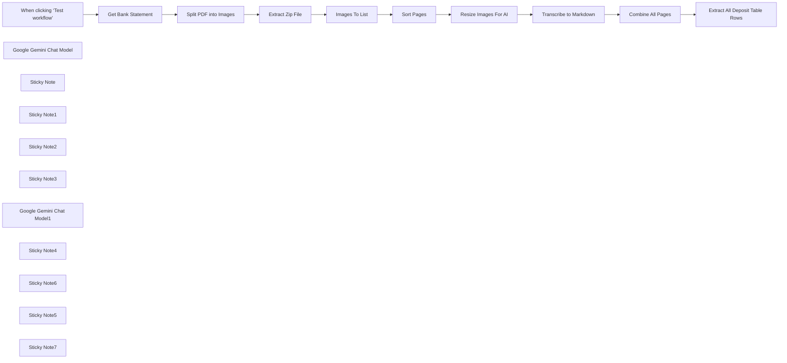

## Fluxo (.json) :

```json
{
  "meta": {
    "instanceId": "408f9fb9940c3cb18ffdef0e0150fe342d6e655c3a9fac21f0f644e8bedabcd9"
  },
  "nodes": [
    {
      "id": "490493d1-e9ac-458a-ac9e-a86048ce6169",
      "name": "When clicking ‘Test workflow’",
      "type": "n8n-nodes-base.manualTrigger",
      "position": [
        -700,
        260
      ],
      "parameters": {},
      "typeVersion": 1
    },
    {
      "id": "116f1137-632f-4021-ad0f-cf59ed1776fd",
      "name": "Google Gemini Chat Model",
      "type": "@n8n/n8n-nodes-langchain.lmChatGoogleGemini",
      "position": [
        980,
        440
      ],
      "parameters": {
        "options": {},
        "modelName": "models/gemini-1.5-pro-latest"
      },
      "credentials": {
        "googlePalmApi": {
          "id": "dSxo6ns5wn658r8N",
          "name": "Google Gemini(PaLM) Api account"
        }
      },
      "typeVersion": 1
    },
    {
      "id": "44695b4f-702c-4230-9ec3-e37447fed38e",
      "name": "Sort Pages",
      "type": "n8n-nodes-base.sort",
      "position": [
        400,
        320
      ],
      "parameters": {
        "options": {},
        "sortFieldsUi": {
          "sortField": [
            {
              "fieldName": "fileName"
            }
          ]
        }
      },
      "typeVersion": 1
    },
    {
      "id": "f2575b2c-0808-464e-b982-1eed8e0d9df7",
      "name": "Sticky Note",
      "type": "n8n-nodes-base.stickyNote",
      "position": [
        -1280,
        0
      ],
      "parameters": {
        "width": 437.0502325581392,
        "height": 430.522325581395,
        "content": "## Try Me Out!\n\n### This workflow converts a bank statement to markdown, faithfully capturing the details using the power of Vision Language Models (\"VLMs\"). The resulting markdown can then be parsed again by your standard LLM to extract data such as identifying all deposit table rows in the document.\n\nThis workflow is able to handle both downloaded PDFs as well as scanned PDFs. Be sure to protect sensitive data before running this workflow.\n\n### Need Help?\nJoin the [Discord](https://discord.com/invite/XPKeKXeB7d) or ask in the [Forum](https://community.n8n.io/)!"
      },
      "typeVersion": 1
    },
    {
      "id": "d62d7b0e-29eb-48a9-a471-4279e663c521",
      "name": "Get Bank Statement",
      "type": "n8n-nodes-base.googleDrive",
      "position": [
        -500,
        260
      ],
      "parameters": {
        "fileId": {
          "__rl": true,
          "mode": "id",
          "value": "1wS9U7MQDthj57CvEcqG_Llkr-ek6RqGA"
        },
        "options": {},
        "operation": "download"
      },
      "credentials": {
        "googleDriveOAuth2Api": {
          "id": "yOwz41gMQclOadgu",
          "name": "Google Drive account"
        }
      },
      "typeVersion": 3
    },
    {
      "id": "1329973b-a4e0-4272-9e24-3674bb9d4923",
      "name": "Split PDF into Images",
      "type": "n8n-nodes-base.httpRequest",
      "position": [
        -140,
        320
      ],
      "parameters": {
        "url": "http://stirling-pdf:8080/api/v1/convert/pdf/img",
        "method": "POST",
        "options": {},
        "sendBody": true,
        "contentType": "multipart-form-data",
        "bodyParameters": {
          "parameters": [
            {
              "name": "fileInput",
              "parameterType": "formBinaryData",
              "inputDataFieldName": "data"
            },
            {
              "name": "imageFormat",
              "value": "jpg"
            },
            {
              "name": "singleOrMultiple",
              "value": "multiple"
            },
            {
              "name": "dpi",
              "value": "300"
            }
          ]
        }
      },
      "typeVersion": 4.2
    },
    {
      "id": "4e263346-9f55-4316-a505-4a54061ccfbb",
      "name": "Extract Zip File",
      "type": "n8n-nodes-base.compression",
      "position": [
        40,
        320
      ],
      "parameters": {},
      "typeVersion": 1.1
    },
    {
      "id": "5e97072f-a7c5-45aa-99d1-3231a9230b53",
      "name": "Images To List",
      "type": "n8n-nodes-base.code",
      "position": [
        220,
        320
      ],
      "parameters": {
        "jsCode": "let results = [];\n\nfor (item of items) {\n for (key of Object.keys(item.binary)) {\n results.push({\n json: {\n fileName: item.binary[key].fileName\n },\n binary: {\n data: item.binary[key],\n }\n });\n }\n}\n\nreturn results;"
      },
      "typeVersion": 2
    },
    {
      "id": "62836c73-4cf7-4225-a45d-0cd62b7e227d",
      "name": "Resize Images For AI",
      "type": "n8n-nodes-base.editImage",
      "position": [
        800,
        280
      ],
      "parameters": {
        "width": 75,
        "height": 75,
        "options": {},
        "operation": "resize",
        "resizeOption": "percent"
      },
      "typeVersion": 1
    },
    {
      "id": "59fc6716-9826-4463-be33-923a8f6f33f1",
      "name": "Sticky Note1",
      "type": "n8n-nodes-base.stickyNote",
      "position": [
        -820,
        0
      ],
      "parameters": {
        "color": 7,
        "width": 546.4534883720931,
        "height": 478.89348837209275,
        "content": "## 1. Download Bank Statement PDF\n[Read more about Google Drive node](https://docs.n8n.io/integrations/builtin/app-nodes/n8n-nodes-base.googledrive)\n\nFor this demonstration, we'll pull an example bank statement off Google Drive however, you can also swap this out for other triggers such as webhook.\n\nYou can use the example bank statement created specifically for this workflow here: https://drive.google.com/file/d/1wS9U7MQDthj57CvEcqG_Llkr-ek6RqGA/view?usp=sharing"
      },
      "typeVersion": 1
    },
    {
      "id": "8e68a295-ff35-4d28-86bb-c8ea5664b3c6",
      "name": "Sticky Note2",
      "type": "n8n-nodes-base.stickyNote",
      "position": [
        -240,
        3.173953488372149
      ],
      "parameters": {
        "color": 7,
        "width": 848.0232558139535,
        "height": 533.5469767441862,
        "content": "## 2. Split PDF Pages into Seperate Images\n\nCurrently, the vision model we'll be using can't accept raw PDFs so we'll have to convert our PDF to a image in order to use it. To achieve this, we'll use the free [Stirling PDF webservice](https://stirlingpdf.io/) for convenience but if we need data privacy (recommended!), we could self-host our own [Stirling PDF instance](https://github.com/Stirling-Tools/Stirling-PDF/) instead. Alternatively, feel free to swap this service out for one of your own as long as it can convert PDFs into images!\n\nWe will ask the PDF service to return each page of our statement as separate images, which it does so as a zip file. Next steps is to just unzip the file and convert the output as a list of images."
      },
      "typeVersion": 1
    },
    {
      "id": "5286aa35-9687-4d5b-987c-79322a1ddc84",
      "name": "Sticky Note3",
      "type": "n8n-nodes-base.stickyNote",
      "position": [
        640,
        -40
      ],
      "parameters": {
        "color": 7,
        "width": 775.3441860465115,
        "height": 636.0809302325588,
        "content": "## 3. Convert PDF Pages to Markdown Using Vision Model\n[Learn more about using the Basic LLM node](https://docs.n8n.io/integrations/builtin/cluster-nodes/root-nodes/n8n-nodes-langchain.chainllm)\n\nUnlike traditional OCR, vision models (\"VLMs\") \"transcribe\" what they see so while we shouldn't expect an exact replication of a document, they may perform better making sense of complex document layouts ie. such as with horizontally stacked tables.\n \nIn this demonstration, we can transcribe our bank statement scans to markdown text for the purpose of further processing. With markdown, we can retain tables or columnar data found in the document. We'll employ two optimisations however as a workaround for token and timeout limits (1) we'll only transcribe one page at a time and (2) we'll shrink the pages just a little just enough to speed up processing but not enough to reduce our required resolution."
      },
      "typeVersion": 1
    },
    {
      "id": "49deef00-4617-4b19-a56f-08fd195dfb82",
      "name": "Google Gemini Chat Model1",
      "type": "@n8n/n8n-nodes-langchain.lmChatGoogleGemini",
      "position": [
        1760,
        480
      ],
      "parameters": {
        "options": {
          "safetySettings": {
            "values": [
              {
                "category": "HARM_CATEGORY_DANGEROUS_CONTENT",
                "threshold": "BLOCK_NONE"
              }
            ]
          }
        },
        "modelName": "models/gemini-1.5-pro-latest"
      },
      "credentials": {
        "googlePalmApi": {
          "id": "dSxo6ns5wn658r8N",
          "name": "Google Gemini(PaLM) Api account"
        }
      },
      "typeVersion": 1
    },
    {
      "id": "8e9c5d1d-d610-4bad-8feb-7ff0d5e1e64f",
      "name": "Sticky Note4",
      "type": "n8n-nodes-base.stickyNote",
      "position": [
        1440,
        80
      ],
      "parameters": {
        "color": 7,
        "width": 719.7534883720941,
        "height": 574.3134883720929,
        "content": "## 4. Extract Key Data Confidently From Statement\n[Read more about the Information Extractor](https://docs.n8n.io/integrations/builtin/cluster-nodes/root-nodes/n8n-nodes-langchain.information-extractor)\n\nWith our newly generated transcript, let's pull just the deposit line items from our statement. Processing all pages together as images may have been compute-extensive but as text, this is usually no problem at all for our LLM.\n\nFor our example bank statement PDF, the resulting extraction should be 8 table rows where a value exists in the \"deposits\" column."
      },
      "typeVersion": 1
    },
    {
      "id": "f849ad3c-69ec-443c-b7cd-ab24e210af73",
      "name": "Sticky Note6",
      "type": "n8n-nodes-base.stickyNote",
      "position": [
        -640,
        500
      ],
      "parameters": {
        "color": 5,
        "width": 366.00558139534894,
        "height": 125.41023255813957,
        "content": "### 💡 About the Example PDF\nScanned PDFs (ie. where each page is a scanned image) are a use-case where extracting PDF text content will not work. Vision models are a great solution as this workflow aims to demonstrate!"
      },
      "typeVersion": 1
    },
    {
      "id": "be6f529b-8220-4879-bd99-4333b4d764b6",
      "name": "Combine All Pages",
      "type": "n8n-nodes-base.aggregate",
      "position": [
        1580,
        320
      ],
      "parameters": {
        "options": {},
        "fieldsToAggregate": {
          "fieldToAggregate": [
            {
              "renameField": true,
              "outputFieldName": "pages",
              "fieldToAggregate": "text"
            }
          ]
        }
      },
      "typeVersion": 1
    },
    {
      "id": "2b35755c-7bae-4896-b9f9-1e9110209526",
      "name": "Sticky Note5",
      "type": "n8n-nodes-base.stickyNote",
      "position": [
        -190.1172093023256,
        280
      ],
      "parameters": {
        "width": 199.23348837209306,
        "height": 374.95069767441856,
        "content": "\n\n\n\n\n\n\n\n\n\n\n\n\n\n\n\n### Privacy Warning!\nThis example uses a public third party service. If your data is senstive, please swap this out for the self-hosted version!"
      },
      "typeVersion": 1
    },
    {
      "id": "f638ba05-9ae2-447f-82af-eb22d8b9d6f1",
      "name": "Extract All Deposit Table Rows",
      "type": "@n8n/n8n-nodes-langchain.informationExtractor",
      "position": [
        1760,
        320
      ],
      "parameters": {
        "text": "= {{ $json.pages.join('---') }}",
        "options": {
          "systemPromptTemplate": "This statement contains tables with rows showing deposit and withdrawal made to the user's account. Deposits and withdrawals are identified by have the amount in their respective columns. What are the deposits to the account found in this statement?"
        },
        "schemaType": "manual",
        "inputSchema": "{\n \"type\": \"array\",\n \"items\": {\n\t\"type\": \"object\",\n\t\"properties\": {\n \"date\": { \"type\": \"string\" },\n \"description\": { \"type\": \"string\" },\n \"amount\": { \"type\": \"number\" }\n\t}\n }\n}"
      },
      "typeVersion": 1
    },
    {
      "id": "cf1e8d85-5c92-469d-98af-7bdd5f469167",
      "name": "Sticky Note7",
      "type": "n8n-nodes-base.stickyNote",
      "position": [
        913.9944186046506,
        620
      ],
      "parameters": {
        "color": 5,
        "width": 498.18790697674433,
        "height": 130.35162790697677,
        "content": "### 💡 Don't use Google?\nFeel free to swap the model out for any state-of-the-art multimodal model which supports image inputs such as GPT4o(-mini) or Claude Sonnet/Opus. Note, I've found Gemini to produce the most accurate and consistent for this example use-case so no guarantees if you switch!"
      },
      "typeVersion": 1
    },
    {
      "id": "20f33372-a6b6-4f4d-987d-a94c85313fa8",
      "name": "Transcribe to Markdown",
      "type": "@n8n/n8n-nodes-langchain.chainLlm",
      "position": [
        980,
        280
      ],
      "parameters": {
        "text": "transcribe the image to markdown.",
        "messages": {
          "messageValues": [
            {
              "message": "=You help transcribe documents to markdown, keeping faithful to all text printed and visible to the best of your ability. Ensure you capture all headings, subheadings, titles as well as small print.\nFor any tables found with the document, convert them to markdown tables. If table row descriptions overflow into more than 1 row, concatanate and fit them into a single row. If two or more tables are adjacent horizontally, stack the tables vertically instead. There should be a newline after every markdown table.\nFor any graphics, use replace with a description of the image. Images of scanned checks should be converted to the phrase \"<scanned image of check>\"."
            },
            {
              "type": "HumanMessagePromptTemplate",
              "messageType": "imageBinary"
            }
          ]
        },
        "promptType": "define"
      },
      "typeVersion": 1.4
    }
  ],
  "pinData": {},
  "connections": {
    "Sort Pages": {
      "main": [
        [
          {
            "node": "Resize Images For AI",
            "type": "main",
            "index": 0
          }
        ]
      ]
    },
    "Images To List": {
      "main": [
        [
          {
            "node": "Sort Pages",
            "type": "main",
            "index": 0
          }
        ]
      ]
    },
    "Extract Zip File": {
      "main": [
        [
          {
            "node": "Images To List",
            "type": "main",
            "index": 0
          }
        ]
      ]
    },
    "Combine All Pages": {
      "main": [
        [
          {
            "node": "Extract All Deposit Table Rows",
            "type": "main",
            "index": 0
          }
        ]
      ]
    },
    "Get Bank Statement": {
      "main": [
        [
          {
            "node": "Split PDF into Images",
            "type": "main",
            "index": 0
          }
        ]
      ]
    },
    "Resize Images For AI": {
      "main": [
        [
          {
            "node": "Transcribe to Markdown",
            "type": "main",
            "index": 0
          }
        ]
      ]
    },
    "Split PDF into Images": {
      "main": [
        [
          {
            "node": "Extract Zip File",
            "type": "main",
            "index": 0
          }
        ]
      ]
    },
    "Transcribe to Markdown": {
      "main": [
        [
          {
            "node": "Combine All Pages",
            "type": "main",
            "index": 0
          }
        ]
      ]
    },
    "Google Gemini Chat Model": {
      "ai_languageModel": [
        [
          {
            "node": "Transcribe to Markdown",
            "type": "ai_languageModel",
            "index": 0
          }
        ]
      ]
    },
    "Google Gemini Chat Model1": {
      "ai_languageModel": [
        [
          {
            "node": "Extract All Deposit Table Rows",
            "type": "ai_languageModel",
            "index": 0
          }
        ]
      ]
    },
    "When clicking ‘Test workflow’": {
      "main": [
        [
          {
            "node": "Get Bank Statement",
            "type": "main",
            "index": 0
          }
        ]
      ]
    }
  }
}
```

<a id="template-1322"></a>

## Template 1322 - Criador de links UTM com QR e relatórios GA programados

- **Nome:** Criador de links UTM com QR e relatórios GA programados
- **Descrição:** Automatiza a criação de links com UTM, armazena os URLs no banco de dados, gera QR codes e agenda relatórios do Google Analytics com resumos executivos enviados por e-mail.
- **Funcionalidade:** • Geração de URL com parâmetros UTM: cria a URL com utm_source, utm_medium, utm_campaign, utm_term e utm_content.
• Armazenamento em banco de dados: faz upsert do URL UTM no Airtable para manter registros.
• Geração de QR code: gera um QR code a partir da URL UTM para uso em materiais de marketing.
• Agendamento de relatórios GA: agenda a coleta e criação de relatórios do Google Analytics com métricas/dimensões definidas.
• Geração de resumo executivo: usa um agente de IA para analisar os dados e produzir um resumo executivo.
• Envio de relatório por e-mail: envia o resumo ao gerente de marketing com o assunto "Google Analytics Metrics Summary Report".
- **Ferramentas:** • Airtable: armazenamento/upsert de URLs UTM no banco de dados.
• QuickChart.io: geração de QR codes a partir de URLs UTMs.
• Google Analytics: coleta de dados e geração de relatórios de métricas.
• Gmail: envio de relatórios por e-mail aos responsáveis.


## Fluxo visual

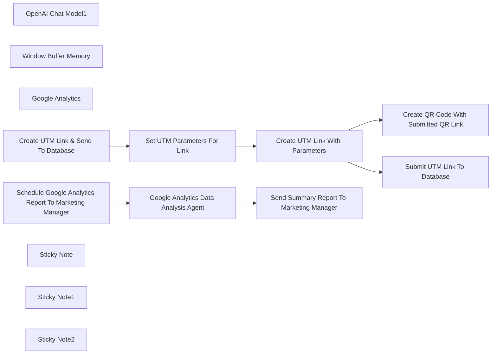

## Fluxo (.json) :

```json
{
  "id": "SJrqDqTBIAyaZQkq",
  "meta": {
    "instanceId": "73d9d5380db181d01f4e26492c771d4cb5c4d6d109f18e2621cf49cac4c50763",
    "templateCredsSetupCompleted": true
  },
  "name": "UTM Link Creator & QR Code Generator with Scheduled Google Analytics Reports",
  "tags": [],
  "nodes": [
    {
      "id": "5efbd956-51b6-4f94-aebc-07e3e691f7eb",
      "name": "OpenAI Chat Model1",
      "type": "@n8n/n8n-nodes-langchain.lmChatOpenAi",
      "position": [
        -180,
        480
      ],
      "parameters": {
        "model": {
          "__rl": true,
          "mode": "list",
          "value": "gpt-4o-mini"
        },
        "options": {}
      },
      "credentials": {
        "openAiApi": {
          "id": "95QGJD3XSz0piaNU",
          "name": "OpenAi account"
        }
      },
      "typeVersion": 1.2
    },
    {
      "id": "a1acd323-ed07-41b4-a51e-614afe361893",
      "name": "Window Buffer Memory",
      "type": "@n8n/n8n-nodes-langchain.memoryBufferWindow",
      "position": [
        0,
        480
      ],
      "parameters": {
        "sessionKey": "={{ $json.timestamp }}",
        "sessionIdType": "customKey",
        "contextWindowLength": 200
      },
      "typeVersion": 1.3
    },
    {
      "id": "c3c2b5fa-c294-4306-a050-dccd592477fa",
      "name": "Google Analytics",
      "type": "n8n-nodes-base.googleAnalyticsTool",
      "position": [
        160,
        480
      ],
      "parameters": {
        "metricsGA4": {
          "metricValues": [
            {
              "listName": "sessions"
            }
          ]
        },
        "propertyId": {
          "__rl": true,
          "mode": "list",
          "value": "404306108",
          "cachedResultUrl": "https://analytics.google.com/analytics/web/#/p404306108/",
          "cachedResultName": "East Coast Concrete Coating"
        },
        "dimensionsGA4": {
          "dimensionValues": [
            {},
            {
              "listName": "sourceMedium"
            }
          ]
        },
        "additionalFields": {}
      },
      "credentials": {
        "googleAnalyticsOAuth2": {
          "id": "sVZ61SpNfC2D1Z7V",
          "name": "Google Analytics account"
        }
      },
      "typeVersion": 2
    },
    {
      "id": "cbc7b539-2fa6-493b-a66c-13db8d8d420c",
      "name": "Create UTM Link & Send To Database",
      "type": "n8n-nodes-base.manualTrigger",
      "position": [
        -440,
        -80
      ],
      "parameters": {},
      "typeVersion": 1
    },
    {
      "id": "5358f2cc-bdb0-4e9b-a6b9-93418f83db02",
      "name": "Set UTM Parameters For Link",
      "type": "n8n-nodes-base.set",
      "position": [
        -220,
        -80
      ],
      "parameters": {
        "options": {},
        "assignments": {
          "assignments": [
            {
              "id": "28d0a36d-5b03-4b74-9941-ef0e1aab86bf",
              "name": "website_url",
              "type": "string",
              "value": "https://ecconcretecoating.com/"
            },
            {
              "id": "1a2ee174-4684-4246-813f-b67285af48b8",
              "name": "campaign_id",
              "type": "string",
              "value": "12246"
            },
            {
              "id": "e15a846d-6e37-4fbf-a9f4-b3fce3441295",
              "name": "campaign_source",
              "type": "string",
              "value": "google"
            },
            {
              "id": "f15e2bb1-08a6-48c4-8458-b753864e9364",
              "name": "campaign_medium",
              "type": "string",
              "value": "display"
            },
            {
              "id": "548900ab-aa2c-498f-bbd9-a787306e72db",
              "name": "campaign_name",
              "type": "string",
              "value": "summerfun"
            },
            {
              "id": "fd8d1bd4-a75d-4c49-b795-8fda7c377b66",
              "name": "campaign_term",
              "type": "string",
              "value": "conretecoating"
            }
          ]
        }
      },
      "typeVersion": 3.4
    },
    {
      "id": "45daf73a-01c2-40ab-8546-7fdd489e2a1c",
      "name": "Create UTM Link With Parameters",
      "type": "n8n-nodes-base.code",
      "position": [
        40,
        -140
      ],
      "parameters": {
        "jsCode": "const items = $input.all();\nconst updatedItems = items.map((item) => {\n const utmUrl = `${item?.json?.website_url}?utm_source=${item?.json?.campaign_source}&utm_medium=${item?.json?.campaign_medium}&utm_campaign=${item?.json?.campaign_name}&utm_term=${item?.json?.campaign_term}&utm_content=${item?.json?.campaign_id}`;\n item.json.utmUrl = utmUrl;\n return item;\n});\nreturn updatedItems;\n"
      },
      "typeVersion": 2
    },
    {
      "id": "a621984d-eea5-464d-9be3-e620e779abd5",
      "name": "Submit UTM Link To Database",
      "type": "n8n-nodes-base.airtable",
      "position": [
        280,
        -200
      ],
      "parameters": {
        "base": {
          "__rl": true,
          "mode": "list",
          "value": "appIXd8a8JeB9bPaL",
          "cachedResultUrl": "https://airtable.com/appIXd8a8JeB9bPaL",
          "cachedResultName": "Untitled Base"
        },
        "table": {
          "__rl": true,
          "mode": "list",
          "value": "tblXyFxXMHraieGCa",
          "cachedResultUrl": "https://airtable.com/appIXd8a8JeB9bPaL/tblXyFxXMHraieGCa",
          "cachedResultName": "UTM_URL"
        },
        "columns": {
          "value": {
            "URL": "={{ $json.utmUrl }}"
          },
          "schema": [
            {
              "id": "id",
              "type": "string",
              "display": true,
              "removed": false,
              "readOnly": true,
              "required": false,
              "displayName": "id",
              "defaultMatch": true
            },
            {
              "id": "URL",
              "type": "string",
              "display": true,
              "removed": false,
              "readOnly": false,
              "required": false,
              "displayName": "URL",
              "defaultMatch": false,
              "canBeUsedToMatch": true
            }
          ],
          "mappingMode": "defineBelow",
          "matchingColumns": [
            "id"
          ],
          "attemptToConvertTypes": false,
          "convertFieldsToString": false
        },
        "options": {},
        "operation": "upsert"
      },
      "credentials": {
        "airtableTokenApi": {
          "id": "0ApVmNsLu7aFzQD6",
          "name": "Airtable Personal Access Token account"
        }
      },
      "typeVersion": 2.1
    },
    {
      "id": "19074462-d719-4fdf-bc59-d6b2ecd1ce20",
      "name": "Create QR Code With Submitted QR Link",
      "type": "n8n-nodes-base.httpRequest",
      "position": [
        280,
        -20
      ],
      "parameters": {
        "url": "=https://quickchart.io/qr?text={{ $json.utmUrl }}&size=300&margin=10&ecLevel=H&dark=000000&light=FFFFFF\n",
        "options": {}
      },
      "typeVersion": 4.2
    },
    {
      "id": "a8c22bb2-f8eb-4e5f-b288-9c25e0aeb648",
      "name": "Schedule Google Analytics Report To Marketing Manager",
      "type": "n8n-nodes-base.scheduleTrigger",
      "position": [
        -460,
        280
      ],
      "parameters": {
        "rule": {
          "interval": [
            {}
          ]
        }
      },
      "typeVersion": 1.2
    },
    {
      "id": "268c110c-2b7c-4450-b5b0-5d5326eac17f",
      "name": "Google Analytics Data Analysis Agent",
      "type": "@n8n/n8n-nodes-langchain.agent",
      "position": [
        -100,
        280
      ],
      "parameters": {
        "text": "={{ $json.timestamp }}",
        "options": {
          "systemMessage": "\"You are an advanced data analytics AI specializing in executive reporting. Your task is to analyze the provided dataset and generate a structured executive summary that highlights key insights, trends, and actionable takeaways. Structure your summary in the following format:\n\nOverview – Briefly describe the dataset and its significance.\nKey Performance Indicators (KPIs) – Highlight the most important metrics and compare them to previous periods if applicable.\nTrends & Insights – Identify patterns, growth areas, declines, and anomalies.\nOpportunities & Recommendations – Provide strategic recommendations based on the insights.\nConclusion – Summarize the key takeaways concisely.\n*Ensure the tone is professional, clear, and tailored for executives who require quick, data-driven insights without unnecessary details.\""
        },
        "promptType": "define"
      },
      "typeVersion": 1.7
    },
    {
      "id": "1b012731-e67b-4e0d-95b7-a7f587754a05",
      "name": "Send Summary Report To Marketing Manager",
      "type": "n8n-nodes-base.gmail",
      "position": [
        300,
        280
      ],
      "webhookId": "a9b88615-c7e2-4b56-891a-98f4d6b34220",
      "parameters": {
        "sendTo": "john@marketingcanopy.com",
        "message": "={{ $json.output }}",
        "options": {},
        "subject": "Google Analytics Metrics Summary Report"
      },
      "credentials": {
        "gmailOAuth2": {
          "id": "pIXP1ZseBP4Z5CCp",
          "name": "Gmail account"
        }
      },
      "typeVersion": 2.1
    },
    {
      "id": "9da758e1-8aed-446b-a074-8fee5405583f",
      "name": "Sticky Note",
      "type": "n8n-nodes-base.stickyNote",
      "position": [
        -540,
        -280
      ],
      "parameters": {
        "width": 500,
        "height": 400,
        "content": "Create a marketing link with UTM parameters. Easily store in database and have QR code created and ready as well.\n\nType in requirements:\nwebsite URL\ncampaign id\ncampaign source\ncampaign medium\ncampaign name\ncampaign term\n\n"
      },
      "typeVersion": 1
    },
    {
      "id": "92f5df8d-88ca-4b58-b544-c0b2d3578a73",
      "name": "Sticky Note1",
      "type": "n8n-nodes-base.stickyNote",
      "position": [
        0,
        -380
      ],
      "parameters": {
        "color": 4,
        "width": 580,
        "height": 540,
        "content": "Code node creates the URL with UTM parameters. \n\nIt then sends to your Airtable database to store for records. It also creates a QR code with the embedded link to be used for materials. \n\nSample Airtable Setup:\n-Website Link UTM column"
      },
      "typeVersion": 1
    },
    {
      "id": "408af10c-4b0e-4d94-b02d-5d887fb150c3",
      "name": "Sticky Note2",
      "type": "n8n-nodes-base.stickyNote",
      "position": [
        -540,
        180
      ],
      "parameters": {
        "color": 5,
        "width": 1340,
        "height": 460,
        "content": "Schedule a Google Analytics Reports with Medium/Source to track UTM link performance. Update the reporting fields to fit your business needs. You can track traffic, conversions and other engagement metrics.\n\n*Sample Google Report Metrics: Sessions. Update metrics as needed."
      },
      "typeVersion": 1
    }
  ],
  "active": false,
  "pinData": {},
  "settings": {
    "executionOrder": "v1"
  },
  "versionId": "6e6641fd-a59c-49e9-af43-1b2b9b458544",
  "connections": {
    "Google Analytics": {
      "ai_tool": [
        [
          {
            "node": "Google Analytics Data Analysis Agent",
            "type": "ai_tool",
            "index": 0
          }
        ]
      ]
    },
    "OpenAI Chat Model1": {
      "ai_languageModel": [
        [
          {
            "node": "Google Analytics Data Analysis Agent",
            "type": "ai_languageModel",
            "index": 0
          }
        ]
      ]
    },
    "Window Buffer Memory": {
      "ai_memory": [
        [
          {
            "node": "Google Analytics Data Analysis Agent",
            "type": "ai_memory",
            "index": 0
          }
        ]
      ]
    },
    "Set UTM Parameters For Link": {
      "main": [
        [
          {
            "node": "Create UTM Link With Parameters",
            "type": "main",
            "index": 0
          }
        ]
      ]
    },
    "Submit UTM Link To Database": {
      "main": [
        []
      ]
    },
    "Create UTM Link With Parameters": {
      "main": [
        [
          {
            "node": "Create QR Code With Submitted QR Link",
            "type": "main",
            "index": 0
          },
          {
            "node": "Submit UTM Link To Database",
            "type": "main",
            "index": 0
          }
        ]
      ]
    },
    "Create UTM Link & Send To Database": {
      "main": [
        [
          {
            "node": "Set UTM Parameters For Link",
            "type": "main",
            "index": 0
          }
        ]
      ]
    },
    "Google Analytics Data Analysis Agent": {
      "main": [
        [
          {
            "node": "Send Summary Report To Marketing Manager",
            "type": "main",
            "index": 0
          }
        ]
      ]
    },
    "Send Summary Report To Marketing Manager": {
      "main": [
        []
      ]
    },
    "Schedule Google Analytics Report To Marketing Manager": {
      "main": [
        [
          {
            "node": "Google Analytics Data Analysis Agent",
            "type": "main",
            "index": 0
          }
        ]
      ]
    }
  }
}
```

<a id="template-1323"></a>

## Template 1323 - Criar, inserir e atualizar tabela no Snowflake

- **Nome:** Criar, inserir e atualizar tabela no Snowflake
- **Descrição:** Cria uma tabela no Snowflake, insere um registro e em seguida atualiza esse registro.
- **Funcionalidade:** • Gatilho manual: Inicia o fluxo ao executar manualmente.
• Criação de tabela: Executa um comando SQL para criar a tabela 'docs' com colunas id e name.
• Inserção de dados: Insere um registro (id = 1, name = "n8n") na tabela criada.
• Atualização de dados: Atualiza a coluna name do registro para "nodemation" com base no id.
• Referência dinâmica de parâmetros: Usa referência dinâmica para passar o nome da tabela entre etapas.
• Conexão autenticada: Utiliza credenciais configuradas para conectar-se ao banco e executar as operações.
- **Ferramentas:** • Snowflake: Data warehouse em nuvem usado para executar comandos SQL, criar tabelas, inserir e atualizar registros por meio de conexões autenticadas.

## Fluxo visual

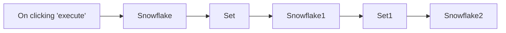

## Fluxo (.json) :

```json
{
  "id": "172",
  "name": "Create a table, and insert and update data in the table in Snowflake",
  "nodes": [
    {
      "name": "On clicking 'execute'",
      "type": "n8n-nodes-base.manualTrigger",
      "position": [
        250,
        300
      ],
      "parameters": {},
      "typeVersion": 1
    },
    {
      "name": "Set",
      "type": "n8n-nodes-base.set",
      "position": [
        650,
        300
      ],
      "parameters": {
        "values": {
          "number": [
            {
              "name": "id",
              "value": 1
            }
          ],
          "string": [
            {
              "name": "name",
              "value": "n8n"
            }
          ]
        },
        "options": {},
        "keepOnlySet": true
      },
      "typeVersion": 1
    },
    {
      "name": "Snowflake",
      "type": "n8n-nodes-base.snowflake",
      "position": [
        450,
        300
      ],
      "parameters": {
        "query": "CREATE TABLE docs (id INT, name STRING);",
        "operation": "executeQuery"
      },
      "credentials": {
        "snowflake": "Snowflake n8n Credentials"
      },
      "typeVersion": 1
    },
    {
      "name": "Snowflake1",
      "type": "n8n-nodes-base.snowflake",
      "position": [
        850,
        300
      ],
      "parameters": {
        "table": "docs",
        "columns": "id, name"
      },
      "credentials": {
        "snowflake": "Snowflake n8n Credentials"
      },
      "typeVersion": 1
    },
    {
      "name": "Set1",
      "type": "n8n-nodes-base.set",
      "position": [
        1050,
        300
      ],
      "parameters": {
        "values": {
          "number": [
            {
              "name": "id",
              "value": 1
            }
          ],
          "string": [
            {
              "name": "name",
              "value": "nodemation"
            }
          ]
        },
        "options": {},
        "keepOnlySet": true
      },
      "typeVersion": 1
    },
    {
      "name": "Snowflake2",
      "type": "n8n-nodes-base.snowflake",
      "position": [
        1250,
        300
      ],
      "parameters": {
        "table": "={{$node[\"Snowflake1\"].parameter[\"table\"]}}",
        "columns": "name",
        "operation": "update"
      },
      "credentials": {
        "snowflake": "Snowflake n8n Credentials"
      },
      "typeVersion": 1
    }
  ],
  "active": false,
  "settings": {},
  "connections": {
    "Set": {
      "main": [
        [
          {
            "node": "Snowflake1",
            "type": "main",
            "index": 0
          }
        ]
      ]
    },
    "Set1": {
      "main": [
        [
          {
            "node": "Snowflake2",
            "type": "main",
            "index": 0
          }
        ]
      ]
    },
    "Snowflake": {
      "main": [
        [
          {
            "node": "Set",
            "type": "main",
            "index": 0
          }
        ]
      ]
    },
    "Snowflake1": {
      "main": [
        [
          {
            "node": "Set1",
            "type": "main",
            "index": 0
          }
        ]
      ]
    },
    "On clicking 'execute'": {
      "main": [
        [
          {
            "node": "Snowflake",
            "type": "main",
            "index": 0
          }
        ]
      ]
    }
  }
}
```

<a id="template-1324"></a>

## Template 1324 - Notificação Mattermost ao atualizar fluxo

- **Nome:** Notificação Mattermost ao atualizar fluxo
- **Descrição:** O fluxo expõe um webhook para receber requisições externas e, separadamente, detecta quando o próprio fluxo é atualizado para enviar uma notificação a um canal do Mattermost.
- **Funcionalidade:** • Receber webhook: Expõe um endpoint HTTP que aceita requisições externas para iniciar parte do fluxo.
• Definir mensagem: Ao receber o webhook, cria um campo Message com o texto "Hello!".
• Notificar atualização: Detecta eventos de atualização do fluxo e envia uma mensagem ao canal do Mattermost informando que o workflow foi atualizado.
- **Ferramentas:** • Mattermost: Plataforma de mensagens utilizada para enviar notificações a um canal específico.
• Webhook (endpoint HTTP): Ponto de entrada para receber eventos ou chamadas externas.

## Fluxo visual

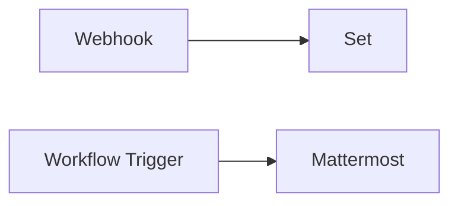

## Fluxo (.json) :

```json
{
  "nodes": [
    {
      "name": "Webhook",
      "type": "n8n-nodes-base.webhook",
      "position": [
        490,
        460
      ],
      "webhookId": "c0345765-4488-4ac8-a9da-02f647dd2b90",
      "parameters": {
        "path": "c0345765-4488-4ac8-a9da-02f647dd2b90",
        "options": {}
      },
      "typeVersion": 1
    },
    {
      "name": "Set",
      "type": "n8n-nodes-base.set",
      "position": [
        690,
        460
      ],
      "parameters": {
        "values": {
          "string": [
            {
              "name": "Message",
              "value": "Hello!"
            }
          ]
        },
        "options": {},
        "keepOnlySet": true
      },
      "typeVersion": 1
    },
    {
      "name": "Mattermost",
      "type": "n8n-nodes-base.mattermost",
      "position": [
        690,
        610
      ],
      "parameters": {
        "message": "=The workflow {{$workflow.name}}, was updated.",
        "channelId": "toyi3uoycf8rirtm7d5jm15sso",
        "attachments": [],
        "otherOptions": {}
      },
      "credentials": {
        "mattermostApi": "Mattermost Credentials"
      },
      "typeVersion": 1
    },
    {
      "name": "Workflow Trigger",
      "type": "n8n-nodes-base.workflowTrigger",
      "position": [
        490,
        610
      ],
      "parameters": {
        "events": [
          "update"
        ]
      },
      "typeVersion": 1
    }
  ],
  "connections": {
    "Webhook": {
      "main": [
        [
          {
            "node": "Set",
            "type": "main",
            "index": 0
          }
        ]
      ]
    },
    "Workflow Trigger": {
      "main": [
        [
          {
            "node": "Mattermost",
            "type": "main",
            "index": 0
          }
        ]
      ]
    }
  }
}
```

<a id="template-1325"></a>

## Template 1325 - Rastreamento financeiro: faturas Telegram → Notion

- **Nome:** Rastreamento financeiro: faturas Telegram → Notion
- **Descrição:** Automatiza a captura de fotos de faturas enviadas pelo Telegram, extrai e estrutura despesas usando IA, grava os itens em uma base do Notion e envia relatórios gráficos agendados.
- **Funcionalidade:** • Receber imagens de faturas via Telegram: o sistema monitora mensagens e captura fotos enviadas pelos usuários.
• Extrair dados da fatura com IA: usa um modelo de linguagem multimodal para identificar itens, quantidades, preços, total, imposto e data.
• Estruturar saída em JSON validado: converte o texto retornado pela IA em um objeto estruturado com campos padronizados.
• Gravar transações no banco de dados: cria registros individuais para cada item/linha da fatura com mapeamento de campos (nome, quantidade, preço, total, categoria, data, imposto).
• Enviar confirmação ao usuário: devolve um resumo curto da fatura no chat do Telegram após o processamento.
• Agregar e resumir despesas: consulta registros recentes e consolida valores por categoria para relatórios.
• Gerar gráfico visual do resumo: monta um payload de gráfico (ex.: barra) com os totais por categoria.
• Enviar relatório agendado ao Telegram: envia o gráfico para um chat ou canal em intervalos programados (ex.: semanalmente).
• Permitir customização de prompt e categorias: facilita ajuste das categorias, formato de saída e frequência de relatórios.
- **Ferramentas:** • Telegram: plataforma de mensagens usada para receber fotos de faturas e enviar confirmações e relatórios.
• Google Gemini (PaLM): modelo de IA multimodal responsável por extrair e resumir os dados presentes nas imagens de faturas.
• Notion: base de dados usada para armazenar os registros de despesas com propriedades mapeadas (nome, quantidade, preço, total, categoria, data, imposto).
• QuickChart (serviço de geração de gráficos): gera imagens de gráfico a partir dos dados agregados para envio como relatório visual.

## Fluxo visual

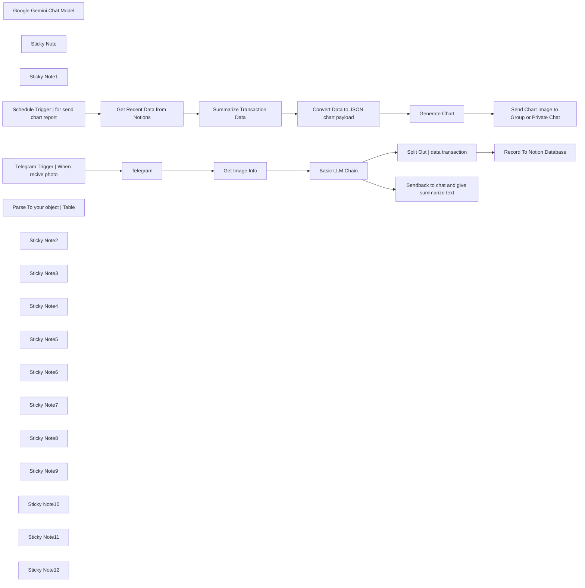

## Fluxo (.json) :

```json
{
  "id": "3BkxvtCbF6hHGUgM",
  "meta": {
    "instanceId": "d847dccbed2cefba539a228a44c266869b59eafbd4f307c4928a1149fb542a9e",
    "templateCredsSetupCompleted": true
  },
  "name": "N8N Financial Tracker Telegram Invoices to Notion with AI Summaries & Reports",
  "tags": [
    {
      "id": "OXcPKHaINFSvU1ux",
      "name": "Money",
      "createdAt": "2025-05-09T11:02:15.929Z",
      "updatedAt": "2025-05-09T11:02:15.929Z"
    },
    {
      "id": "witgF3iHQ0sAlkjG",
      "name": "experimental",
      "createdAt": "2025-05-09T11:02:15.933Z",
      "updatedAt": "2025-05-09T11:02:15.933Z"
    }
  ],
  "nodes": [
    {
      "id": "3792ae58-807f-4e83-a219-25c17c8b4048",
      "name": "Google Gemini Chat Model",
      "type": "@n8n/n8n-nodes-langchain.lmChatGoogleGemini",
      "position": [
        680,
        380
      ],
      "parameters": {
        "options": {},
        "modelName": "models/gemini-2.5-flash-preview-04-17"
      },
      "credentials": {
        "googlePalmApi": {
          "id": "haEP6ehKtsSUjFmK",
          "name": "Google Gemini(PaLM) Api account"
        }
      },
      "typeVersion": 1
    },
    {
      "id": "943f87e2-a1ac-4f7e-999b-8ea261259e5a",
      "name": "Basic LLM Chain",
      "type": "@n8n/n8n-nodes-langchain.chainLlm",
      "position": [
        640,
        220
      ],
      "parameters": {
        "text": "=ini ada base64 invoice rangkumkan Pengeluaran dari invoice tersebut Nama Barang jumlah dan Pengeluaran masing masing barang dan total, outputnya jangan panjang panjang saya cukup berikan \n\ndate: DD-MM-YYYY ( Jika dari OCR tidak ada tanggal ambil tanggal hari ini )\nid:\nname:\n qty: \nprice:\n total:\ncategory:\ntax : (jika di total berbeda dengan item brati ada pajak nya hitungkan juga pajaknya masukan kesini)\n\nuntuk pilihan categorynya : Food & Beverage / Transportation / Utilities / Shopping / Healthcare / Entertaiment / Housing / Education\n\ndalam bentuk JSON array object, berikan juga key message summary untuk rangkuman, berikan rangkauman singkat total pengeluaran dan barang apa saja yang dibeli serta jumlah nya berikan juga pajaknya",
        "messages": {
          "messageValues": [
            {
              "type": "HumanMessagePromptTemplate",
              "messageType": "imageBinary"
            }
          ]
        },
        "promptType": "define",
        "hasOutputParser": true
      },
      "typeVersion": 1.4
    },
    {
      "id": "247b78cb-c3f6-4f31-8559-0fff70de9ba9",
      "name": "Sticky Note",
      "type": "n8n-nodes-base.stickyNote",
      "position": [
        0,
        0
      ],
      "parameters": {
        "width": 1703,
        "height": 580,
        "content": "## Automated Financial Tracker: Telegram Invoices to Notion with AI Summaries & Reports\n"
      },
      "typeVersion": 1
    },
    {
      "id": "e20045c2-a8ef-43d6-b619-6825f605e183",
      "name": "Sticky Note1",
      "type": "n8n-nodes-base.stickyNote",
      "position": [
        0,
        620
      ],
      "parameters": {
        "color": 5,
        "width": 1706,
        "height": 527,
        "content": "## Schedule report to send on chanel or private message\n"
      },
      "typeVersion": 1
    },
    {
      "id": "ed8d6544-af9e-416a-b1f3-624ca108427f",
      "name": "Schedule Trigger | for send chart report",
      "type": "n8n-nodes-base.scheduleTrigger",
      "position": [
        80,
        880
      ],
      "parameters": {
        "rule": {
          "interval": [
            {}
          ]
        }
      },
      "typeVersion": 1.2
    },
    {
      "id": "22ad7ea1-9404-48bd-9d0f-0c58b8b66e3d",
      "name": "Get Recent Data from Notions",
      "type": "n8n-nodes-base.notion",
      "position": [
        400,
        940
      ],
      "parameters": {
        "filters": {
          "conditions": [
            {
              "key": "Created time|created_time",
              "condition": "past_week"
            }
          ]
        },
        "options": {},
        "resource": "databasePage",
        "operation": "getAll",
        "returnAll": true,
        "databaseId": {
          "__rl": true,
          "mode": "list",
          "value": "1d858554-d218-807c-936c-d06c8a8ec769",
          "cachedResultUrl": "https://www.notion.so/1d858554d218807c936cd06c8a8ec769",
          "cachedResultName": "Pengeluaran Rizqi Dini"
        },
        "filterType": "manual"
      },
      "credentials": {
        "notionApi": {
          "id": "AhjWhO7Jpc5x7xKG",
          "name": "Notion account"
        }
      },
      "typeVersion": 2.2
    },
    {
      "id": "34310645-52da-4f9c-96a2-0a01d0a640f9",
      "name": "Summarize Transaction Data",
      "type": "n8n-nodes-base.summarize",
      "position": [
        760,
        920
      ],
      "parameters": {
        "options": {},
        "fieldsToSplitBy": "property_category",
        "fieldsToSummarize": {
          "values": [
            {
              "field": "property_total",
              "aggregation": "sum"
            }
          ]
        }
      },
      "typeVersion": 1
    },
    {
      "id": "80a374cb-00cf-46b1-9505-709be1c550da",
      "name": "Generate Chart",
      "type": "n8n-nodes-base.quickChart",
      "position": [
        1200,
        900
      ],
      "parameters": {
        "data": "={{ $json.chart.data.datasets[0].data }}",
        "labelsMode": "array",
        "labelsArray": "={{ $json.chart.data.labels }}",
        "chartOptions": {},
        "datasetOptions": {}
      },
      "typeVersion": 1
    },
    {
      "id": "6b7c67ee-b205-42f5-9441-eb2ecee4a503",
      "name": "Send Chart Image to Group or Private Chat",
      "type": "n8n-nodes-base.telegram",
      "position": [
        1460,
        760
      ],
      "webhookId": "66cce6e1-819c-487b-b8ad-3f02aebd40cb",
      "parameters": {
        "chatId": "-1001957001324",
        "operation": "sendPhoto",
        "binaryData": true,
        "additionalFields": {
          "fileName": "chart",
          "message_thread_id": 571
        }
      },
      "credentials": {
        "telegramApi": {
          "id": "J8yRVYmsnH74HuaD",
          "name": "Telegram account"
        }
      },
      "typeVersion": 1.2
    },
    {
      "id": "06afd5ea-77b2-468d-b12b-1386d37a3ee6",
      "name": "Convert Data to JSON chart payload",
      "type": "n8n-nodes-base.code",
      "position": [
        1080,
        900
      ],
      "parameters": {
        "jsCode": "const labels = [];\nconst values = [];\n\nfor (const item of items) {\n  labels.push(item.json.property_category);\n  values.push(item.json.sum_property_total);\n}\n\nreturn [\n  {\n    json: {\n      chart: {\n        type: 'bar',\n        data: {\n          labels,\n          datasets: [\n            {\n              label: 'Spending by Category',\n              data: values,\n              backgroundColor: 'rgba(54, 162, 235, 0.6)',\n              borderColor: 'rgba(54, 162, 235, 1)',\n              borderWidth: 1\n            }\n          ]\n        },\n        options: {\n          plugins: {\n            title: {\n              display: true,\n              text: 'Spending Summary by Category'\n            }\n          },\n          scales: {\n            y: {\n              beginAtZero: true\n            }\n          }\n        }\n      }\n    }\n  }\n];"
      },
      "typeVersion": 2
    },
    {
      "id": "4ad8c9c9-fbec-46ce-943d-447ca687e031",
      "name": "Telegram Trigger | When recive photo",
      "type": "n8n-nodes-base.telegramTrigger",
      "position": [
        160,
        160
      ],
      "webhookId": "cac4ce91-ed1f-42ea-aebe-97ac3612aea6",
      "parameters": {
        "updates": [
          "message"
        ],
        "additionalFields": {}
      },
      "credentials": {
        "telegramApi": {
          "id": "J8yRVYmsnH74HuaD",
          "name": "Telegram account"
        }
      },
      "typeVersion": 1.1
    },
    {
      "id": "5231929f-2d7d-43ff-b9ae-141374926131",
      "name": "Get Image Info",
      "type": "n8n-nodes-base.editImage",
      "position": [
        460,
        160
      ],
      "parameters": {
        "operation": "information"
      },
      "typeVersion": 1
    },
    {
      "id": "c8dcc6a1-2367-4049-9a8b-d8a04299ee72",
      "name": "Parse To your object | Table",
      "type": "@n8n/n8n-nodes-langchain.outputParserStructured",
      "position": [
        1040,
        460
      ],
      "parameters": {
        "schemaType": "manual",
        "inputSchema": "{\n  \"type\": \"object\",\n  \"properties\": {\n    \"message\": {\n      \"type\": \"string\"\n    },\n    \"summary\": {\n      \"type\": \"array\",\n      \"items\": {\n        \"type\": \"object\",\n        \"properties\": {\"date\": { \"type\": \"date\" },\n          \"id\": { \"type\": \"integer\" },\n          \"name\": { \"type\": \"string\" },\n          \"qty\": { \"type\": \"integer\" },\n          \"price\": { \"type\": \"number\" },\n          \"tax\": { \"type\": \"number\" },\n          \"total\": { \"type\": \"number\" },\"category\": { \"type\": \"string\" }\n        },\n        \"required\": [\"id\", \"name\", \"qty\", \"price\", \"total\",\"category\"]\n      }\n    }\n  },\n  \"required\": [\"message\", \"summary\"]\n}\n"
      },
      "typeVersion": 1.2
    },
    {
      "id": "bc098a26-4e55-4908-880c-e5f27737a941",
      "name": "Split Out | data transaction",
      "type": "n8n-nodes-base.splitOut",
      "position": [
        1120,
        40
      ],
      "parameters": {
        "options": {},
        "fieldToSplitOut": "output.summary"
      },
      "typeVersion": 1
    },
    {
      "id": "2a42bc4b-a5c7-433e-91e4-aa5531570f73",
      "name": "Sendback to chat and give summarize text",
      "type": "n8n-nodes-base.telegram",
      "position": [
        1480,
        400
      ],
      "webhookId": "f90475fa-69cd-4e19-bc93-bffdceae8324",
      "parameters": {
        "text": "={{ $json.output.message }}",
        "chatId": "={{ $('Telegram Trigger | When recive photo').item.json.message.chat.id }}",
        "additionalFields": {
          "appendAttribution": false
        }
      },
      "credentials": {
        "telegramApi": {
          "id": "J8yRVYmsnH74HuaD",
          "name": "Telegram account"
        }
      },
      "typeVersion": 1.2
    },
    {
      "id": "bfc5c52e-313d-4257-bdfa-c542b687a853",
      "name": "Record To Notion Database",
      "type": "n8n-nodes-base.notion",
      "position": [
        1580,
        120
      ],
      "parameters": {
        "options": {},
        "resource": "databasePage",
        "databaseId": {
          "__rl": true,
          "mode": "list",
          "value": "1d858554-d218-807c-936c-d06c8a8ec769",
          "cachedResultUrl": "https://www.notion.so/1d858554d218807c936cd06c8a8ec769",
          "cachedResultName": "Pengeluaran Rizqi Dini"
        },
        "propertiesUi": {
          "propertyValues": [
            {
              "key": "Name|title",
              "title": "={{ $json.name }}"
            },
            {
              "key": "Quantity|number",
              "numberValue": "={{ $json.qty }}"
            },
            {
              "key": "Price|number",
              "numberValue": "={{ $json.price }}"
            },
            {
              "key": "Total|number",
              "numberValue": "={{ $json.total }}"
            },
            {
              "key": "Category|select",
              "selectValue": "={{ $json.category }}"
            },
            {
              "key": "Date|rich_text",
              "textContent": "={{ $json.date }}"
            },
            {
              "key": "Tax|number",
              "numberValue": "={{ $json.tax }}"
            }
          ]
        }
      },
      "credentials": {
        "notionApi": {
          "id": "AhjWhO7Jpc5x7xKG",
          "name": "Notion account"
        }
      },
      "typeVersion": 2.2
    },
    {
      "id": "f514554b-eb9e-47e2-ad6b-0b13036beaf4",
      "name": "Sticky Note2",
      "type": "n8n-nodes-base.stickyNote",
      "position": [
        40,
        60
      ],
      "parameters": {
        "color": 3,
        "width": 340,
        "height": 280,
        "content": "📸 INVOICE INPUT 📸\nBot listens here for photos of your receipts/invoices.\nEnsure your Telegram Bot API token is set in credentials."
      },
      "typeVersion": 1
    },
    {
      "id": "53fc4c77-3f16-4cb8-82e8-f4810af1f569",
      "name": "Sticky Note3",
      "type": "n8n-nodes-base.stickyNote",
      "position": [
        600,
        60
      ],
      "parameters": {
        "color": 5,
        "width": 360,
        "height": 460,
        "content": "🤖 AI MAGIC HAPPENS HERE 🧠\n- Image is sent to Google Gemini for data extraction.\n- Check 'Basic LLM Chain' to customize the AI prompt (e.g., categories, output format).\n- Requires Google Gemini API credentials."
      },
      "typeVersion": 1
    },
    {
      "id": "c6fb1193-7cc9-4f45-8a5f-20af41cdf3c8",
      "name": "Sticky Note4",
      "type": "n8n-nodes-base.stickyNote",
      "position": [
        980,
        340
      ],
      "parameters": {
        "color": 5,
        "width": 280,
        "height": 200,
        "content": "✨ STRUCTURING AI DATA ✨\nConverts the AI's text output into a usable JSON object.\nCheck the schema if you modify the AI prompt significantly."
      },
      "typeVersion": 1
    },
    {
      "id": "79a4e9ba-d1ea-4cfc-870c-145bae80c9b4",
      "name": "Sticky Note5",
      "type": "n8n-nodes-base.stickyNote",
      "position": [
        1320,
        0
      ],
      "parameters": {
        "color": 2,
        "width": 380,
        "height": 240,
        "content": "📝 SAVING TO NOTION 📝\n- Extracted transaction data is saved here.\n- Configure with your Notion API key & Database ID.\n- Map fields correctly to your database columns!"
      },
      "typeVersion": 1
    },
    {
      "id": "9406306b-9f3d-4877-a888-1f5e16a431c1",
      "name": "Sticky Note6",
      "type": "n8n-nodes-base.stickyNote",
      "position": [
        20,
        760
      ],
      "parameters": {
        "height": 280,
        "content": "REPORTING SCHEDULE 🗓️\nSet how often you want to receive your spending report (e.g., weekly, monthly)."
      },
      "typeVersion": 1
    },
    {
      "id": "1b6c8a28-b0f0-44fb-be02-21725d950716",
      "name": "Sticky Note7",
      "type": "n8n-nodes-base.stickyNote",
      "position": [
        320,
        760
      ],
      "parameters": {
        "color": 2,
        "width": 280,
        "height": 380,
        "content": "📊 FETCHING DATA FOR REPORT 📊\n- Retrieves transactions from Notion for the report period.\n- Default: \"Past Week\". Adjust filter as needed.\n- Requires Notion API credentials & Database ID."
      },
      "typeVersion": 1
    },
    {
      "id": "4612006e-04a9-4ad5-9f05-d49ec13f31cf",
      "name": "Sticky Note8",
      "type": "n8n-nodes-base.stickyNote",
      "position": [
        660,
        740
      ],
      "parameters": {
        "width": 320,
        "height": 360,
        "content": "➕ SUMMARIZING SPENDING ➕\nAggregates your expenses, usually by category,\nto prepare for the chart."
      },
      "typeVersion": 1
    },
    {
      "id": "103132cf-37a6-455f-b19f-14d3e17af912",
      "name": "Sticky Note9",
      "type": "n8n-nodes-base.stickyNote",
      "position": [
        1040,
        740
      ],
      "parameters": {
        "width": 300,
        "height": 340,
        "content": "📈 GENERATING VISUAL REPORT 📈\nCreates the actual chart image based on your spending data.\nYou can customize chart type (bar, pie, etc.) here."
      },
      "typeVersion": 1
    },
    {
      "id": "24324366-33e5-4097-ab36-aac31cef0006",
      "name": "Sticky Note10",
      "type": "n8n-nodes-base.stickyNote",
      "position": [
        1380,
        640
      ],
      "parameters": {
        "color": 6,
        "width": 300,
        "height": 300,
        "content": "📤 SENDING REPORT TO TELEGRAM 📤\n- Delivers the generated chart to your chosen Telegram chat/group.\n- Set the correct Chat ID and Bot API token."
      },
      "typeVersion": 1
    },
    {
      "id": "e9fc1140-411b-411a-87a6-bbe9718ba3b3",
      "name": "Sticky Note11",
      "type": "n8n-nodes-base.stickyNote",
      "position": [
        1320,
        280
      ],
      "parameters": {
        "color": 6,
        "width": 300,
        "height": 280,
        "content": "💬 TRANSACTION SUMMARY 💬\nSends a confirmation message back to the user in Telegram\nwith a summary of the recorded expense."
      },
      "typeVersion": 1
    },
    {
      "id": "013fd587-3504-44b8-97e1-09cad47a0089",
      "name": "Sticky Note12",
      "type": "n8n-nodes-base.stickyNote",
      "position": [
        40,
        360
      ],
      "parameters": {
        "color": 7,
        "width": 460,
        "height": 240,
        "content": "  🔑 CREDENTIALS NEEDED 🔑\n  Remember to set up API keys/tokens for:\n  - Telegram\n  - Google Gemini\n  - Notion\n\n  💡 CUSTOMIZE ME! 💡\n  - Adjust AI prompts for better accuracy.\n  - Change Notion database structure.\n  - Modify report frequency and content.\n"
      },
      "typeVersion": 1
    },
    {
      "id": "8f6f0fdb-d3be-4464-a7db-ea4d642a4f55",
      "name": "Telegram",
      "type": "n8n-nodes-base.telegram",
      "position": [
        320,
        160
      ],
      "webhookId": "6e801e0b-72d1-42a9-ac47-61ac113a01d2",
      "parameters": {
        "fileId": "={{ $json.message.photo[3].file_id }}",
        "resource": "file"
      },
      "credentials": {
        "telegramApi": {
          "id": "J8yRVYmsnH74HuaD",
          "name": "Telegram account"
        }
      },
      "typeVersion": 1.2
    }
  ],
  "active": true,
  "pinData": {},
  "settings": {
    "executionOrder": "v1"
  },
  "versionId": "a192c50c-4a77-44ee-b98a-f18d4ced2cb1",
  "connections": {
    "Telegram": {
      "main": [
        [
          {
            "node": "Get Image Info",
            "type": "main",
            "index": 0
          }
        ]
      ]
    },
    "Generate Chart": {
      "main": [
        [
          {
            "node": "Send Chart Image to Group or Private Chat",
            "type": "main",
            "index": 0
          }
        ]
      ]
    },
    "Get Image Info": {
      "main": [
        [
          {
            "node": "Basic LLM Chain",
            "type": "main",
            "index": 0
          }
        ]
      ]
    },
    "Basic LLM Chain": {
      "main": [
        [
          {
            "node": "Split Out | data transaction",
            "type": "main",
            "index": 0
          },
          {
            "node": "Sendback to chat and give summarize text",
            "type": "main",
            "index": 0
          }
        ]
      ]
    },
    "Google Gemini Chat Model": {
      "ai_languageModel": [
        [
          {
            "node": "Basic LLM Chain",
            "type": "ai_languageModel",
            "index": 0
          }
        ]
      ]
    },
    "Summarize Transaction Data": {
      "main": [
        [
          {
            "node": "Convert Data to JSON chart payload",
            "type": "main",
            "index": 0
          }
        ]
      ]
    },
    "Get Recent Data from Notions": {
      "main": [
        [
          {
            "node": "Summarize Transaction Data",
            "type": "main",
            "index": 0
          }
        ]
      ]
    },
    "Parse To your object | Table": {
      "ai_outputParser": [
        [
          {
            "node": "Basic LLM Chain",
            "type": "ai_outputParser",
            "index": 0
          }
        ]
      ]
    },
    "Split Out | data transaction": {
      "main": [
        [
          {
            "node": "Record To Notion Database",
            "type": "main",
            "index": 0
          }
        ]
      ]
    },
    "Convert Data to JSON chart payload": {
      "main": [
        [
          {
            "node": "Generate Chart",
            "type": "main",
            "index": 0
          }
        ]
      ]
    },
    "Telegram Trigger | When recive photo": {
      "main": [
        [
          {
            "node": "Telegram",
            "type": "main",
            "index": 0
          }
        ]
      ]
    },
    "Schedule Trigger | for send chart report": {
      "main": [
        [
          {
            "node": "Get Recent Data from Notions",
            "type": "main",
            "index": 0
          }
        ]
      ]
    }
  }
}
```

<a id="template-1326"></a>

## Template 1326 - Resumo Semanal Todoist com Email

- **Nome:** Resumo Semanal Todoist com Email
- **Descrição:** Automatiza a coleta de itens concluídos no Todoist, filtra projetos opcionais, formata o resultado por data e envia um resumo semanal por e-mail.
- **Funcionalidade:** • Coleta de tarefas concluídas do Todoist: busca itens concluídos nos últimos 7 dias.
• Filtragem de projetos ignorados (opcional): remove itens de projetos específicos.
• Agrupamento por data: organiza conteúdos pela data de conclusão.
• Formatação do corpo do e-mail: cria conteúdo HTML com os itens agrupados.
• Envio de resumo semanal por e-mail: envia o e-mail com o assunto predefinido.
• Execução programada: roda toda sexta-feira à tarde.
• Execução manual para testes: permite disparo manual para validação.
- **Ferramentas:** • Todoist API: API usada para recuperar tarefas concluídas.
• Serviço de envio de e-mails: utilitário para enviar o resumo semanal por e-mail.

## Fluxo visual

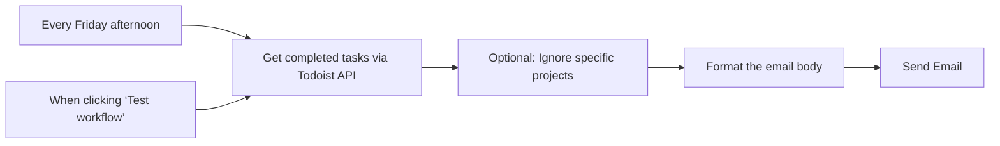

## Fluxo (.json) :

```json
{
  "id": "VLRbAr4OrtnHUU2l",
  "name": "Todoist Weekly Review Template",
  "tags": [],
  "nodes": [
    {
      "id": "45351dbb-6c0c-4442-a350-35d966a26fa1",
      "name": "When clicking ‘Test workflow’",
      "type": "n8n-nodes-base.manualTrigger",
      "position": [
        0,
        180
      ],
      "parameters": {},
      "typeVersion": 1
    },
    {
      "id": "9644a07e-0b97-4b48-846c-821f620128cc",
      "name": "Get completed tasks via Todoist API",
      "type": "n8n-nodes-base.httpRequest",
      "position": [
        220,
        0
      ],
      "parameters": {
        "url": "https://api.todoist.com/sync/v9/completed/get_all",
        "method": "POST",
        "options": {},
        "sendBody": true,
        "authentication": "predefinedCredentialType",
        "bodyParameters": {
          "parameters": [
            {
              "name": "since",
              "value": "={{ $now.minus(7, 'days') }}"
            },
            {
              "name": "until",
              "value": "={{ $now }}"
            }
          ]
        },
        "nodeCredentialType": "todoistApi"
      },
      "credentials": {
        "todoistApi": {}
      },
      "typeVersion": 4.2
    },
    {
      "id": "94f40824-43ff-45ae-adfd-b18a5903cba1",
      "name": "Optional: Ignore specific projects",
      "type": "n8n-nodes-base.code",
      "position": [
        440,
        0
      ],
      "parameters": {
        "jsCode": "// maintain this array with ignored Todoist project_id's\n// empty \"[]\" it when you don't want to ignore any\nconst ignoredProjects = ['2335544024'];\n\n// Remove ignored projects\nconst items = $input.all()[0].json.items;\nvar newItems = [];\nfor(j = 0; j < items.length; j++) {\n  if(!ignoredProjects.includes(items[j].project_id)) {\n    newItems.push(items[j]);\n  }\n}\n\nreturn newItems;"
      },
      "typeVersion": 2
    },
    {
      "id": "c50b00d6-4e9c-43e5-b6b8-ee0caac78c68",
      "name": "Format the email body",
      "type": "n8n-nodes-base.code",
      "position": [
        660,
        0
      ],
      "parameters": {
        "jsCode": "const items = $input.all();\n\n// Group items by day\nconst grouped = items.reduce((acc, item) => {\n  const date = new Date(item.json.completed_at).toISOString().split('T')[0];\n  acc[date] = acc[date] || [];\n  acc[date].push(item.json.content);\n  return acc;\n}, {});\n\n// Format the grouped data into an HTML string for the email\nlet emailBody = \"<h1>Completed Items</h1>\";\nfor (const [date, contents] of Object.entries(grouped)) {\n  emailBody += `<h2>${date}</h2><ul>`;\n  contents.forEach(content => {\n    emailBody += `<li>${content}</li>`;\n  });\n  emailBody += `</ul>`;\n}\n\nreturn [{ json: { emailBody } }];\n"
      },
      "typeVersion": 2
    },
    {
      "id": "42b38a9b-2dbc-46f5-895c-f8597eb48bf1",
      "name": "Every Friday afternoon",
      "type": "n8n-nodes-base.scheduleTrigger",
      "position": [
        0,
        0
      ],
      "parameters": {
        "rule": {
          "interval": [
            {
              "field": "weeks",
              "triggerAtDay": [
                5
              ],
              "triggerAtHour": 15
            }
          ]
        }
      },
      "typeVersion": 1.2
    },
    {
      "id": "adece42d-d84a-41c8-8269-35ba08879e52",
      "name": "Send Email",
      "type": "n8n-nodes-base.emailSend",
      "position": [
        860,
        0
      ],
      "parameters": {
        "options": {},
        "subject": "Todoist Weekly Review",
        "emailFormat": "={{ $('Format the email body').item.json.emailBody }}"
      },
      "typeVersion": 2.1
    }
  ],
  "active": false,
  "pinData": {},
  "settings": {
    "executionOrder": "v1"
  },
  "versionId": "fcf19ca1-c2bc-4832-8cfe-184424484f60",
  "connections": {
    "Format the email body": {
      "main": [
        [
          {
            "node": "Send Email",
            "type": "main",
            "index": 0
          }
        ]
      ]
    },
    "Every Friday afternoon": {
      "main": [
        [
          {
            "node": "Get completed tasks via Todoist API",
            "type": "main",
            "index": 0
          }
        ]
      ]
    },
    "When clicking ‘Test workflow’": {
      "main": [
        [
          {
            "node": "Get completed tasks via Todoist API",
            "type": "main",
            "index": 0
          }
        ]
      ]
    },
    "Optional: Ignore specific projects": {
      "main": [
        [
          {
            "node": "Format the email body",
            "type": "main",
            "index": 0
          }
        ]
      ]
    },
    "Get completed tasks via Todoist API": {
      "main": [
        [
          {
            "node": "Optional: Ignore specific projects",
            "type": "main",
            "index": 0
          }
        ]
      ]
    }
  }
}
```

<a id="template-1327"></a>

## Template 1327 - Registo automático de entrada/saída por localização

- **Nome:** Registo automático de entrada/saída por localização
- **Descrição:** Este fluxo regista automaticamente entradas e saídas com base em chamadas HTTP, guardando a data, hora e direção numa folha de cálculo.
- **Funcionalidade:** • Receção de chamadas HTTP: aceita pedidos externos que indicam 'Check-In' ou 'Check-Out' através de um cabeçalho.
• Verificação de existência de folha de cálculo: procura um ficheiro chamado WorkTimeTracking no armazenamento.
• Criação de folha de cálculo quando ausente: cria o documento WorkTimeTracking com a folha 'Worklog' se não existir.
• Registo de entradas: anexa uma linha na folha 'Worklog' com Date, Time e Direction (Check-In/Check-Out).
• Integração com atalhos de localização: permite que atalhos do telemóvel disparem o registo ao entrar ou sair de um local.
- **Ferramentas:** • Endpoint HTTP (Webhook): recebe as requisições externas que disparam o registo.
• Google Drive: armazena e permite pesquisar o ficheiro WorkTimeTracking.
• Google Sheets: cria e escreve linhas na folha 'Worklog'.
• Atalhos do iPhone (Shortcuts): automatizam o envio ao webhook com um cabeçalho Direction ao entrar/saír de um local.

## Fluxo visual

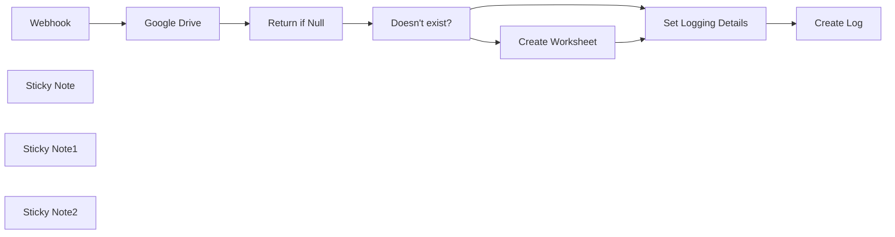

## Fluxo (.json) :

```json
{
  "id": "x2kgOnBLtqAjqUVS",
  "meta": {
    "instanceId": "558d88703fb65b2d0e44613bc35916258b0f0bf983c5d4730c00c424b77ca36a"
  },
  "name": "Automated Work Attendance with Location Triggers",
  "tags": [],
  "nodes": [
    {
      "id": "b2cba308-6d47-432b-9296-58f233f15565",
      "name": "Webhook",
      "type": "n8n-nodes-base.webhook",
      "position": [
        0,
        0
      ],
      "webhookId": "801c8367-af7b-4371-8684-cc699090b97f",
      "parameters": {
        "path": "time-track",
        "options": {}
      },
      "typeVersion": 2
    },
    {
      "id": "67354f1c-9dac-4edd-b07d-f1b0dbd80159",
      "name": "Sticky Note",
      "type": "n8n-nodes-base.stickyNote",
      "position": [
        0,
        -260
      ],
      "parameters": {
        "width": 1120,
        "height": 180,
        "content": "## Check if the Worksheet Exists"
      },
      "typeVersion": 1
    },
    {
      "id": "5fc5a1a6-f18d-4ee0-a70b-30de48a45dc7",
      "name": "Google Drive",
      "type": "n8n-nodes-base.googleDrive",
      "position": [
        220,
        -220
      ],
      "parameters": {
        "filter": {},
        "options": {},
        "resource": "fileFolder",
        "returnAll": true,
        "queryString": "WorkTimeTracking"
      },
      "credentials": {
        "googleDriveOAuth2Api": {
          "id": "U6W5tWhDvO7rQ73t",
          "name": "Google Drive account"
        }
      },
      "executeOnce": false,
      "typeVersion": 3,
      "alwaysOutputData": true
    },
    {
      "id": "a0b63be4-fa46-413f-82fe-42e6edc24f29",
      "name": "Create Worksheet",
      "type": "n8n-nodes-base.googleSheets",
      "position": [
        800,
        -240
      ],
      "parameters": {
        "title": "WorkTimeTracking",
        "options": {
          "locale": ""
        },
        "resource": "spreadsheet",
        "sheetsUi": {
          "sheetValues": [
            {
              "title": "Worklog"
            }
          ]
        }
      },
      "credentials": {
        "googleSheetsOAuth2Api": {
          "id": "TvzWrF2qPL7RjlJK",
          "name": "Google Sheets account"
        }
      },
      "typeVersion": 4.5
    },
    {
      "id": "796e3ef6-3002-493e-8d89-10cba2d8026d",
      "name": "Return if Null",
      "type": "n8n-nodes-base.code",
      "position": [
        400,
        -220
      ],
      "parameters": {
        "jsCode": "return [{json: {empty: items.length == 1 && Object.keys(items[0].json).length == 0}}];"
      },
      "typeVersion": 2
    },
    {
      "id": "7af7ce4b-93e0-4058-8a45-9fd8269ddc77",
      "name": "Doesn't exist?",
      "type": "n8n-nodes-base.if",
      "position": [
        580,
        -220
      ],
      "parameters": {
        "options": {},
        "conditions": {
          "options": {
            "version": 2,
            "leftValue": "",
            "caseSensitive": true,
            "typeValidation": "strict"
          },
          "combinator": "and",
          "conditions": [
            {
              "id": "215b8ced-c6f5-4cf2-8755-9bba928dbe84",
              "operator": {
                "type": "boolean",
                "operation": "true",
                "singleValue": true
              },
              "leftValue": "={{$json[\"empty\"]}}",
              "rightValue": ""
            }
          ]
        }
      },
      "typeVersion": 2.2
    },
    {
      "id": "f2bc21c6-805b-49e7-b026-a4de56dce1fa",
      "name": "Set Logging Details",
      "type": "n8n-nodes-base.set",
      "position": [
        780,
        20
      ],
      "parameters": {
        "mode": "raw",
        "options": {},
        "jsonOutput": "={\n  \"Date\": \"{{ $now.format('yyyy-MM-dd') }}\",\n  \"Time\": \"{{ $now.format('hh:mm') }}\",\n  \"Direction\":\"Check-In\"\n}\n"
      },
      "typeVersion": 3.4
    },
    {
      "id": "64bc8b93-a925-49d6-9e52-3f30f0c9e5a8",
      "name": "Create Log",
      "type": "n8n-nodes-base.googleSheets",
      "position": [
        1000,
        20
      ],
      "parameters": {
        "columns": {
          "value": {
            "Date": "={{ $json.Date }}",
            "Time": "={{ $json.Time }}",
            "Direction": "={{ $('Webhook').item.json.headers.direction ? $('Webhook').item.json.headers.direction : \"\"}}"
          },
          "schema": [
            {
              "id": "Date",
              "type": "string",
              "display": true,
              "required": false,
              "displayName": "Date",
              "defaultMatch": false,
              "canBeUsedToMatch": true
            },
            {
              "id": "Time",
              "type": "string",
              "display": true,
              "required": false,
              "displayName": "Time",
              "defaultMatch": false,
              "canBeUsedToMatch": true
            },
            {
              "id": "Direction",
              "type": "string",
              "display": true,
              "required": false,
              "displayName": "Direction",
              "defaultMatch": false,
              "canBeUsedToMatch": true
            }
          ],
          "mappingMode": "defineBelow",
          "matchingColumns": []
        },
        "options": {},
        "operation": "append",
        "sheetName": {
          "__rl": true,
          "mode": "list",
          "value": 308318361,
          "cachedResultUrl": "https://docs.google.com/spreadsheets/d/1P7-Uqa4SPA6keujkkOTru1wdS2qDryJVkz0Nz_sFp7A/edit#gid=308318361",
          "cachedResultName": "Worklog"
        },
        "documentId": {
          "__rl": true,
          "mode": "id",
          "value": "={{ $('Google Drive').item.json.id }}"
        }
      },
      "credentials": {
        "googleSheetsOAuth2Api": {
          "id": "TvzWrF2qPL7RjlJK",
          "name": "Google Sheets account"
        }
      },
      "typeVersion": 4.5
    },
    {
      "id": "cabca7d5-b4ae-45db-904d-f8efb37c4ab2",
      "name": "Sticky Note1",
      "type": "n8n-nodes-base.stickyNote",
      "position": [
        660,
        -40
      ],
      "parameters": {
        "width": 600,
        "height": 280,
        "content": "## Log Check-In or Check-Out"
      },
      "typeVersion": 1
    },
    {
      "id": "5b9505fc-71a4-42c1-805f-c363384b4c8a",
      "name": "Sticky Note2",
      "type": "n8n-nodes-base.stickyNote",
      "position": [
        -440,
        -320
      ],
      "parameters": {
        "color": 3,
        "width": 380,
        "height": 640,
        "content": "## Location-Based Time Tracking\n\nThis automation streamlines your time tracking by using location triggers. Here's how it works:\n\nCreate two shortcuts in the iPhone Shortcuts app:\n\nName one \"Check-In\" and the other \"Check-Out.\"\nWithin each shortcut, use the \"Get Content from URL\" action to call the Webhook. Set the Header Direction for \"Check-In\" or \"Check-Out\"\n\n\nNow, whenever you enter or exit the specified location, your iPhone will automatically record the time in your Google Sheet. This creates a seamless and accurate log of your work hours or time spent at a particular place."
      },
      "typeVersion": 1
    }
  ],
  "active": true,
  "pinData": {},
  "settings": {
    "timezone": "Europe/Lisbon",
    "executionOrder": "v1"
  },
  "versionId": "2de5264f-eb68-4919-a3f3-133a8ceb45bb",
  "connections": {
    "Webhook": {
      "main": [
        [
          {
            "node": "Google Drive",
            "type": "main",
            "index": 0
          }
        ]
      ]
    },
    "Google Drive": {
      "main": [
        [
          {
            "node": "Return if Null",
            "type": "main",
            "index": 0
          }
        ]
      ]
    },
    "Doesn't exist?": {
      "main": [
        [
          {
            "node": "Create Worksheet",
            "type": "main",
            "index": 0
          }
        ],
        [
          {
            "node": "Set Logging Details",
            "type": "main",
            "index": 0
          }
        ]
      ]
    },
    "Return if Null": {
      "main": [
        [
          {
            "node": "Doesn't exist?",
            "type": "main",
            "index": 0
          }
        ]
      ]
    },
    "Create Worksheet": {
      "main": [
        [
          {
            "node": "Set Logging Details",
            "type": "main",
            "index": 0
          }
        ]
      ]
    },
    "Set Logging Details": {
      "main": [
        [
          {
            "node": "Create Log",
            "type": "main",
            "index": 0
          }
        ]
      ]
    }
  }
}
```

<a id="template-1328"></a>

## Template 1328 - Criar e atualizar canal e enviar mensagem no Twist

- **Nome:** Criar e atualizar canal e enviar mensagem no Twist
- **Descrição:** Cria um canal em um workspace do Twist, atualiza sua descrição e envia uma mensagem de notificação com uma ação (botão) para os participantes.
- **Funcionalidade:** • Execução manual: inicia o fluxo ao clicar em 'execute'.
• Criação de canal: cria um canal com nome especificado no workspace e adiciona usuários ao canal.
• Atualização de canal: atualiza campos do canal criado, como a descrição.
• Envio de mensagem: envia uma mensagem em uma conversa existente, menciona um usuário, inclui o nome do canal dinamicamente e adiciona um botão que abre o site de documentação.
- **Ferramentas:** • Twist: plataforma de colaboração para criar canais, gerenciar conversas, mencionar usuários e enviar mensagens com ações (botões) integradas.

## Fluxo visual

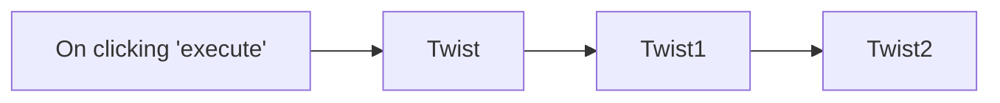

## Fluxo (.json) :

```json
{
  "id": "173",
  "name": "Create and update a channel, and send a message on Twist",
  "nodes": [
    {
      "name": "On clicking 'execute'",
      "type": "n8n-nodes-base.manualTrigger",
      "position": [
        470,
        260
      ],
      "parameters": {},
      "typeVersion": 1
    },
    {
      "name": "Twist",
      "type": "n8n-nodes-base.twist",
      "position": [
        670,
        260
      ],
      "parameters": {
        "name": "n8n-docs",
        "resource": "channel",
        "workspaceId": 150329,
        "additionalFields": {
          "user_ids": [
            475370
          ]
        }
      },
      "credentials": {
        "twistOAuth2Api": "Twist OAuth Credentials"
      },
      "typeVersion": 1
    },
    {
      "name": "Twist1",
      "type": "n8n-nodes-base.twist",
      "position": [
        870,
        260
      ],
      "parameters": {
        "resource": "channel",
        "channelId": "={{$node[\"Twist\"].json[\"id\"]}}",
        "operation": "update",
        "updateFields": {
          "description": "Discussion for documentation"
        }
      },
      "credentials": {
        "twistOAuth2Api": "Twist OAuth Credentials"
      },
      "typeVersion": 1
    },
    {
      "name": "Twist2",
      "type": "n8n-nodes-base.twist",
      "position": [
        1070,
        260
      ],
      "parameters": {
        "content": "=Hey [Harshil](twist-mention://475370)!\nYou have been added to the {{$node[\"Twist\"].json[\"name\"]}} channel.\nClick on the button below to quickly navigate to the documentation website.",
        "workspaceId": 150329,
        "conversationId": 989141,
        "additionalFields": {
          "actionsUi": {
            "actionValues": [
              {
                "url": "https://docs.n8n.io",
                "type": "action",
                "action": "open_url",
                "button_text": "Documentation site"
              }
            ]
          }
        }
      },
      "credentials": {
        "twistOAuth2Api": "Twist OAuth Credentials"
      },
      "typeVersion": 1
    }
  ],
  "active": false,
  "settings": {},
  "connections": {
    "Twist": {
      "main": [
        [
          {
            "node": "Twist1",
            "type": "main",
            "index": 0
          }
        ]
      ]
    },
    "Twist1": {
      "main": [
        [
          {
            "node": "Twist2",
            "type": "main",
            "index": 0
          }
        ]
      ]
    },
    "On clicking 'execute'": {
      "main": [
        [
          {
            "node": "Twist",
            "type": "main",
            "index": 0
          }
        ]
      ]
    }
  }
}
```

<a id="template-1329"></a>

## Template 1329 - Sugerir linguagem inclusiva de gênero

- **Nome:** Sugerir linguagem inclusiva de gênero
- **Descrição:** Detecta mensagens contendo termos de gênero e sugere alternativas neutras no mesmo canal.
- **Funcionalidade:** • Recepção de mensagens via webhook: Inicia o fluxo ao receber uma requisição HTTP com o conteúdo da mensagem.
• Detecção de termos dirigidos por gênero: Verifica se o texto contém palavras como "guys", "bros", "dudes", "gals" (case-insensitive).
• Envio de sugestão contextual: Quando encontrado um termo, publica uma mensagem no canal sugerindo alternativas inclusivas (ex.: "folks" ou "y'all").
• Ação inócua para não correspondências: Quando não há termos detectados, o fluxo não realiza nenhuma ação adicional.
- **Ferramentas:** • Webhook HTTP: Endpoint que recebe o conteúdo das mensagens e aciona a automação.
• Mattermost: Plataforma de chat onde a sugestão de linguagem inclusiva é publicada pelo bot.

## Fluxo visual

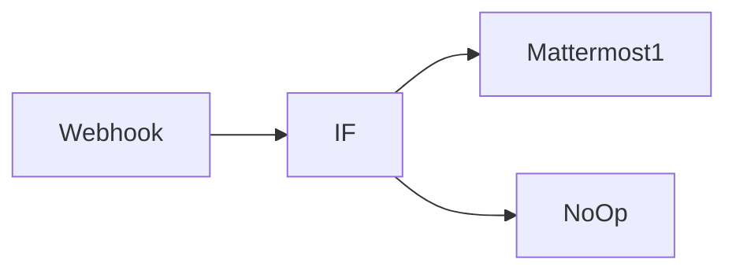

## Fluxo (.json) :

```json
{
  "id": "18",
  "name": "Gender Inclusive Language",
  "nodes": [
    {
      "name": "Webhook",
      "type": "n8n-nodes-base.webhook",
      "position": [
        150,
        450
      ],
      "parameters": {
        "path": "webhook",
        "options": {},
        "httpMethod": "POST"
      },
      "typeVersion": 1
    },
    {
      "name": "Mattermost1",
      "type": "n8n-nodes-base.mattermost",
      "position": [
        550,
        300
      ],
      "parameters": {
        "message": "May I suggest \"folks\" or “y'all”? We use gender inclusive language here. 😄",
        "channelId": "={{$node[\"Webhook\"].json[\"body\"][\"channel_id\"]}}",
        "attachments": [],
        "otherOptions": {}
      },
      "credentials": {
        "mattermostApi": "n8n Mattermost - Bot"
      },
      "typeVersion": 1
    },
    {
      "name": "IF",
      "type": "n8n-nodes-base.if",
      "position": [
        340,
        450
      ],
      "parameters": {
        "conditions": {
          "string": [
            {
              "value1": "={{$node[\"Webhook\"].json[\"body\"][\"text\"]}}",
              "value2": "guys",
              "operation": "contains"
            },
            {
              "value1": "={{$node[\"Webhook\"].json[\"body\"][\"text\"]}}",
              "value2": "Guys",
              "operation": "contains"
            },
            {
              "value1": "={{$node[\"Webhook\"].json[\"body\"][\"text\"]}}",
              "value2": "bros",
              "operation": "contains"
            },
            {
              "value1": "={{$node[\"Webhook\"].json[\"body\"][\"text\"]}}",
              "value2": "Bros",
              "operation": "contains"
            },
            {
              "value1": "={{$node[\"Webhook\"].json[\"body\"][\"text\"]}}",
              "value2": "dudes",
              "operation": "contains"
            },
            {
              "value1": "={{$node[\"Webhook\"].json[\"body\"][\"text\"]}}",
              "value2": "Dudes",
              "operation": "contains"
            },
            {
              "value1": "={{$node[\"Webhook\"].json[\"body\"][\"text\"]}}",
              "value2": "gals",
              "operation": "contains"
            },
            {
              "value1": "={{$node[\"Webhook\"].json[\"body\"][\"text\"]}}",
              "value2": "Gals",
              "operation": "contains"
            }
          ]
        },
        "combineOperation": "any"
      },
      "typeVersion": 1
    },
    {
      "name": "NoOp",
      "type": "n8n-nodes-base.noOp",
      "position": [
        550,
        550
      ],
      "parameters": {},
      "typeVersion": 1
    }
  ],
  "active": true,
  "settings": {},
  "connections": {
    "IF": {
      "main": [
        [
          {
            "node": "Mattermost1",
            "type": "main",
            "index": 0
          }
        ],
        [
          {
            "node": "NoOp",
            "type": "main",
            "index": 0
          }
        ]
      ]
    },
    "Webhook": {
      "main": [
        [
          {
            "node": "IF",
            "type": "main",
            "index": 0
          }
        ]
      ]
    }
  }
}
```

<a id="template-1330"></a>

## Template 1330 - Manipulação de datas e horários

- **Nome:** Manipulação de datas e horários
- **Descrição:** Fluxo de demonstração que gera, calcula e formata datas e horários, além de converter strings ISO para objetos de data e reaplicar formatações.
- **Funcionalidade:** • Início manual: Permite executar o fluxo manualmente para inspecionar entradas e saídas.
• Geração de valores de data/hora: Cria valores como agora, hoje e amanhã.
• Cálculos relativos de tempo: Adiciona ou subtrai unidades de tempo (por exemplo, 12 horas, uma hora atrás).
• Formatação de datas: Converte datas em formatos legíveis (por exemplo, 'MMMM DD YYYY' e 'yyyy LLL dd').
• Conversão de strings ISO para objetos de data: Reconstrói objetos de data a partir de strings ISO para aplicar funções de data novamente.
• Seleção de campos: Mantém apenas os campos definidos necessários após edição para saída limpa.
- **Ferramentas:** • Luxon: Biblioteca para manipulação de datas e horários (DateTime), usada para obter o momento atual, adicionar/subtrair durações, formatar e converter strings ISO.


## Fluxo visual

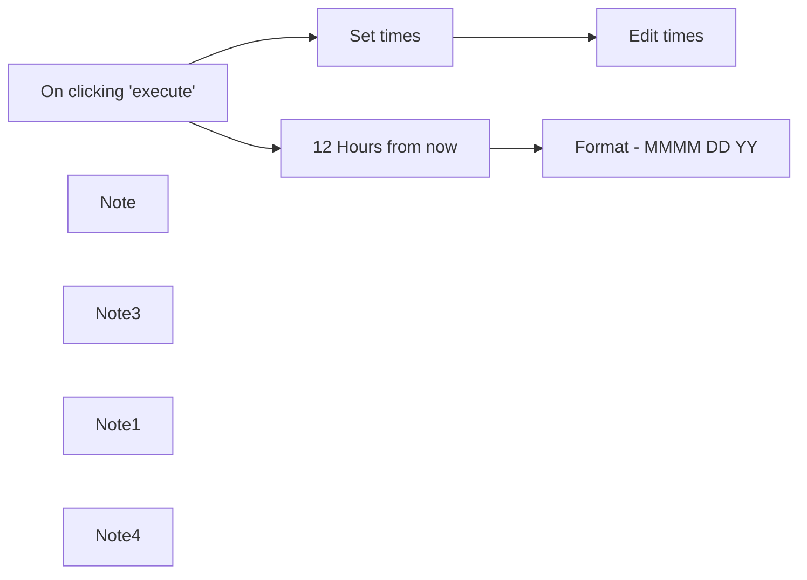

## Fluxo (.json) :

```json
{
  "nodes": [
    {
      "name": "On clicking 'execute'",
      "type": "n8n-nodes-base.manualTrigger",
      "position": [
        1140,
        780
      ],
      "parameters": {},
      "typeVersion": 1
    },
    {
      "name": "Note",
      "type": "n8n-nodes-base.stickyNote",
      "position": [
        1480,
        760
      ],
      "parameters": {
        "width": 560,
        "height": 400,
        "content": "## 2. Advanced way: Using Expressions\nIn this `Set` node, we set dates using [Luxon expressions](https://docs.n8n.io/code-examples/expressions/luxon/) for the following formats:\n\nNow - `{{$now}}`\nCurrent time with seconds - `{{$now.toLocaleString(DateTime.TIME_WITH_SECONDS)}}`\nToday - `{{$today}}`\nTomorrow - `{{$today.plus({days: 1})}}`\nOne hour ago - `{{$now.minus({hours: 1})}}`\nWeekday name - `{{$today.weekdayLong}}`\n\n"
      },
      "typeVersion": 1
    },
    {
      "name": "Note3",
      "type": "n8n-nodes-base.stickyNote",
      "position": [
        660,
        780
      ],
      "parameters": {
        "width": 420,
        "height": 100,
        "content": "### Click the `Execute Workflow` button and double click on the nodes to see the input and output items."
      },
      "typeVersion": 1
    },
    {
      "name": "12 Hours from now",
      "type": "n8n-nodes-base.dateTime",
      "position": [
        1520,
        580
      ],
      "parameters": {
        "value": "={{$now}}",
        "action": "calculate",
        "options": {},
        "duration": 12,
        "timeUnit": "hours"
      },
      "typeVersion": 1
    },
    {
      "name": "Note1",
      "type": "n8n-nodes-base.stickyNote",
      "position": [
        1480,
        400
      ],
      "parameters": {
        "width": 560,
        "height": 340,
        "content": "## 1. Simple Way: Using the Date & Time node\nThere are two actions available within the `Date & Time` node:\n1. Calculating a date - adding/substracting minutes,hours, days, etc.\n2. Formatting a date\n\n"
      },
      "typeVersion": 1
    },
    {
      "name": "Note4",
      "type": "n8n-nodes-base.stickyNote",
      "position": [
        1980,
        860
      ],
      "parameters": {
        "width": 480,
        "height": 320,
        "content": "### 2.1 Working with an existing time string\nAs items pass between nodes, n8n saves dates as ISO strings. This means that in order to work with the data as a date again, we need to convert it back using `DateTime.fromISO('yyyy-mm-dd')`\n. Once doing that, we are able to apply date and time function again such as : `{{DateTime.fromISO($json[\"Now\"]).toFormat('yyyy LLL dd')}}`"
      },
      "typeVersion": 1
    },
    {
      "name": "Set times",
      "type": "n8n-nodes-base.set",
      "position": [
        1520,
        1020
      ],
      "parameters": {
        "values": {
          "string": [
            {
              "name": "Now",
              "value": "={{$now}}"
            },
            {
              "name": "Current time with seconds",
              "value": "={{$now.toLocaleString(DateTime.TIME_WITH_SECONDS)}}"
            },
            {
              "name": "Today",
              "value": "={{$today}}"
            },
            {
              "name": "Tomorrow",
              "value": "={{$today.plus({days: 1})}}"
            },
            {
              "name": "One hour from now",
              "value": "={{$now.minus({hours: 1})}}"
            },
            {
              "name": "Weekday",
              "value": "={{$today.weekdayLong}}"
            }
          ]
        },
        "options": {}
      },
      "typeVersion": 1
    },
    {
      "name": "Edit times",
      "type": "n8n-nodes-base.set",
      "position": [
        2080,
        1020
      ],
      "parameters": {
        "values": {
          "string": [
            {
              "name": "Current time",
              "value": "={{DateTime.fromISO($json[\"Now\"])}}"
            },
            {
              "name": "Current time formatted",
              "value": "={{DateTime.fromISO($json[\"Now\"]).toFormat('yyyy LLL dd')}}"
            }
          ]
        },
        "options": {},
        "keepOnlySet": true
      },
      "typeVersion": 1
    },
    {
      "name": "Format - MMMM DD YY",
      "type": "n8n-nodes-base.dateTime",
      "position": [
        1760,
        580
      ],
      "parameters": {
        "value": "={{$now}}",
        "options": {},
        "toFormat": "MMMM DD YYYY"
      },
      "typeVersion": 1
    }
  ],
  "connections": {
    "Set times": {
      "main": [
        [
          {
            "node": "Edit times",
            "type": "main",
            "index": 0
          }
        ]
      ]
    },
    "12 Hours from now": {
      "main": [
        [
          {
            "node": "Format - MMMM DD YY",
            "type": "main",
            "index": 0
          }
        ]
      ]
    },
    "On clicking 'execute'": {
      "main": [
        [
          {
            "node": "Set times",
            "type": "main",
            "index": 0
          },
          {
            "node": "12 Hours from now",
            "type": "main",
            "index": 0
          }
        ]
      ]
    }
  }
}
```

<a id="template-1331"></a>

## Template 1331 - Assistente AI para Telegram com memória e notas

- **Nome:** Assistente AI para Telegram com memória e notas
- **Descrição:** Fluxo que recebe mensagens do Telegram (texto, voz, foto), processa com IA para transcrição/descrição, gerencia memória de curto e longo prazo e salva notas, respondendo ao usuário com mensagens personalizadas.
- **Funcionalidade:** • Recepção de eventos do Telegram: Captura mensagens via webhook para iniciar o processamento.
• Roteamento por tipo de mensagem: Identifica e separa texto, áudio e imagem para fluxos específicos.
• Transcrição de áudio: Converte mensagens de voz em texto usando modelo de IA.
• Análise de imagem: Processa fotos para extrair descrição/conteúdo via IA.
• Memória de curto prazo: Mantém contexto de conversa por usuário em banco de contexto para respostas mais relevantes.
• Memória de longo prazo: Salva automaticamente memórias relevantes em uma tabela externa para recuperação posterior.
• Armazenamento de notas: Salva instruções ou informações importantes como notas em uma tabela dedicada.
• Recuperação de memórias e notas: Busca registros recentes para enriquecer o contexto antes de gerar respostas.
• Agente LLM com regras: Agente configurado com instruções para decidir quando salvar memórias/notes e como personalizar respostas (usa nome do usuário quando disponível).
• Resposta ao usuário: Envia respostas formatadas de volta ao chat do Telegram e mantém saída para integração adicional.
• Validação e segurança: Verifica identidade/IDs do remetente para processar apenas usuários autorizados.
• Tratamento de erros: Envia mensagem de erro caso o processamento não possa ser concluído.
- **Ferramentas:** • Telegram: Canal de entrada e saída de mensagens para receber eventos de usuário e enviar respostas.
• OpenAI (modelo gpt-4o-mini): Processamento de linguagem, transcrição de áudio e análise de imagens para gerar respostas e extrair informações.
• Baserow: Banco de dados externo usado para salvar e recuperar memórias de longo prazo e notas do usuário.
• PostgreSQL: Armazenamento de contexto de conversa (memória de sessão) para manter histórico e contexto de curto prazo.


## Fluxo visual

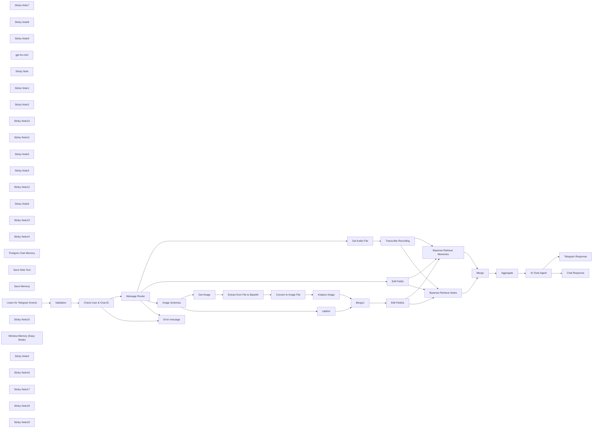

## Fluxo (.json) :

```json
{
  "id": "Dctc6QKyRXK17oEq",
  "meta": {
    "instanceId": "ca87034fd2d5cf9c52373260a6e37ca15a4a059ecc2971ac41c079ce4aa21138",
    "templateCredsSetupCompleted": true
  },
  "name": "All-in-One Telegram/Baserow AI Assistant 🤖🧠 Voice/Photo/Save Notes/Long Term Mem",
  "tags": [],
  "nodes": [
    {
      "id": "bbcaac28-f07c-421b-91c6-e3b2d024a71f",
      "name": "Sticky Note7",
      "type": "n8n-nodes-base.stickyNote",
      "position": [
        -900,
        80
      ],
      "parameters": {
        "color": 4,
        "width": 340,
        "height": 380,
        "content": "## Retrieve Long Term Memories\nBaserow"
      },
      "typeVersion": 1
    },
    {
      "id": "399c0a44-72b5-4e71-b578-3e4eb8087b3c",
      "name": "Sticky Note8",
      "type": "n8n-nodes-base.stickyNote",
      "position": [
        -180,
        420
      ],
      "parameters": {
        "width": 280,
        "height": 380,
        "content": "## Save To Current Chat Memory"
      },
      "typeVersion": 1
    },
    {
      "id": "d0438c1d-42e4-47d0-b23b-78f9cee5a28c",
      "name": "Sticky Note9",
      "type": "n8n-nodes-base.stickyNote",
      "position": [
        140,
        420
      ],
      "parameters": {
        "color": 4,
        "width": 280,
        "height": 380,
        "content": "## Save Long Term Memories\nBaserow"
      },
      "typeVersion": 1
    },
    {
      "id": "d8cbf733-2a69-45d5-9767-43e8c67a43ee",
      "name": "gpt-4o-mini",
      "type": "@n8n/n8n-nodes-langchain.lmChatOpenAi",
      "position": [
        -400,
        580
      ],
      "parameters": {
        "options": {}
      },
      "credentials": {
        "openAiApi": {
          "id": "lpt7A1AOIMshaaE7",
          "name": "OpenAi account"
        }
      },
      "typeVersion": 1.1
    },
    {
      "id": "3cd6b923-b369-45e6-a3c1-5fff74a3074c",
      "name": "Chat Response",
      "type": "n8n-nodes-base.set",
      "position": [
        220,
        160
      ],
      "parameters": {
        "options": {},
        "assignments": {
          "assignments": [
            {
              "id": "d6f68b1c-a6a6-44d4-8686-dc4dcdde4767",
              "name": "output",
              "type": "string",
              "value": "={{ $json.output }}"
            }
          ]
        }
      },
      "typeVersion": 3.4
    },
    {
      "id": "912bf06d-ae8f-4513-a0c9-83c1edb1c159",
      "name": "Sticky Note",
      "type": "n8n-nodes-base.stickyNote",
      "position": [
        -500,
        420
      ],
      "parameters": {
        "color": 3,
        "width": 280,
        "height": 380,
        "content": "## LLM"
      },
      "typeVersion": 1
    },
    {
      "id": "d5cf2019-d9bb-4fb6-b95c-e9e9f9ac5808",
      "name": "Telegram Response",
      "type": "n8n-nodes-base.telegram",
      "position": [
        560,
        180
      ],
      "webhookId": "2ae9d05c-68e8-440a-9f13-08e5ef92bf6c",
      "parameters": {
        "text": "={{ $json.output }}",
        "chatId": "={{ $('Listen for Telegram Events').item.json.body.message.chat.id }}",
        "additionalFields": {
          "parse_mode": "HTML",
          "appendAttribution": false
        }
      },
      "credentials": {
        "telegramApi": {
          "id": "EDuT6lIMLHRxdqqN",
          "name": "Telegram account"
        }
      },
      "typeVersion": 1.2
    },
    {
      "id": "0858e353-8d83-437c-90bc-f57b31e92d1c",
      "name": "Sticky Note1",
      "type": "n8n-nodes-base.stickyNote",
      "position": [
        440,
        60
      ],
      "parameters": {
        "width": 360,
        "height": 300,
        "content": "## Telegram \n(Optional)"
      },
      "typeVersion": 1
    },
    {
      "id": "c315e630-2ed3-4141-a715-ab08849336be",
      "name": "Sticky Note2",
      "type": "n8n-nodes-base.stickyNote",
      "position": [
        -540,
        80
      ],
      "parameters": {
        "color": 5,
        "width": 1320,
        "height": 780,
        "content": "## AI AGENT with Long Term Memory & Note Storage"
      },
      "typeVersion": 1
    },
    {
      "id": "2d09319d-f3be-43b8-a134-929992d4f469",
      "name": "AI Tools Agent",
      "type": "@n8n/n8n-nodes-langchain.agent",
      "position": [
        -140,
        180
      ],
      "parameters": {
        "text": "={{\n  (() => {\n    try {\n      return $('Edit Fields').item.json.text;\n    } catch (e) {\n      return undefined;\n    }\n  })() ||\n  (() => {\n    try {\n      return $('Edit Fields1').item.json.text;\n    } catch (e) {\n      return undefined;\n    }\n  })() ||\n  (() => {\n    try {\n      return $('Transcribe Recording').item.json.text;\n    } catch (e) {\n      return undefined;\n    }\n  })() ||\n  'default value' // optional default if all are undefined\n}}\n",
        "options": {
          "systemMessage": "=## ROLE  \nYou are a friendly, attentive, and helpful AI assistant. Your primary goal is to assist the user while maintaining a personalized and engaging interaction. When possible, address the user by their first name to create a warmer, more personal experience.\n\n---\n\n## KEY TOOLS: MEMORY & NOTE MANAGEMENT\n\nThese are the core features of this workflow. **You do not need permission to save notes and memories; it’s your decision based on the conversation.**\n\n### Memory Management  \n- **When to Use:**  \n  Evaluate each incoming message for noteworthy or personal information (e.g., preferences, habits, goals, important events, etc.).  \n- **Action:**  \n  If the message contains such details, autonomously use the **Save Memory** Baserow tool to store a clear, concise summary.  \n- **Response:**  \n  Always provide a meaningful reply that naturally acknowledges the input without revealing that a memory was saved.\n\n### Note Management  \n- **When to Use:**  \n  If the user shares specific instructions, reminders, or standalone pieces of information meant to be retained, use the **Save Note** Baserow tool.  \n- **Action:**  \n  Save these as concise notes without asking for permission.  \n- **Response:**  \n  Your reply should integrate the note context naturally, ensuring that the note’s purpose is honored without overemphasizing the saving action.\n\n---\n\n## GENERAL RULES\n\n1. **Context Awareness:**  \n   - Use stored memories and notes to craft contextually relevant and personalized responses.  \n   - Always consider the date and time when a memory or note was collected to ensure your responses are up-to-date.\n\n2. **User-Centric Responses:**  \n   - Tailor your responses based on the user's preferences and past interactions.  \n   - If the user’s first name is provided in the user info section, address them by name when it feels natural and appropriate.  \n   - Be proactive in recalling relevant details from memory or notes without overwhelming the conversation.\n\n3. **Privacy and Sensitivity:**  \n   - Handle all user data with care. Do not share or expose stored information unless it directly enhances the interaction.  \n   - Never store passwords or usernames.\n\n4. **Fallback Responses:**  \n   - If no specific task or question arises (e.g., when only saving information), respond in a way that keeps the conversation flowing naturally:  \n     - “Thanks for sharing that, [First Name]! Is there anything else I can help you with today?”  \n   - DO NOT tell jokes as a fallback response.\n\n5. **Additional Tools:**  \n   - The remaining tools (Contacts, Calendar, Web Search, Qdrant Vector Retrieval) are available as extra features. They can be used when relevant but are secondary to the core Memory and Note management functionalities.\n\n---\n\n## USER INFO\n\n- **First Name**: {{ $('Listen for Telegram Events').item.json.body.message.from.first_name }}\n- **Age**: (if provided)  \n- **Location**: (if provided)  \n- **Job/Profession**: (if provided)\n\nUtilize this information to personalize your responses. For example, if the user's first name is available, begin responses with “Hi [First Name], …”\n\n---\n\n## REMAINING TOOLS\n\n### <More Tools>\n- <if you add more tools, add them here and add descriptions>\n\n---\n\n## MEMORIES  \n\n### Recent Noteworthy Memories  \nHere are the most recent memories collected from the user, including their date and time of collection:  \n\n**{{  \n  $json.data.map(item => item.Memory).join('\\n')  \n}}**\n\n**Guidelines:**  \n- Prioritize recent memories while considering older ones if still relevant.  \n- Cross-reference memories for consistency (e.g., if conflicting details are present, clarify as needed).\n\n---\n\n## NOTES  \n\n### Recent Notes Collected from User:  \nHere are the most recent notes collected from the user:  \n\n**{{  \n  $json.data.map(item => item.Notes).join('\\n')  \n}}**\n\n**Guidelines:**  \n- Use notes for specific instructions or reminders.  \n- Keep note content distinct from general memory content.\n\n---\n\n## ADDITIONAL INSTRUCTIONS  \n\n- Think critically before responding to ensure your answers are thoughtful and accurate.  \n- Strive to build trust with the user by being consistent, reliable, and personable.  \n- Avoid robotic or overly formal language; aim for a conversational tone that is both friendly and helpful.\n\n## CURRENT DATE\n\n - {{ $now.setZone('America/Chicago').toISO() }} (Set Timezone Accordingly) \n"
        },
        "promptType": "define"
      },
      "typeVersion": 1.7,
      "alwaysOutputData": false
    },
    {
      "id": "4a5a636a-e526-4b0f-bf11-8cd623e46c68",
      "name": "Sticky Note10",
      "type": "n8n-nodes-base.stickyNote",
      "position": [
        460,
        420
      ],
      "parameters": {
        "color": 4,
        "width": 280,
        "height": 380,
        "content": "## Save Notes\nBaserow"
      },
      "typeVersion": 1
    },
    {
      "id": "46cb38d9-4932-481e-96f2-14b3224de0a9",
      "name": "Sticky Note11",
      "type": "n8n-nodes-base.stickyNote",
      "position": [
        -900,
        480
      ],
      "parameters": {
        "color": 4,
        "width": 340,
        "height": 380,
        "content": "## Retrieve Notes\nBaserow"
      },
      "typeVersion": 1
    },
    {
      "id": "c643683f-eee6-49c2-9f1a-05ba9a0742a6",
      "name": "Aggregate",
      "type": "n8n-nodes-base.aggregate",
      "position": [
        -320,
        180
      ],
      "parameters": {
        "options": {},
        "aggregate": "aggregateAllItemData"
      },
      "typeVersion": 1
    },
    {
      "id": "cdd999a7-d14f-4e20-88ea-4170c8cd521c",
      "name": "Merge",
      "type": "n8n-nodes-base.merge",
      "position": [
        -480,
        180
      ],
      "parameters": {},
      "typeVersion": 3
    },
    {
      "id": "a60582a7-63ca-497e-aec0-2be8077ebc53",
      "name": "Sticky Note5",
      "type": "n8n-nodes-base.stickyNote",
      "position": [
        -2160,
        180
      ],
      "parameters": {
        "color": 7,
        "width": 420,
        "height": 260,
        "content": "## Validate Telegram User\n"
      },
      "typeVersion": 1
    },
    {
      "id": "3b3b2573-5a2e-4c0f-8005-376ed55b068b",
      "name": "Sticky Note3",
      "type": "n8n-nodes-base.stickyNote",
      "position": [
        -2220,
        780
      ],
      "parameters": {
        "color": 6,
        "width": 1289,
        "height": 432,
        "content": "# Process Image"
      },
      "typeVersion": 1
    },
    {
      "id": "3d27c492-758b-45d2-bc79-a51cc69ac2ef",
      "name": "Get Audio File",
      "type": "n8n-nodes-base.telegram",
      "position": [
        -1380,
        180
      ],
      "webhookId": "4f5c2290-ff1a-4ce0-8319-e84807b1b1fc",
      "parameters": {
        "fileId": "={{ $json.body.message.voice.file_id }}",
        "resource": "file"
      },
      "credentials": {
        "telegramApi": {
          "id": "EDuT6lIMLHRxdqqN",
          "name": "Telegram account"
        }
      },
      "typeVersion": 1.2
    },
    {
      "id": "9bef0848-30a5-4e98-b0e8-640e061c475d",
      "name": "Analyze Image",
      "type": "@n8n/n8n-nodes-langchain.openAi",
      "position": [
        -1460,
        1000
      ],
      "parameters": {
        "modelId": {
          "__rl": true,
          "mode": "list",
          "value": "gpt-4o-mini",
          "cachedResultName": "GPT-4O-MINI"
        },
        "options": {},
        "resource": "image",
        "inputType": "base64",
        "operation": "analyze"
      },
      "credentials": {
        "openAiApi": {
          "id": "lpt7A1AOIMshaaE7",
          "name": "OpenAi account"
        }
      },
      "typeVersion": 1.6
    },
    {
      "id": "b493ea36-c9f6-470d-97a9-8df43c10af18",
      "name": "Transcribe Recording",
      "type": "@n8n/n8n-nodes-langchain.openAi",
      "position": [
        -1100,
        180
      ],
      "parameters": {
        "options": {},
        "resource": "audio",
        "operation": "transcribe",
        "binaryPropertyName": "=data"
      },
      "credentials": {
        "openAiApi": {
          "id": "lpt7A1AOIMshaaE7",
          "name": "OpenAi account"
        }
      },
      "typeVersion": 1.6
    },
    {
      "id": "05aff1e5-daf0-47d3-8df3-a548ca4ca2cd",
      "name": "Edit Fields",
      "type": "n8n-nodes-base.set",
      "position": [
        -1240,
        540
      ],
      "parameters": {
        "options": {},
        "assignments": {
          "assignments": [
            {
              "id": "b37b48ba-8fef-4e6c-bbca-73e6c2e1e0a8",
              "name": "text",
              "type": "string",
              "value": "={{ $json.body.message.text }}"
            }
          ]
        }
      },
      "typeVersion": 3.4
    },
    {
      "id": "ea70790d-716b-4f5d-b3d0-99259481ef22",
      "name": "Convert to Image File",
      "type": "n8n-nodes-base.convertToFile",
      "position": [
        -1640,
        1000
      ],
      "parameters": {
        "options": {
          "fileName": "={{ $json.result.file_path }}"
        },
        "operation": "toBinary",
        "sourceProperty": "data"
      },
      "typeVersion": 1.1
    },
    {
      "id": "3e5913bf-0270-4e32-8647-80138abefde5",
      "name": "Extract from File to Base64",
      "type": "n8n-nodes-base.extractFromFile",
      "position": [
        -1820,
        1000
      ],
      "parameters": {
        "options": {},
        "operation": "binaryToPropery"
      },
      "typeVersion": 1
    },
    {
      "id": "7d13ffbe-9496-4037-a7f2-d7b5774698ca",
      "name": "Sticky Note12",
      "type": "n8n-nodes-base.stickyNote",
      "position": [
        -1440,
        80
      ],
      "parameters": {
        "color": 6,
        "width": 513,
        "height": 309,
        "content": "# Process Audio"
      },
      "typeVersion": 1
    },
    {
      "id": "73570d5a-87a6-4d1f-95f3-2b8ed087a28a",
      "name": "Sticky Note6",
      "type": "n8n-nodes-base.stickyNote",
      "position": [
        -1440,
        420
      ],
      "parameters": {
        "color": 6,
        "width": 513,
        "height": 329,
        "content": "# Process Text"
      },
      "typeVersion": 1
    },
    {
      "id": "f8851e90-d710-4bc6-9705-af4828d65a48",
      "name": "Message Router",
      "type": "n8n-nodes-base.switch",
      "position": [
        -1880,
        480
      ],
      "parameters": {
        "rules": {
          "values": [
            {
              "outputKey": "audio",
              "conditions": {
                "options": {
                  "version": 2,
                  "leftValue": "",
                  "caseSensitive": true,
                  "typeValidation": "strict"
                },
                "combinator": "and",
                "conditions": [
                  {
                    "operator": {
                      "type": "object",
                      "operation": "exists",
                      "singleValue": true
                    },
                    "leftValue": "={{ $json.body.message.voice }}",
                    "rightValue": ""
                  }
                ]
              },
              "renameOutput": true
            },
            {
              "outputKey": "text",
              "conditions": {
                "options": {
                  "version": 2,
                  "leftValue": "",
                  "caseSensitive": true,
                  "typeValidation": "strict"
                },
                "combinator": "and",
                "conditions": [
                  {
                    "id": "342f0883-d959-44a2-b80d-379e39c76218",
                    "operator": {
                      "type": "string",
                      "operation": "exists",
                      "singleValue": true
                    },
                    "leftValue": "={{ $json.body.message.text }}",
                    "rightValue": ""
                  }
                ]
              },
              "renameOutput": true
            },
            {
              "outputKey": "image",
              "conditions": {
                "options": {
                  "version": 2,
                  "leftValue": "",
                  "caseSensitive": true,
                  "typeValidation": "strict"
                },
                "combinator": "and",
                "conditions": [
                  {
                    "id": "ded3a600-f861-413a-8892-3fc5ea935ecb",
                    "operator": {
                      "type": "array",
                      "operation": "exists",
                      "singleValue": true
                    },
                    "leftValue": "={{ $json.body.message.photo }}",
                    "rightValue": ""
                  }
                ]
              },
              "renameOutput": true
            }
          ]
        },
        "options": {
          "fallbackOutput": "extra"
        }
      },
      "typeVersion": 3.2
    },
    {
      "id": "88127339-2cc5-4364-9f27-6dea9df505ff",
      "name": "Image Schema1",
      "type": "n8n-nodes-base.set",
      "position": [
        -2160,
        880
      ],
      "parameters": {
        "options": {},
        "assignments": {
          "assignments": [
            {
              "id": "17989eb0-feca-4631-b5c8-34b1d4a6c72b",
              "name": "image_file_id",
              "type": "string",
              "value": "={{ $json.body.message.photo.last().file_id }}"
            },
            {
              "id": "9317d7ae-dffd-4b1f-9a9c-b3cc4f1e0dd3",
              "name": "caption",
              "type": "string",
              "value": "={{ $json.body.message.caption }}"
            }
          ]
        }
      },
      "typeVersion": 3.4
    },
    {
      "id": "b0922d42-9864-4d9a-a5c9-b674892935ff",
      "name": "caption",
      "type": "n8n-nodes-base.splitOut",
      "position": [
        -1460,
        860
      ],
      "parameters": {
        "options": {},
        "fieldToSplitOut": "caption"
      },
      "typeVersion": 1
    },
    {
      "id": "74256b12-6f3b-44ba-a98b-bd233f90c360",
      "name": "Merge1",
      "type": "n8n-nodes-base.merge",
      "position": [
        -1260,
        860
      ],
      "parameters": {
        "mode": "combine",
        "options": {},
        "combineBy": "combineByPosition"
      },
      "typeVersion": 3
    },
    {
      "id": "9f77577b-167c-4628-b2d1-37e17d9ddb10",
      "name": "Get Image",
      "type": "n8n-nodes-base.telegram",
      "position": [
        -2000,
        1000
      ],
      "webhookId": "2d9b0a49-b46f-4794-9f4b-f406a213e74a",
      "parameters": {
        "fileId": "={{ $json.image_file_id }}",
        "resource": "file"
      },
      "credentials": {
        "telegramApi": {
          "id": "EDuT6lIMLHRxdqqN",
          "name": "Telegram account"
        }
      },
      "typeVersion": 1.2
    },
    {
      "id": "ffdf119a-cfa1-408a-aaca-458691f8d56b",
      "name": "Edit Fields1",
      "type": "n8n-nodes-base.set",
      "position": [
        -1100,
        860
      ],
      "parameters": {
        "options": {},
        "assignments": {
          "assignments": [
            {
              "id": "b37b48ba-8fef-4e6c-bbca-73e6c2e1e0a8",
              "name": "text",
              "type": "string",
              "value": "={{ $json.caption }}\n\n{{ $json.content }}"
            }
          ]
        }
      },
      "typeVersion": 3.4
    },
    {
      "id": "2b750b39-c72a-46ae-8e3f-0060181d2a51",
      "name": "Sticky Note13",
      "type": "n8n-nodes-base.stickyNote",
      "position": [
        -2220,
        80
      ],
      "parameters": {
        "color": 4,
        "width": 753,
        "height": 669,
        "content": "# Secure User"
      },
      "typeVersion": 1
    },
    {
      "id": "18fcbf54-301e-449b-bb67-7f63753ac4c5",
      "name": "Sticky Note14",
      "type": "n8n-nodes-base.stickyNote",
      "position": [
        -1720,
        60
      ],
      "parameters": {
        "color": 3,
        "width": 273,
        "height": 269,
        "content": "# Error\n"
      },
      "typeVersion": 1
    },
    {
      "id": "8d7824b1-92d0-4907-8468-1d04e7d40d6c",
      "name": "Postgres Chat Memory",
      "type": "@n8n/n8n-nodes-langchain.memoryPostgresChat",
      "position": [
        -20,
        540
      ],
      "parameters": {
        "sessionKey": "={{ $('Listen for Telegram Events').item.json.body.message.from.id }}",
        "sessionIdType": "customKey",
        "contextWindowLength": 50
      },
      "credentials": {
        "postgres": {
          "id": "aVzWyCraiN3kiV5K",
          "name": "Postgres account"
        }
      },
      "typeVersion": 1.3
    },
    {
      "id": "f21c0dfa-d16a-461d-9ff3-8b9932e8abb6",
      "name": "Save Note Tool",
      "type": "n8n-nodes-base.baserowTool",
      "position": [
        560,
        600
      ],
      "parameters": {
        "tableId": 640,
        "fieldsUi": {
          "fieldValues": [
            {
              "fieldId": 6025,
              "fieldValue": "={{ $fromAI('notes', `note to be created`, 'string') }}"
            },
            {
              "fieldId": 6027,
              "fieldValue": "={{ $fromAI('date-added', 'date created', 'string') }}"
            }
          ]
        },
        "operation": "create",
        "databaseId": 122,
        "descriptionType": "manual",
        "toolDescription": "Save Notes"
      },
      "credentials": {
        "baserowApi": {
          "id": "1YeHyTi4fmB007co",
          "name": "Baserow account"
        }
      },
      "typeVersion": 1
    },
    {
      "id": "242ff3e7-3421-4bc4-a877-0164cee7cd69",
      "name": "Save Memory",
      "type": "n8n-nodes-base.baserowTool",
      "position": [
        240,
        600
      ],
      "parameters": {
        "tableId": 639,
        "fieldsUi": {
          "fieldValues": [
            {
              "fieldId": 6022,
              "fieldValue": "={{ $fromAI('memory', 'memory to be created', 'string') }}"
            },
            {
              "fieldId": 6024,
              "fieldValue": "={{ $fromAI('date-added', 'date created', 'string') }}"
            }
          ]
        },
        "operation": "create",
        "databaseId": 122,
        "descriptionType": "manual",
        "toolDescription": "Save Long Term Memories"
      },
      "credentials": {
        "baserowApi": {
          "id": "1YeHyTi4fmB007co",
          "name": "Baserow account"
        }
      },
      "typeVersion": 1
    },
    {
      "id": "f681f671-7759-46ba-b674-5b8b0e385d09",
      "name": "Listen for Telegram Events",
      "type": "n8n-nodes-base.webhook",
      "position": [
        -2380,
        240
      ],
      "webhookId": "097f36f3-1574-44f9-815f-58387e3b20bf",
      "parameters": {
        "path": "gram",
        "options": {
          "binaryPropertyName": "data"
        },
        "httpMethod": "POST"
      },
      "typeVersion": 2
    },
    {
      "id": "959a8a01-0fb9-4bc9-9997-cc49b3a81216",
      "name": "Validation",
      "type": "n8n-nodes-base.set",
      "position": [
        -2100,
        240
      ],
      "parameters": {
        "options": {},
        "assignments": {
          "assignments": [
            {
              "id": "0cea6da1-652a-4c1e-94c3-30608ced90f8",
              "name": "first_name",
              "type": "string",
              "value": "[Your First Name on Telegram]"
            },
            {
              "id": "b90280c6-3e36-49ca-9e7e-e15c42d256cc",
              "name": "last_name",
              "type": "string",
              "value": "[Your Last Name on Telegram]"
            },
            {
              "id": "f6d86283-16ca-447e-8427-7d3d190babc0",
              "name": "id",
              "type": "number",
              "value": 1122334455
            }
          ]
        },
        "includeOtherFields": true
      },
      "typeVersion": 3.4
    },
    {
      "id": "7903c22c-26f2-4e89-9e27-ee945e225b0e",
      "name": "Check User & Chat ID",
      "type": "n8n-nodes-base.if",
      "position": [
        -1920,
        240
      ],
      "parameters": {
        "options": {},
        "conditions": {
          "options": {
            "version": 2,
            "leftValue": "",
            "caseSensitive": true,
            "typeValidation": "strict"
          },
          "combinator": "and",
          "conditions": [
            {
              "id": "5fe3c0d8-bd61-4943-b152-9e6315134520",
              "operator": {
                "name": "filter.operator.equals",
                "type": "string",
                "operation": "equals"
              },
              "leftValue": "={{ $('Listen for Telegram Events').item.json.body.message.chat.first_name }}",
              "rightValue": "={{ $json.first_name }}"
            },
            {
              "id": "98a0ea91-0567-459c-bbce-06abc14a49ce",
              "operator": {
                "name": "filter.operator.equals",
                "type": "string",
                "operation": "equals"
              },
              "leftValue": "={{ $('Listen for Telegram Events').item.json.body.message.chat.last_name }}",
              "rightValue": "={{ $json.last_name }}"
            },
            {
              "id": "18a96c1f-f2a0-4a2a-b789-606763df4423",
              "operator": {
                "type": "number",
                "operation": "equals"
              },
              "leftValue": "={{ $('Listen for Telegram Events').item.json.body.message.chat.id }}",
              "rightValue": "={{ $json.id }}"
            }
          ]
        },
        "looseTypeValidation": "="
      },
      "typeVersion": 2.2
    },
    {
      "id": "262c2621-5499-4481-ad94-97650b0f9714",
      "name": "Sticky Note15",
      "type": "n8n-nodes-base.stickyNote",
      "position": [
        -2460,
        160
      ],
      "parameters": {
        "color": 6,
        "width": 273,
        "height": 269,
        "content": "# Start Here"
      },
      "typeVersion": 1
    },
    {
      "id": "1cc31571-7d01-4cac-81a0-8cb6691ef1ed",
      "name": "Error message",
      "type": "n8n-nodes-base.telegram",
      "position": [
        -1640,
        160
      ],
      "webhookId": "b3b41cd7-40d9-47dc-817a-291733213c8b",
      "parameters": {
        "text": "=Unable to process your message.",
        "chatId": "={{ $json.body.message.chat.id }}",
        "additionalFields": {
          "appendAttribution": false
        }
      },
      "credentials": {
        "telegramApi": {
          "id": "EDuT6lIMLHRxdqqN",
          "name": "Telegram account"
        }
      },
      "typeVersion": 1.2
    },
    {
      "id": "72b0fd9e-a82c-455b-a1d7-face4a9d55b4",
      "name": "Baserow Retrieve Memories",
      "type": "n8n-nodes-base.baserow",
      "position": [
        -780,
        220
      ],
      "parameters": {
        "tableId": 639,
        "returnAll": true,
        "databaseId": 122,
        "additionalOptions": {}
      },
      "credentials": {
        "baserowApi": {
          "id": "1YeHyTi4fmB007co",
          "name": "Baserow account"
        }
      },
      "typeVersion": 1
    },
    {
      "id": "40618bf6-657a-4b8a-818b-90b5e7aecbd5",
      "name": "Baserow Retrieve Notes",
      "type": "n8n-nodes-base.baserow",
      "position": [
        -780,
        620
      ],
      "parameters": {
        "tableId": 640,
        "returnAll": true,
        "databaseId": 122,
        "additionalOptions": {}
      },
      "credentials": {
        "baserowApi": {
          "id": "1YeHyTi4fmB007co",
          "name": "Baserow account"
        }
      },
      "typeVersion": 1
    },
    {
      "id": "87bfdbe7-bf2f-40d8-8fb5-c0c0015d8a10",
      "name": "Window Memory (Easy Mode)",
      "type": "@n8n/n8n-nodes-langchain.memoryBufferWindow",
      "position": [
        -140,
        640
      ],
      "parameters": {
        "sessionKey": "={{ $('Listen for Telegram Events').item.json.body.message.from.id }}",
        "sessionIdType": "customKey",
        "contextWindowLength": 50
      },
      "typeVersion": 1.3
    },
    {
      "id": "02f650e9-3d8d-4622-9cd9-16154d4d27c5",
      "name": "Sticky Note4",
      "type": "n8n-nodes-base.stickyNote",
      "position": [
        300,
        820
      ],
      "parameters": {
        "width": 280,
        "height": 520,
        "content": "## Baserow Set-up:\n- Create a new Workspace called \"Memories and Notes\"\n- Create a table within the new workspace called \"Memory Table\"\n- Within the \"Memory Table\" table, create two fields\n- First field is called \"Memory\" (select \"long text\" as the field type)\n- Second field is called \"Date Added\" (select 'US' date format, and check include time\n\n## Notes Setup:\n- For the notes table we can simply \"Duplicate\" the \"Memory Table\" table that we just created\n- Rename the table to \"Notes Table\" \n- Rename the first from \"Memory\" to \"Notes\"\n- **Make sure time and date are on and set correctly in \"Date Added\" field.**"
      },
      "typeVersion": 1
    },
    {
      "id": "26efbccd-7605-4308-85d2-c91cdd4897ad",
      "name": "Sticky Note16",
      "type": "n8n-nodes-base.stickyNote",
      "position": [
        580,
        840
      ],
      "parameters": {
        "color": 6,
        "width": 720,
        "height": 1180,
        "content": "## Baserow Memory Table Setup:\n\n## Name first field \"Memory\" and set to \"Long Text\":\n\n## Name second field \"Date Added\" and set to 'US' date format\n\n"
      },
      "typeVersion": 1
    },
    {
      "id": "d30c8a6a-4668-49f9-8555-0f827d8157c0",
      "name": "Sticky Note17",
      "type": "n8n-nodes-base.stickyNote",
      "position": [
        1300,
        860
      ],
      "parameters": {
        "color": 5,
        "width": 540,
        "height": 1120,
        "content": "## Tool node Setup Example:\n"
      },
      "typeVersion": 1
    },
    {
      "id": "54dce9dd-f06c-4e61-9a96-b691fe76dfa3",
      "name": "Sticky Note18",
      "type": "n8n-nodes-base.stickyNote",
      "position": [
        -2120,
        400
      ],
      "parameters": {
        "width": 150,
        "height": 80,
        "content": "## *Setup validation"
      },
      "typeVersion": 1
    },
    {
      "id": "9166bd3d-2f21-4f19-b787-ccf9be5b5acc",
      "name": "Sticky Note19",
      "type": "n8n-nodes-base.stickyNote",
      "position": [
        -120,
        140
      ],
      "parameters": {
        "width": 200,
        "height": 120,
        "content": "## *Setup Prompt\n"
      },
      "typeVersion": 1
    }
  ],
  "active": false,
  "pinData": {},
  "settings": {
    "executionOrder": "v1"
  },
  "versionId": "755d754f-9577-41b2-ae5c-1f0918389fc6",
  "connections": {
    "Merge": {
      "main": [
        [
          {
            "node": "Aggregate",
            "type": "main",
            "index": 0
          }
        ]
      ]
    },
    "Merge1": {
      "main": [
        [
          {
            "node": "Edit Fields1",
            "type": "main",
            "index": 0
          }
        ]
      ]
    },
    "caption": {
      "main": [
        [
          {
            "node": "Merge1",
            "type": "main",
            "index": 0
          }
        ]
      ]
    },
    "Aggregate": {
      "main": [
        [
          {
            "node": "AI Tools Agent",
            "type": "main",
            "index": 0
          }
        ]
      ]
    },
    "Get Image": {
      "main": [
        [
          {
            "node": "Extract from File to Base64",
            "type": "main",
            "index": 0
          }
        ]
      ]
    },
    "Validation": {
      "main": [
        [
          {
            "node": "Check User & Chat ID",
            "type": "main",
            "index": 0
          }
        ]
      ]
    },
    "Edit Fields": {
      "main": [
        [
          {
            "node": "Baserow Retrieve Memories",
            "type": "main",
            "index": 0
          },
          {
            "node": "Baserow Retrieve Notes",
            "type": "main",
            "index": 0
          }
        ]
      ]
    },
    "Save Memory": {
      "ai_tool": [
        [
          {
            "node": "AI Tools Agent",
            "type": "ai_tool",
            "index": 0
          }
        ]
      ]
    },
    "gpt-4o-mini": {
      "ai_languageModel": [
        [
          {
            "node": "AI Tools Agent",
            "type": "ai_languageModel",
            "index": 0
          }
        ]
      ]
    },
    "Edit Fields1": {
      "main": [
        [
          {
            "node": "Baserow Retrieve Memories",
            "type": "main",
            "index": 0
          },
          {
            "node": "Baserow Retrieve Notes",
            "type": "main",
            "index": 0
          }
        ]
      ]
    },
    "Analyze Image": {
      "main": [
        [
          {
            "node": "Merge1",
            "type": "main",
            "index": 1
          }
        ]
      ]
    },
    "Image Schema1": {
      "main": [
        [
          {
            "node": "Get Image",
            "type": "main",
            "index": 0
          },
          {
            "node": "caption",
            "type": "main",
            "index": 0
          }
        ]
      ]
    },
    "AI Tools Agent": {
      "main": [
        [
          {
            "node": "Telegram Response",
            "type": "main",
            "index": 0
          },
          {
            "node": "Chat Response",
            "type": "main",
            "index": 0
          }
        ]
      ]
    },
    "Get Audio File": {
      "main": [
        [
          {
            "node": "Transcribe Recording",
            "type": "main",
            "index": 0
          }
        ]
      ]
    },
    "Message Router": {
      "main": [
        [
          {
            "node": "Get Audio File",
            "type": "main",
            "index": 0
          }
        ],
        [
          {
            "node": "Edit Fields",
            "type": "main",
            "index": 0
          }
        ],
        [
          {
            "node": "Image Schema1",
            "type": "main",
            "index": 0
          }
        ],
        [
          {
            "node": "Error message",
            "type": "main",
            "index": 0
          }
        ]
      ]
    },
    "Save Note Tool": {
      "ai_tool": [
        [
          {
            "node": "AI Tools Agent",
            "type": "ai_tool",
            "index": 0
          }
        ]
      ]
    },
    "Check User & Chat ID": {
      "main": [
        [
          {
            "node": "Message Router",
            "type": "main",
            "index": 0
          }
        ],
        [
          {
            "node": "Error message",
            "type": "main",
            "index": 0
          }
        ]
      ]
    },
    "Postgres Chat Memory": {
      "ai_memory": [
        [
          {
            "node": "AI Tools Agent",
            "type": "ai_memory",
            "index": 0
          }
        ]
      ]
    },
    "Transcribe Recording": {
      "main": [
        [
          {
            "node": "Baserow Retrieve Memories",
            "type": "main",
            "index": 0
          },
          {
            "node": "Baserow Retrieve Notes",
            "type": "main",
            "index": 0
          }
        ]
      ]
    },
    "Convert to Image File": {
      "main": [
        [
          {
            "node": "Analyze Image",
            "type": "main",
            "index": 0
          }
        ]
      ]
    },
    "Baserow Retrieve Notes": {
      "main": [
        [
          {
            "node": "Merge",
            "type": "main",
            "index": 1
          }
        ]
      ]
    },
    "Baserow Retrieve Memories": {
      "main": [
        [
          {
            "node": "Merge",
            "type": "main",
            "index": 0
          }
        ]
      ]
    },
    "Listen for Telegram Events": {
      "main": [
        [
          {
            "node": "Validation",
            "type": "main",
            "index": 0
          }
        ]
      ]
    },
    "Extract from File to Base64": {
      "main": [
        [
          {
            "node": "Convert to Image File",
            "type": "main",
            "index": 0
          }
        ]
      ]
    }
  }
}
```

<a id="template-1333"></a>

## Template 1333 - Fluxo de gestão de incidentes com PagerDuty, Jira e Mattermost

- **Nome:** Fluxo de gestão de incidentes com PagerDuty, Jira e Mattermost
- **Descrição:** Automatiza a criação de canal e issue a partir de um incidente, notifica a equipe e permite ações interativas (acknowledge/resolve) que atualizam PagerDuty e Jira e enviam confirmações no chat.
- **Funcionalidade:** • Recepção de eventos de incidente via webhook: Inicia o fluxo quando um incidente é recebido.
• Criação de canal auxiliar no chat: Gera um canal em Mattermost com o nome do incidente para comunicação da equipe.
• Adição de usuário ao canal auxiliar: Inclui o usuário responsável no canal criado.
• Criação de issue no sistema de rastreamento: Gera uma issue no Jira usando o título do incidente e atribui um responsável.
• Notificações no chat com links: Publica mensagens em Mattermost contendo links para o incidente do PagerDuty e a issue do Jira.
• Mensagens interativas com botões Acknowledge/Resolve: Envia anexos com botões que disparam webhooks para ações específicas.
• Acknowledgement do incidente: Ao clicar em Acknowledge, atualiza o incidente no PagerDuty para 'acknowledged' e notifica o canal.
• Resolução do incidente e sincronização: Ao clicar em Resolve, marca o incidente no PagerDuty como 'resolved', atualiza o status da issue no Jira e notifica o canal.
- **Ferramentas:** • PagerDuty: Plataforma de gestão de incidentes usada para receber eventos e atualizar o status dos incidentes.
• Jira (Atlassian): Sistema de rastreamento de issues usado para criar e atualizar issues relacionadas aos incidentes.
• Mattermost: Plataforma de comunicação em equipe usada para criar canais, adicionar participantes e enviar mensagens com botões interativos.
• Endpoints HTTP/Webhooks públicos: Usados para receber eventos externos e ações dos botões interativos no chat.

## Fluxo visual

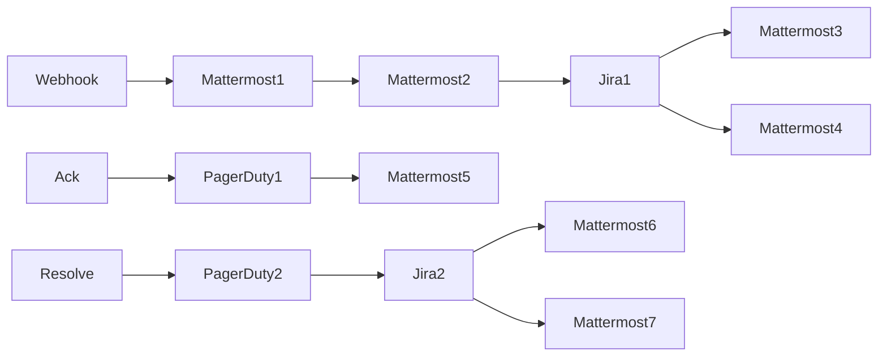

## Fluxo (.json) :

```json
{
  "nodes": [
    {
      "name": "Ack",
      "type": "n8n-nodes-base.webhook",
      "position": [
        -160,
        1440
      ],
      "webhookId": "d3025d6c-5956-439e-9c9a-db3ef524a24f",
      "parameters": {
        "path": "/ack",
        "options": {},
        "httpMethod": "POST"
      },
      "typeVersion": 1
    },
    {
      "name": "Resolve",
      "type": "n8n-nodes-base.webhook",
      "position": [
        120,
        1880
      ],
      "webhookId": "92d7ddfa-20f9-49bc-976e-4f6c76c0b3b4",
      "parameters": {
        "path": "/resolve",
        "options": {},
        "httpMethod": "POST"
      },
      "typeVersion": 1
    },
    {
      "name": "Webhook",
      "type": "n8n-nodes-base.webhook",
      "position": [
        60,
        1040
      ],
      "webhookId": "9888d896-dd23-4e97-9d16-c12055b64133",
      "parameters": {
        "path": "9888d896-dd23-4e97-9d16-c12055b64133",
        "options": {},
        "httpMethod": "POST"
      },
      "typeVersion": 1
    },
    {
      "name": "Jira1",
      "type": "n8n-nodes-base.jira",
      "position": [
        680,
        1040
      ],
      "parameters": {
        "project": "10016",
        "summary": "={{$node[\"Webhook\"].json[\"body\"][\"event\"][\"data\"][\"title\"]}}",
        "issueType": "10007",
        "additionalFields": {
          "assignee": "qwertz12345"
        }
      },
      "credentials": {
        "jiraSoftwareCloudApi": {
          "id": "64",
          "name": "Jira SW Cloud account"
        }
      },
      "typeVersion": 1
    },
    {
      "name": "Jira2",
      "type": "n8n-nodes-base.jira",
      "position": [
        540,
        1880
      ],
      "parameters": {
        "issueKey": "={{$node[\"Resolve\"].json[\"body\"][\"context\"][\"jira_key\"]}}",
        "operation": "update",
        "updateFields": {
          "statusId": "31"
        }
      },
      "credentials": {
        "jiraSoftwareCloudApi": {
          "id": "64",
          "name": "Jira SW Cloud account"
        }
      },
      "typeVersion": 1
    },
    {
      "name": "PagerDuty1",
      "type": "n8n-nodes-base.pagerDuty",
      "position": [
        60,
        1440
      ],
      "parameters": {
        "email": "address@mail.com",
        "resource": "incident",
        "operation": "update",
        "incidentId": "={{$json[\"body\"][\"context\"][\"pagerduty_incident\"]}}",
        "updateFields": {
          "status": "acknowledged"
        },
        "authentication": "apiToken",
        "conferenceBridgeUi": {}
      },
      "credentials": {
        "pagerDutyApi": {
          "id": "65",
          "name": "PagerDuty account"
        }
      },
      "typeVersion": 1
    },
    {
      "name": "PagerDuty2",
      "type": "n8n-nodes-base.pagerDuty",
      "position": [
        340,
        1880
      ],
      "parameters": {
        "email": "address@mail.com",
        "resource": "incident",
        "operation": "update",
        "incidentId": "={{$json[\"body\"][\"context\"][\"pagerduty_incident\"]}}",
        "updateFields": {
          "status": "resolved"
        },
        "authentication": "apiToken",
        "conferenceBridgeUi": {}
      },
      "credentials": {
        "pagerDutyApi": {
          "id": "65",
          "name": "PagerDuty account"
        }
      },
      "typeVersion": 1
    },
    {
      "name": "Mattermost5",
      "type": "n8n-nodes-base.mattermost",
      "position": [
        300,
        1440
      ],
      "parameters": {
        "message": "💪🏼 Incident status has been changed to Acknowledged on PagerDuty.",
        "channelId": "={{$node[\"Ack\"].json[\"body\"][\"channel_id\"]}}",
        "attachments": [],
        "otherOptions": {}
      },
      "credentials": {
        "mattermostApi": {
          "id": "61",
          "name": "Mattermost account"
        }
      },
      "typeVersion": 1
    },
    {
      "name": "Mattermost6",
      "type": "n8n-nodes-base.mattermost",
      "position": [
        760,
        1760
      ],
      "parameters": {
        "message": "💪 This issue got closed in PagerDuty and Jira.",
        "channelId": "={{$node[\"Resolve\"].json[\"body\"][\"channel_id\"]}}",
        "attachments": [],
        "otherOptions": {}
      },
      "credentials": {
        "mattermostApi": {
          "id": "61",
          "name": "Mattermost account"
        }
      },
      "typeVersion": 1
    },
    {
      "name": "Mattermost4",
      "type": "n8n-nodes-base.mattermost",
      "position": [
        900,
        1180
      ],
      "parameters": {
        "message": "=⚠️ {{$node[\"Webhook\"].json[\"body\"][\"messages\"][0][\"log_entries\"][0][\"incident\"][\"summary\"]}}\nPagerDuty incident: {{$node[\"Webhook\"].json[\"body\"][\"messages\"][0][\"log_entries\"][0][\"incident\"][\"html_url\"]}}\nJira issue: https://n8n.atlassian.net/browse/{{$json[\"key\"]}}",
        "channelId": "={{$node[\"Mattermost1\"].json[\"id\"]}}",
        "attachments": [
          {
            "actions": {
              "item": [
                {
                  "name": "Acknowledge",
                  "type": "button",
                  "options": {},
                  "data_source": "custom",
                  "integration": {
                    "item": {
                      "url": "https://username.app.n8n.cloud/webhook/ack",
                      "context": {
                        "property": [
                          {
                            "name": "pagerduty_incident",
                            "value": "={{ $node[\"Webhook\"].json[\"body\"][\"event\"][\"data\"][\"id\"] }}"
                          }
                        ]
                      }
                    }
                  }
                },
                {
                  "name": "Resolve",
                  "type": "button",
                  "options": {},
                  "data_source": "custom",
                  "integration": {
                    "item": {
                      "url": "https://username.app.n8n.cloud/webhook/resolve",
                      "context": {
                        "property": [
                          {
                            "name": "jira_key",
                            "value": "={{$json[\"key\"]}}"
                          },
                          {
                            "name": "pagerduty_incident",
                            "value": "={{ $node[\"Webhook\"].json[\"body\"][\"event\"][\"data\"][\"id\"] }}"
                          }
                        ]
                      }
                    }
                  }
                }
              ]
            }
          }
        ],
        "otherOptions": {}
      },
      "credentials": {
        "mattermostApi": {
          "id": "61",
          "name": "Mattermost account"
        }
      },
      "typeVersion": 1
    },
    {
      "name": "Mattermost3",
      "type": "n8n-nodes-base.mattermost",
      "position": [
        900,
        940
      ],
      "parameters": {
        "message": "=🚨 New incident: \nAuxiliary Channel -> https://mattermost.internal.n8n.io/test/channels/{{$node[\"Mattermost1\"].json[\"name\"]}}\nPagerDuty Incident -> {{$node[\"Webhook\"].json[\"body\"][\"event\"][\"data\"][\"html_url\"]}}\nJira Issue -> https://n8n.atlassian.net/browse/{{$json[\"key\"]}}",
        "channelId": "qwertz12345",
        "attachments": [],
        "otherOptions": {}
      },
      "credentials": {
        "mattermostApi": {
          "id": "61",
          "name": "Mattermost account"
        }
      },
      "typeVersion": 1
    },
    {
      "name": "Mattermost2",
      "type": "n8n-nodes-base.mattermost",
      "position": [
        480,
        1040
      ],
      "parameters": {
        "userId": "qwertz12345",
        "resource": "channel",
        "channelId": "={{$json[\"id\"]}}",
        "operation": "addUser"
      },
      "credentials": {
        "mattermostApi": {
          "id": "61",
          "name": "Mattermost account"
        }
      },
      "typeVersion": 1
    },
    {
      "name": "Mattermost1",
      "type": "n8n-nodes-base.mattermost",
      "position": [
        280,
        1040
      ],
      "parameters": {
        "teamId": "qwertz12345",
        "channel": "={{$json[\"body\"][\"event\"][\"data\"][\"incident_key\"]}}",
        "resource": "channel",
        "displayName": "={{$json[\"body\"][\"event\"][\"data\"][\"title\"]}}"
      },
      "credentials": {
        "mattermostApi": {
          "id": "61",
          "name": "Mattermost account"
        }
      },
      "typeVersion": 1
    },
    {
      "name": "Mattermost7",
      "type": "n8n-nodes-base.mattermost",
      "position": [
        760,
        1980
      ],
      "parameters": {
        "message": "=🎉 The incident ({{$node[\"PagerDuty2\"].json[\"summary\"]}}) was resolved by the lovely folks in the on-call team!",
        "channelId": "qwertz12345",
        "attachments": [],
        "otherOptions": {}
      },
      "credentials": {
        "mattermostApi": {
          "id": "61",
          "name": "Mattermost account"
        }
      },
      "typeVersion": 1
    }
  ],
  "connections": {
    "Ack": {
      "main": [
        [
          {
            "node": "PagerDuty1",
            "type": "main",
            "index": 0
          }
        ]
      ]
    },
    "Jira1": {
      "main": [
        [
          {
            "node": "Mattermost3",
            "type": "main",
            "index": 0
          },
          {
            "node": "Mattermost4",
            "type": "main",
            "index": 0
          }
        ]
      ]
    },
    "Jira2": {
      "main": [
        [
          {
            "node": "Mattermost6",
            "type": "main",
            "index": 0
          },
          {
            "node": "Mattermost7",
            "type": "main",
            "index": 0
          }
        ]
      ]
    },
    "Resolve": {
      "main": [
        [
          {
            "node": "PagerDuty2",
            "type": "main",
            "index": 0
          }
        ]
      ]
    },
    "Webhook": {
      "main": [
        [
          {
            "node": "Mattermost1",
            "type": "main",
            "index": 0
          }
        ]
      ]
    },
    "PagerDuty1": {
      "main": [
        [
          {
            "node": "Mattermost5",
            "type": "main",
            "index": 0
          }
        ]
      ]
    },
    "PagerDuty2": {
      "main": [
        [
          {
            "node": "Jira2",
            "type": "main",
            "index": 0
          }
        ]
      ]
    },
    "Mattermost1": {
      "main": [
        [
          {
            "node": "Mattermost2",
            "type": "main",
            "index": 0
          }
        ]
      ]
    },
    "Mattermost2": {
      "main": [
        [
          {
            "node": "Jira1",
            "type": "main",
            "index": 0
          }
        ]
      ]
    }
  }
}
```

<a id="template-1335"></a>

## Template 1335 - Monitoramento de saldo USDT com notificações Telegram

- **Nome:** Monitoramento de saldo USDT com notificações Telegram
- **Descrição:** Monitora periodicamente o saldo de USDT de uma carteira ERC-20 e envia notificações via Telegram quando o saldo muda (ou uma mensagem informando que permaneceu igual).
- **Funcionalidade:** • Agendamento periódico: Verifica o saldo da carteira a cada 5 minutos.
• Consulta de saldo ERC-20: Recupera o saldo do token USDT para o endereço informado.
• Persistência do último saldo conhecido: Armazena localmente o saldo anterior para comparação entre execuções.
• Detecção de alteração de saldo: Compara o saldo atual com o saldo anterior e determina se houve mudança.
• Notificação em caso de mudança: Envia mensagem detalhada ao Telegram com endereço, saldo anterior e novo saldo (convertido para unidades USDT).
• Notificação quando sem mudança: Envia mensagem ao Telegram informando que o saldo permaneceu estável.
• Configuração de parâmetros: Permite definir o endereço da carteira, a chave de API do serviço de consulta e o endereço do contrato do token USDT.
- **Ferramentas:** • Etherscan API: Serviço de API para consultar saldos de tokens ERC-20 e obter dados da blockchain Ethereum.
• Telegram: Plataforma de mensagens usada para enviar notificações em tempo real ao usuário.
• Ethereum / USDT (ERC-20): Rede blockchain e o token ERC-20 monitorado (endereço do contrato do USDT).


## Fluxo visual

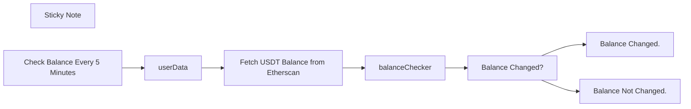

## Fluxo (.json) :

```json
{
  "id": "AlEVIPHR3dMJkYWt",
  "meta": {
    "instanceId": "58e59e36ad4158b4534237c364ed053a36843e3394fa02af59feb8df38262a79",
    "templateCredsSetupCompleted": true
  },
  "name": "Monitor USDT ERC-20 Wallet Balance with Etherscan and Telegram Notifications",
  "tags": [],
  "nodes": [
    {
      "id": "35b62ca1-3603-4dcb-a3b5-77e1325c78f7",
      "name": "Balance Changed?",
      "type": "n8n-nodes-base.if",
      "position": [
        -40,
        0
      ],
      "parameters": {
        "conditions": {
          "boolean": [
            {
              "value1": "={{$json.balanceChanged}}",
              "value2": true
            }
          ]
        }
      },
      "typeVersion": 1
    },
    {
      "id": "dfeef0d5-0bb2-40a1-ae75-51d7caeb9c3d",
      "name": "Balance Changed.",
      "type": "n8n-nodes-base.telegram",
      "position": [
        320,
        -140
      ],
      "webhookId": "a8fa72ce-638b-4245-bcbc-d59948ae1144",
      "parameters": {
        "text": "=🚨 *USDT Balance Change!*\n\nWallet Address: {{ $json.walletAddress }}\n\n🔴 Previous Balance: {{parseFloat($json.previousBalance)/1e6}} USDT\n\n🟢 New Balance: {{parseFloat($json.currentBalance)/1e6}} USDT",
        "chatId": "< Your Telegram Chat ID >",
        "additionalFields": {
          "parse_mode": "Markdown"
        }
      },
      "credentials": {
        "telegramApi": {
          "id": "Ge3vEXak2MymWtcp",
          "name": "Telegram account"
        }
      },
      "typeVersion": 1
    },
    {
      "id": "ffebdb46-a6f0-4ed8-88ed-75ab427af969",
      "name": "Balance Not Changed.",
      "type": "n8n-nodes-base.telegram",
      "position": [
        320,
        20
      ],
      "webhookId": "a8fa72ce-638b-4245-bcbc-d59948ae1144",
      "parameters": {
        "text": "=Balance Unchanged. USDT balance remained stable.",
        "chatId": "< Your Telegram Chat ID >",
        "additionalFields": {
          "parse_mode": "Markdown"
        }
      },
      "typeVersion": 1
    },
    {
      "id": "049ff717-ba10-4b7f-9f84-9eaaeee902ec",
      "name": "userData",
      "type": "n8n-nodes-base.set",
      "position": [
        -780,
        0
      ],
      "parameters": {
        "options": {},
        "assignments": {
          "assignments": [
            {
              "id": "4455d1e7-a489-4ab6-a526-4fc755db99d0",
              "name": "Your Wallet Address",
              "type": "string",
              "value": "< Wallet Address Paste Here >"
            },
            {
              "id": "3d84deba-8093-42cf-833f-6891db778de7",
              "name": "Your Etherscan Api Key",
              "type": "string",
              "value": "< Etherscan Api Key Paste Here>"
            },
            {
              "id": "971ea723-e3de-4cff-b4e7-5899f3d8fb00",
              "name": "USDT ERC-20 Token Address",
              "type": "string",
              "value": "0xdAC17F958D2ee523a2206206994597C13D831ec7"
            }
          ]
        }
      },
      "typeVersion": 3.4
    },
    {
      "id": "0488f2dd-6b71-4be5-9ce8-cf0763b82990",
      "name": "balanceChecker",
      "type": "n8n-nodes-base.code",
      "position": [
        -280,
        0
      ],
      "parameters": {
        "jsCode": "const staticData = $getWorkflowStaticData('global');\n\nconst currentBalance = items[0].json.result;\n\nconst walletAddress = $('userData').first().json['Your Wallet Address']\n\nlet previousBalance = staticData.previousBalance;\n\nif (!previousBalance) {\n  staticData.previousBalance = currentBalance;\n  previousBalance = currentBalance;\n}\n\nconst balanceChanged = previousBalance !== currentBalance;\n\nstaticData.previousBalance = currentBalance;\n\nreturn [{json: {balanceChanged, previousBalance, currentBalance, walletAddress}}];"
      },
      "typeVersion": 2
    },
    {
      "id": "d7b23d5b-b4c5-4d9a-93f9-360ae0d539c7",
      "name": "Sticky Note",
      "type": "n8n-nodes-base.stickyNote",
      "position": [
        -1040,
        -180
      ],
      "parameters": {
        "color": 4,
        "width": 1540,
        "height": 400,
        "content": "## USDT ERC-20 Wallet Balance Tracker\n**This workflow** Is a basic concept of integrating your ERC-20 wallet with n8n nodes."
      },
      "typeVersion": 1
    },
    {
      "id": "7c8f0d69-6c37-469c-b466-89a467db9bbd",
      "name": "Check Balance Every 5 Minutes",
      "type": "n8n-nodes-base.cron",
      "position": [
        -1000,
        0
      ],
      "parameters": {
        "triggerTimes": {
          "item": [
            {
              "mode": "everyX",
              "unit": "minutes",
              "value": 5
            }
          ]
        }
      },
      "typeVersion": 1
    },
    {
      "id": "ea603f03-25e0-4c80-90f2-eb5f09e71ad1",
      "name": "Fetch USDT Balance from Etherscan",
      "type": "n8n-nodes-base.httpRequest",
      "position": [
        -480,
        0
      ],
      "parameters": {
        "url": "https://api.etherscan.io/api",
        "options": {},
        "sendQuery": true,
        "queryParameters": {
          "parameters": [
            {
              "name": "module",
              "value": "account"
            },
            {
              "name": "action",
              "value": "tokenbalance"
            },
            {
              "name": "address",
              "value": "={{ $json['Your Wallet Address'] }}"
            },
            {
              "name": "tag",
              "value": "latest"
            },
            {
              "name": "apikey",
              "value": "={{ $json['Your Etherscan Api Key'] }}"
            },
            {
              "name": "contractaddress",
              "value": "={{ $json['USDT ERC-20 Token Address'] }}"
            }
          ]
        }
      },
      "typeVersion": 3
    }
  ],
  "active": false,
  "pinData": {},
  "settings": {
    "executionOrder": "v1"
  },
  "versionId": "7ebf18de-7adf-40dd-99b4-ff8dd1e37f08",
  "connections": {
    "userData": {
      "main": [
        [
          {
            "node": "Fetch USDT Balance from Etherscan",
            "type": "main",
            "index": 0
          }
        ]
      ]
    },
    "balanceChecker": {
      "main": [
        [
          {
            "node": "Balance Changed?",
            "type": "main",
            "index": 0
          }
        ]
      ]
    },
    "Balance Changed.": {
      "main": [
        []
      ]
    },
    "Balance Changed?": {
      "main": [
        [
          {
            "node": "Balance Changed.",
            "type": "main",
            "index": 0
          }
        ],
        [
          {
            "node": "Balance Not Changed.",
            "type": "main",
            "index": 0
          }
        ]
      ]
    },
    "Check Balance Every 5 Minutes": {
      "main": [
        [
          {
            "node": "userData",
            "type": "main",
            "index": 0
          }
        ]
      ]
    },
    "Fetch USDT Balance from Etherscan": {
      "main": [
        [
          {
            "node": "balanceChecker",
            "type": "main",
            "index": 0
          }
        ]
      ]
    }
  }
}
```

<a id="template-1337"></a>

## Template 1337 - Filtrar e encaminhar clientes por país e nome

- **Nome:** Filtrar e encaminhar clientes por país e nome
- **Descrição:** Recupera todos os clientes de um datastore e aplica filtros e roteamentos com base no país ou em parte do nome.
- **Funcionalidade:** • Execução manual: inicia o fluxo quando o botão de execução é acionado.
• Recuperação de dados de clientes: obtém todos os registros de clientes do datastore.
• Filtragem por país igual a US: identifica clientes cujo campo country é 'US'.
• Condição composta (país vazio ou nome contendo 'Max'): seleciona clientes com country vazio ou cujo nome contém 'Max'.
• Encaminhamento por múltiplos ramos: roteia registros para saídas distintas conforme o país (US, CO, UK) com uma saída de fallback para os demais.
• Notas explicativas no fluxo: contém instruções sobre como combinar condições e uso do roteamento.
- **Ferramentas:** • Customer Datastore: fonte de dados que armazena informações de clientes e fornece a operação para recuperar todos os registros de pessoas.


## Fluxo visual

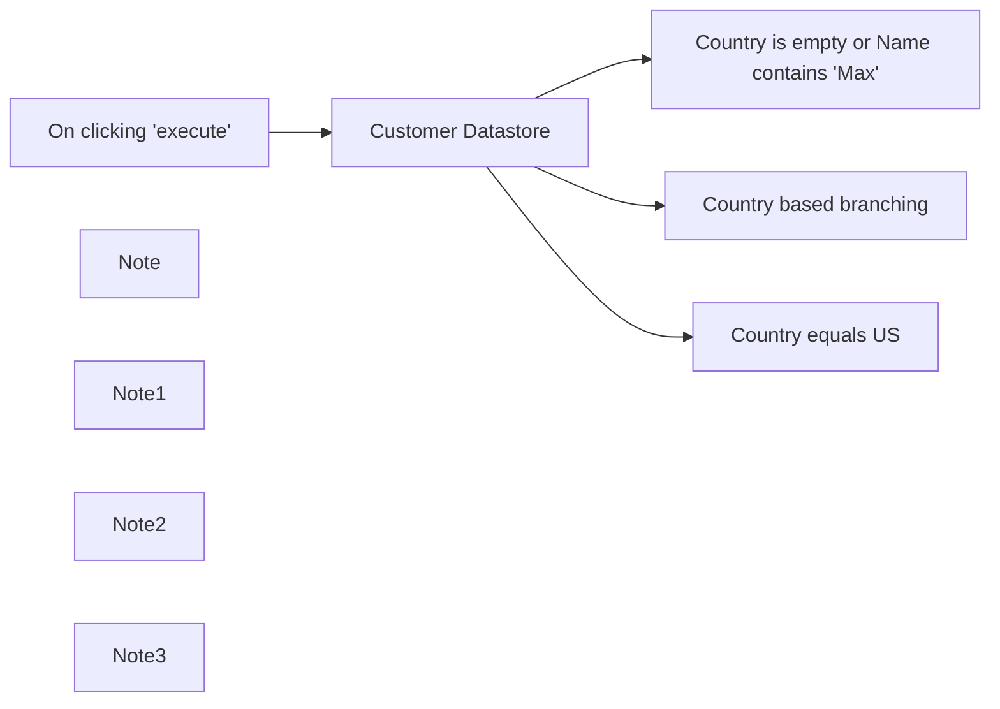

## Fluxo (.json) :

```json
{
  "nodes": [
    {
      "name": "On clicking 'execute'",
      "type": "n8n-nodes-base.manualTrigger",
      "position": [
        20,
        720
      ],
      "parameters": {},
      "typeVersion": 1
    },
    {
      "name": "Customer Datastore",
      "type": "n8n-nodes-base.n8nTrainingCustomerDatastore",
      "position": [
        220,
        720
      ],
      "parameters": {
        "operation": "getAllPeople"
      },
      "typeVersion": 1
    },
    {
      "name": "Note",
      "type": "n8n-nodes-base.stickyNote",
      "position": [
        500,
        600
      ],
      "parameters": {
        "width": 520,
        "height": 280,
        "content": "## 2. If with And/Or conditions\nSet the **Combine** field to: \n`ALL` for `AND` condition\n`ANY` for `OR` condition"
      },
      "typeVersion": 1
    },
    {
      "name": "Note1",
      "type": "n8n-nodes-base.stickyNote",
      "position": [
        500,
        920
      ],
      "parameters": {
        "width": 520,
        "height": 360,
        "content": "## 3. Multiple branches\nWe use the `Switch` when there more than 2 possible outcomes to the filtering. We do that by specifying the condition under **Routing rules** inside the node.\n\nIn this example we send all **US-based** customers data to route 0, **customers from CO** to route 1, **customers from the UK** to route 2, and all the rest to route 3 as a fallback"
      },
      "typeVersion": 1
    },
    {
      "name": "Note2",
      "type": "n8n-nodes-base.stickyNote",
      "position": [
        500,
        300
      ],
      "parameters": {
        "width": 520,
        "height": 260,
        "content": "## 1. Single condition If\nFilter out data that you don't want or send data to different branches"
      },
      "typeVersion": 1
    },
    {
      "name": "Note3",
      "type": "n8n-nodes-base.stickyNote",
      "position": [
        -520,
        660
      ],
      "parameters": {
        "width": 480,
        "height": 240,
        "content": "## The `If` and the `Switch` nodes are the key nodes to set conditional logic for filtering and routing data\n\n\n### Click `Execute Workflow` button and double click on the nodes to see the input and output items when you click on each node."
      },
      "typeVersion": 1
    },
    {
      "name": "Country equals US",
      "type": "n8n-nodes-base.if",
      "position": [
        540,
        420
      ],
      "parameters": {
        "conditions": {
          "string": [
            {
              "value1": "={{$json[\"country\"]}}",
              "value2": "US"
            }
          ]
        }
      },
      "typeVersion": 1
    },
    {
      "name": "Country is empty or Name contains 'Max'",
      "type": "n8n-nodes-base.if",
      "position": [
        540,
        720
      ],
      "parameters": {
        "conditions": {
          "string": [
            {
              "value1": "={{$json[\"country\"]}}",
              "operation": "isEmpty"
            },
            {
              "value1": "={{$json[\"name\"]}}",
              "value2": "Max",
              "operation": "contains"
            }
          ]
        },
        "combineOperation": "any"
      },
      "typeVersion": 1
    },
    {
      "name": "Country based branching",
      "type": "n8n-nodes-base.switch",
      "position": [
        540,
        1120
      ],
      "parameters": {
        "rules": {
          "rules": [
            {
              "value2": "US"
            },
            {
              "output": 1,
              "value2": "CO"
            },
            {
              "output": 2,
              "value2": "UK"
            }
          ]
        },
        "value1": "={{$json[\"country\"]}}",
        "dataType": "string",
        "fallbackOutput": 3
      },
      "typeVersion": 1
    }
  ],
  "connections": {
    "Customer Datastore": {
      "main": [
        [
          {
            "node": "Country is empty or Name contains 'Max'",
            "type": "main",
            "index": 0
          },
          {
            "node": "Country based branching",
            "type": "main",
            "index": 0
          },
          {
            "node": "Country equals US",
            "type": "main",
            "index": 0
          }
        ]
      ]
    },
    "On clicking 'execute'": {
      "main": [
        [
          {
            "node": "Customer Datastore",
            "type": "main",
            "index": 0
          }
        ]
      ]
    }
  }
}
```

<a id="template-1339"></a>

## Template 1339 - Assistente de preparação de discursos via Telegram

- **Nome:** Assistente de preparação de discursos via Telegram
- **Descrição:** Fluxo que recebe mensagens de texto ou áudio por Telegram, transcreve e processa o conteúdo com um modelo de linguagem para oferecer feedback, orientar a preparação de um discurso ou gerar um novo texto de apresentação, retornando as respostas ao usuário.
- **Funcionalidade:** • Recepção de mensagens Telegram: Captura mensagens de texto e arquivos de áudio enviados pelo usuário.
• Transcrição de áudio: Converte mensagens de voz em texto para processamento posterior.
• Detecção e roteamento de intenção: Analisa o texto para identificar comandos/intenção (por exemplo, iniciar novo discurso, gerar discurso, solicitar feedback) e direciona o fluxo adequado.
• Definição dinâmica de prompt: Ajusta o prompt do sistema de acordo com a intenção identificada (preparar novo discurso, sintetizar discurso, fornecer feedback).
• Geração de respostas com LLM: Usa um modelo de linguagem para criar feedback, fazer perguntas de acompanhamento ou gerar um discurso completo.
• Gestão de memória de sessão: Armazena e limpa o contexto de conversa por usuário para manter histórico relevante e permitir reinícios quando solicitado.
• Limpeza de formatação: Remove caracteres que podem quebrar a apresentação do texto no Telegram.
• Fragmentação de mensagens longas: Divide respostas extensas em blocos menores (abaixo do limite de caracteres) para envio sequencial sem perda de conteúdo.
• Envio de respostas ao usuário: Entrega os blocos de texto formatados de volta ao chat do usuário no Telegram.
• Interação iterativa: Permite diálogos contínuos, solicitações de esclarecimento e refinamento do discurso com base no feedback acumulado.
- **Ferramentas:** • Telegram (API de Bot): Plataforma de mensagens usada para receber mensagens dos usuários e enviar respostas, incluindo envio/recebimento de arquivos de áudio.
• Google Gemini (PaLM): Modelo de linguagem utilizado para gerar respostas, sintetizar e refinar textos de discurso.
• OpenAI (serviço de transcrição de áudio): Serviço utilizado para transcrever mensagens de voz em texto.
• Python (scripts customizados): Código usado para limpar a formatação do texto gerado e dividir saídas longas em blocos adequados ao envio.

## Fluxo visual

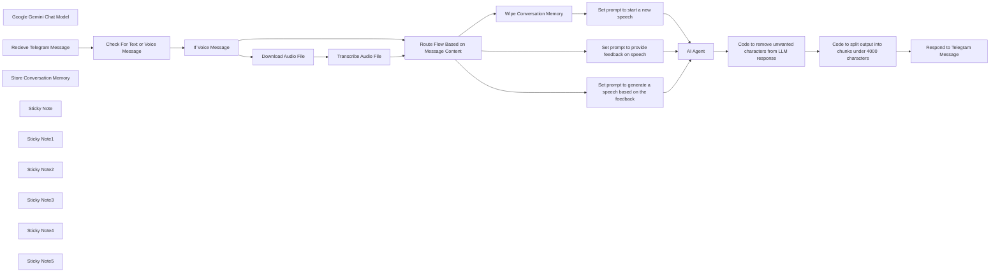

## Fluxo (.json) :

```json
{
  "id": "Fdbft9uw8mLGXMoE",
  "meta": {
    "instanceId": "13d96e1ebd7901d1ed300d36db3a4447107e9ad60df51fe711e45683875362aa",
    "templateCredsSetupCompleted": true
  },
  "name": "Speech Support Workflow",
  "tags": [
    {
      "id": "88Rkm7VaAFefsT34",
      "name": "AI",
      "createdAt": "2025-05-06T22:52:26.053Z",
      "updatedAt": "2025-05-06T22:52:26.053Z"
    },
    {
      "id": "s1UA6FThbKhQYbLu",
      "name": "MultiModal",
      "createdAt": "2025-05-06T22:52:35.914Z",
      "updatedAt": "2025-05-06T22:52:35.914Z"
    },
    {
      "id": "ANT04PP2WxQmkjzl",
      "name": "Integrations",
      "createdAt": "2025-05-06T22:53:02.798Z",
      "updatedAt": "2025-05-06T22:53:02.798Z"
    }
  ],
  "nodes": [
    {
      "id": "8868fc75-4a21-4900-b2b9-7860ee981a9e",
      "name": "AI Agent",
      "type": "@n8n/n8n-nodes-langchain.agent",
      "position": [
        1640,
        240
      ],
      "parameters": {
        "text": "={{ $('Route Flow Based on Message Content').item.json.text }}",
        "options": {
          "systemMessage": "={{ $json.system_prompt }}\n\nYou are generating text for a Telegram message. The text should be plain. No * or **"
        },
        "promptType": "define"
      },
      "typeVersion": 1.8
    },
    {
      "id": "23f48680-a190-48a5-bb7c-e070db41b9e7",
      "name": "Google Gemini Chat Model",
      "type": "@n8n/n8n-nodes-langchain.lmChatGoogleGemini",
      "position": [
        1620,
        800
      ],
      "parameters": {
        "options": {},
        "modelName": "models/gemini-2.0-flash-001"
      },
      "credentials": {
        "googlePalmApi": {
          "id": "zCkkU4GKPR7wANF5",
          "name": "Google Gemini(PaLM) Api account"
        }
      },
      "typeVersion": 1
    },
    {
      "id": "6a909fb0-f550-4b5e-94db-6e16682d70bd",
      "name": "Recieve Telegram Message",
      "type": "n8n-nodes-base.telegramTrigger",
      "position": [
        -480,
        240
      ],
      "webhookId": "20140af0-c902-44db-9c53-051def981f9a",
      "parameters": {
        "updates": [
          "message"
        ],
        "additionalFields": {}
      },
      "credentials": {
        "telegramApi": {
          "id": "WvBkWguhZJQm5FpM",
          "name": "Telegram account"
        }
      },
      "typeVersion": 1.2
    },
    {
      "id": "73d19e09-efc4-43c4-a4e9-382ae66c7651",
      "name": "Check For Text or Voice Message",
      "type": "n8n-nodes-base.set",
      "position": [
        -260,
        240
      ],
      "parameters": {
        "options": {},
        "assignments": {
          "assignments": [
            {
              "id": "b37e51e5-e2c7-4328-b02b-80d08164d595",
              "name": "text",
              "type": "string",
              "value": "={{ $json.message.text||\"\" }}"
            }
          ]
        }
      },
      "typeVersion": 3.4
    },
    {
      "id": "a7ade841-258d-45b2-9150-a56490a4c37f",
      "name": "Download Audio File",
      "type": "n8n-nodes-base.telegram",
      "position": [
        180,
        120
      ],
      "webhookId": "68e0f93e-5dd0-41aa-89e4-4e7a6be9d3b2",
      "parameters": {
        "fileId": "={{ $('Recieve Telegram Message').item.json.message.voice.file_id }}",
        "resource": "file"
      },
      "credentials": {
        "telegramApi": {
          "id": "WvBkWguhZJQm5FpM",
          "name": "Telegram account"
        }
      },
      "typeVersion": 1.2
    },
    {
      "id": "73cb448e-f00e-4879-8fa2-facb259b76b2",
      "name": "Transcribe Audio File",
      "type": "@n8n/n8n-nodes-langchain.openAi",
      "position": [
        400,
        120
      ],
      "parameters": {
        "options": {},
        "resource": "audio",
        "operation": "transcribe"
      },
      "credentials": {
        "openAiApi": {
          "id": "cDXozPn1syyex1aJ",
          "name": "OpenAi account"
        }
      },
      "typeVersion": 1.8
    },
    {
      "id": "a1999ecd-cabf-4740-a9a6-98486a868b7f",
      "name": "If Voice Message",
      "type": "n8n-nodes-base.if",
      "position": [
        -60,
        240
      ],
      "parameters": {
        "options": {},
        "conditions": {
          "options": {
            "version": 2,
            "leftValue": "",
            "caseSensitive": true,
            "typeValidation": "strict"
          },
          "combinator": "and",
          "conditions": [
            {
              "id": "d60f6ce2-afd0-4ee1-a7c3-3d5bbdb68ea2",
              "operator": {
                "type": "string",
                "operation": "empty",
                "singleValue": true
              },
              "leftValue": "={{ $json.text }}",
              "rightValue": ""
            }
          ]
        }
      },
      "typeVersion": 2.2
    },
    {
      "id": "ac5cad34-3756-4fe3-9269-ae96e5b49e8f",
      "name": "Code to remove unwanted characters from LLM response",
      "type": "n8n-nodes-base.code",
      "position": [
        2060,
        240
      ],
      "parameters": {
        "language": "python",
        "pythonCode": "import re\n\ndef clean_markdown_for_telegram(text):\n  \"\"\"\n  Removes common Markdown formatting characters from a string.\n\n  Args:\n    text: The input string.\n\n  Returns:\n    A new string with Markdown characters removed.\n  \"\"\"\n  markdown_chars = r\"[*_~`\\[\\]()#+\\-=|{}.!]\"\n  cleaned_text = re.sub(markdown_chars, \"\", text)\n  cleaned_text = \" \".join(cleaned_text.split()).strip()\n  return cleaned_text\n\n# Loop over input items and create new items with the cleaned text\noutput_items = []\nfor item in _input.all():\n  feedback_text = item.json.get(\"output\", \"\")\n  cleaned_feedback = clean_markdown_for_telegram(feedback_text)\n  output_items.append({\"json\": {\"cleanedText\": cleaned_feedback}})\n\nreturn output_items"
      },
      "typeVersion": 2
    },
    {
      "id": "82761634-7472-4ce1-806a-2b80aca985e3",
      "name": "Code to split output into chunks under 4000 characters",
      "type": "n8n-nodes-base.code",
      "position": [
        2280,
        240
      ],
      "parameters": {
        "language": "python",
        "pythonCode": "def split_text_for_telegram(text, max_length=4000):\n  \"\"\"\n  Splits a long text into a list of strings, each with a maximum length\n  suitable for Telegram messages.\n\n  Args:\n    text: The input string to split.\n    max_length: The maximum length of each resulting string (default: 4000).\n\n  Returns:\n    A list of strings, where each string is a chunk of the original text\n    with a maximum length of max_length.\n  \"\"\"\n  if len(text) <= max_length:\n    return [text]\n\n  chunks = []\n  start_index = 0\n  while start_index < len(text):\n    end_index = min(start_index + max_length, len(text))\n\n    split_point = end_index\n    if end_index < len(text):\n      last_sentence_end = -1\n      for i in range(start_index + max_length - 1, start_index - 1, -1):\n        if i < len(text) and text[i] in ['.', '?', '!']:\n          last_sentence_end = i + 1\n          break\n      if last_sentence_end > start_index:\n        split_point = last_sentence_end\n\n    chunks.append(text[start_index:split_point])\n    start_index = split_point\n\n  return chunks\n\noutput_items = []\nmax_length = 4000\n\nfor item in _input.all():\n  text = item.json.get(\"cleanedText\", \"\")\n  text_chunks = split_text_for_telegram(text, max_length)\n  for chunk in text_chunks:\n    output_items.append({\"json\": {\"telegramTextChunk\": chunk}})\n\nreturn output_items"
      },
      "typeVersion": 2
    },
    {
      "id": "9adbfd4c-bbb9-4c92-bf07-a3b50a92aa02",
      "name": "Respond to Telegram Message",
      "type": "n8n-nodes-base.telegram",
      "position": [
        2500,
        240
      ],
      "webhookId": "4c77b108-e066-4538-986a-7535143cfaac",
      "parameters": {
        "text": "={{ $json.telegramTextChunk }}",
        "chatId": "={{ $('Recieve Telegram Message').item.json.message.chat.id }}",
        "additionalFields": {
          "appendAttribution": false
        }
      },
      "credentials": {
        "telegramApi": {
          "id": "WvBkWguhZJQm5FpM",
          "name": "Telegram account"
        }
      },
      "typeVersion": 1.2
    },
    {
      "id": "5bdb6ec5-339e-4e8d-a746-9cdbe4d5f12f",
      "name": "Wipe Conversation Memory",
      "type": "@n8n/n8n-nodes-langchain.memoryManager",
      "position": [
        940,
        -20
      ],
      "parameters": {
        "mode": "delete",
        "deleteMode": "all"
      },
      "typeVersion": 1.1
    },
    {
      "id": "aae703f4-e891-4681-aae4-c426ebba5146",
      "name": "Store Conversation Memory",
      "type": "@n8n/n8n-nodes-langchain.memoryBufferWindow",
      "position": [
        1120,
        800
      ],
      "parameters": {
        "sessionKey": "={{ $('Recieve Telegram Message').item.json.message.from.id }}",
        "sessionIdType": "customKey",
        "contextWindowLength": 25
      },
      "typeVersion": 1.3
    },
    {
      "id": "7457f085-9b19-4a00-9ad6-af2ca8ee16d5",
      "name": "Set prompt to start a new speech",
      "type": "n8n-nodes-base.set",
      "position": [
        1340,
        -20
      ],
      "parameters": {
        "options": {},
        "assignments": {
          "assignments": [
            {
              "id": "d5b33b03-241b-4193-915a-4eb4dfef05e9",
              "name": "system_prompt",
              "type": "string",
              "value": "\"I am preparing to give a speech. Your role is to act as my speech preparation assistant. Please guide me through the process of getting ready to deliver this speech effectively. Ask me relevant questions and suggest steps we should take to ensure a successful presentation.\n\nPotential areas we can work on include:\n\nDefining the core message and key takeaways.\nUnderstanding the audience's needs and expectations.\nStructuring the speech for maximum impact.\nCrafting engaging content and supporting materials.\nDeveloping effective opening and closing remarks.\nPracticing delivery and managing speaking anxiety.\nAnticipating potential questions from the audience.\nConsidering the logistics of the presentation (e.g., time limits, equipment).\nWhere should we begin?"
            }
          ]
        }
      },
      "typeVersion": 3.4
    },
    {
      "id": "0a9f2c04-7f7e-488c-866c-717a78bf7db1",
      "name": "Set prompt to generate a speech based on the feedback",
      "type": "n8n-nodes-base.set",
      "position": [
        1340,
        220
      ],
      "parameters": {
        "options": {},
        "assignments": {
          "assignments": [
            {
              "id": "ddbff433-f4bb-4ac1-a954-7fb32c942a9b",
              "name": "system_prompt",
              "type": "string",
              "value": "I want you to act as a speech synthesizer and improvement agent. You have access to the content of several speeches I have previously provided, along with the constructive feedback I received on each and with this information your task is to generate a new speech.\n\nThis new speech should incorporate the following:\n\nKey themes and ideas that were present and well-received in my previous speeches.\nStructural elements and transitions that were identified as effective in past feedback.\nEngagement techniques that were noted as successful.\nAvoidance of areas for improvement highlighted in the feedback (e.g., rambling sections, unclear points, pacing issues).\nIncorporation of specific suggestions for improvement that were given.\nA similar tone and style to my previous speeches, while aiming for enhanced clarity and impact based on the feedback.\nPlease provide the complete text of the new speech. Feel free to ask clarifying questions if needed about the new topic, audience, or goal, or if you need a reminder of specific feedback points from my previous speeches. I am ready when you are.\""
            }
          ]
        }
      },
      "typeVersion": 3.4
    },
    {
      "id": "f242361e-6bf4-4c4e-8cd0-72da06823842",
      "name": "Set prompt to provide feedback on speech",
      "type": "n8n-nodes-base.set",
      "position": [
        1340,
        420
      ],
      "parameters": {
        "options": {},
        "assignments": {
          "assignments": [
            {
              "id": "b86d5905-872a-40fa-9855-054cd8991a0d",
              "name": "system_prompt",
              "type": "string",
              "value": "I'd like you to act as a speech feedback agent. I will deliver a speech to you, and I want you to provide constructive criticism and insights on various aspects of my delivery and content.  Please pay attention to:  Clarity and Conciseness: Was the message easy to understand? Were there any parts that felt rambling or unnecessary? Engagement: How engaging was the speech overall? Were there moments where your attention might have drifted? Structure and Flow: Did the speech progress logically? Were the transitions smooth? Pacing and Timing: Was the speech delivered at an appropriate pace? Did it feel rushed or too slow? Vocal Delivery (if applicable): (If you are able to describe vocal elements) How was the tone, pitch, and volume? Did it enhance or detract from the message? Content and Impact: Was the content compelling and relevant? Did the speech achieve its intended purpose (as I will describe beforehand)? What was the overall impact of the message? Strengths: What were the most effective aspects of the speech? Areas for Improvement: What specific suggestions do you have to make the speech even better? Before I begin, I will briefly tell you the topic, my intended audience, and my goal for the speech. Are you ready?"
            }
          ]
        }
      },
      "typeVersion": 3.4
    },
    {
      "id": "c1f69bc3-2c93-404e-b338-82663deb975b",
      "name": "Route Flow Based on Message Content",
      "type": "n8n-nodes-base.switch",
      "position": [
        680,
        260
      ],
      "parameters": {
        "rules": {
          "values": [
            {
              "outputKey": "new_speech",
              "conditions": {
                "options": {
                  "version": 2,
                  "leftValue": "",
                  "caseSensitive": false,
                  "typeValidation": "strict"
                },
                "combinator": "and",
                "conditions": [
                  {
                    "id": "8b36fb19-1a5a-4fe1-aec2-7de8b5829972",
                    "operator": {
                      "type": "string",
                      "operation": "contains"
                    },
                    "leftValue": "={{ $json.text }}",
                    "rightValue": "new speech"
                  }
                ]
              },
              "renameOutput": true
            },
            {
              "outputKey": "generate_speech",
              "conditions": {
                "options": {
                  "version": 2,
                  "leftValue": "",
                  "caseSensitive": false,
                  "typeValidation": "strict"
                },
                "combinator": "and",
                "conditions": [
                  {
                    "id": "708d114d-1146-4d8a-b972-cfb5a53a8d77",
                    "operator": {
                      "name": "filter.operator.equals",
                      "type": "string",
                      "operation": "equals"
                    },
                    "leftValue": "={{ $json.text }}",
                    "rightValue": "generate speech"
                  }
                ]
              },
              "renameOutput": true
            }
          ]
        },
        "options": {
          "ignoreCase": true,
          "fallbackOutput": "extra"
        }
      },
      "typeVersion": 3.2
    },
    {
      "id": "6cf41698-2345-4ff8-bd1e-9549e372b454",
      "name": "Sticky Note",
      "type": "n8n-nodes-base.stickyNote",
      "position": [
        1280,
        -300
      ],
      "parameters": {
        "width": 220,
        "height": 900,
        "content": "## Dynamic System Prompting:\n\nThis node sets the AI's system prompt according to the user's request identified in the incoming message."
      },
      "typeVersion": 1
    },
    {
      "id": "1d967631-9300-4fb6-b488-8c09beccbb05",
      "name": "Sticky Note1",
      "type": "n8n-nodes-base.stickyNote",
      "position": [
        2000,
        -300
      ],
      "parameters": {
        "width": 440,
        "height": 720,
        "content": "## Telegram-Ready Output: Formatting and Length Management:\n\nThese code nodes perform two crucial tasks:\n1.  **Formatting:** Removing characters that could cause issues with Telegram's message parsing.\n2.  **Chunking:** Dividing messages longer than Telegram's 4000-character limit into multiple shorter messages for sequential delivery."
      },
      "typeVersion": 1
    },
    {
      "id": "c480550b-c94f-40ee-8338-3deb6bea28d8",
      "name": "Sticky Note2",
      "type": "n8n-nodes-base.stickyNote",
      "position": [
        900,
        -300
      ],
      "parameters": {
        "width": 340,
        "height": 420,
        "content": "## Clearing AI Agent Memory:\n\nThis node clears the AI agent's short-term memory. This helps to minimize the influence of past interactions on future responses, thereby reducing the likelihood of the AI generating inaccurate or irrelevant information (hallucinations)."
      },
      "typeVersion": 1
    },
    {
      "id": "bd36f9a8-30d9-4e0a-978b-a74806685adc",
      "name": "Sticky Note3",
      "type": "n8n-nodes-base.stickyNote",
      "position": [
        -320,
        -300
      ],
      "parameters": {
        "width": 1160,
        "height": 740,
        "content": "## Processing Telegram Messages:\n\nThis section handles incoming messages from Telegram. It first checks if the message contains text.\n\n1.  **Text Message:** If the message includes text, it's directly routed to the analysis switch node.\n2.  **Audio Message:** If the message is an audio file:\n    * The audio file is downloaded.\n    * The audio is transcribed into text.\n    * The transcribed text is then sent to the analysis switch node.\n\nFinally, the analyzed text (whether directly from a text message or transcribed from audio) is forwarded for further processing based on the analysis results."
      },
      "typeVersion": 1
    },
    {
      "id": "cf7d8897-b963-4bb5-9b0e-3ab628e478c7",
      "name": "Sticky Note4",
      "type": "n8n-nodes-base.stickyNote",
      "position": [
        1620,
        -300
      ],
      "parameters": {
        "width": 300,
        "height": 740,
        "content": "## Gemini-Powered Response and Conversation Storage:\n\nThis node utilizes the Google Gemini model to generate a response to the user's prompt and stores the ongoing conversation."
      },
      "typeVersion": 1
    },
    {
      "id": "9fffb613-536e-4b4d-8841-7b4bd3121eab",
      "name": "Sticky Note5",
      "type": "n8n-nodes-base.stickyNote",
      "position": [
        -300,
        -500
      ],
      "parameters": {
        "color": 4,
        "width": 2740,
        "height": 140,
        "content": "## This n8n workflow acts as your personal AI speechwriting coach, directly accessible through Telegram. It listens to your spoken or typed drafts, provides insightful feedback on clarity, engagement, structure, and content, and iteratively refines your message based on your updates. Once you're ready, it synthesizes a brand-new speech or talk incorporating all the improvements and your accumulated ideas. This tool streamlines the speechwriting process, offering on-demand AI assistance to help you craft impactful and well-structured presentations."
      },
      "typeVersion": 1
    }
  ],
  "active": false,
  "pinData": {},
  "settings": {
    "executionOrder": "v1"
  },
  "versionId": "4aaa8457-2661-4261-a601-0a0ffaffacff",
  "connections": {
    "AI Agent": {
      "main": [
        [
          {
            "node": "Code to remove unwanted characters from LLM response",
            "type": "main",
            "index": 0
          }
        ]
      ]
    },
    "If Voice Message": {
      "main": [
        [
          {
            "node": "Download Audio File",
            "type": "main",
            "index": 0
          }
        ],
        [
          {
            "node": "Route Flow Based on Message Content",
            "type": "main",
            "index": 0
          }
        ]
      ]
    },
    "Download Audio File": {
      "main": [
        [
          {
            "node": "Transcribe Audio File",
            "type": "main",
            "index": 0
          }
        ]
      ]
    },
    "Transcribe Audio File": {
      "main": [
        [
          {
            "node": "Route Flow Based on Message Content",
            "type": "main",
            "index": 0
          }
        ]
      ]
    },
    "Google Gemini Chat Model": {
      "ai_languageModel": [
        [
          {
            "node": "AI Agent",
            "type": "ai_languageModel",
            "index": 0
          }
        ]
      ]
    },
    "Recieve Telegram Message": {
      "main": [
        [
          {
            "node": "Check For Text or Voice Message",
            "type": "main",
            "index": 0
          }
        ]
      ]
    },
    "Wipe Conversation Memory": {
      "main": [
        [
          {
            "node": "Set prompt to start a new speech",
            "type": "main",
            "index": 0
          }
        ]
      ]
    },
    "Store Conversation Memory": {
      "ai_memory": [
        [
          {
            "node": "AI Agent",
            "type": "ai_memory",
            "index": 0
          },
          {
            "node": "Wipe Conversation Memory",
            "type": "ai_memory",
            "index": 0
          }
        ]
      ]
    },
    "Check For Text or Voice Message": {
      "main": [
        [
          {
            "node": "If Voice Message",
            "type": "main",
            "index": 0
          }
        ]
      ]
    },
    "Set prompt to start a new speech": {
      "main": [
        [
          {
            "node": "AI Agent",
            "type": "main",
            "index": 0
          }
        ]
      ]
    },
    "Route Flow Based on Message Content": {
      "main": [
        [
          {
            "node": "Wipe Conversation Memory",
            "type": "main",
            "index": 0
          }
        ],
        [
          {
            "node": "Set prompt to generate a speech based on the feedback",
            "type": "main",
            "index": 0
          }
        ],
        [
          {
            "node": "Set prompt to provide feedback on speech",
            "type": "main",
            "index": 0
          }
        ]
      ]
    },
    "Set prompt to provide feedback on speech": {
      "main": [
        [
          {
            "node": "AI Agent",
            "type": "main",
            "index": 0
          }
        ]
      ]
    },
    "Code to remove unwanted characters from LLM response": {
      "main": [
        [
          {
            "node": "Code to split output into chunks under 4000 characters",
            "type": "main",
            "index": 0
          }
        ]
      ]
    },
    "Set prompt to generate a speech based on the feedback": {
      "main": [
        [
          {
            "node": "AI Agent",
            "type": "main",
            "index": 0
          }
        ]
      ]
    },
    "Code to split output into chunks under 4000 characters": {
      "main": [
        [
          {
            "node": "Respond to Telegram Message",
            "type": "main",
            "index": 0
          }
        ]
      ]
    }
  }
}
```

<a id="template-1341"></a>

## Template 1341 - Pedido de feedback por Mattermost

- **Nome:** Pedido de feedback por Mattermost
- **Descrição:** Agenda a leitura de uma planilha de sessões e publica em cada canal do Mattermost uma mensagem solicitando feedback com link para o formulário.
- **Funcionalidade:** • Agendamento por data/hora: Aciona o fluxo em uma data e hora específica (expressão cron configurada para 28 de setembro às 17:00).
• Leitura da planilha de sessões: Recupera linhas do intervalo Sessions!A:D da planilha especificada para obter dados das sessões.
• Mensagens personalizadas: Compõe e envia uma mensagem mencionando a sessão usando o campo "Session" da planilha.
• Envio de anexo com link de feedback: Adiciona um anexo com o título "Feedback Form - <Session>" e o link do formulário vindo da planilha.
• Publicação em canal dinâmico: Usa o ID do canal presente na planilha (campo "Mattermost Channel ID") para postar a mensagem no canal apropriado.
- **Ferramentas:** • Google Sheets: Planilha que armazena os dados das sessões, links de formulário e IDs de canal, acessada via API para leitura.
• Mattermost: Plataforma de chat utilizada para publicar mensagens nos canais e solicitar feedback.

## Fluxo visual

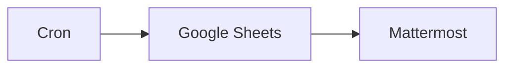

## Fluxo (.json) :

```json
{
  "nodes": [
    {
      "name": "Cron",
      "type": "n8n-nodes-base.cron",
      "position": [
        450,
        300
      ],
      "parameters": {
        "triggerTimes": {
          "item": [
            {
              "mode": "custom",
              "cronExpression": "0 0 17 28 9 *"
            }
          ]
        }
      },
      "typeVersion": 1
    },
    {
      "name": "Google Sheets",
      "type": "n8n-nodes-base.googleSheets",
      "position": [
        650,
        300
      ],
      "parameters": {
        "range": "Sessions!A:D",
        "options": {},
        "sheetId": "1nlnsTQKGgQZN-Rtd07K9bn0ROm0aFBC2O4kzM2YaTBI",
        "authentication": "oAuth2"
      },
      "credentials": {
        "googleSheetsOAuth2Api": "n8ndocsburner-googlesheets"
      },
      "typeVersion": 1
    },
    {
      "name": "Mattermost",
      "type": "n8n-nodes-base.mattermost",
      "position": [
        850,
        300
      ],
      "parameters": {
        "message": "= Hey @channel, we hope you had a great time at **{{$node[\"Google Sheets\"].json[\"Session\"]}}**.\nLet us know how we did by sharing your feedback with us on the link below!",
        "channelId": "={{$node[\"Google Sheets\"].json[\"Mattermost Channel ID\"]}}",
        "attachments": [
          {
            "title": "=Feedback Form - {{$node[\"Google Sheets\"].json[\"Session\"]}}",
            "title_link": "={{$node[\"Google Sheets\"].json[\"Feedback Form Link\"]}}"
          }
        ],
        "otherOptions": {}
      },
      "credentials": {
        "mattermostApi": "mm_failedmachine"
      },
      "typeVersion": 1
    }
  ],
  "connections": {
    "Cron": {
      "main": [
        [
          {
            "node": "Google Sheets",
            "type": "main",
            "index": 0
          }
        ]
      ]
    },
    "Google Sheets": {
      "main": [
        [
          {
            "node": "Mattermost",
            "type": "main",
            "index": 0
          }
        ]
      ]
    }
  }
}
```

<a id="template-1343"></a>

## Template 1343 - Exemplos de junções e combinações de dados

- **Nome:** Exemplos de junções e combinações de dados
- **Descrição:** Fluxo demonstrativo que mostra como combinar e agregar dados de duas fontes diferentes usando operações semelhantes a junções SQL e união de conjuntos.
- **Funcionalidade:** • Inicialização manual: o fluxo é executado manualmente ao acionar o gatilho de execução.
• Geração de dados de exemplo: cria conjuntos de dados simulados para ingredientes, quantidades de receita e integrantes de bandas.
• Junção interna (equivalente a INNER JOIN): mantém apenas os itens que existem em ambas as fontes (ex.: ingredientes em stock que são necessários na receita).
• Enriquecimento (equivalente a LEFT JOIN): mantém os itens da fonte A e acrescenta dados correspondentes da fonte B quando houver correspondência (ex.: adicionar quantidade da receita aos ingredientes necessários).
• Combinação/União (equivalente a UNION ALL): concatena listas de duas fontes formando um conjunto combinado, sem exigir que todos os campos sejam iguais (ex.: criar uma 'super banda' juntando dois conjuntos de músicos).
• Correspondência por campos: define campos-chave para comparar registros entre as fontes (por exemplo, Name ou combinação de nomes) para determinar correspondências.
- **Ferramentas:** • Dados locais de exemplo: o fluxo utiliza apenas conjuntos de dados internos e simulados para demonstração, sem integração com serviços externos.


## Fluxo visual

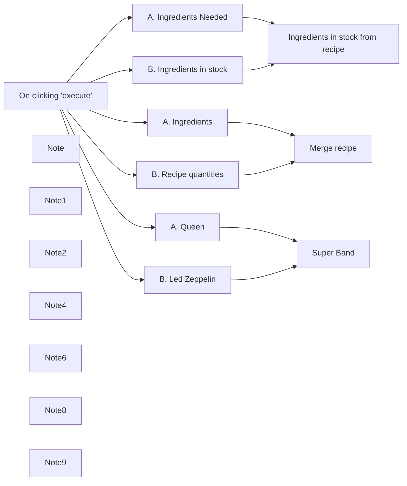

## Fluxo (.json) :

```json
{
  "meta": {
    "instanceId": "8c8c5237b8e37b006a7adce87f4369350c58e41f3ca9de16196d3197f69eabcd"
  },
  "nodes": [
    {
      "id": "9971f7ab-ecc3-468b-8eb9-b58491b660bd",
      "name": "On clicking 'execute'",
      "type": "n8n-nodes-base.manualTrigger",
      "position": [
        1040,
        360
      ],
      "parameters": {},
      "typeVersion": 1
    },
    {
      "id": "bb212963-9b6f-434c-9777-3360fb456d4b",
      "name": "Note",
      "type": "n8n-nodes-base.stickyNote",
      "position": [
        1320,
        600
      ],
      "parameters": {
        "width": 1020,
        "height": 360,
        "content": "# 3. Add items from B below items from A\n"
      },
      "typeVersion": 1
    },
    {
      "id": "cc9461f1-1016-4ef5-bc10-525942c45047",
      "name": "Note1",
      "type": "n8n-nodes-base.stickyNote",
      "position": [
        1320,
        -200
      ],
      "parameters": {
        "width": 1020,
        "height": 380,
        "content": "# 1. Keep items from A if there's a match in B\n"
      },
      "typeVersion": 1
    },
    {
      "id": "09a68f64-5b2d-43a8-acff-7c26817cc025",
      "name": "Note2",
      "type": "n8n-nodes-base.stickyNote",
      "position": [
        1320,
        200
      ],
      "parameters": {
        "width": 1020,
        "height": 380,
        "content": "# 2. Enrich items from A with matching data from B"
      },
      "typeVersion": 1
    },
    {
      "id": "bcf0c7df-fb64-4ef8-9d75-300ff9b55f40",
      "name": "Note4",
      "type": "n8n-nodes-base.stickyNote",
      "position": [
        175,
        235
      ],
      "parameters": {
        "width": 740,
        "height": 460,
        "content": "# Aggregating data with the Merge node\n\n## The merge node is one of the most useful nodes in n8n. In this workflow we show how to merge data from two different sources (similar to SQL joins).\n\n## The most-used operations of the merge node are presented here. For more info, browse the [merge node docs](https://docs.n8n.io/integrations/core-nodes/n8n-nodes-base.merge/)\n\n## Click the `Execute Workflow` button and double click on the nodes to see the input and output items."
      },
      "typeVersion": 1
    },
    {
      "id": "b418defd-f58f-4f53-9bac-b1e6611151dc",
      "name": "Note6",
      "type": "n8n-nodes-base.stickyNote",
      "position": [
        1855,
        335
      ],
      "parameters": {
        "width": 480,
        "content": "## Adds the quantity needed to each ingredient in the recipe\n\n## Similar to SQL Left join\n\n"
      },
      "typeVersion": 1
    },
    {
      "id": "017b5902-865e-4481-98d2-0a969cc09482",
      "name": "Note8",
      "type": "n8n-nodes-base.stickyNote",
      "position": [
        1855,
        -65
      ],
      "parameters": {
        "width": 480,
        "content": "## This will keep only the ingredients needed that are also in stock\n\n## Similar to SQL Inner join"
      },
      "typeVersion": 1
    },
    {
      "id": "e2b46667-da41-4448-a74d-3aa095f72619",
      "name": "Note9",
      "type": "n8n-nodes-base.stickyNote",
      "position": [
        1855,
        695
      ],
      "parameters": {
        "width": 480,
        "height": 200,
        "content": "## This will create a super band by merging Queen and Led Zeppelin\n\n## Similar to SQL Union All \n(more flexible as not requires all fields to be the same)"
      },
      "typeVersion": 1
    },
    {
      "id": "9726c9cc-cab1-44f8-8c62-2b80899af4aa",
      "name": "Ingredients in stock from recipe",
      "type": "n8n-nodes-base.merge",
      "position": [
        1600,
        -20
      ],
      "parameters": {
        "mode": "combine",
        "options": {},
        "mergeByFields": {
          "values": [
            {
              "field1": "Name",
              "field2": "Name"
            }
          ]
        }
      },
      "typeVersion": 2
    },
    {
      "id": "42367b1e-8a5d-4b0c-bfd3-8bb3f1b63df9",
      "name": "Super Band",
      "type": "n8n-nodes-base.merge",
      "position": [
        1620,
        760
      ],
      "parameters": {},
      "typeVersion": 2
    },
    {
      "id": "b4a756d8-a729-4add-aafa-9868738a6790",
      "name": "A. Ingredients Needed",
      "type": "n8n-nodes-base.code",
      "position": [
        1360,
        -100
      ],
      "parameters": {
        "jsCode": " return [\n  {\n    \"Name\": \"Flour\",\n  },\n  {\n    \"Name\": \"Eggs\",\n  },\n  {\n    \"Name\": \"Milk\",\n  },\n  {\n    \"Name\": \"Lemon\",\n  },\n  {\n    \"Name\": \"Sugar\",\n  },\n];\n"
      },
      "typeVersion": 1
    },
    {
      "id": "eb69abdc-cb89-43c5-bcd6-5f1f6383b391",
      "name": "B. Ingredients in stock",
      "type": "n8n-nodes-base.code",
      "position": [
        1360,
        40
      ],
      "parameters": {
        "jsCode": " return [\n  {\n    \"Name\": \"Eggs\",\n  },\n  {\n    \"Name\": \"Lemon\",\n  },\n  {\n    \"Name\": \"Sugar\",\n  },\n];\n"
      },
      "typeVersion": 1
    },
    {
      "id": "b01228b8-c860-4725-a0e1-00b4c11218cc",
      "name": "Merge recipe",
      "type": "n8n-nodes-base.merge",
      "position": [
        1620,
        380
      ],
      "parameters": {
        "mode": "combine",
        "options": {},
        "joinMode": "enrichInput1",
        "mergeByFields": {
          "values": [
            {
              "field1": "Name",
              "field2": "Name"
            }
          ]
        }
      },
      "typeVersion": 2
    },
    {
      "id": "fdb8a9cb-8a85-4a9a-bd2f-c9711178333f",
      "name": "A. Ingredients",
      "type": "n8n-nodes-base.code",
      "position": [
        1360,
        300
      ],
      "parameters": {
        "jsCode": " return [\n  {\n    \"Name\": \"Flour\",\n  },\n  {\n    \"Name\": \"Eggs\",\n  },\n  {\n    \"Name\": \"Milk\",\n  },\n  {\n    \"Name\": \"Lemon\",\n  },\n  {\n    \"Name\": \"Sugar\",\n  },\n];\n"
      },
      "typeVersion": 1
    },
    {
      "id": "2ca385e5-6833-49fa-b052-abc8583b4a7a",
      "name": "B. Recipe quantities",
      "type": "n8n-nodes-base.code",
      "position": [
        1360,
        440
      ],
      "parameters": {
        "jsCode": " return [\n  {\n    \"Name\": \"Flour\",\n    \"Quantity\": \"100g\",\n  },\n  {\n    \"Name\": \"Eggs\",\n    \"Quantity\": 2,\n  },\n  {\n    \"Name\": \"Salt\",\n    \"Quantity\": \"50g\"\n  },\n  {\n    \"Name\": \"Lemon\",\n    \"Quantity\": 1,\n  },\n  {\n    \"Name\": \"Sugar\",\n    \"Quantity\": \"6tbsp\",\n  },\n];\n"
      },
      "typeVersion": 1
    },
    {
      "id": "8e4c7da8-3700-4b1f-b937-739debf7aba4",
      "name": "A. Queen",
      "type": "n8n-nodes-base.code",
      "position": [
        1360,
        680
      ],
      "parameters": {
        "jsCode": " return [\n{\n\"FirstName\": \"John\",\n\"LastName\": \"Deacon\",\n\"Instrument\": \"Drums\",\n},\n{\n\"FirstName\": \"Freddy\",\n\"LastName\": \"Mercury\",\n\"Instrument\": \"Vocals and Piano\",\n\"Superpower\": \"Crowd control\"\n},\n{\n\"FirstName\": \"Brian\",\n\"LastName\": \"May\",\n\"Instrument\": \"Guitar\",\n},\n{\n\"FirstName\": \"Roger\",\n\"LastName\": \"Taylor\",\n\"Instrument\": \"Bass\",\n}\n];\n"
      },
      "typeVersion": 1
    },
    {
      "id": "260c7a0a-43ba-46aa-bfa8-cbbb66aca493",
      "name": "B. Led Zeppelin",
      "type": "n8n-nodes-base.code",
      "position": [
        1360,
        820
      ],
      "parameters": {
        "jsCode": " return [\n{\n\"FirstName\": \"Jimmy\",\n\"LastName\": \"Page\",\n\"Instrument\": \"Guitar\"\n},\n{\n\"FirstName\": \"Robert\",\n\"LastName\": \"Plant\",\n\"Instrument\": \"Vocals\",\n},\n{\n\"FirstName\": \"John\",\n\"LastName\": \"Bonham\",\n\"Instrument\": \"Drums\",\n},\n{\n\"FirstName\": \"John\",\n\"LastName\": \"Paul Jones\",\n\"Instrument\": \"Bass\",\n\"Second Instrument\": \"Keyboard\",\n}\n];\n"
      },
      "typeVersion": 1
    }
  ],
  "connections": {
    "A. Queen": {
      "main": [
        [
          {
            "node": "Super Band",
            "type": "main",
            "index": 0
          }
        ]
      ]
    },
    "A. Ingredients": {
      "main": [
        [
          {
            "node": "Merge recipe",
            "type": "main",
            "index": 0
          }
        ]
      ]
    },
    "B. Led Zeppelin": {
      "main": [
        [
          {
            "node": "Super Band",
            "type": "main",
            "index": 1
          }
        ]
      ]
    },
    "B. Recipe quantities": {
      "main": [
        [
          {
            "node": "Merge recipe",
            "type": "main",
            "index": 1
          }
        ]
      ]
    },
    "A. Ingredients Needed": {
      "main": [
        [
          {
            "node": "Ingredients in stock from recipe",
            "type": "main",
            "index": 0
          }
        ]
      ]
    },
    "On clicking 'execute'": {
      "main": [
        [
          {
            "node": "A. Ingredients Needed",
            "type": "main",
            "index": 0
          },
          {
            "node": "B. Ingredients in stock",
            "type": "main",
            "index": 0
          },
          {
            "node": "A. Ingredients",
            "type": "main",
            "index": 0
          },
          {
            "node": "B. Recipe quantities",
            "type": "main",
            "index": 0
          },
          {
            "node": "A. Queen",
            "type": "main",
            "index": 0
          },
          {
            "node": "B. Led Zeppelin",
            "type": "main",
            "index": 0
          }
        ]
      ]
    },
    "B. Ingredients in stock": {
      "main": [
        [
          {
            "node": "Ingredients in stock from recipe",
            "type": "main",
            "index": 1
          }
        ]
      ]
    }
  }
}
```

<a id="template-1344"></a>

## Template 1344 - Comparação de conjuntos de dados SQL por cliente e ano

- **Nome:** Comparação de conjuntos de dados SQL por cliente e ano
- **Descrição:** Compara duas consultas SQL agregadas de pagamentos por cliente e ano para identificar diferenças entre os conjuntos de dados.
- **Funcionalidade:** • Execução manual: inicia o fluxo quando executado manualmente.
• Consulta SQL (2003/2004): obtém total e contagem de pagamentos por cliente para os anos 2003 e 2004.
• Consulta SQL (2004/2005): obtém total e contagem de pagamentos por cliente para os anos 2004 e 2005.
• Modificação de campo: altera o valor de ordercount para 1 em um dos conjuntos antes da comparação.
• Comparação e mesclagem: compara os dois conjuntos de dados, mesclando registros por customerNumber e year, permitindo múltiplas correspondências.
- **Ferramentas:** • Banco de dados MySQL: fonte de dados para as consultas de pagamentos (conexão configurada para db4free MySQL).

## Fluxo visual

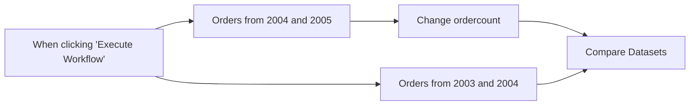

## Fluxo (.json) :

```json
{
  "id": "emPRhyWgxygwHgWh",
  "meta": {
    "instanceId": "fb924c73af8f703905bc09c9ee8076f48c17b596ed05b18c0ff86915ef8a7c4a"
  },
  "name": "Compare 2 SQL datasets",
  "tags": [],
  "nodes": [
    {
      "id": "df04c503-d4af-4e8f-bcc3-f1fd02d3a332",
      "name": "When clicking \"Execute Workflow\"",
      "type": "n8n-nodes-base.manualTrigger",
      "position": [
        780,
        340
      ],
      "parameters": {},
      "typeVersion": 1
    },
    {
      "id": "6fe78ae6-7325-4062-ab58-457dc1d985c4",
      "name": "Compare Datasets",
      "type": "n8n-nodes-base.compareDatasets",
      "position": [
        1560,
        320
      ],
      "parameters": {
        "options": {
          "multipleMatches": "all"
        },
        "mergeByFields": {
          "values": [
            {
              "field1": "customerNumber",
              "field2": "customerNumber"
            },
            {
              "field1": "year",
              "field2": "year"
            }
          ]
        }
      },
      "typeVersion": 2.3
    },
    {
      "id": "0dae008c-242d-4757-a5a4-a075bde54cb6",
      "name": "Orders from 2003 and 2004",
      "type": "n8n-nodes-base.mySql",
      "position": [
        1080,
        220
      ],
      "parameters": {
        "query": "SELECT customerNumber, SUM(amount) as Total, COUNT(*) as ordercount, YEAR(paymentDate) as year\nFROM payments\nWHERE YEAR(paymentDate) = '2003' OR YEAR(paymentDate) = '2004'\nGROUP BY customerNumber, year\n;",
        "options": {},
        "operation": "executeQuery"
      },
      "credentials": {
        "mySql": {
          "id": "EEPqCgKBDiRRZ3ua",
          "name": "db4free MySQL"
        }
      },
      "typeVersion": 2.1
    },
    {
      "id": "c162e9b5-6e26-4a81-b90d-a5709e73019c",
      "name": "Orders from 2004 and 2005",
      "type": "n8n-nodes-base.mySql",
      "position": [
        1080,
        440
      ],
      "parameters": {
        "query": "SELECT customerNumber, SUM(amount) as Total, COUNT(*) as ordercount, YEAR(paymentDate) as year\nFROM payments\nWHERE YEAR(paymentDate) = '2004' OR YEAR(paymentDate) = '2005'\nGROUP BY customerNumber, year\n;",
        "options": {},
        "operation": "executeQuery"
      },
      "credentials": {
        "mySql": {
          "id": "EEPqCgKBDiRRZ3ua",
          "name": "db4free MySQL"
        }
      },
      "typeVersion": 2.1
    },
    {
      "id": "05547a67-2c53-43df-8abd-ee356f12742b",
      "name": "Change ordercount",
      "type": "n8n-nodes-base.set",
      "position": [
        1300,
        440
      ],
      "parameters": {
        "values": {
          "number": [
            {
              "name": "ordercount",
              "value": 1
            }
          ]
        },
        "options": {}
      },
      "typeVersion": 2
    }
  ],
  "active": false,
  "pinData": {},
  "settings": {
    "executionOrder": "v1"
  },
  "versionId": "9680b087-de3a-4179-8f48-5e2ae9dc6fac",
  "connections": {
    "Change ordercount": {
      "main": [
        [
          {
            "node": "Compare Datasets",
            "type": "main",
            "index": 1
          }
        ]
      ]
    },
    "Orders from 2003 and 2004": {
      "main": [
        [
          {
            "node": "Compare Datasets",
            "type": "main",
            "index": 0
          }
        ]
      ]
    },
    "Orders from 2004 and 2005": {
      "main": [
        [
          {
            "node": "Change ordercount",
            "type": "main",
            "index": 0
          }
        ]
      ]
    },
    "When clicking \"Execute Workflow\"": {
      "main": [
        [
          {
            "node": "Orders from 2003 and 2004",
            "type": "main",
            "index": 0
          },
          {
            "node": "Orders from 2004 and 2005",
            "type": "main",
            "index": 0
          }
        ]
      ]
    }
  }
}
```

<a id="template-1347"></a>

## Template 1347 - Notificações de novos eventos no Telegram

- **Nome:** Notificações de novos eventos no Telegram
- **Descrição:** Envia uma mensagem no Telegram sempre que um novo evento é criado em um calendário do Google Calendar, informando os detalhes principais do evento.
- **Funcionalidade:** • Monitoramento de novos eventos no Google Calendar: detecta quando um evento é criado.
• Extração de detalhes do evento: captura título, descrição, local, datas de início e fim e e-mail do criador.
• Formatação de mensagem: monta um texto organizado contendo os campos extraídos para leitura rápida.
• Envio de notificações via Telegram: entrega a mensagem formatada para um chat configurado no Telegram.
• Verificação periódica: checagem configurada para rodar a cada minuto para detectar novos eventos.
- **Ferramentas:** • Google Calendar: calendário utilizado como fonte de eventos e onde os eventos são criados.
• Telegram: plataforma de mensagens usada para receber as notificações sobre os novos eventos.


## Fluxo visual

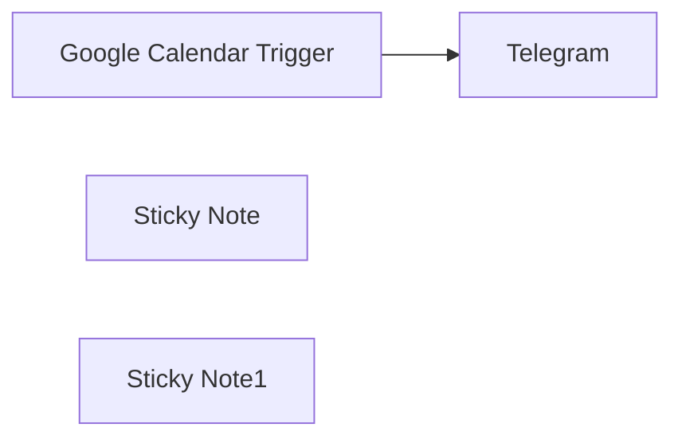

## Fluxo (.json) :

```json
{
  "id": "CoYwFuZTq5kUuiba",
  "meta": {
    "instanceId": "14e4c77104722ab186539dfea5182e419aecc83d85963fe13f6de862c875ebfa"
  },
  "name": "Post new Google Calendar events to Telegram",
  "tags": [],
  "nodes": [
    {
      "id": "be284a6b-7daf-48c8-99af-e939ecb96f32",
      "name": "Google Calendar Trigger",
      "type": "n8n-nodes-base.googleCalendarTrigger",
      "position": [
        100,
        80
      ],
      "parameters": {
        "options": {},
        "pollTimes": {
          "item": [
            {
              "mode": "everyMinute"
            }
          ]
        },
        "triggerOn": "eventCreated",
        "calendarId": {
          "__rl": true,
          "mode": "list",
          "value": "",
          "cachedResultName": ""
        }
      },
      "credentials": {
        "googleCalendarOAuth2Api": {
          "id": "",
          "name": ""
        }
      },
      "typeVersion": 1
    },
    {
      "id": "978e80b6-9b18-4fec-87e8-17fa2335ef48",
      "name": "Telegram",
      "type": "n8n-nodes-base.telegram",
      "position": [
        400,
        80
      ],
      "webhookId": "dbb6a96e-db3b-4827-9455-a91007b89616",
      "parameters": {
        "text": "=Event Name:  {{ $json.summary }}\nDescription: {{ $json.description }}\nEvent Location: {{ $json.location }}\nStart Date: {{ $json.start.dateTime }}\nEnd Date: {{ $json.end.dateTime }}\nCreator: {{ $json.creator.email }}\n\n",
        "chatId": "",
        "additionalFields": {
          "appendAttribution": false
        }
      },
      "typeVersion": 1.2
    },
    {
      "id": "f8027fbe-2b57-4b5a-a29b-22b9af27c67c",
      "name": "Sticky Note",
      "type": "n8n-nodes-base.stickyNote",
      "position": [
        0,
        0
      ],
      "parameters": {
        "color": 6,
        "width": 640,
        "height": 260,
        "content": "## Post new Google Calendar events to Telegram\n"
      },
      "typeVersion": 1
    },
    {
      "id": "fd1e60e1-5c4a-439b-84fb-26e5da20ba13",
      "name": "Sticky Note1",
      "type": "n8n-nodes-base.stickyNote",
      "position": [
        0,
        280
      ],
      "parameters": {
        "color": 6,
        "width": 640,
        "content": "## Description\nThis n8n workflow automatically sends a Telegram message whenever a new event is added to Google Calendar. It extracts key event details such as event name, description, event creator, start date, end date, and location and forwards them to a specified Telegram chat. This ensures you stay updated on all newly scheduled events directly from Telegram."
      },
      "typeVersion": 1
    }
  ],
  "active": false,
  "pinData": {},
  "settings": {
    "executionOrder": "v1"
  },
  "versionId": "9620d3f6-6324-49f8-b40e-da313f5044fb",
  "connections": {
    "Google Calendar Trigger": {
      "main": [
        [
          {
            "node": "Telegram",
            "type": "main",
            "index": 0
          }
        ]
      ]
    }
  }
}
```

<a id="template-1349"></a>

## Template 1349 - Capturar identidade visual e salvar em Airtable

- **Nome:** Capturar identidade visual e salvar em Airtable
- **Descrição:** Obtém logotipo, ícone e informações de uma empresa a partir do domínio informado e registra esses dados em uma base no Airtable.
- **Funcionalidade:** • Acionamento manual: Inicia o fluxo manualmente quando o usuário executa a operação.
• Consulta por domínio: Envia o domínio para recuperar dados da marca correspondente.
• Obtenção de informações da empresa: Recupera nome e metadados da empresa a partir do serviço de marca.
• Extração de URLs de imagem: Isola as URLs do ícone e do logotipo retornados pelo serviço.
• Inserção em base de dados: Cria ou anexa um registro na tabela do Airtable com nome, URL do ícone e URL do logotipo.
- **Ferramentas:** • Brandfetch: Serviço que fornece identidade visual e informações de marca a partir do domínio de uma empresa.
• Airtable: Plataforma de base de dados em formato de planilha para armazenar e organizar registros.

## Fluxo visual

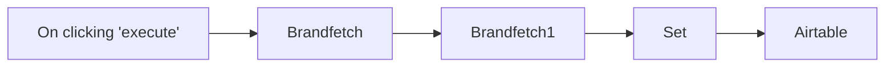

## Fluxo (.json) :

```json
{
  "id": "176",
  "name": "Get the logo, icon, and information of a company and store it in Airtable",
  "nodes": [
    {
      "name": "On clicking 'execute'",
      "type": "n8n-nodes-base.manualTrigger",
      "position": [
        250,
        300
      ],
      "parameters": {},
      "typeVersion": 1
    },
    {
      "name": "Brandfetch",
      "type": "n8n-nodes-base.Brandfetch",
      "position": [
        450,
        300
      ],
      "parameters": {
        "domain": "n8n.io"
      },
      "credentials": {
        "brandfetchApi": "Brandfetch n8n credentials"
      },
      "typeVersion": 1
    },
    {
      "name": "Brandfetch1",
      "type": "n8n-nodes-base.Brandfetch",
      "position": [
        650,
        300
      ],
      "parameters": {
        "domain": "={{$node[\"Brandfetch\"].parameter[\"domain\"]}}",
        "operation": "company"
      },
      "credentials": {
        "brandfetchApi": "Brandfetch n8n credentials"
      },
      "typeVersion": 1
    },
    {
      "name": "Set",
      "type": "n8n-nodes-base.set",
      "position": [
        850,
        300
      ],
      "parameters": {
        "values": {
          "string": [
            {
              "name": "Name",
              "value": "={{$node[\"Brandfetch1\"].json[\"name\"]}}"
            },
            {
              "name": "Icon URL",
              "value": "={{$node[\"Brandfetch\"].json[\"icon\"][\"image\"]}}"
            },
            {
              "name": "Logo URL",
              "value": "={{$node[\"Brandfetch\"].json[\"logo\"][\"image\"]}}"
            }
          ]
        },
        "options": {},
        "keepOnlySet": true
      },
      "typeVersion": 1
    },
    {
      "name": "Airtable",
      "type": "n8n-nodes-base.airtable",
      "position": [
        1050,
        300
      ],
      "parameters": {
        "table": "Table 1",
        "options": {},
        "operation": "append",
        "application": "app5cseR9ZKgtU3dc"
      },
      "credentials": {
        "airtableApi": "Airtable Credentials n8n"
      },
      "typeVersion": 1
    }
  ],
  "active": false,
  "settings": {},
  "connections": {
    "Set": {
      "main": [
        [
          {
            "node": "Airtable",
            "type": "main",
            "index": 0
          }
        ]
      ]
    },
    "Brandfetch": {
      "main": [
        [
          {
            "node": "Brandfetch1",
            "type": "main",
            "index": 0
          }
        ]
      ]
    },
    "Brandfetch1": {
      "main": [
        [
          {
            "node": "Set",
            "type": "main",
            "index": 0
          }
        ]
      ]
    },
    "On clicking 'execute'": {
      "main": [
        [
          {
            "node": "Brandfetch",
            "type": "main",
            "index": 0
          }
        ]
      ]
    }
  }
}
```
