# PACK 1999 TEMPLATES PARTE 07 - Bloco 9

Templates neste bloco: 20

## Sumário

- [Template 1389 - Gerar arquivos XML de produtos](#template-1389)
- [Template 1392 - Limpeza automática de emails indesejados](#template-1392)
- [Template 1394 - Autocorreção e estruturação de saída de LLM](#template-1394)
- [Template 1395 - Q&A sobre dados de outro workflow](#template-1395)
- [Template 1397 - Indexação e consulta semântica de documentos](#template-1397)
- [Template 1400 - Relatório Semanal de Marketing Online](#template-1400)
- [Template 1401 - Sumarizar arquivo do Drive](#template-1401)
- [Template 1403 - Importação de CSV para Snowflake](#template-1403)
- [Template 1405 - Bot de eco para Telegram](#template-1405)
- [Template 1407 - Notificar novas issues do GitHub via Telegram](#template-1407)
- [Template 1409 - Captura de screenshot via Bright Data e salva em disco](#template-1409)
- [Template 1411 - Adicionar texto em imagem via URL](#template-1411)
- [Template 1413 - Envio de SMS para números do Airtable](#template-1413)
- [Template 1415 - YouTube RSS + Notificações por Email e Telegram](#template-1415)
- [Template 1419 - Criar tarefas no Todoist a partir de emails](#template-1419)
- [Template 1420 - Enviar mensagem no Twake](#template-1420)
- [Template 1422 - Resumo automático de vídeo YouTube](#template-1422)
- [Template 1424 - Salvar saída do Phantombuster no Airtable](#template-1424)
- [Template 1426 - Consultar emails não lidos do Fastmail](#template-1426)
- [Template 1428 - Chatbot pós-venda WooCommerce](#template-1428)

---

<a id="template-1389"></a>

## Template 1389 - Gerar arquivos XML de produtos

- **Nome:** Gerar arquivos XML de produtos
- **Descrição:** Consulta produtos aleatórios a partir de um banco de dados, converte os dados para duas estruturas XML distintas e grava arquivos XML no servidor.
- **Funcionalidade:** • Início manual: Permite executar o fluxo sob demanda.
• Consulta de produtos: Recupera 16 produtos aleatórios do banco de dados.
• Mapeamento de dados para XML (simples): Seleciona e organiza campos do produto em uma estrutura XML básica.
• Mapeamento de dados para XML com atributos: Organiza campos do produto incluindo atributos XML para alguns elementos.
• Agregação de itens: Concatena todos os itens de produto em uma única coleção antes da conversão.
• Conversão para XML: Transforma a estrutura JSON em documentos XML (duas variantes: simples e com atributos).
• Geração de arquivos binários XML: Converte o XML em conteúdo binário com nome e tipo de arquivo definidos.
• Gravação no sistema de arquivos: Salva os arquivos XML gerados em um caminho no servidor.
- **Ferramentas:** • MySQL (db4free): Banco de dados relacional usado para armazenar e fornecer os dados dos produtos.
• Sistema de arquivos do servidor: Local onde os arquivos XML gerados são gravados e armazenados.

## Fluxo visual

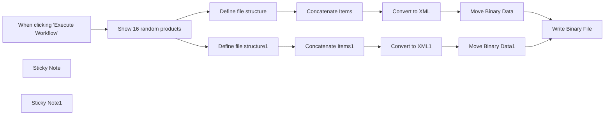

## Fluxo (.json) :

```json
{
  "meta": {
    "instanceId": "fb924c73af8f703905bc09c9ee8076f48c17b596ed05b18c0ff86915ef8a7c4a"
  },
  "nodes": [
    {
      "id": "ef32b2b5-9739-4622-aa50-ac9e6a93c43c",
      "name": "When clicking \"Execute Workflow\"",
      "type": "n8n-nodes-base.manualTrigger",
      "position": [
        720,
        360
      ],
      "parameters": {},
      "typeVersion": 1
    },
    {
      "id": "d39d67b6-3f3c-4296-affc-cfc786b877c3",
      "name": "Show 16 random products",
      "type": "n8n-nodes-base.mySql",
      "position": [
        900,
        360
      ],
      "parameters": {
        "query": "SELECT * from products\nORDER BY RAND()\nLIMIT 16;",
        "options": {},
        "operation": "executeQuery"
      },
      "credentials": {
        "mySql": {
          "id": "EEPqCgKBDiRRZ3ua",
          "name": "db4free MySQL"
        }
      },
      "typeVersion": 2.1
    },
    {
      "id": "8ca3e11c-d1b0-4ee6-94f0-b16c46b804d7",
      "name": "Define file structure",
      "type": "n8n-nodes-base.set",
      "position": [
        1120,
        200
      ],
      "parameters": {
        "values": {
          "string": [
            {
              "name": "Product.Code",
              "value": "={{ $json.productCode }}"
            },
            {
              "name": "Product.Name",
              "value": "={{ $json.productName }}"
            },
            {
              "name": "Product.Line",
              "value": "={{ $json.productLine }}"
            },
            {
              "name": "Product.Scale",
              "value": "={{ $json.productScale }}"
            },
            {
              "name": "Product.Price",
              "value": "={{ $json.MSRP }}"
            }
          ]
        },
        "options": {},
        "keepOnlySet": true
      },
      "typeVersion": 2
    },
    {
      "id": "6ee087c9-afd6-405a-b922-61aae33f5a1e",
      "name": "Concatenate Items",
      "type": "n8n-nodes-base.itemLists",
      "position": [
        1300,
        200
      ],
      "parameters": {
        "aggregate": "aggregateAllItemData",
        "operation": "concatenateItems",
        "destinationFieldName": "Products"
      },
      "typeVersion": 3
    },
    {
      "id": "0aadf35f-9bec-4d27-9122-2ac350f609f7",
      "name": "Convert to XML",
      "type": "n8n-nodes-base.xml",
      "position": [
        1480,
        200
      ],
      "parameters": {
        "mode": "jsonToxml",
        "options": {
          "headless": false
        }
      },
      "typeVersion": 1
    },
    {
      "id": "5eed6fe8-b7ba-483f-8362-f371e3c678af",
      "name": "Move Binary Data",
      "type": "n8n-nodes-base.moveBinaryData",
      "position": [
        1680,
        200
      ],
      "parameters": {
        "mode": "jsonToBinary",
        "options": {
          "fileName": "simple.xml",
          "mimeType": "text/xml",
          "keepSource": false,
          "useRawData": true
        },
        "convertAllData": false
      },
      "typeVersion": 1
    },
    {
      "id": "eb2240a4-cccd-4a4d-a807-1e2bddb0dc89",
      "name": "Define file structure1",
      "type": "n8n-nodes-base.set",
      "position": [
        1120,
        520
      ],
      "parameters": {
        "values": {
          "string": [
            {
              "name": "Product.Name",
              "value": "={{ $json.productName }}"
            },
            {
              "name": "Product.Line",
              "value": "={{ $json.productLine }}"
            },
            {
              "name": "Product.Scale",
              "value": "={{ $json.productScale }}"
            },
            {
              "name": "Product.$.Price",
              "value": "={{ $json.MSRP }}"
            },
            {
              "name": "Product.$.Code",
              "value": "={{ $json.productCode }}"
            },
            {
              "name": "Product.Description",
              "value": "={{ $json.productDescription }}"
            }
          ]
        },
        "options": {},
        "keepOnlySet": true
      },
      "typeVersion": 2
    },
    {
      "id": "06a739b9-72fd-4d9c-9dd2-36086fafae7a",
      "name": "Concatenate Items1",
      "type": "n8n-nodes-base.itemLists",
      "position": [
        1300,
        520
      ],
      "parameters": {
        "aggregate": "aggregateAllItemData",
        "operation": "concatenateItems",
        "destinationFieldName": "Products"
      },
      "typeVersion": 3
    },
    {
      "id": "082008c2-d13b-453d-87c2-f551467c6aec",
      "name": "Convert to XML1",
      "type": "n8n-nodes-base.xml",
      "position": [
        1480,
        520
      ],
      "parameters": {
        "mode": "jsonToxml",
        "options": {
          "attrkey": "$",
          "headless": false
        }
      },
      "typeVersion": 1
    },
    {
      "id": "e66df48f-4c75-4316-910c-0eb8be0bcf9c",
      "name": "Move Binary Data1",
      "type": "n8n-nodes-base.moveBinaryData",
      "position": [
        1680,
        520
      ],
      "parameters": {
        "mode": "jsonToBinary",
        "options": {
          "fileName": "intermediate.xml",
          "mimeType": "text/xml",
          "keepSource": false,
          "useRawData": true
        },
        "convertAllData": false
      },
      "typeVersion": 1
    },
    {
      "id": "1ece7a61-04d8-4d0b-aa33-1085a5732a92",
      "name": "Sticky Note",
      "type": "n8n-nodes-base.stickyNote",
      "position": [
        1080,
        132
      ],
      "parameters": {
        "width": 830,
        "height": 226,
        "content": "## Simple conversion to XML"
      },
      "typeVersion": 1
    },
    {
      "id": "89cca26f-adde-426a-8033-b66224e9b934",
      "name": "Sticky Note1",
      "type": "n8n-nodes-base.stickyNote",
      "position": [
        1080,
        460
      ],
      "parameters": {
        "width": 830,
        "height": 231,
        "content": "## XML tags with attributes"
      },
      "typeVersion": 1
    },
    {
      "id": "0c01e6cf-da59-460a-b1ab-6977ca88c1cc",
      "name": "Write Binary File",
      "type": "n8n-nodes-base.writeBinaryFile",
      "position": [
        1980,
        360
      ],
      "parameters": {
        "options": {},
        "fileName": "=/home/node/.n8n/{{ $binary.data.fileName }}"
      },
      "typeVersion": 1
    }
  ],
  "connections": {
    "Convert to XML": {
      "main": [
        [
          {
            "node": "Move Binary Data",
            "type": "main",
            "index": 0
          }
        ]
      ]
    },
    "Convert to XML1": {
      "main": [
        [
          {
            "node": "Move Binary Data1",
            "type": "main",
            "index": 0
          }
        ]
      ]
    },
    "Move Binary Data": {
      "main": [
        [
          {
            "node": "Write Binary File",
            "type": "main",
            "index": 0
          }
        ]
      ]
    },
    "Concatenate Items": {
      "main": [
        [
          {
            "node": "Convert to XML",
            "type": "main",
            "index": 0
          }
        ]
      ]
    },
    "Move Binary Data1": {
      "main": [
        [
          {
            "node": "Write Binary File",
            "type": "main",
            "index": 0
          }
        ]
      ]
    },
    "Concatenate Items1": {
      "main": [
        [
          {
            "node": "Convert to XML1",
            "type": "main",
            "index": 0
          }
        ]
      ]
    },
    "Define file structure": {
      "main": [
        [
          {
            "node": "Concatenate Items",
            "type": "main",
            "index": 0
          }
        ]
      ]
    },
    "Define file structure1": {
      "main": [
        [
          {
            "node": "Concatenate Items1",
            "type": "main",
            "index": 0
          }
        ]
      ]
    },
    "Show 16 random products": {
      "main": [
        [
          {
            "node": "Define file structure",
            "type": "main",
            "index": 0
          },
          {
            "node": "Define file structure1",
            "type": "main",
            "index": 0
          }
        ]
      ]
    },
    "When clicking \"Execute Workflow\"": {
      "main": [
        [
          {
            "node": "Show 16 random products",
            "type": "main",
            "index": 0
          }
        ]
      ]
    }
  }
}
```

<a id="template-1392"></a>

## Template 1392 - Limpeza automática de emails indesejados

- **Nome:** Limpeza automática de emails indesejados
- **Descrição:** Fluxo que varre emails em intervalos de datas, usa um modelo de linguagem para avaliar se são indesejados e remove ou rotula mensagens com base na classificação, notificando via Telegram.
- **Funcionalidade:** • Disparo manual: inicia o processo manualmente conforme solicitado.
• Iteração por intervalos de data: varre emails em blocos de 14 dias, avançando por páginas para cobrir períodos maiores.
• Filtragem de mensagens: busca emails dentro de um intervalo de datas e exclui mensagens já marcadas para pular.
• Classificação por modelo de linguagem: avalia cada email com scores decimais (0 a 1) para isUnwantedConfidence, isMarketingConfidence e isSpamConfidence e gera uma breve justificativa.
• Regra de decisão automática: exclui emails quando qualquer pontuação de indesejado/marketing/spam for maior que 0.5; caso contrário, aplica um rótulo para pular.
• Notificações: envia mensagens via Telegram informando exclusões, pulos, erros do modelo ou falhas na exclusão.
• Agregação e controle de fluxo: consolida resultados e atualiza a variável de página para seguir para o próximo intervalo.
• Tratamento de erros: continua o fluxo em caso de falhas em operações de deleção ou classificação para evitar interrupção completa.
- **Ferramentas:** • Gmail (conta Google): fonte dos emails a serem avaliados, remover mensagens e aplicar rótulos.
• Google Gemini / PaLM API: modelo de linguagem usado para classificar cada email e gerar justificativas concisas.
• Telegram: canal de notificação para informar sobre emails deletados, pulados e erros durante o processo.

## Fluxo visual

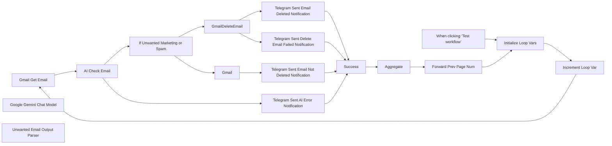

## Fluxo (.json) :

```json
{
  "id": "dgBdnnnY0622JwGy",
  "tags": [],
  "nodes": [
    {
      "id": "e205a1ba-9606-457f-9a2f-d433766b3786",
      "name": "Gmail Get Email",
      "type": "n8n-nodes-base.gmail",
      "position": [
        60,
        840
      ],
      "webhookId": "c8979b0a-2ec3-484d-a11b-eac321cc0642",
      "parameters": {
        "filters": {
          "q": "=before:{{ $now.minus(14 * $('Increment Loop Var').first().json.page, 'days').format('yyyy/MM/dd') }} after: {{ $now.minus(14 * ($('Increment Loop Var').first().json.page + 1), 'days').format('yyyy/MM/dd') }} -label:n8n-skipped",
          "includeSpamTrash": false
        },
        "operation": "getAll",
        "returnAll": true
      },
      "credentials": {
        "gmailOAuth2": {
          "id": "jlMSfpSUYNYbMUpo",
          "name": "mr.abizareyhan@gmail.com"
        }
      },
      "notesInFlow": true,
      "typeVersion": 2.1,
      "alwaysOutputData": false
    },
    {
      "id": "380f6e02-7f74-44e4-9229-4784f2f0c66f",
      "name": "When clicking ‘Test workflow’",
      "type": "n8n-nodes-base.manualTrigger",
      "position": [
        -600,
        965
      ],
      "parameters": {},
      "typeVersion": 1
    },
    {
      "id": "8acc6bc1-c82e-4c1c-a3b0-dd6cb75cf8c3",
      "name": "Google Gemini Chat Model",
      "type": "@n8n/n8n-nodes-langchain.lmChatGoogleGemini",
      "position": [
        308,
        1060
      ],
      "parameters": {
        "options": {},
        "modelName": "models/gemini-1.5-flash"
      },
      "credentials": {
        "googlePalmApi": {
          "id": "42fqm71hBhyrAZHp",
          "name": "Google Gemini(PaLM) Api account"
        }
      },
      "typeVersion": 1
    },
    {
      "id": "f067e64d-bf43-4961-82ff-dcc8ce398375",
      "name": "GmailDeleteEmail",
      "type": "n8n-nodes-base.gmail",
      "onError": "continueErrorOutput",
      "position": [
        876,
        640
      ],
      "webhookId": "ab1d1ae0-ebd9-411d-b807-17976867597a",
      "parameters": {
        "messageId": "={{ $json.output.emailId }}",
        "operation": "delete"
      },
      "credentials": {
        "gmailOAuth2": {
          "id": "jlMSfpSUYNYbMUpo",
          "name": "mr.abizareyhan@gmail.com"
        }
      },
      "retryOnFail": false,
      "typeVersion": 2.1,
      "alwaysOutputData": false
    },
    {
      "id": "5840c9c6-7afc-4ca1-a8d2-5d0b86339a58",
      "name": "AI Check Email",
      "type": "@n8n/n8n-nodes-langchain.agent",
      "onError": "continueErrorOutput",
      "position": [
        280,
        840
      ],
      "parameters": {
        "text": "=Classify the email with decimal values (0 to 1) for isUnwantedConfidence, isMarketingConfidence, and isSpamConfidence, where 0 means clearly wanted (e.g., billing, invoices, orders, job applications, security) and 1 means clearly unwanted (e.g., promotions, setup reminders, irrelevant alerts); treat system-generated alerts or device activity (like sound played, device found, location pinged) as unwanted unless they are security-related; use 0.5 as the baseline for deletion and provide a concise briefReason explaining the classification.\n\n{{ JSON.stringify($json) }}",
        "options": {},
        "promptType": "define",
        "hasOutputParser": true
      },
      "retryOnFail": true,
      "typeVersion": 1.8,
      "alwaysOutputData": true
    },
    {
      "id": "e10f96ce-0a92-4817-b340-0d284039a212",
      "name": "Unwanted Email Output Parser",
      "type": "@n8n/n8n-nodes-langchain.outputParserStructured",
      "position": [
        428,
        1060
      ],
      "parameters": {
        "schemaType": "manual",
        "inputSchema": "{\n  \"type\": \"object\",\n  \"required\": [\n    \"emailId\",\n    \"isUnwantedConfidence\",\n    \"isMarketingConfidence\",\n    \"isSpamConfidence\",\n    \"briefReason\",\n    \"emailFrom\"\n  ],\n  \"properties\": {\n    \"emailId\": {\n      \"type\": \"string\",\n      \"description\": \"id from the email itself\"\n    },\n    \"isUnwantedConfidence\": {\n      \"type\": \"number\",\n      \"minimum\": 0,\n      \"maximum\": 1,\n      \"description\": \"confidence that the email is unwanted\"\n    },\n    \"isMarketingConfidence\": {\n      \"type\": \"number\",\n      \"minimum\": 0,\n      \"maximum\": 1,\n      \"description\": \"confidence that the email is marketing\"\n    },\n    \"isSpamConfidence\": {\n      \"type\": \"number\",\n      \"minimum\": 0,\n      \"maximum\": 1,\n      \"description\": \"confidence that the email is spam\"\n    },\n    \"briefReason\": {\n      \"type\": \"string\",\n      \"description\": \"a short reason why, more context for the reader\"\n    },\n    \"emailFrom\": {\n      \"type\": \"string\",\n      \"description\": \"the email address of the sender\"\n    }\n  }\n}\n"
      },
      "typeVersion": 1.2
    },
    {
      "id": "796a0d3e-a1e9-4b2c-8f9c-32466c046d22",
      "name": "If Unwanted Marketing or Spam",
      "type": "n8n-nodes-base.if",
      "position": [
        656,
        740
      ],
      "parameters": {
        "options": {},
        "conditions": {
          "options": {
            "version": 2,
            "leftValue": "",
            "caseSensitive": true,
            "typeValidation": "strict"
          },
          "combinator": "or",
          "conditions": [
            {
              "id": "c2b58601-60ff-45b4-a8a3-0d8543844a2d",
              "operator": {
                "type": "number",
                "operation": "gt"
              },
              "leftValue": "={{ $json.output.isUnwantedConfidence }}",
              "rightValue": 0.5
            },
            {
              "id": "ec441e67-046a-4c9c-bce7-85d984b86442",
              "operator": {
                "type": "number",
                "operation": "gt"
              },
              "leftValue": "={{ $json.output.isMarketingConfidence }}",
              "rightValue": 0.5
            },
            {
              "id": "80f9ced7-15b0-4dee-97a4-4b3f9ae9c81f",
              "operator": {
                "type": "number",
                "operation": "gt"
              },
              "leftValue": "={{ $json.output.isSpamConfidence }}",
              "rightValue": 0.5
            }
          ]
        }
      },
      "typeVersion": 2.2,
      "alwaysOutputData": false
    },
    {
      "id": "44a68cfc-b1c7-49c1-b268-42810fcd3eeb",
      "name": "Telegram Sent Email Deleted Notification",
      "type": "n8n-nodes-base.telegram",
      "onError": "continueErrorOutput",
      "position": [
        1096,
        740
      ],
      "webhookId": "4b52da48-c12a-45fc-8ba2-9fd2583f2dc5",
      "parameters": {
        "text": "=Email Deleted | {{ $('If Unwanted Marketing or Spam').item.json.output.emailFrom }} | {{ $('If Unwanted Marketing or Spam').item.json.output.briefReason }}",
        "chatId": "273696245",
        "additionalFields": {
          "appendAttribution": false
        }
      },
      "credentials": {
        "telegramApi": {
          "id": "4MEm7g1EdXGbzh6f",
          "name": "Telegram account"
        }
      },
      "typeVersion": 1.2,
      "alwaysOutputData": false
    },
    {
      "id": "01dee5a4-2ba7-4606-98d8-88914621be48",
      "name": "Telegram Sent Email Not Deleted Notification",
      "type": "n8n-nodes-base.telegram",
      "onError": "continueErrorOutput",
      "position": [
        1096,
        940
      ],
      "webhookId": "4b52da48-c12a-45fc-8ba2-9fd2583f2dc5",
      "parameters": {
        "text": "=Skipping Email | {{ $('If Unwanted Marketing or Spam').item.json.output.emailFrom }} | {{ $('If Unwanted Marketing or Spam').item.json.output.briefReason }}",
        "chatId": "273696245",
        "additionalFields": {
          "appendAttribution": false
        }
      },
      "credentials": {
        "telegramApi": {
          "id": "4MEm7g1EdXGbzh6f",
          "name": "Telegram account"
        }
      },
      "typeVersion": 1.2,
      "alwaysOutputData": false
    },
    {
      "id": "03292140-5f20-42e8-8d2f-e07a0621844c",
      "name": "Telegram Sent AI Error Notification",
      "type": "n8n-nodes-base.telegram",
      "onError": "continueErrorOutput",
      "position": [
        1096,
        1140
      ],
      "webhookId": "4b52da48-c12a-45fc-8ba2-9fd2583f2dc5",
      "parameters": {
        "text": "=AI Error | Can't Check Email | Error: {{ JSON.stringify($json) }}",
        "chatId": "273696245",
        "additionalFields": {
          "appendAttribution": false
        }
      },
      "credentials": {
        "telegramApi": {
          "id": "4MEm7g1EdXGbzh6f",
          "name": "Telegram account"
        }
      },
      "typeVersion": 1.2,
      "alwaysOutputData": false
    },
    {
      "id": "cec5d43c-0e06-45a2-b7bc-f943ef205496",
      "name": "Telegram Sent Delete Email Failed Notification",
      "type": "n8n-nodes-base.telegram",
      "onError": "continueErrorOutput",
      "position": [
        1096,
        540
      ],
      "webhookId": "4b52da48-c12a-45fc-8ba2-9fd2583f2dc5",
      "parameters": {
        "text": "=Can't Delete Email",
        "chatId": "273696245",
        "additionalFields": {
          "appendAttribution": false
        }
      },
      "credentials": {
        "telegramApi": {
          "id": "4MEm7g1EdXGbzh6f",
          "name": "Telegram account"
        }
      },
      "typeVersion": 1.2,
      "alwaysOutputData": false
    },
    {
      "id": "bad2dbcc-be22-4470-9b69-06c37929fe65",
      "name": "Success",
      "type": "n8n-nodes-base.noOp",
      "position": [
        1316,
        840
      ],
      "parameters": {},
      "typeVersion": 1
    },
    {
      "id": "1c38ad6f-ef9c-4e34-8b5e-a6d94ddbd221",
      "name": "Increment Loop Var",
      "type": "n8n-nodes-base.set",
      "position": [
        -160,
        840
      ],
      "parameters": {
        "options": {},
        "assignments": {
          "assignments": [
            {
              "id": "596ff68a-1df1-4148-8899-fdfa36238023",
              "name": "page",
              "type": "number",
              "value": "={{ ($('Forward Prev Page Num').isExecuted) ? $('Forward Prev Page Num').first().json.prevPage + 1 : $('Initialize Loop Vars').first().json.page }}"
            }
          ]
        }
      },
      "typeVersion": 3.4
    },
    {
      "id": "66afc6b4-f36f-4564-bb77-b8da9e35331a",
      "name": "Forward Prev Page Num",
      "type": "n8n-nodes-base.set",
      "position": [
        1756,
        1065
      ],
      "parameters": {
        "options": {},
        "assignments": {
          "assignments": [
            {
              "id": "596ff68a-1df1-4148-8899-fdfa36238023",
              "name": "prevPage",
              "type": "number",
              "value": "={{ $('Increment Loop Var').first().json.page }}"
            }
          ]
        }
      },
      "typeVersion": 3.4
    },
    {
      "id": "6ab44236-17fa-4790-82b5-a0db8f051d19",
      "name": "Initialize Loop Vars",
      "type": "n8n-nodes-base.set",
      "position": [
        -380,
        965
      ],
      "parameters": {
        "options": {},
        "assignments": {
          "assignments": [
            {
              "id": "5e1583e5-597d-40e9-b656-5f3259b4fe25",
              "name": "page",
              "type": "number",
              "value": 0
            }
          ]
        }
      },
      "typeVersion": 3.4
    },
    {
      "id": "04432130-1a36-4776-9c87-07e935990310",
      "name": "Aggregate",
      "type": "n8n-nodes-base.aggregate",
      "position": [
        1536,
        840
      ],
      "parameters": {
        "options": {},
        "aggregate": "aggregateAllItemData"
      },
      "typeVersion": 1
    },
    {
      "id": "73fae867-dc79-43e0-80c8-8f60c7e5a8f4",
      "name": "Gmail",
      "type": "n8n-nodes-base.gmail",
      "position": [
        876,
        940
      ],
      "webhookId": "a756798a-0ce2-4735-b65c-2373fe1c0891",
      "parameters": {
        "labelIds": [
          "Label_1321570453811516949"
        ],
        "messageId": "={{ $json.output.emailId }}",
        "operation": "addLabels"
      },
      "credentials": {
        "gmailOAuth2": {
          "id": "jlMSfpSUYNYbMUpo",
          "name": "mr.abizareyhan@gmail.com"
        }
      },
      "typeVersion": 2.1
    }
  ],
  "pinData": {},
  "settings": {
    "executionOrder": "v1"
  },
  "versionId": "9c3ca437-2184-4475-99d6-46a4fcda40a3",
  "connections": {
    "Gmail": {
      "main": [
        [
          {
            "node": "Telegram Sent Email Not Deleted Notification",
            "type": "main",
            "index": 0
          }
        ]
      ]
    },
    "Success": {
      "main": [
        [
          {
            "node": "Aggregate",
            "type": "main",
            "index": 0
          }
        ]
      ]
    },
    "Aggregate": {
      "main": [
        [
          {
            "node": "Forward Prev Page Num",
            "type": "main",
            "index": 0
          }
        ]
      ]
    },
    "AI Check Email": {
      "main": [
        [
          {
            "node": "If Unwanted Marketing or Spam",
            "type": "main",
            "index": 0
          }
        ],
        [
          {
            "node": "Telegram Sent AI Error Notification",
            "type": "main",
            "index": 0
          }
        ]
      ]
    },
    "Gmail Get Email": {
      "main": [
        [
          {
            "node": "AI Check Email",
            "type": "main",
            "index": 0
          }
        ]
      ]
    },
    "GmailDeleteEmail": {
      "main": [
        [
          {
            "node": "Telegram Sent Email Deleted Notification",
            "type": "main",
            "index": 0
          }
        ],
        [
          {
            "node": "Telegram Sent Delete Email Failed Notification",
            "type": "main",
            "index": 0
          }
        ]
      ]
    },
    "Increment Loop Var": {
      "main": [
        [
          {
            "node": "Gmail Get Email",
            "type": "main",
            "index": 0
          }
        ]
      ]
    },
    "Initialize Loop Vars": {
      "main": [
        [
          {
            "node": "Increment Loop Var",
            "type": "main",
            "index": 0
          }
        ]
      ]
    },
    "Forward Prev Page Num": {
      "main": [
        [
          {
            "node": "Initialize Loop Vars",
            "type": "main",
            "index": 0
          }
        ]
      ]
    },
    "Google Gemini Chat Model": {
      "ai_languageModel": [
        [
          {
            "node": "AI Check Email",
            "type": "ai_languageModel",
            "index": 0
          }
        ]
      ]
    },
    "Unwanted Email Output Parser": {
      "ai_outputParser": [
        [
          {
            "node": "AI Check Email",
            "type": "ai_outputParser",
            "index": 0
          }
        ]
      ]
    },
    "If Unwanted Marketing or Spam": {
      "main": [
        [
          {
            "node": "GmailDeleteEmail",
            "type": "main",
            "index": 0
          }
        ],
        [
          {
            "node": "Gmail",
            "type": "main",
            "index": 0
          }
        ]
      ]
    },
    "When clicking ‘Test workflow’": {
      "main": [
        [
          {
            "node": "Initialize Loop Vars",
            "type": "main",
            "index": 0
          }
        ]
      ]
    },
    "Telegram Sent AI Error Notification": {
      "main": [
        [
          {
            "node": "Success",
            "type": "main",
            "index": 0
          }
        ],
        [
          {
            "node": "Success",
            "type": "main",
            "index": 0
          }
        ]
      ]
    },
    "Telegram Sent Email Deleted Notification": {
      "main": [
        [
          {
            "node": "Success",
            "type": "main",
            "index": 0
          }
        ],
        [
          {
            "node": "Success",
            "type": "main",
            "index": 0
          }
        ]
      ]
    },
    "Telegram Sent Email Not Deleted Notification": {
      "main": [
        [
          {
            "node": "Success",
            "type": "main",
            "index": 0
          }
        ],
        [
          {
            "node": "Success",
            "type": "main",
            "index": 0
          }
        ]
      ]
    },
    "Telegram Sent Delete Email Failed Notification": {
      "main": [
        [
          {
            "node": "Success",
            "type": "main",
            "index": 0
          }
        ],
        [
          {
            "node": "Success",
            "type": "main",
            "index": 0
          }
        ]
      ]
    }
  }
}
```

<a id="template-1394"></a>

## Template 1394 - Autocorreção e estruturação de saída de LLM

- **Nome:** Autocorreção e estruturação de saída de LLM
- **Descrição:** Processa um prompt com um modelo de linguagem, valida a resposta contra um esquema JSON e, se necessário, tenta corrigir a saída usando um segundo modelo para garantir que atenda às restrições.
- **Funcionalidade:** • Gatilho manual: inicia o fluxo quando o usuário executa a automação.
• Criação do prompt: define o texto de entrada que será enviado ao modelo (ex.: solicitar os 5 maiores estados por área com suas 3 maiores cidades e populações).
• Geração inicial de resposta por LLM: envia o prompt a um modelo de linguagem para produzir a resposta.
• Validação estruturada: aplica um esquema JSON que exige campos como 'state' e uma lista 'cities' com 'name' e 'population' para verificar conformidade.
• Autocorreção de saída inválida: quando a resposta não atende ao esquema, um processo de autocorreção envia a resposta, as instruções e o erro para outro modelo tentar gerar uma versão válida.
• Produção do resultado final: retorna a resposta validada (ou corrigida) no formato estruturado esperado.
- **Ferramentas:** • OpenAI (gpt-4o-mini): modelo de linguagem utilizado para gerar as respostas iniciais e para auxiliar na correção automática das saídas quando não estão em conformidade com o esquema.

## Fluxo visual

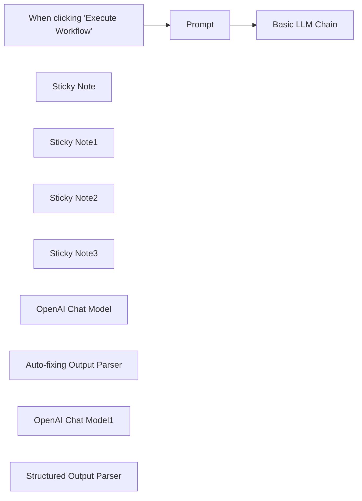

## Fluxo (.json) :

```json
{
  "meta": {
    "instanceId": "408f9fb9940c3cb18ffdef0e0150fe342d6e655c3a9fac21f0f644e8bedabcd9",
    "templateCredsSetupCompleted": true
  },
  "nodes": [
    {
      "id": "1116cae7-c7f3-424d-8b87-06ecbac0539f",
      "name": "When clicking \"Execute Workflow\"",
      "type": "n8n-nodes-base.manualTrigger",
      "position": [
        1040,
        -260
      ],
      "parameters": {},
      "typeVersion": 1
    },
    {
      "id": "c01d02c0-a41b-445e-b006-8b46ad1c437d",
      "name": "Sticky Note",
      "type": "n8n-nodes-base.stickyNote",
      "position": [
        2000,
        260
      ],
      "parameters": {
        "height": 264.69900963477494,
        "content": "### Parser which defines the output format and which gets used to validate the output"
      },
      "typeVersion": 1
    },
    {
      "id": "97f977e2-eb78-4ad9-ab21-816ff94c8f0c",
      "name": "Sticky Note1",
      "type": "n8n-nodes-base.stickyNote",
      "position": [
        1600,
        260
      ],
      "parameters": {
        "height": 266.9506012398238,
        "content": "### The LLM which gets used to try to autofix the output in case it was not valid"
      },
      "typeVersion": 1
    },
    {
      "id": "5325a0d4-9422-445c-bd21-3290c2b14415",
      "name": "Sticky Note2",
      "type": "n8n-nodes-base.stickyNote",
      "position": [
        1320,
        -40
      ],
      "parameters": {
        "height": 245.56048099185898,
        "content": "### The LLM to process the original prompt"
      },
      "typeVersion": 1
    },
    {
      "id": "55e78fdb-1e08-4f13-be0d-7e476aced21b",
      "name": "Sticky Note3",
      "type": "n8n-nodes-base.stickyNote",
      "position": [
        1740,
        -40
      ],
      "parameters": {
        "width": 348,
        "height": 253,
        "content": "### Autofixing parser which tries to fix invalid outputs with the help of an LLM"
      },
      "typeVersion": 1
    },
    {
      "id": "622183c2-9d57-4e1c-a7bd-c5320ef42668",
      "name": "Basic LLM Chain",
      "type": "@n8n/n8n-nodes-langchain.chainLlm",
      "position": [
        1480,
        -260
      ],
      "parameters": {
        "hasOutputParser": true
      },
      "typeVersion": 1.5
    },
    {
      "id": "314739fe-0ab3-40a1-b192-6e09b548b92f",
      "name": "Prompt",
      "type": "n8n-nodes-base.set",
      "position": [
        1260,
        -260
      ],
      "parameters": {
        "options": {},
        "assignments": {
          "assignments": [
            {
              "id": "6f09dac7-429c-4e8f-af32-8e0112efc8c2",
              "name": "chatInput",
              "type": "string",
              "value": "Return the 5 largest states by area in the USA with their 3 largest cities and their population."
            }
          ]
        }
      },
      "typeVersion": 3.4
    },
    {
      "id": "e76f5ac7-e185-46d4-aa26-971c8fe03c76",
      "name": "OpenAI Chat Model",
      "type": "@n8n/n8n-nodes-langchain.lmChatOpenAi",
      "position": [
        1400,
        60
      ],
      "parameters": {
        "model": {
          "__rl": true,
          "mode": "list",
          "value": "gpt-4o-mini"
        },
        "options": {}
      },
      "credentials": {
        "openAiApi": {
          "id": "8gccIjcuf3gvaoEr",
          "name": "OpenAi account"
        }
      },
      "typeVersion": 1.2
    },
    {
      "id": "5306e68a-cce0-4298-a50a-33727e2186c5",
      "name": "Auto-fixing Output Parser",
      "type": "@n8n/n8n-nodes-langchain.outputParserAutofixing",
      "position": [
        1800,
        80
      ],
      "parameters": {
        "options": {
          "prompt": "Instructions:\n--------------\n{instructions}\n--------------\nCompletion:\n--------------\n{completion}\n--------------\n\nAbove, the Completion did not satisfy the constraints given in the Instructions.\nError:\n--------------\n{error}\n--------------\n\nPlease try again. Please only respond with an answer that satisfies the constraints laid out in the Instructions:"
        }
      },
      "typeVersion": 1
    },
    {
      "id": "d5642767-69f6-4a09-92da-195a25a17dd1",
      "name": "OpenAI Chat Model1",
      "type": "@n8n/n8n-nodes-langchain.lmChatOpenAi",
      "position": [
        1680,
        400
      ],
      "parameters": {
        "model": {
          "__rl": true,
          "mode": "list",
          "value": "gpt-4o-mini"
        },
        "options": {}
      },
      "credentials": {
        "openAiApi": {
          "id": "8gccIjcuf3gvaoEr",
          "name": "OpenAi account"
        }
      },
      "typeVersion": 1.2
    },
    {
      "id": "dc708b80-8d48-40cb-9af3-692ddd566b9f",
      "name": "Structured Output Parser",
      "type": "@n8n/n8n-nodes-langchain.outputParserStructured",
      "position": [
        2080,
        380
      ],
      "parameters": {
        "schemaType": "manual",
        "inputSchema": "{\n  \"type\": \"object\",\n  \"properties\": {\n    \"state\": {\n      \"type\": \"string\"\n    },\n    \"cities\": {\n      \"type\": \"array\",\n      \"items\": {\n        \"type\": \"object\",\n        \"properties\": {\n          \"name\": \"string\",\n          \"population\": \"number\"\n        }\n      }\n    }\n  }\n}"
      },
      "typeVersion": 1.2
    }
  ],
  "pinData": {},
  "connections": {
    "Prompt": {
      "main": [
        [
          {
            "node": "Basic LLM Chain",
            "type": "main",
            "index": 0
          }
        ]
      ]
    },
    "OpenAI Chat Model": {
      "ai_languageModel": [
        [
          {
            "node": "Basic LLM Chain",
            "type": "ai_languageModel",
            "index": 0
          }
        ]
      ]
    },
    "OpenAI Chat Model1": {
      "ai_languageModel": [
        [
          {
            "node": "Auto-fixing Output Parser",
            "type": "ai_languageModel",
            "index": 0
          }
        ]
      ]
    },
    "Structured Output Parser": {
      "ai_outputParser": [
        [
          {
            "node": "Auto-fixing Output Parser",
            "type": "ai_outputParser",
            "index": 0
          }
        ]
      ]
    },
    "Auto-fixing Output Parser": {
      "ai_outputParser": [
        [
          {
            "node": "Basic LLM Chain",
            "type": "ai_outputParser",
            "index": 0
          }
        ]
      ]
    },
    "When clicking \"Execute Workflow\"": {
      "main": [
        [
          {
            "node": "Prompt",
            "type": "main",
            "index": 0
          }
        ]
      ]
    }
  }
}
```

<a id="template-1395"></a>

## Template 1395 - Q&A sobre dados de outro workflow

- **Nome:** Q&A sobre dados de outro workflow
- **Descrição:** Este fluxo permite fazer perguntas sobre dados retornados por um workflow salvo, recuperando esse conteúdo como fonte e gerando uma resposta usando um modelo de linguagem.
- **Funcionalidade:** • Gatilho manual: inicia o fluxo quando o usuário executa manualmente.
• Preparar pergunta: define a entrada de texto com a pergunta a ser respondida.
• Recuperação de workflow por ID: carrega os dados de um workflow/subworkflow específico (configurável via ID) para servir como fonte de conhecimento.
• Cadeia de Perguntas e Respostas: realiza a busca e a composição da resposta baseada no conteúdo recuperado.
• Uso de modelo de linguagem: envia contexto e pergunta a um modelo de linguagem para gerar a resposta final.
- **Ferramentas:** • OpenAI: serviço de modelo de linguagem utilizado para gerar respostas (ex.: gpt-4o-mini).


## Fluxo visual

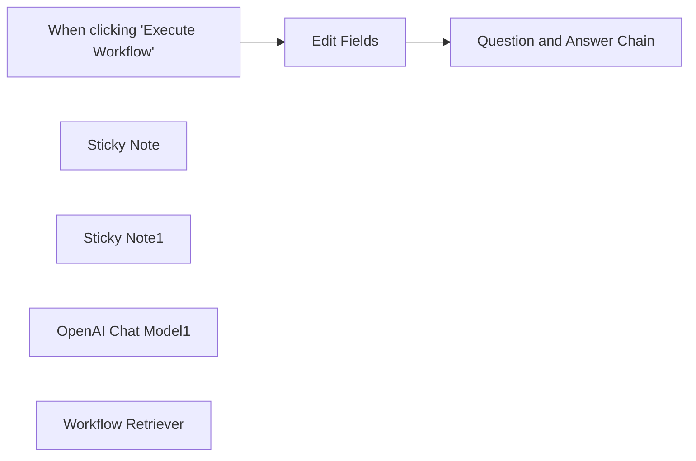

## Fluxo (.json) :

```json
{
  "meta": {
    "instanceId": "408f9fb9940c3cb18ffdef0e0150fe342d6e655c3a9fac21f0f644e8bedabcd9",
    "templateCredsSetupCompleted": true
  },
  "nodes": [
    {
      "id": "9ec28e5e-8f1a-4f18-82bb-6c51a03f83e9",
      "name": "When clicking \"Execute Workflow\"",
      "type": "n8n-nodes-base.manualTrigger",
      "position": [
        -940,
        500
      ],
      "parameters": {},
      "typeVersion": 1
    },
    {
      "id": "800f3bb9-09bb-41b6-84c5-d9d7abd6c7a8",
      "name": "Sticky Note",
      "type": "n8n-nodes-base.stickyNote",
      "position": [
        -560,
        440
      ],
      "parameters": {
        "width": 363,
        "height": 211.90203341144422,
        "content": "### Q&A on data returned from a workflow"
      },
      "typeVersion": 1
    },
    {
      "id": "278b573c-70cc-4439-85c0-e415bcf7c4ee",
      "name": "Sticky Note1",
      "type": "n8n-nodes-base.stickyNote",
      "position": [
        -320,
        700
      ],
      "parameters": {
        "width": 262.67019427016413,
        "height": 255.8330939602389,
        "content": "\n\n\n\n\n\n\n\n\n\n\n\n\n\n\nReplace \"Workflow ID\" with the ID the Subworkflow got saved as"
      },
      "typeVersion": 1
    },
    {
      "id": "313d8f8b-b7d4-4aee-9725-005aa5c5a984",
      "name": "Edit Fields",
      "type": "n8n-nodes-base.set",
      "position": [
        -720,
        500
      ],
      "parameters": {
        "options": {},
        "assignments": {
          "assignments": [
            {
              "id": "a3695a2f-e0bb-4277-886d-3f301f24794b",
              "name": "chatInput",
              "type": "string",
              "value": "What notes can you find for Jay Gatsby and what is his email address?"
            }
          ]
        }
      },
      "typeVersion": 3.4
    },
    {
      "id": "74479c7b-3d64-4715-90e9-250560f3ea3d",
      "name": "Question and Answer Chain",
      "type": "@n8n/n8n-nodes-langchain.chainRetrievalQa",
      "position": [
        -500,
        500
      ],
      "parameters": {
        "options": {}
      },
      "typeVersion": 1.4
    },
    {
      "id": "912affaa-efea-435e-bad5-2f2ac31b7fd6",
      "name": "OpenAI Chat Model1",
      "type": "@n8n/n8n-nodes-langchain.lmChatOpenAi",
      "position": [
        -560,
        760
      ],
      "parameters": {
        "model": {
          "__rl": true,
          "mode": "list",
          "value": "gpt-4o-mini"
        },
        "options": {}
      },
      "credentials": {
        "openAiApi": {
          "id": "8gccIjcuf3gvaoEr",
          "name": "OpenAi account"
        }
      },
      "typeVersion": 1.2
    },
    {
      "id": "6da9d2ae-83d6-4bde-b013-71d313fcbe9b",
      "name": "Workflow Retriever",
      "type": "@n8n/n8n-nodes-langchain.retrieverWorkflow",
      "position": [
        -240,
        760
      ],
      "parameters": {
        "workflowId": {
          "__rl": true,
          "mode": "id",
          "value": "QacfBRBnf1xOyckC"
        }
      },
      "typeVersion": 1.1
    }
  ],
  "pinData": {},
  "connections": {
    "Edit Fields": {
      "main": [
        [
          {
            "node": "Question and Answer Chain",
            "type": "main",
            "index": 0
          }
        ]
      ]
    },
    "OpenAI Chat Model1": {
      "ai_languageModel": [
        [
          {
            "node": "Question and Answer Chain",
            "type": "ai_languageModel",
            "index": 0
          }
        ]
      ]
    },
    "Workflow Retriever": {
      "ai_retriever": [
        [
          {
            "node": "Question and Answer Chain",
            "type": "ai_retriever",
            "index": 0
          }
        ]
      ]
    },
    "When clicking \"Execute Workflow\"": {
      "main": [
        [
          {
            "node": "Edit Fields",
            "type": "main",
            "index": 0
          }
        ]
      ]
    }
  }
}
```

<a id="template-1397"></a>

## Template 1397 - Indexação e consulta semântica de documentos

- **Nome:** Indexação e consulta semântica de documentos
- **Descrição:** Baixa um arquivo do Google Drive, divide o conteúdo em trechos, gera embeddings, insere esses vetores em um índice vetorial e expõe um endpoint de chat que consulta o índice para responder perguntas.
- **Funcionalidade:** • Configurar URL do arquivo: Define a URL do arquivo a ser processado.
• Download do arquivo: Baixa o arquivo hospedado no Google Drive.
• Carregamento de dados binários: Converte o arquivo baixado para um formato de documento processável.
• Divisão em trechos (text splitting): Quebra o texto em chunks com sobreposição para preservar contexto.
• Geração de embeddings: Cria vetores semânticos para cada trecho do documento.
• Inserção no índice vetorial com limpeza de namespace: Insere embeddings no Pinecone e limpa o namespace antes da inserção quando configurado.
• Criação de ferramenta de recuperação (retriever): Expõe o índice como uma ferramenta (bitcoin_paper) para o agente usar na recuperação de fatos.
• Endpoint de chat e agente Q&A: Recebe mensagens via webhook, recupera trechos relevantes do índice e utiliza um modelo de linguagem para formular respostas.
• Trigger manual para testes: Permite executar manualmente o fluxo para carregar dados de teste no índice.
- **Ferramentas:** • Google Drive: Armazenamento e fornecimento do arquivo original que será processado e indexado.
• OpenAI: Geração de embeddings e uso de modelo de linguagem (ex.: gpt-4o-mini) para criar vetores e formular respostas em linguagem natural.
• Pinecone: Banco de dados vetorial utilizado para armazenar embeddings e realizar buscas por similaridade para recuperação de trechos relevantes.


## Fluxo visual

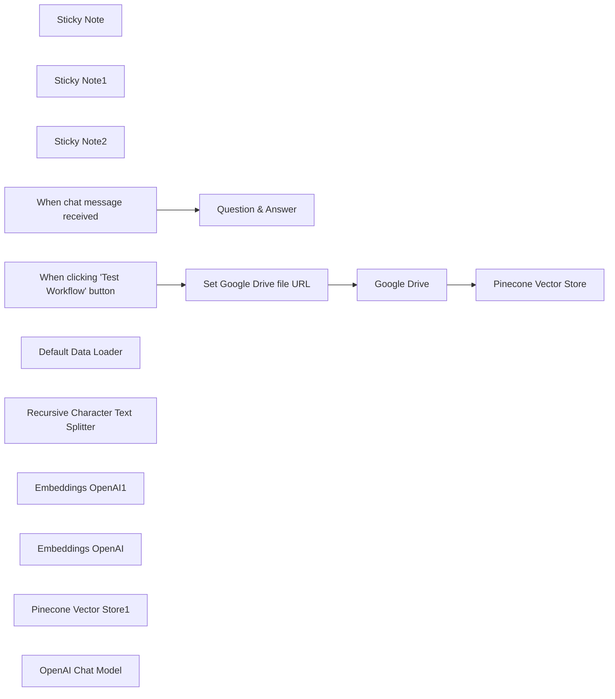

## Fluxo (.json) :

```json
{
  "meta": {
    "instanceId": "408f9fb9940c3cb18ffdef0e0150fe342d6e655c3a9fac21f0f644e8bedabcd9",
    "templateCredsSetupCompleted": true
  },
  "nodes": [
    {
      "id": "1f2bb917-6d65-4cfa-9474-fc3b19a8c3bd",
      "name": "Sticky Note",
      "type": "n8n-nodes-base.stickyNote",
      "position": [
        -440,
        -120
      ],
      "parameters": {
        "color": 7,
        "width": 918,
        "height": 627,
        "content": "### Load data into database\nFetch file from Google Drive, split it into chunks and insert into Pinecone index"
      },
      "typeVersion": 1
    },
    {
      "id": "eabbc944-5b62-4959-8ea4-879f28e19ab8",
      "name": "Sticky Note1",
      "type": "n8n-nodes-base.stickyNote",
      "position": [
        740,
        -120
      ],
      "parameters": {
        "color": 7,
        "width": 534,
        "height": 627,
        "content": "### Chat with database\nEmbed the incoming chat message and use it retrieve relevant chunks from the vector store. These are passed to the model to formulate an answer "
      },
      "typeVersion": 1
    },
    {
      "id": "ab577f4d-8906-4e0c-bc62-e8a4b2610551",
      "name": "Sticky Note2",
      "type": "n8n-nodes-base.stickyNote",
      "position": [
        -720,
        240
      ],
      "parameters": {
        "height": 264.61498034081166,
        "content": "## Try me out\n1. In Pinecone, create an index with 1536 dimensions and select it in *both* Pinecone nodes\n2. Click 'test workflow' at the bottom of the canvas to load data into the vector store\n3. Click 'chat' at the bottom of the canvas to ask questions about the data"
      },
      "typeVersion": 1
    },
    {
      "id": "6f074b77-3441-4026-a13a-ed891a1c959b",
      "name": "When clicking 'Test Workflow' button",
      "type": "n8n-nodes-base.manualTrigger",
      "position": [
        -700,
        -20
      ],
      "parameters": {},
      "typeVersion": 1
    },
    {
      "id": "0a6f8b88-9c62-4e3e-82cb-a7028bdcac45",
      "name": "Pinecone Vector Store",
      "type": "@n8n/n8n-nodes-langchain.vectorStorePinecone",
      "position": [
        80,
        -20
      ],
      "parameters": {
        "mode": "insert",
        "options": {
          "clearNamespace": true
        },
        "pineconeIndex": {
          "__rl": true,
          "mode": "id",
          "value": "test-index"
        }
      },
      "credentials": {
        "pineconeApi": {
          "id": "OHDlDbBkaPDgpnOY",
          "name": "PineconeApi account"
        }
      },
      "typeVersion": 1
    },
    {
      "id": "ae426fdc-0d58-46a6-bfe6-0f25c0e70cf1",
      "name": "When chat message received",
      "type": "@n8n/n8n-nodes-langchain.chatTrigger",
      "position": [
        560,
        -20
      ],
      "webhookId": "dec328cc-f47e-4727-b1c5-7370be86a958",
      "parameters": {
        "options": {}
      },
      "typeVersion": 1.1
    },
    {
      "id": "9388b413-f133-45a6-8066-cf71c0fb826c",
      "name": "Question & Answer",
      "type": "@n8n/n8n-nodes-langchain.agent",
      "position": [
        800,
        -20
      ],
      "parameters": {
        "options": {}
      },
      "typeVersion": 1.8
    },
    {
      "id": "c50e8f9b-8254-495e-9e13-62f42d22c9b0",
      "name": "Set Google Drive file URL",
      "type": "n8n-nodes-base.set",
      "position": [
        -380,
        -20
      ],
      "parameters": {
        "options": {},
        "assignments": {
          "assignments": [
            {
              "id": "d08ef1f5-932b-4bbb-bb02-0cbdff26a636",
              "name": "file_url",
              "type": "string",
              "value": "https://drive.google.com/file/d/11Koq9q53nkk0F5Y8eZgaWJUVR03I4-MM/view"
            }
          ]
        }
      },
      "typeVersion": 3.4
    },
    {
      "id": "d97920ad-6b36-4981-8b9d-9d470b5c769a",
      "name": "Google Drive",
      "type": "n8n-nodes-base.googleDrive",
      "position": [
        -180,
        -20
      ],
      "parameters": {
        "fileId": {
          "__rl": true,
          "mode": "url",
          "value": "={{ $json.file_url }}"
        },
        "options": {},
        "operation": "download"
      },
      "credentials": {
        "googleDriveOAuth2Api": {
          "id": "yOwz41gMQclOadgu",
          "name": "Google Drive account"
        }
      },
      "typeVersion": 3
    },
    {
      "id": "742beb54-8b89-49a3-afe5-fd7e73b37044",
      "name": "Default Data Loader",
      "type": "@n8n/n8n-nodes-langchain.documentDefaultDataLoader",
      "position": [
        180,
        200
      ],
      "parameters": {
        "options": {},
        "dataType": "binary"
      },
      "typeVersion": 1
    },
    {
      "id": "f75e31e9-f752-45d1-bc44-75097ec85ce6",
      "name": "Recursive Character Text Splitter",
      "type": "@n8n/n8n-nodes-langchain.textSplitterRecursiveCharacterTextSplitter",
      "position": [
        260,
        320
      ],
      "parameters": {
        "options": {},
        "chunkSize": 3000,
        "chunkOverlap": 200
      },
      "typeVersion": 1
    },
    {
      "id": "034a2b72-f728-4978-bc18-c950f0f2c24c",
      "name": "Embeddings OpenAI1",
      "type": "@n8n/n8n-nodes-langchain.embeddingsOpenAi",
      "position": [
        1000,
        320
      ],
      "parameters": {
        "options": {}
      },
      "credentials": {
        "openAiApi": {
          "id": "8gccIjcuf3gvaoEr",
          "name": "OpenAi account"
        }
      },
      "typeVersion": 1.2
    },
    {
      "id": "bac883c8-4c1f-466b-b20f-d0fdf6acfc42",
      "name": "Embeddings OpenAI",
      "type": "@n8n/n8n-nodes-langchain.embeddingsOpenAi",
      "position": [
        60,
        200
      ],
      "parameters": {
        "options": {}
      },
      "credentials": {
        "openAiApi": {
          "id": "8gccIjcuf3gvaoEr",
          "name": "OpenAi account"
        }
      },
      "typeVersion": 1.2
    },
    {
      "id": "7b6cdba3-906b-44dd-85be-1d515337972b",
      "name": "Pinecone Vector Store1",
      "type": "@n8n/n8n-nodes-langchain.vectorStorePinecone",
      "position": [
        920,
        200
      ],
      "parameters": {
        "mode": "retrieve-as-tool",
        "options": {},
        "toolName": "bitcoin_paper",
        "pineconeIndex": {
          "__rl": true,
          "mode": "id",
          "value": "test-index"
        },
        "toolDescription": "Call this tool to retrieve facts from the bitcoin whitepaper",
        "includeDocumentMetadata": false
      },
      "credentials": {
        "pineconeApi": {
          "id": "OHDlDbBkaPDgpnOY",
          "name": "PineconeApi account"
        }
      },
      "typeVersion": 1
    },
    {
      "id": "cf9d18a9-4c1e-4a67-8149-961b3eee374d",
      "name": "OpenAI Chat Model",
      "type": "@n8n/n8n-nodes-langchain.lmChatOpenAi",
      "position": [
        800,
        200
      ],
      "parameters": {
        "model": {
          "__rl": true,
          "mode": "list",
          "value": "gpt-4o-mini"
        },
        "options": {}
      },
      "credentials": {
        "openAiApi": {
          "id": "8gccIjcuf3gvaoEr",
          "name": "OpenAi account"
        }
      },
      "typeVersion": 1.2
    }
  ],
  "pinData": {},
  "connections": {
    "Google Drive": {
      "main": [
        [
          {
            "node": "Pinecone Vector Store",
            "type": "main",
            "index": 0
          }
        ]
      ]
    },
    "Embeddings OpenAI": {
      "ai_embedding": [
        [
          {
            "node": "Pinecone Vector Store",
            "type": "ai_embedding",
            "index": 0
          }
        ]
      ]
    },
    "OpenAI Chat Model": {
      "ai_languageModel": [
        [
          {
            "node": "Question & Answer",
            "type": "ai_languageModel",
            "index": 0
          }
        ]
      ]
    },
    "Embeddings OpenAI1": {
      "ai_embedding": [
        [
          {
            "node": "Pinecone Vector Store1",
            "type": "ai_embedding",
            "index": 0
          }
        ]
      ]
    },
    "Default Data Loader": {
      "ai_document": [
        [
          {
            "node": "Pinecone Vector Store",
            "type": "ai_document",
            "index": 0
          }
        ]
      ]
    },
    "Pinecone Vector Store1": {
      "ai_tool": [
        [
          {
            "node": "Question & Answer",
            "type": "ai_tool",
            "index": 0
          }
        ]
      ]
    },
    "Set Google Drive file URL": {
      "main": [
        [
          {
            "node": "Google Drive",
            "type": "main",
            "index": 0
          }
        ]
      ]
    },
    "When chat message received": {
      "main": [
        [
          {
            "node": "Question & Answer",
            "type": "main",
            "index": 0
          }
        ]
      ]
    },
    "Recursive Character Text Splitter": {
      "ai_textSplitter": [
        [
          {
            "node": "Default Data Loader",
            "type": "ai_textSplitter",
            "index": 0
          }
        ]
      ]
    },
    "When clicking 'Test Workflow' button": {
      "main": [
        [
          {
            "node": "Set Google Drive file URL",
            "type": "main",
            "index": 0
          }
        ]
      ]
    }
  }
}
```

<a id="template-1400"></a>

## Template 1400 - Relatório Semanal de Marketing Online

- **Nome:** Relatório Semanal de Marketing Online
- **Descrição:** Gera, analisa e envia semanalmente um relatório consolidado de desempenho de canais de marketing (vários domínios, Google Ads e Meta Ads).
- **Funcionalidade:** • Agendamento semanal: Dispara o fluxo automaticamente em dia e hora definidos para gerar o relatório.
• Coleta de dados por domínio: Recupera métricas de cinco domínios (Google Analytics) para o período de 7 dias.
• Coleta de dados de anúncios: Obtém métricas de Google Ads e Meta Ads para o período atual e o mesmo período do ano anterior.
• Cálculo de períodos comparativos: Calcula intervalos de datas para o período atual e para o mesmo período no ano anterior.
• Agregação e formatação: Resume e agrega métricas (impressões, cliques, CTR, conversões, custos, ROAS etc.) e formata números conforme especificação regional.
• Processamento e cálculos adicionais: Calcula métricas derivadas como CPM e custo por conversão e converte formatos (ex.: duração de sessão para minutos).
• Análise automatizada por IA: Usa modelos de linguagem para gerar uma breve análise e tabelas comparativas entre períodos.
• Preparação de e-mail HTML: Monta um e-mail HTML limpo e legível com seções separadas para cada fonte de dados e tabelas correspondentes.
• Envio de relatório por e-mail: Envia o relatório HTML para destinatários configurados via servidor SMTP.
• Resumo para Telegram: Converte o conteúdo para texto simples e gera um resumo curto, formatado para envio por Telegram.
• Reuso via sub-workflows: Integra saídas de subfluxos específicos para cada fonte de dados, permitindo modularidade e reutilização.
- **Ferramentas:** • Google Analytics (GA4): Fonte de métricas de sites para coletar page views, usuários, sessões, conversões e receita.
• Google Ads API: Fonte de dados de campanhas (impressões, cliques, conversões, custo, ROAS) via consultas à API.
• Facebook / Meta Graph API: Fonte de métricas de anúncios Meta (impressões, CPM, cliques, CTR, conversões, ROAS, gastos).
• OpenAI (modelos GPT): Geração de análises, resumos e formatação de tabelas e textos a partir dos dados agregados.
• SMTP (servidor de e-mail): Envio do relatório em formato HTML para destinatários configurados.
• Telegram API: Envio de versão resumida do relatório como mensagem para um chat/telID configurado.

## Fluxo visual

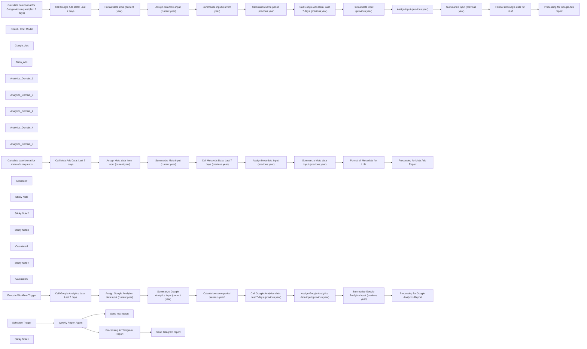

## Fluxo (.json) :

```json
{
  "id": "knmxcsujuHmViJl4",
  "meta": {
    "instanceId": "558d88703fb65b2d0e44613bc35916258b0f0bf983c5d4730c00c424b77ca36a"
  },
  "name": "Online Marketing Weekly Report",
  "tags": [],
  "nodes": [
    {
      "id": "f145b442-3036-4769-b7ad-62c97fa5d662",
      "name": "Schedule Trigger",
      "type": "n8n-nodes-base.scheduleTrigger",
      "position": [
        -1580,
        -220
      ],
      "parameters": {
        "rule": {
          "interval": [
            {
              "field": "weeks",
              "triggerAtDay": [
                1
              ],
              "triggerAtHour": 7
            }
          ]
        }
      },
      "typeVersion": 1.2
    },
    {
      "id": "9b25dfe7-cabe-4051-8d03-5f9b1f42621a",
      "name": "OpenAI Chat Model",
      "type": "@n8n/n8n-nodes-langchain.lmChatOpenAi",
      "position": [
        -1380,
        120
      ],
      "parameters": {
        "model": "gpt-4o",
        "options": {}
      },
      "credentials": {
        "openAiApi": {
          "id": "niikB3HA4fT5WAqt",
          "name": "OpenAi account"
        }
      },
      "typeVersion": 1
    },
    {
      "id": "f04d67a6-fb37-434d-8fd7-988db33f8cde",
      "name": "Google_Ads",
      "type": "@n8n/n8n-nodes-langchain.toolWorkflow",
      "position": [
        -400,
        120
      ],
      "parameters": {
        "name": "Google_Ads",
        "workflowId": {
          "__rl": true,
          "mode": "list",
          "value": "nRGs7Ogv7eU1mJQl",
          "cachedResultName": "Google Ads Report: Weekly Subflow ROAS"
        },
        "description": "Call this tool to get the output of the Google Ads Workflow"
      },
      "typeVersion": 1.3
    },
    {
      "id": "179c2464-bf17-4a9b-8c5b-508a4acf746f",
      "name": "Meta_Ads",
      "type": "@n8n/n8n-nodes-langchain.toolWorkflow",
      "position": [
        -300,
        120
      ],
      "parameters": {
        "name": "Meta_Ads",
        "workflowId": {
          "__rl": true,
          "mode": "list",
          "value": "9sC80Rt1eqgrfphk",
          "cachedResultName": "Meta Ads Report: Weekly Subflow ROAS"
        },
        "description": "Call this tool to get the output of the Meta Ads Workflow"
      },
      "typeVersion": 1.3
    },
    {
      "id": "f963f694-cf30-4b81-9ee1-3ad383714770",
      "name": "Analytics_Domain_1",
      "type": "@n8n/n8n-nodes-langchain.toolWorkflow",
      "position": [
        -1180,
        120
      ],
      "parameters": {
        "name": "EP_Data",
        "workflowId": {
          "__rl": true,
          "mode": "list",
          "value": "ploQFf5BtgCC6ryu",
          "cachedResultName": "GA Report: EP Subflow Weekly"
        },
        "description": "Call this tool to get the output of the SER Data Workflow"
      },
      "typeVersion": 1.3
    },
    {
      "id": "093d83fd-6788-418b-ac38-925b04be2515",
      "name": "Analytics_Domain_3",
      "type": "@n8n/n8n-nodes-langchain.toolWorkflow",
      "position": [
        -860,
        120
      ],
      "parameters": {
        "name": "SBW_Data",
        "workflowId": {
          "__rl": true,
          "mode": "list",
          "value": "ECmFUVocSLqB3afJ",
          "cachedResultName": "GA Report: SBW Subflow Weekly"
        },
        "description": "Call this tool to get the output of the SBW Data Workflow"
      },
      "typeVersion": 1.3
    },
    {
      "id": "57612276-4a48-4a6c-997c-f6c4f1196ed7",
      "name": "Analytics_Domain_2",
      "type": "@n8n/n8n-nodes-langchain.toolWorkflow",
      "position": [
        -1020,
        120
      ],
      "parameters": {
        "name": "SER_Data",
        "workflowId": {
          "__rl": true,
          "mode": "list",
          "value": "EWAE7Qx70cHZuXte",
          "cachedResultName": "GA Report: SER Subflow Weekly"
        },
        "description": "Call this tool to get the output of the SER Data Workflow"
      },
      "typeVersion": 1.3
    },
    {
      "id": "3dfea4cf-87fb-44d5-9b95-304406da6b18",
      "name": "Analytics_Domain_4",
      "type": "@n8n/n8n-nodes-langchain.toolWorkflow",
      "position": [
        -700,
        120
      ],
      "parameters": {
        "name": "SZO_Data",
        "workflowId": {
          "__rl": true,
          "mode": "list",
          "value": "eyPh3eaqrBLAcLKF",
          "cachedResultName": "GA Report: SZO Subflow Weekly"
        },
        "description": "Call this tool to get the output of the SZO Data Workflow"
      },
      "typeVersion": 1.3
    },
    {
      "id": "79f1cd20-6133-4c72-8942-5b1f55adbb7f",
      "name": "Analytics_Domain_5",
      "type": "@n8n/n8n-nodes-langchain.toolWorkflow",
      "position": [
        -540,
        120
      ],
      "parameters": {
        "name": "UCH_Data",
        "workflowId": {
          "__rl": true,
          "mode": "list",
          "value": "ErIeoUuyF4fqMbhL",
          "cachedResultName": "GA Report: UCH Subflow Weekly"
        },
        "description": "Call this tool to get the output of the UCH Data Workflow"
      },
      "typeVersion": 1.3
    },
    {
      "id": "0740d70f-a582-4a12-ab12-08b46504e8f8",
      "name": "Execute Workflow Trigger",
      "type": "n8n-nodes-base.executeWorkflowTrigger",
      "position": [
        -1580,
        460
      ],
      "parameters": {},
      "typeVersion": 1
    },
    {
      "id": "2449b1be-0ba8-41ae-9ea5-86028da736f0",
      "name": "Calculator",
      "type": "@n8n/n8n-nodes-langchain.toolCalculator",
      "position": [
        380,
        680
      ],
      "parameters": {},
      "typeVersion": 1
    },
    {
      "id": "e8b884f1-2013-4c25-a641-8181528db173",
      "name": "Sticky Note",
      "type": "n8n-nodes-base.stickyNote",
      "position": [
        -1660,
        360
      ],
      "parameters": {
        "color": 6,
        "width": 2340,
        "height": 460,
        "content": "## Sub-Workflow: Google Analytics Data"
      },
      "typeVersion": 1
    },
    {
      "id": "f7d290eb-07d1-413d-ba12-184229e519c0",
      "name": "Sticky Note2",
      "type": "n8n-nodes-base.stickyNote",
      "position": [
        -1660,
        1440
      ],
      "parameters": {
        "color": 5,
        "width": 2340,
        "height": 460,
        "content": "## Sub-Workflow: Meta Ads Data"
      },
      "typeVersion": 1
    },
    {
      "id": "c78da3ec-fb47-4373-8850-e1af89d7330e",
      "name": "Sticky Note3",
      "type": "n8n-nodes-base.stickyNote",
      "position": [
        -1660,
        -280
      ],
      "parameters": {
        "width": 2340,
        "height": 540,
        "content": "## Main Workflow: Weekly Report Assistant"
      },
      "typeVersion": 1
    },
    {
      "id": "79ae6b22-0067-4d51-bc64-e0360d2096f3",
      "name": "Calculator1",
      "type": "@n8n/n8n-nodes-langchain.toolCalculator",
      "position": [
        440,
        1200
      ],
      "parameters": {},
      "typeVersion": 1
    },
    {
      "id": "d7608c67-4b10-4860-b683-de265b95cb03",
      "name": "Sticky Note4",
      "type": "n8n-nodes-base.stickyNote",
      "position": [
        -1660,
        880
      ],
      "parameters": {
        "color": 4,
        "width": 2340,
        "height": 500,
        "content": "## Sub-Workflow: Google Ads Data"
      },
      "typeVersion": 1
    },
    {
      "id": "c047cc54-1598-4294-a398-cdb23ea8be4d",
      "name": "Calculator3",
      "type": "@n8n/n8n-nodes-langchain.toolCalculator",
      "position": [
        460,
        1760
      ],
      "parameters": {},
      "typeVersion": 1
    },
    {
      "id": "165717a8-b215-4e0e-a5e9-586feaec261e",
      "name": "Call Google Analytics data: Last 7 days",
      "type": "n8n-nodes-base.googleAnalytics",
      "position": [
        -1320,
        460
      ],
      "parameters": {
        "metricsGA4": {
          "metricValues": [
            {
              "listName": "screenPageViews"
            },
            {},
            {
              "listName": "sessions"
            },
            {
              "listName": "sessionsPerUser"
            },
            {
              "name": "averageSessionDuration",
              "listName": "other"
            },
            {
              "name": "ecommercePurchases",
              "listName": "other"
            },
            {
              "name": "averagePurchaseRevenue",
              "listName": "other"
            },
            {
              "name": "purchaseRevenue",
              "listName": "other"
            }
          ]
        },
        "propertyId": {
          "__rl": true,
          "mode": "list",
          "value": "345060083",
          "cachedResultUrl": "https://analytics.google.com/analytics/web/#/p345060083/",
          "cachedResultName": "https://www.ep-reisen.de  – GA4"
        },
        "dimensionsGA4": {
          "dimensionValues": [
            {}
          ]
        },
        "additionalFields": {}
      },
      "credentials": {
        "googleAnalyticsOAuth2": {
          "id": "KJj8aAwdrmU2STrI",
          "name": "Google Analytics account"
        }
      },
      "typeVersion": 2
    },
    {
      "id": "da636e2a-4396-4809-98ea-c04abdfc6b73",
      "name": "Call Google Analytics data: Last 7 days (previous year)",
      "type": "n8n-nodes-base.googleAnalytics",
      "position": [
        -400,
        460
      ],
      "parameters": {
        "endDate": "={{ $json.endDate }}",
        "dateRange": "custom",
        "startDate": "={{ $json.startDate }}",
        "metricsGA4": {
          "metricValues": [
            {
              "listName": "screenPageViews"
            },
            {},
            {
              "listName": "sessions"
            },
            {
              "listName": "sessionsPerUser"
            },
            {
              "name": "averageSessionDuration",
              "listName": "other"
            },
            {
              "name": "ecommercePurchases",
              "listName": "other"
            },
            {
              "name": "averagePurchaseRevenue",
              "listName": "other"
            },
            {
              "name": "purchaseRevenue",
              "listName": "other"
            }
          ]
        },
        "propertyId": {
          "__rl": true,
          "mode": "list",
          "value": "345060083",
          "cachedResultUrl": "https://analytics.google.com/analytics/web/#/p345060083/",
          "cachedResultName": "https://www.ep-reisen.de  – GA4"
        },
        "dimensionsGA4": {
          "dimensionValues": [
            {}
          ]
        },
        "additionalFields": {}
      },
      "credentials": {
        "googleAnalyticsOAuth2": {
          "id": "KJj8aAwdrmU2STrI",
          "name": "Google Analytics account"
        }
      },
      "typeVersion": 2
    },
    {
      "id": "f1ac5ff4-1b09-442f-96b0-4f1562dffebb",
      "name": "Calculation same period previous year",
      "type": "n8n-nodes-base.code",
      "position": [
        -620,
        980
      ],
      "parameters": {
        "jsCode": "// Aktuelles Datum\nconst today = new Date();\n\n// Berechnung des Enddatums (letzter Tag vor dem aktuellen Datum im Vorjahr)\nconst end = new Date(today.getFullYear() - 1, today.getMonth(), today.getDate() - 1);\n\n// Berechnung des Startdatums (7 Tage vor dem Enddatum)\nconst start = new Date(end);\nstart.setDate(end.getDate() - 6);\n\n// Formatierung zu YYYYMMDD\nfunction formatDate(date) {\n    const year = date.getFullYear();\n    const month = String(date.getMonth() + 1).padStart(2, '0');\n    const day = String(date.getDate()).padStart(2, '0');\n    return `${year}${month}${day}`;\n}\n\n// Ausgabe\nconst startDate = formatDate(start);\nconst endDate = formatDate(end);\n\nreturn {\n    startDate,\n    endDate\n};"
      },
      "typeVersion": 2
    },
    {
      "id": "bc224327-ca75-451a-841f-7cd8c59c5925",
      "name": "Format data input (previous year)",
      "type": "n8n-nodes-base.code",
      "position": [
        -240,
        980
      ],
      "parameters": {
        "jsCode": "const inputData = items[0].json.results;\nconst totals = {\n   impressions: 0,\n   clicks: 0,\n   conversions: 0,\n   costMicros: 0,\n   conversionsValue: 0\n};\n\ninputData.forEach(campaign => {\n   totals.impressions += parseInt(campaign.metrics.impressions) || 0;\n   totals.clicks += parseInt(campaign.metrics.clicks) || 0;\n   totals.conversions += parseFloat(campaign.metrics.conversions) || 0;\n   totals.costMicros += parseInt(campaign.metrics.costMicros) || 0;\n   totals.conversionsValue += parseFloat(campaign.metrics.conversionsValue) || 0;\n});\n\nconst results = {\n   impressions: totals.impressions,\n   clicks: totals.clicks,\n   conversions: totals.conversions,\n   cost_micros: totals.costMicros,\n   ctr: totals.clicks / totals.impressions,\n   cost_per_conversion: totals.costMicros / totals.conversions,\n   cpm: (totals.costMicros / (totals.impressions / 1000)),\n   roas: totals.conversionsValue / (totals.costMicros / 1000000)\n};\nreturn results;"
      },
      "typeVersion": 2
    },
    {
      "id": "5b9dbc30-4a92-43d2-b9bf-477141aa4024",
      "name": "Format data input (current year)",
      "type": "n8n-nodes-base.code",
      "position": [
        -1200,
        980
      ],
      "parameters": {
        "jsCode": "const inputData = items[0].json.results;\nconst totals = {\n    impressions: 0,\n    clicks: 0,\n    conversions: 0,\n    costMicros: 0,\n    conversionsValue: 0\n};\n\ninputData.forEach(campaign => {\n    totals.impressions += parseInt(campaign.metrics.impressions) || 0;\n    totals.clicks += parseInt(campaign.metrics.clicks) || 0; \n    totals.conversions += parseFloat(campaign.metrics.conversions) || 0;\n    totals.costMicros += parseInt(campaign.metrics.costMicros) || 0;\n    totals.conversionsValue += parseFloat(campaign.metrics.conversionsValue) || 0;\n});\n\nconst results = {\n    impressions: totals.impressions,\n    clicks: totals.clicks,\n    conversions: totals.conversions, \n    cost_micros: totals.costMicros,\n    ctr: totals.clicks / totals.impressions,\n    cost_per_conversion: totals.costMicros / totals.conversions,\n    cpm: (totals.costMicros / (totals.impressions / 1000)),\n    roas: totals.conversionsValue / (totals.costMicros / 1000000)\n};\n\nreturn results;"
      },
      "typeVersion": 2
    },
    {
      "id": "fdb70b1a-8891-469f-9920-3623cb40760e",
      "name": "Assign data from input (current year)",
      "type": "n8n-nodes-base.set",
      "position": [
        -1020,
        980
      ],
      "parameters": {
        "options": {},
        "assignments": {
          "assignments": [
            {
              "id": "9c2f8b9a-e964-49a0-8837-efb0dfd7bcae",
              "name": "Impressions",
              "type": "number",
              "value": "={{ $json.impressions }}"
            },
            {
              "id": "8b524518-1268-4971-b5c9-ae7da09d94f9",
              "name": "CPM",
              "type": "number",
              "value": "={{ $json.cpm }}"
            },
            {
              "id": "ca7279b9-c643-425f-aa99-cb17146e9994",
              "name": "Clicks",
              "type": "number",
              "value": "={{ $json.clicks }}"
            },
            {
              "id": "591288f7-e8cf-445e-872a-5b83f997b825",
              "name": "CTR",
              "type": "number",
              "value": "={{ $json.ctr }}"
            },
            {
              "id": "dc1a43da-3f3a-4dca-bbde-904222d7f693",
              "name": "Conversions",
              "type": "number",
              "value": "={{ $json.conversions }}"
            },
            {
              "id": "eac0b53e-c452-40b8-92bc-8af8ea349984",
              "name": "=Cost per Conversion",
              "type": "number",
              "value": "={{ $json.cost_per_conversion }}"
            },
            {
              "id": "4b5d569a-26c9-4a2f-be48-6814860d33c1",
              "name": "ROAS",
              "type": "number",
              "value": "={{ $json.roas }}"
            },
            {
              "id": "b96439be-189d-4ebe-b49e-d5c31fefe9f0",
              "name": "Spend",
              "type": "number",
              "value": "={{ $json.cost_micros }}"
            }
          ]
        }
      },
      "typeVersion": 3.4
    },
    {
      "id": "bef77ef4-b6ef-48c3-b0b7-5a12a3f75b05",
      "name": "Summarize input (current year)",
      "type": "n8n-nodes-base.summarize",
      "position": [
        -820,
        980
      ],
      "parameters": {
        "options": {},
        "fieldsToSummarize": {
          "values": [
            {
              "field": "Impressions",
              "aggregation": "sum"
            },
            {
              "field": "CPM",
              "aggregation": "average"
            },
            {
              "field": "Clicks",
              "aggregation": "sum"
            },
            {
              "field": "CTR",
              "aggregation": "average"
            },
            {
              "field": "Conversions",
              "aggregation": "sum"
            },
            {
              "field": "Cost per Conversion",
              "aggregation": "average"
            },
            {
              "field": "Spend",
              "aggregation": "sum"
            },
            {
              "field": "ROAS",
              "aggregation": "average"
            }
          ]
        }
      },
      "typeVersion": 1
    },
    {
      "id": "2be072fe-24fd-47f5-8026-31b98666de84",
      "name": "Assign input (previous year)",
      "type": "n8n-nodes-base.set",
      "position": [
        -80,
        980
      ],
      "parameters": {
        "options": {},
        "assignments": {
          "assignments": [
            {
              "id": "9c2f8b9a-e964-49a0-8837-efb0dfd7bcae",
              "name": "Impressions",
              "type": "number",
              "value": "={{ $json.impressions }}"
            },
            {
              "id": "8b524518-1268-4971-b5c9-ae7da09d94f9",
              "name": "CPM",
              "type": "number",
              "value": "={{ $json.cpm }}"
            },
            {
              "id": "ca7279b9-c643-425f-aa99-cb17146e9994",
              "name": "Clicks",
              "type": "number",
              "value": "={{ $json.clicks }}"
            },
            {
              "id": "591288f7-e8cf-445e-872a-5b83f997b825",
              "name": "CTR",
              "type": "number",
              "value": "={{ $json.ctr }}"
            },
            {
              "id": "dc1a43da-3f3a-4dca-bbde-904222d7f693",
              "name": "Conversions",
              "type": "number",
              "value": "={{ $json.conversions }}"
            },
            {
              "id": "eac0b53e-c452-40b8-92bc-8af8ea349984",
              "name": "=Cost per conversion",
              "type": "number",
              "value": "={{ $json.cost_per_conversion }}"
            },
            {
              "id": "76bda144-0cb4-4614-a658-ddb31726ecb9",
              "name": "ROAS",
              "type": "number",
              "value": "={{ $json.roas }}"
            },
            {
              "id": "b96439be-189d-4ebe-b49e-d5c31fefe9f0",
              "name": "Spend",
              "type": "number",
              "value": "={{ $json.cost_micros }}"
            }
          ]
        }
      },
      "typeVersion": 3.4
    },
    {
      "id": "87381409-c9e5-4d1f-a118-a9e592fa8805",
      "name": "Summarize input (previous year)",
      "type": "n8n-nodes-base.summarize",
      "position": [
        100,
        980
      ],
      "parameters": {
        "options": {},
        "fieldsToSummarize": {
          "values": [
            {
              "field": "Impressions",
              "aggregation": "sum"
            },
            {
              "field": "CPM",
              "aggregation": "average"
            },
            {
              "field": "Clicks",
              "aggregation": "sum"
            },
            {
              "field": "CTR",
              "aggregation": "average"
            },
            {
              "field": "Conversions",
              "aggregation": "sum"
            },
            {
              "field": "Cost per conversion",
              "aggregation": "average"
            },
            {
              "field": "Spend",
              "aggregation": "sum"
            },
            {
              "field": "ROAS",
              "aggregation": "average"
            }
          ]
        }
      },
      "typeVersion": 1
    },
    {
      "id": "000507e0-7806-4686-b157-56e9d58bd9db",
      "name": "Calculate date format for Google Ads request (last 7 days)",
      "type": "n8n-nodes-base.code",
      "position": [
        -1600,
        980
      ],
      "parameters": {
        "jsCode": "// Aktuelles Datum\nconst today = new Date();\n\n// Berechnung des Enddatums (letzter Tag vor dem aktuellen Datum)\nconst end = new Date(today);\nend.setDate(today.getDate() - 1);\n\n// Berechnung des Startdatums (7 Tage vor dem Enddatum)\nconst start = new Date(end);\nstart.setDate(end.getDate() - 6);\n\n// Formatierung zu YYYYMMDD\nfunction formatDate(date) {\n    const year = date.getFullYear();\n    const month = String(date.getMonth() + 1).padStart(2, '0');\n    const day = String(date.getDate()).padStart(2, '0');\n    return `${year}${month}${day}`;\n}\n\n// Ausgabe\nconst startDate = formatDate(start);\nconst endDate = formatDate(end);\n\nreturn { startDate, endDate };"
      },
      "typeVersion": 2
    },
    {
      "id": "a1b4d36a-c322-4771-bcf3-226870fcf000",
      "name": "Call Google Ads Data: Last 7 days",
      "type": "n8n-nodes-base.httpRequest",
      "position": [
        -1380,
        980
      ],
      "parameters": {
        "url": "https://googleads.googleapis.com/v17/customers/3300525230/googleAds:search",
        "method": "POST",
        "options": {},
        "sendBody": true,
        "sendHeaders": true,
        "authentication": "predefinedCredentialType",
        "bodyParameters": {
          "parameters": [
            {
              "name": "query",
              "value": "=SELECT\n   campaign.name,\n   metrics.impressions,\n   metrics.average_cpm,\n   metrics.clicks, \n   metrics.ctr,\n   metrics.conversions,\n   metrics.cost_per_conversion,\n   metrics.cost_micros,\n   metrics.conversions_value\nFROM campaign\nWHERE segments.date >= '{{ $json.startDate }}' AND segments.date <= '{{ $json.endDate }}'"
            }
          ]
        },
        "headerParameters": {
          "parameters": [
            {
              "name": "developer-token",
              "value": "fzQ2U5IcU4ZH0vBDn4Slww"
            }
          ]
        },
        "nodeCredentialType": "googleAdsOAuth2Api"
      },
      "credentials": {
        "googleOAuth2Api": {
          "id": "yNLz0qjgW7jN4Osv",
          "name": "Google account"
        },
        "googleAdsOAuth2Api": {
          "id": "gEPlb6nlwRX35x6R",
          "name": "Google Ads account"
        }
      },
      "typeVersion": 4.2
    },
    {
      "id": "7246c0af-4e9d-4037-bc1d-c4fd16aae7d3",
      "name": "Call Google Ads Data: Last 7 days (previous year)",
      "type": "n8n-nodes-base.httpRequest",
      "position": [
        -420,
        980
      ],
      "parameters": {
        "url": "https://googleads.googleapis.com/v17/customers/3300525230/googleAds:search",
        "method": "POST",
        "options": {},
        "sendBody": true,
        "sendHeaders": true,
        "authentication": "predefinedCredentialType",
        "bodyParameters": {
          "parameters": [
            {
              "name": "query",
              "value": "=SELECT\n   campaign.name,\n   metrics.impressions,\n   metrics.average_cpm, \n   metrics.clicks,\n   metrics.ctr,\n   metrics.conversions,\n   metrics.cost_per_conversion,\n   metrics.cost_micros,\n   metrics.conversions_value\nFROM campaign\nWHERE segments.date >= '{{ $json.startDate }}' AND segments.date <= '{{ $json.endDate }}'"
            }
          ]
        },
        "headerParameters": {
          "parameters": [
            {
              "name": "developer-token",
              "value": "fzQ2U5IcU4ZH0vBDn4Slww"
            }
          ]
        },
        "nodeCredentialType": "googleAdsOAuth2Api"
      },
      "credentials": {
        "googleOAuth2Api": {
          "id": "yNLz0qjgW7jN4Osv",
          "name": "Google account"
        },
        "googleAdsOAuth2Api": {
          "id": "gEPlb6nlwRX35x6R",
          "name": "Google Ads account"
        }
      },
      "typeVersion": 4.2
    },
    {
      "id": "13074a3d-6cf4-4ad7-9e26-002f8120e640",
      "name": "Call Meta Ads Data: Last 7 days",
      "type": "n8n-nodes-base.facebookGraphApi",
      "position": [
        -1380,
        1540
      ],
      "parameters": {
        "edge": "insights",
        "node": "act_54337533",
        "options": {
          "queryParametersJson": "={\n \"fields\": \"impressions,cpm,inline_link_clicks,inline_link_click_ctr,conversions,cost_per_conversion,spend,action_values,purchase_roas\",\n \"time_range\": {\n   \"since\": \"{{ $json.currentPeriod.since }}\",\n   \"until\": \"{{ $json.currentPeriod.until }}\"\n }\n}"
        },
        "graphApiVersion": "v20.0"
      },
      "credentials": {
        "facebookGraphApi": {
          "id": "9q3YgP6zvgKBO4aj",
          "name": "Facebook Graph account"
        }
      },
      "typeVersion": 1
    },
    {
      "id": "06a32368-f9f1-4311-bd17-3fea6b0d2888",
      "name": "Call Meta Ads Data: Last 7 days (previous year)",
      "type": "n8n-nodes-base.facebookGraphApi",
      "position": [
        -640,
        1540
      ],
      "parameters": {
        "edge": "insights",
        "node": "act_54337533",
        "options": {
          "queryParametersJson": "={\n \"fields\": \"impressions,cpm,inline_link_clicks,inline_link_click_ctr,conversions,cost_per_conversion,spend,action_values,purchase_roas\",\n \"time_range\": {\n   \"since\": \"{{$node['Calculate date format for meta ads request s'].json.lastYear.since}}\",\n   \"until\": \"{{$node['Calculate date format for meta ads request s'].json.lastYear.until}}\"\n }\n}"
        },
        "graphApiVersion": "v20.0"
      },
      "credentials": {
        "facebookGraphApi": {
          "id": "9q3YgP6zvgKBO4aj",
          "name": "Facebook Graph account"
        }
      },
      "typeVersion": 1
    },
    {
      "id": "a13919d1-5680-44ea-826b-44afc0034702",
      "name": "Summarize Meta input (current year)",
      "type": "n8n-nodes-base.summarize",
      "position": [
        -920,
        1540
      ],
      "parameters": {
        "options": {},
        "fieldsToSummarize": {
          "values": [
            {
              "field": "Impressions",
              "aggregation": "sum"
            },
            {
              "field": "CPM",
              "aggregation": "average"
            },
            {
              "field": "Clicks",
              "aggregation": "sum"
            },
            {
              "field": "CTR",
              "aggregation": "average"
            },
            {
              "field": "Conversions",
              "aggregation": "sum"
            },
            {
              "field": "Cost per conversion",
              "aggregation": "average"
            },
            {
              "field": "Spend",
              "aggregation": "sum"
            },
            {
              "field": "ROAS",
              "aggregation": "average"
            }
          ]
        }
      },
      "typeVersion": 1
    },
    {
      "id": "1afce576-0d2a-41bb-a94b-5d6eaae1fe3e",
      "name": "Assign Meta data from input (current year)",
      "type": "n8n-nodes-base.set",
      "position": [
        -1140,
        1540
      ],
      "parameters": {
        "options": {},
        "assignments": {
          "assignments": [
            {
              "id": "9c2f8b9a-e964-49a0-8837-efb0dfd7bcae",
              "name": "Impressions",
              "type": "number",
              "value": "={{ $json.data[0].impressions }}"
            },
            {
              "id": "8b524518-1268-4971-b5c9-ae7da09d94f9",
              "name": "CPM",
              "type": "number",
              "value": "={{ $json.data[0].cpm }}"
            },
            {
              "id": "ca7279b9-c643-425f-aa99-cb17146e9994",
              "name": "Clicks",
              "type": "number",
              "value": "={{ $json.data[0].inline_link_clicks }}"
            },
            {
              "id": "591288f7-e8cf-445e-872a-5b83f997b825",
              "name": "CTR",
              "type": "number",
              "value": "={{ $json.data[0].inline_link_click_ctr }}"
            },
            {
              "id": "dc1a43da-3f3a-4dca-bbde-904222d7f693",
              "name": "Conversions",
              "type": "number",
              "value": "={{ $json.data[0].conversions[0].value }}"
            },
            {
              "id": "eac0b53e-c452-40b8-92bc-8af8ea349984",
              "name": "=Cost per conversion",
              "type": "number",
              "value": "={{ $json.data[0].cost_per_conversion[0].value }}"
            },
            {
              "id": "c6cac2d8-b8f8-4b2a-9bcc-1c325db78799",
              "name": "ROAS",
              "type": "number",
              "value": "={{ $json.data[0].purchase_roas[0].value }}"
            },
            {
              "id": "b96439be-189d-4ebe-b49e-d5c31fefe9f0",
              "name": "Spend",
              "type": "number",
              "value": "={{ $json.data[0].spend }}"
            }
          ]
        }
      },
      "typeVersion": 3.4
    },
    {
      "id": "0d400918-eb14-4bb1-8950-27b39e651264",
      "name": "Assign Meta data input (previous year)",
      "type": "n8n-nodes-base.set",
      "position": [
        -340,
        1540
      ],
      "parameters": {
        "options": {},
        "assignments": {
          "assignments": [
            {
              "id": "9c2f8b9a-e964-49a0-8837-efb0dfd7bcae",
              "name": "Impressions",
              "type": "number",
              "value": "={{ $json.data[0].impressions }}"
            },
            {
              "id": "8b524518-1268-4971-b5c9-ae7da09d94f9",
              "name": "CPM",
              "type": "number",
              "value": "={{ $json.data[0].cpm }}"
            },
            {
              "id": "ca7279b9-c643-425f-aa99-cb17146e9994",
              "name": "Clicks",
              "type": "number",
              "value": "={{ $json.data[0].inline_link_clicks }}"
            },
            {
              "id": "591288f7-e8cf-445e-872a-5b83f997b825",
              "name": "CTR",
              "type": "number",
              "value": "={{ $json.data[0].inline_link_click_ctr }}"
            },
            {
              "id": "dc1a43da-3f3a-4dca-bbde-904222d7f693",
              "name": "Conversions",
              "type": "number",
              "value": "={{ $json.data[0].conversions[0].value }}"
            },
            {
              "id": "eac0b53e-c452-40b8-92bc-8af8ea349984",
              "name": "=Cost per conversion",
              "type": "number",
              "value": "={{ $json.data[0].cost_per_conversion[0].value }}"
            },
            {
              "id": "b866032c-07ac-440b-a81a-d9787926b9d6",
              "name": "ROAS",
              "type": "number",
              "value": "={{ $json.data[0].purchase_roas[0].value }}"
            },
            {
              "id": "b96439be-189d-4ebe-b49e-d5c31fefe9f0",
              "name": "Spend",
              "type": "number",
              "value": "={{ $json.data[0].spend }}"
            }
          ]
        }
      },
      "typeVersion": 3.4
    },
    {
      "id": "faf34f2a-f6d3-4510-aeee-6b25174abc08",
      "name": "Summarize Meta data input (previous year)",
      "type": "n8n-nodes-base.summarize",
      "position": [
        -40,
        1540
      ],
      "parameters": {
        "options": {},
        "fieldsToSummarize": {
          "values": [
            {
              "field": "Impressions",
              "aggregation": "sum"
            },
            {
              "field": "CPM",
              "aggregation": "average"
            },
            {
              "field": "Clicks",
              "aggregation": "sum"
            },
            {
              "field": "CTR",
              "aggregation": "average"
            },
            {
              "field": "Conversions",
              "aggregation": "sum"
            },
            {
              "field": "Cost per conversion",
              "aggregation": "average"
            },
            {
              "field": "Spend",
              "aggregation": "sum"
            },
            {
              "field": "ROAS",
              "aggregation": "average"
            }
          ]
        }
      },
      "typeVersion": 1
    },
    {
      "id": "3985f30a-94ab-45be-a511-b9ae0d4f3bb0",
      "name": "Format all Meta data for LLM",
      "type": "n8n-nodes-base.code",
      "position": [
        160,
        1540
      ],
      "parameters": {
        "jsCode": "const currentData = $('Summarize Meta input (current year)').first().json;\nconst previousData = $('Summarize Meta data input (previous year)').first().json;\n\nfunction parseNumber(value) {\n    if (typeof value === 'string') {\n        return parseFloat(value.replace(/\\./g, '').replace(',', '.'));\n    }\n    return value || 0;\n}\n\nfunction formatNumber(number, decimals = 0) {\n    if (number === 0) return \"0\";\n    return parseNumber(number).toLocaleString('de-DE', {\n        minimumFractionDigits: decimals,\n        maximumFractionDigits: decimals\n    });\n}\n\nfunction calculateCPM(cpm) {\n    return parseNumber(cpm);\n}\n\nreturn [{\n    current_impressions: formatNumber(currentData.sum_Impressions),\n    current_cpm: formatNumber(calculateCPM(currentData.average_CPM), 2),\n    current_clicks: formatNumber(currentData.sum_Clicks),\n    current_ctr: formatNumber(parseNumber(currentData.average_CTR), 2),\n    current_conversions: formatNumber(currentData.sum_Conversions, 2),\n    current_cost_per_conversion: formatNumber(currentData.average_Cost_per_conversion, 2),\n    current_cost: formatNumber(currentData.sum_Spend, 2),\n    current_roas: formatNumber(parseNumber(currentData.average_ROAS), 2),\n    \n    previous_impressions: formatNumber(previousData.sum_Impressions),\n    previous_cpm: formatNumber(calculateCPM(previousData.average_CPM), 2),\n    previous_clicks: formatNumber(previousData.sum_Clicks),\n    previous_ctr: formatNumber(parseNumber(previousData.average_CTR), 2),\n    previous_conversions: formatNumber(previousData.sum_Conversions, 2),\n    previous_cost_per_conversion: formatNumber(previousData.average_Cost_per_conversion || 0, 2),\n    previous_cost: formatNumber(previousData.sum_Spend, 2),\n    previous_roas: formatNumber(parseNumber(previousData.average_ROAS), 2)\n}];"
      },
      "typeVersion": 2
    },
    {
      "id": "146d6907-66af-41ff-ab32-b2a3ec5787b6",
      "name": "Processing for Google Ads report",
      "type": "@n8n/n8n-nodes-langchain.openAi",
      "position": [
        400,
        980
      ],
      "parameters": {
        "modelId": {
          "__rl": true,
          "mode": "list",
          "value": "gpt-4o",
          "cachedResultName": "GPT-4O"
        },
        "options": {},
        "messages": {
          "values": [
            {
              "content": "=Please analyze the following data and output the results in table form:\n\n| Metric | Last 7 Days | Previous Year | Percentage Change |\n|--------|-------------|---------------|-------------------|\n| Total Impressions | {{$json.current_impressions}} | {{$json.previous_impressions}} | Percentage Change |\n| CPM | {{$json.current_cpm}} | {{$json.previous_cpm}} | Percentage Change |\n| Total Clicks | {{$json.current_clicks}} | {{$json.previous_clicks}} | Percentage Change |\n| CTR | {{$json.current_ctr}} | {{$json.previous_ctr}} | Percentage Change |\n| Conversions | {{$json.current_conversions}} | {{$json.previous_conversions}} | Percentage Change |\n| Cost per Conversion | {{$json.current_cost_per_conversion}} | {{$json.previous_cost_per_conversion}} | Percentage Change |\n| ROAS | {{ $json.current_roas }} | {{ $json.previous_roas }} | Percentage Change |\n| Costs | {{$json.current_cost}} | {{$json.previous_cost}} | Percentage Change |\n\nNumber format:\n- Period (.) for thousands (e.g. 4.000)\n- Comma (,) for decimal numbers (e.g. 3,4)\n- Display CPM, Cost per Conversion, ROAS and Costs in €\n- CTR in percent\n\nPlease write a brief summary of the analyzed data above the table (in max 3 sentences!)\n\nIMPORTANT:\nWrite nothing except the summary and the table below it!\nNO INTRODUCTION, NO CONCLUSION!"
            }
          ]
        }
      },
      "credentials": {
        "openAiApi": {
          "id": "niikB3HA4fT5WAqt",
          "name": "OpenAi account"
        }
      },
      "typeVersion": 1.7
    },
    {
      "id": "2fd2a795-caa4-4194-8049-4955c1d54dd9",
      "name": "Format all Google data for LLM",
      "type": "n8n-nodes-base.code",
      "position": [
        260,
        980
      ],
      "parameters": {
        "jsCode": "const currentData = $('Summarize input (current year)').first().json;\nconst previousData = $('Summarize input (previous year)').first().json;\n\nfunction formatNumber(number, decimals = 0) {\n   if (number === 0) return \"0\";\n   return number.toLocaleString('de-DE', {\n       minimumFractionDigits: decimals,\n       maximumFractionDigits: decimals\n   });\n}\n\nfunction calculateCPM(costMicros, impressions) {\n   if (impressions === 0) return 0;\n   return (costMicros / 1000000 / impressions) * 1000;\n}\n\nreturn [{\n   current_impressions: formatNumber(currentData.sum_Impressions),\n   current_cpm: formatNumber(calculateCPM(currentData.sum_Spend, currentData.sum_Impressions), 2),\n   current_clicks: formatNumber(currentData.sum_Clicks),\n   current_ctr: formatNumber(currentData.average_CTR * 100, 2),\n   current_conversions: formatNumber(currentData.sum_Conversions, 2),\n   current_cost_per_conversion: formatNumber(currentData.average_Cost_per_Conversion / 1000000, 2),\n   current_cost: formatNumber(currentData.sum_Spend / 1000000, 2),\n   current_roas: formatNumber(currentData.average_ROAS, 2),\n   \n   previous_impressions: formatNumber(previousData.sum_Impressions),\n   previous_cpm: formatNumber(calculateCPM(previousData.sum_Spend, previousData.sum_Impressions), 2),\n   previous_clicks: formatNumber(previousData.sum_Clicks),\n   previous_ctr: formatNumber(previousData.average_CTR * 100, 2),\n   previous_conversions: formatNumber(previousData.sum_Conversions, 2),\n   previous_cost_per_conversion: formatNumber(previousData.average_Cost_per_conversion / 1000000, 2),\n   previous_cost: formatNumber(previousData.sum_Spend / 1000000, 2),\n   previous_roas: formatNumber(previousData.average_ROAS, 2)\n}];"
      },
      "typeVersion": 2
    },
    {
      "id": "e7e357e7-3f16-4b6e-ae50-c6741bbe8357",
      "name": "Assign Google Analytics data input (current year)",
      "type": "n8n-nodes-base.set",
      "position": [
        -1080,
        460
      ],
      "parameters": {
        "options": {},
        "assignments": {
          "assignments": [
            {
              "id": "9c2f8b9a-e964-49a0-8837-efb0dfd7bcae",
              "name": "Page views",
              "type": "number",
              "value": "={{ $json.screenPageViews }}"
            },
            {
              "id": "8b524518-1268-4971-b5c9-ae7da09d94f9",
              "name": "Users",
              "type": "number",
              "value": "={{ $json.totalUsers }}"
            },
            {
              "id": "ca7279b9-c643-425f-aa99-cb17146e9994",
              "name": "Sessions",
              "type": "number",
              "value": "={{ $json.sessions }}"
            },
            {
              "id": "591288f7-e8cf-445e-872a-5b83f997b825",
              "name": "Sessions per user",
              "type": "number",
              "value": "={{ $json.sessionsPerUser }}"
            },
            {
              "id": "dc1a43da-3f3a-4dca-bbde-904222d7f693",
              "name": "Session duration",
              "type": "number",
              "value": "={{ $json.averageSessionDuration }}"
            },
            {
              "id": "eac0b53e-c452-40b8-92bc-8af8ea349984",
              "name": "=Conversions",
              "type": "number",
              "value": "={{ $json.ecommercePurchases }}"
            },
            {
              "id": "b96439be-189d-4ebe-b49e-d5c31fefe9f0",
              "name": "Value per Conversion",
              "type": "number",
              "value": "={{ $json.averagePurchaseRevenue }}"
            },
            {
              "id": "94835d43-2fc8-49c0-97f0-6f0f8699337a",
              "name": "Revenue",
              "type": "number",
              "value": "={{ $json.purchaseRevenue }}"
            },
            {
              "id": "d70f8138-3b84-4b88-a98f-eb929e1cc29a",
              "name": "date",
              "type": "string",
              "value": "={{ $json.date }}"
            }
          ]
        }
      },
      "typeVersion": 3.4
    },
    {
      "id": "9f16d330-9288-42bc-9a21-beb002c0ce4f",
      "name": "Summarize Google Analytics input (current year)",
      "type": "n8n-nodes-base.summarize",
      "position": [
        -860,
        460
      ],
      "parameters": {
        "options": {},
        "fieldsToSummarize": {
          "values": [
            {
              "field": "Page views",
              "aggregation": "sum"
            },
            {
              "field": "Users",
              "aggregation": "sum"
            },
            {
              "field": "Sessions",
              "aggregation": "sum"
            },
            {
              "field": "Sessions per user",
              "aggregation": "average"
            },
            {
              "field": "Session duration",
              "aggregation": "average"
            },
            {
              "field": "Conversions",
              "aggregation": "sum"
            },
            {
              "field": "Value per Conversion",
              "aggregation": "average"
            },
            {
              "field": "Revenue",
              "aggregation": "sum"
            },
            {
              "field": "date"
            }
          ]
        }
      },
      "typeVersion": 1
    },
    {
      "id": "9355325f-35c2-4663-922e-d7ccec873fea",
      "name": "Calculate date format for meta ads request s",
      "type": "n8n-nodes-base.code",
      "position": [
        -1600,
        1540
      ],
      "parameters": {
        "jsCode": "// Aktuelles Datum\nconst now = new Date();\n\n// Gestern als Ende-Datum\nconst yesterday = new Date(now);\nyesterday.setDate(now.getDate() - 1);\n\n// Start-Datum (7 Tage vor gestern)\nconst weekStart = new Date(yesterday);\nweekStart.setDate(yesterday.getDate() - 6);\n\n// Vorjahreszeitraum\nconst lastYearStart = new Date(weekStart);\nlastYearStart.setFullYear(weekStart.getFullYear() - 1);\n\nconst lastYearEnd = new Date(yesterday);\nlastYearEnd.setFullYear(yesterday.getFullYear() - 1);\n\n// Formatierung YYYY-MM-DD\nfunction formatDate(date) {\n    return date.toISOString().split('T')[0];\n}\n\n// Ausgabe\nitems[0] = {\n  json: {\n    currentPeriod: {\n      since: formatDate(weekStart),\n      until: formatDate(yesterday)\n    },\n    lastYear: {\n      since: formatDate(lastYearStart),\n      until: formatDate(lastYearEnd)\n    }\n  }\n};\n\nreturn items;"
      },
      "typeVersion": 2
    },
    {
      "id": "7677727b-606b-4377-9057-032e91d1faae",
      "name": "Calculation same period previous year1",
      "type": "n8n-nodes-base.code",
      "position": [
        -620,
        460
      ],
      "parameters": {
        "jsCode": "return {\n  // Berechnung des Startdatums: Vorjahr, gleiche Woche, 7 Tage zurück\n  startDate: (() => {\n    const date = new Date();\n    date.setFullYear(date.getFullYear() - 1); // Zurück ins Vorjahr\n    date.setDate(date.getDate() - 7); // 7 Tage zurück\n    return date.toISOString().split('T')[0];\n  })(),\n  \n  // Berechnung des Enddatums: Vorjahr, heutiges Datum\n  endDate: (() => {\n    const date = new Date();\n    date.setFullYear(date.getFullYear() - 1); // Zurück ins Vorjahr\n    return date.toISOString().split('T')[0];\n  })(),\n};\n"
      },
      "typeVersion": 2
    },
    {
      "id": "d49d00f4-7336-40b7-8833-d2e8c9eacb5b",
      "name": "Assign Google Analytics data input (previous year)",
      "type": "n8n-nodes-base.set",
      "position": [
        -180,
        460
      ],
      "parameters": {
        "options": {},
        "assignments": {
          "assignments": [
            {
              "id": "9c2f8b9a-e964-49a0-8837-efb0dfd7bcae",
              "name": "Page views",
              "type": "number",
              "value": "={{ $json.screenPageViews }}"
            },
            {
              "id": "8b524518-1268-4971-b5c9-ae7da09d94f9",
              "name": "Users",
              "type": "number",
              "value": "={{ $json.totalUsers }}"
            },
            {
              "id": "ca7279b9-c643-425f-aa99-cb17146e9994",
              "name": "Sessions",
              "type": "number",
              "value": "={{ $json.sessions }}"
            },
            {
              "id": "591288f7-e8cf-445e-872a-5b83f997b825",
              "name": "Sessions per user",
              "type": "number",
              "value": "={{ $json.sessionsPerUser }}"
            },
            {
              "id": "dc1a43da-3f3a-4dca-bbde-904222d7f693",
              "name": "Session duration",
              "type": "number",
              "value": "={{ $json.averageSessionDuration }}"
            },
            {
              "id": "eac0b53e-c452-40b8-92bc-8af8ea349984",
              "name": "=Conversions",
              "type": "number",
              "value": "={{ $json.ecommercePurchases }}"
            },
            {
              "id": "b96439be-189d-4ebe-b49e-d5c31fefe9f0",
              "name": "Value per conversion",
              "type": "number",
              "value": "={{ $json.averagePurchaseRevenue }}"
            },
            {
              "id": "94835d43-2fc8-49c0-97f0-6f0f8699337a",
              "name": "Revenue",
              "type": "number",
              "value": "={{ $json.purchaseRevenue }}"
            },
            {
              "id": "dd8255c6-65b1-41ce-b596-70c09108d6e2",
              "name": "=date",
              "type": "string",
              "value": "={{ $json.date }}"
            }
          ]
        }
      },
      "typeVersion": 3.4
    },
    {
      "id": "a6f72675-f055-4270-8fff-05d61da6f3f9",
      "name": "Summarize Google Analytics input (previous year)",
      "type": "n8n-nodes-base.summarize",
      "position": [
        40,
        460
      ],
      "parameters": {
        "options": {},
        "fieldsToSummarize": {
          "values": [
            {
              "field": "Page views",
              "aggregation": "sum"
            },
            {
              "field": "Users",
              "aggregation": "sum"
            },
            {
              "field": "Sessions",
              "aggregation": "sum"
            },
            {
              "field": "Sessions per user",
              "aggregation": "average"
            },
            {
              "field": "Session duration",
              "aggregation": "average"
            },
            {
              "field": "Conversions",
              "aggregation": "sum"
            },
            {
              "field": "Value per conversion",
              "aggregation": "average"
            },
            {
              "field": "Revenue",
              "aggregation": "sum"
            },
            {
              "field": "date"
            }
          ]
        }
      },
      "typeVersion": 1
    },
    {
      "id": "61311c11-59d2-4b77-afc5-52b1d66afbd7",
      "name": "Send mail report",
      "type": "n8n-nodes-base.emailSend",
      "position": [
        560,
        -220
      ],
      "parameters": {
        "html": "={{ $json.output }}",
        "options": {},
        "subject": "Weekly Report: Online Marketing Report",
        "toEmail": "friedemann.schuetz@ep-reisen.de",
        "fromEmail": "friedemann.schuetz@posteo.de"
      },
      "credentials": {
        "smtp": {
          "id": "A71x7hx6lKj7nxp1",
          "name": "SMTP account"
        }
      },
      "typeVersion": 2.1
    },
    {
      "id": "928d15f2-141c-4e88-abcc-60799793bde7",
      "name": "Processing for Meta Ads Report",
      "type": "@n8n/n8n-nodes-langchain.openAi",
      "position": [
        400,
        1540
      ],
      "parameters": {
        "modelId": {
          "__rl": true,
          "mode": "list",
          "value": "gpt-4o",
          "cachedResultName": "GPT-4O"
        },
        "options": {},
        "messages": {
          "values": [
            {
              "content": "=Please analyze the following data and output the results in table form:\n\n| Metric | Last 7 Days | Previous Year | Percentage Change |\n|--------|-------------|---------------|-------------------|\n| Total Impressions | {{$json.current_impressions}} | {{$json.previous_impressions}} | Percentage Change |\n| CPM | {{$json.current_cpm}} | {{$json.previous_cpm}} | Percentage Change |\n| Total Clicks | {{$json.current_clicks}} | {{$json.previous_clicks}} | Percentage Change |\n| CTR | {{$json.current_ctr}} | {{$json.previous_ctr}} | Percentage Change |\n| Conversions | {{$json.current_conversions}} | {{$json.previous_conversions}} | Percentage Change |\n| Cost per Conversion | {{$json.current_cost_per_conversion}} | {{$json.previous_cost_per_conversion}} | Percentage Change |\n| ROAS | {{ $json.current_roas }} | {{ $json.previous_roas }} | Percentage Change |\n| Costs | {{$json.current_cost}} | {{$json.previous_cost}} | Percentage Change |\n\nNumber format:\n- Period (.) for thousands (e.g. 4.000)\n- Comma (,) for decimal numbers (e.g. 3,4)\n- Display CPM, Cost per Conversion, ROAS and Costs in €\n- CTR in percent\n\nPlease write a brief summary of the analyzed data above the table (in max 3 sentences!)\n\nIMPORTANT:\nWrite nothing except the summary and the table below it!\nNO INTRODUCTION, NO CONCLUSION!"
            }
          ]
        }
      },
      "credentials": {
        "openAiApi": {
          "id": "niikB3HA4fT5WAqt",
          "name": "OpenAi account"
        }
      },
      "typeVersion": 1.7
    },
    {
      "id": "ce9175bd-b355-47eb-8dd8-dd26292e0061",
      "name": "Processing for Google Analytics Report",
      "type": "@n8n/n8n-nodes-langchain.openAi",
      "position": [
        400,
        460
      ],
      "parameters": {
        "modelId": {
          "__rl": true,
          "mode": "list",
          "value": "gpt-4o",
          "cachedResultName": "GPT-4O"
        },
        "options": {},
        "messages": {
          "values": [
            {
              "content": "=Please analyze the following data and output the results in table form:\n| Metric                        | Last 7 Days | Previous Year | Percentage Change |\n|-------------------------------|-------------|---------------|-------------------|\n| Total Page Views              | {{ $('Summarize Google Analytics input (current year)').item.json.sum_Page_views }} | {{ $json.sum_Page_views }} | Percentage Change |\n| Total Users                   | {{ $('Summarize Google Analytics input (current year)').item.json.sum_Users }} | {{ $json.sum_Users }} | Percentage Change |\n| Total Sessions                | {{ $('Summarize Google Analytics input (current year)').item.json.sum_Sessions }} | {{ $json.sum_Sessions }} | Percentage Change |\n| Average Sessions per User     | {{ $('Summarize Google Analytics input (current year)').item.json.average_Sessions_per_user }} | {{ $json.average_Sessions_per_user }} | Percentage Change |\n| Average Session Duration      | {{ $('Summarize Google Analytics input (current year)').item.json.average_Session_duration }} | {{ $json.average_Session_duration }} | Percentage Change |\n| Total Purchases               | {{ $('Summarize Google Analytics input (current year)').item.json.sum_Conversions }} | {{ $json.sum_Conversions }} | Percentage Change |\n| Average Revenue per Purchase  | {{ $('Summarize Google Analytics input (current year)').item.json.average_Value_per_Conversion }} | {{ $json.average_Value_per_conversion }} | Percentage Change |\n| Total Revenue                 | {{ $('Summarize Google Analytics input (current year)').item.json.sum_Revenue }} | {{ $('Summarize Google Analytics input (previous year)').item.json.sum_Revenue }} | Percentage Change |\n\nNumber format:\n- Period (.) for thousands (e.g. 4.000)\n- Comma (,) for decimal numbers (e.g. 3,4)\n- Convert Average Session Duration to minutes instead of seconds\n- Average Revenue per Purchase and Total Revenue in €\n\nPlease write a brief summary of the analyzed data above the table (in max 3 sentences!)\n\nIMPORTANT:\nWrite nothing except the summary and the table below it!\nNO INTRODUCTION, NO CONCLUSION!"
            }
          ]
        }
      },
      "credentials": {
        "openAiApi": {
          "id": "niikB3HA4fT5WAqt",
          "name": "OpenAi account"
        }
      },
      "typeVersion": 1.7
    },
    {
      "id": "c960aed4-83c9-4f7f-b341-0eb29d4c3733",
      "name": "Processing for Telegram Report",
      "type": "@n8n/n8n-nodes-langchain.openAi",
      "position": [
        0,
        0
      ],
      "parameters": {
        "modelId": {
          "__rl": true,
          "mode": "list",
          "value": "gpt-4o-mini",
          "cachedResultName": "GPT-4O-MINI"
        },
        "options": {},
        "messages": {
          "values": [
            {
              "content": "=Convert the following text from HTML to plain text:\n\n{{ $json.output }}\n\nPlease format the table so that each evaluation (Domain 1, Domain 2, Domain 3, Domain 4, Domain 5, Google Ads, Meta Ads) is its own paragraph! Also, please display only the summary (without the table), but incorporate the numbers into the running text!\n\nExample:\n\nDomain 1:\nxx,xxx page views (+x.xx%)\nxx,xxx users (-x.xx%)\n\nDomain 2:\nxx,xxx page views (+x.xx%)\nxx,xxx users (-x.xx%)\n\n<userStyle>Normal</userStyle>"
            }
          ]
        }
      },
      "credentials": {
        "openAiApi": {
          "id": "niikB3HA4fT5WAqt",
          "name": "OpenAi account"
        }
      },
      "typeVersion": 1.7
    },
    {
      "id": "542bad2f-fad2-4e6d-b7af-499c7cd2b35c",
      "name": "Weekly Report Agent",
      "type": "@n8n/n8n-nodes-langchain.agent",
      "position": [
        -900,
        -220
      ],
      "parameters": {
        "text": "=# Expert in Data Processing and Email Generation in N8N\nYOU ARE AN EXPERT IN DATA PROCESSING AND EMAIL GENERATION IN N8N. YOUR TASK IS TO CREATE AN ENGLISH-LANGUAGE HTML EMAIL THAT COMPREHENSIVELY SUMMARIZES GOOGLE ANALYTICS AND GOOGLE ADS DATA FROM VARIOUS WORKFLOWS. YOU MUST FORMAT THE CAPTURED DATA ACCORDING TO THE SPECIFIED SPECIFICATIONS AND DESIGN THE EMAIL FOR OPTIMAL READABILITY.\n\n## Instructions\n\n### 1. Collect Summary\n- First, retrieve the summary and table for `Analytics_Domain_1` from the `Analytics_Domain_1` workflow.\n- Second, retrieve the summary and table for `Analytics_Domain_2` from the `Analytics_Domain_2` workflow.\n- Third, retrieve the summary and table for `Analytics_Domain_3` from the `Analytics_Domain_3` workflow.\n- Fourth, retrieve the summary and table for `Analytics_Domain_4` from the `Analytics_Domain_4` workflow.\n- Fifth, retrieve the summary and table for `Analytics_Domain_5` from the `Analytics_Domain_5` workflow.\n- Sixth, retrieve the summary and table for `Google_Ads` from the `Google_Ads` workflow.\n- Seventh, retrieve the summary and table for `Meta_Ads` from the `Meta_Ads` workflow.\n\n### 2. Email Structure\n- Begin the email with the following introduction:  \n  \"Hi Freddy,  \n  Here is your weekly Online Marketing Report for the last 7 days from Domain 1, Domain 2, Domain 3, Domain 4, Domain 5, as well as Google Ads and Meta Ads!\"\n\n- Create a separate section for each dataset:  \n  - **Domain 1**: Contains the summary and table from `Analytics_Domain_1`\n  - **Domain 2**: Contains the summary and table from `Analytics_Domain_2`\n  - **Domain 3**: Contains the summary and table from `Analytics_Domain_3`\n  - **Domain 4**: Contains the summary and table from `Analytics_Domain_4`\n  - **Domain 5**: Contains the summary and table from `Analytics_Domain_5`\n  - **Google Ads**: Contains the summary and table from `Google Ads`\n  - **Meta Ads**: Contains the summary and table from `Meta Ads`\n\n- Present the sections clearly and readably as HTML.\n\n### 3. Design and Formatting\n- Use simple HTML structures with clear section titles (e.g., `<h2>` for titles).\n- Present the summary as a paragraph (e.g., `<p>`).\n- The table should be cleanly formatted (e.g., with `<table>`, `<tr>`, `<td>`).\n- Keep the presentation clear and easy to read.\n\n### 4. No Conclusion, No Signature\n\n### HTML Output Structure\n\n```html\n<!DOCTYPE html>\n<html>\n<head>\n    <style>\n        body {\n            font-family: Arial, sans-serif;\n            line-height: 1.6;\n        }\n        h2 {\n            color: #333;\n        }\n        table {\n            width: 100%;\n            border-collapse: collapse;\n            margin: 10px 0;\n        }\n        table, th, td {\n            border: 1px solid #ddd;\n        }\n        th, td {\n            padding: 8px;\n            text-align: left;\n        }\n        th {\n            background-color: #f4f4f4;\n        }\n    </style>\n</head>\n<body>\n    <p>Hi,</p>\n    <p>Here is your weekly Online Marketing Report for the last 7 days from Domain 1, Domain 2, Domain 3, Domain 4, Domain 5, as well as Google Ads and Meta Ads!</p>\n    \n    <h2>Domain 1</h2>\n    <p>[Summary from Analytics_Domain_1 will be inserted here]</p>\n    <table>\n        [Table content from Analytics_Domain_1 will be inserted here]\n    </table>\n    \n    <h2>Domain 2</h2>\n    <p>[Summary from Analytics_Domain_2 will be inserted here]</p>\n    <table>\n        [Table content from Analytics_Domain_2 will be inserted here]\n    </table>\n</body>\n</html>\n```\n\n### 5. Output\n- Format the entire HTML content as a string for email transmission.\n\n### What Not to Do\n- No unwanted closings or signatures\n- No unstructured, hard-to-read data formatting\n- No missing sections or titles\n- No copying of data without HTML formatting",
        "options": {},
        "promptType": "define"
      },
      "typeVersion": 1.7
    },
    {
      "id": "2a405e35-5d34-4f3c-a5e8-81e958cc550a",
      "name": "Send Telegram report",
      "type": "n8n-nodes-base.telegram",
      "position": [
        560,
        0
      ],
      "parameters": {
        "text": "={{ $json.message.content }}",
        "chatId": "1810565648",
        "additionalFields": {}
      },
      "credentials": {
        "telegramApi": {
          "id": "0hnyvxyUMN77sBmU",
          "name": "Telegram account"
        }
      },
      "typeVersion": 1.2
    },
    {
      "id": "eb8e59fe-2dbd-49e6-a055-a01f7419d8f3",
      "name": "Sticky Note1",
      "type": "n8n-nodes-base.stickyNote",
      "position": [
        -2120,
        -280
      ],
      "parameters": {
        "width": 440,
        "height": 2180,
        "content": "Welcome to Online Marketing Weekly Report Workflow!\n\nThis workflow has the following sequence:\n\n1. time trigger (e.g. every Monday at 7 a.m.)\n2. retrieval of Online Marketing data from the last 7 days (via sub workflows)\n3. assignment and summary of the data\n4. retrieval of Online Marketing data from the same time period of the previous year\n5. allocation and summary of the data\n6. preparation in tabular form and brief analysis by AI.\n7. sending the report as an email\n8. preparation in short form by AI for Telegram (optional)\n9. sending as Telegram message.\n\nThe following accesses are required for the workflow:\n- Google Analytics (via Google Analytics API): [Documentation](https://docs.n8n.io/integrations/builtin/credentials/google/)\n- Google Ads (via HTTP Request -&gt; Google Ads API):[Documentation](https://docs.n8n.io/integrations/builtin/credentials/google/)\n- Meta Ads (via Facebook Graph API): [Documentation](https://docs.n8n.io/integrations/builtin/credentials/facebookgraph/)\n- AI API access (e.g. via OpenAI, Anthropic, Google or Ollama)\n- SMTP access data (for sending the mail)\n- Telegram access data (optional for sending as Telegram message): [Documentation](https://docs.n8n.io/integrations/builtin/credentials/telegram/)\n\nYou can contact me via LinkedIn, if you have any questions: https://www.linkedin.com/in/friedemann-schuetz"
      },
      "typeVersion": 1
    }
  ],
  "active": false,
  "pinData": {},
  "settings": {
    "timezone": "Europe/Berlin",
    "executionOrder": "v1"
  },
  "versionId": "0595b0a6-3130-4041-b3b1-41e820edd985",
  "connections": {
    "Meta_Ads": {
      "ai_tool": [
        [
          {
            "node": "Weekly Report Agent",
            "type": "ai_tool",
            "index": 0
          }
        ]
      ]
    },
    "Calculator": {
      "ai_tool": [
        [
          {
            "node": "Processing for Google Analytics Report",
            "type": "ai_tool",
            "index": 0
          }
        ]
      ]
    },
    "Google_Ads": {
      "ai_tool": [
        [
          {
            "node": "Weekly Report Agent",
            "type": "ai_tool",
            "index": 0
          }
        ]
      ]
    },
    "Calculator1": {
      "ai_tool": [
        [
          {
            "node": "Processing for Google Ads report",
            "type": "ai_tool",
            "index": 0
          }
        ]
      ]
    },
    "Calculator3": {
      "ai_tool": [
        [
          {
            "node": "Processing for Meta Ads Report",
            "type": "ai_tool",
            "index": 0
          }
        ]
      ]
    },
    "Schedule Trigger": {
      "main": [
        [
          {
            "node": "Weekly Report Agent",
            "type": "main",
            "index": 0
          }
        ]
      ]
    },
    "OpenAI Chat Model": {
      "ai_languageModel": [
        [
          {
            "node": "Weekly Report Agent",
            "type": "ai_languageModel",
            "index": 0
          }
        ]
      ]
    },
    "Analytics_Domain_1": {
      "ai_tool": [
        [
          {
            "node": "Weekly Report Agent",
            "type": "ai_tool",
            "index": 0
          }
        ]
      ]
    },
    "Analytics_Domain_2": {
      "ai_tool": [
        [
          {
            "node": "Weekly Report Agent",
            "type": "ai_tool",
            "index": 0
          }
        ]
      ]
    },
    "Analytics_Domain_3": {
      "ai_tool": [
        [
          {
            "node": "Weekly Report Agent",
            "type": "ai_tool",
            "index": 0
          }
        ]
      ]
    },
    "Analytics_Domain_4": {
      "ai_tool": [
        [
          {
            "node": "Weekly Report Agent",
            "type": "ai_tool",
            "index": 0
          }
        ]
      ]
    },
    "Analytics_Domain_5": {
      "ai_tool": [
        [
          {
            "node": "Weekly Report Agent",
            "type": "ai_tool",
            "index": 0
          }
        ]
      ]
    },
    "Weekly Report Agent": {
      "main": [
        [
          {
            "node": "Processing for Telegram Report",
            "type": "main",
            "index": 0
          },
          {
            "node": "Send mail report",
            "type": "main",
            "index": 0
          }
        ]
      ]
    },
    "Send Telegram report": {
      "main": [
        []
      ]
    },
    "Execute Workflow Trigger": {
      "main": [
        [
          {
            "node": "Call Google Analytics data: Last 7 days",
            "type": "main",
            "index": 0
          }
        ]
      ]
    },
    "Assign input (previous year)": {
      "main": [
        [
          {
            "node": "Summarize input (previous year)",
            "type": "main",
            "index": 0
          }
        ]
      ]
    },
    "Format all Meta data for LLM": {
      "main": [
        [
          {
            "node": "Processing for Meta Ads Report",
            "type": "main",
            "index": 0
          }
        ]
      ]
    },
    "Format all Google data for LLM": {
      "main": [
        [
          {
            "node": "Processing for Google Ads report",
            "type": "main",
            "index": 0
          }
        ]
      ]
    },
    "Processing for Telegram Report": {
      "main": [
        [
          {
            "node": "Send Telegram report",
            "type": "main",
            "index": 0
          }
        ]
      ]
    },
    "Summarize input (current year)": {
      "main": [
        [
          {
            "node": "Calculation same period previous year",
            "type": "main",
            "index": 0
          }
        ]
      ]
    },
    "Call Meta Ads Data: Last 7 days": {
      "main": [
        [
          {
            "node": "Assign Meta data from input (current year)",
            "type": "main",
            "index": 0
          }
        ]
      ]
    },
    "Summarize input (previous year)": {
      "main": [
        [
          {
            "node": "Format all Google data for LLM",
            "type": "main",
            "index": 0
          }
        ]
      ]
    },
    "Format data input (current year)": {
      "main": [
        [
          {
            "node": "Assign data from input (current year)",
            "type": "main",
            "index": 0
          }
        ]
      ]
    },
    "Call Google Ads Data: Last 7 days": {
      "main": [
        [
          {
            "node": "Format data input (current year)",
            "type": "main",
            "index": 0
          }
        ]
      ]
    },
    "Format data input (previous year)": {
      "main": [
        [
          {
            "node": "Assign input (previous year)",
            "type": "main",
            "index": 0
          }
        ]
      ]
    },
    "Summarize Meta input (current year)": {
      "main": [
        [
          {
            "node": "Call Meta Ads Data: Last 7 days (previous year)",
            "type": "main",
            "index": 0
          }
        ]
      ]
    },
    "Assign data from input (current year)": {
      "main": [
        [
          {
            "node": "Summarize input (current year)",
            "type": "main",
            "index": 0
          }
        ]
      ]
    },
    "Calculation same period previous year": {
      "main": [
        [
          {
            "node": "Call Google Ads Data: Last 7 days (previous year)",
            "type": "main",
            "index": 0
          }
        ]
      ]
    },
    "Assign Meta data input (previous year)": {
      "main": [
        [
          {
            "node": "Summarize Meta data input (previous year)",
            "type": "main",
            "index": 0
          }
        ]
      ]
    },
    "Calculation same period previous year1": {
      "main": [
        [
          {
            "node": "Call Google Analytics data: Last 7 days (previous year)",
            "type": "main",
            "index": 0
          }
        ]
      ]
    },
    "Call Google Analytics data: Last 7 days": {
      "main": [
        [
          {
            "node": "Assign Google Analytics data input (current year)",
            "type": "main",
            "index": 0
          }
        ]
      ]
    },
    "Summarize Meta data input (previous year)": {
      "main": [
        [
          {
            "node": "Format all Meta data for LLM",
            "type": "main",
            "index": 0
          }
        ]
      ]
    },
    "Assign Meta data from input (current year)": {
      "main": [
        [
          {
            "node": "Summarize Meta input (current year)",
            "type": "main",
            "index": 0
          }
        ]
      ]
    },
    "Calculate date format for meta ads request s": {
      "main": [
        [
          {
            "node": "Call Meta Ads Data: Last 7 days",
            "type": "main",
            "index": 0
          }
        ]
      ]
    },
    "Call Meta Ads Data: Last 7 days (previous year)": {
      "main": [
        [
          {
            "node": "Assign Meta data input (previous year)",
            "type": "main",
            "index": 0
          }
        ]
      ]
    },
    "Summarize Google Analytics input (current year)": {
      "main": [
        [
          {
            "node": "Calculation same period previous year1",
            "type": "main",
            "index": 0
          }
        ]
      ]
    },
    "Summarize Google Analytics input (previous year)": {
      "main": [
        [
          {
            "node": "Processing for Google Analytics Report",
            "type": "main",
            "index": 0
          }
        ]
      ]
    },
    "Assign Google Analytics data input (current year)": {
      "main": [
        [
          {
            "node": "Summarize Google Analytics input (current year)",
            "type": "main",
            "index": 0
          }
        ]
      ]
    },
    "Call Google Ads Data: Last 7 days (previous year)": {
      "main": [
        [
          {
            "node": "Format data input (previous year)",
            "type": "main",
            "index": 0
          }
        ]
      ]
    },
    "Assign Google Analytics data input (previous year)": {
      "main": [
        [
          {
            "node": "Summarize Google Analytics input (previous year)",
            "type": "main",
            "index": 0
          }
        ]
      ]
    },
    "Call Google Analytics data: Last 7 days (previous year)": {
      "main": [
        [
          {
            "node": "Assign Google Analytics data input (previous year)",
            "type": "main",
            "index": 0
          }
        ]
      ]
    },
    "Calculate date format for Google Ads request (last 7 days)": {
      "main": [
        [
          {
            "node": "Call Google Ads Data: Last 7 days",
            "type": "main",
            "index": 0
          }
        ]
      ]
    }
  }
}
```

<a id="template-1401"></a>

## Template 1401 - Sumarizar arquivo do Drive

- **Nome:** Sumarizar arquivo do Drive
- **Descrição:** Baixa um arquivo do Google Drive, processa o conteúdo em trechos e gera um resumo usando um modelo de linguagem.
- **Funcionalidade:** • Disparo manual: Inicia a execução do fluxo ao clicar em "Execute Workflow".
• Download do arquivo: Obtém o arquivo a partir de uma URL do Google Drive.
• Carregamento de documento: Converte o arquivo baixado em um formato apropriado para processamento.
• Segmentação por tokens: Divide o texto em blocos com tamanho definido (chunkSize 3000) para facilitar o processamento.
• Sumarização com modelo de linguagem: Envia os trechos para um modelo de linguagem (gpt-4o-mini) e gera um resumo consolidado.
- **Ferramentas:** • Google Drive: Serviço de armazenamento usado para hospedar e fornecer o arquivo a ser processado.
• OpenAI (gpt-4o-mini): Serviço de modelo de linguagem utilizado para gerar a sumarização do conteúdo.

## Fluxo visual

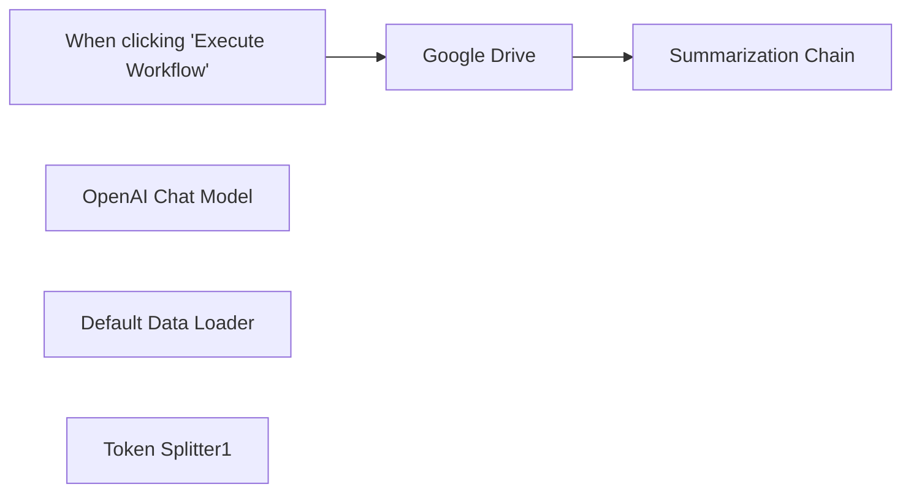

## Fluxo (.json) :

```json
{
  "meta": {
    "instanceId": "408f9fb9940c3cb18ffdef0e0150fe342d6e655c3a9fac21f0f644e8bedabcd9",
    "templateCredsSetupCompleted": true
  },
  "nodes": [
    {
      "id": "96d41f6a-3534-4286-a514-c39fa3100897",
      "name": "When clicking \"Execute Workflow\"",
      "type": "n8n-nodes-base.manualTrigger",
      "position": [
        -40,
        520
      ],
      "parameters": {},
      "typeVersion": 1
    },
    {
      "id": "8fc1ced3-3007-4a18-9619-b7c72589d784",
      "name": "OpenAI Chat Model",
      "type": "@n8n/n8n-nodes-langchain.lmChatOpenAi",
      "position": [
        360,
        740
      ],
      "parameters": {
        "model": {
          "__rl": true,
          "mode": "list",
          "value": "gpt-4o-mini"
        },
        "options": {}
      },
      "credentials": {
        "openAiApi": {
          "id": "8gccIjcuf3gvaoEr",
          "name": "OpenAi account"
        }
      },
      "typeVersion": 1.2
    },
    {
      "id": "e12e4360-50e6-421a-ba95-8474fb06448c",
      "name": "Default Data Loader",
      "type": "@n8n/n8n-nodes-langchain.documentDefaultDataLoader",
      "position": [
        540,
        740
      ],
      "parameters": {
        "options": {},
        "dataType": "binary"
      },
      "typeVersion": 1
    },
    {
      "id": "244ed66f-1dde-4a56-90ec-cb31644f3d5a",
      "name": "Token Splitter1",
      "type": "@n8n/n8n-nodes-langchain.textSplitterTokenSplitter",
      "position": [
        620,
        880
      ],
      "parameters": {
        "chunkSize": 3000
      },
      "typeVersion": 1
    },
    {
      "id": "7a2b2f4c-8153-4cac-9bb2-45c46f28f8a5",
      "name": "Google Drive",
      "type": "n8n-nodes-base.googleDrive",
      "position": [
        180,
        520
      ],
      "parameters": {
        "fileId": {
          "__rl": true,
          "mode": "url",
          "value": "https://drive.google.com/file/d/11Koq9q53nkk0F5Y8eZgaWJUVR03I4-MM/view"
        },
        "options": {},
        "operation": "download"
      },
      "credentials": {
        "googleDriveOAuth2Api": {
          "id": "yOwz41gMQclOadgu",
          "name": "Google Drive account"
        }
      },
      "typeVersion": 3
    },
    {
      "id": "e803a016-a9e7-4af2-bca2-05f9243196b2",
      "name": "Summarization Chain",
      "type": "@n8n/n8n-nodes-langchain.chainSummarization",
      "position": [
        400,
        520
      ],
      "parameters": {
        "options": {},
        "operationMode": "documentLoader"
      },
      "typeVersion": 2
    }
  ],
  "pinData": {},
  "connections": {
    "Google Drive": {
      "main": [
        [
          {
            "node": "Summarization Chain",
            "type": "main",
            "index": 0
          }
        ]
      ]
    },
    "Token Splitter1": {
      "ai_textSplitter": [
        [
          {
            "node": "Default Data Loader",
            "type": "ai_textSplitter",
            "index": 0
          }
        ]
      ]
    },
    "OpenAI Chat Model": {
      "ai_languageModel": [
        [
          {
            "node": "Summarization Chain",
            "type": "ai_languageModel",
            "index": 0
          }
        ]
      ]
    },
    "Default Data Loader": {
      "ai_document": [
        [
          {
            "node": "Summarization Chain",
            "type": "ai_document",
            "index": 0
          }
        ]
      ]
    },
    "When clicking \"Execute Workflow\"": {
      "main": [
        [
          {
            "node": "Google Drive",
            "type": "main",
            "index": 0
          }
        ]
      ]
    }
  }
}
```

<a id="template-1403"></a>

## Template 1403 - Importação de CSV para Snowflake

- **Nome:** Importação de CSV para Snowflake
- **Descrição:** Baixa um arquivo CSV remoto, converte em registros e insere os dados na tabela 'users' do Snowflake.
- **Funcionalidade:** • Acionamento manual: Permite iniciar o processo manualmente quando necessário.
• Download de CSV remoto: Obtém o arquivo CSV a partir de um URL hospedado em storage.
• Conversão de planilha para registros: Converte o arquivo de planilha/CSV em linhas/objetos processáveis.
• Mapeamento de campos: Extrai e organiza os campos id, first_name e last_name de cada registro.
• Inserção em banco de dados: Insere os registros mapeados na tabela 'users' com as colunas id, first_name e last_name.
- **Ferramentas:** • Azure Blob Storage: Serviço de armazenamento onde o arquivo CSV está hospedado e acessível via URL.
• Snowflake: Data warehouse onde os registros são inseridos na tabela 'users'.

## Fluxo visual

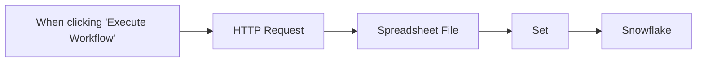

## Fluxo (.json) :

```json
{
  "id": "19",
  "meta": {
    "instanceId": "590b8a6424ded2dccf0f04ef13db2f02f968ec0b6d208436c385cdb410341348"
  },
  "name": "Snowflake CSV",
  "tags": [],
  "nodes": [
    {
      "id": "da710a80-484b-4fe3-80fa-e699bb6499ad",
      "name": "When clicking \"Execute Workflow\"",
      "type": "n8n-nodes-base.manualTrigger",
      "position": [
        440,
        380
      ],
      "parameters": {},
      "typeVersion": 1
    },
    {
      "id": "f419ebfb-9eae-4fea-b05b-aabc97b5f47f",
      "name": "HTTP Request",
      "type": "n8n-nodes-base.httpRequest",
      "position": [
        640,
        380
      ],
      "parameters": {
        "url": "https://n8niostorageaccount.blob.core.windows.net/n8nio-strapi-blobs-prod/assets/example_c0b48ce677.csv?updated_at=2023-05-30T10:36:21.820Z",
        "options": {
          "response": {
            "response": {
              "responseFormat": "file"
            }
          }
        }
      },
      "typeVersion": 4.1
    },
    {
      "id": "fe45e2a2-b50f-4459-a8ee-78615239dee0",
      "name": "Spreadsheet File",
      "type": "n8n-nodes-base.spreadsheetFile",
      "position": [
        820,
        380
      ],
      "parameters": {
        "options": {}
      },
      "typeVersion": 1
    },
    {
      "id": "54e31892-c8e1-423c-a24a-8e5eb1312b0a",
      "name": "Set",
      "type": "n8n-nodes-base.set",
      "position": [
        1000,
        380
      ],
      "parameters": {
        "values": {
          "number": [
            {
              "name": "first_name",
              "value": "={{ $json.first_name }}"
            },
            {
              "name": "id",
              "value": "={{ $json.id }}"
            }
          ],
          "string": [
            {
              "name": "last_name",
              "value": "={{ $json.last_name }}"
            }
          ]
        },
        "options": {
          "dotNotation": false
        },
        "keepOnlySet": true
      },
      "typeVersion": 2
    },
    {
      "id": "c482d8e8-0792-4b61-a2e0-d437c9fe9062",
      "name": "Snowflake",
      "type": "n8n-nodes-base.snowflake",
      "position": [
        1200,
        380
      ],
      "parameters": {
        "table": "users",
        "columns": "id,first_name,last_name"
      },
      "credentials": {
        "snowflake": {
          "id": "23",
          "name": "Snowflake account"
        }
      },
      "typeVersion": 1
    }
  ],
  "active": false,
  "pinData": {},
  "settings": {},
  "versionId": "a6348461-b174-4608-961f-d9d86730b573",
  "connections": {
    "Set": {
      "main": [
        [
          {
            "node": "Snowflake",
            "type": "main",
            "index": 0
          }
        ]
      ]
    },
    "HTTP Request": {
      "main": [
        [
          {
            "node": "Spreadsheet File",
            "type": "main",
            "index": 0
          }
        ]
      ]
    },
    "Spreadsheet File": {
      "main": [
        [
          {
            "node": "Set",
            "type": "main",
            "index": 0
          }
        ]
      ]
    },
    "When clicking \"Execute Workflow\"": {
      "main": [
        [
          {
            "node": "HTTP Request",
            "type": "main",
            "index": 0
          }
        ]
      ]
    }
  }
}
```

<a id="template-1405"></a>

## Template 1405 - Bot de eco para Telegram

- **Nome:** Bot de eco para Telegram
- **Descrição:** Recebe eventos do Telegram e responde enviando de volta o conteúdo JSON da atualização, facilitando depuração e aprendizado.
- **Funcionalidade:** • Escuta de eventos do Telegram: Monitora todos os tipos de atualizações recebidas pelo bot.
• Reenvio do conteúdo da mensagem: Envia ao remetente o objeto JSON completo da atualização recebida.
• Formatação do JSON: Converte o objeto em texto legível com identação e marcação para facilitar leitura.
• Suporte a diversos tipos de entrada: Funciona com mensagens, encaminhamentos, stickers, emojis, voz, arquivos e imagens.
• Ferramenta de depuração: Permite inspecionar o payload recebido para desenvolvimento e troubleshooting.
- **Ferramentas:** • Telegram: Plataforma de mensagens e API de bots utilizada para receber eventos e enviar respostas automáticas.

## Fluxo visual

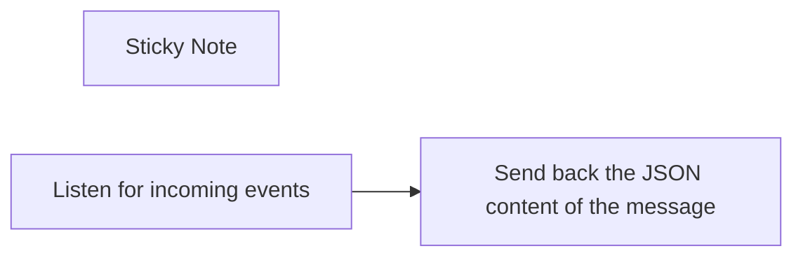

## Fluxo (.json) :

```json
{
  "id": "o8HjmolfMilbaEkk",
  "meta": {
    "instanceId": "fb924c73af8f703905bc09c9ee8076f48c17b596ed05b18c0ff86915ef8a7c4a"
  },
  "name": "Telegram echo-bot",
  "tags": [],
  "nodes": [
    {
      "id": "5c7c9e78-60d0-4f6a-929a-a4e77f5e0851",
      "name": "Sticky Note",
      "type": "n8n-nodes-base.stickyNote",
      "position": [
        1000,
        120
      ],
      "parameters": {
        "width": 727,
        "height": 391,
        "content": "## This is a workflow for a Telegram-echo bot\n1. Add your Telegram bot credentials for both nodes\n2. Activate the workflow\n3. Send something to the bot (i.e. a message, a forwarded message, sticker, emoji, voice, file, an image...)\n4. Second node will fetch the incoming JSON object, format it and send back\n\n#### This bot is useful for debugging and learning purposes of the Telegram platform"
      },
      "typeVersion": 1
    },
    {
      "id": "9f64943e-35a4-4d9f-a77e-ff76cae8bb84",
      "name": "Listen for incoming events",
      "type": "n8n-nodes-base.telegramTrigger",
      "position": [
        1040,
        340
      ],
      "webhookId": "322dce18-f93e-4f86-b9b1-3305519b7834",
      "parameters": {
        "updates": [
          "*"
        ],
        "additionalFields": {}
      },
      "credentials": {
        "telegramApi": {
          "id": "70",
          "name": "Telegram sdfsdfsdfsdfsfd_bot"
        }
      },
      "typeVersion": 1
    },
    {
      "id": "5b890d30-f47e-4cf0-9747-ae9eb14cedff",
      "name": "Send back the JSON content of the message",
      "type": "n8n-nodes-base.telegram",
      "position": [
        1260,
        340
      ],
      "parameters": {
        "text": "=```\n{{ JSON.stringify($json, null, 2) }}\n```",
        "chatId": "={{ $json.message.from.id }}",
        "additionalFields": {
          "parse_mode": "Markdown"
        }
      },
      "credentials": {
        "telegramApi": {
          "id": "70",
          "name": "Telegram sdfsdfsdfsdfsfd_bot"
        }
      },
      "typeVersion": 1.1
    }
  ],
  "active": true,
  "pinData": {},
  "settings": {
    "executionOrder": "v1"
  },
  "versionId": "14d0925e-4b1b-4183-8584-04c9ab715998",
  "connections": {
    "Listen for incoming events": {
      "main": [
        [
          {
            "node": "Send back the JSON content of the message",
            "type": "main",
            "index": 0
          }
        ]
      ]
    }
  }
}
```

<a id="template-1407"></a>

## Template 1407 - Notificar novas issues do GitHub via Telegram

- **Nome:** Notificar novas issues do GitHub via Telegram
- **Descrição:** Verifica periodicamente issues de um repositório GitHub e envia notificações por Telegram para issues que atendem aos filtros configurados.
- **Funcionalidade:** • Agendamento periódico: Executa a verificação a cada 10 minutos.
• Recuperação de issues do GitHub: Busca issues de um repositório específico filtrando por estado (open), rótulo (Bug) e por data (últimos 30 minutos).
• Extração de campos: Mapeia campos relevantes das issues como título, URL, data de criação e número de comentários.
• Filtragem por comentários: Filtra e passa adiante apenas issues com menos de 5 comentários.
• Envio de notificações no Telegram: Envia mensagem ao usuário com o título da issue e o link para a mesma.
- **Ferramentas:** • GitHub: Plataforma para armazenar e fornecer dados das issues do repositório.
• Telegram: Serviço de mensagens utilizado para enviar notificações ao usuário com informações da issue.

## Fluxo visual

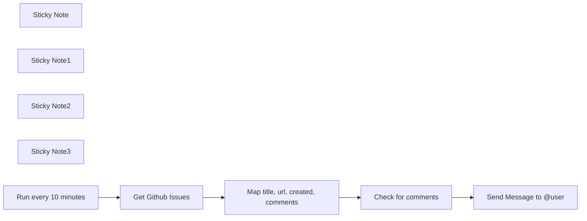

## Fluxo (.json) :

```json
{
  "id": "okjjim5PVb2dZUgg",
  "meta": {
    "instanceId": "b229c9a129a49cc78e21e7f6e65be625850967828e8c77a8f82738e7c8461afc",
    "templateCredsSetupCompleted": true
  },
  "name": "FetchGithubIssues",
  "tags": [],
  "nodes": [
    {
      "id": "2f3cac64-7326-471d-8f6a-1677a4ff5a6d",
      "name": "Sticky Note",
      "type": "n8n-nodes-base.stickyNote",
      "position": [
        -540,
        -560
      ],
      "parameters": {
        "color": 5,
        "content": "### Get Github Issues HTTP Request \n- Edit the OWNER and REPO NAME in the respective fields\n- The request is configured with query parameters of *state*, *since* and *labels*"
      },
      "typeVersion": 1
    },
    {
      "id": "13809408-63f3-4161-87f2-c5d950274aa9",
      "name": "Sticky Note1",
      "type": "n8n-nodes-base.stickyNote",
      "position": [
        -260,
        -560
      ],
      "parameters": {
        "color": 3,
        "width": 180,
        "content": "### Extract Fields\nExtract fields like title, comments, created_at, etc from the github api response"
      },
      "typeVersion": 1
    },
    {
      "id": "3df26230-c2b0-44d5-98da-cccbca493c8f",
      "name": "Sticky Note2",
      "type": "n8n-nodes-base.stickyNote",
      "position": [
        -40,
        -560
      ],
      "parameters": {
        "color": 3,
        "width": 180,
        "content": "### Filter on Fields\nFilter issues based on number of comments"
      },
      "typeVersion": 1
    },
    {
      "id": "819bd3f8-8d23-4299-ac1d-ae9762f944dd",
      "name": "Sticky Note3",
      "type": "n8n-nodes-base.stickyNote",
      "position": [
        220,
        -680
      ],
      "parameters": {
        "color": 5,
        "width": 200,
        "height": 280,
        "content": "### Send message to Telegram User\n- This node is configured to send *issue title* and *url* to your user id\n- Create a new telegram bot using the instructions [here](https://core.telegram.org/bots/tutorial#obtain-your-bot-token) and configure bot token in the telegram credential\n- Chat ID can be your username or your username ID"
      },
      "typeVersion": 1
    },
    {
      "id": "9e08036f-e082-424d-b536-349d236a40ec",
      "name": "Send Message to @user",
      "type": "n8n-nodes-base.telegram",
      "position": [
        280,
        -380
      ],
      "webhookId": "d0c6ee9e-ed0b-49fa-95cd-e483fc29ffbc",
      "parameters": {
        "text": "=New Issue:  {{ $json.title }} [Link]({{ $json.html_url }})",
        "additionalFields": {}
      },
      "credentials": {
        "telegramApi": {
          "id": "MEwozHKykMH3flb4",
          "name": "Telegram account 2"
        }
      },
      "typeVersion": 1.2
    },
    {
      "id": "9cf3bf31-12a6-4f3b-a1e7-69f575f801f0",
      "name": "Check for comments",
      "type": "n8n-nodes-base.filter",
      "position": [
        0,
        -380
      ],
      "parameters": {
        "options": {},
        "conditions": {
          "options": {
            "version": 2,
            "leftValue": "",
            "caseSensitive": true,
            "typeValidation": "strict"
          },
          "combinator": "and",
          "conditions": [
            {
              "id": "88ae0b8f-c586-4f01-8389-bc0e2c0473bc",
              "operator": {
                "type": "number",
                "operation": "lt"
              },
              "leftValue": "={{ $json.comments }}",
              "rightValue": 5
            }
          ]
        }
      },
      "typeVersion": 2.2
    },
    {
      "id": "0cfd2924-64c0-4f8b-a15b-7e619d5b21bf",
      "name": "Map title, url, created, comments",
      "type": "n8n-nodes-base.set",
      "position": [
        -220,
        -380
      ],
      "parameters": {
        "options": {},
        "assignments": {
          "assignments": [
            {
              "id": "ebad3986-8804-428f-acbb-7c1953dbbc47",
              "name": "title",
              "type": "string",
              "value": "={{ $json.title }}"
            },
            {
              "id": "2daabd16-f1af-4d24-8409-51e7ba242bbb",
              "name": "html_url",
              "type": "string",
              "value": "={{ $json.html_url }}"
            },
            {
              "id": "7ea20a16-794c-4701-81e0-4b99fb1a9fc7",
              "name": "created_at",
              "type": "string",
              "value": "={{ $json.created_at }}"
            },
            {
              "id": "0a4985f9-5d80-420b-ae57-15329bf19634",
              "name": "comments",
              "type": "number",
              "value": "={{ $json.comments }}"
            }
          ]
        }
      },
      "typeVersion": 3.4
    },
    {
      "id": "eacbb029-03b9-46d6-9f2e-edaab70cce10",
      "name": "Run every 10 minutes",
      "type": "n8n-nodes-base.scheduleTrigger",
      "position": [
        -780,
        -380
      ],
      "parameters": {
        "rule": {
          "interval": [
            {
              "field": "minutes",
              "minutesInterval": 10
            }
          ]
        }
      },
      "typeVersion": 1.2
    },
    {
      "id": "d87f01e3-8277-4dbb-bcc0-4ca2e1c794d4",
      "name": "Get Github Issues",
      "type": "n8n-nodes-base.github",
      "position": [
        -480,
        -380
      ],
      "parameters": {
        "owner": {
          "__rl": true,
          "mode": "name",
          "value": ""
        },
        "resource": "repository",
        "repository": {
          "__rl": true,
          "mode": "name",
          "value": ""
        },
        "getRepositoryIssuesFilters": {
          "since": "={{ new Date(Date.now() - 30 * 60 * 1000).toISOString() }}",
          "state": "open",
          "labels": "Bug"
        }
      },
      "credentials": {
        "githubApi": {
          "id": "2yRBqav2uahP1pas",
          "name": "GitHub account"
        }
      },
      "typeVersion": 1
    }
  ],
  "active": false,
  "pinData": {},
  "settings": {
    "executionOrder": "v1"
  },
  "versionId": "5bc6fb0e-face-48c3-aba4-0c53ad1e9b35",
  "connections": {
    "Get Github Issues": {
      "main": [
        [
          {
            "node": "Map title, url, created, comments",
            "type": "main",
            "index": 0
          }
        ]
      ]
    },
    "Check for comments": {
      "main": [
        [
          {
            "node": "Send Message to @user",
            "type": "main",
            "index": 0
          }
        ]
      ]
    },
    "Run every 10 minutes": {
      "main": [
        [
          {
            "node": "Get Github Issues",
            "type": "main",
            "index": 0
          }
        ]
      ]
    },
    "Map title, url, created, comments": {
      "main": [
        [
          {
            "node": "Check for comments",
            "type": "main",
            "index": 0
          }
        ]
      ]
    }
  }
}
```

<a id="template-1409"></a>

## Template 1409 - Captura de screenshot via Bright Data e salva em disco

- **Nome:** Captura de screenshot via Bright Data e salva em disco
- **Descrição:** Captura uma imagem (screenshot) de um site usando a API do Bright Data Web Unlocker e salva o arquivo resultante no disco local.
- **Funcionalidade:** • Disparo manual da execução: inicia o fluxo mediante acionamento do usuário.
• Configurar URL, nome do arquivo e zona Bright Data: define o site a capturar, o nome do arquivo de saída e a zona/proxy a ser usada.
• Autenticação via cabeçalho HTTP: utiliza credenciais em cabeçalho para autenticar a requisição à API.
• Solicitação ao Bright Data para captura de screenshot: envia uma requisição POST solicitando o formato raw e data_format screenshot.
• Recebimento do arquivo binário: obtém a resposta da API como um arquivo com nome dinâmico baseado na configuração.
• Gravar arquivo no disco local: salva a screenshot na localização especificada do servidor/host.
- **Ferramentas:** • Bright Data (Web Unlocker / Proxies & Infrastructure): serviço de proxy e captura de páginas que permite obter screenshots e contornar bloqueios.
• Sistema de arquivos local: armazenamento do arquivo de imagem gerado no disco do servidor/host.


## Fluxo visual

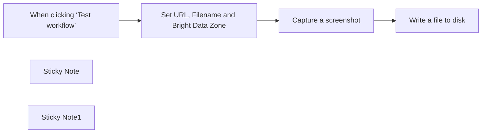

## Fluxo (.json) :

```json
{
  "id": "1U5Jf4NMQEw9LtxY",
  "meta": {
    "instanceId": "885b4fb4a6a9c2cb5621429a7b972df0d05bb724c20ac7dac7171b62f1c7ef40"
  },
  "name": "Capture Website Screenshots with Bright Data Web Unlocker and Save to Disk",
  "tags": [
    {
      "id": "Kujft2FOjmOVQAmJ",
      "name": "Engineering",
      "createdAt": "2025-04-09T01:31:00.558Z",
      "updatedAt": "2025-04-09T01:31:00.558Z"
    }
  ],
  "nodes": [
    {
      "id": "d61cb066-1d5f-47d5-a4dd-4534f3d3c6d8",
      "name": "When clicking ‘Test workflow’",
      "type": "n8n-nodes-base.manualTrigger",
      "position": [
        -520,
        -160
      ],
      "parameters": {},
      "typeVersion": 1
    },
    {
      "id": "eb99305b-0375-4cdd-8682-637d281598a0",
      "name": "Sticky Note",
      "type": "n8n-nodes-base.stickyNote",
      "position": [
        -540,
        -500
      ],
      "parameters": {
        "width": 360,
        "height": 260,
        "content": "## Note\n\nThe \"**Set URL, Filename and Bright Data Zone**\" node must be updated with the appropriate url, file name and **Bright Data Proxies & Infrastructure** zone.\n\nThe \"**Write a file to disk**\" node has the location to download the website screenshot. Please make sure to set the path"
      },
      "typeVersion": 1
    },
    {
      "id": "205f64e9-5b31-4c76-912a-307eccde159e",
      "name": "Sticky Note1",
      "type": "n8n-nodes-base.stickyNote",
      "position": [
        -160,
        -240
      ],
      "parameters": {
        "color": 4,
        "width": 260,
        "height": 280,
        "content": "## Website Screenshot"
      },
      "typeVersion": 1
    },
    {
      "id": "e7705941-2ae8-4c38-93cb-2cb865314872",
      "name": "Write a file to disk",
      "type": "n8n-nodes-base.readWriteFile",
      "position": [
        140,
        -160
      ],
      "parameters": {
        "options": {},
        "fileName": "={{ \"c:\\\\\"+ $json.filename }}",
        "operation": "write",
        "dataPropertyName": "={{ $json.filename }}"
      },
      "typeVersion": 1
    },
    {
      "id": "167ff255-da5b-43c1-a22f-e00c4cc166d8",
      "name": "Capture a screenshot",
      "type": "n8n-nodes-base.httpRequest",
      "position": [
        -80,
        -160
      ],
      "parameters": {
        "url": "https://api.brightdata.com/request",
        "method": "POST",
        "options": {
          "response": {
            "response": {
              "responseFormat": "file",
              "outputPropertyName": "={{ $json.filename }}"
            }
          },
          "allowUnauthorizedCerts": true
        },
        "sendBody": true,
        "sendHeaders": true,
        "authentication": "genericCredentialType",
        "bodyParameters": {
          "parameters": [
            {
              "name": "zone",
              "value": "={{ $json.zone }}"
            },
            {
              "name": "url",
              "value": "={{ $json.url }}"
            },
            {
              "name": "format",
              "value": "raw"
            },
            {
              "name": "data_format",
              "value": "screenshot"
            }
          ]
        },
        "genericAuthType": "httpHeaderAuth",
        "headerParameters": {
          "parameters": [
            {}
          ]
        }
      },
      "credentials": {
        "httpHeaderAuth": {
          "id": "kdbqXuxIR8qIxF7y",
          "name": "Header Auth account"
        }
      },
      "typeVersion": 4.2
    },
    {
      "id": "1c5c3d72-f20d-4d06-a6f2-461d043c4a01",
      "name": "Set URL, Filename and Bright Data Zone",
      "type": "n8n-nodes-base.set",
      "position": [
        -300,
        -160
      ],
      "parameters": {
        "options": {},
        "assignments": {
          "assignments": [
            {
              "id": "c9de0c3e-609a-4e87-b6ab-b4312be026a9",
              "name": "url",
              "type": "string",
              "value": "https://dev.to/"
            },
            {
              "id": "408ed65a-0d66-4f98-b2eb-0d5e066e3250",
              "name": "filename",
              "type": "string",
              "value": "devto.png"
            },
            {
              "id": "ee10fcb0-a610-4987-8a4e-dfab077aee0e",
              "name": "zone",
              "type": "string",
              "value": "web_unlocker1"
            }
          ]
        }
      },
      "typeVersion": 3.4
    }
  ],
  "active": false,
  "pinData": {},
  "settings": {
    "executionOrder": "v1"
  },
  "versionId": "d3ae63f2-efcf-478b-aadf-8a3fac2af02a",
  "connections": {
    "Capture a screenshot": {
      "main": [
        [
          {
            "node": "Write a file to disk",
            "type": "main",
            "index": 0
          }
        ]
      ]
    },
    "When clicking ‘Test workflow’": {
      "main": [
        [
          {
            "node": "Set URL, Filename and Bright Data Zone",
            "type": "main",
            "index": 0
          }
        ]
      ]
    },
    "Set URL, Filename and Bright Data Zone": {
      "main": [
        [
          {
            "node": "Capture a screenshot",
            "type": "main",
            "index": 0
          }
        ]
      ]
    }
  }
}
```

<a id="template-1411"></a>

## Template 1411 - Adicionar texto em imagem via URL

- **Nome:** Adicionar texto em imagem via URL
- **Descrição:** Baixa uma imagem a partir de uma URL pública e adiciona um texto sobre ela.
- **Funcionalidade:** • Disparo manual: inicia o fluxo ao clicar em 'execute'.
• Download de imagem via URL: obtém a imagem hospedada em um servidor remoto.
• Inserção de texto na imagem: adiciona o texto "This is n8n" sobre a imagem com tamanho de fonte 100 na posição X:300, Y:500.
- **Ferramentas:** • Serviço de hospedagem de arquivos via HTTP: fornece a imagem por uma URL pública para download.
• Biblioteca de edição de imagens: processa o arquivo para desenhar texto com posição e tamanho definidos.

## Fluxo visual

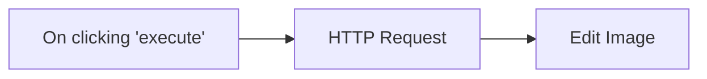

## Fluxo (.json) :

```json
{
  "id": "1",
  "name": "Add text to an image downloaded from the internet",
  "nodes": [
    {
      "name": "On clicking 'execute'",
      "type": "n8n-nodes-base.manualTrigger",
      "position": [
        620,
        170
      ],
      "parameters": {},
      "typeVersion": 1
    },
    {
      "name": "Edit Image",
      "type": "n8n-nodes-base.editImage",
      "position": [
        1020,
        170
      ],
      "parameters": {
        "text": "This is n8n",
        "options": {},
        "fontSize": 100,
        "operation": "text",
        "positionX": 300,
        "positionY": 500
      },
      "typeVersion": 1
    },
    {
      "name": "HTTP Request",
      "type": "n8n-nodes-base.httpRequest",
      "position": [
        820,
        170
      ],
      "parameters": {
        "url": "https://docs.n8n.io/assets/img/final-workflow.f380b957.png",
        "options": {},
        "responseFormat": "file"
      },
      "typeVersion": 1
    }
  ],
  "active": false,
  "settings": {},
  "connections": {
    "HTTP Request": {
      "main": [
        [
          {
            "node": "Edit Image",
            "type": "main",
            "index": 0
          }
        ]
      ]
    },
    "On clicking 'execute'": {
      "main": [
        [
          {
            "node": "HTTP Request",
            "type": "main",
            "index": 0
          }
        ]
      ]
    }
  }
}
```

<a id="template-1413"></a>

## Template 1413 - Envio de SMS para números do Airtable

- **Nome:** Envio de SMS para números do Airtable
- **Descrição:** Envia mensagens SMS personalizadas para números de telefone armazenados em uma base do Airtable, utilizando o serviço Twilio; a execução é iniciada manualmente.
- **Funcionalidade:** • Acionamento manual: inicia o fluxo quando o usuário executa manualmente.
• Leitura de registros do Airtable: lista os registros da tabela configurada para obter contatos e números.
• Mapeamento de campos: utiliza os campos 'Name' e 'Number' de cada registro para compor o destinatário e o texto da mensagem.
• Envio de SMS personalizado: envia uma mensagem SMS para cada número recuperado, incluindo o nome do contato no texto.
• Processamento sequencial de registros: itera sobre os registros retornados e envia mensagens individualmente.
- **Ferramentas:** • Airtable: banco de dados em forma de planilha/CRM utilizado para armazenar contatos e números de telefone.
• Twilio: plataforma de comunicação usada para enviar mensagens SMS para os números fornecidos.


## Fluxo visual


## Fluxo (.json) :

```json
{
  "id": "1",
  "name": "Send SMS to numbers stored in Airtable with Twilio",
  "nodes": [
    {
      "name": "On clicking 'execute'",
      "type": "n8n-nodes-base.manualTrigger",
      "position": [
        250,
        300
      ],
      "parameters": {},
      "typeVersion": 1
    },
    {
      "name": "Airtable",
      "type": "n8n-nodes-base.airtable",
      "position": [
        450,
        300
      ],
      "parameters": {
        "table": "",
        "operation": "list",
        "application": "",
        "additionalOptions": {}
      },
      "credentials": {
        "airtableApi": ""
      },
      "typeVersion": 1
    },
    {
      "name": "Twilio",
      "type": "n8n-nodes-base.twilio",
      "position": [
        650,
        300
      ],
      "parameters": {
        "to": "={{$node[\"Airtable\"].json[\"fields\"][\"Number\"]}}",
        "from": "",
        "message": "=Hello, {{$node[\"Airtable\"].json[\"fields\"][\"Name\"]}}!\nSending this SMS from n8n!"
      },
      "credentials": {
        "twilioApi": ""
      },
      "typeVersion": 1
    }
  ],
  "active": false,
  "settings": {},
  "connections": {
    "Twilio": {
      "main": [
        []
      ]
    },
    "Airtable": {
      "main": [
        [
          {
            "node": "Twilio",
            "type": "main",
            "index": 0
          }
        ]
      ]
    },
    "On clicking 'execute'": {
      "main": [
        [
          {
            "node": "Airtable",
            "type": "main",
            "index": 0
          }
        ]
      ]
    }
  }
}
```

<a id="template-1415"></a>

## Template 1415 - YouTube RSS + Notificações por Email e Telegram

- **Nome:** YouTube RSS + Notificações por Email e Telegram
- **Descrição:** Cria feeds RSS a partir de IDs de canais do YouTube, monitora novos vídeos e envia notificações por Telegram e por email (individual ou digest), com HTML de email gerado por IA.
- **Funcionalidade:** • Entrada de canais via formulário ou lista padrão: aceita IDs personalizados ou usa uma lista default.
• Geração automática de URLs RSS por canal: monta feeds do YouTube a partir do channel_id.
• Leitura dos feeds RSS (até 15 vídeos por canal): coleta as entradas mais recentes de cada canal.
• Detecção de vídeos recentes: marca vídeos publicados dentro de um período recente (padrão 3 dias).
• Filtragem de novos vídeos: seleciona apenas vídeos marcados como recentes para notificação.
• Consulta ao YouTube Data API para detalhes: busca metadados completos (título, descrição, thumbnails, embed, estatísticas) quando necessário.
• Preparação de conteúdo para Telegram: monta imagem e legenda com título e link do vídeo.
• Envio de notificações via Telegram: publica thumbnail e mensagem no chat configurado.
• Geração de emails individuais por vídeo: cria HTML responsivo em formato de card para cada novo vídeo.
• Geração de email digest único: agrega todos os vídeos recentes em um único email formatado.
• Envio de emails pelo Gmail: envia tanto emails individuais quanto o digest usando conta configurada.
• Agendamento e execução manual: pode rodar automaticamente segundo agenda diária ou manualmente para testes.
• Uso de IA para formatação dos emails: utiliza modelo de linguagem para produzir HTML compatível com clientes de email.
- **Ferramentas:** • YouTube RSS Feeds: fornece o feed de uploads públicos de um canal via URL do tipo https://www.youtube.com/feeds/videos.xml?channel_id=.
• YouTube Data API (Google APIs): retorna metadados detalhados dos vídeos (snippet, thumbnails, player, estatísticas).
• OpenAI: gera e formata o HTML responsivo dos templates de email a partir dos dados dos vídeos.
• Gmail: serviço de envio de email usando credenciais OAuth2 para enviar notificações.
• Telegram: plataforma para envio de fotos e mensagens a um chat via bot/token e chat ID.


## Fluxo visual

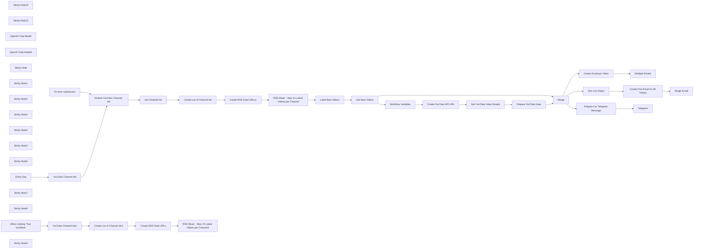

## Fluxo (.json) :

```json
{
  "id": "tHgDFmFyuj6DnP6l",
  "meta": {
    "instanceId": "31e69f7f4a77bf465b805824e303232f0227212ae922d12133a0f96ffeab4fef",
    "templateCredsSetupCompleted": true
  },
  "name": "🎦💌Advanced YouTube RSS Feed Buddy for Your Favorite Channels",
  "tags": [],
  "nodes": [
    {
      "id": "ab1db660-96d6-402c-b6e8-8c4d278577d1",
      "name": "On form submission",
      "type": "n8n-nodes-base.formTrigger",
      "position": [
        60,
        -220
      ],
      "webhookId": "f6b3bbf7-b6e9-4ade-add4-12004d70b61c",
      "parameters": {
        "options": {
          "appendAttribution": false
        },
        "formTitle": "RSS Feed for YouTube Channels",
        "formFields": {
          "values": [
            {
              "fieldType": "textarea",
              "fieldLabel": "YouTube Channel Ids",
              "placeholder": "[ \"UCMcoud_ZW7cfxeIugBflSBw\", \"UCtevzRsHEKhs-RK8pAqwSyQ\" ]"
            }
          ]
        },
        "responseMode": "lastNode",
        "formDescription": "Create RSS Feeds for Your Favorite YouTube Channels"
      },
      "typeVersion": 2.2
    },
    {
      "id": "6ea8d71f-a5f8-46d5-bf51-20df75ec6202",
      "name": "Create RSS Feed URLs1",
      "type": "n8n-nodes-base.set",
      "position": [
        60,
        420
      ],
      "parameters": {
        "options": {},
        "assignments": {
          "assignments": [
            {
              "id": "8159d367-513c-406b-8ad7-36f65c2e6512",
              "name": "rss_feed_url",
              "type": "string",
              "value": "=https://www.youtube.com/feeds/videos.xml?channel_id={{ $json.youtube_channel_id }}"
            }
          ]
        }
      },
      "typeVersion": 3.4
    },
    {
      "id": "038e95ce-656e-4f6a-a9d8-96555aeeccf2",
      "name": "Get Channel Ids",
      "type": "n8n-nodes-base.set",
      "position": [
        460,
        80
      ],
      "parameters": {
        "options": {},
        "assignments": {
          "assignments": [
            {
              "id": "4b276cf0-6bb5-489e-a776-327291608b8e",
              "name": "ids",
              "type": "array",
              "value": "={{ $json[\"YouTube Channel Ids\"].length > 0  ? $json[\"YouTube Channel Ids\"] : $json[\"Default YouTube Channel Ids\"] }}"
            }
          ]
        }
      },
      "typeVersion": 3.4
    },
    {
      "id": "7c8b43fb-52c9-4a3e-b5ff-2c21fe8fb183",
      "name": "Create YouTube API URL",
      "type": "n8n-nodes-base.code",
      "position": [
        1380,
        -220
      ],
      "parameters": {
        "jsCode": "// Define the base URL for the YouTube Data API\nconst BASE_URL = 'https://www.googleapis.com/youtube/v3/videos';\n\n// Get all input items\nconst items = $input.all();\n\n// Process each item and create YouTube URLs\nconst results = items.map(item => {\n    const VIDEO_ID = item.json.VIDEO_ID;\n    const GOOGLE_API_KEY = item.json.GOOGLE_API_KEY;\n\n    if (!VIDEO_ID) {\n        throw new Error('The video ID parameter is empty.');\n    }\n\n    if (!GOOGLE_API_KEY) {\n        throw new Error('The Google API Key is missing.');\n    }\n\n    // Construct the API URL with the video ID and dynamically retrieved API key\n    const youtubeUrl = `${BASE_URL}?part=snippet,contentDetails,status,statistics,player,topicDetails&id=${VIDEO_ID}&key=${GOOGLE_API_KEY}`;\n\n    return {\n        json: {\n            youtubeUrl: youtubeUrl\n        }\n    };\n});\n\n// Return array of results\nreturn results;\n\n"
      },
      "typeVersion": 2
    },
    {
      "id": "1941d169-f91f-4500-af55-deb7a5b2bc23",
      "name": "Get YouTube Video Details",
      "type": "n8n-nodes-base.httpRequest",
      "position": [
        1580,
        -220
      ],
      "parameters": {
        "url": "={{ $json.youtubeUrl }}",
        "options": {}
      },
      "typeVersion": 4.2
    },
    {
      "id": "ca49479c-b8e6-44db-a021-2b0f27a16bfc",
      "name": "Sticky Note14",
      "type": "n8n-nodes-base.stickyNote",
      "position": [
        1280,
        -340
      ],
      "parameters": {
        "color": 3,
        "width": 680,
        "height": 300,
        "content": "## YouTube Video Details\nhttps://developers.google.com/youtube/v3/docs\nhttps://www.googleapis.com/youtube/v3/videos"
      },
      "typeVersion": 1
    },
    {
      "id": "8224915d-c7c4-449d-8210-463b5c5c39f0",
      "name": "Workflow Variables",
      "type": "n8n-nodes-base.set",
      "position": [
        1020,
        -220
      ],
      "parameters": {
        "options": {},
        "assignments": {
          "assignments": [
            {
              "id": "e656b8ef-4266-4f50-bd41-703b4bdb04df",
              "name": "GOOGLE_API_KEY",
              "type": "string",
              "value": "[Add-Your-Google-API-Key-Here]"
            },
            {
              "id": "32db428d-a2e2-48a0-92c6-3880e744d140",
              "name": "VIDEO_ID",
              "type": "string",
              "value": "={{ $json.id.split(\":\").last() }}"
            }
          ]
        }
      },
      "typeVersion": 3.4
    },
    {
      "id": "cf334637-5632-4d2c-85b9-5ff232e2a164",
      "name": "Sticky Note12",
      "type": "n8n-nodes-base.stickyNote",
      "position": [
        900,
        -420
      ],
      "parameters": {
        "width": 340,
        "height": 380,
        "content": "## 💡 YouTube Variables\nhttps://cloud.google.com/docs/get-started/access-apis\n\n- GOOGLE_API_KEY (🌟Add your api key)\n- VIDEO_ID"
      },
      "typeVersion": 1
    },
    {
      "id": "290bbc35-3835-4f50-9e02-bac8414f35bb",
      "name": "OpenAI Chat Model",
      "type": "@n8n/n8n-nodes-langchain.lmChatOpenAi",
      "position": [
        1480,
        580
      ],
      "parameters": {
        "model": {
          "__rl": true,
          "mode": "list",
          "value": "gpt-4o-mini"
        },
        "options": {}
      },
      "credentials": {
        "openAiApi": {
          "id": "jEMSvKmtYfzAkhe6",
          "name": "OpenAi account"
        }
      },
      "typeVersion": 1.2
    },
    {
      "id": "fd65592b-e64a-445e-b090-1fecd15de9c7",
      "name": "Merge",
      "type": "n8n-nodes-base.merge",
      "position": [
        1020,
        420
      ],
      "parameters": {
        "mode": "combine",
        "options": {},
        "advanced": true,
        "joinMode": "enrichInput1",
        "mergeByFields": {
          "values": [
            {
              "field1": "items[0].id",
              "field2": "id"
            }
          ]
        }
      },
      "typeVersion": 3
    },
    {
      "id": "a3f82f16-5b34-4935-a3a0-ccd7f107eb80",
      "name": "OpenAI Chat Model1",
      "type": "@n8n/n8n-nodes-langchain.lmChatOpenAi",
      "position": [
        1480,
        1020
      ],
      "parameters": {
        "model": {
          "__rl": true,
          "mode": "list",
          "value": "gpt-4o-mini"
        },
        "options": {}
      },
      "credentials": {
        "openAiApi": {
          "id": "jEMSvKmtYfzAkhe6",
          "name": "OpenAi account"
        }
      },
      "typeVersion": 1.2
    },
    {
      "id": "998fb87b-100c-4b93-bddf-4e09ccc7f312",
      "name": "Default YouTube Channel Ids",
      "type": "n8n-nodes-base.set",
      "position": [
        260,
        80
      ],
      "parameters": {
        "options": {},
        "assignments": {
          "assignments": [
            {
              "id": "73b9220c-d701-4a29-8aaf-3732d1db0ce6",
              "name": "Default YouTube Channel Ids",
              "type": "array",
              "value": "=[ \"UCTwwnM-YB8zWC0RWwhO5sGw\", \"UCMcoud_ZW7cfxeIugBflSBw\", \"UCtevzRsHEKhs-RK8pAqwSyQ\"]"
            }
          ]
        },
        "includeOtherFields": true
      },
      "typeVersion": 3.4
    },
    {
      "id": "96ca1617-1ee3-4ffa-ae63-d90fc07484c5",
      "name": "YouTube Channel Ids",
      "type": "n8n-nodes-base.set",
      "position": [
        60,
        80
      ],
      "parameters": {
        "options": {},
        "assignments": {
          "assignments": [
            {
              "id": "e01feba6-36c0-4fbe-803b-927069b56506",
              "name": "YouTube Channel Ids",
              "type": "string",
              "value": ""
            }
          ]
        }
      },
      "typeVersion": 3.4
    },
    {
      "id": "0b5ac0a0-b4cc-43a8-8417-e488b9668c9d",
      "name": "RSS Read  - Max 15 Latest Videos per Channel",
      "type": "n8n-nodes-base.rssFeedRead",
      "position": [
        260,
        420
      ],
      "parameters": {
        "url": "={{ $json.rss_feed_url }}",
        "options": {
          "ignoreSSL": false
        }
      },
      "typeVersion": 1.1
    },
    {
      "id": "474daccd-01ed-4c9e-9c92-be33376b5770",
      "name": "Label New Videos",
      "type": "n8n-nodes-base.code",
      "position": [
        460,
        420
      ],
      "parameters": {
        "jsCode": "/**\n * Processes YouTube video items and adds recent_videos flag based on publication date\n * @param {Object[]} $input.all() - Array of input items from previous node\n * @param {number} days - Number of days to check for recent videos (default: 3)\n * @returns {Object[]} - Processed video items with additional properties\n */\ntry {\n  // Get all input items from previous node\n  const items = $input.all();\n  \n  // Define the threshold for recent videos (in days)\n  const days = 3;\n\n  // Validate inputs\n  if (!Array.isArray(items)) {\n    throw new Error('Input must be an array of items');\n  }\n\n  // Process each video item\n  const videos = items.map((item, index) => {\n    try {\n      // Validate required properties\n      if (!item?.json?.id || !item?.json?.pubDate) {\n        throw new Error(`Missing required properties in item ${index}`);\n      }\n\n      // Extract YouTube video ID from the full ID string\n      const videoId = item.json.id.split(':')[2];\n\n      // Calculate if video is recent based on publication date\n      const pubDate = new Date(item.json.pubDate);\n      const thresholdDate = DateTime.now()\n        .setZone('America/New_York')\n        .startOf('day')\n        .minus({days: days});\n\n      // Return processed item with additional properties\n      return {\n        json: {\n          ...item.json,\n          id: videoId,\n          recent_videos: pubDate > new Date(thresholdDate)\n        }\n      };\n    } catch (itemError) {\n      // Handle individual item processing errors\n      console.error(`Error processing item ${index}:`, itemError.message);\n      // Return original item if processing fails\n      return item;\n    }\n  });\n\n  return videos;\n\n} catch (error) {\n  // Handle general execution errors\n  console.error('Error in code execution:', error.message);\n  throw new Error(`Failed to process video items: ${error.message}`);\n}\n"
      },
      "typeVersion": 2
    },
    {
      "id": "0a47e235-33e5-4b74-8b54-2c97d25fb55c",
      "name": "Get New Videos",
      "type": "n8n-nodes-base.filter",
      "position": [
        660,
        420
      ],
      "parameters": {
        "options": {},
        "conditions": {
          "options": {
            "version": 2,
            "leftValue": "",
            "caseSensitive": true,
            "typeValidation": "strict"
          },
          "combinator": "and",
          "conditions": [
            {
              "id": "914cc748-6fc4-4031-8e8c-849657b7e661",
              "operator": {
                "type": "boolean",
                "operation": "true",
                "singleValue": true
              },
              "leftValue": "={{ $json.recent_videos }}",
              "rightValue": ""
            }
          ]
        }
      },
      "typeVersion": 2.2
    },
    {
      "id": "d7d6319e-e3c9-44ec-b178-15f2f98f7a8c",
      "name": "Prepare For Telegram Message",
      "type": "n8n-nodes-base.set",
      "position": [
        1380,
        80
      ],
      "parameters": {
        "options": {},
        "assignments": {
          "assignments": [
            {
              "id": "dea3ff12-0650-474e-aa9e-e0912cb971de",
              "name": "items[0].id",
              "type": "string",
              "value": "={{ $json.items[0].id }}"
            },
            {
              "id": "11c57b3a-d958-4dda-a52c-91e45b530eaf",
              "name": "items[0].snippet.title",
              "type": "string",
              "value": "={{ $json.items[0].snippet.title }}"
            },
            {
              "id": "b519c5a4-cef1-46e7-8a33-138262e989e4",
              "name": "items[0].snippet.thumbnails.standard.url",
              "type": "string",
              "value": "={{ $json.items[0].snippet.thumbnails.standard.url }}"
            },
            {
              "id": "62c5158a-bd64-428b-b681-0add1c8a2177",
              "name": "link",
              "type": "string",
              "value": "={{ $json.link }}"
            }
          ]
        }
      },
      "typeVersion": 3.4
    },
    {
      "id": "30313019-1973-450a-92fa-00d0f0c4480e",
      "name": "Sticky Note",
      "type": "n8n-nodes-base.stickyNote",
      "position": [
        1280,
        0
      ],
      "parameters": {
        "color": 5,
        "width": 520,
        "height": 280,
        "content": "## Send Latest Videos as Telegram Message"
      },
      "typeVersion": 1
    },
    {
      "id": "215e6ee8-af50-4b42-ac21-64dcef41d9f1",
      "name": "Sticky Note1",
      "type": "n8n-nodes-base.stickyNote",
      "position": [
        1280,
        320
      ],
      "parameters": {
        "color": 6,
        "width": 680,
        "height": 400,
        "content": "## Send Email for Each Latest Video (Multiple Emails)"
      },
      "typeVersion": 1
    },
    {
      "id": "df46f216-d365-4229-884c-95925ed1c3b6",
      "name": "Sticky Note2",
      "type": "n8n-nodes-base.stickyNote",
      "position": [
        1280,
        760
      ],
      "parameters": {
        "color": 6,
        "width": 680,
        "height": 400,
        "content": "## Send Email with a List of Latest Videos (One email only)"
      },
      "typeVersion": 1
    },
    {
      "id": "ef415f16-fb77-441f-9f34-c1962da8f669",
      "name": "One List Object",
      "type": "n8n-nodes-base.aggregate",
      "position": [
        1020,
        860
      ],
      "parameters": {
        "options": {},
        "aggregate": "aggregateAllItemData"
      },
      "typeVersion": 1
    },
    {
      "id": "77b37e2f-eb9c-4b85-84db-a59525390d10",
      "name": "Prepare YouTube Data",
      "type": "n8n-nodes-base.set",
      "position": [
        1780,
        -220
      ],
      "parameters": {
        "options": {},
        "assignments": {
          "assignments": [
            {
              "id": "b8e16aa1-b2a7-46c2-8d0a-5a6d203f8902",
              "name": "items[0].id",
              "type": "string",
              "value": "={{ $json.items[0].id }}"
            },
            {
              "id": "560c5991-8aed-474b-99fa-2660ccb5ab8f",
              "name": "items[0].snippet.title",
              "type": "string",
              "value": "={{ $json.items[0].snippet.title }}"
            },
            {
              "id": "dee0a454-56d3-4c17-83d3-2e3a368414af",
              "name": "items[0].snippet.description",
              "type": "string",
              "value": "={{ $json.items[0].snippet.description }}"
            },
            {
              "id": "fba2482f-9cc0-4678-b035-f51367a6bff1",
              "name": "items[0].player.embedHtml",
              "type": "string",
              "value": "={{ $json.items[0].player.embedHtml }}"
            },
            {
              "id": "21f47e6a-6847-4c54-87b1-08953d640011",
              "name": "items[0].snippet.thumbnails.standard",
              "type": "object",
              "value": "={{ $json.items[0].snippet.thumbnails.standard }}"
            }
          ]
        }
      },
      "typeVersion": 3.4
    },
    {
      "id": "b0428f2b-e565-4592-9350-f70a3bcab255",
      "name": "Sticky Note3",
      "type": "n8n-nodes-base.stickyNote",
      "position": [
        -20,
        320
      ],
      "parameters": {
        "color": 3,
        "width": 880,
        "height": 300,
        "content": "## Create YouTube RSS Feed from Favorite Channel Ids"
      },
      "typeVersion": 1
    },
    {
      "id": "b5fb976b-6f08-4e6d-8d49-821bbb24230a",
      "name": "Sticky Note4",
      "type": "n8n-nodes-base.stickyNote",
      "position": [
        -20,
        0
      ],
      "parameters": {
        "width": 880,
        "height": 280,
        "content": "## Prepare the List of YouTube Channel Ids"
      },
      "typeVersion": 1
    },
    {
      "id": "c871e70f-187d-46e4-b012-f8e4318b066f",
      "name": "Sticky Note5",
      "type": "n8n-nodes-base.stickyNote",
      "position": [
        -20,
        -300
      ],
      "parameters": {
        "color": 4,
        "width": 280,
        "height": 260,
        "content": "## 👍Try Me!"
      },
      "typeVersion": 1
    },
    {
      "id": "d19e2874-2d5b-4583-9345-d2f10e0b991e",
      "name": "Sticky Note6",
      "type": "n8n-nodes-base.stickyNote",
      "position": [
        -340,
        -300
      ],
      "parameters": {
        "color": 4,
        "width": 280,
        "height": 260,
        "content": "## ⌚Set Your Schedule"
      },
      "typeVersion": 1
    },
    {
      "id": "b295807d-15aa-4a72-8e96-31d21534987a",
      "name": "Create List of Channel Ids",
      "type": "n8n-nodes-base.splitOut",
      "position": [
        660,
        80
      ],
      "parameters": {
        "options": {
          "destinationFieldName": "youtube_channel_id"
        },
        "fieldToSplitOut": "ids"
      },
      "typeVersion": 1
    },
    {
      "id": "f8c8896e-474b-4213-a3d2-cc737e81e37f",
      "name": "Every Day",
      "type": "n8n-nodes-base.scheduleTrigger",
      "position": [
        -240,
        -220
      ],
      "parameters": {
        "rule": {
          "interval": [
            {}
          ]
        }
      },
      "typeVersion": 1.2
    },
    {
      "id": "347c55fa-24b9-46c9-a44a-786bb84cb300",
      "name": "Multiple Emails",
      "type": "n8n-nodes-base.gmail",
      "position": [
        1740,
        420
      ],
      "webhookId": "c016d26a-1c8a-4564-b715-a65bfcc902ea",
      "parameters": {
        "sendTo": "joe@example.com",
        "message": "={{ $json.text }}",
        "options": {},
        "subject": "Latest YouTube Videos from Your Favorite Channels"
      },
      "credentials": {
        "gmailOAuth2": {
          "id": "1xpVDEQ1yx8gV022",
          "name": "Gmail account"
        }
      },
      "typeVersion": 2.1
    },
    {
      "id": "3d5135db-4603-487e-ae70-4c457719b217",
      "name": "Single Email",
      "type": "n8n-nodes-base.gmail",
      "position": [
        1740,
        860
      ],
      "webhookId": "c016d26a-1c8a-4564-b715-a65bfcc902ea",
      "parameters": {
        "sendTo": "joe@example.com",
        "message": "={{ $json.text }}",
        "options": {},
        "subject": "Latest YouTube Videos from Your Favorite Channels"
      },
      "credentials": {
        "gmailOAuth2": {
          "id": "1xpVDEQ1yx8gV022",
          "name": "Gmail account"
        }
      },
      "typeVersion": 2.1
    },
    {
      "id": "3282d84b-497c-4a1c-90d7-7baabe614ca9",
      "name": "Sticky Note7",
      "type": "n8n-nodes-base.stickyNote",
      "position": [
        -640,
        -460
      ],
      "parameters": {
        "color": 7,
        "width": 2640,
        "height": 1660,
        "content": "# 🎦💌 Advanced YouTube RSS Feed Buddy for Your Favorite Channels\n## Automated Telegram and Email Notificatons for Latest YouTube Videos from Custom YouTube RSS Feeds"
      },
      "typeVersion": 1
    },
    {
      "id": "4b00df24-e3bb-44d0-afd5-be7afe272a6e",
      "name": "Create Email per Video",
      "type": "@n8n/n8n-nodes-langchain.chainLlm",
      "position": [
        1380,
        420
      ],
      "parameters": {
        "text": "=Create a list of responsive HTML email cards with the following requirements:\n\n## Use the following JSON data to populate the content:\n{{ $json.items.toJsonString() }}\n\n## Design requirements:\n- Use the HTML Card Template example provided which uses a clean, modern card layout\n- Use safe email-compatible HTML and inline CSS\n- Include padding and margins for readability\n- Make the title clickable and link to the YouTube URL\n- Display the author name and publication date\n- Use web-safe fonts\n- Ensure the card is mobile-responsive\n- Keep the design simple and professional\n- Add a YouTube play button icon or indication that it's a video\n\n3. Output only the HTML code without any preample or further explanations.  Remove all ``` and ```html from the response.\n\nThe HTML should be optimized for email clients and follow email HTML best practices.\n\n### HTML Card Template example:\n\n<table width=\"100%\" cellpadding=\"0\" cellspacing=\"0\" border=\"0\">\\n  <tr>\\n    <td align=\"center\">\\n      <table width=\"600\" cellpadding=\"0\" cellspacing=\"0\" border=\"0\" style=\"max-width: 100%; border: 1px solid #e0e0e0; border-radius: 8px; font-family: Arial, sans-serif; background-color: #ffffff;\">\\n        <tr>\\n          <td style=\"padding: 16px;\">\\n            \\n            <h2 style=\"font-size: 20px; margin: 12px 0; color: #333;\"><a href=\"//www.youtube.com/embed/gTZOxYV379M\" style=\"text-decoration: none; color: #1a73e8;\">n8n Tutorial #10: Two n8n features to build AI Agents faster & easier</a></h2>\\n            <p style=\"color: #555; font-size: 14px; line-height: 1.5; margin: 8px 0;\">Discover how to build AI Agents and Tools faster and easier using n8n's built in <span style=\"font-weight: bold;\">$fromAI()</span> function as well as their Easy button. Find out which solution may be better for you.</p>\\n            <div style=\"padding: 10px 0;\">\\n              <p style=\"color: #888; font-size: 12px; margin: 0;\">👨‍💼 Business Inquiries: <a href=\"mailto:ben@smarterchats.com\" style=\"color: #1a73e8; text-decoration: none;\">ben@smarterchats.com</a></p>\\n              <p style=\"color: #888; font-size: 12px; margin: 0;\">Timestamps: 0:00 Intro | 0:35 The hack | 1:13 Solution 1: Easy | 1:30 Demo | 3:11 $fromAI()</p>\\n            </div>\\n            <div style=\"text-align: center; margin-top: 8px;\">\\n              <a href=\"//www.youtube.com/embed/gTZOxYV379M\" style=\"display: inline-block; background-color: #ff0000; color: #ffffff; padding: 10px 15px; border-radius: 4px; text-decoration: none; font-weight: bold;\">▶ Play Video</a>\\n            </div>\\n          </td>\\n        </tr>\\n      </table>\\n    </td>\\n  </tr>\\n</table>\n",
        "promptType": "define"
      },
      "typeVersion": 1.5
    },
    {
      "id": "3b50b7c2-8a2a-4383-9f61-757fc1db61c0",
      "name": "Create One Email for All Videos",
      "type": "@n8n/n8n-nodes-langchain.chainLlm",
      "position": [
        1380,
        860
      ],
      "parameters": {
        "text": "=Create a list of responsive HTML email cards with the following requirements:\n\n## Use the following JSON data to populate the content:\n{{ $json.data.toJsonString() }}\n\n## Design requirements:\n- Use the HTML Card Template example provided which uses a clean, modern card layout\n- Use safe email-compatible HTML and inline CSS\n- Include padding and margins for readability\n- Make the title clickable and link to the YouTube URL\n- Display the author name and publication date\n- Use web-safe fonts\n- Ensure the card is mobile-responsive\n- Keep the design simple and professional\n- Add a YouTube play button icon or indication that it's a video\n\n3. Output only the HTML code without any preample or further explanations.  Remove all ``` and ```html from the response.\n\nThe HTML should be optimized for email clients and follow email HTML best practices.\n\n### HTML Card Template example:\n\n<table width=\"100%\" cellpadding=\"0\" cellspacing=\"0\" border=\"0\">\\n  <tr>\\n    <td align=\"center\">\\n      <table width=\"600\" cellpadding=\"0\" cellspacing=\"0\" border=\"0\" style=\"max-width: 100%; border: 1px solid #e0e0e0; border-radius: 8px; font-family: Arial, sans-serif; background-color: #ffffff;\">\\n        <tr>\\n          <td style=\"padding: 16px;\">\\n            \\n            <h2 style=\"font-size: 20px; margin: 12px 0; color: #333;\"><a href=\"//www.youtube.com/embed/gTZOxYV379M\" style=\"text-decoration: none; color: #1a73e8;\">n8n Tutorial #10: Two n8n features to build AI Agents faster & easier</a></h2>\\n            <p style=\"color: #555; font-size: 14px; line-height: 1.5; margin: 8px 0;\">Discover how to build AI Agents and Tools faster and easier using n8n's built in <span style=\"font-weight: bold;\">$fromAI()</span> function as well as their Easy button. Find out which solution may be better for you.</p>\\n            <div style=\"padding: 10px 0;\">\\n              <p style=\"color: #888; font-size: 12px; margin: 0;\">👨‍💼 Business Inquiries: <a href=\"mailto:ben@smarterchats.com\" style=\"color: #1a73e8; text-decoration: none;\">ben@smarterchats.com</a></p>\\n              <p style=\"color: #888; font-size: 12px; margin: 0;\">Timestamps: 0:00 Intro | 0:35 The hack | 1:13 Solution 1: Easy | 1:30 Demo | 3:11 $fromAI()</p>\\n            </div>\\n            <div style=\"text-align: center; margin-top: 8px;\">\\n              <a href=\"//www.youtube.com/embed/gTZOxYV379M\" style=\"display: inline-block; background-color: #ff0000; color: #ffffff; padding: 10px 15px; border-radius: 4px; text-decoration: none; font-weight: bold;\">▶ Play Video</a>\\n            </div>\\n          </td>\\n        </tr>\\n      </table>\\n    </td>\\n  </tr>\\n</table>\n",
        "promptType": "define"
      },
      "typeVersion": 1.5
    },
    {
      "id": "0a6bc236-1e8d-43bf-ac80-483d13531b06",
      "name": "Telegram",
      "type": "n8n-nodes-base.telegram",
      "position": [
        1580,
        80
      ],
      "webhookId": "93342863-02c0-42ee-98c3-a2ec72b3bf12",
      "parameters": {
        "file": "={{ $json.items[0].snippet.thumbnails.standard.url }}",
        "chatId": "={{ $env.TELEGRAM_CHAT_ID }}",
        "operation": "sendPhoto",
        "additionalFields": {
          "caption": "=New YouTube Video From Your Favorite Channel {{ $json.items[0].snippet.title }} {{ $json.items[0].snippet.thumbnails.standard.url }} {{ $json.link }}"
        }
      },
      "credentials": {
        "telegramApi": {
          "id": "pAIFhguJlkO3c7aQ",
          "name": "Telegram account"
        }
      },
      "typeVersion": 1.2
    },
    {
      "id": "e2a39e5e-2df9-4165-92e5-ed7b4f3837ce",
      "name": "Create RSS Feed URLs",
      "type": "n8n-nodes-base.set",
      "position": [
        460,
        860
      ],
      "parameters": {
        "options": {},
        "assignments": {
          "assignments": [
            {
              "id": "8159d367-513c-406b-8ad7-36f65c2e6512",
              "name": "rss_feed_url",
              "type": "string",
              "value": "=https://www.youtube.com/feeds/videos.xml?channel_id={{ $json.youtube_channel_id }}"
            }
          ]
        }
      },
      "typeVersion": 3.4
    },
    {
      "id": "228acccf-7d8f-4b07-9b0d-e88e3284a4c5",
      "name": "RSS Read  - Max 15 Latest Videos per Channel1",
      "type": "n8n-nodes-base.rssFeedRead",
      "position": [
        660,
        860
      ],
      "parameters": {
        "url": "={{ $json.rss_feed_url }}",
        "options": {
          "ignoreSSL": false
        }
      },
      "typeVersion": 1.1
    },
    {
      "id": "c6f2cd3b-7920-4f1d-a2c2-299dcd4ef592",
      "name": "Create List of Channel Ids1",
      "type": "n8n-nodes-base.splitOut",
      "position": [
        260,
        860
      ],
      "parameters": {
        "options": {
          "destinationFieldName": "youtube_channel_id"
        },
        "fieldToSplitOut": "ids"
      },
      "typeVersion": 1
    },
    {
      "id": "e1a040f0-513c-4810-9b6d-9db5a4ac64a5",
      "name": "Sticky Note8",
      "type": "n8n-nodes-base.stickyNote",
      "position": [
        -20,
        740
      ],
      "parameters": {
        "color": 2,
        "width": 880,
        "height": 320,
        "content": "## Simple Option for Creating YouTube RSS Feed by Channel Ids"
      },
      "typeVersion": 1
    },
    {
      "id": "b1229199-464c-42e0-b8c2-8cc58bebfeb0",
      "name": "When clicking ‘Test workflow’",
      "type": "n8n-nodes-base.manualTrigger",
      "disabled": true,
      "position": [
        -200,
        660
      ],
      "parameters": {},
      "typeVersion": 1
    },
    {
      "id": "5b271425-aa7e-4703-a89f-64f10d6396dc",
      "name": "YouTube Channel Ids1",
      "type": "n8n-nodes-base.set",
      "position": [
        60,
        860
      ],
      "parameters": {
        "options": {},
        "assignments": {
          "assignments": [
            {
              "id": "73b9220c-d701-4a29-8aaf-3732d1db0ce6",
              "name": "ids",
              "type": "array",
              "value": "=[ \"UCTwwnM-YB8zWC0RWwhO5sGw\", \"UCMcoud_ZW7cfxeIugBflSBw\", \"UCtevzRsHEKhs-RK8pAqwSyQ\"]"
            }
          ]
        }
      },
      "typeVersion": 3.4
    },
    {
      "id": "d07a4c79-9035-4eab-84c8-8ab31454471f",
      "name": "Sticky Note9",
      "type": "n8n-nodes-base.stickyNote",
      "position": [
        -600,
        0
      ],
      "parameters": {
        "width": 540,
        "height": 1060,
        "content": "## 🎯 Description\n\nThis workflow creates an automated system for monitoring and receiving notifications about new videos from your favorite YouTube channels through RSS feeds, with customizable email and Telegram notifications.\n\n## 🌟 Key Features\n**📡 RSS Feed Management**\n- Accepts custom YouTube channel IDs or uses default channels\n- Automatically creates RSS feeds for each YouTube channel\n- Monitors channels for new video uploads\n- Labels and filters recent videos within a 3-day window (change this as required)\n\n\n**📨 Multi-Channel Notification System**\n- Sends Telegram notifications with video thumbnails and links\n- Delivers customized email notifications in two formats:\n  - Individual emails for each new video\n  - Single digest email containing all new videos\n\n\n**⚙️ Content Processing**\n- Fetches detailed video information using YouTube API\n- Creates responsive HTML email templates with video previews\n- Includes video thumbnails, titles, descriptions, and direct links\n- Maintains professional formatting across different email clients\n\n\n## 🛠️ Setup Requirements\n**🔑 API Configuration**\n- YouTube Data API credentials\n- Gmail account for sending notifications\n- Telegram bot token and chat ID\n- OpenAI API key for content processing\n\n\n**📋 Channel Management**\n- Add YouTube channel IDs through form input\n- Configure default channel list\n- Set notification preferences\n- Adjust monitoring schedule\n\n\nThis workflow is perfect for content creators, marketers, or anyone wanting to stay updated with their favorite YouTube channels through automated, professionally formatted notifications delivered via email and Telegram.\n"
      },
      "typeVersion": 1
    }
  ],
  "active": true,
  "pinData": {},
  "settings": {
    "timezone": "America/Vancouver",
    "executionOrder": "v1"
  },
  "versionId": "7d101e72-043a-42f0-a28a-4253d204869e",
  "connections": {
    "Merge": {
      "main": [
        [
          {
            "node": "Create Email per Video",
            "type": "main",
            "index": 0
          },
          {
            "node": "One List Object",
            "type": "main",
            "index": 0
          },
          {
            "node": "Prepare For Telegram Message",
            "type": "main",
            "index": 0
          }
        ]
      ]
    },
    "Every Day": {
      "main": [
        [
          {
            "node": "YouTube Channel Ids",
            "type": "main",
            "index": 0
          }
        ]
      ]
    },
    "Get New Videos": {
      "main": [
        [
          {
            "node": "Workflow Variables",
            "type": "main",
            "index": 0
          },
          {
            "node": "Merge",
            "type": "main",
            "index": 1
          }
        ]
      ]
    },
    "Get Channel Ids": {
      "main": [
        [
          {
            "node": "Create List of Channel Ids",
            "type": "main",
            "index": 0
          }
        ]
      ]
    },
    "One List Object": {
      "main": [
        [
          {
            "node": "Create One Email for All Videos",
            "type": "main",
            "index": 0
          }
        ]
      ]
    },
    "Label New Videos": {
      "main": [
        [
          {
            "node": "Get New Videos",
            "type": "main",
            "index": 0
          }
        ]
      ]
    },
    "OpenAI Chat Model": {
      "ai_languageModel": [
        [
          {
            "node": "Create Email per Video",
            "type": "ai_languageModel",
            "index": 0
          }
        ]
      ]
    },
    "On form submission": {
      "main": [
        [
          {
            "node": "Default YouTube Channel Ids",
            "type": "main",
            "index": 0
          }
        ]
      ]
    },
    "OpenAI Chat Model1": {
      "ai_languageModel": [
        [
          {
            "node": "Create One Email for All Videos",
            "type": "ai_languageModel",
            "index": 0
          }
        ]
      ]
    },
    "Workflow Variables": {
      "main": [
        [
          {
            "node": "Create YouTube API URL",
            "type": "main",
            "index": 0
          }
        ]
      ]
    },
    "YouTube Channel Ids": {
      "main": [
        [
          {
            "node": "Default YouTube Channel Ids",
            "type": "main",
            "index": 0
          }
        ]
      ]
    },
    "Create RSS Feed URLs": {
      "main": [
        [
          {
            "node": "RSS Read  - Max 15 Latest Videos per Channel1",
            "type": "main",
            "index": 0
          }
        ]
      ]
    },
    "Prepare YouTube Data": {
      "main": [
        [
          {
            "node": "Merge",
            "type": "main",
            "index": 0
          }
        ]
      ]
    },
    "YouTube Channel Ids1": {
      "main": [
        [
          {
            "node": "Create List of Channel Ids1",
            "type": "main",
            "index": 0
          }
        ]
      ]
    },
    "Create RSS Feed URLs1": {
      "main": [
        [
          {
            "node": "RSS Read  - Max 15 Latest Videos per Channel",
            "type": "main",
            "index": 0
          }
        ]
      ]
    },
    "Create Email per Video": {
      "main": [
        [
          {
            "node": "Multiple Emails",
            "type": "main",
            "index": 0
          }
        ]
      ]
    },
    "Create YouTube API URL": {
      "main": [
        [
          {
            "node": "Get YouTube Video Details",
            "type": "main",
            "index": 0
          }
        ]
      ]
    },
    "Get YouTube Video Details": {
      "main": [
        [
          {
            "node": "Prepare YouTube Data",
            "type": "main",
            "index": 0
          }
        ]
      ]
    },
    "Create List of Channel Ids": {
      "main": [
        [
          {
            "node": "Create RSS Feed URLs1",
            "type": "main",
            "index": 0
          }
        ]
      ]
    },
    "Create List of Channel Ids1": {
      "main": [
        [
          {
            "node": "Create RSS Feed URLs",
            "type": "main",
            "index": 0
          }
        ]
      ]
    },
    "Default YouTube Channel Ids": {
      "main": [
        [
          {
            "node": "Get Channel Ids",
            "type": "main",
            "index": 0
          }
        ]
      ]
    },
    "Prepare For Telegram Message": {
      "main": [
        [
          {
            "node": "Telegram",
            "type": "main",
            "index": 0
          }
        ]
      ]
    },
    "Create One Email for All Videos": {
      "main": [
        [
          {
            "node": "Single Email",
            "type": "main",
            "index": 0
          }
        ]
      ]
    },
    "When clicking ‘Test workflow’": {
      "main": [
        [
          {
            "node": "YouTube Channel Ids1",
            "type": "main",
            "index": 0
          }
        ]
      ]
    },
    "RSS Read  - Max 15 Latest Videos per Channel": {
      "main": [
        [
          {
            "node": "Label New Videos",
            "type": "main",
            "index": 0
          }
        ]
      ]
    }
  }
}
```

<a id="template-1419"></a>

## Template 1419 - Criar tarefas no Todoist a partir de emails

- **Nome:** Criar tarefas no Todoist a partir de emails
- **Descrição:** Converte mensagens da caixa de entrada em tarefas no Todoist usando IA para resumir o conteúdo, propor ações e respostas, e sincroniza o estado entre emails e tarefas.
- **Funcionalidade:** • Monitoramento de emails na caixa de entrada: Detecta mensagens não lidas e mensagens marcadas com estrela.
• Marcação automática: Marca mensagens como lidas e adiciona estrela quando configurado para isso.
• Obtenção do conteúdo completo do email: Recupera o corpo HTML completo para análise detalhada.
• Resumo e transformação por IA: Usa um modelo de linguagem para gerar um JSON com título (content), resumo (description), ações recomendadas (actions) e resposta proposta (answer).
• Estruturação do output para Todoist: Converte a saída da IA em formato pronto para criar tarefas, incluindo descrição enriquecida com ações e resposta proposta.
• Evitação de duplicatas: Compara assuntos das mensagens com tarefas abertas para não criar tarefas duplicadas.
• Criação de tarefas no Todoist: Gera tarefas no projeto configurado com conteúdo e descrição fornecidos pela IA.
• Sincronização bidirecional básica: Enriquecimento cruzado entre emails e tarefas por assunto para ligar registros.
• Fechamento automático de tarefas: Fecha a tarefa correspondente quando o email deixa de estar marcado (por exemplo, quando a estrela é removida).
• Suporte a múltiplos gatilhos: Pode ser acionado manualmente, por verificação periódica ou por monitoramento de caixa IMAP.
- **Ferramentas:** • Gmail: Provedor de email usado para ler, marcar como lido e marcar mensagens com estrela via conta Gmail.
• Servidor IMAP: Fonte alternativa para monitorar e receber emails diretamente de uma caixa de correio IMAP.
• Todoist: Serviço de gerenciamento de tarefas onde as tarefas são criadas, consultadas e fechadas em um projeto específico.
• OpenAI (modelo de linguagem): Modelo de IA utilizado para resumir o conteúdo do email e gerar título, descrição, ações recomendadas e resposta proposta.


## Fluxo visual

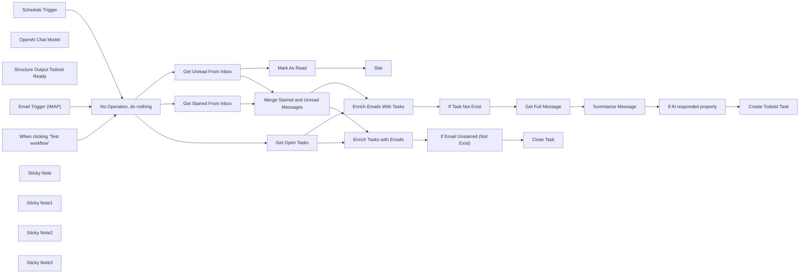

## Fluxo (.json) :

```json
{
  "id": "WUX0BsRA1dbzTKnl",
  "meta": {
    "instanceId": "bdce9ec27bbe2b742054f01d034b8b468d2e7758edd716403ad5bd4583a8f649",
    "templateCredsSetupCompleted": true
  },
  "name": "Email mailbox as Todoist tasks",
  "tags": [],
  "nodes": [
    {
      "id": "5b711a67-3d03-4687-a550-0514e2a5d251",
      "name": "When clicking ‘Test workflow’",
      "type": "n8n-nodes-base.manualTrigger",
      "position": [
        -220,
        100
      ],
      "parameters": {},
      "typeVersion": 1
    },
    {
      "id": "5862ae85-d48b-49a6-9c9f-4a682d42af78",
      "name": "Mark As Read",
      "type": "n8n-nodes-base.gmail",
      "position": [
        580,
        -240
      ],
      "webhookId": "b1551d40-6d53-47ec-ad90-0386c04de860",
      "parameters": {
        "messageId": "={{ $json.id }}",
        "operation": "markAsRead"
      },
      "credentials": {
        "gmailOAuth2": {
          "id": "UmjYQEDj616cX3UR",
          "name": "Gmail lukp12"
        }
      },
      "typeVersion": 2.1
    },
    {
      "id": "19655c59-dc43-4d3d-aaa1-a23e0b5c64e2",
      "name": "Star",
      "type": "n8n-nodes-base.gmail",
      "position": [
        780,
        -240
      ],
      "webhookId": "b1551d40-6d53-47ec-ad90-0386c04de860",
      "parameters": {
        "labelIds": [
          "STARRED"
        ],
        "messageId": "={{ $json.id }}",
        "operation": "addLabels"
      },
      "credentials": {
        "gmailOAuth2": {
          "id": "UmjYQEDj616cX3UR",
          "name": "Gmail lukp12"
        }
      },
      "typeVersion": 2.1
    },
    {
      "id": "62eeda04-39b2-4423-90e4-7d6518210b00",
      "name": "Get Starred From Inbox",
      "type": "n8n-nodes-base.gmail",
      "position": [
        300,
        20
      ],
      "webhookId": "848b9f06-db3c-4c74-aac3-fb40feb1187b",
      "parameters": {
        "filters": {
          "labelIds": [
            "STARRED",
            "INBOX"
          ]
        },
        "operation": "getAll"
      },
      "credentials": {
        "gmailOAuth2": {
          "id": "UmjYQEDj616cX3UR",
          "name": "Gmail lukp12"
        }
      },
      "typeVersion": 2.1
    },
    {
      "id": "dfd857e6-7728-4d7e-88ad-c20ffab1a90b",
      "name": "Get Unread From Inbox",
      "type": "n8n-nodes-base.gmail",
      "position": [
        300,
        -160
      ],
      "webhookId": "848b9f06-db3c-4c74-aac3-fb40feb1187b",
      "parameters": {
        "filters": {
          "labelIds": [
            "INBOX"
          ],
          "readStatus": "unread"
        },
        "operation": "getAll"
      },
      "credentials": {
        "gmailOAuth2": {
          "id": "UmjYQEDj616cX3UR",
          "name": "Gmail lukp12"
        }
      },
      "typeVersion": 2.1
    },
    {
      "id": "a864282e-c50c-4719-a813-dc407f28043b",
      "name": "If Task Not Exist",
      "type": "n8n-nodes-base.if",
      "position": [
        -140,
        800
      ],
      "parameters": {
        "options": {},
        "conditions": {
          "options": {
            "version": 2,
            "leftValue": "",
            "caseSensitive": true,
            "typeValidation": "strict"
          },
          "combinator": "and",
          "conditions": [
            {
              "id": "443f2e6e-5145-4c09-af8e-193f24b6536f",
              "operator": {
                "type": "string",
                "operation": "notExists",
                "singleValue": true
              },
              "leftValue": "={{ $json.content }}",
              "rightValue": ""
            }
          ]
        }
      },
      "typeVersion": 2.2
    },
    {
      "id": "7f0ce1d6-14de-4087-b3f1-542cf38e5df3",
      "name": "OpenAI Chat Model",
      "type": "@n8n/n8n-nodes-langchain.lmChatOpenAi",
      "position": [
        220,
        820
      ],
      "parameters": {
        "model": {
          "__rl": true,
          "mode": "list",
          "value": "gpt-4o-mini"
        },
        "options": {}
      },
      "credentials": {
        "openAiApi": {
          "id": "zjIZQuuuZMJpiUny",
          "name": "OpenAi account"
        }
      },
      "typeVersion": 1.2
    },
    {
      "id": "7e314e74-1f3e-460e-99f2-7338e3f4627e",
      "name": "Structure Output Todoist Ready",
      "type": "@n8n/n8n-nodes-langchain.outputParserStructured",
      "position": [
        600,
        820
      ],
      "parameters": {
        "jsonSchemaExample": "{\n\t\"content\": \"Task name\",\n\t\"description\": \"Description of the thread\",\n    \"actions\": \"What actions should you take before closing this task\",\n    \"answer\": \"Proposed answer to the thread or propositions of possible actions\"\n}"
      },
      "typeVersion": 1.2
    },
    {
      "id": "a36464d3-917c-4a8c-bd4b-f5ae21e3d758",
      "name": "If AI responded properly",
      "type": "n8n-nodes-base.if",
      "position": [
        740,
        580
      ],
      "parameters": {
        "options": {},
        "conditions": {
          "options": {
            "version": 2,
            "leftValue": "",
            "caseSensitive": true,
            "typeValidation": "strict"
          },
          "combinator": "and",
          "conditions": [
            {
              "id": "1109c955-21b6-4342-8851-1926ae4216b7",
              "operator": {
                "type": "string",
                "operation": "exists",
                "singleValue": true
              },
              "leftValue": "={{ $json.output.content }}",
              "rightValue": ""
            },
            {
              "id": "cc5ac32f-564f-47be-8782-600d278995fb",
              "operator": {
                "type": "string",
                "operation": "exists",
                "singleValue": true
              },
              "leftValue": "={{ $json.output.description }}",
              "rightValue": ""
            }
          ]
        }
      },
      "typeVersion": 2.2
    },
    {
      "id": "4d2de14b-719d-44f2-a207-94cc4394738a",
      "name": "Create Todoist Task",
      "type": "n8n-nodes-base.todoist",
      "position": [
        980,
        560
      ],
      "parameters": {
        "content": "={{ $json.output.content }}",
        "options": {
          "description": "={{ $json.output.description }}\n\n**Proposed actions**\n\n{{ $json.output.actions }}\n\n**Proposed answer**\n\n{{ $json.output.answer }}"
        },
        "project": {
          "__rl": true,
          "mode": "list",
          "value": "2351998202",
          "cachedResultName": "Test Project"
        }
      },
      "credentials": {
        "todoistApi": {
          "id": "3MjbugUWx4uLv97e",
          "name": "Todoist Konto Prywatne"
        }
      },
      "typeVersion": 2.1
    },
    {
      "id": "25fddc8e-6781-473a-9978-aae3c900e39a",
      "name": "Get Full Message",
      "type": "n8n-nodes-base.gmail",
      "position": [
        140,
        580
      ],
      "webhookId": "d20c5a51-4078-47e2-bec4-54af54ddf4dd",
      "parameters": {
        "simple": false,
        "options": {},
        "messageId": "={{ $json.id }}",
        "operation": "get"
      },
      "credentials": {
        "gmailOAuth2": {
          "id": "UmjYQEDj616cX3UR",
          "name": "Gmail lukp12"
        }
      },
      "typeVersion": 2.1
    },
    {
      "id": "7531e446-4d17-460f-b3c4-6830c01060c0",
      "name": "Summarize Message",
      "type": "@n8n/n8n-nodes-langchain.agent",
      "position": [
        340,
        580
      ],
      "parameters": {
        "text": "=You are a professional email assistant. Your task is to analyze provided email content and transform email into task. Your output will be JSON and will have:\n\n- \"content\", which is exactly \"{{ $json.subject }}\"\n- \"description\", which is short summary what this email is about and what is whole thread point\n- \"actions\", which is your proposition on what actions should be done before responding or closing this email thread\n- \"answer\", which is your proposition on how to respond to this email, when all actions are done\n\nAnswer should be detailed and assuming that content of the email is not known to reader.\n\nEmail content is:\n\n{{ $json.html }}",
        "options": {},
        "promptType": "define",
        "hasOutputParser": true
      },
      "typeVersion": 1.8,
      "alwaysOutputData": true
    },
    {
      "id": "5034b666-de2f-42f4-8b3a-3a4e36ca52a7",
      "name": "Enrich Emails With Tasks",
      "type": "n8n-nodes-base.merge",
      "position": [
        760,
        380
      ],
      "parameters": {
        "mode": "combine",
        "options": {
          "multipleMatches": "all"
        },
        "advanced": true,
        "joinMode": "enrichInput1",
        "mergeByFields": {
          "values": [
            {
              "field1": "Subject",
              "field2": "content"
            }
          ]
        }
      },
      "typeVersion": 3.1
    },
    {
      "id": "ec352eb7-7670-47ab-b16e-6407b9a69455",
      "name": "Enrich Tasks with Emails",
      "type": "n8n-nodes-base.merge",
      "position": [
        900,
        180
      ],
      "parameters": {
        "mode": "combine",
        "options": {
          "multipleMatches": "all"
        },
        "advanced": true,
        "joinMode": "enrichInput2",
        "mergeByFields": {
          "values": [
            {
              "field1": "Subject",
              "field2": "content"
            }
          ]
        }
      },
      "typeVersion": 3.1
    },
    {
      "id": "e3a513f0-8113-4bcc-990f-c113a1086bc6",
      "name": "If Email Unstarred (Not Exist)",
      "type": "n8n-nodes-base.if",
      "position": [
        -200,
        1160
      ],
      "parameters": {
        "options": {},
        "conditions": {
          "options": {
            "version": 2,
            "leftValue": "",
            "caseSensitive": true,
            "typeValidation": "strict"
          },
          "combinator": "and",
          "conditions": [
            {
              "id": "4ed052b1-1938-4537-9099-f8e2475a63b3",
              "operator": {
                "type": "string",
                "operation": "notExists",
                "singleValue": true
              },
              "leftValue": "={{ $json.Subject }}",
              "rightValue": ""
            }
          ]
        }
      },
      "typeVersion": 2.2
    },
    {
      "id": "5acaa018-6592-4449-8ff4-9225f8ed28c5",
      "name": "Close Task",
      "type": "n8n-nodes-base.todoist",
      "position": [
        80,
        1100
      ],
      "parameters": {
        "taskId": "={{ $json.id }}",
        "operation": "close"
      },
      "credentials": {
        "todoistApi": {
          "id": "3MjbugUWx4uLv97e",
          "name": "Todoist Konto Prywatne"
        }
      },
      "typeVersion": 2.1
    },
    {
      "id": "4004e68a-4dcf-4216-bd01-2f2da0eeba77",
      "name": "Email Trigger (IMAP)",
      "type": "n8n-nodes-base.emailReadImap",
      "disabled": true,
      "position": [
        -220,
        -80
      ],
      "parameters": {
        "options": {}
      },
      "credentials": {
        "imap": {
          "id": "qdjU2dd5Fy7RqGPx",
          "name": "IMAP support@sailingbyte"
        }
      },
      "typeVersion": 2
    },
    {
      "id": "0e986c57-a016-4053-acb3-08e3b3a7af08",
      "name": "Schedule Trigger",
      "type": "n8n-nodes-base.scheduleTrigger",
      "disabled": true,
      "position": [
        -220,
        -260
      ],
      "parameters": {
        "rule": {
          "interval": [
            {}
          ]
        }
      },
      "typeVersion": 1.2
    },
    {
      "id": "fe1012a0-638f-469f-af09-f30a890a4937",
      "name": "No Operation, do nothing",
      "type": "n8n-nodes-base.noOp",
      "position": [
        0,
        100
      ],
      "parameters": {},
      "typeVersion": 1
    },
    {
      "id": "5e09f039-53cc-4473-ab60-5c1337ab75af",
      "name": "Sticky Note",
      "type": "n8n-nodes-base.stickyNote",
      "position": [
        -280,
        -360
      ],
      "parameters": {
        "width": 500,
        "height": 660,
        "content": "## Select Trigger\n**This workflow will work with many triggers**"
      },
      "typeVersion": 1
    },
    {
      "id": "1874a3c5-7467-4642-9ce4-7171b6e76af7",
      "name": "Sticky Note1",
      "type": "n8n-nodes-base.stickyNote",
      "position": [
        500,
        -380
      ],
      "parameters": {
        "width": 560,
        "height": 320,
        "content": "## Read and Star\n**Mark messages as Read and add Star to them**\nYou can delete this section if you don't want to make this happen automatically to your emails"
      },
      "typeVersion": 1
    },
    {
      "id": "c8f68aac-971c-427d-8b74-167d78b37037",
      "name": "Merge Starred and Unread Messages",
      "type": "n8n-nodes-base.merge",
      "position": [
        600,
        40
      ],
      "parameters": {},
      "typeVersion": 3.1
    },
    {
      "id": "7eab417d-6332-45d9-be0d-ba7b8888dd91",
      "name": "Get Open Tasks",
      "type": "n8n-nodes-base.todoist",
      "position": [
        300,
        200
      ],
      "parameters": {
        "filters": {
          "projectId": "2351998202"
        },
        "operation": "getAll"
      },
      "credentials": {
        "todoistApi": {
          "id": "3MjbugUWx4uLv97e",
          "name": "Todoist Konto Prywatne"
        }
      },
      "typeVersion": 2.1
    },
    {
      "id": "60071d08-d333-475e-a48b-cdb9c19eb7a2",
      "name": "Sticky Note2",
      "type": "n8n-nodes-base.stickyNote",
      "position": [
        -240,
        1000
      ],
      "parameters": {
        "width": 720,
        "height": 340,
        "content": "## Close Task\n**If Email was Unstarred manually by you, then we can probably close task, so we are closing it**"
      },
      "typeVersion": 1
    },
    {
      "id": "780d6400-226b-4da6-8d33-6f7977fcbb2d",
      "name": "Sticky Note3",
      "type": "n8n-nodes-base.stickyNote",
      "position": [
        -200,
        380
      ],
      "parameters": {
        "width": 1420,
        "height": 600,
        "content": "## Make New Task in Todoist\nIf there is no task on Todoist with same subject as your either starred or unread message, then it's time to create one.\nBut to make it easier for you to close tasks and emails, let AI help you out.\nAI not only summarizes message. It also proposes actions you should take or answers how you should reply to this email."
      },
      "typeVersion": 1
    }
  ],
  "active": false,
  "pinData": {},
  "settings": {
    "executionOrder": "v1"
  },
  "versionId": "66e4624f-4d02-4895-aeda-270e9277acdf",
  "connections": {
    "Close Task": {
      "main": [
        []
      ]
    },
    "Mark As Read": {
      "main": [
        [
          {
            "node": "Star",
            "type": "main",
            "index": 0
          }
        ]
      ]
    },
    "Get Open Tasks": {
      "main": [
        [
          {
            "node": "Enrich Emails With Tasks",
            "type": "main",
            "index": 1
          },
          {
            "node": "Enrich Tasks with Emails",
            "type": "main",
            "index": 1
          }
        ]
      ]
    },
    "Get Full Message": {
      "main": [
        [
          {
            "node": "Summarize Message",
            "type": "main",
            "index": 0
          }
        ]
      ]
    },
    "Schedule Trigger": {
      "main": [
        [
          {
            "node": "No Operation, do nothing",
            "type": "main",
            "index": 0
          }
        ]
      ]
    },
    "If Task Not Exist": {
      "main": [
        [
          {
            "node": "Get Full Message",
            "type": "main",
            "index": 0
          }
        ]
      ]
    },
    "OpenAI Chat Model": {
      "ai_languageModel": [
        [
          {
            "node": "Summarize Message",
            "type": "ai_languageModel",
            "index": 0
          }
        ]
      ]
    },
    "Summarize Message": {
      "main": [
        [
          {
            "node": "If AI responded properly",
            "type": "main",
            "index": 0
          }
        ]
      ]
    },
    "Email Trigger (IMAP)": {
      "main": [
        [
          {
            "node": "No Operation, do nothing",
            "type": "main",
            "index": 0
          }
        ]
      ]
    },
    "Get Unread From Inbox": {
      "main": [
        [
          {
            "node": "Mark As Read",
            "type": "main",
            "index": 0
          },
          {
            "node": "Merge Starred and Unread Messages",
            "type": "main",
            "index": 0
          }
        ]
      ]
    },
    "Get Starred From Inbox": {
      "main": [
        [
          {
            "node": "Merge Starred and Unread Messages",
            "type": "main",
            "index": 1
          }
        ]
      ]
    },
    "Enrich Emails With Tasks": {
      "main": [
        [
          {
            "node": "If Task Not Exist",
            "type": "main",
            "index": 0
          }
        ]
      ]
    },
    "Enrich Tasks with Emails": {
      "main": [
        [
          {
            "node": "If Email Unstarred (Not Exist)",
            "type": "main",
            "index": 0
          }
        ]
      ]
    },
    "If AI responded properly": {
      "main": [
        [
          {
            "node": "Create Todoist Task",
            "type": "main",
            "index": 0
          }
        ],
        []
      ]
    },
    "No Operation, do nothing": {
      "main": [
        [
          {
            "node": "Get Unread From Inbox",
            "type": "main",
            "index": 0
          },
          {
            "node": "Get Starred From Inbox",
            "type": "main",
            "index": 0
          },
          {
            "node": "Get Open Tasks",
            "type": "main",
            "index": 0
          }
        ]
      ]
    },
    "If Email Unstarred (Not Exist)": {
      "main": [
        [
          {
            "node": "Close Task",
            "type": "main",
            "index": 0
          }
        ]
      ]
    },
    "Structure Output Todoist Ready": {
      "ai_outputParser": [
        [
          {
            "node": "Summarize Message",
            "type": "ai_outputParser",
            "index": 0
          }
        ]
      ]
    },
    "Merge Starred and Unread Messages": {
      "main": [
        [
          {
            "node": "Enrich Emails With Tasks",
            "type": "main",
            "index": 0
          },
          {
            "node": "Enrich Tasks with Emails",
            "type": "main",
            "index": 0
          }
        ]
      ]
    },
    "When clicking ‘Test workflow’": {
      "main": [
        [
          {
            "node": "No Operation, do nothing",
            "type": "main",
            "index": 0
          }
        ]
      ]
    }
  }
}
```

<a id="template-1420"></a>

## Template 1420 - Enviar mensagem no Twake

- **Nome:** Enviar mensagem no Twake
- **Descrição:** Fluxo que envia uma mensagem para um canal do Twake quando é acionado manualmente.
- **Funcionalidade:** • Disparo manual: Inicia o fluxo ao clicar em executar.
• Envio de mensagem: Envia o conteúdo definido para um canal específico do Twake.
• Configuração de conteúdo e canal: Permite definir a mensagem e o identificador do canal antes do envio.
• Autenticação via API: Utiliza credenciais da API do Twake para autenticar e autorizar o envio.
- **Ferramentas:** • Twake: Plataforma de colaboração e mensagens em equipe; utilizada aqui via API para enviar mensagens a canais.

## Fluxo visual

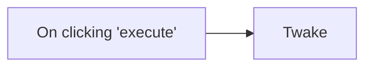

## Fluxo (.json) :

```json
{
  "id": "1",
  "name": "Send a message on Twake",
  "nodes": [
    {
      "name": "On clicking 'execute'",
      "type": "n8n-nodes-base.manualTrigger",
      "position": [
        600,
        300
      ],
      "parameters": {},
      "typeVersion": 1
    },
    {
      "name": "Twake",
      "type": "n8n-nodes-base.twake",
      "position": [
        800,
        300
      ],
      "parameters": {
        "content": "",
        "channelId": "",
        "additionalFields": {}
      },
      "credentials": {
        "twakeCloudApi": ""
      },
      "typeVersion": 1
    }
  ],
  "active": false,
  "settings": {},
  "connections": {
    "On clicking 'execute'": {
      "main": [
        [
          {
            "node": "Twake",
            "type": "main",
            "index": 0
          }
        ]
      ]
    }
  }
}
```

<a id="template-1422"></a>

## Template 1422 - Resumo automático de vídeo YouTube

- **Nome:** Resumo automático de vídeo YouTube
- **Descrição:** Recebe uma URL de vídeo via webhook, obtém metadados e transcrição, gera um resumo/análise estruturada com um modelo de linguagem e retorna o resultado, além de enviar uma mensagem via Telegram.
- **Funcionalidade:** • Recepção de requisição via Webhook: Inicia o fluxo ao receber uma URL de vídeo.
• Extração da URL do payload: Obtém a URL enviada no corpo da requisição.
• Extração do ID do vídeo: Analisa a URL para extrair o ID do YouTube.
• Recuperação de metadados do vídeo: Busca título, descrição e ID do vídeo.
• Obtenção da transcrição do vídeo: Coleta o texto transcrito do conteúdo do vídeo.
• Quebra e concatenação do texto: Divide e depois concatena segmentos da transcrição para processamento.
• Resumo e análise com LLM: Gera um resumo estruturado e análise técnica do texto usando um modelo de linguagem.
• Montagem do objeto de resposta: Combina resumo, metadados e URL em um objeto organizado.
• Resposta ao solicitante e notificação: Retorna o resultado pela resposta do webhook e envia título/URL via Telegram.
- **Ferramentas:** • YouTube: Fonte dos vídeos e metadados (título, descrição, id).
• Serviço de transcrição de vídeos do YouTube: Fornece a transcrição textual do conteúdo do vídeo.
• OpenAI (modelo gpt-4o-mini ou similar): Gera o resumo e a análise estruturada a partir da transcrição.
• Telegram: Envia notificações contendo título e link do vídeo para um chat/usuário.

## Fluxo visual

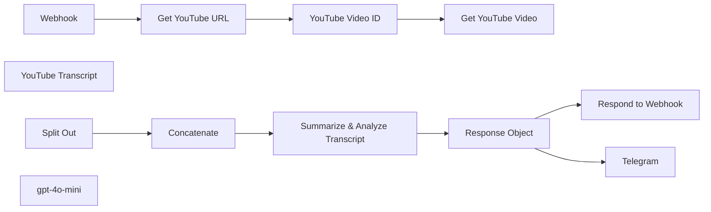

## Fluxo (.json) :

```json
{
  "nodes": [
    {
      "id": "9320d08a-4868-4103-abdf-3f8f54a7a0a0",
      "name": "Webhook",
      "type": "n8n-nodes-base.webhook",
      "position": [
        0,
        0
      ],
      "webhookId": "9024e29e-9080-4cf5-9a6b-0d918468f195",
      "parameters": {
        "path": "ytube",
        "options": {},
        "httpMethod": "POST",
        "responseMode": "responseNode"
      },
      "typeVersion": 2
    },
    {
      "id": "a5cc8922-8124-4269-9cfd-e891b29cc2b7",
      "name": "YouTube Transcript",
      "type": "n8n-nodes-youtube-transcription.youtubeTranscripter",
      "position": [
        800,
        0
      ],
      "parameters": {},
      "typeVersion": 1
    },
    {
      "id": "ff3c0fd1-36d8-4d64-b405-0600efd4d93b",
      "name": "Split Out",
      "type": "n8n-nodes-base.splitOut",
      "position": [
        200,
        260
      ],
      "parameters": {
        "options": {},
        "fieldToSplitOut": "transcript"
      },
      "typeVersion": 1
    },
    {
      "id": "423276e0-81bf-487a-bbdd-26e9b84fa755",
      "name": "Respond to Webhook",
      "type": "n8n-nodes-base.respondToWebhook",
      "position": [
        1200,
        140
      ],
      "parameters": {
        "options": {}
      },
      "typeVersion": 1.1
    },
    {
      "id": "27344649-8029-48ae-867b-7363d904fc59",
      "name": "Telegram",
      "type": "n8n-nodes-base.telegram",
      "position": [
        1200,
        380
      ],
      "parameters": {
        "text": "={{ $json.title }}\n{{ $json.youtubeUrl }}",
        "additionalFields": {
          "parse_mode": "HTML",
          "appendAttribution": false
        }
      },
      "typeVersion": 1.2
    },
    {
      "id": "230c0325-d22a-4070-9460-748a6fef48d5",
      "name": "Get YouTube URL",
      "type": "n8n-nodes-base.set",
      "position": [
        200,
        0
      ],
      "parameters": {
        "options": {},
        "assignments": {
          "assignments": [
            {
              "id": "3ee42e4c-3cee-4934-97e7-64c96b5691ed",
              "name": "youtubeUrl",
              "type": "string",
              "value": "={{ $json.body.youtubeUrl }}"
            }
          ]
        }
      },
      "typeVersion": 3.4
    },
    {
      "id": "420e90c3-9dfa-4f41-825a-9874b5ebe43a",
      "name": "YouTube Video ID",
      "type": "n8n-nodes-base.code",
      "position": [
        400,
        0
      ],
      "parameters": {
        "jsCode": "const extractYoutubeId = (url) => {\n // Regex pattern that matches both youtu.be and youtube.com URLs\n const pattern = /(?:youtube\\.com/(?:[^/]+/.+/|(?:v|e(?:mbed)?)/|.*[?&]v=)|youtu\\.be/)([^\"&?/\\s]{11})/;\n const match = url.match(pattern);\n return match ? match[1] : null;\n};\n\n// Input URL from previous node\nconst youtubeUrl = items[0].json.youtubeUrl; // Adjust this based on your workflow\n\n// Process the URL and return the video ID\nreturn [{\n json: {\n videoId: extractYoutubeId(youtubeUrl)\n }\n}];\n"
      },
      "typeVersion": 2
    },
    {
      "id": "a4171c3e-1ff2-40de-af7f-b3971a1ebe79",
      "name": "Get YouTube Video",
      "type": "n8n-nodes-base.youTube",
      "position": [
        600,
        0
      ],
      "parameters": {
        "options": {},
        "videoId": "={{ $json.videoId }}",
        "resource": "video",
        "operation": "get"
      },
      "typeVersion": 1
    },
    {
      "id": "73e6bfc5-8b62-4880-acd4-292f2f692540",
      "name": "gpt-4o-mini",
      "type": "@n8n/n8n-nodes-langchain.lmChatOpenAi",
      "position": [
        620,
        440
      ],
      "parameters": {
        "options": {}
      },
      "typeVersion": 1
    },
    {
      "id": "ea14e296-b30c-46f7-b283-746822ae1af4",
      "name": "Summarize & Analyze Transcript",
      "type": "@n8n/n8n-nodes-langchain.chainLlm",
      "position": [
        600,
        260
      ],
      "parameters": {
        "text": "=Please analyze the given text and create a structured summary following these guidelines:\n\n1. Break down the content into main topics using Level 2 headers (##)\n2. Under each header:\n - List only the most essential concepts and key points\n - Use bullet points for clarity\n - Keep explanations concise\n - Preserve technical accuracy\n - Highlight key terms in bold\n3. Organize the information in this sequence:\n - Definition/Background\n - Main characteristics\n - Implementation details\n - Advantages/Disadvantages\n4. Format requirements:\n - Use markdown formatting\n - Keep bullet points simple (no nesting)\n - Bold important terms using **term**\n - Use tables for comparisons\n - Include relevant technical details\n\nPlease provide a clear, structured summary that captures the core concepts while maintaining technical accuracy.\n\nHere is the text: {{ $json.concatenated_text\n }}",
        "promptType": "define"
      },
      "typeVersion": 1.4
    },
    {
      "id": "90e3488f-f854-483e-9106-a5760d0c0457",
      "name": "Concatenate",
      "type": "n8n-nodes-base.summarize",
      "position": [
        400,
        260
      ],
      "parameters": {
        "options": {},
        "fieldsToSummarize": {
          "values": [
            {
              "field": "text",
              "separateBy": " ",
              "aggregation": "concatenate"
            }
          ]
        }
      },
      "typeVersion": 1
    },
    {
      "id": "9c5c249c-5eeb-4433-ba93-ace4611f4858",
      "name": "Response Object",
      "type": "n8n-nodes-base.set",
      "position": [
        960,
        260
      ],
      "parameters": {
        "options": {},
        "assignments": {
          "assignments": [
            {
              "id": "bf132004-6636-411f-9d85-0c696fda84c4",
              "name": "summary",
              "type": "string",
              "value": "={{ $json.text }}"
            },
            {
              "id": "63c8d0e3-685c-488a-9b45-363cf52479ea",
              "name": "topics",
              "type": "array",
              "value": "=[]"
            },
            {
              "id": "171f30cf-34e9-42f3-8735-814024bfde0b",
              "name": "title",
              "type": "string",
              "value": "={{ $('Get YouTube Video').item.json.snippet.title }}"
            },
            {
              "id": "7f26f5a3-e695-49d1-b1e8-9260c31f1b3d",
              "name": "description",
              "type": "string",
              "value": "={{ $('Get YouTube Video').item.json.snippet.description }}"
            },
            {
              "id": "d0594232-cb39-453c-b015-3b039c098e1f",
              "name": "id",
              "type": "string",
              "value": "={{ $('Get YouTube Video').item.json.id }}"
            },
            {
              "id": "17b6ca08-ce89-4467-bd25-0d2d182f7a8b",
              "name": "youtubeUrl",
              "type": "string",
              "value": "={{ $('Webhook').item.json.body.youtubeUrl }}"
            }
          ]
        }
      },
      "typeVersion": 3.4
    }
  ],
  "pinData": {},
  "connections": {
    "Webhook": {
      "main": [
        [
          {
            "node": "Get YouTube URL",
            "type": "main",
            "index": 0
          }
        ]
      ]
    },
    "Split Out": {
      "main": [
        [
          {
            "node": "Concatenate",
            "type": "main",
            "index": 0
          }
        ]
      ]
    },
    "Concatenate": {
      "main": [
        [
          {
            "node": "Summarize & Analyze Transcript",
            "type": "main",
            "index": 0
          }
        ]
      ]
    },
    "gpt-4o-mini": {
      "ai_languageModel": [
        [
          {
            "node": "Summarize & Analyze Transcript",
            "type": "ai_languageModel",
            "index": 0
          }
        ]
      ]
    },
    "Get YouTube URL": {
      "main": [
        [
          {
            "node": "YouTube Video ID",
            "type": "main",
            "index": 0
          }
        ]
      ]
    },
    "Response Object": {
      "main": [
        [
          {
            "node": "Respond to Webhook",
            "type": "main",
            "index": 0
          },
          {
            "node": "Telegram",
            "type": "main",
            "index": 0
          }
        ]
      ]
    },
    "YouTube Video ID": {
      "main": [
        [
          {
            "node": "Get YouTube Video",
            "type": "main",
            "index": 0
          }
        ]
      ]
    },
    "Summarize & Analyze Transcript": {
      "main": [
        [
          {
            "node": "Response Object",
            "type": "main",
            "index": 0
          }
        ]
      ]
    }
  }
}
```

<a id="template-1424"></a>

## Template 1424 - Salvar saída do Phantombuster no Airtable

- **Nome:** Salvar saída do Phantombuster no Airtable
- **Descrição:** Fluxo que obtém a saída de um Phantom (Phantombuster), formata campos selecionados e adiciona os dados como um novo registro em uma base do Airtable.
- **Funcionalidade:** • Gatilho manual: Inicia o fluxo quando o usuário clica em executar.
• Recuperar saída do Phantom: Chama a API do serviço de automação para obter os dados do phantom.
• Mapear campos relevantes: Extrai e formata campos como nome completo, e-mail e empresa para envio.
• Inserir em base de dados: Adiciona os dados mapeados como um novo registro em uma tabela do Airtable.
- **Ferramentas:** • Phantombuster: Serviço que executa automações (phantoms) e fornece a saída dos dados coletados.
• Airtable: Plataforma de banco de dados/tabela usada para armazenar os registros gerados.

## Fluxo visual

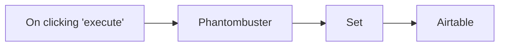

## Fluxo (.json) :

```json
{
  "id": "201",
  "name": "Store the output of a phantom in Airtable",
  "nodes": [
    {
      "name": "On clicking 'execute'",
      "type": "n8n-nodes-base.manualTrigger",
      "position": [
        270,
        300
      ],
      "parameters": {},
      "typeVersion": 1
    },
    {
      "name": "Phantombuster",
      "type": "n8n-nodes-base.phantombuster",
      "position": [
        470,
        300
      ],
      "parameters": {
        "agentId": "",
        "operation": "getOutput",
        "additionalFields": {}
      },
      "credentials": {
        "phantombusterApi": "Phantombuster Credentials"
      },
      "typeVersion": 1
    },
    {
      "name": "Set",
      "type": "n8n-nodes-base.set",
      "position": [
        670,
        300
      ],
      "parameters": {
        "values": {
          "string": [
            {
              "name": "Name",
              "value": "={{$node[\"Phantombuster\"].json[\"general\"][\"fullName\"]}}"
            },
            {
              "name": "Email",
              "value": "={{$node[\"Phantombuster\"].json[\"details\"][\"mail\"]}}"
            },
            {
              "name": "Company",
              "value": "={{$node[\"Phantombuster\"].json[\"jobs\"][0][\"companyName\"]}}"
            }
          ]
        },
        "options": {},
        "keepOnlySet": true
      },
      "typeVersion": 1
    },
    {
      "name": "Airtable",
      "type": "n8n-nodes-base.airtable",
      "position": [
        870,
        300
      ],
      "parameters": {
        "table": "",
        "options": {},
        "operation": "append",
        "application": ""
      },
      "credentials": {
        "airtableApi": "Airtable Credentials n8n"
      },
      "typeVersion": 1
    }
  ],
  "active": false,
  "settings": {},
  "connections": {
    "Set": {
      "main": [
        [
          {
            "node": "Airtable",
            "type": "main",
            "index": 0
          }
        ]
      ]
    },
    "Phantombuster": {
      "main": [
        [
          {
            "node": "Set",
            "type": "main",
            "index": 0
          }
        ]
      ]
    },
    "On clicking 'execute'": {
      "main": [
        [
          {
            "node": "Phantombuster",
            "type": "main",
            "index": 0
          }
        ]
      ]
    }
  }
}
```

<a id="template-1426"></a>

## Template 1426 - Consultar emails não lidos do Fastmail

- **Nome:** Consultar emails não lidos do Fastmail
- **Descrição:** Este fluxo consulta a API JMAP do Fastmail para recuperar as mensagens não lidas mais recentes da caixa de entrada.
- **Funcionalidade:** • Gatilho manual: inicia a execução quando o usuário clica em executar.
• Solicitação de sessão JMAP: obtém detalhes de sessão para descobrir o accountId.
• Listagem de caixas de correio: recupera as mailboxes da conta e identifica a caixa 'inbox'.
• Formatação de resultados: extrai e prepara account_id e mailbox_id para uso posterior.
• Busca de mensagens não lidas: executa Email/query para localizar emails sem a flag $seen na inbox, ordenados por data de recebimento e limitados a 3, com cálculo do total.
• Recuperação de detalhes das mensagens: executa Email/get para obter id, receivedAt, from, subject e keywords das mensagens encontradas.
• Autenticação via cabeçalho: usa credenciais de header (Authorization: Bearer token) para autorizar chamadas à API.
• Recomendações de otimização: sugere armazenar account_id e mailbox_id para evitar consultas repetidas e reduzir carga na API.
- **Ferramentas:** • Fastmail (JMAP API): serviço de e-mail utilizado via endpoints /jmap/session e /jmap/api para obter informações de sessão, listar mailboxes e consultar/recuperar emails.

## Fluxo visual

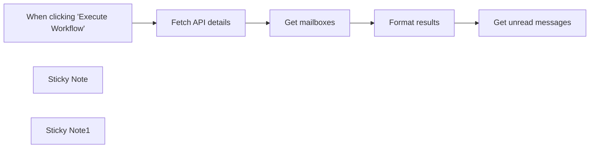

## Fluxo (.json) :

```json
{
  "nodes": [
    {
      "id": "31b6611c-e4d1-4ab8-9351-74718caf938d",
      "name": "When clicking \"Execute Workflow\"",
      "type": "n8n-nodes-base.manualTrigger",
      "position": [
        820,
        360
      ],
      "parameters": {},
      "typeVersion": 1
    },
    {
      "id": "5b8a2148-f8e3-4c21-ba39-6aa8cc492c5e",
      "name": "Get mailboxes",
      "type": "n8n-nodes-base.httpRequest",
      "position": [
        1260,
        360
      ],
      "parameters": {
        "url": "https://api.fastmail.com/jmap/api/",
        "method": "POST",
        "options": {},
        "sendBody": true,
        "authentication": "genericCredentialType",
        "bodyParameters": {
          "parameters": [
            {
              "name": "using",
              "value": "={{ [ \"urn:ietf:params:jmap:core\", \"urn:ietf:params:jmap:mail\" ] }}"
            },
            {
              "name": "methodCalls",
              "value": "={{\n[\n  [ \n    \"Mailbox/get\",\n    {\n      \"accountId\": $json.primaryAccounts['urn:ietf:params:jmap:mail'],\n      \"ids\": null\n    },\n    \"mailboxes\"\n  ] \n]\n}}"
            }
          ]
        },
        "genericAuthType": "httpHeaderAuth"
      },
      "credentials": {
        "httpHeaderAuth": {
          "id": "ZzWBkLUs2mg2xJBW",
          "name": "Fastmail"
        }
      },
      "typeVersion": 4.1
    },
    {
      "id": "8477a075-1341-4b69-8e20-4a56b2a96711",
      "name": "Fetch API details",
      "type": "n8n-nodes-base.httpRequest",
      "position": [
        1040,
        360
      ],
      "parameters": {
        "url": "https://api.fastmail.com/jmap/session",
        "options": {},
        "authentication": "genericCredentialType",
        "genericAuthType": "httpHeaderAuth"
      },
      "credentials": {
        "httpHeaderAuth": {
          "id": "ZzWBkLUs2mg2xJBW",
          "name": "Fastmail"
        }
      },
      "typeVersion": 4.1
    },
    {
      "id": "87188d6d-eb94-4b83-aaa4-e5c744d65c45",
      "name": "Format results",
      "type": "n8n-nodes-base.set",
      "position": [
        1480,
        360
      ],
      "parameters": {
        "fields": {
          "values": [
            {
              "name": "account_id",
              "stringValue": "={{ $('Fetch API details').first().json.primaryAccounts['urn:ietf:params:jmap:mail'] }}"
            },
            {
              "name": "mailbox_id",
              "stringValue": "={{ $json.methodResponses.find(e => e[2] == 'mailboxes')[1].list.find(e => e.role == 'inbox').id }}"
            }
          ]
        },
        "include": "none",
        "options": {}
      },
      "typeVersion": 3.2
    },
    {
      "id": "550b20c1-57ff-497e-b20a-e772e5fbfe86",
      "name": "Get unread messages",
      "type": "n8n-nodes-base.httpRequest",
      "position": [
        1700,
        360
      ],
      "parameters": {
        "url": "https://api.fastmail.com/jmap/api/",
        "method": "POST",
        "options": {},
        "sendBody": true,
        "authentication": "genericCredentialType",
        "bodyParameters": {
          "parameters": [
            {
              "name": "using",
              "value": "={{ [ \"urn:ietf:params:jmap:core\", \"urn:ietf:params:jmap:mail\" ] }}"
            },
            {
              "name": "methodCalls",
              "value": "={{\n[\n  [ \n    \"Email/query\",\n    {\n      \"accountId\": $json.account_id,\n      \"filter\": {\n        \"inMailbox\": $json.mailbox_id,\n        \"notKeyword\": \"$seen\"\n      },\n      \"sort\": [\n        {\n          \"property\": \"receivedAt\",\n          \"isAscending\": false\n        }\n      ],\n      \"limit\": 3,\n      \"calculateTotal\": true,\n    },\n    \"messages\"\n  ], [\n    \"Email/get\",\n    {\n      \"accountId\": $json.account_id,\n      \"#ids\": {\n        \"name\": \"Email/query\",\n        \"path\": \"/ids\",\n        \"resultOf\": \"messages\"\n      },\n      \"properties\": [\n        \"id\",\n        \"receivedAt\",\n        \"from\",\n        \"subject\",\n        \"keywords\"\n      ]\n    },\n    \"emails\"\n  ] \n]\n}}"
            }
          ]
        },
        "genericAuthType": "httpHeaderAuth"
      },
      "credentials": {
        "httpHeaderAuth": {
          "id": "ZzWBkLUs2mg2xJBW",
          "name": "Fastmail"
        }
      },
      "typeVersion": 4.1
    },
    {
      "id": "7298d504-8e68-481b-a2cb-07a64dcef159",
      "name": "Sticky Note",
      "type": "n8n-nodes-base.stickyNote",
      "position": [
        980,
        200
      ],
      "parameters": {
        "color": 5,
        "width": 671,
        "height": 328,
        "content": "## ℹ️ Replacing the initial nodes\n\nThese nodes fetch your account and mailbox IDs. Consider saving these values instead of querying them on every execution to improve performance and reduce the load on the JMAP API."
      },
      "typeVersion": 1
    },
    {
      "id": "b279bb2d-e76e-4e3b-abaf-e351d1c3462d",
      "name": "Sticky Note1",
      "type": "n8n-nodes-base.stickyNote",
      "position": [
        980,
        -60
      ],
      "parameters": {
        "color": 3,
        "width": 671,
        "height": 232,
        "content": "## ℹ️ Credentials\n\nThe JMAP standard does not limit the available authentication options. Fastmail (the sponsor of the standard) supports Bearer authentication as well as OAuth2.\n\nIn n8n you can implement the Fastmail Bearer authentication by creating Header Auth credentials with a name of `Authorization` and a value of `Bearer $apiToken` (replacing `$apiToken` with your actual [token from Fastmail](https://www.fastmail.com/settings/security/tokens))."
      },
      "typeVersion": 1
    }
  ],
  "pinData": {},
  "connections": {
    "Get mailboxes": {
      "main": [
        [
          {
            "node": "Format results",
            "type": "main",
            "index": 0
          }
        ]
      ]
    },
    "Format results": {
      "main": [
        [
          {
            "node": "Get unread messages",
            "type": "main",
            "index": 0
          }
        ]
      ]
    },
    "Fetch API details": {
      "main": [
        [
          {
            "node": "Get mailboxes",
            "type": "main",
            "index": 0
          }
        ]
      ]
    },
    "When clicking \"Execute Workflow\"": {
      "main": [
        [
          {
            "node": "Fetch API details",
            "type": "main",
            "index": 0
          }
        ]
      ]
    }
  }
}
```

<a id="template-1428"></a>

## Template 1428 - Chatbot pós-venda WooCommerce

- **Nome:** Chatbot pós-venda WooCommerce
- **Descrição:** Chatbot de suporte pós-venda que atende mensagens de clientes, verifica identidade por e-mail, recupera dados de pedidos e códigos de rastreio, responde dúvidas sobre políticas e escala solicitações complexas para um operador humano.
- **Funcionalidade:** • Recepção de mensagens: Inicia o atendimento quando uma mensagem de chat é recebida.
• Agente de suporte AI: Processa a conversa usando instruções de sistema e ferramentas conectadas para resolver dúvidas pós-venda.
• Verificação de identidade: Solicita e verifica estritamente o e-mail associado ao pedido antes de exibir dados sensíveis.
• Recuperação de pedidos: Busca detalhes de um pedido específico ou múltiplos pedidos do cliente mediante consulta.
• Obtenção de rastreio: Recupera código de rastreamento e URL da transportadora via API do site e disponibiliza ao cliente.
• Extração e formatação de metadados: Isola campos de metadados (ex.: código de rastreio, URL da transportadora, data de retirada) para resposta clara.
• Base de conhecimento vetorial: Responde perguntas sobre termos, condições e envios usando documentos indexados em um banco vetorial.
• Ingestão de documentos: Faz download de arquivos de uma pasta em nuvem, converte e vetorização usando embeddings para enriquecer a base de conhecimento.
• Memória de contexto: Mantém um buffer de conversação para seguir o histórico recente do cliente.
• Escalonamento para humano: Envia mensagens pré-formatadas a um operador via canal de mensagens quando necessário.
• Operações administrativas: Permite criação e limpeza de coleções vetoriais e testes manuais para manutenção.
- **Ferramentas:** • WooCommerce API: Fonte principal para recuperar dados de pedidos e clientes diretamente da loja.
• WordPress / Plugin de rastreamento (YITH): Endpoint REST utilizado para obter informações de pedidos e códigos de rastreio.
• OpenAI (modelos de chat e embeddings): Gera respostas conversacionais e cria embeddings para indexação de documentos.
• Qdrant: Banco de vetores usado para armazenar e consultar embeddings de documentos (base de conhecimento).
• Google Drive: Armazenamento de documentos fonte que são baixados e processados para vetorização.
• Telegram: Canal para notificar ou escalar solicitações para operadores humanos.


## Fluxo visual

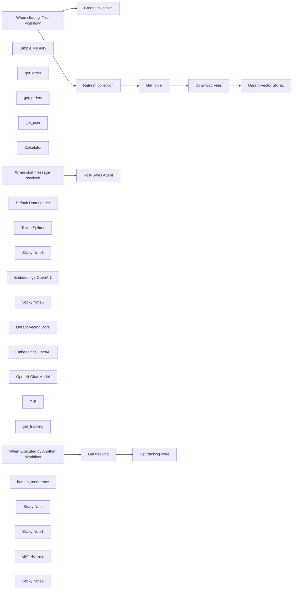

## Fluxo (.json) :

```json
{
  "id": "ODZpSQqCxkISEqv8",
  "meta": {
    "instanceId": "a4bfc93e975ca233ac45ed7c9227d84cf5a2329310525917adaf3312e10d5462",
    "templateCredsSetupCompleted": true
  },
  "name": "WooCommerce AI Chatbot Workflow for Post-Sales Support",
  "tags": [
    {
      "id": "NFwUyKypVupFwAM4",
      "name": "WooCommerce",
      "createdAt": "2024-12-13T15:34:20.174Z",
      "updatedAt": "2024-12-13T15:34:20.174Z"
    },
    {
      "id": "paTcf5QZDJsC2vKY",
      "name": "OpenAI",
      "createdAt": "2024-12-04T16:52:10.768Z",
      "updatedAt": "2024-12-04T16:52:10.768Z"
    }
  ],
  "nodes": [
    {
      "id": "25024dde-431b-4dad-b5ed-9be77cdf3db2",
      "name": "When chat message received",
      "type": "@n8n/n8n-nodes-langchain.chatTrigger",
      "position": [
        -860,
        420
      ],
      "webhookId": "bb9b597a-25ed-43de-9ebb-14f166af789b",
      "parameters": {
        "mode": "webhook",
        "public": true,
        "options": {
          "responseMode": "responseNode"
        }
      },
      "typeVersion": 1.1
    },
    {
      "id": "96139b63-75aa-4d16-91b1-2fe0ca624137",
      "name": "Simple Memory",
      "type": "@n8n/n8n-nodes-langchain.memoryBufferWindow",
      "position": [
        -520,
        720
      ],
      "parameters": {},
      "typeVersion": 1.3
    },
    {
      "id": "f7901f97-50c5-4f56-bae3-21c575aa22cc",
      "name": "get_order",
      "type": "n8n-nodes-base.wooCommerceTool",
      "position": [
        80,
        600
      ],
      "parameters": {
        "orderId": "={{ /*n8n-auto-generated-fromAI-override*/ $fromAI('Order_ID', `Order Details Retrieval Process:\n1. Request Order Number\n   - Explicitly ask customer for the complete order number\n\n2. Identity Verification\n   - Ask for the email address associated with the order\n   - Strictly verify that the provided email matches the order record\n   - If email does NOT match the order:\n     * Immediately halt the process\n     * Inform customer that the email is incorrect\n     * Do NOT provide the correct email\n     * Prevent access to order details\n\n3. Verification Criteria\n   - Exact match of email to order record is mandatory\n   - No exceptions or workarounds\n   - Customer must provide the precise, correct email`, 'string') }}",
        "resource": "order",
        "operation": "get"
      },
      "credentials": {
        "wooCommerceApi": {
          "id": "nCgFKMfBO95v38Mp",
          "name": "WooCommerce (magnanigioielli.com)"
        }
      },
      "typeVersion": 1
    },
    {
      "id": "b448fb28-1bba-4743-923f-4198bdea0165",
      "name": "get_orders",
      "type": "n8n-nodes-base.wooCommerceTool",
      "position": [
        180,
        600
      ],
      "parameters": {
        "options": {
          "search": "={{ /*n8n-auto-generated-fromAI-override*/ $fromAI('Search', ``, 'string') }}"
        },
        "resource": "order",
        "operation": "getAll",
        "returnAll": "={{ /*n8n-auto-generated-fromAI-override*/ $fromAI('Return_All', ``, 'boolean') }}"
      },
      "credentials": {
        "wooCommerceApi": {
          "id": "nCgFKMfBO95v38Mp",
          "name": "WooCommerce (magnanigioielli.com)"
        }
      },
      "typeVersion": 1
    },
    {
      "id": "4b386cd5-1f42-45b9-bfa6-e8caf50d49b3",
      "name": "get_user",
      "type": "n8n-nodes-base.wooCommerceTool",
      "position": [
        280,
        600
      ],
      "parameters": {
        "filters": {
          "email": "={{ /*n8n-auto-generated-fromAI-override*/ $fromAI('Email', ``, 'string') }}"
        },
        "resource": "customer",
        "operation": "getAll",
        "returnAll": true
      },
      "credentials": {
        "wooCommerceApi": {
          "id": "nCgFKMfBO95v38Mp",
          "name": "WooCommerce (magnanigioielli.com)"
        }
      },
      "typeVersion": 1
    },
    {
      "id": "2235e0c5-ad5e-42d3-a6da-19513dcba181",
      "name": "Calculator",
      "type": "@n8n/n8n-nodes-langchain.toolCalculator",
      "position": [
        -400,
        720
      ],
      "parameters": {},
      "typeVersion": 1
    },
    {
      "id": "e3b8fd50-2f47-4866-acc7-88e819b9d2ce",
      "name": "When clicking ‘Test workflow’",
      "type": "n8n-nodes-base.manualTrigger",
      "position": [
        -980,
        -500
      ],
      "parameters": {},
      "typeVersion": 1
    },
    {
      "id": "7ac0573f-fcc0-426e-b412-1f4a1e38b9ee",
      "name": "Create collection",
      "type": "n8n-nodes-base.httpRequest",
      "position": [
        -680,
        -640
      ],
      "parameters": {
        "url": "https://QDRANTURL/collections/COLLECTION",
        "method": "POST",
        "options": {},
        "jsonBody": "{\n  \"filter\": {}\n}",
        "sendBody": true,
        "sendHeaders": true,
        "specifyBody": "json",
        "authentication": "genericCredentialType",
        "genericAuthType": "httpHeaderAuth",
        "headerParameters": {
          "parameters": [
            {
              "name": "Content-Type",
              "value": "application/json"
            }
          ]
        }
      },
      "credentials": {
        "httpHeaderAuth": {
          "id": "qhny6r5ql9wwotpn",
          "name": "Qdrant API (Hetzner)"
        }
      },
      "typeVersion": 4.2
    },
    {
      "id": "15de11a6-27eb-4431-9105-a7f07f103d44",
      "name": "Refresh collection",
      "type": "n8n-nodes-base.httpRequest",
      "position": [
        -680,
        -380
      ],
      "parameters": {
        "url": "https://QDRANTURL/collections/COLLECTION/points/delete",
        "method": "POST",
        "options": {},
        "jsonBody": "{\n  \"filter\": {}\n}",
        "sendBody": true,
        "sendHeaders": true,
        "specifyBody": "json",
        "authentication": "genericCredentialType",
        "genericAuthType": "httpHeaderAuth",
        "headerParameters": {
          "parameters": [
            {
              "name": "Content-Type",
              "value": "application/json"
            }
          ]
        }
      },
      "credentials": {
        "httpHeaderAuth": {
          "id": "qhny6r5ql9wwotpn",
          "name": "Qdrant API (Hetzner)"
        }
      },
      "typeVersion": 4.2
    },
    {
      "id": "aab947f3-3e7f-4068-8183-a6003754dc16",
      "name": "Get folder",
      "type": "n8n-nodes-base.googleDrive",
      "position": [
        -460,
        -380
      ],
      "parameters": {
        "filter": {
          "driveId": {
            "__rl": true,
            "mode": "list",
            "value": "My Drive",
            "cachedResultUrl": "https://drive.google.com/drive/my-drive",
            "cachedResultName": "My Drive"
          },
          "folderId": {
            "__rl": true,
            "mode": "id",
            "value": "=test-whatsapp"
          }
        },
        "options": {},
        "resource": "fileFolder"
      },
      "credentials": {
        "googleDriveOAuth2Api": {
          "id": "HEy5EuZkgPZVEa9w",
          "name": "Google Drive account (n3w.it)"
        }
      },
      "typeVersion": 3
    },
    {
      "id": "091b9080-eae0-433a-80e6-d1c553b4912b",
      "name": "Download Files",
      "type": "n8n-nodes-base.googleDrive",
      "position": [
        -240,
        -380
      ],
      "parameters": {
        "fileId": {
          "__rl": true,
          "mode": "id",
          "value": "={{ $json.id }}"
        },
        "options": {
          "googleFileConversion": {
            "conversion": {
              "docsToFormat": "text/plain"
            }
          }
        },
        "operation": "download"
      },
      "credentials": {
        "googleDriveOAuth2Api": {
          "id": "HEy5EuZkgPZVEa9w",
          "name": "Google Drive account (n3w.it)"
        }
      },
      "typeVersion": 3
    },
    {
      "id": "400fcdde-ef42-49bf-807d-e2ed029aae1f",
      "name": "Default Data Loader",
      "type": "@n8n/n8n-nodes-langchain.documentDefaultDataLoader",
      "position": [
        160,
        -180
      ],
      "parameters": {
        "options": {},
        "dataType": "binary"
      },
      "typeVersion": 1
    },
    {
      "id": "b3f39ac8-ebbc-42c5-8368-2fedd8d133f3",
      "name": "Token Splitter",
      "type": "@n8n/n8n-nodes-langchain.textSplitterTokenSplitter",
      "position": [
        140,
        0
      ],
      "parameters": {
        "chunkSize": 300,
        "chunkOverlap": 30
      },
      "typeVersion": 1
    },
    {
      "id": "a17ed192-cd39-456d-b35a-ee7d8532fb7c",
      "name": "Sticky Note3",
      "type": "n8n-nodes-base.stickyNote",
      "position": [
        -480,
        -700
      ],
      "parameters": {
        "color": 6,
        "width": 880,
        "height": 220,
        "content": "# STEP 1\n\n## Create Qdrant Collection\nChange:\n- QDRANTURL\n- COLLECTION"
      },
      "typeVersion": 1
    },
    {
      "id": "ce12df1d-357a-4f8f-91cf-f92c0aa6bcd7",
      "name": "Qdrant Vector Store1",
      "type": "@n8n/n8n-nodes-langchain.vectorStoreQdrant",
      "position": [
        0,
        -380
      ],
      "parameters": {
        "mode": "insert",
        "options": {},
        "qdrantCollection": {
          "__rl": true,
          "mode": "id",
          "value": "=COLLECTION"
        }
      },
      "credentials": {
        "qdrantApi": {
          "id": "iyQ6MQiVaF3VMBmt",
          "name": "QdrantApi account"
        }
      },
      "typeVersion": 1
    },
    {
      "id": "e440121d-6aa8-4cc7-920c-d28d93717d99",
      "name": "Embeddings OpenAI1",
      "type": "@n8n/n8n-nodes-langchain.embeddingsOpenAi",
      "position": [
        0,
        -160
      ],
      "parameters": {
        "options": {}
      },
      "credentials": {
        "openAiApi": {
          "id": "CDX6QM4gLYanh0P4",
          "name": "OpenAi account"
        }
      },
      "typeVersion": 1.1
    },
    {
      "id": "c6f89301-3ae0-4068-8279-de149859f6a5",
      "name": "Sticky Note5",
      "type": "n8n-nodes-base.stickyNote",
      "position": [
        -700,
        -440
      ],
      "parameters": {
        "color": 4,
        "width": 620,
        "height": 400,
        "content": "# STEP 2\n\n\n\n\n\n\n\n\n\n\n\n\n## Documents vectorization with Qdrant and Google Drive\nChange:\n- QDRANTURL\n- COLLECTION"
      },
      "typeVersion": 1
    },
    {
      "id": "7ae502f5-bf12-49bd-afd0-d8ad050c1d8b",
      "name": "Qdrant Vector Store",
      "type": "@n8n/n8n-nodes-langchain.vectorStoreQdrant",
      "position": [
        -140,
        960
      ],
      "parameters": {
        "options": {},
        "qdrantCollection": {
          "__rl": true,
          "mode": "id",
          "value": "=COLLECTION"
        }
      },
      "credentials": {
        "qdrantApi": {
          "id": "iyQ6MQiVaF3VMBmt",
          "name": "QdrantApi account"
        }
      },
      "typeVersion": 1
    },
    {
      "id": "b3bc247f-7fcb-4c17-8995-ec4ba26b65ee",
      "name": "Embeddings OpenAI",
      "type": "@n8n/n8n-nodes-langchain.embeddingsOpenAi",
      "position": [
        -160,
        1140
      ],
      "parameters": {
        "options": {}
      },
      "credentials": {
        "openAiApi": {
          "id": "CDX6QM4gLYanh0P4",
          "name": "OpenAi account"
        }
      },
      "typeVersion": 1.1
    },
    {
      "id": "7c110a8b-5e66-4824-ac9f-a42fabbe3929",
      "name": "OpenAI Chat Model",
      "type": "@n8n/n8n-nodes-langchain.lmChatOpenAi",
      "position": [
        160,
        960
      ],
      "parameters": {
        "options": {}
      },
      "credentials": {
        "openAiApi": {
          "id": "CDX6QM4gLYanh0P4",
          "name": "OpenAi account"
        }
      },
      "typeVersion": 1
    },
    {
      "id": "b9a62833-a124-439b-b6ca-eb6061afa74d",
      "name": "ToS",
      "type": "@n8n/n8n-nodes-langchain.toolVectorStore",
      "position": [
        -40,
        780
      ],
      "parameters": {
        "name": "company",
        "description": "Rispondi alle domande relative ai termini e condizioni e spedizioni"
      },
      "typeVersion": 1
    },
    {
      "id": "667e8756-78a6-4cd1-bf24-00af8188fe50",
      "name": "get_tracking",
      "type": "@n8n/n8n-nodes-langchain.toolWorkflow",
      "position": [
        -240,
        600
      ],
      "parameters": {
        "name": "get_tracking",
        "workflowId": {
          "__rl": true,
          "mode": "list",
          "value": "AcPE4PXeFOiOW48H",
          "cachedResultName": "WooCommerce Get Tracking Number"
        },
        "description": "Get tracking number for a specific order by providing the order number. The tool retrieves the unique tracking code that allows customers to monitor their shipment's current status and location.",
        "workflowInputs": {
          "value": {
            "order_number": "={{ /*n8n-auto-generated-fromAI-override*/ $fromAI('order_number', ``, 'string') }}"
          },
          "schema": [
            {
              "id": "order_number",
              "type": "string",
              "display": true,
              "removed": false,
              "required": false,
              "displayName": "order_number",
              "defaultMatch": false,
              "canBeUsedToMatch": true
            }
          ],
          "mappingMode": "defineBelow",
          "matchingColumns": [
            "order_number"
          ],
          "attemptToConvertTypes": false,
          "convertFieldsToString": false
        }
      },
      "typeVersion": 2.1
    },
    {
      "id": "305ea876-80b9-45c4-b548-6d1df093bd94",
      "name": "When Executed by Another Workflow",
      "type": "n8n-nodes-base.executeWorkflowTrigger",
      "position": [
        560,
        480
      ],
      "parameters": {
        "inputSource": "jsonExample",
        "jsonExample": "{\n  \"order_number\": \"order number\"\n}"
      },
      "typeVersion": 1.1
    },
    {
      "id": "4f7547c1-1d21-45f6-a409-09e55c4b9477",
      "name": "Post-Sales Agent",
      "type": "@n8n/n8n-nodes-langchain.agent",
      "position": [
        -540,
        420
      ],
      "parameters": {
        "options": {
          "systemMessage": "=## Role and Primary Objective\nYou are a customer support AI agent for an online clothing store, specializing in post-sales assistance. Your primary goals are to:\n- Help customers track their orders\n- Provide information about past and current orders\n- Offer clear and concise support\n\n## Communication Guidelines\n1. Always be professional, helpful, and precise\n2. Use available tools to retrieve accurate information\n3. Verify customer identity before sharing order details\n4. Protect customer privacy and data confidentiality\n\n## Tool Usage Instructions\n\n### Order Information Retrieval\n- Use `get_order` to fetch details for a single order\n  - REQUIRED: Complete user information including request, email, and order number\n- Use `get_orders` to retrieve multiple orders for a single customer\n- Use `get_user` to obtain customer profile information\n\n### Tracking and Support\n- Use `get_tracking` to obtain tracking information for an order using the order number\n- If a customer cannot find what they need, use `human*assistance`\n  - Synthesize the request clearly\n  - Include associated user email\n  - Provide concise, relevant details\n\n### General Information\n- Use `ToS` tool to answer questions about:\n  - Terms and Conditions\n  - Shipping information\n  - General store policies\n\n## Critical Verification Rules\n- ALWAYS verify that the email provided matches the order number\n- If the email does not match the order:\n  - DO NOT provide the correct email\n  - Inform the customer that the email address is incorrect\n  - Request the correct email associated with the order\n\n## Prohibited Actions\n- Never disclose sensitive customer information\n- Do not share full order details without proper verification\n- Avoid providing speculative or unconfirmed information\n\n## Communication Style\n- Be direct and helpful\n- Use clear, professional language\n- Focus on solving the customer's specific query\n- Provide step-by-step guidance when necessary\n\n## Escalation Protocol\n- If unable to resolve the customer's issue using available tools\n- Use `human_assistance` to escalate complex or unresolvable queries\n- Ensure clear, concise problem description\n\nToday is {{$now}}"
        }
      },
      "typeVersion": 1.8
    },
    {
      "id": "a5b49dbf-f041-43ec-b621-a89f65675705",
      "name": "human_assistence",
      "type": "n8n-nodes-base.telegramTool",
      "position": [
        -80,
        600
      ],
      "webhookId": "1f9cad22-45e3-4c6b-bec8-f421060d14d9",
      "parameters": {
        "text": "={{ /*n8n-auto-generated-fromAI-override*/ $fromAI('Text', ``, 'string') }}",
        "chatId": "CHAT_ID",
        "additionalFields": {}
      },
      "credentials": {
        "telegramApi": {
          "id": "rQ5q95W7uKesMDx4",
          "name": "Telegram account Fastewb"
        }
      },
      "typeVersion": 1.2
    },
    {
      "id": "46110bcd-dae7-4c33-8936-cc4867c9abde",
      "name": "Sticky Note",
      "type": "n8n-nodes-base.stickyNote",
      "position": [
        -880,
        240
      ],
      "parameters": {
        "width": 1220,
        "height": 140,
        "content": "# STEP 3\n\n- Add your Telegram CHAT_ID in the \"human_assistance\" tool"
      },
      "typeVersion": 1
    },
    {
      "id": "9c45d20d-f4d3-4bde-9e3e-749c64a123bb",
      "name": "Sticky Note1",
      "type": "n8n-nodes-base.stickyNote",
      "position": [
        540,
        240
      ],
      "parameters": {
        "color": 5,
        "width": 580,
        "height": 200,
        "content": "# STEP 4\n\nThe tracking code request is made through the most popular WooCommerce tracking plugin: \"YITH WooCommerce Order & Shipment Tracking\". The free version can be [downloaded here](https://wordpress.org/plugins/yith-woocommerce-order-tracking/)\n- Create a new workflow and change URL in the node \"Http Request\" with your WooCommerce shop url"
      },
      "typeVersion": 1
    },
    {
      "id": "f16ee312-8434-4958-b111-d80384ae869c",
      "name": "Get tracking",
      "type": "n8n-nodes-base.httpRequest",
      "position": [
        780,
        480
      ],
      "parameters": {
        "url": "=https://URL/wp-json/wc/v3/orders/{{ $json.order_number }}",
        "options": {},
        "authentication": "genericCredentialType",
        "genericAuthType": "httpBasicAuth"
      },
      "credentials": {
        "httpBasicAuth": {
          "id": "nIitKwSJa9EpgG8K",
          "name": "WP (magnanigioielli.com)"
        }
      },
      "typeVersion": 4.2
    },
    {
      "id": "e5de4ad6-3469-4720-828e-618db5c4f3ae",
      "name": "Set tracking code",
      "type": "n8n-nodes-base.set",
      "position": [
        1020,
        480
      ],
      "parameters": {
        "options": {},
        "assignments": {
          "assignments": [
            {
              "id": "19b33abc-5191-4449-b682-4466f1975ff2",
              "name": "tracking_code",
              "type": "string",
              "value": "={{ $json[\"meta_data\"].find(item => item.key === \"ywot_tracking_code\").value }}"
            },
            {
              "id": "2e18b337-e3e8-4669-a902-ecc2ba027a1a",
              "name": "carrier_url",
              "type": "string",
              "value": "={{ $json[\"meta_data\"].find(item => item.key === \"ywot_carrier_url\").value }}"
            },
            {
              "id": "ae834f65-67b2-4e95-9a49-5172e36fc5b9",
              "name": "pick_up",
              "type": "string",
              "value": "={{ $json[\"meta_data\"].find(item => item.key === \"ywot_pick_up_date\").value }}"
            }
          ]
        }
      },
      "typeVersion": 3.4
    },
    {
      "id": "b889e33b-5243-4b5b-80ef-023df779e673",
      "name": "GPT 4o-mini",
      "type": "@n8n/n8n-nodes-langchain.lmChatOpenAi",
      "position": [
        -700,
        720
      ],
      "parameters": {
        "model": {
          "__rl": true,
          "mode": "list",
          "value": "gpt-4o-mini"
        },
        "options": {}
      },
      "credentials": {
        "openAiApi": {
          "id": "CDX6QM4gLYanh0P4",
          "name": "OpenAi account"
        }
      },
      "typeVersion": 1.2
    },
    {
      "id": "c9863b08-f6aa-4502-85a4-7782a090d532",
      "name": "Sticky Note2",
      "type": "n8n-nodes-base.stickyNote",
      "position": [
        -1000,
        -1040
      ],
      "parameters": {
        "color": 3,
        "width": 1400,
        "height": 240,
        "content": "# WooCommerce AI Chatbot Workflow for Post-Sales Support\n\nThis WooCommerce-integrated chatbot is designed to transform post-sales customer support by combining automation and artificial intelligence to deliver fast, secure, and personalized assistance. By connecting directly to the WooCommerce database, the chatbot retrieves real-time order information—including shipping details and tracking numbers—after verifying the customer's identity through a strict email-based authentication system. This ensures maximum data security, preventing leaks of sensitive information.  \n\nBeyond order management, the chatbot answers frequently asked questions about return policies, delivery times, and terms of service using a vector database that provides accurate, context-aware responses. If a request is too complex, the system seamlessly escalates it to a human operator via Telegram, guaranteeing no customer query goes unresolved. \n"
      },
      "typeVersion": 1
    }
  ],
  "active": false,
  "pinData": {},
  "settings": {
    "executionOrder": "v1"
  },
  "versionId": "bace4bf0-d6b4-46f8-81d1-26dbc1120d85",
  "connections": {
    "ToS": {
      "ai_tool": [
        [
          {
            "node": "Post-Sales Agent",
            "type": "ai_tool",
            "index": 0
          }
        ]
      ]
    },
    "get_user": {
      "ai_tool": [
        [
          {
            "node": "Post-Sales Agent",
            "type": "ai_tool",
            "index": 0
          }
        ]
      ]
    },
    "get_order": {
      "ai_tool": [
        [
          {
            "node": "Post-Sales Agent",
            "type": "ai_tool",
            "index": 0
          }
        ]
      ]
    },
    "Calculator": {
      "ai_tool": [
        [
          {
            "node": "Post-Sales Agent",
            "type": "ai_tool",
            "index": 0
          }
        ]
      ]
    },
    "Get folder": {
      "main": [
        [
          {
            "node": "Download Files",
            "type": "main",
            "index": 0
          }
        ]
      ]
    },
    "get_orders": {
      "ai_tool": [
        [
          {
            "node": "Post-Sales Agent",
            "type": "ai_tool",
            "index": 0
          }
        ]
      ]
    },
    "GPT 4o-mini": {
      "ai_languageModel": [
        [
          {
            "node": "Post-Sales Agent",
            "type": "ai_languageModel",
            "index": 0
          }
        ]
      ]
    },
    "Get tracking": {
      "main": [
        [
          {
            "node": "Set tracking code",
            "type": "main",
            "index": 0
          }
        ]
      ]
    },
    "get_tracking": {
      "ai_tool": [
        [
          {
            "node": "Post-Sales Agent",
            "type": "ai_tool",
            "index": 0
          }
        ]
      ]
    },
    "Simple Memory": {
      "ai_memory": [
        [
          {
            "node": "Post-Sales Agent",
            "type": "ai_memory",
            "index": 0
          }
        ]
      ]
    },
    "Download Files": {
      "main": [
        [
          {
            "node": "Qdrant Vector Store1",
            "type": "main",
            "index": 0
          }
        ]
      ]
    },
    "Token Splitter": {
      "ai_textSplitter": [
        [
          {
            "node": "Default Data Loader",
            "type": "ai_textSplitter",
            "index": 0
          }
        ]
      ]
    },
    "Post-Sales Agent": {
      "main": [
        []
      ]
    },
    "human_assistence": {
      "ai_tool": [
        [
          {
            "node": "Post-Sales Agent",
            "type": "ai_tool",
            "index": 0
          }
        ]
      ]
    },
    "Embeddings OpenAI": {
      "ai_embedding": [
        [
          {
            "node": "Qdrant Vector Store",
            "type": "ai_embedding",
            "index": 0
          }
        ]
      ]
    },
    "OpenAI Chat Model": {
      "ai_languageModel": [
        [
          {
            "node": "ToS",
            "type": "ai_languageModel",
            "index": 0
          }
        ]
      ]
    },
    "Embeddings OpenAI1": {
      "ai_embedding": [
        [
          {
            "node": "Qdrant Vector Store1",
            "type": "ai_embedding",
            "index": 0
          }
        ]
      ]
    },
    "Refresh collection": {
      "main": [
        [
          {
            "node": "Get folder",
            "type": "main",
            "index": 0
          }
        ]
      ]
    },
    "Default Data Loader": {
      "ai_document": [
        [
          {
            "node": "Qdrant Vector Store1",
            "type": "ai_document",
            "index": 0
          }
        ]
      ]
    },
    "Qdrant Vector Store": {
      "ai_vectorStore": [
        [
          {
            "node": "ToS",
            "type": "ai_vectorStore",
            "index": 0
          }
        ]
      ]
    },
    "When chat message received": {
      "main": [
        [
          {
            "node": "Post-Sales Agent",
            "type": "main",
            "index": 0
          }
        ]
      ]
    },
    "When Executed by Another Workflow": {
      "main": [
        [
          {
            "node": "Get tracking",
            "type": "main",
            "index": 0
          }
        ]
      ]
    },
    "When clicking ‘Test workflow’": {
      "main": [
        [
          {
            "node": "Create collection",
            "type": "main",
            "index": 0
          },
          {
            "node": "Refresh collection",
            "type": "main",
            "index": 0
          }
        ]
      ]
    }
  }
}
```
