# PACK 1999 TEMPLATES PARTE 07 - Bloco 10

Templates neste bloco: 20

## Sumário

- [Template 1430 - Receber atualizações de eventos do TheHive](#template-1430)
- [Template 1432 - Salvar URLs de imagens como anexos no Airtable](#template-1432)
- [Template 1434 - Exportar sessões por país para Airtable](#template-1434)
- [Template 1438 - Resumo de vídeo YouTube](#template-1438)
- [Template 1439 - Receber atualizações da lista do Trello](#template-1439)
- [Template 1440 - Anúncio de novo produto no Twitter e Telegram](#template-1440)
- [Template 1442 - Salvar respostas do Typeform no Airtable](#template-1442)
- [Template 1444 - Converter texto francês em áudio e gerar áudio traduzido para inglês](#template-1444)
- [Template 1447 - Criação de tarefas de solicitações de usuários](#template-1447)
- [Template 1449 - Notificação pós-reunião e atividade no CRM](#template-1449)
- [Template 1451 - Escaneamento e enriquecimento de URLs/IPs](#template-1451)
- [Template 1452 - Criar, atualizar e consultar contato no SendGrid](#template-1452)
- [Template 1454 - Criar, atualizar e obter usuário Google](#template-1454)
- [Template 1457 - Enriquecimento em lote via Dropcontact (250 por batch)](#template-1457)
- [Template 1458 - Recomendador de receitas da semana HelloFresh](#template-1458)
- [Template 1460 - QA de documento com citações](#template-1460)
- [Template 1462 - Pesquisa automática de concorrentes](#template-1462)
- [Template 1464 - Teste de regressão visual com IA](#template-1464)
- [Template 1466 - Upload de vídeo e criação de playlist no YouTube](#template-1466)
- [Template 1468 - Monitoramento e alerta de voos baratos](#template-1468)

---

<a id="template-1430"></a>

## Template 1430 - Receber atualizações de eventos do TheHive

- **Nome:** Receber atualizações de eventos do TheHive
- **Descrição:** Este fluxo recebe atualizações em tempo real sempre que ocorre um evento na plataforma TheHive.
- **Funcionalidade:** • Escuta de eventos do TheHive: Atua como ponto de recepção para notificações geradas pela plataforma.
• Recebe todos os tipos de eventos: Configurado com curinga para aceitar qualquer evento ("*").
• Acionamento em tempo real: Dispara imediatamente ao receber uma notificação externa.
• Registro por webhook: Utiliza um identificador de webhook para receber as chamadas de entrada.
• Desativado por padrão: O fluxo está configurado como inativo e precisa ser ativado para operar.
- **Ferramentas:** • TheHive: Plataforma de gerenciamento e resposta a incidentes que envia eventos sobre casos, tarefas e ações realizadas na ferramenta.

## Fluxo visual


## Fluxo (.json) :

```json
{
  "id": "161",
  "name": "Receive updates when an event occurs in TheHive",
  "nodes": [
    {
      "name": "TheHive Trigger",
      "type": "n8n-nodes-base.theHiveTrigger",
      "position": [
        690,
        220
      ],
      "webhookId": "bef3fea8-2d68-43e8-9061-6c17c1059c86",
      "parameters": {
        "events": [
          "*"
        ]
      },
      "typeVersion": 1
    }
  ],
  "active": false,
  "settings": {},
  "connections": {}
}
```

<a id="template-1432"></a>

## Template 1432 - Salvar URLs de imagens como anexos no Airtable

- **Nome:** Salvar URLs de imagens como anexos no Airtable
- **Descrição:** Copia URLs de imagens armazenadas em um campo de texto e as salva como anexos no campo de anexo dos registros em uma base do Airtable.
- **Funcionalidade:** • Execução manual: Inicia o processo ao executar o fluxo manualmente.
• Busca de registros com URL: Localiza todos os registros que possuem um campo de URL de imagem preenchido.
• Conversão de URL para anexo: Atualiza o campo de anexos do registro usando a URL encontrada, adicionando a imagem como attachment.
• Configuração de campos e base: Permite apontar para a base, tabela e campos corretos para leitura e atualização.
- **Ferramentas:** • Airtable: Base de dados utilizada para armazenar registros com campos de URL e campo de anexos, onde as imagens são adicionadas.
• Imagens hospedadas publicamente (URLs): As imagens precisam estar acessíveis por URL público para serem adicionadas como anexos.

## Fluxo visual

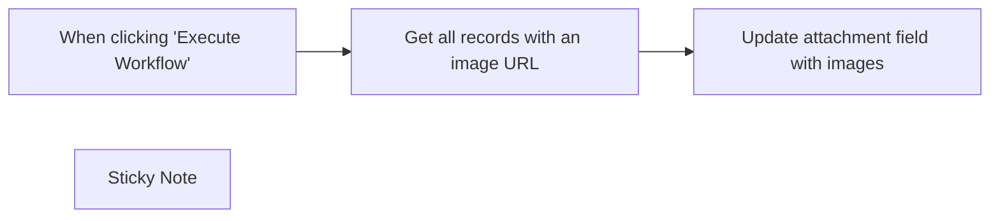

## Fluxo (.json) :

```json
{
  "meta": {
    "instanceId": "dbd43d88d26a9e30d8aadc002c9e77f1400c683dd34efe3778d43d27250dde50"
  },
  "nodes": [
    {
      "id": "b58964ca-d7a9-435d-a7cc-b09cac5c0a30",
      "name": "When clicking \"Execute Workflow\"",
      "type": "n8n-nodes-base.manualTrigger",
      "position": [
        1000,
        720
      ],
      "parameters": {},
      "typeVersion": 1
    },
    {
      "id": "08dcd330-232d-48bf-b3fc-275513be9c62",
      "name": "Get all records with an image URL",
      "type": "n8n-nodes-base.airtable",
      "position": [
        1200,
        720
      ],
      "parameters": {
        "base": {
          "__rl": true,
          "mode": "list",
          "value": "app5TBVbHPs64w5lE",
          "cachedResultUrl": "https://airtable.com/app5TBVbHPs64w5lE",
          "cachedResultName": "N8N Image Automation"
        },
        "table": {
          "__rl": true,
          "mode": "list",
          "value": "tblTVTofgqfzqyIZk",
          "cachedResultUrl": "https://airtable.com/app5TBVbHPs64w5lE/tblTVTofgqfzqyIZk",
          "cachedResultName": "Frogs"
        },
        "options": {},
        "operation": "search",
        "filterByFormula": "=NOT({Image source URL} = '')"
      },
      "typeVersion": 2
    },
    {
      "id": "331b2a4f-2168-443e-9827-f4967587d643",
      "name": "Update attachment field with images",
      "type": "n8n-nodes-base.airtable",
      "position": [
        1400,
        720
      ],
      "parameters": {
        "base": {
          "__rl": true,
          "mode": "list",
          "value": "app5TBVbHPs64w5lE",
          "cachedResultUrl": "https://airtable.com/app5TBVbHPs64w5lE",
          "cachedResultName": "N8N Image Automation"
        },
        "table": {
          "__rl": true,
          "mode": "list",
          "value": "tblTVTofgqfzqyIZk",
          "cachedResultUrl": "https://airtable.com/app5TBVbHPs64w5lE/tblTVTofgqfzqyIZk",
          "cachedResultName": "Frogs"
        },
        "columns": {
          "value": {
            "id": "={{ $json.id }}",
            "Image attachment": "={\n\"Attachment\": {\n\"url\": \"{{ $json[\"Image source URL\"] }}\"\n}\n}"
          },
          "schema": [
            {
              "id": "id",
              "type": "string",
              "display": true,
              "removed": false,
              "readOnly": true,
              "required": false,
              "displayName": "id",
              "defaultMatch": true
            },
            {
              "id": "Image source URL",
              "type": "string",
              "display": true,
              "removed": false,
              "readOnly": false,
              "required": false,
              "displayName": "Image source URL",
              "defaultMatch": false,
              "canBeUsedToMatch": true
            },
            {
              "id": "Image attachment",
              "type": "object",
              "display": true,
              "removed": false,
              "readOnly": false,
              "required": false,
              "displayName": "Image attachment",
              "defaultMatch": false,
              "canBeUsedToMatch": true
            }
          ],
          "mappingMode": "defineBelow",
          "matchingColumns": [
            "id"
          ]
        },
        "options": {},
        "operation": "update"
      },
      "typeVersion": 2
    },
    {
      "id": "d2be8b46-c845-4ebf-adfc-2ca2eee9ee46",
      "name": "Sticky Note",
      "type": "n8n-nodes-base.stickyNote",
      "position": [
        460,
        460
      ],
      "parameters": {
        "width": 476,
        "height": 849,
        "content": "## Read me\nSuper simple workflow to upload image URLs as attachments in Airtable. [Here's the example Airtable database I used for this workflow.](https://airtable.com/app5TBVbHPs64w5lE/shrcqQJEC56DV3I9b/tblTVTofgqfzqyIZk)\n\n1. Set up your Airtable database with one text field which contains image URLs, and an attachment field. \n\n\n2. In each Airtable node, add your Airtable credentials and connect to the base and table you want to modify.\n\n3. In the \"Get all records with an image URL\" node under \"Filter by Formula\", change the field name from \"Image Source URL\" to whatever your URL field name is.\n\n\n4. In the third node \"Update attachment field with images\", update the expression with the correct field name for the URL field. \n\n\n5. Click \"Execute Workflow\" and watch the magic happen!\n\n"
      },
      "typeVersion": 1
    }
  ],
  "pinData": {},
  "connections": {
    "When clicking \"Execute Workflow\"": {
      "main": [
        [
          {
            "node": "Get all records with an image URL",
            "type": "main",
            "index": 0
          }
        ]
      ]
    },
    "Get all records with an image URL": {
      "main": [
        [
          {
            "node": "Update attachment field with images",
            "type": "main",
            "index": 0
          }
        ]
      ]
    }
  }
}
```

<a id="template-1434"></a>

## Template 1434 - Exportar sessões por país para Airtable

- **Nome:** Exportar sessões por país para Airtable
- **Descrição:** Coleta métricas de sessões por país do Google Analytics em um período definido e grava os resultados como novos registros em uma tabela do Airtable.
- **Funcionalidade:** • Início manual: permite disparar a execução do fluxo manualmente.
• Consulta de métricas: busca o número de sessões (ga:sessions) agrupado por país em um intervalo de datas especificado.
• Mapeamento de dados: formata os resultados mapeando o total para o campo 'Metric' e o país para o campo 'Country'.
• Armazenamento em base: anexa cada registro formatado como um novo item na tabela do Airtable.
- **Ferramentas:** • Google Analytics: plataforma de análise web utilizada para obter métricas de tráfego (por exemplo, sessões por país) em um intervalo de datas.
• Airtable: banco de dados/planilha online usado para armazenar os registros coletados e organizá-los em uma tabela.

## Fluxo visual


## Fluxo (.json) :

```json
{
  "id": "205",
  "name": "Get analytics of a website and store it Airtable",
  "nodes": [
    {
      "name": "On clicking 'execute'",
      "type": "n8n-nodes-base.manualTrigger",
      "position": [
        270,
        300
      ],
      "parameters": {},
      "typeVersion": 1
    },
    {
      "name": "Google Analytics",
      "type": "n8n-nodes-base.googleAnalytics",
      "position": [
        470,
        300
      ],
      "parameters": {
        "viewId": "",
        "additionalFields": {
          "metricsUi": {
            "metricValues": [
              {
                "alias": "Sessions",
                "expression": "ga:sessions"
              }
            ]
          },
          "dimensionUi": {
            "dimensionValues": [
              {
                "name": "ga:country"
              }
            ]
          },
          "dateRangesUi": {
            "dateRanges": {
              "endDate": "2020-08-30T18:30:00.000Z",
              "startDate": "2019-12-31T18:30:00.000Z"
            }
          }
        }
      },
      "credentials": {
        "googleAnalyticsOAuth2": "analytics-dev"
      },
      "typeVersion": 1
    },
    {
      "name": "Set",
      "type": "n8n-nodes-base.set",
      "position": [
        670,
        300
      ],
      "parameters": {
        "values": {
          "number": [
            {
              "name": "Metric",
              "value": "={{$json[\"total\"]}}"
            }
          ],
          "string": [
            {
              "name": "Country",
              "value": "={{$json[\"ga:country\"]}}"
            }
          ]
        },
        "options": {},
        "keepOnlySet": true
      },
      "typeVersion": 1
    },
    {
      "name": "Airtable",
      "type": "n8n-nodes-base.airtable",
      "position": [
        870,
        300
      ],
      "parameters": {
        "table": "Table 1",
        "options": {},
        "operation": "append",
        "application": ""
      },
      "credentials": {
        "airtableApi": "Airtable Credentials n8n"
      },
      "typeVersion": 1
    }
  ],
  "active": false,
  "settings": {},
  "connections": {
    "Set": {
      "main": [
        [
          {
            "node": "Airtable",
            "type": "main",
            "index": 0
          }
        ]
      ]
    },
    "Google Analytics": {
      "main": [
        [
          {
            "node": "Set",
            "type": "main",
            "index": 0
          }
        ]
      ]
    },
    "On clicking 'execute'": {
      "main": [
        [
          {
            "node": "Google Analytics",
            "type": "main",
            "index": 0
          }
        ]
      ]
    }
  }
}
```

<a id="template-1438"></a>

## Template 1438 - Resumo de vídeo YouTube

- **Nome:** Resumo de vídeo YouTube
- **Descrição:** Busca a transcrição de um vídeo do YouTube via SearchAPI e gera um resumo e exemplos de perguntas e respostas usando uma cadeia de sumarização com um modelo de linguagem.
- **Funcionalidade:** • Gatilho manual: inicia a execução do fluxo manualmente.
• Definição do ID do vídeo: permite especificar qual vídeo do YouTube será processado.
• Validação de chave da API: impede a execução se a chave do serviço de busca não for fornecida ou for a placeholder.
• Carregamento da transcrição do vídeo: obtém a transcrição usando a API de busca configurada para transcripts do YouTube.
• Divisão do texto em trechos: fragmenta a transcrição em partes (chunks) para processamento eficiente.
• Cadeia de sumarização (refine): utiliza prompts personalizados para gerar um resumo inicial e refiná-lo com contexto adicional.
• Integração com modelo de linguagem: conecta-se a um LLM para gerar o resumo e exemplos de perguntas e respostas específicas.
• Saída estruturada: retorna o resumo final e exemplos de perguntas/respostas em formato JSON.
- **Ferramentas:** • searchapi.io: serviço de busca utilizado para recuperar transcrições de vídeos (engine: youtube_transcripts).
• YouTube: fonte dos vídeos e das transcrições a serem resumidas.
• OpenAI: provedor do modelo de linguagem responsável por gerar e refinar o resumo e as perguntas (ex.: gpt-4o-mini).
• LangChain: biblioteca para construir cadeias de processamento de texto e prompts de sumarização.

## Fluxo visual

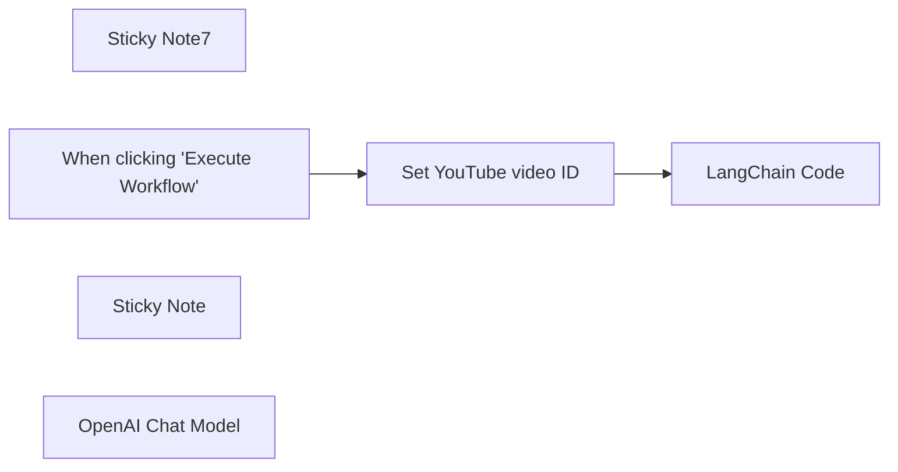

## Fluxo (.json) :

```json
{
  "meta": {
    "instanceId": "408f9fb9940c3cb18ffdef0e0150fe342d6e655c3a9fac21f0f644e8bedabcd9",
    "templateCredsSetupCompleted": true
  },
  "nodes": [
    {
      "id": "b7e2de27-e52c-46d1-aaa9-a67c11c48a8f",
      "name": "Sticky Note7",
      "type": "n8n-nodes-base.stickyNote",
      "position": [
        -420,
        -60
      ],
      "parameters": {
        "width": 328.41313484548044,
        "height": 211.30313955500145,
        "content": "Before executing, replace `YOUR_API_KEY` with an API key for searchapi.io"
      },
      "typeVersion": 1
    },
    {
      "id": "fd2ac655-73fd-434a-bba4-e460af8dfa8a",
      "name": "When clicking \"Execute Workflow\"",
      "type": "n8n-nodes-base.manualTrigger",
      "position": [
        -820,
        20
      ],
      "parameters": {},
      "typeVersion": 1
    },
    {
      "id": "e1bd87f7-283b-496d-910d-b92d1cb19237",
      "name": "Sticky Note",
      "type": "n8n-nodes-base.stickyNote",
      "position": [
        -1140,
        -20
      ],
      "parameters": {
        "color": 7,
        "height": 220.82906011310624,
        "content": "## About\nThis workflow shows how you can write LangChain code in n8n (and import its modules if required).\n\nThe workflow fetches a video from YouTube and produces a textual summary of it."
      },
      "typeVersion": 1
    },
    {
      "id": "a43bb1c5-dd90-4331-930c-128ef0ecb38a",
      "name": "LangChain Code",
      "type": "@n8n/n8n-nodes-langchain.code",
      "position": [
        -380,
        20
      ],
      "parameters": {
        "code": {
          "execute": {
            "code": "// IMPORTANT: add in your API key for searchapi.io below\nconst searchApiKey = \"<YOUR API KEY>\"\n\nconst { loadSummarizationChain } = require(\"langchain/chains\");\nconst { SearchApiLoader } = require(\"@n8n/n8n-nodes-langchain/node_modules/@langchain/community/document_loaders/web/searchapi.cjs\");\nconst { PromptTemplate } = require(\"@langchain/core/prompts\");\nconst { TokenTextSplitter } = require(\"langchain/text_splitter\");\nconst loader = new SearchApiLoader({\n  engine: \"youtube_transcripts\",\n  video_id: $input.item.json.videoId,\n  apiKey: searchApiKey,\n});\n\nif (searchApiKey == \"<YOUR API KEY>\") {\n  throw new Error(\"Please add your API key for searchapi.io to this node\")\n}\n\nconst docs = await loader.load();\n\nconst splitter = new TokenTextSplitter({\n  chunkSize: 10000,\n  chunkOverlap: 250,\n});\n\nconst docsSummary = await splitter.splitDocuments(docs);\n\nconst llmSummary = await this.getInputConnectionData('ai_languageModel', 0);\n\nconst summaryTemplate = `\nYou are an expert in summarizing YouTube videos.\nYour goal is to create a summary of a podcast.\nBelow you find the transcript of a podcast:\n--------\n{text}\n--------\n\nThe transcript of the podcast will also be used as the basis for a question and answer bot.\nProvide some examples questions and answers that could be asked about the podcast. Make these questions very specific.\n\nTotal output will be a summary of the video and a list of example questions the user could ask of the video.\n\nSUMMARY AND QUESTIONS:\n`;\n\nconst SUMMARY_PROMPT = PromptTemplate.fromTemplate(summaryTemplate);\n\nconst summaryRefineTemplate = `\nYou are an expert in summarizing YouTube videos.\nYour goal is to create a summary of a podcast.\nWe have provided an existing summary up to a certain point: {existing_answer}\n\nBelow you find the transcript of a podcast:\n--------\n{text}\n--------\n\nGiven the new context, refine the summary and example questions.\nThe transcript of the podcast will also be used as the basis for a question and answer bot.\nProvide some examples questions and answers that could be asked about the podcast. Make\nthese questions very specific.\nIf the context isn't useful, return the original summary and questions.\nTotal output will be a summary of the video and a list of example questions the user could ask of the video.\n\nSUMMARY AND QUESTIONS:\n`;\n\nconst SUMMARY_REFINE_PROMPT = PromptTemplate.fromTemplate(\n  summaryRefineTemplate\n);\n\nconst summarizeChain = loadSummarizationChain(llmSummary, {\n  type: \"refine\",\n  verbose: true,\n  questionPrompt: SUMMARY_PROMPT,\n  refinePrompt: SUMMARY_REFINE_PROMPT,\n});\n\nconst summary = await summarizeChain.run(docsSummary);\n\nreturn [{json: { summary } } ];"
          }
        },
        "inputs": {
          "input": [
            {
              "type": "main",
              "required": true,
              "maxConnections": 1
            },
            {
              "type": "ai_languageModel",
              "required": true,
              "maxConnections": 1
            }
          ]
        },
        "outputs": {
          "output": [
            {
              "type": "main"
            }
          ]
        }
      },
      "typeVersion": 1
    },
    {
      "id": "a36440c5-402e-44e6-819c-2a19dc9e3e1e",
      "name": "Set YouTube video ID",
      "type": "n8n-nodes-base.set",
      "position": [
        -600,
        20
      ],
      "parameters": {
        "options": {},
        "assignments": {
          "assignments": [
            {
              "id": "c2dc2944-a7c7-44c3-a805-27a55baa452a",
              "name": "videoId",
              "type": "string",
              "value": "OsMVtuuwOXc"
            }
          ]
        }
      },
      "typeVersion": 3.4
    },
    {
      "id": "02386530-9aef-4732-9972-5624b78431a6",
      "name": "OpenAI Chat Model",
      "type": "@n8n/n8n-nodes-langchain.lmChatOpenAi",
      "position": [
        -340,
        220
      ],
      "parameters": {
        "model": {
          "__rl": true,
          "mode": "list",
          "value": "gpt-4o-mini"
        },
        "options": {}
      },
      "credentials": {
        "openAiApi": {
          "id": "8gccIjcuf3gvaoEr",
          "name": "OpenAi account"
        }
      },
      "typeVersion": 1.2
    }
  ],
  "pinData": {},
  "connections": {
    "OpenAI Chat Model": {
      "ai_languageModel": [
        [
          {
            "node": "LangChain Code",
            "type": "ai_languageModel",
            "index": 0
          }
        ]
      ]
    },
    "Set YouTube video ID": {
      "main": [
        [
          {
            "node": "LangChain Code",
            "type": "main",
            "index": 0
          }
        ]
      ]
    },
    "When clicking \"Execute Workflow\"": {
      "main": [
        [
          {
            "node": "Set YouTube video ID",
            "type": "main",
            "index": 0
          }
        ]
      ]
    }
  }
}
```

<a id="template-1439"></a>

## Template 1439 - Receber atualizações da lista do Trello

- **Nome:** Receber atualizações da lista do Trello
- **Descrição:** Fluxo que inicia ao detectar alterações em uma lista específica do Trello, capturando informações do cartão alterado para uso posterior.
- **Funcionalidade:** • Monitoramento de alterações na lista especificada: inicia o fluxo quando há mudanças (cartões adicionados, atualizados, movidos ou removidos) na lista indicada.
• Captura de dados do cartão afetado: obtém detalhes do cartão que sofreu a alteração para processamento ou encaminhamento.
• Configuração por ID e autenticação: permite definir a lista alvo via ID e utiliza credenciais para acessar a conta Trello.
- **Ferramentas:** • Trello: Plataforma de gerenciamento de quadros, listas e cartões para organizar tarefas e projetos; fornece eventos de alteração em listas e cartões que acionam o fluxo.

## Fluxo visual


## Fluxo (.json) :

```json
{
  "id": "117",
  "name": "Receive updates for changes in the specified list in Trello",
  "nodes": [
    {
      "name": "Trello Trigger",
      "type": "n8n-nodes-base.trelloTrigger",
      "position": [
        700,
        250
      ],
      "parameters": {
        "id": ""
      },
      "credentials": {
        "trelloApi": ""
      },
      "typeVersion": 1
    }
  ],
  "active": false,
  "settings": {},
  "connections": {}
}
```

<a id="template-1440"></a>

## Template 1440 - Anúncio de novo produto no Twitter e Telegram

- **Nome:** Anúncio de novo produto no Twitter e Telegram
- **Descrição:** Quando um novo produto é criado na loja WooCommerce, o fluxo publica automaticamente um anúncio no Twitter e envia a mesma mensagem para um chat no Telegram.
- **Funcionalidade:** • Detecção de novo produto: monitora a loja WooCommerce e aciona a automação ao criar um produto.
• Publicação no Twitter: gera e publica um tweet com o nome do produto e o link para o produto.
• Envio no Telegram: envia uma mensagem para um chat específico no Telegram com o nome do produto e o link.
• Mensagem padronizada: utiliza um texto de anúncio com emoji e placeholders para nome e permalink.
• Distribuição simultânea: encaminha o evento de criação para ambos os canais ao mesmo tempo.
- **Ferramentas:** • WooCommerce: plataforma de comércio eletrônico utilizada como fonte do evento de novo produto.
• Twitter: rede social usada para publicar o anúncio público do novo produto.
• Telegram: aplicativo de mensagens usado para enviar a notificação do novo produto a um chat específico.

## Fluxo visual

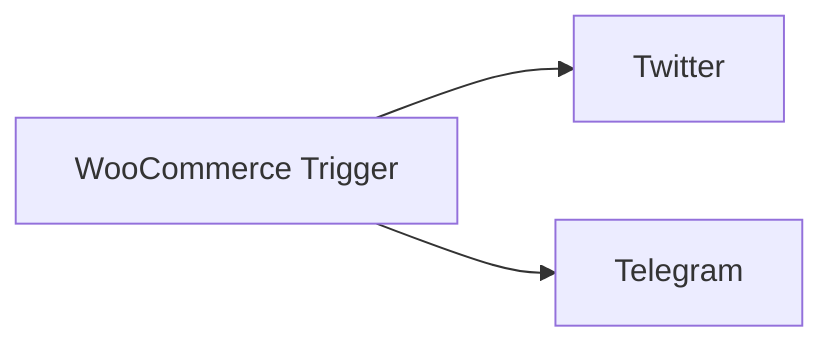

## Fluxo (.json) :

```json
{
  "id": 85,
  "name": "New WooCommerce Product to Twitter and Telegram",
  "nodes": [
    {
      "name": "Twitter",
      "type": "n8n-nodes-base.twitter",
      "position": [
        720,
        300
      ],
      "parameters": {
        "text": "=✨ New Product Announcement ✨\nWe have just added {{$json[\"name\"]}}, Head to {{$json[\"permalink\"]}} to find out more.",
        "additionalFields": {}
      },
      "credentials": {
        "twitterOAuth1Api": {
          "id": "37",
          "name": "joffcom"
        }
      },
      "typeVersion": 1
    },
    {
      "name": "Telegram",
      "type": "n8n-nodes-base.telegram",
      "position": [
        720,
        500
      ],
      "parameters": {
        "text": "=✨ New Product Announcement ✨\nWe have just added {{$json[\"name\"]}}, Head to {{$json[\"permalink\"]}} to find out more.",
        "chatId": "123456",
        "additionalFields": {}
      },
      "credentials": {
        "telegramApi": {
          "id": "56",
          "name": "Telegram account"
        }
      },
      "typeVersion": 1
    },
    {
      "name": "WooCommerce Trigger",
      "type": "n8n-nodes-base.wooCommerceTrigger",
      "position": [
        540,
        400
      ],
      "webhookId": "ab7b134b-9b2d-4e0d-b496-1aee30db0808",
      "parameters": {
        "event": "product.created"
      },
      "credentials": {
        "wooCommerceApi": {
          "id": "48",
          "name": "WooCommerce account"
        }
      },
      "typeVersion": 1
    }
  ],
  "active": false,
  "settings": {},
  "connections": {
    "WooCommerce Trigger": {
      "main": [
        [
          {
            "node": "Twitter",
            "type": "main",
            "index": 0
          },
          {
            "node": "Telegram",
            "type": "main",
            "index": 0
          }
        ]
      ]
    }
  }
}
```

<a id="template-1442"></a>

## Template 1442 - Salvar respostas do Typeform no Airtable

- **Nome:** Salvar respostas do Typeform no Airtable
- **Descrição:** Recebe submissões de um formulário Typeform e adiciona os dados como registros em uma base do Airtable.
- **Funcionalidade:** • Recepção de submissões: Escuta respostas submetidas em um formulário Typeform.
• Inserção de registros: Adiciona cada nova resposta como um registro em uma tabela do Airtable.
• Autenticação via API: Utiliza credenciais para autenticar e permitir a transferência segura dos dados entre serviços.
- **Ferramentas:** • Typeform: Serviço de formulários online para coletar respostas dos usuários.
• Airtable: Plataforma de banco de dados/planilha online para armazenar e organizar os registros das respostas.

## Fluxo visual

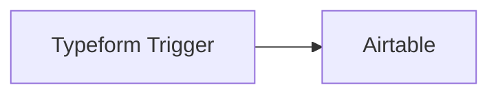

## Fluxo (.json) :

```json
{
  "id": "54",
  "name": "CFP Selection 1",
  "nodes": [
    {
      "name": "Typeform Trigger",
      "type": "n8n-nodes-base.typeformTrigger",
      "position": [
        450,
        250
      ],
      "parameters": {
        "formId": ""
      },
      "credentials": {
        "typeformApi": "Typeform"
      },
      "typeVersion": 1
    },
    {
      "name": "Airtable",
      "type": "n8n-nodes-base.airtable",
      "position": [
        660,
        250
      ],
      "parameters": {
        "table": "",
        "operation": "append",
        "application": ""
      },
      "credentials": {
        "airtableApi": "Airtable"
      },
      "typeVersion": 1
    }
  ],
  "active": false,
  "settings": {},
  "connections": {
    "Typeform Trigger": {
      "main": [
        [
          {
            "node": "Airtable",
            "type": "main",
            "index": 0
          }
        ]
      ]
    }
  }
}
```

<a id="template-1444"></a>

## Template 1444 - Converter texto francês em áudio e gerar áudio traduzido para inglês

- **Nome:** Converter texto francês em áudio e gerar áudio traduzido para inglês
- **Descrição:** Recebe um texto em francês, gera áudio falado, transcreve esse áudio de volta para texto, traduz a transcrição para inglês e produz um arquivo de áudio em inglês.
- **Funcionalidade:** • Acionamento manual: Inicia o processo manualmente quando solicitado.
• Geração de áudio em francês: Converte o texto em francês para áudio usando uma voz especificada (configurável por ID de voz).
• Adição de nome de arquivo: Define o nome do ficheiro de saída (por exemplo, audio.mp3) para o conteúdo binário gerado.
• Transcrição de áudio: Envia o arquivo de áudio para um serviço de transcrição para obter o texto correspondente.
• Tradução para inglês: Traduz o texto transcrito do francês para inglês usando um modelo de linguagem.
• Geração de áudio em inglês: Converte o texto traduzido para inglês em um novo arquivo de áudio utilizando o mesmo serviço de síntese vocal.
• Configuração de credenciais: Suporta uso de chaves de API para serviços externos necessários (texto-para-fala e modelos/transcrição).
- **Ferramentas:** • ElevenLabs: Serviço de texto-para-fala utilizado para gerar áudio a partir do texto (suporta vozes customizáveis via ID de voz e o modelo multilingual).
• OpenAI - Transcrição (Whisper): Serviço de transcrição de áudio para texto (modelo whisper-1) usado para transformar o áudio em texto.
• OpenAI - Modelo de linguagem: Modelo de linguagem (por exemplo gpt-4o-mini) usado para traduzir o texto transcrito do francês para o inglês.


## Fluxo visual

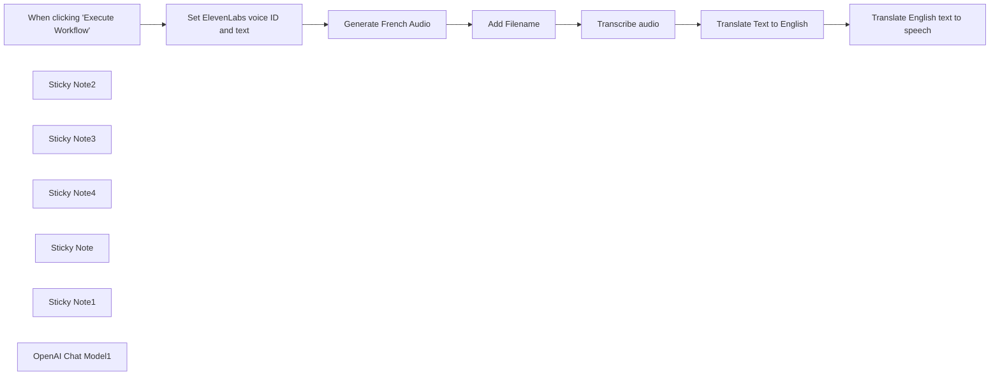

## Fluxo (.json) :

```json
{
  "meta": {
    "instanceId": "408f9fb9940c3cb18ffdef0e0150fe342d6e655c3a9fac21f0f644e8bedabcd9",
    "templateCredsSetupCompleted": true
  },
  "nodes": [
    {
      "id": "f2ec712a-5120-44d8-9581-285d8b866322",
      "name": "When clicking \"Execute Workflow\"",
      "type": "n8n-nodes-base.manualTrigger",
      "position": [
        -160,
        320
      ],
      "parameters": {},
      "typeVersion": 1
    },
    {
      "id": "b16a56a5-0b0c-43cc-952c-f6db1b63d1e9",
      "name": "Sticky Note2",
      "type": "n8n-nodes-base.stickyNote",
      "position": [
        20,
        60
      ],
      "parameters": {
        "color": 7,
        "width": 199.37543798209555,
        "height": 420.623805972039,
        "content": "1] In ElevenLabs, add a voice to your [voice lab](https://elevenlabs.io/voice-lab) and copy its ID. Open this node and add the ID there"
      },
      "typeVersion": 1
    },
    {
      "id": "08e26051-58e9-42c5-b198-7854ab3e58d6",
      "name": "Sticky Note3",
      "type": "n8n-nodes-base.stickyNote",
      "position": [
        240,
        60
      ],
      "parameters": {
        "color": 7,
        "width": 212,
        "height": 418,
        "content": "2] Get your ElevenLabs API key (click your name in the bottom-left of [ElevenLabs](https://elevenlabs.io/voice-lab) and choose ‘profile’)\n\nIn this node, create a new header auth cred. Set the name to `xi-api-key` and the value to your API key"
      },
      "typeVersion": 1
    },
    {
      "id": "de6eb950-862e-472b-8776-b45e3109561a",
      "name": "Sticky Note4",
      "type": "n8n-nodes-base.stickyNote",
      "position": [
        480,
        60
      ],
      "parameters": {
        "color": 7,
        "width": 392,
        "height": 415,
        "content": "3] In the 'credential' field of this node, create a new OpenAI cred with your [OpenAI API key](https://platform.openai.com/api-keys)"
      },
      "typeVersion": 1
    },
    {
      "id": "e1d8158a-ad82-4b65-a2a8-a8f86cafd970",
      "name": "Sticky Note",
      "type": "n8n-nodes-base.stickyNote",
      "position": [
        -280,
        20
      ],
      "parameters": {
        "color": 7,
        "width": 230.39134868652621,
        "height": 233.3354221029769,
        "content": "### About\nThis workflow takes some French text, and translates it into spoken audio.\n\nIt then transcribes that audio back into text, translates it into English and generates an audio file of the English text"
      },
      "typeVersion": 1
    },
    {
      "id": "9614bb02-3b9c-4c5d-b596-8f94704cdb8b",
      "name": "Sticky Note1",
      "type": "n8n-nodes-base.stickyNote",
      "position": [
        0,
        0
      ],
      "parameters": {
        "color": 7,
        "width": 906,
        "height": 498,
        "content": "### Setup steps"
      },
      "typeVersion": 1
    },
    {
      "id": "69ebcaf8-58ab-48ba-967a-a1f0497524bb",
      "name": "Transcribe audio",
      "type": "n8n-nodes-base.httpRequest",
      "position": [
        720,
        320
      ],
      "parameters": {
        "url": "https://api.openai.com/v1/audio/transcriptions",
        "method": "POST",
        "options": {
          "lowercaseHeaders": false
        },
        "sendBody": true,
        "contentType": "multipart-form-data",
        "sendHeaders": true,
        "authentication": "predefinedCredentialType",
        "bodyParameters": {
          "parameters": [
            {
              "name": "file",
              "parameterType": "formBinaryData",
              "inputDataFieldName": "data"
            },
            {
              "name": "model",
              "value": "whisper-1"
            }
          ]
        },
        "headerParameters": {
          "parameters": [
            {
              "name": "Content-Type",
              "value": "multipart/form-data"
            }
          ]
        },
        "nodeCredentialType": "openAiApi"
      },
      "credentials": {
        "openAiApi": {
          "id": "8gccIjcuf3gvaoEr",
          "name": "OpenAi account"
        }
      },
      "typeVersion": 4.2
    },
    {
      "id": "4109bccb-2bfd-454b-accb-074bd6980897",
      "name": "OpenAI Chat Model1",
      "type": "@n8n/n8n-nodes-langchain.lmChatOpenAi",
      "position": [
        940,
        500
      ],
      "parameters": {
        "model": {
          "__rl": true,
          "mode": "list",
          "value": "gpt-4o-mini"
        },
        "options": {}
      },
      "credentials": {
        "openAiApi": {
          "id": "8gccIjcuf3gvaoEr",
          "name": "OpenAi account"
        }
      },
      "typeVersion": 1.2
    },
    {
      "id": "5178a17e-737c-4ad1-8f56-95707430e892",
      "name": "Set ElevenLabs voice ID and text",
      "type": "n8n-nodes-base.set",
      "position": [
        60,
        320
      ],
      "parameters": {
        "options": {},
        "assignments": {
          "assignments": [
            {
              "id": "c0f610ff-e200-4e55-a140-e8a4d6fa0eed",
              "name": "voice_id",
              "type": "string",
              "value": "Xb7hH8MSUJpSbSDYk0k2"
            },
            {
              "id": "6755d8ae-e3df-465c-97ef-4f0187c31824",
              "name": "text",
              "type": "string",
              "value": "=Après, on a fait la sieste, Camille a travaillé pour French Today et j’ai étudié un peu, et puis Camille a proposé de suivre une visite guidée de l’Abbaye de Beauport qui commençait à 17 heures. On a marché environ vingt minutes, et je m’arrêtais souvent pour prendre des photos : la baie de Paimpol est si jolie ! Mais Camille m’a dit : « Dépêche-toi Sunny ! La visite guidée commence dans cinq minutes. » Donc, j’ai bougé mes fesses et on est arrivées à l’abbaye"
            }
          ]
        },
        "includeOtherFields": true
      },
      "typeVersion": 3.4
    },
    {
      "id": "7aafe155-28da-43f4-8305-2dc834f0d95a",
      "name": "Generate French Audio",
      "type": "n8n-nodes-base.httpRequest",
      "position": [
        300,
        320
      ],
      "parameters": {
        "url": "=https://api.elevenlabs.io/v1/text-to-speech/{{ $json.voice_id }}",
        "method": "POST",
        "options": {
          "response": {
            "response": {
              "responseFormat": "file"
            }
          }
        },
        "jsonBody": "={\"text\":\"{{ $json.text }}\",\"model_id\":\"eleven_multilingual_v2\",\"voice_settings\":{\"stability\":0.5,\"similarity_boost\":0.5}}",
        "sendBody": true,
        "sendQuery": true,
        "sendHeaders": true,
        "specifyBody": "json",
        "authentication": "genericCredentialType",
        "genericAuthType": "httpHeaderAuth",
        "queryParameters": {
          "parameters": [
            {
              "name": "optimize_streaming_latency",
              "value": "1"
            }
          ]
        },
        "headerParameters": {
          "parameters": [
            {
              "name": "accept",
              "value": "audio/mpeg"
            }
          ]
        }
      },
      "credentials": {
        "httpHeaderAuth": {
          "id": "wXsJ55OgKMW01nWm",
          "name": "ElevenLabs API Key"
        }
      },
      "typeVersion": 4.2
    },
    {
      "id": "a8e75db9-4164-4332-bec3-01f91f40127f",
      "name": "Translate Text to English",
      "type": "@n8n/n8n-nodes-langchain.chainLlm",
      "position": [
        960,
        320
      ],
      "parameters": {
        "text": "=Translate to English:\n{{ $json.text }}",
        "promptType": "define"
      },
      "typeVersion": 1.5
    },
    {
      "id": "57ea8bc0-a372-41f8-9b7c-6aef0350d9eb",
      "name": "Translate English text to speech",
      "type": "n8n-nodes-base.httpRequest",
      "position": [
        1320,
        320
      ],
      "parameters": {
        "url": "=https://api.elevenlabs.io/v1/text-to-speech/{{ $('Set ElevenLabs voice ID and text').first().json.voice_id }}",
        "method": "POST",
        "options": {},
        "jsonBody": "={\"text\":\"{{ $json[\"text\"].replaceAll('\"', '\\\\\"').trim() }}\",\"model_id\":\"eleven_multilingual_v2\",\"voice_settings\":{\"stability\":0.5,\"similarity_boost\":0.5}}",
        "sendBody": true,
        "sendQuery": true,
        "sendHeaders": true,
        "specifyBody": "json",
        "authentication": "genericCredentialType",
        "genericAuthType": "httpHeaderAuth",
        "queryParameters": {
          "parameters": [
            {
              "name": "optimize_streaming_latency",
              "value": "1"
            }
          ]
        },
        "headerParameters": {
          "parameters": [
            {
              "name": "accept",
              "value": "audio/mpeg"
            }
          ]
        }
      },
      "credentials": {
        "httpHeaderAuth": {
          "id": "wXsJ55OgKMW01nWm",
          "name": "ElevenLabs API Key"
        }
      },
      "typeVersion": 4.2
    },
    {
      "id": "d6bb0022-8c51-41f1-9159-139a45457201",
      "name": "Add Filename",
      "type": "n8n-nodes-base.code",
      "position": [
        540,
        320
      ],
      "parameters": {
        "jsCode": "// Loop over input items and add a new field called 'myNewField' to the JSON of each one\nfor (const item of $input.all()) {\n  item.binary.data.fileName = \"audio.mp3\";\n}\n\nreturn $input.all();"
      },
      "typeVersion": 2
    }
  ],
  "pinData": {},
  "connections": {
    "Add Filename": {
      "main": [
        [
          {
            "node": "Transcribe audio",
            "type": "main",
            "index": 0
          }
        ]
      ]
    },
    "Transcribe audio": {
      "main": [
        [
          {
            "node": "Translate Text to English",
            "type": "main",
            "index": 0
          }
        ]
      ]
    },
    "OpenAI Chat Model1": {
      "ai_languageModel": [
        [
          {
            "node": "Translate Text to English",
            "type": "ai_languageModel",
            "index": 0
          }
        ]
      ]
    },
    "Generate French Audio": {
      "main": [
        [
          {
            "node": "Add Filename",
            "type": "main",
            "index": 0
          }
        ]
      ]
    },
    "Translate Text to English": {
      "main": [
        [
          {
            "node": "Translate English text to speech",
            "type": "main",
            "index": 0
          }
        ]
      ]
    },
    "Set ElevenLabs voice ID and text": {
      "main": [
        [
          {
            "node": "Generate French Audio",
            "type": "main",
            "index": 0
          }
        ]
      ]
    },
    "When clicking \"Execute Workflow\"": {
      "main": [
        [
          {
            "node": "Set ElevenLabs voice ID and text",
            "type": "main",
            "index": 0
          }
        ]
      ]
    }
  }
}
```

<a id="template-1447"></a>

## Template 1447 - Criação de tarefas de solicitações de usuários

- **Nome:** Criação de tarefas de solicitações de usuários
- **Descrição:** Automatiza a criação de tarefas em ClickUp a partir de respostas submetidas em um formulário, categorizando por tipo de solicitação.
- **Funcionalidade:** • Recepção do formulário: Inicia o fluxo ao receber uma submissão do formulário.
• Roteamento por tipo de solicitação: Determina a lista de destino com base na resposta sobre o tipo de pedido (Documento, Apresentação, Atualização, Workflow).
• Criação de tarefa: Gera uma tarefa no sistema de gestão com o título fornecido pelo usuário.
• Preenchimento de conteúdo: Insere a descrição detalhada da solicitação e adiciona o nome e e-mail do solicitante no corpo da tarefa.
• Definição de prioridade: Atribui a prioridade da tarefa conforme a resposta "How urgent is this request?".
• Autenticação segura: Utiliza autenticação OAuth2 para autorizar a criação das tarefas no sistema de gestão.
- **Ferramentas:** • Typeform: Plataforma de formulários usada para coletar as solicitações dos usuários.
• ClickUp: Ferramenta de gestão de tarefas onde as solicitações são criadas como tarefas.

## Fluxo visual

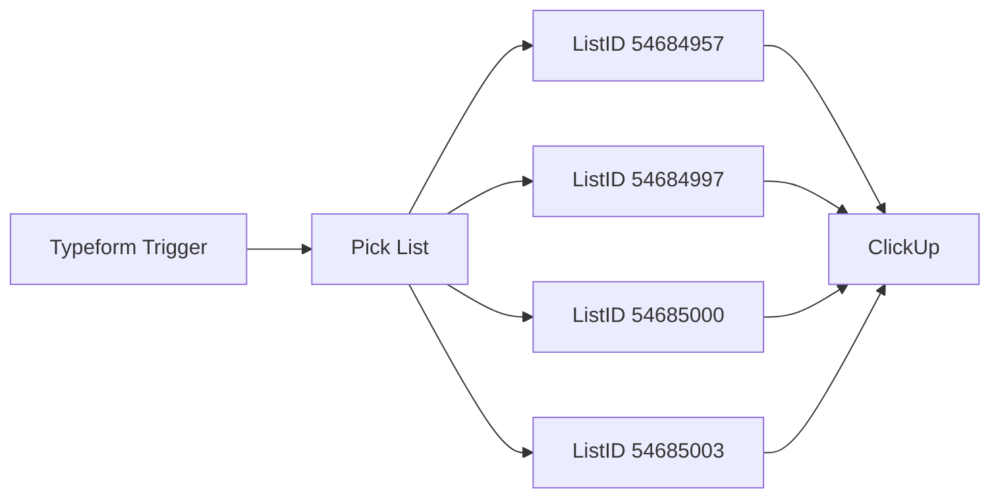

## Fluxo (.json) :

```json
{
  "id": "16",
  "name": "User Request Management",
  "nodes": [
    {
      "name": "ClickUp",
      "type": "n8n-nodes-base.clickUp",
      "position": [
        1180,
        490
      ],
      "parameters": {
        "list": "={{$json[\"ListID\"]}}",
        "name": "={{$node[\"Typeform Trigger\"].json[\"Give this request a short title.\"]}}",
        "team": "8583125",
        "space": "12732821",
        "folder": "25402375",
        "authentication": "oAuth2",
        "additionalFields": {
          "content": "={{$node[\"Typeform Trigger\"].json[\"Describe in detail what you would like to see happen for this request.\"]}}\n\nRequested by:\n{{$node[\"Typeform Trigger\"].json[\"Your full name\"]}}\n{{$node[\"Typeform Trigger\"].json[\"Your email address\"]}}",
          "priority": "={{$json[\"How urgent is this request?\"]}}"
        }
      },
      "credentials": {
        "clickUpOAuth2Api": "ClickUp Cred"
      },
      "typeVersion": 1
    },
    {
      "name": "Typeform Trigger",
      "type": "n8n-nodes-base.typeformTrigger",
      "position": [
        530,
        500
      ],
      "webhookId": "80816cb6-d987-44b2-8981-f95d1af1f6a8",
      "parameters": {
        "formId": "LE36uLN1"
      },
      "credentials": {
        "typeformApi": "Typeform"
      },
      "typeVersion": 1
    },
    {
      "name": "ListID 54684957",
      "type": "n8n-nodes-base.set",
      "position": [
        940,
        560
      ],
      "parameters": {
        "values": {
          "number": [
            {
              "name": "ListID",
              "value": 54684957
            }
          ]
        },
        "options": {}
      },
      "typeVersion": 1
    },
    {
      "name": "ListID 54685003",
      "type": "n8n-nodes-base.set",
      "position": [
        940,
        280
      ],
      "parameters": {
        "values": {
          "number": [
            {
              "name": "ListID",
              "value": 54685003
            }
          ]
        },
        "options": {}
      },
      "typeVersion": 1
    },
    {
      "name": "ListID 54685000",
      "type": "n8n-nodes-base.set",
      "position": [
        940,
        420
      ],
      "parameters": {
        "values": {
          "number": [
            {
              "name": "ListID",
              "value": 54685000
            }
          ]
        },
        "options": {}
      },
      "typeVersion": 1
    },
    {
      "name": "ListID 54684997",
      "type": "n8n-nodes-base.set",
      "position": [
        940,
        700
      ],
      "parameters": {
        "values": {
          "number": [
            {
              "name": "ListID",
              "value": 54684997
            }
          ]
        },
        "options": {}
      },
      "typeVersion": 1
    },
    {
      "name": "Pick List",
      "type": "n8n-nodes-base.switch",
      "position": [
        730,
        500
      ],
      "parameters": {
        "rules": {
          "rules": [
            {
              "value2": "Document Request"
            },
            {
              "output": 1,
              "value2": "Presentation Request"
            },
            {
              "output": 2,
              "value2": "Update Request"
            },
            {
              "output": 3,
              "value2": "Workflow Request"
            }
          ]
        },
        "value1": "={{$node[\"Typeform Trigger\"].json[\"What type of a request are you making?\"]}}",
        "dataType": "string"
      },
      "typeVersion": 1
    }
  ],
  "active": true,
  "settings": {},
  "connections": {
    "Pick List": {
      "main": [
        [
          {
            "node": "ListID 54685003",
            "type": "main",
            "index": 0
          }
        ],
        [
          {
            "node": "ListID 54685000",
            "type": "main",
            "index": 0
          }
        ],
        [
          {
            "node": "ListID 54684957",
            "type": "main",
            "index": 0
          }
        ],
        [
          {
            "node": "ListID 54684997",
            "type": "main",
            "index": 0
          }
        ]
      ]
    },
    "ListID 54684957": {
      "main": [
        [
          {
            "node": "ClickUp",
            "type": "main",
            "index": 0
          }
        ]
      ]
    },
    "ListID 54684997": {
      "main": [
        [
          {
            "node": "ClickUp",
            "type": "main",
            "index": 0
          }
        ]
      ]
    },
    "ListID 54685000": {
      "main": [
        [
          {
            "node": "ClickUp",
            "type": "main",
            "index": 0
          }
        ]
      ]
    },
    "ListID 54685003": {
      "main": [
        [
          {
            "node": "ClickUp",
            "type": "main",
            "index": 0
          }
        ]
      ]
    },
    "Typeform Trigger": {
      "main": [
        [
          {
            "node": "Pick List",
            "type": "main",
            "index": 0
          }
        ]
      ]
    }
  }
}
```

<a id="template-1449"></a>

## Template 1449 - Notificação pós-reunião e atividade no CRM

- **Nome:** Notificação pós-reunião e atividade no CRM
- **Descrição:** Quando uma reunião é marcada no Calendly, o fluxo cria uma atividade no CRM, calcula um horário de follow-up e notifica a equipe no Slack para registrar as notas após a reunião.
- **Funcionalidade:** • Detecção de agendamento: inicia o fluxo ao receber o evento de convidado criado no Calendly.
• Criação de atividade no CRM: gera uma atividade do tipo ligação no Pipedrive com assunto formatado contendo tipo de evento, nome do convidado e horário.
• Cálculo de horário para feedback: adiciona 15 minutos ao horário de término da reunião para determinar quando solicitar as notas.
• Espera até horário específico: pausa o fluxo até o horário calculado de feedback.
• Notificação à equipe: envia uma mensagem no Slack para o responsável/canal solicitando que registre as notas da reunião e confirme com um ✅.
- **Ferramentas:** • Calendly: serviço de agendamento que dispara o evento quando um convidado é criado.
• Pipedrive: CRM utilizado para criar e armazenar a atividade de follow-up referente à reunião.
• Slack: plataforma de comunicação usada para notificar o time e coletar as notas da reunião.


## Fluxo visual

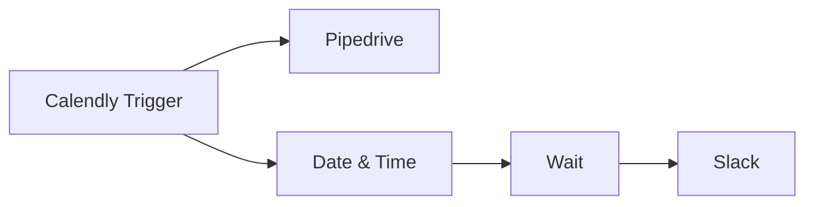

## Fluxo (.json) :

```json
{
  "nodes": [
    {
      "name": "Calendly Trigger",
      "type": "n8n-nodes-base.calendlyTrigger",
      "position": [
        -600,
        1700
      ],
      "webhookId": "f3436daa-42cd-4ac9-93ff-750a9cc28165",
      "parameters": {
        "events": [
          "invitee.created"
        ]
      },
      "credentials": {
        "calendlyApi": "calendly_api"
      },
      "typeVersion": 1
    },
    {
      "name": "Pipedrive",
      "type": "n8n-nodes-base.pipedrive",
      "position": [
        -400,
        1600
      ],
      "parameters": {
        "type": "call",
        "subject": "={{$json[\"payload\"][\"event_type\"][\"name\"]}} with {{$json[\"payload\"][\"invitee\"][\"name\"]}} on {{$json[\"payload\"][\"event\"][\"invitee_start_time\"]}}",
        "resource": "activity",
        "additionalFields": {}
      },
      "credentials": {
        "pipedriveApi": "pipedriveapi"
      },
      "typeVersion": 1
    },
    {
      "name": "Date & Time",
      "type": "n8n-nodes-base.dateTime",
      "position": [
        -400,
        1800
      ],
      "parameters": {
        "value": "={{$json[\"payload\"][\"event\"][\"end_time\"]}}",
        "action": "calculate",
        "options": {},
        "duration": 15,
        "timeUnit": "minutes",
        "dataPropertyName": "feedback_time"
      },
      "typeVersion": 1
    },
    {
      "name": "Slack",
      "type": "n8n-nodes-base.slack",
      "position": [
        0,
        1800
      ],
      "parameters": {
        "text": "={{$json[\"payload\"][\"event\"][\"assigned_to\"][0]}}, today you had a {{$json[\"payload\"][\"event_type\"][\"name\"]}} {{$json[\"payload\"][\"event_type\"][\"kind\"]}} meeting with {{$json[\"payload\"][\"invitee\"][\"name\"]}}. Please write your notes from the call here [link] and mark this message with ✅ when you're done.",
        "channel": "salesteam",
        "blocksUi": {
          "blocksValues": []
        },
        "attachments": [],
        "otherOptions": {}
      },
      "credentials": {
        "slackApi": "slack_nodeqa"
      },
      "typeVersion": 1
    },
    {
      "name": "Wait",
      "type": "n8n-nodes-base.wait",
      "position": [
        -200,
        1800
      ],
      "webhookId": "05c224b9-6ca7-40e7-97cb-bc1ddc3b55af",
      "parameters": {
        "resume": "specificTime",
        "dateTime": "={{$json[\"feedback_time\"]}}"
      },
      "typeVersion": 1
    }
  ],
  "connections": {
    "Wait": {
      "main": [
        [
          {
            "node": "Slack",
            "type": "main",
            "index": 0
          }
        ]
      ]
    },
    "Date & Time": {
      "main": [
        [
          {
            "node": "Wait",
            "type": "main",
            "index": 0
          }
        ]
      ]
    },
    "Calendly Trigger": {
      "main": [
        [
          {
            "node": "Date & Time",
            "type": "main",
            "index": 0
          },
          {
            "node": "Pipedrive",
            "type": "main",
            "index": 0
          }
        ]
      ]
    }
  }
}
```

<a id="template-1451"></a>

## Template 1451 - Escaneamento e enriquecimento de URLs/IPs

- **Nome:** Escaneamento e enriquecimento de URLs/IPs
- **Descrição:** Recebe listas de URLs ou IPs, resolve domínios quando necessário, executa scans em VirusTotal, consulta informações contextuais em Greynoise e envia relatórios por Slack e email.
- **Funcionalidade:** • Recepção via webhook e formulário: aceita requisições JSON ou submissões de formulário com múltiplos indicadores e email do solicitante.
• Normalização de entrada: detecta se o item é um IP ou um domínio e, se for domínio, resolve o IP via Google DNS.
• Início de scan no VirusTotal: submete URLs para escaneamento e acompanha o status do scan de forma assíncrona.
• Polling controlado: implementa espera de 5 segundos entre tentativas para checar o status do scan até ficar pronto.
• Consultas Greynoise (RIOT e contexto): enriquece cada IP com classificação, tags, localização e nível de confiança.
• Agregação de resultados: combina dados do VirusTotal e Greynoise por IP, cria resumos com estatísticas e resultados específicos (BlockList, OpenPhish).
• Geração de relatórios: formata e envia relatórios detalhados via Slack e email para o solicitante.
• Processamento em lote: permite múltiplos indicadores por submissão e consolida resultados em saídas únicas por item.
- **Ferramentas:** • VirusTotal: serviço para enviar URLs e obter resultados de análise de segurança, estatísticas de detecção e resultados por fontes como BlockList e OpenPhish.
• Greynoise: plataforma de inteligência de rede que fornece classificação de IPs (RIOT/noise), tags, categoria, localização e trust level para contextualização.
• Google DNS (DNS-over-HTTPS): serviço de resolução de DNS usado para extrair o endereço IP a partir de um domínio.
• Slack: canal de comunicação usado para enviar notificações e relatórios formatados para um canal designado.
• Gmail: serviço de envio de email usado para entregar relatórios em HTML ao email do solicitante.

## Fluxo visual

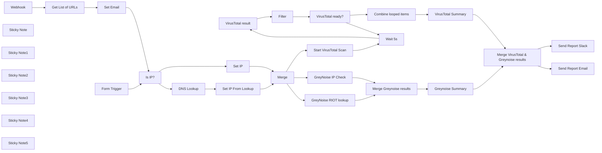

## Fluxo (.json) :

```json
{
  "meta": {
    "instanceId": "8c8c5237b8e37b006a7adce87f4369350c58e41f3ca9de16196d3197f69eabcd",
    "templateId": "1971"
  },
  "nodes": [
    {
      "id": "dbb98f7d-6737-4eaa-9a66-9779c042c575",
      "name": "VirusTotal result",
      "type": "n8n-nodes-base.httpRequest",
      "position": [
        2430,
        1648
      ],
      "parameters": {
        "url": "={{ $json.data.links.self }}",
        "options": {},
        "authentication": "predefinedCredentialType",
        "nodeCredentialType": "virusTotalApi"
      },
      "typeVersion": 4.1
    },
    {
      "id": "fb71337b-ebd3-4331-9f18-ff953c6b068b",
      "name": "DNS Lookup",
      "type": "n8n-nodes-base.httpRequest",
      "position": [
        1330,
        1028
      ],
      "parameters": {
        "url": "=https://dns.google/resolve",
        "options": {},
        "sendQuery": true,
        "queryParameters": {
          "parameters": [
            {
              "name": "name",
              "value": "={{ $json.url.includes('://') ? $json.url.split('://')[1].split('/')[0] : $json.url }}"
            }
          ]
        }
      },
      "typeVersion": 4.1
    },
    {
      "id": "290c6e9c-31d1-4476-9beb-b72a795ecfbb",
      "name": "Set IP From Lookup",
      "type": "n8n-nodes-base.code",
      "position": [
        1530,
        1028
      ],
      "parameters": {
        "mode": "runOnceForEachItem",
        "jsCode": "// Get the resolved IP address (last item in the Answer array)\nconst ip = $json.Answer.pop().data;\nconst item = {...$('Is IP?').item.json}\nitem.ip = ip\n\nreturn {json: item};"
      },
      "typeVersion": 2
    },
    {
      "id": "2e25aa5e-479c-4e3b-b866-89f2bdbabbba",
      "name": "Set IP",
      "type": "n8n-nodes-base.set",
      "position": [
        1390,
        828
      ],
      "parameters": {
        "values": {
          "string": [
            {
              "name": "ip",
              "value": "={{ $json.url }}"
            }
          ]
        },
        "options": {}
      },
      "typeVersion": 2
    },
    {
      "id": "69b89cd7-1456-4067-a9da-d81ef3f86097",
      "name": "Merge VirusTotal & Greynoise results",
      "type": "n8n-nodes-base.merge",
      "position": [
        3610,
        948
      ],
      "parameters": {
        "mode": "combine",
        "options": {},
        "mergeByFields": {
          "values": [
            {
              "field1": "ip",
              "field2": "ip"
            }
          ]
        }
      },
      "typeVersion": 2.1
    },
    {
      "id": "1011bb3b-3f75-40b8-a473-e07b70079b60",
      "name": "Is IP?",
      "type": "n8n-nodes-base.if",
      "position": [
        1110,
        848
      ],
      "parameters": {
        "conditions": {
          "string": [
            {
              "value1": "={{ $json.url }}",
              "value2": "/^(?:[0-9]{1,3}\\.){3}[0-9]{1,3}$/",
              "operation": "regex"
            }
          ]
        }
      },
      "typeVersion": 1
    },
    {
      "id": "770b4056-1497-48ed-bcd7-ad6e7106cc7d",
      "name": "Start VirusTotal Scan",
      "type": "n8n-nodes-base.httpRequest",
      "position": [
        1990,
        1648
      ],
      "parameters": {
        "url": "https://www.virustotal.com/api/v3/urls",
        "method": "POST",
        "options": {},
        "sendBody": true,
        "contentType": "multipart-form-data",
        "authentication": "predefinedCredentialType",
        "bodyParameters": {
          "parameters": [
            {
              "name": "url",
              "value": "={{ $json.url }}"
            }
          ]
        },
        "nodeCredentialType": "virusTotalApi"
      },
      "typeVersion": 4.1
    },
    {
      "id": "d5d31e4a-2f95-4151-af35-bb8129f2e5a3",
      "name": "VirusTotal Summary",
      "type": "n8n-nodes-base.set",
      "position": [
        3230,
        1628
      ],
      "parameters": {
        "values": {
          "string": [
            {
              "name": "virusTotalStats",
              "value": "={{ $json.data.attributes.stats }}"
            },
            {
              "name": "blockList",
              "value": "={{ $json.data.attributes.results.BlockList.result }}"
            },
            {
              "name": "openPhish",
              "value": "={{ $json.data.attributes.results.OpenPhish.result }}"
            },
            {
              "name": "url",
              "value": "={{ $('Merge').all()[$itemIndex].json.url }}"
            },
            {
              "name": "ip",
              "value": "={{ $('Merge').all()[$itemIndex].json.ip }}"
            }
          ]
        },
        "options": {
          "dotNotation": false
        },
        "keepOnlySet": true
      },
      "typeVersion": 2
    },
    {
      "id": "467c795f-6f13-4d6d-a8cf-5cf9be2e7a77",
      "name": "VirusTotal ready?",
      "type": "n8n-nodes-base.if",
      "position": [
        2790,
        1648
      ],
      "parameters": {
        "conditions": {
          "string": [
            {
              "value1": "={{ $json.data.attributes.status }}",
              "value2": "queued",
              "operation": "notEqual"
            }
          ]
        }
      },
      "typeVersion": 1
    },
    {
      "id": "284728e4-dc74-4c37-890b-5305970960c0",
      "name": "Wait 5s",
      "type": "n8n-nodes-base.wait",
      "position": [
        2230,
        1648
      ],
      "webhookId": "18348e84-831d-4ea8-bb39-6ec847c72275",
      "parameters": {
        "unit": "seconds",
        "amount": 5
      },
      "typeVersion": 1
    },
    {
      "id": "76e1414a-d690-44df-a3b8-8dbb4a192720",
      "name": "Webhook",
      "type": "n8n-nodes-base.webhook",
      "notes": "Example:\n\ncurl -X POST \"https://n8n.yourdomain.com/webhook-test/d5124bd8-aada-44da-8050-3070f303ad24\" \\\n                 -H \"Content-Type: application/json\" \\\n                 -d '{\"data\": [{\"url\": \"1.1.1.1\"}, {\"url\": \"88.204.59.2\"}, {\"url\": \"54.36.148.188\"}, {\"url\": \"facebook.com\"}], \"email\": \"user@domain.com\"}'",
      "position": [
        450,
        1448
      ],
      "webhookId": "d5124bd8-aada-44da-8050-3070f303ad24",
      "parameters": {
        "path": "d5124bd8-aada-44da-8050-3070f303ad24",
        "options": {},
        "httpMethod": "POST"
      },
      "notesInFlow": true,
      "typeVersion": 1
    },
    {
      "id": "b3e188f3-0a39-4451-ab70-632282243f03",
      "name": "Get List of URLs",
      "type": "n8n-nodes-base.itemLists",
      "position": [
        650,
        1448
      ],
      "parameters": {
        "options": {},
        "fieldToSplitOut": "body.data"
      },
      "typeVersion": 3
    },
    {
      "id": "360628b7-afc0-4444-a8c0-a85fae54b0e3",
      "name": "Set Email",
      "type": "n8n-nodes-base.set",
      "position": [
        850,
        1448
      ],
      "parameters": {
        "values": {
          "string": [
            {
              "name": "Email",
              "value": "={{ $('Webhook').item.json.body.email }}"
            }
          ]
        },
        "options": {}
      },
      "typeVersion": 2
    },
    {
      "id": "6df9593b-5f9f-4b50-bddb-97dcb2017d6e",
      "name": "Merge Greynoise results",
      "type": "n8n-nodes-base.merge",
      "position": [
        2370,
        728
      ],
      "parameters": {
        "mode": "combine",
        "options": {},
        "combinationMode": "mergeByPosition"
      },
      "typeVersion": 2.1
    },
    {
      "id": "1957a675-7a5a-4ccd-b334-f2c4f9749f58",
      "name": "Send Report Slack",
      "type": "n8n-nodes-base.slack",
      "position": [
        3850,
        1168
      ],
      "parameters": {
        "text": "=Successfully scanned {{ $json.url }} {{$json.ip !== $json.url ? `(${$json.ip})`: '' }}\n\n\nVirusTotal Report ({{ $json.virusTotalStats.harmless + $json.virusTotalStats.malicious + $json.virusTotalStats.suspicious + $json.virusTotalStats.undetected}} scans)\n\n{{$json.virusTotalStats.harmless}} Harmless\n{{$json.virusTotalStats.malicious}} Malicious\n{{$json.virusTotalStats.suspicious}} Suspicious\n{{$json.virusTotalStats.undetected}} Undetected\n{{$json.virusTotalStats.timeout}} Timed out\n\nBlockList: {{ $json.blockList }}\nOpenPhish: {{ $json.openPhish }}\n\nSummary: {{ $json.virusTotalStats.suspicious + $json.virusTotalStats.malicious === 0 ? \"✅ Harmless\": \"🚨 Malicous\" }}\n\n\n\nGreynoise Report\n\nTrust Level: {{ $json.trust_level ?? \"Not trusted\"}}\nClassification: {{ $json.classification }}\n\nLocation: {{ $json.location || 'n/a' }}\nCategory: {{ $json.category }}\nTags: {{$json.tags.join(', ') || 'None'}}",
        "select": "channel",
        "channelId": {
          "__rl": true,
          "mode": "name",
          "value": "#notifications"
        },
        "otherOptions": {}
      },
      "typeVersion": 2.1
    },
    {
      "id": "4d64351f-0233-4859-afd2-fc31e3fc37cd",
      "name": "Send Report Email",
      "type": "n8n-nodes-base.gmail",
      "position": [
        3850,
        948
      ],
      "parameters": {
        "sendTo": "={{ $('Merge').first().json.Email }}",
        "message": "=Successfully scanned {{ $json.url }} {{$json.ip !== $json.url ? `(${$json.ip})`: '' }}<br /><br /><br />\n\n\n<h3>VirusTotal Report ({{ $json.virusTotalStats.harmless + $json.virusTotalStats.malicious + $json.virusTotalStats.suspicious + $json.virusTotalStats.undetected}} scans)</h3><br /><br />\n\n{{$json.virusTotalStats.harmless}} Harmless<br />\n{{$json.virusTotalStats.malicious}} Malicious<br />\n{{$json.virusTotalStats.suspicious}} Suspicious<br />\n{{$json.virusTotalStats.undetected}} Undetected<br />\n{{$json.virusTotalStats.timeout}} Timed out<br /><br />\n\nBlockList: {{ $json.blockList }}<br />\nOpenPhish: {{ $json.openPhish }}<br /><br />\n\n<b>Summary: {{ $json.virusTotalStats.suspicious + $json.virusTotalStats.malicious === 0 ? \"✅ Harmless\": \"🚨 Malicous\" }}</b><br /><br /><br />\n\n\n\n<h3>Greynoise Report</h3><br /><br />\n\nTrust Level: {{ $json.trust_level ?? \"Not trusted\"}}<br />\nClassification: {{ $json.classification }}<br /><br />\n\nLocation: {{ $json.location || 'n/a' }}<br />\nCategory: {{ $json.category }}<br />\nTags: {{$json.tags.join(', ') || 'None'}}<br /><br /><br /><br />",
        "options": {},
        "subject": "={{ $json.url }} Scan Report"
      },
      "typeVersion": 2
    },
    {
      "id": "e4305eb1-8e57-49d0-97b7-391200bd0042",
      "name": "Greynoise Summary",
      "type": "n8n-nodes-base.set",
      "position": [
        2650,
        728
      ],
      "parameters": {
        "values": {
          "string": [
            {
              "name": "ip",
              "value": "={{ $json.ip }}"
            },
            {
              "name": "classification",
              "value": "={{ $json.classification || 'safe' }}"
            },
            {
              "name": "location",
              "value": "={{ $json.metadata?.region ? `${$json.metadata?.region} ${$json.metadata?.country}` : '' }}"
            },
            {
              "name": "tags",
              "value": "={{ $json.tags ?? [] }}"
            },
            {
              "name": "category",
              "value": "={{ $json.category || 'n/a' }}"
            },
            {
              "name": "trustLevel",
              "value": "={{ $json.trust_level }}"
            }
          ]
        },
        "options": {
          "dotNotation": false
        },
        "keepOnlySet": true
      },
      "typeVersion": 2
    },
    {
      "id": "c149b1f3-e447-4194-a94e-7d8e0bf38241",
      "name": "Merge",
      "type": "n8n-nodes-base.merge",
      "position": [
        1750,
        848
      ],
      "parameters": {},
      "typeVersion": 2.1
    },
    {
      "id": "88c30a1d-c232-4da5-87c3-4d67234b6a29",
      "name": "Combine looped items",
      "type": "n8n-nodes-base.code",
      "position": [
        3010,
        1628
      ],
      "parameters": {
        "jsCode": "let results = [],\n  i = 0;\n\ndo {\n  try {\n    results = results.concat($(\"VirusTotal result\").all(0, i)\n                     .filter(node => node.json.data.attributes.status === 'completed')\n  );\n  } catch (error) {\n    return results;\n  }\n  i++;\n} while (true);"
      },
      "typeVersion": 2
    },
    {
      "id": "839170f5-7c97-40fd-aeaa-ad57262a586e",
      "name": "Filter",
      "type": "n8n-nodes-base.filter",
      "position": [
        2610,
        1648
      ],
      "parameters": {
        "conditions": {
          "string": [
            {
              "value1": "={{ $json.data.attributes.status }}",
              "value2": "completed",
              "operation": "notEqual"
            }
          ]
        }
      },
      "typeVersion": 1,
      "alwaysOutputData": true
    },
    {
      "id": "d68db329-4628-44a8-8f97-b06cbf18e238",
      "name": "Sticky Note",
      "type": "n8n-nodes-base.stickyNote",
      "position": [
        380,
        240
      ],
      "parameters": {
        "width": 651.1325602067182,
        "height": 703.911103299255,
        "content": "## Form Input Overview\n\n- **Purpose**: \n  - Instead of forcing other departments to use a full threat platform, simplify the interaction with our Threat Intel workflow which allows other departments to submit items via URL-accessible forms.\n\n- **Form Access URLs**:\n  - **Execute Mode**: `https://n8n.domain.com/webhook/test/url-scan-form` - Use this to execute the workflow interactively within the n8n canvas. Hit the 'Execute Workflow' button to see real-time execution results.\n  - **Silent Mode**: `https://n8n.domain.com/webhook/url-scan-form` - Use this for background execution without canvas updates. Results will be logged silently and can be reviewed in the 'Executions' tab.\n\n## Details and Best Practices\nWhen using the form, ensure that all inputs match the required format, like valid URLs for scans, to prevent any workflow interruptions. Keep in mind these forms are not performing input sanitation so incorrectly entered values will trigger an error workflow. Should there be any issues upon form submission, such as an absence of a confirmation message, or if the workflow fails, you can find detailed error information in the 'Executions' tab. "
      },
      "typeVersion": 1
    },
    {
      "id": "f9081f7d-35ab-489c-87bb-c2deba7515f9",
      "name": "Sticky Note1",
      "type": "n8n-nodes-base.stickyNote",
      "position": [
        370,
        968
      ],
      "parameters": {
        "width": 653.8285114211884,
        "height": 663.9676956356055,
        "content": "## API Integration\nWant to submit URLs and IPs automatically? Utilize the JSON structure below to upload multiple indicators simultaneously. The workflow leverages 'Item list' to parse the 'data' field, while 'Set Email' node appends the provided email to each URL.\n\n```json\n{\n    \"email\": \"johndoe@example.com\",\n    \"data\": [\n        {\n            \"url\": \"aztechsol.com\"\n        },\n        {\n            \"ip\": \"8.8.8.8\"\n        }\n    ]\n}\n```\n\n## Details and Best Practices\n- Webhook Usage: Send data with a POST request, e.g., using curl.\n- Validation & Errors: Ensure URLs are correctly formatted. Check the 'Executions' tab for any submission errors. Keep in mind that there is only basic error handling in this workflow."
      },
      "typeVersion": 1
    },
    {
      "id": "aaaac5aa-f0a0-4452-99b4-d78d55a80564",
      "name": "Sticky Note2",
      "type": "n8n-nodes-base.stickyNote",
      "position": [
        1070,
        266.9400418986032
      ],
      "parameters": {
        "width": 827.7173647545219,
        "height": 936.2889303743061,
        "content": "\n## Data Standardization & Google DNS Integration\n-   Purpose:\n\n    -   Standardize the diverse input sources---either from form submissions or API calls---by streamlining the input through a uniform processing pipeline. This ensures that whether the data entered is an IP address or a domain name, it can be consistently managed and transformed for threat intelligence tasks.\n    -   Extract IP from URL by passing it to Google DNS and attaching it to the URL.\n\n## Details and Best Practices\nTo guarantee the efficacy of the workflow, adhere to the prescribed input formats. For IP addresses, ensure they conform to IPv4 or IPv6 standards; for domains, verify that they are properly structured URLs. The system assumes clean inputs, as there are no built-in sanitation mechanisms---erroneous inputs may result in processing errors.\n\nIn case of an unsuccessful DNS lookup or other discrepancies, consult the 'Executions' tab for comprehensive error logs and apply the necessary corrections. To mitigate workflow disruptions, establish a set of error-handling protocols to manage and rectify such incidents.\n\nBe mindful that while the workflow is designed to automatically discern between IP addresses and domain names, it is imperative that the data entered is accurate to prevent any fallbacks or unnecessary processing overhead."
      },
      "typeVersion": 1
    },
    {
      "id": "32e80421-b608-4d89-b6fe-a95ab5b9e3bd",
      "name": "Sticky Note3",
      "type": "n8n-nodes-base.stickyNote",
      "position": [
        1950,
        68.30371042491026
      ],
      "parameters": {
        "width": 1485.5734904392764,
        "height": 987.7653566551932,
        "content": "\n## Greynoise Integration\n\n-   Purpose:\n    -   The aim is to tap into Greynoise's robust API to enrich and contextualize IP-related information within the workflow. By querying Greynoise's specialized noise and RIOT databases, the workflow can quickly ascertain the nature of the IP activity and determine its relevance and potential threat level to an organization.\n    -   Classify and assess IP addresses by consulting with Greynoise databases, providing an additional layer of security intelligence.\n\n## Details and Best Practices\nTo ensure reliable results from the Greynoise integration, it's important to use well-formatted IP addresses. Confirm that IPs meet standard internet protocols for either IPv4 or IPv6. The workflow assumes that inputs are pre-sanitized, so any deviation may lead to errors or inaccurate assessments.\n\nIf the Greynoise lookup does not yield results or encounters errors, investigate the issue using the 'Executions' tab to view detailed error logs. Proactively develop error-handling strategies to effectively manage and recover from these errors.\n\nThe workflow is pre-configured to discern and process IP information accurately; however, it relies heavily on the integrity of the input. Incorrectly entered IPs can cause incorrect lookups and potentially miss significant threat data, thereby undermining the security posture.\n\n**Please note that this workflow segment is designed for the enterprise edition of Greynoise's API. Users must have a valid API key with enterprise access which should be configured in the HTTP request nodes that perform the API calls.**"
      },
      "typeVersion": 1
    },
    {
      "id": "adda919b-f65f-4fe0-9f66-11a5a9b65674",
      "name": "Sticky Note4",
      "type": "n8n-nodes-base.stickyNote",
      "position": [
        1952,
        1088
      ],
      "parameters": {
        "width": 1483.145187368557,
        "height": 774.1502041707245,
        "content": "\n## VirusTotal Integration\n-   Purpose:\n    -   This workflow component is specifically crafted to harness the VirusTotal API's capabilities, allowing URLs to be submitted for thorough scanning. The goal is to seamlessly integrate the scanning process into the workflow, handling the asynchronous nature of VirusTotal scans by effectively managing state checks and result compilation.\n    -   Implement URL scanning by submitting requests to the VirusTotal API and accurately aggregating the scan results for analysis.\n\n## Details and Best Practices\nFor successful VirusTotal integration, it's crucial to submit URLs following standard web formats. The workflow is configured to expect correct URL inputs; deviations can disrupt the scanning process.\n\nUpon submission, if the VirusTotal scan results are pending or if errors are encountered, these can be tracked and examined under the 'Executions' tab. Develop a proactive strategy for handling such cases, including error logging, maximum retry limitations, or implementing a timeout mechanism.\n\nThe configuration of the workflow takes into account the need to prevent rapid, repetitive status checks, which can strain the VirusTotal API. As a result, it employs a looping system for status re-evaluation, which should be managed with precision to avoid unnecessary delays or excessive polling.\n\nNote that this integration is tailored for workflows that involve the VirusTotal API. While it works with the free VirusTotal license, too many requests may cause errors due to rate limiting. The Public API is limited to 500 requests per day and a rate of 4 requests per minute. It requires valid credentials set up in the HTTP request nodes to authenticate API calls successfully. Users should configure their API keys for access, and handle any API error responses, like HTTP 4xx or 5xx codes, with a robust error-logging and retry mechanism to ensure reliability and effectiveness of the scan process."
      },
      "typeVersion": 1
    },
    {
      "id": "cdaec18e-e9f1-4567-89e6-f5474bff42c4",
      "name": "Sticky Note5",
      "type": "n8n-nodes-base.stickyNote",
      "position": [
        3470,
        247
      ],
      "parameters": {
        "width": 898.9279259630971,
        "height": 1146.6423884335761,
        "content": "\n\n## Reporting Integration\n-   Purpose:\n    -   This component of the workflow is designed to amalgamate and communicate the insights from threat intelligence analysis to the team effectively. By integrating data from VirusTotal and Greynoise, it generates comprehensive reports that are automatically shared via Slack and email, fostering situational awareness and facilitating prompt action.\n    -   Compile and disseminate threat intelligence reports that highlight the significance and implications of the analyzed IP or domain data, ensuring that the team remains informed and ready to act.\n\n## Details and Best Practices\nThe heart of this workflow lies in the synthesis of threat intelligence gathered from both Greynoise and VirusTotal. By merging these data points, the logic creates a thorough examination of the URLs/IPs under scrutiny.\n\nHere's an expanded view of best practices to adhere to in this critical stage of the workflow:\n\nThe merging process must be precise, using the 'ip' fields as the common key to unify data from the two distinct sources. This unified view is crucial for accurate analysis and reporting.\n\nIt’s advisable to extend the merging capabilities to include additional data fields that may enhance the intelligence report. This could mean incorporating timestamps, geolocation data, or even threat levels.\n\nWhen integrating new messaging or reporting nodes, leverage the provided JSON structure to maintain consistency. To replicate the logic in another node, simply copy the JSON snippet from the expression editor and paste it into the configuration of the new node."
      },
      "typeVersion": 1
    },
    {
      "id": "577d4b74-9155-440f-a752-6654f8e54669",
      "name": "GreyNoise RIOT lookup",
      "type": "n8n-nodes-base.httpRequest",
      "position": [
        2070,
        708
      ],
      "parameters": {
        "url": "=https://api.greynoise.io/v2/riot/{{ $json.ip }}",
        "options": {},
        "authentication": "genericCredentialType",
        "genericAuthType": "httpHeaderAuth"
      },
      "typeVersion": 4.1
    },
    {
      "id": "9a41df79-3d81-4b2e-b21c-7f31985d8d1e",
      "name": "GreyNoise IP Check",
      "type": "n8n-nodes-base.httpRequest",
      "position": [
        2070,
        888
      ],
      "parameters": {
        "url": "=https://api.greynoise.io/v2/noise/context/{{ $json.ip }}",
        "options": {},
        "authentication": "genericCredentialType",
        "genericAuthType": "httpHeaderAuth"
      },
      "typeVersion": 4.1
    },
    {
      "id": "006eb997-5851-41bd-9d5c-9f44d3b7ec08",
      "name": "Form Trigger",
      "type": "n8n-nodes-base.formTrigger",
      "position": [
        640,
        800
      ],
      "webhookId": "087145f7-3c00-4a1a-8e04-181b536606e7",
      "parameters": {
        "path": "url-scan-form",
        "options": {},
        "formTitle": "Scan URL or IP and get a report",
        "formFields": {
          "values": [
            {
              "fieldLabel": "url",
              "requiredField": true
            },
            {
              "fieldLabel": "Email",
              "requiredField": true
            }
          ]
        },
        "formDescription": "Get a report from Virus Total and Greynoise on an IP address of URL"
      },
      "typeVersion": 2
    }
  ],
  "pinData": {},
  "connections": {
    "Merge": {
      "main": [
        [
          {
            "node": "Start VirusTotal Scan",
            "type": "main",
            "index": 0
          },
          {
            "node": "GreyNoise IP Check",
            "type": "main",
            "index": 0
          },
          {
            "node": "GreyNoise RIOT lookup",
            "type": "main",
            "index": 0
          }
        ]
      ]
    },
    "Filter": {
      "main": [
        [
          {
            "node": "VirusTotal ready?",
            "type": "main",
            "index": 0
          }
        ]
      ]
    },
    "Is IP?": {
      "main": [
        [
          {
            "node": "Set IP",
            "type": "main",
            "index": 0
          }
        ],
        [
          {
            "node": "DNS Lookup",
            "type": "main",
            "index": 0
          }
        ]
      ]
    },
    "Set IP": {
      "main": [
        [
          {
            "node": "Merge",
            "type": "main",
            "index": 0
          }
        ]
      ]
    },
    "Wait 5s": {
      "main": [
        [
          {
            "node": "VirusTotal result",
            "type": "main",
            "index": 0
          }
        ]
      ]
    },
    "Webhook": {
      "main": [
        [
          {
            "node": "Get List of URLs",
            "type": "main",
            "index": 0
          }
        ]
      ]
    },
    "Set Email": {
      "main": [
        [
          {
            "node": "Is IP?",
            "type": "main",
            "index": 0
          }
        ]
      ]
    },
    "DNS Lookup": {
      "main": [
        [
          {
            "node": "Set IP From Lookup",
            "type": "main",
            "index": 0
          }
        ]
      ]
    },
    "Form Trigger": {
      "main": [
        [
          {
            "node": "Is IP?",
            "type": "main",
            "index": 0
          }
        ]
      ]
    },
    "Get List of URLs": {
      "main": [
        [
          {
            "node": "Set Email",
            "type": "main",
            "index": 0
          }
        ]
      ]
    },
    "Greynoise Summary": {
      "main": [
        [
          {
            "node": "Merge VirusTotal & Greynoise results",
            "type": "main",
            "index": 0
          }
        ]
      ]
    },
    "VirusTotal ready?": {
      "main": [
        [
          {
            "node": "Combine looped items",
            "type": "main",
            "index": 0
          }
        ],
        [
          {
            "node": "Wait 5s",
            "type": "main",
            "index": 0
          }
        ]
      ]
    },
    "VirusTotal result": {
      "main": [
        [
          {
            "node": "Filter",
            "type": "main",
            "index": 0
          }
        ]
      ]
    },
    "GreyNoise IP Check": {
      "main": [
        [
          {
            "node": "Merge Greynoise results",
            "type": "main",
            "index": 1
          }
        ]
      ]
    },
    "Set IP From Lookup": {
      "main": [
        [
          {
            "node": "Merge",
            "type": "main",
            "index": 1
          }
        ]
      ]
    },
    "VirusTotal Summary": {
      "main": [
        [
          {
            "node": "Merge VirusTotal & Greynoise results",
            "type": "main",
            "index": 1
          }
        ]
      ]
    },
    "Combine looped items": {
      "main": [
        [
          {
            "node": "VirusTotal Summary",
            "type": "main",
            "index": 0
          }
        ]
      ]
    },
    "GreyNoise RIOT lookup": {
      "main": [
        [
          {
            "node": "Merge Greynoise results",
            "type": "main",
            "index": 0
          }
        ]
      ]
    },
    "Start VirusTotal Scan": {
      "main": [
        [
          {
            "node": "Wait 5s",
            "type": "main",
            "index": 0
          }
        ]
      ]
    },
    "Merge Greynoise results": {
      "main": [
        [
          {
            "node": "Greynoise Summary",
            "type": "main",
            "index": 0
          }
        ]
      ]
    },
    "Merge VirusTotal & Greynoise results": {
      "main": [
        [
          {
            "node": "Send Report Slack",
            "type": "main",
            "index": 0
          },
          {
            "node": "Send Report Email",
            "type": "main",
            "index": 0
          }
        ]
      ]
    }
  }
}
```

<a id="template-1452"></a>

## Template 1452 - Criar, atualizar e consultar contato no SendGrid

- **Nome:** Criar, atualizar e consultar contato no SendGrid
- **Descrição:** Fluxo que cria um contato, atualiza seus dados e em seguida recupera as informações desse contato usando o email como chave.
- **Funcionalidade:** • Disparo manual: Inicia o fluxo através de uma execução manual.
• Criação de contato: Cria um novo contato fornecendo email e primeiro nome.
• Atualização de contato: Atualiza o contato existente adicionando/alterando o sobrenome, reutilizando o email do passo anterior.
• Consulta de contato: Recupera os dados do contato buscando por email para verificar as informações atualizadas.
- **Ferramentas:** • SendGrid: Serviço de envio de emails e gerenciamento de contatos, utilizado para criar, atualizar e consultar contatos.

## Fluxo visual


## Fluxo (.json) :

```json
{
  "id": "209",
  "name": "Create, update and get a contact using the SendGrid node",
  "nodes": [
    {
      "name": "On clicking 'execute'",
      "type": "n8n-nodes-base.manualTrigger",
      "position": [
        270,
        300
      ],
      "parameters": {},
      "typeVersion": 1
    },
    {
      "name": "SendGrid",
      "type": "n8n-nodes-base.sendGrid",
      "position": [
        470,
        300
      ],
      "parameters": {
        "email": "",
        "resource": "contact",
        "additionalFields": {
          "firstName": ""
        }
      },
      "credentials": {
        "sendGridApi": "SendGrid Credentials"
      },
      "typeVersion": 1
    },
    {
      "name": "SendGrid1",
      "type": "n8n-nodes-base.sendGrid",
      "position": [
        670,
        300
      ],
      "parameters": {
        "email": "={{$node[\"SendGrid\"].parameter[\"email\"]}}",
        "resource": "contact",
        "additionalFields": {
          "lastName": ""
        }
      },
      "credentials": {
        "sendGridApi": "SendGrid Credentials"
      },
      "typeVersion": 1
    },
    {
      "name": "SendGrid2",
      "type": "n8n-nodes-base.sendGrid",
      "position": [
        870,
        300
      ],
      "parameters": {
        "by": "email",
        "email": "={{$node[\"SendGrid\"].parameter[\"email\"]}}",
        "resource": "contact",
        "operation": "get"
      },
      "credentials": {
        "sendGridApi": "SendGrid Credentials"
      },
      "typeVersion": 1
    }
  ],
  "active": false,
  "settings": {},
  "connections": {
    "SendGrid": {
      "main": [
        [
          {
            "node": "SendGrid1",
            "type": "main",
            "index": 0
          }
        ]
      ]
    },
    "SendGrid1": {
      "main": [
        [
          {
            "node": "SendGrid2",
            "type": "main",
            "index": 0
          }
        ]
      ]
    },
    "On clicking 'execute'": {
      "main": [
        [
          {
            "node": "SendGrid",
            "type": "main",
            "index": 0
          }
        ]
      ]
    }
  }
}
```

<a id="template-1454"></a>

## Template 1454 - Criar, atualizar e obter usuário Google

- **Nome:** Criar, atualizar e obter usuário Google
- **Descrição:** Cria um usuário em um domínio, atualiza o sobrenome do usuário criado e, em seguida, recupera os dados desse usuário.
- **Funcionalidade:** • Disparo manual: inicia o fluxo quando o usuário clica em executar.
• Criação de usuário: cria um novo usuário no domínio com primeiro nome, sobrenome, nome de usuário e senha.
• Atualização de usuário: atualiza o usuário criado (usando o ID retornado) para alterar o sobrenome.
• Recuperação de usuário: obtém os dados do usuário atualizado para validação.
• Encadeamento de operações: utiliza o ID retornado na criação para ligar automaticamente as etapas de atualização e consulta.
- **Ferramentas:** • Google Workspace Admin (Admin SDK): API do Google para gerenciar usuários de um domínio, permitindo operações de criação, atualização e consulta de contas.

## Fluxo visual


## Fluxo (.json) :

```json
{
  "id": "215",
  "name": "Create, update, and get a user using the G Suite Admin node",
  "nodes": [
    {
      "name": "On clicking 'execute'",
      "type": "n8n-nodes-base.manualTrigger",
      "position": [
        240,
        300
      ],
      "parameters": {},
      "typeVersion": 1
    },
    {
      "name": "G Suite Admin",
      "type": "n8n-nodes-base.gSuiteAdmin",
      "position": [
        440,
        300
      ],
      "parameters": {
        "domain": "n8n.io",
        "lastName": "Nat",
        "password": "sjhdjsdhbajshdb",
        "username": "nat",
        "firstName": "Nathan",
        "additionalFields": {}
      },
      "credentials": {
        "gSuiteAdminOAuth2Api": "Google"
      },
      "typeVersion": 1
    },
    {
      "name": "G Suite Admin1",
      "type": "n8n-nodes-base.gSuiteAdmin",
      "position": [
        640,
        300
      ],
      "parameters": {
        "userId": "={{$node[\"G Suite Admin\"].json[\"id\"]}}",
        "operation": "update",
        "updateFields": {
          "lastName": "Nate"
        }
      },
      "credentials": {
        "gSuiteAdminOAuth2Api": "Google"
      },
      "typeVersion": 1
    },
    {
      "name": "G Suite Admin2",
      "type": "n8n-nodes-base.gSuiteAdmin",
      "position": [
        840,
        300
      ],
      "parameters": {
        "userId": "={{$node[\"G Suite Admin\"].json[\"id\"]}}",
        "options": {},
        "operation": "get"
      },
      "credentials": {
        "gSuiteAdminOAuth2Api": "Google"
      },
      "typeVersion": 1
    }
  ],
  "active": false,
  "settings": {},
  "connections": {
    "G Suite Admin": {
      "main": [
        [
          {
            "node": "G Suite Admin1",
            "type": "main",
            "index": 0
          }
        ]
      ]
    },
    "G Suite Admin1": {
      "main": [
        [
          {
            "node": "G Suite Admin2",
            "type": "main",
            "index": 0
          }
        ]
      ]
    },
    "On clicking 'execute'": {
      "main": [
        [
          {
            "node": "G Suite Admin",
            "type": "main",
            "index": 0
          }
        ]
      ]
    }
  }
}
```

<a id="template-1457"></a>

## Template 1457 - Enriquecimento em lote via Dropcontact (250 por batch)

- **Nome:** Enriquecimento em lote via Dropcontact (250 por batch)
- **Descrição:** Busca perfis sem e-mail qualificado na base, agrupa em lotes, envia requisições em lote para enriquecimento na Dropcontact, aguarda o processamento assíncrono, baixa resultados e atualiza os perfis no banco de dados. Notifica em caso de problema com créditos ou falhas.
- **Funcionalidade:** • Agendamento periódico: Executa o processo automaticamente em intervalos programados.
• Consulta de perfis sem e-mail: Filtra perfis com critérios de cargo, ausência de e-mail e domínio válido a partir da base de dados.
• Paginação em lotes de 250: Agrupa os registros em lotes de até 250 itens para respeitar limites de envio.
• Transformação do payload: Constrói o JSON esperado pela API de enriquecimento com campos necessários (nome, sobrenome, website, full_name).
• Envio de requisição em lote assíncrona: Submete o lote à API de enriquecimento e recebe um request_id para processamento posterior.
• Espera e download assíncrono: Aguarda um tempo configurado para a finalização do batch e então baixa o resultado usando o request_id.
• Processamento e atualização: Separa os itens retornados e atualiza os perfis no banco com e-mail, telefone, qualificação do e-mail e marcação de encontrado.
• Tratamento de falhas e tentativas: Re-tenta chamadas com política de tentativas e continua fluxo em caso de erros controlados.
• Notificação operacional: Envia aviso (por exemplo, sobre problema de créditos) quando o download retorna condição de falha.
- **Ferramentas:** • Base de dados Postgres: Armazena e atualiza os perfis a serem enriquecidos e seus campos resultantes.
• Dropcontact API: Serviço de enriquecimento de contatos que recebe batches, processa assincronamente e fornece resultados com e-mails e qualificações.
• Slack: Canal de notificação para alertas operacionais, como problemas de créditos ou falhas no processamento.

## Fluxo visual

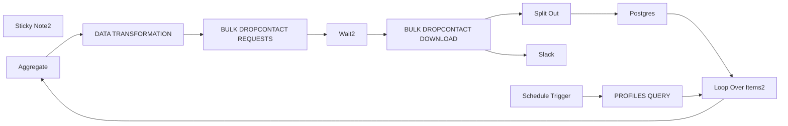

## Fluxo (.json) :

```json
{
  "meta": {
    "instanceId": "a2435d996b378e3a6fdef0468d70285e3aa0fbd0004de817bfc80e80afee4e7b"
  },
  "nodes": [
    {
      "id": "5fa5ccd8-81be-45a2-ac00-7ef28148c0c7",
      "name": "Sticky Note2",
      "type": "n8n-nodes-base.stickyNote",
      "position": [
        700,
        460
      ],
      "parameters": {
        "width": 1767.817629414989,
        "height": 470.03830555074103,
        "content": "## DROPCONTACT 250 BATCH ASYNCHRONOUSLY \n## 1500/HOUR REQUESTS\n**Double click** to edit me. [Guide](https://docs.n8n.io/workflows/sticky-notes/)"
      },
      "typeVersion": 1
    },
    {
      "id": "9c6826a3-ec94-4ff4-92a6-0ff7fa22349e",
      "name": "Aggregate",
      "type": "n8n-nodes-base.aggregate",
      "position": [
        1000,
        620
      ],
      "parameters": {
        "options": {},
        "fieldsToAggregate": {
          "fieldToAggregate": [
            {
              "fieldToAggregate": "first_name"
            },
            {
              "fieldToAggregate": "last_name"
            },
            {
              "fieldToAggregate": "domain"
            },
            {
              "fieldToAggregate": "phantom_linkedin"
            },
            {
              "fieldToAggregate": "full_name"
            }
          ]
        }
      },
      "typeVersion": 1
    },
    {
      "id": "c0d5b884-de58-42f3-bc50-0c7e6ca5e576",
      "name": "PROFILES QUERY",
      "type": "n8n-nodes-base.postgres",
      "position": [
        560,
        600
      ],
      "parameters": {
        "query": "select first_name, last_name, domain, full_name\nfrom accounts a \nleft join profiles p on a.company_id = p.company_id \nwhere title = 'Bestuurder' and p.email is null and a.domain != ''\nand domain NOT IN ('gmail.com', 'hotmail.com', 'hotmail.be', 'hotmail%','outlook.com','telenet.be', 'live.be', 'skynet.be','SKYNET%', 'yahoo.com' , 'yahoo%', 'msn%', 'hotmail', 'belgacom%') and dropcontact_found is null \nlimit 1000\n",
        "options": {},
        "operation": "executeQuery"
      },
      "credentials": {
        "postgres": {
          "id": "pYryZTyzA44MBOiN",
          "name": "Postgres account"
        }
      },
      "typeVersion": 2.3
    },
    {
      "id": "ddf11e8d-f1db-406c-9c2a-ab5a510fee47",
      "name": "BULK DROPCONTACT REQUESTS",
      "type": "n8n-nodes-base.httpRequest",
      "onError": "continueRegularOutput",
      "maxTries": 3,
      "position": [
        1360,
        620
      ],
      "parameters": {
        "url": "https://api.dropcontact.io/batch",
        "method": "POST",
        "options": {},
        "jsonBody": "={{ $json.toJsonString()}}\n",
        "sendBody": true,
        "sendHeaders": true,
        "specifyBody": "json",
        "authentication": "predefinedCredentialType",
        "headerParameters": {
          "parameters": [
            {
              "name": "X-Access-Token",
              "value": "apiKey"
            }
          ]
        },
        "nodeCredentialType": "dropcontactApi"
      },
      "credentials": {
        "dropcontactApi": {
          "id": "kUzEc345AiEZDjK7",
          "name": "Dropcontact Willow account"
        }
      },
      "retryOnFail": true,
      "typeVersion": 4.2,
      "waitBetweenTries": 600
    },
    {
      "id": "606e2898-eb44-46c2-9576-8e3cc1bd2578",
      "name": "Loop Over Items2",
      "type": "n8n-nodes-base.splitInBatches",
      "position": [
        780,
        600
      ],
      "parameters": {
        "options": {},
        "batchSize": 250
      },
      "typeVersion": 3
    },
    {
      "id": "ace20caa-3c9b-432a-a572-6bad48181347",
      "name": "Split Out",
      "type": "n8n-nodes-base.splitOut",
      "onError": "continueRegularOutput",
      "position": [
        1940,
        600
      ],
      "parameters": {
        "options": {},
        "fieldToSplitOut": "data"
      },
      "typeVersion": 1
    },
    {
      "id": "2c581721-a399-4d48-98a1-cee82246c4f4",
      "name": "Postgres",
      "type": "n8n-nodes-base.postgres",
      "onError": "continueErrorOutput",
      "maxTries": 2,
      "position": [
        2100,
        600
      ],
      "parameters": {
        "table": {
          "__rl": true,
          "mode": "list",
          "value": "profiles",
          "cachedResultName": "profiles"
        },
        "schema": {
          "__rl": true,
          "mode": "list",
          "value": "public"
        },
        "columns": {
          "value": {
            "email": "={{ $json.email[0].email }}",
            "phone": "={{ $json.phone }}",
            "full_name": "={{ $json.custom_fields.full_name }}",
            "dropcontact_found": "={{ true }}",
            "email_qualification": "={{ $json.email[0].qualification }}"
          },
          "schema": [
            {
              "id": "company_id",
              "type": "number",
              "display": true,
              "removed": true,
              "required": false,
              "displayName": "company_id",
              "defaultMatch": false,
              "canBeUsedToMatch": true
            },
            {
              "id": "create_date",
              "type": "dateTime",
              "display": true,
              "removed": true,
              "required": false,
              "displayName": "create_date",
              "defaultMatch": false,
              "canBeUsedToMatch": true
            },
            {
              "id": "phone",
              "type": "string",
              "display": true,
              "required": false,
              "displayName": "phone",
              "defaultMatch": false,
              "canBeUsedToMatch": true
            },
            {
              "id": "first_name",
              "type": "string",
              "display": true,
              "removed": true,
              "required": false,
              "displayName": "first_name",
              "defaultMatch": false,
              "canBeUsedToMatch": true
            },
            {
              "id": "last_name",
              "type": "string",
              "display": true,
              "removed": true,
              "required": false,
              "displayName": "last_name",
              "defaultMatch": false,
              "canBeUsedToMatch": true
            },
            {
              "id": "title",
              "type": "string",
              "display": true,
              "removed": true,
              "required": false,
              "displayName": "title",
              "defaultMatch": false,
              "canBeUsedToMatch": true
            },
            {
              "id": "start_date_raw",
              "type": "string",
              "display": true,
              "removed": true,
              "required": false,
              "displayName": "start_date_raw",
              "defaultMatch": false,
              "canBeUsedToMatch": true
            },
            {
              "id": "full_name",
              "type": "string",
              "display": true,
              "removed": false,
              "required": false,
              "displayName": "full_name",
              "defaultMatch": false,
              "canBeUsedToMatch": true
            },
            {
              "id": "seniority",
              "type": "string",
              "display": true,
              "removed": true,
              "required": false,
              "displayName": "seniority",
              "defaultMatch": false,
              "canBeUsedToMatch": true
            },
            {
              "id": "email",
              "type": "string",
              "display": true,
              "required": false,
              "displayName": "email",
              "defaultMatch": false,
              "canBeUsedToMatch": true
            },
            {
              "id": "email_qualification",
              "type": "string",
              "display": true,
              "required": false,
              "displayName": "email_qualification",
              "defaultMatch": false,
              "canBeUsedToMatch": true
            },
            {
              "id": "dropcontact_found",
              "type": "boolean",
              "display": true,
              "required": false,
              "displayName": "dropcontact_found",
              "defaultMatch": false,
              "canBeUsedToMatch": true
            }
          ],
          "mappingMode": "defineBelow",
          "matchingColumns": [
            "full_name"
          ]
        },
        "options": {
          "replaceEmptyStrings": true
        },
        "operation": "update"
      },
      "credentials": {
        "postgres": {
          "id": "pYryZTyzA44MBOiN",
          "name": "Postgres account"
        }
      },
      "retryOnFail": true,
      "typeVersion": 2.3,
      "alwaysOutputData": true
    },
    {
      "id": "7e94c87d-3f83-4fd1-877d-3463dce3cdd1",
      "name": "BULK DROPCONTACT DOWNLOAD",
      "type": "n8n-nodes-base.httpRequest",
      "onError": "continueErrorOutput",
      "position": [
        1740,
        620
      ],
      "parameters": {
        "url": "=https://api.dropcontact.io/batch/{{ $json.request_id }}",
        "options": {},
        "authentication": "predefinedCredentialType",
        "nodeCredentialType": "dropcontactApi"
      },
      "credentials": {
        "dropcontactApi": {
          "id": "kUzEc345AiEZDjK7",
          "name": "Dropcontact Willow account"
        }
      },
      "typeVersion": 4.2
    },
    {
      "id": "17aab456-72dc-482d-b5e3-b3dfb3a3b3f7",
      "name": "Wait2",
      "type": "n8n-nodes-base.wait",
      "position": [
        1540,
        620
      ],
      "webhookId": "de669d58-95c5-480e-9acc-17c396859fcf",
      "parameters": {
        "amount": 600
      },
      "typeVersion": 1.1
    },
    {
      "id": "148cec0c-985b-4c82-8835-fff8eacf6e38",
      "name": "DATA TRANSFORMATION",
      "type": "n8n-nodes-base.code",
      "position": [
        1180,
        620
      ],
      "parameters": {
        "mode": "runOnceForEachItem",
        "language": "python",
        "pythonCode": "import json\n\n## Load & access the existing JSON data\nfor item in _input.all():\n  data = item.json \n\n  # Define the output data structure\n  output_data = {\"data\": [], \"siren\": True}\n\n  # Unpack data from the single element list\n  first_names = data[\"first_name\"]\n  last_names = data[\"last_name\"]\n  domain = data[\"domain\"]\n  full_name = data[\"full_name\"]\n\n    # Combine data into a list of dictionaries\n  transformed_data = []\n  for i, (first_name, last_name, domain_name, full_name_value) in enumerate(zip(first_names, last_names, domain, full_name)):\n    transformed_data.append({\n      \"first_name\": first_name,\n      \"last_name\": last_name,\n      \"website\": domain_name,\n      \"custom_fields\": {\n        \"full_name\": full_name_value}\n    })\n\n  output_data[\"data\"] = transformed_data\n\n  return output_data \n\n"
      },
      "typeVersion": 2,
      "alwaysOutputData": true
    },
    {
      "id": "b233abfe-cfae-474a-b86d-29e56e1f3ac7",
      "name": "Slack",
      "type": "n8n-nodes-base.slack",
      "position": [
        1740,
        820
      ],
      "parameters": {
        "text": "Dropcontact Credits issue: url ",
        "user": {
          "__rl": true,
          "mode": "list",
          "value": ""
        },
        "select": "user",
        "otherOptions": {}
      },
      "typeVersion": 2.1
    },
    {
      "id": "d4e90677-89c9-418b-b618-f751b797d395",
      "name": "Schedule Trigger",
      "type": "n8n-nodes-base.scheduleTrigger",
      "position": [
        380,
        600
      ],
      "parameters": {
        "rule": {
          "interval": [
            {}
          ]
        }
      },
      "typeVersion": 1.1
    }
  ],
  "pinData": {},
  "connections": {
    "Wait2": {
      "main": [
        [
          {
            "node": "BULK DROPCONTACT DOWNLOAD",
            "type": "main",
            "index": 0
          }
        ]
      ]
    },
    "Postgres": {
      "main": [
        [
          {
            "node": "Loop Over Items2",
            "type": "main",
            "index": 0
          }
        ]
      ]
    },
    "Aggregate": {
      "main": [
        [
          {
            "node": "DATA TRANSFORMATION",
            "type": "main",
            "index": 0
          }
        ]
      ]
    },
    "Split Out": {
      "main": [
        [
          {
            "node": "Postgres",
            "type": "main",
            "index": 0
          }
        ]
      ]
    },
    "PROFILES QUERY": {
      "main": [
        [
          {
            "node": "Loop Over Items2",
            "type": "main",
            "index": 0
          }
        ]
      ]
    },
    "Loop Over Items2": {
      "main": [
        null,
        [
          {
            "node": "Aggregate",
            "type": "main",
            "index": 0
          }
        ]
      ]
    },
    "Schedule Trigger": {
      "main": [
        [
          {
            "node": "PROFILES QUERY",
            "type": "main",
            "index": 0
          }
        ]
      ]
    },
    "DATA TRANSFORMATION": {
      "main": [
        [
          {
            "node": "BULK DROPCONTACT REQUESTS",
            "type": "main",
            "index": 0
          }
        ]
      ]
    },
    "BULK DROPCONTACT DOWNLOAD": {
      "main": [
        [
          {
            "node": "Split Out",
            "type": "main",
            "index": 0
          }
        ],
        [
          {
            "node": "Slack",
            "type": "main",
            "index": 0
          }
        ]
      ]
    },
    "BULK DROPCONTACT REQUESTS": {
      "main": [
        [
          {
            "node": "Wait2",
            "type": "main",
            "index": 0
          }
        ]
      ]
    }
  }
}
```

<a id="template-1458"></a>

## Template 1458 - Recomendador de receitas da semana HelloFresh

- **Nome:** Recomendador de receitas da semana HelloFresh
- **Descrição:** Fluxo que coleta o menu semanal do HelloFresh, transforma receitas em documentos vetoriais, armazena-os e disponibiliza um agente de chat que recomenda receitas com base no gosto e restrições do usuário.
- **Funcionalidade:** • Coleta do menu semanal: Acessa a página da HelloFresh para obter a lista de cursos disponíveis na semana atual.
• Extração de dados do servidor: Extrai o JSON embutido na página para obter metadados das receitas.
• Busca de páginas de receita: Faz requisições às páginas individuais de receita para obter conteúdo completo.
• Extração de detalhes da receita: Obtém descrição, ingredientes, utensílios e instruções das páginas das receitas.
• Preparação de documentos: Formata os dados extraídos em documentos padronizados contendo metadados e conteúdo legível.
• Divisão de texto: Usa um splitter recursivo para dividir documentos longos em trechos apropriados para vetorização.
• Geração de embeddings: Converte trechos de documentos em vetores (embeddings) para indexação.
• Inserção no vetorstore: Armazena vetores com metadados em um índice vetorial para buscas e recomendações.
• Salvamento no banco tradicional: Persiste o documento original e metadados em um banco SQLite para recuperação completa.
• API de recomendação com consultas positivas/negativas: Gera embeddings para preferências positivas e negativas do usuário e usa a API de recomendação para retornar grupos de receitas únicas.
• Recuperação de receitas completas: Busca as receitas retornadas pela recomendação no banco SQLite para compor a resposta final.
• Agente de chat conversacional: Expõe uma interface de chat que recebe preferências do usuário, chama a ferramenta de recomendação e responde com sugestões da semana atual.
• Controle de taxa e espera: Introduz espera entre chamadas para respeitar limites de taxa de serviços externos.
- **Ferramentas:** • HelloFresh (site): Fonte das páginas e dados das receitas semanais.
• Mistral Cloud: Serviço para gerar embeddings e usar modelo de chat para entendimento conversacional.
• Qdrant: Armazenamento vetorial e API de recomendação para similaridade, agrupamento e busca.
• SQLite: Banco de dados relacional local usado para guardar os documentos completos e metadados.


## Fluxo visual

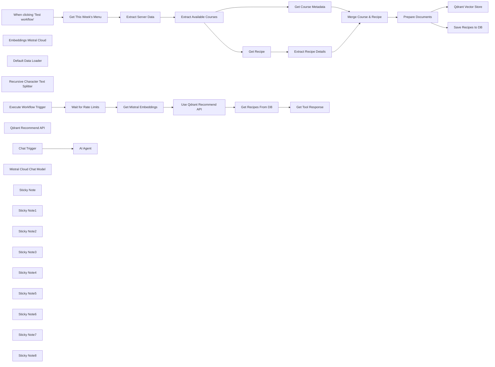

## Fluxo (.json) :

```json
{
  "meta": {
    "instanceId": "26ba763460b97c249b82942b23b6384876dfeb9327513332e743c5f6219c2b8e"
  },
  "nodes": [
    {
      "id": "1eb82902-a1d6-4eff-82a2-26908a82cea2",
      "name": "When clicking \"Test workflow\"",
      "type": "n8n-nodes-base.manualTrigger",
      "position": [
        720,
        320
      ],
      "parameters": {},
      "typeVersion": 1
    },
    {
      "id": "e0031fc3-27f1-45d9-910b-4c07dd322115",
      "name": "Get This Week's Menu",
      "type": "n8n-nodes-base.httpRequest",
      "position": [
        992,
        370
      ],
      "parameters": {
        "url": "=https://www.hellofresh.co.uk/menus/{{ $now.year }}-W{{ $now.weekNumber }}",
        "options": {}
      },
      "typeVersion": 4.2
    },
    {
      "id": "2c556cc7-7d4e-4d80-902f-9686e756ed8c",
      "name": "Extract Available Courses",
      "type": "n8n-nodes-base.code",
      "position": [
        992,
        650
      ],
      "parameters": {
        "jsCode": "const pageData = JSON.parse($input.first().json.data)\nreturn pageData.props.pageProps.ssrPayload.courses.slice(0, 10);"
      },
      "typeVersion": 2
    },
    {
      "id": "90c39db6-6116-4c37-8d48-a6d5e8f8c777",
      "name": "Extract Server Data",
      "type": "n8n-nodes-base.html",
      "position": [
        992,
        510
      ],
      "parameters": {
        "options": {
          "trimValues": false,
          "cleanUpText": true
        },
        "operation": "extractHtmlContent",
        "extractionValues": {
          "values": [
            {
              "key": "data",
              "cssSelector": "script#__NEXT_DATA__"
            }
          ]
        }
      },
      "typeVersion": 1.2
    },
    {
      "id": "fbd4ed97-0154-4991-bf16-d9c4cb3f4776",
      "name": "Get Course Metadata",
      "type": "n8n-nodes-base.set",
      "position": [
        1172,
        370
      ],
      "parameters": {
        "options": {},
        "assignments": {
          "assignments": [
            {
              "id": "3c90fd1e-e9ac-49c1-a459-7cff8c87fe8d",
              "name": "name",
              "type": "string",
              "value": "={{ $json.recipe.name }}"
            },
            {
              "id": "c4f3a5df-346c-4e8d-90ba-a49ed6afdedf",
              "name": "cuisines",
              "type": "array",
              "value": "={{ $json.recipe.cuisines.map(item => item.name) }}"
            },
            {
              "id": "97917928-0956-497b-bb68-507df1783240",
              "name": "category",
              "type": "string",
              "value": "={{ $json.recipe.category.name }}"
            },
            {
              "id": "1e84cf1e-7ad7-4888-9606-d3f7a310ce5f",
              "name": "tags",
              "type": "array",
              "value": "={{ $json.recipe.tags.flatMap(tag => tag.preferences) }}"
            },
            {
              "id": "cf6e2174-e8cb-4935-8303-2f8ed067f510",
              "name": "nutrition",
              "type": "object",
              "value": "={{ $json.recipe.nutrition.reduce((acc,item) => ({ ...acc, [item.name]: item.amount + item.unit }), {}) }}"
            },
            {
              "id": "25ba3fe6-c2fa-4315-a2cb-112ec7e3620f",
              "name": "url",
              "type": "string",
              "value": "={{ $json.recipe.websiteUrl }}"
            },
            {
              "id": "8f444fb3-c2ee-4254-b505-440cca3c7b8b",
              "name": "id",
              "type": "string",
              "value": "={{ $json.recipe.id }}"
            }
          ]
        }
      },
      "typeVersion": 3.3
    },
    {
      "id": "5ab1a5fa-adc3-41e0-be6d-f680af301aca",
      "name": "Get Recipe",
      "type": "n8n-nodes-base.httpRequest",
      "position": [
        1172,
        510
      ],
      "parameters": {
        "url": "={{ $json.recipe.websiteUrl }}",
        "options": {}
      },
      "typeVersion": 4.2
    },
    {
      "id": "5014dc62-8320-4968-b9bd-396a517a2b5c",
      "name": "Embeddings Mistral Cloud",
      "type": "@n8n/n8n-nodes-langchain.embeddingsMistralCloud",
      "position": [
        1960,
        420
      ],
      "parameters": {
        "options": {}
      },
      "credentials": {
        "mistralCloudApi": {
          "id": "EIl2QxhXAS9Hkg37",
          "name": "Mistral Cloud account"
        }
      },
      "typeVersion": 1
    },
    {
      "id": "2a8fad89-f74b-4808-8cb6-97c6b46a53ee",
      "name": "Default Data Loader",
      "type": "@n8n/n8n-nodes-langchain.documentDefaultDataLoader",
      "position": [
        2080,
        420
      ],
      "parameters": {
        "options": {
          "metadata": {
            "metadataValues": [
              {
                "name": "week",
                "value": "={{ $json.week }}"
              },
              {
                "name": "cuisine",
                "value": "={{ $json.cuisines }}"
              },
              {
                "name": "category",
                "value": "={{ $json.category }}"
              },
              {
                "name": "tag",
                "value": "={{ $json.tags }}"
              },
              {
                "name": "recipe_id",
                "value": "={{ $json.id }}"
              }
            ]
          }
        },
        "jsonData": "={{ $json.data }}",
        "jsonMode": "expressionData"
      },
      "typeVersion": 1
    },
    {
      "id": "44ceef5c-1d08-40d2-8ab4-227b551f72f5",
      "name": "Merge Course & Recipe",
      "type": "n8n-nodes-base.merge",
      "position": [
        1480,
        500
      ],
      "parameters": {
        "mode": "combine",
        "options": {},
        "combinationMode": "mergeByPosition"
      },
      "typeVersion": 2.1
    },
    {
      "id": "b56bd85e-f182-49d1-aeb1-062e905c316a",
      "name": "Prepare Documents",
      "type": "n8n-nodes-base.set",
      "position": [
        1660,
        500
      ],
      "parameters": {
        "options": {},
        "assignments": {
          "assignments": [
            {
              "id": "462567fe-02ec-4747-ae33-407d2bc6d776",
              "name": "data",
              "type": "string",
              "value": "=# {{ $json.name }}\n{{ $json.description.replaceAll('\\n\\n','\\n') }}\n\n# Website\n{{ $json.url }}\n\n## Ingredients\n{{ $json.ingredients.replaceAll('\\n\\n','\\n') }}\n\n## Utensils\n{{ $json.utensils }}\n\n## Nutrition\n{{ Object.keys($json.nutrition).map(key => `* ${key}: ${$json.nutrition[key]}`).join('\\n') }}\n\n## Instructions\n{{ $json.instructions.replaceAll('\\n\\n','\\n') }}"
            },
            {
              "id": "5738e420-abfe-4a85-b7ad-541cfc181563",
              "name": "cuisine",
              "type": "array",
              "value": "={{ $json.cuisines }}"
            },
            {
              "id": "349f46d4-e230-4da8-a118-50227ceb7233",
              "name": "category",
              "type": "string",
              "value": "={{ $json.category }}"
            },
            {
              "id": "9588b347-4469-4aa5-93a2-e7bf41b4c468",
              "name": "tag",
              "type": "array",
              "value": "={{ $json.tags }}"
            },
            {
              "id": "7ddab229-fa52-4d27-84e1-83ed47280d29",
              "name": "week",
              "type": "string",
              "value": "={{ $now.year }}-W{{ $now.weekNumber }}"
            },
            {
              "id": "13163e45-5699-4d25-af3d-4c7910dd2926",
              "name": "id",
              "type": "string",
              "value": "={{ $json.id }}"
            },
            {
              "id": "a0c5d599-ff2b-420d-9173-2baf9218abc5",
              "name": "name",
              "type": "string",
              "value": "={{ $json.name }}"
            }
          ]
        }
      },
      "typeVersion": 3.3
    },
    {
      "id": "6b800632-f320-4fc3-bd2a-6a062834343d",
      "name": "Recursive Character Text Splitter",
      "type": "@n8n/n8n-nodes-langchain.textSplitterRecursiveCharacterTextSplitter",
      "position": [
        2080,
        560
      ],
      "parameters": {
        "options": {}
      },
      "typeVersion": 1
    },
    {
      "id": "df7f17a2-8b27-4203-a2ff-091aaf6609b8",
      "name": "Chat Trigger",
      "type": "@n8n/n8n-nodes-langchain.chatTrigger",
      "position": [
        2440,
        360
      ],
      "webhookId": "745056ec-2d36-4ac3-9c70-6ff0b1055d0a",
      "parameters": {},
      "typeVersion": 1
    },
    {
      "id": "ee38effe-5929-421e-a3c5-b1055a755242",
      "name": "Extract Recipe Details",
      "type": "n8n-nodes-base.html",
      "position": [
        1172,
        650
      ],
      "parameters": {
        "options": {},
        "operation": "extractHtmlContent",
        "extractionValues": {
          "values": [
            {
              "key": "description",
              "cssSelector": "[data-test-id=\"recipe-description\"]"
            },
            {
              "key": "ingredients",
              "cssSelector": "[data-test-id=\"ingredients-list\"]"
            },
            {
              "key": "utensils",
              "cssSelector": "[data-test-id=\"utensils\"]"
            },
            {
              "key": "instructions",
              "cssSelector": "[data-test-id=\"instructions\"]",
              "skipSelectors": "img,a"
            }
          ]
        }
      },
      "typeVersion": 1.2
    },
    {
      "id": "dede108f-2fde-49cb-8a0e-fa5786c59d4b",
      "name": "Qdrant Recommend API",
      "type": "@n8n/n8n-nodes-langchain.toolWorkflow",
      "position": [
        2840,
        540
      ],
      "parameters": {
        "name": "get_recipe_recommendation",
        "fields": {
          "values": [
            {
              "name": "week",
              "stringValue": "={{ $now.year }}-W{{ $now.weekNumber }}"
            }
          ]
        },
        "schemaType": "manual",
        "workflowId": "={{ $workflow.id }}",
        "description": "Call this tool to get a recipe recommendation. Pass in the following params as a json object:\n* positives - a description of what the user wants to cook. This could be ingredients, flavours, utensils available, number of diners, type of meal etc.\n* negatives - a description of what the user wants to avoid in the recipe. This could be flavours to avoid, allergen considerations, conflicts with theme of meal etc.",
        "inputSchema": "{\n\"type\": \"object\",\n\"properties\": {\n\t\"positive\": {\n\t\t\"type\": \"string\",\n\t\t\"description\": \"a description of what the user wants to cook. This could be ingredients, flavours, utensils available, number of diners, type of meal etc.\"\n\t},\n   \"negative\": {\n    \"type\": \"string\",\n    \"description\": \"a description of what the user wants to avoid in the recipe. This could be flavours to avoid, allergen considerations, conflicts with theme of meal etc.\"\n  }\n}\n}",
        "specifyInputSchema": true
      },
      "typeVersion": 1.1
    },
    {
      "id": "5e703134-4dd9-464b-9ec9-dc6103907a1e",
      "name": "Execute Workflow Trigger",
      "type": "n8n-nodes-base.executeWorkflowTrigger",
      "position": [
        2420,
        940
      ],
      "parameters": {},
      "typeVersion": 1
    },
    {
      "id": "9fb5f4fd-3b38-4a35-8986-d3955754c8d1",
      "name": "Mistral Cloud Chat Model",
      "type": "@n8n/n8n-nodes-langchain.lmChatMistralCloud",
      "position": [
        2660,
        540
      ],
      "parameters": {
        "model": "mistral-large-2402",
        "options": {}
      },
      "credentials": {
        "mistralCloudApi": {
          "id": "EIl2QxhXAS9Hkg37",
          "name": "Mistral Cloud account"
        }
      },
      "typeVersion": 1
    },
    {
      "id": "d38275e6-aede-4f1c-9b05-018f3cf4faab",
      "name": "Get Tool Response",
      "type": "n8n-nodes-base.set",
      "position": [
        3160,
        940
      ],
      "parameters": {
        "options": {},
        "assignments": {
          "assignments": [
            {
              "id": "10b55200-4610-4e9b-8be7-d487c6b56a78",
              "name": "response",
              "type": "string",
              "value": "={{ JSON.stringify($json.result) }}"
            }
          ]
        }
      },
      "typeVersion": 3.3
    },
    {
      "id": "dc3ceb2f-3c64-4b42-aeca-ddcdb84abf12",
      "name": "Wait for Rate Limits",
      "type": "n8n-nodes-base.wait",
      "position": [
        2420,
        1080
      ],
      "webhookId": "e86d8ae4-3b0d-4c40-9d12-a11d6501a043",
      "parameters": {
        "amount": 1.1
      },
      "typeVersion": 1.1
    },
    {
      "id": "ec36d6f8-c3da-4732-8d56-a092a3358864",
      "name": "Get Mistral Embeddings",
      "type": "n8n-nodes-base.httpRequest",
      "position": [
        2620,
        940
      ],
      "parameters": {
        "url": "https://api.mistral.ai/v1/embeddings",
        "method": "POST",
        "options": {},
        "sendBody": true,
        "authentication": "predefinedCredentialType",
        "bodyParameters": {
          "parameters": [
            {
              "name": "model",
              "value": "mistral-embed"
            },
            {
              "name": "encoding_format",
              "value": "float"
            },
            {
              "name": "input",
              "value": "={{ [$json.query.positive, $json.query.negative].compact() }}"
            }
          ]
        },
        "nodeCredentialType": "mistralCloudApi"
      },
      "credentials": {
        "mistralCloudApi": {
          "id": "EIl2QxhXAS9Hkg37",
          "name": "Mistral Cloud account"
        }
      },
      "typeVersion": 4.2
    },
    {
      "id": "aebcb860-d25c-4833-9e9d-0297101259c7",
      "name": "Use Qdrant Recommend API",
      "type": "n8n-nodes-base.httpRequest",
      "position": [
        2800,
        940
      ],
      "parameters": {
        "url": "=http://qdrant:6333/collections/hello_fresh/points/recommend/groups",
        "method": "POST",
        "options": {},
        "sendBody": true,
        "authentication": "predefinedCredentialType",
        "bodyParameters": {
          "parameters": [
            {
              "name": "strategy",
              "value": "average_vector"
            },
            {
              "name": "limit",
              "value": "={{ 3 }}"
            },
            {
              "name": "positive",
              "value": "={{ [$json.data[0].embedding] }}"
            },
            {
              "name": "negative",
              "value": "={{ [$json.data[1].embedding] }}"
            },
            {
              "name": "filter",
              "value": "={{ { \"must\": {\"key\": \"metadata.week\", \"match\": { \"value\": $('Execute Workflow Trigger').item.json.week } } } }}"
            },
            {
              "name": "with_payload",
              "value": "={{ true }}"
            },
            {
              "name": "group_by",
              "value": "metadata.recipe_id"
            },
            {
              "name": "group_size",
              "value": "={{ 3 }}"
            }
          ]
        },
        "nodeCredentialType": "qdrantApi"
      },
      "credentials": {
        "qdrantApi": {
          "id": "NyinAS3Pgfik66w5",
          "name": "QdrantApi account"
        }
      },
      "typeVersion": 4.2
    },
    {
      "id": "2474c97d-0d85-4acc-a95e-2eb6494786dc",
      "name": "Get Recipes From DB",
      "type": "n8n-nodes-base.code",
      "position": [
        2980,
        940
      ],
      "parameters": {
        "language": "python",
        "pythonCode": "import sqlite3\ncon = sqlite3.connect(\"hello_fresh_1.db\")\n\nrecipe_ids = list(set([group.id for group in _input.all()[0].json.result.groups if group.hits[0].score > 0.5]))\nplaceholders = ','.join(['?' for i in range(0,len(recipe_ids))])\n\ncur = con.cursor()\nres = cur.execute(f'SELECT * FROM recipes WHERE id IN ({placeholders})', recipe_ids)\nrows = res.fetchall()\n\ncon.close()\n\nreturn [{ \"result\": [row[2] for row in rows] }]"
      },
      "typeVersion": 2
    },
    {
      "id": "54229c2a-6e26-4350-8a94-57f415ef2340",
      "name": "Save Recipes to DB",
      "type": "n8n-nodes-base.code",
      "position": [
        1960,
        940
      ],
      "parameters": {
        "language": "python",
        "pythonCode": "import sqlite3\ncon = sqlite3.connect(\"hello_fresh_1.db\")\n\ncur = con.cursor()\ncur.execute(\"CREATE TABLE IF NOT EXISTS recipes (id TEXT PRIMARY KEY, name TEXT, data TEXT, cuisine TEXT, category TEXT, tag TEXT, week TEXT);\")\n\nfor item in _input.all():\n  cur.execute('INSERT OR REPLACE INTO recipes VALUES(?,?,?,?,?,?,?)', (\n    item.json.id,\n    item.json.name,\n    item.json.data,\n    ','.join(item.json.cuisine),\n    item.json.category,\n    ','.join(item.json.tag),\n    item.json.week\n  ))\n\ncon.commit()\ncon.close()\n\nreturn [{ \"affected_rows\": len(_input.all()) }]"
      },
      "typeVersion": 2
    },
    {
      "id": "725c1f56-5373-4891-92b9-3f32dd28892b",
      "name": "Sticky Note",
      "type": "n8n-nodes-base.stickyNote",
      "position": [
        901.1666225087287,
        180.99920515712074
      ],
      "parameters": {
        "color": 7,
        "width": 484.12381677448207,
        "height": 674.1153489831718,
        "content": "## Step 1. Fetch Available Courses For the Current Week\n\nTo populate our vectorstore, we'll scrape the weekly menu off the HelloFresh Website. The pages are quite large so may take a while so please be patient."
      },
      "typeVersion": 1
    },
    {
      "id": "f4e882b8-3762-4e6b-9e95-b0d708d0c284",
      "name": "Sticky Note1",
      "type": "n8n-nodes-base.stickyNote",
      "position": [
        1420,
        300
      ],
      "parameters": {
        "color": 7,
        "width": 409.1756468632768,
        "height": 398.81415970574335,
        "content": "## Step 2. Create Recipe Documents For VectorStore\n\nTo populate our vectorstore, we'll scrape the weekly menu off the HelloFresh Website. The pages are quite large so may take a while so please be patient."
      },
      "typeVersion": 1
    },
    {
      "id": "fc3c2221-b67c-451c-9096-d6acd2a297fa",
      "name": "Sticky Note2",
      "type": "n8n-nodes-base.stickyNote",
      "position": [
        1860,
        19.326425127730317
      ],
      "parameters": {
        "color": 7,
        "width": 486.02284096214964,
        "height": 690.7816167755491,
        "content": "## Step 3. Vectorise Recipes For Recommendation Engine\n[Read more about Qdrant node](https://docs.n8n.io/integrations/builtin/cluster-nodes/root-nodes/n8n-nodes-langchain.vectorstoreqdrant)\n\nWe'll store our documents in our Qdrant vectorstore by converting to vectors using Mistral Embed. Our goal is to a build a recommendation engine for meals of the week which Qdrant is a perfect solution."
      },
      "typeVersion": 1
    },
    {
      "id": "43296173-b929-46cc-b6ea-58007837b8df",
      "name": "Sticky Note3",
      "type": "n8n-nodes-base.stickyNote",
      "position": [
        1740,
        740
      ],
      "parameters": {
        "color": 7,
        "width": 547.0098868353456,
        "height": 347.6002738958705,
        "content": "## Step 4. Save Original Document to Database\n[Read more about Code Node](https://docs.n8n.io/integrations/builtin/core-nodes/n8n-nodes-base.code)\n\nFinally, let's have the original document stored in a more traditional datastore. USually our vectorsearch will return partial docs and those are enough for many use-cases, however in this instance we'll pull the full docs for the Agent get the info required to make the recommendation. "
      },
      "typeVersion": 1
    },
    {
      "id": "6e2e58d2-e0ad-4503-8ed6-891124c8035b",
      "name": "Sticky Note4",
      "type": "n8n-nodes-base.stickyNote",
      "position": [
        2380,
        160
      ],
      "parameters": {
        "color": 7,
        "width": 673.6008766895472,
        "height": 552.9202706743265,
        "content": "## 5. Chat with Our HelloFresh Recommendation AI Agent\n[Read more about AI Agents](https://docs.n8n.io/integrations/builtin/cluster-nodes/root-nodes/n8n-nodes-langchain.agent)\n\nThis agent is designed to recommend HelloFresh recipes based on your current taste preferences. Need something hot and spicy, warm and comforting or fast and chilled? This agent will capture what you would like and not like and queries our Recipe Recommendation engine powered by Qdrant Vectorstore."
      },
      "typeVersion": 1
    },
    {
      "id": "ba692c21-38bc-48a1-8b40-bad298be8b9e",
      "name": "AI Agent",
      "type": "@n8n/n8n-nodes-langchain.agent",
      "position": [
        2660,
        360
      ],
      "parameters": {
        "options": {
          "systemMessage": "=You are a recipe bot for the company, \"Hello fresh\". You will help the user choose which Hello Fresh recipe to choose from this week's menu. The current week is {{ $now.year }}-W{{ $now.weekNumber }}.\nDo not recommend any recipes other from the current week's menu. If there are no recipes to recommend, please ask the user to visit the website instead https://hellofresh.com."
        }
      },
      "typeVersion": 1.6
    },
    {
      "id": "d7ca0f97-72dc-4f4c-8b46-3ff57b9068a4",
      "name": "Sticky Note5",
      "type": "n8n-nodes-base.stickyNote",
      "position": [
        2320,
        740
      ],
      "parameters": {
        "color": 7,
        "width": 987.4785537889618,
        "height": 531.9173034334732,
        "content": "## 5. Using Qdrant's Recommend API & Grouping Functionality\n[Read more about Qdrant's Recommend API](https://qdrant.tech/documentation/concepts/explore/?q=recommend)\n\nUnlike basic similarity search, Qdrant's Recommend API takes a positive query to match against (eg. Roast Dinner) and a negative query to avoid (eg. Roast Chicken). This feature significantly improves results for a recommendation engine. Additionally, by utilising Qdrant's Grouping feature, we're able to group similar matches from the same recipe - meaning we can ensure unique recipes everytime."
      },
      "typeVersion": 1
    },
    {
      "id": "96a294e2-1437-4ded-9973-0999b444c999",
      "name": "Sticky Note6",
      "type": "n8n-nodes-base.stickyNote",
      "position": [
        440,
        -40
      ],
      "parameters": {
        "width": 432.916474478624,
        "height": 542.9295980774649,
        "content": "## Try it out!\n### This workflow does the following:\n* Fetches and stores this week's HelloFresh's menu\n* Builds the foundation of a recommendation engine by storing the recipes in a Qdrant Vectorstore and SQLite database.\n* Builds an AI Agent that allows for a chat interface to query for a the week's recipe recommendations.\n* AI agent uses the Qdrant Recommend API, providing what the user likes/dislikes as the query.\n* Qdrant returns the results which enable the AI Agent to make the recommendation to the user.\n\n### Need Help?\nJoin the [Discord](https://discord.com/invite/XPKeKXeB7d) or ask in the [Forum](https://community.n8n.io/)!\n\nHappy Hacking!"
      },
      "typeVersion": 1
    },
    {
      "id": "72c98600-f21a-42d4-97be-836b8ef6dc77",
      "name": "Qdrant Vector Store",
      "type": "@n8n/n8n-nodes-langchain.vectorStoreQdrant",
      "position": [
        1960,
        240
      ],
      "parameters": {
        "mode": "insert",
        "options": {},
        "qdrantCollection": {
          "__rl": true,
          "mode": "list",
          "value": "hello_fresh",
          "cachedResultName": "hello_fresh"
        }
      },
      "credentials": {
        "qdrantApi": {
          "id": "NyinAS3Pgfik66w5",
          "name": "QdrantApi account"
        }
      },
      "typeVersion": 1
    },
    {
      "id": "b7c4b597-ac2b-41d7-8f0f-1cbba25085de",
      "name": "Sticky Note7",
      "type": "n8n-nodes-base.stickyNote",
      "position": [
        1860,
        -195.8987124522777
      ],
      "parameters": {
        "width": 382.47301504497716,
        "height": 195.8987124522777,
        "content": "### 🚨Ensure Qdrant collection exists!\nYou'll need to run the following command in Qdrant:\n```\nPUT collections/hello_fresh\n{\n  \"vectors\": {\n    \"distance\": \"Cosine\",\n    \"size\": 1024\n  }\n}\n```"
      },
      "typeVersion": 1
    },
    {
      "id": "39191834-ecc2-46f0-a31a-0a7e9c47ac5d",
      "name": "Sticky Note8",
      "type": "n8n-nodes-base.stickyNote",
      "position": [
        2740,
        920
      ],
      "parameters": {
        "width": 213.30551928619226,
        "height": 332.38559808882246,
        "content": "\n\n\n\n\n\n\n\n\n\n\n\n\n\n\n\n### 🚨Configure Your Qdrant Connection\n* Be sure to enter your endpoint address"
      },
      "typeVersion": 1
    }
  ],
  "pinData": {},
  "connections": {
    "Get Recipe": {
      "main": [
        [
          {
            "node": "Extract Recipe Details",
            "type": "main",
            "index": 0
          }
        ]
      ]
    },
    "Chat Trigger": {
      "main": [
        [
          {
            "node": "AI Agent",
            "type": "main",
            "index": 0
          }
        ]
      ]
    },
    "Prepare Documents": {
      "main": [
        [
          {
            "node": "Qdrant Vector Store",
            "type": "main",
            "index": 0
          },
          {
            "node": "Save Recipes to DB",
            "type": "main",
            "index": 0
          }
        ]
      ]
    },
    "Default Data Loader": {
      "ai_document": [
        [
          {
            "node": "Qdrant Vector Store",
            "type": "ai_document",
            "index": 0
          }
        ]
      ]
    },
    "Extract Server Data": {
      "main": [
        [
          {
            "node": "Extract Available Courses",
            "type": "main",
            "index": 0
          }
        ]
      ]
    },
    "Get Course Metadata": {
      "main": [
        [
          {
            "node": "Merge Course & Recipe",
            "type": "main",
            "index": 0
          }
        ]
      ]
    },
    "Get Recipes From DB": {
      "main": [
        [
          {
            "node": "Get Tool Response",
            "type": "main",
            "index": 0
          }
        ]
      ]
    },
    "Get This Week's Menu": {
      "main": [
        [
          {
            "node": "Extract Server Data",
            "type": "main",
            "index": 0
          }
        ]
      ]
    },
    "Qdrant Recommend API": {
      "ai_tool": [
        [
          {
            "node": "AI Agent",
            "type": "ai_tool",
            "index": 0
          }
        ]
      ]
    },
    "Wait for Rate Limits": {
      "main": [
        [
          {
            "node": "Get Mistral Embeddings",
            "type": "main",
            "index": 0
          }
        ]
      ]
    },
    "Merge Course & Recipe": {
      "main": [
        [
          {
            "node": "Prepare Documents",
            "type": "main",
            "index": 0
          }
        ]
      ]
    },
    "Extract Recipe Details": {
      "main": [
        [
          {
            "node": "Merge Course & Recipe",
            "type": "main",
            "index": 1
          }
        ]
      ]
    },
    "Get Mistral Embeddings": {
      "main": [
        [
          {
            "node": "Use Qdrant Recommend API",
            "type": "main",
            "index": 0
          }
        ]
      ]
    },
    "Embeddings Mistral Cloud": {
      "ai_embedding": [
        [
          {
            "node": "Qdrant Vector Store",
            "type": "ai_embedding",
            "index": 0
          }
        ]
      ]
    },
    "Execute Workflow Trigger": {
      "main": [
        [
          {
            "node": "Wait for Rate Limits",
            "type": "main",
            "index": 0
          }
        ]
      ]
    },
    "Mistral Cloud Chat Model": {
      "ai_languageModel": [
        [
          {
            "node": "AI Agent",
            "type": "ai_languageModel",
            "index": 0
          }
        ]
      ]
    },
    "Use Qdrant Recommend API": {
      "main": [
        [
          {
            "node": "Get Recipes From DB",
            "type": "main",
            "index": 0
          }
        ]
      ]
    },
    "Extract Available Courses": {
      "main": [
        [
          {
            "node": "Get Course Metadata",
            "type": "main",
            "index": 0
          },
          {
            "node": "Get Recipe",
            "type": "main",
            "index": 0
          }
        ]
      ]
    },
    "When clicking \"Test workflow\"": {
      "main": [
        [
          {
            "node": "Get This Week's Menu",
            "type": "main",
            "index": 0
          }
        ]
      ]
    },
    "Recursive Character Text Splitter": {
      "ai_textSplitter": [
        [
          {
            "node": "Default Data Loader",
            "type": "ai_textSplitter",
            "index": 0
          }
        ]
      ]
    }
  }
}
```

<a id="template-1460"></a>

## Template 1460 - QA de documento com citações

- **Nome:** QA de documento com citações
- **Descrição:** Carrega um arquivo do Google Drive, indexa seu conteúdo em um banco vetorial e responde a perguntas sobre o documento fornecendo citações das passagens usadas.
- **Funcionalidade:** • Importar arquivo do Google Drive: busca e baixa um arquivo a partir de uma URL configurada.
• Dividir texto em blocos: segmenta o conteúdo em chunks com tamanho e overlap configuráveis.
• Gerar embeddings: cria vetores a partir dos chunks usando embeddings externos.
• Inserir no banco vetorial: armazena embeddings e metadados em um índice vetorial para busca posterior.
• Receber pergunta via gatilho de chat: inicia a consulta quando uma mensagem de chat é recebida.
• Recuperar trechos relevantes: busca os top-K chunks mais relevantes com base na pergunta.
• Preparar contexto: concatena os trechos recuperados em um contexto legível para o modelo.
• Gerar resposta com citações: utiliza um modelo de linguagem para responder à pergunta e retornar índices/metadados das fontes utilizadas.
• Compor citações legíveis: formata referências indicando arquivo e intervalo de linhas dos trechos usados.
• Configuração de parâmetros: permite ajustar número máximo de chunks enviados ao modelo e as configurações de chunking.
• Execução de teste manual: botão para popular o índice com um exemplo (por exemplo, whitepaper do Bitcoin).
- **Ferramentas:** • Google Drive: local de armazenamento do arquivo-fonte, usado para baixar o documento.
• Pinecone: serviço de banco vetorial usado para armazenar e recuperar embeddings dos trechos.
• OpenAI: provê tanto os embeddings quanto o modelo de linguagem usado para gerar respostas e extrair informações.


## Fluxo visual

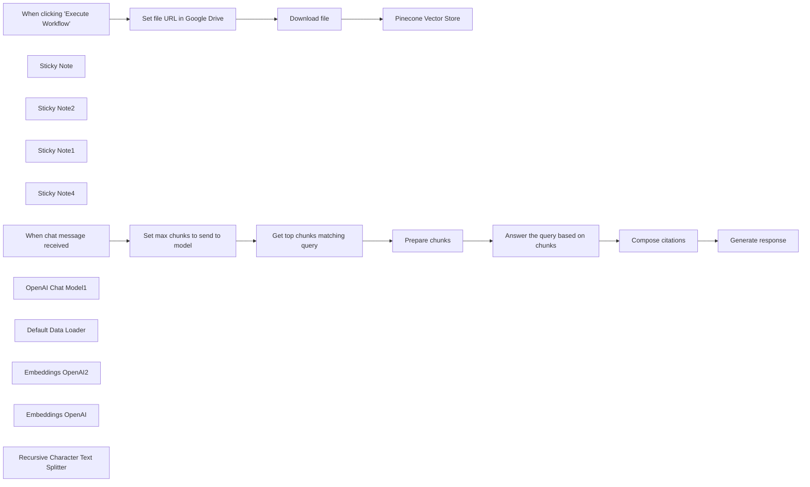

## Fluxo (.json) :

```json
{
  "meta": {
    "instanceId": "408f9fb9940c3cb18ffdef0e0150fe342d6e655c3a9fac21f0f644e8bedabcd9",
    "templateCredsSetupCompleted": true
  },
  "nodes": [
    {
      "id": "e2e61eae-6306-47db-908c-9d82758f6516",
      "name": "When clicking \"Execute Workflow\"",
      "type": "n8n-nodes-base.manualTrigger",
      "position": [
        -660,
        40
      ],
      "parameters": {},
      "typeVersion": 1
    },
    {
      "id": "a45afcc0-d780-462a-9ed7-27daf01363a7",
      "name": "Sticky Note",
      "type": "n8n-nodes-base.stickyNote",
      "position": [
        -500,
        -140
      ],
      "parameters": {
        "color": 7,
        "width": 1086.039382705461,
        "height": 728.4168721167887,
        "content": "## 1. Setup: Fetch file from Google Drive, split it into chunks and insert into a vector database\nNote that running this part multiple times will insert multiple copies into your DB"
      },
      "typeVersion": 1
    },
    {
      "id": "a3c56569-0728-4246-8d87-fa106d373566",
      "name": "Sticky Note2",
      "type": "n8n-nodes-base.stickyNote",
      "position": [
        -960,
        -60
      ],
      "parameters": {
        "height": 350.7942096493649,
        "content": "# Try me out\n1. In Pinecone, create an index with 1536 dimensions and select it in the two vector store nodes\n2. Populate Pinecone by clicking the 'test workflow' button below\n3. Click the 'chat' button below and enter the following:\n\n_Which email provider does the creator of Bitcoin use?_"
      },
      "typeVersion": 1
    },
    {
      "id": "c1543b8a-dbea-42a9-a35e-e22ed86f565b",
      "name": "Sticky Note1",
      "type": "n8n-nodes-base.stickyNote",
      "position": [
        -500,
        640
      ],
      "parameters": {
        "color": 7,
        "width": 1594,
        "height": 529,
        "content": "## 2. Chat with file, getting citations in reponse"
      },
      "typeVersion": 1
    },
    {
      "id": "5300d5dd-4186-4402-9442-88adab4e9a89",
      "name": "Sticky Note4",
      "type": "n8n-nodes-base.stickyNote",
      "position": [
        -480,
        -40
      ],
      "parameters": {
        "color": 7,
        "width": 179.58883583572606,
        "height": 257.75985739596473,
        "content": "Will fetch the Bitcoin whitepaper, but you can change this"
      },
      "typeVersion": 1
    },
    {
      "id": "9f707f2b-6cb2-47b8-88fc-65cfd09b6cae",
      "name": "Pinecone Vector Store",
      "type": "@n8n/n8n-nodes-langchain.vectorStorePinecone",
      "position": [
        80,
        40
      ],
      "parameters": {
        "mode": "insert",
        "options": {},
        "pineconeIndex": {
          "__rl": true,
          "mode": "id",
          "value": "test-index"
        }
      },
      "credentials": {
        "pineconeApi": {
          "id": "OHDlDbBkaPDgpnOY",
          "name": "PineconeApi account"
        }
      },
      "typeVersion": 1
    },
    {
      "id": "a32ac59e-efdc-4ff3-92dd-be794c2be7f7",
      "name": "When chat message received",
      "type": "@n8n/n8n-nodes-langchain.chatTrigger",
      "position": [
        -660,
        760
      ],
      "webhookId": "cd2703a7-f912-46fe-8787-3fb83ea116ab",
      "parameters": {
        "options": {}
      },
      "typeVersion": 1.1
    },
    {
      "id": "e14145d2-0c18-4813-9555-263314cb0376",
      "name": "OpenAI Chat Model1",
      "type": "@n8n/n8n-nodes-langchain.lmChatOpenAi",
      "position": [
        340,
        980
      ],
      "parameters": {
        "model": {
          "__rl": true,
          "mode": "list",
          "value": "gpt-4o-mini"
        },
        "options": {}
      },
      "credentials": {
        "openAiApi": {
          "id": "8gccIjcuf3gvaoEr",
          "name": "OpenAi account"
        }
      },
      "typeVersion": 1.2
    },
    {
      "id": "e6863abd-d3df-4b45-9083-96b82cd46773",
      "name": "Set file URL in Google Drive",
      "type": "n8n-nodes-base.set",
      "position": [
        -440,
        40
      ],
      "parameters": {
        "options": {},
        "assignments": {
          "assignments": [
            {
              "id": "dc7a70e3-9b04-404b-8892-ba0fcc4274c2",
              "name": "file_url",
              "type": "string",
              "value": " https://drive.google.com/file/d/11Koq9q53nkk0F5Y8eZgaWJUVR03I4-MM/view"
            }
          ]
        }
      },
      "typeVersion": 3.4
    },
    {
      "id": "80d241f1-7c8a-489e-9255-84bc79ec11c7",
      "name": "Download file",
      "type": "n8n-nodes-base.googleDrive",
      "position": [
        -220,
        40
      ],
      "parameters": {
        "fileId": {
          "__rl": true,
          "mode": "url",
          "value": "={{ $json.file_url }}"
        },
        "options": {},
        "operation": "download"
      },
      "credentials": {
        "googleDriveOAuth2Api": {
          "id": "yOwz41gMQclOadgu",
          "name": "Google Drive account"
        }
      },
      "typeVersion": 3
    },
    {
      "id": "8483b283-1ff4-4540-891a-09886c146e16",
      "name": "Default Data Loader",
      "type": "@n8n/n8n-nodes-langchain.documentDefaultDataLoader",
      "position": [
        180,
        240
      ],
      "parameters": {
        "options": {
          "metadata": {
            "metadataValues": [
              {
                "name": "file_url",
                "value": "={{ $('Set file URL in Google Drive').first().json.file_url }}"
              },
              {
                "name": "file_name",
                "value": "={{ $('Download file').first().binary.data.fileName }}"
              }
            ]
          }
        },
        "dataType": "binary"
      },
      "typeVersion": 1
    },
    {
      "id": "c262df34-b2d9-4f48-b975-d694469e6e5a",
      "name": "Embeddings OpenAI2",
      "type": "@n8n/n8n-nodes-langchain.embeddingsOpenAi",
      "position": [
        -220,
        980
      ],
      "parameters": {
        "options": {}
      },
      "credentials": {
        "openAiApi": {
          "id": "8gccIjcuf3gvaoEr",
          "name": "OpenAi account"
        }
      },
      "typeVersion": 1.2
    },
    {
      "id": "45c8e8cb-a29e-48ad-985f-e0136065840f",
      "name": "Embeddings OpenAI",
      "type": "@n8n/n8n-nodes-langchain.embeddingsOpenAi",
      "position": [
        40,
        240
      ],
      "parameters": {
        "options": {}
      },
      "credentials": {
        "openAiApi": {
          "id": "8gccIjcuf3gvaoEr",
          "name": "OpenAi account"
        }
      },
      "typeVersion": 1.2
    },
    {
      "id": "8c852568-f100-4849-a06f-86e71733512a",
      "name": "Recursive Character Text Splitter",
      "type": "@n8n/n8n-nodes-langchain.textSplitterRecursiveCharacterTextSplitter",
      "position": [
        260,
        400
      ],
      "parameters": {
        "options": {},
        "chunkSize": 3000,
        "chunkOverlap": 200
      },
      "typeVersion": 1
    },
    {
      "id": "319e5b2d-c648-4ef5-8238-7732c62d34f5",
      "name": "Set max chunks to send to model",
      "type": "n8n-nodes-base.set",
      "position": [
        -420,
        760
      ],
      "parameters": {
        "options": {},
        "assignments": {
          "assignments": [
            {
              "id": "33f4addf-72f3-4618-a6ba-5b762257d723",
              "name": "chunks",
              "type": "number",
              "value": 4
            }
          ]
        },
        "includeOtherFields": true
      },
      "typeVersion": 3.4
    },
    {
      "id": "91b9132e-ef51-4044-be1b-f391aeeb467c",
      "name": "Get top chunks matching query",
      "type": "@n8n/n8n-nodes-langchain.vectorStorePinecone",
      "position": [
        -220,
        760
      ],
      "parameters": {
        "mode": "load",
        "topK": "={{ $json.chunks }}",
        "prompt": "={{ $json.chatInput }}",
        "options": {},
        "pineconeIndex": {
          "__rl": true,
          "mode": "id",
          "value": "test-index"
        }
      },
      "credentials": {
        "pineconeApi": {
          "id": "OHDlDbBkaPDgpnOY",
          "name": "PineconeApi account"
        }
      },
      "typeVersion": 1
    },
    {
      "id": "5ad6e0fd-c296-4507-8232-164b5be57f4a",
      "name": "Prepare chunks",
      "type": "n8n-nodes-base.code",
      "position": [
        140,
        760
      ],
      "parameters": {
        "jsCode": "let out = \"\"\nfor (const i in $input.all()) {\n  let itemText = \"--- CHUNK \" + i + \" ---\\n\"\n  itemText += $input.all()[i].json.document.pageContent + \"\\n\"\n  itemText += \"\\n\"\n  out += itemText\n}\n\nreturn {\n  'context': out\n};"
      },
      "typeVersion": 2
    },
    {
      "id": "770b066a-abb2-443e-bcaa-14632c6696f4",
      "name": "Answer the query based on chunks",
      "type": "@n8n/n8n-nodes-langchain.informationExtractor",
      "position": [
        340,
        760
      ],
      "parameters": {
        "text": "={{ $json.context }}\n\nQuestion: {{ $('When chat message received').first().json.chatInput }}\nHelpful Answer:",
        "options": {
          "systemPromptTemplate": "=Use the following pieces of context to answer the question at the end. If you don't know the answer, just say that you don't know, don't try to make up an answer. Important: In your response, also include the the indexes of the chunks you used to generate the answer."
        },
        "schemaType": "manual",
        "inputSchema": "{\n  \"type\": \"object\",\n  \"required\": [\"answer\", \"citations\"],\n  \"properties\": {\n    \"answer\": {\n      \"type\": \"string\"\n    },\n    \"citations\": {\n      \"type\": \"array\",\n      \"items\": {\n        \"type\": \"number\"\n      }\n    }\n  }\n}"
      },
      "typeVersion": 1
    },
    {
      "id": "e43abc0c-cedf-4e73-a766-7fad57601cfe",
      "name": "Compose citations",
      "type": "n8n-nodes-base.set",
      "position": [
        700,
        760
      ],
      "parameters": {
        "options": {},
        "assignments": {
          "assignments": [
            {
              "id": "ace6185e-8b3d-4f89-ae36-dfe0c391a0a9",
              "name": "citations",
              "type": "array",
              "value": "={{ $json.citations.map(i => '[' + $('Get top chunks matching query').all()[$json.citations].json.document.metadata.file_name + ', lines ' + $('Get top chunks matching query').all()[$json.citations].json.document.metadata['loc.lines.from'] + '-' + $('Get top chunks matching query').all()[$json.citations].json.document.metadata['loc.lines.to'] + ']') }}"
            }
          ]
        }
      },
      "typeVersion": 3.4
    },
    {
      "id": "f82df340-42fc-4e92-9e9d-d808f19e0407",
      "name": "Generate response",
      "type": "n8n-nodes-base.set",
      "position": [
        900,
        760
      ],
      "parameters": {
        "options": {},
        "assignments": {
          "assignments": [
            {
              "id": "11396286-0378-4c3a-86e1-c9ef51afbfc7",
              "name": "text",
              "type": "string",
              "value": "={{ $json.answer }} {{ $if(!$json.citations.isEmpty(), \"\\n\" + $json.citations.join(\"\"), '') }}"
            }
          ]
        }
      },
      "typeVersion": 3.4
    }
  ],
  "pinData": {},
  "connections": {
    "Download file": {
      "main": [
        [
          {
            "node": "Pinecone Vector Store",
            "type": "main",
            "index": 0
          }
        ]
      ]
    },
    "Prepare chunks": {
      "main": [
        [
          {
            "node": "Answer the query based on chunks",
            "type": "main",
            "index": 0
          }
        ]
      ]
    },
    "Compose citations": {
      "main": [
        [
          {
            "node": "Generate response",
            "type": "main",
            "index": 0
          }
        ]
      ]
    },
    "Embeddings OpenAI": {
      "ai_embedding": [
        [
          {
            "node": "Pinecone Vector Store",
            "type": "ai_embedding",
            "index": 0
          }
        ]
      ]
    },
    "Embeddings OpenAI2": {
      "ai_embedding": [
        [
          {
            "node": "Get top chunks matching query",
            "type": "ai_embedding",
            "index": 0
          }
        ]
      ]
    },
    "OpenAI Chat Model1": {
      "ai_languageModel": [
        [
          {
            "node": "Answer the query based on chunks",
            "type": "ai_languageModel",
            "index": 0
          }
        ]
      ]
    },
    "Default Data Loader": {
      "ai_document": [
        [
          {
            "node": "Pinecone Vector Store",
            "type": "ai_document",
            "index": 0
          }
        ]
      ]
    },
    "When chat message received": {
      "main": [
        [
          {
            "node": "Set max chunks to send to model",
            "type": "main",
            "index": 0
          }
        ]
      ]
    },
    "Set file URL in Google Drive": {
      "main": [
        [
          {
            "node": "Download file",
            "type": "main",
            "index": 0
          }
        ]
      ]
    },
    "Get top chunks matching query": {
      "main": [
        [
          {
            "node": "Prepare chunks",
            "type": "main",
            "index": 0
          }
        ]
      ]
    },
    "Set max chunks to send to model": {
      "main": [
        [
          {
            "node": "Get top chunks matching query",
            "type": "main",
            "index": 0
          }
        ]
      ]
    },
    "Answer the query based on chunks": {
      "main": [
        [
          {
            "node": "Compose citations",
            "type": "main",
            "index": 0
          }
        ]
      ]
    },
    "When clicking \"Execute Workflow\"": {
      "main": [
        [
          {
            "node": "Set file URL in Google Drive",
            "type": "main",
            "index": 0
          }
        ]
      ]
    },
    "Recursive Character Text Splitter": {
      "ai_textSplitter": [
        [
          {
            "node": "Default Data Loader",
            "type": "ai_textSplitter",
            "index": 0
          }
        ]
      ]
    }
  }
}
```

<a id="template-1462"></a>

## Template 1462 - Pesquisa automática de concorrentes

- **Nome:** Pesquisa automática de concorrentes
- **Descrição:** Encontra empresas similares a uma fonte, pesquisa visão geral, oferta de produto e avaliações públicas, e compila um relatório inserido em uma base do Notion.
- **Funcionalidade:** • Encontrar concorrentes via Exa.ai: envia a URL da empresa fonte para a API findSimilar e recupera uma lista de empresas similares.
• Remover duplicados e limitar resultados: filtra entradas duplicadas e limita o número de concorrentes processados para evitar sobrecarga.
• Processamento em lote (loop): processa cada concorrente individualmente em batches para maior robustez e controle de erros.
• Agente de visão geral da empresa: verifica perfis públicos (Crunchbase, Wellfound, LinkedIn) para extrair dados como ano de fundação, fundadores, executivos, funcionários, escritórios, funding e notícias.
• Agente de oferta de produto: busca páginas de produto/pricing no site da empresa, faz scraping do conteúdo e extrai features, planos, preços, trials, freemium e tecnologias usadas.
• Agente de avaliações de clientes: pesquisa sites de avaliação, coleta páginas relevantes, resume número de reviews, percentuais de menções positivas/negativas, principais prós e contras e mercados.
• Web scraping de páginas específicas: obtém o conteúdo principal das páginas encontradas para alimentar os agentes e extrair dados estruturados.
• Busca por páginas relevantes e notícias: utiliza buscas para localizar perfis, páginas de produto e artigos recentes quando necessário.
• Parser de saída estruturada: transforma as respostas dos agentes em JSON conforme esquemas pré-definidos para cada tipo de pesquisa.
• Agregação de resultados e inserção no Notion: compila as saídas de todos os agentes em um único objeto e cria um registro detalhado na base do Notion.
• Controle simples de taxa/espera: inclui pausas entre passos críticos para reduzir risco de bloqueios e evitar erros por excesso de requisições.
- **Ferramentas:** • Exa.ai: API especializada para encontrar empresas similares (pesquisa de concorrentes) a partir da URL de uma empresa.
• SerpAPI: serviço de busca que permite localizar resultados orgânicos, perfis de empresa, páginas de produto e notícias.
• Firecrawl (api.firecrawl.dev): API de web scraping que retorna o conteúdo principal das páginas (em markdown) para extração de dados.
• OpenAI: modelos de linguagem (por exemplo gpt-4o, gpt-4o-mini) usados pelos agentes para interpretar, decidir próximos passos e estruturar respostas.
• Notion: plataforma de base de dados/documentação onde os relatórios de concorrência são inseridos como páginas/registros.

## Fluxo visual

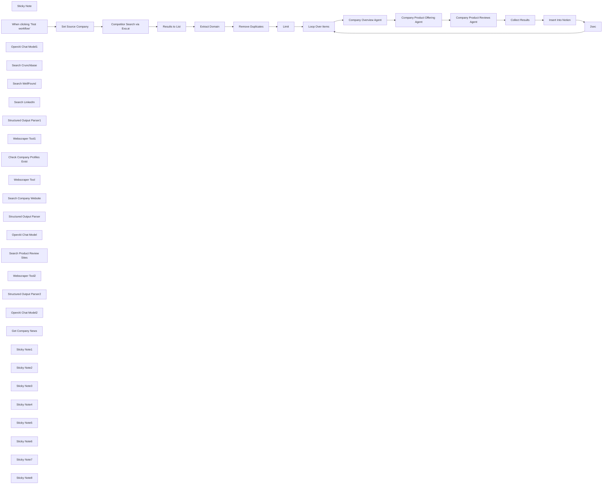

## Fluxo (.json) :

```json
{
  "meta": {
    "instanceId": "26ba763460b97c249b82942b23b6384876dfeb9327513332e743c5f6219c2b8e"
  },
  "nodes": [
    {
      "id": "d26b0190-c683-45fc-ac5b-0654af78f080",
      "name": "Sticky Note",
      "type": "n8n-nodes-base.stickyNote",
      "position": [
        -1000,
        -620
      ],
      "parameters": {
        "width": 377.7154173079816,
        "height": 511.2813260861502,
        "content": "## Try It Out!\n\n### This workflow builds a competitor research agent using Exa.ai as a starting point. The HTTP Request tool is used to demonstrate how you can build powerful agents with minimal effort.\n\n* Using Exa's findSimilar search, we ask it to look for similar companies ie. competitors, to our source company.\n* This list of competitors is sent to 3 agents to scour the internet to find company overview, product offering and customer reviews.\n* A report is then compiled from the output of all 3 agents into a notion table.\n\n### Need Help?\nJoin the [Discord](https://discord.com/invite/XPKeKXeB7d) or ask in the [Forum](https://community.n8n.io/)!\n\nHappy Hacking!"
      },
      "typeVersion": 1
    },
    {
      "id": "747d2f04-1e9c-45bb-b2ad-68da81524f4f",
      "name": "When clicking ‘Test workflow’",
      "type": "n8n-nodes-base.manualTrigger",
      "position": [
        -520,
        -420
      ],
      "parameters": {},
      "typeVersion": 1
    },
    {
      "id": "5cb5f5a1-bc2d-4557-aff4-1993d8dcb99b",
      "name": "OpenAI Chat Model1",
      "type": "@n8n/n8n-nodes-langchain.lmChatOpenAi",
      "position": [
        1020,
        20
      ],
      "parameters": {
        "model": "gpt-4o-mini",
        "options": {
          "temperature": 0
        }
      },
      "credentials": {
        "openAiApi": {
          "id": "8gccIjcuf3gvaoEr",
          "name": "OpenAi account"
        }
      },
      "typeVersion": 1
    },
    {
      "id": "eafe20ab-0385-42e6-abbf-e15126bbb6fa",
      "name": "Search Crunchbase",
      "type": "@n8n/n8n-nodes-langchain.toolHttpRequest",
      "position": [
        1320,
        20
      ],
      "parameters": {
        "url": "https://api.firecrawl.dev/v0/scrape",
        "fields": "markdown",
        "method": "POST",
        "sendBody": true,
        "dataField": "data",
        "authentication": "genericCredentialType",
        "parametersBody": {
          "values": [
            {
              "name": "url"
            },
            {
              "name": "pageOptions",
              "value": "={{ {\n  onlyMainContent: true,\n  replaceAllPathsWithAbsolutePaths: true,\n  removeTags: 'img,svg,video,audio'\n} }}",
              "valueProvider": "fieldValue"
            }
          ]
        },
        "fieldsToInclude": "selected",
        "genericAuthType": "httpHeaderAuth",
        "toolDescription": "Call this tool to read the contents of a crunchbase profile.",
        "optimizeResponse": true
      },
      "credentials": {
        "httpHeaderAuth": {
          "id": "OUOnyTkL9vHZNorB",
          "name": "Firecrawl API"
        }
      },
      "typeVersion": 1
    },
    {
      "id": "71729e21-a820-41a3-9cde-a52a63d1366d",
      "name": "Search WellFound",
      "type": "@n8n/n8n-nodes-langchain.toolHttpRequest",
      "position": [
        1180,
        180
      ],
      "parameters": {
        "url": "https://api.firecrawl.dev/v0/scrape",
        "fields": "markdown",
        "method": "POST",
        "sendBody": true,
        "dataField": "data",
        "authentication": "genericCredentialType",
        "parametersBody": {
          "values": [
            {
              "name": "url"
            },
            {
              "name": "pageOptions",
              "value": "={{ {\n  onlyMainContent: true,\n  replaceAllPathsWithAbsolutePaths: true,\n  removeTags: 'img,svg,video,audio'\n} }}",
              "valueProvider": "fieldValue"
            }
          ]
        },
        "fieldsToInclude": "selected",
        "genericAuthType": "httpHeaderAuth",
        "toolDescription": "Call this tool to read the contents of a wellfound profile.",
        "optimizeResponse": true
      },
      "credentials": {
        "httpHeaderAuth": {
          "id": "OUOnyTkL9vHZNorB",
          "name": "Firecrawl API"
        }
      },
      "typeVersion": 1
    },
    {
      "id": "ad5be9e0-14dc-40b2-b080-b079fb4c1d4b",
      "name": "Search LinkedIn",
      "type": "@n8n/n8n-nodes-langchain.toolHttpRequest",
      "position": [
        1320,
        180
      ],
      "parameters": {
        "url": "https://api.firecrawl.dev/v0/scrape",
        "fields": "markdown",
        "method": "POST",
        "sendBody": true,
        "dataField": "data",
        "authentication": "genericCredentialType",
        "parametersBody": {
          "values": [
            {
              "name": "url"
            },
            {
              "name": "pageOptions",
              "value": "={{ {\n  onlyMainContent: true,\n  replaceAllPathsWithAbsolutePaths: true,\n  removeTags: 'img,svg,video,audio'\n} }}",
              "valueProvider": "fieldValue"
            }
          ]
        },
        "fieldsToInclude": "selected",
        "genericAuthType": "httpHeaderAuth",
        "toolDescription": "Call this tool to read the contents of a linkedin company profile. You must pass in the the linkedin.com url.",
        "optimizeResponse": true
      },
      "credentials": {
        "httpHeaderAuth": {
          "id": "OUOnyTkL9vHZNorB",
          "name": "Firecrawl API"
        }
      },
      "typeVersion": 1
    },
    {
      "id": "405fa211-436d-4601-bc3e-ad6e6d99886d",
      "name": "Structured Output Parser1",
      "type": "@n8n/n8n-nodes-langchain.outputParserStructured",
      "position": [
        1600,
        20
      ],
      "parameters": {
        "jsonSchemaExample": "{\n  \"company_name\": \"\",\n  \"company_website\": \"\",\n  \"year_founded\": \"\",\n  \"founders\": [{ \"name\": \"\", \"linkedIn\": \"\" }],\n  \"ceo\": [{ \"name\": \"\", \"linkedIn\": \"\", \"twitter\": \"\" }],\n  \"key_people\": [{ \"name\": \"\", \"role\": \"\", \"linkedIn\": \"\", \"twitter\": \"\" }],\n  \"employees\": [{ \"name\": \"\", \"role\": \"\", \"linkedIn\": \"\", \"twitter\": \"\" }],\n  \"open_jobs\": [{ \"role\": \"\", \"description\": \"\", \"published\": \"\" }],\n  \"offices\": [{ \"address\": \"\", \"city\": \"\" }],\n  \"money_raised\": \"\",\n  \"funding_status\": \"\",\n  \"investors\": [{ \"name\": \"\", \"description\": \"\", \"linkedIn\": \"\" }],\n  \"customers\": [{ \"name\": \"\", \"url\": \"\" }],\n  \"yoy_customer_growth\": \"\",\n  \"annual_revenue\": \"\",\n  \"yoy_revenue_growth\": \"\",\n  \"latest_articles\": [{ \"title\": \"\", \"snippet\": \"\", \"url\": \"\", \"published_date\": \"\" }]\n}"
      },
      "typeVersion": 1.2
    },
    {
      "id": "e4955f40-6e8c-42d9-bb1e-d134485717f2",
      "name": "Webscraper Tool1",
      "type": "@n8n/n8n-nodes-langchain.toolHttpRequest",
      "position": [
        1460,
        180
      ],
      "parameters": {
        "url": "https://api.firecrawl.dev/v0/scrape",
        "fields": "markdown",
        "method": "POST",
        "sendBody": true,
        "dataField": "data",
        "authentication": "genericCredentialType",
        "parametersBody": {
          "values": [
            {
              "name": "url"
            },
            {
              "name": "pageOptions",
              "value": "={{ {\n  onlyMainContent: true,\n  replaceAllPathsWithAbsolutePaths: true,\n  removeTags: 'img,svg,video,audio'\n} }}",
              "valueProvider": "fieldValue"
            }
          ]
        },
        "fieldsToInclude": "selected",
        "genericAuthType": "httpHeaderAuth",
        "toolDescription": "Call this tool to fetch any additional webpage and its contents which may be helpful in gathering information for the data points.",
        "optimizeResponse": true
      },
      "credentials": {
        "httpHeaderAuth": {
          "id": "OUOnyTkL9vHZNorB",
          "name": "Firecrawl API"
        }
      },
      "typeVersion": 1
    },
    {
      "id": "4ddf8829-e11d-4002-ad96-1b3fcddebef7",
      "name": "Remove Duplicates",
      "type": "n8n-nodes-base.removeDuplicates",
      "position": [
        320,
        -380
      ],
      "parameters": {
        "compare": "selectedFields",
        "options": {},
        "fieldsToCompare": "url"
      },
      "typeVersion": 1.1
    },
    {
      "id": "06d7e6fb-9fe8-4c31-9042-fa375b63dd63",
      "name": "Extract Domain",
      "type": "n8n-nodes-base.set",
      "position": [
        140,
        -240
      ],
      "parameters": {
        "options": {},
        "assignments": {
          "assignments": [
            {
              "id": "d82bab07-3434-4db3-ba89-d722279e3c40",
              "name": "title",
              "type": "string",
              "value": "={{ $json.title }}"
            },
            {
              "id": "8a774c1d-c4b1-427a-aa4d-cda0071656ce",
              "name": "url",
              "type": "string",
              "value": "=https://{{ $json.url.extractDomain() }}"
            }
          ]
        }
      },
      "typeVersion": 3.4
    },
    {
      "id": "991fbb7f-9ba5-4672-8573-6a28e77ed5fc",
      "name": "Results to List",
      "type": "n8n-nodes-base.splitOut",
      "position": [
        140,
        -380
      ],
      "parameters": {
        "options": {},
        "fieldToSplitOut": "results"
      },
      "typeVersion": 1
    },
    {
      "id": "f09112bc-65b5-4b6d-b568-eef95d064d45",
      "name": "Check Company Profiles Exist",
      "type": "@n8n/n8n-nodes-langchain.toolHttpRequest",
      "position": [
        1180,
        20
      ],
      "parameters": {
        "url": "https://serpapi.com/search",
        "fields": "position,title,link,snippet,source",
        "dataField": "organic_results",
        "sendQuery": true,
        "authentication": "predefinedCredentialType",
        "fieldsToInclude": "selected",
        "parametersQuery": {
          "values": [
            {
              "name": "q"
            }
          ]
        },
        "toolDescription": "Call this tool to check if a company profile exists in either crunchbase, wellfound or linkedin.\n* To check if a company has a crunchbase profile, use the query \"site: https://crunchbase.com/organizations (company)\"\n* To check if a company has a wellfound profile, use the query \"site: https://wellfound.com/company (company)\"\n* To check if a company has a linked company profile, use the query \"site: https://linkedin.com/company (company)\"",
        "optimizeResponse": true,
        "nodeCredentialType": "serpApi"
      },
      "credentials": {
        "serpApi": {
          "id": "aJCKjxx6U3K7ydDe",
          "name": "SerpAPI account"
        }
      },
      "typeVersion": 1
    },
    {
      "id": "5ac6eb04-7c94-443f-bdd3-52e5fc1f72ff",
      "name": "Webscraper Tool",
      "type": "@n8n/n8n-nodes-langchain.toolHttpRequest",
      "position": [
        2180,
        -40
      ],
      "parameters": {
        "url": "https://api.firecrawl.dev/v0/scrape",
        "fields": "markdown",
        "method": "POST",
        "sendBody": true,
        "dataField": "data",
        "authentication": "genericCredentialType",
        "parametersBody": {
          "values": [
            {
              "name": "url"
            },
            {
              "name": "pageOptions",
              "value": "={{ {\n  onlyMainContent: true,\n  replaceAllPathsWithAbsolutePaths: true,\n  removeTags: 'img,svg,video,audio'\n} }}",
              "valueProvider": "fieldValue"
            }
          ]
        },
        "fieldsToInclude": "selected",
        "genericAuthType": "httpHeaderAuth",
        "toolDescription": "Call this tool to fetch webpage contents. Pass in the url to fetch.",
        "optimizeResponse": true
      },
      "credentials": {
        "httpHeaderAuth": {
          "id": "OUOnyTkL9vHZNorB",
          "name": "Firecrawl API"
        }
      },
      "typeVersion": 1
    },
    {
      "id": "082b8e76-30b8-48f2-a581-a04a6f05c20d",
      "name": "Search Company Website",
      "type": "@n8n/n8n-nodes-langchain.toolHttpRequest",
      "position": [
        2040,
        -40
      ],
      "parameters": {
        "url": "https://serpapi.com/search",
        "fields": "position,title,link,snippet,source",
        "dataField": "organic_results",
        "sendQuery": true,
        "authentication": "predefinedCredentialType",
        "fieldsToInclude": "selected",
        "parametersQuery": {
          "values": [
            {
              "name": "q"
            }
          ]
        },
        "toolDescription": "Call this tool to query the company's profile website.\nExamples could include \"(company) pricing\", \"(company) plans\", \"(company) features\" etc",
        "optimizeResponse": true,
        "nodeCredentialType": "serpApi"
      },
      "credentials": {
        "serpApi": {
          "id": "aJCKjxx6U3K7ydDe",
          "name": "SerpAPI account"
        }
      },
      "typeVersion": 1
    },
    {
      "id": "ca3140c5-b4ff-41d5-b0a1-b2595e1fc789",
      "name": "Structured Output Parser",
      "type": "@n8n/n8n-nodes-langchain.outputParserStructured",
      "position": [
        2320,
        -40
      ],
      "parameters": {
        "jsonSchemaExample": "{\n  \"features\": [{ \"name\": \"\", \"description\": \"\" }],\n  \"pricing_plans\": [{ \"name\": \"\", \"description\": \"\", \"tier\": \"\", \"price\": \"\", \"monthly_or_annually\": \"\" }],\n  \"factors_that_impact_price\": [{ \"factor\": \"\", \"description\": \"\" }],\n  \"discounts_promotions\": [{ \"offer\": \"\", \"start\": \"\", \"end\": \"\", \"description\": \"\" }],\n  \"custom_plans\": { \"is_available\": false, \"applicable_for\": \"\", \"price\": \"\", \"duration\": \"\", \"description\": \"\" },\n  \"free_trial\": { \"is_available\": false, \"applicable_for\": \"\", \"price\": \"\", \"duration\": \"\", \"description\": \"\" },\n  \"freemium_version\": { \"is_available\": false, \"applicable_for\": \"\", \"price\": \"\", \"duration\": \"\", \"description\": \"\" },\n  \"complementary_tools\": [{ \"name\": \"\", \"description\": \"\", \"price\": \"\" }],\n  \"techonology used\": [{ \"name\": \"\", \"description\": \"\", \"purpose\": \"\" }]\n}"
      },
      "typeVersion": 1.2
    },
    {
      "id": "3c5493eb-6ca9-4909-997d-ddf3f3c88e2d",
      "name": "OpenAI Chat Model",
      "type": "@n8n/n8n-nodes-langchain.lmChatOpenAi",
      "position": [
        1900,
        -40
      ],
      "parameters": {
        "model": "gpt-4o-mini",
        "options": {
          "temperature": 0
        }
      },
      "credentials": {
        "openAiApi": {
          "id": "8gccIjcuf3gvaoEr",
          "name": "OpenAi account"
        }
      },
      "typeVersion": 1
    },
    {
      "id": "299920bb-194b-4a95-8822-c0f6d559dd15",
      "name": "Search Product Review Sites",
      "type": "@n8n/n8n-nodes-langchain.toolHttpRequest",
      "position": [
        2757,
        20
      ],
      "parameters": {
        "url": "https://serpapi.com/search",
        "fields": "position,title,link,snippet,source",
        "dataField": "organic_results",
        "sendQuery": true,
        "authentication": "predefinedCredentialType",
        "fieldsToInclude": "selected",
        "parametersQuery": {
          "values": [
            {
              "name": "q",
              "value": "{company_or_product} reviews (site:trustpilot.com OR site:producthunt.com)",
              "valueProvider": "fieldValue"
            },
            {
              "name": "num",
              "value": "3",
              "valueProvider": "fieldValue"
            }
          ]
        },
        "toolDescription": "Call this tool to search for customer reviews for the desired company or their product/service.",
        "optimizeResponse": true,
        "nodeCredentialType": "serpApi",
        "placeholderDefinitions": {
          "values": [
            {
              "name": "company_or_product",
              "description": "the name of the company or their product to search for reviews for"
            }
          ]
        }
      },
      "credentials": {
        "serpApi": {
          "id": "aJCKjxx6U3K7ydDe",
          "name": "SerpAPI account"
        }
      },
      "typeVersion": 1
    },
    {
      "id": "216bc875-365c-4536-b3b4-90de29265cb5",
      "name": "Webscraper Tool2",
      "type": "@n8n/n8n-nodes-langchain.toolHttpRequest",
      "position": [
        2897,
        20
      ],
      "parameters": {
        "url": "https://api.firecrawl.dev/v0/scrape",
        "fields": "markdown",
        "method": "POST",
        "sendBody": true,
        "dataField": "data",
        "authentication": "genericCredentialType",
        "parametersBody": {
          "values": [
            {
              "name": "url",
              "value": "{url_or_link}",
              "valueProvider": "fieldValue"
            },
            {
              "name": "pageOptions",
              "value": "={{ {\n  onlyMainContent: true,\n  replaceAllPathsWithAbsolutePaths: true,\n  removeTags: 'img,svg,video,audio'\n} }}",
              "valueProvider": "fieldValue"
            }
          ]
        },
        "fieldsToInclude": "selected",
        "genericAuthType": "httpHeaderAuth",
        "toolDescription": "Call this tool to fetch webpage contents. Pass in the url to fetch.",
        "optimizeResponse": true,
        "placeholderDefinitions": {
          "values": [
            {
              "name": "url_or_link",
              "description": "the url or lik to the review site webpage."
            }
          ]
        }
      },
      "credentials": {
        "httpHeaderAuth": {
          "id": "OUOnyTkL9vHZNorB",
          "name": "Firecrawl API"
        }
      },
      "typeVersion": 1
    },
    {
      "id": "c13f23fd-77b9-4f4c-bdc6-50120ed84cbd",
      "name": "Structured Output Parser2",
      "type": "@n8n/n8n-nodes-langchain.outputParserStructured",
      "position": [
        3037,
        20
      ],
      "parameters": {
        "jsonSchemaExample": "{\n  \"number_of_reviews\": 0,\n  \"positive_mentions_%\": \"\",\n  \"negative_mentions_%\": \"\",\n  \"top_pros\": [\"\"],\n  \"top_cons\": [\"\"],\n  \"top_countries\": [\"\"],\n  \"top_social_media_platforms\": [\"\"]\n}"
      },
      "typeVersion": 1.2
    },
    {
      "id": "784202a0-4022-4941-8fcc-f1c05c9820a6",
      "name": "OpenAI Chat Model2",
      "type": "@n8n/n8n-nodes-langchain.lmChatOpenAi",
      "position": [
        2617,
        20
      ],
      "parameters": {
        "model": "gpt-4o",
        "options": {
          "temperature": 0
        }
      },
      "credentials": {
        "openAiApi": {
          "id": "8gccIjcuf3gvaoEr",
          "name": "OpenAi account"
        }
      },
      "typeVersion": 1
    },
    {
      "id": "fbc2e1c1-7851-4fbb-b46c-9fa35eacd810",
      "name": "Insert Into Notion",
      "type": "n8n-nodes-base.notion",
      "position": [
        3520,
        -240
      ],
      "parameters": {
        "title": "={{ $json.output.company_name }}",
        "blockUi": {
          "blockValues": [
            {
              "type": "heading_1",
              "textContent": "={{ $json.output.company_name }}"
            },
            {
              "textContent": "=Report generated on {{ $now.format('dd MMM yyyy') }}"
            },
            {
              "type": "heading_2",
              "textContent": "Company Overview"
            },
            {
              "textContent": "=Offices:\n{{ $json.output.offices.map(item => `${item.address}, ${item.city}`).join('\\n') }}\n\nYear Founded:\n{{ $json.output.year_founded }}\n\nFounders:\n{{ $json.output.founders.map(item => `${item.name} (${item.linkedIn})`).join('\\n') }}\n\nCEO:\n{{ $json.output.ceo.map(item => `${item.name} (${item.linkedIn})`).join('\\n') }}\n\nEmployees:\n{{ $json.output.employees.map(item => `${item.name} - ${item.role}, (${item.linkedIn})`).join('\\n') }}\n\nOpen Roles:\n{{ $json.output.open_jobs.map(item => `${item.role} (${item.published}), ${item.description}`).join('\\n') }}"
            },
            {
              "type": "heading_2",
              "textContent": "Company Funding"
            },
            {
              "textContent": "=Money Raised:\n{{ $json.output.money_raised || 'unknown' }}\n\nFunding Status:\n{{ $json.output.funding_status }}\n\nYoY Customer Growth:\n{{ $json.output.yoy_customer_growth || 'unknown' }}\n\nAnnual Revenue:\n{{ $json.output.annual_revenue || 'unknown' }}\n\nYoY Revenue Growth:\n{{ $json.output.yoy_revenue_growth || 'unknown' }}\n\nInvestors:\n{{ $json.output.investors.map(item => `${item.name}, ${item.description} (${item.linkedIn})`).join('\\n') }}\n\nCustomers:\n{{ $json.output.customers.map(item => `${item.name} (${item.url})`).join('\\n') }}"
            },
            {
              "type": "heading_2",
              "textContent": "Company News"
            },
            {
              "textContent": "={{  $json.output.latest_articles.length ? $json.output.latest_articles.map(item =>\n`**${item.title}**\n${item.url}\n${item.published_date} | ${item.snippet}\n`).join('\\n') : 'None Found' }}"
            },
            {
              "type": "heading_2",
              "textContent": "Product Offering"
            },
            {
              "textContent": "=Features:\n{{ $json.output.features.map(item => `${item.name} - ${item.description.split('.')[0]}.`).join('\\n') }}\n"
            },
            {
              "textContent": "=Pricing Plans:\n{{ $json.output.pricing_plans.map(item =>\n`${item.name} - ${item.price} (${item.tier})\n* ${item.description}`\n).join('\\n\\n') }}\n\nFactors that Impact Price:\n{{ $json.output.factors_that_impact_price.map(item => `${item.factor} - ${item.description}`).join('\\n') }}\n\nCurrent Discounts and/or Promotions:\n{{ $json.output.discounts_promotions.length ? $json.output.discounts_promotions.map(item =>\n  `${item.offer} (${item.start} - ${item.end})\n* ${item.description}`\n).join('\\n\\n') : '* None Found' }}\n\nCustom Plans:\n{{ $json.output.custom_plans.is_available ? (\n  `${$json.output.custom_plans.applicable_for} - ${$json.output.custom_plans.price}\n* ${$json.output.custom_plans.description}`\n) : 'Not applicable' }}\n\nFree Trials:\n{{ $json.output.free_trial.is_available ? (\n  `${$json.output.free_trial.applicable_for} - ${$json.output.free_trial.price}\n* ${$json.output.free_trial.description}`\n) : 'Not applicable' }}\n\nFreemium Version:\n{{ $json.output.freemium_version.is_available ? (\n  `${$json.output.freemium_version.applicable_for} - ${$json.output.freemium_version.price}\n* ${$json.output.freemium_version.description}`\n) : 'Not applicable' }}\n\nComplimentary Tools:\n{{ $json.output.complementary_tools.map(item =>\n  `${item.name} - ${item.price}\n* ${item.description}`\n).join('\\n\\n') }}"
            },
            {
              "type": "heading_2",
              "textContent": "=Product Reviews"
            },
            {
              "textContent": "=Number of Reviews: {{ $json.output.number_of_reviews }}\nPositive Mentions (%): {{ $json.output['positive_mentions_%'] }} \nNegative Mentions (%): {{ $json.output['negative_mentions_%'] }} \n\nTop Pros:\n{{ $json.output.top_pros.length ? $json.output.top_pros.map(item => `* ${item}`).join('\\n'): '* None Found' }}\n\nTop Cons:\n{{ $json.output.top_cons.length ? $json.output.top_cons.map(item => `* ${item}`).join('\\n') : '* None Found' }} \n\nTop Countries:\n{{ $json.output.top_countries.length ? $json.output.top_countries.map(item => `* ${item}`).join('\\n') : '* None Found' }}\n\nTop Social Media Platforms:\n{{ $json.output.top_social_media_platforms.length ? $json.output.top_social_media_platforms.map(item => `* ${item}`).join('\\n') : '* None Found' }}"
            }
          ]
        },
        "options": {},
        "resource": "databasePage",
        "databaseId": {
          "__rl": true,
          "mode": "list",
          "value": "2d1c3c72-6e8e-42f3-aece-c6338fd24333",
          "cachedResultUrl": "https://www.notion.so/2d1c3c726e8e42f3aecec6338fd24333",
          "cachedResultName": "n8n Competitor Analysis"
        },
        "propertiesUi": {
          "propertyValues": [
            {
              "key": "Founded|rich_text",
              "textContent": "={{ $json.output.year_founded }}"
            },
            {
              "key": "Funding Status|rich_text",
              "textContent": "={{ $json.output.funding_status }}"
            },
            {
              "key": "Money Raised|rich_text",
              "textContent": "={{ $json.output.money_raised || ''}}"
            },
            {
              "key": "Positive Reviews (%)|rich_text",
              "textContent": "={{ $json.output['positive_mentions_%'] }}%"
            },
            {
              "key": "Pros|rich_text",
              "textContent": "={{ $json.output.top_pros.join(', ') }}"
            },
            {
              "key": "Cons|rich_text",
              "textContent": "={{ $json.output.top_cons.join(', ') }}"
            }
          ]
        }
      },
      "credentials": {
        "notionApi": {
          "id": "iHBHe7ypzz4mZExM",
          "name": "Notion account"
        }
      },
      "typeVersion": 2.2
    },
    {
      "id": "ec6b578d-4808-4613-881b-67dbcf30f641",
      "name": "Limit",
      "type": "n8n-nodes-base.limit",
      "position": [
        320,
        -240
      ],
      "parameters": {
        "maxItems": 10
      },
      "typeVersion": 1
    },
    {
      "id": "2f25cf2e-86c6-4d23-a1ae-cc35134f0d8a",
      "name": "Loop Over Items",
      "type": "n8n-nodes-base.splitInBatches",
      "position": [
        680,
        -280
      ],
      "parameters": {
        "options": {}
      },
      "typeVersion": 3
    },
    {
      "id": "360000e3-bc07-4be9-91cf-169b85ed7ad5",
      "name": "Competitor Search via Exa.ai",
      "type": "n8n-nodes-base.httpRequest",
      "position": [
        -80,
        -420
      ],
      "parameters": {
        "url": "https://api.exa.ai/findSimilar",
        "method": "POST",
        "options": {},
        "sendBody": true,
        "authentication": "genericCredentialType",
        "bodyParameters": {
          "parameters": [
            {
              "name": "url",
              "value": "={{ $json.company_url }}"
            },
            {
              "name": "type",
              "value": "neural"
            },
            {
              "name": "useAutoprompt",
              "value": "true"
            },
            {
              "name": "contents",
              "value": "={{ { \"text\": false } }}"
            },
            {
              "name": "excludeDomains",
              "value": "={{ [$json.company_url, \"github.com\", \"linkedIn.com\"] }}"
            }
          ]
        },
        "genericAuthType": "httpHeaderAuth"
      },
      "credentials": {
        "httpHeaderAuth": {
          "id": "BWhPl6CgBKn3UJca",
          "name": "Exa.ai"
        }
      },
      "typeVersion": 4.2
    },
    {
      "id": "dae53670-bafb-4dff-95e7-cc94adf5f344",
      "name": "Get Company News",
      "type": "@n8n/n8n-nodes-langchain.toolHttpRequest",
      "position": [
        1460,
        20
      ],
      "parameters": {
        "url": "https://serpapi.com/search",
        "fields": "position,title,link,snippet,source",
        "sendBody": true,
        "dataField": "organic_results",
        "authentication": "predefinedCredentialType",
        "parametersBody": {
          "values": [
            {
              "name": "q"
            },
            {
              "name": "engine",
              "value": "google_news",
              "valueProvider": "fieldValue"
            }
          ]
        },
        "fieldsToInclude": "selected",
        "toolDescription": "Call this tool to search for the latest news articles of a company.",
        "optimizeResponse": true,
        "nodeCredentialType": "serpApi"
      },
      "credentials": {
        "serpApi": {
          "id": "aJCKjxx6U3K7ydDe",
          "name": "SerpAPI account"
        },
        "httpHeaderAuth": {
          "id": "BWhPl6CgBKn3UJca",
          "name": "Exa.ai"
        }
      },
      "typeVersion": 1
    },
    {
      "id": "84809359-06c8-41d9-8269-571cac716d17",
      "name": "Sticky Note1",
      "type": "n8n-nodes-base.stickyNote",
      "position": [
        -589.9031441651332,
        -613.6533489294407
      ],
      "parameters": {
        "color": 7,
        "width": 1128.870960716006,
        "height": 582.8537144476434,
        "content": "## Step 1. Get Competitors\n[Read more about using the HTTP Request node](https://docs.n8n.io/integrations/builtin/core-nodes/n8n-nodes-base.httprequest)\n\nExa.ai is a relatively new AI search engine startup with a specialised API for finding similar companies.\nThis is perfect for marketing research as we can easily find competitors to compare against."
      },
      "typeVersion": 1
    },
    {
      "id": "d43e8b2a-53dd-41db-aacd-f3fdd29d8fe9",
      "name": "Set Source Company",
      "type": "n8n-nodes-base.set",
      "position": [
        -300,
        -420
      ],
      "parameters": {
        "options": {},
        "assignments": {
          "assignments": [
            {
              "id": "3910089f-065d-4f05-a3b7-a5b848b91eb9",
              "name": "company_url",
              "type": "string",
              "value": "https://notion.so"
            }
          ]
        }
      },
      "typeVersion": 3.4
    },
    {
      "id": "1c28b108-dc18-4304-aed9-275e719c4edd",
      "name": "Sticky Note2",
      "type": "n8n-nodes-base.stickyNote",
      "position": [
        -340,
        -440
      ],
      "parameters": {
        "width": 181.85939799093455,
        "height": 308.12010511833364,
        "content": "\n\n\n\n\n\n\n\n\n\n\n\n\n\n\n### 🚨Required!\nRemember to set your company here."
      },
      "typeVersion": 1
    },
    {
      "id": "5cb54393-795b-4738-aac2-cc9395456420",
      "name": "Sticky Note3",
      "type": "n8n-nodes-base.stickyNote",
      "position": [
        560,
        -525.6986144265638
      ],
      "parameters": {
        "color": 7,
        "width": 332.87733508600377,
        "height": 492.4668447935363,
        "content": "## Step 2. Feed into Agent Pipeline\n[Learn more about loops](https://docs.n8n.io/integrations/builtin/core-nodes/n8n-nodes-base.splitinbatches)\n\nA loop is used to ensure competitors are processed one at a time. This is ideal when we don't want errors to fail the entire pipeline."
      },
      "typeVersion": 1
    },
    {
      "id": "4cdddfd1-8631-4d88-a65d-10a53daeaf78",
      "name": "Sticky Note4",
      "type": "n8n-nodes-base.stickyNote",
      "position": [
        1800,
        -420
      ],
      "parameters": {
        "color": 7,
        "width": 687.9856526661888,
        "height": 600.1548730999224,
        "content": "## Step 4. Research Competitor Product Offering\n[Learn more about using AI Agents](https://docs.n8n.io/integrations/builtin/cluster-nodes/root-nodes/n8n-nodes-langchain.agent)\n\nThis agent uses SERPAPI to discover the competitor's product pages. Once found, it will use the webscraping tool to fetch the page's contents to extract the necessary data points."
      },
      "typeVersion": 1
    },
    {
      "id": "3a374ce6-0ae0-4f8e-ad6a-35ab2c8da211",
      "name": "Sticky Note5",
      "type": "n8n-nodes-base.stickyNote",
      "position": [
        920,
        -400
      ],
      "parameters": {
        "color": 7,
        "width": 849.3810544357925,
        "height": 775.191233831828,
        "content": "## Step 3. Discover Competitor Company and Funding Overview\n[Learn more about using AI Agents](https://docs.n8n.io/integrations/builtin/cluster-nodes/root-nodes/n8n-nodes-langchain.agent)\n\nThis agent searches crunchbase.com, wellfound.com and linkedin.com for the competitor's company details, people data, funding activity and latest news."
      },
      "typeVersion": 1
    },
    {
      "id": "fa580430-d6c6-4d41-b0f9-c86ad89dc6ab",
      "name": "Sticky Note6",
      "type": "n8n-nodes-base.stickyNote",
      "position": [
        2520,
        -400
      ],
      "parameters": {
        "color": 7,
        "width": 683.8444841203574,
        "height": 633.9023021841829,
        "content": "## Step 5. Capture Competitor Product Reviews\n[Learn more about using AI Agents](https://docs.n8n.io/integrations/builtin/cluster-nodes/root-nodes/n8n-nodes-langchain.agent)\n\nThis agent uses SERPAPI to discover product reviews for the competitor's product or service and then summarises the pros and cons."
      },
      "typeVersion": 1
    },
    {
      "id": "b050b11f-9b4f-4ed1-94b9-3ec69a1ceba7",
      "name": "Collect Results",
      "type": "n8n-nodes-base.set",
      "position": [
        3340,
        -240
      ],
      "parameters": {
        "options": {},
        "assignments": {
          "assignments": [
            {
              "id": "3c58a9dd-28c5-4758-a362-d5b29f6a8204",
              "name": "output",
              "type": "object",
              "value": "={{\n {\n    ...$('Company Overview Agent').item.json.output,\n    ...$('Company Product Offering Agent').item.json.output,\n    ...$('Company Product Reviews Agent').item.json.output,\n }\n}}"
            }
          ]
        }
      },
      "typeVersion": 3.4
    },
    {
      "id": "1fc6468e-8a89-4a37-a8d6-1fe94c274b3a",
      "name": "Sticky Note7",
      "type": "n8n-nodes-base.stickyNote",
      "position": [
        3220,
        -481.22655186925294
      ],
      "parameters": {
        "color": 7,
        "width": 529.1065295866968,
        "height": 572.5257167828777,
        "content": "## Step 6. Collect Results and Send to Notion\n[Read more about using Notion](https://docs.n8n.io/integrations/builtin/app-nodes/n8n-nodes-base.notion)\n\nFinally, once the agent's have completed their tasks successfully, we compiled a competitor report and insert it as a new row in our Notion table.\nYou can check out a copy of this table here: https://jimleuk.notion.site/2d1c3c726e8e42f3aecec6338fd24333?v=de020fa196f34cdeb676daaeae44e110&pvs=4"
      },
      "typeVersion": 1
    },
    {
      "id": "863c40c7-e56d-464f-8105-0cb151654715",
      "name": "2sec",
      "type": "n8n-nodes-base.wait",
      "position": [
        3680,
        280
      ],
      "webhookId": "94b5b09f-0599-4585-b83b-f669726bc2ef",
      "parameters": {
        "amount": 2
      },
      "typeVersion": 1.1
    },
    {
      "id": "c1a4b720-f56b-4c3a-aeca-a89f473132f4",
      "name": "Company Overview Agent",
      "type": "@n8n/n8n-nodes-langchain.agent",
      "position": [
        1020,
        -200
      ],
      "parameters": {
        "text": "={{ $('Loop Over Items').item.json.url }}",
        "options": {
          "systemMessage": "Your role is a company researcher agent. Your goal is to research and discover the following information about a company:\n* Year founded\n* Founder(s)\n* CEO\n* Key people\n* Employees\n* Open jobs\n* Offices\n* Money raised\n* Funding status\n* Investors\n* Customers\n* YoY customer growth\n* Annual revenue\n* YoY revenue growth\n* Latest articles\n\n## Steps\n1. check if the company's crunchbase profile exists and if it does read the profile page to gather the required information. If you are able to satisfies all data points from the profile, then do not return your response.\n2. repeat step 1 for wellfound if there are missing data points on the crunchbase profile.\n3. repeat step 1 for linkedin if there are missing data points on the wellfound profile.\n4. If there are still missing datapoints after checking cruchbase, wellfound and linkedin then just give up and return your response.\n\nIf a data point is not found after completing all the above steps, do not use null values in your final response. Use either an empty array, object or string depending on the required schema for the data point.\nDo not retry any link that returns a 400,401,403 or 500 error code."
        },
        "promptType": "define",
        "hasOutputParser": true
      },
      "typeVersion": 1.6
    },
    {
      "id": "1070c7f0-544a-478b-bd97-df8f2c0d79fa",
      "name": "Company Product Offering Agent",
      "type": "@n8n/n8n-nodes-langchain.agent",
      "position": [
        1900,
        -240
      ],
      "parameters": {
        "text": "={{ $('Loop Over Items').item.json.url }}",
        "options": {
          "systemMessage": "Your role is company product/service researcher. Your goal is to search and collect the following information:\n* features sets\n* number of pricing plans\n* Factors that impact price\n* Lowest-tier, Mid-tier and Highest-tier price\n* Custom plans if available\n* Discounts & promotions offered currently\n* whether a Free trial is offered\n* description of freemium version if available\n* Complementary tools offered\n* technology used\n\n# steps\n1. Search for the relevant webpage on the company's website. This search should return a url address.\n2. Use this url address with the webscraper tool to fetch the contents of the webpage.\n3. Use the contents of th webpage to populate the data points.\n\nIf a data point is not found after completing all the above steps, do not use null values in your final response. Use either an empty array, object or string depending on the required schema for the data point.\nDo not retry any link that returns a 400,401,403 or 500 error code."
        },
        "promptType": "define",
        "hasOutputParser": true
      },
      "typeVersion": 1.6
    },
    {
      "id": "5dec7033-5057-483f-930d-e950b6eabe05",
      "name": "Company Product Reviews Agent",
      "type": "@n8n/n8n-nodes-langchain.agent",
      "position": [
        2617,
        -200
      ],
      "parameters": {
        "text": "={{ $('Loop Over Items').item.json.url }}",
        "options": {
          "systemMessage": "Your role is customer reviews agent. Your goal is to gather and collect online customer reviews for a company or their product or service.\n* number of reviews\n* Positive mentions, %\n* Negative mentions, %\n* Top pros\n* Top cons\n* Top countries\n* Top social media platforms\n\n## steps\n1. search for review sites that may have reviews for the company or product in question. retrieve the links or urls of the serch results where the reviews are found.\n2. Identify relevant items in the search result and and extract the urls from the search results.\n2. using the extracted urls from the search results, fetch the webpage of the review sites containing reviews for the company or product.\n3. extract the reviews from the fetched review sites to populate the required data points.\n\nIf a data point is not found after completing all the above steps, do not use null values in your final response. Use either an empty array, object or string depending on the required schema for the data point.\nDo not retry any link that returns a 400,401,403 or 500 error code."
        },
        "promptType": "define",
        "hasOutputParser": true
      },
      "typeVersion": 1.6
    },
    {
      "id": "787bb405-1744-43b7-8c47-1a2c23331e05",
      "name": "Sticky Note8",
      "type": "n8n-nodes-base.stickyNote",
      "position": [
        3480,
        -260
      ],
      "parameters": {
        "width": 181.85939799093455,
        "height": 308.12010511833364,
        "content": "\n\n\n\n\n\n\n\n\n\n\n\n\n\n\n### 🚨Required!\nRemember to set your Notion Database here."
      },
      "typeVersion": 1
    }
  ],
  "pinData": {},
  "connections": {
    "2sec": {
      "main": [
        [
          {
            "node": "Loop Over Items",
            "type": "main",
            "index": 0
          }
        ]
      ]
    },
    "Limit": {
      "main": [
        [
          {
            "node": "Loop Over Items",
            "type": "main",
            "index": 0
          }
        ]
      ]
    },
    "Extract Domain": {
      "main": [
        [
          {
            "node": "Remove Duplicates",
            "type": "main",
            "index": 0
          }
        ]
      ]
    },
    "Collect Results": {
      "main": [
        [
          {
            "node": "Insert Into Notion",
            "type": "main",
            "index": 0
          }
        ]
      ]
    },
    "Loop Over Items": {
      "main": [
        null,
        [
          {
            "node": "Company Overview Agent",
            "type": "main",
            "index": 0
          }
        ]
      ]
    },
    "Results to List": {
      "main": [
        [
          {
            "node": "Extract Domain",
            "type": "main",
            "index": 0
          }
        ]
      ]
    },
    "Search LinkedIn": {
      "ai_tool": [
        [
          {
            "node": "Company Overview Agent",
            "type": "ai_tool",
            "index": 0
          }
        ]
      ]
    },
    "Webscraper Tool": {
      "ai_tool": [
        [
          {
            "node": "Company Product Offering Agent",
            "type": "ai_tool",
            "index": 0
          }
        ]
      ]
    },
    "Get Company News": {
      "ai_tool": [
        [
          {
            "node": "Company Overview Agent",
            "type": "ai_tool",
            "index": 0
          }
        ]
      ]
    },
    "Search WellFound": {
      "ai_tool": [
        [
          {
            "node": "Company Overview Agent",
            "type": "ai_tool",
            "index": 0
          }
        ]
      ]
    },
    "Webscraper Tool1": {
      "ai_tool": [
        [
          {
            "node": "Company Overview Agent",
            "type": "ai_tool",
            "index": 0
          }
        ]
      ]
    },
    "Webscraper Tool2": {
      "ai_tool": [
        [
          {
            "node": "Company Product Reviews Agent",
            "type": "ai_tool",
            "index": 0
          }
        ]
      ]
    },
    "OpenAI Chat Model": {
      "ai_languageModel": [
        [
          {
            "node": "Company Product Offering Agent",
            "type": "ai_languageModel",
            "index": 0
          }
        ]
      ]
    },
    "Remove Duplicates": {
      "main": [
        [
          {
            "node": "Limit",
            "type": "main",
            "index": 0
          }
        ]
      ]
    },
    "Search Crunchbase": {
      "ai_tool": [
        [
          {
            "node": "Company Overview Agent",
            "type": "ai_tool",
            "index": 0
          }
        ]
      ]
    },
    "Insert Into Notion": {
      "main": [
        [
          {
            "node": "2sec",
            "type": "main",
            "index": 0
          }
        ]
      ]
    },
    "OpenAI Chat Model1": {
      "ai_languageModel": [
        [
          {
            "node": "Company Overview Agent",
            "type": "ai_languageModel",
            "index": 0
          }
        ]
      ]
    },
    "OpenAI Chat Model2": {
      "ai_languageModel": [
        [
          {
            "node": "Company Product Reviews Agent",
            "type": "ai_languageModel",
            "index": 0
          }
        ]
      ]
    },
    "Set Source Company": {
      "main": [
        [
          {
            "node": "Competitor Search via Exa.ai",
            "type": "main",
            "index": 0
          }
        ]
      ]
    },
    "Company Overview Agent": {
      "main": [
        [
          {
            "node": "Company Product Offering Agent",
            "type": "main",
            "index": 0
          }
        ]
      ]
    },
    "Search Company Website": {
      "ai_tool": [
        [
          {
            "node": "Company Product Offering Agent",
            "type": "ai_tool",
            "index": 0
          }
        ]
      ]
    },
    "Structured Output Parser": {
      "ai_outputParser": [
        [
          {
            "node": "Company Product Offering Agent",
            "type": "ai_outputParser",
            "index": 0
          }
        ]
      ]
    },
    "Structured Output Parser1": {
      "ai_outputParser": [
        [
          {
            "node": "Company Overview Agent",
            "type": "ai_outputParser",
            "index": 0
          }
        ]
      ]
    },
    "Structured Output Parser2": {
      "ai_outputParser": [
        [
          {
            "node": "Company Product Reviews Agent",
            "type": "ai_outputParser",
            "index": 0
          }
        ]
      ]
    },
    "Search Product Review Sites": {
      "ai_tool": [
        [
          {
            "node": "Company Product Reviews Agent",
            "type": "ai_tool",
            "index": 0
          }
        ]
      ]
    },
    "Check Company Profiles Exist": {
      "ai_tool": [
        [
          {
            "node": "Company Overview Agent",
            "type": "ai_tool",
            "index": 0
          }
        ]
      ]
    },
    "Competitor Search via Exa.ai": {
      "main": [
        [
          {
            "node": "Results to List",
            "type": "main",
            "index": 0
          }
        ]
      ]
    },
    "Company Product Reviews Agent": {
      "main": [
        [
          {
            "node": "Collect Results",
            "type": "main",
            "index": 0
          }
        ]
      ]
    },
    "Company Product Offering Agent": {
      "main": [
        [
          {
            "node": "Company Product Reviews Agent",
            "type": "main",
            "index": 0
          }
        ]
      ]
    },
    "When clicking ‘Test workflow’": {
      "main": [
        [
          {
            "node": "Set Source Company",
            "type": "main",
            "index": 0
          }
        ]
      ]
    }
  }
}
```

<a id="template-1464"></a>

## Template 1464 - Teste de regressão visual com IA

- **Nome:** Teste de regressão visual com IA
- **Descrição:** Fluxo que captura screenshots de páginas, mantém imagens base, compara novas capturas com as bases usando um modelo de visão e gera um relatório com as diferenças detectadas.
- **Funcionalidade:** • Geração de imagens base: captura screenshots das URLs fornecidas e armazena as imagens base para comparação futura.
• Download e upload de screenshots: obtém screenshots de um serviço externo e envia os arquivos para armazenamento, registrando referências.
• Execução agendada de testes: permite rodar testes de regressão em horários programados para monitoramento contínuo.
• Comparação visual com modelo de visão: envia a imagem base e a imagem de teste a um modelo de visão para identificar mudanças em texto, imagens, cores, posição e layout.
• Parser estruturado de resultados: converte a resposta do modelo em formato JSON estruturado para facilitar processamento posterior.
• Filtragem e agregação de alterações: filtra páginas que apresentam mudanças e agrega os resultados para relatório consolidado.
• Criação de relatório em sistema de gestão: formata as mudanças detectadas e cria um item/issue com o resumo das alterações.
• Detecção de bases faltantes: identifica URLs sem imagem base e possibilita gerar as imagens base necessárias.
- **Ferramentas:** • Apify: serviço externo usado para gerar screenshots de páginas web.
• Google Drive: armazenamento das imagens capturadas.
• Google Sheets: planilha para manter a lista de URLs, metadados e referências às imagens base.
• Google Gemini (PaLM): modelo de visão/LLM utilizado para comparar imagens e identificar diferenças.
• Linear: plataforma usada para criar issues/relatórios com os resultados do teste.

## Fluxo visual

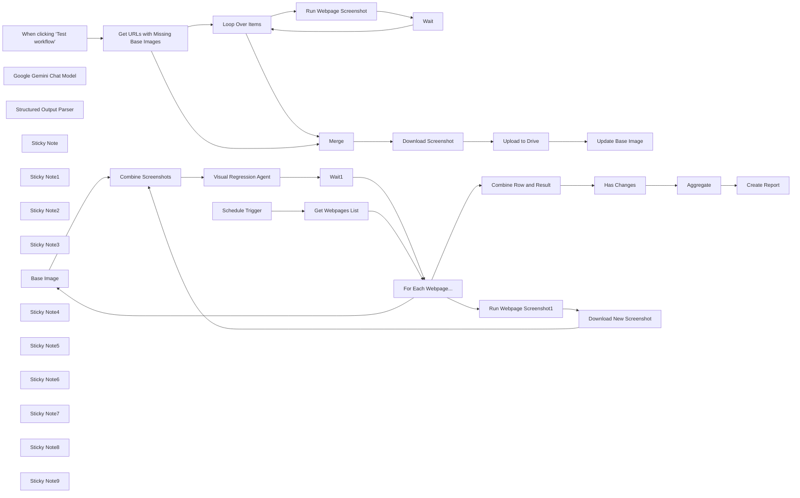

## Fluxo (.json) :

```json
{
  "meta": {
    "instanceId": "408f9fb9940c3cb18ffdef0e0150fe342d6e655c3a9fac21f0f644e8bedabcd9"
  },
  "nodes": [
    {
      "id": "cb62c9a5-2f43-4328-af94-84c2cb731d9c",
      "name": "Base Image",
      "type": "n8n-nodes-base.googleDrive",
      "position": [
        260,
        660
      ],
      "parameters": {
        "fileId": {
          "__rl": true,
          "mode": "id",
          "value": "={{ $json.base }}"
        },
        "options": {
          "binaryPropertyName": "data_1"
        },
        "operation": "download"
      },
      "credentials": {
        "googleDriveOAuth2Api": {
          "id": "yOwz41gMQclOadgu",
          "name": "Google Drive account"
        }
      },
      "typeVersion": 3
    },
    {
      "id": "b1c304cc-9949-441a-ac2a-275c8d4c51fc",
      "name": "Google Gemini Chat Model",
      "type": "@n8n/n8n-nodes-langchain.lmChatGoogleGemini",
      "position": [
        1120,
        900
      ],
      "parameters": {
        "options": {},
        "modelName": "models/gemini-1.5-pro-latest"
      },
      "credentials": {
        "googlePalmApi": {
          "id": "dSxo6ns5wn658r8N",
          "name": "Google Gemini(PaLM) Api account"
        }
      },
      "typeVersion": 1
    },
    {
      "id": "964d94bf-be2a-424e-ab0e-c1c1fe260ebd",
      "name": "Structured Output Parser",
      "type": "@n8n/n8n-nodes-langchain.outputParserStructured",
      "position": [
        1320,
        900
      ],
      "parameters": {
        "schemaType": "manual",
        "inputSchema": "{\n  \"type\": \"array\",\n  \"items\": {\n    \"type\": \"object\",\n\t\"properties\": {\n\t\t\"type\": {\n    \t\t\"type\": \"string\",\n            \"description\": \"type of regression. One of text, number, image, color or position.\"\n  \t\t},\n\t\t\"description\": { \"type\": \"string\" },\n        \"previous_state\": { \"type\": \"string\" },\n        \"current_state\": { \"type\": \"string\" }\n\t}\n  }\n}"
      },
      "typeVersion": 1.2
    },
    {
      "id": "67195eb2-1729-42b0-8275-bdd6128b81aa",
      "name": "Sticky Note",
      "type": "n8n-nodes-base.stickyNote",
      "position": [
        -2340,
        20
      ],
      "parameters": {
        "color": 4,
        "width": 405.95003875719203,
        "height": 180.74812634463558,
        "content": "### Part A. Generate Base Images\nBefore we can run our visual regression tests, we must generate a series of base screenshots to compare against. This part of the workflow uses an external website screenshotting service, [Apify.com](https://www.apify.com?fpr=414q6), to achieve this. This part of the workflow should only be run when we want to update our base screenshots."
      },
      "typeVersion": 1
    },
    {
      "id": "85f9b371-1710-4c9c-a0ed-210d9c0e5d64",
      "name": "Sticky Note1",
      "type": "n8n-nodes-base.stickyNote",
      "position": [
        162.7495769165307,
        500
      ],
      "parameters": {
        "color": 7,
        "width": 702.1744987652204,
        "height": 548.4621171664835,
        "content": "## 5. Download Base and Generate new Webpage Screenshot\n[Learn more about Apify.com](https://www.apify.com?fpr=414q6)\n\nLooping for each webpage, we'll do 2 tasks (1) download the base screenshot for the url and (2) and use our [Apify.com](https://www.apify.com?fpr=414q6) webpage screenshot actor again to generate a fresh screenshot."
      },
      "typeVersion": 1
    },
    {
      "id": "8bff4efc-d9f9-485c-b51d-a8edc29d1105",
      "name": "Sticky Note2",
      "type": "n8n-nodes-base.stickyNote",
      "position": [
        900,
        500
      ],
      "parameters": {
        "color": 7,
        "width": 759.5372282495247,
        "height": 548.702446115556,
        "content": "## 6. Compare Screenshots using Vision Model\n[Read more about the basic LLM chain](https://docs.n8n.io/integrations/builtin/cluster-nodes/root-nodes/n8n-nodes-langchain.chainllm/)\n\nTo carry out our visual regression test, we need to send both screenshots simultaneously to our Vision model. This is easily achieved using n8n's built-in basic LLM chain where we can define two user messages of the binary type. For our vision model, we'll use Google's Gemini but any capable vision model will also do the job. A Structured Output Parser is used here to return the AI's response in JSON format, this is for easier formatting purposes which we'll get to in the next step."
      },
      "typeVersion": 1
    },
    {
      "id": "a92d11e5-0985-4a8f-bc43-8bc0ca48e744",
      "name": "Sticky Note3",
      "type": "n8n-nodes-base.stickyNote",
      "position": [
        397.518987341772,
        93.8157360237642
      ],
      "parameters": {
        "color": 7,
        "width": 885.2402868841493,
        "height": 388.92815062755926,
        "content": "## 7. Create Report In Linear\n[Learn more about integrating with Linear.app](https://docs.n8n.io/integrations/builtin/app-nodes/n8n-nodes-base.linear)\n\nFor the final step, we'll generate a simple report which will capture any changes detected in our webpages list. Let's do this by first combining our webpages with their test results and filter out any in the page where no changes were detected. Next, we'll aggregate all changes into the Linear.app node which will be formatted into a markdown snippet and used to create a new issue in Linear. If you don't use Linear, feel free to swap this out for JIRA or even Slack."
      },
      "typeVersion": 1
    },
    {
      "id": "3f52c006-6c0a-456d-ab3c-ee5a16726299",
      "name": "Loop Over Items",
      "type": "n8n-nodes-base.splitInBatches",
      "position": [
        -1680,
        580
      ],
      "parameters": {
        "options": {}
      },
      "typeVersion": 3
    },
    {
      "id": "478ee25d-3f0f-4f6c-bf34-add1dc14c3cb",
      "name": "Wait",
      "type": "n8n-nodes-base.wait",
      "position": [
        -1240,
        820
      ],
      "webhookId": "f06eab66-30a7-48ad-90ee-cb3394eb2edb",
      "parameters": {
        "amount": 2
      },
      "typeVersion": 1.1
    },
    {
      "id": "64b5f755-a85e-4ae5-ad81-113c1ef9b64c",
      "name": "Download Screenshot",
      "type": "n8n-nodes-base.httpRequest",
      "position": [
        -1260,
        360
      ],
      "parameters": {
        "url": "={{ $json.screenshotUrl }}",
        "options": {}
      },
      "typeVersion": 4.2
    },
    {
      "id": "8f99ef1f-1cdc-4d80-b858-e9960a805dd4",
      "name": "Upload to Drive",
      "type": "n8n-nodes-base.googleDrive",
      "position": [
        -1080,
        360
      ],
      "parameters": {
        "name": "={{ $('Merge').item.json.url.urlEncode() }}",
        "driveId": {
          "__rl": true,
          "mode": "list",
          "value": "My Drive"
        },
        "options": {
          "simplifyOutput": true
        },
        "folderId": {
          "__rl": true,
          "mode": "list",
          "value": "1lAFxJPWcA_sOcjr3UUKKfFfoTwd4Stkh",
          "cachedResultUrl": "https://drive.google.com/drive/folders/1lAFxJPWcA_sOcjr3UUKKfFfoTwd4Stkh",
          "cachedResultName": "base_images"
        }
      },
      "credentials": {
        "googleDriveOAuth2Api": {
          "id": "yOwz41gMQclOadgu",
          "name": "Google Drive account"
        }
      },
      "typeVersion": 3
    },
    {
      "id": "5e253123-89ba-42d5-b743-60bfd1ebae5b",
      "name": "Update Base Image",
      "type": "n8n-nodes-base.googleSheets",
      "position": [
        -900,
        360
      ],
      "parameters": {
        "columns": {
          "value": {
            "url": "={{ $('Merge').item.json.url }}",
            "base": "={{ $json.id }}"
          },
          "schema": [
            {
              "id": "service",
              "type": "string",
              "display": true,
              "required": false,
              "displayName": "service",
              "defaultMatch": false,
              "canBeUsedToMatch": true
            },
            {
              "id": "url",
              "type": "string",
              "display": true,
              "removed": false,
              "required": false,
              "displayName": "url",
              "defaultMatch": false,
              "canBeUsedToMatch": true
            },
            {
              "id": "base",
              "type": "string",
              "display": true,
              "required": false,
              "displayName": "base",
              "defaultMatch": false,
              "canBeUsedToMatch": true
            }
          ],
          "mappingMode": "defineBelow",
          "matchingColumns": [
            "url"
          ]
        },
        "options": {},
        "operation": "appendOrUpdate",
        "sheetName": {
          "__rl": true,
          "mode": "list",
          "value": "gid=0",
          "cachedResultUrl": "https://docs.google.com/spreadsheets/d/1RbobwHCJiYKnic6T-VA3kPr-Grd4Y_ZSQXqy2st_T84/edit#gid=0",
          "cachedResultName": "Sheet1"
        },
        "documentId": {
          "__rl": true,
          "mode": "list",
          "value": "1RbobwHCJiYKnic6T-VA3kPr-Grd4Y_ZSQXqy2st_T84",
          "cachedResultUrl": "https://docs.google.com/spreadsheets/d/1RbobwHCJiYKnic6T-VA3kPr-Grd4Y_ZSQXqy2st_T84/edit?usp=drivesdk",
          "cachedResultName": "Visual Regression List"
        }
      },
      "credentials": {
        "googleSheetsOAuth2Api": {
          "id": "XHvC7jIRR8A2TlUl",
          "name": "Google Sheets account"
        }
      },
      "typeVersion": 4.5
    },
    {
      "id": "fa7339b7-b7dd-4ecd-8dc2-f42f6549adb6",
      "name": "Merge",
      "type": "n8n-nodes-base.merge",
      "position": [
        -1440,
        360
      ],
      "parameters": {
        "mode": "combine",
        "options": {},
        "combineBy": "combineByPosition"
      },
      "typeVersion": 3
    },
    {
      "id": "47845df9-a50e-429e-b81e-5eefd996d5c7",
      "name": "Schedule Trigger",
      "type": "n8n-nodes-base.scheduleTrigger",
      "position": [
        -560,
        380
      ],
      "parameters": {
        "rule": {
          "interval": [
            {
              "field": "weeks",
              "triggerAtDay": [
                1
              ],
              "triggerAtHour": 6
            }
          ]
        }
      },
      "typeVersion": 1.2
    },
    {
      "id": "63492aa4-3535-4832-a9d0-0a949e46ec81",
      "name": "Get URLs with Missing Base Images",
      "type": "n8n-nodes-base.googleSheets",
      "position": [
        -1980,
        480
      ],
      "parameters": {
        "options": {},
        "sheetName": {
          "__rl": true,
          "mode": "list",
          "value": "gid=0",
          "cachedResultUrl": "https://docs.google.com/spreadsheets/d/1RbobwHCJiYKnic6T-VA3kPr-Grd4Y_ZSQXqy2st_T84/edit#gid=0",
          "cachedResultName": "Sheet1"
        },
        "documentId": {
          "__rl": true,
          "mode": "list",
          "value": "1RbobwHCJiYKnic6T-VA3kPr-Grd4Y_ZSQXqy2st_T84",
          "cachedResultUrl": "https://docs.google.com/spreadsheets/d/1RbobwHCJiYKnic6T-VA3kPr-Grd4Y_ZSQXqy2st_T84/edit?usp=drivesdk",
          "cachedResultName": "Visual Regression List"
        }
      },
      "credentials": {
        "googleSheetsOAuth2Api": {
          "id": "XHvC7jIRR8A2TlUl",
          "name": "Google Sheets account"
        }
      },
      "typeVersion": 4.5
    },
    {
      "id": "8907f3b9-0613-4057-8adb-fd5c4e25cf72",
      "name": "Run Webpage Screenshot",
      "type": "n8n-nodes-base.httpRequest",
      "position": [
        -1420,
        820
      ],
      "parameters": {
        "url": "https://api.apify.com/v2/acts/apify~screenshot-url/run-sync-get-dataset-items",
        "method": "POST",
        "options": {},
        "jsonBody": "={{\n{\n    \"delay\": 0,\n    \"format\": \"png\",\n    \"proxy\": {\n        \"useApifyProxy\": true\n    },\n    \"scrollToBottom\": false,\n    \"urls\": [\n        {\n            \"url\": $json.url\n        }\n    ],\n    \"viewportWidth\": 1280,\n    \"waitUntil\": \"domcontentloaded\",\n    \"waitUntilNetworkIdleAfterScroll\": false\n}\n}}",
        "sendBody": true,
        "specifyBody": "json",
        "authentication": "genericCredentialType",
        "genericAuthType": "httpQueryAuth"
      },
      "credentials": {
        "httpQueryAuth": {
          "id": "cO2w8RDNOZg8DRa8",
          "name": "Apify API"
        }
      },
      "typeVersion": 4.2
    },
    {
      "id": "3dc45b2d-4c4a-44d5-9b45-3e2144479603",
      "name": "Run Webpage Screenshot1",
      "type": "n8n-nodes-base.httpRequest",
      "position": [
        273,
        833
      ],
      "parameters": {
        "url": "https://api.apify.com/v2/acts/apify~screenshot-url/run-sync-get-dataset-items",
        "method": "POST",
        "options": {},
        "jsonBody": "={{\n{\n    \"delay\": 0,\n    \"format\": \"png\",\n    \"proxy\": {\n        \"useApifyProxy\": true\n    },\n    \"scrollToBottom\": false,\n    \"urls\": [\n        {\n            \"url\": $json.url\n        }\n    ],\n    \"viewportWidth\": 1280,\n    \"waitUntil\": \"domcontentloaded\",\n    \"waitUntilNetworkIdleAfterScroll\": false\n}\n}}",
        "sendBody": true,
        "specifyBody": "json",
        "authentication": "genericCredentialType",
        "genericAuthType": "httpQueryAuth"
      },
      "credentials": {
        "httpQueryAuth": {
          "id": "cO2w8RDNOZg8DRa8",
          "name": "Apify API"
        }
      },
      "typeVersion": 4.2
    },
    {
      "id": "672d64fb-7782-427e-8779-953e51118fbc",
      "name": "Has Changes",
      "type": "n8n-nodes-base.filter",
      "position": [
        680,
        300
      ],
      "parameters": {
        "options": {},
        "conditions": {
          "options": {
            "version": 2,
            "leftValue": "",
            "caseSensitive": true,
            "typeValidation": "strict"
          },
          "combinator": "and",
          "conditions": [
            {
              "id": "20b18a7e-bf98-4f39-baa9-4d965097526a",
              "operator": {
                "type": "array",
                "operation": "lengthGt",
                "rightType": "number"
              },
              "leftValue": "={{ $json.output }}",
              "rightValue": 0
            }
          ]
        }
      },
      "typeVersion": 2.2
    },
    {
      "id": "efa168ec-ff05-471b-869f-cee5a222594a",
      "name": "Combine Row and Result",
      "type": "n8n-nodes-base.set",
      "position": [
        500,
        300
      ],
      "parameters": {
        "mode": "raw",
        "options": {},
        "jsonOutput": "={{\n{\n  ...$('Get Webpages List').item.json,\n  output: $json.output\n}\n}}\n"
      },
      "typeVersion": 3.4
    },
    {
      "id": "1fe901dc-f460-41b8-8042-0fcb0474092f",
      "name": "Wait1",
      "type": "n8n-nodes-base.wait",
      "position": [
        1580,
        900
      ],
      "webhookId": "6bbf2e65-bed1-4efc-bb31-09d12c644dc5",
      "parameters": {
        "amount": 1
      },
      "typeVersion": 1.1
    },
    {
      "id": "7891f052-4073-4746-a04b-27c7c4fa1e63",
      "name": "Aggregate",
      "type": "n8n-nodes-base.aggregate",
      "position": [
        860,
        300
      ],
      "parameters": {
        "options": {},
        "aggregate": "aggregateAllItemData"
      },
      "typeVersion": 1
    },
    {
      "id": "ef2b2ddb-51f9-4576-bd99-9efa39be5163",
      "name": "Create Report",
      "type": "n8n-nodes-base.linear",
      "position": [
        1040,
        300
      ],
      "parameters": {
        "title": "=Visual Regression Report {{ $now.format('yyyy-MM-dd') }}",
        "teamId": "1c721608-321d-4132-ac32-6e92d04bb487",
        "additionalFields": {
          "description": "=Visual Regression Workflow picked up the following changes:\n\n{{\n$json.data.map(row =>\n`### ${row.url}\n${row.output.map(issue =>\n`* **${issue.description}** - expected \"${issue.previous_state}\" but got \"${issue.current_state}\"`\n).join('\\n')}`\n).join('\\n');\n}}"
        }
      },
      "credentials": {
        "linearApi": {
          "id": "Nn0F7T9FtvRUtEbe",
          "name": "Linear account"
        }
      },
      "typeVersion": 1
    },
    {
      "id": "477b89f7-00ca-4001-a246-0887bcb553eb",
      "name": "When clicking ‘Test workflow’",
      "type": "n8n-nodes-base.manualTrigger",
      "position": [
        -2180,
        480
      ],
      "parameters": {},
      "typeVersion": 1
    },
    {
      "id": "eb7f6310-5465-4638-b702-5ecbd98a0199",
      "name": "Get Webpages List",
      "type": "n8n-nodes-base.googleSheets",
      "position": [
        -360,
        380
      ],
      "parameters": {
        "options": {},
        "filtersUI": {
          "values": [
            {
              "lookupValue": "2",
              "lookupColumn": "=row_number"
            }
          ]
        },
        "sheetName": {
          "__rl": true,
          "mode": "list",
          "value": "gid=0",
          "cachedResultUrl": "https://docs.google.com/spreadsheets/d/1RbobwHCJiYKnic6T-VA3kPr-Grd4Y_ZSQXqy2st_T84/edit#gid=0",
          "cachedResultName": "Sheet1"
        },
        "documentId": {
          "__rl": true,
          "mode": "list",
          "value": "1RbobwHCJiYKnic6T-VA3kPr-Grd4Y_ZSQXqy2st_T84",
          "cachedResultUrl": "https://docs.google.com/spreadsheets/d/1RbobwHCJiYKnic6T-VA3kPr-Grd4Y_ZSQXqy2st_T84/edit?usp=drivesdk",
          "cachedResultName": "Visual Regression List"
        }
      },
      "credentials": {
        "googleSheetsOAuth2Api": {
          "id": "XHvC7jIRR8A2TlUl",
          "name": "Google Sheets account"
        }
      },
      "typeVersion": 4.5
    },
    {
      "id": "6c0f7341-14c9-48c2-9447-edab0ad18df7",
      "name": "For Each Webpage...",
      "type": "n8n-nodes-base.splitInBatches",
      "position": [
        -40,
        440
      ],
      "parameters": {
        "options": {}
      },
      "typeVersion": 3
    },
    {
      "id": "62e13166-458d-4c63-8911-740f9ceaeb54",
      "name": "Sticky Note4",
      "type": "n8n-nodes-base.stickyNote",
      "position": [
        -660,
        160
      ],
      "parameters": {
        "color": 7,
        "width": 561.2038065501644,
        "height": 408.0284015307624,
        "content": "## 4. Trigger Visual Regression Test Run\n[Read more about the Schedule Trigger](https://docs.n8n.io/integrations/builtin/core-nodes/n8n-nodes-base.scheduletrigger/)\n\nOnce we've generated our base images to compare with in Part A, we can now run our Visual Regression Tests. These tests are intended to check for unexpected changes to a webpage by using some form of image detection. To trigger Part B, we'll start with a schedule trigger and pull a list of webpages to test from Google Sheets."
      },
      "typeVersion": 1
    },
    {
      "id": "8d958f44-fd2c-49b4-adbd-d8a99b2614c8",
      "name": "Sticky Note5",
      "type": "n8n-nodes-base.stickyNote",
      "position": [
        -2340,
        218.0216140230686
      ],
      "parameters": {
        "color": 7,
        "width": 626.9985071319608,
        "height": 487.40071048786325,
        "content": "## 1. Get List of Webpages to Generate Base Images\n[Learn more about using Google Sheets](https://docs.n8n.io/integrations/builtin/app-nodes/n8n-nodes-base.googlesheets/)\n\nThis workflow is split into 2 parts: Part A will generate the \"base\" screenshots to compare new screenshots against. To capture these base screenshots, we'll use Google Sheets to hold our list of webpages and their screenshot references (we'll come on to that later).\n\nExample Sheet: https://docs.google.com/spreadsheets/d/e/2PACX-1vTXRZRi55dUbLAsWZboJqH5U-EK0ZRSse8pkqANAV4Ss70otpQ97zgT8YBd3dL4d2u2UC1TTx_o1o1R/pubhtml"
      },
      "typeVersion": 1
    },
    {
      "id": "ee776b4d-4532-4c08-ac38-35d40afbd8ad",
      "name": "Sticky Note6",
      "type": "n8n-nodes-base.stickyNote",
      "position": [
        -1480,
        580
      ],
      "parameters": {
        "color": 7,
        "width": 653.369086691465,
        "height": 443.1120543367141,
        "content": "## 2. Generate Webpage Screenshot via Apify\n[Learn more about Apify.com](https://www.apify.com?fpr=414q6)\n\nTo generate a screenshot of the webpage, we'll need a third party service since this functionality is outside the scope of n8n. Feel free to pick whichever internal or external service works for you but I've had great experience using [Apify.com](https://www.apify.com?fpr=414q6) - a popular webscraping SaaS who offer a generous free plan and require very little configuration to get started.\n\nThe Apify \"actor\" (ie. a type of scraper) we'll be using is specifically designed to take webpage screenshots."
      },
      "typeVersion": 1
    },
    {
      "id": "3d90e103-2829-4075-b3d4-5ba848af4843",
      "name": "Sticky Note7",
      "type": "n8n-nodes-base.stickyNote",
      "position": [
        -1520,
        160
      ],
      "parameters": {
        "color": 7,
        "width": 808.188722669735,
        "height": 397.73072497123115,
        "content": "## 3. Upload Screenshot to Google Drive\n[Read more about using the Google Drive node](https://docs.n8n.io/integrations/builtin/app-nodes/n8n-nodes-base.googledrive/)\n\nOnce we have our screenshots, we'll download them from Apify and upload them to our Google Drive for safe keeping. After uploading, we'll capture the new Google Drive IDs for the images into our Google Sheet, this will allow us to reference them again when we perform the visual regression testing."
      },
      "typeVersion": 1
    },
    {
      "id": "e47d14ec-ad78-42c8-a294-301dcd581a67",
      "name": "Download New Screenshot",
      "type": "n8n-nodes-base.httpRequest",
      "position": [
        453,
        833
      ],
      "parameters": {
        "url": "={{ $json.screenshotUrl }}",
        "options": {
          "response": {
            "response": {
              "responseFormat": "file",
              "outputPropertyName": "data_2"
            }
          }
        }
      },
      "typeVersion": 4.2
    },
    {
      "id": "8ca118bc-3d19-48ac-9d9c-0892993da736",
      "name": "Combine Screenshots",
      "type": "n8n-nodes-base.merge",
      "position": [
        660,
        660
      ],
      "parameters": {
        "mode": "combine",
        "options": {},
        "combineBy": "combineByPosition"
      },
      "typeVersion": 3
    },
    {
      "id": "03359cbb-d7af-4118-a32a-3fe24062dc9f",
      "name": "Sticky Note8",
      "type": "n8n-nodes-base.stickyNote",
      "position": [
        -660,
        20
      ],
      "parameters": {
        "color": 4,
        "width": 394.03359370567625,
        "height": 111.52173490405977,
        "content": "### Part B. Run Visual Regression Test\nIn this part of the workflow, we'll retrieve our list of webpages to test with our AI vision model. This part can be run as many times as required."
      },
      "typeVersion": 1
    },
    {
      "id": "a78c0f92-aa61-483b-95bf-dd60958f182d",
      "name": "Sticky Note9",
      "type": "n8n-nodes-base.stickyNote",
      "position": [
        -2920,
        220
      ],
      "parameters": {
        "width": 553.2963720930223,
        "height": 473.4987906976746,
        "content": "## Try It Out!\n\n### This workflow implements an approach to Visual Regression Testing - a means to test websites for defects - using AI Vision Models.\n\nThis workflow uses a Google Sheet to track a list of webpages to test and is split into 2 parts; Part A generates the base screenshots of the list and Part B runs the visual regression testing.\n\nThe example spreadsheet can be found here: https://docs.google.com/spreadsheets/d/e/2PACX-1vTXRZRi55dUbLAsWZboJqH5U-EK0ZRSse8pkqANAV4Ss70otpQ97zgT8YBd3dL4d2u2UC1TTx_o1o1R/pubhtml\n\n**[Apify.com](https://www.apify.com?fpr=414q6)** is the screenshot generator of choice and a free account with $5 in credit is available via this [link](https://www.apify.com?fpr=414q6).\n\n\n### Need Help?\nJoin the [Discord](https://discord.com/invite/XPKeKXeB7d) or ask in the [Forum](https://community.n8n.io/)!"
      },
      "typeVersion": 1
    },
    {
      "id": "a0b257e5-99f8-409a-bc67-2468db377d6c",
      "name": "Visual Regression Agent",
      "type": "@n8n/n8n-nodes-langchain.chainLlm",
      "position": [
        1120,
        740
      ],
      "parameters": {
        "text": "Identify changes between the base image and test image.",
        "messages": {
          "messageValues": [
            {
              "message": "=You help with visual regression testing for websites. Identify changes to text content, images, colors, position and layouts of the elements in the screenshots. Ignore text styling or casing changes.\nThe first image will be the base image and the second image will be the test. Note all changes to the test image which differ from the base. If there are no changes, it is okay to return an empty array."
            },
            {
              "type": "HumanMessagePromptTemplate",
              "messageType": "imageBinary",
              "binaryImageDataKey": "data_1"
            },
            {
              "type": "HumanMessagePromptTemplate",
              "messageType": "imageBinary",
              "binaryImageDataKey": "data_2"
            }
          ]
        },
        "promptType": "define",
        "hasOutputParser": true
      },
      "typeVersion": 1.4
    }
  ],
  "pinData": {},
  "connections": {
    "Wait": {
      "main": [
        [
          {
            "node": "Loop Over Items",
            "type": "main",
            "index": 0
          }
        ]
      ]
    },
    "Merge": {
      "main": [
        [
          {
            "node": "Download Screenshot",
            "type": "main",
            "index": 0
          }
        ]
      ]
    },
    "Wait1": {
      "main": [
        [
          {
            "node": "For Each Webpage...",
            "type": "main",
            "index": 0
          }
        ]
      ]
    },
    "Aggregate": {
      "main": [
        [
          {
            "node": "Create Report",
            "type": "main",
            "index": 0
          }
        ]
      ]
    },
    "Base Image": {
      "main": [
        [
          {
            "node": "Combine Screenshots",
            "type": "main",
            "index": 0
          }
        ]
      ]
    },
    "Has Changes": {
      "main": [
        [
          {
            "node": "Aggregate",
            "type": "main",
            "index": 0
          }
        ]
      ]
    },
    "Loop Over Items": {
      "main": [
        [
          {
            "node": "Merge",
            "type": "main",
            "index": 1
          }
        ],
        [
          {
            "node": "Run Webpage Screenshot",
            "type": "main",
            "index": 0
          }
        ]
      ]
    },
    "Upload to Drive": {
      "main": [
        [
          {
            "node": "Update Base Image",
            "type": "main",
            "index": 0
          }
        ]
      ]
    },
    "Schedule Trigger": {
      "main": [
        [
          {
            "node": "Get Webpages List",
            "type": "main",
            "index": 0
          }
        ]
      ]
    },
    "Get Webpages List": {
      "main": [
        [
          {
            "node": "For Each Webpage...",
            "type": "main",
            "index": 0
          }
        ]
      ]
    },
    "Combine Screenshots": {
      "main": [
        [
          {
            "node": "Visual Regression Agent",
            "type": "main",
            "index": 0
          }
        ]
      ]
    },
    "Download Screenshot": {
      "main": [
        [
          {
            "node": "Upload to Drive",
            "type": "main",
            "index": 0
          }
        ]
      ]
    },
    "For Each Webpage...": {
      "main": [
        [
          {
            "node": "Combine Row and Result",
            "type": "main",
            "index": 0
          }
        ],
        [
          {
            "node": "Base Image",
            "type": "main",
            "index": 0
          },
          {
            "node": "Run Webpage Screenshot1",
            "type": "main",
            "index": 0
          }
        ]
      ]
    },
    "Combine Row and Result": {
      "main": [
        [
          {
            "node": "Has Changes",
            "type": "main",
            "index": 0
          }
        ]
      ]
    },
    "Run Webpage Screenshot": {
      "main": [
        [
          {
            "node": "Wait",
            "type": "main",
            "index": 0
          }
        ]
      ]
    },
    "Download New Screenshot": {
      "main": [
        [
          {
            "node": "Combine Screenshots",
            "type": "main",
            "index": 1
          }
        ]
      ]
    },
    "Run Webpage Screenshot1": {
      "main": [
        [
          {
            "node": "Download New Screenshot",
            "type": "main",
            "index": 0
          }
        ]
      ]
    },
    "Visual Regression Agent": {
      "main": [
        [
          {
            "node": "Wait1",
            "type": "main",
            "index": 0
          }
        ]
      ]
    },
    "Google Gemini Chat Model": {
      "ai_languageModel": [
        [
          {
            "node": "Visual Regression Agent",
            "type": "ai_languageModel",
            "index": 0
          }
        ]
      ]
    },
    "Structured Output Parser": {
      "ai_outputParser": [
        [
          {
            "node": "Visual Regression Agent",
            "type": "ai_outputParser",
            "index": 0
          }
        ]
      ]
    },
    "Get URLs with Missing Base Images": {
      "main": [
        [
          {
            "node": "Loop Over Items",
            "type": "main",
            "index": 0
          },
          {
            "node": "Merge",
            "type": "main",
            "index": 0
          }
        ]
      ]
    },
    "When clicking ‘Test workflow’": {
      "main": [
        [
          {
            "node": "Get URLs with Missing Base Images",
            "type": "main",
            "index": 0
          }
        ]
      ]
    }
  }
}
```

<a id="template-1466"></a>

## Template 1466 - Upload de vídeo e criação de playlist no YouTube

- **Nome:** Upload de vídeo e criação de playlist no YouTube
- **Descrição:** Faz upload de um vídeo a partir de um arquivo local, cria uma playlist no YouTube e adiciona o vídeo carregado a essa playlist.
- **Funcionalidade:** • Execução manual: Inicia o fluxo quando acionado manualmente.
• Leitura de arquivo de vídeo: Lê um arquivo binário do sistema de arquivos para usar como conteúdo de upload.
• Upload de vídeo para YouTube: Envia o arquivo de vídeo com título, categoria e região definidos.
• Criação de playlist: Cria uma nova playlist no YouTube com o título especificado.
• Adição do vídeo à playlist: Adiciona o vídeo recém-carregado à playlist criada, usando o ID retornado pelo upload.
- **Ferramentas:** • YouTube: Plataforma de hospedagem de vídeos para upload, criação de playlists e gerenciamento de itens.
• Sistema de arquivos local: Fonte do arquivo de vídeo binário a ser lido e enviado.


## Fluxo visual


## Fluxo (.json) :

```json
{
  "id": "21",
  "name": "Upload video, create playlist and add video to playlist",
  "nodes": [
    {
      "name": "On clicking 'execute'",
      "type": "n8n-nodes-base.manualTrigger",
      "position": [
        210,
        300
      ],
      "parameters": {},
      "typeVersion": 1
    },
    {
      "name": "YouTube",
      "type": "n8n-nodes-base.youTube",
      "position": [
        610,
        300
      ],
      "parameters": {
        "title": "n8n",
        "options": {},
        "resource": "video",
        "operation": "upload",
        "categoryId": "28",
        "regionCode": "IN",
        "binaryProperty": "=data"
      },
      "credentials": {
        "youTubeOAuth2Api": "google-youtube"
      },
      "typeVersion": 1
    },
    {
      "name": "Read Binary File",
      "type": "n8n-nodes-base.readBinaryFile",
      "position": [
        410,
        300
      ],
      "parameters": {
        "filePath": ""
      },
      "typeVersion": 1
    },
    {
      "name": "YouTube1",
      "type": "n8n-nodes-base.youTube",
      "position": [
        810,
        300
      ],
      "parameters": {
        "title": "n8n",
        "options": {},
        "resource": "playlist",
        "operation": "create"
      },
      "credentials": {
        "youTubeOAuth2Api": "google-youtube"
      },
      "typeVersion": 1
    },
    {
      "name": "YouTube2",
      "type": "n8n-nodes-base.youTube",
      "position": [
        1010,
        300
      ],
      "parameters": {
        "options": {},
        "videoId": "={{$node[\"YouTube\"].json[\"id\"]}}",
        "resource": "playlistItem",
        "playlistId": ""
      },
      "credentials": {
        "youTubeOAuth2Api": "google-youtube"
      },
      "typeVersion": 1
    }
  ],
  "active": false,
  "settings": {},
  "connections": {
    "YouTube": {
      "main": [
        [
          {
            "node": "YouTube1",
            "type": "main",
            "index": 0
          }
        ]
      ]
    },
    "YouTube1": {
      "main": [
        [
          {
            "node": "YouTube2",
            "type": "main",
            "index": 0
          }
        ]
      ]
    },
    "Read Binary File": {
      "main": [
        [
          {
            "node": "YouTube",
            "type": "main",
            "index": 0
          }
        ]
      ]
    },
    "On clicking 'execute'": {
      "main": [
        [
          {
            "node": "Read Binary File",
            "type": "main",
            "index": 0
          }
        ]
      ]
    }
  }
}
```

<a id="template-1468"></a>

## Template 1468 - Monitoramento e alerta de voos baratos

- **Nome:** Monitoramento e alerta de voos baratos
- **Descrição:** Verifica periodicamente ofertas de voos para um itinerário definido e envia um email quando encontra passes abaixo de um preço alvo.
- **Funcionalidade:** • Agendamento diário: inicia a verificação automaticamente todos os dias às 08:00.
• Configuração de itinerário: permite definir origem e destino fixos para as buscas.
• Construção de lookup de companhias: baixa a lista de companhias e mapeia códigos IATA para nome/ICAO para apresentar nomes amigáveis.
• Geração de datas de busca: calcula datas futuras (ex.: 7 e 14 dias à frente) para as pesquisas.
• Loop e pesquisa de voos: executa buscas de ofertas de voo para cada data e itinerário configurados.
• Espera entre requisições: adiciona pausa de 3 segundos entre chamadas para evitar problemas de taxa/limites.
• Agregação e extração: junta respostas e extrai campos relevantes (trechos, companhia, duração, hora de partida, preço).
• Filtragem por preço: permite passar apenas ofertas cujo preço esteja abaixo do limite definido (ex.: 600).
• Notificação por email: envia um email resumindo a oferta encontrada quando a condição de preço é satisfeita.
- **Ferramentas:** • Amadeus API: usada para obter dados de companhias aéreas (reference data) e pesquisar ofertas de voo (flight-offers).
• Gmail: usada para enviar notificações por email com os detalhes das ofertas encontradas.

## Fluxo visual

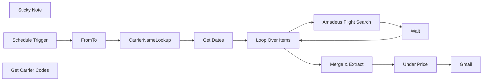

## Fluxo (.json) :

```json
{
  "meta": {
    "instanceId": "7858a8e25b8fc4dae485c1ef345e6fe74effb1f5060433ef500b4c186c965c18"
  },
  "nodes": [
    {
      "id": "4fe13927-84cb-4227-9daa-d6cef72d10b9",
      "name": "CarrierNameLookup",
      "type": "n8n-nodes-base.code",
      "position": [
        740,
        320
      ],
      "parameters": {
        "jsCode": "var carrierCodes={}\nJSON.parse($('Get Carrier Codes').first().json.data).data.forEach(datum=>{\n  carrierCodes[datum.iataCode] = {icao:datum.icaoCode, name:datum.commonName}\n})\nreturn carrierCodes"
      },
      "typeVersion": 2
    },
    {
      "id": "cb0ab93c-5fc5-402d-8ac9-672960b14112",
      "name": "Gmail",
      "type": "n8n-nodes-base.gmail",
      "position": [
        2080,
        400
      ],
      "parameters": {
        "message": "=Hi! We just found a bargain flight:\nDeparture Time: {{ $json.time }}\n[{{ $json.legs[0].carrier }}] {{ $json.duration }} flight from {{ $('FromTo').first().json.from }} to {{ $('FromTo').first().json.to }}\n",
        "options": {},
        "subject": "=Bargain Flight Found! {{ $('FromTo').first().json.from }} -> {{ $('FromTo').first().json.to }} @ {{ $json.price }} on {{ $json.time }}"
      },
      "credentials": {
        "gmailOAuth2": {
          "id": "1MUdv1HbrQUFABiZ",
          "name": "Gmail account"
        }
      },
      "typeVersion": 2.1
    },
    {
      "id": "2f98b3e2-8a25-496e-89f3-b1ebe7e33192",
      "name": "Get Dates",
      "type": "n8n-nodes-base.code",
      "position": [
        940,
        300
      ],
      "parameters": {
        "jsCode": "const getNextSevenDays = () => {\n    const dates = [];\n    const today = new Date();\n\n    for (const i of [7, 14]) {\n        const nextDate = new Date(today);\n        nextDate.setDate(today.getDate() + i);\n        \n        // Format the date as YYYY-MM-DD\n        const formattedDate = nextDate.toISOString().split('T')[0];\n        dates.push({date:formattedDate});\n    }\n\n    return dates;\n};\n\nreturn getNextSevenDays()"
      },
      "typeVersion": 2
    },
    {
      "id": "3d8cf3fa-6ce7-422a-978f-afe2884c1e1a",
      "name": "Merge & Extract",
      "type": "n8n-nodes-base.code",
      "position": [
        1660,
        400
      ],
      "parameters": {
        "jsCode": "//Merge\nresult = []\nfor (const item of $input.all()) {\n result = result.concat(JSON.parse(item.json.data).data)\n}\n\n//Extract data fields\nfinal_result = []\nfor (x of result){\n  let legs = x.itineraries[0].segments.map(y=>{\n          let a = $('CarrierNameLookup').item.json[y.carrierCode];\n           let carrier = a.name? a.name: a.icao;\n           return {carrier:carrier, duration:y.duration}})\n\n\n  console.log(x.itineraries[0].segments[0].departure.at)\n  let duration = x.itineraries[0].duration\n  let price = x.price.total+' '+x.price.currency\n\n  final_result.push({legs:legs, time:x.itineraries[0].segments[0].departure.at, duration:duration, price:price})\n}\n\nreturn final_result"
      },
      "typeVersion": 2
    },
    {
      "id": "89df1c9b-c863-4cf5-88a2-18793d542f02",
      "name": "Loop Over Items",
      "type": "n8n-nodes-base.splitInBatches",
      "position": [
        1200,
        240
      ],
      "parameters": {
        "options": {}
      },
      "typeVersion": 3
    },
    {
      "id": "5595e34d-3736-42f6-ad64-e7f3c72c7f0a",
      "name": "Wait",
      "type": "n8n-nodes-base.wait",
      "position": [
        1060,
        440
      ],
      "webhookId": "f1f32ed2-cead-4ced-ba43-d15613316721",
      "parameters": {
        "amount": 3
      },
      "typeVersion": 1.1
    },
    {
      "id": "550005ad-ea97-4d83-90ac-67c7c583f2dc",
      "name": "Under Price",
      "type": "n8n-nodes-base.filter",
      "position": [
        1880,
        400
      ],
      "parameters": {
        "options": {},
        "conditions": {
          "options": {
            "leftValue": "",
            "caseSensitive": true,
            "typeValidation": "strict"
          },
          "combinator": "and",
          "conditions": [
            {
              "id": "bc2a9b61-41eb-45b1-9ee3-00fe211dadc3",
              "operator": {
                "type": "number",
                "operation": "lt"
              },
              "leftValue": "={{ parseFloat($json.price) }}",
              "rightValue": 600
            }
          ]
        }
      },
      "typeVersion": 2.1
    },
    {
      "id": "ce1beef1-4189-4cd7-b8c6-dd5bef2d9963",
      "name": "FromTo",
      "type": "n8n-nodes-base.set",
      "position": [
        560,
        320
      ],
      "parameters": {
        "options": {},
        "assignments": {
          "assignments": [
            {
              "id": "1944c696-6cfd-4d4d-8f3d-31cb89b37d3d",
              "name": "from",
              "type": "string",
              "value": "LHR"
            },
            {
              "id": "9c4d5ac9-fa75-4fa7-a369-2b0493150203",
              "name": "to",
              "type": "string",
              "value": "JFK"
            }
          ]
        }
      },
      "typeVersion": 3.4
    },
    {
      "id": "a4956257-28ce-4014-b549-ad413264c012",
      "name": "Amadeus Flight Search",
      "type": "n8n-nodes-base.httpRequest",
      "position": [
        1340,
        440
      ],
      "parameters": {
        "url": "https://test.api.amadeus.com/v2/shopping/flight-offers",
        "options": {},
        "sendQuery": true,
        "authentication": "genericCredentialType",
        "genericAuthType": "oAuth2Api",
        "queryParameters": {
          "parameters": [
            {
              "name": "originLocationCode",
              "value": "={{ $('FromTo').item.json.from }}"
            },
            {
              "name": "destinationLocationCode",
              "value": "={{ $('FromTo').item.json.to }}"
            },
            {
              "name": "adults",
              "value": "1"
            },
            {
              "name": "departureDate",
              "value": "={{ $json.date }}"
            }
          ]
        }
      },
      "credentials": {
        "oAuth2Api": {
          "id": "dVIDzfKxdhu5ZEpE",
          "name": "Amadeus"
        }
      },
      "typeVersion": 4.2
    },
    {
      "id": "b7a41d45-799d-4f65-a904-f8fa82e59620",
      "name": "Sticky Note",
      "type": "n8n-nodes-base.stickyNote",
      "position": [
        260,
        -320
      ],
      "parameters": {
        "width": 490.02125360646824,
        "height": 538.1571460797832,
        "content": "# Amadeus Flight Bargains\nEvery day checks for bargain flights for an itinerary and price target of your choosing, and emails you if it finds a match.\n\n## Setup\n1. Create an api account on https://developers.amadeus.com/\n2. In **Amadeus Flight Search**, connect to Oauth2 API:\n  -- Grant Type - Client Credentials\n  -- Access Token URL - https://test.api.amadeus.com/v1/security/oauth2/token\n  -- Client ID/Secret - from your account\n3. Set your details in **Gmail**\n4. Set your desired Origin/Destination airports in FromTo\n5. Set the dates ahead you wish to search in **Get Dates** (default is 7 days and 14 days)\n6. Set the price target in **Under Price**\n\n## Test\nHit 'Test workflow'!"
      },
      "typeVersion": 1
    },
    {
      "id": "88126395-c96a-4905-87db-57ad19cead23",
      "name": "Schedule Trigger",
      "type": "n8n-nodes-base.scheduleTrigger",
      "position": [
        360,
        320
      ],
      "parameters": {
        "rule": {
          "interval": [
            {
              "triggerAtHour": 8
            }
          ]
        }
      },
      "typeVersion": 1.2
    },
    {
      "id": "0fa74451-6053-470c-b5c5-9b25fd2e5b55",
      "name": "Get Carrier Codes",
      "type": "n8n-nodes-base.httpRequest",
      "position": [
        360,
        600
      ],
      "parameters": {
        "url": "https://test.api.amadeus.com/v1/reference-data/airlines",
        "options": {},
        "authentication": "genericCredentialType",
        "genericAuthType": "oAuth2Api"
      },
      "credentials": {
        "oAuth2Api": {
          "id": "dVIDzfKxdhu5ZEpE",
          "name": "Amadeus"
        }
      },
      "typeVersion": 4.2
    }
  ],
  "pinData": {
    "CarrierNameLookup": [
      {
        "0A": {},
        "0B": {
          "icao": "BLA",
          "name": "BLUE AIR AVIATION"
        },
        "0C": {},
        "0D": {},
        "0E": {
          "icao": "XYS"
        },
        "0F": {},
        "0G": {},
        "0H": {},
        "0I": {},
        "0J": {
          "icao": "PJZ",
          "name": "PREMIUM JET AG"
        },
        "0K": {},
        "0L": {},
        "0M": {},
        "0N": {
          "name": "NORTH STAR AIR LTD"
        },
        "0O": {
          "name": "STA TRAVEL"
        },
        "0P": {},
        "0Q": {},
        "0R": {},
        "0S": {},
        "0T": {
          "icao": "TTL"
        },
        "0U": {},
        "0V": {
          "name": "VIETNAM AIR SERVICE"
        },
        "0W": {},
        "0X": {
          "icao": "XYT"
        },
        "0Y": {
          "icao": "XYY"
        },
        "0Z": {
          "icao": "XYR"
        },
        "1A": {
          "icao": "AGT",
          "name": "AMADEUS"
        },
        "1B": {
          "name": "ABACUS"
        },
        "1C": {
          "name": "GEMINI"
        },
        "1D": {
          "name": "RADDIX SOLUTIONS INTL"
        },
        "1E": {
          "name": "CIVIL CHINA"
        },
        "1F": {
          "icao": "TTF",
          "name": "INFINI TRAVEL"
        },
        "1G": {
          "name": "TRAVELPORT"
        },
        "1H": {
          "name": "SIRENA-TRAVEL"
        },
        "1I": {},
        "1J": {
          "name": "AXESS INTERNATIONAL"
        },
        "1K": {
          "name": "MIXVEL"
        },
        "1L": {
          "name": "CITIZENPLANE"
        },
        "1M": {
          "name": "SYSTEMS TAIS"
        },
        "1N": {
          "name": "NAVITAIRE NEW SKIES"
        },
        "1O": {},
        "1P": {
          "icao": "WSP",
          "name": "WORLDSPAN"
        },
        "1Q": {},
        "1R": {},
        "1S": {
          "name": "SABRE"
        },
        "1T": {
          "name": "HITIT"
        },
        "1U": {
          "name": "ITA SOFTWARE"
        },
        "1V": {
          "name": "GALILEO INTERNATIONAL"
        },
        "1W": {},
        "1X": {
          "name": "BRANSON AIR"
        },
        "1Y": {
          "name": "DXC TECHNOLOGY SERVICES"
        },
        "1Z": {
          "icao": "APD"
        },
        "2A": {
          "name": "AIR ASTRA"
        },
        "2B": {
          "icao": "AWT",
          "name": "ALBAWINGS"
        },
        "2C": {},
        "2D": {
          "icao": "DYA",
          "name": "EASTERN AIRLINES"
        },
        "2E": {
          "name": "SMOKEY BAY AIR"
        },
        "2F": {
          "icao": "AFU"
        },
        "2G": {
          "name": "ANGARA AIRLINES"
        },
        "2H": {
          "name": "THALYS"
        },
        "2I": {
          "icao": "SRU",
          "name": "STAR PERU"
        },
        "2J": {
          "icao": "VBW",
          "name": "AIR BURKINA"
        },
        "2K": {
          "icao": "GLG",
          "name": "AVIANCA ECUADOR S.A."
        },
        "2L": {
          "icao": "OAW",
          "name": "HELVETIC AIRWAYS"
        },
        "2M": {
          "icao": "MYD",
          "name": "MAYA ISLAND AIR"
        },
        "2N": {
          "icao": "XLE",
          "name": "NG Eagle Ltd"
        },
        "2O": {
          "name": "REDEMPTION"
        },
        "2P": {
          "icao": "GAP",
          "name": "PAL EXPRESS"
        },
        "2Q": {},
        "2R": {
          "icao": "RLB",
          "name": "SUNLIGHT AIR"
        },
        "2S": {
          "icao": "STW",
          "name": "SOUTHWIND AIRLINES"
        },
        "2T": {
          "name": "BERMUDAIR LIMITED"
        },
        "2U": {
          "icao": "ERO",
          "name": "SUN D OR"
        },
        "2V": {
          "name": "AMTRAK"
        },
        "2W": {
          "icao": "WFL",
          "name": "W2FLY"
        },
        "2X": {
          "icao": "XYA",
          "name": "AMADEUS TWO"
        },
        "2Y": {
          "name": "AIR ANDAMAN"
        },
        "2Z": {
          "icao": "PTB",
          "name": "PASSAREDO TRANSPORTES"
        },
        "3A": {
          "name": "CHU KONG PASSENGER TSPT"
        },
        "3B": {
          "icao": "NTB",
          "name": "BESTFLY"
        },
        "3C": {
          "icao": "CVA",
          "name": "AIR CHATHAMS"
        },
        "3D": {},
        "3E": {
          "icao": "OMQ",
          "name": "MULTI AERO"
        },
        "3F": {},
        "3G": {},
        "3H": {
          "icao": "AIE",
          "name": "AIR INUIT"
        },
        "3I": {},
        "3J": {
          "icao": "JBW",
          "name": "JUBBA AIRWAYS LIMITED"
        },
        "3K": {
          "icao": "JSA",
          "name": "JETSTAR ASIA"
        },
        "3L": {
          "icao": "ADY",
          "name": "INTERSKY"
        },
        "3M": {
          "icao": "SIL",
          "name": "SILVER AIRWAYS CORP"
        },
        "3N": {
          "icao": "URG",
          "name": "AIR URGA"
        },
        "3O": {
          "icao": "MAC",
          "name": "AIR ARABIA MA"
        },
        "3P": {
          "icao": "WPT",
          "name": "WORLD 2 FLY PORTUGAL"
        },
        "3Q": {},
        "3R": {
          "icao": "DVR",
          "name": "DIVI DIVI AIR"
        },
        "3S": {
          "name": "AIR ANTILLES EXPRESS"
        },
        "3T": {
          "icao": "TQQ",
          "name": "TARCO AVIATION"
        },
        "3U": {
          "icao": "CSC",
          "name": "SICHUAN AIRLINES"
        },
        "3V": {
          "icao": "TAY",
          "name": "ASL AIRLINES BELGIUM"
        },
        "3W": {
          "icao": "MWI",
          "name": "MALAWI AIRLINES"
        },
        "3X": {},
        "3Y": {},
        "3Z": {
          "icao": "TVP",
          "name": "SMARTWINGS POLAND"
        },
        "4A": {
          "icao": "AMP",
          "name": "AERO TRANSPORTE"
        },
        "4B": {
          "name": "BOUTIQUE AIR"
        },
        "4C": {
          "icao": "ARE",
          "name": "LATAM AIRLINES COLOMBIA"
        },
        "4D": {
          "icao": "ASD",
          "name": "AIR SINAI"
        },
        "4E": {},
        "4F": {
          "name": "FREEDOM AIRLINE EXPRESS"
        },
        "4G": {
          "icao": "GZP",
          "name": "GAZPROMAVIA"
        },
        "4H": {
          "icao": "HGG",
          "name": "HI AIR"
        },
        "4I": {
          "name": "air antilles"
        },
        "4J": {
          "name": "JETAIR CARIBBEAN"
        },
        "4K": {
          "icao": "SMK",
          "name": "FREEDOM AIRLINE EXPRESS"
        },
        "4L": {},
        "4M": {
          "name": "LANARGENTINA"
        },
        "4N": {
          "name": "AIR NORTH"
        },
        "4P": {
          "name": "REGIONAL SKY"
        },
        "4Q": {},
        "4R": {
          "name": "RENFE VIAJEROS"
        },
        "4S": {
          "name": "RED SEA AIRLINES"
        },
        "4T": {
          "name": "TRANSWEST AIR LIMITED"
        },
        "4U": {
          "icao": "GWI",
          "name": "GERMANWINGS"
        },
        "4V": {
          "icao": "FGW",
          "name": "Fly Gangwon"
        },
        "4W": {
          "icao": "WAV",
          "name": "WARBELOWS AIR VENTURES"
        },
        "4X": {
          "icao": "MLH",
          "name": "AVION EXPRESS MALTA LTD"
        },
        "4Y": {
          "icao": "OCN",
          "name": "EW Discover"
        },
        "4Z": {
          "icao": "LNK",
          "name": "SA AIRLINK"
        },
        "5A": {},
        "5B": {
          "icao": "BSX",
          "name": "BASSAKA AIR"
        },
        "5C": {},
        "5D": {
          "icao": "SLI",
          "name": "AEROLITORAL"
        },
        "5E": {},
        "5F": {
          "icao": "FIA",
          "name": "BONAIRE AIR"
        },
        "5G": {},
        "5H": {},
        "5I": {},
        "5J": {
          "icao": "CEB",
          "name": "CEBU AIR"
        },
        "5K": {
          "name": "HI FLY TRANSPORTES AEREO"
        },
        "5L": {},
        "5M": {
          "icao": "MNT",
          "name": "FLY MONTSERRAT"
        },
        "5N": {
          "icao": "AUL",
          "name": "SMARTAVIA"
        },
        "5O": {
          "icao": "FPO",
          "name": "ASL AIRLINES FRANCE"
        },
        "5P": {
          "icao": "UZP",
          "name": "PANORAMA AIRWAYS"
        },
        "5Q": {
          "name": "HOLIDAY EUROPE"
        },
        "5R": {
          "icao": "RUC",
          "name": "RUTACA"
        },
        "5S": {
          "icao": "GAK",
          "name": "GLOBAL AIR TRANSPORT"
        },
        "5T": {
          "name": "CANADIAN NORTH"
        },
        "5U": {
          "icao": "TGU",
          "name": "L A D E"
        },
        "5V": {
          "name": "EVERTS"
        },
        "5W": {
          "icao": "WAZ",
          "name": "WIZZ AIR ABU DHABI"
        },
        "5X": {},
        "5Y": {},
        "5Z": {
          "icao": "KEM",
          "name": "CEMAIR"
        },
        "6A": {
          "icao": "AMW",
          "name": "ARMENIA AIRWAYS"
        },
        "6B": {
          "icao": "BLX",
          "name": "TUIFLY NORDIC"
        },
        "6C": {},
        "6D": {
          "icao": "TVQ",
          "name": "SMARTWINGS SLOVAKIA"
        },
        "6E": {
          "icao": "IGO",
          "name": "INDIGO"
        },
        "6F": {
          "name": "PRIMERA AIR NORDIC"
        },
        "6G": {},
        "6H": {
          "icao": "ISR",
          "name": "ISRAIR"
        },
        "6I": {
          "icao": "MMD",
          "name": "AIR ALSIE"
        },
        "6J": {
          "name": "SOLASEED AIR"
        },
        "6K": {
          "icao": "TAH"
        },
        "6L": {},
        "6M": {},
        "6N": {
          "icao": "NIN",
          "name": "NIGER AIRLINES"
        },
        "6O": {
          "icao": "OBS",
          "name": "ORBEST GHD"
        },
        "6P": {},
        "6Q": {},
        "6R": {
          "icao": "DRU",
          "name": "MIRNY AIR"
        },
        "6S": {
          "name": "KATO AIRLINES"
        },
        "6T": {},
        "6U": {},
        "6V": {},
        "6W": {
          "icao": "FBS",
          "name": "FLYBOSNIA"
        },
        "6X": {
          "icao": "XYB",
          "name": "AMADEUS SIX"
        },
        "6Y": {
          "icao": "ART",
          "name": "SMARTLYNX AIRLINES"
        },
        "6Z": {},
        "7A": {},
        "7B": {
          "icao": "UBE",
          "name": "BEES AIRLINE LLC"
        },
        "7C": {
          "icao": "JJA",
          "name": "JEJU AIR"
        },
        "7D": {},
        "7E": {
          "icao": "AWU",
          "name": "SYLT AIR GMBH"
        },
        "7F": {
          "icao": "FAB",
          "name": "FIRST AIR"
        },
        "7G": {
          "icao": "SFJ",
          "name": "STAR FLYER"
        },
        "7H": {
          "icao": "RVF",
          "name": "RAVN ALASKA"
        },
        "7I": {
          "icao": "TLR",
          "name": "AIR LIBYA"
        },
        "7J": {
          "icao": "TJK",
          "name": "TAJIK AIR"
        },
        "7K": {},
        "7L": {},
        "7M": {
          "icao": "PAM",
          "name": "MAP LINHAS AEREAS"
        },
        "7N": {},
        "7O": {
          "icao": "TVL",
          "name": "SMARTWINGS HUNGARY"
        },
        "7P": {
          "icao": "PST",
          "name": "AIR PANAMA"
        },
        "7Q": {
          "icao": "MNU",
          "name": "ELITE AIRWAYS"
        },
        "7R": {
          "icao": "RLU",
          "name": "RUSLINE"
        },
        "7S": {
          "icao": "XYW",
          "name": "AMADEUS PDF 7S"
        },
        "7T": {},
        "7U": {},
        "7V": {
          "name": "FEDERAL AIRLINES"
        },
        "7W": {
          "icao": "WRC",
          "name": "WIND ROSE AVIATION"
        },
        "7X": {
          "icao": "XYC",
          "name": "AMADEUS SEVEN"
        },
        "7Y": {},
        "7Z": {
          "icao": "EZR",
          "name": "Z AIR"
        },
        "8A": {},
        "8B": {
          "name": "TRANSNUSA AVIATION"
        },
        "8C": {
          "name": "EAST STAR"
        },
        "8D": {
          "icao": "EXV",
          "name": "FITS AVIATION  PVT  LTD"
        },
        "8E": {
          "icao": "BRG",
          "name": "BERING AIR"
        },
        "8F": {
          "icao": "STP",
          "name": "STP AIRWAYS"
        },
        "8G": {
          "icao": "DTL",
          "name": "GIRJET"
        },
        "8H": {
          "name": "BH AIR"
        },
        "8I": {
          "icao": "LIP",
          "name": "LIPICAN AER"
        },
        "8J": {},
        "8K": {},
        "8L": {
          "icao": "LKE"
        },
        "8M": {
          "icao": "MMA",
          "name": "MYANMAR AIRWAYS INTL"
        },
        "8N": {
          "icao": "REG",
          "name": "REGIONAL AIR SERVICES"
        },
        "8O": {},
        "8P": {
          "icao": "PCO",
          "name": "PAC.COASTAL"
        },
        "8Q": {
          "icao": "OHY",
          "name": "ONUR AIR"
        },
        "8R": {
          "icao": "AIA",
          "name": "AMELIA"
        },
        "8S": {
          "name": "SHUN TAK"
        },
        "8T": {
          "name": "AIR TINDI LTD"
        },
        "8U": {
          "icao": "AAW",
          "name": "AFRIQIYAH AIRWAYS"
        },
        "8V": {
          "name": "WRIGHT AIR SERVICES"
        },
        "8W": {
          "icao": "EDR",
          "name": "FLY ALWAYS"
        },
        "8X": {
          "icao": "XYD",
          "name": "AMADEUS EIGHT"
        },
        "8Y": {
          "icao": "AAV",
          "name": "ASTRO AIR INTERNATIONAL"
        },
        "8Z": {
          "icao": "CGA",
          "name": "CONGO AIRWAYS"
        },
        "9A": {
          "name": "GRAN COLOMBIA DE AV"
        },
        "9B": {
          "name": "ACCESRAIL"
        },
        "9C": {
          "name": "SPRING AIRLINES"
        },
        "9D": {
          "name": "GENGHIS KHAN AIRLINES"
        },
        "9E": {
          "icao": "FLG",
          "name": "ENDEAVOR AIR"
        },
        "9F": {
          "name": "EUROSTAR UK"
        },
        "9G": {},
        "9H": {
          "name": "AIR CHANGAN"
        },
        "9I": {
          "icao": "LLR",
          "name": "ALLIANCE AIR"
        },
        "9J": {
          "icao": "DAN"
        },
        "9K": {
          "icao": "KAP",
          "name": "CAPE AIR"
        },
        "9L": {},
        "9M": {
          "icao": "GLR",
          "name": "CENTRAL MOUNTAIN AIR"
        },
        "9N": {
          "icao": "TOS",
          "name": "TROPIC AIR LIMITED"
        },
        "9O": {},
        "9P": {
          "name": "FLY JINNAH"
        },
        "9Q": {
          "icao": "CXE",
          "name": "CAICOS EXPRESS AIRWAYS"
        },
        "9R": {
          "icao": "NSE",
          "name": "SATENA"
        },
        "9S": {
          "icao": "XYX",
          "name": "AMADEUS  9S"
        },
        "9T": {
          "icao": "AST",
          "name": "THAI SUMMER AIRWAYS"
        },
        "9U": {
          "icao": "MLD",
          "name": "AIR MOLDOVA"
        },
        "9V": {
          "icao": "ROI",
          "name": "AVIOR AIRLINES"
        },
        "9W": {},
        "9X": {
          "icao": "FDY"
        },
        "9Y": {
          "name": "NATIONAL AIRWAYS"
        },
        "9Z": {},
        "A0": {
          "icao": "EFW",
          "name": "BA EUROFLYER"
        },
        "A1": {
          "name": "A.P.G. DISTRIBUTION SYST"
        },
        "A2": {
          "icao": "AWG",
          "name": "ANIMA WINGS"
        },
        "A3": {
          "icao": "AEE",
          "name": "AEGEAN AIR"
        },
        "A4": {
          "name": "JSC AZIMUTH AIRLINES"
        },
        "A5": {
          "icao": "HOP",
          "name": "AIRLINAIR"
        },
        "A6": {
          "icao": "HTU",
          "name": "AIR TRAVEL"
        },
        "A7": {},
        "A8": {
          "icao": "XAU",
          "name": "AEROLINK UGANDA LIMITED"
        },
        "A9": {
          "icao": "TGZ",
          "name": "GEORGIAN AIRWAYS"
        },
        "AA": {
          "icao": "AAL",
          "name": "AMERICAN AIRLINES"
        },
        "AB": {},
        "AC": {
          "icao": "ACA",
          "name": "AIR CANADA"
        },
        "AD": {
          "icao": "AZU",
          "name": "AZUL LINHAS"
        },
        "AE": {
          "icao": "MDA",
          "name": "MANDARIN AIR"
        },
        "AF": {
          "icao": "AFR",
          "name": "AIR FRANCE"
        },
        "AG": {
          "icao": "ARU",
          "name": "ARUBA AIRLINES"
        },
        "AH": {
          "icao": "DAH",
          "name": "AIR ALGERIE"
        },
        "AI": {
          "icao": "AIC",
          "name": "AIR INDIA"
        },
        "AJ": {},
        "AK": {
          "icao": "AXM",
          "name": "AIRASIA SDN BHD"
        },
        "AL": {
          "icao": "APP",
          "name": "ALPAVIA"
        },
        "AM": {
          "icao": "AMX",
          "name": "AEROMEXICO"
        },
        "AN": {
          "name": "ADVANCED AIR"
        },
        "AO": {
          "name": "AIR JUAN AVIATION"
        },
        "AP": {
          "icao": "LAV"
        },
        "AQ": {
          "name": "9 AIR"
        },
        "AR": {
          "icao": "ARG",
          "name": "AEROLINEAS ARGENTINAS"
        },
        "AS": {
          "icao": "ASA",
          "name": "ALASKA AIRLINES"
        },
        "AT": {
          "icao": "RAM",
          "name": "R.AIR MAROC"
        },
        "AU": {
          "icao": "CJL",
          "name": "CANADA JETLINES"
        },
        "AV": {
          "icao": "AVA",
          "name": "AVIANCA"
        },
        "AW": {
          "icao": "AFW",
          "name": "AFRICA WORLD AIRLINES"
        },
        "AX": {},
        "AY": {
          "icao": "FIN",
          "name": "FINNAIR"
        },
        "AZ": {
          "icao": "ITY",
          "name": "ITA AIRWAYS"
        },
        "B0": {
          "icao": "DJT",
          "name": "LA COMPAGNIE"
        },
        "B1": {},
        "B2": {
          "icao": "BRU",
          "name": "BELAVIA"
        },
        "B3": {
          "icao": "BTN",
          "name": "BHUTAN AIRLINES"
        },
        "B4": {
          "name": "BEOND"
        },
        "B5": {
          "name": "EAST AFRICAN SAFARI AIR"
        },
        "B6": {
          "icao": "JBU",
          "name": "JETBLUE AIRWAYS"
        },
        "B7": {
          "icao": "UIA",
          "name": "UNI AIRWAYS"
        },
        "B8": {
          "icao": "ERT",
          "name": "ERITREAN AIRLINES"
        },
        "B9": {
          "icao": "IRB",
          "name": "IRAN AIRTOUR"
        },
        "BA": {
          "icao": "BAW",
          "name": "BRITISH A/W"
        },
        "BB": {
          "name": "SEABORNE AIRLINES"
        },
        "BC": {
          "icao": "SKY",
          "name": "SKYMARK AIRLINES"
        },
        "BD": {
          "name": "CAMBODIA BAYON AIRLINES"
        },
        "BE": {
          "icao": "BEE",
          "name": "BRIT EUROP"
        },
        "BF": {
          "icao": "FBU",
          "name": "FRENCH BEE"
        },
        "BG": {
          "icao": "BBC",
          "name": "BIMAN"
        },
        "BH": {},
        "BI": {
          "icao": "RBA",
          "name": "ROYALBRUNEI"
        },
        "BJ": {
          "icao": "LBT",
          "name": "NOUVELAIR"
        },
        "BK": {
          "icao": "OKA"
        },
        "BL": {
          "icao": "PIC",
          "name": "PACIFIC AIRLINES"
        },
        "BM": {
          "icao": "MNS"
        },
        "BN": {
          "icao": "LWG",
          "name": "LUXWING LTD"
        },
        "BO": {},
        "BP": {
          "icao": "BOT",
          "name": "AIR BOTSWANA"
        },
        "BQ": {
          "icao": "SWU"
        },
        "BR": {
          "icao": "EVA",
          "name": "EVA AIRWAYS"
        },
        "BS": {
          "name": "US BANGLA AIRLINES"
        },
        "BT": {
          "icao": "BTI",
          "name": "AIR BALTIC"
        },
        "BU": {
          "name": "AFRICAINE"
        },
        "BV": {
          "icao": "BPA",
          "name": "BLUE PANORAMA AIRLINES"
        },
        "BW": {
          "icao": "BWA",
          "name": "CARIBBEAN AIR"
        },
        "BX": {
          "icao": "ABL",
          "name": "AIR BUSAN"
        },
        "BY": {
          "icao": "TOM",
          "name": "TUI"
        },
        "BZ": {
          "icao": "BBG",
          "name": "BLUE BIRD AIRWAYS"
        },
        "C0": {},
        "C1": {
          "name": "TECTIMES SUDAMERICA"
        },
        "C2": {
          "name": "CEIBA"
        },
        "C3": {
          "icao": "TDR",
          "name": "TRADE AIR"
        },
        "C4": {},
        "C5": {
          "name": "COMMUTEAIR"
        },
        "C6": {
          "icao": "MFX",
          "name": "MY FREIGHTER"
        },
        "C7": {
          "icao": "CIN",
          "name": "CINNAMON AIR"
        },
        "C8": {
          "icao": "CRA",
          "name": "CRONOS AIRLINES"
        },
        "C9": {
          "icao": "CKL",
          "name": "CRONOS AIRLINES BENIN"
        },
        "CA": {
          "icao": "CCA",
          "name": "AIR CHINA"
        },
        "CB": {
          "name": "Trans Caribbean Air Exp"
        },
        "CC": {},
        "CD": {
          "icao": "CND",
          "name": "SEAVIEW AIR"
        },
        "CE": {
          "icao": "CLG",
          "name": "CHALAIR AVIATION"
        },
        "CF": {},
        "CG": {
          "icao": "TOK",
          "name": "PNG AIR"
        },
        "CH": {},
        "CI": {
          "icao": "CAL",
          "name": "CHINA AIR"
        },
        "CJ": {
          "icao": "CFE",
          "name": "BA CITYFLYER"
        },
        "CK": {},
        "CL": {
          "icao": "CLH",
          "name": "LUFTHANSA CITYLINE"
        },
        "CM": {
          "icao": "CMP",
          "name": "COPA AIRLINES"
        },
        "CN": {
          "name": "GRAND CHINA AIR"
        },
        "CO": {},
        "CP": {
          "name": "COMPASS AIRLINES"
        },
        "CQ": {
          "icao": "CSV",
          "name": "COASTAL AIR"
        },
        "CR": {},
        "CS": {},
        "CT": {
          "icao": "CYL",
          "name": "ALITALIA CITY LINER SPA"
        },
        "CU": {
          "icao": "CUB",
          "name": "CUBANA"
        },
        "CV": {},
        "CW": {
          "icao": "SCW",
          "name": "SKYWEST CHARTER LLC"
        },
        "CX": {
          "icao": "CPA",
          "name": "CATHAYPACIFIC"
        },
        "CY": {
          "icao": "CYP",
          "name": "CYPRUS AIRWAYS"
        },
        "CZ": {
          "icao": "CSN",
          "name": "CHINA SOUTHERN AIRLINES"
        },
        "D0": {},
        "D1": {
          "name": "AIR4 PASSENGER SERVICE"
        },
        "D2": {
          "name": "SEVERSTAL AIRCOMPANY"
        },
        "D3": {
          "icao": "DAO",
          "name": "DAALLO AIRLINES"
        },
        "D4": {
          "icao": "GEL",
          "name": "AIRLINE GEO SKY"
        },
        "D5": {},
        "D6": {
          "name": "GECA"
        },
        "D7": {
          "icao": "XAX",
          "name": "AIRASIAX SDN BHD"
        },
        "D8": {
          "icao": "NSZ",
          "name": "NORWEGIAN AIR"
        },
        "D9": {
          "icao": "DMQ",
          "name": "DAALLO AIRLINES SOMALIA"
        },
        "DA": {},
        "DB": {},
        "DC": {},
        "DD": {
          "icao": "NOK",
          "name": "NOK AIR"
        },
        "DE": {
          "icao": "CFG",
          "name": "CONDOR"
        },
        "DF": {
          "icao": "CIB"
        },
        "DG": {
          "icao": "SRQ",
          "name": "CEBGO"
        },
        "DH": {
          "name": "FLYADEN"
        },
        "DI": {
          "icao": "MBU",
          "name": "MARABU AIRLINES"
        },
        "DJ": {
          "icao": "DJI",
          "name": "AIR DJIBOUTI"
        },
        "DK": {
          "icao": "VKG",
          "name": "SUNCLASS AIRLINES"
        },
        "DL": {
          "icao": "DAL",
          "name": "DELTA AIRLINES"
        },
        "DM": {
          "icao": "DWI",
          "name": "ARAJET"
        },
        "DN": {
          "name": "DAN AIR"
        },
        "DO": {
          "name": "SKY HIGH"
        },
        "DP": {
          "icao": "PBD",
          "name": "POBEDA AIRLINES"
        },
        "DQ": {
          "icao": "KHH",
          "name": "ALEXANDRIA AIRLINES"
        },
        "DR": {
          "name": "RUILI AIRLINES"
        },
        "DS": {
          "icao": "EZS",
          "name": "EASYJET SWITZERLAND"
        },
        "DT": {
          "icao": "DTA",
          "name": "TAAG Linhas Aereas"
        },
        "DU": {
          "icao": "LIZ",
          "name": "SKY JET M.G. INC."
        },
        "DV": {
          "icao": "VSV",
          "name": "JSC AIRCOMPANY SCAT"
        },
        "DW": {},
        "DX": {
          "icao": "DTR",
          "name": "DAT"
        },
        "DY": {
          "icao": "NOZ",
          "name": "NORWEGIAN AIR"
        },
        "DZ": {
          "name": "DONGHAI AIRLINES"
        },
        "E0": {},
        "E1": {},
        "E2": {
          "name": "EUROWINGS EUROPE"
        },
        "E3": {
          "icao": "EGW",
          "name": "EGO AIRWAYS"
        },
        "E5": {
          "icao": "RBG",
          "name": "AIR ARABIA EGYPT"
        },
        "E6": {
          "icao": "EWL",
          "name": "EUROWINGS EUROPE"
        },
        "E7": {
          "name": "EQUAFLIGHT SERVICE"
        },
        "E9": {
          "icao": "EVE",
          "name": "IBEROJET AIRLINES"
        },
        "EA": {
          "icao": "EHN",
          "name": "EMERALD AIRLINES"
        },
        "EB": {
          "icao": "PLM",
          "name": "WAMOS AIR"
        },
        "EC": {},
        "ED": {
          "name": "AIRBLUE"
        },
        "EE": {
          "icao": "EST",
          "name": "XFLY"
        },
        "EF": {},
        "EG": {
          "name": "AER LINGUS UK LIMITED"
        },
        "EH": {
          "icao": "AKX",
          "name": "ANA WINGS"
        },
        "EI": {
          "icao": "EIN",
          "name": "AER LINGUS"
        },
        "EJ": {
          "name": "EQUATORIAL CONGO ECAIR"
        },
        "EK": {
          "icao": "UAE",
          "name": "EMIRATES"
        },
        "EL": {
          "icao": "RIE",
          "name": "ARIELLA"
        },
        "EM": {},
        "EN": {
          "icao": "DLA",
          "name": "AIR DOLOMITI"
        },
        "EO": {
          "name": "AIR GO EGYPT"
        },
        "EP": {
          "icao": "IRC",
          "name": "IRAN ASEMAN AIRLINES"
        },
        "EQ": {
          "name": "FLY ANGOLA"
        },
        "ER": {
          "icao": "SEP",
          "name": "SERENE AIR"
        },
        "ES": {
          "icao": "ETR",
          "name": "ESTELAR"
        },
        "ET": {
          "icao": "ETH",
          "name": "ETHIOPIAN AIRLINES"
        },
        "EU": {
          "name": "CHENGDU AIRLINES"
        },
        "EV": {
          "icao": "ASQ",
          "name": "EXPRESSJET AIRLINES"
        },
        "EW": {
          "icao": "EWG",
          "name": "EUROWINGS"
        },
        "EX": {
          "icao": "5AH",
          "name": "REGIONAL EXPRESS AMERICA"
        },
        "EY": {
          "icao": "ETD",
          "name": "ETIHAD AIRWAYS"
        },
        "EZ": {
          "icao": "SUS",
          "name": "SUN AIR OF SCANDINAVIA"
        },
        "F0": {},
        "F1": {
          "name": "FARELOGIX"
        },
        "F2": {
          "name": "SAFARILINK AVIATION"
        },
        "F3": {
          "icao": "FAD",
          "name": "FLYADEAL"
        },
        "F4": {},
        "F5": {},
        "F6": {
          "icao": "VAW",
          "name": "FLY2SKY"
        },
        "F7": {
          "icao": "RSY",
          "name": "I FLY"
        },
        "F8": {
          "icao": "FLE",
          "name": "FLAIR AIRLINES"
        },
        "F9": {
          "icao": "FFT",
          "name": "FRONTIER AIRLINES"
        },
        "FA": {
          "icao": "SFR",
          "name": "SAFAIR"
        },
        "FB": {
          "icao": "LZB",
          "name": "BALKAN AIR TO"
        },
        "FC": {
          "name": "LINK AIRWAYS FLY FC"
        },
        "FD": {
          "icao": "AIQ",
          "name": "THAI AIRASIA"
        },
        "FE": {
          "icao": "IHO",
          "name": "SEVEN FOUR EIGHT AIR SER"
        },
        "FF": {
          "icao": "FXX",
          "name": "FELIX AIRWAYS"
        },
        "FG": {
          "icao": "AFG",
          "name": "ARIANA AFGHAN AIRLINES"
        },
        "FH": {
          "icao": "FHY",
          "name": "FREEBIRD AIRLINES"
        },
        "FI": {
          "icao": "ICE",
          "name": "ICELANDAIR"
        },
        "FJ": {
          "icao": "FJI",
          "name": "FIJI AIRWAYS"
        },
        "FK": {},
        "FL": {
          "icao": "LPA",
          "name": "AIR LEAP AVIATION"
        },
        "FM": {
          "icao": "CSH",
          "name": "SHANGHAI AIRLINES"
        },
        "FN": {
          "icao": "FJW",
          "name": "REGIONAL AIR"
        },
        "FO": {},
        "FP": {
          "name": "PELICAN AIRLINES"
        },
        "FQ": {
          "icao": "CWN"
        },
        "FR": {
          "icao": "RYR",
          "name": "RYANAIR"
        },
        "FS": {
          "icao": "FOX",
          "name": "FLYR AS"
        },
        "FT": {
          "name": "FLYEGYPT"
        },
        "FU": {
          "name": "FUZHOU AIRLINES"
        },
        "FV": {
          "icao": "SDM",
          "name": "ROSSIYA AIRLINES"
        },
        "FW": {
          "name": "IBEX AIRLINES"
        },
        "FX": {},
        "FY": {
          "icao": "FFM",
          "name": "FIREFLY"
        },
        "FZ": {
          "icao": "FDB",
          "name": "FLYDUBAI"
        },
        "G0": {},
        "G1": {},
        "G2": {
          "icao": "TJJ",
          "name": "GULLIVAIR"
        },
        "G3": {
          "icao": "GLO",
          "name": "GOL LINHAS AEREAS S/A"
        },
        "G4": {
          "icao": "AAY",
          "name": "ALLEGIANT AIR"
        },
        "G5": {
          "icao": "HXA",
          "name": "CHINA EXPRESS AIRLINES"
        },
        "G6": {
          "name": "FLY ARNA"
        },
        "G7": {
          "icao": "GJS",
          "name": "GOJET AIRLINES"
        },
        "G8": {
          "icao": "GOW",
          "name": "GO FIRST"
        },
        "G9": {
          "icao": "ABY",
          "name": "AIR ARABIA"
        },
        "GA": {
          "icao": "GIA",
          "name": "GARUDA"
        },
        "GB": {},
        "GC": {},
        "GD": {
          "name": "AVIAIR"
        },
        "GE": {
          "icao": "GBB",
          "name": "TRANSASIA"
        },
        "GF": {
          "icao": "GFA",
          "name": "GULF AIR"
        },
        "GG": {},
        "GH": {
          "icao": "GHA",
          "name": "GHANA AIR"
        },
        "GI": {},
        "GJ": {
          "icao": "CDC",
          "name": "ZHEJIANG LOONG AIRLINES"
        },
        "GK": {
          "icao": "JJP",
          "name": "JETSTAR JAPAN"
        },
        "GL": {
          "icao": "GRL",
          "name": "AIR GREENLAND"
        },
        "GM": {
          "icao": "GSW",
          "name": "CHAIR AIRLINES"
        },
        "GN": {},
        "GO": {
          "icao": "GHN",
          "name": "AIR GHANA LIMITED"
        },
        "GP": {
          "icao": "RIV"
        },
        "GQ": {
          "icao": "SEH",
          "name": "SKY EXPRESS"
        },
        "GR": {
          "icao": "AUR",
          "name": "AURIGNY AIR SERVICES"
        },
        "GS": {
          "name": "TIANJIN AIRLINES"
        },
        "GT": {
          "name": "AIR GUILIN"
        },
        "GU": {
          "icao": "GUG",
          "name": "AVIATECA"
        },
        "GV": {
          "icao": "GUN",
          "name": "GRANT AVIATION"
        },
        "GW": {},
        "GX": {
          "name": "GX AIRLINES"
        },
        "GY": {},
        "GZ": {
          "name": "AIR RAROTONGA"
        },
        "H0": {},
        "H1": {
          "name": "HAHN AIR SYSTEMS"
        },
        "H2": {
          "icao": "SKU",
          "name": "SKY AIRLINE"
        },
        "H3": {
          "icao": "HLJ",
          "name": "HARBOUR AIR"
        },
        "H4": {
          "icao": "HYS",
          "name": "HISKY EUROPE SRL"
        },
        "H5": {
          "icao": "OMT",
          "name": "CM AIRLINES"
        },
        "H6": {},
        "H7": {
          "icao": "HYM",
          "name": "HISKY"
        },
        "H8": {
          "name": "SKY AIRLINE PERU"
        },
        "H9": {
          "icao": "HIM",
          "name": "HIMALAYA AIRLINES"
        },
        "HA": {
          "icao": "HAL",
          "name": "HAWAIIAN AIRLINES"
        },
        "HB": {
          "icao": "HGB",
          "name": "GREATER BAY AIRLINES"
        },
        "HC": {
          "icao": "SZN",
          "name": "AIR SENEGAL"
        },
        "HD": {
          "icao": "ADO",
          "name": "AIRDO"
        },
        "HE": {
          "name": "BAR AVIATION LIMITED"
        },
        "HF": {
          "icao": "VRE",
          "name": "AIRCOTEIVOIRE"
        },
        "HG": {
          "icao": "HTP",
          "name": "HALA AIR"
        },
        "HH": {
          "icao": "QNT",
          "name": "QANOT SHARQ"
        },
        "HI": {
          "name": "PAPILLON AIRWAYS"
        },
        "HJ": {
          "icao": "HEJ",
          "name": "HELLENIC STAR"
        },
        "HK": {
          "name": "SKIPPERS AVIATION PTY"
        },
        "HL": {},
        "HM": {
          "icao": "SEY",
          "name": "AIR SEYCHELLES"
        },
        "HN": {
          "icao": "EQX",
          "name": "EQUINOXAIR"
        },
        "HO": {
          "icao": "DKH",
          "name": "JUNEYAO AIRLINES"
        },
        "HP": {
          "name": "POPULAIR"
        },
        "HQ": {},
        "HR": {
          "icao": "HHN",
          "name": "HAHN AIR"
        },
        "HS": {
          "name": "HELI SECURITE"
        },
        "HT": {},
        "HU": {
          "icao": "CHH",
          "name": "HAINAN AIRLINES"
        },
        "HV": {
          "icao": "TRA",
          "name": "TRANSAVIA AIRLINES"
        },
        "HW": {
          "name": "NORTH WRIGHT AIR"
        },
        "HX": {
          "icao": "CRK",
          "name": "HONG KONG AIRLINES"
        },
        "HY": {
          "icao": "UZB",
          "name": "UZBEKISTAN AIRWAYS"
        },
        "HZ": {
          "icao": "SHU",
          "name": "AURORA AIRLINES"
        },
        "I0": {},
        "I1": {
          "name": "CTS VIAGGI"
        },
        "I2": {
          "name": "IBERIA EXPRESS"
        },
        "I3": {},
        "I4": {
          "name": "ISLAND AIR EXPRESS"
        },
        "I5": {
          "icao": "IAD",
          "name": "AIR INDIA EXPRESS"
        },
        "I6": {
          "name": "IRYO"
        },
        "I7": {
          "name": "INDIAONE AIR"
        },
        "I8": {
          "icao": "IZA",
          "name": "IZHAVIA"
        },
        "I9": {},
        "IA": {
          "icao": "IAW",
          "name": "I A W"
        },
        "IB": {
          "icao": "IBE",
          "name": "IBERIA"
        },
        "IC": {
          "name": "FLY91"
        },
        "ID": {
          "icao": "BTK",
          "name": "BATIK AIR INDONESIA"
        },
        "IE": {
          "icao": "SOL",
          "name": "SOLOMON AIR"
        },
        "IF": {
          "icao": "FBA",
          "name": "FBA"
        },
        "IG": {},
        "IH": {
          "icao": "SRS",
          "name": "SOUTHERN SKY AIRLINES"
        },
        "II": {},
        "IJ": {
          "name": "SPRING JAPAN"
        },
        "IK": {
          "name": "AIR KIRIBATI"
        },
        "IL": {
          "name": "PT.TRIGANA AIR SERVICE"
        },
        "IM": {},
        "IN": {
          "icao": "LKN",
          "name": "NAM AIR"
        },
        "IO": {
          "icao": "IAE",
          "name": "IrAero"
        },
        "IP": {
          "icao": "PAS"
        },
        "IQ": {
          "icao": "QAZ",
          "name": "QAZAQ AIR"
        },
        "IR": {
          "icao": "IRA",
          "name": "IRAN AIR"
        },
        "IS": {
          "icao": "SHI",
          "name": "SEPEHRAN AIRLINES"
        },
        "IT": {
          "name": "TIGERAIR TAIWAN"
        },
        "IU": {
          "name": "PT. SUPER AIR JET"
        },
        "IV": {
          "icao": "GPX",
          "name": "GP AVIATION"
        },
        "IW": {
          "name": "PT WINGS ABADI AIRLINES"
        },
        "IX": {
          "icao": "AXB",
          "name": "AIR INDIA EXPRESS"
        },
        "IY": {
          "icao": "IYE",
          "name": "YEMEN AIRWAYS"
        },
        "IZ": {
          "icao": "AIZ",
          "name": "ARKIA"
        },
        "J0": {},
        "J1": {},
        "J2": {
          "icao": "AHY",
          "name": "AZERBAIJAN AI"
        },
        "J3": {
          "icao": "PLR",
          "name": "NORTHWESTERN AIR LEASE"
        },
        "J4": {
          "name": "BADR AIRLINES"
        },
        "J5": {
          "name": "ALASKA SEAPLANE SERVICE"
        },
        "J6": {},
        "J7": {
          "icao": "ABS",
          "name": "CENTRE AVIA"
        },
        "J8": {
          "icao": "BVT",
          "name": "BERJAYA AIR"
        },
        "J9": {
          "icao": "JZR",
          "name": "JAZEERA AIRWAYS"
        },
        "JA": {
          "icao": "JAT",
          "name": "JETSMART SPA"
        },
        "JB": {},
        "JC": {
          "icao": "JAC"
        },
        "JD": {
          "icao": "CBJ",
          "name": "BEIJING CAPIT"
        },
        "JE": {
          "icao": "MNO",
          "name": "MANGO"
        },
        "JF": {
          "icao": "OTT",
          "name": "OTT AIRLINES"
        },
        "JG": {},
        "JH": {
          "icao": "FDA",
          "name": "FUJI DREAM AIRLINES"
        },
        "JI": {
          "icao": "AAG",
          "name": "ARMENIAN AIRLINES"
        },
        "JJ": {
          "icao": "TAM",
          "name": "LATAM AIRLINES BRASIL"
        },
        "JK": {},
        "JL": {
          "icao": "JAL",
          "name": "JAPAN AIRLINES"
        },
        "JM": {
          "icao": "JMA",
          "name": "JAMBOJET"
        },
        "JN": {
          "name": "ALASKA AIR TRANSIT"
        },
        "JO": {},
        "JP": {},
        "JQ": {
          "icao": "JST",
          "name": "JETSTAR"
        },
        "JR": {
          "icao": "JOY",
          "name": "JOY AIR"
        },
        "JS": {
          "icao": "KOR",
          "name": "AIR KORYO"
        },
        "JT": {
          "icao": "LNI",
          "name": "LION AIRLINES"
        },
        "JU": {
          "icao": "ASL",
          "name": "AIR SERBIA"
        },
        "JV": {
          "icao": "BLS",
          "name": "BEARSKIN AIRLINES"
        },
        "JW": {},
        "JX": {
          "icao": "SJX",
          "name": "STARLUX AIRLINES"
        },
        "JY": {
          "name": "INTERCARIBBEAN AIRWAYS"
        },
        "JZ": {
          "icao": "JAP",
          "name": "JETSMART AIRLINES PERU"
        },
        "K0": {},
        "K1": {},
        "K2": {
          "name": "PAKLOOK AIR"
        },
        "K3": {
          "icao": "SAQ",
          "name": "Safe Air"
        },
        "K4": {},
        "K5": {},
        "K6": {
          "icao": "KHV",
          "name": "CAMBODIA ANGKOR AIR"
        },
        "K7": {
          "icao": "KBZ",
          "name": "MINGALAR AIRLINES"
        },
        "K8": {},
        "K9": {
          "icao": "TEZ"
        },
        "KA": {
          "icao": "ANK",
          "name": "AERO NOMAD AIRLINES"
        },
        "KB": {
          "icao": "DRK",
          "name": "DRUK AIR"
        },
        "KC": {
          "icao": "KZR",
          "name": "AIR ASTANA"
        },
        "KD": {},
        "KE": {
          "icao": "KAL",
          "name": "KOREAN AIR"
        },
        "KF": {
          "icao": "ABB",
          "name": "AIR BELGIUM"
        },
        "KG": {
          "icao": "LYM",
          "name": "KEY LIME AIR CORPORATION"
        },
        "KI": {
          "icao": "SJB",
          "name": "SKS AIRWAYS"
        },
        "KJ": {
          "icao": "AIH",
          "name": "AIR INCHEON"
        },
        "KK": {
          "icao": "NGN",
          "name": "LEAV AVIATION GMBH"
        },
        "KL": {
          "icao": "KLM",
          "name": "KLM"
        },
        "KM": {
          "icao": "KMM",
          "name": "KM MALTA AIRLINES"
        },
        "KN": {
          "icao": "CUA",
          "name": "CHINA UNITED AIRLINES"
        },
        "KO": {
          "name": "OJSC KOMIAVIATRANS"
        },
        "KP": {
          "icao": "SKK",
          "name": "ASKY"
        },
        "KQ": {
          "icao": "KQA",
          "name": "KENYAAIRWAY"
        },
        "KR": {
          "name": "CAMBODIA AIRWAYS"
        },
        "KS": {
          "icao": "KON",
          "name": "AIR CONNECT AVIATION GRO"
        },
        "KT": {
          "icao": "HOG",
          "name": "MAHOGANY AIR"
        },
        "KU": {
          "icao": "KAC",
          "name": "KUWAIT AIR"
        },
        "KV": {
          "name": "KRASAVIA"
        },
        "KW": {
          "icao": "JRQ"
        },
        "KX": {
          "icao": "CAY",
          "name": "CAYMAN AIRWAYS"
        },
        "KY": {
          "icao": "KNA",
          "name": "Kunming Airlines"
        },
        "KZ": {},
        "L0": {
          "name": "LIZ AVIATION BF"
        },
        "L1": {},
        "L2": {},
        "L3": {},
        "L4": {},
        "L5": {
          "icao": "REA",
          "name": "RED AIR SRL"
        },
        "L6": {
          "icao": "MAI",
          "name": "MAURITANIA AIRLINES"
        },
        "L7": {},
        "L8": {
          "icao": "TON",
          "name": "LULUTAI AIRLINES"
        },
        "L9": {
          "icao": "LWI",
          "name": "LUMIWINGS"
        },
        "LA": {
          "icao": "LAN",
          "name": "LATAM AIRLINES GROUP"
        },
        "LB": {
          "icao": "LXX",
          "name": "LIBYAN EXPRESS"
        },
        "LC": {
          "icao": "NIS",
          "name": "AEROTAXI LA COSTENA"
        },
        "LD": {},
        "LE": {
          "icao": "STB"
        },
        "LF": {
          "icao": "VTE",
          "name": "CONTOUR AIRLINES"
        },
        "LG": {
          "icao": "LGL",
          "name": "LUXAIR"
        },
        "LH": {
          "icao": "DLH",
          "name": "LUFTHANSA"
        },
        "LI": {
          "icao": "LIA",
          "name": "LIAT"
        },
        "LJ": {
          "icao": "JNA",
          "name": "JIN AIR"
        },
        "LK": {
          "icao": "LLL",
          "name": "LAO SKYWAY"
        },
        "LL": {
          "name": "CHINA GENERAL AVIATION"
        },
        "LM": {
          "icao": "LOG",
          "name": "LOGANAIR"
        },
        "LN": {
          "icao": "LAA",
          "name": "LIBYAN AIR"
        },
        "LO": {
          "icao": "LOT",
          "name": "LOT"
        },
        "LP": {
          "icao": "LPE",
          "name": "LATAM AIRLINES PERU"
        },
        "LQ": {
          "name": "LANMEI AIRLINES"
        },
        "LR": {
          "icao": "LRC",
          "name": "L A C S A"
        },
        "LS": {
          "icao": "EXS",
          "name": "JET2.COM"
        },
        "LT": {
          "name": "LONGJIANG AIRLINES"
        },
        "LU": {
          "name": "LATAM AIRLINES CHILE"
        },
        "LV": {
          "icao": "DTG",
          "name": "AIRCOMPANY AIRZENA"
        },
        "LW": {
          "icao": "LDA",
          "name": "LAUDA EUROPE"
        },
        "LX": {
          "icao": "SWR",
          "name": "SWISS"
        },
        "LY": {
          "icao": "ELY",
          "name": "EL AL"
        },
        "LZ": {},
        "M0": {
          "icao": "MNG",
          "name": "AEROMONGOLIA"
        },
        "M1": {},
        "M2": {
          "name": "MHS AVIATION"
        },
        "M3": {},
        "M4": {
          "name": "MISTRAL AIR"
        },
        "M5": {
          "icao": "KEN",
          "name": "KENMORE AIR"
        },
        "M6": {},
        "M7": {},
        "M8": {
          "name": "UNDEFINED"
        },
        "M9": {
          "icao": "MSI",
          "name": "MOTOR SICH AIRLINES"
        },
        "MA": {},
        "MC": {},
        "MD": {
          "icao": "MGY",
          "name": "MADAGASCAR AIRLINES"
        },
        "ME": {
          "icao": "MEA",
          "name": "MIDDLE EAST"
        },
        "MF": {
          "icao": "CXA",
          "name": "XIAMEN AIRLINES"
        },
        "MG": {
          "icao": "EZA",
          "name": "EZNIS AIRWAYS"
        },
        "MH": {
          "icao": "MAS",
          "name": "MALAYSIA"
        },
        "MI": {
          "icao": "FHM",
          "name": "FREEBIRD AIRLINES EUROPE"
        },
        "MJ": {
          "icao": "MYW",
          "name": "MYWAY AIRLINES"
        },
        "MK": {
          "icao": "MAU",
          "name": "AIR MAURITI"
        },
        "ML": {
          "icao": "FML",
          "name": "SKY MALI"
        },
        "MM": {
          "icao": "APJ",
          "name": "PEACH AVIATION"
        },
        "MN": {
          "icao": "CAW",
          "name": "COMAIR LTD"
        },
        "MO": {
          "icao": "CAV",
          "name": "CALM AIR INTERNATIONAL"
        },
        "MP": {},
        "MQ": {
          "icao": "ENY",
          "name": "ENVOY AIR"
        },
        "MR": {
          "icao": "MML",
          "name": "MONGOLIAN AIR"
        },
        "MS": {
          "icao": "MSR",
          "name": "EGYPTAIR"
        },
        "MT": {
          "name": "MALTA MEDAIR"
        },
        "MU": {
          "icao": "CES",
          "name": "CHINA EASTERN AIRLINES"
        },
        "MV": {
          "icao": "MAR",
          "name": "AIR MEDITERRANEAN"
        },
        "MW": {
          "name": "Connect Airlines"
        },
        "MX": {
          "name": "MEXICANA"
        },
        "MY": {
          "name": "MASWINGS"
        },
        "MZ": {
          "icao": "AHX",
          "name": "AMAKUSA AIRLINES"
        },
        "N0": {},
        "N1": {
          "name": "DARWIN TRAVEL TECHNOLOGY"
        },
        "N2": {
          "icao": "NIG",
          "name": "AERO CONTRACTORS NIGERIA"
        },
        "N3": {
          "icao": "VOS",
          "name": "VOLARIS EL SALVADOR"
        },
        "N4": {
          "icao": "NWS",
          "name": "NORD WIND"
        },
        "N5": {
          "icao": "NRL"
        },
        "N6": {
          "icao": "TZS",
          "name": "TCA"
        },
        "N7": {
          "icao": "FCM"
        },
        "N8": {
          "icao": "NCR",
          "name": "NATIONAL AIRLINES"
        },
        "N9": {
          "name": "SHREE AIRLINES"
        },
        "NA": {
          "name": "NESMA AIRLINES"
        },
        "NB": {
          "icao": "BNL",
          "name": "BERNIQ AIRWAYS"
        },
        "NC": {
          "icao": "NJS"
        },
        "ND": {
          "icao": "NDA",
          "name": "NORDICA"
        },
        "NE": {
          "icao": "NMA",
          "name": "NESMA AIRLINES"
        },
        "NF": {
          "icao": "AVN",
          "name": "AIR VANUATU"
        },
        "NG": {
          "icao": "NAI",
          "name": "NOVAIR"
        },
        "NH": {
          "icao": "ANA",
          "name": "ALL NIPPON"
        },
        "NI": {
          "icao": "PGA",
          "name": "PORTUGALIA"
        },
        "NJ": {},
        "NK": {
          "icao": "NKS",
          "name": "SPIRIT AIRLINES"
        },
        "NL": {
          "icao": "AEH",
          "name": "Amelia International"
        },
        "NM": {
          "icao": "NTR",
          "name": "AIR MOANA"
        },
        "NN": {},
        "NO": {
          "icao": "NOS",
          "name": "NEOS SPA"
        },
        "NP": {
          "icao": "NIA",
          "name": "NILE AIR"
        },
        "NQ": {
          "icao": "AJX",
          "name": "AIR JAPAN COMPANY LTD"
        },
        "NR": {
          "icao": "MAV",
          "name": "MANTA AVIATION"
        },
        "NS": {
          "icao": "HBH",
          "name": "HEBEI AIRLINES"
        },
        "NT": {
          "icao": "IBB",
          "name": "BINTER CAN"
        },
        "NU": {
          "icao": "JTA",
          "name": "JAPAN TRANSOC"
        },
        "NV": {},
        "NW": {
          "name": "CELESTE"
        },
        "NX": {
          "icao": "AMU",
          "name": "AIR MACAU"
        },
        "NY": {
          "icao": "FXI",
          "name": "FLUGFELAG ISLANDS"
        },
        "NZ": {
          "icao": "ANZ",
          "name": "AIR NEW ZEALAND"
        },
        "O0": {},
        "O1": {},
        "O2": {
          "icao": "HPK",
          "name": "LINEAR AIR"
        },
        "O3": {},
        "O4": {
          "icao": "OTF",
          "name": "ORANGE2FLY AIRLINES"
        },
        "O5": {},
        "O6": {},
        "O7": {
          "icao": "OMB",
          "name": "OMNI-BLU"
        },
        "O8": {},
        "O9": {},
        "OA": {
          "icao": "OAL",
          "name": "OLYMPIC AIR"
        },
        "OB": {
          "icao": "BOV",
          "name": "BOLIVIANA"
        },
        "OC": {
          "icao": "ORC",
          "name": "ORIENTAL AIR BRIDGE"
        },
        "OD": {
          "icao": "MXD",
          "name": "BATIK AIR MALAYSIA"
        },
        "OE": {
          "icao": "LDM",
          "name": "LAUDAMOTION"
        },
        "OF": {
          "name": "OVERLAND AIRWAYS"
        },
        "OG": {
          "icao": "FPY",
          "name": "FLY PLAY"
        },
        "OH": {
          "icao": "JIA",
          "name": "PSA AIRLINES"
        },
        "OI": {
          "icao": "HND",
          "name": "HINTERLAND AVIATION"
        },
        "OJ": {
          "icao": "OLA",
          "name": "NYXAIR"
        },
        "OK": {
          "icao": "CSA",
          "name": "CZECH AIRLINE"
        },
        "OL": {
          "icao": "PAO",
          "name": "SAMOA AIRWAYS"
        },
        "OM": {
          "icao": "MGL",
          "name": "MIAT"
        },
        "ON": {
          "icao": "RON",
          "name": "NAURU AIRLINES"
        },
        "OO": {
          "icao": "SKW",
          "name": "SKYWEST AIRLINES"
        },
        "OP": {
          "icao": "DIG",
          "name": "PASSION AIR"
        },
        "OQ": {
          "name": "CHONGQING AIRLINES"
        },
        "OR": {
          "icao": "TFL",
          "name": "TUI FLY NETHERLANDS"
        },
        "OS": {
          "icao": "AUA",
          "name": "AUSTRIANAIR"
        },
        "OT": {
          "icao": "CDO",
          "name": "TCHADIA AIRLINES"
        },
        "OU": {
          "icao": "CTN",
          "name": "CROATIA"
        },
        "OV": {
          "icao": "OMS",
          "name": "SALAM AIR"
        },
        "OW": {
          "icao": "SEW",
          "name": "SKYWARD EXPRESS"
        },
        "OX": {
          "icao": "OEW",
          "name": "ONE AIRWAYS"
        },
        "OY": {},
        "OZ": {
          "icao": "AAR",
          "name": "ASIANA"
        },
        "P0": {
          "icao": "PFZ",
          "name": "PROFLIGHT ZAMBIA"
        },
        "P1": {
          "name": "PUBLICCHARTERS.COM"
        },
        "P2": {
          "icao": "XAK",
          "name": "AIRKENYA EXPRESS"
        },
        "P3": {
          "icao": "POE",
          "name": "PORTER AIRLINES"
        },
        "P4": {
          "icao": "APK",
          "name": "AIR PEACE LIMITED"
        },
        "P5": {
          "icao": "RPB",
          "name": "AERO REPUBLICA"
        },
        "P6": {
          "icao": "PSC",
          "name": "PASCAN"
        },
        "P7": {},
        "P8": {
          "icao": "SRN",
          "name": "SPRINTAIR"
        },
        "P9": {},
        "PA": {
          "name": "AIRBLUE"
        },
        "PB": {
          "icao": "SPR",
          "name": "PAL AIRLINES"
        },
        "PC": {
          "icao": "PGT",
          "name": "PEGASUS AIRLINES"
        },
        "PD": {
          "name": "PORTER AIRLINES CANADA"
        },
        "PE": {
          "icao": "PEV",
          "name": "PEOPLES"
        },
        "PF": {
          "icao": "SIF",
          "name": "AIR SIAL LIMITED"
        },
        "PG": {
          "icao": "BKP",
          "name": "BANGKOK AIR"
        },
        "PH": {
          "icao": "SFZ",
          "name": "PIONAIR AUSTRALIA"
        },
        "PI": {
          "icao": "RKA",
          "name": "POLAR AIRLINES"
        },
        "PJ": {
          "name": "AIR SAINT PIERRE"
        },
        "PK": {
          "icao": "PIA",
          "name": "PAKISTAN INTERNATIONAL"
        },
        "PL": {
          "name": "SOUTHERN AIR CHARTER"
        },
        "PM": {
          "icao": "CNF",
          "name": "CANARY FLY"
        },
        "PN": {
          "name": "WEST AIR"
        },
        "PO": {},
        "PP": {},
        "PQ": {
          "icao": "SQP",
          "name": "SKYUP AIRLINES"
        },
        "PR": {
          "icao": "PAL",
          "name": "PHILIPPINE AL"
        },
        "PS": {
          "icao": "AUI",
          "name": "UIA"
        },
        "PT": {
          "name": "PIEDMONT AIRLINES"
        },
        "PU": {
          "icao": "PUE",
          "name": "PLUS ULTRA"
        },
        "PV": {
          "icao": "SBU",
          "name": "SAINT BARTH COMMUTER"
        },
        "PW": {
          "icao": "PRF",
          "name": "PRECISION AIR"
        },
        "PX": {
          "icao": "ANG",
          "name": "AIR NIUGINI"
        },
        "PY": {
          "icao": "SLM",
          "name": "SURINAM AIRWAYS"
        },
        "PZ": {
          "icao": "LAP",
          "name": "LATAM AIRLINES PARAGUAY"
        },
        "Q0": {},
        "Q1": {
          "name": "SQIVA SISTEM"
        },
        "Q2": {},
        "Q3": {
          "name": "ANGUILLA AIR SERVICES"
        },
        "Q4": {
          "icao": "ELE",
          "name": "EUROAIRLINES"
        },
        "Q5": {
          "icao": "MLA",
          "name": "FORTY MILE AIR"
        },
        "Q6": {
          "icao": "VOC",
          "name": "VOLARIS COSTA RICA"
        },
        "Q7": {},
        "Q8": {
          "icao": "TSG",
          "name": "TRANS AIR"
        },
        "Q9": {},
        "QA": {},
        "QB": {
          "icao": "IRQ",
          "name": "QESHM AIR"
        },
        "QC": {
          "icao": "CRC",
          "name": "CAMAIR-CO"
        },
        "QD": {},
        "QE": {},
        "QF": {
          "icao": "QFA",
          "name": "QANTAS"
        },
        "QG": {
          "icao": "CTV",
          "name": "CITILINK"
        },
        "QH": {
          "icao": "BAV",
          "name": "BAMBOO AIRWAYS"
        },
        "QI": {
          "icao": "IAN",
          "name": "IBOM AIRLINES"
        },
        "QJ": {},
        "QK": {
          "icao": "JZA",
          "name": "JAZZ AVIATION"
        },
        "QL": {
          "icao": "LER",
          "name": "LINEA AEREA DE SERVICIO"
        },
        "QM": {
          "name": "MONACAIR"
        },
        "QN": {
          "icao": "SKP",
          "name": "Skytrans"
        },
        "QO": {},
        "QP": {
          "icao": "AKJ",
          "name": "AKASA AIR"
        },
        "QQ": {
          "icao": "UTY",
          "name": "ALLIANCE AIRLINES"
        },
        "QR": {
          "icao": "QTR",
          "name": "QATAR AIRWAYS"
        },
        "QS": {
          "icao": "TVS",
          "name": "TRAVELSERVICE"
        },
        "QT": {},
        "QU": {},
        "QV": {
          "icao": "LAO",
          "name": "LAO AIRLINES"
        },
        "QW": {
          "name": "QINGDAO AIRLINES"
        },
        "QX": {
          "icao": "QXE",
          "name": "HORIZON AIR"
        },
        "QY": {},
        "QZ": {
          "icao": "AWQ",
          "name": "AIRASIA INDONESIA"
        },
        "R0": {},
        "R1": {},
        "R2": {
          "name": "TRANSAIR SENEGAL"
        },
        "R3": {
          "icao": "SYL",
          "name": "JSC AIRCOMPANY YAKUTIA"
        },
        "R4": {},
        "R5": {
          "icao": "JAV",
          "name": "JORDAN AVIATION"
        },
        "R6": {
          "icao": "DNU",
          "name": "DAT"
        },
        "R7": {},
        "R8": {},
        "R9": {},
        "RA": {
          "icao": "RNA",
          "name": "NEPAL AIRLINES"
        },
        "RB": {
          "icao": "SYR",
          "name": "SYRIAN ARAB AIRLINES"
        },
        "RC": {
          "icao": "FLI",
          "name": "ATL.AIRWAYS"
        },
        "RD": {
          "name": "SKY CANA"
        },
        "RE": {},
        "RF": {
          "icao": "EOK",
          "name": "AERO K AIRLINES"
        },
        "RG": {
          "icao": "RJD",
          "name": "ROTANA JET"
        },
        "RH": {},
        "RI": {
          "name": "PT MANDALA"
        },
        "RJ": {
          "icao": "RJA",
          "name": "RYLJORDANIA"
        },
        "RK": {
          "icao": "RUK",
          "name": "RYANAIR UK"
        },
        "RL": {
          "icao": "ABG",
          "name": "ROYAL FLIGHT AIRLINES"
        },
        "RM": {
          "name": "AIRCOMPANY ARMENIA"
        },
        "RN": {
          "icao": "SZL",
          "name": "ESWATINI AIR"
        },
        "RO": {
          "icao": "ROT",
          "name": "TAROM"
        },
        "RP": {
          "icao": "BPS"
        },
        "RQ": {
          "icao": "KMF",
          "name": "KAM AIR"
        },
        "RR": {
          "icao": "RFR",
          "name": "R.A.F NO1"
        },
        "RS": {
          "icao": "ASV",
          "name": "AIR SEOUL"
        },
        "RT": {
          "name": "JSC UVT AERO"
        },
        "RU": {},
        "RV": {
          "icao": "ROU",
          "name": "AIR CANADA ROUGE"
        },
        "RW": {
          "icao": "RYL",
          "name": "ROYAL AIR"
        },
        "RX": {},
        "RY": {
          "name": "JIANGXI AIR"
        },
        "RZ": {
          "icao": "LRS",
          "name": "SANSA"
        },
        "S0": {
          "icao": "NSO",
          "name": "AEROLINEAS SOSA"
        },
        "S1": {
          "name": "LUFTHANSA SYSTEMS"
        },
        "S3": {},
        "S4": {
          "icao": "RZO",
          "name": "SATA INTL"
        },
        "S5": {},
        "S6": {
          "icao": "KSZ",
          "name": "SUNRISE AIRWAYS"
        },
        "S7": {
          "icao": "SBI",
          "name": "S7 AIRLINES"
        },
        "S8": {
          "icao": "SDA",
          "name": "SOUNDS AIR"
        },
        "S9": {
          "name": "TRI STATE CHARTER"
        },
        "SA": {
          "icao": "SAA",
          "name": "S A A"
        },
        "SB": {
          "icao": "ACI",
          "name": "CAL.INT"
        },
        "SC": {
          "icao": "CDG",
          "name": "SHANDONG AIRLINES"
        },
        "SD": {
          "icao": "SUD",
          "name": "SUDAN AIRWAYS"
        },
        "SE": {},
        "SF": {
          "icao": "DTH",
          "name": "TASSILI AIRLINES"
        },
        "SG": {
          "icao": "SEJ",
          "name": "SPICEJET"
        },
        "SH": {
          "name": "SHARP AVIATION"
        },
        "SI": {
          "icao": "BCI",
          "name": "BLUE ISLANDS"
        },
        "SJ": {
          "icao": "SJY",
          "name": "SRIWIJAYA AIR"
        },
        "SK": {
          "icao": "SAS",
          "name": "SAS"
        },
        "SL": {
          "icao": "TLM",
          "name": "RIO SUL"
        },
        "SM": {
          "icao": "MSC",
          "name": "AIR CAIRO"
        },
        "SN": {
          "icao": "BEL",
          "name": "BRUSSELS AIR"
        },
        "SO": {
          "icao": "SNR",
          "name": "SUN AIR AVIATION"
        },
        "SP": {
          "icao": "SAT",
          "name": "SATA"
        },
        "SQ": {
          "icao": "SIA",
          "name": "SINGAPORE"
        },
        "SR": {
          "icao": "SDR",
          "name": "SUNDAIR"
        },
        "SS": {
          "icao": "CRL",
          "name": "CORSE AIR"
        },
        "ST": {
          "icao": "RTL",
          "name": "AIR THANLWIN LIMITED"
        },
        "SU": {
          "icao": "AFL",
          "name": "AEROFLOT"
        },
        "SV": {
          "icao": "SVA",
          "name": "SAUDIARABI"
        },
        "SW": {
          "icao": "NMB",
          "name": "AIR NAMIBIA"
        },
        "SX": {
          "icao": "TOR",
          "name": "FLYGTA"
        },
        "SY": {
          "icao": "SCX",
          "name": "SUN COUNTRY"
        },
        "SZ": {
          "icao": "SMR",
          "name": "SOMON AIR"
        },
        "T0": {
          "name": "AVIANCA PERU"
        },
        "T1": {
          "name": "AVTRASOFT LIMITED"
        },
        "T2": {},
        "T3": {
          "icao": "EZE",
          "name": "EASTERN AIRWAYS"
        },
        "T4": {},
        "T5": {
          "icao": "TUA",
          "name": "TURKMENISTAN AIRLINES"
        },
        "T6": {
          "icao": "ATX",
          "name": "AIRSWIFT"
        },
        "T7": {
          "name": "TWIN JET"
        },
        "T8": {},
        "T9": {
          "icao": "VTU",
          "name": "TURPIAL AIRLINES"
        },
        "TA": {
          "icao": "TAI",
          "name": "TACA"
        },
        "TB": {
          "icao": "JAF",
          "name": "TUI FLY BELGIUM"
        },
        "TC": {
          "icao": "ATC",
          "name": "AIR TANZANIA"
        },
        "TD": {
          "icao": "TBC",
          "name": "AIRCOMPANY TBILISI"
        },
        "TE": {},
        "TF": {
          "icao": "BRX",
          "name": "BRA"
        },
        "TG": {
          "icao": "THA",
          "name": "THAI"
        },
        "TH": {},
        "TI": {
          "name": "TROPIC OCEAN AIRWAYS"
        },
        "TJ": {
          "icao": "GPD",
          "name": "TRADEWIND AVIATION"
        },
        "TK": {
          "icao": "THY",
          "name": "TURKISH AIRLINES"
        },
        "TL": {
          "icao": "ANO",
          "name": "AIRNORTH"
        },
        "TM": {
          "icao": "LAM",
          "name": "LAM"
        },
        "TN": {
          "icao": "THT",
          "name": "AIR TAHITI"
        },
        "TO": {
          "icao": "TVF",
          "name": "TRANSAVIA FRANCE"
        },
        "TP": {
          "icao": "TAP",
          "name": "TAP PORTUGAL"
        },
        "TQ": {},
        "TR": {
          "icao": "TGW",
          "name": "SCOOT"
        },
        "TS": {
          "icao": "TSC",
          "name": "AIR TRANSAT"
        },
        "TT": {
          "icao": "TGG",
          "name": "TIGER AIRWAYS AUSTRALIA"
        },
        "TU": {
          "icao": "TAR",
          "name": "TUNIS AIR"
        },
        "TV": {
          "name": "TIBET AIR"
        },
        "TW": {
          "icao": "TWB",
          "name": "TWAY AIR"
        },
        "TX": {
          "icao": "FWI",
          "name": "AIR CARAIBES"
        },
        "TY": {
          "icao": "TPC",
          "name": "AIR CALEDONIE"
        },
        "TZ": {
          "name": "TSARADIA"
        },
        "U0": {},
        "U1": {
          "name": "VIDECOM INTERNATIONAL"
        },
        "U2": {
          "icao": "EZY",
          "name": "EASYJET"
        },
        "U3": {},
        "U4": {
          "name": "BUDDHA AIR"
        },
        "U5": {
          "icao": "SEU",
          "name": "SKYUP MT"
        },
        "U6": {
          "icao": "SVR",
          "name": "URAL AIRLINES"
        },
        "U7": {},
        "U8": {
          "icao": "CYF",
          "name": "TUS AIRWAYS"
        },
        "U9": {},
        "UA": {
          "icao": "UAL",
          "name": "UNITED AIRLINES"
        },
        "UB": {
          "icao": "UBA",
          "name": "MYANMAR"
        },
        "UC": {},
        "UD": {
          "icao": "UBD",
          "name": "UBD"
        },
        "UE": {
          "icao": "UJC",
          "name": "ULTIMATE AIR SHUTTLE"
        },
        "UF": {
          "icao": "PER",
          "name": "PETROLEUM AIR SERVICES"
        },
        "UG": {
          "icao": "TUX",
          "name": "TUNINTER"
        },
        "UH": {
          "icao": "UJX",
          "name": "ATLASJET"
        },
        "UI": {
          "icao": "AUK",
          "name": "AURIC AIR SERVICES"
        },
        "UJ": {
          "icao": "LMU",
          "name": "AL MASRIA AIR"
        },
        "UK": {
          "icao": "VTI",
          "name": "VISTARA"
        },
        "UL": {
          "icao": "ALK",
          "name": "SRILANKAN AIR"
        },
        "UM": {
          "icao": "AZW",
          "name": "AIR ZIMBABWE"
        },
        "UN": {
          "icao": "NUA",
          "name": "UNITED NIGERIA AIRLINES"
        },
        "UO": {
          "icao": "HKE",
          "name": "HK EXPRESS"
        },
        "UP": {
          "icao": "BHS",
          "name": "BAHAMASAIR"
        },
        "UQ": {
          "icao": "CUH",
          "name": "URUMQI AIRLINES"
        },
        "UR": {
          "icao": "UGD",
          "name": "UGANDA AIRLINES"
        },
        "US": {
          "name": "SILK AVIA"
        },
        "UT": {
          "icao": "UTA",
          "name": "UTAIR AVIATION JSC"
        },
        "UU": {
          "icao": "REU",
          "name": "AIR AUSTRAL"
        },
        "UV": {},
        "UW": {},
        "UX": {
          "icao": "AEA",
          "name": "AIR EUROPA"
        },
        "UY": {
          "icao": "CSG",
          "name": "AIR CAUCASUS"
        },
        "UZ": {
          "icao": "BRQ",
          "name": "BURAQ AIR"
        },
        "V0": {
          "icao": "VCV",
          "name": "CONVIASA"
        },
        "V1": {},
        "V2": {},
        "V3": {
          "icao": "KRP",
          "name": "CARPATAIR"
        },
        "V4": {
          "name": "VIEQUES AIR"
        },
        "V5": {
          "icao": "DAP",
          "name": "AEROVIAS DAP"
        },
        "V6": {},
        "V7": {
          "icao": "VOE",
          "name": "VOLOTEA"
        },
        "V8": {
          "icao": "IAR",
          "name": "ILIAMNA AIR"
        },
        "V9": {
          "name": "VAN AIR EUROPE"
        },
        "VA": {
          "icao": "VOZ",
          "name": "VIRGIN AUSTRALIA"
        },
        "VB": {
          "icao": "VIV",
          "name": "VIVA AEROBUS"
        },
        "VC": {
          "icao": "SRY",
          "name": "STERLING-ALEUTIAN AIRWAY"
        },
        "VD": {},
        "VE": {
          "icao": "EFY",
          "name": "CLIC AIR S.A."
        },
        "VF": {
          "icao": "TKJ",
          "name": "AJET"
        },
        "VG": {
          "name": "VIPPER.COM"
        },
        "VH": {},
        "VI": {},
        "VJ": {
          "icao": "VJC",
          "name": "VIETJET AVIATION"
        },
        "VK": {
          "name": "VALUEJET"
        },
        "VL": {
          "icao": "LHX",
          "name": "CITY AIRLINES"
        },
        "VM": {
          "icao": "NGL",
          "name": "MAX AIR LIMITED"
        },
        "VN": {
          "icao": "HVN",
          "name": "VIETNAM AIRL"
        },
        "VO": {
          "icao": "UVL",
          "name": "UNIVERSAL AIR CHARTER AN"
        },
        "VP": {
          "icao": "VQI",
          "name": "VILLA AIR"
        },
        "VQ": {
          "name": "NOVOAIR"
        },
        "VR": {
          "icao": "TCV",
          "name": "T A C V"
        },
        "VS": {
          "icao": "VIR",
          "name": "VIRGIN ATLANTIC"
        },
        "VT": {
          "icao": "VTA",
          "name": "AIR TAHITI"
        },
        "VU": {
          "icao": "VAG",
          "name": "VIETRAVEL AIRLINES"
        },
        "VV": {
          "name": "Viva Peru"
        },
        "VW": {
          "icao": "TAO",
          "name": "AEROMAR"
        },
        "VX": {
          "icao": "VRD",
          "name": "VIRGIN AMERICA"
        },
        "VY": {
          "icao": "VLG",
          "name": "VUELING AIRLINES"
        },
        "VZ": {
          "icao": "TVJ",
          "name": "THAI VIETJET AIR"
        },
        "W0": {},
        "W1": {},
        "W2": {
          "icao": "FXT",
          "name": "FLEXFLIGHT"
        },
        "W3": {
          "icao": "ARA",
          "name": "ARIK AIR LIMITED"
        },
        "W4": {
          "icao": "WMT",
          "name": "WIZZ AIR MALTA"
        },
        "W5": {
          "icao": "IRM",
          "name": "MAHAN AIR"
        },
        "W6": {
          "icao": "WZZ",
          "name": "WIZZ AIR HUNGARY"
        },
        "W7": {
          "icao": "WMA",
          "name": "MAKERS AIR"
        },
        "W8": {},
        "W9": {
          "icao": "WUK",
          "name": "WIZZ AIR UK"
        },
        "WA": {
          "icao": "KLC"
        },
        "WB": {
          "icao": "RWD",
          "name": "RWANDAIR"
        },
        "WC": {
          "icao": "WCT",
          "name": "MEREGRASS"
        },
        "WD": {},
        "WE": {
          "icao": "THD",
          "name": "THAI SMILE"
        },
        "WF": {
          "icao": "WIF",
          "name": "WIDEROE"
        },
        "WG": {
          "icao": "SWG",
          "name": "SUNWING AIRLINES INC."
        },
        "WH": {
          "name": "WEST AFRICAN AIRLINES"
        },
        "WI": {
          "icao": "WHT"
        },
        "WJ": {
          "icao": "JES",
          "name": "JETSMART AIRLINES"
        },
        "WK": {
          "icao": "EDW",
          "name": "EDELWEISS AIR"
        },
        "WL": {},
        "WM": {
          "icao": "WIA",
          "name": "WINDWARD ISLAND AIRWAYS"
        },
        "WN": {
          "icao": "SWA",
          "name": "SW AIRLINES"
        },
        "WO": {
          "icao": "WSW",
          "name": "SWOOP"
        },
        "WP": {
          "icao": "WSG",
          "name": "WASAYA AIRWAYS"
        },
        "WQ": {},
        "WR": {
          "icao": "WEN",
          "name": "WESTJET ENCORE LTD"
        },
        "WS": {
          "icao": "WJA",
          "name": "WESTJET"
        },
        "WT": {
          "icao": "SWT",
          "name": "UEPFLY/SWIFTAIR"
        },
        "WU": {
          "icao": "JFX",
          "name": "WESTERN AIR"
        },
        "WV": {
          "icao": "WAA",
          "name": "FLY NAMIBIA"
        },
        "WW": {
          "icao": "VNE",
          "name": "RAVSA"
        },
        "WX": {
          "icao": "BCY",
          "name": "CITYJET"
        },
        "WY": {
          "icao": "OMA",
          "name": "OMAN AIR"
        },
        "WZ": {
          "icao": "RWZ"
        },
        "X0": {},
        "X1": {
          "name": "HAHN AIR TECHNOLOGIES"
        },
        "X2": {},
        "X3": {
          "icao": "TUI",
          "name": "TUIFLY"
        },
        "X4": {
          "name": "AIR EXCURSIONS"
        },
        "X5": {},
        "X6": {
          "icao": "ATA",
          "name": "ARC"
        },
        "X7": {},
        "X8": {},
        "X9": {
          "icao": "NVD",
          "name": "CITY STAR AIR"
        },
        "XA": {},
        "XB": {
          "name": "IATA"
        },
        "XC": {
          "icao": "CAI",
          "name": "K D AIR"
        },
        "XD": {},
        "XE": {
          "icao": "BTA",
          "name": "JSX AIR"
        },
        "XF": {
          "icao": "MGW",
          "name": "MONGOLIAN AIRWAYS CARGO"
        },
        "XG": {
          "name": "UNDEFINED"
        },
        "XH": {},
        "XI": {},
        "XJ": {
          "icao": "TAX",
          "name": "THAI AIRASIA X COMPANY"
        },
        "XK": {
          "icao": "CCM",
          "name": "AIR CORSICA"
        },
        "XL": {
          "icao": "LNE",
          "name": "LATAM AIRLINES ECUADOR"
        },
        "XM": {
          "name": "Zimex Aviation Ltd"
        },
        "XN": {
          "icao": "MXA",
          "name": "MEXICANA DE AVIACION"
        },
        "XO": {
          "name": "SEAIR"
        },
        "XP": {
          "icao": "CXP",
          "name": "AVELO AIRLINES"
        },
        "XQ": {
          "icao": "SXS",
          "name": "SUNEXPRESS"
        },
        "XR": {
          "icao": "CXI"
        },
        "XS": {
          "icao": "SIT"
        },
        "XT": {
          "icao": "CTU",
          "name": "LLC GLOBUS"
        },
        "XU": {
          "icao": "AXK",
          "name": "AFRICAN EXPRESS AIRWAYS"
        },
        "XV": {},
        "XW": {},
        "XX": {},
        "XY": {
          "icao": "KNE",
          "name": "FLYNAS"
        },
        "XZ": {
          "icao": "AEZ",
          "name": "AEROITALIA SRL"
        },
        "Y0": {},
        "Y1": {},
        "Y2": {
          "icao": "CEY",
          "name": "AIR CENTURY"
        },
        "Y3": {},
        "Y4": {
          "icao": "VOI",
          "name": "VOLARIS"
        },
        "Y5": {
          "name": "GOLDEN MYANMAR AIRLINES"
        },
        "Y6": {
          "icao": "AYD",
          "name": "AB AVIATION"
        },
        "Y7": {
          "icao": "TYA",
          "name": "NORDSTAR"
        },
        "Y8": {
          "icao": "YZR",
          "name": "SUPARNA AIRLINES"
        },
        "Y9": {
          "icao": "IRK",
          "name": "KISH AIRLINES"
        },
        "YA": {},
        "YB": {},
        "YC": {
          "icao": "LLM",
          "name": "YAMAL AIRLINES"
        },
        "YD": {},
        "YE": {
          "name": "YAN AIR"
        },
        "YF": {},
        "YG": {},
        "YH": {},
        "YI": {
          "icao": "OYA",
          "name": "FLY OYA"
        },
        "YJ": {
          "icao": "WUA",
          "name": "ASIAN WINGS"
        },
        "YK": {
          "icao": "AVJ",
          "name": "AVIA TRAFFIC COMPANY"
        },
        "YL": {
          "name": "LIBYAN WINGS AIRLINE"
        },
        "YM": {
          "icao": "MGX",
          "name": "MONTENEGRO AL"
        },
        "YN": {
          "icao": "CRQ",
          "name": "AIR CREEBEC"
        },
        "YO": {
          "icao": "MCM",
          "name": "HELIAIRMONA"
        },
        "YP": {
          "icao": "APZ",
          "name": "AIR PREMIA"
        },
        "YQ": {
          "icao": "LCT",
          "name": "TAR"
        },
        "YR": {
          "icao": "EGJ",
          "name": "SCENIC AIRLINES"
        },
        "YS": {
          "icao": "FLZ",
          "name": "FLIGHTLINK"
        },
        "YT": {
          "icao": "NYT",
          "name": "YETI AIRLINES"
        },
        "YU": {
          "icao": "MMZ",
          "name": "EUROATLANTIC AIRWAYS"
        },
        "YV": {
          "icao": "ASH",
          "name": "MESA AIRLINES"
        },
        "YW": {
          "icao": "ANE",
          "name": "AIR NOSTRUM"
        },
        "YX": {
          "icao": "RPA",
          "name": "REPUBLIC AIRWAYS"
        },
        "YZ": {},
        "Z0": {},
        "Z1": {},
        "Z2": {
          "icao": "APG",
          "name": "PHILIPPINES AIRASIA"
        },
        "Z3": {},
        "Z4": {},
        "Z5": {},
        "Z6": {},
        "Z7": {
          "icao": "AUZ",
          "name": "AMASZONAS URUGUAY"
        },
        "Z8": {
          "icao": "AZN",
          "name": "AMASZONAS S.A."
        },
        "Z9": {},
        "ZA": {
          "icao": "SWM",
          "name": "SKY ANGKOR AIRLINES"
        },
        "ZB": {
          "name": "AIR ALBANIA"
        },
        "ZC": {},
        "ZD": {
          "icao": "EWR",
          "name": "EWA AIR"
        },
        "ZE": {
          "icao": "ESR",
          "name": "EASTAR JET"
        },
        "ZF": {
          "icao": "AZV",
          "name": "AZUR AIR"
        },
        "ZG": {
          "icao": "TZP",
          "name": "ZIPAIR TOKYO"
        },
        "ZH": {
          "icao": "CSZ",
          "name": "SHENZHEN AIRLINES"
        },
        "ZI": {},
        "ZJ": {},
        "ZK": {},
        "ZL": {
          "name": "REGIONAL EXPRESS"
        },
        "ZM": {
          "icao": "MBB",
          "name": "AIR MANAS AIR COMPANY"
        },
        "ZN": {
          "icao": "AZB",
          "name": "ZAMBIA AIRWAYS"
        },
        "ZO": {},
        "ZP": {
          "icao": "AZP",
          "name": "PARANAIR"
        },
        "ZQ": {
          "icao": "GER",
          "name": "GERMAN AIRWAYS"
        },
        "ZR": {},
        "ZS": {},
        "ZT": {
          "icao": "AWC",
          "name": "TITAN AIRWAYS"
        },
        "ZU": {},
        "ZV": {
          "icao": "RFD",
          "name": "AEROTRANSPORTES RAFILHER"
        },
        "ZW": {
          "icao": "AWI",
          "name": "AIR WISCONSIN"
        },
        "ZX": {
          "icao": "GGN",
          "name": "2746904 ONTARIO INC"
        },
        "ZY": {
          "icao": "SHY",
          "name": "CHINA AIR CARGO"
        },
        "ZZ": {}
      }
    ],
    "Get Carrier Codes": [
      {
        "data": "{\"meta\":{\"count\":1189,\"links\":{\"self\":\"https://test.api.amadeus.com/v1/reference-data/airlines\"}},\"data\":[{\"type\":\"airline\",\"iataCode\":\"8B\",\"businessName\":\"TRANSNUSA AVIATION\",\"commonName\":\"TRANSNUSA AVIATION\"},{\"type\":\"airline\",\"iataCode\":\"8C\",\"businessName\":\"UNDEFINED\",\"commonName\":\"EAST STAR\"},{\"type\":\"airline\",\"iataCode\":\"8D\",\"icaoCode\":\"EXV\",\"businessName\":\"FITS AVIATION (PVT) LTD\",\"commonName\":\"FITS AVIATION  PVT  LTD\"},{\"type\":\"airline\",\"iataCode\":\"8E\",\"icaoCode\":\"BRG\",\"businessName\":\"BERING AIR\",\"commonName\":\"BERING AIR\"},{\"type\":\"airline\",\"iataCode\":\"8F\",\"icaoCode\":\"STP\",\"businessName\":\"STP AIRWAYS\",\"commonName\":\"STP AIRWAYS\"},{\"type\":\"airline\",\"iataCode\":\"8G\",\"icaoCode\":\"DTL\",\"businessName\":\"AERO DILI\",\"commonName\":\"GIRJET\"},{\"type\":\"airline\",\"iataCode\":\"8H\",\"businessName\":\"BH AIR\",\"commonName\":\"BH AIR\"},{\"type\":\"airline\",\"iataCode\":\"8I\",\"icaoCode\":\"LIP\",\"businessName\":\"LIPICAN AER\",\"commonName\":\"LIPICAN AER\"},{\"type\":\"airline\",\"iataCode\":\"8J\",\"businessName\":\"LINEA AEREA ECO JET\"},{\"type\":\"airline\",\"iataCode\":\"8K\",\"businessName\":\"EXPLOITS VALLEY AIR SERVICES\"},{\"type\":\"airline\",\"iataCode\":\"8L\",\"icaoCode\":\"LKE\",\"businessName\":\"LUCKY AIR\"},{\"type\":\"airline\",\"iataCode\":\"8M\",\"icaoCode\":\"MMA\",\"businessName\":\"MYANMAR AIRWAYS INTL\",\"commonName\":\"MYANMAR AIRWAYS INTL\"},{\"type\":\"airline\",\"iataCode\":\"8N\",\"icaoCode\":\"REG\",\"businessName\":\"REGIONAL AIR SERVICES\",\"commonName\":\"REGIONAL AIR SERVICES\"},{\"type\":\"airline\",\"iataCode\":\"8O\",\"businessName\":\"UNDEFINED\"},{\"type\":\"airline\",\"iataCode\":\"8P\",\"icaoCode\":\"PCO\",\"businessName\":\"PACIFIC COASTAL AIRLINES\",\"commonName\":\"PAC.COASTAL\"},{\"type\":\"airline\",\"iataCode\":\"8Q\",\"icaoCode\":\"OHY\",\"businessName\":\"ONUR AIR\",\"commonName\":\"ONUR AIR\"},{\"type\":\"airline\",\"iataCode\":\"8R\",\"icaoCode\":\"AIA\",\"businessName\":\"Amelia\",\"commonName\":\"AMELIA\"},{\"type\":\"airline\",\"iataCode\":\"8S\",\"businessName\":\"SHUN TAK-CHINA TRAVEL\",\"commonName\":\"SHUN TAK\"},{\"type\":\"airline\",\"iataCode\":\"8T\",\"businessName\":\"AIR TINDI LTD\",\"commonName\":\"AIR TINDI LTD\"},{\"type\":\"airline\",\"iataCode\":\"8U\",\"icaoCode\":\"AAW\",\"businessName\":\"AFRIQIYAH AIRWAYS\",\"commonName\":\"AFRIQIYAH AIRWAYS\"},{\"type\":\"airline\",\"iataCode\":\"8V\",\"businessName\":\"WRIGHT AIR SERVICES\",\"commonName\":\"WRIGHT AIR SERVICES\"},{\"type\":\"airline\",\"iataCode\":\"8W\",\"icaoCode\":\"EDR\",\"businessName\":\"FLY ALWAYS\",\"commonName\":\"FLY ALWAYS\"},{\"type\":\"airline\",\"iataCode\":\"8X\",\"icaoCode\":\"XYD\",\"businessName\":\"AMADEUS EIGHT\",\"commonName\":\"AMADEUS EIGHT\"},{\"type\":\"airline\",\"iataCode\":\"8Y\",\"icaoCode\":\"AAV\",\"businessName\":\"ASTRO AIR INTERNATIONAL\",\"commonName\":\"ASTRO AIR INTERNATIONAL\"},{\"type\":\"airline\",\"iataCode\":\"8Z\",\"icaoCode\":\"CGA\",\"businessName\":\"CONGO AIRWAYS\",\"commonName\":\"CONGO AIRWAYS\"},{\"type\":\"airline\",\"iataCode\":\"9A\",\"businessName\":\"GRAN COLOMBIA DE AVIACION\",\"commonName\":\"GRAN COLOMBIA DE AV\"},{\"type\":\"airline\",\"iataCode\":\"9B\",\"businessName\":\"ACCESRAIL\",\"commonName\":\"ACCESRAIL\"},{\"type\":\"airline\",\"iataCode\":\"9C\",\"businessName\":\"SPRING AIRLINES\",\"commonName\":\"SPRING AIRLINES\"},{\"type\":\"airline\",\"iataCode\":\"9D\",\"businessName\":\"GENGHIS KHAN AIRLINES\",\"commonName\":\"GENGHIS KHAN AIRLINES\"},{\"type\":\"airline\",\"iataCode\":\"9E\",\"icaoCode\":\"FLG\",\"businessName\":\"ENDEAVOR AIR\",\"commonName\":\"ENDEAVOR AIR\"},{\"type\":\"airline\",\"iataCode\":\"9F\",\"businessName\":\"EUROSTAR\",\"commonName\":\"EUROSTAR UK\"},{\"type\":\"airline\",\"iataCode\":\"9G\",\"businessName\":\"UNDEFINED\"},{\"type\":\"airline\",\"iataCode\":\"9H\",\"businessName\":\"AIR CHANGAN\",\"commonName\":\"AIR CHANGAN\"},{\"type\":\"airline\",\"iataCode\":\"9I\",\"icaoCode\":\"LLR\",\"businessName\":\"ALLIANCE AIR\",\"commonName\":\"ALLIANCE AIR\"},{\"type\":\"airline\",\"iataCode\":\"9J\",\"icaoCode\":\"DAN\",\"businessName\":\"DANA AIRLINES LIMITED\"},{\"type\":\"airline\",\"iataCode\":\"9K\",\"icaoCode\":\"KAP\",\"businessName\":\"CAPE AIR\",\"commonName\":\"CAPE AIR\"},{\"type\":\"airline\",\"iataCode\":\"9L\",\"businessName\":\"UNDEFINED\"},{\"type\":\"airline\",\"iataCode\":\"9M\",\"icaoCode\":\"GLR\",\"businessName\":\"CENTRAL MOUNTAIN AIR\",\"commonName\":\"CENTRAL MOUNTAIN AIR\"},{\"type\":\"airline\",\"iataCode\":\"9O\",\"businessName\":\"UNDEFINED\"},{\"type\":\"airline\",\"iataCode\":\"9P\",\"businessName\":\"FLY JINNAH\",\"commonName\":\"FLY JINNAH\"},{\"type\":\"airline\",\"iataCode\":\"9Q\",\"icaoCode\":\"CXE\",\"businessName\":\"CAICOS EXPRESS AIRWAYS\",\"commonName\":\"CAICOS EXPRESS AIRWAYS\"},{\"type\":\"airline\",\"iataCode\":\"9R\",\"icaoCode\":\"NSE\",\"businessName\":\"SATENA\",\"commonName\":\"SATENA\"},{\"type\":\"airline\",\"iataCode\":\"9S\",\"icaoCode\":\"XYX\",\"businessName\":\"AMADEUS PDF 9S\",\"commonName\":\"AMADEUS  9S\"},{\"type\":\"airline\",\"iataCode\":\"9T\",\"icaoCode\":\"AST\",\"businessName\":\"THAI SUMMER AIRWAYS\",\"commonName\":\"THAI SUMMER AIRWAYS\"},{\"type\":\"airline\",\"iataCode\":\"9U\",\"icaoCode\":\"MLD\",\"businessName\":\"AIR MOLDOVA\",\"commonName\":\"AIR MOLDOVA\"},{\"type\":\"airline\",\"iataCode\":\"9V\",\"icaoCode\":\"ROI\",\"businessName\":\"AVIOR AIRLINES\",\"commonName\":\"AVIOR AIRLINES\"},{\"type\":\"airline\",\"iataCode\":\"9W\",\"businessName\":\"UNDEFINED\"},{\"type\":\"airline\",\"iataCode\":\"9X\",\"icaoCode\":\"FDY\",\"businessName\":\"SOUTHERN AIRWAYS EXPRESS\"},{\"type\":\"airline\",\"iataCode\":\"9Y\",\"businessName\":\"NATIONAL AIRWAYS\",\"commonName\":\"NATIONAL AIRWAYS\"},{\"type\":\"airline\",\"iataCode\":\"9Z\",\"businessName\":\"AMADEUS PDF 9Z\"},{\"type\":\"airline\",\"iataCode\":\"A0\",\"icaoCode\":\"EFW\",\"businessName\":\"BA EUROFLYER\",\"commonName\":\"BA EUROFLYER\"},{\"type\":\"airline\",\"iataCode\":\"A1\",\"businessName\":\"A.P.G. DISTRIBUTION SYSTEM\",\"commonName\":\"A.P.G. DISTRIBUTION SYST\"},{\"type\":\"airline\",\"iataCode\":\"A2\",\"icaoCode\":\"AWG\",\"businessName\":\"ANIMA WINGS\",\"commonName\":\"ANIMA WINGS\"},{\"type\":\"airline\",\"iataCode\":\"A3\",\"icaoCode\":\"AEE\",\"businessName\":\"AEGEAN AIRLINES\",\"commonName\":\"AEGEAN AIR\"},{\"type\":\"airline\",\"iataCode\":\"A5\",\"icaoCode\":\"HOP\",\"businessName\":\"HOP\",\"commonName\":\"AIRLINAIR\"},{\"type\":\"airline\",\"iataCode\":\"A6\",\"icaoCode\":\"HTU\",\"businessName\":\"AIR TRAVEL\",\"commonName\":\"AIR TRAVEL\"},{\"type\":\"airline\",\"iataCode\":\"A7\",\"businessName\":\"UNDEFINED\"},{\"type\":\"airline\",\"iataCode\":\"A8\",\"icaoCode\":\"XAU\",\"businessName\":\"AEROLINK UGANDA LIMITED\",\"commonName\":\"AEROLINK UGANDA LIMITED\"},{\"type\":\"airline\",\"iataCode\":\"A9\",\"icaoCode\":\"TGZ\",\"businessName\":\"GEORGIAN AIRWAYS\",\"commonName\":\"GEORGIAN AIRWAYS\"},{\"type\":\"airline\",\"iataCode\":\"AA\",\"icaoCode\":\"AAL\",\"businessName\":\"AMERICAN AIRLINES\",\"commonName\":\"AMERICAN AIRLINES\"},{\"type\":\"airline\",\"iataCode\":\"AB\",\"businessName\":\"BONZA AVIATION\"},{\"type\":\"airline\",\"iataCode\":\"AC\",\"icaoCode\":\"ACA\",\"businessName\":\"AIR CANADA\",\"commonName\":\"AIR CANADA\"},{\"type\":\"airline\",\"iataCode\":\"AD\",\"icaoCode\":\"AZU\",\"businessName\":\"AZUL LINHAS AEREAS BRASILEIRAS\",\"commonName\":\"AZUL LINHAS\"},{\"type\":\"airline\",\"iataCode\":\"AE\",\"icaoCode\":\"MDA\",\"businessName\":\"MANDARIN AIRLINES\",\"commonName\":\"MANDARIN AIR\"},{\"type\":\"airline\",\"iataCode\":\"AF\",\"icaoCode\":\"AFR\",\"businessName\":\"AIR FRANCE\",\"commonName\":\"AIR FRANCE\"},{\"type\":\"airline\",\"iataCode\":\"AG\",\"icaoCode\":\"ARU\",\"businessName\":\"ARUBA AIRLINES\",\"commonName\":\"ARUBA AIRLINES\"},{\"type\":\"airline\",\"iataCode\":\"AH\",\"icaoCode\":\"DAH\",\"businessName\":\"AIR ALGERIE\",\"commonName\":\"AIR ALGERIE\"},{\"type\":\"airline\",\"iataCode\":\"AI\",\"icaoCode\":\"AIC\",\"businessName\":\"AIR INDIA\",\"commonName\":\"AIR INDIA\"},{\"type\":\"airline\",\"iataCode\":\"AJ\",\"businessName\":\"UNDEFINED\"},{\"type\":\"airline\",\"iataCode\":\"AK\",\"icaoCode\":\"AXM\",\"businessName\":\"AIRASIA SDN BHD\",\"commonName\":\"AIRASIA SDN BHD\"},{\"type\":\"airline\",\"iataCode\":\"AL\",\"icaoCode\":\"APP\",\"businessName\":\"ALPAVIA\",\"commonName\":\"ALPAVIA\"},{\"type\":\"airline\",\"iataCode\":\"AM\",\"icaoCode\":\"AMX\",\"businessName\":\"AEROMEXICO\",\"commonName\":\"AEROMEXICO\"},{\"type\":\"airline\",\"iataCode\":\"AN\",\"businessName\":\"ADVANCED AIR\",\"commonName\":\"ADVANCED AIR\"},{\"type\":\"airline\",\"iataCode\":\"AO\",\"businessName\":\"AVIANOVA LCC\",\"commonName\":\"AIR JUAN AVIATION\"},{\"type\":\"airline\",\"iataCode\":\"AP\",\"icaoCode\":\"LAV\",\"businessName\":\"ALBA STAR\"},{\"type\":\"airline\",\"iataCode\":\"AQ\",\"businessName\":\"9 AIR\",\"commonName\":\"9 AIR\"},{\"type\":\"airline\",\"iataCode\":\"AR\",\"icaoCode\":\"ARG\",\"businessName\":\"AEROLINEAS ARGENTINAS\",\"commonName\":\"AEROLINEAS ARGENTINAS\"},{\"type\":\"airline\",\"iataCode\":\"AS\",\"icaoCode\":\"ASA\",\"businessName\":\"ALASKA AIRLINES\",\"commonName\":\"ALASKA AIRLINES\"},{\"type\":\"airline\",\"iataCode\":\"CS\",\"businessName\":\"UNDEFINED\"},{\"type\":\"airline\",\"iataCode\":\"0I\",\"businessName\":\"UNDEFINED\"},{\"type\":\"airline\",\"iataCode\":\"0J\",\"icaoCode\":\"PJZ\",\"businessName\":\"PREMIUM JET AG\",\"commonName\":\"PREMIUM JET AG\"},{\"type\":\"airline\",\"iataCode\":\"0K\",\"businessName\":\"UNDEFINED\"},{\"type\":\"airline\",\"iataCode\":\"0L\",\"businessName\":\"UNDEFINED\"},{\"type\":\"airline\",\"iataCode\":\"0M\",\"businessName\":\"UNDEFINED\"},{\"type\":\"airline\",\"iataCode\":\"FS\",\"icaoCode\":\"FOX\",\"businessName\":\"FLYR\",\"commonName\":\"FLYR AS\"},{\"type\":\"airline\",\"iataCode\":\"FT\",\"businessName\":\"FLYEGYPT\",\"commonName\":\"FLYEGYPT\"},{\"type\":\"airline\",\"iataCode\":\"FU\",\"businessName\":\"FUZHOU AIRLINES\",\"commonName\":\"FUZHOU AIRLINES\"},{\"type\":\"airline\",\"iataCode\":\"K5\",\"businessName\":\"UNDEFINED\"},{\"type\":\"airline\",\"iataCode\":\"K6\",\"icaoCode\":\"KHV\",\"businessName\":\"CAMBODIA ANGKOR AIR\",\"commonName\":\"CAMBODIA ANGKOR AIR\"},{\"type\":\"airline\",\"iataCode\":\"0R\",\"businessName\":\"UNDEFINED\"},{\"type\":\"airline\",\"iataCode\":\"0T\",\"icaoCode\":\"TTL\",\"businessName\":\"TOTAL LINHAS AEREAS S/A\"},{\"type\":\"airline\",\"iataCode\":\"0U\",\"businessName\":\"UNDEFINED\"},{\"type\":\"airline\",\"iataCode\":\"CY\",\"icaoCode\":\"CYP\",\"businessName\":\"CYPRUS AIRWAYS\",\"commonName\":\"CYPRUS AIRWAYS\"},{\"type\":\"airline\",\"iataCode\":\"QV\",\"icaoCode\":\"LAO\",\"businessName\":\"LAO AIRLINES\",\"commonName\":\"LAO AIRLINES\"},{\"type\":\"airline\",\"iataCode\":\"1A\",\"icaoCode\":\"AGT\",\"businessName\":\"AMADEUS\",\"commonName\":\"AMADEUS\"},{\"type\":\"airline\",\"iataCode\":\"1B\",\"businessName\":\"ABACUS\",\"commonName\":\"ABACUS\"},{\"type\":\"airline\",\"iataCode\":\"1C\",\"businessName\":\"EDS INFORMATION BUSINESS\",\"commonName\":\"GEMINI\"},{\"type\":\"airline\",\"iataCode\":\"KF\",\"icaoCode\":\"ABB\",\"businessName\":\"AIR BELGIUM\",\"commonName\":\"AIR BELGIUM\"},{\"type\":\"airline\",\"iataCode\":\"KG\",\"icaoCode\":\"LYM\",\"businessName\":\"KEY LIME AIR CORPORATION\",\"commonName\":\"KEY LIME AIR CORPORATION\"},{\"type\":\"airline\",\"iataCode\":\"G2\",\"icaoCode\":\"TJJ\",\"businessName\":\"GULLIVAIR\",\"commonName\":\"GULLIVAIR\"},{\"type\":\"airline\",\"iataCode\":\"RB\",\"icaoCode\":\"SYR\",\"businessName\":\"SYRIAN ARAB AIRLINES\",\"commonName\":\"SYRIAN ARAB AIRLINES\"},{\"type\":\"airline\",\"iataCode\":\"RO\",\"icaoCode\":\"ROT\",\"businessName\":\"TAROM\",\"commonName\":\"TAROM\"},{\"type\":\"airline\",\"iataCode\":\"7S\",\"icaoCode\":\"XYW\",\"businessName\":\"AMADEUS PDF 7S\",\"commonName\":\"AMADEUS PDF 7S\"},{\"type\":\"airline\",\"iataCode\":\"W4\",\"icaoCode\":\"WMT\",\"businessName\":\"WIZZ AIR MALTA\",\"commonName\":\"WIZZ AIR MALTA\"},{\"type\":\"airline\",\"iataCode\":\"D7\",\"icaoCode\":\"XAX\",\"businessName\":\"AIRASIAX SDN BHD\",\"commonName\":\"AIRASIAX SDN BHD\"},{\"type\":\"airline\",\"iataCode\":\"RH\",\"businessName\":\"UNDEFINED\"},{\"type\":\"airline\",\"iataCode\":\"D9\",\"icaoCode\":\"DMQ\",\"businessName\":\"DAALLO AIRLINES(SOMALIA)\",\"commonName\":\"DAALLO AIRLINES SOMALIA\"},{\"type\":\"airline\",\"iataCode\":\"GB\",\"businessName\":\"UNDEFINED\"},{\"type\":\"airline\",\"iataCode\":\"M5\",\"icaoCode\":\"KEN\",\"businessName\":\"KENMORE AIR\",\"commonName\":\"KENMORE AIR\"},{\"type\":\"airline\",\"iataCode\":\"GC\",\"businessName\":\"UNDEFINED\"},{\"type\":\"airline\",\"iataCode\":\"RV\",\"icaoCode\":\"ROU\",\"businessName\":\"AIR CANADA ROUGE\",\"commonName\":\"AIR CANADA ROUGE\"},{\"type\":\"airline\",\"iataCode\":\"7W\",\"icaoCode\":\"WRC\",\"businessName\":\"WIND ROSE AVIATION\",\"commonName\":\"WIND ROSE AVIATION\"},{\"type\":\"airline\",\"iataCode\":\"GH\",\"icaoCode\":\"GHA\",\"businessName\":\"GLOBUS LLC\",\"commonName\":\"GHANA AIR\"},{\"type\":\"airline\",\"iataCode\":\"GI\",\"businessName\":\"UNDEFINED\"},{\"type\":\"airline\",\"iataCode\":\"GJ\",\"icaoCode\":\"CDC\",\"businessName\":\"ZHEJIANG LOONG AIRLINES\",\"commonName\":\"ZHEJIANG LOONG AIRLINES\"},{\"type\":\"airline\",\"iataCode\":\"GK\",\"icaoCode\":\"JJP\",\"businessName\":\"JETSTAR JAPAN\",\"commonName\":\"JETSTAR JAPAN\"},{\"type\":\"airline\",\"iataCode\":\"GL\",\"icaoCode\":\"GRL\",\"businessName\":\"AIR GREENLAND\",\"commonName\":\"AIR GREENLAND\"},{\"type\":\"airline\",\"iataCode\":\"GM\",\"icaoCode\":\"GSW\",\"businessName\":\"CHAIR AIRLINES\",\"commonName\":\"CHAIR AIRLINES\"},{\"type\":\"airline\",\"iataCode\":\"GN\",\"businessName\":\"UNDEFINED\"},{\"type\":\"airline\",\"iataCode\":\"GO\",\"icaoCode\":\"GHN\",\"businessName\":\"AIR GHANA LIMITED\",\"commonName\":\"AIR GHANA LIMITED\"},{\"type\":\"airline\",\"iataCode\":\"GP\",\"icaoCode\":\"RIV\",\"businessName\":\"APG AIRLINES\"},{\"type\":\"airline\",\"iataCode\":\"GQ\",\"icaoCode\":\"SEH\",\"businessName\":\"SKY EXPRESS\",\"commonName\":\"SKY EXPRESS\"},{\"type\":\"airline\",\"iataCode\":\"GR\",\"icaoCode\":\"AUR\",\"businessName\":\"AURIGNY AIR SERVICES\",\"commonName\":\"AURIGNY AIR SERVICES\"},{\"type\":\"airline\",\"iataCode\":\"GS\",\"businessName\":\"TIANJIN AIRLINES\",\"commonName\":\"TIANJIN AIRLINES\"},{\"type\":\"airline\",\"iataCode\":\"GT\",\"businessName\":\"AIR GUILIN\",\"commonName\":\"AIR GUILIN\"},{\"type\":\"airline\",\"iataCode\":\"GU\",\"icaoCode\":\"GUG\",\"businessName\":\"AVIATECA\",\"commonName\":\"AVIATECA\"},{\"type\":\"airline\",\"iataCode\":\"GV\",\"icaoCode\":\"GUN\",\"businessName\":\"GRANT AVIATION\",\"commonName\":\"GRANT AVIATION\"},{\"type\":\"airline\",\"iataCode\":\"GW\",\"businessName\":\"COSTA RICA GREEN AIRWAYS\"},{\"type\":\"airline\",\"iataCode\":\"GX\",\"businessName\":\"GX AIRLINES\",\"commonName\":\"GX AIRLINES\"},{\"type\":\"airline\",\"iataCode\":\"GZ\",\"businessName\":\"AIR RAROTONGA\",\"commonName\":\"AIR RAROTONGA\"},{\"type\":\"airline\",\"iataCode\":\"H0\",\"businessName\":\"UNDEFINED\"},{\"type\":\"airline\",\"iataCode\":\"H1\",\"businessName\":\"HAHN AIR SYSTEMS\",\"commonName\":\"HAHN AIR SYSTEMS\"},{\"type\":\"airline\",\"iataCode\":\"H2\",\"icaoCode\":\"SKU\",\"businessName\":\"SKY AIRLINE\",\"commonName\":\"SKY AIRLINE\"},{\"type\":\"airline\",\"iataCode\":\"H3\",\"icaoCode\":\"HLJ\",\"businessName\":\"HELLO JETS S.R.L\",\"commonName\":\"HARBOUR AIR\"},{\"type\":\"airline\",\"iataCode\":\"H4\",\"icaoCode\":\"HYS\",\"businessName\":\"HISKY EUROPE SRL\",\"commonName\":\"HISKY EUROPE SRL\"},{\"type\":\"airline\",\"iataCode\":\"H5\",\"icaoCode\":\"OMT\",\"businessName\":\"CM AIRLINES\",\"commonName\":\"CM AIRLINES\"},{\"type\":\"airline\",\"iataCode\":\"H6\",\"businessName\":\"UNDEFINED\"},{\"type\":\"airline\",\"iataCode\":\"H7\",\"icaoCode\":\"HYM\",\"businessName\":\"HISKY\",\"commonName\":\"HISKY\"},{\"type\":\"airline\",\"iataCode\":\"H8\",\"businessName\":\"SKY AIRLINE PERU\",\"commonName\":\"SKY AIRLINE PERU\"},{\"type\":\"airline\",\"iataCode\":\"H9\",\"icaoCode\":\"HIM\",\"businessName\":\"HIMALAYA AIRLINES\",\"commonName\":\"HIMALAYA AIRLINES\"},{\"type\":\"airline\",\"iataCode\":\"HA\",\"icaoCode\":\"HAL\",\"businessName\":\"HAWAIIAN AIRLINES\",\"commonName\":\"HAWAIIAN AIRLINES\"},{\"type\":\"airline\",\"iataCode\":\"HB\",\"icaoCode\":\"HGB\",\"businessName\":\"GREATER BAY AIRLINES\",\"commonName\":\"GREATER BAY AIRLINES\"},{\"type\":\"airline\",\"iataCode\":\"HC\",\"icaoCode\":\"SZN\",\"businessName\":\"AIR SENEGAL\",\"commonName\":\"AIR SENEGAL\"},{\"type\":\"airline\",\"iataCode\":\"HD\",\"icaoCode\":\"ADO\",\"businessName\":\"AIRDO\",\"commonName\":\"AIRDO\"},{\"type\":\"airline\",\"iataCode\":\"HE\",\"businessName\":\"BAR AVIATION LIMITED\",\"commonName\":\"BAR AVIATION LIMITED\"},{\"type\":\"airline\",\"iataCode\":\"HF\",\"icaoCode\":\"VRE\",\"businessName\":\"AIR COTE D IVOIRE\",\"commonName\":\"AIRCOTEIVOIRE\"},{\"type\":\"airline\",\"iataCode\":\"HG\",\"icaoCode\":\"HTP\",\"businessName\":\"HALA AIR\",\"commonName\":\"HALA AIR\"},{\"type\":\"airline\",\"iataCode\":\"HH\",\"icaoCode\":\"QNT\",\"businessName\":\"QANOT SHARQ\",\"commonName\":\"QANOT SHARQ\"},{\"type\":\"airline\",\"iataCode\":\"HI\",\"businessName\":\"PAPILLON AIRWAYS\",\"commonName\":\"PAPILLON AIRWAYS\"},{\"type\":\"airline\",\"iataCode\":\"HJ\",\"icaoCode\":\"HEJ\",\"businessName\":\"HELLAS JET\",\"commonName\":\"HELLENIC STAR\"},{\"type\":\"airline\",\"iataCode\":\"HK\",\"businessName\":\"SKIPPERS AVIATION PTY\",\"commonName\":\"SKIPPERS AVIATION PTY\"},{\"type\":\"airline\",\"iataCode\":\"HL\",\"businessName\":\"UNDEFINED\"},{\"type\":\"airline\",\"iataCode\":\"HM\",\"icaoCode\":\"SEY\",\"businessName\":\"AIR SEYCHELLES\",\"commonName\":\"AIR SEYCHELLES\"},{\"type\":\"airline\",\"iataCode\":\"HN\",\"icaoCode\":\"EQX\",\"businessName\":\"EQUINOXAIR\",\"commonName\":\"EQUINOXAIR\"},{\"type\":\"airline\",\"iataCode\":\"HO\",\"icaoCode\":\"DKH\",\"businessName\":\"JUNEYAO AIRLINES\",\"commonName\":\"JUNEYAO AIRLINES\"},{\"type\":\"airline\",\"iataCode\":\"HP\",\"businessName\":\"POPULAIR\",\"commonName\":\"POPULAIR\"},{\"type\":\"airline\",\"iataCode\":\"HQ\",\"businessName\":\"UNDEFINED\"},{\"type\":\"airline\",\"iataCode\":\"HR\",\"icaoCode\":\"HHN\",\"businessName\":\"HAHN AIR\",\"commonName\":\"HAHN AIR\"},{\"type\":\"airline\",\"iataCode\":\"HS\",\"businessName\":\"HELI SECURITE\",\"commonName\":\"HELI SECURITE\"},{\"type\":\"airline\",\"iataCode\":\"HT\",\"businessName\":\"UNDEFINED\"},{\"type\":\"airline\",\"iataCode\":\"HU\",\"icaoCode\":\"CHH\",\"businessName\":\"HAINAN AIRLINES\",\"commonName\":\"HAINAN AIRLINES\"},{\"type\":\"airline\",\"iataCode\":\"HV\",\"icaoCode\":\"TRA\",\"businessName\":\"TRANSAVIA AIRLINES\",\"commonName\":\"TRANSAVIA AIRLINES\"},{\"type\":\"airline\",\"iataCode\":\"HW\",\"businessName\":\"NORTH WRIGHT AIR\",\"commonName\":\"NORTH WRIGHT AIR\"},{\"type\":\"airline\",\"iataCode\":\"HX\",\"icaoCode\":\"CRK\",\"businessName\":\"HONG KONG AIRLINES\",\"commonName\":\"HONG KONG AIRLINES\"},{\"type\":\"airline\",\"iataCode\":\"HY\",\"icaoCode\":\"UZB\",\"businessName\":\"UZBEKISTAN AIRWAYS\",\"commonName\":\"UZBEKISTAN AIRWAYS\"},{\"type\":\"airline\",\"iataCode\":\"HZ\",\"icaoCode\":\"SHU\",\"businessName\":\"AURORA AIRLINES\",\"commonName\":\"AURORA AIRLINES\"},{\"type\":\"airline\",\"iataCode\":\"I0\",\"businessName\":\"UNDEFINED\"},{\"type\":\"airline\",\"iataCode\":\"I1\",\"businessName\":\"CTS VIAGGI\",\"commonName\":\"CTS VIAGGI\"},{\"type\":\"airline\",\"iataCode\":\"I2\",\"businessName\":\"IBERIA EXPRESS\",\"commonName\":\"IBERIA EXPRESS\"},{\"type\":\"airline\",\"iataCode\":\"I3\",\"businessName\":\"ATA AIRLINES\"},{\"type\":\"airline\",\"iataCode\":\"I4\",\"businessName\":\"ISLAND AIR EXPRESS\",\"commonName\":\"ISLAND AIR EXPRESS\"},{\"type\":\"airline\",\"iataCode\":\"I5\",\"icaoCode\":\"IAD\",\"businessName\":\"AIR INDIA EXPRESS\",\"commonName\":\"AIR INDIA EXPRESS\"},{\"type\":\"airline\",\"iataCode\":\"I6\",\"businessName\":\"IRYO\",\"commonName\":\"IRYO\"},{\"type\":\"airline\",\"iataCode\":\"I7\",\"businessName\":\"INDIAONE AIR\",\"commonName\":\"INDIAONE AIR\"},{\"type\":\"airline\",\"iataCode\":\"I8\",\"icaoCode\":\"IZA\",\"businessName\":\"IZHAVIA\",\"commonName\":\"IZHAVIA\"},{\"type\":\"airline\",\"iataCode\":\"I9\",\"businessName\":\"UNDEFINED\"},{\"type\":\"airline\",\"iataCode\":\"IA\",\"icaoCode\":\"IAW\",\"businessName\":\"Iraqi Airways\",\"commonName\":\"I A W\"},{\"type\":\"airline\",\"iataCode\":\"IB\",\"icaoCode\":\"IBE\",\"businessName\":\"IBERIA\",\"commonName\":\"IBERIA\"},{\"type\":\"airline\",\"iataCode\":\"IC\",\"businessName\":\"FLY91\",\"commonName\":\"FLY91\"},{\"type\":\"airline\",\"iataCode\":\"ID\",\"icaoCode\":\"BTK\",\"businessName\":\"BATIK AIR INDONESIA\",\"commonName\":\"BATIK AIR INDONESIA\"},{\"type\":\"airline\",\"iataCode\":\"IE\",\"icaoCode\":\"SOL\",\"businessName\":\"SOLOMON AIRLINES\",\"commonName\":\"SOLOMON AIR\"},{\"type\":\"airline\",\"iataCode\":\"IF\",\"icaoCode\":\"FBA\",\"businessName\":\"FBA\",\"commonName\":\"FBA\"},{\"type\":\"airline\",\"iataCode\":\"IG\",\"businessName\":\"UNDEFINED\"},{\"type\":\"airline\",\"iataCode\":\"IH\",\"icaoCode\":\"SRS\",\"businessName\":\"SOUTHERN SKY AIRLINES JSC\",\"commonName\":\"SOUTHERN SKY AIRLINES\"},{\"type\":\"airline\",\"iataCode\":\"IJ\",\"businessName\":\"SPRING JAPAN\",\"commonName\":\"SPRING JAPAN\"},{\"type\":\"airline\",\"iataCode\":\"IL\",\"businessName\":\"PT.TRIGANA AIR SERVICE\",\"commonName\":\"PT.TRIGANA AIR SERVICE\"},{\"type\":\"airline\",\"iataCode\":\"IM\",\"businessName\":\"UNDEFINED\"},{\"type\":\"airline\",\"iataCode\":\"OQ\",\"businessName\":\"CHONGQING AIRLINES\",\"commonName\":\"CHONGQING AIRLINES\"},{\"type\":\"airline\",\"iataCode\":\"OR\",\"icaoCode\":\"TFL\",\"businessName\":\"TUIFLY NETHERLANDS\",\"commonName\":\"TUI FLY NETHERLANDS\"},{\"type\":\"airline\",\"iataCode\":\"0A\",\"businessName\":\"UNDEFINED\"},{\"type\":\"airline\",\"iataCode\":\"0B\",\"icaoCode\":\"BLA\",\"businessName\":\"BLUE AIR AVIATION\",\"commonName\":\"BLUE AIR AVIATION\"},{\"type\":\"airline\",\"iataCode\":\"0C\",\"businessName\":\"COBRA AVIATION\"},{\"type\":\"airline\",\"iataCode\":\"0D\",\"businessName\":\"UNDEFINED\"},{\"type\":\"airline\",\"iataCode\":\"0E\",\"icaoCode\":\"XYS\",\"businessName\":\"AMADEUS PRESALES 0E\"},{\"type\":\"airline\",\"iataCode\":\"0F\",\"businessName\":\"UNDEFINED\"},{\"type\":\"airline\",\"iataCode\":\"0G\",\"businessName\":\"UNDEFINED\"},{\"type\":\"airline\",\"iataCode\":\"0H\",\"businessName\":\"UNDEFINED\"},{\"type\":\"airline\",\"iataCode\":\"AT\",\"icaoCode\":\"RAM\",\"businessName\":\"ROYAL AIR MAROC\",\"commonName\":\"R.AIR MAROC\"},{\"type\":\"airline\",\"iataCode\":\"0O\",\"businessName\":\"STA TRAVEL\",\"commonName\":\"STA TRAVEL\"},{\"type\":\"airline\",\"iataCode\":\"0P\",\"businessName\":\"UNDEFINED\"},{\"type\":\"airline\",\"iataCode\":\"0Q\",\"businessName\":\"AMADEUS AIRLINE\"},{\"type\":\"airline\",\"iataCode\":\"ZG\",\"icaoCode\":\"TZP\",\"businessName\":\"ZIPAIR TOKYO\",\"commonName\":\"ZIPAIR TOKYO\"},{\"type\":\"airline\",\"iataCode\":\"7B\",\"icaoCode\":\"UBE\",\"businessName\":\"BEES AIRLINE LLC\",\"commonName\":\"BEES AIRLINE LLC\"},{\"type\":\"airline\",\"iataCode\":\"7C\",\"icaoCode\":\"JJA\",\"businessName\":\"JEJU AIR\",\"commonName\":\"JEJU AIR\"},{\"type\":\"airline\",\"iataCode\":\"7D\",\"businessName\":\"UNDEFINED\"},{\"type\":\"airline\",\"iataCode\":\"7E\",\"icaoCode\":\"AWU\",\"businessName\":\"SYLT AIR GMBH\",\"commonName\":\"SYLT AIR GMBH\"},{\"type\":\"airline\",\"iataCode\":\"0V\",\"businessName\":\"VIETNAM AIR SERVICE\",\"commonName\":\"VIETNAM AIR SERVICE\"},{\"type\":\"airline\",\"iataCode\":\"0W\",\"businessName\":\"UNDEFINED\"},{\"type\":\"airline\",\"iataCode\":\"0X\",\"icaoCode\":\"XYT\",\"businessName\":\"AMADEUS AIRLINE 0X\"},{\"type\":\"airline\",\"iataCode\":\"0Z\",\"icaoCode\":\"XYR\",\"businessName\":\"AMADEUS 0Z\"},{\"type\":\"airline\",\"iataCode\":\"7I\",\"icaoCode\":\"TLR\",\"businessName\":\"AIR LIBYA\",\"commonName\":\"AIR LIBYA\"},{\"type\":\"airline\",\"iataCode\":\"7J\",\"icaoCode\":\"TJK\",\"businessName\":\"TAJIK AIR\",\"commonName\":\"TAJIK AIR\"},{\"type\":\"airline\",\"iataCode\":\"DI\",\"icaoCode\":\"MBU\",\"businessName\":\"MARABU AIRLINES\",\"commonName\":\"MARABU AIRLINES\"},{\"type\":\"airline\",\"iataCode\":\"DJ\",\"icaoCode\":\"DJI\",\"businessName\":\"AIR DJIBOUTI\",\"commonName\":\"AIR DJIBOUTI\"},{\"type\":\"airline\",\"iataCode\":\"DK\",\"icaoCode\":\"VKG\",\"businessName\":\"SUNCLASS AIRLINES\",\"commonName\":\"SUNCLASS AIRLINES\"},{\"type\":\"airline\",\"iataCode\":\"DL\",\"icaoCode\":\"DAL\",\"businessName\":\"DELTA AIR LINES\",\"commonName\":\"DELTA AIRLINES\"},{\"type\":\"airline\",\"iataCode\":\"DM\",\"icaoCode\":\"DWI\",\"businessName\":\"ARAJET\",\"commonName\":\"ARAJET\"},{\"type\":\"airline\",\"iataCode\":\"DN\",\"businessName\":\"DAN AIR (AOC) S.R.L\",\"commonName\":\"DAN AIR\"},{\"type\":\"airline\",\"iataCode\":\"DO\",\"businessName\":\"SKY HIGH\",\"commonName\":\"SKY HIGH\"},{\"type\":\"airline\",\"iataCode\":\"DP\",\"icaoCode\":\"PBD\",\"businessName\":\"POBEDA AIRLINES\",\"commonName\":\"POBEDA AIRLINES\"},{\"type\":\"airline\",\"iataCode\":\"DQ\",\"icaoCode\":\"KHH\",\"businessName\":\"ALEXANDRIA AIRLINES\",\"commonName\":\"ALEXANDRIA AIRLINES\"},{\"type\":\"airline\",\"iataCode\":\"DR\",\"businessName\":\"RUILI AIRLINES\",\"commonName\":\"RUILI AIRLINES\"},{\"type\":\"airline\",\"iataCode\":\"DS\",\"icaoCode\":\"EZS\",\"businessName\":\"EASYJET SWITZERLAND\",\"commonName\":\"EASYJET SWITZERLAND\"},{\"type\":\"airline\",\"iataCode\":\"DT\",\"icaoCode\":\"DTA\",\"businessName\":\"TAAG Angola Airlines\",\"commonName\":\"TAAG Linhas Aereas\"},{\"type\":\"airline\",\"iataCode\":\"DV\",\"icaoCode\":\"VSV\",\"businessName\":\"JSC AIRCOMPANY SCAT\",\"commonName\":\"JSC AIRCOMPANY SCAT\"},{\"type\":\"airline\",\"iataCode\":\"DW\",\"businessName\":\"GREAT DANE AIRLINES\"},{\"type\":\"airline\",\"iataCode\":\"DX\",\"icaoCode\":\"DTR\",\"businessName\":\"DAT\",\"commonName\":\"DAT\"},{\"type\":\"airline\",\"iataCode\":\"DY\",\"icaoCode\":\"NOZ\",\"businessName\":\"Norwegian Air Shuttle AOC AS\",\"commonName\":\"NORWEGIAN AIR\"},{\"type\":\"airline\",\"iataCode\":\"DZ\",\"businessName\":\"DONGHAI AIRLINES\",\"commonName\":\"DONGHAI AIRLINES\"},{\"type\":\"airline\",\"iataCode\":\"E1\",\"businessName\":\"UNDEFINED\"},{\"type\":\"airline\",\"iataCode\":\"E2\",\"businessName\":\"EUROWINGS EUROPE GMBH\",\"commonName\":\"EUROWINGS EUROPE\"},{\"type\":\"airline\",\"iataCode\":\"E3\",\"icaoCode\":\"EGW\",\"businessName\":\"Ego Airways\",\"commonName\":\"EGO AIRWAYS\"},{\"type\":\"airline\",\"iataCode\":\"E5\",\"icaoCode\":\"RBG\",\"businessName\":\"AIR ARABIA EGYPT\",\"commonName\":\"AIR ARABIA EGYPT\"},{\"type\":\"airline\",\"iataCode\":\"E6\",\"icaoCode\":\"EWL\",\"businessName\":\"EUROWINGS EUROPE LTD\",\"commonName\":\"EUROWINGS EUROPE\"},{\"type\":\"airline\",\"iataCode\":\"E7\",\"businessName\":\"EQUAFLIGHT SERVICE\",\"commonName\":\"EQUAFLIGHT SERVICE\"},{\"type\":\"airline\",\"iataCode\":\"E9\",\"icaoCode\":\"EVE\",\"businessName\":\"IBEROJET AIRLINES\",\"commonName\":\"IBEROJET AIRLINES\"},{\"type\":\"airline\",\"iataCode\":\"EA\",\"icaoCode\":\"EHN\",\"businessName\":\"EAST HORIZON AIRLINES\",\"commonName\":\"EMERALD AIRLINES\"},{\"type\":\"airline\",\"iataCode\":\"EB\",\"icaoCode\":\"PLM\",\"businessName\":\"WAMOS AIR\",\"commonName\":\"WAMOS AIR\"},{\"type\":\"airline\",\"iataCode\":\"ED\",\"businessName\":\"AIR EXPLORE\",\"commonName\":\"AIRBLUE\"},{\"type\":\"airline\",\"iataCode\":\"EE\",\"icaoCode\":\"EST\",\"businessName\":\"XFLY\",\"commonName\":\"XFLY\"},{\"type\":\"airline\",\"iataCode\":\"EF\",\"businessName\":\"UNDEFINED\"},{\"type\":\"airline\",\"iataCode\":\"EG\",\"businessName\":\"AER LINGUS UK LIMITED\",\"commonName\":\"AER LINGUS UK LIMITED\"},{\"type\":\"airline\",\"iataCode\":\"EH\",\"icaoCode\":\"AKX\",\"businessName\":\"ANA WINGS\",\"commonName\":\"ANA WINGS\"},{\"type\":\"airline\",\"iataCode\":\"EI\",\"icaoCode\":\"EIN\",\"businessName\":\"AER LINGUS\",\"commonName\":\"AER LINGUS\"},{\"type\":\"airline\",\"iataCode\":\"EJ\",\"businessName\":\"EQUATORIAL CONGO AIRLINES ECAIR\",\"commonName\":\"EQUATORIAL CONGO ECAIR\"},{\"type\":\"airline\",\"iataCode\":\"EK\",\"icaoCode\":\"UAE\",\"businessName\":\"EMIRATES\",\"commonName\":\"EMIRATES\"},{\"type\":\"airline\",\"iataCode\":\"EL\",\"icaoCode\":\"RIE\",\"businessName\":\"ARIELLA AIRLINES\",\"commonName\":\"ARIELLA\"},{\"type\":\"airline\",\"iataCode\":\"EM\",\"businessName\":\"UNDEFINED\"},{\"type\":\"airline\",\"iataCode\":\"EN\",\"icaoCode\":\"DLA\",\"businessName\":\"AIR DOLOMITI\",\"commonName\":\"AIR DOLOMITI\"},{\"type\":\"airline\",\"iataCode\":\"EO\",\"businessName\":\"PEGAS FLY\",\"commonName\":\"AIR GO EGYPT\"},{\"type\":\"airline\",\"iataCode\":\"EP\",\"icaoCode\":\"IRC\",\"businessName\":\"IRAN ASEMAN AIRLINES\",\"commonName\":\"IRAN ASEMAN AIRLINES\"},{\"type\":\"airline\",\"iataCode\":\"EQ\",\"businessName\":\"FLY ANGOLA\",\"commonName\":\"FLY ANGOLA\"},{\"type\":\"airline\",\"iataCode\":\"ER\",\"icaoCode\":\"SEP\",\"businessName\":\"SERENE AIR\",\"commonName\":\"SERENE AIR\"},{\"type\":\"airline\",\"iataCode\":\"ES\",\"icaoCode\":\"ETR\",\"businessName\":\"ESTELAR\",\"commonName\":\"ESTELAR\"},{\"type\":\"airline\",\"iataCode\":\"ET\",\"icaoCode\":\"ETH\",\"businessName\":\"ETHIOPIAN AIRLINES\",\"commonName\":\"ETHIOPIAN AIRLINES\"},{\"type\":\"airline\",\"iataCode\":\"EU\",\"businessName\":\"CHENGDU AIRLINES\",\"commonName\":\"CHENGDU AIRLINES\"},{\"type\":\"airline\",\"iataCode\":\"EV\",\"icaoCode\":\"ASQ\",\"businessName\":\"EXPRESSJET AIRLINES\",\"commonName\":\"EXPRESSJET AIRLINES\"},{\"type\":\"airline\",\"iataCode\":\"EW\",\"icaoCode\":\"EWG\",\"businessName\":\"EUROWINGS\",\"commonName\":\"EUROWINGS\"},{\"type\":\"airline\",\"iataCode\":\"EX\",\"icaoCode\":\"5AH\",\"businessName\":\"REGIONAL EXPRESS AMERICAS\",\"commonName\":\"REGIONAL EXPRESS AMERICA\"},{\"type\":\"airline\",\"iataCode\":\"EY\",\"icaoCode\":\"ETD\",\"businessName\":\"ETIHAD AIRWAYS\",\"commonName\":\"ETIHAD AIRWAYS\"},{\"type\":\"airline\",\"iataCode\":\"EZ\",\"icaoCode\":\"SUS\",\"businessName\":\"SUN AIR OF SCANDINAVIA\",\"commonName\":\"SUN AIR OF SCANDINAVIA\"},{\"type\":\"airline\",\"iataCode\":\"F0\",\"businessName\":\"UNDEFINED\"},{\"type\":\"airline\",\"iataCode\":\"F1\",\"businessName\":\"FARELOGIX\",\"commonName\":\"FARELOGIX\"},{\"type\":\"airline\",\"iataCode\":\"F2\",\"businessName\":\"SAFARILINK AVIATION\",\"commonName\":\"SAFARILINK AVIATION\"},{\"type\":\"airline\",\"iataCode\":\"F4\",\"businessName\":\"UNDEFINED\"},{\"type\":\"airline\",\"iataCode\":\"F5\",\"businessName\":\"UNDEFINED\"},{\"type\":\"airline\",\"iataCode\":\"F6\",\"icaoCode\":\"VAW\",\"businessName\":\"FLY2SKY\",\"commonName\":\"FLY2SKY\"},{\"type\":\"airline\",\"iataCode\":\"F7\",\"icaoCode\":\"RSY\",\"businessName\":\"I FLY\",\"commonName\":\"I FLY\"},{\"type\":\"airline\",\"iataCode\":\"F8\",\"icaoCode\":\"FLE\",\"businessName\":\"FLAIR AIRLINES\",\"commonName\":\"FLAIR AIRLINES\"},{\"type\":\"airline\",\"iataCode\":\"F9\",\"icaoCode\":\"FFT\",\"businessName\":\"FRONTIER AIRLINES\",\"commonName\":\"FRONTIER AIRLINES\"},{\"type\":\"airline\",\"iataCode\":\"FA\",\"icaoCode\":\"SFR\",\"businessName\":\"SAFAIR\",\"commonName\":\"SAFAIR\"},{\"type\":\"airline\",\"iataCode\":\"FB\",\"icaoCode\":\"LZB\",\"businessName\":\"BULGARIA AIR\",\"commonName\":\"BALKAN AIR TO\"},{\"type\":\"airline\",\"iataCode\":\"FC\",\"businessName\":\"LINK AIRWAYS FLY FC\",\"commonName\":\"LINK AIRWAYS FLY FC\"},{\"type\":\"airline\",\"iataCode\":\"FD\",\"icaoCode\":\"AIQ\",\"businessName\":\"THAI AIRASIA\",\"commonName\":\"THAI AIRASIA\"},{\"type\":\"airline\",\"iataCode\":\"FE\",\"icaoCode\":\"IHO\",\"businessName\":\"SEVEN FOUR EIGHT AIR SERVICES\",\"commonName\":\"SEVEN FOUR EIGHT AIR SER\"},{\"type\":\"airline\",\"iataCode\":\"FF\",\"icaoCode\":\"FXX\",\"businessName\":\"FELIX AIRWAYS\",\"commonName\":\"FELIX AIRWAYS\"},{\"type\":\"airline\",\"iataCode\":\"FG\",\"icaoCode\":\"AFG\",\"businessName\":\"ARIANA AFGHAN AIRLINES\",\"commonName\":\"ARIANA AFGHAN AIRLINES\"},{\"type\":\"airline\",\"iataCode\":\"FH\",\"icaoCode\":\"FHY\",\"businessName\":\"FREEBIRD AIRLINES\",\"commonName\":\"FREEBIRD AIRLINES\"},{\"type\":\"airline\",\"iataCode\":\"FJ\",\"icaoCode\":\"FJI\",\"businessName\":\"FIJI AIRWAYS\",\"commonName\":\"FIJI AIRWAYS\"},{\"type\":\"airline\",\"iataCode\":\"YH\",\"businessName\":\"UNDEFINED\"},{\"type\":\"airline\",\"iataCode\":\"FK\",\"businessName\":\"UNDEFINED\"},{\"type\":\"airline\",\"iataCode\":\"TQ\",\"businessName\":\"UNDEFINED\"},{\"type\":\"airline\",\"iataCode\":\"J5\",\"businessName\":\"ALASKA SEAPLANE SERVICE\",\"commonName\":\"ALASKA SEAPLANE SERVICE\"},{\"type\":\"airline\",\"iataCode\":\"J6\",\"businessName\":\"UNDEFINED\"},{\"type\":\"airline\",\"iataCode\":\"J7\",\"icaoCode\":\"ABS\",\"businessName\":\"AFRIJET BUSINESS SERVICE\",\"commonName\":\"CENTRE AVIA\"},{\"type\":\"airline\",\"iataCode\":\"FM\",\"icaoCode\":\"CSH\",\"businessName\":\"SHANGHAI AIRLINES\",\"commonName\":\"SHANGHAI AIRLINES\"},{\"type\":\"airline\",\"iataCode\":\"FN\",\"icaoCode\":\"FJW\",\"businessName\":\"FASTJET ZIMBABWE\",\"commonName\":\"REGIONAL AIR\"},{\"type\":\"airline\",\"iataCode\":\"FO\",\"businessName\":\"UNDEFINED\"},{\"type\":\"airline\",\"iataCode\":\"FP\",\"businessName\":\"FLYPELICAN\",\"commonName\":\"PELICAN AIRLINES\"},{\"type\":\"airline\",\"iataCode\":\"FQ\",\"icaoCode\":\"CWN\",\"businessName\":\"CROWN AIRLINES\"},{\"type\":\"airline\",\"iataCode\":\"FR\",\"icaoCode\":\"RYR\",\"businessName\":\"RYANAIR\",\"commonName\":\"RYANAIR\"},{\"type\":\"airline\",\"iataCode\":\"6Y\",\"icaoCode\":\"ART\",\"businessName\":\"SMARTLYNX AIRLINES\",\"commonName\":\"SMARTLYNX AIRLINES\"},{\"type\":\"airline\",\"iataCode\":\"PZ\",\"icaoCode\":\"LAP\",\"businessName\":\"LATAM AIRLINES PARAGUAY\",\"commonName\":\"LATAM AIRLINES PARAGUAY\"},{\"type\":\"airline\",\"iataCode\":\"6Z\",\"businessName\":\"AMADEUS 6Z\"},{\"type\":\"airline\",\"iataCode\":\"7A\",\"businessName\":\"UNDEFINED\"},{\"type\":\"airline\",\"iataCode\":\"FV\",\"icaoCode\":\"SDM\",\"businessName\":\"ROSSIYA AIRLINES\",\"commonName\":\"ROSSIYA AIRLINES\"},{\"type\":\"airline\",\"iataCode\":\"FW\",\"businessName\":\"IBEX AIRLINES\",\"commonName\":\"IBEX AIRLINES\"},{\"type\":\"airline\",\"iataCode\":\"FX\",\"businessName\":\"UNDEFINED\"},{\"type\":\"airline\",\"iataCode\":\"1D\",\"businessName\":\"RADDIX SOLUTIONS INTL\",\"commonName\":\"RADDIX SOLUTIONS INTL\"},{\"type\":\"airline\",\"iataCode\":\"7M\",\"icaoCode\":\"PAM\",\"businessName\":\"MAP LINHAS AEREAS\",\"commonName\":\"MAP LINHAS AEREAS\"},{\"type\":\"airline\",\"iataCode\":\"LJ\",\"icaoCode\":\"JNA\",\"businessName\":\"JIN AIR\",\"commonName\":\"JIN AIR\"},{\"type\":\"airline\",\"iataCode\":\"O4\",\"icaoCode\":\"OTF\",\"businessName\":\"ORANGE2FLY AIRLINES\",\"commonName\":\"ORANGE2FLY AIRLINES\"},{\"type\":\"airline\",\"iataCode\":\"LK\",\"icaoCode\":\"LLL\",\"businessName\":\"LAO SKYWAY\",\"commonName\":\"LAO SKYWAY\"},{\"type\":\"airline\",\"iataCode\":\"G3\",\"icaoCode\":\"GLO\",\"businessName\":\"GOL LINHAS AEREAS S/A\",\"commonName\":\"GOL LINHAS AEREAS S/A\"},{\"type\":\"airline\",\"iataCode\":\"G4\",\"icaoCode\":\"AAY\",\"businessName\":\"ALLEGIANT AIR\",\"commonName\":\"ALLEGIANT AIR\"},{\"type\":\"airline\",\"iataCode\":\"1I\",\"businessName\":\"UNDEFINED\"},{\"type\":\"airline\",\"iataCode\":\"1J\",\"businessName\":\"AXESS INTERNATIONAL\",\"commonName\":\"AXESS INTERNATIONAL\"},{\"type\":\"airline\",\"iataCode\":\"OB\",\"icaoCode\":\"BOV\",\"businessName\":\"BOLIVIANA DE AVIACION\",\"commonName\":\"BOLIVIANA\"},{\"type\":\"airline\",\"iataCode\":\"LG\",\"icaoCode\":\"LGL\",\"businessName\":\"LUXAIR\",\"commonName\":\"LUXAIR\"},{\"type\":\"airline\",\"iataCode\":\"GA\",\"icaoCode\":\"GIA\",\"businessName\":\"GARUDA INDONESIA\",\"commonName\":\"GARUDA\"},{\"type\":\"airline\",\"iataCode\":\"TI\",\"businessName\":\"TROPIC OCEAN AIRWAYS\",\"commonName\":\"TROPIC OCEAN AIRWAYS\"},{\"type\":\"airline\",\"iataCode\":\"B1\",\"businessName\":\"BRAVO PASSENGER SOLUTION\"},{\"type\":\"airline\",\"iataCode\":\"7U\",\"businessName\":\"UNDEFINED\"},{\"type\":\"airline\",\"iataCode\":\"B4\",\"businessName\":\"BEOND\",\"commonName\":\"BEOND\"},{\"type\":\"airline\",\"iataCode\":\"J9\",\"icaoCode\":\"JZR\",\"businessName\":\"JAZEERA AIRWAYS\",\"commonName\":\"JAZEERA AIRWAYS\"},{\"type\":\"airline\",\"iataCode\":\"GF\",\"icaoCode\":\"GFA\",\"businessName\":\"GULF AIR\",\"commonName\":\"GULF AIR\"},{\"type\":\"airline\",\"iataCode\":\"XI\",\"businessName\":\"UNDEFINED\"},{\"type\":\"airline\",\"iataCode\":\"GG\",\"businessName\":\"UNDEFINED\"},{\"type\":\"airline\",\"iataCode\":\"7X\",\"icaoCode\":\"XYC\",\"businessName\":\"AMADEUS SEVEN\",\"commonName\":\"AMADEUS SEVEN\"},{\"type\":\"airline\",\"iataCode\":\"7Y\",\"businessName\":\"AMADEUS 7Y\"},{\"type\":\"airline\",\"iataCode\":\"7Z\",\"icaoCode\":\"EZR\",\"businessName\":\"AMADEUS 7Z\",\"commonName\":\"Z AIR\"},{\"type\":\"airline\",\"iataCode\":\"UU\",\"icaoCode\":\"REU\",\"businessName\":\"AIR AUSTRAL\",\"commonName\":\"AIR AUSTRAL\"},{\"type\":\"airline\",\"iataCode\":\"R8\",\"businessName\":\"UNDEFINED\"},{\"type\":\"airline\",\"iataCode\":\"AX\",\"businessName\":\"UNDEFINED\"},{\"type\":\"airline\",\"iataCode\":\"QS\",\"icaoCode\":\"TVS\",\"businessName\":\"SMARTWINGS\",\"commonName\":\"TRAVELSERVICE\"},{\"type\":\"airline\",\"iataCode\":\"1G\",\"businessName\":\"TRAVELPORT\",\"commonName\":\"TRAVELPORT\"},{\"type\":\"airline\",\"iataCode\":\"1H\",\"businessName\":\"SIRENA-TRAVEL\",\"commonName\":\"SIRENA-TRAVEL\"},{\"type\":\"airline\",\"iataCode\":\"TD\",\"icaoCode\":\"TBC\",\"businessName\":\"AIRCOMPANY TBILISI AIRWAYS\",\"commonName\":\"AIRCOMPANY TBILISI\"},{\"type\":\"airline\",\"iataCode\":\"7Q\",\"icaoCode\":\"MNU\",\"businessName\":\"ELITE AIRWAYS\",\"commonName\":\"ELITE AIRWAYS\"},{\"type\":\"airline\",\"iataCode\":\"VE\",\"icaoCode\":\"EFY\",\"businessName\":\"CLIC AIR S.A.\",\"commonName\":\"CLIC AIR S.A.\"},{\"type\":\"airline\",\"iataCode\":\"DA\",\"businessName\":\"UNDEFINED\"},{\"type\":\"airline\",\"iataCode\":\"TS\",\"icaoCode\":\"TSC\",\"businessName\":\"AIR TRANSAT\",\"commonName\":\"AIR TRANSAT\"},{\"type\":\"airline\",\"iataCode\":\"TJ\",\"icaoCode\":\"GPD\",\"businessName\":\"TRADEWIND AVIATION\",\"commonName\":\"TRADEWIND AVIATION\"},{\"type\":\"airline\",\"iataCode\":\"M8\",\"businessName\":\"UNDEFINED\",\"commonName\":\"UNDEFINED\"},{\"type\":\"airline\",\"iataCode\":\"P0\",\"icaoCode\":\"PFZ\",\"businessName\":\"PROFLIGHT ZAMBIA\",\"commonName\":\"PROFLIGHT ZAMBIA\"},{\"type\":\"airline\",\"iataCode\":\"P1\",\"businessName\":\"PUBLICCHARTERS.COM\",\"commonName\":\"PUBLICCHARTERS.COM\"},{\"type\":\"airline\",\"iataCode\":\"M1\",\"businessName\":\"UNDEFINED\"},{\"type\":\"airline\",\"iataCode\":\"G7\",\"icaoCode\":\"GJS\",\"businessName\":\"GOJET AIRLINES\",\"commonName\":\"GOJET AIRLINES\"},{\"type\":\"airline\",\"iataCode\":\"1P\",\"icaoCode\":\"WSP\",\"businessName\":\"WORLDSPAN\",\"commonName\":\"WORLDSPAN\"},{\"type\":\"airline\",\"iataCode\":\"1Q\",\"businessName\":\"INTELISYS AVIATION SYSTEMS\"},{\"type\":\"airline\",\"iataCode\":\"1R\",\"businessName\":\"JR TECHNOLOGIES IRELAND\"},{\"type\":\"airline\",\"iataCode\":\"1S\",\"businessName\":\"SABRE\",\"commonName\":\"SABRE\"},{\"type\":\"airline\",\"iataCode\":\"1T\",\"businessName\":\"HITIT BILGISAYAR HIZMETLERI\",\"commonName\":\"HITIT\"},{\"type\":\"airline\",\"iataCode\":\"1U\",\"businessName\":\"ITA SOFTWARE\",\"commonName\":\"ITA SOFTWARE\"},{\"type\":\"airline\",\"iataCode\":\"1V\",\"businessName\":\"GALILEO INTERNATIONAL\",\"commonName\":\"GALILEO INTERNATIONAL\"},{\"type\":\"airline\",\"iataCode\":\"1W\",\"businessName\":\"UNDEFINED\"},{\"type\":\"airline\",\"iataCode\":\"1X\",\"businessName\":\"BRANSON AIR\",\"commonName\":\"BRANSON AIR\"},{\"type\":\"airline\",\"iataCode\":\"1Y\",\"businessName\":\"DXC TECHNOLOGY SERVICES\",\"commonName\":\"DXC TECHNOLOGY SERVICES\"},{\"type\":\"airline\",\"iataCode\":\"1Z\",\"icaoCode\":\"APD\",\"businessName\":\"BIRD INFORMATION SYSTEM\"},{\"type\":\"airline\",\"iataCode\":\"2A\",\"businessName\":\"AIR ASTRA\",\"commonName\":\"AIR ASTRA\"},{\"type\":\"airline\",\"iataCode\":\"2B\",\"icaoCode\":\"AWT\",\"businessName\":\"ALBAWINGS\",\"commonName\":\"ALBAWINGS\"},{\"type\":\"airline\",\"iataCode\":\"2C\",\"businessName\":\"SNCF\"},{\"type\":\"airline\",\"iataCode\":\"2D\",\"icaoCode\":\"DYA\",\"businessName\":\"EASTERN AIRLINES\",\"commonName\":\"EASTERN AIRLINES\"},{\"type\":\"airline\",\"iataCode\":\"2E\",\"businessName\":\"SMOKEY BAY AIR\",\"commonName\":\"SMOKEY BAY AIR\"},{\"type\":\"airline\",\"iataCode\":\"2F\",\"icaoCode\":\"AFU\",\"businessName\":\"AFRINAT INTERNATIONAL AIRLINES\"},{\"type\":\"airline\",\"iataCode\":\"2G\",\"businessName\":\"ANGARA AIRLINES\",\"commonName\":\"ANGARA AIRLINES\"},{\"type\":\"airline\",\"iataCode\":\"2H\",\"businessName\":\"THALYS INTERNATIONAL\",\"commonName\":\"THALYS\"},{\"type\":\"airline\",\"iataCode\":\"2I\",\"icaoCode\":\"SRU\",\"businessName\":\"STAR PERU\",\"commonName\":\"STAR PERU\"},{\"type\":\"airline\",\"iataCode\":\"2J\",\"icaoCode\":\"VBW\",\"businessName\":\"AIR BURKINA\",\"commonName\":\"AIR BURKINA\"},{\"type\":\"airline\",\"iataCode\":\"2K\",\"icaoCode\":\"GLG\",\"businessName\":\"AVIANCA ECUADOR S.A.\",\"commonName\":\"AVIANCA ECUADOR S.A.\"},{\"type\":\"airline\",\"iataCode\":\"2L\",\"icaoCode\":\"OAW\",\"businessName\":\"HELVETIC AIRWAYS\",\"commonName\":\"HELVETIC AIRWAYS\"},{\"type\":\"airline\",\"iataCode\":\"2M\",\"icaoCode\":\"MYD\",\"businessName\":\"MAYA ISLAND AIR\",\"commonName\":\"MAYA ISLAND AIR\"},{\"type\":\"airline\",\"iataCode\":\"2N\",\"icaoCode\":\"XLE\",\"businessName\":\"NG EAGLE LTD\",\"commonName\":\"NG Eagle Ltd\"},{\"type\":\"airline\",\"iataCode\":\"2O\",\"businessName\":\"REDEMPTION\",\"commonName\":\"REDEMPTION\"},{\"type\":\"airline\",\"iataCode\":\"2P\",\"icaoCode\":\"GAP\",\"businessName\":\"PAL EXPRESS\",\"commonName\":\"PAL EXPRESS\"},{\"type\":\"airline\",\"iataCode\":\"2Q\",\"businessName\":\"UNDEFINED\"},{\"type\":\"airline\",\"iataCode\":\"2R\",\"icaoCode\":\"RLB\",\"businessName\":\"SUNLIGHT AIR\",\"commonName\":\"SUNLIGHT AIR\"},{\"type\":\"airline\",\"iataCode\":\"2S\",\"icaoCode\":\"STW\",\"businessName\":\"SOUTHWIND AIRLINES\",\"commonName\":\"SOUTHWIND AIRLINES\"},{\"type\":\"airline\",\"iataCode\":\"2T\",\"businessName\":\"TURBO MEGHA AIRWAYS\",\"commonName\":\"BERMUDAIR LIMITED\"},{\"type\":\"airline\",\"iataCode\":\"2U\",\"icaoCode\":\"ERO\",\"businessName\":\"ERO SUN D'OR\",\"commonName\":\"SUN D OR\"},{\"type\":\"airline\",\"iataCode\":\"2V\",\"businessName\":\"AMTRAK\",\"commonName\":\"AMTRAK\"},{\"type\":\"airline\",\"iataCode\":\"2W\",\"icaoCode\":\"WFL\",\"businessName\":\"World 2 Fly\",\"commonName\":\"W2FLY\"},{\"type\":\"airline\",\"iataCode\":\"2X\",\"icaoCode\":\"XYA\",\"businessName\":\"AMADEUS TWO\",\"commonName\":\"AMADEUS TWO\"},{\"type\":\"airline\",\"iataCode\":\"2Y\",\"businessName\":\"AMADEUS PDF 2Y\",\"commonName\":\"AIR ANDAMAN\"},{\"type\":\"airline\",\"iataCode\":\"2Z\",\"icaoCode\":\"PTB\",\"businessName\":\"PASSAREDO TRANSPORTES\",\"commonName\":\"PASSAREDO TRANSPORTES\"},{\"type\":\"airline\",\"iataCode\":\"3A\",\"businessName\":\"CHU KONG PASSENGER TRANSPORT\",\"commonName\":\"CHU KONG PASSENGER TSPT\"},{\"type\":\"airline\",\"iataCode\":\"3B\",\"icaoCode\":\"NTB\",\"businessName\":\"BESTFLY\",\"commonName\":\"BESTFLY\"},{\"type\":\"airline\",\"iataCode\":\"3C\",\"icaoCode\":\"CVA\",\"businessName\":\"AIR CHATHAMS\",\"commonName\":\"AIR CHATHAMS\"},{\"type\":\"airline\",\"iataCode\":\"3D\",\"businessName\":\"UNDEFINED\"},{\"type\":\"airline\",\"iataCode\":\"3E\",\"icaoCode\":\"OMQ\",\"businessName\":\"MULTI AERO\",\"commonName\":\"MULTI AERO\"},{\"type\":\"airline\",\"iataCode\":\"3F\",\"businessName\":\"UNDEFINED\"},{\"type\":\"airline\",\"iataCode\":\"3G\",\"businessName\":\"UNDEFINED\"},{\"type\":\"airline\",\"iataCode\":\"3H\",\"icaoCode\":\"AIE\",\"businessName\":\"AIR INUIT\",\"commonName\":\"AIR INUIT\"},{\"type\":\"airline\",\"iataCode\":\"3I\",\"businessName\":\"UNDEFINED\"},{\"type\":\"airline\",\"iataCode\":\"3J\",\"icaoCode\":\"JBW\",\"businessName\":\"JUBBA AIRWAYS LIMITED\",\"commonName\":\"JUBBA AIRWAYS LIMITED\"},{\"type\":\"airline\",\"iataCode\":\"3K\",\"icaoCode\":\"JSA\",\"businessName\":\"JETSTAR ASIA\",\"commonName\":\"JETSTAR ASIA\"},{\"type\":\"airline\",\"iataCode\":\"3L\",\"icaoCode\":\"ADY\",\"businessName\":\"AIR ARABIA ABU DHABI\",\"commonName\":\"INTERSKY\"},{\"type\":\"airline\",\"iataCode\":\"3M\",\"icaoCode\":\"SIL\",\"businessName\":\"SILVER AIRWAYS CORP\",\"commonName\":\"SILVER AIRWAYS CORP\"},{\"type\":\"airline\",\"iataCode\":\"3N\",\"icaoCode\":\"URG\",\"businessName\":\"AIR URGA\",\"commonName\":\"AIR URGA\"},{\"type\":\"airline\",\"iataCode\":\"3O\",\"icaoCode\":\"MAC\",\"businessName\":\"AIR ARABIA MAROC\",\"commonName\":\"AIR ARABIA MA\"},{\"type\":\"airline\",\"iataCode\":\"3P\",\"icaoCode\":\"WPT\",\"businessName\":\"WORLD 2 FLY PORTUGAL\",\"commonName\":\"WORLD 2 FLY PORTUGAL\"},{\"type\":\"airline\",\"iataCode\":\"3Q\",\"businessName\":\"UNDEFINED\"},{\"type\":\"airline\",\"iataCode\":\"3R\",\"icaoCode\":\"DVR\",\"businessName\":\"DIVI DIVI AIR\",\"commonName\":\"DIVI DIVI AIR\"},{\"type\":\"airline\",\"iataCode\":\"3S\",\"businessName\":\"AIR ANTILLES EXPRESS\",\"commonName\":\"AIR ANTILLES EXPRESS\"},{\"type\":\"airline\",\"iataCode\":\"3T\",\"icaoCode\":\"TQQ\",\"businessName\":\"TARCO AVIATION\",\"commonName\":\"TARCO AVIATION\"},{\"type\":\"airline\",\"iataCode\":\"3U\",\"icaoCode\":\"CSC\",\"businessName\":\"SICHUAN AIRLINES\",\"commonName\":\"SICHUAN AIRLINES\"},{\"type\":\"airline\",\"iataCode\":\"3V\",\"icaoCode\":\"TAY\",\"businessName\":\"TNT AIRWAYS\",\"commonName\":\"ASL AIRLINES BELGIUM\"},{\"type\":\"airline\",\"iataCode\":\"3W\",\"icaoCode\":\"MWI\",\"businessName\":\"MALAWI AIRLINES\",\"commonName\":\"MALAWI AIRLINES\"},{\"type\":\"airline\",\"iataCode\":\"3X\",\"businessName\":\"UNDEFINED\"},{\"type\":\"airline\",\"iataCode\":\"3Y\",\"businessName\":\"UNDEFINED\"},{\"type\":\"airline\",\"iataCode\":\"3Z\",\"icaoCode\":\"TVP\",\"businessName\":\"SMARTWINGS POLAND\",\"commonName\":\"SMARTWINGS POLAND\"},{\"type\":\"airline\",\"iataCode\":\"4A\",\"icaoCode\":\"AMP\",\"businessName\":\"AERO TRANSPORTE\",\"commonName\":\"AERO TRANSPORTE\"},{\"type\":\"airline\",\"iataCode\":\"4B\",\"businessName\":\"BOUTIQUE AIR\",\"commonName\":\"BOUTIQUE AIR\"},{\"type\":\"airline\",\"iataCode\":\"4C\",\"icaoCode\":\"ARE\",\"businessName\":\"LATAM AIRLINES COLOMBIA\",\"commonName\":\"LATAM AIRLINES COLOMBIA\"},{\"type\":\"airline\",\"iataCode\":\"4D\",\"icaoCode\":\"ASD\",\"businessName\":\"AIR SINAI\",\"commonName\":\"AIR SINAI\"},{\"type\":\"airline\",\"iataCode\":\"4F\",\"businessName\":\"FREEDOM AIRLINE EXPRESS\",\"commonName\":\"FREEDOM AIRLINE EXPRESS\"},{\"type\":\"airline\",\"iataCode\":\"4G\",\"icaoCode\":\"GZP\",\"businessName\":\"GAZPROMAVIA\",\"commonName\":\"GAZPROMAVIA\"},{\"type\":\"airline\",\"iataCode\":\"4H\",\"icaoCode\":\"HGG\",\"businessName\":\"HI AIR\",\"commonName\":\"HI AIR\"},{\"type\":\"airline\",\"iataCode\":\"4I\",\"businessName\":\"AIR ANTILLES\",\"commonName\":\"air antilles\"},{\"type\":\"airline\",\"iataCode\":\"4J\",\"businessName\":\"JETAIR CARIBBEAN\",\"commonName\":\"JETAIR CARIBBEAN\"},{\"type\":\"airline\",\"iataCode\":\"4K\",\"icaoCode\":\"SMK\",\"businessName\":\"FREEDOM AIRLINE EXPRESS\",\"commonName\":\"FREEDOM AIRLINE EXPRESS\"},{\"type\":\"airline\",\"iataCode\":\"4L\",\"businessName\":\"UNDEFINED\"},{\"type\":\"airline\",\"iataCode\":\"4M\",\"businessName\":\"LATAM AIRLINES ARGENTINA\",\"commonName\":\"LANARGENTINA\"},{\"type\":\"airline\",\"iataCode\":\"4N\",\"businessName\":\"AIR NORTH\",\"commonName\":\"AIR NORTH\"},{\"type\":\"airline\",\"iataCode\":\"4P\",\"businessName\":\"Regional Sky\",\"commonName\":\"REGIONAL SKY\"},{\"type\":\"airline\",\"iataCode\":\"4Q\",\"businessName\":\"UNDEFINED\"},{\"type\":\"airline\",\"iataCode\":\"4R\",\"businessName\":\"RENFE VIAJEROS\",\"commonName\":\"RENFE VIAJEROS\"},{\"type\":\"airline\",\"iataCode\":\"4S\",\"businessName\":\"RED SEA AIRLINES\",\"commonName\":\"RED SEA AIRLINES\"},{\"type\":\"airline\",\"iataCode\":\"4T\",\"businessName\":\"TRANSWEST AIR LIMITED\",\"commonName\":\"TRANSWEST AIR LIMITED\"},{\"type\":\"airline\",\"iataCode\":\"4U\",\"icaoCode\":\"GWI\",\"businessName\":\"GERMANWINGS\",\"commonName\":\"GERMANWINGS\"},{\"type\":\"airline\",\"iataCode\":\"4V\",\"icaoCode\":\"FGW\",\"businessName\":\"FLY GANGWON\",\"commonName\":\"Fly Gangwon\"},{\"type\":\"airline\",\"iataCode\":\"4W\",\"icaoCode\":\"WAV\",\"businessName\":\"WARBELOWS AIR VENTURES\",\"commonName\":\"WARBELOWS AIR VENTURES\"},{\"type\":\"airline\",\"iataCode\":\"4X\",\"icaoCode\":\"MLH\",\"businessName\":\"AVION EXPRESS MALTA LTD\",\"commonName\":\"AVION EXPRESS MALTA LTD\"},{\"type\":\"airline\",\"iataCode\":\"4Y\",\"icaoCode\":\"OCN\",\"businessName\":\"EW Discover\",\"commonName\":\"EW Discover\"},{\"type\":\"airline\",\"iataCode\":\"4Z\",\"icaoCode\":\"LNK\",\"businessName\":\"AIRLINK\",\"commonName\":\"SA AIRLINK\"},{\"type\":\"airline\",\"iataCode\":\"5A\",\"businessName\":\"BVI AIRWAYS\"},{\"type\":\"airline\",\"iataCode\":\"5B\",\"icaoCode\":\"BSX\",\"businessName\":\"BASSAKA AIR\",\"commonName\":\"BASSAKA AIR\"},{\"type\":\"airline\",\"iataCode\":\"5C\",\"businessName\":\"UNDEFINED\"},{\"type\":\"airline\",\"iataCode\":\"5D\",\"icaoCode\":\"SLI\",\"businessName\":\"AEROLITORAL\",\"commonName\":\"AEROLITORAL\"},{\"type\":\"airline\",\"iataCode\":\"5E\",\"businessName\":\"UNDEFINED\"},{\"type\":\"airline\",\"iataCode\":\"5F\",\"icaoCode\":\"FIA\",\"businessName\":\"FLY ONE\",\"commonName\":\"BONAIRE AIR\"},{\"type\":\"airline\",\"iataCode\":\"5G\",\"businessName\":\"Mayair\"},{\"type\":\"airline\",\"iataCode\":\"5H\",\"businessName\":\"UNDEFINED\"},{\"type\":\"airline\",\"iataCode\":\"5I\",\"businessName\":\"UNDEFINED\"},{\"type\":\"airline\",\"iataCode\":\"5J\",\"icaoCode\":\"CEB\",\"businessName\":\"CEBU AIR\",\"commonName\":\"CEBU AIR\"},{\"type\":\"airline\",\"iataCode\":\"5K\",\"businessName\":\"HI FLY TRANSPORTES AEREO\",\"commonName\":\"HI FLY TRANSPORTES AEREO\"},{\"type\":\"airline\",\"iataCode\":\"5L\",\"businessName\":\"UNDEFINED\"},{\"type\":\"airline\",\"iataCode\":\"5M\",\"icaoCode\":\"MNT\",\"businessName\":\"FLY MONTSERRAT\",\"commonName\":\"FLY MONTSERRAT\"},{\"type\":\"airline\",\"iataCode\":\"5N\",\"icaoCode\":\"AUL\",\"businessName\":\"SMARTAVIA\",\"commonName\":\"SMARTAVIA\"},{\"type\":\"airline\",\"iataCode\":\"5O\",\"icaoCode\":\"FPO\",\"businessName\":\"ASL AIRLINES FRANCE\",\"commonName\":\"ASL AIRLINES FRANCE\"},{\"type\":\"airline\",\"iataCode\":\"5P\",\"icaoCode\":\"UZP\",\"businessName\":\"PANORAMA AIRWAYS\",\"commonName\":\"PANORAMA AIRWAYS\"},{\"type\":\"airline\",\"iataCode\":\"5Q\",\"businessName\":\"HOLIDAY EUROPE\",\"commonName\":\"HOLIDAY EUROPE\"},{\"type\":\"airline\",\"iataCode\":\"5R\",\"icaoCode\":\"RUC\",\"businessName\":\"RUTACA\",\"commonName\":\"RUTACA\"},{\"type\":\"airline\",\"iataCode\":\"5S\",\"icaoCode\":\"GAK\",\"businessName\":\"GLOBAL AIR TRANSPORT\",\"commonName\":\"GLOBAL AIR TRANSPORT\"},{\"type\":\"airline\",\"iataCode\":\"5T\",\"businessName\":\"CANADIAN NORTH\",\"commonName\":\"CANADIAN NORTH\"},{\"type\":\"airline\",\"iataCode\":\"5U\",\"icaoCode\":\"TGU\",\"businessName\":\"TRANSPORTES AEREOS\",\"commonName\":\"L A D E\"},{\"type\":\"airline\",\"iataCode\":\"5V\",\"businessName\":\"EVERTS\",\"commonName\":\"EVERTS\"},{\"type\":\"airline\",\"iataCode\":\"5W\",\"icaoCode\":\"WAZ\",\"businessName\":\"WIZZ AIR ABU DHABI\",\"commonName\":\"WIZZ AIR ABU DHABI\"},{\"type\":\"airline\",\"iataCode\":\"5X\",\"businessName\":\"UNDEFINED\"},{\"type\":\"airline\",\"iataCode\":\"5Y\",\"businessName\":\"UNDEFINED\"},{\"type\":\"airline\",\"iataCode\":\"5Z\",\"icaoCode\":\"KEM\",\"businessName\":\"CEMAIR\",\"commonName\":\"CEMAIR\"},{\"type\":\"airline\",\"iataCode\":\"6A\",\"icaoCode\":\"AMW\",\"businessName\":\"ARMENIA AIRWAYS\",\"commonName\":\"ARMENIA AIRWAYS\"},{\"type\":\"airline\",\"iataCode\":\"6B\",\"icaoCode\":\"BLX\",\"businessName\":\"TUIFLY NORDIC\",\"commonName\":\"TUIFLY NORDIC\"},{\"type\":\"airline\",\"iataCode\":\"6C\",\"businessName\":\"AIR TIMOR\"},{\"type\":\"airline\",\"iataCode\":\"6D\",\"icaoCode\":\"TVQ\",\"businessName\":\"SMARTWINGS SLOVAKIA\",\"commonName\":\"SMARTWINGS SLOVAKIA\"},{\"type\":\"airline\",\"iataCode\":\"6E\",\"icaoCode\":\"IGO\",\"businessName\":\"INDIGO\",\"commonName\":\"INDIGO\"},{\"type\":\"airline\",\"iataCode\":\"6F\",\"businessName\":\"FOX AIRCRAFT LLC\",\"commonName\":\"PRIMERA AIR NORDIC\"},{\"type\":\"airline\",\"iataCode\":\"6G\",\"businessName\":\"SERVICIO AEREO REGIONAL REGAIR\"},{\"type\":\"airline\",\"iataCode\":\"6H\",\"icaoCode\":\"ISR\",\"businessName\":\"ISRAIR\",\"commonName\":\"ISRAIR\"},{\"type\":\"airline\",\"iataCode\":\"6I\",\"icaoCode\":\"MMD\",\"businessName\":\"AIR ALSIE\",\"commonName\":\"AIR ALSIE\"},{\"type\":\"airline\",\"iataCode\":\"6J\",\"businessName\":\"SOLASEED AIR\",\"commonName\":\"SOLASEED AIR\"},{\"type\":\"airline\",\"iataCode\":\"6K\",\"icaoCode\":\"TAH\",\"businessName\":\"AIR ANKA\"},{\"type\":\"airline\",\"iataCode\":\"6L\",\"businessName\":\"UNDEFINED\"},{\"type\":\"airline\",\"iataCode\":\"6M\",\"businessName\":\"UNDEFINED\"},{\"type\":\"airline\",\"iataCode\":\"6N\",\"icaoCode\":\"NIN\",\"businessName\":\"NIGER AIRLINES\",\"commonName\":\"NIGER AIRLINES\"},{\"type\":\"airline\",\"iataCode\":\"6O\",\"icaoCode\":\"OBS\",\"businessName\":\"ORBEST (GHD)\",\"commonName\":\"ORBEST GHD\"},{\"type\":\"airline\",\"iataCode\":\"6P\",\"businessName\":\"UNDEFINED\"},{\"type\":\"airline\",\"iataCode\":\"DB\",\"businessName\":\"UNDEFINED\"},{\"type\":\"airline\",\"iataCode\":\"DC\",\"businessName\":\"BRAATHENS REG. AIRWAYS\"},{\"type\":\"airline\",\"iataCode\":\"DD\",\"icaoCode\":\"NOK\",\"businessName\":\"NOK AIR\",\"commonName\":\"NOK AIR\"},{\"type\":\"airline\",\"iataCode\":\"DE\",\"icaoCode\":\"CFG\",\"businessName\":\"CONDOR\",\"commonName\":\"CONDOR\"},{\"type\":\"airline\",\"iataCode\":\"DF\",\"icaoCode\":\"CIB\",\"businessName\":\"CONDOR BERLIN\"},{\"type\":\"airline\",\"iataCode\":\"X5\",\"businessName\":\"UNDEFINED\"},{\"type\":\"airline\",\"iataCode\":\"D3\",\"icaoCode\":\"DAO\",\"businessName\":\"DAALLO AIRLINES\",\"commonName\":\"DAALLO AIRLINES\"},{\"type\":\"airline\",\"iataCode\":\"7O\",\"icaoCode\":\"TVL\",\"businessName\":\"SMARTWINGS HUNGARY\",\"commonName\":\"SMARTWINGS HUNGARY\"},{\"type\":\"airline\",\"iataCode\":\"D4\",\"icaoCode\":\"GEL\",\"businessName\":\"AIRLINE GEO SKY\",\"commonName\":\"AIRLINE GEO SKY\"},{\"type\":\"airline\",\"iataCode\":\"D5\",\"businessName\":\"UNDEFINED\"},{\"type\":\"airline\",\"iataCode\":\"D6\",\"businessName\":\"GECA\",\"commonName\":\"GECA\"},{\"type\":\"airline\",\"iataCode\":\"GD\",\"businessName\":\"AVIAIR\",\"commonName\":\"AVIAIR\"},{\"type\":\"airline\",\"iataCode\":\"GE\",\"icaoCode\":\"GBB\",\"businessName\":\"GLOBAL AVIATION OPERATIONS\",\"commonName\":\"TRANSASIA\"},{\"type\":\"airline\",\"iataCode\":\"B0\",\"icaoCode\":\"DJT\",\"businessName\":\"LA COMPAGNIE\",\"commonName\":\"LA COMPAGNIE\"},{\"type\":\"airline\",\"iataCode\":\"1L\",\"businessName\":\"CITIZENPLANE\",\"commonName\":\"CITIZENPLANE\"},{\"type\":\"airline\",\"iataCode\":\"1M\",\"businessName\":\"ONLINE RESERVATION SYSTEM JSC\",\"commonName\":\"SYSTEMS TAIS\"},{\"type\":\"airline\",\"iataCode\":\"1N\",\"businessName\":\"NAVITAIRE NEW SKIES\",\"commonName\":\"NAVITAIRE NEW SKIES\"},{\"type\":\"airline\",\"iataCode\":\"B7\",\"icaoCode\":\"UIA\",\"businessName\":\"UNI AIRWAYS\",\"commonName\":\"UNI AIRWAYS\"},{\"type\":\"airline\",\"iataCode\":\"B8\",\"icaoCode\":\"ERT\",\"businessName\":\"ERITREAN AIRLINES\",\"commonName\":\"ERITREAN AIRLINES\"},{\"type\":\"airline\",\"iataCode\":\"B9\",\"icaoCode\":\"IRB\",\"businessName\":\"IRAN AIRTOUR\",\"commonName\":\"IRAN AIRTOUR\"},{\"type\":\"airline\",\"iataCode\":\"BA\",\"icaoCode\":\"BAW\",\"businessName\":\"BRITISH AIRWAYS\",\"commonName\":\"BRITISH A/W\"},{\"type\":\"airline\",\"iataCode\":\"BB\",\"businessName\":\"SEABORNE AIRLINES\",\"commonName\":\"SEABORNE AIRLINES\"},{\"type\":\"airline\",\"iataCode\":\"BC\",\"icaoCode\":\"SKY\",\"businessName\":\"SKYMARK AIRLINES\",\"commonName\":\"SKYMARK AIRLINES\"},{\"type\":\"airline\",\"iataCode\":\"BD\",\"businessName\":\"CAMBODIA BAYON AIRLINES\",\"commonName\":\"CAMBODIA BAYON AIRLINES\"},{\"type\":\"airline\",\"iataCode\":\"BE\",\"icaoCode\":\"BEE\",\"businessName\":\"FLYBE\",\"commonName\":\"BRIT EUROP\"},{\"type\":\"airline\",\"iataCode\":\"BF\",\"icaoCode\":\"FBU\",\"businessName\":\"FRENCH BEE\",\"commonName\":\"FRENCH BEE\"},{\"type\":\"airline\",\"iataCode\":\"BG\",\"icaoCode\":\"BBC\",\"businessName\":\"BIMAN BANGLADESH AIRLINE\",\"commonName\":\"BIMAN\"},{\"type\":\"airline\",\"iataCode\":\"BI\",\"icaoCode\":\"RBA\",\"businessName\":\"ROYAL BRUNEI\",\"commonName\":\"ROYALBRUNEI\"},{\"type\":\"airline\",\"iataCode\":\"BJ\",\"icaoCode\":\"LBT\",\"businessName\":\"NOUVELAIR\",\"commonName\":\"NOUVELAIR\"},{\"type\":\"airline\",\"iataCode\":\"BL\",\"icaoCode\":\"PIC\",\"businessName\":\"PACIFIC AIRLINES\",\"commonName\":\"PACIFIC AIRLINES\"},{\"type\":\"airline\",\"iataCode\":\"BM\",\"icaoCode\":\"MNS\",\"businessName\":\"MEDSKY AIRWAYS\"},{\"type\":\"airline\",\"iataCode\":\"BN\",\"icaoCode\":\"LWG\",\"businessName\":\"LUXWING LTD\",\"commonName\":\"LUXWING LTD\"},{\"type\":\"airline\",\"iataCode\":\"BO\",\"businessName\":\"UNDEFINED\"},{\"type\":\"airline\",\"iataCode\":\"BP\",\"icaoCode\":\"BOT\",\"businessName\":\"AIR BOTSWANA\",\"commonName\":\"AIR BOTSWANA\"},{\"type\":\"airline\",\"iataCode\":\"BQ\",\"icaoCode\":\"SWU\",\"businessName\":\"SKYALPS SRL\"},{\"type\":\"airline\",\"iataCode\":\"BR\",\"icaoCode\":\"EVA\",\"businessName\":\"EVA AIR\",\"commonName\":\"EVA AIRWAYS\"},{\"type\":\"airline\",\"iataCode\":\"BS\",\"businessName\":\"US BANGLA AIRLINES\",\"commonName\":\"US BANGLA AIRLINES\"},{\"type\":\"airline\",\"iataCode\":\"BT\",\"icaoCode\":\"BTI\",\"businessName\":\"AIR BALTIC\",\"commonName\":\"AIR BALTIC\"},{\"type\":\"airline\",\"iataCode\":\"BU\",\"businessName\":\"COMPAGNIE AFRICAINE D'AVIATION\",\"commonName\":\"AFRICAINE\"},{\"type\":\"airline\",\"iataCode\":\"BV\",\"icaoCode\":\"BPA\",\"businessName\":\"BLUE PANORAMA AIRLINES\",\"commonName\":\"BLUE PANORAMA AIRLINES\"},{\"type\":\"airline\",\"iataCode\":\"BW\",\"icaoCode\":\"BWA\",\"businessName\":\"CARIBBEAN AIRLINES\",\"commonName\":\"CARIBBEAN AIR\"},{\"type\":\"airline\",\"iataCode\":\"BX\",\"icaoCode\":\"ABL\",\"businessName\":\"AIR BUSAN\",\"commonName\":\"AIR BUSAN\"},{\"type\":\"airline\",\"iataCode\":\"BY\",\"icaoCode\":\"TOM\",\"businessName\":\"TUI\",\"commonName\":\"TUI\"},{\"type\":\"airline\",\"iataCode\":\"BZ\",\"icaoCode\":\"BBG\",\"businessName\":\"BLUE BIRD AIRWAYS\",\"commonName\":\"BLUE BIRD AIRWAYS\"},{\"type\":\"airline\",\"iataCode\":\"C0\",\"businessName\":\"UNDEFINED\"},{\"type\":\"airline\",\"iataCode\":\"C1\",\"businessName\":\"TECTIMES SUDAMERICA\",\"commonName\":\"TECTIMES SUDAMERICA\"},{\"type\":\"airline\",\"iataCode\":\"C2\",\"businessName\":\"CEIBA INTERCONTINENTAL\",\"commonName\":\"CEIBA\"},{\"type\":\"airline\",\"iataCode\":\"C3\",\"icaoCode\":\"TDR\",\"businessName\":\"TRADE AIR\",\"commonName\":\"TRADE AIR\"},{\"type\":\"airline\",\"iataCode\":\"C4\",\"businessName\":\"UNDEFINED\"},{\"type\":\"airline\",\"iataCode\":\"C5\",\"businessName\":\"COMMUTEAIR\",\"commonName\":\"COMMUTEAIR\"},{\"type\":\"airline\",\"iataCode\":\"C6\",\"icaoCode\":\"MFX\",\"businessName\":\"MY FREIGHTER\",\"commonName\":\"MY FREIGHTER\"},{\"type\":\"airline\",\"iataCode\":\"C7\",\"icaoCode\":\"CIN\",\"businessName\":\"CINNAMON AIR\",\"commonName\":\"CINNAMON AIR\"},{\"type\":\"airline\",\"iataCode\":\"C8\",\"icaoCode\":\"CRA\",\"businessName\":\"CRONOS AIRLINES\",\"commonName\":\"CRONOS AIRLINES\"},{\"type\":\"airline\",\"iataCode\":\"C9\",\"icaoCode\":\"CKL\",\"businessName\":\"CRONOS AIRLINES BENIN\",\"commonName\":\"CRONOS AIRLINES BENIN\"},{\"type\":\"airline\",\"iataCode\":\"CA\",\"icaoCode\":\"CCA\",\"businessName\":\"AIR CHINA\",\"commonName\":\"AIR CHINA\"},{\"type\":\"airline\",\"iataCode\":\"CB\",\"businessName\":\"TRANS CARIBBEAN AIR EXPORTIMPORT\",\"commonName\":\"Trans Caribbean Air Exp\"},{\"type\":\"airline\",\"iataCode\":\"CD\",\"icaoCode\":\"CND\",\"businessName\":\"CORENDON DUTCH AIRLINES\",\"commonName\":\"SEAVIEW AIR\"},{\"type\":\"airline\",\"iataCode\":\"CE\",\"icaoCode\":\"CLG\",\"businessName\":\"CHALAIR AVIATION\",\"commonName\":\"CHALAIR AVIATION\"},{\"type\":\"airline\",\"iataCode\":\"CG\",\"icaoCode\":\"TOK\",\"businessName\":\"AIRLINES PNG\",\"commonName\":\"PNG AIR\"},{\"type\":\"airline\",\"iataCode\":\"CH\",\"businessName\":\"UNDEFINED\"},{\"type\":\"airline\",\"iataCode\":\"CI\",\"icaoCode\":\"CAL\",\"businessName\":\"CHINA AIRLINES LTD.\",\"commonName\":\"CHINA AIR\"},{\"type\":\"airline\",\"iataCode\":\"CJ\",\"icaoCode\":\"CFE\",\"businessName\":\"BA CITYFLYER\",\"commonName\":\"BA CITYFLYER\"},{\"type\":\"airline\",\"iataCode\":\"CK\",\"businessName\":\"UNDEFINED\"},{\"type\":\"airline\",\"iataCode\":\"CL\",\"icaoCode\":\"CLH\",\"businessName\":\"LUFTHANSA CITYLINE\",\"commonName\":\"LUFTHANSA CITYLINE\"},{\"type\":\"airline\",\"iataCode\":\"CM\",\"icaoCode\":\"CMP\",\"businessName\":\"COPA AIRLINES\",\"commonName\":\"COPA AIRLINES\"},{\"type\":\"airline\",\"iataCode\":\"CN\",\"businessName\":\"GRAND CHINA AIR\",\"commonName\":\"GRAND CHINA AIR\"},{\"type\":\"airline\",\"iataCode\":\"CO\",\"businessName\":\"Undefined\"},{\"type\":\"airline\",\"iataCode\":\"CP\",\"businessName\":\"COMPASS AIRLINES\",\"commonName\":\"COMPASS AIRLINES\"},{\"type\":\"airline\",\"iataCode\":\"CQ\",\"icaoCode\":\"CSV\",\"businessName\":\"COASTAL AIR\",\"commonName\":\"COASTAL AIR\"},{\"type\":\"airline\",\"iataCode\":\"CR\",\"businessName\":\"OAG WORLDWIDE\"},{\"type\":\"airline\",\"iataCode\":\"W7\",\"icaoCode\":\"WMA\",\"businessName\":\"MAKERS AIR\",\"commonName\":\"MAKERS AIR\"},{\"type\":\"airline\",\"iataCode\":\"Q3\",\"businessName\":\"ANGUILLA AIR SERVICES\",\"commonName\":\"ANGUILLA AIR SERVICES\"},{\"type\":\"airline\",\"iataCode\":\"ZN\",\"icaoCode\":\"AZB\",\"businessName\":\"ZAMBIA AIRWAYS\",\"commonName\":\"ZAMBIA AIRWAYS\"},{\"type\":\"airline\",\"iataCode\":\"ZO\",\"businessName\":\"ZAGROS AIRLINES\"},{\"type\":\"airline\",\"iataCode\":\"6U\",\"businessName\":\"UNDEFINED\"},{\"type\":\"airline\",\"iataCode\":\"6V\",\"businessName\":\"UNDEFINED\"},{\"type\":\"airline\",\"iataCode\":\"6W\",\"icaoCode\":\"FBS\",\"businessName\":\"FLYBOSNIA\",\"commonName\":\"FLYBOSNIA\"},{\"type\":\"airline\",\"iataCode\":\"SF\",\"icaoCode\":\"DTH\",\"businessName\":\"TASSILI AIRLINES\",\"commonName\":\"TASSILI AIRLINES\"},{\"type\":\"airline\",\"iataCode\":\"UG\",\"icaoCode\":\"TUX\",\"businessName\":\"TUNISAIR EXPRESS\",\"commonName\":\"TUNINTER\"},{\"type\":\"airline\",\"iataCode\":\"UH\",\"icaoCode\":\"UJX\",\"businessName\":\"ATLASJET UKRAINE\",\"commonName\":\"ATLASJET\"},{\"type\":\"airline\",\"iataCode\":\"PP\",\"businessName\":\"UNDEFINED\"},{\"type\":\"airline\",\"iataCode\":\"PQ\",\"icaoCode\":\"SQP\",\"businessName\":\"SKYUP AIRLINES\",\"commonName\":\"SKYUP AIRLINES\"},{\"type\":\"airline\",\"iataCode\":\"PR\",\"icaoCode\":\"PAL\",\"businessName\":\"PHILIPPINE AIRLINES\",\"commonName\":\"PHILIPPINE AL\"},{\"type\":\"airline\",\"iataCode\":\"PS\",\"icaoCode\":\"AUI\",\"businessName\":\"UIA\",\"commonName\":\"UIA\"},{\"type\":\"airline\",\"iataCode\":\"PT\",\"businessName\":\"PIEDMONT AIRLINES\",\"commonName\":\"PIEDMONT AIRLINES\"},{\"type\":\"airline\",\"iataCode\":\"6X\",\"icaoCode\":\"XYB\",\"businessName\":\"AMADEUS SIX\",\"commonName\":\"AMADEUS SIX\"},{\"type\":\"airline\",\"iataCode\":\"CX\",\"icaoCode\":\"CPA\",\"businessName\":\"CATHAY PACIFIC\",\"commonName\":\"CATHAYPACIFIC\"},{\"type\":\"airline\",\"iataCode\":\"7F\",\"icaoCode\":\"FAB\",\"businessName\":\"FIRST AIR\",\"commonName\":\"FIRST AIR\"},{\"type\":\"airline\",\"iataCode\":\"7G\",\"icaoCode\":\"SFJ\",\"businessName\":\"STAR FLYER\",\"commonName\":\"STAR FLYER\"},{\"type\":\"airline\",\"iataCode\":\"7H\",\"icaoCode\":\"RVF\",\"businessName\":\"RAVN ALASKA\",\"commonName\":\"RAVN ALASKA\"},{\"type\":\"airline\",\"iataCode\":\"FY\",\"icaoCode\":\"FFM\",\"businessName\":\"FIREFLY\",\"commonName\":\"FIREFLY\"},{\"type\":\"airline\",\"iataCode\":\"FZ\",\"icaoCode\":\"FDB\",\"businessName\":\"FLYDUBAI\",\"commonName\":\"FLYDUBAI\"},{\"type\":\"airline\",\"iataCode\":\"CZ\",\"icaoCode\":\"CSN\",\"businessName\":\"CHINA SOUTHERN AIRLINES\",\"commonName\":\"CHINA SOUTHERN AIRLINES\"},{\"type\":\"airline\",\"iataCode\":\"G1\",\"businessName\":\"UNDEFINED\"},{\"type\":\"airline\",\"iataCode\":\"QJ\",\"businessName\":\"UNDEFINED\"},{\"type\":\"airline\",\"iataCode\":\"QK\",\"icaoCode\":\"JZA\",\"businessName\":\"JAZZ AVIATION\",\"commonName\":\"JAZZ AVIATION\"},{\"type\":\"airline\",\"iataCode\":\"QL\",\"icaoCode\":\"LER\",\"businessName\":\"LINEA AEREA DE SERVICIO\",\"commonName\":\"LINEA AEREA DE SERVICIO\"},{\"type\":\"airline\",\"iataCode\":\"D0\",\"businessName\":\"UNDEFINED\"},{\"type\":\"airline\",\"iataCode\":\"R9\",\"businessName\":\"UNDEFINED\"},{\"type\":\"airline\",\"iataCode\":\"D1\",\"businessName\":\"AIR4 PASSENGER SERVICE SYSTEMS\",\"commonName\":\"AIR4 PASSENGER SERVICE\"},{\"type\":\"airline\",\"iataCode\":\"1E\",\"businessName\":\"TRAVELSKY TECHNOLOGY LTD\",\"commonName\":\"CIVIL CHINA\"},{\"type\":\"airline\",\"iataCode\":\"1F\",\"icaoCode\":\"TTF\",\"businessName\":\"INFINI TRAVEL INFORMATION\",\"commonName\":\"INFINI TRAVEL\"},{\"type\":\"airline\",\"iataCode\":\"7P\",\"icaoCode\":\"PST\",\"businessName\":\"AIR PANAMA\",\"commonName\":\"AIR PANAMA\"},{\"type\":\"airline\",\"iataCode\":\"G5\",\"icaoCode\":\"HXA\",\"businessName\":\"CHINA EXPRESS AIRLINES\",\"commonName\":\"CHINA EXPRESS AIRLINES\"},{\"type\":\"airline\",\"iataCode\":\"G6\",\"businessName\":\"FLY ARNA\",\"commonName\":\"FLY ARNA\"},{\"type\":\"airline\",\"iataCode\":\"7R\",\"icaoCode\":\"RLU\",\"businessName\":\"RUSLINE\",\"commonName\":\"RUSLINE\"},{\"type\":\"airline\",\"iataCode\":\"KB\",\"icaoCode\":\"DRK\",\"businessName\":\"DRUK AIR\",\"commonName\":\"DRUK AIR\"},{\"type\":\"airline\",\"iataCode\":\"Q5\",\"icaoCode\":\"MLA\",\"businessName\":\"FORTY MILE AIR\",\"commonName\":\"FORTY MILE AIR\"},{\"type\":\"airline\",\"iataCode\":\"AW\",\"icaoCode\":\"AFW\",\"businessName\":\"AFRICA WORLD AIRLINES\",\"commonName\":\"AFRICA WORLD AIRLINES\"},{\"type\":\"airline\",\"iataCode\":\"7K\",\"businessName\":\"UNDEFINED\"},{\"type\":\"airline\",\"iataCode\":\"NW\",\"businessName\":\"CELESTE\",\"commonName\":\"CELESTE\"},{\"type\":\"airline\",\"iataCode\":\"B2\",\"icaoCode\":\"BRU\",\"businessName\":\"BELAVIA\",\"commonName\":\"BELAVIA\"},{\"type\":\"airline\",\"iataCode\":\"B3\",\"icaoCode\":\"BTN\",\"businessName\":\"BHUTAN AIRLINES\",\"commonName\":\"BHUTAN AIRLINES\"},{\"type\":\"airline\",\"iataCode\":\"X4\",\"businessName\":\"AIR EXCURSIONS\",\"commonName\":\"AIR EXCURSIONS\"},{\"type\":\"airline\",\"iataCode\":\"XB\",\"businessName\":\"IATA\",\"commonName\":\"IATA\"},{\"type\":\"airline\",\"iataCode\":\"B5\",\"businessName\":\"EAST AFRICAN SAFARI AIR\",\"commonName\":\"EAST AFRICAN SAFARI AIR\"},{\"type\":\"airline\",\"iataCode\":\"B6\",\"icaoCode\":\"JBU\",\"businessName\":\"JETBLUE AIRWAYS\",\"commonName\":\"JETBLUE AIRWAYS\"},{\"type\":\"airline\",\"iataCode\":\"PD\",\"businessName\":\"PORTER AIRLINES CANADA LTD\",\"commonName\":\"PORTER AIRLINES CANADA\"},{\"type\":\"airline\",\"iataCode\":\"PE\",\"icaoCode\":\"PEV\",\"businessName\":\"PEOPLES\",\"commonName\":\"PEOPLES\"},{\"type\":\"airline\",\"iataCode\":\"PH\",\"icaoCode\":\"SFZ\",\"businessName\":\"PIONAIR AUSTRALIA\",\"commonName\":\"PIONAIR AUSTRALIA\"},{\"type\":\"airline\",\"iataCode\":\"PI\",\"icaoCode\":\"RKA\",\"businessName\":\"POLAR AIRLINES\",\"commonName\":\"POLAR AIRLINES\"},{\"type\":\"airline\",\"iataCode\":\"O7\",\"icaoCode\":\"OMB\",\"businessName\":\"OMNI-BLU\",\"commonName\":\"OMNI-BLU\"},{\"type\":\"airline\",\"iataCode\":\"SG\",\"icaoCode\":\"SEJ\",\"businessName\":\"SPICEJET\",\"commonName\":\"SPICEJET\"},{\"type\":\"airline\",\"iataCode\":\"UI\",\"icaoCode\":\"AUK\",\"businessName\":\"AURIC AIR SERVICES\",\"commonName\":\"AURIC AIR SERVICES\"},{\"type\":\"airline\",\"iataCode\":\"NB\",\"icaoCode\":\"BNL\",\"businessName\":\"BERNIQ AIRWAYS\",\"commonName\":\"BERNIQ AIRWAYS\"},{\"type\":\"airline\",\"iataCode\":\"NC\",\"icaoCode\":\"NJS\",\"businessName\":\"NATIONAL JET SYSTEMS\"},{\"type\":\"airline\",\"iataCode\":\"ND\",\"icaoCode\":\"NDA\",\"businessName\":\"NORDICA\",\"commonName\":\"NORDICA\"},{\"type\":\"airline\",\"iataCode\":\"NE\",\"icaoCode\":\"NMA\",\"businessName\":\"NESMA AIRLINES\",\"commonName\":\"NESMA AIRLINES\"},{\"type\":\"airline\",\"iataCode\":\"NF\",\"icaoCode\":\"AVN\",\"businessName\":\"AIR VANUATU\",\"commonName\":\"AIR VANUATU\"},{\"type\":\"airline\",\"iataCode\":\"Q6\",\"icaoCode\":\"VOC\",\"businessName\":\"VOLARIS COSTA RICA\",\"commonName\":\"VOLARIS COSTA RICA\"},{\"type\":\"airline\",\"iataCode\":\"Q7\",\"businessName\":\"UNDEFINED\"},{\"type\":\"airline\",\"iataCode\":\"Q8\",\"icaoCode\":\"TSG\",\"businessName\":\"TRANS AIR CONGO\",\"commonName\":\"TRANS AIR\"},{\"type\":\"airline\",\"iataCode\":\"Q9\",\"businessName\":\"GREEN AFRICA AIRWAYS\"},{\"type\":\"airline\",\"iataCode\":\"QA\",\"businessName\":\"UNDEFINED\"},{\"type\":\"airline\",\"iataCode\":\"QB\",\"icaoCode\":\"IRQ\",\"businessName\":\"QESHM AIR\",\"commonName\":\"QESHM AIR\"},{\"type\":\"airline\",\"iataCode\":\"QC\",\"icaoCode\":\"CRC\",\"businessName\":\"CAMAIR-CO\",\"commonName\":\"CAMAIR-CO\"},{\"type\":\"airline\",\"iataCode\":\"QD\",\"businessName\":\"JC CAMBODIA INTL AIRLINES\"},{\"type\":\"airline\",\"iataCode\":\"QE\",\"businessName\":\"UNDEFINED\"},{\"type\":\"airline\",\"iataCode\":\"QF\",\"icaoCode\":\"QFA\",\"businessName\":\"QANTAS AIRWAYS\",\"commonName\":\"QANTAS\"},{\"type\":\"airline\",\"iataCode\":\"QG\",\"icaoCode\":\"CTV\",\"businessName\":\"CITILINK\",\"commonName\":\"CITILINK\"},{\"type\":\"airline\",\"iataCode\":\"QH\",\"icaoCode\":\"BAV\",\"businessName\":\"BAMBOO AIRWAYS\",\"commonName\":\"BAMBOO AIRWAYS\"},{\"type\":\"airline\",\"iataCode\":\"QI\",\"icaoCode\":\"IAN\",\"businessName\":\"IBOM AIRLINES\",\"commonName\":\"IBOM AIRLINES\"},{\"type\":\"airline\",\"iataCode\":\"QM\",\"businessName\":\"MONACAIR\",\"commonName\":\"MONACAIR\"},{\"type\":\"airline\",\"iataCode\":\"QO\",\"businessName\":\"UNDEFINED\"},{\"type\":\"airline\",\"iataCode\":\"QP\",\"icaoCode\":\"AKJ\",\"businessName\":\"AKASA AIR\",\"commonName\":\"AKASA AIR\"},{\"type\":\"airline\",\"iataCode\":\"QQ\",\"icaoCode\":\"UTY\",\"businessName\":\"ALLIANCE AIRLINES\",\"commonName\":\"ALLIANCE AIRLINES\"},{\"type\":\"airline\",\"iataCode\":\"O2\",\"icaoCode\":\"HPK\",\"businessName\":\"LINEAR AIR\",\"commonName\":\"LINEAR AIR\"},{\"type\":\"airline\",\"iataCode\":\"TC\",\"icaoCode\":\"ATC\",\"businessName\":\"AIR TANZANIA\",\"commonName\":\"AIR TANZANIA\"},{\"type\":\"airline\",\"iataCode\":\"VF\",\"icaoCode\":\"TKJ\",\"businessName\":\"AJET\",\"commonName\":\"AJET\"},{\"type\":\"airline\",\"iataCode\":\"VG\",\"businessName\":\"VIPPER.COM\",\"commonName\":\"VIPPER.COM\"},{\"type\":\"airline\",\"iataCode\":\"VH\",\"businessName\":\"UNDEFINED\"},{\"type\":\"airline\",\"iataCode\":\"VI\",\"businessName\":\"UNDEFINED\"},{\"type\":\"airline\",\"iataCode\":\"VJ\",\"icaoCode\":\"VJC\",\"businessName\":\"VIETJET AVIATION\",\"commonName\":\"VIETJET AVIATION\"},{\"type\":\"airline\",\"iataCode\":\"WP\",\"icaoCode\":\"WSG\",\"businessName\":\"WASAYA AIRWAYS\",\"commonName\":\"WASAYA AIRWAYS\"},{\"type\":\"airline\",\"iataCode\":\"WQ\",\"businessName\":\"SWIFT AIR\"},{\"type\":\"airline\",\"iataCode\":\"LY\",\"icaoCode\":\"ELY\",\"businessName\":\"EL AL\",\"commonName\":\"EL AL\"},{\"type\":\"airline\",\"iataCode\":\"S0\",\"icaoCode\":\"NSO\",\"businessName\":\"AEROLINEAS SOSA S.A. DE C.V.\",\"commonName\":\"AEROLINEAS SOSA\"},{\"type\":\"airline\",\"iataCode\":\"S1\",\"businessName\":\"LUFTHANSA SYSTEMS\",\"commonName\":\"LUFTHANSA SYSTEMS\"},{\"type\":\"airline\",\"iataCode\":\"S3\",\"businessName\":\"UNDEFINED\"},{\"type\":\"airline\",\"iataCode\":\"S4\",\"icaoCode\":\"RZO\",\"businessName\":\"AZORES AIRLINES\",\"commonName\":\"SATA INTL\"},{\"type\":\"airline\",\"iataCode\":\"S5\",\"businessName\":\"UNDEFINED\"},{\"type\":\"airline\",\"iataCode\":\"S6\",\"icaoCode\":\"KSZ\",\"businessName\":\"SUNRISE AIRWAYS\",\"commonName\":\"SUNRISE AIRWAYS\"},{\"type\":\"airline\",\"iataCode\":\"WU\",\"icaoCode\":\"JFX\",\"businessName\":\"WESTERN AIR\",\"commonName\":\"WESTERN AIR\"},{\"type\":\"airline\",\"iataCode\":\"RZ\",\"icaoCode\":\"LRS\",\"businessName\":\"SANSA\",\"commonName\":\"SANSA\"},{\"type\":\"airline\",\"iataCode\":\"LI\",\"icaoCode\":\"LIA\",\"businessName\":\"LIAT\",\"commonName\":\"LIAT\"},{\"type\":\"airline\",\"iataCode\":\"RG\",\"icaoCode\":\"RJD\",\"businessName\":\"ROTANA JET\",\"commonName\":\"ROTANA JET\"},{\"type\":\"airline\",\"iataCode\":\"VD\",\"businessName\":\"UNDEFINED\"},{\"type\":\"airline\",\"iataCode\":\"OC\",\"icaoCode\":\"ORC\",\"businessName\":\"ORIENTAL AIR BRIDGE\",\"commonName\":\"ORIENTAL AIR BRIDGE\"},{\"type\":\"airline\",\"iataCode\":\"OU\",\"icaoCode\":\"CTN\",\"businessName\":\"CROATIA AIRLINES\",\"commonName\":\"CROATIA\"},{\"type\":\"airline\",\"iataCode\":\"FI\",\"icaoCode\":\"ICE\",\"businessName\":\"ICELANDAIR\",\"commonName\":\"ICELANDAIR\"},{\"type\":\"airline\",\"iataCode\":\"JF\",\"icaoCode\":\"OTT\",\"businessName\":\"OTT AIRLINES\",\"commonName\":\"OTT AIRLINES\"},{\"type\":\"airline\",\"iataCode\":\"TZ\",\"businessName\":\"TSARADIA\",\"commonName\":\"TSARADIA\"},{\"type\":\"airline\",\"iataCode\":\"U0\",\"businessName\":\"UNDEFINED\"},{\"type\":\"airline\",\"iataCode\":\"U1\",\"businessName\":\"VIDECOM INTERNATIONAL\",\"commonName\":\"VIDECOM INTERNATIONAL\"},{\"type\":\"airline\",\"iataCode\":\"U2\",\"icaoCode\":\"EZY\",\"businessName\":\"EASYJET\",\"commonName\":\"EASYJET\"},{\"type\":\"airline\",\"iataCode\":\"U3\",\"businessName\":\"UNDEFINED\"},{\"type\":\"airline\",\"iataCode\":\"U4\",\"businessName\":\"BUDDHA AIR\",\"commonName\":\"BUDDHA AIR\"},{\"type\":\"airline\",\"iataCode\":\"U5\",\"icaoCode\":\"SEU\",\"businessName\":\"SKYUP MT\",\"commonName\":\"SKYUP MT\"},{\"type\":\"airline\",\"iataCode\":\"U6\",\"icaoCode\":\"SVR\",\"businessName\":\"URAL AIRLINES\",\"commonName\":\"URAL AIRLINES\"},{\"type\":\"airline\",\"iataCode\":\"U7\",\"businessName\":\"UNDEFINED\"},{\"type\":\"airline\",\"iataCode\":\"U8\",\"icaoCode\":\"CYF\",\"businessName\":\"TUS AIRWAYS\",\"commonName\":\"TUS AIRWAYS\"},{\"type\":\"airline\",\"iataCode\":\"U9\",\"businessName\":\"UNDEFINED\"},{\"type\":\"airline\",\"iataCode\":\"UA\",\"icaoCode\":\"UAL\",\"businessName\":\"UNITED AIRLINES\",\"commonName\":\"UNITED AIRLINES\"},{\"type\":\"airline\",\"iataCode\":\"UB\",\"icaoCode\":\"UBA\",\"businessName\":\"MYANMAR NATIONAL AIRLINES\",\"commonName\":\"MYANMAR\"},{\"type\":\"airline\",\"iataCode\":\"UC\",\"businessName\":\"UNDEFINED\"},{\"type\":\"airline\",\"iataCode\":\"UD\",\"icaoCode\":\"UBD\",\"businessName\":\"UBD\",\"commonName\":\"UBD\"},{\"type\":\"airline\",\"iataCode\":\"UE\",\"icaoCode\":\"UJC\",\"businessName\":\"ULTIMATE AIR SHUTTLE\",\"commonName\":\"ULTIMATE AIR SHUTTLE\"},{\"type\":\"airline\",\"iataCode\":\"UF\",\"icaoCode\":\"PER\",\"businessName\":\"PETROLEUM AIR SERVICES\",\"commonName\":\"PETROLEUM AIR SERVICES\"},{\"type\":\"airline\",\"iataCode\":\"SI\",\"icaoCode\":\"BCI\",\"businessName\":\"BLUE ISLANDS\",\"commonName\":\"BLUE ISLANDS\"},{\"type\":\"airline\",\"iataCode\":\"SJ\",\"icaoCode\":\"SJY\",\"businessName\":\"SRIWIJAYA AIR\",\"commonName\":\"SRIWIJAYA AIR\"},{\"type\":\"airline\",\"iataCode\":\"SK\",\"icaoCode\":\"SAS\",\"businessName\":\"SCANDINAVIAN AIRLINES\",\"commonName\":\"SAS\"},{\"type\":\"airline\",\"iataCode\":\"SL\",\"icaoCode\":\"TLM\",\"businessName\":\"THAI LION AIR\",\"commonName\":\"RIO SUL\"},{\"type\":\"airline\",\"iataCode\":\"SM\",\"icaoCode\":\"MSC\",\"businessName\":\"AIR CAIRO\",\"commonName\":\"AIR CAIRO\"},{\"type\":\"airline\",\"iataCode\":\"SN\",\"icaoCode\":\"BEL\",\"businessName\":\"BRUSSELS AIRLINES\",\"commonName\":\"BRUSSELS AIR\"},{\"type\":\"airline\",\"iataCode\":\"SO\",\"icaoCode\":\"SNR\",\"businessName\":\"SUN AIR AVIATION\",\"commonName\":\"SUN AIR AVIATION\"},{\"type\":\"airline\",\"iataCode\":\"SP\",\"icaoCode\":\"SAT\",\"businessName\":\"SATA AIR ACORES\",\"commonName\":\"SATA\"},{\"type\":\"airline\",\"iataCode\":\"SQ\",\"icaoCode\":\"SIA\",\"businessName\":\"SINGAPORE AIRLINES\",\"commonName\":\"SINGAPORE\"},{\"type\":\"airline\",\"iataCode\":\"SR\",\"icaoCode\":\"SDR\",\"businessName\":\"SUNDAIR\",\"commonName\":\"SUNDAIR\"},{\"type\":\"airline\",\"iataCode\":\"SS\",\"icaoCode\":\"CRL\",\"businessName\":\"CORSAIR\",\"commonName\":\"CORSE AIR\"},{\"type\":\"airline\",\"iataCode\":\"ST\",\"icaoCode\":\"RTL\",\"businessName\":\"AIR THANLWIN LIMITED\",\"commonName\":\"AIR THANLWIN LIMITED\"},{\"type\":\"airline\",\"iataCode\":\"SU\",\"icaoCode\":\"AFL\",\"businessName\":\"AEROFLOT\",\"commonName\":\"AEROFLOT\"},{\"type\":\"airline\",\"iataCode\":\"SV\",\"icaoCode\":\"SVA\",\"businessName\":\"SAUDI ARABIAN AIRLINES\",\"commonName\":\"SAUDIARABI\"},{\"type\":\"airline\",\"iataCode\":\"SW\",\"icaoCode\":\"NMB\",\"businessName\":\"AIR NAMIBIA\",\"commonName\":\"AIR NAMIBIA\"},{\"type\":\"airline\",\"iataCode\":\"SX\",\"icaoCode\":\"TOR\",\"businessName\":\"FLYGTA\",\"commonName\":\"FLYGTA\"},{\"type\":\"airline\",\"iataCode\":\"SY\",\"icaoCode\":\"SCX\",\"businessName\":\"SUN COUNTRY\",\"commonName\":\"SUN COUNTRY\"},{\"type\":\"airline\",\"iataCode\":\"SZ\",\"icaoCode\":\"SMR\",\"businessName\":\"SOMON AIR\",\"commonName\":\"SOMON AIR\"},{\"type\":\"airline\",\"iataCode\":\"T0\",\"businessName\":\"AVIANCA PERU S.A.\",\"commonName\":\"AVIANCA PERU\"},{\"type\":\"airline\",\"iataCode\":\"T1\",\"businessName\":\"AVTRASOFT LIMITED\",\"commonName\":\"AVTRASOFT LIMITED\"},{\"type\":\"airline\",\"iataCode\":\"T2\",\"businessName\":\"UNDEFINED\"},{\"type\":\"airline\",\"iataCode\":\"T4\",\"businessName\":\"TRIP\"},{\"type\":\"airline\",\"iataCode\":\"T6\",\"icaoCode\":\"ATX\",\"businessName\":\"AIRSWIFT\",\"commonName\":\"AIRSWIFT\"},{\"type\":\"airline\",\"iataCode\":\"T7\",\"businessName\":\"TWIN JET\",\"commonName\":\"TWIN JET\"},{\"type\":\"airline\",\"iataCode\":\"TA\",\"icaoCode\":\"TAI\",\"businessName\":\"TACA INTERNATIONAL AIRLINES\",\"commonName\":\"TACA\"},{\"type\":\"airline\",\"iataCode\":\"LO\",\"icaoCode\":\"LOT\",\"businessName\":\"LOT POLISH AIRLINES\",\"commonName\":\"LOT\"},{\"type\":\"airline\",\"iataCode\":\"LP\",\"icaoCode\":\"LPE\",\"businessName\":\"LATAM AIRLINES PERU\",\"commonName\":\"LATAM AIRLINES PERU\"},{\"type\":\"airline\",\"iataCode\":\"LM\",\"icaoCode\":\"LOG\",\"businessName\":\"LOGANAIR\",\"commonName\":\"LOGANAIR\"},{\"type\":\"airline\",\"iataCode\":\"LS\",\"icaoCode\":\"EXS\",\"businessName\":\"JET2.COM\",\"commonName\":\"JET2.COM\"},{\"type\":\"airline\",\"iataCode\":\"LT\",\"businessName\":\"LONGJIANG AIRLINES\",\"commonName\":\"LONGJIANG AIRLINES\"},{\"type\":\"airline\",\"iataCode\":\"TE\",\"businessName\":\"UNDEFINED\"},{\"type\":\"airline\",\"iataCode\":\"TF\",\"icaoCode\":\"BRX\",\"businessName\":\"BRAATHENS REGIONAL AIRWAYS AB\",\"commonName\":\"BRA\"},{\"type\":\"airline\",\"iataCode\":\"WC\",\"icaoCode\":\"WCT\",\"businessName\":\"MEREGRASS\",\"commonName\":\"MEREGRASS\"},{\"type\":\"airline\",\"iataCode\":\"WD\",\"businessName\":\"UNDEFINED\"},{\"type\":\"airline\",\"iataCode\":\"WE\",\"icaoCode\":\"THD\",\"businessName\":\"THAI SMILE AIRWAYS\",\"commonName\":\"THAI SMILE\"},{\"type\":\"airline\",\"iataCode\":\"WF\",\"icaoCode\":\"WIF\",\"businessName\":\"WIDEROE\",\"commonName\":\"WIDEROE\"},{\"type\":\"airline\",\"iataCode\":\"WG\",\"icaoCode\":\"SWG\",\"businessName\":\"SUNWING AIRLINES INC.\",\"commonName\":\"SUNWING AIRLINES INC.\"},{\"type\":\"airline\",\"iataCode\":\"7T\",\"businessName\":\"TRENITALIA\"},{\"type\":\"airline\",\"iataCode\":\"KN\",\"icaoCode\":\"CUA\",\"businessName\":\"CHINA UNITED AIRLINES\",\"commonName\":\"CHINA UNITED AIRLINES\"},{\"type\":\"airline\",\"iataCode\":\"LQ\",\"businessName\":\"LANMEI AIRLINES\",\"commonName\":\"LANMEI AIRLINES\"},{\"type\":\"airline\",\"iataCode\":\"AY\",\"icaoCode\":\"FIN\",\"businessName\":\"FINNAIR\",\"commonName\":\"FINNAIR\"},{\"type\":\"airline\",\"iataCode\":\"V7\",\"icaoCode\":\"VOE\",\"businessName\":\"VOLOTEA\",\"commonName\":\"VOLOTEA\"},{\"type\":\"airline\",\"iataCode\":\"V8\",\"icaoCode\":\"IAR\",\"businessName\":\"ILIAMNA AIR\",\"commonName\":\"ILIAMNA AIR\"},{\"type\":\"airline\",\"iataCode\":\"RY\",\"businessName\":\"JIANGXI AIR\",\"commonName\":\"JIANGXI AIR\"},{\"type\":\"airline\",\"iataCode\":\"TM\",\"icaoCode\":\"LAM\",\"businessName\":\"LAM MOZAMBIQUE\",\"commonName\":\"LAM\"},{\"type\":\"airline\",\"iataCode\":\"TN\",\"icaoCode\":\"THT\",\"businessName\":\"AIR TAHITI NUI\",\"commonName\":\"AIR TAHITI\"},{\"type\":\"airline\",\"iataCode\":\"TO\",\"icaoCode\":\"TVF\",\"businessName\":\"TRANSAVIA FRANCE\",\"commonName\":\"TRANSAVIA FRANCE\"},{\"type\":\"airline\",\"iataCode\":\"TP\",\"icaoCode\":\"TAP\",\"businessName\":\"TAP PORTUGAL\",\"commonName\":\"TAP PORTUGAL\"},{\"type\":\"airline\",\"iataCode\":\"WY\",\"icaoCode\":\"OMA\",\"businessName\":\"OMAN AIR\",\"commonName\":\"OMAN AIR\"},{\"type\":\"airline\",\"iataCode\":\"G8\",\"icaoCode\":\"GOW\",\"businessName\":\"GO FIRST\",\"commonName\":\"GO FIRST\"},{\"type\":\"airline\",\"iataCode\":\"WZ\",\"icaoCode\":\"RWZ\",\"businessName\":\"RED WINGS AIRLINES\"},{\"type\":\"airline\",\"iataCode\":\"M0\",\"icaoCode\":\"MNG\",\"businessName\":\"AEROMONGOLIA\",\"commonName\":\"AEROMONGOLIA\"},{\"type\":\"airline\",\"iataCode\":\"7V\",\"businessName\":\"FEDERAL AIRLINES\",\"commonName\":\"FEDERAL AIRLINES\"},{\"type\":\"airline\",\"iataCode\":\"RM\",\"businessName\":\"AIRCOMPANY ARMENIA\",\"commonName\":\"AIRCOMPANY ARMENIA\"},{\"type\":\"airline\",\"iataCode\":\"RN\",\"icaoCode\":\"SZL\",\"businessName\":\"ESWATINI AIR\",\"commonName\":\"ESWATINI AIR\"},{\"type\":\"airline\",\"iataCode\":\"M9\",\"icaoCode\":\"MSI\",\"businessName\":\"MOTOR SICH AIRLINES\",\"commonName\":\"MOTOR SICH AIRLINES\"},{\"type\":\"airline\",\"iataCode\":\"MA\",\"businessName\":\"UNDEFINED\"},{\"type\":\"airline\",\"iataCode\":\"MC\",\"businessName\":\"UNDEFINED\"},{\"type\":\"airline\",\"iataCode\":\"MD\",\"icaoCode\":\"MGY\",\"businessName\":\"MADAGASCAR AIRLINES\",\"commonName\":\"MADAGASCAR AIRLINES\"},{\"type\":\"airline\",\"iataCode\":\"ME\",\"icaoCode\":\"MEA\",\"businessName\":\"MIDDLE EAST AIRLINES\",\"commonName\":\"MIDDLE EAST\"},{\"type\":\"airline\",\"iataCode\":\"OS\",\"icaoCode\":\"AUA\",\"businessName\":\"AUSTRIAN AIRLINES\",\"commonName\":\"AUSTRIANAIR\"},{\"type\":\"airline\",\"iataCode\":\"MF\",\"icaoCode\":\"CXA\",\"businessName\":\"XIAMEN AIRLINES\",\"commonName\":\"XIAMEN AIRLINES\"},{\"type\":\"airline\",\"iataCode\":\"MG\",\"icaoCode\":\"EZA\",\"businessName\":\"EZNIS AIRWAYS\",\"commonName\":\"EZNIS AIRWAYS\"},{\"type\":\"airline\",\"iataCode\":\"MH\",\"icaoCode\":\"MAS\",\"businessName\":\"MALAYSIA AIRLINES\",\"commonName\":\"MALAYSIA\"},{\"type\":\"airline\",\"iataCode\":\"KO\",\"businessName\":\"OJSC KOMIAVIATRANS\",\"commonName\":\"OJSC KOMIAVIATRANS\"},{\"type\":\"airline\",\"iataCode\":\"0N\",\"businessName\":\"NORTH STAR AIR LTD\",\"commonName\":\"NORTH STAR AIR LTD\"},{\"type\":\"airline\",\"iataCode\":\"KR\",\"businessName\":\"CAMBODIA AIRWAYS\",\"commonName\":\"CAMBODIA AIRWAYS\"},{\"type\":\"airline\",\"iataCode\":\"KS\",\"icaoCode\":\"KON\",\"businessName\":\"Air Connect\",\"commonName\":\"AIR CONNECT AVIATION GRO\"},{\"type\":\"airline\",\"iataCode\":\"KU\",\"icaoCode\":\"KAC\",\"businessName\":\"KUWAIT AIRWAYS\",\"commonName\":\"KUWAIT AIR\"},{\"type\":\"airline\",\"iataCode\":\"KV\",\"businessName\":\"KRASAVIA\",\"commonName\":\"KRASAVIA\"},{\"type\":\"airline\",\"iataCode\":\"KW\",\"icaoCode\":\"JRQ\",\"businessName\":\"KENAI AVIATION\"},{\"type\":\"airline\",\"iataCode\":\"KX\",\"icaoCode\":\"CAY\",\"businessName\":\"CAYMAN AIRWAYS\",\"commonName\":\"CAYMAN AIRWAYS\"},{\"type\":\"airline\",\"iataCode\":\"KY\",\"icaoCode\":\"KNA\",\"businessName\":\"Kunming Airlines\",\"commonName\":\"Kunming Airlines\"},{\"type\":\"airline\",\"iataCode\":\"KZ\",\"businessName\":\"UNDEFINED\"},{\"type\":\"airline\",\"iataCode\":\"L0\",\"businessName\":\"LIZ AVIATION BF\",\"commonName\":\"LIZ AVIATION BF\"},{\"type\":\"airline\",\"iataCode\":\"L1\",\"businessName\":\"CLH2\"},{\"type\":\"airline\",\"iataCode\":\"L2\",\"businessName\":\"UNDEFINED\"},{\"type\":\"airline\",\"iataCode\":\"L3\",\"businessName\":\"UNDEFINED\"},{\"type\":\"airline\",\"iataCode\":\"L4\",\"businessName\":\"UNDEFINED\"},{\"type\":\"airline\",\"iataCode\":\"L5\",\"icaoCode\":\"REA\",\"businessName\":\"RED AIR SRL\",\"commonName\":\"RED AIR SRL\"},{\"type\":\"airline\",\"iataCode\":\"L6\",\"icaoCode\":\"MAI\",\"businessName\":\"MAURITANIA AIRLINES\",\"commonName\":\"MAURITANIA AIRLINES\"},{\"type\":\"airline\",\"iataCode\":\"L7\",\"businessName\":\"UNDEFINED\"},{\"type\":\"airline\",\"iataCode\":\"L8\",\"icaoCode\":\"TON\",\"businessName\":\"LULUTAI AIRLINES\",\"commonName\":\"LULUTAI AIRLINES\"},{\"type\":\"airline\",\"iataCode\":\"L9\",\"icaoCode\":\"LWI\",\"businessName\":\"LUMIWINGS\",\"commonName\":\"LUMIWINGS\"},{\"type\":\"airline\",\"iataCode\":\"LA\",\"icaoCode\":\"LAN\",\"businessName\":\"LATAM AIRLINES GROUP\",\"commonName\":\"LATAM AIRLINES GROUP\"},{\"type\":\"airline\",\"iataCode\":\"ZP\",\"icaoCode\":\"AZP\",\"businessName\":\"PARANAIR\",\"commonName\":\"PARANAIR\"},{\"type\":\"airline\",\"iataCode\":\"ZR\",\"businessName\":\"UNDEFINED\"},{\"type\":\"airline\",\"iataCode\":\"ZS\",\"businessName\":\"UNDEFINED\"},{\"type\":\"airline\",\"iataCode\":\"ZT\",\"icaoCode\":\"AWC\",\"businessName\":\"TITAN AIRWAYS\",\"commonName\":\"TITAN AIRWAYS\"},{\"type\":\"airline\",\"iataCode\":\"ZU\",\"businessName\":\"ETHIOPIAN MOZAMBIQUE\"},{\"type\":\"airline\",\"iataCode\":\"ZV\",\"icaoCode\":\"RFD\",\"businessName\":\"AEROTRANSPORTES RAFILHER\",\"commonName\":\"AEROTRANSPORTES RAFILHER\"},{\"type\":\"airline\",\"iataCode\":\"ZW\",\"icaoCode\":\"AWI\",\"businessName\":\"AIR WISCONSIN\",\"commonName\":\"AIR WISCONSIN\"},{\"type\":\"airline\",\"iataCode\":\"ZX\",\"icaoCode\":\"GGN\",\"businessName\":\"2746904 ONTARIO INC\",\"commonName\":\"2746904 ONTARIO INC\"},{\"type\":\"airline\",\"iataCode\":\"ZY\",\"icaoCode\":\"SHY\",\"businessName\":\"SKY AIRLINES\",\"commonName\":\"CHINA AIR CARGO\"},{\"type\":\"airline\",\"iataCode\":\"ZZ\",\"businessName\":\"AIRLINE SERVICE\"},{\"type\":\"airline\",\"iataCode\":\"DU\",\"icaoCode\":\"LIZ\",\"businessName\":\"SKY JET M.G. INC.\",\"commonName\":\"SKY JET M.G. INC.\"},{\"type\":\"airline\",\"iataCode\":\"LN\",\"icaoCode\":\"LAA\",\"businessName\":\"LIBYAN AIRLINES\",\"commonName\":\"LIBYAN AIR\"},{\"type\":\"airline\",\"iataCode\":\"7N\",\"businessName\":\"PAN AMERICAN WORLD\"},{\"type\":\"airline\",\"iataCode\":\"LL\",\"businessName\":\"CHINA GENERAL AVIATION\",\"commonName\":\"CHINA GENERAL AVIATION\"},{\"type\":\"airline\",\"iataCode\":\"QT\",\"businessName\":\"UNDEFINED\"},{\"type\":\"airline\",\"iataCode\":\"O3\",\"businessName\":\"UNDEFINED\"},{\"type\":\"airline\",\"iataCode\":\"QU\",\"businessName\":\"AIRLINE UTAIR UKRAINE\"},{\"type\":\"airline\",\"iataCode\":\"OI\",\"icaoCode\":\"HND\",\"businessName\":\"HINTERLAND AVIATION\",\"commonName\":\"HINTERLAND AVIATION\"},{\"type\":\"airline\",\"iataCode\":\"OJ\",\"icaoCode\":\"OLA\",\"businessName\":\"NYXAIR\",\"commonName\":\"NYXAIR\"},{\"type\":\"airline\",\"iataCode\":\"AZ\",\"icaoCode\":\"ITY\",\"businessName\":\"ITA AIRWAYS\",\"commonName\":\"ITA AIRWAYS\"},{\"type\":\"airline\",\"iataCode\":\"RJ\",\"icaoCode\":\"RJA\",\"businessName\":\"ROYAL JORDANIAN\",\"commonName\":\"RYLJORDANIA\"},{\"type\":\"airline\",\"iataCode\":\"VU\",\"icaoCode\":\"VAG\",\"businessName\":\"VIETRAVEL AIRLINES\",\"commonName\":\"VIETRAVEL AIRLINES\"},{\"type\":\"airline\",\"iataCode\":\"VV\",\"businessName\":\"Viva Peru\",\"commonName\":\"Viva Peru\"},{\"type\":\"airline\",\"iataCode\":\"LH\",\"icaoCode\":\"DLH\",\"businessName\":\"LUFTHANSA\",\"commonName\":\"LUFTHANSA\"},{\"type\":\"airline\",\"iataCode\":\"ON\",\"icaoCode\":\"RON\",\"businessName\":\"NAURU AIRLINES\",\"commonName\":\"NAURU AIRLINES\"},{\"type\":\"airline\",\"iataCode\":\"OO\",\"icaoCode\":\"SKW\",\"businessName\":\"SKYWEST AIRLINES\",\"commonName\":\"SKYWEST AIRLINES\"},{\"type\":\"airline\",\"iataCode\":\"OP\",\"icaoCode\":\"DIG\",\"businessName\":\"PASSION AIR\",\"commonName\":\"PASSION AIR\"},{\"type\":\"airline\",\"iataCode\":\"1K\",\"businessName\":\"MIXVEL\",\"commonName\":\"MIXVEL\"},{\"type\":\"airline\",\"iataCode\":\"X1\",\"businessName\":\"HAHN AIR TECHNOLOGIES\",\"commonName\":\"HAHN AIR TECHNOLOGIES\"},{\"type\":\"airline\",\"iataCode\":\"OW\",\"icaoCode\":\"SEW\",\"businessName\":\"SKYWARD EXPRESS\",\"commonName\":\"SKYWARD EXPRESS\"},{\"type\":\"airline\",\"iataCode\":\"TT\",\"icaoCode\":\"TGG\",\"businessName\":\"TIGER AIRWAYS AUSTRALIA\",\"commonName\":\"TIGER AIRWAYS AUSTRALIA\"},{\"type\":\"airline\",\"iataCode\":\"JA\",\"icaoCode\":\"JAT\",\"businessName\":\"JETSMART SPA\",\"commonName\":\"JETSMART SPA\"},{\"type\":\"airline\",\"iataCode\":\"JB\",\"businessName\":\"UNDEFINED\"},{\"type\":\"airline\",\"iataCode\":\"JC\",\"icaoCode\":\"JAC\",\"businessName\":\"JAPAN AIR COMMUTER\"},{\"type\":\"airline\",\"iataCode\":\"1O\",\"businessName\":\"PHOENIX SYSTEMS DERTOURS\"},{\"type\":\"airline\",\"iataCode\":\"JD\",\"icaoCode\":\"CBJ\",\"businessName\":\"BEIJING CAPITAL AIRLINES\",\"commonName\":\"BEIJING CAPIT\"},{\"type\":\"airline\",\"iataCode\":\"JE\",\"icaoCode\":\"MNO\",\"businessName\":\"MANGO\",\"commonName\":\"MANGO\"},{\"type\":\"airline\",\"iataCode\":\"PJ\",\"businessName\":\"AIR SAINT PIERRE\",\"commonName\":\"AIR SAINT PIERRE\"},{\"type\":\"airline\",\"iataCode\":\"PK\",\"icaoCode\":\"PIA\",\"businessName\":\"PAKISTAN INTERNATIONAL\",\"commonName\":\"PAKISTAN INTERNATIONAL\"},{\"type\":\"airline\",\"iataCode\":\"PL\",\"businessName\":\"SOUTHERN AIR CHARTER\",\"commonName\":\"SOUTHERN AIR CHARTER\"},{\"type\":\"airline\",\"iataCode\":\"YE\",\"businessName\":\"YAN AIR\",\"commonName\":\"YAN AIR\"},{\"type\":\"airline\",\"iataCode\":\"YF\",\"businessName\":\"UNDEFINED\"},{\"type\":\"airline\",\"iataCode\":\"MR\",\"icaoCode\":\"MML\",\"businessName\":\"HUNNU AIR\",\"commonName\":\"MONGOLIAN AIR\"},{\"type\":\"airline\",\"iataCode\":\"MS\",\"icaoCode\":\"MSR\",\"businessName\":\"EGYPTAIR\",\"commonName\":\"EGYPTAIR\"},{\"type\":\"airline\",\"iataCode\":\"MT\",\"businessName\":\"MALTA MEDAIR\",\"commonName\":\"MALTA MEDAIR\"},{\"type\":\"airline\",\"iataCode\":\"MU\",\"icaoCode\":\"CES\",\"businessName\":\"CHINA EASTERN AIRLINES\",\"commonName\":\"CHINA EASTERN AIRLINES\"},{\"type\":\"airline\",\"iataCode\":\"MV\",\"icaoCode\":\"MAR\",\"businessName\":\"AIR MEDITERRANEAN\",\"commonName\":\"AIR MEDITERRANEAN\"},{\"type\":\"airline\",\"iataCode\":\"MW\",\"businessName\":\"Connect Airlines\",\"commonName\":\"Connect Airlines\"},{\"type\":\"airline\",\"iataCode\":\"MX\",\"businessName\":\"BREEZE AIRWAYS\",\"commonName\":\"MEXICANA\"},{\"type\":\"airline\",\"iataCode\":\"MY\",\"businessName\":\"MASWINGS\",\"commonName\":\"MASWINGS\"},{\"type\":\"airline\",\"iataCode\":\"MZ\",\"icaoCode\":\"AHX\",\"businessName\":\"AMAKUSA AIRLINES\",\"commonName\":\"AMAKUSA AIRLINES\"},{\"type\":\"airline\",\"iataCode\":\"N0\",\"businessName\":\"UNDEFINED\"},{\"type\":\"airline\",\"iataCode\":\"N1\",\"businessName\":\"DARWIN TRAVEL TECHNOLOGY\",\"commonName\":\"DARWIN TRAVEL TECHNOLOGY\"},{\"type\":\"airline\",\"iataCode\":\"N2\",\"icaoCode\":\"NIG\",\"businessName\":\"AERO CONTRACTORS NIGERIA\",\"commonName\":\"AERO CONTRACTORS NIGERIA\"},{\"type\":\"airline\",\"iataCode\":\"N3\",\"icaoCode\":\"VOS\",\"businessName\":\"VOLARIS EL SALVADOR\",\"commonName\":\"VOLARIS EL SALVADOR\"},{\"type\":\"airline\",\"iataCode\":\"N4\",\"icaoCode\":\"NWS\",\"businessName\":\"NORD WIND\",\"commonName\":\"NORD WIND\"},{\"type\":\"airline\",\"iataCode\":\"N5\",\"icaoCode\":\"NRL\",\"businessName\":\"LES INVESTISSEMENTS NOLINOR\"},{\"type\":\"airline\",\"iataCode\":\"N6\",\"icaoCode\":\"TZS\",\"businessName\":\"TCA\",\"commonName\":\"TCA\"},{\"type\":\"airline\",\"iataCode\":\"N7\",\"icaoCode\":\"FCM\",\"businessName\":\"NORDIC REGIONAL AIRLINES OY\"},{\"type\":\"airline\",\"iataCode\":\"N8\",\"icaoCode\":\"NCR\",\"businessName\":\"NATIONAL AIRLINES\",\"commonName\":\"NATIONAL AIRLINES\"},{\"type\":\"airline\",\"iataCode\":\"N9\",\"businessName\":\"SHREE AIRLINES\",\"commonName\":\"SHREE AIRLINES\"},{\"type\":\"airline\",\"iataCode\":\"UT\",\"icaoCode\":\"UTA\",\"businessName\":\"UTAIR AVIATION JSC\",\"commonName\":\"UTAIR AVIATION JSC\"},{\"type\":\"airline\",\"iataCode\":\"PY\",\"icaoCode\":\"SLM\",\"businessName\":\"SURINAM AIRWAYS\",\"commonName\":\"SURINAM AIRWAYS\"},{\"type\":\"airline\",\"iataCode\":\"Q0\",\"businessName\":\"UNDEFINED\"},{\"type\":\"airline\",\"iataCode\":\"Q1\",\"businessName\":\"SQIVA SISTEM\",\"commonName\":\"SQIVA SISTEM\"},{\"type\":\"airline\",\"iataCode\":\"Q2\",\"businessName\":\"ISLAND AVIATION SERVICES\"},{\"type\":\"airline\",\"iataCode\":\"NI\",\"icaoCode\":\"PGA\",\"businessName\":\"PORTUGALIA\",\"commonName\":\"PORTUGALIA\"},{\"type\":\"airline\",\"iataCode\":\"NJ\",\"businessName\":\"GHADAMES AIR TRANSPORT\"},{\"type\":\"airline\",\"iataCode\":\"NK\",\"icaoCode\":\"NKS\",\"businessName\":\"SPIRIT AIRLINES\",\"commonName\":\"SPIRIT AIRLINES\"},{\"type\":\"airline\",\"iataCode\":\"NL\",\"icaoCode\":\"AEH\",\"businessName\":\"Amelia International\",\"commonName\":\"Amelia International\"},{\"type\":\"airline\",\"iataCode\":\"NM\",\"icaoCode\":\"NTR\",\"businessName\":\"AIR MOANA\",\"commonName\":\"AIR MOANA\"},{\"type\":\"airline\",\"iataCode\":\"NN\",\"businessName\":\"UNDEFINED\"},{\"type\":\"airline\",\"iataCode\":\"NO\",\"icaoCode\":\"NOS\",\"businessName\":\"NEOS SPA\",\"commonName\":\"NEOS SPA\"},{\"type\":\"airline\",\"iataCode\":\"NP\",\"icaoCode\":\"NIA\",\"businessName\":\"NILE AIR\",\"commonName\":\"NILE AIR\"},{\"type\":\"airline\",\"iataCode\":\"NQ\",\"icaoCode\":\"AJX\",\"businessName\":\"AIR JAPAN COMPANY LTD\",\"commonName\":\"AIR JAPAN COMPANY LTD\"},{\"type\":\"airline\",\"iataCode\":\"NR\",\"icaoCode\":\"MAV\",\"businessName\":\"MANTA AVIATION\",\"commonName\":\"MANTA AVIATION\"},{\"type\":\"airline\",\"iataCode\":\"TB\",\"icaoCode\":\"JAF\",\"businessName\":\"JETAIRFLY\",\"commonName\":\"TUI FLY BELGIUM\"},{\"type\":\"airline\",\"iataCode\":\"V5\",\"icaoCode\":\"DAP\",\"businessName\":\"AEROVIAS DAP\",\"commonName\":\"AEROVIAS DAP\"},{\"type\":\"airline\",\"iataCode\":\"V6\",\"businessName\":\"UNDEFINED\"},{\"type\":\"airline\",\"iataCode\":\"LC\",\"icaoCode\":\"NIS\",\"businessName\":\"AEROTAXI LA COSTENA\",\"commonName\":\"AEROTAXI LA COSTENA\"},{\"type\":\"airline\",\"iataCode\":\"VR\",\"icaoCode\":\"TCV\",\"businessName\":\"TACV CABO VERDE AIRLINES\",\"commonName\":\"T A C V\"},{\"type\":\"airline\",\"iataCode\":\"M2\",\"businessName\":\"MHS AVIATION\",\"commonName\":\"MHS AVIATION\"},{\"type\":\"airline\",\"iataCode\":\"X0\",\"businessName\":\"UNDEFINED\"},{\"type\":\"airline\",\"iataCode\":\"RK\",\"icaoCode\":\"RUK\",\"businessName\":\"RYANAIR UK\",\"commonName\":\"RYANAIR UK\"},{\"type\":\"airline\",\"iataCode\":\"X2\",\"businessName\":\"UNDEFINED\"},{\"type\":\"airline\",\"iataCode\":\"D8\",\"icaoCode\":\"NSZ\",\"businessName\":\"Norwegian Air Sweden AOC AB\",\"commonName\":\"NORWEGIAN AIR\"},{\"type\":\"airline\",\"iataCode\":\"OK\",\"icaoCode\":\"CSA\",\"businessName\":\"CZECH AIRLINES\",\"commonName\":\"CZECH AIRLINE\"},{\"type\":\"airline\",\"iataCode\":\"WV\",\"icaoCode\":\"WAA\",\"businessName\":\"FLY NAMIBIA\",\"commonName\":\"FLY NAMIBIA\"},{\"type\":\"airline\",\"iataCode\":\"RF\",\"icaoCode\":\"EOK\",\"businessName\":\"AERO K AIRLINES\",\"commonName\":\"AERO K AIRLINES\"},{\"type\":\"airline\",\"iataCode\":\"G9\",\"icaoCode\":\"ABY\",\"businessName\":\"AIR ARABIA\",\"commonName\":\"AIR ARABIA\"},{\"type\":\"airline\",\"iataCode\":\"TR\",\"icaoCode\":\"TGW\",\"businessName\":\"SCOOT\",\"commonName\":\"SCOOT\"},{\"type\":\"airline\",\"iataCode\":\"9N\",\"icaoCode\":\"TOS\",\"businessName\":\"TROPIC AIR LIMITED\",\"commonName\":\"TROPIC AIR LIMITED\"},{\"type\":\"airline\",\"iataCode\":\"IN\",\"icaoCode\":\"LKN\",\"businessName\":\"NAM AIR\",\"commonName\":\"NAM AIR\"},{\"type\":\"airline\",\"iataCode\":\"IO\",\"icaoCode\":\"IAE\",\"businessName\":\"IrAero\",\"commonName\":\"IrAero\"},{\"type\":\"airline\",\"iataCode\":\"IP\",\"icaoCode\":\"PAS\",\"businessName\":\"PELITA AIR SERVICE\"},{\"type\":\"airline\",\"iataCode\":\"IQ\",\"icaoCode\":\"QAZ\",\"businessName\":\"QAZAQ AIR\",\"commonName\":\"QAZAQ AIR\"},{\"type\":\"airline\",\"iataCode\":\"IR\",\"icaoCode\":\"IRA\",\"businessName\":\"IRAN AIR\",\"commonName\":\"IRAN AIR\"},{\"type\":\"airline\",\"iataCode\":\"IS\",\"icaoCode\":\"SHI\",\"businessName\":\"SEPEHRAN AIRLINES\",\"commonName\":\"SEPEHRAN AIRLINES\"},{\"type\":\"airline\",\"iataCode\":\"IT\",\"businessName\":\"TIGERAIR TAIWAN\",\"commonName\":\"TIGERAIR TAIWAN\"},{\"type\":\"airline\",\"iataCode\":\"IU\",\"businessName\":\"PT. SUPER AIR JET\",\"commonName\":\"PT. SUPER AIR JET\"},{\"type\":\"airline\",\"iataCode\":\"IV\",\"icaoCode\":\"GPX\",\"businessName\":\"GP AVIATION\",\"commonName\":\"GP AVIATION\"},{\"type\":\"airline\",\"iataCode\":\"IW\",\"businessName\":\"PT WINGS ABADI AIRLINES\",\"commonName\":\"PT WINGS ABADI AIRLINES\"},{\"type\":\"airline\",\"iataCode\":\"XK\",\"icaoCode\":\"CCM\",\"businessName\":\"AIR CORSICA\",\"commonName\":\"AIR CORSICA\"},{\"type\":\"airline\",\"iataCode\":\"XL\",\"icaoCode\":\"LNE\",\"businessName\":\"LATAM AIRLINES ECUADOR\",\"commonName\":\"LATAM AIRLINES ECUADOR\"},{\"type\":\"airline\",\"iataCode\":\"XM\",\"businessName\":\"Zimex Aviation Ltd\",\"commonName\":\"Zimex Aviation Ltd\"},{\"type\":\"airline\",\"iataCode\":\"XN\",\"icaoCode\":\"MXA\",\"businessName\":\"MEXICANA DE AVIACION\",\"commonName\":\"MEXICANA DE AVIACION\"},{\"type\":\"airline\",\"iataCode\":\"XO\",\"businessName\":\"SEAIR\",\"commonName\":\"SEAIR\"},{\"type\":\"airline\",\"iataCode\":\"XP\",\"icaoCode\":\"CXP\",\"businessName\":\"AVELO AIRLINES\",\"commonName\":\"AVELO AIRLINES\"},{\"type\":\"airline\",\"iataCode\":\"XQ\",\"icaoCode\":\"SXS\",\"businessName\":\"SUNEXPRESS\",\"commonName\":\"SUNEXPRESS\"},{\"type\":\"airline\",\"iataCode\":\"XR\",\"icaoCode\":\"CXI\",\"businessName\":\"CORENDON AIRLINES EUROPE\"},{\"type\":\"airline\",\"iataCode\":\"XS\",\"icaoCode\":\"SIT\",\"businessName\":\"SITA\"},{\"type\":\"airline\",\"iataCode\":\"XT\",\"icaoCode\":\"CTU\",\"businessName\":\"LLC GLOBUS\",\"commonName\":\"LLC GLOBUS\"},{\"type\":\"airline\",\"iataCode\":\"XU\",\"icaoCode\":\"AXK\",\"businessName\":\"AFRICAN EXPRESS AIRWAYS\",\"commonName\":\"AFRICAN EXPRESS AIRWAYS\"},{\"type\":\"airline\",\"iataCode\":\"XV\",\"businessName\":\"UNDEFINED\"},{\"type\":\"airline\",\"iataCode\":\"XW\",\"businessName\":\"UNDEFINED\"},{\"type\":\"airline\",\"iataCode\":\"XX\",\"businessName\":\"GENERAL AVIATION\"},{\"type\":\"airline\",\"iataCode\":\"XY\",\"icaoCode\":\"KNE\",\"businessName\":\"FLYNAS\",\"commonName\":\"FLYNAS\"},{\"type\":\"airline\",\"iataCode\":\"XZ\",\"icaoCode\":\"AEZ\",\"businessName\":\"AEROITALIA SRL\",\"commonName\":\"AEROITALIA SRL\"},{\"type\":\"airline\",\"iataCode\":\"Y0\",\"businessName\":\"UNDEFINED\"},{\"type\":\"airline\",\"iataCode\":\"Y1\",\"businessName\":\"TRAVEL TECHNOLOGY INTERACTIVE\"},{\"type\":\"airline\",\"iataCode\":\"Y3\",\"businessName\":\"UNDEFINED\"},{\"type\":\"airline\",\"iataCode\":\"Y4\",\"icaoCode\":\"VOI\",\"businessName\":\"VOLARIS\",\"commonName\":\"VOLARIS\"},{\"type\":\"airline\",\"iataCode\":\"Y5\",\"businessName\":\"GOLDEN MYANMAR AIRLINES\",\"commonName\":\"GOLDEN MYANMAR AIRLINES\"},{\"type\":\"airline\",\"iataCode\":\"Y6\",\"icaoCode\":\"AYD\",\"businessName\":\"AB AVIATION\",\"commonName\":\"AB AVIATION\"},{\"type\":\"airline\",\"iataCode\":\"Y7\",\"icaoCode\":\"TYA\",\"businessName\":\"JSC AIRLINE TAIMYR\",\"commonName\":\"NORDSTAR\"},{\"type\":\"airline\",\"iataCode\":\"Y8\",\"icaoCode\":\"YZR\",\"businessName\":\"SUPARNA AIRLINES\",\"commonName\":\"SUPARNA AIRLINES\"},{\"type\":\"airline\",\"iataCode\":\"Y9\",\"icaoCode\":\"IRK\",\"businessName\":\"KISH AIRLINES\",\"commonName\":\"KISH AIRLINES\"},{\"type\":\"airline\",\"iataCode\":\"YA\",\"businessName\":\"NEGO AIRLINE ONE\"},{\"type\":\"airline\",\"iataCode\":\"YB\",\"businessName\":\"HARBOUR AIR\"},{\"type\":\"airline\",\"iataCode\":\"YC\",\"icaoCode\":\"LLM\",\"businessName\":\"YAMAL AIRLINES\",\"commonName\":\"YAMAL AIRLINES\"},{\"type\":\"airline\",\"iataCode\":\"YD\",\"businessName\":\"UNDEFINED\"},{\"type\":\"airline\",\"iataCode\":\"JQ\",\"icaoCode\":\"JST\",\"businessName\":\"JETSTAR\",\"commonName\":\"JETSTAR\"},{\"type\":\"airline\",\"iataCode\":\"JR\",\"icaoCode\":\"JOY\",\"businessName\":\"JOY AIR\",\"commonName\":\"JOY AIR\"},{\"type\":\"airline\",\"iataCode\":\"JS\",\"icaoCode\":\"KOR\",\"businessName\":\"AIR KORYO\",\"commonName\":\"AIR KORYO\"},{\"type\":\"airline\",\"iataCode\":\"JT\",\"icaoCode\":\"LNI\",\"businessName\":\"LION AIRLINES\",\"commonName\":\"LION AIRLINES\"},{\"type\":\"airline\",\"iataCode\":\"JU\",\"icaoCode\":\"ASL\",\"businessName\":\"AIR SERBIA\",\"commonName\":\"AIR SERBIA\"},{\"type\":\"airline\",\"iataCode\":\"JV\",\"icaoCode\":\"BLS\",\"businessName\":\"BEARSKIN AIRLINES\",\"commonName\":\"BEARSKIN AIRLINES\"},{\"type\":\"airline\",\"iataCode\":\"JW\",\"businessName\":\"UNDEFINED\"},{\"type\":\"airline\",\"iataCode\":\"JX\",\"icaoCode\":\"SJX\",\"businessName\":\"STARLUX AIRLINES\",\"commonName\":\"STARLUX AIRLINES\"},{\"type\":\"airline\",\"iataCode\":\"JY\",\"businessName\":\"INTERCARIBBEAN AIRWAYS\",\"commonName\":\"INTERCARIBBEAN AIRWAYS\"},{\"type\":\"airline\",\"iataCode\":\"JZ\",\"icaoCode\":\"JAP\",\"businessName\":\"Jetsmart Airlines Peru\",\"commonName\":\"JETSMART AIRLINES PERU\"},{\"type\":\"airline\",\"iataCode\":\"K0\",\"businessName\":\"UNDEFINED\"},{\"type\":\"airline\",\"iataCode\":\"K1\",\"businessName\":\"UNDEFINED\"},{\"type\":\"airline\",\"iataCode\":\"Z7\",\"icaoCode\":\"AUZ\",\"businessName\":\"AMASZONAS URUGUAY\",\"commonName\":\"AMASZONAS URUGUAY\"},{\"type\":\"airline\",\"iataCode\":\"PU\",\"icaoCode\":\"PUE\",\"businessName\":\"PLUS ULTRA LINEAS AEREAS\",\"commonName\":\"PLUS ULTRA\"},{\"type\":\"airline\",\"iataCode\":\"PV\",\"icaoCode\":\"SBU\",\"businessName\":\"SAINT BARTH COMMUTER\",\"commonName\":\"SAINT BARTH COMMUTER\"},{\"type\":\"airline\",\"iataCode\":\"PW\",\"icaoCode\":\"PRF\",\"businessName\":\"PRECISION AIR\",\"commonName\":\"PRECISION AIR\"},{\"type\":\"airline\",\"iataCode\":\"PX\",\"icaoCode\":\"ANG\",\"businessName\":\"AIR NIUGINI\",\"commonName\":\"AIR NIUGINI\"},{\"type\":\"airline\",\"iataCode\":\"0S\",\"businessName\":\"UNDEFINED\"},{\"type\":\"airline\",\"iataCode\":\"K7\",\"icaoCode\":\"KBZ\",\"businessName\":\"MINGALAR AIRLINES\",\"commonName\":\"MINGALAR AIRLINES\"},{\"type\":\"airline\",\"iataCode\":\"K8\",\"businessName\":\"UNDEFINED\"},{\"type\":\"airline\",\"iataCode\":\"K9\",\"icaoCode\":\"TEZ\",\"businessName\":\"TEZ JET LLC\"},{\"type\":\"airline\",\"iataCode\":\"KA\",\"icaoCode\":\"ANK\",\"businessName\":\"AERO NOMAD AIRLINES\",\"commonName\":\"AERO NOMAD AIRLINES\"},{\"type\":\"airline\",\"iataCode\":\"Q4\",\"icaoCode\":\"ELE\",\"businessName\":\"EUROAIRLINES\",\"commonName\":\"EUROAIRLINES\"},{\"type\":\"airline\",\"iataCode\":\"QW\",\"businessName\":\"QINGDAO AIRLINES\",\"commonName\":\"QINGDAO AIRLINES\"},{\"type\":\"airline\",\"iataCode\":\"QX\",\"icaoCode\":\"QXE\",\"businessName\":\"HORIZON AIR\",\"commonName\":\"HORIZON AIR\"},{\"type\":\"airline\",\"iataCode\":\"QY\",\"businessName\":\"UNDEFINED\"},{\"type\":\"airline\",\"iataCode\":\"QZ\",\"icaoCode\":\"AWQ\",\"businessName\":\"AIRASIA INDONESIA\",\"commonName\":\"AIRASIA INDONESIA\"},{\"type\":\"airline\",\"iataCode\":\"R0\",\"businessName\":\"UNDEFINED\"},{\"type\":\"airline\",\"iataCode\":\"R1\",\"businessName\":\"UNDEFINED\"},{\"type\":\"airline\",\"iataCode\":\"R2\",\"businessName\":\"TRANSAIR SENEGAL\",\"commonName\":\"TRANSAIR SENEGAL\"},{\"type\":\"airline\",\"iataCode\":\"R3\",\"icaoCode\":\"SYL\",\"businessName\":\"JSC AIRCOMPANY YAKUTIA\",\"commonName\":\"JSC AIRCOMPANY YAKUTIA\"},{\"type\":\"airline\",\"iataCode\":\"R4\",\"businessName\":\"RANO AIR LIMITED\"},{\"type\":\"airline\",\"iataCode\":\"R5\",\"icaoCode\":\"JAV\",\"businessName\":\"JORDAN AVIATION\",\"commonName\":\"JORDAN AVIATION\"},{\"type\":\"airline\",\"iataCode\":\"R6\",\"icaoCode\":\"DNU\",\"businessName\":\"DAT\",\"commonName\":\"DAT\"},{\"type\":\"airline\",\"iataCode\":\"RA\",\"icaoCode\":\"RNA\",\"businessName\":\"NEPAL AIRLINES\",\"commonName\":\"NEPAL AIRLINES\"},{\"type\":\"airline\",\"iataCode\":\"RE\",\"businessName\":\"UNDEFINED\"},{\"type\":\"airline\",\"iataCode\":\"TK\",\"icaoCode\":\"THY\",\"businessName\":\"TURKISH AIRLINES\",\"commonName\":\"TURKISH AIRLINES\"},{\"type\":\"airline\",\"iataCode\":\"TL\",\"icaoCode\":\"ANO\",\"businessName\":\"AIRNORTH\",\"commonName\":\"AIRNORTH\"},{\"type\":\"airline\",\"iataCode\":\"VY\",\"icaoCode\":\"VLG\",\"businessName\":\"VUELING AIRLINES\",\"commonName\":\"VUELING AIRLINES\"},{\"type\":\"airline\",\"iataCode\":\"DG\",\"icaoCode\":\"SRQ\",\"businessName\":\"CEBGO\",\"commonName\":\"CEBGO\"},{\"type\":\"airline\",\"iataCode\":\"TV\",\"businessName\":\"TIBET AIRLINES\",\"commonName\":\"TIBET AIR\"},{\"type\":\"airline\",\"iataCode\":\"TW\",\"icaoCode\":\"TWB\",\"businessName\":\"TWAY AIR\",\"commonName\":\"TWAY AIR\"},{\"type\":\"airline\",\"iataCode\":\"TX\",\"icaoCode\":\"FWI\",\"businessName\":\"AIR CARAIBES\",\"commonName\":\"AIR CARAIBES\"},{\"type\":\"airline\",\"iataCode\":\"TY\",\"icaoCode\":\"TPC\",\"businessName\":\"AIR CALEDONIE\",\"commonName\":\"AIR CALEDONIE\"},{\"type\":\"airline\",\"iataCode\":\"PF\",\"icaoCode\":\"SIF\",\"businessName\":\"AIR SIAL LIMITED\",\"commonName\":\"AIR SIAL LIMITED\"},{\"type\":\"airline\",\"iataCode\":\"PG\",\"icaoCode\":\"BKP\",\"businessName\":\"BANGKOK AIRWAYS\",\"commonName\":\"BANGKOK AIR\"},{\"type\":\"airline\",\"iataCode\":\"MI\",\"icaoCode\":\"FHM\",\"businessName\":\"FREEBIRD AIRLINES EUROPE\",\"commonName\":\"FREEBIRD AIRLINES EUROPE\"},{\"type\":\"airline\",\"iataCode\":\"MJ\",\"icaoCode\":\"MYW\",\"businessName\":\"MYWAY AIRLINES\",\"commonName\":\"MYWAY AIRLINES\"},{\"type\":\"airline\",\"iataCode\":\"MK\",\"icaoCode\":\"MAU\",\"businessName\":\"AIR MAURITIUS\",\"commonName\":\"AIR MAURITI\"},{\"type\":\"airline\",\"iataCode\":\"ML\",\"icaoCode\":\"FML\",\"businessName\":\"SKY MALI\",\"commonName\":\"SKY MALI\"},{\"type\":\"airline\",\"iataCode\":\"XJ\",\"icaoCode\":\"TAX\",\"businessName\":\"THAI AIRASIA X COMPANY\",\"commonName\":\"THAI AIRASIA X COMPANY\"},{\"type\":\"airline\",\"iataCode\":\"JG\",\"businessName\":\"UNDEFINED\"},{\"type\":\"airline\",\"iataCode\":\"JH\",\"icaoCode\":\"FDA\",\"businessName\":\"FUJI DREAM AIRLINES\",\"commonName\":\"FUJI DREAM AIRLINES\"},{\"type\":\"airline\",\"iataCode\":\"JI\",\"icaoCode\":\"AAG\",\"businessName\":\"ARMENIAN AIRLINES\",\"commonName\":\"ARMENIAN AIRLINES\"},{\"type\":\"airline\",\"iataCode\":\"JJ\",\"icaoCode\":\"TAM\",\"businessName\":\"LATAM AIRLINES BRASIL\",\"commonName\":\"LATAM AIRLINES BRASIL\"},{\"type\":\"airline\",\"iataCode\":\"JK\",\"businessName\":\"UNDEFINED\"},{\"type\":\"airline\",\"iataCode\":\"JL\",\"icaoCode\":\"JAL\",\"businessName\":\"JAPAN AIRLINES\",\"commonName\":\"JAPAN AIRLINES\"},{\"type\":\"airline\",\"iataCode\":\"JM\",\"icaoCode\":\"JMA\",\"businessName\":\"JAMBOJET\",\"commonName\":\"JAMBOJET\"},{\"type\":\"airline\",\"iataCode\":\"JN\",\"businessName\":\"ALASKA AIR TRANSIT\",\"commonName\":\"ALASKA AIR TRANSIT\"},{\"type\":\"airline\",\"iataCode\":\"JP\",\"businessName\":\"UNDEFINED\"},{\"type\":\"airline\",\"iataCode\":\"YG\",\"businessName\":\"UNDEFINED\"},{\"type\":\"airline\",\"iataCode\":\"GY\",\"businessName\":\"COLORFUL GUIZHOU AIRLINE\"},{\"type\":\"airline\",\"iataCode\":\"YI\",\"icaoCode\":\"OYA\",\"businessName\":\"FLY OYA\",\"commonName\":\"FLY OYA\"},{\"type\":\"airline\",\"iataCode\":\"YJ\",\"icaoCode\":\"WUA\",\"businessName\":\"ASIAN WINGS\",\"commonName\":\"ASIAN WINGS\"},{\"type\":\"airline\",\"iataCode\":\"YK\",\"icaoCode\":\"AVJ\",\"businessName\":\"AVIA TRAFFIC COMPANY\",\"commonName\":\"AVIA TRAFFIC COMPANY\"},{\"type\":\"airline\",\"iataCode\":\"YL\",\"businessName\":\"LIBYAN WINGS AIRLINE\",\"commonName\":\"LIBYAN WINGS AIRLINE\"},{\"type\":\"airline\",\"iataCode\":\"YM\",\"icaoCode\":\"MGX\",\"businessName\":\"MONTENEGRO AIRLINES\",\"commonName\":\"MONTENEGRO AL\"},{\"type\":\"airline\",\"iataCode\":\"YN\",\"icaoCode\":\"CRQ\",\"businessName\":\"AIR CREEBEC\",\"commonName\":\"AIR CREEBEC\"},{\"type\":\"airline\",\"iataCode\":\"YO\",\"icaoCode\":\"MCM\",\"businessName\":\"HELI AIR MONACO\",\"commonName\":\"HELIAIRMONA\"},{\"type\":\"airline\",\"iataCode\":\"YP\",\"icaoCode\":\"APZ\",\"businessName\":\"AIR PREMIA\",\"commonName\":\"AIR PREMIA\"},{\"type\":\"airline\",\"iataCode\":\"YQ\",\"icaoCode\":\"LCT\",\"businessName\":\"TAR\",\"commonName\":\"TAR\"},{\"type\":\"airline\",\"iataCode\":\"YR\",\"icaoCode\":\"EGJ\",\"businessName\":\"SCENIC AIRLINES\",\"commonName\":\"SCENIC AIRLINES\"},{\"type\":\"airline\",\"iataCode\":\"YS\",\"icaoCode\":\"FLZ\",\"businessName\":\"FLIGHTLINK\",\"commonName\":\"FLIGHTLINK\"},{\"type\":\"airline\",\"iataCode\":\"YT\",\"icaoCode\":\"NYT\",\"businessName\":\"YETI AIRLINES\",\"commonName\":\"YETI AIRLINES\"},{\"type\":\"airline\",\"iataCode\":\"YU\",\"icaoCode\":\"MMZ\",\"businessName\":\"EUROATLANTIC AIRWAYS\",\"commonName\":\"EUROATLANTIC AIRWAYS\"},{\"type\":\"airline\",\"iataCode\":\"YV\",\"icaoCode\":\"ASH\",\"businessName\":\"MESA AIRLINES\",\"commonName\":\"MESA AIRLINES\"},{\"type\":\"airline\",\"iataCode\":\"YW\",\"icaoCode\":\"ANE\",\"businessName\":\"AIR NOSTRUM\",\"commonName\":\"AIR NOSTRUM\"},{\"type\":\"airline\",\"iataCode\":\"YX\",\"icaoCode\":\"RPA\",\"businessName\":\"REPUBLIC AIRWAYS\",\"commonName\":\"REPUBLIC AIRWAYS\"},{\"type\":\"airline\",\"iataCode\":\"YZ\",\"businessName\":\"UNDEFINED\"},{\"type\":\"airline\",\"iataCode\":\"Z0\",\"businessName\":\"UNDEFINED\"},{\"type\":\"airline\",\"iataCode\":\"Z1\",\"businessName\":\"APG INC\"},{\"type\":\"airline\",\"iataCode\":\"Z2\",\"icaoCode\":\"APG\",\"businessName\":\"PHILIPPINES AIRASIA\",\"commonName\":\"PHILIPPINES AIRASIA\"},{\"type\":\"airline\",\"iataCode\":\"Z3\",\"businessName\":\"UNDEFINED\"},{\"type\":\"airline\",\"iataCode\":\"Z4\",\"businessName\":\"UNDEFINED\"},{\"type\":\"airline\",\"iataCode\":\"Z5\",\"businessName\":\"UNDEFINED\"},{\"type\":\"airline\",\"iataCode\":\"Z6\",\"businessName\":\"UNDEFINED\"},{\"type\":\"airline\",\"iataCode\":\"US\",\"businessName\":\"SILK AVIA\",\"commonName\":\"SILK AVIA\"},{\"type\":\"airline\",\"iataCode\":\"UV\",\"businessName\":\"UNDEFINED\"},{\"type\":\"airline\",\"iataCode\":\"UW\",\"businessName\":\"UNDEFINED\"},{\"type\":\"airline\",\"iataCode\":\"UX\",\"icaoCode\":\"AEA\",\"businessName\":\"AIR EUROPA\",\"commonName\":\"AIR EUROPA\"},{\"type\":\"airline\",\"iataCode\":\"WK\",\"icaoCode\":\"EDW\",\"businessName\":\"EDELWEISS AIR\",\"commonName\":\"EDELWEISS AIR\"},{\"type\":\"airline\",\"iataCode\":\"WL\",\"businessName\":\"UNDEFINED\"},{\"type\":\"airline\",\"iataCode\":\"WM\",\"icaoCode\":\"WIA\",\"businessName\":\"WINDWARD ISLAND AIRWAYS\",\"commonName\":\"WINDWARD ISLAND AIRWAYS\"},{\"type\":\"airline\",\"iataCode\":\"WN\",\"icaoCode\":\"SWA\",\"businessName\":\"SOUTHWEST AIRLINES TEXAS\",\"commonName\":\"SW AIRLINES\"},{\"type\":\"airline\",\"iataCode\":\"W5\",\"icaoCode\":\"IRM\",\"businessName\":\"MAHAN AIR\",\"commonName\":\"MAHAN AIR\"},{\"type\":\"airline\",\"iataCode\":\"W6\",\"icaoCode\":\"WZZ\",\"businessName\":\"WIZZ AIR HUNGARY\",\"commonName\":\"WIZZ AIR HUNGARY\"},{\"type\":\"airline\",\"iataCode\":\"W8\",\"businessName\":\"UNDEFINED\"},{\"type\":\"airline\",\"iataCode\":\"W9\",\"icaoCode\":\"WUK\",\"businessName\":\"WIZZ AIR UK\",\"commonName\":\"WIZZ AIR UK\"},{\"type\":\"airline\",\"iataCode\":\"WA\",\"icaoCode\":\"KLC\",\"businessName\":\"KLM CITYHOPPER\"},{\"type\":\"airline\",\"iataCode\":\"VK\",\"businessName\":\"VALUEJET\",\"commonName\":\"VALUEJET\"},{\"type\":\"airline\",\"iataCode\":\"WR\",\"icaoCode\":\"WEN\",\"businessName\":\"WESTJET ENCORE LTD\",\"commonName\":\"WESTJET ENCORE LTD\"},{\"type\":\"airline\",\"iataCode\":\"WS\",\"icaoCode\":\"WJA\",\"businessName\":\"WESTJET\",\"commonName\":\"WESTJET\"},{\"type\":\"airline\",\"iataCode\":\"WT\",\"icaoCode\":\"SWT\",\"businessName\":\"UEPFLY (SWIFTAIR)\",\"commonName\":\"UEPFLY/SWIFTAIR\"},{\"type\":\"airline\",\"iataCode\":\"LZ\",\"businessName\":\"AIR LINK\"},{\"type\":\"airline\",\"iataCode\":\"QR\",\"icaoCode\":\"QTR\",\"businessName\":\"QATAR AIRWAYS\",\"commonName\":\"QATAR AIRWAYS\"},{\"type\":\"airline\",\"iataCode\":\"VS\",\"icaoCode\":\"VIR\",\"businessName\":\"VIRGIN ATLANTIC\",\"commonName\":\"VIRGIN ATLANTIC\"},{\"type\":\"airline\",\"iataCode\":\"VT\",\"icaoCode\":\"VTA\",\"businessName\":\"AIR TAHITI\",\"commonName\":\"AIR TAHITI\"},{\"type\":\"airline\",\"iataCode\":\"VB\",\"icaoCode\":\"VIV\",\"businessName\":\"VIVA AEROBUS\",\"commonName\":\"VIVA AEROBUS\"},{\"type\":\"airline\",\"iataCode\":\"VC\",\"icaoCode\":\"SRY\",\"businessName\":\"STERLING-ALEUTIAN AIRWAYS\",\"commonName\":\"STERLING-ALEUTIAN AIRWAY\"},{\"type\":\"airline\",\"iataCode\":\"X6\",\"icaoCode\":\"ATA\",\"businessName\":\"AIRLINES REPORTING CORP\",\"commonName\":\"ARC\"},{\"type\":\"airline\",\"iataCode\":\"X7\",\"businessName\":\"UNDEFINED\"},{\"type\":\"airline\",\"iataCode\":\"X8\",\"businessName\":\"UNDEFINED\"},{\"type\":\"airline\",\"iataCode\":\"X9\",\"icaoCode\":\"NVD\",\"businessName\":\"AVION EXPRESS\",\"commonName\":\"CITY STAR AIR\"},{\"type\":\"airline\",\"iataCode\":\"XA\",\"businessName\":\"UNDEFINED\"},{\"type\":\"airline\",\"iataCode\":\"X3\",\"icaoCode\":\"TUI\",\"businessName\":\"TUIFLY\",\"commonName\":\"TUIFLY\"},{\"type\":\"airline\",\"iataCode\":\"XC\",\"icaoCode\":\"CAI\",\"businessName\":\"CORENDON AIRLINES\",\"commonName\":\"K D AIR\"},{\"type\":\"airline\",\"iataCode\":\"XD\",\"businessName\":\"ARC\"},{\"type\":\"airline\",\"iataCode\":\"XE\",\"icaoCode\":\"BTA\",\"businessName\":\"UNDEFINED\",\"commonName\":\"JSX AIR\"},{\"type\":\"airline\",\"iataCode\":\"XF\",\"icaoCode\":\"MGW\",\"businessName\":\"MONGOLIAN AIRWAYS CARGO\",\"commonName\":\"MONGOLIAN AIRWAYS CARGO\"},{\"type\":\"airline\",\"iataCode\":\"XG\",\"businessName\":\"UNDEFINED\",\"commonName\":\"UNDEFINED\"},{\"type\":\"airline\",\"iataCode\":\"XH\",\"businessName\":\"UNDEFINED\"},{\"type\":\"airline\",\"iataCode\":\"IX\",\"icaoCode\":\"AXB\",\"businessName\":\"AIR INDIA EXPRESS\",\"commonName\":\"AIR INDIA EXPRESS\"},{\"type\":\"airline\",\"iataCode\":\"IY\",\"icaoCode\":\"IYE\",\"businessName\":\"YEMEN AIRWAYS\",\"commonName\":\"YEMEN AIRWAYS\"},{\"type\":\"airline\",\"iataCode\":\"IZ\",\"icaoCode\":\"AIZ\",\"businessName\":\"ARKIA\",\"commonName\":\"ARKIA\"},{\"type\":\"airline\",\"iataCode\":\"J0\",\"businessName\":\"UNDEFINED\"},{\"type\":\"airline\",\"iataCode\":\"J1\",\"businessName\":\"UNDEFINED\"},{\"type\":\"airline\",\"iataCode\":\"J2\",\"icaoCode\":\"AHY\",\"businessName\":\"AZERBAIJAN AIRLINES\",\"commonName\":\"AZERBAIJAN AI\"},{\"type\":\"airline\",\"iataCode\":\"J3\",\"icaoCode\":\"PLR\",\"businessName\":\"NORTHWESTERN AIR LEASE\",\"commonName\":\"NORTHWESTERN AIR LEASE\"},{\"type\":\"airline\",\"iataCode\":\"J4\",\"businessName\":\"BADR AIRLINES\",\"commonName\":\"BADR AIRLINES\"},{\"type\":\"airline\",\"iataCode\":\"S7\",\"icaoCode\":\"SBI\",\"businessName\":\"SIBERIA AIRLINES\",\"commonName\":\"S7 AIRLINES\"},{\"type\":\"airline\",\"iataCode\":\"S8\",\"icaoCode\":\"SDA\",\"businessName\":\"SOUNDS AIR\",\"commonName\":\"SOUNDS AIR\"},{\"type\":\"airline\",\"iataCode\":\"S9\",\"businessName\":\"TRI STATE CHARTER\",\"commonName\":\"TRI STATE CHARTER\"},{\"type\":\"airline\",\"iataCode\":\"SA\",\"icaoCode\":\"SAA\",\"businessName\":\"SOUTH AFRICAN AIRWAYS\",\"commonName\":\"S A A\"},{\"type\":\"airline\",\"iataCode\":\"SB\",\"icaoCode\":\"ACI\",\"businessName\":\"AIRCALIN\",\"commonName\":\"CAL.INT\"},{\"type\":\"airline\",\"iataCode\":\"SC\",\"icaoCode\":\"CDG\",\"businessName\":\"SHANDONG AIRLINES\",\"commonName\":\"SHANDONG AIRLINES\"},{\"type\":\"airline\",\"iataCode\":\"SD\",\"icaoCode\":\"SUD\",\"businessName\":\"SUDAN AIRWAYS\",\"commonName\":\"SUDAN AIRWAYS\"},{\"type\":\"airline\",\"iataCode\":\"SE\",\"businessName\":\"UNDEFINED\"},{\"type\":\"airline\",\"iataCode\":\"MN\",\"icaoCode\":\"CAW\",\"businessName\":\"COMAIR LTD\",\"commonName\":\"COMAIR LTD\"},{\"type\":\"airline\",\"iataCode\":\"MO\",\"icaoCode\":\"CAV\",\"businessName\":\"CALM AIR INTERNATIONAL\",\"commonName\":\"CALM AIR INTERNATIONAL\"},{\"type\":\"airline\",\"iataCode\":\"MP\",\"businessName\":\"UNDEFINED\"},{\"type\":\"airline\",\"iataCode\":\"MQ\",\"icaoCode\":\"ENY\",\"businessName\":\"ENVOY AIR\",\"commonName\":\"ENVOY AIR\"},{\"type\":\"airline\",\"iataCode\":\"UJ\",\"icaoCode\":\"LMU\",\"businessName\":\"AL MASRIA UNIVERSAL AIRLINES\",\"commonName\":\"AL MASRIA AIR\"},{\"type\":\"airline\",\"iataCode\":\"UK\",\"icaoCode\":\"VTI\",\"businessName\":\"VISTARA\",\"commonName\":\"VISTARA\"},{\"type\":\"airline\",\"iataCode\":\"UL\",\"icaoCode\":\"ALK\",\"businessName\":\"SRILANKAN AIRLINES\",\"commonName\":\"SRILANKAN AIR\"},{\"type\":\"airline\",\"iataCode\":\"UM\",\"icaoCode\":\"AZW\",\"businessName\":\"AIR ZIMBABWE\",\"commonName\":\"AIR ZIMBABWE\"},{\"type\":\"airline\",\"iataCode\":\"UN\",\"icaoCode\":\"NUA\",\"businessName\":\"UNITED NIGERIA AIRLINES\",\"commonName\":\"UNITED NIGERIA AIRLINES\"},{\"type\":\"airline\",\"iataCode\":\"UO\",\"icaoCode\":\"HKE\",\"businessName\":\"HONG KONG EXPRESS AIRWAYS\",\"commonName\":\"HK EXPRESS\"},{\"type\":\"airline\",\"iataCode\":\"UP\",\"icaoCode\":\"BHS\",\"businessName\":\"BAHAMASAIR\",\"commonName\":\"BAHAMASAIR\"},{\"type\":\"airline\",\"iataCode\":\"UQ\",\"icaoCode\":\"CUH\",\"businessName\":\"URUMQI AIRLINES\",\"commonName\":\"URUMQI AIRLINES\"},{\"type\":\"airline\",\"iataCode\":\"UR\",\"icaoCode\":\"UGD\",\"businessName\":\"UGANDA AIRLINES\",\"commonName\":\"UGANDA AIRLINES\"},{\"type\":\"airline\",\"iataCode\":\"Z8\",\"icaoCode\":\"AZN\",\"businessName\":\"AMASZONAS S.A.\",\"commonName\":\"AMASZONAS S.A.\"},{\"type\":\"airline\",\"iataCode\":\"Z9\",\"businessName\":\"UNDEFINED\"},{\"type\":\"airline\",\"iataCode\":\"ZA\",\"icaoCode\":\"SWM\",\"businessName\":\"SKY ANGKOR AIRLINES\",\"commonName\":\"SKY ANGKOR AIRLINES\"},{\"type\":\"airline\",\"iataCode\":\"ZB\",\"businessName\":\"AIR ALBANIA\",\"commonName\":\"AIR ALBANIA\"},{\"type\":\"airline\",\"iataCode\":\"ZC\",\"businessName\":\"UNDEFINED\"},{\"type\":\"airline\",\"iataCode\":\"ZD\",\"icaoCode\":\"EWR\",\"businessName\":\"EWA AIR\",\"commonName\":\"EWA AIR\"},{\"type\":\"airline\",\"iataCode\":\"ZE\",\"icaoCode\":\"ESR\",\"businessName\":\"EASTAR JET\",\"commonName\":\"EASTAR JET\"},{\"type\":\"airline\",\"iataCode\":\"ZF\",\"icaoCode\":\"AZV\",\"businessName\":\"AZUR AIR\",\"commonName\":\"AZUR AIR\"},{\"type\":\"airline\",\"iataCode\":\"ZH\",\"icaoCode\":\"CSZ\",\"businessName\":\"SHENZHEN AIRLINES\",\"commonName\":\"SHENZHEN AIRLINES\"},{\"type\":\"airline\",\"iataCode\":\"ZI\",\"businessName\":\"UNDEFINED\"},{\"type\":\"airline\",\"iataCode\":\"ZJ\",\"businessName\":\"UNDEFINED\"},{\"type\":\"airline\",\"iataCode\":\"ZK\",\"businessName\":\"UNDEFINED\"},{\"type\":\"airline\",\"iataCode\":\"ZL\",\"businessName\":\"REGIONAL EXPRESS\",\"commonName\":\"REGIONAL EXPRESS\"},{\"type\":\"airline\",\"iataCode\":\"ZM\",\"icaoCode\":\"MBB\",\"businessName\":\"AIR MANAS AIR COMPANY LLC\",\"commonName\":\"AIR MANAS AIR COMPANY\"},{\"type\":\"airline\",\"iataCode\":\"NG\",\"icaoCode\":\"NAI\",\"businessName\":\"NOVAIR\",\"commonName\":\"NOVAIR\"},{\"type\":\"airline\",\"iataCode\":\"NH\",\"icaoCode\":\"ANA\",\"businessName\":\"ALL NIPPON AIRWAYS\",\"commonName\":\"ALL NIPPON\"},{\"type\":\"airline\",\"iataCode\":\"NS\",\"icaoCode\":\"HBH\",\"businessName\":\"HEBEI AIRLINES\",\"commonName\":\"HEBEI AIRLINES\"},{\"type\":\"airline\",\"iataCode\":\"NT\",\"icaoCode\":\"IBB\",\"businessName\":\"BINTER CANARIAS\",\"commonName\":\"BINTER CAN\"},{\"type\":\"airline\",\"iataCode\":\"NU\",\"icaoCode\":\"JTA\",\"businessName\":\"JAPAN TRANSOCEAN AIR\",\"commonName\":\"JAPAN TRANSOC\"},{\"type\":\"airline\",\"iataCode\":\"NV\",\"businessName\":\"UNDEFINED\"},{\"type\":\"airline\",\"iataCode\":\"7L\",\"businessName\":\"UNDEFINED\"},{\"type\":\"airline\",\"iataCode\":\"NX\",\"icaoCode\":\"AMU\",\"businessName\":\"AIR MACAU\",\"commonName\":\"AIR MACAU\"},{\"type\":\"airline\",\"iataCode\":\"NY\",\"icaoCode\":\"FXI\",\"businessName\":\"FLUGFELAG ISLANDS EHF\",\"commonName\":\"FLUGFELAG ISLANDS\"},{\"type\":\"airline\",\"iataCode\":\"NZ\",\"icaoCode\":\"ANZ\",\"businessName\":\"AIR NEW ZEALAND\",\"commonName\":\"AIR NEW ZEALAND\"},{\"type\":\"airline\",\"iataCode\":\"O0\",\"businessName\":\"UNDEFINED\"},{\"type\":\"airline\",\"iataCode\":\"O1\",\"businessName\":\"UNDEFINED\"},{\"type\":\"airline\",\"iataCode\":\"LR\",\"icaoCode\":\"LRC\",\"businessName\":\"AVIANCA COSTA RICA SA\",\"commonName\":\"L A C S A\"},{\"type\":\"airline\",\"iataCode\":\"LU\",\"businessName\":\"LATAM AIRLINES CHILE\",\"commonName\":\"LATAM AIRLINES CHILE\"},{\"type\":\"airline\",\"iataCode\":\"RP\",\"icaoCode\":\"BPS\",\"businessName\":\"BUDAPEST AIRCRAFT SERVICE\"},{\"type\":\"airline\",\"iataCode\":\"RQ\",\"icaoCode\":\"KMF\",\"businessName\":\"KAM AIR\",\"commonName\":\"KAM AIR\"},{\"type\":\"airline\",\"iataCode\":\"RR\",\"icaoCode\":\"RFR\",\"businessName\":\"ROYAL AIR FORCE\",\"commonName\":\"R.A.F NO1\"},{\"type\":\"airline\",\"iataCode\":\"RS\",\"icaoCode\":\"ASV\",\"businessName\":\"AIR SEOUL\",\"commonName\":\"AIR SEOUL\"},{\"type\":\"airline\",\"iataCode\":\"RT\",\"businessName\":\"JSC UVT AERO\",\"commonName\":\"JSC UVT AERO\"},{\"type\":\"airline\",\"iataCode\":\"RU\",\"businessName\":\"UNDEFINED\"},{\"type\":\"airline\",\"iataCode\":\"OF\",\"businessName\":\"UNDEFINED\",\"commonName\":\"OVERLAND AIRWAYS\"},{\"type\":\"airline\",\"iataCode\":\"WB\",\"icaoCode\":\"RWD\",\"businessName\":\"RWANDAIR\",\"commonName\":\"RWANDAIR\"},{\"type\":\"airline\",\"iataCode\":\"6Q\",\"businessName\":\"UNDEFINED\"},{\"type\":\"airline\",\"iataCode\":\"6R\",\"icaoCode\":\"DRU\",\"businessName\":\"MIRNY AIR\",\"commonName\":\"MIRNY AIR\"},{\"type\":\"airline\",\"iataCode\":\"6S\",\"businessName\":\"SAUDI GULF AIRLINES\",\"commonName\":\"KATO AIRLINES\"},{\"type\":\"airline\",\"iataCode\":\"LE\",\"icaoCode\":\"STB\",\"businessName\":\"ST BARTH EXECUTIVE\"},{\"type\":\"airline\",\"iataCode\":\"LF\",\"icaoCode\":\"VTE\",\"businessName\":\"CONTOUR AIRLINES\",\"commonName\":\"CONTOUR AIRLINES\"},{\"type\":\"airline\",\"iataCode\":\"WO\",\"icaoCode\":\"WSW\",\"businessName\":\"SWOOP\",\"commonName\":\"SWOOP\"},{\"type\":\"airline\",\"iataCode\":\"RW\",\"icaoCode\":\"RYL\",\"businessName\":\"ROYAL AIR\",\"commonName\":\"ROYAL AIR\"},{\"type\":\"airline\",\"iataCode\":\"RX\",\"businessName\":\"UNDEFINED\"},{\"type\":\"airline\",\"iataCode\":\"8A\",\"businessName\":\"UNDEFINED\"},{\"type\":\"airline\",\"iataCode\":\"VW\",\"icaoCode\":\"TAO\",\"businessName\":\"AEROMAR\",\"commonName\":\"AEROMAR\"},{\"type\":\"airline\",\"iataCode\":\"VX\",\"icaoCode\":\"VRD\",\"businessName\":\"VIRGIN AMERICA\",\"commonName\":\"VIRGIN AMERICA\"},{\"type\":\"airline\",\"iataCode\":\"CT\",\"icaoCode\":\"CYL\",\"businessName\":\"ALITALIA CITY LINER SPA\",\"commonName\":\"ALITALIA CITY LINER SPA\"},{\"type\":\"airline\",\"iataCode\":\"CU\",\"icaoCode\":\"CUB\",\"businessName\":\"CUBANA DE AVIACION\",\"commonName\":\"CUBANA\"},{\"type\":\"airline\",\"iataCode\":\"OD\",\"icaoCode\":\"MXD\",\"businessName\":\"BATIK AIR MALAYSIA\",\"commonName\":\"BATIK AIR MALAYSIA\"},{\"type\":\"airline\",\"iataCode\":\"JO\",\"businessName\":\"UNDEFINED\"},{\"type\":\"airline\",\"iataCode\":\"VZ\",\"icaoCode\":\"TVJ\",\"businessName\":\"THAI VIETJET AIR\",\"commonName\":\"THAI VIETJET AIR\"},{\"type\":\"airline\",\"iataCode\":\"W0\",\"businessName\":\"UNDEFINED\"},{\"type\":\"airline\",\"iataCode\":\"W1\",\"businessName\":\"WORLD TICKET LTD\"},{\"type\":\"airline\",\"iataCode\":\"W2\",\"icaoCode\":\"FXT\",\"businessName\":\"FLEXFLIGHT\",\"commonName\":\"FLEXFLIGHT\"},{\"type\":\"airline\",\"iataCode\":\"W3\",\"icaoCode\":\"ARA\",\"businessName\":\"ARIK AIR LIMITED\",\"commonName\":\"ARIK AIR LIMITED\"},{\"type\":\"airline\",\"iataCode\":\"WI\",\"icaoCode\":\"WHT\",\"businessName\":\"WHITE AIRWAYS S.A.\"},{\"type\":\"airline\",\"iataCode\":\"LV\",\"icaoCode\":\"DTG\",\"businessName\":\"AIRCOMPANY AIRZENA\",\"commonName\":\"AIRCOMPANY AIRZENA\"},{\"type\":\"airline\",\"iataCode\":\"LW\",\"icaoCode\":\"LDA\",\"businessName\":\"LAUDA EUROPE\",\"commonName\":\"LAUDA EUROPE\"},{\"type\":\"airline\",\"iataCode\":\"LX\",\"icaoCode\":\"SWR\",\"businessName\":\"SWISS INTERNATIONAL AIR LINES\",\"commonName\":\"SWISS\"},{\"type\":\"airline\",\"iataCode\":\"VL\",\"icaoCode\":\"LHX\",\"businessName\":\"Lufthansa City\",\"commonName\":\"CITY AIRLINES\"},{\"type\":\"airline\",\"iataCode\":\"RC\",\"icaoCode\":\"FLI\",\"businessName\":\"ATLANTIC AIRWAYS\",\"commonName\":\"ATL.AIRWAYS\"},{\"type\":\"airline\",\"iataCode\":\"RD\",\"businessName\":\"SKY CANA\",\"commonName\":\"SKY CANA\"},{\"type\":\"airline\",\"iataCode\":\"LB\",\"icaoCode\":\"LXX\",\"businessName\":\"LEPL\",\"commonName\":\"LIBYAN EXPRESS\"},{\"type\":\"airline\",\"iataCode\":\"OV\",\"icaoCode\":\"OMS\",\"businessName\":\"SALAM AIR\",\"commonName\":\"SALAM AIR\"},{\"type\":\"airline\",\"iataCode\":\"M3\",\"businessName\":\"Undefined\"},{\"type\":\"airline\",\"iataCode\":\"M4\",\"businessName\":\"MISTRAL AIR\",\"commonName\":\"MISTRAL AIR\"},{\"type\":\"airline\",\"iataCode\":\"M6\",\"businessName\":\"UNDEFINED\"},{\"type\":\"airline\",\"iataCode\":\"M7\",\"businessName\":\"UNDEFINED\"},{\"type\":\"airline\",\"iataCode\":\"PM\",\"icaoCode\":\"CNF\",\"businessName\":\"Canaryfly\",\"commonName\":\"CANARY FLY\"},{\"type\":\"airline\",\"iataCode\":\"PN\",\"businessName\":\"WEST AIR\",\"commonName\":\"WEST AIR\"},{\"type\":\"airline\",\"iataCode\":\"PO\",\"businessName\":\"UNDEFINED\"},{\"type\":\"airline\",\"iataCode\":\"K2\",\"businessName\":\"PAKLOOK AIR\",\"commonName\":\"PAKLOOK AIR\"},{\"type\":\"airline\",\"iataCode\":\"K3\",\"icaoCode\":\"SAQ\",\"businessName\":\"SAFE AIR\",\"commonName\":\"Safe Air\"},{\"type\":\"airline\",\"iataCode\":\"K4\",\"businessName\":\"UNDEFINED\"},{\"type\":\"airline\",\"iataCode\":\"UY\",\"icaoCode\":\"CSG\",\"businessName\":\"AIR CAUCASUS\",\"commonName\":\"AIR CAUCASUS\"},{\"type\":\"airline\",\"iataCode\":\"UZ\",\"icaoCode\":\"BRQ\",\"businessName\":\"BURAQ AIR\",\"commonName\":\"BURAQ AIR\"},{\"type\":\"airline\",\"iataCode\":\"V0\",\"icaoCode\":\"VCV\",\"businessName\":\"CONVIASA\",\"commonName\":\"CONVIASA\"},{\"type\":\"airline\",\"iataCode\":\"V1\",\"businessName\":\"IBS SOFTWARE SERVICES AMERICAS\"},{\"type\":\"airline\",\"iataCode\":\"V2\",\"businessName\":\"UNDEFINED\"},{\"type\":\"airline\",\"iataCode\":\"V3\",\"icaoCode\":\"KRP\",\"businessName\":\"CARPATAIR\",\"commonName\":\"CARPATAIR\"},{\"type\":\"airline\",\"iataCode\":\"V4\",\"businessName\":\"VIEQUES AIR\",\"commonName\":\"VIEQUES AIR\"},{\"type\":\"airline\",\"iataCode\":\"KC\",\"icaoCode\":\"KZR\",\"businessName\":\"JSC AIR ASTANA\",\"commonName\":\"AIR ASTANA\"},{\"type\":\"airline\",\"iataCode\":\"KD\",\"businessName\":\"UNDEFINED\"},{\"type\":\"airline\",\"iataCode\":\"KE\",\"icaoCode\":\"KAL\",\"businessName\":\"KOREAN AIR\",\"commonName\":\"KOREAN AIR\"},{\"type\":\"airline\",\"iataCode\":\"KI\",\"icaoCode\":\"SJB\",\"businessName\":\"SKS AIRWAYS\",\"commonName\":\"SKS AIRWAYS\"},{\"type\":\"airline\",\"iataCode\":\"KJ\",\"icaoCode\":\"AIH\",\"businessName\":\"AIR INCHEON\",\"commonName\":\"AIR INCHEON\"},{\"type\":\"airline\",\"iataCode\":\"KM\",\"icaoCode\":\"KMM\",\"businessName\":\"KM MALTA AIRLINES\",\"commonName\":\"KM MALTA AIRLINES\"},{\"type\":\"airline\",\"iataCode\":\"6T\",\"businessName\":\"UNDEFINED\"},{\"type\":\"airline\",\"iataCode\":\"J8\",\"icaoCode\":\"BVT\",\"businessName\":\"BERJAYA AIR\",\"commonName\":\"BERJAYA AIR\"},{\"type\":\"airline\",\"iataCode\":\"FL\",\"icaoCode\":\"LPA\",\"businessName\":\"AIR LEAP AVIATION\",\"commonName\":\"AIR LEAP AVIATION\"},{\"type\":\"airline\",\"iataCode\":\"V9\",\"businessName\":\"VAN AIR EUROPE\",\"commonName\":\"VAN AIR EUROPE\"},{\"type\":\"airline\",\"iataCode\":\"VA\",\"icaoCode\":\"VOZ\",\"businessName\":\"VIRGIN AUSTRALIA INTL\",\"commonName\":\"VIRGIN AUSTRALIA\"},{\"type\":\"airline\",\"iataCode\":\"R7\",\"businessName\":\"UNDEFINED\"},{\"type\":\"airline\",\"iataCode\":\"DH\",\"businessName\":\"FLYADEN\",\"commonName\":\"FLYADEN\"},{\"type\":\"airline\",\"iataCode\":\"CV\",\"businessName\":\"UNDEFINED\"},{\"type\":\"airline\",\"iataCode\":\"CW\",\"icaoCode\":\"SCW\",\"businessName\":\"SKYWEST CHARTER LLC\",\"commonName\":\"SKYWEST CHARTER LLC\"},{\"type\":\"airline\",\"iataCode\":\"AV\",\"icaoCode\":\"AVA\",\"businessName\":\"AVIANCA\",\"commonName\":\"AVIANCA\"},{\"type\":\"airline\",\"iataCode\":\"O5\",\"businessName\":\"UNDEFINED\"},{\"type\":\"airline\",\"iataCode\":\"O6\",\"businessName\":\"UNDEFINED\"},{\"type\":\"airline\",\"iataCode\":\"O8\",\"businessName\":\"MARATHON AIRLINES\"},{\"type\":\"airline\",\"iataCode\":\"O9\",\"businessName\":\"NOVA AIRLINES\"},{\"type\":\"airline\",\"iataCode\":\"OA\",\"icaoCode\":\"OAL\",\"businessName\":\"OLYMPIC AIR\",\"commonName\":\"OLYMPIC AIR\"},{\"type\":\"airline\",\"iataCode\":\"TG\",\"icaoCode\":\"THA\",\"businessName\":\"THAI AIRWAYS INTERNATIONAL\",\"commonName\":\"THAI\"},{\"type\":\"airline\",\"iataCode\":\"OE\",\"icaoCode\":\"LDM\",\"businessName\":\"LAUDAMOTION\",\"commonName\":\"LAUDAMOTION\"},{\"type\":\"airline\",\"iataCode\":\"OG\",\"icaoCode\":\"FPY\",\"businessName\":\"FLY PLAY\",\"commonName\":\"FLY PLAY\"},{\"type\":\"airline\",\"iataCode\":\"OH\",\"icaoCode\":\"JIA\",\"businessName\":\"PSA AIRLINES\",\"commonName\":\"PSA AIRLINES\"},{\"type\":\"airline\",\"iataCode\":\"TH\",\"businessName\":\"UNDEFINED\"},{\"type\":\"airline\",\"iataCode\":\"KL\",\"icaoCode\":\"KLM\",\"businessName\":\"KLM ROYAL DUTCH AIRLINES\",\"commonName\":\"KLM\"},{\"type\":\"airline\",\"iataCode\":\"LD\",\"businessName\":\"UNDEFINED\"},{\"type\":\"airline\",\"iataCode\":\"TU\",\"icaoCode\":\"TAR\",\"businessName\":\"TUNISAIR\",\"commonName\":\"TUNIS AIR\"},{\"type\":\"airline\",\"iataCode\":\"VP\",\"icaoCode\":\"VQI\",\"businessName\":\"VILLA AIR\",\"commonName\":\"VILLA AIR\"},{\"type\":\"airline\",\"iataCode\":\"VQ\",\"businessName\":\"NOVOAIR\",\"commonName\":\"NOVOAIR\"},{\"type\":\"airline\",\"iataCode\":\"OX\",\"icaoCode\":\"OEW\",\"businessName\":\"LATTITUDE HUB (ONE AIRWAYS)\",\"commonName\":\"ONE AIRWAYS\"},{\"type\":\"airline\",\"iataCode\":\"OY\",\"businessName\":\"UNDEFINED\"},{\"type\":\"airline\",\"iataCode\":\"OZ\",\"icaoCode\":\"AAR\",\"businessName\":\"ASIANA AIRLINES\",\"commonName\":\"ASIANA\"},{\"type\":\"airline\",\"iataCode\":\"P2\",\"icaoCode\":\"XAK\",\"businessName\":\"AIRKENYA EXPRESS\",\"commonName\":\"AIRKENYA EXPRESS\"},{\"type\":\"airline\",\"iataCode\":\"P3\",\"icaoCode\":\"POE\",\"businessName\":\"PORTER AIRLINES INC\",\"commonName\":\"PORTER AIRLINES\"},{\"type\":\"airline\",\"iataCode\":\"P4\",\"icaoCode\":\"APK\",\"businessName\":\"AIR PEACE LIMITED\",\"commonName\":\"AIR PEACE LIMITED\"},{\"type\":\"airline\",\"iataCode\":\"P5\",\"icaoCode\":\"RPB\",\"businessName\":\"AERO REPUBLICA\",\"commonName\":\"AERO REPUBLICA\"},{\"type\":\"airline\",\"iataCode\":\"P6\",\"icaoCode\":\"PSC\",\"businessName\":\"PASCAN\",\"commonName\":\"PASCAN\"},{\"type\":\"airline\",\"iataCode\":\"P7\",\"businessName\":\"UNDEFINED\"},{\"type\":\"airline\",\"iataCode\":\"P8\",\"icaoCode\":\"SRN\",\"businessName\":\"SPRINTAIR\",\"commonName\":\"SPRINTAIR\"},{\"type\":\"airline\",\"iataCode\":\"P9\",\"businessName\":\"UNDEFINED\"},{\"type\":\"airline\",\"iataCode\":\"PA\",\"businessName\":\"AIRBLUE\",\"commonName\":\"AIRBLUE\"},{\"type\":\"airline\",\"iataCode\":\"PB\",\"icaoCode\":\"SPR\",\"businessName\":\"PAL AIRLINES\",\"commonName\":\"PAL AIRLINES\"},{\"type\":\"airline\",\"iataCode\":\"PC\",\"icaoCode\":\"PGT\",\"businessName\":\"PEGASUS AIRLINES\",\"commonName\":\"PEGASUS AIRLINES\"},{\"type\":\"airline\",\"iataCode\":\"T5\",\"icaoCode\":\"TUA\",\"businessName\":\"TURKMENISTAN AIRLINES\",\"commonName\":\"TURKMENISTAN AIRLINES\"},{\"type\":\"airline\",\"iataCode\":\"T8\",\"businessName\":\"UNDEFINED\"},{\"type\":\"airline\",\"iataCode\":\"T9\",\"icaoCode\":\"VTU\",\"businessName\":\"TURPIAL AIRLINES\",\"commonName\":\"TURPIAL AIRLINES\"},{\"type\":\"airline\",\"iataCode\":\"OL\",\"icaoCode\":\"PAO\",\"businessName\":\"SAMOA AIRWAYS\",\"commonName\":\"SAMOA AIRWAYS\"},{\"type\":\"airline\",\"iataCode\":\"WW\",\"icaoCode\":\"VNE\",\"businessName\":\"RAVSA\",\"commonName\":\"RAVSA\"},{\"type\":\"airline\",\"iataCode\":\"WX\",\"icaoCode\":\"BCY\",\"businessName\":\"CITYJET\",\"commonName\":\"CITYJET\"},{\"type\":\"airline\",\"iataCode\":\"VM\",\"icaoCode\":\"NGL\",\"businessName\":\"MAX AIR LIMITED\",\"commonName\":\"MAX AIR LIMITED\"},{\"type\":\"airline\",\"iataCode\":\"RL\",\"icaoCode\":\"ABG\",\"businessName\":\"ROYAL FLIGHT AIRLINES\",\"commonName\":\"ROYAL FLIGHT AIRLINES\"},{\"type\":\"airline\",\"iataCode\":\"SH\",\"businessName\":\"SHARP AVIATION\",\"commonName\":\"SHARP AVIATION\"},{\"type\":\"airline\",\"iataCode\":\"OM\",\"icaoCode\":\"MGL\",\"businessName\":\"MIAT MONGOLIAN AIRLINES\",\"commonName\":\"MIAT\"},{\"type\":\"airline\",\"iataCode\":\"VN\",\"icaoCode\":\"HVN\",\"businessName\":\"VIETNAM AIRLINES\",\"commonName\":\"VIETNAM AIRL\"},{\"type\":\"airline\",\"iataCode\":\"KP\",\"icaoCode\":\"SKK\",\"businessName\":\"ASKY\",\"commonName\":\"ASKY\"},{\"type\":\"airline\",\"iataCode\":\"KQ\",\"icaoCode\":\"KQA\",\"businessName\":\"KENYA AIRWAYS\",\"commonName\":\"KENYAAIRWAY\"},{\"type\":\"airline\",\"iataCode\":\"OT\",\"icaoCode\":\"CDO\",\"businessName\":\"TCHADIA AIRLINES\",\"commonName\":\"TCHADIA AIRLINES\"},{\"type\":\"airline\",\"iataCode\":\"D2\",\"businessName\":\"SEVERSTAL AIRCOMPANY\",\"commonName\":\"SEVERSTAL AIRCOMPANY\"},{\"type\":\"airline\",\"iataCode\":\"G0\",\"businessName\":\"UNDEFINED\"},{\"type\":\"airline\",\"iataCode\":\"A4\",\"businessName\":\"JSC AZIMUTH AIRLINES\",\"commonName\":\"JSC AZIMUTH AIRLINES\"},{\"type\":\"airline\",\"iataCode\":\"ZQ\",\"icaoCode\":\"GER\",\"businessName\":\"GERMAN AIRWAYS\",\"commonName\":\"GERMAN AIRWAYS\"},{\"type\":\"airline\",\"iataCode\":\"T3\",\"icaoCode\":\"EZE\",\"businessName\":\"EASTERN AIRWAYS\",\"commonName\":\"EASTERN AIRWAYS\"},{\"type\":\"airline\",\"iataCode\":\"E0\",\"businessName\":\"UNDEFINED\"},{\"type\":\"airline\",\"iataCode\":\"4E\",\"businessName\":\"UNDEFINED\"},{\"type\":\"airline\",\"iataCode\":\"0Y\",\"icaoCode\":\"XYY\",\"businessName\":\"AMADEUS AIRLINE 0Y\"},{\"type\":\"airline\",\"iataCode\":\"IK\",\"businessName\":\"AIR KIRIBATI\",\"commonName\":\"AIR KIRIBATI\"},{\"type\":\"airline\",\"iataCode\":\"CF\",\"businessName\":\"UNDEFINED\"},{\"type\":\"airline\",\"iataCode\":\"BH\",\"businessName\":\"UNDEFINED\"},{\"type\":\"airline\",\"iataCode\":\"MM\",\"icaoCode\":\"APJ\",\"businessName\":\"PEACH AVIATION\",\"commonName\":\"PEACH AVIATION\"},{\"type\":\"airline\",\"iataCode\":\"F3\",\"icaoCode\":\"FAD\",\"businessName\":\"FLYADEAL\",\"commonName\":\"FLYADEAL\"},{\"type\":\"airline\",\"iataCode\":\"WH\",\"businessName\":\"UNDEFINED\",\"commonName\":\"WEST AFRICAN AIRLINES\"},{\"type\":\"airline\",\"iataCode\":\"BK\",\"icaoCode\":\"OKA\",\"businessName\":\"OKAY AIRWAYS COMPANY LIMITED\"},{\"type\":\"airline\",\"iataCode\":\"Y2\",\"icaoCode\":\"CEY\",\"businessName\":\"AIR CENTURY\",\"commonName\":\"AIR CENTURY\"},{\"type\":\"airline\",\"iataCode\":\"EC\",\"businessName\":\"UNDEFINED\"},{\"type\":\"airline\",\"iataCode\":\"NA\",\"businessName\":\"NESMA AIRLINES\",\"commonName\":\"NESMA AIRLINES\"},{\"type\":\"airline\",\"iataCode\":\"II\",\"businessName\":\"UNDEFINED\"},{\"type\":\"airline\",\"iataCode\":\"WJ\",\"icaoCode\":\"JES\",\"businessName\":\"JETSMART AIRLINES\",\"commonName\":\"JETSMART AIRLINES\"},{\"type\":\"airline\",\"iataCode\":\"AU\",\"icaoCode\":\"CJL\",\"businessName\":\"CANADA JETLINES OPERATIONS\",\"commonName\":\"CANADA JETLINES\"},{\"type\":\"airline\",\"iataCode\":\"RI\",\"businessName\":\"MANDALA AIRLINES\",\"commonName\":\"PT MANDALA\"},{\"type\":\"airline\",\"iataCode\":\"KK\",\"icaoCode\":\"NGN\",\"businessName\":\"LEAV AVIATION GMBH\",\"commonName\":\"LEAV AVIATION GMBH\"},{\"type\":\"airline\",\"iataCode\":\"VO\",\"icaoCode\":\"UVL\",\"businessName\":\"UNIVERSAL AIR CHARTER AND MANAGE\",\"commonName\":\"UNIVERSAL AIR CHARTER AN\"},{\"type\":\"airline\",\"iataCode\":\"KT\",\"icaoCode\":\"HOG\",\"businessName\":\"MAHOGANY AIR\",\"commonName\":\"MAHOGANY AIR\"},{\"type\":\"airline\",\"iataCode\":\"CC\",\"businessName\":\"UNDEFINED\"},{\"type\":\"airline\",\"iataCode\":\"QN\",\"icaoCode\":\"SKP\",\"businessName\":\"SKYTRANS\",\"commonName\":\"Skytrans\"}]}"
      }
    ]
  },
  "connections": {
    "Wait": {
      "main": [
        [
          {
            "node": "Loop Over Items",
            "type": "main",
            "index": 0
          }
        ]
      ]
    },
    "FromTo": {
      "main": [
        [
          {
            "node": "CarrierNameLookup",
            "type": "main",
            "index": 0
          }
        ]
      ]
    },
    "Get Dates": {
      "main": [
        [
          {
            "node": "Loop Over Items",
            "type": "main",
            "index": 0
          }
        ]
      ]
    },
    "Under Price": {
      "main": [
        [
          {
            "node": "Gmail",
            "type": "main",
            "index": 0
          }
        ]
      ]
    },
    "Loop Over Items": {
      "main": [
        [
          {
            "node": "Merge & Extract",
            "type": "main",
            "index": 0
          }
        ],
        [
          {
            "node": "Amadeus Flight Search",
            "type": "main",
            "index": 0
          }
        ]
      ]
    },
    "Merge & Extract": {
      "main": [
        [
          {
            "node": "Under Price",
            "type": "main",
            "index": 0
          }
        ]
      ]
    },
    "Schedule Trigger": {
      "main": [
        [
          {
            "node": "FromTo",
            "type": "main",
            "index": 0
          }
        ]
      ]
    },
    "CarrierNameLookup": {
      "main": [
        [
          {
            "node": "Get Dates",
            "type": "main",
            "index": 0
          }
        ]
      ]
    },
    "Amadeus Flight Search": {
      "main": [
        [
          {
            "node": "Wait",
            "type": "main",
            "index": 0
          }
        ]
      ]
    }
  }
}
```
