# PACK 1999 TEMPLATES PARTE 08 - Bloco 1

Templates neste bloco: 20

## Sumário

- [Template 1470 - Responder WhatsApp com IA multimodal](#template-1470)
- [Template 1472 - Validação de e-mail e extração de domínio](#template-1472)
- [Template 1474 - Preencher title e meta description a partir de URLs](#template-1474)
- [Template 1476 - Extração automática de esquemas de API](#template-1476)
- [Template 1478 - Conversão .docx para PDF e salvar localmente](#template-1478)
- [Template 1479 - Converter PPTX para PDF e salvar localmente](#template-1479)
- [Template 1481 - Raspador de emails do Google Maps](#template-1481)
- [Template 1483 - Proteção de PDF com senha](#template-1483)
- [Template 1485 - Agente de IA para raspagem de páginas web](#template-1485)
- [Template 1487 - Processamento de insights de chamadas de vendas](#template-1487)
- [Template 1489 - Exportar itens de coleção Zotero em lotes](#template-1489)
- [Template 1492 - Substituição automática de imagens em Google Docs](#template-1492)
- [Template 1493 - Adicionar assinante ao formulário e associar tag](#template-1493)
- [Template 1494 - Lembrete de beber água com botões e registro](#template-1494)
- [Template 1496 - Criar release e listar releases (Sentry)](#template-1496)
- [Template 1498 - Raspagem de vagas Glassdoor para prospecção](#template-1498)
- [Template 1500 - Relatório mensal de desempenho financeiro](#template-1500)
- [Template 1502 - Extração de avaliações Trustpilot para gerar copys de anúncio](#template-1502)
- [Template 1504 - Comparar n8n e Make com Perplexity](#template-1504)
- [Template 1506 - Atualizar meta SEO Rank Math](#template-1506)

---

<a id="template-1470"></a>

## Template 1470 - Responder WhatsApp com IA multimodal

- **Nome:** Responder WhatsApp com IA multimodal
- **Descrição:** Fluxo que recebe mensagens do WhatsApp (texto, áudio, imagem, vídeo), processa cada tipo com modelos e ferramentas multimodais para extrair ou resumir conteúdo e gera respostas automatizadas ao usuário.
- **Funcionalidade:** • Recepção de mensagens WhatsApp: captura entradas de usuários e extrai as partes relevantes do payload.
• Roteamento por tipo de mídia: identifica se a mensagem é texto, áudio, vídeo ou imagem e direciona para o tratamento apropriado.
• Download de mídia: obtém URLs de mídia e baixa os arquivos para processamento posterior.
• Transcrição de áudio: envia áudios para um modelo multimodal para gerar transcrição textual.
• Descrição de vídeo: envia vídeos para um modelo multimodal para produzir uma descrição e resumo do conteúdo visual.
• Análise de imagens: usa um modelo multimodal para descrever imagens e transcrever texto presente na imagem.
• Resumo de texto: resume mensagens de texto para facilitar entendimento e tomada de decisão pelo agente.
• Agente de IA com contexto: combina o conteúdo processado e o histórico de conversa (buffer de memória) para gerar respostas concisas e factuais.
• Consulta enciclopédica: integra uma ferramenta de consulta (Wikipedia) para enriquecer respostas factuais quando necessário.
• Envio de resposta ao usuário: formata e envia a resposta final de volta ao remetente via WhatsApp.
- **Ferramentas:** • WhatsApp API: plataforma usada para receber mensagens dos usuários e enviar respostas.
• Google Gemini (PaLM) / Generative Language API: modelo multimodal utilizado para transcrição de áudio, descrição de vídeo, análise de imagens e geração de texto.
• Wikipedia: fonte de conhecimento externa consultada pelo agente para fornecer informações factuais.

## Fluxo visual

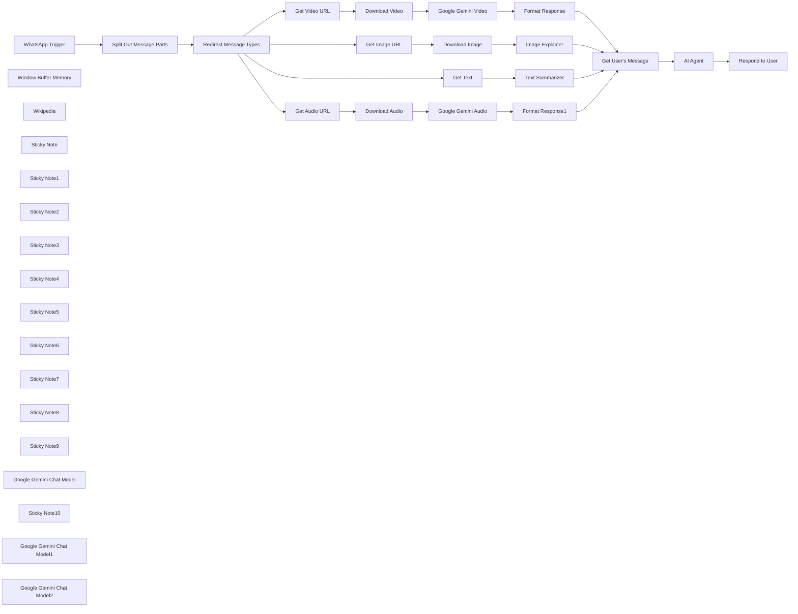

## Fluxo (.json) :

```json
{
  "meta": {
    "instanceId": "408f9fb9940c3cb18ffdef0e0150fe342d6e655c3a9fac21f0f644e8bedabcd9"
  },
  "nodes": [
    {
      "id": "38ffe41a-ecdf-4bb4-bd55-51998abab0f5",
      "name": "WhatsApp Trigger",
      "type": "n8n-nodes-base.whatsAppTrigger",
      "position": [
        220,
        300
      ],
      "webhookId": "0b1b3a9b-2f6a-4f5a-8385-6365d96f4802",
      "parameters": {
        "updates": [
          "messages"
        ]
      },
      "credentials": {
        "whatsAppTriggerApi": {
          "id": "H3uYNtpeczKMqtYm",
          "name": "WhatsApp OAuth account"
        }
      },
      "typeVersion": 1
    },
    {
      "id": "a35ac268-eff0-46cd-ac4e-c9b047a3f893",
      "name": "Get Audio URL",
      "type": "n8n-nodes-base.whatsApp",
      "position": [
        1020,
        -160
      ],
      "parameters": {
        "resource": "media",
        "operation": "mediaUrlGet",
        "mediaGetId": "={{ $json.audio.id }}",
        "requestOptions": {}
      },
      "credentials": {
        "whatsAppApi": {
          "id": "9SFJPeqrpChOkAmw",
          "name": "WhatsApp account"
        }
      },
      "typeVersion": 1
    },
    {
      "id": "a3be543c-949c-4443-bf82-e0d00419ae23",
      "name": "Get Video URL",
      "type": "n8n-nodes-base.whatsApp",
      "position": [
        1020,
        200
      ],
      "parameters": {
        "resource": "media",
        "operation": "mediaUrlGet",
        "mediaGetId": "={{ $json.video.id }}",
        "requestOptions": {}
      },
      "credentials": {
        "whatsAppApi": {
          "id": "9SFJPeqrpChOkAmw",
          "name": "WhatsApp account"
        }
      },
      "typeVersion": 1
    },
    {
      "id": "dd3cd0e7-0d1e-40cf-8120-aba0d1646d6d",
      "name": "Get Image URL",
      "type": "n8n-nodes-base.whatsApp",
      "position": [
        1020,
        540
      ],
      "parameters": {
        "resource": "media",
        "operation": "mediaUrlGet",
        "mediaGetId": "={{ $json.image.id }}",
        "requestOptions": {}
      },
      "credentials": {
        "whatsAppApi": {
          "id": "9SFJPeqrpChOkAmw",
          "name": "WhatsApp account"
        }
      },
      "typeVersion": 1
    },
    {
      "id": "a3505c93-2719-4a11-8813-39844fe0dd1a",
      "name": "Download Video",
      "type": "n8n-nodes-base.httpRequest",
      "position": [
        1180,
        200
      ],
      "parameters": {
        "url": "={{ $json.url }}",
        "options": {},
        "authentication": "predefinedCredentialType",
        "nodeCredentialType": "whatsAppApi"
      },
      "credentials": {
        "whatsAppApi": {
          "id": "9SFJPeqrpChOkAmw",
          "name": "WhatsApp account"
        }
      },
      "typeVersion": 4.2
    },
    {
      "id": "b22e3a7d-5fa1-4b8d-be08-b59f5bb5c417",
      "name": "Download Audio",
      "type": "n8n-nodes-base.httpRequest",
      "position": [
        1180,
        -160
      ],
      "parameters": {
        "url": "={{ $json.url }}",
        "options": {},
        "authentication": "predefinedCredentialType",
        "nodeCredentialType": "whatsAppApi"
      },
      "credentials": {
        "whatsAppApi": {
          "id": "9SFJPeqrpChOkAmw",
          "name": "WhatsApp account"
        }
      },
      "typeVersion": 4.2
    },
    {
      "id": "dcadbd30-598e-443b-a3a7-10d7f9210f49",
      "name": "Download Image",
      "type": "n8n-nodes-base.httpRequest",
      "position": [
        1180,
        540
      ],
      "parameters": {
        "url": "={{ $json.url }}",
        "options": {},
        "authentication": "predefinedCredentialType",
        "nodeCredentialType": "whatsAppApi"
      },
      "credentials": {
        "whatsAppApi": {
          "id": "9SFJPeqrpChOkAmw",
          "name": "WhatsApp account"
        }
      },
      "typeVersion": 4.2
    },
    {
      "id": "d38b6f73-272e-4833-85fc-46ce0db91f6a",
      "name": "Window Buffer Memory",
      "type": "@n8n/n8n-nodes-langchain.memoryBufferWindow",
      "position": [
        2380,
        560
      ],
      "parameters": {
        "sessionKey": "=whatsapp-tutorial-{{ $json.from }}",
        "sessionIdType": "customKey"
      },
      "typeVersion": 1.2
    },
    {
      "id": "3459f96b-c0de-4514-9d53-53a9b40d534e",
      "name": "Get User's Message",
      "type": "n8n-nodes-base.set",
      "position": [
        2080,
        380
      ],
      "parameters": {
        "options": {},
        "assignments": {
          "assignments": [
            {
              "id": "d990cbd6-a408-4ec4-a889-41be698918d9",
              "name": "message_type",
              "type": "string",
              "value": "={{ $('Split Out Message Parts').item.json.type }}"
            },
            {
              "id": "23b785c3-f38e-4706-80b7-51f333bba3bd",
              "name": "message_text",
              "type": "string",
              "value": "={{ $json.text }}"
            },
            {
              "id": "6e83f9a7-cf75-4182-b2d2-3151e8af76b9",
              "name": "from",
              "type": "string",
              "value": "={{ $('WhatsApp Trigger').item.json.messages[0].from }}"
            },
            {
              "id": "da4b602a-28ca-4b0d-a747-c3d3698c3731",
              "name": "message_caption",
              "type": "string",
              "value": "={{ $('Redirect Message Types').item.json.video && $('Redirect Message Types').item.json.video.caption || '' }}\n{{ $('Redirect Message Types').item.json.image && $('Redirect Message Types').item.json.image.caption || ''}}\n{{ $('Redirect Message Types').item.json.audio && $('Redirect Message Types').item.json.audio.caption || ''}}"
            }
          ]
        }
      },
      "typeVersion": 3.4
    },
    {
      "id": "7a4c9905-37f0-4cfe-a928-91c7e38914b9",
      "name": "Split Out Message Parts",
      "type": "n8n-nodes-base.splitOut",
      "position": [
        460,
        300
      ],
      "parameters": {
        "options": {},
        "fieldToSplitOut": "messages"
      },
      "typeVersion": 1
    },
    {
      "id": "f2ecc9a9-bdd9-475d-be0c-43594d0cb613",
      "name": "Wikipedia",
      "type": "@n8n/n8n-nodes-langchain.toolWikipedia",
      "position": [
        2500,
        560
      ],
      "parameters": {},
      "typeVersion": 1
    },
    {
      "id": "325dac6d-6698-41e0-8d2f-9ac5d84c245e",
      "name": "Redirect Message Types",
      "type": "n8n-nodes-base.switch",
      "position": [
        740,
        380
      ],
      "parameters": {
        "rules": {
          "values": [
            {
              "outputKey": "Audio Message",
              "conditions": {
                "options": {
                  "version": 2,
                  "leftValue": "",
                  "caseSensitive": true,
                  "typeValidation": "strict"
                },
                "combinator": "and",
                "conditions": [
                  {
                    "operator": {
                      "type": "boolean",
                      "operation": "true",
                      "singleValue": true
                    },
                    "leftValue": "={{ $json.type == 'audio' && Boolean($json.audio) }}",
                    "rightValue": "audio"
                  }
                ]
              },
              "renameOutput": true
            },
            {
              "outputKey": "Video Message",
              "conditions": {
                "options": {
                  "version": 2,
                  "leftValue": "",
                  "caseSensitive": true,
                  "typeValidation": "strict"
                },
                "combinator": "and",
                "conditions": [
                  {
                    "id": "82aa5ff4-c9b6-4187-a27e-c7c5d9bfdda0",
                    "operator": {
                      "type": "boolean",
                      "operation": "true",
                      "singleValue": true
                    },
                    "leftValue": "={{ $json.type == 'video' && Boolean($json.video) }}",
                    "rightValue": ""
                  }
                ]
              },
              "renameOutput": true
            },
            {
              "outputKey": "Image Message",
              "conditions": {
                "options": {
                  "version": 2,
                  "leftValue": "",
                  "caseSensitive": true,
                  "typeValidation": "strict"
                },
                "combinator": "and",
                "conditions": [
                  {
                    "id": "05b30af4-967b-4824-abdc-84a8292ac0e5",
                    "operator": {
                      "type": "boolean",
                      "operation": "true",
                      "singleValue": true
                    },
                    "leftValue": "={{ $json.type == 'image' && Boolean($json.image) }}",
                    "rightValue": ""
                  }
                ]
              },
              "renameOutput": true
            }
          ]
        },
        "options": {
          "fallbackOutput": "extra",
          "renameFallbackOutput": "Text Message"
        }
      },
      "typeVersion": 3.2
    },
    {
      "id": "b25c7d65-b9ea-4f90-8516-1747130501b2",
      "name": "Sticky Note",
      "type": "n8n-nodes-base.stickyNote",
      "position": [
        220,
        20
      ],
      "parameters": {
        "color": 7,
        "width": 335.8011507479863,
        "height": 245.72612197928734,
        "content": "## 1. WhatsApp Trigger\n[Learn more about the WhatsApp Trigger](https://docs.n8n.io/integrations/builtin/trigger-nodes/n8n-nodes-base.whatsapptrigger)\n\nTo start receiving WhatsApp messages in your workflow, there are quite a few steps involved so be sure to follow the n8n documentation. When we recieve WhatsApp messages, we'll split out the messages part of the payload and handle them depending on the message type using the Switch node."
      },
      "typeVersion": 1
    },
    {
      "id": "0d3d721e-fefc-4b50-abe1-0dd504c962ff",
      "name": "Sticky Note1",
      "type": "n8n-nodes-base.stickyNote",
      "position": [
        1020,
        -280
      ],
      "parameters": {
        "color": 7,
        "width": 356.65822784810103,
        "height": 97.23360184119679,
        "content": "### 2. Transcribe Audio Messages 💬\nFor audio messages or voice notes, we can use GPT4o to transcribe the message for our AI Agent."
      },
      "typeVersion": 1
    },
    {
      "id": "59de051e-f0d4-4c07-9680-03923ab81f57",
      "name": "Sticky Note2",
      "type": "n8n-nodes-base.stickyNote",
      "position": [
        1020,
        40
      ],
      "parameters": {
        "color": 7,
        "width": 492.5258918296896,
        "height": 127.13555811277331,
        "content": "### 3. Describe Video Messages 🎬\nFor video messages, one approach is to use a Multimodal Model that supports parsing video. Currently, Google Gemini is a well-tested service for this task. We'll need to use the HTTP request node as currrently n8n's LLM node doesn't currently support video binary types."
      },
      "typeVersion": 1
    },
    {
      "id": "e2ca780f-01c0-4a5f-9f0a-e15575d0b803",
      "name": "Sticky Note3",
      "type": "n8n-nodes-base.stickyNote",
      "position": [
        1020,
        420
      ],
      "parameters": {
        "color": 7,
        "width": 356.65822784810103,
        "height": 97.23360184119679,
        "content": "### 4. Analyse Image Messages 🏞️\nFor image messages, we can use GPT4o to explain what is going on in the message for our AI Agent."
      },
      "typeVersion": 1
    },
    {
      "id": "6eea3c0f-4501-4355-b3b7-b752c93d5c48",
      "name": "Sticky Note4",
      "type": "n8n-nodes-base.stickyNote",
      "position": [
        1020,
        720
      ],
      "parameters": {
        "color": 7,
        "width": 428.24395857307246,
        "height": 97.23360184119679,
        "content": "### 5. Text summarizer 📘\nFor text messages, we don't need to do much transformation but it's nice to summarize for easier understanding."
      },
      "typeVersion": 1
    },
    {
      "id": "925a3871-9cdb-49f9-a2b9-890617d09965",
      "name": "Get Text",
      "type": "n8n-nodes-base.wait",
      "position": [
        1020,
        840
      ],
      "webhookId": "99b49c83-d956-46d2-b8d3-d65622121ad9",
      "parameters": {
        "amount": 0
      },
      "typeVersion": 1.1
    },
    {
      "id": "9225a6b9-322a-4a33-86af-6586fcf246b9",
      "name": "Sticky Note5",
      "type": "n8n-nodes-base.stickyNote",
      "position": [
        2280,
        60
      ],
      "parameters": {
        "color": 7,
        "width": 500.7797468354428,
        "height": 273.14522439585744,
        "content": "## 6. Generate Response with AI Agent\n[Read more about the AI Agent node](https://docs.n8n.io/integrations/builtin/cluster-nodes/root-nodes/n8n-nodes-langchain.agent)\n\nNow that we'll able to handle all message types from WhatsApp, we could do pretty much anything we want with it by giving it our AI agent. Examples could include handling customer support, helping to book appointments or verifying documents.\n\nIn this demonstration, we'll just create a simple AI Agent which responds to our WhatsApp user's message and returns a simple response."
      },
      "typeVersion": 1
    },
    {
      "id": "5a863e5d-e7fb-4e89-851b-e0936f5937e7",
      "name": "Sticky Note6",
      "type": "n8n-nodes-base.stickyNote",
      "position": [
        2740,
        660
      ],
      "parameters": {
        "color": 7,
        "width": 384.12151898734186,
        "height": 211.45776754890682,
        "content": "## 7. Respond to WhatsApp User\n[Read more about the Whatsapp node](https://docs.n8n.io/integrations/builtin/app-nodes/n8n-nodes-base.whatsapp/)\n\nTo close out this demonstration, we'll simple send a simple text message back to the user. Note that this WhatsApp node also allows you to send images, audio, videos, documents as well as location!"
      },
      "typeVersion": 1
    },
    {
      "id": "89df6f6c-2d91-4c14-a51a-4be29b1018ec",
      "name": "Respond to User",
      "type": "n8n-nodes-base.whatsApp",
      "position": [
        2740,
        480
      ],
      "parameters": {
        "textBody": "={{ $json.output }}",
        "operation": "send",
        "phoneNumberId": "477115632141067",
        "requestOptions": {},
        "additionalFields": {},
        "recipientPhoneNumber": "={{ $('WhatsApp Trigger').item.json.messages[0].from }}"
      },
      "credentials": {
        "whatsAppApi": {
          "id": "9SFJPeqrpChOkAmw",
          "name": "WhatsApp account"
        }
      },
      "typeVersion": 1
    },
    {
      "id": "67709b9e-a9b3-456b-9e68-71720b0cd75e",
      "name": "Sticky Note7",
      "type": "n8n-nodes-base.stickyNote",
      "position": [
        -340,
        -140
      ],
      "parameters": {
        "width": 470.66513233601853,
        "height": 562.8608514850005,
        "content": "## Try It Out!\n\n### This n8n template demonstrates the beginnings of building your own n8n-powered WhatsApp chatbot! Under the hood, utilise n8n's powerful AI features to handle different message types and use an AI agent to respond to the user. A powerful tool for any use-case!\n\n* Incoming WhatsApp Trigger provides a way to get messages into the workflow.\n* The message received is extracted and sent through 1 of 4 branches for processing.\n* Each processing branch uses AI to analyse, summarize or transcribe the message so that the AI agent can understand it.\n* The AI Agent is used to generate a response generally and uses a wikipedia tool for more complex queries.\n* Finally, the response message is sent back to the WhatsApp user using the WhatsApp node.\n\n### Need Help?\nJoin the [Discord](https://discord.com/invite/XPKeKXeB7d) or ask in the [Forum](https://community.n8n.io/)!"
      },
      "typeVersion": 1
    },
    {
      "id": "10ae1f60-c025-4b63-8e02-4e6353bb67dc",
      "name": "Sticky Note8",
      "type": "n8n-nodes-base.stickyNote",
      "position": [
        -340,
        440
      ],
      "parameters": {
        "color": 5,
        "width": 473.28063885246377,
        "height": 96.0144533433243,
        "content": "### Activate workflow to use!\nYou must activate the workflow to use this WhatsApp Chabot. If you are self-hosting, ensure WhatsApp is able to connect to your server."
      },
      "typeVersion": 1
    },
    {
      "id": "2f0fd658-a138-4f50-95a7-7ddc4eb90fab",
      "name": "Image Explainer",
      "type": "@n8n/n8n-nodes-langchain.chainLlm",
      "position": [
        1700,
        540
      ],
      "parameters": {
        "text": "Here is an image sent by the user. Describe the image and transcribe any text visible in the image.",
        "messages": {
          "messageValues": [
            {
              "type": "HumanMessagePromptTemplate",
              "messageType": "imageBinary"
            }
          ]
        },
        "promptType": "define"
      },
      "typeVersion": 1.4
    },
    {
      "id": "d969ce8b-d6c4-4918-985e-3420557ef707",
      "name": "Format Response",
      "type": "n8n-nodes-base.set",
      "position": [
        1860,
        200
      ],
      "parameters": {
        "options": {},
        "assignments": {
          "assignments": [
            {
              "id": "2ec0e573-373b-4692-bfae-86b6d3b9aa9a",
              "name": "text",
              "type": "string",
              "value": "={{ $json.candidates[0].content.parts[0].text }}"
            }
          ]
        }
      },
      "typeVersion": 3.4
    },
    {
      "id": "b67c9c4e-e13f-4ee4-bf01-3fd9055a91be",
      "name": "Sticky Note9",
      "type": "n8n-nodes-base.stickyNote",
      "position": [
        1540,
        180
      ],
      "parameters": {
        "width": 260,
        "height": 305.35604142692785,
        "content": "\n\n\n\n\n\n\n\n\n\n\n\n\n\n### 🚨 Google Gemini Required!\nNot using Gemini? Feel free to swap this out for any Multimodal Model that supports Video."
      },
      "typeVersion": 1
    },
    {
      "id": "8dd972be-305b-4d26-aa05-1dee17411d8a",
      "name": "Google Gemini Chat Model",
      "type": "@n8n/n8n-nodes-langchain.lmChatGoogleGemini",
      "position": [
        2240,
        560
      ],
      "parameters": {
        "options": {},
        "modelName": "models/gemini-1.5-pro-002"
      },
      "credentials": {
        "googlePalmApi": {
          "id": "dSxo6ns5wn658r8N",
          "name": "Google Gemini(PaLM) Api account"
        }
      },
      "typeVersion": 1
    },
    {
      "id": "00a883a6-7688-4e82-926b-c5ba680378b7",
      "name": "Sticky Note10",
      "type": "n8n-nodes-base.stickyNote",
      "position": [
        1540,
        -180
      ],
      "parameters": {
        "width": 260,
        "height": 294.22048331415436,
        "content": "\n\n\n\n\n\n\n\n\n\n\n\n\n\n### 🚨 Google Gemini Required!\nNot using Gemini? Feel free to swap this out for any Multimodal Model that supports Audio."
      },
      "typeVersion": 1
    },
    {
      "id": "d0c7c2f6-b626-4ec5-86ff-96523749db2c",
      "name": "Google Gemini Audio",
      "type": "n8n-nodes-base.httpRequest",
      "position": [
        1620,
        -160
      ],
      "parameters": {
        "url": "https://generativelanguage.googleapis.com/v1beta/models/gemini-1.5-pro-002:generateContent",
        "method": "POST",
        "options": {},
        "jsonBody": "={{\n{\n  \"contents\": [{\n    \"parts\":[\n      {\"text\": \"Transcribe this audio\"},\n      {\"inlineData\": {\n        \"mimeType\": `audio/${$binary.data.fileExtension}`,\n        \"data\": $input.item.binary.data.data }\n      }\n    ]\n  }]\n}\n}}",
        "sendBody": true,
        "sendHeaders": true,
        "specifyBody": "json",
        "authentication": "predefinedCredentialType",
        "headerParameters": {
          "parameters": [
            {
              "name": "Content-Type",
              "value": "application/json"
            }
          ]
        },
        "nodeCredentialType": "googlePalmApi"
      },
      "credentials": {
        "googlePalmApi": {
          "id": "dSxo6ns5wn658r8N",
          "name": "Google Gemini(PaLM) Api account"
        }
      },
      "typeVersion": 4.2
    },
    {
      "id": "27261815-f949-48e8-920d-7bf880ea87ce",
      "name": "Google Gemini Video",
      "type": "n8n-nodes-base.httpRequest",
      "position": [
        1620,
        200
      ],
      "parameters": {
        "url": "https://generativelanguage.googleapis.com/v1beta/models/gemini-1.5-pro-002:generateContent",
        "method": "POST",
        "options": {},
        "jsonBody": "={{\n{\n  \"contents\": [{\n    \"parts\":[\n      {\"text\": \"Describe this video\"},\n      {\"inlineData\": {\n        \"mimeType\": `video/${$binary.data.fileExtension}`,\n        \"data\": $input.item.binary.data.data }\n      }\n    ]\n  }]\n}\n}}",
        "sendBody": true,
        "sendHeaders": true,
        "specifyBody": "json",
        "authentication": "predefinedCredentialType",
        "headerParameters": {
          "parameters": [
            {
              "name": "Content-Type",
              "value": "application/json"
            }
          ]
        },
        "nodeCredentialType": "googlePalmApi"
      },
      "credentials": {
        "googlePalmApi": {
          "id": "dSxo6ns5wn658r8N",
          "name": "Google Gemini(PaLM) Api account"
        }
      },
      "typeVersion": 4.2
    },
    {
      "id": "7e28786b-ab19-4969-9915-2432a25b49d3",
      "name": "Google Gemini Chat Model1",
      "type": "@n8n/n8n-nodes-langchain.lmChatGoogleGemini",
      "position": [
        1680,
        680
      ],
      "parameters": {
        "options": {},
        "modelName": "models/gemini-1.5-pro-002"
      },
      "credentials": {
        "googlePalmApi": {
          "id": "dSxo6ns5wn658r8N",
          "name": "Google Gemini(PaLM) Api account"
        }
      },
      "typeVersion": 1
    },
    {
      "id": "8832dac3-9433-4dcc-a805-346408042bf2",
      "name": "Google Gemini Chat Model2",
      "type": "@n8n/n8n-nodes-langchain.lmChatGoogleGemini",
      "position": [
        1680,
        980
      ],
      "parameters": {
        "options": {},
        "modelName": "models/gemini-1.5-pro-002"
      },
      "credentials": {
        "googlePalmApi": {
          "id": "dSxo6ns5wn658r8N",
          "name": "Google Gemini(PaLM) Api account"
        }
      },
      "typeVersion": 1
    },
    {
      "id": "73d0af9e-d009-4859-b60d-48a2fbeda932",
      "name": "Format Response1",
      "type": "n8n-nodes-base.set",
      "position": [
        1860,
        -160
      ],
      "parameters": {
        "options": {},
        "assignments": {
          "assignments": [
            {
              "id": "2ec0e573-373b-4692-bfae-86b6d3b9aa9a",
              "name": "text",
              "type": "string",
              "value": "={{ $json.candidates[0].content.parts[0].text }}"
            }
          ]
        }
      },
      "typeVersion": 3.4
    },
    {
      "id": "2ad0e104-0924-47ef-ad11-d84351d72083",
      "name": "Text Summarizer",
      "type": "@n8n/n8n-nodes-langchain.chainLlm",
      "position": [
        1700,
        840
      ],
      "parameters": {
        "text": "={{ $json.text.body || $json.text }}",
        "messages": {
          "messageValues": [
            {
              "message": "Summarize the user's message succinctly."
            }
          ]
        },
        "promptType": "define"
      },
      "typeVersion": 1.4
    },
    {
      "id": "85eaad3a-c4d1-4ae7-a37b-0b72be39409d",
      "name": "AI Agent",
      "type": "@n8n/n8n-nodes-langchain.agent",
      "position": [
        2280,
        380
      ],
      "parameters": {
        "text": "=The user sent the following message\nmessage type: {{ $json.message_type }}\nmessage text or description:\n```{{ $json.message_text }}```\n{{ $json.message_caption ? `message caption: ${$json.message_caption.trim()}` : '' }}",
        "options": {
          "systemMessage": "You are a general knowledge assistant made available to the public via whatsapp. Help answer the user's query succiently and factually."
        },
        "promptType": "define"
      },
      "typeVersion": 1.6
    }
  ],
  "pinData": {},
  "connections": {
    "AI Agent": {
      "main": [
        [
          {
            "node": "Respond to User",
            "type": "main",
            "index": 0
          }
        ]
      ]
    },
    "Get Text": {
      "main": [
        [
          {
            "node": "Text Summarizer",
            "type": "main",
            "index": 0
          }
        ]
      ]
    },
    "Wikipedia": {
      "ai_tool": [
        [
          {
            "node": "AI Agent",
            "type": "ai_tool",
            "index": 0
          }
        ]
      ]
    },
    "Get Audio URL": {
      "main": [
        [
          {
            "node": "Download Audio",
            "type": "main",
            "index": 0
          }
        ]
      ]
    },
    "Get Image URL": {
      "main": [
        [
          {
            "node": "Download Image",
            "type": "main",
            "index": 0
          }
        ]
      ]
    },
    "Get Video URL": {
      "main": [
        [
          {
            "node": "Download Video",
            "type": "main",
            "index": 0
          }
        ]
      ]
    },
    "Download Audio": {
      "main": [
        [
          {
            "node": "Google Gemini Audio",
            "type": "main",
            "index": 0
          }
        ]
      ]
    },
    "Download Image": {
      "main": [
        [
          {
            "node": "Image Explainer",
            "type": "main",
            "index": 0
          }
        ]
      ]
    },
    "Download Video": {
      "main": [
        [
          {
            "node": "Google Gemini Video",
            "type": "main",
            "index": 0
          }
        ]
      ]
    },
    "Format Response": {
      "main": [
        [
          {
            "node": "Get User's Message",
            "type": "main",
            "index": 0
          }
        ]
      ]
    },
    "Image Explainer": {
      "main": [
        [
          {
            "node": "Get User's Message",
            "type": "main",
            "index": 0
          }
        ]
      ]
    },
    "Text Summarizer": {
      "main": [
        [
          {
            "node": "Get User's Message",
            "type": "main",
            "index": 0
          }
        ]
      ]
    },
    "Format Response1": {
      "main": [
        [
          {
            "node": "Get User's Message",
            "type": "main",
            "index": 0
          }
        ]
      ]
    },
    "WhatsApp Trigger": {
      "main": [
        [
          {
            "node": "Split Out Message Parts",
            "type": "main",
            "index": 0
          }
        ]
      ]
    },
    "Get User's Message": {
      "main": [
        [
          {
            "node": "AI Agent",
            "type": "main",
            "index": 0
          }
        ]
      ]
    },
    "Google Gemini Audio": {
      "main": [
        [
          {
            "node": "Format Response1",
            "type": "main",
            "index": 0
          }
        ]
      ]
    },
    "Google Gemini Video": {
      "main": [
        [
          {
            "node": "Format Response",
            "type": "main",
            "index": 0
          }
        ]
      ]
    },
    "Window Buffer Memory": {
      "ai_memory": [
        [
          {
            "node": "AI Agent",
            "type": "ai_memory",
            "index": 0
          }
        ]
      ]
    },
    "Redirect Message Types": {
      "main": [
        [
          {
            "node": "Get Audio URL",
            "type": "main",
            "index": 0
          }
        ],
        [
          {
            "node": "Get Video URL",
            "type": "main",
            "index": 0
          }
        ],
        [
          {
            "node": "Get Image URL",
            "type": "main",
            "index": 0
          }
        ],
        [
          {
            "node": "Get Text",
            "type": "main",
            "index": 0
          }
        ]
      ]
    },
    "Split Out Message Parts": {
      "main": [
        [
          {
            "node": "Redirect Message Types",
            "type": "main",
            "index": 0
          }
        ]
      ]
    },
    "Google Gemini Chat Model": {
      "ai_languageModel": [
        [
          {
            "node": "AI Agent",
            "type": "ai_languageModel",
            "index": 0
          }
        ]
      ]
    },
    "Google Gemini Chat Model1": {
      "ai_languageModel": [
        [
          {
            "node": "Image Explainer",
            "type": "ai_languageModel",
            "index": 0
          }
        ]
      ]
    },
    "Google Gemini Chat Model2": {
      "ai_languageModel": [
        [
          {
            "node": "Text Summarizer",
            "type": "ai_languageModel",
            "index": 0
          }
        ]
      ]
    }
  }
}
```

<a id="template-1472"></a>

## Template 1472 - Validação de e-mail e extração de domínio

- **Nome:** Validação de e-mail e extração de domínio
- **Descrição:** Fluxo que recebe uma lista de e-mails (aqui com dados de teste), valida cada e-mail e extrai o domínio para uso posterior.
- **Funcionalidade:** • Início manual: permite executar o fluxo sob demanda para testes.
• Geração de dados de teste: cria uma lista de e-mails fictícios para validar o processo antes de usar dados reais.
• Validação de e-mail: verifica se cada endereço segue o formato válido de e-mail.
• Extração de domínio: obtém o domínio do endereço de e-mail (parte após o @) para classificação ou roteamento.
• Definição de campos de saída: produz registros com o e-mail original, indicador de validade e domínio extraído.
- **Ferramentas:** • Gerador de dados de teste: fornece e-mails fictícios usados como entrada durante o desenvolvimento e testes.
• Fonte de dados real (opcional): pode ser uma base de dados, planilha ou API para fornecer os e-mails a serem validados em produção.

## Fluxo visual

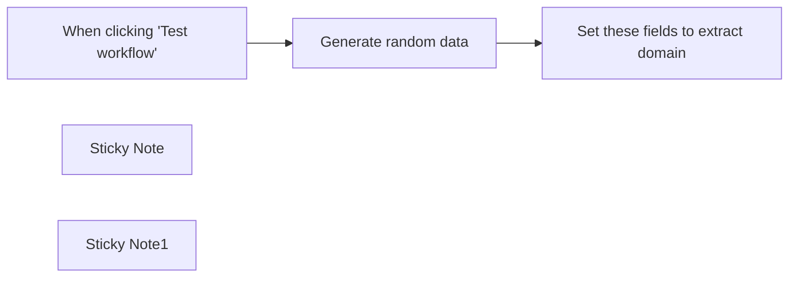

## Fluxo (.json) :

```json
{
  "meta": {
    "instanceId": "8eadf351d49a11e77d3a57adf374670f06c5294af8b1b7c86a1123340397e728"
  },
  "nodes": [
    {
      "id": "2f7c95cb-2545-48b6-aa77-55a6619aa3b6",
      "name": "When clicking \"Test workflow\"",
      "type": "n8n-nodes-base.manualTrigger",
      "position": [
        140,
        240
      ],
      "parameters": {},
      "typeVersion": 1
    },
    {
      "id": "1cb42024-9743-4002-b0f5-180d3d95fc44",
      "name": "Sticky Note",
      "type": "n8n-nodes-base.stickyNote",
      "position": [
        100,
        22
      ],
      "parameters": {
        "color": 4,
        "width": 818,
        "height": 446,
        "content": "## Email Validation and extract domain\n** This workflow is aimed at making email validation and domain extract using the native functionalities in n8n\n\n** Replace the debugger node with your actual data source to validate your own emails"
      },
      "typeVersion": 1
    },
    {
      "id": "215ff8f7-f94b-4999-a0db-c3ee93041001",
      "name": "Set these fields to extract domain",
      "type": "n8n-nodes-base.set",
      "position": [
        660,
        240
      ],
      "parameters": {
        "options": {},
        "assignments": {
          "assignments": [
            {
              "id": "be48e606-536b-48a0-a0b9-ba1ca0296e75",
              "name": "Valid EmailIs email ",
              "type": "string",
              "value": "={{ $json.email.isEmail() }}"
            },
            {
              "id": "68e983c1-3f12-45ab-a441-ca54444a1f42",
              "name": "Extract Domain",
              "type": "string",
              "value": "={{ $json.email.extractDomain() }}"
            },
            {
              "id": "37447324-b80a-40cf-a41e-92c7550f3702",
              "name": "email",
              "type": "string",
              "value": "={{ $json.email }}"
            }
          ]
        }
      },
      "typeVersion": 3.3
    },
    {
      "id": "e85e9445-2f43-4545-a41d-f9ced6e8c8d9",
      "name": "Generate random data",
      "type": "n8n-nodes-base.debugHelper",
      "position": [
        420,
        240
      ],
      "parameters": {
        "category": "randomData",
        "randomDataType": "email"
      },
      "typeVersion": 1
    },
    {
      "id": "d7bb0ffd-df07-4f1b-be68-1776fc3fe7e4",
      "name": "Sticky Note1",
      "type": "n8n-nodes-base.stickyNote",
      "position": [
        360,
        160
      ],
      "parameters": {
        "height": 253,
        "content": "\nMake sure you replace the Generate random data with your actual data"
      },
      "typeVersion": 1
    }
  ],
  "pinData": {
    "Generate random data": [
      {
        "email": "Megan.Lueilwitz@yahoo.com",
        "confirmed": true
      },
      {
        "email": "Tommie70@yahoo.com",
        "confirmed": true
      },
      {
        "email": "Joanna.Fisher@yahoo.com",
        "confirmed": false
      },
      {
        "email": "Terrence.Hettinger@yahoo.com",
        "confirmed": false
      },
      {
        "email": "Eddie.Bradtke@hotmail.com",
        "confirmed": false
      },
      {
        "email": "Marcus.Considine64@yahoo.com",
        "confirmed": true
      },
      {
        "email": "Constance.Markshotmail.com",
        "confirmed": false
      },
      {
        "email": "Dominick.Corwin@yahoo.com",
        "confirmed": true
      },
      {
        "email": "Ellen54@yahoo.com",
        "confirmed": true
      },
      {
        "email": "Angel.Hartmann40@hotmail.com",
        "confirmed": false
      }
    ]
  },
  "connections": {
    "Generate random data": {
      "main": [
        [
          {
            "node": "Set these fields to extract domain",
            "type": "main",
            "index": 0
          }
        ]
      ]
    },
    "When clicking \"Test workflow\"": {
      "main": [
        [
          {
            "node": "Generate random data",
            "type": "main",
            "index": 0
          }
        ]
      ]
    }
  }
}
```

<a id="template-1474"></a>

## Template 1474 - Preencher title e meta description a partir de URLs

- **Nome:** Preencher title e meta description a partir de URLs
- **Descrição:** Busca registros no Airtable que têm URL mas estão sem title tag e meta description, obtém o conteúdo das páginas e preenche os campos de título e descrição no Airtable.
- **Funcionalidade:** • Disparo manual para testes: Permite executar a automação manualmente para verificar o funcionamento.
• Busca de registros filtrados no Airtable: Seleciona registros com URL preenchida e sem title tag nem meta desc usando uma fórmula de filtro.
• Limitação do lote de processamento: Permite definir um limite de registros a serem processados por execução (ex.: 10).
• Requisição HTTP às URLs: Faz requisições às páginas apontadas pelas URLs armazenadas para obter o HTML.
• Extração de conteúdo HTML: Extrai a tag <title> e a meta description do HTML recuperado.
• Atualização dos registros no Airtable: Insere os valores extraídos nos campos "title tag" e "meta desc" do registro original.
• Sugestão de automação adicional: Possibilidade de calcular o comprimento dos campos via fórmula no Airtable ou acionar por webhook para automatizar continuamente.
- **Ferramentas:** • Airtable: Banco de dados onde estão armazenadas as URLs e os campos de title tag e meta description, utilizado para leitura e atualização de registros.
• Páginas web públicas (HTTP): Fontes das quais o HTML é obtido para extrair a tag title e a meta description.

## Fluxo visual

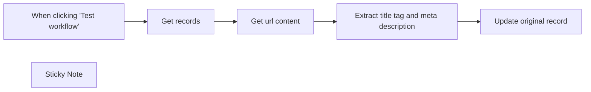

## Fluxo (.json) :

```json
{
  "meta": {
    "instanceId": "9890889b6220dd611ebaa1144286714cf45b0e89f22a3c881f9e9d30deb831db"
  },
  "nodes": [
    {
      "id": "b9962fd6-af11-4a3a-935c-c168ac85eaa1",
      "name": "When clicking \"Test workflow\"",
      "type": "n8n-nodes-base.manualTrigger",
      "position": [
        80,
        300
      ],
      "parameters": {},
      "typeVersion": 1
    },
    {
      "id": "2ba3fe3a-e4c5-4014-8cb2-80716f18b222",
      "name": "Get records",
      "type": "n8n-nodes-base.airtable",
      "position": [
        300,
        300
      ],
      "parameters": {
        "base": {
          "__rl": true,
          "mode": "list",
          "value": "appkkDhXu7vZCFspD",
          "cachedResultUrl": "https://airtable.com/appkkDhXu7vZCFspD",
          "cachedResultName": "n8n test"
        },
        "limit": 10,
        "table": {
          "__rl": true,
          "mode": "list",
          "value": "tblMdmUiSTBrvrLq3",
          "cachedResultUrl": "https://airtable.com/appkkDhXu7vZCFspD/tblMdmUiSTBrvrLq3",
          "cachedResultName": "SEO meta title & desc"
        },
        "options": {},
        "operation": "search",
        "returnAll": false,
        "filterByFormula": "=AND(url != \"\", {title tag} = \"\", {meta desc} = \"\")"
      },
      "credentials": {
        "airtableTokenApi": {
          "id": "yw6pm1U4Hw8kKDhu",
          "name": "Airtable Personal Access Token account"
        }
      },
      "typeVersion": 2
    },
    {
      "id": "0f26bb3c-f2cc-476b-b1af-3d4cd98463ce",
      "name": "Get url content",
      "type": "n8n-nodes-base.httpRequest",
      "position": [
        500,
        300
      ],
      "parameters": {
        "url": "={{ $json.url }}",
        "options": {}
      },
      "typeVersion": 4.2
    },
    {
      "id": "3c67c390-5144-44cb-8618-d7e7e6c6cae5",
      "name": "Extract title tag and meta description",
      "type": "n8n-nodes-base.html",
      "position": [
        700,
        300
      ],
      "parameters": {
        "options": {},
        "operation": "extractHtmlContent",
        "extractionValues": {
          "values": [
            {
              "key": "titleTag",
              "cssSelector": "title"
            },
            {
              "key": "metaDesc",
              "attribute": "content",
              "cssSelector": "meta[name=\"description\"]",
              "returnValue": "attribute"
            }
          ]
        }
      },
      "typeVersion": 1.2
    },
    {
      "id": "7028b7af-0959-4ed5-bc54-fceb2e224976",
      "name": "Update original record",
      "type": "n8n-nodes-base.airtable",
      "position": [
        940,
        300
      ],
      "parameters": {
        "base": {
          "__rl": true,
          "mode": "list",
          "value": "appkkDhXu7vZCFspD",
          "cachedResultUrl": "https://airtable.com/appkkDhXu7vZCFspD",
          "cachedResultName": "n8n test"
        },
        "table": {
          "__rl": true,
          "mode": "list",
          "value": "tblMdmUiSTBrvrLq3",
          "cachedResultUrl": "https://airtable.com/appkkDhXu7vZCFspD/tblMdmUiSTBrvrLq3",
          "cachedResultName": "SEO meta title & desc"
        },
        "columns": {
          "value": {
            "id": "={{ $('Get records').item.json.id }}",
            "meta desc": "={{ $json.metaDesc }}",
            "title tag": "={{ $json.titleTag }}"
          },
          "schema": [
            {
              "id": "id",
              "type": "string",
              "display": true,
              "removed": false,
              "readOnly": true,
              "required": false,
              "displayName": "id",
              "defaultMatch": true
            },
            {
              "id": "url",
              "type": "string",
              "display": true,
              "removed": false,
              "readOnly": false,
              "required": false,
              "displayName": "url",
              "defaultMatch": false,
              "canBeUsedToMatch": true
            },
            {
              "id": "title tag",
              "type": "string",
              "display": true,
              "removed": false,
              "readOnly": false,
              "required": false,
              "displayName": "title tag",
              "defaultMatch": false,
              "canBeUsedToMatch": true
            },
            {
              "id": "meta desc",
              "type": "string",
              "display": true,
              "removed": false,
              "readOnly": false,
              "required": false,
              "displayName": "meta desc",
              "defaultMatch": false,
              "canBeUsedToMatch": true
            },
            {
              "id": "Created",
              "type": "string",
              "display": true,
              "removed": true,
              "readOnly": true,
              "required": false,
              "displayName": "Created",
              "defaultMatch": false,
              "canBeUsedToMatch": true
            },
            {
              "id": "Calculation",
              "type": "string",
              "display": true,
              "removed": true,
              "readOnly": true,
              "required": false,
              "displayName": "Calculation",
              "defaultMatch": false,
              "canBeUsedToMatch": true
            }
          ],
          "mappingMode": "defineBelow",
          "matchingColumns": [
            "id"
          ]
        },
        "options": {},
        "operation": "update"
      },
      "credentials": {
        "airtableTokenApi": {
          "id": "yw6pm1U4Hw8kKDhu",
          "name": "Airtable Personal Access Token account"
        }
      },
      "typeVersion": 2
    },
    {
      "id": "5b518969-553e-462f-ad4f-eb07e9b17eef",
      "name": "Sticky Note",
      "type": "n8n-nodes-base.stickyNote",
      "position": [
        140,
        -60
      ],
      "parameters": {
        "width": 862.7929292929296,
        "height": 316.6010101010099,
        "content": "## How to use the workflow\n1. Set a Base in Airtable with a table with the following structure:\n  `url`, `title tag`, `meta desc`\n2. Connect Airtable to the nodes and, with the following formula, get all the records that miss `title tag` and `meta desc`.\n3. Put a bunch of url in the table in the field `url` and let the workflow work.\n\n## Extra\n\n* You can also calculate the length for title tag and meta desc using formula field inside Airtable. This is the formula:\n  `LEN({title tag})` or `LEN({meta desc})`\n* You can automate the process calling a Webhook from Airtable. For this, you need an Airtable paid plan."
      },
      "typeVersion": 1
    }
  ],
  "pinData": {},
  "connections": {
    "Get records": {
      "main": [
        [
          {
            "node": "Get url content",
            "type": "main",
            "index": 0
          }
        ]
      ]
    },
    "Get url content": {
      "main": [
        [
          {
            "node": "Extract title tag and meta description",
            "type": "main",
            "index": 0
          }
        ]
      ]
    },
    "When clicking \"Test workflow\"": {
      "main": [
        [
          {
            "node": "Get records",
            "type": "main",
            "index": 0
          }
        ]
      ]
    },
    "Extract title tag and meta description": {
      "main": [
        [
          {
            "node": "Update original record",
            "type": "main",
            "index": 0
          }
        ]
      ]
    }
  }
}
```

<a id="template-1476"></a>

## Template 1476 - Extração automática de esquemas de API

- **Nome:** Extração automática de esquemas de API
- **Descrição:** Automatiza a descoberta, extração e agregação de operações de APIs a partir de sites oficiais, armazenando resultados e gerando um arquivo JSON com o esquema agregado.
- **Funcionalidade:** • Leitura de tarefas pendentes: busca na planilha do Google Sheets serviços e URLs que precisam de pesquisa ou extração.
• Pesquisa web por documentação de API: realiza buscas no Google para localizar páginas com documentação e exemplos de API.
• Raspagem de páginas web: acessa páginas encontradas e extrai título e conteúdo relevante, ignorando mídia e scripts.
• Filtragem e deduplicação: remove resultados irrelevantes e duplicados antes do processamento.
• Indexação semântica: gera embeddings do conteúdo das páginas e armazena documentos em um banco vetorial para buscas posteriores.
• Identificação de produtos/soluções: consulta os documentos indexados e usa um modelo de linguagem para identificar produtos ou soluções relevantes do serviço.
• Geração de consultas específicas: cria templates de consulta baseados em produtos identificados para recuperar documentos relevantes ao contexto da API.
• Extração de operações de API: utiliza um modelo de linguagem para extrair endpoints REST (métodos, URLs, descrições) dos documentos selecionados.
• Agrupamento e limpeza de operações: combina, normaliza e remove duplicatas das operações extraídas.
• Armazenamento dos resultados: grava operações extraídas em uma planilha do Google Sheets e atualiza o estado do processo.
• Geração de esquema consolidado: combina todas as operações de um serviço em um JSON estruturado representando o esquema da API.
• Upload do arquivo resultante: salva o JSON gerado no Google Drive e registra o nome do arquivo na planilha.
• Gerenciamento de fluxo e tolerância a erros: usa execução em lotes, esperas e caminhos alternativos para tratar respostas vazias ou falhas durante scraping e extração.
- **Ferramentas:** • Google Sheets: serve como base de dados para listar serviços pendentes, acompanhar status de cada estágio e armazenar operações extraídas.
• Google Drive: armazena o arquivo JSON final contendo o esquema consolidado das APIs.
• Apify (scrapers e atores): executa buscas de SERP e raspagem de páginas web para coletar conteúdo de documentação.
• Qdrant: banco vetorial para armazenar embeddings e permitir buscas semânticas por documentação relevante.
• Modelos Gemini (LLM e embeddings): utilizados para classificar documentos, identificar produtos/soluções, gerar consultas e extrair operações de API a partir do conteúdo.

## Fluxo visual

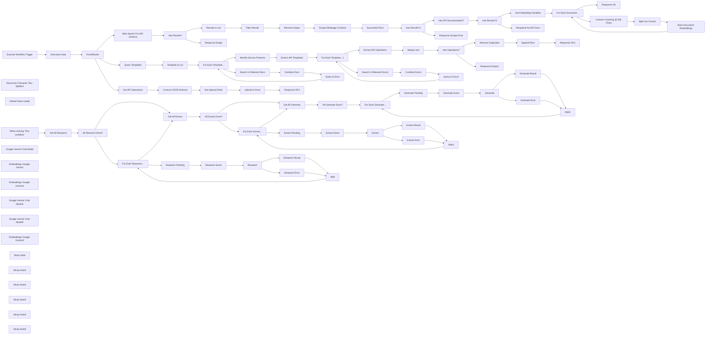

## Fluxo (.json) :

```json
{
  "nodes": [
    {
      "id": "2498bb93-176f-458c-acee-f541859df770",
      "name": "When clicking ‘Test workflow’",
      "type": "n8n-nodes-base.manualTrigger",
      "position": [
        2460,
        2820
      ],
      "parameters": {},
      "typeVersion": 1
    },
    {
      "id": "c08bcf84-9336-44f9-b452-0c9469f18f48",
      "name": "Web Search For API Schema",
      "type": "n8n-nodes-base.httpRequest",
      "onError": "continueRegularOutput",
      "position": [
        3100,
        3820
      ],
      "parameters": {
        "url": "https://api.apify.com/v2/acts/serping~fast-google-search-results-scraper/run-sync-get-dataset-items",
        "method": "POST",
        "options": {},
        "sendBody": true,
        "authentication": "genericCredentialType",
        "bodyParameters": {
          "parameters": [
            {
              "name": "searchTerms",
              "value": "={{\n[\n  `site:${$json.data.url.replace(/^http[s]:///, '').replace(//$/, '').replace('www.', '')} \"${$json.data.service}\" api developer (intext:reference OR intext:resource) (-inurl:support OR -inurl:help) (inurl:api OR intitle:api) -filetype:pdf`\n]\n}}"
            },
            {
              "name": "resultsPerPage",
              "value": "={{ 10 }}"
            }
          ]
        },
        "genericAuthType": "httpHeaderAuth"
      },
      "typeVersion": 4.2
    },
    {
      "id": "d5b19e3a-acd0-4b06-8d77-42de1f797dba",
      "name": "Scrape Webpage Contents",
      "type": "n8n-nodes-base.httpRequest",
      "position": [
        3940,
        3720
      ],
      "parameters": {
        "url": "https://api.apify.com/v2/acts/apify~web-scraper/run-sync-get-dataset-items",
        "options": {
          "batching": {
            "batch": {
              "batchSize": 2,
              "batchInterval": 30000
            }
          }
        },
        "jsonBody": "={\n  \"startUrls\": [\n    {\n      \"url\": \"{{ $json.source.link }}\",\n      \"method\": \"GET\"\n    }\n  ],\n  \"breakpointLocation\": \"NONE\",\n  \"browserLog\": false,\n  \"closeCookieModals\": false,\n  \"debugLog\": false,\n  \"downloadCss\": false,\n  \"downloadMedia\": false,\n  \"excludes\": [\n    {\n      \"glob\": \"/**/*.{png,jpg,jpeg,pdf}\"\n    }\n  ],\n  \"headless\": true,\n  \"ignoreCorsAndCsp\": false,\n  \"ignoreSslErrors\": false,\n  \n  \"injectJQuery\": true,\n  \"keepUrlFragments\": false,\n  \"linkSelector\": \"a[href]\",\n  \"maxCrawlingDepth\": 1,\n  \"maxPagesPerCrawl\": 1,\n  \"maxRequestRetries\": 1,\n  \"maxResultsPerCrawl\": 1,\n  \"pageFunction\": \"// The function accepts a single argument: the \\\"context\\\" object.\\n// For a complete list of its properties and functions,\\n// see https://apify.com/apify/web-scraper#page-function \\nasync function pageFunction(context) {\\n\\n    await new Promise(res => { setTimeout(res, 6000) });\\n    // This statement works as a breakpoint when you're trying to debug your code. Works only with Run mode: DEVELOPMENT!\\n    // debugger; \\n\\n    // jQuery is handy for finding DOM elements and extracting data from them.\\n    // To use it, make sure to enable the \\\"Inject jQuery\\\" option.\\n    const $ = context.jQuery;\\n    const title = $('title').first().text();\\n\\n    // Clone the body to avoid modifying the original content\\n    const bodyClone = $('body').clone();\\n    bodyClone.find('iframe, img, script, style, object, embed, noscript, svg, video, audio').remove();\\n    const body = bodyClone.html();\\n\\n    // Return an object with the data extracted from the page.\\n    // It will be stored to the resulting dataset.\\n    return {\\n        url: context.request.url,\\n        title,\\n        body\\n    };\\n}\",\n  \"postNavigationHooks\": \"// We need to return array of (possibly async) functions here.\\n// The functions accept a single argument: the \\\"crawlingContext\\\" object.\\n[\\n    async (crawlingContext) => {\\n        // ...\\n    },\\n]\",\n  \"preNavigationHooks\": \"// We need to return array of (possibly async) functions here.\\n// The functions accept two arguments: the \\\"crawlingContext\\\" object\\n// and \\\"gotoOptions\\\".\\n[\\n    async (crawlingContext, gotoOptions) => {\\n        // ...\\n    },\\n]\\n\",\n  \"proxyConfiguration\": {\n    \"useApifyProxy\": true\n  },\n  \"runMode\": \"PRODUCTION\",\n  \n  \"useChrome\": false,\n  \"waitUntil\": [\n    \"domcontentloaded\"\n  ],\n  \"globs\": [],\n  \"pseudoUrls\": [],\n  \"proxyRotation\": \"RECOMMENDED\",\n  \"maxConcurrency\": 50,\n  \"pageLoadTimeoutSecs\": 60,\n  \"pageFunctionTimeoutSecs\": 60,\n  \"maxScrollHeightPixels\": 5000,\n  \"customData\": {}\n}",
        "sendBody": true,
        "sendQuery": true,
        "specifyBody": "json",
        "authentication": "genericCredentialType",
        "genericAuthType": "httpQueryAuth",
        "queryParameters": {
          "parameters": [
            {
              "name": "memory",
              "value": "2048"
            }
          ]
        }
      },
      "typeVersion": 4.2
    },
    {
      "id": "5853ba7e-4068-4792-be5c-b8cf81ee89cb",
      "name": "Results to List",
      "type": "n8n-nodes-base.splitOut",
      "position": [
        3460,
        3720
      ],
      "parameters": {
        "options": {},
        "fieldToSplitOut": "origin_search.results"
      },
      "typeVersion": 1
    },
    {
      "id": "8ed2e8ec-b2e3-474b-b19d-f38b518f274b",
      "name": "Recursive Character Text Splitter1",
      "type": "@n8n/n8n-nodes-langchain.textSplitterRecursiveCharacterTextSplitter",
      "position": [
        5800,
        4020
      ],
      "parameters": {
        "options": {},
        "chunkSize": 4000
      },
      "typeVersion": 1
    },
    {
      "id": "e2a8137b-7da3-4032-bca2-c14465356f02",
      "name": "Content Chunking @ 50k Chars",
      "type": "n8n-nodes-base.set",
      "position": [
        5380,
        3740
      ],
      "parameters": {
        "options": {},
        "assignments": {
          "assignments": [
            {
              "id": "7753a4f4-3ec2-4c05-81df-3d5e8979a478",
              "name": "=data",
              "type": "array",
              "value": "={{ new Array(Math.round($json.content.length / Math.min($json.content.length, 50000))).fill('').map((_,idx) => $json.content.substring(idx * 50000, idx * 50000 + 50000)) }}"
            },
            {
              "id": "7973bcb4-f239-4619-85fc-c76e20386375",
              "name": "service",
              "type": "string",
              "value": "={{ $json.service }}"
            },
            {
              "id": "b46e44bc-ad01-4cf0-8b07-25eeb1fb5874",
              "name": "url",
              "type": "string",
              "value": "={{ $json.url }}"
            }
          ]
        }
      },
      "typeVersion": 3.3
    },
    {
      "id": "6ef5866a-d992-4472-9221-27efbec8e7be",
      "name": "Split Out Chunks",
      "type": "n8n-nodes-base.splitOut",
      "position": [
        5540,
        3740
      ],
      "parameters": {
        "include": "allOtherFields",
        "options": {},
        "fieldToSplitOut": "data"
      },
      "typeVersion": 1
    },
    {
      "id": "5e43b4d8-cebf-43ed-866d-0b4cb2997853",
      "name": "Default Data Loader",
      "type": "@n8n/n8n-nodes-langchain.documentDefaultDataLoader",
      "position": [
        5800,
        3900
      ],
      "parameters": {
        "options": {
          "metadata": {
            "metadataValues": [
              {
                "name": "service",
                "value": "={{ $json.service }}"
              },
              {
                "name": "url",
                "value": "={{ $json.url }}"
              }
            ]
          }
        },
        "jsonData": "={{ $json.data }}",
        "jsonMode": "expressionData"
      },
      "typeVersion": 1
    },
    {
      "id": "d4b34767-be50-44ee-b778-18842034c276",
      "name": "Set Embedding Variables",
      "type": "n8n-nodes-base.set",
      "position": [
        4980,
        3580
      ],
      "parameters": {
        "options": {},
        "assignments": {
          "assignments": [
            {
              "id": "4008ae44-7998-4a6f-88c9-686f8b02e92b",
              "name": "content",
              "type": "string",
              "value": "={{ $json.body }}"
            },
            {
              "id": "f7381ac6-ef40-463c-ad2b-df2c31d3e828",
              "name": "service",
              "type": "string",
              "value": "={{ $('EventRouter').first().json.data.service }}"
            },
            {
              "id": "7eae99fd-75c7-4974-a128-641b8ada0cc2",
              "name": "url",
              "type": "string",
              "value": "={{ $json.url }}"
            }
          ]
        }
      },
      "typeVersion": 3.4
    },
    {
      "id": "109b6c3a-9b16-40cc-9186-5045df387b52",
      "name": "Execute Workflow Trigger",
      "type": "n8n-nodes-base.executeWorkflowTrigger",
      "position": [
        2420,
        4200
      ],
      "parameters": {},
      "typeVersion": 1
    },
    {
      "id": "31556ff2-6358-4bd4-8ec4-2797d993256e",
      "name": "Execution Data",
      "type": "n8n-nodes-base.executionData",
      "position": [
        2620,
        4200
      ],
      "parameters": {
        "dataToSave": {
          "values": [
            {
              "key": "eventType",
              "value": "={{ $json.eventType }}"
            },
            {
              "key": "executedById",
              "value": "={{ $json.executedById }}"
            },
            {
              "key": "service",
              "value": "={{ $json.data.service }}"
            }
          ]
        }
      },
      "typeVersion": 1
    },
    {
      "id": "b65b3d4d-f667-4f8f-a06f-847c3d7b83e0",
      "name": "EventRouter",
      "type": "n8n-nodes-base.switch",
      "position": [
        2800,
        4200
      ],
      "parameters": {
        "rules": {
          "values": [
            {
              "outputKey": "research",
              "conditions": {
                "options": {
                  "version": 2,
                  "leftValue": "",
                  "caseSensitive": true,
                  "typeValidation": "strict"
                },
                "combinator": "and",
                "conditions": [
                  {
                    "operator": {
                      "type": "string",
                      "operation": "equals"
                    },
                    "leftValue": "={{ $json.eventType }}",
                    "rightValue": "research"
                  }
                ]
              },
              "renameOutput": true
            },
            {
              "outputKey": "extraction",
              "conditions": {
                "options": {
                  "version": 2,
                  "leftValue": "",
                  "caseSensitive": true,
                  "typeValidation": "strict"
                },
                "combinator": "and",
                "conditions": [
                  {
                    "id": "5418515e-ef6a-42e0-aeb9-8d0d35b898ca",
                    "operator": {
                      "name": "filter.operator.equals",
                      "type": "string",
                      "operation": "equals"
                    },
                    "leftValue": "={{ $json.eventType }}",
                    "rightValue": "extract"
                  }
                ]
              },
              "renameOutput": true
            },
            {
              "outputKey": "generate",
              "conditions": {
                "options": {
                  "version": 2,
                  "leftValue": "",
                  "caseSensitive": true,
                  "typeValidation": "strict"
                },
                "combinator": "and",
                "conditions": [
                  {
                    "id": "0135165e-d211-44f3-92a4-a91858a57d99",
                    "operator": {
                      "name": "filter.operator.equals",
                      "type": "string",
                      "operation": "equals"
                    },
                    "leftValue": "={{ $json.eventType }}",
                    "rightValue": "generate"
                  }
                ]
              },
              "renameOutput": true
            }
          ]
        },
        "options": {}
      },
      "typeVersion": 3.2
    },
    {
      "id": "541f7d9b-c8ff-44dc-8618-8550dbf0b951",
      "name": "Google Gemini Chat Model",
      "type": "@n8n/n8n-nodes-langchain.lmChatGoogleGemini",
      "position": [
        4460,
        3740
      ],
      "parameters": {
        "options": {},
        "modelName": "models/gemini-1.5-flash-latest"
      },
      "typeVersion": 1
    },
    {
      "id": "617d6139-8417-4ecb-8f7c-558cd1c38ac3",
      "name": "Successful Runs",
      "type": "n8n-nodes-base.filter",
      "position": [
        4100,
        3720
      ],
      "parameters": {
        "options": {},
        "conditions": {
          "options": {
            "version": 2,
            "leftValue": "",
            "caseSensitive": true,
            "typeValidation": "strict"
          },
          "combinator": "and",
          "conditions": [
            {
              "id": "cac77cce-0a5c-469e-ba80-9fb026f04b18",
              "operator": {
                "type": "string",
                "operation": "exists",
                "singleValue": true
              },
              "leftValue": "={{ $json.body }}",
              "rightValue": ""
            }
          ]
        }
      },
      "typeVersion": 2.2,
      "alwaysOutputData": true
    },
    {
      "id": "1115db69-b414-46cd-a9a1-565ae98cbd91",
      "name": "For Each Document...",
      "type": "n8n-nodes-base.splitInBatches",
      "position": [
        5180,
        3580
      ],
      "parameters": {
        "options": {}
      },
      "typeVersion": 3
    },
    {
      "id": "3f0e3764-2479-4d74-aca8-c3e830eac423",
      "name": "Embeddings Google Gemini",
      "type": "@n8n/n8n-nodes-langchain.embeddingsGoogleGemini",
      "position": [
        5680,
        3900
      ],
      "parameters": {
        "modelName": "models/text-embedding-004"
      },
      "typeVersion": 1
    },
    {
      "id": "87d42766-d1a2-406d-b01c-044fd2fc8910",
      "name": "Has API Documentation?",
      "type": "@n8n/n8n-nodes-langchain.textClassifier",
      "position": [
        4460,
        3580
      ],
      "parameters": {
        "options": {
          "fallback": "discard"
        },
        "inputText": "={{\n$json.body\n  .replaceAll('\\n', '')\n  .substring(0, 40000)\n}}",
        "categories": {
          "categories": [
            {
              "category": "contains_api_schema_documentation",
              "description": "True if this document contains REST API schema documentation or definitions"
            }
          ]
        }
      },
      "typeVersion": 1,
      "alwaysOutputData": true
    },
    {
      "id": "55939b49-d91c-42a1-9770-48cbe4008c9a",
      "name": "Store Document Embeddings",
      "type": "@n8n/n8n-nodes-langchain.vectorStoreQdrant",
      "position": [
        5700,
        3740
      ],
      "parameters": {
        "mode": "insert",
        "options": {},
        "qdrantCollection": {
          "__rl": true,
          "mode": "id",
          "value": "={{ $('EventRouter').first().json.data.collection }}"
        }
      },
      "typeVersion": 1
    },
    {
      "id": "3e1da749-b8b9-42cb-818b-eabf4b114abb",
      "name": "Embeddings Google Gemini1",
      "type": "@n8n/n8n-nodes-langchain.embeddingsGoogleGemini",
      "position": [
        3700,
        4520
      ],
      "parameters": {
        "modelName": "models/text-embedding-004"
      },
      "typeVersion": 1
    },
    {
      "id": "be0906d4-351f-4b3b-9f32-8e5ee68083c5",
      "name": "Google Gemini Chat Model1",
      "type": "@n8n/n8n-nodes-langchain.lmChatGoogleGemini",
      "position": [
        4600,
        4240
      ],
      "parameters": {
        "options": {},
        "modelName": "models/gemini-1.5-pro-002"
      },
      "typeVersion": 1
    },
    {
      "id": "886415d5-c888-4b97-9fb5-02e6a14df4cc",
      "name": "Extract API Operations",
      "type": "@n8n/n8n-nodes-langchain.informationExtractor",
      "position": [
        4600,
        4100
      ],
      "parameters": {
        "text": "={{ $json.documents }}",
        "options": {
          "systemPromptTemplate": "=You have been given an extract of a webpage which should contain a list of web/REST api operations.\nStep 1. Extract all REST (eg. GET,POST,PUT,DELETE) API operation endpoints from the page content and generate appropriate labels for the resource, operation, description, method for each.\n* \"resource\" refers to the API group, for example: \"/v1/api/indicators/list\" and \"/v1/api/indicators/create\" will both have the resource name of \"indicators\". Use the following template \"<domain>\" eg. \"entities\", \"posts\", \"credentials\".\n* \"operation\" refers to the action performed, use the following template \"<verb> <entity>\" eg. \"List entities\", \"Create post\", \"Update credentials\"\n* only use one HTTP verb for \"method\"\n* \"description\" should be limited to one sentence.\n* Examples of API urls: \"/api/\", \"/api/v1/\", \"/v1/api\". API urls should not end with \"htm\" or html\".\n* Extract a maximum of 15 endpoints.\n* If the page content contains no api operations, return an empty array."
        },
        "schemaType": "manual",
        "inputSchema": "{\n  \"type\": \"array\",\n  \"items\": {\n    \"type\": \"object\",\n    \"properties\": {\n      \"resource\": { \"type\": \"string\" },\n      \"operation\": { \"type\": \"string\" },\n      \"description\": { \"type\": \"string\" },\n      \"url\": { \"type\": \"string\" },\n      \"method\": { \"type\": \"string\" },\n      \"documentation_url\": { \"type\": \"string\" }\n    }\n  }\n}"
      },
      "typeVersion": 1
    },
    {
      "id": "76470e34-7c1f-44ce-81e2-047dcca3fa32",
      "name": "Search in Relevant Docs",
      "type": "@n8n/n8n-nodes-langchain.vectorStoreQdrant",
      "position": [
        3700,
        4380
      ],
      "parameters": {
        "mode": "load",
        "topK": 5,
        "prompt": "={{ $json.query }}",
        "options": {
          "searchFilterJson": "={{\n{\n  \"must\": [\n    {\n      \"key\": \"metadata.service\",\n      \"match\": {\n        \"value\": $('EventRouter').first().json.data.service\n      }\n    }\n  ]\n}\n}}"
        },
        "qdrantCollection": {
          "__rl": true,
          "mode": "id",
          "value": "={{ $('EventRouter').first().json.data.collection }}"
        }
      },
      "typeVersion": 1
    },
    {
      "id": "49ca6a35-5b89-4ed5-bbab-250e09b4222f",
      "name": "Wait",
      "type": "n8n-nodes-base.wait",
      "position": [
        3780,
        3160
      ],
      "webhookId": "e9ad3ef0-7403-4e65-b0a4-4afdfb0cbc6d",
      "parameters": {
        "amount": 0
      },
      "typeVersion": 1.1
    },
    {
      "id": "800cb05b-f5d1-47c8-869e-921915929f34",
      "name": "Remove Dupes",
      "type": "n8n-nodes-base.removeDuplicates",
      "position": [
        3780,
        3720
      ],
      "parameters": {
        "compare": "selectedFields",
        "options": {},
        "fieldsToCompare": "source.link"
      },
      "typeVersion": 2
    },
    {
      "id": "d8203c40-aa0b-44b9-8dfd-aea250c8d109",
      "name": "Filter Results",
      "type": "n8n-nodes-base.filter",
      "position": [
        3620,
        3720
      ],
      "parameters": {
        "options": {},
        "conditions": {
          "options": {
            "version": 2,
            "leftValue": "",
            "caseSensitive": true,
            "typeValidation": "strict"
          },
          "combinator": "and",
          "conditions": [
            {
              "id": "42872456-411b-4d86-a9dd-b907d001ea1c",
              "operator": {
                "name": "filter.operator.equals",
                "type": "string",
                "operation": "equals"
              },
              "leftValue": "={{ $json.type }}",
              "rightValue": "normal"
            }
          ]
        }
      },
      "typeVersion": 2.2
    },
    {
      "id": "5714dc09-fd67-4285-9434-ac97cd80dec1",
      "name": "Research",
      "type": "n8n-nodes-base.executeWorkflow",
      "onError": "continueErrorOutput",
      "position": [
        3460,
        2980
      ],
      "parameters": {
        "mode": "each",
        "options": {
          "waitForSubWorkflow": true
        },
        "workflowId": {
          "__rl": true,
          "mode": "id",
          "value": "={{ $workflow.id }}"
        }
      },
      "typeVersion": 1.1
    },
    {
      "id": "2a2d3271-b0b6-4a1a-94e1-9b01399ba88f",
      "name": "Has Results?",
      "type": "n8n-nodes-base.if",
      "position": [
        3280,
        3820
      ],
      "parameters": {
        "options": {},
        "conditions": {
          "options": {
            "version": 2,
            "leftValue": "",
            "caseSensitive": true,
            "typeValidation": "strict"
          },
          "combinator": "and",
          "conditions": [
            {
              "id": "1223d607-45a8-44b1-b510-56fdbe013eba",
              "operator": {
                "type": "array",
                "operation": "exists",
                "singleValue": true
              },
              "leftValue": "={{ $jmespath($json, 'origin_search.results') }}",
              "rightValue": ""
            }
          ]
        }
      },
      "typeVersion": 2.2
    },
    {
      "id": "b953082c-2d37-4549-80a7-d60535b8580e",
      "name": "Response Empty",
      "type": "n8n-nodes-base.set",
      "position": [
        3460,
        3900
      ],
      "parameters": {
        "options": {},
        "assignments": {
          "assignments": [
            {
              "id": "5bb23ce9-eb72-4868-9344-9e5d3952cc52",
              "name": "response",
              "type": "string",
              "value": "no web results"
            }
          ]
        }
      },
      "executeOnce": true,
      "typeVersion": 3.4
    },
    {
      "id": "41e9c328-d145-4b71-93bb-e2c448a14be0",
      "name": "Response OK",
      "type": "n8n-nodes-base.set",
      "position": [
        5380,
        3580
      ],
      "parameters": {
        "options": {},
        "assignments": {
          "assignments": [
            {
              "id": "79598789-4468-4565-828f-fedc48be15c3",
              "name": "response",
              "type": "string",
              "value": "ok"
            }
          ]
        }
      },
      "executeOnce": true,
      "typeVersion": 3.4
    },
    {
      "id": "5d0a7556-def9-4c70-8828-40b4d22904de",
      "name": "Combine Docs",
      "type": "n8n-nodes-base.aggregate",
      "position": [
        4020,
        4380
      ],
      "parameters": {
        "options": {},
        "aggregate": "aggregateAllItemData"
      },
      "typeVersion": 1
    },
    {
      "id": "39bd90b4-e0f5-49b0-b4a7-55a3ae8eccb2",
      "name": "Template to List",
      "type": "n8n-nodes-base.splitOut",
      "position": [
        3280,
        4200
      ],
      "parameters": {
        "options": {
          "destinationFieldName": "query"
        },
        "fieldToSplitOut": "queries"
      },
      "typeVersion": 1
    },
    {
      "id": "51a1da10-5ad0-4bac-9bec-55b5af3da702",
      "name": "Query Templates",
      "type": "n8n-nodes-base.set",
      "position": [
        3100,
        4200
      ],
      "parameters": {
        "options": {},
        "assignments": {
          "assignments": [
            {
              "id": "e2a02550-8f53-4f8d-bb83-68ee3606736e",
              "name": "queries",
              "type": "array",
              "value": "=[\n\"What are the core functionalities, essential features, or primary use cases of {{ $json.data.service }}?\",\n\"Is there an API overview or API categories for {{ $json.data.service }}? What main APIs are listed or mentioned?\",\n\"What industry does  {{ $json.data.service }} operate in? What is the most important of the services in the industry? Return the important service as the function.\",\n\"What REST apis (GET, POST, DELETE, PATCH) and/or operations can you identify for {{ $json.data.service }}?\",\n\"Does {{ $json.data.service }} have any CURL examples? If you can, identify one such example and explain what it does.\"\n]"
            }
          ]
        }
      },
      "executeOnce": true,
      "typeVersion": 3.3
    },
    {
      "id": "414091b7-114b-4fc3-9755-2f87cfef239e",
      "name": "Google Gemini Chat Model2",
      "type": "@n8n/n8n-nodes-langchain.lmChatGoogleGemini",
      "position": [
        3700,
        4240
      ],
      "parameters": {
        "options": {},
        "modelName": "models/gemini-1.5-pro-002"
      },
      "typeVersion": 1
    },
    {
      "id": "1f0f45ff-3bc9-4786-92e1-319244d020c0",
      "name": "For Each Template...",
      "type": "n8n-nodes-base.splitInBatches",
      "position": [
        3460,
        4200
      ],
      "parameters": {
        "options": {}
      },
      "typeVersion": 3
    },
    {
      "id": "2e577e62-7f89-4c99-b540-ce8c44f19a55",
      "name": "Query & Docs",
      "type": "n8n-nodes-base.set",
      "position": [
        4180,
        4380
      ],
      "parameters": {
        "options": {},
        "assignments": {
          "assignments": [
            {
              "id": "fdaea3de-3c9a-4f26-b7dc-769e534006a9",
              "name": "query",
              "type": "string",
              "value": "={{ $('For Each Template...').item.json.query }}"
            },
            {
              "id": "88198374-d2f9-4ae7-b262-d3b2e630e0ac",
              "name": "documents",
              "type": "string",
              "value": "={{ $json.data.map(item => item.document.pageContent.replaceAll('\\n', ' ')).join('\\n---\\n') }}"
            }
          ]
        }
      },
      "typeVersion": 3.4
    },
    {
      "id": "548d51fd-9740-4b4c-9c81-db62d2b31053",
      "name": "Identify Service Products",
      "type": "@n8n/n8n-nodes-langchain.informationExtractor",
      "position": [
        3700,
        4100
      ],
      "parameters": {
        "text": "={{ $json.query }}",
        "options": {
          "systemPromptTemplate": "=Use the following document to answer the user's question:\n```\n{{ $json.documents.replace(/[\\{\\}]/g, '') }}\n```"
        },
        "attributes": {
          "attributes": [
            {
              "name": "product_or_solution",
              "required": true,
              "description": "A product or solution offered by the service"
            },
            {
              "name": "description",
              "required": true,
              "description": "description of what the product or solution of the service does"
            }
          ]
        }
      },
      "typeVersion": 1
    },
    {
      "id": "aa7041e9-4ac8-47f9-b98e-cf57873922bb",
      "name": "Extract API Templates",
      "type": "n8n-nodes-base.set",
      "position": [
        4180,
        4200
      ],
      "parameters": {
        "options": {},
        "assignments": {
          "assignments": [
            {
              "id": "e2a02550-8f53-4f8d-bb83-68ee3606736e",
              "name": "query",
              "type": "string",
              "value": "=I'm interested in {{ $json.output.product_or_solution }} apis which {{ $json.output.description }} What are the GET, POST, PATCH and/or DELETE endpoints of the {{ $json.output.product_or_solution }} api?"
            }
          ]
        }
      },
      "typeVersion": 3.3
    },
    {
      "id": "e2b371c1-52af-4e57-877c-6933ba84e2d5",
      "name": "Embeddings Google Gemini2",
      "type": "@n8n/n8n-nodes-langchain.embeddingsGoogleGemini",
      "position": [
        4600,
        4520
      ],
      "parameters": {
        "modelName": "models/text-embedding-004"
      },
      "typeVersion": 1
    },
    {
      "id": "d808c591-34e2-455f-96b1-3689d950608d",
      "name": "Search in Relevant Docs1",
      "type": "@n8n/n8n-nodes-langchain.vectorStoreQdrant",
      "position": [
        4600,
        4380
      ],
      "parameters": {
        "mode": "load",
        "topK": 20,
        "prompt": "={{ $json.query }}",
        "options": {
          "searchFilterJson": "={{\n{\n  \"must\": [\n    {\n      \"key\": \"metadata.service\",\n      \"match\": {\n        \"value\": $('EventRouter').first().json.data.service\n      }\n    }\n  ]\n}\n}}"
        },
        "qdrantCollection": {
          "__rl": true,
          "mode": "id",
          "value": "={{ $('EventRouter').first().json.data.collection }}"
        }
      },
      "typeVersion": 1
    },
    {
      "id": "222bde31-57fa-46c4-a23b-ec2d1b3c7e2d",
      "name": "Combine Docs1",
      "type": "n8n-nodes-base.aggregate",
      "position": [
        4920,
        4380
      ],
      "parameters": {
        "options": {},
        "aggregate": "aggregateAllItemData"
      },
      "typeVersion": 1
    },
    {
      "id": "57677d83-a79a-4b71-9977-ee2324f5d593",
      "name": "Query & Docs1",
      "type": "n8n-nodes-base.set",
      "position": [
        5080,
        4380
      ],
      "parameters": {
        "options": {},
        "assignments": {
          "assignments": [
            {
              "id": "fdaea3de-3c9a-4f26-b7dc-769e534006a9",
              "name": "query",
              "type": "string",
              "value": "={{ $('For Each Template...1').item.json.query }}"
            },
            {
              "id": "88198374-d2f9-4ae7-b262-d3b2e630e0ac",
              "name": "documents",
              "type": "string",
              "value": "={{\n$json.data\n  .map(item =>\n`url: ${item.document.metadata.url}\ncontent: ${item.document.pageContent}`\n  )\n  .join('\\n---\\n')\n  .replaceAll('\\n\\n', '\\n')\n}}"
            }
          ]
        }
      },
      "typeVersion": 3.4
    },
    {
      "id": "124c3b07-3210-4190-8865-e18017fc9e6c",
      "name": "For Each Template...1",
      "type": "n8n-nodes-base.splitInBatches",
      "position": [
        4380,
        4200
      ],
      "parameters": {
        "options": {}
      },
      "typeVersion": 3
    },
    {
      "id": "8ea4a5da-c471-4201-a08b-9c18ed08ddc7",
      "name": "Merge Lists",
      "type": "n8n-nodes-base.code",
      "position": [
        4920,
        4200
      ],
      "parameters": {
        "jsCode": "return $input.all().flatMap(input => input.json.output) || [];"
      },
      "typeVersion": 2,
      "alwaysOutputData": true
    },
    {
      "id": "0e38cd3c-c843-4f6d-bdb6-901a8c12acbf",
      "name": "Remove Duplicates",
      "type": "n8n-nodes-base.removeDuplicates",
      "position": [
        5280,
        4200
      ],
      "parameters": {
        "compare": "selectedFields",
        "options": {},
        "fieldsToCompare": "method, url"
      },
      "typeVersion": 2
    },
    {
      "id": "8f127f7a-e351-4b30-82dd-1f785be4a765",
      "name": "Append Row",
      "type": "n8n-nodes-base.googleSheets",
      "position": [
        5440,
        4200
      ],
      "parameters": {
        "columns": {
          "value": {
            "url": "={{ $json.url }}",
            "method": "={{ $json.method }}",
            "service": "={{ $('EventRouter').first().json.data.service }}",
            "resource": "={{ $json.resource }}",
            "operation": "={{ $json.operation }}",
            "description": "={{ $json.description }}",
            "documentation_url": "={{ $json.documentation_url }}"
          },
          "schema": [
            {
              "id": "service",
              "type": "string",
              "display": true,
              "required": false,
              "displayName": "service",
              "defaultMatch": false,
              "canBeUsedToMatch": true
            },
            {
              "id": "resource",
              "type": "string",
              "display": true,
              "required": false,
              "displayName": "resource",
              "defaultMatch": false,
              "canBeUsedToMatch": true
            },
            {
              "id": "operation",
              "type": "string",
              "display": true,
              "required": false,
              "displayName": "operation",
              "defaultMatch": false,
              "canBeUsedToMatch": true
            },
            {
              "id": "description",
              "type": "string",
              "display": true,
              "required": false,
              "displayName": "description",
              "defaultMatch": false,
              "canBeUsedToMatch": true
            },
            {
              "id": "url",
              "type": "string",
              "display": true,
              "required": false,
              "displayName": "url",
              "defaultMatch": false,
              "canBeUsedToMatch": true
            },
            {
              "id": "method",
              "type": "string",
              "display": true,
              "required": false,
              "displayName": "method",
              "defaultMatch": false,
              "canBeUsedToMatch": true
            },
            {
              "id": "documentation_url",
              "type": "string",
              "display": true,
              "required": false,
              "displayName": "documentation_url",
              "defaultMatch": false,
              "canBeUsedToMatch": true
            }
          ],
          "mappingMode": "defineBelow",
          "matchingColumns": []
        },
        "options": {
          "useAppend": true
        },
        "operation": "append",
        "sheetName": {
          "__rl": true,
          "mode": "list",
          "value": 1042334767,
          "cachedResultUrl": "https://docs.google.com/spreadsheets/d/1l59ikBvEwPNSWIm2k6KRMFPTNImJPYqs9bzGT5dUiU0/edit#gid=1042334767",
          "cachedResultName": "Extracted API Operations"
        },
        "documentId": {
          "__rl": true,
          "mode": "list",
          "value": "1l59ikBvEwPNSWIm2k6KRMFPTNImJPYqs9bzGT5dUiU0",
          "cachedResultUrl": "https://docs.google.com/spreadsheets/d/1l59ikBvEwPNSWIm2k6KRMFPTNImJPYqs9bzGT5dUiU0/edit?usp=drivesdk",
          "cachedResultName": "API Schema Crawler & Extractor"
        }
      },
      "typeVersion": 4.5
    },
    {
      "id": "d9f490e2-320e-4dc1-af8f-ac7f6a61568d",
      "name": "Response OK1",
      "type": "n8n-nodes-base.set",
      "position": [
        5600,
        4200
      ],
      "parameters": {
        "options": {},
        "assignments": {
          "assignments": [
            {
              "id": "79598789-4468-4565-828f-fedc48be15c3",
              "name": "response",
              "type": "string",
              "value": "ok"
            }
          ]
        }
      },
      "executeOnce": true,
      "typeVersion": 3.4
    },
    {
      "id": "7780b6ee-0fde-40bb-aef6-e67b883645e1",
      "name": "Has Operations?",
      "type": "n8n-nodes-base.if",
      "position": [
        5080,
        4200
      ],
      "parameters": {
        "options": {},
        "conditions": {
          "options": {
            "version": 2,
            "leftValue": "",
            "caseSensitive": true,
            "typeValidation": "strict"
          },
          "combinator": "and",
          "conditions": [
            {
              "id": "a95420a7-6265-4ea3-9c01-82c2d7aeb4f8",
              "operator": {
                "type": "object",
                "operation": "notEmpty",
                "singleValue": true
              },
              "leftValue": "={{ $input.first().json }}",
              "rightValue": ""
            }
          ]
        }
      },
      "typeVersion": 2.2
    },
    {
      "id": "6589673d-984d-4a1e-a655-1bc19d2b154e",
      "name": "Response Empty1",
      "type": "n8n-nodes-base.set",
      "position": [
        5280,
        4380
      ],
      "parameters": {
        "options": {},
        "assignments": {
          "assignments": [
            {
              "id": "5bb23ce9-eb72-4868-9344-9e5d3952cc52",
              "name": "response",
              "type": "string",
              "value": "no api operations found"
            }
          ]
        }
      },
      "executeOnce": true,
      "typeVersion": 3.4
    },
    {
      "id": "c5dc3eac-a3a5-481d-a8bc-8b653d88143d",
      "name": "Research Pending",
      "type": "n8n-nodes-base.googleSheets",
      "position": [
        3180,
        2980
      ],
      "parameters": {
        "columns": {
          "value": {
            "row_number": "={{ $('For Each Research...').item.json.row_number }}",
            "Stage 1 - Research": "=pending"
          },
          "schema": [
            {
              "id": "Service",
              "type": "string",
              "display": true,
              "removed": true,
              "required": false,
              "displayName": "Service",
              "defaultMatch": false,
              "canBeUsedToMatch": true
            },
            {
              "id": "Website",
              "type": "string",
              "display": true,
              "removed": true,
              "required": false,
              "displayName": "Website",
              "defaultMatch": false,
              "canBeUsedToMatch": true
            },
            {
              "id": "Stage 1 - Research",
              "type": "string",
              "display": true,
              "required": false,
              "displayName": "Stage 1 - Research",
              "defaultMatch": false,
              "canBeUsedToMatch": true
            },
            {
              "id": "Stage 2 - Extraction",
              "type": "string",
              "display": true,
              "removed": true,
              "required": false,
              "displayName": "Stage 2 - Extraction",
              "defaultMatch": false,
              "canBeUsedToMatch": true
            },
            {
              "id": "Stage 3 - Output File",
              "type": "string",
              "display": true,
              "removed": true,
              "required": false,
              "displayName": "Stage 3 - Output File",
              "defaultMatch": false,
              "canBeUsedToMatch": true
            },
            {
              "id": "row_number",
              "type": "string",
              "display": true,
              "removed": false,
              "readOnly": true,
              "required": false,
              "displayName": "row_number",
              "defaultMatch": false,
              "canBeUsedToMatch": true
            }
          ],
          "mappingMode": "defineBelow",
          "matchingColumns": [
            "row_number"
          ]
        },
        "options": {},
        "operation": "update",
        "sheetName": {
          "__rl": true,
          "mode": "list",
          "value": "gid=0",
          "cachedResultUrl": "https://docs.google.com/spreadsheets/d/1l59ikBvEwPNSWIm2k6KRMFPTNImJPYqs9bzGT5dUiU0/edit#gid=0",
          "cachedResultName": "Sheet1"
        },
        "documentId": {
          "__rl": true,
          "mode": "list",
          "value": "1l59ikBvEwPNSWIm2k6KRMFPTNImJPYqs9bzGT5dUiU0",
          "cachedResultUrl": "https://docs.google.com/spreadsheets/d/1l59ikBvEwPNSWIm2k6KRMFPTNImJPYqs9bzGT5dUiU0/edit?usp=drivesdk",
          "cachedResultName": "API Schema Crawler & Extractor"
        }
      },
      "typeVersion": 4.5
    },
    {
      "id": "39bceadb-6c3b-4b52-82b9-bdcecd9a164a",
      "name": "Research Result",
      "type": "n8n-nodes-base.googleSheets",
      "position": [
        3620,
        2980
      ],
      "parameters": {
        "columns": {
          "value": {
            "row_number": "={{ $('For Each Research...').item.json.row_number }}",
            "Stage 1 - Research": "={{ $json.response }}"
          },
          "schema": [
            {
              "id": "Service",
              "type": "string",
              "display": true,
              "removed": true,
              "required": false,
              "displayName": "Service",
              "defaultMatch": false,
              "canBeUsedToMatch": true
            },
            {
              "id": "Website",
              "type": "string",
              "display": true,
              "removed": true,
              "required": false,
              "displayName": "Website",
              "defaultMatch": false,
              "canBeUsedToMatch": true
            },
            {
              "id": "Stage 1 - Research",
              "type": "string",
              "display": true,
              "required": false,
              "displayName": "Stage 1 - Research",
              "defaultMatch": false,
              "canBeUsedToMatch": true
            },
            {
              "id": "Stage 2 - Extraction",
              "type": "string",
              "display": true,
              "removed": true,
              "required": false,
              "displayName": "Stage 2 - Extraction",
              "defaultMatch": false,
              "canBeUsedToMatch": true
            },
            {
              "id": "Stage 3 - Output File",
              "type": "string",
              "display": true,
              "removed": true,
              "required": false,
              "displayName": "Stage 3 - Output File",
              "defaultMatch": false,
              "canBeUsedToMatch": true
            },
            {
              "id": "row_number",
              "type": "string",
              "display": true,
              "removed": false,
              "readOnly": true,
              "required": false,
              "displayName": "row_number",
              "defaultMatch": false,
              "canBeUsedToMatch": true
            }
          ],
          "mappingMode": "defineBelow",
          "matchingColumns": [
            "row_number"
          ]
        },
        "options": {},
        "operation": "update",
        "sheetName": {
          "__rl": true,
          "mode": "list",
          "value": "gid=0",
          "cachedResultUrl": "https://docs.google.com/spreadsheets/d/1l59ikBvEwPNSWIm2k6KRMFPTNImJPYqs9bzGT5dUiU0/edit#gid=0",
          "cachedResultName": "Sheet1"
        },
        "documentId": {
          "__rl": true,
          "mode": "list",
          "value": "1l59ikBvEwPNSWIm2k6KRMFPTNImJPYqs9bzGT5dUiU0",
          "cachedResultUrl": "https://docs.google.com/spreadsheets/d/1l59ikBvEwPNSWIm2k6KRMFPTNImJPYqs9bzGT5dUiU0/edit?usp=drivesdk",
          "cachedResultName": "API Schema Crawler & Extractor"
        }
      },
      "typeVersion": 4.5
    },
    {
      "id": "0bd07f31-1c51-45aa-8316-b658aa214293",
      "name": "Research Error",
      "type": "n8n-nodes-base.googleSheets",
      "position": [
        3620,
        3160
      ],
      "parameters": {
        "columns": {
          "value": {
            "row_number": "={{ $('For Each Research...').item.json.row_number }}",
            "Stage 1 - Research": "=error"
          },
          "schema": [
            {
              "id": "Service",
              "type": "string",
              "display": true,
              "removed": true,
              "required": false,
              "displayName": "Service",
              "defaultMatch": false,
              "canBeUsedToMatch": true
            },
            {
              "id": "Website",
              "type": "string",
              "display": true,
              "removed": true,
              "required": false,
              "displayName": "Website",
              "defaultMatch": false,
              "canBeUsedToMatch": true
            },
            {
              "id": "Stage 1 - Research",
              "type": "string",
              "display": true,
              "required": false,
              "displayName": "Stage 1 - Research",
              "defaultMatch": false,
              "canBeUsedToMatch": true
            },
            {
              "id": "Stage 2 - Extraction",
              "type": "string",
              "display": true,
              "removed": true,
              "required": false,
              "displayName": "Stage 2 - Extraction",
              "defaultMatch": false,
              "canBeUsedToMatch": true
            },
            {
              "id": "Stage 3 - Output File",
              "type": "string",
              "display": true,
              "removed": true,
              "required": false,
              "displayName": "Stage 3 - Output File",
              "defaultMatch": false,
              "canBeUsedToMatch": true
            },
            {
              "id": "row_number",
              "type": "string",
              "display": true,
              "removed": false,
              "readOnly": true,
              "required": false,
              "displayName": "row_number",
              "defaultMatch": false,
              "canBeUsedToMatch": true
            }
          ],
          "mappingMode": "defineBelow",
          "matchingColumns": [
            "row_number"
          ]
        },
        "options": {},
        "operation": "update",
        "sheetName": {
          "__rl": true,
          "mode": "list",
          "value": "gid=0",
          "cachedResultUrl": "https://docs.google.com/spreadsheets/d/1l59ikBvEwPNSWIm2k6KRMFPTNImJPYqs9bzGT5dUiU0/edit#gid=0",
          "cachedResultName": "Sheet1"
        },
        "documentId": {
          "__rl": true,
          "mode": "list",
          "value": "1l59ikBvEwPNSWIm2k6KRMFPTNImJPYqs9bzGT5dUiU0",
          "cachedResultUrl": "https://docs.google.com/spreadsheets/d/1l59ikBvEwPNSWIm2k6KRMFPTNImJPYqs9bzGT5dUiU0/edit?usp=drivesdk",
          "cachedResultName": "API Schema Crawler & Extractor"
        }
      },
      "typeVersion": 4.5
    },
    {
      "id": "0385784f-95ef-46c3-82c4-50fcf7146736",
      "name": "Extract Pending",
      "type": "n8n-nodes-base.googleSheets",
      "position": [
        4160,
        2980
      ],
      "parameters": {
        "columns": {
          "value": {
            "row_number": "={{ $('For Each Extract...').item.json.row_number }}",
            "Stage 2 - Extraction": "pending"
          },
          "schema": [
            {
              "id": "Service",
              "type": "string",
              "display": true,
              "removed": true,
              "required": false,
              "displayName": "Service",
              "defaultMatch": false,
              "canBeUsedToMatch": true
            },
            {
              "id": "Website",
              "type": "string",
              "display": true,
              "removed": true,
              "required": false,
              "displayName": "Website",
              "defaultMatch": false,
              "canBeUsedToMatch": true
            },
            {
              "id": "Stage 1 - Research",
              "type": "string",
              "display": true,
              "removed": true,
              "required": false,
              "displayName": "Stage 1 - Research",
              "defaultMatch": false,
              "canBeUsedToMatch": true
            },
            {
              "id": "Stage 2 - Extraction",
              "type": "string",
              "display": true,
              "removed": false,
              "required": false,
              "displayName": "Stage 2 - Extraction",
              "defaultMatch": false,
              "canBeUsedToMatch": true
            },
            {
              "id": "Stage 3 - Output File",
              "type": "string",
              "display": true,
              "removed": true,
              "required": false,
              "displayName": "Stage 3 - Output File",
              "defaultMatch": false,
              "canBeUsedToMatch": true
            },
            {
              "id": "row_number",
              "type": "string",
              "display": true,
              "removed": false,
              "readOnly": true,
              "required": false,
              "displayName": "row_number",
              "defaultMatch": false,
              "canBeUsedToMatch": true
            }
          ],
          "mappingMode": "defineBelow",
          "matchingColumns": [
            "row_number"
          ]
        },
        "options": {},
        "operation": "update",
        "sheetName": {
          "__rl": true,
          "mode": "list",
          "value": "gid=0",
          "cachedResultUrl": "https://docs.google.com/spreadsheets/d/1l59ikBvEwPNSWIm2k6KRMFPTNImJPYqs9bzGT5dUiU0/edit#gid=0",
          "cachedResultName": "Sheet1"
        },
        "documentId": {
          "__rl": true,
          "mode": "list",
          "value": "1l59ikBvEwPNSWIm2k6KRMFPTNImJPYqs9bzGT5dUiU0",
          "cachedResultUrl": "https://docs.google.com/spreadsheets/d/1l59ikBvEwPNSWIm2k6KRMFPTNImJPYqs9bzGT5dUiU0/edit?usp=drivesdk",
          "cachedResultName": "API Schema Crawler & Extractor"
        }
      },
      "executeOnce": false,
      "typeVersion": 4.5
    },
    {
      "id": "21c1e982-25a6-4a00-b8d3-6c299c452106",
      "name": "Research Event",
      "type": "n8n-nodes-base.set",
      "position": [
        3320,
        2980
      ],
      "parameters": {
        "mode": "raw",
        "options": {},
        "jsonOutput": "={{\n{\n  \"eventType\": \"research\",\n  \"createdAt\": $now.toISO(),\n  \"executedById\": $execution.id,\n  \"data\": {\n    \"row_number\": $('For Each Research...').item.json.row_number,\n    \"service\": $('For Each Research...').item.json.Service,\n    \"url\": $('For Each Research...').item.json.Website,\n    \"collection\": \"api_schema_crawler_and_extractor\"\n  }\n}\n}}"
      },
      "typeVersion": 3.4
    },
    {
      "id": "c83f99f1-e28f-4c15-aff8-da25bb5dfe3b",
      "name": "Extract Event",
      "type": "n8n-nodes-base.set",
      "position": [
        4300,
        2980
      ],
      "parameters": {
        "mode": "raw",
        "options": {},
        "jsonOutput": "={{\n{\n  \"eventType\": \"extract\",\n  \"createdAt\": $now.toISO(),\n  \"executedById\": $execution.id,\n  \"data\": {\n    \"row_number\": $('For Each Extract...').item.json.row_number,\n    \"service\": $('For Each Extract...').item.json.Service,\n    \"url\": $('For Each Extract...').item.json.Website,\n    \"collection\": \"api_schema_crawler_and_extractor\"\n  }\n}\n}}"
      },
      "typeVersion": 3.4
    },
    {
      "id": "88c3caec-75f7-47a1-9b50-1246c457c2b4",
      "name": "Extract",
      "type": "n8n-nodes-base.executeWorkflow",
      "onError": "continueErrorOutput",
      "position": [
        4440,
        2980
      ],
      "parameters": {
        "mode": "each",
        "options": {
          "waitForSubWorkflow": true
        },
        "workflowId": {
          "__rl": true,
          "mode": "id",
          "value": "={{ $workflow.id }}"
        }
      },
      "typeVersion": 1.1
    },
    {
      "id": "2342b7ff-b00d-439a-a859-63fd0a6bac3a",
      "name": "Extract Result",
      "type": "n8n-nodes-base.googleSheets",
      "position": [
        4600,
        2980
      ],
      "parameters": {
        "columns": {
          "value": {
            "row_number": "={{ $('For Each Extract...').item.json.row_number }}",
            "Stage 2 - Extraction": "={{ $json.response }}"
          },
          "schema": [
            {
              "id": "Service",
              "type": "string",
              "display": true,
              "removed": true,
              "required": false,
              "displayName": "Service",
              "defaultMatch": false,
              "canBeUsedToMatch": true
            },
            {
              "id": "Website",
              "type": "string",
              "display": true,
              "removed": true,
              "required": false,
              "displayName": "Website",
              "defaultMatch": false,
              "canBeUsedToMatch": true
            },
            {
              "id": "Stage 1 - Research",
              "type": "string",
              "display": true,
              "removed": true,
              "required": false,
              "displayName": "Stage 1 - Research",
              "defaultMatch": false,
              "canBeUsedToMatch": true
            },
            {
              "id": "Stage 2 - Extraction",
              "type": "string",
              "display": true,
              "removed": false,
              "required": false,
              "displayName": "Stage 2 - Extraction",
              "defaultMatch": false,
              "canBeUsedToMatch": true
            },
            {
              "id": "Stage 3 - Output File",
              "type": "string",
              "display": true,
              "removed": true,
              "required": false,
              "displayName": "Stage 3 - Output File",
              "defaultMatch": false,
              "canBeUsedToMatch": true
            },
            {
              "id": "row_number",
              "type": "string",
              "display": true,
              "removed": false,
              "readOnly": true,
              "required": false,
              "displayName": "row_number",
              "defaultMatch": false,
              "canBeUsedToMatch": true
            }
          ],
          "mappingMode": "defineBelow",
          "matchingColumns": [
            "row_number"
          ]
        },
        "options": {},
        "operation": "update",
        "sheetName": {
          "__rl": true,
          "mode": "list",
          "value": "gid=0",
          "cachedResultUrl": "https://docs.google.com/spreadsheets/d/1l59ikBvEwPNSWIm2k6KRMFPTNImJPYqs9bzGT5dUiU0/edit#gid=0",
          "cachedResultName": "Sheet1"
        },
        "documentId": {
          "__rl": true,
          "mode": "list",
          "value": "1l59ikBvEwPNSWIm2k6KRMFPTNImJPYqs9bzGT5dUiU0",
          "cachedResultUrl": "https://docs.google.com/spreadsheets/d/1l59ikBvEwPNSWIm2k6KRMFPTNImJPYqs9bzGT5dUiU0/edit?usp=drivesdk",
          "cachedResultName": "API Schema Crawler & Extractor"
        }
      },
      "typeVersion": 4.5
    },
    {
      "id": "d4c423c9-1d6a-4a69-9302-92ec79734d61",
      "name": "Extract Error",
      "type": "n8n-nodes-base.googleSheets",
      "position": [
        4600,
        3160
      ],
      "parameters": {
        "columns": {
          "value": {
            "row_number": "={{ $('For Each Extract...').item.json.row_number }}",
            "Stage 2 - Extraction": "error"
          },
          "schema": [
            {
              "id": "Service",
              "type": "string",
              "display": true,
              "removed": true,
              "required": false,
              "displayName": "Service",
              "defaultMatch": false,
              "canBeUsedToMatch": true
            },
            {
              "id": "Website",
              "type": "string",
              "display": true,
              "removed": true,
              "required": false,
              "displayName": "Website",
              "defaultMatch": false,
              "canBeUsedToMatch": true
            },
            {
              "id": "Stage 1 - Research",
              "type": "string",
              "display": true,
              "removed": true,
              "required": false,
              "displayName": "Stage 1 - Research",
              "defaultMatch": false,
              "canBeUsedToMatch": true
            },
            {
              "id": "Stage 2 - Extraction",
              "type": "string",
              "display": true,
              "removed": false,
              "required": false,
              "displayName": "Stage 2 - Extraction",
              "defaultMatch": false,
              "canBeUsedToMatch": true
            },
            {
              "id": "Stage 3 - Output File",
              "type": "string",
              "display": true,
              "removed": true,
              "required": false,
              "displayName": "Stage 3 - Output File",
              "defaultMatch": false,
              "canBeUsedToMatch": true
            },
            {
              "id": "row_number",
              "type": "string",
              "display": true,
              "removed": false,
              "readOnly": true,
              "required": false,
              "displayName": "row_number",
              "defaultMatch": false,
              "canBeUsedToMatch": true
            }
          ],
          "mappingMode": "defineBelow",
          "matchingColumns": [
            "row_number"
          ]
        },
        "options": {},
        "operation": "update",
        "sheetName": {
          "__rl": true,
          "mode": "list",
          "value": "gid=0",
          "cachedResultUrl": "https://docs.google.com/spreadsheets/d/1l59ikBvEwPNSWIm2k6KRMFPTNImJPYqs9bzGT5dUiU0/edit#gid=0",
          "cachedResultName": "Sheet1"
        },
        "documentId": {
          "__rl": true,
          "mode": "list",
          "value": "1l59ikBvEwPNSWIm2k6KRMFPTNImJPYqs9bzGT5dUiU0",
          "cachedResultUrl": "https://docs.google.com/spreadsheets/d/1l59ikBvEwPNSWIm2k6KRMFPTNImJPYqs9bzGT5dUiU0/edit?usp=drivesdk",
          "cachedResultName": "API Schema Crawler & Extractor"
        }
      },
      "typeVersion": 4.5
    },
    {
      "id": "f64254d6-4493-4aaf-8160-35e8ff4fdc34",
      "name": "Get API Operations",
      "type": "n8n-nodes-base.googleSheets",
      "position": [
        3100,
        4740
      ],
      "parameters": {
        "options": {},
        "filtersUI": {
          "values": [
            {
              "lookupValue": "={{ $json.data.service }}",
              "lookupColumn": "service"
            }
          ]
        },
        "sheetName": {
          "__rl": true,
          "mode": "list",
          "value": 1042334767,
          "cachedResultUrl": "https://docs.google.com/spreadsheets/d/1l59ikBvEwPNSWIm2k6KRMFPTNImJPYqs9bzGT5dUiU0/edit#gid=1042334767",
          "cachedResultName": "Extracted API Operations"
        },
        "documentId": {
          "__rl": true,
          "mode": "list",
          "value": "1l59ikBvEwPNSWIm2k6KRMFPTNImJPYqs9bzGT5dUiU0",
          "cachedResultUrl": "https://docs.google.com/spreadsheets/d/1l59ikBvEwPNSWIm2k6KRMFPTNImJPYqs9bzGT5dUiU0/edit?usp=drivesdk",
          "cachedResultName": "API Schema Crawler & Extractor"
        }
      },
      "typeVersion": 4.5
    },
    {
      "id": "fa748b63-3d2b-4cf3-b1fb-1bd953e5054b",
      "name": "Contruct JSON Schema",
      "type": "n8n-nodes-base.code",
      "position": [
        3280,
        4740
      ],
      "parameters": {
        "jsCode": "const service = {\n  documentation_url: $('EventRouter').first().json.data.url,\n  endpoints: [],\n};\n\nconst resources = Array.from(new Set($input.all().map(item => item.json.resource.toLowerCase().trim())));\n\nfor (const resource of resources) {\n  const resourceLabel = resource.replace('api', '').trim();\n  if (!resourceLabel) continue;\n  const endpoint = {\n    resource: resourceLabel[0].toUpperCase() + resourceLabel.substring(1, resourceLabel.length)\n  };\n  const operations = $input.all()\n    .filter(item => item.json.resource.toLowerCase().trim() === resource)\n    .map(item => item.json);\n  endpoint.operations = operations.map(op => ({\n    \"operation\": op.operation[0].toUpperCase() + op.operation.substring(1, op.operation.length),\n    \"description\": op.description.match(/(^[^\\.]+.)/)[0],\n    \"ApiUrl\": op.url,\n    \"method\": op.method.toUpperCase(),\n    \"method_documentation_url\": op.documentation_url || ''\n  }));\n  service.endpoints.push(endpoint);\n}\n\nreturn service;"
      },
      "typeVersion": 2
    },
    {
      "id": "e60b7ccb-baa2-4095-8425-0e20bcdbfdd2",
      "name": "Upload to Drive",
      "type": "n8n-nodes-base.googleDrive",
      "position": [
        3640,
        4740
      ],
      "parameters": {
        "name": "={{ $json.filename }}",
        "content": "={{ $json.data }}",
        "driveId": {
          "__rl": true,
          "mode": "list",
          "value": "My Drive"
        },
        "options": {},
        "folderId": {
          "__rl": true,
          "mode": "list",
          "value": "149rBJYv9RKQx-vQO2qKUGfUzxk_J4lfw",
          "cachedResultUrl": "https://drive.google.com/drive/folders/149rBJYv9RKQx-vQO2qKUGfUzxk_J4lfw",
          "cachedResultName": "63. API Schema Extractor Remake"
        },
        "operation": "createFromText"
      },
      "typeVersion": 3
    },
    {
      "id": "f90546e6-3610-4198-87fc-96d7e2b6bc57",
      "name": "Set Upload Fields",
      "type": "n8n-nodes-base.set",
      "position": [
        3460,
        4740
      ],
      "parameters": {
        "options": {},
        "assignments": {
          "assignments": [
            {
              "id": "3c7d4946-c385-4aff-93ec-ae0850964099",
              "name": "filename",
              "type": "string",
              "value": "={{\n  $('EventRouter').first().json.data.service\n    .replace(/\\W+/, '_')\n    .toLowerCase()\n}}_api_operations_{{ $now.format('yyyyMMddhhmmss') }}.json"
            },
            {
              "id": "4a7a9fae-7267-4ef6-ae33-ac4cd9777ee9",
              "name": "data",
              "type": "string",
              "value": "={{ JSON.stringify($json, null, 4) }}"
            }
          ]
        }
      },
      "typeVersion": 3.4
    },
    {
      "id": "c814b48d-2005-4150-a481-956f0b9506a5",
      "name": "Response OK2",
      "type": "n8n-nodes-base.set",
      "position": [
        3820,
        4740
      ],
      "parameters": {
        "options": {},
        "assignments": {
          "assignments": [
            {
              "id": "79598789-4468-4565-828f-fedc48be15c3",
              "name": "response",
              "type": "object",
              "value": "={{\n({\n  id: $json.id,\n  filename: $('Set Upload Fields').item.json.filename\n}).toJsonString()\n}}"
            }
          ]
        }
      },
      "executeOnce": true,
      "typeVersion": 3.4
    },
    {
      "id": "4b1efa99-e8c8-49f5-8db8-916b8dde838d",
      "name": "Generate Event",
      "type": "n8n-nodes-base.set",
      "position": [
        5300,
        2980
      ],
      "parameters": {
        "mode": "raw",
        "options": {},
        "jsonOutput": "={{\n{\n  \"eventType\": \"generate\",\n  \"createdAt\": $now.toISO(),\n  \"executedById\": $execution.id,\n  \"data\": {\n    \"row_number\": $('For Each Generate...').item.json.row_number,\n    \"service\": $('For Each Generate...').item.json.Service,\n    \"url\": $('For Each Generate...').item.json.Website,\n    \"collection\": \"api_schema_crawler_and_extractor\"\n  }\n}\n}}"
      },
      "typeVersion": 3.4
    },
    {
      "id": "49b82a1a-d51e-4caf-b7ab-8d27d0585b60",
      "name": "Generate Pending",
      "type": "n8n-nodes-base.googleSheets",
      "position": [
        5160,
        2980
      ],
      "parameters": {
        "columns": {
          "value": {
            "row_number": "={{ $('For Each Generate...').item.json.row_number }}",
            "Stage 3 - Output File": "pending"
          },
          "schema": [
            {
              "id": "Service",
              "type": "string",
              "display": true,
              "removed": true,
              "required": false,
              "displayName": "Service",
              "defaultMatch": false,
              "canBeUsedToMatch": true
            },
            {
              "id": "Website",
              "type": "string",
              "display": true,
              "removed": true,
              "required": false,
              "displayName": "Website",
              "defaultMatch": false,
              "canBeUsedToMatch": true
            },
            {
              "id": "Stage 1 - Research",
              "type": "string",
              "display": true,
              "removed": true,
              "required": false,
              "displayName": "Stage 1 - Research",
              "defaultMatch": false,
              "canBeUsedToMatch": true
            },
            {
              "id": "Stage 2 - Extraction",
              "type": "string",
              "display": true,
              "removed": true,
              "required": false,
              "displayName": "Stage 2 - Extraction",
              "defaultMatch": false,
              "canBeUsedToMatch": true
            },
            {
              "id": "Stage 3 - Output File",
              "type": "string",
              "display": true,
              "removed": false,
              "required": false,
              "displayName": "Stage 3 - Output File",
              "defaultMatch": false,
              "canBeUsedToMatch": true
            },
            {
              "id": "row_number",
              "type": "string",
              "display": true,
              "removed": false,
              "readOnly": true,
              "required": false,
              "displayName": "row_number",
              "defaultMatch": false,
              "canBeUsedToMatch": true
            }
          ],
          "mappingMode": "defineBelow",
          "matchingColumns": [
            "row_number"
          ]
        },
        "options": {},
        "operation": "update",
        "sheetName": {
          "__rl": true,
          "mode": "list",
          "value": "gid=0",
          "cachedResultUrl": "https://docs.google.com/spreadsheets/d/1l59ikBvEwPNSWIm2k6KRMFPTNImJPYqs9bzGT5dUiU0/edit#gid=0",
          "cachedResultName": "Sheet1"
        },
        "documentId": {
          "__rl": true,
          "mode": "list",
          "value": "1l59ikBvEwPNSWIm2k6KRMFPTNImJPYqs9bzGT5dUiU0",
          "cachedResultUrl": "https://docs.google.com/spreadsheets/d/1l59ikBvEwPNSWIm2k6KRMFPTNImJPYqs9bzGT5dUiU0/edit?usp=drivesdk",
          "cachedResultName": "API Schema Crawler & Extractor"
        }
      },
      "executeOnce": false,
      "typeVersion": 4.5
    },
    {
      "id": "7d1a937c-49cc-40d7-b2ca-d315c5efca93",
      "name": "Generate",
      "type": "n8n-nodes-base.executeWorkflow",
      "onError": "continueErrorOutput",
      "position": [
        5440,
        2980
      ],
      "parameters": {
        "mode": "each",
        "options": {
          "waitForSubWorkflow": true
        },
        "workflowId": {
          "__rl": true,
          "mode": "id",
          "value": "={{ $workflow.id }}"
        }
      },
      "typeVersion": 1.1
    },
    {
      "id": "f35d843d-6c40-4725-b73f-8ca1a8e219bb",
      "name": "Generate Error",
      "type": "n8n-nodes-base.googleSheets",
      "position": [
        5600,
        3160
      ],
      "parameters": {
        "columns": {
          "value": {
            "row_number": "={{ $('For Each Generate...').item.json.row_number }}",
            "Stage 3 - Output File": "error"
          },
          "schema": [
            {
              "id": "Service",
              "type": "string",
              "display": true,
              "removed": true,
              "required": false,
              "displayName": "Service",
              "defaultMatch": false,
              "canBeUsedToMatch": true
            },
            {
              "id": "Website",
              "type": "string",
              "display": true,
              "removed": true,
              "required": false,
              "displayName": "Website",
              "defaultMatch": false,
              "canBeUsedToMatch": true
            },
            {
              "id": "Stage 1 - Research",
              "type": "string",
              "display": true,
              "removed": true,
              "required": false,
              "displayName": "Stage 1 - Research",
              "defaultMatch": false,
              "canBeUsedToMatch": true
            },
            {
              "id": "Stage 2 - Extraction",
              "type": "string",
              "display": true,
              "removed": true,
              "required": false,
              "displayName": "Stage 2 - Extraction",
              "defaultMatch": false,
              "canBeUsedToMatch": true
            },
            {
              "id": "Stage 3 - Output File",
              "type": "string",
              "display": true,
              "removed": false,
              "required": false,
              "displayName": "Stage 3 - Output File",
              "defaultMatch": false,
              "canBeUsedToMatch": true
            },
            {
              "id": "row_number",
              "type": "string",
              "display": true,
              "removed": false,
              "readOnly": true,
              "required": false,
              "displayName": "row_number",
              "defaultMatch": false,
              "canBeUsedToMatch": true
            }
          ],
          "mappingMode": "defineBelow",
          "matchingColumns": [
            "row_number"
          ]
        },
        "options": {},
        "operation": "update",
        "sheetName": {
          "__rl": true,
          "mode": "list",
          "value": "gid=0",
          "cachedResultUrl": "https://docs.google.com/spreadsheets/d/1l59ikBvEwPNSWIm2k6KRMFPTNImJPYqs9bzGT5dUiU0/edit#gid=0",
          "cachedResultName": "Sheet1"
        },
        "documentId": {
          "__rl": true,
          "mode": "list",
          "value": "1l59ikBvEwPNSWIm2k6KRMFPTNImJPYqs9bzGT5dUiU0",
          "cachedResultUrl": "https://docs.google.com/spreadsheets/d/1l59ikBvEwPNSWIm2k6KRMFPTNImJPYqs9bzGT5dUiU0/edit?usp=drivesdk",
          "cachedResultName": "API Schema Crawler & Extractor"
        }
      },
      "typeVersion": 4.5
    },
    {
      "id": "e2f1f8e8-6852-4f19-98ec-85d9bd42729c",
      "name": "Generate Result",
      "type": "n8n-nodes-base.googleSheets",
      "position": [
        5600,
        2980
      ],
      "parameters": {
        "columns": {
          "value": {
            "row_number": "={{ $('For Each Generate...').item.json.row_number }}",
            "Output Destination": "={{ $json.response.filename }}",
            "Stage 3 - Output File": "ok"
          },
          "schema": [
            {
              "id": "Service",
              "type": "string",
              "display": true,
              "removed": true,
              "required": false,
              "displayName": "Service",
              "defaultMatch": false,
              "canBeUsedToMatch": true
            },
            {
              "id": "Website",
              "type": "string",
              "display": true,
              "removed": true,
              "required": false,
              "displayName": "Website",
              "defaultMatch": false,
              "canBeUsedToMatch": true
            },
            {
              "id": "Stage 1 - Research",
              "type": "string",
              "display": true,
              "removed": true,
              "required": false,
              "displayName": "Stage 1 - Research",
              "defaultMatch": false,
              "canBeUsedToMatch": true
            },
            {
              "id": "Stage 2 - Extraction",
              "type": "string",
              "display": true,
              "removed": true,
              "required": false,
              "displayName": "Stage 2 - Extraction",
              "defaultMatch": false,
              "canBeUsedToMatch": true
            },
            {
              "id": "Stage 3 - Output File",
              "type": "string",
              "display": true,
              "removed": false,
              "required": false,
              "displayName": "Stage 3 - Output File",
              "defaultMatch": false,
              "canBeUsedToMatch": true
            },
            {
              "id": "Output Destination",
              "type": "string",
              "display": true,
              "removed": false,
              "required": false,
              "displayName": "Output Destination",
              "defaultMatch": false,
              "canBeUsedToMatch": true
            },
            {
              "id": "row_number",
              "type": "string",
              "display": true,
              "removed": false,
              "readOnly": true,
              "required": false,
              "displayName": "row_number",
              "defaultMatch": false,
              "canBeUsedToMatch": true
            }
          ],
          "mappingMode": "defineBelow",
          "matchingColumns": [
            "row_number"
          ]
        },
        "options": {},
        "operation": "update",
        "sheetName": {
          "__rl": true,
          "mode": "list",
          "value": "gid=0",
          "cachedResultUrl": "https://docs.google.com/spreadsheets/d/1l59ikBvEwPNSWIm2k6KRMFPTNImJPYqs9bzGT5dUiU0/edit#gid=0",
          "cachedResultName": "Sheet1"
        },
        "documentId": {
          "__rl": true,
          "mode": "list",
          "value": "1l59ikBvEwPNSWIm2k6KRMFPTNImJPYqs9bzGT5dUiU0",
          "cachedResultUrl": "https://docs.google.com/spreadsheets/d/1l59ikBvEwPNSWIm2k6KRMFPTNImJPYqs9bzGT5dUiU0/edit?usp=drivesdk",
          "cachedResultName": "API Schema Crawler & Extractor"
        }
      },
      "typeVersion": 4.5
    },
    {
      "id": "00c5b05b-fd70-4d58-8fc6-4e9b8d689a43",
      "name": "Get All Extract",
      "type": "n8n-nodes-base.googleSheets",
      "position": [
        3620,
        2820
      ],
      "parameters": {
        "options": {},
        "filtersUI": {
          "values": [
            {
              "lookupValue": "=ok",
              "lookupColumn": "Stage 1 - Research"
            },
            {
              "lookupValue": "={{ \"\" }}",
              "lookupColumn": "Stage 2 - Extraction"
            }
          ]
        },
        "sheetName": {
          "__rl": true,
          "mode": "list",
          "value": "gid=0",
          "cachedResultUrl": "https://docs.google.com/spreadsheets/d/1l59ikBvEwPNSWIm2k6KRMFPTNImJPYqs9bzGT5dUiU0/edit#gid=0",
          "cachedResultName": "Sheet1"
        },
        "documentId": {
          "__rl": true,
          "mode": "list",
          "value": "1l59ikBvEwPNSWIm2k6KRMFPTNImJPYqs9bzGT5dUiU0",
          "cachedResultUrl": "https://docs.google.com/spreadsheets/d/1l59ikBvEwPNSWIm2k6KRMFPTNImJPYqs9bzGT5dUiU0/edit?usp=drivesdk",
          "cachedResultName": "API Schema Crawler & Extractor"
        }
      },
      "executeOnce": true,
      "typeVersion": 4.5,
      "alwaysOutputData": true
    },
    {
      "id": "c477ea01-028d-4e69-b772-adb8c03d1522",
      "name": "Get All Research",
      "type": "n8n-nodes-base.googleSheets",
      "position": [
        2640,
        2820
      ],
      "parameters": {
        "options": {},
        "filtersUI": {
          "values": [
            {
              "lookupValue": "={{ \"\" }}",
              "lookupColumn": "Stage 1 - Research"
            }
          ]
        },
        "sheetName": {
          "__rl": true,
          "mode": "list",
          "value": "gid=0",
          "cachedResultUrl": "https://docs.google.com/spreadsheets/d/1l59ikBvEwPNSWIm2k6KRMFPTNImJPYqs9bzGT5dUiU0/edit#gid=0",
          "cachedResultName": "Sheet1"
        },
        "documentId": {
          "__rl": true,
          "mode": "list",
          "value": "1l59ikBvEwPNSWIm2k6KRMFPTNImJPYqs9bzGT5dUiU0",
          "cachedResultUrl": "https://docs.google.com/spreadsheets/d/1l59ikBvEwPNSWIm2k6KRMFPTNImJPYqs9bzGT5dUiU0/edit?usp=drivesdk",
          "cachedResultName": "API Schema Crawler & Extractor"
        }
      },
      "credentials": {
        "googleSheetsOAuth2Api": {
          "id": "aALuyzBGGfmdBzrU",
          "name": "Google Sheets account 2"
        }
      },
      "typeVersion": 4.5,
      "alwaysOutputData": true
    },
    {
      "id": "60ba84c1-40cf-492f-bf52-c9edf5925646",
      "name": "For Each Research...",
      "type": "n8n-nodes-base.splitInBatches",
      "position": [
        3020,
        2820
      ],
      "parameters": {
        "options": {}
      },
      "typeVersion": 3
    },
    {
      "id": "5365cd1a-c7f8-40fb-84b3-9e5306ecf462",
      "name": "For Each Extract...",
      "type": "n8n-nodes-base.splitInBatches",
      "position": [
        4000,
        2820
      ],
      "parameters": {
        "options": {}
      },
      "typeVersion": 3
    },
    {
      "id": "d7a0743f-5f83-4c9b-b11c-85e2df3a4ecc",
      "name": "Wait1",
      "type": "n8n-nodes-base.wait",
      "position": [
        4780,
        3160
      ],
      "webhookId": "e9ad3ef0-7403-4e65-b0a4-4afdfb0cbc6d",
      "parameters": {
        "amount": 0
      },
      "typeVersion": 1.1
    },
    {
      "id": "ec09ac70-5e05-463c-9d30-027e691a36b4",
      "name": "All Research Done?",
      "type": "n8n-nodes-base.if",
      "position": [
        2800,
        2820
      ],
      "parameters": {
        "options": {},
        "conditions": {
          "options": {
            "version": 2,
            "leftValue": "",
            "caseSensitive": true,
            "typeValidation": "strict"
          },
          "combinator": "and",
          "conditions": [
            {
              "id": "8d4b0159-af18-445e-a9ee-bd7952d8e0bd",
              "operator": {
                "type": "object",
                "operation": "empty",
                "singleValue": true
              },
              "leftValue": "={{ $input.first().json }}",
              "rightValue": ""
            }
          ]
        }
      },
      "typeVersion": 2.2
    },
    {
      "id": "cd892e11-b4de-42f1-bab9-4bd783494c8a",
      "name": "All Extract Done?",
      "type": "n8n-nodes-base.if",
      "position": [
        3780,
        2820
      ],
      "parameters": {
        "options": {},
        "conditions": {
          "options": {
            "version": 2,
            "leftValue": "",
            "caseSensitive": true,
            "typeValidation": "strict"
          },
          "combinator": "and",
          "conditions": [
            {
              "id": "8d4b0159-af18-445e-a9ee-bd7952d8e0bd",
              "operator": {
                "type": "object",
                "operation": "empty",
                "singleValue": true
              },
              "leftValue": "={{ $input.first().json }}",
              "rightValue": ""
            }
          ]
        }
      },
      "typeVersion": 2.2
    },
    {
      "id": "426091fb-d0eb-4589-8f2f-2bbeb9174cfc",
      "name": "Get All Generate",
      "type": "n8n-nodes-base.googleSheets",
      "position": [
        4600,
        2820
      ],
      "parameters": {
        "options": {},
        "filtersUI": {
          "values": [
            {
              "lookupValue": "=ok",
              "lookupColumn": "Stage 1 - Research"
            },
            {
              "lookupValue": "=ok",
              "lookupColumn": "Stage 2 - Extraction"
            },
            {
              "lookupValue": "={{ \"\" }}",
              "lookupColumn": "Stage 3 - Output File"
            }
          ]
        },
        "sheetName": {
          "__rl": true,
          "mode": "list",
          "value": "gid=0",
          "cachedResultUrl": "https://docs.google.com/spreadsheets/d/1l59ikBvEwPNSWIm2k6KRMFPTNImJPYqs9bzGT5dUiU0/edit#gid=0",
          "cachedResultName": "Sheet1"
        },
        "documentId": {
          "__rl": true,
          "mode": "list",
          "value": "1l59ikBvEwPNSWIm2k6KRMFPTNImJPYqs9bzGT5dUiU0",
          "cachedResultUrl": "https://docs.google.com/spreadsheets/d/1l59ikBvEwPNSWIm2k6KRMFPTNImJPYqs9bzGT5dUiU0/edit?usp=drivesdk",
          "cachedResultName": "API Schema Crawler & Extractor"
        }
      },
      "executeOnce": true,
      "typeVersion": 4.5
    },
    {
      "id": "01e91cf6-5bd5-4891-ba1f-95176e444fe6",
      "name": "All Generate Done?",
      "type": "n8n-nodes-base.if",
      "position": [
        4780,
        2820
      ],
      "parameters": {
        "options": {},
        "conditions": {
          "options": {
            "version": 2,
            "leftValue": "",
            "caseSensitive": true,
            "typeValidation": "strict"
          },
          "combinator": "and",
          "conditions": [
            {
              "id": "8d4b0159-af18-445e-a9ee-bd7952d8e0bd",
              "operator": {
                "type": "object",
                "operation": "empty",
                "singleValue": true
              },
              "leftValue": "={{ $input.first().json }}",
              "rightValue": ""
            }
          ]
        }
      },
      "typeVersion": 2.2
    },
    {
      "id": "08f3505d-aad8-475a-bf08-e3da12798367",
      "name": "For Each Generate...",
      "type": "n8n-nodes-base.splitInBatches",
      "position": [
        5000,
        2820
      ],
      "parameters": {
        "options": {}
      },
      "typeVersion": 3
    },
    {
      "id": "1a1b30bd-91ab-41bd-9ead-39d24fc2643f",
      "name": "Wait2",
      "type": "n8n-nodes-base.wait",
      "position": [
        5780,
        3160
      ],
      "webhookId": "e9ad3ef0-7403-4e65-b0a4-4afdfb0cbc6d",
      "parameters": {
        "amount": 0
      },
      "typeVersion": 1.1
    },
    {
      "id": "8f2be6bb-ab65-4c92-9ca1-d7ffa936a2a3",
      "name": "Has Results?1",
      "type": "n8n-nodes-base.if",
      "position": [
        4260,
        3720
      ],
      "parameters": {
        "options": {},
        "conditions": {
          "options": {
            "version": 2,
            "leftValue": "",
            "caseSensitive": true,
            "typeValidation": "strict"
          },
          "combinator": "and",
          "conditions": [
            {
              "id": "1223d607-45a8-44b1-b510-56fdbe013eba",
              "operator": {
                "type": "array",
                "operation": "notEmpty",
                "singleValue": true
              },
              "leftValue": "={{ $input.all().filter(item => item.json.body) }}",
              "rightValue": ""
            }
          ]
        }
      },
      "typeVersion": 2.2
    },
    {
      "id": "82fe66bf-4348-4673-8c64-3415f642fb4b",
      "name": "Response Scrape Error",
      "type": "n8n-nodes-base.set",
      "position": [
        4460,
        3900
      ],
      "parameters": {
        "options": {},
        "assignments": {
          "assignments": [
            {
              "id": "5bb23ce9-eb72-4868-9344-9e5d3952cc52",
              "name": "response",
              "type": "string",
              "value": "web scraping error"
            }
          ]
        }
      },
      "executeOnce": true,
      "typeVersion": 3.4
    },
    {
      "id": "3625591b-cb48-4131-ae8a-56d1e132bb5a",
      "name": "Has Results?3",
      "type": "n8n-nodes-base.if",
      "position": [
        4780,
        3580
      ],
      "parameters": {
        "options": {},
        "conditions": {
          "options": {
            "version": 2,
            "leftValue": "",
            "caseSensitive": true,
            "typeValidation": "strict"
          },
          "combinator": "and",
          "conditions": [
            {
              "id": "1223d607-45a8-44b1-b510-56fdbe013eba",
              "operator": {
                "type": "array",
                "operation": "notEmpty",
                "singleValue": true
              },
              "leftValue": "={{ $input.all().filter(item => item.json.body) }}",
              "rightValue": ""
            }
          ]
        }
      },
      "typeVersion": 2.2
    },
    {
      "id": "f82a4a25-5f93-4ba4-baae-08283c4ccadd",
      "name": "Response No API Docs",
      "type": "n8n-nodes-base.set",
      "position": [
        4980,
        3740
      ],
      "parameters": {
        "options": {},
        "assignments": {
          "assignments": [
            {
              "id": "5bb23ce9-eb72-4868-9344-9e5d3952cc52",
              "name": "response",
              "type": "string",
              "value": "no api docs in web results"
            }
          ]
        }
      },
      "executeOnce": true,
      "typeVersion": 3.4
    },
    {
      "id": "4c3bb934-966c-445a-893f-0676a59140ee",
      "name": "Sticky Note",
      "type": "n8n-nodes-base.stickyNote",
      "position": [
        3020,
        2580
      ],
      "parameters": {
        "width": 620,
        "height": 180,
        "content": "## Stage 1 - Research for API Documentation\n- Fetch a list of services pending research from Database (Google Sheet)\n- Uses a search engine (Google) to find API Documentation for each service\n- Uses Webscraper (Apify) to read the contents of search results to filter irrelevant pages\n- Stores webpage contents and metadata into Vector Store (Qdrant)"
      },
      "typeVersion": 1
    },
    {
      "id": "bc269a57-f353-4cc8-bd2e-43236fa55d39",
      "name": "Sticky Note1",
      "type": "n8n-nodes-base.stickyNote",
      "position": [
        4000,
        2580
      ],
      "parameters": {
        "width": 760,
        "height": 180,
        "content": "## Stage 2 - Extract API Operations From Documentation\n- Fetch a list of services pending extraction from Database (Google Sheet)\n- Query Vector store (Qdrant) to figure out service's products, solutions and offerings\n- Query Vector store (Qdrant) again for API documentation relevant to these products, solutions and offerings\n- Extract any API operations found in the API documentation results using LLM (Gemini)\n- Store extracted API operations into Database (Google Sheet)"
      },
      "typeVersion": 1
    },
    {
      "id": "d2dcad47-f655-4a15-ac92-6dab05eea4e1",
      "name": "Sticky Note2",
      "type": "n8n-nodes-base.stickyNote",
      "position": [
        5000,
        2580
      ],
      "parameters": {
        "width": 740,
        "height": 180,
        "content": "## Stage 3 - Generate Custom Schema From API Operations\n- Fetch a list of services pending generation from Database (Google Sheet)\n- Fetch all API operations for each service from Database (Google Sheet)\n- Use Code node to combine and group all API operations for a service and convert to a custom schema\n- Upload the resulting custom schema to file storage (Google Drive)"
      },
      "typeVersion": 1
    },
    {
      "id": "d1e1a271-4260-49c3-bda6-2864605c7365",
      "name": "Sticky Note3",
      "type": "n8n-nodes-base.stickyNote",
      "position": [
        3100,
        3680
      ],
      "parameters": {
        "color": 5,
        "width": 180,
        "height": 80,
        "content": "## Stage 1 - Subworkflow"
      },
      "typeVersion": 1
    },
    {
      "id": "1e50f04a-94ff-48b4-aa99-cd1d4f1d12be",
      "name": "Sticky Note4",
      "type": "n8n-nodes-base.stickyNote",
      "position": [
        3100,
        4080
      ],
      "parameters": {
        "color": 5,
        "width": 180,
        "height": 80,
        "content": "## Stage 2 - Subworkflow"
      },
      "typeVersion": 1
    },
    {
      "id": "f8334dbd-b542-404a-b4fc-6cf7cc07730d",
      "name": "Sticky Note5",
      "type": "n8n-nodes-base.stickyNote",
      "position": [
        3100,
        4620
      ],
      "parameters": {
        "color": 5,
        "width": 180,
        "height": 80,
        "content": "## Stage 3 - Subworkflow"
      },
      "typeVersion": 1
    }
  ],
  "pinData": {
    "Execute Workflow Trigger": [
      {
        "data": {
          "url": "https://www.formstack.com/",
          "service": "Formstack",
          "collection": "api_schema_crawler_and_extractor",
          "row_number": 2
        },
        "createdAt": "2024-12-07T12:22:35.344-05:00",
        "eventType": "research",
        "executedById": "10234"
      }
    ]
  },
  "connections": {
    "Wait": {
      "main": [
        [
          {
            "node": "For Each Research...",
            "type": "main",
            "index": 0
          }
        ]
      ]
    },
    "Wait1": {
      "main": [
        [
          {
            "node": "For Each Extract...",
            "type": "main",
            "index": 0
          }
        ]
      ]
    },
    "Wait2": {
      "main": [
        [
          {
            "node": "For Each Generate...",
            "type": "main",
            "index": 0
          }
        ]
      ]
    },
    "Extract": {
      "main": [
        [
          {
            "node": "Extract Result",
            "type": "main",
            "index": 0
          }
        ],
        [
          {
            "node": "Extract Error",
            "type": "main",
            "index": 0
          }
        ]
      ]
    },
    "Generate": {
      "main": [
        [
          {
            "node": "Generate Result",
            "type": "main",
            "index": 0
          }
        ],
        [
          {
            "node": "Generate Error",
            "type": "main",
            "index": 0
          }
        ]
      ]
    },
    "Research": {
      "main": [
        [
          {
            "node": "Research Result",
            "type": "main",
            "index": 0
          }
        ],
        [
          {
            "node": "Research Error",
            "type": "main",
            "index": 0
          }
        ]
      ]
    },
    "Append Row": {
      "main": [
        [
          {
            "node": "Response OK1",
            "type": "main",
            "index": 0
          }
        ]
      ]
    },
    "EventRouter": {
      "main": [
        [
          {
            "node": "Web Search For API Schema",
            "type": "main",
            "index": 0
          }
        ],
        [
          {
            "node": "Query Templates",
            "type": "main",
            "index": 0
          }
        ],
        [
          {
            "node": "Get API Operations",
            "type": "main",
            "index": 0
          }
        ]
      ]
    },
    "Merge Lists": {
      "main": [
        [
          {
            "node": "Has Operations?",
            "type": "main",
            "index": 0
          }
        ]
      ]
    },
    "Combine Docs": {
      "main": [
        [
          {
            "node": "Query & Docs",
            "type": "main",
            "index": 0
          }
        ]
      ]
    },
    "Has Results?": {
      "main": [
        [
          {
            "node": "Results to List",
            "type": "main",
            "index": 0
          }
        ],
        [
          {
            "node": "Response Empty",
            "type": "main",
            "index": 0
          }
        ]
      ]
    },
    "Query & Docs": {
      "main": [
        [
          {
            "node": "For Each Template...",
            "type": "main",
            "index": 0
          }
        ]
      ]
    },
    "Remove Dupes": {
      "main": [
        [
          {
            "node": "Scrape Webpage Contents",
            "type": "main",
            "index": 0
          }
        ]
      ]
    },
    "Combine Docs1": {
      "main": [
        [
          {
            "node": "Query & Docs1",
            "type": "main",
            "index": 0
          }
        ]
      ]
    },
    "Extract Error": {
      "main": [
        [
          {
            "node": "Wait1",
            "type": "main",
            "index": 0
          }
        ]
      ]
    },
    "Extract Event": {
      "main": [
        [
          {
            "node": "Extract",
            "type": "main",
            "index": 0
          }
        ]
      ]
    },
    "Has Results?1": {
      "main": [
        [
          {
            "node": "Has API Documentation?",
            "type": "main",
            "index": 0
          }
        ],
        [
          {
            "node": "Response Scrape Error",
            "type": "main",
            "index": 0
          }
        ]
      ]
    },
    "Has Results?3": {
      "main": [
        [
          {
            "node": "Set Embedding Variables",
            "type": "main",
            "index": 0
          }
        ],
        [
          {
            "node": "Response No API Docs",
            "type": "main",
            "index": 0
          }
        ]
      ]
    },
    "Query & Docs1": {
      "main": [
        [
          {
            "node": "For Each Template...1",
            "type": "main",
            "index": 0
          }
        ]
      ]
    },
    "Execution Data": {
      "main": [
        [
          {
            "node": "EventRouter",
            "type": "main",
            "index": 0
          }
        ]
      ]
    },
    "Extract Result": {
      "main": [
        [
          {
            "node": "Wait1",
            "type": "main",
            "index": 0
          }
        ]
      ]
    },
    "Filter Results": {
      "main": [
        [
          {
            "node": "Remove Dupes",
            "type": "main",
            "index": 0
          }
        ]
      ]
    },
    "Generate Error": {
      "main": [
        [
          {
            "node": "Wait2",
            "type": "main",
            "index": 0
          }
        ]
      ]
    },
    "Generate Event": {
      "main": [
        [
          {
            "node": "Generate",
            "type": "main",
            "index": 0
          }
        ]
      ]
    },
    "Research Error": {
      "main": [
        [
          {
            "node": "Wait",
            "type": "main",
            "index": 0
          }
        ]
      ]
    },
    "Research Event": {
      "main": [
        [
          {
            "node": "Research",
            "type": "main",
            "index": 0
          }
        ]
      ]
    },
    "Extract Pending": {
      "main": [
        [
          {
            "node": "Extract Event",
            "type": "main",
            "index": 0
          }
        ]
      ]
    },
    "Generate Result": {
      "main": [
        [
          {
            "node": "Wait2",
            "type": "main",
            "index": 0
          }
        ]
      ]
    },
    "Get All Extract": {
      "main": [
        [
          {
            "node": "All Extract Done?",
            "type": "main",
            "index": 0
          }
        ]
      ]
    },
    "Has Operations?": {
      "main": [
        [
          {
            "node": "Remove Duplicates",
            "type": "main",
            "index": 0
          }
        ],
        [
          {
            "node": "Response Empty1",
            "type": "main",
            "index": 0
          }
        ]
      ]
    },
    "Query Templates": {
      "main": [
        [
          {
            "node": "Template to List",
            "type": "main",
            "index": 0
          }
        ]
      ]
    },
    "Research Result": {
      "main": [
        [
          {
            "node": "Wait",
            "type": "main",
            "index": 0
          }
        ]
      ]
    },
    "Results to List": {
      "main": [
        [
          {
            "node": "Filter Results",
            "type": "main",
            "index": 0
          }
        ]
      ]
    },
    "Successful Runs": {
      "main": [
        [
          {
            "node": "Has Results?1",
            "type": "main",
            "index": 0
          }
        ]
      ]
    },
    "Upload to Drive": {
      "main": [
        [
          {
            "node": "Response OK2",
            "type": "main",
            "index": 0
          }
        ]
      ]
    },
    "Generate Pending": {
      "main": [
        [
          {
            "node": "Generate Event",
            "type": "main",
            "index": 0
          }
        ]
      ]
    },
    "Get All Generate": {
      "main": [
        [
          {
            "node": "All Generate Done?",
            "type": "main",
            "index": 0
          }
        ]
      ]
    },
    "Get All Research": {
      "main": [
        [
          {
            "node": "All Research Done?",
            "type": "main",
            "index": 0
          }
        ]
      ]
    },
    "Research Pending": {
      "main": [
        [
          {
            "node": "Research Event",
            "type": "main",
            "index": 0
          }
        ]
      ]
    },
    "Split Out Chunks": {
      "main": [
        [
          {
            "node": "Store Document Embeddings",
            "type": "main",
            "index": 0
          }
        ]
      ]
    },
    "Template to List": {
      "main": [
        [
          {
            "node": "For Each Template...",
            "type": "main",
            "index": 0
          }
        ]
      ]
    },
    "All Extract Done?": {
      "main": [
        [
          {
            "node": "Get All Generate",
            "type": "main",
            "index": 0
          }
        ],
        [
          {
            "node": "For Each Extract...",
            "type": "main",
            "index": 0
          }
        ]
      ]
    },
    "Remove Duplicates": {
      "main": [
        [
          {
            "node": "Append Row",
            "type": "main",
            "index": 0
          }
        ]
      ]
    },
    "Set Upload Fields": {
      "main": [
        [
          {
            "node": "Upload to Drive",
            "type": "main",
            "index": 0
          }
        ]
      ]
    },
    "All Generate Done?": {
      "main": [
        [],
        [
          {
            "node": "For Each Generate...",
            "type": "main",
            "index": 0
          }
        ]
      ]
    },
    "All Research Done?": {
      "main": [
        [
          {
            "node": "Get All Extract",
            "type": "main",
            "index": 0
          }
        ],
        [
          {
            "node": "For Each Research...",
            "type": "main",
            "index": 0
          }
        ]
      ]
    },
    "Get API Operations": {
      "main": [
        [
          {
            "node": "Contruct JSON Schema",
            "type": "main",
            "index": 0
          }
        ]
      ]
    },
    "Default Data Loader": {
      "ai_document": [
        [
          {
            "node": "Store Document Embeddings",
            "type": "ai_document",
            "index": 0
          }
        ]
      ]
    },
    "For Each Extract...": {
      "main": [
        [
          {
            "node": "Get All Generate",
            "type": "main",
            "index": 0
          }
        ],
        [
          {
            "node": "Extract Pending",
            "type": "main",
            "index": 0
          }
        ]
      ]
    },
    "Contruct JSON Schema": {
      "main": [
        [
          {
            "node": "Set Upload Fields",
            "type": "main",
            "index": 0
          }
        ]
      ]
    },
    "For Each Document...": {
      "main": [
        [
          {
            "node": "Response OK",
            "type": "main",
            "index": 0
          }
        ],
        [
          {
            "node": "Content Chunking @ 50k Chars",
            "type": "main",
            "index": 0
          }
        ]
      ]
    },
    "For Each Generate...": {
      "main": [
        [],
        [
          {
            "node": "Generate Pending",
            "type": "main",
            "index": 0
          }
        ]
      ]
    },
    "For Each Research...": {
      "main": [
        [
          {
            "node": "Get All Extract",
            "type": "main",
            "index": 0
          }
        ],
        [
          {
            "node": "Research Pending",
            "type": "main",
            "index": 0
          }
        ]
      ]
    },
    "For Each Template...": {
      "main": [
        [
          {
            "node": "Identify Service Products",
            "type": "main",
            "index": 0
          }
        ],
        [
          {
            "node": "Search in Relevant Docs",
            "type": "main",
            "index": 0
          }
        ]
      ]
    },
    "Extract API Templates": {
      "main": [
        [
          {
            "node": "For Each Template...1",
            "type": "main",
            "index": 0
          }
        ]
      ]
    },
    "For Each Template...1": {
      "main": [
        [
          {
            "node": "Extract API Operations",
            "type": "main",
            "index": 0
          }
        ],
        [
          {
            "node": "Search in Relevant Docs1",
            "type": "main",
            "index": 0
          }
        ]
      ]
    },
    "Extract API Operations": {
      "main": [
        [
          {
            "node": "Merge Lists",
            "type": "main",
            "index": 0
          }
        ]
      ]
    },
    "Has API Documentation?": {
      "main": [
        [
          {
            "node": "Has Results?3",
            "type": "main",
            "index": 0
          }
        ]
      ]
    },
    "Scrape Webpage Contents": {
      "main": [
        [
          {
            "node": "Successful Runs",
            "type": "main",
            "index": 0
          }
        ]
      ]
    },
    "Search in Relevant Docs": {
      "main": [
        [
          {
            "node": "Combine Docs",
            "type": "main",
            "index": 0
          }
        ]
      ]
    },
    "Set Embedding Variables": {
      "main": [
        [
          {
            "node": "For Each Document...",
            "type": "main",
            "index": 0
          }
        ]
      ]
    },
    "Embeddings Google Gemini": {
      "ai_embedding": [
        [
          {
            "node": "Store Document Embeddings",
            "type": "ai_embedding",
            "index": 0
          }
        ]
      ]
    },
    "Execute Workflow Trigger": {
      "main": [
        [
          {
            "node": "Execution Data",
            "type": "main",
            "index": 0
          }
        ]
      ]
    },
    "Google Gemini Chat Model": {
      "ai_languageModel": [
        [
          {
            "node": "Has API Documentation?",
            "type": "ai_languageModel",
            "index": 0
          }
        ]
      ]
    },
    "Search in Relevant Docs1": {
      "main": [
        [
          {
            "node": "Combine Docs1",
            "type": "main",
            "index": 0
          }
        ]
      ]
    },
    "Embeddings Google Gemini1": {
      "ai_embedding": [
        [
          {
            "node": "Search in Relevant Docs",
            "type": "ai_embedding",
            "index": 0
          }
        ]
      ]
    },
    "Embeddings Google Gemini2": {
      "ai_embedding": [
        [
          {
            "node": "Search in Relevant Docs1",
            "type": "ai_embedding",
            "index": 0
          }
        ]
      ]
    },
    "Google Gemini Chat Model1": {
      "ai_languageModel": [
        [
          {
            "node": "Extract API Operations",
            "type": "ai_languageModel",
            "index": 0
          }
        ]
      ]
    },
    "Google Gemini Chat Model2": {
      "ai_languageModel": [
        [
          {
            "node": "Identify Service Products",
            "type": "ai_languageModel",
            "index": 0
          }
        ]
      ]
    },
    "Identify Service Products": {
      "main": [
        [
          {
            "node": "Extract API Templates",
            "type": "main",
            "index": 0
          }
        ]
      ]
    },
    "Store Document Embeddings": {
      "main": [
        [
          {
            "node": "For Each Document...",
            "type": "main",
            "index": 0
          }
        ]
      ]
    },
    "Web Search For API Schema": {
      "main": [
        [
          {
            "node": "Has Results?",
            "type": "main",
            "index": 0
          }
        ]
      ]
    },
    "Content Chunking @ 50k Chars": {
      "main": [
        [
          {
            "node": "Split Out Chunks",
            "type": "main",
            "index": 0
          }
        ]
      ]
    },
    "When clicking ‘Test workflow’": {
      "main": [
        [
          {
            "node": "Get All Research",
            "type": "main",
            "index": 0
          }
        ]
      ]
    },
    "Recursive Character Text Splitter1": {
      "ai_textSplitter": [
        [
          {
            "node": "Default Data Loader",
            "type": "ai_textSplitter",
            "index": 0
          }
        ]
      ]
    }
  }
}
```

<a id="template-1478"></a>

## Template 1478 - Conversão .docx para PDF e salvar localmente

- **Nome:** Conversão .docx para PDF e salvar localmente
- **Descrição:** Ao acionar a execução manual, o fluxo baixa um arquivo .docx de teste, envia-o a um serviço de conversão para gerar um PDF e grava o resultado no disco local.
- **Funcionalidade:** • Disparo manual: Inicia o processo quando o usuário acion a execução de teste.
• Download de arquivo de origem: Baixa um documento .docx a partir de uma URL pública.
• Envio para conversão autenticada: Envia o arquivo baixado para um serviço de conversão (autenticado via token em query) usando multipart/form-data.
• Recebimento do arquivo convertido: Recebe o PDF resultante como resposta binária.
• Gravação do resultado: Salva o PDF recebido como document.pdf no sistema de arquivos local.
- **Ferramentas:** • ConvertAPI: Serviço de conversão de arquivos (ex.: docx -> pdf) que exige autenticação por token.
• CDN de arquivos de teste (cdn.convertapi.com): Hospeda o arquivo .docx de origem utilizado para demonstração/testes.
• Sistema de arquivos local: Armazena o arquivo PDF gerado no disco onde o fluxo é executado.

## Fluxo visual

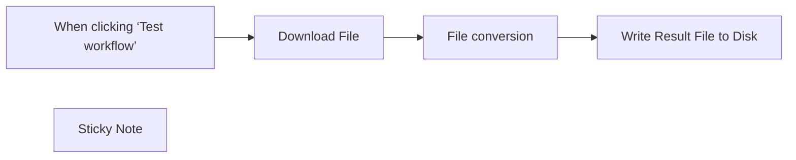

## Fluxo (.json) :

```json
{
  "meta": {
    "instanceId": "84ba6d895254e080ac2b4916d987aa66b000f88d4d919a6b9c76848f9b8a7616",
    "templateId": "2294",
    "templateCredsSetupCompleted": true
  },
  "nodes": [
    {
      "id": "463ebdc7-9c6f-4464-9a0e-4078be11a787",
      "name": "When clicking ‘Test workflow’",
      "type": "n8n-nodes-base.manualTrigger",
      "position": [
        280,
        240
      ],
      "parameters": {},
      "typeVersion": 1
    },
    {
      "id": "531d78cd-9f44-468a-9f88-30816922eb1b",
      "name": "Write Result File to Disk",
      "type": "n8n-nodes-base.readWriteFile",
      "position": [
        1140,
        240
      ],
      "parameters": {
        "options": {},
        "fileName": "document.pdf",
        "operation": "write",
        "dataPropertyName": "=data"
      },
      "typeVersion": 1
    },
    {
      "id": "7702ad91-05fd-4bfc-816a-3e863c1ca148",
      "name": "Sticky Note",
      "type": "n8n-nodes-base.stickyNote",
      "position": [
        640,
        60
      ],
      "parameters": {
        "width": 420,
        "height": 361,
        "content": "## Authentication\nConversion requests must be authenticated. Please create \n[ConvertAPI account to get authentication secret](https://www.convertapi.com/a/signin)\n\nCreate a query auth credential with __secret__ as name and your secret from the convertAPI dashboard as value"
      },
      "typeVersion": 1
    },
    {
      "id": "09d95adb-3c05-4727-8d0b-498870d08cca",
      "name": "Download File",
      "type": "n8n-nodes-base.httpRequest",
      "position": [
        480,
        240
      ],
      "parameters": {
        "url": "https://cdn.convertapi.com/cara/testfiles/document.docx",
        "options": {
          "response": {
            "response": {
              "responseFormat": "file"
            }
          }
        }
      },
      "typeVersion": 4.2
    },
    {
      "id": "c5e25b57-ff04-4b4c-aab4-d92f8e18409e",
      "name": "File conversion",
      "type": "n8n-nodes-base.httpRequest",
      "position": [
        800,
        240
      ],
      "parameters": {
        "url": "https://v2.convertapi.com/convert/docx/to/pdf",
        "method": "POST",
        "options": {
          "response": {
            "response": {
              "responseFormat": "file"
            }
          }
        },
        "sendBody": true,
        "contentType": "multipart-form-data",
        "sendHeaders": true,
        "authentication": "genericCredentialType",
        "bodyParameters": {
          "parameters": [
            {
              "name": "file",
              "parameterType": "formBinaryData",
              "inputDataFieldName": "=data"
            }
          ]
        },
        "genericAuthType": "httpQueryAuth",
        "headerParameters": {
          "parameters": [
            {
              "name": "Accept",
              "value": "application/octet-stream"
            }
          ]
        }
      },
      "credentials": {
        "httpQueryAuth": {
          "id": "oHfHaXdP6a8AieHO",
          "name": "Convertapi token"
        }
      },
      "notesInFlow": true,
      "typeVersion": 4.2
    }
  ],
  "pinData": {},
  "connections": {
    "Download File": {
      "main": [
        [
          {
            "node": "File conversion",
            "type": "main",
            "index": 0
          }
        ]
      ]
    },
    "File conversion": {
      "main": [
        [
          {
            "node": "Write Result File to Disk",
            "type": "main",
            "index": 0
          }
        ]
      ]
    },
    "When clicking ‘Test workflow’": {
      "main": [
        [
          {
            "node": "Download File",
            "type": "main",
            "index": 0
          }
        ]
      ]
    }
  }
}
```

<a id="template-1479"></a>

## Template 1479 - Converter PPTX para PDF e salvar localmente

- **Nome:** Converter PPTX para PDF e salvar localmente
- **Descrição:** Fluxo que baixa um arquivo PPTX de exemplo, envia para um serviço de conversão para gerar um PDF e salva o resultado no disco.
- **Funcionalidade:** • Disparo manual: inicia o processo quando o usuário executa o teste do fluxo.
• Download de arquivo PPTX: obtém uma apresentação PPTX a partir de um link público.
• Conversão do arquivo para PDF: envia o PPTX para um serviço de conversão externo e recebe o PDF convertido.
• Salvamento do arquivo convertido: grava o PDF resultante no sistema de arquivos local com o nome document.pdf.
• Nota de autenticação: inclui orientação sobre a necessidade de credenciais na plataforma de conversão.
- **Ferramentas:** • ConvertAPI: serviço de conversão de arquivos que transforma PPTX em PDF via API (requer autenticação).
• CDN de arquivos públicos: hospedagem que fornece o arquivo PPTX de exemplo por meio de URL público.
• Sistema de arquivos local: destino para armazenar o arquivo PDF gerado.


## Fluxo visual

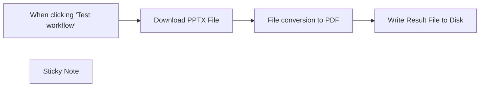

## Fluxo (.json) :

```json
{
  "meta": {
    "instanceId": "1dd912a1610cd0376bae7bb8f1b5838d2b601f42ac66a48e012166bb954fed5a",
    "templateId": "2305"
  },
  "nodes": [
    {
      "id": "853bd85f-66c8-4ed1-bd86-38f7bb24c02c",
      "name": "When clicking ‘Test workflow’",
      "type": "n8n-nodes-base.manualTrigger",
      "position": [
        380,
        240
      ],
      "parameters": {},
      "typeVersion": 1
    },
    {
      "id": "0c06c484-7f84-48a7-803c-1788c15582d5",
      "name": "Write Result File to Disk",
      "type": "n8n-nodes-base.readWriteFile",
      "position": [
        980,
        240
      ],
      "parameters": {
        "options": {},
        "fileName": "document.pdf",
        "operation": "write",
        "dataPropertyName": "=data"
      },
      "typeVersion": 1
    },
    {
      "id": "3d75bdd7-5b69-421a-a0e4-a2f123feca08",
      "name": "Sticky Note",
      "type": "n8n-nodes-base.stickyNote",
      "position": [
        720,
        100
      ],
      "parameters": {
        "width": 218,
        "height": 132,
        "content": "## Authentication\nConversion requests must be authenticated. Please create \n[ConvertAPI account to get authentication secret](https://www.convertapi.com/a/signin)"
      },
      "typeVersion": 1
    },
    {
      "id": "ab417c81-d9ca-4fd2-9f39-d741738f47ee",
      "name": "Download PPTX File",
      "type": "n8n-nodes-base.httpRequest",
      "position": [
        580,
        240
      ],
      "parameters": {
        "url": "https://cdn.convertapi.com/public/files/demo.pptx",
        "options": {
          "response": {
            "response": {
              "responseFormat": "file"
            }
          }
        }
      },
      "typeVersion": 4.2
    },
    {
      "id": "8612be1b-9840-43aa-85c8-6ec1489a5e39",
      "name": "File conversion to PDF",
      "type": "n8n-nodes-base.httpRequest",
      "position": [
        780,
        240
      ],
      "parameters": {
        "url": "https://v2.convertapi.com/convert/pptx/to/pdf",
        "method": "POST",
        "options": {
          "response": {
            "response": {
              "responseFormat": "file"
            }
          }
        },
        "sendBody": true,
        "contentType": "multipart-form-data",
        "sendHeaders": true,
        "authentication": "genericCredentialType",
        "bodyParameters": {
          "parameters": [
            {
              "name": "file",
              "parameterType": "formBinaryData",
              "inputDataFieldName": "=data"
            }
          ]
        },
        "genericAuthType": "httpQueryAuth",
        "headerParameters": {
          "parameters": [
            {
              "name": "Accept",
              "value": "application/octet-stream"
            }
          ]
        }
      },
      "credentials": {
        "httpQueryAuth": {
          "id": "WdAklDMod8fBEMRk",
          "name": "Query Auth account"
        }
      },
      "notesInFlow": true,
      "typeVersion": 4.2
    }
  ],
  "pinData": {},
  "connections": {
    "Download PPTX File": {
      "main": [
        [
          {
            "node": "File conversion to PDF",
            "type": "main",
            "index": 0
          }
        ]
      ]
    },
    "File conversion to PDF": {
      "main": [
        [
          {
            "node": "Write Result File to Disk",
            "type": "main",
            "index": 0
          }
        ]
      ]
    },
    "When clicking ‘Test workflow’": {
      "main": [
        [
          {
            "node": "Download PPTX File",
            "type": "main",
            "index": 0
          }
        ]
      ]
    }
  }
}
```

<a id="template-1481"></a>

## Template 1481 - Raspador de emails do Google Maps

- **Nome:** Raspador de emails do Google Maps
- **Descrição:** Fluxo que busca empresas no Google Maps a partir de uma lista de consultas, extrai endereços de email das páginas encontradas e salva os resultados em uma planilha do Google.
- **Funcionalidade:** • Execução por consultas em lote: recebe uma lista de queries e executa o processo para cada uma.
• Pesquisa no Google Maps: realiza buscas públicas usando as queries fornecidas.
• Extração de URLs: captura links encontrados nas respostas das buscas.
• Filtragem de URLs irrelevantes: remove links de domínios/padrões indesejados via regex.
• Requisição das páginas encontradas: busca o conteúdo das páginas para análise.
• Raspagem de emails via regex: identifica endereços de email nas páginas, evitando formatos de imagens.
• Agregação e organização: junta os resultados de várias páginas em listas consolidadas.
• Remoção de duplicatas: elimina emails repetidos garantindo unicidade.
• Filtragem final de emails indesejados: exclui padrões/domínios não relevantes antes do salvamento.
• Armazenamento em planilha: adiciona os emails validados a um documento do Google Sheets.
• Controles operacionais opcionais: permite inserir tempos de espera entre execuções e executar manualmente o fluxo.
- **Ferramentas:** • Google Maps: fonte de dados para pesquisar empresas e obter resultados públicos.
• Google Sheets: destino para salvar e organizar os emails coletados.
• Web/HTTP (páginas públicas): acesso às páginas dos sites das empresas para extrair conteúdo e emails.
• YouTube (material de apoio): vídeos tutoriais referenciados para orientação sobre configuração e uso.

## Fluxo visual

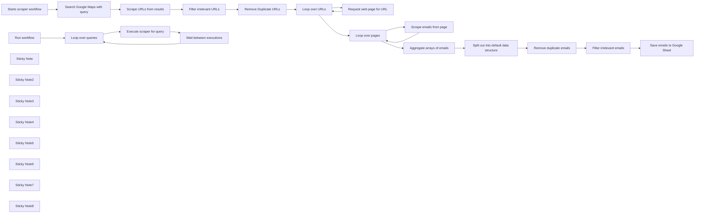

## Fluxo (.json) :

```json
{
  "name": "Google Maps Email Scraper Template",
  "tags": [],
  "nodes": [
    {
      "id": "79df5316-c210-478d-a4de-35b5d31924ee",
      "name": "Remove Duplicate URLs",
      "type": "n8n-nodes-base.removeDuplicates",
      "position": [
        -780,
        380
      ],
      "parameters": {},
      "typeVersion": 1.1
    },
    {
      "id": "985ac7e3-b501-4079-a043-780677c94b52",
      "name": "Loop over queries",
      "type": "n8n-nodes-base.splitInBatches",
      "position": [
        -1080,
        -100
      ],
      "parameters": {
        "options": {}
      },
      "typeVersion": 3
    },
    {
      "id": "3a478935-781b-4fb1-bdc7-fcf8be1334bc",
      "name": "Search Google Maps with query",
      "type": "n8n-nodes-base.httpRequest",
      "position": [
        -1380,
        380
      ],
      "parameters": {
        "url": "=https://www.google.com/maps/search/{{ $json.query }}",
        "options": {
          "allowUnauthorizedCerts": false
        }
      },
      "executeOnce": false,
      "typeVersion": 4.2,
      "alwaysOutputData": false
    },
    {
      "id": "477e7d55-b7d6-4b20-ac44-dd1f443e270a",
      "name": "Scrape URLs from results",
      "type": "n8n-nodes-base.code",
      "position": [
        -1180,
        380
      ],
      "parameters": {
        "jsCode": "const data = $input.first().json.data\n\nconst regex = /https?://[^/]+/g\n\nconst urls = data.match(regex)\n\nreturn urls.map(url => ({json: {url: url}}))"
      },
      "typeVersion": 2
    },
    {
      "id": "a5b67e45-a3f6-41d2-aa58-c26a441c41b2",
      "name": "Filter irrelevant URLs",
      "type": "n8n-nodes-base.filter",
      "position": [
        -980,
        380
      ],
      "parameters": {
        "options": {},
        "conditions": {
          "options": {
            "version": 2,
            "leftValue": "",
            "caseSensitive": true,
            "typeValidation": "strict"
          },
          "combinator": "and",
          "conditions": [
            {
              "id": "041797f2-2fe2-41dc-902a-d34050b9b304",
              "operator": {
                "type": "string",
                "operation": "notRegex"
              },
              "leftValue": "={{ $json.url }}",
              "rightValue": "=(google|gstatic|ggpht|schema\\.org|example\\.com|sentry-next\\.wixpress\\.com|imli\\.com|sentry\\.wixpress\\.com|ingest\\.sentry\\.io)"
            },
            {
              "id": "eb499a7e-17bc-453c-be08-a47286f726dd",
              "operator": {
                "name": "filter.operator.equals",
                "type": "string",
                "operation": "equals"
              },
              "leftValue": "",
              "rightValue": ""
            }
          ]
        }
      },
      "typeVersion": 2.2
    },
    {
      "id": "40ec6d1f-1c98-4c9f-8499-c5893c3df7b9",
      "name": "Request web page for URL",
      "type": "n8n-nodes-base.httpRequest",
      "onError": "continueRegularOutput",
      "position": [
        -380,
        460
      ],
      "parameters": {
        "url": "={{ $json.url }}",
        "options": {}
      },
      "typeVersion": 4.2,
      "alwaysOutputData": false
    },
    {
      "id": "12f662a8-c55f-409a-b381-f37ab6dd3794",
      "name": "Loop over URLs",
      "type": "n8n-nodes-base.splitInBatches",
      "onError": "continueErrorOutput",
      "position": [
        -580,
        380
      ],
      "parameters": {
        "options": {
          "reset": false
        }
      },
      "typeVersion": 3
    },
    {
      "id": "e6957d05-3533-48ae-9cc1-ee4ac026a2a6",
      "name": "Loop over pages",
      "type": "n8n-nodes-base.splitInBatches",
      "onError": "continueErrorOutput",
      "position": [
        -360,
        120
      ],
      "parameters": {
        "options": {}
      },
      "typeVersion": 3,
      "alwaysOutputData": false
    },
    {
      "id": "018621c0-0ea9-4865-b110-b6d0727f0588",
      "name": "Scrape emails from page",
      "type": "n8n-nodes-base.code",
      "onError": "continueRegularOutput",
      "position": [
        -200,
        220
      ],
      "parameters": {
        "mode": "runOnceForEachItem",
        "jsCode": "const data = $json.data\n\nconst emailRegex = /[a-zA-Z0-9._%+-]+@[a-zA-Z0-9.-]+\\.(?!png|jpg|gif|jpeg)[a-zA-Z]{2,}/g\n\nconst emails = data.match(emailRegex)\n\nreturn {json: {emails: emails}}"
      },
      "typeVersion": 2
    },
    {
      "id": "5509b8e2-a6fc-4fbe-bbc5-1bc1d5de1c98",
      "name": "Aggregate arrays of emails",
      "type": "n8n-nodes-base.aggregate",
      "position": [
        -40,
        100
      ],
      "parameters": {
        "options": {
          "mergeLists": true
        },
        "fieldsToAggregate": {
          "fieldToAggregate": [
            {
              "fieldToAggregate": "emails"
            }
          ]
        }
      },
      "typeVersion": 1
    },
    {
      "id": "f1f01f03-b62e-453f-b938-ffe4f9b3f4de",
      "name": "Split out into default data structure",
      "type": "n8n-nodes-base.splitOut",
      "position": [
        180,
        100
      ],
      "parameters": {
        "options": {},
        "fieldToSplitOut": "emails"
      },
      "typeVersion": 1
    },
    {
      "id": "ec27d665-d9c1-4f10-9c52-0d5ea89cbf77",
      "name": "Remove duplicate emails",
      "type": "n8n-nodes-base.removeDuplicates",
      "position": [
        400,
        100
      ],
      "parameters": {
        "compare": "selectedFields",
        "options": {},
        "fieldsToCompare": "emails"
      },
      "typeVersion": 1.1
    },
    {
      "id": "4a071bf0-23ad-455b-b231-bafd3b32e4f8",
      "name": "Filter irrelevant emails",
      "type": "n8n-nodes-base.filter",
      "position": [
        600,
        100
      ],
      "parameters": {
        "options": {},
        "conditions": {
          "options": {
            "version": 2,
            "leftValue": "",
            "caseSensitive": true,
            "typeValidation": "strict"
          },
          "combinator": "and",
          "conditions": [
            {
              "id": "041797f2-2fe2-41dc-902a-d34050b9b304",
              "operator": {
                "type": "string",
                "operation": "notRegex"
              },
              "leftValue": "={{ $json.emails }}",
              "rightValue": "=(google|gstatic|ggpht|schema\\.org|example\\.com|sentry\\.wixpress\\.com|sentry-next\\.wixpress\\.com|ingest\\.sentry\\.io|sentry\\.io|imli\\.com)"
            }
          ]
        }
      },
      "typeVersion": 2.2
    },
    {
      "id": "59675faa-2b0d-4ba5-82c7-dc5dedcad31e",
      "name": "Save emails to Google Sheet",
      "type": "n8n-nodes-base.googleSheets",
      "position": [
        800,
        100
      ],
      "parameters": {
        "columns": {
          "value": {
            "Emails": "={{ $json.emails }}"
          },
          "schema": [
            {
              "id": "Emails",
              "type": "string",
              "display": true,
              "removed": false,
              "required": false,
              "displayName": "Emails",
              "defaultMatch": false,
              "canBeUsedToMatch": true
            }
          ],
          "mappingMode": "defineBelow",
          "matchingColumns": [
            "Emails"
          ]
        },
        "options": {},
        "operation": "append"
      },
      "typeVersion": 4.5
    },
    {
      "id": "93437e8b-4f8d-40a1-9585-cab1b556164a",
      "name": "Starts scraper workflow",
      "type": "n8n-nodes-base.executeWorkflowTrigger",
      "position": [
        -1600,
        380
      ],
      "parameters": {},
      "typeVersion": 1
    },
    {
      "id": "eed77477-777d-450d-a975-4d2848b1cf55",
      "name": "Run workflow",
      "type": "n8n-nodes-base.manualTrigger",
      "position": [
        -1320,
        -100
      ],
      "parameters": {},
      "typeVersion": 1
    },
    {
      "id": "dffaf04e-d1d2-4002-9a69-f0904b61fc2d",
      "name": "Wait between executions",
      "type": "n8n-nodes-base.wait",
      "position": [
        -700,
        0
      ],
      "webhookId": "40eb11a9-0f7d-4932-993e-0052b69dbf9b",
      "parameters": {
        "amount": 2
      },
      "typeVersion": 1.1
    },
    {
      "id": "18787007-1d11-41b9-89c3-d5f69756eda7",
      "name": "Execute scraper for query",
      "type": "n8n-nodes-base.executeWorkflow",
      "position": [
        -880,
        0
      ],
      "parameters": {
        "mode": "each",
        "options": {
          "waitForSubWorkflow": false
        },
        "workflowId": {
          "__rl": true,
          "mode": "id",
          "value": "={{ $workflow.id }}"
        }
      },
      "typeVersion": 1.1
    },
    {
      "id": "67fcde25-05e4-437c-b799-4448baea7891",
      "name": "Sticky Note",
      "type": "n8n-nodes-base.stickyNote",
      "position": [
        -2280,
        -140
      ],
      "parameters": {
        "color": 5,
        "width": 740,
        "height": 180,
        "content": "## 🛠 Setup\n1. Setup your list of queries in the \"Run workflow\" manual trigger node. Watch  this [video](https://youtu.be/HaiO-UeiKBA) on how to generate the queries with ChatGPT.\n3. Choose a sheet to populate with data in the **Google Sheets node**\n4. Run the workflow and start getting leads into your Google Sheets document"
      },
      "typeVersion": 1
    },
    {
      "id": "ac880457-44b4-4ff7-8440-b4107f8468bb",
      "name": "Sticky Note2",
      "type": "n8n-nodes-base.stickyNote",
      "position": [
        -700,
        -120
      ],
      "parameters": {
        "color": 6,
        "height": 100,
        "content": "**Optional** 👇\nSet wait time between each query workflow execution. Default is 2 seconds."
      },
      "typeVersion": 1
    },
    {
      "id": "d83afb3d-7b71-4b47-9b50-28837aac408c",
      "name": "Sticky Note3",
      "type": "n8n-nodes-base.stickyNote",
      "position": [
        -1600,
        260
      ],
      "parameters": {
        "width": 480,
        "height": 100,
        "content": "### Scraper 👇\nThis workflow will be executed in the background for each query. Click the **All executions** tab in the left sidebar to see the executions running."
      },
      "typeVersion": 1
    },
    {
      "id": "007b621a-3d41-4358-aa45-560a3c8e3414",
      "name": "Sticky Note4",
      "type": "n8n-nodes-base.stickyNote",
      "position": [
        820,
        300
      ],
      "parameters": {
        "color": 4,
        "height": 180,
        "content": "👆 \n1. Setup your **credentials**. Here's a [video tutorial](https://youtu.be/O5RnWDM27M8) on how to do that.\n\n2. Choose which document and sheet to save the scraped emails to. "
      },
      "typeVersion": 1
    },
    {
      "id": "fc0b837f-624c-4d25-8ed7-f787f76c785b",
      "name": "Sticky Note5",
      "type": "n8n-nodes-base.stickyNote",
      "position": [
        -1760,
        -360
      ],
      "parameters": {
        "color": 3,
        "content": " ## ⚠️ Note\n\nA [video tutorial](https://youtu.be/HaiO-UeiKBA) for this workflow guide is available on my [Youtube channel](https://www.youtube.com/channel/UCn8xmUBunez1SsDVRfZDUGA)"
      },
      "typeVersion": 1
    },
    {
      "id": "2f8665d5-2890-4f7d-908b-9c09a66b6c93",
      "name": "Sticky Note6",
      "type": "n8n-nodes-base.stickyNote",
      "position": [
        -2280,
        -360
      ],
      "parameters": {
        "color": 7,
        "width": 480,
        "height": 140,
        "content": "## Google Maps Automatic Email Scraper\n\nThis workflow automatically scrapes emails from businesses on Google Maps based on a list of queries that you provide."
      },
      "typeVersion": 1
    },
    {
      "id": "7414b2ed-259d-47da-bbd1-d9ce0d64d43c",
      "name": "Sticky Note7",
      "type": "n8n-nodes-base.stickyNote",
      "position": [
        -1000,
        540
      ],
      "parameters": {
        "color": 6,
        "width": 160,
        "height": 100,
        "content": "**Optional** 👆\nAdd or change the regex for filtering irrelevant URLs."
      },
      "typeVersion": 1
    },
    {
      "id": "789c9a02-e6e7-4ea6-a7a2-acc7715b377a",
      "name": "Sticky Note8",
      "type": "n8n-nodes-base.stickyNote",
      "position": [
        580,
        260
      ],
      "parameters": {
        "color": 6,
        "width": 200,
        "height": 100,
        "content": "**Optional** 👆\nAdd or change the regex for filtering irrelevant/incorrect email addresses."
      },
      "typeVersion": 1
    }
  ],
  "active": false,
  "pinData": {
    "Run workflow": [
      {
        "json": {
          "query": "hollywood+dentist"
        }
      },
      {
        "json": {
          "query": "downtown+los+angeles+dentist"
        }
      },
      {
        "json": {
          "query": "santa+monica+dentist"
        }
      },
      {
        "json": {
          "query": "westwood+dentist"
        }
      },
      {
        "json": {
          "query": "west+l.a.+dentist"
        }
      },
      {
        "json": {
          "query": "the+valley+dentist"
        }
      },
      {
        "json": {
          "query": "echo+park+dentist"
        }
      },
      {
        "json": {
          "query": "culver+city+dentist"
        }
      },
      {
        "json": {
          "query": "pasadena+dentist"
        }
      },
      {
        "json": {
          "query": "silver+lake+dentist"
        }
      },
      {
        "json": {
          "query": "mid-wilshire+dentist"
        }
      },
      {
        "json": {
          "query": "beverly+hills+dentist"
        }
      },
      {
        "json": {
          "query": "north+hills+dentist"
        }
      },
      {
        "json": {
          "query": "south+los+angeles+dentist"
        }
      }
    ]
  },
  "settings": {
    "executionOrder": "v1"
  },
  "connections": {
    "Run workflow": {
      "main": [
        [
          {
            "node": "Loop over queries",
            "type": "main",
            "index": 0
          }
        ]
      ]
    },
    "Loop over URLs": {
      "main": [
        [
          {
            "node": "Loop over pages",
            "type": "main",
            "index": 0
          }
        ],
        [
          {
            "node": "Request web page for URL",
            "type": "main",
            "index": 0
          }
        ]
      ]
    },
    "Loop over pages": {
      "main": [
        [
          {
            "node": "Aggregate arrays of emails",
            "type": "main",
            "index": 0
          }
        ],
        [
          {
            "node": "Scrape emails from page",
            "type": "main",
            "index": 0
          }
        ]
      ]
    },
    "Loop over queries": {
      "main": [
        [],
        [
          {
            "node": "Execute scraper for query",
            "type": "main",
            "index": 0
          }
        ]
      ]
    },
    "Remove Duplicate URLs": {
      "main": [
        [
          {
            "node": "Loop over URLs",
            "type": "main",
            "index": 0
          }
        ]
      ]
    },
    "Filter irrelevant URLs": {
      "main": [
        [
          {
            "node": "Remove Duplicate URLs",
            "type": "main",
            "index": 0
          }
        ]
      ]
    },
    "Remove duplicate emails": {
      "main": [
        [
          {
            "node": "Filter irrelevant emails",
            "type": "main",
            "index": 0
          }
        ]
      ]
    },
    "Scrape emails from page": {
      "main": [
        [
          {
            "node": "Loop over pages",
            "type": "main",
            "index": 0
          }
        ]
      ]
    },
    "Starts scraper workflow": {
      "main": [
        [
          {
            "node": "Search Google Maps with query",
            "type": "main",
            "index": 0
          }
        ]
      ]
    },
    "Wait between executions": {
      "main": [
        [
          {
            "node": "Loop over queries",
            "type": "main",
            "index": 0
          }
        ]
      ]
    },
    "Filter irrelevant emails": {
      "main": [
        [
          {
            "node": "Save emails to Google Sheet",
            "type": "main",
            "index": 0
          }
        ]
      ]
    },
    "Request web page for URL": {
      "main": [
        [
          {
            "node": "Loop over URLs",
            "type": "main",
            "index": 0
          }
        ]
      ]
    },
    "Scrape URLs from results": {
      "main": [
        [
          {
            "node": "Filter irrelevant URLs",
            "type": "main",
            "index": 0
          }
        ]
      ]
    },
    "Execute scraper for query": {
      "main": [
        [
          {
            "node": "Wait between executions",
            "type": "main",
            "index": 0
          }
        ]
      ]
    },
    "Aggregate arrays of emails": {
      "main": [
        [
          {
            "node": "Split out into default data structure",
            "type": "main",
            "index": 0
          }
        ]
      ]
    },
    "Search Google Maps with query": {
      "main": [
        [
          {
            "node": "Scrape URLs from results",
            "type": "main",
            "index": 0
          }
        ]
      ]
    },
    "Split out into default data structure": {
      "main": [
        [
          {
            "node": "Remove duplicate emails",
            "type": "main",
            "index": 0
          }
        ]
      ]
    }
  }
}
```

<a id="template-1483"></a>

## Template 1483 - Proteção de PDF com senha

- **Nome:** Proteção de PDF com senha
- **Descrição:** Baixa um PDF de exemplo, envia para um serviço que adiciona proteção por senha e salva o resultado no disco e no Google Drive.
- **Funcionalidade:** • Início manual: O fluxo é acionado manualmente para testes.
• Download do PDF: Baixa um arquivo PDF de exemplo a partir de uma URL pública.
• Proteção por senha: Envia o PDF para um serviço externo que adiciona proteção usando o parâmetro UserPassword.
• Configuração de senha: Permite definir a senha no parâmetro UserPassword antes da chamada ao serviço.
• Salvamento local: Grava o PDF protegido no sistema de arquivos com nome definido (document.pdf).
• Upload para nuvem: Faz upload do PDF protegido para uma conta de armazenamento na nuvem (Google Drive) com nome definido (test-password.pdf).
• Autenticação de API: Utiliza credenciais via query string para autenticar as requisições ao serviço de proteção.
- **Ferramentas:** • Serviço de proteção de PDF (ConvertAPI): API externa usada para converter/proteger o PDF com senha (endpoint v2 /convert/pdf/to/protect), exige chave de autenticação.
• CDN público de arquivos (ConvertAPI CDN): Fonte do PDF de exemplo que é baixado no início do fluxo.
• Google Drive: Serviço de armazenamento em nuvem usado para salvar o arquivo PDF protegido.
• Sistema de arquivos local: Destino para gravar uma cópia do PDF protegido no disco.


## Fluxo visual

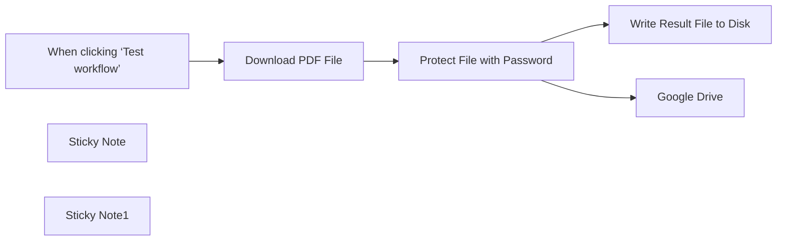

## Fluxo (.json) :

```json
{
  "meta": {
    "instanceId": "1dd912a1610cd0376bae7bb8f1b5838d2b601f42ac66a48e012166bb954fed5a",
    "templateId": "2306"
  },
  "nodes": [
    {
      "id": "1ef81384-b424-49bc-a6b5-922d1b0f5a7b",
      "name": "When clicking ‘Test workflow’",
      "type": "n8n-nodes-base.manualTrigger",
      "position": [
        340,
        240
      ],
      "parameters": {},
      "typeVersion": 1
    },
    {
      "id": "3052f841-9e65-4284-a84d-3bb5d0c146ea",
      "name": "Write Result File to Disk",
      "type": "n8n-nodes-base.readWriteFile",
      "position": [
        1200,
        240
      ],
      "parameters": {
        "options": {},
        "fileName": "document.pdf",
        "operation": "write",
        "dataPropertyName": "=data"
      },
      "typeVersion": 1
    },
    {
      "id": "852e30be-e145-4e73-b646-94e2ceec536c",
      "name": "Sticky Note",
      "type": "n8n-nodes-base.stickyNote",
      "position": [
        720,
        100
      ],
      "parameters": {
        "width": 218,
        "height": 132,
        "content": "## Authentication\nConversion requests must be authenticated. Please create \n[ConvertAPI account to get authentication secret](https://www.convertapi.com/a/signin)"
      },
      "typeVersion": 1
    },
    {
      "id": "69f4d125-8990-4c98-9743-9f877325c958",
      "name": "Download PDF File",
      "type": "n8n-nodes-base.httpRequest",
      "position": [
        580,
        240
      ],
      "parameters": {
        "url": "https://cdn.convertapi.com/public/files/demo.pdf",
        "options": {
          "response": {
            "response": {
              "responseFormat": "file"
            }
          }
        }
      },
      "typeVersion": 4.2
    },
    {
      "id": "ff47b32c-37de-4f95-a0f0-37a7ea6f6bcd",
      "name": "Protect File with Password",
      "type": "n8n-nodes-base.httpRequest",
      "position": [
        780,
        240
      ],
      "parameters": {
        "url": "https://v2.convertapi.com/convert/pdf/to/protect",
        "method": "POST",
        "options": {
          "response": {
            "response": {
              "responseFormat": "file"
            }
          }
        },
        "sendBody": true,
        "contentType": "multipart-form-data",
        "sendHeaders": true,
        "authentication": "genericCredentialType",
        "bodyParameters": {
          "parameters": [
            {
              "name": "file",
              "parameterType": "formBinaryData",
              "inputDataFieldName": "=data"
            },
            {
              "name": "UserPassword",
              "value": "mypassword"
            }
          ]
        },
        "genericAuthType": "httpQueryAuth",
        "headerParameters": {
          "parameters": [
            {
              "name": "Accept",
              "value": "application/octet-stream"
            }
          ]
        }
      },
      "credentials": {
        "httpQueryAuth": {
          "id": "WdAklDMod8fBEMRk",
          "name": "Query Auth account"
        }
      },
      "notesInFlow": true,
      "typeVersion": 4.2
    },
    {
      "id": "4b3f082d-ad08-4609-88b6-bf25ff660c09",
      "name": "Sticky Note1",
      "type": "n8n-nodes-base.stickyNote",
      "position": [
        720,
        400
      ],
      "parameters": {
        "width": 220,
        "height": 140,
        "content": "## Set Password\nSet the password in the parameter **UserPassword**"
      },
      "typeVersion": 1
    },
    {
      "id": "79d5896e-4d5b-4dd9-8fc2-466197b5d61f",
      "name": "Google Drive",
      "type": "n8n-nodes-base.googleDrive",
      "position": [
        1180,
        440
      ],
      "parameters": {
        "name": "test-password.pdf",
        "driveId": {
          "__rl": true,
          "mode": "list",
          "value": "My Drive"
        },
        "options": {},
        "folderId": {
          "__rl": true,
          "mode": "list",
          "value": "root",
          "cachedResultName": "/ (Root folder)"
        }
      },
      "credentials": {
        "googleDriveOAuth2Api": {
          "id": "ylpqxmWWSllOKhVO",
          "name": "Google Drive account"
        }
      },
      "typeVersion": 3
    }
  ],
  "pinData": {},
  "connections": {
    "Download PDF File": {
      "main": [
        [
          {
            "node": "Protect File with Password",
            "type": "main",
            "index": 0
          }
        ]
      ]
    },
    "Protect File with Password": {
      "main": [
        [
          {
            "node": "Write Result File to Disk",
            "type": "main",
            "index": 0
          },
          {
            "node": "Google Drive",
            "type": "main",
            "index": 0
          }
        ]
      ]
    },
    "When clicking ‘Test workflow’": {
      "main": [
        [
          {
            "node": "Download PDF File",
            "type": "main",
            "index": 0
          }
        ]
      ]
    }
  }
}
```

<a id="template-1485"></a>

## Template 1485 - Agente de IA para raspagem de páginas web

- **Nome:** Agente de IA para raspagem de páginas web
- **Descrição:** Fluxo que permite a um agente de IA receber instruções em texto e chamar APIs externas para raspar conteúdo de páginas web ou obter sugestões de atividades, usando um modelo de linguagem para interpretar e formatar a resposta.
- **Funcionalidade:** • Entrada de usuário e teste manual: Recebe um texto de entrada (chatInput) e permite disparo para teste via gatilho manual.
• Integração com modelo de linguagem: Utiliza um modelo de chat para interpretar solicitações e gerar texto de resposta.
• Agente com capacidade de chamar ferramentas: O agente pode invocar ferramentas HTTP externas quando precisa buscar dados.
• Raspagem de páginas web: Chama uma API de scraping para obter o conteúdo da página em Markdown, configurada para extrair apenas o conteúdo principal, tornar caminhos absolutos e remover certas tags.
• Sugestão de atividades via API: Chama uma API pública que retorna sugestões de atividades filtradas por tipo e número de participantes.
• Otimização do retorno: Configura opções para otimizar e padronizar a resposta recebida das chamadas externas.
• Fluxo simplificado para casos únicos: Projetado para reduzir nós quando é necessário apenas chamar uma API única e retornar o resultado.
- **Ferramentas:** • OpenAI: Serviço de modelo de linguagem utilizado para interpretar entradas e gerar respostas em linguagem natural.
• Firecrawl API: Serviço de scraping que extrai conteúdo de páginas web e pode retornar o resultado em Markdown com opções para incluir apenas o conteúdo principal, ajustar caminhos e remover tags indesejadas.
• Bored API: API pública que sugere atividades com parâmetros como tipo de atividade e número de participantes.

## Fluxo visual

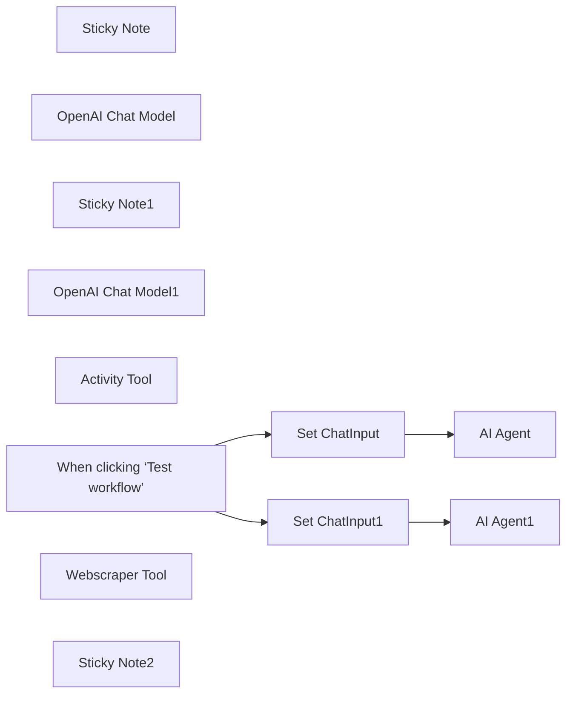

## Fluxo (.json) :

```json
{
  "meta": {
    "instanceId": "26ba763460b97c249b82942b23b6384876dfeb9327513332e743c5f6219c2b8e"
  },
  "nodes": [
    {
      "id": "abccacce-bbdc-428e-94e0-19996c5bfe02",
      "name": "Sticky Note",
      "type": "n8n-nodes-base.stickyNote",
      "position": [
        1720,
        160
      ],
      "parameters": {
        "color": 7,
        "width": 319.5392879244982,
        "height": 218.88813194060202,
        "content": "### AI agent that can scrape webpages\nRemake of https://n8n.io/workflows/2006-ai-agent-that-can-scrape-webpages/\n\n**Changes**:\n* Replaces Execute Workflow Tool and Subworkflow\n* Replaces Response Formatting"
      },
      "typeVersion": 1
    },
    {
      "id": "9fc05c79-5a2d-4ac4-a4f5-32b9c1b385e1",
      "name": "OpenAI Chat Model",
      "type": "@n8n/n8n-nodes-langchain.lmChatOpenAi",
      "position": [
        1340,
        340
      ],
      "parameters": {
        "options": {}
      },
      "credentials": {
        "openAiApi": {
          "id": "8gccIjcuf3gvaoEr",
          "name": "OpenAi account"
        }
      },
      "typeVersion": 1
    },
    {
      "id": "45c9bdaf-d51e-4026-8911-4b04c5473b06",
      "name": "Sticky Note1",
      "type": "n8n-nodes-base.stickyNote",
      "position": [
        1720,
        560
      ],
      "parameters": {
        "color": 7,
        "width": 365.9021913627245,
        "height": 245.35379866205295,
        "content": "### Allow your AI to call an API to fetch data\nRemake of https://n8n.io/workflows/2094-allow-your-ai-to-call-an-api-to-fetch-data/\n\n**Changes**:\n* Replaces Execute Workflow Tool and Subworkflow\n* Replaces Manual Query Params Definitions\n* Replaces Response Formatting"
      },
      "typeVersion": 1
    },
    {
      "id": "bc1754e6-01f4-4561-8814-c08feb45acec",
      "name": "OpenAI Chat Model1",
      "type": "@n8n/n8n-nodes-langchain.lmChatOpenAi",
      "position": [
        1340,
        740
      ],
      "parameters": {
        "options": {}
      },
      "credentials": {
        "openAiApi": {
          "id": "8gccIjcuf3gvaoEr",
          "name": "OpenAi account"
        }
      },
      "typeVersion": 1
    },
    {
      "id": "a40230ae-6050-4bb8-b275-3a893dc3ad98",
      "name": "Activity Tool",
      "type": "@n8n/n8n-nodes-langchain.toolHttpRequest",
      "position": [
        1560,
        740
      ],
      "parameters": {
        "url": "https://bored-api.appbrewery.com/filter",
        "sendQuery": true,
        "parametersQuery": {
          "values": [
            {
              "name": "type"
            },
            {
              "name": "participants"
            }
          ]
        },
        "toolDescription": "Call this tool to suggest an activity where:\n* the parameter \"type\" is one of \"education\", \"recreational\",\"social\",\"diy\",\"charity\",\"cooking\",\"relaxation\",\"music\",\"busywork\"\n* the parameter \"participants\" is the number of participants for the activity"
      },
      "typeVersion": 1
    },
    {
      "id": "297377e0-e149-4786-b521-82670ac390a7",
      "name": "Set ChatInput1",
      "type": "n8n-nodes-base.set",
      "position": [
        1180,
        560
      ],
      "parameters": {
        "options": {},
        "assignments": {
          "assignments": [
            {
              "id": "e976bf5f-8803-4129-9136-115b3d15755c",
              "name": "chatInput",
              "type": "string",
              "value": "Hi! Please suggest something to do. I feel like learning something new!"
            }
          ]
        }
      },
      "typeVersion": 3.4
    },
    {
      "id": "a9128da1-4486-4a17-b9b3-64ebc402348d",
      "name": "AI Agent1",
      "type": "@n8n/n8n-nodes-langchain.agent",
      "position": [
        1360,
        560
      ],
      "parameters": {
        "text": "={{ $json.chatInput }}",
        "options": {},
        "promptType": "define"
      },
      "typeVersion": 1.6
    },
    {
      "id": "28a5e75e-e32d-4c94-bea2-7347923e6bb9",
      "name": "Set ChatInput",
      "type": "n8n-nodes-base.set",
      "position": [
        1160,
        160
      ],
      "parameters": {
        "options": {},
        "assignments": {
          "assignments": [
            {
              "id": "9695c156-c882-4e43-8a4e-70fbdc1a63de",
              "name": "chatInput",
              "type": "string",
              "value": "Can get the latest 10 issues from https://github.com/n8n-io/n8n/issues?"
            }
          ]
        }
      },
      "typeVersion": 3.4
    },
    {
      "id": "d29b30fb-7edb-4665-bc6b-a511caf9db9f",
      "name": "When clicking ‘Test workflow’",
      "type": "n8n-nodes-base.manualTrigger",
      "position": [
        900,
        400
      ],
      "parameters": {},
      "typeVersion": 1
    },
    {
      "id": "066f9cdd-4bd3-48a1-bf9b-32eda3e28945",
      "name": "AI Agent",
      "type": "@n8n/n8n-nodes-langchain.agent",
      "position": [
        1360,
        160
      ],
      "parameters": {
        "text": "={{ $json.chatInput }}",
        "options": {},
        "promptType": "define"
      },
      "typeVersion": 1.6
    },
    {
      "id": "fb4abae8-7e38-47b7-9595-403e523f7125",
      "name": "Webscraper Tool",
      "type": "@n8n/n8n-nodes-langchain.toolHttpRequest",
      "position": [
        1560,
        340
      ],
      "parameters": {
        "url": "https://api.firecrawl.dev/v0/scrape",
        "fields": "markdown",
        "method": "POST",
        "sendBody": true,
        "dataField": "data",
        "authentication": "genericCredentialType",
        "parametersBody": {
          "values": [
            {
              "name": "url"
            },
            {
              "name": "pageOptions",
              "value": "={{ {\n  onlyMainContent: true,\n  replaceAllPathsWithAbsolutePaths: true,\n  removeTags: 'img,svg,video,audio'\n} }}",
              "valueProvider": "fieldValue"
            }
          ]
        },
        "fieldsToInclude": "selected",
        "genericAuthType": "httpHeaderAuth",
        "toolDescription": "Call this tool to fetch a webpage content.",
        "optimizeResponse": true
      },
      "credentials": {
        "httpHeaderAuth": {
          "id": "OUOnyTkL9vHZNorB",
          "name": "Firecrawl API"
        }
      },
      "typeVersion": 1
    },
    {
      "id": "73d3213c-1ecb-4007-b882-1cc756a6f6e0",
      "name": "Sticky Note2",
      "type": "n8n-nodes-base.stickyNote",
      "position": [
        420,
        120
      ],
      "parameters": {
        "width": 413.82332632615135,
        "height": 435.92895157500243,
        "content": "## Try It Out!\n\n### The HTTP tool is drastically simplifies API-enabled AI agents cutting down the number of workflow nodes by as much as 10!\n\n* Available since v1.47.0\n* Recommended for single purpose APIs which don't require much post-fetch formatting.\n* If you require a chain of API calls, you may need to implement a subworkflow instead.\n\n### Need Help?\nJoin the [Discord](https://discord.com/invite/XPKeKXeB7d) or ask in the [Forum](https://community.n8n.io/)!\n\nHappy Hacking!"
      },
      "typeVersion": 1
    }
  ],
  "pinData": {},
  "connections": {
    "Activity Tool": {
      "ai_tool": [
        [
          {
            "node": "AI Agent1",
            "type": "ai_tool",
            "index": 0
          }
        ]
      ]
    },
    "Set ChatInput": {
      "main": [
        [
          {
            "node": "AI Agent",
            "type": "main",
            "index": 0
          }
        ]
      ]
    },
    "Set ChatInput1": {
      "main": [
        [
          {
            "node": "AI Agent1",
            "type": "main",
            "index": 0
          }
        ]
      ]
    },
    "Webscraper Tool": {
      "ai_tool": [
        [
          {
            "node": "AI Agent",
            "type": "ai_tool",
            "index": 0
          }
        ]
      ]
    },
    "OpenAI Chat Model": {
      "ai_languageModel": [
        [
          {
            "node": "AI Agent",
            "type": "ai_languageModel",
            "index": 0
          }
        ]
      ]
    },
    "OpenAI Chat Model1": {
      "ai_languageModel": [
        [
          {
            "node": "AI Agent1",
            "type": "ai_languageModel",
            "index": 0
          }
        ]
      ]
    },
    "When clicking ‘Test workflow’": {
      "main": [
        [
          {
            "node": "Set ChatInput",
            "type": "main",
            "index": 0
          },
          {
            "node": "Set ChatInput1",
            "type": "main",
            "index": 0
          }
        ]
      ]
    }
  }
}
```

<a id="template-1487"></a>

## Template 1487 - Processamento de insights de chamadas de vendas

- **Nome:** Processamento de insights de chamadas de vendas
- **Descrição:** Recebe saída de IA vinda de outro fluxo, identifica diferentes tipos de insights (Marketing, Actionable, Tópicos Recorrentes) e cria registros correspondentes em bases de dados do Notion, tratando rate limiting e agregando resultados.
- **Funcionalidade:** • Recepção de dados de IA: Inicia a partir de dados gerados por outro fluxo que processou gravações/resumos de chamadas.
• Detecção de categorias de insight: Verifica se há Marketing Insights, Actionable Insights e Recurring Topics na saída da IA.
• Controle de rate limiting: Insere esperas antes de processar cada categoria para evitar limites de API.
• Separação e processamento por item: Divide arrays de insights em itens individuais para criar registros separados.
• Criação de páginas com mapeamento de propriedades: Cria entradas em bases de Notion específicas (Marketing Insights, Actionable Insights, Recurring Topics) mapeando campos como título, data, contexto, menções e relacionando ao resumo da chamada.
• Agregação e mesclagem de resultados: Consolida os itens criados em um único objeto e preserva a resposta original da IA para uso posterior.
• Suporte a ícones e metadados: Adiciona ícones e metadados (ex.: título e data) aos registros criados no Notion.
- **Ferramentas:** • Notion: Armazenamento e organização dos registros criados para Marketing Insights, Actionable Insights e Recurring Topics em bases de dados dedicadas.
• Serviço de IA externo: Gera a saída estruturada (AIoutput) contendo MarketingInsights, ActionableInsights e RecurringTopics a partir das gravações/resumos.
• Plataforma de gravação/resumos de chamadas (ex.: Gong ou similar): Fonte das gravações e metadados da chamada que originam os resumos processados pela IA.

## Fluxo visual

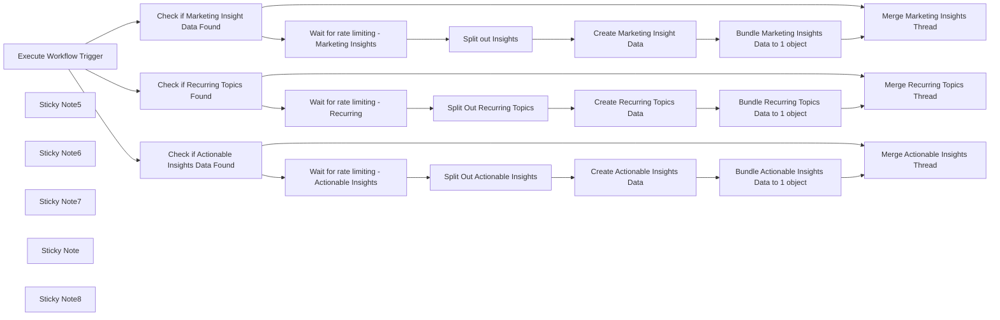

## Fluxo (.json) :

```json
{
  "meta": {
    "instanceId": "cb484ba7b742928a2048bf8829668bed5b5ad9787579adea888f05980292a4a7",
    "templateCredsSetupCompleted": true
  },
  "nodes": [
    {
      "id": "a810abc1-4cbf-49a8-8c4e-227ad572d137",
      "name": "Execute Workflow Trigger",
      "type": "n8n-nodes-base.executeWorkflowTrigger",
      "position": [
        2280,
        -400
      ],
      "parameters": {},
      "typeVersion": 1
    },
    {
      "id": "02f98d43-05d9-4d70-a94a-1af7e2ad10cf",
      "name": "Create Marketing Insight Data",
      "type": "n8n-nodes-base.notion",
      "position": [
        3500,
        -480
      ],
      "parameters": {
        "title": "={{ $('Execute Workflow Trigger').item.json.metaData.title }}",
        "options": {
          "icon": "🎯"
        },
        "resource": "databasePage",
        "databaseId": {
          "__rl": true,
          "mode": "list",
          "value": "1395b6e0-c94f-802d-9a63-c524a1769699",
          "cachedResultUrl": "https://www.notion.so/1395b6e0c94f802d9a63c524a1769699",
          "cachedResultName": "Marketing Insights"
        },
        "propertiesUi": {
          "propertyValues": [
            {
              "key": "Name|title",
              "title": "={{ $json.Summary }}"
            },
            {
              "key": "Marketing Tags|multi_select",
              "multiSelectValue": "={{ $json.Tag }}"
            },
            {
              "key": "Sales Call Summaries|relation",
              "relationValue": [
                "={{ $('Execute Workflow Trigger').item.json.notionData[0].id }}"
              ]
            },
            {
              "key": "Date Mentioned|date",
              "date": "={{ $('Execute Workflow Trigger').item.json.metaData.started }}"
            }
          ]
        }
      },
      "credentials": {
        "notionApi": {
          "id": "80",
          "name": "Notion david-internal"
        }
      },
      "retryOnFail": true,
      "typeVersion": 2.2,
      "waitBetweenTries": 3000
    },
    {
      "id": "426e8b9d-7542-473e-8124-45cf70adf035",
      "name": "Sticky Note5",
      "type": "n8n-nodes-base.stickyNote",
      "position": [
        2720,
        -600
      ],
      "parameters": {
        "color": 7,
        "width": 1480,
        "height": 480,
        "content": "## Marketing Insights Processing"
      },
      "typeVersion": 1
    },
    {
      "id": "2946cd22-e7e6-40eb-a375-0f5233d66260",
      "name": "Sticky Note6",
      "type": "n8n-nodes-base.stickyNote",
      "position": [
        2140,
        -760
      ],
      "parameters": {
        "color": 7,
        "width": 560,
        "height": 620,
        "content": "## Receives AI Data from other workflow\n"
      },
      "typeVersion": 1
    },
    {
      "id": "3a0be813-8556-44cc-bd1a-9cdcf9b7aa55",
      "name": "Sticky Note7",
      "type": "n8n-nodes-base.stickyNote",
      "position": [
        1780,
        -960
      ],
      "parameters": {
        "width": 340,
        "height": 820,
        "content": "\n## CallForge - The AI Gong Sales Call Processor\nCallForge allows you to extract important information for different departments from your Sales Gong Calls. \n\n### AI Output Processor\nOnce the AI data is generated, it is then added (or not!) to the Notion Database here. This is also where the Pipedrive or Salesforce integration will be added once that portion is complete. "
      },
      "typeVersion": 1
    },
    {
      "id": "35aa0491-8135-4f69-a213-8a578bf0c405",
      "name": "Sticky Note",
      "type": "n8n-nodes-base.stickyNote",
      "position": [
        2720,
        -100
      ],
      "parameters": {
        "color": 7,
        "width": 1480,
        "height": 440,
        "content": "## Actionable Insights"
      },
      "typeVersion": 1
    },
    {
      "id": "8035c35e-0073-4d66-8630-8f3f2d6fea72",
      "name": "Sticky Note8",
      "type": "n8n-nodes-base.stickyNote",
      "position": [
        2720,
        -1060
      ],
      "parameters": {
        "color": 7,
        "width": 1480,
        "height": 440,
        "content": "## Recurring Topics"
      },
      "typeVersion": 1
    },
    {
      "id": "c18b2e0d-3c7f-4caa-bf12-5d5058d6d6e2",
      "name": "Check if Recurring Topics Found",
      "type": "n8n-nodes-base.if",
      "position": [
        2820,
        -820
      ],
      "parameters": {
        "options": {},
        "conditions": {
          "options": {
            "version": 2,
            "leftValue": "",
            "caseSensitive": true,
            "typeValidation": "strict"
          },
          "combinator": "and",
          "conditions": [
            {
              "id": "7f182ff7-b5cf-44d0-9645-9200bb7afa24",
              "operator": {
                "type": "array",
                "operation": "lengthGte",
                "rightType": "number"
              },
              "leftValue": "={{ $json.AIoutput.MarketingInsights }}",
              "rightValue": 1
            }
          ]
        }
      },
      "typeVersion": 2.2
    },
    {
      "id": "8130e673-247c-4e99-89aa-59c1e76e8cc4",
      "name": "Wait for rate limiting - Recurring",
      "type": "n8n-nodes-base.wait",
      "position": [
        3060,
        -980
      ],
      "webhookId": "9aa5f1eb-1ca7-4d69-9783-8d4a21b32db3",
      "parameters": {
        "amount": 3
      },
      "typeVersion": 1.1
    },
    {
      "id": "25838252-28ad-4f9a-b360-7a0e8e2e39bf",
      "name": "Split Out Recurring Topics",
      "type": "n8n-nodes-base.splitOut",
      "position": [
        3280,
        -980
      ],
      "parameters": {
        "options": {},
        "fieldToSplitOut": "AIoutput.RecurringTopics"
      },
      "typeVersion": 1
    },
    {
      "id": "f48e333b-9dd3-47a5-a874-a14ab6710c59",
      "name": "Create Recurring Topics Data",
      "type": "n8n-nodes-base.notion",
      "position": [
        3500,
        -980
      ],
      "parameters": {
        "title": "={{ $('Execute Workflow Trigger').item.json.metaData.title }}",
        "options": {
          "icon": "🔁"
        },
        "resource": "databasePage",
        "databaseId": {
          "__rl": true,
          "mode": "list",
          "value": "17c5b6e0-c94f-80f4-9bf0-e52c7b0ef947",
          "cachedResultUrl": "https://www.notion.so/17c5b6e0c94f80f49bf0e52c7b0ef947",
          "cachedResultName": "Recurring Topics"
        },
        "propertiesUi": {
          "propertyValues": [
            {
              "key": "Context|rich_text",
              "textContent": "={{ $json.Context }}"
            },
            {
              "key": "Mentions|number",
              "numberValue": "={{ $json.Mentions }}"
            },
            {
              "key": "Topic|title",
              "title": "={{ $json.Topic }}"
            },
            {
              "key": "Sales Call Summaries|relation",
              "relationValue": [
                "={{ $('Execute Workflow Trigger').item.json.notionData[0].id }}"
              ]
            }
          ]
        }
      },
      "credentials": {
        "notionApi": {
          "id": "2B3YIiD4FMsF9Rjn",
          "name": "Angelbot Notion"
        }
      },
      "retryOnFail": true,
      "typeVersion": 2.2,
      "waitBetweenTries": 3000
    },
    {
      "id": "f0f39472-35e7-42a0-a0c6-c4414deacfb9",
      "name": "Bundle Recurring Topics Data to 1 object",
      "type": "n8n-nodes-base.aggregate",
      "position": [
        3700,
        -980
      ],
      "parameters": {
        "options": {},
        "aggregate": "aggregateAllItemData",
        "destinationFieldName": "tagdata"
      },
      "typeVersion": 1
    },
    {
      "id": "290d14a5-f255-4a15-bcce-b879f6c45300",
      "name": "Merge Recurring Topics Thread",
      "type": "n8n-nodes-base.set",
      "position": [
        4000,
        -800
      ],
      "parameters": {
        "options": {},
        "assignments": {
          "assignments": [
            {
              "id": "d8fc65ad-2b05-40c1-84c7-7bda819f0f1f",
              "name": "aiResponse",
              "type": "object",
              "value": "={{ $('Execute Workflow Trigger').item.json.aiResponse }}"
            }
          ]
        }
      },
      "typeVersion": 3.4
    },
    {
      "id": "784209f5-d9cf-47b6-b222-e90eab0e9c42",
      "name": "Check if Marketing Insight Data Found",
      "type": "n8n-nodes-base.if",
      "position": [
        2820,
        -320
      ],
      "parameters": {
        "options": {},
        "conditions": {
          "options": {
            "version": 2,
            "leftValue": "",
            "caseSensitive": true,
            "typeValidation": "strict"
          },
          "combinator": "and",
          "conditions": [
            {
              "id": "7f182ff7-b5cf-44d0-9645-9200bb7afa24",
              "operator": {
                "type": "array",
                "operation": "lengthGte",
                "rightType": "number"
              },
              "leftValue": "={{ $json.AIoutput.MarketingInsights }}",
              "rightValue": 1
            }
          ]
        }
      },
      "typeVersion": 2.2
    },
    {
      "id": "f9c10abd-cab4-4cfa-909c-b7a4b9d132ec",
      "name": "Wait for rate limiting - Marketing Insights",
      "type": "n8n-nodes-base.wait",
      "position": [
        3060,
        -480
      ],
      "webhookId": "264a15ce-478f-4b69-b46c-21bf8ec4bcd2",
      "parameters": {
        "amount": 3
      },
      "typeVersion": 1.1
    },
    {
      "id": "805c464a-38d1-4bee-a65a-a7dca32fc7f5",
      "name": "Split out Insights",
      "type": "n8n-nodes-base.splitOut",
      "position": [
        3280,
        -480
      ],
      "parameters": {
        "options": {},
        "fieldToSplitOut": "AIoutput.MarketingInsights"
      },
      "typeVersion": 1
    },
    {
      "id": "424eb472-9280-4fc8-b7e2-ba55e0b5d9b9",
      "name": "Bundle Marketing Insights Data to 1 object",
      "type": "n8n-nodes-base.aggregate",
      "position": [
        3700,
        -480
      ],
      "parameters": {
        "options": {},
        "aggregate": "aggregateAllItemData",
        "destinationFieldName": "tagdata"
      },
      "typeVersion": 1
    },
    {
      "id": "a7942700-6feb-494e-b013-ecaafa03bc9c",
      "name": "Merge Marketing Insights Thread",
      "type": "n8n-nodes-base.set",
      "position": [
        4000,
        -300
      ],
      "parameters": {
        "options": {},
        "assignments": {
          "assignments": [
            {
              "id": "d8fc65ad-2b05-40c1-84c7-7bda819f0f1f",
              "name": "aiResponse",
              "type": "object",
              "value": "={{ $('Execute Workflow Trigger').item.json.aiResponse }}"
            }
          ]
        }
      },
      "typeVersion": 3.4
    },
    {
      "id": "355724f6-bd52-470d-8346-a7482bbd4a86",
      "name": "Check if Actionable Insights Data Found",
      "type": "n8n-nodes-base.if",
      "position": [
        2820,
        140
      ],
      "parameters": {
        "options": {},
        "conditions": {
          "options": {
            "version": 2,
            "leftValue": "",
            "caseSensitive": true,
            "typeValidation": "strict"
          },
          "combinator": "and",
          "conditions": [
            {
              "id": "7f182ff7-b5cf-44d0-9645-9200bb7afa24",
              "operator": {
                "type": "array",
                "operation": "lengthGte",
                "rightType": "number"
              },
              "leftValue": "={{ $json.AIoutput.ActionableInsights }}",
              "rightValue": 1
            }
          ]
        }
      },
      "typeVersion": 2.2
    },
    {
      "id": "4ffd7478-3f04-49bb-9773-8c870007b64b",
      "name": "Wait for rate limiting - Actionable Insights",
      "type": "n8n-nodes-base.wait",
      "position": [
        3060,
        -20
      ],
      "webhookId": "8156cdcc-e8d6-4fdb-92f9-6b70d9c671fd",
      "parameters": {
        "amount": 3
      },
      "typeVersion": 1.1
    },
    {
      "id": "31305dc7-4362-4039-a43e-c38bdd9ad1ce",
      "name": "Split Out Actionable Insights",
      "type": "n8n-nodes-base.splitOut",
      "position": [
        3280,
        -20
      ],
      "parameters": {
        "options": {},
        "fieldToSplitOut": "AIoutput.ActionableInsights"
      },
      "typeVersion": 1
    },
    {
      "id": "733cd058-bb92-41f4-88e7-9970f71b3ad0",
      "name": "Create Actionable Insights Data",
      "type": "n8n-nodes-base.notion",
      "position": [
        3500,
        -20
      ],
      "parameters": {
        "title": "={{ $('Execute Workflow Trigger').item.json.metaData.title }}",
        "options": {
          "icon": "🎬"
        },
        "resource": "databasePage",
        "databaseId": {
          "__rl": true,
          "mode": "list",
          "value": "17c5b6e0-c94f-809f-b5ee-e890f3ab3be9",
          "cachedResultUrl": "https://www.notion.so/17c5b6e0c94f809fb5eee890f3ab3be9",
          "cachedResultName": "Actionable Insights"
        },
        "propertiesUi": {
          "propertyValues": [
            {
              "key": "Rationale|rich_text",
              "textContent": "={{ $json.Rationale }}"
            },
            {
              "key": "Recommendation Type|rich_text",
              "textContent": "={{ $json.RecommendationType }}"
            },
            {
              "key": "Title|rich_text",
              "textContent": "={{ $json.Title }}"
            },
            {
              "key": "Topic|title",
              "title": "={{ $json.Topic }}"
            },
            {
              "key": "Sales Call Summaries|relation",
              "relationValue": [
                "={{ $('Execute Workflow Trigger').item.json.notionData[0].id }}"
              ]
            }
          ]
        }
      },
      "credentials": {
        "notionApi": {
          "id": "2B3YIiD4FMsF9Rjn",
          "name": "Angelbot Notion"
        }
      },
      "retryOnFail": true,
      "typeVersion": 2.2,
      "waitBetweenTries": 3000
    },
    {
      "id": "ae519285-cf01-4f4b-9574-131ec2487ce7",
      "name": "Bundle Actionable Insights Data to 1 object",
      "type": "n8n-nodes-base.aggregate",
      "position": [
        3700,
        -20
      ],
      "parameters": {
        "options": {},
        "aggregate": "aggregateAllItemData",
        "destinationFieldName": "tagdata"
      },
      "typeVersion": 1
    },
    {
      "id": "45812c79-be23-4139-987b-14bc674fbfc1",
      "name": "Merge Actionable Insights Thread",
      "type": "n8n-nodes-base.set",
      "position": [
        4000,
        160
      ],
      "parameters": {
        "options": {},
        "assignments": {
          "assignments": [
            {
              "id": "d8fc65ad-2b05-40c1-84c7-7bda819f0f1f",
              "name": "aiResponse",
              "type": "object",
              "value": "={{ $('Execute Workflow Trigger').item.json.aiResponse }}"
            }
          ]
        }
      },
      "typeVersion": 3.4
    }
  ],
  "pinData": {},
  "connections": {
    "Split out Insights": {
      "main": [
        [
          {
            "node": "Create Marketing Insight Data",
            "type": "main",
            "index": 0
          }
        ]
      ]
    },
    "Execute Workflow Trigger": {
      "main": [
        [
          {
            "node": "Check if Marketing Insight Data Found",
            "type": "main",
            "index": 0
          },
          {
            "node": "Check if Recurring Topics Found",
            "type": "main",
            "index": 0
          },
          {
            "node": "Check if Actionable Insights Data Found",
            "type": "main",
            "index": 0
          }
        ]
      ]
    },
    "Split Out Recurring Topics": {
      "main": [
        [
          {
            "node": "Create Recurring Topics Data",
            "type": "main",
            "index": 0
          }
        ]
      ]
    },
    "Create Recurring Topics Data": {
      "main": [
        [
          {
            "node": "Bundle Recurring Topics Data to 1 object",
            "type": "main",
            "index": 0
          }
        ]
      ]
    },
    "Create Marketing Insight Data": {
      "main": [
        [
          {
            "node": "Bundle Marketing Insights Data to 1 object",
            "type": "main",
            "index": 0
          }
        ]
      ]
    },
    "Split Out Actionable Insights": {
      "main": [
        [
          {
            "node": "Create Actionable Insights Data",
            "type": "main",
            "index": 0
          }
        ]
      ]
    },
    "Check if Recurring Topics Found": {
      "main": [
        [
          {
            "node": "Wait for rate limiting - Recurring",
            "type": "main",
            "index": 0
          }
        ],
        [
          {
            "node": "Merge Recurring Topics Thread",
            "type": "main",
            "index": 0
          }
        ]
      ]
    },
    "Create Actionable Insights Data": {
      "main": [
        [
          {
            "node": "Bundle Actionable Insights Data to 1 object",
            "type": "main",
            "index": 0
          }
        ]
      ]
    },
    "Wait for rate limiting - Recurring": {
      "main": [
        [
          {
            "node": "Split Out Recurring Topics",
            "type": "main",
            "index": 0
          }
        ]
      ]
    },
    "Check if Marketing Insight Data Found": {
      "main": [
        [
          {
            "node": "Wait for rate limiting - Marketing Insights",
            "type": "main",
            "index": 0
          }
        ],
        [
          {
            "node": "Merge Marketing Insights Thread",
            "type": "main",
            "index": 0
          }
        ]
      ]
    },
    "Check if Actionable Insights Data Found": {
      "main": [
        [
          {
            "node": "Wait for rate limiting - Actionable Insights",
            "type": "main",
            "index": 0
          }
        ],
        [
          {
            "node": "Merge Actionable Insights Thread",
            "type": "main",
            "index": 0
          }
        ]
      ]
    },
    "Bundle Recurring Topics Data to 1 object": {
      "main": [
        [
          {
            "node": "Merge Recurring Topics Thread",
            "type": "main",
            "index": 0
          }
        ]
      ]
    },
    "Bundle Marketing Insights Data to 1 object": {
      "main": [
        [
          {
            "node": "Merge Marketing Insights Thread",
            "type": "main",
            "index": 0
          }
        ]
      ]
    },
    "Bundle Actionable Insights Data to 1 object": {
      "main": [
        [
          {
            "node": "Merge Actionable Insights Thread",
            "type": "main",
            "index": 0
          }
        ]
      ]
    },
    "Wait for rate limiting - Marketing Insights": {
      "main": [
        [
          {
            "node": "Split out Insights",
            "type": "main",
            "index": 0
          }
        ]
      ]
    },
    "Wait for rate limiting - Actionable Insights": {
      "main": [
        [
          {
            "node": "Split Out Actionable Insights",
            "type": "main",
            "index": 0
          }
        ]
      ]
    }
  }
}
```

<a id="template-1489"></a>

## Template 1489 - Exportar itens de coleção Zotero em lotes

- **Nome:** Exportar itens de coleção Zotero em lotes
- **Descrição:** Este fluxo consulta uma coleção específica do Zotero e recupera todos os itens em lotes de até 100, mesclando os resultados e permitindo filtragem/edição opcional dos campos.
- **Funcionalidade:** • Gatilho manual: Inicia a execução do fluxo ao testar.
• Configuração de credenciais: Permite inserir o User ID e usar uma chave de aplicativo para autenticação via header.
• Listar coleções do usuário: Chama a API para obter as coleções disponíveis do usuário.
• Selecionar coleção por chave: Filtra a coleção desejada usando a key da coleção.
• Calcular paginação: Determina quantos lotes de 100 itens são necessários com base no total de itens (meta.numItems) e inicializa o contador de loops.
• Buscar itens em lotes: Faz requisições paginadas à API para obter até 100 itens por chamada (usa parâmetros start e limit calculados dinamicamente).
• Mesclar resultados: Junta os lotes individuais em um conjunto único de resultados.
• Incrementar e controlar loop: Incrementa o contador a cada iteração e verifica se deve continuar até ter recuperado todos os itens.
• Filtrar e editar campos opcionais: Opcionalmente filtra resultados e mapeia/edita campos como key, título e resumo de autores antes do uso final.
- **Ferramentas:** • Zotero API: API REST para recuperar coleções e itens de um usuário; usada para listar coleções e obter itens de uma coleção específica com paginação.
• Zotero Web (Settings > Security): Interface web para obter o User ID e criar uma chave de aplicativo (Application Key) necessária para autenticação via header com nome "Zotero-API-Key".

## Fluxo visual

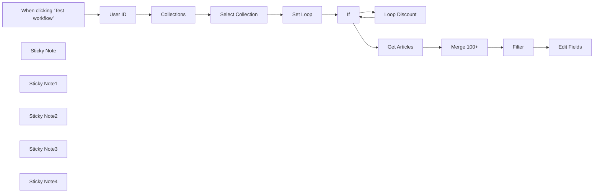

## Fluxo (.json) :

```json
{
  "nodes": [
    {
      "id": "03301645-75e3-480f-bf06-d015fa252d7b",
      "name": "When clicking ‘Test workflow’",
      "type": "n8n-nodes-base.manualTrigger",
      "position": [
        -360,
        260
      ],
      "parameters": {},
      "typeVersion": 1
    },
    {
      "id": "88ac5990-1e33-404f-93c1-42355f3366e7",
      "name": "Set Loop",
      "type": "n8n-nodes-base.set",
      "position": [
        380,
        260
      ],
      "parameters": {
        "options": {},
        "assignments": {
          "assignments": [
            {
              "id": "51ce4f05-471b-4948-8bb7-da8baad394af",
              "name": "loop_max",
              "type": "number",
              "value": "={{ $json.meta.numItems/100 }}"
            },
            {
              "id": "b8338050-c49f-4e9c-b7fc-b2074acd475a",
              "name": "loop_count",
              "type": "number",
              "value": "=0"
            }
          ]
        },
        "includeOtherFields": true
      },
      "typeVersion": 3.4
    },
    {
      "id": "aff9eb6b-7d66-4eff-be8d-565ab6076a79",
      "name": "If",
      "type": "n8n-nodes-base.if",
      "position": [
        600,
        260
      ],
      "parameters": {
        "options": {},
        "conditions": {
          "options": {
            "leftValue": "",
            "caseSensitive": true,
            "typeValidation": "strict"
          },
          "combinator": "and",
          "conditions": [
            {
              "id": "f129d508-c97f-428e-83ee-1a47e1d10574",
              "operator": {
                "type": "number",
                "operation": "lt"
              },
              "leftValue": "={{ $json.loop_count }}",
              "rightValue": "={{ $json.loop_max }}"
            }
          ]
        }
      },
      "typeVersion": 2.1
    },
    {
      "id": "4ac0a39d-f6bf-487f-9dab-1898b18bd7a8",
      "name": "User ID",
      "type": "n8n-nodes-base.set",
      "notes": "Get from Zotero Web > Settings > Security:\n\nhttps://www.zotero.org/settings/security",
      "position": [
        -180,
        260
      ],
      "parameters": {
        "options": {},
        "assignments": {
          "assignments": [
            {
              "id": "2917cc56-2714-4f41-a394-0bb7a1cb788e",
              "name": "userid",
              "type": "string",
              "value": "FILL WITH USER ID"
            }
          ]
        }
      },
      "notesInFlow": true,
      "typeVersion": 3.4
    },
    {
      "id": "30840c66-4efb-425f-b9ba-dbd053b594c1",
      "name": "Collections",
      "type": "n8n-nodes-base.httpRequest",
      "position": [
        0,
        260
      ],
      "parameters": {
        "url": "=https://api.zotero.org/users/{{ $json.userid }}/collections?v=3",
        "options": {},
        "authentication": "genericCredentialType",
        "genericAuthType": "httpHeaderAuth"
      },
      "typeVersion": 4.2
    },
    {
      "id": "20ad21b1-d506-42ac-b14c-8b6b47ca60e9",
      "name": "Loop Discount",
      "type": "n8n-nodes-base.set",
      "position": [
        780,
        420
      ],
      "parameters": {
        "options": {},
        "assignments": {
          "assignments": [
            {
              "id": "51ce4f05-471b-4948-8bb7-da8baad394af",
              "name": "={{ $json.loop_count++ }}",
              "type": "number",
              "value": "="
            }
          ]
        },
        "includeOtherFields": true
      },
      "typeVersion": 3.4
    },
    {
      "id": "bb56455d-eeb7-4a46-8589-efa052ed3e0c",
      "name": "Edit Fields",
      "type": "n8n-nodes-base.set",
      "position": [
        1660,
        260
      ],
      "parameters": {
        "options": {},
        "assignments": {
          "assignments": [
            {
              "id": "0131ab75-e0f9-4a8d-9380-315f45c3590d",
              "name": "key",
              "type": "string",
              "value": "={{ $json.key }}"
            },
            {
              "id": "13dc0799-fce8-4764-b50f-811fb0e64405",
              "name": "data.title",
              "type": "string",
              "value": "={{ $json.data.title }}"
            },
            {
              "id": "f11fcb34-ec1b-4ac7-8939-481e5ffc4fe4",
              "name": "meta.creatorSummary",
              "type": "string",
              "value": "={{ $json.meta.creatorSummary }}"
            }
          ]
        }
      },
      "typeVersion": 3.4
    },
    {
      "id": "30fc5d25-9500-416f-b1e9-9f0c879eb1bd",
      "name": "Select Collection",
      "type": "n8n-nodes-base.filter",
      "notes": "Select Collection",
      "position": [
        200,
        260
      ],
      "parameters": {
        "options": {},
        "conditions": {
          "options": {
            "leftValue": "",
            "caseSensitive": true,
            "typeValidation": "strict"
          },
          "combinator": "and",
          "conditions": [
            {
              "id": "9231d49f-03a0-40da-8daf-12d931284214",
              "operator": {
                "type": "string",
                "operation": "equals"
              },
              "leftValue": "={{ $json.key }}",
              "rightValue": "FILL WITH COLLECTION KEY"
            }
          ]
        }
      },
      "typeVersion": 2.1
    },
    {
      "id": "aebbfdcf-58ad-4b69-add9-aac2d98393cb",
      "name": "Filter",
      "type": "n8n-nodes-base.filter",
      "position": [
        1440,
        260
      ],
      "parameters": {
        "options": {},
        "conditions": {
          "options": {
            "leftValue": "",
            "caseSensitive": true,
            "typeValidation": "strict"
          },
          "combinator": "and",
          "conditions": [
            {
              "id": "5f9095f1-4ec9-4e94-bd95-b18d0b9543b0",
              "operator": {
                "type": "string",
                "operation": "exists",
                "singleValue": true
              },
              "leftValue": "={{ $('Get Articles').item.json.key }}",
              "rightValue": ""
            }
          ]
        }
      },
      "typeVersion": 2.1
    },
    {
      "id": "f4fb234c-c711-493f-ab84-7d5a66b123c9",
      "name": "Get Articles",
      "type": "n8n-nodes-base.httpRequest",
      "position": [
        920,
        240
      ],
      "parameters": {
        "url": "=https://api.zotero.org/users/{{ $('User ID').item.json.userid }}/collections/{{ $json.key }}/items?start={{ $json.loop_count*100 }}&limit={{ $json.meta.numItems-100*$json.loop_count }}",
        "options": {},
        "authentication": "genericCredentialType",
        "genericAuthType": "httpHeaderAuth"
      },
      "typeVersion": 4.2
    },
    {
      "id": "1c65de0f-6f7c-435e-af18-1c06a1d60cb2",
      "name": "Sticky Note",
      "type": "n8n-nodes-base.stickyNote",
      "position": [
        -180,
        20
      ],
      "parameters": {
        "width": 150,
        "height": 209.09090909090907,
        "content": "Get from Zotero Web > Settings > Security:\n\nhttps://www.zotero.org/settings/security\n"
      },
      "typeVersion": 1
    },
    {
      "id": "893af76c-c6b0-492e-aaba-277c952d3c0d",
      "name": "Sticky Note1",
      "type": "n8n-nodes-base.stickyNote",
      "position": [
        0,
        -20
      ],
      "parameters": {
        "width": 150,
        "height": 233,
        "content": "On the same page, create an Application Key to setup the Header Auth inside the Collections Node:\nhttps://www.zotero.org/settings/security\n\nUse `Zotero-API-Key` as Header name"
      },
      "typeVersion": 1
    },
    {
      "id": "b2068109-a36e-48e7-919d-1782a61a17f0",
      "name": "Sticky Note2",
      "type": "n8n-nodes-base.stickyNote",
      "position": [
        180,
        20
      ],
      "parameters": {
        "width": 150,
        "height": 189.99999999999994,
        "content": "See the \"Table\" results, of previous nodes and replace the second value of \"IS EQUAL TO\" with your Collection KEY"
      },
      "typeVersion": 1
    },
    {
      "id": "418328ed-4b37-426c-b018-756636c2fd29",
      "name": "Merge 100+",
      "type": "n8n-nodes-base.merge",
      "position": [
        1220,
        260
      ],
      "parameters": {},
      "typeVersion": 3
    },
    {
      "id": "690d9498-c01e-4cfd-8be1-fce239d0c37c",
      "name": "Sticky Note3",
      "type": "n8n-nodes-base.stickyNote",
      "position": [
        1440,
        140
      ],
      "parameters": {
        "width": 150,
        "height": 80,
        "content": "Optional Filter for Results"
      },
      "typeVersion": 1
    },
    {
      "id": "35efb061-d480-40f6-8118-8d48d0dbe67c",
      "name": "Sticky Note4",
      "type": "n8n-nodes-base.stickyNote",
      "position": [
        1660,
        140
      ],
      "parameters": {
        "width": 150,
        "height": 80,
        "content": "Optional Edit Fields for Results"
      },
      "typeVersion": 1
    }
  ],
  "pinData": {},
  "connections": {
    "If": {
      "main": [
        [
          {
            "node": "Get Articles",
            "type": "main",
            "index": 0
          },
          {
            "node": "Loop Discount",
            "type": "main",
            "index": 0
          }
        ]
      ]
    },
    "Filter": {
      "main": [
        [
          {
            "node": "Edit Fields",
            "type": "main",
            "index": 0
          }
        ]
      ]
    },
    "User ID": {
      "main": [
        [
          {
            "node": "Collections",
            "type": "main",
            "index": 0
          }
        ]
      ]
    },
    "Set Loop": {
      "main": [
        [
          {
            "node": "If",
            "type": "main",
            "index": 0
          }
        ]
      ]
    },
    "Merge 100+": {
      "main": [
        [
          {
            "node": "Filter",
            "type": "main",
            "index": 0
          }
        ]
      ]
    },
    "Collections": {
      "main": [
        [
          {
            "node": "Select Collection",
            "type": "main",
            "index": 0
          }
        ]
      ]
    },
    "Get Articles": {
      "main": [
        [
          {
            "node": "Merge 100+",
            "type": "main",
            "index": 0
          }
        ]
      ]
    },
    "Loop Discount": {
      "main": [
        [
          {
            "node": "If",
            "type": "main",
            "index": 0
          }
        ]
      ]
    },
    "Select Collection": {
      "main": [
        [
          {
            "node": "Set Loop",
            "type": "main",
            "index": 0
          }
        ]
      ]
    },
    "When clicking ‘Test workflow’": {
      "main": [
        [
          {
            "node": "User ID",
            "type": "main",
            "index": 0
          }
        ]
      ]
    }
  }
}
```

<a id="template-1492"></a>

## Template 1492 - Substituição automática de imagens em Google Docs

- **Nome:** Substituição automática de imagens em Google Docs
- **Descrição:** Automatiza a substituição de imagens em documentos do Google Docs usando URLs de imagens e permite tornar arquivos compartilháveis e baixá‑los em DOCX ou PDF.
- **Funcionalidade:** • Recepção de URLs de imagem: Puxa URLs de imagens a partir de uma fonte de dados (coluna nomeada "url").
• Cópia de template (opcional): Cria cópias de um documento‑modelo no armazenamento para gerar múltiplas versões.
• Identificação do objeto de imagem: Consulta o documento para identificar o imageObjectId do placeholder a ser substituído.
• Substituição de imagem via API: Envia requisição de atualização ao documento para substituir a imagem pelo URL fornecido (com método de ajuste, ex.: CENTER_CROP).
• Configuração de permissões (opcional): Torna o arquivo compartilhável publicamente com permissões configuráveis.
• Download em formatos diferentes: Baixa o documento resultante como DOCX ou converte e baixa como PDF.
• Processamento em lote (escala): Permite criar várias cópias do template e substituir imagens para gerar múltiplos documentos automaticamente.
- **Ferramentas:** • Google Docs API: API para consultar o conteúdo do documento, obter IDs de objetos de imagem e aplicar atualizações via batchUpdate.
• Google Drive: Armazenamento e gestão de arquivos, usado para copiar templates, ajustar permissões e realizar downloads (DOCX/PDF).
• Fonte de URLs de imagens (base de dados ou serviço de hospedagem): Qualquer serviço ou banco de dados que forneça URLs de imagens para inserção nos documentos.

## Fluxo visual

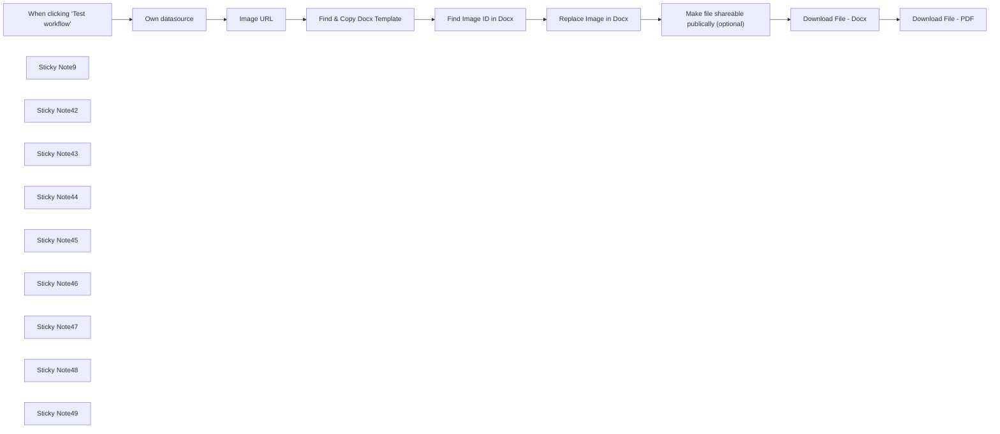

## Fluxo (.json) :

```json
{
  "meta": {
    "instanceId": "6b6a2db47bdf8371d21090c511052883cc9a3f6af5d0d9d567c702d74a18820e"
  },
  "nodes": [
    {
      "id": "f4570aad-db25-4dcd-8589-b1c8335935de",
      "name": "When clicking ‘Test workflow’",
      "type": "n8n-nodes-base.manualTrigger",
      "position": [
        20,
        5220
      ],
      "parameters": {},
      "typeVersion": 1
    },
    {
      "id": "675243b0-080f-4d5e-a0ca-a0fe0e7c04a9",
      "name": "Sticky Note9",
      "type": "n8n-nodes-base.stickyNote",
      "position": [
        185,
        5140
      ],
      "parameters": {
        "color": 7,
        "width": 426.32566328767217,
        "height": 260.3707944299243,
        "content": "**Find and replace image in docx. Connect to a datasource with an image URL you want to insert into the Docx file**"
      },
      "typeVersion": 1
    },
    {
      "id": "16bbf5da-5ebc-4e9c-8b3c-80d0077c51b8",
      "name": "Find Image ID in Docx",
      "type": "n8n-nodes-base.httpRequest",
      "position": [
        900,
        5220
      ],
      "parameters": {
        "url": "=https://docs.googleapis.com/v1/documents/{{$json.documentId}}",
        "options": {},
        "authentication": "predefinedCredentialType",
        "nodeCredentialType": "googleDocsOAuth2Api"
      },
      "notesInFlow": true,
      "typeVersion": 4.2
    },
    {
      "id": "60325192-4730-4410-ae33-9127ff8cc5f7",
      "name": "Make file shareable publically (optional)",
      "type": "n8n-nodes-base.googleDrive",
      "position": [
        1360,
        5220
      ],
      "parameters": {
        "fileId": {
          "__rl": true,
          "mode": "id",
          "value": "={{ $json.documentId }}"
        },
        "options": {},
        "operation": "share",
        "permissionsUi": {
          "permissionsValues": {
            "role": "writer",
            "type": "anyone"
          }
        }
      },
      "typeVersion": 3
    },
    {
      "id": "6f254810-3ab8-4ec1-b964-8b399472acf3",
      "name": "Image URL",
      "type": "n8n-nodes-base.set",
      "notes": "Define Image URL",
      "position": [
        440,
        5220
      ],
      "parameters": {
        "options": {},
        "assignments": {
          "assignments": [
            {
              "id": "cc2c6af0-68d3-49eb-85fe-3288d2ed0f6b",
              "name": "url",
              "type": "string",
              "value": "https://picsum.photos/id/400/300/300"
            }
          ]
        },
        "includeOtherFields": true
      },
      "notesInFlow": true,
      "typeVersion": 3.4
    },
    {
      "id": "d33a913a-2d98-4922-ba8d-5d325b114572",
      "name": "Find & Copy Docx Template",
      "type": "n8n-nodes-base.googleDrive",
      "position": [
        660,
        5220
      ],
      "parameters": {
        "name": "Chosen filename",
        "fileId": {
          "__rl": true,
          "mode": "list",
          "value": "1RQAX2CszNqw79gZxeocEZU0-KquTq3RQc2-5Uv1mgd0",
          "cachedResultUrl": "https://docs.google.com/document/d/1RQAX2CszNqw79gZxeocEZU0-KquTq3RQc2-5Uv1mgd0/edit?usp=drivesdk",
          "cachedResultName": "Marketing Plan (template)"
        },
        "options": {},
        "operation": "copy"
      },
      "notesInFlow": true,
      "typeVersion": 3
    },
    {
      "id": "1f43d321-eddf-4008-99e2-9338cc85bad2",
      "name": "Sticky Note42",
      "type": "n8n-nodes-base.stickyNote",
      "position": [
        180,
        5420
      ],
      "parameters": {
        "color": 3,
        "width": 415.45208033736463,
        "height": 105.04337297263078,
        "content": "**REQUIRED**\nConnect to your database of image urls to input. Name the column `url` like in the `Image URL` node. This flow works with an image URL only, not a physical image file"
      },
      "typeVersion": 1
    },
    {
      "id": "0e1bb319-8429-4bde-88a3-9fd69df7c986",
      "name": "Own datasource",
      "type": "n8n-nodes-base.noOp",
      "position": [
        240,
        5220
      ],
      "parameters": {},
      "typeVersion": 1
    },
    {
      "id": "d534cc1f-e651-4c06-860b-ce3d3c648964",
      "name": "Sticky Note43",
      "type": "n8n-nodes-base.stickyNote",
      "position": [
        620,
        5420
      ],
      "parameters": {
        "color": 2,
        "width": 415.45208033736463,
        "height": 222.7191963089109,
        "content": "**OPTIONAL**\nIf you want to create multiple documents with multiple images then create a template in your GDrive folder with a placeholder image that you want to replace. This template will be copied each time you run the flow, and the ID of that new document will be passed to `find image ID in Docx` to find the relevant image to replace with your image url. If you are just doing this for a single document then remove the `find and copy docx template` node. If you do this step, follow the [n8n guide](https://docs.n8n.io/integrations/builtin/app-nodes/n8n-nodes-base.googledrive/) on how to connect to your GDrive account."
      },
      "typeVersion": 1
    },
    {
      "id": "b6a22eb4-0b13-4eb5-be40-ed2dfedf99b5",
      "name": "Sticky Note44",
      "type": "n8n-nodes-base.stickyNote",
      "position": [
        620,
        5120
      ],
      "parameters": {
        "color": 7,
        "width": 169.22824698060023,
        "height": 278.7193163441844,
        "content": "**Optional - create and copy a template document in your GDrive folder**"
      },
      "typeVersion": 1
    },
    {
      "id": "25d2a7c0-cef7-4aaf-9bb8-fe9c83d73731",
      "name": "Sticky Note45",
      "type": "n8n-nodes-base.stickyNote",
      "position": [
        853,
        5120
      ],
      "parameters": {
        "color": 7,
        "width": 435.22861330045936,
        "height": 278.7193163441844,
        "content": "**Sends request to Google API to retrieve document details (including image ID) in the template document**"
      },
      "typeVersion": 1
    },
    {
      "id": "f8dcb709-5505-4c63-afe9-83a0dfb608e9",
      "name": "Replace Image in Docx",
      "type": "n8n-nodes-base.httpRequest",
      "position": [
        1100,
        5220
      ],
      "parameters": {
        "url": "=https://docs.googleapis.com/v1/documents/{{$json.documentId}}:batchUpdate",
        "method": "POST",
        "options": {},
        "jsonBody": "={\n  \"requests\": [\n    {\n      \"replaceImage\": {\n        \"imageObjectId\": {{ $json.body.content[1].paragraph.elements[0].inlineObjectElement.inlineObjectId }},\n        \"uri\": \"{{ $('Image URL').item.json.url }}\",\n        \"imageReplaceMethod\": \"CENTER_CROP\"\n      }\n    }\n  ]\n} ",
        "sendBody": true,
        "specifyBody": "json",
        "authentication": "predefinedCredentialType",
        "nodeCredentialType": "googleDocsOAuth2Api"
      },
      "notesInFlow": true,
      "typeVersion": 4.2
    },
    {
      "id": "f800131b-e8d3-4741-8e8d-ad208e53ebe7",
      "name": "Sticky Note46",
      "type": "n8n-nodes-base.stickyNote",
      "position": [
        1060,
        5420
      ],
      "parameters": {
        "color": 3,
        "width": 297.15093794343295,
        "height": 373.0766632058715,
        "content": "**REQUIRED**\n- Update the Google Docs OAuth 2 API credentials [with your own](https://docs.n8n.io/integrations/builtin/app-nodes/n8n-nodes-base.googledocs/)\n- Ensure Document ID is passing correctly to `Find Image ID in Docx` if you removed the previous step\n- Ensure the `imageObjectId` in the `Replace Image in Docx` node is correct, if you only have a single image in the document it should use the `\"{{ $json.body.content[1].paragraph.elements[0].inlineObjectElement.inlineObjectId }}\"` returned from the previous node. If you have more than one image then id will be nested in the `\"body.content[1].paragraph.positionedObjectIds[0]\"` object from the previous node "
      },
      "typeVersion": 1
    },
    {
      "id": "0cdad7ae-e407-4c21-b454-8b2824e2b6d4",
      "name": "Sticky Note47",
      "type": "n8n-nodes-base.stickyNote",
      "position": [
        1380,
        5420
      ],
      "parameters": {
        "color": 2,
        "width": 747.7707439712262,
        "height": 222.7191963089109,
        "content": "**OPTIONAL**\n- Make the file publically shareable (anyone can view/edit)\n- Download the file as a Docx\n- Download the file as a PDF\n\n\nAll of the above requires authenticating with your GDrive account, ensuring the `documentID` is pulling correctly from previous nodes and choosing a `filename` if relevant"
      },
      "typeVersion": 1
    },
    {
      "id": "fa6a214e-b6c5-403a-884a-d915f5a1362f",
      "name": "Download File - Docx",
      "type": "n8n-nodes-base.googleDrive",
      "position": [
        1580,
        5220
      ],
      "parameters": {
        "fileId": {
          "__rl": true,
          "mode": "id",
          "value": "={{ $json.documentId }}"
        },
        "options": {},
        "operation": "download"
      },
      "notesInFlow": true,
      "typeVersion": 3
    },
    {
      "id": "399e08ae-864d-4ffa-bc18-d82e03e30f7c",
      "name": "Download File - PDF",
      "type": "n8n-nodes-base.googleDrive",
      "position": [
        1800,
        5220
      ],
      "parameters": {
        "fileId": {
          "__rl": true,
          "mode": "id",
          "value": "={{ $json.documentId }}"
        },
        "options": {
          "fileName": "=filename - PDF",
          "googleFileConversion": {
            "conversion": {
              "docsToFormat": "application/pdf"
            }
          }
        },
        "operation": "download"
      },
      "notesInFlow": true,
      "typeVersion": 3
    },
    {
      "id": "0855b49a-dca3-4da8-8e22-4294523798d7",
      "name": "Sticky Note48",
      "type": "n8n-nodes-base.stickyNote",
      "position": [
        1320,
        5120
      ],
      "parameters": {
        "color": 7,
        "width": 683.4764182113373,
        "height": 278.7193163441844,
        "content": "**Optional - make the file shareable, and download in docx and PDF format**"
      },
      "typeVersion": 1
    },
    {
      "id": "d4a2e23d-9c14-4b0c-8fd3-99a981d2f39b",
      "name": "Sticky Note49",
      "type": "n8n-nodes-base.stickyNote",
      "position": [
        -800,
        4960
      ],
      "parameters": {
        "color": 4,
        "width": 773.6179704580734,
        "height": 875.8289847608302,
        "content": "## Replace Images in Google Docs Documents and Download as PDF/Docx\n\n## Use Case\nAutomate image replacement in Google Docs:\n- You need to update document images dynamically\n- You want to create multiple versions of a template with different images\n- You need to batch process document images from a URL database\n- You want to generate shareable documents with custom images\n\n## What this Workflow Does\nThe workflow automates image replacement in Google Docs:\n- Accepts image URLs from your database\n- Finds and replaces images in template documents\n- Creates new document copies with updated images\n- Optionally converts to PDF and makes documents shareable\n\n## Setup\n1. Connect your image URL database (column name must be \"url\")\n2. Set up [Google Docs OAuth 2 API credentials](https://docs.n8n.io/integrations/builtin/app-nodes/n8n-nodes-base.googledocs/)\n3. Optional: Create a template document in Google Drive with placeholder images\n4. Optional: Configure [Google Drive authentication](https://docs.n8n.io/integrations/builtin/app-nodes/n8n-nodes-base.googledrive/) for additional features\n\n## How to Adjust it to Your Needs\n- Remove template copying for single document processing\n- Adjust image ID selection for documents with multiple images\n- Configure sharing settings and download formats\n- Customize file naming and storage location\n\n\nMade by Simon @ [automake.io](https://automake.io)"
      },
      "typeVersion": 1
    }
  ],
  "pinData": {},
  "connections": {
    "Image URL": {
      "main": [
        [
          {
            "node": "Find & Copy Docx Template",
            "type": "main",
            "index": 0
          }
        ]
      ]
    },
    "Own datasource": {
      "main": [
        [
          {
            "node": "Image URL",
            "type": "main",
            "index": 0
          }
        ]
      ]
    },
    "Download File - Docx": {
      "main": [
        [
          {
            "node": "Download File - PDF",
            "type": "main",
            "index": 0
          }
        ]
      ]
    },
    "Find Image ID in Docx": {
      "main": [
        [
          {
            "node": "Replace Image in Docx",
            "type": "main",
            "index": 0
          }
        ]
      ]
    },
    "Replace Image in Docx": {
      "main": [
        [
          {
            "node": "Make file shareable publically (optional)",
            "type": "main",
            "index": 0
          }
        ]
      ]
    },
    "Find & Copy Docx Template": {
      "main": [
        [
          {
            "node": "Find Image ID in Docx",
            "type": "main",
            "index": 0
          }
        ]
      ]
    },
    "When clicking ‘Test workflow’": {
      "main": [
        [
          {
            "node": "Own datasource",
            "type": "main",
            "index": 0
          }
        ]
      ]
    },
    "Make file shareable publically (optional)": {
      "main": [
        [
          {
            "node": "Download File - Docx",
            "type": "main",
            "index": 0
          }
        ]
      ]
    }
  }
}
```

<a id="template-1493"></a>

## Template 1493 - Adicionar assinante ao formulário e associar tag

- **Nome:** Adicionar assinante ao formulário e associar tag
- **Descrição:** Fluxo que adiciona um assinante a um formulário, cria uma tag e associa o assinante a essa tag.
- **Funcionalidade:** • Acionamento manual: inicia o fluxo quando a execução é acionada manualmente.
• Adição de assinante ao formulário: registra um email como assinante no formulário identificado pelo ID configurado (1657198).
• Criação de tag: cria uma nova tag na conta para classificação ou segmentação.
• Associação do assinante à tag: adiciona o assinante recém-cadastrado à tag especificada (tagId 1850395) usando o email retornado pelo cadastro.
- **Ferramentas:** • ConvertKit: plataforma de email marketing para gerenciar formulários, assinantes e tags.


## Fluxo visual

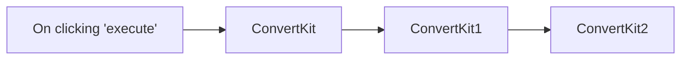

## Fluxo (.json) :

```json
{
  "id": "25",
  "name": "Add subscriber to form, create tag and subscriber to the tag",
  "nodes": [
    {
      "name": "On clicking 'execute'",
      "type": "n8n-nodes-base.manualTrigger",
      "position": [
        300,
        300
      ],
      "parameters": {},
      "typeVersion": 1
    },
    {
      "name": "ConvertKit",
      "type": "n8n-nodes-base.convertKit",
      "position": [
        500,
        300
      ],
      "parameters": {
        "id": 1657198,
        "email": "",
        "additionalFields": {}
      },
      "credentials": {
        "convertKitApi": "convertkit"
      },
      "typeVersion": 1
    },
    {
      "name": "ConvertKit1",
      "type": "n8n-nodes-base.convertKit",
      "position": [
        710,
        300
      ],
      "parameters": {
        "name": "",
        "resource": "tag"
      },
      "credentials": {
        "convertKitApi": "convertkit"
      },
      "typeVersion": 1
    },
    {
      "name": "ConvertKit2",
      "type": "n8n-nodes-base.convertKit",
      "position": [
        910,
        300
      ],
      "parameters": {
        "email": "={{$node[\"ConvertKit\"].json[\"subscriber\"][\"email_address\"]}}",
        "tagId": 1850395,
        "resource": "tagSubscriber",
        "operation": "add",
        "additionalFields": {
          "fields": {
            "field": []
          }
        }
      },
      "credentials": {
        "convertKitApi": "convertkit"
      },
      "typeVersion": 1
    }
  ],
  "active": false,
  "settings": {},
  "connections": {
    "ConvertKit": {
      "main": [
        [
          {
            "node": "ConvertKit1",
            "type": "main",
            "index": 0
          }
        ]
      ]
    },
    "ConvertKit1": {
      "main": [
        [
          {
            "node": "ConvertKit2",
            "type": "main",
            "index": 0
          }
        ]
      ]
    },
    "On clicking 'execute'": {
      "main": [
        [
          {
            "node": "ConvertKit",
            "type": "main",
            "index": 0
          }
        ]
      ]
    }
  }
}
```

<a id="template-1494"></a>

## Template 1494 - Lembrete de beber água com botões e registro

- **Nome:** Lembrete de beber água com botões e registro
- **Descrição:** Automatiza lembretes de beber água, gera mensagem personalizada com IA, envia notificações no Slack com botões de volume e registra as entradas em uma planilha.
- **Funcionalidade:** • Agendamento aleatório de notificações: envia lembretes entre 08:00 e 23:00 com variação por minuto para evitar padronização.
• Recuperação de meta e registros diários: obtém meta de hidratação e registros do dia atual a partir de uma planilha.
• Cálculo e exibição de progresso: soma volumes registrados, calcula percentual de progresso e gera uma representação visual (ícones) do progresso.
• Verificação de último registro: checa o horário do último registro e, se recente, atrasa o envio do lembrete por um intervalo aleatório de minutos.
• Geração de mensagem por IA: usa um modelo de linguagem para criar uma mensagem curta, persuasiva e baseada em princípios de medicina chinesa, retornada em JSON para uso direto.
• Envio de notificação no Slack com botões: publica mensagem com texto gerado pela IA e botões de ação para selecionar volumes (100, 150, 200, 250, 300 ml).
• Recebimento de interações via webhook: processa cliques nos botões do Slack, extrai payload e dados do usuário.
• Registro automático na planilha: ao confirmar a ingestão, adiciona uma linha com data, hora e volume na planilha do usuário.
• Confirmação no Slack com atalho iOS: envia mensagem de confirmação contendo um botão que abre um atalho iOS (shortcuts://) passando dados codificados para registrar no app Health.
• Controle de threads: publica confirmações como resposta na thread da mensagem original para manter o contexto.
- **Ferramentas:** • Slack: plataforma de mensagens usada para enviar notificações interativas e receber cliques dos botões.
• Google Sheets: armazena meta de hidratação, registros diários e permite consultas e anexação de novos registros.
• OpenAI (modelo GPT-4o-mini): gera texto persuasivo e formatado em JSON para o corpo da notificação.
• iOS Shortcuts / Health: atalho iOS acionável via URL para registrar a ingestão de água diretamente no app Saúde.
• Endpoint Webhook HTTP: recebe payloads de interação do Slack e permite integração entre a notificação e o registro.

## Fluxo visual

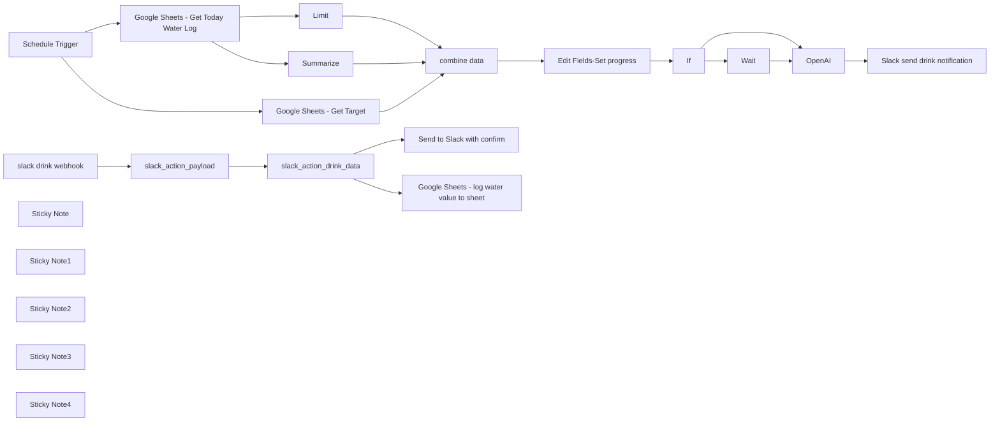

## Fluxo (.json) :

```json
{
  "meta": {
    "instanceId": "fddb3e91967f1012c95dd02bf5ad21f279fc44715f47a7a96a33433621caa253",
    "templateCredsSetupCompleted": true
  },
  "nodes": [
    {
      "id": "b717d887-4d4b-4f21-97a3-978fcde2c9f6",
      "name": "slack_action_payload",
      "type": "n8n-nodes-base.set",
      "position": [
        -1020,
        100
      ],
      "parameters": {
        "mode": "raw",
        "options": {},
        "jsonOutput": "= {{ $json.body.payload }}"
      },
      "typeVersion": 3.4
    },
    {
      "id": "046950ad-a40c-47d9-8dab-406bc6bf6e12",
      "name": "slack_action_drink_data",
      "type": "n8n-nodes-base.set",
      "position": [
        -800,
        100
      ],
      "parameters": {
        "options": {},
        "assignments": {
          "assignments": [
            {
              "id": "3d208143-1b80-4701-bff7-fc1dfbf9b89c",
              "name": "value",
              "type": "string",
              "value": "={{ $json.actions[0].value }}"
            },
            {
              "id": "1600b553-8ef1-44ac-9ae7-d33be8e539e5",
              "name": "message_text",
              "type": "string",
              "value": "={{ $json.message.text }}"
            },
            {
              "id": "5ea5f093-7e36-4de0-aa14-fb2bc0788e84",
              "name": "shortcut_url",
              "type": "string",
              "value": "=shortcuts://run-shortcut?name=darrell_water&input="
            },
            {
              "id": "5d9e4946-10eb-48ed-87d8-978235d44ec1",
              "name": "shortcut_url_data",
              "type": "string",
              "value": "={\"value\":{{ $json.actions[0].value }},\"time\":\"{{ $now.format(\"yyyy-MM-dd\") }}T{{ $now.format(\"HH:mm:ss\") }}\"}"
            },
            {
              "id": "625258d8-55eb-4252-b313-b4954da57de1",
              "name": "message_ts",
              "type": "string",
              "value": "={{ $json.container.message_ts }}"
            }
          ]
        }
      },
      "typeVersion": 3.4
    },
    {
      "id": "f90ec31c-b63e-470c-84ba-9429539d6bf4",
      "name": "OpenAI",
      "type": "@n8n/n8n-nodes-langchain.openAi",
      "position": [
        140,
        -800
      ],
      "parameters": {
        "modelId": {
          "__rl": true,
          "mode": "list",
          "value": "gpt-4o-mini",
          "cachedResultName": "GPT-4O-MINI"
        },
        "options": {
          "temperature": 1
        },
        "messages": {
          "values": [
            {
              "content": "=Remind to drink water, the last time you drank water was {{ DateTime.fromISO($('combine data').item.json.date +\"T\"+$('combine data').item.json.time).format('yyyy-MM-dd HH:mm:ss') }}\nThe current time is {{ $now.format('yyyy-MM-dd HH:mm:ss') }}\nThe user has drunk water {{ $('combine data').item.json.count_date }} times today"
            },
            {
              "role": "assistant",
              "content": "You are a gentle and professional Chinese medicine practitioner who provides health advice in a friendly, encouraging tone. Please generate a response in JSON format with the structure {\"message\": \"...\"}, keeping the message brief (<100-200 words), persuasive, reminding me to drink water, clearly specifying intervals (such as 2 hours), and mentioning at least one benefit of drinking water (such as replenishing qi) and one negative effect of dehydration (such as blood stasis), encouraging me to take action to drink water, ending with an action prompt. Start directly without using any form of address. "
            },
            {
              "role": "system",
              "content": "must return {\\\"message\\\": \\\"...\\\"} and **responding in English**"
            }
          ]
        },
        "jsonOutput": true
      },
      "credentials": {
        "openAiApi": {
          "id": "AE7fbXM0LWEUpaUf",
          "name": "OpenAi account"
        }
      },
      "typeVersion": 1.8
    },
    {
      "id": "28fe1f82-a8d6-4a9a-9061-ec94a7344fa3",
      "name": "Schedule Trigger",
      "type": "n8n-nodes-base.scheduleTrigger",
      "position": [
        -1260,
        -800
      ],
      "parameters": {
        "rule": {
          "interval": [
            {
              "field": "cronExpression",
              "expression": "=0 {{ Math.floor(Math.random() * 11) }} 8-23 * * *"
            }
          ]
        }
      },
      "typeVersion": 1.2
    },
    {
      "id": "ef12fb27-4377-42be-b9bc-bdbaaaa4c754",
      "name": "Limit",
      "type": "n8n-nodes-base.limit",
      "position": [
        -840,
        -640
      ],
      "parameters": {
        "keep": "lastItems"
      },
      "typeVersion": 1
    },
    {
      "id": "e36862e2-912f-4e41-80b0-6f66cc8ba0ba",
      "name": "Google Sheets - Get Target",
      "type": "n8n-nodes-base.googleSheets",
      "position": [
        -1040,
        -820
      ],
      "parameters": {
        "options": {
          "returnFirstMatch": false
        },
        "sheetName": {
          "__rl": true,
          "mode": "list",
          "value": 2141999480,
          "cachedResultUrl": "https://docs.google.com/spreadsheets/d/1NRPq87zvNiBGKzVJaT0YYc55qp-6-9kGA4VpqkylpbI/edit#gid=2141999480",
          "cachedResultName": "setting"
        },
        "documentId": {
          "__rl": true,
          "mode": "list",
          "value": "1NRPq87zvNiBGKzVJaT0YYc55qp-6-9kGA4VpqkylpbI",
          "cachedResultUrl": "https://docs.google.com/spreadsheets/d/1NRPq87zvNiBGKzVJaT0YYc55qp-6-9kGA4VpqkylpbI/edit?usp=drivesdk",
          "cachedResultName": "n8n-drink-water"
        }
      },
      "credentials": {
        "googleSheetsOAuth2Api": {
          "id": "atsKA0m2aQXeL6i6",
          "name": "Google Sheets account"
        }
      },
      "typeVersion": 4.5
    },
    {
      "id": "9809c9bd-51ff-4277-9f0f-5e1438c25fe8",
      "name": "Summarize",
      "type": "n8n-nodes-base.summarize",
      "position": [
        -840,
        -500
      ],
      "parameters": {
        "options": {},
        "fieldsToSummarize": {
          "values": [
            {
              "field": "value",
              "aggregation": "sum"
            },
            {
              "field": "date"
            }
          ]
        }
      },
      "typeVersion": 1.1
    },
    {
      "id": "ca995a95-9c35-43e4-ab68-0f7aa44f99d1",
      "name": "combine data",
      "type": "n8n-nodes-base.merge",
      "position": [
        -620,
        -800
      ],
      "parameters": {
        "mode": "combine",
        "options": {},
        "combineBy": "combineByPosition",
        "numberInputs": 3
      },
      "typeVersion": 3
    },
    {
      "id": "44da169c-a2da-427c-aa46-54082b27e94b",
      "name": "If",
      "type": "n8n-nodes-base.if",
      "position": [
        -200,
        -800
      ],
      "parameters": {
        "options": {},
        "conditions": {
          "options": {
            "version": 2,
            "leftValue": "",
            "caseSensitive": true,
            "typeValidation": "strict"
          },
          "combinator": "and",
          "conditions": [
            {
              "id": "350fc192-3049-407a-b468-bfdcfbdde966",
              "operator": {
                "type": "dateTime",
                "operation": "after"
              },
              "leftValue": "={{ DateTime.fromISO($('combine data').item.json.date +\"T\"+$('combine data').item.json.time).format('yyyy-MM-dd HH:mm:ss') }}",
              "rightValue": "={{ $now.minus(30, \"minutes\") }}"
            }
          ]
        }
      },
      "typeVersion": 2.2
    },
    {
      "id": "bc85d85a-cee2-43ab-a434-b26c5cd69122",
      "name": "Wait",
      "type": "n8n-nodes-base.wait",
      "notes": "If the user log water recently. \nWait for another 3x minutes",
      "position": [
        -20,
        -640
      ],
      "webhookId": "fb26360f-6364-4069-a3f1-ed5c37ecccc0",
      "parameters": {
        "unit": "minutes",
        "amount": "={{ Math.floor(Math.random() * 11) + 21 }}"
      },
      "notesInFlow": true,
      "typeVersion": 1.1
    },
    {
      "id": "551c217e-9192-486e-ae9f-068bebd0792a",
      "name": "slack drink webhook",
      "type": "n8n-nodes-base.webhook",
      "position": [
        -1200,
        100
      ],
      "webhookId": "f992f346-0076-4a79-a046-5b5c295bf6c2",
      "parameters": {
        "path": "f992f346-0076-4a79-a046-5b5c295bf6c2",
        "options": {},
        "httpMethod": "POST"
      },
      "typeVersion": 2
    },
    {
      "id": "c000d036-7246-47a5-9001-ffc482c74371",
      "name": "Sticky Note",
      "type": "n8n-nodes-base.stickyNote",
      "position": [
        -1340,
        -960
      ],
      "parameters": {
        "width": 1060,
        "height": 620,
        "content": "## Grab recent drink data\n"
      },
      "typeVersion": 1
    },
    {
      "id": "fd4bdbf4-c2d0-497c-891e-2667a85fa2ad",
      "name": "Sticky Note1",
      "type": "n8n-nodes-base.stickyNote",
      "position": [
        -260,
        -960
      ],
      "parameters": {
        "color": 2,
        "width": 360,
        "height": 500,
        "content": "If already drink recently. Delay the notification in 3x minutes randomly\n"
      },
      "typeVersion": 1
    },
    {
      "id": "cd4b4928-a858-4f12-b294-51ba8a4484da",
      "name": "Sticky Note2",
      "type": "n8n-nodes-base.stickyNote",
      "position": [
        120,
        -960
      ],
      "parameters": {
        "color": 5,
        "width": 580,
        "height": 360,
        "content": "## Send the slack notification with AI wording. Also have the drink water action buttons"
      },
      "typeVersion": 1
    },
    {
      "id": "cc7c8459-a97d-4ee9-b97c-b4a95afecf5a",
      "name": "Sticky Note3",
      "type": "n8n-nodes-base.stickyNote",
      "position": [
        -1340,
        -320
      ],
      "parameters": {
        "color": 3,
        "width": 1300,
        "height": 660,
        "content": "## When User interact the drink button. Record the drink value to sheet and send back the iOS health log water url to start the shortcut\n\n**Note for Shortcut:**\n\nThe shortcul url will be like `shortcuts://run-shortcut?name=darrell_water&input=%7B%22value%22%3A100%2C%22time%22%3A%222025-03-04T16%3A10%3A15%22%7D`\n\nIt's url encoded. The decoded version will be:\n`shortcuts://run-shortcut?name=darrell_water&input={\"value\":100,\"time\":\"2025-03-04T16:10:15\"}`\n\nWe can see it pass the shortcut name and input with json string value. This will be used in iOS shortcut"
      },
      "typeVersion": 1
    },
    {
      "id": "e8e388e0-dddc-4db2-b5fa-acb76d025580",
      "name": "Sticky Note4",
      "type": "n8n-nodes-base.stickyNote",
      "position": [
        -1700,
        -960
      ],
      "parameters": {
        "color": 7,
        "width": 340,
        "height": 240,
        "content": "## Created by darrell_tw_ \n\nAn engineer now focus on AI and Automation\n\n### contact me with following:\n[X](https://x.com/darrell_tw_)\n[Threads](https://www.threads.net/@darrell_tw_)\n[Instagram](https://www.instagram.com/darrell_tw_/)\n[Website](https://www.darrelltw.com/)"
      },
      "typeVersion": 1
    },
    {
      "id": "32b098ea-a72f-4906-9a39-916afcf47dc8",
      "name": "Slack send drink notification",
      "type": "n8n-nodes-base.slack",
      "position": [
        480,
        -800
      ],
      "webhookId": "1ffefb29-4176-4a9c-a8e2-cfc3caf05910",
      "parameters": {
        "text": "喝水提醒",
        "select": "channel",
        "blocksUi": "={\n\t\"blocks\": [\n\t\t{\n\t\t\t\"type\": \"section\",\n\t\t\t\"text\": {\n\t\t\t\t\"type\": \"mrkdwn\",\n\t\t\t\t\"text\": \"{{ $json.message.content.message ? $json.message.content.message : 'Time to drink！' }}\"\n\t\t\t}\n\t\t},\n\t\t{\n\t\t\t\"type\": \"section\",\n\t\t\t\"text\": {\n\t\t\t\t\"type\": \"mrkdwn\",\n\t\t\t\t\"text\": \"{{ $('Edit Fields-Set progress').item.json.progress_image }}\"\n\t\t\t}\n\t\t},\n\t\t{\n\t\t\t\"type\": \"actions\",\n\t\t\t\"elements\": [\n\t\t\t\t{\n\t\t\t\t\t\"type\": \"button\",\n\t\t\t\t\t\"text\": {\n\t\t\t\t\t\t\"type\": \"plain_text\",\n\t\t\t\t\t\t\"emoji\": true,\n\t\t\t\t\t\t\"text\": \"100\"\n\t\t\t\t\t},\n\t\t\t\t\t\"style\": \"primary\",\n\t\t\t\t\t\"value\": \"100\"\n\t\t\t\t},\n\t\t\t\t{\n\t\t\t\t\t\"type\": \"button\",\n\t\t\t\t\t\"text\": {\n\t\t\t\t\t\t\"type\": \"plain_text\",\n\t\t\t\t\t\t\"emoji\": true,\n\t\t\t\t\t\t\"text\": \"150\"\n\t\t\t\t\t},\n\t\t\t\t\t\"style\": \"primary\",\n\t\t\t\t\t\"value\": \"150\"\n\t\t\t\t},\n\t\t\t\t{\n\t\t\t\t\t\"type\": \"button\",\n\t\t\t\t\t\"text\": {\n\t\t\t\t\t\t\"type\": \"plain_text\",\n\t\t\t\t\t\t\"emoji\": true,\n\t\t\t\t\t\t\"text\": \"200\"\n\t\t\t\t\t},\n\t\t\t\t\t\"style\": \"primary\",\n\t\t\t\t\t\"value\": \"200\"\n\t\t\t\t},\n\t\t\t\t{\n\t\t\t\t\t\"type\": \"button\",\n\t\t\t\t\t\"text\": {\n\t\t\t\t\t\t\"type\": \"plain_text\",\n\t\t\t\t\t\t\"emoji\": true,\n\t\t\t\t\t\t\"text\": \"250\"\n\t\t\t\t\t},\n\t\t\t\t\t\"style\": \"primary\",\n\t\t\t\t\t\"value\": \"250\"\n\t\t\t\t},\n\t\t\t\t{\n\t\t\t\t\t\"type\": \"button\",\n\t\t\t\t\t\"text\": {\n\t\t\t\t\t\t\"type\": \"plain_text\",\n\t\t\t\t\t\t\"emoji\": true,\n\t\t\t\t\t\t\"text\": \"300\"\n\t\t\t\t\t},\n\t\t\t\t\t\"style\": \"primary\",\n\t\t\t\t\t\"value\": \"300\"\n\t\t\t\t}\n\t\t\t]\n\t\t}\n\t]\n}",
        "channelId": {
          "__rl": true,
          "mode": "list",
          "value": "C08FW6YKVC1",
          "cachedResultName": "n8n-drink-water-nofity-demo"
        },
        "messageType": "block",
        "otherOptions": {},
        "authentication": "oAuth2"
      },
      "credentials": {
        "slackOAuth2Api": {
          "id": "sD1J9ZLyEhcglrRa",
          "name": "Slack account"
        }
      },
      "typeVersion": 2.3
    },
    {
      "id": "8f550d8f-b960-41df-8a3b-2443327d5892",
      "name": "Send to Slack with confirm",
      "type": "n8n-nodes-base.slack",
      "position": [
        -560,
        0
      ],
      "webhookId": "fc8af764-ed01-4ca1-acef-80b8076bb9db",
      "parameters": {
        "text": "=Log Successfully",
        "select": "channel",
        "blocksUi": "={\n\t\"blocks\": [\n        {\n\t\t\t\"type\": \"divider\"\n\t\t},\n\t\t{\n\t\t\t\"type\": \"section\",\n\t\t\t\"text\": {\n\t\t\t\t\"type\": \"mrkdwn\",\n\t\t\t\t\"text\": \"Already log the water\"\n\t\t\t}\n\t\t},\n\t\t{\n\t\t\t\"type\": \"section\",\n\t\t\t\"text\": {\n\t\t\t\t\"type\": \"mrkdwn\",\n\t\t\t\t\"text\": \"Click me to Shortcut\"\n\t\t\t},\n\t\t\t\"accessory\": {\n\t\t\t\t\"type\": \"button\",\n\t\t\t\t\"text\": {\n\t\t\t\t\t\"type\": \"plain_text\",\n\t\t\t\t\t\"text\": \"iOS Health\",\n\t\t\t\t\t\"emoji\": true\n\t\t\t\t},\n\t\t\t\t\"value\": \"click\",\n\t\t\t\t\"url\": \"{{ $('slack_action_drink_data').item.json.shortcut_url}}{{ $('slack_action_drink_data').item.json.shortcut_url_data.urlEncode() }}\",\n\t\t\t\t\"action_id\": \"button-action\"\n\t\t\t}\n\t\t}\n\t]\n}",
        "channelId": {
          "__rl": true,
          "mode": "list",
          "value": "C08FW6YKVC1",
          "cachedResultName": "n8n-drink-water-nofity-demo"
        },
        "messageType": "block",
        "otherOptions": {
          "thread_ts": {
            "replyValues": {
              "thread_ts": "={{ $('slack_action_drink_data').item.json.message_ts }}"
            }
          }
        },
        "authentication": "oAuth2"
      },
      "credentials": {
        "slackOAuth2Api": {
          "id": "sD1J9ZLyEhcglrRa",
          "name": "Slack account"
        }
      },
      "typeVersion": 2.3
    },
    {
      "id": "3383574c-7c96-4332-9876-2e47ad21f3de",
      "name": "Edit Fields-Set progress",
      "type": "n8n-nodes-base.set",
      "position": [
        -420,
        -800
      ],
      "parameters": {
        "options": {},
        "assignments": {
          "assignments": [
            {
              "id": "427f1878-99a0-446a-b4a2-2c49c919c809",
              "name": "progress_percent",
              "type": "number",
              "value": "={{ ($json.sum_value/$json.target) }}"
            },
            {
              "id": "3fd85387-6ad3-4f4a-92ee-1db7e84f065b",
              "name": "progress_image",
              "type": "string",
              "value": "={{ (function() {    let p = $json.sum_value / $json.target;    let n = Math.round(p * 10);    n = Math.max(0, Math.min(10, n));    return '💧'.repeat(n) + '⬜'.repeat(10 - n);  })() }}"
            }
          ]
        }
      },
      "typeVersion": 3.4
    },
    {
      "id": "67fa160d-0ea2-48c2-83b5-2f5f1b6a01b5",
      "name": "Google Sheets - log water value to sheet",
      "type": "n8n-nodes-base.googleSheets",
      "position": [
        -560,
        180
      ],
      "parameters": {
        "columns": {
          "value": {
            "date": "={{ $now.format('yyyy-MM-dd') }}",
            "time": "={{ $now.format('HH:mm:ss') }}",
            "value": "={{ $json.value }}"
          },
          "schema": [
            {
              "id": "date",
              "type": "string",
              "display": true,
              "removed": false,
              "required": false,
              "displayName": "date",
              "defaultMatch": false,
              "canBeUsedToMatch": true
            },
            {
              "id": "time",
              "type": "string",
              "display": true,
              "removed": false,
              "required": false,
              "displayName": "time",
              "defaultMatch": false,
              "canBeUsedToMatch": true
            },
            {
              "id": "value",
              "type": "string",
              "display": true,
              "removed": false,
              "required": false,
              "displayName": "value",
              "defaultMatch": false,
              "canBeUsedToMatch": true
            }
          ],
          "mappingMode": "defineBelow",
          "matchingColumns": [],
          "attemptToConvertTypes": false,
          "convertFieldsToString": false
        },
        "options": {},
        "operation": "append",
        "sheetName": {
          "__rl": true,
          "mode": "list",
          "value": "gid=0",
          "cachedResultUrl": "https://docs.google.com/spreadsheets/d/1NRPq87zvNiBGKzVJaT0YYc55qp-6-9kGA4VpqkylpbI/edit#gid=0",
          "cachedResultName": "Sheet1"
        },
        "documentId": {
          "__rl": true,
          "mode": "list",
          "value": "1NRPq87zvNiBGKzVJaT0YYc55qp-6-9kGA4VpqkylpbI",
          "cachedResultUrl": "https://docs.google.com/spreadsheets/d/1NRPq87zvNiBGKzVJaT0YYc55qp-6-9kGA4VpqkylpbI/edit?usp=drivesdk",
          "cachedResultName": "n8n-drink-water"
        }
      },
      "credentials": {
        "googleSheetsOAuth2Api": {
          "id": "atsKA0m2aQXeL6i6",
          "name": "Google Sheets account"
        }
      },
      "typeVersion": 4.5
    },
    {
      "id": "6d336f63-0016-46ae-b71f-2e1dfac06826",
      "name": "Google Sheets - Get Today Water Log",
      "type": "n8n-nodes-base.googleSheets",
      "position": [
        -1040,
        -640
      ],
      "parameters": {
        "options": {
          "returnFirstMatch": false
        },
        "filtersUI": {
          "values": [
            {
              "lookupValue": "={{ $now.format('yyyy-MM-dd') }}",
              "lookupColumn": "date"
            }
          ]
        },
        "sheetName": {
          "__rl": true,
          "mode": "list",
          "value": "gid=0",
          "cachedResultUrl": "https://docs.google.com/spreadsheets/d/1NRPq87zvNiBGKzVJaT0YYc55qp-6-9kGA4VpqkylpbI/edit#gid=0",
          "cachedResultName": "log"
        },
        "documentId": {
          "__rl": true,
          "mode": "list",
          "value": "1NRPq87zvNiBGKzVJaT0YYc55qp-6-9kGA4VpqkylpbI",
          "cachedResultUrl": "https://docs.google.com/spreadsheets/d/1NRPq87zvNiBGKzVJaT0YYc55qp-6-9kGA4VpqkylpbI/edit?usp=drivesdk",
          "cachedResultName": "n8n-drink-water"
        }
      },
      "credentials": {
        "googleSheetsOAuth2Api": {
          "id": "atsKA0m2aQXeL6i6",
          "name": "Google Sheets account"
        }
      },
      "typeVersion": 4.5
    }
  ],
  "pinData": {},
  "connections": {
    "If": {
      "main": [
        [
          {
            "node": "Wait",
            "type": "main",
            "index": 0
          }
        ],
        [
          {
            "node": "OpenAI",
            "type": "main",
            "index": 0
          }
        ]
      ]
    },
    "Wait": {
      "main": [
        [
          {
            "node": "OpenAI",
            "type": "main",
            "index": 0
          }
        ]
      ]
    },
    "Limit": {
      "main": [
        [
          {
            "node": "combine data",
            "type": "main",
            "index": 1
          }
        ]
      ]
    },
    "OpenAI": {
      "main": [
        [
          {
            "node": "Slack send drink notification",
            "type": "main",
            "index": 0
          }
        ]
      ]
    },
    "Summarize": {
      "main": [
        [
          {
            "node": "combine data",
            "type": "main",
            "index": 2
          }
        ]
      ]
    },
    "combine data": {
      "main": [
        [
          {
            "node": "Edit Fields-Set progress",
            "type": "main",
            "index": 0
          }
        ]
      ]
    },
    "Schedule Trigger": {
      "main": [
        [
          {
            "node": "Google Sheets - Get Target",
            "type": "main",
            "index": 0
          },
          {
            "node": "Google Sheets - Get Today Water Log",
            "type": "main",
            "index": 0
          }
        ]
      ]
    },
    "slack drink webhook": {
      "main": [
        [
          {
            "node": "slack_action_payload",
            "type": "main",
            "index": 0
          }
        ]
      ]
    },
    "slack_action_payload": {
      "main": [
        [
          {
            "node": "slack_action_drink_data",
            "type": "main",
            "index": 0
          }
        ]
      ]
    },
    "slack_action_drink_data": {
      "main": [
        [
          {
            "node": "Google Sheets - log water value to sheet",
            "type": "main",
            "index": 0
          },
          {
            "node": "Send to Slack with confirm",
            "type": "main",
            "index": 0
          }
        ]
      ]
    },
    "Edit Fields-Set progress": {
      "main": [
        [
          {
            "node": "If",
            "type": "main",
            "index": 0
          }
        ]
      ]
    },
    "Google Sheets - Get Target": {
      "main": [
        [
          {
            "node": "combine data",
            "type": "main",
            "index": 0
          }
        ]
      ]
    },
    "Send to Slack with confirm": {
      "main": [
        []
      ]
    },
    "Google Sheets - Get Today Water Log": {
      "main": [
        [
          {
            "node": "Limit",
            "type": "main",
            "index": 0
          },
          {
            "node": "Summarize",
            "type": "main",
            "index": 0
          }
        ]
      ]
    }
  }
}
```

<a id="template-1496"></a>

## Template 1496 - Criar release e listar releases (Sentry)

- **Nome:** Criar release e listar releases (Sentry)
- **Descrição:** Este fluxo cria um release em uma organização do Sentry e, em seguida, recupera todos os releases dessa organização.
- **Funcionalidade:** • Disparo manual: Inicia o fluxo manualmente quando acionado pelo usuário.
• Criação de release: Cria um release com versão e projetos especificados na organização do Sentry.
• Recuperação de releases: Obtém a lista completa de releases da organização, retornando todos os itens.
• Encadeamento de operações: Executa a listagem de releases somente após a criação do novo release.
- **Ferramentas:** • Sentry: Plataforma de monitoramento e gestão de releases para aplicações; usada para criar e listar releases de uma organização.

## Fluxo visual

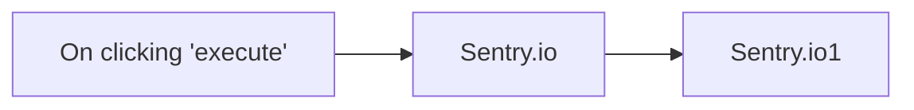

## Fluxo (.json) :

```json
{
  "id": "27",
  "name": "Create a release and get all releases",
  "nodes": [
    {
      "name": "On clicking 'execute'",
      "type": "n8n-nodes-base.manualTrigger",
      "position": [
        210,
        300
      ],
      "parameters": {},
      "typeVersion": 1
    },
    {
      "name": "Sentry.io",
      "type": "n8n-nodes-base.sentryIo",
      "position": [
        410,
        300
      ],
      "parameters": {
        "url": "",
        "version": "0.0.1",
        "projects": [
          ""
        ],
        "resource": "release",
        "operation": "create",
        "additionalFields": {},
        "organizationSlug": ""
      },
      "credentials": {
        "sentryIoApi": "sentry"
      },
      "typeVersion": 1
    },
    {
      "name": "Sentry.io1",
      "type": "n8n-nodes-base.sentryIo",
      "position": [
        610,
        300
      ],
      "parameters": {
        "resource": "release",
        "operation": "getAll",
        "returnAll": true,
        "additionalFields": {},
        "organizationSlug": ""
      },
      "credentials": {
        "sentryIoApi": "sentry"
      },
      "typeVersion": 1
    }
  ],
  "active": false,
  "settings": {},
  "connections": {
    "Sentry.io": {
      "main": [
        [
          {
            "node": "Sentry.io1",
            "type": "main",
            "index": 0
          }
        ]
      ]
    },
    "On clicking 'execute'": {
      "main": [
        [
          {
            "node": "Sentry.io",
            "type": "main",
            "index": 0
          }
        ]
      ]
    }
  }
}
```

<a id="template-1498"></a>

## Template 1498 - Raspagem de vagas Glassdoor para prospecção

- **Nome:** Raspagem de vagas Glassdoor para prospecção
- **Descrição:** Automatiza a busca de vagas no Glassdoor com filtros personalizados, armazena os resultados em uma planilha e gera mensagens de abordagem usando um modelo de linguagem.
- **Funcionalidade:** • Gatilho por formulário: Recebe parâmetros de busca (local, palavra-chave, código do país) para iniciar a pesquisa.
• Disparo de captura remota: Envia uma requisição para iniciar um snapshot de dataset na plataforma de scraping com os filtros fornecidos.
• Polling de status do snapshot: Verifica periodicamente o progresso até que os dados estejam prontos.
• Recuperação de dados: Faz download do snapshot em formato JSON quando disponível.
• Inserção em planilha: Anexa todos os anúncios coletados em uma planilha para armazenamento e análise.
• Extração de campos: Separa campos importantes (ex.: nome da empresa, título da vaga, descrição) para processamento posterior.
• Geração de pitch com LLM: Usa um modelo de linguagem para criar mensagens de abertura concisas quando a vaga é relevante (foco em marketing/conteúdo).
• Atualização da planilha com pitches: Atualiza a planilha com os pitches gerados associados às empresas correspondentes.
- **Ferramentas:** • Bright Data: Plataforma de captura e datasets para iniciar snapshots e recuperar dados raspados do Glassdoor.
• Glassdoor: Fonte alvo das vagas e dados de emprego que são coletados.
• Google Sheets: Armazenamento e registro dos resultados, permitindo anexar e atualizar linhas com os dados e pitches.
• OpenAI (modelo gpt-4o-mini): Geração automática de textos/pitches a partir dos campos dos anúncios.


## Fluxo visual

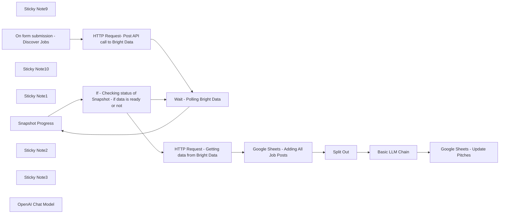

## Fluxo (.json) :

```json
{
  "meta": {
    "instanceId": "1eadd5bc7c3d70c587c28f782511fd898c6bf6d97963d92e836019d2039d1c79"
  },
  "nodes": [
    {
      "id": "e936b195-744d-4c0b-a1ee-d9123190c0cd",
      "name": "Sticky Note9",
      "type": "n8n-nodes-base.stickyNote",
      "position": [
        -520,
        -160
      ],
      "parameters": {
        "color": 4,
        "width": 1280,
        "height": 460,
        "content": "=======================================\n            WORKFLOW ASSISTANCE\n=======================================\n\nScrape Glassdoor Job Listings For Prospecting with Bright Data and LLMS\n\nFor any questions or support, please contact:\n    Yaron@nofluff.online\n\nExplore more tips and tutorials here:\n   - YouTube: https://www.youtube.com/@YaronBeen/videos\n   - LinkedIn: https://www.linkedin.com/in/yaronbeen/\n=======================================\nBright Data Docs: https://docs.brightdata.com/introduction\n\n\n*Important*\nMake Sure To Add Your API Keys to the HTTTP REQUESTS NODES (BRIGHT DATA API), GOOGLE RELATED NODES AND LLM NODE\n"
      },
      "typeVersion": 1
    },
    {
      "id": "60db8b95-e1c8-464d-a214-599e963db599",
      "name": "Snapshot Progress",
      "type": "n8n-nodes-base.httpRequest",
      "position": [
        2080,
        260
      ],
      "parameters": {
        "url": "=https://api.brightdata.com/datasets/v3/progress/{{ $('HTTP Request- Post API call to Bright Data').item.json.snapshot_id }}",
        "options": {},
        "sendHeaders": true,
        "headerParameters": {
          "parameters": [
            {
              "name": "Authorization",
              "value": "Bearer <YOUR_BRIGHT_DATA_API_KEY>"
            }
          ]
        }
      },
      "typeVersion": 4.2
    },
    {
      "id": "d7b8a05a-0545-4c7e-ba4a-077325d7061c",
      "name": "Sticky Note10",
      "type": "n8n-nodes-base.stickyNote",
      "position": [
        3140,
        40
      ],
      "parameters": {
        "width": 195,
        "height": 646,
        "content": "In this workflow, I use Google Sheets to store the results. \n\nYou can use my template to get started faster:\n\n1. [Click on this link to get the template](https://docs.google.com/spreadsheets/d/1ZYRk83hNIQCyQNaKpchdnbTiapVxE4aG6ZFIQlwEoWM/edit?usp=sharing)\n2. Make a copy of the Sheets\n3. Add the URL to this node \n\n\n"
      },
      "typeVersion": 1
    },
    {
      "id": "92c5471e-8980-4328-ae88-2f5798d9e010",
      "name": "Sticky Note1",
      "type": "n8n-nodes-base.stickyNote",
      "position": [
        780,
        -160
      ],
      "parameters": {
        "width": 480,
        "height": 880,
        "content": "🔍 Glassdoor Jobs Scraper – Parameter Guide\nUse this object to query Glassdoor jobs.\nEach field filters results appropriately.\n\n\n{\n  \"location\": \"{{ $json.Location }}\",\n  \"keyword\": \"{{ $json.Keyword }}\",\n  \"country\": \"{{ $json.Country }}\"\n}\n🧾 Field Explanations & Valid Options\n🗺️ location\nCity or region for the jobs.\n✅ Example: \"Berlin\", \"New York\"\n\n🧠 keyword\nJob title or keyword to match.\n✅ Example: \"Data Scientist\", \"Marketing Manager\"\n\n🌍 country\nISO two‑letter country code.\nUse two letters like US, FR.\n\n✅ Full Example\n{\n  \"location\": \"Berlin\",\n  \"keyword\": \"Data Scientist\",\n  \"country\": \"DE\"\n}"
      },
      "typeVersion": 1
    },
    {
      "id": "9c33f4ab-e235-4118-91e6-be8f9b02a7ce",
      "name": "On form submission - Discover Jobs",
      "type": "n8n-nodes-base.formTrigger",
      "position": [
        1160,
        480
      ],
      "webhookId": "8d0269c7-d1fc-45a1-a411-19634a1e0b82",
      "parameters": {
        "options": {},
        "formTitle": "Linkedin High Intent Prospects And Job Post Hunt",
        "formFields": {
          "values": [
            {
              "fieldLabel": "Job Location",
              "placeholder": "example: new york",
              "requiredField": true
            },
            {
              "fieldLabel": "Keyword",
              "placeholder": "example: CMO, AI architect",
              "requiredField": true
            },
            {
              "fieldLabel": "Country (2 letters)",
              "placeholder": "example: US,UK,IL",
              "requiredField": true
            }
          ]
        },
        "formDescription": "This form lets you customize your job search / prospecting by choosing:\n\nLocation (city or region)\n\nJob title or keywords\n\nCountry code\n"
      },
      "typeVersion": 2.2
    },
    {
      "id": "64644514-8b80-4b6d-ad03-3c1e3910bcbc",
      "name": "HTTP Request- Post API call to Bright Data",
      "type": "n8n-nodes-base.httpRequest",
      "position": [
        1500,
        520
      ],
      "parameters": {
        "url": "https://api.brightdata.com/datasets/v3/trigger",
        "method": "POST",
        "options": {},
        "jsonBody": "=[\n  {\n    \"location\": \"{{ $json['Job Location'] }}\",\n    \"keyword\": \"{{ $json.Keyword }}\",\n    \"country\": \"{{ $json['Country (2 letters)'] }}\"\n  }\n] ",
        "sendBody": true,
        "sendQuery": true,
        "sendHeaders": true,
        "specifyBody": "json",
        "queryParameters": {
          "parameters": [
            {
              "name": "dataset_id",
              "value": "gd_lpfbbndm1xnopbrcr0"
            },
            {
              "name": "include_errors",
              "value": "true"
            },
            {
              "name": "type",
              "value": "discover_new"
            },
            {
              "name": "discover_by",
              "value": "keyword"
            },
            {
              "name": "uncompressed_webhook",
              "value": "true"
            },
            {
              "name": "type",
              "value": "discover_new"
            },
            {
              "name": "discover_by",
              "value": "=keyword"
            }
          ]
        },
        "headerParameters": {
          "parameters": [
            {
              "name": "Authorization",
              "value": "Bearer <YOUR_BRIGHT_DATA_API_KEY>"
            }
          ]
        }
      },
      "typeVersion": 4.2
    },
    {
      "id": "a3ecdf16-4e39-43d6-8409-5dec26fc2b37",
      "name": "Wait - Polling Bright Data",
      "type": "n8n-nodes-base.wait",
      "position": [
        1840,
        260
      ],
      "webhookId": "8005a2b3-2195-479e-badb-d90e4240e699",
      "parameters": {
        "unit": "minutes"
      },
      "executeOnce": false,
      "typeVersion": 1.1
    },
    {
      "id": "27e70649-72e6-4241-9568-a11c8a7de93d",
      "name": "If - Checking status of Snapshot - if data is ready or not",
      "type": "n8n-nodes-base.if",
      "position": [
        2280,
        260
      ],
      "parameters": {
        "options": {},
        "conditions": {
          "options": {
            "version": 2,
            "leftValue": "",
            "caseSensitive": true,
            "typeValidation": "strict"
          },
          "combinator": "and",
          "conditions": [
            {
              "id": "7932282b-71bb-4bbb-ab73-4978e554de7e",
              "operator": {
                "name": "filter.operator.equals",
                "type": "string",
                "operation": "equals"
              },
              "leftValue": "={{ $json.status }}",
              "rightValue": "running"
            }
          ]
        }
      },
      "typeVersion": 2.2
    },
    {
      "id": "8e264a0c-b326-4bec-af4e-433cd1ed77c2",
      "name": "HTTP Request - Getting data from Bright Data",
      "type": "n8n-nodes-base.httpRequest",
      "position": [
        2560,
        280
      ],
      "parameters": {
        "url": "=https://api.brightdata.com/datasets/v3/snapshot/{{ $('HTTP Request- Post API call to Bright Data').item.json.snapshot_id }}",
        "options": {},
        "sendQuery": true,
        "sendHeaders": true,
        "queryParameters": {
          "parameters": [
            {
              "name": "format",
              "value": "json"
            }
          ]
        },
        "headerParameters": {
          "parameters": [
            {
              "name": "Authorization",
              "value": "Bearer <YOUR_BRIGHT_DATA_API_KEY>"
            }
          ]
        }
      },
      "typeVersion": 4.2
    },
    {
      "id": "c29a06db-00bf-4d6b-bbf1-c0716ba8f7ce",
      "name": "Google Sheets - Adding All Job Posts",
      "type": "n8n-nodes-base.googleSheets",
      "position": [
        3180,
        340
      ],
      "parameters": {
        "columns": {
          "value": {},
          "schema": [
            {
              "id": "url",
              "type": "string",
              "display": true,
              "removed": false,
              "required": false,
              "displayName": "url",
              "defaultMatch": false,
              "canBeUsedToMatch": true
            },
            {
              "id": "company_url_overview",
              "type": "string",
              "display": true,
              "removed": false,
              "required": false,
              "displayName": "company_url_overview",
              "defaultMatch": false,
              "canBeUsedToMatch": true
            },
            {
              "id": "company_name",
              "type": "string",
              "display": true,
              "removed": false,
              "required": false,
              "displayName": "company_name",
              "defaultMatch": false,
              "canBeUsedToMatch": true
            },
            {
              "id": "company_rating",
              "type": "string",
              "display": true,
              "removed": false,
              "required": false,
              "displayName": "company_rating",
              "defaultMatch": false,
              "canBeUsedToMatch": true
            },
            {
              "id": "job_title",
              "type": "string",
              "display": true,
              "removed": false,
              "required": false,
              "displayName": "job_title",
              "defaultMatch": false,
              "canBeUsedToMatch": true
            },
            {
              "id": "job_location",
              "type": "string",
              "display": true,
              "removed": false,
              "required": false,
              "displayName": "job_location",
              "defaultMatch": false,
              "canBeUsedToMatch": true
            },
            {
              "id": "job_overview",
              "type": "string",
              "display": true,
              "removed": false,
              "required": false,
              "displayName": "job_overview",
              "defaultMatch": false,
              "canBeUsedToMatch": true
            },
            {
              "id": "company_headquarters",
              "type": "string",
              "display": true,
              "removed": false,
              "required": false,
              "displayName": "company_headquarters",
              "defaultMatch": false,
              "canBeUsedToMatch": true
            },
            {
              "id": "company_founded_year",
              "type": "string",
              "display": true,
              "removed": false,
              "required": false,
              "displayName": "company_founded_year",
              "defaultMatch": false,
              "canBeUsedToMatch": true
            },
            {
              "id": "company_industry",
              "type": "string",
              "display": true,
              "removed": false,
              "required": false,
              "displayName": "company_industry",
              "defaultMatch": false,
              "canBeUsedToMatch": true
            },
            {
              "id": "company_revenue",
              "type": "string",
              "display": true,
              "removed": false,
              "required": false,
              "displayName": "company_revenue",
              "defaultMatch": false,
              "canBeUsedToMatch": true
            },
            {
              "id": "company_size",
              "type": "string",
              "display": true,
              "removed": false,
              "required": false,
              "displayName": "company_size",
              "defaultMatch": false,
              "canBeUsedToMatch": true
            },
            {
              "id": "company_type",
              "type": "string",
              "display": true,
              "removed": false,
              "required": false,
              "displayName": "company_type",
              "defaultMatch": false,
              "canBeUsedToMatch": true
            },
            {
              "id": "company_sector",
              "type": "string",
              "display": true,
              "removed": false,
              "required": false,
              "displayName": "company_sector",
              "defaultMatch": false,
              "canBeUsedToMatch": true
            },
            {
              "id": "percentage_that_recommend_company_to_a friend",
              "type": "string",
              "display": true,
              "removed": false,
              "required": false,
              "displayName": "percentage_that_recommend_company_to_a friend",
              "defaultMatch": false,
              "canBeUsedToMatch": true
            },
            {
              "id": "percentage_that_approve_of_ceo",
              "type": "string",
              "display": true,
              "removed": false,
              "required": false,
              "displayName": "percentage_that_approve_of_ceo",
              "defaultMatch": false,
              "canBeUsedToMatch": true
            },
            {
              "id": "company_ceo",
              "type": "string",
              "display": true,
              "removed": false,
              "required": false,
              "displayName": "company_ceo",
              "defaultMatch": false,
              "canBeUsedToMatch": true
            },
            {
              "id": "company_career_opportunities_rating",
              "type": "string",
              "display": true,
              "removed": false,
              "required": false,
              "displayName": "company_career_opportunities_rating",
              "defaultMatch": false,
              "canBeUsedToMatch": true
            },
            {
              "id": "company_comp_and_benefits_rating",
              "type": "string",
              "display": true,
              "removed": false,
              "required": false,
              "displayName": "company_comp_and_benefits_rating",
              "defaultMatch": false,
              "canBeUsedToMatch": true
            },
            {
              "id": "company_culture_and_values_rating",
              "type": "string",
              "display": true,
              "removed": false,
              "required": false,
              "displayName": "company_culture_and_values_rating",
              "defaultMatch": false,
              "canBeUsedToMatch": true
            },
            {
              "id": "company_senior_management_rating",
              "type": "string",
              "display": true,
              "removed": false,
              "required": false,
              "displayName": "company_senior_management_rating",
              "defaultMatch": false,
              "canBeUsedToMatch": true
            },
            {
              "id": "company_work/life_balance_rating",
              "type": "string",
              "display": true,
              "removed": false,
              "required": false,
              "displayName": "company_work/life_balance_rating",
              "defaultMatch": false,
              "canBeUsedToMatch": true
            },
            {
              "id": "reviews_by_same_job_pros",
              "type": "string",
              "display": true,
              "removed": false,
              "required": false,
              "displayName": "reviews_by_same_job_pros",
              "defaultMatch": false,
              "canBeUsedToMatch": true
            },
            {
              "id": "reviews_by_same_job_cons",
              "type": "string",
              "display": true,
              "removed": false,
              "required": false,
              "displayName": "reviews_by_same_job_cons",
              "defaultMatch": false,
              "canBeUsedToMatch": true
            },
            {
              "id": "company_benefits_rating",
              "type": "string",
              "display": true,
              "removed": false,
              "required": false,
              "displayName": "company_benefits_rating",
              "defaultMatch": false,
              "canBeUsedToMatch": true
            },
            {
              "id": "company_benefits_employer_summary",
              "type": "string",
              "display": true,
              "removed": false,
              "required": false,
              "displayName": "company_benefits_employer_summary",
              "defaultMatch": false,
              "canBeUsedToMatch": true
            },
            {
              "id": "employee_benefit_reviews",
              "type": "string",
              "display": true,
              "removed": false,
              "required": false,
              "displayName": "employee_benefit_reviews",
              "defaultMatch": false,
              "canBeUsedToMatch": true
            },
            {
              "id": "job_posting_id",
              "type": "string",
              "display": true,
              "removed": false,
              "required": false,
              "displayName": "job_posting_id",
              "defaultMatch": false,
              "canBeUsedToMatch": true
            },
            {
              "id": "company_id",
              "type": "string",
              "display": true,
              "removed": false,
              "required": false,
              "displayName": "company_id",
              "defaultMatch": false,
              "canBeUsedToMatch": true
            },
            {
              "id": "job_application_link",
              "type": "string",
              "display": true,
              "removed": false,
              "required": false,
              "displayName": "job_application_link",
              "defaultMatch": false,
              "canBeUsedToMatch": true
            },
            {
              "id": "company_website",
              "type": "string",
              "display": true,
              "removed": false,
              "required": false,
              "displayName": "company_website",
              "defaultMatch": false,
              "canBeUsedToMatch": true
            },
            {
              "id": "pay_range_glassdoor_est",
              "type": "string",
              "display": true,
              "removed": false,
              "required": false,
              "displayName": "pay_range_glassdoor_est",
              "defaultMatch": false,
              "canBeUsedToMatch": true
            },
            {
              "id": "pay_median_glassdoor",
              "type": "string",
              "display": true,
              "removed": false,
              "required": false,
              "displayName": "pay_median_glassdoor",
              "defaultMatch": false,
              "canBeUsedToMatch": true
            },
            {
              "id": "pay_range_employer_est__DUPLICATE",
              "type": "string",
              "display": true,
              "removed": false,
              "required": false,
              "displayName": "pay_range_employer_est__DUPLICATE",
              "defaultMatch": false,
              "canBeUsedToMatch": true
            },
            {
              "id": "pay_median_employer",
              "type": "string",
              "display": true,
              "removed": false,
              "required": false,
              "displayName": "pay_median_employer",
              "defaultMatch": false,
              "canBeUsedToMatch": true
            },
            {
              "id": "pay_range_currency",
              "type": "string",
              "display": true,
              "removed": false,
              "required": false,
              "displayName": "pay_range_currency",
              "defaultMatch": false,
              "canBeUsedToMatch": true
            },
            {
              "id": "pay_type",
              "type": "string",
              "display": true,
              "removed": false,
              "required": false,
              "displayName": "pay_type",
              "defaultMatch": false,
              "canBeUsedToMatch": true
            },
            {
              "id": "discovery_input",
              "type": "string",
              "display": true,
              "removed": false,
              "required": false,
              "displayName": "discovery_input",
              "defaultMatch": false,
              "canBeUsedToMatch": true
            }
          ],
          "mappingMode": "autoMapInputData",
          "matchingColumns": [
            "row_number"
          ],
          "attemptToConvertTypes": false,
          "convertFieldsToString": false
        },
        "options": {
          "handlingExtraData": "insertInNewColumn"
        },
        "operation": "append",
        "sheetName": {
          "__rl": true,
          "mode": "list",
          "value": "gid=0",
          "cachedResultUrl": "https://docs.google.com/spreadsheets/d/1_jbr5zBllTy_pGbogfGSvyv1_0a77I8tU-Ai7BjTAw4/edit#gid=0",
          "cachedResultName": "input"
        },
        "documentId": {
          "__rl": true,
          "mode": "list",
          "value": "1ZYRk83hNIQCyQNaKpchdnbTiapVxE4aG6ZFIQlwEoWM",
          "cachedResultUrl": "https://docs.google.com/spreadsheets/d/1ZYRk83hNIQCyQNaKpchdnbTiapVxE4aG6ZFIQlwEoWM/edit?usp=drivesdk",
          "cachedResultName": "NoFluff-N8N-Sheet-Template- GlassdoorJob Scraping WIth Bright Data"
        }
      },
      "credentials": {
        "googleSheetsOAuth2Api": {
          "id": "4RJOMlGAcB9ZoYfm",
          "name": "Google Sheets account 2"
        }
      },
      "typeVersion": 4.3,
      "alwaysOutputData": true
    },
    {
      "id": "cffc101d-cf3f-46c8-a2e0-9989fa2ec0fe",
      "name": "Sticky Note2",
      "type": "n8n-nodes-base.stickyNote",
      "position": [
        1400,
        100
      ],
      "parameters": {
        "width": 300,
        "height": 880,
        "content": "🧠 Bright Data Trigger – Customize Your Job Query\n\nThis HTTP Request sends a POST call to Bright Data to start a new dataset snapshot based on your filters.\n\n👋 If you don’t want to use the Form Trigger,\nyou can directly adjust the filters here in this node.\n"
      },
      "typeVersion": 1
    },
    {
      "id": "e74213c5-dafe-4c7a-a8fc-4014b94e434b",
      "name": "Sticky Note3",
      "type": "n8n-nodes-base.stickyNote",
      "position": [
        1780,
        120
      ],
      "parameters": {
        "color": 4,
        "width": 940,
        "height": 360,
        "content": "Bright Data Getting Jobs\n"
      },
      "typeVersion": 1
    },
    {
      "id": "a01857bf-ef31-4972-940e-e3bac2c5fe40",
      "name": "Split Out",
      "type": "n8n-nodes-base.splitOut",
      "position": [
        3400,
        320
      ],
      "parameters": {
        "options": {},
        "fieldToSplitOut": "company_name, job_title, description_text"
      },
      "typeVersion": 1
    },
    {
      "id": "855217f7-f790-413e-a767-68dd204fe0b4",
      "name": "Basic LLM Chain",
      "type": "@n8n/n8n-nodes-langchain.chainLlm",
      "position": [
        3620,
        320
      ],
      "parameters": {
        "text": "=Read these fields from the job post:\n- Company: `{{ $json.company_name }}`\n- Title: `{{ $json.job_title }}`\n- Description: `{{ $('Google Sheets - Adding All Job Posts').item.json.job_overview }}`\n\n**Task**  \n1. If this role relates to marketing, content creation, or audience engagement, write **1–2 concise icebreaker sentences** that:\n   - Reference the company or job context  \n   - Explain how our Content Repurposing service can help\nMake sure to add the compnay name and job title.\n\nNote that we're not pitching based on the job title.\nWere pitching to the organization only if the job position they are looking for, can be fulfilled by our agency.\n\nExample:\nHey,\nI've noticed your'e looking for {{ $('Google Sheets - Adding All Job Posts').item.json.job_title }}.\n\nI have an offer that might be relevant to your team.\n\nThen transition to our offer of content repurpose\n2. Otherwise, reply with:  \n---JOB POST NOT RELEVANT---",
        "promptType": "define"
      },
      "typeVersion": 1.6
    },
    {
      "id": "c7b193d4-aec4-4438-8e0c-8bb12c50e629",
      "name": "OpenAI Chat Model",
      "type": "@n8n/n8n-nodes-langchain.lmChatOpenAi",
      "position": [
        3720,
        540
      ],
      "parameters": {
        "model": {
          "__rl": true,
          "mode": "list",
          "value": "gpt-4o-mini"
        },
        "options": {}
      },
      "credentials": {
        "openAiApi": {
          "id": "MX2lQOZcGpmRvdVD",
          "name": "OpenAi account 2"
        }
      },
      "typeVersion": 1.2
    },
    {
      "id": "28b581d7-1245-45b2-af16-8eb945f2c553",
      "name": "Google Sheets - Update Pitches",
      "type": "n8n-nodes-base.googleSheets",
      "position": [
        3980,
        320
      ],
      "parameters": {
        "columns": {
          "value": {
            "Pitch": "={{ $json.text }}",
            "company_name": "={{ $('Split Out').item.json.company_name }}"
          },
          "schema": [
            {
              "id": "url",
              "type": "string",
              "display": true,
              "removed": true,
              "required": false,
              "displayName": "url",
              "defaultMatch": false,
              "canBeUsedToMatch": true
            },
            {
              "id": "company_url_overview",
              "type": "string",
              "display": true,
              "removed": true,
              "required": false,
              "displayName": "company_url_overview",
              "defaultMatch": false,
              "canBeUsedToMatch": true
            },
            {
              "id": "company_name",
              "type": "string",
              "display": true,
              "removed": false,
              "required": false,
              "displayName": "company_name",
              "defaultMatch": false,
              "canBeUsedToMatch": true
            },
            {
              "id": "company_rating",
              "type": "string",
              "display": true,
              "removed": true,
              "required": false,
              "displayName": "company_rating",
              "defaultMatch": false,
              "canBeUsedToMatch": true
            },
            {
              "id": "job_title",
              "type": "string",
              "display": true,
              "removed": true,
              "required": false,
              "displayName": "job_title",
              "defaultMatch": false,
              "canBeUsedToMatch": true
            },
            {
              "id": "job_location",
              "type": "string",
              "display": true,
              "removed": true,
              "required": false,
              "displayName": "job_location",
              "defaultMatch": false,
              "canBeUsedToMatch": true
            },
            {
              "id": "job_overview",
              "type": "string",
              "display": true,
              "removed": true,
              "required": false,
              "displayName": "job_overview",
              "defaultMatch": false,
              "canBeUsedToMatch": true
            },
            {
              "id": "company_headquarters",
              "type": "string",
              "display": true,
              "removed": true,
              "required": false,
              "displayName": "company_headquarters",
              "defaultMatch": false,
              "canBeUsedToMatch": true
            },
            {
              "id": "company_founded_year",
              "type": "string",
              "display": true,
              "removed": true,
              "required": false,
              "displayName": "company_founded_year",
              "defaultMatch": false,
              "canBeUsedToMatch": true
            },
            {
              "id": "company_industry",
              "type": "string",
              "display": true,
              "removed": true,
              "required": false,
              "displayName": "company_industry",
              "defaultMatch": false,
              "canBeUsedToMatch": true
            },
            {
              "id": "company_revenue",
              "type": "string",
              "display": true,
              "removed": true,
              "required": false,
              "displayName": "company_revenue",
              "defaultMatch": false,
              "canBeUsedToMatch": true
            },
            {
              "id": "company_size",
              "type": "string",
              "display": true,
              "removed": true,
              "required": false,
              "displayName": "company_size",
              "defaultMatch": false,
              "canBeUsedToMatch": true
            },
            {
              "id": "company_type",
              "type": "string",
              "display": true,
              "removed": true,
              "required": false,
              "displayName": "company_type",
              "defaultMatch": false,
              "canBeUsedToMatch": true
            },
            {
              "id": "company_sector",
              "type": "string",
              "display": true,
              "removed": true,
              "required": false,
              "displayName": "company_sector",
              "defaultMatch": false,
              "canBeUsedToMatch": true
            },
            {
              "id": "percentage_that_recommend_company_to_a friend",
              "type": "string",
              "display": true,
              "removed": true,
              "required": false,
              "displayName": "percentage_that_recommend_company_to_a friend",
              "defaultMatch": false,
              "canBeUsedToMatch": true
            },
            {
              "id": "percentage_that_approve_of_ceo",
              "type": "string",
              "display": true,
              "removed": true,
              "required": false,
              "displayName": "percentage_that_approve_of_ceo",
              "defaultMatch": false,
              "canBeUsedToMatch": true
            },
            {
              "id": "company_ceo",
              "type": "string",
              "display": true,
              "removed": true,
              "required": false,
              "displayName": "company_ceo",
              "defaultMatch": false,
              "canBeUsedToMatch": true
            },
            {
              "id": "company_career_opportunities_rating",
              "type": "string",
              "display": true,
              "removed": true,
              "required": false,
              "displayName": "company_career_opportunities_rating",
              "defaultMatch": false,
              "canBeUsedToMatch": true
            },
            {
              "id": "company_comp_and_benefits_rating",
              "type": "string",
              "display": true,
              "removed": true,
              "required": false,
              "displayName": "company_comp_and_benefits_rating",
              "defaultMatch": false,
              "canBeUsedToMatch": true
            },
            {
              "id": "company_culture_and_values_rating",
              "type": "string",
              "display": true,
              "removed": true,
              "required": false,
              "displayName": "company_culture_and_values_rating",
              "defaultMatch": false,
              "canBeUsedToMatch": true
            },
            {
              "id": "company_senior_management_rating",
              "type": "string",
              "display": true,
              "removed": true,
              "required": false,
              "displayName": "company_senior_management_rating",
              "defaultMatch": false,
              "canBeUsedToMatch": true
            },
            {
              "id": "company_work/life_balance_rating",
              "type": "string",
              "display": true,
              "removed": true,
              "required": false,
              "displayName": "company_work/life_balance_rating",
              "defaultMatch": false,
              "canBeUsedToMatch": true
            },
            {
              "id": "reviews_by_same_job_pros",
              "type": "string",
              "display": true,
              "removed": true,
              "required": false,
              "displayName": "reviews_by_same_job_pros",
              "defaultMatch": false,
              "canBeUsedToMatch": true
            },
            {
              "id": "reviews_by_same_job_cons",
              "type": "string",
              "display": true,
              "removed": true,
              "required": false,
              "displayName": "reviews_by_same_job_cons",
              "defaultMatch": false,
              "canBeUsedToMatch": true
            },
            {
              "id": "company_benefits_rating",
              "type": "string",
              "display": true,
              "removed": true,
              "required": false,
              "displayName": "company_benefits_rating",
              "defaultMatch": false,
              "canBeUsedToMatch": true
            },
            {
              "id": "company_benefits_employer_summary",
              "type": "string",
              "display": true,
              "removed": true,
              "required": false,
              "displayName": "company_benefits_employer_summary",
              "defaultMatch": false,
              "canBeUsedToMatch": true
            },
            {
              "id": "employee_benefit_reviews",
              "type": "string",
              "display": true,
              "removed": true,
              "required": false,
              "displayName": "employee_benefit_reviews",
              "defaultMatch": false,
              "canBeUsedToMatch": true
            },
            {
              "id": "job_posting_id",
              "type": "string",
              "display": true,
              "removed": true,
              "required": false,
              "displayName": "job_posting_id",
              "defaultMatch": false,
              "canBeUsedToMatch": true
            },
            {
              "id": "company_id",
              "type": "string",
              "display": true,
              "removed": true,
              "required": false,
              "displayName": "company_id",
              "defaultMatch": false,
              "canBeUsedToMatch": true
            },
            {
              "id": "job_application_link",
              "type": "string",
              "display": true,
              "removed": true,
              "required": false,
              "displayName": "job_application_link",
              "defaultMatch": false,
              "canBeUsedToMatch": true
            },
            {
              "id": "company_website",
              "type": "string",
              "display": true,
              "removed": true,
              "required": false,
              "displayName": "company_website",
              "defaultMatch": false,
              "canBeUsedToMatch": true
            },
            {
              "id": "pay_range_glassdoor_est",
              "type": "string",
              "display": true,
              "removed": true,
              "required": false,
              "displayName": "pay_range_glassdoor_est",
              "defaultMatch": false,
              "canBeUsedToMatch": true
            },
            {
              "id": "pay_median_glassdoor",
              "type": "string",
              "display": true,
              "removed": true,
              "required": false,
              "displayName": "pay_median_glassdoor",
              "defaultMatch": false,
              "canBeUsedToMatch": true
            },
            {
              "id": "pay_range_employer_est__DUPLICATE",
              "type": "string",
              "display": true,
              "removed": true,
              "required": false,
              "displayName": "pay_range_employer_est__DUPLICATE",
              "defaultMatch": false,
              "canBeUsedToMatch": true
            },
            {
              "id": "pay_median_employer",
              "type": "string",
              "display": true,
              "removed": true,
              "required": false,
              "displayName": "pay_median_employer",
              "defaultMatch": false,
              "canBeUsedToMatch": true
            },
            {
              "id": "pay_range_currency",
              "type": "string",
              "display": true,
              "removed": true,
              "required": false,
              "displayName": "pay_range_currency",
              "defaultMatch": false,
              "canBeUsedToMatch": true
            },
            {
              "id": "pay_type",
              "type": "string",
              "display": true,
              "removed": true,
              "required": false,
              "displayName": "pay_type",
              "defaultMatch": false,
              "canBeUsedToMatch": true
            },
            {
              "id": "discovery_input",
              "type": "string",
              "display": true,
              "removed": true,
              "required": false,
              "displayName": "discovery_input",
              "defaultMatch": false,
              "canBeUsedToMatch": true
            },
            {
              "id": "timestamp",
              "type": "string",
              "display": true,
              "removed": true,
              "required": false,
              "displayName": "timestamp",
              "defaultMatch": false,
              "canBeUsedToMatch": true
            },
            {
              "id": "input",
              "type": "string",
              "display": true,
              "removed": true,
              "required": false,
              "displayName": "input",
              "defaultMatch": false,
              "canBeUsedToMatch": true
            },
            {
              "id": "error",
              "type": "string",
              "display": true,
              "removed": true,
              "required": false,
              "displayName": "error",
              "defaultMatch": false,
              "canBeUsedToMatch": true
            },
            {
              "id": "error_code",
              "type": "string",
              "display": true,
              "removed": true,
              "required": false,
              "displayName": "error_code",
              "defaultMatch": false,
              "canBeUsedToMatch": true
            },
            {
              "id": "pay_range_Employer_est",
              "type": "string",
              "display": true,
              "removed": true,
              "required": false,
              "displayName": "pay_range_Employer_est",
              "defaultMatch": false,
              "canBeUsedToMatch": true
            },
            {
              "id": "Pitch",
              "type": "string",
              "display": true,
              "required": false,
              "displayName": "Pitch",
              "defaultMatch": false,
              "canBeUsedToMatch": true
            },
            {
              "id": "row_number",
              "type": "string",
              "display": true,
              "removed": true,
              "readOnly": true,
              "required": false,
              "displayName": "row_number",
              "defaultMatch": false,
              "canBeUsedToMatch": true
            }
          ],
          "mappingMode": "defineBelow",
          "matchingColumns": [
            "company_name"
          ],
          "attemptToConvertTypes": false,
          "convertFieldsToString": false
        },
        "options": {},
        "operation": "update",
        "sheetName": {
          "__rl": true,
          "mode": "list",
          "value": "gid=0",
          "cachedResultUrl": "https://docs.google.com/spreadsheets/d/1ZYRk83hNIQCyQNaKpchdnbTiapVxE4aG6ZFIQlwEoWM/edit#gid=0",
          "cachedResultName": "input"
        },
        "documentId": {
          "__rl": true,
          "mode": "list",
          "value": "1ZYRk83hNIQCyQNaKpchdnbTiapVxE4aG6ZFIQlwEoWM",
          "cachedResultUrl": "https://docs.google.com/spreadsheets/d/1ZYRk83hNIQCyQNaKpchdnbTiapVxE4aG6ZFIQlwEoWM/edit?usp=drivesdk",
          "cachedResultName": "NoFluff-N8N-Sheet-Template- GlassdoorJob Scraping WIth Bright Data"
        }
      },
      "credentials": {
        "googleSheetsOAuth2Api": {
          "id": "4RJOMlGAcB9ZoYfm",
          "name": "Google Sheets account 2"
        }
      },
      "typeVersion": 4.5
    }
  ],
  "pinData": {},
  "connections": {
    "Split Out": {
      "main": [
        [
          {
            "node": "Basic LLM Chain",
            "type": "main",
            "index": 0
          }
        ]
      ]
    },
    "Basic LLM Chain": {
      "main": [
        [
          {
            "node": "Google Sheets - Update Pitches",
            "type": "main",
            "index": 0
          }
        ]
      ]
    },
    "OpenAI Chat Model": {
      "ai_languageModel": [
        [
          {
            "node": "Basic LLM Chain",
            "type": "ai_languageModel",
            "index": 0
          }
        ]
      ]
    },
    "Snapshot Progress": {
      "main": [
        [
          {
            "node": "If - Checking status of Snapshot - if data is ready or not",
            "type": "main",
            "index": 0
          }
        ]
      ]
    },
    "Wait - Polling Bright Data": {
      "main": [
        [
          {
            "node": "Snapshot Progress",
            "type": "main",
            "index": 0
          }
        ]
      ]
    },
    "On form submission - Discover Jobs": {
      "main": [
        [
          {
            "node": "HTTP Request- Post API call to Bright Data",
            "type": "main",
            "index": 0
          }
        ]
      ]
    },
    "Google Sheets - Adding All Job Posts": {
      "main": [
        [
          {
            "node": "Split Out",
            "type": "main",
            "index": 0
          }
        ]
      ]
    },
    "HTTP Request- Post API call to Bright Data": {
      "main": [
        [
          {
            "node": "Wait - Polling Bright Data",
            "type": "main",
            "index": 0
          }
        ]
      ]
    },
    "HTTP Request - Getting data from Bright Data": {
      "main": [
        [
          {
            "node": "Google Sheets - Adding All Job Posts",
            "type": "main",
            "index": 0
          }
        ]
      ]
    },
    "If - Checking status of Snapshot - if data is ready or not": {
      "main": [
        [
          {
            "node": "Wait - Polling Bright Data",
            "type": "main",
            "index": 0
          }
        ],
        [
          {
            "node": "HTTP Request - Getting data from Bright Data",
            "type": "main",
            "index": 0
          }
        ]
      ]
    }
  }
}
```

<a id="template-1500"></a>

## Template 1500 - Relatório mensal de desempenho financeiro

- **Nome:** Relatório mensal de desempenho financeiro
- **Descrição:** Automatiza a geração de um relatório financeiro mensal por centro de custo: reúne dados financeiros e de projetos, analisa desempenho com suporte de IA, formata um relatório HTML e envia por e‑mail aos gestores.
- **Funcionalidade:** • Gatilho mensal: Executa o processo automaticamente em uma data definida todo mês.
• Cálculo de mês anterior: Determina mês e ano anteriores para filtragem dinâmica dos dados.
• Descoberta de centros de custo com orçamentos: Identifica centros de custo relevantes com dados de orçamento e lançamentos contábeis.
• Iteração por centro de custo: Processa cada centro de custo individualmente para relatórios segmentados.
• Consulta YTD vs Mês Anterior: Extrai orçamentos e valores realizados YTD e apenas do mês anterior, calculando variações.
• Análise por verticais (sub‑unidades): Agrupa desempenho por verticais dentro do centro de custo para análise detalhada.
• Coleta de projetos e WIP: Recupera status de projetos, faturamento, custos e calcula WIP (Work In Process).
• Contagem de colaboradores: Obtém total de empregados ativos e admissões no mês/ano para KPIs por funcionário.
• Montagem de tabelas HTML: Converte resultados em tabelas HTML estéticas e responsivas.
• Agente de IA analista: Usa um modelo de linguagem e uma ferramenta de cálculo para elaborar análise financeira, P&L estruturado, percentuais e recomendações.
• Consolidação e envio: Combina todas as seções em um único HTML e envia por e‑mail aos destinatários definidos.
• Controle de execução em lote: Utiliza espera e divisão em lotes para evitar sobrecarga e controlar envios.
- **Ferramentas:** • Base de dados MySQL (ERP/Financeiro): Fonte das consultas financeiras, orçamentos, lançamentos contábeis, projetos e empregados.
• Modelo de linguagem (Google Gemini): Gera a análise financeira, resumo executivo e recomendações com suporte de raciocínio natural.
• Ferramenta de cálculo integrada: Executa cálculos precisos (percentuais, somas, formatações) necessários para P&L e KPIs.
• Serviço de e‑mail (Microsoft Outlook): Envia o relatório HTML formatado aos gestores.
• HTML/CSS para e‑mail: Formata o relatório em um layout responsivo e visualmente atraente adequado para comunicação executiva.

## Fluxo visual

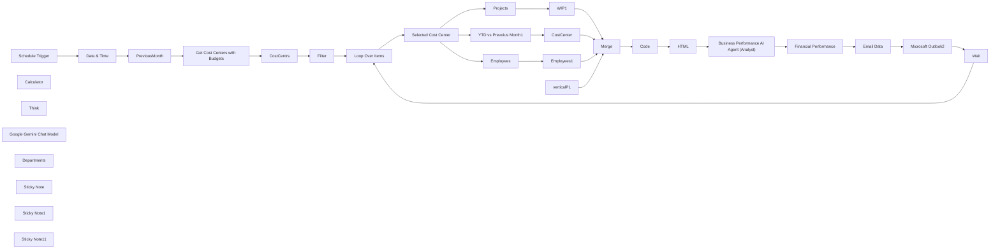

## Fluxo (.json) :

```json
{
  "meta": {
    "instanceId": "32d80f55a35a7b57f8e47a2ac19558d9f5bcec983a5519d9c29ba713ff4f12c7"
  },
  "nodes": [
    {
      "id": "fdd55253-5cb6-4b1f-9c93-6915f254f700",
      "name": "Schedule Trigger",
      "type": "n8n-nodes-base.scheduleTrigger",
      "position": [
        -60,
        -240
      ],
      "parameters": {
        "rule": {
          "interval": [
            {
              "field": "months",
              "triggerAtDayOfMonth": 5
            }
          ]
        }
      },
      "typeVersion": 1.2
    },
    {
      "id": "c8d6064a-3fd7-478d-891c-6ade336daa1f",
      "name": "YTD vs Prevoius Month1",
      "type": "n8n-nodes-base.mySql",
      "onError": "continueRegularOutput",
      "position": [
        640,
        0
      ],
      "parameters": {
        "query": "SELECT\n  --  budget_data.fiscal_year AS `Year`,\n  --  budget_data.cost_center AS `Cost Center`,\n    budget_data.budget_group AS `Budget Group`,\n--    budget_data.sort_order AS `Sort Order`,\n\n    -- YTD Totals up to previous month (up to dynamic month)\n    SUM(budget_data.budget_amount) AS `Budget YTD`,\n    SUM(COALESCE(actual_data.actual_amount, 0)) AS `Actual YTD`,\n    SUM(COALESCE(actual_data.actual_amount, 0)) - SUM(budget_data.budget_amount) AS `Variance YTD`,\n\n    -- Previous Month Totals Only\n    SUM(CASE WHEN budget_data.budget_month = {{ $('PreviousMonth').item.json.previousMonth }} THEN budget_data.budget_amount ELSE 0 END) AS `Budget PM`,\n    SUM(CASE WHEN budget_data.budget_month = {{ $('PreviousMonth').item.json.previousMonth }} THEN COALESCE(actual_data.actual_amount, 0) ELSE 0 END) AS `Actual PM`,\n    SUM(CASE WHEN budget_data.budget_month = {{ $('PreviousMonth').item.json.previousMonth }} THEN COALESCE(actual_data.actual_amount, 0) ELSE 0 END) -\n    SUM(CASE WHEN budget_data.budget_month = {{ $('PreviousMonth').item.json.previousMonth }} THEN budget_data.budget_amount ELSE 0 END) AS `Variance PM`\n\nFROM\n    (\n        SELECT\n            bg.budget_group_name AS budget_group,\n            bg.sort_order,\n            bgd.fiscal_year,\n            bgd.budget_month,\n            bgd.cost_center,\n            CAST(bgd.budget_amount AS DECIMAL(18,6)) AS budget_amount\n        FROM\n            `tabBudget Group Detail` bgd\n        JOIN\n            `tabBudget Group` bg ON bg.name = bgd.parent\n        WHERE\n            bgd.fiscal_year = {{ $('PreviousMonth').item.json.year }}\n            AND bgd.budget_month <= {{ $('PreviousMonth').item.json.previousMonth }}\n            AND bgd.cost_center = '{{ $json.CostCenter }}'\n    ) AS budget_data\n\nLEFT JOIN (\n    SELECT\n        acc.budget_group AS budget_group,\n        YEAR(gl.posting_date) AS fiscal_year,\n        MONTH(gl.posting_date) AS budget_month,\n        gl.cost_center,\n        SUM(\n            CASE \n                WHEN acc.root_type = 'Income' THEN gl.credit - gl.debit\n                WHEN acc.root_type = 'Expense' THEN gl.debit - gl.credit\n                ELSE 0\n            END\n        ) AS actual_amount\n    FROM\n        `tabGL Entry` gl\n    JOIN\n        `tabAccount` acc ON gl.account = acc.name\n    WHERE\n        acc.budget_group IS NOT NULL\n        AND acc.root_type IN ('Income', 'Expense')\n        AND gl.docstatus = 1\n        AND YEAR(gl.posting_date) = {{ $('PreviousMonth').item.json.year }}\n        AND MONTH(gl.posting_date) <= {{ $('PreviousMonth').item.json.previousMonth }}\n        AND gl.cost_center = '{{ $('Filter').item.json['Cost Center'] }}'\n    GROUP BY\n        acc.budget_group,\n        YEAR(gl.posting_date),\n        MONTH(gl.posting_date),\n        gl.cost_center\n) AS actual_data\nON\n    budget_data.budget_group = actual_data.budget_group AND\n    budget_data.fiscal_year = actual_data.fiscal_year AND\n    budget_data.budget_month = actual_data.budget_month AND\n    budget_data.cost_center = actual_data.cost_center\n\nGROUP BY\n    budget_data.fiscal_year,\n    budget_data.cost_center,\n    budget_data.budget_group,\n    budget_data.sort_order\n\nORDER BY\n    budget_data.cost_center,\n    budget_data.sort_order,\n    budget_data.budget_group;\n",
        "options": {},
        "operation": "executeQuery"
      },
      "retryOnFail": false,
      "typeVersion": 2.4
    },
    {
      "id": "13102b1c-8a06-4a23-8174-75254bf783ac",
      "name": "Loop Over Items",
      "type": "n8n-nodes-base.splitInBatches",
      "position": [
        -40,
        200
      ],
      "parameters": {
        "options": {}
      },
      "typeVersion": 3
    },
    {
      "id": "da2a0b30-3df4-430c-8cac-cd9d735ce759",
      "name": "CostCentrs",
      "type": "n8n-nodes-base.set",
      "position": [
        1100,
        -240
      ],
      "parameters": {
        "options": {},
        "assignments": {
          "assignments": [
            {
              "id": "ac6bcf14-13e3-464d-b9cd-4adee56018d7",
              "name": "Cost Center",
              "type": "string",
              "value": "={{ $json['Cost Center'] }}"
            }
          ]
        }
      },
      "typeVersion": 3.4
    },
    {
      "id": "7891d71c-18f8-4e07-aa30-f50bec10cef6",
      "name": "Date & Time",
      "type": "n8n-nodes-base.dateTime",
      "position": [
        260,
        -240
      ],
      "parameters": {
        "options": {}
      },
      "typeVersion": 2
    },
    {
      "id": "3e69dc27-0850-4978-bf10-e81ff575ec60",
      "name": "PreviousMonth",
      "type": "n8n-nodes-base.code",
      "position": [
        520,
        -240
      ],
      "parameters": {
        "jsCode": "// Get the input date from the previous node\nconst inputDateStr = $input.first().json.currentDate;\nconst inputDate = new Date(inputDateStr);\n\n// Move to the first day of the current month\ninputDate.setDate(1);\n\n// Step back one day to land in the previous month\ninputDate.setDate(0);\n\n// Extract previous month and year\nconst previousMonth = inputDate.getMonth() + 1; // Months are 0-based\nconst year = inputDate.getFullYear(); // This will reflect the correct year, even in January\n\nreturn [\n  {\n    json: {\n      previousMonth: previousMonth.toString().padStart(2, '0'), // e.g., \"01\", \"12\"\n      year: year.toString()                                     // e.g., \"2024\"\n    }\n  }\n];\n"
      },
      "typeVersion": 2
    },
    {
      "id": "f6776225-39d2-4746-a90f-b4d1b12a66ee",
      "name": "Selected Cost Center",
      "type": "n8n-nodes-base.set",
      "position": [
        260,
        220
      ],
      "parameters": {
        "options": {},
        "assignments": {
          "assignments": [
            {
              "id": "c4a6c71a-0df4-49df-9068-f039ddf7d507",
              "name": "CostCenter",
              "type": "string",
              "value": "={{ $json['Cost Center'] }}"
            },
            {
              "id": "ade95f85-baa2-4f5d-a125-7360b17cf99b",
              "name": "previousMonth",
              "type": "string",
              "value": "={{ $('PreviousMonth').item.json.previousMonth }}"
            },
            {
              "id": "36c1d772-5bb7-47a6-81f9-1b70208e558b",
              "name": "year",
              "type": "string",
              "value": "={{ $('PreviousMonth').item.json.year }}"
            }
          ]
        }
      },
      "typeVersion": 3.4
    },
    {
      "id": "1e23d876-21be-4d90-b5e4-38f3543a0c3b",
      "name": "Get Cost Centers with Budgets",
      "type": "n8n-nodes-base.mySql",
      "position": [
        800,
        -240
      ],
      "parameters": {
        "query": "SELECT DISTINCT\n    budget_data.cost_center AS `Cost Center`\nFROM\n(\n    SELECT\n        bgd.cost_center,\n        bgd.fiscal_year,\n        bgd.budget_month\n    FROM\n        `tabBudget Group Detail` bgd\n    JOIN\n        `tabBudget Group` bg ON bg.name = bgd.parent\n    WHERE\n        bgd.fiscal_year = {{ $json.year }}\n        AND bgd.budget_month <= {{ $json.previousMonth }}\n) AS budget_data\n\nINNER JOIN\n(\n    SELECT DISTINCT\n        gl.cost_center,\n        YEAR(gl.posting_date) AS fiscal_year,\n        MONTH(gl.posting_date) AS budget_month\n    FROM\n        `tabGL Entry` gl\n    JOIN\n        `tabAccount` acc ON gl.account = acc.name\n    WHERE\n        acc.budget_group IS NOT NULL\n        AND acc.root_type IN ('Income', 'Expense')\n        AND gl.docstatus = 1\n        AND YEAR(gl.posting_date) = {{ $json.year }}\n        AND MONTH(gl.posting_date) <= {{ $json.previousMonth }}\n        AND gl.cost_center IS NOT NULL\n) AS gl_data\nON\n    budget_data.cost_center = gl_data.cost_center\n    AND budget_data.fiscal_year = gl_data.fiscal_year\n    AND budget_data.budget_month = gl_data.budget_month\n\nORDER BY\n    budget_data.cost_center;\n",
        "options": {},
        "operation": "executeQuery"
      },
      "typeVersion": 2.4
    },
    {
      "id": "d4429595-b1b9-4121-a612-24be11e6a36a",
      "name": "Filter",
      "type": "n8n-nodes-base.filter",
      "position": [
        1380,
        -240
      ],
      "parameters": {
        "options": {},
        "conditions": {
          "options": {
            "version": 2,
            "leftValue": "",
            "caseSensitive": true,
            "typeValidation": "strict"
          },
          "combinator": "and",
          "conditions": [
            {
              "id": "d7a13ce7-24d3-406a-934b-97f9a47b206c",
              "operator": {
                "name": "filter.operator.equals",
                "type": "string",
                "operation": "equals"
              },
              "leftValue": "={{ $json['Cost Center'] }}",
              "rightValue": "AI DEPARTMENT"
            }
          ]
        }
      },
      "typeVersion": 2.2
    },
    {
      "id": "67bbe834-ae40-4aad-b468-6fa73c9dc6c6",
      "name": "HTML",
      "type": "n8n-nodes-base.html",
      "position": [
        40,
        920
      ],
      "parameters": {
        "html": "{{ $json.html }}"
      },
      "typeVersion": 1.2
    },
    {
      "id": "58d1dc63-9ba7-41b8-af39-b7c134ab3cea",
      "name": "verticalPL",
      "type": "n8n-nodes-base.code",
      "position": [
        900,
        220
      ],
      "parameters": {
        "jsCode": "const rows = items;\n\n// Get column names from the first row\nconst headers = Object.keys(rows[0].json);\n\n// Build header HTML\nlet headerHtml = headers.map(col => `<th>${col}</th>`).join('');\n\n// Build rows\nlet bodyHtml = rows.map(row => {\n  return `<tr>${headers.map(col => `<td>${row.json[col]}</td>`).join('')}</tr>`;\n}).join('');\n\n// Combine into one table\nconst tableHtml = `\n<table border=\"1\" cellpadding=\"6\" cellspacing=\"0\" style=\"border-collapse: collapse;\">\n  <thead><tr>${headerHtml}</tr></thead>\n  <tbody>${bodyHtml}</tbody>\n</table>\n`;\n\nreturn [{ json: { table: tableHtml } }];\n"
      },
      "typeVersion": 2
    },
    {
      "id": "9a8bdb09-f9d4-4c4b-b1d5-dadb3c6ee567",
      "name": "Merge",
      "type": "n8n-nodes-base.merge",
      "position": [
        1380,
        220
      ],
      "parameters": {
        "numberInputs": 4
      },
      "typeVersion": 3.1
    },
    {
      "id": "d310db4d-183d-4f99-9bd0-863320d2db73",
      "name": "Code",
      "type": "n8n-nodes-base.code",
      "position": [
        1420,
        580
      ],
      "parameters": {
        "jsCode": "const table1 = $input.first().json.table; // From the first input node\nconst table2 = $items(\"verticalPL\")[0].json.table; // From the node named 'verticalPL'\nconst table3 = $items(\"WIP1\")[0].json.table; // From the node named 'WIP1'\nconst table4 = $items(\"Employees1\")[0].json.table; // From the node named 'Employees1'\n\nconst htmlOutput = `\n<!DOCTYPE html>\n<html>\n<head>\n  <style>\n    body { font-family: Arial, sans-serif; font-size: 14px; color: #333; }\n    h2 { margin-top: 30px; }\n    table { border-collapse: collapse; width: 100%; margin-top: 10px; }\n    th, td { border: 1px solid #ccc; padding: 8px; text-align: right; }\n    th:first-child, td:first-child { text-align: left; }\n    thead { background-color: #f0f0f0; }\n  </style>\n</head>\n<body>\n  <h2>📊 Financial Overview – YTD & PM Summary</h2>\n  ${table1}\n\n  <h2>📊 Financial Overview – Vertical Profit & Loss</h2>\n  ${table2}\n\n  <h2>📊 Financial Overview – WIP Summary</h2>\n  ${table3}\n\n  <h2>👥 Employees in the Business Unit</h2>\n  ${table4}\n</body>\n</html>\n`;\n\nreturn [{ json: { html: htmlOutput } }];\n"
      },
      "typeVersion": 2
    },
    {
      "id": "ba5e60fb-d5cc-4a5f-9cb6-07808f7c7021",
      "name": "Microsoft Outlook2",
      "type": "n8n-nodes-base.microsoftOutlook",
      "position": [
        1240,
        920
      ],
      "webhookId": "0cdef86a-9910-49aa-bdd3-1beecb260035",
      "parameters": {
        "subject": "=Business Performance Syncbricks",
        "bodyContent": "={{ $json['Email Output'] }}",
        "toRecipients": "amjid@amjidali.com",
        "additionalFields": {
          "bodyContentType": "html"
        }
      },
      "typeVersion": 2
    },
    {
      "id": "c3cdf21d-417f-420b-98f9-dfca33119c5a",
      "name": "CostCenter",
      "type": "n8n-nodes-base.code",
      "position": [
        920,
        0
      ],
      "parameters": {
        "jsCode": "const rows = items;\n\n// Get column names from the first row\nconst headers = Object.keys(rows[0].json);\n\n// Build header HTML\nlet headerHtml = headers.map(col => `<th>${col}</th>`).join('');\n\n// Build rows\nlet bodyHtml = rows.map(row => {\n  return `<tr>${headers.map(col => `<td>${row.json[col]}</td>`).join('')}</tr>`;\n}).join('');\n\n// Combine into one table\nconst tableHtml = `\n<table border=\"1\" cellpadding=\"6\" cellspacing=\"0\" style=\"border-collapse: collapse;\">\n  <thead><tr>${headerHtml}</tr></thead>\n  <tbody>${bodyHtml}</tbody>\n</table>\n`;\n\nreturn [{ json: { table: tableHtml } }];\n"
      },
      "typeVersion": 2
    },
    {
      "id": "9d9fb099-5fca-4777-a753-f6791f37fd37",
      "name": "WIP1",
      "type": "n8n-nodes-base.code",
      "position": [
        900,
        400
      ],
      "parameters": {
        "jsCode": "const rows = items;\n\n// Get column names from the first row\nconst headers = Object.keys(rows[0].json);\n\n// Build header HTML\nlet headerHtml = headers.map(col => `<th>${col}</th>`).join('');\n\n// Build rows\nlet bodyHtml = rows.map(row => {\n  return `<tr>${headers.map(col => `<td>${row.json[col]}</td>`).join('')}</tr>`;\n}).join('');\n\n// Combine into one table\nconst tableHtml = `\n<table border=\"1\" cellpadding=\"6\" cellspacing=\"0\" style=\"border-collapse: collapse;\">\n  <thead><tr>${headerHtml}</tr></thead>\n  <tbody>${bodyHtml}</tbody>\n</table>\n`;\n\nreturn [{ json: { table: tableHtml } }];\n"
      },
      "typeVersion": 2
    },
    {
      "id": "5a6626ed-c841-4fd7-9111-f686fcacaa37",
      "name": "Employees",
      "type": "n8n-nodes-base.mySql",
      "onError": "continueRegularOutput",
      "position": [
        640,
        600
      ],
      "parameters": {
        "query": "SELECT\n   -- e.payroll_cost_center AS `Payroll Cost Center`,\n    COUNT(*) AS `Total Employees`,\n    COUNT(CASE WHEN YEAR(e.date_of_joining) = YEAR(CURDATE()) THEN 1 END) AS `Joined This Year`,\n    COUNT(CASE WHEN YEAR(e.date_of_joining) = YEAR(CURDATE()) AND MONTH(e.date_of_joining) = MONTH(CURDATE()) THEN 1 END) AS `Joined This Month`\nFROM\n    `tabEmployee` e\nWHERE\n    e.status = 'Active'\n    AND e.payroll_cost_center = '{{ $json.CostCenter }}'\nGROUP BY\n    e.payroll_cost_center;\n",
        "options": {},
        "operation": "executeQuery"
      },
      "retryOnFail": false,
      "typeVersion": 2.4
    },
    {
      "id": "bbfd2c19-9538-4106-8931-f65f0261d43c",
      "name": "Employees1",
      "type": "n8n-nodes-base.code",
      "position": [
        900,
        600
      ],
      "parameters": {
        "jsCode": "const rows = items;\n\n// Get column names from the first row\nconst headers = Object.keys(rows[0].json);\n\n// Build header HTML\nlet headerHtml = headers.map(col => `<th>${col}</th>`).join('');\n\n// Build rows\nlet bodyHtml = rows.map(row => {\n  return `<tr>${headers.map(col => `<td>${row.json[col]}</td>`).join('')}</tr>`;\n}).join('');\n\n// Combine into one table\nconst tableHtml = `\n<table border=\"1\" cellpadding=\"6\" cellspacing=\"0\" style=\"border-collapse: collapse;\">\n  <thead><tr>${headerHtml}</tr></thead>\n  <tbody>${bodyHtml}</tbody>\n</table>\n`;\n\nreturn [{ json: { table: tableHtml } }];\n"
      },
      "typeVersion": 2
    },
    {
      "id": "b425da91-2faa-4063-93dd-4d997f7cd7eb",
      "name": "Wait",
      "type": "n8n-nodes-base.wait",
      "position": [
        1480,
        1180
      ],
      "webhookId": "83d7ae9a-e309-4bac-a0b4-5ff651e3afe3",
      "parameters": {
        "unit": "minutes"
      },
      "typeVersion": 1.1
    },
    {
      "id": "5deead0c-d386-4b51-9b96-bd58e85244c0",
      "name": "Financial Performance",
      "type": "n8n-nodes-base.code",
      "position": [
        700,
        920
      ],
      "parameters": {
        "jsCode": "let html = $input.first().json.output || '';\n\n// Remove ```html at the start and ``` at the end (if present)\nhtml = html.trim().replace(/^```html\\s*/i, '').replace(/```$/i, '');\n\nreturn [{\n  json: {\n    cleaned_html: html\n  }\n}];\n"
      },
      "typeVersion": 2
    },
    {
      "id": "a472032f-42ba-4cb2-9bf7-55314083833e",
      "name": "Email Data",
      "type": "n8n-nodes-base.set",
      "position": [
        940,
        920
      ],
      "parameters": {
        "options": {},
        "assignments": {
          "assignments": [
            {
              "id": "b227e25f-99ce-4147-b22d-c2a6cabfcafa",
              "name": "CostCenter",
              "type": "string",
              "value": "={{ $('Selected Cost Center').first().json.CostCenter }}\n"
            },
            {
              "id": "94e5a360-cbff-4498-bd75-98cafe08557b",
              "name": "Email Output",
              "type": "string",
              "value": "={{ $json.cleaned_html }}"
            },
            {
              "id": "20cd6408-ab44-4632-8f0a-967604f16a1c",
              "name": "For the Month",
              "type": "string",
              "value": "=Month : {{ $('PreviousMonth').first().json.previousMonth }} - {{ $('PreviousMonth').first().json.year }}"
            }
          ]
        }
      },
      "typeVersion": 3.4
    },
    {
      "id": "b7c1ae4d-cbe3-47fb-84fa-f34295f8dfee",
      "name": "Calculator",
      "type": "@n8n/n8n-nodes-langchain.toolCalculator",
      "position": [
        620,
        1220
      ],
      "parameters": {},
      "typeVersion": 1
    },
    {
      "id": "2e59b7b8-d8f6-4433-98c5-f637f6b5eaf4",
      "name": "Business Performance AI Agent (Analyst)",
      "type": "@n8n/n8n-nodes-langchain.agent",
      "onError": "continueRegularOutput",
      "position": [
        300,
        920
      ],
      "parameters": {
        "text": "=You are a Business Performance Analyst Expert in Financial Management of Syncbricks LLC,  you willbe given an input to Analyze the Financial Performance of syncbricks which is an AI and Automation Company.\nThe sections Given to you will be below\n\n1. Financial Overview – YTD & PM Summary (whis is income and expense of the Company, this data doesn't include the calculation of Gross Profit and Net Profit that you must do. This should be used together in one section only don't seperate them)\n2. Financial Overview – Vertical Profit & Loss (This containers the Verticials within the Cost Center, these are in fact the Sub Business Unit, you don't need to calculate anything but the information is for analysis to see how the Verticals within the Business Unit Perfored )\n3. Financial Overview – WIP Summary (This is the Projects Summary about how many projects are currently open and work is the WIP - Work in Process of the Project, the WIP figure should be added for Profit and Loss Statement Under Proejct Reveneu as expected WIP)\n4. Employees in the Business Unit (These will be the number of Employees who are directly working in this BU, which means these employees are only serving the Company, other staff which are in back office support are not included in this. )\n*** Your Role ***\n\nYour Role is to Prepare a comprehensive Report : \n1. Executive Summary : Tell how was the overall performance of the Business Unit.\n2. Analayze the Financial Overview - YTD together with PM Summary (Which is Previous Month) which is previous month Income and Expenses you must use Proper Strcuture of Financial Statement with Budget Vs Actuals (follow same input already given). \n\nYou must use the Section that will be shared with you in detail that says \"Financial Overview – YTD & PM Summary \" and from there you must ensure to create sections based on best Practices of Performance Analysis that should include;\n\nSection: Revenue\n-Projects - Revenue\n-Trading - Revenue\n-Service - Revenue\nNet Sales (Total)\nSection: Project Work in Process\nWIP (Revenue to Book)\nTotal: Gross Sale\nSection: Cost of Sale\nProjects - COGS\nTrading - COGS\nService - COGS\nTotal Cost of Sales\nGross Profit\nOther Income\nGross Income\n\nSection: Indirect Cost (here you must all the detail of expenses from \"Financial Overview – YTD & PM Summary\"\nThen you must calculate\nProfit / (Loss) before tax\nNP % to Revenue\n\nUse the calculator tool to ensure precise calculations.\n\n\n- Don't add decimals give format in currency but don't add symbol.\nUse the standard P&L Format where you should first use Sale, then Cost of Sale and GP, then use Indirect Expenses and then Net Profile. Ensure to calculate the Perentages as well.\n3. Provide the Summary of the Verticials Performance with their Profit and Loss and Percetage and Total of all Verticlals\n4. Current Project Progress.\n5. Employees Summary, Number of Employees, How many joined in this Year and what is per Eployee Revenue and Gross Profit \n\nAnalyze Overall Performance of the Company and provide the Business Managers an Overview of what should be done next. Calculate per employee profit as well and suggest what is the performance overall\n\n**Tools**\nUse calculator tool to do all calculations for accurate calculations\n\n** Formatting and Output **\n\nGive output in html format fully responsive in with beauty added using CSS,  ready to be shared with all possible tables, in hightly attracrtive format, headings, add colors green for good, red for bad, organge for acceptable and so on, also add remarks to show how the performance was, enusre to response as if you were as an Expert in Analyzing the Bususiness Performance. Don't add any other infomration or symbols which are not part of html. Don't give additional message saying ok, I will do and so on.\nAlign Text in table on left and numbers on right\nNumber formatting : ##,###\n\n\nHere is the data\n\nMonth : {{ $('PreviousMonth').first().json.previousMonth }}\nYear  : {{ $('PreviousMonth').first().json.year }}\n\n{{ $json.html }}\n\n",
        "options": {},
        "promptType": "define"
      },
      "typeVersion": 1.8
    },
    {
      "id": "3ac7b91e-ee61-4b40-9d2d-76d7916479ee",
      "name": "Think",
      "type": "@n8n/n8n-nodes-langchain.toolThink",
      "position": [
        460,
        1220
      ],
      "parameters": {},
      "typeVersion": 1
    },
    {
      "id": "97bac1cb-8271-4169-98cf-6ea5b06ef5db",
      "name": "Google Gemini Chat Model",
      "type": "@n8n/n8n-nodes-langchain.lmChatGoogleGemini",
      "position": [
        220,
        1220
      ],
      "parameters": {
        "options": {},
        "modelName": "models/gemini-2.5-pro-exp-03-25"
      },
      "typeVersion": 1
    },
    {
      "id": "27f40dc7-61b9-4e09-9b6d-6bb9d16c38c3",
      "name": "Departments ",
      "type": "n8n-nodes-base.mySql",
      "onError": "continueRegularOutput",
      "position": [
        640,
        200
      ],
      "parameters": {
        "query": "SELECT\n   -- gl.vertical AS `Vertical`,\n\n    -- Total Income (based on root_type)\n    ROUND(SUM(CASE WHEN acc.root_type = 'Income' THEN gl.credit - gl.debit ELSE 0 END), 0) AS `Total Income`,\n\n    -- Total Expenses (based on root_type)\n    ROUND(SUM(CASE WHEN acc.root_type = 'Expense' THEN gl.debit - gl.credit ELSE 0 END), 0) AS `Total Expenses`,\n\n    -- Profit or Loss = Income - Expenses\n    ROUND(SUM(\n        CASE \n            WHEN acc.root_type = 'Income' THEN gl.credit - gl.debit\n            WHEN acc.root_type = 'Expense' THEN -1 * (gl.debit - gl.credit)\n            ELSE 0\n        END\n    ), 0) AS `Profit or Loss`\n\nFROM\n    `tabGL Entry` gl\nJOIN\n    `tabAccount` acc ON gl.account = acc.name\n\nWHERE\n    acc.root_type IN ('Income', 'Expense')\n    AND gl.docstatus = 1\n    AND gl.cost_center = '{{ $(\"Selected Cost Center\").item.json.CostCenter }}'\n    AND MONTH(gl.posting_date) = {{ $(\"Selected Cost Center\").item.json.previousMonth }}\n    AND YEAR(gl.posting_date) = {{ $(\"Selected Cost Center\").item.json.year }}\n\nGROUP BY\n    gl.vertical\n",
        "options": {},
        "operation": "executeQuery"
      },
      "retryOnFail": false,
      "typeVersion": 2.4
    },
    {
      "id": "b2a3ec7d-d400-4d1c-877d-f49f67ad742f",
      "name": "Projects",
      "type": "n8n-nodes-base.mySql",
      "onError": "continueRegularOutput",
      "position": [
        620,
        380
      ],
      "parameters": {
        "query": "SELECT\n   -- p.cost_center AS `Cost Center`,\n    COUNT(DISTINCT p.name) AS `Projects`,\n\n    FORMAT(SUM(p.contract_value), 0) AS `Contract Value`,\n    FORMAT(SUM(p.total_opening_revenue), 0) AS `Opening Revenue`,\n    FORMAT(SUM(p.total_opening_cost), 0) AS `Opening Cost`,\n\n    -- New Revenue (GL)\n    IFNULL((\n        SELECT SUM(gl.credit - gl.debit)\n        FROM `tabGL Entry` gl\n        JOIN `tabAccount` acc ON acc.name = gl.account\n        WHERE gl.docstatus = 1 AND acc.root_type = 'Income' AND acc.is_group = 0\n          AND gl.project IN (SELECT name FROM `tabProject` WHERE cost_center = p.cost_center AND status = 'Open')\n          AND gl.posting_date <= LAST_DAY(CURDATE() - INTERVAL 1 MONTH)\n    ), 0) AS `New Revenue`,\n\n    -- New Cost (GL)\n    IFNULL((\n        SELECT SUM(gl.debit - gl.credit)\n        FROM `tabGL Entry` gl\n        JOIN `tabAccount` acc ON acc.name = gl.account\n        WHERE gl.docstatus = 1 AND acc.root_type = 'Expense' AND acc.is_group = 0\n          AND gl.project IN (SELECT name FROM `tabProject` WHERE cost_center = p.cost_center AND status = 'Open')\n          AND gl.posting_date <= LAST_DAY(CURDATE() - INTERVAL 1 MONTH)\n    ), 0) AS `New Cost`,\n\n    -- Actual Revenue\n    FORMAT(\n        SUM(p.total_opening_revenue) +\n        IFNULL((\n            SELECT SUM(gl.credit - gl.debit)\n            FROM `tabGL Entry` gl\n            JOIN `tabAccount` acc ON acc.name = gl.account\n            WHERE gl.docstatus = 1 AND acc.root_type = 'Income' AND acc.is_group = 0\n              AND gl.project IN (SELECT name FROM `tabProject` WHERE cost_center = p.cost_center AND status = 'Open')\n              AND gl.posting_date <= LAST_DAY(CURDATE() - INTERVAL 1 MONTH)\n        ), 0), 0\n    ) AS `Actual Revenue`,\n\n    -- Actual Cost\n    FORMAT(\n        SUM(p.total_opening_cost) +\n        IFNULL((\n            SELECT SUM(gl.debit - gl.credit)\n            FROM `tabGL Entry` gl\n            JOIN `tabAccount` acc ON acc.name = gl.account\n            WHERE gl.docstatus = 1 AND acc.root_type = 'Expense' AND acc.is_group = 0\n              AND gl.project IN (SELECT name FROM `tabProject` WHERE cost_center = p.cost_center AND status = 'Open')\n              AND gl.posting_date <= LAST_DAY(CURDATE() - INTERVAL 1 MONTH)\n        ), 0), 0\n    ) AS `Actual Cost`,\n\n    -- Invoice %\n    CONCAT(ROUND((\n        (\n            SUM(p.total_opening_revenue) +\n            IFNULL((\n                SELECT SUM(gl.credit - gl.debit)\n                FROM `tabGL Entry` gl\n                JOIN `tabAccount` acc ON acc.name = gl.account\n                WHERE gl.docstatus = 1 AND acc.root_type = 'Income' AND acc.is_group = 0\n                  AND gl.project IN (SELECT name FROM `tabProject` WHERE cost_center = p.cost_center AND status = 'Open')\n                  AND gl.posting_date <= LAST_DAY(CURDATE() - INTERVAL 1 MONTH)\n            ), 0)\n        ) / NULLIF(SUM(p.contract_value), 0) * 100\n    ), 0), '%') AS `Invoice %`,\n\n    -- Cost %\n    CONCAT(ROUND((\n        (\n            SUM(p.total_opening_cost) +\n            IFNULL((\n                SELECT SUM(gl.debit - gl.credit)\n                FROM `tabGL Entry` gl\n                JOIN `tabAccount` acc ON acc.name = gl.account\n                WHERE gl.docstatus = 1 AND acc.root_type = 'Expense' AND acc.is_group = 0\n                  AND gl.project IN (SELECT name FROM `tabProject` WHERE cost_center = p.cost_center AND status = 'Open')\n                  AND gl.posting_date <= LAST_DAY(CURDATE() - INTERVAL 1 MONTH)\n            ), 0)\n        ) / NULLIF(SUM(p.budgeted_project_cost), 0) * 100\n    ), 0), '%') AS `Cost %`,\n\n    -- WIP Calculation\n    FORMAT(\n        CASE\n            WHEN SUM(p.budgeted_project_cost) = 0 THEN 0\n            WHEN (\n                SUM(p.total_opening_cost) +\n                IFNULL((\n                    SELECT SUM(gl.debit - gl.credit)\n                    FROM `tabGL Entry` gl\n                    JOIN `tabAccount` acc ON acc.name = gl.account\n                    WHERE gl.docstatus = 1 AND acc.root_type = 'Expense' AND acc.is_group = 0\n                      AND gl.project IN (SELECT name FROM `tabProject` WHERE cost_center = p.cost_center AND status = 'Open')\n                      AND gl.posting_date <= LAST_DAY(CURDATE() - INTERVAL 1 MONTH)\n                ), 0)\n            ) > SUM(p.budgeted_project_cost)\n            THEN\n                SUM(p.contract_value) -\n                (SUM(p.total_opening_revenue) +\n                IFNULL((\n                    SELECT SUM(gl.credit - gl.debit)\n                    FROM `tabGL Entry` gl\n                    JOIN `tabAccount` acc ON acc.name = gl.account\n                    WHERE gl.docstatus = 1 AND acc.root_type = 'Income' AND acc.is_group = 0\n                      AND gl.project IN (SELECT name FROM `tabProject` WHERE cost_center = p.cost_center AND status = 'Open')\n                      AND gl.posting_date <= LAST_DAY(CURDATE() - INTERVAL 1 MONTH)\n                ), 0))\n            ELSE\n                (SUM(p.contract_value) * (\n                    (SUM(p.total_opening_cost) +\n                    IFNULL((\n                        SELECT SUM(gl.debit - gl.credit)\n                        FROM `tabGL Entry` gl\n                        JOIN `tabAccount` acc ON acc.name = gl.account\n                        WHERE gl.docstatus = 1 AND acc.root_type = 'Expense' AND acc.is_group = 0\n                          AND gl.project IN (SELECT name FROM `tabProject` WHERE cost_center = p.cost_center AND status = 'Open')\n                          AND gl.posting_date <= LAST_DAY(CURDATE() - INTERVAL 1 MONTH)\n                    ), 0)) / NULLIF(SUM(p.budgeted_project_cost), 0)\n                )) -\n                (SUM(p.total_opening_revenue) +\n                IFNULL((\n                    SELECT SUM(gl.credit - gl.debit)\n                    FROM `tabGL Entry` gl\n                    JOIN `tabAccount` acc ON acc.name = gl.account\n                    WHERE gl.docstatus = 1 AND acc.root_type = 'Income' AND acc.is_group = 0\n                      AND gl.project IN (SELECT name FROM `tabProject` WHERE cost_center = p.cost_center AND status = 'Open')\n                      AND gl.posting_date <= LAST_DAY(CURDATE() - INTERVAL 1 MONTH)\n                ), 0))\n        END,\n    0) AS `WIP`\n\nFROM\n    `tabProject` p\nWHERE\n    p.cost_center = '{{ $json.CostCenter }}'\n    AND p.status = 'Open'\nGROUP BY\n    p.cost_center;\n",
        "options": {},
        "operation": "executeQuery"
      },
      "retryOnFail": false,
      "typeVersion": 2.4
    },
    {
      "id": "a1c5f474-dc92-47e7-bf59-9cca756245cf",
      "name": "Sticky Note",
      "type": "n8n-nodes-base.stickyNote",
      "position": [
        -1260,
        -20
      ],
      "parameters": {
        "width": 1120,
        "height": 1200,
        "content": "## Key Sections of n8n Workflow\n\n**🟢 Schedule Trigger**\n- Triggers the automation on the 5th of every month.\n- Sets the cadence for monthly reporting.\n\n**📅 Date & Time + 🧮 PreviousMonth**\n- Captures the current date and derives the previous month/year for dynamic filtering.\n- Used throughout all SQL queries for monthly slicing.\n\n**📊 Get Cost Centers with Budgets**\n- Dynamically fetches all cost centers that have relevant budget and GL data for the selected period.\n- Ensures only active, relevant divisions are processed.\n\n**🔍 Filter**\n- Narrows the analysis to a specific Cost Center (e.g., \"AI DEPARTMENT\") during testing or preview.\n\n**🔁 Loop Over Items**\n- Iterates over all fetched Cost Centers to individually generate reports for each business unit.\n- Powers multi-division reporting automation.\n\n**🧾 YTD vs Previous Month1**\n- Performs detailed financial comparison between Year-To-Date and Previous Month.\n- Outputs revenue, expenses, and variance figures.\n\n**🏢 Departments + 🧱 verticalPL**\n- Analyzes financial performance by sub-divisions (Verticals) within the cost center.\n- Data is transformed into an HTML table for final report.\n\n**🧱 Projects + 🧮 WIP1**\n- Gathers project status and WIP metrics.\n- Calculates % invoiced, cost % used, and revenue recognition stats.\n\n**👥 Employees + 📊 Employees1**\n- Counts total employees, joined this month/year for the selected cost center.\n- Used to calculate per-employee KPIs.\n\n**🔗 Merge + 🧾 Code**\n- Combines all HTML tables into a single responsive report with visual formatting.\n- Clean, structured layout for email and review.\n\n**💡 Business Performance AI Agent (Analyst)**\n- Uses Google Gemini 2.5 Pro to analyze financial HTML output.\n- Executes structured analysis and generates business insights, executive summary, profitability, and recommendations.\n\n**📩 Email Data + Microsoft Outlook**\n- Sends the final HTML report via email.\n- Ready for business manager distribution with personalized message.\n\n**⏳ Wait**\n- Enables looping and batch control across multiple cost centers.\n- Prevents overloading or email spamming.\n\n**🧠 Think + Calculator**\n- Used by the AI Agent to \"reason\" and perform precise financial computations.\n- Ensures accuracy in gross/net profit, percentages, and insights."
      },
      "typeVersion": 1
    },
    {
      "id": "59500949-a8b9-4287-b6f7-be49e58e1842",
      "name": "Sticky Note1",
      "type": "n8n-nodes-base.stickyNote",
      "position": [
        -1960,
        580
      ],
      "parameters": {
        "color": 4,
        "width": 680,
        "height": 560,
        "content": "## SQL Query Nodes \n(e.g., YTD vs Previous Month, Projects, Employees, Departments)\nThese nodes fetch structured financial data (like revenue, expenses, WIP, employee count) directly from your database (e.g., ERPNext on MySQL).\n\nYou can use any database (MySQL, PostgreSQL, MSSQL, etc.) as long as the schema is mapped accordingly.\n\nTo generate these queries faster, use ChatGPT or any AI chat tool:\n👉 Just describe what you want (e.g., “monthly budget vs actual grouped by cost center”), and it will write SQL for you.\n\nYou can also replace these SQL nodes with any other data source:\n\nExcel/CSV File (via Google Drive or n8n Read Binary File)\n\nGoogle Sheets\n\nAirtable\n\nREST APIs\n\nInternal apps\n\n✅ The key is to produce the same structured data format expected by the next steps in the workflow."
      },
      "typeVersion": 1
    },
    {
      "id": "02f76680-0bbf-408f-826e-daef5e6e9b09",
      "name": "Sticky Note11",
      "type": "n8n-nodes-base.stickyNote",
      "position": [
        -1960,
        0
      ],
      "parameters": {
        "color": 4,
        "width": 675,
        "height": 536,
        "content": "## Developed by Amjid Ali\n\nThank you for using this workflow template. It has taken me countless hours of hard work, research, and dedication to develop, and I sincerely hope it adds value to your work.\n\nIf you find this template helpful, I kindly ask you to consider supporting my efforts. Your support will help me continue improving and creating more valuable resources.\n\nYou can contribute via PayPal here:\n\nhttp://paypal.me/pmptraining\n\nFor Full Course about ERPNext or Automation using AI follow below link\n\nhttp://lms.syncbricks.com\n\nAdditionally, when sharing this template, I would greatly appreciate it if you include my original information to ensure proper credit is given.\n\nThank you for your generosity and support!\nEmail : amjid@amjidali.com\nhttps://linkedin.com/in/amjidali\nhttps://syncbricks.com\nhttps://youtube.com/@syncbricks"
      },
      "typeVersion": 1
    }
  ],
  "pinData": {},
  "connections": {
    "Code": {
      "main": [
        [
          {
            "node": "HTML",
            "type": "main",
            "index": 0
          }
        ]
      ]
    },
    "HTML": {
      "main": [
        [
          {
            "node": "Business Performance AI Agent (Analyst)",
            "type": "main",
            "index": 0
          }
        ]
      ]
    },
    "WIP1": {
      "main": [
        [
          {
            "node": "Merge",
            "type": "main",
            "index": 2
          }
        ]
      ]
    },
    "Wait": {
      "main": [
        [
          {
            "node": "Loop Over Items",
            "type": "main",
            "index": 0
          }
        ]
      ]
    },
    "Merge": {
      "main": [
        [
          {
            "node": "Code",
            "type": "main",
            "index": 0
          }
        ]
      ]
    },
    "Think": {
      "ai_tool": [
        [
          {
            "node": "Business Performance AI Agent (Analyst)",
            "type": "ai_tool",
            "index": 0
          }
        ]
      ]
    },
    "Filter": {
      "main": [
        [
          {
            "node": "Loop Over Items",
            "type": "main",
            "index": 0
          }
        ]
      ]
    },
    "Projects": {
      "main": [
        [
          {
            "node": "WIP1",
            "type": "main",
            "index": 0
          }
        ]
      ]
    },
    "Employees": {
      "main": [
        [
          {
            "node": "Employees1",
            "type": "main",
            "index": 0
          }
        ]
      ]
    },
    "Calculator": {
      "ai_tool": [
        [
          {
            "node": "Business Performance AI Agent (Analyst)",
            "type": "ai_tool",
            "index": 0
          }
        ]
      ]
    },
    "CostCenter": {
      "main": [
        [
          {
            "node": "Merge",
            "type": "main",
            "index": 0
          }
        ]
      ]
    },
    "CostCentrs": {
      "main": [
        [
          {
            "node": "Filter",
            "type": "main",
            "index": 0
          }
        ]
      ]
    },
    "Email Data": {
      "main": [
        [
          {
            "node": "Microsoft Outlook2",
            "type": "main",
            "index": 0
          }
        ]
      ]
    },
    "Employees1": {
      "main": [
        [
          {
            "node": "Merge",
            "type": "main",
            "index": 3
          }
        ]
      ]
    },
    "verticalPL": {
      "main": [
        [
          {
            "node": "Merge",
            "type": "main",
            "index": 1
          }
        ]
      ]
    },
    "Date & Time": {
      "main": [
        [
          {
            "node": "PreviousMonth",
            "type": "main",
            "index": 0
          }
        ]
      ]
    },
    "Departments ": {
      "main": [
        [
          {
            "node": "verticalPL",
            "type": "main",
            "index": 0
          }
        ]
      ]
    },
    "PreviousMonth": {
      "main": [
        [
          {
            "node": "Get Cost Centers with Budgets",
            "type": "main",
            "index": 0
          }
        ]
      ]
    },
    "Loop Over Items": {
      "main": [
        [],
        [
          {
            "node": "Selected Cost Center",
            "type": "main",
            "index": 0
          }
        ]
      ]
    },
    "Schedule Trigger": {
      "main": [
        [
          {
            "node": "Date & Time",
            "type": "main",
            "index": 0
          }
        ]
      ]
    },
    "Microsoft Outlook2": {
      "main": [
        [
          {
            "node": "Wait",
            "type": "main",
            "index": 0
          }
        ]
      ]
    },
    "Selected Cost Center": {
      "main": [
        [
          {
            "node": "YTD vs Prevoius Month1",
            "type": "main",
            "index": 0
          },
          {
            "node": "Departments ",
            "type": "main",
            "index": 0
          },
          {
            "node": "Projects",
            "type": "main",
            "index": 0
          },
          {
            "node": "Employees",
            "type": "main",
            "index": 0
          }
        ]
      ]
    },
    "Financial Performance": {
      "main": [
        [
          {
            "node": "Email Data",
            "type": "main",
            "index": 0
          }
        ]
      ]
    },
    "YTD vs Prevoius Month1": {
      "main": [
        [
          {
            "node": "CostCenter",
            "type": "main",
            "index": 0
          }
        ]
      ]
    },
    "Google Gemini Chat Model": {
      "ai_languageModel": [
        [
          {
            "node": "Business Performance AI Agent (Analyst)",
            "type": "ai_languageModel",
            "index": 0
          }
        ]
      ]
    },
    "Get Cost Centers with Budgets": {
      "main": [
        [
          {
            "node": "CostCentrs",
            "type": "main",
            "index": 0
          }
        ]
      ]
    },
    "Business Performance AI Agent (Analyst)": {
      "main": [
        [
          {
            "node": "Financial Performance",
            "type": "main",
            "index": 0
          }
        ]
      ]
    }
  }
}
```

<a id="template-1502"></a>

## Template 1502 - Extração de avaliações Trustpilot para gerar copys de anúncio

- **Nome:** Extração de avaliações Trustpilot para gerar copys de anúncio
- **Descrição:** Workflow que coleta avaliações de um concorrente no Trustpilot, identifica reclamações recentes, gera insights e sugestões de anúncios e envia um resumo por email.
- **Funcionalidade:** • Receber entrada do usuário: captura a URL do concorrente e o período desejado via formulário.
• Acionar captura de dados: solicita ao serviço de scraping a extração das avaliações com base na URL e período.
• Polling do progresso: verifica periodicamente até os dados estarem prontos.
• Recuperar e armazenar avaliações: baixa o snapshot e grava todas as avaliações em uma planilha do Google Sheets.
• Filtrar avaliações negativas: seleciona apenas avaliações com 1 ou 2 estrelas.
• Agregar textos negativos: concatena/agrupa o conteúdo das avaliações negativas em um único campo.
• Análise e geração de cópia: usa um modelo de linguagem para resumir pontos fracos do concorrente e criar três variações de anúncios direcionados.
• Envio de resumo por email: encaminha o resumo, as sugestões de anúncios e as avaliações agregadas para a equipe de marketing.
- **Ferramentas:** • Bright Data: serviço de datasets/scraping usado para extrair avaliações do Trustpilot e fornecer snapshots dos dados.
• Google Sheets: planilha usada para armazenar todas as avaliações coletadas e servir como repositório de dados.
• OpenAI (GPT): modelo de linguagem utilizado para analisar as avaliações agregadas e gerar resumo e textos de anúncios.
• Gmail: serviço de email usado para enviar o resumo e as sugestões para a equipe de marketing.
• Formulário web (entrada do usuário): interface para o usuário informar a URL do concorrente e selecionar o período desejado.

## Fluxo visual

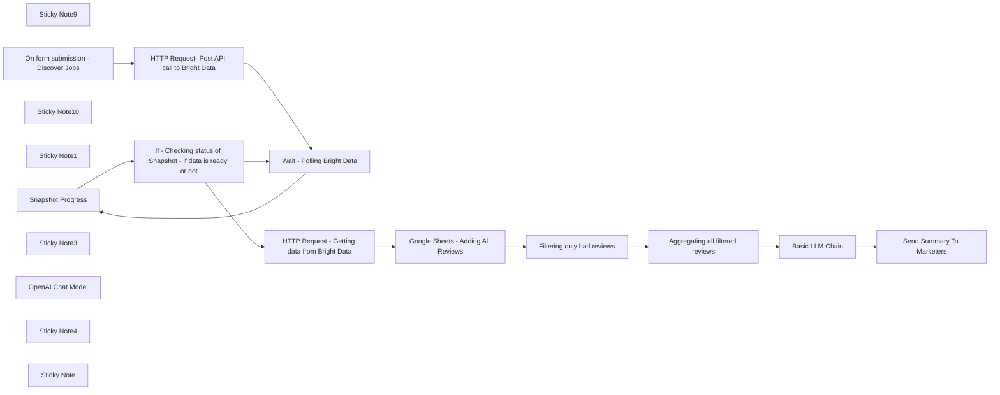

## Fluxo (.json) :

```json
{
  "meta": {
    "instanceId": "1eadd5bc7c3d70c587c28f782511fd898c6bf6d97963d92e836019d2039d1c79"
  },
  "nodes": [
    {
      "id": "578905af-9355-47ba-97c0-05bc9e69876c",
      "name": "Sticky Note9",
      "type": "n8n-nodes-base.stickyNote",
      "position": [
        -420,
        -120
      ],
      "parameters": {
        "color": 4,
        "width": 1280,
        "height": 320,
        "content": "=======================================\n            WORKFLOW ASSISTANCE\n=======================================\nFor any questions or support, please contact:\n    Yaron@nofluff.online\n\nExplore more tips and tutorials here:\n   - YouTube: https://www.youtube.com/@YaronBeen/videos\n   - LinkedIn: https://www.linkedin.com/in/yaronbeen/\n=======================================\nBright Data Docs: https://docs.brightdata.com/introduction\n"
      },
      "typeVersion": 1
    },
    {
      "id": "b54542b4-0f68-4076-9ae9-817c1aee0c14",
      "name": "Snapshot Progress",
      "type": "n8n-nodes-base.httpRequest",
      "position": [
        2180,
        300
      ],
      "parameters": {
        "url": "=https://api.brightdata.com/datasets/v3/progress/{{ $('HTTP Request- Post API call to Bright Data').item.json.snapshot_id }}",
        "options": {},
        "sendHeaders": true,
        "headerParameters": {
          "parameters": [
            {
              "name": "Authorization",
              "value": "Bearer <YOUR_BRIGHT_DATA_API_KEY>"
            }
          ]
        }
      },
      "typeVersion": 4.2
    },
    {
      "id": "8ffd290a-1cc7-4cc9-86a3-397108f8584b",
      "name": "Sticky Note10",
      "type": "n8n-nodes-base.stickyNote",
      "position": [
        3240,
        80
      ],
      "parameters": {
        "width": 195,
        "height": 646,
        "content": "In this workflow, I use Google Sheets to store the results. \n\nYou can use my template to get started faster:\n\n1. [Click on this link to get the template](https://docs.google.com/spreadsheets/d/1Zi758ds2_aWzvbDYqwuGiQNaurLgs-leS9wjLWWlbUU/edit?usp=sharing)\n2. Make a copy of the Sheets\n3. Add the URL to this node \n\n\n"
      },
      "typeVersion": 1
    },
    {
      "id": "d564fdb9-06f6-42c4-96d6-9512fa7217ca",
      "name": "Sticky Note1",
      "type": "n8n-nodes-base.stickyNote",
      "position": [
        1200,
        380
      ],
      "parameters": {
        "width": 220,
        "height": 440,
        "content": "Add your competitors Trustpilot Link here.\n"
      },
      "typeVersion": 1
    },
    {
      "id": "8873b276-72db-42cd-8860-1327714d701b",
      "name": "On form submission - Discover Jobs",
      "type": "n8n-nodes-base.formTrigger",
      "position": [
        1260,
        520
      ],
      "webhookId": "8d0269c7-d1fc-45a1-a411-19634a1e0b82",
      "parameters": {
        "options": {},
        "formTitle": "Please Paste The URL of Your Trustpilot competitor",
        "formFields": {
          "values": [
            {
              "fieldLabel": "Competitor TRUSTPILOT URL (include https://www.trsutpilot.com/review/",
              "placeholder": "https://www.trustpilot.com/review/www.nike.com",
              "requiredField": true
            },
            {
              "fieldType": "dropdown",
              "fieldLabel": "Please select the time frame of reviews you'd like. If it's a big brand go with 30 days",
              "fieldOptions": {
                "values": [
                  {
                    "option": "Last 30 days"
                  },
                  {
                    "option": "Last 3 months"
                  },
                  {
                    "option": "Last 6 months"
                  },
                  {
                    "option": "Last 12 months"
                  }
                ]
              }
            }
          ]
        }
      },
      "typeVersion": 2.2
    },
    {
      "id": "2396fb4f-e3da-4712-b6b5-93704fa69672",
      "name": "HTTP Request- Post API call to Bright Data",
      "type": "n8n-nodes-base.httpRequest",
      "position": [
        1560,
        380
      ],
      "parameters": {
        "url": "https://api.brightdata.com/datasets/v3/trigger",
        "method": "POST",
        "options": {},
        "jsonBody": "=[\n  {\n    \"url\": \"{{ $json['Competitor TRUSTPILOT URL (include https://www.trsutpilot.com/review/'] }}\",\n    \"date_posted\": \"{{ $json['Please select the time frame of reviews you\\'d like. If it\\'s a big brand go with 30 days'] }}\"\n  }\n]",
        "sendBody": true,
        "sendQuery": true,
        "sendHeaders": true,
        "specifyBody": "json",
        "queryParameters": {
          "parameters": [
            {
              "name": "dataset_id",
              "value": "gd_lm5zmhwd2sni130p"
            },
            {
              "name": "include_errors",
              "value": "true"
            }
          ]
        },
        "headerParameters": {
          "parameters": [
            {
              "name": "Authorization",
              "value": "Bearer <YOUR_BRIGHT_DATA_API_KEY>"
            }
          ]
        }
      },
      "typeVersion": 4.2
    },
    {
      "id": "c90b0e25-c009-4321-9c38-7ce895d78f3f",
      "name": "Wait - Polling Bright Data",
      "type": "n8n-nodes-base.wait",
      "position": [
        1940,
        300
      ],
      "webhookId": "8005a2b3-2195-479e-badb-d90e4240e699",
      "parameters": {
        "unit": "minutes",
        "amount": 2
      },
      "executeOnce": false,
      "typeVersion": 1.1
    },
    {
      "id": "ac37b7e2-04fb-4f04-96f6-c77aa282dc8e",
      "name": "If - Checking status of Snapshot - if data is ready or not",
      "type": "n8n-nodes-base.if",
      "position": [
        2380,
        300
      ],
      "parameters": {
        "options": {},
        "conditions": {
          "options": {
            "version": 2,
            "leftValue": "",
            "caseSensitive": true,
            "typeValidation": "strict"
          },
          "combinator": "and",
          "conditions": [
            {
              "id": "7932282b-71bb-4bbb-ab73-4978e554de7e",
              "operator": {
                "name": "filter.operator.equals",
                "type": "string",
                "operation": "equals"
              },
              "leftValue": "={{ $json.status }}",
              "rightValue": "running"
            }
          ]
        }
      },
      "typeVersion": 2.2
    },
    {
      "id": "572ea592-8fd6-4be5-825b-83b0a7a11556",
      "name": "HTTP Request - Getting data from Bright Data",
      "type": "n8n-nodes-base.httpRequest",
      "position": [
        2660,
        320
      ],
      "parameters": {
        "url": "=https://api.brightdata.com/datasets/v3/snapshot/{{ $('HTTP Request- Post API call to Bright Data').item.json.snapshot_id }}",
        "options": {},
        "sendQuery": true,
        "sendHeaders": true,
        "queryParameters": {
          "parameters": [
            {
              "name": "format",
              "value": "json"
            }
          ]
        },
        "headerParameters": {
          "parameters": [
            {
              "name": "Authorization",
              "value": "Bearer <YOUR_BRIGHT_DATA_API_KEY>"
            }
          ]
        }
      },
      "typeVersion": 4.2
    },
    {
      "id": "03c7bfd2-6ae5-4455-8db9-df4858af9417",
      "name": "Sticky Note3",
      "type": "n8n-nodes-base.stickyNote",
      "position": [
        1880,
        160
      ],
      "parameters": {
        "color": 4,
        "width": 940,
        "height": 360,
        "content": "Bright Data Getting Reviews\n"
      },
      "typeVersion": 1
    },
    {
      "id": "f68ece0c-6061-4204-8c90-b9dba3dae242",
      "name": "Basic LLM Chain",
      "type": "@n8n/n8n-nodes-langchain.chainLlm",
      "position": [
        4160,
        380
      ],
      "parameters": {
        "text": "=Read the following bad reviews, these are reviews of our competitors:\n{{ $json.Aggregated_reviews }}\n\n---\nAfter reading them, summarize their weakest points.\nDon't mention the competitor name.\n\nWrite 3 different ads copy for our Facebook ads campaign, addressing these concerns",
        "promptType": "define"
      },
      "typeVersion": 1.6
    },
    {
      "id": "d07aa5c9-c0b0-440d-b9a8-21b5be269db3",
      "name": "OpenAI Chat Model",
      "type": "@n8n/n8n-nodes-langchain.lmChatOpenAi",
      "position": [
        4260,
        600
      ],
      "parameters": {
        "model": {
          "__rl": true,
          "mode": "list",
          "value": "gpt-4o-mini"
        },
        "options": {}
      },
      "credentials": {
        "openAiApi": {
          "id": "MX2lQOZcGpmRvdVD",
          "name": "OpenAi account 2"
        }
      },
      "typeVersion": 1.2
    },
    {
      "id": "0dceb7f9-7133-40cd-87c7-7b786e104a2f",
      "name": "Send Summary To Marketers",
      "type": "n8n-nodes-base.gmail",
      "position": [
        4800,
        400
      ],
      "webhookId": "6787416d-689c-46ee-a7b5-97edd1fd1a00",
      "parameters": {
        "sendTo": "youremail@gmail.com",
        "message": "=Based on the following Trustpilot page: \n{{ $('On form submission - Discover Jobs').item.json['Competitor TRUSTPILOT URL (include https://www.trsutpilot.com/review/'] }}\n\nHere is a summary of recent complaints including ideas for ad copy:\n{{ $json.text }}\n-----------------------------\n\nI'm also attaching a break down of all recent complaints {{ $('Aggregating all filtered reviews').item.json.Aggregated_reviews }}\n",
        "options": {},
        "subject": "=Summary of Complaints of competitor: {{ $('On form submission - Discover Jobs').item.json['Competitor TRUSTPILOT URL (include https://www.trsutpilot.com/review/'] }}",
        "emailType": "text"
      },
      "credentials": {
        "gmailOAuth2": {
          "id": "TLJ5oxgGtoxdGOTZ",
          "name": "Gmail account 2"
        }
      },
      "typeVersion": 2.1
    },
    {
      "id": "14516602-fe16-4a1f-8ada-690a4188429d",
      "name": "Filtering only bad reviews",
      "type": "n8n-nodes-base.filter",
      "position": [
        3520,
        380
      ],
      "parameters": {
        "options": {},
        "conditions": {
          "options": {
            "version": 2,
            "leftValue": "",
            "caseSensitive": true,
            "typeValidation": "loose"
          },
          "combinator": "or",
          "conditions": [
            {
              "id": "7aaa3c61-27d5-4165-aaf3-4783d0ef0db0",
              "operator": {
                "name": "filter.operator.equals",
                "type": "string",
                "operation": "equals"
              },
              "leftValue": "={{ $json.review_rating }}",
              "rightValue": "1"
            },
            {
              "id": "7aab561d-2454-4d4b-a5d6-51c0582ea85b",
              "operator": {
                "name": "filter.operator.equals",
                "type": "string",
                "operation": "equals"
              },
              "leftValue": "={{ $json.review_rating }}",
              "rightValue": "2"
            }
          ]
        },
        "looseTypeValidation": true
      },
      "typeVersion": 2.2
    },
    {
      "id": "a93f9763-4eaa-4654-9bb1-93a1c8b468f9",
      "name": "Aggregating all filtered reviews",
      "type": "n8n-nodes-base.aggregate",
      "position": [
        3780,
        380
      ],
      "parameters": {
        "options": {},
        "fieldsToAggregate": {
          "fieldToAggregate": [
            {
              "renameField": true,
              "outputFieldName": "Aggregated_reviews",
              "fieldToAggregate": "review_content"
            }
          ]
        }
      },
      "typeVersion": 1
    },
    {
      "id": "effec41f-a19f-48c7-a540-ec69968850ee",
      "name": "Sticky Note4",
      "type": "n8n-nodes-base.stickyNote",
      "position": [
        4120,
        140
      ],
      "parameters": {
        "width": 360,
        "height": 820,
        "content": "Adjust This Prompt with:\n1. Add info about your company and offer.\n\n2. The template requires the LLM to generate ad copy, but you can change it to any marketing material you'd like.\nExamples:\n- Suggest ideas for FAQ\n- Suggest copy for UGC scripts\n- Suggest copy for Add to cart email flow etc\n\n"
      },
      "typeVersion": 1
    },
    {
      "id": "e9bf2453-8f98-4d43-ac0c-f3e4b45787c9",
      "name": "Google Sheets - Adding All Reviews",
      "type": "n8n-nodes-base.googleSheets",
      "position": [
        3280,
        380
      ],
      "parameters": {
        "columns": {
          "value": {},
          "schema": [
            {
              "id": "company_name",
              "type": "string",
              "display": true,
              "removed": false,
              "required": false,
              "displayName": "company_name",
              "defaultMatch": false,
              "canBeUsedToMatch": true
            },
            {
              "id": "review_id",
              "type": "string",
              "display": true,
              "removed": false,
              "required": false,
              "displayName": "review_id",
              "defaultMatch": false,
              "canBeUsedToMatch": true
            },
            {
              "id": "review_date",
              "type": "string",
              "display": true,
              "removed": false,
              "required": false,
              "displayName": "review_date",
              "defaultMatch": false,
              "canBeUsedToMatch": true
            },
            {
              "id": "review_rating",
              "type": "string",
              "display": true,
              "removed": false,
              "required": false,
              "displayName": "review_rating",
              "defaultMatch": false,
              "canBeUsedToMatch": true
            },
            {
              "id": "review_title",
              "type": "string",
              "display": true,
              "removed": false,
              "required": false,
              "displayName": "review_title",
              "defaultMatch": false,
              "canBeUsedToMatch": true
            },
            {
              "id": "review_content",
              "type": "string",
              "display": true,
              "removed": false,
              "required": false,
              "displayName": "review_content",
              "defaultMatch": false,
              "canBeUsedToMatch": true
            },
            {
              "id": "is_verified_review",
              "type": "string",
              "display": true,
              "removed": false,
              "required": false,
              "displayName": "is_verified_review",
              "defaultMatch": false,
              "canBeUsedToMatch": true
            },
            {
              "id": "review_date_of_experience",
              "type": "string",
              "display": true,
              "removed": false,
              "required": false,
              "displayName": "review_date_of_experience",
              "defaultMatch": false,
              "canBeUsedToMatch": true
            },
            {
              "id": "reviewer_location",
              "type": "string",
              "display": true,
              "removed": false,
              "required": false,
              "displayName": "reviewer_location",
              "defaultMatch": false,
              "canBeUsedToMatch": true
            },
            {
              "id": "reviews_posted_overall",
              "type": "string",
              "display": true,
              "removed": false,
              "required": false,
              "displayName": "reviews_posted_overall",
              "defaultMatch": false,
              "canBeUsedToMatch": true
            },
            {
              "id": "review_replies",
              "type": "string",
              "display": true,
              "removed": false,
              "required": false,
              "displayName": "review_replies",
              "defaultMatch": false,
              "canBeUsedToMatch": true
            },
            {
              "id": "review_useful_count",
              "type": "string",
              "display": true,
              "removed": false,
              "required": false,
              "displayName": "review_useful_count",
              "defaultMatch": false,
              "canBeUsedToMatch": true
            },
            {
              "id": "reviewer_name",
              "type": "string",
              "display": true,
              "removed": false,
              "required": false,
              "displayName": "reviewer_name",
              "defaultMatch": false,
              "canBeUsedToMatch": true
            },
            {
              "id": "company_logo",
              "type": "string",
              "display": true,
              "removed": false,
              "required": false,
              "displayName": "company_logo",
              "defaultMatch": false,
              "canBeUsedToMatch": true
            },
            {
              "id": "url",
              "type": "string",
              "display": true,
              "removed": false,
              "required": false,
              "displayName": "url",
              "defaultMatch": false,
              "canBeUsedToMatch": true
            },
            {
              "id": "company_overall_rating",
              "type": "string",
              "display": true,
              "removed": false,
              "required": false,
              "displayName": "company_overall_rating",
              "defaultMatch": false,
              "canBeUsedToMatch": true
            },
            {
              "id": "is_verified_company",
              "type": "string",
              "display": true,
              "removed": false,
              "required": false,
              "displayName": "is_verified_company",
              "defaultMatch": false,
              "canBeUsedToMatch": true
            },
            {
              "id": "company_total_reviews",
              "type": "string",
              "display": true,
              "removed": false,
              "required": false,
              "displayName": "company_total_reviews",
              "defaultMatch": false,
              "canBeUsedToMatch": true
            },
            {
              "id": "5_star",
              "type": "string",
              "display": true,
              "removed": false,
              "required": false,
              "displayName": "5_star",
              "defaultMatch": false,
              "canBeUsedToMatch": true
            },
            {
              "id": "4_star",
              "type": "string",
              "display": true,
              "removed": false,
              "required": false,
              "displayName": "4_star",
              "defaultMatch": false,
              "canBeUsedToMatch": true
            },
            {
              "id": "3_star",
              "type": "string",
              "display": true,
              "removed": false,
              "required": false,
              "displayName": "3_star",
              "defaultMatch": false,
              "canBeUsedToMatch": true
            },
            {
              "id": "2_star",
              "type": "string",
              "display": true,
              "removed": false,
              "required": false,
              "displayName": "2_star",
              "defaultMatch": false,
              "canBeUsedToMatch": true
            },
            {
              "id": "1_star",
              "type": "string",
              "display": true,
              "removed": false,
              "required": false,
              "displayName": "1_star",
              "defaultMatch": false,
              "canBeUsedToMatch": true
            },
            {
              "id": "company_about",
              "type": "string",
              "display": true,
              "removed": false,
              "required": false,
              "displayName": "company_about",
              "defaultMatch": false,
              "canBeUsedToMatch": true
            },
            {
              "id": "company_phone",
              "type": "string",
              "display": true,
              "removed": false,
              "required": false,
              "displayName": "company_phone",
              "defaultMatch": false,
              "canBeUsedToMatch": true
            },
            {
              "id": "company_location",
              "type": "string",
              "display": true,
              "removed": false,
              "required": false,
              "displayName": "company_location",
              "defaultMatch": false,
              "canBeUsedToMatch": true
            },
            {
              "id": "company_country",
              "type": "string",
              "display": true,
              "removed": false,
              "required": false,
              "displayName": "company_country",
              "defaultMatch": false,
              "canBeUsedToMatch": true
            },
            {
              "id": "breadcrumbs",
              "type": "string",
              "display": true,
              "removed": false,
              "required": false,
              "displayName": "breadcrumbs",
              "defaultMatch": false,
              "canBeUsedToMatch": true
            },
            {
              "id": "company_category",
              "type": "string",
              "display": true,
              "removed": false,
              "required": false,
              "displayName": "company_category",
              "defaultMatch": false,
              "canBeUsedToMatch": true
            },
            {
              "id": "company_id",
              "type": "string",
              "display": true,
              "removed": false,
              "required": false,
              "displayName": "company_id",
              "defaultMatch": false,
              "canBeUsedToMatch": true
            },
            {
              "id": "company_website",
              "type": "string",
              "display": true,
              "removed": false,
              "required": false,
              "displayName": "company_website",
              "defaultMatch": false,
              "canBeUsedToMatch": true
            },
            {
              "id": "company_other_categories",
              "type": "string",
              "display": true,
              "removed": false,
              "required": false,
              "displayName": "company_other_categories",
              "defaultMatch": false,
              "canBeUsedToMatch": true
            },
            {
              "id": "review_url",
              "type": "string",
              "display": true,
              "removed": false,
              "required": false,
              "displayName": "review_url",
              "defaultMatch": false,
              "canBeUsedToMatch": true
            },
            {
              "id": "date_posted",
              "type": "string",
              "display": true,
              "removed": false,
              "required": false,
              "displayName": "date_posted",
              "defaultMatch": false,
              "canBeUsedToMatch": true
            },
            {
              "id": "timestamp",
              "type": "string",
              "display": true,
              "removed": false,
              "required": false,
              "displayName": "timestamp",
              "defaultMatch": false,
              "canBeUsedToMatch": true
            },
            {
              "id": "input",
              "type": "string",
              "display": true,
              "removed": false,
              "required": false,
              "displayName": "input",
              "defaultMatch": false,
              "canBeUsedToMatch": true
            }
          ],
          "mappingMode": "autoMapInputData",
          "matchingColumns": [],
          "attemptToConvertTypes": false,
          "convertFieldsToString": false
        },
        "options": {},
        "operation": "append",
        "sheetName": {
          "__rl": true,
          "mode": "list",
          "value": "gid=0",
          "cachedResultUrl": "https://docs.google.com/spreadsheets/d/1Zi758ds2_aWzvbDYqwuGiQNaurLgs-leS9wjLWWlbUU/edit#gid=0",
          "cachedResultName": "input"
        },
        "documentId": {
          "__rl": true,
          "mode": "list",
          "value": "1Zi758ds2_aWzvbDYqwuGiQNaurLgs-leS9wjLWWlbUU",
          "cachedResultUrl": "https://docs.google.com/spreadsheets/d/1Zi758ds2_aWzvbDYqwuGiQNaurLgs-leS9wjLWWlbUU/edit?usp=drivesdk",
          "cachedResultName": "NoFluff-N8N-Sheet-Template- Trust PIlot Reviews Scraping WIth Bright Data"
        }
      },
      "credentials": {
        "googleSheetsOAuth2Api": {
          "id": "4RJOMlGAcB9ZoYfm",
          "name": "Google Sheets account 2"
        }
      },
      "typeVersion": 4.3,
      "alwaysOutputData": true
    },
    {
      "id": "a3911ad6-be39-4bba-9b1c-96c5a7017da4",
      "name": "Sticky Note",
      "type": "n8n-nodes-base.stickyNote",
      "position": [
        -400,
        220
      ],
      "parameters": {
        "width": 860,
        "height": 380,
        "content": "### Scrape Trustpilot Reviews Using Bright Data for Winning Ad Insights\n\nThis **n8n workflow** scrapes Trustpilot reviews of a specified competitor using **Bright Data's dataset API**. Users input the competitor's Trustpilot URL and select a timeframe (30 days, 3 months, 6 months, or 12 months) via an n8n form.\n\n**Workflow steps:**\n\n- Sends a request to Bright Data to fetch Trustpilot reviews based on user input.\n- Polls Bright Data until the dataset is ready.\n- Retrieves the reviews and logs them into a Google Sheet.\n- Filters the results to isolate negative reviews (ratings of 1 or 2 stars).\n- Aggregates negative reviews into summarized text.\n- Uses OpenAI's GPT-4o-mini to analyze competitor weaknesses and generate three Facebook ad copy variations addressing these pain points.\n- Emails the summary, including suggested ad copy and aggregated reviews, to the marketing team.\n"
      },
      "typeVersion": 1
    }
  ],
  "pinData": {},
  "connections": {
    "Basic LLM Chain": {
      "main": [
        [
          {
            "node": "Send Summary To Marketers",
            "type": "main",
            "index": 0
          }
        ]
      ]
    },
    "OpenAI Chat Model": {
      "ai_languageModel": [
        [
          {
            "node": "Basic LLM Chain",
            "type": "ai_languageModel",
            "index": 0
          }
        ]
      ]
    },
    "Snapshot Progress": {
      "main": [
        [
          {
            "node": "If - Checking status of Snapshot - if data is ready or not",
            "type": "main",
            "index": 0
          }
        ]
      ]
    },
    "Filtering only bad reviews": {
      "main": [
        [
          {
            "node": "Aggregating all filtered reviews",
            "type": "main",
            "index": 0
          }
        ]
      ]
    },
    "Wait - Polling Bright Data": {
      "main": [
        [
          {
            "node": "Snapshot Progress",
            "type": "main",
            "index": 0
          }
        ]
      ]
    },
    "Aggregating all filtered reviews": {
      "main": [
        [
          {
            "node": "Basic LLM Chain",
            "type": "main",
            "index": 0
          }
        ]
      ]
    },
    "Google Sheets - Adding All Reviews": {
      "main": [
        [
          {
            "node": "Filtering only bad reviews",
            "type": "main",
            "index": 0
          }
        ]
      ]
    },
    "On form submission - Discover Jobs": {
      "main": [
        [
          {
            "node": "HTTP Request- Post API call to Bright Data",
            "type": "main",
            "index": 0
          }
        ]
      ]
    },
    "HTTP Request- Post API call to Bright Data": {
      "main": [
        [
          {
            "node": "Wait - Polling Bright Data",
            "type": "main",
            "index": 0
          }
        ]
      ]
    },
    "HTTP Request - Getting data from Bright Data": {
      "main": [
        [
          {
            "node": "Google Sheets - Adding All Reviews",
            "type": "main",
            "index": 0
          }
        ]
      ]
    },
    "If - Checking status of Snapshot - if data is ready or not": {
      "main": [
        [
          {
            "node": "Wait - Polling Bright Data",
            "type": "main",
            "index": 0
          }
        ],
        [
          {
            "node": "HTTP Request - Getting data from Bright Data",
            "type": "main",
            "index": 0
          }
        ]
      ]
    }
  }
}
```

<a id="template-1504"></a>

## Template 1504 - Comparar n8n e Make com Perplexity

- **Nome:** Comparar n8n e Make com Perplexity
- **Descrição:** Este fluxo envia prompts predefinidos à API da Perplexity para obter uma comparação entre n8n e Make, e extrai a resposta e as citações retornadas.
- **Funcionalidade:** • Início manual: permite executar o fluxo ao clicar em teste para avaliar rapidamente uma consulta.
• Definição de parâmetros: configura prompt do sistema, prompt do usuário e domínios alvo antes da requisição.
• Requisição à API de busca/IA: envia os prompts ao endpoint de chat completions usando um modelo específico e parâmetros de temperatura, top_p, filtros de recência e domínios.
• Autenticação por cabeçalho: utiliza chave de API via cabeçalho Authorization Bearer para autenticar a chamada externa.
• Extração e limpeza da resposta: mapeia e armazena o conteúdo da resposta e as citações retornadas pelo serviço.
• Orientações de configuração: inclui instruções para obter a chave da API e selecionar o modelo adequado.
- **Ferramentas:** • Perplexity: serviço de IA/conversacional que recebe prompts e retorna respostas estruturadas com possíveis citações.
• Sonar Pro (modelo): modelo recomendado/usado pela Perplexity para gerar as respostas detalhadas.

## Fluxo visual

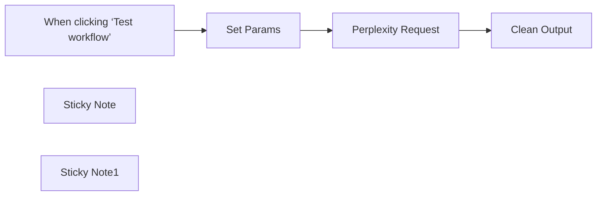

## Fluxo (.json) :

```json
{
  "nodes": [
    {
      "id": "293b70f0-06e8-4db5-befd-bfaed1f3575a",
      "name": "When clicking ‘Test workflow’",
      "type": "n8n-nodes-base.manualTrigger",
      "position": [
        -460,
        80
      ],
      "parameters": {},
      "typeVersion": 1
    },
    {
      "id": "1c473546-6280-412d-9f8e-b43962365d78",
      "name": "Set Params",
      "type": "n8n-nodes-base.set",
      "position": [
        -160,
        -60
      ],
      "parameters": {
        "options": {},
        "assignments": {
          "assignments": [
            {
              "id": "8b5c6ca0-5ca8-4f67-abc1-44341cf419bc",
              "name": "system_prompt",
              "type": "string",
              "value": "You are an n8n fanboy."
            },
            {
              "id": "7c36c362-6269-4564-b6fe-f82126bc8f5e",
              "name": "user_prompt",
              "type": "string",
              "value": "What are the differences between n8n and Make?"
            },
            {
              "id": "4366d2b5-ad22-445a-8589-fddab1caa1ab",
              "name": "domains",
              "type": "string",
              "value": "n8n.io, make.com"
            }
          ]
        }
      },
      "typeVersion": 3.4
    },
    {
      "id": "894bd6a4-5db7-45fb-a8e0-1a81af068bbf",
      "name": "Clean Output",
      "type": "n8n-nodes-base.set",
      "position": [
        580,
        -100
      ],
      "parameters": {
        "options": {},
        "assignments": {
          "assignments": [
            {
              "id": "5859093c-6b22-41db-ac6c-9a9f6f18b7e3",
              "name": "output",
              "type": "string",
              "value": "={{ $json.choices[0].message.content }}"
            },
            {
              "id": "13208fff-5153-45a7-a1cb-fe49e32d9a03",
              "name": "citations",
              "type": "array",
              "value": "={{ $json.citations }}"
            }
          ]
        }
      },
      "typeVersion": 3.4
    },
    {
      "id": "52d3a832-8c9b-4356-ad2a-377340678a58",
      "name": "Perplexity Request",
      "type": "n8n-nodes-base.httpRequest",
      "position": [
        240,
        40
      ],
      "parameters": {
        "url": "https://api.perplexity.ai/chat/completions",
        "method": "POST",
        "options": {},
        "jsonBody": "={\n  \"model\": \"sonar\",\n  \"messages\": [\n    {\n      \"role\": \"system\",\n      \"content\": \"{{ $json.system_prompt }}\"\n    },\n    {\n      \"role\": \"user\",\n      \"content\": \"{{ $json.user_prompt }}\"\n    }\n  ],\n  \"temperature\": 0.2,\n  \"top_p\": 0.9,\n  \"search_domain_filter\": {{ (JSON.stringify($json.domains.split(','))) }},\n  \"return_images\": false,\n  \"return_related_questions\": false,\n  \"search_recency_filter\": \"month\",\n  \"top_k\": 0,\n  \"stream\": false,\n  \"presence_penalty\": 0,\n  \"frequency_penalty\": 1,\n  \"response_format\": null\n}",
        "sendBody": true,
        "specifyBody": "json",
        "authentication": "genericCredentialType",
        "genericAuthType": "httpHeaderAuth"
      },
      "credentials": {
        "httpBasicAuth": {
          "id": "yEocL0NSpUWzMsHG",
          "name": "Perplexity"
        },
        "httpHeaderAuth": {
          "id": "TngzgS09J1YvLIXl",
          "name": "Perplexity"
        }
      },
      "typeVersion": 4.2
    },
    {
      "id": "48657f2c-d1dd-4d7e-8014-c27748e63e58",
      "name": "Sticky Note",
      "type": "n8n-nodes-base.stickyNote",
      "position": [
        -140,
        -440
      ],
      "parameters": {
        "width": 480,
        "height": 300,
        "content": "## Credentials Setup\n\n1/ Go to the perplexity dashboard, purchase some credits and create an API Key\n\nhttps://www.perplexity.ai/settings/api\n\n2/ In the perplexity Request node, use Generic Credentials, Header Auth. \n\nFor the name, use the value \"Authorization\"\nAnd for the value \"Bearer pplx-e4...59ea\" (Your Perplexity Api Key)\n\n"
      },
      "typeVersion": 1
    },
    {
      "id": "e0daabee-c145-469e-93c2-c759c303dc2a",
      "name": "Sticky Note1",
      "type": "n8n-nodes-base.stickyNote",
      "position": [
        100,
        260
      ],
      "parameters": {
        "color": 5,
        "width": 480,
        "height": 120,
        "content": "**Sonar Pro** is the current top model used by perplexity. \nIf you want to use a different one, check this page: \n\nhttps://docs.perplexity.ai/guides/model-cards"
      },
      "typeVersion": 1
    }
  ],
  "pinData": {},
  "connections": {
    "Set Params": {
      "main": [
        [
          {
            "node": "Perplexity Request",
            "type": "main",
            "index": 0
          }
        ]
      ]
    },
    "Perplexity Request": {
      "main": [
        [
          {
            "node": "Clean Output",
            "type": "main",
            "index": 0
          }
        ]
      ]
    },
    "When clicking ‘Test workflow’": {
      "main": [
        [
          {
            "node": "Set Params",
            "type": "main",
            "index": 0
          }
        ]
      ]
    }
  }
}
```

<a id="template-1506"></a>

## Template 1506 - Atualizar meta SEO Rank Math

- **Nome:** Atualizar meta SEO Rank Math
- **Descrição:** Envia dados de meta SEO para um post no WordPress utilizando a API do Rank Math para atualizar título, descrição e URL canônica.
- **Funcionalidade:** • Definição de URL do site: Armazena a URL base do WordPress (campo "woocommerce url") para compor o endpoint.
• Gatilho manual de teste: Permite iniciar o fluxo manualmente para testes.
• Envio de requisição POST para a API do Rank Math: Faz POST ao endpoint wp-json/rank-math-api/v1/update-meta com parâmetros post_id, rank_math_title, rank_math_description e rank_math_canonical_url.
• Autenticação com credenciais do WordPress: Utiliza credenciais armazenadas para autenticar a chamada à API.
• Re-tentativa em caso de falha: Configurado para tentar novamente quando a requisição falha.
- **Ferramentas:** • WordPress: CMS alvo que hospeda o site e expõe a REST API usada para atualizar conteúdo.
• Rank Math: Plugin SEO que fornece o endpoint API (update-meta) para atualizar meta títulos, descrições e URLs canônicas.
• WooCommerce: Plataforma de e-commerce integrada ao site (credenciais presentes no fluxo para possível uso no contexto do site).

## Fluxo visual


## Fluxo (.json) :

```json
{
  "meta": {
    "instanceId": "c911aed9995230b93fd0d9bc41c258d697c2fe97a3bab8c02baf85963eeda618",
    "templateCredsSetupCompleted": true
  },
  "nodes": [
    {
      "id": "83c6d7e3-ae2e-4576-8bc6-1e1a7b553fca",
      "name": "Settings",
      "type": "n8n-nodes-base.set",
      "position": [
        260,
        0
      ],
      "parameters": {
        "options": {},
        "assignments": {
          "assignments": [
            {
              "id": "080b234c-a753-409d-9d2d-3322678a01f2",
              "name": "woocommerce url",
              "type": "string",
              "value": "https://mydom.com/"
            }
          ]
        }
      },
      "typeVersion": 3.4
    },
    {
      "id": "7018ae65-bb9d-4bac-8746-01193cb0e523",
      "name": "When clicking ‘Test workflow’",
      "type": "n8n-nodes-base.manualTrigger",
      "position": [
        0,
        0
      ],
      "parameters": {},
      "typeVersion": 1
    },
    {
      "id": "223ed34b-3e26-406c-a5a5-34f8408e3fe6",
      "name": "HTTP Request - Update Rank Math Meta",
      "type": "n8n-nodes-base.httpRequest",
      "position": [
        500,
        0
      ],
      "parameters": {
        "url": "={{ $('Settings').item.json[\"woocommerce url\"] }}wp-json/rank-math-api/v1/update-meta",
        "method": "POST",
        "options": {},
        "sendBody": true,
        "authentication": "predefinedCredentialType",
        "bodyParameters": {
          "parameters": [
            {
              "name": "post_id",
              "value": "246"
            },
            {
              "name": "rank_math_title",
              "value": "Demo SEO Title"
            },
            {
              "name": "rank_math_description",
              "value": "Demo SEO Description"
            },
            {
              "name": "rank_math_canonical_url",
              "value": "https://example.com/demo-product"
            }
          ]
        },
        "nodeCredentialType": "wordpressApi"
      },
      "credentials": {
        "wordpressApi": {
          "id": "6rPlJdCaIXaVciGM",
          "name": "Wordpress account"
        },
        "wooCommerceApi": {
          "id": "klGFZkgHrRfC8BVg",
          "name": "WooCommerce account"
        }
      },
      "retryOnFail": true,
      "typeVersion": 4.2
    }
  ],
  "pinData": {},
  "connections": {
    "Settings": {
      "main": [
        [
          {
            "node": "HTTP Request - Update Rank Math Meta",
            "type": "main",
            "index": 0
          }
        ]
      ]
    },
    "When clicking ‘Test workflow’": {
      "main": [
        [
          {
            "node": "Settings",
            "type": "main",
            "index": 0
          }
        ]
      ]
    }
  }
}
```
