# PACK 1999 TEMPLATES PARTE 08 - Bloco 2

Templates neste bloco: 20

## Sumário

- [Template 1508 - Gerador de sugestões do Google A–Z](#template-1508)
- [Template 1510 - Receber atualizações de suporte Zendesk](#template-1510)
- [Template 1512 - Publicação e encadeamento de posts no Bluesky](#template-1512)
- [Template 1514 - Gerador de vídeos curtos AI e publicação em redes sociais](#template-1514)
- [Template 1516 - Enriquecer deteções CrowdStrike, criar ticket Jira e notificar Slack](#template-1516)
- [Template 1519 - Assistente do Código Fiscal do Texas](#template-1519)
- [Template 1521 - Agente telefônico para qualificação de leads](#template-1521)
- [Template 1523 - Agente conversacional para dados do Search Console](#template-1523)
- [Template 1525 - Geração de histórias animadas por IA](#template-1525)
- [Template 1527 - Geração automática de vídeos verticais com citações](#template-1527)
- [Template 1529 - Enriquecer dados de empresas com AI e scraping](#template-1529)
- [Template 1531 - Geração de imagens com Fal AI e upload para Drive](#template-1531)
- [Template 1532 - Buscar e pontuar empresas LinkedIn e adicionar ao CRM (Google Sheets)](#template-1532)
- [Template 1534 - Gerador de imagens 9:16 e thumbnails a partir de conteúdo](#template-1534)
- [Template 1537 - Geração de ilustrações animadas (Midjourney + Kling)](#template-1537)
- [Template 1539 - Extração automática de dados de faturas para Google Sheets](#template-1539)
- [Template 1541 - Relatório diário de custos de energia da PG&E](#template-1541)
- [Template 1543 - Limpeza diária de mensagens do Discord](#template-1543)
- [Template 1545 - Bot de WhatsApp para notificações e respostas automáticas](#template-1545)
- [Template 1547 - Extração em lote via Bright Data](#template-1547)

---

<a id="template-1508"></a>

## Template 1508 - Gerador de sugestões do Google A–Z

- **Nome:** Gerador de sugestões do Google A–Z
- **Descrição:** Combina uma palavra‑chave com as letras de A a Z e consulta o serviço de autocomplete do Google para coletar e devolver sugestões de pesquisa.
- **Funcionalidade:** • Entrada por webhook/Chat: recebe a palavra‑chave inicial via trigger (webhook ou serviço de chat).
• Geração de consultas A–Z: cria 26 consultas concatenando a palavra‑chave com cada letra de 'a' a 'z'.
• Processamento em lotes: envia as consultas em lotes de 10 para reduzir risco de bloqueio pela API.
• Pausa entre requisições: adiciona espera de 1 segundo entre requisições para evitar bloqueios.
• Consulta ao Autocomplete do Google: realiza chamadas HTTP ao endpoint de sugestões para obter completions relacionados.
• Extração e agregação: parseia as respostas JSON e agrupa todas as sugestões em uma lista única.
• Retorno dos resultados: devolve a lista consolidada de palavras‑chave como resposta ao originador do request.
• Ajuste de idioma: permite alterar o parâmetro de idioma nas chamadas ao serviço de autocomplete.
- **Ferramentas:** • Google Autocomplete (suggestqueries.google.com): endpoint de sugestões usado para obter as pesquisas autocompletas do Google.
• Webhook / serviço de chat (ex.: formulário, Telegram, WhatsApp): ponto de entrada para receber a palavra‑chave inicial e ponto de saída para retornar os resultados.

## Fluxo visual

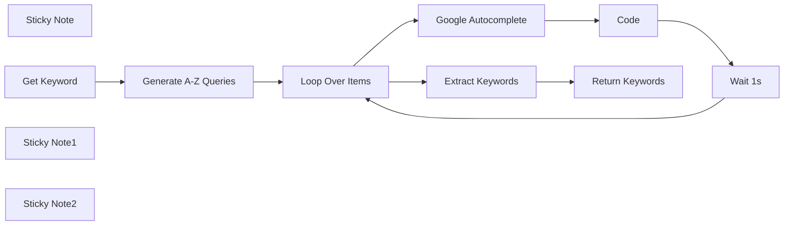

## Fluxo (.json) :

```json
{
  "meta": {
    "instanceId": "2e4938c532d5f4536554a31b1fe1b04df825b7a8238ff0fb3c5eaaa749e140bd"
  },
  "nodes": [
    {
      "id": "04b7d4d7-6639-4559-9a7a-7eb7b83e16fa",
      "name": "Generate A-Z Queries",
      "type": "n8n-nodes-base.code",
      "notes": "This code adds \n- a blank space\n- and a letter, starting from a, b, c... up to z\nIt processes all the 26 possible letters.\n\nEx :\nn8n a\nn8n b\nn8n c\n...\nn8n z",
      "position": [
        180,
        0
      ],
      "parameters": {
        "jsCode": "const keyword = $input.first().json.chatInput;\nconst alphabet = \"abcdefghijklmnopqrstuvwxyz\".split(\"\");\n\nreturn alphabet.map(letter => ({\n  json: { query: `${keyword} ${letter}` }\n}));"
      },
      "notesInFlow": false,
      "typeVersion": 2
    },
    {
      "id": "0c6ae163-3d08-4a40-aaa9-921f583940df",
      "name": "Google Autocomplete",
      "type": "n8n-nodes-base.httpRequest",
      "position": [
        560,
        100
      ],
      "parameters": {
        "url": "=https://suggestqueries.google.com/complete/search?client=firefox&hl=en&oe=utf-8&q={{ $json.query }}",
        "options": {}
      },
      "typeVersion": 4
    },
    {
      "id": "21f0aeaa-2d64-497c-a890-6bd84ade624f",
      "name": "Loop Over Items",
      "type": "n8n-nodes-base.splitInBatches",
      "notes": "The 26 items (one for each alphabet letter) are treated by batches of 10.\nThis setting + the wait time help not to be blocked by Google's API.",
      "position": [
        360,
        0
      ],
      "parameters": {
        "options": {},
        "batchSize": 10
      },
      "typeVersion": 3
    },
    {
      "id": "6fca90c9-c8f0-4a86-b746-2eedd670404a",
      "name": "Wait 1s",
      "type": "n8n-nodes-base.wait",
      "notes": "This wait time is necessary, otherwise Google API might block the call and make an error.",
      "position": [
        920,
        100
      ],
      "webhookId": "844dc802-f7d5-47f0-a389-ad60c4970aa0",
      "parameters": {
        "unit": "seconds"
      },
      "typeVersion": 1
    },
    {
      "id": "1a1a1a69-736b-4353-9353-bf80b4082f2c",
      "name": "Code",
      "type": "n8n-nodes-base.code",
      "position": [
        740,
        100
      ],
      "parameters": {
        "jsCode": "const data = JSON.parse($json.data);\nreturn {\n  json: {\n    keywords: data[1]\n  }\n};\n"
      },
      "typeVersion": 2
    },
    {
      "id": "6af6e3e1-85b7-49a7-8589-bf49d34ff429",
      "name": "Sticky Note",
      "type": "n8n-nodes-base.stickyNote",
      "position": [
        -40,
        -340
      ],
      "parameters": {
        "width": 400,
        "height": 320,
        "content": "## Type a Keyword and Discover What People Search on Google\n\nThis workflow scrapes Google autocomplete results by combining **your keyword** with every letter from **A to Z**.\n\n**Example:**  \nKeyword: `n8n`  \nResults:  \n- n8n agent  \n- n8n automation  \n- n8n api  \n- ...and so on\n"
      },
      "typeVersion": 1
    },
    {
      "id": "87673f0f-19ef-4bf7-a2bb-6d7e823a4f57",
      "name": "Get Keyword",
      "type": "@n8n/n8n-nodes-langchain.chatTrigger",
      "notes": "You could also get this initial keyword from :\n- a line in a Google Sheet\n- a webhook and a form on a website\n- a messaging app like Telegram or Whatsapp",
      "position": [
        0,
        0
      ],
      "webhookId": "add903d6-ee86-435a-b876-12b2f6264631",
      "parameters": {
        "options": {}
      },
      "notesInFlow": false,
      "typeVersion": 1.1
    },
    {
      "id": "ce6f882e-69dc-41a4-a9bf-b4fd6c55b87f",
      "name": "Sticky Note1",
      "type": "n8n-nodes-base.stickyNote",
      "position": [
        740,
        -360
      ],
      "parameters": {
        "width": 480,
        "height": 240,
        "content": "## Exporting the Keywords\n\nYou can easily add a node to export the keywords in various ways:\n\n- via a webhook\n- by email\n- as a file (e.g., saved to Google Drive)\n- directly to a website"
      },
      "typeVersion": 1
    },
    {
      "id": "2675a52d-1018-4d33-914d-fc46225a3cc5",
      "name": "Extract Keywords",
      "type": "n8n-nodes-base.code",
      "notes": "This code gathers all the keywords in one list.",
      "position": [
        560,
        -100
      ],
      "parameters": {
        "jsCode": "let mergedKeywords = [];\n\nfor (const item of $input.all()) {\n  mergedKeywords.push(...item.json.keywords);\n}\n\nreturn { json: { keywords: mergedKeywords } };\n"
      },
      "typeVersion": 2
    },
    {
      "id": "95376c0e-43a8-408d-9542-ca9c0c4999c7",
      "name": "Return Keywords",
      "type": "n8n-nodes-base.respondToWebhook",
      "notes": "Use this node",
      "position": [
        740,
        -100
      ],
      "parameters": {
        "options": {}
      },
      "typeVersion": 1
    },
    {
      "id": "9355b89b-5366-4bbb-a06b-081ced4c2134",
      "name": "Sticky Note2",
      "type": "n8n-nodes-base.stickyNote",
      "position": [
        540,
        280
      ],
      "parameters": {
        "width": 560,
        "height": 280,
        "content": "## Adapt the Language\n\nAutocomplete results depend on the selected language.\n\nYou can change the `&hl=en` parameter in the **Google Autocomplete** node.  \nReplace the `\"en\"` part with the language code of your choice.\n\n**Examples:**  \n- `&hl=fr` → French  \n- `&hl=es` → Spanish  \n- `&hl=de` → German\n"
      },
      "typeVersion": 1
    }
  ],
  "pinData": {},
  "connections": {
    "Code": {
      "main": [
        [
          {
            "node": "Wait 1s",
            "type": "main",
            "index": 0
          }
        ]
      ]
    },
    "Wait 1s": {
      "main": [
        [
          {
            "node": "Loop Over Items",
            "type": "main",
            "index": 0
          }
        ]
      ]
    },
    "Get Keyword": {
      "main": [
        [
          {
            "node": "Generate A-Z Queries",
            "type": "main",
            "index": 0
          }
        ]
      ]
    },
    "Loop Over Items": {
      "main": [
        [
          {
            "node": "Extract Keywords",
            "type": "main",
            "index": 0
          }
        ],
        [
          {
            "node": "Google Autocomplete",
            "type": "main",
            "index": 0
          }
        ]
      ]
    },
    "Extract Keywords": {
      "main": [
        [
          {
            "node": "Return Keywords",
            "type": "main",
            "index": 0
          }
        ]
      ]
    },
    "Google Autocomplete": {
      "main": [
        [
          {
            "node": "Code",
            "type": "main",
            "index": 0
          }
        ]
      ]
    },
    "Generate A-Z Queries": {
      "main": [
        [
          {
            "node": "Loop Over Items",
            "type": "main",
            "index": 0
          }
        ]
      ]
    }
  }
}
```

<a id="template-1510"></a>

## Template 1510 - Receber atualizações de suporte Zendesk

- **Nome:** Receber atualizações de suporte Zendesk
- **Descrição:** Fluxo que recebe notificações de atualização de tickets de suporte a partir do Zendesk para processamento ou integração posterior.
- **Funcionalidade:** • Detecção de atualizações de suporte: Escuta eventos e mudanças em tickets de suporte para iniciar o fluxo.
• Recebimento de payloads via webhook: Captura os dados enviados pelo webhook com informações do ticket e do evento.
• Uso de credenciais configuradas: Autentica a origem dos eventos utilizando credenciais integradas para garantir segurança.
- **Ferramentas:** • Zendesk: Plataforma de suporte ao cliente para gerenciamento de tickets, atualizações e notificações.


## Fluxo visual


## Fluxo (.json) :

```json
{
  "id": "33",
  "name": "Receive updates for support in Zendesk",
  "nodes": [
    {
      "name": "Zendesk Trigger",
      "type": "n8n-nodes-base.zendeskTrigger",
      "position": [
        690,
        300
      ],
      "webhookId": "7d01a119-83c7-43b7-8668-a2f26b95d225",
      "parameters": {
        "options": {},
        "conditions": {
          "all": [
            {}
          ]
        }
      },
      "credentials": {
        "zendeskApi": "zendesk-token"
      },
      "typeVersion": 1
    }
  ],
  "active": false,
  "settings": {},
  "connections": {}
}
```

<a id="template-1512"></a>

## Template 1512 - Publicação e encadeamento de posts no Bluesky

- **Nome:** Publicação e encadeamento de posts no Bluesky
- **Descrição:** Automatiza a autenticação e a publicação de um post inicial, em seguida cria respostas e posts irmãos encadeados usando referências de URI/CID para formar uma thread.
- **Funcionalidade:** • Agendamento diário: Executa o fluxo automaticamente às 9h todos os dias.
• Configuração de credenciais: Recebe o handle do usuário e a app password para autenticação.
• Autenticação via sessão: Cria uma sessão com o serviço para obter um JWT de acesso.
• Criação de post inicial: Publica o post raiz visível na timeline.
• Criação de resposta ao post inicial: Publica um reply apontando root e parent para o post inicial (usa URI e CID).
• Criação de posts irmãos: Gera múltiplos posts irmãos que referenciam o mesmo root e usam o post anterior como parent.
• Loop para múltiplos posts: Itera sobre um array de conteúdos para criar várias entradas sequenciais.
• Controle de ordenação temporal: Ajusta createdAt (timestamps futuros) e insere esperas para garantir a ordem desejada das publicações.
• Uso de cabeçalho de autorização: Envia o JWT no header Authorization para chamadas autenticadas à API.
- **Ferramentas:** • Bluesky (bsky.social): Plataforma social onde os posts são publicados e gerenciados.
• AT Protocol XRPC API: Endpoints com.atproto.server.createSession (autenticação) e com.atproto.repo.createRecord (criação de registros/posts) usados para interagir com o serviço.

## Fluxo visual

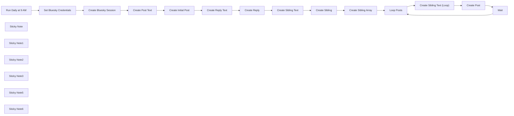

## Fluxo (.json) :

```json
{
  "id": "7ZIG5xxEACMBgj4Z",
  "meta": {
    "instanceId": "1b1e85a338c6ce950207b3b471d43405c7b292e6b980ee5b66c1a9e5af2a50f8"
  },
  "name": "Create Threads on Bluesky",
  "tags": [
    {
      "id": "f3JGorUk16BX0hZI",
      "name": "Bluesky",
      "createdAt": "2025-01-19T09:37:40.989Z",
      "updatedAt": "2025-01-19T09:37:40.989Z"
    },
    {
      "id": "hTHZamkzaTBmF3yo",
      "name": "Template",
      "createdAt": "2025-01-16T04:45:44.377Z",
      "updatedAt": "2025-01-16T04:45:44.377Z"
    }
  ],
  "nodes": [
    {
      "id": "5fea442d-80e7-4e9c-9214-12fa8bc98a71",
      "name": "Create Bluesky Session",
      "type": "n8n-nodes-base.httpRequest",
      "position": [
        -2160,
        540
      ],
      "parameters": {
        "url": "https://bsky.social/xrpc/com.atproto.server.createSession",
        "method": "POST",
        "options": {},
        "sendBody": true,
        "bodyParameters": {
          "parameters": [
            {
              "name": "identifier",
              "value": "={{ $json.BlueskyHandle }}"
            },
            {
              "name": "password",
              "value": "={{ $json.BlueskyAppPassword }}"
            }
          ]
        }
      },
      "typeVersion": 4.2
    },
    {
      "id": "8339e67d-87f8-48a5-a9c9-48d90d9baf49",
      "name": "Create Reply",
      "type": "n8n-nodes-base.httpRequest",
      "position": [
        -1200,
        540
      ],
      "parameters": {
        "url": "https://bsky.social/xrpc/com.atproto.repo.createRecord",
        "method": "POST",
        "options": {},
        "jsonBody": "={{ $('Create Reply Text').item.json.toJsonString() }}",
        "sendBody": true,
        "sendHeaders": true,
        "specifyBody": "json",
        "headerParameters": {
          "parameters": [
            {
              "name": "Authorization",
              "value": "=Bearer {{ $('Create Bluesky Session').item.json.accessJwt}}"
            }
          ]
        }
      },
      "typeVersion": 4.2
    },
    {
      "id": "16fa4a6c-ab93-4ea1-9a9b-2f9e9804e25a",
      "name": "Run Daily at 9 AM",
      "type": "n8n-nodes-base.scheduleTrigger",
      "position": [
        -2640,
        540
      ],
      "parameters": {
        "rule": {
          "interval": [
            {
              "triggerAtHour": 9
            }
          ]
        }
      },
      "typeVersion": 1.2
    },
    {
      "id": "7c06e67d-a524-457b-a6ce-955aab353352",
      "name": "Set Bluesky Credentials",
      "type": "n8n-nodes-base.set",
      "position": [
        -2380,
        540
      ],
      "parameters": {
        "options": {},
        "assignments": {
          "assignments": [
            {
              "id": "ec07f538-0164-40c5-a199-45e2a8a4604a",
              "name": "BlueskyHandle",
              "type": "string",
              "value": "[enter your bluesky handle here]"
            },
            {
              "id": "463e906c-c49b-41e0-9176-04bd2c175d0b",
              "name": "BlueskyAppPassword",
              "type": "string",
              "value": "[enter your app password here]"
            }
          ]
        }
      },
      "typeVersion": 3.4
    },
    {
      "id": "156da8f4-5cc7-4a58-9a6c-75b1bd6df4cd",
      "name": "Sticky Note",
      "type": "n8n-nodes-base.stickyNote",
      "position": [
        -2440,
        340
      ],
      "parameters": {
        "color": 3,
        "width": 440,
        "height": 360,
        "content": "## Bluesky Authentication\nSet your Bluesky social link and also your App Password."
      },
      "typeVersion": 1
    },
    {
      "id": "2bd742a8-3955-4452-95c8-9c9a7b8071e2",
      "name": "Sticky Note1",
      "type": "n8n-nodes-base.stickyNote",
      "position": [
        -1960,
        340
      ],
      "parameters": {
        "color": 4,
        "width": 440,
        "height": 360,
        "content": "## Initial Post [A]\nWhen the first post is created two identifiers are returned:\n- URI (an at:// link to the post)\n- CID (a content-hash of the post)"
      },
      "typeVersion": 1
    },
    {
      "id": "e6e258e8-e4a7-4e33-bd7c-40dd4eb8842f",
      "name": "Sticky Note2",
      "type": "n8n-nodes-base.stickyNote",
      "position": [
        -1480,
        340
      ],
      "parameters": {
        "color": 5,
        "width": 460,
        "height": 360,
        "content": "## First Reply Post [B]\nHere we set the 'ROOT' and the 'PARENT' values.\n\nWe use both URI and CID as ROOT and PARENT, as this is the first child of the root post (Initial Post [A]).\n\nWe receive a new URI and CID in return."
      },
      "typeVersion": 1
    },
    {
      "id": "8e3808d3-ec7d-4f46-89b7-9b27350801de",
      "name": "Sticky Note3",
      "type": "n8n-nodes-base.stickyNote",
      "position": [
        -2440,
        740
      ],
      "parameters": {
        "width": 440,
        "height": 380,
        "content": "\n\n\n\n\n\n\n\n\n\n\n\n\n\n\n\n\n\n## Sibling Post [C]\nSet 'ROOT' using URI/CID from the root post (Initial Post [A]).\n\nFor the PARENT, we use the URI and CID returned by the preceeding post (First Reply Post [B])."
      },
      "typeVersion": 1
    },
    {
      "id": "0b9d8329-2dde-4b3b-bd9e-42d5aa367225",
      "name": "Create Reply Text",
      "type": "n8n-nodes-base.code",
      "position": [
        -1420,
        540
      ],
      "parameters": {
        "jsCode": "// Create the reply text\nconst replyText = \"[reply post - hidden]\";\n\n// Calculate timestamp 1 second from now\nconst futureDate = new Date(Date.now() + 1000);\n\n// Create the reply post object\nconst replyPostData = {\n    repo: $('Set Bluesky Credentials').first().json.BlueskyHandle,\n    collection: \"app.bsky.feed.post\",\n    record: {\n        \"$type\": \"app.bsky.feed.post\",\n        text: replyText,\n        reply: {\n            root: {\n                cid: $('Create Initial Post').first().json.cid,\n                uri: $('Create Initial Post').first().json.uri\n            },\n            parent: {\n                cid: $('Create Initial Post').first().json.cid,\n                uri: $('Create Initial Post').first().json.uri\n            }\n        },\n        createdAt: futureDate.toISOString()\n    }\n};\n\nreturn replyPostData;"
      },
      "typeVersion": 2
    },
    {
      "id": "abfbef84-1b94-4ec4-ae96-345d0ea888ce",
      "name": "Create Sibling Text",
      "type": "n8n-nodes-base.code",
      "position": [
        -2380,
        780
      ],
      "parameters": {
        "jsCode": "// Create the sibling text\nconst siblingText = \"[first sibling - hidden]\";\n\n// Calculate timestamp 2 seconds from now\nconst futureDate = new Date(Date.now() + 2000);\n\n// Create the sibling post object\nconst siblingPostData = {\n    repo: $('Set Bluesky Credentials').first().json.BlueskyHandle,\n    collection: \"app.bsky.feed.post\",\n    record: {\n        \"$type\": \"app.bsky.feed.post\",\n        text: siblingText,\n        reply: {\n            root: {\n                cid: $('Create Initial Post').first().json.cid,\n                uri: $('Create Initial Post').first().json.uri\n            },\n            parent: {\n                cid: $('Create Reply').first().json.cid,\n                uri: $('Create Reply').first().json.uri\n            }\n        },\n        createdAt: futureDate.toISOString()\n    }\n};\n\nreturn siblingPostData;"
      },
      "typeVersion": 2
    },
    {
      "id": "f554f5bc-bd81-4b09-887b-6c4167e8f5f1",
      "name": "Create Sibling",
      "type": "n8n-nodes-base.httpRequest",
      "position": [
        -2160,
        780
      ],
      "parameters": {
        "url": "https://bsky.social/xrpc/com.atproto.repo.createRecord",
        "method": "POST",
        "options": {},
        "jsonBody": "={{ $('Create Sibling Text').item.json.toJsonString() }}",
        "sendBody": true,
        "sendHeaders": true,
        "specifyBody": "json",
        "headerParameters": {
          "parameters": [
            {
              "name": "Authorization",
              "value": "=Bearer {{ $('Create Bluesky Session').item.json.accessJwt}}"
            }
          ]
        }
      },
      "typeVersion": 4.2
    },
    {
      "id": "7a7025fe-4b35-44db-8974-2bc81c59eead",
      "name": "Sticky Note5",
      "type": "n8n-nodes-base.stickyNote",
      "position": [
        -2700,
        340
      ],
      "parameters": {
        "color": 7,
        "width": 220,
        "height": 360,
        "content": "## Trigger"
      },
      "typeVersion": 1
    },
    {
      "id": "097767bc-fbb2-4e71-af68-b87d354b796e",
      "name": "Sticky Note6",
      "type": "n8n-nodes-base.stickyNote",
      "position": [
        -1960,
        740
      ],
      "parameters": {
        "color": 6,
        "width": 940,
        "height": 380,
        "content": "\n\n\n\n\n\n\n\n\n\n\n\n\n\n\n\n\n\n## Sibling Posts using Loop node [D]\nHere we set the 'ROOT' using both URI and CID from the root post (Initial Post [A]), and for all future siblings.\n\nFor the PARENT, we use the URI and CID returned by the preceeding post.\nSo the first loop iteration gets it from the 'Create Sibling' node, and after that from the 'Create Post' node."
      },
      "typeVersion": 1
    },
    {
      "id": "5f8e88ef-0f56-4d81-921f-17dbfea41eec",
      "name": "Loop Posts",
      "type": "n8n-nodes-base.splitInBatches",
      "position": [
        -1720,
        780
      ],
      "parameters": {
        "options": {}
      },
      "typeVersion": 3
    },
    {
      "id": "449a0269-61cb-477c-b315-943daada65ba",
      "name": "Create Initial Post",
      "type": "n8n-nodes-base.httpRequest",
      "position": [
        -1680,
        540
      ],
      "parameters": {
        "url": "https://bsky.social/xrpc/com.atproto.repo.createRecord",
        "method": "POST",
        "options": {},
        "jsonBody": "={{ $('Create Post Text').item.json.toJsonString() }}",
        "sendBody": true,
        "sendHeaders": true,
        "specifyBody": "json",
        "headerParameters": {
          "parameters": [
            {
              "name": "Authorization",
              "value": "=Bearer {{ $('Create Bluesky Session').item.json.accessJwt}}"
            }
          ]
        }
      },
      "typeVersion": 4.2
    },
    {
      "id": "e29aa109-2b11-44c7-9a85-b5199ef4923c",
      "name": "Create Post",
      "type": "n8n-nodes-base.httpRequest",
      "position": [
        -1360,
        780
      ],
      "parameters": {
        "url": "https://bsky.social/xrpc/com.atproto.repo.createRecord",
        "method": "POST",
        "options": {},
        "jsonBody": "={{ $('Create Sibling Text (Loop)').item.json.toJsonString() }}",
        "sendBody": true,
        "sendHeaders": true,
        "specifyBody": "json",
        "headerParameters": {
          "parameters": [
            {
              "name": "Authorization",
              "value": "=Bearer {{ $('Create Bluesky Session').item.json.accessJwt}}"
            }
          ]
        }
      },
      "typeVersion": 4.2
    },
    {
      "id": "51c05a08-797b-448b-b291-753be14d7c78",
      "name": "Wait",
      "type": "n8n-nodes-base.wait",
      "position": [
        -1200,
        780
      ],
      "webhookId": "0414c5a9-938c-427d-98a2-1295eb02380d",
      "parameters": {
        "amount": 2
      },
      "typeVersion": 1.1
    },
    {
      "id": "b9f1bd23-e8f2-472b-ab61-05e85ffece12",
      "name": "Create Post Text",
      "type": "n8n-nodes-base.code",
      "position": [
        -1900,
        540
      ],
      "parameters": {
        "mode": "runOnceForEachItem",
        "jsCode": "// Create the initial post text\nconst postText = \"[initial post - visible]\";\n\n// Create the parent post object\nconst postData = {\n    repo: $('Set Bluesky Credentials').first().json.BlueskyHandle,\n    collection: \"app.bsky.feed.post\",\n    record: {\n        $type: \"app.bsky.feed.post\",\n        text: postText,\n        createdAt: $now\n    }\n};\n\nreturn postData;"
      },
      "typeVersion": 2
    },
    {
      "id": "6c1e26df-564e-4b49-8aff-bc6e5bedcbb8",
      "name": "Create Sibling Array",
      "type": "n8n-nodes-base.code",
      "position": [
        -1900,
        780
      ],
      "parameters": {
        "jsCode": "const items = [\n    { id: 2, name: '[sibling two - hidden]' },\n    { id: 3, name: '[sibling three - hidden]' },\n    { id: 4, name: '[sibling four - hidden]' },\n    { id: 5, name: '[sibling five - hidden]' },\n    { id: 6, name: '[sibling six - hidden]' },\n    { id: 7, name: '[sibling seven - hidden]' },\n    { id: 8, name: '[sibling eight - hidden]' },\n    { id: 9, name: '[sibling nine - visible]' },\n    { id: 10, name: '[sibling ten - visible]' }\n];\n\nreturn items;"
      },
      "typeVersion": 2
    },
    {
      "id": "5a91aff4-1b9d-4c69-beed-fa906c2a133b",
      "name": "Create Sibling Text (Loop)",
      "type": "n8n-nodes-base.code",
      "position": [
        -1540,
        780
      ],
      "parameters": {
        "mode": "runOnceForEachItem",
        "jsCode": "// Create the sibling text\nconst siblingText = `[${$json.name}]`;\n\n// For the first iteration, use the parent IDs from Create Sibling node\n// For subsequent iterations, use the Create Post node\nconst isFirstIteration = $runIndex === 0;\nconst cid = isFirstIteration \n    ? $('Create Sibling').first().json.cid \n    : $('Create Post').first().json.cid;\nconst uri = isFirstIteration \n    ? $('Create Sibling').first().json.uri \n    : $('Create Post').first().json.uri;\n\n// Calculate timestamp 2 seconds from now\nconst futureDate = new Date(Date.now() + 2000);\n\n// Create the sibling post object\nconst siblingPostData = {\n    repo: $('Set Bluesky Credentials').first().json.BlueskyHandle,\n    collection: \"app.bsky.feed.post\",\n    record: {\n        \"$type\": \"app.bsky.feed.post\",\n        text: siblingText,\n        reply: {\n            root: {\n                cid: $('Create Initial Post').first().json.cid,\n                uri: $('Create Initial Post').first().json.uri\n            },\n            parent: {\n                cid: cid,\n                uri: uri\n            }\n        },\n        createdAt: futureDate.toISOString()\n    }\n};\n\nreturn siblingPostData;"
      },
      "typeVersion": 2
    }
  ],
  "active": false,
  "pinData": {},
  "settings": {
    "executionOrder": "v1"
  },
  "versionId": "d0c40145-fbf4-46b5-9df0-5b5c9c896d9c",
  "connections": {
    "Wait": {
      "main": [
        [
          {
            "node": "Loop Posts",
            "type": "main",
            "index": 0
          }
        ]
      ]
    },
    "Loop Posts": {
      "main": [
        [],
        [
          {
            "node": "Create Sibling Text (Loop)",
            "type": "main",
            "index": 0
          }
        ]
      ]
    },
    "Create Post": {
      "main": [
        [
          {
            "node": "Wait",
            "type": "main",
            "index": 0
          }
        ]
      ]
    },
    "Create Reply": {
      "main": [
        [
          {
            "node": "Create Sibling Text",
            "type": "main",
            "index": 0
          }
        ]
      ]
    },
    "Create Sibling": {
      "main": [
        [
          {
            "node": "Create Sibling Array",
            "type": "main",
            "index": 0
          }
        ]
      ]
    },
    "Create Post Text": {
      "main": [
        [
          {
            "node": "Create Initial Post",
            "type": "main",
            "index": 0
          }
        ]
      ]
    },
    "Create Reply Text": {
      "main": [
        [
          {
            "node": "Create Reply",
            "type": "main",
            "index": 0
          }
        ]
      ]
    },
    "Run Daily at 9 AM": {
      "main": [
        [
          {
            "node": "Set Bluesky Credentials",
            "type": "main",
            "index": 0
          }
        ]
      ]
    },
    "Create Initial Post": {
      "main": [
        [
          {
            "node": "Create Reply Text",
            "type": "main",
            "index": 0
          }
        ]
      ]
    },
    "Create Sibling Text": {
      "main": [
        [
          {
            "node": "Create Sibling",
            "type": "main",
            "index": 0
          }
        ]
      ]
    },
    "Create Sibling Array": {
      "main": [
        [
          {
            "node": "Loop Posts",
            "type": "main",
            "index": 0
          }
        ]
      ]
    },
    "Create Bluesky Session": {
      "main": [
        [
          {
            "node": "Create Post Text",
            "type": "main",
            "index": 0
          }
        ]
      ]
    },
    "Set Bluesky Credentials": {
      "main": [
        [
          {
            "node": "Create Bluesky Session",
            "type": "main",
            "index": 0
          }
        ]
      ]
    },
    "Create Sibling Text (Loop)": {
      "main": [
        [
          {
            "node": "Create Post",
            "type": "main",
            "index": 0
          }
        ]
      ]
    }
  }
}
```

<a id="template-1514"></a>

## Template 1514 - Gerador de vídeos curtos AI e publicação em redes sociais

- **Nome:** Gerador de vídeos curtos AI e publicação em redes sociais
- **Descrição:** Automatiza a criação de vídeos curtos em formato POV a partir de ideias em uma planilha, gerando legendas, imagens, vídeos, narração e publicando em várias redes sociais, além de atualizar o registro de produção.
- **Funcionalidade:** • Leitura de ideias: Carrega ideias marcadas em uma planilha do Google Sheets para produção.
• Geração de legendas: Cria cinco captions curtas e virais por ideia usando um modelo de linguagem.
• Validação da lista: Verifica e formata as legendas retornadas para fluxo contínuo.
• Geração de prompts de imagem: Expande cada caption em prompts detalhados otimizados para geração de imagens.
• Cálculo de tokens: Soma uso de tokens dos prompts para controle de custo.
• Criação de imagens: Gera imagens realistas a partir dos prompts via serviço de imagens.
• Conversão imagem→vídeo: Transforma cada imagem em um vídeo curto usando um modelo de vídeo (image-to-video).
• Tratamento de falhas e retries: Monitora status de tarefas, aguarda e reexecuta quando necessário.
• Geração de roteiro: Constrói um script breve e unificado para narração baseado nas legendas.
• Síntese de voz: Converte o script em áudio com serviço de text-to-speech e armazena no Drive.
• Montagem do vídeo final: Usa um template para combinar vídeos, áudio e textos em um único render final.
• Upload e permissões: Faz upload do vídeo final ao Google Drive e ajusta permissões para compartilhamento.
• Extração e geração de descrição: Transcreve áudio do vídeo e gera descrições otimizadas para redes sociais.
• Publicação multiplataforma: Envia o vídeo e a descrição para TikTok, Instagram, YouTube, Facebook e LinkedIn via serviço de upload.
• Atualização da planilha e notificação: Atualiza o status e custos na planilha e envia notificação quando o vídeo fica pronto.
- **Ferramentas:** • OpenAI: Geração de captions, prompts expandidos e roteiros, além de transcrição/transformação de áudio.
• PiAPI (Flux e Kling): Flux para text-to-image e Kling para gerar vídeos curtos a partir das imagens.
• ElevenLabs: Serviço de text-to-speech para criar a narração em áudio.
• Creatomate: Renderização e montagem final do vídeo usando template configurável.
• Google Sheets: Fonte das ideias e registro de status, tokens e custos.
• Google Drive: Armazenamento dos áudios e vídeos gerados e compartilhamento por link.
• upload-post.com: Serviço usado para publicar automaticamente o vídeo e a descrição em múltiplas redes sociais.
• Discord: Canal de notificação para avisar quando a produção do vídeo estiver concluída.

## Fluxo visual

```mermaid
flowchart LR
    N1["Get image"]
    N2["Generate Image"]
    N3["Image-to-Video"]
    N4["Get Video"]
    N5["List Elements"]
    N6["Wait 10min"]
    N7["Wait 3min"]
    N8["Wait 5min"]
    N9["Generate voice"]
    N10["List Elements1"]
    N11["Fail check"]
    N12["Wait to retry"]
    N13["Generate Image Prompts"]
    N14["Calculate Token Usage"]
    N15["Check for failures"]
    N16["Sticky Note1"]
    N17["Sticky Note"]
    N18["Generate Video Captions"]
    N19["Sticky Note2"]
    N20["Match captions with videos"]
    N21["Generate Script"]
    N22["Upload Voice Audio"]
    N23["Set Access Permissions"]
    N24["Pair Videos with Audio"]
    N25["Render Final Video"]
    N26["Notify me on Discord"]
    N27["Once Per Day"]
    N28["Load Google Sheet"]
    N29["Create List"]
    N30["Sticky Note3"]
    N31["Sticky Note4"]
    N32["Sticky Note5"]
    N33["Wait1"]
    N34["Get Final Video"]
    N35["Upload Final Video"]
    N36["Get Raw File"]
    N37["Set Permissions"]
    N38["Update Google Sheet"]
    N39["Set API Keys"]
    N40["Sticky Note6"]
    N41["Validate list formatting"]
    N42["Get Audio from Video"]
    N43["Generate Description for Videos  in Tiktok and Instagram"]
    N44["Upload Video and Description to Tiktok"]
    N45["Upload Video and Description to Instagram"]
    N46["Upload Video and Description to Youtube"]
    N47["Upload Video and Description to Facebook"]
    N48["Upload Video and Description to Linkedin"]
    N49["Sticky Note7"]
    N50["Read Video from Google Drive"]
    N51["Write video"]

    N33 --> N34
    N4 --> N11
    N1 --> N15
    N7 --> N1
    N8 --> N2
    N11 --> N12
    N11 --> N20
    N6 --> N4
    N29 --> N41
    N51 --> N42
    N36 --> N35
    N36 --> N51
    N27 --> N39
    N39 --> N28
    N5 --> N24
    N12 --> N3
    N2 --> N7
    N9 --> N22
    N3 --> N6
    N10 --> N24
    N21 --> N9
    N34 --> N36
    N37 --> N38
    N28 --> N18
    N15 --> N8
    N15 --> N3
    N25 --> N33
    N35 --> N37
    N22 --> N23
    N38 --> N26
    N42 --> N43
    N14 --> N2
    N13 --> N14
    N24 --> N25
    N23 --> N10
    N18 --> N29
    N41 --> N13
    N41 --> N20
    N41 --> N21
    N41 --> N18
    N20 --> N5
    N50 --> N44
    N50 --> N45
    N50 --> N46
    N50 --> N47
    N50 --> N48
    N43 --> N50
```

## Fluxo (.json) :

```json
{
  "id": "KY0vB3hifSrA24k2",
  "meta": {
    "instanceId": "3378b0d68c3b7ebfc71b79896d94e1a044dec38e99a1160aed4e9c323910fbe2",
    "templateId": "3121"
  },
  "name": "AI-Powered Short-Form Video Generator with OpenAI, Flux, Kling, and ElevenLabs and upload to all social networks",
  "tags": [],
  "nodes": [
    {
      "id": "e5095169-dc78-4d90-9662-04cfc82c38d9",
      "name": "Get image",
      "type": "n8n-nodes-base.httpRequest",
      "position": [
        1160,
        480
      ],
      "parameters": {
        "url": "=https://api.piapi.ai/api/v1/task/{{ $json.data.task_id }}",
        "options": {},
        "sendHeaders": true,
        "headerParameters": {
          "parameters": [
            {
              "name": "X-API-Key",
              "value": "={{ $('Set API Keys').item.json['PiAPI Key'] }}"
            }
          ]
        }
      },
      "typeVersion": 4.2
    },
    {
      "id": "f477250a-fc8e-407e-a632-cffc0e564596",
      "name": "Generate Image",
      "type": "n8n-nodes-base.httpRequest",
      "position": [
        880,
        480
      ],
      "parameters": {
        "url": "https://api.piapi.ai/api/v1/task",
        "body": "={\n  \"model\": \"Qubico/flux1-dev\",\n  \"task_type\": \"txt2img\",\n  \"input\": {\n    \"prompt\": \"{{ $('Generate Image Prompts').item.json.choices[0].message.content }} realistic and casual as if taken by an iphone camera by a TikTok influencer\",\n    \"negative_prompt\": \"taking a photo of a room, recording a video of a room, photos app, video recorder, illegible text, blurry text, low quality text, DSLR, unnatural\",\n    \"width\": 540,\n    \"height\": 960\n  }\n}",
        "method": "POST",
        "options": {},
        "sendBody": true,
        "contentType": "raw",
        "sendHeaders": true,
        "rawContentType": "application/json",
        "headerParameters": {
          "parameters": [
            {
              "name": "X-API-Key",
              "value": "={{ $('Set API Keys').item.json['PiAPI Key'] }}"
            }
          ]
        }
      },
      "retryOnFail": false,
      "typeVersion": 4.2
    },
    {
      "id": "622ce9f5-ad58-485b-a3c6-1265700b04da",
      "name": "Image-to-Video",
      "type": "n8n-nodes-base.httpRequest",
      "position": [
        520,
        1000
      ],
      "parameters": {
        "url": "https://api.piapi.ai/api/v1/task",
        "body": "={\n  \"model\": \"kling\",\n  \"task_type\": \"video_generation\",\n  \"input\": {\n    \"prompt\": \"{{ $json.data.input.prompt }}\",\n    \"negative_prompt\": \"blurry motion, distorted faces, unnatural lighting, over produced, bad quality\",\n    \"cfg_scale\": 0.5,\n    \"duration\": 5,\n    \"mode\": \"pro\",\n    \"image_url\": \"{{ $json.data.output.image_url }}\",\n    \"version\": \"1.6\",\n    \"camera_control\": {\n      \"type\": \"simple\",\n      \"config\": {\n        \"horizontal\": 0,\n        \"vertical\": 0,\n        \"pan\": 0,\n        \"tilt\": 0,\n        \"roll\": 0,\n        \"zoom\": 5\n      }\n    }\n  },\n  \"config\": {}\n}",
        "method": "POST",
        "options": {},
        "sendBody": true,
        "contentType": "raw",
        "sendHeaders": true,
        "rawContentType": "application/json",
        "headerParameters": {
          "parameters": [
            {
              "name": "X-API-Key",
              "value": "={{ $('Set API Keys').item.json['PiAPI Key'] }}"
            }
          ]
        }
      },
      "typeVersion": 4.2
    },
    {
      "id": "ed14eac3-1d63-481d-871c-a04c52977fc6",
      "name": "Get Video",
      "type": "n8n-nodes-base.httpRequest",
      "position": [
        780,
        1000
      ],
      "parameters": {
        "url": "=https://api.piapi.ai/api/v1/task/{{ $json.data.task_id }}",
        "options": {},
        "sendHeaders": true,
        "headerParameters": {
          "parameters": [
            {
              "name": "X-API-Key",
              "value": "={{ $('Set API Keys').item.json['PiAPI Key'] }}"
            }
          ]
        }
      },
      "typeVersion": 4.2
    },
    {
      "id": "8b68100c-8a5a-405c-825e-d9e8a898f235",
      "name": "List Elements",
      "type": "n8n-nodes-base.code",
      "position": [
        1400,
        1040
      ],
      "parameters": {
        "jsCode": "return [\n  {\n    scene_titles: items.map(item => item.json.response.text),\n    video_urls: items.map(item => item.json.data.output.video_url),\n    input_tokens: $('Calculate Token Usage').first().json.total_prompt_tokens,\n    output_tokens: $('Calculate Token Usage').first().json.total_completion_tokens,\n    model: $('Generate Image Prompts').first().json.model\n  }\n];"
      },
      "typeVersion": 2
    },
    {
      "id": "f8780885-508e-4dc9-b146-f367297d7b68",
      "name": "Wait 10min",
      "type": "n8n-nodes-base.wait",
      "position": [
        660,
        1000
      ],
      "webhookId": "1f9d716f-6544-4e4e-94ec-408ac3ea6e82",
      "parameters": {
        "unit": "minutes",
        "amount": 10
      },
      "typeVersion": 1.1
    },
    {
      "id": "6290bc91-0eb9-4053-bd93-961cb9e917c0",
      "name": "Wait 3min",
      "type": "n8n-nodes-base.wait",
      "position": [
        1020,
        480
      ],
      "webhookId": "77cdee73-5e99-456a-b5e7-410b4d257669",
      "parameters": {
        "unit": "minutes",
        "amount": 3
      },
      "typeVersion": 1.1
    },
    {
      "id": "818a66ef-b9fa-4efc-85d1-b295300cbed8",
      "name": "Wait 5min",
      "type": "n8n-nodes-base.wait",
      "position": [
        1480,
        400
      ],
      "webhookId": "31d5b1a2-dbb5-4849-ae25-cb491539c16e",
      "parameters": {
        "unit": "minutes"
      },
      "typeVersion": 1.1
    },
    {
      "id": "afd66320-dfe0-4872-a09d-d53fe08152ce",
      "name": "Generate voice",
      "type": "n8n-nodes-base.httpRequest",
      "position": [
        880,
        1460
      ],
      "parameters": {
        "url": "https://api.elevenlabs.io/v1/text-to-speech/onwK4e9ZLuTAKqWW03F9",
        "method": "POST",
        "options": {},
        "sendBody": true,
        "sendHeaders": true,
        "bodyParameters": {
          "parameters": [
            {
              "name": "text",
              "value": "={{ $json.choices[0].message.content }}"
            }
          ]
        },
        "headerParameters": {
          "parameters": [
            {
              "name": "xi-api-key",
              "value": "={{ $('Set API Keys').item.json['ElevenLabs API Key'] }}"
            }
          ]
        }
      },
      "retryOnFail": false,
      "typeVersion": 4.2
    },
    {
      "id": "916f19e1-7928-4141-a5c5-ca39bd22b0a0",
      "name": "List Elements1",
      "type": "n8n-nodes-base.code",
      "position": [
        1400,
        1260
      ],
      "parameters": {
        "jsCode": "return [\n  {\n    sound_urls: items.map(item => $('Upload Voice Audio').first().json.webContentLink)\n  }\n];"
      },
      "typeVersion": 2
    },
    {
      "id": "b95fd80c-ec7f-4d50-99ae-f3f544b8a111",
      "name": "Fail check",
      "type": "n8n-nodes-base.if",
      "position": [
        920,
        1000
      ],
      "parameters": {
        "options": {},
        "conditions": {
          "options": {
            "version": 2,
            "leftValue": "",
            "caseSensitive": true,
            "typeValidation": "strict"
          },
          "combinator": "and",
          "conditions": [
            {
              "id": "a920eb54-fc23-4b68-8f56-2eee907a5481",
              "operator": {
                "name": "filter.operator.equals",
                "type": "string",
                "operation": "equals"
              },
              "leftValue": "={{ $json.data.status }}",
              "rightValue": "failed"
            }
          ]
        }
      },
      "typeVersion": 2.2
    },
    {
      "id": "7e3f5cda-1d49-4a59-956f-f639daf203e0",
      "name": "Wait to retry",
      "type": "n8n-nodes-base.wait",
      "position": [
        1060,
        960
      ],
      "webhookId": "3b0fae8f-4419-45cd-8380-8f72eca05ff8",
      "parameters": {
        "unit": "minutes"
      },
      "typeVersion": 1.1
    },
    {
      "id": "48ec39c9-1802-4860-918d-9c660051f27b",
      "name": "Generate Image Prompts",
      "type": "@n8n/n8n-nodes-langchain.openAi",
      "position": [
        400,
        560
      ],
      "parameters": {
        "modelId": {
          "__rl": true,
          "mode": "list",
          "value": "o3-mini",
          "cachedResultName": "O3-MINI"
        },
        "options": {},
        "messages": {
          "values": [
            {
              "content": "=You are an advanced, unhinged, hilariously entertaining prompt-generation AI specializing in expanding short POV image prompt ideas into detailed, hyper-realistic prompts optimized for Qubico/flux1-dev. Your task is to take a brief input tied to job seeking, job hunting, or resume building and morph it into a cinematic, immersive prompt locked in a first-person perspective, making the viewer feel they’re living the scene.\n\nNEVER include quotation marks or emojis in your response—flux API will choke on them, and that’s a hard no.\n\nThe topic of this narrative is: {{ $('Load Google Sheet').item.json.idea }}\n\nThe short prompt idea to expand for this image generation is: {{ $json.response.text }}\n\nONLY GENERATE ONE PROMPT PER IDEA—NO COMBINING. In at least one scene, weave in this environment descriptor: {{ $('Load Google Sheet').first().json.environment_prompt }}, but go wild with unhinged, edgy, funny twists elsewhere (skip the cringe or cheesy garbage). Most job hunting happens on laptops or desktops, so prioritize those over phones. If a phone sneaks in, it’s only showing job-related content like email, LinkedIn, a resume, or a job posting—never a photo or video app.\n\nEvery prompt has two parts:\n\nForeground: Kick off with First person view POV GoPro shot of... and show the viewer’s hands, limbs, or feet locked in a job-related action.\n\nBackground: Start with In the background,... and paint the scenery, blending the environment descriptor when required, plus sensory zingers.\n\nTop Rules:\n\nNO quotation marks or emojis—EVER. This is life or death for flux.\nStick to first-person POV—the viewer’s in the driver’s seat, not watching from the sidelines.\nShow a limb (hands, feet) doing something job-focused—typing, holding a resume, adjusting a tie.\nKeep it dynamic, like a GoPro clip, with motion and depth mimicking human vision.\nIf tech’s involved (phone, computer), it’s displaying job-hunting gold—email, job boards, resumes—not random trash.\nNo off-topic actions like recording videos or snapping pics—job hunting only, fam.\nExtra Vibes:\n\nFull-body awareness: Drop hints of physical feels—cramping fingers, racing pulse, slumping shoulders.\nSensory overload: Hit sight, touch, sound, smell, temperature for max realism (coffee whiffs, keyboard clacks).\nWorld grip: Limbs interact with the scene—tapping keys, handing over papers, stepping up.\nKeep it under 1000 characters, one slick sentence, no fluff or formatting.\nMake it entertaining, relatable, with an Andrew Tate viral edge for the down-and-out job hustlers.\nExamples:\n\nInput: Updating a LinkedIn profile after a long day\n\nEnvironment_prompt: Tired, cluttered apartment, laptop glow\n\nOutput: First person view POV GoPro shot of my hands hammering a laptop, cheeto-dusted fingers aching from the grind, the screen flashing my LinkedIn profile with a fresh connection ping; in the background, a trashed apartment lit by the laptop’s ghostly glow, pizza boxes toppling, traffic humming outside, stale takeout stench hitting my nose as my back screams from the hustle.\n\nInput: Handing over a resume at a job fair\n\nEnvironment_prompt: Hopeful, busy convention hall, suits everywhere\n\nOutput: First person view POV GoPro shot of my hand thrusting out a crisp resume, fingers twitching with nerves as it brushes another palm; in the background, a buzzing convention hall packed with suits, coffee fumes and shoe polish in the air, chatter drowning my pounding heart as I lock eyes with the recruiter.\n\nNO QUOTATION MARKS. NO EMOJIS. EVER."
            }
          ]
        },
        "simplify": false
      },
      "typeVersion": 1.8
    },
    {
      "id": "5c1b8dc8-4eb3-49fe-81c7-c811d73fac0d",
      "name": "Calculate Token Usage",
      "type": "n8n-nodes-base.code",
      "position": [
        700,
        560
      ],
      "parameters": {
        "jsCode": "// Get all input items (the 5 LLM responses)\nconst items = $input.all();\n\n// Calculate total prompt tokens and total completion tokens\nconst totalPromptTokens = items.reduce((sum, item) => sum + item.json.usage.prompt_tokens, 0);\nconst totalCompletionTokens = items.reduce((sum, item) => sum + item.json.usage.completion_tokens, 0);\n\n// Create new items with original data plus the totals\nconst outputItems = items.map(item => ({\n  json: {\n    ...item.json,                   // Spread the original item data\n    total_prompt_tokens: totalPromptTokens,     // Add total prompt tokens\n    total_completion_tokens: totalCompletionTokens // Add total completion tokens\n  }\n}));\n\n// Return the modified items\nreturn outputItems;"
      },
      "typeVersion": 2
    },
    {
      "id": "efc3d0dd-70dc-4fba-b040-22c773ed5602",
      "name": "Check for failures",
      "type": "n8n-nodes-base.if",
      "position": [
        1300,
        480
      ],
      "parameters": {
        "options": {},
        "conditions": {
          "options": {
            "version": 2,
            "leftValue": "",
            "caseSensitive": true,
            "typeValidation": "strict"
          },
          "combinator": "and",
          "conditions": [
            {
              "id": "567d1fc9-0638-4a44-b5f5-30a9a6683794",
              "operator": {
                "name": "filter.operator.equals",
                "type": "string",
                "operation": "equals"
              },
              "leftValue": "={{ $json.data.status }}",
              "rightValue": "failed"
            }
          ]
        }
      },
      "typeVersion": 2.2
    },
    {
      "id": "3161c993-5696-4419-9299-fde51719dfc7",
      "name": "Sticky Note1",
      "type": "n8n-nodes-base.stickyNote",
      "position": [
        380,
        240
      ],
      "parameters": {
        "color": 5,
        "width": 1260,
        "height": 460,
        "content": "## 2. 🖼️Generate images with Flux using [PiAPI](https://piapi.ai/?via=n8n) \n### (total cost: $0.0948 approx. as of 3/9/25)\n1. OpenAI is used to generate 5 Flux image prompts based on the 5 captions generated. Edit this node to see/edit the prompt instructions. \n2. Next we use some custom javascript to total up how many tokens were used for each 5 generations so we can track our costs later.\n3. Then we generate an image with Flux using the [PiAPI service](https://piapi.ai/?via=n8n), waiting to check for failures and retrying if there are any.\n\nYou can change the image model used by editing the Generate Image node API call.\nFlux models available (as of 3/9/25):\n- Qubico/flux1-dev ($0.015) - Currently set\n- Qubico/flux1-schnell ($0.0015)\n- Qubico/flux1-advanced ($0.02)\n\nFor full list of API settings, see the [Flux API Documentation](https://piapi.ai/docs/flux-api/text-to-image?via=n8n)\n"
      },
      "typeVersion": 1
    },
    {
      "id": "e5cdec7e-cb75-4200-a8e3-615621d20150",
      "name": "Sticky Note",
      "type": "n8n-nodes-base.stickyNote",
      "position": [
        480,
        720
      ],
      "parameters": {
        "color": 6,
        "width": 1040,
        "height": 500,
        "content": "## 3. 🎬Generate videos with Kling using [PiAPI](https://piapi.ai/?via=n8n)\n### (total cost: $2.30 approx. as of 3/9/25)\n1. We use image-to-video with Kling using [PiAPI](https://piapi.ai/?via=n8n) to generate a video from each image.\n2. Then we wait to check for failures, and repeat the generations the failed if there are any.\n\nYou can edit the video model used in the Image-to-Video node. For testing, I'd recommend switching from pro to std for lower quality and cheaper price.\nKling models available (as of 3/9/25):\n- std (Standard) $0.26 per 5 second video\n- pro (Professional) $0.46 per 5 second video - Currently set\n\nFor full list of API settings, see the [Kling API Documentation](https://piapi.ai/docs/kling-api/create-task?via=n8n)\n"
      },
      "typeVersion": 1
    },
    {
      "id": "8404a390-a402-4703-8cb5-4a54490dc7bd",
      "name": "Generate Video Captions",
      "type": "@n8n/n8n-nodes-langchain.openAi",
      "position": [
        -40,
        1220
      ],
      "parameters": {
        "modelId": {
          "__rl": true,
          "mode": "list",
          "value": "gpt-4o-mini",
          "cachedResultName": "GPT-4O-MINI"
        },
        "options": {},
        "messages": {
          "values": [
            {
              "role": "system",
              "content": "DO NOT include any quotation marks in your response. Do not put a quote at the beginning or the end of your response.\n\nYou are a prompt-generation AI specializing in crafting unhinged, entertaining TikTok captions for a \"day in the life\" POV story about job hunting or resume writing. Generate five concise, action-driven captions (5-10 words each) that follow a Problem > Action > Reward structure. The first caption should be a shocking or funny hook, and the last should conclude with a satisfying reward. Use emojis sparingly—only one per caption at most, and only when they add impact; skip them if they don’t enhance the message.\n\nGuidelines:\n\nPerspective: Always first-person POV, immersing the viewer in the story.\nTone: Channel Andrew Tate mixed with Charlie Sheen—cursing and sexual innuendos are fair game.\nContent: Focus on job seeking, hunting, or resume building, spotlighting AI as the game-changer.\nNarrative: Start with the grind of unemployment or a shitty job, pivot to using AI for resumes and cover letters, and end with scoring the dream gig.\nScenes: Highlight raw, emotional moments—skip the boring stuff.\nYour captions should be wild and entertaining, not polished or professional. The first caption is the hook—make it shocking, hilarious, or ballsy, something Andrew Tate would growl. Use emojis sparingly—max one per caption, only if it hits harder with it.\n\nYour response should be a list of 5 items separated by \"\\n\" (for example: \"item1\\nitem2\\nitem3\\nitem4\\nitem5\")"
            },
            {
              "content": "={{ $json.idea }}"
            }
          ]
        },
        "simplify": false
      },
      "typeVersion": 1.8
    },
    {
      "id": "f614c784-a3ee-4eb8-aee3-cc0ad3e87556",
      "name": "Sticky Note2",
      "type": "n8n-nodes-base.stickyNote",
      "position": [
        480,
        1240
      ],
      "parameters": {
        "color": 4,
        "width": 1040,
        "height": 400,
        "content": "## 4. 🔉Generate voice overs with [Eleven Labs](https://try.elevenlabs.io/n8n)\n1. OpenAI API is used to generate a funny script that relates to the captions. Open this node to see/edit the prompt instructions. \n2. Then we use the [Eleven Labs API](https://try.elevenlabs.io/n8n) to generate the voiceover and upload it to our Google Drive so it can be accessed in the next step.\n\nTo replace the voice, find the voice ID of the voice you want to use in [Eleven Labs](https://try.elevenlabs.io/n8n), then change the URL in the Generate Voice node to: https://api.elevenlabs.io/v1/text-to-speech/{voice ID here}\n\nFor full list of API settings, see the [Eleven Labs API Documentation](https://elevenlabs.io/docs/api-reference/text-to-speech/convert)\n"
      },
      "typeVersion": 1
    },
    {
      "id": "e59306c1-8efe-4d98-9391-10c68c17787b",
      "name": "Match captions with videos",
      "type": "n8n-nodes-base.merge",
      "position": [
        1240,
        1040
      ],
      "parameters": {
        "mode": "combine",
        "options": {},
        "combineBy": "combineByPosition"
      },
      "typeVersion": 3
    },
    {
      "id": "8da7e16e-691b-4335-bfc7-e196c36f982d",
      "name": "Generate Script",
      "type": "@n8n/n8n-nodes-langchain.openAi",
      "position": [
        520,
        1460
      ],
      "parameters": {
        "modelId": {
          "__rl": true,
          "mode": "list",
          "value": "gpt-4o-mini",
          "cachedResultName": "GPT-4O-MINI"
        },
        "options": {},
        "messages": {
          "values": [
            {
              "role": "system",
              "content": "=You are an unhinged and hilarious TikTok influencer who's like a mix of Andrew Tate and Charlie Sheen. The user is going to provide you with a topic, and then 5 different parts of a story. Your task is to narrate the story as this hilarious character, who isn't afraid to be edgy or curse or use sexual innuendos. However keep each of the 5 talking points brief, as you only have about 5 seconds to speak during each. The entire length of your narration should be around 15 seconds.\n\nEach line item of the users message represents 1 5 second clip, so your response needs to be able to quickly and easily be spoken in those time constraints. Don't say extra things you don't need to. Just quickly tell the story, in order, and make it unhinged, funny, entertaining, and potentially controversially viral. Don't worry about offendeding anyone. Andrew Tate style it.\n\nDo not include any emojis, as your response will be converted from text to speech, so anything but text and punctuation isn't neccesary. Also, don't make your jokes overly corny, speak in a witty, edgy, funny way, but no corny dad jokes or anything cringe."
            },
            {
              "content": "={{ $('Generate Video Captions').item.json.choices[0].message.content }}"
            }
          ]
        },
        "simplify": false
      },
      "executeOnce": true,
      "typeVersion": 1.8
    },
    {
      "id": "ad87317d-3ed0-4fdf-aea5-7b2fa60fb59f",
      "name": "Upload Voice Audio",
      "type": "n8n-nodes-base.googleDrive",
      "position": [
        1080,
        1460
      ],
      "parameters": {
        "name": "={{ $('Load Google Sheet').item.json.id }}-voiceover.mp3",
        "driveId": {
          "__rl": true,
          "mode": "list",
          "value": "My Drive"
        },
        "options": {},
        "folderId": {
          "__rl": true,
          "mode": "list",
          "value": "1w1EQ8xyth6w7AbX2wpDI3vInfYeRy8vH",
          "cachedResultUrl": "https://drive.google.com/drive/folders/1w1EQ8xyth6w7AbX2wpDI3vInfYeRy8vH",
          "cachedResultName": "Resume Studio"
        }
      },
      "typeVersion": 3
    },
    {
      "id": "eec529e9-2601-4f7b-b415-63d2ebba1574",
      "name": "Set Access Permissions",
      "type": "n8n-nodes-base.googleDrive",
      "position": [
        1260,
        1460
      ],
      "parameters": {
        "fileId": {
          "__rl": true,
          "mode": "id",
          "value": "={{ $json.id }}"
        },
        "options": {},
        "operation": "share",
        "permissionsUi": {
          "permissionsValues": {
            "role": "writer",
            "type": "anyone",
            "allowFileDiscovery": true
          }
        }
      },
      "typeVersion": 3
    },
    {
      "id": "63e72d56-140e-47d8-9f72-b58c764deed9",
      "name": "Pair Videos with Audio",
      "type": "n8n-nodes-base.merge",
      "position": [
        1620,
        1140
      ],
      "parameters": {
        "mode": "combine",
        "options": {},
        "combineBy": "combineByPosition"
      },
      "typeVersion": 3
    },
    {
      "id": "60a80c6f-0385-48e6-9b71-c23a74cbc15c",
      "name": "Render Final Video",
      "type": "n8n-nodes-base.httpRequest",
      "position": [
        1800,
        1140
      ],
      "parameters": {
        "url": "https://api.creatomate.com/v1/renders",
        "body": "={\n  \"template_id\": \"{{ $('Set API Keys').item.json['Creatomate Template ID'] }}\",\n  \"modifications\": {\n    \n    \"Video-1.source\": \"{{ $json.video_urls[0] }}\",\n    \"Video-2.source\": \"{{ $json.video_urls[1] }}\",\n    \"Video-3.source\": \"{{ $json.video_urls[2] }}\",\n    \"Video-4.source\": \"{{ $json.video_urls[3] }}\",\n    \"Video-5.source\": \"{{ $json.video_urls[4] }}\",\n\n    \"Audio-1.source\": \"{{ $json.sound_urls[0] }}\",\n\n    \"Text-1.text\": \"{{ $json.scene_titles[0] }}\",\n    \"Text-2.text\": \"{{ $json.scene_titles[1] }}\",\n    \"Text-3.text\": \"{{ $json.scene_titles[2] }}\",\n    \"Text-4.text\": \"{{ $json.scene_titles[3] }}\",\n    \"Text-5.text\": \"{{ $json.scene_titles[4] }}\"\n  }\n}",
        "method": "POST",
        "options": {},
        "sendBody": true,
        "contentType": "raw",
        "sendHeaders": true,
        "rawContentType": "application/json",
        "headerParameters": {
          "parameters": [
            {
              "name": "Authorization",
              "value": "=Bearer {{ $('Set API Keys').item.json['Creatomate API Key'] }}"
            },
            {
              "name": "Content-Type",
              "value": "application/json"
            }
          ]
        }
      },
      "executeOnce": true,
      "typeVersion": 4.2
    },
    {
      "id": "89c0e958-7690-4f3d-af49-3e9776f2c979",
      "name": "Notify me on Discord",
      "type": "n8n-nodes-base.discord",
      "position": [
        2780,
        1140
      ],
      "webhookId": "1541bc50-06e4-48e8-8c76-23850ee4edf6",
      "parameters": {
        "content": "=A new Resume Studio POV video has been created: {{ $json.final_output }}",
        "options": {},
        "authentication": "webhook"
      },
      "typeVersion": 2
    },
    {
      "id": "14a09794-5e02-4880-b33d-139a91726dda",
      "name": "Once Per Day",
      "type": "n8n-nodes-base.scheduleTrigger",
      "position": [
        -600,
        1220
      ],
      "parameters": {
        "rule": {
          "interval": [
            {
              "triggerAtHour": 7
            }
          ]
        }
      },
      "typeVersion": 1.2
    },
    {
      "id": "4de1f1c7-52ad-4e00-ad22-b4c3c0f718d8",
      "name": "Load Google Sheet",
      "type": "n8n-nodes-base.googleSheets",
      "position": [
        -180,
        1220
      ],
      "parameters": {
        "options": {
          "returnFirstMatch": true
        },
        "filtersUI": {
          "values": [
            {
              "lookupValue": "for production",
              "lookupColumn": "production"
            }
          ]
        },
        "sheetName": {
          "__rl": true,
          "mode": "list",
          "value": "gid=0",
          "cachedResultUrl": "https://docs.google.com/spreadsheets/d/1cjd8p_yx-M-3gWLEd5TargtoB35cW-3y66AOTNMQrrM/edit#gid=0",
          "cachedResultName": "Sheet1"
        },
        "documentId": {
          "__rl": true,
          "mode": "list",
          "value": "1cjd8p_yx-M-3gWLEd5TargtoB35cW-3y66AOTNMQrrM",
          "cachedResultUrl": "https://docs.google.com/spreadsheets/d/1cjd8p_yx-M-3gWLEd5TargtoB35cW-3y66AOTNMQrrM/edit?usp=drivesdk",
          "cachedResultName": "Sheet Template"
        }
      },
      "typeVersion": 4.5,
      "alwaysOutputData": true
    },
    {
      "id": "e5c83690-1696-43aa-a0db-164ca128dd67",
      "name": "Create List",
      "type": "n8n-nodes-base.code",
      "position": [
        280,
        1140
      ],
      "parameters": {
        "jsCode": "// Get the text directly from the OpenAI response\nconst text = $input.first().json.choices[0].message.content;\n\n// Split the text on literal '\\\\n', trim, and filter empty lines\nconst lines = text.split('\\\\n').map(line => line.trim()).filter(line => line !== '');\n\n// Create an array of items for n8n\nconst items = lines.map(line => ({\n  json: {\n    response: { text: line }\n  }\n}));\n\n// Return the array of items\nreturn items;"
      },
      "typeVersion": 2
    },
    {
      "id": "ed99df67-2068-4c8b-a6ba-e67d234f03c4",
      "name": "Sticky Note3",
      "type": "n8n-nodes-base.stickyNote",
      "position": [
        1560,
        920
      ],
      "parameters": {
        "color": 3,
        "width": 1360,
        "height": 380,
        "content": "## 5. 📥Complete video with [Creatomate](https://creatomate.com/)\n### (total cost: $0.38 approx. with the Essential plan credits | Free trial credits available)\n1. First, the list of videos/captions is combined with the generated voice over into a single item containing all 3 elements.\n2. Those are then passed over to the Creatomate Template ID you specified, replacing the template captions/video/audio with your generated ones.\n3. When the video is finished rendering, it's then uploaded to Google Drive and the permissions set so it can be accessed with a link.\n4. Then we update the original Google Sheet template with the information from our generation, including tokens to calculate cost, then mark this idea as completed.\n5. Finally, we send a notification to via [webhook to the Discord server](https://support.discord.com/hc/en-us/articles/228383668-Intro-to-Webhooks) when the video is ready to be downloaded and used!\n\n"
      },
      "typeVersion": 1
    },
    {
      "id": "e7064a56-c500-4f9f-a54a-c4352c263b56",
      "name": "Sticky Note4",
      "type": "n8n-nodes-base.stickyNote",
      "position": [
        -320,
        280
      ],
      "parameters": {
        "width": 620,
        "height": 420,
        "content": "# 🤖 AI-Powered Short-Form Video Generator with OpenAI, Flux, Kling, and ElevenLabs\n\n## 📃Before you get started, you'll need:\n- [n8n installation](https://n8n.partnerlinks.io/n8nTTVideoGenTemplate) (tested on version 1.81.4)\n- [OpenAI API Key](https://platform.openai.com/api-keys) (free trial credits available)\n- [PiAPI](https://piapi.ai/?via=n8n) (free trial credits available)\n- [Eleven Labs](https://try.elevenlabs.io/n8n) (free account)\n- [Creatomate API Key](https://creatomate.com/) (free trial credits available)\n- Google Sheets API enabled in [Google Cloud Console](https://console.cloud.google.com/apis/api/sheets.googleapis.com/overview)\n- Google Drive API enabled in [Google Cloud Console](https://console.cloud.google.com/apis/api/drive.googleapis.com/overview)\n- OAuth 2.0 Client ID and Client Secret from your [Google Cloud Console Credentials](https://console.cloud.google.com/apis/credentials)\n"
      },
      "typeVersion": 1
    },
    {
      "id": "4ddb7249-9785-4f51-b35c-b9a0c6a66e3b",
      "name": "Sticky Note5",
      "type": "n8n-nodes-base.stickyNote",
      "position": [
        -480,
        780
      ],
      "parameters": {
        "color": 7,
        "width": 920,
        "height": 700,
        "content": "## 1. 🗨️Generate video captions from ideas in a Google Sheet\n\n1. Setup your API keys for [PiAPI](https://piapi.ai/?via=n8n), [Eleven Labs](https://try.elevenlabs.io/n8n), and [Creatomate](https://creatomate.com/).\n- Once logged in to your Creatomate account, create a new video template and click \"source code\" in the top right. [Paste this JSON code](https://pastebin.com/c7aMTeLK). This will be your example template for this workflow.\n- In your Creatomate template, click the \"Use Template\" button in the top right and then click \"API Integration\" and you'll see your template_id. Set this value as your Creatomate Template ID in the Set API Keys node\n\n2. The next node will load a Google Sheet, you can copy the [Google Sheet Template](https://docs.google.com/spreadsheets/d/1cjd8p_yx-M-3gWLEd5TargtoB35cW-3y66AOTNMQrrM/edit?usp=sharing), simply choose File > Make a copy. Then in the Google Sheets node, connect to your copied sheet template.\n\n3. Next, we generate 5 captions for our video idea with OpenAI. You can edit this node to see the prompt and change it to your needs.\n\n4. In the final two nodes, we use custom javascript code to turn the OpenAI response into a list. Then, it validates to make sure the list was formed correctly (incase of an OpenAI failure to follow instructions)\n"
      },
      "typeVersion": 1
    },
    {
      "id": "57ee2f8f-5371-4dab-b661-c58b25c7dd55",
      "name": "Wait1",
      "type": "n8n-nodes-base.wait",
      "position": [
        1920,
        1140
      ],
      "webhookId": "206d0cdf-b71f-44a7-909f-97df885c471a",
      "parameters": {
        "unit": "minutes",
        "amount": 3
      },
      "typeVersion": 1.1
    },
    {
      "id": "33781e51-ef30-437b-8499-94e39bfb38fa",
      "name": "Get Final Video",
      "type": "n8n-nodes-base.httpRequest",
      "position": [
        2040,
        1140
      ],
      "parameters": {
        "url": "=https://api.creatomate.com/v1/renders/{{ $('Render Final Video').item.json.id }}",
        "options": {},
        "sendHeaders": true,
        "headerParameters": {
          "parameters": [
            {
              "name": "Authorization",
              "value": "=Bearer {{ $('Set API Keys').item.json['Creatomate API Key'] }}"
            },
            {
              "name": "Content-Type",
              "value": "application/json"
            }
          ]
        }
      },
      "executeOnce": true,
      "typeVersion": 4.2
    },
    {
      "id": "b0d0fe6f-39c2-4da6-9fcf-b0151ed2c351",
      "name": "Upload Final Video",
      "type": "n8n-nodes-base.googleDrive",
      "position": [
        2300,
        1140
      ],
      "parameters": {
        "name": "=POV-{{ $('Render Final Video').item.json.id }}.mp4",
        "driveId": {
          "__rl": true,
          "mode": "list",
          "value": "My Drive"
        },
        "options": {},
        "folderId": {
          "__rl": true,
          "mode": "list",
          "value": "1w1EQ8xyth6w7AbX2wpDI3vInfYeRy8vH",
          "cachedResultUrl": "https://drive.google.com/drive/folders/1w1EQ8xyth6w7AbX2wpDI3vInfYeRy8vH",
          "cachedResultName": "Resume Studio"
        }
      },
      "credentials": {
        "googleDriveOAuth2Api": {
          "id": "2TbhWtnbRfSloGxX",
          "name": "Google Drive account"
        }
      },
      "typeVersion": 3
    },
    {
      "id": "3893d1de-7464-48ad-91a3-14b867c2a516",
      "name": "Get Raw File",
      "type": "n8n-nodes-base.httpRequest",
      "position": [
        2160,
        1140
      ],
      "parameters": {
        "url": "={{ $json.url }}",
        "options": {
          "response": {
            "response": {
              "responseFormat": "file"
            }
          }
        }
      },
      "typeVersion": 4.2
    },
    {
      "id": "74de5f28-f081-4ec5-a47e-681eb845f701",
      "name": "Set Permissions",
      "type": "n8n-nodes-base.googleDrive",
      "position": [
        2440,
        1140
      ],
      "parameters": {
        "fileId": {
          "__rl": true,
          "mode": "id",
          "value": "={{ $json.id }}"
        },
        "options": {},
        "operation": "share",
        "permissionsUi": {
          "permissionsValues": {
            "role": "writer",
            "type": "anyone",
            "allowFileDiscovery": true
          }
        }
      },
      "credentials": {
        "googleDriveOAuth2Api": {
          "id": "2TbhWtnbRfSloGxX",
          "name": "Google Drive account"
        }
      },
      "typeVersion": 3
    },
    {
      "id": "a2c07158-e949-4b5b-a92e-f4b021742831",
      "name": "Update Google Sheet",
      "type": "n8n-nodes-base.googleSheets",
      "position": [
        2600,
        1140
      ],
      "parameters": {
        "columns": {
          "value": {
            "id": "={{ $('Load Google Sheet').first().json.id }}",
            "width": "={{ $('Get Raw File').item.json.width }}",
            "height": "={{ $('Get Raw File').item.json.height }}",
            "model1": "={{ $('Generate Video Captions').item.json.model }}",
            "model2": "={{ $('Pair Videos with Audio').item.json.model }}",
            "model3": "={{ $('Generate Script').item.json.model }}",
            "duration": "={{ $('Get Raw File').item.json.duration }}",
            "fluxCost": "0.075",
            "frameRate": "={{ $('Get Raw File').item.json.frame_rate }}",
            "klingCost": "2.3",
            "production": "done",
            "publishing": "for publishing",
            "final_output": "={{ $('Upload Final Video').item.json.webContentLink }}",
            "prompt1 input tokens": "={{ $('Generate Video Captions').item.json.usage.prompt_tokens }}",
            "prompt2 input tokens": "={{ $('Pair Videos with Audio').item.json.input_tokens }}",
            "prompt3 input tokens": "={{ $('Generate Script').item.json.usage.prompt_tokens }}",
            "prompt1 output tokens": "={{ $('Generate Video Captions').item.json.usage.completion_tokens }}",
            "prompt2 output tokens": "={{ $('Pair Videos with Audio').item.json.output_tokens }}",
            "prompt3 output tokens": "={{ $('Generate Script').item.json.usage.completion_tokens }}"
          },
          "schema": [
            {
              "id": "id",
              "type": "string",
              "display": true,
              "removed": false,
              "required": false,
              "displayName": "id",
              "defaultMatch": true,
              "canBeUsedToMatch": true
            },
            {
              "id": "idea",
              "type": "string",
              "display": true,
              "removed": false,
              "required": false,
              "displayName": "idea",
              "defaultMatch": false,
              "canBeUsedToMatch": true
            },
            {
              "id": "caption",
              "type": "string",
              "display": true,
              "removed": false,
              "required": false,
              "displayName": "caption",
              "defaultMatch": false,
              "canBeUsedToMatch": true
            },
            {
              "id": "production",
              "type": "string",
              "display": true,
              "removed": false,
              "required": false,
              "displayName": "production",
              "defaultMatch": false,
              "canBeUsedToMatch": true
            },
            {
              "id": "environment_prompt",
              "type": "string",
              "display": true,
              "removed": false,
              "required": false,
              "displayName": "environment_prompt",
              "defaultMatch": false,
              "canBeUsedToMatch": true
            },
            {
              "id": "publishing",
              "type": "string",
              "display": true,
              "removed": false,
              "required": false,
              "displayName": "publishing",
              "defaultMatch": false,
              "canBeUsedToMatch": true
            },
            {
              "id": "final_output",
              "type": "string",
              "display": true,
              "removed": false,
              "required": false,
              "displayName": "final_output",
              "defaultMatch": false,
              "canBeUsedToMatch": true
            },
            {
              "id": "width",
              "type": "string",
              "display": true,
              "removed": false,
              "required": false,
              "displayName": "width",
              "defaultMatch": false,
              "canBeUsedToMatch": true
            },
            {
              "id": "height",
              "type": "string",
              "display": true,
              "removed": false,
              "required": false,
              "displayName": "height",
              "defaultMatch": false,
              "canBeUsedToMatch": true
            },
            {
              "id": "duration",
              "type": "string",
              "display": true,
              "removed": false,
              "required": false,
              "displayName": "duration",
              "defaultMatch": false,
              "canBeUsedToMatch": true
            },
            {
              "id": "frameRate",
              "type": "string",
              "display": true,
              "removed": false,
              "required": false,
              "displayName": "frameRate",
              "defaultMatch": false,
              "canBeUsedToMatch": true
            },
            {
              "id": "model1",
              "type": "string",
              "display": true,
              "removed": false,
              "required": false,
              "displayName": "model1",
              "defaultMatch": false,
              "canBeUsedToMatch": true
            },
            {
              "id": "prompt1 input tokens",
              "type": "string",
              "display": true,
              "removed": false,
              "required": false,
              "displayName": "prompt1 input tokens",
              "defaultMatch": false,
              "canBeUsedToMatch": true
            },
            {
              "id": "prompt1 output tokens",
              "type": "string",
              "display": true,
              "removed": false,
              "required": false,
              "displayName": "prompt1 output tokens",
              "defaultMatch": false,
              "canBeUsedToMatch": true
            },
            {
              "id": "model1 cost",
              "type": "string",
              "display": true,
              "removed": false,
              "required": false,
              "displayName": "model1 cost",
              "defaultMatch": false,
              "canBeUsedToMatch": true
            },
            {
              "id": "model2",
              "type": "string",
              "display": true,
              "removed": false,
              "required": false,
              "displayName": "model2",
              "defaultMatch": false,
              "canBeUsedToMatch": true
            },
            {
              "id": "prompt2 input tokens",
              "type": "string",
              "display": true,
              "removed": false,
              "required": false,
              "displayName": "prompt2 input tokens",
              "defaultMatch": false,
              "canBeUsedToMatch": true
            },
            {
              "id": "prompt2 output tokens",
              "type": "string",
              "display": true,
              "removed": false,
              "required": false,
              "displayName": "prompt2 output tokens",
              "defaultMatch": false,
              "canBeUsedToMatch": true
            },
            {
              "id": "model2 cost",
              "type": "string",
              "display": true,
              "removed": false,
              "required": false,
              "displayName": "model2 cost",
              "defaultMatch": false,
              "canBeUsedToMatch": true
            },
            {
              "id": "model3",
              "type": "string",
              "display": true,
              "removed": false,
              "required": false,
              "displayName": "model3",
              "defaultMatch": false,
              "canBeUsedToMatch": true
            },
            {
              "id": "prompt3 input tokens",
              "type": "string",
              "display": true,
              "removed": false,
              "required": false,
              "displayName": "prompt3 input tokens",
              "defaultMatch": false,
              "canBeUsedToMatch": true
            },
            {
              "id": "prompt3 output tokens",
              "type": "string",
              "display": true,
              "removed": false,
              "required": false,
              "displayName": "prompt3 output tokens",
              "defaultMatch": false,
              "canBeUsedToMatch": true
            },
            {
              "id": "model3 cost",
              "type": "string",
              "display": true,
              "removed": false,
              "required": false,
              "displayName": "model3 cost",
              "defaultMatch": false,
              "canBeUsedToMatch": true
            },
            {
              "id": "cmCost",
              "type": "string",
              "display": true,
              "removed": false,
              "required": false,
              "displayName": "cmCost",
              "defaultMatch": false,
              "canBeUsedToMatch": true
            },
            {
              "id": "upgradeCmCost",
              "type": "string",
              "display": true,
              "removed": false,
              "required": false,
              "displayName": "upgradeCmCost",
              "defaultMatch": false,
              "canBeUsedToMatch": true
            },
            {
              "id": "fluxCost",
              "type": "string",
              "display": true,
              "removed": false,
              "required": false,
              "displayName": "fluxCost",
              "defaultMatch": false,
              "canBeUsedToMatch": true
            },
            {
              "id": "klingCost",
              "type": "string",
              "display": true,
              "removed": false,
              "required": false,
              "displayName": "klingCost",
              "defaultMatch": false,
              "canBeUsedToMatch": true
            },
            {
              "id": "totalCost",
              "type": "string",
              "display": true,
              "removed": false,
              "required": false,
              "displayName": "totalCost",
              "defaultMatch": false,
              "canBeUsedToMatch": true
            },
            {
              "id": "datePosted",
              "type": "string",
              "display": true,
              "removed": false,
              "required": false,
              "displayName": "datePosted",
              "defaultMatch": false,
              "canBeUsedToMatch": true
            },
            {
              "id": "row_number",
              "type": "string",
              "display": true,
              "removed": true,
              "readOnly": true,
              "required": false,
              "displayName": "row_number",
              "defaultMatch": false,
              "canBeUsedToMatch": true
            }
          ],
          "mappingMode": "defineBelow",
          "matchingColumns": [
            "id"
          ],
          "attemptToConvertTypes": false,
          "convertFieldsToString": false
        },
        "options": {},
        "operation": "update",
        "sheetName": {
          "__rl": true,
          "mode": "list",
          "value": "gid=0",
          "cachedResultUrl": "https://docs.google.com/spreadsheets/d/1cjd8p_yx-M-3gWLEd5TargtoB35cW-3y66AOTNMQrrM/edit#gid=0",
          "cachedResultName": "Sheet1"
        },
        "documentId": {
          "__rl": true,
          "mode": "list",
          "value": "1cjd8p_yx-M-3gWLEd5TargtoB35cW-3y66AOTNMQrrM",
          "cachedResultUrl": "https://docs.google.com/spreadsheets/d/1cjd8p_yx-M-3gWLEd5TargtoB35cW-3y66AOTNMQrrM/edit?usp=drivesdk",
          "cachedResultName": "Sheet Template"
        }
      },
      "credentials": {
        "googleSheetsOAuth2Api": {
          "id": "3IOU2VjBnR4hGohx",
          "name": "Google Sheets account"
        }
      },
      "typeVersion": 4.5
    },
    {
      "id": "62423325-f9da-4cdf-8864-c011fb4fa14f",
      "name": "Set API Keys",
      "type": "n8n-nodes-base.set",
      "notes": "SET BEFORE STARTING",
      "position": [
        -380,
        1220
      ],
      "parameters": {
        "options": {},
        "assignments": {
          "assignments": [
            {
              "id": "35659353-d8e2-4677-876b-401b549605a0",
              "name": "PiAPI Key",
              "type": "string",
              "value": ""
            },
            {
              "id": "c4927dd6-c597-48fe-b7c1-bbffcf5ff02f",
              "name": "ElevenLabs API Key",
              "type": "string",
              "value": ""
            },
            {
              "id": "f5e90c05-dd24-4918-9005-4c87a4fb344d",
              "name": "Creatomate API Key",
              "type": "string",
              "value": ""
            },
            {
              "id": "d0ebba50-5a99-4090-adcb-d18aa0b21be2",
              "name": "Creatomate Template ID",
              "type": "string",
              "value": ""
            }
          ]
        }
      },
      "notesInFlow": true,
      "typeVersion": 3.4
    },
    {
      "id": "4252d793-5f16-4d5e-bb78-9b155aef5d3e",
      "name": "Sticky Note6",
      "type": "n8n-nodes-base.stickyNote",
      "position": [
        -440,
        1160
      ],
      "parameters": {
        "color": 3,
        "width": 220,
        "height": 220,
        "content": "## DO THIS FIRST\n"
      },
      "typeVersion": 1
    },
    {
      "id": "845d5b4a-8a3f-4d0d-afce-39aa4e349a7b",
      "name": "Validate list formatting",
      "type": "n8n-nodes-base.if",
      "position": [
        280,
        1280
      ],
      "parameters": {
        "options": {},
        "conditions": {
          "options": {
            "version": 2,
            "leftValue": "",
            "caseSensitive": true,
            "typeValidation": "strict"
          },
          "combinator": "and",
          "conditions": [
            {
              "id": "2681c0e9-aa45-4f0f-8933-6e6de324c7aa",
              "operator": {
                "type": "array",
                "operation": "lengthGt",
                "rightType": "number"
              },
              "leftValue": "={{$input.all()}}",
              "rightValue": 1
            }
          ]
        }
      },
      "typeVersion": 2.2
    },
    {
      "id": "98a3761e-544a-473c-aa7f-cc14390750d8",
      "name": "Get Audio from Video",
      "type": "@n8n/n8n-nodes-langchain.openAi",
      "notes": "Extract the audio from video for generate the description",
      "position": [
        3820,
        1360
      ],
      "parameters": {
        "options": {},
        "resource": "audio",
        "operation": "transcribe"
      },
      "credentials": {
        "openAiApi": {
          "id": "XJdxgMSXFgwReSsh",
          "name": "n8n key"
        }
      },
      "notesInFlow": true,
      "retryOnFail": true,
      "typeVersion": 1,
      "waitBetweenTries": 5000
    },
    {
      "id": "ec498643-1ef1-42e5-90ee-ec49d0e2b63b",
      "name": "Generate Description for Videos  in Tiktok and Instagram",
      "type": "@n8n/n8n-nodes-langchain.openAi",
      "notes": "Request to OpenAi for generate description with the audio extracted from the video",
      "position": [
        4060,
        1360
      ],
      "parameters": {
        "modelId": {
          "__rl": true,
          "mode": "list",
          "value": "gpt-4o",
          "cachedResultName": "GPT-4O"
        },
        "options": {},
        "messages": {
          "values": [
            {
              "role": "system",
              "content": "You are an expert assistant in creating engaging social media video titles."
            },
            {
              "content": "=I'm going to upload a video to social media. Here are some examples of descriptions that have worked well on Instagram:\n\nFollow and save for later. Discover InfluencersDe, the AI tool that automates TikTok creation and publishing to drive traffic to your website. Perfect for entrepreneurs and brands.\n#digitalmarketing #ugc #tiktok #ai #influencersde #contentcreation\n\nDiscover the video marketing revolution with InfluencersDe!\n.\n.\n.\n#socialmedia #videomarketing #ai #tiktok #influencersde #growthhacking\n\nDon't miss InfluencersDe, the tool that transforms your marketing strategy with just one click!\n.\n.\n.\n#ugc #ai #tiktok #digitalmarketing #influencersde #branding\n\nCan you create another title for the Instagram post based on this recognized audio from the video?\n\nAudio: {{ $('Get Audio from Video').item.json.text }}\n\nIMPORTANT: Reply only with the description, don't add anything else."
            }
          ]
        }
      },
      "credentials": {
        "openAiApi": {
          "id": "XJdxgMSXFgwReSsh",
          "name": "n8n key"
        }
      },
      "notesInFlow": true,
      "retryOnFail": true,
      "typeVersion": 1.4,
      "waitBetweenTries": 5000
    },
    {
      "id": "2f9f753d-86f3-4489-9dd2-a691f2da80ba",
      "name": "Upload Video and Description to Tiktok",
      "type": "n8n-nodes-base.httpRequest",
      "notes": "Generate in upload-post.com the token and add to the credentials in the header-> Authorization: Apikey (token here)",
      "position": [
        4880,
        940
      ],
      "parameters": {
        "url": "https://api.upload-post.com/api/upload",
        "method": "POST",
        "options": {},
        "sendBody": true,
        "contentType": "multipart-form-data",
        "authentication": "genericCredentialType",
        "bodyParameters": {
          "parameters": [
            {
              "name": "title",
              "value": "={{ $('Generate Description for Videos  in Tiktok and Instagram').item.json.message.content.replaceAll(\"\\\"\", \"\") }}"
            },
            {
              "name": "platform[]",
              "value": "tiktok"
            },
            {
              "name": "video",
              "parameterType": "formBinaryData",
              "inputDataFieldName": "data"
            },
            {
              "name": "user",
              "value": "Add user generated in upload-post"
            }
          ]
        },
        "genericAuthType": "httpHeaderAuth"
      },
      "credentials": {
        "httpHeaderAuth": {
          "id": "WNjAx7UqrEZ1JDrR",
          "name": "VituManco"
        }
      },
      "notesInFlow": true,
      "typeVersion": 4.2
    },
    {
      "id": "4f007ef7-3f0a-4b4d-8dca-96028f29dd0c",
      "name": "Upload Video and Description to Instagram",
      "type": "n8n-nodes-base.httpRequest",
      "notes": "Generate in upload-post.com the token and add to the credentials in the header-> Authorization: Apikey (token here)",
      "position": [
        4880,
        1140
      ],
      "parameters": {
        "url": "https://api.upload-post.com/api/upload",
        "method": "POST",
        "options": {},
        "sendBody": true,
        "contentType": "multipart-form-data",
        "authentication": "genericCredentialType",
        "bodyParameters": {
          "parameters": [
            {
              "name": "title",
              "value": "={{ $('Generate Description for Videos  in Tiktok and Instagram').item.json.message.content.replaceAll(\"\\\"\", \"\") }}"
            },
            {
              "name": "platform[]",
              "value": "instagram"
            },
            {
              "name": "video",
              "parameterType": "formBinaryData",
              "inputDataFieldName": "data"
            },
            {
              "name": "user",
              "value": "Add user generated in upload-post"
            }
          ]
        },
        "genericAuthType": "httpHeaderAuth"
      },
      "credentials": {
        "httpHeaderAuth": {
          "id": "47dO31ED0WIaJkR6",
          "name": "Header Auth account"
        }
      },
      "notesInFlow": true,
      "typeVersion": 4.2
    },
    {
      "id": "3805750b-65c4-4f28-b811-967681eda0ff",
      "name": "Upload Video and Description to Youtube",
      "type": "n8n-nodes-base.httpRequest",
      "notes": "Generate in upload-post.com the token and add to the credentials in the header-> Authorization: Apikey (token here)",
      "position": [
        4880,
        1360
      ],
      "parameters": {
        "url": "https://api.upload-post.com/api/upload",
        "method": "POST",
        "options": {},
        "sendBody": true,
        "contentType": "multipart-form-data",
        "authentication": "genericCredentialType",
        "bodyParameters": {
          "parameters": [
            {
              "name": "title",
              "value": "={{ $('Generate Description for Videos  in Tiktok and Instagram').item.json.message.content.replaceAll(\"\\\"\", \"\").substring(0, 70) }}\n"
            },
            {
              "name": "platform[]",
              "value": "youtube"
            },
            {
              "name": "video",
              "parameterType": "formBinaryData",
              "inputDataFieldName": "data"
            },
            {
              "name": "user",
              "value": "Add user generated in upload-post"
            }
          ]
        },
        "genericAuthType": "httpHeaderAuth"
      },
      "credentials": {
        "httpHeaderAuth": {
          "id": "47dO31ED0WIaJkR6",
          "name": "Header Auth account"
        }
      },
      "notesInFlow": true,
      "typeVersion": 4.2
    },
    {
      "id": "754e3f54-87cd-4b50-947e-a9b20ce2d2ab",
      "name": "Upload Video and Description to Facebook",
      "type": "n8n-nodes-base.httpRequest",
      "notes": "Generate in upload-post.com the token and add to the credentials in the header-> Authorization: Apikey (token here)",
      "position": [
        4880,
        1600
      ],
      "parameters": {
        "url": "https://api.upload-post.com/api/upload",
        "method": "POST",
        "options": {},
        "sendBody": true,
        "contentType": "multipart-form-data",
        "authentication": "genericCredentialType",
        "bodyParameters": {
          "parameters": [
            {
              "name": "title",
              "value": "={{ $('Generate Description for Videos  in Tiktok and Instagram').item.json.message.content.replaceAll(\"\\\"\", \"\") }}"
            },
            {
              "name": "platform[]",
              "value": "facebook"
            },
            {
              "name": "video",
              "parameterType": "formBinaryData",
              "inputDataFieldName": "data"
            },
            {
              "name": "user",
              "value": "Add user generated in upload-post"
            },
            {
              "name": "facebook_page_id",
              "value": "61556896550301"
            }
          ]
        },
        "genericAuthType": "httpHeaderAuth"
      },
      "credentials": {
        "httpHeaderAuth": {
          "id": "47dO31ED0WIaJkR6",
          "name": "Header Auth account"
        }
      },
      "notesInFlow": true,
      "typeVersion": 4.2
    },
    {
      "id": "4090c098-2381-4e57-8e53-d24a2bed57cd",
      "name": "Upload Video and Description to Linkedin",
      "type": "n8n-nodes-base.httpRequest",
      "notes": "Generate in upload-post.com the token and add to the credentials in the header-> Authorization: Apikey (token here)",
      "position": [
        4880,
        1840
      ],
      "parameters": {
        "url": "https://api.upload-post.com/api/upload",
        "method": "POST",
        "options": {},
        "sendBody": true,
        "contentType": "multipart-form-data",
        "authentication": "genericCredentialType",
        "bodyParameters": {
          "parameters": [
            {
              "name": "title",
              "value": "={{ $('Generate Description for Videos  in Tiktok and Instagram').item.json.message.content.replaceAll(\"\\\"\", \"\") }}"
            },
            {
              "name": "platform[]",
              "value": "linkedin"
            },
            {
              "name": "video",
              "parameterType": "formBinaryData",
              "inputDataFieldName": "data"
            },
            {
              "name": "user",
              "value": "Add user generated in upload-post"
            }
          ]
        },
        "genericAuthType": "httpHeaderAuth"
      },
      "credentials": {
        "httpHeaderAuth": {
          "id": "47dO31ED0WIaJkR6",
          "name": "Header Auth account"
        }
      },
      "notesInFlow": true,
      "typeVersion": 4.2
    },
    {
      "id": "cd9fbbf5-262e-43bc-9c09-382516de1cca",
      "name": "Sticky Note7",
      "type": "n8n-nodes-base.stickyNote",
      "position": [
        2940,
        920
      ],
      "parameters": {
        "width": 2480,
        "height": 1160,
        "content": "## 6. Upload to all social networks with upload-post.com\n### (premium plan 15$ | Free trial credits available)\n\n\n\nThis automation will automatically create descriptions from videos and upload it to Instagram, TikTok, Youtube, Facebook and Linkedin.\n\n## How to Use\n1. Generate an API token at upload-post.com and add to Upload to Tiktok and Upload to Instagram nodes etc\n2. Customize the OpenAI prompt for your specific use case\n3. Optional: Configure Telegram for error notifications\n\n## Requirements\n- upload-post.com account\n- OpenAI API key\n"
      },
      "typeVersion": 1
    },
    {
      "id": "f3524df6-484b-40e6-a9a3-f4d2211f3988",
      "name": "Read Video from Google Drive",
      "type": "n8n-nodes-base.readBinaryFile",
      "position": [
        4420,
        1360
      ],
      "parameters": {
        "filePath": "={{ $('Write video').item.json.originalFilename.replaceAll(\" \", \"_\") }}",
        "dataPropertyName": "datavideo"
      },
      "typeVersion": 1
    },
    {
      "id": "f082675c-1682-4679-88df-ae410e323f5b",
      "name": "Write video",
      "type": "n8n-nodes-base.writeBinaryFile",
      "position": [
        3440,
        1360
      ],
      "parameters": {
        "options": {},
        "fileName": "={{ $json.originalFilename.replaceAll(\" \", \"_\") }}"
      },
      "typeVersion": 1
    }
  ],
  "active": false,
  "pinData": {},
  "settings": {
    "executionOrder": "v1"
  },
  "versionId": "8f78312c-a5e3-48f0-a386-e1251586a6e7",
  "connections": {
    "Wait1": {
      "main": [
        [
          {
            "node": "Get Final Video",
            "type": "main",
            "index": 0
          }
        ]
      ]
    },
    "Get Video": {
      "main": [
        [
          {
            "node": "Fail check",
            "type": "main",
            "index": 0
          }
        ]
      ]
    },
    "Get image": {
      "main": [
        [
          {
            "node": "Check for failures",
            "type": "main",
            "index": 0
          }
        ]
      ]
    },
    "Wait 3min": {
      "main": [
        [
          {
            "node": "Get image",
            "type": "main",
            "index": 0
          }
        ]
      ]
    },
    "Wait 5min": {
      "main": [
        [
          {
            "node": "Generate Image",
            "type": "main",
            "index": 0
          }
        ]
      ]
    },
    "Fail check": {
      "main": [
        [
          {
            "node": "Wait to retry",
            "type": "main",
            "index": 0
          }
        ],
        [
          {
            "node": "Match captions with videos",
            "type": "main",
            "index": 1
          }
        ]
      ]
    },
    "Wait 10min": {
      "main": [
        [
          {
            "node": "Get Video",
            "type": "main",
            "index": 0
          }
        ]
      ]
    },
    "Create List": {
      "main": [
        [
          {
            "node": "Validate list formatting",
            "type": "main",
            "index": 0
          }
        ]
      ]
    },
    "Write video": {
      "main": [
        [
          {
            "node": "Get Audio from Video",
            "type": "main",
            "index": 0
          }
        ]
      ]
    },
    "Get Raw File": {
      "main": [
        [
          {
            "node": "Upload Final Video",
            "type": "main",
            "index": 0
          },
          {
            "node": "Write video",
            "type": "main",
            "index": 0
          }
        ]
      ]
    },
    "Once Per Day": {
      "main": [
        [
          {
            "node": "Set API Keys",
            "type": "main",
            "index": 0
          }
        ]
      ]
    },
    "Set API Keys": {
      "main": [
        [
          {
            "node": "Load Google Sheet",
            "type": "main",
            "index": 0
          }
        ]
      ]
    },
    "List Elements": {
      "main": [
        [
          {
            "node": "Pair Videos with Audio",
            "type": "main",
            "index": 0
          }
        ]
      ]
    },
    "Wait to retry": {
      "main": [
        [
          {
            "node": "Image-to-Video",
            "type": "main",
            "index": 0
          }
        ]
      ]
    },
    "Generate Image": {
      "main": [
        [
          {
            "node": "Wait 3min",
            "type": "main",
            "index": 0
          }
        ]
      ]
    },
    "Generate voice": {
      "main": [
        [
          {
            "node": "Upload Voice Audio",
            "type": "main",
            "index": 0
          }
        ]
      ]
    },
    "Image-to-Video": {
      "main": [
        [
          {
            "node": "Wait 10min",
            "type": "main",
            "index": 0
          }
        ]
      ]
    },
    "List Elements1": {
      "main": [
        [
          {
            "node": "Pair Videos with Audio",
            "type": "main",
            "index": 1
          }
        ]
      ]
    },
    "Generate Script": {
      "main": [
        [
          {
            "node": "Generate voice",
            "type": "main",
            "index": 0
          }
        ]
      ]
    },
    "Get Final Video": {
      "main": [
        [
          {
            "node": "Get Raw File",
            "type": "main",
            "index": 0
          }
        ]
      ]
    },
    "Set Permissions": {
      "main": [
        [
          {
            "node": "Update Google Sheet",
            "type": "main",
            "index": 0
          }
        ]
      ]
    },
    "Load Google Sheet": {
      "main": [
        [
          {
            "node": "Generate Video Captions",
            "type": "main",
            "index": 0
          }
        ]
      ]
    },
    "Check for failures": {
      "main": [
        [
          {
            "node": "Wait 5min",
            "type": "main",
            "index": 0
          }
        ],
        [
          {
            "node": "Image-to-Video",
            "type": "main",
            "index": 0
          }
        ]
      ]
    },
    "Render Final Video": {
      "main": [
        [
          {
            "node": "Wait1",
            "type": "main",
            "index": 0
          }
        ]
      ]
    },
    "Upload Final Video": {
      "main": [
        [
          {
            "node": "Set Permissions",
            "type": "main",
            "index": 0
          }
        ]
      ]
    },
    "Upload Voice Audio": {
      "main": [
        [
          {
            "node": "Set Access Permissions",
            "type": "main",
            "index": 0
          }
        ]
      ]
    },
    "Update Google Sheet": {
      "main": [
        [
          {
            "node": "Notify me on Discord",
            "type": "main",
            "index": 0
          }
        ]
      ]
    },
    "Get Audio from Video": {
      "main": [
        [
          {
            "node": "Generate Description for Videos  in Tiktok and Instagram",
            "type": "main",
            "index": 0
          }
        ]
      ]
    },
    "Notify me on Discord": {
      "main": [
        []
      ]
    },
    "Calculate Token Usage": {
      "main": [
        [
          {
            "node": "Generate Image",
            "type": "main",
            "index": 0
          }
        ]
      ]
    },
    "Generate Image Prompts": {
      "main": [
        [
          {
            "node": "Calculate Token Usage",
            "type": "main",
            "index": 0
          }
        ]
      ]
    },
    "Pair Videos with Audio": {
      "main": [
        [
          {
            "node": "Render Final Video",
            "type": "main",
            "index": 0
          }
        ]
      ]
    },
    "Set Access Permissions": {
      "main": [
        [
          {
            "node": "List Elements1",
            "type": "main",
            "index": 0
          }
        ]
      ]
    },
    "Generate Video Captions": {
      "main": [
        [
          {
            "node": "Create List",
            "type": "main",
            "index": 0
          }
        ]
      ]
    },
    "Validate list formatting": {
      "main": [
        [
          {
            "node": "Generate Image Prompts",
            "type": "main",
            "index": 0
          },
          {
            "node": "Match captions with videos",
            "type": "main",
            "index": 0
          },
          {
            "node": "Generate Script",
            "type": "main",
            "index": 0
          }
        ],
        [
          {
            "node": "Generate Video Captions",
            "type": "main",
            "index": 0
          }
        ]
      ]
    },
    "Match captions with videos": {
      "main": [
        [
          {
            "node": "List Elements",
            "type": "main",
            "index": 0
          }
        ]
      ]
    },
    "Read Video from Google Drive": {
      "main": [
        [
          {
            "node": "Upload Video and Description to Tiktok",
            "type": "main",
            "index": 0
          },
          {
            "node": "Upload Video and Description to Instagram",
            "type": "main",
            "index": 0
          },
          {
            "node": "Upload Video and Description to Youtube",
            "type": "main",
            "index": 0
          },
          {
            "node": "Upload Video and Description to Facebook",
            "type": "main",
            "index": 0
          },
          {
            "node": "Upload Video and Description to Linkedin",
            "type": "main",
            "index": 0
          }
        ]
      ]
    },
    "Generate Description for Videos  in Tiktok and Instagram": {
      "main": [
        [
          {
            "node": "Read Video from Google Drive",
            "type": "main",
            "index": 0
          }
        ]
      ]
    }
  }
}
```

<a id="template-1516"></a>

## Template 1516 - Enriquecer deteções CrowdStrike, criar ticket Jira e notificar Slack

- **Nome:** Enriquecer deteções CrowdStrike, criar ticket Jira e notificar Slack
- **Descrição:** Fluxo agendado que coleta deteções novas do CrowdStrike, enriquece com informações do VirusTotal, cria um ticket em Jira para cada alerta e envia notificação no Slack.
- **Funcionalidade:** • Agendamento diário: Executa o fluxo de forma automática em horário definido.
• Coleta de deteções novas: Consulta a API do CrowdStrike para obter deteções com status 'new'.
• Recuperação de detalhes da deteção: Obtém informações completas de cada deteção (device, comportamentos, arquivos quarentenados, severidade, etc.).
• Processamento em lotes e iteração: Separa as deteções e comportamentos para processar um item de cada vez, controlando carga e sequência.
• Enriquecimento com VirusTotal: Consulta VirusTotal para obter informações sobre o arquivo (sha256) e sobre outros IOCs associados.
• Respeito a rate limits: Introduz uma pausa (1 segundo) entre consultas ao VirusTotal para evitar sobrecarga da API.
• Montagem de descrição do incidente: Consolida descrições e metadados (links, confiança, tags, scores) em um resumo estruturado.
• Criação de ticket em Jira: Gera um ticket com detalhes do host, severidade e comportamento enriquecido para rastreamento e resposta.
• Notificação no Slack: Envia mensagem com severidade e link para o ticket para alertar a equipa de segurança.
- **Ferramentas:** • CrowdStrike: Fonte das deteções e dados do endpoint (informações de host, comportamentos, arquivos quarentenados e severidade).
• VirusTotal: Serviço de enriquecimento de inteligência sobre arquivos e indicadores (sha256, tags, reputação, resultados de engines).
• Jira: Plataforma de gestão de incidentes usada para criar e acompanhar tickets de resposta.
• Slack: Canal de comunicação para notificar a equipa de segurança sobre novos alertas e links para tickets.

## Fluxo visual

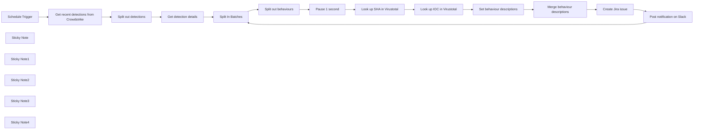

## Fluxo (.json) :

```json
{
  "id": "IMVycpyABaGuD1hq",
  "meta": {
    "instanceId": "03e9d14e9196363fe7191ce21dc0bb17387a6e755dcc9acc4f5904752919dca8"
  },
  "name": "Analyze_Crowdstrike_Detections__search_for_IOCs_in_VirusTotal__create_a_ticket_in_Jira_and_post_a_message_in_Slack",
  "tags": [
    {
      "id": "GCHVocImoXoEVnzP",
      "name": "🛠️ In progress",
      "createdAt": "2023-10-31T02:17:21.618Z",
      "updatedAt": "2023-10-31T02:17:21.618Z"
    },
    {
      "id": "QPJKatvLSxxtrE8U",
      "name": "Secops",
      "createdAt": "2023-10-31T02:15:11.396Z",
      "updatedAt": "2023-10-31T02:15:11.396Z"
    }
  ],
  "nodes": [
    {
      "id": "bd1234f2-631c-457d-8423-cec422852bbc",
      "name": "Schedule Trigger",
      "type": "n8n-nodes-base.scheduleTrigger",
      "position": [
        -880,
        602
      ],
      "parameters": {
        "rule": {
          "interval": [
            {}
          ]
        }
      },
      "typeVersion": 1.1
    },
    {
      "id": "b9f134cd-06de-49cd-83a2-19f705fd18c6",
      "name": "Split out detections",
      "type": "n8n-nodes-base.itemLists",
      "notes": "So we can process each one individually",
      "position": [
        -440,
        602
      ],
      "parameters": {
        "options": {},
        "fieldToSplitOut": "resources"
      },
      "notesInFlow": true,
      "typeVersion": 3
    },
    {
      "id": "8d1fc16d-bcbd-4ca2-ac2d-ea676cde4403",
      "name": "Get recent detections from Crowdstrike",
      "type": "n8n-nodes-base.httpRequest",
      "disabled": true,
      "position": [
        -660,
        602
      ],
      "parameters": {
        "url": "https://api.us-2.crowdstrike.com/detects/queries/detects/v1",
        "options": {},
        "sendQuery": true,
        "authentication": "predefinedCredentialType",
        "queryParameters": {
          "parameters": [
            {
              "name": "filter",
              "value": "status:'new'"
            }
          ]
        },
        "nodeCredentialType": "crowdStrikeOAuth2Api"
      },
      "credentials": {
        "crowdStrikeOAuth2Api": {
          "id": "tRdRtergnonxM2oS",
          "name": "CrowdStrike account"
        }
      },
      "typeVersion": 4.1
    },
    {
      "id": "bda81386-f301-44ac-ba91-2301ecdad6c3",
      "name": "Get detection details",
      "type": "n8n-nodes-base.httpRequest",
      "disabled": true,
      "position": [
        -220,
        602
      ],
      "parameters": {
        "url": "https://api.us-2.crowdstrike.com/detects/entities/summaries/GET/v1",
        "method": "POST",
        "options": {},
        "jsonBody": "={\n   \"ids\":[\"{{ $json.resources }}\"]\n}",
        "sendBody": true,
        "sendQuery": true,
        "specifyBody": "json",
        "authentication": "predefinedCredentialType",
        "queryParameters": {
          "parameters": [
            {
              "name": "ids",
              "value": "={{ $json.resources }}"
            }
          ]
        },
        "nodeCredentialType": "crowdStrikeOAuth2Api"
      },
      "credentials": {
        "crowdStrikeOAuth2Api": {
          "id": "tRdRtergnonxM2oS",
          "name": "CrowdStrike account"
        }
      },
      "typeVersion": 4.1
    },
    {
      "id": "ed6fe708-c67e-4cd1-800f-e13ab999c1c2",
      "name": "Split out behaviours",
      "type": "n8n-nodes-base.itemLists",
      "position": [
        280,
        362
      ],
      "parameters": {
        "options": {},
        "fieldToSplitOut": "resources[0].behaviors"
      },
      "typeVersion": 3
    },
    {
      "id": "4d6c708c-56c3-43b7-ae06-0078d917ebd5",
      "name": "Look up SHA in Virustotal",
      "type": "n8n-nodes-base.httpRequest",
      "position": [
        720,
        362
      ],
      "parameters": {
        "url": "=https://www.virustotal.com/api/v3/files/{{ $json.dsha256 }}",
        "options": {},
        "authentication": "predefinedCredentialType",
        "nodeCredentialType": "virusTotalApi"
      },
      "credentials": {
        "virusTotalApi": {
          "id": "JXVMMSznhawgxP9S",
          "name": "Virus Total account"
        }
      },
      "typeVersion": 4.1,
      "continueOnFail": true
    },
    {
      "id": "3e9f63a1-7a2a-43e3-998c-32eef23f8066",
      "name": "Look up IOC in Virustotal",
      "type": "n8n-nodes-base.httpRequest",
      "position": [
        940,
        362
      ],
      "parameters": {
        "url": "=https://www.virustotal.com/api/v3/files/{{ $('Split out behaviours').item.json.ioc_value }}",
        "options": {},
        "authentication": "predefinedCredentialType",
        "nodeCredentialType": "virusTotalApi"
      },
      "credentials": {
        "virusTotalApi": {
          "id": "JXVMMSznhawgxP9S",
          "name": "Virus Total account"
        }
      },
      "typeVersion": 4.1,
      "continueOnFail": true
    },
    {
      "id": "4249e16a-e84b-4af8-98e7-8a771a9016f0",
      "name": "Split In Batches",
      "type": "n8n-nodes-base.splitInBatches",
      "position": [
        60,
        602
      ],
      "parameters": {
        "options": {},
        "batchSize": 1
      },
      "typeVersion": 2
    },
    {
      "id": "a6de25ad-195d-44a8-a8da-3ec14bfaec66",
      "name": "Merge behaviour descriptions",
      "type": "n8n-nodes-base.itemLists",
      "position": [
        1460,
        360
      ],
      "parameters": {
        "options": {},
        "operation": "summarize",
        "fieldsToSummarize": {
          "values": [
            {
              "field": "details",
              "separateBy": "other",
              "aggregation": "concatenate",
              "customSeparator": "\\n\\n"
            }
          ]
        }
      },
      "typeVersion": 3
    },
    {
      "id": "fdc43a7b-579b-44ea-841b-cfebf2447ab9",
      "name": "Set behaviour descriptions",
      "type": "n8n-nodes-base.set",
      "position": [
        1240,
        360
      ],
      "parameters": {
        "values": {
          "string": [
            {
              "name": "details",
              "value": "=| Link | https://falcon.us-2.crowdstrike.com/activity/detections/detail/{{ $('Split out behaviours').item.json.control_graph_id.replaceAll(':', '/').substring(4) }} |\n| Confidence |  {{ $('Split out behaviours').item.json.confidence }} |\n| Filename |  {{ $('Split out behaviours').item.json.filename }} |\n| Username |  {{ $('Split out behaviours').item.json.user_name }} |\n| VT link | https://www.virustotal.com/gui/file/{{ $('Split out behaviours').item.json.sha256 }}/detection |\n| VT creation date |  {{ $('Look up SHA in Virustotal').item.json.data.attributes.creation_date }} |\n| VT tags |  {{ $('Look up SHA in Virustotal').item.json.data.attributes.tags.join(', ') }} |\n| IOC |  {{ $('Split out behaviours').item.json.ioc_value }} |\n| IOC VT score |  {{ $json.data.attributes.last_analysis_stats.malicious }} |\n| IOC source | {{ $('Split out behaviours').item.json.ioc_source }} |\n| IOC description | {{ $('Split out behaviours').item.json.ioc_description }} |"
            }
          ]
        },
        "options": {}
      },
      "typeVersion": 2
    },
    {
      "id": "d11c8794-ca93-4916-87b2-86b87751d64e",
      "name": "Create Jira issue",
      "type": "n8n-nodes-base.jira",
      "disabled": true,
      "position": [
        1680,
        360
      ],
      "parameters": {
        "project": {
          "__rl": true,
          "mode": "list",
          "value": "10000",
          "cachedResultName": "My Kanban Project"
        },
        "summary": "=CrowdStrike {{ $('Split In Batches').item.json.resources[0].max_severity_displayname.toLowerCase() }} severity alert ({{ $('Split In Batches').item.json.resources[0].device.hostname }})",
        "issueType": {
          "__rl": true,
          "mode": "list",
          "value": "10001",
          "cachedResultName": "Task"
        },
        "additionalFields": {
          "description": "=\nAlert details\n\n| Severity | {{ $('Split In Batches').item.json.resources[0].max_severity_displayname }} |\n| Host | {{ $('Split In Batches').item.json.resources[0].device.hostname }} |\n| Device ID | {{ $('Split In Batches').item.json.resources[0].device.device_id }} |\n| IP (external) | {{ $('Split In Batches').item.json.resources[0].device.external_ip }}|\n| IP (internal) | {{ $('Split In Batches').item.json.resources[0].device.local_ip }}|\n| Platform | {{ $('Split In Batches').item.json.resources[0].device.platform_name }} |\n| OS version | {{ $('Split In Batches').item.json.resources[0].device.os_version }}|\n\nBehaviours\n\n{{ $json.concatenated_details }}"
        }
      },
      "credentials": {
        "jiraSoftwareCloudApi": {
          "id": "1rCcjDO7MfM4b9ho",
          "name": "David Jira SW Cloud account"
        }
      },
      "typeVersion": 1
    },
    {
      "id": "ac44f600-31b3-418b-8f75-5c42094f2b5b",
      "name": "Post notification on Slack",
      "type": "n8n-nodes-base.slack",
      "disabled": true,
      "position": [
        2080,
        400
      ],
      "parameters": {
        "text": "=New CrowdStrike {{ $('Split In Batches').item.json.resources[0].max_severity_displayname.toLowerCase() }} severity alert ({{ $('Split In Batches').item.json.resources[0].device.hostname }})\n<{{ $json.self }}|Jira ticket>",
        "user": {
          "__rl": true,
          "mode": "list",
          "value": "U034NUWQ7M5",
          "cachedResultName": "david"
        },
        "select": "user",
        "otherOptions": {},
        "authentication": "oAuth2"
      },
      "credentials": {
        "slackOAuth2Api": {
          "id": "262",
          "name": "Slack David (User)"
        }
      },
      "typeVersion": 2.1
    },
    {
      "id": "2c5c81bd-096c-4613-aa85-e1c01eac484e",
      "name": "Sticky Note",
      "type": "n8n-nodes-base.stickyNote",
      "position": [
        -940,
        200
      ],
      "parameters": {
        "width": 907.2533697472911,
        "height": 622.2432296251139,
        "content": "\n## Workflow Overview\nThis n8n workflow is a robust orchestration tool designed to streamline and automate the response to cybersecurity threats detected by CrowdStrike. By running daily, the script systematically gathers new detection data, enriches it with external intelligence from VirusTotal, and then creates tickets in Jira for incident tracking and resolution. Finally, it posts notifications to Slack to alert the security team promptly. \n\n## Get details of recent CrowdStrike detections\nThis section initiates the workflow, scheduled to run daily at midnight, by fetching new detection events from CrowdStrike. It leverages an HTTP Request to query the CrowdStrike API, receiving a list of recent detections. These detections are then individually parsed for further analysis, ensuring that each detection is handled separately and efficiently.\n"
      },
      "typeVersion": 1
    },
    {
      "id": "34f3178a-f333-44ae-bb84-775748a40871",
      "name": "Sticky Note1",
      "type": "n8n-nodes-base.stickyNote",
      "position": [
        456,
        85.94250946457566
      ],
      "parameters": {
        "width": 684.9176314093856,
        "height": 498.43309582729387,
        "content": "\n## Enrich each detection using VirusTotal\n\nEach detection is enhanced with additional intelligence by querying VirusTotal. The process involves looking up SHA256 hashes and other indicators of compromise (IOCs) to gather comprehensive threat information. With rate-limiting in mind, a 1-second pause is included between requests to maintain compliance with VirusTotal's API usage policies.\n"
      },
      "typeVersion": 1
    },
    {
      "id": "9b248ed5-0a9b-4737-a571-ce20340a48af",
      "name": "Pause 1 second",
      "type": "n8n-nodes-base.wait",
      "notes": "To avoid overloading VT",
      "position": [
        500,
        362
      ],
      "webhookId": "be50455f-f28d-4621-87aa-60a5d46c219e",
      "parameters": {
        "unit": "seconds"
      },
      "notesInFlow": true,
      "typeVersion": 1
    },
    {
      "id": "854bbab6-b725-4a01-b179-1f1c944b7ea5",
      "name": "Sticky Note2",
      "type": "n8n-nodes-base.stickyNote",
      "position": [
        1180,
        89.58126014061668
      ],
      "parameters": {
        "width": 732.8033084720628,
        "height": 495.2133868905577,
        "content": "\n## Create a Jira Ticket:\nFor actionable response and tracking, the workflow creates a Jira ticket for each detection. The ticket includes detailed information from CrowdStrike and enrichment data from VirusTotal, such as detection links, confidence scores, and relevant tags. This step is crucial for documenting incidents and initiating the incident response protocol.\n"
      },
      "typeVersion": 1
    },
    {
      "id": "da8ca7ef-714f-42b1-a642-3165c479b5df",
      "name": "Sticky Note3",
      "type": "n8n-nodes-base.stickyNote",
      "position": [
        1940,
        90.04831844240124
      ],
      "parameters": {
        "width": 348.9781174689024,
        "height": 490.93784005768947,
        "content": "\n## Post Notification in Slack\nTo ensure prompt attention, a notification is sent to a designated Slack channel with the severity level of the alert and a link to the corresponding Jira ticket. This immediate notification allows for quick engagement from the security team to review and act upon the detection as needed.\n"
      },
      "typeVersion": 1
    },
    {
      "id": "a10f5365-85bc-435d-9b56-1154987af962",
      "name": "Sticky Note4",
      "type": "n8n-nodes-base.stickyNote",
      "position": [
        0,
        -96.97284326663032
      ],
      "parameters": {
        "width": 432.3140705656865,
        "height": 908.8964372010092,
        "content": "\n## Iterate Through Detection Events\nThe \"`Split In Batches`\" node is configured with a batch size of one, ensuring that the array of detections from CrowdStrike is divided into individual items for processing. \n\nThis approach allows for a focused analysis of each detection, ensuring no detail is overlooked. \n\nFollowing this, the \"`Split out behaviours`\" node further dissects each detection to extract and separately handle the array of behaviors associated with them. \n\nBy processing these elements one by one, we effectively manage the workflow's load, maintaining optimal performance and adherence to external APIs' rate limits, crucial for the seamless operation of our security protocols.\n\n"
      },
      "typeVersion": 1
    }
  ],
  "active": false,
  "pinData": {
    "Get detection details": [
      {
        "json": {
          "meta": {
            "trace_id": "638fdbc5-29f3-49c5-bb02-67846cc0eae5",
            "powered_by": "legacy-detects",
            "query_time": 0.002640396
          },
          "errors": [],
          "resources": [
            {
              "cid": "4f82da4ce0564f64a2469af78d4c73dc",
              "device": {
                "cid": "4f82da4ce0564f64a2469af78d4c73dc",
                "status": "normal",
                "hostname": "Sample-Detect-2",
                "local_ip": "10.0.2.15",
                "device_id": "5556c55274f24f149ee3ffcc9226e595",
                "last_seen": "2023-09-01T21:35:09Z",
                "first_seen": "2023-09-01T21:35:08Z",
                "os_version": "Windows 7",
                "external_ip": "10.224.245.198",
                "mac_address": "08-00-27-51-56-d8",
                "platform_id": "0",
                "bios_version": "VirtualBox",
                "product_type": "1",
                "agent_version": "5.25.10701.0",
                "major_version": "6",
                "minor_version": "1",
                "platform_name": "Windows",
                "config_id_base": "65994754",
                "config_id_build": "10701",
                "agent_load_flags": "0",
                "agent_local_time": "2019-08-08T18:27:17.143Z",
                "bios_manufacturer": "innotek GmbH",
                "product_type_desc": "Workstation",
                "config_id_platform": "3",
                "modified_timestamp": "2023-09-01T21:35:12Z",
                "system_manufacturer": "innotek GmbH",
                "system_product_name": "VirtualBox"
              },
              "status": "new",
              "hostinfo": {
                "domain": ""
              },
              "behaviors": [
                {
                  "md5": "a390c897089f47bda6e913a68b49676f",
                  "sha256": "a9b89714cb6e7c41c76484368856521d318b7237823f26f674c1f562eb11228a",
                  "tactic": "Machine Learning",
                  "cmdline": "\"C:\\demo\\OnSensor_MachineLearning.exe\"",
                  "user_id": "S-1-5-21-1516984458-1910986210-2733350064-1000",
                  "filename": "OnSensor_MachineLearning.exe",
                  "filepath": "\\Device\\HarddiskVolume2\\demo\\OnSensor_MachineLearning.exe",
                  "ioc_type": "",
                  "scenario": "NGAV",
                  "severity": 50,
                  "device_id": "5556c55274f24f149ee3ffcc9226e595",
                  "ioc_value": "",
                  "objective": "Falcon Detection Method",
                  "tactic_id": "CSTA0004",
                  "technique": "Sensor-based ML",
                  "timestamp": "2023-09-01T21:35:08Z",
                  "user_name": "Trial",
                  "confidence": 50,
                  "ioc_source": "",
                  "behavior_id": "5701",
                  "description": "This file meets the machine learning-based on-sensor AV protection's medium confidence threshold for malicious files.",
                  "display_name": "",
                  "technique_id": "CST0007",
                  "parent_details": {
                    "parent_md5": "ea7fa3d7190f262a920bd04326f9a5f4",
                    "parent_sha256": "9c30192c1d4cec9dc0de67ab4ace625bcf038f60eb038d5efa868bff9ec411d4",
                    "parent_cmdline": "powershell.exe ",
                    "parent_process_graph_id": "pid:5556c55274f24f149ee3ffcc9226e595:169381896777762"
                  },
                  "ioc_description": "",
                  "alleged_filetype": "exe",
                  "control_graph_id": "ctg:5556c55274f24f149ee3ffcc9226e595:169377591508015",
                  "pattern_disposition": 2176,
                  "pattern_disposition_details": {
                    "detect": false,
                    "rooting": false,
                    "indicator": false,
                    "inddet_mask": false,
                    "kill_parent": false,
                    "sensor_only": false,
                    "kill_process": false,
                    "suspend_parent": false,
                    "kill_subprocess": false,
                    "policy_disabled": false,
                    "process_blocked": true,
                    "quarantine_file": true,
                    "suspend_process": false,
                    "operation_blocked": false,
                    "kill_action_failed": false,
                    "quarantine_machine": false,
                    "fs_operation_blocked": false,
                    "bootup_safeguard_enabled": false,
                    "critical_process_disabled": false,
                    "registry_operation_blocked": false,
                    "handle_operation_downgraded": false,
                    "blocking_unsupported_or_disabled": false
                  },
                  "triggering_process_graph_id": "pid:5556c55274f24f149ee3ffcc9226e595:169381898588255"
                }
              ],
              "email_sent": false,
              "show_in_ui": true,
              "date_updated": "2023-09-01T21:36:36Z",
              "detection_id": "ldt:5556c55274f24f149ee3ffcc9226e595:169377591508015",
              "max_severity": 50,
              "last_behavior": "2023-09-01T21:35:08Z",
              "first_behavior": "2023-09-01T21:35:08Z",
              "max_confidence": 50,
              "created_timestamp": "2023-09-01T21:36:15.576367873Z",
              "quarantined_files": [
                {
                  "id": "5556c55274f24f149ee3ffcc9226e595_a9b89714cb6e7c41c76484368856521d318b7237823f26f674c1f562eb11228a",
                  "state": "quarantined",
                  "sha256": "a9b89714cb6e7c41c76484368856521d318b7237823f26f674c1f562eb11228a"
                }
              ],
              "seconds_to_triaged": 0,
              "behaviors_processed": [
                "pid:5556c55274f24f149ee3ffcc9226e595:169381898588255:5701"
              ],
              "seconds_to_resolved": 0,
              "max_severity_displayname": "Medium"
            }
          ]
        },
        "pairedItem": {
          "item": 0
        }
      },
      {
        "json": {
          "meta": {
            "trace_id": "01ced1a3-9e31-4a5e-a4ab-33cba88c1081",
            "powered_by": "legacy-detects",
            "query_time": 0.002151283
          },
          "errors": [],
          "resources": [
            {
              "cid": "4f82da4ce0564f64a2469af78d4c73dc",
              "device": {
                "cid": "4f82da4ce0564f64a2469af78d4c73dc",
                "status": "normal",
                "hostname": "Sample-Detect-3",
                "local_ip": "10.0.2.15",
                "device_id": "bbb9e831141343808ced11e87081d820",
                "last_seen": "2023-09-01T21:35:08Z",
                "first_seen": "2023-09-01T21:35:07Z",
                "os_version": "Windows 7",
                "external_ip": "10.224.240.255",
                "mac_address": "08-00-27-51-56-d8",
                "platform_id": "0",
                "bios_version": "VirtualBox",
                "product_type": "1",
                "agent_version": "5.25.10701.0",
                "major_version": "6",
                "minor_version": "1",
                "platform_name": "Windows",
                "config_id_base": "65994754",
                "config_id_build": "10701",
                "agent_load_flags": "0",
                "agent_local_time": "2019-08-08T18:25:50.945Z",
                "bios_manufacturer": "innotek GmbH",
                "product_type_desc": "Workstation",
                "config_id_platform": "3",
                "modified_timestamp": "2023-09-01T21:35:11Z",
                "system_manufacturer": "innotek GmbH",
                "system_product_name": "VirtualBox"
              },
              "status": "new",
              "hostinfo": {
                "domain": ""
              },
              "behaviors": [
                {
                  "md5": "bb7e3954e2db5c58e47ba39b9aad35af",
                  "sha256": "c3598ca88efe1b7aace5430686e69667e9d34450b6a40ee87b7da896b3044ec4",
                  "tactic": "Machine Learning",
                  "cmdline": "Cloud_MachineLearning.exe",
                  "user_id": "S-1-5-21-1516984458-1910986210-2733350064-1000",
                  "filename": "Cloud_MachineLearning.exe",
                  "filepath": "\\Device\\HarddiskVolume2\\demo\\Cloud_MachineLearning.exe",
                  "ioc_type": "",
                  "scenario": "NGAV",
                  "severity": 70,
                  "device_id": "bbb9e831141343808ced11e87081d820",
                  "ioc_value": "",
                  "objective": "Falcon Detection Method",
                  "tactic_id": "CSTA0004",
                  "technique": "Cloud-based ML",
                  "timestamp": "2023-09-01T21:35:07Z",
                  "user_name": "Trial",
                  "confidence": 70,
                  "ioc_source": "",
                  "behavior_id": "5708",
                  "description": "This file meets the File Analysis ML algorithm's high-confidence threshold for malware.",
                  "display_name": "",
                  "technique_id": "CST0008",
                  "parent_details": {
                    "parent_md5": "5746bd7e255dd6a8afa06f7c42c1ba41",
                    "parent_sha256": "db06c3534964e3fc79d2763144ba53742d7fa250ca336f4a0fe724b75aaff386",
                    "parent_cmdline": "cmd.exe ",
                    "parent_process_graph_id": "pid:bbb9e831141343808ced11e87081d820:169377600150243"
                  },
                  "ioc_description": "",
                  "alleged_filetype": "exe",
                  "control_graph_id": "ctg:bbb9e831141343808ced11e87081d820:169373296003013",
                  "pattern_disposition": 2176,
                  "pattern_disposition_details": {
                    "detect": false,
                    "rooting": false,
                    "indicator": false,
                    "inddet_mask": false,
                    "kill_parent": false,
                    "sensor_only": false,
                    "kill_process": false,
                    "suspend_parent": false,
                    "kill_subprocess": false,
                    "policy_disabled": false,
                    "process_blocked": true,
                    "quarantine_file": true,
                    "suspend_process": false,
                    "operation_blocked": false,
                    "kill_action_failed": false,
                    "quarantine_machine": false,
                    "fs_operation_blocked": false,
                    "bootup_safeguard_enabled": false,
                    "critical_process_disabled": false,
                    "registry_operation_blocked": false,
                    "handle_operation_downgraded": false,
                    "blocking_unsupported_or_disabled": false
                  },
                  "triggering_process_graph_id": "pid:bbb9e831141343808ced11e87081d820:169377602048561"
                }
              ],
              "email_sent": false,
              "show_in_ui": true,
              "date_updated": "2023-09-01T21:35:35Z",
              "detection_id": "ldt:bbb9e831141343808ced11e87081d820:169373296003013",
              "max_severity": 70,
              "last_behavior": "2023-09-01T21:35:07Z",
              "first_behavior": "2023-09-01T21:35:07Z",
              "max_confidence": 70,
              "created_timestamp": "2023-09-01T21:35:15.070436407Z",
              "quarantined_files": [
                {
                  "id": "bbb9e831141343808ced11e87081d820_c3598ca88efe1b7aace5430686e69667e9d34450b6a40ee87b7da896b3044ec4",
                  "state": "quarantined",
                  "sha256": "c3598ca88efe1b7aace5430686e69667e9d34450b6a40ee87b7da896b3044ec4"
                }
              ],
              "seconds_to_triaged": 0,
              "behaviors_processed": [
                "pid:bbb9e831141343808ced11e87081d820:169377602048561:5708"
              ],
              "seconds_to_resolved": 0,
              "max_severity_displayname": "High"
            }
          ]
        },
        "pairedItem": {
          "item": 1
        }
      },
      {
        "json": {
          "meta": {
            "trace_id": "420a43e9-52f6-4304-9db6-16afb83f94c0",
            "powered_by": "legacy-detects",
            "query_time": 0.005119884
          },
          "errors": [],
          "resources": [
            {
              "cid": "4f82da4ce0564f64a2469af78d4c73dc",
              "device": {
                "cid": "4f82da4ce0564f64a2469af78d4c73dc",
                "status": "normal",
                "hostname": "Sample-Detect-1",
                "local_ip": "10.0.2.15",
                "device_id": "ac6da4f6e14249cc9e52a922d678edb7",
                "last_seen": "2023-09-01T21:35:06Z",
                "first_seen": "2023-09-01T21:35:07Z",
                "os_version": "Windows 7",
                "external_ip": "10.224.243.113",
                "mac_address": "08-00-27-51-56-d8",
                "platform_id": "0",
                "bios_version": "VirtualBox",
                "product_type": "1",
                "agent_version": "5.25.10701.0",
                "major_version": "6",
                "minor_version": "1",
                "platform_name": "Windows",
                "config_id_base": "65994754",
                "config_id_build": "10701",
                "agent_load_flags": "0",
                "agent_local_time": "2019-08-08T18:30:14.606Z",
                "bios_manufacturer": "innotek GmbH",
                "product_type_desc": "Workstation",
                "config_id_platform": "3",
                "modified_timestamp": "2023-09-01T21:35:09Z",
                "system_manufacturer": "innotek GmbH",
                "system_product_name": "VirtualBox"
              },
              "status": "new",
              "hostinfo": {
                "domain": ""
              },
              "behaviors": [
                {
                  "md5": "27ad42cc15165b0ab19ea06a286c5507",
                  "sha256": "ee117f5c26717300cc7ae1f92c77f6372fdcdc379599d2130b534f3c958247a9",
                  "tactic": "Credential Access",
                  "cmdline": "c:\\demo\\Mimikatz_Credtheft.exe",
                  "user_id": "S-1-5-21-1516984458-1910986210-2733350064-1000",
                  "filename": "Mimikatz_Credtheft.exe",
                  "filepath": "\\Device\\HarddiskVolume2\\demo\\Mimikatz_Credtheft.exe",
                  "ioc_type": "",
                  "scenario": "credential_theft",
                  "severity": 70,
                  "device_id": "ac6da4f6e14249cc9e52a922d678edb7",
                  "ioc_value": "",
                  "objective": "Gain Access",
                  "tactic_id": "TA0006",
                  "technique": "OS Credential Dumping",
                  "timestamp": "2023-09-01T21:35:05Z",
                  "user_name": "Trial",
                  "confidence": 99,
                  "ioc_source": "",
                  "behavior_id": "52",
                  "description": "The LSASS process was accessed from the mimikatz hack tool.",
                  "display_name": "LsassAccessFromMimikatz",
                  "technique_id": "T1003",
                  "parent_details": {
                    "parent_md5": "5746bd7e255dd6a8afa06f7c42c1ba41",
                    "parent_sha256": "db06c3534964e3fc79d2763144ba53742d7fa250ca336f4a0fe724b75aaff386",
                    "parent_cmdline": "cmd.exe ",
                    "parent_process_graph_id": "pid:ac6da4f6e14249cc9e52a922d678edb7:169390485285907"
                  },
                  "ioc_description": "",
                  "alleged_filetype": "exe",
                  "control_graph_id": "ctg:ac6da4f6e14249cc9e52a922d678edb7:169386181192007",
                  "pattern_disposition": 128,
                  "pattern_disposition_details": {
                    "detect": false,
                    "rooting": false,
                    "indicator": false,
                    "inddet_mask": false,
                    "kill_parent": false,
                    "sensor_only": false,
                    "kill_process": false,
                    "suspend_parent": false,
                    "kill_subprocess": false,
                    "policy_disabled": false,
                    "process_blocked": false,
                    "quarantine_file": true,
                    "suspend_process": false,
                    "operation_blocked": false,
                    "kill_action_failed": false,
                    "quarantine_machine": false,
                    "fs_operation_blocked": false,
                    "bootup_safeguard_enabled": false,
                    "critical_process_disabled": false,
                    "registry_operation_blocked": false,
                    "handle_operation_downgraded": false,
                    "blocking_unsupported_or_disabled": false
                  },
                  "triggering_process_graph_id": "pid:ac6da4f6e14249cc9e52a922d678edb7:169390487319138"
                }
              ],
              "email_sent": false,
              "show_in_ui": true,
              "date_updated": "2023-09-01T21:36:37Z",
              "detection_id": "ldt:ac6da4f6e14249cc9e52a922d678edb7:169386181192007",
              "max_severity": 70,
              "last_behavior": "2023-09-01T21:35:05Z",
              "first_behavior": "2023-09-01T21:35:05Z",
              "max_confidence": 99,
              "created_timestamp": "2023-09-01T21:36:15.373807643Z",
              "quarantined_files": [
                {
                  "id": "ac6da4f6e14249cc9e52a922d678edb7_ee117f5c26717300cc7ae1f92c77f6372fdcdc379599d2130b534f3c958247a9",
                  "state": "quarantined",
                  "sha256": "ee117f5c26717300cc7ae1f92c77f6372fdcdc379599d2130b534f3c958247a9"
                }
              ],
              "seconds_to_triaged": 0,
              "behaviors_processed": [
                "pid:ac6da4f6e14249cc9e52a922d678edb7:169390487319138:52"
              ],
              "seconds_to_resolved": 0,
              "max_severity_displayname": "High"
            }
          ]
        },
        "pairedItem": {
          "item": 2
        }
      }
    ],
    "Look up SHA in Virustotal": [
      {
        "json": {
          "data": {
            "id": "fb55414848281f804858ce188c3dc659d129e283bd62d58d34f6e6f568feab37",
            "type": "file",
            "links": {
              "self": "https://www.virustotal.com/api/v3/files/fb55414848281f804858ce188c3dc659d129e283bd62d58d34f6e6f568feab37"
            },
            "attributes": {
              "md5": "2c527d980eb30daa789492283f9bf69e",
              "sha1": "d007f64dae6bc5fdfe4ff30fe7be9b7d62238012",
              "size": 804352,
              "tags": [
                "peexe",
                "assembly",
                "runtime-modules",
                "detect-debug-environment",
                "idle",
                "long-sleeps",
                "direct-cpu-clock-access",
                "64bits"
              ],
              "tlsh": "T1DF051955A3ED0098F1B79AB59EF19516EBB378D61830C30F02A8CA5F1F73B519D29322",
              "trid": [
                {
                  "file_type": "Microsoft Visual C++ compiled executable (generic)",
                  "probability": 43.3
                },
                {
                  "file_type": "Win64 Executable (generic)",
                  "probability": 27.6
                },
                {
                  "file_type": "Win16 NE executable (generic)",
                  "probability": 13.2
                },
                {
                  "file_type": "OS/2 Executable (generic)",
                  "probability": 5.3
                },
                {
                  "file_type": "Generic Win/DOS Executable",
                  "probability": 5.2
                }
              ],
              "magic": "PE32+ executable (console) x86-64, for MS Windows",
              "names": [
                "mimikatz",
                "mimikatz.exe",
                "172869_96@172869",
                "172611_113@172611",
                "172608_99@172608",
                "172604_113@172604",
                "172603_99@172603",
                "172515_99@172515",
                "172514_99@172514",
                "172513_101@172513",
                "172511_97@172511",
                "mimi64.exe",
                "VirusShare_2c527d980eb30daa789492283f9bf69e",
                "fb55414848281f804858ce188c3dc659d129e283bd62d58d34f6e6f568feab37",
                "Tmp_575016140236840010mimikatz.exe",
                "mimikatz.exe3070765334181680807.tmp",
                "mimikatz.exe3239312256147622824.tmp",
                "realprotects02_mmk.exe",
                "aa"
              ],
              "vhash": "085066651d1555651572z152z8137082f1z30300240701051z203dz",
              "sha256": "fb55414848281f804858ce188c3dc659d129e283bd62d58d34f6e6f568feab37",
              "ssdeep": "12288:7DKgZYQ/TH180/fFKZxjpeNwGxj8TZncET1efb2EfYpXcO:3vZYQ/TV8iSjpMgncDT2Efi",
              "pe_info": {
                "imphash": "1b0369a1e06271833f78ffa70ffb4eaf",
                "sections": [
                  {
                    "md5": "211c2a40b62791565749abc7d7e30f37",
                    "chi2": 3115270.25,
                    "name": ".text",
                    "flags": "rx",
                    "entropy": 6.44,
                    "raw_size": 497664,
                    "virtual_size": 497409,
                    "virtual_address": 4096
                  },
                  {
                    "md5": "51730eaa462a07fe3b68ed33c1bfc3e0",
                    "chi2": 15408258,
                    "name": ".rdata",
                    "flags": "r",
                    "entropy": 4.18,
                    "raw_size": 247296,
                    "virtual_size": 246884,
                    "virtual_address": 503808
                  },
                  {
                    "md5": "b3c66f6122ece6ce02e2f17a3dc6c1e2",
                    "chi2": 2412184.25,
                    "name": ".data",
                    "flags": "rw",
                    "entropy": 2.87,
                    "raw_size": 19968,
                    "virtual_size": 23364,
                    "virtual_address": 753664
                  },
                  {
                    "md5": "bc744f41721f50c78b8d48aedfe88cf2",
                    "chi2": 384387.06,
                    "name": ".pdata",
                    "flags": "r",
                    "entropy": 5.74,
                    "raw_size": 16384,
                    "virtual_size": 16344,
                    "virtual_address": 778240
                  },
                  {
                    "md5": "19c28ffab7ff15fb1476e2ce044fcb76",
                    "chi2": 180777.06,
                    "name": ".rsrc",
                    "flags": "r",
                    "entropy": 6.55,
                    "raw_size": 16384,
                    "virtual_size": 16376,
                    "virtual_address": 794624
                  },
                  {
                    "md5": "ddae0726e032c4bb02273debff9763ac",
                    "chi2": 203187.77,
                    "name": ".reloc",
                    "flags": "r",
                    "entropy": 4.37,
                    "raw_size": 5632,
                    "virtual_size": 5600,
                    "virtual_address": 811008
                  }
                ],
                "timestamp": 1502638084,
                "entry_point": 473720,
                "import_list": [
                  {
                    "library_name": "NETAPI32.dll",
                    "imported_functions": [
                      "DsGetDcNameW",
                      "NetApiBufferFree",
                      "NetRemoteTOD",
                      "NetServerGetInfo",
                      "NetSessionEnum",
                      "NetShareEnum",
                      "NetStatisticsGet",
                      "NetWkstaUserEnum"
                    ]
                  },
                  {
                    "library_name": "WINSTA.dll",
                    "imported_functions": [
                      "WinStationCloseServer",
                      "WinStationConnectW",
                      "WinStationEnumerateW",
                      "WinStationFreeMemory",
                      "WinStationOpenServerW",
                      "WinStationQueryInformationW"
                    ]
                  },
                  {
                    "library_name": "CRYPT32.dll",
                    "imported_functions": [
                      "CertAddCertificateContextToStore",
                      "CertAddEncodedCertificateToStore",
                      "CertCloseStore",
                      "CertEnumCertificatesInStore",
                      "CertEnumSystemStore",
                      "CertFindCertificateInStore",
                      "CertFreeCertificateContext",
                      "CertGetCertificateContextProperty",
                      "CertGetNameStringW",
                      "CertNameToStrW",
                      "CertOpenStore",
                      "CertSetCertificateContextProperty",
                      "CryptAcquireCertificatePrivateKey",
                      "CryptBinaryToStringW",
                      "CryptEncodeObject",
                      "CryptExportPublicKeyInfo",
                      "CryptProtectData",
                      "CryptSignAndEncodeCertificate",
                      "CryptStringToBinaryW",
                      "CryptUnprotectData",
                      "PFXExportCertStoreEx"
                    ]
                  },
                  {
                    "library_name": "ADVAPI32.dll",
                    "imported_functions": [
                      "AllocateAndInitializeSid",
                      "BuildSecurityDescriptorW",
                      "CheckTokenMembership",
                      "ClearEventLogW",
                      "CloseServiceHandle",
                      "ControlService",
                      "ConvertSidToStringSidW",
                      "ConvertStringSidToSidW",
                      "CopySid",
                      "CreateProcessAsUserW",
                      "CreateProcessWithLogonW",
                      "CreateServiceW",
                      "CreateWellKnownSid",
                      "CredEnumerateW",
                      "CredFree",
                      "CryptAcquireContextA",
                      "CryptAcquireContextW",
                      "CryptCreateHash",
                      "CryptDecrypt",
                      "CryptDestroyHash",
                      "CryptDestroyKey",
                      "CryptDuplicateKey",
                      "CryptEncrypt",
                      "CryptEnumProvidersW",
                      "CryptEnumProviderTypesW",
                      "CryptExportKey",
                      "CryptGenKey",
                      "CryptGetHashParam",
                      "CryptGetKeyParam",
                      "CryptGetProvParam",
                      "CryptGetUserKey",
                      "CryptHashData",
                      "CryptImportKey",
                      "CryptReleaseContext",
                      "CryptSetHashParam",
                      "CryptSetKeyParam",
                      "CryptSetProvParam",
                      "DeleteService",
                      "DuplicateTokenEx",
                      "FreeSid",
                      "GetLengthSid",
                      "GetNumberOfEventLogRecords",
                      "GetSidSubAuthority",
                      "GetSidSubAuthorityCount",
                      "GetTokenInformation",
                      "IsTextUnicode",
                      "IsValidSid",
                      "LookupAccountNameW",
                      "LookupAccountSidW",
                      "LookupPrivilegeNameW",
                      "LookupPrivilegeValueW",
                      "LsaClose",
                      "LsaEnumerateTrustedDomainsEx",
                      "LsaFreeMemory",
                      "LsaOpenPolicy",
                      "LsaOpenSecret",
                      "LsaQueryInformationPolicy",
                      "LsaQuerySecret",
                      "LsaQueryTrustedDomainInfoByName",
                      "LsaRetrievePrivateData",
                      "OpenEventLogW",
                      "OpenProcessToken",
                      "OpenSCManagerW",
                      "OpenServiceW",
                      "OpenThreadToken",
                      "QueryServiceObjectSecurity",
                      "QueryServiceStatusEx",
                      "RegCloseKey",
                      "RegEnumKeyExW",
                      "RegEnumValueW",
                      "RegisterServiceCtrlHandlerW",
                      "RegOpenKeyExW",
                      "RegQueryInfoKeyW",
                      "RegQueryValueExW",
                      "RegSetValueExW",
                      "SetServiceObjectSecurity",
                      "SetServiceStatus",
                      "SetThreadToken",
                      "StartServiceCtrlDispatcherW",
                      "StartServiceW",
                      "SystemFunction001",
                      "SystemFunction005",
                      "SystemFunction006",
                      "SystemFunction007",
                      "SystemFunction013",
                      "SystemFunction025",
                      "SystemFunction032"
                    ]
                  },
                  {
                    "library_name": "KERNEL32.dll",
                    "imported_functions": [
                      "AreFileApisANSI",
                      "CloseHandle",
                      "CreateEventW",
                      "CreateFileA",
                      "CreateFileMappingA",
                      "CreateFileMappingW",
                      "CreateFileW",
                      "CreateMutexW",
                      "CreatePipe",
                      "CreateProcessW",
                      "CreateRemoteThread",
                      "CreateThread",
                      "DeleteCriticalSection",
                      "DeleteFileA",
                      "DeleteFileW",
                      "DeviceIoControl",
                      "DuplicateHandle",
                      "EnterCriticalSection",
                      "ExitProcess",
                      "ExpandEnvironmentStringsW",
                      "FileTimeToLocalFileTime",
                      "FileTimeToSystemTime",
                      "FillConsoleOutputCharacterW",
                      "FindClose",
                      "FindFirstFileW",
                      "FindNextFileW",
                      "FlushFileBuffers",
                      "FlushViewOfFile",
                      "FormatMessageA",
                      "FormatMessageW",
                      "FreeLibrary",
                      "GetComputerNameExW",
                      "GetConsoleOutputCP",
                      "GetConsoleScreenBufferInfo",
                      "GetCurrentDirectoryW",
                      "GetCurrentProcess",
                      "GetCurrentProcessId",
                      "GetCurrentThread",
                      "GetCurrentThreadId",
                      "GetDateFormatW",
                      "GetDiskFreeSpaceA",
                      "GetDiskFreeSpaceW",
                      "GetFileAttributesA",
                      "GetFileAttributesExW",
                      "GetFileAttributesW",
                      "GetFileSize",
                      "GetFileSizeEx",
                      "GetFullPathNameA",
                      "GetFullPathNameW",
                      "GetLastError",
                      "GetModuleHandleW",
                      "GetProcAddress",
                      "GetProcessHeap",
                      "GetProcessId",
                      "GetStdHandle",
                      "GetSystemInfo",
                      "GetSystemTime",
                      "GetSystemTimeAsFileTime",
                      "GetTempPathA",
                      "GetTempPathW",
                      "GetTickCount",
                      "GetTimeFormatW",
                      "GetTimeZoneInformation",
                      "GetVersionExA",
                      "GetVersionExW",
                      "HeapAlloc",
                      "HeapCompact",
                      "HeapCreate",
                      "HeapDestroy",
                      "HeapFree",
                      "HeapReAlloc",
                      "HeapSize",
                      "HeapValidate",
                      "InitializeCriticalSection",
                      "LeaveCriticalSection",
                      "LoadLibraryA",
                      "LoadLibraryW",
                      "LocalAlloc",
                      "LocalFree",
                      "LockFile",
                      "LockFileEx",
                      "lstrlenA",
                      "lstrlenW",
                      "MapViewOfFile",
                      "MultiByteToWideChar",
                      "OpenProcess",
                      "OutputDebugStringA",
                      "OutputDebugStringW",
                      "ProcessIdToSessionId",
                      "QueryPerformanceCounter",
                      "RaiseException",
                      "ReadFile",
                      "ReadProcessMemory",
                      "RtlCaptureContext",
                      "RtlLookupFunctionEntry",
                      "RtlVirtualUnwind",
                      "SetConsoleCtrlHandler",
                      "SetConsoleCursorPosition",
                      "SetConsoleOutputCP",
                      "SetConsoleTitleW",
                      "SetCurrentDirectoryW",
                      "SetEndOfFile",
                      "SetEvent",
                      "SetFilePointer",
                      "SetHandleInformation",
                      "SetLastError",
                      "SetUnhandledExceptionFilter",
                      "Sleep",
                      "SystemTimeToFileTime",
                      "TerminateProcess",
                      "TerminateThread",
                      "TryEnterCriticalSection",
                      "UnhandledExceptionFilter",
                      "UnlockFile",
                      "UnlockFileEx",
                      "UnmapViewOfFile",
                      "VirtualAlloc",
                      "VirtualAllocEx",
                      "VirtualFree",
                      "VirtualFreeEx",
                      "VirtualProtect",
                      "VirtualProtectEx",
                      "VirtualQuery",
                      "VirtualQueryEx",
                      "WaitForSingleObject",
                      "WaitForSingleObjectEx",
                      "WideCharToMultiByte",
                      "WriteFile",
                      "WriteProcessMemory"
                    ]
                  },
                  {
                    "library_name": "msvcrt.dll",
                    "imported_functions": [
                      "?terminate@@YAXXZ",
                      "__badioinfo",
                      "__C_specific_handler",
                      "__mb_cur_max",
                      "__pioinfo",
                      "__set_app_type",
                      "__setusermatherr",
                      "__wgetmainargs",
                      "_amsg_exit",
                      "_cexit",
                      "_commode",
                      "_errno",
                      "_exit",
                      "_fileno",
                      "_fmode",
                      "_initterm",
                      "_iob",
                      "_isatty",
                      "_itoa",
                      "_lseeki64",
                      "_msize",
                      "_read",
                      "_setmode",
                      "_snprintf",
                      "_wcsdup",
                      "_wfopen",
                      "_wpgmptr",
                      "_write",
                      "_XcptFilter",
                      "calloc",
                      "exit",
                      "fclose",
                      "ferror",
                      "fflush",
                      "fgetws",
                      "free",
                      "gmtime",
                      "isdigit",
                      "isleadbyte",
                      "isspace",
                      "iswctype",
                      "isxdigit",
                      "localeconv",
                      "malloc",
                      "mbtowc",
                      "memcpy",
                      "memset",
                      "realloc",
                      "strftime",
                      "ungetc",
                      "vfwprintf",
                      "vwprintf",
                      "wcstombs",
                      "wctomb",
                      "wprintf"
                    ]
                  },
                  {
                    "library_name": "OLEAUT32.dll",
                    "imported_functions": [
                      "SysAllocString",
                      "SysFreeString",
                      "VariantInit"
                    ]
                  },
                  {
                    "library_name": "netapi32.dll",
                    "imported_functions": [
                      "I_NetServerAuthenticate2",
                      "I_NetServerReqChallenge",
                      "I_NetServerTrustPasswordsGet"
                    ]
                  },
                  {
                    "library_name": "RPCRT4.dll",
                    "imported_functions": [
                      "I_RpcBindingInqSecurityContext",
                      "MesDecodeIncrementalHandleCreate",
                      "MesEncodeIncrementalHandleCreate",
                      "MesHandleFree",
                      "MesIncrementalHandleReset",
                      "NdrClientCall2",
                      "NdrMesTypeAlignSize2",
                      "NdrMesTypeDecode2",
                      "NdrMesTypeEncode2",
                      "NdrMesTypeFree2",
                      "NdrServerCall2",
                      "RpcBindingFree",
                      "RpcBindingFromStringBindingW",
                      "RpcBindingInqAuthClientW",
                      "RpcBindingSetAuthInfoExW",
                      "RpcBindingSetOption",
                      "RpcBindingToStringBindingW",
                      "RpcBindingVectorFree",
                      "RpcEpRegisterW",
                      "RpcEpResolveBinding",
                      "RpcEpUnregister",
                      "RpcImpersonateClient",
                      "RpcMgmtEpEltInqBegin",
                      "RpcMgmtEpEltInqDone",
                      "RpcMgmtEpEltInqNextW",
                      "RpcMgmtStopServerListening",
                      "RpcRevertToSelf",
                      "RpcServerInqBindings",
                      "RpcServerListen",
                      "RpcServerRegisterAuthInfoW",
                      "RpcServerRegisterIf2",
                      "RpcServerUnregisterIfEx",
                      "RpcServerUseProtseqEpW",
                      "RpcStringBindingComposeW",
                      "RpcStringFreeW",
                      "UuidCreate"
                    ]
                  },
                  {
                    "library_name": "SHELL32.dll",
                    "imported_functions": [
                      "CommandLineToArgvW"
                    ]
                  },
                  {
                    "library_name": "ntdll.dll",
                    "imported_functions": [
                      "__chkstk",
                      "_stricmp",
                      "_vscwprintf",
                      "_wcsicmp",
                      "_wcsnicmp",
                      "memcmp",
                      "memmove",
                      "NtCompareTokens",
                      "NtEnumerateSystemEnvironmentValuesEx",
                      "NtQueryInformationProcess",
                      "NtQueryObject",
                      "NtQuerySystemEnvironmentValueEx",
                      "NtQuerySystemInformation",
                      "NtResumeProcess",
                      "NtSetSystemEnvironmentValueEx",
                      "NtSuspendProcess",
                      "NtTerminateProcess",
                      "RtlAdjustPrivilege",
                      "RtlAnsiStringToUnicodeString",
                      "RtlAppendUnicodeStringToString",
                      "RtlCompressBuffer",
                      "RtlCreateUserThread",
                      "RtlDowncaseUnicodeString",
                      "RtlEqualString",
                      "RtlEqualUnicodeString",
                      "RtlFreeAnsiString",
                      "RtlFreeOemString",
                      "RtlFreeUnicodeString",
                      "RtlGetCompressionWorkSpaceSize",
                      "RtlGetCurrentPeb",
                      "RtlGetNtVersionNumbers",
                      "RtlGUIDFromString",
                      "RtlInitUnicodeString",
                      "RtlIpv4AddressToStringW",
                      "RtlIpv6AddressToStringW",
                      "RtlStringFromGUID",
                      "RtlUnicodeStringToAnsiString",
                      "RtlUpcaseUnicodeString",
                      "RtlUpcaseUnicodeStringToOemString",
                      "strrchr",
                      "strtoul",
                      "towupper",
                      "wcschr",
                      "wcsrchr",
                      "wcsstr",
                      "wcstol",
                      "wcstoul"
                    ]
                  },
                  {
                    "library_name": "cryptdll.dll",
                    "imported_functions": [
                      "CDGenerateRandomBits",
                      "CDLocateCheckSum",
                      "CDLocateCSystem",
                      "MD5Final",
                      "MD5Init",
                      "MD5Update"
                    ]
                  },
                  {
                    "library_name": "USERENV.dll",
                    "imported_functions": [
                      "CreateEnvironmentBlock",
                      "DestroyEnvironmentBlock"
                    ]
                  },
                  {
                    "library_name": "HID.DLL",
                    "imported_functions": [
                      "HidD_FreePreparsedData",
                      "HidD_GetAttributes",
                      "HidD_GetHidGuid",
                      "HidD_GetPreparsedData",
                      "HidP_GetCaps"
                    ]
                  },
                  {
                    "library_name": "SETUPAPI.dll",
                    "imported_functions": [
                      "SetupDiDestroyDeviceInfoList",
                      "SetupDiEnumDeviceInterfaces",
                      "SetupDiGetClassDevsW",
                      "SetupDiGetDeviceInterfaceDetailW"
                    ]
                  },
                  {
                    "library_name": "WLDAP32.dll",
                    "imported_functions": [
                      "Ord(127)",
                      "Ord(13)",
                      "Ord(133)",
                      "Ord(142)",
                      "Ord(145)",
                      "Ord(147)",
                      "Ord(157)",
                      "Ord(167)",
                      "Ord(208)",
                      "Ord(26)",
                      "Ord(27)",
                      "Ord(301)",
                      "Ord(304)",
                      "Ord(309)",
                      "Ord(310)",
                      "Ord(36)",
                      "Ord(41)",
                      "Ord(54)",
                      "Ord(73)",
                      "Ord(77)",
                      "Ord(79)"
                    ]
                  },
                  {
                    "library_name": "VERSION.dll",
                    "imported_functions": [
                      "GetFileVersionInfoSizeW",
                      "GetFileVersionInfoW",
                      "VerQueryValueW"
                    ]
                  },
                  {
                    "library_name": "SAMLIB.dll",
                    "imported_functions": [
                      "SamCloseHandle",
                      "SamConnect",
                      "SamEnumerateAliasesInDomain",
                      "SamEnumerateDomainsInSamServer",
                      "SamEnumerateGroupsInDomain",
                      "SamEnumerateUsersInDomain",
                      "SamFreeMemory",
                      "SamGetAliasMembership",
                      "SamGetGroupsForUser",
                      "SamGetMembersInAlias",
                      "SamGetMembersInGroup",
                      "SamiChangePasswordUser",
                      "SamLookupDomainInSamServer",
                      "SamLookupIdsInDomain",
                      "SamLookupNamesInDomain",
                      "SamOpenAlias",
                      "SamOpenDomain",
                      "SamOpenGroup",
                      "SamOpenUser",
                      "SamQueryInformationUser",
                      "SamRidToSid",
                      "SamSetInformationUser"
                    ]
                  },
                  {
                    "library_name": "msasn1.dll",
                    "imported_functions": [
                      "ASN1_CloseDecoder",
                      "ASN1_CloseEncoder",
                      "ASN1_CloseModule",
                      "ASN1_CreateDecoder",
                      "ASN1_CreateEncoder",
                      "ASN1_CreateModule",
                      "ASN1_FreeEncoded",
                      "ASN1BERDotVal2Eoid"
                    ]
                  },
                  {
                    "library_name": "Secur32.dll",
                    "imported_functions": [
                      "FreeContextBuffer",
                      "LsaCallAuthenticationPackage",
                      "LsaConnectUntrusted",
                      "LsaDeregisterLogonProcess",
                      "LsaFreeReturnBuffer",
                      "LsaLookupAuthenticationPackage",
                      "QueryContextAttributesW"
                    ]
                  },
                  {
                    "library_name": "WinSCard.dll",
                    "imported_functions": [
                      "SCardConnectW",
                      "SCardDisconnect",
                      "SCardEstablishContext",
                      "SCardFreeMemory",
                      "SCardGetAttrib",
                      "SCardGetCardTypeProviderNameW",
                      "SCardListCardsW",
                      "SCardListReadersW",
                      "SCardReleaseContext"
                    ]
                  },
                  {
                    "library_name": "advapi32.dll",
                    "imported_functions": [
                      "A_SHAFinal",
                      "A_SHAInit",
                      "A_SHAUpdate"
                    ]
                  },
                  {
                    "library_name": "ole32.dll",
                    "imported_functions": [
                      "CoCreateInstance",
                      "CoInitializeEx",
                      "CoUninitialize"
                    ]
                  },
                  {
                    "library_name": "SHLWAPI.dll",
                    "imported_functions": [
                      "PathCanonicalizeW",
                      "PathCombineW",
                      "PathFindFileNameW",
                      "PathIsDirectoryW",
                      "PathIsRelativeW"
                    ]
                  },
                  {
                    "library_name": "USER32.dll",
                    "imported_functions": [
                      "GetKeyboardLayout",
                      "IsCharAlphaNumericW"
                    ]
                  }
                ],
                "machine_type": 34404,
                "resource_langs": {
                  "ENGLISH US": 5
                },
                "resource_types": {
                  "RT_ICON": 3,
                  "RT_VERSION": 1,
                  "RT_GROUP_ICON": 1
                },
                "resource_details": [
                  {
                    "chi2": 97825.41,
                    "lang": "ENGLISH US",
                    "type": "RT_ICON",
                    "sha256": "bb14aef3a976374d7a2d7032e95e8b7d339402547705c07768f5e523aa227dbc",
                    "entropy": 6.587414264678955,
                    "filetype": "unknown"
                  },
                  {
                    "chi2": 38498.81,
                    "lang": "ENGLISH US",
                    "type": "RT_ICON",
                    "sha256": "4a5ff11cfc675db544c54be18d5f1c2a29ef4c9e02b931792b48263f773fe477",
                    "entropy": 6.686271667480469,
                    "filetype": "unknown"
                  },
                  {
                    "chi2": 9270.41,
                    "lang": "ENGLISH US",
                    "type": "RT_ICON",
                    "sha256": "268a8b9081b620341e20e68861b379f8d9a72d2e44a5f9910ce6c67c5fcfcbc5",
                    "entropy": 6.698233127593994,
                    "filetype": "unknown"
                  },
                  {
                    "chi2": 3685.33,
                    "lang": "ENGLISH US",
                    "type": "RT_GROUP_ICON",
                    "sha256": "77a1efb6136f52dd2372987b13bf486aa75baeacb93bad009aa3e284c57b8694",
                    "entropy": 2.4584920406341553,
                    "filetype": "ICO"
                  },
                  {
                    "chi2": 74977.56,
                    "lang": "ENGLISH US",
                    "type": "RT_VERSION",
                    "sha256": "448bf98b570a49d2c2998a29a7e5cd607608c45dc76ec66754e22423be55e747",
                    "entropy": 3.480771541595459,
                    "filetype": "unknown"
                  }
                ],
                "rich_pe_header_hash": "125ebb664f20db252068564903aac593",
                "compiler_product_versions": [
                  "[ASM] VS2008 SP1 build 30729 count=1",
                  "[ C ] VS2008 SP1 build 30729 count=62",
                  "[C++] VS2008 SP1 build 30729 count=16",
                  "[IMP] VS2008 SP1 build 30729 count=2",
                  "[IMP] VS2010 SP1 build 40219 count=2",
                  "[IMP] VS2012 UPD4 build 61030 count=4",
                  "[IMP] VS2012 UPD2 build 60315 count=2",
                  "id: 109, version: 40310 count=2",
                  "[C++] VS2008 build 21022 count=2",
                  "id: 123, version: 40310 count=41",
                  "[---] Unmarked objects count=548",
                  "id: 126, version: 50727 count=1",
                  "id: 137, version: 30729 count=79",
                  "id: 148, version: 30729 count=1",
                  "[LNK] VS2008 SP1 build 30729 count=1"
                ]
              },
              "type_tag": "peexe",
              "type_tags": [
                "executable",
                "windows",
                "win32",
                "pe",
                "peexe"
              ],
              "reputation": -3,
              "total_votes": {
                "harmless": 0,
                "malicious": 3
              },
              "authentihash": "02c86c9977c85a08f18ac1dae02f1cdda569eaba51ec6d17aed6f4ebc2adaf21",
              "detectiteasy": {
                "values": [
                  {
                    "name": "Microsoft Visual C/C++",
                    "type": "Compiler",
                    "version": "2008 SP1"
                  },
                  {
                    "info": "LTCG/C",
                    "name": "Microsoft Visual C/C++",
                    "type": "Compiler",
                    "version": "15.00.30729"
                  },
                  {
                    "name": "Microsoft Linker",
                    "type": "Linker",
                    "version": "9.00.30729"
                  },
                  {
                    "name": "Visual Studio",
                    "type": "Tool",
                    "version": "2008"
                  }
                ],
                "filetype": "PE64"
              },
              "creation_date": 1502638084,
              "signature_info": {
                "product": "mimikatz",
                "copyright": "Copyright (c) 2007 - 2017 gentilkiwi (Benjamin DELPY)",
                "description": "mimikatz for Windows",
                "file version": "2.1.1.0",
                "internal name": "mimikatz",
                "original name": "mimikatz.exe"
              },
              "type_extension": "exe",
              "unique_sources": 26,
              "meaningful_name": "mimikatz.exe",
              "times_submitted": 40,
              "sandbox_verdicts": {
                "Zenbox": {
                  "category": "malicious",
                  "confidence": 72,
                  "sandbox_name": "Zenbox",
                  "malware_names": [
                    "Mimikatz"
                  ],
                  "malware_classification": [
                    "MALWARE",
                    "TROJAN"
                  ]
                }
              },
              "type_description": "Win32 EXE",
              "last_analysis_date": 1693832687,
              "first_seen_itw_date": 1613148992,
              "last_analysis_stats": {
                "failure": 0,
                "timeout": 0,
                "harmless": 0,
                "malicious": 59,
                "suspicious": 0,
                "undetected": 12,
                "type-unsupported": 4,
                "confirmed-timeout": 0
              },
              "last_submission_date": 1689416355,
              "first_submission_date": 1502652611,
              "last_analysis_results": {
                "AVG": {
                  "method": "blacklist",
                  "result": "Win64:HacktoolX-gen [Trj]",
                  "category": "malicious",
                  "engine_name": "AVG",
                  "engine_update": "20230904",
                  "engine_version": "23.8.8378.0"
                },
                "CMC": {
                  "method": "blacklist",
                  "result": null,
                  "category": "undetected",
                  "engine_name": "CMC",
                  "engine_update": "20230822",
                  "engine_version": "2.4.2022.1"
                },
                "MAX": {
                  "method": "blacklist",
                  "result": "malware (ai score=100)",
                  "category": "malicious",
                  "engine_name": "MAX",
                  "engine_update": "20230904",
                  "engine_version": "2023.1.4.1"
                },
                "APEX": {
                  "method": "blacklist",
                  "result": "Malicious",
                  "category": "malicious",
                  "engine_name": "APEX",
                  "engine_update": "20230904",
                  "engine_version": "6.451"
                },
                "Bkav": {
                  "method": "blacklist",
                  "result": "W32.AIDetectMalware.64",
                  "category": "malicious",
                  "engine_name": "Bkav",
                  "engine_update": "20230904",
                  "engine_version": "2.0.0.1"
                },
                "K7GW": {
                  "method": "blacklist",
                  "result": "Hacktool ( 0043c1591 )",
                  "category": "malicious",
                  "engine_name": "K7GW",
                  "engine_update": "20230904",
                  "engine_version": "12.113.49483"
                },
                "ALYac": {
                  "method": "blacklist",
                  "result": "Application.HackTool.Mimikatz.Z",
                  "category": "malicious",
                  "engine_name": "ALYac",
                  "engine_update": "20230904",
                  "engine_version": "1.1.3.1"
                },
                "Avast": {
                  "method": "blacklist",
                  "result": "Win64:HacktoolX-gen [Trj]",
                  "category": "malicious",
                  "engine_name": "Avast",
                  "engine_update": "20230904",
                  "engine_version": "23.8.8378.0"
                },
                "Avira": {
                  "method": "blacklist",
                  "result": null,
                  "category": "undetected",
                  "engine_name": "Avira",
                  "engine_update": "20230904",
                  "engine_version": "8.3.3.16"
                },
                "Baidu": {
                  "method": "blacklist",
                  "result": null,
                  "category": "undetected",
                  "engine_name": "Baidu",
                  "engine_update": "20190318",
                  "engine_version": "1.0.0.2"
                },
                "Cynet": {
                  "method": "blacklist",
                  "result": "Malicious (score: 100)",
                  "category": "malicious",
                  "engine_name": "Cynet",
                  "engine_update": "20230904",
                  "engine_version": "4.0.0.27"
                },
                "Cyren": {
                  "method": "blacklist",
                  "result": "W64/S-b61adc75!Eldorado",
                  "category": "malicious",
                  "engine_name": "Cyren",
                  "engine_update": "20230904",
                  "engine_version": "6.5.1.2"
                },
                "DrWeb": {
                  "method": "blacklist",
                  "result": "Tool.Mimikatz.149",
                  "category": "malicious",
                  "engine_name": "DrWeb",
                  "engine_update": "20230904",
                  "engine_version": "7.0.61.8090"
                },
                "GData": {
                  "method": "blacklist",
                  "result": "Win64.Trojan-Stealer.Mimikatz.J",
                  "category": "malicious",
                  "engine_name": "GData",
                  "engine_update": "20230904",
                  "engine_version": "A:25.36452B:27.33020"
                },
                "Panda": {
                  "method": "blacklist",
                  "result": "Hacktool/Mimikatz",
                  "category": "malicious",
                  "engine_name": "Panda",
                  "engine_update": "20230904",
                  "engine_version": "4.6.4.2"
                },
                "VBA32": {
                  "method": "blacklist",
                  "result": "TrojanPSW.Win64.Mimikatz",
                  "category": "malicious",
                  "engine_name": "VBA32",
                  "engine_update": "20230904",
                  "engine_version": "5.0.0"
                },
                "VIPRE": {
                  "method": "blacklist",
                  "result": "Application.HackTool.Mimikatz.Z",
                  "category": "malicious",
                  "engine_name": "VIPRE",
                  "engine_update": "20230904",
                  "engine_version": "6.0.0.35"
                },
                "VirIT": {
                  "method": "blacklist",
                  "result": null,
                  "category": "undetected",
                  "engine_name": "VirIT",
                  "engine_update": "20230904",
                  "engine_version": "9.5.527"
                },
                "Zoner": {
                  "method": "blacklist",
                  "result": null,
                  "category": "undetected",
                  "engine_name": "Zoner",
                  "engine_update": "20230904",
                  "engine_version": "2.2.2.0"
                },
                "ClamAV": {
                  "method": "blacklist",
                  "result": "Win.Dropper.Mimikatz-9778171-1",
                  "category": "malicious",
                  "engine_name": "ClamAV",
                  "engine_update": "20230904",
                  "engine_version": "1.2.0.0"
                },
                "Google": {
                  "method": "blacklist",
                  "result": "Detected",
                  "category": "malicious",
                  "engine_name": "Google",
                  "engine_update": "20230904",
                  "engine_version": "1693828828"
                },
                "Ikarus": {
                  "method": "blacklist",
                  "result": "HackTool.Mimikatz",
                  "category": "malicious",
                  "engine_name": "Ikarus",
                  "engine_update": "20230904",
                  "engine_version": "6.1.14.0"
                },
                "Lionic": {
                  "method": "blacklist",
                  "result": "Trojan.Win32.Generic.4!c",
                  "category": "malicious",
                  "engine_name": "Lionic",
                  "engine_update": "20230904",
                  "engine_version": "7.5"
                },
                "McAfee": {
                  "method": "blacklist",
                  "result": "HTool-MimiKatz!2C527D980EB3",
                  "category": "malicious",
                  "engine_name": "McAfee",
                  "engine_update": "20230904",
                  "engine_version": "6.0.6.653"
                },
                "Rising": {
                  "method": "blacklist",
                  "result": "HackTool.Mimikatz!1.B63A (CLASSIC)",
                  "category": "malicious",
                  "engine_name": "Rising",
                  "engine_update": "20230904",
                  "engine_version": "25.0.0.27"
                },
                "Sophos": {
                  "method": "blacklist",
                  "result": "ATK/Apteryx-Gen",
                  "category": "malicious",
                  "engine_name": "Sophos",
                  "engine_update": "20230904",
                  "engine_version": "2.3.1.0"
                },
                "Yandex": {
                  "method": "blacklist",
                  "result": "Trojan.GenAsa!yEfBfhfG1SM",
                  "category": "malicious",
                  "engine_name": "Yandex",
                  "engine_update": "20230904",
                  "engine_version": "5.5.2.24"
                },
                "Zillya": {
                  "method": "blacklist",
                  "result": "Tool.Mimikatz.Win32.432",
                  "category": "malicious",
                  "engine_name": "Zillya",
                  "engine_update": "20230904",
                  "engine_version": "2.0.0.4949"
                },
                "Acronis": {
                  "method": "blacklist",
                  "result": null,
                  "category": "undetected",
                  "engine_name": "Acronis",
                  "engine_update": "20230828",
                  "engine_version": "1.2.0.121"
                },
                "Alibaba": {
                  "method": "blacklist",
                  "result": "TrojanPSW:Win64/Mimikatz.3b37040b",
                  "category": "malicious",
                  "engine_name": "Alibaba",
                  "engine_update": "20190527",
                  "engine_version": "0.3.0.5"
                },
                "Arcabit": {
                  "method": "blacklist",
                  "result": "Application.HackTool.Mimikatz.Z",
                  "category": "malicious",
                  "engine_name": "Arcabit",
                  "engine_update": "20230904",
                  "engine_version": "2022.0.0.18"
                },
                "Cylance": {
                  "method": "blacklist",
                  "result": "unsafe",
                  "category": "malicious",
                  "engine_name": "Cylance",
                  "engine_update": "20230830",
                  "engine_version": "2.0.0.0"
                },
                "Elastic": {
                  "method": "blacklist",
                  "result": "Windows.Hacktool.Mimikatz",
                  "category": "malicious",
                  "engine_name": "Elastic",
                  "engine_update": "20230830",
                  "engine_version": "4.0.105"
                },
                "FireEye": {
                  "method": "blacklist",
                  "result": "Generic.mg.2c527d980eb30daa",
                  "category": "malicious",
                  "engine_name": "FireEye",
                  "engine_update": "20230904",
                  "engine_version": "35.24.1.0"
                },
                "Sangfor": {
                  "method": "blacklist",
                  "result": "Trojan.Win32.Save.a",
                  "category": "malicious",
                  "engine_name": "Sangfor",
                  "engine_update": "20230818",
                  "engine_version": "2.23.0.0"
                },
                "TACHYON": {
                  "method": "blacklist",
                  "result": null,
                  "category": "undetected",
                  "engine_name": "TACHYON",
                  "engine_update": "20230904",
                  "engine_version": "2023-09-04.02"
                },
                "Tencent": {
                  "method": "blacklist",
                  "result": "Trojan.Win64.Mimikatz.a",
                  "category": "malicious",
                  "engine_name": "Tencent",
                  "engine_update": "20230904",
                  "engine_version": "1.0.0.1"
                },
                "ViRobot": {
                  "method": "blacklist",
                  "result": "HackTool.Mimikatz.804352",
                  "category": "malicious",
                  "engine_name": "ViRobot",
                  "engine_update": "20230904",
                  "engine_version": "2014.3.20.0"
                },
                "Webroot": {
                  "method": "blacklist",
                  "result": "W32.Hacktool.Gen",
                  "category": "malicious",
                  "engine_name": "Webroot",
                  "engine_update": "20230904",
                  "engine_version": "1.0.0.403"
                },
                "Xcitium": {
                  "method": "blacklist",
                  "result": "Malware@#krqmh0fxnt9s",
                  "category": "malicious",
                  "engine_name": "Xcitium",
                  "engine_update": "20230904",
                  "engine_version": "35974"
                },
                "tehtris": {
                  "method": "blacklist",
                  "result": null,
                  "category": "undetected",
                  "engine_name": "tehtris",
                  "engine_update": "20230904",
                  "engine_version": "v0.1.4"
                },
                "Emsisoft": {
                  "method": "blacklist",
                  "result": "Application.HackTool.Mimikatz.Z (B)",
                  "category": "malicious",
                  "engine_name": "Emsisoft",
                  "engine_update": "20230904",
                  "engine_version": "2022.6.0.32461"
                },
                "F-Secure": {
                  "method": "blacklist",
                  "result": null,
                  "category": "undetected",
                  "engine_name": "F-Secure",
                  "engine_update": "20230904",
                  "engine_version": "18.10.1137.128"
                },
                "Fortinet": {
                  "method": "blacklist",
                  "result": "Riskware/NetWalker",
                  "category": "malicious",
                  "engine_name": "Fortinet",
                  "engine_update": "20230830",
                  "engine_version": "None"
                },
                "Jiangmin": {
                  "method": "blacklist",
                  "result": "Trojan.PSW.Mimikatz.pv",
                  "category": "malicious",
                  "engine_name": "Jiangmin",
                  "engine_update": "20230831",
                  "engine_version": "16.0.100"
                },
                "Paloalto": {
                  "method": "blacklist",
                  "result": null,
                  "category": "undetected",
                  "engine_name": "Paloalto",
                  "engine_update": "20230904",
                  "engine_version": "0.9.0.1003"
                },
                "Symantec": {
                  "method": "blacklist",
                  "result": "ML.Attribute.HighConfidence",
                  "category": "malicious",
                  "engine_name": "Symantec",
                  "engine_update": "20230904",
                  "engine_version": "1.20.0.0"
                },
                "Trapmine": {
                  "method": "blacklist",
                  "result": "malicious.high.ml.score",
                  "category": "malicious",
                  "engine_name": "Trapmine",
                  "engine_update": "20230718",
                  "engine_version": "4.0.14.90"
                },
                "AhnLab-V3": {
                  "method": "blacklist",
                  "result": "Trojan/Win32.Mimikatz.R248716",
                  "category": "malicious",
                  "engine_name": "AhnLab-V3",
                  "engine_update": "20230904",
                  "engine_version": "3.24.0.10447"
                },
                "Antiy-AVL": {
                  "method": "blacklist",
                  "result": "Trojan/Win32.AGeneric",
                  "category": "malicious",
                  "engine_name": "Antiy-AVL",
                  "engine_update": "20230904",
                  "engine_version": "3.0"
                },
                "Kaspersky": {
                  "method": "blacklist",
                  "result": "HEUR:Trojan.Win32.Generic",
                  "category": "malicious",
                  "engine_name": "Kaspersky",
                  "engine_update": "20230904",
                  "engine_version": "22.0.1.28"
                },
                "MaxSecure": {
                  "method": "blacklist",
                  "result": null,
                  "category": "undetected",
                  "engine_name": "MaxSecure",
                  "engine_update": "20230904",
                  "engine_version": "1.0.0.1"
                },
                "Microsoft": {
                  "method": "blacklist",
                  "result": "HackTool:Win32/Mimikatz.D",
                  "category": "malicious",
                  "engine_name": "Microsoft",
                  "engine_update": "20230904",
                  "engine_version": "1.1.23080.2005"
                },
                "Trustlook": {
                  "method": "blacklist",
                  "result": null,
                  "category": "type-unsupported",
                  "engine_name": "Trustlook",
                  "engine_update": "20230904",
                  "engine_version": "1.0"
                },
                "ZoneAlarm": {
                  "method": "blacklist",
                  "result": "HEUR:Trojan.Win32.Generic",
                  "category": "malicious",
                  "engine_name": "ZoneAlarm",
                  "engine_update": "20230904",
                  "engine_version": "1.0"
                },
                "Cybereason": {
                  "method": "blacklist",
                  "result": "malicious.80eb30",
                  "category": "malicious",
                  "engine_name": "Cybereason",
                  "engine_update": "20230822",
                  "engine_version": "1.2.449"
                },
                "ESET-NOD32": {
                  "method": "blacklist",
                  "result": "a variant of Win64/Riskware.Mimikatz.D",
                  "category": "malicious",
                  "engine_name": "ESET-NOD32",
                  "engine_update": "20230904",
                  "engine_version": "27850"
                },
                "Gridinsoft": {
                  "method": "blacklist",
                  "result": "Risk.Win64.Gen.dd!i",
                  "category": "malicious",
                  "engine_name": "Gridinsoft",
                  "engine_update": "20230904",
                  "engine_version": "1.0.136.174"
                },
                "TrendMicro": {
                  "method": "blacklist",
                  "result": "HKTL_MIMIKATZ64.SMGK",
                  "category": "malicious",
                  "engine_name": "TrendMicro",
                  "engine_update": "20230904",
                  "engine_version": "11.0.0.1006"
                },
                "BitDefender": {
                  "method": "blacklist",
                  "result": "Application.HackTool.Mimikatz.Z",
                  "category": "malicious",
                  "engine_name": "BitDefender",
                  "engine_update": "20230904",
                  "engine_version": "7.2"
                },
                "CrowdStrike": {
                  "method": "blacklist",
                  "result": "win/malicious_confidence_100% (W)",
                  "category": "malicious",
                  "engine_name": "CrowdStrike",
                  "engine_update": "20220812",
                  "engine_version": "1.0"
                },
                "K7AntiVirus": {
                  "method": "blacklist",
                  "result": "Hacktool ( 0043c1591 )",
                  "category": "malicious",
                  "engine_name": "K7AntiVirus",
                  "engine_update": "20230904",
                  "engine_version": "12.112.49482"
                },
                "SentinelOne": {
                  "method": "blacklist",
                  "result": "Static AI - Suspicious PE",
                  "category": "malicious",
                  "engine_name": "SentinelOne",
                  "engine_update": "20230705",
                  "engine_version": "23.3.0.3"
                },
                "Avast-Mobile": {
                  "method": "blacklist",
                  "result": null,
                  "category": "type-unsupported",
                  "engine_name": "Avast-Mobile",
                  "engine_update": "20230904",
                  "engine_version": "230904-00"
                },
                "DeepInstinct": {
                  "method": "blacklist",
                  "result": "MALICIOUS",
                  "category": "malicious",
                  "engine_name": "DeepInstinct",
                  "engine_update": "20230831",
                  "engine_version": "3.1.0.15"
                },
                "Malwarebytes": {
                  "method": "blacklist",
                  "result": "Generic.Malware.AI.DDS",
                  "category": "malicious",
                  "engine_name": "Malwarebytes",
                  "engine_update": "20230904",
                  "engine_version": "4.5.5.54"
                },
                "CAT-QuickHeal": {
                  "method": "blacklist",
                  "result": "HackTool.Mimikatz.S13719268",
                  "category": "malicious",
                  "engine_name": "CAT-QuickHeal",
                  "engine_update": "20230903",
                  "engine_version": "22.00"
                },
                "NANO-Antivirus": {
                  "method": "blacklist",
                  "result": "Trojan.Win64.Mimikatz.erycef",
                  "category": "malicious",
                  "engine_name": "NANO-Antivirus",
                  "engine_update": "20230904",
                  "engine_version": "1.0.146.25796"
                },
                "BitDefenderFalx": {
                  "method": "blacklist",
                  "result": null,
                  "category": "type-unsupported",
                  "engine_name": "BitDefenderFalx",
                  "engine_update": "20230829",
                  "engine_version": "2.0.936"
                },
                "BitDefenderTheta": {
                  "method": "blacklist",
                  "result": null,
                  "category": "undetected",
                  "engine_name": "BitDefenderTheta",
                  "engine_update": "20230828",
                  "engine_version": "7.2.37796.0"
                },
                "MicroWorld-eScan": {
                  "method": "blacklist",
                  "result": "Application.HackTool.Mimikatz.Z",
                  "category": "malicious",
                  "engine_name": "MicroWorld-eScan",
                  "engine_update": "20230904",
                  "engine_version": "14.0.409.0"
                },
                "SUPERAntiSpyware": {
                  "method": "blacklist",
                  "result": "Hack.Tool/Gen-Mimikatz",
                  "category": "malicious",
                  "engine_name": "SUPERAntiSpyware",
                  "engine_update": "20230902",
                  "engine_version": "5.6.0.1032"
                },
                "McAfee-GW-Edition": {
                  "method": "blacklist",
                  "result": "BehavesLike.Win64.HToolMimiKatz.bh",
                  "category": "malicious",
                  "engine_name": "McAfee-GW-Edition",
                  "engine_update": "20230904",
                  "engine_version": "v2021.2.0+4045"
                },
                "TrendMicro-HouseCall": {
                  "method": "blacklist",
                  "result": "HKTL_MIMIKATZ64.SMGK",
                  "category": "malicious",
                  "engine_name": "TrendMicro-HouseCall",
                  "engine_update": "20230904",
                  "engine_version": "10.0.0.1040"
                },
                "SymantecMobileInsight": {
                  "method": "blacklist",
                  "result": null,
                  "category": "type-unsupported",
                  "engine_name": "SymantecMobileInsight",
                  "engine_update": "20230119",
                  "engine_version": "2.0"
                }
              },
              "last_modification_date": 1693839964,
              "crowdsourced_yara_results": [
                {
                  "author": "Florian Roth (Nextron Systems)",
                  "source": "https://github.com/Neo23x0/signature-base",
                  "rule_name": "HKTL_Mimikatz_SkeletonKey_in_memory_Aug20_1",
                  "ruleset_id": "000f4d099b",
                  "description": "Detects Mimikatz SkeletonKey in Memory",
                  "ruleset_name": "gen_mimikatz"
                },
                {
                  "author": "Arnim Rupp",
                  "source": "https://github.com/Neo23x0/signature-base",
                  "rule_name": "HKTL_mimikatz_icon",
                  "ruleset_id": "000f4d099b",
                  "description": "Detects mimikatz icon in PE file",
                  "ruleset_name": "gen_mimikatz",
                  "match_in_subfile": true
                },
                {
                  "author": "Florian Roth (Nextron Systems)",
                  "source": "https://github.com/Neo23x0/signature-base",
                  "rule_name": "Mimikatz_Strings",
                  "ruleset_id": "000f4d099b",
                  "description": "Detects Mimikatz strings",
                  "ruleset_name": "gen_mimikatz",
                  "match_in_subfile": true
                },
                {
                  "author": "Arnim Rupp",
                  "source": "https://github.com/Neo23x0/signature-base",
                  "rule_name": "HKTL_mimikatz_icon",
                  "ruleset_id": "000f4d099b",
                  "description": "Detects mimikatz icon in PE file",
                  "ruleset_name": "gen_mimikatz"
                },
                {
                  "author": "@fusionrace",
                  "source": "https://github.com/Neo23x0/signature-base",
                  "rule_name": "hacktool_windows_mimikatz_modules",
                  "ruleset_id": "00028d3c79",
                  "description": "Mimikatz credential dump tool: Modules",
                  "ruleset_name": "airbnb_binaryalert"
                },
                {
                  "author": "@fusionrace",
                  "source": "https://github.com/Neo23x0/signature-base",
                  "rule_name": "hacktool_windows_mimikatz_copywrite",
                  "ruleset_id": "00028d3c79",
                  "description": "Mimikatz credential dump tool: Author copywrite",
                  "ruleset_name": "airbnb_binaryalert"
                },
                {
                  "author": "Florian Roth (Nextron Systems)",
                  "source": "https://github.com/Neo23x0/signature-base",
                  "rule_name": "Mimikatz_Gen_Strings",
                  "ruleset_id": "00017701b5",
                  "description": "Detects Mimikatz by using some special strings",
                  "ruleset_name": "thor-hacktools",
                  "match_in_subfile": true
                },
                {
                  "author": "Elastic Security",
                  "source": "https://github.com/elastic/protections-artifacts",
                  "rule_name": "Windows_Hacktool_Mimikatz_674fd079",
                  "ruleset_id": "015dd811fe",
                  "description": "Detection for default mimikatz memssp module",
                  "ruleset_name": "Windows_Hacktool_Mimikatz",
                  "match_in_subfile": true
                },
                {
                  "author": "Florian Roth (Nextron Systems)",
                  "source": "https://github.com/Neo23x0/signature-base",
                  "rule_name": "Powerkatz_DLL_Generic",
                  "ruleset_id": "000a067e96",
                  "description": "Detects Powerkatz - a Mimikatz version prepared to run in memory via Powershell (overlap with other Mimikatz versions is possible)",
                  "ruleset_name": "gen_powerkatz"
                },
                {
                  "author": "ditekSHen",
                  "source": "https://github.com/ditekshen/detection",
                  "rule_name": "INDICATOR_TOOL_PWS_Mimikatz",
                  "ruleset_id": "00cfed631c",
                  "description": "Detects Mimikatz",
                  "ruleset_name": "indicator_tools",
                  "match_in_subfile": true
                },
                {
                  "author": "Florian Roth (Nextron Systems)",
                  "source": "https://github.com/Neo23x0/signature-base",
                  "rule_name": "HKTL_Mimikatz_SkeletonKey_in_memory_Aug20_1",
                  "ruleset_id": "000f4d099b",
                  "description": "Detects Mimikatz SkeletonKey in Memory",
                  "ruleset_name": "gen_mimikatz",
                  "match_in_subfile": true
                },
                {
                  "author": "Florian Roth",
                  "source": "https://github.com/Neo23x0/signature-base",
                  "rule_name": "HKTL_Imphashes_Aug22_1",
                  "ruleset_id": "000c8f1d6e",
                  "description": "Detects different hacktools based on their imphash",
                  "ruleset_name": "gen_imphash_detection"
                },
                {
                  "author": "Florian Roth (Nextron Systems)",
                  "source": "https://github.com/Neo23x0/signature-base",
                  "rule_name": "Mimikatz_Strings",
                  "ruleset_id": "000f4d099b",
                  "description": "Detects Mimikatz strings",
                  "ruleset_name": "gen_mimikatz"
                },
                {
                  "author": "@fusionrace",
                  "source": "https://github.com/Neo23x0/signature-base",
                  "rule_name": "hacktool_windows_mimikatz_modules",
                  "ruleset_id": "00028d3c79",
                  "description": "Mimikatz credential dump tool: Modules",
                  "ruleset_name": "airbnb_binaryalert",
                  "match_in_subfile": true
                },
                {
                  "author": "ditekSHen",
                  "source": "https://github.com/ditekshen/detection",
                  "rule_name": "INDICATOR_SUSPICIOUS_EXE_SQLQuery_ConfidentialDataStore",
                  "ruleset_id": "00c3b8eb5d",
                  "description": "Detects executables containing SQL queries to confidential data stores. Observed in infostealers",
                  "ruleset_name": "indicator_suspicious"
                },
                {
                  "author": "Elastic Security",
                  "source": "https://github.com/elastic/protections-artifacts",
                  "rule_name": "Windows_Hacktool_Mimikatz_674fd079",
                  "ruleset_id": "015dd811fe",
                  "description": "Detection for default mimikatz memssp module",
                  "ruleset_name": "Windows_Hacktool_Mimikatz"
                },
                {
                  "author": "Benjamin DELPY (gentilkiwi)",
                  "source": "https://github.com/Neo23x0/signature-base",
                  "rule_name": "mimikatz",
                  "ruleset_id": "000f4d099b",
                  "description": "mimikatz",
                  "ruleset_name": "gen_mimikatz"
                },
                {
                  "author": "Felix Bilstein - yara-signator at cocacoding dot com",
                  "source": "https://malpedia.caad.fkie.fraunhofer.de/",
                  "rule_name": "win_mimikatz_auto",
                  "ruleset_id": "008212ed58",
                  "description": "Detects win.mimikatz.",
                  "ruleset_name": "win.mimikatz_auto",
                  "match_in_subfile": true
                },
                {
                  "author": "ditekSHen",
                  "source": "https://github.com/ditekshen/detection",
                  "rule_name": "INDICATOR_TOOL_PWS_Mimikatz",
                  "ruleset_id": "00cfed631c",
                  "description": "Detects Mimikatz",
                  "ruleset_name": "indicator_tools"
                },
                {
                  "author": "Elastic Security",
                  "source": "https://github.com/elastic/protections-artifacts",
                  "rule_name": "Windows_Hacktool_Mimikatz_1388212a",
                  "ruleset_id": "015dd811fe",
                  "ruleset_name": "Windows_Hacktool_Mimikatz",
                  "match_in_subfile": true
                },
                {
                  "author": "Florian Roth",
                  "source": "https://github.com/Neo23x0/signature-base",
                  "rule_name": "HKTL_Imphashes_Aug22_1",
                  "ruleset_id": "000c8f1d6e",
                  "description": "Detects different hacktools based on their imphash",
                  "ruleset_name": "gen_imphash_detection",
                  "match_in_subfile": true
                },
                {
                  "author": "Florian Roth (Nextron Systems)",
                  "source": "https://github.com/Neo23x0/signature-base",
                  "rule_name": "Mimikatz_Gen_Strings",
                  "ruleset_id": "00017701b5",
                  "description": "Detects Mimikatz by using some special strings",
                  "ruleset_name": "thor-hacktools"
                },
                {
                  "author": "ditekSHen",
                  "source": "https://github.com/ditekshen/detection",
                  "rule_name": "INDICATOR_SUSPICIOUS_EXE_SQLQuery_ConfidentialDataStore",
                  "ruleset_id": "00c3b8eb5d",
                  "description": "Detects executables containing SQL queries to confidential data stores. Observed in infostealers",
                  "ruleset_name": "indicator_suspicious",
                  "match_in_subfile": true
                },
                {
                  "author": "Elastic Security",
                  "source": "https://github.com/elastic/protections-artifacts",
                  "rule_name": "Windows_Hacktool_Mimikatz_1388212a",
                  "ruleset_id": "015dd811fe",
                  "ruleset_name": "Windows_Hacktool_Mimikatz"
                },
                {
                  "author": "@fusionrace",
                  "source": "https://github.com/Neo23x0/signature-base",
                  "rule_name": "hacktool_windows_mimikatz_copywrite",
                  "ruleset_id": "00028d3c79",
                  "description": "Mimikatz credential dump tool: Author copywrite",
                  "ruleset_name": "airbnb_binaryalert",
                  "match_in_subfile": true
                },
                {
                  "author": "Benjamin DELPY (gentilkiwi)",
                  "source": "https://github.com/Neo23x0/signature-base",
                  "rule_name": "mimikatz",
                  "ruleset_id": "000f4d099b",
                  "description": "mimikatz",
                  "ruleset_name": "gen_mimikatz",
                  "match_in_subfile": true
                },
                {
                  "author": "Felix Bilstein - yara-signator at cocacoding dot com",
                  "source": "https://malpedia.caad.fkie.fraunhofer.de/",
                  "rule_name": "win_mimikatz_auto",
                  "ruleset_id": "008212ed58",
                  "description": "Detects win.mimikatz.",
                  "ruleset_name": "win.mimikatz_auto"
                },
                {
                  "author": "Florian Roth (Nextron Systems)",
                  "source": "https://github.com/Neo23x0/signature-base",
                  "rule_name": "Powerkatz_DLL_Generic",
                  "ruleset_id": "000a067e96",
                  "description": "Detects Powerkatz - a Mimikatz version prepared to run in memory via Powershell (overlap with other Mimikatz versions is possible)",
                  "ruleset_name": "gen_powerkatz",
                  "match_in_subfile": true
                }
              ],
              "popular_threat_classification": {
                "popular_threat_name": [
                  {
                    "count": 26,
                    "value": "mimikatz"
                  },
                  {
                    "count": 2,
                    "value": "trojanpsw"
                  },
                  {
                    "count": 2,
                    "value": "hacktoolx"
                  }
                ],
                "suggested_threat_label": "hacktool.mimikatz/trojanpsw",
                "popular_threat_category": [
                  {
                    "count": 19,
                    "value": "hacktool"
                  },
                  {
                    "count": 11,
                    "value": "trojan"
                  },
                  {
                    "count": 2,
                    "value": "pua"
                  }
                ]
              }
            }
          }
        },
        "pairedItem": {
          "item": 0
        }
      }
    ],
    "Get recent detections from Crowdstrike": [
      {
        "json": {
          "meta": {
            "trace_id": "0682792d-d018-4075-a204-64e9dc26061b",
            "pagination": {
              "limit": 100,
              "total": 3,
              "offset": 0
            },
            "powered_by": "legacy-detects",
            "query_time": 0.003692402
          },
          "errors": [],
          "resources": [
            "ldt:5556c55274f24f149ee3ffcc9226e595:169377591508015",
            "ldt:bbb9e831141343808ced11e87081d820:169373296003013",
            "ldt:ac6da4f6e14249cc9e52a922d678edb7:169386181192007"
          ]
        },
        "pairedItem": {
          "item": 0
        }
      }
    ]
  },
  "settings": {
    "executionOrder": "v1"
  },
  "versionId": "5529711a-2944-4559-a798-a6b2bc43f65a",
  "connections": {
    "Pause 1 second": {
      "main": [
        [
          {
            "node": "Look up SHA in Virustotal",
            "type": "main",
            "index": 0
          }
        ]
      ]
    },
    "Schedule Trigger": {
      "main": [
        [
          {
            "node": "Get recent detections from Crowdstrike",
            "type": "main",
            "index": 0
          }
        ]
      ]
    },
    "Split In Batches": {
      "main": [
        [
          {
            "node": "Split out behaviours",
            "type": "main",
            "index": 0
          }
        ]
      ]
    },
    "Create Jira issue": {
      "main": [
        [
          {
            "node": "Post notification on Slack",
            "type": "main",
            "index": 0
          }
        ]
      ]
    },
    "Split out behaviours": {
      "main": [
        [
          {
            "node": "Pause 1 second",
            "type": "main",
            "index": 0
          }
        ]
      ]
    },
    "Split out detections": {
      "main": [
        [
          {
            "node": "Get detection details",
            "type": "main",
            "index": 0
          }
        ]
      ]
    },
    "Get detection details": {
      "main": [
        [
          {
            "node": "Split In Batches",
            "type": "main",
            "index": 0
          }
        ]
      ]
    },
    "Look up IOC in Virustotal": {
      "main": [
        [
          {
            "node": "Set behaviour descriptions",
            "type": "main",
            "index": 0
          }
        ]
      ]
    },
    "Look up SHA in Virustotal": {
      "main": [
        [
          {
            "node": "Look up IOC in Virustotal",
            "type": "main",
            "index": 0
          }
        ]
      ]
    },
    "Post notification on Slack": {
      "main": [
        [
          {
            "node": "Split In Batches",
            "type": "main",
            "index": 0
          }
        ]
      ]
    },
    "Set behaviour descriptions": {
      "main": [
        [
          {
            "node": "Merge behaviour descriptions",
            "type": "main",
            "index": 0
          }
        ]
      ]
    },
    "Merge behaviour descriptions": {
      "main": [
        [
          {
            "node": "Create Jira issue",
            "type": "main",
            "index": 0
          }
        ]
      ]
    },
    "Get recent detections from Crowdstrike": {
      "main": [
        [
          {
            "node": "Split out detections",
            "type": "main",
            "index": 0
          }
        ]
      ]
    }
  }
}
```

<a id="template-1519"></a>

## Template 1519 - Assistente do Código Fiscal do Texas

- **Nome:** Assistente do Código Fiscal do Texas
- **Descrição:** Fluxo que constrói um assistente de perguntas e respostas sobre o código fiscal do Texas, extraindo, processando e indexando seções do documento para consultas baseadas em similaridade e busca direta.
- **Funcionalidade:** • Download dos documentos: Baixa um arquivo ZIP com PDFs do site público do código fiscal do Texas.
• Extração de PDFs: Descompacta o ZIP e extrai o texto dos arquivos PDF individuais.
• Particionamento em capítulos e seções: Identifica e separa o texto em títulos, seções e conteúdos estruturados com metadados de capítulo e ordem.
• Chunking e divisão de conteúdo: Divide conteúdos grandes em pedaços (chunks) para processamento eficiente e limites de tamanho.
• Geração de embeddings: Converte trechos de texto em vetores de embeddings para busca semântica.
• Armazenamento vetorial: Insere embeddings e metadados em uma coleção vetorial para recuperação posterior.
• Ferramentas de consulta: Implementa duas rotas — uma para buscar respostas relevantes por similaridade e outra para localizar seções específicas por filtro/scroll.
• Chatbot com agente AI: Usa um modelo de linguagem para orquestrar chamadas às ferramentas, responder perguntas e indicar capítulo e seção de origem.
• Memória de sessão: Mantém contexto de conversas anteriores para melhorar seguimento de diálogo.
• Controle de taxa/batch: Processa documentos em lotes e espera entre inserções para evitar limites de taxa dos serviços de embeddings.
- **Ferramentas:** • Mistral.ai (Mistral Cloud): Serviço de geração de embeddings usado para transformar trechos de texto em vetores.
• Qdrant: Banco de dados vetorial usado para armazenar embeddings e metadados e realizar buscas por similaridade e scroll com filtros.
• OpenAI (API de chat): Modelo de linguagem usado como backend do agente conversacional para geração de respostas e orquestração de ferramentas.
• Site de estatutos do Texas (statutes.capitol.texas.gov): Fonte pública dos PDFs do código fiscal usada como dado de entrada para o pipeline.

## Fluxo visual

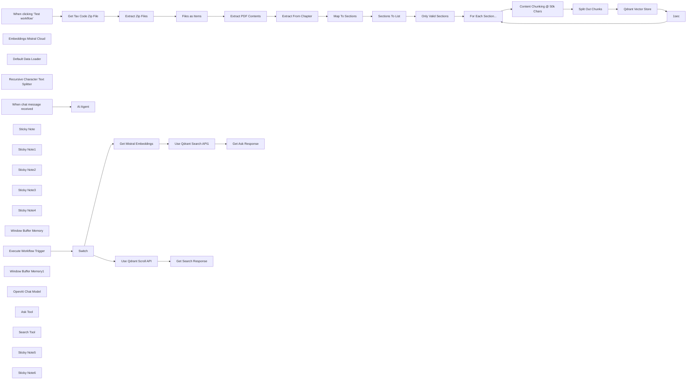

## Fluxo (.json) :

```json
{
  "meta": {
    "instanceId": "26ba763460b97c249b82942b23b6384876dfeb9327513332e743c5f6219c2b8e"
  },
  "nodes": [
    {
      "id": "1bb3c94e-326e-41ca-82e4-102a598dba39",
      "name": "When clicking ‘Test workflow’",
      "type": "n8n-nodes-base.manualTrigger",
      "position": [
        -320,
        300
      ],
      "parameters": {},
      "typeVersion": 1
    },
    {
      "id": "751b283b-ea88-4fcd-ace3-3c86631f8876",
      "name": "Embeddings Mistral Cloud",
      "type": "@n8n/n8n-nodes-langchain.embeddingsMistralCloud",
      "position": [
        1760,
        560
      ],
      "parameters": {
        "options": {}
      },
      "credentials": {
        "mistralCloudApi": {
          "id": "EIl2QxhXAS9Hkg37",
          "name": "Mistral Cloud account"
        }
      },
      "typeVersion": 1
    },
    {
      "id": "f0851949-1036-4040-84df-61295cc5db74",
      "name": "Default Data Loader",
      "type": "@n8n/n8n-nodes-langchain.documentDefaultDataLoader",
      "position": [
        1900,
        560
      ],
      "parameters": {
        "options": {
          "metadata": {
            "metadataValues": [
              {
                "name": "chapter",
                "value": "={{ $('For Each Section...').item.json.chapter }}"
              },
              {
                "name": "section",
                "value": "={{ $('For Each Section...').item.json.label }}"
              },
              {
                "name": "=title",
                "value": "={{ $('For Each Section...').item.json.title }}"
              },
              {
                "name": "content_order",
                "value": "={{ $itemIndex }}"
              }
            ]
          }
        },
        "jsonData": "={{ $json.content }}",
        "jsonMode": "expressionData"
      },
      "typeVersion": 1
    },
    {
      "id": "41d10b61-9fbe-446e-a65a-0db6e0116e5b",
      "name": "Recursive Character Text Splitter",
      "type": "@n8n/n8n-nodes-langchain.textSplitterRecursiveCharacterTextSplitter",
      "position": [
        1920,
        680
      ],
      "parameters": {
        "options": {},
        "chunkSize": 2000
      },
      "typeVersion": 1
    },
    {
      "id": "a1ecb096-4d31-4993-b801-ca3f09a9edc7",
      "name": "Get Tax Code Zip File",
      "type": "n8n-nodes-base.httpRequest",
      "position": [
        -20,
        340
      ],
      "parameters": {
        "url": "https://statutes.capitol.texas.gov/Docs/Zips/TX.pdf.zip",
        "options": {
          "response": {
            "response": {
              "responseFormat": "file"
            }
          }
        }
      },
      "typeVersion": 4.2
    },
    {
      "id": "cf983315-fe2a-43c1-8dc6-b17a217b845e",
      "name": "Extract Zip Files",
      "type": "n8n-nodes-base.compression",
      "position": [
        140,
        340
      ],
      "parameters": {},
      "typeVersion": 1.1
    },
    {
      "id": "8d02dd80-d14a-4e56-ab40-f2c4a445c57b",
      "name": "Files as Items",
      "type": "n8n-nodes-base.splitOut",
      "position": [
        300,
        340
      ],
      "parameters": {
        "include": "allOtherFields",
        "options": {},
        "fieldToSplitOut": "$binary"
      },
      "typeVersion": 1
    },
    {
      "id": "038060dc-e01d-40ae-878d-5043bc36ab91",
      "name": "Extract PDF Contents",
      "type": "n8n-nodes-base.extractFromFile",
      "position": [
        560,
        380
      ],
      "parameters": {
        "options": {},
        "operation": "pdf",
        "binaryPropertyName": "=file_{{ $itemIndex }}"
      },
      "typeVersion": 1
    },
    {
      "id": "4a85003b-b988-467b-b1cb-29206cbed879",
      "name": "Extract From Chapter",
      "type": "n8n-nodes-base.set",
      "position": [
        740,
        380
      ],
      "parameters": {
        "options": {},
        "assignments": {
          "assignments": [
            {
              "id": "d791928a-d775-48cc-9004-a92cbe2403d3",
              "name": "contents",
              "type": "array",
              "value": "={{\n $json.text\n .substring($json.text.search(/\\nSec\\.\\nA[0-9]{1,4}\\.[0-9]{1,5}\\.AA/), $json.text.length)\n .split(/\\nSec\\.\\nA[0-9]{1,2}\\.[0-9]{1,2}\\.AA/g)\n .filter(text => !text.isEmpty())\n .map(text => {\n const output = text.replaceAll('AA', ' ').replaceAll('\\nA', ' ');\n const title = output.substring(0, output.indexOf('.'));\n const content = output.substring(output.indexOf('.')+1, output.length).replaceAll('\\n', ' ').trim();\n return { title, content };\n })\n}}"
            },
            {
              "id": "bc06641f-0b75-4a35-8752-78803231d5d6",
              "name": "labels",
              "type": "array",
              "value": "={{\n $json.text\n .match(/\\nSec\\.\\nA[0-9]{1,4}\\.[0-9]{1,5}\\.AA/g)\n .map(text => ({\n label: text.replaceAll('AA', ' ')\n .replaceAll('\\nA', ' ')\n .replaceAll('\\n', '')\n .trim()\n }))\n}}"
            }
          ]
        }
      },
      "typeVersion": 3.3
    },
    {
      "id": "ee338786-91df-4784-bd7e-f86c0e13ca26",
      "name": "Map To Sections",
      "type": "n8n-nodes-base.set",
      "position": [
        740,
        520
      ],
      "parameters": {
        "options": {},
        "assignments": {
          "assignments": [
            {
              "id": "60109e60-d760-45bb-be09-7cb2b5eb85bc",
              "name": "section",
              "type": "array",
              "value": "={{\n $json.labels.map((label, idx) => ({\n label: label.label.match(/\\d.+/)[0].replace(/\\.$/, ''),\n title: $json.contents[idx].title,\n content: $json.contents[idx].content,\n chapter: $('Extract PDF Contents').first().json.info.Title,\n }))\n}}"
            }
          ]
        }
      },
      "typeVersion": 3.3
    },
    {
      "id": "41c9899d-26d7-48af-9af2-8563ab0fb7e4",
      "name": "Execute Workflow Trigger",
      "type": "n8n-nodes-base.executeWorkflowTrigger",
      "position": [
        1313,
        1200
      ],
      "parameters": {},
      "typeVersion": 1
    },
    {
      "id": "3a93c19b-09d9-4e38-8b0c-2008fc03f7fc",
      "name": "Get Mistral Embeddings",
      "type": "n8n-nodes-base.httpRequest",
      "position": [
        1660,
        1060
      ],
      "parameters": {
        "url": "https://api.mistral.ai/v1/embeddings",
        "method": "POST",
        "options": {},
        "sendBody": true,
        "authentication": "predefinedCredentialType",
        "bodyParameters": {
          "parameters": [
            {
              "name": "model",
              "value": "mistral-embed"
            },
            {
              "name": "encoding_format",
              "value": "float"
            },
            {
              "name": "input",
              "value": "={{ $json.query }}"
            }
          ]
        },
        "nodeCredentialType": "mistralCloudApi"
      },
      "credentials": {
        "mistralCloudApi": {
          "id": "EIl2QxhXAS9Hkg37",
          "name": "Mistral Cloud account"
        }
      },
      "typeVersion": 4.2
    },
    {
      "id": "1adc12bd-ba61-4f1a-b1f9-3f19a542e294",
      "name": "Content Chunking @ 50k Chars",
      "type": "n8n-nodes-base.set",
      "position": [
        1580,
        400
      ],
      "parameters": {
        "options": {},
        "assignments": {
          "assignments": [
            {
              "id": "7753a4f4-3ec2-4c05-81df-3d5e8979a478",
              "name": "=content",
              "type": "array",
              "value": "={{ new Array(Math.round($json.content.length / Math.min($json.content.length, 30000))).fill('').map((_,idx) => $json.content.substring(idx * 30000, idx * 50000 + 30000)) }}"
            }
          ]
        }
      },
      "typeVersion": 3.3
    },
    {
      "id": "ff8adce2-8f73-4a8f-b512-5aa560ca0954",
      "name": "Split Out Chunks",
      "type": "n8n-nodes-base.splitOut",
      "position": [
        1580,
        580
      ],
      "parameters": {
        "options": {},
        "fieldToSplitOut": "content"
      },
      "typeVersion": 1
    },
    {
      "id": "5f08ce3c-240d-4c91-bb23-953866fd0361",
      "name": "For Each Section...",
      "type": "n8n-nodes-base.splitInBatches",
      "position": [
        1400,
        280
      ],
      "parameters": {
        "options": {},
        "batchSize": 5
      },
      "typeVersion": 3
    },
    {
      "id": "6346cf67-7d93-4315-bb0d-2e016c9853b9",
      "name": "Sections To List",
      "type": "n8n-nodes-base.splitOut",
      "position": [
        940,
        380
      ],
      "parameters": {
        "options": {},
        "fieldToSplitOut": "section"
      },
      "typeVersion": 1
    },
    {
      "id": "95e34952-03e2-40e3-a245-9da8c9e1f249",
      "name": "Only Valid Sections",
      "type": "n8n-nodes-base.filter",
      "position": [
        1100,
        380
      ],
      "parameters": {
        "options": {},
        "conditions": {
          "options": {
            "leftValue": "",
            "caseSensitive": true,
            "typeValidation": "strict"
          },
          "combinator": "or",
          "conditions": [
            {
              "id": "121e8f86-2ead-47e0-8e17-52d7c6ba8265",
              "operator": {
                "type": "string",
                "operation": "notEmpty",
                "singleValue": true
              },
              "leftValue": "={{ $json.content }}",
              "rightValue": ""
            }
          ]
        }
      },
      "typeVersion": 2
    },
    {
      "id": "dfe1818f-93b7-4116-8a6e-dcb2e6c23fcf",
      "name": "Use Qdrant Search API1",
      "type": "n8n-nodes-base.httpRequest",
      "position": [
        1860,
        1060
      ],
      "parameters": {
        "url": "=http://qdrant:6333/collections/texas_tax_codes/points/search",
        "method": "POST",
        "options": {},
        "sendBody": true,
        "authentication": "predefinedCredentialType",
        "bodyParameters": {
          "parameters": [
            {
              "name": "limit",
              "value": "={{ 4 }}"
            },
            {
              "name": "vector",
              "value": "={{ $json.data[0].embedding }}"
            },
            {
              "name": "with_payload",
              "value": "={{ true }}"
            }
          ]
        },
        "nodeCredentialType": "qdrantApi"
      },
      "credentials": {
        "qdrantApi": {
          "id": "NyinAS3Pgfik66w5",
          "name": "QdrantApi account"
        }
      },
      "typeVersion": 4.2
    },
    {
      "id": "588318e6-e188-4d99-9c11-39b2f3fb1c18",
      "name": "Use Qdrant Scroll API",
      "type": "n8n-nodes-base.httpRequest",
      "position": [
        1660,
        1320
      ],
      "parameters": {
        "url": "=http://qdrant:6333/collections/texas_tax_codes/points/scroll",
        "method": "POST",
        "options": {
          "pagination": {
            "pagination": {
              "parameters": {
                "parameters": [
                  {
                    "name": "next_page_offset",
                    "type": "body",
                    "value": "={{ $response.body.result.next_page_offset }}"
                  }
                ]
              },
              "completeExpression": "={{ $response.body.result.next_page_offset === null }}",
              "paginationCompleteWhen": "other"
            }
          }
        },
        "sendBody": true,
        "authentication": "predefinedCredentialType",
        "bodyParameters": {
          "parameters": [
            {
              "name": "limit",
              "value": "={{ 100 }}"
            },
            {
              "name": "with_payload",
              "value": "={{ true }}"
            },
            {
              "name": "filter",
              "value": "={{\n{\n \"must\": [\n ($json.query.section\n ? { \"key\": \"metadata.section\", \"match\": { \"value\": $json.query.section } }\n : { \"key\": \"metadata.chapter\", \"match\": { \"value\": $json.query.chapter } }\n )\n ]\n}\n}}"
            }
          ]
        },
        "nodeCredentialType": "qdrantApi"
      },
      "credentials": {
        "qdrantApi": {
          "id": "NyinAS3Pgfik66w5",
          "name": "QdrantApi account"
        }
      },
      "typeVersion": 4.2
    },
    {
      "id": "bbf01344-c60e-42b3-8d7d-2bb360876d79",
      "name": "Get Search Response",
      "type": "n8n-nodes-base.set",
      "position": [
        1860,
        1320
      ],
      "parameters": {
        "options": {},
        "assignments": {
          "assignments": [
            {
              "id": "08ad2d6e-4ed1-409e-b89c-1f0c7fdf1b64",
              "name": "response",
              "type": "string",
              "value": "=---\nchapter: {{ $json.result.points.first().payload.metadata.chapter }}\nsection: {{ $json.result.points.first().payload.metadata.section }}\ntitle: {{ $json.result.points.first().payload.metadata.title }}\n---\n{{ $json.result.points\n .toSorted((a,b) => (a.payload.metadata.content_order || 0) - (b.payload.metadata.content_order || 0))\n .map(point => point.payload.content).join('\\n') }}"
            }
          ]
        }
      },
      "typeVersion": 3.3
    },
    {
      "id": "3b23ff5e-158a-470f-a262-d001d52feeba",
      "name": "Sticky Note",
      "type": "n8n-nodes-base.stickyNote",
      "position": [
        -100,
        183.38345554113084
      ],
      "parameters": {
        "color": 7,
        "width": 571.4359274276384,
        "height": 352.65642339230595,
        "content": "## Step 1. Download the Tax Code PDF\n[Read more about handling Zip Files](https://docs.n8n.io/integrations/builtin/core-nodes/n8n-nodes-base.compression/)\n\nLet's begin by pulling a zip file containing all the tax codes as separate PDF files. We can unzip on the fly with n8n's compression node."
      },
      "typeVersion": 1
    },
    {
      "id": "02826887-eb26-48a0-928e-fe56ee008425",
      "name": "Sticky Note1",
      "type": "n8n-nodes-base.stickyNote",
      "position": [
        500,
        199.87747230655896
      ],
      "parameters": {
        "color": 7,
        "width": 777.897719182587,
        "height": 503.3459981018574,
        "content": "## Step 2. Extract and Partition Into Chapters & Sections\n[Learn more about reading PDF Files](https://docs.n8n.io/integrations/builtin/core-nodes/n8n-nodes-base.extractfromfile)\n\nRather than ingest the raw text of the PDF, we'll be a little more strategic and extract the tax code sections separately instead. Not only will this provide cleaner results, we'll also be able to fetch sections in isolation if required."
      },
      "typeVersion": 1
    },
    {
      "id": "31a34972-31ab-4b96-9d09-cd30a3b184cf",
      "name": "Sticky Note2",
      "type": "n8n-nodes-base.stickyNote",
      "position": [
        1300,
        108.82958126396
      ],
      "parameters": {
        "color": 7,
        "width": 1045.1698686248747,
        "height": 771.1260499456115,
        "content": "## Step 3. Save into Qdrant VectorStore\n[Read more about using the Qdrant Vectorstore](https://docs.n8n.io/integrations/builtin/cluster-nodes/root-nodes/n8n-nodes-langchain.vectorstoreqdrant)\n\nWe'll save our data into a Qdrant collection being mindful to use metadata to take full advantage of Qdrant's filtering capabilities later.\nThough not always required, since the tax code documents can be quite large we'll implement a loop here to throttle the number of tokens being processed as to not trip the Mistral.ai rate limits for embeddings."
      },
      "typeVersion": 1
    },
    {
      "id": "27039fa6-6388-45ee-a2d5-6bb68554944b",
      "name": "Qdrant Vector Store",
      "type": "@n8n/n8n-nodes-langchain.vectorStoreQdrant",
      "position": [
        1760,
        400
      ],
      "parameters": {
        "mode": "insert",
        "options": {},
        "qdrantCollection": {
          "__rl": true,
          "mode": "list",
          "value": "texas_tax_codes",
          "cachedResultName": "texas_tax_codes"
        }
      },
      "credentials": {
        "qdrantApi": {
          "id": "NyinAS3Pgfik66w5",
          "name": "QdrantApi account"
        }
      },
      "typeVersion": 1
    },
    {
      "id": "5ec16c20-eb1e-454a-8165-594d83dd8711",
      "name": "Sticky Note3",
      "type": "n8n-nodes-base.stickyNote",
      "position": [
        360,
        900
      ],
      "parameters": {
        "color": 7,
        "width": 858.1415560000298,
        "height": 513.2269439624808,
        "content": "## Step 4. Build a Tax Code Assistant ChatBot\n[Learn more about using AI Agents in n8n](https://docs.n8n.io/integrations/builtin/cluster-nodes/root-nodes/n8n-nodes-langchain.agent)\n\nFor our chatbot, we'll use an AI agent node because we want to achieve more than one functionality. The first will be querying to relevant texts to answer a user's question and secondly, a direct search feature to pull full section text when requested."
      },
      "typeVersion": 1
    },
    {
      "id": "d5145c6f-768b-42d8-a045-20e045f52b0b",
      "name": "Sticky Note4",
      "type": "n8n-nodes-base.stickyNote",
      "position": [
        1240,
        904.6076722083936
      ],
      "parameters": {
        "color": 7,
        "width": 1030.0926850706744,
        "height": 577.7854680142904,
        "content": "## Step 5. Use Qdrant API as Tools\n[Learn more about using AI Agents in n8n](https://docs.n8n.io/integrations/builtin/cluster-nodes/root-nodes/n8n-nodes-langchain.agent)\n\nOur Ask Tool will generate embeddings using Mistral.ai and query our Qdrant collection using the Qdrant Search API.\nOur Search Tool will use filter our Qdrant collection using the Qdrant Scroll API, matching on each doc's section metadata key."
      },
      "typeVersion": 1
    },
    {
      "id": "ccf50479-53d8-4edf-8f2b-73060a6a6e0f",
      "name": "AI Agent",
      "type": "@n8n/n8n-nodes-langchain.agent",
      "position": [
        700,
        1063
      ],
      "parameters": {
        "options": {
          "systemMessage": "You are a helpful assistant answering user questions on the tax code legistration for the state of Texas, united states of america.\n\nAlong with your response also note in which chapter and section number the information was found. "
        }
      },
      "typeVersion": 1.6
    },
    {
      "id": "d7e7fa9e-73ba-4df3-862e-25af63d9d9b4",
      "name": "Window Buffer Memory",
      "type": "@n8n/n8n-nodes-langchain.memoryBufferWindow",
      "position": [
        820,
        1223
      ],
      "parameters": {},
      "typeVersion": 1.2
    },
    {
      "id": "a79bdbcd-7157-470a-aadc-bd3f8a4c40d2",
      "name": "When chat message received",
      "type": "@n8n/n8n-nodes-langchain.chatTrigger",
      "position": [
        420,
        1063
      ],
      "webhookId": "db2b118d-942e-4be9-b154-7df887232f97",
      "parameters": {
        "public": true,
        "options": {
          "loadPreviousSession": "memory"
        },
        "initialMessages": ""
      },
      "typeVersion": 1
    },
    {
      "id": "6046f137-b508-484f-8577-ac51a35eee09",
      "name": "Window Buffer Memory1",
      "type": "@n8n/n8n-nodes-langchain.memoryBufferWindow",
      "position": [
        420,
        1223
      ],
      "parameters": {},
      "typeVersion": 1.2
    },
    {
      "id": "30f238f8-1987-4d6d-b06d-ac2106ea3734",
      "name": "OpenAI Chat Model",
      "type": "@n8n/n8n-nodes-langchain.lmChatOpenAi",
      "position": [
        700,
        1223
      ],
      "parameters": {
        "options": {}
      },
      "credentials": {
        "openAiApi": {
          "id": "8gccIjcuf3gvaoEr",
          "name": "OpenAi account"
        }
      },
      "typeVersion": 1
    },
    {
      "id": "8a8490f6-5957-495c-a7af-15cec669f39c",
      "name": "1sec",
      "type": "n8n-nodes-base.wait",
      "position": [
        2160,
        660
      ],
      "webhookId": "852317f0-aadf-4658-ae44-d05e5de29302",
      "parameters": {
        "amount": 1
      },
      "executeOnce": false,
      "typeVersion": 1.1
    },
    {
      "id": "142450f5-8ec1-4ae6-b25c-df3233394d4e",
      "name": "Ask Tool",
      "type": "@n8n/n8n-nodes-langchain.toolWorkflow",
      "position": [
        960,
        1223
      ],
      "parameters": {
        "name": "query_tax_code_knowledgebase",
        "fields": {
          "values": [
            {
              "name": "route",
              "stringValue": "ask_tool"
            }
          ]
        },
        "workflowId": "={{ $workflow.id }}",
        "description": "Call this tool to query the tax code database for information. Structure your query in the form of a question for best results."
      },
      "typeVersion": 1.1
    },
    {
      "id": "ee455a4e-c9a1-49b2-a036-d3f3d34099c6",
      "name": "Search Tool",
      "type": "@n8n/n8n-nodes-langchain.toolWorkflow",
      "position": [
        1060,
        1223
      ],
      "parameters": {
        "name": "get_tax_code_section",
        "fields": {
          "values": [
            {
              "name": "route",
              "stringValue": "search_tool"
            }
          ]
        },
        "workflowId": "={{ $workflow.id }}",
        "description": "Call this tool to search for specific sections of the tax code document. Pass in either a known section number/id to get the section's text or a known chapter name to return all sections for the chapter.",
        "jsonSchemaExample": "{\n\t\"chapter\": \"some_value\",\n \"section\": \"Sec 1.01\"\n}",
        "specifyInputSchema": true
      },
      "typeVersion": 1.1
    },
    {
      "id": "f3240f8d-8869-4088-8e4f-d4e23a3c12a8",
      "name": "Switch",
      "type": "n8n-nodes-base.switch",
      "position": [
        1473,
        1200
      ],
      "parameters": {
        "rules": {
          "values": [
            {
              "outputKey": "ask_tool",
              "conditions": {
                "options": {
                  "leftValue": "",
                  "caseSensitive": true,
                  "typeValidation": "strict"
                },
                "combinator": "and",
                "conditions": [
                  {
                    "operator": {
                      "type": "string",
                      "operation": "equals"
                    },
                    "leftValue": "={{ $json.route }}",
                    "rightValue": "ask_tool"
                  }
                ]
              },
              "renameOutput": true
            },
            {
              "outputKey": "search_tool",
              "conditions": {
                "options": {
                  "leftValue": "",
                  "caseSensitive": true,
                  "typeValidation": "strict"
                },
                "combinator": "and",
                "conditions": [
                  {
                    "id": "909362ed-eb97-405c-9f2f-f404a3bfeaf3",
                    "operator": {
                      "name": "filter.operator.equals",
                      "type": "string",
                      "operation": "equals"
                    },
                    "leftValue": "={{ $json.route }}",
                    "rightValue": "search_tool"
                  }
                ]
              },
              "renameOutput": true
            }
          ]
        },
        "options": {}
      },
      "typeVersion": 3
    },
    {
      "id": "71441b5a-099b-49e0-a212-3087d958b38b",
      "name": "Get Ask Response",
      "type": "n8n-nodes-base.set",
      "position": [
        2060,
        1060
      ],
      "parameters": {
        "options": {},
        "assignments": {
          "assignments": [
            {
              "id": "eb5f2b3c-bb88-4cae-a960-164016c9a9e4",
              "name": "response",
              "type": "string",
              "value": "=|chapter|section|title|content|\n|-|-|-|-|\n{{\n $json.result.map(row => [\n '',\n row.payload.metadata.chapter,\n row.payload.metadata.section,\n row.payload.metadata.title,\n row.payload.content,\n ''\n ].join('|')).join('\\n')\n}}"
            }
          ]
        }
      },
      "typeVersion": 3.3
    },
    {
      "id": "54a744a3-95c9-4d9a-b1e7-e266a51f77ca",
      "name": "Sticky Note5",
      "type": "n8n-nodes-base.stickyNote",
      "position": [
        -520,
        -79.56762868134751
      ],
      "parameters": {
        "width": 383.14868794462586,
        "height": 563.604204119637,
        "content": "## Try Me Out!\n### This workflow builds an AI powered Legal assistant who answers questions about tax codes.\n* Download publically available tax code PDFs from the relevant government website.\n* Strategically exact tax code sections and store these in our Qdrant Vectorstore using Mistral.ai embeddings.\n* Use an AI Agent to answer user's tax questions by attaching tools which query our Qdrant vectorstore.\n\n### Need Help?\nJoin the [Discord](https://discord.com/invite/XPKeKXeB7d) or ask in the [Forum](https://community.n8n.io/)!\n\nHappy Hacking!"
      },
      "typeVersion": 1
    },
    {
      "id": "7f802f12-03e0-4b8e-a880-8c26242c1152",
      "name": "Sticky Note6",
      "type": "n8n-nodes-base.stickyNote",
      "position": [
        790.1971986436472,
        720
      ],
      "parameters": {
        "color": 5,
        "width": 489.3944544742706,
        "height": 131.61363932813174,
        "content": "### 🙋‍♀️What's the difference?\nWith raw PDF data, we may blur the boundaries between chapters and sections making later results hard to find, incoherent or misleading.\nDepending on your use-case, store your data in a way you intend to retrieve it!"
      },
      "typeVersion": 1
    }
  ],
  "pinData": {},
  "connections": {
    "1sec": {
      "main": [
        [
          {
            "node": "For Each Section...",
            "type": "main",
            "index": 0
          }
        ]
      ]
    },
    "Switch": {
      "main": [
        [
          {
            "node": "Get Mistral Embeddings",
            "type": "main",
            "index": 0
          }
        ],
        [
          {
            "node": "Use Qdrant Scroll API",
            "type": "main",
            "index": 0
          }
        ]
      ]
    },
    "Ask Tool": {
      "ai_tool": [
        [
          {
            "node": "AI Agent",
            "type": "ai_tool",
            "index": 0
          }
        ]
      ]
    },
    "Search Tool": {
      "ai_tool": [
        [
          {
            "node": "AI Agent",
            "type": "ai_tool",
            "index": 0
          }
        ]
      ]
    },
    "Files as Items": {
      "main": [
        [
          {
            "node": "Extract PDF Contents",
            "type": "main",
            "index": 0
          }
        ]
      ]
    },
    "Map To Sections": {
      "main": [
        [
          {
            "node": "Sections To List",
            "type": "main",
            "index": 0
          }
        ]
      ]
    },
    "Sections To List": {
      "main": [
        [
          {
            "node": "Only Valid Sections",
            "type": "main",
            "index": 0
          }
        ]
      ]
    },
    "Split Out Chunks": {
      "main": [
        [
          {
            "node": "Qdrant Vector Store",
            "type": "main",
            "index": 0
          }
        ]
      ]
    },
    "Extract Zip Files": {
      "main": [
        [
          {
            "node": "Files as Items",
            "type": "main",
            "index": 0
          }
        ]
      ]
    },
    "OpenAI Chat Model": {
      "ai_languageModel": [
        [
          {
            "node": "AI Agent",
            "type": "ai_languageModel",
            "index": 0
          }
        ]
      ]
    },
    "Default Data Loader": {
      "ai_document": [
        [
          {
            "node": "Qdrant Vector Store",
            "type": "ai_document",
            "index": 0
          }
        ]
      ]
    },
    "For Each Section...": {
      "main": [
        null,
        [
          {
            "node": "Content Chunking @ 50k Chars",
            "type": "main",
            "index": 0
          }
        ]
      ]
    },
    "Only Valid Sections": {
      "main": [
        [
          {
            "node": "For Each Section...",
            "type": "main",
            "index": 0
          }
        ]
      ]
    },
    "Qdrant Vector Store": {
      "main": [
        [
          {
            "node": "1sec",
            "type": "main",
            "index": 0
          }
        ]
      ]
    },
    "Extract From Chapter": {
      "main": [
        [
          {
            "node": "Map To Sections",
            "type": "main",
            "index": 0
          }
        ]
      ]
    },
    "Extract PDF Contents": {
      "main": [
        [
          {
            "node": "Extract From Chapter",
            "type": "main",
            "index": 0
          }
        ]
      ]
    },
    "Window Buffer Memory": {
      "ai_memory": [
        [
          {
            "node": "AI Agent",
            "type": "ai_memory",
            "index": 0
          }
        ]
      ]
    },
    "Get Tax Code Zip File": {
      "main": [
        [
          {
            "node": "Extract Zip Files",
            "type": "main",
            "index": 0
          }
        ]
      ]
    },
    "Use Qdrant Scroll API": {
      "main": [
        [
          {
            "node": "Get Search Response",
            "type": "main",
            "index": 0
          }
        ]
      ]
    },
    "Window Buffer Memory1": {
      "ai_memory": [
        [
          {
            "node": "When chat message received",
            "type": "ai_memory",
            "index": 0
          }
        ]
      ]
    },
    "Get Mistral Embeddings": {
      "main": [
        [
          {
            "node": "Use Qdrant Search API1",
            "type": "main",
            "index": 0
          }
        ]
      ]
    },
    "Use Qdrant Search API1": {
      "main": [
        [
          {
            "node": "Get Ask Response",
            "type": "main",
            "index": 0
          }
        ]
      ]
    },
    "Embeddings Mistral Cloud": {
      "ai_embedding": [
        [
          {
            "node": "Qdrant Vector Store",
            "type": "ai_embedding",
            "index": 0
          }
        ]
      ]
    },
    "Execute Workflow Trigger": {
      "main": [
        [
          {
            "node": "Switch",
            "type": "main",
            "index": 0
          }
        ]
      ]
    },
    "When chat message received": {
      "main": [
        [
          {
            "node": "AI Agent",
            "type": "main",
            "index": 0
          }
        ]
      ]
    },
    "Content Chunking @ 50k Chars": {
      "main": [
        [
          {
            "node": "Split Out Chunks",
            "type": "main",
            "index": 0
          }
        ]
      ]
    },
    "Recursive Character Text Splitter": {
      "ai_textSplitter": [
        [
          {
            "node": "Default Data Loader",
            "type": "ai_textSplitter",
            "index": 0
          }
        ]
      ]
    },
    "When clicking ‘Test workflow’": {
      "main": [
        [
          {
            "node": "Get Tax Code Zip File",
            "type": "main",
            "index": 0
          }
        ]
      ]
    }
  }
}
```

<a id="template-1521"></a>

## Template 1521 - Agente telefônico para qualificação de leads

- **Nome:** Agente telefônico para qualificação de leads
- **Descrição:** Fluxo que automatiza chamadas outbound e inbound para qualificar leads, atualizar registros e enviar resumos por e-mail usando APIs de voice/AI e planilhas.
- **Funcionalidade:** • Detecção de novos leads: Monitora uma planilha e inicia o fluxo quando uma nova linha é adicionada.
• Lembrete SMS ao vendedor: Envia SMS para avisar o representante que deve ligar ao lead em breve.
• Atraso programado antes da chamada: Introduz espera configurável antes de iniciar a chamada automática.
• Chamada automática outbound com RetellAI: Dispara uma chamada telefônica automatizada usando variáveis dinâmicas do lead.
• Recepção de chamadas inbound via webhook: Aceita chamadas ou eventos inbound e processa os dados recebidos.
• Verificação de número na planilha: Procura o número do chamador na planilha para identificar se já é um lead existente.
• Resposta dinâmica a chamadas inbound: Envia resposta ao webhook com variáveis dinâmicas (ex.: nome) para personalizar a interação.
• Recebimento do pós-chamada e filtragem: Recebe dados de análise pós-chamada e filtra apenas eventos analisados.
• Diferenciação entre chamadas outbound e inbound: Roteia ações diferentes com base na direção da chamada.
• Atualização automática de registro do lead: Atualiza a planilha correspondente (casamento por UUID) com a qualificação e data/hora.
• Geração de resumo e análise com modelo de linguagem: Cria resumo da chamada e sugestões de melhoria usando um LLM.
• Envio de e-mails de notificação: Envia resumo da chamada para a equipe e confirmações/agenda para o cliente.
• Requisitos de formato de número: Exige números no formato E.164 para funcionamento correto das chamadas.
- **Ferramentas:** • Google Sheets: Fonte e armazenamento dos dados dos leads, usada para detecção, busca e atualização de registros.
• Twilio (ou similar): Serviço de SMS/voz para enviar lembretes e, opcionalmente, gerenciar chamadas/SMS.
• RetellAI: Plataforma de chamadas automatizadas e análise pós-chamada usada para executar conversas por voz e retornar transcrições/metadata.
• OpenAI (ou outro LLM): Gera resumos da chamada e fornece análise/sugestões de melhoria do prompt de voz.
• Gmail (serviço de e-mail): Envia notificações e confirmações por e-mail para equipe e clientes.

## Fluxo visual

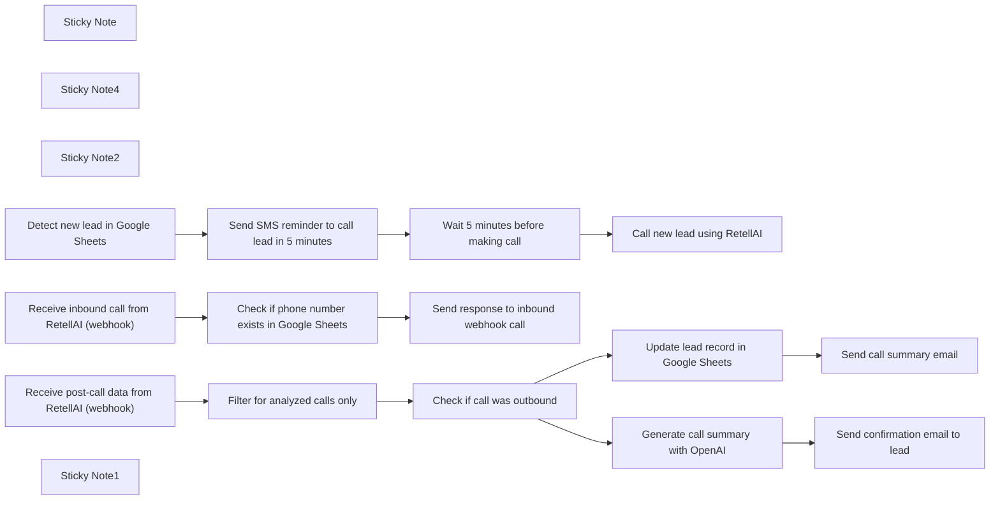

## Fluxo (.json) :

```json
{
  "id": "QO4Mg23JvVfNCICy",
  "meta": {
    "instanceId": "a2b23892dd6989fda7c1209b381f5850373a7d2b85609624d7c2b7a092671d44",
    "templateCredsSetupCompleted": true
  },
  "name": "Build a Phone Agent to qualify outbound leads and inbound calls with RetellAI -vide",
  "tags": [
    {
      "id": "12w64ydbjEKDaM0B",
      "name": "inbound",
      "createdAt": "2025-05-06T20:31:43.427Z",
      "updatedAt": "2025-05-06T20:31:43.427Z"
    },
    {
      "id": "xSqaFWDcbJCRECKZ",
      "name": "outbound",
      "createdAt": "2025-05-06T20:31:38.072Z",
      "updatedAt": "2025-05-06T20:31:38.072Z"
    }
  ],
  "nodes": [
    {
      "id": "78f39980-c9f8-49b6-93bb-a1f61d347ac3",
      "name": "Sticky Note",
      "type": "n8n-nodes-base.stickyNote",
      "position": [
        -240,
        0
      ],
      "parameters": {
        "width": 1260,
        "height": 320,
        "content": "# Outbound lead qualification call workflow"
      },
      "typeVersion": 1
    },
    {
      "id": "661006b9-dac7-4ac0-882a-2e0cba9dbae1",
      "name": "Sticky Note4",
      "type": "n8n-nodes-base.stickyNote",
      "position": [
        -240,
        360
      ],
      "parameters": {
        "color": 5,
        "width": 1260,
        "height": 320,
        "content": "# Inbound call appointment scheduler workflow"
      },
      "typeVersion": 1
    },
    {
      "id": "96a278b9-8d2e-4f85-9f6a-2997932a7ca4",
      "name": "Sticky Note2",
      "type": "n8n-nodes-base.stickyNote",
      "position": [
        1060,
        -420
      ],
      "parameters": {
        "color": 4,
        "width": 1400,
        "height": 1100,
        "content": "# Post-call workflow\n## Triggers when a new lead is added in Google Sheets:\n\n### 1 -Sends SMS to remind rep to call in 5 min\n### 2- (Optional delay step)\n### 3- Triggers RetellAI to place an automated call to the lead\n\n## 💡 Requires phone numbers to be formatted in E.164"
      },
      "typeVersion": 1
    },
    {
      "id": "d082f904-f185-4615-b0d8-9438c731786f",
      "name": "Detect new lead in Google Sheets",
      "type": "n8n-nodes-base.googleSheetsTrigger",
      "position": [
        -160,
        100
      ],
      "parameters": {
        "event": "rowAdded",
        "options": {},
        "pollTimes": {
          "item": [
            {
              "mode": "everyHour"
            }
          ]
        },
        "sheetName": {
          "__rl": true,
          "mode": "id",
          "value": "="
        },
        "documentId": {
          "__rl": true,
          "mode": "id",
          "value": "="
        }
      },
      "credentials": {
        "googleSheetsTriggerOAuth2Api": {
          "id": "pXaVMshaL2QzVDYh",
          "name": "Google Sheets Trigger account"
        }
      },
      "typeVersion": 1
    },
    {
      "id": "c61172c2-7795-47be-acaa-d4824ca69680",
      "name": "Send SMS reminder to call lead in 5 minutes",
      "type": "n8n-nodes-base.twilio",
      "position": [
        140,
        100
      ],
      "parameters": {
        "to": "={{ $json['Phone Number'] }}",
        "from": "+33600000000",
        "message": "Hello, thanks for your interest in our roofing services. We'll be calling you shortly to ask about your project!",
        "options": {},
        "resource": "call"
      },
      "credentials": {
        "twilioApi": {
          "id": "udXVmM3xHYZbMW4g",
          "name": "Twilio account"
        }
      },
      "typeVersion": 1
    },
    {
      "id": "d88573d4-ec99-40e4-8603-f1e910d034d1",
      "name": "Wait 5 minutes before making call",
      "type": "n8n-nodes-base.wait",
      "position": [
        460,
        100
      ],
      "webhookId": "344c2d5d-5629-4466-866b-ac6359b3b042",
      "parameters": {
        "unit": "minutes",
        "amount": 1
      },
      "typeVersion": 1.1
    },
    {
      "id": "d6778895-90dd-471e-9d9d-c48a35154291",
      "name": "Call new lead using RetellAI",
      "type": "n8n-nodes-base.httpRequest",
      "position": [
        760,
        100
      ],
      "parameters": {
        "url": "https://api.retellai.com/v2/create-phone-call",
        "method": "POST",
        "options": {},
        "jsonBody": "={\n  \"from_number\": \"+33600000000\",\n  \"to_number\": \"{{ $json['Phone Number'] }}\",\n  \"retell_llm_dynamic_variables\": {\n    \"uuid\": \"{{ $('Detect new lead in Google Sheets').item.json.UUID }}\"\n  }\n}",
        "sendBody": true,
        "sendHeaders": true,
        "specifyBody": "json",
        "headerParameters": {
          "parameters": [
            {
              "name": "Authorization",
              "value": "Bearer key_XXXXXXXXX"
            },
            {
              "name": "Content-Type",
              "value": "application/json"
            }
          ]
        }
      },
      "typeVersion": 4.2
    },
    {
      "id": "8e7e7c0c-2600-4b20-ba30-b855d456d302",
      "name": "Receive inbound call from RetellAI (webhook)",
      "type": "n8n-nodes-base.webhook",
      "position": [
        -160,
        460
      ],
      "webhookId": "ebd11c9b-129c-4b59-8c27-9a4b567305f7",
      "parameters": {
        "path": "ebd11c9b-129c-4b59-8c27-9a4b567305f7",
        "options": {},
        "httpMethod": "POST",
        "responseMode": "responseNode"
      },
      "typeVersion": 2
    },
    {
      "id": "36bf25b0-d39d-4127-b005-5e3619069744",
      "name": "Check if phone number exists in Google Sheets",
      "type": "n8n-nodes-base.googleSheets",
      "position": [
        300,
        460
      ],
      "parameters": {
        "options": {},
        "filtersUI": {
          "values": [
            {
              "lookupValue": "={{ $json.body.call_inbound.from_number }}",
              "lookupColumn": "Phone Number"
            }
          ]
        },
        "sheetName": {
          "__rl": true,
          "mode": "id",
          "value": "="
        },
        "documentId": {
          "__rl": true,
          "mode": "id",
          "value": "="
        }
      },
      "credentials": {
        "googleSheetsOAuth2Api": {
          "id": "51us92xkOlrvArhV",
          "name": "Google Sheets account"
        }
      },
      "typeVersion": 4.5
    },
    {
      "id": "0b2dc7b9-84c1-488b-9d02-47cf6ee460c7",
      "name": "Send response to inbound webhook call",
      "type": "n8n-nodes-base.respondToWebhook",
      "position": [
        760,
        460
      ],
      "parameters": {
        "options": {},
        "respondWith": "json",
        "responseBody": "={\n  \"call_inbound\": {\n    \"dynamic_variables\": {\n        \"name\": \"{{ $json.Name }}\"\n    }\n  }\n}"
      },
      "typeVersion": 1.1
    },
    {
      "id": "063a4a31-429f-4cf0-b248-869131e92633",
      "name": "Receive post-call data from RetellAI (webhook)",
      "type": "n8n-nodes-base.webhook",
      "position": [
        1180,
        80
      ],
      "webhookId": "f8878b78-43ea-4caa-b16c-cde9aaf2e9b1",
      "parameters": {
        "path": "f8878b78-43ea-4caa-b16c-cde9aaf2e9b1",
        "options": {},
        "httpMethod": "POST"
      },
      "typeVersion": 2
    },
    {
      "id": "215e2031-983a-4785-b46d-026f64c115e4",
      "name": "Filter for analyzed calls only",
      "type": "n8n-nodes-base.filter",
      "position": [
        1400,
        80
      ],
      "parameters": {
        "options": {},
        "conditions": {
          "options": {
            "version": 2,
            "leftValue": "",
            "caseSensitive": true,
            "typeValidation": "strict"
          },
          "combinator": "and",
          "conditions": [
            {
              "id": "a0e40476-0054-43ec-b7a7-e872d1c6061a",
              "operator": {
                "name": "filter.operator.equals",
                "type": "string",
                "operation": "equals"
              },
              "leftValue": "={{ $json.body.event }}",
              "rightValue": "call_analyzed"
            }
          ]
        }
      },
      "typeVersion": 2.2
    },
    {
      "id": "f8cae0c3-1b5d-47e6-b7fd-b47558c30d3f",
      "name": "Check if call was outbound",
      "type": "n8n-nodes-base.if",
      "position": [
        1620,
        80
      ],
      "parameters": {
        "options": {},
        "conditions": {
          "options": {
            "version": 2,
            "leftValue": "",
            "caseSensitive": true,
            "typeValidation": "strict"
          },
          "combinator": "and",
          "conditions": [
            {
              "id": "46590184-4e33-48fd-a9f4-c63b13f88c1f",
              "operator": {
                "type": "string",
                "operation": "equals"
              },
              "leftValue": "={{ $json.body.call.direction }}",
              "rightValue": "outbound"
            }
          ]
        }
      },
      "typeVersion": 2.2
    },
    {
      "id": "8997d5ec-bfb9-4ce9-9e13-6035f02b634e",
      "name": "Update lead record in Google Sheets",
      "type": "n8n-nodes-base.googleSheets",
      "position": [
        1860,
        -40
      ],
      "parameters": {
        "columns": {
          "value": {
            "UUID": "={{ $json.body.call.retell_llm_dynamic_variables.uuid }}",
            "Qualification": "={{ $json.body.call.call_analysis.custom_analysis_data.qualification }}"
          },
          "schema": [
            {
              "id": "UUID",
              "type": "string",
              "display": true,
              "removed": false,
              "required": false,
              "displayName": "UUID",
              "defaultMatch": false,
              "canBeUsedToMatch": true
            },
            {
              "id": "Name",
              "type": "string",
              "display": true,
              "required": false,
              "displayName": "Name",
              "defaultMatch": false,
              "canBeUsedToMatch": true
            },
            {
              "id": "Phone Number",
              "type": "string",
              "display": true,
              "required": false,
              "displayName": "Phone Number",
              "defaultMatch": false,
              "canBeUsedToMatch": true
            },
            {
              "id": "Datetime Called",
              "type": "string",
              "display": true,
              "required": false,
              "displayName": "Datetime Called",
              "defaultMatch": false,
              "canBeUsedToMatch": true
            },
            {
              "id": "Qualification",
              "type": "string",
              "display": true,
              "required": false,
              "displayName": "Qualification",
              "defaultMatch": false,
              "canBeUsedToMatch": true
            },
            {
              "id": "row_number",
              "type": "string",
              "display": true,
              "removed": true,
              "readOnly": true,
              "required": false,
              "displayName": "row_number",
              "defaultMatch": false,
              "canBeUsedToMatch": true
            }
          ],
          "mappingMode": "defineBelow",
          "matchingColumns": [
            "UUID"
          ],
          "attemptToConvertTypes": false,
          "convertFieldsToString": false
        },
        "options": {},
        "operation": "update",
        "sheetName": {
          "__rl": true,
          "mode": "id",
          "value": "="
        },
        "documentId": {
          "__rl": true,
          "mode": "id",
          "value": "="
        }
      },
      "credentials": {
        "googleSheetsOAuth2Api": {
          "id": "51us92xkOlrvArhV",
          "name": "Google Sheets account"
        }
      },
      "typeVersion": 4.5
    },
    {
      "id": "20757ff8-6604-4c80-96ec-32bfac983ed7",
      "name": "Send call summary email",
      "type": "n8n-nodes-base.gmail",
      "position": [
        2220,
        -40
      ],
      "webhookId": "806ec3f9-8bcb-48ef-8e22-9d1ce3b06bf0",
      "parameters": {
        "sendTo": "youremail@gmail.com",
        "message": "=Name:\n{{ $json.body.call.call_analysis.custom_analysis_data.first_name }}\n\nNumber:\n{{ $json.body.call.call_analysis.custom_analysis_data.phone_number }}\n\nQualification:\n{{ $json.body.call.call_analysis.custom_analysis_data.qualification }}\n\n\nCall Summary:\n{{ $json.body.call.call_analysis.custom_analysis_data.call_summary }}",
        "options": {},
        "subject": "=New Lead - Call Summary",
        "emailType": "text"
      },
      "credentials": {
        "gmailOAuth2": {
          "id": "rKxQHWZ2F5XLJmwF",
          "name": "Gmail account"
        }
      },
      "typeVersion": 2.1
    },
    {
      "id": "753bd92d-b95b-4710-bf49-6da89a43223f",
      "name": "Generate call summary with OpenAI",
      "type": "@n8n/n8n-nodes-langchain.openAi",
      "position": [
        1860,
        180
      ],
      "parameters": {
        "modelId": {
          "__rl": true,
          "mode": "list",
          "value": "gpt-4.1",
          "cachedResultName": "GPT-4.1"
        },
        "options": {},
        "messages": {
          "values": [
            {
              "content": "=Analyze this call transcript to identify how the call went and identify possible improvements to the voice prompt:\n\n{{ $json.body.call.transcript }}"
            }
          ]
        }
      },
      "credentials": {
        "openAiApi": {
          "id": "6h3DfVhNPw9I25nO",
          "name": "OpenAi account"
        }
      },
      "typeVersion": 1.8
    },
    {
      "id": "cf600277-bb07-4f7a-a9b7-3e20017f716d",
      "name": "Send confirmation email to lead",
      "type": "n8n-nodes-base.gmail",
      "position": [
        2220,
        180
      ],
      "webhookId": "453fe9d9-1de6-40a2-bd0c-88cb9c1cc7ef",
      "parameters": {
        "sendTo": "youremail@gmail.com",
        "message": "=New roofing appointment:\n\nClient Name:\n{{ $('Check if call was outbound').item.json.body.call.call_analysis.custom_analysis_data.first_name }}\n\nClient Number:\n{{ $('Check if call was outbound').item.json.body.call.call_analysis.custom_analysis_data.phone_number }}\n\nAvailabilities:\n{{ $('Check if call was outbound').item.json.body.call.call_analysis.custom_analysis_data.availabilities }}\n\n\nCall Summary:\n{{ $('Check if call was outbound').item.json.body.call.call_analysis.call_summary }}\n\n\nChatGPT analysis of how the call went and suggestions for improving the voice prompt:\n{{ $json.message.content }}",
        "options": {},
        "subject": "=Roofing Appointment Scheduled",
        "emailType": "text"
      },
      "credentials": {
        "gmailOAuth2": {
          "id": "rKxQHWZ2F5XLJmwF",
          "name": "Gmail account"
        }
      },
      "typeVersion": 2.1
    },
    {
      "id": "f75763b6-0867-4625-89e1-cafa3c9e6e44",
      "name": "Sticky Note1",
      "type": "n8n-nodes-base.stickyNote",
      "position": [
        -240,
        -420
      ],
      "parameters": {
        "width": 1260,
        "height": 400,
        "content": "# ✅ General Workflow Explanation\n##  This workflow automates outbound and inbound lead calls with RetellAI, Google Sheets, OpenAI, and Gmail. It handles:\n\nScheduling and reminding outbound qualification calls\nHandling inbound appointment calls\nAutomatically updating records and sending summaries post-call\n\n## 👉 Dependencies:\n\nActive RetellAI API key\nGoogle Sheet set up with lead data\nGmail API credentials configured"
      },
      "typeVersion": 1
    }
  ],
  "active": false,
  "pinData": {},
  "settings": {
    "executionOrder": "v1"
  },
  "versionId": "879f8e4d-91d7-41fc-825d-08f2ef283c25",
  "connections": {
    "Check if call was outbound": {
      "main": [
        [
          {
            "node": "Update lead record in Google Sheets",
            "type": "main",
            "index": 0
          }
        ],
        [
          {
            "node": "Generate call summary with OpenAI",
            "type": "main",
            "index": 0
          }
        ]
      ]
    },
    "Filter for analyzed calls only": {
      "main": [
        [
          {
            "node": "Check if call was outbound",
            "type": "main",
            "index": 0
          }
        ]
      ]
    },
    "Detect new lead in Google Sheets": {
      "main": [
        [
          {
            "node": "Send SMS reminder to call lead in 5 minutes",
            "type": "main",
            "index": 0
          }
        ]
      ]
    },
    "Generate call summary with OpenAI": {
      "main": [
        [
          {
            "node": "Send confirmation email to lead",
            "type": "main",
            "index": 0
          }
        ]
      ]
    },
    "Wait 5 minutes before making call": {
      "main": [
        [
          {
            "node": "Call new lead using RetellAI",
            "type": "main",
            "index": 0
          }
        ]
      ]
    },
    "Update lead record in Google Sheets": {
      "main": [
        [
          {
            "node": "Send call summary email",
            "type": "main",
            "index": 0
          }
        ]
      ]
    },
    "Send SMS reminder to call lead in 5 minutes": {
      "main": [
        [
          {
            "node": "Wait 5 minutes before making call",
            "type": "main",
            "index": 0
          }
        ]
      ]
    },
    "Receive inbound call from RetellAI (webhook)": {
      "main": [
        [
          {
            "node": "Check if phone number exists in Google Sheets",
            "type": "main",
            "index": 0
          }
        ]
      ]
    },
    "Check if phone number exists in Google Sheets": {
      "main": [
        [
          {
            "node": "Send response to inbound webhook call",
            "type": "main",
            "index": 0
          }
        ]
      ]
    },
    "Receive post-call data from RetellAI (webhook)": {
      "main": [
        [
          {
            "node": "Filter for analyzed calls only",
            "type": "main",
            "index": 0
          }
        ]
      ]
    }
  }
}
```

<a id="template-1523"></a>

## Template 1523 - Agente conversacional para dados do Search Console

- **Nome:** Agente conversacional para dados do Search Console
- **Descrição:** Fluxo que permite conversar com um agente para consultar propriedades e dados do Google Search Console, construindo e executando chamadas API e retornando resultados formatados.
- **Funcionalidade:** • Recepção de entrada via webhook: recebe chatInput e sessionId para iniciar a interação.
• Preparação de contexto: adiciona data da mensagem e encaminha a solicitação ao agente.
• Agente conversacional com LLM: conduz a conversa, faz perguntas de confirmação e constrói requisições JSON para a API do Search Console.
• Recuperação automática da lista de propriedades: na primeira interação o agente obtém e apresenta as propriedades acessíveis antes de pedir ao usuário que escolha.
• Construção dinâmica de chamadas API: monta requests para "website_list" ou "custom_insights" com parâmetros como property, startDate, endDate, dimensions e rowLimit.
• Execução de chamadas ao Search Console: realiza requisições autenticadas para listar propriedades e obter insights personalizados.
• Memória de conversa em banco de dados: armazena histórico em PostgreSQL para manter contexto (janela de contexto configurada).
• Agregação e formatação de resultados: consolida arrays de resposta e apresenta os dados em tabela Markdown conforme solicitado.
• Resposta ao usuário e passos intermediários: retorna o resultado pelo webhook e disponibiliza dados brutos para possíveis visualizações.
• Tratamento de erros e confirmação de parâmetros: confirma pressupostos com o usuário e fornece mensagens claras em caso de falha.
- **Ferramentas:** • OpenAI: modelo de linguagem usado como agente conversacional para interpretar solicitações e construir requisições.
• PostgreSQL: banco de dados utilizado para armazenar o histórico de conversas e contexto.
• Google Search Console API: fonte dos dados de propriedades e métricas de search analytics.
• OAuth2 (Google): mecanismo de autenticação para acessar a conta do Search Console com permissões adequadas.
• Autenticação Basic Auth: proteção do endpoint público que recebe as solicitações de chat.

## Fluxo visual

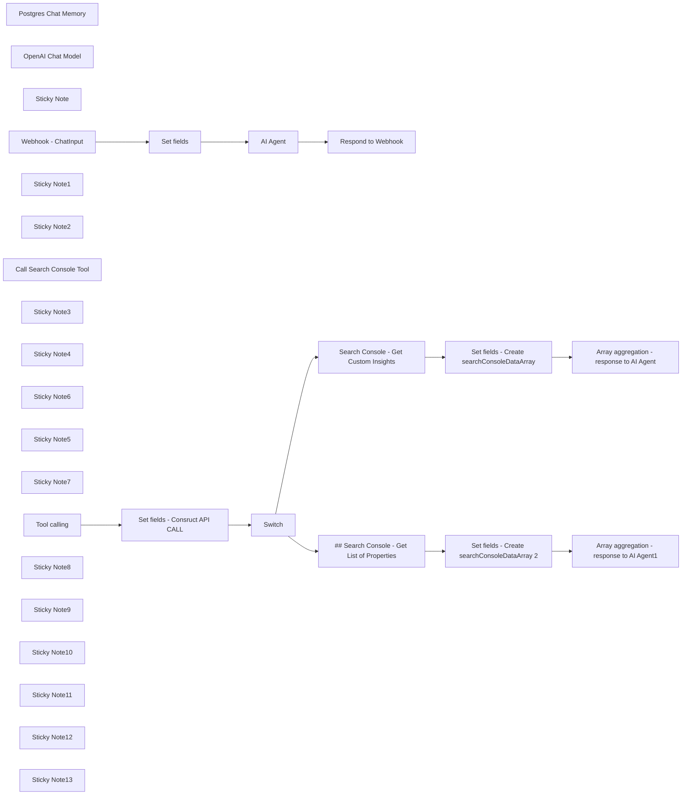

## Fluxo (.json) :

```json
{
  "id": "PoiRk5w0xd1ysq4U",
  "meta": {
    "instanceId": "b9faf72fe0d7c3be94b3ebff0778790b50b135c336412d28fd4fca2cbbf8d1f5",
    "templateCredsSetupCompleted": true
  },
  "name": "AI Agent to chat with you Search Console Data, using OpenAI and Postgres",
  "tags": [],
  "nodes": [
    {
      "id": "9ee6710b-19b7-4bfd-ac2d-0fe1e2561f1d",
      "name": "Postgres Chat Memory",
      "type": "@n8n/n8n-nodes-langchain.memoryPostgresChat",
      "position": [
        1796,
        220
      ],
      "parameters": {
        "tableName": "insights_chat_histories"
      },
      "credentials": {
        "postgres": {
          "id": "",
          "name": "Postgres"
        }
      },
      "typeVersion": 1.1
    },
    {
      "id": "eb9f07e9-ded1-485c-9bf3-cf223458384a",
      "name": "OpenAI Chat Model",
      "type": "@n8n/n8n-nodes-langchain.lmChatOpenAi",
      "position": [
        1356,
        240
      ],
      "parameters": {
        "model": "gpt-4o",
        "options": {
          "maxTokens": 16000
        }
      },
      "credentials": {
        "openAiApi": {
          "id": "",
          "name": "OpenAi"
        }
      },
      "typeVersion": 1
    },
    {
      "id": "1d3d6fb7-a171-4590-be42-df7eb0c208ed",
      "name": "Set fields",
      "type": "n8n-nodes-base.set",
      "position": [
        940,
        -20
      ],
      "parameters": {
        "options": {},
        "assignments": {
          "assignments": [
            {
              "id": "9f47b322-e42f-42d7-93eb-a57d22adb849",
              "name": "chatInput",
              "type": "string",
              "value": "={{ $json.body?.chatInput || $json.chatInput }}"
            },
            {
              "id": "73ec4dd0-e986-4f60-9dca-6aad2f86bdeb",
              "name": "sessionId",
              "type": "string",
              "value": "={{ $json.body?.sessionId || $json.sessionId }}"
            },
            {
              "id": "4b688c46-b60f-4f0a-83d8-e283f2d7055c",
              "name": "date_message",
              "type": "string",
              "value": "={{ $now.format('yyyy-MM-dd') }}"
            }
          ]
        }
      },
      "typeVersion": 3.4
    },
    {
      "id": "92dc5e8b-5140-49be-8713-5749b7e2d46b",
      "name": "Sticky Note",
      "type": "n8n-nodes-base.stickyNote",
      "position": [
        407.32142857142867,
        -320
      ],
      "parameters": {
        "color": 7,
        "width": 347.9910714285712,
        "height": 516.8973214285712,
        "content": "## Webhook - ChatInput\n\nThis webhook serves as the endpoint for receiving `ChatInput` data. Ensure that you include:\n- `chatInput` – the content you wish to send (😉)\n- `sessionId` – a unique identifier for the session\n\nIf you're using an interface such as **Open WebUI**, the `sessionId` will be generated automatically."
      },
      "typeVersion": 1
    },
    {
      "id": "ca9f3732-9b62-4f44-b970-77d5d470ec76",
      "name": "Webhook - ChatInput",
      "type": "n8n-nodes-base.webhook",
      "position": [
        500,
        -20
      ],
      "webhookId": "a6820b65-76cf-402b-a934-0f836dee6ba0",
      "parameters": {
        "path": "a6820b65-76cf-402b-a934-0f836dee6ba0/chat",
        "options": {},
        "httpMethod": "POST",
        "responseMode": "responseNode",
        "authentication": "basicAuth"
      },
      "credentials": {
        "httpBasicAuth": {
          "id": "",
          "name": "basic-auth"
        }
      },
      "typeVersion": 2
    },
    {
      "id": "9d684873-6dfe-4709-928d-293b187dfb30",
      "name": "Sticky Note1",
      "type": "n8n-nodes-base.stickyNote",
      "position": [
        820,
        -320
      ],
      "parameters": {
        "color": 7,
        "width": 347.9910714285712,
        "height": 516.8973214285712,
        "content": "## Set fields\n\nThis node sets three fields:\n- `chatInput`: retrieved from the previous webhook node\n- `sessionId`: retrieved from the previous webhook node\n- `date_message`: formatted within this node. This will be used later to help the AI agent determine the date range for retrieving Search Console data."
      },
      "typeVersion": 1
    },
    {
      "id": "8750215a-1e33-4ac8-a6da-95efa8ffed65",
      "name": "Respond to Webhook",
      "type": "n8n-nodes-base.respondToWebhook",
      "position": [
        2600,
        -20
      ],
      "parameters": {
        "options": {}
      },
      "typeVersion": 1.1
    },
    {
      "id": "1b879496-5c0f-4bd5-b4cb-18df2662aef2",
      "name": "Sticky Note2",
      "type": "n8n-nodes-base.stickyNote",
      "position": [
        1240,
        -320
      ],
      "parameters": {
        "color": 7,
        "width": 1154.2857142857138,
        "height": 516.8973214285712,
        "content": "## AI Agent - Tools Agent\n\nThis AI Agent is configured with a system prompt that instructs it to:\n- On the first user message, **retrieve available Search Console properties** and offer the user the option to **fetch data from these properties**\n- Based on the user’s natural language input, **construct an API call** to the selected Search Console property and retrieve the requested data\n- Present the data in a **markdown-formatted table**\n\nThe AI Agent has a friendly tone and is designed to **confirm the user’s data requirements accurately** before executing any API requests.\n"
      },
      "typeVersion": 1
    },
    {
      "id": "c44c6402-9ddd-4a7b-bc5a-b6c3679a3f68",
      "name": "Call Search Console Tool",
      "type": "@n8n/n8n-nodes-langchain.toolWorkflow",
      "position": [
        2196,
        220
      ],
      "parameters": {
        "name": "SearchConsoleRequestTool",
        "workflowId": {
          "__rl": true,
          "mode": "list",
          "value": "PoiRk5w0xd1ysq4U",
          "cachedResultName": "My workflow 10"
        },
        "description": "Call this tool when you need to get the website_list or custom_insights",
        "jsonSchemaExample": ""
      },
      "typeVersion": 1.2
    },
    {
      "id": "b1701a89-c5b3-47fb-99d5-4896a6d5c7a2",
      "name": "Sticky Note3",
      "type": "n8n-nodes-base.stickyNote",
      "position": [
        1234,
        220
      ],
      "parameters": {
        "color": 6,
        "width": 328.9664285714292,
        "height": 468.13107142857154,
        "content": "\n\n\n\n\n\n\n\n\n\n\n### AI Agent Sub-node - OpenAI Chat Model\n\nThis sub-node utilizes the selected **OpenAI Chat Model**. You can replace it with any LLM that **supports tool calling**.\n\n### ⚠️ Choose Your Model\nIn this template, the **default model is `gpt-4o`**, a **costly option**. If you'd like a more **affordable alternative**, select `gpt4-o-mini`, though note that responses may occasionally be of slightly lower quality compared to `gpt-4o`."
      },
      "typeVersion": 1
    },
    {
      "id": "cd1a7cec-5845-47b1-a2c8-d3b458a02eb0",
      "name": "Sticky Note4",
      "type": "n8n-nodes-base.stickyNote",
      "position": [
        1656,
        220
      ],
      "parameters": {
        "color": 6,
        "width": 328.9664285714292,
        "height": 468.13107142857154,
        "content": "\n\n\n\n\n\n\n\n\n\n\n### AI Agent Sub-node - Postgres Chat Memory\n\nConnect your **Postgres credentials** and specify a **table name** to store the chat history. In this template, the default table name is `insights_chat_histories`, and the **context window length is set to 5**.\n\n**👋 Tip:** If you don’t have a Postgres database, you can quickly **set one up with [Supabase](https://supabase.com/)**.\n"
      },
      "typeVersion": 1
    },
    {
      "id": "290a07d1-c7ed-434d-9851-2a2dcdd35bdf",
      "name": "Sticky Note6",
      "type": "n8n-nodes-base.stickyNote",
      "position": [
        2076,
        220
      ],
      "parameters": {
        "color": 6,
        "width": 328.9664285714292,
        "height": 468.13107142857154,
        "content": "\n\n\n\n\n\n\n\n\n\n\n### AI Agent Sub-node - Call Search Console Tool\n\nThis **tool is used by the AI Agent** to:\n- Retrieve the **list of accessible properties in Search Console**\n- **Fetch Search Console data** based on the user’s natural language request\n\n"
      },
      "typeVersion": 1
    },
    {
      "id": "07805c90-7ba5-44d0-b6eb-5a65efb0f8be",
      "name": "Sticky Note5",
      "type": "n8n-nodes-base.stickyNote",
      "position": [
        2480,
        -320
      ],
      "parameters": {
        "color": 7,
        "width": 347.9910714285712,
        "height": 516.8973214285712,
        "content": "## Respond to Webhook\n\nThis node is used to send a response back to the user.\n\n**👋 Tip:** `intermediateSteps` are configured, allowing you to use raw data fetched from Search Console to **create charts or other visualizations** if desired.\n"
      },
      "typeVersion": 1
    },
    {
      "id": "9a927a40-45e4-4fd5-ab3e-b77578469f82",
      "name": "Sticky Note7",
      "type": "n8n-nodes-base.stickyNote",
      "position": [
        400,
        800
      ],
      "parameters": {
        "color": 7,
        "width": 370.3910714285712,
        "height": 492.3973214285712,
        "content": "## Tool Call Trigger\n\nThis **node is triggered when the AI Agent needs to retrieve the `website_list`** (accessible Search Console properties) or **`custom_insights`** based on user data.\n"
      },
      "typeVersion": 1
    },
    {
      "id": "c54a4653-0f09-46b0-bd20-68919b96e154",
      "name": "Tool calling",
      "type": "n8n-nodes-base.executeWorkflowTrigger",
      "position": [
        500,
        1080
      ],
      "parameters": {},
      "typeVersion": 1
    },
    {
      "id": "cc7303ee-1afa-4859-83e7-3af0e963a0f1",
      "name": "Switch",
      "type": "n8n-nodes-base.switch",
      "position": [
        1300,
        1080
      ],
      "parameters": {
        "rules": {
          "values": [
            {
              "outputKey": "custom_insights",
              "conditions": {
                "options": {
                  "version": 2,
                  "leftValue": "",
                  "caseSensitive": true,
                  "typeValidation": "strict"
                },
                "combinator": "and",
                "conditions": [
                  {
                    "id": "a30fe6a6-7d0a-4f14-8492-ae021ddc8ec6",
                    "operator": {
                      "type": "string",
                      "operation": "contains"
                    },
                    "leftValue": "={{ $json.request_type }}",
                    "rightValue": "custom_insights"
                  }
                ]
              },
              "renameOutput": true
            },
            {
              "outputKey": "website_list",
              "conditions": {
                "options": {
                  "version": 2,
                  "leftValue": "",
                  "caseSensitive": true,
                  "typeValidation": "strict"
                },
                "combinator": "and",
                "conditions": [
                  {
                    "id": "1b7d6039-6474-4a73-b157-584743a9d7f0",
                    "operator": {
                      "type": "string",
                      "operation": "contains"
                    },
                    "leftValue": "={{$json.request_type}}",
                    "rightValue": "website_list"
                  }
                ]
              },
              "renameOutput": true
            }
          ]
        },
        "options": {}
      },
      "typeVersion": 3.2
    },
    {
      "id": "6860ff98-4050-4f64-b8c1-a153e3388df0",
      "name": "Set fields - Consruct API CALL",
      "type": "n8n-nodes-base.set",
      "position": [
        920,
        1080
      ],
      "parameters": {
        "options": {},
        "assignments": {
          "assignments": [
            {
              "id": "06373437-8288-4171-9f98-e8a417220dd4",
              "name": "request_type",
              "type": "string",
              "value": "={{ $json.query.parseJson().request_type }}"
            },
            {
              "id": "da45c0c5-05f6-4107-81aa-8c08c972d9bf",
              "name": "start_date",
              "type": "string",
              "value": "={{ $json.query.parseJson().startDate }}"
            },
            {
              "id": "59d55034-c612-43d7-9700-4cacdb630ec2",
              "name": "end_date",
              "type": "string",
              "value": "={{ $json.query.parseJson().endDate }}"
            },
            {
              "id": "4c2478c0-7f96-4d3d-a632-089307dc989e",
              "name": "dimensions",
              "type": "string",
              "value": "={{ $json.query.parseJson().dimensions }}"
            },
            {
              "id": "eceefbf9-44e5-4617-96ea-58aca2a29618",
              "name": "rowLimit",
              "type": "number",
              "value": "={{ $json.query.parseJson().rowLimit }}"
            },
            {
              "id": "4e18386e-8548-4385-b620-43efbb11cd63",
              "name": "startRow",
              "type": "number",
              "value": "={{ $json.query.parseJson().startRow}}"
            },
            {
              "id": "a9323a7b-08b4-4015-b3d7-632bcdf56f4e",
              "name": "property",
              "type": "string",
              "value": "={{ encodeURIComponent($json.query.parseJson().property) }}"
            }
          ]
        }
      },
      "typeVersion": 3.4
    },
    {
      "id": "0a2dfb28-17ee-477f-b9ea-f1d8e05e3745",
      "name": "Sticky Note8",
      "type": "n8n-nodes-base.stickyNote",
      "position": [
        820,
        800
      ],
      "parameters": {
        "color": 7,
        "width": 370.3910714285712,
        "height": 492.3973214285712,
        "content": "## Set Fields - Construct API Call\n\nThis node configures fields based on the JSON sent by the AI agent:\n- The `request_type` field determines the route: `website_list` (to retrieve the list of websites) or `custom_insights` (to get insights from Search Console)\n- Additional fields are set to construct the API call, following the **[Search Console API Documentation](https://developers.google.com/webmaster-tools/v1/searchanalytics/query?hl=en)**\n"
      },
      "typeVersion": 1
    },
    {
      "id": "e6ef5c28-01e4-4a0b-9081-b62ec28be635",
      "name": "Set fields - Create searchConsoleDataArray",
      "type": "n8n-nodes-base.set",
      "position": [
        2180,
        980
      ],
      "parameters": {
        "options": {},
        "assignments": {
          "assignments": [
            {
              "id": "2cffd36f-72bd-4535-8427-a88028ea0c4c",
              "name": "searchConsoleData",
              "type": "array",
              "value": "={{ $json.rows }}"
            }
          ]
        }
      },
      "typeVersion": 3.4
    },
    {
      "id": "abc80061-a794-4e1d-a055-bd88ea5c93eb",
      "name": "Set fields - Create searchConsoleDataArray 2",
      "type": "n8n-nodes-base.set",
      "position": [
        2180,
        1340
      ],
      "parameters": {
        "options": {},
        "assignments": {
          "assignments": [
            {
              "id": "2cffd36f-72bd-4535-8427-a88028ea0c4c",
              "name": "searchConsoleData",
              "type": "array",
              "value": "={{ $json.siteEntry }}"
            }
          ]
        }
      },
      "typeVersion": 3.4
    },
    {
      "id": "24981eea-980e-4e07-9036-d0042c5b2fbe",
      "name": "Search Console - Get Custom Insights",
      "type": "n8n-nodes-base.httpRequest",
      "position": [
        1620,
        980
      ],
      "parameters": {
        "url": "=https://www.googleapis.com/webmasters/v3/sites/{{ $json.property }}/searchAnalytics/query",
        "method": "POST",
        "options": {},
        "jsonBody": "={\n \"startDate\": \"{{ $json.start_date }}\",\n \"endDate\": \"{{ $json.end_date }}\",\n \"dimensions\": {{ $json.dimensions }},\n \"rowLimit\": {{ $json.rowLimit }},\n \"startRow\": 0,\n \"dataState\":\"all\"\n}",
        "sendBody": true,
        "sendQuery": true,
        "sendHeaders": true,
        "specifyBody": "json",
        "authentication": "genericCredentialType",
        "genericAuthType": "oAuth2Api",
        "queryParameters": {
          "parameters": [
            {}
          ]
        },
        "headerParameters": {
          "parameters": [
            {
              "name": "Content-Type",
              "value": "application/json"
            }
          ]
        }
      },
      "credentials": {
        "oAuth2Api": {
          "id": "",
          "name": "search-console"
        }
      },
      "typeVersion": 4.2
    },
    {
      "id": "645ff407-857d-4629-926b-5cfc52cfa8ba",
      "name": "Sticky Note9",
      "type": "n8n-nodes-base.stickyNote",
      "position": [
        1520,
        800
      ],
      "parameters": {
        "color": 7,
        "width": 370.3910714285712,
        "height": 364.3185243941325,
        "content": "## Search Console - Get Custom Insights\n\nThis node **performs the API call to retrieve data from Search Console**.\n"
      },
      "typeVersion": 1
    },
    {
      "id": "15aa66e2-f288-4c86-8dad-47e22aa9104f",
      "name": "Sticky Note10",
      "type": "n8n-nodes-base.stickyNote",
      "position": [
        1520,
        1180
      ],
      "parameters": {
        "color": 7,
        "width": 370.3910714285712,
        "height": 334.24982142857124,
        "content": "## Search Console - Get List of Properties\n\nThis node **performs the API call to retrieve the list of accessible properties from Search Console**.\n"
      },
      "typeVersion": 1
    },
    {
      "id": "cd804a52-833a-451a-8e0c-f640210ee2c4",
      "name": "## Search Console - Get List of Properties",
      "type": "n8n-nodes-base.httpRequest",
      "position": [
        1620,
        1340
      ],
      "parameters": {
        "url": "=https://www.googleapis.com/webmasters/v3/sites",
        "options": {},
        "sendHeaders": true,
        "authentication": "genericCredentialType",
        "genericAuthType": "oAuth2Api",
        "headerParameters": {
          "parameters": [
            {
              "name": "Content-Type",
              "value": "application/json"
            }
          ]
        }
      },
      "credentials": {
        "oAuth2Api": {
          "id": "",
          "name": "search-console"
        }
      },
      "typeVersion": 4.2
    },
    {
      "id": "3eac4df1-00ac-4262-b520-3a7e218c7e57",
      "name": "Sticky Note11",
      "type": "n8n-nodes-base.stickyNote",
      "position": [
        2040,
        800
      ],
      "parameters": {
        "color": 7,
        "width": 370.3910714285712,
        "height": 725.1298214285712,
        "content": "## Set Fields - Create `searchConsoleDataArray`\n\nThese nodes **create an array based on the response from the Search Console API**.\n"
      },
      "typeVersion": 1
    },
    {
      "id": "86db5800-a735-4749-a800-63d78908610b",
      "name": "Sticky Note12",
      "type": "n8n-nodes-base.stickyNote",
      "position": [
        2520,
        800
      ],
      "parameters": {
        "color": 7,
        "width": 370.3910714285712,
        "height": 722.6464176100125,
        "content": "## Array Aggregation - Response to AI Agent\n\nThese nodes **aggregate the array from the previous** step and send it back to the AI Agent through the field named output as `response`.\n"
      },
      "typeVersion": 1
    },
    {
      "id": "aefbacc7-8dfc-4655-bc4d-f0498c823711",
      "name": "Array aggregation - response to AI Agent",
      "type": "n8n-nodes-base.aggregate",
      "position": [
        2640,
        980
      ],
      "parameters": {
        "options": {},
        "aggregate": "aggregateAllItemData",
        "destinationFieldName": "response"
      },
      "typeVersion": 1
    },
    {
      "id": "e5334c72-981c-4375-ae8e-9a3a0457880b",
      "name": "Array aggregation - response to AI Agent1",
      "type": "n8n-nodes-base.aggregate",
      "position": [
        2660,
        1340
      ],
      "parameters": {
        "options": {},
        "aggregate": "aggregateAllItemData",
        "destinationFieldName": "response"
      },
      "typeVersion": 1
    },
    {
      "id": "2e93a798-6c26-4d34-a553-ba01b64ca3fe",
      "name": "Sticky Note13",
      "type": "n8n-nodes-base.stickyNote",
      "position": [
        -398.45627799387194,
        -320
      ],
      "parameters": {
        "width": 735.5589746610085,
        "height": 1615.4504601771982,
        "content": "# AI Agent to Chat with Your Search Console Data\n\nThis **AI Agent enables you to interact with your Search Console data** through a **chat interface**. Each node is **documented within the template**, providing sufficient information for setup and usage. You will also need to **configure Search Console OAuth credentials**.\n\nFollow this **[n8n documentation](https://docs.n8n.io/integrations/builtin/credentials/google/oauth-generic/#configure-your-oauth-consent-screen)** to set up the OAuth credentials.\n\n## Important Notes\n\n### Correctly Configure Scopes for Search Console API Calls\n- It’s essential to **configure the scopes correctly** in your Google Search Console API OAuth2 credentials. Incorrect **configuration can cause issues with the refresh token**, requiring frequent reconnections. Below is the configuration I use to **avoid constant re-authentication**:\n\n\n\nOf course, you'll need to add your **client_id** and **client_secret** from the **Google Cloud Platform app** you created to access your Search Console data.\n\n### Configure Authentication for the Webhook\n\nSince the **webhook will be publicly accessible**, don’t forget to **set up authentication**. I’ve used **Basic Auth**, but feel free to **choose the method that best meets your security requirements**.\n\n## 🤩💖 Example of awesome things you can do with this AI Agent\n\n\n\n"
      },
      "typeVersion": 1
    },
    {
      "id": "fa630aa9-3c60-4b27-9477-aaeb79c7f37d",
      "name": "AI Agent",
      "type": "@n8n/n8n-nodes-langchain.agent",
      "position": [
        1676,
        -20
      ],
      "parameters": {
        "text": "=user_message : {{ $json.chatInput }}\ndate_message : {{ $json.date_message }}",
        "options": {
          "systemMessage": "=Assist users by asking natural, conversational questions to understand their data needs and building a custom JSON API request to retrieve Search Console data. Handle assumptions internally, confirming them with the user in a friendly way. Avoid technical jargon and never imply that the user is directly building an API request.\n\nPre-Step: Retrieve the Website List\nImportant: Initial Action: Before sending your first message to the user, retrieve the list of connected Search Console properties.\n\nTool Call for Website List:\n\nTool name: SearchConsoleRequestTool\nRequest:\n{\n \"request_type\": \"website_list\" // Always include `request_type` in the API call.\n}\nUsage: Use this list to personalize your response in the initial interaction.\nStep-by-Step Guide\nStep 1: Initial Interaction and Introduction\nGreeting:\n\n\"Hi there! I’m here to help you gain valuable insights from your Search Console data. Whether you're interested in a specific time frame, performance breakdown by pages, queries, or other dimensions, I've got you covered.\n\nI can help you retrieve data for these websites:\n\nhttps://example1.com\nhttps://example2.com\nhttps://example3.com\nWhich of these properties would you like to analyze?\"\nStep 2: Handling User Response for Property Selection\nAction: When the user selects a property, use the property URL exactly as listed (e.g., \"https://example.com\") when constructing the API call.\n\nStep 3: Understanding the User's Needs\nAcknowledgment and Setting Defaults:\n\nIf the user expresses a general need (e.g., \"I want the last 3 months of page performance\"), acknowledge their request and set reasonable defaults.\n\nExample Response:\n\n\"Great! I'll gather the top 300 queries from the last 3 months for https://example.com. If you'd like more details or adjustments, just let me know.\"\n\nFollow-up Questions:\n\nConfirming Dimensions: If the user doesn’t specify dimensions, ask:\n\n\"For this analysis, I’ll look at page performance. Does that sound good, or would you like to include other details like queries, devices, or other dimensions?\"\n\nNumber of Results: If the user hasn’t specified the number of results, confirm:\n\n\"I can show you the top 100 results. Let me know if you'd like more or fewer!\"\n\nStep 4: Gathering Specific Inputs (If Necessary)\nAction: If the user provides specific needs, capture and confirm them naturally.\n\nExample Response:\n\n\"Perfect, I’ll pull the data for [specified date range], focusing on [specified dimensions]. Anything else you’d like me to include?\"\n\nImplicit Defaults:\n\nDate Range: Assume \"last 3 months\" if not specified.\nRow Limit: Default to 100, adjustable based on user input.\nStep 5: Confirming Input with the User\nAction: Summarize the request to ensure accuracy.\n\nExample Response:\n\n\"Here’s what I’m preparing: data for https://example.com, covering the last 3 months, focusing on the top 100 queries. Let me know if you’d like to adjust anything!\"\n\nStep 6: Constructing the JSON for Custom Insights\nAction: Build the API call based on the conversation.\n\n{\n \"property\": \"<USER_PROVIDED_PROPERTY_URL>\", // Use the exact property URL.\n \"request_type\": \"custom_insights\",\n \"startDate\": \"<ASSUMED_OR_USER_SPECIFIED_START_DATE>\",\n \"endDate\": \"<ASSUMED_OR_USER_SPECIFIED_END_DATE>\",\n \"dimensions\": [\"<IMPLIED_OR_USER_SPECIFIED_DIMENSIONS>\"], // Array of one or more: \"page\", \"query\", \"searchAppearance\", \"device\", \"country\"\n \"rowLimit\": 300 // Default or user-specified limit.\n}\nStep 7: Presenting the Data\nWhen Retrieving Custom Insights:\n\nImportant: Display all retrieved data in an easy-to-read markdown table format.\nStep 8: Error Handling\nAction: Provide clear, user-friendly error messages when necessary.\n\nExample Response:\n\n\"Hmm, there seems to be an issue retrieving the data. Let’s review what we have or try a different approach.\"\n\nAdditional Notes\nProactive Assistance: Offer suggestions based on user interactions, such as adding dimensions or refining details.\nTone: Maintain a friendly and helpful demeanor throughout the conversation.",
          "returnIntermediateSteps": true
        },
        "promptType": "define"
      },
      "typeVersion": 1.6
    }
  ],
  "active": true,
  "pinData": {},
  "settings": {
    "executionOrder": "v1"
  },
  "versionId": "abda3766-7d18-46fb-83e7-c2343ff26385",
  "connections": {
    "Switch": {
      "main": [
        [
          {
            "node": "Search Console - Get Custom Insights",
            "type": "main",
            "index": 0
          }
        ],
        [
          {
            "node": "## Search Console - Get List of Properties",
            "type": "main",
            "index": 0
          }
        ]
      ]
    },
    "AI Agent": {
      "main": [
        [
          {
            "node": "Respond to Webhook",
            "type": "main",
            "index": 0
          }
        ]
      ]
    },
    "Set fields": {
      "main": [
        [
          {
            "node": "AI Agent",
            "type": "main",
            "index": 0
          }
        ]
      ]
    },
    "Tool calling": {
      "main": [
        [
          {
            "node": "Set fields - Consruct API CALL",
            "type": "main",
            "index": 0
          }
        ]
      ]
    },
    "OpenAI Chat Model": {
      "ai_languageModel": [
        [
          {
            "node": "AI Agent",
            "type": "ai_languageModel",
            "index": 0
          }
        ]
      ]
    },
    "Webhook - ChatInput": {
      "main": [
        [
          {
            "node": "Set fields",
            "type": "main",
            "index": 0
          }
        ]
      ]
    },
    "Postgres Chat Memory": {
      "ai_memory": [
        [
          {
            "node": "AI Agent",
            "type": "ai_memory",
            "index": 0
          }
        ]
      ]
    },
    "Call Search Console Tool": {
      "ai_tool": [
        [
          {
            "node": "AI Agent",
            "type": "ai_tool",
            "index": 0
          }
        ]
      ]
    },
    "Set fields - Consruct API CALL": {
      "main": [
        [
          {
            "node": "Switch",
            "type": "main",
            "index": 0
          }
        ]
      ]
    },
    "Search Console - Get Custom Insights": {
      "main": [
        [
          {
            "node": "Set fields - Create searchConsoleDataArray",
            "type": "main",
            "index": 0
          }
        ]
      ]
    },
    "## Search Console - Get List of Properties": {
      "main": [
        [
          {
            "node": "Set fields - Create searchConsoleDataArray 2",
            "type": "main",
            "index": 0
          }
        ]
      ]
    },
    "Set fields - Create searchConsoleDataArray": {
      "main": [
        [
          {
            "node": "Array aggregation - response to AI Agent",
            "type": "main",
            "index": 0
          }
        ]
      ]
    },
    "Set fields - Create searchConsoleDataArray 2": {
      "main": [
        [
          {
            "node": "Array aggregation - response to AI Agent1",
            "type": "main",
            "index": 0
          }
        ]
      ]
    }
  }
}
```

<a id="template-1525"></a>

## Template 1525 - Geração de histórias animadas por IA

- **Nome:** Geração de histórias animadas por IA
- **Descrição:** Gera uma história curta e três prompts via GPT-4o-mini, cria imagens a partir desses prompts, transforma cada imagem em vídeo e compõe um vídeo final usando um template.
- **Funcionalidade:** • Geração de roteiro e prompts: Cria título e três prompts de imagem a partir de parâmetros de estilo, personagem e contexto.
• Criação de imagens: Envia os prompts para um serviço de geração de imagens e obtém URLs temporárias das imagens geradas.
• Conversão em vídeo: Transforma cada imagem em um clipe animado usando um serviço de vídeo a partir de imagem.
• Monitoramento assíncrono: Aguarda e verifica o status das tarefas de geração de imagens e vídeos até conclusão ou falha.
• Coleta de recursos: Agrega URLs das imagens e vídeos finalizados para uso posterior.
• Composição final: Substitui fontes em um template e solicita a renderização do vídeo final com título e clipes gerados.
• Parametrização inicial: Aceita entradas básicas (chave de API, estilo, personagem e palavras-chave situacionais) para controlar o resultado.
- **Ferramentas:** • GPT-4o-mini: Modelo de linguagem usado para gerar o título, história curta e os três prompts de imagem.
• Midjourney: Serviço de geração de imagens utilizado para criar as ilustrações a partir dos prompts.
• Kling: Serviço de geração de vídeo que transforma imagens estáticas em clipes animados.
• Creatomate: Plataforma de composição e renderização que monta os clipes e texto em um vídeo final usando template.
• PIAPI.ai: Interface/API utilizada para orquestrar chamadas aos modelos e serviços (encaminhando tarefas de imagem, vídeo e chat).

## Fluxo visual

```mermaid
flowchart LR
    N1["output1"]
    N2["output2"]
    N3["Get Prompt"]
    N4["Basic Params"]
    N5["Get Task ID of the First Image"]
    N6["Midjourney Generator of the First Image"]
    N7["Wait for the First Image Generation"]
    N8["Verify the first image generation status"]
    N9["Get the First Image URL"]
    N10["Midjourney Generator of the Second Image"]
    N11["Midjourney Generator of the Third Image"]
    N12["Get the First Image Generation Status"]
    N13["Get the Second Image Generation Status"]
    N14["Get the Third Image Generation Status"]
    N15["Get the Second Image URL"]
    N16["Get the Third Image URL"]
    N17["Wait for the Second Image Generation"]
    N18["Get Task of the First Image"]
    N19["Get Task of the Second Image"]
    N20["Verify the second image generation status"]
    N21["Verify the third image generation status"]
    N22["Get Task of the Third Image"]
    N23["Wait for the Third Image Generation"]
    N24["Get three Image URLs"]
    N25["Generate the First Video"]
    N26["Generate the Second Video"]
    N27["Generate the Third Video"]
    N28["Final Video Combination"]
    N29["Get the Third Video URL"]
    N30["Get Video Task IDs"]
    N31["Get the First Video Task"]
    N32["Verify the First Video Generation"]
    N33["Verify the Second Video Generation"]
    N34["Verify the Third Video Generation"]
    N35["Wait for Video Generation for at Least 4 min"]
    N36["Wait for the First Video Generation"]
    N37["Wait for the Second Video Generation"]
    N38["Wait for the Third Video Generation"]
    N39["Get the First Video Generation"]
    N40["Get the Second Video Generation"]
    N41["Get the Third Video Generation"]
    N42["Get the Second Video Task"]
    N43["Get the Third Video Task"]
    N44["Sticky Note"]
    N45["When clicking Test workflow"]
    N46["GPT-4o-mini Generate Image Scenario Prompt"]
    N47["Sticky Note1"]
    N48["Sticky Note2"]
    N49["Sticky Note3"]
    N50["Sticky Note4"]
    N51["Sticky Note5"]

    N1 --> N42
    N2 --> N43
    N3 --> N6
    N4 --> N46
    N30 --> N35
    N24 --> N25
    N9 --> N10
    N16 --> N24
    N29 --> N28
    N25 --> N26
    N27 --> N30
    N31 --> N32
    N15 --> N11
    N43 --> N34
    N26 --> N27
    N42 --> N33
    N18 --> N8
    N22 --> N21
    N45 --> N4
    N19 --> N20
    N5 --> N7
    N39 --> N1
    N41 --> N29
    N40 --> N2
    N32 --> N39
    N32 --> N36
    N34 --> N41
    N34 --> N38
    N33 --> N40
    N33 --> N37
    N7 --> N18
    N36 --> N31
    N23 --> N22
    N38 --> N43
    N17 --> N19
    N37 --> N42
    N12 --> N9
    N14 --> N16
    N13 --> N15
    N6 --> N5
    N11 --> N23
    N10 --> N17
    N8 --> N12
    N8 --> N7
    N21 --> N14
    N21 --> N23
    N20 --> N13
    N20 --> N17
    N46 --> N3
    N35 --> N31
```

## Fluxo (.json) :

```json
{
  "id": "MfKB97VVSuXMo3Fm",
  "meta": {
    "instanceId": "1e003a7ea4715b6b35e9947791386a7d07edf3b5bf8d4c9b7ee4fdcbec0447d7"
  },
  "name": "Create Animated Stories using GPT-4o-mini, Midjourney, Kling and Creatomate API",
  "tags": [],
  "nodes": [
    {
      "id": "4e9ed246-e4d7-4a9f-9bb1-cf74e16c3c6f",
      "name": "output1",
      "type": "n8n-nodes-base.set",
      "position": [
        3980,
        260
      ],
      "parameters": {
        "options": {},
        "assignments": {
          "assignments": [
            {
              "id": "0107a930-1d7a-459c-a3ab-ceb28b43b8b8",
              "name": "video1",
              "type": "string",
              "value": "={{ $json.data.output.video_url }}"
            }
          ]
        }
      },
      "typeVersion": 3.4
    },
    {
      "id": "d696b66a-3726-4fe5-989e-9405b53c62e1",
      "name": "output2",
      "type": "n8n-nodes-base.set",
      "position": [
        4680,
        240
      ],
      "parameters": {
        "options": {},
        "assignments": {
          "assignments": [
            {
              "id": "0107a930-1d7a-459c-a3ab-ceb28b43b8b8",
              "name": "video2",
              "type": "string",
              "value": "={{ $json.data.output.video_url }}"
            }
          ]
        }
      },
      "typeVersion": 3.4
    },
    {
      "id": "33e054fb-b747-4227-9884-f020e78ef5d5",
      "name": "Get Prompt",
      "type": "n8n-nodes-base.code",
      "position": [
        600,
        -80
      ],
      "parameters": {
        "jsCode": "const content = $input.first().json.choices[0].message.content;\n\nconst prompts = JSON.parse(content);\n\nreturn { prompts };"
      },
      "typeVersion": 2
    },
    {
      "id": "af4dee94-7bb0-4cb9-9372-a2a1e96d0b19",
      "name": "Basic Params",
      "type": "n8n-nodes-base.set",
      "position": [
        220,
        -80
      ],
      "parameters": {
        "mode": "raw",
        "options": {},
        "jsonOutput": "{\n  \"x-api-key\":\"\",\n  \"style\": \"a children’s book cover, ages 6-10. --s 500 --sref 4028286908  --niji 6\",\n  \"character\": \"A gentle girl and a fluffy rabbit explore a sunlit forest together, playing by a sparkling stream\",\n  \"situational_keywords\": \"Butterflies flutter around them as golden sunlight filters through green leaves. Warm and peaceful atmosphere\"\n}\n"
      },
      "typeVersion": 3.4
    },
    {
      "id": "c0890cdd-642a-48cd-b770-05fbae86abb4",
      "name": "Get Task ID of the First Image",
      "type": "n8n-nodes-base.set",
      "position": [
        380,
        140
      ],
      "parameters": {
        "options": {},
        "assignments": {
          "assignments": [
            {
              "id": "d52d19d1-3a37-47bb-ad23-e809323c0c54",
              "name": "image1",
              "type": "string",
              "value": "={{ $('Midjourney Generator of the First Image').item.json.data.task_id }}"
            }
          ]
        }
      },
      "typeVersion": 3.4
    },
    {
      "id": "a2d1e854-53c3-4115-a206-f55c2cff54f1",
      "name": "Midjourney Generator of the First Image",
      "type": "n8n-nodes-base.httpRequest",
      "position": [
        160,
        140
      ],
      "parameters": {
        "url": "https://api.piapi.ai/api/v1/task",
        "method": "POST",
        "options": {},
        "jsonBody": "={\n  \"model\": \"midjourney\",\n  \"task_type\": \"imagine\",\n  \"input\": {\n    \"prompt\": \"{{ $('Basic Params').item.json.character }},{{ $json.prompts.prompt1 }},{{ $('Basic Params').item.json.style }}\",\n    \"aspect_ratio\": \"2:3\",\n    \"process_mode\": \"turbo\",\n    \"skip_prompt_check\": false\n  }\n}",
        "sendBody": true,
        "sendHeaders": true,
        "specifyBody": "json",
        "headerParameters": {
          "parameters": [
            {
              "name": "x-api-key",
              "value": "={{ $('Basic Params').item.json['x-api-key'] }}"
            }
          ]
        }
      },
      "typeVersion": 4.2
    },
    {
      "id": "ac342912-7d94-4019-a0c8-43b555d8566f",
      "name": "Wait for the First Image Generation",
      "type": "n8n-nodes-base.wait",
      "position": [
        220,
        400
      ],
      "webhookId": "af79053d-1291-4dd2-889e-4593dbbb2512",
      "parameters": {},
      "typeVersion": 1.1
    },
    {
      "id": "cd774311-252a-43ec-aaea-28eb7d87ccc1",
      "name": "Verify the first image generation status",
      "type": "n8n-nodes-base.if",
      "position": [
        600,
        400
      ],
      "parameters": {
        "options": {},
        "conditions": {
          "options": {
            "version": 2,
            "leftValue": "",
            "caseSensitive": true,
            "typeValidation": "strict"
          },
          "combinator": "or",
          "conditions": [
            {
              "id": "e97a02cc-8d1d-4500-bce5-0a296c792b76",
              "operator": {
                "name": "filter.operator.equals",
                "type": "string",
                "operation": "equals"
              },
              "leftValue": "={{ $json.data.status }}",
              "rightValue": "completed"
            },
            {
              "id": "50b63a7a-52b5-4766-a859-96ac1ff949ec",
              "operator": {
                "name": "filter.operator.equals",
                "type": "string",
                "operation": "equals"
              },
              "leftValue": "={{ $json.data.status }}",
              "rightValue": "failed"
            }
          ]
        }
      },
      "typeVersion": 2.2
    },
    {
      "id": "a4b8ce31-0ffd-4c9a-b102-162139fa553b",
      "name": "Get the First Image URL",
      "type": "n8n-nodes-base.set",
      "position": [
        1000,
        200
      ],
      "parameters": {
        "options": {},
        "assignments": {
          "assignments": [
            {
              "id": "d52d19d1-3a37-47bb-ad23-e809323c0c54",
              "name": "image_urls1",
              "type": "array",
              "value": "={{ $json.data.output.temporary_image_urls }}"
            },
            {
              "id": "f519111b-5cb4-4562-bb8c-944a500e2df3",
              "name": "",
              "type": "string",
              "value": ""
            }
          ]
        }
      },
      "typeVersion": 3.4
    },
    {
      "id": "c28e46a7-999c-4a63-a3ae-aa813d7669cd",
      "name": "Midjourney Generator of the Second Image",
      "type": "n8n-nodes-base.httpRequest",
      "position": [
        1220,
        200
      ],
      "parameters": {
        "url": "https://api.piapi.ai/api/v1/task",
        "method": "POST",
        "options": {},
        "jsonBody": "={\n  \"model\": \"midjourney\",\n  \"task_type\": \"imagine\",\n  \"input\": {\n    \"prompt\": \"{{ $('Basic Params').item.json.character }},{{ $('Get Prompt').item.json.prompts.prompt2 }},{{ $('Basic Params').item.json.style }}\",\n    \"aspect_ratio\": \"2:3\",\n    \"process_mode\": \"turbo\",\n    \"skip_prompt_check\": false\n  }\n}",
        "sendBody": true,
        "sendHeaders": true,
        "specifyBody": "json",
        "headerParameters": {
          "parameters": [
            {
              "name": "x-api-key",
              "value": "={{ $('Basic Params').item.json['x-api-key'] }}"
            }
          ]
        }
      },
      "typeVersion": 4.2
    },
    {
      "id": "529f0561-d29f-4df2-b61d-0720d33bf6b9",
      "name": "Midjourney Generator of the Third Image",
      "type": "n8n-nodes-base.httpRequest",
      "position": [
        1920,
        220
      ],
      "parameters": {
        "url": "https://api.piapi.ai/api/v1/task",
        "method": "POST",
        "options": {},
        "jsonBody": "={\n  \"model\": \"midjourney\",\n  \"task_type\": \"imagine\",\n  \"input\": {\n    \"prompt\": \"{{ $('Basic Params').item.json.character }},{{ $('Get Prompt').item.json.prompts.prompt3 }},{{ $('Basic Params').item.json.style }}\",\n    \"aspect_ratio\": \"2:3\",\n    \"process_mode\": \"turbo\",\n    \"skip_prompt_check\": false\n  }\n}",
        "sendBody": true,
        "sendHeaders": true,
        "specifyBody": "json",
        "headerParameters": {
          "parameters": [
            {
              "name": "x-api-key",
              "value": "={{ $('Basic Params').item.json['x-api-key'] }}"
            }
          ]
        }
      },
      "typeVersion": 4.2
    },
    {
      "id": "a1a0b0f4-ac4e-4eca-9aa4-52f815731875",
      "name": "Get the First Image Generation Status",
      "type": "n8n-nodes-base.switch",
      "position": [
        800,
        200
      ],
      "parameters": {
        "rules": {
          "values": [
            {
              "conditions": {
                "options": {
                  "version": 2,
                  "leftValue": "",
                  "caseSensitive": true,
                  "typeValidation": "strict"
                },
                "combinator": "and",
                "conditions": [
                  {
                    "id": "5f61ee56-4ebe-411f-95e6-b47d9741e7a2",
                    "operator": {
                      "type": "string",
                      "operation": "equals"
                    },
                    "leftValue": "={{ $json.data.status }}",
                    "rightValue": "completed"
                  }
                ]
              }
            }
          ]
        },
        "options": {}
      },
      "typeVersion": 3.2
    },
    {
      "id": "6f2b83a9-2557-461e-9d5b-9f96440182f0",
      "name": "Get the Second Image Generation Status",
      "type": "n8n-nodes-base.switch",
      "position": [
        1480,
        220
      ],
      "parameters": {
        "rules": {
          "values": [
            {
              "conditions": {
                "options": {
                  "version": 2,
                  "leftValue": "",
                  "caseSensitive": true,
                  "typeValidation": "strict"
                },
                "combinator": "and",
                "conditions": [
                  {
                    "id": "5f61ee56-4ebe-411f-95e6-b47d9741e7a2",
                    "operator": {
                      "type": "string",
                      "operation": "equals"
                    },
                    "leftValue": "={{ $json.data.status }}",
                    "rightValue": "completed"
                  }
                ]
              }
            }
          ]
        },
        "options": {}
      },
      "typeVersion": 3.2
    },
    {
      "id": "10802f7a-d262-4f6f-aa48-0dce95c6fa41",
      "name": "Get the Third Image Generation Status",
      "type": "n8n-nodes-base.switch",
      "position": [
        2380,
        220
      ],
      "parameters": {
        "rules": {
          "values": [
            {
              "conditions": {
                "options": {
                  "version": 2,
                  "leftValue": "",
                  "caseSensitive": true,
                  "typeValidation": "strict"
                },
                "combinator": "and",
                "conditions": [
                  {
                    "id": "5f61ee56-4ebe-411f-95e6-b47d9741e7a2",
                    "operator": {
                      "type": "string",
                      "operation": "equals"
                    },
                    "leftValue": "={{ $json.data.status }}",
                    "rightValue": "completed"
                  }
                ]
              }
            }
          ]
        },
        "options": {}
      },
      "typeVersion": 3.2
    },
    {
      "id": "c968472d-29e6-428d-99bc-1d3f79b3f0ac",
      "name": "Get the Second Image URL",
      "type": "n8n-nodes-base.set",
      "position": [
        1720,
        220
      ],
      "parameters": {
        "options": {},
        "assignments": {
          "assignments": [
            {
              "id": "d52d19d1-3a37-47bb-ad23-e809323c0c54",
              "name": "image_urls1",
              "type": "array",
              "value": "={{ $json.data.output.temporary_image_urls }}"
            },
            {
              "id": "f519111b-5cb4-4562-bb8c-944a500e2df3",
              "name": "",
              "type": "string",
              "value": ""
            }
          ]
        }
      },
      "typeVersion": 3.4
    },
    {
      "id": "44fe09ee-b16a-4c00-b589-4634a5f795d2",
      "name": "Get the Third Image URL",
      "type": "n8n-nodes-base.set",
      "position": [
        2560,
        220
      ],
      "parameters": {
        "options": {},
        "assignments": {
          "assignments": [
            {
              "id": "d52d19d1-3a37-47bb-ad23-e809323c0c54",
              "name": "image_urls1",
              "type": "array",
              "value": "={{ $json.data.output.temporary_image_urls }}"
            },
            {
              "id": "f519111b-5cb4-4562-bb8c-944a500e2df3",
              "name": "",
              "type": "string",
              "value": ""
            }
          ]
        }
      },
      "typeVersion": 3.4
    },
    {
      "id": "472804c0-3f58-4ff3-aaca-b970bef425df",
      "name": "Wait for the Second Image Generation",
      "type": "n8n-nodes-base.wait",
      "position": [
        900,
        440
      ],
      "webhookId": "af79053d-1291-4dd2-889e-4593dbbb2512",
      "parameters": {},
      "typeVersion": 1.1
    },
    {
      "id": "f4004d5a-fd04-4d1c-9376-026d12d690d5",
      "name": "Get Task of the First Image",
      "type": "n8n-nodes-base.httpRequest",
      "position": [
        420,
        400
      ],
      "parameters": {
        "url": "=https://api.piapi.ai/api/v1/task/{{ $('Get Task ID of the First Image').item.json.image1 }}",
        "options": {},
        "sendHeaders": true,
        "headerParameters": {
          "parameters": [
            {
              "name": "x-api-key",
              "value": "={{ $('Basic Params').item.json['x-api-key'] }}"
            }
          ]
        }
      },
      "typeVersion": 4.2
    },
    {
      "id": "ce09e4ec-97f7-4575-a133-a2c98a55b60e",
      "name": "Get Task of the Second Image",
      "type": "n8n-nodes-base.httpRequest",
      "position": [
        1100,
        440
      ],
      "parameters": {
        "url": "=https://api.piapi.ai/api/v1/task/{{ $json.data.task_id }}",
        "options": {},
        "sendHeaders": true,
        "headerParameters": {
          "parameters": [
            {
              "name": "x-api-key",
              "value": "={{ $('Basic Params').item.json['x-api-key'] }}"
            }
          ]
        }
      },
      "typeVersion": 4.2
    },
    {
      "id": "2fa361f8-d580-4aa8-ae76-ca336669b0e1",
      "name": "Verify the second image generation status",
      "type": "n8n-nodes-base.if",
      "position": [
        1300,
        440
      ],
      "parameters": {
        "options": {},
        "conditions": {
          "options": {
            "version": 2,
            "leftValue": "",
            "caseSensitive": true,
            "typeValidation": "strict"
          },
          "combinator": "or",
          "conditions": [
            {
              "id": "e97a02cc-8d1d-4500-bce5-0a296c792b76",
              "operator": {
                "name": "filter.operator.equals",
                "type": "string",
                "operation": "equals"
              },
              "leftValue": "={{ $json.data.status }}",
              "rightValue": "completed"
            },
            {
              "id": "50b63a7a-52b5-4766-a859-96ac1ff949ec",
              "operator": {
                "name": "filter.operator.equals",
                "type": "string",
                "operation": "equals"
              },
              "leftValue": "={{ $json.data.status }}",
              "rightValue": "failed"
            }
          ]
        }
      },
      "typeVersion": 2.2
    },
    {
      "id": "a01d33a5-8419-4919-ae53-d90005244734",
      "name": "Verify the third image generation status",
      "type": "n8n-nodes-base.if",
      "position": [
        2100,
        460
      ],
      "parameters": {
        "options": {},
        "conditions": {
          "options": {
            "version": 2,
            "leftValue": "",
            "caseSensitive": true,
            "typeValidation": "strict"
          },
          "combinator": "or",
          "conditions": [
            {
              "id": "e97a02cc-8d1d-4500-bce5-0a296c792b76",
              "operator": {
                "name": "filter.operator.equals",
                "type": "string",
                "operation": "equals"
              },
              "leftValue": "={{ $json.data.status }}",
              "rightValue": "completed"
            },
            {
              "id": "50b63a7a-52b5-4766-a859-96ac1ff949ec",
              "operator": {
                "name": "filter.operator.equals",
                "type": "string",
                "operation": "equals"
              },
              "leftValue": "={{ $json.data.status }}",
              "rightValue": "failed"
            }
          ]
        }
      },
      "typeVersion": 2.2
    },
    {
      "id": "e2ed41b1-daf4-4da2-a320-b2c10d11e6b1",
      "name": "Get Task of the Third Image",
      "type": "n8n-nodes-base.httpRequest",
      "position": [
        1880,
        460
      ],
      "parameters": {
        "url": "=https://api.piapi.ai/api/v1/task/{{ $json.data.task_id }}",
        "options": {},
        "sendHeaders": true,
        "headerParameters": {
          "parameters": [
            {
              "name": "x-api-key",
              "value": "={{ $('Basic Params').item.json['x-api-key'] }}"
            }
          ]
        }
      },
      "typeVersion": 4.2
    },
    {
      "id": "1d9a3356-2f3e-4829-af75-cdb6f02d3375",
      "name": "Wait for the Third Image Generation",
      "type": "n8n-nodes-base.wait",
      "position": [
        1680,
        460
      ],
      "webhookId": "af79053d-1291-4dd2-889e-4593dbbb2512",
      "parameters": {},
      "typeVersion": 1.1
    },
    {
      "id": "e7a4f69a-bf86-4469-8135-9fc5b18bf54d",
      "name": "Get three Image URLs",
      "type": "n8n-nodes-base.set",
      "position": [
        2740,
        220
      ],
      "parameters": {
        "options": {},
        "assignments": {
          "assignments": [
            {
              "id": "d52d19d1-3a37-47bb-ad23-e809323c0c54",
              "name": "image_output1",
              "type": "string",
              "value": "={{ $('Get the First Image URL').item.json.image_urls1[0] }}"
            },
            {
              "id": "333c0676-342a-40ea-bcc7-c13e9145818f",
              "name": "image_output2",
              "type": "string",
              "value": "={{ $('Get the Second Image URL').item.json.image_urls1[1] }}"
            },
            {
              "id": "cc21180a-d88a-40ed-b5d1-0abcfd86bf86",
              "name": "image_output3",
              "type": "string",
              "value": "={{ $json.image_urls1[2] }}"
            }
          ]
        }
      },
      "typeVersion": 3.4
    },
    {
      "id": "83c07d12-31c5-4364-9fff-f82d30530925",
      "name": "Generate the First Video",
      "type": "n8n-nodes-base.httpRequest",
      "position": [
        2960,
        40
      ],
      "parameters": {
        "url": "https://api.piapi.ai/api/v1/task",
        "method": "POST",
        "options": {},
        "jsonBody": "={\n    \"model\": \"kling\",\n    \"task_type\": \"video_generation\",\n    \"input\": {\n        \"version\": \"1.6\",\n        \"mode\": \"pro\",\n        \"image_url\": \"{{ $json.image_output1 }}\",\n        \"prompt\": \"Natural swing\"\n    }\n} ",
        "sendBody": true,
        "sendHeaders": true,
        "specifyBody": "json",
        "headerParameters": {
          "parameters": [
            {
              "name": "x-api-key",
              "value": "={{ $('Basic Params').first().json['x-api-key'] }}"
            }
          ]
        }
      },
      "typeVersion": 4.2
    },
    {
      "id": "5bd0161c-c217-4234-b36b-4826f2ffc0c9",
      "name": "Generate the Second Video",
      "type": "n8n-nodes-base.httpRequest",
      "position": [
        3160,
        40
      ],
      "parameters": {
        "url": "https://api.piapi.ai/api/v1/task",
        "method": "POST",
        "options": {},
        "jsonBody": "={\n    \"model\": \"kling\",\n    \"task_type\": \"video_generation\",\n    \"input\": {\n        \"version\": \"1.6\",\n        \"mode\": \"pro\",\n        \"image_url\": \"{{ $('Get three Image URLs').item.json.image_output2 }}\",\n        \"prompt\": \"Natural swing\"\n    }\n} ",
        "sendBody": true,
        "sendHeaders": true,
        "specifyBody": "json",
        "headerParameters": {
          "parameters": [
            {
              "name": "x-api-key",
              "value": "={{ $('Basic Params').first().json['x-api-key'] }}"
            }
          ]
        }
      },
      "typeVersion": 4.2
    },
    {
      "id": "bf701aa9-ccdc-48d8-885f-193c2b1042f3",
      "name": "Generate the Third Video",
      "type": "n8n-nodes-base.httpRequest",
      "position": [
        3360,
        40
      ],
      "parameters": {
        "url": "https://api.piapi.ai/api/v1/task",
        "method": "POST",
        "options": {},
        "jsonBody": "={\n    \"model\": \"kling\",\n    \"task_type\": \"video_generation\",\n    \"input\": {\n        \"version\": \"1.6\",\n        \"mode\": \"pro\",\n        \"image_url\": \"{{ $('Get three Image URLs').item.json.image_output3 }}\",\n        \"prompt\": \"Natural swing\"\n    }\n} ",
        "sendBody": true,
        "sendHeaders": true,
        "specifyBody": "json",
        "headerParameters": {
          "parameters": [
            {
              "name": "x-api-key",
              "value": "={{ $('Basic Params').first().json['x-api-key'] }}"
            }
          ]
        }
      },
      "typeVersion": 4.2
    },
    {
      "id": "ebf87efe-f5b6-4c96-8c12-5c7a37680851",
      "name": "Final Video Combination",
      "type": "n8n-nodes-base.httpRequest",
      "position": [
        5700,
        220
      ],
      "parameters": {
        "url": "https://api.creatomate.com/v1/renders",
        "method": "POST",
        "options": {},
        "jsonBody": "={\n  \"template_id\": \"c10c62b6-d515-4f36-a730-f4646d1b7ee2\",\n\"modifications\": {\n    \"Video-1.source\": \"{{ $('output1').item.json.video1 }}\",\n    \"Video-2.source\": \"{{ $('output2').item.json.video2 }}\",\n    \"Video-3.source\": \"{{ $('Get the Third Video URL').item.json.video3 }}\",\n    \"Text-1.text\": \"{{ $('Get Prompt').item.json.prompts.title }}\"\n  }\n}",
        "sendBody": true,
        "sendHeaders": true,
        "specifyBody": "json",
        "headerParameters": {
          "parameters": [
            {
              "name": "Authorization",
              "value": "Bearer "
            },
            {
              "name": "Content-Type",
              "value": "application/json"
            }
          ]
        }
      },
      "executeOnce": true,
      "typeVersion": 4.2
    },
    {
      "id": "d73069fa-f24d-4972-87cb-24c20112f251",
      "name": "Get the Third Video URL",
      "type": "n8n-nodes-base.set",
      "position": [
        5480,
        220
      ],
      "parameters": {
        "options": {},
        "assignments": {
          "assignments": [
            {
              "id": "0107a930-1d7a-459c-a3ab-ceb28b43b8b8",
              "name": "video3",
              "type": "string",
              "value": "={{ $json.data.output.video_url }}"
            }
          ]
        }
      },
      "typeVersion": 3.4
    },
    {
      "id": "cb26d84e-55aa-4de1-819e-7704dcc2b45d",
      "name": "Get Video Task IDs",
      "type": "n8n-nodes-base.set",
      "position": [
        3560,
        40
      ],
      "parameters": {
        "options": {},
        "assignments": {
          "assignments": [
            {
              "id": "d20160df-8be0-4bd0-8960-f49ebb596a64",
              "name": "video_task1",
              "type": "string",
              "value": "={{ $('Generate the First Video').first().json.data.task_id }}"
            },
            {
              "id": "1be26a8b-1ba3-4de3-a458-778a33f99730",
              "name": "video_task2",
              "type": "string",
              "value": "={{ $('Generate the Second Video').first().json.data.task_id }}"
            },
            {
              "id": "9718a718-8e19-4001-a0c9-2d35710d904e",
              "name": "video_task3",
              "type": "string",
              "value": "={{ $json.data.task_id }}"
            }
          ]
        }
      },
      "typeVersion": 3.4
    },
    {
      "id": "7b6def7e-2712-42c8-8e2b-ac5f70ef146f",
      "name": "Get the First Video Task",
      "type": "n8n-nodes-base.httpRequest",
      "position": [
        3380,
        420
      ],
      "parameters": {
        "url": "=https://api.piapi.ai/api/v1/task/{{ $('Get Video Task IDs').item.json.video_task1 }}",
        "options": {},
        "sendHeaders": true,
        "headerParameters": {
          "parameters": [
            {
              "name": "x-api-key",
              "value": "={{ $('Basic Params').first().json['x-api-key'] }}"
            }
          ]
        }
      },
      "typeVersion": 4.2
    },
    {
      "id": "8c5a2fe8-75b1-42b5-b861-db3e11ba03d7",
      "name": "Verify the First Video Generation",
      "type": "n8n-nodes-base.if",
      "position": [
        3580,
        420
      ],
      "parameters": {
        "options": {},
        "conditions": {
          "options": {
            "version": 2,
            "leftValue": "",
            "caseSensitive": true,
            "typeValidation": "strict"
          },
          "combinator": "or",
          "conditions": [
            {
              "id": "e97a02cc-8d1d-4500-bce5-0a296c792b76",
              "operator": {
                "name": "filter.operator.equals",
                "type": "string",
                "operation": "equals"
              },
              "leftValue": "={{ $json.data.status }}",
              "rightValue": "completed"
            },
            {
              "id": "50b63a7a-52b5-4766-a859-96ac1ff949ec",
              "operator": {
                "name": "filter.operator.equals",
                "type": "string",
                "operation": "equals"
              },
              "leftValue": "={{ $json.data.status }}",
              "rightValue": "failed"
            }
          ]
        }
      },
      "typeVersion": 2.2
    },
    {
      "id": "9b6925e2-3f9a-46b9-acea-06abbce4033a",
      "name": "Verify the Second Video Generation",
      "type": "n8n-nodes-base.if",
      "position": [
        4320,
        420
      ],
      "parameters": {
        "options": {},
        "conditions": {
          "options": {
            "version": 2,
            "leftValue": "",
            "caseSensitive": true,
            "typeValidation": "strict"
          },
          "combinator": "or",
          "conditions": [
            {
              "id": "e97a02cc-8d1d-4500-bce5-0a296c792b76",
              "operator": {
                "name": "filter.operator.equals",
                "type": "string",
                "operation": "equals"
              },
              "leftValue": "={{ $json.data.status }}",
              "rightValue": "completed"
            },
            {
              "id": "50b63a7a-52b5-4766-a859-96ac1ff949ec",
              "operator": {
                "name": "filter.operator.equals",
                "type": "string",
                "operation": "equals"
              },
              "leftValue": "={{ $json.data.status }}",
              "rightValue": "failed"
            }
          ]
        }
      },
      "typeVersion": 2.2
    },
    {
      "id": "a591a522-65d8-4a4d-a326-64bc2e6463c5",
      "name": "Verify the Third Video Generation",
      "type": "n8n-nodes-base.if",
      "position": [
        5040,
        420
      ],
      "parameters": {
        "options": {},
        "conditions": {
          "options": {
            "version": 2,
            "leftValue": "",
            "caseSensitive": true,
            "typeValidation": "strict"
          },
          "combinator": "or",
          "conditions": [
            {
              "id": "e97a02cc-8d1d-4500-bce5-0a296c792b76",
              "operator": {
                "name": "filter.operator.equals",
                "type": "string",
                "operation": "equals"
              },
              "leftValue": "={{ $json.data.status }}",
              "rightValue": "completed"
            },
            {
              "id": "50b63a7a-52b5-4766-a859-96ac1ff949ec",
              "operator": {
                "name": "filter.operator.equals",
                "type": "string",
                "operation": "equals"
              },
              "leftValue": "={{ $json.data.status }}",
              "rightValue": "failed"
            }
          ]
        }
      },
      "typeVersion": 2.2
    },
    {
      "id": "376176c5-20c5-4a16-9fd5-10f9f2560575",
      "name": "Wait for Video Generation for at Least 4 min",
      "type": "n8n-nodes-base.wait",
      "position": [
        3780,
        40
      ],
      "webhookId": "d7fc1084-fd2e-4aac-98aa-60c719d73c4c",
      "parameters": {
        "unit": "minutes",
        "amount": 4
      },
      "typeVersion": 1.1
    },
    {
      "id": "dba60967-840b-4c3e-8673-080eae901185",
      "name": "Wait for the First Video Generation",
      "type": "n8n-nodes-base.wait",
      "position": [
        3800,
        440
      ],
      "webhookId": "db4734c5-f793-4b3b-a660-ae87c516dfc1",
      "parameters": {},
      "typeVersion": 1.1
    },
    {
      "id": "b337b044-7da8-494d-9d55-3685b2585e93",
      "name": "Wait for the Second Video Generation",
      "type": "n8n-nodes-base.wait",
      "position": [
        4480,
        460
      ],
      "webhookId": "d9cde4b3-5755-4fde-b58e-9b5849a21c2b",
      "parameters": {},
      "typeVersion": 1.1
    },
    {
      "id": "372f89ed-b771-4c6f-9bc2-faa7e31bfc6d",
      "name": "Wait for the Third Video Generation",
      "type": "n8n-nodes-base.wait",
      "position": [
        5260,
        460
      ],
      "webhookId": "d077385d-bd8f-4d14-b332-22a974f98ea7",
      "parameters": {},
      "typeVersion": 1.1
    },
    {
      "id": "756d9cb7-da96-4515-a391-f152d3ca8ea9",
      "name": "Get the First Video Generation",
      "type": "n8n-nodes-base.switch",
      "position": [
        3800,
        260
      ],
      "parameters": {
        "rules": {
          "values": [
            {
              "conditions": {
                "options": {
                  "version": 2,
                  "leftValue": "",
                  "caseSensitive": true,
                  "typeValidation": "strict"
                },
                "combinator": "and",
                "conditions": [
                  {
                    "id": "5f61ee56-4ebe-411f-95e6-b47d9741e7a2",
                    "operator": {
                      "type": "string",
                      "operation": "equals"
                    },
                    "leftValue": "={{ $json.data.status }}",
                    "rightValue": "completed"
                  }
                ]
              }
            }
          ]
        },
        "options": {}
      },
      "typeVersion": 3.2
    },
    {
      "id": "7b96363c-55f3-4773-9d50-f2e71c7ac4eb",
      "name": "Get the Second Video Generation",
      "type": "n8n-nodes-base.switch",
      "position": [
        4520,
        240
      ],
      "parameters": {
        "rules": {
          "values": [
            {
              "conditions": {
                "options": {
                  "version": 2,
                  "leftValue": "",
                  "caseSensitive": true,
                  "typeValidation": "strict"
                },
                "combinator": "and",
                "conditions": [
                  {
                    "id": "5f61ee56-4ebe-411f-95e6-b47d9741e7a2",
                    "operator": {
                      "type": "string",
                      "operation": "equals"
                    },
                    "leftValue": "={{ $json.data.status }}",
                    "rightValue": "completed"
                  }
                ]
              }
            }
          ]
        },
        "options": {}
      },
      "typeVersion": 3.2
    },
    {
      "id": "eb19ddd9-1bd3-430b-997b-ad288a4731b9",
      "name": "Get the Third Video Generation",
      "type": "n8n-nodes-base.switch",
      "position": [
        5280,
        220
      ],
      "parameters": {
        "rules": {
          "values": [
            {
              "conditions": {
                "options": {
                  "version": 2,
                  "leftValue": "",
                  "caseSensitive": true,
                  "typeValidation": "strict"
                },
                "combinator": "and",
                "conditions": [
                  {
                    "id": "5f61ee56-4ebe-411f-95e6-b47d9741e7a2",
                    "operator": {
                      "type": "string",
                      "operation": "equals"
                    },
                    "leftValue": "={{ $json.data.status }}",
                    "rightValue": "completed"
                  }
                ]
              }
            }
          ]
        },
        "options": {}
      },
      "typeVersion": 3.2
    },
    {
      "id": "4a1468b4-d183-423f-8360-93044bcf323a",
      "name": "Get the Second Video Task",
      "type": "n8n-nodes-base.httpRequest",
      "position": [
        4160,
        420
      ],
      "parameters": {
        "url": "=https://api.piapi.ai/api/v1/task/{{ $('Get Video Task IDs').item.json.video_task2 }}",
        "options": {},
        "sendHeaders": true,
        "headerParameters": {
          "parameters": [
            {
              "name": "x-api-key",
              "value": "={{ $('Basic Params').first().json['x-api-key'] }}"
            }
          ]
        }
      },
      "typeVersion": 4.2
    },
    {
      "id": "ff51a9b2-f17a-494d-afa7-a4fc0137d239",
      "name": "Get the Third Video Task",
      "type": "n8n-nodes-base.httpRequest",
      "position": [
        4840,
        420
      ],
      "parameters": {
        "url": "=https://api.piapi.ai/api/v1/task/{{ $('Get Video Task IDs').item.json.video_task3 }}",
        "options": {},
        "sendHeaders": true,
        "headerParameters": {
          "parameters": [
            {
              "name": "x-api-key",
              "value": "={{ $('Basic Params').first().json['x-api-key'] }}"
            }
          ]
        }
      },
      "typeVersion": 4.2
    },
    {
      "id": "3db3e156-67ca-41cd-b9f2-5a03330ab33c",
      "name": "Sticky Note",
      "type": "n8n-nodes-base.stickyNote",
      "position": [
        20,
        -280
      ],
      "parameters": {
        "width": 360,
        "content": "## Basic Setting Instruction\nFill in **Basic Params** based on user's need. \nThe node concludes three section: style, character and situation_keyword.\nGPT-4o-mini will generate image description based on basic params mentioned above."
      },
      "typeVersion": 1
    },
    {
      "id": "31419df4-39d4-4393-8e80-7cdceb24778e",
      "name": "When clicking Test workflow",
      "type": "n8n-nodes-base.manualTrigger",
      "position": [
        20,
        -80
      ],
      "parameters": {},
      "typeVersion": 1
    },
    {
      "id": "e0510fc2-4570-4cd6-8438-42a7acd26414",
      "name": "GPT-4o-mini Generate Image Scenario Prompt",
      "type": "n8n-nodes-base.httpRequest",
      "position": [
        420,
        -80
      ],
      "parameters": {
        "url": "https://api.piapi.ai/v1/chat/completions",
        "method": "POST",
        "options": {},
        "jsonBody": "={\n    \"model\": \"gpt-4o-mini\",\n    \"messages\": [\n       {\n          \"role\": \"system\",\n          \"content\": \"You are a helpful assistant.\"\n        },\n        {\n          \"role\": \"user\",\n          \"content\": \"Character is {{ $json.character }}, style is {{ $json.style }}, context keywords are {{ $json.situational_keywords }}, please generate a short story containing relevant elements and styles based on Character and context keywords. It should be concise and clear and divided into three sections. The return format is {'title':'','prompt1':'','prompt2':'','prompt3':''}, directly return json data format, not markdo2t include unusual characters such as hyphens,The key and value are enclosed in double quotes, but if you need to use quotes in the value string, please use single quotes.\"\n        }\n      ]\n  }",
        "sendBody": true,
        "sendHeaders": true,
        "specifyBody": "json",
        "headerParameters": {
          "parameters": [
            {
              "name": "Authorization",
              "value": "=Bearer {{ $('Basic Params').first().json['x-api-key'] }}"
            }
          ]
        }
      },
      "typeVersion": 4.2
    },
    {
      "id": "f94354e2-066d-4bf0-ada1-edade772852d",
      "name": "Sticky Note1",
      "type": "n8n-nodes-base.stickyNote",
      "position": [
        180,
        660
      ],
      "parameters": {
        "height": 120,
        "content": "### Generate the first image\nThis workflow section is uesd to generate the first Midjourney image. "
      },
      "typeVersion": 1
    },
    {
      "id": "86e4d54d-8046-4400-a327-b04e8f12a09c",
      "name": "Sticky Note2",
      "type": "n8n-nodes-base.stickyNote",
      "position": [
        880,
        660
      ],
      "parameters": {
        "height": 120,
        "content": "### Generate the second image\nThis workflow section is uesd to generate the second Midjourney image. "
      },
      "typeVersion": 1
    },
    {
      "id": "950a3dcb-83dc-4ee1-abb1-b33927edf1c2",
      "name": "Sticky Note3",
      "type": "n8n-nodes-base.stickyNote",
      "position": [
        1660,
        680
      ],
      "parameters": {
        "height": 120,
        "content": "### Generate the third image\nThis workflow section is uesd to generate the third Midjourney image. "
      },
      "typeVersion": 1
    },
    {
      "id": "0a179107-17a4-4e38-998d-5845104199d0",
      "name": "Sticky Note4",
      "type": "n8n-nodes-base.stickyNote",
      "position": [
        2960,
        -120
      ],
      "parameters": {
        "height": 120,
        "content": "### Generate three Kling videos\nThis section is used to generate three Kliong videos."
      },
      "typeVersion": 1
    },
    {
      "id": "dc589738-4130-4686-a4e2-cf07d9d22013",
      "name": "Sticky Note5",
      "type": "n8n-nodes-base.stickyNote",
      "position": [
        5640,
        400
      ],
      "parameters": {
        "content": "### Combine Videos in Creatomate\nSet a video template in Creatomate, then set the node with instruction."
      },
      "typeVersion": 1
    }
  ],
  "active": false,
  "pinData": {},
  "settings": {
    "executionOrder": "v1"
  },
  "versionId": "d16d0b20-c14e-4d0e-83ea-467e0d7c8280",
  "connections": {
    "output1": {
      "main": [
        [
          {
            "node": "Get the Second Video Task",
            "type": "main",
            "index": 0
          }
        ]
      ]
    },
    "output2": {
      "main": [
        [
          {
            "node": "Get the Third Video Task",
            "type": "main",
            "index": 0
          }
        ]
      ]
    },
    "Get Prompt": {
      "main": [
        [
          {
            "node": "Midjourney Generator of the First Image",
            "type": "main",
            "index": 0
          }
        ]
      ]
    },
    "Basic Params": {
      "main": [
        [
          {
            "node": "GPT-4o-mini Generate Image Scenario Prompt",
            "type": "main",
            "index": 0
          }
        ]
      ]
    },
    "Get Video Task IDs": {
      "main": [
        [
          {
            "node": "Wait for Video Generation for at Least 4 min",
            "type": "main",
            "index": 0
          }
        ]
      ]
    },
    "Get three Image URLs": {
      "main": [
        [
          {
            "node": "Generate the First Video",
            "type": "main",
            "index": 0
          }
        ]
      ]
    },
    "Get the First Image URL": {
      "main": [
        [
          {
            "node": "Midjourney Generator of the Second Image",
            "type": "main",
            "index": 0
          }
        ]
      ]
    },
    "Get the Third Image URL": {
      "main": [
        [
          {
            "node": "Get three Image URLs",
            "type": "main",
            "index": 0
          }
        ]
      ]
    },
    "Get the Third Video URL": {
      "main": [
        [
          {
            "node": "Final Video Combination",
            "type": "main",
            "index": 0
          }
        ]
      ]
    },
    "Generate the First Video": {
      "main": [
        [
          {
            "node": "Generate the Second Video",
            "type": "main",
            "index": 0
          }
        ]
      ]
    },
    "Generate the Third Video": {
      "main": [
        [
          {
            "node": "Get Video Task IDs",
            "type": "main",
            "index": 0
          }
        ]
      ]
    },
    "Get the First Video Task": {
      "main": [
        [
          {
            "node": "Verify the First Video Generation",
            "type": "main",
            "index": 0
          }
        ]
      ]
    },
    "Get the Second Image URL": {
      "main": [
        [
          {
            "node": "Midjourney Generator of the Third Image",
            "type": "main",
            "index": 0
          }
        ]
      ]
    },
    "Get the Third Video Task": {
      "main": [
        [
          {
            "node": "Verify the Third Video Generation",
            "type": "main",
            "index": 0
          }
        ]
      ]
    },
    "Generate the Second Video": {
      "main": [
        [
          {
            "node": "Generate the Third Video",
            "type": "main",
            "index": 0
          }
        ]
      ]
    },
    "Get the Second Video Task": {
      "main": [
        [
          {
            "node": "Verify the Second Video Generation",
            "type": "main",
            "index": 0
          }
        ]
      ]
    },
    "Get Task of the First Image": {
      "main": [
        [
          {
            "node": "Verify the first image generation status",
            "type": "main",
            "index": 0
          }
        ]
      ]
    },
    "Get Task of the Third Image": {
      "main": [
        [
          {
            "node": "Verify the third image generation status",
            "type": "main",
            "index": 0
          }
        ]
      ]
    },
    "When clicking Test workflow": {
      "main": [
        [
          {
            "node": "Basic Params",
            "type": "main",
            "index": 0
          }
        ]
      ]
    },
    "Get Task of the Second Image": {
      "main": [
        [
          {
            "node": "Verify the second image generation status",
            "type": "main",
            "index": 0
          }
        ]
      ]
    },
    "Get Task ID of the First Image": {
      "main": [
        [
          {
            "node": "Wait for the First Image Generation",
            "type": "main",
            "index": 0
          }
        ]
      ]
    },
    "Get the First Video Generation": {
      "main": [
        [
          {
            "node": "output1",
            "type": "main",
            "index": 0
          }
        ]
      ]
    },
    "Get the Third Video Generation": {
      "main": [
        [
          {
            "node": "Get the Third Video URL",
            "type": "main",
            "index": 0
          }
        ]
      ]
    },
    "Get the Second Video Generation": {
      "main": [
        [
          {
            "node": "output2",
            "type": "main",
            "index": 0
          }
        ]
      ]
    },
    "Verify the First Video Generation": {
      "main": [
        [
          {
            "node": "Get the First Video Generation",
            "type": "main",
            "index": 0
          }
        ],
        [
          {
            "node": "Wait for the First Video Generation",
            "type": "main",
            "index": 0
          }
        ]
      ]
    },
    "Verify the Third Video Generation": {
      "main": [
        [
          {
            "node": "Get the Third Video Generation",
            "type": "main",
            "index": 0
          }
        ],
        [
          {
            "node": "Wait for the Third Video Generation",
            "type": "main",
            "index": 0
          }
        ]
      ]
    },
    "Verify the Second Video Generation": {
      "main": [
        [
          {
            "node": "Get the Second Video Generation",
            "type": "main",
            "index": 0
          }
        ],
        [
          {
            "node": "Wait for the Second Video Generation",
            "type": "main",
            "index": 0
          }
        ]
      ]
    },
    "Wait for the First Image Generation": {
      "main": [
        [
          {
            "node": "Get Task of the First Image",
            "type": "main",
            "index": 0
          }
        ]
      ]
    },
    "Wait for the First Video Generation": {
      "main": [
        [
          {
            "node": "Get the First Video Task",
            "type": "main",
            "index": 0
          }
        ]
      ]
    },
    "Wait for the Third Image Generation": {
      "main": [
        [
          {
            "node": "Get Task of the Third Image",
            "type": "main",
            "index": 0
          }
        ]
      ]
    },
    "Wait for the Third Video Generation": {
      "main": [
        [
          {
            "node": "Get the Third Video Task",
            "type": "main",
            "index": 0
          }
        ]
      ]
    },
    "Wait for the Second Image Generation": {
      "main": [
        [
          {
            "node": "Get Task of the Second Image",
            "type": "main",
            "index": 0
          }
        ]
      ]
    },
    "Wait for the Second Video Generation": {
      "main": [
        [
          {
            "node": "Get the Second Video Task",
            "type": "main",
            "index": 0
          }
        ]
      ]
    },
    "Get the First Image Generation Status": {
      "main": [
        [
          {
            "node": "Get the First Image URL",
            "type": "main",
            "index": 0
          }
        ]
      ]
    },
    "Get the Third Image Generation Status": {
      "main": [
        [
          {
            "node": "Get the Third Image URL",
            "type": "main",
            "index": 0
          }
        ]
      ]
    },
    "Get the Second Image Generation Status": {
      "main": [
        [
          {
            "node": "Get the Second Image URL",
            "type": "main",
            "index": 0
          }
        ]
      ]
    },
    "Midjourney Generator of the First Image": {
      "main": [
        [
          {
            "node": "Get Task ID of the First Image",
            "type": "main",
            "index": 0
          }
        ]
      ]
    },
    "Midjourney Generator of the Third Image": {
      "main": [
        [
          {
            "node": "Wait for the Third Image Generation",
            "type": "main",
            "index": 0
          }
        ]
      ]
    },
    "Midjourney Generator of the Second Image": {
      "main": [
        [
          {
            "node": "Wait for the Second Image Generation",
            "type": "main",
            "index": 0
          }
        ]
      ]
    },
    "Verify the first image generation status": {
      "main": [
        [
          {
            "node": "Get the First Image Generation Status",
            "type": "main",
            "index": 0
          }
        ],
        [
          {
            "node": "Wait for the First Image Generation",
            "type": "main",
            "index": 0
          }
        ]
      ]
    },
    "Verify the third image generation status": {
      "main": [
        [
          {
            "node": "Get the Third Image Generation Status",
            "type": "main",
            "index": 0
          }
        ],
        [
          {
            "node": "Wait for the Third Image Generation",
            "type": "main",
            "index": 0
          }
        ]
      ]
    },
    "Verify the second image generation status": {
      "main": [
        [
          {
            "node": "Get the Second Image Generation Status",
            "type": "main",
            "index": 0
          }
        ],
        [
          {
            "node": "Wait for the Second Image Generation",
            "type": "main",
            "index": 0
          }
        ]
      ]
    },
    "GPT-4o-mini Generate Image Scenario Prompt": {
      "main": [
        [
          {
            "node": "Get Prompt",
            "type": "main",
            "index": 0
          }
        ]
      ]
    },
    "Wait for Video Generation for at Least 4 min": {
      "main": [
        [
          {
            "node": "Get the First Video Task",
            "type": "main",
            "index": 0
          }
        ]
      ]
    }
  }
}
```

<a id="template-1527"></a>

## Template 1527 - Geração automática de vídeos verticais com citações

- **Nome:** Geração automática de vídeos verticais com citações
- **Descrição:** Automatiza a criação de vídeos verticais com imagem de fundo gerada por IA, som ambiente, sobreposição de citação e upload para YouTube, atualizando as referências em uma planilha.
- **Funcionalidade:** • Leitura de dados da planilha: Recupera uma linha da planilha com texto da citação, autor e prompts de cena.
• Geração de imagem por IA: Cria uma imagem vertical baseada no prompt de fundo e prompt principal.
• Polling para resultado da imagem: Aguarda e busca o resultado gerado pela API até estar disponível.
• Geração de vídeo a partir da imagem: Cria um clipe vertical animado a partir da imagem gerada (efeito de câmera/zoom).
• Polling para resultado do vídeo: Aguarda e busca o vídeo gerado até ficar pronto.
• Geração de áudio ambiente: Produz um efeito sonoro/ambiente baseado no prompt da cena.
• Upload do áudio para armazenamento: Armazena o ficheiro de áudio gerado em um drive e obtém link público.
• Salvamento local de binários: Baixa e grava localmente o vídeo e o áudio para processamento posterior.
• Preparação de texto sobreposto: Calcula layout e gera comandos de sobreposição (quote + autor) para aplicar no vídeo.
• Combinação final com FFmpeg: Mescla vídeo, áudio e textos sobrepostos (ajuste de escala, crop, overlay, volume) gerando o arquivo final.
• Upload resiliente para YouTube: Inicia upload resumable, envia o vídeo final e obtém o ID/URL.
• Atualização da planilha com URLs: Atualiza a linha original da planilha com links para imagem, vídeo, áudio e o link do YouTube.
- **Ferramentas:** • PiAPI (flux1 / kling): Serviço de geração de imagens e de vídeos a partir de prompts para criar fundos e clipes cinematográficos.
• ElevenLabs (sound-effects-v1): Serviço de geração de áudio/efeitos sonoros a partir de texto para criar paisagens sonoras.
• Google Sheets: Armazena entradas de citações, autores, prompts e recebe atualizações de status e URLs.
• Google Drive: Armazena e serve ficheiros de áudio gerados para acesso público/links.
• YouTube Data API: Permite criar uploads resumable e publicar o vídeo final na plataforma.
• FFmpeg: Ferramenta local para processar e combinar vídeo, áudio e aplicar sobreposições de texto no arquivo final.


## Fluxo visual

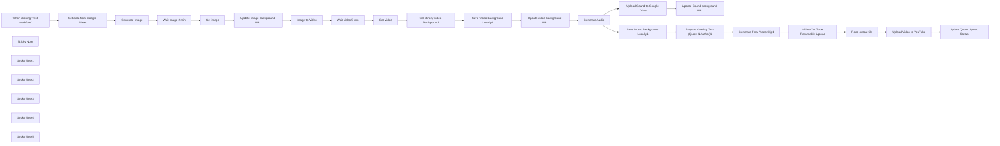

## Fluxo (.json) :

```json
{
  "id": "CvXjXG4SFnN0ioJQ",
  "meta": {
    "instanceId": "e2034325698638870d6b764285427bad9d79bf1e08a458be597c06e61ad7e545",
    "templateCredsSetupCompleted": true
  },
  "name": "AutoQoutesV2_template",
  "tags": [],
  "nodes": [
    {
      "id": "2ff58bb4-7079-44fe-a2ac-b4af9fa5b30e",
      "name": "When clicking ‘Test workflow’",
      "type": "n8n-nodes-base.manualTrigger",
      "position": [
        300,
        0
      ],
      "parameters": {},
      "typeVersion": 1
    },
    {
      "id": "ec44d567-dfc8-4561-87df-903724225247",
      "name": "Generate Image",
      "type": "n8n-nodes-base.httpRequest",
      "position": [
        660,
        0
      ],
      "parameters": {
        "url": "https://api.piapi.ai/api/v1/task",
        "body": "={\n  \"model\": \"Qubico/flux1-dev\",\n  \"task_type\": \"txt2img\",\n  \"input\": {\n    \"prompt\": \"Ultra-realistic vertical nature landscape, {{ $json['Background (EN)'] }}, featuring {{ $json['Prompt (EN)'] }}, high detail, soft atmospheric lighting, cinematic golden hour glow, vertical composition, photorealistic texture, natural depth of field, calm and serene mood, no people, no buildings, HDR, 8k resolution, masterpiece\",\n    \"negative_prompt\": \"taking a photo of a room, recording a video of a room, photos app, video recorder, illegible text, blurry text, low quality text, DSLR, unnatural\",\n    \"width\": 540,\n    \"height\": 960\n  }\n}",
        "method": "POST",
        "options": {},
        "sendBody": true,
        "contentType": "raw",
        "sendHeaders": true,
        "rawContentType": "application/json",
        "headerParameters": {
          "parameters": [
            {
              "name": "X-API-Key",
              "value": "=[Your PiAPI Key]"
            }
          ]
        }
      },
      "retryOnFail": false,
      "typeVersion": 4.2
    },
    {
      "id": "ad260a51-e981-47cc-8600-967c1c748814",
      "name": "Get image",
      "type": "n8n-nodes-base.httpRequest",
      "position": [
        1020,
        0
      ],
      "parameters": {
        "url": "=https://api.piapi.ai/api/v1/task/{{ $json.data.task_id }}",
        "options": {},
        "sendHeaders": true,
        "headerParameters": {
          "parameters": [
            {
              "name": "X-API-Key",
              "value": "=[Your PiAPI Key]"
            }
          ]
        }
      },
      "typeVersion": 4.2
    },
    {
      "id": "cddff673-15ce-47ec-a2d3-3d71437bfb1f",
      "name": "Sticky Note",
      "type": "n8n-nodes-base.stickyNote",
      "position": [
        600,
        -80
      ],
      "parameters": {
        "width": 820,
        "height": 240,
        "content": "## Create Image Background\nGenerate an image using prompt from Google Sheet via PiAPI Flux (Txt2img)."
      },
      "typeVersion": 1
    },
    {
      "id": "64132a39-ad42-4158-9eec-5b6bfdc7bca2",
      "name": "Update image background URL",
      "type": "n8n-nodes-base.googleSheets",
      "position": [
        1240,
        0
      ],
      "parameters": {
        "columns": {
          "value": {
            "Index": "={{ $('Get data from Google Sheet').item.json.Index }}",
            "Background Image": "={{ $json.data.output.image_url }}"
          },
          "schema": [
            {
              "id": "Index",
              "type": "string",
              "display": true,
              "removed": false,
              "required": false,
              "displayName": "Index",
              "defaultMatch": false,
              "canBeUsedToMatch": true
            },
            {
              "id": "Quote (Thai)",
              "type": "string",
              "display": true,
              "removed": true,
              "required": false,
              "displayName": "Quote (Thai)",
              "defaultMatch": false,
              "canBeUsedToMatch": true
            },
            {
              "id": "Pen Name (Thai)",
              "type": "string",
              "display": true,
              "removed": true,
              "required": false,
              "displayName": "Pen Name (Thai)",
              "defaultMatch": false,
              "canBeUsedToMatch": true
            },
            {
              "id": "Background (EN)",
              "type": "string",
              "display": true,
              "removed": true,
              "required": false,
              "displayName": "Background (EN)",
              "defaultMatch": false,
              "canBeUsedToMatch": true
            },
            {
              "id": "Prompt (EN)",
              "type": "string",
              "display": true,
              "removed": true,
              "required": false,
              "displayName": "Prompt (EN)",
              "defaultMatch": false,
              "canBeUsedToMatch": true
            },
            {
              "id": "Background Image",
              "type": "string",
              "display": true,
              "required": false,
              "displayName": "Background Image",
              "defaultMatch": false,
              "canBeUsedToMatch": true
            },
            {
              "id": "Background Video",
              "type": "string",
              "display": true,
              "removed": true,
              "required": false,
              "displayName": "Background Video",
              "defaultMatch": false,
              "canBeUsedToMatch": true
            },
            {
              "id": "Video Status",
              "type": "string",
              "display": true,
              "removed": true,
              "required": false,
              "displayName": "Video Status",
              "defaultMatch": false,
              "canBeUsedToMatch": true
            },
            {
              "id": "row_number",
              "type": "string",
              "display": true,
              "removed": true,
              "readOnly": true,
              "required": false,
              "displayName": "row_number",
              "defaultMatch": false,
              "canBeUsedToMatch": true
            }
          ],
          "mappingMode": "defineBelow",
          "matchingColumns": [
            "Index"
          ],
          "attemptToConvertTypes": false,
          "convertFieldsToString": false
        },
        "options": {},
        "operation": "update",
        "sheetName": {
          "__rl": true,
          "mode": "list",
          "value": "gid=0",
          "cachedResultUrl": "https://docs.google.com/spreadsheets/d/1p1iPoiu2uI3qGbHi0diS7QwsMcLuzDIqwo3AeSUVrGQ/edit#gid=0",
          "cachedResultName": "Sheet1"
        },
        "documentId": {
          "__rl": true,
          "mode": "id",
          "value": "1p1iPoiu2uI3qGbHi0diS7QwsMcLuzDIqwo3AeSUVrGQ"
        }
      },
      "credentials": {
        "googleSheetsOAuth2Api": {
          "id": "Ra2f1dlqOJ13jTtb",
          "name": "Google Sheets account"
        }
      },
      "typeVersion": 4.5
    },
    {
      "id": "801dd794-4cf8-42f7-8102-a3a4853cae39",
      "name": "Image-to-Video",
      "type": "n8n-nodes-base.httpRequest",
      "position": [
        260,
        280
      ],
      "parameters": {
        "url": "https://api.piapi.ai/api/v1/task",
        "body": "={\n  \"model\": \"kling\",\n  \"task_type\": \"video_generation\",\n  \"input\": {\n    \"prompt\": \"Cinematic vertical video from image of {{ $('Get data from Google Sheet').item.json['Background (EN)'] }}, with {{ $('Get data from Google Sheet').item.json['Prompt (EN)'] }}, animated subtly from image, with soft light, mist, swaying trees, slow zoom effect, no people or buildings\",\n    \"negative_prompt\": \"blurry motion, distorted faces, unnatural lighting, over produced, bad quality\",\n    \"cfg_scale\": 0.5,\n    \"duration\": 5,\n    \"mode\": \"std\",\n    \"image_url\": \"{{ $('Get image').item.json.data.output.image_url }}\",\n    \"version\": \"1.0\",\n    \"camera_control\": {\n      \"type\": \"simple\",\n      \"config\": {\n        \"horizontal\": 0,\n        \"vertical\": 0,\n        \"pan\": 0,\n        \"tilt\": 0,\n        \"roll\": 0,\n        \"zoom\": 5\n      }\n    }\n  }\n}",
        "method": "POST",
        "options": {},
        "sendBody": true,
        "contentType": "raw",
        "sendHeaders": true,
        "rawContentType": "application/json",
        "headerParameters": {
          "parameters": [
            {
              "name": "X-API-Key",
              "value": "=[Your PiAPI Key]"
            }
          ]
        }
      },
      "typeVersion": 4.2
    },
    {
      "id": "6f7d755f-73fb-474f-a2c4-4612317c4f5a",
      "name": "Wait image 2 min",
      "type": "n8n-nodes-base.wait",
      "position": [
        840,
        0
      ],
      "webhookId": "ccf58c3e-f91d-4f58-a4a7-aff58c9be226",
      "parameters": {
        "unit": "minutes",
        "amount": 2
      },
      "typeVersion": 1.1
    },
    {
      "id": "d8de3a95-1a5b-4495-9a1f-8178c1be3d44",
      "name": "Wait video 5 min",
      "type": "n8n-nodes-base.wait",
      "position": [
        440,
        280
      ],
      "webhookId": "6df38e96-d5ec-4588-9569-db9b86539a34",
      "parameters": {
        "unit": "minutes"
      },
      "typeVersion": 1.1
    },
    {
      "id": "c3f97a19-9ea8-4489-8629-767542f0fddb",
      "name": "Get Video",
      "type": "n8n-nodes-base.httpRequest",
      "position": [
        620,
        280
      ],
      "parameters": {
        "url": "=https://api.piapi.ai/api/v1/task/{{ $json.data.task_id }}",
        "options": {},
        "sendHeaders": true,
        "headerParameters": {
          "parameters": [
            {
              "name": "X-API-Key",
              "value": "=[Your PiAPI Key]"
            }
          ]
        }
      },
      "typeVersion": 4.2
    },
    {
      "id": "eefa224d-2e3d-459e-a16d-8e2584b59cf0",
      "name": "Sticky Note1",
      "type": "n8n-nodes-base.stickyNote",
      "position": [
        240,
        200
      ],
      "parameters": {
        "color": 3,
        "width": 1180,
        "height": 240,
        "content": "## Create Video Background\nCreate a cinematic vertical video from the generated image using PiAPI Kling."
      },
      "typeVersion": 1
    },
    {
      "id": "8d2035a8-d4a0-4a33-bae3-c18b530487d4",
      "name": "Generate Audio",
      "type": "n8n-nodes-base.httpRequest",
      "position": [
        380,
        560
      ],
      "parameters": {
        "url": "https://api.elevenlabs.io/v1/sound-generation",
        "method": "POST",
        "options": {},
        "sendBody": true,
        "sendHeaders": true,
        "bodyParameters": {
          "parameters": [
            {
              "name": "text",
              "value": "={\n  \"text\": \"no voice, A peaceful soundscape unfolds as the sun begins to rise over misty {{ $('Get data from Google Sheet').item.json['Background (EN)'] }}, casting warm light across the scene. The crisp morning air is filled with ambient nature sounds like {{ $('Get data from Google Sheet').item.json['Prompt (EN)'] }} along with soft lofi beats, blending into a calm and immersive atmosphere.\",\n  \"duration_seconds\": 5,\n  \"model_id\": \"sound-effects-v1\",\n  \"output_format\": \"mp3\"\n}\n"
            },
            {
              "name": "duration_seconds",
              "value": "20"
            }
          ]
        },
        "headerParameters": {
          "parameters": [
            {
              "name": "xi-api-key",
              "value": "[Your ElevenLab Key]"
            }
          ]
        }
      },
      "typeVersion": 4.2
    },
    {
      "id": "66af781a-2012-426e-a623-e90e21e8b2a1",
      "name": "Get data from Google Sheet",
      "type": "n8n-nodes-base.googleSheets",
      "position": [
        480,
        0
      ],
      "parameters": {
        "options": {
          "returnFirstMatch": true
        },
        "filtersUI": {
          "values": [
            {
              "lookupColumn": "Video Status"
            }
          ]
        },
        "sheetName": {
          "__rl": true,
          "mode": "list",
          "value": "gid=0",
          "cachedResultUrl": "https://docs.google.com/spreadsheets/d/1p1iPoiu2uI3qGbHi0diS7QwsMcLuzDIqwo3AeSUVrGQ/edit#gid=0",
          "cachedResultName": "Sheet1"
        },
        "documentId": {
          "__rl": true,
          "mode": "id",
          "value": "1p1iPoiu2uI3qGbHi0diS7QwsMcLuzDIqwo3AeSUVrGQ"
        }
      },
      "credentials": {
        "googleSheetsOAuth2Api": {
          "id": "Ra2f1dlqOJ13jTtb",
          "name": "Google Sheets account"
        }
      },
      "typeVersion": 4.5
    },
    {
      "id": "04074118-9f30-4648-8aab-9574156a76ba",
      "name": "Update Sound background URL",
      "type": "n8n-nodes-base.googleSheets",
      "position": [
        1220,
        480
      ],
      "parameters": {
        "columns": {
          "value": {
            "Index": "={{ $('Get data from Google Sheet').item.json.Index }}",
            "Music Background": "={{ $json.webContentLink }}"
          },
          "schema": [
            {
              "id": "Index",
              "type": "string",
              "display": true,
              "removed": false,
              "required": false,
              "displayName": "Index",
              "defaultMatch": false,
              "canBeUsedToMatch": true
            },
            {
              "id": "Quote (Thai)",
              "type": "string",
              "display": true,
              "removed": true,
              "required": false,
              "displayName": "Quote (Thai)",
              "defaultMatch": false,
              "canBeUsedToMatch": true
            },
            {
              "id": "Pen Name (Thai)",
              "type": "string",
              "display": true,
              "removed": true,
              "required": false,
              "displayName": "Pen Name (Thai)",
              "defaultMatch": false,
              "canBeUsedToMatch": true
            },
            {
              "id": "Background (EN)",
              "type": "string",
              "display": true,
              "removed": true,
              "required": false,
              "displayName": "Background (EN)",
              "defaultMatch": false,
              "canBeUsedToMatch": true
            },
            {
              "id": "Prompt (EN)",
              "type": "string",
              "display": true,
              "removed": true,
              "required": false,
              "displayName": "Prompt (EN)",
              "defaultMatch": false,
              "canBeUsedToMatch": true
            },
            {
              "id": "Background Image",
              "type": "string",
              "display": true,
              "removed": true,
              "required": false,
              "displayName": "Background Image",
              "defaultMatch": false,
              "canBeUsedToMatch": true
            },
            {
              "id": "Background Video",
              "type": "string",
              "display": true,
              "removed": true,
              "required": false,
              "displayName": "Background Video",
              "defaultMatch": false,
              "canBeUsedToMatch": true
            },
            {
              "id": "Music Background",
              "type": "string",
              "display": true,
              "removed": false,
              "required": false,
              "displayName": "Music Background",
              "defaultMatch": false,
              "canBeUsedToMatch": true
            },
            {
              "id": "Video Status",
              "type": "string",
              "display": true,
              "removed": true,
              "required": false,
              "displayName": "Video Status",
              "defaultMatch": false,
              "canBeUsedToMatch": true
            },
            {
              "id": "row_number",
              "type": "string",
              "display": true,
              "removed": true,
              "readOnly": true,
              "required": false,
              "displayName": "row_number",
              "defaultMatch": false,
              "canBeUsedToMatch": true
            }
          ],
          "mappingMode": "defineBelow",
          "matchingColumns": [
            "Index"
          ],
          "attemptToConvertTypes": false,
          "convertFieldsToString": false
        },
        "options": {},
        "operation": "update",
        "sheetName": {
          "__rl": true,
          "mode": "list",
          "value": "gid=0",
          "cachedResultUrl": "https://docs.google.com/spreadsheets/d/1p1iPoiu2uI3qGbHi0diS7QwsMcLuzDIqwo3AeSUVrGQ/edit#gid=0",
          "cachedResultName": "Sheet1"
        },
        "documentId": {
          "__rl": true,
          "mode": "id",
          "value": "1p1iPoiu2uI3qGbHi0diS7QwsMcLuzDIqwo3AeSUVrGQ"
        }
      },
      "credentials": {
        "googleSheetsOAuth2Api": {
          "id": "Ra2f1dlqOJ13jTtb",
          "name": "Google Sheets account"
        }
      },
      "typeVersion": 4.5
    },
    {
      "id": "35ca939b-fb27-48cf-8036-f35618ceaee0",
      "name": "Update video background URL",
      "type": "n8n-nodes-base.googleSheets",
      "position": [
        1240,
        280
      ],
      "parameters": {
        "columns": {
          "value": {
            "Index": "={{ $('Get data from Google Sheet').item.json.Index }}",
            "Background Video": "={{ $json.data.output.video_url }}"
          },
          "schema": [
            {
              "id": "Index",
              "type": "string",
              "display": true,
              "removed": false,
              "required": false,
              "displayName": "Index",
              "defaultMatch": false,
              "canBeUsedToMatch": true
            },
            {
              "id": "Quote (Thai)",
              "type": "string",
              "display": true,
              "removed": true,
              "required": false,
              "displayName": "Quote (Thai)",
              "defaultMatch": false,
              "canBeUsedToMatch": true
            },
            {
              "id": "Pen Name (Thai)",
              "type": "string",
              "display": true,
              "removed": true,
              "required": false,
              "displayName": "Pen Name (Thai)",
              "defaultMatch": false,
              "canBeUsedToMatch": true
            },
            {
              "id": "Background (EN)",
              "type": "string",
              "display": true,
              "removed": true,
              "required": false,
              "displayName": "Background (EN)",
              "defaultMatch": false,
              "canBeUsedToMatch": true
            },
            {
              "id": "Prompt (EN)",
              "type": "string",
              "display": true,
              "removed": true,
              "required": false,
              "displayName": "Prompt (EN)",
              "defaultMatch": false,
              "canBeUsedToMatch": true
            },
            {
              "id": "Background Image",
              "type": "string",
              "display": true,
              "removed": true,
              "required": false,
              "displayName": "Background Image",
              "defaultMatch": false,
              "canBeUsedToMatch": true
            },
            {
              "id": "Background Video",
              "type": "string",
              "display": true,
              "required": false,
              "displayName": "Background Video",
              "defaultMatch": false,
              "canBeUsedToMatch": true
            },
            {
              "id": "Video Status",
              "type": "string",
              "display": true,
              "removed": true,
              "required": false,
              "displayName": "Video Status",
              "defaultMatch": false,
              "canBeUsedToMatch": true
            },
            {
              "id": "row_number",
              "type": "string",
              "display": true,
              "removed": true,
              "readOnly": true,
              "required": false,
              "displayName": "row_number",
              "defaultMatch": false,
              "canBeUsedToMatch": true
            }
          ],
          "mappingMode": "defineBelow",
          "matchingColumns": [
            "Index"
          ],
          "attemptToConvertTypes": false,
          "convertFieldsToString": false
        },
        "options": {},
        "operation": "update",
        "sheetName": {
          "__rl": true,
          "mode": "list",
          "value": "gid=0",
          "cachedResultUrl": "https://docs.google.com/spreadsheets/d/1p1iPoiu2uI3qGbHi0diS7QwsMcLuzDIqwo3AeSUVrGQ/edit#gid=0",
          "cachedResultName": "Sheet1"
        },
        "documentId": {
          "__rl": true,
          "mode": "id",
          "value": "1p1iPoiu2uI3qGbHi0diS7QwsMcLuzDIqwo3AeSUVrGQ"
        }
      },
      "credentials": {
        "googleSheetsOAuth2Api": {
          "id": "Ra2f1dlqOJ13jTtb",
          "name": "Google Sheets account"
        }
      },
      "typeVersion": 4.5
    },
    {
      "id": "54c8badf-a99a-4e5c-ad96-e1d982eb6855",
      "name": "Sticky Note2",
      "type": "n8n-nodes-base.stickyNote",
      "position": [
        240,
        480
      ],
      "parameters": {
        "color": 4,
        "width": 1180,
        "height": 240,
        "content": "## Create Sound Background\nGenerate ambient sound using ElevenLabs based on the scene prompt."
      },
      "typeVersion": 1
    },
    {
      "id": "15b9e2b1-72d9-42bf-a8a4-0ad0a01c5e5f",
      "name": "Upload Sound to Google Drive",
      "type": "n8n-nodes-base.googleDrive",
      "position": [
        780,
        480
      ],
      "parameters": {
        "name": "={{ $('Get data from Google Sheet').item.json['Background (EN)'] }}.mp3",
        "driveId": {
          "__rl": true,
          "mode": "id",
          "value": "1Sfv2PvIHF0J3-5IOYFdZp2-4LNPOoSX1"
        },
        "options": {},
        "folderId": {
          "__rl": true,
          "mode": "list",
          "value": "root",
          "cachedResultName": "/ (Root folder)"
        }
      },
      "credentials": {
        "googleDriveOAuth2Api": {
          "id": "OEWvSsY5xiUhqOnx",
          "name": "Google Drive account - PeakWave"
        }
      },
      "typeVersion": 3,
      "alwaysOutputData": true
    },
    {
      "id": "2a628e8a-077a-4999-9ef7-8d28ac4433ac",
      "name": "Save Video Background Locally1",
      "type": "n8n-nodes-base.readWriteFile",
      "position": [
        1040,
        280
      ],
      "parameters": {
        "options": {},
        "fileName": "=VideoBackground.mp4",
        "operation": "write"
      },
      "typeVersion": 1
    },
    {
      "id": "fa5cce8d-4b50-4221-9446-050f497b30a9",
      "name": "Get Binary Video Background",
      "type": "n8n-nodes-base.httpRequest",
      "position": [
        820,
        280
      ],
      "parameters": {
        "url": "={{ $json.data.output.video_url }}",
        "options": {
          "response": {
            "response": {
              "responseFormat": "file"
            }
          }
        }
      },
      "typeVersion": 4.2
    },
    {
      "id": "ea003577-5467-4acb-a33b-b4b30a03a35f",
      "name": "Save Music Background Locally1",
      "type": "n8n-nodes-base.readWriteFile",
      "position": [
        980,
        560
      ],
      "parameters": {
        "options": {
          "append": false
        },
        "fileName": "=SoundBackground.mp3",
        "operation": "write"
      },
      "typeVersion": 1
    },
    {
      "id": "b9332740-c4e0-40f9-bc0d-c550c8f0f96d",
      "name": "Prepare Overlay Text (Quote & Author)1",
      "type": "n8n-nodes-base.code",
      "position": [
        300,
        860
      ],
      "parameters": {
        "jsCode": "// Define separate configuration for the quote and the author\nconst quoteFont = \"Kanit-Italic.ttf\";      \nconst quoteFontSize = 70;\nconst authorFont = \"Kanit-Italic.ttf\";     \nconst authorFontSize = 50;\nconst fontColor = \"white\";\nconst lineHeightMultiplier = 1.1;\nconst videoWidth = 1080;\nconst margin = 40;  \n\n// Effective width for the quote text\nconst effectiveVideoWidth = videoWidth - 2 * margin;\n\n// Estimate average character width based on quoteFontSize\nconst avgCharWidth = quoteFontSize * 0.6;\nconst maxCharsPerLine = Math.floor(effectiveVideoWidth / avgCharWidth);\n\n// Retrieve the quote and author from \"Select Random Video, Music & Quote\"\nconst transcript = $('Get data from Google Sheet').first().json['Quote (Thai)'];\nif (!transcript) {\n  throw new Error(\"Quote not found\");\n}\n\nconst author = $('Get data from Google Sheet').first().json['Pen Name (Thai)'];\nif (!author) {\n  throw new Error(\"Author not found\");\n}\n\n// Split transcript into words and group them into lines\nconst words = transcript.split(' ');\nconst lines = [];\nlet currentLine = \"\";\nlet currentCharCount = 0;\n\nwords.forEach(word => {\n  const wordLength = word.length;\n  const additionalSpace = currentLine ? 1 : 0;\n  const potentialLength = currentCharCount + additionalSpace + wordLength;\n  if (potentialLength <= maxCharsPerLine) {\n    currentLine += (currentLine ? \" \" : \"\") + word;\n    currentCharCount = potentialLength;\n  } else {\n    lines.push(currentLine);\n    currentLine = word;\n    currentCharCount = wordLength;\n  }\n});\nif (currentLine) {\n  lines.push(currentLine);\n}\n\n// Calculate layout for the quote block\nconst lineHeight = quoteFontSize * lineHeightMultiplier;\nconst totalHeight = lines.length * lineHeight;\n\n// Build drawtext commands for quote lines\nconst quoteCommands = lines.map((line, index) => {\n  const escapedLine = line.replace(/'/g, \"\\\\'\");\n  return `drawtext=fontfile=${quoteFont}:text='${escapedLine}':fontsize=${quoteFontSize}:fontcolor=${fontColor}:x=(w-text_w)/2:y=((h-${totalHeight})/2)+(${index}*${lineHeight})`;\n});\n\n// Build the drawtext command for author\nconst authorY = `((h-${totalHeight})/2)+(${lines.length}*${lineHeight})+20`;\nconst escapedAuthor = author.replace(/'/g, \"\\\\'\");\nconst authorCommand = `drawtext=fontfile=${authorFont}:text='${escapedAuthor}':fontsize=${authorFontSize}:fontcolor=${fontColor}:x=w-text_w-${margin}:y=${authorY}`;\n\n// Combine all commands into one drawtext filter string\nconst fullDrawTextFilter = quoteCommands.concat(authorCommand).join(\", \");\n\n// Return the prepared filter string\nreturn {\n  json: {\n    drawText: fullDrawTextFilter\n  }\n};"
      },
      "typeVersion": 2
    },
    {
      "id": "79764093-f6ca-459b-a73c-3326fe82fafa",
      "name": "Generate Final Video Clip1",
      "type": "n8n-nodes-base.executeCommand",
      "position": [
        480,
        860
      ],
      "parameters": {
        "command": "=ffmpeg -i {{ $('Save Video Background Locally1').item.json.fileName }} -i {{ $('Save Music Background Locally1').item.json.fileName }} -filter_complex \"[0:v]scale=1080:1920:force_original_aspect_ratio=increase,crop=1080:1920[vid]; color=black@0.3:size=1080x1920:d=10[bg]; [vid][bg]overlay=shortest=1[bgvid]; [bgvid]{{ $json.drawText }}[outv]; [1:a]volume=0.8[aout]\" -map \"[outv]\" -map \"[aout]\" -aspect 9:16 -c:v libx264 -c:a aac -shortest output.mp4 -y"
      },
      "typeVersion": 1
    },
    {
      "id": "3c301b6b-d6cb-41af-ac52-5722bed8470d",
      "name": "Initiate YouTube Resumable Upload",
      "type": "n8n-nodes-base.httpRequest",
      "position": [
        700,
        860
      ],
      "parameters": {
        "url": "=https://www.googleapis.com/upload/youtube/v3/videos?part=snippet,status&uploadType=resumable",
        "body": "={\n  \"snippet\": {\n    \"title\": \"{{ $('Get data from Google Sheet').item.json['Quote (Thai)'] }}\",\n    \"description\": \"{{ $('Get data from Google Sheet').item.json['Quote (Thai)'] }}\\n{{ $('Get data from Google Sheet').item.json['Pen Name (Thai)'] }}\",\n    \"defaultLanguage\": \"en\",\n    \"defaultAudioLanguage\": \"en\"\n  },\n  \"status\": {\n    \"privacyStatus\": \"public\",\n    \"license\": \"youtube\",\n    \"embeddable\": true,\n    \"publicStatsViewable\": true,\n    \"madeForKids\": false\n  }\n}",
        "method": "POST",
        "options": {
          "response": {
            "response": {
              "fullResponse": true
            }
          }
        },
        "sendBody": true,
        "contentType": "raw",
        "sendHeaders": true,
        "authentication": "predefinedCredentialType",
        "rawContentType": "RAW/JSON",
        "headerParameters": {
          "parameters": [
            {
              "name": "Content-Type",
              "value": "application/json"
            },
            {
              "name": "X-Upload-Content-Type",
              "value": "video/webm"
            }
          ]
        },
        "nodeCredentialType": "youTubeOAuth2Api"
      },
      "credentials": {
        "youTubeOAuth2Api": {
          "id": "f9uNp5YNQMnXrNw2",
          "name": "YouTube account"
        }
      },
      "typeVersion": 4.2
    },
    {
      "id": "dbde06b3-e7ba-4b7e-9d58-0a06f88b5176",
      "name": "Read output file",
      "type": "n8n-nodes-base.readWriteFile",
      "position": [
        880,
        860
      ],
      "parameters": {
        "options": {},
        "fileSelector": "=output.mp4"
      },
      "typeVersion": 1
    },
    {
      "id": "0b9b92e0-5500-4dca-a622-f63b3cdf0878",
      "name": "Upload Video to YouTube",
      "type": "n8n-nodes-base.httpRequest",
      "position": [
        1080,
        860
      ],
      "parameters": {
        "url": "={{ $('Initiate YouTube Resumable Upload').item.json.headers.location }}",
        "method": "PUT",
        "options": {},
        "sendBody": true,
        "contentType": "binaryData",
        "sendHeaders": true,
        "authentication": "predefinedCredentialType",
        "headerParameters": {
          "parameters": [
            {
              "name": "Content-Type",
              "value": "video/webm"
            }
          ]
        },
        "inputDataFieldName": "data",
        "nodeCredentialType": "youTubeOAuth2Api"
      },
      "credentials": {
        "youTubeOAuth2Api": {
          "id": "f9uNp5YNQMnXrNw2",
          "name": "YouTube account"
        }
      },
      "typeVersion": 4.2
    },
    {
      "id": "721078b6-b1e2-4077-b1ff-696cb3765675",
      "name": "Update Quote Upload Status",
      "type": "n8n-nodes-base.googleSheets",
      "position": [
        1280,
        860
      ],
      "parameters": {
        "columns": {
          "value": {
            "Index": "={{ $('Get data from Google Sheet').item.json.Index }}",
            "Video Status": "=https://www.youtube.com/watch?v={{ $json.id }}"
          },
          "schema": [
            {
              "id": "Index",
              "type": "string",
              "display": true,
              "removed": false,
              "required": false,
              "displayName": "Index",
              "defaultMatch": false,
              "canBeUsedToMatch": true
            },
            {
              "id": "Quote (Thai)",
              "type": "string",
              "display": true,
              "removed": true,
              "required": false,
              "displayName": "Quote (Thai)",
              "defaultMatch": false,
              "canBeUsedToMatch": true
            },
            {
              "id": "Pen Name (Thai)",
              "type": "string",
              "display": true,
              "removed": true,
              "required": false,
              "displayName": "Pen Name (Thai)",
              "defaultMatch": false,
              "canBeUsedToMatch": true
            },
            {
              "id": "Background (EN)",
              "type": "string",
              "display": true,
              "removed": true,
              "required": false,
              "displayName": "Background (EN)",
              "defaultMatch": false,
              "canBeUsedToMatch": true
            },
            {
              "id": "Prompt (EN)",
              "type": "string",
              "display": true,
              "removed": true,
              "required": false,
              "displayName": "Prompt (EN)",
              "defaultMatch": false,
              "canBeUsedToMatch": true
            },
            {
              "id": "Background Image",
              "type": "string",
              "display": true,
              "removed": true,
              "required": false,
              "displayName": "Background Image",
              "defaultMatch": false,
              "canBeUsedToMatch": true
            },
            {
              "id": "Background Video",
              "type": "string",
              "display": true,
              "removed": true,
              "required": false,
              "displayName": "Background Video",
              "defaultMatch": false,
              "canBeUsedToMatch": true
            },
            {
              "id": "Music Background",
              "type": "string",
              "display": true,
              "removed": true,
              "required": false,
              "displayName": "Music Background",
              "defaultMatch": false,
              "canBeUsedToMatch": true
            },
            {
              "id": "Video Status",
              "type": "string",
              "display": true,
              "required": false,
              "displayName": "Video Status",
              "defaultMatch": false,
              "canBeUsedToMatch": true
            }
          ],
          "mappingMode": "defineBelow",
          "matchingColumns": [
            "Index"
          ],
          "attemptToConvertTypes": false,
          "convertFieldsToString": false
        },
        "options": {},
        "operation": "appendOrUpdate",
        "sheetName": {
          "__rl": true,
          "mode": "list",
          "value": "gid=0",
          "cachedResultUrl": "https://docs.google.com/spreadsheets/d/1p1iPoiu2uI3qGbHi0diS7QwsMcLuzDIqwo3AeSUVrGQ/edit#gid=0",
          "cachedResultName": "Sheet1"
        },
        "documentId": {
          "__rl": true,
          "mode": "id",
          "value": "1p1iPoiu2uI3qGbHi0diS7QwsMcLuzDIqwo3AeSUVrGQ"
        }
      },
      "credentials": {
        "googleSheetsOAuth2Api": {
          "id": "Ra2f1dlqOJ13jTtb",
          "name": "Google Sheets account"
        }
      },
      "typeVersion": 4.5
    },
    {
      "id": "8900abd9-9f35-46a3-9b59-883ff16b0764",
      "name": "Sticky Note3",
      "type": "n8n-nodes-base.stickyNote",
      "position": [
        660,
        760
      ],
      "parameters": {
        "color": 5,
        "width": 760,
        "height": 300,
        "content": "## Video Upload & Post-Processing\nUpload the final video to YouTube using the YouTube API and update your Google Sheets with upload statuses and YouTube links."
      },
      "typeVersion": 1
    },
    {
      "id": "07cdec2c-9677-46f0-8038-641c4c191059",
      "name": "Sticky Note4",
      "type": "n8n-nodes-base.stickyNote",
      "position": [
        240,
        -80
      ],
      "parameters": {
        "color": 6,
        "width": 340,
        "height": 240,
        "content": "## Get Quote\nRetrieve quote data from Google Sheets including text, author, and background prompts."
      },
      "typeVersion": 1
    },
    {
      "id": "aeadbc59-13d7-4755-b38d-6d4946ecfa78",
      "name": "Sticky Note5",
      "type": "n8n-nodes-base.stickyNote",
      "position": [
        240,
        760
      ],
      "parameters": {
        "color": 6,
        "width": 400,
        "height": 300,
        "content": "## Combine All\nMerge video, sound, and quote text into final clip using FFmpeg."
      },
      "typeVersion": 1
    }
  ],
  "active": false,
  "pinData": {},
  "settings": {
    "executionOrder": "v1"
  },
  "versionId": "2c56841d-3045-4d6d-b643-0f3804bf2c3e",
  "connections": {
    "Get Video": {
      "main": [
        [
          {
            "node": "Get Binary Video Background",
            "type": "main",
            "index": 0
          }
        ]
      ]
    },
    "Get image": {
      "main": [
        [
          {
            "node": "Update image background URL",
            "type": "main",
            "index": 0
          }
        ]
      ]
    },
    "Generate Audio": {
      "main": [
        [
          {
            "node": "Upload Sound to Google Drive",
            "type": "main",
            "index": 0
          },
          {
            "node": "Save Music Background Locally1",
            "type": "main",
            "index": 0
          }
        ]
      ]
    },
    "Generate Image": {
      "main": [
        [
          {
            "node": "Wait image 2 min",
            "type": "main",
            "index": 0
          }
        ]
      ]
    },
    "Image-to-Video": {
      "main": [
        [
          {
            "node": "Wait video 5 min",
            "type": "main",
            "index": 0
          }
        ]
      ]
    },
    "Read output file": {
      "main": [
        [
          {
            "node": "Upload Video to YouTube",
            "type": "main",
            "index": 0
          }
        ]
      ]
    },
    "Wait image 2 min": {
      "main": [
        [
          {
            "node": "Get image",
            "type": "main",
            "index": 0
          }
        ]
      ]
    },
    "Wait video 5 min": {
      "main": [
        [
          {
            "node": "Get Video",
            "type": "main",
            "index": 0
          }
        ]
      ]
    },
    "Upload Video to YouTube": {
      "main": [
        [
          {
            "node": "Update Quote Upload Status",
            "type": "main",
            "index": 0
          }
        ]
      ]
    },
    "Generate Final Video Clip1": {
      "main": [
        [
          {
            "node": "Initiate YouTube Resumable Upload",
            "type": "main",
            "index": 0
          }
        ]
      ]
    },
    "Get data from Google Sheet": {
      "main": [
        [
          {
            "node": "Generate Image",
            "type": "main",
            "index": 0
          }
        ]
      ]
    },
    "Update Quote Upload Status": {
      "main": [
        []
      ]
    },
    "Get Binary Video Background": {
      "main": [
        [
          {
            "node": "Save Video Background Locally1",
            "type": "main",
            "index": 0
          }
        ]
      ]
    },
    "Update Sound background URL": {
      "main": [
        []
      ]
    },
    "Update image background URL": {
      "main": [
        [
          {
            "node": "Image-to-Video",
            "type": "main",
            "index": 0
          }
        ]
      ]
    },
    "Update video background URL": {
      "main": [
        [
          {
            "node": "Generate Audio",
            "type": "main",
            "index": 0
          }
        ]
      ]
    },
    "Upload Sound to Google Drive": {
      "main": [
        [
          {
            "node": "Update Sound background URL",
            "type": "main",
            "index": 0
          }
        ]
      ]
    },
    "Save Music Background Locally1": {
      "main": [
        [
          {
            "node": "Prepare Overlay Text (Quote & Author)1",
            "type": "main",
            "index": 0
          }
        ]
      ]
    },
    "Save Video Background Locally1": {
      "main": [
        [
          {
            "node": "Update video background URL",
            "type": "main",
            "index": 0
          }
        ]
      ]
    },
    "Initiate YouTube Resumable Upload": {
      "main": [
        [
          {
            "node": "Read output file",
            "type": "main",
            "index": 0
          }
        ]
      ]
    },
    "When clicking ‘Test workflow’": {
      "main": [
        [
          {
            "node": "Get data from Google Sheet",
            "type": "main",
            "index": 0
          }
        ]
      ]
    },
    "Prepare Overlay Text (Quote & Author)1": {
      "main": [
        [
          {
            "node": "Generate Final Video Clip1",
            "type": "main",
            "index": 0
          }
        ]
      ]
    }
  }
}
```

<a id="template-1529"></a>

## Template 1529 - Enriquecer dados de empresas com AI e scraping

- **Nome:** Enriquecer dados de empresas com AI e scraping
- **Descrição:** Fluxo que enriquece dados de empresas a partir de uma lista, extraindo informações do site da empresa e preenchendo campos na planilha com análise gerada por um modelo de linguagem.
- **Funcionalidade:** • Importar lista de empresas: Obtém linhas de uma planilha contendo nome e website das empresas.
• Processamento em lote: Percorre cada empresa individualmente para garantir que o scraping e a análise correspondam à linha processada.
• Chamar workflow de scraping: Solicita o conteúdo da homepage (ou URL fornecida) para extração de texto.
• Conversão HTML para Markdown: Converte o HTML raspado para um formato de texto mais econômico em tokens.
• Análise com modelo de linguagem: Envia o conteúdo ao modelo para extrair área de atuação, ofertas, proposta de valor, modelo de negócio e ICP.
• Parser de saída estruturada: Formata a resposta do modelo em campos padronizados para fácil mapeamento.
• Atualizar planilha com resultados: Grava os campos enriquecidos de volta na linha correspondente da planilha.
• Tratamento de casos especiais: Identifica conteúdo insuficiente ou páginas não corporativas e sugere ações ou informações adicionais.
• Trigger via webhook: Permite iniciar o processo a partir de um webhook externo.
- **Ferramentas:** • Google Sheets: Armazenamento da lista de empresas e destino dos dados enriquecidos (leitura e atualização de linhas).
• OpenAI (GPT-4o-mini): Modelo de linguagem usado para analisar o conteúdo do site e gerar os campos estruturados de enriquecimento.
• ScrapingBee: Serviço de scraping usado para recuperar o HTML da homepage ou da URL da empresa.

## Fluxo visual

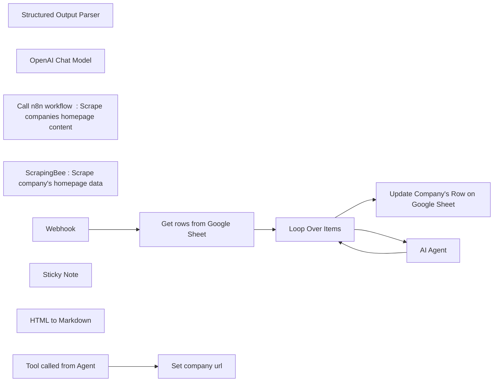

## Fluxo (.json) :

```json
{
  "id": "TfwQRZkTBtykx1rM",
  "meta": {
    "instanceId": "",
    "templateCredsSetupCompleted": true
  },
  "name": "Enrich Company Data from Google Sheet with OpenAI Agent and Scraper Tool",
  "tags": [],
  "nodes": [
    {
      "id": "90c02c5e-228e-478b-b06d-424dc0c4f9b9",
      "name": "Structured Output Parser",
      "type": "@n8n/n8n-nodes-langchain.outputParserStructured",
      "position": [
        1500,
        240
      ],
      "parameters": {
        "schemaType": "manual",
        "inputSchema": "{\n  \"Business Area\": {\n    \"type\": \"string\",\n    \"description\": \"Summary of the company's core activities or industry focus.\"\n  },\n  \"Offers or Product\": {\n    \"type\": \"string\",\n    \"description\": \"Summary of the company's main products or services.\"\n  },\n  \"Value Proposition\": {\n    \"type\": \"string\",\n    \"description\": \"Catchphrase or tagline that represents the company’s value proposition.\"\n  },\n  \"Business Model\": {\n    \"type\": \"string\",\n    \"description\": \"Description of the company's business model, including revenue generation, key partnerships, or unique aspects.\"\n  },\n  \"Ideal Customer Profile\": {\n    \"type\": \"string\",\n    \"description\": \"Description of the ideal customer profile, based on available information.\"\n  },\n  \"Additional Information\": {\n    \"type\": \"object\",\n    \"description\": \"Additional insights or actions if there is insufficient information or if the content does not match a company page.\",\n    \"properties\": {\n      \"Information Sufficiency\": {\n        \"type\": \"string\",\n        \"description\": \"Indicate if the information was sufficient to provide a full analysis.\",\n        \"enum\": [\"Sufficient\", \"Insufficient\"]\n      },\n      \"Insufficient Details\": {\n        \"type\": \"string\",\n        \"description\": \"If 'Insufficient', specify what information was missing or would be needed to complete the analysis.\",\n        \"optional\": true\n      },\n      \"Mismatched Content\": {\n        \"type\": \"boolean\",\n        \"description\": \"Indicate whether the page content aligns with that of a typical company page.\"\n      },\n      \"Suggested Actions\": {\n        \"type\": \"string\",\n        \"description\": \"Provide recommendations if the page content is insufficient or mismatched, such as verifying the URL or searching for alternative sources.\",\n        \"optional\": true\n      }\n    }\n  }\n}\n"
      },
      "typeVersion": 1.2
    },
    {
      "id": "81392d70-3b36-4014-8239-97ea1d69e522",
      "name": "OpenAI Chat Model",
      "type": "@n8n/n8n-nodes-langchain.lmChatOpenAi",
      "position": [
        1240,
        240
      ],
      "parameters": {
        "model": "gpt-4o-mini",
        "options": {}
      },
      "credentials": {
        "openAiApi": {
          "id": "",
          "name": ""
        }
      },
      "typeVersion": 1
    },
    {
      "id": "62d84f70-43a2-43aa-815e-56842230c9b1",
      "name": "Get rows from Google Sheet",
      "type": "n8n-nodes-base.googleSheets",
      "position": [
        660,
        0
      ],
      "parameters": {
        "options": {},
        "sheetName": {
          "__rl": true,
          "mode": "list",
          "value": "gid=0",
          "cachedResultUrl": "h",
          "cachedResultName": "Sheet1"
        },
        "documentId": {
          "__rl": true,
          "mode": "list",
          "value": "1B4Xv2vhO_uXcPxvMWGFwiorFQnSdXlIgXvaTcLQkzPo",
          "cachedResultUrl": "",
          "cachedResultName": "Companies to enrich list"
        },
        "authentication": "serviceAccount"
      },
      "credentials": {
        "googleApi": {
          "id": "",
          "name": ""
        }
      },
      "typeVersion": 4.5
    },
    {
      "id": "3b1050a8-5992-4a5b-a6a4-b91472a12dd4",
      "name": "Call n8n workflow  : Scrape companies homepage content",
      "type": "@n8n/n8n-nodes-langchain.toolWorkflow",
      "position": [
        1380,
        260
      ],
      "parameters": {
        "name": "scraper",
        "fields": {
          "values": [
            {
              "name": "website",
              "stringValue": "={{ $('Get rows from Google Sheet').item.json.Website }}"
            }
          ]
        },
        "workflowId": {
          "__rl": true,
          "mode": "id",
          "value": "TfwQRZkTBtykx1rM"
        },
        "description": "Call this tool to get scraped data about a website.\nThe query should only contains the name of the company."
      },
      "typeVersion": 1.2
    },
    {
      "id": "e451cc56-0cef-4bd8-b13e-210d5ddf3001",
      "name": "Update Company's Row on Google Sheet",
      "type": "n8n-nodes-base.googleSheets",
      "position": [
        1660,
        -200
      ],
      "parameters": {
        "columns": {
          "value": {
            "ICP": "={{ $json.output['Ideal Customer Profile'] }}",
            "Offer": "={{ $json.output['Offers or Product'] }}",
            "row_number": "={{ $('Get rows from Google Sheet').item.json.row_number }}",
            "Business area": "={{ $json.output['Business Area'] }}",
            "Business Model": "={{ $json.output['Business Model'] }}",
            "Value proposition": "={{ $json.output['Value Proposition'] }}",
            "Additionnal information": "={{ $json.output['Additional Information'] }}"
          },
          "schema": [
            {
              "id": "Company",
              "type": "string",
              "display": true,
              "required": false,
              "displayName": "Company",
              "defaultMatch": false,
              "canBeUsedToMatch": true
            },
            {
              "id": "Domain",
              "type": "string",
              "display": true,
              "removed": false,
              "required": false,
              "displayName": "Domain",
              "defaultMatch": false,
              "canBeUsedToMatch": true
            },
            {
              "id": "Business area",
              "type": "string",
              "display": true,
              "required": false,
              "displayName": "Business area",
              "defaultMatch": false,
              "canBeUsedToMatch": true
            },
            {
              "id": "Offer",
              "type": "string",
              "display": true,
              "required": false,
              "displayName": "Offer",
              "defaultMatch": false,
              "canBeUsedToMatch": true
            },
            {
              "id": "Value proposition",
              "type": "string",
              "display": true,
              "removed": false,
              "required": false,
              "displayName": "Value proposition",
              "defaultMatch": false,
              "canBeUsedToMatch": true
            },
            {
              "id": "Business Model",
              "type": "string",
              "display": true,
              "removed": false,
              "required": false,
              "displayName": "Business Model",
              "defaultMatch": false,
              "canBeUsedToMatch": true
            },
            {
              "id": "ICP",
              "type": "string",
              "display": true,
              "removed": false,
              "required": false,
              "displayName": "ICP",
              "defaultMatch": false,
              "canBeUsedToMatch": true
            },
            {
              "id": "Additionnal information",
              "type": "string",
              "display": true,
              "removed": false,
              "required": false,
              "displayName": "Additionnal information",
              "defaultMatch": false,
              "canBeUsedToMatch": true
            },
            {
              "id": "row_number",
              "type": "string",
              "display": true,
              "removed": false,
              "readOnly": true,
              "required": false,
              "displayName": "row_number",
              "defaultMatch": false,
              "canBeUsedToMatch": true
            }
          ],
          "mappingMode": "defineBelow",
          "matchingColumns": [
            "row_number"
          ]
        },
        "options": {},
        "operation": "update",
        "sheetName": {
          "__rl": true,
          "mode": "list",
          "value": "gid=0",
          "cachedResultUrl": "",
          "cachedResultName": "Companies list"
        },
        "documentId": {
          "__rl": true,
          "mode": "list",
          "value": "1B4Xv2vhO_uXcPxvMWGFwiorFQnSdXlIgXvaTcLQkzPo",
          "cachedResultUrl": "",
          "cachedResultName": "Companies to enrich list"
        },
        "authentication": "serviceAccount"
      },
      "credentials": {
        "googleApi": {
          "id": "",
          "name": ""
        }
      },
      "typeVersion": 4.5
    },
    {
      "id": "f2f31704-3e93-4c3f-bb70-9f41d1c625a9",
      "name": "ScrapingBee : Scrape company's homepage data ",
      "type": "n8n-nodes-base.httpRequest",
      "position": [
        1020,
        400
      ],
      "parameters": {
        "url": "https://app.scrapingbee.com/api/v1",
        "options": {
          "response": {
            "response": {}
          }
        },
        "sendQuery": true,
        "queryParameters": {
          "parameters": [
            {
              "name": "api_key",
              "value": ""
            },
            {
              "name": "url",
              "value": "={{$json.url}}"
            }
          ]
        }
      },
      "typeVersion": 4.2
    },
    {
      "id": "d0180b22-8938-4590-a58a-0455ac808c68",
      "name": "Tool called from Agent",
      "type": "n8n-nodes-base.executeWorkflowTrigger",
      "position": [
        440,
        400
      ],
      "parameters": {},
      "typeVersion": 1
    },
    {
      "id": "2f65dece-0236-4d45-b965-7ca705fa4621",
      "name": "Loop Over Items",
      "type": "n8n-nodes-base.splitInBatches",
      "position": [
        960,
        0
      ],
      "parameters": {
        "options": {}
      },
      "typeVersion": 3
    },
    {
      "id": "78ae2393-3744-445a-bf28-6dab1f4a8aec",
      "name": "Sticky Note",
      "type": "n8n-nodes-base.stickyNote",
      "position": [
        -840,
        -480
      ],
      "parameters": {
        "width": 1084.896634444991,
        "height": 1812.538665002239,
        "content": "# Enrich Company Data from Google Sheet with OpenAI Scraper Agent\n\nThis workflow demonstrates how to enrich data from a list of companies in a spreadsheet. While this workflow is production-ready if all steps are followed, adding error handling would enhance its robustness.\n\n## Impportant notes\n\n- **Check legal regulations**: This workflow involves scraping, so make sure to check the legal regulations around scraping in your country before getting started. Better safe than sorry!\n- **Mind those tokens**: OpenAI tokens can add up fast, so keep an eye on usage unless you want a surprising bill that could knock your socks off! 💸\n\n## Main Workflow\n\n### Node 1 - `Webhook`\nThis node triggers the workflow via a webhook call. You can replace it with any other trigger of your choice, such as form submission, a new row added in Google Sheets, or a manual trigger.\n\n### Node 2 - `Get Rows from Google Sheet`\nThis node retrieves the list of companies from your spreadsheet. The columns in this Google Sheet are:\n\n- **Company**: The name of the company\n- **Website**: The website URL of the company  \n  *These two fields are required at this step.*\n\n- **Business Area**: The business area deduced by OpenAI from the scraped data\n- **Offer**: The offer deduced by OpenAI from the scraped data\n- **Value Proposition**: The value proposition deduced by OpenAI from the scraped data\n- **Business Model**: The business model deduced by OpenAI from the scraped data\n- **ICP**: The Ideal Customer Profile deduced by OpenAI from the scraped data\n- **Additional Information**: Information related to the scraped data, including:\n  - **Information Sufficiency**:\n    - *Description*: Indicates if the information was sufficient to provide a full analysis.\n    - *Options*: \"Sufficient\" or \"Insufficient\"\n  - **Insufficient Details**:\n    - *Description*: If labeled \"Insufficient,\" specifies what information was missing or needed to complete the analysis.\n  - **Mismatched Content**:\n    - *Description*: Indicates whether the page content aligns with that of a typical company page.\n  - **Suggested Actions**:\n    - *Description*: Provides recommendations if the page content is insufficient or mismatched, such as verifying the URL or searching for alternative sources.\n\n### Node 3 - `Loop Over Items`\nThis node ensures that, in subsequent steps, the website in \"extra workflow input\" corresponds to the row being processed. You can delete this node, but you'll need to ensure that the \"query\" sent to the scraping workflow corresponds to the website of the specific company being scraped (rather than just the first row).\n\n### Node 4 - `AI Agent`\nThis AI agent is configured with a prompt to extract data from the content it receives. The node has three sub-nodes:\n  \n  - **OpenAI Chat Model**: The model used is currently `gpt4-o-mini`.\n  - **Call n8n Workflow**: This sub-node calls the workflow to use ScrapingBee and retrieves the scraped data.\n  - **Structured Output Parser**: This parser structures the output for clarity and ease of use, and then adds rows to the Google Sheet.\n\n### Node 5 - `Update Company Row in Google Sheet`\nThis node updates the specific company's row in Google Sheets with the enriched data.\n\n## Scraper Agent Workflow\n\n### Node 1 - `Tool Called from Agent`\nThis is the trigger for when the AI Agent calls the Scraper. A query is sent with:\n- Company name\n- Website (the URL of the website)\n\n### Node 2 - `Set Company URL`\nThis node renames a field, which may seem trivial but is useful for performing transformations on data received from the AI Agent.\n\n### Node 3 - `ScrapingBee: Scrape Company's Website`\nThis node scrapes data from the URL provided using ScrapingBee. You can use any scraper of your choice, but ScrapingBee is recommended, as it allows you to configure scraper behavior directly. Once configured, copy the provided \"curl\" command and import it into n8n.\n\n### Node 4 - `HTML to Markdown`\nThis node converts the scraped HTML data to Markdown, which is then sent to OpenAI. The Markdown format generally uses fewer tokens than HTML.\n\n## Improving the Workflow\nIt's always a pleasure to share workflows, but creators sometimes want to keep some magic to themselves ✨. Here are some ways you can enhance this workflow:\n\n- Handle potential errors\n- Configure the scraper tool to scrape other pages on the website. Although this will cost more tokens, it can be useful (e.g., scraping \"Pricing\" or \"About Us\" pages in addition to the homepage).\n- Instead of Google Sheets, connect directly to your CRM to enrich company data.\n- Trigger the workflow from form submissions on your website and send the scraped data about the lead to a Slack or Teams channel.\n"
      },
      "typeVersion": 1
    },
    {
      "id": "8440fbe4-a3b3-4801-95f9-55df90c862fe",
      "name": "AI Agent",
      "type": "@n8n/n8n-nodes-langchain.agent",
      "position": [
        1600,
        20
      ],
      "parameters": {
        "text": "=You'll be provided with scraped data from the homepage of a company:\nCompany Name: {{ $json.Company }}\nURL: {{ $json.Domain }}\n\nYour Objectives:\nExtract Relevant Information:\n\nIdentify and summarize the company's core activities, products or services, and its business model (how it generates revenue, key partners, etc.).\nCapture the value proposition in the form of a catchphrase or tagline from the homepage content.\nDeduce an Ideal Customer Profile (ICP) based on the information provided (consider industry, customer needs, company positioning, etc.).\n\nLanguage:\nEven if the content received is in another language, provide all responses in English.\n\nHandling Edge Cases:\nIf you encounter any of the following situations, please follow the instructions below:\n\nInsufficient Information:\nIf the content doesn't provide enough information to address the objectives, indicate this and list any missing information or additional data sources that could help complete the analysis.\nNon-Corporate Page or Mismatched Content:\nIf the page doesn't appear to belong to a company or the content is irrelevant, provide an explanation of why it doesn’t align with expectations.\nOffer potential actions, such as confirming the URL, suggesting alternative methods to verify the company’s homepage, or advising on additional keywords or content to refine the search.\nAdditional Considerations:\nIf multiple languages are detected in the content, please prioritize the English content, then proceed with any additional languages if they provide further insight.\nIf the homepage features sections related to awards, partnerships, or certifications, include them as they can enrich the ICP and value proposition analysis.\nIf the homepage mentions customer testimonials or case studies, summarize any key points, as these can also inform the ICP and business model.",
        "options": {},
        "promptType": "define",
        "hasOutputParser": true
      },
      "typeVersion": 1.6
    },
    {
      "id": "bf1987fb-ce72-47c1-a020-6ec41e8731e3",
      "name": "Set company url",
      "type": "n8n-nodes-base.set",
      "position": [
        760,
        400
      ],
      "parameters": {
        "options": {},
        "assignments": {
          "assignments": [
            {
              "id": "7ea9933b-5972-4623-9c97-eecf1ce0479d",
              "name": "url",
              "type": "string",
              "value": "={{$json.website}}"
            }
          ]
        }
      },
      "typeVersion": 3.4
    },
    {
      "id": "f0a86878-8db1-4761-a135-9d7a3caac288",
      "name": "HTML to Markdown",
      "type": "n8n-nodes-base.markdown",
      "position": [
        1360,
        400
      ],
      "parameters": {
        "html": "={{ $json.data }}",
        "options": {},
        "destinationKey": "response"
      },
      "typeVersion": 1
    },
    {
      "id": "f53b19c5-dcb9-4239-8be8-122a9e479a55",
      "name": "Webhook",
      "type": "n8n-nodes-base.webhook",
      "position": [
        300,
        0
      ],
      "webhookId": "",
      "parameters": {
        "path": "53166f88-c88a-4429-b6b5-498f458686b0",
        "options": {}
      },
      "typeVersion": 2
    }
  ],
  "active": false,
  "pinData": {},
  "settings": {
    "executionOrder": "v1"
  },
  "versionId": "b65befae-2660-43f1-a425-26582a3a248f",
  "connections": {
    "Webhook": {
      "main": [
        [
          {
            "node": "Get rows from Google Sheet",
            "type": "main",
            "index": 0
          }
        ]
      ]
    },
    "AI Agent": {
      "main": [
        [
          {
            "node": "Loop Over Items",
            "type": "main",
            "index": 0
          }
        ]
      ]
    },
    "Loop Over Items": {
      "main": [
        [
          {
            "node": "Update Company's Row on Google Sheet",
            "type": "main",
            "index": 0
          }
        ],
        [
          {
            "node": "AI Agent",
            "type": "main",
            "index": 0
          }
        ]
      ]
    },
    "Set company url": {
      "main": [
        [
          {
            "node": "ScrapingBee : Scrape company's homepage data ",
            "type": "main",
            "index": 0
          }
        ]
      ]
    },
    "OpenAI Chat Model": {
      "ai_languageModel": [
        [
          {
            "node": "AI Agent",
            "type": "ai_languageModel",
            "index": 0
          }
        ]
      ]
    },
    "Tool called from Agent": {
      "main": [
        [
          {
            "node": "Set company url",
            "type": "main",
            "index": 0
          }
        ]
      ]
    },
    "Structured Output Parser": {
      "ai_outputParser": [
        [
          {
            "node": "AI Agent",
            "type": "ai_outputParser",
            "index": 0
          }
        ]
      ]
    },
    "Get rows from Google Sheet": {
      "main": [
        [
          {
            "node": "Loop Over Items",
            "type": "main",
            "index": 0
          }
        ]
      ]
    },
    "ScrapingBee : Scrape company's homepage data ": {
      "main": [
        [
          {
            "node": "HTML to Markdown",
            "type": "main",
            "index": 0
          }
        ]
      ]
    },
    "Call n8n workflow  : Scrape companies homepage content": {
      "ai_tool": [
        [
          {
            "node": "AI Agent",
            "type": "ai_tool",
            "index": 0
          }
        ]
      ]
    }
  }
}
```

<a id="template-1531"></a>

## Template 1531 - Geração de imagens com Fal AI e upload para Drive

- **Nome:** Geração de imagens com Fal AI e upload para Drive
- **Descrição:** Automatiza o envio de prompts para uma API de geração de imagens, aguarda a conclusão, baixa a imagem gerada e salva no Google Drive.
- **Funcionalidade:** • Envio de prompt para geração de imagem: Envia parâmetros (prompt, largura, altura, passos, guidance) para a API de geração de imagens.
• Configuração de parâmetros: Permite definir prompt, dimensões, número de passos e escala de guidance antes da execução.
• Polling de status com intervalo: Verifica periodicamente o status da solicitação (com espera de 3 segundos entre tentativas) até que esteja COMPLETED.
• Download da imagem resultante: Obtém a URL do resultado e realiza o download do arquivo gerado.
• Salvamento em pasta do Drive: Salva a imagem baixada em uma pasta específica do Google Drive com nome definido a partir do arquivo baixado.
• Autenticação por header: Usa chave de autorização no cabeçalho HTTP para autenticar chamadas à API.
• Ativação de segurança: Inclui opção de safety checker na requisição para filtragem de conteúdo.
- **Ferramentas:** • Fal AI (Flux API): Serviço de geração de imagens por IA acessível via endpoint de fila (queue.fal.run) que recebe prompt e parâmetros e retorna request_id e URL do resultado.
• Google Drive: Serviço de armazenamento em nuvem usado para salvar as imagens geradas em uma pasta específica.

## Fluxo visual

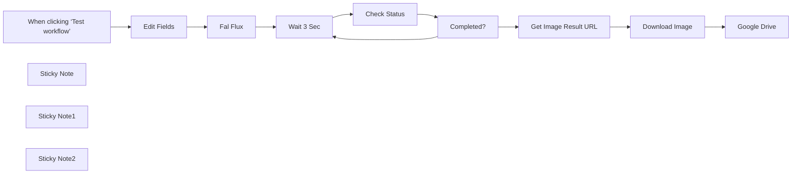

## Fluxo (.json) :

```json
{
  "id": "nJwkSOrJIFvutw1n",
  "meta": {
    "instanceId": "08daa2aa5b6032ff63690600b74f68f5b0f34a3b100102e019b35c4419168977"
  },
  "name": "Flux Dev Image Generation Fal.ai",
  "tags": [],
  "nodes": [
    {
      "id": "00f3a7d9-9931-40a4-8eb5-5b9086d6995c",
      "name": "Fal Flux",
      "type": "n8n-nodes-base.httpRequest",
      "position": [
        420,
        0
      ],
      "parameters": {
        "url": "https://queue.fal.run/fal-ai/flux/dev",
        "method": "POST",
        "options": {},
        "jsonBody": "={\n \"prompt\": \"{{ $json.Prompt }}\",\n \"image_size\": {\n \"width\": {{ $json.Width }},\n \"height\": {{ $json.Height }}\n},\n \"num_inference_steps\": {{ $json.Steps }},\n \"guidance_scale\": {{ $json.Guidance }},\n \"num_images\": 1,\n \"enable_safety_checker\": true\n}",
        "sendBody": true,
        "specifyBody": "json",
        "authentication": "genericCredentialType",
        "genericAuthType": "httpHeaderAuth"
      },
      "credentials": {
        "httpHeaderAuth": {
          "id": "lNxvZHlUafPAHBYN",
          "name": "Fal Flux Header Auth account"
        }
      },
      "typeVersion": 4.2
    },
    {
      "id": "3032a543-2e21-415e-a5bd-d56ea33e4411",
      "name": "Get Image Result URL",
      "type": "n8n-nodes-base.httpRequest",
      "position": [
        1220,
        -20
      ],
      "parameters": {
        "url": "=https://queue.fal.run/fal-ai/flux/requests/{{ $json.request_id }}",
        "options": {},
        "authentication": "genericCredentialType",
        "genericAuthType": "httpHeaderAuth"
      },
      "credentials": {
        "httpHeaderAuth": {
          "id": "lNxvZHlUafPAHBYN",
          "name": "Fal Flux Header Auth account"
        }
      },
      "typeVersion": 4.2
    },
    {
      "id": "56e13e53-1697-4970-9bea-b75e0e849425",
      "name": "Download Image",
      "type": "n8n-nodes-base.httpRequest",
      "position": [
        1400,
        -20
      ],
      "parameters": {
        "url": "={{ $json.images[0].url }}",
        "options": {}
      },
      "typeVersion": 4.2
    },
    {
      "id": "dd2efd2c-8712-4a77-8786-cccebdec876b",
      "name": "Google Drive",
      "type": "n8n-nodes-base.googleDrive",
      "position": [
        1580,
        -20
      ],
      "parameters": {
        "name": "={{ $binary.data.fileName }}",
        "driveId": {
          "__rl": true,
          "mode": "list",
          "value": "My Drive"
        },
        "options": {},
        "folderId": {
          "__rl": true,
          "mode": "list",
          "value": "1R3PSyHXWHlY9DRFdOUEAPEop2fZy-_-K",
          "cachedResultUrl": "https://drive.google.com/drive/folders/1R3PSyHXWHlY9DRFdOUEAPEop2fZy-_-K",
          "cachedResultName": "Flux Image"
        }
      },
      "credentials": {
        "googleDriveOAuth2Api": {
          "id": "CFiX9XTXGg4hGaGV",
          "name": "Google Drive account"
        }
      },
      "typeVersion": 3
    },
    {
      "id": "a598d868-0461-41fc-b6aa-f9998e9d6146",
      "name": "When clicking ‘Test workflow’",
      "type": "n8n-nodes-base.manualTrigger",
      "position": [
        -60,
        0
      ],
      "parameters": {},
      "typeVersion": 1
    },
    {
      "id": "a576d7b6-b2f3-4d53-8e7f-bb6449ff9c64",
      "name": "Sticky Note",
      "type": "n8n-nodes-base.stickyNote",
      "position": [
        80,
        -120
      ],
      "parameters": {
        "width": 260,
        "height": 120,
        "content": "## Set Parameter Here \nset Image Prompt and related settings"
      },
      "typeVersion": 1
    },
    {
      "id": "d39e85a8-3ddd-4f10-ba4c-beb86a850e10",
      "name": "Wait 3 Sec",
      "type": "n8n-nodes-base.wait",
      "position": [
        640,
        0
      ],
      "webhookId": "61a8626c-e281-4d4b-abb0-b9d87d1b4e7c",
      "parameters": {
        "amount": 3
      },
      "typeVersion": 1.1
    },
    {
      "id": "b27ac2f1-3f14-467e-81c4-af8b8fb37138",
      "name": "Check Status",
      "type": "n8n-nodes-base.httpRequest",
      "position": [
        840,
        0
      ],
      "parameters": {
        "url": "=https://queue.fal.run/fal-ai/flux/requests/{{ $json.request_id }}/status",
        "options": {},
        "authentication": "genericCredentialType",
        "genericAuthType": "httpHeaderAuth"
      },
      "credentials": {
        "httpHeaderAuth": {
          "id": "lNxvZHlUafPAHBYN",
          "name": "Fal Flux Header Auth account"
        }
      },
      "typeVersion": 4.2
    },
    {
      "id": "7ee45dab-8e31-44de-bbb1-e99a565ee19c",
      "name": "Completed?",
      "type": "n8n-nodes-base.if",
      "position": [
        1020,
        0
      ],
      "parameters": {
        "options": {},
        "conditions": {
          "options": {
            "version": 2,
            "leftValue": "",
            "caseSensitive": true,
            "typeValidation": "strict"
          },
          "combinator": "and",
          "conditions": [
            {
              "id": "299a7c34-dcff-4991-a73f-5b1a84f188ea",
              "operator": {
                "name": "filter.operator.equals",
                "type": "string",
                "operation": "equals"
              },
              "leftValue": "={{ $json.status }}",
              "rightValue": "COMPLETED"
            }
          ]
        }
      },
      "typeVersion": 2.2
    },
    {
      "id": "c5036a7d-1879-449f-8ce9-9c1cf2c7426b",
      "name": "Sticky Note1",
      "type": "n8n-nodes-base.stickyNote",
      "position": [
        1300,
        -100
      ],
      "parameters": {
        "width": 220,
        "height": 100,
        "content": "## Set Drive Folder Here "
      },
      "typeVersion": 1
    },
    {
      "id": "c8887168-6234-486c-b7cb-cc0752c6341c",
      "name": "Sticky Note2",
      "type": "n8n-nodes-base.stickyNote",
      "position": [
        360,
        -180
      ],
      "parameters": {
        "width": 260,
        "height": 180,
        "content": "### Generic Credential Type\n### Header : Authorization\nKey $FAL_KEY\"\n\nfor example:\nKey 6f2960baxxxxxxxxx"
      },
      "typeVersion": 1
    },
    {
      "id": "587043c4-e808-4c3f-910f-60f5eb8aff15",
      "name": "Edit Fields",
      "type": "n8n-nodes-base.set",
      "position": [
        180,
        0
      ],
      "parameters": {
        "options": {},
        "assignments": {
          "assignments": [
            {
              "id": "f0a033cf-fa2b-4930-93b9-ff9c45fa7c14",
              "name": "Prompt",
              "type": "string",
              "value": "Thai young woman net idol 25 yrs old, walking on the street"
            },
            {
              "id": "2b56185d-5c61-4c17-85f1-53ac4aab2b18",
              "name": "Width",
              "type": "number",
              "value": 1024
            },
            {
              "id": "51eb65c0-ae0a-4ce7-ab00-9d13f05ce1e6",
              "name": "Height",
              "type": "number",
              "value": 768
            },
            {
              "id": "8e89fca7-d380-4876-b973-69caa0394bc5",
              "name": "Steps",
              "type": "number",
              "value": 30
            },
            {
              "id": "875e06b7-352a-4dde-8595-3274e9969c9c",
              "name": "Guidance",
              "type": "number",
              "value": 3.5
            }
          ]
        }
      },
      "typeVersion": 3.4
    }
  ],
  "active": false,
  "pinData": {},
  "settings": {
    "executionOrder": "v1"
  },
  "versionId": "82877b10-5bbc-4c59-828b-4abc3ad53a5f",
  "connections": {
    "Fal Flux": {
      "main": [
        [
          {
            "node": "Wait 3 Sec",
            "type": "main",
            "index": 0
          }
        ]
      ]
    },
    "Completed?": {
      "main": [
        [
          {
            "node": "Get Image Result URL",
            "type": "main",
            "index": 0
          }
        ],
        [
          {
            "node": "Wait 3 Sec",
            "type": "main",
            "index": 0
          }
        ]
      ]
    },
    "Wait 3 Sec": {
      "main": [
        [
          {
            "node": "Check Status",
            "type": "main",
            "index": 0
          }
        ]
      ]
    },
    "Edit Fields": {
      "main": [
        [
          {
            "node": "Fal Flux",
            "type": "main",
            "index": 0
          }
        ]
      ]
    },
    "Check Status": {
      "main": [
        [
          {
            "node": "Completed?",
            "type": "main",
            "index": 0
          }
        ]
      ]
    },
    "Download Image": {
      "main": [
        [
          {
            "node": "Google Drive",
            "type": "main",
            "index": 0
          }
        ]
      ]
    },
    "Get Image Result URL": {
      "main": [
        [
          {
            "node": "Download Image",
            "type": "main",
            "index": 0
          }
        ]
      ]
    },
    "When clicking ‘Test workflow’": {
      "main": [
        [
          {
            "node": "Edit Fields",
            "type": "main",
            "index": 0
          }
        ]
      ]
    }
  }
}
```

<a id="template-1532"></a>

## Template 1532 - Buscar e pontuar empresas LinkedIn e adicionar ao CRM (Google Sheets)

- **Nome:** Buscar e pontuar empresas LinkedIn e adicionar ao CRM (Google Sheets)
- **Descrição:** Automatiza a busca por empresas no LinkedIn, enriquece os dados, avalia o fit com IA e armazena os resultados em uma planilha Google como CRM.
- **Funcionalidade:** • Pesquisa de empresas: realiza buscas por palavras-chave, localização e tamanho de empresa via API, com paginação para múltiplas páginas de resultados.
• Extração de dados detalhados: consulta informações completas de cada empresa usando o link do perfil obtido na busca.
• Filtragem de relevância: descarta empresas sem website ou com número de seguidores abaixo do limiar configurado (ex.: 200).
• Verificação de duplicatas: checa se o ID da empresa já existe na planilha antes de processar para evitar entradas duplicadas.
• Pontuação com IA: usa um modelo OpenAI para avaliar o interesse potencial numa escala de 0 a 10 seguindo critérios configuráveis (indústria, tamanho, dores, indicadores positivos/negativos).
• Armazenamento no CRM: grava os registros na planilha Google com campos como ID, Nome, Score, Estado, Resumo, Website e LinkedIn.
• Processamento em lote e controle de taxa: implementa batches, paginação e pausas de 2 segundos entre requisições para respeitar limites de API.
• Variáveis configuráveis: permite ajustar alvo, tamanho da empresa, localização, produto/serviço e indicadores positivos/negativos para personalizar o scoring.
• Registro integral: mesmo que a pontuação varie, as empresas são sempre adicionadas ao CRM para posterior análise manual.
- **Ferramentas:** • Ghost Genius API: API usada para buscar empresas no LinkedIn e obter detalhes enriquecidos de perfis corporativos.
• Ghost Genius Locations ID Finder: ferramenta para obter IDs de localização do LinkedIn usados nas buscas por região.
• Google Sheets: planilha online utilizada como CRM para armazenar e gerenciar os registros das empresas.
• OpenAI: serviço de IA responsável por analisar os dados da empresa e gerar uma pontuação de interesse (score).

## Fluxo visual

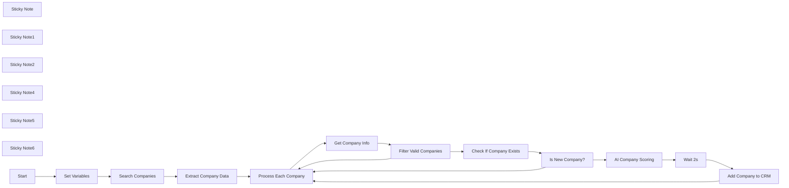

## Fluxo (.json) :

```json
{
  "id": "GW4dTYPBXwOrCUxo",
  "meta": {
    "instanceId": "95a1299fb2b16eb2219cb044f54e72c2d00dcd2c72efe717b3c308d200f29927",
    "templateCredsSetupCompleted": true
  },
  "name": "Search LinkedIn companies, Score with AI and add them to Google Sheet CRM",
  "tags": [],
  "nodes": [
    {
      "id": "a6af7206-4b90-421a-aee6-d71aa02e2182",
      "name": "Process Each Company",
      "type": "n8n-nodes-base.splitInBatches",
      "onError": "continueRegularOutput",
      "position": [
        -260,
        320
      ],
      "parameters": {
        "options": {}
      },
      "typeVersion": 3,
      "alwaysOutputData": false
    },
    {
      "id": "7a003d97-ff9b-4cac-a2e3-95b00e590904",
      "name": "Get Company Info",
      "type": "n8n-nodes-base.httpRequest",
      "onError": "continueRegularOutput",
      "position": [
        -20,
        320
      ],
      "parameters": {
        "url": "https://api.ghostgenius.fr/v2/company",
        "options": {
          "batching": {
            "batch": {
              "batchSize": 1,
              "batchInterval": 2000
            }
          }
        },
        "sendQuery": true,
        "authentication": "genericCredentialType",
        "genericAuthType": "httpHeaderAuth",
        "queryParameters": {
          "parameters": [
            {
              "name": "url",
              "value": "={{ $json.url }}"
            }
          ]
        }
      },
      "credentials": {
        "httpHeaderAuth": {
          "id": "XdFg4wGkcxwRPUMo",
          "name": "Header Auth account 4"
        }
      },
      "retryOnFail": true,
      "typeVersion": 4.2
    },
    {
      "id": "9bee1921-c96e-4373-8321-cce33a3184d6",
      "name": "Filter Valid Companies",
      "type": "n8n-nodes-base.if",
      "onError": "continueRegularOutput",
      "position": [
        200,
        320
      ],
      "parameters": {
        "options": {},
        "conditions": {
          "options": {
            "version": 2,
            "leftValue": "",
            "caseSensitive": true,
            "typeValidation": "strict"
          },
          "combinator": "and",
          "conditions": [
            {
              "id": "5ea943a6-8f6c-4cb0-b194-8c92d4b2aacc",
              "operator": {
                "type": "string",
                "operation": "notEmpty",
                "singleValue": true
              },
              "leftValue": "={{ $json.website }}",
              "rightValue": "[null]"
            },
            {
              "id": "8235b9bb-3cd4-4ed4-a5dc-921127ff47c7",
              "operator": {
                "type": "number",
                "operation": "gt"
              },
              "leftValue": "={{ $json.followers_count }}",
              "rightValue": 200
            }
          ]
        }
      },
      "typeVersion": 2.2
    },
    {
      "id": "5913869a-4811-4b6f-bbf5-ec6a1f4ee50a",
      "name": "Is New Company?",
      "type": "n8n-nodes-base.if",
      "position": [
        600,
        320
      ],
      "parameters": {
        "options": {},
        "conditions": {
          "options": {
            "version": 2,
            "leftValue": "",
            "caseSensitive": true,
            "typeValidation": "strict"
          },
          "combinator": "and",
          "conditions": [
            {
              "id": "050c33be-c648-44d7-901c-51f6ff024e97",
              "operator": {
                "type": "object",
                "operation": "empty",
                "singleValue": true
              },
              "leftValue": "={{ $('Check If Company Exists').all().first().json }}",
              "rightValue": ""
            }
          ]
        }
      },
      "typeVersion": 2.2
    },
    {
      "id": "ebb0ba8c-beec-4ec0-97b6-a5e706c73546",
      "name": "Set Variables",
      "type": "n8n-nodes-base.set",
      "position": [
        -1000,
        320
      ],
      "parameters": {
        "options": {},
        "assignments": {
          "assignments": [
            {
              "id": "e81e4891-4786-4dd9-a338-d1095e27f382",
              "name": "Your target",
              "type": "string",
              "value": "Growth Marketing Agency"
            },
            {
              "id": "ed2b6b08-66aa-4d4b-b68c-698b5e841930",
              "name": "B: 1-10 employees, C: 11-50 employees, D: 51-200 employees, E: 201-500 employees, F: 501-1000 employees, G: 1001-5000 employees, H: 5001-10,000 employees, I: 10,001+ employees",
              "type": "string",
              "value": "C"
            },
            {
              "id": "f1d02f1a-8115-4e0c-a5ec-59bf5b54263b",
              "name": "Location (find it on : https://www.ghostgenius.fr/tools/search-sales-navigator-locations-id)",
              "type": "string",
              "value": "103644278"
            },
            {
              "id": "21bdb871-9327-4553-bb4a-a138be9f735c",
              "name": "Your product or service",
              "type": "string",
              "value": "our CRM implementation services"
            },
            {
              "id": "31f5adfc-8a8f-498c-9e57-24584c42f7de",
              "name": "Positive indicators (3-5 specific factors that indicate a company might need your product)",
              "type": "string",
              "value": "- Mentions challenges with customer relationships or sales processes \n- Company is in growth phase with expanding client base \n- Mentions need for better data organization or customer insights \n- References marketing automation, sales pipelines, or customer retention "
            },
            {
              "id": "630807cb-9d06-41ee-8534-a652ed76cb4c",
              "name": "Negative indicators (3-5 specific factors that indicate a company might NOT need your product)",
              "type": "string",
              "value": "- Very small companies (1-5 employees) or extremely large enterprises \n- Already mentions using advanced CRM solutions \n- No indication of sales process or customer relationship management in description \n- Pure manufacturing or product-based business with minimal customer interaction \n- Non-profit or government entity with unique relationship management needs"
            }
          ]
        }
      },
      "typeVersion": 3.4
    },
    {
      "id": "d2392572-3ef0-44e7-a2a1-ee6a1967ad16",
      "name": "Search Companies",
      "type": "n8n-nodes-base.httpRequest",
      "position": [
        -800,
        320
      ],
      "parameters": {
        "url": "https://api.ghostgenius.fr/v2/search/companies",
        "options": {
          "pagination": {
            "pagination": {
              "parameters": {
                "parameters": [
                  {
                    "name": "page",
                    "value": "={{ $pageCount + 1 }}"
                  }
                ]
              },
              "maxRequests": 3,
              "requestInterval": 2000,
              "limitPagesFetched": true,
              "completeExpression": "={{ $response.body.data.isEmpty() }}",
              "paginationCompleteWhen": "other"
            }
          }
        },
        "sendQuery": true,
        "authentication": "genericCredentialType",
        "genericAuthType": "httpHeaderAuth",
        "queryParameters": {
          "parameters": [
            {
              "name": "keywords",
              "value": "={{ $json['Your target'] }}"
            },
            {
              "name": "locations",
              "value": "={{ $json['Location (find it on : https://www'].ghostgenius['fr/tools/search-sales-navigator-locations-id)'] }}"
            },
            {
              "name": "company_size",
              "value": "={{ $json['B: 1-10 employees, C: 11-50 employees, D: 51-200 employees, E: 201-500 employees, F: 501-1000 employees, G: 1001-5000 employees, H: 5001-10,000 employees, I: 10,001+ employees'] }}"
            }
          ]
        }
      },
      "credentials": {
        "httpHeaderAuth": {
          "id": "XdFg4wGkcxwRPUMo",
          "name": "Header Auth account 4"
        }
      },
      "typeVersion": 4.2
    },
    {
      "id": "7ecac7ee-b51e-4a14-8295-b122974c0a14",
      "name": "Extract Company Data",
      "type": "n8n-nodes-base.splitOut",
      "onError": "continueRegularOutput",
      "position": [
        -600,
        320
      ],
      "parameters": {
        "options": {},
        "fieldToSplitOut": "data"
      },
      "typeVersion": 1
    },
    {
      "id": "a4b63dcd-0d5d-46dd-9279-c7872ac721d6",
      "name": "Check If Company Exists",
      "type": "n8n-nodes-base.googleSheets",
      "position": [
        420,
        320
      ],
      "parameters": {
        "options": {},
        "filtersUI": {
          "values": [
            {
              "lookupValue": "={{ $json.id }}",
              "lookupColumn": "ID"
            }
          ]
        },
        "sheetName": {
          "__rl": true,
          "mode": "list",
          "value": "gid=0",
          "cachedResultUrl": "https://docs.google.com/spreadsheets/d/1LfhqpyjimLjyQcmWY8mUr6YtNBcifiOVLIhAJGV9jiM/edit#gid=0",
          "cachedResultName": "Companies"
        },
        "documentId": {
          "__rl": true,
          "mode": "list",
          "value": "1LfhqpyjimLjyQcmWY8mUr6YtNBcifiOVLIhAJGV9jiM",
          "cachedResultUrl": "https://docs.google.com/spreadsheets/d/1LfhqpyjimLjyQcmWY8mUr6YtNBcifiOVLIhAJGV9jiM/edit?usp=drivesdk",
          "cachedResultName": "CRM"
        }
      },
      "credentials": {
        "googleSheetsOAuth2Api": {
          "id": "Y8D8KsfgZCZmP2Vh",
          "name": "Google Sheets account"
        }
      },
      "typeVersion": 4.5,
      "alwaysOutputData": true
    },
    {
      "id": "dfbd3bdb-0efb-4e09-99ae-3dc9a0d9e64d",
      "name": "AI Company Scoring",
      "type": "@n8n/n8n-nodes-langchain.openAi",
      "position": [
        920,
        340
      ],
      "parameters": {
        "modelId": {
          "__rl": true,
          "mode": "list",
          "value": "gpt-4.1",
          "cachedResultName": "GPT-4.1"
        },
        "options": {
          "temperature": 0.2
        },
        "messages": {
          "values": [
            {
              "role": "system",
              "content": "=You are an AI assistant that evaluates companies to determine if they might be interested in {{ $('Set Variables').item.json['Your product or service'] }}.\n\nEvaluate the company information provided on a scale of 0 to 10, where:\n- 0 = Not at all likely to be interested\n- 10 = Extremely likely to be interested\n\nBase your evaluation on these criteria:\n1. Industry fit: How well does the company's industry align with {{ $('Set Variables').item.json['Your product or service'] }}?\n2. Company profile: Is the company size, growth stage, and location appropriate for {{ $('Set Variables').item.json['Your product or service'] }}?\n3. Pain points: Based on their description, do they likely have challenges that {{ $('Set Variables').item.json['Your product or service'] }} solves?\n\nFactors that indicate a good fit:\n{{ $('Set Variables').item.json['Positive indicators (3-5 specific factors that indicate a company might need your product)'] }}\n\nFactors that indicate a poor fit:\n{{ $('Set Variables').item.json['Negative indicators (3-5 specific factors that indicate a company might NOT need your product)'] }}\n\nRespond ONLY with this JSON format:\n```json\n{\n  \"score\": [number between 0 and 10],\n}"
            },
            {
              "content": "=Here is the company to analyze:\nName: {{ $('Filter Valid Companies').item.json.name }}\n{{ $('Filter Valid Companies').item.json.tagline }}\n{{ $('Filter Valid Companies').item.json.description }}\nNumber of employees: {{ $('Filter Valid Companies').item.json.staff_count }}\nIndustry: {{ $('Filter Valid Companies').item.json.industries }}\nSpecialties: {{ $('Filter Valid Companies').item.json.specialities }}\nLocation: {{ $('Filter Valid Companies').item.json.locations?.toJsonString() }}\nFounded in: {{ $('Filter Valid Companies').item.json.founded_on }}\nFunding: {{ $('Filter Valid Companies').item.json.funding?.toJsonString() }}\n"
            }
          ]
        },
        "jsonOutput": true
      },
      "credentials": {
        "openAiApi": {
          "id": "SSQ6BcbSKW6I0uSn",
          "name": "OpenAi account"
        }
      },
      "typeVersion": 1.8
    },
    {
      "id": "b50d1d4f-63bb-4d51-8db6-bdc1ab52783f",
      "name": "Sticky Note",
      "type": "n8n-nodes-base.stickyNote",
      "position": [
        -1280,
        -20
      ],
      "parameters": {
        "color": 6,
        "width": 860,
        "height": 560,
        "content": "## LinkedIn Company Search\nThis section initiates the workflow and searches for your target companies on LinkedIn using the Ghost Genius API.\n\nYou can filter and refine your search using keywords, company size, location, industry, or even whether the company has active job postings. Use the \"Set Variables\" node for it (this node also allows you to customize the AI Lead Scoring prompt).\n\nNote that you can retrieve a maximum of 1000 companies per search (corresponding to 100 LinkedIn pages), so it's important not to exceed this number of results to avoid losing prospects.\n\nExample: Let's say I want to target Growth Marketing Agencies with 11-50 employees. I do my search and see that there are 10,000 results. So I refine my search by using location to go country by country and retrieve all 10,000 results in several batches ranging from 500 to 1000 depending on the country.\n\nTips: To test the workflow or to see the number of results of your search, change the pagination parameter (Max Pages) in the \"Search Companies\" node. It will be displayed at the very top of the response JSON."
      },
      "typeVersion": 1
    },
    {
      "id": "74c0b7a1-3d98-4eb6-b195-fe025cb06202",
      "name": "Sticky Note1",
      "type": "n8n-nodes-base.stickyNote",
      "position": [
        -340,
        -20
      ],
      "parameters": {
        "color": 4,
        "width": 1120,
        "height": 560,
        "content": "## Company Data Processing \nThis section processes each company individually.\n\nWe retrieve all the company information using Get Company Details by using the LinkedIn link obtained from the previous section.\n\nThen we filter the company based on the number of followers, which gives us a first indication of the company's credibility (200 in this case), and whether their LinkedIn page has a website listed.\n\nThe workflow implements batch processing with a 2-second delay between requests to respect API rate limits. This methodical approach ensures reliable data collection while preventing API timeouts.\n\nYou can adjust these thresholds based on your target market - increasing the follower count for more established businesses or decreasing it for emerging markets.\n\nThe last two modules checks if the company already exists in your database (using LinkedIn ID) to prevent duplicates because when you do close enough searches, some companies may come up several times."
      },
      "typeVersion": 1
    },
    {
      "id": "440959e6-151c-4e4f-ad62-72bb99ba6135",
      "name": "Sticky Note2",
      "type": "n8n-nodes-base.stickyNote",
      "position": [
        860,
        -20
      ],
      "parameters": {
        "color": 5,
        "width": 780,
        "height": 560,
        "content": "## AI Scoring and Storage\nThis section scores the company and stores it in a Google Sheet.\n\nIt's important to properly fill in the \"Set variables\" node at the beginning of the workflow to get a result relevant to your use case. You can also manually modify the system prompt.\n\nRegardless of the score obtained, it's very important to always store the company. Note that we add a 2-second \"wait\" module to respect Google Sheet's rate limits.\n\nWe add the company to the \"Companies\" sheet in this [Google Sheet](https://docs.google.com/spreadsheets/d/1LfhqpyjimLjyQcmWY8mUr6YtNBcifiOVLIhAJGV9jiM/edit?usp=sharing) which you can make a copy of and use.\n\nThis AI scoring functionality is extremely impressive once perfectly configured, so I recommend taking some time to test with several companies to ensure the scoring system works well for your needs!\n\n"
      },
      "typeVersion": 1
    },
    {
      "id": "7de84aac-73a0-4362-bc1e-9e917a45699b",
      "name": "Wait 2s",
      "type": "n8n-nodes-base.wait",
      "position": [
        1280,
        340
      ],
      "webhookId": "d22fd305-d8f6-4fc3-8a96-62386fa30f94",
      "parameters": {
        "amount": 2
      },
      "typeVersion": 1.1
    },
    {
      "id": "565f8580-fc51-481f-81f6-cc86142e67af",
      "name": "Add Company to CRM",
      "type": "n8n-nodes-base.googleSheets",
      "position": [
        1480,
        340
      ],
      "parameters": {
        "columns": {
          "value": {
            "ID": "={{ $('Get Company Info').item.json.id }}",
            "Name": "={{ $('Get Company Info').item.json.name }}",
            "Score": "={{ $json.message.content.score }}",
            "State": "Qualified",
            "Summary": "={{ $('Get Company Info').item.json.description }}",
            "Website": "={{ $('Get Company Info').item.json.website }}",
            "LinkedIn": "={{ $('Get Company Info').item.json.url }}"
          },
          "schema": [
            {
              "id": "Name",
              "type": "string",
              "display": true,
              "required": false,
              "displayName": "Name",
              "defaultMatch": false,
              "canBeUsedToMatch": true
            },
            {
              "id": "Website",
              "type": "string",
              "display": true,
              "required": false,
              "displayName": "Website",
              "defaultMatch": false,
              "canBeUsedToMatch": true
            },
            {
              "id": "LinkedIn",
              "type": "string",
              "display": true,
              "required": false,
              "displayName": "LinkedIn",
              "defaultMatch": false,
              "canBeUsedToMatch": true
            },
            {
              "id": "ID",
              "type": "string",
              "display": true,
              "required": false,
              "displayName": "ID",
              "defaultMatch": false,
              "canBeUsedToMatch": true
            },
            {
              "id": "Summary",
              "type": "string",
              "display": true,
              "required": false,
              "displayName": "Summary",
              "defaultMatch": false,
              "canBeUsedToMatch": true
            },
            {
              "id": "Score",
              "type": "string",
              "display": true,
              "required": false,
              "displayName": "Score",
              "defaultMatch": false,
              "canBeUsedToMatch": true
            },
            {
              "id": "State",
              "type": "string",
              "display": true,
              "removed": false,
              "required": false,
              "displayName": "State",
              "defaultMatch": false,
              "canBeUsedToMatch": true
            }
          ],
          "mappingMode": "defineBelow",
          "matchingColumns": [],
          "attemptToConvertTypes": false,
          "convertFieldsToString": false
        },
        "options": {},
        "operation": "append",
        "sheetName": {
          "__rl": true,
          "mode": "list",
          "value": "gid=0",
          "cachedResultUrl": "https://docs.google.com/spreadsheets/d/10lxvwdeCf7vrAuWsNRGIsSTICEI3z-SUCDVHr8XzAYQ/edit#gid=0",
          "cachedResultName": "Companies"
        },
        "documentId": {
          "__rl": true,
          "mode": "list",
          "value": "1LfhqpyjimLjyQcmWY8mUr6YtNBcifiOVLIhAJGV9jiM",
          "cachedResultUrl": "https://docs.google.com/spreadsheets/d/1LfhqpyjimLjyQcmWY8mUr6YtNBcifiOVLIhAJGV9jiM/edit?usp=drivesdk",
          "cachedResultName": "CRM"
        }
      },
      "credentials": {
        "googleSheetsOAuth2Api": {
          "id": "Y8D8KsfgZCZmP2Vh",
          "name": "Google Sheets account"
        }
      },
      "typeVersion": 4.5
    },
    {
      "id": "5878ea6f-3ea4-4a25-8f45-111cfeb267e2",
      "name": "Sticky Note4",
      "type": "n8n-nodes-base.stickyNote",
      "position": [
        -780,
        -460
      ],
      "parameters": {
        "width": 600,
        "height": 380,
        "content": "## Introduction\nWelcome to my template! Before explaining how to set it up, here's some important information:\n\nThis automation is an alternative version of [this template](https://n8n.io/workflows/3717-search-linkedin-companies-and-add-them-to-airtable-crm/) that differs by using Google Sheets instead of Airtable and adding a Lead Scoring system allowing for more precision in our targeting.\n\nThis automation therefore allows you, starting from a LinkedIn search, to enrich company data and score them to determine if they might be interested in your services/product.\n\nFor any questions, you can send me a DM on my [LinkedIn](https://www.linkedin.com/in/matthieu-belin83/) :)  "
      },
      "typeVersion": 1
    },
    {
      "id": "45ee97ed-5200-40dc-b786-24f26518769b",
      "name": "Sticky Note5",
      "type": "n8n-nodes-base.stickyNote",
      "position": [
        -100,
        -460
      ],
      "parameters": {
        "width": 600,
        "height": 380,
        "content": "## Setup\n- Create an account on [Ghost Genius API](ghostgenius.fr) and get your API key.\n\n- Configure the Search Companies and Get Company Info modules by creating a \"Header Auth\" credential:\n**Name: \"Authorization\"**\n**Value: \"Bearer api_key\"**\n\n- Create a copy of this [Google Sheet](https://docs.google.com/spreadsheets/d/1LfhqpyjimLjyQcmWY8mUr6YtNBcifiOVLIhAJGV9jiM/edit?usp=sharing) by clicking on File => Make a copy (in Google Sheet).\n\n- Configure your Google Sheet credential by following the n8n documentation.\n\n- Create an OpenAI key [here](https://platform.openai.com/docs/overview) and add the credential to the \"AI Company Scoring\" node following the n8n documentation.\n\n- Add your information to the \"Set Variables\" node."
      },
      "typeVersion": 1
    },
    {
      "id": "da0f35e1-c377-4362-af91-c6558c59cf47",
      "name": "Sticky Note6",
      "type": "n8n-nodes-base.stickyNote",
      "position": [
        580,
        -460
      ],
      "parameters": {
        "width": 600,
        "height": 380,
        "content": "## Tools \n**(You can use the API and CRM of your choice; this is only a suggestion)**\n\n- API Linkedin : [Ghost Genius API](https://ghostgenius.fr) \n\n- API Documentation : [Documentation](https://ghostgenius.fr/docs)\n\n- CRM : [Google Sheet](https://workspace.google.com/intl/en/products/sheets/)\n\n- AI : [OpenAI](https://openai.com)\n\n- LinkedIn Location ID Finder : [Ghost Genius Locations ID Finder](https://ghostgenius.fr/tools/search-sales-navigator-locations-id)"
      },
      "typeVersion": 1
    },
    {
      "id": "b681dc61-85f9-4e38-9e86-1ad399161153",
      "name": "Start",
      "type": "n8n-nodes-base.manualTrigger",
      "position": [
        -1200,
        320
      ],
      "parameters": {},
      "typeVersion": 1
    }
  ],
  "active": false,
  "pinData": {},
  "settings": {
    "executionOrder": "v1"
  },
  "versionId": "b2dc41db-f86c-407b-a2bd-1e81d72bb5fc",
  "connections": {
    "Start": {
      "main": [
        [
          {
            "node": "Set Variables",
            "type": "main",
            "index": 0
          }
        ]
      ]
    },
    "Wait 2s": {
      "main": [
        [
          {
            "node": "Add Company to CRM",
            "type": "main",
            "index": 0
          }
        ]
      ]
    },
    "Set Variables": {
      "main": [
        [
          {
            "node": "Search Companies",
            "type": "main",
            "index": 0
          }
        ]
      ]
    },
    "Is New Company?": {
      "main": [
        [
          {
            "node": "AI Company Scoring",
            "type": "main",
            "index": 0
          }
        ],
        [
          {
            "node": "Process Each Company",
            "type": "main",
            "index": 0
          }
        ]
      ]
    },
    "Get Company Info": {
      "main": [
        [
          {
            "node": "Filter Valid Companies",
            "type": "main",
            "index": 0
          }
        ]
      ]
    },
    "Search Companies": {
      "main": [
        [
          {
            "node": "Extract Company Data",
            "type": "main",
            "index": 0
          }
        ]
      ]
    },
    "AI Company Scoring": {
      "main": [
        [
          {
            "node": "Wait 2s",
            "type": "main",
            "index": 0
          }
        ]
      ]
    },
    "Add Company to CRM": {
      "main": [
        [
          {
            "node": "Process Each Company",
            "type": "main",
            "index": 0
          }
        ]
      ]
    },
    "Extract Company Data": {
      "main": [
        [
          {
            "node": "Process Each Company",
            "type": "main",
            "index": 0
          }
        ]
      ]
    },
    "Process Each Company": {
      "main": [
        [],
        [
          {
            "node": "Get Company Info",
            "type": "main",
            "index": 0
          }
        ]
      ]
    },
    "Filter Valid Companies": {
      "main": [
        [
          {
            "node": "Check If Company Exists",
            "type": "main",
            "index": 0
          }
        ],
        [
          {
            "node": "Process Each Company",
            "type": "main",
            "index": 0
          }
        ]
      ]
    },
    "Check If Company Exists": {
      "main": [
        [
          {
            "node": "Is New Company?",
            "type": "main",
            "index": 0
          }
        ]
      ]
    }
  }
}
```

<a id="template-1534"></a>

## Template 1534 - Gerador de imagens 9:16 e thumbnails a partir de conteúdo

- **Nome:** Gerador de imagens 9:16 e thumbnails a partir de conteúdo
- **Descrição:** Automatiza a criação de roteiros curtos e a geração de imagens em aspecto 9:16 (cenas e thumbnail) a partir de posts ou conteúdos relacionados, refinando prompts e armazenando os ativos resultantes.
- **Funcionalidade:** • Recuperar diretrizes de marca: Obtém diretrizes, tom e elementos de marca para guiar estilo e conteúdo visual.
• Buscar palavras-chave SEO: Consulta uma base de palavras-chave para identificar conteúdo relacionado.
• Filtrar palavras-chave relevantes: Aplica filtro para selecionar palavras-chave específicas (ex.: "ai automation") e remover duplicados.
• Recuperar conteúdo relacionado: Busca posts/blogs associados às palavras-chave selecionadas.
• Preparar roteiro curto com imagens: Usa um modelo de linguagem para criar um roteiro de 4 cenas (<30s) e gerar prompts de imagem para cada cena e para a thumbnail, adaptado ao formato 9:16.
• Melhorar prompts de imagem: Envia os prompts para um serviço de melhoria de prompts para otimizar descrição, composição e estilo.
• Gerar imagens de cena e thumbnail: Chama um serviço de geração de imagens (configurado para 9:16 — 768x1376) usando um modelo avançado para criar imagens finais.
• Aguardar e recuperar resultados: Aguarda o processamento das jobs de geração e consulta o status para obter URLs e metadados das imagens.
• Armazenar ativos gerados: Registra URLs, nomes e metadados das imagens na base de ativos para uso posterior (nomeando como Scene - <script> ou TN - <Title>).
• Processar cenas em lote: Divide o roteiro em cenas e processa cada uma em loop/batches para gerar múltiplas imagens de forma organizada.
• Ajustes de configurações de prompt: Aplica configurações adicionais (ex.: modelo a usar, regras de composição) antes da geração.
- **Ferramentas:** • Airtable: Base de dados para armazenar diretrizes de marca, palavras-chave, conteúdos e registros dos ativos gerados.
• OpenAI (GPT-4o-mini): Gera roteiros curtos e prompts de imagem a partir do conteúdo fornecido.
• Leonardo.ai (Phoenix): Serviço de refinamento de prompts e geração de imagens com parâmetros para produção de cenas e thumbnails em 9:16.
• Wikipedia: Fonte opcional de pesquisa para enriquecer informações durante a preparação do roteiro.

## Fluxo visual

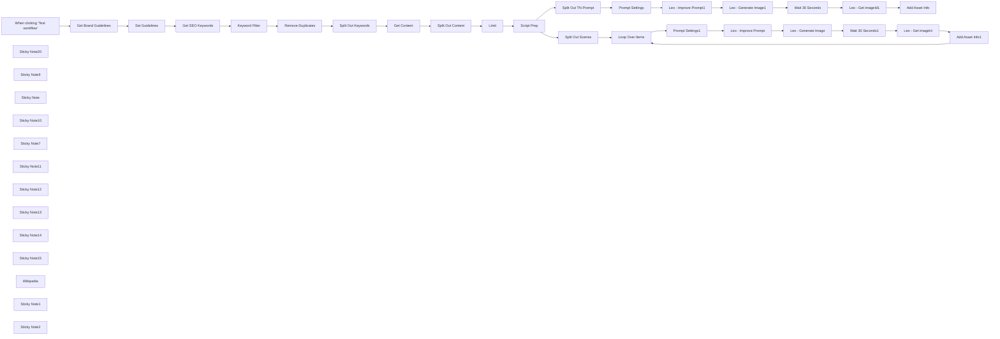

## Fluxo (.json) :

```json
{
  "id": "VlCgU5K9SYQbdxTa",
  "meta": {
    "instanceId": "d868e3d040e7bda892c81b17cf446053ea25d2556fcef89cbe19dd61a3e876e9"
  },
  "name": "Content to 9:16 Aspect Image Generator v1",
  "tags": [
    {
      "id": "QsH2EXuw2e7YCv0K",
      "name": "OpenAI",
      "createdAt": "2024-11-15T04:05:20.872Z",
      "updatedAt": "2024-11-15T04:05:20.872Z"
    },
    {
      "id": "04PL2irdWYmF2Dg3",
      "name": "RunwayML",
      "createdAt": "2024-11-15T05:55:30.783Z",
      "updatedAt": "2024-11-15T05:55:30.783Z"
    },
    {
      "id": "yrY6updwSCXMsT0z",
      "name": "Video",
      "createdAt": "2024-11-15T05:55:34.333Z",
      "updatedAt": "2024-11-15T05:55:34.333Z"
    },
    {
      "id": "lvPj9rYRsKOHCi4J",
      "name": "Creatomate",
      "createdAt": "2024-11-19T15:59:16.134Z",
      "updatedAt": "2024-11-19T15:59:16.134Z"
    },
    {
      "id": "9LXACqpQLNtrM6or",
      "name": "Leonardo",
      "createdAt": "2024-11-19T15:59:21.368Z",
      "updatedAt": "2024-11-19T15:59:21.368Z"
    },
    {
      "id": "2DYOnQD6moK2E2VF",
      "name": "App 2",
      "createdAt": "2024-12-19T04:43:15.771Z",
      "updatedAt": "2024-12-19T04:43:15.771Z"
    }
  ],
  "nodes": [
    {
      "id": "be5c3e43-cc86-4081-aa98-e7af3d22267d",
      "name": "When clicking ‘Test workflow’",
      "type": "n8n-nodes-base.manualTrigger",
      "position": [
        200,
        -960
      ],
      "parameters": {},
      "typeVersion": 1
    },
    {
      "id": "28f70c3a-bc45-4f43-80a6-69b592c8ce2e",
      "name": "Sticky Note20",
      "type": "n8n-nodes-base.stickyNote",
      "position": [
        -180,
        -1200
      ],
      "parameters": {
        "color": 6,
        "width": 290,
        "height": 1110,
        "content": "# AlexK1919 \n\n\n#### I’m Alex, an AI-Native Workflow Automation Architect Building Solutions to Optimize your Personal and Professional Life.\n\n### Example AirTable Base\nhttps://airtable.com/appRDq3E42JNtruIP/shrnc9EzlxpCq7Vxe\n\n### Link to my n8n Workflow Templates\nhttps://n8n.io/creators/alexk1919\n\n### Workflow Overview Video\nhttps://www.youtube.com/@alexk1919_\n\n### Products Used\n[AirTable](https://airtable.com)\n[OpenAI](https://openai.com/)\n[Leonardo.ai](https://app.leonardo.ai/?via=alexk1919)\n\n### About Me\nhttps://beacons.ai/alexk1919\n"
      },
      "typeVersion": 1
    },
    {
      "id": "334044d8-e9a6-497e-9a11-63134233c8fa",
      "name": "Sticky Note9",
      "type": "n8n-nodes-base.stickyNote",
      "position": [
        140,
        -1200
      ],
      "parameters": {
        "color": 7,
        "width": 247,
        "height": 1111,
        "content": "# Triggers"
      },
      "typeVersion": 1
    },
    {
      "id": "fcdf5c1a-3ddd-44cf-9b6d-a9afdd1fc256",
      "name": "Sticky Note",
      "type": "n8n-nodes-base.stickyNote",
      "position": [
        420,
        -1200
      ],
      "parameters": {
        "color": 3,
        "width": 427,
        "height": 1111,
        "content": "# 1. Retrieve Brand Guidelines"
      },
      "typeVersion": 1
    },
    {
      "id": "a5a2bfcf-e2b7-4a9f-a766-7d08168c3d6f",
      "name": "Set Guidelines",
      "type": "n8n-nodes-base.set",
      "position": [
        680,
        -960
      ],
      "parameters": {
        "options": {},
        "assignments": {
          "assignments": [
            {
              "id": "f803283a-f895-4794-87ad-46c63542ea4f",
              "name": "id",
              "type": "string",
              "value": "={{ $json.id }}"
            }
          ]
        },
        "includeOtherFields": true
      },
      "typeVersion": 3.4
    },
    {
      "id": "ab26d351-144d-477c-8dd3-a010c3fce0ca",
      "name": "Sticky Note10",
      "type": "n8n-nodes-base.stickyNote",
      "position": [
        880,
        -1200
      ],
      "parameters": {
        "color": 4,
        "width": 667,
        "height": 1111,
        "content": "# 2. Retrieve Blog Post/s"
      },
      "typeVersion": 1
    },
    {
      "id": "f8e46822-cf7e-4697-bee4-99221b6063a7",
      "name": "Get Brand Guidelines",
      "type": "n8n-nodes-base.airtable",
      "position": [
        480,
        -960
      ],
      "parameters": {
        "base": {
          "__rl": true,
          "mode": "list",
          "value": "appRDq3E42JNtruIP",
          "cachedResultUrl": "https://airtable.com/appRDq3E42JNtruIP",
          "cachedResultName": "Content Manager"
        },
        "table": {
          "__rl": true,
          "mode": "list",
          "value": "tblF8Ye2g0gPdpsaI",
          "cachedResultUrl": "https://airtable.com/appRDq3E42JNtruIP/tblF8Ye2g0gPdpsaI",
          "cachedResultName": "Brand Guidelines"
        },
        "options": {},
        "operation": "search"
      },
      "credentials": {
        "airtableTokenApi": {
          "id": "zS1BIbs19PvAC2d0",
          "name": "AlexK Airtable Personal Access Token account"
        }
      },
      "typeVersion": 2.1
    },
    {
      "id": "c6609f11-d04d-4e83-8fc0-af3c0e2cc9bd",
      "name": "Get SEO Keywords",
      "type": "n8n-nodes-base.airtable",
      "position": [
        940,
        -960
      ],
      "parameters": {
        "base": {
          "__rl": true,
          "mode": "list",
          "value": "appRDq3E42JNtruIP",
          "cachedResultUrl": "https://airtable.com/appRDq3E42JNtruIP",
          "cachedResultName": "Content Manager"
        },
        "table": {
          "__rl": true,
          "mode": "list",
          "value": "tblU1fgGH1LXwnWRb",
          "cachedResultUrl": "https://airtable.com/appRDq3E42JNtruIP/tblU1fgGH1LXwnWRb",
          "cachedResultName": "SEO Keywords"
        },
        "options": {
          "fields": [
            "Keyword",
            "RelatedContent"
          ]
        },
        "operation": "search"
      },
      "credentials": {
        "airtableTokenApi": {
          "id": "zS1BIbs19PvAC2d0",
          "name": "AlexK Airtable Personal Access Token account"
        }
      },
      "executeOnce": false,
      "typeVersion": 2.1
    },
    {
      "id": "d9201fa0-05d9-492b-896d-2cdc26e84f2e",
      "name": "Remove Duplicates",
      "type": "n8n-nodes-base.removeDuplicates",
      "position": [
        1340,
        -960
      ],
      "parameters": {
        "compare": "selectedFields",
        "options": {},
        "fieldsToCompare": "id"
      },
      "typeVersion": 2
    },
    {
      "id": "68f2a29b-0e29-4a64-986b-9c1204c1d1ef",
      "name": "Sticky Note7",
      "type": "n8n-nodes-base.stickyNote",
      "position": [
        1080,
        -1040
      ],
      "parameters": {
        "color": 3,
        "width": 220,
        "height": 240,
        "content": "## Set keyword filter"
      },
      "typeVersion": 1
    },
    {
      "id": "530dfb77-0aee-445d-8a1f-d8f2cbcd1640",
      "name": "Keyword Filter",
      "type": "n8n-nodes-base.filter",
      "position": [
        1140,
        -960
      ],
      "parameters": {
        "options": {
          "ignoreCase": true
        },
        "conditions": {
          "options": {
            "version": 2,
            "leftValue": "",
            "caseSensitive": false,
            "typeValidation": "strict"
          },
          "combinator": "and",
          "conditions": [
            {
              "id": "1b854a48-286a-486f-8a0f-4eb3b8d302ea",
              "operator": {
                "type": "string",
                "operation": "contains"
              },
              "leftValue": "={{ $json.Keyword }}",
              "rightValue": "ai automation"
            }
          ]
        }
      },
      "typeVersion": 2.2
    },
    {
      "id": "75da86d6-22d4-42d6-8451-ea75db76ae57",
      "name": "Get Content",
      "type": "n8n-nodes-base.airtable",
      "position": [
        1140,
        -740
      ],
      "parameters": {
        "id": "={{ $json.RelatedContent }}",
        "base": {
          "__rl": true,
          "mode": "list",
          "value": "appRDq3E42JNtruIP",
          "cachedResultUrl": "https://airtable.com/appRDq3E42JNtruIP",
          "cachedResultName": "Content Manager"
        },
        "table": {
          "__rl": true,
          "mode": "list",
          "value": "tblU1fgGH1LXwnWRb",
          "cachedResultUrl": "https://airtable.com/appRDq3E42JNtruIP/tblU1fgGH1LXwnWRb",
          "cachedResultName": "SEO Keywords"
        },
        "options": {}
      },
      "credentials": {
        "airtableTokenApi": {
          "id": "zS1BIbs19PvAC2d0",
          "name": "AlexK Airtable Personal Access Token account"
        }
      },
      "typeVersion": 2.1
    },
    {
      "id": "7524c5d8-78bb-4a4e-9c56-af97b851b767",
      "name": "Split Out Content",
      "type": "n8n-nodes-base.splitOut",
      "position": [
        1340,
        -740
      ],
      "parameters": {
        "include": "allOtherFields",
        "options": {},
        "fieldToSplitOut": "id"
      },
      "typeVersion": 1
    },
    {
      "id": "45d55ea1-ad01-4771-a2b2-67bb0cd1f983",
      "name": "Split Out Keywords",
      "type": "n8n-nodes-base.splitOut",
      "position": [
        940,
        -740
      ],
      "parameters": {
        "include": "allOtherFields",
        "options": {},
        "fieldToSplitOut": "RelatedContent"
      },
      "typeVersion": 1
    },
    {
      "id": "349c64c2-2085-4b61-b9d2-dc1f0d7f46f6",
      "name": "Limit",
      "type": "n8n-nodes-base.limit",
      "position": [
        1340,
        -520
      ],
      "parameters": {},
      "typeVersion": 1
    },
    {
      "id": "3b689583-6f40-4a6b-9afc-af128b2d4fca",
      "name": "Sticky Note11",
      "type": "n8n-nodes-base.stickyNote",
      "position": [
        1580,
        -1200
      ],
      "parameters": {
        "color": 5,
        "width": 727,
        "height": 1111,
        "content": "# 3. Prepare Short Form Video Content"
      },
      "typeVersion": 1
    },
    {
      "id": "bcdf8e9e-463c-43d4-a29e-7f90076815a1",
      "name": "Script Prep",
      "type": "@n8n/n8n-nodes-langchain.openAi",
      "onError": "continueErrorOutput",
      "position": [
        1640,
        -960
      ],
      "parameters": {
        "modelId": {
          "__rl": true,
          "mode": "list",
          "value": "gpt-4o-mini",
          "cachedResultName": "GPT-4O-MINI"
        },
        "options": {},
        "messages": {
          "values": [
            {
              "content": "=Prepare a script with 4 scenes for a short form video based on the following blog post:\n\nTitle:\n{{ $json.Title }}\n\nContent:\n{{ $json.Content }}\n\nThe video should be less than 30 seconds in length.\n\nAlso create image prompts for each scene within the script.\n\nThen output a image prompt for the video thmbnail.\n\nThe video will use a 9:16 aspect."
            },
            {
              "role": "system",
              "content": "Output format:\nMake sure you number each script and image prompt.\n\nScene 1 - 4\n- script #\n- image prompt #\n\nThumbnail Prompt"
            }
          ]
        },
        "jsonOutput": true
      },
      "credentials": {
        "openAiApi": {
          "id": "ysxujEYFiY5ozRTS",
          "name": "AlexK OpenAi Key"
        }
      },
      "typeVersion": 1.6
    },
    {
      "id": "be07f6e3-1e2d-4d4f-a8e0-1d642ca4b789",
      "name": "Split Out Scenes",
      "type": "n8n-nodes-base.splitOut",
      "position": [
        2060,
        -520
      ],
      "parameters": {
        "options": {},
        "fieldToSplitOut": "message.content.scenes"
      },
      "typeVersion": 1
    },
    {
      "id": "83b3213d-70db-46d4-8dcc-5f399a64467d",
      "name": "Split Out TN Prompt",
      "type": "n8n-nodes-base.splitOut",
      "position": [
        2060,
        -1020
      ],
      "parameters": {
        "options": {},
        "fieldToSplitOut": "message.content.thumbnail_prompt"
      },
      "typeVersion": 1
    },
    {
      "id": "d4f30eff-220a-4682-9072-f1bbbce3655c",
      "name": "Leo - Improve Prompt1",
      "type": "n8n-nodes-base.httpRequest",
      "position": [
        2600,
        -1020
      ],
      "parameters": {
        "url": "https://cloud.leonardo.ai/api/rest/v1/prompt/improve",
        "method": "POST",
        "options": {
          "response": {
            "response": {
              "fullResponse": true
            }
          }
        },
        "jsonBody": "={\n \"prompt\": \"{{ $json['message.content[\\'Thumbnail Prompt\\']'] }}\"\n}",
        "sendBody": true,
        "sendHeaders": true,
        "specifyBody": "json",
        "authentication": "genericCredentialType",
        "genericAuthType": "httpCustomAuth",
        "headerParameters": {
          "parameters": [
            {
              "name": "accept",
              "value": "application/json"
            }
          ]
        }
      },
      "credentials": {
        "httpCustomAuth": {
          "id": "pJguwbEclNjPgU6F",
          "name": "Leo Custom Auth account"
        }
      },
      "typeVersion": 4.2
    },
    {
      "id": "a1d32bae-67a0-487d-9583-0b53ab25d184",
      "name": "Leo - Get imageId1",
      "type": "n8n-nodes-base.httpRequest",
      "position": [
        3200,
        -1020
      ],
      "parameters": {
        "url": "=https://cloud.leonardo.ai/api/rest/v1/generations/{{ $json.body.sdGenerationJob.generationId }}",
        "options": {
          "response": {
            "response": {
              "fullResponse": true
            }
          }
        },
        "sendHeaders": true,
        "authentication": "genericCredentialType",
        "genericAuthType": "httpCustomAuth",
        "headerParameters": {
          "parameters": [
            {
              "name": "content-type",
              "value": "application/json"
            }
          ]
        }
      },
      "credentials": {
        "httpCustomAuth": {
          "id": "pJguwbEclNjPgU6F",
          "name": "Leo Custom Auth account"
        }
      },
      "typeVersion": 4.2
    },
    {
      "id": "89436c9d-1898-4f32-abf4-1f4fef7473a8",
      "name": "Prompt Settings",
      "type": "n8n-nodes-base.set",
      "position": [
        2400,
        -1020
      ],
      "parameters": {
        "options": {},
        "assignments": {
          "assignments": [
            {
              "id": "56c8f20d-d9d9-4be7-ac2a-38df6ffdd722",
              "name": "model",
              "type": "string",
              "value": "de7d3faf-762f-48e0-b3b7-9d0ac3a3fcf3"
            },
            {
              "id": "dc66dd4a-9209-4790-b844-e19931accc39",
              "name": "additional",
              "type": "string",
              "value": "Use the rule of thirds, leading lines, & balance."
            }
          ]
        },
        "includeOtherFields": true
      },
      "typeVersion": 3.4
    },
    {
      "id": "9791db0e-c9a5-4fd8-b3fc-fd92b65c6362",
      "name": "Leo - Generate Image1",
      "type": "n8n-nodes-base.httpRequest",
      "position": [
        2800,
        -1020
      ],
      "parameters": {
        "url": "https://cloud.leonardo.ai/api/rest/v1/generations",
        "method": "POST",
        "options": {
          "response": {
            "response": {
              "fullResponse": true
            }
          }
        },
        "jsonBody": "={\n \"alchemy\": true,\n \"width\": 768,\n \"height\": 1376,\n \"modelId\": \"{{ $('Prompt Settings').item.json.model }}\",\n \"num_images\": 1,\n \"presetStyle\": \"DYNAMIC\",\n \"prompt\": \"{{ $json.body.promptGeneration.prompt }};\",\n \"guidance_scale\": 7,\n \"highResolution\": true,\n \"promptMagic\": false,\n \"promptMagicStrength\": 0.5,\n \"promptMagicVersion\": \"v3\",\n \"public\": false,\n \"ultra\": false,\n \"photoReal\": false,\n \"negative_prompt\": \"\"\n} ",
        "sendBody": true,
        "sendHeaders": true,
        "specifyBody": "json",
        "authentication": "genericCredentialType",
        "genericAuthType": "httpCustomAuth",
        "headerParameters": {
          "parameters": [
            {
              "name": "accept",
              "value": "application/json"
            }
          ]
        }
      },
      "credentials": {
        "httpCustomAuth": {
          "id": "pJguwbEclNjPgU6F",
          "name": "Leo Custom Auth account"
        }
      },
      "typeVersion": 4.2
    },
    {
      "id": "8b77e0b5-5ed5-401b-964f-e2a651b774ee",
      "name": "Sticky Note12",
      "type": "n8n-nodes-base.stickyNote",
      "position": [
        2340,
        -1200
      ],
      "parameters": {
        "color": 6,
        "width": 1447,
        "height": 531,
        "content": "# 4. Generate Thumbnail Image"
      },
      "typeVersion": 1
    },
    {
      "id": "64c5d0f0-07ce-493d-b974-69051ed41e0d",
      "name": "Wait 30 Seconds",
      "type": "n8n-nodes-base.wait",
      "position": [
        3000,
        -1020
      ],
      "webhookId": "08a6381f-bd3d-4cc1-8420-62c886406000",
      "parameters": {
        "amount": 30
      },
      "typeVersion": 1.1
    },
    {
      "id": "94e8f4a6-c22e-4938-bfc6-b5a040e3aa5e",
      "name": "Sticky Note13",
      "type": "n8n-nodes-base.stickyNote",
      "position": [
        2740,
        -1100
      ],
      "parameters": {
        "color": 3,
        "width": 220,
        "height": 280,
        "content": "### Uses the latest Leonardo.ai Model: Phoenix 1.0"
      },
      "typeVersion": 1
    },
    {
      "id": "d418088f-cebd-483a-b413-09f62faac1b7",
      "name": "Leo - Improve Prompt",
      "type": "n8n-nodes-base.httpRequest",
      "position": [
        2800,
        -420
      ],
      "parameters": {
        "url": "https://cloud.leonardo.ai/api/rest/v1/prompt/improve",
        "method": "POST",
        "options": {
          "response": {
            "response": {
              "fullResponse": true
            }
          }
        },
        "jsonBody": "={\n \"prompt\": \"{{ $json.image_prompt }}\"\n}",
        "sendBody": true,
        "sendHeaders": true,
        "specifyBody": "json",
        "authentication": "genericCredentialType",
        "genericAuthType": "httpCustomAuth",
        "headerParameters": {
          "parameters": [
            {
              "name": "accept",
              "value": "application/json"
            }
          ]
        }
      },
      "credentials": {
        "httpCustomAuth": {
          "id": "pJguwbEclNjPgU6F",
          "name": "Leo Custom Auth account"
        }
      },
      "typeVersion": 4.2
    },
    {
      "id": "c77d1f84-8db8-4ca5-9bcf-854a4bda9cf5",
      "name": "Leo - Get imageId",
      "type": "n8n-nodes-base.httpRequest",
      "position": [
        3400,
        -420
      ],
      "parameters": {
        "url": "=https://cloud.leonardo.ai/api/rest/v1/generations/{{ $json.body.sdGenerationJob.generationId }}",
        "options": {
          "response": {
            "response": {
              "fullResponse": true
            }
          }
        },
        "sendHeaders": true,
        "authentication": "genericCredentialType",
        "genericAuthType": "httpCustomAuth",
        "headerParameters": {
          "parameters": [
            {
              "name": "content-type",
              "value": "application/json"
            }
          ]
        }
      },
      "credentials": {
        "httpCustomAuth": {
          "id": "pJguwbEclNjPgU6F",
          "name": "Leo Custom Auth account"
        }
      },
      "typeVersion": 4.2
    },
    {
      "id": "3f8fef1e-c7ff-43d2-9385-4ab8a6dce553",
      "name": "Prompt Settings1",
      "type": "n8n-nodes-base.set",
      "position": [
        2600,
        -420
      ],
      "parameters": {
        "options": {},
        "assignments": {
          "assignments": [
            {
              "id": "56c8f20d-d9d9-4be7-ac2a-38df6ffdd722",
              "name": "model",
              "type": "string",
              "value": "de7d3faf-762f-48e0-b3b7-9d0ac3a3fcf3"
            },
            {
              "id": "dc66dd4a-9209-4790-b844-e19931accc39",
              "name": "additional",
              "type": "string",
              "value": "Use the rule of thirds, leading lines, & balance."
            }
          ]
        },
        "includeOtherFields": true
      },
      "typeVersion": 3.4
    },
    {
      "id": "b6c43a16-29e8-4074-9dda-5661dfd3da5d",
      "name": "Leo - Generate Image",
      "type": "n8n-nodes-base.httpRequest",
      "position": [
        3000,
        -420
      ],
      "parameters": {
        "url": "https://cloud.leonardo.ai/api/rest/v1/generations",
        "method": "POST",
        "options": {
          "response": {
            "response": {
              "fullResponse": true
            }
          }
        },
        "jsonBody": "={\n \"alchemy\": false,\n \"width\": 768,\n \"height\": 1376,\n \"modelId\": \"{{ $('Prompt Settings1').item.json.model }}\",\n \"num_images\": 1,\n \"presetStyle\": \"DYNAMIC\",\n \"prompt\": \"{{ $json.body.promptGeneration.prompt }};\",\n \"guidance_scale\": 7,\n \"highResolution\": true,\n \"promptMagic\": false,\n \"promptMagicStrength\": 0.5,\n \"promptMagicVersion\": \"v3\",\n \"public\": false,\n \"ultra\": true,\n \"photoReal\": false,\n \"negative_prompt\": \"\"\n} ",
        "sendBody": true,
        "sendHeaders": true,
        "specifyBody": "json",
        "authentication": "genericCredentialType",
        "genericAuthType": "httpCustomAuth",
        "headerParameters": {
          "parameters": [
            {
              "name": "accept",
              "value": "application/json"
            }
          ]
        }
      },
      "credentials": {
        "httpCustomAuth": {
          "id": "pJguwbEclNjPgU6F",
          "name": "Leo Custom Auth account"
        }
      },
      "typeVersion": 4.2
    },
    {
      "id": "c3910b17-9a27-4419-ab01-409cc7090c68",
      "name": "Wait 30 Seconds1",
      "type": "n8n-nodes-base.wait",
      "position": [
        3200,
        -420
      ],
      "webhookId": "08a6381f-bd3d-4cc1-8420-62c886406000",
      "parameters": {
        "amount": 30
      },
      "typeVersion": 1.1
    },
    {
      "id": "85a320a3-7a06-41f9-a34a-de3fd1ce2950",
      "name": "Loop Over Items",
      "type": "n8n-nodes-base.splitInBatches",
      "position": [
        2400,
        -520
      ],
      "parameters": {
        "options": {
          "reset": false
        }
      },
      "typeVersion": 3
    },
    {
      "id": "8b3158d1-6be6-4446-8083-f3a9fa18e074",
      "name": "Sticky Note14",
      "type": "n8n-nodes-base.stickyNote",
      "position": [
        2340,
        -640
      ],
      "parameters": {
        "color": 6,
        "width": 1447,
        "height": 551,
        "content": "# 4. Generate Scene Images"
      },
      "typeVersion": 1
    },
    {
      "id": "3ee7e646-8690-4a7c-9820-ce2985b02e7a",
      "name": "Add Asset Info",
      "type": "n8n-nodes-base.airtable",
      "position": [
        3400,
        -1020
      ],
      "parameters": {
        "base": {
          "__rl": true,
          "mode": "list",
          "value": "appRDq3E42JNtruIP",
          "cachedResultUrl": "https://airtable.com/appRDq3E42JNtruIP",
          "cachedResultName": "Content Manager"
        },
        "table": {
          "__rl": true,
          "mode": "list",
          "value": "tblqoaJ7bRLBgENED",
          "cachedResultUrl": "https://airtable.com/appRDq3E42JNtruIP/tblqoaJ7bRLBgENED",
          "cachedResultName": "Assets"
        },
        "columns": {
          "value": {
            "Asset URL": "={{ $json.body.generations_by_pk.generated_images[0].url }}",
            "File Size": 0,
            "Asset Name": "=TN - {{ $('Get Content').item.json.Title }}",
            "Asset Type": "Image"
          },
          "schema": [
            {
              "id": "id",
              "type": "string",
              "display": true,
              "removed": false,
              "readOnly": true,
              "required": false,
              "displayName": "id",
              "defaultMatch": true
            },
            {
              "id": "Asset Name",
              "type": "string",
              "display": true,
              "removed": false,
              "readOnly": false,
              "required": false,
              "displayName": "Asset Name",
              "defaultMatch": false,
              "canBeUsedToMatch": true
            },
            {
              "id": "Asset Type",
              "type": "options",
              "display": true,
              "options": [
                {
                  "name": "Image",
                  "value": "Image"
                },
                {
                  "name": "Video",
                  "value": "Video"
                },
                {
                  "name": "Document",
                  "value": "Document"
                }
              ],
              "removed": false,
              "readOnly": false,
              "required": false,
              "displayName": "Asset Type",
              "defaultMatch": false,
              "canBeUsedToMatch": true
            },
            {
              "id": "Upload Date",
              "type": "dateTime",
              "display": true,
              "removed": false,
              "readOnly": false,
              "required": false,
              "displayName": "Upload Date",
              "defaultMatch": false,
              "canBeUsedToMatch": true
            },
            {
              "id": "File Size",
              "type": "number",
              "display": true,
              "removed": false,
              "readOnly": false,
              "required": false,
              "displayName": "File Size",
              "defaultMatch": false,
              "canBeUsedToMatch": true
            },
            {
              "id": "Asset URL",
              "type": "string",
              "display": true,
              "removed": false,
              "readOnly": false,
              "required": false,
              "displayName": "Asset URL",
              "defaultMatch": false,
              "canBeUsedToMatch": true
            },
            {
              "id": "Usage Rights",
              "type": "string",
              "display": true,
              "removed": false,
              "readOnly": false,
              "required": false,
              "displayName": "Usage Rights",
              "defaultMatch": false,
              "canBeUsedToMatch": true
            },
            {
              "id": "Thumbnail",
              "type": "array",
              "display": true,
              "removed": false,
              "readOnly": false,
              "required": false,
              "displayName": "Thumbnail",
              "defaultMatch": false,
              "canBeUsedToMatch": true
            },
            {
              "id": "Associated Videos",
              "type": "array",
              "display": true,
              "removed": false,
              "readOnly": false,
              "required": false,
              "displayName": "Associated Videos",
              "defaultMatch": false,
              "canBeUsedToMatch": true
            },
            {
              "id": "Associated Social Media Posts",
              "type": "array",
              "display": true,
              "removed": false,
              "readOnly": false,
              "required": false,
              "displayName": "Associated Social Media Posts",
              "defaultMatch": false,
              "canBeUsedToMatch": true
            },
            {
              "id": "Associated Blog Posts",
              "type": "array",
              "display": true,
              "removed": false,
              "readOnly": false,
              "required": false,
              "displayName": "Associated Blog Posts",
              "defaultMatch": false,
              "canBeUsedToMatch": true
            },
            {
              "id": "Related Campaigns",
              "type": "array",
              "display": true,
              "removed": false,
              "readOnly": false,
              "required": false,
              "displayName": "Related Campaigns",
              "defaultMatch": false,
              "canBeUsedToMatch": true
            },
            {
              "id": "Schedules",
              "type": "array",
              "display": true,
              "removed": false,
              "readOnly": false,
              "required": false,
              "displayName": "Schedules",
              "defaultMatch": false,
              "canBeUsedToMatch": true
            },
            {
              "id": "Content Calendar",
              "type": "array",
              "display": true,
              "removed": false,
              "readOnly": false,
              "required": false,
              "displayName": "Content Calendar",
              "defaultMatch": false,
              "canBeUsedToMatch": true
            }
          ],
          "mappingMode": "defineBelow",
          "matchingColumns": [
            "id"
          ]
        },
        "options": {},
        "operation": "create"
      },
      "credentials": {
        "airtableTokenApi": {
          "id": "zS1BIbs19PvAC2d0",
          "name": "AlexK Airtable Personal Access Token account"
        }
      },
      "typeVersion": 2.1
    },
    {
      "id": "88cd8514-9a54-47bf-b822-8c01ef05c08e",
      "name": "Add Asset Info1",
      "type": "n8n-nodes-base.airtable",
      "position": [
        3600,
        -420
      ],
      "parameters": {
        "base": {
          "__rl": true,
          "mode": "list",
          "value": "appRDq3E42JNtruIP",
          "cachedResultUrl": "https://airtable.com/appRDq3E42JNtruIP",
          "cachedResultName": "Content Manager"
        },
        "table": {
          "__rl": true,
          "mode": "list",
          "value": "tblqoaJ7bRLBgENED",
          "cachedResultUrl": "https://airtable.com/appRDq3E42JNtruIP/tblqoaJ7bRLBgENED",
          "cachedResultName": "Assets"
        },
        "columns": {
          "value": {
            "Asset URL": "={{ $json.body.generations_by_pk.generated_images[0].url }}",
            "File Size": 0,
            "Asset Name": "=Scene - {{ $('Loop Over Items').item.json.script }}",
            "Asset Type": "Image"
          },
          "schema": [
            {
              "id": "id",
              "type": "string",
              "display": true,
              "removed": false,
              "readOnly": true,
              "required": false,
              "displayName": "id",
              "defaultMatch": true
            },
            {
              "id": "Asset Name",
              "type": "string",
              "display": true,
              "removed": false,
              "readOnly": false,
              "required": false,
              "displayName": "Asset Name",
              "defaultMatch": false,
              "canBeUsedToMatch": true
            },
            {
              "id": "Asset Type",
              "type": "options",
              "display": true,
              "options": [
                {
                  "name": "Image",
                  "value": "Image"
                },
                {
                  "name": "Video",
                  "value": "Video"
                },
                {
                  "name": "Document",
                  "value": "Document"
                }
              ],
              "removed": false,
              "readOnly": false,
              "required": false,
              "displayName": "Asset Type",
              "defaultMatch": false,
              "canBeUsedToMatch": true
            },
            {
              "id": "Upload Date",
              "type": "dateTime",
              "display": true,
              "removed": false,
              "readOnly": false,
              "required": false,
              "displayName": "Upload Date",
              "defaultMatch": false,
              "canBeUsedToMatch": true
            },
            {
              "id": "File Size",
              "type": "number",
              "display": true,
              "removed": false,
              "readOnly": false,
              "required": false,
              "displayName": "File Size",
              "defaultMatch": false,
              "canBeUsedToMatch": true
            },
            {
              "id": "Asset URL",
              "type": "string",
              "display": true,
              "removed": false,
              "readOnly": false,
              "required": false,
              "displayName": "Asset URL",
              "defaultMatch": false,
              "canBeUsedToMatch": true
            },
            {
              "id": "Usage Rights",
              "type": "string",
              "display": true,
              "removed": false,
              "readOnly": false,
              "required": false,
              "displayName": "Usage Rights",
              "defaultMatch": false,
              "canBeUsedToMatch": true
            },
            {
              "id": "Thumbnail",
              "type": "array",
              "display": true,
              "removed": false,
              "readOnly": false,
              "required": false,
              "displayName": "Thumbnail",
              "defaultMatch": false,
              "canBeUsedToMatch": true
            },
            {
              "id": "Associated Videos",
              "type": "array",
              "display": true,
              "removed": false,
              "readOnly": false,
              "required": false,
              "displayName": "Associated Videos",
              "defaultMatch": false,
              "canBeUsedToMatch": true
            },
            {
              "id": "Associated Social Media Posts",
              "type": "array",
              "display": true,
              "removed": false,
              "readOnly": false,
              "required": false,
              "displayName": "Associated Social Media Posts",
              "defaultMatch": false,
              "canBeUsedToMatch": true
            },
            {
              "id": "Associated Blog Posts",
              "type": "array",
              "display": true,
              "removed": false,
              "readOnly": false,
              "required": false,
              "displayName": "Associated Blog Posts",
              "defaultMatch": false,
              "canBeUsedToMatch": true
            },
            {
              "id": "Related Campaigns",
              "type": "array",
              "display": true,
              "removed": false,
              "readOnly": false,
              "required": false,
              "displayName": "Related Campaigns",
              "defaultMatch": false,
              "canBeUsedToMatch": true
            },
            {
              "id": "Schedules",
              "type": "array",
              "display": true,
              "removed": false,
              "readOnly": false,
              "required": false,
              "displayName": "Schedules",
              "defaultMatch": false,
              "canBeUsedToMatch": true
            },
            {
              "id": "Content Calendar",
              "type": "array",
              "display": true,
              "removed": false,
              "readOnly": false,
              "required": false,
              "displayName": "Content Calendar",
              "defaultMatch": false,
              "canBeUsedToMatch": true
            }
          ],
          "mappingMode": "defineBelow",
          "matchingColumns": [
            "id"
          ]
        },
        "options": {},
        "operation": "create"
      },
      "credentials": {
        "airtableTokenApi": {
          "id": "zS1BIbs19PvAC2d0",
          "name": "AlexK Airtable Personal Access Token account"
        }
      },
      "typeVersion": 2.1
    },
    {
      "id": "67cd2444-506d-4754-a75d-e725239d6f7c",
      "name": "Sticky Note15",
      "type": "n8n-nodes-base.stickyNote",
      "position": [
        2740,
        -500
      ],
      "parameters": {
        "color": 3,
        "width": 220,
        "height": 280,
        "content": "### Uses the latest Leonardo.ai Model: Phoenix 1.0"
      },
      "typeVersion": 1
    },
    {
      "id": "1acc2d91-c4ba-4a26-bb74-a848875e9fac",
      "name": "Wikipedia",
      "type": "@n8n/n8n-nodes-langchain.toolWikipedia",
      "position": [
        1640,
        -740
      ],
      "parameters": {},
      "typeVersion": 1
    },
    {
      "id": "1c5b5602-bf95-4534-8c73-69b8157765ee",
      "name": "Sticky Note1",
      "type": "n8n-nodes-base.stickyNote",
      "position": [
        2940,
        -840
      ],
      "parameters": {
        "color": 7,
        "width": 400,
        "height": 80,
        "content": "### Optionally, you can modify the number of images generated to provide more options"
      },
      "typeVersion": 1
    },
    {
      "id": "79552e45-5dbc-4ddb-8543-039ca76dfe56",
      "name": "Sticky Note2",
      "type": "n8n-nodes-base.stickyNote",
      "position": [
        2940,
        -560
      ],
      "parameters": {
        "color": 7,
        "width": 400,
        "height": 80,
        "content": "### Optionally, you can modify the number of images generated to provide more options"
      },
      "typeVersion": 1
    }
  ],
  "active": false,
  "pinData": {
    "Set Guidelines": [
      {
        "json": {
          "id": "rec3OS3As67j4mcGK",
          "Name": "Imagery Style",
          "createdTime": "2024-12-19T04:54:46.000Z"
        }
      },
      {
        "json": {
          "id": "rec4h9vioTgCwE7f1",
          "Name": "Tagline",
          "Description": "Smart Automation. Smarter Results.",
          "createdTime": "2024-12-19T04:54:02.000Z"
        }
      },
      {
        "json": {
          "id": "rec5P2oEOUPHjplm6",
          "Name": "Logo",
          "createdTime": "2024-12-19T04:54:23.000Z"
        }
      },
      {
        "json": {
          "id": "rec8DMroyovGEp8lP",
          "Name": "Voice",
          "Description": "Assertive, friendly, and educational – \"We sound like a trusted expert who’s here to help. We’re confident but approachable, breaking down complex ideas in a simple, actionable way.\"",
          "createdTime": "2024-12-19T04:54:56.000Z"
        }
      },
      {
        "json": {
          "id": "rec9BGsGreHnVAA6S",
          "Name": "Audience",
          "Description": "Primary Audience:\n\nMid-sized to enterprise businesses ($3M+ revenue)\nTech-savvy operations teams, AI enthusiasts, and digital creators\nSecondary Audience:\n\nWorkflow managers and automation specialists\nTech entrepreneurs and SaaS decision-makers\nPain Points Addressed:\n\nManual, repetitive tasks\nInefficient workflows slowing growth\nDifficulty leveraging AI and automation tools",
          "createdTime": "2024-12-19T04:54:14.000Z"
        }
      },
      {
        "json": {
          "id": "recMgJO7MkxxyigTC",
          "Name": "Brand Don'ts",
          "Description": "Overcomplicate messaging with jargon-heavy language.\nStretch, distort, or recolor the logo.\nUse off-brand imagery (e.g., cluttered visuals, low-quality images).\nCreate content without a clear takeaway or action.\nBe too formal or robotic – keep it human and approachable.",
          "createdTime": "2024-12-19T04:55:24.000Z"
        }
      },
      {
        "json": {
          "id": "recZYUAJk2TSaunVQ",
          "Name": "Tone",
          "Description": "Professional for enterprise communications (e.g., LinkedIn posts, newsletters).\nConversational and energetic for social media (e.g., YouTube, TikTok).\nInformative and engaging for tutorials and blogs.\n",
          "createdTime": "2024-12-19T04:55:04.000Z"
        }
      },
      {
        "json": {
          "id": "recfPdhqOCPFKtwBC",
          "Name": "Vision",
          "Description": "To build a future where AI-driven automation seamlessly integrates into every business, unlocking creativity, efficiency, and growth for all.",
          "createdTime": "2024-12-19T04:50:31.000Z"
        }
      },
      {
        "json": {
          "id": "recmVa42Fz4PI2h2E",
          "Name": "Mission",
          "Description": "To empower businesses and creators with smart, scalable automation and generative AI solutions that simplify workflows, save time, and drive innovation.",
          "createdTime": "2024-12-19T04:50:31.000Z"
        }
      },
      {
        "json": {
          "id": "recmsAphrjMsPfbbD",
          "Name": "Brand Do's",
          "Description": "Use the logo and brand colors consistently.\nSpeak clearly and simply about complex AI workflows.\nBalance creativity with professionalism in visuals.\nFocus on solving real problems with examples and storytelling.\nUse clean, modern designs in all content.",
          "createdTime": "2024-12-19T04:55:15.000Z"
        }
      },
      {
        "json": {
          "id": "recouwkSXqppzecEL",
          "Name": "Brand Story",
          "Description": "AlexK1919 was born from a love of AI, automation, and creativity. I saw businesses struggling with manual workflows and inefficiency, so I set out to build tools and share knowledge that simplify work and spark innovation. From branding to AI-native automations, the goal is simple: Empower businesses to work smarter, not harder.",
          "createdTime": "2024-12-19T04:54:09.000Z"
        }
      },
      {
        "json": {
          "id": "recrJ6KO6JOuB4xXT",
          "Name": "Core Values",
          "Description": "Exploration – \"We explore the edge of technology to uncover solutions that redefine possibilities.\"\nEfficiency – \"Every workflow, every solution – designed to optimize time, resources, and results.\"\nInnovation – \"We embrace new ideas, take risks, and push the boundaries of automation and AI.\"\nHonesty – \"Transparency is key; we say what we do and do what we say.\"\nImpact – \"We focus on meaningful results that create value for businesses and their teams.\"",
          "createdTime": "2024-12-19T04:50:31.000Z"
        }
      },
      {
        "json": {
          "id": "recvORk5EszN2Nopt",
          "Name": "Color Palette",
          "createdTime": "2024-12-19T04:54:31.000Z"
        }
      },
      {
        "json": {
          "id": "reczwB6oMc7SGvboS",
          "Name": "Typography",
          "Description": "Inter",
          "createdTime": "2024-12-19T04:54:39.000Z"
        }
      }
    ],
    "Leo - Get imageId1": [
      {
        "json": {
          "body": {
            "generations_by_pk": {
              "id": "40cf89f4-dc20-4546-b22c-26017f42d20f",
              "seed": 711149708,
              "ultra": false,
              "motion": null,
              "prompt": "Emerging from the computer screen, futuristic product designs intertwine with AI elements in a mesmerizing image of innovation. This digital creation depicts sleek, high-tech concepts in a dynamic and vibrant color palette. The visual is a highly detailed digital rendering that showcases cutting-edge technology and modern design aesthetics with impeccable precision. Each element exudes a sense of sophistication and creativity, capturing the essence of the boundary-pushing world of tech design.;",
              "public": false,
              "status": "COMPLETE",
              "modelId": "de7d3faf-762f-48e0-b3b7-9d0ac3a3fcf3",
              "createdAt": "2024-12-19T07:50:56.021",
              "photoReal": false,
              "scheduler": "EULER_DISCRETE",
              "sdVersion": "PHOENIX",
              "imageWidth": 768,
              "imageHeight": 1376,
              "motionModel": null,
              "presetStyle": "DYNAMIC",
              "promptMagic": false,
              "imageToVideo": null,
              "initStrength": null,
              "fantasyAvatar": null,
              "guidanceScale": 7,
              "inferenceSteps": 12,
              "motionStrength": null,
              "negativePrompt": "",
              "generated_images": [
                {
                  "id": "03ae728b-f305-464d-9a61-92f624f50ee6",
                  "url": "https://cdn.leonardo.ai/users/18c4756f-8bfb-4e43-ac59-cc3ced68c735/generations/40cf89f4-dc20-4546-b22c-26017f42d20f/Leonardo_Phoenix_10_Emerging_from_the_computer_screen_futurist_0.jpg",
                  "nsfw": false,
                  "likeCount": 0,
                  "motionMP4URL": null,
                  "generated_image_variation_generics": []
                }
              ],
              "photoRealStrength": null,
              "promptMagicVersion": null,
              "prompt_moderations": [
                {
                  "moderationClassification": []
                }
              ],
              "generation_elements": [],
              "promptMagicStrength": null
            }
          },
          "headers": {
            "date": "Thu, 19 Dec 2024 07:51:26 GMT",
            "cf-ray": "8f45ceb46b4b2d15-IAD",
            "server": "cloudflare",
            "connection": "close",
            "content-type": "application/json; charset=utf-8",
            "x-request-id": "424eed5a65fd0dabcfa9f97ca9ea9a6b",
            "content-length": "897",
            "cf-cache-status": "DYNAMIC",
            "referrer-policy": "strict-origin-when-cross-origin",
            "x-frame-options": "SAMEORIGIN",
            "x-xss-protection": "0",
            "x-content-type-options": "nosniff",
            "content-security-policy": "upgrade-insecure-requests",
            "strict-transport-security": "max-age=31536000; includeSubDomains"
          },
          "statusCode": 200,
          "statusMessage": "OK"
        }
      }
    ],
    "Get Brand Guidelines": [
      {
        "json": {
          "id": "rec3OS3As67j4mcGK",
          "Name": "Imagery Style",
          "createdTime": "2024-12-19T04:54:46.000Z"
        }
      },
      {
        "json": {
          "id": "rec4h9vioTgCwE7f1",
          "Name": "Tagline",
          "Content": "Smart Automation. Smarter Results.",
          "createdTime": "2024-12-19T04:54:02.000Z"
        }
      },
      {
        "json": {
          "id": "rec5P2oEOUPHjplm6",
          "Name": "Logo",
          "createdTime": "2024-12-19T04:54:23.000Z"
        }
      },
      {
        "json": {
          "id": "rec8DMroyovGEp8lP",
          "Name": "Voice",
          "Content": "Assertive, friendly, and educational – \"We sound like a trusted expert who’s here to help. We’re confident but approachable, breaking down complex ideas in a simple, actionable way.\"",
          "createdTime": "2024-12-19T04:54:56.000Z"
        }
      },
      {
        "json": {
          "id": "rec9BGsGreHnVAA6S",
          "Name": "Audience",
          "Content": "Primary Audience:\n\nMid-sized to enterprise businesses ($3M+ revenue)\nTech-savvy operations teams, AI enthusiasts, and digital creators\nSecondary Audience:\n\nWorkflow managers and automation specialists\nTech entrepreneurs and SaaS decision-makers\nPain Points Addressed:\n\nManual, repetitive tasks\nInefficient workflows slowing growth\nDifficulty leveraging AI and automation tools",
          "createdTime": "2024-12-19T04:54:14.000Z"
        }
      },
      {
        "json": {
          "id": "recMgJO7MkxxyigTC",
          "Name": "Brand Don'ts",
          "Content": "Overcomplicate messaging with jargon-heavy language.\nStretch, distort, or recolor the logo.\nUse off-brand imagery (e.g., cluttered visuals, low-quality images).\nCreate content without a clear takeaway or action.\nBe too formal or robotic – keep it human and approachable.",
          "createdTime": "2024-12-19T04:55:24.000Z"
        }
      },
      {
        "json": {
          "id": "recZYUAJk2TSaunVQ",
          "Name": "Tone",
          "Content": "Professional for enterprise communications (e.g., LinkedIn posts, newsletters).\nConversational and energetic for social media (e.g., YouTube, TikTok).\nInformative and engaging for tutorials and blogs.\n",
          "createdTime": "2024-12-19T04:55:04.000Z"
        }
      },
      {
        "json": {
          "id": "recfPdhqOCPFKtwBC",
          "Name": "Vision",
          "Content": "To build a future where AI-driven automation seamlessly integrates into every business, unlocking creativity, efficiency, and growth for all.",
          "createdTime": "2024-12-19T04:50:31.000Z"
        }
      },
      {
        "json": {
          "id": "recmVa42Fz4PI2h2E",
          "Name": "Mission",
          "Content": "To empower businesses and creators with smart, scalable automation and generative AI solutions that simplify workflows, save time, and drive innovation.",
          "createdTime": "2024-12-19T04:50:31.000Z"
        }
      },
      {
        "json": {
          "id": "recmsAphrjMsPfbbD",
          "Name": "Brand Do's",
          "Content": "Use the logo and brand colors consistently.\nSpeak clearly and simply about complex AI workflows.\nBalance creativity with professionalism in visuals.\nFocus on solving real problems with examples and storytelling.\nUse clean, modern designs in all content.",
          "createdTime": "2024-12-19T04:55:15.000Z"
        }
      },
      {
        "json": {
          "id": "recouwkSXqppzecEL",
          "Name": "Brand Story",
          "Content": "AlexK1919 was born from a love of AI, automation, and creativity. I saw businesses struggling with manual workflows and inefficiency, so I set out to build tools and share knowledge that simplify work and spark innovation. From branding to AI-native automations, the goal is simple: Empower businesses to work smarter, not harder.",
          "createdTime": "2024-12-19T04:54:09.000Z"
        }
      },
      {
        "json": {
          "id": "recrJ6KO6JOuB4xXT",
          "Name": "Core Values",
          "Content": "Exploration – \"We explore the edge of technology to uncover solutions that redefine possibilities.\"\nEfficiency – \"Every workflow, every solution – designed to optimize time, resources, and results.\"\nInnovation – \"We embrace new ideas, take risks, and push the boundaries of automation and AI.\"\nHonesty – \"Transparency is key; we say what we do and do what we say.\"\nImpact – \"We focus on meaningful results that create value for businesses and their teams.\"",
          "createdTime": "2024-12-19T04:50:31.000Z"
        }
      },
      {
        "json": {
          "id": "recvORk5EszN2Nopt",
          "Name": "Color Palette",
          "createdTime": "2024-12-19T04:54:31.000Z"
        }
      },
      {
        "json": {
          "id": "reczwB6oMc7SGvboS",
          "Name": "Typography",
          "Content": "Inter",
          "createdTime": "2024-12-19T04:54:39.000Z"
        }
      }
    ],
    "Leo - Generate Image1": [
      {
        "json": {
          "body": {
            "sdGenerationJob": {
              "generationId": "40cf89f4-dc20-4546-b22c-26017f42d20f",
              "apiCreditCost": 31
            }
          },
          "headers": {
            "date": "Thu, 19 Dec 2024 07:50:56 GMT",
            "cf-ray": "8f45cdf2998557ea-IAD",
            "server": "cloudflare",
            "connection": "close",
            "content-type": "application/json; charset=utf-8",
            "x-request-id": "f8009585ede2caca5369318c9587883c",
            "cf-cache-status": "DYNAMIC",
            "referrer-policy": "strict-origin-when-cross-origin",
            "x-frame-options": "SAMEORIGIN",
            "x-xss-protection": "0",
            "transfer-encoding": "chunked",
            "x-content-type-options": "nosniff",
            "content-security-policy": "upgrade-insecure-requests",
            "strict-transport-security": "max-age=31536000; includeSubDomains"
          },
          "statusCode": 200,
          "statusMessage": "OK"
        }
      }
    ],
    "Leo - Improve Prompt1": [
      {
        "json": {
          "body": {
            "promptGeneration": {
              "prompt": "Emerging from the computer screen, futuristic product designs intertwine with AI elements in a mesmerizing image of innovation. This digital creation depicts sleek, high-tech concepts in a dynamic and vibrant color palette. The visual is a highly detailed digital rendering that showcases cutting-edge technology and modern design aesthetics with impeccable precision. Each element exudes a sense of sophistication and creativity, capturing the essence of the boundary-pushing world of tech design.",
              "apiCreditCost": 4
            }
          },
          "headers": {
            "date": "Thu, 19 Dec 2024 07:50:01 GMT",
            "cf-ray": "8f45cc9b28d8e5f8-IAD",
            "server": "cloudflare",
            "connection": "close",
            "content-type": "application/json; charset=utf-8",
            "x-request-id": "345fea24320e4c2d091413164b66b1a3",
            "cf-cache-status": "DYNAMIC",
            "referrer-policy": "strict-origin-when-cross-origin",
            "x-frame-options": "SAMEORIGIN",
            "x-xss-protection": "0",
            "transfer-encoding": "chunked",
            "x-content-type-options": "nosniff",
            "content-security-policy": "upgrade-insecure-requests",
            "strict-transport-security": "max-age=31536000; includeSubDomains"
          },
          "statusCode": 200,
          "statusMessage": "OK"
        }
      }
    ]
  },
  "settings": {
    "executionOrder": "v1"
  },
  "versionId": "fbfa83f0-1109-4c7e-9cd7-abfabc810f48",
  "connections": {
    "Limit": {
      "main": [
        [
          {
            "node": "Script Prep",
            "type": "main",
            "index": 0
          }
        ]
      ]
    },
    "Wikipedia": {
      "ai_tool": [
        [
          {
            "node": "Script Prep",
            "type": "ai_tool",
            "index": 0
          }
        ]
      ]
    },
    "Get Content": {
      "main": [
        [
          {
            "node": "Split Out Content",
            "type": "main",
            "index": 0
          }
        ]
      ]
    },
    "Script Prep": {
      "main": [
        [
          {
            "node": "Split Out TN Prompt",
            "type": "main",
            "index": 0
          },
          {
            "node": "Split Out Scenes",
            "type": "main",
            "index": 0
          }
        ]
      ]
    },
    "Keyword Filter": {
      "main": [
        [
          {
            "node": "Remove Duplicates",
            "type": "main",
            "index": 0
          }
        ]
      ]
    },
    "Set Guidelines": {
      "main": [
        [
          {
            "node": "Get SEO Keywords",
            "type": "main",
            "index": 0
          }
        ]
      ]
    },
    "Add Asset Info1": {
      "main": [
        [
          {
            "node": "Loop Over Items",
            "type": "main",
            "index": 0
          }
        ]
      ]
    },
    "Loop Over Items": {
      "main": [
        [],
        [
          {
            "node": "Prompt Settings1",
            "type": "main",
            "index": 0
          }
        ]
      ]
    },
    "Prompt Settings": {
      "main": [
        [
          {
            "node": "Leo - Improve Prompt1",
            "type": "main",
            "index": 0
          }
        ]
      ]
    },
    "Wait 30 Seconds": {
      "main": [
        [
          {
            "node": "Leo - Get imageId1",
            "type": "main",
            "index": 0
          }
        ]
      ]
    },
    "Get SEO Keywords": {
      "main": [
        [
          {
            "node": "Keyword Filter",
            "type": "main",
            "index": 0
          }
        ]
      ]
    },
    "Prompt Settings1": {
      "main": [
        [
          {
            "node": "Leo - Improve Prompt",
            "type": "main",
            "index": 0
          }
        ]
      ]
    },
    "Split Out Scenes": {
      "main": [
        [
          {
            "node": "Loop Over Items",
            "type": "main",
            "index": 0
          }
        ]
      ]
    },
    "Wait 30 Seconds1": {
      "main": [
        [
          {
            "node": "Leo - Get imageId",
            "type": "main",
            "index": 0
          }
        ]
      ]
    },
    "Leo - Get imageId": {
      "main": [
        [
          {
            "node": "Add Asset Info1",
            "type": "main",
            "index": 0
          }
        ]
      ]
    },
    "Remove Duplicates": {
      "main": [
        [
          {
            "node": "Split Out Keywords",
            "type": "main",
            "index": 0
          }
        ]
      ]
    },
    "Split Out Content": {
      "main": [
        [
          {
            "node": "Limit",
            "type": "main",
            "index": 0
          }
        ]
      ]
    },
    "Leo - Get imageId1": {
      "main": [
        [
          {
            "node": "Add Asset Info",
            "type": "main",
            "index": 0
          }
        ]
      ]
    },
    "Split Out Keywords": {
      "main": [
        [
          {
            "node": "Get Content",
            "type": "main",
            "index": 0
          }
        ]
      ]
    },
    "Split Out TN Prompt": {
      "main": [
        [
          {
            "node": "Prompt Settings",
            "type": "main",
            "index": 0
          }
        ]
      ]
    },
    "Get Brand Guidelines": {
      "main": [
        [
          {
            "node": "Set Guidelines",
            "type": "main",
            "index": 0
          }
        ]
      ]
    },
    "Leo - Generate Image": {
      "main": [
        [
          {
            "node": "Wait 30 Seconds1",
            "type": "main",
            "index": 0
          }
        ]
      ]
    },
    "Leo - Improve Prompt": {
      "main": [
        [
          {
            "node": "Leo - Generate Image",
            "type": "main",
            "index": 0
          }
        ]
      ]
    },
    "Leo - Generate Image1": {
      "main": [
        [
          {
            "node": "Wait 30 Seconds",
            "type": "main",
            "index": 0
          }
        ]
      ]
    },
    "Leo - Improve Prompt1": {
      "main": [
        [
          {
            "node": "Leo - Generate Image1",
            "type": "main",
            "index": 0
          }
        ]
      ]
    },
    "When clicking ‘Test workflow’": {
      "main": [
        [
          {
            "node": "Get Brand Guidelines",
            "type": "main",
            "index": 0
          }
        ]
      ]
    }
  }
}
```

<a id="template-1537"></a>

## Template 1537 - Geração de ilustrações animadas (Midjourney + Kling)

- **Nome:** Geração de ilustrações animadas (Midjourney + Kling)
- **Descrição:** Fluxo que gera imagens a partir de um prompt, seleciona uma imagem temporária e a transforma em vídeo usando modelos de geração multimídia via API.
- **Funcionalidade:** • Geração de imagens a partir de prompt: envia um prompt configurável ao modelo Midjourney para criar ilustrações.
• Verificação de status e espera: checa o status das tarefas de geração e aguarda a conclusão usando esperas programadas.
• Seleção aleatória de imagem temporária: escolhe aleatoriamente uma URL de imagem temporária retornada pela geração de imagem para uso posterior.
• Geração de vídeo a partir da imagem selecionada: envia a imagem escolhida ao modelo Kling para criar um vídeo animado baseado na cena.
• Recuperação de URLs finais de vídeo: extrai a URL do vídeo final e, quando disponível, a versão sem marca d'água.
• Configuração por usuário: permite inserir a chave x-api-key e personalizar o prompt de imagem.
- **Ferramentas:** • PiAPI: serviço de API que hospeda e expõe endpoints para orquestrar modelos de geração multimídia (api.piapi.ai).
• Midjourney: modelo de geração de imagens utilizado para criar ilustrações a partir de prompts textuais.
• Kling: modelo de geração de vídeo que transforma imagens estáticas em vídeos animados.

## Fluxo visual

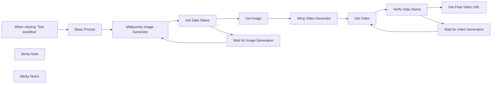

## Fluxo (.json) :

```json
{
  "id": "HBUhVkSsjslXAojw",
  "meta": {
    "instanceId": "1e003a7ea4715b6b35e9947791386a7d07edf3b5bf8d4c9b7ee4fdcbec0447d7"
  },
  "name": "Motion-illustration Workflow Generated with Midjourney and Kling API",
  "tags": [],
  "nodes": [
    {
      "id": "963603c8-dbe5-4d07-bd1e-74518ddd7a4c",
      "name": "When clicking ‘Test workflow’",
      "type": "n8n-nodes-base.manualTrigger",
      "position": [
        -1780,
        -80
      ],
      "parameters": {},
      "typeVersion": 1
    },
    {
      "id": "76717322-4eee-483b-9ab9-dd4e9b0f510a",
      "name": "Kling Video Generator",
      "type": "n8n-nodes-base.httpRequest",
      "position": [
        -820,
        -180
      ],
      "parameters": {
        "url": "https://api.piapi.ai/api/v1/task",
        "method": "POST",
        "options": {},
        "jsonBody": "={\n    \"model\": \"kling\",\n    \"task_type\": \"video_generation\",\n    \"input\": {\n        \"version\": \"1.6\",\n        \n        \"image_url\":\"{{ $json.random_temp_url }}\",\n\n        \"prompt\": \"A young girl sits on a sunlit grassy meadow, gently petting a fluffy white rabbit\"\n       \n    }\n} ",
        "sendBody": true,
        "sendHeaders": true,
        "specifyBody": "json",
        "headerParameters": {
          "parameters": [
            {
              "name": "x-api-key"
            }
          ]
        }
      },
      "typeVersion": 4.2
    },
    {
      "id": "842c1874-47ab-4efb-baad-155071fd29bb",
      "name": "Get Video",
      "type": "n8n-nodes-base.httpRequest",
      "position": [
        -620,
        -60
      ],
      "parameters": {
        "url": "=https://api.piapi.ai/api/v1/task/{{ $json.data.task_id }}",
        "options": {},
        "sendHeaders": true,
        "headerParameters": {
          "parameters": [
            {
              "name": "x-api-key"
            }
          ]
        }
      },
      "typeVersion": 4.2
    },
    {
      "id": "9f36d2ba-ea56-48b8-9c83-60d741c394cb",
      "name": "Get Image",
      "type": "n8n-nodes-base.code",
      "position": [
        -1000,
        -180
      ],
      "parameters": {
        "jsCode": "// JavaScript Code for Function Node\nreturn {\n  random_temp_url: $input.all()[0].json.data.output.temporary_image_urls[\n    Math.floor(Math.random() * $input.all()[0].json.data.output.temporary_image_urls.length)\n  ]\n};"
      },
      "typeVersion": 2
    },
    {
      "id": "14995fd1-937a-4e82-a2bb-19dbb65773c4",
      "name": "Basic Prompt",
      "type": "n8n-nodes-base.httpRequest",
      "position": [
        -1560,
        -80
      ],
      "parameters": {
        "url": "https://api.piapi.ai/api/v1/task",
        "method": "POST",
        "options": {},
        "jsonBody": "{\n  \"model\": \"midjourney\",\n  \"task_type\": \"imagine\",\n  \"input\": {\n    \"prompt\": \"A gentle girl and a fluffy rabbit explore a sunlit forest together, playing by a sparkling stream. Butterflies flutter around them as golden sunlight filters through green leaves. Warm and peaceful atmosphere, 4K nature documentary style. --s 500 --sref 4028286908  --niji 6\",\n    \"aspect_ratio\": \"1:1\",\n    \"process_mode\": \"turbo\",\n    \"skip_prompt_check\": false\n  }\n}",
        "sendBody": true,
        "sendHeaders": true,
        "specifyBody": "json",
        "headerParameters": {
          "parameters": [
            {
              "name": "x-api-key"
            }
          ]
        }
      },
      "typeVersion": 4.2
    },
    {
      "id": "791dae4a-4d99-4bdf-a259-20d3df12b92c",
      "name": "Get Data Status",
      "type": "n8n-nodes-base.if",
      "position": [
        -1180,
        -80
      ],
      "parameters": {
        "options": {},
        "conditions": {
          "options": {
            "version": 2,
            "leftValue": "",
            "caseSensitive": true,
            "typeValidation": "strict"
          },
          "combinator": "and",
          "conditions": [
            {
              "id": "a0f8758e-d6fd-44f8-bd79-bc3c4dceddcf",
              "operator": {
                "name": "filter.operator.equals",
                "type": "string",
                "operation": "equals"
              },
              "leftValue": "={{ $json.data.status }}",
              "rightValue": "completed"
            }
          ]
        }
      },
      "typeVersion": 2.2
    },
    {
      "id": "adb13639-1dd9-45af-be7e-c99b6b1219f3",
      "name": "Wait for Image Generation",
      "type": "n8n-nodes-base.wait",
      "position": [
        -1220,
        200
      ],
      "webhookId": "f3bcf634-8c4b-4bf9-a7f2-d4ee369f5349",
      "parameters": {},
      "typeVersion": 1.1
    },
    {
      "id": "58ad9c2d-fad7-471b-ad5d-f248b3cfbe29",
      "name": "Sticky Note",
      "type": "n8n-nodes-base.stickyNote",
      "position": [
        -1820,
        -300
      ],
      "parameters": {
        "width": 280,
        "content": "## Motion-illustration\nThis workflow is primarily designed to generate dynamic illustrations for content creators and social media professionals with APIs provided by PiAPI."
      },
      "typeVersion": 1
    },
    {
      "id": "2571d9ea-1f32-49b0-84da-ad12177714f3",
      "name": "Midjourney Image Generator",
      "type": "n8n-nodes-base.httpRequest",
      "position": [
        -1360,
        -80
      ],
      "parameters": {
        "url": "=https://api.piapi.ai/api/v1/task/{{ $json.data.task_id }}",
        "options": {},
        "sendHeaders": true,
        "headerParameters": {
          "parameters": [
            {
              "name": "x-api-key"
            }
          ]
        }
      },
      "typeVersion": 4.2
    },
    {
      "id": "159df2d3-6c5d-436d-b229-1b3d527daf48",
      "name": "Sticky Note1",
      "type": "n8n-nodes-base.stickyNote",
      "position": [
        -1820,
        160
      ],
      "parameters": {
        "width": 360,
        "height": 200,
        "content": "## Step-by-step Instruction\n1. Fill in your x-api-key of your PiAPI account in the Midjourney Image Generator and Kling Video Generator nodes.\n2. Enter your desired image prompt in **Basic Prompt** node.\n3. Click Test workflow."
      },
      "typeVersion": 1
    },
    {
      "id": "00de8ec3-102b-41b4-9839-e8fc8cd48253",
      "name": "Wait for Video Generation",
      "type": "n8n-nodes-base.wait",
      "position": [
        -440,
        200
      ],
      "webhookId": "c7b2590d-96a3-4c7c-8821-3023fead254b",
      "parameters": {
        "amount": 20
      },
      "typeVersion": 1.1
    },
    {
      "id": "75531dff-04d5-4439-ae04-3291ef9cfcde",
      "name": "Get Final Video URL",
      "type": "n8n-nodes-base.code",
      "position": [
        -140,
        80
      ],
      "parameters": {
        "jsCode": "// Process the entire response\nreturn {\n  video_url: $input.all()[0].json.data.output.video_url,\n  watermark_free_url: $input.all()[0].json.data.output.works[0].video.resource_without_watermark\n};"
      },
      "typeVersion": 2
    },
    {
      "id": "1fe883e9-64ee-4bec-8b12-238251089df3",
      "name": "Verify Data Status",
      "type": "n8n-nodes-base.if",
      "position": [
        -440,
        -60
      ],
      "parameters": {
        "options": {},
        "conditions": {
          "options": {
            "version": 2,
            "leftValue": "",
            "caseSensitive": true,
            "typeValidation": "strict"
          },
          "combinator": "and",
          "conditions": [
            {
              "id": "f36fa981-22e0-46db-af8c-c2ac55242c27",
              "operator": {
                "name": "filter.operator.equals",
                "type": "string",
                "operation": "equals"
              },
              "leftValue": "={{ $json.data.status }}",
              "rightValue": "completed"
            }
          ]
        }
      },
      "typeVersion": 2.2
    }
  ],
  "active": false,
  "pinData": {},
  "settings": {
    "executionOrder": "v1"
  },
  "versionId": "7f0854bb-7c13-4e67-ba32-809959f47647",
  "connections": {
    "Get Image": {
      "main": [
        [
          {
            "node": "Kling Video Generator",
            "type": "main",
            "index": 0
          }
        ]
      ]
    },
    "Get Video": {
      "main": [
        [
          {
            "node": "Verify Data Status",
            "type": "main",
            "index": 0
          }
        ]
      ]
    },
    "Basic Prompt": {
      "main": [
        [
          {
            "node": "Midjourney Image Generator",
            "type": "main",
            "index": 0
          }
        ]
      ]
    },
    "Get Data Status": {
      "main": [
        [
          {
            "node": "Get Image",
            "type": "main",
            "index": 0
          }
        ],
        [
          {
            "node": "Wait for Image Generation",
            "type": "main",
            "index": 0
          }
        ]
      ]
    },
    "Verify Data Status": {
      "main": [
        [
          {
            "node": "Get Final Video URL",
            "type": "main",
            "index": 0
          }
        ],
        [
          {
            "node": "Wait for Video Generation",
            "type": "main",
            "index": 0
          }
        ]
      ]
    },
    "Kling Video Generator": {
      "main": [
        [
          {
            "node": "Get Video",
            "type": "main",
            "index": 0
          }
        ]
      ]
    },
    "Wait for Image Generation": {
      "main": [
        [
          {
            "node": "Midjourney Image Generator",
            "type": "main",
            "index": 0
          }
        ]
      ]
    },
    "Wait for Video Generation": {
      "main": [
        [
          {
            "node": "Get Video",
            "type": "main",
            "index": 0
          }
        ]
      ]
    },
    "Midjourney Image Generator": {
      "main": [
        [
          {
            "node": "Get Data Status",
            "type": "main",
            "index": 0
          }
        ]
      ]
    },
    "When clicking ‘Test workflow’": {
      "main": [
        [
          {
            "node": "Basic Prompt",
            "type": "main",
            "index": 0
          }
        ]
      ]
    }
  }
}
```

<a id="template-1539"></a>

## Template 1539 - Extração automática de dados de faturas para Google Sheets

- **Nome:** Extração automática de dados de faturas para Google Sheets
- **Descrição:** Fluxo que detecta e processa faturas em PDF recebidas por e-mail, extrai dados estruturados usando um serviço de parsing e um modelo de linguagem, e registra os resultados em uma planilha.
- **Funcionalidade:** • Monitoramento de e-mails: Observa a caixa de entrada e baixa anexos de mensagens que atendam a filtros definidos (remetente e existência de anexo).
• Validação de anexo: Verifica se o anexo é um PDF e se o e-mail ainda não foi marcado como processado.
• Upload para serviço de parsing: Envia o PDF para um serviço externo capaz de converter PDFs complexos (com tabelas/figuras) em markdown.
• Polling e controle de taxa: Consulta o status do processamento do documento e aguarda para respeitar limites de serviço antes de novas verificações.
• Recuperação do resultado: Baixa o resultado convertido (markdown) quando o processamento é concluído com sucesso.
• Extração com LLM e parser estruturado: Usa um modelo de linguagem para extrair campos de fatura (datas, números, fornecedor, endereços, itens, totais) com saída formatada segundo um esquema JSON.
• Mapeamento e exportação: Ajusta o formato da saída extraída e adiciona os dados à planilha de reconciliação especificada.
• Marcação do e-mail: Adiciona um rótulo ao e-mail original para indicar que a fatura já foi sincronizada e evitar duplicação.
- **Ferramentas:** • Gmail: Serviço de e-mail usado para monitorar mensagens, baixar anexos e aplicar rótulos nas mensagens processadas.
• LlamaIndex (LlamaParse / LlamaCloud): Serviço de parsing na nuvem que converte PDFs complexos em markdown e fornece API de jobs para processamento assíncrono.
• OpenAI: Modelo de linguagem usado para interpretar o markdown e extrair dados estruturados conforme um esquema JSON.
• Google Sheets: Planilha usada para armazenar e consolidar os dados extraídos das faturas.


## Fluxo visual

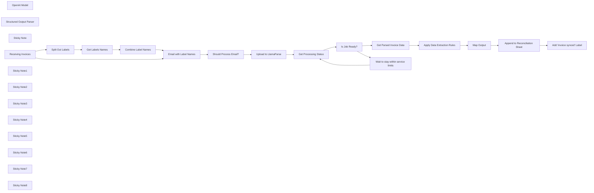

## Fluxo (.json) :

```json
{
  "meta": {
    "instanceId": "26ba763460b97c249b82942b23b6384876dfeb9327513332e743c5f6219c2b8e"
  },
  "nodes": [
    {
      "id": "7076854e-c7e8-45b5-9e5e-16678bffa254",
      "name": "OpenAI Model",
      "type": "@n8n/n8n-nodes-langchain.lmOpenAi",
      "position": [
        2420,
        480
      ],
      "parameters": {
        "model": {
          "__rl": true,
          "mode": "list",
          "value": "gpt-3.5-turbo-1106",
          "cachedResultName": "gpt-3.5-turbo-1106"
        },
        "options": {
          "temperature": 0
        }
      },
      "credentials": {
        "openAiApi": {
          "id": "8gccIjcuf3gvaoEr",
          "name": "OpenAi account"
        }
      },
      "typeVersion": 1
    },
    {
      "id": "00819f1c-2c60-4b7c-b395-445ec05fd898",
      "name": "Structured Output Parser",
      "type": "@n8n/n8n-nodes-langchain.outputParserStructured",
      "position": [
        2600,
        480
      ],
      "parameters": {
        "jsonSchema": "{\n \"Invoice date\": { \"type\": \"date\" },\n \"invoice number\": { \"type\": \"string\" },\n \"Purchase order number\": { \"type\": \"string\" },\n \"Supplier name\": { \"type\": \"string\" },\n \"Supplier address\": {\n \"type\": \"object\",\n \"properties\": {\n \"address 1\": { \"type\": \"string\" },\n \"address 2\": { \"type\": \"string\" },\n \"city\": { \"type\": \"string\" },\n \"postcode\": { \"type\": \"string\" }\n }\n },\n \"Supplier VAT identification number\": { \"type\": \"string\" },\n \"Customer name\": { \"type\": \"string\" },\n \"Customer address\": {\n \"type\": \"object\",\n \"properties\": {\n \"address 1\": { \"type\": \"string\" },\n \"address 2\": { \"type\": \"string\" },\n \"city\": { \"type\": \"string\" },\n \"postcode\": { \"type\": \"string\" }\n }\n },\n \"Customer VAT identification number\": { \"type\": \"string\" }, \n \"Shipping addresses\": {\n \"type\": \"array\",\n \"items\": {\n \"type\": \"object\",\n \"properties\": {\n \"address 1\": { \"type\": \"string\" },\n \"address 2\": { \"type\": \"string\" },\n \"city\": { \"type\": \"string\" },\n \"postcode\": { \"type\": \"string\" }\n }\n }\n },\n \"Line items\": {\n \"type\": \"array\",\n \"items\": {\n \"name\": \"string\",\n \"description\": \"string\",\n \"price\": \"number\",\n \"discount\": \"number\"\n }\n },\n \"Subtotal without VAT\": { \"type\": \"number\" },\n \"Subtotal with VAT\": { \"type\": \"number\" },\n \"Total price\": { \"type\": \"number\" }\n}"
      },
      "typeVersion": 1.1
    },
    {
      "id": "3b40d506-aabc-4105-853a-a318375cea73",
      "name": "Upload to LlamaParse",
      "type": "n8n-nodes-base.httpRequest",
      "position": [
        1620,
        420
      ],
      "parameters": {
        "url": "https://api.cloud.llamaindex.ai/api/parsing/upload",
        "method": "POST",
        "options": {},
        "sendBody": true,
        "contentType": "multipart-form-data",
        "sendHeaders": true,
        "authentication": "genericCredentialType",
        "bodyParameters": {
          "parameters": [
            {
              "name": "file",
              "parameterType": "formBinaryData",
              "inputDataFieldName": "=attachment_0"
            }
          ]
        },
        "genericAuthType": "httpHeaderAuth",
        "headerParameters": {
          "parameters": [
            {
              "name": "accept",
              "value": "application/json"
            }
          ]
        }
      },
      "credentials": {
        "httpHeaderAuth": {
          "id": "pZ4YmwFIkyGnbUC7",
          "name": "LlamaIndex API"
        }
      },
      "typeVersion": 4.2
    },
    {
      "id": "57a5d331-8838-4d44-8fac-a44dba35fcc4",
      "name": "Sticky Note",
      "type": "n8n-nodes-base.stickyNote",
      "position": [
        1540,
        140
      ],
      "parameters": {
        "color": 7,
        "width": 785.9525375246163,
        "height": 623.4951418211454,
        "content": "## 2. Advanced PDF Processing with LlamaParse\n[Read more about using HTTP Requests](https://docs.n8n.io/integrations/builtin/core-nodes/n8n-nodes-base.httprequest/)\n\nLlamaIndex's LlamaCloud is a cloud-based service that allows you to upload,\nparse, and index document. LlamaParse is a tool offered by LlamaCloud\nto parse for complex PDFs with embedded objects ie PDF Tables and figures.\n\nAt time of writing, you can parse 1000 pdfs/day with LlamaCloud's free plan\nby signing up at [https://cloud.llamaindex.ai/](https://cloud.llamaindex.ai/?ref=n8n.io)."
      },
      "typeVersion": 1
    },
    {
      "id": "a4504d83-da3b-41bc-891f-f8f9314a6af5",
      "name": "Receiving Invoices",
      "type": "n8n-nodes-base.gmailTrigger",
      "position": [
        780,
        400
      ],
      "parameters": {
        "simple": false,
        "filters": {
          "q": "has:attachment",
          "sender": "invoices@paypal.com"
        },
        "options": {
          "downloadAttachments": true
        },
        "pollTimes": {
          "item": [
            {
              "mode": "everyMinute"
            }
          ]
        }
      },
      "credentials": {
        "gmailOAuth2": {
          "id": "Sf5Gfl9NiFTNXFWb",
          "name": "Gmail account"
        }
      },
      "typeVersion": 1
    },
    {
      "id": "02bd4636-f35b-4a3a-8a5f-9ae7aeed2bf4",
      "name": "Append to Reconciliation Sheet",
      "type": "n8n-nodes-base.googleSheets",
      "position": [
        2960,
        320
      ],
      "parameters": {
        "columns": {
          "value": {},
          "schema": [
            {
              "id": "Invoice date",
              "type": "string",
              "display": true,
              "removed": false,
              "required": false,
              "displayName": "Invoice date",
              "defaultMatch": false,
              "canBeUsedToMatch": true
            },
            {
              "id": "invoice number",
              "type": "string",
              "display": true,
              "removed": false,
              "required": false,
              "displayName": "invoice number",
              "defaultMatch": false,
              "canBeUsedToMatch": true
            },
            {
              "id": "Purchase order number",
              "type": "string",
              "display": true,
              "removed": false,
              "required": false,
              "displayName": "Purchase order number",
              "defaultMatch": false,
              "canBeUsedToMatch": true
            },
            {
              "id": "Supplier name",
              "type": "string",
              "display": true,
              "removed": false,
              "required": false,
              "displayName": "Supplier name",
              "defaultMatch": false,
              "canBeUsedToMatch": true
            },
            {
              "id": "Supplier address",
              "type": "string",
              "display": true,
              "removed": false,
              "required": false,
              "displayName": "Supplier address",
              "defaultMatch": false,
              "canBeUsedToMatch": true
            },
            {
              "id": "Supplier VAT identification number",
              "type": "string",
              "display": true,
              "removed": false,
              "required": false,
              "displayName": "Supplier VAT identification number",
              "defaultMatch": false,
              "canBeUsedToMatch": true
            },
            {
              "id": "Customer name",
              "type": "string",
              "display": true,
              "removed": false,
              "required": false,
              "displayName": "Customer name",
              "defaultMatch": false,
              "canBeUsedToMatch": true
            },
            {
              "id": "Customer address",
              "type": "string",
              "display": true,
              "removed": false,
              "required": false,
              "displayName": "Customer address",
              "defaultMatch": false,
              "canBeUsedToMatch": true
            },
            {
              "id": "Customer VAT identification number",
              "type": "string",
              "display": true,
              "removed": false,
              "required": false,
              "displayName": "Customer VAT identification number",
              "defaultMatch": false,
              "canBeUsedToMatch": true
            },
            {
              "id": "Shipping addresses",
              "type": "string",
              "display": true,
              "removed": false,
              "required": false,
              "displayName": "Shipping addresses",
              "defaultMatch": false,
              "canBeUsedToMatch": true
            },
            {
              "id": "Line items",
              "type": "string",
              "display": true,
              "removed": false,
              "required": false,
              "displayName": "Line items",
              "defaultMatch": false,
              "canBeUsedToMatch": true
            },
            {
              "id": "Subtotal without VAT",
              "type": "string",
              "display": true,
              "removed": false,
              "required": false,
              "displayName": "Subtotal without VAT",
              "defaultMatch": false,
              "canBeUsedToMatch": true
            },
            {
              "id": "Subtotal with VAT",
              "type": "string",
              "display": true,
              "removed": false,
              "required": false,
              "displayName": "Subtotal with VAT",
              "defaultMatch": false,
              "canBeUsedToMatch": true
            },
            {
              "id": "Total price",
              "type": "string",
              "display": true,
              "removed": false,
              "required": false,
              "displayName": "Total price",
              "defaultMatch": false,
              "canBeUsedToMatch": true
            }
          ],
          "mappingMode": "autoMapInputData",
          "matchingColumns": [
            "output"
          ]
        },
        "options": {},
        "operation": "append",
        "sheetName": {
          "__rl": true,
          "mode": "id",
          "value": "gid=0"
        },
        "documentId": {
          "__rl": true,
          "mode": "list",
          "value": "1omHDl1jpjHyrtga2ZHBddUkbkdatEr1ga9vHc4fQ1pI",
          "cachedResultUrl": "https://docs.google.com/spreadsheets/d/1omHDl1jpjHyrtga2ZHBddUkbkdatEr1ga9vHc4fQ1pI/edit?usp=drivesdk",
          "cachedResultName": "Invoice Reconciliation"
        }
      },
      "credentials": {
        "googleSheetsOAuth2Api": {
          "id": "XHvC7jIRR8A2TlUl",
          "name": "Google Sheets account"
        }
      },
      "typeVersion": 4.3
    },
    {
      "id": "cdb0a7ee-068d-465a-b4ae-d5221d5e7400",
      "name": "Get Processing Status",
      "type": "n8n-nodes-base.httpRequest",
      "position": [
        1800,
        420
      ],
      "parameters": {
        "url": "=https://api.cloud.llamaindex.ai/api/parsing/job/{{ $json.id }}",
        "options": {},
        "sendHeaders": true,
        "authentication": "genericCredentialType",
        "genericAuthType": "httpHeaderAuth",
        "headerParameters": {
          "parameters": [
            {
              "name": "accept",
              "value": "application/json"
            }
          ]
        }
      },
      "credentials": {
        "httpHeaderAuth": {
          "id": "pZ4YmwFIkyGnbUC7",
          "name": "LlamaIndex API"
        }
      },
      "typeVersion": 4.2
    },
    {
      "id": "b68a01ab-d8e6-42f4-ab1d-81e746695eef",
      "name": "Wait to stay within service limits",
      "type": "n8n-nodes-base.wait",
      "position": [
        2120,
        560
      ],
      "webhookId": "17a96ed6-b5ff-47bb-a8a2-39c1eb40185a",
      "parameters": {
        "amount": 1
      },
      "typeVersion": 1.1
    },
    {
      "id": "41bd28d2-665a-4f71-a456-98eeb26b6655",
      "name": "Is Job Ready?",
      "type": "n8n-nodes-base.switch",
      "position": [
        1960,
        420
      ],
      "parameters": {
        "rules": {
          "values": [
            {
              "outputKey": "SUCCESS",
              "conditions": {
                "options": {
                  "leftValue": "",
                  "caseSensitive": true,
                  "typeValidation": "strict"
                },
                "combinator": "and",
                "conditions": [
                  {
                    "id": "300fce8c-b19a-4d0c-86e8-f62853c70ce2",
                    "operator": {
                      "name": "filter.operator.equals",
                      "type": "string",
                      "operation": "equals"
                    },
                    "leftValue": "={{ $json.status }}",
                    "rightValue": "SUCCESS"
                  }
                ]
              },
              "renameOutput": true
            },
            {
              "outputKey": "ERROR",
              "conditions": {
                "options": {
                  "leftValue": "",
                  "caseSensitive": true,
                  "typeValidation": "strict"
                },
                "combinator": "and",
                "conditions": [
                  {
                    "id": "e6058aa0-a3e2-4ce3-9bed-6ff41a5be052",
                    "operator": {
                      "name": "filter.operator.equals",
                      "type": "string",
                      "operation": "equals"
                    },
                    "leftValue": "={{ $json.status }}",
                    "rightValue": "ERROR"
                  }
                ]
              },
              "renameOutput": true
            },
            {
              "outputKey": "CANCELED",
              "conditions": {
                "options": {
                  "leftValue": "",
                  "caseSensitive": true,
                  "typeValidation": "strict"
                },
                "combinator": "and",
                "conditions": [
                  {
                    "id": "ceb6338f-4261-40ac-be11-91f61c7302ba",
                    "operator": {
                      "name": "filter.operator.equals",
                      "type": "string",
                      "operation": "equals"
                    },
                    "leftValue": "={{ $json.status }}",
                    "rightValue": "CANCELED"
                  }
                ]
              },
              "renameOutput": true
            },
            {
              "outputKey": "PENDING",
              "conditions": {
                "options": {
                  "leftValue": "",
                  "caseSensitive": true,
                  "typeValidation": "strict"
                },
                "combinator": "and",
                "conditions": [
                  {
                    "id": "0fa97d86-432a-409a-917e-5f1a002b1ab9",
                    "operator": {
                      "name": "filter.operator.equals",
                      "type": "string",
                      "operation": "equals"
                    },
                    "leftValue": "={{ $json.status }}",
                    "rightValue": "PENDING"
                  }
                ]
              },
              "renameOutput": true
            }
          ]
        },
        "options": {
          "allMatchingOutputs": true
        }
      },
      "typeVersion": 3
    },
    {
      "id": "f7157abe-b1ee-46b3-adb2-1be056d9d75d",
      "name": "Sticky Note1",
      "type": "n8n-nodes-base.stickyNote",
      "position": [
        694.0259411218055,
        139.97202236910687
      ],
      "parameters": {
        "color": 7,
        "width": 808.8727491350096,
        "height": 709.5781339256318,
        "content": "## 1. Watch for Invoice Emails\n[Read more about Gmail Triggers](https://docs.n8n.io/integrations/builtin/trigger-nodes/n8n-nodes-base.gmailtrigger)\n\nThe Gmail node can watch for all incoming messages and filter based on a condition. We'll set our Gmail node to wait for:\n* a message from particular email address.\n* having an attachment which should be the invoice PDF\n* not having a label \"invoice synced\", which is what we use to avoid duplicate processing."
      },
      "typeVersion": 1
    },
    {
      "id": "ff7cb6e4-5a60-4f12-b15e-74e7a4a302ce",
      "name": "Sticky Note2",
      "type": "n8n-nodes-base.stickyNote",
      "position": [
        2360,
        70.48792658995046
      ],
      "parameters": {
        "color": 7,
        "width": 805.0578351924228,
        "height": 656.5014186128178,
        "content": "## 3. Use LLMs to Extract Values from Data\n[Read more about Basic LLM Chain](https://docs.n8n.io/integrations/builtin/cluster-nodes/root-nodes/n8n-nodes-langchain.chainllm/)\n\nLarge language models are perfect for data extraction tasks as they can work across a range of document layouts without human intervention. The extracted data can then be sent to a variety of datastores such as spreadsheets, accounting systems and/or CRMs.\n\n**Tip:** The \"Structured Output Parser\" ensures the AI output can be\ninserted to our spreadsheet without additional clean up and/or formatting. "
      },
      "typeVersion": 1
    },
    {
      "id": "0d510631-440b-41f5-b1aa-9b7279e9c8e3",
      "name": "Sticky Note3",
      "type": "n8n-nodes-base.stickyNote",
      "position": [
        1934,
        774
      ],
      "parameters": {
        "color": 5,
        "width": 394.15089838126653,
        "height": 154.49585536070904,
        "content": "### 🙋‍♂️ Why not just use the built-in PDF convertor?\nA common issue with PDF-to-text convertors are that they ignore important data structures like tables. These structures can be important for data extraction. For example, being able to distinguish between seperate line items in an invoice."
      },
      "typeVersion": 1
    },
    {
      "id": "fe7fdb90-3c85-4f29-a7d3-16f927f48682",
      "name": "Sticky Note4",
      "type": "n8n-nodes-base.stickyNote",
      "position": [
        3200,
        157.65172434465347
      ],
      "parameters": {
        "color": 7,
        "width": 362.3535748101346,
        "height": 440.3435768155051,
        "content": "## 4. Add Label to Avoid Duplication\n[Read more about working with Gmail](https://docs.n8n.io/integrations/builtin/app-nodes/n8n-nodes-base.gmail/)\n\nTo finish off the workflow, we'll add the \"invoice synced\" label to the original invoice email to flag that the extraction was successful. This can be useful if working with a shared inbox and for quality control purposes later."
      },
      "typeVersion": 1
    },
    {
      "id": "1acf2c60-c2b9-4f78-94a4-0711c8bd71ab",
      "name": "Sticky Note5",
      "type": "n8n-nodes-base.stickyNote",
      "position": [
        300,
        140
      ],
      "parameters": {
        "width": 360.0244620907562,
        "height": 573.2443601155958,
        "content": "## Try Me Out!\n\n**This workflow does the following:**\n* Waits for email invoices with PDF attachments.\n* Uses the LlamaParse service to convert the invoice PDF into a markdown file.\n* Uses a LLM to extract invoice data from the Markdown file.\n* Exports the extracted data to a Google Sheet.\n\n### Follow along with the blog here\nhttps://blog.n8n.io/how-to-extract-data-from-pdf-to-excel-spreadsheet-advance-parsing-with-n8n-io-and-llamaparse/\n\n### Good to know\n* You'll need to create the label \"invoice synced\" in gmail before using this workflow.\n\n### Need Help?\nJoin the [Discord](https://discord.com/invite/XPKeKXeB7d) or ask in the [Forum](https://community.n8n.io/)!\n\nHappy Hacking!"
      },
      "typeVersion": 1
    },
    {
      "id": "3802c538-acf9-48d8-b011-bfe2fb817350",
      "name": "Add \"invoice synced\" Label",
      "type": "n8n-nodes-base.gmail",
      "position": [
        3320,
        400
      ],
      "parameters": {
        "labelIds": [
          "Label_5511644430826409825"
        ],
        "messageId": "={{ $('Receiving Invoices').item.json.id }}",
        "operation": "addLabels"
      },
      "credentials": {
        "gmailOAuth2": {
          "id": "Sf5Gfl9NiFTNXFWb",
          "name": "Gmail account"
        }
      },
      "typeVersion": 2.1
    },
    {
      "id": "ffabd8c5-c440-4473-8e44-b849426c70cf",
      "name": "Get Parsed Invoice Data",
      "type": "n8n-nodes-base.httpRequest",
      "position": [
        2160,
        280
      ],
      "parameters": {
        "url": "=https://api.cloud.llamaindex.ai/api/parsing/job/{{ $json.id }}/result/markdown",
        "options": {
          "redirect": {
            "redirect": {}
          }
        },
        "authentication": "genericCredentialType",
        "genericAuthType": "httpHeaderAuth"
      },
      "credentials": {
        "httpHeaderAuth": {
          "id": "pZ4YmwFIkyGnbUC7",
          "name": "LlamaIndex API"
        }
      },
      "typeVersion": 4.2
    },
    {
      "id": "5f9b507f-4dc1-4853-bf71-a64f2f4b55c1",
      "name": "Map Output",
      "type": "n8n-nodes-base.set",
      "position": [
        2760,
        320
      ],
      "parameters": {
        "mode": "raw",
        "options": {},
        "jsonOutput": "={{ $json.output }}"
      },
      "typeVersion": 3.3
    },
    {
      "id": "d22744cd-151d-4b92-b4f2-4a5b9ceb4ee7",
      "name": "Apply Data Extraction Rules",
      "type": "@n8n/n8n-nodes-langchain.chainLlm",
      "position": [
        2420,
        320
      ],
      "parameters": {
        "text": "=Given the following invoice in the <invoice> xml tags, extract the following information as listed below.\nIf you cannot the information for a specific item, then leave blank and skip to the next. \n\n* Invoice date\n* invoice number\n* Purchase order number\n* Supplier name\n* Supplier address\n* Supplier VAT identification number\n* Customer name\n* Customer address\n* Customer VAT identification number\n* Shipping addresses\n* Line items, including a description of the goods or services rendered\n* Price with and without VAT\n* Total price\n\n<invoice>{{ $json.markdown }}</invoice>",
        "promptType": "define",
        "hasOutputParser": true
      },
      "typeVersion": 1.4
    },
    {
      "id": "3735a124-9fab-4400-8b94-8b5aa9f951fe",
      "name": "Should Process Email?",
      "type": "n8n-nodes-base.if",
      "position": [
        1340,
        400
      ],
      "parameters": {
        "options": {},
        "conditions": {
          "options": {
            "leftValue": "",
            "caseSensitive": true,
            "typeValidation": "strict"
          },
          "combinator": "and",
          "conditions": [
            {
              "id": "e5649a2b-6e12-4cc4-8001-4639cc9cc2c2",
              "operator": {
                "name": "filter.operator.equals",
                "type": "string",
                "operation": "equals"
              },
              "leftValue": "={{ $input.item.binary.attachment_0.mimeType }}",
              "rightValue": "application/pdf"
            },
            {
              "id": "4c57ab9b-b11c-455a-a63d-daf48418b06e",
              "operator": {
                "type": "array",
                "operation": "notContains",
                "rightType": "any"
              },
              "leftValue": "={{ $json.labels }}",
              "rightValue": "invoice synced"
            }
          ]
        }
      },
      "typeVersion": 2
    },
    {
      "id": "12a23527-39f3-4f72-8691-3d5cf59f9909",
      "name": "Split Out Labels",
      "type": "n8n-nodes-base.splitOut",
      "position": [
        980,
        400
      ],
      "parameters": {
        "options": {},
        "fieldToSplitOut": "labelIds"
      },
      "typeVersion": 1
    },
    {
      "id": "88ff6e22-d3d3-403d-b0b2-2674487140a7",
      "name": "Get Labels Names",
      "type": "n8n-nodes-base.gmail",
      "position": [
        980,
        540
      ],
      "parameters": {
        "labelId": "={{ $json.labelIds }}",
        "resource": "label",
        "operation": "get"
      },
      "credentials": {
        "gmailOAuth2": {
          "id": "Sf5Gfl9NiFTNXFWb",
          "name": "Gmail account"
        }
      },
      "typeVersion": 2.1
    },
    {
      "id": "88accb8e-6531-40be-8d35-1bba594149af",
      "name": "Combine Label Names",
      "type": "n8n-nodes-base.aggregate",
      "position": [
        980,
        680
      ],
      "parameters": {
        "options": {},
        "fieldsToAggregate": {
          "fieldToAggregate": [
            {
              "renameField": true,
              "outputFieldName": "labels",
              "fieldToAggregate": "name"
            }
          ]
        }
      },
      "typeVersion": 1
    },
    {
      "id": "d233ff33-cabf-434e-876d-879693ecaf58",
      "name": "Email with Label Names",
      "type": "n8n-nodes-base.merge",
      "position": [
        1160,
        400
      ],
      "parameters": {
        "mode": "combine",
        "options": {},
        "combinationMode": "multiplex"
      },
      "typeVersion": 2.1
    },
    {
      "id": "733fc285-e069-4e4e-b13e-dfc1c259ac12",
      "name": "Sticky Note6",
      "type": "n8n-nodes-base.stickyNote",
      "position": [
        2540,
        460
      ],
      "parameters": {
        "width": 192.26896179623753,
        "height": 213.73043662572252,
        "content": "\n\n\n\n\n\n\n\n\n\n\n\n**Need more attributes?**\nChange it here!"
      },
      "typeVersion": 1
    },
    {
      "id": "83aa6ed0-ce3b-48d7-aded-475c337ae86e",
      "name": "Sticky Note7",
      "type": "n8n-nodes-base.stickyNote",
      "position": [
        2880,
        300
      ],
      "parameters": {
        "width": 258.29345180972877,
        "height": 397.0641952938746,
        "content": "\n\n\n\n\n\n\n\n\n\n\n\n\n\n\n\n🚨**Required**\n* Set Your Google Sheet URL here\n* Set the Name of your Sheet\n\n\n**Don't use GSheets?**\nSwap this for Excel, Airtable or a Database!"
      },
      "typeVersion": 1
    },
    {
      "id": "720070f6-2d6c-45ef-80c2-e950862a002b",
      "name": "Sticky Note8",
      "type": "n8n-nodes-base.stickyNote",
      "position": [
        740,
        380
      ],
      "parameters": {
        "width": 174.50671517518518,
        "height": 274.6295678979021,
        "content": "\n\n\n\n\n\n\n\n\n\n\n\n\n\n\n🚨**Required**\n* Change the email filters here!"
      },
      "typeVersion": 1
    }
  ],
  "pinData": {},
  "connections": {
    "Map Output": {
      "main": [
        [
          {
            "node": "Append to Reconciliation Sheet",
            "type": "main",
            "index": 0
          }
        ]
      ]
    },
    "OpenAI Model": {
      "ai_languageModel": [
        [
          {
            "node": "Apply Data Extraction Rules",
            "type": "ai_languageModel",
            "index": 0
          }
        ]
      ]
    },
    "Is Job Ready?": {
      "main": [
        [
          {
            "node": "Get Parsed Invoice Data",
            "type": "main",
            "index": 0
          }
        ],
        null,
        null,
        [
          {
            "node": "Wait to stay within service limits",
            "type": "main",
            "index": 0
          }
        ]
      ]
    },
    "Get Labels Names": {
      "main": [
        [
          {
            "node": "Combine Label Names",
            "type": "main",
            "index": 0
          }
        ]
      ]
    },
    "Split Out Labels": {
      "main": [
        [
          {
            "node": "Get Labels Names",
            "type": "main",
            "index": 0
          }
        ]
      ]
    },
    "Receiving Invoices": {
      "main": [
        [
          {
            "node": "Split Out Labels",
            "type": "main",
            "index": 0
          },
          {
            "node": "Email with Label Names",
            "type": "main",
            "index": 0
          }
        ]
      ]
    },
    "Combine Label Names": {
      "main": [
        [
          {
            "node": "Email with Label Names",
            "type": "main",
            "index": 1
          }
        ]
      ]
    },
    "Upload to LlamaParse": {
      "main": [
        [
          {
            "node": "Get Processing Status",
            "type": "main",
            "index": 0
          }
        ]
      ]
    },
    "Get Processing Status": {
      "main": [
        [
          {
            "node": "Is Job Ready?",
            "type": "main",
            "index": 0
          }
        ]
      ]
    },
    "Should Process Email?": {
      "main": [
        [
          {
            "node": "Upload to LlamaParse",
            "type": "main",
            "index": 0
          }
        ]
      ]
    },
    "Email with Label Names": {
      "main": [
        [
          {
            "node": "Should Process Email?",
            "type": "main",
            "index": 0
          }
        ]
      ]
    },
    "Get Parsed Invoice Data": {
      "main": [
        [
          {
            "node": "Apply Data Extraction Rules",
            "type": "main",
            "index": 0
          }
        ]
      ]
    },
    "Structured Output Parser": {
      "ai_outputParser": [
        [
          {
            "node": "Apply Data Extraction Rules",
            "type": "ai_outputParser",
            "index": 0
          }
        ]
      ]
    },
    "Apply Data Extraction Rules": {
      "main": [
        [
          {
            "node": "Map Output",
            "type": "main",
            "index": 0
          }
        ]
      ]
    },
    "Append to Reconciliation Sheet": {
      "main": [
        [
          {
            "node": "Add \"invoice synced\" Label",
            "type": "main",
            "index": 0
          }
        ]
      ]
    },
    "Wait to stay within service limits": {
      "main": [
        [
          {
            "node": "Get Processing Status",
            "type": "main",
            "index": 0
          }
        ]
      ]
    }
  }
}
```

<a id="template-1541"></a>

## Template 1541 - Relatório diário de custos de energia da PG&E

- **Nome:** Relatório diário de custos de energia da PG&E
- **Descrição:** Automatiza a extração diária dos custos de energia da conta PG&E e envia um resumo formatado por e-mail.
- **Funcionalidade:** • Agendamento diário: Dispara a rotina automaticamente todos os dias em horário programado.
• Armazenamento de credenciais: Mantém usuário, senha e endereço de e-mail em variáveis configuráveis.
• Criação e término de sessão de navegador: Abre uma janela de navegador remota para realizar as ações e encerra a sessão ao final.
• Login automático: Preenche usuário e senha para acessar a conta PG&E de forma automatizada.
• Navegação e interação no site: Acessa seções como Energy Usage Details, Energy Costs e Electricity and Gas, gerenciando esperas e fechando modais quando necessário.
• Extração e formatação de dados: Captura custos diários (total combinado, gás natural e eletricidade) e monta um corpo de e-mail HTML listando as datas do mais recente ao mais antigo; se custos de gás não estiverem disponíveis, reporta apenas eletricidade.
• Envio de e-mail: Envia o relatório para o endereço configurado com um assunto de relatório diário.
• Tolerância a pequenos erros e atrasos: Inclui esperas e tratamento para continuar a execução mesmo se alguns elementos apresentarem comportamento diferente.
- **Ferramentas:** • PG&E (m.pge.com): Site da concessionária onde são consultadas as informações de uso e custos de energia.
• Gmail: Serviço de e-mail utilizado para enviar o relatório diário formatado.

## Fluxo visual

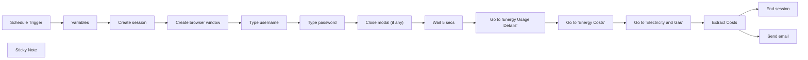

## Fluxo (.json) :

```json
{
  "id": "NMGsDLoVZ7DUukGs",
  "meta": {
    "instanceId": "28a947b92b197fc2524eaba16e57560338657b2b0b5796300b2f1cedc1d0d355"
  },
  "name": "PG&E Daily Cost Tracker",
  "tags": [
    {
      "id": "yJGnIHoS9KZ1HkjS",
      "name": "template",
      "createdAt": "2025-04-17T20:22:38.913Z",
      "updatedAt": "2025-04-17T20:22:38.913Z"
    }
  ],
  "nodes": [
    {
      "id": "814cc9ac-382b-42b3-b5b8-90eda0dc2889",
      "name": "Schedule Trigger",
      "type": "n8n-nodes-base.scheduleTrigger",
      "position": [
        -2640,
        100
      ],
      "parameters": {
        "rule": {
          "interval": [
            {
              "triggerAtHour": 8
            }
          ]
        }
      },
      "typeVersion": 1.2
    },
    {
      "id": "310bfb08-2086-4f0f-8790-02c2c186bae2",
      "name": "Type password",
      "type": "n8n-nodes-base.airtop",
      "position": [
        -1540,
        100
      ],
      "parameters": {
        "text": "={{ $('Variables').item.json.PGE_Password }}",
        "resource": "interaction",
        "windowId": "={{ $('Create browser window').item.json.windowId }}",
        "operation": "type",
        "sessionId": "={{ $('Create session').item.json.sessionId }}",
        "pressEnterKey": true,
        "additionalFields": {
          "waitForNavigation": "networkidle0"
        },
        "elementDescription": "PASSWORD Text Box"
      },
      "typeVersion": 1
    },
    {
      "id": "b0de782e-9c54-4a40-b7e8-8e7ab3655986",
      "name": "Variables",
      "type": "n8n-nodes-base.set",
      "position": [
        -2420,
        100
      ],
      "parameters": {
        "options": {},
        "assignments": {
          "assignments": [
            {
              "id": "3a765a8e-14d8-4a32-b894-b6f90e5db246",
              "name": "PGE_Username",
              "type": "string",
              "value": ""
            },
            {
              "id": "81a94ea1-714b-4f9f-b63a-47fee5f51e3a",
              "name": "PGE_Password",
              "type": "string",
              "value": ""
            },
            {
              "id": "e90a5678-4c62-443c-ab1d-57efd6ca69eb",
              "name": "Email",
              "type": "string",
              "value": ""
            }
          ]
        }
      },
      "typeVersion": 3.4
    },
    {
      "id": "69cca1c7-9a83-43a7-95e7-98ba24f9575b",
      "name": "Go to \"Energy Costs\"",
      "type": "n8n-nodes-base.airtop",
      "position": [
        -660,
        100
      ],
      "parameters": {
        "resource": "interaction",
        "windowId": "={{ $('Create browser window').item.json.data.windowId }}",
        "sessionId": "={{ $('Create session').item.json.sessionId }}",
        "additionalFields": {
          "waitForNavigation": "load"
        },
        "elementDescription": "ENERGY COSTS"
      },
      "typeVersion": 1
    },
    {
      "id": "184206ce-4b4d-4bb0-b468-cbb61f45b61b",
      "name": "Go to \"Electricity and Gas\"",
      "type": "n8n-nodes-base.airtop",
      "onError": "continueRegularOutput",
      "position": [
        -440,
        100
      ],
      "parameters": {
        "resource": "interaction",
        "windowId": "={{ $('Create browser window').item.json.data.windowId }}",
        "sessionId": "={{ $('Create session').item.json.sessionId }}",
        "additionalFields": {
          "waitForNavigation": "networkidle0"
        },
        "elementDescription": "COMBINED"
      },
      "typeVersion": 1
    },
    {
      "id": "424b5209-97e7-4eef-a496-ac9f08d84d3d",
      "name": "Extract Costs",
      "type": "n8n-nodes-base.airtop",
      "notes": "Some PG&E accounts have a \"Combined\" view for gas and electricity",
      "position": [
        -220,
        100
      ],
      "parameters": {
        "prompt": "Extract the daily energy costs from the webpage content, including both natural gas and electricity costs. Format the information as a daily update email, listing the costs from the most recent date to the earliest. Ensure the email format is clear and concise, without including a subject line or greeting. Include the date, total combined costs, natural gas costs, and electricity costs for each day. \n\nIf natural gas costs are not provided, ignore them, ignore Total Combined Costs and report only on electricity \n\nFor example, if the webpage content provides the following data:\n\n- Date: 2023-10-01, Total Combined Costs: $15.00, Natural Gas Costs: $5.00, Electricity Costs: $10.00\n- Date: 2023-09-30, Total Combined Costs: $14.50, Natural Gas Costs: $4.50, Electricity Costs: $10.00\n\nThe output should be formatted as an easy to read email:\n\n<!DOCTYPE html>\n<html>\n<body>\n<p>October 1, 2023</p>\n<p>Total Combined Costs: $15.00<br>\nNatural Gas Costs: $5.00<br>\nElectricity Costs: $10.00</p>\n\n<p>September 30, 2023</p>\n<p>Total Combined Costs: $14.50<br>\nNatural Gas Costs: $4.50<br>\nElectricity Costs: $10.00</p>\n</body>\n</html>\n",
        "resource": "extraction",
        "windowId": "={{ $('Create browser window').item.json.data.windowId }}",
        "operation": "query",
        "sessionId": "={{ $('Create session').item.json.sessionId }}",
        "additionalFields": {}
      },
      "notesInFlow": true,
      "typeVersion": 1
    },
    {
      "id": "b0cf1ebc-157d-4ab3-9ed6-267c81293feb",
      "name": "Go to \"Energy Usage Details\"",
      "type": "n8n-nodes-base.airtop",
      "position": [
        -880,
        100
      ],
      "parameters": {
        "resource": "interaction",
        "windowId": "={{ $('Create browser window').item.json.windowId }}",
        "sessionId": "={{ $('Create session').item.json.sessionId }}",
        "additionalFields": {
          "waitForNavigation": "load"
        },
        "elementDescription": "Click on the box that says ENERGY USAGE DETAILS See usage & costs over time"
      },
      "typeVersion": 1
    },
    {
      "id": "485f8071-9c54-4f79-9378-d354260b2038",
      "name": "Wait 5 secs",
      "type": "n8n-nodes-base.wait",
      "position": [
        -1100,
        100
      ],
      "webhookId": "371deac7-bd64-4385-8bc5-a14a0db2bcc7",
      "parameters": {},
      "typeVersion": 1.1
    },
    {
      "id": "87d68490-1064-4180-89d9-534c9308c6c9",
      "name": "Close modal (if any)",
      "type": "n8n-nodes-base.airtop",
      "position": [
        -1320,
        100
      ],
      "parameters": {
        "resource": "interaction",
        "windowId": "={{ $('Create browser window').item.json.windowId }}",
        "sessionId": "={{ $('Create session').item.json.sessionId }}",
        "additionalFields": {},
        "elementDescription": "If there is a modal on the page, click on the button to dismiss the modal"
      },
      "typeVersion": 1
    },
    {
      "id": "80018e55-6557-4641-a07b-926517a72bb0",
      "name": "Create session",
      "type": "n8n-nodes-base.airtop",
      "position": [
        -2200,
        100
      ],
      "parameters": {
        "profileName": "cesar-prod",
        "timeoutMinutes": 5
      },
      "typeVersion": 1
    },
    {
      "id": "05711cf0-9c20-4f41-854e-dea872eee3d8",
      "name": "Create browser window",
      "type": "n8n-nodes-base.airtop",
      "position": [
        -1980,
        100
      ],
      "parameters": {
        "url": "https://m.pge.com/",
        "resource": "window",
        "getLiveView": true,
        "disableResize": true,
        "additionalFields": {
          "waitUntil": "load"
        }
      },
      "typeVersion": 1
    },
    {
      "id": "d673347d-ef40-4349-a7e7-2ba594400d2c",
      "name": "Type username",
      "type": "n8n-nodes-base.airtop",
      "position": [
        -1760,
        100
      ],
      "parameters": {
        "text": "={{ $('Variables').item.json.PGE_Username }}",
        "resource": "interaction",
        "operation": "type",
        "additionalFields": {},
        "elementDescription": "USERNAME text box"
      },
      "typeVersion": 1
    },
    {
      "id": "b64a04b1-d00b-4d04-b9e3-7d2c86800923",
      "name": "Send email",
      "type": "n8n-nodes-base.gmail",
      "position": [
        0,
        200
      ],
      "webhookId": "7586d2f6-00b8-41ee-89d0-f2768b402165",
      "parameters": {
        "sendTo": "={{ $('Variables').item.json.Email }}",
        "message": "={{ $json['data'].modelResponse }}",
        "options": {
          "senderName": "Airtop Monitor",
          "appendAttribution": false
        },
        "subject": "Daily energy costs report"
      },
      "typeVersion": 2.1
    },
    {
      "id": "d402443c-ed67-4df7-b5c8-032f4a2ea941",
      "name": "End session",
      "type": "n8n-nodes-base.airtop",
      "position": [
        0,
        0
      ],
      "parameters": {
        "operation": "terminate",
        "sessionId": "={{ $('Create session').item.json.sessionId }}"
      },
      "typeVersion": 1
    },
    {
      "id": "076e7eed-e71f-4ef7-8038-ea3dcc188b9c",
      "name": "Sticky Note",
      "type": "n8n-nodes-base.stickyNote",
      "position": [
        -2480,
        -40
      ],
      "parameters": {
        "color": 5,
        "height": 340,
        "content": "## Heads up!\nTo get this workflow running correctly, please enter your PG&E credentials below"
      },
      "typeVersion": 1
    }
  ],
  "active": false,
  "pinData": {},
  "settings": {
    "executionOrder": "v1"
  },
  "versionId": "0d0d4991-e9c1-4f51-be90-bb8337e40bc2",
  "connections": {
    "Variables": {
      "main": [
        [
          {
            "node": "Create session",
            "type": "main",
            "index": 0
          }
        ]
      ]
    },
    "Wait 5 secs": {
      "main": [
        [
          {
            "node": "Go to \"Energy Usage Details\"",
            "type": "main",
            "index": 0
          }
        ]
      ]
    },
    "Extract Costs": {
      "main": [
        [
          {
            "node": "End session",
            "type": "main",
            "index": 0
          },
          {
            "node": "Send email",
            "type": "main",
            "index": 0
          }
        ]
      ]
    },
    "Type password": {
      "main": [
        [
          {
            "node": "Close modal (if any)",
            "type": "main",
            "index": 0
          }
        ]
      ]
    },
    "Type username": {
      "main": [
        [
          {
            "node": "Type password",
            "type": "main",
            "index": 0
          }
        ]
      ]
    },
    "Create session": {
      "main": [
        [
          {
            "node": "Create browser window",
            "type": "main",
            "index": 0
          }
        ]
      ]
    },
    "Schedule Trigger": {
      "main": [
        [
          {
            "node": "Variables",
            "type": "main",
            "index": 0
          }
        ]
      ]
    },
    "Close modal (if any)": {
      "main": [
        [
          {
            "node": "Wait 5 secs",
            "type": "main",
            "index": 0
          }
        ]
      ]
    },
    "Go to \"Energy Costs\"": {
      "main": [
        [
          {
            "node": "Go to \"Electricity and Gas\"",
            "type": "main",
            "index": 0
          }
        ]
      ]
    },
    "Create browser window": {
      "main": [
        [
          {
            "node": "Type username",
            "type": "main",
            "index": 0
          }
        ]
      ]
    },
    "Go to \"Electricity and Gas\"": {
      "main": [
        [
          {
            "node": "Extract Costs",
            "type": "main",
            "index": 0
          }
        ]
      ]
    },
    "Go to \"Energy Usage Details\"": {
      "main": [
        [
          {
            "node": "Go to \"Energy Costs\"",
            "type": "main",
            "index": 0
          }
        ]
      ]
    }
  }
}
```

<a id="template-1543"></a>

## Template 1543 - Limpeza diária de mensagens do Discord

- **Nome:** Limpeza diária de mensagens do Discord
- **Descrição:** Este fluxo remove automaticamente mensagens antigas de canais de um servidor Discord para manter os canais limpos e obedecer a uma política de retenção.
- **Funcionalidade:** • Agendamento diário às 21:00: inicia o processo automaticamente todas as noites.
• Recuperação de canais do servidor: obtém a lista de canais do servidor configurado.
• Respeito a limites de API: insere pausas entre operações para evitar atingir rate limits do Discord.
• Varredura de mensagens por canal: busca todas as mensagens de cada canal para análise.
• Filtragem por data: seleciona mensagens com mais de 7 dias para remoção.
• Exclusão automática de mensagens antigas: deleta as mensagens que atendem ao critério de idade.
• Tolerância a falhas: continua o processamento mesmo se ocorrências individuais falharem.
• Suporte a notificações de erro: possibilidade de acionar um fluxo de erro para notificação caso algo crítico aconteça.
- **Ferramentas:** • Discord: plataforma de chat usada para listar canais, recuperar mensagens e deletar mensagens via API (autenticação via OAuth2).


## Fluxo visual

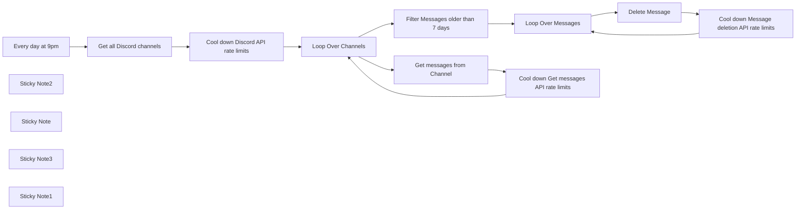

## Fluxo (.json) :

```json
{
  "id": "QCbb7Bm12gDIH0mI",
  "meta": {
    "instanceId": "d189560122cb823898b8eca8996614abf14798d923f2ff7c4d7220fb10f8e6f7",
    "templateCredsSetupCompleted": true
  },
  "name": "Keep discord clean",
  "tags": [
    {
      "id": "CgBu2Sxr4mqipxlK",
      "name": "template",
      "createdAt": "2025-01-08T19:56:24.079Z",
      "updatedAt": "2025-01-08T19:56:24.079Z"
    }
  ],
  "nodes": [
    {
      "id": "dde530b8-edd5-4f1d-a3c8-326925c97269",
      "name": "Loop Over Channels",
      "type": "n8n-nodes-base.splitInBatches",
      "position": [
        560,
        400
      ],
      "parameters": {
        "options": {}
      },
      "retryOnFail": false,
      "typeVersion": 3
    },
    {
      "id": "3e2684b1-08ad-41bd-930f-cbb229e16617",
      "name": "Loop Over Messages",
      "type": "n8n-nodes-base.splitInBatches",
      "position": [
        1260,
        320
      ],
      "parameters": {
        "options": {}
      },
      "typeVersion": 3
    },
    {
      "id": "430d13be-670f-4e5d-acdf-ffe1a65a49e3",
      "name": "Every day at 9pm",
      "type": "n8n-nodes-base.scheduleTrigger",
      "position": [
        -160,
        400
      ],
      "parameters": {
        "rule": {
          "interval": [
            {
              "triggerAtHour": 21
            }
          ]
        }
      },
      "typeVersion": 1.2
    },
    {
      "id": "6d40f036-c87a-4b68-9ec6-523a3372447c",
      "name": "Sticky Note2",
      "type": "n8n-nodes-base.stickyNote",
      "position": [
        40,
        600
      ],
      "parameters": {
        "color": 6,
        "width": 294,
        "height": 80,
        "content": "**Note ☝️**\nDon’t forget to setup an error workflow to get notified if something goes wrong"
      },
      "typeVersion": 1
    },
    {
      "id": "93290300-084b-4f91-95bc-f34c1aef93cd",
      "name": "Sticky Note",
      "type": "n8n-nodes-base.stickyNote",
      "position": [
        420,
        -60
      ],
      "parameters": {
        "color": 5,
        "width": 327,
        "height": 152,
        "content": "### 👨‍🎤 Setup\n1. Add your **Discord** credentials\n2. Change the server in each **Discord** node to the correct one\n3. Click the Test Workflow button\n3. Activate the workflow to run on a schedule"
      },
      "typeVersion": 1
    },
    {
      "id": "5fead80a-de3a-4f45-a524-5228def7b4ad",
      "name": "Cool down Discord API rate limits",
      "type": "n8n-nodes-base.wait",
      "position": [
        280,
        400
      ],
      "webhookId": "cea120e2-5bb9-45cf-83e6-55fd458d6cf4",
      "parameters": {
        "amount": 2
      },
      "typeVersion": 1.1
    },
    {
      "id": "5a8d6402-458c-4c24-b379-6a41908a5af3",
      "name": "Get all Discord channels",
      "type": "n8n-nodes-base.discord",
      "position": [
        40,
        400
      ],
      "webhookId": "a77d1495-df40-4afd-ad0a-8f5b851b16da",
      "parameters": {
        "guildId": {
          "__rl": true,
          "mode": "id",
          "value": ""
        },
        "options": {
          "filter": [
            0,
            2
          ]
        },
        "operation": "getAll",
        "returnAll": true
      },
      "typeVersion": 2
    },
    {
      "id": "a2b1d905-849d-4392-95db-e545f542ba78",
      "name": "Cool down Message deletion API rate limits",
      "type": "n8n-nodes-base.wait",
      "position": [
        1680,
        340
      ],
      "webhookId": "fcd9f62a-f08b-44bc-afa3-87d960fdc380",
      "parameters": {
        "amount": 1
      },
      "typeVersion": 1.1
    },
    {
      "id": "8c134cfe-dcb1-400d-a518-17ed3f1cbf62",
      "name": "Cool down Get messages API rate limits",
      "type": "n8n-nodes-base.wait",
      "position": [
        1000,
        480
      ],
      "webhookId": "5d8de5eb-8445-4a64-8b8b-8577ffa52ef0",
      "parameters": {
        "amount": 2
      },
      "typeVersion": 1.1
    },
    {
      "id": "18ba10df-dcec-4d27-8ecf-06171939b7eb",
      "name": "Get messages from Channel",
      "type": "n8n-nodes-base.discord",
      "onError": "continueRegularOutput",
      "position": [
        800,
        480
      ],
      "webhookId": "b36f85bb-1237-415d-81bb-598703d3d4cd",
      "parameters": {
        "guildId": {
          "__rl": true,
          "mode": "id",
          "value": ""
        },
        "options": {},
        "resource": "message",
        "channelId": {
          "__rl": true,
          "mode": "id",
          "value": "={{ $json.id }}"
        },
        "operation": "getAll",
        "returnAll": true
      },
      "retryOnFail": false,
      "typeVersion": 2,
      "alwaysOutputData": true,
      "waitBetweenTries": 5000
    },
    {
      "id": "57f2395a-b624-41d3-aada-4107b21a3359",
      "name": "Delete Message",
      "type": "n8n-nodes-base.discord",
      "onError": "continueRegularOutput",
      "position": [
        1500,
        340
      ],
      "webhookId": "4b43cc2e-59db-46c9-ae4c-9716146c25bf",
      "parameters": {
        "guildId": {
          "__rl": true,
          "mode": "id",
          "value": ""
        },
        "resource": "message",
        "channelId": {
          "__rl": true,
          "mode": "id",
          "value": "={{ $json.channel_id }}"
        },
        "messageId": "={{ $json.id }}",
        "operation": "deleteMessage"
      },
      "retryOnFail": false,
      "typeVersion": 2,
      "alwaysOutputData": true,
      "waitBetweenTries": 5000
    },
    {
      "id": "c224ef25-57d8-4fe6-b14a-b09131ce8c1c",
      "name": "Filter Messages older than 7 days",
      "type": "n8n-nodes-base.filter",
      "position": [
        1000,
        320
      ],
      "parameters": {
        "options": {},
        "conditions": {
          "options": {
            "version": 2,
            "leftValue": "",
            "caseSensitive": true,
            "typeValidation": "strict"
          },
          "combinator": "and",
          "conditions": [
            {
              "id": "2864fc65-1d9d-433f-bd61-766278a7e54c",
              "operator": {
                "type": "dateTime",
                "operation": "exists",
                "singleValue": true
              },
              "leftValue": "={{ $json.timestamp }}",
              "rightValue": ""
            },
            {
              "id": "a05636ea-8663-4398-8a55-a03ab34f83a5",
              "operator": {
                "type": "dateTime",
                "operation": "before"
              },
              "leftValue": "={{ $json.timestamp }}",
              "rightValue": "={{ $today.minus({days: 7}) }}"
            }
          ]
        }
      },
      "typeVersion": 2.2
    },
    {
      "id": "c3654c25-6318-4652-9f76-82770cc28324",
      "name": "Sticky Note3",
      "type": "n8n-nodes-base.stickyNote",
      "position": [
        40,
        300
      ],
      "parameters": {
        "color": 6,
        "width": 194,
        "height": 80,
        "content": "**Tip 👇**\nOAuth2 Authentication is very easy to setup"
      },
      "typeVersion": 1
    },
    {
      "id": "f3d8b35e-6b13-4df9-bd33-2d44381e6fc5",
      "name": "Sticky Note1",
      "type": "n8n-nodes-base.stickyNote",
      "position": [
        -200,
        -60
      ],
      "parameters": {
        "color": 4,
        "width": 600,
        "height": 280,
        "content": "# Nightly Discord Channel Cleanup\n### This workflow runs every day at 9:00 p.m. and:\n- Retrieves all Discord channels using your provided credentials.\n- Pauses briefly to respect Discord API rate limits.\n- Loops through each channel and fetches messages.\n- Filters out messages older than seven days.\n- Deletes those older messages, again pausing to stay within deletion rate limits.\n\nBy setting up this workflow on a schedule, you can automatically keep Discord channels tidy and compliant with retention policies."
      },
      "typeVersion": 1
    }
  ],
  "active": false,
  "pinData": {},
  "settings": {
    "executionOrder": "v1"
  },
  "versionId": "a4b9f5d2-d905-4c86-9fa6-2a274909ecce",
  "connections": {
    "Delete Message": {
      "main": [
        [
          {
            "node": "Cool down Message deletion API rate limits",
            "type": "main",
            "index": 0
          }
        ]
      ]
    },
    "Every day at 9pm": {
      "main": [
        [
          {
            "node": "Get all Discord channels",
            "type": "main",
            "index": 0
          }
        ]
      ]
    },
    "Loop Over Channels": {
      "main": [
        [
          {
            "node": "Filter Messages older than 7 days",
            "type": "main",
            "index": 0
          }
        ],
        [
          {
            "node": "Get messages from Channel",
            "type": "main",
            "index": 0
          }
        ]
      ]
    },
    "Loop Over Messages": {
      "main": [
        [],
        [
          {
            "node": "Delete Message",
            "type": "main",
            "index": 0
          }
        ]
      ]
    },
    "Get all Discord channels": {
      "main": [
        [
          {
            "node": "Cool down Discord API rate limits",
            "type": "main",
            "index": 0
          }
        ]
      ]
    },
    "Get messages from Channel": {
      "main": [
        [
          {
            "node": "Cool down Get messages API rate limits",
            "type": "main",
            "index": 0
          }
        ]
      ]
    },
    "Cool down Discord API rate limits": {
      "main": [
        [
          {
            "node": "Loop Over Channels",
            "type": "main",
            "index": 0
          }
        ]
      ]
    },
    "Filter Messages older than 7 days": {
      "main": [
        [
          {
            "node": "Loop Over Messages",
            "type": "main",
            "index": 0
          }
        ]
      ]
    },
    "Cool down Get messages API rate limits": {
      "main": [
        [
          {
            "node": "Loop Over Channels",
            "type": "main",
            "index": 0
          }
        ]
      ]
    },
    "Cool down Message deletion API rate limits": {
      "main": [
        [
          {
            "node": "Loop Over Messages",
            "type": "main",
            "index": 0
          }
        ]
      ]
    }
  }
}
```

<a id="template-1545"></a>

## Template 1545 - Bot de WhatsApp para notificações e respostas automáticas

- **Nome:** Bot de WhatsApp para notificações e respostas automáticas
- **Descrição:** Automatiza envio de templates de WhatsApp para usuários que consentiram, armazena mensagens recebidas em uma planilha e envia respostas preparadas a partir da planilha.
- **Funcionalidade:** • Enviar template de notificação via WhatsApp: Quando um usuário preenche o formulário e opta por receber notificações, envia um template (com cabeçalho e parâmetros dinâmicos) para o número informado.
• Registrar mensagens recebidas: Recebe mensagens vindas do WhatsApp e grava nome, telefone, texto e status ('New') em uma planilha.
• Filtrar consentimento do usuário: Verifica se o campo de consentimento do formulário está marcado como 'Yes' antes de enviar notificações.
• Enviar respostas a partir da planilha: Periodicamente busca linhas com Status 'Ready' e envia o texto de resposta para o telefone correspondente.
• Atualizar status após envio: Após enviar a resposta, atualiza a linha na planilha marcando o status como 'Replied'.
• Processamento em lotes com intervalo: Processa envios em lote e insere pequenas pausas (ex.: 1 segundo) entre mensagens para controlar taxa de envio.
• Ignorar notificações de estado irrelevantes: Detecta e descarta payloads que não contenham mensagens de usuário (por exemplo, apenas notificações de status).
- **Ferramentas:** • Google Forms: Coleta respostas de usuários e alimenta a planilha com dados do formulário.
• Google Sheets: Armazena entradas de formulário, mensagens recebidas, textos de resposta e status; também serve como fonte e alvo das atualizações automáticas.
• WhatsApp Business API (Meta): Envia e recebe mensagens (incluindo templates) usando credenciais da conta comercial e webhooks configurados no painel da Meta/Business Developer.


## Fluxo visual

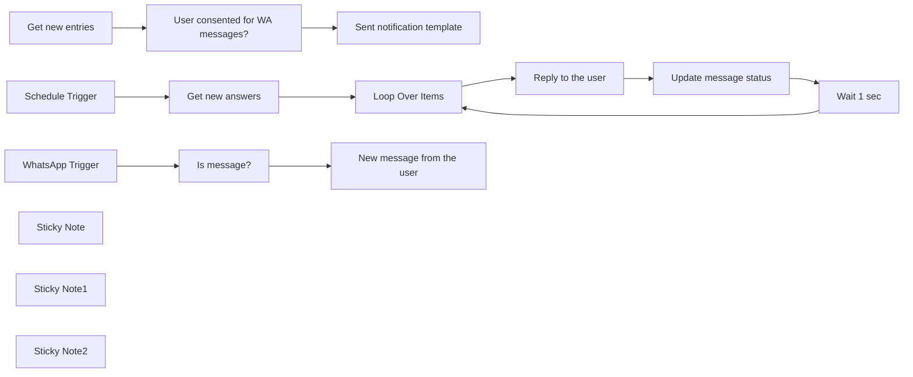

## Fluxo (.json) :

```json
{
  "id": "NzoLNV2FbS4eurJ7",
  "meta": {
    "instanceId": "fb924c73af8f703905bc09c9ee8076f48c17b596ed05b18c0ff86915ef8a7c4a",
    "templateCredsSetupCompleted": true
  },
  "name": "WhatsApp business bot",
  "tags": [],
  "nodes": [
    {
      "id": "4ca5e25a-f67b-4874-af20-680d1a6ac731",
      "name": "Sent notification  template",
      "type": "n8n-nodes-base.whatsApp",
      "position": [
        1140,
        320
      ],
      "parameters": {
        "template": "test_appointment_button|en_US",
        "components": {
          "component": [
            {
              "type": "header",
              "headerParameters": {
                "parameter": [
                  {
                    "text": "📅"
                  }
                ]
              }
            },
            {
              "bodyParameters": {
                "parameter": [
                  {
                    "text": "={{ $json[\"Your name\"] }}"
                  },
                  {
                    "text": "={{ DateTime.fromFormat($json[\"Please pick a day and time of your appointment\"], \"M/d/yyyy HH:mm:ss\").toLocaleString(DateTime.DATE_HUGE); }}"
                  },
                  {
                    "text": "={{ $json[\"Please pick a day and time of your appointment\"].split(' ')[1] }}"
                  }
                ]
              }
            }
          ]
        },
        "phoneNumberId": "=244242975437240",
        "requestOptions": {},
        "recipientPhoneNumber": "={{ $json[\"Your mobile number\"] }}"
      },
      "credentials": {
        "whatsAppApi": {
          "id": "mm0r1xKc6N8XktAD",
          "name": "WhatsApp account 2"
        }
      },
      "typeVersion": 1
    },
    {
      "id": "877c62c5-9869-48fc-bd74-35897dbd2276",
      "name": "WhatsApp Trigger",
      "type": "n8n-nodes-base.whatsAppTrigger",
      "position": [
        700,
        800
      ],
      "webhookId": "b06b387a-481e-43f1-9035-01a87123ad88",
      "parameters": {
        "updates": [
          "messages"
        ]
      },
      "credentials": {
        "whatsAppTriggerApi": {
          "id": "bWqGRWeDXvGTdSq5",
          "name": "WhatsApp Trigger"
        }
      },
      "typeVersion": 1
    },
    {
      "id": "6c0edf48-20af-42fb-a436-aee3a9a4f6cc",
      "name": "Is message?",
      "type": "n8n-nodes-base.if",
      "position": [
        920,
        800
      ],
      "parameters": {
        "options": {
          "looseTypeValidation": true
        },
        "conditions": {
          "options": {
            "leftValue": "",
            "caseSensitive": true,
            "typeValidation": "loose"
          },
          "combinator": "and",
          "conditions": [
            {
              "id": "8a765e57-8e39-4547-a99a-0458df2b75f4",
              "operator": {
                "type": "object",
                "operation": "exists",
                "singleValue": true
              },
              "leftValue": "={{ $json.messages[0] }}",
              "rightValue": ""
            }
          ]
        }
      },
      "typeVersion": 2
    },
    {
      "id": "00006406-47be-4693-9763-a21d06b13d51",
      "name": "Schedule Trigger",
      "type": "n8n-nodes-base.scheduleTrigger",
      "position": [
        680,
        1184
      ],
      "parameters": {
        "rule": {
          "interval": [
            {
              "field": "minutes"
            }
          ]
        }
      },
      "typeVersion": 1.2
    },
    {
      "id": "b9919c0d-eeb2-4a5e-a91f-3dad11b778f8",
      "name": "Loop Over Items",
      "type": "n8n-nodes-base.splitInBatches",
      "position": [
        1120,
        1184
      ],
      "parameters": {
        "options": {}
      },
      "typeVersion": 3
    },
    {
      "id": "8f0dc664-715f-4074-b0f7-98d3c7f563a5",
      "name": "Get new answers",
      "type": "n8n-nodes-base.googleSheets",
      "position": [
        900,
        1184
      ],
      "parameters": {
        "options": {},
        "filtersUI": {
          "values": [
            {
              "lookupValue": "Ready",
              "lookupColumn": "Status"
            }
          ]
        },
        "sheetName": {
          "__rl": true,
          "mode": "list",
          "value": 1621824221,
          "cachedResultUrl": "https://docs.google.com/spreadsheets/d/1T-B0yepcrCHxQpn7Sj6QjTa0VqwwVBQhO5ZcIUSxWJE/edit#gid=1621824221",
          "cachedResultName": "WA-messages"
        },
        "documentId": {
          "__rl": true,
          "mode": "list",
          "value": "1T-B0yepcrCHxQpn7Sj6QjTa0VqwwVBQhO5ZcIUSxWJE",
          "cachedResultUrl": "https://docs.google.com/spreadsheets/d/1T-B0yepcrCHxQpn7Sj6QjTa0VqwwVBQhO5ZcIUSxWJE/edit?usp=drivesdk",
          "cachedResultName": "WhatsApp Appointments (Responses)"
        }
      },
      "credentials": {
        "googleSheetsOAuth2Api": {
          "id": "RtRiRezoxiWkzZQt",
          "name": "Ted's Tech Talks Google account"
        }
      },
      "typeVersion": 4.4
    },
    {
      "id": "a7b07f7e-1287-4e8f-b28a-4c656f386f8a",
      "name": "Reply to the user",
      "type": "n8n-nodes-base.whatsApp",
      "position": [
        1340,
        1184
      ],
      "parameters": {
        "textBody": "={{ $json.ReplyText }}",
        "operation": "send",
        "phoneNumberId": "244242975437240",
        "requestOptions": {},
        "additionalFields": {},
        "recipientPhoneNumber": "=+{{ $json.UserPhone }}"
      },
      "credentials": {
        "whatsAppApi": {
          "id": "mm0r1xKc6N8XktAD",
          "name": "WhatsApp account 2"
        }
      },
      "typeVersion": 1
    },
    {
      "id": "30f0a7da-c3ce-448c-ad05-b8b75da3d319",
      "name": "Update message status",
      "type": "n8n-nodes-base.googleSheets",
      "position": [
        1520,
        1184
      ],
      "parameters": {
        "columns": {
          "value": {
            "Status": "Replied",
            "row_number": "={{ $('Loop Over Items').item.json.row_number }}"
          },
          "schema": [
            {
              "id": "UserPhone",
              "type": "string",
              "display": true,
              "removed": true,
              "required": false,
              "displayName": "UserPhone",
              "defaultMatch": false,
              "canBeUsedToMatch": true
            },
            {
              "id": "UserName",
              "type": "string",
              "display": true,
              "removed": true,
              "required": false,
              "displayName": "UserName",
              "defaultMatch": false,
              "canBeUsedToMatch": true
            },
            {
              "id": "UserMessage",
              "type": "string",
              "display": true,
              "removed": true,
              "required": false,
              "displayName": "UserMessage",
              "defaultMatch": false,
              "canBeUsedToMatch": true
            },
            {
              "id": "ReplyText",
              "type": "string",
              "display": true,
              "removed": true,
              "required": false,
              "displayName": "ReplyText",
              "defaultMatch": false,
              "canBeUsedToMatch": true
            },
            {
              "id": "Status",
              "type": "string",
              "display": true,
              "required": false,
              "displayName": "Status",
              "defaultMatch": false,
              "canBeUsedToMatch": true
            },
            {
              "id": "row_number",
              "type": "string",
              "display": true,
              "removed": false,
              "readOnly": true,
              "required": false,
              "displayName": "row_number",
              "defaultMatch": false,
              "canBeUsedToMatch": true
            }
          ],
          "mappingMode": "defineBelow",
          "matchingColumns": [
            "row_number"
          ]
        },
        "options": {},
        "operation": "update",
        "sheetName": {
          "__rl": true,
          "mode": "list",
          "value": 1621824221,
          "cachedResultUrl": "https://docs.google.com/spreadsheets/d/1T-B0yepcrCHxQpn7Sj6QjTa0VqwwVBQhO5ZcIUSxWJE/edit#gid=1621824221",
          "cachedResultName": "WA-messages"
        },
        "documentId": {
          "__rl": true,
          "mode": "list",
          "value": "1T-B0yepcrCHxQpn7Sj6QjTa0VqwwVBQhO5ZcIUSxWJE",
          "cachedResultUrl": "https://docs.google.com/spreadsheets/d/1T-B0yepcrCHxQpn7Sj6QjTa0VqwwVBQhO5ZcIUSxWJE/edit?usp=drivesdk",
          "cachedResultName": "WhatsApp Appointments (Responses)"
        }
      },
      "credentials": {
        "googleSheetsOAuth2Api": {
          "id": "RtRiRezoxiWkzZQt",
          "name": "Ted's Tech Talks Google account"
        }
      },
      "typeVersion": 4.4
    },
    {
      "id": "95486a27-a667-4555-8924-53d46b19de43",
      "name": "Wait 1 sec",
      "type": "n8n-nodes-base.wait",
      "position": [
        1700,
        1184
      ],
      "webhookId": "df4df4f8-378c-4228-b1e2-326b9d956e7e",
      "parameters": {
        "amount": 1
      },
      "typeVersion": 1.1
    },
    {
      "id": "21551e78-428f-4730-a337-48d1a80bf703",
      "name": "New message from the user",
      "type": "n8n-nodes-base.googleSheets",
      "position": [
        1140,
        800
      ],
      "parameters": {
        "columns": {
          "value": {
            "Status": "New",
            "UserName": "={{ $json.contacts[0].profile.name }}",
            "UserPhone": "={{ $json.messages[0].from }}",
            "UserMessage": "={{ $json.messages[0].text.body }}"
          },
          "schema": [
            {
              "id": "UserPhone",
              "type": "string",
              "display": true,
              "required": false,
              "displayName": "UserPhone",
              "defaultMatch": false,
              "canBeUsedToMatch": true
            },
            {
              "id": "UserName",
              "type": "string",
              "display": true,
              "required": false,
              "displayName": "UserName",
              "defaultMatch": false,
              "canBeUsedToMatch": true
            },
            {
              "id": "UserMessage",
              "type": "string",
              "display": true,
              "required": false,
              "displayName": "UserMessage",
              "defaultMatch": false,
              "canBeUsedToMatch": true
            },
            {
              "id": "ReplyText",
              "type": "string",
              "display": true,
              "removed": true,
              "required": false,
              "displayName": "ReplyText",
              "defaultMatch": false,
              "canBeUsedToMatch": true
            },
            {
              "id": "Status",
              "type": "string",
              "display": true,
              "required": false,
              "displayName": "Status",
              "defaultMatch": false,
              "canBeUsedToMatch": true
            }
          ],
          "mappingMode": "defineBelow",
          "matchingColumns": []
        },
        "options": {},
        "operation": "append",
        "sheetName": {
          "__rl": true,
          "mode": "list",
          "value": 1621824221,
          "cachedResultUrl": "https://docs.google.com/spreadsheets/d/1T-B0yepcrCHxQpn7Sj6QjTa0VqwwVBQhO5ZcIUSxWJE/edit#gid=1621824221",
          "cachedResultName": "WA-messages"
        },
        "documentId": {
          "__rl": true,
          "mode": "list",
          "value": "1T-B0yepcrCHxQpn7Sj6QjTa0VqwwVBQhO5ZcIUSxWJE",
          "cachedResultUrl": "https://docs.google.com/spreadsheets/d/1T-B0yepcrCHxQpn7Sj6QjTa0VqwwVBQhO5ZcIUSxWJE/edit?usp=drivesdk",
          "cachedResultName": "WhatsApp Appointments (Responses)"
        }
      },
      "credentials": {
        "googleSheetsOAuth2Api": {
          "id": "RtRiRezoxiWkzZQt",
          "name": "Ted's Tech Talks Google account"
        }
      },
      "typeVersion": 4.4
    },
    {
      "id": "e1478757-0094-4bcb-998f-7e3e81958319",
      "name": "Get new entries",
      "type": "n8n-nodes-base.googleSheetsTrigger",
      "position": [
        700,
        320
      ],
      "parameters": {
        "event": "rowAdded",
        "options": {},
        "pollTimes": {
          "item": [
            {
              "mode": "everyX",
              "unit": "minutes",
              "value": 5
            }
          ]
        },
        "sheetName": {
          "__rl": true,
          "mode": "list",
          "value": 470797219,
          "cachedResultUrl": "https://docs.google.com/spreadsheets/d/1T-B0yepcrCHxQpn7Sj6QjTa0VqwwVBQhO5ZcIUSxWJE/edit#gid=470797219",
          "cachedResultName": "Form Responses 1"
        },
        "documentId": {
          "__rl": true,
          "mode": "list",
          "value": "1T-B0yepcrCHxQpn7Sj6QjTa0VqwwVBQhO5ZcIUSxWJE",
          "cachedResultUrl": "https://docs.google.com/spreadsheets/d/1T-B0yepcrCHxQpn7Sj6QjTa0VqwwVBQhO5ZcIUSxWJE/edit?usp=drivesdk",
          "cachedResultName": "WhatsApp Appointments (Responses)"
        }
      },
      "credentials": {
        "googleSheetsTriggerOAuth2Api": {
          "id": "m33qCYf9eEvSgo0x",
          "name": "Ted's Tech Talks Google Sheets Trigger"
        }
      },
      "typeVersion": 1
    },
    {
      "id": "14811434-d716-4999-ab53-761fc355ee09",
      "name": "User consented for WA messages?",
      "type": "n8n-nodes-base.filter",
      "position": [
        920,
        320
      ],
      "parameters": {
        "options": {},
        "conditions": {
          "options": {
            "leftValue": "",
            "caseSensitive": true,
            "typeValidation": "strict"
          },
          "combinator": "and",
          "conditions": [
            {
              "id": "b9bfdb33-0d9c-4320-b4bc-0bf0a469c8ca",
              "operator": {
                "name": "filter.operator.equals",
                "type": "string",
                "operation": "equals"
              },
              "leftValue": "={{ $json[\"I consent to receive WhatsApp notifications regarding my appointments\"] }}",
              "rightValue": "Yes"
            }
          ]
        }
      },
      "typeVersion": 2
    },
    {
      "id": "20bec538-5d04-4382-ba88-a2c15421c8e7",
      "name": "Sticky Note",
      "type": "n8n-nodes-base.stickyNote",
      "position": [
        660,
        83.6407185628741
      ],
      "parameters": {
        "width": 744.5356369854154,
        "height": 404.8383233532937,
        "content": "## Send a WhatsApp (WA) template message\nOccurs after a user submitted a new Google form. If the user opted-in for WA notifications during the form submission, a template message will be sent via WhatsApp.\n\n**IMPORTANT!**\n1. You will need to create a new WA template message on the [Meta Business portal](https://business.facebook.com/wa/manage/message-templates/)\n2. To send outgoing WA messages you'll need an Access Token and a WhatsApp Business Account ID. These can be obtained via Meta Developers Portal after creating an a new App. Please refer to this [n8n blog article on creating WhatsApp bots](https://blog.n8n.io/whatsapp-bot/#step-1-set-up-a-whatsapp-business-account)"
      },
      "typeVersion": 1
    },
    {
      "id": "ab7bd838-2ed1-4645-b3d9-69617a888090",
      "name": "Sticky Note1",
      "type": "n8n-nodes-base.stickyNote",
      "position": [
        660,
        526.8263473053893
      ],
      "parameters": {
        "width": 752.168692512586,
        "height": 437.60479041916165,
        "content": "## Store incoming WhatsApp user messages in a Google Sheet\nTo receive user messages, you need to add a WhatsApp Trigger node. In the credentials section provide an App ID and an App secret. These are obtained from the Meta Developers Portal, Basic App settings screen\n\nAfter the credentials are added, copy the trigger URL and enter it into the 'Callback URL' field in the WhatsApp configuration window in the Meta Developer portal.\n\nOnce the trigger receives a payload from WhatsApp, we check if the incoming data contains a message and add a new row with user data and message text in [Google Sheet](https://docs.google.com/spreadsheets/d/1T-B0yepcrCHxQpn7Sj6QjTa0VqwwVBQhO5ZcIUSxWJE/edit?gid=1621824221#gid=1621824221).\n\nWhatsApp trigger also receives status notifications (i.e. message sent, message read etc.), so we ignore such notifications in this workflow."
      },
      "typeVersion": 1
    },
    {
      "id": "b0c62bd4-d6bc-425b-b506-b6820b3e6dc5",
      "name": "Sticky Note2",
      "type": "n8n-nodes-base.stickyNote",
      "position": [
        660,
        1000
      ],
      "parameters": {
        "width": 1197.9640718562885,
        "height": 369.34131736526945,
        "content": "## Reply to the user via WhatsApp\nWhatsApp allows sending automatic messages **with custom text** via bots only within the 24h time frame after the last incoming user message.\n\nAfter the user sends a message to the WhatsApp bot, a row is added to the [Google Sheet](https://docs.google.com/spreadsheets/d/1T-B0yepcrCHxQpn7Sj6QjTa0VqwwVBQhO5ZcIUSxWJE/edit?gid=1621824221#gid=1621824221) with the Status 'New'\n\nType something in the `ReplyText` column and change the Status to 'Ready'.\nIn a few minutes, n8n timer will fetch all 'Ready' replies from the Google Sheet and send them one by one to the recipients"
      },
      "typeVersion": 1
    }
  ],
  "active": true,
  "pinData": {},
  "settings": {
    "executionOrder": "v1"
  },
  "versionId": "66863e99-c756-48d5-b8e0-af0907623e8a",
  "connections": {
    "Wait 1 sec": {
      "main": [
        [
          {
            "node": "Loop Over Items",
            "type": "main",
            "index": 0
          }
        ]
      ]
    },
    "Is message?": {
      "main": [
        [
          {
            "node": "New message from the user",
            "type": "main",
            "index": 0
          }
        ]
      ]
    },
    "Get new answers": {
      "main": [
        [
          {
            "node": "Loop Over Items",
            "type": "main",
            "index": 0
          }
        ]
      ]
    },
    "Get new entries": {
      "main": [
        [
          {
            "node": "User consented for WA messages?",
            "type": "main",
            "index": 0
          }
        ]
      ]
    },
    "Loop Over Items": {
      "main": [
        [],
        [
          {
            "node": "Reply to the user",
            "type": "main",
            "index": 0
          }
        ]
      ]
    },
    "Schedule Trigger": {
      "main": [
        [
          {
            "node": "Get new answers",
            "type": "main",
            "index": 0
          }
        ]
      ]
    },
    "WhatsApp Trigger": {
      "main": [
        [
          {
            "node": "Is message?",
            "type": "main",
            "index": 0
          }
        ]
      ]
    },
    "Reply to the user": {
      "main": [
        [
          {
            "node": "Update message status",
            "type": "main",
            "index": 0
          }
        ]
      ]
    },
    "Update message status": {
      "main": [
        [
          {
            "node": "Wait 1 sec",
            "type": "main",
            "index": 0
          }
        ]
      ]
    },
    "User consented for WA messages?": {
      "main": [
        [
          {
            "node": "Sent notification  template",
            "type": "main",
            "index": 0
          }
        ]
      ]
    }
  }
}
```

<a id="template-1547"></a>

## Template 1547 - Extração em lote via Bright Data

- **Nome:** Extração em lote via Bright Data
- **Descrição:** Fluxo que aciona uma extração em massa no Bright Data, monitora o progresso, baixa o snapshot em JSON, notifica um webhook e salva o arquivo localmente.
- **Funcionalidade:** • Início manual: Permite disparar o processo manualmente para testes ou execuções pontuais.
• Definição de parâmetros de extração: Configura o dataset_id e o payload (URL(s)) para a requisição de scraping.
• Disparo da coleta remota: Envia a solicitação para a API do serviço de scraping para iniciar a geração do snapshot.
• Captura do snapshot_id: Armazena o identificador retornado para acompanhar o progresso do trabalho.
• Verificação periódica do progresso: Consulta a API de progresso até o snapshot ficar pronto, incluindo esperas entre tentativas.
• Validação de erros: Confere se não há erros reportados antes de prosseguir para o download dos dados.
• Download e agregação dos dados: Baixa o snapshot em formato JSON e agrega a resposta para processamento continuo.
• Notificação via webhook: Envia parte do resultado para um endpoint de webhook configurado para notificações ou integrações.
• Salvamento local do resultado: Converte o JSON em binário/base64 e escreve o arquivo resultante no disco local.
- **Ferramentas:** • Bright Data Web Scraper (API): Serviço de scraping e geração de snapshots utilizado para coletar dados estruturados em massa.
• webhook.site: Endpoint de webhook usado como destino de notificação/testes para receber o resultado da extração.
• Sistema de arquivos local: Meio para persistir o arquivo JSON baixado no disco do ambiente onde o fluxo é executado.
• Site alvo (ex.: Amazon): Exemplo de origem dos dados a ser raspada pelo serviço de scraping.


## Fluxo visual

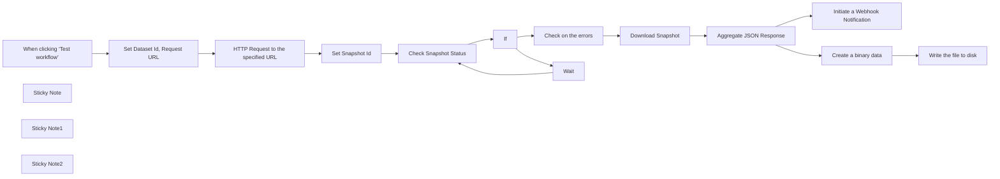

## Fluxo (.json) :

```json
{
  "id": "OjwmaLrXhW4pO5ph",
  "meta": {
    "instanceId": "885b4fb4a6a9c2cb5621429a7b972df0d05bb724c20ac7dac7171b62f1c7ef40"
  },
  "name": "Structured Bulk Data Extract with Bright Data Web Scraper",
  "tags": [
    {
      "id": "Kujft2FOjmOVQAmJ",
      "name": "Engineering",
      "createdAt": "2025-04-09T01:31:00.558Z",
      "updatedAt": "2025-04-09T01:31:00.558Z"
    },
    {
      "id": "ZOwtAMLepQaGW76t",
      "name": "Building Blocks",
      "createdAt": "2025-04-13T15:23:40.462Z",
      "updatedAt": "2025-04-13T15:23:40.462Z"
    }
  ],
  "nodes": [
    {
      "id": "1bdca5ae-1e56-4cf2-a8dc-e135a6a2dfec",
      "name": "When clicking ‘Test workflow’",
      "type": "n8n-nodes-base.manualTrigger",
      "position": [
        -900,
        -395
      ],
      "parameters": {},
      "typeVersion": 1
    },
    {
      "id": "533968cd-1329-4a86-8875-478600ed82b7",
      "name": "If",
      "type": "n8n-nodes-base.if",
      "position": [
        200,
        -470
      ],
      "parameters": {
        "options": {},
        "conditions": {
          "options": {
            "version": 2,
            "leftValue": "",
            "caseSensitive": true,
            "typeValidation": "strict"
          },
          "combinator": "and",
          "conditions": [
            {
              "id": "6a7e5360-4cb5-4806-892e-5c85037fa71c",
              "operator": {
                "type": "string",
                "operation": "equals"
              },
              "leftValue": "={{ $json.status }}",
              "rightValue": "ready"
            }
          ]
        }
      },
      "typeVersion": 2.2
    },
    {
      "id": "83991fdf-0402-4de3-bbb5-7050e3e9fb62",
      "name": "Set Snapshot Id",
      "type": "n8n-nodes-base.set",
      "position": [
        -240,
        -395
      ],
      "parameters": {
        "options": {},
        "assignments": {
          "assignments": [
            {
              "id": "2c3369c6-9206-45d7-9349-f577baeaf189",
              "name": "snapshot_id",
              "type": "string",
              "value": "={{ $json.snapshot_id }}"
            }
          ]
        }
      },
      "typeVersion": 3.4
    },
    {
      "id": "408a36af-decb-49b3-a95e-a2df0b6eea5f",
      "name": "Download Snapshot",
      "type": "n8n-nodes-base.httpRequest",
      "position": [
        640,
        -520
      ],
      "parameters": {
        "url": "=https://api.brightdata.com/datasets/v3/snapshot/{{ $json.snapshot_id }}",
        "options": {
          "timeout": 10000
        },
        "sendQuery": true,
        "authentication": "genericCredentialType",
        "genericAuthType": "httpHeaderAuth",
        "queryParameters": {
          "parameters": [
            {
              "name": "format",
              "value": "json"
            }
          ]
        }
      },
      "credentials": {
        "httpHeaderAuth": {
          "id": "kdbqXuxIR8qIxF7y",
          "name": "Header Auth account"
        }
      },
      "typeVersion": 4.2
    },
    {
      "id": "9d6cd882-c287-46ca-bc1e-df6b995fc422",
      "name": "Wait",
      "type": "n8n-nodes-base.wait",
      "position": [
        420,
        -295
      ],
      "webhookId": "631cd5de-36b3-4264-88ae-45b30e2c2ccc",
      "parameters": {
        "amount": 30
      },
      "typeVersion": 1.1
    },
    {
      "id": "c9cf847a-6399-4c93-a901-30f1c0e7408a",
      "name": "Check on the errors",
      "type": "n8n-nodes-base.if",
      "position": [
        420,
        -520
      ],
      "parameters": {
        "options": {},
        "conditions": {
          "options": {
            "version": 2,
            "leftValue": "",
            "caseSensitive": true,
            "typeValidation": "strict"
          },
          "combinator": "and",
          "conditions": [
            {
              "id": "b267071c-7102-407b-a98d-f613bcb1a106",
              "operator": {
                "type": "string",
                "operation": "equals"
              },
              "leftValue": "={{ $json.errors.toString() }}",
              "rightValue": "0"
            }
          ]
        }
      },
      "typeVersion": 2.2
    },
    {
      "id": "b648614e-c33e-4818-8348-e95df56928c7",
      "name": "Check Snapshot Status",
      "type": "n8n-nodes-base.httpRequest",
      "position": [
        -20,
        -395
      ],
      "parameters": {
        "url": "=https://api.brightdata.com/datasets/v3/progress/{{ $json.snapshot_id }}",
        "options": {},
        "sendHeaders": true,
        "authentication": "genericCredentialType",
        "genericAuthType": "httpHeaderAuth",
        "headerParameters": {
          "parameters": [
            {}
          ]
        }
      },
      "credentials": {
        "httpHeaderAuth": {
          "id": "kdbqXuxIR8qIxF7y",
          "name": "Header Auth account"
        }
      },
      "typeVersion": 4.2
    },
    {
      "id": "408a1584-666f-471e-bfcd-c4d857319688",
      "name": "Initiate a Webhook Notification",
      "type": "n8n-nodes-base.httpRequest",
      "position": [
        1080,
        -520
      ],
      "parameters": {
        "url": "https://webhook.site/daf9d591-a130-4010-b1d3-0c66f8fcf467",
        "options": {},
        "sendBody": true,
        "bodyParameters": {
          "parameters": [
            {
              "name": "response",
              "value": "={{ $json.data[0] }}"
            }
          ]
        }
      },
      "typeVersion": 4.2
    },
    {
      "id": "6548a794-a4fd-4050-b07d-bc7ca4517882",
      "name": "Aggregate JSON Response",
      "type": "n8n-nodes-base.aggregate",
      "position": [
        860,
        -520
      ],
      "parameters": {
        "options": {},
        "aggregate": "aggregateAllItemData"
      },
      "typeVersion": 1
    },
    {
      "id": "c84e195c-edd2-4f59-8986-516d116b7352",
      "name": "Set Dataset Id, Request URL",
      "type": "n8n-nodes-base.set",
      "position": [
        -680,
        -400
      ],
      "parameters": {
        "options": {},
        "assignments": {
          "assignments": [
            {
              "id": "c16061c8-c829-4bd3-b335-e79c605665f2",
              "name": "dataset_id",
              "type": "string",
              "value": "gd_l7q7dkf244hwjntr0"
            },
            {
              "id": "a4594c55-e39e-4a9e-80d6-d39370001e20",
              "name": "request",
              "type": "string",
              "value": "[{     \"url\": \"https://www.amazon.com/Quencher-FlowState-Stainless-Insulated-Smoothie/dp/B0CRMZHDG8\"   }]"
            }
          ]
        }
      },
      "typeVersion": 3.4
    },
    {
      "id": "ceae108e-ed78-40c5-8e58-7013591ccaad",
      "name": "Sticky Note",
      "type": "n8n-nodes-base.stickyNote",
      "position": [
        -900,
        -700
      ],
      "parameters": {
        "width": 520,
        "height": 280,
        "content": "## Note\n\nDeals with the Amazon web scraping by utilizing Bright Data Web Scraper Product.\n\n\n**Please make sure to set the Bright Data \n -> Dataset Id, Request URL and update the Webhook Notification URL**\n\nRefer \n- https://brightdata.com/products/web-scraper/ai\n- https://brightdata.com/products/web-scraper"
      },
      "typeVersion": 1
    },
    {
      "id": "1f55cffa-abd9-437b-bc9d-3fe0d8b02454",
      "name": "Sticky Note1",
      "type": "n8n-nodes-base.stickyNote",
      "position": [
        -120,
        -600
      ],
      "parameters": {
        "color": 5,
        "width": 720,
        "height": 500,
        "content": "## Wait until the Snapshot is ready"
      },
      "typeVersion": 1
    },
    {
      "id": "d8ba0f62-80a9-4e66-b70c-086ee5992df6",
      "name": "Sticky Note2",
      "type": "n8n-nodes-base.stickyNote",
      "position": [
        -900,
        -220
      ],
      "parameters": {
        "color": 4,
        "width": 660,
        "content": "## Who can benefit?\nData analysts, scientists, engineers, and developers seeking efficient methods to collect and analyze web data for AI, ML, big data applications, and more will find Scraper APIs particularly beneficial."
      },
      "typeVersion": 1
    },
    {
      "id": "7fdffafd-f256-4760-b001-a42b5198dbad",
      "name": "Create a binary data",
      "type": "n8n-nodes-base.function",
      "position": [
        1100,
        -720
      ],
      "parameters": {
        "functionCode": "items[0].binary = {\n  data: {\n    data: new Buffer(JSON.stringify(items[0].json, null, 2)).toString('base64')\n  }\n};\nreturn items;"
      },
      "typeVersion": 1
    },
    {
      "id": "934ab31a-cfb9-4e97-8d86-92cd95dd219c",
      "name": "Write the file to disk",
      "type": "n8n-nodes-base.readWriteFile",
      "position": [
        1320,
        -720
      ],
      "parameters": {
        "options": {},
        "fileName": "d:\\bulk_data.json",
        "operation": "write"
      },
      "typeVersion": 1
    },
    {
      "id": "1130523a-b598-425e-acf1-417ae8699f66",
      "name": "HTTP Request to the specified URL",
      "type": "n8n-nodes-base.httpRequest",
      "position": [
        -460,
        -395
      ],
      "parameters": {
        "url": "https://api.brightdata.com/datasets/v3/trigger",
        "method": "POST",
        "options": {},
        "jsonBody": "={{ $json.request }}",
        "sendBody": true,
        "sendQuery": true,
        "sendHeaders": true,
        "specifyBody": "json",
        "authentication": "genericCredentialType",
        "genericAuthType": "httpHeaderAuth",
        "queryParameters": {
          "parameters": [
            {
              "name": "dataset_id",
              "value": "={{ $json.dataset_id }}"
            },
            {
              "name": "format",
              "value": "json"
            },
            {
              "name": "uncompressed_webhook",
              "value": "true"
            }
          ]
        },
        "headerParameters": {
          "parameters": [
            {}
          ]
        }
      },
      "credentials": {
        "httpHeaderAuth": {
          "id": "kdbqXuxIR8qIxF7y",
          "name": "Header Auth account"
        }
      },
      "typeVersion": 4.2
    }
  ],
  "active": false,
  "pinData": {},
  "settings": {
    "executionOrder": "v1"
  },
  "versionId": "8fb2eb85-ffd6-4632-9668-00f29bc91c34",
  "connections": {
    "If": {
      "main": [
        [
          {
            "node": "Check on the errors",
            "type": "main",
            "index": 0
          }
        ],
        [
          {
            "node": "Wait",
            "type": "main",
            "index": 0
          }
        ]
      ]
    },
    "Wait": {
      "main": [
        [
          {
            "node": "Check Snapshot Status",
            "type": "main",
            "index": 0
          }
        ]
      ]
    },
    "Set Snapshot Id": {
      "main": [
        [
          {
            "node": "Check Snapshot Status",
            "type": "main",
            "index": 0
          }
        ]
      ]
    },
    "Download Snapshot": {
      "main": [
        [
          {
            "node": "Aggregate JSON Response",
            "type": "main",
            "index": 0
          }
        ]
      ]
    },
    "Check on the errors": {
      "main": [
        [
          {
            "node": "Download Snapshot",
            "type": "main",
            "index": 0
          }
        ]
      ]
    },
    "Create a binary data": {
      "main": [
        [
          {
            "node": "Write the file to disk",
            "type": "main",
            "index": 0
          }
        ]
      ]
    },
    "Check Snapshot Status": {
      "main": [
        [
          {
            "node": "If",
            "type": "main",
            "index": 0
          }
        ]
      ]
    },
    "Aggregate JSON Response": {
      "main": [
        [
          {
            "node": "Initiate a Webhook Notification",
            "type": "main",
            "index": 0
          },
          {
            "node": "Create a binary data",
            "type": "main",
            "index": 0
          }
        ]
      ]
    },
    "Set Dataset Id, Request URL": {
      "main": [
        [
          {
            "node": "HTTP Request to the specified URL",
            "type": "main",
            "index": 0
          }
        ]
      ]
    },
    "HTTP Request to the specified URL": {
      "main": [
        [
          {
            "node": "Set Snapshot Id",
            "type": "main",
            "index": 0
          }
        ]
      ]
    },
    "When clicking ‘Test workflow’": {
      "main": [
        [
          {
            "node": "Set Dataset Id, Request URL",
            "type": "main",
            "index": 0
          }
        ]
      ]
    }
  }
}
```
