# PACK 1999 TEMPLATES PARTE 08 - Bloco 3

Templates neste bloco: 20

## Sumário

- [Template 1549 - Editor de imagem com FLUX-Fill](#template-1549)
- [Template 1551 - Análise automática de URLs suspeitas](#template-1551)
- [Template 1553 - Triagem de CV e entrevistas comportamentais automatizadas](#template-1553)
- [Template 1555 - Sourcer de perfis LinkedIn via busca booleana](#template-1555)
- [Template 1557 - Validação e correção de endereços de entrega](#template-1557)
- [Template 1559 - Sincronização de produtos Shopify → Google Sheets](#template-1559)
- [Template 1561 - Converter imagem 2D em modelo 3D](#template-1561)
- [Template 1563 - Monitoramento de mudanças em site com alerta por e-mail](#template-1563)
- [Template 1565 - Rastreamento de leads com notificações e registro CRM](#template-1565)
- [Template 1567 - Geração de imagem por IA e upload para Drive](#template-1567)
- [Template 1569 - Verificação em massa de disponibilidade de domínios](#template-1569)
- [Template 1571 - Automação de prospecção e enriquecimento de leads LinkedIn](#template-1571)
- [Template 1574 - Automação de descrição, tags e agendamento YouTube](#template-1574)
- [Template 1576 - Raspador multipágina com Jina.ai](#template-1576)
- [Template 1577 - Editor web para preenchimento (inpainting) com FLUX](#template-1577)
- [Template 1579 - Bot de standup para lembrar e recolher relatórios](#template-1579)
- [Template 1581 - Rate limit por API key e consulta de Pokémons](#template-1581)
- [Template 1583 - RSS da série ARD 'Kalk und Welk'](#template-1583)
- [Template 1585 - Classificador e encaminhador de feedback para Discord](#template-1585)
- [Template 1588 - Cadastro e outreach de leads a partir de sinais de contratação](#template-1588)

---

<a id="template-1549"></a>

## Template 1549 - Editor de imagem com FLUX-Fill

- **Nome:** Editor de imagem com FLUX-Fill
- **Descrição:** Serve uma página de edição que permite ao usuário pintar máscaras e enviar imagens para o serviço FLUX-Fill, aguardando o processamento e retornando a imagem editada.
- **Funcionalidade:** • Servir página do editor com imagens de exemplo e webhook URL: Disponibiliza uma interface HTML com o editor e links para imagens padrão.
• Seleção e upload de imagem: Permite escolher imagens padrão ou carregar do PC.
• Edição com pincel e máscara alfa: Ferramentas de pintura (tamanho do pincel ajustável, cursor, limpar) para criar máscara de edição.
• Parâmetros de geração ajustáveis: Campos para prompt, steps e guidance, além de opção para melhorar o prompt automaticamente.
• Envio dos dados ao serviço de inpainting: Envia imagem (base64), máscara (base64), prompt e configurações para o endpoint FLUX-Fill.
• Polling de status e retry: Verifica periodicamente o status do processamento até que o resultado esteja pronto, com esperas entre tentativas.
• Entrega da imagem resultante ao usuário: Busca a imagem final e entrega como resposta binária para exibição/download.
• Visualização comparativa e ações sobre resultado: Mostra comparação antes/depois e permite salvar ou reutilizar a imagem gerada.
• Mockups padrão configuráveis: Define um array de URLs de mockups que podem ser utilizados como imagens iniciais no editor.
- **Ferramentas:** • FLUX Fill API: Serviço de inpainting / preenchimento que recebe imagem + máscara + prompt e retorna o resultado processado.
• Konva.js: Biblioteca de canvas para manipulação e pintura de imagens no editor.
• img-comparison-slider: Componente para comparar visualmente a imagem original e a gerada lado a lado.
• Scripts e estilos hospedados via CDN (GitHub/jsDelivr): Arquivos JS/CSS personalizados que contêm a lógica e o estilo do editor.
• Armazenamento de objetos (DigitalOcean Spaces): Hospedagem das imagens mockup usadas como exemplos no editor.
• Endpoint HTTP público: Recebe solicitações do editor, coordena envio ao serviço de processamento e retorna a página ou a imagem gerada.

## Fluxo visual

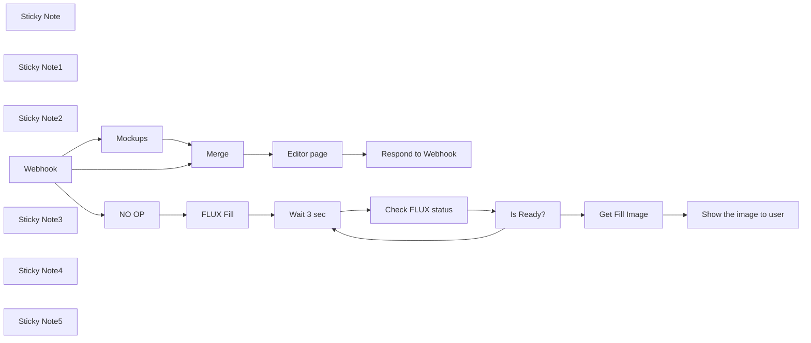

## Fluxo (.json) :

```json
{
  "id": "OvuZIXwt9mdU2JGK",
  "meta": {
    "instanceId": "fb924c73af8f703905bc09c9ee8076f48c17b596ed05b18c0ff86915ef8a7c4a",
    "templateCredsSetupCompleted": true
  },
  "name": "FLUX-fill standalone",
  "tags": [],
  "nodes": [
    {
      "id": "9f051c89-0243-48fb-baa4-666af3fe54b3",
      "name": "Merge",
      "type": "n8n-nodes-base.merge",
      "position": [
        940,
        120
      ],
      "parameters": {
        "mode": "combine",
        "options": {},
        "combineBy": "combineByPosition"
      },
      "typeVersion": 3
    },
    {
      "id": "5da963f7-4320-4359-aefa-bf8f6d6ef815",
      "name": "Respond to Webhook",
      "type": "n8n-nodes-base.respondToWebhook",
      "position": [
        1520,
        120
      ],
      "parameters": {
        "options": {},
        "respondWith": "text",
        "responseBody": "={{ $json.html }}"
      },
      "typeVersion": 1.1
    },
    {
      "id": "05d877bc-b591-478c-b112-32b7efe1ca3f",
      "name": "Wait 3 sec",
      "type": "n8n-nodes-base.wait",
      "position": [
        920,
        680
      ],
      "webhookId": "90f31c1f-6707-4f2f-b525-d3961432cd81",
      "parameters": {
        "amount": 3
      },
      "typeVersion": 1.1
    },
    {
      "id": "a3cc4a50-4218-4a01-ab20-151fd707dd66",
      "name": "Is Ready?",
      "type": "n8n-nodes-base.if",
      "position": [
        1340,
        680
      ],
      "parameters": {
        "options": {},
        "conditions": {
          "options": {
            "version": 2,
            "leftValue": "",
            "caseSensitive": true,
            "typeValidation": "strict"
          },
          "combinator": "and",
          "conditions": [
            {
              "id": "3cf5b451-9ff5-4c2a-864f-9aa7d286871a",
              "operator": {
                "name": "filter.operator.equals",
                "type": "string",
                "operation": "equals"
              },
              "leftValue": "={{ $json.status }}",
              "rightValue": "Ready"
            }
          ]
        }
      },
      "typeVersion": 2.2
    },
    {
      "id": "76a2dcd4-0e57-461d-a8b9-8f52baa3f86a",
      "name": "Sticky Note",
      "type": "n8n-nodes-base.stickyNote",
      "position": [
        520,
        -100
      ],
      "parameters": {
        "width": 1193,
        "height": 479,
        "content": "# Deliver the editor with links to the images"
      },
      "typeVersion": 1
    },
    {
      "id": "b32e8e0b-a449-47d9-8de4-c0062235ff99",
      "name": "FLUX Fill",
      "type": "n8n-nodes-base.httpRequest",
      "position": [
        660,
        680
      ],
      "parameters": {
        "url": "https://api.bfl.ml/v1/flux-pro-1.0-fill",
        "method": "POST",
        "options": {},
        "sendBody": true,
        "authentication": "genericCredentialType",
        "bodyParameters": {
          "parameters": [
            {
              "name": "prompt",
              "value": "={{ $json.body.prompt }}"
            },
            {
              "name": "steps",
              "value": "={{ $json.body.steps }}"
            },
            {
              "name": "prompt_upsampling",
              "value": "={{ $json.body.prompt_upsampling }}"
            },
            {
              "name": "guidance",
              "value": "={{ $json.body.guidance }}"
            },
            {
              "name": "output_format",
              "value": "png"
            },
            {
              "name": "safety_tolerance",
              "value": "6"
            },
            {
              "name": "image",
              "value": "={{ $json.body.image.split(',')[1] }}"
            },
            {
              "name": "mask",
              "value": "={{ $json.body.mask.split(',')[1] }}"
            }
          ]
        },
        "genericAuthType": "httpHeaderAuth"
      },
      "credentials": {
        "httpHeaderAuth": {
          "id": "4eQN9wBw8SniKcPw",
          "name": "bfl-FLUX"
        }
      },
      "typeVersion": 4.2
    },
    {
      "id": "d7d70191-5316-4f20-b570-b8f138b77762",
      "name": "Check FLUX status",
      "type": "n8n-nodes-base.httpRequest",
      "position": [
        1120,
        680
      ],
      "parameters": {
        "url": "https://api.bfl.ml/v1/get_result",
        "options": {},
        "sendQuery": true,
        "authentication": "genericCredentialType",
        "genericAuthType": "httpHeaderAuth",
        "queryParameters": {
          "parameters": [
            {
              "name": "id",
              "value": "={{ $json.id }}"
            }
          ]
        }
      },
      "credentials": {
        "httpHeaderAuth": {
          "id": "4eQN9wBw8SniKcPw",
          "name": "bfl-FLUX"
        }
      },
      "typeVersion": 4.2
    },
    {
      "id": "dafc2712-114f-4723-b587-08ff853513f5",
      "name": "Get Fill Image",
      "type": "n8n-nodes-base.httpRequest",
      "position": [
        1560,
        780
      ],
      "parameters": {
        "url": "={{ $json.result.sample }}",
        "options": {}
      },
      "typeVersion": 4.2
    },
    {
      "id": "68672890-62c3-4020-a09c-9ea691cba361",
      "name": "Show the image to user",
      "type": "n8n-nodes-base.respondToWebhook",
      "position": [
        1900,
        780
      ],
      "parameters": {
        "options": {
          "responseHeaders": {
            "entries": [
              {
                "name": "Content-Type",
                "value": "={{ $binary.data.mimeType }}"
              }
            ]
          }
        },
        "respondWith": "binary",
        "responseDataSource": "set"
      },
      "typeVersion": 1.1
    },
    {
      "id": "7546ce49-56e9-44fd-96fd-324831f38f32",
      "name": "Sticky Note1",
      "type": "n8n-nodes-base.stickyNote",
      "position": [
        560,
        420
      ],
      "parameters": {
        "color": 4,
        "width": 1142,
        "height": 502,
        "content": "# Image processing part"
      },
      "typeVersion": 1
    },
    {
      "id": "cee89c8c-7b88-4cc5-84e4-eb7b404e5042",
      "name": "Sticky Note2",
      "type": "n8n-nodes-base.stickyNote",
      "position": [
        1720,
        660
      ],
      "parameters": {
        "width": 506,
        "height": 272,
        "content": "# Send back edited image\n## Add extra steps to save an edited image"
      },
      "typeVersion": 1
    },
    {
      "id": "a340cd78-56dd-4ac8-a1c1-f3fc03771ae6",
      "name": "Mockups",
      "type": "n8n-nodes-base.set",
      "position": [
        660,
        220
      ],
      "parameters": {
        "options": {},
        "assignments": {
          "assignments": [
            {
              "id": "20c39c67-3cf8-4e29-b871-3202f2e20a3c",
              "name": "Images",
              "type": "array",
              "value": "={{\n[\n{\"url\":\"https://byuroscope.fra1.digitaloceanspaces.com/nc/uploads/noco/fluxtest/creative-arrangement-minimalist-podium_23-2148959328.jpg\",\n \"title\":\"Stage\" },\n{\"url\":\"https://byuroscope.fra1.digitaloceanspaces.com/nc/uploads/noco/fluxtest/Standing-Big-Paper-Bag-Mockup.jpg\",\n \"title\":\"Paper Bag\" },\n{\"url\":\"https://byuroscope.fra1.digitaloceanspaces.com/nc/uploads/noco/fluxtest/Ceramic-Mug-on-Table-Mockup.jpg\",\n \"title\":\"Big Mug\" },\n{\"url\":\"https://byuroscope.fra1.digitaloceanspaces.com/nc/uploads/noco/fluxtest/Transparent-Bottle-on-Sunny-Beach-Mockup-D.jpg\",\n \"title\":\"Transparent-Bottle\" },\n{\"url\":\"https://byuroscope.fra1.digitaloceanspaces.com/nc/uploads/noco/fluxtest/skin-products-arrangement-wooden-blocks_23-2148761445.jpg\",\n \"title\":\"Cosmetics\" }\n]\n}}"
            }
          ]
        }
      },
      "typeVersion": 3.4
    },
    {
      "id": "da82cb73-af4a-4042-bf4e-17894155fb87",
      "name": "Webhook",
      "type": "n8n-nodes-base.webhook",
      "position": [
        260,
        120
      ],
      "webhookId": "9c864ee6-e4d3-46e7-98d4-bea43739963e",
      "parameters": {
        "path": "flux-fill",
        "options": {},
        "responseMode": "responseNode",
        "multipleMethods": true
      },
      "typeVersion": 2
    },
    {
      "id": "0f35da2f-112c-45f9-9cbe-d64eb8bdc6d8",
      "name": "Editor page",
      "type": "n8n-nodes-base.html",
      "position": [
        1240,
        120
      ],
      "parameters": {
        "html": "<!DOCTYPE html>\n<html lang=\"en\">\n<head>\n    <meta charset=\"UTF-8\">\n    <meta name=\"viewport\" content=\"width=device-width, initial-scale=1.0\">\n    <title>Konva Image Editor</title>\n    <script src=\"https://unpkg.com/konva@9/konva.min.js\"></script>\n    <script defer src=\"https://unpkg.com/img-comparison-slider@8/dist/index.js\"></script>\n    <link rel=\"stylesheet\" href=\"https://unpkg.com/img-comparison-slider@8/dist/styles.css\" />\n    <link rel=\"stylesheet\" href=\"https://cdn.jsdelivr.net/gh/ed-parsadanyan/n8n-flux-fill-demo/flux-fill-style.css\" />\n    <script src=\"https://cdn.jsdelivr.net/gh/ed-parsadanyan/n8n-flux-fill-demo/flux-fill-canvas.js\"></script>\n</head>\n<body>\n    <div class=\"controls-wrapper\">\n        <div class=\"left-panel\">\n            <div class=\"image-controls\">\n                <select id=\"imageSelector\">\n                    <option value=\"\">Select an image...</option>\n                    <option value=\"local\">Load from PC...</option>\n                </select>\n                <input type=\"file\" id=\"fileInput\" style=\"display: none\" accept=\"image/*\">\n                <button id=\"clearButton\">Clear All</button>\n            </div>\n            \n            <div class=\"brush-controls\">\n                <label for=\"brushSize\" title=\"Use mouse wheel to adjust brush size\">Brush Size:</label>\n                <div class=\"slider-container\">\n                    <input type=\"range\" id=\"brushSize\" min=\"5\" max=\"40\" value=\"20\">\n                    <span class=\"slider-value\" id=\"brushSizeValue\">20px</span>\n                </div>\n            </div>\n        </div>\n\n        <div class=\"right-panel\">\n            <div class=\"prompt-row\">\n                <input type=\"text\" id=\"promptInput\" placeholder=\"Enter your prompt (optional)\">\n            </div>\n            \n            <div class=\"main-controls\">\n                <label class=\"checkbox-container\">\n                    <input type=\"checkbox\" id=\"improvePrompt\" checked>\n                    <span>Improve prompt</span>\n                </label>\n                \n                <div>\n                    <button id=\"sendButton\">Generate</button>\n                    <span class=\"loading\" id=\"loadingIndicator\">Processing...</span>\n                </div>\n            </div>\n            \n            <div class=\"parameters\">\n                <div class=\"slider-container\">\n                    <label for=\"stepsSlider\">Steps:</label>\n                    <input type=\"range\" id=\"stepsSlider\" min=\"15\" max=\"50\" value=\"40\">\n                    <span class=\"slider-value\" id=\"stepsValue\">40</span>\n                </div>\n                \n                <div class=\"slider-container\">\n                    <label for=\"guidanceSlider\">Guidance:</label>\n                    <input type=\"range\" id=\"guidanceSlider\" min=\"1.5\" max=\"100\" value=\"60\" step=\"0.1\">\n                    <span class=\"slider-value\" id=\"guidanceValue\">60.0</span>\n                </div>\n            </div>\n        </div>\n    </div>\n\n    <div class=\"info\" id=\"imageInfo\"></div>\n    <div id=\"container\"></div>\n    <div id=\"cursor\"></div>\n\n    <div id=\"resultModal\" class=\"modal\">\n        <div class=\"modal-content\">\n            <div class=\"modal-image-container\">\n                <div class=\"comparison-container\">\n                    <div class=\"image-container\">\n                        \n                        \n                    </div>\n                    <input type=\"range\" min=\"0\" max=\"100\" value=\"10\" class=\"slider\">\n                    <div class=\"slider-line\"></div>\n                      <div class=\"slider-button\" aria-hidden=\"true\">\n                          &lt; &gt;\n                      </div>\n                    <div class=\"labels\">\n                        <div class=\"label-before\">Original</div>\n                        <div class=\"label-after\">Generated</div>\n                    </div>\n                </div>\n            </div>\n            <div class=\"modal-buttons\">\n                <button id=\"reuseButton\">Use Generated</button>\n                <button id=\"saveButton\">Save Image</button>\n                <button id=\"closeButton\">Close</button>\n            </div>\n        </div>\n    </div>\n\n<script>\n    const urlParams = new URLSearchParams(window.location.search);\n    const pageId = urlParams.get('id');\n\n    // Image data will be populated by n8n\n    const imageData = {{ JSON.stringify($json.Images,'',2) }};\n    const webhookUrl = '{{ $json.webhookUrl }}';\n\n    // Initialize the editor when the page loads\n    document.addEventListener('DOMContentLoaded', function() {\n        initializeEditor({\n            images: imageData,\n            webhookUrl: webhookUrl,\n            pageId: pageId\n        });\n    });\n</script>\n</body>\n</html>\n"
      },
      "typeVersion": 1.2
    },
    {
      "id": "2ff87261-8a7f-451e-b8ae-b4274776ce28",
      "name": "Sticky Note3",
      "type": "n8n-nodes-base.stickyNote",
      "position": [
        540,
        20
      ],
      "parameters": {
        "color": 5,
        "width": 360,
        "height": 340,
        "content": "## Image array\n* Load from PC\n* Select one of the default images\n\n### Change this node to\n### get image URLs from your data source"
      },
      "typeVersion": 1
    },
    {
      "id": "08bb17fd-1440-4194-8c4f-e18222a68bf2",
      "name": "Sticky Note4",
      "type": "n8n-nodes-base.stickyNote",
      "position": [
        1080,
        -20
      ],
      "parameters": {
        "color": 5,
        "width": 400,
        "height": 300,
        "content": "## HTML code of the editor\n* Konva.js\n* img-comparison-slider to compare edits vs original file\n* Additional css + js files for the editor logic"
      },
      "typeVersion": 1
    },
    {
      "id": "13a820d0-e83b-4d1e-81d1-738ef8ca4d47",
      "name": "Sticky Note5",
      "type": "n8n-nodes-base.stickyNote",
      "position": [
        580,
        500
      ],
      "parameters": {
        "color": 5,
        "width": 280,
        "height": 340,
        "content": "## Call FLUX-Fill Tool\nPass the following data:\n* original image\n* alpha mask from the editor\n* text prompt\n* additional settings"
      },
      "typeVersion": 1
    },
    {
      "id": "f4ab042c-d4da-4f1e-aa05-fdd2cca62d66",
      "name": "NO OP",
      "type": "n8n-nodes-base.noOp",
      "position": [
        420,
        680
      ],
      "parameters": {},
      "typeVersion": 1
    }
  ],
  "active": true,
  "pinData": {
    "Webhook": []
  },
  "settings": {
    "executionOrder": "v1"
  },
  "versionId": "6d4112be-fb6f-4702-ac5f-2c49ff0117d4",
  "connections": {
    "Merge": {
      "main": [
        [
          {
            "node": "Editor page",
            "type": "main",
            "index": 0
          }
        ]
      ]
    },
    "NO OP": {
      "main": [
        [
          {
            "node": "FLUX Fill",
            "type": "main",
            "index": 0
          }
        ]
      ]
    },
    "Mockups": {
      "main": [
        [
          {
            "node": "Merge",
            "type": "main",
            "index": 1
          }
        ]
      ]
    },
    "Webhook": {
      "main": [
        [
          {
            "node": "Merge",
            "type": "main",
            "index": 0
          },
          {
            "node": "Mockups",
            "type": "main",
            "index": 0
          }
        ],
        [
          {
            "node": "NO OP",
            "type": "main",
            "index": 0
          }
        ]
      ]
    },
    "FLUX Fill": {
      "main": [
        [
          {
            "node": "Wait 3 sec",
            "type": "main",
            "index": 0
          }
        ]
      ]
    },
    "Is Ready?": {
      "main": [
        [
          {
            "node": "Get Fill Image",
            "type": "main",
            "index": 0
          }
        ],
        [
          {
            "node": "Wait 3 sec",
            "type": "main",
            "index": 0
          }
        ]
      ]
    },
    "Wait 3 sec": {
      "main": [
        [
          {
            "node": "Check FLUX status",
            "type": "main",
            "index": 0
          }
        ]
      ]
    },
    "Editor page": {
      "main": [
        [
          {
            "node": "Respond to Webhook",
            "type": "main",
            "index": 0
          }
        ]
      ]
    },
    "Get Fill Image": {
      "main": [
        [
          {
            "node": "Show the image to user",
            "type": "main",
            "index": 0
          }
        ]
      ]
    },
    "Check FLUX status": {
      "main": [
        [
          {
            "node": "Is Ready?",
            "type": "main",
            "index": 0
          }
        ]
      ]
    }
  }
}
```

<a id="template-1551"></a>

## Template 1551 - Análise automática de URLs suspeitas

- **Nome:** Análise automática de URLs suspeitas
- **Descrição:** Analisa emails não lidos em busca de URLs potencialmente maliciosos, verifica-os via serviços de análise de URL e envia um relatório consolidado por Slack.
- **Funcionalidade:** • Acionamento manual e agendado: Permite iniciar a verificação ao clicar ou conforme uma agenda programada.
• Coleta de emails não lidos: Recupera mensagens marcadas como não lidas de uma caixa de email e evita reprocessamento ao marcá-las como lidas.
• Extração de indicadores de compromisso: Analisa o conteúdo do email para identificar e extrair URLs presentes no texto.
• Processamento em lote: Divide o conjunto de emails para processar cada mensagem individualmente e de forma controlada.
• Validação de presença de URL: Roteia apenas mensagens contendo URLs para as análises subsequentes.
• Envios para serviços de análise: Submete cada URL aos serviços de verificação para obter um escaneamento detalhado.
• Tratamento de erros tolerante: Continua a execução mesmo se um envio de análise falhar, evitando a paralisação total do fluxo.
• Sincronização de resultados: Aguarda tempo suficiente para que os serviços completem a análise antes de coletar os relatórios.
• Consolidação de relatórios: Combina os resultados das diferentes fontes em um único conjunto de dados alinhado por posição.
• Filtragem e notificação final: Filtra apenas resultados completos e publica um resumo com remetente, assunto, data e verdicts em um canal de comunicação.
- **Ferramentas:** • Microsoft Outlook: Fonte dos emails a serem analisados (recupera mensagens não lidas e atualiza o estado).
• URLScan.io: Serviço de escaneamento de sites que fornece relatório detalhado sobre a URL submetida.
• VirusTotal: Plataforma de análise de segurança que avalia URLs e retorna um veredicto agregado por motores de detecção.
• Slack: Canal de notificação para enviar relatórios consolidados à equipe de segurança.
• ioc-finder: Biblioteca Python utilizada para localizar e extrair indicadores de compromisso (principalmente URLs) no corpo dos emails.


## Fluxo visual

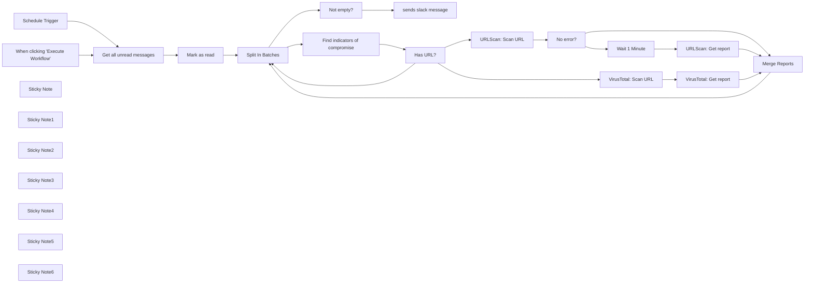

## Fluxo (.json) :

```json
{
  "id": "8EmNhftXznAGV3dR",
  "meta": {
    "instanceId": "03e9d14e9196363fe7191ce21dc0bb17387a6e755dcc9acc4f5904752919dca8"
  },
  "name": "Phishing_analysis__URLScan_io_and_Virustotal_",
  "tags": [
    {
      "id": "GCHVocImoXoEVnzP",
      "name": "🛠️ In progress",
      "createdAt": "2023-10-31T02:17:21.618Z",
      "updatedAt": "2023-10-31T02:17:21.618Z"
    },
    {
      "id": "QPJKatvLSxxtrE8U",
      "name": "Secops",
      "createdAt": "2023-10-31T02:15:11.396Z",
      "updatedAt": "2023-10-31T02:15:11.396Z"
    }
  ],
  "nodes": [
    {
      "id": "f170068a-4540-4fbd-bd17-00a6367989d1",
      "name": "When clicking \"Execute Workflow\"",
      "type": "n8n-nodes-base.manualTrigger",
      "position": [
        -1760,
        560
      ],
      "parameters": {},
      "typeVersion": 1
    },
    {
      "id": "5a1e0490-6971-4490-a806-46da5e226365",
      "name": "sends slack message",
      "type": "n8n-nodes-base.slack",
      "position": [
        -360,
        1280
      ],
      "parameters": {
        "text": "=*Email Analysis*\n\nSubject: {{ $('Microsoft Outlook').item.json[\"subject\"] }}\nFrom: {{ $('Microsoft Outlook').item.json[\"sender\"][\"emailAddress\"][\"address\"] }}\nDate: {{ $('Microsoft Outlook').item.json[\"sentDateTime\"] }}\n\nReport:\n\n*URLScan Report URL:* {{ $('urlscan.io').item.json.result ? $('urlscan.io').item.json.result : \"N/A\" }}\n*Virustotal report:* https://www.virustotal.com/gui/url/{{ $json[\"data\"][\"id\"].split(\"-\")[1] }}\n*Virustotal Verdict:* {{ $json.data.attributes.stats.malicious + $json.data.attributes.stats.suspicious }} / {{ Object.keys($json.data.attributes.results).length }}",
        "select": "channel",
        "channelId": {
          "__rl": true,
          "mode": "name",
          "value": "test-giulio-public"
        },
        "otherOptions": {}
      },
      "credentials": {
        "slackApi": {
          "id": "252",
          "name": "Slack Bot Token | Giulio [✅ Share ok]"
        }
      },
      "typeVersion": 2
    },
    {
      "id": "65e70f8a-7514-455e-97bf-b11514b4eec2",
      "name": "Split In Batches",
      "type": "n8n-nodes-base.splitInBatches",
      "position": [
        -1020,
        480
      ],
      "parameters": {
        "options": {},
        "batchSize": 1
      },
      "typeVersion": 2
    },
    {
      "id": "35084825-f3b2-4a01-b953-712c099a6451",
      "name": "Mark as read",
      "type": "n8n-nodes-base.microsoftOutlook",
      "position": [
        -1300,
        560
      ],
      "parameters": {
        "messageId": "={{ $json.id }}",
        "operation": "update",
        "updateFields": {
          "isRead": true
        }
      },
      "credentials": {
        "microsoftOutlookOAuth2Api": {
          "id": "Zeu3LbjDbkwiCUik",
          "name": "Microsoft Outlook | Giulio [✅ Share ok]"
        }
      },
      "typeVersion": 1
    },
    {
      "id": "62098c94-5735-4eed-a712-3f9887e0400f",
      "name": "VirusTotal: Scan URL",
      "type": "n8n-nodes-base.httpRequest",
      "position": [
        -220,
        700
      ],
      "parameters": {
        "url": "https://www.virustotal.com/api/v3/urls",
        "method": "POST",
        "options": {},
        "sendQuery": true,
        "authentication": "predefinedCredentialType",
        "queryParameters": {
          "parameters": [
            {
              "name": "url",
              "value": "={{ $json.domain }}"
            }
          ]
        },
        "nodeCredentialType": "virusTotalApi"
      },
      "credentials": {
        "virusTotalApi": {
          "id": "hVTFFXxLV4oWPOb0",
          "name": "Virus Total | Giulio [✅ Share ok]"
        }
      },
      "typeVersion": 4.1
    },
    {
      "id": "55b7ce97-3609-4a16-b998-8bec77cffb59",
      "name": "VirusTotal: Get report",
      "type": "n8n-nodes-base.httpRequest",
      "position": [
        200,
        700
      ],
      "parameters": {
        "url": "=https://www.virustotal.com/api/v3/analyses/{{ $json.data.id }}",
        "options": {},
        "sendQuery": true,
        "authentication": "predefinedCredentialType",
        "queryParameters": {
          "parameters": [
            {
              "name": "resource",
              "value": "https://developers.virustotal.com/v2.0/reference/url-report"
            }
          ]
        },
        "nodeCredentialType": "virusTotalApi"
      },
      "credentials": {
        "virusTotalApi": {
          "id": "hVTFFXxLV4oWPOb0",
          "name": "Virus Total | Giulio [✅ Share ok]"
        }
      },
      "typeVersion": 4.1
    },
    {
      "id": "7bf3c7a0-94f9-410b-b0fe-e0d15d0ba895",
      "name": "Schedule Trigger",
      "type": "n8n-nodes-base.scheduleTrigger",
      "position": [
        -1760,
        380
      ],
      "parameters": {
        "rule": {
          "interval": [
            {}
          ]
        }
      },
      "typeVersion": 1.1
    },
    {
      "id": "741f3221-bb73-4004-801e-e9c3030740f8",
      "name": "Find indicators of compromise",
      "type": "n8n-nodes-base.code",
      "position": [
        -780,
        440
      ],
      "parameters": {
        "language": "python",
        "pythonCode": "try:\n  from ioc_finder import find_iocs\nexcept ImportError:\n  import micropip\n  await micropip.install(\"ioc-finder\")\n  from ioc_finder import find_iocs\n\ntext = _input.first().json['body']['content']\nprint(text)\n\niocs = find_iocs(text)\n\nreturn [{\"json\": { \"domain\": item }} for item in iocs[\"urls\"]]"
      },
      "typeVersion": 2,
      "alwaysOutputData": true
    },
    {
      "id": "bf8ba285-e824-4104-82e0-fa2dba80f301",
      "name": "URLScan: Get report",
      "type": "n8n-nodes-base.urlScanIo",
      "position": [
        640,
        60
      ],
      "parameters": {
        "scanId": "={{ $json.scanId }}",
        "operation": "get"
      },
      "credentials": {
        "urlScanIoApi": {
          "id": "eva7ViJyyrpmJDe3",
          "name": "urlscan.io | Giulio [✅ Share ok]"
        }
      },
      "typeVersion": 1
    },
    {
      "id": "eb3b06e8-ffe3-4472-a70c-08fb2555e0fb",
      "name": "URLScan: Scan URL",
      "type": "n8n-nodes-base.urlScanIo",
      "position": [
        -100,
        120
      ],
      "parameters": {
        "url": "={{ $json.domain }}",
        "additionalFields": {}
      },
      "credentials": {
        "urlScanIoApi": {
          "id": "eva7ViJyyrpmJDe3",
          "name": "urlscan.io | Giulio [✅ Share ok]"
        }
      },
      "typeVersion": 1,
      "continueOnFail": true
    },
    {
      "id": "34157694-635a-481b-b7d2-dcd4628b26fe",
      "name": "Has URL?",
      "type": "n8n-nodes-base.if",
      "position": [
        -520,
        440
      ],
      "parameters": {
        "conditions": {
          "string": [
            {
              "value1": "={{ $json.domain }}",
              "operation": "isNotEmpty"
            }
          ]
        }
      },
      "typeVersion": 1
    },
    {
      "id": "33cad369-0598-433e-90f8-0e7333ec5e92",
      "name": "No error?",
      "type": "n8n-nodes-base.if",
      "position": [
        240,
        120
      ],
      "parameters": {
        "conditions": {
          "string": [
            {
              "value1": "={{ $json.error }}",
              "operation": "isNotEmpty"
            }
          ]
        }
      },
      "typeVersion": 1
    },
    {
      "id": "cba20d52-a56c-4ac0-99f2-d9b54adb342e",
      "name": "Not empty?",
      "type": "n8n-nodes-base.filter",
      "position": [
        -640,
        1280
      ],
      "parameters": {
        "conditions": {
          "string": [
            {
              "value1": "={{ $json.data }}",
              "operation": "isNotEmpty"
            }
          ]
        }
      },
      "typeVersion": 1
    },
    {
      "id": "449c31e3-e098-43ec-a31b-1e383c6add57",
      "name": "Sticky Note",
      "type": "n8n-nodes-base.stickyNote",
      "position": [
        -2051.228008430503,
        -251.94391274976795
      ],
      "parameters": {
        "width": 474.5187061049208,
        "height": 1008.8561536646063,
        "content": "\n## Workflow Overview\n\nThis n8n workflow is engineered to enhance cybersecurity measures by analyzing potential phishing URLs using URLScan.io and VirusTotal. \n\nIt is designed to automatically process and evaluate URLs from incoming messages for malicious content.\n\nThis workflow is tuned specifically for `Outlook`, but you can replace outlook with your mail provider of choice. \n\nThe workflow can be initiated manually or scheduled to run automatically, ensuring consistent checks against phishing threats. By integrating with leading cybersecurity tools, it provides a comprehensive analysis, strengthening your organization's defense against phishing attacks.\n\n## Execution Schedule\n\nIt can be triggered at will by clicking \"Execute Workflow\" or set to run on a schedule. To align with your operational needs, customize the `Schedule Trigger` to your preferred frequency, ensuring continuous monitoring for phishing attempts."
      },
      "typeVersion": 1
    },
    {
      "id": "a8921212-aec4-422d-9f04-f402d7591475",
      "name": "Sticky Note1",
      "type": "n8n-nodes-base.stickyNote",
      "position": [
        -1560,
        107
      ],
      "parameters": {
        "width": 397.3953488372091,
        "height": 647.1076277970203,
        "content": "\n## Email Processing for Phishing Analysis\nThis segment of the workflow interfaces with Microsoft Outlook to retrieve and process `all messages marked as unread`. This section can be replaced with any mail provider.\n\nOnce an email is fetched, the `Get all unread messages` node captures the details, while the `Mark as read` node updates the message's status. \n\nThis ensures that each email is only processed once, maintaining a clean and organized inbox, and preventing reprocessing of the same messages."
      },
      "typeVersion": 1
    },
    {
      "id": "fbad734e-4502-4d1b-8890-b05c486a1f70",
      "name": "Sticky Note2",
      "type": "n8n-nodes-base.stickyNote",
      "position": [
        -1140,
        15.062288067451163
      ],
      "parameters": {
        "width": 859.9418604651164,
        "height": 836.8098049558043,
        "content": "\n## Indicator of Compromise Detection Loop\nThis workflow section leverages n8n's `Split In Batches` node, a powerful feature for iterative processing. It is set to dissect the batch of emails one by one, allowing for individual examination of each message's content for potential threats.\n\nWith the `Find indicators of compromise` node, the workflow employs Python code to parse the email content and extract URLs, which are common indicators of compromise (IoCs) in phishing attempts. By utilizing the ioc-finder library, it systematically scans for and isolates these IoCs from the email body.\n\nThe `Has URL?` node then checks if the email contains any urls. If no URLs are found, then the loop moves on to the next email, as there is nothing to scan. If it does find one, it allows the email to flow to the next sections. \n\nThe splitting of batches is key to the workflow's efficiency, enabling the loop to handle vast quantities of emails methodically. This step is crucial in pinpointing and extracting suspicious elements from each email, highlighting the workflow's meticulous approach to security analysis."
      },
      "typeVersion": 1
    },
    {
      "id": "8603fe5b-ad6b-4980-a28b-01531c6629f3",
      "name": "Sticky Note3",
      "type": "n8n-nodes-base.stickyNote",
      "position": [
        -260,
        -313.5039999999999
      ],
      "parameters": {
        "width": 1099.116279069767,
        "height": 618.8295813953489,
        "content": "\n## URL Scanning and Verification\nThis portion of the workflow engages with URLScan.io, a tool for scanning and analyzing websites for potential security threats.\n\nThe `URLScan: Scan URL` node begins the process by submitting the URL extracted from the email content. It's configured to continue even if an error occurs, which allows us to then do an error check in the `No error?` node instead. \n\nThis is because if the `URLScan: Scan URL` node fails, the whole workflow will grind to a stop. This is not good because in theory, we maybe processing another email after this one, and we need to ensure the workflow moves on to the next email. \n\nFollowing the submission, the `Wait 1 Minute` node pauses the workflow, giving URLScan.io adequate time to perform the scan and generate a report. This wait ensures that the subsequent retrieval of the report reflects the most recent and comprehensive analysis."
      },
      "typeVersion": 1
    },
    {
      "id": "33299274-9f02-4ea0-af60-5dee53db2c34",
      "name": "Wait 1 Minute",
      "type": "n8n-nodes-base.wait",
      "position": [
        480,
        60
      ],
      "webhookId": "469a8b5e-8b5a-4360-bc9d-3b253cc0ae24",
      "parameters": {
        "unit": "seconds",
        "amount": 60
      },
      "typeVersion": 1
    },
    {
      "id": "757ad81d-ae24-4b26-98ba-a571670be2a3",
      "name": "Sticky Note4",
      "type": "n8n-nodes-base.stickyNote",
      "position": [
        -260,
        318.64011851851865
      ],
      "parameters": {
        "width": 1435.7278194659766,
        "height": 540.6919228251508,
        "content": ""
      },
      "typeVersion": 1
    },
    {
      "id": "8e2cbf69-6c9e-4a98-ba5e-29b93eb2742f",
      "name": "Sticky Note5",
      "type": "n8n-nodes-base.stickyNote",
      "position": [
        -680,
        880
      ],
      "parameters": {
        "width": 1213.8313506082789,
        "height": 575.5779026440933,
        "content": "\n## Final Reporting on Phishing Analysis\nIn the concluding phase of the workflow, we consolidate the analysis into actionable intelligence and report through Slack.\n\nThe `Not empty?` node filters the data, ensuring that only URLs with a completed analysis proceed to the reporting stage. This step is crucial to avoid alerting on incomplete data, which could lead to misinformed decisions.\n\nThe `sends slack message` node is the final touchpoint of the workflow, where it compiles a detailed report and posts it on Slack. The message includes the `subject, sender, and date` of the analyzed email, along with the URLScan and VirusTotal reports. It provides a concise verdict by tallying the number of malicious and suspicious flags against the total checks performed, offering a clear indication of the potential threat level.\n\nThis Slack notification serves as a prompt for the cybersecurity team to take appropriate action, completing the workflow's aim of providing streamlined, accurate, and timely phishing threat analysis."
      },
      "typeVersion": 1
    },
    {
      "id": "a2a0dc81-b1f0-4d7b-b818-71bae58512a9",
      "name": "Get all unread messages",
      "type": "n8n-nodes-base.microsoftOutlook",
      "position": [
        -1520,
        560
      ],
      "parameters": {
        "operation": "getAll",
        "additionalFields": {
          "filter": "isRead eq false"
        }
      },
      "credentials": {
        "microsoftOutlookOAuth2Api": {
          "id": "Zeu3LbjDbkwiCUik",
          "name": "Microsoft Outlook | Giulio [✅ Share ok]"
        }
      },
      "typeVersion": 1
    },
    {
      "id": "a5793014-9575-4e05-b467-f295a09f0945",
      "name": "Sticky Note6",
      "type": "n8n-nodes-base.stickyNote",
      "position": [
        -260,
        320
      ],
      "parameters": {
        "width": 615.527819465977,
        "height": 540.6919228251508,
        "content": "\n## Phishing URL Analysis with VirusTotal\nThis segment of the workflow deploys VirusTotal's capabilities to scrutinize URLs for signs of phishing.\n\nThe `VirusTotal: Scan URL` node initiates the process by sending the URL to VirusTotal for analysis. Once the scan is triggered, the workflow moves on to the `VirusTotal: Get report` node, which retrieves the detailed analysis report after a certain interval, ensuring that the data received includes all findings from the scan.\n\nFinally, the `Merge Reports` node combines the results from both URLScan.io and VirusTotal, aligning the data side by side for a comprehensive view. This merging by position is vital as it correlates the analysis from different sources, providing a layered security assessment of the URL in question."
      },
      "typeVersion": 1
    },
    {
      "id": "c8d5c248-77ba-4a7f-ab21-19ff8d60ed55",
      "name": "Merge Reports",
      "type": "n8n-nodes-base.merge",
      "position": [
        1040,
        680
      ],
      "parameters": {
        "mode": "combine",
        "options": {},
        "combinationMode": "mergeByPosition"
      },
      "typeVersion": 2.1
    }
  ],
  "active": false,
  "pinData": {},
  "settings": {
    "executionOrder": "v1"
  },
  "versionId": "02ba918c-5fee-4d3e-824f-1160881716b6",
  "connections": {
    "Has URL?": {
      "main": [
        [
          {
            "node": "URLScan: Scan URL",
            "type": "main",
            "index": 0
          },
          {
            "node": "VirusTotal: Scan URL",
            "type": "main",
            "index": 0
          }
        ],
        [
          {
            "node": "Split In Batches",
            "type": "main",
            "index": 0
          }
        ]
      ]
    },
    "No error?": {
      "main": [
        [
          {
            "node": "Merge Reports",
            "type": "main",
            "index": 0
          }
        ],
        [
          {
            "node": "Wait 1 Minute",
            "type": "main",
            "index": 0
          }
        ]
      ]
    },
    "Not empty?": {
      "main": [
        [
          {
            "node": "sends slack message",
            "type": "main",
            "index": 0
          }
        ]
      ]
    },
    "Mark as read": {
      "main": [
        [
          {
            "node": "Split In Batches",
            "type": "main",
            "index": 0
          }
        ]
      ]
    },
    "Merge Reports": {
      "main": [
        [
          {
            "node": "Split In Batches",
            "type": "main",
            "index": 0
          }
        ]
      ]
    },
    "Wait 1 Minute": {
      "main": [
        [
          {
            "node": "URLScan: Get report",
            "type": "main",
            "index": 0
          }
        ]
      ]
    },
    "Schedule Trigger": {
      "main": [
        [
          {
            "node": "Get all unread messages",
            "type": "main",
            "index": 0
          }
        ]
      ]
    },
    "Split In Batches": {
      "main": [
        [
          {
            "node": "Find indicators of compromise",
            "type": "main",
            "index": 0
          }
        ],
        [
          {
            "node": "Not empty?",
            "type": "main",
            "index": 0
          }
        ]
      ]
    },
    "URLScan: Scan URL": {
      "main": [
        [
          {
            "node": "No error?",
            "type": "main",
            "index": 0
          }
        ]
      ]
    },
    "URLScan: Get report": {
      "main": [
        [
          {
            "node": "Merge Reports",
            "type": "main",
            "index": 0
          }
        ]
      ]
    },
    "VirusTotal: Scan URL": {
      "main": [
        [
          {
            "node": "VirusTotal: Get report",
            "type": "main",
            "index": 0
          }
        ]
      ]
    },
    "VirusTotal: Get report": {
      "main": [
        [
          {
            "node": "Merge Reports",
            "type": "main",
            "index": 1
          }
        ]
      ]
    },
    "Get all unread messages": {
      "main": [
        [
          {
            "node": "Mark as read",
            "type": "main",
            "index": 0
          }
        ]
      ]
    },
    "Find indicators of compromise": {
      "main": [
        [
          {
            "node": "Has URL?",
            "type": "main",
            "index": 0
          }
        ]
      ]
    },
    "When clicking \"Execute Workflow\"": {
      "main": [
        [
          {
            "node": "Get all unread messages",
            "type": "main",
            "index": 0
          }
        ]
      ]
    }
  }
}
```

<a id="template-1553"></a>

## Template 1553 - Triagem de CV e entrevistas comportamentais automatizadas

- **Nome:** Triagem de CV e entrevistas comportamentais automatizadas
- **Descrição:** Automatiza o recebimento de candidaturas, extração e análise de currículos, comparação com descrições de vaga, criação de registro no ATS e condução/avaliação de entrevistas por voz com integração a ferramentas de IA e armazenamento.
- **Funcionalidade:** • Recebimento de candidatura via formulário: captura dados do candidato e código da vaga (campo oculto) para roteamento.
• Upload do currículo: armazena o arquivo PDF em repositório de arquivo.
• Extração de texto do PDF: converte o CV em texto para processamento posterior.
• Extração de dados pessoais: extrai nome, email, telefone e cidade do CV.
• Extração de qualificações: identifica educação, histórico de trabalho, skills e calcula anos totais de experiência.
• Geração de sumário do candidato: cria um resumo conciso (educação, histórico e skills) para referência rápida.
• Recuperação e sumarização da descrição da vaga: busca a vaga correspondente pelo código e resume o conteúdo.
• Avaliação de compatibilidade (HR Expert): compara o currículo com a descrição da vaga, gera avaliação qualitativa e nota de 1 a 10 com justificativa.
• Criação/atualização de registro no ATS: registra o candidato no banco de vagas com campos de avaliação, resumo e links para arquivo.
• Backup em planilha: grava dados essenciais e avaliação em Google Sheets para compliance e relatórios.
• Fluxo de entrevista por voz (AI): integra convite para entrevista por voz, recebe webhook com dados da conversa e resultados de critérios de avaliação.
• Avaliação da entrevista por agente AI: analisa a transcrição inteira usando critérios extraídos do banco de avaliação e fornece resumo e pontuação (1–5).
• Gerenciamento de áudio: baixa o áudio da conversa, salva no repositório e adiciona link ao perfil do candidato.
• Atualização do registro com resultados da entrevista: escreve avaliações por critério e avaliação geral no perfil do candidato.
• Revisão humana (Human-in-the-loop): permite que o hiring manager revise os candidatos no painel e dispare próximos passos (ex.: agendamento) manualmente.
- **Ferramentas:** • Google Drive: armazenamento de currículos e arquivos de áudio gerados pelas entrevistas.
• Google Gemini (PaLM): modelo de linguagem para sumarização, extração de informações e avaliações de compatibilidade.
• Notion ATS: base de dados de vagas e candidatos usada para buscar descrições de vaga, armazenar registros e mostrar painel para revisão humana.
• ElevenLabs (ConvAI / API): plataforma de entrevistas por voz que fornece webhook com transcript e áudio da conversa.
• Google Sheets: planilha para backup dos dados dos candidatos e relatórios de compliance.

## Fluxo visual

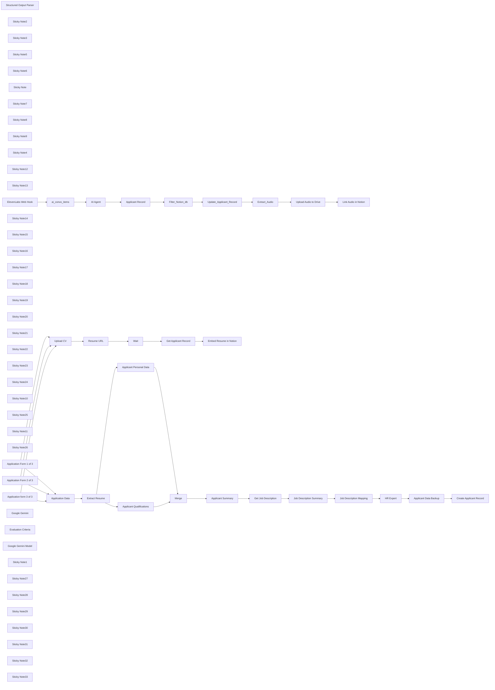

## Fluxo (.json) :

```json
{
  "id": "EnfvHdczSXHN8vNv",
  "meta": {
    "instanceId": "dede14b31ec7e508c14f42cff0a64c12ba101f85945f0d41134b60824d8105f1",
    "templateId": "2860",
    "templateCredsSetupCompleted": true
  },
  "name": "Resume Screening & Behavioral Interviews with Gemini, Elevenlabs, & Notion ATS copy",
  "tags": [],
  "nodes": [
    {
      "id": "eb481f48-a0bb-43b6-bb6f-bd6de416ed3c",
      "name": "Merge",
      "type": "n8n-nodes-base.merge",
      "position": [
        1480,
        700
      ],
      "parameters": {
        "mode": "combine",
        "options": {},
        "combineBy": "combineAll"
      },
      "typeVersion": 3
    },
    {
      "id": "3d98e145-b7c7-482a-8510-3ab6e442f65e",
      "name": "Structured Output Parser",
      "type": "@n8n/n8n-nodes-langchain.outputParserStructured",
      "position": [
        3180,
        880
      ],
      "parameters": {
        "schemaType": "manual",
        "inputSchema": "{\n\t\"type\": \"object\",\n\t\"properties\": {\n\t\t\"resume_score\": {\n\t\t\t\"type\": \"string\"\n\t\t},\n\t\t\"resume_evaluation\": {\n\t\t\t\"type\": \"string\"\n\t\t}\n\t}\n}"
      },
      "typeVersion": 1.2
    },
    {
      "id": "ad85623d-7c18-4b80-b5a9-3515096e2917",
      "name": "HR Expert",
      "type": "@n8n/n8n-nodes-langchain.chainLlm",
      "position": [
        3000,
        700
      ],
      "parameters": {
        "text": "=Profile received:\n{{ $json.job_description }}\n\nCandidate:\n{{ $('Applicant Summary').item.json.response.text }}",
        "messages": {
          "messageValues": [
            {
              "message": "You are an HR expert and you need to understand if the candidate aligns with the profile sought by the company. You must give a score from 1 to 10, where 1 means the candidate does not align with what is required, while 10 means they are the ideal candidate because they fully reflect the desired profile. Furthermore, in the 'consideration' field, explain the reasoning behind your score."
            }
          ]
        },
        "promptType": "define",
        "hasOutputParser": true
      },
      "typeVersion": 1.5
    },
    {
      "id": "23cb1def-11e8-4bcf-a667-154a9699c45d",
      "name": "Upload CV",
      "type": "n8n-nodes-base.googleDrive",
      "position": [
        660,
        1120
      ],
      "parameters": {
        "driveId": {
          "__rl": true,
          "mode": "list",
          "value": "My Drive"
        },
        "options": {},
        "folderId": {
          "__rl": true,
          "mode": "list",
          "value": "19gFV-OtPby1Q7OCFJYWFgf1HsMhmk7yJ",
          "cachedResultUrl": "https://drive.google.com/drive/folders/19gFV-OtPby1Q7OCFJYWFgf1HsMhmk7yJ",
          "cachedResultName": "[CV]"
        },
        "inputDataFieldName": "Resume"
      },
      "credentials": {
        "googleDriveOAuth2Api": {
          "id": "JjRf0Foc59YXzEmS",
          "name": "Google Drive account"
        }
      },
      "typeVersion": 3
    },
    {
      "id": "37ebc9bb-1d72-447c-8ea0-370b67a738e9",
      "name": "Sticky Note2",
      "type": "n8n-nodes-base.stickyNote",
      "position": [
        1060,
        520
      ],
      "parameters": {
        "width": 360,
        "height": 480,
        "content": "## Applicant Qualifications\n### Creates individual summary for Education, Job History, and Skills that is sent to LLM for processing; captures total years of experience"
      },
      "typeVersion": 1
    },
    {
      "id": "cfd19f7f-8790-4f2e-9ed2-a84b36b5613f",
      "name": "Sticky Note3",
      "type": "n8n-nodes-base.stickyNote",
      "position": [
        1620,
        520
      ],
      "parameters": {
        "width": 360,
        "height": 400,
        "content": "## Applicant Summary \n### Writes a concise summary of applicant’s Education, Job History, and Skills."
      },
      "typeVersion": 1
    },
    {
      "id": "41dc78d2-a937-49b2-8c3a-b73d841f053f",
      "name": "Sticky Note5",
      "type": "n8n-nodes-base.stickyNote",
      "position": [
        2940,
        520
      ],
      "parameters": {
        "width": 360,
        "height": 400,
        "content": "## HR Expert Evaluation\n### Compares resume to job description in Notion ATS and assesses candidate, outputting evaluation rationale and score of 1 to 10"
      },
      "typeVersion": 1
    },
    {
      "id": "bbf2ff07-8a53-4ca7-8e21-08f3bffc3ffa",
      "name": "Sticky Note6",
      "type": "n8n-nodes-base.stickyNote",
      "position": [
        2040,
        520
      ],
      "parameters": {
        "width": 300,
        "height": 400,
        "content": "## Gets Job Description \n### Searches Notion ATS database and pulls description that matches Job Code in Applicant form trigger"
      },
      "typeVersion": 1
    },
    {
      "id": "fbba47e9-2e7c-42df-9da1-1893b238abc1",
      "name": "Extract Resume",
      "type": "n8n-nodes-base.extractFromFile",
      "position": [
        900,
        700
      ],
      "parameters": {
        "options": {},
        "operation": "pdf",
        "binaryPropertyName": "=Resume"
      },
      "typeVersion": 1
    },
    {
      "id": "b1313d9a-0d52-4387-b6b3-e1f9ed24b7ce",
      "name": "Applicant Summary",
      "type": "@n8n/n8n-nodes-langchain.chainSummarization",
      "position": [
        1680,
        700
      ],
      "parameters": {
        "options": {
          "summarizationMethodAndPrompts": {
            "values": {
              "prompt": "=",
              "combineMapPrompt": "=Write a concise summary of the following:\n\nEducational qualification: {{ $json.output[\"Educational qualification\"] }}\nJob History: {{ $json.output[\"Job History\"] }}\nSkills: {{ $json.output.Skills }}\n\nUse 300 words or less. Be concise and conversational."
            }
          }
        }
      },
      "typeVersion": 2
    },
    {
      "id": "a1d840d2-af90-4411-bfa7-d378ff6b4872",
      "name": "Job Description Summary",
      "type": "@n8n/n8n-nodes-langchain.chainLlm",
      "position": [
        2420,
        700
      ],
      "parameters": {
        "text": "={{ $json.property_job_description }}",
        "messages": {
          "messageValues": [
            {
              "message": "summarize this in less than 250 words"
            }
          ]
        },
        "promptType": "define"
      },
      "typeVersion": 1.5
    },
    {
      "id": "627b3ddf-93eb-4206-84cb-6b0c78bb1e8f",
      "name": "Sticky Note",
      "type": "n8n-nodes-base.stickyNote",
      "position": [
        3720,
        520
      ],
      "parameters": {
        "width": 280,
        "height": 400,
        "content": "## Creates ATS Record\n### Updates Notion ATS database (free template) with applicant information, including AI assessment of qualifications vs job description."
      },
      "typeVersion": 1
    },
    {
      "id": "d646da88-23c2-4846-8494-9e84d019b13e",
      "name": "Sticky Note7",
      "type": "n8n-nodes-base.stickyNote",
      "position": [
        3380,
        520
      ],
      "parameters": {
        "width": 280,
        "height": 400,
        "content": "## Creates G-Sheets Record\n### Updates Google Sheet with applicant data as source for compliance reporting"
      },
      "typeVersion": 1
    },
    {
      "id": "b3bac51c-b4db-4fe6-8bc2-bd5a3b798b3d",
      "name": "Sticky Note8",
      "type": "n8n-nodes-base.stickyNote",
      "position": [
        2380,
        520
      ],
      "parameters": {
        "width": 360,
        "height": 400,
        "content": "## Job Description Summary\n### Summarizes the job description into a string, 250 words or less"
      },
      "typeVersion": 1
    },
    {
      "id": "4070358f-e169-40fb-8ba2-857149d8e37b",
      "name": "Applicant Qualifications",
      "type": "@n8n/n8n-nodes-langchain.informationExtractor",
      "position": [
        1100,
        840
      ],
      "parameters": {
        "text": "={{ $json.text }}",
        "options": {
          "systemPromptTemplate": "You are an expert extraction algorithm.\nOnly extract relevant information from the text.\nIf you do not know the value of an attribute asked to extract, you may omit the attribute's value."
        },
        "attributes": {
          "attributes": [
            {
              "name": "Educational qualification",
              "required": true,
              "description": "Summary of academic career, focusing on undergraduate and university studies.  Summarize in 100 words maximum."
            },
            {
              "name": "Job History",
              "required": true,
              "description": "Work history summary, focusing on most recent work experiences. Summarize in 100 words maximum"
            },
            {
              "name": "Skills",
              "required": true,
              "description": "Extract the candidate’s technical skills. What software, frameworks, functional skills they are proficient in. Make a bulleted list."
            },
            {
              "name": "Experience",
              "required": true,
              "description": "Extract years of experience and group experience by job function or role type. Format Example: Total Years Exp: 7 - Account Executive: 2 years - Sales Development Representative: 2 years - Account Manager: 3 years"
            },
            {
              "name": "Title & Employer",
              "description": "Extract most recent Job Title and Employer"
            },
            {
              "name": "Total Years Experience",
              "description": "Extract total years of experience and format as Total Years Exp:  "
            }
          ]
        }
      },
      "typeVersion": 1
    },
    {
      "id": "28996d39-49af-40fa-adf7-0e431d4d7ffe",
      "name": "Applicant Personal Data",
      "type": "@n8n/n8n-nodes-langchain.informationExtractor",
      "position": [
        1100,
        700
      ],
      "parameters": {
        "text": "={{ $json.text }}",
        "options": {
          "systemPromptTemplate": "You are an expert extraction algorithm.\nOnly extract relevant information from the text.\nIf you do not know the value of an attribute asked to extract, include the  attribute's value as N/A."
        },
        "schemaType": "manual",
        "inputSchema": "{\n\t\"type\": \"object\",\n\t\"properties\": {\n\t\t\"telephone\": {\n\t\t\t\"type\": \"string\",\n\t\t\t\"description\": \"Phone number of the contact (digits only)\"\n\t\t},\n\t\t\"city\": {\n\t\t\t\"type\": \"string\",\n\t\t\t\"description\": \"City of the contact\"\n\t\t},\n\t\t\"full_name\": {\n\t\t\t\"type\": \"string\",\n\t\t\t\"description\": \"Full name of the contact\"\n\t\t},\n\t\t\"email\": {\n\t\t\t\"type\": \"string\",\n\t\t\t\"format\": \"email\",\n\t\t\t\"description\": \"Email address of the contact\"\n\t\t}\n\t},\n\t\"required\": [\n\t\t\"full_name\",\n\t\t\"email\",\n\t\t\"telephone\",\n\t\t\"city\"\n\t]\n}"
      },
      "typeVersion": 1
    },
    {
      "id": "5c466cca-7be7-4cda-bcba-68acc6d80c15",
      "name": "Sticky Note9",
      "type": "n8n-nodes-base.stickyNote",
      "position": [
        560,
        520
      ],
      "parameters": {
        "width": 300,
        "height": 400,
        "content": "## Application Data\n### Captures data elements from Application Form and provides as input for workflow "
      },
      "typeVersion": 1
    },
    {
      "id": "1316d194-e7be-4b9a-9f96-2c953529a9d2",
      "name": "Application Data",
      "type": "n8n-nodes-base.set",
      "position": [
        680,
        700
      ],
      "parameters": {
        "options": {},
        "assignments": {
          "assignments": [
            {
              "id": "240c052e-7799-4cc2-8d6d-ae521a469b0d",
              "name": "job_code",
              "type": "string",
              "value": "={{ $json.undefined }}"
            },
            {
              "id": "612cdd0d-456d-4ebf-b8d8-8638b2b59390",
              "name": "date_time",
              "type": "string",
              "value": "={{ $json.submittedAt }}"
            }
          ]
        },
        "includeOtherFields": true
      },
      "typeVersion": 3.4
    },
    {
      "id": "3f8c6944-f23c-44c2-afe1-1479fe9f97cc",
      "name": "Sticky Note4",
      "type": "n8n-nodes-base.stickyNote",
      "position": [
        60,
        480
      ],
      "parameters": {
        "width": 360,
        "height": 660,
        "content": "  "
      },
      "typeVersion": 1
    },
    {
      "id": "9de7840a-a713-4f31-b7a2-a0dc80654281",
      "name": "Sticky Note12",
      "type": "n8n-nodes-base.stickyNote",
      "position": [
        4060,
        640
      ],
      "parameters": {
        "color": 4,
        "width": 500,
        "height": 180,
        "content": "## Human in the Loop 1 (Notion)\n### Hiring manager reviews qualified applicants in Notion ATS dashboard (free template) and triggers next steps with drag and drop that invites applicants to AI behavioral-based interview.  "
      },
      "typeVersion": 1
    },
    {
      "id": "ae5f6a5f-40c2-4f25-9df2-fd4565f61e2d",
      "name": "Sticky Note13",
      "type": "n8n-nodes-base.stickyNote",
      "position": [
        40,
        120
      ],
      "parameters": {
        "color": 3,
        "width": 4500,
        "content": "# Candidate Application > Resume Screen > ATS Record Creation > Invite to Interview\n## Automating the process from application to first round interview invitation."
      },
      "typeVersion": 1
    },
    {
      "id": "46211734-a52a-415e-8986-0da2af2c3a22",
      "name": "ElevenLabs Web Hook",
      "type": "n8n-nodes-base.webhook",
      "position": [
        140,
        1880
      ],
      "webhookId": "a3c17b54-7cd0-496a-af8a-74a6298dcfb4",
      "parameters": {
        "options": {},
        "httpMethod": "POST"
      },
      "typeVersion": 2
    },
    {
      "id": "1eecec11-38b1-493d-9198-e22ae2836034",
      "name": "ai_convo_items",
      "type": "n8n-nodes-base.set",
      "position": [
        440,
        1880
      ],
      "parameters": {
        "options": {},
        "assignments": {
          "assignments": [
            {
              "id": "4d283fef-ea58-4479-9ddb-f4cd6f89020d",
              "name": "criteria_1_result",
              "type": "string",
              "value": "={{ $json.body.data.analysis.evaluation_criteria_results.problem_solving.result }}"
            },
            {
              "id": "0584a114-baa3-4744-bcb0-4c52ba2760c1",
              "name": "criteria_1_rationale",
              "type": "string",
              "value": "={{ $json.body.data.analysis.evaluation_criteria_results.problem_solving.rationale }}"
            },
            {
              "id": "b0aee518-3da0-4d82-b31b-8d5db29fa697",
              "name": "criteria_2_result",
              "type": "string",
              "value": "={{ $json.body.data.analysis.evaluation_criteria_results.handling_escalated_issues.result }}"
            },
            {
              "id": "d9b9a697-e89a-41a4-abf0-bef5e5d5379a",
              "name": "criteria_2_rationale",
              "type": "string",
              "value": "={{ $json.body.data.analysis.evaluation_criteria_results.handling_escalated_issues.rationale }}"
            },
            {
              "id": "cc3576db-804e-4aae-acf4-9ea9f6ef5223",
              "name": "ai_screen_phone_number_value",
              "type": "string",
              "value": "={{ $json.body.data.analysis.data_collection_results.phone_number_AI_screen.value }}"
            },
            {
              "id": "a6a65cb1-f5f2-4d05-900a-9b4d6242a993",
              "name": "ai_screen_full_name_value",
              "type": "string",
              "value": "={{ $json.body.data.analysis.data_collection_results.full_name.value }}"
            },
            {
              "id": "665854b1-d0af-42c3-9e96-465872fd367c",
              "name": "ai_screen_call_time",
              "type": "string",
              "value": "={{ $json.body.data.conversation_initiation_client_data.dynamic_variables.system__time_utc }}"
            },
            {
              "id": "f295a22c-2266-4906-acf1-de60697c7611",
              "name": "ai_screen_conversation_id",
              "type": "string",
              "value": "={{ $json.body.data.conversation_initiation_client_data.dynamic_variables.system__conversation_id }}"
            },
            {
              "id": "39309fb6-223e-487e-ac7e-6b5ce6e9e243",
              "name": "full_transcript",
              "type": "string",
              "value": "={{ $json.body.data }}"
            }
          ]
        }
      },
      "typeVersion": 3.4
    },
    {
      "id": "e8a451d9-83fa-46f8-9869-8d00a1122656",
      "name": "Extract_Audio",
      "type": "n8n-nodes-base.httpRequest",
      "position": [
        2120,
        1880
      ],
      "parameters": {
        "url": "=https://api.elevenlabs.io/v1/convai/conversations/{{ $node[\"ai_convo_items\"].json.ai_screen_conversation_id }}/audio",
        "options": {},
        "jsonHeaders": "{\n  \"xi-api-key\":\"insert elevenlabs api key\"\n}\n",
        "sendHeaders": true,
        "specifyHeaders": "json"
      },
      "typeVersion": 4.2
    },
    {
      "id": "ed52a6c5-ac4e-4d70-9d15-8ca586c536c6",
      "name": "Filter_Notion_db",
      "type": "n8n-nodes-base.filter",
      "position": [
        1520,
        1880
      ],
      "parameters": {
        "options": {},
        "conditions": {
          "options": {
            "version": 2,
            "leftValue": "",
            "caseSensitive": true,
            "typeValidation": "strict"
          },
          "combinator": "and",
          "conditions": [
            {
              "id": "a4107790-d8d6-4f65-bc0b-f7c33a573769",
              "operator": {
                "name": "filter.operator.equals",
                "type": "string",
                "operation": "equals"
              },
              "leftValue": "={{ $json.property_phone }}",
              "rightValue": "={{ $('ai_convo_items').item.json.ai_screen_phone_number_value }}"
            }
          ]
        }
      },
      "typeVersion": 2.2
    },
    {
      "id": "95128237-3759-469c-94cb-87aefd02bd98",
      "name": "AI Agent",
      "type": "@n8n/n8n-nodes-langchain.agent",
      "position": [
        740,
        1880
      ],
      "parameters": {
        "text": "={{ $json.full_transcript }}",
        "options": {
          "systemMessage": "You are an AI agent embodying the role of a skilled and objective Talent Acquisition Specialist. Your primary purpose is to review and critically evaluate answers to behavior-based interview questions. Review the full transcript and provide an expert evaluation of the candidate, based on their answers, using the evaluation criteria in the attached Notion tool to form the basis of your assessment. \n\nFilter Criteria Instructions:\nSearch the Notion database (attached tool) for the evaluation_criteria that matches the Job or Position title in the transcript First Message.  \n\n\nProvide a written assessment of the overall interview in a concise summary less than 300 words. Also provide a score 1 low to 5 high for the overall interview and place this at the start of the assessment. Confirm if you were able to use the evaluation criteria to make your assessment. Format the output as a text string.\n\nExample Output:\n  \"Score: 2 | The candidate's responses...\""
        },
        "promptType": "define",
        "hasOutputParser": true
      },
      "typeVersion": 1.8
    },
    {
      "id": "1b38915c-53b2-4526-a8e0-4ad55d43dcc1",
      "name": "Sticky Note14",
      "type": "n8n-nodes-base.stickyNote",
      "position": [
        60,
        1700
      ],
      "parameters": {
        "width": 280,
        "height": 400,
        "content": "## Elevenlabs Trigger\n### AI Conversation agent behavior-based interview data/audio sent at end of conversation.  Includes an AI evaluation of interview questions.   \n"
      },
      "typeVersion": 1
    },
    {
      "id": "e198e96c-f46c-4043-abc2-be47ed9c799a",
      "name": "Sticky Note15",
      "type": "n8n-nodes-base.stickyNote",
      "position": [
        360,
        1700
      ],
      "parameters": {
        "width": 260,
        "height": 400,
        "content": "## Data Mapping\n### Conversation data elements, including evaluation criteria and transcript summary mapped as output fields\n"
      },
      "typeVersion": 1
    },
    {
      "id": "1505c84b-c06d-4397-adb0-5e0309a01271",
      "name": "Sticky Note16",
      "type": "n8n-nodes-base.stickyNote",
      "position": [
        660,
        1700
      ],
      "parameters": {
        "width": 440,
        "height": 400,
        "content": "## AI Agent Interview Assessment\n### AI agent reviews full conversation transcript and provides overall assessment of behavior based interview, scoring applicants from 1 low to 5 high.\n"
      },
      "typeVersion": 1
    },
    {
      "id": "3f8e282e-e2c3-44a3-bd88-fb5f1eef54ed",
      "name": "Sticky Note17",
      "type": "n8n-nodes-base.stickyNote",
      "position": [
        1140,
        1700
      ],
      "parameters": {
        "width": 260,
        "height": 400,
        "content": "## Applicant Tracker\n### Pulls applicant record from Notion db"
      },
      "typeVersion": 1
    },
    {
      "id": "0d33e767-e65a-47e7-b33c-3806b00f1c6a",
      "name": "Sticky Note18",
      "type": "n8n-nodes-base.stickyNote",
      "position": [
        1440,
        1700
      ],
      "parameters": {
        "width": 260,
        "height": 400,
        "content": "## Applicant ID\n### Using phone number captured during interview, matches interview with candidate record in db"
      },
      "typeVersion": 1
    },
    {
      "id": "1ce8d5e4-a576-45d5-9285-58f3cf00796d",
      "name": "Sticky Note19",
      "type": "n8n-nodes-base.stickyNote",
      "position": [
        1740,
        1700
      ],
      "parameters": {
        "width": 260,
        "height": 400,
        "content": "## Update Notion DB\n### Matches record and updates applicant record with AI conversation agent criteria evaluation and N8N AI agent overall interview score.\n"
      },
      "typeVersion": 1
    },
    {
      "id": "6d0fd6ad-0ead-4734-8ef4-f0e6effcd67c",
      "name": "Sticky Note20",
      "type": "n8n-nodes-base.stickyNote",
      "position": [
        2040,
        1700
      ],
      "parameters": {
        "width": 260,
        "height": 400,
        "content": "## Conversation Audio\n### Downloads conversation audio and saves to Google Drive.  Option to delete audio from Elevenlabs server.\n"
      },
      "typeVersion": 1
    },
    {
      "id": "6fd97a41-5ac4-4f93-85fb-296c450f1312",
      "name": "Sticky Note21",
      "type": "n8n-nodes-base.stickyNote",
      "position": [
        2900,
        1820
      ],
      "parameters": {
        "color": 4,
        "width": 720,
        "height": 180,
        "content": "## Human in the Loop 2 - (Notion)\n### Hiring manager reviews Notion ATS dashboard (free template) and views AI Agent’s, overall assessment of conversation, including score, and individual assessment of each question response.  Manager can then automatically schedule the next interview  by dragging the applicant profile to the next process stage in Notion dashboard.\n"
      },
      "typeVersion": 1
    },
    {
      "id": "38e36f98-0387-4267-b573-ad957338565d",
      "name": "Sticky Note22",
      "type": "n8n-nodes-base.stickyNote",
      "position": [
        60,
        1340
      ],
      "parameters": {
        "color": 3,
        "width": 4480,
        "content": "# Conversation AI Agent Interview > AI Assessment - Evaluation > Notion ATS Update with Audio transcript\n## Automating behavioral based interview evaluation and scoring; updating manager dashboard in Notion. "
      },
      "typeVersion": 1
    },
    {
      "id": "88a9d40c-9839-4fbb-9f78-81025cde86e7",
      "name": "Sticky Note23",
      "type": "n8n-nodes-base.stickyNote",
      "position": [
        -500,
        320
      ],
      "parameters": {
        "color": 5,
        "width": 520,
        "height": 980,
        "content": "# Application \n## Applicant initiates process from Notion hosted Career Page (free template), submitting application using N8N form embedded into job postings.  Hidden field in form, Job Code, matches applicant to position.  The current configuration enables the employer to run AI recruiting for 3 roles at the same time.  Templates can be expanded to accommodate more than 3 jobs."
      },
      "typeVersion": 1
    },
    {
      "id": "40c48633-6021-4e4d-a3bd-1b81433f9b64",
      "name": "Sticky Note24",
      "type": "n8n-nodes-base.stickyNote",
      "position": [
        -520,
        1700
      ],
      "parameters": {
        "color": 5,
        "width": 520,
        "height": 400,
        "content": " # AI Agent Interview\n## Successful candidates are invited to an instant interview with the AI agent"
      },
      "typeVersion": 1
    },
    {
      "id": "0447d46c-3863-46a6-ae44-36e812b8f5e5",
      "name": "Sticky Note10",
      "type": "n8n-nodes-base.stickyNote",
      "position": [
        60,
        1160
      ],
      "parameters": {
        "width": 360,
        "height": 140,
        "content": "### Configuration Note: \nUpdate Title and Job code in form to match your job posting hosted in Notion (free template) \n"
      },
      "typeVersion": 1
    },
    {
      "id": "ee57ca8f-7faf-4eae-a52f-bf25eb5462ca",
      "name": "Link Audio in Notion",
      "type": "n8n-nodes-base.notion",
      "position": [
        2640,
        1880
      ],
      "parameters": {
        "pageId": {
          "__rl": true,
          "mode": "id",
          "value": "={{ $('Applicant Record').item.json.id }}"
        },
        "options": {},
        "resource": "databasePage",
        "operation": "update",
        "propertiesUi": {
          "propertyValues": [
            {
              "key": "Interview Audio|files",
              "fileUrls": {
                "fileUrl": [
                  {
                    "url": "=https://drive.google.com/file/d/{{ $json.id }}/preview",
                    "name": "Interview Audio"
                  }
                ]
              }
            }
          ]
        }
      },
      "credentials": {
        "notionApi": {
          "id": "noqe7mtKHNObSPoE",
          "name": "Notion account"
        }
      },
      "typeVersion": 2.2
    },
    {
      "id": "2d081496-a85b-4d2f-b5a8-acabd18028d5",
      "name": "Sticky Note25",
      "type": "n8n-nodes-base.stickyNote",
      "position": [
        2520,
        1700
      ],
      "parameters": {
        "width": 340,
        "height": 400,
        "content": "## Embed audio transcript in Notion\n### Embeds audio transcript in applicant profile hosted in Notion ATS database, providing hiring manager easy access to validate AI assessment. \n"
      },
      "typeVersion": 1
    },
    {
      "id": "a319edea-a12d-4d70-85d6-9a03e8fafdaf",
      "name": "Sticky Note11",
      "type": "n8n-nodes-base.stickyNote",
      "position": [
        -500,
        120
      ],
      "parameters": {
        "color": 5,
        "width": 520,
        "content": "# Workflow 1"
      },
      "typeVersion": 1
    },
    {
      "id": "bb415161-dd68-4c7b-baf6-a5190300d609",
      "name": "Sticky Note26",
      "type": "n8n-nodes-base.stickyNote",
      "position": [
        -520,
        1360
      ],
      "parameters": {
        "color": 5,
        "width": 520,
        "height": 140,
        "content": "# Workflow 2"
      },
      "typeVersion": 1
    },
    {
      "id": "004dc3fe-2c4c-4a7c-82d7-f6737728a96f",
      "name": "Resume URL",
      "type": "n8n-nodes-base.set",
      "position": [
        880,
        1120
      ],
      "parameters": {
        "options": {},
        "assignments": {
          "assignments": [
            {
              "id": "c0230d7a-037b-4d69-a133-28a611fba010",
              "name": "resume_url",
              "type": "string",
              "value": "=https://drive.google.com/file/d/{{ $json.id }}/preview "
            }
          ]
        }
      },
      "typeVersion": 3.4
    },
    {
      "id": "15aae5ce-7247-44cd-8235-804d992d9a14",
      "name": "Get Applicant Record",
      "type": "n8n-nodes-base.notion",
      "position": [
        1280,
        1120
      ],
      "parameters": {
        "filters": {
          "conditions": [
            {
              "key": "Resume |files",
              "condition": "is_empty"
            }
          ]
        },
        "options": {},
        "resource": "databasePage",
        "operation": "getAll",
        "databaseId": {
          "__rl": true,
          "mode": "list",
          "value": "1cc7f9c9-6878-80c9-a271-ca0521f11b30",
          "_comment": "removed notion database above",
          "cachedResultUrl": "  ",
          "cachedResultName": "Applicant Tracker"
        },
        "filterType": "manual"
      },
      "credentials": {
        "notionApi": {
          "id": "noqe7mtKHNObSPoE",
          "name": "Notion account"
        }
      },
      "typeVersion": 2.2
    },
    {
      "id": "397c83d8-f3cd-4c06-9ab5-b8ddb55cf7b9",
      "name": "Embed Resume in Notion",
      "type": "n8n-nodes-base.notion",
      "position": [
        1500,
        1120
      ],
      "parameters": {
        "pageId": {
          "__rl": true,
          "mode": "id",
          "value": "={{ $json.id }}"
        },
        "options": {},
        "resource": "databasePage",
        "operation": "update",
        "propertiesUi": {
          "propertyValues": [
            {
              "key": "Resume |files",
              "fileUrls": {
                "fileUrl": [
                  {
                    "url": "={{ $('Resume URL').item.json.resume_url }}",
                    "name": "Resume"
                  }
                ]
              }
            }
          ]
        }
      },
      "credentials": {
        "notionApi": {
          "id": "noqe7mtKHNObSPoE",
          "name": "Notion account"
        }
      },
      "typeVersion": 2.2
    },
    {
      "id": "998b0d29-22c9-448a-af1a-6bfe5a282cd6",
      "name": "Wait",
      "type": "n8n-nodes-base.wait",
      "position": [
        1080,
        1120
      ],
      "webhookId": "71a63e24-b5a7-475f-b3d4-4f062d1caf41",
      "parameters": {},
      "typeVersion": 1.1
    },
    {
      "id": "76b38736-b3ec-4b52-85cf-0d9556c61541",
      "name": "Application Form 1 of 3",
      "type": "n8n-nodes-base.formTrigger",
      "position": [
        180,
        520
      ],
      "webhookId": "fbcca45f-efd3-4f31-9b0e-1ddb19705200",
      "parameters": {
        "options": {
          "buttonLabel": "Submit",
          "respondWithOptions": {
            "values": {
              "formSubmittedText": "Thank you for your interest in joining the [Company Name] team! We’ll review your information, and if your background looks like a match, we’ll reach out to schedule the next steps.  While we review your application, please know that we will not share your application information with anyone outside the [Company Name] team except where necessary to assist us in assessing your candidacy throughout the recruitment process. That means your data may be assessed in the United States by our team in [City/Location]. We may keep the information you submitted for up to four years and use it to keep you informed of other opportunities that might be a good fit for you.  If you would like to know more about how we use your personal data, please review our Privacy Notice, where you can also find information on how to update your contact preferences.  In the meantime, check out our company culture!  Thanks again,  The [Company Name] Talent Acquisition Team"
            }
          }
        },
        "formTitle": "Sr Account Executive",
        "formFields": {
          "values": [
            {
              "fieldName": "job_code",
              "fieldType": "hiddenField",
              "fieldValue": "300"
            },
            {
              "fieldLabel": "Name",
              "requiredField": true
            },
            {
              "fieldType": "email",
              "fieldLabel": "Email",
              "requiredField": true
            },
            {
              "fieldType": "file",
              "fieldLabel": "Resume",
              "requiredField": true,
              "acceptFileTypes": ".pdf"
            }
          ]
        },
        "formDescription": "[Company Name]"
      },
      "typeVersion": 2.2
    },
    {
      "id": "6ae41a72-fc0e-4e6f-a3ee-794790050901",
      "name": "Application Form 2 of 3",
      "type": "n8n-nodes-base.formTrigger",
      "position": [
        180,
        740
      ],
      "webhookId": "0b2ad1e6-4867-4f4e-9eae-141b16266a2a",
      "parameters": {
        "options": {
          "buttonLabel": "Submit",
          "respondWithOptions": {
            "values": {
              "formSubmittedText": "Thank you for your interest in joining the [Company Name] team! We’ll review your information, and if your background looks like a match, we’ll reach out to schedule the next steps.  While we review your application, please know that we will not share your application information with anyone outside the [Company Name] team except where necessary to assist us in assessing your candidacy throughout the recruitment process. That means your data may be assessed in the United States by our team in [City/Location]. We may keep the information you submitted for up to four years and use it to keep you informed of other opportunities that might be a good fit for you.  If you would like to know more about how we use your personal data, please review our Privacy Notice, where you can also find information on how to update your contact preferences.  In the meantime, check out our company culture!  Thanks again,  The [Company Name] Talent Acquisition Team"
            }
          }
        },
        "formTitle": "Full Stack Developer",
        "formFields": {
          "values": [
            {
              "fieldName": "Job Code",
              "fieldType": "hiddenField",
              "fieldValue": "200"
            },
            {
              "fieldLabel": "Name",
              "requiredField": true
            },
            {
              "fieldType": "email",
              "fieldLabel": "Email",
              "requiredField": true
            },
            {
              "fieldType": "file",
              "fieldLabel": "Resume",
              "acceptFileTypes": ".pdf"
            }
          ]
        },
        "formDescription": "[Company Name]"
      },
      "typeVersion": 2.2
    },
    {
      "id": "daa5b254-2b07-4367-b330-c333dfb602d2",
      "name": "Application form 3 of 3",
      "type": "n8n-nodes-base.formTrigger",
      "position": [
        180,
        960
      ],
      "webhookId": "1224b9b0-05b1-4ed5-af9a-ccd7ff01eb6c",
      "parameters": {
        "options": {
          "buttonLabel": "Submit",
          "respondWithOptions": {
            "values": {
              "formSubmittedText": "Thank you for your interest in joining the [Company Name] team! We’ll review your information, and if your background looks like a match, we’ll reach out to schedule the next steps.  While we review your application, please know that we will not share your application information with anyone outside the [Company Name] team except where necessary to assist us in assessing your candidacy throughout the recruitment process. That means your data may be assessed in the United States by our team in [City/Location]. We may keep the information you submitted for up to four years and use it to keep you informed of other opportunities that might be a good fit for you.  If you would like to know more about how we use your personal data, please review our Privacy Notice, where you can also find information on how to update your contact preferences.  In the meantime, check out our company culture!  Thanks again,  The [Company Name] Talent Acquisition Team"
            }
          }
        },
        "formTitle": "IT Support Analyst",
        "formFields": {
          "values": [
            {
              "fieldName": "Job Code",
              "fieldType": "hiddenField",
              "fieldValue": "100"
            },
            {
              "fieldLabel": "Name"
            },
            {
              "fieldType": "email",
              "fieldLabel": "Email"
            },
            {
              "fieldType": "file",
              "fieldLabel": "Resume",
              "acceptFileTypes": ".pdf"
            }
          ]
        },
        "formDescription": "[Company Name]"
      },
      "typeVersion": 2.2
    },
    {
      "id": "368952ec-7b0c-4404-bbc8-1fa34e1c7ab1",
      "name": "Get Job Description",
      "type": "n8n-nodes-base.notion",
      "position": [
        2140,
        700
      ],
      "parameters": {
        "filters": {
          "conditions": [
            {
              "key": "Job Code|select",
              "condition": "equals",
              "selectValue": "={{ $('Application Data').item.json.job_code }}"
            }
          ]
        },
        "options": {},
        "resource": "databasePage",
        "operation": "getAll",
        "returnAll": true,
        "databaseId": {
          "__rl": true,
          "mode": "list",
          "value": "1d97f9c9-6878-80c1-bdca-e0e803367326",
          "_comment": "removed notion database above",
          "cachedResultUrl": "  ",
          "cachedResultName": "                             Work at [Company Name]"
        },
        "filterType": "manual"
      },
      "credentials": {
        "notionApi": {
          "id": "noqe7mtKHNObSPoE",
          "name": "Notion account"
        }
      },
      "typeVersion": 2.2
    },
    {
      "id": "8b4f2624-5b13-481e-8297-bbd9045dbd08",
      "name": "Job Description Mapping",
      "type": "n8n-nodes-base.set",
      "position": [
        2800,
        700
      ],
      "parameters": {
        "options": {},
        "assignments": {
          "assignments": [
            {
              "id": "a3d049b0-5a70-4e7b-a6f2-81447da5282a",
              "name": "job_description",
              "type": "string",
              "value": "={{ $json.response.text }}"
            }
          ]
        }
      },
      "typeVersion": 3.4
    },
    {
      "id": "66755787-56b0-4001-91f1-64dcc5443d7e",
      "name": "Applicant Data Backup",
      "type": "n8n-nodes-base.googleSheets",
      "position": [
        3460,
        700
      ],
      "parameters": {
        "columns": {
          "value": {
            "YOE": "={{ $('Merge').item.json.output['Total Years Experience'] }}",
            "Name": "={{ $('Application Data').item.json.Name }}",
            "Phone": "={{ $('Merge').item.json.output.telephone }}",
            "Skills": "={{ $('Merge').item.json.output['Job History'] }}",
            "Job Code": "={{ $('Application Data').item.json.job_code }}",
            "Education": "={{ $('Merge').item.json.output['Educational qualification'] }}",
            "Job History": "={{ $('Merge').item.json.output['Job History'] }}",
            "Resume Score": "={{ $json.output.resume_score }}",
            "Hiring Manager": "={{ $('Get Job Description').item.json.property_hiring_manager }}",
            "Candidate Email": "={{ $('Merge').item.json.output.email }}",
            "Application Date": "={{ $('Application Data').item.json.date_time }}",
            "Applicant Location": "={{ $('Merge').item.json.output.city }}",
            "Experience Summary": "={{ $('Merge').item.json.output.Experience }}",
            "AI Resume Assessment": "={{ $json.output.resume_evaluation }}",
            "Hiring Manager Email": "={{ $('Get Job Description').item.json.property_hiring_manager_email }}"
          },
          "schema": [
            {
              "id": "Name",
              "type": "string",
              "display": true,
              "removed": false,
              "required": false,
              "displayName": "Name",
              "defaultMatch": false,
              "canBeUsedToMatch": true
            },
            {
              "id": "Application Date",
              "type": "string",
              "display": true,
              "removed": false,
              "required": false,
              "displayName": "Application Date",
              "defaultMatch": false,
              "canBeUsedToMatch": true
            },
            {
              "id": "Requisition Title",
              "type": "string",
              "display": true,
              "removed": true,
              "required": false,
              "displayName": "Requisition Title",
              "defaultMatch": false,
              "canBeUsedToMatch": true
            },
            {
              "id": "Resume Score",
              "type": "string",
              "display": true,
              "removed": false,
              "required": false,
              "displayName": "Resume Score",
              "defaultMatch": false,
              "canBeUsedToMatch": true
            },
            {
              "id": "YOE",
              "type": "string",
              "display": true,
              "removed": false,
              "required": false,
              "displayName": "YOE",
              "defaultMatch": false,
              "canBeUsedToMatch": true
            },
            {
              "id": "Experience Summary",
              "type": "string",
              "display": true,
              "removed": false,
              "required": false,
              "displayName": "Experience Summary",
              "defaultMatch": false,
              "canBeUsedToMatch": true
            },
            {
              "id": "AI Resume Assessment",
              "type": "string",
              "display": true,
              "removed": false,
              "required": false,
              "displayName": "AI Resume Assessment",
              "defaultMatch": false,
              "canBeUsedToMatch": true
            },
            {
              "id": "Phone",
              "type": "string",
              "display": true,
              "removed": false,
              "required": false,
              "displayName": "Phone",
              "defaultMatch": false,
              "canBeUsedToMatch": true
            },
            {
              "id": "Education",
              "type": "string",
              "display": true,
              "removed": false,
              "required": false,
              "displayName": "Education",
              "defaultMatch": false,
              "canBeUsedToMatch": true
            },
            {
              "id": "Job History",
              "type": "string",
              "display": true,
              "removed": false,
              "required": false,
              "displayName": "Job History",
              "defaultMatch": false,
              "canBeUsedToMatch": true
            },
            {
              "id": "Skills",
              "type": "string",
              "display": true,
              "removed": false,
              "required": false,
              "displayName": "Skills",
              "defaultMatch": false,
              "canBeUsedToMatch": true
            },
            {
              "id": "Applicant Location",
              "type": "string",
              "display": true,
              "removed": false,
              "required": false,
              "displayName": "Applicant Location",
              "defaultMatch": false,
              "canBeUsedToMatch": true
            },
            {
              "id": "Hiring Manager",
              "type": "string",
              "display": true,
              "removed": false,
              "required": false,
              "displayName": "Hiring Manager",
              "defaultMatch": false,
              "canBeUsedToMatch": true
            },
            {
              "id": "Hiring Manager Email",
              "type": "string",
              "display": true,
              "removed": false,
              "required": false,
              "displayName": "Hiring Manager Email",
              "defaultMatch": false,
              "canBeUsedToMatch": true
            },
            {
              "id": "Candidate Email",
              "type": "string",
              "display": true,
              "removed": false,
              "required": false,
              "displayName": "Candidate Email",
              "defaultMatch": false,
              "canBeUsedToMatch": true
            },
            {
              "id": "Job Code",
              "type": "string",
              "display": true,
              "removed": false,
              "required": false,
              "displayName": "Job Code",
              "defaultMatch": false,
              "canBeUsedToMatch": true
            },
            {
              "id": "conversation_id",
              "type": "string",
              "display": true,
              "removed": true,
              "required": false,
              "displayName": "conversation_id",
              "defaultMatch": false,
              "canBeUsedToMatch": true
            },
            {
              "id": "Evaluation Criteria 1",
              "type": "string",
              "display": true,
              "removed": true,
              "required": false,
              "displayName": "Evaluation Criteria 1",
              "defaultMatch": false,
              "canBeUsedToMatch": true
            },
            {
              "id": "Evaluation Criteria 2",
              "type": "string",
              "display": true,
              "removed": true,
              "required": false,
              "displayName": "Evaluation Criteria 2",
              "defaultMatch": false,
              "canBeUsedToMatch": true
            },
            {
              "id": "Evaluation Criteria 3",
              "type": "string",
              "display": true,
              "removed": true,
              "required": false,
              "displayName": "Evaluation Criteria 3",
              "defaultMatch": false,
              "canBeUsedToMatch": true
            },
            {
              "id": "ai_interview_evaluation",
              "type": "string",
              "display": true,
              "removed": true,
              "required": false,
              "displayName": "ai_interview_evaluation",
              "defaultMatch": false,
              "canBeUsedToMatch": true
            },
            {
              "id": "Interview Audio",
              "type": "string",
              "display": true,
              "removed": true,
              "required": false,
              "displayName": "Interview Audio",
              "defaultMatch": false,
              "canBeUsedToMatch": true
            },
            {
              "id": "Applicant Snapshot",
              "type": "string",
              "display": true,
              "removed": true,
              "required": false,
              "displayName": "Applicant Snapshot",
              "defaultMatch": false,
              "canBeUsedToMatch": true
            }
          ],
          "mappingMode": "defineBelow",
          "matchingColumns": [],
          "attemptToConvertTypes": false,
          "convertFieldsToString": false
        },
        "options": {},
        "operation": "append",
        "sheetName": {
          "__rl": true,
          "mode": "list",
          "value": "gid=0",
          "cachedResultUrl": "https://docs.google.com/spreadsheets/d/1l4JFmEqY6CJdAICdr6fpetCMJSpU57wk2kduFwNx6fo/edit#gid=0",
          "cachedResultName": "Sheet1"
        },
        "documentId": {
          "__rl": true,
          "mode": "list",
          "value": "1l4JFmEqY6CJdAICdr6fpetCMJSpU57wk2kduFwNx6fo",
          "cachedResultUrl": "https://docs.google.com/spreadsheets/d/1l4JFmEqY6CJdAICdr6fpetCMJSpU57wk2kduFwNx6fo/edit?usp=drivesdk",
          "cachedResultName": "CV Agent Score Tracker (Simple)"
        }
      },
      "credentials": {
        "googleSheetsOAuth2Api": {
          "id": "j66JAhmq7Kt3rrJp",
          "name": "Google Sheets account"
        }
      },
      "typeVersion": 4.5
    },
    {
      "id": "4980993a-8e70-4b4a-a37c-39732b5d5dd0",
      "name": "Create Applicant Record",
      "type": "n8n-nodes-base.notion",
      "position": [
        3820,
        700
      ],
      "parameters": {
        "title": "={{ $('Application Data').item.json.Name }} | {{ $('Merge').item.json.output['Title & Employer'] }}",
        "simple": false,
        "options": {},
        "resource": "databasePage",
        "databaseId": {
          "__rl": true,
          "mode": "list",
          "value": "1cc7f9c9-6878-80c9-a271-ca0521f11b30",
          "_comment": "removed notion database above",
          "cachedResultUrl": "  ",
          "cachedResultName": "Applicant Tracker"
        },
        "propertiesUi": {
          "propertyValues": [
            {
              "key": "Resume Score|select",
              "selectValue": "={{ $('HR Expert').item.json.output.resume_score }}"
            },
            {
              "key": "Candidate Email|email",
              "emailValue": "={{ $('Application Data').item.json.Email }}"
            },
            {
              "key": "Applicant Location|rich_text",
              "textContent": "={{ $('Applicant Personal Data').item.json.output.city }}"
            },
            {
              "key": "Phone|rich_text",
              "textContent": "={{ $('Merge').item.json.output.telephone }}"
            },
            {
              "key": "Name|rich_text",
              "textContent": "={{ $('Application Data').item.json.Name }}"
            },
            {
              "key": "Application Date|date",
              "date": "={{ $('Application Data').item.json.submittedAt }}",
              "includeTime": false
            },
            {
              "key": "AI Resume Assessment |rich_text",
              "textContent": "={{ $('HR Expert').item.json.output.resume_evaluation }}"
            },
            {
              "key": "Education|rich_text",
              "textContent": "={{ $('Applicant Qualifications').item.json.output['Educational qualification'] }}"
            },
            {
              "key": "Job History|rich_text",
              "textContent": "={{ $('Applicant Qualifications').item.json.output['Job History'] }}"
            },
            {
              "key": "Skills|rich_text",
              "textContent": "={{ $('Applicant Qualifications').item.json.output.Skills }}"
            },
            {
              "key": "Job Code|rich_text",
              "textContent": "={{ $('Application Data').item.json.undefined }}"
            },
            {
              "key": "Experience Summary|rich_text",
              "textContent": "={{ $('Merge').item.json.output.Experience }}"
            },
            {
              "key": "YOE|rich_text",
              "textContent": "={{ $('Merge').item.json.output['Total Years Experience'] }}"
            },
            {
              "key": "Applicant Snapshot|rich_text",
              "textContent": "={{ $('Applicant Summary').item.json.response.text }}"
            },
            {
              "key": "Requisition Title|rich_text",
              "textContent": "={{ $('Get Job Description').item.json.name }}"
            }
          ]
        }
      },
      "credentials": {
        "notionApi": {
          "id": "noqe7mtKHNObSPoE",
          "name": "Notion account"
        }
      },
      "typeVersion": 2.2
    },
    {
      "id": "3d356f2f-ab7b-4c93-ad89-efd0c98c771b",
      "name": "Upload Audio to Drive",
      "type": "n8n-nodes-base.googleDrive",
      "position": [
        2360,
        1880
      ],
      "parameters": {
        "name": "={{ $json.name }}",
        "driveId": {
          "__rl": true,
          "mode": "list",
          "value": "My Drive"
        },
        "options": {},
        "folderId": {
          "__rl": true,
          "mode": "list",
          "value": "19gFV-OtPby1Q7OCFJYWFgf1HsMhmk7yJ",
          "cachedResultUrl": "https://drive.google.com/drive/folders/19gFV-OtPby1Q7OCFJYWFgf1HsMhmk7yJ",
          "cachedResultName": "[CV]"
        }
      },
      "credentials": {
        "googleDriveOAuth2Api": {
          "id": "JjRf0Foc59YXzEmS",
          "name": "Google Drive account"
        }
      },
      "typeVersion": 3
    },
    {
      "id": "7dc66aee-2e13-4b73-952f-5c705d73f5e8",
      "name": "Google Gemini",
      "type": "@n8n/n8n-nodes-langchain.lmChatGoogleGemini",
      "position": [
        2340,
        1000
      ],
      "parameters": {
        "options": {},
        "modelName": "models/gemini-2.0-flash-001"
      },
      "credentials": {
        "googlePalmApi": {
          "id": "xi4CKZqHcbItLwLd",
          "name": "Google Gemini(PaLM) Api account"
        }
      },
      "typeVersion": 1
    },
    {
      "id": "a1995f8a-4a77-401d-a7ef-0a6c08d9f4e3",
      "name": "Evaluation Criteria",
      "type": "n8n-nodes-base.notionTool",
      "position": [
        900,
        2160
      ],
      "parameters": {
        "filters": {
          "conditions": [
            {
              "key": "evaluation_criteria|rich_text",
              "condition": "is_not_empty"
            }
          ]
        },
        "options": {},
        "resource": "databasePage",
        "operation": "getAll",
        "databaseId": {
          "__rl": true,
          "mode": "list",
          "value": "1d97f9c9-6878-80c1-bdca-e0e803367326",
          "_comment": "removed notion database above",
          "cachedResultUrl": "  ",
          "cachedResultName": "                             Work at [Company Name]"
        },
        "filterType": "manual"
      },
      "credentials": {
        "notionApi": {
          "id": "noqe7mtKHNObSPoE",
          "name": "Notion account"
        }
      },
      "typeVersion": 2.2
    },
    {
      "id": "604b0ad0-eb95-43e5-b0d7-045204be3158",
      "name": "Applicant Record",
      "type": "n8n-nodes-base.notion",
      "position": [
        1220,
        1880
      ],
      "parameters": {
        "simple": false,
        "options": {},
        "resource": "databasePage",
        "operation": "getAll",
        "databaseId": {
          "__rl": true,
          "mode": "list",
          "value": "1cc7f9c9-6878-80c9-a271-ca0521f11b30",
          "_comment": "removed notion database above",
          "cachedResultUrl": "  ",
          "cachedResultName": "Applicant Tracker"
        }
      },
      "credentials": {
        "notionApi": {
          "id": "noqe7mtKHNObSPoE",
          "name": "Notion account"
        }
      },
      "typeVersion": 2.2
    },
    {
      "id": "15dec2a1-2f1c-4975-aaaa-8057e79e1b23",
      "name": "Update_Applicant_Record",
      "type": "n8n-nodes-base.notion",
      "position": [
        1820,
        1880
      ],
      "parameters": {
        "pageId": {
          "__rl": true,
          "mode": "id",
          "value": "={{ $json.id }}"
        },
        "options": {},
        "resource": "databasePage",
        "operation": "update",
        "propertiesUi": {
          "propertyValues": [
            {
              "key": "Evaluation Criteria 1|rich_text",
              "textContent": "=Interview Criteria 1 | {{ $('ai_convo_items').item.json.criteria_1_result }} | {{ $('ai_convo_items').item.json.criteria_1_rationale }}"
            },
            {
              "key": "Evaluation Criteria 2|rich_text",
              "textContent": "=Interview Criteria 2 | {{ $('ai_convo_items').item.json.criteria_2_result }} | {{ $('ai_convo_items').item.json.criteria_2_rationale }}"
            },
            {
              "key": "ai_interview_evaluation|rich_text",
              "textContent": "={{ $('AI Agent').item.json.output }}"
            }
          ]
        }
      },
      "credentials": {
        "notionApi": {
          "id": "noqe7mtKHNObSPoE",
          "name": "Notion account"
        }
      },
      "typeVersion": 2.2
    },
    {
      "id": "b1ca7def-3f9e-42db-8bea-710f728d0867",
      "name": "Google Gemini Model",
      "type": "@n8n/n8n-nodes-langchain.lmChatGoogleGemini",
      "position": [
        720,
        2160
      ],
      "parameters": {
        "options": {},
        "modelName": "models/gemini-2.0-flash"
      },
      "credentials": {
        "googlePalmApi": {
          "id": "xi4CKZqHcbItLwLd",
          "name": "Google Gemini(PaLM) Api account"
        }
      },
      "typeVersion": 1
    },
    {
      "id": "6112c653-3dbb-44d9-90c4-e53cdc51e15f",
      "name": "Sticky Note1",
      "type": "n8n-nodes-base.stickyNote",
      "position": [
        1660,
        760
      ],
      "parameters": {},
      "typeVersion": 1
    },
    {
      "id": "9fadcb64-5ca9-4c6f-85fa-70a5af7a647c",
      "name": "Sticky Note27",
      "type": "n8n-nodes-base.stickyNote",
      "position": [
        60,
        300
      ],
      "parameters": {
        "width": 960,
        "content": "# Processes Application and extracts resume"
      },
      "typeVersion": 1
    },
    {
      "id": "1379a35f-3deb-41c8-bbca-ab4408398724",
      "name": "Sticky Note28",
      "type": "n8n-nodes-base.stickyNote",
      "position": [
        1060,
        300
      ],
      "parameters": {
        "width": 920,
        "content": "# Summarizes Applicant’s Education, Job History, and Skills"
      },
      "typeVersion": 1
    },
    {
      "id": "ad1383f9-a632-4f8d-805e-f360669efa66",
      "name": "Sticky Note29",
      "type": "n8n-nodes-base.stickyNote",
      "position": [
        2020,
        300
      ],
      "parameters": {
        "width": 860,
        "content": "# Gets role specific Job Description from Notion"
      },
      "typeVersion": 1
    },
    {
      "id": "ba4c201e-c346-43dd-bf3d-2cf7f5f26903",
      "name": "Sticky Note30",
      "type": "n8n-nodes-base.stickyNote",
      "position": [
        2940,
        300
      ],
      "parameters": {
        "width": 1040,
        "content": "# Scores Applicant’s resume, adding applicant record to Notion"
      },
      "typeVersion": 1
    },
    {
      "id": "b6df01a6-36c0-4173-bc2b-27bdb94296aa",
      "name": "Sticky Note31",
      "type": "n8n-nodes-base.stickyNote",
      "position": [
        60,
        1520
      ],
      "parameters": {
        "width": 560,
        "content": "# Receives AI Voice agent interview from Elevenlabs  "
      },
      "typeVersion": 1
    },
    {
      "id": "994a940e-27c4-4dd3-864b-40ca3b58c553",
      "name": "Sticky Note32",
      "type": "n8n-nodes-base.stickyNote",
      "position": [
        660,
        1520
      ],
      "parameters": {
        "width": 460,
        "content": "# Scores interview and provides assessment"
      },
      "typeVersion": 1
    },
    {
      "id": "b9487416-79bb-4137-ad88-d42a10543879",
      "name": "Sticky Note33",
      "type": "n8n-nodes-base.stickyNote",
      "position": [
        1140,
        1520
      ],
      "parameters": {
        "width": 1700,
        "content": "# Updates applicant record with AI Interview Assessment and Interview Audio file"
      },
      "typeVersion": 1
    }
  ],
  "active": false,
  "pinData": {},
  "settings": {
    "executionOrder": "v1"
  },
  "versionId": "c8387ede-95e6-4e10-a830-38406ae49064",
  "connections": {
    "Wait": {
      "main": [
        [
          {
            "node": "Get Applicant Record",
            "type": "main",
            "index": 0
          }
        ]
      ]
    },
    "Merge": {
      "main": [
        [
          {
            "node": "Applicant Summary",
            "type": "main",
            "index": 0
          }
        ]
      ]
    },
    "AI Agent": {
      "main": [
        [
          {
            "node": "Applicant Record",
            "type": "main",
            "index": 0
          }
        ]
      ]
    },
    "HR Expert": {
      "main": [
        [
          {
            "node": "Applicant Data Backup",
            "type": "main",
            "index": 0
          }
        ]
      ]
    },
    "Upload CV": {
      "main": [
        [
          {
            "node": "Resume URL",
            "type": "main",
            "index": 0
          }
        ]
      ]
    },
    "Resume URL": {
      "main": [
        [
          {
            "node": "Wait",
            "type": "main",
            "index": 0
          }
        ]
      ]
    },
    "Extract_Audio": {
      "main": [
        [
          {
            "node": "Upload Audio to Drive",
            "type": "main",
            "index": 0
          }
        ]
      ]
    },
    "Google Gemini": {
      "ai_languageModel": [
        [
          {
            "node": "Applicant Summary",
            "type": "ai_languageModel",
            "index": 0
          },
          {
            "node": "Applicant Qualifications",
            "type": "ai_languageModel",
            "index": 0
          },
          {
            "node": "HR Expert",
            "type": "ai_languageModel",
            "index": 0
          },
          {
            "node": "Applicant Personal Data",
            "type": "ai_languageModel",
            "index": 0
          },
          {
            "node": "Job Description Summary",
            "type": "ai_languageModel",
            "index": 0
          }
        ]
      ]
    },
    "Extract Resume": {
      "main": [
        [
          {
            "node": "Applicant Qualifications",
            "type": "main",
            "index": 0
          },
          {
            "node": "Applicant Personal Data",
            "type": "main",
            "index": 0
          }
        ]
      ]
    },
    "ai_convo_items": {
      "main": [
        [
          {
            "node": "AI Agent",
            "type": "main",
            "index": 0
          }
        ]
      ]
    },
    "Applicant Record": {
      "main": [
        [
          {
            "node": "Filter_Notion_db",
            "type": "main",
            "index": 0
          }
        ]
      ]
    },
    "Application Data": {
      "main": [
        [
          {
            "node": "Extract Resume",
            "type": "main",
            "index": 0
          }
        ]
      ]
    },
    "Filter_Notion_db": {
      "main": [
        [
          {
            "node": "Update_Applicant_Record",
            "type": "main",
            "index": 0
          }
        ]
      ]
    },
    "Applicant Summary": {
      "main": [
        [
          {
            "node": "Get Job Description",
            "type": "main",
            "index": 0
          }
        ]
      ]
    },
    "ElevenLabs Web Hook": {
      "main": [
        [
          {
            "node": "ai_convo_items",
            "type": "main",
            "index": 0
          }
        ]
      ]
    },
    "Evaluation Criteria": {
      "ai_tool": [
        [
          {
            "node": "AI Agent",
            "type": "ai_tool",
            "index": 0
          }
        ]
      ]
    },
    "Get Job Description": {
      "main": [
        [
          {
            "node": "Job Description Summary",
            "type": "main",
            "index": 0
          }
        ]
      ]
    },
    "Google Gemini Model": {
      "ai_languageModel": [
        [
          {
            "node": "AI Agent",
            "type": "ai_languageModel",
            "index": 0
          }
        ]
      ]
    },
    "Get Applicant Record": {
      "main": [
        [
          {
            "node": "Embed Resume in Notion",
            "type": "main",
            "index": 0
          }
        ]
      ]
    },
    "Applicant Data Backup": {
      "main": [
        [
          {
            "node": "Create Applicant Record",
            "type": "main",
            "index": 0
          }
        ]
      ]
    },
    "Upload Audio to Drive": {
      "main": [
        [
          {
            "node": "Link Audio in Notion",
            "type": "main",
            "index": 0
          }
        ]
      ]
    },
    "Applicant Personal Data": {
      "main": [
        [
          {
            "node": "Merge",
            "type": "main",
            "index": 0
          }
        ]
      ]
    },
    "Application Form 1 of 3": {
      "main": [
        [
          {
            "node": "Upload CV",
            "type": "main",
            "index": 0
          },
          {
            "node": "Application Data",
            "type": "main",
            "index": 0
          }
        ]
      ]
    },
    "Application Form 2 of 3": {
      "main": [
        [
          {
            "node": "Upload CV",
            "type": "main",
            "index": 0
          },
          {
            "node": "Application Data",
            "type": "main",
            "index": 0
          }
        ]
      ]
    },
    "Application form 3 of 3": {
      "main": [
        [
          {
            "node": "Upload CV",
            "type": "main",
            "index": 0
          },
          {
            "node": "Application Data",
            "type": "main",
            "index": 0
          }
        ]
      ]
    },
    "Create Applicant Record": {
      "main": [
        []
      ]
    },
    "Job Description Mapping": {
      "main": [
        [
          {
            "node": "HR Expert",
            "type": "main",
            "index": 0
          }
        ]
      ]
    },
    "Job Description Summary": {
      "main": [
        [
          {
            "node": "Job Description Mapping",
            "type": "main",
            "index": 0
          }
        ]
      ]
    },
    "Update_Applicant_Record": {
      "main": [
        [
          {
            "node": "Extract_Audio",
            "type": "main",
            "index": 0
          }
        ]
      ]
    },
    "Applicant Qualifications": {
      "main": [
        [
          {
            "node": "Merge",
            "type": "main",
            "index": 1
          }
        ]
      ]
    },
    "Structured Output Parser": {
      "ai_outputParser": [
        [
          {
            "node": "HR Expert",
            "type": "ai_outputParser",
            "index": 0
          }
        ]
      ]
    }
  }
}
```

<a id="template-1555"></a>

## Template 1555 - Sourcer de perfis LinkedIn via busca booleana

- **Nome:** Sourcer de perfis LinkedIn via busca booleana
- **Descrição:** Automatiza a geração de uma busca booleana a partir de uma descrição de vaga, faz pesquisas autenticadas no Google para encontrar perfis do LinkedIn e salva os resultados em uma planilha.
- **Funcionalidade:** • Recebe descrição por chat: Inicia quando o usuário envia uma descrição de vaga ou do candidato ideal.
• Gera string de busca booleana: Usa um modelo de linguagem para criar uma query específica para encontrar perfis no site linkedin.com/in e retorna também um nome de planilha.
• Cria e prepara planilha: Cria uma nova planilha nomeada e adiciona colunas pré-definidas para armazenar dados dos candidatos.
• Executa pesquisas autenticadas no Google: Realiza requisições ao Google Search usando um header de autenticação (cookie exportado) e parâmetros de query.
• Paginação automática: Itera pelas páginas de resultados (adiciona +10 ao parâmetro start) até atingir o limite desejado.
• Extração e limpeza de URLs do LinkedIn: Analisa o HTML retornado, extrai links linkedin.com/in, limpa parâmetros, remove duplicatas e formata as URLs.
• Grava resultados na planilha: Anexa cada perfil encontrado (e campos associados) na planilha criada.
• Controle de taxa: Insere espera entre requisições para reduzir risco de rate limiting.
• Configuração de limite de resultados: Permite ajustar o número máximo de resultados/páginas a serem consultadas alterando uma condição simples.
- **Ferramentas:** • OpenAI API: Gera a string de busca booleana e o nome da planilha a partir da descrição fornecida.
• Google Search: Fonte dos resultados usados para localizar perfis do LinkedIn.
• LinkedIn: Site alvo onde os perfis (linkedin.com/in) são encontrados.
• Google Sheets: Armazena os perfis e metadados extraídos.
• Extensão de gerenciamento de cookies / header (ex.: Cookie Editor): Permite exportar a string de cookie/header usada para executar buscas autenticadas no Google.


## Fluxo visual

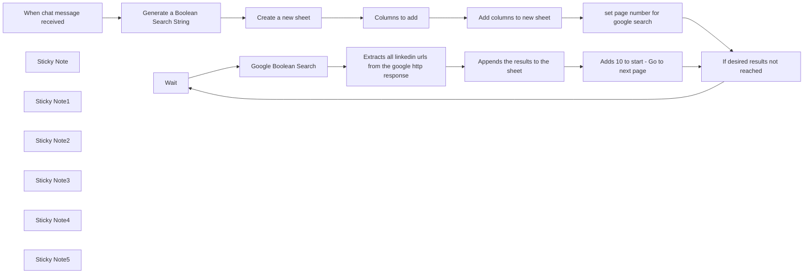

## Fluxo (.json) :

```json
{
  "id": "UsBaGY83vnyZjRoB",
  "meta": {
    "instanceId": "d4e74e27d8d0aa53cd4bdff26f47c18bb91437db0b63a6ba8ec9f78df0e0234f",
    "templateId": "2808",
    "templateCredsSetupCompleted": true
  },
  "name": "TopSourcer - Finds LinkedIn Profiles using natural language",
  "tags": [],
  "nodes": [
    {
      "id": "16a5f4a2-6e00-40f5-bab7-35526550eacd",
      "name": "Wait",
      "type": "n8n-nodes-base.wait",
      "position": [
        3240,
        -280
      ],
      "webhookId": "88c6a5cc-4b33-438c-ba85-2e075a276a78",
      "parameters": {},
      "typeVersion": 1.1
    },
    {
      "id": "f9ff2e4f-176b-453d-8743-cab4d9fd408d",
      "name": "When chat message received",
      "type": "@n8n/n8n-nodes-langchain.chatTrigger",
      "position": [
        1040,
        -180
      ],
      "webhookId": "475042df-7c36-4658-ab1c-ff55c237621f",
      "parameters": {
        "options": {}
      },
      "typeVersion": 1.1
    },
    {
      "id": "b988c049-2400-4a3a-b615-f4048832bd8d",
      "name": "Sticky Note",
      "type": "n8n-nodes-base.stickyNote",
      "position": [
        980,
        -340
      ],
      "parameters": {
        "content": "Click \"Open Chat\" after activating the workflow.\n\nHere, paste in a job description or describe your ideal candidate."
      },
      "typeVersion": 1
    },
    {
      "id": "74cec892-07d6-4e7d-9c6f-becfb51241c8",
      "name": "Sticky Note1",
      "type": "n8n-nodes-base.stickyNote",
      "position": [
        1300,
        -300
      ],
      "parameters": {
        "width": 300,
        "content": "Under \"Credential to connect with\" add your openAI API key. Find at: https://platform.openai.com/settings/organization/api-keys\n"
      },
      "typeVersion": 1
    },
    {
      "id": "940373af-ca88-44f1-b3c3-fb125ab6daf9",
      "name": "Sticky Note2",
      "type": "n8n-nodes-base.stickyNote",
      "position": [
        2800,
        -360
      ],
      "parameters": {
        "width": 300,
        "content": "For the first condition: {{ $json.start }} is less than 50, so change \"50\" to your desired number of results. \n\nEach loop fetches the next page, returning 10 results per iteration."
      },
      "typeVersion": 1
    },
    {
      "id": "c2bc0757-753b-4fee-b42b-65e5a0ff4750",
      "name": "Sticky Note3",
      "type": "n8n-nodes-base.stickyNote",
      "position": [
        3160,
        -440
      ],
      "parameters": {
        "color": 5,
        "width": 200,
        "content": "Waits 5 seconds to avoid rate limiting by Google. While it's unlikely you'll be rate-limited since you're authenticated with your cookie, this is just a precaution."
      },
      "typeVersion": 1
    },
    {
      "id": "9007b42b-1a79-4b98-9d75-71894d660c1d",
      "name": "Sticky Note4",
      "type": "n8n-nodes-base.stickyNote",
      "position": [
        3400,
        -600
      ],
      "parameters": {
        "color": 4,
        "width": 380,
        "height": 280,
        "content": "Get this Cookie-Editor. https://chromewebstore.google.com/detail/cookie-editor/hlkenndednhfkekhgcdicdfddnkalmdm\n\nDo a google search --> click this extension --> Export --> Header string.\n\nThen, open this node --> under Header Auth --> edit --> and under cookie value paste in your header string.  \n\nThis is to perform an authenticated google search.\n"
      },
      "typeVersion": 1
    },
    {
      "id": "b1d2f9dd-227d-4372-89f8-e6d54e94f2fc",
      "name": "Sticky Note5",
      "type": "n8n-nodes-base.stickyNote",
      "position": [
        1680,
        -320
      ],
      "parameters": {
        "content": "Connect your google sheets account and create a document."
      },
      "typeVersion": 1
    },
    {
      "id": "df0fb397-55d0-41ec-a9df-2c39019ad68e",
      "name": "Create a new sheet",
      "type": "n8n-nodes-base.googleSheets",
      "position": [
        1740,
        -180
      ],
      "parameters": {
        "title": "={{ $('Generate a Boolean Search String').item.json.choices[0].message.content.sheet_name + ' ' + $now }}\n",
        "options": {},
        "operation": "create",
        "documentId": {
          "__rl": true,
          "mode": "list",
          "value": "1M9UUgw1wPZIBSoPiGTvNIgA19ERgOo5KmD9wx__Y8ZY",
          "cachedResultUrl": "https://docs.google.com/spreadsheets/d/1M9UUgw1wPZIBSoPiGTvNIgA19ERgOo5KmD9wx__Y8ZY/edit?usp=drivesdk",
          "cachedResultName": "Candidates"
        }
      },
      "credentials": {
        "googleSheetsOAuth2Api": {
          "id": "6wBRjmD77d71tAqP",
          "name": "Google Sheets account"
        }
      },
      "typeVersion": 4.5
    },
    {
      "id": "678a0b65-de67-41f0-ada6-23cef1226228",
      "name": "Add columns to new sheet",
      "type": "n8n-nodes-base.googleSheets",
      "position": [
        2220,
        -180
      ],
      "parameters": {
        "columns": {
          "value": {},
          "schema": [
            {
              "id": "linkedin_url",
              "type": "string",
              "display": true,
              "removed": false,
              "required": false,
              "displayName": "linkedin_url",
              "defaultMatch": false,
              "canBeUsedToMatch": true
            }
          ],
          "mappingMode": "autoMapInputData",
          "matchingColumns": [],
          "attemptToConvertTypes": false,
          "convertFieldsToString": false
        },
        "options": {},
        "operation": "append",
        "sheetName": {
          "__rl": true,
          "mode": "id",
          "value": "={{ $('Create a new sheet').item.json.sheetId }}"
        },
        "documentId": {
          "__rl": true,
          "mode": "list",
          "value": "1M9UUgw1wPZIBSoPiGTvNIgA19ERgOo5KmD9wx__Y8ZY",
          "cachedResultUrl": "https://docs.google.com/spreadsheets/d/1M9UUgw1wPZIBSoPiGTvNIgA19ERgOo5KmD9wx__Y8ZY/edit?usp=drivesdk",
          "cachedResultName": "Candidates"
        }
      },
      "credentials": {
        "googleSheetsOAuth2Api": {
          "id": "6wBRjmD77d71tAqP",
          "name": "Google Sheets account"
        }
      },
      "typeVersion": 4.5
    },
    {
      "id": "767491ab-f7dd-4e23-816b-840bc24e5268",
      "name": "set page number for google search",
      "type": "n8n-nodes-base.code",
      "position": [
        2480,
        -180
      ],
      "parameters": {
        "jsCode": "return [{ json: { start: 0 } }];\n"
      },
      "typeVersion": 2
    },
    {
      "id": "f76f28a5-8444-4ff9-b62c-0d94a07c6447",
      "name": "Extracts all linkedin urls from the google http response",
      "type": "n8n-nodes-base.code",
      "position": [
        3740,
        -280
      ],
      "parameters": {
        "jsCode": "// Extract LinkedIn profile URLs from HTML\nfunction extractLinkedInUrls(html) {\n    // First decode any encoded HTML entities\n    html = html.replace(/&amp;/g, '&')\n               .replace(/\\\\=/g, '=')\n               .replace(/\\\\x22/g, '\"')\n               .replace(/\\\\x26/g, '&')\n               .replace(/\\\\x3e/g, '>')\n               .replace(/\\\\x3c/g, '<');\n\n    const patterns = [\n        // Standard LinkedIn URLs in href\n        /(?:https?:)?//(?:[a-z]{2,}\\.)?linkedin\\.com/in/[a-zA-Z0-9._-]+(?:/[a-z]{2})?/gi,\n        // URLs in encoded strings\n        /(?:\"url\"|url=)(?:[^\"&]*?)(?:https?:)?//(?:[a-z]{2,}\\.)?linkedin\\.com/in/[a-zA-Z0-9._-]+(?:/[a-z]{2})?/gi,\n        // URLs in JSON strings\n        /\"(?:https?:)?//(?:[a-z]{2,}\\.)?linkedin\\.com/in/[a-zA-Z0-9._-]+(?:/[a-z]{2})?\"/gi\n    ];\n\n    const urls = new Set();\n    \n    patterns.forEach(pattern => {\n        const matches = html.matchAll(pattern);\n        for (const match of matches) {\n            let url = match[0];\n            \n            // Clean up the URL\n            url = url.replace(/^\"url\"|^url=|\"$/g, '') // Remove url= prefix and quotes\n                    .replace(/^[\"']|[\"']$/g, '')      // Remove surrounding quotes\n                    .replace(/\\\\+/g, '')              // Remove backslashes\n                    .trim();\n            \n            // Ensure URL has protocol\n            if (!url.startsWith('http')) {\n                url = 'https://' + url.replace(/^///, '');\n            }\n            \n            // Only include if it's a LinkedIn profile URL\n            if (url.includes('linkedin.com/in/')) {\n                // Clean the URL: remove tracking parameters and fragments\n                url = url.split(/[?#&]/)[0];\n                \n                // Remove any trailing slashes\n                url = url.replace(//$/, '');\n                \n                // Add to Set to remove duplicates\n                urls.add(url);\n            }\n        }\n    });\n\n    return Array.from(urls);\n}\n\n// Get the HTML from input\nconst html = $input.first().json.data;\n\n// Extract URLs and create array of objects\nconst linkedInProfiles = extractLinkedInUrls(html)\n    .filter(url => !url.includes('google.com')) // Extra safety check to remove any Google URLs\n    .map(url => ({\n        linkedin_url: url\n    }));\n\n// Return the array of objects directly\nreturn linkedInProfiles;"
      },
      "typeVersion": 2
    },
    {
      "id": "5a93c8f2-f55b-4d0e-92f8-0d86147f8d13",
      "name": "Google Boolean Search",
      "type": "n8n-nodes-base.httpRequest",
      "position": [
        3500,
        -300
      ],
      "parameters": {
        "url": "https://www.google.com/search",
        "options": {},
        "sendQuery": true,
        "sendHeaders": true,
        "authentication": "genericCredentialType",
        "genericAuthType": "httpHeaderAuth",
        "queryParameters": {
          "parameters": [
            {
              "name": "q",
              "value": "={{ $('Generate a Boolean Search String').first().json.choices[0].message.content.search_string }}\n"
            },
            {
              "name": "start",
              "value": "={{ $json.start }}"
            }
          ]
        },
        "headerParameters": {
          "parameters": [
            {
              "name": "User-Agent",
              "value": "Mozilla/5.0 (Windows NT 10.0; Win64; x64) AppleWebKit/537.36 (KHTML, like Gecko) Chrome/132.0.0.0 Safari/537.36"
            }
          ]
        }
      },
      "credentials": {
        "httpHeaderAuth": {
          "id": "5T6POWjsPfV558Ta",
          "name": "Header Auth account"
        }
      },
      "typeVersion": 4.2
    },
    {
      "id": "37b4f264-34f0-47bb-9b1b-fa53beafb2a9",
      "name": "Generate a Boolean Search String",
      "type": "@n8n/n8n-nodes-langchain.openAi",
      "position": [
        1320,
        -180
      ],
      "parameters": {
        "modelId": {
          "__rl": true,
          "mode": "list",
          "value": "gpt-4o-mini",
          "cachedResultName": "GPT-4O-MINI"
        },
        "options": {},
        "messages": {
          "values": [
            {
              "role": "system",
              "content": "You are an expert in Boolean search techniques for Google. When the user send a job description, generate a search string specifically for finding LinkedIn profiles. Your response must always follow this exact format:\nsite:linkedin.com/in [Boolean search string]\nCreate the Boolean search string using precise operators (AND, OR, \"\", *, -) to match the job requirements. Focus only on generating the search string - provide no additional commentary or explanations unless specifically requested.\n\nAlso return sheet_name (less than 100 char)"
            },
            {
              "content": "={{ $json.chatInput }}"
            }
          ]
        },
        "simplify": false,
        "jsonOutput": true
      },
      "credentials": {
        "openAiApi": {
          "id": "EX7mky4RGLDD6udW",
          "name": "OpenAi account"
        }
      },
      "retryOnFail": false,
      "typeVersion": 1.8
    },
    {
      "id": "99041eff-f094-4c2a-a75a-4b01faf33d1b",
      "name": "If desired results not reached",
      "type": "n8n-nodes-base.if",
      "position": [
        2920,
        -200
      ],
      "parameters": {
        "options": {},
        "conditions": {
          "options": {
            "version": 2,
            "leftValue": "",
            "caseSensitive": true,
            "typeValidation": "strict"
          },
          "combinator": "and",
          "conditions": [
            {
              "id": "da9f8de0-1e75-4ff3-9f81-8e911251416b",
              "operator": {
                "type": "number",
                "operation": "lt"
              },
              "leftValue": "={{ $json.start }}",
              "rightValue": 50
            },
            {
              "id": "a891c085-7f49-4523-8610-40577b3ffd3b",
              "operator": {
                "name": "filter.operator.equals",
                "type": "string",
                "operation": "equals"
              },
              "leftValue": "",
              "rightValue": ""
            }
          ]
        }
      },
      "typeVersion": 2.2
    },
    {
      "id": "d218a1e8-2959-4b7c-a84d-f8e0df82c5e7",
      "name": "Appends the results to the sheet",
      "type": "n8n-nodes-base.googleSheets",
      "position": [
        4040,
        -280
      ],
      "parameters": {
        "columns": {
          "value": {
            "linkedin_url": "={{ $json.linkedin_url }}"
          },
          "schema": [
            {
              "id": "linkedin_url",
              "type": "string",
              "display": true,
              "removed": false,
              "required": false,
              "displayName": "linkedin_url",
              "defaultMatch": false,
              "canBeUsedToMatch": true
            },
            {
              "id": "Full Name",
              "type": "string",
              "display": true,
              "required": false,
              "displayName": "Full Name",
              "defaultMatch": false,
              "canBeUsedToMatch": true
            },
            {
              "id": "First Name",
              "type": "string",
              "display": true,
              "required": false,
              "displayName": "First Name",
              "defaultMatch": false,
              "canBeUsedToMatch": true
            },
            {
              "id": "Headline",
              "type": "string",
              "display": true,
              "required": false,
              "displayName": "Headline",
              "defaultMatch": false,
              "canBeUsedToMatch": true
            },
            {
              "id": "Candidate Summary",
              "type": "string",
              "display": true,
              "required": false,
              "displayName": "Candidate Summary",
              "defaultMatch": false,
              "canBeUsedToMatch": true
            },
            {
              "id": "Experiences Summary",
              "type": "string",
              "display": true,
              "removed": false,
              "required": false,
              "displayName": "Experiences Summary",
              "defaultMatch": false,
              "canBeUsedToMatch": true
            },
            {
              "id": "Education Summary",
              "type": "string",
              "display": true,
              "removed": false,
              "required": false,
              "displayName": "Education Summary",
              "defaultMatch": false,
              "canBeUsedToMatch": true
            },
            {
              "id": "Skills",
              "type": "string",
              "display": true,
              "required": false,
              "displayName": "Skills",
              "defaultMatch": false,
              "canBeUsedToMatch": true
            },
            {
              "id": "City",
              "type": "string",
              "display": true,
              "removed": false,
              "required": false,
              "displayName": "City",
              "defaultMatch": false,
              "canBeUsedToMatch": true
            },
            {
              "id": "Country",
              "type": "string",
              "display": true,
              "removed": false,
              "required": false,
              "displayName": "Country",
              "defaultMatch": false,
              "canBeUsedToMatch": true
            },
            {
              "id": "Criteria_Assessment",
              "type": "string",
              "display": true,
              "removed": false,
              "required": false,
              "displayName": "Criteria_Assessment",
              "defaultMatch": false,
              "canBeUsedToMatch": true
            },
            {
              "id": "overall_fit_score",
              "type": "string",
              "display": true,
              "removed": false,
              "required": false,
              "displayName": "overall_fit_score",
              "defaultMatch": false,
              "canBeUsedToMatch": true
            },
            {
              "id": "score_justification",
              "type": "string",
              "display": true,
              "removed": false,
              "required": false,
              "displayName": "score_justification",
              "defaultMatch": false,
              "canBeUsedToMatch": true
            },
            {
              "id": "Company",
              "type": "string",
              "display": true,
              "required": false,
              "displayName": "Company",
              "defaultMatch": false,
              "canBeUsedToMatch": true
            },
            {
              "id": "Company Industry",
              "type": "string",
              "display": true,
              "required": false,
              "displayName": "Company Industry",
              "defaultMatch": false,
              "canBeUsedToMatch": true
            },
            {
              "id": "Company Size",
              "type": "string",
              "display": true,
              "required": false,
              "displayName": "Company Size",
              "defaultMatch": false,
              "canBeUsedToMatch": true
            },
            {
              "id": "Company LinkedIn URL",
              "type": "string",
              "display": true,
              "required": false,
              "displayName": "Company LinkedIn URL",
              "defaultMatch": false,
              "canBeUsedToMatch": true
            },
            {
              "id": "Company Website",
              "type": "string",
              "display": true,
              "required": false,
              "displayName": "Company Website",
              "defaultMatch": false,
              "canBeUsedToMatch": true
            },
            {
              "id": "Current Company Join Date",
              "type": "string",
              "display": true,
              "required": false,
              "displayName": "Current Company Join Date",
              "defaultMatch": false,
              "canBeUsedToMatch": true
            },
            {
              "id": "Certifications",
              "type": "string",
              "display": true,
              "required": false,
              "displayName": "Certifications",
              "defaultMatch": false,
              "canBeUsedToMatch": true
            },
            {
              "id": "Courses Taken",
              "type": "string",
              "display": true,
              "required": false,
              "displayName": "Courses Taken",
              "defaultMatch": false,
              "canBeUsedToMatch": true
            },
            {
              "id": "Email",
              "type": "string",
              "display": true,
              "required": false,
              "displayName": "Email",
              "defaultMatch": false,
              "canBeUsedToMatch": true
            },
            {
              "id": "Phone",
              "type": "string",
              "display": true,
              "required": false,
              "displayName": "Phone",
              "defaultMatch": false,
              "canBeUsedToMatch": true
            },
            {
              "id": "Connections Count",
              "type": "string",
              "display": true,
              "required": false,
              "displayName": "Connections Count",
              "defaultMatch": false,
              "canBeUsedToMatch": true
            },
            {
              "id": "Followers Count",
              "type": "string",
              "display": true,
              "required": false,
              "displayName": "Followers Count",
              "defaultMatch": false,
              "canBeUsedToMatch": true
            },
            {
              "id": "Languages Spoken",
              "type": "string",
              "display": true,
              "required": false,
              "displayName": "Languages Spoken",
              "defaultMatch": false,
              "canBeUsedToMatch": true
            },
            {
              "id": "Projects",
              "type": "string",
              "display": true,
              "required": false,
              "displayName": "Projects",
              "defaultMatch": false,
              "canBeUsedToMatch": true
            },
            {
              "id": "Date Created",
              "type": "string",
              "display": true,
              "required": false,
              "displayName": "Date Created",
              "defaultMatch": false,
              "canBeUsedToMatch": true
            }
          ],
          "mappingMode": "defineBelow",
          "matchingColumns": [],
          "attemptToConvertTypes": false,
          "convertFieldsToString": false
        },
        "options": {},
        "operation": "append",
        "sheetName": {
          "__rl": true,
          "mode": "id",
          "value": "={{ $('Create a new sheet').first().json.sheetId }}"
        },
        "documentId": {
          "__rl": true,
          "mode": "list",
          "value": "1M9UUgw1wPZIBSoPiGTvNIgA19ERgOo5KmD9wx__Y8ZY",
          "cachedResultUrl": "https://docs.google.com/spreadsheets/d/1M9UUgw1wPZIBSoPiGTvNIgA19ERgOo5KmD9wx__Y8ZY/edit?usp=drivesdk",
          "cachedResultName": "Candidates"
        }
      },
      "credentials": {
        "googleSheetsOAuth2Api": {
          "id": "6wBRjmD77d71tAqP",
          "name": "Google Sheets account"
        }
      },
      "typeVersion": 4.5
    },
    {
      "id": "7a56e7d7-31f8-4115-b993-227bd7221c07",
      "name": "Adds 10 to start - Go to next page",
      "type": "n8n-nodes-base.code",
      "position": [
        4340,
        -220
      ],
      "parameters": {
        "jsCode": "// Get the start value from 'Edit Fields2' node\nconst startValue =$('If desired results not reached').first().json.start;\n\n// Add 10 to the start value\nconst start = startValue + 10;\n\n// Return the new value\nreturn [{ json: { start } }];\n"
      },
      "typeVersion": 2
    },
    {
      "id": "afe22fc0-c9c1-4aab-a11d-d91740f812bb",
      "name": "Columns to add",
      "type": "n8n-nodes-base.code",
      "position": [
        1980,
        -180
      ],
      "parameters": {
        "jsCode": "return [{\n  json: {\n    \"linkedin_url\": \"\"\n  }\n}];\n"
      },
      "typeVersion": 2
    }
  ],
  "active": true,
  "pinData": {},
  "settings": {},
  "versionId": "ce389fd9-7697-4e36-8346-6be9414aecf2",
  "connections": {
    "Wait": {
      "main": [
        [
          {
            "node": "Google Boolean Search",
            "type": "main",
            "index": 0
          }
        ]
      ]
    },
    "Columns to add": {
      "main": [
        [
          {
            "node": "Add columns to new sheet",
            "type": "main",
            "index": 0
          }
        ]
      ]
    },
    "Create a new sheet": {
      "main": [
        [
          {
            "node": "Columns to add",
            "type": "main",
            "index": 0
          }
        ]
      ]
    },
    "Google Boolean Search": {
      "main": [
        [
          {
            "node": "Extracts all linkedin urls from the google http response",
            "type": "main",
            "index": 0
          }
        ]
      ]
    },
    "Add columns to new sheet": {
      "main": [
        [
          {
            "node": "set page number for google search",
            "type": "main",
            "index": 0
          }
        ]
      ]
    },
    "When chat message received": {
      "main": [
        [
          {
            "node": "Generate a Boolean Search String",
            "type": "main",
            "index": 0
          }
        ]
      ]
    },
    "If desired results not reached": {
      "main": [
        [
          {
            "node": "Wait",
            "type": "main",
            "index": 0
          }
        ],
        []
      ]
    },
    "Appends the results to the sheet": {
      "main": [
        [
          {
            "node": "Adds 10 to start - Go to next page",
            "type": "main",
            "index": 0
          }
        ]
      ]
    },
    "Generate a Boolean Search String": {
      "main": [
        [
          {
            "node": "Create a new sheet",
            "type": "main",
            "index": 0
          }
        ]
      ]
    },
    "set page number for google search": {
      "main": [
        [
          {
            "node": "If desired results not reached",
            "type": "main",
            "index": 0
          }
        ]
      ]
    },
    "Adds 10 to start - Go to next page": {
      "main": [
        [
          {
            "node": "If desired results not reached",
            "type": "main",
            "index": 0
          }
        ]
      ]
    },
    "Extracts all linkedin urls from the google http response": {
      "main": [
        [
          {
            "node": "Appends the results to the sheet",
            "type": "main",
            "index": 0
          }
        ]
      ]
    }
  }
}
```

<a id="template-1557"></a>

## Template 1557 - Validação e correção de endereços de entrega

- **Nome:** Validação e correção de endereços de entrega
- **Descrição:** Valida e corrige endereços de entrega de pedidos, atualiza o endereço do cliente e aplica tags de status no pedido.
- **Funcionalidade:** • Receber ID do pedido via webhook: inicia o processo com o Id do pedido recebido externamente.
• Recuperar dados do pedido no Billbee: busca o endereço de entrega completo para validação.
• Mapear e limpar campos de endereço: renomeia campos, remove caracteres indesejados e prepara os dados para validação.
• Filtrar pontos de retirada: ignora endereços como Postfiliale, Packstation ou Paketshop.
• Validar número da casa: verifica presença do número, extrai do AddressLine2 quando necessário e trata casos com número+letra.
• Chamar API Endereco para checagem: envia país, CEP, cidade, rua e número para obter validação e sugestões de correção.
• Aplicar correções automaticamente: atualiza o endereço do cliente no sistema quando a API retorna uma sugestão válida.
• Marcar pedidos com tags: adiciona tags indicando endereço validado, falha na validação ou necessidade de verificação manual.
• Gerenciamento de credenciais: utiliza chaves separadas para integrar com os serviços externos.
- **Ferramentas:** • Billbee: plataforma de gestão de pedidos utilizada para recuperar dados do pedido, atualizar endereços de clientes e adicionar tags aos pedidos.
• Endereco API: serviço de validação e correção de endereços que retorna previsões e dados normalizados para correção automática.

## Fluxo visual

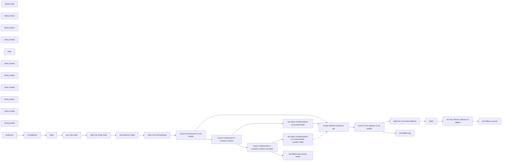

## Fluxo (.json) :

```json
{
  "id": "VaU41OXvni95OlAL",
  "meta": {
    "instanceId": "1bc0f4fa5e7d17ac362404cbb49337e51e5061e019cfa24022a8667c1f1ce287",
    "templateCredsSetupCompleted": true
  },
  "name": "address validation",
  "tags": [],
  "nodes": [
    {
      "id": "c6e389ae-6db2-416b-8f6f-91749fbc860f",
      "name": "get order data",
      "type": "n8n-nodes-base.httpRequest",
      "position": [
        2500,
        880
      ],
      "parameters": {
        "url": "=https://api.billbee.io/api/v1/orders/{{ $json.orderID }}",
        "options": {},
        "sendHeaders": true,
        "authentication": "genericCredentialType",
        "genericAuthType": "httpBasicAuth",
        "headerParameters": {
          "parameters": [
            {
              "name": "X-Billbee-Api-Key",
              "value": "={{ $json['X-Billbee-Api-Key'] }}"
            }
          ]
        }
      },
      "typeVersion": 4.1
    },
    {
      "id": "1b27594b-af74-4c25-bb4f-27550bcd152e",
      "name": "Split Out Order Data",
      "type": "n8n-nodes-base.splitOut",
      "position": [
        2660,
        880
      ],
      "parameters": {
        "options": {},
        "fieldToSplitOut": "Data.ShippingAddress.BillbeeId, Data.ShippingAddress.FirstName, Data.ShippingAddress.LastName, Data.ShippingAddress.Street, Data.ShippingAddress.HouseNumber, Data.ShippingAddress.Zip, Data.ShippingAddress.City, Data.ShippingAddress.CountryISO2, Data.ShippingAddress.Line2, Data.ShippingAddress.NameAddition"
      },
      "typeVersion": 1
    },
    {
      "id": "43808f6f-815d-419c-9e6f-c12d436108f2",
      "name": "Set Address Fields",
      "type": "n8n-nodes-base.set",
      "position": [
        2820,
        880
      ],
      "parameters": {
        "options": {},
        "assignments": {
          "assignments": [
            {
              "id": "dbda7791-09eb-4ae9-b1e8-7ce8582a5b4a",
              "name": "first_name",
              "type": "string",
              "value": "={{ $json['Data.ShippingAddress.FirstName'] }}"
            },
            {
              "id": "1d13d702-b422-48c4-be04-db7869776897",
              "name": "family_name",
              "type": "string",
              "value": "={{ $json['Data.ShippingAddress.LastName'] }}"
            },
            {
              "id": "9169466f-5639-4b58-80d3-c041ccea5e21",
              "name": "Street",
              "type": "string",
              "value": "={{ $json['Data.ShippingAddress.Street'] }}"
            },
            {
              "id": "ea20b727-83c0-4c23-94c7-29f4f57eda78",
              "name": "housenumber",
              "type": "string",
              "value": "={{ $json['Data.ShippingAddress.HouseNumber'].replace(\"/\",\"\")}}"
            },
            {
              "id": "81c3ebb0-6975-4b69-93f1-42dba7f2f60b",
              "name": "zip",
              "type": "string",
              "value": "={{ $json['Data.ShippingAddress.Zip'] }}"
            },
            {
              "id": "2f1a6786-d48b-4475-805e-1db2fef2b5c3",
              "name": "location",
              "type": "string",
              "value": "={{ $json['Data.ShippingAddress.City'] }}"
            },
            {
              "id": "4b6a4eb2-8867-4d9e-a4fb-32b66f466b58",
              "name": "BillbeeID",
              "type": "string",
              "value": "={{ $('Webhook').item.json.query.Id }}"
            },
            {
              "id": "814513e9-9e56-4fb8-84bc-fd01456af443",
              "name": "BillbeeShippingAddressID",
              "type": "string",
              "value": "={{ $json['Data.ShippingAddress.BillbeeId'] }}"
            },
            {
              "id": "bd45c9b8-d9fb-4d3f-be13-d202b8a3430d",
              "name": "CountryISO2",
              "type": "string",
              "value": "={{ $json['Data.ShippingAddress.CountryISO2'] }}"
            },
            {
              "id": "c8e08606-d860-4482-8b4e-c68fe4c1974f",
              "name": "AddressLine2",
              "type": "string",
              "value": "={{ $json['Data.ShippingAddress.Line2'] }}"
            },
            {
              "id": "fe1cb8a4-6c21-4505-8337-e31f07386a8c",
              "name": "NameAddition",
              "type": "string",
              "value": "={{ $json['Data.ShippingAddress.NameAddition'] }}"
            }
          ]
        }
      },
      "typeVersion": 3.3
    },
    {
      "id": "3e5f3fc5-d3e2-4f4a-978e-795893e016cc",
      "name": "Check Address endereco api",
      "type": "n8n-nodes-base.httpRequest",
      "position": [
        4140,
        760
      ],
      "parameters": {
        "url": "https://endereco-service.de/rpc/v1",
        "method": "POST",
        "options": {},
        "jsonBody": "={\n  \"jsonrpc\": \"2.0\",\n  \"id\": 1,\n  \"method\": \"addressCheck\",\n  \"params\": {\n    \"country\": \"{{ $json['CountryISO2']}}\",\n    \"language\": \"{{ $json[\"CountryISO2\"] }}\",\n    \"postCode\": \"{{ $json[\"zip\"] }}\",\n    \"cityName\": \"{{ $json[\"location\"] }}\",\n    \"street\": \"{{ $json[\"Street\"] }}\",\n    \"houseNumber\": \"{{ $json[\"housenumber\"] }}\"\n  }\n}",
        "sendBody": true,
        "sendHeaders": true,
        "specifyBody": "json",
        "headerParameters": {
          "parameters": [
            {
              "name": "X-Auth-Key",
              "value": "={{ $('ConfigNode').item.json['X-Auth-Key-Endereco'] }}"
            },
            {
              "name": "Content-Type",
              "value": "application/json"
            },
            {
              "name": "X-Transaction-Id",
              "value": "not_required"
            },
            {
              "name": "X-Transaction-Referer",
              "value": "n8n"
            },
            {
              "name": "X-Agent",
              "value": "n8n"
            }
          ]
        }
      },
      "typeVersion": 4.2
    },
    {
      "id": "3b02a11e-719b-41ef-b84f-b1e06d83854a",
      "name": "Split Out Corrected Address",
      "type": "n8n-nodes-base.splitOut",
      "position": [
        4600,
        720
      ],
      "parameters": {
        "options": {},
        "fieldToSplitOut": "result.predictions"
      },
      "typeVersion": 1
    },
    {
      "id": "a3b6135a-6a0e-4c37-95ef-6e33f14c5e74",
      "name": "set new delivery address to billbee",
      "type": "n8n-nodes-base.httpRequest",
      "position": [
        4920,
        720
      ],
      "parameters": {
        "url": "=https://api.billbee.io/api/v1/customers/addresses/{{ $('Set Address Fields').item.json[\"BillbeeShippingAddressID\"] }}",
        "method": "PATCH",
        "options": {},
        "sendBody": true,
        "sendHeaders": true,
        "authentication": "genericCredentialType",
        "bodyParameters": {
          "parameters": [
            {
              "name": "Housenumber",
              "value": "={{ $json.houseNumber }}"
            },
            {
              "name": "Street",
              "value": "={{ $json.street }}"
            },
            {
              "name": "Zip",
              "value": "={{ $json.postCode }}"
            },
            {
              "name": "City",
              "value": "={{ $json.cityName }}"
            }
          ]
        },
        "genericAuthType": "httpBasicAuth",
        "headerParameters": {
          "parameters": [
            {
              "name": "X-Billbee-Api-Key",
              "value": "={{ $('ConfigNode').item.json['X-Billbee-Api-Key'] }}"
            }
          ]
        }
      },
      "typeVersion": 4.1
    },
    {
      "id": "b170217c-b2d7-4514-b070-403e29964e4b",
      "name": "Wait",
      "type": "n8n-nodes-base.wait",
      "position": [
        2120,
        960
      ],
      "webhookId": "0f7b87d2-ec90-4f54-9971-31e564206980",
      "parameters": {
        "amount": 1
      },
      "typeVersion": 1.1
    },
    {
      "id": "17ea8895-05cd-4ffd-af31-aace970f8073",
      "name": "Wait1",
      "type": "n8n-nodes-base.wait",
      "position": [
        4760,
        720
      ],
      "webhookId": "b7a0738c-0890-45f5-a435-bc9d9a9062bb",
      "parameters": {
        "amount": 1
      },
      "typeVersion": 1.1
    },
    {
      "id": "d8d005e4-3b94-49d6-82dc-2919ca69dd2f",
      "name": "check if new address is not empty",
      "type": "n8n-nodes-base.if",
      "position": [
        4320,
        760
      ],
      "parameters": {
        "options": {},
        "conditions": {
          "options": {
            "version": 2,
            "leftValue": "",
            "caseSensitive": true,
            "typeValidation": "strict"
          },
          "combinator": "and",
          "conditions": [
            {
              "id": "2a9d055a-4607-4e87-bb6a-ecc1a31826e0",
              "operator": {
                "type": "array",
                "operation": "notEmpty",
                "singleValue": true
              },
              "leftValue": "={{ $json.result.predictions }}",
              "rightValue": ""
            }
          ]
        }
      },
      "typeVersion": 2.2
    },
    {
      "id": "3ad15e79-e4c8-4adf-90a5-aaf61cfe4825",
      "name": "set billbee tag",
      "type": "n8n-nodes-base.httpRequest",
      "position": [
        4580,
        920
      ],
      "parameters": {
        "url": "=https://api.billbee.io/api/v1/orders/{{ $('Set Address Fields').item.json[\"BillbeeID\"] }}/tags",
        "method": "POST",
        "options": {},
        "jsonBody": "{\n  \"Tags\": [\n    \"endereco_address_failed\"\n  ]\n}",
        "sendBody": true,
        "sendHeaders": true,
        "specifyBody": "json",
        "authentication": "genericCredentialType",
        "genericAuthType": "httpBasicAuth",
        "headerParameters": {
          "parameters": [
            {
              "name": "X-Billbee-Api-Key",
              "value": "={{ $('ConfigNode').item.json['X-Billbee-Api-Key'] }}"
            }
          ]
        }
      },
      "typeVersion": 4.1
    },
    {
      "id": "6b0e5cfb-95d5-43a0-a665-6b8db6b6ad98",
      "name": "Sticky Note",
      "type": "n8n-nodes-base.stickyNote",
      "position": [
        2260,
        820
      ],
      "parameters": {
        "color": 4,
        "width": 481,
        "height": 198,
        "content": "## Get and Prepare Oder Data"
      },
      "typeVersion": 1
    },
    {
      "id": "a2524895-b0dd-492b-b425-548ccbabf5c2",
      "name": "Sticky Note1",
      "type": "n8n-nodes-base.stickyNote",
      "position": [
        460,
        460
      ],
      "parameters": {
        "color": 7,
        "width": 1110.4301052736698,
        "height": 544.444950562247,
        "content": "# **Address Validation Workflow**\n### **Requirements**\n- **Billbee Developer API Key**: Request via email: `support@billbee.io`.\n- **Billbee User API Key**: Found in the **Billbee settings**.\n- **Endereco API Key**: Register at [Endereco API](https://www.endereco.de/en/integrations/address-api/). **30-Day Free Trial available**.\n## **About**\nThis workflow automates the process of validating client shipping addresses, saving time and reducing errors. Your **warehouse team** will appreciate it!\n## **How it Works**\n1. **Start**: The workflow is triggered by a **Webhook** sent from Billbee (see configuration). The webhook provides the **Order ID**.\n2. **Retrieve Order Data**: Use the Order ID to call the **Billbee Order Endpoint**. This fetches the client's shipping address.\n3. **Data Mapping and Manipulation**: Rename and map the fields. Apply optional filters and data adjustments.\n3.1 **Validating the housenumber** (Most common error)\n4. **Validate Address**: Send the shipping address to the **Endereco API**. The API validates the address and, if necessary, suggests a corrected address.\n5. **Conditional Check**: **Was a new address suggested?** **Yes**: Update the client’s shipping address in Billbee. **No**: Add a **\"Validation Error\"** tag to the Billbee order.\n6. **Tag the Order**: For successfully validated orders, add a tag in Billbee to mark them as processed.\n### **Benefits**\n- **Time-Saving**: Automates address validation, reducing manual effort.\n- **Error Reduction**: Identifies incorrect addresses and suggests corrections automatically.\n- **Transparency**: Tracks the validation status with tags in Billbee.\n"
      },
      "typeVersion": 1
    },
    {
      "id": "31bb6e73-e702-4577-8b7f-a9850e80cbaf",
      "name": "Sticky Note2",
      "type": "n8n-nodes-base.stickyNote",
      "position": [
        1060,
        1040
      ],
      "parameters": {
        "width": 276,
        "height": 219,
        "content": "## API Docs\n\nEndereco:\nhttps://github.com/Endereco/enderecoservice_api\n\nBillbee:\nhttps://app.billbee.io//swagger/ui/index\n"
      },
      "typeVersion": 1
    },
    {
      "id": "4bb9d0c1-0838-449b-bb1e-c4912173d9df",
      "name": "Sticky Note3",
      "type": "n8n-nodes-base.stickyNote",
      "position": [
        460,
        1040
      ],
      "parameters": {
        "color": 5,
        "width": 574.5277463210057,
        "height": 573.7065374509425,
        "content": "### Bilbee Setup \n### **Rule Settings**\n- **Name of the Rule:** Endereco Address Validation\n- **Comment:** *No comment provided.*\n- **Active:** ✅ Active\n- **Stop Rule Processing After This Rule:** ⬜ Disabled\n### **Trigger:**\n- **Event:** Order imported  \n- **Import Type:** All import types\n### **Conditions:**\n- **Restrict Shop:** Rule applies only if the order comes from one of the defined shops.\n### **Actions:**\n- **Call External URL:**  \n  - **URL:** `YOUR_N8N_WEBHOOK_LINK?Id={OrderId}`\nThis rule ensures that for every imported order from a specific shop, the external webhook URL is triggered with the `OrderId` as a parameter.\n\n### Option 2\n\nIf order state gets changed to \"gepackt\", \"In Fulfillment\" by this you can manually correct the orders within Billbee as most address are fine. Make sure that the State does not trigger a different automation"
      },
      "typeVersion": 1
    },
    {
      "id": "ad409a55-db7f-4699-9d56-98d7a2164afe",
      "name": "check if housenumer is not empty",
      "type": "n8n-nodes-base.if",
      "position": [
        3260,
        880
      ],
      "parameters": {
        "options": {},
        "conditions": {
          "options": {
            "version": 2,
            "leftValue": "",
            "caseSensitive": true,
            "typeValidation": "strict"
          },
          "combinator": "and",
          "conditions": [
            {
              "id": "5dbd8016-9c70-4cd8-9c7b-22b6779d7ae3",
              "operator": {
                "type": "string",
                "operation": "notEmpty",
                "singleValue": true
              },
              "leftValue": "={{ $json.housenumber }}",
              "rightValue": ""
            }
          ]
        }
      },
      "typeVersion": 2.2
    },
    {
      "id": "0131cf4e-983b-4cc5-8305-e4a644f9e700",
      "name": "check if addressline 2 contains number",
      "type": "n8n-nodes-base.if",
      "position": [
        3420,
        980
      ],
      "parameters": {
        "options": {},
        "conditions": {
          "options": {
            "version": 2,
            "leftValue": "",
            "caseSensitive": true,
            "typeValidation": "strict"
          },
          "combinator": "and",
          "conditions": [
            {
              "id": "e758c0d9-caf6-40e8-9ceb-cd786e346709",
              "operator": {
                "type": "boolean",
                "operation": "true",
                "singleValue": true
              },
              "leftValue": "={{ $json.AddressLine2.isNumeric() }}",
              "rightValue": ""
            }
          ]
        }
      },
      "typeVersion": 2.2
    },
    {
      "id": "14d67019-a6c2-4ad4-9c0e-383ee3e1f3e9",
      "name": "Filter",
      "type": "n8n-nodes-base.filter",
      "position": [
        1360,
        1320
      ],
      "parameters": {
        "options": {},
        "conditions": {
          "options": {
            "version": 2,
            "leftValue": "",
            "caseSensitive": true,
            "typeValidation": "strict"
          },
          "combinator": "and",
          "conditions": [
            {
              "id": "13c4f784-fb7a-4a61-b106-eb92dbc8f2d0",
              "operator": {
                "name": "filter.operator.equals",
                "type": "string",
                "operation": "equals"
              },
              "leftValue": "",
              "rightValue": ""
            }
          ]
        }
      },
      "typeVersion": 2.2
    },
    {
      "id": "851d9d42-2b50-4a40-8d46-7d3decf897c2",
      "name": "Sticky Note4",
      "type": "n8n-nodes-base.stickyNote",
      "position": [
        1080,
        1300
      ],
      "parameters": {
        "color": 3,
        "height": 239.63602562365423,
        "content": "## Include Filter \nYou want to filter out PickUp Shops or Parcel Stations for example in Germany:\n\n\"Postfiliale, Paketshop, Packstation\"\n\nThis can also be set up within Billbee"
      },
      "typeVersion": 1
    },
    {
      "id": "a07c7816-bcb6-457d-a621-ccfebcc384ad",
      "name": "set value of addressline2 as housenumber",
      "type": "n8n-nodes-base.set",
      "position": [
        3600,
        900
      ],
      "parameters": {
        "options": {},
        "assignments": {
          "assignments": [
            {
              "id": "7c21cf08-4ae8-4856-ae2f-0f25053aebde",
              "name": "housenumber",
              "type": "string",
              "value": "={{ $json.AddressLine2 }}"
            }
          ]
        },
        "includeOtherFields": true
      },
      "typeVersion": 3.4
    },
    {
      "id": "c22fb34a-252f-4570-b576-089bb3243bfd",
      "name": "Filter Out PickUpShops",
      "type": "n8n-nodes-base.filter",
      "position": [
        3040,
        880
      ],
      "parameters": {
        "options": {},
        "conditions": {
          "options": {
            "version": 2,
            "leftValue": "",
            "caseSensitive": true,
            "typeValidation": "strict"
          },
          "combinator": "or",
          "conditions": [
            {
              "id": "b6bf1576-9082-446b-9072-13130bf7d724",
              "operator": {
                "type": "string",
                "operation": "notContains"
              },
              "leftValue": "={{ $json.Street }}",
              "rightValue": "Postfiliale"
            },
            {
              "id": "f7e18eb3-a3df-49df-adb4-d9c807963478",
              "operator": {
                "type": "string",
                "operation": "notContains"
              },
              "leftValue": "={{ $json.Street }}",
              "rightValue": "Packstation"
            },
            {
              "id": "51c548d1-1eed-4caf-b32c-402b8ce73042",
              "operator": {
                "type": "string",
                "operation": "notContains"
              },
              "leftValue": "={{ $json.Street }}",
              "rightValue": "Paketshop"
            }
          ]
        }
      },
      "typeVersion": 2.2
    },
    {
      "id": "b2b3c72a-d3d0-467f-8f60-17f40c7a3650",
      "name": "Sticky Note5",
      "type": "n8n-nodes-base.stickyNote",
      "position": [
        3020,
        820
      ],
      "parameters": {
        "color": 3,
        "width": 155.04025478630723,
        "height": 185.20127393153615,
        "content": "## Open ME!"
      },
      "typeVersion": 1
    },
    {
      "id": "ea2e9abf-1461-4754-b663-83e771207627",
      "name": "check if addressline 2 contains number and letter",
      "type": "n8n-nodes-base.if",
      "position": [
        3560,
        1080
      ],
      "parameters": {
        "options": {},
        "conditions": {
          "options": {
            "version": 2,
            "leftValue": "",
            "caseSensitive": true,
            "typeValidation": "loose"
          },
          "combinator": "and",
          "conditions": [
            {
              "id": "c82c2273-b34c-42e1-871d-31db72d2ad49",
              "operator": {
                "type": "boolean",
                "operation": "true",
                "singleValue": true
              },
              "leftValue": "={{ $json[\"AddressLine2\"].match(/^(?=.*\\d)(?=.*[A-Za-z]).+$/) !== null }}\n",
              "rightValue": ""
            }
          ]
        },
        "looseTypeValidation": true
      },
      "typeVersion": 2.2
    },
    {
      "id": "b532b22f-421e-4bd8-8241-ca559e77c3ca",
      "name": "set billbee tag manual check",
      "type": "n8n-nodes-base.httpRequest",
      "position": [
        3780,
        1200
      ],
      "parameters": {
        "url": "=https://api.billbee.io/api/v1/orders/{{ $('Set Address Fields').item.json[\"BillbeeID\"] }}/tags",
        "method": "POST",
        "options": {},
        "jsonBody": "{\n  \"Tags\": [\n    \"manual_address_check\"\n  ]\n}",
        "sendBody": true,
        "sendHeaders": true,
        "specifyBody": "json",
        "authentication": "genericCredentialType",
        "genericAuthType": "httpBasicAuth",
        "headerParameters": {
          "parameters": [
            {
              "name": "X-Billbee-Api-Key",
              "value": "={{ $('ConfigNode').item.json['X-Billbee-Api-Key'] }}"
            }
          ]
        }
      },
      "typeVersion": 4.1
    },
    {
      "id": "bdb10514-2fa7-4727-a8e7-aa8394fced6f",
      "name": "set value of addressline2 as housenumber number+letter",
      "type": "n8n-nodes-base.set",
      "position": [
        3760,
        1020
      ],
      "parameters": {
        "options": {},
        "assignments": {
          "assignments": [
            {
              "id": "7c21cf08-4ae8-4856-ae2f-0f25053aebde",
              "name": "housenumber",
              "type": "string",
              "value": "={{ $json.AddressLine2 }}"
            }
          ]
        },
        "includeOtherFields": true
      },
      "typeVersion": 3.4
    },
    {
      "id": "cf0a516f-f019-40f8-8d09-ff02a034781d",
      "name": "Sticky Note6",
      "type": "n8n-nodes-base.stickyNote",
      "position": [
        3000,
        760
      ],
      "parameters": {
        "color": 5,
        "width": 907.6568579769853,
        "height": 627.257034553087,
        "content": "## House Number Validation"
      },
      "typeVersion": 1
    },
    {
      "id": "82a16bec-77e9-4717-8111-69f8f068c925",
      "name": "Sticky Note7",
      "type": "n8n-nodes-base.stickyNote",
      "position": [
        4040,
        700
      ],
      "parameters": {
        "color": 4,
        "width": 1325.4150814203485,
        "height": 354.5727675883748,
        "content": "## Address Validation & Correction"
      },
      "typeVersion": 1
    },
    {
      "id": "07f54a0d-2b13-4996-95a4-4c225402abe1",
      "name": "set billbee success",
      "type": "n8n-nodes-base.httpRequest",
      "position": [
        5080,
        720
      ],
      "parameters": {
        "url": "=https://api.billbee.io/api/v1/orders/{{ $('Set Address Fields').item.json[\"BillbeeID\"] }}/tags",
        "method": "POST",
        "options": {},
        "jsonBody": "{\n  \"Tags\": [\n    \"endereco_address_validated\"\n  ]\n}",
        "sendBody": true,
        "sendHeaders": true,
        "specifyBody": "json",
        "authentication": "genericCredentialType",
        "genericAuthType": "httpBasicAuth",
        "headerParameters": {
          "parameters": [
            {
              "name": "X-Billbee-Api-Key",
              "value": "={{ $('ConfigNode').item.json['X-Billbee-Api-Key'] }}"
            }
          ]
        }
      },
      "typeVersion": 4.1
    },
    {
      "id": "bd2f3340-f389-48e1-a90d-1625b6845556",
      "name": "ConfigNode",
      "type": "n8n-nodes-base.set",
      "position": [
        1860,
        960
      ],
      "parameters": {
        "options": {},
        "assignments": {
          "assignments": [
            {
              "id": "c4d1415a-636b-4673-bba5-699168af2b2e",
              "name": "X-Billbee-Api-Key",
              "type": "string",
              "value": "INSERT BILLBEE DEVELOPER API KEY"
            },
            {
              "id": "69c630d7-d64c-49be-a594-88b05d44a091",
              "name": "X-Auth-Key-Endereco",
              "type": "string",
              "value": "INSERT ENDERECO API KEY"
            },
            {
              "id": "75977810-a10a-45ea-b536-d4b8f0f59b15",
              "name": "orderID",
              "type": "string",
              "value": "={{ $json.query.Id }}"
            }
          ]
        }
      },
      "typeVersion": 3.4
    },
    {
      "id": "7619e573-116a-4f87-b6d2-b652ee7a25b7",
      "name": "Sticky Note8",
      "type": "n8n-nodes-base.stickyNote",
      "position": [
        1800,
        1120
      ],
      "parameters": {
        "color": 3,
        "height": 251.61012258936577,
        "content": "### **Setup**\n\n**Create an Basic Auth for BillbeeUser**\n-E-Mail as Username, Password User API Key\n\nPaste your Billbee Developer Key (X Key) and Endereco API Key\n\n"
      },
      "typeVersion": 1
    },
    {
      "id": "31c17f6e-0e90-4db1-9048-4b13bd36cc90",
      "name": "Sticky Note9",
      "type": "n8n-nodes-base.stickyNote",
      "position": [
        2500,
        1100
      ],
      "parameters": {
        "color": 3,
        "width": 150,
        "height": 135.6842625042993,
        "content": "### **Setup**\n\nSelect your BillbeeUser Basic Auth \n\n"
      },
      "typeVersion": 1
    },
    {
      "id": "ca1e1a8b-6107-4e0c-81c4-2a3b715aed11",
      "name": "Webhook",
      "type": "n8n-nodes-base.webhook",
      "position": [
        1640,
        960
      ],
      "webhookId": "786e8a93-9837-44e6-81ae-a173ce25a14f",
      "parameters": {
        "path": "786e8a93-9837-44e6-81ae-a173ce25a14f",
        "options": {}
      },
      "typeVersion": 2
    }
  ],
  "active": false,
  "pinData": {
    "Webhook": [
      {
        "json": {
          "body": {},
          "query": {
            "Id": "300000221273261"
          },
          "params": {},
          "headers": {
            "host": "sfx-ecommerce.app.n8n.cloud",
            "x-real-ip": "49.12.91.132",
            "tracestate": "dd=s:-1",
            "traceparent": "00-00000000000000004c0234c4a8ce641b-3f1af42f856c7eb3-00",
            "accept-encoding": "gzip",
            "x-forwarded-for": "49.12.91.132",
            "x-forwarded-host": "sfx-ecommerce.app.n8n.cloud",
            "x-forwarded-port": "443",
            "x-forwarded-proto": "https",
            "x-datadog-trace-id": "5476998116086277147",
            "x-forwarded-server": "traefik-78bdf4fd45-vvczp",
            "x-datadog-parent-id": "4547215258723057331",
            "x-datadog-sampling-priority": "-1"
          },
          "webhookUrl": "https://sfx-ecommerce.app.n8n.cloud/webhook/786e8a93-9837-44e6-81ae-a173ce25a14f",
          "executionMode": "production"
        }
      }
    ]
  },
  "settings": {
    "executionOrder": "v1"
  },
  "versionId": "1f498c7a-468a-48c4-b044-64455eb51aa2",
  "connections": {
    "Wait": {
      "main": [
        [
          {
            "node": "get order data",
            "type": "main",
            "index": 0
          }
        ]
      ]
    },
    "Wait1": {
      "main": [
        [
          {
            "node": "set new delivery address to billbee",
            "type": "main",
            "index": 0
          }
        ]
      ]
    },
    "Webhook": {
      "main": [
        [
          {
            "node": "ConfigNode",
            "type": "main",
            "index": 0
          }
        ]
      ]
    },
    "ConfigNode": {
      "main": [
        [
          {
            "node": "Wait",
            "type": "main",
            "index": 0
          }
        ]
      ]
    },
    "get order data": {
      "main": [
        [
          {
            "node": "Split Out Order Data",
            "type": "main",
            "index": 0
          }
        ]
      ]
    },
    "Set Address Fields": {
      "main": [
        [
          {
            "node": "Filter Out PickUpShops",
            "type": "main",
            "index": 0
          }
        ]
      ]
    },
    "Split Out Order Data": {
      "main": [
        [
          {
            "node": "Set Address Fields",
            "type": "main",
            "index": 0
          }
        ]
      ]
    },
    "Filter Out PickUpShops": {
      "main": [
        [
          {
            "node": "check if housenumer is not empty",
            "type": "main",
            "index": 0
          }
        ]
      ]
    },
    "Check Address endereco api": {
      "main": [
        [
          {
            "node": "check if new address is not empty",
            "type": "main",
            "index": 0
          }
        ]
      ]
    },
    "Split Out Corrected Address": {
      "main": [
        [
          {
            "node": "Wait1",
            "type": "main",
            "index": 0
          }
        ]
      ]
    },
    "check if housenumer is not empty": {
      "main": [
        [
          {
            "node": "Check Address endereco api",
            "type": "main",
            "index": 0
          }
        ],
        [
          {
            "node": "check if addressline 2 contains number",
            "type": "main",
            "index": 0
          }
        ]
      ]
    },
    "check if new address is not empty": {
      "main": [
        [
          {
            "node": "Split Out Corrected Address",
            "type": "main",
            "index": 0
          }
        ],
        [
          {
            "node": "set billbee tag",
            "type": "main",
            "index": 0
          }
        ]
      ]
    },
    "set new delivery address to billbee": {
      "main": [
        [
          {
            "node": "set billbee success",
            "type": "main",
            "index": 0
          }
        ]
      ]
    },
    "check if addressline 2 contains number": {
      "main": [
        [
          {
            "node": "set value of addressline2 as housenumber",
            "type": "main",
            "index": 0
          }
        ],
        [
          {
            "node": "check if addressline 2 contains number and letter",
            "type": "main",
            "index": 0
          }
        ]
      ]
    },
    "set value of addressline2 as housenumber": {
      "main": [
        [
          {
            "node": "Check Address endereco api",
            "type": "main",
            "index": 0
          }
        ]
      ]
    },
    "check if addressline 2 contains number and letter": {
      "main": [
        [
          {
            "node": "set value of addressline2 as housenumber number+letter",
            "type": "main",
            "index": 0
          }
        ],
        [
          {
            "node": "set billbee tag manual check",
            "type": "main",
            "index": 0
          }
        ]
      ]
    },
    "set value of addressline2 as housenumber number+letter": {
      "main": [
        [
          {
            "node": "Check Address endereco api",
            "type": "main",
            "index": 0
          }
        ]
      ]
    }
  }
}
```

<a id="template-1559"></a>

## Template 1559 - Sincronização de produtos Shopify → Google Sheets

- **Nome:** Sincronização de produtos Shopify → Google Sheets
- **Descrição:** Sincroniza produtos de uma loja Shopify para uma planilha do Google Sheets, incluindo título, tags, descrição e preço, com paginação incremental para continuar de onde parou.
- **Funcionalidade:** • Agendamento diário: executa a sincronização em horário programado (atualmente às 7:00 AM).
• Definição de tamanho de lote: permite configurar quantos produtos buscar por requisição (padrão 100, ajustável até 250).
• Busca incremental de produtos: utiliza cursor (endCursor) para buscar apenas produtos novos ou não processados e retomar a partir do último ponto.
• Consulta via GraphQL: obtém título, tags, descrição e preço dos produtos diretamente da API da loja.
• Separação de lote em itens individuais: divide cada lote retornado em entradas de produto para processamento e escrita independentes.
• Gravação de dados na planilha: registra detalhes do primeiro produto e dos demais produtos na planilha do Google Sheets.
• Atualização do cursor: atualiza o cursor na planilha para controlar a próxima página a ser processada.
• Controle de paginação e espera: verifica se existem páginas seguintes e, quando necessário, aguarda antes de continuar para evitar sobrecarga.
- **Ferramentas:** • Shopify: fonte dos dados dos produtos, acessada via API GraphQL para recuperar informações detalhadas de produtos.
• Google Sheets: destino dos dados sincronizados; armazena produtos e o cursor de paginação para retomada incremental.


## Fluxo visual

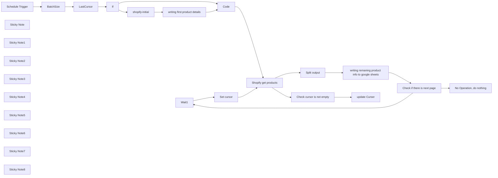

## Fluxo (.json) :

```json
{
  "id": "WBkJdubQjVzMUhwi",
  "meta": {
    "instanceId": "dec9665c2881b1ce168445537106c667ef9ec805212b046e3d537c8cf9badb2b"
  },
  "name": "Shopify to Google Sheets Product Sync Automation",
  "tags": [
    {
      "id": "lw2o8Nrkj1WPXBN9",
      "name": "template",
      "createdAt": "2023-12-20T00:14:27.348Z",
      "updatedAt": "2023-12-20T00:14:27.348Z"
    }
  ],
  "nodes": [
    {
      "id": "b2a5a0ac-4ce8-4d81-8d7f-01c0e5e35fd7",
      "name": "Wait1",
      "type": "n8n-nodes-base.wait",
      "position": [
        1520,
        380
      ],
      "webhookId": "93996a89-7e6c-4f08-9e42-eceb160a7d89",
      "parameters": {
        "unit": "seconds",
        "amount": 10
      },
      "typeVersion": 1
    },
    {
      "id": "681361ff-0648-46bd-bff2-2f4c4c17624a",
      "name": "No Operation, do nothing",
      "type": "n8n-nodes-base.noOp",
      "position": [
        1620,
        180
      ],
      "parameters": {},
      "typeVersion": 1
    },
    {
      "id": "1836d799-a821-44c0-b1a7-7d9354afccd4",
      "name": "Shopify get products",
      "type": "n8n-nodes-base.graphql",
      "position": [
        320,
        200
      ],
      "parameters": {
        "query": "=query getProducts($first: Int = {{ $json.batchsize }}, $after: String = \"{{ $json.endCursor }}\") {\n  products(first: $first, after: $after) {\n    edges {\n      node {\n        title\n        tags\n        description\n        variants(first: 1) {\n          edges {\n            node {\n              price\n            }\n          }\n        }\n      }\n    }\n    pageInfo {\n      hasNextPage\n      endCursor\n    }\n  }\n}\n",
        "endpoint": "https://test-store.myshopify.com/admin/api/2024-01/graphql.json",
        "authentication": "headerAuth"
      },
      "credentials": {
        "httpHeaderAuth": {
          "id": "m0Fan0K6zdS2cpQq",
          "name": "shopify test store"
        }
      },
      "executeOnce": true,
      "typeVersion": 1
    },
    {
      "id": "32a79711-c802-44c8-b188-250a782633c0",
      "name": "Split output",
      "type": "n8n-nodes-base.code",
      "position": [
        760,
        200
      ],
      "parameters": {
        "language": "python",
        "pythonCode": "new_output = []\nfor item in _input.all():\n    products = item.json['data']['products']['edges']\n    for product in products:\n        new_item = {\n            \"data\": {\n                \"product\": product['node']\n            }\n        }\n        new_output.append(new_item)\nreturn new_output"
      },
      "typeVersion": 2
    },
    {
      "id": "c7457a0b-9381-4e96-a458-33bf43f2dce1",
      "name": "Check if there is next page",
      "type": "n8n-nodes-base.if",
      "position": [
        1300,
        200
      ],
      "parameters": {
        "options": {},
        "conditions": {
          "options": {
            "leftValue": "",
            "caseSensitive": true,
            "typeValidation": "strict"
          },
          "combinator": "and",
          "conditions": [
            {
              "id": "fd562f28-7126-4f06-8250-6b3a4eb4e481",
              "operator": {
                "type": "boolean",
                "operation": "true",
                "singleValue": true
              },
              "leftValue": "={{ $json.data.products.pageInfo.hasNextPage }}",
              "rightValue": ""
            }
          ]
        }
      },
      "typeVersion": 2
    },
    {
      "id": "cced491b-b8b5-4109-8bd0-3d51fe0f0b5a",
      "name": "writing first product details",
      "type": "n8n-nodes-base.googleSheets",
      "position": [
        -140,
        380
      ],
      "parameters": {
        "columns": {
          "value": {
            "tag": "={{ $json.data.products.edges[0].node.tags }}",
            "price": "={{ $json.data.products.edges[0].node.variants.edges[0].node.price }}",
            "title": "={{ $json.data.products.edges[0].node.title }}",
            "descreption": "={{ $json.data.products.edges[0].node.description }}"
          },
          "schema": [
            {
              "id": "title",
              "type": "string",
              "display": true,
              "removed": false,
              "required": false,
              "displayName": "title",
              "defaultMatch": false,
              "canBeUsedToMatch": true
            },
            {
              "id": "descreption",
              "type": "string",
              "display": true,
              "removed": false,
              "required": false,
              "displayName": "descreption",
              "defaultMatch": false,
              "canBeUsedToMatch": true
            },
            {
              "id": "tag",
              "type": "string",
              "display": true,
              "removed": false,
              "required": false,
              "displayName": "tag",
              "defaultMatch": false,
              "canBeUsedToMatch": true
            },
            {
              "id": "price",
              "type": "string",
              "display": true,
              "removed": false,
              "required": false,
              "displayName": "price",
              "defaultMatch": false,
              "canBeUsedToMatch": true
            }
          ],
          "mappingMode": "defineBelow",
          "matchingColumns": [
            "title"
          ]
        },
        "options": {},
        "operation": "append",
        "sheetName": {
          "__rl": true,
          "mode": "list",
          "value": "gid=0",
          "cachedResultUrl": "https://docs.google.com/spreadsheets/d/1I6JnP8ugqmMD5ktJlNB84J1MlSkoCHhAEuCofSa3OSM/edit#gid=0",
          "cachedResultName": "Sheet1"
        },
        "documentId": {
          "__rl": true,
          "mode": "list",
          "value": "1YnGJD7AxV1iiQ-LcxOz3MnTLxGNSC6BBh-2Bh3Yitw0",
          "cachedResultUrl": "https://docs.google.com/spreadsheets/d/1I6JnP8ugqmMD5ktJlNB84J1MlSkoCHhAEuCofSa3OSM/edit?usp=drivesdk",
          "cachedResultName": "template test"
        }
      },
      "credentials": {
        "googleSheetsOAuth2Api": {
          "id": "pmrAlq3hgPc4cCvQ",
          "name": "Google Sheets account"
        }
      },
      "executeOnce": true,
      "typeVersion": 4.2,
      "alwaysOutputData": false
    },
    {
      "id": "a72b4230-d242-4ffa-a388-fb3580e66300",
      "name": "Set cursor",
      "type": "n8n-nodes-base.set",
      "position": [
        1420,
        740
      ],
      "parameters": {
        "fields": {
          "values": [
            {
              "name": "endCursor",
              "stringValue": "={{ $('Shopify get products').item.json.data.products.pageInfo.endCursor }}"
            },
            {
              "name": "=batchsize",
              "stringValue": "={{ $('Code').item.json.batchsize }}"
            }
          ]
        },
        "include": "none",
        "options": {}
      },
      "typeVersion": 3.2
    },
    {
      "id": "55a6cb5d-96d0-4577-b74f-d718de9d07cb",
      "name": "writing remaning product info to google sheets",
      "type": "n8n-nodes-base.googleSheets",
      "position": [
        1020,
        200
      ],
      "parameters": {
        "columns": {
          "value": {
            "tag": "={{ $json.data.product.tags }}",
            "price": "={{ $json.data.product.variants.edges[0].node.price }}",
            "title": "={{ $json.data.product.title }}",
            "descreption": "={{ $json.data.product.description }}"
          },
          "schema": [
            {
              "id": "title",
              "type": "string",
              "display": true,
              "removed": false,
              "required": false,
              "displayName": "title",
              "defaultMatch": false,
              "canBeUsedToMatch": true
            },
            {
              "id": "descreption",
              "type": "string",
              "display": true,
              "removed": false,
              "required": false,
              "displayName": "descreption",
              "defaultMatch": false,
              "canBeUsedToMatch": true
            },
            {
              "id": "tag",
              "type": "string",
              "display": true,
              "removed": false,
              "required": false,
              "displayName": "tag",
              "defaultMatch": false,
              "canBeUsedToMatch": true
            },
            {
              "id": "price",
              "type": "string",
              "display": true,
              "removed": false,
              "required": false,
              "displayName": "price",
              "defaultMatch": false,
              "canBeUsedToMatch": true
            }
          ],
          "mappingMode": "defineBelow",
          "matchingColumns": [
            "title"
          ]
        },
        "options": {},
        "operation": "append",
        "sheetName": {
          "__rl": true,
          "mode": "list",
          "value": "gid=0",
          "cachedResultUrl": "https://docs.google.com/spreadsheets/d/1I6JnP8ugqmMD5ktJlNB84J1MlSkoCHhAEuCofSa3OSM/edit#gid=0",
          "cachedResultName": "Sheet1"
        },
        "documentId": {
          "__rl": true,
          "mode": "list",
          "value": "1YnGJD7AxV1iiQ-LcxOz3MnTLxGNSC6BBh-2Bh3Yitw0",
          "cachedResultUrl": "https://docs.google.com/spreadsheets/d/1I6JnP8ugqmMD5ktJlNB84J1MlSkoCHhAEuCofSa3OSM/edit#gid=0",
          "cachedResultName": "template test"
        }
      },
      "credentials": {
        "googleSheetsOAuth2Api": {
          "id": "pmrAlq3hgPc4cCvQ",
          "name": "Google Sheets account"
        }
      },
      "typeVersion": 4.2
    },
    {
      "id": "a24c4e2a-482f-43d4-8c48-927427a430c0",
      "name": "Schedule Trigger",
      "type": "n8n-nodes-base.scheduleTrigger",
      "position": [
        -1300,
        520
      ],
      "parameters": {
        "rule": {
          "interval": [
            {
              "daysInterval": 0,
              "triggerAtHour": 7
            }
          ]
        }
      },
      "typeVersion": 1.1
    },
    {
      "id": "3a9d27fa-0840-4fc1-9b67-aad2f89f479b",
      "name": "update Curser",
      "type": "n8n-nodes-base.googleSheets",
      "position": [
        640,
        0
      ],
      "parameters": {
        "columns": {
          "value": {
            "tracker": "cursor",
            "endCursor": "={{ $json.data.products.pageInfo.endCursor }}"
          },
          "schema": [
            {
              "id": "tracker",
              "type": "string",
              "display": true,
              "removed": false,
              "required": false,
              "displayName": "tracker",
              "defaultMatch": false,
              "canBeUsedToMatch": true
            },
            {
              "id": "endCursor",
              "type": "string",
              "display": true,
              "removed": false,
              "required": false,
              "displayName": "endCursor",
              "defaultMatch": false,
              "canBeUsedToMatch": true
            },
            {
              "id": "row_number",
              "type": "string",
              "display": true,
              "removed": false,
              "readOnly": true,
              "required": false,
              "displayName": "row_number",
              "defaultMatch": false,
              "canBeUsedToMatch": true
            }
          ],
          "mappingMode": "defineBelow",
          "matchingColumns": [
            "tracker"
          ]
        },
        "options": {},
        "operation": "update",
        "sheetName": {
          "__rl": true,
          "mode": "list",
          "value": 334929034,
          "cachedResultUrl": "https://docs.google.com/spreadsheets/d/1I6JnP8ugqmMD5ktJlNB84J1MlSkoCHhAEuCofSa3OSM/edit#gid=0",
          "cachedResultName": "Curser"
        },
        "documentId": {
          "__rl": true,
          "mode": "list",
          "value": "1YnGJD7AxV1iiQ-LcxOz3MnTLxGNSC6BBh-2Bh3Yitw0",
          "cachedResultUrl": "https://docs.google.com/spreadsheets/d/1I6JnP8ugqmMD5ktJlNB84J1MlSkoCHhAEuCofSa3OSM/edit#gid=0",
          "cachedResultName": "Shopify Product Sync test"
        }
      },
      "credentials": {
        "googleSheetsOAuth2Api": {
          "id": "pmrAlq3hgPc4cCvQ",
          "name": "Google Sheets account"
        }
      },
      "executeOnce": false,
      "typeVersion": 4.2,
      "alwaysOutputData": false
    },
    {
      "id": "a7c1f97c-d88f-457d-9213-36300d277f4b",
      "name": "If",
      "type": "n8n-nodes-base.if",
      "position": [
        -540,
        520
      ],
      "parameters": {
        "options": {},
        "conditions": {
          "options": {
            "leftValue": "",
            "caseSensitive": true,
            "typeValidation": "strict"
          },
          "combinator": "and",
          "conditions": [
            {
              "id": "32b5f953-ae6c-4c50-ac47-591880738d0f",
              "operator": {
                "type": "string",
                "operation": "empty",
                "singleValue": true
              },
              "leftValue": "={{ $json.endCursor }}",
              "rightValue": ""
            }
          ]
        }
      },
      "typeVersion": 2
    },
    {
      "id": "23f62f9c-ef85-4e25-9d94-83a1d899ecf8",
      "name": "Code",
      "type": "n8n-nodes-base.code",
      "position": [
        100,
        540
      ],
      "parameters": {
        "jsCode": "let mergedJson = {};\n\ntry {\n    const batch_size = $(\"BatchSize\").all(0, 0);\n    if (batch_size.length > 0 && batch_size[0].json) {\n        Object.assign(mergedJson, batch_size[0].json);\n    }\n} catch (error) {\n    console.log(\"BatchSize data not available\");\n}\n\nlet endCursorFound = false;\ntry {\n    const last_cursor = $(\"LastCursor\").all(0, 0);\n    if (last_cursor.length > 0 && last_cursor[0].json) {\n        Object.assign(mergedJson, last_cursor[0].json);\n        if (last_cursor[0].json.endCursor) {\n            mergedJson.endCursor = last_cursor[0].json.endCursor;\n            endCursorFound = true;\n        }\n    }\n} catch (error) {\n    console.log(\"LastCursor data not available\");\n}\n\nif (!endCursorFound) {\n    try {\n        const shopify_initial = $(\"shopify-initial\").all(0, 0);\n        if (shopify_initial.length > 0 && shopify_initial[0].json && shopify_initial[0].json.data && shopify_initial[0].json.data.products && shopify_initial[0].json.data.products.pageInfo) {\n            mergedJson.endCursor = shopify_initial[0].json.data.products.pageInfo.endCursor;\n        }\n    } catch (error) {\n        console.log(\"Shopify data not available\");\n    }\n}\n\nif (Object.keys(mergedJson).length === 0 || mergedJson.hasOwnProperty('error')) {\n    return [{ json: { error: \"No data available. Ensure relevant nodes have been executed.\" } }];\n}\n\nreturn [{ json: mergedJson }];"
      },
      "executeOnce": true,
      "typeVersion": 2
    },
    {
      "id": "f1262f15-757f-4cc2-9453-fed17ad66b56",
      "name": "BatchSize",
      "type": "n8n-nodes-base.set",
      "position": [
        -1080,
        520
      ],
      "parameters": {
        "fields": {
          "values": [
            {
              "name": "batchsize",
              "type": "numberValue",
              "numberValue": "100"
            }
          ]
        },
        "include": "selected",
        "options": {}
      },
      "typeVersion": 3.2
    },
    {
      "id": "e885b0e7-e435-40ae-be21-77fd992c3114",
      "name": "LastCursor",
      "type": "n8n-nodes-base.googleSheets",
      "position": [
        -720,
        520
      ],
      "parameters": {
        "options": {},
        "sheetName": {
          "__rl": true,
          "mode": "list",
          "value": 334929034,
          "cachedResultUrl": "https://docs.google.com/spreadsheets/d/1I6JnP8ugqmMD5ktJlNB84J1MlSkoCHhAEuCofSa3OSM/edit#gid=0",
          "cachedResultName": "Curser"
        },
        "documentId": {
          "__rl": true,
          "mode": "list",
          "value": "1YnGJD7AxV1iiQ-LcxOz3MnTLxGNSC6BBh-2Bh3Yitw0",
          "cachedResultUrl": "https://docs.google.com/spreadsheets/d/1I6JnP8ugqmMD5ktJlNB84J1MlSkoCHhAEuCofSa3OSM/edit#gid=0",
          "cachedResultName": "Shopify Product Sync test"
        }
      },
      "credentials": {
        "googleSheetsOAuth2Api": {
          "id": "pmrAlq3hgPc4cCvQ",
          "name": "Google Sheets account"
        }
      },
      "typeVersion": 4.2,
      "alwaysOutputData": true
    },
    {
      "id": "ae3cf866-8695-4b63-b631-a6b00e29c7cb",
      "name": "shopify-initial",
      "type": "n8n-nodes-base.graphql",
      "position": [
        -300,
        380
      ],
      "parameters": {
        "query": "=query getProducts($first: Int = 1) {\n  products(first: $first) {\n    edges {\n      node {\n        title\n        tags\n        description\n        variants(first: 1) {\n          edges {\n            node {\n              price\n            }\n          }\n        }\n      }\n    }\n    pageInfo {\n      hasNextPage\n      endCursor\n    }\n  }\n}\n",
        "endpoint": "https://test-store-collection.myshopify.com/admin/api/2024-01/graphql.json",
        "authentication": "headerAuth"
      },
      "credentials": {
        "httpHeaderAuth": {
          "id": "m0Fan0K6zdS2cpQq",
          "name": "shopify test store"
        }
      },
      "typeVersion": 1
    },
    {
      "id": "8aab80ca-1a54-4d02-a8e8-37d037a12132",
      "name": "Check cursor is not empty",
      "type": "n8n-nodes-base.if",
      "position": [
        420,
        20
      ],
      "parameters": {
        "options": {},
        "conditions": {
          "options": {
            "leftValue": "",
            "caseSensitive": true,
            "typeValidation": "strict"
          },
          "combinator": "and",
          "conditions": [
            {
              "id": "329a4250-3fe7-4c73-8918-d41f7b38ff5a",
              "operator": {
                "type": "string",
                "operation": "notEmpty",
                "singleValue": true
              },
              "leftValue": "={{ $json.data.products.pageInfo.endCursor }}",
              "rightValue": ""
            }
          ]
        }
      },
      "typeVersion": 2
    },
    {
      "id": "9e7c2e36-71f6-4fdf-a3b9-8aa3bf02d09b",
      "name": "Sticky Note",
      "type": "n8n-nodes-base.stickyNote",
      "position": [
        -1500,
        -400
      ],
      "parameters": {
        "color": 4,
        "width": 352.8896103896103,
        "height": 295.09740259740255,
        "content": "This workflow automates the synchronization of product data from a Shopify store to a Google Sheets document, ensuring seamless management and tracking. It retrieves product details such as title, tags, description, and price from Shopify via GraphQL queries. The outcome is a comprehensive list of products neatly organized in Google Sheets for easy access and analysis."
      },
      "typeVersion": 1
    },
    {
      "id": "fbf62e09-3598-4f5c-b83a-a8b3e5371afb",
      "name": "Sticky Note1",
      "type": "n8n-nodes-base.stickyNote",
      "position": [
        -1420,
        340
      ],
      "parameters": {
        "width": 262.2077922077919,
        "height": 343.21428571428567,
        "content": "Schedule Trigger: Sets the timing for the automation to run, ensuring regular updates. Currently set to trigger every day at 7:00 AM"
      },
      "typeVersion": 1
    },
    {
      "id": "47abe6ba-a7de-410e-b634-8ad248ec7155",
      "name": "Sticky Note2",
      "type": "n8n-nodes-base.stickyNote",
      "position": [
        -1140,
        360
      ],
      "parameters": {
        "color": 3,
        "width": 275.1623376623376,
        "height": 411.6883116883117,
        "content": "BatchSize: Defines the number of products to fetch from Shopify at a time, optimizing data retrieval. Currently set to 100, but it can be adjusted to a maximum of 250 for a single run"
      },
      "typeVersion": 1
    },
    {
      "id": "6415976b-5fa5-4cd4-aa86-58eb9749a878",
      "name": "Sticky Note3",
      "type": "n8n-nodes-base.stickyNote",
      "position": [
        -820,
        260
      ],
      "parameters": {
        "color": 5,
        "width": 275.16233766233773,
        "height": 419.0909090909093,
        "content": "LastCursor: Checks if the last cursor data is already present in Google Sheets to facilitate incremental data fetching. This ensures that the synchronization process does not start from the beginning each time, optimizing efficiency by picking up where it left off"
      },
      "typeVersion": 1
    },
    {
      "id": "6a15e240-111e-4c7d-a865-2484a7a6ff0c",
      "name": "Sticky Note4",
      "type": "n8n-nodes-base.stickyNote",
      "position": [
        -380,
        -160
      ],
      "parameters": {
        "color": 4,
        "width": 450.9740259740258,
        "height": 705.941558441558,
        "content": "Shopify-initial: Fetches the initial set of products from the Shopify store to start the synchronization process. This node will only run once if there is no cursor found in the previous node, which retrieves the cursor and the first set of products"
      },
      "typeVersion": 1
    },
    {
      "id": "71640487-d3cf-4ede-8677-093108770720",
      "name": "Sticky Note5",
      "type": "n8n-nodes-base.stickyNote",
      "position": [
        -160,
        560
      ],
      "parameters": {
        "color": 6,
        "width": 416.49350649350646,
        "height": 402.4350649350655,
        "content": "\n\n\n\n\n\n\n\n\n\n\n\n\n\n\n\n\n\n\n\n\nThis code node merges data from different sources (BatchSize, LastCursor, and Shopify-initial) to ensure the synchronization process starts efficiently and picks up where it left off. It checks for available data and retrieves the last cursor position from Google Sheets to facilitate incremental data fetching."
      },
      "typeVersion": 1
    },
    {
      "id": "a13069b8-36f9-4604-895e-55c51ae3be2c",
      "name": "Sticky Note6",
      "type": "n8n-nodes-base.stickyNote",
      "position": [
        660,
        200
      ],
      "parameters": {
        "width": 304.7727272727272,
        "height": 330.2597402597403,
        "content": "\n\n\n\n\n\n\n\n\n\nThe \"Split output\" node acts as a bridge between data retrieval and subsequent processing nodes. Since the Shopify node fetches batches of 100 results at a time, this node splits those batches into individual product entries, ensuring seamless processing and storage of each product's details in subsequent workflow steps"
      },
      "typeVersion": 1
    },
    {
      "id": "8c1401ad-e7be-47a9-b01d-3606b9f20bf0",
      "name": "Sticky Note7",
      "type": "n8n-nodes-base.stickyNote",
      "position": [
        1400,
        620
      ],
      "parameters": {
        "color": 5,
        "width": 388.0519480519479,
        "height": 367.27272727272714,
        "content": "Set cursor: Updates the cursor for the next page of products to fetch from Shopify."
      },
      "typeVersion": 1
    },
    {
      "id": "a5d3c62c-1bf3-4bc7-9e2b-1b5883b385d1",
      "name": "Sticky Note8",
      "type": "n8n-nodes-base.stickyNote",
      "position": [
        -32.17532467532425,
        20
      ],
      "parameters": {
        "color": 3,
        "width": 428.7662337662332,
        "height": 342.79220779220765,
        "content": "The GraphQL query within this node is crafted to extract essential product details such as title, description, tags, and price. This query can be customized to fetch additional product information as needed for specific synchronization requirements."
      },
      "typeVersion": 1
    }
  ],
  "active": false,
  "pinData": {},
  "settings": {
    "executionOrder": "v1"
  },
  "versionId": "c640732c-55b5-4f2e-bb64-106c440b0abc",
  "connections": {
    "If": {
      "main": [
        [
          {
            "node": "shopify-initial",
            "type": "main",
            "index": 0
          }
        ],
        [
          {
            "node": "Code",
            "type": "main",
            "index": 0
          }
        ]
      ]
    },
    "Code": {
      "main": [
        [
          {
            "node": "Shopify get products",
            "type": "main",
            "index": 0
          }
        ]
      ]
    },
    "Wait1": {
      "main": [
        [
          {
            "node": "Set cursor",
            "type": "main",
            "index": 0
          }
        ]
      ]
    },
    "BatchSize": {
      "main": [
        [
          {
            "node": "LastCursor",
            "type": "main",
            "index": 0
          }
        ]
      ]
    },
    "LastCursor": {
      "main": [
        [
          {
            "node": "If",
            "type": "main",
            "index": 0
          }
        ]
      ]
    },
    "Set cursor": {
      "main": [
        [
          {
            "node": "Shopify get products",
            "type": "main",
            "index": 0
          }
        ]
      ]
    },
    "Split output": {
      "main": [
        [
          {
            "node": "writing remaning product info to google sheets",
            "type": "main",
            "index": 0
          }
        ]
      ]
    },
    "shopify-initial": {
      "main": [
        [
          {
            "node": "writing first product details",
            "type": "main",
            "index": 0
          }
        ]
      ]
    },
    "Schedule Trigger": {
      "main": [
        [
          {
            "node": "BatchSize",
            "type": "main",
            "index": 0
          }
        ]
      ]
    },
    "Shopify get products": {
      "main": [
        [
          {
            "node": "Split output",
            "type": "main",
            "index": 0
          },
          {
            "node": "Check cursor is not empty",
            "type": "main",
            "index": 0
          }
        ]
      ]
    },
    "Check cursor is not empty": {
      "main": [
        [
          {
            "node": "update Curser",
            "type": "main",
            "index": 0
          }
        ]
      ]
    },
    "Check if there is next page": {
      "main": [
        [
          {
            "node": "No Operation, do nothing",
            "type": "main",
            "index": 0
          }
        ],
        [
          {
            "node": "Wait1",
            "type": "main",
            "index": 0
          }
        ]
      ]
    },
    "writing first product details": {
      "main": [
        [
          {
            "node": "Code",
            "type": "main",
            "index": 0
          }
        ]
      ]
    },
    "writing remaning product info to google sheets": {
      "main": [
        [
          {
            "node": "Check if there is next page",
            "type": "main",
            "index": 0
          }
        ]
      ]
    }
  }
}
```

<a id="template-1561"></a>

## Template 1561 - Converter imagem 2D em modelo 3D

- **Nome:** Converter imagem 2D em modelo 3D
- **Descrição:** Converte imagens 2D fornecidas em uma planilha para modelos 3D (.glb), armazena os arquivos resultantes e atualiza a planilha com o link do modelo.
- **Funcionalidade:** • Leitura de entradas da planilha: Busca linhas na Google Sheet que ainda não possuem resultado 3D.
• Envio de imagem para geração 3D: Envia a URL da imagem para um serviço de IA que gera o modelo 3D.
• Verificação periódica de status: Faz polling periódico até a geração do modelo ser concluída.
• Recuperação do arquivo gerado: Obtém a URL e faz o download do arquivo 3D gerado (.glb).
• Upload para armazenamento: Faz upload do arquivo 3D para uma pasta no Google Drive com nome padronizado.
• Atualização da planilha: Insere o link ou referência do modelo 3D na linha correspondente da planilha.
- **Ferramentas:** • Google Sheets: Planilha usada para listar imagens de origem e receber o link/resultados dos modelos 3D.
• fal.ai (Fal.run Trellis API): Serviço de IA que gera o modelo 3D a partir da imagem fornecida e fornece URL/status da geração.
• Google Drive: Armazenamento onde os arquivos .glb gerados são salvos para download e compartilhamento.

## Fluxo visual

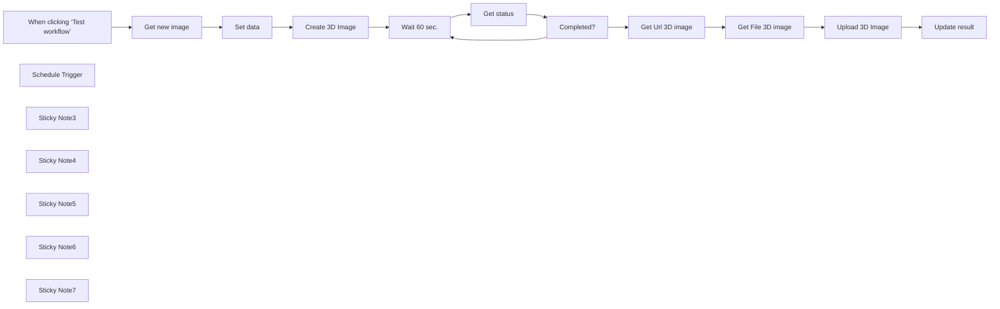

## Fluxo (.json) :

```json
{
  "id": "XiwLd0JwGmDoY0mr",
  "meta": {
    "instanceId": "a4bfc93e975ca233ac45ed7c9227d84cf5a2329310525917adaf3312e10d5462",
    "templateCredsSetupCompleted": true
  },
  "name": "Image-to-3D",
  "tags": [],
  "nodes": [
    {
      "id": "8cc77575-854f-4359-8faa-fc78b8c23b65",
      "name": "When clicking ‘Test workflow’",
      "type": "n8n-nodes-base.manualTrigger",
      "position": [
        -220,
        400
      ],
      "parameters": {},
      "typeVersion": 1
    },
    {
      "id": "0dc7e6b8-43b8-4b9a-aa7a-4a100598162f",
      "name": "Get status",
      "type": "n8n-nodes-base.httpRequest",
      "position": [
        840,
        400
      ],
      "parameters": {
        "url": "=https://queue.fal.run/fal-ai/trellis/requests/{{ $('Create 3D Image').item.json.request_id }}/status ",
        "options": {},
        "authentication": "genericCredentialType",
        "genericAuthType": "httpHeaderAuth"
      },
      "credentials": {
        "httpHeaderAuth": {
          "id": "daOZafXpRXLtoLUV",
          "name": "Fal.run API"
        }
      },
      "typeVersion": 4.2
    },
    {
      "id": "7540df1c-35e2-4ac5-871d-4d8410217979",
      "name": "Wait 60 sec.",
      "type": "n8n-nodes-base.wait",
      "position": [
        660,
        400
      ],
      "webhookId": "e10e9912-38e7-4e1f-ad7e-52b1e6a65d79",
      "parameters": {
        "amount": 60
      },
      "typeVersion": 1.1
    },
    {
      "id": "44c4b506-2a14-40ca-a75f-7af86ef5a9af",
      "name": "Schedule Trigger",
      "type": "n8n-nodes-base.scheduleTrigger",
      "position": [
        -220,
        260
      ],
      "parameters": {
        "rule": {
          "interval": [
            {
              "field": "minutes"
            }
          ]
        }
      },
      "typeVersion": 1.2
    },
    {
      "id": "ca8b3bcd-3eb6-4723-b2ea-a973582d46af",
      "name": "Sticky Note3",
      "type": "n8n-nodes-base.stickyNote",
      "position": [
        -220,
        -860
      ],
      "parameters": {
        "color": 3,
        "width": 740,
        "height": 520,
        "content": "# Image-to-3D\n\n\nThis workflow allows users to convert a 2D image into a 3D model by integrating multiple AI and web services. The process begins with a user uploading or providing an image URL, which is then sent to a generative AI model capable of interpreting the content and generating a 3D representation in .glb format. The model is then stored and a download link is returned to the user.\n\n"
      },
      "typeVersion": 1
    },
    {
      "id": "2230e7a5-225d-4538-b091-a9fbeedb1323",
      "name": "Sticky Note4",
      "type": "n8n-nodes-base.stickyNote",
      "position": [
        -220,
        -300
      ],
      "parameters": {
        "width": 740,
        "height": 200,
        "content": "## STEP 1 - GOOGLE SHEET\nCreate a [Google Sheet like this](https://docs.google.com/spreadsheets/d/1C0Et6X3Zwr_6CxeNjhLpDwjAfIGeUvLGFawckKb0utY/edit?usp=sharing).\n\nPlease insert:\n- in the \"IMAGE MODEL\" column the basic image of the model to dress\n\nLeave the \"3D RESULT\" column unfilled. It will be inserted by the system once the image has been created"
      },
      "typeVersion": 1
    },
    {
      "id": "3aad3211-e6fc-4e4b-9c59-7dd82827a43b",
      "name": "Completed?",
      "type": "n8n-nodes-base.if",
      "position": [
        1020,
        400
      ],
      "parameters": {
        "options": {},
        "conditions": {
          "options": {
            "version": 2,
            "leftValue": "",
            "caseSensitive": true,
            "typeValidation": "strict"
          },
          "combinator": "and",
          "conditions": [
            {
              "id": "383d112e-2cc6-4dd4-8985-f09ce0bd1781",
              "operator": {
                "name": "filter.operator.equals",
                "type": "string",
                "operation": "equals"
              },
              "leftValue": "={{ $json.status }}",
              "rightValue": "COMPLETED"
            }
          ]
        }
      },
      "typeVersion": 2.2
    },
    {
      "id": "6ad70838-dbf4-4cb1-9b61-4cf6e1fcdf6a",
      "name": "Update result",
      "type": "n8n-nodes-base.googleSheets",
      "position": [
        440,
        780
      ],
      "parameters": {
        "columns": {
          "value": {
            "row_number": "={{ $('Get new image').item.json.row_number }}",
            "IMAGE RESULT": "={{ $('Get Url 3D image').item.json.model_mesh.url }}"
          },
          "schema": [
            {
              "id": "IMAGE MODEL",
              "type": "string",
              "display": true,
              "required": false,
              "displayName": "IMAGE MODEL",
              "defaultMatch": false,
              "canBeUsedToMatch": true
            },
            {
              "id": "IMAGE PRODUCT",
              "type": "string",
              "display": true,
              "required": false,
              "displayName": "IMAGE PRODUCT",
              "defaultMatch": false,
              "canBeUsedToMatch": true
            },
            {
              "id": "PRODUCT ID",
              "type": "string",
              "display": true,
              "required": false,
              "displayName": "PRODUCT ID",
              "defaultMatch": false,
              "canBeUsedToMatch": true
            },
            {
              "id": "IMAGE RESULT",
              "type": "string",
              "display": true,
              "required": false,
              "displayName": "IMAGE RESULT",
              "defaultMatch": false,
              "canBeUsedToMatch": true
            },
            {
              "id": "row_number",
              "type": "string",
              "display": true,
              "removed": false,
              "readOnly": true,
              "required": false,
              "displayName": "row_number",
              "defaultMatch": false,
              "canBeUsedToMatch": true
            }
          ],
          "mappingMode": "defineBelow",
          "matchingColumns": [
            "row_number"
          ],
          "attemptToConvertTypes": false,
          "convertFieldsToString": false
        },
        "options": {},
        "operation": "update",
        "sheetName": {
          "__rl": true,
          "mode": "list",
          "value": "gid=0",
          "cachedResultUrl": "https://docs.google.com/spreadsheets/d/11ebWJvwwXHgvQld9kxywKQUvIoBw6xMa0g0BuIqHDxE/edit#gid=0",
          "cachedResultName": "Foglio1"
        },
        "documentId": {
          "__rl": true,
          "mode": "list",
          "value": "1C0Et6X3Zwr_6CxeNjhLpDwjAfIGeUvLGFawckKb0utY",
          "cachedResultUrl": "https://docs.google.com/spreadsheets/d/1C0Et6X3Zwr_6CxeNjhLpDwjAfIGeUvLGFawckKb0utY/edit?usp=drivesdk",
          "cachedResultName": "Image to 3D"
        }
      },
      "credentials": {
        "googleSheetsOAuth2Api": {
          "id": "JYR6a64Qecd6t8Hb",
          "name": "Google Sheets account"
        }
      },
      "typeVersion": 4.5
    },
    {
      "id": "239b45b3-94cc-43a9-aa2e-2c85725f4cc0",
      "name": "Set data",
      "type": "n8n-nodes-base.set",
      "position": [
        220,
        400
      ],
      "parameters": {
        "options": {},
        "assignments": {
          "assignments": [
            {
              "id": "c713d31f-9abd-496a-ac79-e8e2efe60aa0",
              "name": "image",
              "type": "string",
              "value": "={{ $json['IMAGE'] }}"
            }
          ]
        }
      },
      "typeVersion": 3.4
    },
    {
      "id": "70908a7d-72a5-4131-a82b-ed455a453fd5",
      "name": "Sticky Note5",
      "type": "n8n-nodes-base.stickyNote",
      "position": [
        -220,
        120
      ],
      "parameters": {
        "width": 740,
        "height": 100,
        "content": "## STEP 3 - MAIN FLOW\nStart the workflow manually or periodically by hooking the \"Schedule Trigger\" node. It is recommended to set it at 5 minute intervals."
      },
      "typeVersion": 1
    },
    {
      "id": "d81f8aa0-3302-4a26-9425-aeb2a87674e7",
      "name": "Sticky Note6",
      "type": "n8n-nodes-base.stickyNote",
      "position": [
        -220,
        -60
      ],
      "parameters": {
        "width": 740,
        "height": 140,
        "content": "## STEP 2 - GET API KEY (YOURAPIKEY)\nCreate an account [here](https://fal.ai/) and obtain API KEY.\nIn the node \"Create Image\" set \"Header Auth\" and set:\n- Name: \"Authorization\"\n- Value: \"Key YOURAPIKEY\""
      },
      "typeVersion": 1
    },
    {
      "id": "484d029d-b88f-48bb-b487-e7a50b47eb7d",
      "name": "Sticky Note7",
      "type": "n8n-nodes-base.stickyNote",
      "position": [
        400,
        340
      ],
      "parameters": {
        "width": 180,
        "height": 200,
        "content": "Set API Key created in Step 2"
      },
      "typeVersion": 1
    },
    {
      "id": "7061d7c1-7da8-473c-98a3-57dc15def557",
      "name": "Get new image",
      "type": "n8n-nodes-base.googleSheets",
      "position": [
        0,
        400
      ],
      "parameters": {
        "options": {},
        "filtersUI": {
          "values": [
            {
              "lookupColumn": "3D RESULT"
            }
          ]
        },
        "sheetName": {
          "__rl": true,
          "mode": "list",
          "value": "gid=0",
          "cachedResultUrl": "https://docs.google.com/spreadsheets/d/1C0Et6X3Zwr_6CxeNjhLpDwjAfIGeUvLGFawckKb0utY/edit#gid=0",
          "cachedResultName": "Foglio1"
        },
        "documentId": {
          "__rl": true,
          "mode": "list",
          "value": "1C0Et6X3Zwr_6CxeNjhLpDwjAfIGeUvLGFawckKb0utY",
          "cachedResultUrl": "https://docs.google.com/spreadsheets/d/1C0Et6X3Zwr_6CxeNjhLpDwjAfIGeUvLGFawckKb0utY/edit?usp=drivesdk",
          "cachedResultName": "Image to 3D"
        }
      },
      "credentials": {
        "googleSheetsOAuth2Api": {
          "id": "JYR6a64Qecd6t8Hb",
          "name": "Google Sheets account"
        }
      },
      "typeVersion": 4.5
    },
    {
      "id": "edcdc4f0-4e7f-4fec-af9c-bbe8bf6bd8e6",
      "name": "Create 3D Image",
      "type": "n8n-nodes-base.httpRequest",
      "position": [
        440,
        400
      ],
      "parameters": {
        "url": "https://queue.fal.run/fal-ai/trellis",
        "method": "POST",
        "options": {},
        "jsonBody": "={\n  \"image_url\": \"{{ $json.image }}\",\n  \"ss_guidance_strength\": 7.5,\n  \"ss_sampling_steps\": 12,\n  \"slat_guidance_strength\": 3,\n  \"slat_sampling_steps\": 12,\n  \"mesh_simplify\": 0.95,\n  \"texture_size\": 1024\n}",
        "sendBody": true,
        "sendHeaders": true,
        "specifyBody": "json",
        "authentication": "genericCredentialType",
        "genericAuthType": "httpHeaderAuth",
        "headerParameters": {
          "parameters": [
            {
              "name": "Content-Type",
              "value": "application/json"
            }
          ]
        }
      },
      "credentials": {
        "httpHeaderAuth": {
          "id": "daOZafXpRXLtoLUV",
          "name": "Fal.run API"
        }
      },
      "typeVersion": 4.2
    },
    {
      "id": "9ac6f843-090f-4c15-88e7-46ee494ed1b9",
      "name": "Get Url 3D image",
      "type": "n8n-nodes-base.httpRequest",
      "position": [
        -220,
        780
      ],
      "parameters": {
        "url": "=https://queue.fal.run/fal-ai/trellis/requests/{{ $json.request_id }}",
        "options": {},
        "authentication": "genericCredentialType",
        "genericAuthType": "httpHeaderAuth"
      },
      "credentials": {
        "httpHeaderAuth": {
          "id": "daOZafXpRXLtoLUV",
          "name": "Fal.run API"
        }
      },
      "typeVersion": 4.2
    },
    {
      "id": "a02ac260-c88a-4c5a-9fc6-7230b95c462b",
      "name": "Get File 3D image",
      "type": "n8n-nodes-base.httpRequest",
      "position": [
        0,
        780
      ],
      "parameters": {
        "url": "={{ $json.model_mesh.url }}",
        "options": {}
      },
      "typeVersion": 4.2
    },
    {
      "id": "311be624-4707-4361-a58a-ee90ff42490c",
      "name": "Upload 3D Image",
      "type": "n8n-nodes-base.googleDrive",
      "position": [
        220,
        780
      ],
      "parameters": {
        "name": "={{ $now.format('yyyyLLddHHmmss') }}-{{ $('Get Url 3D image').item.json.model_mesh.file_name }}",
        "driveId": {
          "__rl": true,
          "mode": "list",
          "value": "My Drive"
        },
        "options": {},
        "folderId": {
          "__rl": true,
          "mode": "list",
          "value": "1aHRwLWyrqfzoVC8HoB-YMrBvQ4tLC-NZ",
          "cachedResultUrl": "https://drive.google.com/drive/folders/1aHRwLWyrqfzoVC8HoB-YMrBvQ4tLC-NZ",
          "cachedResultName": "Fal.run"
        }
      },
      "credentials": {
        "googleDriveOAuth2Api": {
          "id": "HEy5EuZkgPZVEa9w",
          "name": "Google Drive account (n3w.it)"
        }
      },
      "typeVersion": 3
    }
  ],
  "active": false,
  "pinData": {},
  "settings": {
    "executionOrder": "v1"
  },
  "versionId": "2f0d3488-25ac-4332-a8e3-62d7b34b96ae",
  "connections": {
    "Set data": {
      "main": [
        [
          {
            "node": "Create 3D Image",
            "type": "main",
            "index": 0
          }
        ]
      ]
    },
    "Completed?": {
      "main": [
        [
          {
            "node": "Get Url 3D image",
            "type": "main",
            "index": 0
          }
        ],
        [
          {
            "node": "Wait 60 sec.",
            "type": "main",
            "index": 0
          }
        ]
      ]
    },
    "Get status": {
      "main": [
        [
          {
            "node": "Completed?",
            "type": "main",
            "index": 0
          }
        ]
      ]
    },
    "Wait 60 sec.": {
      "main": [
        [
          {
            "node": "Get status",
            "type": "main",
            "index": 0
          }
        ]
      ]
    },
    "Get new image": {
      "main": [
        [
          {
            "node": "Set data",
            "type": "main",
            "index": 0
          }
        ]
      ]
    },
    "Update result": {
      "main": [
        []
      ]
    },
    "Create 3D Image": {
      "main": [
        [
          {
            "node": "Wait 60 sec.",
            "type": "main",
            "index": 0
          }
        ]
      ]
    },
    "Upload 3D Image": {
      "main": [
        [
          {
            "node": "Update result",
            "type": "main",
            "index": 0
          }
        ]
      ]
    },
    "Get Url 3D image": {
      "main": [
        [
          {
            "node": "Get File 3D image",
            "type": "main",
            "index": 0
          }
        ]
      ]
    },
    "Get File 3D image": {
      "main": [
        [
          {
            "node": "Upload 3D Image",
            "type": "main",
            "index": 0
          }
        ]
      ]
    },
    "When clicking ‘Test workflow’": {
      "main": [
        [
          {
            "node": "Get new image",
            "type": "main",
            "index": 0
          }
        ]
      ]
    }
  }
}
```

<a id="template-1563"></a>

## Template 1563 - Monitoramento de mudanças em site com alerta por e-mail

- **Nome:** Monitoramento de mudanças em site com alerta por e-mail
- **Descrição:** Recebe instruções via formulário, extrai uma URL e um prompt, compara o conteúdo antigo e novo de um site e envia um e-mail se houver mudanças relevantes.
- **Funcionalidade:** • Receber instrução via formulário: aceita uma instrução de espionagem contendo texto com a URL e orientações.
• Extrair URL e gerar prompt detalhado: usa um modelo de linguagem para converter a mensagem em uma URL limpa e criar um prompt amplo para comparação.
• Coletar conteúdo inicial do site (versão antiga): realiza um scraping do conteúdo principal da página e armazena em formato legível.
• Agendamento de verificação: espera 1 dia antes de recolher a versão atual do site para permitir comparação temporal.
• Coletar conteúdo atual do site (versão nova): realiza novo scraping após o período de espera.
• Comparar versões com agente de IA: fornece o conteúdo antigo e novo junto com o prompt ao agente de IA para avaliar diferenças relevantes.
• Envio condicional de e-mail: envia um resumo por e-mail ao destinatário especificado somente se o agente determinar que as mudanças atendem aos critérios.
- **Ferramentas:** • OpenAI (modelos de linguagem): usado para converter a mensagem em URL e prompt, e para o agente que compara as versões e decide sobre o envio de e-mail.
• Firecrawl (api.firecrawl.dev): serviço de scraping para obter o conteúdo principal das páginas em formato markdown.
• Gmail: serviço de envio de e-mail para notificar o destinatário com o resumo das mudanças quando aplicável.

## Fluxo visual

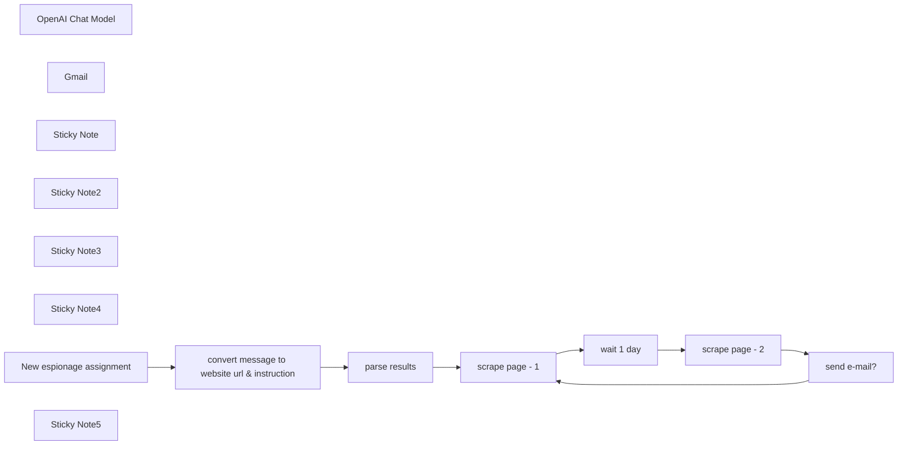

## Fluxo (.json) :

```json
{
  "id": "aOP0D1cAqzGv7Xa8",
  "meta": {
    "instanceId": "0a5638e14e0c728ef975d18d109cfb41edae575e3d911724f4f1eccde06a729f"
  },
  "name": "spy tool",
  "tags": [],
  "nodes": [
    {
      "id": "5690844d-5322-4c62-8c83-eb4d4dc9c481",
      "name": "OpenAI Chat Model",
      "type": "@n8n/n8n-nodes-langchain.lmChatOpenAi",
      "position": [
        1400,
        340
      ],
      "parameters": {
        "model": "gpt-4o",
        "options": {}
      },
      "credentials": {
        "openAiApi": {
          "id": "ZOKbogCxHnP2W0H5",
          "name": "OpenAi account"
        }
      },
      "typeVersion": 1
    },
    {
      "id": "3b1c034f-501b-423c-844f-9cb607fa91e6",
      "name": "Gmail",
      "type": "n8n-nodes-base.gmailTool",
      "position": [
        1580,
        340
      ],
      "webhookId": "6a510528-22e0-4140-b987-770bb7a138de",
      "parameters": {
        "sendTo": "tom@sleak.chat",
        "message": "={{ $fromAI(\"change\", \"What relevant part has changed on the website?\") }}",
        "options": {
          "appendAttribution": false
        },
        "subject": "=Relevant changes on {{ $('parse results').item.json.website_url }}",
        "emailType": "text",
        "descriptionType": "manual",
        "toolDescription": "=Use this tool if you need to send an email, but only if the terms in the instructions mentioned explicitly state so\n"
      },
      "credentials": {
        "gmailOAuth2": {
          "id": "jtANm6k92Kl6ent1",
          "name": "Gmail account"
        }
      },
      "typeVersion": 2.1
    },
    {
      "id": "4d448a02-4569-451e-8be5-59bfc48f36d8",
      "name": "parse results",
      "type": "n8n-nodes-base.code",
      "position": [
        1180,
        -160
      ],
      "parameters": {
        "jsCode": "const parsedObject = JSON.parse($('convert message to website url & instruction').first().json.choices[0].message.content);\n\nreturn parsedObject"
      },
      "typeVersion": 2
    },
    {
      "id": "238298c4-5bba-4ac1-b3cc-ab5a28888560",
      "name": "Sticky Note",
      "type": "n8n-nodes-base.stickyNote",
      "position": [
        1420,
        -120
      ],
      "parameters": {
        "width": 260,
        "height": 180,
        "content": "## Note: almost never works right away\nAdjust the prompts in the 'Tools agent' and 'Gmail' node as desired to steer the agent's behavior in the right direction"
      },
      "typeVersion": 1
    },
    {
      "id": "0d519c06-aa30-4a33-895f-9185936d27cf",
      "name": "Sticky Note2",
      "type": "n8n-nodes-base.stickyNote",
      "position": [
        480,
        100
      ],
      "parameters": {
        "width": 150,
        "height": 80,
        "content": "Connect your Firecrawl account"
      },
      "typeVersion": 1
    },
    {
      "id": "9e327bbe-0096-4a4d-aec2-2e4cae7d91bd",
      "name": "Sticky Note3",
      "type": "n8n-nodes-base.stickyNote",
      "position": [
        1740,
        80
      ],
      "parameters": {
        "width": 150,
        "height": 80,
        "content": "Connect your own OpenAI account\n"
      },
      "typeVersion": 1
    },
    {
      "id": "30ce0e22-f536-462f-8f94-f3fd92ae036f",
      "name": "Sticky Note4",
      "type": "n8n-nodes-base.stickyNote",
      "position": [
        1660,
        300
      ],
      "parameters": {
        "width": 150,
        "height": 80,
        "content": "Connect your own Gmail account\n"
      },
      "typeVersion": 1
    },
    {
      "id": "bc003781-3d91-49b6-b6bb-b2970b39256a",
      "name": "convert message to website url & instruction",
      "type": "n8n-nodes-base.httpRequest",
      "position": [
        940,
        -160
      ],
      "parameters": {
        "url": "https://api.openai.com/v1/chat/completions",
        "method": "POST",
        "options": {},
        "jsonBody": "={\n  \"model\": \"gpt-4o-2024-08-06\",\n  \"messages\": [\n              {\n        \"role\": \"user\",\n        \"content\": \"convert the following message to a website url (just the plain text url, NOT formatted or in markdown) and prompt to AI. Make the prompt as verbose as possible. Message: {{ $('New espionage assignment').first().json.assignment_instructions }}\"\n    }\n  ],\n  \"response_format\": {\n    \"type\": \"json_schema\",\n    \"json_schema\": {\n      \"name\": \"variable_extraction\",\n      \"schema\": {\n        \"type\": \"object\",\n        \"properties\": {\n          \"website_url\": { \"type\": \"string\" },\n          \"prompt\": { \"type\": \"string\" }\n        },\n        \"required\": [\"website_url\", \"prompt\"],\n        \"additionalProperties\": false\n      },\n      \"strict\": true\n    }\n  }\n}\n",
        "sendBody": true,
        "specifyBody": "json",
        "authentication": "predefinedCredentialType",
        "nodeCredentialType": "openAiApi"
      },
      "credentials": {
        "openAiApi": {
          "id": "ZOKbogCxHnP2W0H5",
          "name": "OpenAi account"
        }
      },
      "typeVersion": 4.2
    },
    {
      "id": "6a8c172d-ac39-4cb0-b601-39fc770695ed",
      "name": "New espionage assignment",
      "type": "n8n-nodes-base.formTrigger",
      "position": [
        700,
        -160
      ],
      "webhookId": "7470334f-93e1-47af-9521-d3a232c38b13",
      "parameters": {
        "options": {},
        "formTitle": "New espionage assignment",
        "formFields": {
          "values": [
            {
              "fieldLabel": "assignment_instructions"
            }
          ]
        }
      },
      "notesInFlow": false,
      "typeVersion": 2.2
    },
    {
      "id": "c5c64e5c-88de-45e3-bb9b-4096e74a6e83",
      "name": "wait 1 day",
      "type": "n8n-nodes-base.wait",
      "position": [
        940,
        80
      ],
      "webhookId": "22e689e4-b93d-4c59-81e5-43c070833454",
      "parameters": {
        "unit": "days",
        "amount": 1
      },
      "typeVersion": 1.1
    },
    {
      "id": "62a278ff-ed00-4e54-a608-001237551113",
      "name": "scrape page - 1",
      "type": "n8n-nodes-base.httpRequest",
      "position": [
        700,
        80
      ],
      "parameters": {
        "url": "https://api.firecrawl.dev/v1/scrape",
        "method": "POST",
        "options": {},
        "jsonBody": "={\n  \"url\": \"{{ $('parse results').item.json.website_url }}\",\n  \"formats\": [\n    \"markdown\"\n  ],\n  \"onlyMainContent\": true,\n  \"waitFor\": 5000\n}",
        "sendBody": true,
        "specifyBody": "json",
        "authentication": "genericCredentialType",
        "genericAuthType": "httpHeaderAuth"
      },
      "credentials": {
        "httpBasicAuth": {
          "id": "h2XRcXzLcEfvDVKb",
          "name": "Unnamed credential"
        },
        "httpHeaderAuth": {
          "id": "FoyIka0WgFG4FPxA",
          "name": "Header Auth account 2"
        }
      },
      "retryOnFail": true,
      "typeVersion": 4.2
    },
    {
      "id": "89c15d8f-7f8e-4391-b24a-07579964ca5c",
      "name": "scrape page - 2",
      "type": "n8n-nodes-base.httpRequest",
      "position": [
        1180,
        80
      ],
      "parameters": {
        "url": "https://api.firecrawl.dev/v1/scrape",
        "method": "POST",
        "options": {},
        "jsonBody": "={\n  \"url\": \"{{ $('parse results').item.json.website_url }}\",\n  \"formats\": [\n    \"markdown\"\n  ],\n  \"onlyMainContent\": true,\n  \"waitFor\": 5000\n}",
        "sendBody": true,
        "specifyBody": "json",
        "authentication": "genericCredentialType",
        "genericAuthType": "httpHeaderAuth"
      },
      "credentials": {
        "httpHeaderAuth": {
          "id": "FoyIka0WgFG4FPxA",
          "name": "Header Auth account 2"
        }
      },
      "retryOnFail": true,
      "typeVersion": 4.2
    },
    {
      "id": "7b148c5b-d4ae-498a-b7ef-2ed4ecc0a665",
      "name": "send e-mail?",
      "type": "@n8n/n8n-nodes-langchain.agent",
      "position": [
        1420,
        80
      ],
      "parameters": {
        "text": "={{ $('parse results').item.json.prompt }}\n\nNOTE: ONLY send an email if the situation meets the above condition. Otherwise, do NOT use the tool\n\nNOTE: this concerns differences between the \"old version page\" (scrape from yesterday) and \"new version page\" (scrape from now)",
        "options": {
          "systemMessage": "=old version page: \\n\\n {{ JSON.stringify($('scrape page - 1').item.json[\"data\"][\"markdown\"]) }} \\n\\n /// \\n\\n new version page: \\n\\n {{ JSON.stringify($('scrape page - 1').item.json[\"data\"][\"markdown\"]) }}"
        },
        "promptType": "define",
        "hasOutputParser": true
      },
      "typeVersion": 1.7
    },
    {
      "id": "7897d707-2c27-43bf-9ea0-90ab7996bf4a",
      "name": "Sticky Note5",
      "type": "n8n-nodes-base.stickyNote",
      "position": [
        920,
        -260
      ],
      "parameters": {
        "width": 150,
        "height": 80,
        "content": "Connect your own OpenAI account\n"
      },
      "typeVersion": 1
    }
  ],
  "active": true,
  "pinData": {},
  "settings": {
    "executionOrder": "v1"
  },
  "versionId": "dec23eea-1590-4418-ab2b-1cb4a6ccfdc6",
  "connections": {
    "Gmail": {
      "ai_tool": [
        [
          {
            "node": "send e-mail?",
            "type": "ai_tool",
            "index": 0
          }
        ]
      ]
    },
    "wait 1 day": {
      "main": [
        [
          {
            "node": "scrape page - 2",
            "type": "main",
            "index": 0
          }
        ]
      ]
    },
    "send e-mail?": {
      "main": [
        [
          {
            "node": "scrape page - 1",
            "type": "main",
            "index": 0
          }
        ]
      ]
    },
    "parse results": {
      "main": [
        [
          {
            "node": "scrape page - 1",
            "type": "main",
            "index": 0
          }
        ]
      ]
    },
    "scrape page - 1": {
      "main": [
        [
          {
            "node": "wait 1 day",
            "type": "main",
            "index": 0
          }
        ]
      ]
    },
    "scrape page - 2": {
      "main": [
        [
          {
            "node": "send e-mail?",
            "type": "main",
            "index": 0
          }
        ]
      ]
    },
    "OpenAI Chat Model": {
      "ai_languageModel": [
        [
          {
            "node": "send e-mail?",
            "type": "ai_languageModel",
            "index": 0
          }
        ]
      ]
    },
    "New espionage assignment": {
      "main": [
        [
          {
            "node": "convert message to website url & instruction",
            "type": "main",
            "index": 0
          }
        ]
      ]
    },
    "convert message to website url & instruction": {
      "main": [
        [
          {
            "node": "parse results",
            "type": "main",
            "index": 0
          }
        ]
      ]
    }
  }
}
```

<a id="template-1565"></a>

## Template 1565 - Rastreamento de leads com notificações e registro CRM

- **Nome:** Rastreamento de leads com notificações e registro CRM
- **Descrição:** Automatiza a captura de leads a partir de respostas de formulário, envia notificações por Slack e email, registra o contato no CRM e lembra follow-ups quando necessário.
- **Funcionalidade:** • Captura de leads: Detecta novas respostas no Google Sheets (Form Responses 1) e inicia o fluxo.
• Notificação em Slack: Envia mensagem formatada ao canal com nome, email, telefone, nível de interesse, fonte e notas.
• Notificação por email: Envia email HTML para o destinatário configurado com os detalhes do lead e assunto identificável.
• Registro no CRM: Cria ou atualiza contato no HubSpot preenchendo email, telefone, fonte, nível de interesse e observações.
• Monitoramento de follow-up: Aguarda o tempo configurado (3 minutos) e verifica a coluna "Followed Up?"; se estiver vazia e o nível de interesse contiver "Hot", envia um lembrete por email.
• Caminho alternativo inócuo: Se o follow-up já estiver registrado ou o lead não for "Hot", não realiza ações adicionais.
- **Ferramentas:** • Google Sheets / Google Forms: Fonte dos leads e armazenamento das respostas em planilha.
• Slack: Canal para alertas em tempo real sobre novos leads.
• Gmail: Envio de notificações e lembretes por email para a equipe.
• HubSpot: Plataforma CRM para registrar ou atualizar contatos com os dados do lead.

## Fluxo visual

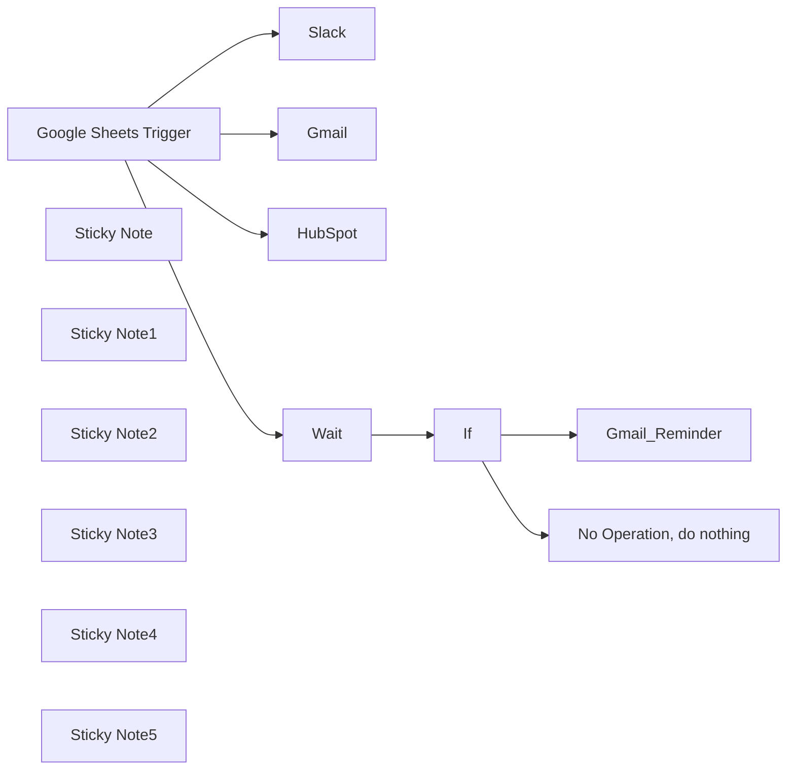

## Fluxo (.json) :

```json
{
  "id": "hmgR6wOkuqrn5y4Y",
  "meta": {
    "instanceId": "c00cfcf2a18f434f8525f50ae6b6f1f42bee7c1ab4c9447d323c2fc938100ee4",
    "templateCredsSetupCompleted": true
  },
  "name": "N_01_Simple_Lead_Tracker_Automation_v4",
  "tags": [],
  "nodes": [
    {
      "id": "a69ff573-797d-4a77-a831-940168046448",
      "name": "Google Sheets Trigger",
      "type": "n8n-nodes-base.googleSheetsTrigger",
      "position": [
        -720,
        300
      ],
      "parameters": {
        "options": {},
        "pollTimes": {
          "item": [
            {
              "mode": "everyMinute"
            }
          ]
        },
        "sheetName": {
          "__rl": true,
          "mode": "list",
          "value": 1001688681,
          "cachedResultUrl": "https://docs.google.com/spreadsheets/d/16xNeIG_QLUtOoFulbWemXrUAOKwxaHaGU7DywJLDiRk/edit#gid=1001688681",
          "cachedResultName": "Form Responses 1"
        },
        "documentId": {
          "__rl": true,
          "mode": "list",
          "value": "16xNeIG_QLUtOoFulbWemXrUAOKwxaHaGU7DywJLDiRk",
          "cachedResultUrl": "https://docs.google.com/spreadsheets/d/16xNeIG_QLUtOoFulbWemXrUAOKwxaHaGU7DywJLDiRk/edit?usp=drivesdk",
          "cachedResultName": "Simple Lead Tracker  (Responses)"
        }
      },
      "credentials": {
        "googleSheetsTriggerOAuth2Api": {
          "id": "JH9HQfSo1Q5lJsws",
          "name": "Google Sheets Trigger account"
        }
      },
      "typeVersion": 1
    },
    {
      "id": "ce9845a5-09da-44f9-b0c4-da380cf828d4",
      "name": "Slack",
      "type": "n8n-nodes-base.slack",
      "position": [
        20,
        120
      ],
      "webhookId": "e376c2f4-7894-48c0-a510-b2869bcff786",
      "parameters": {
        "text": "=🎯 *New Lead Alert!*\n\n*Name:* {{ $json['Name Surname'] }}\n*Email:* {{ $json['E-Mail'] }}\n*Phone:* {{$json[\"Phone\"]}}\n*Interest Level:* {{ $json['  Interest Level  '] }}\n*Source:* {{ $json['  Lead Source  '] }}\n\n📝 Notes:\n{{ $json['Notes '] }}",
        "select": "channel",
        "channelId": {
          "__rl": true,
          "mode": "list",
          "value": "C08FJNLQP5G",
          "cachedResultName": "test-automation-workflow"
        },
        "otherOptions": {},
        "authentication": "oAuth2"
      },
      "credentials": {
        "slackOAuth2Api": {
          "id": "vZxu6lKOBC6oOxHv",
          "name": "Slack account"
        }
      },
      "typeVersion": 2.3
    },
    {
      "id": "1c2b7aa2-6d30-4b88-ae36-f138fd98f02d",
      "name": "Gmail",
      "type": "n8n-nodes-base.gmail",
      "position": [
        20,
        320
      ],
      "webhookId": "8db2d0be-4071-431a-8c8b-28bbe3dd80a2",
      "parameters": {
        "sendTo": "dataplusminuss@gmail.com",
        "message": "=<h3>New Lead Received!</h3> \n<ul>   \n<li><strong>Name:</strong> {{ $json['Name Surname'] }}</li>   \n<li><strong>Email:</strong> {{ $json['E-Mail'] }}</li>   \n<li><strong>Phone:</strong> {{$json[\"Phone\"]}}</li>   \n<li><strong>Interest Level:</strong> {{ $json['  Interest Level  '] }}</li>   \n<li><strong>Source:</strong> {{ $json['  Lead Source  '] }}</li> \n</ul> \n<p><strong>Notes:</strong> {{ $json['Notes '] }}</p>",
        "options": {},
        "subject": "=📩 New Lead Received: {{ $json['Name Surname'] }}"
      },
      "credentials": {
        "gmailOAuth2": {
          "id": "1w8ruCKYBRBguMua",
          "name": "Gmail account"
        }
      },
      "typeVersion": 2.1
    },
    {
      "id": "4fa70ae1-efe9-4da4-8753-aff1540b3420",
      "name": "HubSpot",
      "type": "n8n-nodes-base.hubspot",
      "position": [
        -340,
        80
      ],
      "parameters": {
        "email": "={{ $json['E-Mail'] }}",
        "options": {},
        "authentication": "oAuth2",
        "additionalFields": {
          "message": "={{ $json['Notes '] }}",
          "salutation": "={{ $json['  Lead Source  '] }}",
          "phoneNumber": "={{ $json.Phone }}",
          "relationshipStatus": "={{ $json['  Interest Level  '] }}"
        }
      },
      "credentials": {
        "hubspotOAuth2Api": {
          "id": "iFc8JUTY3LS8wxFq",
          "name": "HubSpot account"
        }
      },
      "typeVersion": 2.1
    },
    {
      "id": "0cfe0651-5558-420d-8bc2-4ce49f9d2d9c",
      "name": "If",
      "type": "n8n-nodes-base.if",
      "position": [
        220,
        620
      ],
      "parameters": {
        "options": {},
        "conditions": {
          "options": {
            "version": 2,
            "leftValue": "",
            "caseSensitive": true,
            "typeValidation": "strict"
          },
          "combinator": "and",
          "conditions": [
            {
              "id": "3d4b99e0-4b1e-4dd1-8775-7e89042c43a8",
              "operator": {
                "type": "string",
                "operation": "exists",
                "singleValue": true
              },
              "leftValue": "={{ $json['Followed Up?'] }}",
              "rightValue": ""
            },
            {
              "id": "fe99deab-c331-46a2-8649-233600fcd36f",
              "operator": {
                "type": "string",
                "operation": "contains"
              },
              "leftValue": "={{ $json['  Interest Level  '] }}",
              "rightValue": "Hot"
            }
          ]
        }
      },
      "typeVersion": 2.2
    },
    {
      "id": "df1270cb-63e3-48a1-8334-a66b9d6b815e",
      "name": "No Operation, do nothing",
      "type": "n8n-nodes-base.noOp",
      "position": [
        440,
        720
      ],
      "parameters": {},
      "typeVersion": 1
    },
    {
      "id": "1999928c-954a-4a68-b4b3-8cfc649ff575",
      "name": "Gmail_Reminder",
      "type": "n8n-nodes-base.gmail",
      "position": [
        440,
        520
      ],
      "webhookId": "a6650ad1-7597-4b36-98f6-59e770de9166",
      "parameters": {
        "sendTo": "dataplusminuss@gmail.com",
        "message": "=<h3>🔔 The following lead has not been followed up yet! 🔥 Interest level is hot </h3>\n<ul>\n  <li><strong>Name:</strong> {{ $json['Name Surname'] }}</li>\n  <li><strong>Email:</strong> {{ $json['E-Mail'] }}</li>\n  <li><strong>Interest Level:</strong> {{ $json['  Interest Level  '] }}</li>\n</ul>\n<p><strong>Please follow up and update the spreadsheet ✅</p>\n\n",
        "options": {
          "senderName": "N_01_tester"
        },
        "subject": "⏰ *Follow-up Reminder!*"
      },
      "credentials": {
        "gmailOAuth2": {
          "id": "1w8ruCKYBRBguMua",
          "name": "Gmail account"
        }
      },
      "typeVersion": 2.1
    },
    {
      "id": "b0700cc4-06c7-4a97-8936-d1ff69b928e3",
      "name": "Wait",
      "type": "n8n-nodes-base.wait",
      "position": [
        0,
        620
      ],
      "webhookId": "04b4c335-c2a5-41b0-9f4c-65a98a41d39a",
      "parameters": {
        "unit": "minutes",
        "amount": 3
      },
      "typeVersion": 1.1
    },
    {
      "id": "08a15132-2abd-4efb-ae76-bb76903c0ede",
      "name": "Sticky Note",
      "type": "n8n-nodes-base.stickyNote",
      "position": [
        -1040,
        120
      ],
      "parameters": {
        "color": 6,
        "height": 460,
        "content": "# Lead Submission\n\n## A user submits a lead form via [Google Forms](https://forms.gle/VLhKeRySSWNKo2aR8).\n\n"
      },
      "typeVersion": 1
    },
    {
      "id": "c46e9941-82df-4ef5-82ba-d2c83b9342df",
      "name": "Sticky Note1",
      "type": "n8n-nodes-base.stickyNote",
      "position": [
        -780,
        460
      ],
      "parameters": {
        "color": 4,
        "height": 320,
        "content": "# Automation Trigger (n8n)\n\n## n8n detects the new entry in the sheet and initiates the automation workflow."
      },
      "typeVersion": 1
    },
    {
      "id": "7a47c74c-fb92-4752-a5bd-69af3c997cde",
      "name": "Sticky Note2",
      "type": "n8n-nodes-base.stickyNote",
      "position": [
        -780,
        -20
      ],
      "parameters": {
        "color": 4,
        "height": 280,
        "content": "# Data Logging\n## Responses are automatically recorded into a connected [Google Sheet](https://docs.google.com/spreadsheets/d/16xNeIG_QLUtOoFulbWemXrUAOKwxaHaGU7DywJLDiRk/edit?usp=sharing)."
      },
      "typeVersion": 1
    },
    {
      "id": "2f679e32-ae49-4572-9f71-d9fc6d6bbf58",
      "name": "Sticky Note3",
      "type": "n8n-nodes-base.stickyNote",
      "position": [
        -420,
        -20
      ],
      "parameters": {
        "width": 260,
        "height": 780,
        "content": "\n\n\n\n\n\n\n\n\n\n\n\n\n\n\n\n\n\n\n# CRM Integration\n\n## The lead is automatically added to HubSpot with relevant fields (name, email, phone, interest level, etc.)."
      },
      "typeVersion": 1
    },
    {
      "id": "ad2d923c-01de-4e9b-a8d7-ed1b4fcedf84",
      "name": "Sticky Note4",
      "type": "n8n-nodes-base.stickyNote",
      "position": [
        -20,
        -160
      ],
      "parameters": {
        "color": 3,
        "width": 460,
        "height": 640,
        "content": "# Notifications\n\n## Simultaneous alerts are sent via:\n\n## * Slack (to a specific channel)\n\n## * Gmail (to a designated inbox)"
      },
      "typeVersion": 1
    },
    {
      "id": "1750c844-5400-4334-a0f1-cf48b1b6baf6",
      "name": "Sticky Note5",
      "type": "n8n-nodes-base.stickyNote",
      "position": [
        640,
        460
      ],
      "parameters": {
        "color": 5,
        "width": 260,
        "height": 420,
        "content": "# Follow-up Tracking\n\n## A “Followed Up?” column in Google Sheets is used to track whether a lead has been contacted.\n\n\n### :warning: If empty after X days (e.g., 3), n8n sends a reminder notification."
      },
      "typeVersion": 1
    }
  ],
  "active": false,
  "pinData": {},
  "settings": {
    "executionOrder": "v1"
  },
  "versionId": "fe8e49f9-d7dc-47c5-bdfd-814f218e66f9",
  "connections": {
    "If": {
      "main": [
        [
          {
            "node": "Gmail_Reminder",
            "type": "main",
            "index": 0
          }
        ],
        [
          {
            "node": "No Operation, do nothing",
            "type": "main",
            "index": 0
          }
        ]
      ]
    },
    "Wait": {
      "main": [
        [
          {
            "node": "If",
            "type": "main",
            "index": 0
          }
        ]
      ]
    },
    "Google Sheets Trigger": {
      "main": [
        [
          {
            "node": "Slack",
            "type": "main",
            "index": 0
          },
          {
            "node": "Gmail",
            "type": "main",
            "index": 0
          },
          {
            "node": "HubSpot",
            "type": "main",
            "index": 0
          },
          {
            "node": "Wait",
            "type": "main",
            "index": 0
          }
        ]
      ]
    }
  }
}
```

<a id="template-1567"></a>

## Template 1567 - Geração de imagem por IA e upload para Drive

- **Nome:** Geração de imagem por IA e upload para Drive
- **Descrição:** Gera uma imagem a partir de um prompt usando o serviço Fal AI Flux e salva o arquivo resultante em uma pasta do Google Drive.
- **Funcionalidade:** • Geração de imagem por prompt: Envia um prompt e parâmetros de imagem ao serviço de IA para criar uma imagem.
• Controle de parâmetros: Permite configurar largura, altura, número de passos (inference steps) e escala de orientação (guidance scale).
• Habilitação de verificação de segurança: Ativa o safety checker na requisição de geração de imagem.
• Autenticação via cabeçalho HTTP: Utiliza chave de API no cabeçalho para autenticar as requisições ao serviço de geração.
• Verificação assíncrona do status: Realiza polling com espera entre tentativas até a requisição ser marcada como COMPLETED.
• Download do resultado: Obtém a URL retornada pelo serviço e faz o download do arquivo de imagem.
• Upload para armazenamento em nuvem: Envia automaticamente a imagem baixada para uma pasta específica no Google Drive.
• Trigger manual para testes: Permite disparar o fluxo manualmente com parâmetros pré-definidos para teste.
- **Ferramentas:** • Fal AI Flux API: Serviço de geração de imagens por IA usado para criar imagens a partir de prompts e parâmetros (endpoint de fila de processamento).
• Google Drive: Serviço de armazenamento em nuvem usado para salvar as imagens geradas em uma pasta específica.

## Fluxo visual

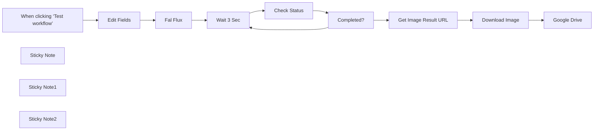

## Fluxo (.json) :

```json
{
  "id": "nJwkSOrJIFvutw1n",
  "meta": {
    "instanceId": "08daa2aa5b6032ff63690600b74f68f5b0f34a3b100102e019b35c4419168977"
  },
  "name": "Flux Dev Image Generation Fal.ai",
  "tags": [],
  "nodes": [
    {
      "id": "00f3a7d9-9931-40a4-8eb5-5b9086d6995c",
      "name": "Fal Flux",
      "type": "n8n-nodes-base.httpRequest",
      "position": [
        420,
        0
      ],
      "parameters": {
        "url": "https://queue.fal.run/fal-ai/flux/dev",
        "method": "POST",
        "options": {},
        "jsonBody": "={\n  \"prompt\": \"{{ $json.Prompt }}\",\n  \"image_size\": {\n  \"width\": {{ $json.Width }},\n  \"height\": {{ $json.Height }}\n},\n  \"num_inference_steps\": {{ $json.Steps }},\n  \"guidance_scale\": {{ $json.Guidance }},\n  \"num_images\": 1,\n  \"enable_safety_checker\": true\n}",
        "sendBody": true,
        "specifyBody": "json",
        "authentication": "genericCredentialType",
        "genericAuthType": "httpHeaderAuth"
      },
      "credentials": {
        "httpHeaderAuth": {
          "id": "lNxvZHlUafPAHBYN",
          "name": "Fal Flux Header Auth account"
        }
      },
      "typeVersion": 4.2
    },
    {
      "id": "3032a543-2e21-415e-a5bd-d56ea33e4411",
      "name": "Get Image Result URL",
      "type": "n8n-nodes-base.httpRequest",
      "position": [
        1220,
        -20
      ],
      "parameters": {
        "url": "=https://queue.fal.run/fal-ai/flux/requests/{{ $json.request_id }}",
        "options": {},
        "authentication": "genericCredentialType",
        "genericAuthType": "httpHeaderAuth"
      },
      "credentials": {
        "httpHeaderAuth": {
          "id": "lNxvZHlUafPAHBYN",
          "name": "Fal Flux Header Auth account"
        }
      },
      "typeVersion": 4.2
    },
    {
      "id": "56e13e53-1697-4970-9bea-b75e0e849425",
      "name": "Download Image",
      "type": "n8n-nodes-base.httpRequest",
      "position": [
        1400,
        -20
      ],
      "parameters": {
        "url": "={{ $json.images[0].url }}",
        "options": {}
      },
      "typeVersion": 4.2
    },
    {
      "id": "dd2efd2c-8712-4a77-8786-cccebdec876b",
      "name": "Google Drive",
      "type": "n8n-nodes-base.googleDrive",
      "position": [
        1580,
        -20
      ],
      "parameters": {
        "name": "={{ $binary.data.fileName }}",
        "driveId": {
          "__rl": true,
          "mode": "list",
          "value": "My Drive"
        },
        "options": {},
        "folderId": {
          "__rl": true,
          "mode": "list",
          "value": "1R3PSyHXWHlY9DRFdOUEAPEop2fZy-_-K",
          "cachedResultUrl": "https://drive.google.com/drive/folders/1R3PSyHXWHlY9DRFdOUEAPEop2fZy-_-K",
          "cachedResultName": "Flux Image"
        }
      },
      "credentials": {
        "googleDriveOAuth2Api": {
          "id": "CFiX9XTXGg4hGaGV",
          "name": "Google Drive account"
        }
      },
      "typeVersion": 3
    },
    {
      "id": "a598d868-0461-41fc-b6aa-f9998e9d6146",
      "name": "When clicking ‘Test workflow’",
      "type": "n8n-nodes-base.manualTrigger",
      "position": [
        -60,
        0
      ],
      "parameters": {},
      "typeVersion": 1
    },
    {
      "id": "a576d7b6-b2f3-4d53-8e7f-bb6449ff9c64",
      "name": "Sticky Note",
      "type": "n8n-nodes-base.stickyNote",
      "position": [
        80,
        -120
      ],
      "parameters": {
        "width": 260,
        "height": 120,
        "content": "## Set Parameter Here \nset Image Prompt and related settings"
      },
      "typeVersion": 1
    },
    {
      "id": "d39e85a8-3ddd-4f10-ba4c-beb86a850e10",
      "name": "Wait 3 Sec",
      "type": "n8n-nodes-base.wait",
      "position": [
        640,
        0
      ],
      "webhookId": "61a8626c-e281-4d4b-abb0-b9d87d1b4e7c",
      "parameters": {
        "amount": 3
      },
      "typeVersion": 1.1
    },
    {
      "id": "b27ac2f1-3f14-467e-81c4-af8b8fb37138",
      "name": "Check Status",
      "type": "n8n-nodes-base.httpRequest",
      "position": [
        840,
        0
      ],
      "parameters": {
        "url": "=https://queue.fal.run/fal-ai/flux/requests/{{ $json.request_id }}/status",
        "options": {},
        "authentication": "genericCredentialType",
        "genericAuthType": "httpHeaderAuth"
      },
      "credentials": {
        "httpHeaderAuth": {
          "id": "lNxvZHlUafPAHBYN",
          "name": "Fal Flux Header Auth account"
        }
      },
      "typeVersion": 4.2
    },
    {
      "id": "7ee45dab-8e31-44de-bbb1-e99a565ee19c",
      "name": "Completed?",
      "type": "n8n-nodes-base.if",
      "position": [
        1020,
        0
      ],
      "parameters": {
        "options": {},
        "conditions": {
          "options": {
            "version": 2,
            "leftValue": "",
            "caseSensitive": true,
            "typeValidation": "strict"
          },
          "combinator": "and",
          "conditions": [
            {
              "id": "299a7c34-dcff-4991-a73f-5b1a84f188ea",
              "operator": {
                "name": "filter.operator.equals",
                "type": "string",
                "operation": "equals"
              },
              "leftValue": "={{ $json.status }}",
              "rightValue": "COMPLETED"
            }
          ]
        }
      },
      "typeVersion": 2.2
    },
    {
      "id": "c5036a7d-1879-449f-8ce9-9c1cf2c7426b",
      "name": "Sticky Note1",
      "type": "n8n-nodes-base.stickyNote",
      "position": [
        1300,
        -100
      ],
      "parameters": {
        "width": 220,
        "height": 100,
        "content": "## Set Drive Folder Here "
      },
      "typeVersion": 1
    },
    {
      "id": "c8887168-6234-486c-b7cb-cc0752c6341c",
      "name": "Sticky Note2",
      "type": "n8n-nodes-base.stickyNote",
      "position": [
        360,
        -180
      ],
      "parameters": {
        "width": 260,
        "height": 180,
        "content": "### Generic Credential Type\n### Header : Authorization\nKey $FAL_KEY\"\n\nfor example:\nKey 6f2960baxxxxxxxxx"
      },
      "typeVersion": 1
    },
    {
      "id": "587043c4-e808-4c3f-910f-60f5eb8aff15",
      "name": "Edit Fields",
      "type": "n8n-nodes-base.set",
      "position": [
        180,
        0
      ],
      "parameters": {
        "options": {},
        "assignments": {
          "assignments": [
            {
              "id": "f0a033cf-fa2b-4930-93b9-ff9c45fa7c14",
              "name": "Prompt",
              "type": "string",
              "value": "Thai young woman net idol 25 yrs old, walking on the street"
            },
            {
              "id": "2b56185d-5c61-4c17-85f1-53ac4aab2b18",
              "name": "Width",
              "type": "number",
              "value": 1024
            },
            {
              "id": "51eb65c0-ae0a-4ce7-ab00-9d13f05ce1e6",
              "name": "Height",
              "type": "number",
              "value": 768
            },
            {
              "id": "8e89fca7-d380-4876-b973-69caa0394bc5",
              "name": "Steps",
              "type": "number",
              "value": 30
            },
            {
              "id": "875e06b7-352a-4dde-8595-3274e9969c9c",
              "name": "Guidance",
              "type": "number",
              "value": 3.5
            }
          ]
        }
      },
      "typeVersion": 3.4
    }
  ],
  "active": false,
  "pinData": {},
  "settings": {
    "executionOrder": "v1"
  },
  "versionId": "82877b10-5bbc-4c59-828b-4abc3ad53a5f",
  "connections": {
    "Fal Flux": {
      "main": [
        [
          {
            "node": "Wait 3 Sec",
            "type": "main",
            "index": 0
          }
        ]
      ]
    },
    "Completed?": {
      "main": [
        [
          {
            "node": "Get Image Result URL",
            "type": "main",
            "index": 0
          }
        ],
        [
          {
            "node": "Wait 3 Sec",
            "type": "main",
            "index": 0
          }
        ]
      ]
    },
    "Wait 3 Sec": {
      "main": [
        [
          {
            "node": "Check Status",
            "type": "main",
            "index": 0
          }
        ]
      ]
    },
    "Edit Fields": {
      "main": [
        [
          {
            "node": "Fal Flux",
            "type": "main",
            "index": 0
          }
        ]
      ]
    },
    "Check Status": {
      "main": [
        [
          {
            "node": "Completed?",
            "type": "main",
            "index": 0
          }
        ]
      ]
    },
    "Download Image": {
      "main": [
        [
          {
            "node": "Google Drive",
            "type": "main",
            "index": 0
          }
        ]
      ]
    },
    "Get Image Result URL": {
      "main": [
        [
          {
            "node": "Download Image",
            "type": "main",
            "index": 0
          }
        ]
      ]
    },
    "When clicking ‘Test workflow’": {
      "main": [
        [
          {
            "node": "Edit Fields",
            "type": "main",
            "index": 0
          }
        ]
      ]
    }
  }
}
```

<a id="template-1569"></a>

## Template 1569 - Verificação em massa de disponibilidade de domínios

- **Nome:** Verificação em massa de disponibilidade de domínios
- **Descrição:** Fluxo para verificar em lote a disponibilidade de uma lista de domínios usando a API do Namesilo e exportar os resultados em Excel.
- **Funcionalidade:** • Entrada de domínios em bloco: Recebe uma lista de domínios separados por quebras de linha.
• Configuração de chave API: Permite definir a chave da API do Namesilo para autenticação.
• Divisão em lotes: Agrupa os domínios em lotes de até 200 domínios por requisição.
• Consultas à API Namesilo: Envia requisições em lote para verificar disponibilidade de domínios.
• Controle de taxa/espera: Aguarda um período entre loops (configurado em minutos) para respeitar limites de taxa.
• Re-tentativa em falhas: Re-tenta requisições que falham, com intervalo entre tentativas.
• Parsing e normalização: Interpreta a resposta da API e normaliza em registros com domínio e status (Available/Unavailable).
• Agregação de resultados: Une os resultados de todos os lotes em uma tabela consolidada.
• Exportação para Excel: Converte os resultados agregados para um arquivo XLSX pronto para download.
- **Ferramentas:** • NameSilo API: Serviço de registro/consulta de domínios usado para checar disponibilidade em lote.
• Formato Excel (XLSX): Formato de arquivo gerado para armazenar e compartilhar os resultados.

## Fluxo visual

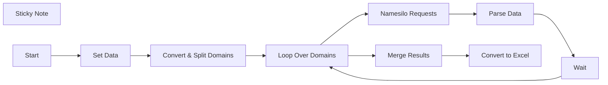

## Fluxo (.json) :

```json
{
  "id": "phqg5Kk3YowxoMHQ",
  "meta": {
    "instanceId": "3b02b4d565b70d8766b64aa225626d46b11a527d9f5fe390a8405f2a09e8b8a4"
  },
  "name": "Namesilo Bulk Domain Availability [Template]",
  "tags": [
    {
      "id": "28jVdgW1S4XWqLH4",
      "name": "Templates",
      "createdAt": "2025-02-28T12:22:07.921Z",
      "updatedAt": "2025-02-28T12:22:07.921Z"
    }
  ],
  "nodes": [
    {
      "id": "b1184b35-0ab4-42d8-a5b2-66ef926d7eed",
      "name": "Set Data",
      "type": "n8n-nodes-base.set",
      "position": [
        -240,
        0
      ],
      "parameters": {
        "options": {},
        "assignments": {
          "assignments": [
            {
              "id": "05a34cf0-9462-4684-aac8-32b4b17e9ef0",
              "name": "Domains",
              "type": "string",
              "value": "=domain1.com\ndomain2.com\ndomain3.com"
            },
            {
              "id": "438830f9-27fe-4e89-bcb9-766483e2d9b1",
              "name": "Namesilo API Key",
              "type": "string",
              "value": "YOUR_API_KEY"
            }
          ]
        }
      },
      "typeVersion": 3.4
    },
    {
      "id": "7fc40d31-a43b-4273-a6eb-d519fda815d4",
      "name": "Sticky Note",
      "type": "n8n-nodes-base.stickyNote",
      "position": [
        -800,
        -340
      ],
      "parameters": {
        "width": 580,
        "height": 280,
        "content": "## How-To\n1. Claim your free Namesilo API key here: https://www.namesilo.com/account/api-manager\n\n2. Set your API key and domains in \"Set Data\" node.\n\nThe workflow send up to 200 domains per loop until all domains are processed. The output is in Excel format.\n\nEnjoy!\n\nNote: Each loop wait 5min. This is required due to Namesilo rate limits."
      },
      "typeVersion": 1
    },
    {
      "id": "a2137f76-9e08-4743-b914-b10bbebc9a13",
      "name": "Convert & Split Domains",
      "type": "n8n-nodes-base.code",
      "position": [
        -60,
        0
      ],
      "parameters": {
        "jsCode": "// Get domains from input JSON\nconst domains = $json.Domains.split(\"\\n\").map(domain => domain.trim()).filter(Boolean);\n\n// Define batch size\nconst batchSize = 200;\n\n// Split into batches of 200\nlet batches = [];\nfor (let i = 0; i < domains.length; i += batchSize) {\n    batches.push(domains.slice(i, i + batchSize).join(\",\"));\n}\n\n// Return batches as an array\nreturn batches.map(batch => ({ batchedDomains: batch }));"
      },
      "typeVersion": 2
    },
    {
      "id": "41140017-1f98-4ea9-ac97-9d48e5bdfda1",
      "name": "Wait",
      "type": "n8n-nodes-base.wait",
      "position": [
        680,
        -200
      ],
      "webhookId": "3ede79a2-7875-462f-b15a-1c74339e2a8a",
      "parameters": {
        "unit": "minutes"
      },
      "typeVersion": 1.1
    },
    {
      "id": "9aa9ddb5-9091-4726-917c-bce9d0f207c9",
      "name": "Merge Results",
      "type": "n8n-nodes-base.code",
      "position": [
        320,
        0
      ],
      "parameters": {
        "jsCode": "// This re-maps each input item (if needed)\nconst newItems = items.map(item => ({\n  json: {\n    Domain: item.json.Domain,\n    Availability: item.json.Availability\n  }\n}));\n\nreturn newItems;"
      },
      "typeVersion": 2
    },
    {
      "id": "bb2fd210-fd11-4712-94d0-fabb7060705c",
      "name": "Loop Over Domains",
      "type": "n8n-nodes-base.splitInBatches",
      "position": [
        120,
        0
      ],
      "parameters": {
        "options": {}
      },
      "typeVersion": 3
    },
    {
      "id": "5d97cd82-f7d5-4f98-a789-8c0fcf473f0f",
      "name": "Namesilo Requests",
      "type": "n8n-nodes-base.httpRequest",
      "position": [
        320,
        -200
      ],
      "parameters": {
        "url": "=https://www.namesilo.com/apibatch/checkRegisterAvailability?version=1&type=json&key={{ $('Set Data').item.json['Namesilo API Key'] }}&domains={{ $json.batchedDomains }}",
        "options": {}
      },
      "retryOnFail": true,
      "typeVersion": 4.2,
      "waitBetweenTries": 5000
    },
    {
      "id": "c4f38893-636a-4293-9e10-395be30683d0",
      "name": "Parse Data",
      "type": "n8n-nodes-base.code",
      "position": [
        500,
        -200
      ],
      "parameters": {
        "jsCode": "// Ensure input data exists\nif (!$json || !$json.data) {\n    throw new Error(\"Invalid input data format\");\n}\n\n// Parse the JSON string inside `data`\nlet parsedData;\ntry {\n    parsedData = JSON.parse($json.data);\n} catch (error) {\n    throw new Error(\"Error parsing JSON data: \" + error.message);\n}\n\n// Extract available and unavailable domains safely\nconst availableDomains = parsedData.reply?.available ? Object.values(parsedData.reply.available) : [];\nconst unavailableDomains = parsedData.reply?.unavailable ? Object.values(parsedData.reply.unavailable) : [];\n\n// Prepare the output array\nconst output = [];\n\n// Process available domains\navailableDomains.forEach(domainObj => {\n    if (domainObj && domainObj.domain) {\n        output.push({\n            Domain: domainObj.domain,\n            Availability: \"Available\"\n        });\n    }\n});\n\n// Process unavailable domains\nunavailableDomains.forEach(domain => {\n    if (typeof domain === \"string\") {\n        output.push({\n            Domain: domain,\n            Availability: \"Unavailable\"\n        });\n    } else if (typeof domain === \"object\" && domain.domain) {\n        output.push({\n            Domain: domain.domain,\n            Availability: \"Unavailable\"\n        });\n    }\n});\n\n// Return the structured data\nreturn output;"
      },
      "typeVersion": 2
    },
    {
      "id": "ec7b8311-65b7-45b0-85ae-b91d7c82e123",
      "name": "Convert to Excel",
      "type": "n8n-nodes-base.convertToFile",
      "position": [
        500,
        0
      ],
      "parameters": {
        "options": {
          "fileName": "domain_results.xlsx"
        },
        "operation": "xlsx",
        "binaryPropertyName": "={{ $json.MergedDomains }}"
      },
      "typeVersion": 1.1
    },
    {
      "id": "7d33c875-ce2d-404c-97a0-f551939d59f4",
      "name": "Start",
      "type": "n8n-nodes-base.manualTrigger",
      "position": [
        -420,
        0
      ],
      "parameters": {},
      "typeVersion": 1
    }
  ],
  "active": false,
  "pinData": {},
  "settings": {
    "executionOrder": "v1"
  },
  "versionId": "1a05d4b0-db0c-4554-8abf-0547130be16c",
  "connections": {
    "Wait": {
      "main": [
        [
          {
            "node": "Loop Over Domains",
            "type": "main",
            "index": 0
          }
        ]
      ]
    },
    "Start": {
      "main": [
        [
          {
            "node": "Set Data",
            "type": "main",
            "index": 0
          }
        ]
      ]
    },
    "Set Data": {
      "main": [
        [
          {
            "node": "Convert & Split Domains",
            "type": "main",
            "index": 0
          }
        ]
      ]
    },
    "Parse Data": {
      "main": [
        [
          {
            "node": "Wait",
            "type": "main",
            "index": 0
          }
        ]
      ]
    },
    "Merge Results": {
      "main": [
        [
          {
            "node": "Convert to Excel",
            "type": "main",
            "index": 0
          }
        ]
      ]
    },
    "Loop Over Domains": {
      "main": [
        [
          {
            "node": "Merge Results",
            "type": "main",
            "index": 0
          }
        ],
        [
          {
            "node": "Namesilo Requests",
            "type": "main",
            "index": 0
          }
        ]
      ]
    },
    "Namesilo Requests": {
      "main": [
        [
          {
            "node": "Parse Data",
            "type": "main",
            "index": 0
          }
        ]
      ]
    },
    "Convert & Split Domains": {
      "main": [
        [
          {
            "node": "Loop Over Domains",
            "type": "main",
            "index": 0
          }
        ]
      ]
    }
  }
}
```

<a id="template-1571"></a>

## Template 1571 - Automação de prospecção e enriquecimento de leads LinkedIn

- **Nome:** Automação de prospecção e enriquecimento de leads LinkedIn
- **Descrição:** Fluxo que encontra leads no LinkedIn a partir de um ICP, armazena-os numa planilha, enriquece com dados de empresa e atividade, pontua prioridades e automatiza convites e mensagens.
- **Funcionalidade:** • Conversão de ICP em filtros de busca: um agente de IA transforma a descrição do perfil ideal em parâmetros para buscas no LinkedIn Sales Navigator.
• Busca de leads no LinkedIn: pesquisa e coleta de perfis usando os filtros gerados.
• Persistência em planilha: grava e atualiza leads em Google Sheets com campos de controle (URN, URL, empresa, etc.).
• Enriquecimento de empresa: procura site da empresa, obtém sitemap e extrai conteúdo relevante do site para resumo de produtos/serviços.
• Coleta e sumarização de posts: agrega publicações do lead e da empresa e gera resumos através de modelo de linguagem.
• Busca e resumo de notícias: pesquisa web por notícias/press releases da empresa e gera resumo.
• Pontuação de leads (Lead Score): avalia potencial de interesse (1–10) por critérios definidos usando LLM.
• Controle de fluxo e lotes: processamento em lotes, limites configuráveis e tentativas/retries para estabilidade.
• Automação de conexão e mensagens: envia pedidos de conexão e mensagens automatizadas, atualizando o estado na planilha (Contact Request, Connected, Message Sent).
• Agendamento e monitoramento: execução programada para verificar conexões, pontuar e enviar ações conforme cronograma.
- **Ferramentas:** • OpenAI (modelo GPT-4o): usada como agente de IA e para gerar resumos, transformar ICP em filtros e pontuar leads.
• Google Sheets: armazena, atualiza e controla o estado dos leads e enriquecimentos.
• Horizon DataWave (HDW) LinkedIn API: realiza buscas no LinkedIn, obtém perfis, posts, envia conexões e mensagens.
• HDW Web Parser / Site-mapper: obtém sitemap e faz parsing de páginas do site da empresa para extração de informação.
• Pesquisa web (Google Search via integração): utilizada para localizar site da empresa e notícias/publicações externas.

## Fluxo visual

```mermaid
flowchart LR
    N1["When chat message received"]
    N2["OpenAI Chat Model"]
    N3["Simple Memory"]
    N4["Structured Output Parser"]
    N5["Google Sheets"]
    N6["Google Sheets1"]
    N7["Google Sheets2"]
    N8["Loop Over Items"]
    N9["Sticky Note"]
    N10["Sticky Note1"]
    N11["Sticky Note2"]
    N12["Sticky Note3"]
    N13["Sticky Note4"]
    N14["Sticky Note5"]
    N15["Sticky Note6"]
    N16["Sticky Note7"]
    N17["HDW LinkedIn SN"]
    N18["HDW Get Company Website"]
    N19["Google Sheets3"]
    N20["Loop Over Items1"]
    N21["Google Sheets4"]
    N22["HDW Get User Posts"]
    N23["Aggregate"]
    N24["Loop Over Items2"]
    N25["Google Sheets5"]
    N26["Google Sheets6"]
    N27["Aggregate1"]
    N28["Loop Over Items3"]
    N29["Google Sheets7"]
    N30["Google Sheets8"]
    N31["Aggregate2"]
    N32["Loop Over Items4"]
    N33["Google Sheets9"]
    N34["HDW Get Company News"]
    N35["HDW Get Company Posts"]
    N36["Loop Over Items5"]
    N37["Split Out"]
    N38["OpenAI Chat Model1"]
    N39["Google Sheets10"]
    N40["HDW Site-map"]
    N41["HDW Parser"]
    N42["Summarise user posts"]
    N43["Summarise company news"]
    N44["Summarise company posts"]
    N45["Summarise company website"]
    N46["Google Sheets11"]
    N47["Loop Over Items6"]
    N48["Google Sheets12"]
    N49["Google Sheets13"]
    N50["Sort"]
    N51["If2"]
    N52["Limit"]
    N53["Loop Over Items7"]
    N54["Google Sheets14"]
    N55["Google Sheets15"]
    N56["Google Sheets16"]
    N57["Google Sheets17"]
    N58["Loop Over Items8"]
    N59["HDW LinkedIn Send Message"]
    N60["Schedule Trigger"]
    N61["Schedule Trigger1"]
    N62["Sticky Note8"]
    N63["Sticky Note9"]
    N64["Sticky Note10"]
    N65["Sticky Note11"]
    N66["Sticky Note12"]
    N67["Sticky Note13"]
    N68["Sticky Note14"]
    N69["Sticky Note15"]
    N70["Sticky Note16"]
    N71["Sticky Note17"]
    N72["Sticky Note18"]
    N73["Sticky Note19"]
    N74["Sticky Note20"]
    N75["When clicking ‘Test workflow’"]
    N76["HDW Get LinkedIn Profile Connections"]
    N77["HDW Send LinkedIn Connection"]
    N78["AI Agent: ICP -> LinkedIn search filters"]
    N79["Company name is not empty"]
    N80["Website is not empty"]
    N81["Post summary is empty"]
    N82["Company news is empty"]
    N83["Company post is empty"]
    N84["Lead Score is empty"]
    N85["Company Score Analysis"]
    N86["Split LinkedIn connections to items"]
    N87["5s"]
    N88["Company name is not empty1"]
    N89["Google Sheets18"]
    N90["Loop Over Items9"]
    N91["HDW Get Company Website1"]
    N92["Google Sheets19"]

    N87 --> N59
    N51 --> N52
    N50 --> N51
    N52 --> N53
    N23 --> N42
    N37 --> N36
    N27 --> N43
    N31 --> N44
    N5 --> N6
    N6 --> N79
    N7 --> N8
    N19 --> N80
    N21 --> N81
    N25 --> N24
    N26 --> N82
    N29 --> N28
    N30 --> N83
    N33 --> N32
    N39 --> N20
    N46 --> N84
    N48 --> N47
    N49 --> N50
    N54 --> N53
    N55 --> N56
    N56 --> N58
    N57 --> N58
    N89 --> N90
    N92 --> N88
    N17 --> N36
    N8 --> N92
    N8 --> N18
    N20 --> N21
    N20 --> N45
    N24 --> N26
    N24 --> N22
    N28 --> N30
    N28 --> N34
    N32 --> N46
    N32 --> N35
    N36 --> N5
    N36 --> N17
    N47 --> N49
    N47 --> N85
    N53 --> N77
    N58 --> N87
    N90 --> N19
    N90 --> N91
    N60 --> N49
    N61 --> N76
    N22 --> N23
    N84 --> N47
    N34 --> N27
    N42 --> N25
    N80 --> N20
    N82 --> N28
    N83 --> N32
    N35 --> N31
    N81 --> N24
    N85 --> N48
    N43 --> N29
    N18 --> N7
    N44 --> N33
    N91 --> N89
    N79 --> N8
    N59 --> N57
    N45 --> N39
    N88 --> N90
    N1 --> N78
    N77 --> N54
    N86 --> N55
    N76 --> N86
    N78 --> N37
```

## Fluxo (.json) :

```json
{
  "id": "piapgd2e6zmzFxAq",
  "meta": {
    "instanceId": "81e51e738261a40c0e64dd3936c24cbb416bdb576f8302713e8725b56c039235",
    "templateCredsSetupCompleted": true
  },
  "name": "HDW Lead Geländewagen",
  "tags": [],
  "nodes": [
    {
      "id": "8fab1dcf-f454-4155-be32-a4e007a79ab0",
      "name": "When chat message received",
      "type": "@n8n/n8n-nodes-langchain.chatTrigger",
      "position": [
        -540,
        280
      ],
      "webhookId": "77186e98-b103-4ac7-962b-fcae8180f982",
      "parameters": {
        "options": {}
      },
      "typeVersion": 1.1
    },
    {
      "id": "c4791561-6919-46a9-8ee0-4328aac9bfa0",
      "name": "OpenAI Chat Model",
      "type": "@n8n/n8n-nodes-langchain.lmChatOpenAi",
      "position": [
        -260,
        520
      ],
      "parameters": {
        "model": {
          "__rl": true,
          "mode": "list",
          "value": "gpt-4o",
          "cachedResultName": "gpt-4o"
        },
        "options": {}
      },
      "credentials": {
        "openAiApi": {
          "id": "ul99SH6843ii6CQj",
          "name": "OpenAi account"
        }
      },
      "typeVersion": 1.2
    },
    {
      "id": "c82903df-8b58-4789-987a-116c11c78215",
      "name": "Simple Memory",
      "type": "@n8n/n8n-nodes-langchain.memoryBufferWindow",
      "position": [
        -120,
        520
      ],
      "parameters": {},
      "typeVersion": 1.3
    },
    {
      "id": "c65f5035-804f-4e50-948e-ab863e800393",
      "name": "Structured Output Parser",
      "type": "@n8n/n8n-nodes-langchain.outputParserStructured",
      "notes": "For changing limits use \"count\"",
      "position": [
        20,
        520
      ],
      "parameters": {
        "jsonSchemaExample": "[\n  {\n    \"salesNavigatorParams\": {\n      \"keywords\": \"additional keywords important to search but not mentioned in other fields\",\n      \"current_titles\": \"title1, title2\",\n      \"current_companies\": \"company1, company2\",\n      \"location\": \"location1\",\n      \"industry\": \"industry1\",\n      \"company_sizes\": [\"Self-employed\", \"1-10\", \"11-50\", \"51-200\", \"201-500\", \"501-1,000\", \"1,001-5,000\", \"5,001-10,000\", \"10,001+\"]\n    },\n    \"count\": 50\n  },\n  {\n    \"salesNavigatorParams\": {\n      \"keywords\": \"additional keywords important to search but not mentioned in other fields\",\n      \"current_titles\": \"title1, title2\",\n      \"current_companies\": \"company1, company2\",\n      \"location\": \"location2\",\n      \"industry\": \"industry2\",\n      \"company_sizes\": [\"Self-employed\", \"1-10\", \"11-50\", \"51-200\", \"201-500\", \"501-1,000\", \"1,001-5,000\", \"5,001-10,000\", \"10,001+\"]\n    },\n    \"count\": 50\n  }\n]"
      },
      "notesInFlow": true,
      "typeVersion": 1.2
    },
    {
      "id": "fd939b62-927d-4532-96cd-36e91fdc2835",
      "name": "Google Sheets",
      "type": "n8n-nodes-base.googleSheets",
      "position": [
        680,
        140
      ],
      "parameters": {
        "columns": {
          "value": {
            "URL": "={{ $json.url }}",
            "URN": "={{ $json.urn.type }}:{{ $json.urn.value }}",
            "img": "={{ $json.image }}",
            "Date": "={{ $json.current_companies[0].joined }}",
            "Name": "={{ $json.name }}",
            "Headline": "={{ $json.headline }}",
            "Industry": "={{ $json.current_companies[0].company.industry }}",
            "Position": "={{ $json.current_companies[0].position }}",
            "location": "={{ $json.location }}",
            "is premium": "={{ $json.is_premium }}",
            "Company URN": "={{ $json.current_companies[0].company.urn.type }}:{{ $json.current_companies[0].company.urn.value }}",
            "Description": "={{ $json.current_companies[0].description }}",
            "Current company": "={{ $json.current_companies[0].company.name }}"
          },
          "schema": [
            {
              "id": "Name",
              "type": "string",
              "display": true,
              "removed": false,
              "required": false,
              "displayName": "Name",
              "defaultMatch": false,
              "canBeUsedToMatch": true
            },
            {
              "id": "URN",
              "type": "string",
              "display": true,
              "removed": false,
              "required": false,
              "displayName": "URN",
              "defaultMatch": false,
              "canBeUsedToMatch": true
            },
            {
              "id": "URL",
              "type": "string",
              "display": true,
              "removed": false,
              "required": false,
              "displayName": "URL",
              "defaultMatch": false,
              "canBeUsedToMatch": true
            },
            {
              "id": "img",
              "type": "string",
              "display": true,
              "removed": false,
              "required": false,
              "displayName": "img",
              "defaultMatch": false,
              "canBeUsedToMatch": true
            },
            {
              "id": "Headline",
              "type": "string",
              "display": true,
              "removed": false,
              "required": false,
              "displayName": "Headline",
              "defaultMatch": false,
              "canBeUsedToMatch": true
            },
            {
              "id": "location",
              "type": "string",
              "display": true,
              "removed": false,
              "required": false,
              "displayName": "location",
              "defaultMatch": false,
              "canBeUsedToMatch": true
            },
            {
              "id": "is premium",
              "type": "string",
              "display": true,
              "removed": false,
              "required": false,
              "displayName": "is premium",
              "defaultMatch": false,
              "canBeUsedToMatch": true
            },
            {
              "id": "Current company",
              "type": "string",
              "display": true,
              "removed": false,
              "required": false,
              "displayName": "Current company",
              "defaultMatch": false,
              "canBeUsedToMatch": true
            },
            {
              "id": "Company URN",
              "type": "string",
              "display": true,
              "removed": false,
              "required": false,
              "displayName": "Company URN",
              "defaultMatch": false,
              "canBeUsedToMatch": true
            },
            {
              "id": "URL",
              "type": "string",
              "display": true,
              "removed": false,
              "required": false,
              "displayName": "URL",
              "defaultMatch": false,
              "canBeUsedToMatch": true
            },
            {
              "id": "Industry",
              "type": "string",
              "display": true,
              "removed": false,
              "required": false,
              "displayName": "Industry",
              "defaultMatch": false,
              "canBeUsedToMatch": true
            },
            {
              "id": "Position",
              "type": "string",
              "display": true,
              "removed": false,
              "required": false,
              "displayName": "Position",
              "defaultMatch": false,
              "canBeUsedToMatch": true
            },
            {
              "id": "Description",
              "type": "string",
              "display": true,
              "removed": false,
              "required": false,
              "displayName": "Description",
              "defaultMatch": false,
              "canBeUsedToMatch": true
            },
            {
              "id": "Date",
              "type": "string",
              "display": true,
              "removed": false,
              "required": false,
              "displayName": "Date",
              "defaultMatch": false,
              "canBeUsedToMatch": true
            },
            {
              "id": "Website",
              "type": "string",
              "display": true,
              "removed": false,
              "required": false,
              "displayName": "Website",
              "defaultMatch": false,
              "canBeUsedToMatch": true
            }
          ],
          "mappingMode": "defineBelow",
          "matchingColumns": [
            "URN"
          ],
          "attemptToConvertTypes": false,
          "convertFieldsToString": false
        },
        "options": {},
        "operation": "appendOrUpdate",
        "sheetName": {
          "__rl": true,
          "mode": "list",
          "value": "gid=0",
          "cachedResultUrl": "https://docs.google.com/spreadsheets/d/19n84gbJPp-VmAUz6fElLSQcMajh5btPvI7Lhf20u7hs/edit#gid=0",
          "cachedResultName": "Sheet1"
        },
        "documentId": {
          "__rl": true,
          "mode": "list",
          "value": "19n84gbJPp-VmAUz6fElLSQcMajh5btPvI7Lhf20u7hs",
          "cachedResultUrl": "https://docs.google.com/spreadsheets/d/19n84gbJPp-VmAUz6fElLSQcMajh5btPvI7Lhf20u7hs/edit?usp=drivesdk",
          "cachedResultName": "HDW_OutReach"
        }
      },
      "credentials": {
        "googleSheetsOAuth2Api": {
          "id": "o7IF7bjd2sUY7NZB",
          "name": "Google Sheets account"
        }
      },
      "retryOnFail": true,
      "typeVersion": 4.5,
      "waitBetweenTries": 5000
    },
    {
      "id": "c98a9320-ca25-4a8d-a1a0-e7fd421976b7",
      "name": "Google Sheets1",
      "type": "n8n-nodes-base.googleSheets",
      "maxTries": 5,
      "position": [
        980,
        260
      ],
      "parameters": {
        "options": {},
        "sheetName": {
          "__rl": true,
          "mode": "list",
          "value": "gid=0",
          "cachedResultUrl": "https://docs.google.com/spreadsheets/d/19n84gbJPp-VmAUz6fElLSQcMajh5btPvI7Lhf20u7hs/edit#gid=0",
          "cachedResultName": "Sheet1"
        },
        "documentId": {
          "__rl": true,
          "mode": "list",
          "value": "19n84gbJPp-VmAUz6fElLSQcMajh5btPvI7Lhf20u7hs",
          "cachedResultUrl": "https://docs.google.com/spreadsheets/d/19n84gbJPp-VmAUz6fElLSQcMajh5btPvI7Lhf20u7hs/edit?usp=drivesdk",
          "cachedResultName": "HDW_OutReach"
        }
      },
      "credentials": {
        "googleSheetsOAuth2Api": {
          "id": "o7IF7bjd2sUY7NZB",
          "name": "Google Sheets account"
        }
      },
      "retryOnFail": true,
      "typeVersion": 4.5,
      "waitBetweenTries": 5000
    },
    {
      "id": "073214f0-b41c-41b0-af0f-136688bbbf24",
      "name": "Google Sheets2",
      "type": "n8n-nodes-base.googleSheets",
      "position": [
        1100,
        1580
      ],
      "parameters": {
        "columns": {
          "value": {
            "URN": "={{ $('Google Sheets1').item.json.URN }}",
            "Website": "={{ $json.website }}"
          },
          "schema": [
            {
              "id": "Name",
              "type": "string",
              "display": true,
              "removed": true,
              "required": false,
              "displayName": "Name",
              "defaultMatch": false,
              "canBeUsedToMatch": true
            },
            {
              "id": "URN",
              "type": "string",
              "display": true,
              "removed": false,
              "required": false,
              "displayName": "URN",
              "defaultMatch": false,
              "canBeUsedToMatch": true
            },
            {
              "id": "URL",
              "type": "string",
              "display": true,
              "removed": true,
              "required": false,
              "displayName": "URL",
              "defaultMatch": false,
              "canBeUsedToMatch": true
            },
            {
              "id": "img",
              "type": "string",
              "display": true,
              "removed": true,
              "required": false,
              "displayName": "img",
              "defaultMatch": false,
              "canBeUsedToMatch": true
            },
            {
              "id": "Headline",
              "type": "string",
              "display": true,
              "removed": true,
              "required": false,
              "displayName": "Headline",
              "defaultMatch": false,
              "canBeUsedToMatch": true
            },
            {
              "id": "location",
              "type": "string",
              "display": true,
              "removed": true,
              "required": false,
              "displayName": "location",
              "defaultMatch": false,
              "canBeUsedToMatch": true
            },
            {
              "id": "is premium",
              "type": "string",
              "display": true,
              "removed": true,
              "required": false,
              "displayName": "is premium",
              "defaultMatch": false,
              "canBeUsedToMatch": true
            },
            {
              "id": "Current company",
              "type": "string",
              "display": true,
              "removed": true,
              "required": false,
              "displayName": "Current company",
              "defaultMatch": false,
              "canBeUsedToMatch": true
            },
            {
              "id": "Company URN",
              "type": "string",
              "display": true,
              "removed": true,
              "required": false,
              "displayName": "Company URN",
              "defaultMatch": false,
              "canBeUsedToMatch": true
            },
            {
              "id": "URL",
              "type": "string",
              "display": true,
              "removed": true,
              "required": false,
              "displayName": "URL",
              "defaultMatch": false,
              "canBeUsedToMatch": true
            },
            {
              "id": "Industry",
              "type": "string",
              "display": true,
              "removed": true,
              "required": false,
              "displayName": "Industry",
              "defaultMatch": false,
              "canBeUsedToMatch": true
            },
            {
              "id": "Position",
              "type": "string",
              "display": true,
              "removed": true,
              "required": false,
              "displayName": "Position",
              "defaultMatch": false,
              "canBeUsedToMatch": true
            },
            {
              "id": "Description",
              "type": "string",
              "display": true,
              "removed": true,
              "required": false,
              "displayName": "Description",
              "defaultMatch": false,
              "canBeUsedToMatch": true
            },
            {
              "id": "Date",
              "type": "string",
              "display": true,
              "removed": true,
              "required": false,
              "displayName": "Date",
              "defaultMatch": false,
              "canBeUsedToMatch": true
            },
            {
              "id": "Website",
              "type": "string",
              "display": true,
              "required": false,
              "displayName": "Website",
              "defaultMatch": false,
              "canBeUsedToMatch": true
            },
            {
              "id": "Posts summary",
              "type": "string",
              "display": true,
              "removed": true,
              "required": false,
              "displayName": "Posts summary",
              "defaultMatch": false,
              "canBeUsedToMatch": true
            },
            {
              "id": "Product Summary",
              "type": "string",
              "display": true,
              "removed": true,
              "required": false,
              "displayName": "Product Summary",
              "defaultMatch": false,
              "canBeUsedToMatch": true
            },
            {
              "id": "Company News",
              "type": "string",
              "display": true,
              "removed": true,
              "required": false,
              "displayName": "Company News",
              "defaultMatch": false,
              "canBeUsedToMatch": true
            },
            {
              "id": "Company post summary",
              "type": "string",
              "display": true,
              "removed": true,
              "required": false,
              "displayName": "Company post summary",
              "defaultMatch": false,
              "canBeUsedToMatch": true
            },
            {
              "id": "Lead Score",
              "type": "string",
              "display": true,
              "removed": true,
              "required": false,
              "displayName": "Lead Score",
              "defaultMatch": false,
              "canBeUsedToMatch": true
            },
            {
              "id": "Contact Request",
              "type": "string",
              "display": true,
              "removed": true,
              "required": false,
              "displayName": "Contact Request",
              "defaultMatch": false,
              "canBeUsedToMatch": true
            },
            {
              "id": "Connected",
              "type": "string",
              "display": true,
              "removed": true,
              "required": false,
              "displayName": "Connected",
              "defaultMatch": false,
              "canBeUsedToMatch": true
            },
            {
              "id": "Message Sent",
              "type": "string",
              "display": true,
              "removed": true,
              "required": false,
              "displayName": "Message Sent",
              "defaultMatch": false,
              "canBeUsedToMatch": true
            },
            {
              "id": "row_number",
              "type": "string",
              "display": true,
              "removed": true,
              "readOnly": true,
              "required": false,
              "displayName": "row_number",
              "defaultMatch": false,
              "canBeUsedToMatch": true
            }
          ],
          "mappingMode": "defineBelow",
          "matchingColumns": [
            "URN"
          ],
          "attemptToConvertTypes": false,
          "convertFieldsToString": false
        },
        "options": {},
        "operation": "update",
        "sheetName": {
          "__rl": true,
          "mode": "list",
          "value": "gid=0",
          "cachedResultUrl": "https://docs.google.com/spreadsheets/d/19n84gbJPp-VmAUz6fElLSQcMajh5btPvI7Lhf20u7hs/edit#gid=0",
          "cachedResultName": "Sheet1"
        },
        "documentId": {
          "__rl": true,
          "mode": "list",
          "value": "19n84gbJPp-VmAUz6fElLSQcMajh5btPvI7Lhf20u7hs",
          "cachedResultUrl": "https://docs.google.com/spreadsheets/d/19n84gbJPp-VmAUz6fElLSQcMajh5btPvI7Lhf20u7hs/edit?usp=drivesdk",
          "cachedResultName": "HDW_OutReach"
        }
      },
      "credentials": {
        "googleSheetsOAuth2Api": {
          "id": "o7IF7bjd2sUY7NZB",
          "name": "Google Sheets account"
        }
      },
      "retryOnFail": true,
      "typeVersion": 4.5,
      "waitBetweenTries": 5000
    },
    {
      "id": "307cc492-0b47-4824-95da-8f4b531626b7",
      "name": "Loop Over Items",
      "type": "n8n-nodes-base.splitInBatches",
      "position": [
        780,
        1300
      ],
      "parameters": {
        "options": {
          "reset": false
        }
      },
      "retryOnFail": true,
      "typeVersion": 3
    },
    {
      "id": "768f5782-f5fa-48ac-ad21-d8ec4912cce0",
      "name": "Sticky Note",
      "type": "n8n-nodes-base.stickyNote",
      "position": [
        -520,
        -240
      ],
      "parameters": {
        "color": 4,
        "width": 1320,
        "content": "Find leads in LinkedIn"
      },
      "typeVersion": 1
    },
    {
      "id": "3dff0b52-fea3-486f-a605-f02b2e5e7b0b",
      "name": "Sticky Note1",
      "type": "n8n-nodes-base.stickyNote",
      "position": [
        860,
        -240
      ],
      "parameters": {
        "color": 4,
        "width": 980,
        "content": "Get company website "
      },
      "typeVersion": 1
    },
    {
      "id": "867138af-ad26-4fab-9c41-b3f99d8b70dc",
      "name": "Sticky Note2",
      "type": "n8n-nodes-base.stickyNote",
      "position": [
        1880,
        -780
      ],
      "parameters": {
        "color": 4,
        "width": 1520,
        "content": "Research company website"
      },
      "typeVersion": 1
    },
    {
      "id": "f536cefc-27d3-474f-97d8-f3ae4ec55742",
      "name": "Sticky Note3",
      "type": "n8n-nodes-base.stickyNote",
      "position": [
        3440,
        -240
      ],
      "parameters": {
        "color": 4,
        "width": 980,
        "content": "Score data"
      },
      "typeVersion": 1
    },
    {
      "id": "9aefe55c-4e03-46ae-98bd-628ca6d18694",
      "name": "Sticky Note4",
      "type": "n8n-nodes-base.stickyNote",
      "position": [
        4460,
        -240
      ],
      "parameters": {
        "color": 4,
        "width": 1860,
        "content": "Communicate with leads"
      },
      "typeVersion": 1
    },
    {
      "id": "7a1e6bbc-3b1a-46b5-a9b1-a2f381bf787c",
      "name": "Sticky Note5",
      "type": "n8n-nodes-base.stickyNote",
      "position": [
        1880,
        -600
      ],
      "parameters": {
        "color": 4,
        "width": 1520,
        "content": "Research lead LN post"
      },
      "typeVersion": 1
    },
    {
      "id": "807e12e1-2cc2-46a6-bdac-2cc2e6ebe762",
      "name": "Sticky Note6",
      "type": "n8n-nodes-base.stickyNote",
      "position": [
        1880,
        -240
      ],
      "parameters": {
        "color": 4,
        "width": 1520,
        "content": "Research company LN post"
      },
      "typeVersion": 1
    },
    {
      "id": "068b0826-d343-4882-b8c9-0666d0ac5b4b",
      "name": "Sticky Note7",
      "type": "n8n-nodes-base.stickyNote",
      "position": [
        1880,
        -420
      ],
      "parameters": {
        "color": 4,
        "width": 1520,
        "content": "Research company News"
      },
      "typeVersion": 1
    },
    {
      "id": "fbd1394d-194c-47bd-81f4-2d7ff4a7dcb6",
      "name": "HDW LinkedIn SN",
      "type": "n8n-nodes-hdw.hdwLinkedin",
      "onError": "continueRegularOutput",
      "position": [
        680,
        340
      ],
      "parameters": {
        "count": "={{ $json.output.count }}",
        "keywords": "={{ $json.output.salesNavigatorParams.keywords }}",
        "resource": "search",
        "additionalFilters": {
          "industry": "={{ $json.output.salesNavigatorParams.industry }}",
          "location": "={{ $json.output.salesNavigatorParams.location }}",
          "company_sizes": "={{ $json.output.salesNavigatorParams.company_sizes }}",
          "current_titles": "={{ $json.output.salesNavigatorParams.current_titles }}",
          "current_companies": "={{ $json.output.salesNavigatorParams.current_companies }}"
        }
      },
      "credentials": {
        "hdwLinkedinApi": {
          "id": "D1F3OpJUjccbnXIQ",
          "name": "HDW LinkedIn account"
        }
      },
      "retryOnFail": true,
      "typeVersion": 1
    },
    {
      "id": "a9bca5e9-0fd0-4cd0-b24a-0114d958ba7f",
      "name": "HDW Get Company Website",
      "type": "n8n-nodes-hdw.hdwLinkedin",
      "onError": "continueRegularOutput",
      "position": [
        940,
        1480
      ],
      "parameters": {
        "company": "={{ $json[\"Company URN\"] }}",
        "resource": "company"
      },
      "credentials": {
        "hdwLinkedinApi": {
          "id": "D1F3OpJUjccbnXIQ",
          "name": "HDW LinkedIn account"
        }
      },
      "notesInFlow": true,
      "retryOnFail": true,
      "typeVersion": 1,
      "waitBetweenTries": 5000
    },
    {
      "id": "99bc33ab-ef1c-4c61-a2b9-7306b104aacc",
      "name": "Google Sheets3",
      "type": "n8n-nodes-base.googleSheets",
      "position": [
        1900,
        100
      ],
      "parameters": {
        "options": {},
        "sheetName": {
          "__rl": true,
          "mode": "list",
          "value": "gid=0",
          "cachedResultUrl": "https://docs.google.com/spreadsheets/d/19n84gbJPp-VmAUz6fElLSQcMajh5btPvI7Lhf20u7hs/edit#gid=0",
          "cachedResultName": "Sheet1"
        },
        "documentId": {
          "__rl": true,
          "mode": "list",
          "value": "19n84gbJPp-VmAUz6fElLSQcMajh5btPvI7Lhf20u7hs",
          "cachedResultUrl": "https://docs.google.com/spreadsheets/d/19n84gbJPp-VmAUz6fElLSQcMajh5btPvI7Lhf20u7hs/edit?usp=drivesdk",
          "cachedResultName": "HDW_OutReach"
        }
      },
      "credentials": {
        "googleSheetsOAuth2Api": {
          "id": "o7IF7bjd2sUY7NZB",
          "name": "Google Sheets account"
        }
      },
      "retryOnFail": true,
      "typeVersion": 4.5,
      "waitBetweenTries": 5000
    },
    {
      "id": "23a65054-34f2-4935-a764-a1c8cc530cc9",
      "name": "Loop Over Items1",
      "type": "n8n-nodes-base.splitInBatches",
      "position": [
        2420,
        80
      ],
      "parameters": {
        "options": {}
      },
      "retryOnFail": true,
      "typeVersion": 3
    },
    {
      "id": "f268ace9-4444-46ff-ad8a-0ceb453fff6f",
      "name": "Google Sheets4",
      "type": "n8n-nodes-base.googleSheets",
      "position": [
        1920,
        640
      ],
      "parameters": {
        "options": {},
        "sheetName": {
          "__rl": true,
          "mode": "list",
          "value": "gid=0",
          "cachedResultUrl": "https://docs.google.com/spreadsheets/d/19n84gbJPp-VmAUz6fElLSQcMajh5btPvI7Lhf20u7hs/edit#gid=0",
          "cachedResultName": "Sheet1"
        },
        "documentId": {
          "__rl": true,
          "mode": "list",
          "value": "19n84gbJPp-VmAUz6fElLSQcMajh5btPvI7Lhf20u7hs",
          "cachedResultUrl": "https://docs.google.com/spreadsheets/d/19n84gbJPp-VmAUz6fElLSQcMajh5btPvI7Lhf20u7hs/edit?usp=drivesdk",
          "cachedResultName": "HDW_OutReach"
        }
      },
      "credentials": {
        "googleSheetsOAuth2Api": {
          "id": "o7IF7bjd2sUY7NZB",
          "name": "Google Sheets account"
        }
      },
      "retryOnFail": true,
      "typeVersion": 4.5,
      "waitBetweenTries": 5000
    },
    {
      "id": "6ddc37b0-061f-4307-be42-83d690897602",
      "name": "HDW Get User Posts",
      "type": "n8n-nodes-hdw.hdwLinkedin",
      "position": [
        2560,
        680
      ],
      "parameters": {
        "urn": "={{ $('Post summary is empty').item.json.URN }}",
        "operation": "getPosts"
      },
      "credentials": {
        "hdwLinkedinApi": {
          "id": "D1F3OpJUjccbnXIQ",
          "name": "HDW LinkedIn account"
        }
      },
      "retryOnFail": true,
      "typeVersion": 1,
      "alwaysOutputData": true
    },
    {
      "id": "08f9365a-9efb-4927-84a1-7a5e8e9a0c49",
      "name": "Aggregate",
      "type": "n8n-nodes-base.aggregate",
      "position": [
        2740,
        680
      ],
      "parameters": {
        "options": {},
        "fieldsToAggregate": {
          "fieldToAggregate": [
            {
              "fieldToAggregate": "text"
            },
            {
              "renameField": true,
              "outputFieldName": "repost",
              "fieldToAggregate": "repost.text"
            }
          ]
        }
      },
      "retryOnFail": true,
      "typeVersion": 1,
      "alwaysOutputData": true
    },
    {
      "id": "5ca5128c-4313-4ea0-be08-347627ccd9bb",
      "name": "Loop Over Items2",
      "type": "n8n-nodes-base.splitInBatches",
      "position": [
        2400,
        520
      ],
      "parameters": {
        "options": {}
      },
      "retryOnFail": true,
      "typeVersion": 3
    },
    {
      "id": "828b2f34-aa9d-42e7-ac2e-9760da6aadc7",
      "name": "Google Sheets5",
      "type": "n8n-nodes-base.googleSheets",
      "onError": "continueRegularOutput",
      "position": [
        3240,
        680
      ],
      "parameters": {
        "columns": {
          "value": {
            "URN": "={{ $('Post summary is empty').item.json.URN }}",
            "Posts summary": "={{ $json.message.content }}"
          },
          "schema": [
            {
              "id": "Name",
              "type": "string",
              "display": true,
              "removed": true,
              "required": false,
              "displayName": "Name",
              "defaultMatch": false,
              "canBeUsedToMatch": true
            },
            {
              "id": "URN",
              "type": "string",
              "display": true,
              "removed": false,
              "required": false,
              "displayName": "URN",
              "defaultMatch": false,
              "canBeUsedToMatch": true
            },
            {
              "id": "URL",
              "type": "string",
              "display": true,
              "removed": true,
              "required": false,
              "displayName": "URL",
              "defaultMatch": false,
              "canBeUsedToMatch": true
            },
            {
              "id": "img",
              "type": "string",
              "display": true,
              "removed": true,
              "required": false,
              "displayName": "img",
              "defaultMatch": false,
              "canBeUsedToMatch": true
            },
            {
              "id": "Headline",
              "type": "string",
              "display": true,
              "removed": true,
              "required": false,
              "displayName": "Headline",
              "defaultMatch": false,
              "canBeUsedToMatch": true
            },
            {
              "id": "location",
              "type": "string",
              "display": true,
              "removed": true,
              "required": false,
              "displayName": "location",
              "defaultMatch": false,
              "canBeUsedToMatch": true
            },
            {
              "id": "is premium",
              "type": "string",
              "display": true,
              "removed": true,
              "required": false,
              "displayName": "is premium",
              "defaultMatch": false,
              "canBeUsedToMatch": true
            },
            {
              "id": "Current company",
              "type": "string",
              "display": true,
              "removed": true,
              "required": false,
              "displayName": "Current company",
              "defaultMatch": false,
              "canBeUsedToMatch": true
            },
            {
              "id": "Company URN",
              "type": "string",
              "display": true,
              "removed": true,
              "required": false,
              "displayName": "Company URN",
              "defaultMatch": false,
              "canBeUsedToMatch": true
            },
            {
              "id": "URL",
              "type": "string",
              "display": true,
              "removed": true,
              "required": false,
              "displayName": "URL",
              "defaultMatch": false,
              "canBeUsedToMatch": true
            },
            {
              "id": "Industry",
              "type": "string",
              "display": true,
              "removed": true,
              "required": false,
              "displayName": "Industry",
              "defaultMatch": false,
              "canBeUsedToMatch": true
            },
            {
              "id": "Position",
              "type": "string",
              "display": true,
              "removed": true,
              "required": false,
              "displayName": "Position",
              "defaultMatch": false,
              "canBeUsedToMatch": true
            },
            {
              "id": "Description",
              "type": "string",
              "display": true,
              "removed": true,
              "required": false,
              "displayName": "Description",
              "defaultMatch": false,
              "canBeUsedToMatch": true
            },
            {
              "id": "Date",
              "type": "string",
              "display": true,
              "removed": true,
              "required": false,
              "displayName": "Date",
              "defaultMatch": false,
              "canBeUsedToMatch": true
            },
            {
              "id": "Website",
              "type": "string",
              "display": true,
              "removed": true,
              "required": false,
              "displayName": "Website",
              "defaultMatch": false,
              "canBeUsedToMatch": true
            },
            {
              "id": "Posts summary",
              "type": "string",
              "display": true,
              "removed": false,
              "required": false,
              "displayName": "Posts summary",
              "defaultMatch": false,
              "canBeUsedToMatch": true
            },
            {
              "id": "Product Summary",
              "type": "string",
              "display": true,
              "removed": true,
              "required": false,
              "displayName": "Product Summary",
              "defaultMatch": false,
              "canBeUsedToMatch": true
            },
            {
              "id": "Company News",
              "type": "string",
              "display": true,
              "removed": true,
              "required": false,
              "displayName": "Company News",
              "defaultMatch": false,
              "canBeUsedToMatch": true
            },
            {
              "id": "row_number",
              "type": "string",
              "display": true,
              "removed": true,
              "readOnly": true,
              "required": false,
              "displayName": "row_number",
              "defaultMatch": false,
              "canBeUsedToMatch": true
            }
          ],
          "mappingMode": "defineBelow",
          "matchingColumns": [
            "URN"
          ],
          "attemptToConvertTypes": false,
          "convertFieldsToString": false
        },
        "options": {},
        "operation": "update",
        "sheetName": {
          "__rl": true,
          "mode": "list",
          "value": "gid=0",
          "cachedResultUrl": "https://docs.google.com/spreadsheets/d/19n84gbJPp-VmAUz6fElLSQcMajh5btPvI7Lhf20u7hs/edit#gid=0",
          "cachedResultName": "Sheet1"
        },
        "documentId": {
          "__rl": true,
          "mode": "list",
          "value": "19n84gbJPp-VmAUz6fElLSQcMajh5btPvI7Lhf20u7hs",
          "cachedResultUrl": "https://docs.google.com/spreadsheets/d/19n84gbJPp-VmAUz6fElLSQcMajh5btPvI7Lhf20u7hs/edit?usp=drivesdk",
          "cachedResultName": "HDW_OutReach"
        }
      },
      "credentials": {
        "googleSheetsOAuth2Api": {
          "id": "o7IF7bjd2sUY7NZB",
          "name": "Google Sheets account"
        }
      },
      "retryOnFail": true,
      "typeVersion": 4.5
    },
    {
      "id": "4d5f6214-f970-45b2-9c98-c1af5456f534",
      "name": "Google Sheets6",
      "type": "n8n-nodes-base.googleSheets",
      "position": [
        1920,
        1100
      ],
      "parameters": {
        "options": {},
        "sheetName": {
          "__rl": true,
          "mode": "list",
          "value": "gid=0",
          "cachedResultUrl": "https://docs.google.com/spreadsheets/d/19n84gbJPp-VmAUz6fElLSQcMajh5btPvI7Lhf20u7hs/edit#gid=0",
          "cachedResultName": "Sheet1"
        },
        "documentId": {
          "__rl": true,
          "mode": "list",
          "value": "19n84gbJPp-VmAUz6fElLSQcMajh5btPvI7Lhf20u7hs",
          "cachedResultUrl": "https://docs.google.com/spreadsheets/d/19n84gbJPp-VmAUz6fElLSQcMajh5btPvI7Lhf20u7hs/edit?usp=drivesdk",
          "cachedResultName": "HDW_OutReach"
        }
      },
      "credentials": {
        "googleSheetsOAuth2Api": {
          "id": "o7IF7bjd2sUY7NZB",
          "name": "Google Sheets account"
        }
      },
      "retryOnFail": true,
      "typeVersion": 4.5,
      "waitBetweenTries": 5000
    },
    {
      "id": "9f3f1a52-01c0-4a87-808d-a268d7a6a7d0",
      "name": "Aggregate1",
      "type": "n8n-nodes-base.aggregate",
      "position": [
        2740,
        1100
      ],
      "parameters": {
        "options": {},
        "fieldsToAggregate": {
          "fieldToAggregate": [
            {
              "fieldToAggregate": "description"
            }
          ]
        }
      },
      "typeVersion": 1
    },
    {
      "id": "805cfdc4-2413-45a1-b93f-b38cd84652b8",
      "name": "Loop Over Items3",
      "type": "n8n-nodes-base.splitInBatches",
      "position": [
        2400,
        940
      ],
      "parameters": {
        "options": {}
      },
      "retryOnFail": true,
      "typeVersion": 3
    },
    {
      "id": "7c19dbc2-8367-40d1-b8ea-b957cc9bf17d",
      "name": "Google Sheets7",
      "type": "n8n-nodes-base.googleSheets",
      "onError": "continueRegularOutput",
      "position": [
        3260,
        1100
      ],
      "parameters": {
        "columns": {
          "value": {
            "URN": "={{ $('Company news is empty').item.json.URN }}",
            "Company News": "={{ $json.message.content }}"
          },
          "schema": [
            {
              "id": "Name",
              "type": "string",
              "display": true,
              "removed": true,
              "required": false,
              "displayName": "Name",
              "defaultMatch": false,
              "canBeUsedToMatch": true
            },
            {
              "id": "URN",
              "type": "string",
              "display": true,
              "removed": false,
              "required": false,
              "displayName": "URN",
              "defaultMatch": false,
              "canBeUsedToMatch": true
            },
            {
              "id": "URL",
              "type": "string",
              "display": true,
              "removed": true,
              "required": false,
              "displayName": "URL",
              "defaultMatch": false,
              "canBeUsedToMatch": true
            },
            {
              "id": "img",
              "type": "string",
              "display": true,
              "removed": true,
              "required": false,
              "displayName": "img",
              "defaultMatch": false,
              "canBeUsedToMatch": true
            },
            {
              "id": "Headline",
              "type": "string",
              "display": true,
              "removed": true,
              "required": false,
              "displayName": "Headline",
              "defaultMatch": false,
              "canBeUsedToMatch": true
            },
            {
              "id": "location",
              "type": "string",
              "display": true,
              "removed": true,
              "required": false,
              "displayName": "location",
              "defaultMatch": false,
              "canBeUsedToMatch": true
            },
            {
              "id": "is premium",
              "type": "string",
              "display": true,
              "removed": true,
              "required": false,
              "displayName": "is premium",
              "defaultMatch": false,
              "canBeUsedToMatch": true
            },
            {
              "id": "Current company",
              "type": "string",
              "display": true,
              "removed": true,
              "required": false,
              "displayName": "Current company",
              "defaultMatch": false,
              "canBeUsedToMatch": true
            },
            {
              "id": "Company URN",
              "type": "string",
              "display": true,
              "removed": true,
              "required": false,
              "displayName": "Company URN",
              "defaultMatch": false,
              "canBeUsedToMatch": true
            },
            {
              "id": "URL",
              "type": "string",
              "display": true,
              "removed": true,
              "required": false,
              "displayName": "URL",
              "defaultMatch": false,
              "canBeUsedToMatch": true
            },
            {
              "id": "Industry",
              "type": "string",
              "display": true,
              "removed": true,
              "required": false,
              "displayName": "Industry",
              "defaultMatch": false,
              "canBeUsedToMatch": true
            },
            {
              "id": "Position",
              "type": "string",
              "display": true,
              "removed": true,
              "required": false,
              "displayName": "Position",
              "defaultMatch": false,
              "canBeUsedToMatch": true
            },
            {
              "id": "Description",
              "type": "string",
              "display": true,
              "removed": true,
              "required": false,
              "displayName": "Description",
              "defaultMatch": false,
              "canBeUsedToMatch": true
            },
            {
              "id": "Date",
              "type": "string",
              "display": true,
              "removed": true,
              "required": false,
              "displayName": "Date",
              "defaultMatch": false,
              "canBeUsedToMatch": true
            },
            {
              "id": "Website",
              "type": "string",
              "display": true,
              "removed": true,
              "required": false,
              "displayName": "Website",
              "defaultMatch": false,
              "canBeUsedToMatch": true
            },
            {
              "id": "Posts summary",
              "type": "string",
              "display": true,
              "removed": true,
              "required": false,
              "displayName": "Posts summary",
              "defaultMatch": false,
              "canBeUsedToMatch": true
            },
            {
              "id": "Product Summary",
              "type": "string",
              "display": true,
              "removed": true,
              "required": false,
              "displayName": "Product Summary",
              "defaultMatch": false,
              "canBeUsedToMatch": true
            },
            {
              "id": "Company News",
              "type": "string",
              "display": true,
              "removed": false,
              "required": false,
              "displayName": "Company News",
              "defaultMatch": false,
              "canBeUsedToMatch": true
            },
            {
              "id": "row_number",
              "type": "string",
              "display": true,
              "removed": true,
              "readOnly": true,
              "required": false,
              "displayName": "row_number",
              "defaultMatch": false,
              "canBeUsedToMatch": true
            }
          ],
          "mappingMode": "defineBelow",
          "matchingColumns": [
            "URN"
          ],
          "attemptToConvertTypes": false,
          "convertFieldsToString": false
        },
        "options": {},
        "operation": "update",
        "sheetName": {
          "__rl": true,
          "mode": "list",
          "value": "gid=0",
          "cachedResultUrl": "https://docs.google.com/spreadsheets/d/19n84gbJPp-VmAUz6fElLSQcMajh5btPvI7Lhf20u7hs/edit#gid=0",
          "cachedResultName": "Sheet1"
        },
        "documentId": {
          "__rl": true,
          "mode": "list",
          "value": "19n84gbJPp-VmAUz6fElLSQcMajh5btPvI7Lhf20u7hs",
          "cachedResultUrl": "https://docs.google.com/spreadsheets/d/19n84gbJPp-VmAUz6fElLSQcMajh5btPvI7Lhf20u7hs/edit?usp=drivesdk",
          "cachedResultName": "HDW_OutReach"
        }
      },
      "credentials": {
        "googleSheetsOAuth2Api": {
          "id": "o7IF7bjd2sUY7NZB",
          "name": "Google Sheets account"
        }
      },
      "retryOnFail": true,
      "typeVersion": 4.5
    },
    {
      "id": "65d72d34-1908-4605-84ae-2047378ebab9",
      "name": "Google Sheets8",
      "type": "n8n-nodes-base.googleSheets",
      "position": [
        1920,
        1600
      ],
      "parameters": {
        "options": {},
        "sheetName": {
          "__rl": true,
          "mode": "list",
          "value": "gid=0",
          "cachedResultUrl": "https://docs.google.com/spreadsheets/d/19n84gbJPp-VmAUz6fElLSQcMajh5btPvI7Lhf20u7hs/edit#gid=0",
          "cachedResultName": "Sheet1"
        },
        "documentId": {
          "__rl": true,
          "mode": "list",
          "value": "19n84gbJPp-VmAUz6fElLSQcMajh5btPvI7Lhf20u7hs",
          "cachedResultUrl": "https://docs.google.com/spreadsheets/d/19n84gbJPp-VmAUz6fElLSQcMajh5btPvI7Lhf20u7hs/edit?usp=drivesdk",
          "cachedResultName": "HDW_OutReach"
        }
      },
      "credentials": {
        "googleSheetsOAuth2Api": {
          "id": "o7IF7bjd2sUY7NZB",
          "name": "Google Sheets account"
        }
      },
      "retryOnFail": true,
      "typeVersion": 4.5,
      "waitBetweenTries": 5000
    },
    {
      "id": "99578141-b52e-400c-971c-d67da39825f9",
      "name": "Aggregate2",
      "type": "n8n-nodes-base.aggregate",
      "position": [
        2740,
        1600
      ],
      "parameters": {
        "options": {},
        "fieldsToAggregate": {
          "fieldToAggregate": [
            {
              "fieldToAggregate": "text"
            }
          ]
        }
      },
      "typeVersion": 1
    },
    {
      "id": "4daa3a70-cb04-4b82-a424-cd726d196b05",
      "name": "Loop Over Items4",
      "type": "n8n-nodes-base.splitInBatches",
      "position": [
        2400,
        1460
      ],
      "parameters": {
        "options": {}
      },
      "retryOnFail": true,
      "typeVersion": 3
    },
    {
      "id": "c40d6767-46ae-48ba-9850-bb0c75c83279",
      "name": "Google Sheets9",
      "type": "n8n-nodes-base.googleSheets",
      "onError": "continueRegularOutput",
      "position": [
        3260,
        1600
      ],
      "parameters": {
        "columns": {
          "value": {
            "URN": "={{ $('Company post is empty').item.json.URN }}",
            "Company post summary": "={{ $('Summarise company posts').item.json.message.content }}"
          },
          "schema": [
            {
              "id": "Name",
              "type": "string",
              "display": true,
              "removed": true,
              "required": false,
              "displayName": "Name",
              "defaultMatch": false,
              "canBeUsedToMatch": true
            },
            {
              "id": "URN",
              "type": "string",
              "display": true,
              "removed": false,
              "required": false,
              "displayName": "URN",
              "defaultMatch": false,
              "canBeUsedToMatch": true
            },
            {
              "id": "URL",
              "type": "string",
              "display": true,
              "removed": true,
              "required": false,
              "displayName": "URL",
              "defaultMatch": false,
              "canBeUsedToMatch": true
            },
            {
              "id": "img",
              "type": "string",
              "display": true,
              "removed": true,
              "required": false,
              "displayName": "img",
              "defaultMatch": false,
              "canBeUsedToMatch": true
            },
            {
              "id": "Headline",
              "type": "string",
              "display": true,
              "removed": true,
              "required": false,
              "displayName": "Headline",
              "defaultMatch": false,
              "canBeUsedToMatch": true
            },
            {
              "id": "location",
              "type": "string",
              "display": true,
              "removed": true,
              "required": false,
              "displayName": "location",
              "defaultMatch": false,
              "canBeUsedToMatch": true
            },
            {
              "id": "is premium",
              "type": "string",
              "display": true,
              "removed": true,
              "required": false,
              "displayName": "is premium",
              "defaultMatch": false,
              "canBeUsedToMatch": true
            },
            {
              "id": "Current company",
              "type": "string",
              "display": true,
              "removed": true,
              "required": false,
              "displayName": "Current company",
              "defaultMatch": false,
              "canBeUsedToMatch": true
            },
            {
              "id": "Company URN",
              "type": "string",
              "display": true,
              "removed": true,
              "required": false,
              "displayName": "Company URN",
              "defaultMatch": false,
              "canBeUsedToMatch": true
            },
            {
              "id": "URL",
              "type": "string",
              "display": true,
              "removed": true,
              "required": false,
              "displayName": "URL",
              "defaultMatch": false,
              "canBeUsedToMatch": true
            },
            {
              "id": "Industry",
              "type": "string",
              "display": true,
              "removed": true,
              "required": false,
              "displayName": "Industry",
              "defaultMatch": false,
              "canBeUsedToMatch": true
            },
            {
              "id": "Position",
              "type": "string",
              "display": true,
              "removed": true,
              "required": false,
              "displayName": "Position",
              "defaultMatch": false,
              "canBeUsedToMatch": true
            },
            {
              "id": "Description",
              "type": "string",
              "display": true,
              "removed": true,
              "required": false,
              "displayName": "Description",
              "defaultMatch": false,
              "canBeUsedToMatch": true
            },
            {
              "id": "Date",
              "type": "string",
              "display": true,
              "removed": true,
              "required": false,
              "displayName": "Date",
              "defaultMatch": false,
              "canBeUsedToMatch": true
            },
            {
              "id": "Website",
              "type": "string",
              "display": true,
              "removed": true,
              "required": false,
              "displayName": "Website",
              "defaultMatch": false,
              "canBeUsedToMatch": true
            },
            {
              "id": "Posts summary",
              "type": "string",
              "display": true,
              "removed": true,
              "required": false,
              "displayName": "Posts summary",
              "defaultMatch": false,
              "canBeUsedToMatch": true
            },
            {
              "id": "Product Summary",
              "type": "string",
              "display": true,
              "removed": true,
              "required": false,
              "displayName": "Product Summary",
              "defaultMatch": false,
              "canBeUsedToMatch": true
            },
            {
              "id": "Company News",
              "type": "string",
              "display": true,
              "removed": true,
              "required": false,
              "displayName": "Company News",
              "defaultMatch": false,
              "canBeUsedToMatch": true
            },
            {
              "id": "Company post summary",
              "type": "string",
              "display": true,
              "removed": false,
              "required": false,
              "displayName": "Company post summary",
              "defaultMatch": false,
              "canBeUsedToMatch": true
            },
            {
              "id": "row_number",
              "type": "string",
              "display": true,
              "removed": true,
              "readOnly": true,
              "required": false,
              "displayName": "row_number",
              "defaultMatch": false,
              "canBeUsedToMatch": true
            }
          ],
          "mappingMode": "defineBelow",
          "matchingColumns": [
            "URN"
          ],
          "attemptToConvertTypes": false,
          "convertFieldsToString": false
        },
        "options": {},
        "operation": "update",
        "sheetName": {
          "__rl": true,
          "mode": "list",
          "value": "gid=0",
          "cachedResultUrl": "https://docs.google.com/spreadsheets/d/19n84gbJPp-VmAUz6fElLSQcMajh5btPvI7Lhf20u7hs/edit#gid=0",
          "cachedResultName": "Sheet1"
        },
        "documentId": {
          "__rl": true,
          "mode": "list",
          "value": "19n84gbJPp-VmAUz6fElLSQcMajh5btPvI7Lhf20u7hs",
          "cachedResultUrl": "https://docs.google.com/spreadsheets/d/19n84gbJPp-VmAUz6fElLSQcMajh5btPvI7Lhf20u7hs/edit?usp=drivesdk",
          "cachedResultName": "HDW_OutReach"
        }
      },
      "credentials": {
        "googleSheetsOAuth2Api": {
          "id": "o7IF7bjd2sUY7NZB",
          "name": "Google Sheets account"
        }
      },
      "retryOnFail": true,
      "typeVersion": 4.5
    },
    {
      "id": "04175e5f-dba4-4462-9dcc-a07ec87b13f8",
      "name": "HDW Get Company News",
      "type": "n8n-nodes-hdw.hdwLinkedin",
      "position": [
        2560,
        1100
      ],
      "parameters": {
        "query": "={{ $('Company news is empty').item.json[\"Current company\"] }} (news OR press OR announcement OR update)",
        "resource": "google",
        "operation": "googleSearch"
      },
      "credentials": {
        "hdwLinkedinApi": {
          "id": "D1F3OpJUjccbnXIQ",
          "name": "HDW LinkedIn account"
        }
      },
      "retryOnFail": true,
      "typeVersion": 1,
      "alwaysOutputData": true
    },
    {
      "id": "4fe3c8cf-4376-4530-8bb3-9a3b63790bd4",
      "name": "HDW Get Company Posts",
      "type": "n8n-nodes-hdw.hdwLinkedin",
      "onError": "continueRegularOutput",
      "position": [
        2560,
        1600
      ],
      "parameters": {
        "urn": "={{ $('Google Sheets8').item.json[\"Company URN\"] }}",
        "resource": "company",
        "operation": "getCompanyPosts"
      },
      "credentials": {
        "hdwLinkedinApi": {
          "id": "D1F3OpJUjccbnXIQ",
          "name": "HDW LinkedIn account"
        }
      },
      "retryOnFail": true,
      "typeVersion": 1,
      "alwaysOutputData": true
    },
    {
      "id": "34fd2f1e-f552-4680-960b-9d0a3708095e",
      "name": "Loop Over Items5",
      "type": "n8n-nodes-base.splitInBatches",
      "position": [
        460,
        280
      ],
      "parameters": {
        "options": {}
      },
      "retryOnFail": true,
      "typeVersion": 3
    },
    {
      "id": "e8fcd801-4036-478d-8190-5c7a64a3b53f",
      "name": "Split Out",
      "type": "n8n-nodes-base.splitOut",
      "position": [
        240,
        280
      ],
      "parameters": {
        "include": "allOtherFields",
        "options": {},
        "fieldToSplitOut": "output"
      },
      "retryOnFail": true,
      "typeVersion": 1
    },
    {
      "id": "26442be2-04bf-4c93-9b9f-8447ed0d8ca5",
      "name": "OpenAI Chat Model1",
      "type": "@n8n/n8n-nodes-langchain.lmChatOpenAi",
      "position": [
        2620,
        340
      ],
      "parameters": {
        "model": {
          "__rl": true,
          "mode": "list",
          "value": "gpt-4o",
          "cachedResultName": "gpt-4o"
        },
        "options": {}
      },
      "credentials": {
        "openAiApi": {
          "id": "ul99SH6843ii6CQj",
          "name": "OpenAi account"
        }
      },
      "typeVersion": 1.2
    },
    {
      "id": "5b36ec97-5b22-49bd-973f-6e42a3515f89",
      "name": "Google Sheets10",
      "type": "n8n-nodes-base.googleSheets",
      "onError": "continueRegularOutput",
      "position": [
        3220,
        80
      ],
      "parameters": {
        "columns": {
          "value": {
            "URN": "={{ $('Website is not empty').item.json.URN }}",
            "Product Summary": "={{ $json.output }}"
          },
          "schema": [
            {
              "id": "Name",
              "type": "string",
              "display": true,
              "removed": true,
              "required": false,
              "displayName": "Name",
              "defaultMatch": false,
              "canBeUsedToMatch": true
            },
            {
              "id": "URN",
              "type": "string",
              "display": true,
              "removed": false,
              "required": false,
              "displayName": "URN",
              "defaultMatch": false,
              "canBeUsedToMatch": true
            },
            {
              "id": "URL",
              "type": "string",
              "display": true,
              "removed": true,
              "required": false,
              "displayName": "URL",
              "defaultMatch": false,
              "canBeUsedToMatch": true
            },
            {
              "id": "img",
              "type": "string",
              "display": true,
              "removed": true,
              "required": false,
              "displayName": "img",
              "defaultMatch": false,
              "canBeUsedToMatch": true
            },
            {
              "id": "Headline",
              "type": "string",
              "display": true,
              "removed": true,
              "required": false,
              "displayName": "Headline",
              "defaultMatch": false,
              "canBeUsedToMatch": true
            },
            {
              "id": "location",
              "type": "string",
              "display": true,
              "removed": true,
              "required": false,
              "displayName": "location",
              "defaultMatch": false,
              "canBeUsedToMatch": true
            },
            {
              "id": "is premium",
              "type": "string",
              "display": true,
              "removed": true,
              "required": false,
              "displayName": "is premium",
              "defaultMatch": false,
              "canBeUsedToMatch": true
            },
            {
              "id": "Current company",
              "type": "string",
              "display": true,
              "removed": true,
              "required": false,
              "displayName": "Current company",
              "defaultMatch": false,
              "canBeUsedToMatch": true
            },
            {
              "id": "Company URN",
              "type": "string",
              "display": true,
              "removed": true,
              "required": false,
              "displayName": "Company URN",
              "defaultMatch": false,
              "canBeUsedToMatch": true
            },
            {
              "id": "URL",
              "type": "string",
              "display": true,
              "removed": true,
              "required": false,
              "displayName": "URL",
              "defaultMatch": false,
              "canBeUsedToMatch": true
            },
            {
              "id": "Industry",
              "type": "string",
              "display": true,
              "removed": true,
              "required": false,
              "displayName": "Industry",
              "defaultMatch": false,
              "canBeUsedToMatch": true
            },
            {
              "id": "Position",
              "type": "string",
              "display": true,
              "removed": true,
              "required": false,
              "displayName": "Position",
              "defaultMatch": false,
              "canBeUsedToMatch": true
            },
            {
              "id": "Description",
              "type": "string",
              "display": true,
              "removed": true,
              "required": false,
              "displayName": "Description",
              "defaultMatch": false,
              "canBeUsedToMatch": true
            },
            {
              "id": "Date",
              "type": "string",
              "display": true,
              "removed": true,
              "required": false,
              "displayName": "Date",
              "defaultMatch": false,
              "canBeUsedToMatch": true
            },
            {
              "id": "Website",
              "type": "string",
              "display": true,
              "removed": true,
              "required": false,
              "displayName": "Website",
              "defaultMatch": false,
              "canBeUsedToMatch": true
            },
            {
              "id": "Posts summary",
              "type": "string",
              "display": true,
              "removed": true,
              "required": false,
              "displayName": "Posts summary",
              "defaultMatch": false,
              "canBeUsedToMatch": true
            },
            {
              "id": "Product Summary",
              "type": "string",
              "display": true,
              "removed": false,
              "required": false,
              "displayName": "Product Summary",
              "defaultMatch": false,
              "canBeUsedToMatch": true
            },
            {
              "id": "Company News",
              "type": "string",
              "display": true,
              "removed": true,
              "required": false,
              "displayName": "Company News",
              "defaultMatch": false,
              "canBeUsedToMatch": true
            },
            {
              "id": "row_number",
              "type": "string",
              "display": true,
              "removed": true,
              "readOnly": true,
              "required": false,
              "displayName": "row_number",
              "defaultMatch": false,
              "canBeUsedToMatch": true
            }
          ],
          "mappingMode": "defineBelow",
          "matchingColumns": [
            "URN"
          ],
          "attemptToConvertTypes": false,
          "convertFieldsToString": false
        },
        "options": {},
        "operation": "update",
        "sheetName": {
          "__rl": true,
          "mode": "list",
          "value": "gid=0",
          "cachedResultUrl": "https://docs.google.com/spreadsheets/d/19n84gbJPp-VmAUz6fElLSQcMajh5btPvI7Lhf20u7hs/edit#gid=0",
          "cachedResultName": "Sheet1"
        },
        "documentId": {
          "__rl": true,
          "mode": "list",
          "value": "19n84gbJPp-VmAUz6fElLSQcMajh5btPvI7Lhf20u7hs",
          "cachedResultUrl": "https://docs.google.com/spreadsheets/d/19n84gbJPp-VmAUz6fElLSQcMajh5btPvI7Lhf20u7hs/edit?usp=drivesdk",
          "cachedResultName": "HDW_OutReach"
        }
      },
      "credentials": {
        "googleSheetsOAuth2Api": {
          "id": "o7IF7bjd2sUY7NZB",
          "name": "Google Sheets account"
        }
      },
      "retryOnFail": true,
      "typeVersion": 4.5
    },
    {
      "id": "e6501f53-8ca7-405a-8842-7efdb20b7007",
      "name": "HDW Site-map",
      "type": "n8n-nodes-hdw.hdwWebParserTool",
      "position": [
        2940,
        340
      ],
      "parameters": {
        "url": "={{ /*n8n-auto-generated-fromAI-override*/ $fromAI('URL', `use company url to get a site-map`, 'string') }}",
        "operation": "map",
        "descriptionType": "manual",
        "toolDescription": "Get sitemap by url"
      },
      "credentials": {
        "hdwLinkedinApi": {
          "id": "D1F3OpJUjccbnXIQ",
          "name": "HDW LinkedIn account"
        }
      },
      "typeVersion": 1
    },
    {
      "id": "524e7c59-dfc0-4938-b214-d1f224649964",
      "name": "HDW Parser",
      "type": "n8n-nodes-hdw.hdwWebParserTool",
      "position": [
        3100,
        340
      ],
      "parameters": {
        "url": "={{ /*n8n-auto-generated-fromAI-override*/ $fromAI('URL', ``, 'string') }}",
        "descriptionType": "manual",
        "toolDescription": "Parse info from website by url"
      },
      "credentials": {
        "hdwLinkedinApi": {
          "id": "D1F3OpJUjccbnXIQ",
          "name": "HDW LinkedIn account"
        }
      },
      "typeVersion": 1
    },
    {
      "id": "9f6137ff-3edc-4b18-b89c-ad0c74c15d5b",
      "name": "Summarise user posts",
      "type": "@n8n/n8n-nodes-langchain.openAi",
      "position": [
        2900,
        680
      ],
      "parameters": {
        "modelId": {
          "__rl": true,
          "mode": "list",
          "value": "gpt-4o",
          "cachedResultName": "GPT-4O"
        },
        "options": {},
        "messages": {
          "values": [
            {
              "content": "=Make summary of this text:\n {{ $json.text }}\n{{ $json.repost }}"
            }
          ]
        }
      },
      "credentials": {
        "openAiApi": {
          "id": "ul99SH6843ii6CQj",
          "name": "OpenAi account"
        }
      },
      "retryOnFail": true,
      "typeVersion": 1.8
    },
    {
      "id": "995c5df3-ddf6-4350-b6f7-531acc30e289",
      "name": "Summarise company news",
      "type": "@n8n/n8n-nodes-langchain.openAi",
      "position": [
        2920,
        1100
      ],
      "parameters": {
        "modelId": {
          "__rl": true,
          "mode": "list",
          "value": "gpt-4o",
          "cachedResultName": "GPT-4O"
        },
        "options": {},
        "messages": {
          "values": [
            {
              "content": "=Make summary of this news:\n{{ $json.description }}"
            }
          ]
        }
      },
      "credentials": {
        "openAiApi": {
          "id": "ul99SH6843ii6CQj",
          "name": "OpenAi account"
        }
      },
      "retryOnFail": true,
      "typeVersion": 1.8
    },
    {
      "id": "b53615f8-35f2-4f1c-9478-ab4220a44ecd",
      "name": "Summarise company posts",
      "type": "@n8n/n8n-nodes-langchain.openAi",
      "position": [
        2920,
        1600
      ],
      "parameters": {
        "modelId": {
          "__rl": true,
          "mode": "list",
          "value": "gpt-4o",
          "cachedResultName": "GPT-4O"
        },
        "options": {},
        "messages": {
          "values": [
            {
              "content": "=Make summary of this company posts:\n{{ $json.text }}"
            }
          ]
        }
      },
      "credentials": {
        "openAiApi": {
          "id": "ul99SH6843ii6CQj",
          "name": "OpenAi account"
        }
      },
      "retryOnFail": true,
      "typeVersion": 1.8
    },
    {
      "id": "bdfd86aa-1456-4f5f-820c-cb578b17736d",
      "name": "Summarise company website",
      "type": "@n8n/n8n-nodes-langchain.agent",
      "position": [
        2700,
        80
      ],
      "parameters": {
        "text": "=Research company website {{ $json.Website }} and get summary about business and products\n1. Get site-map with the tool\n2. Define what links may contain data about company business and products\n3. Scrape data for every links\n4. Summarize info from website ",
        "options": {},
        "promptType": "define"
      },
      "retryOnFail": true,
      "typeVersion": 1.8
    },
    {
      "id": "f403c04d-0c9e-45ba-92fb-5c597e571dde",
      "name": "Google Sheets11",
      "type": "n8n-nodes-base.googleSheets",
      "position": [
        3640,
        920
      ],
      "parameters": {
        "options": {},
        "sheetName": {
          "__rl": true,
          "mode": "list",
          "value": "gid=0",
          "cachedResultUrl": "https://docs.google.com/spreadsheets/d/19n84gbJPp-VmAUz6fElLSQcMajh5btPvI7Lhf20u7hs/edit#gid=0",
          "cachedResultName": "Sheet1"
        },
        "documentId": {
          "__rl": true,
          "mode": "list",
          "value": "19n84gbJPp-VmAUz6fElLSQcMajh5btPvI7Lhf20u7hs",
          "cachedResultUrl": "https://docs.google.com/spreadsheets/d/19n84gbJPp-VmAUz6fElLSQcMajh5btPvI7Lhf20u7hs/edit?usp=drivesdk",
          "cachedResultName": "HDW_OutReach"
        }
      },
      "credentials": {
        "googleSheetsOAuth2Api": {
          "id": "o7IF7bjd2sUY7NZB",
          "name": "Google Sheets account"
        }
      },
      "retryOnFail": true,
      "typeVersion": 4.5,
      "waitBetweenTries": 5000
    },
    {
      "id": "239304d7-531e-4185-b6ba-32c2c359796f",
      "name": "Loop Over Items6",
      "type": "n8n-nodes-base.splitInBatches",
      "position": [
        3980,
        800
      ],
      "parameters": {
        "options": {
          "reset": false
        }
      },
      "retryOnFail": true,
      "typeVersion": 3
    },
    {
      "id": "6edb5957-4534-41b0-96aa-ee0e2c516b4b",
      "name": "Google Sheets12",
      "type": "n8n-nodes-base.googleSheets",
      "onError": "continueRegularOutput",
      "position": [
        4480,
        920
      ],
      "parameters": {
        "columns": {
          "value": {
            "URN": "={{ $('Google Sheets11').item.json.URN }}",
            "Lead Score": "={{ $json.message.content }}"
          },
          "schema": [
            {
              "id": "Name",
              "type": "string",
              "display": true,
              "removed": true,
              "required": false,
              "displayName": "Name",
              "defaultMatch": false,
              "canBeUsedToMatch": true
            },
            {
              "id": "URN",
              "type": "string",
              "display": true,
              "removed": false,
              "required": false,
              "displayName": "URN",
              "defaultMatch": false,
              "canBeUsedToMatch": true
            },
            {
              "id": "URL",
              "type": "string",
              "display": true,
              "removed": true,
              "required": false,
              "displayName": "URL",
              "defaultMatch": false,
              "canBeUsedToMatch": true
            },
            {
              "id": "img",
              "type": "string",
              "display": true,
              "removed": true,
              "required": false,
              "displayName": "img",
              "defaultMatch": false,
              "canBeUsedToMatch": true
            },
            {
              "id": "Headline",
              "type": "string",
              "display": true,
              "removed": true,
              "required": false,
              "displayName": "Headline",
              "defaultMatch": false,
              "canBeUsedToMatch": true
            },
            {
              "id": "location",
              "type": "string",
              "display": true,
              "removed": true,
              "required": false,
              "displayName": "location",
              "defaultMatch": false,
              "canBeUsedToMatch": true
            },
            {
              "id": "is premium",
              "type": "string",
              "display": true,
              "removed": true,
              "required": false,
              "displayName": "is premium",
              "defaultMatch": false,
              "canBeUsedToMatch": true
            },
            {
              "id": "Current company",
              "type": "string",
              "display": true,
              "removed": true,
              "required": false,
              "displayName": "Current company",
              "defaultMatch": false,
              "canBeUsedToMatch": true
            },
            {
              "id": "Company URN",
              "type": "string",
              "display": true,
              "removed": true,
              "required": false,
              "displayName": "Company URN",
              "defaultMatch": false,
              "canBeUsedToMatch": true
            },
            {
              "id": "URL",
              "type": "string",
              "display": true,
              "removed": true,
              "required": false,
              "displayName": "URL",
              "defaultMatch": false,
              "canBeUsedToMatch": true
            },
            {
              "id": "Industry",
              "type": "string",
              "display": true,
              "removed": true,
              "required": false,
              "displayName": "Industry",
              "defaultMatch": false,
              "canBeUsedToMatch": true
            },
            {
              "id": "Position",
              "type": "string",
              "display": true,
              "removed": true,
              "required": false,
              "displayName": "Position",
              "defaultMatch": false,
              "canBeUsedToMatch": true
            },
            {
              "id": "Description",
              "type": "string",
              "display": true,
              "removed": true,
              "required": false,
              "displayName": "Description",
              "defaultMatch": false,
              "canBeUsedToMatch": true
            },
            {
              "id": "Date",
              "type": "string",
              "display": true,
              "removed": true,
              "required": false,
              "displayName": "Date",
              "defaultMatch": false,
              "canBeUsedToMatch": true
            },
            {
              "id": "Website",
              "type": "string",
              "display": true,
              "removed": true,
              "required": false,
              "displayName": "Website",
              "defaultMatch": false,
              "canBeUsedToMatch": true
            },
            {
              "id": "Posts summary",
              "type": "string",
              "display": true,
              "removed": true,
              "required": false,
              "displayName": "Posts summary",
              "defaultMatch": false,
              "canBeUsedToMatch": true
            },
            {
              "id": "Product Summary",
              "type": "string",
              "display": true,
              "removed": true,
              "required": false,
              "displayName": "Product Summary",
              "defaultMatch": false,
              "canBeUsedToMatch": true
            },
            {
              "id": "Company News",
              "type": "string",
              "display": true,
              "removed": true,
              "required": false,
              "displayName": "Company News",
              "defaultMatch": false,
              "canBeUsedToMatch": true
            },
            {
              "id": "Company post summary",
              "type": "string",
              "display": true,
              "removed": true,
              "required": false,
              "displayName": "Company post summary",
              "defaultMatch": false,
              "canBeUsedToMatch": true
            },
            {
              "id": "Lead Score",
              "type": "string",
              "display": true,
              "removed": false,
              "required": false,
              "displayName": "Lead Score",
              "defaultMatch": false,
              "canBeUsedToMatch": true
            },
            {
              "id": "row_number",
              "type": "string",
              "display": true,
              "removed": true,
              "readOnly": true,
              "required": false,
              "displayName": "row_number",
              "defaultMatch": false,
              "canBeUsedToMatch": true
            }
          ],
          "mappingMode": "defineBelow",
          "matchingColumns": [
            "URN"
          ],
          "attemptToConvertTypes": false,
          "convertFieldsToString": false
        },
        "options": {},
        "operation": "update",
        "sheetName": {
          "__rl": true,
          "mode": "list",
          "value": "gid=0",
          "cachedResultUrl": "https://docs.google.com/spreadsheets/d/19n84gbJPp-VmAUz6fElLSQcMajh5btPvI7Lhf20u7hs/edit#gid=0",
          "cachedResultName": "Sheet1"
        },
        "documentId": {
          "__rl": true,
          "mode": "list",
          "value": "19n84gbJPp-VmAUz6fElLSQcMajh5btPvI7Lhf20u7hs",
          "cachedResultUrl": "https://docs.google.com/spreadsheets/d/19n84gbJPp-VmAUz6fElLSQcMajh5btPvI7Lhf20u7hs/edit?usp=drivesdk",
          "cachedResultName": "HDW_OutReach"
        }
      },
      "credentials": {
        "googleSheetsOAuth2Api": {
          "id": "o7IF7bjd2sUY7NZB",
          "name": "Google Sheets account"
        }
      },
      "retryOnFail": true,
      "typeVersion": 4.5
    },
    {
      "id": "a839c825-6d9b-4a25-a0a7-1332a2792ca5",
      "name": "Google Sheets13",
      "type": "n8n-nodes-base.googleSheets",
      "position": [
        4740,
        340
      ],
      "parameters": {
        "options": {},
        "sheetName": {
          "__rl": true,
          "mode": "list",
          "value": "gid=0",
          "cachedResultUrl": "https://docs.google.com/spreadsheets/d/19n84gbJPp-VmAUz6fElLSQcMajh5btPvI7Lhf20u7hs/edit#gid=0",
          "cachedResultName": "Sheet1"
        },
        "documentId": {
          "__rl": true,
          "mode": "list",
          "value": "19n84gbJPp-VmAUz6fElLSQcMajh5btPvI7Lhf20u7hs",
          "cachedResultUrl": "https://docs.google.com/spreadsheets/d/19n84gbJPp-VmAUz6fElLSQcMajh5btPvI7Lhf20u7hs/edit?usp=drivesdk",
          "cachedResultName": "HDW_OutReach"
        }
      },
      "credentials": {
        "googleSheetsOAuth2Api": {
          "id": "o7IF7bjd2sUY7NZB",
          "name": "Google Sheets account"
        }
      },
      "retryOnFail": true,
      "typeVersion": 4.5,
      "waitBetweenTries": 5000
    },
    {
      "id": "6428bc44-c58a-4ad2-abe5-b8f5528775d8",
      "name": "Sort",
      "type": "n8n-nodes-base.sort",
      "position": [
        4960,
        340
      ],
      "parameters": {
        "options": {},
        "sortFieldsUi": {
          "sortField": [
            {
              "order": "descending",
              "fieldName": "Lead Score"
            }
          ]
        }
      },
      "typeVersion": 1
    },
    {
      "id": "a070ee7c-918b-4ad3-a01f-55ef37203359",
      "name": "If2",
      "type": "n8n-nodes-base.if",
      "position": [
        5160,
        340
      ],
      "parameters": {
        "options": {},
        "conditions": {
          "options": {
            "version": 2,
            "leftValue": "",
            "caseSensitive": true,
            "typeValidation": "loose"
          },
          "combinator": "or",
          "conditions": [
            {
              "id": "140d284f-34c0-4bf4-bb88-b0a9bdbc80f7",
              "operator": {
                "type": "string",
                "operation": "empty",
                "singleValue": true
              },
              "leftValue": "={{ $json[\"Contact Request\"] }}",
              "rightValue": ""
            }
          ]
        },
        "looseTypeValidation": true
      },
      "typeVersion": 2.2
    },
    {
      "id": "4f692096-357e-4a29-bc5c-bee54dd2ea54",
      "name": "Limit",
      "type": "n8n-nodes-base.limit",
      "notes": "max 200 per week",
      "position": [
        5380,
        240
      ],
      "parameters": {
        "maxItems": 20
      },
      "notesInFlow": true,
      "typeVersion": 1
    },
    {
      "id": "14bb360b-49e5-4522-9c8d-78766460ec94",
      "name": "Loop Over Items7",
      "type": "n8n-nodes-base.splitInBatches",
      "position": [
        5520,
        460
      ],
      "parameters": {
        "options": {}
      },
      "retryOnFail": true,
      "typeVersion": 3
    },
    {
      "id": "6705e666-7dca-4268-ae38-d94734758c79",
      "name": "Google Sheets14",
      "type": "n8n-nodes-base.googleSheets",
      "onError": "continueRegularOutput",
      "position": [
        6060,
        480
      ],
      "parameters": {
        "columns": {
          "value": {
            "URN": "={{ $('Google Sheets13').item.json.URN }}",
            "Contact Request": "TRUE"
          },
          "schema": [
            {
              "id": "Name",
              "type": "string",
              "display": true,
              "removed": true,
              "required": false,
              "displayName": "Name",
              "defaultMatch": false,
              "canBeUsedToMatch": true
            },
            {
              "id": "URN",
              "type": "string",
              "display": true,
              "removed": false,
              "required": false,
              "displayName": "URN",
              "defaultMatch": false,
              "canBeUsedToMatch": true
            },
            {
              "id": "URL",
              "type": "string",
              "display": true,
              "removed": true,
              "required": false,
              "displayName": "URL",
              "defaultMatch": false,
              "canBeUsedToMatch": true
            },
            {
              "id": "img",
              "type": "string",
              "display": true,
              "removed": true,
              "required": false,
              "displayName": "img",
              "defaultMatch": false,
              "canBeUsedToMatch": true
            },
            {
              "id": "Headline",
              "type": "string",
              "display": true,
              "removed": true,
              "required": false,
              "displayName": "Headline",
              "defaultMatch": false,
              "canBeUsedToMatch": true
            },
            {
              "id": "location",
              "type": "string",
              "display": true,
              "removed": true,
              "required": false,
              "displayName": "location",
              "defaultMatch": false,
              "canBeUsedToMatch": true
            },
            {
              "id": "is premium",
              "type": "string",
              "display": true,
              "removed": true,
              "required": false,
              "displayName": "is premium",
              "defaultMatch": false,
              "canBeUsedToMatch": true
            },
            {
              "id": "Current company",
              "type": "string",
              "display": true,
              "removed": true,
              "required": false,
              "displayName": "Current company",
              "defaultMatch": false,
              "canBeUsedToMatch": true
            },
            {
              "id": "Company URN",
              "type": "string",
              "display": true,
              "removed": true,
              "required": false,
              "displayName": "Company URN",
              "defaultMatch": false,
              "canBeUsedToMatch": true
            },
            {
              "id": "URL",
              "type": "string",
              "display": true,
              "removed": true,
              "required": false,
              "displayName": "URL",
              "defaultMatch": false,
              "canBeUsedToMatch": true
            },
            {
              "id": "Industry",
              "type": "string",
              "display": true,
              "removed": true,
              "required": false,
              "displayName": "Industry",
              "defaultMatch": false,
              "canBeUsedToMatch": true
            },
            {
              "id": "Position",
              "type": "string",
              "display": true,
              "removed": true,
              "required": false,
              "displayName": "Position",
              "defaultMatch": false,
              "canBeUsedToMatch": true
            },
            {
              "id": "Description",
              "type": "string",
              "display": true,
              "removed": true,
              "required": false,
              "displayName": "Description",
              "defaultMatch": false,
              "canBeUsedToMatch": true
            },
            {
              "id": "Date",
              "type": "string",
              "display": true,
              "removed": true,
              "required": false,
              "displayName": "Date",
              "defaultMatch": false,
              "canBeUsedToMatch": true
            },
            {
              "id": "Website",
              "type": "string",
              "display": true,
              "removed": true,
              "required": false,
              "displayName": "Website",
              "defaultMatch": false,
              "canBeUsedToMatch": true
            },
            {
              "id": "Posts summary",
              "type": "string",
              "display": true,
              "removed": true,
              "required": false,
              "displayName": "Posts summary",
              "defaultMatch": false,
              "canBeUsedToMatch": true
            },
            {
              "id": "Product Summary",
              "type": "string",
              "display": true,
              "removed": true,
              "required": false,
              "displayName": "Product Summary",
              "defaultMatch": false,
              "canBeUsedToMatch": true
            },
            {
              "id": "Company News",
              "type": "string",
              "display": true,
              "removed": true,
              "required": false,
              "displayName": "Company News",
              "defaultMatch": false,
              "canBeUsedToMatch": true
            },
            {
              "id": "Company post summary",
              "type": "string",
              "display": true,
              "removed": true,
              "required": false,
              "displayName": "Company post summary",
              "defaultMatch": false,
              "canBeUsedToMatch": true
            },
            {
              "id": "Lead Score",
              "type": "string",
              "display": true,
              "removed": true,
              "required": false,
              "displayName": "Lead Score",
              "defaultMatch": false,
              "canBeUsedToMatch": true
            },
            {
              "id": "Contact Request",
              "type": "string",
              "display": true,
              "removed": false,
              "required": false,
              "displayName": "Contact Request",
              "defaultMatch": false,
              "canBeUsedToMatch": true
            },
            {
              "id": "Connected",
              "type": "string",
              "display": true,
              "removed": true,
              "required": false,
              "displayName": "Connected",
              "defaultMatch": false,
              "canBeUsedToMatch": true
            },
            {
              "id": "row_number",
              "type": "string",
              "display": true,
              "removed": true,
              "readOnly": true,
              "required": false,
              "displayName": "row_number",
              "defaultMatch": false,
              "canBeUsedToMatch": true
            }
          ],
          "mappingMode": "defineBelow",
          "matchingColumns": [
            "URN"
          ],
          "attemptToConvertTypes": false,
          "convertFieldsToString": false
        },
        "options": {},
        "operation": "update",
        "sheetName": {
          "__rl": true,
          "mode": "list",
          "value": "gid=0",
          "cachedResultUrl": "https://docs.google.com/spreadsheets/d/19n84gbJPp-VmAUz6fElLSQcMajh5btPvI7Lhf20u7hs/edit#gid=0",
          "cachedResultName": "Sheet1"
        },
        "documentId": {
          "__rl": true,
          "mode": "list",
          "value": "19n84gbJPp-VmAUz6fElLSQcMajh5btPvI7Lhf20u7hs",
          "cachedResultUrl": "https://docs.google.com/spreadsheets/d/19n84gbJPp-VmAUz6fElLSQcMajh5btPvI7Lhf20u7hs/edit?usp=drivesdk",
          "cachedResultName": "HDW_OutReach"
        }
      },
      "credentials": {
        "googleSheetsOAuth2Api": {
          "id": "o7IF7bjd2sUY7NZB",
          "name": "Google Sheets account"
        }
      },
      "retryOnFail": true,
      "typeVersion": 4.5
    },
    {
      "id": "d371bb18-d756-487c-a307-2f6bb08ebc86",
      "name": "Google Sheets15",
      "type": "n8n-nodes-base.googleSheets",
      "maxTries": 5,
      "position": [
        5160,
        1420
      ],
      "parameters": {
        "columns": {
          "value": {
            "URN": "={{ $json.urn.type }}:{{ $json.urn.value }}",
            "Connected": "TRUE"
          },
          "schema": [
            {
              "id": "Name",
              "type": "string",
              "display": true,
              "removed": true,
              "required": false,
              "displayName": "Name",
              "defaultMatch": false,
              "canBeUsedToMatch": true
            },
            {
              "id": "URN",
              "type": "string",
              "display": true,
              "removed": false,
              "required": false,
              "displayName": "URN",
              "defaultMatch": false,
              "canBeUsedToMatch": true
            },
            {
              "id": "URL",
              "type": "string",
              "display": true,
              "removed": true,
              "required": false,
              "displayName": "URL",
              "defaultMatch": false,
              "canBeUsedToMatch": true
            },
            {
              "id": "img",
              "type": "string",
              "display": true,
              "removed": true,
              "required": false,
              "displayName": "img",
              "defaultMatch": false,
              "canBeUsedToMatch": true
            },
            {
              "id": "Headline",
              "type": "string",
              "display": true,
              "removed": true,
              "required": false,
              "displayName": "Headline",
              "defaultMatch": false,
              "canBeUsedToMatch": true
            },
            {
              "id": "location",
              "type": "string",
              "display": true,
              "removed": true,
              "required": false,
              "displayName": "location",
              "defaultMatch": false,
              "canBeUsedToMatch": true
            },
            {
              "id": "is premium",
              "type": "string",
              "display": true,
              "removed": true,
              "required": false,
              "displayName": "is premium",
              "defaultMatch": false,
              "canBeUsedToMatch": true
            },
            {
              "id": "Current company",
              "type": "string",
              "display": true,
              "removed": true,
              "required": false,
              "displayName": "Current company",
              "defaultMatch": false,
              "canBeUsedToMatch": true
            },
            {
              "id": "Company URN",
              "type": "string",
              "display": true,
              "removed": true,
              "required": false,
              "displayName": "Company URN",
              "defaultMatch": false,
              "canBeUsedToMatch": true
            },
            {
              "id": "URL",
              "type": "string",
              "display": true,
              "removed": true,
              "required": false,
              "displayName": "URL",
              "defaultMatch": false,
              "canBeUsedToMatch": true
            },
            {
              "id": "Industry",
              "type": "string",
              "display": true,
              "removed": true,
              "required": false,
              "displayName": "Industry",
              "defaultMatch": false,
              "canBeUsedToMatch": true
            },
            {
              "id": "Position",
              "type": "string",
              "display": true,
              "removed": true,
              "required": false,
              "displayName": "Position",
              "defaultMatch": false,
              "canBeUsedToMatch": true
            },
            {
              "id": "Description",
              "type": "string",
              "display": true,
              "removed": true,
              "required": false,
              "displayName": "Description",
              "defaultMatch": false,
              "canBeUsedToMatch": true
            },
            {
              "id": "Date",
              "type": "string",
              "display": true,
              "removed": true,
              "required": false,
              "displayName": "Date",
              "defaultMatch": false,
              "canBeUsedToMatch": true
            },
            {
              "id": "Website",
              "type": "string",
              "display": true,
              "removed": true,
              "required": false,
              "displayName": "Website",
              "defaultMatch": false,
              "canBeUsedToMatch": true
            },
            {
              "id": "Posts summary",
              "type": "string",
              "display": true,
              "removed": true,
              "required": false,
              "displayName": "Posts summary",
              "defaultMatch": false,
              "canBeUsedToMatch": true
            },
            {
              "id": "Product Summary",
              "type": "string",
              "display": true,
              "removed": true,
              "required": false,
              "displayName": "Product Summary",
              "defaultMatch": false,
              "canBeUsedToMatch": true
            },
            {
              "id": "Company News",
              "type": "string",
              "display": true,
              "removed": true,
              "required": false,
              "displayName": "Company News",
              "defaultMatch": false,
              "canBeUsedToMatch": true
            },
            {
              "id": "Company post summary",
              "type": "string",
              "display": true,
              "removed": true,
              "required": false,
              "displayName": "Company post summary",
              "defaultMatch": false,
              "canBeUsedToMatch": true
            },
            {
              "id": "Lead Score",
              "type": "string",
              "display": true,
              "removed": true,
              "required": false,
              "displayName": "Lead Score",
              "defaultMatch": false,
              "canBeUsedToMatch": true
            },
            {
              "id": "Contact Request",
              "type": "string",
              "display": true,
              "removed": true,
              "required": false,
              "displayName": "Contact Request",
              "defaultMatch": false,
              "canBeUsedToMatch": true
            },
            {
              "id": "Connected",
              "type": "string",
              "display": true,
              "removed": false,
              "required": false,
              "displayName": "Connected",
              "defaultMatch": false,
              "canBeUsedToMatch": true
            },
            {
              "id": "Message Sent",
              "type": "string",
              "display": true,
              "removed": true,
              "required": false,
              "displayName": "Message Sent",
              "defaultMatch": false,
              "canBeUsedToMatch": true
            },
            {
              "id": "row_number",
              "type": "string",
              "display": true,
              "removed": true,
              "readOnly": true,
              "required": false,
              "displayName": "row_number",
              "defaultMatch": false,
              "canBeUsedToMatch": true
            }
          ],
          "mappingMode": "defineBelow",
          "matchingColumns": [
            "URN"
          ],
          "attemptToConvertTypes": false,
          "convertFieldsToString": false
        },
        "options": {},
        "operation": "update",
        "sheetName": {
          "__rl": true,
          "mode": "list",
          "value": "gid=0",
          "cachedResultUrl": "https://docs.google.com/spreadsheets/d/19n84gbJPp-VmAUz6fElLSQcMajh5btPvI7Lhf20u7hs/edit#gid=0",
          "cachedResultName": "Sheet1"
        },
        "documentId": {
          "__rl": true,
          "mode": "list",
          "value": "19n84gbJPp-VmAUz6fElLSQcMajh5btPvI7Lhf20u7hs",
          "cachedResultUrl": "https://docs.google.com/spreadsheets/d/19n84gbJPp-VmAUz6fElLSQcMajh5btPvI7Lhf20u7hs/edit?usp=drivesdk",
          "cachedResultName": "HDW_OutReach"
        }
      },
      "credentials": {
        "googleSheetsOAuth2Api": {
          "id": "o7IF7bjd2sUY7NZB",
          "name": "Google Sheets account"
        }
      },
      "notesInFlow": false,
      "retryOnFail": true,
      "typeVersion": 4.5,
      "alwaysOutputData": false,
      "waitBetweenTries": 5000
    },
    {
      "id": "86f77be8-7c58-4863-a287-4c7c75110fde",
      "name": "Google Sheets16",
      "type": "n8n-nodes-base.googleSheets",
      "maxTries": 5,
      "position": [
        5400,
        1420
      ],
      "parameters": {
        "options": {},
        "filtersUI": {
          "values": [
            {
              "lookupValue": "true",
              "lookupColumn": "Connected"
            },
            {
              "lookupColumn": "Message Sent"
            },
            {
              "lookupValue": "={{ $json.URN }}",
              "lookupColumn": "URN"
            }
          ]
        },
        "sheetName": {
          "__rl": true,
          "mode": "list",
          "value": "gid=0",
          "cachedResultUrl": "https://docs.google.com/spreadsheets/d/19n84gbJPp-VmAUz6fElLSQcMajh5btPvI7Lhf20u7hs/edit#gid=0",
          "cachedResultName": "Sheet1"
        },
        "documentId": {
          "__rl": true,
          "mode": "list",
          "value": "19n84gbJPp-VmAUz6fElLSQcMajh5btPvI7Lhf20u7hs",
          "cachedResultUrl": "https://docs.google.com/spreadsheets/d/19n84gbJPp-VmAUz6fElLSQcMajh5btPvI7Lhf20u7hs/edit?usp=drivesdk",
          "cachedResultName": "HDW_OutReach"
        }
      },
      "credentials": {
        "googleSheetsOAuth2Api": {
          "id": "o7IF7bjd2sUY7NZB",
          "name": "Google Sheets account"
        }
      },
      "retryOnFail": true,
      "typeVersion": 4.5,
      "waitBetweenTries": 5000
    },
    {
      "id": "63a3d60f-b7e7-4cca-a1f4-e3d0d93af92d",
      "name": "Google Sheets17",
      "type": "n8n-nodes-base.googleSheets",
      "onError": "continueRegularOutput",
      "position": [
        6440,
        1420
      ],
      "parameters": {
        "columns": {
          "value": {
            "URN": "={{ $('Google Sheets16').item.json.URN }}",
            "Message Sent": "TRUE"
          },
          "schema": [
            {
              "id": "Name",
              "type": "string",
              "display": true,
              "removed": true,
              "required": false,
              "displayName": "Name",
              "defaultMatch": false,
              "canBeUsedToMatch": true
            },
            {
              "id": "URN",
              "type": "string",
              "display": true,
              "removed": false,
              "required": false,
              "displayName": "URN",
              "defaultMatch": false,
              "canBeUsedToMatch": true
            },
            {
              "id": "URL",
              "type": "string",
              "display": true,
              "removed": true,
              "required": false,
              "displayName": "URL",
              "defaultMatch": false,
              "canBeUsedToMatch": true
            },
            {
              "id": "img",
              "type": "string",
              "display": true,
              "removed": true,
              "required": false,
              "displayName": "img",
              "defaultMatch": false,
              "canBeUsedToMatch": true
            },
            {
              "id": "Headline",
              "type": "string",
              "display": true,
              "removed": true,
              "required": false,
              "displayName": "Headline",
              "defaultMatch": false,
              "canBeUsedToMatch": true
            },
            {
              "id": "location",
              "type": "string",
              "display": true,
              "removed": true,
              "required": false,
              "displayName": "location",
              "defaultMatch": false,
              "canBeUsedToMatch": true
            },
            {
              "id": "is premium",
              "type": "string",
              "display": true,
              "removed": true,
              "required": false,
              "displayName": "is premium",
              "defaultMatch": false,
              "canBeUsedToMatch": true
            },
            {
              "id": "Current company",
              "type": "string",
              "display": true,
              "removed": true,
              "required": false,
              "displayName": "Current company",
              "defaultMatch": false,
              "canBeUsedToMatch": true
            },
            {
              "id": "Company URN",
              "type": "string",
              "display": true,
              "removed": true,
              "required": false,
              "displayName": "Company URN",
              "defaultMatch": false,
              "canBeUsedToMatch": true
            },
            {
              "id": "URL",
              "type": "string",
              "display": true,
              "removed": true,
              "required": false,
              "displayName": "URL",
              "defaultMatch": false,
              "canBeUsedToMatch": true
            },
            {
              "id": "Industry",
              "type": "string",
              "display": true,
              "removed": true,
              "required": false,
              "displayName": "Industry",
              "defaultMatch": false,
              "canBeUsedToMatch": true
            },
            {
              "id": "Position",
              "type": "string",
              "display": true,
              "removed": true,
              "required": false,
              "displayName": "Position",
              "defaultMatch": false,
              "canBeUsedToMatch": true
            },
            {
              "id": "Description",
              "type": "string",
              "display": true,
              "removed": true,
              "required": false,
              "displayName": "Description",
              "defaultMatch": false,
              "canBeUsedToMatch": true
            },
            {
              "id": "Date",
              "type": "string",
              "display": true,
              "removed": true,
              "required": false,
              "displayName": "Date",
              "defaultMatch": false,
              "canBeUsedToMatch": true
            },
            {
              "id": "Website",
              "type": "string",
              "display": true,
              "removed": true,
              "required": false,
              "displayName": "Website",
              "defaultMatch": false,
              "canBeUsedToMatch": true
            },
            {
              "id": "Posts summary",
              "type": "string",
              "display": true,
              "removed": true,
              "required": false,
              "displayName": "Posts summary",
              "defaultMatch": false,
              "canBeUsedToMatch": true
            },
            {
              "id": "Product Summary",
              "type": "string",
              "display": true,
              "removed": true,
              "required": false,
              "displayName": "Product Summary",
              "defaultMatch": false,
              "canBeUsedToMatch": true
            },
            {
              "id": "Company News",
              "type": "string",
              "display": true,
              "removed": true,
              "required": false,
              "displayName": "Company News",
              "defaultMatch": false,
              "canBeUsedToMatch": true
            },
            {
              "id": "Company post summary",
              "type": "string",
              "display": true,
              "removed": true,
              "required": false,
              "displayName": "Company post summary",
              "defaultMatch": false,
              "canBeUsedToMatch": true
            },
            {
              "id": "Lead Score",
              "type": "string",
              "display": true,
              "removed": true,
              "required": false,
              "displayName": "Lead Score",
              "defaultMatch": false,
              "canBeUsedToMatch": true
            },
            {
              "id": "Contact Request",
              "type": "string",
              "display": true,
              "removed": true,
              "required": false,
              "displayName": "Contact Request",
              "defaultMatch": false,
              "canBeUsedToMatch": true
            },
            {
              "id": "Connected",
              "type": "string",
              "display": true,
              "removed": true,
              "required": false,
              "displayName": "Connected",
              "defaultMatch": false,
              "canBeUsedToMatch": true
            },
            {
              "id": "Message Sent",
              "type": "string",
              "display": true,
              "removed": false,
              "required": false,
              "displayName": "Message Sent",
              "defaultMatch": false,
              "canBeUsedToMatch": true
            },
            {
              "id": "row_number",
              "type": "string",
              "display": true,
              "removed": true,
              "readOnly": true,
              "required": false,
              "displayName": "row_number",
              "defaultMatch": false,
              "canBeUsedToMatch": true
            }
          ],
          "mappingMode": "defineBelow",
          "matchingColumns": [
            "URN"
          ],
          "attemptToConvertTypes": false,
          "convertFieldsToString": false
        },
        "options": {},
        "operation": "update",
        "sheetName": {
          "__rl": true,
          "mode": "list",
          "value": "gid=0",
          "cachedResultUrl": "https://docs.google.com/spreadsheets/d/19n84gbJPp-VmAUz6fElLSQcMajh5btPvI7Lhf20u7hs/edit#gid=0",
          "cachedResultName": "Sheet1"
        },
        "documentId": {
          "__rl": true,
          "mode": "list",
          "value": "19n84gbJPp-VmAUz6fElLSQcMajh5btPvI7Lhf20u7hs",
          "cachedResultUrl": "https://docs.google.com/spreadsheets/d/19n84gbJPp-VmAUz6fElLSQcMajh5btPvI7Lhf20u7hs/edit?usp=drivesdk",
          "cachedResultName": "HDW_OutReach"
        }
      },
      "credentials": {
        "googleSheetsOAuth2Api": {
          "id": "o7IF7bjd2sUY7NZB",
          "name": "Google Sheets account"
        }
      },
      "retryOnFail": true,
      "typeVersion": 4.5
    },
    {
      "id": "a8a62da2-ecfc-423c-98d6-381463f02a41",
      "name": "Loop Over Items8",
      "type": "n8n-nodes-base.splitInBatches",
      "position": [
        5660,
        1240
      ],
      "parameters": {
        "options": {}
      },
      "retryOnFail": true,
      "typeVersion": 3
    },
    {
      "id": "6e76d190-3cd9-44a5-8167-230b13a8df4a",
      "name": "HDW LinkedIn Send Message",
      "type": "n8n-nodes-hdw.hdwLinkedinManagement",
      "position": [
        6140,
        1360
      ],
      "parameters": {
        "text": "Hello",
        "user": "={{ $json.URN }}",
        "resource": "chat"
      },
      "credentials": {
        "hdwLinkedinApi": {
          "id": "D1F3OpJUjccbnXIQ",
          "name": "HDW LinkedIn account"
        }
      },
      "retryOnFail": true,
      "typeVersion": 1
    },
    {
      "id": "ccf223a1-155a-4db6-a5f8-c2514c508fe7",
      "name": "Schedule Trigger",
      "type": "n8n-nodes-base.scheduleTrigger",
      "position": [
        4520,
        340
      ],
      "parameters": {
        "rule": {
          "interval": [
            {
              "triggerAtHour": 7
            }
          ]
        }
      },
      "typeVersion": 1.2
    },
    {
      "id": "a0c6bdc7-8eba-4e86-afc5-86ece19501aa",
      "name": "Schedule Trigger1",
      "type": "n8n-nodes-base.scheduleTrigger",
      "position": [
        4460,
        1420
      ],
      "parameters": {
        "rule": {
          "interval": [
            {
              "triggerAtHour": 7
            }
          ]
        }
      },
      "typeVersion": 1.2
    },
    {
      "id": "ef631ea6-876c-4a06-a967-f42945ee65e4",
      "name": "Sticky Note8",
      "type": "n8n-nodes-base.stickyNote",
      "position": [
        -1400,
        20
      ],
      "parameters": {
        "color": 7,
        "width": 620,
        "height": 640,
        "content": "# LinkedIn Lead Automation Flow\n\nThis flow is designed to automate working with leads on LinkedIn from the process of finding leads according to ICP (Ideal Customer Profile) to sending messages in chat.\n\n## Stages:\n1. Building search filters based on your ICP\n2. Searching LinkedIn using these filters\n3. Saving the list of leads in Google Spreadsheet\n4. Data enrichment\n  • Company website\n  • Intent search in lead's posts\n  • Intent search in company posts\n  • Analysis of company news\n  • Analysis of company website\n5. Scoring information about the lead to prioritize interaction\n6. Adding the lead to LinkedIn connections\n7. Checking for reciprocal connection\n8. Writing messages\n\n## Requirements:\n1. Access to LLM (the example uses OpenAI API)\n2. Access to Google Drive\n3. API key for horizondatawave.ai\n4. LinkedIn account"
      },
      "typeVersion": 1
    },
    {
      "id": "e640085a-70a8-4a6c-9dde-45af5dc96ed9",
      "name": "Sticky Note9",
      "type": "n8n-nodes-base.stickyNote",
      "position": [
        -200,
        140
      ],
      "parameters": {
        "color": 7,
        "width": 300,
        "height": 80,
        "content": "This node - an AI agent transforms your ICP description into filters for querying data in LinkedIn"
      },
      "typeVersion": 1
    },
    {
      "id": "f0520d0c-fedc-478b-a9db-3322be01bde6",
      "name": "Sticky Note10",
      "type": "n8n-nodes-base.stickyNote",
      "position": [
        500,
        580
      ],
      "parameters": {
        "color": 7,
        "width": 320,
        "height": 80,
        "content": "Data is requested through the HDW API for each filter and saved in Google Sheets."
      },
      "typeVersion": 1
    },
    {
      "id": "ca06282d-6560-42cd-aebf-9c6a47f7fde4",
      "name": "Sticky Note11",
      "type": "n8n-nodes-base.stickyNote",
      "position": [
        1240,
        80
      ],
      "parameters": {
        "color": 7,
        "width": 320,
        "height": 120,
        "content": "At this stage, the presence of the company name in the lead's profile is verified, and a website search is performed for each company"
      },
      "typeVersion": 1
    },
    {
      "id": "34010f44-36ee-4023-98b9-2e26d0d72f79",
      "name": "Sticky Note12",
      "type": "n8n-nodes-base.stickyNote",
      "position": [
        2660,
        -40
      ],
      "parameters": {
        "color": 5,
        "width": 360,
        "height": 100,
        "content": "You can modify the prompt here so that at this stage the search corresponds to your product. \nFor example, you can explicitly mark mentions of certain topics, locations, or other entities."
      },
      "typeVersion": 1
    },
    {
      "id": "4068eb68-422e-46ef-8202-e01f38f88cb1",
      "name": "Sticky Note13",
      "type": "n8n-nodes-base.stickyNote",
      "position": [
        2840,
        540
      ],
      "parameters": {
        "color": 5,
        "width": 360,
        "height": 100,
        "content": "You can modify the prompt here so that at this stage the search corresponds to your product. \nFor example, you can explicitly mark mentions of certain topics, locations, or other entities."
      },
      "typeVersion": 1
    },
    {
      "id": "0f1a3d57-b167-41c4-a0ef-4d9916dc2334",
      "name": "Sticky Note14",
      "type": "n8n-nodes-base.stickyNote",
      "position": [
        2860,
        980
      ],
      "parameters": {
        "color": 5,
        "width": 360,
        "height": 100,
        "content": "You can modify the prompt here so that at this stage the search corresponds to your product. \nFor example, you can explicitly mark mentions of certain topics, locations, or other entities."
      },
      "typeVersion": 1
    },
    {
      "id": "c6290c23-9141-402a-8535-6816867cfd74",
      "name": "Sticky Note15",
      "type": "n8n-nodes-base.stickyNote",
      "position": [
        2860,
        1460
      ],
      "parameters": {
        "color": 5,
        "width": 360,
        "height": 100,
        "content": "You can modify the prompt here so that at this stage the search corresponds to your product. \nFor example, you can explicitly mark mentions of certain topics, locations, or other entities."
      },
      "typeVersion": 1
    },
    {
      "id": "8aabae76-7833-43e8-aedf-b221058f47a3",
      "name": "Sticky Note16",
      "type": "n8n-nodes-base.stickyNote",
      "position": [
        4140,
        800
      ],
      "parameters": {
        "color": 5,
        "width": 360,
        "height": 100,
        "content": "You can also change the scoring criteria to assess the probability of need based on your product or business by adjusting the prompt in this node"
      },
      "typeVersion": 1
    },
    {
      "id": "cc7f165a-995f-4798-b499-c6e3f5ed5c30",
      "name": "Sticky Note17",
      "type": "n8n-nodes-base.stickyNote",
      "position": [
        5260,
        100
      ],
      "parameters": {
        "color": 5,
        "width": 360,
        "height": 100,
        "content": "Here you can change the number of connection requests. It is not recommended to add more than 200 connections per week."
      },
      "typeVersion": 1
    },
    {
      "id": "1ae9943e-67f4-44ba-bd0c-e99706520558",
      "name": "Sticky Note18",
      "type": "n8n-nodes-base.stickyNote",
      "position": [
        5900,
        1040
      ],
      "parameters": {
        "color": 3,
        "width": 360,
        "height": 100,
        "content": "In this node, you need to modify the message that will be automatically sent to the user after the connection is confirmed."
      },
      "typeVersion": 1
    },
    {
      "id": "015a32a7-1a78-4205-b5de-2a1906ceb52e",
      "name": "Sticky Note19",
      "type": "n8n-nodes-base.stickyNote",
      "position": [
        4500,
        220
      ],
      "parameters": {
        "color": 3,
        "width": 180,
        "height": 80,
        "content": "Change the schedule for when connection requests will be sent."
      },
      "typeVersion": 1
    },
    {
      "id": "b2ab2460-b063-43bd-b713-b7b04dfc8b00",
      "name": "Sticky Note20",
      "type": "n8n-nodes-base.stickyNote",
      "position": [
        4420,
        1300
      ],
      "parameters": {
        "color": 3,
        "width": 200,
        "height": 100,
        "content": "Change the schedule for when connection request responses will be checked and messages will be sent."
      },
      "typeVersion": 1
    },
    {
      "id": "280fb540-93c2-42a3-be4c-27e1a1c02ccf",
      "name": "When clicking ‘Test workflow’",
      "type": "n8n-nodes-base.manualTrigger",
      "position": [
        3620,
        400
      ],
      "parameters": {},
      "typeVersion": 1
    },
    {
      "id": "5f66e03a-9eca-4aa6-aced-d5a8730d6740",
      "name": "HDW Get LinkedIn Profile Connections",
      "type": "n8n-nodes-hdw.hdwLinkedinManagement",
      "maxTries": 5,
      "position": [
        4700,
        1420
      ],
      "parameters": {
        "count": 30,
        "operation": "getConnections",
        "connectedAfter": 0
      },
      "credentials": {
        "hdwLinkedinApi": {
          "id": "D1F3OpJUjccbnXIQ",
          "name": "HDW LinkedIn account"
        }
      },
      "retryOnFail": true,
      "typeVersion": 1,
      "waitBetweenTries": 5000
    },
    {
      "id": "9b2502c5-d7c7-4df6-9929-726f3ea008de",
      "name": "HDW Send LinkedIn Connection",
      "type": "n8n-nodes-hdw.hdwLinkedinManagement",
      "onError": "continueRegularOutput",
      "maxTries": 5,
      "position": [
        5800,
        420
      ],
      "parameters": {
        "user": "={{ $('Google Sheets13').item.json.URN }}"
      },
      "credentials": {
        "hdwLinkedinApi": {
          "id": "D1F3OpJUjccbnXIQ",
          "name": "HDW LinkedIn account"
        }
      },
      "retryOnFail": true,
      "typeVersion": 1,
      "waitBetweenTries": 5000
    },
    {
      "id": "5b7cd96c-091e-45af-b1dc-250b343a0b45",
      "name": "AI Agent: ICP -> LinkedIn search filters",
      "type": "@n8n/n8n-nodes-langchain.agent",
      "position": [
        -180,
        280
      ],
      "parameters": {
        "options": {
          "systemMessage": "Your task is to analyze the given ICP (Ideal Customer Profile) description and convert it into LinkedIn Sales Navigator search parameters compatible with the HDW LinkedIn node used in n8n.\n\nInstructions:\n\t•\tUse keywords parameter ONLY for additional info, never duplicate titles, industries, companies, or locations from the request.\n\t•\tIf you need to specify multiple values for the parameters location or industry, return an array of separate JSON objects, each containing unique values.\n\t•\tIf the company size is not specified, omit the company_sizes parameter entirely.\n\t•\tIf a parameter has no value, exclude it from the JSON entirely.\n• If you need industry name use one from this list closer to the user request:\nChiropractors \nDefense and Space Manufacturing\nOptometrists\nComputer Hardware Manufacturing\nSoftware Development\nComputer Networking Products\nTransportation Equipment Manufacturing\nTechnology, Information and Internet\nPhysical, Occupational and Speech Therapists\nSemiconductor Manufacturing\nTelecommunications\nLaw Practice\nHousing Programs\nLegal Services\nBusiness Consulting and Services\nBiotechnology Research\nFamily Planning Centers\nMedical Practices\nTransportation Programs\nHospitals and Health Care\nUtilities Administration\nPharmaceutical Manufacturing\nOutpatient Care Centers\nVeterinary Services\nMedical Equipment Manufacturing\nSpace Research and Technology\nMotor Vehicle Parts Manufacturing\nPersonal Care Product Manufacturing\nRetail Apparel and Fashion\nSporting Goods Manufacturing\nTobacco Manufacturing\nMedical and Diagnostic Laboratories\nRetail Groceries\nFood and Beverage Manufacturing\nOil Extraction\nComputers and Electronics Manufacturing\nNatural Gas Extraction\nManufacturing\nFurniture and Home Furnishings Manufacturing\nHome Health Care Services\nRetail\nEmbedded Software Products\nEntertainment Providers\nMobile Computing Software Products\nGambling Facilities and Casinos\nAmbulance Services\nDesktop Computing Software Products\nIT System Custom Software Development\nTravel Arrangements\nIT System Operations and Maintenance\nHospitality\nIT System Installation and Disposal\nRestaurants\nIT System Training and Support\nHospitals\nSpectator Sports\nIT System Data Services\nFood and Beverage Services\nIT System Testing and Evaluation\nMovies, Videos, and Sound\nBroadcast Media Production and Distribution\nMuseums, Historical Sites, and Zoos\nArtists and Writers\nPerforming Arts\nRecreational Facilities\nBanking\nInsurance\nNursing Homes and Residential Care Facilities\nFinancial Services\nReal Estate\nInvestment Banking\nInvestment Management\nAccounting\nConstruction\nWholesale Building Materials\nArchitecture and Planning\nCivil Engineering\nInternet News\nAviation and Aerospace Component Manufacturing\nBlogs\nMotor Vehicle Manufacturing\nInterior Design\nChemical Manufacturing\nSocial Networking Platforms\nMachinery Manufacturing\nHousehold and Institutional Furniture Manufacturing\nBusiness Intelligence Platforms\nMining\nBusiness Content\nOil and Gas\nData Security Software Products\nShipbuilding\nUtilities\nMobile Gaming Apps\nTextile Manufacturing\nInternet Publishing\nPaper and Forest Product Manufacturing\nMedia and Telecommunications\nRailroad Equipment Manufacturing\nBlockchain Services\nFarming\nServices for the Elderly and Disabled\nRanching\nDairy Product Manufacturing\nOffice Furniture and Fixtures Manufacturing\nFisheries\nCommunity Services\nPrimary and Secondary Education\nHigher Education\nEducation Administration Programs\nResearch Services\nMattress and Blinds Manufacturing\nArmed Forces\nLegislative Offices\nAdministration of Justice\nInternational Affairs\nEmergency and Relief Services\nGovernment Administration\nExecutive Offices\nLaw Enforcement\nVocational Rehabilitation Services\nPublic Safety\nPublic Policy Offices\nAdvertising Services\nChild Day Care Services\nNewspaper Publishing\nPerforming Arts and Spectator Sports\nBook and Periodical Publishing\nPrinting Services\nInformation Services\nLibraries\nTheater Companies\nEnvironmental Services\nFreight and Package Transportation\nDance Companies\nIndividual and Family Services\nReligious Institutions\nCivic and Social Organizations\nConsumer Services\nCircuses and Magic Shows\nTruck Transportation\nWarehousing and Storage\nSports Teams and Clubs\nAirlines and Aviation\nMaritime Transportation\nRacetracks\nIT Services and IT Consulting\nMarket Research\nPublic Relations and Communications Services\nDesign Services\nNon-profit Organizations\nFundraising\nStrategic Management Services\nWriting and Editing\nStaffing and Recruiting\nWholesale Motor Vehicles and Parts\nProfessional Training and Coaching\nVenture Capital and Private Equity Principals\nPolitical Organizations\nTranslation and Localization\nComputer Games\nEvents Services\nRetail Art Supplies\nMuseums\nAppliances, Electrical, and Electronics Manufacturing\nOnline Audio and Video Media\nWholesale Furniture and Home Furnishings\nHistorical Sites\nNanotechnology Research\nRetail Art Dealers\nMusicians\nZoos and Botanical Gardens\nTransportation, Logistics, Supply Chain and Storage\nPlastics Manufacturing\nComputer and Network Security\nWireless Services\nAmusement Parks and Arcades\nAlternative Dispute Resolution\nSecurity and Investigations\nFacilities Services\nOutsourcing and Offshoring Consulting\nWellness and Fitness Services\nAlternative Medicine\nMedia Production\nAnimation and Post-production\nLeasing Non-residential Real Estate\nCapital Markets\nWholesale Photography Equipment and Supplies\nThink Tanks\nPhilanthropic Fundraising Services\nGolf Courses and Country Clubs\nE-Learning Providers\nWholesale\nWholesale Computer Equipment\nSkiing Facilities\nWholesale Import and Export\nIndustrial Machinery Manufacturing\nPhotography\nHuman Resources Services\nRetail Office Equipment\nMental Health Care\nGraphic Design\nInternational Trade and Development\nBeverage Manufacturing\nAccommodation and Food Services\nWholesale Metals and Minerals\nRetail Luxury Goods and Jewelry\nGlass, Ceramics and Concrete Manufacturing\nPackaging and Containers Manufacturing\nHotels and Motels\nAutomation Machinery Manufacturing\nWholesale Appliances, Electrical, and Electronics\nGovernment Relations Services\nBed-and-Breakfasts, Hostels, Homestays\nHorticulture\nWholesale Hardware, Plumbing, Heating Equipment\nWholesale Machinery\nCaterers\nMobile Food Services\nRenewable Energy Power Generation\nBars, Taverns, and Nightclubs\nRenewable Energy Equipment Manufacturing\nEngineering Services\nServices for Renewable Energy\nDigital Accessibility Services\nAccessible Hardware Manufacturing\nAccessible Architecture and Design\nRobot Manufacturing\nRobotics Engineering\nRepair and Maintenance\nSurveying and Mapping Services\nVehicle Repair and Maintenance\nRetail Pharmacies\nClimate Technology Product Manufacturing\nClimate Data and Analytics\nAlternative Fuel Vehicle Manufacturing\nWholesale Recyclable Materials\nSmart Meter Manufacturing\nFuel Cell Manufacturing\nWholesale Luxury Goods and Jewelry\nRegenerative Design\nFuneral Services\nDeath Care Services\nEnergy Technology\nWholesale Paper Products\nElectronic and Precision Equipment Maintenance\nWholesale Drugs and Sundries\nWholesale Apparel and Sewing Supplies\nCommercial and Industrial Machinery Maintenance\nFarming, Ranching, Forestry\nReupholstery and Furniture Repair\nWholesale Footwear\nWholesale Food and Beverage\nFootwear and Leather Goods Repair\nPersonal and Laundry Services\nPersonal Care Services\nLaundry and Drycleaning Services\nWholesale Raw Farm Products\nWholesale Chemical and Allied Products\nPet Services\nWholesale Petroleum and Petroleum Products\nWholesale Alcoholic Beverages\nRanching and Fisheries\nInternet Marketplace Platforms\nRetail Motor Vehicles\nHousehold Services\nRetail Furniture and Home Furnishings\nRetail Appliances, Electrical, and Electronic Equipment\nForestry and Logging\nRetail Building Materials and Garden Equipment\nHealth and Human Services\nPublic Health\nPublic Assistance Programs\nFood and Beverage Retail\nAir, Water, and Waste Program Management\nConservation Programs\nHousing and Community Development\nCommunity Development and Urban Planning\nEconomic Programs\nOil, Gas, and Mining\nRetail Health and Personal Care Products\nCoal Mining\nMilitary and International Affairs\nMetal Ore Mining\nRetail Gasoline\nOperations Consulting\nNonmetallic Mineral Mining\nElectric Power Transmission, Control, and Distribution\nRetail Musical Instruments\nElectric Power Generation\nHydroelectric Power Generation\nRetail Books and Printed News\nFossil Fuel Electric Power Generation\nNuclear Electric Power Generation\nSolar Electric Power Generation\nEnvironmental Quality Programs\nGeothermal Electric Power Generation\nBiomass Electric Power Generation\nNatural Gas Distribution\nWater, Waste, Steam, and Air Conditioning Services\nRetail Florists\nRetail Office Supplies and Gifts\nWater Supply and Irrigation Systems\nSteam and Air-Conditioning Supply\nBuilding Construction\nRetail Recyclable Materials & Used Merchandise\nResidential Building Construction\nData Infrastructure and Analytics\nNonresidential Building Construction\nUtility System Construction\nElectrical Equipment Manufacturing\nOnline and Mail Order Retail\nSubdivision of Land\nHighway, Street, and Bridge Construction\nSpecialty Trade Contractors\nBuilding Structure and Exterior Contractors\nWind Electric Power Generation\nWineries\nBuilding Equipment Contractors\nRail Transportation\nBuilding Finishing Contractors\nGround Passenger Transportation\nUrban Transit Services\nInterurban and Rural Bus Services\nTaxi and Limousine Services\nAnimal Feed Manufacturing\nSchool and Employee Bus Services\nShuttles and Special Needs Transportation Services\nSugar and Confectionery Product Manufacturing\nPipeline Transportation\nFruit and Vegetable Preserves Manufacturing\nSightseeing Transportation\nMeat Products Manufacturing\nSeafood Product Manufacturing\nBaked Goods Manufacturing\nPostal Services\nBreweries\nDistilleries\nTechnology, Information and Media\nPeriodical Publishing\nBook Publishing\nMovies and Sound Recording\nApparel Manufacturing\nSound Recording\nSheet Music Publishing\nRadio and Television Broadcasting\nFashion Accessories Manufacturing\nLeather Product Manufacturing\nCable and Satellite Programming\nTelecommunications Carriers\nFootwear Manufacturing\nSatellite Telecommunications\nWomen's Handbag Manufacturing\nCredit Intermediation\nSavings Institutions\nLoan Brokers\nOil and Coal Product Manufacturing\nSecurities and Commodity Exchanges\nChemical Raw Materials Manufacturing\nInvestment Advice\nInsurance Carriers\nArtificial Rubber and Synthetic Fiber Manufacturing\nAgricultural Chemical Manufacturing\nInsurance Agencies and Brokerages\nClaims Adjusting, Actuarial Services\nFunds and Trusts\nInsurance and Employee Benefit Funds\nPension Funds\nPaint, Coating, and Adhesive Manufacturing\nTrusts and Estates\nSoap and Cleaning Product Manufacturing\nReal Estate and Equipment Rental Services\nLeasing Residential Real Estate\nPlastics and Rubber Product Manufacturing\nReal Estate Agents and Brokers\nEquipment Rental Services\nConsumer Goods Rental\nRubber Products Manufacturing\nClay and Refractory Products Manufacturing\nCommercial and Industrial Equipment Rental\nGlass Product Manufacturing\nWood Product Manufacturing\nProfessional Services\nLime and Gypsum Products Manufacturing\nAbrasives and Nonmetallic Minerals Manufacturing\nPrimary Metal Manufacturing\nIT System Design Services\nMarketing Services\nFabricated Metal Products\nCutlery and Handtool Manufacturing\nArchitectural and Structural Metal Manufacturing\nBoilers, Tanks, and Shipping Container Manufacturing\nConstruction Hardware Manufacturing\nSpring and Wire Product Manufacturing\nTurned Products and Fastener Manufacturing\nHolding Companies\nMetal Treatments\nIndustry Associations\nLandscaping Services\nProfessional Organizations\nMetal Valve, Ball, and Roller Manufacturing\nAdministrative and Support Services\nOffice Administration\nExecutive Search Services\nTemporary Help Services\nAgriculture, Construction, Mining Machinery Manufacturing\nTelephone Call Centers\nCollection Agencies\nCommercial and Service Industry Machinery Manufacturing\nHVAC and Refrigeration Equipment Manufacturing\nMetalworking Machinery Manufacturing\nSecurity Guards and Patrol Services\nSecurity Systems Services\nEngines and Power Transmission Equipment Manufacturing\nJanitorial Services\nWaste Collection\nWaste Treatment and Disposal\nCommunications Equipment Manufacturing\nAudio and Video Equipment Manufacturing\nEducation\nMeasuring and Control Instrument Manufacturing\nSecretarial Schools\nTechnical and Vocational Training\nMagnetic and Optical Media Manufacturing\nCosmetology and Barber Schools\nFlight Training\nElectric Lighting Equipment Manufacturing\nFine Arts Schools\nSports and Recreation Instruction\nHousehold Appliance Manufacturing\nLanguage Schools\nPhysicians\nCourts of Law\nCorrectional Institutions\nDentists\nFire Protection\n\nAlways return the results as a valid JSON array with the exact following structure:\n[\n  {\n    \"salesNavigatorParams\": {\n      \"keywords\": \"additional keywords important to search but not mentioned in other fields\",\n      \"current_titles\": \"title1, title2\",\n      \"current_companies\": \"company1, company2\",\n      \"location\": \"location1\",\n      \"industry\": \"industry1\",\n      \"company_sizes\": [\"Self-employed\", \"1-10\", \"11-50\", \"51-200\", \"201-500\", \"501-1,000\", \"1,001-5,000\", \"5,001-10,000\", \"10,001+\"]\n    },\n    \"count\": 50\n  },\n  {\n    \"salesNavigatorParams\": {\n      \"keywords\": \"additional keywords important to search but not mentioned in other fields\",\n      \"current_titles\": \"title1, title2\",\n      \"current_companies\": \"company1, company2\",\n      \"location\": \"location2\",\n      \"industry\": \"industry2\",\n      \"company_sizes\": [\"Self-employed\", \"1-10\", \"11-50\", \"51-200\", \"201-500\", \"501-1,000\", \"1,001-5,000\", \"5,001-10,000\", \"10,001+\"]\n    },\n    \"count\": 50\n  }\n]\n"
        },
        "hasOutputParser": true
      },
      "notesInFlow": true,
      "retryOnFail": true,
      "typeVersion": 1.8
    },
    {
      "id": "e204ff25-3102-47bd-aabe-1754499bc69d",
      "name": "Company name is not empty",
      "type": "n8n-nodes-base.if",
      "position": [
        1180,
        260
      ],
      "parameters": {
        "options": {},
        "conditions": {
          "options": {
            "version": 2,
            "leftValue": "",
            "caseSensitive": true,
            "typeValidation": "strict"
          },
          "combinator": "and",
          "conditions": [
            {
              "id": "1e7e7c6d-401d-4b6e-ba9c-1e9caacb3f89",
              "operator": {
                "type": "string",
                "operation": "notEmpty",
                "singleValue": true
              },
              "leftValue": "={{ $json['Current company'] }}",
              "rightValue": ""
            },
            {
              "id": "5fa79c84-9e9a-4cf9-a3ed-3a84a286b734",
              "operator": {
                "type": "string",
                "operation": "empty",
                "singleValue": true
              },
              "leftValue": "={{ $json.Website }}",
              "rightValue": ""
            }
          ]
        }
      },
      "typeVersion": 2.2
    },
    {
      "id": "19229565-d4ba-4f8f-b9f2-eb3154642e23",
      "name": "Website is not empty",
      "type": "n8n-nodes-base.if",
      "position": [
        2120,
        100
      ],
      "parameters": {
        "options": {},
        "conditions": {
          "options": {
            "version": 2,
            "leftValue": "",
            "caseSensitive": true,
            "typeValidation": "strict"
          },
          "combinator": "and",
          "conditions": [
            {
              "id": "3f21375a-b09c-464d-a82a-b37f7b6de87b",
              "operator": {
                "type": "string",
                "operation": "notEmpty",
                "singleValue": true
              },
              "leftValue": "={{ $json.Website }}",
              "rightValue": ""
            },
            {
              "id": "96105806-c0b8-461d-8cc1-975d8936814c",
              "operator": {
                "type": "string",
                "operation": "empty",
                "singleValue": true
              },
              "leftValue": "={{ $json[\"Product Summary\"] }}",
              "rightValue": ""
            }
          ]
        }
      },
      "typeVersion": 2.2
    },
    {
      "id": "81e43024-76ac-4a73-8168-05f4e142896d",
      "name": "Post summary is empty",
      "type": "n8n-nodes-base.if",
      "position": [
        2140,
        640
      ],
      "parameters": {
        "options": {},
        "conditions": {
          "options": {
            "version": 2,
            "leftValue": "",
            "caseSensitive": true,
            "typeValidation": "strict"
          },
          "combinator": "and",
          "conditions": [
            {
              "id": "3f21375a-b09c-464d-a82a-b37f7b6de87b",
              "operator": {
                "type": "string",
                "operation": "notEmpty",
                "singleValue": true
              },
              "leftValue": "={{ $json.URN }}",
              "rightValue": ""
            },
            {
              "id": "96105806-c0b8-461d-8cc1-975d8936814c",
              "operator": {
                "type": "string",
                "operation": "empty",
                "singleValue": true
              },
              "leftValue": "={{ $json[\"Posts summary\"] }}",
              "rightValue": ""
            }
          ]
        }
      },
      "typeVersion": 2.2
    },
    {
      "id": "08a8c5ae-044d-486c-9384-21fb8e9eb76d",
      "name": "Company news is empty",
      "type": "n8n-nodes-base.if",
      "position": [
        2140,
        1100
      ],
      "parameters": {
        "options": {},
        "conditions": {
          "options": {
            "version": 2,
            "leftValue": "",
            "caseSensitive": true,
            "typeValidation": "strict"
          },
          "combinator": "and",
          "conditions": [
            {
              "id": "3f21375a-b09c-464d-a82a-b37f7b6de87b",
              "operator": {
                "type": "string",
                "operation": "notEmpty",
                "singleValue": true
              },
              "leftValue": "={{ $json.URN }}",
              "rightValue": ""
            },
            {
              "id": "96105806-c0b8-461d-8cc1-975d8936814c",
              "operator": {
                "type": "string",
                "operation": "empty",
                "singleValue": true
              },
              "leftValue": "={{ $json[\"Company News\"] }}",
              "rightValue": ""
            }
          ]
        }
      },
      "typeVersion": 2.2
    },
    {
      "id": "ca0cd95e-dbc0-4928-a70f-12d8e4950c62",
      "name": "Company post is empty",
      "type": "n8n-nodes-base.if",
      "position": [
        2140,
        1600
      ],
      "parameters": {
        "options": {},
        "conditions": {
          "options": {
            "version": 2,
            "leftValue": "",
            "caseSensitive": true,
            "typeValidation": "strict"
          },
          "combinator": "and",
          "conditions": [
            {
              "id": "3f21375a-b09c-464d-a82a-b37f7b6de87b",
              "operator": {
                "type": "string",
                "operation": "notEquals"
              },
              "leftValue": "={{ $json[\"Company URN\"] }}",
              "rightValue": ":"
            },
            {
              "id": "96105806-c0b8-461d-8cc1-975d8936814c",
              "operator": {
                "type": "string",
                "operation": "empty",
                "singleValue": true
              },
              "leftValue": "={{ $json[\"Company post summary\"] }}",
              "rightValue": ""
            },
            {
              "id": "44880d26-6f7d-4ee6-a71c-1cee7733368a",
              "operator": {
                "type": "string",
                "operation": "notEmpty",
                "singleValue": true
              },
              "leftValue": "={{ $json[\"Company URN\"] }}",
              "rightValue": ""
            }
          ]
        }
      },
      "typeVersion": 2.2
    },
    {
      "id": "967517ce-2933-439b-b76b-da8d8cd86ef5",
      "name": "Lead Score is empty",
      "type": "n8n-nodes-base.if",
      "position": [
        3800,
        920
      ],
      "parameters": {
        "options": {},
        "conditions": {
          "options": {
            "version": 2,
            "leftValue": "",
            "caseSensitive": true,
            "typeValidation": "loose"
          },
          "combinator": "or",
          "conditions": [
            {
              "id": "140d284f-34c0-4bf4-bb88-b0a9bdbc80f7",
              "operator": {
                "type": "string",
                "operation": "empty",
                "singleValue": true
              },
              "leftValue": "={{ $json[\"Lead Score\"] }}",
              "rightValue": ""
            }
          ]
        },
        "looseTypeValidation": true
      },
      "typeVersion": 2.2
    },
    {
      "id": "a496b882-837b-412a-ada3-b8c0f00c14a8",
      "name": "Company Score Analysis",
      "type": "@n8n/n8n-nodes-langchain.openAi",
      "onError": "continueRegularOutput",
      "position": [
        4160,
        920
      ],
      "parameters": {
        "modelId": {
          "__rl": true,
          "mode": "list",
          "value": "gpt-4o",
          "cachedResultName": "GPT-4O"
        },
        "options": {},
        "messages": {
          "values": [
            {
              "role": "system",
              "content": "You are an expert in evaluating lead potential for our product.\nAnalyze the company’s and lead’s profile content, assessing their likelihood of interest in our product on a scale from 1 to 10 (where 1 indicates minimal potential, and 10 indicates maximum potential).\n\nKey evaluation criteria:\n\t•\tMentions of Hotels suppliers \n\t•\tMentions of Hotel Services\n\nEvaluation scale:\n\t•\t8–10 points: Clear mentions of both criteria, active engagement, and explicit interest.\n\t•\t5–7 points: Mention of one criterion or indirect indicators of interest in both criteria.\n\t•\t1–4 points: No clear mentions, or only weak indirect indicators of interest.\n\nYour answer must ONLY be a single number from 1 to 10, without any additional text."
            },
            {
              "content": "=Lead posts summary:\n {{ $json[\"Posts summary\"] }}\nLead company website analysis:\n{{ $('Google Sheets11').item.json['Product Summary'] }}\n\nCompany news summary:\n{{ $('Google Sheets11').item.json['Company News'] }}\nCompany posts summary\n{{ $('Google Sheets11').item.json['Company post summary'] }}\nCompany descriptin\n{{ $json.Description }}"
            }
          ]
        }
      },
      "credentials": {
        "openAiApi": {
          "id": "ul99SH6843ii6CQj",
          "name": "OpenAi account"
        }
      },
      "retryOnFail": true,
      "typeVersion": 1.8
    },
    {
      "id": "41e39f9e-6bbc-4787-ad7c-5da6a4bff2d8",
      "name": "Split LinkedIn connections to items",
      "type": "n8n-nodes-base.code",
      "position": [
        4920,
        1420
      ],
      "parameters": {
        "jsCode": "const inputData = $input.all();\nconst connectionArray = inputData[0].json;\n\nreturn connectionArray.map(connection => {\n  return { json: connection };\n});"
      },
      "typeVersion": 2
    },
    {
      "id": "25082fc2-98d3-4359-898b-d61d1dac23d5",
      "name": "5s",
      "type": "n8n-nodes-base.wait",
      "position": [
        5880,
        1340
      ],
      "webhookId": "ec66fa04-e6bb-4fb1-956d-d78ae0ffae9a",
      "parameters": {},
      "typeVersion": 1.1
    },
    {
      "id": "d01bec66-a4e7-4fbe-98ac-48e71e0d21ac",
      "name": "Company name is not empty1",
      "type": "n8n-nodes-base.if",
      "position": [
        1040,
        880
      ],
      "parameters": {
        "options": {},
        "conditions": {
          "options": {
            "version": 2,
            "leftValue": "",
            "caseSensitive": true,
            "typeValidation": "strict"
          },
          "combinator": "and",
          "conditions": [
            {
              "id": "1e7e7c6d-401d-4b6e-ba9c-1e9caacb3f89",
              "operator": {
                "type": "string",
                "operation": "notEmpty",
                "singleValue": true
              },
              "leftValue": "={{ $json['Current company'] }}",
              "rightValue": ""
            },
            {
              "id": "5fa79c84-9e9a-4cf9-a3ed-3a84a286b734",
              "operator": {
                "type": "string",
                "operation": "empty",
                "singleValue": true
              },
              "leftValue": "={{ $json.Website }}",
              "rightValue": ""
            }
          ]
        }
      },
      "typeVersion": 2.2
    },
    {
      "id": "ce49dc57-6f21-4146-85e8-89c9f529ccf4",
      "name": "Google Sheets18",
      "type": "n8n-nodes-base.googleSheets",
      "position": [
        1680,
        1160
      ],
      "parameters": {
        "columns": {
          "value": {
            "URN": "={{ $('Google Sheets1').item.json.URN }}",
            "Website": "={{ $json.website }}"
          },
          "schema": [
            {
              "id": "Name",
              "type": "string",
              "display": true,
              "removed": true,
              "required": false,
              "displayName": "Name",
              "defaultMatch": false,
              "canBeUsedToMatch": true
            },
            {
              "id": "URN",
              "type": "string",
              "display": true,
              "removed": false,
              "required": false,
              "displayName": "URN",
              "defaultMatch": false,
              "canBeUsedToMatch": true
            },
            {
              "id": "URL",
              "type": "string",
              "display": true,
              "removed": true,
              "required": false,
              "displayName": "URL",
              "defaultMatch": false,
              "canBeUsedToMatch": true
            },
            {
              "id": "img",
              "type": "string",
              "display": true,
              "removed": true,
              "required": false,
              "displayName": "img",
              "defaultMatch": false,
              "canBeUsedToMatch": true
            },
            {
              "id": "Headline",
              "type": "string",
              "display": true,
              "removed": true,
              "required": false,
              "displayName": "Headline",
              "defaultMatch": false,
              "canBeUsedToMatch": true
            },
            {
              "id": "location",
              "type": "string",
              "display": true,
              "removed": true,
              "required": false,
              "displayName": "location",
              "defaultMatch": false,
              "canBeUsedToMatch": true
            },
            {
              "id": "is premium",
              "type": "string",
              "display": true,
              "removed": true,
              "required": false,
              "displayName": "is premium",
              "defaultMatch": false,
              "canBeUsedToMatch": true
            },
            {
              "id": "Current company",
              "type": "string",
              "display": true,
              "removed": true,
              "required": false,
              "displayName": "Current company",
              "defaultMatch": false,
              "canBeUsedToMatch": true
            },
            {
              "id": "Company URN",
              "type": "string",
              "display": true,
              "removed": true,
              "required": false,
              "displayName": "Company URN",
              "defaultMatch": false,
              "canBeUsedToMatch": true
            },
            {
              "id": "URL",
              "type": "string",
              "display": true,
              "required": false,
              "displayName": "URL",
              "defaultMatch": false,
              "canBeUsedToMatch": true
            },
            {
              "id": "Industry",
              "type": "string",
              "display": true,
              "removed": true,
              "required": false,
              "displayName": "Industry",
              "defaultMatch": false,
              "canBeUsedToMatch": true
            },
            {
              "id": "Position",
              "type": "string",
              "display": true,
              "removed": true,
              "required": false,
              "displayName": "Position",
              "defaultMatch": false,
              "canBeUsedToMatch": true
            },
            {
              "id": "Description",
              "type": "string",
              "display": true,
              "removed": true,
              "required": false,
              "displayName": "Description",
              "defaultMatch": false,
              "canBeUsedToMatch": true
            },
            {
              "id": "Date",
              "type": "string",
              "display": true,
              "removed": true,
              "required": false,
              "displayName": "Date",
              "defaultMatch": false,
              "canBeUsedToMatch": true
            },
            {
              "id": "Website",
              "type": "string",
              "display": true,
              "required": false,
              "displayName": "Website",
              "defaultMatch": false,
              "canBeUsedToMatch": true
            },
            {
              "id": "row_number",
              "type": "string",
              "display": true,
              "removed": true,
              "readOnly": true,
              "required": false,
              "displayName": "row_number",
              "defaultMatch": false,
              "canBeUsedToMatch": true
            }
          ],
          "mappingMode": "defineBelow",
          "matchingColumns": [
            "URN"
          ],
          "attemptToConvertTypes": false,
          "convertFieldsToString": false
        },
        "options": {},
        "operation": "update",
        "sheetName": {
          "__rl": true,
          "mode": "list",
          "value": "gid=0",
          "cachedResultUrl": "https://docs.google.com/spreadsheets/d/19n84gbJPp-VmAUz6fElLSQcMajh5btPvI7Lhf20u7hs/edit#gid=0",
          "cachedResultName": "Sheet1"
        },
        "documentId": {
          "__rl": true,
          "mode": "list",
          "value": "19n84gbJPp-VmAUz6fElLSQcMajh5btPvI7Lhf20u7hs",
          "cachedResultUrl": "https://docs.google.com/spreadsheets/d/19n84gbJPp-VmAUz6fElLSQcMajh5btPvI7Lhf20u7hs/edit?usp=drivesdk",
          "cachedResultName": "HDW_OutReach"
        }
      },
      "credentials": {
        "googleSheetsOAuth2Api": {
          "id": "o7IF7bjd2sUY7NZB",
          "name": "Google Sheets account"
        }
      },
      "retryOnFail": true,
      "typeVersion": 4.5,
      "waitBetweenTries": 5000
    },
    {
      "id": "3752dc6c-a825-4cb3-85bd-5ced8a37dfad",
      "name": "Loop Over Items9",
      "type": "n8n-nodes-base.splitInBatches",
      "position": [
        1320,
        800
      ],
      "parameters": {
        "options": {
          "reset": false
        }
      },
      "retryOnFail": true,
      "typeVersion": 3
    },
    {
      "id": "dfd22a49-9a89-4c6d-9d51-ce11eb69ae71",
      "name": "HDW Get Company Website1",
      "type": "n8n-nodes-hdw.hdwLinkedin",
      "onError": "continueRegularOutput",
      "position": [
        1520,
        1060
      ],
      "parameters": {
        "query": "=\"{{ $json[\"Current company\"] }}\" company website",
        "resource": "google",
        "operation": "googleSearch"
      },
      "credentials": {
        "hdwLinkedinApi": {
          "id": "D1F3OpJUjccbnXIQ",
          "name": "HDW LinkedIn account"
        }
      },
      "notesInFlow": true,
      "retryOnFail": true,
      "typeVersion": 1,
      "waitBetweenTries": 5000
    },
    {
      "id": "34f45021-469e-4cef-b362-51b55ee16ae9",
      "name": "Google Sheets19",
      "type": "n8n-nodes-base.googleSheets",
      "maxTries": 5,
      "position": [
        880,
        1040
      ],
      "parameters": {
        "options": {},
        "sheetName": {
          "__rl": true,
          "mode": "list",
          "value": "gid=0",
          "cachedResultUrl": "https://docs.google.com/spreadsheets/d/19n84gbJPp-VmAUz6fElLSQcMajh5btPvI7Lhf20u7hs/edit#gid=0",
          "cachedResultName": "Sheet1"
        },
        "documentId": {
          "__rl": true,
          "mode": "list",
          "value": "19n84gbJPp-VmAUz6fElLSQcMajh5btPvI7Lhf20u7hs",
          "cachedResultUrl": "https://docs.google.com/spreadsheets/d/19n84gbJPp-VmAUz6fElLSQcMajh5btPvI7Lhf20u7hs/edit?usp=drivesdk",
          "cachedResultName": "HDW_OutReach"
        }
      },
      "credentials": {
        "googleSheetsOAuth2Api": {
          "id": "o7IF7bjd2sUY7NZB",
          "name": "Google Sheets account"
        }
      },
      "retryOnFail": true,
      "typeVersion": 4.5,
      "waitBetweenTries": 5000
    }
  ],
  "active": false,
  "pinData": {},
  "settings": {
    "timezone": "Europe/Amsterdam",
    "executionOrder": "v1"
  },
  "versionId": "b094bf9c-d3e0-418c-8803-3fb4c35a479a",
  "connections": {
    "5s": {
      "main": [
        [
          {
            "node": "HDW LinkedIn Send Message",
            "type": "main",
            "index": 0
          }
        ]
      ]
    },
    "If2": {
      "main": [
        [
          {
            "node": "Limit",
            "type": "main",
            "index": 0
          }
        ]
      ]
    },
    "Sort": {
      "main": [
        [
          {
            "node": "If2",
            "type": "main",
            "index": 0
          }
        ]
      ]
    },
    "Limit": {
      "main": [
        [
          {
            "node": "Loop Over Items7",
            "type": "main",
            "index": 0
          }
        ]
      ]
    },
    "Aggregate": {
      "main": [
        [
          {
            "node": "Summarise user posts",
            "type": "main",
            "index": 0
          }
        ]
      ]
    },
    "Split Out": {
      "main": [
        [
          {
            "node": "Loop Over Items5",
            "type": "main",
            "index": 0
          }
        ]
      ]
    },
    "Aggregate1": {
      "main": [
        [
          {
            "node": "Summarise company news",
            "type": "main",
            "index": 0
          }
        ]
      ]
    },
    "Aggregate2": {
      "main": [
        [
          {
            "node": "Summarise company posts",
            "type": "main",
            "index": 0
          }
        ]
      ]
    },
    "HDW Parser": {
      "ai_tool": [
        [
          {
            "node": "Summarise company website",
            "type": "ai_tool",
            "index": 0
          }
        ]
      ]
    },
    "HDW Site-map": {
      "ai_tool": [
        [
          {
            "node": "Summarise company website",
            "type": "ai_tool",
            "index": 0
          }
        ]
      ]
    },
    "Google Sheets": {
      "main": [
        [
          {
            "node": "Google Sheets1",
            "type": "main",
            "index": 0
          }
        ]
      ]
    },
    "Simple Memory": {
      "ai_memory": [
        [
          {
            "node": "AI Agent: ICP -> LinkedIn search filters",
            "type": "ai_memory",
            "index": 0
          }
        ]
      ]
    },
    "Google Sheets1": {
      "main": [
        [
          {
            "node": "Company name is not empty",
            "type": "main",
            "index": 0
          }
        ]
      ]
    },
    "Google Sheets2": {
      "main": [
        [
          {
            "node": "Loop Over Items",
            "type": "main",
            "index": 0
          }
        ]
      ]
    },
    "Google Sheets3": {
      "main": [
        [
          {
            "node": "Website is not empty",
            "type": "main",
            "index": 0
          }
        ]
      ]
    },
    "Google Sheets4": {
      "main": [
        [
          {
            "node": "Post summary is empty",
            "type": "main",
            "index": 0
          }
        ]
      ]
    },
    "Google Sheets5": {
      "main": [
        [
          {
            "node": "Loop Over Items2",
            "type": "main",
            "index": 0
          }
        ]
      ]
    },
    "Google Sheets6": {
      "main": [
        [
          {
            "node": "Company news is empty",
            "type": "main",
            "index": 0
          }
        ]
      ]
    },
    "Google Sheets7": {
      "main": [
        [
          {
            "node": "Loop Over Items3",
            "type": "main",
            "index": 0
          }
        ]
      ]
    },
    "Google Sheets8": {
      "main": [
        [
          {
            "node": "Company post is empty",
            "type": "main",
            "index": 0
          }
        ]
      ]
    },
    "Google Sheets9": {
      "main": [
        [
          {
            "node": "Loop Over Items4",
            "type": "main",
            "index": 0
          }
        ]
      ]
    },
    "Google Sheets10": {
      "main": [
        [
          {
            "node": "Loop Over Items1",
            "type": "main",
            "index": 0
          }
        ]
      ]
    },
    "Google Sheets11": {
      "main": [
        [
          {
            "node": "Lead Score is empty",
            "type": "main",
            "index": 0
          }
        ]
      ]
    },
    "Google Sheets12": {
      "main": [
        [
          {
            "node": "Loop Over Items6",
            "type": "main",
            "index": 0
          }
        ]
      ]
    },
    "Google Sheets13": {
      "main": [
        [
          {
            "node": "Sort",
            "type": "main",
            "index": 0
          }
        ]
      ]
    },
    "Google Sheets14": {
      "main": [
        [
          {
            "node": "Loop Over Items7",
            "type": "main",
            "index": 0
          }
        ]
      ]
    },
    "Google Sheets15": {
      "main": [
        [
          {
            "node": "Google Sheets16",
            "type": "main",
            "index": 0
          }
        ]
      ]
    },
    "Google Sheets16": {
      "main": [
        [
          {
            "node": "Loop Over Items8",
            "type": "main",
            "index": 0
          }
        ]
      ]
    },
    "Google Sheets17": {
      "main": [
        [
          {
            "node": "Loop Over Items8",
            "type": "main",
            "index": 0
          }
        ]
      ]
    },
    "Google Sheets18": {
      "main": [
        [
          {
            "node": "Loop Over Items9",
            "type": "main",
            "index": 0
          }
        ]
      ]
    },
    "Google Sheets19": {
      "main": [
        [
          {
            "node": "Company name is not empty1",
            "type": "main",
            "index": 0
          }
        ]
      ]
    },
    "HDW LinkedIn SN": {
      "main": [
        [
          {
            "node": "Loop Over Items5",
            "type": "main",
            "index": 0
          }
        ]
      ]
    },
    "Loop Over Items": {
      "main": [
        [
          {
            "node": "Google Sheets19",
            "type": "main",
            "index": 0
          }
        ],
        [
          {
            "node": "HDW Get Company Website",
            "type": "main",
            "index": 0
          }
        ]
      ]
    },
    "Loop Over Items1": {
      "main": [
        [
          {
            "node": "Google Sheets4",
            "type": "main",
            "index": 0
          }
        ],
        [
          {
            "node": "Summarise company website",
            "type": "main",
            "index": 0
          }
        ]
      ]
    },
    "Loop Over Items2": {
      "main": [
        [
          {
            "node": "Google Sheets6",
            "type": "main",
            "index": 0
          }
        ],
        [
          {
            "node": "HDW Get User Posts",
            "type": "main",
            "index": 0
          }
        ]
      ]
    },
    "Loop Over Items3": {
      "main": [
        [
          {
            "node": "Google Sheets8",
            "type": "main",
            "index": 0
          }
        ],
        [
          {
            "node": "HDW Get Company News",
            "type": "main",
            "index": 0
          }
        ]
      ]
    },
    "Loop Over Items4": {
      "main": [
        [
          {
            "node": "Google Sheets11",
            "type": "main",
            "index": 0
          }
        ],
        [
          {
            "node": "HDW Get Company Posts",
            "type": "main",
            "index": 0
          }
        ]
      ]
    },
    "Loop Over Items5": {
      "main": [
        [
          {
            "node": "Google Sheets",
            "type": "main",
            "index": 0
          }
        ],
        [
          {
            "node": "HDW LinkedIn SN",
            "type": "main",
            "index": 0
          }
        ]
      ]
    },
    "Loop Over Items6": {
      "main": [
        [
          {
            "node": "Google Sheets13",
            "type": "main",
            "index": 0
          }
        ],
        [
          {
            "node": "Company Score Analysis",
            "type": "main",
            "index": 0
          }
        ]
      ]
    },
    "Loop Over Items7": {
      "main": [
        [],
        [
          {
            "node": "HDW Send LinkedIn Connection",
            "type": "main",
            "index": 0
          }
        ]
      ]
    },
    "Loop Over Items8": {
      "main": [
        [],
        [
          {
            "node": "5s",
            "type": "main",
            "index": 0
          }
        ]
      ]
    },
    "Loop Over Items9": {
      "main": [
        [
          {
            "node": "Google Sheets3",
            "type": "main",
            "index": 0
          }
        ],
        [
          {
            "node": "HDW Get Company Website1",
            "type": "main",
            "index": 0
          }
        ]
      ]
    },
    "Schedule Trigger": {
      "main": [
        [
          {
            "node": "Google Sheets13",
            "type": "main",
            "index": 0
          }
        ]
      ]
    },
    "OpenAI Chat Model": {
      "ai_languageModel": [
        [
          {
            "node": "AI Agent: ICP -> LinkedIn search filters",
            "type": "ai_languageModel",
            "index": 0
          }
        ]
      ]
    },
    "Schedule Trigger1": {
      "main": [
        [
          {
            "node": "HDW Get LinkedIn Profile Connections",
            "type": "main",
            "index": 0
          }
        ]
      ]
    },
    "HDW Get User Posts": {
      "main": [
        [
          {
            "node": "Aggregate",
            "type": "main",
            "index": 0
          }
        ]
      ]
    },
    "OpenAI Chat Model1": {
      "ai_languageModel": [
        [
          {
            "node": "Summarise company website",
            "type": "ai_languageModel",
            "index": 0
          }
        ]
      ]
    },
    "Lead Score is empty": {
      "main": [
        [
          {
            "node": "Loop Over Items6",
            "type": "main",
            "index": 0
          }
        ]
      ]
    },
    "HDW Get Company News": {
      "main": [
        [
          {
            "node": "Aggregate1",
            "type": "main",
            "index": 0
          }
        ]
      ]
    },
    "Summarise user posts": {
      "main": [
        [
          {
            "node": "Google Sheets5",
            "type": "main",
            "index": 0
          }
        ]
      ]
    },
    "Website is not empty": {
      "main": [
        [
          {
            "node": "Loop Over Items1",
            "type": "main",
            "index": 0
          }
        ]
      ]
    },
    "Company news is empty": {
      "main": [
        [
          {
            "node": "Loop Over Items3",
            "type": "main",
            "index": 0
          }
        ]
      ]
    },
    "Company post is empty": {
      "main": [
        [
          {
            "node": "Loop Over Items4",
            "type": "main",
            "index": 0
          }
        ]
      ]
    },
    "HDW Get Company Posts": {
      "main": [
        [
          {
            "node": "Aggregate2",
            "type": "main",
            "index": 0
          }
        ]
      ]
    },
    "Post summary is empty": {
      "main": [
        [
          {
            "node": "Loop Over Items2",
            "type": "main",
            "index": 0
          }
        ]
      ]
    },
    "Company Score Analysis": {
      "main": [
        [
          {
            "node": "Google Sheets12",
            "type": "main",
            "index": 0
          }
        ]
      ]
    },
    "Summarise company news": {
      "main": [
        [
          {
            "node": "Google Sheets7",
            "type": "main",
            "index": 0
          }
        ]
      ]
    },
    "HDW Get Company Website": {
      "main": [
        [
          {
            "node": "Google Sheets2",
            "type": "main",
            "index": 0
          }
        ]
      ]
    },
    "Summarise company posts": {
      "main": [
        [
          {
            "node": "Google Sheets9",
            "type": "main",
            "index": 0
          }
        ]
      ]
    },
    "HDW Get Company Website1": {
      "main": [
        [
          {
            "node": "Google Sheets18",
            "type": "main",
            "index": 0
          }
        ]
      ]
    },
    "Structured Output Parser": {
      "ai_outputParser": [
        [
          {
            "node": "AI Agent: ICP -> LinkedIn search filters",
            "type": "ai_outputParser",
            "index": 0
          }
        ]
      ]
    },
    "Company name is not empty": {
      "main": [
        [
          {
            "node": "Loop Over Items",
            "type": "main",
            "index": 0
          }
        ]
      ]
    },
    "HDW LinkedIn Send Message": {
      "main": [
        [
          {
            "node": "Google Sheets17",
            "type": "main",
            "index": 0
          }
        ]
      ]
    },
    "Summarise company website": {
      "main": [
        [
          {
            "node": "Google Sheets10",
            "type": "main",
            "index": 0
          }
        ]
      ]
    },
    "Company name is not empty1": {
      "main": [
        [
          {
            "node": "Loop Over Items9",
            "type": "main",
            "index": 0
          }
        ]
      ]
    },
    "When chat message received": {
      "main": [
        [
          {
            "node": "AI Agent: ICP -> LinkedIn search filters",
            "type": "main",
            "index": 0
          }
        ]
      ]
    },
    "HDW Send LinkedIn Connection": {
      "main": [
        [
          {
            "node": "Google Sheets14",
            "type": "main",
            "index": 0
          }
        ]
      ]
    },
    "When clicking ‘Test workflow’": {
      "main": [
        []
      ]
    },
    "Split LinkedIn connections to items": {
      "main": [
        [
          {
            "node": "Google Sheets15",
            "type": "main",
            "index": 0
          }
        ]
      ]
    },
    "HDW Get LinkedIn Profile Connections": {
      "main": [
        [
          {
            "node": "Split LinkedIn connections to items",
            "type": "main",
            "index": 0
          }
        ]
      ]
    },
    "AI Agent: ICP -> LinkedIn search filters": {
      "main": [
        [
          {
            "node": "Split Out",
            "type": "main",
            "index": 0
          }
        ]
      ]
    }
  }
}
```

<a id="template-1574"></a>

## Template 1574 - Automação de descrição, tags e agendamento YouTube

- **Nome:** Automação de descrição, tags e agendamento YouTube
- **Descrição:** Automatiza a extração de transcritos, a geração de descrição e tags via IA e a atualização e agendamento de metadados de vídeos do canal.
- **Funcionalidade:** • Captura dos vídeos mais recentes: identifica e traz os vídeos carregados para processamento.
• Processamento em lote por vídeo: itera sobre cada vídeo individualmente para evitar sobrecarga de API.
• Remoção de duplicados entre execuções: evita reprocessar vídeos já tratados em execuções anteriores.
• Obtenção de transcrição externa: consulta um serviço de scraping de transcritos para recuperar o texto do vídeo.
• Ajuste do formato do transcrito: concatena segmentos do transcrito em um texto contínuo pronto para IA.
• Geração de descrição otimizada por IA: produz uma descrição em primeira pessoa, com tom confiante, parágrafos, alguns emojis e hashtags finais.
• Geração de tags SEO por IA: cria uma lista de tags gerais e relevantes para melhorar o alcance do vídeo (formato separado por vírgulas).
• Geração opcional de título SEO por IA: módulo disponível para criar títulos otimizados (pode estar desativado).
• Atualização de metadados do vídeo: aplica tags e descrição geradas ao vídeo no canal.
• Lógica de agendamento automático: agenda vídeos privados/não listados para publicação futura (próximas sextas-feiras às 17:00 UTC) garantindo parâmetros necessários para agendamento.
• Controle de tempo entre chamadas: inclui esperas e processamento em lotes para espaçar requisições e reduzir erros de API.
- **Ferramentas:** • YouTube API: plataforma usada para ler dados dos vídeos, obter metadados e atualizar título/descrição/tags e status de privacidade.
• Apify (YouTube transcript scraper): serviço externo que extrai o transcrito dos vídeos para posterior processamento.
• OpenAI (gpt-4.1-nano): modelo de linguagem usado para gerar descrições em primeira pessoa e potencialmente títulos SEO.
• Google Gemini (gemini-2.5-flash-preview): modelo de linguagem alternativo/agente usado para gerar tags e complementar a geração de texto.

## Fluxo visual

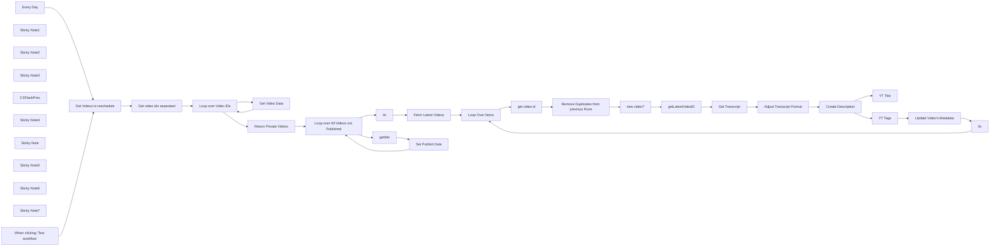

## Fluxo (.json) :

```json
{
  "id": "wLbJ7rE6vQzizCp2",
  "meta": {
    "instanceId": "5ce52989094be90be3b3bdd9ed9cee1d7ce1fcecaa598afaec4a50646d32e291",
    "templateCredsSetupCompleted": true
  },
  "name": "Youtube_Automation",
  "tags": [
    {
      "id": "5eZb3e5PJspoJjVN",
      "name": "Privat",
      "createdAt": "2025-02-22T09:31:58.972Z",
      "updatedAt": "2025-02-22T09:31:58.972Z"
    },
    {
      "id": "fSDcaaN3w5sV5e3S",
      "name": "Templates",
      "createdAt": "2025-02-23T15:20:47.262Z",
      "updatedAt": "2025-02-23T15:20:47.262Z"
    }
  ],
  "nodes": [
    {
      "id": "2001b9ca-f76b-437e-90a9-16c0d17accef",
      "name": "Fetch Latest Videos",
      "type": "n8n-nodes-base.youTube",
      "position": [
        -60,
        40
      ],
      "parameters": {
        "limit": 1,
        "filters": {},
        "options": {
          "order": "date"
        },
        "resource": "video"
      },
      "credentials": {
        "youTubeOAuth2Api": {
          "id": "cpgVAMXp8iMLXwKW",
          "name": "Private Pres"
        }
      },
      "typeVersion": 1
    },
    {
      "id": "e8857adf-63ec-4612-aa49-cd77130a6728",
      "name": "Loop Over Items",
      "type": "n8n-nodes-base.splitInBatches",
      "position": [
        160,
        40
      ],
      "parameters": {
        "options": {}
      },
      "typeVersion": 3
    },
    {
      "id": "1a8cf640-caf4-4163-a658-400714702314",
      "name": "YT Title",
      "type": "@n8n/n8n-nodes-langchain.openAi",
      "disabled": true,
      "position": [
        2220,
        120
      ],
      "parameters": {
        "modelId": {
          "__rl": true,
          "mode": "list",
          "value": "gpt-4.1-nano",
          "cachedResultName": "GPT-4.1-NANO"
        },
        "options": {},
        "messages": {
          "values": [
            {
              "role": "system",
              "content": "Du bist ein professioneller Texter für SEO-optimierte YouTube-Titel."
            },
            {
              "content": "=Schreib mir einen passenden SEO Youtube Titel für das Transkript folgendes Videotranskriptes. Gib mir nur den Titel sonst nichts. Maximal 100 Character also halte dich kurz.\n\n{{ $('Adjust Transcript Format').item.json.transcript }}"
            }
          ]
        }
      },
      "credentials": {
        "openAiApi": {
          "id": "ftBgqCi1fD1fFEZq",
          "name": "Midgard#1"
        }
      },
      "typeVersion": 1.7
    },
    {
      "id": "ec6e5d83-d8c8-417e-8df0-86634feef3e6",
      "name": "Create Description",
      "type": "@n8n/n8n-nodes-langchain.openAi",
      "position": [
        1920,
        80
      ],
      "parameters": {
        "modelId": {
          "__rl": true,
          "mode": "list",
          "value": "gpt-4.1-nano",
          "cachedResultName": "GPT-4.1-NANO"
        },
        "options": {},
        "messages": {
          "values": [
            {
              "role": "system",
              "content": "Du bist ein professioneller Texteschreiber.\nDu erhältst das Transkript eines wirtschaftsbezogenen Videos und erstellst eine ausführlichere aber auch nicht zu lange  Zusammenfassung (mit Absätzen) darüber, worum es geht.\n\nSchreibe eine ausführlichere Zusammenfassung (mit Absätzen) über den Inhalt des Podcasts. \n\nDein Output wird für die Youtube Video Beschreibung verwendet. Also starte mit sowas wie: \"In diesem Video...\" oder \"In dieser Folge...\". \nSchreibe aus meiner Perspektive also Sachen wie \"meine Meinung\" oder \"meiner Ansicht nach\"...  aus der Ich- Perspektive aber niemals sowas wie \"In dieser Folge lerne ich...\" oder so ähnlich, denn ich erkläre stets den Inhalt bzw. diskutiere darüber. DU SCHREIBST NIEMALS SOWAS WIE \"DER SPRECHER SAGT\"!!! Immer aus meiner Position heraus.\n\nWichtig: Verwende klare und dominante Aussagen, wie sie im Transkript formuliert sind. Vermeide neutrale oder unsichere Formulierungen wie \"es könnte\", \"ich vermute, dass\", \"möglicherweise\" oder ähnliche Phrasen. Die Aussagen sollen selbstbewusst und eindeutig sein, um die Inhalte des Podcasts kraftvoll zu vermitteln.\nFüge einige wenige (2-4) Emojis an wo es sich anbietet. \n   \nEnde den Post mit 2-5 passenden Hashtags. Die Hashtags sollten grob sein also sowas wie #wirtschaft #geld #gold oder so ähnlich - je nachdem was passt.\n"
            },
            {
              "content": "=Hier ist das Transkript: \n\n{{ $json.transcript }}"
            }
          ]
        }
      },
      "credentials": {
        "openAiApi": {
          "id": "ftBgqCi1fD1fFEZq",
          "name": "Midgard#1"
        }
      },
      "typeVersion": 1.7
    },
    {
      "id": "f59d950b-4e29-4a41-8756-85ea7814b3d3",
      "name": "When clicking ‘Test workflow’",
      "type": "n8n-nodes-base.manualTrigger",
      "position": [
        -2260,
        300
      ],
      "parameters": {},
      "typeVersion": 1
    },
    {
      "id": "27ef7d44-7cca-417f-8177-b5b896a79aa0",
      "name": "Sticky Note1",
      "type": "n8n-nodes-base.stickyNote",
      "position": [
        2660,
        -20
      ],
      "parameters": {
        "color": 3,
        "width": 220,
        "content": "### 🎥Title is kept from the upload, alternatively you can just add the YT Title module in the mix \n# 👇🏻\n"
      },
      "typeVersion": 1
    },
    {
      "id": "8d763312-35f0-4d53-a210-1e0e22a06323",
      "name": "Sticky Note2",
      "type": "n8n-nodes-base.stickyNote",
      "position": [
        1920,
        -140
      ],
      "parameters": {
        "color": 3,
        "height": 200,
        "content": "# Adjust the Prompts 👉🏻\n\n# 👇🏻"
      },
      "typeVersion": 1
    },
    {
      "id": "9e7f22d5-7776-4bc4-a274-963cb8c8810c",
      "name": "Sticky Note3",
      "type": "n8n-nodes-base.stickyNote",
      "position": [
        -540,
        -560
      ],
      "parameters": {
        "color": 5,
        "width": 620,
        "height": 420,
        "content": "# Youtube Video Description/Tags/etc. Automation\n\n👉🏻 **Repos**: [github.com/JimPresting](https://github.com/JimPresting) 🛠️  \n👉🏻 **YouTube**: [youtube.com/@StardawnAI](https://www.youtube.com/@StardawnAI) 🎥  \n\nStay up to date for guides on Github repos and tutorials on YouTube! 🚀\n\n\n**Note:** By default, this takes only the latest video and adjusts the values. If you upload multiple videos within a day or even at once within one hour, you need to set that value higher, but bear in mind that if you set it to a high number, it will process older, already published videos. Using the *Publish After* option can't be recommended as it might lead to errors with scheduled videos.\nYou can also detach the *Remove Duplicates* node from the ongoing nodes and set the limit of the *Get All Videos* node to *Return all*. This way, everything that has already been uploaded will not be returned in the future. To undo this, you can select *Clear Database* in the *Remove Duplicates* node.\n"
      },
      "typeVersion": 1
    },
    {
      "id": "4c5667cf-f8a9-45ab-876b-3a6b5730484c",
      "name": "2.5FlashPrev",
      "type": "@n8n/n8n-nodes-langchain.lmChatGoogleGemini",
      "position": [
        2220,
        0
      ],
      "parameters": {
        "options": {},
        "modelName": "models/gemini-2.5-flash-preview-04-17"
      },
      "credentials": {
        "googlePalmApi": {
          "id": "clmB8ZYJMHaHmnsu",
          "name": "Stardawn#1"
        }
      },
      "typeVersion": 1
    },
    {
      "id": "7c73cc89-ea8e-42b3-a1c9-2dc493026216",
      "name": "YT Tags",
      "type": "@n8n/n8n-nodes-langchain.agent",
      "position": [
        2220,
        -120
      ],
      "parameters": {
        "text": "=Nun folgt das eigentliche Thema/Transkript. Gib mir die Youtube Tags dafür:\n\n{{ $('Adjust Transcript Format').item.json.transcript }}",
        "options": {
          "systemMessage": "You will get the transcript of a Youtube video for which you should generate matching tags (YOU NEED TO separate it by comma).\n\nBased on the topic/transcript of the video generate YouTube tags. These tags should be very general about the topics. Give multiple matching YouTube Tags that improve SEO for the video. \n\nExample:\nif the video is about why gold is a good investment you will for example not use gold investments as a tag but rather just gold     \n\nThe tags (if appropriate) should be in German as the channel content is in German.\n\nReturn just the tags one word by one separated via Comma. \n\n\nDieses Video handelt vom zukünftigen Goldpreis und davon, wie er die Renditen von performanten Vermögenswerten wie Aktien und Anleihen in ihrer angepassten Rendite beeinflusst.\n\nErwartetet output:\nGoldpreis, zukünftiger Goldpreis, Goldinvestitionen, Vermögensrenditen, Aktien und Anleihen, Investitionsrenditen, angepasste Rendite, Goldmarkt, Finanzmärkte, Goldpreisprognose, Wirtschaftstrends, Investieren in Gold, Aktienmarktanalyse, Anleihenmarkt, Anlagestrategien, Inflation und Gold, Gold vs. Aktien, Finanzanalyse, Edelmetalle, Portfoliomanagement, Marktausblick, Investmenttipps\n "
        },
        "promptType": "define"
      },
      "typeVersion": 1.9
    },
    {
      "id": "e8782ac7-ca31-4a5f-a9f1-62548f56407d",
      "name": "Sticky Note4",
      "type": "n8n-nodes-base.stickyNote",
      "position": [
        -2340,
        -140
      ],
      "parameters": {
        "color": 4,
        "width": 2000,
        "height": 660,
        "content": "# 📅Scheduling Logic⏰\n\n"
      },
      "typeVersion": 1
    },
    {
      "id": "33d289eb-c989-4c8d-b387-405f31ba11d6",
      "name": "3s",
      "type": "n8n-nodes-base.wait",
      "position": [
        2920,
        140
      ],
      "webhookId": "1e75fe1f-e553-4530-a8bc-5e64208a1184",
      "parameters": {
        "amount": 3
      },
      "typeVersion": 1.1
    },
    {
      "id": "19337563-a349-485d-a064-32f58c8fde90",
      "name": "gettitle",
      "type": "n8n-nodes-base.youTube",
      "position": [
        -780,
        200
      ],
      "parameters": {
        "options": {},
        "videoId": "={{ $json.videoId }}",
        "resource": "video",
        "operation": "get"
      },
      "credentials": {
        "youTubeOAuth2Api": {
          "id": "cpgVAMXp8iMLXwKW",
          "name": "Private Pres"
        }
      },
      "typeVersion": 1
    },
    {
      "id": "da93ff18-8d19-45ab-b268-dbbebcb86719",
      "name": "Sticky Note",
      "type": "n8n-nodes-base.stickyNote",
      "position": [
        -1040,
        -140
      ],
      "parameters": {
        "color": 5,
        "width": 180,
        "content": "## Code only returns the videos that are not listed"
      },
      "typeVersion": 1
    },
    {
      "id": "71e9606c-4b6e-4b49-b3ec-bd9bd261f7a9",
      "name": "Sticky Note5",
      "type": "n8n-nodes-base.stickyNote",
      "position": [
        -600,
        -80
      ],
      "parameters": {
        "color": 3,
        "width": 220,
        "height": 260,
        "content": "## Video needs to be set to private TOGETHER with the PublishAt parameter in order for it to work."
      },
      "typeVersion": 1
    },
    {
      "id": "c5a240aa-b705-4219-b293-da4ae0168350",
      "name": "Sticky Note6",
      "type": "n8n-nodes-base.stickyNote",
      "position": [
        1320,
        -140
      ],
      "parameters": {
        "color": 3,
        "width": 280,
        "height": 240,
        "content": "### Video needs to be Unlisted or Published in order for the scraper to be able to get the transcript\n\n### ADJUST YOUR APIFY API TOKEN HERE      \n# 👇🏻"
      },
      "typeVersion": 1
    },
    {
      "id": "5fb12ed7-8992-424d-86e0-7c8cd0f0b9d3",
      "name": "Sticky Note7",
      "type": "n8n-nodes-base.stickyNote",
      "position": [
        -80,
        -140
      ],
      "parameters": {
        "color": 4,
        "width": 3200,
        "height": 660,
        "content": "# Generate Description, Tags, etc. 🖌️📝 #️⃣"
      },
      "typeVersion": 1
    },
    {
      "id": "33b865ef-ec2e-4349-bbba-d76d41345fe3",
      "name": "Set Publish Date",
      "type": "n8n-nodes-base.youTube",
      "position": [
        -600,
        280
      ],
      "parameters": {
        "title": "={{ $json.snippet.title }}",
        "videoId": "={{ $json.id }}",
        "resource": "video",
        "operation": "update",
        "categoryId": "25",
        "regionCode": "DE",
        "updateFields": {
          "publishAt": "={{ $('Loop over All Videos not Published').item.json.publishAt }}",
          "privacyStatus": "private"
        }
      },
      "credentials": {
        "youTubeOAuth2Api": {
          "id": "cpgVAMXp8iMLXwKW",
          "name": "Private Pres"
        }
      },
      "typeVersion": 1
    },
    {
      "id": "9a228886-c91a-44f7-b894-e23095166efc",
      "name": "Every Day",
      "type": "n8n-nodes-base.scheduleTrigger",
      "disabled": true,
      "position": [
        -2260,
        60
      ],
      "parameters": {
        "rule": {
          "interval": [
            {
              "triggerAtHour": 14,
              "triggerAtMinute": 22
            }
          ]
        }
      },
      "typeVersion": 1.2
    },
    {
      "id": "c0277051-f146-43f7-a2cd-36739d933209",
      "name": "Get Videos to reschedule",
      "type": "n8n-nodes-base.youTube",
      "position": [
        -1880,
        40
      ],
      "parameters": {
        "limit": 2,
        "filters": {},
        "options": {
          "order": "date"
        },
        "resource": "video"
      },
      "credentials": {
        "youTubeOAuth2Api": {
          "id": "cpgVAMXp8iMLXwKW",
          "name": "Private Pres"
        }
      },
      "typeVersion": 1
    },
    {
      "id": "5cf3813b-931b-4c0a-84fe-4edd3d55a99a",
      "name": "Get video Ids seperated",
      "type": "n8n-nodes-base.code",
      "position": [
        -1660,
        40
      ],
      "parameters": {
        "jsCode": "// Extract video IDs from YouTube search results\n// This function processes all input items and creates separate items for each videoId\n\n// Initialize empty array for our result items\nconst resultItems = [];\n\n// Process each input item\nfor (const item of items) {\n  // Check if the item has a valid structure\n  if (item.json && item.json.id && item.json.id.videoId) {\n    // Create a new item for each videoId\n    resultItems.push({\n      json: {\n        videoId: item.json.id.videoId\n      }\n    });\n  }\n}\n\n// Return each videoId as a separate item that can be processed individually\nreturn resultItems;"
      },
      "typeVersion": 2
    },
    {
      "id": "8131b388-b842-4c46-b82b-e53283d938ed",
      "name": "Loop over Video IDs",
      "type": "n8n-nodes-base.splitInBatches",
      "position": [
        -1440,
        40
      ],
      "parameters": {
        "options": {}
      },
      "typeVersion": 3
    },
    {
      "id": "665cb406-f6b9-4ba4-82fa-daa1141eb0a3",
      "name": "Get Video Data",
      "type": "n8n-nodes-base.youTube",
      "position": [
        -1220,
        60
      ],
      "parameters": {
        "options": {},
        "videoId": "={{ $json.videoId }}",
        "resource": "video",
        "operation": "get"
      },
      "credentials": {
        "youTubeOAuth2Api": {
          "id": "cpgVAMXp8iMLXwKW",
          "name": "Private Pres"
        }
      },
      "typeVersion": 1
    },
    {
      "id": "3d366fb3-f579-46f0-9254-8d4c1612038e",
      "name": "Return Private Videos",
      "type": "n8n-nodes-base.code",
      "position": [
        -1220,
        -120
      ],
      "parameters": {
        "jsCode": "// Utility function to get next Friday at 17:00 UTC in YouTube ISO 8601 format (YYYY-MM-DDTHH:mm:ssZ)\nfunction getNextFridayUTC(startDate, weekOffset = 0) {\n  const date = new Date(startDate); // Work with a copy\n  \n  const currentUTCDay = date.getUTCDay(); // 0 for Sunday, ..., 5 for Friday\n  const daysUntilFriday = (5 - currentUTCDay + 7) % 7; // Calculate days to next Friday\n  \n  date.setUTCDate(date.getUTCDate() + daysUntilFriday + (weekOffset * 7));\n  date.setUTCHours(17, 0, 0, 0); // Set time to 17:00:00.000 UTC\n  \n  // toISOString() returns \"YYYY-MM-DDTHH:mm:ss.sssZ\"\n  // We split at '.' to remove milliseconds and add 'Z' back for \"YYYY-MM-DDTHH:mm:ssZ\"\n  return date.toISOString().split('.')[0] + \"Z\";\n}\n\n// INPUT `items` is an array from n8n.\n// Each item.json is expected to be a YouTube video object from a previous node.\nconst videosToSchedule = items.filter(item => \n  item.json && \n  item.json.status && \n  (item.json.status.privacyStatus === \"unlisted\" || item.json.status.privacyStatus === \"private\")\n  // Adjust this filter if you only want to process \"unlisted\" or only \"private\" videos\n);\n\nif (videosToSchedule.length === 0) {\n  // console.log(\"No videos found matching the filter criteria.\");\n  return []; // Return empty array if no videos to schedule\n}\n\n// Sort videos by their original published/uploaded date (snippet.publishedAt), earliest first.\nvideosToSchedule.sort((a, b) => {\n  const dateA = new Date(a.json?.snippet?.publishedAt || '1970-01-01T00:00:00Z');\n  const dateB = new Date(b.json?.snippet?.publishedAt || '1970-01-01T00:00:00Z');\n  return dateA - dateB;\n});\n\nconst now = new Date(); // Current date to calculate future Fridays\n\n// Map the filtered and sorted videos to the desired output structure for the YouTube update node.\nconst scheduledItems = videosToSchedule.map((item, index) => {\n  const videoData = item.json; // The actual video data object\n  const scheduleDate = getNextFridayUTC(now, index); // Calculate the publishAt date\n  \n  return {\n    json: { // This is the structure the next n8n YouTube node will receive\n      videoId: videoData.id,                             // ID of the video to update\n      publishAt: scheduleDate,                           // The calculated schedule time: YYYY-MM-DDTHH:mm:ssZ\n      title: videoData.snippet?.title || \"Untitled Video\", // Keep original title or use a default\n      \n      // --- CRITICAL PARAMETERS FOR THE YOUTUBE API ---\n      privacy: \"private\", // **MUST BE 'private' FOR 'publishAt' TO WORK!**\n                          // The API requires the video to be set to private when scheduling.\n      \n      // **VERY LIKELY REQUIRED: selfDeclaredMadeForKids**\n      // You MUST tell YouTube if the video is made for kids or not.\n      // Get it from existing data if available, otherwise set a default.\n      selfDeclaredMadeForKids: videoData.status?.selfDeclaredMadeForKids === true ? true : false,\n\n      // **POSSIBLY REQUIRED: categoryId (if updating snippet like title)**\n      // categoryId: videoData.snippet?.categoryId || \"YOUR_DEFAULT_CATEGORY_ID\", \n      // e.g., \"10\" for Music, \"22\" for People & Blogs.\n      // Check YouTube API docs for category IDs.\n      \n      // (Optional) You can include other fields like description if you want to update them\n      // description: videoData.snippet?.description || \"\" \n    }\n  };\n});\n\nreturn scheduledItems; // Return the array of video objects to be processed"
      },
      "typeVersion": 2,
      "alwaysOutputData": true
    },
    {
      "id": "bb3e90ae-ff3f-4c22-b920-d1a99a1f99e8",
      "name": "4s",
      "type": "n8n-nodes-base.wait",
      "position": [
        -260,
        240
      ],
      "webhookId": "7d5c70f8-a592-4634-8c5a-0fbd0cebf6a4",
      "parameters": {
        "amount": 4
      },
      "typeVersion": 1.1
    },
    {
      "id": "f67c7668-71eb-42e6-b385-f66f9e5e80eb",
      "name": "Loop over All Videos not Published",
      "type": "n8n-nodes-base.splitInBatches",
      "position": [
        -1020,
        60
      ],
      "parameters": {
        "options": {}
      },
      "typeVersion": 3
    },
    {
      "id": "f98b1399-7970-4585-8f2a-be897562fa40",
      "name": "get video id",
      "type": "n8n-nodes-base.set",
      "position": [
        380,
        80
      ],
      "parameters": {
        "options": {},
        "assignments": {
          "assignments": [
            {
              "id": "c2e2eecd-ca73-40c9-a364-4713030ab451",
              "name": "id.videoId",
              "type": "string",
              "value": "={{ $json.id.videoId }}"
            }
          ]
        },
        "includeOtherFields": true
      },
      "typeVersion": 3.4
    },
    {
      "id": "6b907512-945b-4c1e-8a97-b14409ddfcaa",
      "name": "Remove Duplicates from previous Runs",
      "type": "n8n-nodes-base.removeDuplicates",
      "position": [
        600,
        80
      ],
      "parameters": {
        "options": {},
        "operation": "removeItemsSeenInPreviousExecutions",
        "dedupeValue": "={{ $json.id.videoId }}"
      },
      "typeVersion": 2,
      "alwaysOutputData": false
    },
    {
      "id": "d6c7152e-e508-43c3-8748-ba12652ac117",
      "name": "new video?",
      "type": "n8n-nodes-base.if",
      "position": [
        820,
        80
      ],
      "parameters": {
        "options": {},
        "conditions": {
          "options": {
            "version": 2,
            "leftValue": "",
            "caseSensitive": true,
            "typeValidation": "strict"
          },
          "combinator": "and",
          "conditions": [
            {
              "id": "adfea7c7-ed64-4e1e-a9c3-dc5e33aa1147",
              "operator": {
                "type": "array",
                "operation": "notExists",
                "singleValue": true
              },
              "leftValue": "={{$('Remove Duplicates from previous Runs').all() }}",
              "rightValue": ""
            }
          ]
        }
      },
      "typeVersion": 2.2
    },
    {
      "id": "d1c31718-4a26-4108-a618-f67cfb87053c",
      "name": "getLatestVideoID",
      "type": "n8n-nodes-base.youTube",
      "position": [
        1000,
        160
      ],
      "parameters": {
        "options": {},
        "videoId": "={{ $('get video id').item.json.id.videoId }}",
        "resource": "video",
        "operation": "get"
      },
      "credentials": {
        "youTubeOAuth2Api": {
          "id": "cpgVAMXp8iMLXwKW",
          "name": "Private Pres"
        }
      },
      "typeVersion": 1,
      "alwaysOutputData": true
    },
    {
      "id": "66814975-e4a5-4c23-9bf2-c8d30d96c122",
      "name": "Get Transcript",
      "type": "n8n-nodes-base.httpRequest",
      "position": [
        1320,
        120
      ],
      "parameters": {
        "url": "=https://api.apify.com/v2/acts/pintostudio~youtube-transcript-scraper/run-sync-get-dataset-items",
        "method": "POST",
        "options": {},
        "jsonBody": "={\n  \"videoUrl\": \"https://www.youtube.com/watch?v={{ $json.id }}\"\n}",
        "sendBody": true,
        "sendQuery": true,
        "specifyBody": "json",
        "queryParameters": {
          "parameters": [
            {
              "name": "token",
              "value": "YOURAPITOKEN"
            }
          ]
        }
      },
      "typeVersion": 4.2,
      "alwaysOutputData": false
    },
    {
      "id": "fd355571-8c74-4d31-972e-13f737aaec05",
      "name": "Adjust Transcript Format",
      "type": "n8n-nodes-base.code",
      "position": [
        1600,
        120
      ],
      "parameters": {
        "jsCode": "const items = $input.all();\n\nconst transcriptStrings = items.flatMap(item => {\n  const dataArray = item.json.data;\n\n  if (!dataArray || !Array.isArray(dataArray)) {\n    return [];\n  }\n\n  const segmentTexts = dataArray.map(segment => {\n      if (segment && typeof segment.text === 'string') {\n          return segment.text;\n      } else {\n          return '';\n      }\n  });\n\n  return segmentTexts;\n});\n\nconst transcript = transcriptStrings.join(' ');\n\nreturn [\n  {\n    json: {\n      transcript: transcript,\n    },\n  },\n];"
      },
      "typeVersion": 2
    },
    {
      "id": "7b69339f-aa12-430e-ba21-b85a0db596b5",
      "name": "Update Video's Metadata",
      "type": "n8n-nodes-base.youTube",
      "position": [
        2660,
        140
      ],
      "parameters": {
        "title": "={{ $('Fetch Latest Videos').first().json.snippet.title }}",
        "videoId": "={{ $('getLatestVideoID').first().json.id }}",
        "resource": "video",
        "operation": "update",
        "categoryId": "25",
        "regionCode": "DE",
        "updateFields": {
          "tags": "={{ $('YT Tags').first().json.message.content }}",
          "description": "={{ $('Create Description').first().json.message.content }}\n\nDiese textbasierte Zusammenfassung des Videos wurde automatisch mit dem KI-Modell gpt-4.1-nano erstellt.]\n"
        }
      },
      "credentials": {
        "youTubeOAuth2Api": {
          "id": "cpgVAMXp8iMLXwKW",
          "name": "Private Pres"
        }
      },
      "typeVersion": 1
    }
  ],
  "active": true,
  "pinData": {},
  "settings": {
    "executionOrder": "v1"
  },
  "versionId": "268a8dc5-0408-458c-9dff-d7c91b223b76",
  "connections": {
    "3s": {
      "main": [
        [
          {
            "node": "Loop Over Items",
            "type": "main",
            "index": 0
          }
        ]
      ]
    },
    "4s": {
      "main": [
        [
          {
            "node": "Fetch Latest Videos",
            "type": "main",
            "index": 0
          }
        ]
      ]
    },
    "YT Tags": {
      "main": [
        [
          {
            "node": "Update Video's Metadata",
            "type": "main",
            "index": 0
          }
        ]
      ]
    },
    "YT Title": {
      "main": [
        []
      ]
    },
    "gettitle": {
      "main": [
        [
          {
            "node": "Set Publish Date",
            "type": "main",
            "index": 0
          }
        ]
      ]
    },
    "Every Day": {
      "main": [
        [
          {
            "node": "Get Videos to reschedule",
            "type": "main",
            "index": 0
          }
        ]
      ]
    },
    "new video?": {
      "main": [
        [],
        [
          {
            "node": "getLatestVideoID",
            "type": "main",
            "index": 0
          }
        ]
      ]
    },
    "2.5FlashPrev": {
      "ai_languageModel": [
        [
          {
            "node": "YT Tags",
            "type": "ai_languageModel",
            "index": 0
          }
        ]
      ]
    },
    "get video id": {
      "main": [
        [
          {
            "node": "Remove Duplicates from previous Runs",
            "type": "main",
            "index": 0
          }
        ]
      ]
    },
    "Get Transcript": {
      "main": [
        [
          {
            "node": "Adjust Transcript Format",
            "type": "main",
            "index": 0
          }
        ]
      ]
    },
    "Get Video Data": {
      "main": [
        [
          {
            "node": "Loop over Video IDs",
            "type": "main",
            "index": 0
          }
        ]
      ]
    },
    "Loop Over Items": {
      "main": [
        [],
        [
          {
            "node": "get video id",
            "type": "main",
            "index": 0
          }
        ]
      ]
    },
    "Set Publish Date": {
      "main": [
        [
          {
            "node": "Loop over All Videos not Published",
            "type": "main",
            "index": 0
          }
        ]
      ]
    },
    "getLatestVideoID": {
      "main": [
        [
          {
            "node": "Get Transcript",
            "type": "main",
            "index": 0
          }
        ]
      ]
    },
    "Create Description": {
      "main": [
        [
          {
            "node": "YT Tags",
            "type": "main",
            "index": 0
          },
          {
            "node": "YT Title",
            "type": "main",
            "index": 0
          }
        ]
      ]
    },
    "Fetch Latest Videos": {
      "main": [
        [
          {
            "node": "Loop Over Items",
            "type": "main",
            "index": 0
          }
        ]
      ]
    },
    "Loop over Video IDs": {
      "main": [
        [
          {
            "node": "Return Private Videos",
            "type": "main",
            "index": 0
          }
        ],
        [
          {
            "node": "Get Video Data",
            "type": "main",
            "index": 0
          }
        ]
      ]
    },
    "Return Private Videos": {
      "main": [
        [
          {
            "node": "Loop over All Videos not Published",
            "type": "main",
            "index": 0
          }
        ]
      ]
    },
    "Get video Ids seperated": {
      "main": [
        [
          {
            "node": "Loop over Video IDs",
            "type": "main",
            "index": 0
          }
        ]
      ]
    },
    "Update Video's Metadata": {
      "main": [
        [
          {
            "node": "3s",
            "type": "main",
            "index": 0
          }
        ]
      ]
    },
    "Adjust Transcript Format": {
      "main": [
        [
          {
            "node": "Create Description",
            "type": "main",
            "index": 0
          }
        ]
      ]
    },
    "Get Videos to reschedule": {
      "main": [
        [
          {
            "node": "Get video Ids seperated",
            "type": "main",
            "index": 0
          }
        ]
      ]
    },
    "When clicking ‘Test workflow’": {
      "main": [
        [
          {
            "node": "Get Videos to reschedule",
            "type": "main",
            "index": 0
          }
        ]
      ]
    },
    "Loop over All Videos not Published": {
      "main": [
        [
          {
            "node": "4s",
            "type": "main",
            "index": 0
          }
        ],
        [
          {
            "node": "gettitle",
            "type": "main",
            "index": 0
          }
        ]
      ]
    },
    "Remove Duplicates from previous Runs": {
      "main": [
        [
          {
            "node": "new video?",
            "type": "main",
            "index": 0
          }
        ]
      ]
    }
  }
}
```

<a id="template-1576"></a>

## Template 1576 - Raspador multipágina com Jina.ai

- **Nome:** Raspador multipágina com Jina.ai
- **Descrição:** Fluxo que percorre um sitemap, extrai o conteúdo de várias páginas via Jina.ai, formata título e markdown e salva os resultados no Google Drive.
- **Funcionalidade:** • Definição do sitemap: Permite configurar a URL do sitemap XML a ser usado como ponto de partida.
• Obtenção do sitemap: Faz requisição ao sitemap e converte o XML em JSON para processamento.
• Criação de lista de URLs: Separa as entradas do sitemap em itens individuais para processamento em lote.
• Filtragem de páginas: Filtra URLs por tópicos ou páginas específicas (ex.: contém 'agent' ou 'tool' ou URL exata).
• Limitação de processamento: Limita o número de páginas processadas (ex.: máximo de 20).
• Loop e controle de ritmo: Processa páginas uma a uma com espera entre gravações para evitar sobrecarga.
• Extração de conteúdo via Jina.ai: Obtém versão textual/markdown das páginas usando o endpoint r.jina.ai.
• Parsing de título e markdown: Extrai título e corpo em markdown do resultado retornado.
• Salvamento em nuvem: Cria arquivos de texto no Google Drive com o título e o conteúdo markdown.
- **Ferramentas:** • Jina.ai (r.jina.ai): Serviço que gera versão textual/markdown de páginas web a partir de uma URL, usado para extrair título e conteúdo.
• Google Drive: Armazenamento em nuvem usado para salvar os arquivos de texto com o conteúdo extraído.
• Sitemap XML / Websites alvo: Fonte das URLs a serem raspadas e alvo das requisições de extração.

## Fluxo visual

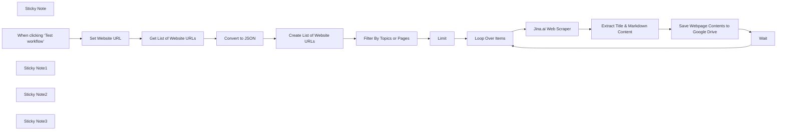

## Fluxo (.json) :

```json
{
  "id": "xEij0kj2I1DHbL3I",
  "meta": {
    "instanceId": "31e69f7f4a77bf465b805824e303232f0227212ae922d12133a0f96ffeab4fef",
    "templateCredsSetupCompleted": true
  },
  "name": "💡🌐 Essential Multipage Website Scraper with Jina.ai",
  "tags": [],
  "nodes": [
    {
      "id": "3a503859-ef0a-492d-81c6-37e4f0c4c25e",
      "name": "Sticky Note",
      "type": "n8n-nodes-base.stickyNote",
      "position": [
        -840,
        0
      ],
      "parameters": {
        "color": 3,
        "width": 340,
        "height": 320,
        "content": "## Jina.ai Web Scraper\n### No API Key Required\n"
      },
      "typeVersion": 1
    },
    {
      "id": "c5217a1a-f074-409b-8340-72afdc5fc8b5",
      "name": "When clicking ‘Test workflow’",
      "type": "n8n-nodes-base.manualTrigger",
      "position": [
        -1500,
        -300
      ],
      "parameters": {},
      "typeVersion": 1
    },
    {
      "id": "72af3b00-2632-4877-a0b6-7477e2f468f7",
      "name": "Loop Over Items",
      "type": "n8n-nodes-base.splitInBatches",
      "position": [
        -1080,
        20
      ],
      "parameters": {
        "options": {}
      },
      "typeVersion": 3
    },
    {
      "id": "11f0fa02-51f8-41cc-b789-5c452b6899aa",
      "name": "Wait",
      "type": "n8n-nodes-base.wait",
      "position": [
        80,
        220
      ],
      "webhookId": "081ce124-0cbf-4a21-a1e7-2c465f460448",
      "parameters": {},
      "typeVersion": 1.1
    },
    {
      "id": "cf3b5887-8ff2-46e0-ab33-384ab0987cbb",
      "name": "Limit",
      "type": "n8n-nodes-base.limit",
      "position": [
        80,
        -300
      ],
      "parameters": {
        "maxItems": 20
      },
      "typeVersion": 1
    },
    {
      "id": "c4f04d82-aa33-46cf-a8e2-0b4e717e754a",
      "name": "Get List of Website URLs",
      "type": "n8n-nodes-base.httpRequest",
      "position": [
        -780,
        -300
      ],
      "parameters": {
        "url": "={{ $json.sitemap_url }}",
        "options": {}
      },
      "typeVersion": 4.2
    },
    {
      "id": "7f507c38-1e9e-4c46-8dea-bd6daf65dc55",
      "name": "Convert to JSON",
      "type": "n8n-nodes-base.xml",
      "position": [
        -560,
        -300
      ],
      "parameters": {
        "options": {}
      },
      "typeVersion": 1
    },
    {
      "id": "e21b55c2-8b0d-4c7c-ba91-a2d563a4c966",
      "name": "Create List of Website URLs",
      "type": "n8n-nodes-base.splitOut",
      "position": [
        -340,
        -300
      ],
      "parameters": {
        "options": {},
        "fieldToSplitOut": "urlset.url"
      },
      "typeVersion": 1
    },
    {
      "id": "61555239-8a16-424e-8a60-700f6ebaa270",
      "name": "Filter By Topics or Pages",
      "type": "n8n-nodes-base.filter",
      "position": [
        -120,
        -300
      ],
      "parameters": {
        "options": {},
        "conditions": {
          "options": {
            "version": 2,
            "leftValue": "",
            "caseSensitive": true,
            "typeValidation": "strict"
          },
          "combinator": "or",
          "conditions": [
            {
              "id": "d66c304d-879a-4dc4-908f-ab0665093672",
              "operator": {
                "name": "filter.operator.equals",
                "type": "string",
                "operation": "equals"
              },
              "leftValue": "={{ $json.loc }}",
              "rightValue": "=https://ai.pydantic.dev/"
            },
            {
              "id": "3c930950-bee4-442b-82e6-4437fd39a933",
              "operator": {
                "type": "string",
                "operation": "contains"
              },
              "leftValue": "={{ $json.loc.toLowerCase() }}",
              "rightValue": "agent"
            },
            {
              "id": "aaeaf34e-ad5a-4673-b3bd-8bddf3500988",
              "operator": {
                "type": "string",
                "operation": "contains"
              },
              "leftValue": "={{ $json.loc.toLowerCase() }}",
              "rightValue": "tool"
            }
          ]
        }
      },
      "typeVersion": 2.2
    },
    {
      "id": "dd25fb57-64a3-4c47-be04-6eb66d16520a",
      "name": "Set Website URL",
      "type": "n8n-nodes-base.set",
      "position": [
        -1080,
        -300
      ],
      "parameters": {
        "options": {},
        "assignments": {
          "assignments": [
            {
              "id": "1601dc3e-8024-4e19-b592-93a4e4f77641",
              "name": "sitemap_url",
              "type": "string",
              "value": "https://ai.pydantic.dev/sitemap.xml"
            }
          ]
        }
      },
      "typeVersion": 3.4
    },
    {
      "id": "14ac1c87-29fe-44c8-9c1e-f247a292dde5",
      "name": "Jina.ai Web Scraper",
      "type": "n8n-nodes-base.httpRequest",
      "position": [
        -720,
        120
      ],
      "parameters": {
        "url": "=https://r.jina.ai/{{ $json.loc }}",
        "options": {}
      },
      "typeVersion": 4.2
    },
    {
      "id": "be253ec2-f088-4895-8ef2-61a3720cf68b",
      "name": "Save Webpage Contents to Google Drive",
      "type": "n8n-nodes-base.googleDrive",
      "position": [
        -120,
        120
      ],
      "parameters": {
        "name": "={{ $('Loop Over Items').item.json.loc }} - {{ $json.title }}",
        "content": "={{ $json.markdown }}",
        "driveId": {
          "__rl": true,
          "mode": "list",
          "value": "My Drive"
        },
        "options": {},
        "folderId": {
          "__rl": true,
          "mode": "list",
          "value": "root",
          "cachedResultName": "/ (Root folder)"
        },
        "operation": "createFromText"
      },
      "credentials": {
        "googleDriveOAuth2Api": {
          "id": "UhdXGYLTAJbsa0xX",
          "name": "Google Drive account"
        }
      },
      "typeVersion": 3
    },
    {
      "id": "95d808c7-a3ca-4f59-a385-cc77bdff322e",
      "name": "Extract Title & Markdown Content",
      "type": "n8n-nodes-base.code",
      "position": [
        -380,
        120
      ],
      "parameters": {
        "jsCode": "// Get the text output from the previous node\nconst data = $input.first().json.data;\n\n// Regular expression to capture the title line\nconst titleRegex = /^Title:\\s*(.+)$/m;\n// Regular expression to capture everything after \"Markdown Content:\"\nconst markdownRegex = /Markdown Content:\\n([\\s\\S]+)/;\n\n// Extract the title using the first capture group\nconst titleMatch = data.match(titleRegex);\nconst title = titleMatch ? titleMatch[1].trim() : '';\n\n// Extract the markdown content using the first capture group\nconst markdownMatch = data.match(markdownRegex);\nconst markdown = markdownMatch ? markdownMatch[1].trim() : '';\n\n// Return a single object with title and markdown as unique values\nreturn { title, markdown };"
      },
      "typeVersion": 2
    },
    {
      "id": "2fb86c81-c144-4450-908c-559855deadef",
      "name": "Sticky Note1",
      "type": "n8n-nodes-base.stickyNote",
      "position": [
        -1240,
        -580
      ],
      "parameters": {
        "color": 7,
        "width": 1540,
        "height": 1080,
        "content": "# 💡🌐 Essential Multipage Website Scraper with Jina.ai\n## Scrape entire websites with this workflow\n**Use responsibly and follow local rules and regulations**"
      },
      "typeVersion": 1
    },
    {
      "id": "b470b294-95d0-4e51-a9cc-2fe17316a771",
      "name": "Sticky Note2",
      "type": "n8n-nodes-base.stickyNote",
      "position": [
        -1580,
        -400
      ],
      "parameters": {
        "color": 4,
        "width": 280,
        "height": 300,
        "content": "## 👍Try Me!"
      },
      "typeVersion": 1
    },
    {
      "id": "fafd0623-a423-4e73-9609-cee8e81f5c13",
      "name": "Sticky Note3",
      "type": "n8n-nodes-base.stickyNote",
      "position": [
        -1180,
        -400
      ],
      "parameters": {
        "width": 300,
        "height": 300,
        "content": "## 👇Add Website Sitemap URL"
      },
      "typeVersion": 1
    }
  ],
  "active": false,
  "pinData": {},
  "settings": {
    "executionOrder": "v1"
  },
  "versionId": "2e815787-d83b-4ab7-a959-2f33006a37a5",
  "connections": {
    "Wait": {
      "main": [
        [
          {
            "node": "Loop Over Items",
            "type": "main",
            "index": 0
          }
        ]
      ]
    },
    "Limit": {
      "main": [
        [
          {
            "node": "Loop Over Items",
            "type": "main",
            "index": 0
          }
        ]
      ]
    },
    "Convert to JSON": {
      "main": [
        [
          {
            "node": "Create List of Website URLs",
            "type": "main",
            "index": 0
          }
        ]
      ]
    },
    "Loop Over Items": {
      "main": [
        [],
        [
          {
            "node": "Jina.ai Web Scraper",
            "type": "main",
            "index": 0
          }
        ]
      ]
    },
    "Set Website URL": {
      "main": [
        [
          {
            "node": "Get List of Website URLs",
            "type": "main",
            "index": 0
          }
        ]
      ]
    },
    "Jina.ai Web Scraper": {
      "main": [
        [
          {
            "node": "Extract Title & Markdown Content",
            "type": "main",
            "index": 0
          }
        ]
      ]
    },
    "Get List of Website URLs": {
      "main": [
        [
          {
            "node": "Convert to JSON",
            "type": "main",
            "index": 0
          }
        ]
      ]
    },
    "Filter By Topics or Pages": {
      "main": [
        [
          {
            "node": "Limit",
            "type": "main",
            "index": 0
          }
        ]
      ]
    },
    "Create List of Website URLs": {
      "main": [
        [
          {
            "node": "Filter By Topics or Pages",
            "type": "main",
            "index": 0
          }
        ]
      ]
    },
    "Extract Title & Markdown Content": {
      "main": [
        [
          {
            "node": "Save Webpage Contents to Google Drive",
            "type": "main",
            "index": 0
          }
        ]
      ]
    },
    "When clicking ‘Test workflow’": {
      "main": [
        [
          {
            "node": "Set Website URL",
            "type": "main",
            "index": 0
          }
        ]
      ]
    },
    "Save Webpage Contents to Google Drive": {
      "main": [
        [
          {
            "node": "Wait",
            "type": "main",
            "index": 0
          }
        ]
      ]
    }
  }
}
```

<a id="template-1577"></a>

## Template 1577 - Editor web para preenchimento (inpainting) com FLUX

- **Nome:** Editor web para preenchimento (inpainting) com FLUX
- **Descrição:** Fluxo que entrega uma página de edição de imagem no navegador, permite criar máscaras, ajustar parâmetros e enviar trabalhos para um serviço de inpainting (FLUX Fill), retornando a imagem editada ao usuário.
- **Funcionalidade:** • Entrega de editor web interativo: disponibiliza uma página HTML com canvas de edição e controles.
• Seleção de imagens e mockups: permite escolher imagens pré-carregadas ou carregar do computador.
• Edição de máscara com pincel: pintar áreas a serem preenchidas com controle dinâmico do tamanho do pincel.
• Ajuste de parâmetros de geração: configurações de steps, guidance, prompt upsampling, tolerância de segurança e opção de melhorar o prompt automaticamente.
• Envio de trabalho de inpainting: codifica imagem e máscara e envia junto com o prompt para o serviço de preenchimento.
• Polling do status do job: verifica periodicamente se o processamento foi concluído e recupera o resultado quando pronto.
• Apresentação do resultado ao usuário: retorna a imagem gerada como resposta binária e mostra um comparador visual entre original e gerado.
• Reutilizar ou salvar o resultado: opções na interface para aceitar e reutilizar a imagem gerada ou salvá-la localmente.
• Configuração de imagens padrão: nó configurável com array de URLs que podem ser substituídas pela sua fonte de dados.
- **Ferramentas:** • FLUX Fill (api.bfl.ml): serviço de inpainting/edição de imagem que processa imagem + máscara + prompt e retorna resultados.
• CDN de bibliotecas (unpkg / jsdelivr / GitHub CDN): fornece recursos do editor no navegador como Konva, img-comparison-slider e scripts/estilos personalizados.
• Armazenamento de imagens (DigitalOcean Spaces ou URLs externas): hospedagem das imagens de mockup usadas como exemplos no editor.

## Fluxo visual


## Fluxo (.json) :

```json
{
  "id": "OvuZIXwt9mdU2JGK",
  "meta": {
    "instanceId": "fb924c73af8f703905bc09c9ee8076f48c17b596ed05b18c0ff86915ef8a7c4a",
    "templateCredsSetupCompleted": true
  },
  "name": "FLUX-fill standalone",
  "tags": [],
  "nodes": [
    {
      "id": "9f051c89-0243-48fb-baa4-666af3fe54b3",
      "name": "Merge",
      "type": "n8n-nodes-base.merge",
      "position": [
        940,
        120
      ],
      "parameters": {
        "mode": "combine",
        "options": {},
        "combineBy": "combineByPosition"
      },
      "typeVersion": 3
    },
    {
      "id": "5da963f7-4320-4359-aefa-bf8f6d6ef815",
      "name": "Respond to Webhook",
      "type": "n8n-nodes-base.respondToWebhook",
      "position": [
        1520,
        120
      ],
      "parameters": {
        "options": {},
        "respondWith": "text",
        "responseBody": "={{ $json.html }}"
      },
      "typeVersion": 1.1
    },
    {
      "id": "05d877bc-b591-478c-b112-32b7efe1ca3f",
      "name": "Wait 3 sec",
      "type": "n8n-nodes-base.wait",
      "position": [
        920,
        680
      ],
      "webhookId": "90f31c1f-6707-4f2f-b525-d3961432cd81",
      "parameters": {
        "amount": 3
      },
      "typeVersion": 1.1
    },
    {
      "id": "a3cc4a50-4218-4a01-ab20-151fd707dd66",
      "name": "Is Ready?",
      "type": "n8n-nodes-base.if",
      "position": [
        1340,
        680
      ],
      "parameters": {
        "options": {},
        "conditions": {
          "options": {
            "version": 2,
            "leftValue": "",
            "caseSensitive": true,
            "typeValidation": "strict"
          },
          "combinator": "and",
          "conditions": [
            {
              "id": "3cf5b451-9ff5-4c2a-864f-9aa7d286871a",
              "operator": {
                "name": "filter.operator.equals",
                "type": "string",
                "operation": "equals"
              },
              "leftValue": "={{ $json.status }}",
              "rightValue": "Ready"
            }
          ]
        }
      },
      "typeVersion": 2.2
    },
    {
      "id": "76a2dcd4-0e57-461d-a8b9-8f52baa3f86a",
      "name": "Sticky Note",
      "type": "n8n-nodes-base.stickyNote",
      "position": [
        520,
        -100
      ],
      "parameters": {
        "width": 1193,
        "height": 479,
        "content": "# Deliver the editor with links to the images"
      },
      "typeVersion": 1
    },
    {
      "id": "b32e8e0b-a449-47d9-8de4-c0062235ff99",
      "name": "FLUX Fill",
      "type": "n8n-nodes-base.httpRequest",
      "position": [
        660,
        680
      ],
      "parameters": {
        "url": "https://api.bfl.ml/v1/flux-pro-1.0-fill",
        "method": "POST",
        "options": {},
        "sendBody": true,
        "authentication": "genericCredentialType",
        "bodyParameters": {
          "parameters": [
            {
              "name": "prompt",
              "value": "={{ $json.body.prompt }}"
            },
            {
              "name": "steps",
              "value": "={{ $json.body.steps }}"
            },
            {
              "name": "prompt_upsampling",
              "value": "={{ $json.body.prompt_upsampling }}"
            },
            {
              "name": "guidance",
              "value": "={{ $json.body.guidance }}"
            },
            {
              "name": "output_format",
              "value": "png"
            },
            {
              "name": "safety_tolerance",
              "value": "6"
            },
            {
              "name": "image",
              "value": "={{ $json.body.image.split(',')[1] }}"
            },
            {
              "name": "mask",
              "value": "={{ $json.body.mask.split(',')[1] }}"
            }
          ]
        },
        "genericAuthType": "httpHeaderAuth"
      },
      "credentials": {
        "httpHeaderAuth": {
          "id": "4eQN9wBw8SniKcPw",
          "name": "bfl-FLUX"
        }
      },
      "typeVersion": 4.2
    },
    {
      "id": "d7d70191-5316-4f20-b570-b8f138b77762",
      "name": "Check FLUX status",
      "type": "n8n-nodes-base.httpRequest",
      "position": [
        1120,
        680
      ],
      "parameters": {
        "url": "https://api.bfl.ml/v1/get_result",
        "options": {},
        "sendQuery": true,
        "authentication": "genericCredentialType",
        "genericAuthType": "httpHeaderAuth",
        "queryParameters": {
          "parameters": [
            {
              "name": "id",
              "value": "={{ $json.id }}"
            }
          ]
        }
      },
      "credentials": {
        "httpHeaderAuth": {
          "id": "4eQN9wBw8SniKcPw",
          "name": "bfl-FLUX"
        }
      },
      "typeVersion": 4.2
    },
    {
      "id": "dafc2712-114f-4723-b587-08ff853513f5",
      "name": "Get Fill Image",
      "type": "n8n-nodes-base.httpRequest",
      "position": [
        1560,
        780
      ],
      "parameters": {
        "url": "={{ $json.result.sample }}",
        "options": {}
      },
      "typeVersion": 4.2
    },
    {
      "id": "68672890-62c3-4020-a09c-9ea691cba361",
      "name": "Show the image to user",
      "type": "n8n-nodes-base.respondToWebhook",
      "position": [
        1900,
        780
      ],
      "parameters": {
        "options": {
          "responseHeaders": {
            "entries": [
              {
                "name": "Content-Type",
                "value": "={{ $binary.data.mimeType }}"
              }
            ]
          }
        },
        "respondWith": "binary",
        "responseDataSource": "set"
      },
      "typeVersion": 1.1
    },
    {
      "id": "7546ce49-56e9-44fd-96fd-324831f38f32",
      "name": "Sticky Note1",
      "type": "n8n-nodes-base.stickyNote",
      "position": [
        560,
        420
      ],
      "parameters": {
        "color": 4,
        "width": 1142,
        "height": 502,
        "content": "# Image processing part"
      },
      "typeVersion": 1
    },
    {
      "id": "cee89c8c-7b88-4cc5-84e4-eb7b404e5042",
      "name": "Sticky Note2",
      "type": "n8n-nodes-base.stickyNote",
      "position": [
        1720,
        660
      ],
      "parameters": {
        "width": 506,
        "height": 272,
        "content": "# Send back edited image\n## Add extra steps to save an edited image"
      },
      "typeVersion": 1
    },
    {
      "id": "a340cd78-56dd-4ac8-a1c1-f3fc03771ae6",
      "name": "Mockups",
      "type": "n8n-nodes-base.set",
      "position": [
        660,
        220
      ],
      "parameters": {
        "options": {},
        "assignments": {
          "assignments": [
            {
              "id": "20c39c67-3cf8-4e29-b871-3202f2e20a3c",
              "name": "Images",
              "type": "array",
              "value": "={{\n[\n{\"url\":\"https://byuroscope.fra1.digitaloceanspaces.com/nc/uploads/noco/fluxtest/creative-arrangement-minimalist-podium_23-2148959328.jpg\",\n \"title\":\"Stage\" },\n{\"url\":\"https://byuroscope.fra1.digitaloceanspaces.com/nc/uploads/noco/fluxtest/Standing-Big-Paper-Bag-Mockup.jpg\",\n \"title\":\"Paper Bag\" },\n{\"url\":\"https://byuroscope.fra1.digitaloceanspaces.com/nc/uploads/noco/fluxtest/Ceramic-Mug-on-Table-Mockup.jpg\",\n \"title\":\"Big Mug\" },\n{\"url\":\"https://byuroscope.fra1.digitaloceanspaces.com/nc/uploads/noco/fluxtest/Transparent-Bottle-on-Sunny-Beach-Mockup-D.jpg\",\n \"title\":\"Transparent-Bottle\" },\n{\"url\":\"https://byuroscope.fra1.digitaloceanspaces.com/nc/uploads/noco/fluxtest/skin-products-arrangement-wooden-blocks_23-2148761445.jpg\",\n \"title\":\"Cosmetics\" }\n]\n}}"
            }
          ]
        }
      },
      "typeVersion": 3.4
    },
    {
      "id": "da82cb73-af4a-4042-bf4e-17894155fb87",
      "name": "Webhook",
      "type": "n8n-nodes-base.webhook",
      "position": [
        260,
        120
      ],
      "webhookId": "9c864ee6-e4d3-46e7-98d4-bea43739963e",
      "parameters": {
        "path": "flux-fill",
        "options": {},
        "responseMode": "responseNode",
        "multipleMethods": true
      },
      "typeVersion": 2
    },
    {
      "id": "0f35da2f-112c-45f9-9cbe-d64eb8bdc6d8",
      "name": "Editor page",
      "type": "n8n-nodes-base.html",
      "position": [
        1240,
        120
      ],
      "parameters": {
        "html": "<!DOCTYPE html>\n<html lang=\"en\">\n<head>\n <meta charset=\"UTF-8\">\n <meta name=\"viewport\" content=\"width=device-width, initial-scale=1.0\">\n <title>Konva Image Editor</title>\n <script src=\"https://unpkg.com/konva@9/konva.min.js\"></script>\n <script defer src=\"https://unpkg.com/img-comparison-slider@8/dist/index.js\"></script>\n <link rel=\"stylesheet\" href=\"https://unpkg.com/img-comparison-slider@8/dist/styles.css\" />\n <link rel=\"stylesheet\" href=\"https://cdn.jsdelivr.net/gh/ed-parsadanyan/n8n-flux-fill-demo/flux-fill-style.css\" />\n <script src=\"https://cdn.jsdelivr.net/gh/ed-parsadanyan/n8n-flux-fill-demo/flux-fill-canvas.js\"></script>\n</head>\n<body>\n <div class=\"controls-wrapper\">\n <div class=\"left-panel\">\n <div class=\"image-controls\">\n <select id=\"imageSelector\">\n <option value=\"\">Select an image...</option>\n <option value=\"local\">Load from PC...</option>\n </select>\n <input type=\"file\" id=\"fileInput\" style=\"display: none\" accept=\"image/*\">\n <button id=\"clearButton\">Clear All</button>\n </div>\n \n <div class=\"brush-controls\">\n <label for=\"brushSize\" title=\"Use mouse wheel to adjust brush size\">Brush Size:</label>\n <div class=\"slider-container\">\n <input type=\"range\" id=\"brushSize\" min=\"5\" max=\"40\" value=\"20\">\n <span class=\"slider-value\" id=\"brushSizeValue\">20px</span>\n </div>\n </div>\n </div>\n\n <div class=\"right-panel\">\n <div class=\"prompt-row\">\n <input type=\"text\" id=\"promptInput\" placeholder=\"Enter your prompt (optional)\">\n </div>\n \n <div class=\"main-controls\">\n <label class=\"checkbox-container\">\n <input type=\"checkbox\" id=\"improvePrompt\" checked>\n <span>Improve prompt</span>\n </label>\n \n <div>\n <button id=\"sendButton\">Generate</button>\n <span class=\"loading\" id=\"loadingIndicator\">Processing...</span>\n </div>\n </div>\n \n <div class=\"parameters\">\n <div class=\"slider-container\">\n <label for=\"stepsSlider\">Steps:</label>\n <input type=\"range\" id=\"stepsSlider\" min=\"15\" max=\"50\" value=\"40\">\n <span class=\"slider-value\" id=\"stepsValue\">40</span>\n </div>\n \n <div class=\"slider-container\">\n <label for=\"guidanceSlider\">Guidance:</label>\n <input type=\"range\" id=\"guidanceSlider\" min=\"1.5\" max=\"100\" value=\"60\" step=\"0.1\">\n <span class=\"slider-value\" id=\"guidanceValue\">60.0</span>\n </div>\n </div>\n </div>\n </div>\n\n <div class=\"info\" id=\"imageInfo\"></div>\n <div id=\"container\"></div>\n <div id=\"cursor\"></div>\n\n <div id=\"resultModal\" class=\"modal\">\n <div class=\"modal-content\">\n <div class=\"modal-image-container\">\n <div class=\"comparison-container\">\n <div class=\"image-container\">\n \n \n </div>\n <input type=\"range\" min=\"0\" max=\"100\" value=\"10\" class=\"slider\">\n <div class=\"slider-line\"></div>\n <div class=\"slider-button\" aria-hidden=\"true\">\n &lt; &gt;\n </div>\n <div class=\"labels\">\n <div class=\"label-before\">Original</div>\n <div class=\"label-after\">Generated</div>\n </div>\n </div>\n </div>\n <div class=\"modal-buttons\">\n <button id=\"reuseButton\">Use Generated</button>\n <button id=\"saveButton\">Save Image</button>\n <button id=\"closeButton\">Close</button>\n </div>\n </div>\n </div>\n\n<script>\n const urlParams = new URLSearchParams(window.location.search);\n const pageId = urlParams.get('id');\n\n // Image data will be populated by n8n\n const imageData = {{ JSON.stringify($json.Images,'',2) }};\n const webhookUrl = '{{ $json.webhookUrl }}';\n\n // Initialize the editor when the page loads\n document.addEventListener('DOMContentLoaded', function() {\n initializeEditor({\n images: imageData,\n webhookUrl: webhookUrl,\n pageId: pageId\n });\n });\n</script>\n</body>\n</html>\n"
      },
      "typeVersion": 1.2
    },
    {
      "id": "2ff87261-8a7f-451e-b8ae-b4274776ce28",
      "name": "Sticky Note3",
      "type": "n8n-nodes-base.stickyNote",
      "position": [
        540,
        20
      ],
      "parameters": {
        "color": 5,
        "width": 360,
        "height": 340,
        "content": "## Image array\n* Load from PC\n* Select one of the default images\n\n### Change this node to\n### get image URLs from your data source"
      },
      "typeVersion": 1
    },
    {
      "id": "08bb17fd-1440-4194-8c4f-e18222a68bf2",
      "name": "Sticky Note4",
      "type": "n8n-nodes-base.stickyNote",
      "position": [
        1080,
        -20
      ],
      "parameters": {
        "color": 5,
        "width": 400,
        "height": 300,
        "content": "## HTML code of the editor\n* Konva.js\n* img-comparison-slider to compare edits vs original file\n* Additional css + js files for the editor logic"
      },
      "typeVersion": 1
    },
    {
      "id": "13a820d0-e83b-4d1e-81d1-738ef8ca4d47",
      "name": "Sticky Note5",
      "type": "n8n-nodes-base.stickyNote",
      "position": [
        580,
        500
      ],
      "parameters": {
        "color": 5,
        "width": 280,
        "height": 340,
        "content": "## Call FLUX-Fill Tool\nPass the following data:\n* original image\n* alpha mask from the editor\n* text prompt\n* additional settings"
      },
      "typeVersion": 1
    },
    {
      "id": "f4ab042c-d4da-4f1e-aa05-fdd2cca62d66",
      "name": "NO OP",
      "type": "n8n-nodes-base.noOp",
      "position": [
        420,
        680
      ],
      "parameters": {},
      "typeVersion": 1
    }
  ],
  "active": true,
  "pinData": {
    "Webhook": []
  },
  "settings": {
    "executionOrder": "v1"
  },
  "versionId": "6d4112be-fb6f-4702-ac5f-2c49ff0117d4",
  "connections": {
    "Merge": {
      "main": [
        [
          {
            "node": "Editor page",
            "type": "main",
            "index": 0
          }
        ]
      ]
    },
    "NO OP": {
      "main": [
        [
          {
            "node": "FLUX Fill",
            "type": "main",
            "index": 0
          }
        ]
      ]
    },
    "Mockups": {
      "main": [
        [
          {
            "node": "Merge",
            "type": "main",
            "index": 1
          }
        ]
      ]
    },
    "Webhook": {
      "main": [
        [
          {
            "node": "Merge",
            "type": "main",
            "index": 0
          },
          {
            "node": "Mockups",
            "type": "main",
            "index": 0
          }
        ],
        [
          {
            "node": "NO OP",
            "type": "main",
            "index": 0
          }
        ]
      ]
    },
    "FLUX Fill": {
      "main": [
        [
          {
            "node": "Wait 3 sec",
            "type": "main",
            "index": 0
          }
        ]
      ]
    },
    "Is Ready?": {
      "main": [
        [
          {
            "node": "Get Fill Image",
            "type": "main",
            "index": 0
          }
        ],
        [
          {
            "node": "Wait 3 sec",
            "type": "main",
            "index": 0
          }
        ]
      ]
    },
    "Wait 3 sec": {
      "main": [
        [
          {
            "node": "Check FLUX status",
            "type": "main",
            "index": 0
          }
        ]
      ]
    },
    "Editor page": {
      "main": [
        [
          {
            "node": "Respond to Webhook",
            "type": "main",
            "index": 0
          }
        ]
      ]
    },
    "Get Fill Image": {
      "main": [
        [
          {
            "node": "Show the image to user",
            "type": "main",
            "index": 0
          }
        ]
      ]
    },
    "Check FLUX status": {
      "main": [
        [
          {
            "node": "Is Ready?",
            "type": "main",
            "index": 0
          }
        ]
      ]
    }
  }
}
```

<a id="template-1579"></a>

## Template 1579 - Bot de standup para lembrar e recolher relatórios

- **Nome:** Bot de standup para lembrar e recolher relatórios
- **Descrição:** Fluxo que agenda lembretes de standup, envia solicitações individuais aos usuários, coleta respostas via diálogo e publica os relatórios no canal configurado.
- **Funcionalidade:** • Agendamento de verificações: Verifica periodicamente (cron) quais standups estão agendados para o horário atual.
• Filtragem de standups devidos: Seleciona standups com base em dia da semana e hora configurados.
• Preparação de lembretes: Gera lembretes individuais para cada usuário listado na configuração do standup.
• Criação de canal direto: Abre/obtém um canal direto entre o bot e o usuário para enviar o lembrete.
• Envio de lembrete com ação: Publica um post com um botão que abre um diálogo para o usuário fornecer o standup.
• Abertura de diálogo de standup: Monta e abre um formulário dinâmico com as perguntas configuradas para o usuário responder.
• Coleta e validação das respostas: Recebe as respostas do usuário, ignora respostas vazias/padrão e formata o conteúdo do relatório.
• Publicação do relatório: Publica o relatório formatado no canal do standup configurado.
• Limpeza/atualização do lembrete: Deleta ou atualiza o post de lembrete após o envio do relatório.
• Configuração via comando: Permite abrir um diálogo de configuração através de um comando, com campos para título, horário, dias, perguntas e usuários.
• Salvamento e sobrescrita de configuração: Atualiza a configuração de standups (incluindo exclusão quando o título é deixado vazio) e confirma o sucesso ao usuário que editou.
- **Ferramentas:** • Mattermost: Plataforma de chat usada para enviar lembretes, abrir diálogos interativos, criar canais diretos e publicar/atualizar/excluir posts.
• Endpoint de Webhook público: URL público que recebe ações, submissões de diálogos e comandos vindos da interface de chat.
• Agendador (Cron): Serviço de agendamento que dispara verificações em horários definidos para disparar os lembretes.

## Fluxo visual

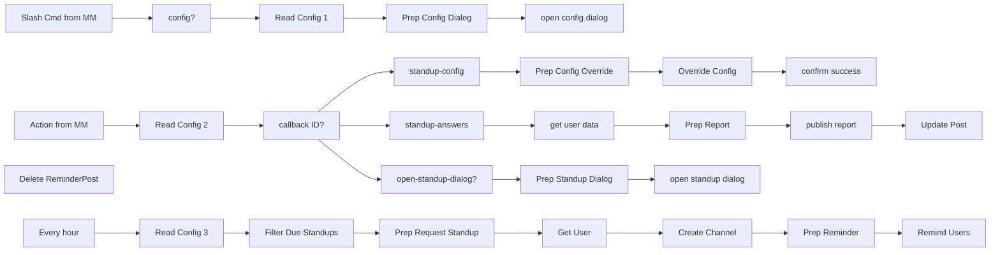

## Fluxo (.json) :

```json
{
  "id": 114,
  "name": "Standup Bot - Worker",
  "nodes": [
    {
      "name": "publish report",
      "type": "n8n-nodes-base.mattermost",
      "position": [
        1840,
        1040
      ],
      "parameters": {
        "message": "={{$node[\"Prep Report\"].json[\"post\"]}}",
        "channelId": "={{$node[\"Prep Report\"].json[\"channel\"]}}",
        "attachments": [],
        "otherOptions": {}
      },
      "credentials": {
        "mattermostApi": {
          "id": "2",
          "name": "Mattermost account"
        }
      },
      "typeVersion": 1
    },
    {
      "name": "get user data",
      "type": "n8n-nodes-base.httpRequest",
      "position": [
        1400,
        1040
      ],
      "parameters": {
        "url": "={{$node[\"Read Config 2\"].json[\"config\"][\"mattermostBaseUrl\"]}}/api/v4/users/{{$node[\"Action from MM\"].json[\"body\"][\"user_id\"]}}",
        "options": {},
        "jsonParameters": true,
        "headerParametersJson": "={\n\"Authorization\": \"Bearer {{$item(0).$node[\"Read Config 2\"].json[\"config\"][\"botUserToken\"]}}\"\n}"
      },
      "typeVersion": 1
    },
    {
      "name": "open-standup-dialog?",
      "type": "n8n-nodes-base.if",
      "position": [
        1180,
        1260
      ],
      "parameters": {
        "conditions": {
          "string": [
            {
              "value1": "={{$node[\"Action from MM\"].json[\"body\"][\"context\"][\"action\"]}}",
              "value2": "open-standup-dialog"
            }
          ]
        }
      },
      "typeVersion": 1
    },
    {
      "name": "Action from MM",
      "type": "n8n-nodes-base.webhook",
      "position": [
        520,
        820
      ],
      "webhookId": "6a28d86b-9f74-4825-9785-57e0d43b198f",
      "parameters": {
        "path": "standup-bot/action/f6f9b174745fa4651f750c36957d674c",
        "options": {},
        "httpMethod": "POST"
      },
      "typeVersion": 1
    },
    {
      "name": "Slash Cmd from MM",
      "type": "n8n-nodes-base.webhook",
      "position": [
        520,
        600
      ],
      "webhookId": "72732516-1143-430f-8465-d193fe657311",
      "parameters": {
        "path": "standup-bot/slashCmd",
        "options": {},
        "httpMethod": "POST"
      },
      "typeVersion": 1
    },
    {
      "name": "config?",
      "type": "n8n-nodes-base.if",
      "position": [
        740,
        600
      ],
      "parameters": {
        "conditions": {
          "string": [
            {
              "value1": "={{$node[\"Slash Cmd from MM\"].json[\"body\"][\"text\"]}}",
              "value2": "config"
            }
          ]
        }
      },
      "typeVersion": 1
    },
    {
      "name": "open config dialog",
      "type": "n8n-nodes-base.httpRequest",
      "position": [
        1360,
        580
      ],
      "parameters": {
        "url": "={{$node[\"Read Config 1\"].json[\"config\"][\"mattermostBaseUrl\"]}}/api/v4/actions/dialogs/open",
        "options": {
          "bodyContentType": "json"
        },
        "requestMethod": "POST",
        "jsonParameters": true,
        "bodyParametersJson": "={{$json}}"
      },
      "typeVersion": 1
    },
    {
      "name": "Prep Config Dialog",
      "type": "n8n-nodes-base.function",
      "position": [
        1160,
        580
      ],
      "parameters": {
        "functionCode": "const channelId =\n  $item(0).$node['Slash Cmd from MM'].json['body']['channel_id'];\n\nconst configuredStandups =\n  $item(0).$node['Read Config 1'].json['standups'] ?? [];\n\nlet standup = configuredStandups.find(\n  (standup) => standup.channelId == channelId\n);\n\n// define default values:\nif (!standup) {\n  standup = {\n    title: 'Team Standup',\n    time: '09:00',\n    days: [1, 2, 3, 4, 5],\n    questions: [\n      'What have you accomplished since your last report?',\n      'What do you want to accomplish until your next report?',\n      'Is anything blocking your progress?',\n    ],\n    users: [],\n  };\n}\n\nconst payload = {\n  trigger_id: $item(0).$node['Slash Cmd from MM'].json['body']['trigger_id'],\n  url: $item(0).$node['Read Config 1'].json['config']['n8nWebhookUrl'],\n  dialog: {\n    callback_id: 'standup-config',\n    title: 'Standup Configuration',\n    submit_label: 'Save',\n    notify_on_cancel: false,\n    state: JSON.stringify({ standupId: channelId }),\n    elements: [\n      {\n        display_name: 'Standup title',\n        name: 'title',\n        type: 'text',\n        placeholder: 'Team Standup',\n        default: standup.title,\n        optional: true,\n        help_text:\n          '💡 The standup can be deleted by setting its title to an empty string!',\n      },\n      {\n        display_name: 'Time',\n        name: 'time',\n        type: 'select',\n        default: standup.time,\n        options: [\n          {\n            text: '06:00',\n            value: '06:00',\n          },\n          {\n            text: '07:00',\n            value: '07:00',\n          },\n          {\n            text: '08:00',\n            value: '08:00',\n          },\n          {\n            text: '09:00',\n            value: '09:00',\n          },\n          {\n            text: '10:00',\n            value: '10:00',\n          },\n          {\n            text: '11:00',\n            value: '11:00',\n          },\n          {\n            text: '12:00',\n            value: '12:00',\n          },\n          {\n            text: '13:00',\n            value: '13:00',\n          },\n          {\n            text: '14:00',\n            value: '14:00',\n          },\n          {\n            text: '15:00',\n            value: '15:00',\n          },\n          {\n            text: '16:00',\n            value: '16:00',\n          },\n          {\n            text: '17:00',\n            value: '17:00',\n          },\n        ],\n      },\n      {\n        display_name: 'Days',\n        name: 'days',\n        type: 'text',\n        placeholder: '1,2,3,4,5',\n        help_text:\n          'comma-separated; 0=Sun | 1=Mon | 2=Tue | 3=Wed | 4=Thu | 5=Fri | 6=Sat',\n        default: standup.days.join(','),\n      },\n      {\n        display_name: 'Questions',\n        name: 'questions',\n        type: 'textarea',\n        help_text: 'Max 5 questions, one question per line;',\n        default: standup.questions.join('\\n'),\n      },\n      {\n        display_name: 'Users',\n        name: 'users',\n        type: 'textarea',\n        help_text: 'One user per line',\n        default: standup.users.join('\\n'),\n      },\n    ],\n  },\n};\n\nreturn [{ json: payload }];\n\n"
      },
      "typeVersion": 1
    },
    {
      "name": "callback ID?",
      "type": "n8n-nodes-base.switch",
      "position": [
        960,
        820
      ],
      "parameters": {
        "rules": {
          "rules": [
            {
              "value2": "standup-config"
            },
            {
              "output": 1,
              "value2": "standup-answers"
            }
          ]
        },
        "value1": "={{$node[\"Action from MM\"].json[\"body\"][\"callback_id\"]}}",
        "dataType": "string",
        "fallbackOutput": 3
      },
      "typeVersion": 1
    },
    {
      "name": "standup-config",
      "type": "n8n-nodes-base.noOp",
      "position": [
        1180,
        820
      ],
      "parameters": {},
      "typeVersion": 1
    },
    {
      "name": "standup-answers",
      "type": "n8n-nodes-base.noOp",
      "position": [
        1180,
        1040
      ],
      "parameters": {},
      "typeVersion": 1
    },
    {
      "name": "Prep Config Override",
      "type": "n8n-nodes-base.function",
      "position": [
        1400,
        820
      ],
      "parameters": {
        "functionCode": "const mattermostInput = $item(0).$node['Action from MM'].json['body'];\nconst config = $item(0).$node['Read Config 2'].json;\n\n// ensure there is a \"standups\" array:\nconfig['standups'] = config['standups'] ?? [];\n\n// remove the standup from the list:\nconfig['standups'] = config['standups'].filter(\n  (standup) => standup.channelId != mattermostInput.channel_id\n);\n\nconst textToArray = (text, separator) => {\n  return text\n    .split(separator)\n    .map((e) => e.trim())\n    .filter((e) => e.length > 0);\n};\n\n// a standup can be deleted by updating its title to \"\"\nif (mattermostInput.submission.title.length > 0) {\n  const newStandup = {\n    channelId: mattermostInput.channel_id,\n    title: mattermostInput.submission.title,\n    time: mattermostInput.submission.time,\n    days: textToArray(mattermostInput.submission.days, ',').map((e) =>\n      parseInt(e)\n    ),\n    users: textToArray(mattermostInput.submission.users, '\\n'),\n    questions: textToArray(mattermostInput.submission.questions, '\\n'),\n  };\n\n  config['standups'].push(newStandup);\n}\n\nreturn [{ json: config }];\n\n"
      },
      "typeVersion": 1
    },
    {
      "name": "Override Config",
      "type": "n8n-nodes-base.executeWorkflow",
      "position": [
        1620,
        820
      ],
      "parameters": {
        "workflowId": "1005"
      },
      "typeVersion": 1
    },
    {
      "name": "Read Config 1",
      "type": "n8n-nodes-base.executeWorkflow",
      "position": [
        960,
        580
      ],
      "parameters": {
        "workflowId": "1004"
      },
      "typeVersion": 1
    },
    {
      "name": "Read Config 2",
      "type": "n8n-nodes-base.executeWorkflow",
      "position": [
        740,
        820
      ],
      "parameters": {
        "workflowId": "1004"
      },
      "typeVersion": 1
    },
    {
      "name": "confirm success",
      "type": "n8n-nodes-base.mattermost",
      "position": [
        1840,
        820
      ],
      "parameters": {
        "userId": "={{$node[\"Action from MM\"].json[\"body\"][\"user_id\"]}}",
        "message": "new standup config was saved successfully",
        "channelId": "={{$node[\"Action from MM\"].json[\"body\"][\"channel_id\"]}}",
        "operation": "postEphemeral"
      },
      "credentials": {
        "mattermostApi": {
          "id": "2",
          "name": "Mattermost account"
        }
      },
      "typeVersion": 1
    },
    {
      "name": "Read Config 3",
      "type": "n8n-nodes-base.executeWorkflow",
      "position": [
        740,
        380
      ],
      "parameters": {
        "workflowId": "1004"
      },
      "typeVersion": 1
    },
    {
      "name": "Filter Due Standups",
      "type": "n8n-nodes-base.function",
      "position": [
        960,
        380
      ],
      "parameters": {
        "functionCode": "const config = $item(0).$node['Read Config 3'].json;\n\n// ensure there is a \"standups\" array:\nconfig['standups'] = config['standups'] ?? [];\n\nconst now = new Date();\nconst duePattern = `${now.getDay()}_${now\n  .getHours()\n  .toString()\n  .padStart(2, '0')}:00`; // e.g. 1_13:00 => Monday 1 p.m.\n  \nconsole.log(duePattern);\n\n// filter standups that are due now:\nconst dueStandups = config.standups.filter((standup) =>\n  //true\n  standup.days.map((day) => `${day}_${standup.time}`).includes(duePattern)\n);\n\nreturn dueStandups.map((standup) => ({\n  json: standup,\n}));\n\n"
      },
      "typeVersion": 1
    },
    {
      "name": "Prep Request Standup",
      "type": "n8n-nodes-base.function",
      "position": [
        1180,
        380
      ],
      "parameters": {
        "functionCode": "const reminders = items.reduce((prev, curr) => {\n  return prev.concat(\n    curr.json.users.map((user) => ({\n      channelId: curr.json.channelId,\n      title: curr.json.title,\n      user: user,\n    }))\n  );\n}, []);\n\nreturn reminders.map((reminder) => ({\n  json: reminder,\n}));\n"
      },
      "typeVersion": 1
    },
    {
      "name": "Create Channel",
      "type": "n8n-nodes-base.httpRequest",
      "position": [
        1620,
        380
      ],
      "parameters": {
        "url": "={{$item(0).$node[\"Read Config 3\"].json[\"config\"][\"mattermostBaseUrl\"]}}/api/v4/channels/direct",
        "options": {},
        "requestMethod": "POST",
        "jsonParameters": true,
        "bodyParametersJson": "=[\"{{$node[\"Get User\"].json[\"id\"]}}\", \"{{$item(0).$node[\"Read Config 3\"].json[\"config\"][\"botUserId\"]}}\"]",
        "headerParametersJson": "={\n  \"Authorization\": \"Bearer {{$item(0).$node[\"Read Config 3\"].json[\"config\"][\"botUserToken\"]}}\"\n}"
      },
      "typeVersion": 1
    },
    {
      "name": "Remind Users",
      "type": "n8n-nodes-base.httpRequest",
      "position": [
        2060,
        380
      ],
      "parameters": {
        "url": "={{$item(0).$node[\"Read Config 3\"].json[\"config\"][\"mattermostBaseUrl\"]}}/api/v4/posts",
        "options": {},
        "requestMethod": "POST",
        "jsonParameters": true,
        "bodyParametersJson": "={{$json}}",
        "headerParametersJson": "={\n\"Authorization\": \"Bearer {{$item(0).$node[\"Read Config 3\"].json[\"config\"][\"botUserToken\"]}}\"\n}"
      },
      "typeVersion": 1
    },
    {
      "name": "Get User",
      "type": "n8n-nodes-base.httpRequest",
      "position": [
        1400,
        380
      ],
      "parameters": {
        "url": "={{$item(0).$node[\"Read Config 3\"].json[\"config\"][\"mattermostBaseUrl\"]}}/api/v4/users/username/{{$node[\"Prep Request Standup\"].json[\"user\"]}}",
        "options": {},
        "jsonParameters": true,
        "headerParametersJson": "={\n  \"Authorization\": \"Bearer {{$item(0).$node[\"Read Config 3\"].json[\"config\"][\"botUserToken\"]}}\"\n}"
      },
      "typeVersion": 1,
      "continueOnFail": true
    },
    {
      "name": "Prep Reminder",
      "type": "n8n-nodes-base.function",
      "position": [
        1840,
        380
      ],
      "parameters": {
        "functionCode": "const webhookUrl =\n  $item(0).$node['Read Config 3'].json['config']['n8nWebhookUrl']; // e.g. https://xyz.app.n8n.cloud/webhook-test/standup-bot/action/top-secret-api-key\n\nconst botUserToken =\n  $item(0).$node['Read Config 3'].json['config']['botUserToken'];\n\nlet itemIndex = 0;\n\nfor (item of items) {\n  const directChannelId = item.json.id;\n\n  const payload = {\n    channel_id: directChannelId,\n    props: {\n      attachments: [\n        {\n          pretext: \"Hi there! It's time for standup!\",\n          text: `Please provide your input for: **${\n            $item(itemIndex).$node['Prep Request Standup'].json['title']\n          }**`,\n          actions: [\n            {\n              id: webhookUrl.includes('test') ? 'webhook-test' : 'webhook',\n              name: 'Provide Update',\n              integration: {\n                url: webhookUrl,\n                context: {\n                  action: 'open-standup-dialog',\n                  secret: botUserToken, // not ideal but good enough for now...\n                  standupId:\n                    $item(itemIndex).$node['Prep Request Standup'].json[\n                      'channelId'\n                    ],\n                },\n              },\n            },\n          ],\n        },\n      ],\n    },\n  };\n\n  item.json = payload;\n\n  itemIndex++;\n}\n\nreturn items;\n\n"
      },
      "typeVersion": 1
    },
    {
      "name": "Prep Standup Dialog",
      "type": "n8n-nodes-base.function",
      "position": [
        1400,
        1240
      ],
      "parameters": {
        "functionCode": "const standupId =\n  $item(0).$node['Action from MM'].json['body']['context']['standupId'];\n\nconst postId = $item(0).$node['Action from MM'].json['body']['post_id'];\n\nconst configuredStandups =\n  $item(0).$node['Read Config 2'].json['standups'] ?? [];\n\nlet standup = configuredStandups.find(\n  (standup) => (standup.channelId == standupId)\n);\n\nconst renderQuestions = (questions) => {\n  let questionId = 1;\n\n  return questions.map((question) => ({\n    display_name: question,\n    name: `q${questionId++}`,\n    type: 'textarea',\n  }));\n};\n\nconst payload = {\n  trigger_id: $item(0).$node['Action from MM'].json['body']['trigger_id'],\n  url: $item(0).$node['Read Config 2'].json['config']['n8nWebhookUrl'],\n  dialog: {\n    callback_id: 'standup-answers',\n    title: `Report for: ${standup.title}`,\n    submit_label: 'Submit',\n    notify_on_cancel: false,\n    state: JSON.stringify({ standupId, reminderPostId: postId }),\n    elements: renderQuestions(standup.questions),\n  },\n};\n\nreturn [{ json: payload }];\n"
      },
      "typeVersion": 1
    },
    {
      "name": "open standup dialog",
      "type": "n8n-nodes-base.httpRequest",
      "position": [
        1600,
        1240
      ],
      "parameters": {
        "url": "={{$node[\"Read Config 2\"].json[\"config\"][\"mattermostBaseUrl\"]}}/api/v4/actions/dialogs/open",
        "options": {
          "bodyContentType": "json"
        },
        "requestMethod": "POST",
        "jsonParameters": true,
        "bodyParametersJson": "={{$json}}"
      },
      "typeVersion": 1
    },
    {
      "name": "Prep Report",
      "type": "n8n-nodes-base.function",
      "position": [
        1620,
        1040
      ],
      "parameters": {
        "functionCode": "const { standupId, reminderPostId } = JSON.parse(\n  $item(0).$node['Action from MM'].json['body']['state']\n);\nconst submission = $item(0).$node['Action from MM'].json['body']['submission'];\n\nconst configuredStandups = $item(0).$node['Read Config 2'].json['standups'];\n\nconst standup = configuredStandups.find(\n  (standup) => standup.channelId == standupId\n);\n\nconst emptyAnswers = [\n  '-',\n  '/',\n  ' ',\n  'x',\n  'n/a',\n  'nope',\n  'nopes',\n  'no',\n  'none',\n  'no.',\n  'nothing',\n];\n\nfunction capitalize(text) {\n  return text.charAt(0).toUpperCase() + text.slice(1);\n}\n\nconst renderPost = (submission, standup) => {\n  let postText = `### ${capitalize(\n    $item(0).$node['get user data'].json['username']\n  )}\\n`;\n\n  let questionIndex = 0;\n\n  postText += standup.questions\n    .map((question) => {\n      questionIndex++;\n\n      if (\n        !submission[`q${questionIndex}`] ||\n        emptyAnswers.includes(submission[`q${questionIndex}`].toLowerCase())\n      ) {\n        return '';\n      }\n\n      return `#### ${question}\\n${submission[`q${questionIndex}`]}`;\n    })\n    .join('\\n');\n\n  return postText;\n};\n\nreturn [\n  {\n    json: {\n      post: renderPost(submission, standup),\n      channel: standupId,\n      reminderPostId,\n      standupTitle: standup.title,\n    },\n  },\n];\n\n"
      },
      "typeVersion": 1
    },
    {
      "name": "Delete ReminderPost",
      "type": "n8n-nodes-base.mattermost",
      "position": [
        2280,
        1040
      ],
      "parameters": {
        "postId": "={{$node[\"Prep Report\"].json[\"reminderPostId\"]}}",
        "operation": "delete"
      },
      "credentials": {
        "mattermostApi": {
          "id": "2",
          "name": "Mattermost account"
        }
      },
      "typeVersion": 1
    },
    {
      "name": "Update Post",
      "type": "n8n-nodes-base.httpRequest",
      "position": [
        2060,
        1040
      ],
      "parameters": {
        "url": "={{$node[\"Read Config 2\"].json[\"config\"][\"mattermostBaseUrl\"]}}/api/v4/posts/{{$node[\"Prep Report\"].json[\"reminderPostId\"]}}",
        "options": {},
        "requestMethod": "PUT",
        "jsonParameters": true,
        "bodyParametersJson": "={\n\"id\":\"{{$node[\"Prep Report\"].json[\"reminderPostId\"]}}\",\n\"message\": \"Thank you for providing your report for {{$node[\"Prep Report\"].json[\"standupTitle\"]}}\"\n}",
        "headerParametersJson": "={\n\"Content-Type\":\"application/json\",\n\"Authorization\": \"Bearer {{$item(0).$node[\"Read Config 2\"].json[\"config\"][\"botUserToken\"]}}\"\n}"
      },
      "typeVersion": 1
    },
    {
      "name": "Every hour",
      "type": "n8n-nodes-base.cron",
      "position": [
        520,
        380
      ],
      "parameters": {
        "triggerTimes": {
          "item": [
            {
              "mode": "custom",
              "cronExpression": "0 0 6-12 * * 1-5"
            }
          ]
        }
      },
      "typeVersion": 1
    }
  ],
  "active": false,
  "settings": {},
  "connections": {
    "config?": {
      "main": [
        [
          {
            "node": "Read Config 1",
            "type": "main",
            "index": 0
          }
        ]
      ]
    },
    "Get User": {
      "main": [
        [
          {
            "node": "Create Channel",
            "type": "main",
            "index": 0
          }
        ]
      ]
    },
    "Every hour": {
      "main": [
        [
          {
            "node": "Read Config 3",
            "type": "main",
            "index": 0
          }
        ]
      ]
    },
    "Prep Report": {
      "main": [
        [
          {
            "node": "publish report",
            "type": "main",
            "index": 0
          }
        ]
      ]
    },
    "callback ID?": {
      "main": [
        [
          {
            "node": "standup-config",
            "type": "main",
            "index": 0
          }
        ],
        [
          {
            "node": "standup-answers",
            "type": "main",
            "index": 0
          }
        ],
        [],
        [
          {
            "node": "open-standup-dialog?",
            "type": "main",
            "index": 0
          }
        ]
      ]
    },
    "Prep Reminder": {
      "main": [
        [
          {
            "node": "Remind Users",
            "type": "main",
            "index": 0
          }
        ]
      ]
    },
    "Read Config 1": {
      "main": [
        [
          {
            "node": "Prep Config Dialog",
            "type": "main",
            "index": 0
          }
        ]
      ]
    },
    "Read Config 2": {
      "main": [
        [
          {
            "node": "callback ID?",
            "type": "main",
            "index": 0
          }
        ]
      ]
    },
    "Read Config 3": {
      "main": [
        [
          {
            "node": "Filter Due Standups",
            "type": "main",
            "index": 0
          }
        ]
      ]
    },
    "get user data": {
      "main": [
        [
          {
            "node": "Prep Report",
            "type": "main",
            "index": 0
          }
        ]
      ]
    },
    "Action from MM": {
      "main": [
        [
          {
            "node": "Read Config 2",
            "type": "main",
            "index": 0
          }
        ]
      ]
    },
    "Create Channel": {
      "main": [
        [
          {
            "node": "Prep Reminder",
            "type": "main",
            "index": 0
          }
        ]
      ]
    },
    "publish report": {
      "main": [
        [
          {
            "node": "Update Post",
            "type": "main",
            "index": 0
          }
        ]
      ]
    },
    "standup-config": {
      "main": [
        [
          {
            "node": "Prep Config Override",
            "type": "main",
            "index": 0
          }
        ]
      ]
    },
    "Override Config": {
      "main": [
        [
          {
            "node": "confirm success",
            "type": "main",
            "index": 0
          }
        ]
      ]
    },
    "standup-answers": {
      "main": [
        [
          {
            "node": "get user data",
            "type": "main",
            "index": 0
          }
        ]
      ]
    },
    "Slash Cmd from MM": {
      "main": [
        [
          {
            "node": "config?",
            "type": "main",
            "index": 0
          }
        ]
      ]
    },
    "Prep Config Dialog": {
      "main": [
        [
          {
            "node": "open config dialog",
            "type": "main",
            "index": 0
          }
        ]
      ]
    },
    "Filter Due Standups": {
      "main": [
        [
          {
            "node": "Prep Request Standup",
            "type": "main",
            "index": 0
          }
        ]
      ]
    },
    "Prep Standup Dialog": {
      "main": [
        [
          {
            "node": "open standup dialog",
            "type": "main",
            "index": 0
          }
        ]
      ]
    },
    "Prep Config Override": {
      "main": [
        [
          {
            "node": "Override Config",
            "type": "main",
            "index": 0
          }
        ]
      ]
    },
    "Prep Request Standup": {
      "main": [
        [
          {
            "node": "Get User",
            "type": "main",
            "index": 0
          }
        ]
      ]
    },
    "open-standup-dialog?": {
      "main": [
        [
          {
            "node": "Prep Standup Dialog",
            "type": "main",
            "index": 0
          }
        ]
      ]
    }
  }
}
```

<a id="template-1581"></a>

## Template 1581 - Rate limit por API key e consulta de Pokémons

- **Nome:** Rate limit por API key e consulta de Pokémons
- **Descrição:** O fluxo aplica limites de requisições por minuto e por hora com base no header x-api-key e, quando dentro dos limites, retorna registros da tabela 'Pokemon' do Airtable.
- **Funcionalidade:** • Recepção de requisições: Aceita chamadas HTTP e extrai o header x-api-key.
• Geração de chaves temporais: Cria chaves distintas por minuto e por hora combinando a apiKey com timestamp.
• Contagem por minuto: Incrementa um contador no armazenamento para limitar requisições por minuto (limite configurado em 10).
• Verificação por minuto: Bloqueia e retorna mensagem de erro se o limite por minuto for excedido.
• Contagem por hora: Incrementa um contador separado para controle por hora (limite configurado em torno de 60).
• Verificação por hora: Bloqueia e retorna mensagem de erro se o limite por hora for excedido.
• Consulta condicional a base de dados: Quando dentro dos limites, consulta a tabela 'Pokemon' e formata uma lista com nome e URL.
• Resposta formatada: Retorna os dados solicitados junto com informação do consumo do limite.
- **Ferramentas:** • Airtable: Base de dados onde a tabela 'Pokemon' é consultada para retornar registros (campos name e url).
• Redis: Armazenamento usado para incrementar e manter contadores temporários para implementar o rate limiting por minuto e por hora.

## Fluxo visual

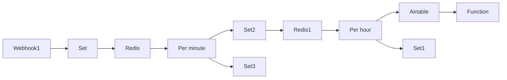

## Fluxo (.json) :

```json
{
  "nodes": [
    {
      "name": "Airtable",
      "type": "n8n-nodes-base.airtable",
      "position": [
        1650,
        300
      ],
      "parameters": {
        "table": "Pokemon",
        "operation": "list",
        "additionalOptions": {}
      },
      "credentials": {
        "airtableApi": "Airtable Credentials @n8n"
      },
      "typeVersion": 1
    },
    {
      "name": "Redis",
      "type": "n8n-nodes-base.redis",
      "position": [
        600,
        600
      ],
      "parameters": {
        "key": "={{$json[\"apiKey\"]}}",
        "ttl": 3600,
        "expire": true,
        "operation": "incr"
      },
      "credentials": {
        "redis": "Redis Cloud Credentials"
      },
      "typeVersion": 1
    },
    {
      "name": "Redis1",
      "type": "n8n-nodes-base.redis",
      "position": [
        1200,
        450
      ],
      "parameters": {
        "key": "={{$json[\"apiKey\"]}}",
        "operation": "incr"
      },
      "credentials": {
        "redis": "Redis Cloud Credentials"
      },
      "typeVersion": 1
    },
    {
      "name": "Set1",
      "type": "n8n-nodes-base.set",
      "position": [
        1600,
        550
      ],
      "parameters": {
        "values": {
          "string": [
            {
              "name": "message",
              "value": "You exceeded your limit"
            }
          ]
        },
        "options": {},
        "keepOnlySet": true
      },
      "typeVersion": 1
    },
    {
      "name": "Webhook1",
      "type": "n8n-nodes-base.webhook",
      "position": [
        200,
        600
      ],
      "webhookId": "a3167ed7-98d2-422c-bfe2-e3ba599d19f1",
      "parameters": {
        "path": "a3167ed7-98d2-422c-bfe2-e3ba599d19f1",
        "options": {},
        "responseMode": "lastNode",
        "authentication": "headerAuth"
      },
      "credentials": {
        "httpHeaderAuth": "Credential Example"
      },
      "typeVersion": 1
    },
    {
      "name": "Function",
      "type": "n8n-nodes-base.function",
      "position": [
        1900,
        300
      ],
      "parameters": {
        "functionCode": " const limit = `Limit consumed: `+ $node['Redis1'].json[$node[\"Set2\"].json[\"apiKey\"]];\n return [\n  {\n    json: {\n      message:limit,\n      body: items.map(item => {\n        const name= item.json.fields.name\n        const url= item.json.fields.url\n        return {name,url}\n      })\n    }\n  }\n]\n"
      },
      "typeVersion": 1
    },
    {
      "name": "Set",
      "type": "n8n-nodes-base.set",
      "position": [
        400,
        600
      ],
      "parameters": {
        "values": {
          "string": [
            {
              "name": "apiKey",
              "value": "={{$json[\"headers\"][\"x-api-key\"] +'-'+ new Date().getHours() +'-'+ new Date().getMinutes()}}"
            }
          ]
        },
        "options": {},
        "keepOnlySet": true
      },
      "typeVersion": 1
    },
    {
      "name": "Set2",
      "type": "n8n-nodes-base.set",
      "position": [
        1000,
        450
      ],
      "parameters": {
        "values": {
          "string": [
            {
              "name": "apiKey",
              "value": "={{$node['Webhook1'].json[\"headers\"][\"x-api-key\"] +'-'+ new Date().getHours()}}"
            }
          ]
        },
        "options": {},
        "keepOnlySet": true
      },
      "typeVersion": 1
    },
    {
      "name": "Set3",
      "type": "n8n-nodes-base.set",
      "position": [
        1000,
        700
      ],
      "parameters": {
        "values": {
          "string": [
            {
              "name": "message",
              "value": "You exceeded your limit"
            }
          ]
        },
        "options": {},
        "keepOnlySet": true
      },
      "typeVersion": 1
    },
    {
      "name": "Per hour",
      "type": "n8n-nodes-base.if",
      "position": [
        1400,
        450
      ],
      "parameters": {
        "conditions": {
          "number": [
            {
              "value1": "={{$json[$node[\"Set2\"].json[\"apiKey\"]]}}",
              "value2": 60
            }
          ],
          "string": []
        }
      },
      "typeVersion": 1
    },
    {
      "name": "Per minute",
      "type": "n8n-nodes-base.if",
      "position": [
        800,
        600
      ],
      "parameters": {
        "conditions": {
          "number": [
            {
              "value1": "={{$json[$node[\"Set\"].json[\"apiKey\"]]}}",
              "value2": 10,
              "operation": "smallerEqual"
            }
          ]
        }
      },
      "typeVersion": 1
    }
  ],
  "connections": {
    "Set": {
      "main": [
        [
          {
            "node": "Redis",
            "type": "main",
            "index": 0
          }
        ]
      ]
    },
    "Set2": {
      "main": [
        [
          {
            "node": "Redis1",
            "type": "main",
            "index": 0
          }
        ]
      ]
    },
    "Redis": {
      "main": [
        [
          {
            "node": "Per minute",
            "type": "main",
            "index": 0
          }
        ]
      ]
    },
    "Redis1": {
      "main": [
        [
          {
            "node": "Per hour",
            "type": "main",
            "index": 0
          }
        ]
      ]
    },
    "Airtable": {
      "main": [
        [
          {
            "node": "Function",
            "type": "main",
            "index": 0
          }
        ]
      ]
    },
    "Per hour": {
      "main": [
        [
          {
            "node": "Airtable",
            "type": "main",
            "index": 0
          }
        ],
        [
          {
            "node": "Set1",
            "type": "main",
            "index": 0
          }
        ]
      ]
    },
    "Webhook1": {
      "main": [
        [
          {
            "node": "Set",
            "type": "main",
            "index": 0
          }
        ]
      ]
    },
    "Per minute": {
      "main": [
        [
          {
            "node": "Set2",
            "type": "main",
            "index": 0
          }
        ],
        [
          {
            "node": "Set3",
            "type": "main",
            "index": 0
          }
        ]
      ]
    }
  }
}
```

<a id="template-1583"></a>

## Template 1583 - RSS da série ARD 'Kalk und Welk'

- **Nome:** RSS da série ARD 'Kalk und Welk'
- **Descrição:** Cria dinamicamente um feed RSS a partir das páginas de episódios de uma série na ARD Audiothek e o disponibiliza via um endpoint.
- **Funcionalidade:** • Inicia via requisição ao endpoint: Responde a chamadas HTTP para fornecer o feed.
• Coleta a página de visão geral da série: Baixa o HTML da página principal da série.
• Extrai links de episódios: Localiza e captura URLs de episódios na página de visão geral.
• Remove links duplicados: Elimina entradas repetidas antes de processar cada episódio.
• Recupera páginas de episódio: Faz requisições individuais para cada página de episódio encontrada.
• Extrai e parseia JSON embutido: Captura um script com dados JSON em cada página de episódio e converte em objeto utilizável.
• Constrói itens de feed RSS: Gera itens RSS (title, enclosure, guid, pubDate, description) a partir dos dados parsedos.
• Serve o XML do RSS: Responde ao solicitante com o XML do feed e cabeçalho Content-Type apropriado.
- **Ferramentas:** • ARD Audiothek: Fonte dos dados (páginas da série e episódios) a partir das quais o feed é gerado.
• RSS (formato de feed): Padrão utilizado para estruturar e distribuir os episódios como feed.
• JavaScript: Linguagem usada para processar dados, parsear JSON e montar o XML do feed.
• Requisições HTTP/HTTPS: Mecanismo para obter páginas web e disponibilizar o feed via endpoint.

## Fluxo visual

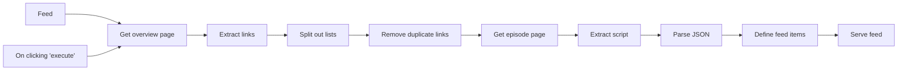

## Fluxo (.json) :

```json
{
  "nodes": [
    {
      "id": "35c4aa9f-7535-4315-9174-fe97afc6de2e",
      "name": "On clicking 'execute'",
      "type": "n8n-nodes-base.manualTrigger",
      "position": [
        240,
        300
      ],
      "parameters": {},
      "typeVersion": 1
    },
    {
      "id": "ed1f4f78-733f-4dd5-9785-969c9ec0d637",
      "name": "Get overview page",
      "type": "n8n-nodes-base.httpRequest",
      "position": [
        460,
        300
      ],
      "parameters": {
        "url": "https://www.ardaudiothek.de/sendung/kalk-und-welk/10777871/",
        "options": {},
        "responseFormat": "string"
      },
      "typeVersion": 2
    },
    {
      "id": "28333c78-aa8f-401a-8033-2007a5e6991c",
      "name": "Extract links",
      "type": "n8n-nodes-base.htmlExtract",
      "position": [
        680,
        300
      ],
      "parameters": {
        "options": {},
        "extractionValues": {
          "values": [
            {
              "key": "links",
              "attribute": "href",
              "cssSelector": "a[href*=\"/episode/\"]",
              "returnArray": true,
              "returnValue": "attribute"
            }
          ]
        }
      },
      "typeVersion": 1
    },
    {
      "id": "58840494-4208-49ce-b82a-d7cf8abd3b29",
      "name": "Remove duplicate links",
      "type": "n8n-nodes-base.itemLists",
      "position": [
        1120,
        300
      ],
      "parameters": {
        "operation": "removeDuplicates"
      },
      "typeVersion": 1
    },
    {
      "id": "17efb905-b947-4538-ab34-d50bf7fdbd75",
      "name": "Split out lists",
      "type": "n8n-nodes-base.itemLists",
      "position": [
        900,
        300
      ],
      "parameters": {
        "options": {
          "destinationFieldName": "link"
        },
        "fieldToSplitOut": "links"
      },
      "typeVersion": 1
    },
    {
      "id": "59a69e64-ebba-42cb-b8d0-8dd73f0ae962",
      "name": "Get episode page",
      "type": "n8n-nodes-base.httpRequest",
      "position": [
        1340,
        300
      ],
      "parameters": {
        "url": "=https://www.ardaudiothek.de{{ $json[\"link\"] }}",
        "options": {},
        "responseFormat": "string"
      },
      "typeVersion": 2
    },
    {
      "id": "68749bff-1499-4ef5-aefd-c4b6233d0fa7",
      "name": "Extract script",
      "type": "n8n-nodes-base.htmlExtract",
      "position": [
        1560,
        300
      ],
      "parameters": {
        "options": {},
        "extractionValues": {
          "values": [
            {
              "key": "script",
              "cssSelector": "script:nth-of-type(2)",
              "returnValue": "html"
            }
          ]
        }
      },
      "typeVersion": 1
    },
    {
      "id": "158e7b18-f58d-453f-80f8-97e65f0b1fde",
      "name": "Parse JSON",
      "type": "n8n-nodes-base.set",
      "position": [
        1780,
        300
      ],
      "parameters": {
        "values": {
          "string": [
            {
              "name": "data",
              "value": "={{ JSON.parse($json.script) }}"
            }
          ]
        },
        "options": {},
        "keepOnlySet": true
      },
      "typeVersion": 1
    },
    {
      "id": "a613c52e-395b-4d88-ab7d-b1cf2b664b43",
      "name": "Define feed items",
      "type": "n8n-nodes-base.function",
      "position": [
        2000,
        300
      ],
      "parameters": {
        "functionCode": "const escapeHTML = str => str.replace(/[&<>'\"]/g, \n  tag => ({\n      '&': '&amp;',\n      '<': '&lt;',\n      '>': '&gt;',\n      \"'\": '&#39;',\n      '\"': '&quot;'\n    }[tag]));\n\nlet feedItems = [];\nfor (item of items) {\n  feedItems.push(`<item>\n  <title>${escapeHTML(item.json.data.name)}</title>\n  <enclosure url=\"${item.json.data.associatedMedia.contentUrl}\" length=\"${item.json.data.timeRequired * 20 * 1000}\" type=\"${item.json.data.encodingFormat}\"/>\n  <guid isPermaLink=\"false\">${item.json.data.identifier}</guid>\n  <pubDate>${DateTime.fromISO(item.json.data.datePublished).toRFC2822()}</pubDate>\n  <description>${escapeHTML(item.json.data.description)}</description>\n</item>`);\n}\n\nreturn [{\n  data: `<?xml version=\"1.0\" encoding=\"UTF-8\"?>\n<rss version=\"2.0\" xmlns:itunes=\"http://www.itunes.com/dtds/podcast-1.0.dtd\" xmlns:content=\"http://purl.org/rss/1.0/modules/content/\">\n  <channel>\n    <title>${escapeHTML(items[0].json.data.partOfSeries.name)}</title>\n    <description>${escapeHTML(items[0].json.data.partOfSeries.about)}</description>\n    <itunes:image href=\"${escapeHTML(items[0].json.data.image)}\" />\n    <language>${items[0].json.data.inLanguage}</language>\n    <itunes:category text=\"Comedy\" />\n    <itunes:explicit>no</itunes:explicit>\n    <link>${items[0].json.data.partOfSeries.url}</link>\n    <copyright>© ${$now.toFormat('yyyy')} ${escapeHTML(items[0].json.data.productionCompany)}</copyright>\n    <itunes:author>${escapeHTML(items[0].json.data.productionCompany)}</itunes:author>\n    ${feedItems.join('\\n')}\n  </channel>\n</rss>\n`\n}];\n"
      },
      "typeVersion": 1
    },
    {
      "id": "cbdc367d-a685-4f0b-a9f3-0aedc2c8b3c1",
      "name": "Feed",
      "type": "n8n-nodes-base.webhook",
      "position": [
        240,
        100
      ],
      "webhookId": "3fbd94de-2fb3-4b32-a46e-c237865479b9",
      "parameters": {
        "path": "3fbd94de-2fb3-4b32-a46e-c237865479b9.rss",
        "options": {},
        "responseMode": "responseNode"
      },
      "typeVersion": 1
    },
    {
      "id": "0dfb02cc-1944-4542-b5c5-9e0b198e143d",
      "name": "Serve feed",
      "type": "n8n-nodes-base.respondToWebhook",
      "position": [
        2220,
        300
      ],
      "parameters": {
        "options": {
          "responseCode": 200,
          "responseHeaders": {
            "entries": [
              {
                "name": "Content-Type",
                "value": "application/rss+xml"
              }
            ]
          }
        },
        "respondWith": "text",
        "responseBody": "={{ $json[\"data\"] }}"
      },
      "typeVersion": 1
    }
  ],
  "connections": {
    "Feed": {
      "main": [
        [
          {
            "node": "Get overview page",
            "type": "main",
            "index": 0
          }
        ]
      ]
    },
    "Parse JSON": {
      "main": [
        [
          {
            "node": "Define feed items",
            "type": "main",
            "index": 0
          }
        ]
      ]
    },
    "Extract links": {
      "main": [
        [
          {
            "node": "Split out lists",
            "type": "main",
            "index": 0
          }
        ]
      ]
    },
    "Extract script": {
      "main": [
        [
          {
            "node": "Parse JSON",
            "type": "main",
            "index": 0
          }
        ]
      ]
    },
    "Split out lists": {
      "main": [
        [
          {
            "node": "Remove duplicate links",
            "type": "main",
            "index": 0
          }
        ]
      ]
    },
    "Get episode page": {
      "main": [
        [
          {
            "node": "Extract script",
            "type": "main",
            "index": 0
          }
        ]
      ]
    },
    "Define feed items": {
      "main": [
        [
          {
            "node": "Serve feed",
            "type": "main",
            "index": 0
          }
        ]
      ]
    },
    "Get overview page": {
      "main": [
        [
          {
            "node": "Extract links",
            "type": "main",
            "index": 0
          }
        ]
      ]
    },
    "On clicking 'execute'": {
      "main": [
        [
          {
            "node": "Get overview page",
            "type": "main",
            "index": 0
          }
        ]
      ]
    },
    "Remove duplicate links": {
      "main": [
        [
          {
            "node": "Get episode page",
            "type": "main",
            "index": 0
          }
        ]
      ]
    }
  }
}
```

<a id="template-1585"></a>

## Template 1585 - Classificador e encaminhador de feedback para Discord

- **Nome:** Classificador e encaminhador de feedback para Discord
- **Descrição:** Recebe feedbacks de usuários, usa IA para classificá-los em categorias e encaminha instruções apropriadas para canais do Discord.
- **Funcionalidade:** • Recepção de solicitações via webhook/manual: Inicia o processo a partir de um POST recebido ou execução manual.
• Análise com IA (GPT-4): Envia o texto do feedback ao modelo para identificar categoria e gerar uma instrução curta e educada.
• Parsing da resposta do modelo: Converte a resposta do modelo em JSON utilizável.
• Seleção de categoria: Classifica o feedback como "success-story", "urgent-issue" ou "ticket" e trata casos não mapeados como fallback.
• Encaminhamento para departamentos: Envia a instrução gerada para os canais/displays correspondentes no Discord via webhooks.
• Ação de fallback (nenhuma operação): Para categorias desconhecidas, não realiza envio.
- **Ferramentas:** • OpenAI (GPT-4): Serviço de IA usado para analisar o texto do feedback e gerar a categoria e instrução.
• Endpoint HTTP / Webhook de entrada: Ponto de recebimento das solicitações de feedback via POST.
• Discord (webhooks): Canal de destino para enviar as instruções e notificações aos departamentos relevantes.

## Fluxo visual

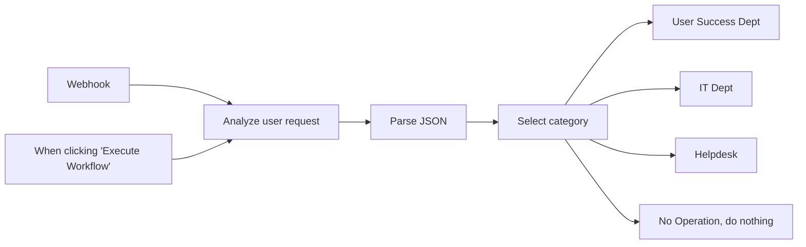

## Fluxo (.json) :

```json
{
  "id": "180",
  "meta": {
    "instanceId": "fb924c73af8f703905bc09c9ee8076f48c17b596ed05b18c0ff86915ef8a7c4a"
  },
  "name": "Discord AI bot",
  "tags": [],
  "nodes": [
    {
      "id": "6f188270-2c08-491f-bf52-c4a152b33aa0",
      "name": "When clicking \"Execute Workflow\"",
      "type": "n8n-nodes-base.manualTrigger",
      "position": [
        1220,
        780
      ],
      "parameters": {},
      "typeVersion": 1
    },
    {
      "id": "e4839de2-fc04-40b0-b6bc-596455ad93fe",
      "name": "Webhook",
      "type": "n8n-nodes-base.webhook",
      "position": [
        1220,
        580
      ],
      "webhookId": "d0cdd428-be96-4821-85bc-65342cf928d0",
      "parameters": {
        "path": "d0cdd428-be96-4821-85bc-65342cf928d0",
        "options": {},
        "httpMethod": "POST"
      },
      "typeVersion": 1
    },
    {
      "id": "15dcafe1-6361-4775-ace0-e34fd2a143b4",
      "name": "No Operation, do nothing",
      "type": "n8n-nodes-base.noOp",
      "position": [
        2120,
        940
      ],
      "parameters": {},
      "typeVersion": 1
    },
    {
      "id": "0d28fe8e-da80-458b-9a75-d316019cb3ae",
      "name": "Analyze user request",
      "type": "n8n-nodes-base.openAi",
      "position": [
        1420,
        680
      ],
      "parameters": {
        "model": "gpt-4",
        "prompt": {
          "messages": [
            {
              "role": "system",
              "content": "Act as a service desk agent and help to categorize user messages. Return back only JSON without quotations. Do not return anything else."
            },
            {
              "content": "=Here is a user feedback: \"{{ $json.body.feedback }}\". Please analyse it and put into one of the categories:\n1. \"success-story\" for user appraisal or success story. this will be processed by customer success department\n2. \"urgent-issue\" for extreme dissatisfaction or an urgent problem. this will be escalated to the IT team. Please assess if the request is really urgent and whether it has an immediate impact on the client. If the ticket doesn't look like an immediate problem or an extreme dissatisfaction then proceed as a normal ticket.\n3. \"ticket\" for everything else. This will be processed as normal by customer support team.\n\nPlease return back a JSON with the following structure: category (string), feedback (string), instruction (string).\nCategory must match the analysed category. feedback must match the original text. instruction should contain a text for a department according to the category with a one sentense summary of the feedback. Please be polite and friendly to the colleagues."
            }
          ]
        },
        "options": {
          "maxTokens": 500,
          "temperature": 0.5
        },
        "resource": "chat"
      },
      "credentials": {
        "openAiApi": {
          "id": "63",
          "name": "OpenAi account"
        }
      },
      "typeVersion": 1
    },
    {
      "id": "ce1c4198-ce21-4436-9ccb-4a2a078cd06e",
      "name": "Select category",
      "type": "n8n-nodes-base.switch",
      "position": [
        1840,
        680
      ],
      "parameters": {
        "rules": {
          "rules": [
            {
              "value2": "success-story"
            },
            {
              "output": 1,
              "value2": "urgent-issue"
            },
            {
              "output": 2,
              "value2": "ticket"
            }
          ]
        },
        "value1": "={{ $json.gpt_reply.category.toLowerCase() }}",
        "dataType": "string",
        "fallbackOutput": 3
      },
      "typeVersion": 1
    },
    {
      "id": "839cc38d-b393-4fc1-a068-47a8fcf55e3f",
      "name": "Parse JSON",
      "type": "n8n-nodes-base.set",
      "position": [
        1640,
        680
      ],
      "parameters": {
        "values": {
          "string": [
            {
              "name": "gpt_reply",
              "value": "={{ JSON.parse( $json.message.content.replace(/\\n(?=[^\"]*\"(?:[^\"]*\"[^\"]*\")*[^\"]*$)/g, '\\\\n')) }}"
            }
          ]
        },
        "options": {}
      },
      "typeVersion": 2
    },
    {
      "id": "4c150439-89af-42bd-bbdc-905d13ada76b",
      "name": "User Success Dept",
      "type": "n8n-nodes-base.discord",
      "position": [
        2120,
        460
      ],
      "parameters": {
        "text": "={{ $json.gpt_reply.instruction }}",
        "options": {},
        "webhookUri": "https://discord.com/api/webhooks/<YOUR WEBHOOK HERE>"
      },
      "typeVersion": 1
    },
    {
      "id": "9a5e5335-9e6c-4f1f-a0f0-b1b022956549",
      "name": "IT Dept",
      "type": "n8n-nodes-base.discord",
      "position": [
        2120,
        620
      ],
      "parameters": {
        "text": "={{ $json.gpt_reply.instruction }}",
        "options": {},
        "webhookUri": "https://discord.com/api/webhooks/<YOUR WEBHOOK HERE>"
      },
      "typeVersion": 1
    },
    {
      "id": "d6d6250a-3a24-49f1-a597-47ebc179949c",
      "name": "Helpdesk",
      "type": "n8n-nodes-base.discord",
      "position": [
        2120,
        780
      ],
      "parameters": {
        "text": "={{ $json.gpt_reply.instruction }}",
        "options": {},
        "webhookUri": "https://discord.com/api/webhooks/<YOUR WEBHOOK HERE>"
      },
      "typeVersion": 1
    }
  ],
  "active": false,
  "pinData": {},
  "settings": {},
  "versionId": "8871171e-7e18-49ee-a570-facbe97afb79",
  "connections": {
    "Webhook": {
      "main": [
        [
          {
            "node": "Analyze user request",
            "type": "main",
            "index": 0
          }
        ]
      ]
    },
    "Parse JSON": {
      "main": [
        [
          {
            "node": "Select category",
            "type": "main",
            "index": 0
          }
        ]
      ]
    },
    "Select category": {
      "main": [
        [
          {
            "node": "User Success Dept",
            "type": "main",
            "index": 0
          }
        ],
        [
          {
            "node": "IT Dept",
            "type": "main",
            "index": 0
          }
        ],
        [
          {
            "node": "Helpdesk",
            "type": "main",
            "index": 0
          }
        ],
        [
          {
            "node": "No Operation, do nothing",
            "type": "main",
            "index": 0
          }
        ]
      ]
    },
    "Analyze user request": {
      "main": [
        [
          {
            "node": "Parse JSON",
            "type": "main",
            "index": 0
          }
        ]
      ]
    },
    "When clicking \"Execute Workflow\"": {
      "main": [
        [
          {
            "node": "Analyze user request",
            "type": "main",
            "index": 0
          }
        ]
      ]
    }
  }
}
```

<a id="template-1588"></a>

## Template 1588 - Cadastro e outreach de leads a partir de sinais de contratação

- **Nome:** Cadastro e outreach de leads a partir de sinais de contratação
- **Descrição:** Recebe sinais de contratação, enriquece os dados do contato e da empresa, atualiza/cria registros no CRM, e inicia ações de outreach e notificações conforme o status.
- **Funcionalidade:** • Recepção de sinais de contratação: Inicia o fluxo ao receber um webhook com informações de vaga e contato.
• Enriquecimento de contato e empresa: Consulta dados adicionais (email, nome, empresa, website) para completar o registro do lead.
• Busca de empresa no CRM por domínio: Verifica se já existe registro da empresa e obtém propriedades relevantes (status, funcionários, LinkedIn, descrição).
• Criação ou atualização de conta no CRM: Atualiza propriedades existentes ou cria novo registro de empresa quando necessário.
• Criação/atualização de contato no CRM: Cria ou atualiza o contato principal com email, nome, cargo, empresa e URL do LinkedIn.
• Roteamento baseado no status da empresa: Executa ações condicionais conforme hs_lead_status (ex.: CUSTOMER, OPEN_DEAL, ATTEMPTED_TO_CONTACT, NEW/OPEN).
• Tarefas de follow-up no CRM: Quando já houve tentativa de contato, cria tarefa de acompanhamento para a equipe.
• Adição a campanha de outreach por email: Quando há email válido, adiciona o lead a uma campanha de outreach automatizada.
• Criação de registros de engagement/atividades: Registra tarefas de outreach no CRM (incluindo outreach via LinkedIn quando aplicável).
• Notificações em time de Slack: Envia mensagens ao time de vendas ou Customer Success com contexto e link para o registro no CRM.
- **Ferramentas:** • Lonescale (origem do sinal): Fornece os sinais de contratação e dados iniciais do candidato/empresa via webhook.
• Dropcontact: Serviço de enriquecimento e validação de contatos (email, nome, empresa, website).
• HubSpot: CRM usado para buscar, criar e atualizar empresas, contatos e registrar tarefas/engagements.
• Lemlist: Plataforma de outreach por email usada para adicionar leads a campanhas.
• Slack: Canal de comunicação para notificar equipes de vendas e Customer Success sobre novos sinais e oportunidades.

## Fluxo visual

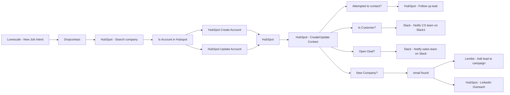

## Fluxo (.json) :

```json
{
  "meta": {
    "instanceId": "f0a68da631efd4ed052a324b63ff90f7a844426af0398a68338f44245d1dd9e5"
  },
  "nodes": [
    {
      "id": "d2b5460a-b943-4803-85cb-6c6b5126d651",
      "name": "Lemlist - Add lead to campaign",
      "type": "n8n-nodes-base.lemlist",
      "position": [
        1220,
        180
      ],
      "parameters": {
        "email": "={{ $json[\"properties\"][\"email\"][\"value\"] }}",
        "resource": "lead",
        "campaignId": "Hiring Signal Lonescale",
        "additionalFields": {
          "lastName": "={{ $json[\"properties\"][\"lastname\"][\"value\"] }}",
          "firstName": "={{ $json[\"properties\"][\"firstname\"][\"value\"] }}",
          "companyName": "={{ $json[\"properties\"][\"company\"][\"value\"] }}",
          "linkedinUrl": "={{ $node[\"Lonescale - New  Job Intent\"].json[\"body\"][\"people_linkedin_url\"] }}"
        }
      },
      "credentials": {
        "lemlistApi": {
          "id": "32",
          "name": "lemlist.net"
        }
      },
      "typeVersion": 1
    },
    {
      "id": "bc457c64-890b-4c82-999e-be61fad831df",
      "name": "HubSpot - Follow up task",
      "type": "n8n-nodes-base.hubspot",
      "position": [
        980,
        480
      ],
      "parameters": {
        "type": "task",
        "metadata": {
          "body": "={{ $node[\"Lonescale - New  Job Intent\"].json[\"body\"][\"company_name\"] }} is hiring a {{ $node[\"Lonescale - New  Job Intent\"].json[\"body\"][\"job_offers\"][0][\"job_name\"] }}\n\nlink:{{ $node[\"Lonescale - New  Job Intent\"].json[\"body\"][\"job_offers\"][0][\"job_link\"] }}\ncontext: {{ $node[\"Lonescale - New  Job Intent\"].json[\"body\"][\"job_offers\"][0][\"context_keywords\"] }} "
        },
        "resource": "engagement",
        "authentication": "oAuth2",
        "additionalFields": {
          "associations": {
            "companyIds": "={{ $node[\"HubSpot Update Account\"].json[\"companyId\"] || $node[\"HubSpot Create Account\"].json[\"companyId\"] }}",
            "contactIds": "={{ $json[\"vid\"] }}"
          }
        }
      },
      "credentials": {
        "hubspotOAuth2Api": {
          "id": "68",
          "name": "HubSpot - Sales & CS"
        }
      },
      "typeVersion": 1
    },
    {
      "id": "3c28635f-85e0-402a-ae9c-167bea409f58",
      "name": "Attempted to contact?",
      "type": "n8n-nodes-base.if",
      "position": [
        740,
        500
      ],
      "parameters": {
        "conditions": {
          "string": [
            {
              "value1": "={{ $node[\"HubSpot - Search company\"].json[\"properties\"][\"hs_lead_status\"][\"value\"] }}",
              "value2": "ATTEMPTED_TO_CONTACT"
            }
          ]
        }
      },
      "typeVersion": 1
    },
    {
      "id": "5aaab2a3-5e46-4045-a98d-2c2ff972fe5d",
      "name": "Lonescale - New  Job Intent",
      "type": "n8n-nodes-base.webhook",
      "position": [
        -840,
        320
      ],
      "webhookId": "fe426a62-eee5-4fed-bc74-45d4ac09b338",
      "parameters": {
        "path": "fe426a62-eee5-4fed-bc74-45d4ac09b338-lonescale",
        "options": {},
        "httpMethod": "POST"
      },
      "typeVersion": 1
    },
    {
      "id": "a6cc9db4-dfc2-4347-bd06-70e52ccd72e1",
      "name": "Dropcontact",
      "type": "n8n-nodes-base.dropcontact",
      "position": [
        -620,
        320
      ],
      "parameters": {
        "options": {},
        "additionalFields": {
          "company": "={{ $json[\"body\"][\"people_company_name\"] }}",
          "website": "={{ $json[\"body\"][\"people_company_domain\"] }}",
          "last_name": "={{ $json[\"body\"][\"people_last_name\"] }}",
          "first_name": "={{ $json[\"body\"][\"people_first_name\"] }}"
        }
      },
      "credentials": {
        "dropcontactApi": {
          "id": "1",
          "name": "Dropcontact account"
        }
      },
      "typeVersion": 1,
      "alwaysOutputData": true
    },
    {
      "id": "3081104a-4725-4ea5-89ab-558a51f688de",
      "name": "HubSpot - Search company",
      "type": "n8n-nodes-base.hubspot",
      "position": [
        -400,
        320
      ],
      "parameters": {
        "limit": 1,
        "domain": "={{ $node[\"Lonescale - New  Job Intent\"].json[\"body\"][\"people_company_domain\"] }}",
        "options": {
          "properties": [
            "hs_lead_status",
            "numberofemployees",
            "description",
            "linkedin_company_page"
          ]
        },
        "resource": "company",
        "operation": "searchByDomain",
        "authentication": "oAuth2"
      },
      "credentials": {
        "hubspotOAuth2Api": {
          "id": "68",
          "name": "HubSpot - Sales & CS"
        }
      },
      "typeVersion": 1,
      "continueOnFail": true,
      "alwaysOutputData": true
    },
    {
      "id": "15dacc3f-934d-46ba-b42a-263ff81773a4",
      "name": "New Company?",
      "type": "n8n-nodes-base.if",
      "position": [
        740,
        320
      ],
      "parameters": {
        "conditions": {
          "string": [
            {
              "value1": "={{ $node[\"HubSpot - Search company\"].json[\"companyId\"] }}",
              "operation": "isEmpty"
            },
            {
              "value1": "={{ $node[\"HubSpot - Search company\"].json[\"properties\"][\"hs_lead_status\"][\"value\"] }}",
              "value2": "NEW"
            },
            {
              "value1": "={{ $node[\"HubSpot - Search company\"].json[\"properties\"][\"hs_lead_status\"][\"value\"] }}",
              "value2": "OPEN"
            }
          ]
        },
        "combineOperation": "any"
      },
      "typeVersion": 1
    },
    {
      "id": "e731c904-6ff2-4644-9502-4729514b6610",
      "name": "Is Customer?",
      "type": "n8n-nodes-base.if",
      "position": [
        740,
        860
      ],
      "parameters": {
        "conditions": {
          "string": [
            {
              "value1": "={{ $node[\"HubSpot - Search company\"].json[\"properties\"][\"hs_lead_status\"][\"value\"] }}",
              "value2": "CUSTOMER"
            }
          ]
        }
      },
      "typeVersion": 1
    },
    {
      "id": "dd2974c7-34f2-4994-b4ac-abc882e6f7e8",
      "name": "Slack - Notify CS team on Slack1",
      "type": "n8n-nodes-base.slack",
      "position": [
        980,
        840
      ],
      "parameters": {
        "text": "={{ $node[\"Lonescale - New  Job Intent\"].json[\"body\"][\"company_name\"] }} Sales Team is hiring a {{ $node[\"Lonescale - New  Job Intent\"].json[\"body\"][\"people_buying_signals_title\"] }}\n\nMight be the right team to upsell our product. 🚀",
        "channel": "Customer Success - Customer News",
        "attachments": [],
        "otherOptions": {},
        "authentication": "oAuth2"
      },
      "credentials": {
        "slackOAuth2Api": {
          "id": "5",
          "name": "Slack account"
        }
      },
      "typeVersion": 1
    },
    {
      "id": "fb38287c-9ff1-48d0-96d8-959764b417c7",
      "name": "HubSpot Update Account",
      "type": "n8n-nodes-base.hubspot",
      "position": [
        40,
        180
      ],
      "parameters": {
        "resource": "company",
        "companyId": "={{ $json[\"companyId\"] }}",
        "operation": "update",
        "updateFields": {
          "description": "={{ $json[\"properties\"][\"description\"][\"value\"] || $node[\"Lonescale - New  Job Intent\"].json[\"body\"][\"company_description\"] }}",
          "numberOfEmployees": "={{ $json[\"properties\"][\"numberofemployees\"][\"value\"] || $node[\"Lonescale - New  Job Intent\"].json[\"body\"][\"company_staff_count\"] }}",
          "linkedInCompanyPage": "={{ $json[\"properties\"][\"linkedin_company_page\"][\"value\"] || $node[\"Lonescale - New  Job Intent\"].json[\"body\"][\"company_linkedin_url\"] }} "
        },
        "authentication": "oAuth2"
      },
      "credentials": {
        "hubspotOAuth2Api": {
          "id": "68",
          "name": "HubSpot - Sales & CS"
        }
      },
      "typeVersion": 1
    },
    {
      "id": "67ea9aa3-1910-4fac-a414-97982f3ac8a0",
      "name": "HubSpot",
      "type": "n8n-nodes-base.hubspot",
      "position": [
        280,
        320
      ],
      "parameters": {
        "resource": "contact",
        "operation": "search",
        "returnAll": true,
        "authentication": "oAuth2",
        "filterGroupsUi": {
          "filterGroupsValues": [
            {
              "filtersUi": {
                "filterValues": [
                  {
                    "value": "={{ $node[\"Dropcontact\"].json[\"email\"][0][\"email\"] }}",
                    "propertyName": "email"
                  }
                ]
              }
            }
          ]
        },
        "additionalFields": {
          "properties": [
            "firstname",
            "lastname",
            "email",
            "jobtitle",
            "lemlistlinkedinurl",
            "company"
          ]
        }
      },
      "credentials": {
        "hubspotOAuth2Api": {
          "id": "68",
          "name": "HubSpot - Sales & CS"
        }
      },
      "typeVersion": 1,
      "alwaysOutputData": true
    },
    {
      "id": "b31f171c-7ee7-40d0-a567-72e73e30f2c1",
      "name": "HubSpot Create Account",
      "type": "n8n-nodes-base.hubspot",
      "position": [
        40,
        460
      ],
      "parameters": {
        "name": "={{ $node[\"Lonescale - New  Job Intent\"].json[\"body\"][\"company_name\"] }}",
        "resource": "company",
        "authentication": "oAuth2",
        "additionalFields": {
          "websiteUrl": "={{ $node[\"Lonescale - New  Job Intent\"].json[\"body\"][\"company_domain\"] }}",
          "description": "={{ $node[\"Lonescale - New  Job Intent\"].json[\"body\"][\"company_description\"] }}",
          "yearFounded": "={{ $node[\"Lonescale - New  Job Intent\"].json[\"body\"][\"company_founded_year\"] }}",
          "linkedInCompanyPage": "={{ $node[\"Lonescale - New  Job Intent\"].json[\"body\"][\"company_linkedin_url\"] }}"
        }
      },
      "credentials": {
        "hubspotOAuth2Api": {
          "id": "68",
          "name": "HubSpot - Sales & CS"
        }
      },
      "typeVersion": 1
    },
    {
      "id": "9d863162-e424-4ae6-86e8-59a02aee1a9a",
      "name": "Is Account in Hubspot",
      "type": "n8n-nodes-base.if",
      "position": [
        -200,
        320
      ],
      "parameters": {
        "conditions": {
          "string": [
            {
              "value1": "={{ $json[\"companyId\"] }}",
              "operation": "isNotEmpty"
            }
          ]
        }
      },
      "typeVersion": 1
    },
    {
      "id": "8b4ac583-59f1-42fa-b6c3-4337bb7f0b0f",
      "name": "HubSpot - Create/Update Contact",
      "type": "n8n-nodes-base.hubspot",
      "position": [
        460,
        320
      ],
      "parameters": {
        "email": "={{ $node[\"Dropcontact\"].json[\"email\"][0][\"email\"] }}",
        "resource": "contact",
        "authentication": "oAuth2",
        "additionalFields": {
          "jobTitle": "={{ $json[\"properties\"][\"jobtitle\"] || $node[\"Lonescale - New  Job Intent\"].json[\"body\"][\"people_current_position\"] }}",
          "lastName": "={{ $json[\"properties\"][\"lastname\"] || $node[\"Lonescale - New  Job Intent\"].json[\"body\"][\"people_last_name\"] }} ",
          "firstName": "={{ $json[\"properties\"][\"firstname\"] || $node[\"Lonescale - New  Job Intent\"].json[\"body\"][\"people_first_name\"] }}",
          "companyName": "={{ $json[\"properties\"][\"company\"] || $node[\"Lonescale - New  Job Intent\"].json[\"body\"][\"people_company_name\"] }} ",
          "customPropertiesUi": {
            "customPropertiesValues": [
              {
                "value": "={{ $json[\"properties\"][\"lemlistlinkedinurl\"] || $node[\"Lonescale - New  Job Intent\"].json[\"body\"][\"people_linkedin_url\"] }}",
                "property": "linkedin_url"
              }
            ]
          }
        }
      },
      "credentials": {
        "hubspotOAuth2Api": {
          "id": "68",
          "name": "HubSpot - Sales & CS"
        }
      },
      "typeVersion": 1,
      "continueOnFail": true,
      "alwaysOutputData": true
    },
    {
      "id": "4c5a2ebe-1032-4a73-8983-b9470ded9228",
      "name": "Slack - Notify sales team on Slack",
      "type": "n8n-nodes-base.slack",
      "position": [
        980,
        660
      ],
      "parameters": {
        "text": "={{ $node[\"Lonescale - New  Job Intent\"].json[\"body\"][\"company_name\"] }} Sales Team is hiring a {{ $node[\"Lonescale - New  Job Intent\"].json[\"body\"][\"people_buying_signals_title\"] }}\n\nHubspot Record URL:  https://app-eu1.hubspot.com/contacts/{{ $node[\"HubSpot - Search company\"].json[\"portalId\"] }}/company/{{ $node[\"HubSpot - Search company\"].json[\"companyId\"] }} ",
        "channel": "Customer Success - Customer News",
        "attachments": [],
        "otherOptions": {},
        "authentication": "oAuth2"
      },
      "credentials": {
        "slackOAuth2Api": {
          "id": "5",
          "name": "Slack account"
        }
      },
      "typeVersion": 1
    },
    {
      "id": "a3956aa9-5c76-481c-9005-01f7feef6281",
      "name": "Open Deal?",
      "type": "n8n-nodes-base.if",
      "position": [
        740,
        680
      ],
      "parameters": {
        "conditions": {
          "string": [
            {
              "value1": "={{ $node[\"HubSpot - Search company\"].json[\"properties\"][\"hs_lead_status\"][\"value\"] }}",
              "value2": "OPEN_DEAL"
            }
          ]
        }
      },
      "typeVersion": 1
    },
    {
      "id": "a5a84d04-19d0-4adb-b811-0b796289e38c",
      "name": "email found",
      "type": "n8n-nodes-base.if",
      "position": [
        980,
        300
      ],
      "parameters": {},
      "typeVersion": 1
    },
    {
      "id": "1158d8e0-75a7-4c58-b98b-d61c40c76c74",
      "name": "HubSpot - Linkedin Outreach",
      "type": "n8n-nodes-base.hubspot",
      "position": [
        1220,
        360
      ],
      "parameters": {
        "type": "task",
        "metadata": {
          "body": "=",
          "subject": "Hiring Signal - New lead to contact"
        },
        "resource": "engagement",
        "authentication": "oAuth2",
        "additionalFields": {
          "associations": {
            "companyIds": "={{ $node[\"HubSpot Update Account\"].json[\"companyId\"] || $node[\"HubSpot Create Account\"].json[\"companyId\"] }}",
            "contactIds": "={{ $json[\"vid\"] }}"
          }
        }
      },
      "credentials": {
        "hubspotOAuth2Api": {
          "id": "68",
          "name": "HubSpot - Sales & CS"
        }
      },
      "typeVersion": 1
    }
  ],
  "connections": {
    "HubSpot": {
      "main": [
        [
          {
            "node": "HubSpot - Create/Update Contact",
            "type": "main",
            "index": 0
          }
        ]
      ]
    },
    "Open Deal?": {
      "main": [
        [
          {
            "node": "Slack - Notify sales team on Slack",
            "type": "main",
            "index": 0
          }
        ]
      ]
    },
    "Dropcontact": {
      "main": [
        [
          {
            "node": "HubSpot - Search company",
            "type": "main",
            "index": 0
          }
        ]
      ]
    },
    "email found": {
      "main": [
        [
          {
            "node": "Lemlist - Add lead to campaign",
            "type": "main",
            "index": 0
          }
        ],
        [
          {
            "node": "HubSpot - Linkedin Outreach",
            "type": "main",
            "index": 0
          }
        ]
      ]
    },
    "Is Customer?": {
      "main": [
        [
          {
            "node": "Slack - Notify CS team on Slack1",
            "type": "main",
            "index": 0
          }
        ]
      ]
    },
    "New Company?": {
      "main": [
        [
          {
            "node": "email found",
            "type": "main",
            "index": 0
          }
        ]
      ]
    },
    "Attempted to contact?": {
      "main": [
        [
          {
            "node": "HubSpot - Follow up task",
            "type": "main",
            "index": 0
          }
        ]
      ]
    },
    "Is Account in Hubspot": {
      "main": [
        [
          {
            "node": "HubSpot Update Account",
            "type": "main",
            "index": 0
          }
        ],
        [
          {
            "node": "HubSpot Create Account",
            "type": "main",
            "index": 0
          }
        ]
      ]
    },
    "HubSpot Create Account": {
      "main": [
        [
          {
            "node": "HubSpot",
            "type": "main",
            "index": 0
          }
        ]
      ]
    },
    "HubSpot Update Account": {
      "main": [
        [
          {
            "node": "HubSpot",
            "type": "main",
            "index": 0
          }
        ]
      ]
    },
    "HubSpot - Search company": {
      "main": [
        [
          {
            "node": "Is Account in Hubspot",
            "type": "main",
            "index": 0
          }
        ]
      ]
    },
    "Lonescale - New  Job Intent": {
      "main": [
        [
          {
            "node": "Dropcontact",
            "type": "main",
            "index": 0
          }
        ]
      ]
    },
    "HubSpot - Create/Update Contact": {
      "main": [
        [
          {
            "node": "New Company?",
            "type": "main",
            "index": 0
          },
          {
            "node": "Is Customer?",
            "type": "main",
            "index": 0
          },
          {
            "node": "Attempted to contact?",
            "type": "main",
            "index": 0
          },
          {
            "node": "Open Deal?",
            "type": "main",
            "index": 0
          }
        ]
      ]
    }
  }
}
```
