# PACK 1999 TEMPLATES PARTE 08 - Bloco 4

Templates neste bloco: 20

## Sumário

- [Template 1589 - Notificação DingTalk para Pull Requests do Azure DevOps](#template-1589)
- [Template 1591 - Envio de DM por cargo no Discord](#template-1591)
- [Template 1593 - Enriquecer novos membros do Discourse e notificar leads de alto valor](#template-1593)
- [Template 1595 - Assistente de TI via Slack com IA e busca em KB](#template-1595)
- [Template 1597 - Automação de CSR via Slack com análise e aprovação](#template-1597)
- [Template 1599 - Gerenciamento de e-mails mascarados Fastmail](#template-1599)
- [Template 1602 - Validação e gravação de webhooks Xero no FileMaker](#template-1602)
- [Template 1604 - Analisador de chamadas: transcrição e análise de vendas](#template-1604)
- [Template 1606 - Integração TheHive ↔ Slack para gestão de casos](#template-1606)
- [Template 1608 - Posicionamento automático de nós](#template-1608)
- [Template 1609 - Triagem automática de candidatos com IA](#template-1609)
- [Template 1612 - Automação de suporte: localizar cliente, criar ticket, agendar reunião e salvar transcrição](#template-1612)
- [Template 1613 - Monitorar pastas Dropbox e processar novos arquivos](#template-1613)
- [Template 1615 - Recepcionista por voz para agendamento](#template-1615)
- [Template 1618 - Salvar transcrições Retell em Airtable / Sheets / Notion](#template-1618)
- [Template 1619 - Classificador de PDFs (faturas/recibos) e upload para Drive](#template-1619)
- [Template 1621 - Encaminhar alertas do TheHive para SIGNL4](#template-1621)
- [Template 1623 - Converter perfis Squarespace para clientes Shopify](#template-1623)
- [Template 1624 - Chatbot de voz RAG com ElevenLabs e OpenAI](#template-1624)
- [Template 1627 - Automação de triagem de candidatos](#template-1627)

---

<a id="template-1589"></a>

## Template 1589 - Notificação DingTalk para Pull Requests do Azure DevOps

- **Nome:** Notificação DingTalk para Pull Requests do Azure DevOps
- **Descrição:** Envia uma mensagem no DingTalk quando um Pull Request é criado no Azure DevOps, usando um banco de dados para mapear contas do Azure para usuários/telefones do DingTalk.
- **Funcionalidade:** • Receber evento de Pull Request criado: Aceita chamadas HTTP de eventos de Pull Request do Azure DevOps.
• Carregar mapa de contas: Consulta uma tabela MySQL que relaciona contas do Azure DevOps a nomes e telefones do DingTalk.
• Mapear usuários: Converte nomes exibidos do criador e revisores para nomes/telefones do DingTalk quando houver correspondência.
• Construir mensagem em Markdown: Monta o texto da notificação, substituindo nomes quando apropriado e adicionando uma indicação para revisar.
• Gerenciar menções: Constrói a lista de @usuários por número de telefone e detecta condição de @todos para menções de equipe.
• Enviar via webhook: Envia a mensagem formatada ao chat do DingTalk usando o webhook do robô.
- **Ferramentas:** • Azure DevOps (Service Hooks): Fonte dos eventos de Pull Request que disparam a automação.
• MySQL: Armazena o mapeamento entre contas do Azure DevOps, nomes e números de telefone do DingTalk.
• DingTalk (robot webhook): Canal para publicar a notificação em um grupo via webhook com mensagem em Markdown.

## Fluxo visual

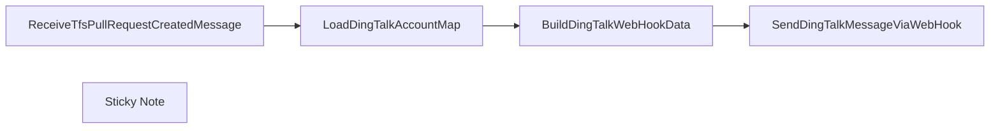

## Fluxo (.json) :

```json
{
  "meta": {
    "instanceId": "dbd43d88d26a9e30d8aadc002c9e77f1400c683dd34efe3778d43d27250dde50"
  },
  "nodes": [
    {
      "id": "44eb446d-3775-4fe0-8f76-67f46913531e",
      "name": "LoadDingTalkAccountMap",
      "type": "n8n-nodes-base.mySql",
      "position": [
        -600,
        720
      ],
      "parameters": {
        "table": {
          "__rl": true,
          "mode": "list",
          "value": "tfs_dingtalk_account_map",
          "cachedResultName": "tfs_dingtalk_account_map"
        },
        "options": {},
        "operation": "select",
        "returnAll": true
      },
      "credentials": {
        "mySql": {
          "id": "235",
          "name": "MySQL account"
        }
      },
      "typeVersion": 2.2
    },
    {
      "id": "25d2a3aa-af18-4ff2-af6c-c2bf6618a511",
      "name": "ReceiveTfsPullRequestCreatedMessage",
      "type": "n8n-nodes-base.webhook",
      "position": [
        -860,
        720
      ],
      "webhookId": "05a0f565-7a1e-44f2-956d-1c68982ce314",
      "parameters": {
        "path": "pr-notify-template",
        "options": {},
        "httpMethod": "POST"
      },
      "typeVersion": 1
    },
    {
      "id": "70d69753-9408-4a99-85a4-9dc4486fc460",
      "name": "BuildDingTalkWebHookData",
      "type": "n8n-nodes-base.code",
      "position": [
        -340,
        720
      ],
      "parameters": {
        "jsCode": "// Code here will run only once, no matter how many input items there are.\n// More info and help: https://docs.n8n.io/nodes/n8n-nodes-base.function\n\nconsole.log(\"items:\");\nconsole.log(items);\n\nvar mapUserMobile = function (tfsAccount) {\n  for(var i = 0; i < items.length; i++) {\n    var map = items[i].json;\n    if(tfsAccount.lastIndexOf(map.TfsAccount) != -1) {\n      return map.DingTalkMobile;\n    }\n  }\n\n  return null;\n}\nvar mapUserName = function (tfsAccount) {\n  for(var i = 0; i < items.length; i++) {\n    var map = items[i].json;\n    if(tfsAccount.lastIndexOf(map.TfsAccount) != -1) {\n      return map.UserName;\n    }\n  }\n\n  return null;\n}\n\nvar tfsMessage = $node[\"ReceiveTfsPullRequestCreatedMessage\"].json.body;\nconsole.log(\"TFS Message:\");\nconsole.log(tfsMessage);\n\nvar output = {};\nvar atMobiles = [];\nvar isAtAll = false;\nvar atUsers = [];\nvar messageText = tfsMessage.message.markdown;\nvar prCreatorTfsDomainName = tfsMessage.resource.createdBy.uniqueName;\nvar prCreatorTfsDisplayName = tfsMessage.resource.createdBy.displayName;\nvar prCreatorDingTalkName = mapUserName(prCreatorTfsDomainName);\n\nif (prCreatorDingTalkName !== null) {\n  messageText = messageText.replace(prCreatorTfsDisplayName, prCreatorDingTalkName);\n}\n\nfor (reviewer of tfsMessage.resource.reviewers) {\n  console.log(reviewer.uniqueName);\n  if(reviewer.uniqueName.lastIndexOf(\"团队\") != -1) {\n    //当@所有人时，消息内容中的手机号就不会被转义成用户名了，暂时不启用该功能\n    isAtAll = true;\n    continue;\n  }\n\n  var mobile = mapUserMobile(reviewer.uniqueName);\n\n  if(mobile !== null) {\n    atMobiles.push(mobile);\n  }\n\n  var userName = mapUserName(reviewer.uniqueName);\n\n  if(userName !== null) {\n    atUsers.push(userName);\n  }\n}\n\nif(isAtAll) {\n  atUsers.unshift(\"所有人\");\n  atMobiles = [];\n} else {\n  atUsers = atMobiles;\n}\n\nif (atUsers.length > 0) {\n  messageText = messageText + \"<br />请 @\" + atUsers.join(\" @\") + \" 评审\";\n}\n\noutput.isAtAll = isAtAll;\noutput.text = messageText;\noutput.atMobiles = atMobiles.join(\", \");\n\nconsole.log('Done:');\nconsole.log(output);\n\nreturn [{json: output}];"
      },
      "typeVersion": 2
    },
    {
      "id": "dc6c235b-c1ac-4195-a404-e79c8ad1c8ef",
      "name": "SendDingTalkMessageViaWebHook",
      "type": "n8n-nodes-base.httpRequest",
      "position": [
        -80,
        720
      ],
      "parameters": {
        "url": "https://oapi.dingtalk.com/robot/send?access_token=4d684f0389cd4c24997c815344890faafeb9d300c25edf5e31151662a87e77c7",
        "options": {},
        "requestMethod": "POST",
        "jsonParameters": true,
        "bodyParametersJson": "={\n\t\"at\":\n\t{\n\t\t\"atMobiles\": [{{$json[\"atMobiles\"]}}],\n\t\t\"isAtAll\": \"{{$json[\"isAtAll\"]}}\"\n\t},\n\t\"msgtype\": \"markdown\",\n\t\"markdown\":\n\t{\n\t\t\"title\": \"New PR Notify\",\n\t\t\"text\": \"{{$json[\"text\"]}}\"\n\t}\n}"
      },
      "typeVersion": 1
    },
    {
      "id": "3476a787-387b-43e2-8646-6a682656f231",
      "name": "Sticky Note",
      "type": "n8n-nodes-base.stickyNote",
      "position": [
        -1449,
        560
      ],
      "parameters": {
        "width": 484,
        "height": 540,
        "content": "## Send DingTalk message on new Azure DevOps Pull Request\nThis template automates sending a DingTalk message on new Azure Dev Ops Pull Request Created Events. It uses a MySQL database to store mappings between Azure users and DingTalk users; so the right users get notified. \n\n### Set up instructions\n1. Define the path value of ReceiveTfsPullRequestCreatedMessage Webhook node of your own, copy the webhook url to create a Azure DevOps ServiceHook that call webhook with Pull Request Created event.\n2. In order to configure the LoadDingTalkAccountMap node, you need to create a MySQL table as below:\n|Name|Type|Length|Key|\n|-|-|-|-|\n|TfsAccount|varchar|255|\n|UserName|varchar|255|\n|DingTalkMobile|varchar|255|\n3. You can customize the Ding Talk message content by editing the BuildDingTalkWebHookData node.\n4. Define the URL of SendDingTalkMessageViaWebHook Http Request node as your Ding Talk group chat robot webhook URL.\n5. Send test of production message from Azure DevOps to test.\n\n"
      },
      "typeVersion": 1
    }
  ],
  "pinData": {},
  "connections": {
    "LoadDingTalkAccountMap": {
      "main": [
        [
          {
            "node": "BuildDingTalkWebHookData",
            "type": "main",
            "index": 0
          }
        ]
      ]
    },
    "BuildDingTalkWebHookData": {
      "main": [
        [
          {
            "node": "SendDingTalkMessageViaWebHook",
            "type": "main",
            "index": 0
          }
        ]
      ]
    },
    "ReceiveTfsPullRequestCreatedMessage": {
      "main": [
        [
          {
            "node": "LoadDingTalkAccountMap",
            "type": "main",
            "index": 0
          }
        ]
      ]
    }
  }
}
```

<a id="template-1591"></a>

## Template 1591 - Envio de DM por cargo no Discord

- **Nome:** Envio de DM por cargo no Discord
- **Descrição:** Lê membros de um servidor Discord em lotes, filtra por um cargo específico e envia uma resposta/ação aos membros filtrados, usando uma planilha para controlar a paginação entre execuções.
- **Funcionalidade:** • Configuração inicial: define credenciais e parâmetros como ID do servidor, ID do cargo e URL da planilha.
• Paginação de membros: obtém lotes de até 100 membros e solicita lotes subsequentes usando o último ID processado.
• Verificação de continuidade: avalia se ainda existem mais membros a serem processados com base no tamanho do lote recebido.
• Filtragem por cargo: seleciona somente os membros que possuem o cargo especificado.
• Envio de resposta/ação: envia uma resposta ou mensagem (por exemplo, DM) para os membros filtrados.
• Persistência do progresso: grava o último ID processado em uma planilha para retomar a operação posteriormente.
• Limpeza de registro anterior: remove entradas antigas na planilha quando necessário para manter controle do último ID.
• Gatilhos: suporta execução manual para testes e acionamento via webhook para uso em produção.
- **Ferramentas:** • Google Sheets: armazena e recupera o último ID de membro usado para controlar a paginação e persistência do progresso.
• Discord: fornece a lista de membros do servidor/guild e permite enviar mensagens aos usuários.
• HTTP Webhook: ponto de entrada público para acionar o fluxo remotamente.

## Fluxo visual

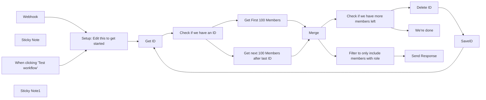

## Fluxo (.json) :

```json
{
  "meta": {
    "instanceId": "257476b1ef58bf3cb6a46e65fac7ee34a53a5e1a8492d5c6e4da5f87c9b82833",
    "templateId": "2105"
  },
  "nodes": [
    {
      "id": "3abfbefa-0a41-4dd2-a79b-99aa02447a6f",
      "name": "When clicking \"Test workflow\"",
      "type": "n8n-nodes-base.manualTrigger",
      "position": [
        380,
        240
      ],
      "parameters": {},
      "typeVersion": 1
    },
    {
      "id": "5233daa6-9b3f-4048-8187-b78decac0bbd",
      "name": "Delete ID",
      "type": "n8n-nodes-base.googleSheets",
      "position": [
        1900,
        380
      ],
      "parameters": {
        "operation": "delete",
        "sheetName": {
          "__rl": true,
          "mode": "list",
          "value": "gid=0",
          "cachedResultUrl": "https://docs.google.com/spreadsheets/d/1lj15jPOKrfS0-EAnCmths4-SVXwQJ78eBnq8C4DFRx4/edit#gid=0",
          "cachedResultName": "Last Member"
        },
        "documentId": {
          "__rl": true,
          "mode": "url",
          "value": "={{ $('Setup: Edit this to get started').first().json['Google Sheets URL'] }}"
        }
      },
      "credentials": {
        "googleSheetsOAuth2Api": {
          "id": "9",
          "name": "Nik's Google"
        }
      },
      "executeOnce": true,
      "typeVersion": 4.2,
      "alwaysOutputData": true
    },
    {
      "id": "d3be48cd-9652-43ea-9bbf-d9d3a6c972ae",
      "name": "SaveID",
      "type": "n8n-nodes-base.googleSheets",
      "position": [
        2040,
        380
      ],
      "parameters": {
        "columns": {
          "value": {
            "ID": "={{ $('Merge').last().json.user.id }}"
          },
          "schema": [
            {
              "id": "ID",
              "type": "string",
              "display": true,
              "removed": false,
              "required": false,
              "displayName": "ID",
              "defaultMatch": false,
              "canBeUsedToMatch": true
            }
          ],
          "mappingMode": "defineBelow",
          "matchingColumns": [
            "ID"
          ]
        },
        "options": {},
        "operation": "append",
        "sheetName": {
          "__rl": true,
          "mode": "list",
          "value": "gid=0",
          "cachedResultUrl": "https://docs.google.com/spreadsheets/d/1lj15jPOKrfS0-EAnCmths4-SVXwQJ78eBnq8C4DFRx4/edit#gid=0",
          "cachedResultName": "Sheet1"
        },
        "documentId": {
          "__rl": true,
          "mode": "url",
          "value": "={{ $('Setup: Edit this to get started').first().json['Google Sheets URL'] }}"
        }
      },
      "credentials": {
        "googleSheetsOAuth2Api": {
          "id": "9",
          "name": "Nik's Google"
        }
      },
      "typeVersion": 4.2
    },
    {
      "id": "a8cb3b10-1143-4467-936c-36ea29c3489a",
      "name": "Get ID",
      "type": "n8n-nodes-base.googleSheets",
      "position": [
        920,
        240
      ],
      "parameters": {
        "options": {},
        "sheetName": {
          "__rl": true,
          "mode": "list",
          "value": "gid=0",
          "cachedResultUrl": "https://docs.google.com/spreadsheets/d/1lj15jPOKrfS0-EAnCmths4-SVXwQJ78eBnq8C4DFRx4/edit#gid=0",
          "cachedResultName": "Last Member"
        },
        "documentId": {
          "__rl": true,
          "mode": "url",
          "value": "={{ $('Setup: Edit this to get started').first().json['Google Sheets URL'] }}"
        }
      },
      "credentials": {
        "googleSheetsOAuth2Api": {
          "id": "9",
          "name": "Nik's Google"
        }
      },
      "typeVersion": 4.2,
      "alwaysOutputData": true
    },
    {
      "id": "82bdeec7-5ff5-4ed5-8c57-f3007bd7f81e",
      "name": "Merge",
      "type": "n8n-nodes-base.merge",
      "position": [
        1520,
        240
      ],
      "parameters": {},
      "typeVersion": 2.1
    },
    {
      "id": "19247435-e0b0-4eac-8807-cb9e4ac532ab",
      "name": "Check if we have more members left",
      "type": "n8n-nodes-base.if",
      "position": [
        1740,
        240
      ],
      "parameters": {
        "options": {},
        "conditions": {
          "options": {
            "leftValue": "",
            "caseSensitive": true,
            "typeValidation": "strict"
          },
          "combinator": "and",
          "conditions": [
            {
              "id": "11bd5681-d979-40a8-ba0c-8c697532cf0d",
              "operator": {
                "type": "number",
                "operation": "lt"
              },
              "leftValue": "={{ $input.all().length }}",
              "rightValue": 100
            }
          ]
        }
      },
      "typeVersion": 2
    },
    {
      "id": "9845c82b-942e-4265-be8c-c4b1a9199b1e",
      "name": "We're done",
      "type": "n8n-nodes-base.noOp",
      "position": [
        2040,
        160
      ],
      "parameters": {},
      "typeVersion": 1
    },
    {
      "id": "86bf2fe1-22b3-4563-a4b7-b3603f96cada",
      "name": "Check if we have an ID",
      "type": "n8n-nodes-base.if",
      "position": [
        1100,
        240
      ],
      "parameters": {
        "options": {},
        "conditions": {
          "options": {
            "leftValue": "",
            "caseSensitive": true,
            "typeValidation": "strict"
          },
          "combinator": "and",
          "conditions": [
            {
              "id": "8cabfe61-be13-462f-a8ce-99ba5304fa10",
              "operator": {
                "type": "string",
                "operation": "exists",
                "singleValue": true
              },
              "leftValue": "={{ $json.ID }}",
              "rightValue": ""
            }
          ]
        }
      },
      "executeOnce": true,
      "typeVersion": 2
    },
    {
      "id": "96324abb-2464-418a-850f-c6f8d3ce209f",
      "name": "Filter to only include members with role",
      "type": "n8n-nodes-base.filter",
      "position": [
        1740,
        -80
      ],
      "parameters": {
        "options": {},
        "conditions": {
          "options": {
            "leftValue": "",
            "caseSensitive": true,
            "typeValidation": "strict"
          },
          "combinator": "and",
          "conditions": [
            {
              "id": "cac0aeae-ff45-4717-b11e-4e19995649fe",
              "operator": {
                "type": "number",
                "operation": "gt"
              },
              "leftValue": "={{ $json.roles.filter(role => role === $('Setup: Edit this to get started').first().json['Role ID']).length }}",
              "rightValue": 0
            }
          ]
        }
      },
      "typeVersion": 2
    },
    {
      "id": "bc012053-c619-479b-8bcb-9325c209d999",
      "name": "Get First 100 Members",
      "type": "n8n-nodes-base.discord",
      "position": [
        1300,
        260
      ],
      "parameters": {
        "guildId": {
          "__rl": true,
          "mode": "id",
          "value": "={{ $('Setup: Edit this to get started').first().json['Discord ID'] }}"
        },
        "options": {
          "simplify": true
        },
        "resource": "member"
      },
      "credentials": {
        "discordBotApi": {
          "id": "M7ApR1tTlF4HFHn4",
          "name": "Discord Bot account"
        }
      },
      "typeVersion": 2
    },
    {
      "id": "7214e807-5a51-438d-9db8-32821307f4ea",
      "name": "Get next 100 Members after last ID",
      "type": "n8n-nodes-base.discord",
      "position": [
        1300,
        80
      ],
      "parameters": {
        "after": "={{ $('Get ID').first().json.ID }}",
        "guildId": {
          "__rl": true,
          "mode": "id",
          "value": "={{ $('Setup: Edit this to get started').first().json['Discord ID'] }}"
        },
        "options": {
          "simplify": true
        },
        "resource": "member"
      },
      "credentials": {
        "discordBotApi": {
          "id": "M7ApR1tTlF4HFHn4",
          "name": "Discord Bot account"
        }
      },
      "typeVersion": 2
    },
    {
      "id": "158d3e7a-cc8c-4ab3-b59f-5a2251c79613",
      "name": "Sticky Note",
      "type": "n8n-nodes-base.stickyNote",
      "position": [
        517,
        -60.44028103044491
      ],
      "parameters": {
        "color": 5,
        "width": 350.3145253526498,
        "height": 491.3512880562059,
        "content": "## Setup\n1. Add your Google Sheets and Discord credentials.\n2. Create a Google Sheets document that contains `ID` as a column. We're using this to remember which member we received last.\n3. Edit the fields in the setup node `Setup: Edit this to get started`. *You can read up on how to get the Discord IDs via [this link](https://www.pythondiscord.com/pages/guides/pydis-guides/contributing/obtaining-discord-ids/).*\n4. Link to your Discord server in the Discord nodes\n5. Activate the workflow\n6. Call the production webhook URL in your browser"
      },
      "typeVersion": 1
    },
    {
      "id": "11926dbb-a5e0-48f9-8453-7dc21ecf6717",
      "name": "Setup: Edit this to get started",
      "type": "n8n-nodes-base.set",
      "position": [
        640,
        240
      ],
      "parameters": {
        "options": {},
        "assignments": {
          "assignments": [
            {
              "id": "7c8cce4f-1330-425a-baff-4c40320f2335",
              "name": "Role ID",
              "type": "string",
              "value": "<Enter your roleID here>"
            },
            {
              "id": "8533b358-d8e6-4eba-9159-f6bdd2e0df65",
              "name": "Google Sheets URL",
              "type": "string",
              "value": "<Enter your Sheets URL here>"
            },
            {
              "id": "bb87e6f5-def9-4625-818a-ce6ff7b44ed7",
              "name": "Discord ID",
              "type": "string",
              "value": "<Enter your server/guild ID here>"
            }
          ]
        }
      },
      "typeVersion": 3.3
    },
    {
      "id": "334377fc-ddb8-4c0d-9ddc-f6949b98578c",
      "name": "Webhook",
      "type": "n8n-nodes-base.webhook",
      "disabled": true,
      "position": [
        380,
        420
      ],
      "webhookId": "b40c1140-75a7-481e-b8c7-789eef1f8bac",
      "parameters": {
        "path": "discord-template",
        "options": {},
        "responseMode": "responseNode"
      },
      "typeVersion": 1.1
    },
    {
      "id": "8fac2863-a046-4ce7-8391-72486141ea98",
      "name": "Send Response",
      "type": "n8n-nodes-base.respondToWebhook",
      "position": [
        1960,
        -80
      ],
      "parameters": {
        "options": {},
        "respondWith": "allIncomingItems"
      },
      "typeVersion": 1
    },
    {
      "id": "10677a2d-9bcb-4b51-8cab-a49c7f16a8d7",
      "name": "Sticky Note1",
      "type": "n8n-nodes-base.stickyNote",
      "position": [
        1900,
        -180
      ],
      "parameters": {
        "color": 7,
        "height": 265.6674473067916,
        "content": "You can replace this node according to your use case. In my case, I've send a DM to all users"
      },
      "typeVersion": 1
    }
  ],
  "pinData": {},
  "connections": {
    "Merge": {
      "main": [
        [
          {
            "node": "Check if we have more members left",
            "type": "main",
            "index": 0
          },
          {
            "node": "Filter to only include members with role",
            "type": "main",
            "index": 0
          }
        ]
      ]
    },
    "Get ID": {
      "main": [
        [
          {
            "node": "Check if we have an ID",
            "type": "main",
            "index": 0
          }
        ]
      ]
    },
    "SaveID": {
      "main": [
        [
          {
            "node": "Get ID",
            "type": "main",
            "index": 0
          }
        ]
      ]
    },
    "Webhook": {
      "main": [
        [
          {
            "node": "Setup: Edit this to get started",
            "type": "main",
            "index": 0
          }
        ]
      ]
    },
    "Delete ID": {
      "main": [
        [
          {
            "node": "SaveID",
            "type": "main",
            "index": 0
          }
        ]
      ]
    },
    "Get First 100 Members": {
      "main": [
        [
          {
            "node": "Merge",
            "type": "main",
            "index": 1
          }
        ]
      ]
    },
    "Check if we have an ID": {
      "main": [
        [
          {
            "node": "Get next 100 Members after last ID",
            "type": "main",
            "index": 0
          }
        ],
        [
          {
            "node": "Get First 100 Members",
            "type": "main",
            "index": 0
          }
        ]
      ]
    },
    "When clicking \"Test workflow\"": {
      "main": [
        [
          {
            "node": "Setup: Edit this to get started",
            "type": "main",
            "index": 0
          }
        ]
      ]
    },
    "Setup: Edit this to get started": {
      "main": [
        [
          {
            "node": "Get ID",
            "type": "main",
            "index": 0
          }
        ]
      ]
    },
    "Check if we have more members left": {
      "main": [
        [
          {
            "node": "We're done",
            "type": "main",
            "index": 0
          }
        ],
        [
          {
            "node": "Delete ID",
            "type": "main",
            "index": 0
          }
        ]
      ]
    },
    "Get next 100 Members after last ID": {
      "main": [
        [
          {
            "node": "Merge",
            "type": "main",
            "index": 0
          }
        ]
      ]
    },
    "Filter to only include members with role": {
      "main": [
        [
          {
            "node": "Send Response",
            "type": "main",
            "index": 0
          }
        ]
      ]
    }
  }
}
```

<a id="template-1593"></a>

## Template 1593 - Enriquecer novos membros do Discourse e notificar leads de alto valor

- **Nome:** Enriquecer novos membros do Discourse e notificar leads de alto valor
- **Descrição:** Captura novos usuários registrados no Discourse, enriquece o perfil pelo e-mail, avalia se a empresa é um lead de alto valor e notifica a equipa no Slack quando for relevante.
- **Funcionalidade:** • Detecção de novos usuários no Discourse: Inicia o fluxo ao receber um webhook quando um usuário se registra.
• Filtragem de e-mails pessoais: Ignora e-mails comuns (ex.: @gmail., @yahoo., @hotmail., @proton.) para reduzir chamadas de enriquecimento.
• Enriquecimento de perfil por e-mail: Consulta um serviço de enriquecimento para obter dados da pessoa a partir do e-mail; trata o caso em que o e-mail não é encontrado.
• Consulta de informações da empresa: Busca dados da empresa pelo domínio retornado no enriquecimento.
• Identificação de leads de alto valor: Aplica critérios (ex.: número de funcionários e ranking global) para determinar se é um lead relevante.
• Notificação em Slack com mensagem rica: Envia uma mensagem com avatar, nome, cargo, empresa, indústria e botões para abrir LinkedIn ou enviar e-mail.
• Tratamento de erros/fluxos alternativos: Mantém caminhos opcionais quando o enriquecimento não retorna dados, permitindo ações manuais ou outros serviços.
- **Ferramentas:** • Discourse: Plataforma que dispara o webhook quando novos membros se registam.
• Clearbit: Serviço de enriquecimento de dados para pessoa e empresa a partir de e-mail e domínio.
• Slack: Canal de notificação para alertar a equipa com mensagens formatadas e botões interativos.
• LinkedIn: Destino de link usado no botão para abrir o perfil profissional do lead (opcional).

## Fluxo visual

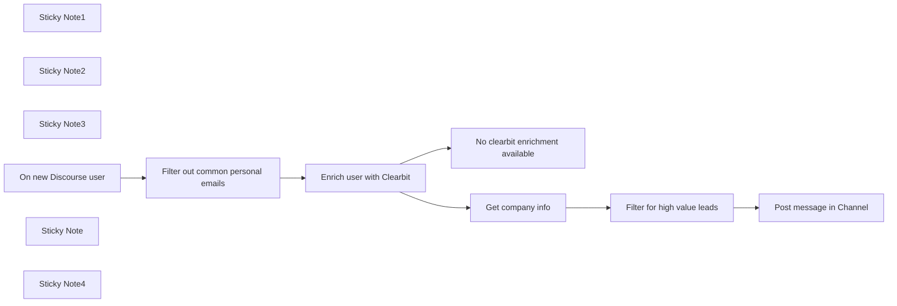

## Fluxo (.json) :

```json
{
  "meta": {
    "instanceId": "cb484ba7b742928a2048bf8829668bed5b5ad9787579adea888f05980292a4a7"
  },
  "nodes": [
    {
      "id": "8916c4a2-00a1-4c57-a661-0433a71ab316",
      "name": "Filter out common personal emails",
      "type": "n8n-nodes-base.filter",
      "notes": "Saves on Enrichment credits",
      "position": [
        1000,
        360
      ],
      "parameters": {
        "options": {},
        "conditions": {
          "options": {
            "leftValue": "",
            "caseSensitive": true,
            "typeValidation": "strict"
          },
          "combinator": "or",
          "conditions": [
            {
              "id": "31a3f64f-cce1-44c3-938c-f18e85c670f3",
              "operator": {
                "type": "string",
                "operation": "notContains"
              },
              "leftValue": "={{ $json.body.user.email }}",
              "rightValue": "@gmail."
            },
            {
              "id": "60087832-5f76-4dcc-bfe6-c899b3623af7",
              "operator": {
                "type": "string",
                "operation": "notContains"
              },
              "leftValue": "={{ $json.body.user.email }}",
              "rightValue": "@yahoo."
            },
            {
              "id": "7fd74d31-ef3d-4a06-aee1-202ade476c10",
              "operator": {
                "type": "string",
                "operation": "notContains"
              },
              "leftValue": "={{ $json.body.user.email }}",
              "rightValue": "@hotmail."
            },
            {
              "id": "4f86817c-53ec-4a80-a961-b4c9bd0c8f7c",
              "operator": {
                "type": "string",
                "operation": "notContains"
              },
              "leftValue": "={{ $json.body.user.email }}",
              "rightValue": "@proton."
            }
          ]
        }
      },
      "notesInFlow": true,
      "typeVersion": 2
    },
    {
      "id": "bf4c1985-71ae-4bb2-86e0-8f795f89620e",
      "name": "No clearbit enrichment available",
      "type": "n8n-nodes-base.noOp",
      "position": [
        1520,
        520
      ],
      "parameters": {},
      "typeVersion": 1
    },
    {
      "id": "0ee7d23a-f6c7-4651-9f4c-b4b041326145",
      "name": "Sticky Note1",
      "type": "n8n-nodes-base.stickyNote",
      "position": [
        1720,
        540
      ],
      "parameters": {
        "color": 7,
        "width": 314.8866754976157,
        "height": 119.43509109499996,
        "content": "**👈 Optional**\nIf the workflow ends here, the email wasn't found in Clearbit. Consider checking with another enrichment service or sending a Slack message for manual verification."
      },
      "typeVersion": 1
    },
    {
      "id": "93d1b345-2954-4bb2-8c13-510bb48f730a",
      "name": "Sticky Note2",
      "type": "n8n-nodes-base.stickyNote",
      "position": [
        1660,
        120
      ],
      "parameters": {
        "color": 7,
        "width": 194,
        "height": 101,
        "content": "**Optional 👇**\nChange filter criteria here to determine what \"high value\" means for you "
      },
      "typeVersion": 1
    },
    {
      "id": "ad2823cf-861f-4302-8c8a-51700fbe9602",
      "name": "Enrich user with Clearbit",
      "type": "n8n-nodes-base.clearbit",
      "notes": " Clearbit returns a 404 error (and in n8n empty output payload) when email is not found",
      "onError": "continueErrorOutput",
      "position": [
        1220,
        360
      ],
      "parameters": {
        "email": "={{ $json.body.user.email }}",
        "resource": "person",
        "additionalFields": {}
      },
      "credentials": {
        "clearbitApi": {
          "id": "fJAEKGUyTHSl0EpC",
          "name": "max@n8n.io (use carefully!)"
        }
      },
      "notesInFlow": true,
      "typeVersion": 1
    },
    {
      "id": "60c5727e-3e9e-48dd-8534-8b89ede90594",
      "name": "Get company info",
      "type": "n8n-nodes-base.clearbit",
      "position": [
        1500,
        280
      ],
      "parameters": {
        "domain": "={{ $json.employment.domain }}",
        "additionalFields": {}
      },
      "credentials": {
        "clearbitApi": {
          "id": "fJAEKGUyTHSl0EpC",
          "name": "max@n8n.io (use carefully!)"
        }
      },
      "typeVersion": 1
    },
    {
      "id": "f5abe4a5-bbe9-4024-a448-c855d7bd8f54",
      "name": "Filter for high value leads",
      "type": "n8n-nodes-base.filter",
      "position": [
        1700,
        280
      ],
      "parameters": {
        "options": {},
        "conditions": {
          "options": {
            "leftValue": "",
            "caseSensitive": true,
            "typeValidation": "strict"
          },
          "combinator": "and",
          "conditions": [
            {
              "id": "90e62611-28d9-465a-b98e-bf866589363e",
              "operator": {
                "type": "number",
                "operation": "gte"
              },
              "leftValue": "={{ $json.metrics.employees }}",
              "rightValue": 30
            },
            {
              "id": "06c5fd69-1423-4442-bd8f-f61e5c119a39",
              "operator": {
                "type": "number",
                "operation": "lte"
              },
              "leftValue": "={{ $json.metrics.alexaGlobalRank }}",
              "rightValue": 100000
            }
          ]
        }
      },
      "typeVersion": 2
    },
    {
      "id": "fd6cab51-0146-401d-b2ef-75780b6e8bd7",
      "name": "Sticky Note3",
      "type": "n8n-nodes-base.stickyNote",
      "position": [
        600,
        11.812931088613368
      ],
      "parameters": {
        "color": 6,
        "width": 312.11707638995097,
        "height": 309.60234316641487,
        "content": "### Enrich new Discourse members then notify in Slack for high value leads\n### [🎥 Watch set up video (~2min)](https://www.loom.com/share/d379895004374ddc85dc9171ca37c139?sid=0996f0d2-aff2-45a7-aae9-c62df4fb0799)\n\n\n"
      },
      "typeVersion": 1
    },
    {
      "id": "5a2e98f1-c681-4a2e-b88c-473069a12b9a",
      "name": "On new Discourse user",
      "type": "n8n-nodes-base.webhook",
      "position": [
        640,
        360
      ],
      "webhookId": "06e900e8-9a4f-4786-bd79-928459c36e68",
      "parameters": {
        "path": "abde7a49-208b-4bce-bcb9-910c4e529b06",
        "options": {},
        "httpMethod": "POST"
      },
      "typeVersion": 1.1
    },
    {
      "id": "baa0ed59-75a2-4cdb-a540-073bf505bc43",
      "name": "Post message in Channel",
      "type": "n8n-nodes-base.slack",
      "position": [
        1900,
        280
      ],
      "parameters": {
        "text": "Test message!",
        "select": "channel",
        "blocksUi": "={\n\t\"blocks\": [\n\t\t{\n\t\t\t\"type\": \"section\",\n\t\t\t\"text\": {\n\t\t\t\t\"type\": \"mrkdwn\",\n\t\t\t\t\"text\": \"A high value lead just signed up on our Discourse community 👇\"\n\t\t\t}\n\t\t},\n\t\t{\n\t\t\t\"type\": \"context\",\n\t\t\t\"elements\": [\n\t\t\t\t{\n\t\t\t\t\t\"type\": \"image\",\n\t\t\t\t\t\"image_url\": \"{{ $('Enrich user with Clearbit').item.json[\"avatar\"] }}\",\n\t\t\t\t\t\"alt_text\": \"User's profile avatar\"\n\t\t\t\t},\n\t\t\t\t{\n\t\t\t\t\t\"type\": \"mrkdwn\",\n\t\t\t\t\t\"text\": \"*{{ $('Enrich user with Clearbit').item.json[\"name\"][\"fullName\"] }}*, *{{ $('Enrich user with Clearbit').item.json[\"employment\"][\"title\"] }}* at *{{ $('Enrich user with Clearbit').item.json[\"employment\"][\"name\"] }}* ({{ $json[\"category\"][\"industry\"] }})\"\n\t\t\t\t}\n\t\t\t]\n\t\t},\n\t\t{\n\t\t\t\"type\": \"divider\"\n\t\t},\n\t\t{\n\t\t\t\"type\": \"actions\",\n\t\t\t\"block_id\": \"actionblock789\",\n\t\t\t\"elements\": [\n\t\t\t\t{\n\t\t\t\t\t\"type\": \"button\",\n\t\t\t\t\t\"text\": {\n\t\t\t\t\t\t\"type\": \"plain_text\",\n\t\t\t\t\t\t\"text\": \"Open LinkedIn Profile\"\n\t\t\t\t\t},\n\t\t\t\t\t\"style\": \"primary\",\n\t\t\t\t\t\"url\": \"https://www.linkedin.com/{{ $('Enrich user with Clearbit').item.json[\"linkedin\"][\"handle\"]}}\"\n\t\t\t\t},\n\t\t\t\t{\n\t\t\t\t\t\"type\": \"button\",\n\t\t\t\t\t\"text\": {\n\t\t\t\t\t\t\"type\": \"plain_text\",\n\t\t\t\t\t\t\"text\": \"Email {{ $('Enrich user with Clearbit').item.json[\"name\"][\"givenName\"] }} \"\n\t\t\t\t\t},\n\t\t\t\t\t\"url\": \"mailto:{{ $('On new Discourse user').item.json[\"body\"][\"user\"][\"email\"] }}\"\n\t\t\t\t}\n\t\t\t]\n\t\t}\n\t]\n}",
        "channelId": {
          "__rl": true,
          "mode": "name",
          "value": "#team-design"
        },
        "messageType": "block",
        "otherOptions": {}
      },
      "credentials": {
        "slackApi": {
          "id": "114",
          "name": "n8n Slack"
        }
      },
      "typeVersion": 2.1
    },
    {
      "id": "3f9687f4-0bb4-4e46-9beb-e37eb632bb95",
      "name": "Sticky Note",
      "type": "n8n-nodes-base.stickyNote",
      "position": [
        600,
        520
      ],
      "parameters": {
        "color": 7,
        "width": 330.80402248919853,
        "height": 159.6208789325232,
        "content": "**1. ☝️ Set up `On new Discourse user` Trigger and Webhook in Discourse**\n\nOpen `https://{Your discourse root domain}/admin/api/web_hooks/new/edit` to create a new Webhook in Discourse. See detailed instructions in [🎥 set up video](https://www.loom.com/share/d379895004374ddc85dc9171ca37c139?t=32&sid=da64c668-f7f5-4d49-982e-d1e72fb77fcc)\n"
      },
      "typeVersion": 1
    },
    {
      "id": "3223fcb7-dddb-4566-a6c3-340bd1a8b3e3",
      "name": "Sticky Note4",
      "type": "n8n-nodes-base.stickyNote",
      "position": [
        1900,
        120
      ],
      "parameters": {
        "color": 7,
        "width": 249.15806405688022,
        "height": 124.16286220264169,
        "content": "**2. 👇 Set up `Post message in Channel`  node**\nChange `Channel` parameter to your channel like `#sales` or `#townsquare`\n"
      },
      "typeVersion": 1
    }
  ],
  "pinData": {},
  "connections": {
    "Get company info": {
      "main": [
        [
          {
            "node": "Filter for high value leads",
            "type": "main",
            "index": 0
          }
        ]
      ]
    },
    "On new Discourse user": {
      "main": [
        [
          {
            "node": "Filter out common personal emails",
            "type": "main",
            "index": 0
          }
        ]
      ]
    },
    "Enrich user with Clearbit": {
      "main": [
        [
          {
            "node": "Get company info",
            "type": "main",
            "index": 0
          }
        ],
        [
          {
            "node": "No clearbit enrichment available",
            "type": "main",
            "index": 0
          }
        ]
      ]
    },
    "Filter for high value leads": {
      "main": [
        [
          {
            "node": "Post message in Channel",
            "type": "main",
            "index": 0
          }
        ]
      ]
    },
    "Filter out common personal emails": {
      "main": [
        [
          {
            "node": "Enrich user with Clearbit",
            "type": "main",
            "index": 0
          }
        ]
      ]
    }
  }
}
```

<a id="template-1595"></a>

## Template 1595 - Assistente de TI via Slack com IA e busca em KB

- **Nome:** Assistente de TI via Slack com IA e busca em KB
- **Descrição:** Fluxo que recebe mensagens diretas no Slack, utiliza um modelo de IA para buscar informações na base de conhecimento e responde ao usuário com uma resposta formatada e contextualizada.
- **Funcionalidade:** • Recepção de mensagens via webhook: recebe DMs do Slack e responde ao desafio de verificação do webhook.
• Filtragem de mensagens de bots: ignora eventos originados por bots para evitar respostas automáticas desnecessárias.
• Confirmação imediata ao usuário: envia uma mensagem de reconhecimento (ex: "On it!") para informar que a solicitação está sendo processada.
• Memória por canal: armazena o histórico recente de conversas por canal (janela de contexto configurada para 10 mensagens) para manter contexto nas interações.
• Geração de resposta com modelo de linguagem: utiliza um modelo de IA (gpt-4o) para interpretar a solicitação do usuário e elaborar respostas relevantes.
• Integração com base de conhecimento: chama uma ferramenta personalizada para pesquisar a base de conhecimento (Confluence) e obter links e trechos relevantes.
• Limpeza e envio da resposta final: apaga a mensagem de confirmação inicial para reduzir poluição nas DMs e envia a resposta final com formatação compatível com Slack.
- **Ferramentas:** • Slack: plataforma de mensagens utilizada para receber as DMs dos usuários e enviar confirmações e respostas.
• OpenAI (gpt-4o): provê o modelo de linguagem que processa a entrada do usuário e gera a resposta final.
• Confluence: repositório de conhecimento consultado para buscar artigos, links e conteúdo relevante que suporte as respostas.

## Fluxo visual

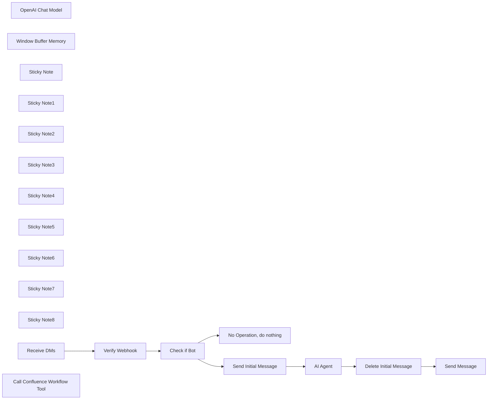

## Fluxo (.json) :

```json
{
  "meta": {
    "instanceId": "cb484ba7b742928a2048bf8829668bed5b5ad9787579adea888f05980292a4a7"
  },
  "nodes": [
    {
      "id": "96ef3bfe-a493-4377-b090-6b2d02d87480",
      "name": "Verify Webhook",
      "type": "n8n-nodes-base.respondToWebhook",
      "position": [
        1420,
        800
      ],
      "parameters": {
        "options": {
          "responseCode": 200,
          "responseHeaders": {
            "entries": [
              {
                "name": "Content-type",
                "value": "application/json"
              }
            ]
          }
        },
        "respondWith": "json",
        "responseBody": "={\"challenge\":\"{{ $json.body.challenge }}\"}"
      },
      "typeVersion": 1
    },
    {
      "id": "38db6da6-13bf-47a1-b5cb-f06403b309ac",
      "name": "OpenAI Chat Model",
      "type": "@n8n/n8n-nodes-langchain.lmChatOpenAi",
      "position": [
        2120,
        1220
      ],
      "parameters": {
        "model": "gpt-4o",
        "options": {}
      },
      "credentials": {
        "openAiApi": {
          "id": "QpFZ2EiM3WGl6Zr3",
          "name": "Marketing OpenAI"
        }
      },
      "typeVersion": 1
    },
    {
      "id": "139b606d-29ae-480d-bde7-458ef45dba01",
      "name": "No Operation, do nothing",
      "type": "n8n-nodes-base.noOp",
      "position": [
        1840,
        700
      ],
      "parameters": {},
      "typeVersion": 1
    },
    {
      "id": "64acd4c6-cd53-46e5-a29e-40884044b186",
      "name": "Window Buffer Memory",
      "type": "@n8n/n8n-nodes-langchain.memoryBufferWindow",
      "position": [
        2800,
        1220
      ],
      "parameters": {
        "sessionKey": "={{ $('Receive DMs').item.json[\"body\"][\"event\"][\"channel\"] }}",
        "sessionIdType": "customKey",
        "contextWindowLength": 10
      },
      "typeVersion": 1.2
    },
    {
      "id": "e605864f-198e-4358-8333-50ed962d4e50",
      "name": "Check if Bot",
      "type": "n8n-nodes-base.if",
      "position": [
        1640,
        800
      ],
      "parameters": {
        "options": {},
        "conditions": {
          "options": {
            "leftValue": "",
            "caseSensitive": true,
            "typeValidation": "strict"
          },
          "combinator": "and",
          "conditions": [
            {
              "id": "89ed1b2a-5e42-4196-989d-f7f81df04b6d",
              "operator": {
                "type": "string",
                "operation": "notExists",
                "singleValue": true
              },
              "leftValue": "={{ $json.body.event.user }}",
              "rightValue": ""
            }
          ]
        }
      },
      "typeVersion": 2
    },
    {
      "id": "8479c41e-b251-4f32-8daa-421969c4c8b3",
      "name": "Send Initial Message",
      "type": "n8n-nodes-base.slack",
      "position": [
        2140,
        820
      ],
      "parameters": {
        "text": "On it! Let me check Confluence to see if there are any relevant links to answer your question. ",
        "select": "channel",
        "channelId": {
          "__rl": true,
          "mode": "id",
          "value": "={{ $('Receive DMs').item.json[\"body\"][\"event\"][\"channel\"] }}"
        },
        "otherOptions": {
          "botProfile": {
            "imageValues": {
              "icon_url": "https://avatars.slack-edge.com/2024-08-30/7671440019297_d6ce97ff3ab5a3abf9c1_72.jpg",
              "profilePhotoType": "image"
            }
          },
          "includeLinkToWorkflow": false
        }
      },
      "credentials": {
        "slackApi": {
          "id": "OfRxDxHFIqk1q44a",
          "name": "helphub n8n labs auth"
        }
      },
      "typeVersion": 2.1
    },
    {
      "id": "dcd325b1-1ee8-4133-9a6e-8b37bf20d056",
      "name": "Delete Initial Message",
      "type": "n8n-nodes-base.slack",
      "position": [
        2960,
        760
      ],
      "parameters": {
        "select": "channel",
        "channelId": {
          "__rl": true,
          "mode": "id",
          "value": "={{ $('Receive DMs').item.json[\"body\"][\"event\"][\"channel\"] }}"
        },
        "operation": "delete",
        "timestamp": "={{ $('Send Initial Message').item.json[\"message_timestamp\"] }}"
      },
      "credentials": {
        "slackApi": {
          "id": "OfRxDxHFIqk1q44a",
          "name": "helphub n8n labs auth"
        }
      },
      "typeVersion": 2.1
    },
    {
      "id": "8d3ac15c-b0bc-459c-9523-685b7f498efb",
      "name": "Send Message",
      "type": "n8n-nodes-base.slack",
      "position": [
        3160,
        760
      ],
      "parameters": {
        "text": "={{ $('AI Agent').item.json.output.replace(/\\[(.+?)\\]\\((.+?)\\)/g, '<$2|$1>').replace(/\\*\\*(.+?)\\*\\*/g, '*$1*') }}",
        "select": "channel",
        "channelId": {
          "__rl": true,
          "mode": "id",
          "value": "={{ $('Receive DMs').item.json[\"body\"][\"event\"][\"channel\"] }}"
        },
        "otherOptions": {
          "botProfile": {
            "imageValues": {
              "icon_url": "https://avatars.slack-edge.com/2024-08-30/7671440019297_d6ce97ff3ab5a3abf9c1_72.jpg",
              "profilePhotoType": "image"
            }
          },
          "includeLinkToWorkflow": false
        }
      },
      "credentials": {
        "slackApi": {
          "id": "OfRxDxHFIqk1q44a",
          "name": "helphub n8n labs auth"
        }
      },
      "typeVersion": 2.1
    },
    {
      "id": "02afa6b3-c528-4925-8b92-7b708b10e7ca",
      "name": "Sticky Note",
      "type": "n8n-nodes-base.stickyNote",
      "position": [
        1160,
        460
      ],
      "parameters": {
        "color": 7,
        "width": 414.5626477541374,
        "height": 516.5011820330969,
        "content": "\n## Webhook Trigger\nThe first node receives all messages from Slack API via Subscription Events API. You can find more information about setting up the subscription events API by [clicking here](https://api.slack.com/apis/connections/events-api). The second node responds to the periodic security challenges that Slack sends to ensure the N8n webhook is still active. "
      },
      "typeVersion": 1
    },
    {
      "id": "a8caa088-80dd-44a8-8c61-7a03a37de386",
      "name": "Sticky Note1",
      "type": "n8n-nodes-base.stickyNote",
      "position": [
        1600,
        460
      ],
      "parameters": {
        "color": 7,
        "width": 403.49881796690335,
        "height": 517.6832151300242,
        "content": "\n## Check for Bot Responses\nIf the message received is from a Bot instead of a real user, it will ignore the message."
      },
      "typeVersion": 1
    },
    {
      "id": "17b51014-4f9d-4650-963b-8d8d944869ea",
      "name": "Sticky Note2",
      "type": "n8n-nodes-base.stickyNote",
      "position": [
        2900,
        460
      ],
      "parameters": {
        "color": 7,
        "width": 430.54373522458616,
        "height": 451.3947990543734,
        "content": "\n## Delete Receipt and Send Response \nOnce the AI response is generated in response to the slack message, n8n delete's it's original *Message Received* message to avoid cluttering up the user's DMs, and then sends the final Slack message back to the user. "
      },
      "typeVersion": 1
    },
    {
      "id": "494a9ada-18e9-48a6-86a9-5e72cc797ddf",
      "name": "Sticky Note3",
      "type": "n8n-nodes-base.stickyNote",
      "position": [
        2394.7517730496443,
        460
      ],
      "parameters": {
        "color": 7,
        "width": 488.1796690307332,
        "height": 723.5460992907797,
        "content": "\n## Parse Response with AI Model \nThis workflow currently uses OpenAI to power it's responses, but you can open the AI Agent node below and set your own AI LLM using the n8n options offered. "
      },
      "typeVersion": 1
    },
    {
      "id": "31bc923f-c981-45fd-827d-cede2ec3f3c3",
      "name": "Sticky Note4",
      "type": "n8n-nodes-base.stickyNote",
      "position": [
        2020,
        460
      ],
      "parameters": {
        "color": 7,
        "width": 356.5484633569741,
        "height": 516.5011820330968,
        "content": "\n## Response Received\nOnce N8n sees that the messaged received is from a user, it will respond right away to acknowledge a message was received. You can edit the message by opening the node below. "
      },
      "typeVersion": 1
    },
    {
      "id": "e81d6b07-9ac0-4848-ab7f-57a588103ce5",
      "name": "Sticky Note5",
      "type": "n8n-nodes-base.stickyNote",
      "position": [
        2980,
        1200
      ],
      "parameters": {
        "color": 7,
        "width": 951.1571908442271,
        "height": 467.66775526888296,
        "content": "\n## Build n8n workflow to query Knowledge Base\nBuilding your own tools for an AI Agent to use is simple and straightforward, but requires that you build a second workflow and then connect it to this one by inputting the workflow ID from the workflow URL in the *Custom n8n KB Tool* sub node. \n\nThis gives you the freedom to work with any tool, whether n8n has support for it or not. In this sample build, we have connected the AI agent to Confluence, which does not have a native built in n8n node. For this we use the HTTP request node and pointed it to Confluence's search api. It then returns a response that the AI agent uses to generate a final slack message response to the user. "
      },
      "typeVersion": 1
    },
    {
      "id": "890aeb96-1721-4cb4-a609-5409b30d5f6c",
      "name": "Sticky Note6",
      "type": "n8n-nodes-base.stickyNote",
      "position": [
        2320,
        1200
      ],
      "parameters": {
        "color": 7,
        "width": 644.582152697438,
        "height": 318.6662788502134,
        "content": "\n\n## Remembers the last 5 messages that a user sent\nBecause we are passing the channel ID of the user to the memory module, n8n is storing the last 5 slack messages sent to it per slack channel. This means that it will remember all your users conversations separately from one another and not get confused by different requests from different users. You can increase the memory storage by using a different storage medium and increase the number of prompts and responses it should remember. "
      },
      "typeVersion": 1
    },
    {
      "id": "1fa61c12-70d1-4d7e-8564-a2a574804243",
      "name": "Sticky Note7",
      "type": "n8n-nodes-base.stickyNote",
      "position": [
        1660,
        1200
      ],
      "parameters": {
        "color": 7,
        "width": 644.582152697438,
        "height": 318.6662788502134,
        "content": "\n\n## Change the AI Agents LLM\nTo change the model used, simply delete the ChatGPT model and replace with a different supported model by hitting the plus sign under model in the AI Agent."
      },
      "typeVersion": 1
    },
    {
      "id": "fecd81da-4723-4886-8d6f-9729623028a9",
      "name": "Sticky Note8",
      "type": "n8n-nodes-base.stickyNote",
      "position": [
        460,
        460
      ],
      "parameters": {
        "width": 675.1724774900403,
        "height": 994.2389415638766,
        "content": "\n# Streamline IT Inquiries with n8n & AI!\n\n## Introducing the IT Ops AI SlackBot Workflow---a sophisticated solution designed to automate and optimize the management of IT-related inquiries via Slack.\n\nWhen an employee messages the IT department slack app, the workflow kicks off with the \"Receive DMs\" node, which captures incoming messages and ensures a secure and active communication line by responding to Slack's webhook challenges.\n\n**How It Works:**\n\n-   Verify Webhook: Responds to slacks challenge and respond requests to ensure is still active.\n-   Check if bot: Checks whether the message sender is a bot to prevent unnecessary processing.\n-   Send Initial Message: Sends a quick confirmation, like \"On it!\", to let the user know their query is being handled.\n-   AI-Driven Responses: Employs the \"AI Agent\" node with OpenAI to craft relevant replies based on the conversation history maintained by the \"Window Buffer Memory\" node.\n-   Knowledge Integration tool: Uses a custom Knowledge Base tool to fetch pertinent information from confluence, enhancing the quality of responses.\n-   Cleanup and Reply: Deletes the initial acknowledgment to tidy up before sending the final detailed response back to the user.\n\n\n**Get Started:**\n-   Ensure your [Slack](https://docs.n8n.io/integrations/builtin/app-nodes/n8n-nodes-base.slack/?utm_source=n8n_app&utm_medium=node_settings_modal-credential_link&utm_campaign=n8n-nodes-base.slack) and [OpenAI](https://docs.n8n.io/integrations/builtin/cluster-nodes/sub-nodes/n8n-nodes-langchain.lmchatopenai/?utm_source=n8n_app&utm_medium=node_settings_modal-credential_link&utm_campaign=@n8n/n8n-nodes-langchain.lmChatOpenAi) integrations are properly set up.\n-   Customize the workflow to align with your IT department's protocols.\n\n\n**Need Help?**\n-   Join the discussion on our Forum or check out resources on Discord!\n\n\nDeploy this workflow to improve response times and enhance the efficiency of your IT support services."
      },
      "typeVersion": 1
    },
    {
      "id": "16b79887-8218-4056-8add-39ebee6166bd",
      "name": "Receive DMs",
      "type": "n8n-nodes-base.webhook",
      "position": [
        1200,
        800
      ],
      "webhookId": "44c26a10-d54a-46ce-a522-5d83e8a854be",
      "parameters": {
        "path": "44c26a10-d54a-46ce-a522-5d83e8a854be",
        "options": {},
        "httpMethod": "POST",
        "responseMode": "responseNode"
      },
      "typeVersion": 2
    },
    {
      "id": "201b5399-6fff-48ca-81f0-a5cfc02c46d5",
      "name": "Call Confluence Workflow Tool",
      "type": "@n8n/n8n-nodes-langchain.toolWorkflow",
      "position": [
        3380,
        1280
      ],
      "parameters": {
        "name": "confluence_kb_search",
        "workflowId": {
          "__rl": true,
          "mode": "list",
          "value": "Pxzc65WaCPn2yB5I",
          "cachedResultName": "KB Tool - Confluence KB"
        },
        "description": "Call this tool to search n8n-labs confluence knowledge base. The input should be the user prompt reduced into 1 to 3 keywords to use for a KB search. These words should be words that are most likely to be contained in the text of a KB article that is helpful based on the user prompt. The words should be the only response and they should just be separated by a space."
      },
      "typeVersion": 1.2
    },
    {
      "id": "41026e03-5844-4e57-86bf-fc7e586265a4",
      "name": "AI Agent",
      "type": "@n8n/n8n-nodes-langchain.agent",
      "position": [
        2500,
        820
      ],
      "parameters": {
        "text": "={{ $('Receive DMs').item.json.body.event.text }}",
        "options": {
          "humanMessage": "TOOLS\n------\nAssistant can ask the user to use tools to look up information that may be helpful in answering the users original question. The tools the human can use are:\n\n{tools}\n\nIf no response is given for a given tool or the response is an error, then do not reference the tool results and instead ask for more context. \n\nThe tools currently search Notion and returns back a list of results. Please try to respond using the most relevant result URL to guide the user to the right answer. \n\nIf you are not sure, let the user know you were unable to find a notion page for them to help, but give them the top results that are relevant to their request.\n\nPlease summarize the results and return all the URLs exactly as you get them from the tool. Please format all links you send in this format: <url|name of url> \nAdditionally, here are other formatting layouts to use: \n_italic_ will produce italicized text\n*bold* will produce bold text\n~strike~ will produce strikethrough text\n\n{format_instructions}\n\nUSER'S INPUT\n--------------------\nHere is the user's input (remember to respond with a slack flavored (see above for more details) code snippet of a json blob with a single action, and NOTHING else):\n\n{{input}}\n",
          "maxIterations": 2,
          "systemMessage": "You are Knowledge Ninja, a specialized IT support tool developed to streamline interactions between employees and the IT department and the company knowledge base. \n\nDesigned with efficiency in mind, Knowledge Ninja is equipped to handle a variety of IT-related queries, from sales competition analysis to troubleshooting to more complex technical guidance.\n\nAs a dynamic knowledge tool, Knowledge Ninja utilizes a comprehensive internal knowledge base that can be tailored to your organization's specific IT infrastructure and policies. \n\nThis allows it to deliver precise and contextually relevant information swiftly, enhancing the support process.\n\nKnowledge Ninja is continuously updated to reflect the latest IT standards and practices, ensuring that the guidance it provides is both accurate and up-to-date. \n\nIts capabilities include understanding detailed queries, providing step-by-step troubleshooting instructions, and clarifying IT policies.\n\nPlease format all links you send in this format: <url|name of url> \nAdditionally, here are other formatting layouts to use: \n_italic_ will produce italicized text\n*bold* will produce bold text\n~strike~ will produce strikethrough text"
        },
        "promptType": "define"
      },
      "typeVersion": 1.5
    }
  ],
  "pinData": {},
  "connections": {
    "AI Agent": {
      "main": [
        [
          {
            "node": "Delete Initial Message",
            "type": "main",
            "index": 0
          }
        ]
      ]
    },
    "Receive DMs": {
      "main": [
        [
          {
            "node": "Verify Webhook",
            "type": "main",
            "index": 0
          }
        ]
      ]
    },
    "Check if Bot": {
      "main": [
        [
          {
            "node": "No Operation, do nothing",
            "type": "main",
            "index": 0
          }
        ],
        [
          {
            "node": "Send Initial Message",
            "type": "main",
            "index": 0
          }
        ]
      ]
    },
    "Verify Webhook": {
      "main": [
        [
          {
            "node": "Check if Bot",
            "type": "main",
            "index": 0
          }
        ]
      ]
    },
    "OpenAI Chat Model": {
      "ai_languageModel": [
        [
          {
            "node": "AI Agent",
            "type": "ai_languageModel",
            "index": 0
          }
        ]
      ]
    },
    "Send Initial Message": {
      "main": [
        [
          {
            "node": "AI Agent",
            "type": "main",
            "index": 0
          }
        ]
      ]
    },
    "Window Buffer Memory": {
      "ai_memory": [
        [
          {
            "node": "AI Agent",
            "type": "ai_memory",
            "index": 0
          }
        ]
      ]
    },
    "Delete Initial Message": {
      "main": [
        [
          {
            "node": "Send Message",
            "type": "main",
            "index": 0
          }
        ]
      ]
    },
    "Call Confluence Workflow Tool": {
      "ai_tool": [
        [
          {
            "node": "AI Agent",
            "type": "ai_tool",
            "index": 0
          }
        ]
      ]
    }
  }
}
```

<a id="template-1597"></a>

## Template 1597 - Automação de CSR via Slack com análise e aprovação

- **Nome:** Automação de CSR via Slack com análise e aprovação
- **Descrição:** Fluxo que permite usuários solicitarem certificados via Slack, valida os domínios com VirusTotal, utiliza IA para classificar risco e emite automaticamente ou encaminha para aprovação manual no Venafi.
- **Funcionalidade:** • Recepção de eventos do Slack: Recebe interações e submissões de modais via webhook.
• Exibição de modal para solicitação: Abre uma modal no Slack para coletar domínio, período de validade e notas opcionais.
• Extração de campos do formulário: Extrai domínio, validade e observações submetidas pelo usuário.
• Consultas ao VirusTotal: Consulta o domínio no VirusTotal para obter estatísticas de análise de segurança.
• Resumo de resultados para economia de tokens: Extrai e reduz os dados relevantes do relatório do VirusTotal.
• Avaliação com IA: Usa um modelo de linguagem para classificar o risco (Baixo, Médio, Alto) e sugerir próximos passos.
• Lógica de auto-issue: Emite automaticamente o CSR no Venafi quando não há detecções maliciosas.
• Encaminhamento para aprovação manual: Gera relatório e envia mensagem para canal de segurança se houver riscos, incluindo botões para aprovação.
• Geração de CSR no Venafi: Cria CSR e solicita emissão usando template e parâmetros organizacionais.
• Envio de confirmações no Slack: Publica mensagens formatadas com detalhes do CSR emitido ou pendente.
• Enriquecimento de contexto: Recupera email e informações do time do solicitante para mensagens mais informativas.
- **Ferramentas:** • Slack: Interface de interação com usuários via modais, botões e mensagens de canal.
• VirusTotal: Serviço de análise de segurança de domínios para identificar detectações maliciosas e reputação.
• Venafi TLS Protect Cloud: Plataforma de emissão e gestão de certificados e geração de CSR.
• OpenAI (modelo de linguagem): Avaliação e sumarização dos resultados do VirusTotal com classificação de risco e recomendações.

## Fluxo visual

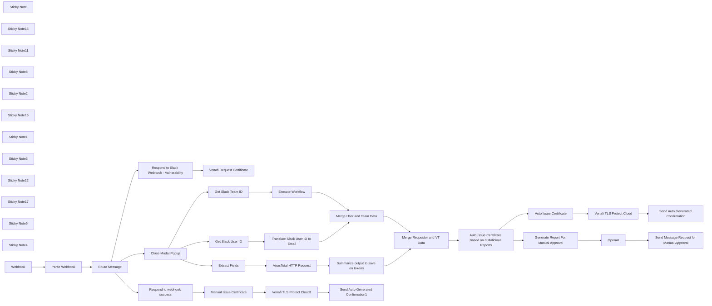

## Fluxo (.json) :

```json
{
  "meta": {
    "instanceId": "cb484ba7b742928a2048bf8829668bed5b5ad9787579adea888f05980292a4a7"
  },
  "nodes": [
    {
      "id": "1092ab50-67a0-4e50-8c10-f05f70b45f56",
      "name": "Venafi TLS Protect Cloud",
      "type": "n8n-nodes-base.venafiTlsProtectCloud",
      "position": [
        2860,
        1700
      ],
      "parameters": {
        "options": {},
        "commonName": "={{ $('Parse Webhook').item.json.response.view.state.values.domain_name_block.domain_name_input.value.match(/^(\\*\\.)?([a-zA-Z0-9-]+\\.)+[a-zA-Z]{2,}$/g).toString() }}",
        "generateCsr": true,
        "applicationId": "f3c15c80-7151-11ef-9a22-abeac49f7094",
        "additionalFields": {
          "organizationalUnits": [
            "={{ $json.name }}"
          ]
        },
        "certificateIssuingTemplateId": "d28d82b1-714b-11ef-9026-7bb80b32867a"
      },
      "credentials": {
        "venafiTlsProtectCloudApi": {
          "id": "WU38IpfutNNkJWuo",
          "name": "Venafi TLS Protect Cloud account"
        }
      },
      "typeVersion": 1
    },
    {
      "id": "0c1f1b92-2da4-413f-a4cc-68c816e8511c",
      "name": "Parse Webhook",
      "type": "n8n-nodes-base.set",
      "position": [
        440,
        1100
      ],
      "parameters": {
        "options": {},
        "assignments": {
          "assignments": [
            {
              "id": "e63f9299-a19d-4ba1-93b0-59f458769fb2",
              "name": "response",
              "type": "object",
              "value": "={{ $json.body.payload }}"
            }
          ]
        }
      },
      "typeVersion": 3.3
    },
    {
      "id": "95fb1907-c9e0-4164-b0b0-c3691bb46b9a",
      "name": "Sticky Note",
      "type": "n8n-nodes-base.stickyNote",
      "position": [
        108.34675483142371,
        741.4892041682327
      ],
      "parameters": {
        "color": 7,
        "width": 466.8168310000617,
        "height": 556.7924159157113,
        "content": "\n## Events Webhook Trigger\nThe first node receives all messages from Slack API via Subscription Events API. You can find more information about setting up the subscription events API by [clicking here](https://api.slack.com/apis/connections/events-api). \n\nThe second node extracts the payload from slack into an object that n8n can understand.  "
      },
      "typeVersion": 1
    },
    {
      "id": "4dd8cbbe-278c-4c86-bcd7-9fb0eff619b2",
      "name": "Sticky Note15",
      "type": "n8n-nodes-base.stickyNote",
      "position": [
        580,
        420
      ],
      "parameters": {
        "color": 7,
        "width": 566.0553219408072,
        "height": 999.0925226187064,
        "content": "\n## Efficient Slack Interaction Handling with n8n\n\nThis section of the workflow is designed to efficiently manage and route messages and submissions from Slack based on specific triggers and conditions. When a Slack interaction occurs—such as a user triggering a vulnerability scan or generating a report through a modal—the workflow intelligently routes the message to the appropriate action:\n\n- **Dynamic Routing**: Uses conditions to determine the nature of the Slack interaction, whether it's a direct command to initiate a scan or a request to generate a report.\n- **Modal Management**: Differentiates actions based on modal titles and `callback_id`s, ensuring that each type of submission is processed according to its context.\n- **Streamlined Responses**: After routing, the workflow promptly handles the necessary responses or actions, including closing modal popups and responding to Slack with appropriate confirmation or data.\n\n**Purpose**: This mechanism ensures that all interactions within Slack are handled quickly and accurately, automating responses and actions in real-time to enhance user experience and workflow efficiency."
      },
      "typeVersion": 1
    },
    {
      "id": "db8aabd8-d00d-4d50-9f97-443eba7c7c90",
      "name": "Sticky Note11",
      "type": "n8n-nodes-base.stickyNote",
      "position": [
        1153.6255461332685,
        516.1718360212528
      ],
      "parameters": {
        "color": 7,
        "width": 396.6025898621133,
        "height": 652.6603582798184,
        "content": "\n## Display Modal Popup\nThis section pops open a modal window that is later used to send data into Virustotal, then depending on those results, to Venafi or Slack for manual approval. \n\nModals can be customized to perform all sorts of actions. And they are natively mobile! Additionally, messages themselves can perform actions if you include inputs like buttons or field inputs. \n\nLearn more about them by [clicking here](https://api.slack.com/surfaces/modals)"
      },
      "typeVersion": 1
    },
    {
      "id": "a86e0b86-0740-4b77-831a-52413983818e",
      "name": "Close Modal Popup",
      "type": "n8n-nodes-base.respondToWebhook",
      "position": [
        960,
        1200
      ],
      "parameters": {
        "options": {},
        "respondWith": "noData"
      },
      "typeVersion": 1.1
    },
    {
      "id": "a5abc206-6b10-42bc-9196-bcedacdb3726",
      "name": "Sticky Note8",
      "type": "n8n-nodes-base.stickyNote",
      "position": [
        -580,
        740
      ],
      "parameters": {
        "width": 675.1724774900403,
        "height": 972.8853473866498,
        "content": "\n## Enhance Security Operations with the Venafi Slack CertBot!\n\nOur **Venafi Slack CertBot** is strategically designed to facilitate immediate security operations directly from Slack. This tool allows end users to request Certificate Signing Requests that are automatically approved or passed to the Secops team for manual approval depending on the Virustotal analysis of the requested domain. Not only does this help centralize requests, but it helps an organization maintain the security certifications by allowing automated processes to log and analyze requests in real time. \n\n**Workflow Highlights:**\n- **Interactive Modals**: Utilizes Slack modals to gather user inputs for scan configurations and report generation, providing a user-friendly interface for complex operations.\n- **Dynamic Workflow Execution**: Integrates seamlessly with Venafi to execute CSR generation and if any issues are found, AI can generate a custom report that is then passed to a slack teams channel for manual approval with the press of a single button.\n\n**Operational Flow:**\n- **Parse Webhook Data**: Captures and parses incoming data from Slack to understand user commands accurately.\n- **Execute Actions**: Depending on the user's selection, the workflow triggers other actions within the flow like automatic Virustotal Scanning.\n- **Respond to Slack**: Ensures that every interaction is acknowledged, maintaining a smooth user experience by managing modal popups and sending appropriate responses.\n\n\n**Setup Instructions:**\n- Verify that Slack and Qualys API integrations are correctly configured for seamless interaction.\n- Customize the modal interfaces to align with your organization's operational protocols and security policies.\n- Test the workflow to ensure that it responds accurately to Slack commands and that the integration with Qualys is functioning as expected.\n\n\n**Need Assistance?**\n- Explore Venafi's [Documentation](https://docs.venafi.com/) or get help from the [n8n Community](https://community.n8n.io) for more detailed guidance on setup and customization.\n\nDeploy this bot within your Slack environment to significantly enhance the efficiency and responsiveness of your security operations, enabling proactive management of CSR's."
      },
      "typeVersion": 1
    },
    {
      "id": "352680c7-3b77-4fc1-81eb-8b5495747d89",
      "name": "Respond to Slack Webhook - Vulnerability",
      "type": "n8n-nodes-base.respondToWebhook",
      "position": [
        960,
        1000
      ],
      "parameters": {
        "options": {},
        "respondWith": "noData"
      },
      "typeVersion": 1.1
    },
    {
      "id": "7e2991c3-14ee-478c-b9b6-9dd58590dde9",
      "name": "Sticky Note2",
      "type": "n8n-nodes-base.stickyNote",
      "position": [
        1160,
        860
      ],
      "parameters": {
        "color": 5,
        "width": 376.26546828439086,
        "height": 113.6416448104651,
        "content": "### 🙋 Don't forget your slack credentials!\nThankfully n8n makes it easy, as long as you've added credentials to a normal slack node, these http nodes are a snap to change via the drop down. "
      },
      "typeVersion": 1
    },
    {
      "id": "97b8942b-1ec5-437f-9c51-2188cc9a9d6f",
      "name": "Venafi Request Certificate",
      "type": "n8n-nodes-base.httpRequest",
      "position": [
        1240,
        1000
      ],
      "parameters": {
        "url": "https://slack.com/api/views.open",
        "method": "POST",
        "options": {},
        "jsonBody": "=  {\n    \"trigger_id\": \"{{ $('Parse Webhook').item.json['response']['trigger_id'] }}\",\n    \"external_id\": \"Idea Selector\",\n    \"view\": {\n\t\"type\": \"modal\",\n\t\"callback_id\": \"certificate_request_modal\",\n\t\"title\": {\n\t\t\"type\": \"plain_text\",\n\t\t\"text\": \"Request New Certificate\"\n\t},\n\t\"submit\": {\n\t\t\"type\": \"plain_text\",\n\t\t\"text\": \"Request\"\n\t},\n\t\"close\": {\n\t\t\"type\": \"plain_text\",\n\t\t\"text\": \"Cancel\"\n\t},\n\t\"blocks\": [\n\t\t{\n\t\t\t\"type\": \"image\",\n\t\t\t\"image_url\": \"https://img.securityinfowatch.com/files/base/cygnus/siw/image/2022/10/Venafi_logo.63459e2b03b7b.png?auto=format%2Ccompress&w=640&width=640\",\n\t\t\t\"alt_text\": \"delicious tacos\"\n\t\t},\n\t\t{\n\t\t\t\"type\": \"input\",\n\t\t\t\"block_id\": \"domain_name_block\",\n\t\t\t\"label\": {\n\t\t\t\t\"type\": \"plain_text\",\n\t\t\t\t\"text\": \"Domain Name\"\n\t\t\t},\n\t\t\t\"element\": {\n\t\t\t\t\"type\": \"plain_text_input\",\n\t\t\t\t\"action_id\": \"domain_name_input\",\n\t\t\t\t\"placeholder\": {\n\t\t\t\t\t\"type\": \"plain_text\",\n\t\t\t\t\t\"text\": \"Enter the domain name\"\n\t\t\t\t}\n\t\t\t}\n\t\t},\n\t\t{\n\t\t\t\"type\": \"input\",\n\t\t\t\"block_id\": \"validity_period_block\",\n\t\t\t\"label\": {\n\t\t\t\t\"type\": \"plain_text\",\n\t\t\t\t\"text\": \"Validity Period\"\n\t\t\t},\n\t\t\t\"element\": {\n\t\t\t\t\"type\": \"static_select\",\n\t\t\t\t\"action_id\": \"validity_period_select\",\n\t\t\t\t\"placeholder\": {\n\t\t\t\t\t\"type\": \"plain_text\",\n\t\t\t\t\t\"text\": \"Select a validity period\"\n\t\t\t\t},\n\t\t\t\t\"options\": [\n\t\t\t\t\t{\n\t\t\t\t\t\t\"text\": {\n\t\t\t\t\t\t\t\"type\": \"plain_text\",\n\t\t\t\t\t\t\t\"text\": \"1 Year\"\n\t\t\t\t\t\t},\n\t\t\t\t\t\t\"value\": \"P1Y\"\n\t\t\t\t\t},\n\t\t\t\t\t{\n\t\t\t\t\t\t\"text\": {\n\t\t\t\t\t\t\t\"type\": \"plain_text\",\n\t\t\t\t\t\t\t\"text\": \"2 Years\"\n\t\t\t\t\t\t},\n\t\t\t\t\t\t\"value\": \"P2Y\"\n\t\t\t\t\t}\n\t\t\t\t]\n\t\t\t}\n\t\t},\n\t\t{\n\t\t\t\"type\": \"input\",\n\t\t\t\"block_id\": \"optional_note_block\",\n\t\t\t\"optional\": true,\n\t\t\t\"label\": {\n\t\t\t\t\"type\": \"plain_text\",\n\t\t\t\t\"text\": \"Optional Note\"\n\t\t\t},\n\t\t\t\"element\": {\n\t\t\t\t\"type\": \"plain_text_input\",\n\t\t\t\t\"action_id\": \"optional_note_input\",\n\t\t\t\t\"multiline\": true,\n\t\t\t\t\"placeholder\": {\n\t\t\t\t\t\"type\": \"plain_text\",\n\t\t\t\t\t\"text\": \"Add any extra information (e.g., usage context, urgency)\"\n\t\t\t\t}\n\t\t\t}\n\t\t}\n\t]\n}\n}",
        "sendBody": true,
        "jsonQuery": "{\n  \"Content-type\": \"application/json\"\n}",
        "sendQuery": true,
        "specifyBody": "json",
        "specifyQuery": "json",
        "authentication": "predefinedCredentialType",
        "nodeCredentialType": "slackApi"
      },
      "credentials": {
        "slackApi": {
          "id": "hkcQkp6qhtiMzBEX",
          "name": "certbot"
        }
      },
      "typeVersion": 4.2
    },
    {
      "id": "12c50bad-8aab-4bab-8790-153d9e484762",
      "name": "Extract Fields",
      "type": "n8n-nodes-base.set",
      "position": [
        1200,
        1460
      ],
      "parameters": {
        "options": {},
        "assignments": {
          "assignments": [
            {
              "id": "39808a24-60f6-4f4b-8f4c-4c2aa3850b4f",
              "name": "domain",
              "type": "string",
              "value": "={{ $json.response.view.state.values.domain_name_block.domain_name_input.value }}"
            },
            {
              "id": "27c905be-18cc-434f-8af0-a08ee23a168f",
              "name": "validity",
              "type": "string",
              "value": "={{ $json.response.view.state.values.validity_period_block.validity_period_select.selected_option.value }}"
            },
            {
              "id": "ba1382e5-0629-4276-9858-34bcb59cc85a",
              "name": "note",
              "type": "string",
              "value": "={{ $json.response.view.state.values.optional_note_block.optional_note_input.value }}"
            }
          ]
        }
      },
      "typeVersion": 3.4
    },
    {
      "id": "f16a97d7-639e-4ec9-b003-b4ee4fdf8666",
      "name": "Get Slack User ID",
      "type": "n8n-nodes-base.set",
      "position": [
        1200,
        2020
      ],
      "parameters": {
        "options": {},
        "assignments": {
          "assignments": [
            {
              "id": "53dfe019-d91d-4f5c-b279-f8b3fde98bf1",
              "name": "id",
              "type": "string",
              "value": "={{ $json.response.user.id }}"
            }
          ]
        }
      },
      "typeVersion": 3.4
    },
    {
      "id": "2a6af9ae-3916-4993-b2b3-a737f54f7a37",
      "name": "Translate Slack User ID to Email",
      "type": "n8n-nodes-base.executeWorkflow",
      "position": [
        1520,
        2020
      ],
      "parameters": {
        "options": {
          "waitForSubWorkflow": true
        },
        "workflowId": {
          "__rl": true,
          "mode": "list",
          "value": "afeVlIVyoIF8Psu4",
          "cachedResultName": "Slack ID to Email"
        }
      },
      "typeVersion": 1.1
    },
    {
      "id": "19541f84-0d97-4711-80ed-d36a5d517d9b",
      "name": "VirusTotal HTTP Request",
      "type": "n8n-nodes-base.httpRequest",
      "position": [
        1440,
        1460
      ],
      "parameters": {
        "": "",
        "url": "=https://www.virustotal.com/api/v3/domains/{{ $json.domain }}",
        "method": "GET",
        "options": {},
        "sendBody": false,
        "sendQuery": false,
        "curlImport": "",
        "infoMessage": "",
        "sendHeaders": true,
        "authentication": "none",
        "specifyHeaders": "keypair",
        "headerParameters": {
          "parameters": [
            {
              "name": "accept",
              "value": "application/json"
            },
            {
              "name": "X-Apikey",
              "value": "455144dac89b783b2f5421578b9ab4072adebfc011c969ba384d1c8f0e2ce39e"
            }
          ]
        },
        "httpVariantWarning": "",
        "provideSslCertificates": false
      },
      "credentials": {
        "virusTotalApi": {
          "id": "JRK1xDyMiseROCmY",
          "name": "VirusTotal account 2"
        }
      },
      "typeVersion": 4.2,
      "extendsCredential": "virusTotalApi"
    },
    {
      "id": "4a0e0a71-b433-479b-87b7-7200537009af",
      "name": "Summarize output to save on tokens",
      "type": "n8n-nodes-base.set",
      "position": [
        1760,
        1460
      ],
      "parameters": {
        "options": {},
        "assignments": {
          "assignments": [
            {
              "id": "2c4689a3-4b72-4240-8a0f-2fa00d33c553",
              "name": "data.attributes.last_analysis_stats.malicious",
              "type": "number",
              "value": "={{ $json.data.attributes.last_analysis_stats.malicious }}"
            },
            {
              "id": "59db6f41-1cf1-4feb-8120-8c50fadc5c9e",
              "name": "data.attributes.last_analysis_stats.suspicious",
              "type": "number",
              "value": "={{ $json.data.attributes.last_analysis_stats.suspicious }}"
            },
            {
              "id": "b55e7d39-0358-4863-8147-c5ce2b65ea96",
              "name": "data.attributes.last_analysis_stats.undetected",
              "type": "number",
              "value": "={{ $json.data.attributes.last_analysis_stats.undetected }}"
            },
            {
              "id": "ecd98a37-cb8b-48cd-bd3d-9c8bf777c5ca",
              "name": "data.attributes.last_analysis_stats.harmless",
              "type": "number",
              "value": "={{ $json.data.attributes.last_analysis_stats.harmless }}"
            },
            {
              "id": "72a776d5-70d7-4c30-b8fc-f7da382bc626",
              "name": "data.attributes.last_analysis_stats.timeout",
              "type": "number",
              "value": "={{ $json.data.attributes.last_analysis_stats.timeout }}"
            },
            {
              "id": "b85d8e8a-620c-4bb7-97db-d780f273deee",
              "name": "data.attributes.reputation",
              "type": "number",
              "value": "={{ $json.data.attributes.reputation }}"
            }
          ]
        }
      },
      "typeVersion": 3.4
    },
    {
      "id": "3d641c80-8a2a-4888-9ee3-ecd82f8d0d8b",
      "name": "Auto Issue Certificate Based on 0 Malicious Reports",
      "type": "n8n-nodes-base.if",
      "position": [
        2300,
        1840
      ],
      "parameters": {
        "options": {},
        "conditions": {
          "options": {
            "version": 2,
            "leftValue": "",
            "caseSensitive": true,
            "typeValidation": "strict"
          },
          "combinator": "and",
          "conditions": [
            {
              "id": "795c6ff5-ac4a-4b67-b2fe-369fba276194",
              "operator": {
                "type": "number",
                "operation": "lte"
              },
              "leftValue": "={{ $json.data.attributes.last_analysis_stats.malicious }}",
              "rightValue": 0
            }
          ]
        }
      },
      "typeVersion": 2.2
    },
    {
      "id": "3f6e9bf2-6c6c-4316-8d14-1b004122fa67",
      "name": "Auto Issue Certificate",
      "type": "n8n-nodes-base.noOp",
      "position": [
        2560,
        1700
      ],
      "parameters": {},
      "typeVersion": 1
    },
    {
      "id": "fa34e736-65c4-4bc1-a391-794225a588d2",
      "name": "Generate Report For Manual Approval",
      "type": "n8n-nodes-base.noOp",
      "position": [
        2540,
        2220
      ],
      "parameters": {},
      "typeVersion": 1
    },
    {
      "id": "178afe87-cdef-46f0-8166-68b661349189",
      "name": "Get Slack Team ID",
      "type": "n8n-nodes-base.set",
      "position": [
        1220,
        2220
      ],
      "parameters": {
        "options": {},
        "assignments": {
          "assignments": [
            {
              "id": "53dfe019-d91d-4f5c-b279-f8b3fde98bf1",
              "name": "id",
              "type": "string",
              "value": "={{ $json.response.team.id }}"
            }
          ]
        }
      },
      "typeVersion": 3.4
    },
    {
      "id": "c4d89085-f7f4-4073-bfe2-cd156275710c",
      "name": "Execute Workflow",
      "type": "n8n-nodes-base.executeWorkflow",
      "position": [
        1520,
        2220
      ],
      "parameters": {
        "options": {},
        "workflowId": {
          "__rl": true,
          "mode": "list",
          "value": "ZIl9VdWh7BiVRRBT",
          "cachedResultName": "Slack Team ID to Name"
        }
      },
      "typeVersion": 1.1
    },
    {
      "id": "51d85502-ea61-423b-a6c4-66ed8397d685",
      "name": "Merge User and Team Data",
      "type": "n8n-nodes-base.merge",
      "position": [
        1820,
        2140
      ],
      "parameters": {
        "mode": "combine",
        "options": {},
        "combineBy": "combineByPosition"
      },
      "typeVersion": 3
    },
    {
      "id": "febb1be8-7cad-46f1-a854-2ff1432216cb",
      "name": "OpenAI",
      "type": "@n8n/n8n-nodes-langchain.openAi",
      "position": [
        2720,
        2220
      ],
      "parameters": {
        "modelId": {
          "__rl": true,
          "mode": "list",
          "value": "gpt-4o-mini",
          "cachedResultName": "GPT-4O-MINI"
        },
        "options": {},
        "messages": {
          "values": [
            {
              "content": "=Analyze the following VirusTotal scan results and summarize the overall risk as Low, Medium, or High based on the number of engines flagging the domain (excluding \"clean\" or \"unrated\" results). Use the following criteria for risk rating:\n\nLow: No significant threats detected; domain is clean.\nMedium: Minor issues detected; may require further review.\nHigh: Significant threats like phishing or malware; manual review recommended.\n\nHere are the scan results for the domain {{ $('Parse Webhook').item.json.response.view.state.values.domain_name_block.domain_name_input.value }}:\n\nMalicious: {{ $json.data.attributes.last_analysis_stats.malicious }}\nSuspicious: {{ $json.data.attributes.last_analysis_stats.suspicious }}\nUndetected: {{ $json.data.attributes.last_analysis_stats.undetected }}\nHarmless: {{ $json.data.attributes.last_analysis_stats.harmless }}\nTimeout: {{ $json.data.attributes.last_analysis_stats.timeout }}\nReputation: {{ $json.data.attributes.reputation }}\n\nProvide an overall risk rating and suggest next steps based on your analysis. Please keep it concise. "
            },
            {
              "role": "system",
              "content": "Analyze the VirusTotal scan results and categorize the domain’s risk as Low, Medium, or High:\n\nIdentify Risks: Focus on results flagged as anything other than \"clean\" or \"unrated.\"\nAssess Risk:\nLow: No major threats flagged, domain is safe.\nMedium: Minor issues flagged, review recommended.\nHigh: Significant threats flagged (e.g., phishing, malware), manual review needed.\nRecommendation:\nLow: Auto-issue the certificate.\nMedium/High: Recommend manual review."
            }
          ]
        }
      },
      "credentials": {
        "openAiApi": {
          "id": "2KVzlb0XZRZkoObj",
          "name": "angel openai auth"
        }
      },
      "typeVersion": 1.5
    },
    {
      "id": "04ffe7bb-be5d-4ce0-b17c-68276673f585",
      "name": "Sticky Note16",
      "type": "n8n-nodes-base.stickyNote",
      "position": [
        1160,
        1680
      ],
      "parameters": {
        "color": 7,
        "width": 833.9929589980072,
        "height": 705.5291769708515,
        "content": "\n## Run Workflows within other Workflows like Functions\n\nThis section of the workflow contains 2 subworkflows that translate the Slack User ID to an email and name, and the Slack Team ID into the team name and Avatar of the team to make the slack messages more visual. This allows you to reuse these flows like you would use a function in code. \n\nThese nodes run parallel to each other so they will not override the data generated by each thread, and then are joined using the Merge nodes. "
      },
      "typeVersion": 1
    },
    {
      "id": "a2b48f56-946b-4ae7-ade4-5b84b1a99bb9",
      "name": "Sticky Note1",
      "type": "n8n-nodes-base.stickyNote",
      "position": [
        1160,
        1180
      ],
      "parameters": {
        "color": 7,
        "width": 832.2724669887743,
        "height": 485.55399396506067,
        "content": "\n## URL Analysis with VirusTotal\nThe first node receives all messages from Slack API via Subscription Events API. You can find more information about setting up the subscription events API by [clicking here](https://api.slack.com/apis/connections/events-api). \n\nThe second node extracts the payload from slack into an object that n8n can understand.  "
      },
      "typeVersion": 1
    },
    {
      "id": "c38c30f3-acb1-40e4-acc5-3fd4f6b8e643",
      "name": "Merge Requestor and VT Data",
      "type": "n8n-nodes-base.merge",
      "position": [
        2100,
        1840
      ],
      "parameters": {
        "mode": "combine",
        "options": {},
        "combineBy": "combineByPosition"
      },
      "typeVersion": 3
    },
    {
      "id": "2e2c6100-b82e-4cdf-a290-33c2898de652",
      "name": "Sticky Note3",
      "type": "n8n-nodes-base.stickyNote",
      "position": [
        2480,
        1420
      ],
      "parameters": {
        "color": 7,
        "width": 547.705272240834,
        "height": 485.55399396506067,
        "content": "\n## Automatic CSR Generation via Venafi\nContextual data from the Slack user's webhook is used to gather the needed contextual data, such as the name of the Slack team/group the user is in and their email and name if needed. \n\nFor automatic CSR Generation to work, ensure you have a Vsatelite deployed and active. "
      },
      "typeVersion": 1
    },
    {
      "id": "4c168cd6-e5d2-4d82-9fe3-3b8431db3dcd",
      "name": "Sticky Note12",
      "type": "n8n-nodes-base.stickyNote",
      "position": [
        3040,
        1309.0359710471785
      ],
      "parameters": {
        "color": 7,
        "width": 367.3323860824746,
        "height": 831.2760849855022,
        "content": "\n## Send Contextual Message to Slack\nThis section pops open a modal window that is later used to send data into TheHive. \n\nModals can be customized to perform all sorts of actions. And they are natively mobile! You can see a screenshot of the Slack Modals on the right. \n\nLearn more about them by [clicking here](https://api.slack.com/surfaces/modals)"
      },
      "typeVersion": 1
    },
    {
      "id": "08687e15-90e0-42da-95a4-ada8b7ddcd36",
      "name": "Sticky Note17",
      "type": "n8n-nodes-base.stickyNote",
      "position": [
        2000,
        1421.1618229241317
      ],
      "parameters": {
        "color": 7,
        "width": 465.44793569024944,
        "height": 676.0664675646049,
        "content": "\n## Efficient Slack Interaction Handling with n8n\n\nThis section of the workflow is designed to efficiently manage and route messages and submissions from Slack based on specific triggers and conditions. When a Slack interaction occurs—such as a user triggering a vulnerability scan or generating a report through a modal—the workflow intelligently routes the message to the appropriate action:"
      },
      "typeVersion": 1
    },
    {
      "id": "7098d247-5f39-4c61-a055-d7e9d12c2a64",
      "name": "Sticky Note6",
      "type": "n8n-nodes-base.stickyNote",
      "position": [
        2480,
        1920
      ],
      "parameters": {
        "color": 7,
        "width": 544.2406462166426,
        "height": 546.0036529662652,
        "content": "\n## Parse Response with AI Model \nThis workflow currently uses OpenAI to power it's responses, but you can replace the AI Agent node below and set your own local AI LLM using the n8n options offered. "
      },
      "typeVersion": 1
    },
    {
      "id": "3f2ea251-6f4e-4701-8456-d3020169f802",
      "name": "Send Auto Generated Confirmation",
      "type": "n8n-nodes-base.slack",
      "position": [
        3160,
        1700
      ],
      "parameters": {
        "text": "test",
        "select": "channel",
        "blocksUi": "={\n\t\"blocks\": [\n\t\t{\n\t\t\t\"type\": \"section\",\n\t\t\t\"text\": {\n\t\t\t\t\"type\": \"mrkdwn\",\n\t\t\t\t\"text\": \"*:lock: CSR Auto-Issued Successfully!*\"\n\t\t\t}\n\t\t},\n\t\t{\n\t\t\t\"type\": \"divider\"\n\t\t},\n\t\t{\n\t\t\t\"type\": \"section\",\n\t\t\t\"text\": {\n\t\t\t\t\"type\": \"mrkdwn\",\n\t\t\t\t\"text\": \"*Team:* {{ $('Merge Requestor and VT Data').item.json.name }}\\n*Requested by:* <@{{ $('Parse Webhook').item.json.response.user.id }}>\\n*Email:* {{ $('Merge User and Team Data').item.json.email }}\\n*Date Issued:* {{ $json.creationDate }}\"\n\t\t\t},\n\t\t\t\"accessory\": {\n\t\t\t\t\"type\": \"image\",\n\t\t\t\t\"image_url\": \"{{ $('Merge User and Team Data').item.json.team.icon.image_132 }}\",\n\t\t\t\t\"alt_text\": \"Team Avatar\"\n\t\t\t}\n\t\t},\n\t\t{\n\t\t\t\"type\": \"context\",\n\t\t\t\"elements\": [\n\t\t\t\t{\n\t\t\t\t\t\"type\": \"mrkdwn\",\n\t\t\t\t\t\"text\": \"*CSR Details:*\"\n\t\t\t\t}\n\t\t\t]\n\t\t},\n\t\t{\n\t\t\t\"type\": \"section\",\n\t\t\t\"fields\": [\n\t\t\t\t{\n\t\t\t\t\t\"type\": \"mrkdwn\",\n\t\t\t\t\t\"text\": \"*Common Name:* {{ $('Parse Webhook').item.json.response.view.state.values.domain_name_block.domain_name_input.value }}\"\n\t\t\t\t},\n\t\t\t\t{\n\t\t\t\t\t\"type\": \"mrkdwn\",\n\t\t\t\t\t\"text\": \"*Organization:* n8n.io\"\n\t\t\t\t},\n\t\t\t\t{\n\t\t\t\t\t\"type\": \"mrkdwn\",\n\t\t\t\t\t\"text\": \"*Issued By:* Venafi CA\"\n\t\t\t\t},\n\t\t\t\t{\n\t\t\t\t\t\"type\": \"mrkdwn\",\n\t\t\t\t\t\"text\": \"*Validity Period:* {{ DateTime.fromISO($json.creationDate).toFormat('MMMM dd, yyyy') }} to {{ DateTime.fromISO($json.creationDate).plus({ years: 1 }).toFormat('MMMM dd, yyyy') }}\"\n\t\t\t\t}\n\t\t\t]\n\t\t},\n\t\t{\n\t\t\t\"type\": \"divider\"\n\t\t},\n\t\t{\n\t\t\t\"type\": \"actions\",\n\t\t\t\"elements\": [\n\t\t\t\t{\n\t\t\t\t\t\"type\": \"button\",\n\t\t\t\t\t\"text\": {\n\t\t\t\t\t\t\"type\": \"plain_text\",\n\t\t\t\t\t\t\"text\": \"View CSR Details\"\n\t\t\t\t\t},\n\t\t\t\t\t\"url\": \"https://eval-32690260.venafi.cloud/issuance/certificate-requests?id={{ $json.id }}\",\n\t\t\t\t\t\"style\": \"primary\"\n\t\t\t\t},\n\t\t\t\t{\n\t\t\t\t\t\"type\": \"button\",\n\t\t\t\t\t\"text\": {\n\t\t\t\t\t\t\"type\": \"plain_text\",\n\t\t\t\t\t\t\"text\": \"Revoke CSR\"\n\t\t\t\t\t},\n\t\t\t\t\t\"style\": \"danger\",\n\t\t\t\t\t\"value\": \"revoke_csr\"\n\t\t\t\t}\n\t\t\t]\n\t\t}\n\t]\n}",
        "channelId": {
          "__rl": true,
          "mode": "id",
          "value": "C07MB8PGZ36"
        },
        "messageType": "block",
        "otherOptions": {}
      },
      "credentials": {
        "slackApi": {
          "id": "hkcQkp6qhtiMzBEX",
          "name": "certbot"
        }
      },
      "typeVersion": 2.2
    },
    {
      "id": "17b7cc2e-32ff-4670-a756-bb41627dc14a",
      "name": "Send Message Request for Manual Approval",
      "type": "n8n-nodes-base.slack",
      "position": [
        3160,
        1940
      ],
      "parameters": {
        "text": "test",
        "select": "channel",
        "blocksUi": "={\n\t\"blocks\": [\n\t\t{\n\t\t\t\"type\": \"section\",\n\t\t\t\"text\": {\n\t\t\t\t\"type\": \"mrkdwn\",\n\t\t\t\t\"text\": \":warning: *CSR Pending Approval*\\n\\nThe Certificate Signing Request for the following domain was not auto-approved. Please review the details and press the button below to submit the request for manual approval.\"\n\t\t\t}\n\t\t},\n\t\t{\n\t\t\t\"type\": \"divider\"\n\t\t},\n\t\t{\n\t\t\t\"type\": \"section\",\n\t\t\t\"text\": {\n\t\t\t\t\"type\": \"mrkdwn\",\n\t\t\t\t\"text\": \"*Team:* {{ $('Merge Requestor and VT Data').item.json.name }}\\n*Submitted by:* <@{{ $('Parse Webhook').item.json.response.user.id }}>\\n*Requestor Email:* {{ $('Merge Requestor and VT Data').item.json.email }}\\n*Date Submitted:* {{ DateTime.fromISO($json.creationDate).toFormat('MMMM dd, yyyy') }}\\n*Domain:* {{ $('Parse Webhook').item.json.response.view.state.values.domain_name_block.domain_name_input.value }}\\n\\n:mag: *AI Analysis*\\n> The AI detected the following potential issues with the CSR:\\n> - *VT Malicious Reports:* {{ $('Generate Report For Manual Approval').item.json.data.attributes.last_analysis_stats.malicious }}\\n> - *Reputation Score:* {{ $('Generate Report For Manual Approval').item.json.data.attributes.reputation }}/100\\n> - *Additional Notes:* {{ $json.message.content.replace(/\\n/g, '\\\\n').replace(/###/g, ' ').replace(/-\\s+\\*\\*(.*?)\\*\\*/g, '• *$1*').replace(/\"/g, '\\\\\"').replace(/\\*\\*/g, '*') }}\\n\\nPlease ensure these risks are mitigated before proceeding.\"\n\t\t\t},\n\t\t\t\"accessory\": {\n\t\t\t\t\"type\": \"image\",\n\t\t\t\t\"image_url\": \"https://avatars.slack-edge.com/2024-08-29/7652078599283_52acb3a88da26e76bab6_132.png\",\n\t\t\t\t\"alt_text\": \"Team Avatar\"\n\t\t\t}\n\t\t},\n\t\t{\n\t\t\t\"type\": \"divider\"\n\t\t},\n\t\t{\n\t\t\t\"type\": \"actions\",\n\t\t\t\"elements\": [\n\t\t\t\t{\n\t\t\t\t\t\"type\": \"button\",\n\t\t\t\t\t\"text\": {\n\t\t\t\t\t\t\"type\": \"plain_text\",\n\t\t\t\t\t\t\"text\": \":arrow_forward: Submit for Approval\"\n\t\t\t\t\t},\n\t\t\t\t\t\"value\": \"submit_for_approval\",\n\t\t\t\t\t\"style\": \"primary\",\n\t\t\t\t\t\"action_id\": \"submit_for_approval\"\n\t\t\t\t},\n\t\t\t\t{\n\t\t\t\t\t\"type\": \"button\",\n\t\t\t\t\t\"text\": {\n\t\t\t\t\t\t\"type\": \"plain_text\",\n\t\t\t\t\t\t\"text\": \"View CSR Details\"\n\t\t\t\t\t},\n\t\t\t\t\t\"value\": \"view_csr_details\",\n\t\t\t\t\t\"url\": \"https://google.com\",\n\t\t\t\t\t\"action_id\": \"view_csr_details\"\n\t\t\t\t}\n\t\t\t]\n\t\t},\n\t\t{\n\t\t\t\"type\": \"context\",\n\t\t\t\"elements\": [\n\t\t\t\t{\n\t\t\t\t\t\"type\": \"mrkdwn\",\n\t\t\t\t\t\"text\": \"Submitted on {{ $now.toFormat('MMMM dd, yyyy') }}. The request requires manual approval. If you have any questions, contact the security team.\"\n\t\t\t\t}\n\t\t\t]\n\t\t}\n\t]\n}",
        "channelId": {
          "__rl": true,
          "mode": "id",
          "value": "C07MB8PGZ36"
        },
        "messageType": "block",
        "otherOptions": {}
      },
      "credentials": {
        "slackApi": {
          "id": "hkcQkp6qhtiMzBEX",
          "name": "certbot"
        }
      },
      "typeVersion": 2.2
    },
    {
      "id": "480c7f12-fc3a-44d1-885f-d6618a1e0dc8",
      "name": "Route Message",
      "type": "n8n-nodes-base.switch",
      "position": [
        620,
        1100
      ],
      "parameters": {
        "rules": {
          "values": [
            {
              "outputKey": "Request Modal",
              "conditions": {
                "options": {
                  "version": 1,
                  "leftValue": "",
                  "caseSensitive": true,
                  "typeValidation": "strict"
                },
                "combinator": "and",
                "conditions": [
                  {
                    "operator": {
                      "type": "string",
                      "operation": "equals"
                    },
                    "leftValue": "={{ $json.response.callback_id }}",
                    "rightValue": "request-certificate"
                  }
                ]
              },
              "renameOutput": true
            },
            {
              "outputKey": "Submit Data",
              "conditions": {
                "options": {
                  "version": 1,
                  "leftValue": "",
                  "caseSensitive": true,
                  "typeValidation": "strict"
                },
                "combinator": "and",
                "conditions": [
                  {
                    "id": "65daa75f-2e17-4ba0-8fd8-2ac2159399e3",
                    "operator": {
                      "name": "filter.operator.equals",
                      "type": "string",
                      "operation": "equals"
                    },
                    "leftValue": "={{ $json.response.type }}",
                    "rightValue": "view_submission"
                  }
                ]
              },
              "renameOutput": true
            },
            {
              "outputKey": "Block Actions",
              "conditions": {
                "options": {
                  "version": 1,
                  "leftValue": "",
                  "caseSensitive": true,
                  "typeValidation": "strict"
                },
                "combinator": "and",
                "conditions": [
                  {
                    "id": "87f6f93e-28c9-49bc-8e1e-d073d86347b4",
                    "operator": {
                      "name": "filter.operator.equals",
                      "type": "string",
                      "operation": "equals"
                    },
                    "leftValue": "={{ $json.response.type }}",
                    "rightValue": "block_actions"
                  }
                ]
              },
              "renameOutput": true
            }
          ]
        },
        "options": {
          "fallbackOutput": "none"
        }
      },
      "typeVersion": 3
    },
    {
      "id": "a42115ce-f0d7-443b-947d-cb8d54c2df22",
      "name": "Venafi TLS Protect Cloud1",
      "type": "n8n-nodes-base.venafiTlsProtectCloud",
      "position": [
        1500,
        2700
      ],
      "parameters": {
        "options": {},
        "commonName": "={{ $json.response.message.blocks[2].text.text.match(/\\*Domain:\\*\\s*<http[^|]+\\|([^\\n]+)>/)[1] }}",
        "generateCsr": true,
        "applicationId": "f3c15c80-7151-11ef-9a22-abeac49f7094",
        "additionalFields": {
          "organizationalUnits": [
            "={{ $json.response.message.blocks[2].text.text.match(/\\*Team:\\*\\s*([^\\n]*)/)[1] }}"
          ]
        },
        "certificateIssuingTemplateId": "d28d82b1-714b-11ef-9026-7bb80b32867a"
      },
      "credentials": {
        "venafiTlsProtectCloudApi": {
          "id": "WU38IpfutNNkJWuo",
          "name": "Venafi TLS Protect Cloud account"
        }
      },
      "typeVersion": 1
    },
    {
      "id": "69765a07-32ee-478a-a2f7-4de459fd69d9",
      "name": "Send Auto Generated Confirmation1",
      "type": "n8n-nodes-base.slack",
      "position": [
        1800,
        2700
      ],
      "parameters": {
        "text": "test",
        "select": "channel",
        "blocksUi": "={\n\t\"blocks\": [\n\t\t{\n\t\t\t\"type\": \"section\",\n\t\t\t\"text\": {\n\t\t\t\t\"type\": \"mrkdwn\",\n\t\t\t\t\"text\": \"*:lock: CSR Auto-Issued Successfully!*\"\n\t\t\t}\n\t\t},\n\t\t{\n\t\t\t\"type\": \"divider\"\n\t\t},\n\t\t{\n\t\t\t\"type\": \"section\",\n\t\t\t\"text\": {\n\t\t\t\t\"type\": \"mrkdwn\",\n\t\t\t\t\"text\": \"*Team:* {{ $('Parse Webhook').item.json.response.message.blocks[2].text.text.match(/\\*Team:\\*\\s*([^\\n]*)/)[1] }}\\n*Requested by:* \\n*Email:* {{ $('Parse Webhook').item.json.response.message.blocks[2].text.text.match(/\\*Requestor\\sEmail:\\*\\s*<mailto:([^|]+)\\|/)[1] }}\\n*Date Issued:* {{ $json.creationDate }}\"\n\t\t\t},\n\t\t\t\"accessory\": {\n\t\t\t\t\"type\": \"image\",\n\t\t\t\t\"image_url\": \"{{ $('Parse Webhook').item.json.response.message.blocks[2].accessory.image_url }}\",\n\t\t\t\t\"alt_text\": \"Team Avatar\"\n\t\t\t}\n\t\t},\n\t\t{\n\t\t\t\"type\": \"context\",\n\t\t\t\"elements\": [\n\t\t\t\t{\n\t\t\t\t\t\"type\": \"mrkdwn\",\n\t\t\t\t\t\"text\": \"*CSR Details:*\"\n\t\t\t\t}\n\t\t\t]\n\t\t},\n\t\t{\n\t\t\t\"type\": \"section\",\n\t\t\t\"fields\": [\n\t\t\t\t{\n\t\t\t\t\t\"type\": \"mrkdwn\",\n\t\t\t\t\t\"text\": \"*Common Name:* {{ $('Parse Webhook').item.json.response.message.blocks[2].text.text.match(/\\*Domain:\\*\\s*<http[^|]+\\|([^\\n]+)>/)[1] }}\"\n\t\t\t\t},\n\t\t\t\t{\n\t\t\t\t\t\"type\": \"mrkdwn\",\n\t\t\t\t\t\"text\": \"*Organization:* n8n.io\"\n\t\t\t\t},\n\t\t\t\t{\n\t\t\t\t\t\"type\": \"mrkdwn\",\n\t\t\t\t\t\"text\": \"*Issued By:* Venafi CA\"\n\t\t\t\t},\n\t\t\t\t{\n\t\t\t\t\t\"type\": \"mrkdwn\",\n\t\t\t\t\t\"text\": \"*Validity Period:* {{ DateTime.fromISO($json.creationDate).toFormat('MMMM dd, yyyy') }} to {{ DateTime.fromISO($json.creationDate).plus({ years: 1 }).toFormat('MMMM dd, yyyy') }}\"\n\t\t\t\t}\n\t\t\t]\n\t\t},\n\t\t{\n\t\t\t\"type\": \"divider\"\n\t\t},\n\t\t{\n\t\t\t\"type\": \"actions\",\n\t\t\t\"elements\": [\n\t\t\t\t{\n\t\t\t\t\t\"type\": \"button\",\n\t\t\t\t\t\"text\": {\n\t\t\t\t\t\t\"type\": \"plain_text\",\n\t\t\t\t\t\t\"text\": \"View CSR Details\"\n\t\t\t\t\t},\n\t\t\t\t\t\"url\": \"https://eval-32690260.venafi.cloud/issuance/certificate-requests?id={{ $json.id }}\",\n\t\t\t\t\t\"style\": \"primary\"\n\t\t\t\t},\n\t\t\t\t{\n\t\t\t\t\t\"type\": \"button\",\n\t\t\t\t\t\"text\": {\n\t\t\t\t\t\t\"type\": \"plain_text\",\n\t\t\t\t\t\t\"text\": \"Revoke CSR\"\n\t\t\t\t\t},\n\t\t\t\t\t\"style\": \"danger\",\n\t\t\t\t\t\"value\": \"revoke_csr\"\n\t\t\t\t}\n\t\t\t]\n\t\t}\n\t]\n}",
        "channelId": {
          "__rl": true,
          "mode": "id",
          "value": "C07MB8PGZ36"
        },
        "messageType": "block",
        "otherOptions": {}
      },
      "credentials": {
        "slackApi": {
          "id": "hkcQkp6qhtiMzBEX",
          "name": "certbot"
        }
      },
      "typeVersion": 2.2
    },
    {
      "id": "82b70dab-2c29-4ecd-8a26-8d7c9e8c007f",
      "name": "Sticky Note4",
      "type": "n8n-nodes-base.stickyNote",
      "position": [
        1165.4582041476783,
        2400
      ],
      "parameters": {
        "color": 7,
        "width": 822.2470680931556,
        "height": 485.55399396506067,
        "content": "\n## Manual CSR Generation via Venafi\nContextual data from the Slack user's webhook is used to gather the needed contextual data, such as the name of the Slack team/group the user is in and their email and name if needed. Please note this section is still a proof of context and may not work exactly as expected.  \n\nFor automatic CSR Generation to work, ensure you have a Vsatelite deployed and active. "
      },
      "typeVersion": 1
    },
    {
      "id": "1ae279b2-fc2d-4686-a640-2592cc98318e",
      "name": "Manual Issue Certificate",
      "type": "n8n-nodes-base.noOp",
      "position": [
        1240,
        2700
      ],
      "parameters": {},
      "typeVersion": 1
    },
    {
      "id": "ce9c2a38-ef95-467d-846b-35f3aa6b2c84",
      "name": "Webhook",
      "type": "n8n-nodes-base.webhook",
      "position": [
        200,
        1100
      ],
      "webhookId": "4f86c00d-ceb4-4890-84c5-850f8e5dec05",
      "parameters": {
        "path": "venafiendpoint",
        "options": {},
        "httpMethod": "POST",
        "responseMode": "responseNode"
      },
      "typeVersion": 2
    },
    {
      "id": "1caa5c53-7b65-4578-a7ca-0bf62d05cfb0",
      "name": "Respond to webhook success",
      "type": "n8n-nodes-base.respondToWebhook",
      "position": [
        760,
        1280
      ],
      "parameters": {
        "options": {},
        "respondWith": "noData"
      },
      "typeVersion": 1.1
    }
  ],
  "pinData": {},
  "connections": {
    "OpenAI": {
      "main": [
        [
          {
            "node": "Send Message Request for Manual Approval",
            "type": "main",
            "index": 0
          }
        ]
      ]
    },
    "Webhook": {
      "main": [
        [
          {
            "node": "Parse Webhook",
            "type": "main",
            "index": 0
          }
        ]
      ]
    },
    "Parse Webhook": {
      "main": [
        [
          {
            "node": "Route Message",
            "type": "main",
            "index": 0
          }
        ]
      ]
    },
    "Route Message": {
      "main": [
        [
          {
            "node": "Respond to Slack Webhook - Vulnerability",
            "type": "main",
            "index": 0
          }
        ],
        [
          {
            "node": "Close Modal Popup",
            "type": "main",
            "index": 0
          }
        ],
        [
          {
            "node": "Respond to webhook success",
            "type": "main",
            "index": 0
          }
        ]
      ]
    },
    "Extract Fields": {
      "main": [
        [
          {
            "node": "VirusTotal HTTP Request",
            "type": "main",
            "index": 0
          }
        ]
      ]
    },
    "Execute Workflow": {
      "main": [
        [
          {
            "node": "Merge User and Team Data",
            "type": "main",
            "index": 1
          }
        ]
      ]
    },
    "Close Modal Popup": {
      "main": [
        [
          {
            "node": "Extract Fields",
            "type": "main",
            "index": 0
          },
          {
            "node": "Get Slack User ID",
            "type": "main",
            "index": 0
          },
          {
            "node": "Get Slack Team ID",
            "type": "main",
            "index": 0
          }
        ]
      ]
    },
    "Get Slack Team ID": {
      "main": [
        [
          {
            "node": "Execute Workflow",
            "type": "main",
            "index": 0
          }
        ]
      ]
    },
    "Get Slack User ID": {
      "main": [
        [
          {
            "node": "Translate Slack User ID to Email",
            "type": "main",
            "index": 0
          }
        ]
      ]
    },
    "Auto Issue Certificate": {
      "main": [
        [
          {
            "node": "Venafi TLS Protect Cloud",
            "type": "main",
            "index": 0
          }
        ]
      ]
    },
    "VirusTotal HTTP Request": {
      "main": [
        [
          {
            "node": "Summarize output to save on tokens",
            "type": "main",
            "index": 0
          }
        ]
      ]
    },
    "Manual Issue Certificate": {
      "main": [
        [
          {
            "node": "Venafi TLS Protect Cloud1",
            "type": "main",
            "index": 0
          }
        ]
      ]
    },
    "Merge User and Team Data": {
      "main": [
        [
          {
            "node": "Merge Requestor and VT Data",
            "type": "main",
            "index": 1
          }
        ]
      ]
    },
    "Venafi TLS Protect Cloud": {
      "main": [
        [
          {
            "node": "Send Auto Generated Confirmation",
            "type": "main",
            "index": 0
          }
        ]
      ]
    },
    "Venafi TLS Protect Cloud1": {
      "main": [
        [
          {
            "node": "Send Auto Generated Confirmation1",
            "type": "main",
            "index": 0
          }
        ]
      ]
    },
    "Respond to webhook success": {
      "main": [
        [
          {
            "node": "Manual Issue Certificate",
            "type": "main",
            "index": 0
          }
        ]
      ]
    },
    "Merge Requestor and VT Data": {
      "main": [
        [
          {
            "node": "Auto Issue Certificate Based on 0 Malicious Reports",
            "type": "main",
            "index": 0
          }
        ]
      ]
    },
    "Translate Slack User ID to Email": {
      "main": [
        [
          {
            "node": "Merge User and Team Data",
            "type": "main",
            "index": 0
          }
        ]
      ]
    },
    "Summarize output to save on tokens": {
      "main": [
        [
          {
            "node": "Merge Requestor and VT Data",
            "type": "main",
            "index": 0
          }
        ]
      ]
    },
    "Generate Report For Manual Approval": {
      "main": [
        [
          {
            "node": "OpenAI",
            "type": "main",
            "index": 0
          }
        ]
      ]
    },
    "Respond to Slack Webhook - Vulnerability": {
      "main": [
        [
          {
            "node": "Venafi Request Certificate",
            "type": "main",
            "index": 0
          }
        ]
      ]
    },
    "Auto Issue Certificate Based on 0 Malicious Reports": {
      "main": [
        [
          {
            "node": "Auto Issue Certificate",
            "type": "main",
            "index": 0
          }
        ],
        [
          {
            "node": "Generate Report For Manual Approval",
            "type": "main",
            "index": 0
          }
        ]
      ]
    }
  }
}
```

<a id="template-1599"></a>

## Template 1599 - Gerenciamento de e-mails mascarados Fastmail

- **Nome:** Gerenciamento de e-mails mascarados Fastmail
- **Descrição:** Fluxo para receber requisições via webhook e gerenciar endereços de e-mail mascarados do Fastmail (listar, criar, atualizar estado e excluir), exibindo uma interface HTML para visualização e ações.
- **Funcionalidade:** • Receber requisições seguras via webhook: Endereço protegido por autenticação básica para iniciar operações.
• Obter sessão da API Fastmail: Recupera informações de conta necessárias para chamadas JMAP.
• Listar endereços mascarados: Chama MaskedEmail/get para obter todos os masked emails da conta.
• Criar endereços mascarados: Cria novos masked emails (ex.: pending ou enabled) via MaskedEmail/set (create).
• Atualizar estado de um masked email: Altera estados como enabled, disabled ou pending via MaskedEmail/set (update).
• Excluir masked emails: Remove endereços mascarados via MaskedEmail/set (destroy).
• Gerar interface HTML interativa: Constrói uma página com tabela, filtros e botões para criar, desabilitar e deletar, que envia ações de volta ao webhook.
• Fluxo de retorno e atualização: Após operações de criação/atualização/exclusão, atualiza a lista e responde com o HTML gerado.
- **Ferramentas:** • Fastmail API: Serviço de e-mail que disponibiliza a API JMAP e a extensão MaskedEmail para criar, listar, atualizar e excluir endereços de e-mail mascarados.


## Fluxo visual

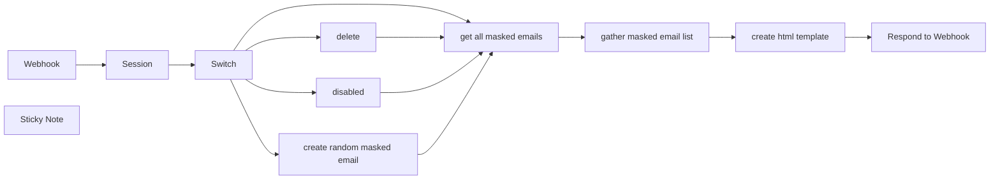

## Fluxo (.json) :

```json
{
  "meta": {
    "instanceId": "04ab549d8bbb435ec33b81e4e29965c46cf6f0f9e7afe631018b5e34c8eead58"
  },
  "nodes": [
    {
      "id": "b1b6eb50-9d42-484d-9488-0607be2143d8",
      "name": "Session",
      "type": "n8n-nodes-base.httpRequest",
      "position": [
        -160,
        -200
      ],
      "parameters": {
        "url": "https://api.fastmail.com/jmap/session",
        "options": {},
        "authentication": "genericCredentialType",
        "genericAuthType": "httpHeaderAuth"
      },
      "credentials": {
        "httpHeaderAuth": {
          "id": "BWkbkxgDD4hkRCvs",
          "name": "Fastmail Masked E-Mail Addresses"
        }
      },
      "typeVersion": 4.2
    },
    {
      "id": "aca05a94-07dd-4408-8d87-47e788a5f0a8",
      "name": "get all masked emails",
      "type": "n8n-nodes-base.httpRequest",
      "notes": "https://api.fastmail.com/.well-known/jmap\n\nhttps://api.fastmail.com/jmap/session",
      "position": [
        700,
        -200
      ],
      "parameters": {
        "url": "https://api.fastmail.com/jmap/api/",
        "method": "POST",
        "options": {},
        "jsonBody": "={\n  \"using\": [\"urn:ietf:params:jmap:core\", \"https://www.fastmail.com/dev/maskedemail\"],\n  \"methodCalls\": [\n    [\n      \"MaskedEmail/get\",\n      {\n        \"accountId\": \"{{ $('Session').item.json.primaryAccounts['https://www.fastmail.com/dev/maskedemail'] }}\"\n      },\n      \"c1\"\n    ]\n  ]\n}",
        "sendBody": true,
        "sendHeaders": true,
        "specifyBody": "json",
        "authentication": "genericCredentialType",
        "genericAuthType": "httpHeaderAuth",
        "headerParameters": {
          "parameters": [
            {
              "name": "Content-Type",
              "value": "application/json"
            }
          ]
        }
      },
      "credentials": {
        "httpHeaderAuth": {
          "id": "BWkbkxgDD4hkRCvs",
          "name": "Fastmail Masked E-Mail Addresses"
        }
      },
      "typeVersion": 4.2
    },
    {
      "id": "c4337bb4-1c16-4381-abe4-f0699099f326",
      "name": "create random masked email",
      "type": "n8n-nodes-base.httpRequest",
      "notes": "https://api.fastmail.com/.well-known/jmap\n\nhttps://api.fastmail.com/jmap/session",
      "position": [
        540,
        40
      ],
      "parameters": {
        "url": "https://api.fastmail.com/jmap/api/",
        "method": "POST",
        "options": {},
        "jsonBody": "={\n  \"using\": [\n    \"urn:ietf:params:jmap:core\",\n    \"https://www.fastmail.com/dev/maskedemail\"\n  ],\n  \"methodCalls\": [\n    [\n      \"MaskedEmail/set\",\n      {\n        \"accountId\": \"{{ $('Session').item.json.primaryAccounts['https://www.fastmail.com/dev/maskedemail'] }}\",\n        \"create\": {\n          \"maskedEmailId1\": {\n            \"description\": \"Test via N8n\",\n            \"state\": \"{{ $('Webhook').item.json.body.state }}\",\n            \"id\": \"{{ $('Webhook').item.json.body.id }}\",\n            \"email\": \"{{ $('Webhook').item.json.body.email }}\"\n          }\n        }\n      },\n      \"c1\"\n    ]\n  ]\n}\n",
        "sendBody": true,
        "sendHeaders": true,
        "specifyBody": "json",
        "authentication": "genericCredentialType",
        "genericAuthType": "httpHeaderAuth",
        "headerParameters": {
          "parameters": [
            {
              "name": "Content-Type",
              "value": "application/json"
            }
          ]
        }
      },
      "credentials": {
        "httpHeaderAuth": {
          "id": "BWkbkxgDD4hkRCvs",
          "name": "Fastmail Masked E-Mail Addresses"
        }
      },
      "typeVersion": 4.2
    },
    {
      "id": "bbfae2d8-d23a-4244-8566-c3da9cc2e34d",
      "name": "Respond to Webhook",
      "type": "n8n-nodes-base.respondToWebhook",
      "position": [
        1320,
        -200
      ],
      "parameters": {
        "options": {},
        "respondWith": "text",
        "responseBody": "={{ $json.html }}"
      },
      "typeVersion": 1.1
    },
    {
      "id": "af8ac7a4-116f-41ef-b6c0-72006fb47474",
      "name": "Switch",
      "type": "n8n-nodes-base.switch",
      "position": [
        60,
        -200
      ],
      "parameters": {
        "rules": {
          "values": [
            {
              "outputKey": "pending",
              "conditions": {
                "options": {
                  "version": 2,
                  "leftValue": "",
                  "caseSensitive": true,
                  "typeValidation": "strict"
                },
                "combinator": "and",
                "conditions": [
                  {
                    "operator": {
                      "type": "string",
                      "operation": "equals"
                    },
                    "leftValue": "={{ $('Webhook').item.json.body.state }}",
                    "rightValue": "pending"
                  }
                ]
              },
              "renameOutput": true
            },
            {
              "outputKey": "enabled",
              "conditions": {
                "options": {
                  "version": 2,
                  "leftValue": "",
                  "caseSensitive": true,
                  "typeValidation": "strict"
                },
                "combinator": "and",
                "conditions": [
                  {
                    "id": "56e6f1b8-0331-4c2d-aa90-e639752cfa9d",
                    "operator": {
                      "name": "filter.operator.equals",
                      "type": "string",
                      "operation": "equals"
                    },
                    "leftValue": "={{ $('Webhook').item.json.body.state }}",
                    "rightValue": "enabled"
                  }
                ]
              },
              "renameOutput": true
            },
            {
              "outputKey": "deleted",
              "conditions": {
                "options": {
                  "version": 2,
                  "leftValue": "",
                  "caseSensitive": true,
                  "typeValidation": "strict"
                },
                "combinator": "and",
                "conditions": [
                  {
                    "id": "32f59847-a58c-4d8b-b1ae-48b8d4dad1a3",
                    "operator": {
                      "name": "filter.operator.equals",
                      "type": "string",
                      "operation": "equals"
                    },
                    "leftValue": "={{ $('Webhook').item.json.body.state }}",
                    "rightValue": "deleted"
                  }
                ]
              },
              "renameOutput": true
            },
            {
              "outputKey": "disabled",
              "conditions": {
                "options": {
                  "version": 2,
                  "leftValue": "",
                  "caseSensitive": true,
                  "typeValidation": "strict"
                },
                "combinator": "and",
                "conditions": [
                  {
                    "id": "cc39f7c0-3960-49d9-ae21-9f1f35714015",
                    "operator": {
                      "name": "filter.operator.equals",
                      "type": "string",
                      "operation": "equals"
                    },
                    "leftValue": "={{ $('Webhook').item.json.body.state }}",
                    "rightValue": "disabled"
                  }
                ]
              },
              "renameOutput": true
            }
          ]
        },
        "options": {
          "fallbackOutput": "extra"
        }
      },
      "typeVersion": 3.2
    },
    {
      "id": "ceca9fc2-e2f4-4578-8313-c987d08e9393",
      "name": "disabled",
      "type": "n8n-nodes-base.httpRequest",
      "notes": "https://api.fastmail.com/.well-known/jmap\n\nhttps://api.fastmail.com/jmap/session",
      "position": [
        540,
        500
      ],
      "parameters": {
        "url": "https://api.fastmail.com/jmap/api/",
        "method": "POST",
        "options": {},
        "jsonBody": "={\n  \"using\": [\n    \"urn:ietf:params:jmap:core\",\n    \"https://www.fastmail.com/dev/maskedemail\"\n  ],\n  \"methodCalls\": [\n    [\n      \"MaskedEmail/set\",\n      {\n        \"accountId\": \"{{ $('Session').item.json.primaryAccounts['https://www.fastmail.com/dev/maskedemail'] }}\",\n        \"update\": {\n          \"{{ $('Webhook').item.json.body.id }}\": {\n            \"state\": \"{{ $('Webhook').item.json.body.state }}\"\n          }\n        }\n      },\n      \"c1\"\n    ]\n  ]\n}\n",
        "sendBody": true,
        "sendHeaders": true,
        "specifyBody": "json",
        "authentication": "genericCredentialType",
        "genericAuthType": "httpHeaderAuth",
        "headerParameters": {
          "parameters": [
            {
              "name": "Content-Type",
              "value": "application/json"
            }
          ]
        }
      },
      "credentials": {
        "httpHeaderAuth": {
          "id": "BWkbkxgDD4hkRCvs",
          "name": "Fastmail Masked E-Mail Addresses"
        }
      },
      "typeVersion": 4.2
    },
    {
      "id": "c0467dec-a29e-42a0-8f81-fb12b0428974",
      "name": "delete",
      "type": "n8n-nodes-base.httpRequest",
      "notes": "https://api.fastmail.com/.well-known/jmap\n\nhttps://api.fastmail.com/jmap/session",
      "position": [
        540,
        280
      ],
      "parameters": {
        "url": "https://api.fastmail.com/jmap/api/",
        "method": "POST",
        "options": {},
        "jsonBody": "={\n    \"using\": [\n      \"urn:ietf:params:jmap:core\",\n      \"https://www.fastmail.com/dev/maskedemail\"\n    ],\n    \"methodCalls\": [\n      [\n        \"MaskedEmail/set\",\n        {\n          \"accountId\": \"{{ $('Session').item.json.primaryAccounts['https://www.fastmail.com/dev/maskedemail'] }}\",\n          \"destroy\": [\n            \"{{ $('Webhook').item.json.body.id }}\"\n          ]\n        },\n        \"c1\"\n      ]\n    ]\n  }\n  ",
        "sendBody": true,
        "sendHeaders": true,
        "specifyBody": "json",
        "authentication": "genericCredentialType",
        "genericAuthType": "httpHeaderAuth",
        "headerParameters": {
          "parameters": [
            {
              "name": "Content-Type",
              "value": "application/json"
            }
          ]
        }
      },
      "credentials": {
        "httpHeaderAuth": {
          "id": "BWkbkxgDD4hkRCvs",
          "name": "Fastmail Masked E-Mail Addresses"
        }
      },
      "typeVersion": 4.2
    },
    {
      "id": "be0cdbe5-4607-44d5-8c51-7f8f1dcb4551",
      "name": "gather masked email list",
      "type": "n8n-nodes-base.set",
      "position": [
        920,
        -200
      ],
      "parameters": {
        "options": {},
        "assignments": {
          "assignments": [
            {
              "id": "06210f93-1b2b-4bad-8a1d-263e57f651ca",
              "name": "data",
              "type": "array",
              "value": "={{ $json.methodResponses[0][1].list }}"
            }
          ]
        }
      },
      "typeVersion": 3.4
    },
    {
      "id": "bd4134cf-b684-4b6e-bb58-a70ff068e2fd",
      "name": "create html template",
      "type": "n8n-nodes-base.html",
      "position": [
        1120,
        -200
      ],
      "parameters": {
        "html": "<!DOCTYPE html>\n<html lang=\"en\">\n<head>\n    <meta charset=\"UTF-8\">\n    <meta name=\"viewport\" content=\"width=device-width, initial-scale=1.0\">\n    <title>Masked Email Addresses</title>\n    <style>\n        body {\n            font-family: Arial, sans-serif;\n            margin: 40px;\n            backgrouand-color: #f4f4f9;\n        }\n        h1 {\n            text-align: center;\n            color: #333;\n        }\n        .button-container, .filter-container, .table-container {\n            margin-bottom: 20px;\n            text-align: center;\n        }\n        button {\n            padding: 10px 20px;\n            margin: 0 10px;\n            font-size: 0.875em;\n            cursor: pointer;\n            background-color: #4CAF50;\n            color: white;\n            border: none;\n            border-radius: 3px;\n        }\n        .delete-button {\n            background-color: #f44336;\n        }\n        .disabled-button {\n            background-color: #ffa500;\n        }\n        select {\n            padding: 10px;\n            font-size: 0.875em;\n        }\n        table {\n            width: 100%;\n            border-collapse: collapse;\n            margin: 20px 0;\n            box-shadow: 0 2px 5px rgba(0, 0, 0, 0.1);\n            background: #fff;\n        }\n        th, td {\n            border: 1px solid #ddd;\n            padding: 12px 15px;\n            text-align: left;\n            white-space: nowrap; /* Prevent text from wrapping */\n        }\n        th {\n            background-color: #f5f5f5;\n            color: #333;\n            text-transform: uppercase;\n            letter-spacing: 0.1em;\n            font-size: 0.875em;\n        }\n        tr:nth-child(even) {\n            background-color: #f9f9f9;\n        }\n        tr:hover {\n            background-color: #f1f1f1;\n        }\n        td {\n            font-size: 0.875em;\n        }\n        .action-cell {\n            display: flex;\n            justify-content: flex-end;\n        }\n    </style>\n</head>\n<body>\n    <h1>Masked Email Addresses</h1>\n    <div class=\"button-container\">\n        <button id=\"add-pending\">Add Pending</button>\n        <button id=\"add-enabled\">Add Enabled</button>\n    </div>\n    <div class=\"filter-container\">\n        <label for=\"state-filter\">Filter by State: </label>\n        <select id=\"state-filter\">\n            <option value=\"all\">All</option>\n        </select>\n    </div>\n    <div class=\"table-container\">\n        <table>\n            <thead>\n                <tr>\n                    <th>Email</th>\n                    <th>Description</th>\n                    <th>State</th>\n                    <th>Created By</th>\n                    <th>Created At</th>\n                    <th>Last Message At</th>\n                    <th>For Domain</th>\n                    <th>ID</th>\n                    <th>Actions</th>\n                </tr>\n            </thead>\n            <tbody id=\"table-body\">\n                <!-- Table rows will be populated here -->\n            </tbody>\n        </table>\n    </div>\n    <script>\n        // Convert JSON string to object\n        const responseString = `{{ $json.data.toJsonString() }}`;\n        const maskedEmails = JSON.parse(responseString);\n\n        // Populate the table\n        const tableBody = document.getElementById('table-body');\n        const stateFilter = document.getElementById('state-filter');\n\n        // Extract unique states\n        const uniqueStates = [...new Set(maskedEmails.map(email => email.state))];\n        uniqueStates.forEach(state => {\n            const option = document.createElement('option');\n            option.value = state;\n            option.textContent = state;\n            stateFilter.appendChild(option);\n        });\n\n        function populateTable(filteredEmails) {\n            tableBody.innerHTML = ''; // Clear the table body\n\n            filteredEmails.forEach(email => {\n                const row = document.createElement('tr');\n\n                // Populate table cells\n                const cellKeys = ['email', 'description', 'state', 'createdBy', 'createdAt', 'lastMessageAt', 'forDomain', 'id'];\n                cellKeys.forEach(key => {\n                    const cell = document.createElement('td');\n                    cell.textContent = email[key] !== null && email[key] !== undefined ? email[key] : 'N/A';\n                    row.appendChild(cell);\n                });\n\n                // Add action cell with delete and disable buttons\n                const actionCell = document.createElement('td');\n                actionCell.className = 'action-cell';\n\n                const deleteButton = document.createElement('button');\n                deleteButton.className = 'delete-button';\n                deleteButton.textContent = 'Delete';\n                deleteButton.addEventListener('click', () => updateMaskedEmail(email.id, email.email, 'deleted'));\n                actionCell.appendChild(deleteButton);\n\n                const disabledButton = document.createElement('button');\n                disabledButton.className = 'disabled-button';\n                disabledButton.textContent = 'Disable';\n                disabledButton.addEventListener('click', () => updateMaskedEmail(email.id, email.email, 'disabled'));\n                actionCell.appendChild(disabledButton);\n\n                row.appendChild(actionCell);\n\n                tableBody.appendChild(row);\n            });\n        }\n\n        // Initial population\n        populateTable(maskedEmails);\n\n        // Add event listener to filter dropdown\n        stateFilter.addEventListener('change', function() {\n            const selectedState = this.value;\n            const filteredEmails = selectedState === 'all' ? maskedEmails : maskedEmails.filter(email => email.state === selectedState);\n            populateTable(filteredEmails);\n        });\n\n        // Function to make POST request\n        function createMaskedEmail(state) {\n            fetch('/webhook/MaskedEmail', {\n                method: 'POST',\n                headers: {\n                    'Content-Type': 'application/json'\n                },\n                body: JSON.stringify({ state: state })\n            }).then(response => {\n                if (response.ok) {\n                    alert('New masked email created successfully!');\n                    // Reload the page after successful creation\n                    location.reload();\n                } else {\n                    alert('Error creating masked email');\n                }\n            }).catch(error => {\n                alert('Error: ' + error);\n            });\n        }\n\n        // Function to update masked email\n        function updateMaskedEmail(id, email, state) {\n            fetch('/webhook/MaskedEmail', {\n                method: 'POST',\n                headers: {\n                    'Content-Type': 'application/json'\n                },\n                body: JSON.stringify({ id: id, email: email, state: state })\n            }).then(response => {\n                if (response.ok) {\n                    alert(`Masked email ${state} successfully!`);\n                    // Reload the page after successful update\n                    location.reload();\n                } else {\n                    alert(`Error ${state} masked email`);\n                }\n            }).catch(error => {\n                alert('Error: ' + error);\n            });\n        }\n\n        // Event listeners for the buttons\n        document.getElementById('add-pending').addEventListener('click', () => createMaskedEmail('pending'));\n        document.getElementById('add-enabled').addEventListener('click', () => createMaskedEmail('enabled'));\n\n    </script>\n</body>\n</html>"
      },
      "typeVersion": 1.2
    },
    {
      "id": "a19b8aa6-b139-4011-8027-4cb1e7bef065",
      "name": "Webhook",
      "type": "n8n-nodes-base.webhook",
      "position": [
        -460,
        -200
      ],
      "webhookId": "6eab7c57-8cb8-4f7e-be2d-e3c23a52683e",
      "parameters": {
        "path": "MaskedEmail",
        "options": {},
        "responseMode": "responseNode",
        "authentication": "basicAuth",
        "multipleMethods": true
      },
      "credentials": {
        "httpBasicAuth": {
          "id": "VqS7TcRinqn3Wsj6",
          "name": "Webhook"
        }
      },
      "typeVersion": 2
    },
    {
      "id": "2c151e0a-1d67-4e84-8a6d-0e9cbe440b14",
      "name": "Sticky Note",
      "type": "n8n-nodes-base.stickyNote",
      "position": [
        -480,
        -20
      ],
      "parameters": {
        "width": 810.0000000000002,
        "height": 1181.829268292685,
        "content": "## Template Description\n\nThis n8n workflow is designed to manage Fastmail masked email addresses using the Fastmail API. The workflow provides the following functionalities:\n\n1. **Retrieve all masked emails**: Fetches all masked email addresses associated with the Fastmail account.\n2. **Create masked email**: Allows creating a new masked email with a specified state (`pending`, `enabled`, etc.).\n3. **Update masked email state**: Updates the state of a masked email such as enabling, disabling, or deleting it.\n4. **Generate HTML template**: Constructs an HTML table to display the masked emails in a user-friendly format.\n\n## Steps to Make it Work\n\n1. **Webhook Node**: \n   - This node listens for incoming requests to manage masked emails.\n   - Needs Basic Authentication credentials to secure the endpoint.\n\n2. **Session Node**: \n   - Sends a request to obtain session information from Fastmail's API.\n   - Requires an HTTP Header Auth credential with your Fastmail API token.\n\n3. **Switch Node**: \n   - Routes the workflow based on the state of the incoming masked email request (`pending`, `enabled`, `disabled`, `deleted`).\n   \n4. **HTTP Request Nodes**:\n   - These nodes handle various Fastmail API calls for masked emails (get, set, update, delete).\n   - All HTTP Request nodes require an HTTP Header Auth credential attached, using the Fastmail API token.\n\n5. **Set Node**: \n   - Gathers the retrieved masked email list into an array for further processing.\n\n6. **HTML Node**: \n   - Generates an HTML template to render the masked email addresses in a table format.\n\n7. **Respond to Webhook Node**: \n   - Sends back the HTML table to the client in response to the webhook request.\n\n### Needed Credentials\n\n1. **Fastmail Masked E-Mail Addresses**:\n   - An API token from Fastmail's API.\n   - Each HTTP call to Fastmail requires this credential for authentication.\n\n## Note\n\n- Ensure that you correctly configure authentication for the API calls and webhook security.\n- Use your actual Fastmail API credentials with the correct scope.\n- The workflow assumes that the Fastmail API is correctly configured and accessible from your n8n instance.\n- Update URLs and credentials IDs according to your n8n configuration."
      },
      "typeVersion": 1
    }
  ],
  "pinData": {},
  "connections": {
    "Switch": {
      "main": [
        [
          {
            "node": "create random masked email",
            "type": "main",
            "index": 0
          }
        ],
        [
          {
            "node": "create random masked email",
            "type": "main",
            "index": 0
          }
        ],
        [
          {
            "node": "delete",
            "type": "main",
            "index": 0
          }
        ],
        [
          {
            "node": "disabled",
            "type": "main",
            "index": 0
          }
        ],
        [
          {
            "node": "get all masked emails",
            "type": "main",
            "index": 0
          }
        ]
      ]
    },
    "delete": {
      "main": [
        [
          {
            "node": "get all masked emails",
            "type": "main",
            "index": 0
          }
        ]
      ]
    },
    "Session": {
      "main": [
        [
          {
            "node": "Switch",
            "type": "main",
            "index": 0
          }
        ]
      ]
    },
    "Webhook": {
      "main": [
        [
          {
            "node": "Session",
            "type": "main",
            "index": 0
          }
        ],
        [
          {
            "node": "Session",
            "type": "main",
            "index": 0
          }
        ]
      ]
    },
    "disabled": {
      "main": [
        [
          {
            "node": "get all masked emails",
            "type": "main",
            "index": 0
          }
        ]
      ]
    },
    "create html template": {
      "main": [
        [
          {
            "node": "Respond to Webhook",
            "type": "main",
            "index": 0
          }
        ]
      ]
    },
    "get all masked emails": {
      "main": [
        [
          {
            "node": "gather masked email list",
            "type": "main",
            "index": 0
          }
        ]
      ]
    },
    "gather masked email list": {
      "main": [
        [
          {
            "node": "create html template",
            "type": "main",
            "index": 0
          }
        ]
      ]
    },
    "create random masked email": {
      "main": [
        [
          {
            "node": "get all masked emails",
            "type": "main",
            "index": 0
          }
        ]
      ]
    }
  }
}
```

<a id="template-1602"></a>

## Template 1602 - Validação e gravação de webhooks Xero no FileMaker

- **Nome:** Validação e gravação de webhooks Xero no FileMaker
- **Descrição:** Recebe webhooks do Xero, valida a assinatura HMAC do payload e, se autenticado, armazena o JSON em um layout do FileMaker e dispara um script com o id do registro.
- **Funcionalidade:** • Recepção de webhook HTTP POST: Aceita payloads brutos enviados pelo Xero.
• Extração do corpo bruto: Move o corpo da requisição para um campo interno para processamento.
• Cálculo de assinatura HMAC SHA256: Gera a assinatura codificada em base64 usando o segredo configurado.
• Verificação de segurança: Compara a assinatura calculada com o cabeçalho x-xero-signature para autenticar a origem.
• Resposta condicional: Retorna 200 quando autenticado ou 401 quando não autorizado.
• Registro do payload no FileMaker: Cria um novo registro no layout "Webhooks" com o JSON recebido.
• Execução de script no FileMaker: Dispara um script (processWebhook) passando o id do registro criado como parâmetro.
- **Ferramentas:** • Xero: Serviço que envia webhooks com eventos e a assinatura no cabeçalho x-xero-signature.
• FileMaker: Banco de dados onde o JSON do webhook é armazenado e onde é executado um script de processamento.


## Fluxo visual

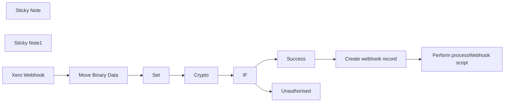

## Fluxo (.json) :

```json
{
  "meta": {
    "instanceId": "5663a0748c6a6e6071d13694c60722e799714f53ff7a9bfdda15fbadbaeebb76"
  },
  "nodes": [
    {
      "id": "9bd2c2f7-d837-451e-8a25-a185713edefb",
      "name": "Crypto",
      "type": "n8n-nodes-base.crypto",
      "position": [
        1640,
        660
      ],
      "parameters": {
        "type": "SHA256",
        "value": "={{$json[\"source_data\"]}}",
        "action": "hmac",
        "secret": "1",
        "encoding": "base64",
        "dataPropertyName": "target_data"
      },
      "typeVersion": 1
    },
    {
      "id": "75aca737-5e31-4022-8827-375cf8717a06",
      "name": "Move Binary Data",
      "type": "n8n-nodes-base.moveBinaryData",
      "position": [
        1240,
        660
      ],
      "parameters": {
        "options": {},
        "setAllData": false,
        "destinationKey": "raw_data"
      },
      "typeVersion": 1
    },
    {
      "id": "f1ece5d1-a38f-4548-80b4-a77f07c0cc95",
      "name": "Set",
      "type": "n8n-nodes-base.set",
      "position": [
        1440,
        660
      ],
      "parameters": {
        "values": {
          "string": [
            {
              "name": "source_data",
              "value": "={{$json[\"raw_data\"]}}"
            }
          ]
        },
        "options": {},
        "keepOnlySet": true
      },
      "typeVersion": 1
    },
    {
      "id": "251bd7d1-e955-4b2c-a020-e0b2e3ebb5cc",
      "name": "IF",
      "type": "n8n-nodes-base.if",
      "position": [
        1860,
        660
      ],
      "parameters": {
        "conditions": {
          "boolean": [
            {
              "value1": "={{$node[\"Crypto\"].json[\"target_data\"]}}",
              "value2": "={{$node[\"Xero Webhook\"].json[\"headers\"][\"x-xero-signature\"]}}"
            }
          ]
        }
      },
      "typeVersion": 1
    },
    {
      "id": "3a7041d6-e86b-414f-9d26-94c1ffe893cc",
      "name": "Success",
      "type": "n8n-nodes-base.respondToWebhook",
      "position": [
        2080,
        540
      ],
      "parameters": {
        "options": {
          "responseCode": 200
        },
        "respondWith": "noData"
      },
      "typeVersion": 1
    },
    {
      "id": "8dfe4916-2fce-4d51-8a41-66cb4e31bdf5",
      "name": "Unauthorised",
      "type": "n8n-nodes-base.respondToWebhook",
      "position": [
        2080,
        740
      ],
      "parameters": {
        "options": {
          "responseCode": 401
        },
        "respondWith": "noData"
      },
      "typeVersion": 1
    },
    {
      "id": "81b08d6b-065c-4e61-87b7-6428963339e2",
      "name": "Create webhook record",
      "type": "n8n-nodes-base.filemaker",
      "position": [
        2320,
        540
      ],
      "parameters": {
        "action": "create",
        "layout": "Webhooks",
        "fieldsParametersUi": {
          "fields": [
            {
              "name": "json",
              "value": "={{$node[\"Set\"].json[\"source_data\"]}}"
            }
          ]
        }
      },
      "credentials": {
        "fileMaker": {
          "id": "T1MTy9Xu5m7Nubie",
          "name": "Kounio FileMaker"
        }
      },
      "typeVersion": 1
    },
    {
      "id": "48d977ee-64df-4788-8808-70cd6c7bf5f7",
      "name": "Perform processWebhook script",
      "type": "n8n-nodes-base.filemaker",
      "position": [
        2540,
        540
      ],
      "parameters": {
        "action": "performscript",
        "layout": "Webhooks",
        "script": "processWebhook",
        "scriptParam": "={{ $json.response.recordId }}"
      },
      "credentials": {
        "fileMaker": {
          "id": "T1MTy9Xu5m7Nubie",
          "name": "Kounio FileMaker"
        }
      },
      "typeVersion": 1
    },
    {
      "id": "d6f4d1d4-4e69-4279-88e2-ea27036cea20",
      "name": "Sticky Note",
      "type": "n8n-nodes-base.stickyNote",
      "position": [
        2600,
        420
      ],
      "parameters": {
        "content": "## Script Parameter\nPasses the record id as script parameter to be used in your processWebhook script"
      },
      "typeVersion": 1
    },
    {
      "id": "72b3f208-803b-45c5-b38d-eeef4425a2ba",
      "name": "Sticky Note1",
      "type": "n8n-nodes-base.stickyNote",
      "position": [
        1620,
        540
      ],
      "parameters": {
        "width": 158.74371859296477,
        "height": 121.3065326633166,
        "content": "## Input\nAdd your Xero webhook secret here"
      },
      "typeVersion": 1
    },
    {
      "id": "54f36def-0ac9-4769-818f-2e8991f196a5",
      "name": "Xero Webhook",
      "type": "n8n-nodes-base.webhook",
      "position": [
        1040,
        660
      ],
      "webhookId": "4cf50a61-b550-4ee6-984d-ad8c94e2b5c2",
      "parameters": {
        "path": "4cf50a61-b550-4ee6-984d-ad8c94e2b5c2",
        "options": {
          "rawBody": true
        },
        "httpMethod": "POST",
        "responseMode": "responseNode"
      },
      "typeVersion": 1
    }
  ],
  "pinData": {},
  "connections": {
    "IF": {
      "main": [
        [
          {
            "node": "Success",
            "type": "main",
            "index": 0
          }
        ],
        [
          {
            "node": "Unauthorised",
            "type": "main",
            "index": 0
          }
        ]
      ]
    },
    "Set": {
      "main": [
        [
          {
            "node": "Crypto",
            "type": "main",
            "index": 0
          }
        ]
      ]
    },
    "Crypto": {
      "main": [
        [
          {
            "node": "IF",
            "type": "main",
            "index": 0
          }
        ]
      ]
    },
    "Success": {
      "main": [
        [
          {
            "node": "Create webhook record",
            "type": "main",
            "index": 0
          }
        ]
      ]
    },
    "Xero Webhook": {
      "main": [
        [
          {
            "node": "Move Binary Data",
            "type": "main",
            "index": 0
          }
        ]
      ]
    },
    "Move Binary Data": {
      "main": [
        [
          {
            "node": "Set",
            "type": "main",
            "index": 0
          }
        ]
      ]
    },
    "Create webhook record": {
      "main": [
        [
          {
            "node": "Perform processWebhook script",
            "type": "main",
            "index": 0
          }
        ]
      ]
    }
  }
}
```

<a id="template-1604"></a>

## Template 1604 - Analisador de chamadas: transcrição e análise de vendas

- **Nome:** Analisador de chamadas: transcrição e análise de vendas
- **Descrição:** Automatiza a transcrição de gravações de chamadas, analisa o conteúdo com um modelo de linguagem para extrair métricas e insights de vendas, e salva transcrição e resultado estruturado em um banco de dados.
- **Funcionalidade:** • Envio do áudio para transcrição: envia URL pública do arquivo de áudio para serviço de transcrição com parâmetros (idioma, diarização de falantes, número esperado de falantes, webhook).
• Recepção assíncrona via webhook: recebe notificação quando a transcrição é concluída e inicia o processamento posterior.
• Recuperação da transcrição completa: obtém texto transcrito e utterances (falas por orador) para análise detalhada.
• Preparação de prompt e esquema JSON: configura prompt de análise focado em métricas de vendas e um JSON Schema para resposta estruturada.
• Análise com modelo de linguagem: envia as falas do diálogo ao modelo para gerar análise estruturada (pontuações, intenção do cliente, oportunidades de upsell, recomendações).
• Armazenamento dos resultados: salva a transcrição e a análise (JSON parseado) em uma tabela do banco para consulta posterior.
• Configuração e personalização: permite trocar chaves de API, webhook, link de áudio, prompt e esquema conforme necessidade.
- **Ferramentas:** • AssemblyAI: serviço de transcrição automática de áudio que fornece texto, segmentação por orador (speaker labels) e suporte a webhooks para notificação ao concluir.
• OpenAI: modelo de linguagem usado para analisar a transcrição e gerar uma resposta estruturada conforme um JSON Schema (ex.: gpt-4o-2024-08-06).
• Supabase: banco de dados e armazenamento usado para hospedar arquivos de áudio publicamente e persistir transcrições e análises (tabela de resultados).


## Fluxo visual

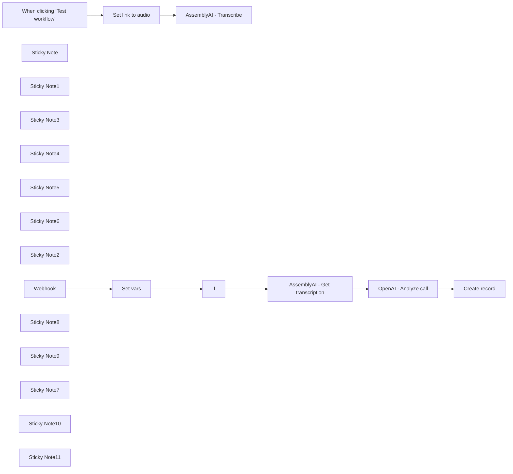

## Fluxo (.json) :

```json
{
  "nodes": [
    {
      "id": "061bf344-8e0d-46df-a097-dfc000b63bbd",
      "name": "When clicking ‘Test workflow’",
      "type": "n8n-nodes-base.manualTrigger",
      "position": [
        1240,
        1020
      ],
      "parameters": {},
      "typeVersion": 1
    },
    {
      "id": "3d66c4ce-e150-4f51-a9f9-4e7f61981ba4",
      "name": "Set link to audio",
      "type": "n8n-nodes-base.set",
      "position": [
        1440,
        1020
      ],
      "parameters": {
        "options": {},
        "assignments": {
          "assignments": [
            {
              "id": "745e32ae-61e6-429b-a107-f20c9b17e65e",
              "name": "url",
              "type": "string",
              "value": "https://cflobdhpqwnoisuctsoc.supabase.co/storage/v1/object/public/5minai/OUTBOUNDSAMPLE_01.mp3"
            }
          ]
        }
      },
      "typeVersion": 3.4
    },
    {
      "id": "f6fe5922-1140-499f-b38b-3f0bc0b398cc",
      "name": "Sticky Note",
      "type": "n8n-nodes-base.stickyNote",
      "position": [
        1620,
        895
      ],
      "parameters": {
        "width": 224.61210598590444,
        "height": 80,
        "content": "**Replace API key in Header, webhook from 2nd scenario, change settings if needed**"
      },
      "typeVersion": 1
    },
    {
      "id": "37454706-c012-45b1-83ca-a618a28c27d5",
      "name": "Sticky Note1",
      "type": "n8n-nodes-base.stickyNote",
      "position": [
        1400,
        900
      ],
      "parameters": {
        "width": 167.86310443717323,
        "height": 80,
        "content": "**Replace this link with direct link on your audio**"
      },
      "typeVersion": 1
    },
    {
      "id": "a52fc9df-20b5-4b2e-956d-66604be12660",
      "name": "AssemblyAI - Transcribe",
      "type": "n8n-nodes-base.httpRequest",
      "position": [
        1680,
        1020
      ],
      "parameters": {
        "url": "=https://api.assemblyai.com/v2/transcript",
        "method": "POST",
        "options": {},
        "sendBody": true,
        "authentication": "genericCredentialType",
        "bodyParameters": {
          "parameters": [
            {
              "name": "audio_url",
              "value": "={{ $json.url }}"
            },
            {
              "name": "language_code",
              "value": "en_us"
            },
            {
              "name": "speaker_labels",
              "value": "={{ true }}"
            },
            {
              "name": "speakers_expected",
              "value": "={{ 2 }}"
            },
            {
              "name": "webhook_url",
              "value": "https://n8n.lowcoding.dev/webhook/d1e5fdd0-b51d-4447-8af3-6754017d240b"
            }
          ]
        },
        "genericAuthType": "httpHeaderAuth"
      },
      "credentials": {
        "httpHeaderAuth": {
          "id": "l5EqDIMpaRMfONeN",
          "name": "Assembly"
        }
      },
      "typeVersion": 4.2
    },
    {
      "id": "89af9ab5-d59b-4224-af00-7b55c4905022",
      "name": "If",
      "type": "n8n-nodes-base.if",
      "position": [
        1580,
        1500
      ],
      "parameters": {
        "options": {},
        "conditions": {
          "options": {
            "version": 2,
            "leftValue": "",
            "caseSensitive": true,
            "typeValidation": "strict"
          },
          "combinator": "and",
          "conditions": [
            {
              "id": "1e41aa3d-7ea3-4e9f-8d99-e8199e7ec449",
              "operator": {
                "name": "filter.operator.equals",
                "type": "string",
                "operation": "equals"
              },
              "leftValue": "={{ $('Webhook').item.json.body.status }}",
              "rightValue": "completed"
            }
          ]
        }
      },
      "typeVersion": 2.2
    },
    {
      "id": "27653ac0-6703-4d25-bc0f-53b93b293b05",
      "name": "AssemblyAI - Get transcription",
      "type": "n8n-nodes-base.httpRequest",
      "position": [
        1800,
        1500
      ],
      "parameters": {
        "url": "=https://api.assemblyai.com/v2/transcript/{{ $('Webhook').item.json.body.transcript_id }}",
        "options": {},
        "authentication": "genericCredentialType",
        "genericAuthType": "httpHeaderAuth"
      },
      "credentials": {
        "httpHeaderAuth": {
          "id": "l5EqDIMpaRMfONeN",
          "name": "Assembly"
        }
      },
      "typeVersion": 4.2
    },
    {
      "id": "50166503-27a2-435d-a455-1ea33384585f",
      "name": "OpenAI - Analyze call",
      "type": "n8n-nodes-base.httpRequest",
      "position": [
        1980,
        1500
      ],
      "parameters": {
        "url": "=https://api.openai.com/v1/chat/completions",
        "method": "POST",
        "options": {},
        "jsonBody": "={\n    \"model\": \"gpt-4o-2024-08-06\",\n    \"messages\": [\n      {\n        \"role\": \"system\",\n        \"content\": \"{{ $('Set vars').item.json.prompt }}\"\n      },\n      {\n        \"role\": \"user\",\n        \"content\": {{ JSON.stringify($json.utterances.map(u => `Speaker ${u.speaker}: ${u.text}`).join(\"\\n\\n\"))}}\n      }\n    ],\n  \"response_format\":{ \"type\": \"json_schema\", \"json_schema\":   {{ JSON.stringify($('Set vars').item.json.json_schema) }} }\n  }",
        "sendBody": true,
        "specifyBody": "json",
        "authentication": "predefinedCredentialType",
        "nodeCredentialType": "openAiApi"
      },
      "credentials": {
        "openAiApi": {
          "id": "SphXAX7rlwRLkiox",
          "name": "Test club key"
        }
      },
      "typeVersion": 4.2
    },
    {
      "id": "266a2e6a-e0cc-4130-a8f0-038d2ba5992c",
      "name": "Set vars",
      "type": "n8n-nodes-base.set",
      "position": [
        1400,
        1500
      ],
      "parameters": {
        "options": {},
        "assignments": {
          "assignments": [
            {
              "id": "c93d6cfb-cd36-4d8b-acc5-b3718bfc82c8",
              "name": "prompt",
              "type": "string",
              "value": "Analyze this call with a focus on sales performance and potential upselling opportunities. Use the following metrics to evaluate the effectiveness of the interaction from a sales perspective. Be specific in identifying areas of strength and those needing improvement, and provide actionable insights for future calls.\\r\\n\\r\\nClient Intent: Identify the client\\’s primary intent and motivation for engaging in the call. Is there a clear indication of their needs or desired outcomes? How well does the agent align with or address these intentions?\\r\\n\\r\\nInterest Score (0-100): Evaluate the level of genuine interest shown by the client based on their responses, tone, and any probing questions they asked. Assign a score and explain the reasoning behind it.\\r\\n\\r\\nService Presentation Score (0-100): Assess how effectively the agent presented the service options. Did they clarify benefits that align with the client\\’s needs? Rate the agent\\’s performance in this area and provide a brief explanation.\\r\\n\\r\\nUpsell Opportunity Identified: Indicate whether any upselling opportunities were identified (e.g., suggesting advanced programs, certifications, or additional services). If opportunities were missed, explain how they could have been approached.\\r\\n\\r\\nObjection Handling Score (0-100): If the client expressed objections or hesitations, analyze how effectively the agent addressed them. Did they provide relevant solutions or reassurances? Assign a score and justify it with specific examples from the call.\\r\\n\\r\\nConversion Probability (0-100): Based on the client\\’s interest level and engagement, estimate the likelihood of conversion. What signals from the client suggest a high or low probability of moving forward?\\r\\n\\r\\nCall Outcome: Summarize the outcome of the call (e.g., \\“client expressed strong interest,\\” \\“client requested more information,\\” or \\“client expressed no interest\\”). Was a clear next step established?\\r\\n\\r\\nKey Client Needs: Highlight the client\\’s specific needs, preferences, or pain points mentioned during the call. How could these be addressed in future interactions to improve alignment with the client\\’s goals?\\r\\n\\r\\nInsights for Agent Improvement: Provide constructive feedback for the agent\\’s performance, focusing on areas such as empathy, product knowledge, and upsell strategy. Suggest improvements that could enhance their approach to increase client engagement.\\r\\n\\r\\nNext Steps Recommended: Recommend specific follow-up actions, such as providing customized information, sending relevant resources, or setting up a consultation. Focus on actions that will nurture the client relationship and increase conversion chances.\\r\\n\\r\\nIn your analysis, emphasize clarity and actionable feedback that leverages sales best practices. Highlight how well the agent built rapport, presented the product, and worked towards a favorable outcome for both the client and company"
            },
            {
              "id": "4305764d-202c-4ab9-ae1e-d753cd68b7be",
              "name": "json_schema",
              "type": "object",
              "value": "={{   {   \"name\": \"sales_call_analysis\",   \"description\": \"Analysis of customer engagement, interest, and potential sales conversion based on call data\",   \"strict\": true,   \"schema\": {     \"$schema\": \"http://json-schema.org/draft-04/schema#\",     \"type\": \"object\",     \"properties\": {       \"client_intent\": {         \"type\": \"string\",         \"description\": \"Client's primary intent for engaging (e.g., 'interest in education', 'general inquiry')\"       },       \"interest_score\": {         \"type\": \"integer\",         \"description\": \"Score indicating client's interest level based on responses (0-100)\"       },       \"service_presentation_score\": {         \"type\": \"integer\",         \"description\": \"Score for how effectively the agent presented the educational opportunities (0-100)\"       },       \"upsell_opportunity_identified\": {         \"type\": \"boolean\",         \"description\": \"Indicates if any upsell opportunity was identified\"       },       \"objection_handling_score\": {         \"type\": \"integer\",         \"description\": \"Score for handling client objections (0-100)\"       },       \"conversion_probability\": {         \"type\": \"integer\",         \"description\": \"Estimated likelihood of conversion based on call interaction (0-100)\"       },       \"call_outcome\": {         \"type\": \"string\",         \"description\": \"Outcome of the call (e.g., 'interest confirmed', 'no interest', 'appointment set')\"       },       \"key_client_needs\": {         \"type\": \"string\",         \"description\": \"Identified needs or requirements of the client, useful for customization or follow-up\"       },       \"insights_for_agent_improvement\": {         \"type\": \"string\",         \"description\": \"Insights and tips for the agent to improve performance\"       },       \"next_steps_recommended\": {         \"type\": \"string\",         \"description\": \"Suggested follow-up actions to improve conversion potential\"       }     },     \"additionalProperties\": false,     \"required\": [       \"client_intent\",       \"interest_score\",       \"service_presentation_score\",       \"upsell_opportunity_identified\",       \"objection_handling_score\",       \"conversion_probability\",       \"call_outcome\",       \"key_client_needs\",       \"insights_for_agent_improvement\",       \"next_steps_recommended\"     ]   } }       }}"
            }
          ]
        }
      },
      "typeVersion": 3.4
    },
    {
      "id": "60dca514-d064-41e9-8ea6-ac3bb29edb74",
      "name": "Create record",
      "type": "n8n-nodes-base.supabase",
      "position": [
        2180,
        1500
      ],
      "parameters": {
        "tableId": "demo_calls",
        "fieldsUi": {
          "fieldValues": [
            {
              "fieldId": "output",
              "fieldValue": "={{ JSON.parse($json.choices[0].message.content)  }}"
            },
            {
              "fieldId": "input",
              "fieldValue": "={{ {\"text\":  JSON.stringify($('AssemblyAI - Get transcription').item.json.utterances.map(u => `Speaker ${u.speaker}: ${u.text}`).join(\"\\n\\n\")) , \"audio_url\": $('AssemblyAI - Get transcription').item.json.audio_url, \"transcription_id\":$('AssemblyAI - Get transcription').item.json.id } }}"
            }
          ]
        }
      },
      "credentials": {
        "supabaseApi": {
          "id": "iVKNf5qv3ZFhq0ZV",
          "name": "Supabase 5minAI"
        }
      },
      "typeVersion": 1
    },
    {
      "id": "f4dbdeed-03e4-499c-b960-8f70459feb70",
      "name": "Sticky Note3",
      "type": "n8n-nodes-base.stickyNote",
      "position": [
        1760,
        1400
      ],
      "parameters": {
        "width": 167.86310443717323,
        "height": 80,
        "content": "**Replace API key and webhook**"
      },
      "typeVersion": 1
    },
    {
      "id": "5f54be84-cf62-4ce6-bd21-bef8332ab898",
      "name": "Sticky Note4",
      "type": "n8n-nodes-base.stickyNote",
      "position": [
        1960,
        1400
      ],
      "parameters": {
        "width": 150,
        "height": 80,
        "content": "**Replace OpenAI connection**"
      },
      "typeVersion": 1
    },
    {
      "id": "65827237-6611-4ec0-ac62-1d1b4626443f",
      "name": "Sticky Note5",
      "type": "n8n-nodes-base.stickyNote",
      "position": [
        -120,
        1000
      ],
      "parameters": {
        "color": 7,
        "width": 280.2462120317618,
        "height": 438.5821431288714,
        "content": "#### Scenario 1: Transcribe Call with AssemblyAI\n1. **Set Up Request**:\n    - **Header Authentication**: Set `Authorization` with AssemblyAI API key.\n    - **URL**: POST to `https://api.assemblyai.com/v2/transcript/`.\n    - **Parameters**:\n        - `audio_url`: Direct URL of the audio file.\n        - `webhook_url`: URL for an N8N webhook to receive the transcription result.\n        - **Additional Settings**:\n            - `speaker_labels` (true/false): Enables speaker diarization.\n            - `speakers_expected`: Specify expected number of speakers.\n            - `language_code`: Set language (default: `en_us`).\n\n#### Scenario 2: Process Transcription with OpenAI\n1. **Webhook Configuration**: Set up a POST webhook to receive AssemblyAI’s transcription data.\n2. **Get Transcription**:\n    - **Header Authentication**: Set `Authorization` with AssemblyAI API key.\n    - **URL**: GET `https://api.assemblyai.com/v2/transcript/<transcript_id>`.\n3. **Send to OpenAI**:\n    - **URL**: POST to `https://api.openai.com/v1/chat/completions`.\n    - **Header Authentication**: Set `Authorization` with OpenAI API key.\n    - **Body Parameters**:\n        - **Model**: Use `gpt-4o-2024-08-06` for JSON Schema support, or `gpt-4o-mini` for a less costly option.\n        - **Messages**:\n            - `system`: Contains the main analysis prompt.\n            - `user`: Combined speakers’ utterances to analyze in text format.\n        - **Response Format**:\n            - `type`: `json_schema`.\n            - `json_schema`: JSON schema for structured responses.\n\n4. **Save Results in Supabase**:\n    - **Operation**: Create a new record.\n    - **Table Name**: `demo_calls`.\n    - **Fields**:\n        - **Input**: Transcription text, audio URL, and transcription ID.\n        - **Output**: Parsed JSON response from OpenAI’s analysis."
      },
      "typeVersion": 1
    },
    {
      "id": "1f9883a3-36a3-4bef-9837-7965322cfc12",
      "name": "Sticky Note6",
      "type": "n8n-nodes-base.stickyNote",
      "position": [
        -120,
        376.29540128507955
      ],
      "parameters": {
        "color": 7,
        "width": 636.2128494576581,
        "height": 598.6675280064023,
        "content": ".png)\n## Call analyzer with AssemblyAI transcription and OpenAI assistant integration\n**Made by [Mark Shcherbakov](https://www.linkedin.com/in/marklowcoding/) from community [5minAI](https://www.skool.com/5minai-2861)**\n\nMany follow-up sales calls lack structured analysis, making it challenging to identify client needs, gauge interest levels, or uncover upsell opportunities. This workflow enables automated call transcription and AI-driven analysis to generate actionable insights, helping teams improve sales performance, refine client communication, and streamline upselling strategies.\n\nThis workflow transcribes and analyzes sales calls using AssemblyAI, OpenAI, and Supabase to store structured data. The workflow processes recorded calls as follows:\n\n1. **Transcribe Call with AssemblyAI**: Converts audio into text with speaker labels for clarity.\n2. **Analyze Transcription with OpenAI**: Using a predefined JSON schema, OpenAI analyzes the transcription to extract metrics like client intent, interest score, upsell opportunities, and more.\n3. **Store and Access Results in Supabase**: Stores both transcription and analysis data in a Supabase database for further use and display in interfaces.\n\n"
      },
      "typeVersion": 1
    },
    {
      "id": "97fc85cf-f9dc-4659-bcc6-ab7ffbecd4b5",
      "name": "Sticky Note2",
      "type": "n8n-nodes-base.stickyNote",
      "position": [
        180,
        1000
      ],
      "parameters": {
        "color": 7,
        "width": 330.5152611046425,
        "height": 240.6839895136402,
        "content": "### ... or watch set up video [5 min]\n[.png)](https://www.youtube.com/watch?v=kS41gut8l0g)\n"
      },
      "typeVersion": 1
    },
    {
      "id": "dcaf9ed5-face-4199-ae8c-dc70c97588f6",
      "name": "Webhook",
      "type": "n8n-nodes-base.webhook",
      "position": [
        1220,
        1500
      ],
      "webhookId": "d1e5fdd0-b51d-4447-8af3-6754017d240b",
      "parameters": {
        "path": "d1e5fdd0-b51d-4447-8af3-6754017d240b",
        "options": {},
        "httpMethod": "POST"
      },
      "typeVersion": 2
    },
    {
      "id": "c7c01657-3b8d-4a1b-a33b-9c9404f17423",
      "name": "Sticky Note8",
      "type": "n8n-nodes-base.stickyNote",
      "position": [
        920,
        1520
      ],
      "parameters": {
        "color": 5,
        "height": 80,
        "content": "## Scenario 2"
      },
      "typeVersion": 1
    },
    {
      "id": "a8a9cbbf-f581-4f0c-8325-d4b84c0778f8",
      "name": "Sticky Note9",
      "type": "n8n-nodes-base.stickyNote",
      "position": [
        920,
        1040
      ],
      "parameters": {
        "color": 5,
        "height": 80,
        "content": "## Scenario 1"
      },
      "typeVersion": 1
    },
    {
      "id": "a92ff422-3440-48ea-8311-533315e74d07",
      "name": "Sticky Note7",
      "type": "n8n-nodes-base.stickyNote",
      "position": [
        1380,
        1400
      ],
      "parameters": {
        "width": 167.86310443717323,
        "height": 80,
        "content": "**Replace prompt and JSON schema**"
      },
      "typeVersion": 1
    },
    {
      "id": "329b3b74-1bab-4cea-ab71-43e94b008f3d",
      "name": "Sticky Note10",
      "type": "n8n-nodes-base.stickyNote",
      "position": [
        1860,
        1020
      ],
      "parameters": {
        "color": 3,
        "width": 224.61210598590444,
        "height": 92.99888586957334,
        "content": "**If you change speaker_labels to false it will require change user message in OpenAI and Supabase nodes**"
      },
      "typeVersion": 1
    },
    {
      "id": "04275f30-23e3-4c28-afe7-07e8c1c2455c",
      "name": "Sticky Note11",
      "type": "n8n-nodes-base.stickyNote",
      "position": [
        2160,
        1400
      ],
      "parameters": {
        "width": 167.86310443717323,
        "height": 80,
        "content": "**Replace Supabase connection**"
      },
      "typeVersion": 1
    }
  ],
  "pinData": {
    "Webhook": [
      {
        "body": {
          "status": "completed",
          "transcript_id": "44a669c1-2586-47c3-9c5c-259bb9942b90"
        },
        "query": {},
        "params": {},
        "headers": {},
        "webhookUrl": "",
        "executionMode": "production"
      }
    ],
    "Set vars": [
      {
        "prompt": "Analyze this call with a focus on sales performance and potential upselling opportunities. Use the following metrics to evaluate the effectiveness of the interaction from a sales perspective. Be specific in identifying areas of strength and those needing improvement, and provide actionable insights for future calls.\\r\\n\\r\\nClient Intent: Identify the client\\’s primary intent and motivation for engaging in the call. Is there a clear indication of their needs or desired outcomes? How well does the agent align with or address these intentions?\\r\\n\\r\\nInterest Score (0-100): Evaluate the level of genuine interest shown by the client based on their responses, tone, and any probing questions they asked. Assign a score and explain the reasoning behind it.\\r\\n\\r\\nService Presentation Score (0-100): Assess how effectively the agent presented the service options. Did they clarify benefits that align with the client\\’s needs? Rate the agent\\’s performance in this area and provide a brief explanation.\\r\\n\\r\\nUpsell Opportunity Identified: Indicate whether any upselling opportunities were identified (e.g., suggesting advanced programs, certifications, or additional services). If opportunities were missed, explain how they could have been approached.\\r\\n\\r\\nObjection Handling Score (0-100): If the client expressed objections or hesitations, analyze how effectively the agent addressed them. Did they provide relevant solutions or reassurances? Assign a score and justify it with specific examples from the call.\\r\\n\\r\\nConversion Probability (0-100): Based on the client\\’s interest level and engagement, estimate the likelihood of conversion. What signals from the client suggest a high or low probability of moving forward?\\r\\n\\r\\nCall Outcome: Summarize the outcome of the call (e.g., \\“client expressed strong interest,\\” \\“client requested more information,\\” or \\“client expressed no interest\\”). Was a clear next step established?\\r\\n\\r\\nKey Client Needs: Highlight the client\\’s specific needs, preferences, or pain points mentioned during the call. How could these be addressed in future interactions to improve alignment with the client\\’s goals?\\r\\n\\r\\nInsights for Agent Improvement: Provide constructive feedback for the agent\\’s performance, focusing on areas such as empathy, product knowledge, and upsell strategy. Suggest improvements that could enhance their approach to increase client engagement.\\r\\n\\r\\nNext Steps Recommended: Recommend specific follow-up actions, such as providing customized information, sending relevant resources, or setting up a consultation. Focus on actions that will nurture the client relationship and increase conversion chances.\\r\\n\\r\\nIn your analysis, emphasize clarity and actionable feedback that leverages sales best practices. Highlight how well the agent built rapport, presented the product, and worked towards a favorable outcome for both the client and company",
        "json_schema": {
          "name": "sales_call_analysis",
          "schema": {
            "type": "object",
            "$schema": "http://json-schema.org/draft-04/schema#",
            "required": [
              "client_intent",
              "interest_score",
              "service_presentation_score",
              "upsell_opportunity_identified",
              "objection_handling_score",
              "conversion_probability",
              "call_outcome",
              "key_client_needs",
              "insights_for_agent_improvement",
              "next_steps_recommended"
            ],
            "properties": {
              "call_outcome": {
                "type": "string",
                "description": "Outcome of the call (e.g., 'interest confirmed', 'no interest', 'appointment set')"
              },
              "client_intent": {
                "type": "string",
                "description": "Client's primary intent for engaging (e.g., 'interest in education', 'general inquiry')"
              },
              "interest_score": {
                "type": "integer",
                "description": "Score indicating client's interest level based on responses (0-100)"
              },
              "key_client_needs": {
                "type": "string",
                "description": "Identified needs or requirements of the client, useful for customization or follow-up"
              },
              "conversion_probability": {
                "type": "integer",
                "description": "Estimated likelihood of conversion based on call interaction (0-100)"
              },
              "next_steps_recommended": {
                "type": "string",
                "description": "Suggested follow-up actions to improve conversion potential"
              },
              "objection_handling_score": {
                "type": "integer",
                "description": "Score for handling client objections (0-100)"
              },
              "service_presentation_score": {
                "type": "integer",
                "description": "Score for how effectively the agent presented the educational opportunities (0-100)"
              },
              "upsell_opportunity_identified": {
                "type": "boolean",
                "description": "Indicates if any upsell opportunity was identified"
              },
              "insights_for_agent_improvement": {
                "type": "string",
                "description": "Insights and tips for the agent to improve performance"
              }
            },
            "additionalProperties": false
          },
          "strict": true,
          "description": "Analysis of customer engagement, interest, and potential sales conversion based on call data"
        }
      }
    ],
    "Create record": [
      {
        "id": "6e406951-c9fc-4cdb-89ca-369aad59744d",
        "call_outcome": "interest confirmed",
        "date_created": "2024-10-30T12:21:08.909539+00:00",
        "client_intent": "Interest in computer engineering degree",
        "interest_score": 75,
        "key_client_needs": "Interest in computer engineering as a career switch, preference for on-campus learning but open to online, current GED holder with plumbing experience",
        "conversion_probability": 70,
        "next_steps_recommended": "Arrange for a follow-up call with a specific school counselor who can provide detailed program information and potential financial aid options relevant to the client's situation. Sending personalized emails with program highlights that match Anthony’s interest in computer engineering can also increase engagement and conversion likelihood.",
        "objection_handling_score": 80,
        "service_presentation_score": 60,
        "upsell_opportunity_identified": false,
        "insights_for_agent_improvement": "The agent should focus on showcasing specific schools or programs during the call to better align with the client's goals. While basic qualification and interest data were collected, more detailed discussions about potential school options or educational paths could be introduced earlier to increase engagement. Additionally, identifying and promoting potential certifications or advanced degrees beyond the associate level could capitalize on upselling opportunities."
      }
    ],
    "Set link to audio": [
      {
        "url": "https://cflobdhpqwnoisuctsoc.supabase.co/storage/v1/object/public/5minai/OUTBOUNDSAMPLE_01.mp3"
      }
    ],
    "OpenAI - Analyze call": [
      {
        "id": "chatcmpl-AO2cPpBA0jbTapqlHD0WlRpmafwz0",
        "model": "gpt-4o-2024-08-06",
        "usage": {
          "total_tokens": 2130,
          "prompt_tokens": 1941,
          "completion_tokens": 189,
          "prompt_tokens_details": {
            "cached_tokens": 0
          },
          "completion_tokens_details": {
            "reasoning_tokens": 0
          }
        },
        "object": "chat.completion",
        "choices": [
          {
            "index": 0,
            "message": {
              "role": "assistant",
              "content": "{\"client_intent\":\"Interest in earning a computer engineering degree\",\"interest_score\":85,\"service_presentation_score\":70,\"upsell_opportunity_identified\":true,\"objection_handling_score\":75,\"conversion_probability\":80,\"call_outcome\":\"Interest confirmed, details verified\",\"key_client_needs\":\"Desire for campus-based education, not satisfied with current plumbing career, seeking entry into computer engineering\",\"insights_for_agent_improvement\":\"The agent should improve in areas such as probing to understand more about the client's career transition motivations and discussing potential career paths with a degree in computer engineering. Engaging more with the client's aspirations could open up upselling opportunities for higher degrees in the future.\",\"next_steps_recommended\":\"Agent should ensure a follow-up from a counselor who can discuss specific computer engineering programs, entry requirements, and potential career paths. Additionally, providing information on associations and networking opportunities within the field of computer engineering could benefit Anthony.\"}",
              "refusal": null
            },
            "logprobs": null,
            "finish_reason": "stop"
          }
        ],
        "created": 1730293301,
        "system_fingerprint": "fp_90354628f2"
      }
    ],
    "AssemblyAI - Transcribe": [
      {
        "id": "2208fe53-c9ef-4529-a6de-3d33138072dd",
        "text": null,
        "words": null,
        "status": "queued",
        "topics": [],
        "summary": null,
        "chapters": null,
        "entities": null,
        "audio_url": "https://cflobdhpqwnoisuctsoc.supabase.co/storage/v1/object/public/5minai/OUTBOUNDSAMPLE_01.mp3",
        "punctuate": true,
        "throttled": false,
        "confidence": null,
        "is_deleted": null,
        "redact_pii": false,
        "utterances": null,
        "word_boost": [],
        "boost_param": null,
        "format_text": true,
        "speed_boost": false,
        "webhook_url": "https://n8n.lowcoding.dev/webhook/d1e5fdd0-b51d-4447-8af3-6754017d240b",
        "audio_end_at": null,
        "disfluencies": false,
        "dual_channel": false,
        "multichannel": false,
        "speech_model": null,
        "summary_type": null,
        "webhook_auth": false,
        "auto_chapters": false,
        "custom_topics": false,
        "language_code": "en_us",
        "summarization": false,
        "summary_model": null,
        "acoustic_model": "assemblyai_default",
        "audio_duration": null,
        "content_safety": false,
        "iab_categories": false,
        "language_model": "assemblyai_default",
        "redact_pii_sub": null,
        "speaker_labels": true,
        "auto_highlights": false,
        "custom_spelling": null,
        "audio_start_from": null,
        "entity_detection": false,
        "filter_profanity": false,
        "redact_pii_audio": false,
        "speech_threshold": null,
        "speakers_expected": 2,
        "language_detection": false,
        "sentiment_analysis": false,
        "language_confidence": null,
        "redact_pii_policies": null,
        "webhook_status_code": null,
        "content_safety_labels": {},
        "custom_topics_results": null,
        "iab_categories_result": {},
        "auto_highlights_result": null,
        "redact_pii_audio_quality": null,
        "webhook_auth_header_name": null,
        "sentiment_analysis_results": null,
        "language_confidence_threshold": null
      }
    ],
    "AssemblyAI - Get transcription": [
      {
        "id": "2208fe53-c9ef-4529-a6de-3d33138072dd",
        "text": "Hello. May I, please, Anthony. Hello, this is Anthony. Hi, Anthony. My name is Jeff, and I'm calling on behalf of education experts from a quality monitor line, and here that you recently filled the form on the Internet indicating an interest in earning a degree. Yes. Correct. Yes. I only need a few moments of her time to mention the most appropriate schools. Are you at least 18 years of age? Yeah, I'm 29. 29. Okay. And do you currently have a high school diploma or a ged? Yes, I do. Okay, thank you, Anthony. And if we can find a school for you that meets your needs, would you be interested in furthering your education in the next six months? Yeah, of course. The course I'd like to take up would be computer engineering. Computer engineering. Okay. And, Anthony, I only need a few moments of your time, okay, to verify your information. Your first name is Anthony, and your last name is Bella. Is this correct? Yes. Okay, Anthony, now, if I may ask, if we can find school for you that meets your needs, would you be interested in furthering your education? Yeah, in the next six months? Definitely. Thank you, Anthony. Okay, could you please verify your complete address, including the city, state, and the zip code? All right, it's 1905 Bramblewood Drive, St. Cloud, Florida, 34769. Okay. Is the street number 1905? Yeah, 1905. And the street name is Ramblewood. Right. Is that correct? That's correct. Okay. Okay, so it's 1905 Bramblewood Drive, St. Cloud, Florida, 34769. Yes. Correct. Yep. Okay, and could you please verify your email address? It's pella anthony@yahoo.com. Thank you so much for the verification. Yeah. Now, you mentioned computer engineering, right? Mm. May I ask, what degree type were you looking to obtain? Is it associate or whatever I need to do? If I get in the first door, I do associate. Probably move my way up the ladder, you know? Okay, so get my first one and then keep on going. Okay, so would be associate degree for the moment? Yep. Okay. Anthony, you've mentioned that you're 21. I'm sorry, 29 years old now, if I may ask. Well, what's the highest level of education? I dropped out when I was in the 11th grade, and I started doing plumbing. I've actually been doing plumbing for 13 years. I'm a registered apprentice. I actually only have to take the test to become a journeyman's. A journeyman to open my own company. And I'm not too fond of plumbing, you know, saying I need something, I want to do something else besides plumbing. For the rest of my life. Okay. And do you have a diploma or a GED? I have a GED. GED. Okay. And what year did you obtain your GED? 1999. Okay, and for your class type reference, would it be online, on campus or. No, probably campus. Probably would be campus. Campus. Okay. Just in case we'll not be able to find a campus based school, would you be okay with an online school? Yeah. Okay. And are you a United States citizen? Yes, I am. Thank you. And are you associated with the United States military? What was that? I'm sorry? Are you associated with the United States military? No, I'm not. Okay. And what would be the best time for a school enrollment counselor to contact you in the morning, afternoon, or evening? Pretty much any time of the day. And what is your exact date of birth? 10, 1580. So that would be October 15th, 1980? That's correct. Okay. Okay, Anthony, if we can find school for you that meets your needs, school enrollment counselors will be contacting you in the near future, either by phone or by email, and they can answer any questions you may have regarding financial aid, which assistance, their program requirements and policies. And so with that, I would just like to thank you for your time. Okay. Once again, we thank you for choosing education experts. And thank you. You're welcome. All right, you too. Bye.",
        "words": [
          {
            "end": 1736,
            "text": "Hello.",
            "start": 1480,
            "speaker": "A",
            "confidence": 0.94271
          },
          {
            "end": 1872,
            "text": "May",
            "start": 1736,
            "speaker": "A",
            "confidence": 0.6092
          },
          {
            "end": 1944,
            "text": "I,",
            "start": 1872,
            "speaker": "A",
            "confidence": 0.81608
          },
          {
            "end": 2400,
            "text": "please,",
            "start": 1944,
            "speaker": "A",
            "confidence": 0.98526
          },
          {
            "end": 3113,
            "text": "Anthony.",
            "start": 2489,
            "speaker": "A",
            "confidence": 0.79453
          },
          {
            "end": 4025,
            "text": "Hello,",
            "start": 3249,
            "speaker": "B",
            "confidence": 0.3434
          },
          {
            "end": 4353,
            "text": "this",
            "start": 4145,
            "speaker": "B",
            "confidence": 0.99092
          },
          {
            "end": 4521,
            "text": "is",
            "start": 4369,
            "speaker": "B",
            "confidence": 0.9984
          },
          {
            "end": 5165,
            "text": "Anthony.",
            "start": 4553,
            "speaker": "B",
            "confidence": 0.5279
          },
          {
            "end": 6065,
            "text": "Hi,",
            "start": 5665,
            "speaker": "A",
            "confidence": 0.98595
          },
          {
            "end": 6553,
            "text": "Anthony.",
            "start": 6105,
            "speaker": "A",
            "confidence": 0.95117
          },
          {
            "end": 6833,
            "text": "My",
            "start": 6649,
            "speaker": "A",
            "confidence": 0.98171
          },
          {
            "end": 6953,
            "text": "name",
            "start": 6849,
            "speaker": "A",
            "confidence": 0.99951
          },
          {
            "end": 7121,
            "text": "is",
            "start": 6969,
            "speaker": "A",
            "confidence": 0.97658
          },
          {
            "end": 7449,
            "text": "Jeff,",
            "start": 7153,
            "speaker": "A",
            "confidence": 0.47833
          },
          {
            "end": 7633,
            "text": "and",
            "start": 7497,
            "speaker": "A",
            "confidence": 0.9914
          },
          {
            "end": 7777,
            "text": "I'm",
            "start": 7649,
            "speaker": "A",
            "confidence": 0.91787
          },
          {
            "end": 8121,
            "text": "calling",
            "start": 7801,
            "speaker": "A",
            "confidence": 0.65072
          },
          {
            "end": 8345,
            "text": "on",
            "start": 8153,
            "speaker": "A",
            "confidence": 0.99949
          },
          {
            "end": 8745,
            "text": "behalf",
            "start": 8385,
            "speaker": "A",
            "confidence": 0.70579
          },
          {
            "end": 9033,
            "text": "of",
            "start": 8785,
            "speaker": "A",
            "confidence": 0.99746
          },
          {
            "end": 9593,
            "text": "education",
            "start": 9089,
            "speaker": "A",
            "confidence": 0.999
          },
          {
            "end": 10233,
            "text": "experts",
            "start": 9729,
            "speaker": "A",
            "confidence": 0.99709
          },
          {
            "end": 10457,
            "text": "from",
            "start": 10289,
            "speaker": "A",
            "confidence": 0.96937
          },
          {
            "end": 10593,
            "text": "a",
            "start": 10481,
            "speaker": "A",
            "confidence": 0.72221
          },
          {
            "end": 10929,
            "text": "quality",
            "start": 10609,
            "speaker": "A",
            "confidence": 0.9818
          },
          {
            "end": 11361,
            "text": "monitor",
            "start": 10977,
            "speaker": "A",
            "confidence": 0.56758
          },
          {
            "end": 12001,
            "text": "line,",
            "start": 11433,
            "speaker": "A",
            "confidence": 0.54956
          },
          {
            "end": 12705,
            "text": "and",
            "start": 12153,
            "speaker": "A",
            "confidence": 0.57481
          },
          {
            "end": 13225,
            "text": "here",
            "start": 12825,
            "speaker": "A",
            "confidence": 0.74568
          },
          {
            "end": 13545,
            "text": "that",
            "start": 13305,
            "speaker": "A",
            "confidence": 0.73898
          },
          {
            "end": 13737,
            "text": "you",
            "start": 13585,
            "speaker": "A",
            "confidence": 0.38875
          },
          {
            "end": 14041,
            "text": "recently",
            "start": 13761,
            "speaker": "A",
            "confidence": 0.99362
          },
          {
            "end": 14361,
            "text": "filled",
            "start": 14113,
            "speaker": "A",
            "confidence": 0.98643
          },
          {
            "end": 14585,
            "text": "the",
            "start": 14393,
            "speaker": "A",
            "confidence": 0.71449
          },
          {
            "end": 14897,
            "text": "form",
            "start": 14625,
            "speaker": "A",
            "confidence": 0.9993
          },
          {
            "end": 15137,
            "text": "on",
            "start": 14961,
            "speaker": "A",
            "confidence": 0.98255
          },
          {
            "end": 15321,
            "text": "the",
            "start": 15161,
            "speaker": "A",
            "confidence": 0.95742
          },
          {
            "end": 15953,
            "text": "Internet",
            "start": 15353,
            "speaker": "A",
            "confidence": 0.95742
          },
          {
            "end": 16569,
            "text": "indicating",
            "start": 16089,
            "speaker": "A",
            "confidence": 0.95638
          },
          {
            "end": 16777,
            "text": "an",
            "start": 16617,
            "speaker": "A",
            "confidence": 0.98952
          },
          {
            "end": 17057,
            "text": "interest",
            "start": 16801,
            "speaker": "A",
            "confidence": 0.97961
          },
          {
            "end": 17297,
            "text": "in",
            "start": 17121,
            "speaker": "A",
            "confidence": 0.9872
          },
          {
            "end": 17505,
            "text": "earning",
            "start": 17321,
            "speaker": "A",
            "confidence": 0.93147
          },
          {
            "end": 17697,
            "text": "a",
            "start": 17545,
            "speaker": "A",
            "confidence": 0.99152
          },
          {
            "end": 18385,
            "text": "degree.",
            "start": 17721,
            "speaker": "A",
            "confidence": 0.9097
          },
          {
            "end": 18937,
            "text": "Yes.",
            "start": 18545,
            "speaker": "B",
            "confidence": 0.54822
          },
          {
            "end": 19625,
            "text": "Correct.",
            "start": 19001,
            "speaker": "A",
            "confidence": 0.61381
          },
          {
            "end": 20525,
            "text": "Yes.",
            "start": 19785,
            "speaker": "B",
            "confidence": 0.5177
          },
          {
            "end": 21657,
            "text": "I",
            "start": 21345,
            "speaker": "A",
            "confidence": 0.99611
          },
          {
            "end": 21841,
            "text": "only",
            "start": 21681,
            "speaker": "A",
            "confidence": 0.99857
          },
          {
            "end": 22041,
            "text": "need",
            "start": 21873,
            "speaker": "A",
            "confidence": 0.99871
          },
          {
            "end": 22169,
            "text": "a",
            "start": 22073,
            "speaker": "A",
            "confidence": 0.99842
          },
          {
            "end": 22297,
            "text": "few",
            "start": 22177,
            "speaker": "A",
            "confidence": 0.99964
          },
          {
            "end": 22545,
            "text": "moments",
            "start": 22321,
            "speaker": "A",
            "confidence": 0.94492
          },
          {
            "end": 22737,
            "text": "of",
            "start": 22585,
            "speaker": "A",
            "confidence": 0.88045
          },
          {
            "end": 22921,
            "text": "her",
            "start": 22761,
            "speaker": "A",
            "confidence": 0.52082
          },
          {
            "end": 23169,
            "text": "time",
            "start": 22953,
            "speaker": "A",
            "confidence": 0.99957
          },
          {
            "end": 23401,
            "text": "to",
            "start": 23217,
            "speaker": "A",
            "confidence": 0.97503
          },
          {
            "end": 23897,
            "text": "mention",
            "start": 23433,
            "speaker": "A",
            "confidence": 0.56777
          },
          {
            "end": 24193,
            "text": "the",
            "start": 24001,
            "speaker": "A",
            "confidence": 0.65662
          },
          {
            "end": 24409,
            "text": "most",
            "start": 24209,
            "speaker": "A",
            "confidence": 0.99193
          },
          {
            "end": 24961,
            "text": "appropriate",
            "start": 24457,
            "speaker": "A",
            "confidence": 0.78553
          },
          {
            "end": 25649,
            "text": "schools.",
            "start": 25033,
            "speaker": "A",
            "confidence": 0.98905
          },
          {
            "end": 25993,
            "text": "Are",
            "start": 25777,
            "speaker": "A",
            "confidence": 0.93187
          },
          {
            "end": 26137,
            "text": "you",
            "start": 26009,
            "speaker": "A",
            "confidence": 0.99905
          },
          {
            "end": 26297,
            "text": "at",
            "start": 26161,
            "speaker": "A",
            "confidence": 0.99623
          },
          {
            "end": 26601,
            "text": "least",
            "start": 26321,
            "speaker": "A",
            "confidence": 0.99414
          },
          {
            "end": 27127,
            "text": "18",
            "start": 26673,
            "speaker": "A",
            "confidence": 0.95011
          },
          {
            "end": 27632,
            "text": "years",
            "start": 27228,
            "speaker": "A",
            "confidence": 0.95011
          },
          {
            "end": 28137,
            "text": "of",
            "start": 27733,
            "speaker": "A",
            "confidence": 0.95011
          },
          {
            "end": 28642,
            "text": "age?",
            "start": 28238,
            "speaker": "A",
            "confidence": 0.95011
          },
          {
            "end": 29147,
            "text": "Yeah,",
            "start": 28743,
            "speaker": "B",
            "confidence": 0.95011
          },
          {
            "end": 29652,
            "text": "I'm",
            "start": 29248,
            "speaker": "B",
            "confidence": 0.95011
          },
          {
            "end": 30157,
            "text": "29.",
            "start": 29753,
            "speaker": "B",
            "confidence": 0.95011
          },
          {
            "end": 30713,
            "text": "29.",
            "start": 30258,
            "speaker": "A",
            "confidence": 0.95011
          },
          {
            "end": 31001,
            "text": "Okay.",
            "start": 30769,
            "speaker": "B",
            "confidence": 0.68301
          },
          {
            "end": 31153,
            "text": "And",
            "start": 31033,
            "speaker": "A",
            "confidence": 0.91268
          },
          {
            "end": 31249,
            "text": "do",
            "start": 31169,
            "speaker": "A",
            "confidence": 0.75558
          },
          {
            "end": 31401,
            "text": "you",
            "start": 31257,
            "speaker": "A",
            "confidence": 0.99112
          },
          {
            "end": 31673,
            "text": "currently",
            "start": 31433,
            "speaker": "A",
            "confidence": 0.99463
          },
          {
            "end": 31897,
            "text": "have",
            "start": 31729,
            "speaker": "A",
            "confidence": 0.9993
          },
          {
            "end": 32033,
            "text": "a",
            "start": 31921,
            "speaker": "A",
            "confidence": 0.98565
          },
          {
            "end": 32177,
            "text": "high",
            "start": 32049,
            "speaker": "A",
            "confidence": 0.99845
          },
          {
            "end": 32385,
            "text": "school",
            "start": 32201,
            "speaker": "A",
            "confidence": 0.99979
          },
          {
            "end": 32817,
            "text": "diploma",
            "start": 32425,
            "speaker": "A",
            "confidence": 0.86589
          },
          {
            "end": 33081,
            "text": "or",
            "start": 32881,
            "speaker": "A",
            "confidence": 0.99886
          },
          {
            "end": 33257,
            "text": "a",
            "start": 33113,
            "speaker": "A",
            "confidence": 0.97091
          },
          {
            "end": 33961,
            "text": "ged?",
            "start": 33281,
            "speaker": "A",
            "confidence": 0.95546
          },
          {
            "end": 34377,
            "text": "Yes,",
            "start": 34113,
            "speaker": "B",
            "confidence": 0.9898
          },
          {
            "end": 34513,
            "text": "I",
            "start": 34401,
            "speaker": "B",
            "confidence": 0.99684
          },
          {
            "end": 35085,
            "text": "do.",
            "start": 34529,
            "speaker": "B",
            "confidence": 0.99955
          },
          {
            "end": 36505,
            "text": "Okay,",
            "start": 36105,
            "speaker": "A",
            "confidence": 0.839
          },
          {
            "end": 36673,
            "text": "thank",
            "start": 36545,
            "speaker": "A",
            "confidence": 0.96607
          },
          {
            "end": 36817,
            "text": "you,",
            "start": 36689,
            "speaker": "A",
            "confidence": 0.99926
          },
          {
            "end": 37161,
            "text": "Anthony.",
            "start": 36841,
            "speaker": "A",
            "confidence": 0.59546
          },
          {
            "end": 37441,
            "text": "And",
            "start": 37233,
            "speaker": "A",
            "confidence": 0.9426
          },
          {
            "end": 37593,
            "text": "if",
            "start": 37473,
            "speaker": "A",
            "confidence": 0.99034
          },
          {
            "end": 37713,
            "text": "we",
            "start": 37609,
            "speaker": "A",
            "confidence": 0.99775
          },
          {
            "end": 37881,
            "text": "can",
            "start": 37729,
            "speaker": "A",
            "confidence": 0.98007
          },
          {
            "end": 38081,
            "text": "find",
            "start": 37913,
            "speaker": "A",
            "confidence": 0.99483
          },
          {
            "end": 38233,
            "text": "a",
            "start": 38113,
            "speaker": "A",
            "confidence": 0.95744
          },
          {
            "end": 38425,
            "text": "school",
            "start": 38249,
            "speaker": "A",
            "confidence": 0.99911
          },
          {
            "end": 38617,
            "text": "for",
            "start": 38465,
            "speaker": "A",
            "confidence": 0.99705
          },
          {
            "end": 38825,
            "text": "you",
            "start": 38641,
            "speaker": "A",
            "confidence": 0.99922
          },
          {
            "end": 39041,
            "text": "that",
            "start": 38865,
            "speaker": "A",
            "confidence": 0.99841
          },
          {
            "end": 39297,
            "text": "meets",
            "start": 39073,
            "speaker": "A",
            "confidence": 0.9695
          },
          {
            "end": 39481,
            "text": "your",
            "start": 39321,
            "speaker": "A",
            "confidence": 0.99707
          },
          {
            "end": 39993,
            "text": "needs,",
            "start": 39513,
            "speaker": "A",
            "confidence": 0.99941
          },
          {
            "end": 40353,
            "text": "would",
            "start": 40129,
            "speaker": "A",
            "confidence": 0.99802
          },
          {
            "end": 40497,
            "text": "you",
            "start": 40369,
            "speaker": "A",
            "confidence": 0.99752
          },
          {
            "end": 40657,
            "text": "be",
            "start": 40521,
            "speaker": "A",
            "confidence": 0.99856
          },
          {
            "end": 41001,
            "text": "interested",
            "start": 40681,
            "speaker": "A",
            "confidence": 0.99824
          },
          {
            "end": 41201,
            "text": "in",
            "start": 41033,
            "speaker": "A",
            "confidence": 0.99511
          },
          {
            "end": 41577,
            "text": "furthering",
            "start": 41233,
            "speaker": "A",
            "confidence": 0.9905
          },
          {
            "end": 41857,
            "text": "your",
            "start": 41601,
            "speaker": "A",
            "confidence": 0.99821
          },
          {
            "end": 42337,
            "text": "education",
            "start": 41921,
            "speaker": "A",
            "confidence": 0.99982
          },
          {
            "end": 42633,
            "text": "in",
            "start": 42441,
            "speaker": "A",
            "confidence": 0.94603
          },
          {
            "end": 42753,
            "text": "the",
            "start": 42649,
            "speaker": "A",
            "confidence": 0.99584
          },
          {
            "end": 42897,
            "text": "next",
            "start": 42769,
            "speaker": "A",
            "confidence": 0.99827
          },
          {
            "end": 43057,
            "text": "six",
            "start": 42921,
            "speaker": "A",
            "confidence": 0.98351
          },
          {
            "end": 43241,
            "text": "months?",
            "start": 43081,
            "speaker": "A",
            "confidence": 0.82268
          },
          {
            "end": 43417,
            "text": "Yeah,",
            "start": 43273,
            "speaker": "A",
            "confidence": 0.57062
          },
          {
            "end": 43553,
            "text": "of",
            "start": 43441,
            "speaker": "A",
            "confidence": 0.99322
          },
          {
            "end": 44153,
            "text": "course.",
            "start": 43569,
            "speaker": "A",
            "confidence": 0.99982
          },
          {
            "end": 44617,
            "text": "The",
            "start": 44329,
            "speaker": "B",
            "confidence": 0.99793
          },
          {
            "end": 44801,
            "text": "course",
            "start": 44641,
            "speaker": "B",
            "confidence": 0.9996
          },
          {
            "end": 45033,
            "text": "I'd",
            "start": 44833,
            "speaker": "B",
            "confidence": 0.92853
          },
          {
            "end": 45153,
            "text": "like",
            "start": 45049,
            "speaker": "B",
            "confidence": 0.99828
          },
          {
            "end": 45297,
            "text": "to",
            "start": 45169,
            "speaker": "B",
            "confidence": 0.99628
          },
          {
            "end": 45457,
            "text": "take",
            "start": 45321,
            "speaker": "B",
            "confidence": 0.99598
          },
          {
            "end": 45641,
            "text": "up",
            "start": 45481,
            "speaker": "B",
            "confidence": 0.99608
          },
          {
            "end": 45793,
            "text": "would",
            "start": 45673,
            "speaker": "B",
            "confidence": 0.97223
          },
          {
            "end": 45985,
            "text": "be",
            "start": 45809,
            "speaker": "B",
            "confidence": 0.99686
          },
          {
            "end": 46449,
            "text": "computer",
            "start": 46025,
            "speaker": "B",
            "confidence": 0.99806
          },
          {
            "end": 47205,
            "text": "engineering.",
            "start": 46497,
            "speaker": "B",
            "confidence": 0.57812
          },
          {
            "end": 48265,
            "text": "Computer",
            "start": 47705,
            "speaker": "A",
            "confidence": 0.82846
          },
          {
            "end": 48697,
            "text": "engineering.",
            "start": 48305,
            "speaker": "A",
            "confidence": 0.82065
          },
          {
            "end": 49405,
            "text": "Okay.",
            "start": 48761,
            "speaker": "A",
            "confidence": 0.80027
          },
          {
            "end": 51129,
            "text": "And,",
            "start": 50745,
            "speaker": "A",
            "confidence": 0.88487
          },
          {
            "end": 51845,
            "text": "Anthony,",
            "start": 51177,
            "speaker": "A",
            "confidence": 0.85582
          },
          {
            "end": 54077,
            "text": "I",
            "start": 53765,
            "speaker": "A",
            "confidence": 0.95493
          },
          {
            "end": 54261,
            "text": "only",
            "start": 54101,
            "speaker": "A",
            "confidence": 0.98905
          },
          {
            "end": 54461,
            "text": "need",
            "start": 54293,
            "speaker": "A",
            "confidence": 0.78539
          },
          {
            "end": 54613,
            "text": "a",
            "start": 54493,
            "speaker": "A",
            "confidence": 0.94105
          },
          {
            "end": 54757,
            "text": "few",
            "start": 54629,
            "speaker": "A",
            "confidence": 0.99921
          },
          {
            "end": 55029,
            "text": "moments",
            "start": 54781,
            "speaker": "A",
            "confidence": 0.94268
          },
          {
            "end": 55237,
            "text": "of",
            "start": 55077,
            "speaker": "A",
            "confidence": 0.95695
          },
          {
            "end": 55469,
            "text": "your",
            "start": 55261,
            "speaker": "A",
            "confidence": 0.96808
          },
          {
            "end": 56085,
            "text": "time,",
            "start": 55517,
            "speaker": "A",
            "confidence": 0.99949
          },
          {
            "end": 56985,
            "text": "okay,",
            "start": 56245,
            "speaker": "A",
            "confidence": 0.75219
          },
          {
            "end": 58077,
            "text": "to",
            "start": 57765,
            "speaker": "A",
            "confidence": 0.99411
          },
          {
            "end": 58485,
            "text": "verify",
            "start": 58101,
            "speaker": "A",
            "confidence": 0.99141
          },
          {
            "end": 58797,
            "text": "your",
            "start": 58525,
            "speaker": "A",
            "confidence": 0.995
          },
          {
            "end": 59277,
            "text": "information.",
            "start": 58861,
            "speaker": "A",
            "confidence": 0.97821
          },
          {
            "end": 59597,
            "text": "Your",
            "start": 59381,
            "speaker": "A",
            "confidence": 0.99356
          },
          {
            "end": 59829,
            "text": "first",
            "start": 59621,
            "speaker": "A",
            "confidence": 0.99886
          },
          {
            "end": 60037,
            "text": "name",
            "start": 59877,
            "speaker": "A",
            "confidence": 0.99846
          },
          {
            "end": 60221,
            "text": "is",
            "start": 60061,
            "speaker": "A",
            "confidence": 0.83584
          },
          {
            "end": 60645,
            "text": "Anthony,",
            "start": 60253,
            "speaker": "A",
            "confidence": 0.48309
          },
          {
            "end": 60941,
            "text": "and",
            "start": 60725,
            "speaker": "A",
            "confidence": 0.99
          },
          {
            "end": 61141,
            "text": "your",
            "start": 60973,
            "speaker": "A",
            "confidence": 0.99364
          },
          {
            "end": 61317,
            "text": "last",
            "start": 61173,
            "speaker": "A",
            "confidence": 0.98439
          },
          {
            "end": 61429,
            "text": "name",
            "start": 61341,
            "speaker": "A",
            "confidence": 0.99703
          },
          {
            "end": 61581,
            "text": "is",
            "start": 61437,
            "speaker": "A",
            "confidence": 0.97459
          },
          {
            "end": 61997,
            "text": "Bella.",
            "start": 61613,
            "speaker": "A",
            "confidence": 0.52605
          },
          {
            "end": 62133,
            "text": "Is",
            "start": 62021,
            "speaker": "A",
            "confidence": 0.92666
          },
          {
            "end": 62373,
            "text": "this",
            "start": 62149,
            "speaker": "A",
            "confidence": 0.79455
          },
          {
            "end": 63005,
            "text": "correct?",
            "start": 62429,
            "speaker": "A",
            "confidence": 0.58959
          },
          {
            "end": 63905,
            "text": "Yes.",
            "start": 63165,
            "speaker": "B",
            "confidence": 0.99415
          },
          {
            "end": 65461,
            "text": "Okay,",
            "start": 64765,
            "speaker": "A",
            "confidence": 0.80903
          },
          {
            "end": 66101,
            "text": "Anthony,",
            "start": 65573,
            "speaker": "A",
            "confidence": 0.56535
          },
          {
            "end": 66437,
            "text": "now,",
            "start": 66213,
            "speaker": "A",
            "confidence": 0.9032
          },
          {
            "end": 66573,
            "text": "if",
            "start": 66461,
            "speaker": "A",
            "confidence": 0.99703
          },
          {
            "end": 66693,
            "text": "I",
            "start": 66589,
            "speaker": "A",
            "confidence": 0.9876
          },
          {
            "end": 66861,
            "text": "may",
            "start": 66709,
            "speaker": "A",
            "confidence": 0.99084
          },
          {
            "end": 67133,
            "text": "ask,",
            "start": 66893,
            "speaker": "A",
            "confidence": 0.99027
          },
          {
            "end": 67309,
            "text": "if",
            "start": 67189,
            "speaker": "A",
            "confidence": 0.98722
          },
          {
            "end": 67413,
            "text": "we",
            "start": 67317,
            "speaker": "A",
            "confidence": 0.99812
          },
          {
            "end": 67533,
            "text": "can",
            "start": 67429,
            "speaker": "A",
            "confidence": 0.998
          },
          {
            "end": 67773,
            "text": "find",
            "start": 67549,
            "speaker": "A",
            "confidence": 0.6915
          },
          {
            "end": 68021,
            "text": "school",
            "start": 67829,
            "speaker": "A",
            "confidence": 0.99117
          },
          {
            "end": 68149,
            "text": "for",
            "start": 68053,
            "speaker": "A",
            "confidence": 0.99587
          },
          {
            "end": 68301,
            "text": "you",
            "start": 68157,
            "speaker": "A",
            "confidence": 0.99587
          },
          {
            "end": 68477,
            "text": "that",
            "start": 68333,
            "speaker": "A",
            "confidence": 0.99746
          },
          {
            "end": 68693,
            "text": "meets",
            "start": 68501,
            "speaker": "A",
            "confidence": 0.60683
          },
          {
            "end": 68837,
            "text": "your",
            "start": 68709,
            "speaker": "A",
            "confidence": 0.98079
          },
          {
            "end": 69117,
            "text": "needs,",
            "start": 68861,
            "speaker": "A",
            "confidence": 0.99726
          },
          {
            "end": 69309,
            "text": "would",
            "start": 69181,
            "speaker": "A",
            "confidence": 0.99722
          },
          {
            "end": 69437,
            "text": "you",
            "start": 69317,
            "speaker": "A",
            "confidence": 0.99738
          },
          {
            "end": 69573,
            "text": "be",
            "start": 69461,
            "speaker": "A",
            "confidence": 0.99653
          },
          {
            "end": 69837,
            "text": "interested",
            "start": 69589,
            "speaker": "A",
            "confidence": 0.99916
          },
          {
            "end": 69997,
            "text": "in",
            "start": 69861,
            "speaker": "A",
            "confidence": 0.98841
          },
          {
            "end": 70421,
            "text": "furthering",
            "start": 70021,
            "speaker": "A",
            "confidence": 0.9476
          },
          {
            "end": 70645,
            "text": "your",
            "start": 70453,
            "speaker": "A",
            "confidence": 0.97724
          },
          {
            "end": 71265,
            "text": "education?",
            "start": 70685,
            "speaker": "A",
            "confidence": 0.99981
          },
          {
            "end": 72021,
            "text": "Yeah,",
            "start": 71685,
            "speaker": "A",
            "confidence": 0.22025
          },
          {
            "end": 72173,
            "text": "in",
            "start": 72053,
            "speaker": "A",
            "confidence": 0.8425
          },
          {
            "end": 72293,
            "text": "the",
            "start": 72189,
            "speaker": "A",
            "confidence": 0.90172
          },
          {
            "end": 72461,
            "text": "next",
            "start": 72309,
            "speaker": "A",
            "confidence": 0.99852
          },
          {
            "end": 72613,
            "text": "six",
            "start": 72493,
            "speaker": "A",
            "confidence": 0.97384
          },
          {
            "end": 73185,
            "text": "months?",
            "start": 72629,
            "speaker": "A",
            "confidence": 0.78673
          },
          {
            "end": 74205,
            "text": "Definitely.",
            "start": 73485,
            "speaker": "B",
            "confidence": 0.48811
          },
          {
            "end": 74533,
            "text": "Thank",
            "start": 74325,
            "speaker": "A",
            "confidence": 0.94507
          },
          {
            "end": 74677,
            "text": "you,",
            "start": 74549,
            "speaker": "A",
            "confidence": 0.99923
          },
          {
            "end": 75345,
            "text": "Anthony.",
            "start": 74701,
            "speaker": "A",
            "confidence": 0.69785
          },
          {
            "end": 76525,
            "text": "Okay,",
            "start": 75725,
            "speaker": "A",
            "confidence": 0.65007
          },
          {
            "end": 76933,
            "text": "could",
            "start": 76685,
            "speaker": "A",
            "confidence": 0.99445
          },
          {
            "end": 77053,
            "text": "you",
            "start": 76949,
            "speaker": "A",
            "confidence": 0.99718
          },
          {
            "end": 77221,
            "text": "please",
            "start": 77069,
            "speaker": "A",
            "confidence": 0.99617
          },
          {
            "end": 77685,
            "text": "verify",
            "start": 77253,
            "speaker": "A",
            "confidence": 0.57569
          },
          {
            "end": 77901,
            "text": "your",
            "start": 77725,
            "speaker": "A",
            "confidence": 0.89864
          },
          {
            "end": 78459,
            "text": "complete",
            "start": 77933,
            "speaker": "A",
            "confidence": 0.64758
          },
          {
            "end": 79055,
            "text": "address,",
            "start": 78557,
            "speaker": "A",
            "confidence": 0.87938
          },
          {
            "end": 79503,
            "text": "including",
            "start": 79175,
            "speaker": "A",
            "confidence": 0.98521
          },
          {
            "end": 79751,
            "text": "the",
            "start": 79559,
            "speaker": "A",
            "confidence": 0.99351
          },
          {
            "end": 80239,
            "text": "city,",
            "start": 79783,
            "speaker": "A",
            "confidence": 0.9994
          },
          {
            "end": 80679,
            "text": "state,",
            "start": 80367,
            "speaker": "A",
            "confidence": 0.9963
          },
          {
            "end": 80863,
            "text": "and",
            "start": 80727,
            "speaker": "A",
            "confidence": 0.99894
          },
          {
            "end": 80983,
            "text": "the",
            "start": 80879,
            "speaker": "A",
            "confidence": 0.96519
          },
          {
            "end": 81167,
            "text": "zip",
            "start": 80999,
            "speaker": "A",
            "confidence": 0.75273
          },
          {
            "end": 81815,
            "text": "code?",
            "start": 81191,
            "speaker": "A",
            "confidence": 0.67151
          },
          {
            "end": 82095,
            "text": "All",
            "start": 81935,
            "speaker": "B",
            "confidence": 0.86469
          },
          {
            "end": 82255,
            "text": "right,",
            "start": 82095,
            "speaker": "B",
            "confidence": 0.56205
          },
          {
            "end": 82583,
            "text": "it's",
            "start": 82295,
            "speaker": "B",
            "confidence": 0.99176
          },
          {
            "end": 83819,
            "text": "1905",
            "start": 82639,
            "speaker": "B",
            "confidence": 0.88977
          },
          {
            "end": 85131,
            "text": "Bramblewood",
            "start": 84081,
            "speaker": "B",
            "confidence": 0.88977
          },
          {
            "end": 86443,
            "text": "Drive,",
            "start": 85393,
            "speaker": "B",
            "confidence": 0.88977
          },
          {
            "end": 87754,
            "text": "St.",
            "start": 86705,
            "speaker": "B",
            "confidence": 0.88977
          },
          {
            "end": 89066,
            "text": "Cloud,",
            "start": 88017,
            "speaker": "B",
            "confidence": 0.88977
          },
          {
            "end": 90378,
            "text": "Florida,",
            "start": 89328,
            "speaker": "B",
            "confidence": 0.88977
          },
          {
            "end": 91689,
            "text": "34769.",
            "start": 90640,
            "speaker": "B",
            "confidence": 0.88977
          },
          {
            "end": 93001,
            "text": "Okay.",
            "start": 91952,
            "speaker": "B",
            "confidence": 0.88977
          },
          {
            "end": 94313,
            "text": "Is",
            "start": 93264,
            "speaker": "A",
            "confidence": 0.88977
          },
          {
            "end": 95625,
            "text": "the",
            "start": 94575,
            "speaker": "A",
            "confidence": 0.88977
          },
          {
            "end": 96936,
            "text": "street",
            "start": 95887,
            "speaker": "A",
            "confidence": 0.88977
          },
          {
            "end": 98248,
            "text": "number",
            "start": 97199,
            "speaker": "A",
            "confidence": 0.88977
          },
          {
            "end": 99560,
            "text": "1905?",
            "start": 98510,
            "speaker": "A",
            "confidence": 0.88977
          },
          {
            "end": 100872,
            "text": "Yeah,",
            "start": 99822,
            "speaker": "B",
            "confidence": 0.88977
          },
          {
            "end": 102315,
            "text": "1905.",
            "start": 101134,
            "speaker": "B",
            "confidence": 0.88977
          },
          {
            "end": 103087,
            "text": "And",
            "start": 102775,
            "speaker": "A",
            "confidence": 0.99815
          },
          {
            "end": 103199,
            "text": "the",
            "start": 103111,
            "speaker": "A",
            "confidence": 0.97988
          },
          {
            "end": 103399,
            "text": "street",
            "start": 103207,
            "speaker": "A",
            "confidence": 0.60564
          },
          {
            "end": 103655,
            "text": "name",
            "start": 103447,
            "speaker": "A",
            "confidence": 0.55876
          },
          {
            "end": 103925,
            "text": "is",
            "start": 103695,
            "speaker": "A",
            "confidence": 0.79552
          },
          {
            "end": 104841,
            "text": "Ramblewood.",
            "start": 103975,
            "speaker": "A",
            "confidence": 0.16168
          },
          {
            "end": 105441,
            "text": "Right.",
            "start": 104953,
            "speaker": "A",
            "confidence": 0.30768
          },
          {
            "end": 105753,
            "text": "Is",
            "start": 105553,
            "speaker": "A",
            "confidence": 0.95258
          },
          {
            "end": 105945,
            "text": "that",
            "start": 105769,
            "speaker": "A",
            "confidence": 0.88056
          },
          {
            "end": 106497,
            "text": "correct?",
            "start": 105985,
            "speaker": "A",
            "confidence": 0.9288
          },
          {
            "end": 107001,
            "text": "That's",
            "start": 106641,
            "speaker": "B",
            "confidence": 0.99523
          },
          {
            "end": 107249,
            "text": "correct.",
            "start": 107033,
            "speaker": "B",
            "confidence": 0.99961
          },
          {
            "end": 107761,
            "text": "Okay.",
            "start": 107297,
            "speaker": "A",
            "confidence": 0.83842
          },
          {
            "end": 108177,
            "text": "Okay,",
            "start": 107873,
            "speaker": "A",
            "confidence": 0.80582
          },
          {
            "end": 108337,
            "text": "so",
            "start": 108201,
            "speaker": "A",
            "confidence": 0.99681
          },
          {
            "end": 108569,
            "text": "it's",
            "start": 108361,
            "speaker": "A",
            "confidence": 0.82291
          },
          {
            "end": 109476,
            "text": "1905",
            "start": 108617,
            "speaker": "A",
            "confidence": 0.86642
          },
          {
            "end": 110432,
            "text": "Bramblewood",
            "start": 109667,
            "speaker": "A",
            "confidence": 0.86642
          },
          {
            "end": 111387,
            "text": "Drive,",
            "start": 110623,
            "speaker": "A",
            "confidence": 0.86642
          },
          {
            "end": 112343,
            "text": "St.",
            "start": 111578,
            "speaker": "A",
            "confidence": 0.86642
          },
          {
            "end": 113298,
            "text": "Cloud,",
            "start": 112534,
            "speaker": "A",
            "confidence": 0.86642
          },
          {
            "end": 114254,
            "text": "Florida,",
            "start": 113489,
            "speaker": "A",
            "confidence": 0.86642
          },
          {
            "end": 115305,
            "text": "34769.",
            "start": 114445,
            "speaker": "A",
            "confidence": 0.86642
          },
          {
            "end": 115825,
            "text": "Yes.",
            "start": 115465,
            "speaker": "A",
            "confidence": 0.28854
          },
          {
            "end": 116417,
            "text": "Correct.",
            "start": 115865,
            "speaker": "A",
            "confidence": 0.49466
          },
          {
            "end": 117065,
            "text": "Yep.",
            "start": 116561,
            "speaker": "B",
            "confidence": 0.50213
          },
          {
            "end": 117729,
            "text": "Okay,",
            "start": 117145,
            "speaker": "A",
            "confidence": 0.90179
          },
          {
            "end": 118097,
            "text": "and",
            "start": 117857,
            "speaker": "A",
            "confidence": 0.98822
          },
          {
            "end": 118233,
            "text": "could",
            "start": 118121,
            "speaker": "A",
            "confidence": 0.99041
          },
          {
            "end": 118377,
            "text": "you",
            "start": 118249,
            "speaker": "A",
            "confidence": 0.99812
          },
          {
            "end": 118561,
            "text": "please",
            "start": 118401,
            "speaker": "A",
            "confidence": 0.99786
          },
          {
            "end": 119025,
            "text": "verify",
            "start": 118593,
            "speaker": "A",
            "confidence": 0.64862
          },
          {
            "end": 119337,
            "text": "your",
            "start": 119065,
            "speaker": "A",
            "confidence": 0.99971
          },
          {
            "end": 119673,
            "text": "email",
            "start": 119401,
            "speaker": "A",
            "confidence": 0.99799
          },
          {
            "end": 120325,
            "text": "address?",
            "start": 119729,
            "speaker": "A",
            "confidence": 0.9999
          },
          {
            "end": 121169,
            "text": "It's",
            "start": 120625,
            "speaker": "B",
            "confidence": 0.96819
          },
          {
            "end": 122049,
            "text": "pella",
            "start": 121257,
            "speaker": "B",
            "confidence": 0.51185
          },
          {
            "end": 124725,
            "text": "anthony@yahoo.com.",
            "start": 122177,
            "speaker": "B",
            "confidence": 0.72893
          },
          {
            "end": 127409,
            "text": "Thank",
            "start": 127145,
            "speaker": "A",
            "confidence": 0.68775
          },
          {
            "end": 127465,
            "text": "you",
            "start": 127417,
            "speaker": "A",
            "confidence": 0.80303
          },
          {
            "end": 127529,
            "text": "so",
            "start": 127465,
            "speaker": "A",
            "confidence": 0.75208
          },
          {
            "end": 127633,
            "text": "much",
            "start": 127537,
            "speaker": "A",
            "confidence": 0.99188
          },
          {
            "end": 127753,
            "text": "for",
            "start": 127649,
            "speaker": "A",
            "confidence": 0.80284
          },
          {
            "end": 127897,
            "text": "the",
            "start": 127769,
            "speaker": "A",
            "confidence": 0.97582
          },
          {
            "end": 128937,
            "text": "verification.",
            "start": 127921,
            "speaker": "A",
            "confidence": 0.60764
          },
          {
            "end": 129847,
            "text": "Yeah.",
            "start": 129121,
            "speaker": "B",
            "confidence": 0.43517
          },
          {
            "end": 130695,
            "text": "Now,",
            "start": 130001,
            "speaker": "A",
            "confidence": 0.97821
          },
          {
            "end": 131371,
            "text": "you",
            "start": 131035,
            "speaker": "A",
            "confidence": 0.9945
          },
          {
            "end": 131667,
            "text": "mentioned",
            "start": 131403,
            "speaker": "A",
            "confidence": 0.98598
          },
          {
            "end": 132059,
            "text": "computer",
            "start": 131691,
            "speaker": "A",
            "confidence": 0.99831
          },
          {
            "end": 132595,
            "text": "engineering,",
            "start": 132107,
            "speaker": "A",
            "confidence": 0.51139
          },
          {
            "end": 133107,
            "text": "right?",
            "start": 132675,
            "speaker": "A",
            "confidence": 0.99382
          },
          {
            "end": 133895,
            "text": "Mm.",
            "start": 133211,
            "speaker": "B",
            "confidence": 0.33569
          },
          {
            "end": 135147,
            "text": "May",
            "start": 134835,
            "speaker": "A",
            "confidence": 0.91497
          },
          {
            "end": 135331,
            "text": "I",
            "start": 135171,
            "speaker": "A",
            "confidence": 0.996
          },
          {
            "end": 135675,
            "text": "ask,",
            "start": 135363,
            "speaker": "A",
            "confidence": 0.9894
          },
          {
            "end": 135971,
            "text": "what",
            "start": 135755,
            "speaker": "A",
            "confidence": 0.99857
          },
          {
            "end": 136299,
            "text": "degree",
            "start": 136003,
            "speaker": "A",
            "confidence": 0.95628
          },
          {
            "end": 136611,
            "text": "type",
            "start": 136347,
            "speaker": "A",
            "confidence": 0.99582
          },
          {
            "end": 136763,
            "text": "were",
            "start": 136643,
            "speaker": "A",
            "confidence": 0.89465
          },
          {
            "end": 136931,
            "text": "you",
            "start": 136779,
            "speaker": "A",
            "confidence": 0.99415
          },
          {
            "end": 137131,
            "text": "looking",
            "start": 136963,
            "speaker": "A",
            "confidence": 0.9992
          },
          {
            "end": 137307,
            "text": "to",
            "start": 137163,
            "speaker": "A",
            "confidence": 0.99666
          },
          {
            "end": 137611,
            "text": "obtain?",
            "start": 137331,
            "speaker": "A",
            "confidence": 0.99158
          },
          {
            "end": 137843,
            "text": "Is",
            "start": 137683,
            "speaker": "B",
            "confidence": 0.75595
          },
          {
            "end": 138083,
            "text": "it",
            "start": 137859,
            "speaker": "B",
            "confidence": 0.92502
          },
          {
            "end": 139055,
            "text": "associate",
            "start": 138139,
            "speaker": "B",
            "confidence": 0.7714
          },
          {
            "end": 140211,
            "text": "or",
            "start": 139635,
            "speaker": "B",
            "confidence": 0.79261
          },
          {
            "end": 140699,
            "text": "whatever",
            "start": 140323,
            "speaker": "B",
            "confidence": 0.9978
          },
          {
            "end": 140907,
            "text": "I",
            "start": 140747,
            "speaker": "B",
            "confidence": 0.99664
          },
          {
            "end": 141091,
            "text": "need",
            "start": 140931,
            "speaker": "B",
            "confidence": 0.99762
          },
          {
            "end": 141243,
            "text": "to",
            "start": 141123,
            "speaker": "B",
            "confidence": 0.99774
          },
          {
            "end": 141819,
            "text": "do?",
            "start": 141259,
            "speaker": "B",
            "confidence": 0.99666
          },
          {
            "end": 142243,
            "text": "If",
            "start": 141987,
            "speaker": "B",
            "confidence": 0.99301
          },
          {
            "end": 142435,
            "text": "I",
            "start": 142259,
            "speaker": "B",
            "confidence": 0.99651
          },
          {
            "end": 142627,
            "text": "get",
            "start": 142475,
            "speaker": "B",
            "confidence": 0.99885
          },
          {
            "end": 142811,
            "text": "in",
            "start": 142651,
            "speaker": "B",
            "confidence": 0.9592
          },
          {
            "end": 142963,
            "text": "the",
            "start": 142843,
            "speaker": "B",
            "confidence": 0.99748
          },
          {
            "end": 143155,
            "text": "first",
            "start": 142979,
            "speaker": "B",
            "confidence": 0.99822
          },
          {
            "end": 143347,
            "text": "door,",
            "start": 143195,
            "speaker": "B",
            "confidence": 0.48133
          },
          {
            "end": 143483,
            "text": "I",
            "start": 143371,
            "speaker": "B",
            "confidence": 0.9702
          },
          {
            "end": 143651,
            "text": "do",
            "start": 143499,
            "speaker": "B",
            "confidence": 0.98132
          },
          {
            "end": 144219,
            "text": "associate.",
            "start": 143683,
            "speaker": "B",
            "confidence": 0.49121
          },
          {
            "end": 144627,
            "text": "Probably",
            "start": 144307,
            "speaker": "B",
            "confidence": 0.78938
          },
          {
            "end": 144915,
            "text": "move",
            "start": 144691,
            "speaker": "B",
            "confidence": 0.95686
          },
          {
            "end": 145131,
            "text": "my",
            "start": 144955,
            "speaker": "B",
            "confidence": 0.99935
          },
          {
            "end": 145283,
            "text": "way",
            "start": 145163,
            "speaker": "B",
            "confidence": 0.99803
          },
          {
            "end": 145403,
            "text": "up",
            "start": 145299,
            "speaker": "B",
            "confidence": 0.99131
          },
          {
            "end": 145547,
            "text": "the",
            "start": 145419,
            "speaker": "B",
            "confidence": 0.97355
          },
          {
            "end": 146011,
            "text": "ladder,",
            "start": 145571,
            "speaker": "B",
            "confidence": 0.82974
          },
          {
            "end": 146219,
            "text": "you",
            "start": 146083,
            "speaker": "B",
            "confidence": 0.88974
          },
          {
            "end": 146707,
            "text": "know?",
            "start": 146227,
            "speaker": "B",
            "confidence": 0.79785
          },
          {
            "end": 147331,
            "text": "Okay,",
            "start": 146851,
            "speaker": "B",
            "confidence": 0.71177
          },
          {
            "end": 147659,
            "text": "so",
            "start": 147403,
            "speaker": "B",
            "confidence": 0.85514
          },
          {
            "end": 147843,
            "text": "get",
            "start": 147707,
            "speaker": "B",
            "confidence": 0.9397
          },
          {
            "end": 148011,
            "text": "my",
            "start": 147859,
            "speaker": "B",
            "confidence": 0.99713
          },
          {
            "end": 148211,
            "text": "first",
            "start": 148043,
            "speaker": "B",
            "confidence": 0.99974
          },
          {
            "end": 148387,
            "text": "one",
            "start": 148243,
            "speaker": "B",
            "confidence": 0.99352
          },
          {
            "end": 148499,
            "text": "and",
            "start": 148411,
            "speaker": "B",
            "confidence": 0.99333
          },
          {
            "end": 148675,
            "text": "then",
            "start": 148507,
            "speaker": "B",
            "confidence": 0.96923
          },
          {
            "end": 148867,
            "text": "keep",
            "start": 148715,
            "speaker": "B",
            "confidence": 0.99984
          },
          {
            "end": 149075,
            "text": "on",
            "start": 148891,
            "speaker": "B",
            "confidence": 0.99761
          },
          {
            "end": 149771,
            "text": "going.",
            "start": 149115,
            "speaker": "B",
            "confidence": 0.99938
          },
          {
            "end": 150775,
            "text": "Okay,",
            "start": 149963,
            "speaker": "A",
            "confidence": 0.76853
          },
          {
            "end": 152055,
            "text": "so",
            "start": 151315,
            "speaker": "A",
            "confidence": 0.98589
          },
          {
            "end": 152787,
            "text": "would",
            "start": 152475,
            "speaker": "A",
            "confidence": 0.39448
          },
          {
            "end": 152947,
            "text": "be",
            "start": 152811,
            "speaker": "A",
            "confidence": 0.88741
          },
          {
            "end": 153683,
            "text": "associate",
            "start": 152971,
            "speaker": "A",
            "confidence": 0.7234
          },
          {
            "end": 154603,
            "text": "degree",
            "start": 153819,
            "speaker": "A",
            "confidence": 0.84448
          },
          {
            "end": 155043,
            "text": "for",
            "start": 154779,
            "speaker": "A",
            "confidence": 0.99192
          },
          {
            "end": 155187,
            "text": "the",
            "start": 155059,
            "speaker": "A",
            "confidence": 0.99581
          },
          {
            "end": 155807,
            "text": "moment?",
            "start": 155211,
            "speaker": "A",
            "confidence": 0.99793
          },
          {
            "end": 156755,
            "text": "Yep.",
            "start": 155971,
            "speaker": "B",
            "confidence": 0.41607
          },
          {
            "end": 159687,
            "text": "Okay.",
            "start": 159255,
            "speaker": "A",
            "confidence": 0.44256
          },
          {
            "end": 159951,
            "text": "Anthony,",
            "start": 159711,
            "speaker": "A",
            "confidence": 0.99308
          },
          {
            "end": 160143,
            "text": "you've",
            "start": 159983,
            "speaker": "A",
            "confidence": 0.71789
          },
          {
            "end": 160383,
            "text": "mentioned",
            "start": 160159,
            "speaker": "A",
            "confidence": 0.76675
          },
          {
            "end": 160503,
            "text": "that",
            "start": 160399,
            "speaker": "A",
            "confidence": 0.96366
          },
          {
            "end": 160735,
            "text": "you're",
            "start": 160519,
            "speaker": "A",
            "confidence": 0.92629
          },
          {
            "end": 161185,
            "text": "21.",
            "start": 160775,
            "speaker": "A",
            "confidence": 0.97708
          },
          {
            "end": 161641,
            "text": "I'm",
            "start": 161276,
            "speaker": "A",
            "confidence": 0.97708
          },
          {
            "end": 162097,
            "text": "sorry,",
            "start": 161732,
            "speaker": "A",
            "confidence": 0.97708
          },
          {
            "end": 162599,
            "text": "29",
            "start": 162188,
            "speaker": "A",
            "confidence": 0.97708
          },
          {
            "end": 162903,
            "text": "years",
            "start": 162647,
            "speaker": "A",
            "confidence": 0.99433
          },
          {
            "end": 163559,
            "text": "old",
            "start": 162959,
            "speaker": "A",
            "confidence": 0.99948
          },
          {
            "end": 164055,
            "text": "now,",
            "start": 163727,
            "speaker": "A",
            "confidence": 0.95362
          },
          {
            "end": 164223,
            "text": "if",
            "start": 164095,
            "speaker": "A",
            "confidence": 0.99871
          },
          {
            "end": 164367,
            "text": "I",
            "start": 164239,
            "speaker": "A",
            "confidence": 0.99784
          },
          {
            "end": 164695,
            "text": "may",
            "start": 164391,
            "speaker": "A",
            "confidence": 0.99377
          },
          {
            "end": 165395,
            "text": "ask.",
            "start": 164775,
            "speaker": "A",
            "confidence": 0.99392
          },
          {
            "end": 167527,
            "text": "Well,",
            "start": 167215,
            "speaker": "A",
            "confidence": 0.48665
          },
          {
            "end": 167727,
            "text": "what's",
            "start": 167551,
            "speaker": "A",
            "confidence": 0.51296
          },
          {
            "end": 167887,
            "text": "the",
            "start": 167751,
            "speaker": "A",
            "confidence": 0.99931
          },
          {
            "end": 168175,
            "text": "highest",
            "start": 167911,
            "speaker": "A",
            "confidence": 0.99691
          },
          {
            "end": 168415,
            "text": "level",
            "start": 168215,
            "speaker": "A",
            "confidence": 0.99908
          },
          {
            "end": 168727,
            "text": "of",
            "start": 168455,
            "speaker": "A",
            "confidence": 0.99782
          },
          {
            "end": 169395,
            "text": "education?",
            "start": 168791,
            "speaker": "A",
            "confidence": 0.99883
          },
          {
            "end": 170623,
            "text": "I",
            "start": 170215,
            "speaker": "B",
            "confidence": 0.99292
          },
          {
            "end": 171031,
            "text": "dropped",
            "start": 170679,
            "speaker": "B",
            "confidence": 0.99033
          },
          {
            "end": 171303,
            "text": "out",
            "start": 171063,
            "speaker": "B",
            "confidence": 0.99872
          },
          {
            "end": 171719,
            "text": "when",
            "start": 171359,
            "speaker": "B",
            "confidence": 0.99573
          },
          {
            "end": 172031,
            "text": "I",
            "start": 171807,
            "speaker": "B",
            "confidence": 0.99748
          },
          {
            "end": 172255,
            "text": "was",
            "start": 172063,
            "speaker": "B",
            "confidence": 0.99913
          },
          {
            "end": 172423,
            "text": "in",
            "start": 172295,
            "speaker": "B",
            "confidence": 0.99784
          },
          {
            "end": 172615,
            "text": "the",
            "start": 172439,
            "speaker": "B",
            "confidence": 0.99009
          },
          {
            "end": 173039,
            "text": "11th",
            "start": 172655,
            "speaker": "B",
            "confidence": 0.99645
          },
          {
            "end": 173559,
            "text": "grade,",
            "start": 173087,
            "speaker": "B",
            "confidence": 0.94633
          },
          {
            "end": 173927,
            "text": "and",
            "start": 173687,
            "speaker": "B",
            "confidence": 0.99756
          },
          {
            "end": 174111,
            "text": "I",
            "start": 173951,
            "speaker": "B",
            "confidence": 0.99581
          },
          {
            "end": 174335,
            "text": "started",
            "start": 174143,
            "speaker": "B",
            "confidence": 0.99943
          },
          {
            "end": 174551,
            "text": "doing",
            "start": 174375,
            "speaker": "B",
            "confidence": 0.99734
          },
          {
            "end": 174959,
            "text": "plumbing.",
            "start": 174583,
            "speaker": "B",
            "confidence": 0.90704
          },
          {
            "end": 175247,
            "text": "I've",
            "start": 175007,
            "speaker": "B",
            "confidence": 0.99191
          },
          {
            "end": 175479,
            "text": "actually",
            "start": 175271,
            "speaker": "B",
            "confidence": 0.99885
          },
          {
            "end": 175663,
            "text": "been",
            "start": 175527,
            "speaker": "B",
            "confidence": 0.99932
          },
          {
            "end": 175831,
            "text": "doing",
            "start": 175679,
            "speaker": "B",
            "confidence": 0.99715
          },
          {
            "end": 176151,
            "text": "plumbing",
            "start": 175863,
            "speaker": "B",
            "confidence": 0.88204
          },
          {
            "end": 176351,
            "text": "for",
            "start": 176183,
            "speaker": "B",
            "confidence": 0.99845
          },
          {
            "end": 176695,
            "text": "13",
            "start": 176383,
            "speaker": "B",
            "confidence": 0.99888
          },
          {
            "end": 177279,
            "text": "years.",
            "start": 176775,
            "speaker": "B",
            "confidence": 0.99906
          },
          {
            "end": 177647,
            "text": "I'm",
            "start": 177407,
            "speaker": "B",
            "confidence": 0.96723
          },
          {
            "end": 177783,
            "text": "a",
            "start": 177671,
            "speaker": "B",
            "confidence": 0.99403
          },
          {
            "end": 178191,
            "text": "registered",
            "start": 177799,
            "speaker": "B",
            "confidence": 0.52987
          },
          {
            "end": 178599,
            "text": "apprentice.",
            "start": 178223,
            "speaker": "B",
            "confidence": 0.57967
          },
          {
            "end": 178807,
            "text": "I",
            "start": 178647,
            "speaker": "B",
            "confidence": 0.63548
          },
          {
            "end": 179015,
            "text": "actually",
            "start": 178831,
            "speaker": "B",
            "confidence": 0.99128
          },
          {
            "end": 179207,
            "text": "only",
            "start": 179055,
            "speaker": "B",
            "confidence": 0.86786
          },
          {
            "end": 179319,
            "text": "have",
            "start": 179231,
            "speaker": "B",
            "confidence": 0.96855
          },
          {
            "end": 179399,
            "text": "to",
            "start": 179327,
            "speaker": "B",
            "confidence": 0.99793
          },
          {
            "end": 179551,
            "text": "take",
            "start": 179407,
            "speaker": "B",
            "confidence": 0.99883
          },
          {
            "end": 179703,
            "text": "the",
            "start": 179583,
            "speaker": "B",
            "confidence": 0.99743
          },
          {
            "end": 179871,
            "text": "test",
            "start": 179719,
            "speaker": "B",
            "confidence": 0.99823
          },
          {
            "end": 180023,
            "text": "to",
            "start": 179903,
            "speaker": "B",
            "confidence": 0.9244
          },
          {
            "end": 180215,
            "text": "become",
            "start": 180039,
            "speaker": "B",
            "confidence": 0.98657
          },
          {
            "end": 180835,
            "text": "a",
            "start": 180255,
            "speaker": "B",
            "confidence": 0.58216
          },
          {
            "end": 182617,
            "text": "journeyman's.",
            "start": 181785,
            "speaker": "B",
            "confidence": 0.24424
          },
          {
            "end": 182833,
            "text": "A",
            "start": 182681,
            "speaker": "B",
            "confidence": 0.74641
          },
          {
            "end": 183289,
            "text": "journeyman",
            "start": 182849,
            "speaker": "B",
            "confidence": 0.26816
          },
          {
            "end": 183497,
            "text": "to",
            "start": 183337,
            "speaker": "B",
            "confidence": 0.58017
          },
          {
            "end": 183681,
            "text": "open",
            "start": 183521,
            "speaker": "B",
            "confidence": 0.91849
          },
          {
            "end": 183833,
            "text": "my",
            "start": 183713,
            "speaker": "B",
            "confidence": 0.99218
          },
          {
            "end": 184025,
            "text": "own",
            "start": 183849,
            "speaker": "B",
            "confidence": 0.99696
          },
          {
            "end": 184313,
            "text": "company.",
            "start": 184065,
            "speaker": "B",
            "confidence": 0.99955
          },
          {
            "end": 184513,
            "text": "And",
            "start": 184369,
            "speaker": "B",
            "confidence": 0.99378
          },
          {
            "end": 184969,
            "text": "I'm",
            "start": 184529,
            "speaker": "B",
            "confidence": 0.58914
          },
          {
            "end": 185337,
            "text": "not",
            "start": 185097,
            "speaker": "B",
            "confidence": 0.99982
          },
          {
            "end": 185545,
            "text": "too",
            "start": 185361,
            "speaker": "B",
            "confidence": 0.99869
          },
          {
            "end": 185761,
            "text": "fond",
            "start": 185585,
            "speaker": "B",
            "confidence": 0.93926
          },
          {
            "end": 185937,
            "text": "of",
            "start": 185793,
            "speaker": "B",
            "confidence": 0.9997
          },
          {
            "end": 186425,
            "text": "plumbing,",
            "start": 185961,
            "speaker": "B",
            "confidence": 0.48964
          },
          {
            "end": 186649,
            "text": "you",
            "start": 186505,
            "speaker": "B",
            "confidence": 0.98847
          },
          {
            "end": 186873,
            "text": "know,",
            "start": 186657,
            "speaker": "B",
            "confidence": 0.99467
          },
          {
            "end": 187313,
            "text": "saying",
            "start": 186929,
            "speaker": "B",
            "confidence": 0.81847
          },
          {
            "end": 187569,
            "text": "I",
            "start": 187409,
            "speaker": "B",
            "confidence": 0.83563
          },
          {
            "end": 187697,
            "text": "need",
            "start": 187577,
            "speaker": "B",
            "confidence": 0.97442
          },
          {
            "end": 187881,
            "text": "something,",
            "start": 187721,
            "speaker": "B",
            "confidence": 0.35552
          },
          {
            "end": 188033,
            "text": "I",
            "start": 187913,
            "speaker": "B",
            "confidence": 0.99414
          },
          {
            "end": 188129,
            "text": "want",
            "start": 188049,
            "speaker": "B",
            "confidence": 0.99116
          },
          {
            "end": 188233,
            "text": "to",
            "start": 188137,
            "speaker": "B",
            "confidence": 0.99786
          },
          {
            "end": 188377,
            "text": "do",
            "start": 188249,
            "speaker": "B",
            "confidence": 0.99879
          },
          {
            "end": 188585,
            "text": "something",
            "start": 188401,
            "speaker": "B",
            "confidence": 0.99904
          },
          {
            "end": 188801,
            "text": "else",
            "start": 188625,
            "speaker": "B",
            "confidence": 0.9988
          },
          {
            "end": 189201,
            "text": "besides",
            "start": 188833,
            "speaker": "B",
            "confidence": 0.5293
          },
          {
            "end": 189497,
            "text": "plumbing.",
            "start": 189233,
            "speaker": "B",
            "confidence": 0.79511
          },
          {
            "end": 189633,
            "text": "For",
            "start": 189521,
            "speaker": "B",
            "confidence": 0.99749
          },
          {
            "end": 189705,
            "text": "the",
            "start": 189649,
            "speaker": "B",
            "confidence": 0.99694
          },
          {
            "end": 189841,
            "text": "rest",
            "start": 189705,
            "speaker": "B",
            "confidence": 0.94323
          },
          {
            "end": 189969,
            "text": "of",
            "start": 189873,
            "speaker": "B",
            "confidence": 0.99896
          },
          {
            "end": 190121,
            "text": "my",
            "start": 189977,
            "speaker": "B",
            "confidence": 0.99953
          },
          {
            "end": 190725,
            "text": "life.",
            "start": 190153,
            "speaker": "B",
            "confidence": 0.99882
          },
          {
            "end": 192041,
            "text": "Okay.",
            "start": 191225,
            "speaker": "A",
            "confidence": 0.57747
          },
          {
            "end": 192481,
            "text": "And",
            "start": 192193,
            "speaker": "A",
            "confidence": 0.98464
          },
          {
            "end": 192633,
            "text": "do",
            "start": 192513,
            "speaker": "A",
            "confidence": 0.89127
          },
          {
            "end": 192753,
            "text": "you",
            "start": 192649,
            "speaker": "A",
            "confidence": 0.99412
          },
          {
            "end": 192897,
            "text": "have",
            "start": 192769,
            "speaker": "A",
            "confidence": 0.99934
          },
          {
            "end": 193081,
            "text": "a",
            "start": 192921,
            "speaker": "A",
            "confidence": 0.9908
          },
          {
            "end": 193513,
            "text": "diploma",
            "start": 193113,
            "speaker": "A",
            "confidence": 0.99546
          },
          {
            "end": 193785,
            "text": "or",
            "start": 193569,
            "speaker": "A",
            "confidence": 0.99722
          },
          {
            "end": 193953,
            "text": "a",
            "start": 193825,
            "speaker": "A",
            "confidence": 0.9566
          },
          {
            "end": 194801,
            "text": "GED?",
            "start": 193969,
            "speaker": "A",
            "confidence": 0.81498
          },
          {
            "end": 195273,
            "text": "I",
            "start": 194993,
            "speaker": "B",
            "confidence": 0.99487
          },
          {
            "end": 195369,
            "text": "have",
            "start": 195289,
            "speaker": "B",
            "confidence": 0.99964
          },
          {
            "end": 195473,
            "text": "a",
            "start": 195377,
            "speaker": "B",
            "confidence": 0.99541
          },
          {
            "end": 196129,
            "text": "GED.",
            "start": 195489,
            "speaker": "B",
            "confidence": 0.90896
          },
          {
            "end": 196713,
            "text": "GED.",
            "start": 196257,
            "speaker": "A",
            "confidence": 0.47753
          },
          {
            "end": 197445,
            "text": "Okay.",
            "start": 196769,
            "speaker": "A",
            "confidence": 0.72202
          },
          {
            "end": 200097,
            "text": "And",
            "start": 199785,
            "speaker": "A",
            "confidence": 0.98891
          },
          {
            "end": 200281,
            "text": "what",
            "start": 200121,
            "speaker": "A",
            "confidence": 0.99727
          },
          {
            "end": 200457,
            "text": "year",
            "start": 200313,
            "speaker": "A",
            "confidence": 0.97488
          },
          {
            "end": 200617,
            "text": "did",
            "start": 200481,
            "speaker": "A",
            "confidence": 0.97678
          },
          {
            "end": 200753,
            "text": "you",
            "start": 200641,
            "speaker": "A",
            "confidence": 0.99807
          },
          {
            "end": 201017,
            "text": "obtain",
            "start": 200769,
            "speaker": "A",
            "confidence": 0.91441
          },
          {
            "end": 201329,
            "text": "your",
            "start": 201081,
            "speaker": "A",
            "confidence": 0.9941
          },
          {
            "end": 202125,
            "text": "GED?",
            "start": 201377,
            "speaker": "A",
            "confidence": 0.86067
          },
          {
            "end": 203885,
            "text": "1999.",
            "start": 202505,
            "speaker": "B",
            "confidence": 0.97739
          },
          {
            "end": 209189,
            "text": "Okay,",
            "start": 208765,
            "speaker": "A",
            "confidence": 0.85067
          },
          {
            "end": 209397,
            "text": "and",
            "start": 209237,
            "speaker": "A",
            "confidence": 0.98019
          },
          {
            "end": 209557,
            "text": "for",
            "start": 209421,
            "speaker": "A",
            "confidence": 0.99516
          },
          {
            "end": 209741,
            "text": "your",
            "start": 209581,
            "speaker": "A",
            "confidence": 0.99586
          },
          {
            "end": 209989,
            "text": "class",
            "start": 209773,
            "speaker": "A",
            "confidence": 0.9938
          },
          {
            "end": 210285,
            "text": "type",
            "start": 210037,
            "speaker": "A",
            "confidence": 0.91132
          },
          {
            "end": 210709,
            "text": "reference,",
            "start": 210325,
            "speaker": "A",
            "confidence": 0.33759
          },
          {
            "end": 210917,
            "text": "would",
            "start": 210757,
            "speaker": "A",
            "confidence": 0.98097
          },
          {
            "end": 211077,
            "text": "it",
            "start": 210941,
            "speaker": "A",
            "confidence": 0.98864
          },
          {
            "end": 211309,
            "text": "be",
            "start": 211101,
            "speaker": "A",
            "confidence": 0.99909
          },
          {
            "end": 211877,
            "text": "online,",
            "start": 211357,
            "speaker": "A",
            "confidence": 0.99955
          },
          {
            "end": 212325,
            "text": "on",
            "start": 212021,
            "speaker": "A",
            "confidence": 0.98939
          },
          {
            "end": 212909,
            "text": "campus",
            "start": 212365,
            "speaker": "A",
            "confidence": 0.90451
          },
          {
            "end": 213373,
            "text": "or.",
            "start": 213037,
            "speaker": "A",
            "confidence": 0.64549
          },
          {
            "end": 213621,
            "text": "No,",
            "start": 213429,
            "speaker": "B",
            "confidence": 0.41768
          },
          {
            "end": 214053,
            "text": "probably",
            "start": 213653,
            "speaker": "B",
            "confidence": 0.80577
          },
          {
            "end": 214621,
            "text": "campus.",
            "start": 214149,
            "speaker": "B",
            "confidence": 0.71762
          },
          {
            "end": 214901,
            "text": "Probably",
            "start": 214693,
            "speaker": "B",
            "confidence": 0.6047
          },
          {
            "end": 215077,
            "text": "would",
            "start": 214933,
            "speaker": "B",
            "confidence": 0.50529
          },
          {
            "end": 215285,
            "text": "be",
            "start": 215101,
            "speaker": "B",
            "confidence": 0.99304
          },
          {
            "end": 216025,
            "text": "campus.",
            "start": 215325,
            "speaker": "B",
            "confidence": 0.99594
          },
          {
            "end": 217037,
            "text": "Campus.",
            "start": 216485,
            "speaker": "A",
            "confidence": 0.61174
          },
          {
            "end": 217785,
            "text": "Okay.",
            "start": 217101,
            "speaker": "A",
            "confidence": 0.58966
          },
          {
            "end": 221653,
            "text": "Just",
            "start": 221365,
            "speaker": "A",
            "confidence": 0.98495
          },
          {
            "end": 221749,
            "text": "in",
            "start": 221669,
            "speaker": "A",
            "confidence": 0.99394
          },
          {
            "end": 222305,
            "text": "case",
            "start": 221757,
            "speaker": "A",
            "confidence": 0.62228
          },
          {
            "end": 222933,
            "text": "we'll",
            "start": 222605,
            "speaker": "A",
            "confidence": 0.31225
          },
          {
            "end": 223053,
            "text": "not",
            "start": 222949,
            "speaker": "A",
            "confidence": 0.95683
          },
          {
            "end": 223149,
            "text": "be",
            "start": 223069,
            "speaker": "A",
            "confidence": 0.85827
          },
          {
            "end": 223277,
            "text": "able",
            "start": 223157,
            "speaker": "A",
            "confidence": 0.62228
          },
          {
            "end": 223437,
            "text": "to",
            "start": 223301,
            "speaker": "A",
            "confidence": 0.99722
          },
          {
            "end": 223621,
            "text": "find",
            "start": 223461,
            "speaker": "A",
            "confidence": 0.99667
          },
          {
            "end": 223773,
            "text": "a",
            "start": 223653,
            "speaker": "A",
            "confidence": 0.9879
          },
          {
            "end": 224069,
            "text": "campus",
            "start": 223789,
            "speaker": "A",
            "confidence": 0.99718
          },
          {
            "end": 224349,
            "text": "based",
            "start": 224117,
            "speaker": "A",
            "confidence": 0.95412
          },
          {
            "end": 224653,
            "text": "school,",
            "start": 224397,
            "speaker": "A",
            "confidence": 0.99708
          },
          {
            "end": 224853,
            "text": "would",
            "start": 224709,
            "speaker": "A",
            "confidence": 0.9879
          },
          {
            "end": 224997,
            "text": "you",
            "start": 224869,
            "speaker": "A",
            "confidence": 0.98456
          },
          {
            "end": 225133,
            "text": "be",
            "start": 225021,
            "speaker": "A",
            "confidence": 0.99724
          },
          {
            "end": 225357,
            "text": "okay",
            "start": 225149,
            "speaker": "A",
            "confidence": 0.94228
          },
          {
            "end": 225541,
            "text": "with",
            "start": 225381,
            "speaker": "A",
            "confidence": 0.98791
          },
          {
            "end": 225669,
            "text": "an",
            "start": 225573,
            "speaker": "A",
            "confidence": 0.98133
          },
          {
            "end": 226085,
            "text": "online",
            "start": 225677,
            "speaker": "A",
            "confidence": 0.55794
          },
          {
            "end": 226941,
            "text": "school?",
            "start": 226205,
            "speaker": "A",
            "confidence": 0.99959
          },
          {
            "end": 227973,
            "text": "Yeah.",
            "start": 227133,
            "speaker": "B",
            "confidence": 0.97021
          },
          {
            "end": 228945,
            "text": "Okay.",
            "start": 228149,
            "speaker": "A",
            "confidence": 0.92082
          },
          {
            "end": 231213,
            "text": "And",
            "start": 230925,
            "speaker": "A",
            "confidence": 0.94594
          },
          {
            "end": 231333,
            "text": "are",
            "start": 231229,
            "speaker": "A",
            "confidence": 0.99641
          },
          {
            "end": 231477,
            "text": "you",
            "start": 231349,
            "speaker": "A",
            "confidence": 0.9914
          },
          {
            "end": 231613,
            "text": "a",
            "start": 231501,
            "speaker": "A",
            "confidence": 0.94855
          },
          {
            "end": 231853,
            "text": "United",
            "start": 231629,
            "speaker": "A",
            "confidence": 0.99885
          },
          {
            "end": 232125,
            "text": "States",
            "start": 231909,
            "speaker": "A",
            "confidence": 0.99572
          },
          {
            "end": 232865,
            "text": "citizen?",
            "start": 232165,
            "speaker": "A",
            "confidence": 0.65415
          },
          {
            "end": 233627,
            "text": "Yes,",
            "start": 233315,
            "speaker": "B",
            "confidence": 0.90551
          },
          {
            "end": 233787,
            "text": "I",
            "start": 233651,
            "speaker": "B",
            "confidence": 0.99451
          },
          {
            "end": 234375,
            "text": "am.",
            "start": 233811,
            "speaker": "B",
            "confidence": 0.9955
          },
          {
            "end": 235187,
            "text": "Thank",
            "start": 234875,
            "speaker": "A",
            "confidence": 0.84414
          },
          {
            "end": 235371,
            "text": "you.",
            "start": 235211,
            "speaker": "A",
            "confidence": 0.99703
          },
          {
            "end": 235547,
            "text": "And",
            "start": 235403,
            "speaker": "A",
            "confidence": 0.87713
          },
          {
            "end": 235683,
            "text": "are",
            "start": 235571,
            "speaker": "A",
            "confidence": 0.9951
          },
          {
            "end": 235827,
            "text": "you",
            "start": 235699,
            "speaker": "A",
            "confidence": 0.99856
          },
          {
            "end": 236267,
            "text": "associated",
            "start": 235851,
            "speaker": "A",
            "confidence": 0.62095
          },
          {
            "end": 236483,
            "text": "with",
            "start": 236331,
            "speaker": "A",
            "confidence": 0.99555
          },
          {
            "end": 236603,
            "text": "the",
            "start": 236499,
            "speaker": "A",
            "confidence": 0.89029
          },
          {
            "end": 236843,
            "text": "United",
            "start": 236619,
            "speaker": "A",
            "confidence": 0.93724
          },
          {
            "end": 237139,
            "text": "States",
            "start": 236899,
            "speaker": "A",
            "confidence": 0.99461
          },
          {
            "end": 238027,
            "text": "military?",
            "start": 237187,
            "speaker": "A",
            "confidence": 0.91072
          },
          {
            "end": 238483,
            "text": "What",
            "start": 238211,
            "speaker": "B",
            "confidence": 0.99229
          },
          {
            "end": 238627,
            "text": "was",
            "start": 238499,
            "speaker": "B",
            "confidence": 0.99465
          },
          {
            "end": 239215,
            "text": "that?",
            "start": 238651,
            "speaker": "B",
            "confidence": 0.99534
          },
          {
            "end": 239963,
            "text": "I'm",
            "start": 239635,
            "speaker": "A",
            "confidence": 0.78812
          },
          {
            "end": 240171,
            "text": "sorry?",
            "start": 239979,
            "speaker": "A",
            "confidence": 0.989
          },
          {
            "end": 240299,
            "text": "Are",
            "start": 240203,
            "speaker": "A",
            "confidence": 0.99377
          },
          {
            "end": 240547,
            "text": "you",
            "start": 240307,
            "speaker": "A",
            "confidence": 0.99932
          },
          {
            "end": 241195,
            "text": "associated",
            "start": 240611,
            "speaker": "A",
            "confidence": 0.72997
          },
          {
            "end": 241491,
            "text": "with",
            "start": 241275,
            "speaker": "A",
            "confidence": 0.99874
          },
          {
            "end": 241691,
            "text": "the",
            "start": 241523,
            "speaker": "A",
            "confidence": 0.98712
          },
          {
            "end": 241963,
            "text": "United",
            "start": 241723,
            "speaker": "A",
            "confidence": 0.996
          },
          {
            "end": 242283,
            "text": "States",
            "start": 242019,
            "speaker": "A",
            "confidence": 0.9994
          },
          {
            "end": 243139,
            "text": "military?",
            "start": 242339,
            "speaker": "A",
            "confidence": 0.99968
          },
          {
            "end": 243563,
            "text": "No,",
            "start": 243307,
            "speaker": "B",
            "confidence": 0.99334
          },
          {
            "end": 243707,
            "text": "I'm",
            "start": 243579,
            "speaker": "B",
            "confidence": 0.96241
          },
          {
            "end": 244295,
            "text": "not.",
            "start": 243731,
            "speaker": "B",
            "confidence": 0.99799
          },
          {
            "end": 246175,
            "text": "Okay.",
            "start": 245355,
            "speaker": "A",
            "confidence": 0.47456
          },
          {
            "end": 247747,
            "text": "And",
            "start": 247435,
            "speaker": "A",
            "confidence": 0.93575
          },
          {
            "end": 247931,
            "text": "what",
            "start": 247771,
            "speaker": "A",
            "confidence": 0.99959
          },
          {
            "end": 248083,
            "text": "would",
            "start": 247963,
            "speaker": "A",
            "confidence": 0.99887
          },
          {
            "end": 248179,
            "text": "be",
            "start": 248099,
            "speaker": "A",
            "confidence": 0.99912
          },
          {
            "end": 248331,
            "text": "the",
            "start": 248187,
            "speaker": "A",
            "confidence": 0.99863
          },
          {
            "end": 248555,
            "text": "best",
            "start": 248363,
            "speaker": "A",
            "confidence": 0.99954
          },
          {
            "end": 248747,
            "text": "time",
            "start": 248595,
            "speaker": "A",
            "confidence": 0.99532
          },
          {
            "end": 248907,
            "text": "for",
            "start": 248771,
            "speaker": "A",
            "confidence": 0.99647
          },
          {
            "end": 249067,
            "text": "a",
            "start": 248931,
            "speaker": "A",
            "confidence": 0.89935
          },
          {
            "end": 249275,
            "text": "school",
            "start": 249091,
            "speaker": "A",
            "confidence": 0.99876
          },
          {
            "end": 249659,
            "text": "enrollment",
            "start": 249315,
            "speaker": "A",
            "confidence": 0.886
          },
          {
            "end": 250131,
            "text": "counselor",
            "start": 249707,
            "speaker": "A",
            "confidence": 0.62801
          },
          {
            "end": 250355,
            "text": "to",
            "start": 250163,
            "speaker": "A",
            "confidence": 0.99182
          },
          {
            "end": 250643,
            "text": "contact",
            "start": 250395,
            "speaker": "A",
            "confidence": 0.99083
          },
          {
            "end": 251011,
            "text": "you",
            "start": 250699,
            "speaker": "A",
            "confidence": 0.71397
          },
          {
            "end": 251219,
            "text": "in",
            "start": 251083,
            "speaker": "A",
            "confidence": 0.99682
          },
          {
            "end": 251371,
            "text": "the",
            "start": 251227,
            "speaker": "A",
            "confidence": 0.99717
          },
          {
            "end": 251955,
            "text": "morning,",
            "start": 251403,
            "speaker": "A",
            "confidence": 0.99991
          },
          {
            "end": 252611,
            "text": "afternoon,",
            "start": 252115,
            "speaker": "A",
            "confidence": 0.99506
          },
          {
            "end": 252859,
            "text": "or",
            "start": 252643,
            "speaker": "A",
            "confidence": 0.9988
          },
          {
            "end": 253535,
            "text": "evening?",
            "start": 252907,
            "speaker": "A",
            "confidence": 0.70444
          },
          {
            "end": 256019,
            "text": "Pretty",
            "start": 255755,
            "speaker": "B",
            "confidence": 0.99826
          },
          {
            "end": 256171,
            "text": "much",
            "start": 256027,
            "speaker": "B",
            "confidence": 0.9997
          },
          {
            "end": 256371,
            "text": "any",
            "start": 256203,
            "speaker": "B",
            "confidence": 0.99942
          },
          {
            "end": 256547,
            "text": "time",
            "start": 256403,
            "speaker": "B",
            "confidence": 0.98795
          },
          {
            "end": 256659,
            "text": "of",
            "start": 256571,
            "speaker": "B",
            "confidence": 0.89067
          },
          {
            "end": 256787,
            "text": "the",
            "start": 256667,
            "speaker": "B",
            "confidence": 0.98761
          },
          {
            "end": 257375,
            "text": "day.",
            "start": 256811,
            "speaker": "B",
            "confidence": 0.99823
          },
          {
            "end": 260341,
            "text": "And",
            "start": 260005,
            "speaker": "A",
            "confidence": 0.96669
          },
          {
            "end": 260517,
            "text": "what",
            "start": 260373,
            "speaker": "A",
            "confidence": 0.9995
          },
          {
            "end": 260653,
            "text": "is",
            "start": 260541,
            "speaker": "A",
            "confidence": 0.99723
          },
          {
            "end": 260821,
            "text": "your",
            "start": 260669,
            "speaker": "A",
            "confidence": 0.99908
          },
          {
            "end": 261125,
            "text": "exact",
            "start": 260853,
            "speaker": "A",
            "confidence": 0.9982
          },
          {
            "end": 261317,
            "text": "date",
            "start": 261165,
            "speaker": "A",
            "confidence": 0.95517
          },
          {
            "end": 261477,
            "text": "of",
            "start": 261341,
            "speaker": "A",
            "confidence": 0.98827
          },
          {
            "end": 262109,
            "text": "birth?",
            "start": 261501,
            "speaker": "A",
            "confidence": 0.56287
          },
          {
            "end": 263059,
            "text": "10,",
            "start": 262277,
            "speaker": "B",
            "confidence": 0.91638
          },
          {
            "end": 263928,
            "text": "1580.",
            "start": 263233,
            "speaker": "B",
            "confidence": 0.91638
          },
          {
            "end": 264798,
            "text": "So",
            "start": 264102,
            "speaker": "A",
            "confidence": 0.91638
          },
          {
            "end": 265667,
            "text": "that",
            "start": 264971,
            "speaker": "A",
            "confidence": 0.91638
          },
          {
            "end": 266536,
            "text": "would",
            "start": 265841,
            "speaker": "A",
            "confidence": 0.91638
          },
          {
            "end": 267406,
            "text": "be",
            "start": 266710,
            "speaker": "A",
            "confidence": 0.91638
          },
          {
            "end": 268275,
            "text": "October",
            "start": 267579,
            "speaker": "A",
            "confidence": 0.91638
          },
          {
            "end": 269144,
            "text": "15th,",
            "start": 268449,
            "speaker": "A",
            "confidence": 0.91638
          },
          {
            "end": 270101,
            "text": "1980?",
            "start": 269318,
            "speaker": "A",
            "confidence": 0.91638
          },
          {
            "end": 270605,
            "text": "That's",
            "start": 270253,
            "speaker": "B",
            "confidence": 0.9906
          },
          {
            "end": 271225,
            "text": "correct.",
            "start": 270645,
            "speaker": "B",
            "confidence": 0.99958
          },
          {
            "end": 273745,
            "text": "Okay.",
            "start": 272925,
            "speaker": "A",
            "confidence": 0.62638
          },
          {
            "end": 274557,
            "text": "Okay,",
            "start": 274165,
            "speaker": "A",
            "confidence": 0.57247
          },
          {
            "end": 275225,
            "text": "Anthony,",
            "start": 274581,
            "speaker": "A",
            "confidence": 0.89512
          },
          {
            "end": 277093,
            "text": "if",
            "start": 276805,
            "speaker": "A",
            "confidence": 0.99007
          },
          {
            "end": 277213,
            "text": "we",
            "start": 277109,
            "speaker": "A",
            "confidence": 0.99876
          },
          {
            "end": 277309,
            "text": "can",
            "start": 277229,
            "speaker": "A",
            "confidence": 0.99845
          },
          {
            "end": 277509,
            "text": "find",
            "start": 277317,
            "speaker": "A",
            "confidence": 0.69099
          },
          {
            "end": 277765,
            "text": "school",
            "start": 277557,
            "speaker": "A",
            "confidence": 0.9978
          },
          {
            "end": 277933,
            "text": "for",
            "start": 277805,
            "speaker": "A",
            "confidence": 0.97894
          },
          {
            "end": 278077,
            "text": "you",
            "start": 277949,
            "speaker": "A",
            "confidence": 0.99546
          },
          {
            "end": 278237,
            "text": "that",
            "start": 278101,
            "speaker": "A",
            "confidence": 0.97141
          },
          {
            "end": 278469,
            "text": "meets",
            "start": 278261,
            "speaker": "A",
            "confidence": 0.17403
          },
          {
            "end": 278597,
            "text": "your",
            "start": 278477,
            "speaker": "A",
            "confidence": 0.88687
          },
          {
            "end": 278829,
            "text": "needs,",
            "start": 278621,
            "speaker": "A",
            "confidence": 0.91558
          },
          {
            "end": 279085,
            "text": "school",
            "start": 278877,
            "speaker": "A",
            "confidence": 0.98342
          },
          {
            "end": 279469,
            "text": "enrollment",
            "start": 279125,
            "speaker": "A",
            "confidence": 0.89723
          },
          {
            "end": 280029,
            "text": "counselors",
            "start": 279517,
            "speaker": "A",
            "confidence": 0.84147
          },
          {
            "end": 280237,
            "text": "will",
            "start": 280077,
            "speaker": "A",
            "confidence": 0.87938
          },
          {
            "end": 280421,
            "text": "be",
            "start": 280261,
            "speaker": "A",
            "confidence": 0.99921
          },
          {
            "end": 280925,
            "text": "contacting",
            "start": 280453,
            "speaker": "A",
            "confidence": 0.98847
          },
          {
            "end": 281545,
            "text": "you",
            "start": 280965,
            "speaker": "A",
            "confidence": 0.99964
          },
          {
            "end": 282133,
            "text": "in",
            "start": 281845,
            "speaker": "A",
            "confidence": 0.99912
          },
          {
            "end": 282277,
            "text": "the",
            "start": 282149,
            "speaker": "A",
            "confidence": 0.99949
          },
          {
            "end": 282485,
            "text": "near",
            "start": 282301,
            "speaker": "A",
            "confidence": 0.99946
          },
          {
            "end": 282989,
            "text": "future,",
            "start": 282525,
            "speaker": "A",
            "confidence": 0.99994
          },
          {
            "end": 283381,
            "text": "either",
            "start": 283117,
            "speaker": "A",
            "confidence": 0.90098
          },
          {
            "end": 283677,
            "text": "by",
            "start": 283413,
            "speaker": "A",
            "confidence": 0.98733
          },
          {
            "end": 284037,
            "text": "phone",
            "start": 283741,
            "speaker": "A",
            "confidence": 0.8926
          },
          {
            "end": 284301,
            "text": "or",
            "start": 284101,
            "speaker": "A",
            "confidence": 0.999
          },
          {
            "end": 284525,
            "text": "by",
            "start": 284333,
            "speaker": "A",
            "confidence": 0.99408
          },
          {
            "end": 284837,
            "text": "email,",
            "start": 284565,
            "speaker": "A",
            "confidence": 0.99434
          },
          {
            "end": 285053,
            "text": "and",
            "start": 284901,
            "speaker": "A",
            "confidence": 0.99324
          },
          {
            "end": 285197,
            "text": "they",
            "start": 285069,
            "speaker": "A",
            "confidence": 0.9891
          },
          {
            "end": 285405,
            "text": "can",
            "start": 285221,
            "speaker": "A",
            "confidence": 0.99882
          },
          {
            "end": 285685,
            "text": "answer",
            "start": 285445,
            "speaker": "A",
            "confidence": 0.97402
          },
          {
            "end": 285901,
            "text": "any",
            "start": 285725,
            "speaker": "A",
            "confidence": 0.97228
          },
          {
            "end": 286197,
            "text": "questions",
            "start": 285933,
            "speaker": "A",
            "confidence": 0.99398
          },
          {
            "end": 286357,
            "text": "you",
            "start": 286221,
            "speaker": "A",
            "confidence": 0.99566
          },
          {
            "end": 286541,
            "text": "may",
            "start": 286381,
            "speaker": "A",
            "confidence": 0.9974
          },
          {
            "end": 286765,
            "text": "have",
            "start": 286573,
            "speaker": "A",
            "confidence": 0.99941
          },
          {
            "end": 287213,
            "text": "regarding",
            "start": 286805,
            "speaker": "A",
            "confidence": 0.53077
          },
          {
            "end": 287605,
            "text": "financial",
            "start": 287269,
            "speaker": "A",
            "confidence": 0.99984
          },
          {
            "end": 288255,
            "text": "aid,",
            "start": 287685,
            "speaker": "A",
            "confidence": 0.93794
          },
          {
            "end": 288691,
            "text": "which",
            "start": 288405,
            "speaker": "A",
            "confidence": 0.81717
          },
          {
            "end": 289467,
            "text": "assistance,",
            "start": 288723,
            "speaker": "A",
            "confidence": 0.33569
          },
          {
            "end": 289859,
            "text": "their",
            "start": 289571,
            "speaker": "A",
            "confidence": 0.9891
          },
          {
            "end": 290163,
            "text": "program",
            "start": 289907,
            "speaker": "A",
            "confidence": 0.99906
          },
          {
            "end": 290635,
            "text": "requirements",
            "start": 290219,
            "speaker": "A",
            "confidence": 0.99348
          },
          {
            "end": 290851,
            "text": "and",
            "start": 290675,
            "speaker": "A",
            "confidence": 0.99049
          },
          {
            "end": 291575,
            "text": "policies.",
            "start": 290883,
            "speaker": "A",
            "confidence": 0.92975
          },
          {
            "end": 293403,
            "text": "And",
            "start": 293115,
            "speaker": "A",
            "confidence": 0.70911
          },
          {
            "end": 293571,
            "text": "so",
            "start": 293419,
            "speaker": "A",
            "confidence": 0.98589
          },
          {
            "end": 293747,
            "text": "with",
            "start": 293603,
            "speaker": "A",
            "confidence": 0.99136
          },
          {
            "end": 293907,
            "text": "that,",
            "start": 293771,
            "speaker": "A",
            "confidence": 0.9991
          },
          {
            "end": 294019,
            "text": "I",
            "start": 293931,
            "speaker": "A",
            "confidence": 0.98231
          },
          {
            "end": 294123,
            "text": "would",
            "start": 294027,
            "speaker": "A",
            "confidence": 0.9812
          },
          {
            "end": 294267,
            "text": "just",
            "start": 294139,
            "speaker": "A",
            "confidence": 0.97861
          },
          {
            "end": 294403,
            "text": "like",
            "start": 294291,
            "speaker": "A",
            "confidence": 0.63688
          },
          {
            "end": 294547,
            "text": "to",
            "start": 294419,
            "speaker": "A",
            "confidence": 0.54609
          },
          {
            "end": 294683,
            "text": "thank",
            "start": 294571,
            "speaker": "A",
            "confidence": 0.99765
          },
          {
            "end": 294803,
            "text": "you",
            "start": 294699,
            "speaker": "A",
            "confidence": 0.98696
          },
          {
            "end": 294923,
            "text": "for",
            "start": 294819,
            "speaker": "A",
            "confidence": 0.995
          },
          {
            "end": 295091,
            "text": "your",
            "start": 294939,
            "speaker": "A",
            "confidence": 0.99348
          },
          {
            "end": 295695,
            "text": "time.",
            "start": 295123,
            "speaker": "A",
            "confidence": 0.99925
          },
          {
            "end": 297907,
            "text": "Okay.",
            "start": 297315,
            "speaker": "A",
            "confidence": 0.72501
          },
          {
            "end": 298203,
            "text": "Once",
            "start": 298011,
            "speaker": "A",
            "confidence": 0.93621
          },
          {
            "end": 298371,
            "text": "again,",
            "start": 298219,
            "speaker": "A",
            "confidence": 0.99541
          },
          {
            "end": 298595,
            "text": "we",
            "start": 298403,
            "speaker": "A",
            "confidence": 0.82832
          },
          {
            "end": 298787,
            "text": "thank",
            "start": 298635,
            "speaker": "A",
            "confidence": 0.99407
          },
          {
            "end": 298947,
            "text": "you",
            "start": 298811,
            "speaker": "A",
            "confidence": 0.99865
          },
          {
            "end": 299203,
            "text": "for",
            "start": 298971,
            "speaker": "A",
            "confidence": 0.99747
          },
          {
            "end": 299643,
            "text": "choosing",
            "start": 299259,
            "speaker": "A",
            "confidence": 0.88575
          },
          {
            "end": 300107,
            "text": "education",
            "start": 299699,
            "speaker": "A",
            "confidence": 0.99881
          },
          {
            "end": 300971,
            "text": "experts.",
            "start": 300211,
            "speaker": "A",
            "confidence": 0.89988
          },
          {
            "end": 301387,
            "text": "And",
            "start": 301123,
            "speaker": "B",
            "confidence": 0.94823
          },
          {
            "end": 301547,
            "text": "thank",
            "start": 301411,
            "speaker": "B",
            "confidence": 0.95102
          },
          {
            "end": 302135,
            "text": "you.",
            "start": 301571,
            "speaker": "B",
            "confidence": 0.99832
          },
          {
            "end": 302963,
            "text": "You're",
            "start": 302635,
            "speaker": "A",
            "confidence": 0.624
          },
          {
            "end": 303251,
            "text": "welcome.",
            "start": 302979,
            "speaker": "A",
            "confidence": 0.53102
          },
          {
            "end": 303435,
            "text": "All",
            "start": 303323,
            "speaker": "B",
            "confidence": 0.59335
          },
          {
            "end": 304027,
            "text": "right,",
            "start": 303435,
            "speaker": "B",
            "confidence": 0.95517
          },
          {
            "end": 304507,
            "text": "you",
            "start": 304211,
            "speaker": "B",
            "confidence": 0.95607
          },
          {
            "end": 305123,
            "text": "too.",
            "start": 304531,
            "speaker": "B",
            "confidence": 0.97318
          },
          {
            "end": 305563,
            "text": "Bye.",
            "start": 305299,
            "speaker": "A",
            "confidence": 0.91029
          }
        ],
        "status": "completed",
        "topics": [],
        "summary": null,
        "chapters": null,
        "entities": null,
        "audio_url": "https://cflobdhpqwnoisuctsoc.supabase.co/storage/v1/object/public/5minai/OUTBOUNDSAMPLE_01.mp3",
        "punctuate": true,
        "throttled": false,
        "confidence": 0.89525497,
        "is_deleted": null,
        "redact_pii": false,
        "utterances": [
          {
            "end": 3113,
            "text": "Hello. May I, please, Anthony.",
            "start": 1480,
            "words": [
              {
                "end": 1736,
                "text": "Hello.",
                "start": 1480,
                "speaker": "A",
                "confidence": 0.94271
              },
              {
                "end": 1872,
                "text": "May",
                "start": 1736,
                "speaker": "A",
                "confidence": 0.6092
              },
              {
                "end": 1944,
                "text": "I,",
                "start": 1872,
                "speaker": "A",
                "confidence": 0.81608
              },
              {
                "end": 2400,
                "text": "please,",
                "start": 1944,
                "speaker": "A",
                "confidence": 0.98526
              },
              {
                "end": 3113,
                "text": "Anthony.",
                "start": 2489,
                "speaker": "A",
                "confidence": 0.79453
              }
            ],
            "speaker": "A",
            "confidence": 0.829556
          },
          {
            "end": 5165,
            "text": "Hello, this is Anthony.",
            "start": 3249,
            "words": [
              {
                "end": 4025,
                "text": "Hello,",
                "start": 3249,
                "speaker": "B",
                "confidence": 0.3434
              },
              {
                "end": 4353,
                "text": "this",
                "start": 4145,
                "speaker": "B",
                "confidence": 0.99092
              },
              {
                "end": 4521,
                "text": "is",
                "start": 4369,
                "speaker": "B",
                "confidence": 0.9984
              },
              {
                "end": 5165,
                "text": "Anthony.",
                "start": 4553,
                "speaker": "B",
                "confidence": 0.5279
              }
            ],
            "speaker": "B",
            "confidence": 0.715155
          },
          {
            "end": 18385,
            "text": "Hi, Anthony. My name is Jeff, and I'm calling on behalf of education experts from a quality monitor line, and here that you recently filled the form on the Internet indicating an interest in earning a degree.",
            "start": 5665,
            "words": [
              {
                "end": 6065,
                "text": "Hi,",
                "start": 5665,
                "speaker": "A",
                "confidence": 0.98595
              },
              {
                "end": 6553,
                "text": "Anthony.",
                "start": 6105,
                "speaker": "A",
                "confidence": 0.95117
              },
              {
                "end": 6833,
                "text": "My",
                "start": 6649,
                "speaker": "A",
                "confidence": 0.98171
              },
              {
                "end": 6953,
                "text": "name",
                "start": 6849,
                "speaker": "A",
                "confidence": 0.99951
              },
              {
                "end": 7121,
                "text": "is",
                "start": 6969,
                "speaker": "A",
                "confidence": 0.97658
              },
              {
                "end": 7449,
                "text": "Jeff,",
                "start": 7153,
                "speaker": "A",
                "confidence": 0.47833
              },
              {
                "end": 7633,
                "text": "and",
                "start": 7497,
                "speaker": "A",
                "confidence": 0.9914
              },
              {
                "end": 7777,
                "text": "I'm",
                "start": 7649,
                "speaker": "A",
                "confidence": 0.91787
              },
              {
                "end": 8121,
                "text": "calling",
                "start": 7801,
                "speaker": "A",
                "confidence": 0.65072
              },
              {
                "end": 8345,
                "text": "on",
                "start": 8153,
                "speaker": "A",
                "confidence": 0.99949
              },
              {
                "end": 8745,
                "text": "behalf",
                "start": 8385,
                "speaker": "A",
                "confidence": 0.70579
              },
              {
                "end": 9033,
                "text": "of",
                "start": 8785,
                "speaker": "A",
                "confidence": 0.99746
              },
              {
                "end": 9593,
                "text": "education",
                "start": 9089,
                "speaker": "A",
                "confidence": 0.999
              },
              {
                "end": 10233,
                "text": "experts",
                "start": 9729,
                "speaker": "A",
                "confidence": 0.99709
              },
              {
                "end": 10457,
                "text": "from",
                "start": 10289,
                "speaker": "A",
                "confidence": 0.96937
              },
              {
                "end": 10593,
                "text": "a",
                "start": 10481,
                "speaker": "A",
                "confidence": 0.72221
              },
              {
                "end": 10929,
                "text": "quality",
                "start": 10609,
                "speaker": "A",
                "confidence": 0.9818
              },
              {
                "end": 11361,
                "text": "monitor",
                "start": 10977,
                "speaker": "A",
                "confidence": 0.56758
              },
              {
                "end": 12001,
                "text": "line,",
                "start": 11433,
                "speaker": "A",
                "confidence": 0.54956
              },
              {
                "end": 12705,
                "text": "and",
                "start": 12153,
                "speaker": "A",
                "confidence": 0.57481
              },
              {
                "end": 13225,
                "text": "here",
                "start": 12825,
                "speaker": "A",
                "confidence": 0.74568
              },
              {
                "end": 13545,
                "text": "that",
                "start": 13305,
                "speaker": "A",
                "confidence": 0.73898
              },
              {
                "end": 13737,
                "text": "you",
                "start": 13585,
                "speaker": "A",
                "confidence": 0.38875
              },
              {
                "end": 14041,
                "text": "recently",
                "start": 13761,
                "speaker": "A",
                "confidence": 0.99362
              },
              {
                "end": 14361,
                "text": "filled",
                "start": 14113,
                "speaker": "A",
                "confidence": 0.98643
              },
              {
                "end": 14585,
                "text": "the",
                "start": 14393,
                "speaker": "A",
                "confidence": 0.71449
              },
              {
                "end": 14897,
                "text": "form",
                "start": 14625,
                "speaker": "A",
                "confidence": 0.9993
              },
              {
                "end": 15137,
                "text": "on",
                "start": 14961,
                "speaker": "A",
                "confidence": 0.98255
              },
              {
                "end": 15321,
                "text": "the",
                "start": 15161,
                "speaker": "A",
                "confidence": 0.95742
              },
              {
                "end": 15953,
                "text": "Internet",
                "start": 15353,
                "speaker": "A",
                "confidence": 0.95742
              },
              {
                "end": 16569,
                "text": "indicating",
                "start": 16089,
                "speaker": "A",
                "confidence": 0.95638
              },
              {
                "end": 16777,
                "text": "an",
                "start": 16617,
                "speaker": "A",
                "confidence": 0.98952
              },
              {
                "end": 17057,
                "text": "interest",
                "start": 16801,
                "speaker": "A",
                "confidence": 0.97961
              },
              {
                "end": 17297,
                "text": "in",
                "start": 17121,
                "speaker": "A",
                "confidence": 0.9872
              },
              {
                "end": 17505,
                "text": "earning",
                "start": 17321,
                "speaker": "A",
                "confidence": 0.93147
              },
              {
                "end": 17697,
                "text": "a",
                "start": 17545,
                "speaker": "A",
                "confidence": 0.99152
              },
              {
                "end": 18385,
                "text": "degree.",
                "start": 17721,
                "speaker": "A",
                "confidence": 0.9097
              }
            ],
            "speaker": "A",
            "confidence": 0.87047136
          },
          {
            "end": 18937,
            "text": "Yes.",
            "start": 18545,
            "words": [
              {
                "end": 18937,
                "text": "Yes.",
                "start": 18545,
                "speaker": "B",
                "confidence": 0.54822
              }
            ],
            "speaker": "B",
            "confidence": 0.54822
          },
          {
            "end": 19625,
            "text": "Correct.",
            "start": 19001,
            "words": [
              {
                "end": 19625,
                "text": "Correct.",
                "start": 19001,
                "speaker": "A",
                "confidence": 0.61381
              }
            ],
            "speaker": "A",
            "confidence": 0.61381
          },
          {
            "end": 20525,
            "text": "Yes.",
            "start": 19785,
            "words": [
              {
                "end": 20525,
                "text": "Yes.",
                "start": 19785,
                "speaker": "B",
                "confidence": 0.5177
              }
            ],
            "speaker": "B",
            "confidence": 0.5177
          },
          {
            "end": 28642,
            "text": "I only need a few moments of her time to mention the most appropriate schools. Are you at least 18 years of age?",
            "start": 21345,
            "words": [
              {
                "end": 21657,
                "text": "I",
                "start": 21345,
                "speaker": "A",
                "confidence": 0.99611
              },
              {
                "end": 21841,
                "text": "only",
                "start": 21681,
                "speaker": "A",
                "confidence": 0.99857
              },
              {
                "end": 22041,
                "text": "need",
                "start": 21873,
                "speaker": "A",
                "confidence": 0.99871
              },
              {
                "end": 22169,
                "text": "a",
                "start": 22073,
                "speaker": "A",
                "confidence": 0.99842
              },
              {
                "end": 22297,
                "text": "few",
                "start": 22177,
                "speaker": "A",
                "confidence": 0.99964
              },
              {
                "end": 22545,
                "text": "moments",
                "start": 22321,
                "speaker": "A",
                "confidence": 0.94492
              },
              {
                "end": 22737,
                "text": "of",
                "start": 22585,
                "speaker": "A",
                "confidence": 0.88045
              },
              {
                "end": 22921,
                "text": "her",
                "start": 22761,
                "speaker": "A",
                "confidence": 0.52082
              },
              {
                "end": 23169,
                "text": "time",
                "start": 22953,
                "speaker": "A",
                "confidence": 0.99957
              },
              {
                "end": 23401,
                "text": "to",
                "start": 23217,
                "speaker": "A",
                "confidence": 0.97503
              },
              {
                "end": 23897,
                "text": "mention",
                "start": 23433,
                "speaker": "A",
                "confidence": 0.56777
              },
              {
                "end": 24193,
                "text": "the",
                "start": 24001,
                "speaker": "A",
                "confidence": 0.65662
              },
              {
                "end": 24409,
                "text": "most",
                "start": 24209,
                "speaker": "A",
                "confidence": 0.99193
              },
              {
                "end": 24961,
                "text": "appropriate",
                "start": 24457,
                "speaker": "A",
                "confidence": 0.78553
              },
              {
                "end": 25649,
                "text": "schools.",
                "start": 25033,
                "speaker": "A",
                "confidence": 0.98905
              },
              {
                "end": 25993,
                "text": "Are",
                "start": 25777,
                "speaker": "A",
                "confidence": 0.93187
              },
              {
                "end": 26137,
                "text": "you",
                "start": 26009,
                "speaker": "A",
                "confidence": 0.99905
              },
              {
                "end": 26297,
                "text": "at",
                "start": 26161,
                "speaker": "A",
                "confidence": 0.99623
              },
              {
                "end": 26601,
                "text": "least",
                "start": 26321,
                "speaker": "A",
                "confidence": 0.99414
              },
              {
                "end": 27127,
                "text": "18",
                "start": 26673,
                "speaker": "A",
                "confidence": 0.95011
              },
              {
                "end": 27632,
                "text": "years",
                "start": 27228,
                "speaker": "A",
                "confidence": 0.95011
              },
              {
                "end": 28137,
                "text": "of",
                "start": 27733,
                "speaker": "A",
                "confidence": 0.95011
              },
              {
                "end": 28642,
                "text": "age?",
                "start": 28238,
                "speaker": "A",
                "confidence": 0.95011
              }
            ],
            "speaker": "A",
            "confidence": 0.9141248
          },
          {
            "end": 30157,
            "text": "Yeah, I'm 29.",
            "start": 28743,
            "words": [
              {
                "end": 29147,
                "text": "Yeah,",
                "start": 28743,
                "speaker": "B",
                "confidence": 0.95011
              },
              {
                "end": 29652,
                "text": "I'm",
                "start": 29248,
                "speaker": "B",
                "confidence": 0.95011
              },
              {
                "end": 30157,
                "text": "29.",
                "start": 29753,
                "speaker": "B",
                "confidence": 0.95011
              }
            ],
            "speaker": "B",
            "confidence": 0.95011
          },
          {
            "end": 30713,
            "text": "29.",
            "start": 30258,
            "words": [
              {
                "end": 30713,
                "text": "29.",
                "start": 30258,
                "speaker": "A",
                "confidence": 0.95011
              }
            ],
            "speaker": "A",
            "confidence": 0.95011
          },
          {
            "end": 31001,
            "text": "Okay.",
            "start": 30769,
            "words": [
              {
                "end": 31001,
                "text": "Okay.",
                "start": 30769,
                "speaker": "B",
                "confidence": 0.68301
              }
            ],
            "speaker": "B",
            "confidence": 0.68301
          },
          {
            "end": 33961,
            "text": "And do you currently have a high school diploma or a ged?",
            "start": 31033,
            "words": [
              {
                "end": 31153,
                "text": "And",
                "start": 31033,
                "speaker": "A",
                "confidence": 0.91268
              },
              {
                "end": 31249,
                "text": "do",
                "start": 31169,
                "speaker": "A",
                "confidence": 0.75558
              },
              {
                "end": 31401,
                "text": "you",
                "start": 31257,
                "speaker": "A",
                "confidence": 0.99112
              },
              {
                "end": 31673,
                "text": "currently",
                "start": 31433,
                "speaker": "A",
                "confidence": 0.99463
              },
              {
                "end": 31897,
                "text": "have",
                "start": 31729,
                "speaker": "A",
                "confidence": 0.9993
              },
              {
                "end": 32033,
                "text": "a",
                "start": 31921,
                "speaker": "A",
                "confidence": 0.98565
              },
              {
                "end": 32177,
                "text": "high",
                "start": 32049,
                "speaker": "A",
                "confidence": 0.99845
              },
              {
                "end": 32385,
                "text": "school",
                "start": 32201,
                "speaker": "A",
                "confidence": 0.99979
              },
              {
                "end": 32817,
                "text": "diploma",
                "start": 32425,
                "speaker": "A",
                "confidence": 0.86589
              },
              {
                "end": 33081,
                "text": "or",
                "start": 32881,
                "speaker": "A",
                "confidence": 0.99886
              },
              {
                "end": 33257,
                "text": "a",
                "start": 33113,
                "speaker": "A",
                "confidence": 0.97091
              },
              {
                "end": 33961,
                "text": "ged?",
                "start": 33281,
                "speaker": "A",
                "confidence": 0.95546
              }
            ],
            "speaker": "A",
            "confidence": 0.95236
          },
          {
            "end": 35085,
            "text": "Yes, I do.",
            "start": 34113,
            "words": [
              {
                "end": 34377,
                "text": "Yes,",
                "start": 34113,
                "speaker": "B",
                "confidence": 0.9898
              },
              {
                "end": 34513,
                "text": "I",
                "start": 34401,
                "speaker": "B",
                "confidence": 0.99684
              },
              {
                "end": 35085,
                "text": "do.",
                "start": 34529,
                "speaker": "B",
                "confidence": 0.99955
              }
            ],
            "speaker": "B",
            "confidence": 0.9953967
          },
          {
            "end": 44153,
            "text": "Okay, thank you, Anthony. And if we can find a school for you that meets your needs, would you be interested in furthering your education in the next six months? Yeah, of course.",
            "start": 36105,
            "words": [
              {
                "end": 36505,
                "text": "Okay,",
                "start": 36105,
                "speaker": "A",
                "confidence": 0.839
              },
              {
                "end": 36673,
                "text": "thank",
                "start": 36545,
                "speaker": "A",
                "confidence": 0.96607
              },
              {
                "end": 36817,
                "text": "you,",
                "start": 36689,
                "speaker": "A",
                "confidence": 0.99926
              },
              {
                "end": 37161,
                "text": "Anthony.",
                "start": 36841,
                "speaker": "A",
                "confidence": 0.59546
              },
              {
                "end": 37441,
                "text": "And",
                "start": 37233,
                "speaker": "A",
                "confidence": 0.9426
              },
              {
                "end": 37593,
                "text": "if",
                "start": 37473,
                "speaker": "A",
                "confidence": 0.99034
              },
              {
                "end": 37713,
                "text": "we",
                "start": 37609,
                "speaker": "A",
                "confidence": 0.99775
              },
              {
                "end": 37881,
                "text": "can",
                "start": 37729,
                "speaker": "A",
                "confidence": 0.98007
              },
              {
                "end": 38081,
                "text": "find",
                "start": 37913,
                "speaker": "A",
                "confidence": 0.99483
              },
              {
                "end": 38233,
                "text": "a",
                "start": 38113,
                "speaker": "A",
                "confidence": 0.95744
              },
              {
                "end": 38425,
                "text": "school",
                "start": 38249,
                "speaker": "A",
                "confidence": 0.99911
              },
              {
                "end": 38617,
                "text": "for",
                "start": 38465,
                "speaker": "A",
                "confidence": 0.99705
              },
              {
                "end": 38825,
                "text": "you",
                "start": 38641,
                "speaker": "A",
                "confidence": 0.99922
              },
              {
                "end": 39041,
                "text": "that",
                "start": 38865,
                "speaker": "A",
                "confidence": 0.99841
              },
              {
                "end": 39297,
                "text": "meets",
                "start": 39073,
                "speaker": "A",
                "confidence": 0.9695
              },
              {
                "end": 39481,
                "text": "your",
                "start": 39321,
                "speaker": "A",
                "confidence": 0.99707
              },
              {
                "end": 39993,
                "text": "needs,",
                "start": 39513,
                "speaker": "A",
                "confidence": 0.99941
              },
              {
                "end": 40353,
                "text": "would",
                "start": 40129,
                "speaker": "A",
                "confidence": 0.99802
              },
              {
                "end": 40497,
                "text": "you",
                "start": 40369,
                "speaker": "A",
                "confidence": 0.99752
              },
              {
                "end": 40657,
                "text": "be",
                "start": 40521,
                "speaker": "A",
                "confidence": 0.99856
              },
              {
                "end": 41001,
                "text": "interested",
                "start": 40681,
                "speaker": "A",
                "confidence": 0.99824
              },
              {
                "end": 41201,
                "text": "in",
                "start": 41033,
                "speaker": "A",
                "confidence": 0.99511
              },
              {
                "end": 41577,
                "text": "furthering",
                "start": 41233,
                "speaker": "A",
                "confidence": 0.9905
              },
              {
                "end": 41857,
                "text": "your",
                "start": 41601,
                "speaker": "A",
                "confidence": 0.99821
              },
              {
                "end": 42337,
                "text": "education",
                "start": 41921,
                "speaker": "A",
                "confidence": 0.99982
              },
              {
                "end": 42633,
                "text": "in",
                "start": 42441,
                "speaker": "A",
                "confidence": 0.94603
              },
              {
                "end": 42753,
                "text": "the",
                "start": 42649,
                "speaker": "A",
                "confidence": 0.99584
              },
              {
                "end": 42897,
                "text": "next",
                "start": 42769,
                "speaker": "A",
                "confidence": 0.99827
              },
              {
                "end": 43057,
                "text": "six",
                "start": 42921,
                "speaker": "A",
                "confidence": 0.98351
              },
              {
                "end": 43241,
                "text": "months?",
                "start": 43081,
                "speaker": "A",
                "confidence": 0.82268
              },
              {
                "end": 43417,
                "text": "Yeah,",
                "start": 43273,
                "speaker": "A",
                "confidence": 0.57062
              },
              {
                "end": 43553,
                "text": "of",
                "start": 43441,
                "speaker": "A",
                "confidence": 0.99322
              },
              {
                "end": 44153,
                "text": "course.",
                "start": 43569,
                "speaker": "A",
                "confidence": 0.99982
              }
            ],
            "speaker": "A",
            "confidence": 0.95480484
          },
          {
            "end": 47205,
            "text": "The course I'd like to take up would be computer engineering.",
            "start": 44329,
            "words": [
              {
                "end": 44617,
                "text": "The",
                "start": 44329,
                "speaker": "B",
                "confidence": 0.99793
              },
              {
                "end": 44801,
                "text": "course",
                "start": 44641,
                "speaker": "B",
                "confidence": 0.9996
              },
              {
                "end": 45033,
                "text": "I'd",
                "start": 44833,
                "speaker": "B",
                "confidence": 0.92853
              },
              {
                "end": 45153,
                "text": "like",
                "start": 45049,
                "speaker": "B",
                "confidence": 0.99828
              },
              {
                "end": 45297,
                "text": "to",
                "start": 45169,
                "speaker": "B",
                "confidence": 0.99628
              },
              {
                "end": 45457,
                "text": "take",
                "start": 45321,
                "speaker": "B",
                "confidence": 0.99598
              },
              {
                "end": 45641,
                "text": "up",
                "start": 45481,
                "speaker": "B",
                "confidence": 0.99608
              },
              {
                "end": 45793,
                "text": "would",
                "start": 45673,
                "speaker": "B",
                "confidence": 0.97223
              },
              {
                "end": 45985,
                "text": "be",
                "start": 45809,
                "speaker": "B",
                "confidence": 0.99686
              },
              {
                "end": 46449,
                "text": "computer",
                "start": 46025,
                "speaker": "B",
                "confidence": 0.99806
              },
              {
                "end": 47205,
                "text": "engineering.",
                "start": 46497,
                "speaker": "B",
                "confidence": 0.57812
              }
            ],
            "speaker": "B",
            "confidence": 0.95072275
          },
          {
            "end": 63005,
            "text": "Computer engineering. Okay. And, Anthony, I only need a few moments of your time, okay, to verify your information. Your first name is Anthony, and your last name is Bella. Is this correct?",
            "start": 47705,
            "words": [
              {
                "end": 48265,
                "text": "Computer",
                "start": 47705,
                "speaker": "A",
                "confidence": 0.82846
              },
              {
                "end": 48697,
                "text": "engineering.",
                "start": 48305,
                "speaker": "A",
                "confidence": 0.82065
              },
              {
                "end": 49405,
                "text": "Okay.",
                "start": 48761,
                "speaker": "A",
                "confidence": 0.80027
              },
              {
                "end": 51129,
                "text": "And,",
                "start": 50745,
                "speaker": "A",
                "confidence": 0.88487
              },
              {
                "end": 51845,
                "text": "Anthony,",
                "start": 51177,
                "speaker": "A",
                "confidence": 0.85582
              },
              {
                "end": 54077,
                "text": "I",
                "start": 53765,
                "speaker": "A",
                "confidence": 0.95493
              },
              {
                "end": 54261,
                "text": "only",
                "start": 54101,
                "speaker": "A",
                "confidence": 0.98905
              },
              {
                "end": 54461,
                "text": "need",
                "start": 54293,
                "speaker": "A",
                "confidence": 0.78539
              },
              {
                "end": 54613,
                "text": "a",
                "start": 54493,
                "speaker": "A",
                "confidence": 0.94105
              },
              {
                "end": 54757,
                "text": "few",
                "start": 54629,
                "speaker": "A",
                "confidence": 0.99921
              },
              {
                "end": 55029,
                "text": "moments",
                "start": 54781,
                "speaker": "A",
                "confidence": 0.94268
              },
              {
                "end": 55237,
                "text": "of",
                "start": 55077,
                "speaker": "A",
                "confidence": 0.95695
              },
              {
                "end": 55469,
                "text": "your",
                "start": 55261,
                "speaker": "A",
                "confidence": 0.96808
              },
              {
                "end": 56085,
                "text": "time,",
                "start": 55517,
                "speaker": "A",
                "confidence": 0.99949
              },
              {
                "end": 56985,
                "text": "okay,",
                "start": 56245,
                "speaker": "A",
                "confidence": 0.75219
              },
              {
                "end": 58077,
                "text": "to",
                "start": 57765,
                "speaker": "A",
                "confidence": 0.99411
              },
              {
                "end": 58485,
                "text": "verify",
                "start": 58101,
                "speaker": "A",
                "confidence": 0.99141
              },
              {
                "end": 58797,
                "text": "your",
                "start": 58525,
                "speaker": "A",
                "confidence": 0.995
              },
              {
                "end": 59277,
                "text": "information.",
                "start": 58861,
                "speaker": "A",
                "confidence": 0.97821
              },
              {
                "end": 59597,
                "text": "Your",
                "start": 59381,
                "speaker": "A",
                "confidence": 0.99356
              },
              {
                "end": 59829,
                "text": "first",
                "start": 59621,
                "speaker": "A",
                "confidence": 0.99886
              },
              {
                "end": 60037,
                "text": "name",
                "start": 59877,
                "speaker": "A",
                "confidence": 0.99846
              },
              {
                "end": 60221,
                "text": "is",
                "start": 60061,
                "speaker": "A",
                "confidence": 0.83584
              },
              {
                "end": 60645,
                "text": "Anthony,",
                "start": 60253,
                "speaker": "A",
                "confidence": 0.48309
              },
              {
                "end": 60941,
                "text": "and",
                "start": 60725,
                "speaker": "A",
                "confidence": 0.99
              },
              {
                "end": 61141,
                "text": "your",
                "start": 60973,
                "speaker": "A",
                "confidence": 0.99364
              },
              {
                "end": 61317,
                "text": "last",
                "start": 61173,
                "speaker": "A",
                "confidence": 0.98439
              },
              {
                "end": 61429,
                "text": "name",
                "start": 61341,
                "speaker": "A",
                "confidence": 0.99703
              },
              {
                "end": 61581,
                "text": "is",
                "start": 61437,
                "speaker": "A",
                "confidence": 0.97459
              },
              {
                "end": 61997,
                "text": "Bella.",
                "start": 61613,
                "speaker": "A",
                "confidence": 0.52605
              },
              {
                "end": 62133,
                "text": "Is",
                "start": 62021,
                "speaker": "A",
                "confidence": 0.92666
              },
              {
                "end": 62373,
                "text": "this",
                "start": 62149,
                "speaker": "A",
                "confidence": 0.79455
              },
              {
                "end": 63005,
                "text": "correct?",
                "start": 62429,
                "speaker": "A",
                "confidence": 0.58959
              }
            ],
            "speaker": "A",
            "confidence": 0.8946706
          },
          {
            "end": 63905,
            "text": "Yes.",
            "start": 63165,
            "words": [
              {
                "end": 63905,
                "text": "Yes.",
                "start": 63165,
                "speaker": "B",
                "confidence": 0.99415
              }
            ],
            "speaker": "B",
            "confidence": 0.99415
          },
          {
            "end": 73185,
            "text": "Okay, Anthony, now, if I may ask, if we can find school for you that meets your needs, would you be interested in furthering your education? Yeah, in the next six months?",
            "start": 64765,
            "words": [
              {
                "end": 65461,
                "text": "Okay,",
                "start": 64765,
                "speaker": "A",
                "confidence": 0.80903
              },
              {
                "end": 66101,
                "text": "Anthony,",
                "start": 65573,
                "speaker": "A",
                "confidence": 0.56535
              },
              {
                "end": 66437,
                "text": "now,",
                "start": 66213,
                "speaker": "A",
                "confidence": 0.9032
              },
              {
                "end": 66573,
                "text": "if",
                "start": 66461,
                "speaker": "A",
                "confidence": 0.99703
              },
              {
                "end": 66693,
                "text": "I",
                "start": 66589,
                "speaker": "A",
                "confidence": 0.9876
              },
              {
                "end": 66861,
                "text": "may",
                "start": 66709,
                "speaker": "A",
                "confidence": 0.99084
              },
              {
                "end": 67133,
                "text": "ask,",
                "start": 66893,
                "speaker": "A",
                "confidence": 0.99027
              },
              {
                "end": 67309,
                "text": "if",
                "start": 67189,
                "speaker": "A",
                "confidence": 0.98722
              },
              {
                "end": 67413,
                "text": "we",
                "start": 67317,
                "speaker": "A",
                "confidence": 0.99812
              },
              {
                "end": 67533,
                "text": "can",
                "start": 67429,
                "speaker": "A",
                "confidence": 0.998
              },
              {
                "end": 67773,
                "text": "find",
                "start": 67549,
                "speaker": "A",
                "confidence": 0.6915
              },
              {
                "end": 68021,
                "text": "school",
                "start": 67829,
                "speaker": "A",
                "confidence": 0.99117
              },
              {
                "end": 68149,
                "text": "for",
                "start": 68053,
                "speaker": "A",
                "confidence": 0.99587
              },
              {
                "end": 68301,
                "text": "you",
                "start": 68157,
                "speaker": "A",
                "confidence": 0.99587
              },
              {
                "end": 68477,
                "text": "that",
                "start": 68333,
                "speaker": "A",
                "confidence": 0.99746
              },
              {
                "end": 68693,
                "text": "meets",
                "start": 68501,
                "speaker": "A",
                "confidence": 0.60683
              },
              {
                "end": 68837,
                "text": "your",
                "start": 68709,
                "speaker": "A",
                "confidence": 0.98079
              },
              {
                "end": 69117,
                "text": "needs,",
                "start": 68861,
                "speaker": "A",
                "confidence": 0.99726
              },
              {
                "end": 69309,
                "text": "would",
                "start": 69181,
                "speaker": "A",
                "confidence": 0.99722
              },
              {
                "end": 69437,
                "text": "you",
                "start": 69317,
                "speaker": "A",
                "confidence": 0.99738
              },
              {
                "end": 69573,
                "text": "be",
                "start": 69461,
                "speaker": "A",
                "confidence": 0.99653
              },
              {
                "end": 69837,
                "text": "interested",
                "start": 69589,
                "speaker": "A",
                "confidence": 0.99916
              },
              {
                "end": 69997,
                "text": "in",
                "start": 69861,
                "speaker": "A",
                "confidence": 0.98841
              },
              {
                "end": 70421,
                "text": "furthering",
                "start": 70021,
                "speaker": "A",
                "confidence": 0.9476
              },
              {
                "end": 70645,
                "text": "your",
                "start": 70453,
                "speaker": "A",
                "confidence": 0.97724
              },
              {
                "end": 71265,
                "text": "education?",
                "start": 70685,
                "speaker": "A",
                "confidence": 0.99981
              },
              {
                "end": 72021,
                "text": "Yeah,",
                "start": 71685,
                "speaker": "A",
                "confidence": 0.22025
              },
              {
                "end": 72173,
                "text": "in",
                "start": 72053,
                "speaker": "A",
                "confidence": 0.8425
              },
              {
                "end": 72293,
                "text": "the",
                "start": 72189,
                "speaker": "A",
                "confidence": 0.90172
              },
              {
                "end": 72461,
                "text": "next",
                "start": 72309,
                "speaker": "A",
                "confidence": 0.99852
              },
              {
                "end": 72613,
                "text": "six",
                "start": 72493,
                "speaker": "A",
                "confidence": 0.97384
              },
              {
                "end": 73185,
                "text": "months?",
                "start": 72629,
                "speaker": "A",
                "confidence": 0.78673
              }
            ],
            "speaker": "A",
            "confidence": 0.9096975
          },
          {
            "end": 74205,
            "text": "Definitely.",
            "start": 73485,
            "words": [
              {
                "end": 74205,
                "text": "Definitely.",
                "start": 73485,
                "speaker": "B",
                "confidence": 0.48811
              }
            ],
            "speaker": "B",
            "confidence": 0.48811
          },
          {
            "end": 81815,
            "text": "Thank you, Anthony. Okay, could you please verify your complete address, including the city, state, and the zip code?",
            "start": 74325,
            "words": [
              {
                "end": 74533,
                "text": "Thank",
                "start": 74325,
                "speaker": "A",
                "confidence": 0.94507
              },
              {
                "end": 74677,
                "text": "you,",
                "start": 74549,
                "speaker": "A",
                "confidence": 0.99923
              },
              {
                "end": 75345,
                "text": "Anthony.",
                "start": 74701,
                "speaker": "A",
                "confidence": 0.69785
              },
              {
                "end": 76525,
                "text": "Okay,",
                "start": 75725,
                "speaker": "A",
                "confidence": 0.65007
              },
              {
                "end": 76933,
                "text": "could",
                "start": 76685,
                "speaker": "A",
                "confidence": 0.99445
              },
              {
                "end": 77053,
                "text": "you",
                "start": 76949,
                "speaker": "A",
                "confidence": 0.99718
              },
              {
                "end": 77221,
                "text": "please",
                "start": 77069,
                "speaker": "A",
                "confidence": 0.99617
              },
              {
                "end": 77685,
                "text": "verify",
                "start": 77253,
                "speaker": "A",
                "confidence": 0.57569
              },
              {
                "end": 77901,
                "text": "your",
                "start": 77725,
                "speaker": "A",
                "confidence": 0.89864
              },
              {
                "end": 78459,
                "text": "complete",
                "start": 77933,
                "speaker": "A",
                "confidence": 0.64758
              },
              {
                "end": 79055,
                "text": "address,",
                "start": 78557,
                "speaker": "A",
                "confidence": 0.87938
              },
              {
                "end": 79503,
                "text": "including",
                "start": 79175,
                "speaker": "A",
                "confidence": 0.98521
              },
              {
                "end": 79751,
                "text": "the",
                "start": 79559,
                "speaker": "A",
                "confidence": 0.99351
              },
              {
                "end": 80239,
                "text": "city,",
                "start": 79783,
                "speaker": "A",
                "confidence": 0.9994
              },
              {
                "end": 80679,
                "text": "state,",
                "start": 80367,
                "speaker": "A",
                "confidence": 0.9963
              },
              {
                "end": 80863,
                "text": "and",
                "start": 80727,
                "speaker": "A",
                "confidence": 0.99894
              },
              {
                "end": 80983,
                "text": "the",
                "start": 80879,
                "speaker": "A",
                "confidence": 0.96519
              },
              {
                "end": 81167,
                "text": "zip",
                "start": 80999,
                "speaker": "A",
                "confidence": 0.75273
              },
              {
                "end": 81815,
                "text": "code?",
                "start": 81191,
                "speaker": "A",
                "confidence": 0.67151
              }
            ],
            "speaker": "A",
            "confidence": 0.8760053
          },
          {
            "end": 93001,
            "text": "All right, it's 1905 Bramblewood Drive, St. Cloud, Florida, 34769. Okay.",
            "start": 81935,
            "words": [
              {
                "end": 82095,
                "text": "All",
                "start": 81935,
                "speaker": "B",
                "confidence": 0.86469
              },
              {
                "end": 82255,
                "text": "right,",
                "start": 82095,
                "speaker": "B",
                "confidence": 0.56205
              },
              {
                "end": 82583,
                "text": "it's",
                "start": 82295,
                "speaker": "B",
                "confidence": 0.99176
              },
              {
                "end": 83819,
                "text": "1905",
                "start": 82639,
                "speaker": "B",
                "confidence": 0.88977
              },
              {
                "end": 85131,
                "text": "Bramblewood",
                "start": 84081,
                "speaker": "B",
                "confidence": 0.88977
              },
              {
                "end": 86443,
                "text": "Drive,",
                "start": 85393,
                "speaker": "B",
                "confidence": 0.88977
              },
              {
                "end": 87754,
                "text": "St.",
                "start": 86705,
                "speaker": "B",
                "confidence": 0.88977
              },
              {
                "end": 89066,
                "text": "Cloud,",
                "start": 88017,
                "speaker": "B",
                "confidence": 0.88977
              },
              {
                "end": 90378,
                "text": "Florida,",
                "start": 89328,
                "speaker": "B",
                "confidence": 0.88977
              },
              {
                "end": 91689,
                "text": "34769.",
                "start": 90640,
                "speaker": "B",
                "confidence": 0.88977
              },
              {
                "end": 93001,
                "text": "Okay.",
                "start": 91952,
                "speaker": "B",
                "confidence": 0.88977
              }
            ],
            "speaker": "B",
            "confidence": 0.8669691
          },
          {
            "end": 99560,
            "text": "Is the street number 1905?",
            "start": 93264,
            "words": [
              {
                "end": 94313,
                "text": "Is",
                "start": 93264,
                "speaker": "A",
                "confidence": 0.88977
              },
              {
                "end": 95625,
                "text": "the",
                "start": 94575,
                "speaker": "A",
                "confidence": 0.88977
              },
              {
                "end": 96936,
                "text": "street",
                "start": 95887,
                "speaker": "A",
                "confidence": 0.88977
              },
              {
                "end": 98248,
                "text": "number",
                "start": 97199,
                "speaker": "A",
                "confidence": 0.88977
              },
              {
                "end": 99560,
                "text": "1905?",
                "start": 98510,
                "speaker": "A",
                "confidence": 0.88977
              }
            ],
            "speaker": "A",
            "confidence": 0.88977
          },
          {
            "end": 102315,
            "text": "Yeah, 1905.",
            "start": 99822,
            "words": [
              {
                "end": 100872,
                "text": "Yeah,",
                "start": 99822,
                "speaker": "B",
                "confidence": 0.88977
              },
              {
                "end": 102315,
                "text": "1905.",
                "start": 101134,
                "speaker": "B",
                "confidence": 0.88977
              }
            ],
            "speaker": "B",
            "confidence": 0.88977
          },
          {
            "end": 106497,
            "text": "And the street name is Ramblewood. Right. Is that correct?",
            "start": 102775,
            "words": [
              {
                "end": 103087,
                "text": "And",
                "start": 102775,
                "speaker": "A",
                "confidence": 0.99815
              },
              {
                "end": 103199,
                "text": "the",
                "start": 103111,
                "speaker": "A",
                "confidence": 0.97988
              },
              {
                "end": 103399,
                "text": "street",
                "start": 103207,
                "speaker": "A",
                "confidence": 0.60564
              },
              {
                "end": 103655,
                "text": "name",
                "start": 103447,
                "speaker": "A",
                "confidence": 0.55876
              },
              {
                "end": 103925,
                "text": "is",
                "start": 103695,
                "speaker": "A",
                "confidence": 0.79552
              },
              {
                "end": 104841,
                "text": "Ramblewood.",
                "start": 103975,
                "speaker": "A",
                "confidence": 0.16168
              },
              {
                "end": 105441,
                "text": "Right.",
                "start": 104953,
                "speaker": "A",
                "confidence": 0.30768
              },
              {
                "end": 105753,
                "text": "Is",
                "start": 105553,
                "speaker": "A",
                "confidence": 0.95258
              },
              {
                "end": 105945,
                "text": "that",
                "start": 105769,
                "speaker": "A",
                "confidence": 0.88056
              },
              {
                "end": 106497,
                "text": "correct?",
                "start": 105985,
                "speaker": "A",
                "confidence": 0.9288
              }
            ],
            "speaker": "A",
            "confidence": 0.716925
          },
          {
            "end": 107249,
            "text": "That's correct.",
            "start": 106641,
            "words": [
              {
                "end": 107001,
                "text": "That's",
                "start": 106641,
                "speaker": "B",
                "confidence": 0.99523
              },
              {
                "end": 107249,
                "text": "correct.",
                "start": 107033,
                "speaker": "B",
                "confidence": 0.99961
              }
            ],
            "speaker": "B",
            "confidence": 0.99742
          },
          {
            "end": 116417,
            "text": "Okay. Okay, so it's 1905 Bramblewood Drive, St. Cloud, Florida, 34769. Yes. Correct.",
            "start": 107297,
            "words": [
              {
                "end": 107761,
                "text": "Okay.",
                "start": 107297,
                "speaker": "A",
                "confidence": 0.83842
              },
              {
                "end": 108177,
                "text": "Okay,",
                "start": 107873,
                "speaker": "A",
                "confidence": 0.80582
              },
              {
                "end": 108337,
                "text": "so",
                "start": 108201,
                "speaker": "A",
                "confidence": 0.99681
              },
              {
                "end": 108569,
                "text": "it's",
                "start": 108361,
                "speaker": "A",
                "confidence": 0.82291
              },
              {
                "end": 109476,
                "text": "1905",
                "start": 108617,
                "speaker": "A",
                "confidence": 0.86642
              },
              {
                "end": 110432,
                "text": "Bramblewood",
                "start": 109667,
                "speaker": "A",
                "confidence": 0.86642
              },
              {
                "end": 111387,
                "text": "Drive,",
                "start": 110623,
                "speaker": "A",
                "confidence": 0.86642
              },
              {
                "end": 112343,
                "text": "St.",
                "start": 111578,
                "speaker": "A",
                "confidence": 0.86642
              },
              {
                "end": 113298,
                "text": "Cloud,",
                "start": 112534,
                "speaker": "A",
                "confidence": 0.86642
              },
              {
                "end": 114254,
                "text": "Florida,",
                "start": 113489,
                "speaker": "A",
                "confidence": 0.86642
              },
              {
                "end": 115305,
                "text": "34769.",
                "start": 114445,
                "speaker": "A",
                "confidence": 0.86642
              },
              {
                "end": 115825,
                "text": "Yes.",
                "start": 115465,
                "speaker": "A",
                "confidence": 0.28854
              },
              {
                "end": 116417,
                "text": "Correct.",
                "start": 115865,
                "speaker": "A",
                "confidence": 0.49466
              }
            ],
            "speaker": "A",
            "confidence": 0.79323846
          },
          {
            "end": 117065,
            "text": "Yep.",
            "start": 116561,
            "words": [
              {
                "end": 117065,
                "text": "Yep.",
                "start": 116561,
                "speaker": "B",
                "confidence": 0.50213
              }
            ],
            "speaker": "B",
            "confidence": 0.50213
          },
          {
            "end": 120325,
            "text": "Okay, and could you please verify your email address?",
            "start": 117145,
            "words": [
              {
                "end": 117729,
                "text": "Okay,",
                "start": 117145,
                "speaker": "A",
                "confidence": 0.90179
              },
              {
                "end": 118097,
                "text": "and",
                "start": 117857,
                "speaker": "A",
                "confidence": 0.98822
              },
              {
                "end": 118233,
                "text": "could",
                "start": 118121,
                "speaker": "A",
                "confidence": 0.99041
              },
              {
                "end": 118377,
                "text": "you",
                "start": 118249,
                "speaker": "A",
                "confidence": 0.99812
              },
              {
                "end": 118561,
                "text": "please",
                "start": 118401,
                "speaker": "A",
                "confidence": 0.99786
              },
              {
                "end": 119025,
                "text": "verify",
                "start": 118593,
                "speaker": "A",
                "confidence": 0.64862
              },
              {
                "end": 119337,
                "text": "your",
                "start": 119065,
                "speaker": "A",
                "confidence": 0.99971
              },
              {
                "end": 119673,
                "text": "email",
                "start": 119401,
                "speaker": "A",
                "confidence": 0.99799
              },
              {
                "end": 120325,
                "text": "address?",
                "start": 119729,
                "speaker": "A",
                "confidence": 0.9999
              }
            ],
            "speaker": "A",
            "confidence": 0.94695777
          },
          {
            "end": 124725,
            "text": "It's pella anthony@yahoo.com.",
            "start": 120625,
            "words": [
              {
                "end": 121169,
                "text": "It's",
                "start": 120625,
                "speaker": "B",
                "confidence": 0.96819
              },
              {
                "end": 122049,
                "text": "pella",
                "start": 121257,
                "speaker": "B",
                "confidence": 0.51185
              },
              {
                "end": 124725,
                "text": "anthony@yahoo.com.",
                "start": 122177,
                "speaker": "B",
                "confidence": 0.72893
              }
            ],
            "speaker": "B",
            "confidence": 0.73632336
          },
          {
            "end": 128937,
            "text": "Thank you so much for the verification.",
            "start": 127145,
            "words": [
              {
                "end": 127409,
                "text": "Thank",
                "start": 127145,
                "speaker": "A",
                "confidence": 0.68775
              },
              {
                "end": 127465,
                "text": "you",
                "start": 127417,
                "speaker": "A",
                "confidence": 0.80303
              },
              {
                "end": 127529,
                "text": "so",
                "start": 127465,
                "speaker": "A",
                "confidence": 0.75208
              },
              {
                "end": 127633,
                "text": "much",
                "start": 127537,
                "speaker": "A",
                "confidence": 0.99188
              },
              {
                "end": 127753,
                "text": "for",
                "start": 127649,
                "speaker": "A",
                "confidence": 0.80284
              },
              {
                "end": 127897,
                "text": "the",
                "start": 127769,
                "speaker": "A",
                "confidence": 0.97582
              },
              {
                "end": 128937,
                "text": "verification.",
                "start": 127921,
                "speaker": "A",
                "confidence": 0.60764
              }
            ],
            "speaker": "A",
            "confidence": 0.8030057
          },
          {
            "end": 129847,
            "text": "Yeah.",
            "start": 129121,
            "words": [
              {
                "end": 129847,
                "text": "Yeah.",
                "start": 129121,
                "speaker": "B",
                "confidence": 0.43517
              }
            ],
            "speaker": "B",
            "confidence": 0.43517
          },
          {
            "end": 133107,
            "text": "Now, you mentioned computer engineering, right?",
            "start": 130001,
            "words": [
              {
                "end": 130695,
                "text": "Now,",
                "start": 130001,
                "speaker": "A",
                "confidence": 0.97821
              },
              {
                "end": 131371,
                "text": "you",
                "start": 131035,
                "speaker": "A",
                "confidence": 0.9945
              },
              {
                "end": 131667,
                "text": "mentioned",
                "start": 131403,
                "speaker": "A",
                "confidence": 0.98598
              },
              {
                "end": 132059,
                "text": "computer",
                "start": 131691,
                "speaker": "A",
                "confidence": 0.99831
              },
              {
                "end": 132595,
                "text": "engineering,",
                "start": 132107,
                "speaker": "A",
                "confidence": 0.51139
              },
              {
                "end": 133107,
                "text": "right?",
                "start": 132675,
                "speaker": "A",
                "confidence": 0.99382
              }
            ],
            "speaker": "A",
            "confidence": 0.9103683
          },
          {
            "end": 133895,
            "text": "Mm.",
            "start": 133211,
            "words": [
              {
                "end": 133895,
                "text": "Mm.",
                "start": 133211,
                "speaker": "B",
                "confidence": 0.33569
              }
            ],
            "speaker": "B",
            "confidence": 0.33569
          },
          {
            "end": 137611,
            "text": "May I ask, what degree type were you looking to obtain?",
            "start": 134835,
            "words": [
              {
                "end": 135147,
                "text": "May",
                "start": 134835,
                "speaker": "A",
                "confidence": 0.91497
              },
              {
                "end": 135331,
                "text": "I",
                "start": 135171,
                "speaker": "A",
                "confidence": 0.996
              },
              {
                "end": 135675,
                "text": "ask,",
                "start": 135363,
                "speaker": "A",
                "confidence": 0.9894
              },
              {
                "end": 135971,
                "text": "what",
                "start": 135755,
                "speaker": "A",
                "confidence": 0.99857
              },
              {
                "end": 136299,
                "text": "degree",
                "start": 136003,
                "speaker": "A",
                "confidence": 0.95628
              },
              {
                "end": 136611,
                "text": "type",
                "start": 136347,
                "speaker": "A",
                "confidence": 0.99582
              },
              {
                "end": 136763,
                "text": "were",
                "start": 136643,
                "speaker": "A",
                "confidence": 0.89465
              },
              {
                "end": 136931,
                "text": "you",
                "start": 136779,
                "speaker": "A",
                "confidence": 0.99415
              },
              {
                "end": 137131,
                "text": "looking",
                "start": 136963,
                "speaker": "A",
                "confidence": 0.9992
              },
              {
                "end": 137307,
                "text": "to",
                "start": 137163,
                "speaker": "A",
                "confidence": 0.99666
              },
              {
                "end": 137611,
                "text": "obtain?",
                "start": 137331,
                "speaker": "A",
                "confidence": 0.99158
              }
            ],
            "speaker": "A",
            "confidence": 0.97520727
          },
          {
            "end": 149771,
            "text": "Is it associate or whatever I need to do? If I get in the first door, I do associate. Probably move my way up the ladder, you know? Okay, so get my first one and then keep on going.",
            "start": 137683,
            "words": [
              {
                "end": 137843,
                "text": "Is",
                "start": 137683,
                "speaker": "B",
                "confidence": 0.75595
              },
              {
                "end": 138083,
                "text": "it",
                "start": 137859,
                "speaker": "B",
                "confidence": 0.92502
              },
              {
                "end": 139055,
                "text": "associate",
                "start": 138139,
                "speaker": "B",
                "confidence": 0.7714
              },
              {
                "end": 140211,
                "text": "or",
                "start": 139635,
                "speaker": "B",
                "confidence": 0.79261
              },
              {
                "end": 140699,
                "text": "whatever",
                "start": 140323,
                "speaker": "B",
                "confidence": 0.9978
              },
              {
                "end": 140907,
                "text": "I",
                "start": 140747,
                "speaker": "B",
                "confidence": 0.99664
              },
              {
                "end": 141091,
                "text": "need",
                "start": 140931,
                "speaker": "B",
                "confidence": 0.99762
              },
              {
                "end": 141243,
                "text": "to",
                "start": 141123,
                "speaker": "B",
                "confidence": 0.99774
              },
              {
                "end": 141819,
                "text": "do?",
                "start": 141259,
                "speaker": "B",
                "confidence": 0.99666
              },
              {
                "end": 142243,
                "text": "If",
                "start": 141987,
                "speaker": "B",
                "confidence": 0.99301
              },
              {
                "end": 142435,
                "text": "I",
                "start": 142259,
                "speaker": "B",
                "confidence": 0.99651
              },
              {
                "end": 142627,
                "text": "get",
                "start": 142475,
                "speaker": "B",
                "confidence": 0.99885
              },
              {
                "end": 142811,
                "text": "in",
                "start": 142651,
                "speaker": "B",
                "confidence": 0.9592
              },
              {
                "end": 142963,
                "text": "the",
                "start": 142843,
                "speaker": "B",
                "confidence": 0.99748
              },
              {
                "end": 143155,
                "text": "first",
                "start": 142979,
                "speaker": "B",
                "confidence": 0.99822
              },
              {
                "end": 143347,
                "text": "door,",
                "start": 143195,
                "speaker": "B",
                "confidence": 0.48133
              },
              {
                "end": 143483,
                "text": "I",
                "start": 143371,
                "speaker": "B",
                "confidence": 0.9702
              },
              {
                "end": 143651,
                "text": "do",
                "start": 143499,
                "speaker": "B",
                "confidence": 0.98132
              },
              {
                "end": 144219,
                "text": "associate.",
                "start": 143683,
                "speaker": "B",
                "confidence": 0.49121
              },
              {
                "end": 144627,
                "text": "Probably",
                "start": 144307,
                "speaker": "B",
                "confidence": 0.78938
              },
              {
                "end": 144915,
                "text": "move",
                "start": 144691,
                "speaker": "B",
                "confidence": 0.95686
              },
              {
                "end": 145131,
                "text": "my",
                "start": 144955,
                "speaker": "B",
                "confidence": 0.99935
              },
              {
                "end": 145283,
                "text": "way",
                "start": 145163,
                "speaker": "B",
                "confidence": 0.99803
              },
              {
                "end": 145403,
                "text": "up",
                "start": 145299,
                "speaker": "B",
                "confidence": 0.99131
              },
              {
                "end": 145547,
                "text": "the",
                "start": 145419,
                "speaker": "B",
                "confidence": 0.97355
              },
              {
                "end": 146011,
                "text": "ladder,",
                "start": 145571,
                "speaker": "B",
                "confidence": 0.82974
              },
              {
                "end": 146219,
                "text": "you",
                "start": 146083,
                "speaker": "B",
                "confidence": 0.88974
              },
              {
                "end": 146707,
                "text": "know?",
                "start": 146227,
                "speaker": "B",
                "confidence": 0.79785
              },
              {
                "end": 147331,
                "text": "Okay,",
                "start": 146851,
                "speaker": "B",
                "confidence": 0.71177
              },
              {
                "end": 147659,
                "text": "so",
                "start": 147403,
                "speaker": "B",
                "confidence": 0.85514
              },
              {
                "end": 147843,
                "text": "get",
                "start": 147707,
                "speaker": "B",
                "confidence": 0.9397
              },
              {
                "end": 148011,
                "text": "my",
                "start": 147859,
                "speaker": "B",
                "confidence": 0.99713
              },
              {
                "end": 148211,
                "text": "first",
                "start": 148043,
                "speaker": "B",
                "confidence": 0.99974
              },
              {
                "end": 148387,
                "text": "one",
                "start": 148243,
                "speaker": "B",
                "confidence": 0.99352
              },
              {
                "end": 148499,
                "text": "and",
                "start": 148411,
                "speaker": "B",
                "confidence": 0.99333
              },
              {
                "end": 148675,
                "text": "then",
                "start": 148507,
                "speaker": "B",
                "confidence": 0.96923
              },
              {
                "end": 148867,
                "text": "keep",
                "start": 148715,
                "speaker": "B",
                "confidence": 0.99984
              },
              {
                "end": 149075,
                "text": "on",
                "start": 148891,
                "speaker": "B",
                "confidence": 0.99761
              },
              {
                "end": 149771,
                "text": "going.",
                "start": 149115,
                "speaker": "B",
                "confidence": 0.99938
              }
            ],
            "speaker": "B",
            "confidence": 0.91746074
          },
          {
            "end": 155807,
            "text": "Okay, so would be associate degree for the moment?",
            "start": 149963,
            "words": [
              {
                "end": 150775,
                "text": "Okay,",
                "start": 149963,
                "speaker": "A",
                "confidence": 0.76853
              },
              {
                "end": 152055,
                "text": "so",
                "start": 151315,
                "speaker": "A",
                "confidence": 0.98589
              },
              {
                "end": 152787,
                "text": "would",
                "start": 152475,
                "speaker": "A",
                "confidence": 0.39448
              },
              {
                "end": 152947,
                "text": "be",
                "start": 152811,
                "speaker": "A",
                "confidence": 0.88741
              },
              {
                "end": 153683,
                "text": "associate",
                "start": 152971,
                "speaker": "A",
                "confidence": 0.7234
              },
              {
                "end": 154603,
                "text": "degree",
                "start": 153819,
                "speaker": "A",
                "confidence": 0.84448
              },
              {
                "end": 155043,
                "text": "for",
                "start": 154779,
                "speaker": "A",
                "confidence": 0.99192
              },
              {
                "end": 155187,
                "text": "the",
                "start": 155059,
                "speaker": "A",
                "confidence": 0.99581
              },
              {
                "end": 155807,
                "text": "moment?",
                "start": 155211,
                "speaker": "A",
                "confidence": 0.99793
              }
            ],
            "speaker": "A",
            "confidence": 0.8433167
          },
          {
            "end": 156755,
            "text": "Yep.",
            "start": 155971,
            "words": [
              {
                "end": 156755,
                "text": "Yep.",
                "start": 155971,
                "speaker": "B",
                "confidence": 0.41607
              }
            ],
            "speaker": "B",
            "confidence": 0.41607
          },
          {
            "end": 169395,
            "text": "Okay. Anthony, you've mentioned that you're 21. I'm sorry, 29 years old now, if I may ask. Well, what's the highest level of education?",
            "start": 159255,
            "words": [
              {
                "end": 159687,
                "text": "Okay.",
                "start": 159255,
                "speaker": "A",
                "confidence": 0.44256
              },
              {
                "end": 159951,
                "text": "Anthony,",
                "start": 159711,
                "speaker": "A",
                "confidence": 0.99308
              },
              {
                "end": 160143,
                "text": "you've",
                "start": 159983,
                "speaker": "A",
                "confidence": 0.71789
              },
              {
                "end": 160383,
                "text": "mentioned",
                "start": 160159,
                "speaker": "A",
                "confidence": 0.76675
              },
              {
                "end": 160503,
                "text": "that",
                "start": 160399,
                "speaker": "A",
                "confidence": 0.96366
              },
              {
                "end": 160735,
                "text": "you're",
                "start": 160519,
                "speaker": "A",
                "confidence": 0.92629
              },
              {
                "end": 161185,
                "text": "21.",
                "start": 160775,
                "speaker": "A",
                "confidence": 0.97708
              },
              {
                "end": 161641,
                "text": "I'm",
                "start": 161276,
                "speaker": "A",
                "confidence": 0.97708
              },
              {
                "end": 162097,
                "text": "sorry,",
                "start": 161732,
                "speaker": "A",
                "confidence": 0.97708
              },
              {
                "end": 162599,
                "text": "29",
                "start": 162188,
                "speaker": "A",
                "confidence": 0.97708
              },
              {
                "end": 162903,
                "text": "years",
                "start": 162647,
                "speaker": "A",
                "confidence": 0.99433
              },
              {
                "end": 163559,
                "text": "old",
                "start": 162959,
                "speaker": "A",
                "confidence": 0.99948
              },
              {
                "end": 164055,
                "text": "now,",
                "start": 163727,
                "speaker": "A",
                "confidence": 0.95362
              },
              {
                "end": 164223,
                "text": "if",
                "start": 164095,
                "speaker": "A",
                "confidence": 0.99871
              },
              {
                "end": 164367,
                "text": "I",
                "start": 164239,
                "speaker": "A",
                "confidence": 0.99784
              },
              {
                "end": 164695,
                "text": "may",
                "start": 164391,
                "speaker": "A",
                "confidence": 0.99377
              },
              {
                "end": 165395,
                "text": "ask.",
                "start": 164775,
                "speaker": "A",
                "confidence": 0.99392
              },
              {
                "end": 167527,
                "text": "Well,",
                "start": 167215,
                "speaker": "A",
                "confidence": 0.48665
              },
              {
                "end": 167727,
                "text": "what's",
                "start": 167551,
                "speaker": "A",
                "confidence": 0.51296
              },
              {
                "end": 167887,
                "text": "the",
                "start": 167751,
                "speaker": "A",
                "confidence": 0.99931
              },
              {
                "end": 168175,
                "text": "highest",
                "start": 167911,
                "speaker": "A",
                "confidence": 0.99691
              },
              {
                "end": 168415,
                "text": "level",
                "start": 168215,
                "speaker": "A",
                "confidence": 0.99908
              },
              {
                "end": 168727,
                "text": "of",
                "start": 168455,
                "speaker": "A",
                "confidence": 0.99782
              },
              {
                "end": 169395,
                "text": "education?",
                "start": 168791,
                "speaker": "A",
                "confidence": 0.99883
              }
            ],
            "speaker": "A",
            "confidence": 0.90174085
          },
          {
            "end": 190725,
            "text": "I dropped out when I was in the 11th grade, and I started doing plumbing. I've actually been doing plumbing for 13 years. I'm a registered apprentice. I actually only have to take the test to become a journeyman's. A journeyman to open my own company. And I'm not too fond of plumbing, you know, saying I need something, I want to do something else besides plumbing. For the rest of my life.",
            "start": 170215,
            "words": [
              {
                "end": 170623,
                "text": "I",
                "start": 170215,
                "speaker": "B",
                "confidence": 0.99292
              },
              {
                "end": 171031,
                "text": "dropped",
                "start": 170679,
                "speaker": "B",
                "confidence": 0.99033
              },
              {
                "end": 171303,
                "text": "out",
                "start": 171063,
                "speaker": "B",
                "confidence": 0.99872
              },
              {
                "end": 171719,
                "text": "when",
                "start": 171359,
                "speaker": "B",
                "confidence": 0.99573
              },
              {
                "end": 172031,
                "text": "I",
                "start": 171807,
                "speaker": "B",
                "confidence": 0.99748
              },
              {
                "end": 172255,
                "text": "was",
                "start": 172063,
                "speaker": "B",
                "confidence": 0.99913
              },
              {
                "end": 172423,
                "text": "in",
                "start": 172295,
                "speaker": "B",
                "confidence": 0.99784
              },
              {
                "end": 172615,
                "text": "the",
                "start": 172439,
                "speaker": "B",
                "confidence": 0.99009
              },
              {
                "end": 173039,
                "text": "11th",
                "start": 172655,
                "speaker": "B",
                "confidence": 0.99645
              },
              {
                "end": 173559,
                "text": "grade,",
                "start": 173087,
                "speaker": "B",
                "confidence": 0.94633
              },
              {
                "end": 173927,
                "text": "and",
                "start": 173687,
                "speaker": "B",
                "confidence": 0.99756
              },
              {
                "end": 174111,
                "text": "I",
                "start": 173951,
                "speaker": "B",
                "confidence": 0.99581
              },
              {
                "end": 174335,
                "text": "started",
                "start": 174143,
                "speaker": "B",
                "confidence": 0.99943
              },
              {
                "end": 174551,
                "text": "doing",
                "start": 174375,
                "speaker": "B",
                "confidence": 0.99734
              },
              {
                "end": 174959,
                "text": "plumbing.",
                "start": 174583,
                "speaker": "B",
                "confidence": 0.90704
              },
              {
                "end": 175247,
                "text": "I've",
                "start": 175007,
                "speaker": "B",
                "confidence": 0.99191
              },
              {
                "end": 175479,
                "text": "actually",
                "start": 175271,
                "speaker": "B",
                "confidence": 0.99885
              },
              {
                "end": 175663,
                "text": "been",
                "start": 175527,
                "speaker": "B",
                "confidence": 0.99932
              },
              {
                "end": 175831,
                "text": "doing",
                "start": 175679,
                "speaker": "B",
                "confidence": 0.99715
              },
              {
                "end": 176151,
                "text": "plumbing",
                "start": 175863,
                "speaker": "B",
                "confidence": 0.88204
              },
              {
                "end": 176351,
                "text": "for",
                "start": 176183,
                "speaker": "B",
                "confidence": 0.99845
              },
              {
                "end": 176695,
                "text": "13",
                "start": 176383,
                "speaker": "B",
                "confidence": 0.99888
              },
              {
                "end": 177279,
                "text": "years.",
                "start": 176775,
                "speaker": "B",
                "confidence": 0.99906
              },
              {
                "end": 177647,
                "text": "I'm",
                "start": 177407,
                "speaker": "B",
                "confidence": 0.96723
              },
              {
                "end": 177783,
                "text": "a",
                "start": 177671,
                "speaker": "B",
                "confidence": 0.99403
              },
              {
                "end": 178191,
                "text": "registered",
                "start": 177799,
                "speaker": "B",
                "confidence": 0.52987
              },
              {
                "end": 178599,
                "text": "apprentice.",
                "start": 178223,
                "speaker": "B",
                "confidence": 0.57967
              },
              {
                "end": 178807,
                "text": "I",
                "start": 178647,
                "speaker": "B",
                "confidence": 0.63548
              },
              {
                "end": 179015,
                "text": "actually",
                "start": 178831,
                "speaker": "B",
                "confidence": 0.99128
              },
              {
                "end": 179207,
                "text": "only",
                "start": 179055,
                "speaker": "B",
                "confidence": 0.86786
              },
              {
                "end": 179319,
                "text": "have",
                "start": 179231,
                "speaker": "B",
                "confidence": 0.96855
              },
              {
                "end": 179399,
                "text": "to",
                "start": 179327,
                "speaker": "B",
                "confidence": 0.99793
              },
              {
                "end": 179551,
                "text": "take",
                "start": 179407,
                "speaker": "B",
                "confidence": 0.99883
              },
              {
                "end": 179703,
                "text": "the",
                "start": 179583,
                "speaker": "B",
                "confidence": 0.99743
              },
              {
                "end": 179871,
                "text": "test",
                "start": 179719,
                "speaker": "B",
                "confidence": 0.99823
              },
              {
                "end": 180023,
                "text": "to",
                "start": 179903,
                "speaker": "B",
                "confidence": 0.9244
              },
              {
                "end": 180215,
                "text": "become",
                "start": 180039,
                "speaker": "B",
                "confidence": 0.98657
              },
              {
                "end": 180835,
                "text": "a",
                "start": 180255,
                "speaker": "B",
                "confidence": 0.58216
              },
              {
                "end": 182617,
                "text": "journeyman's.",
                "start": 181785,
                "speaker": "B",
                "confidence": 0.24424
              },
              {
                "end": 182833,
                "text": "A",
                "start": 182681,
                "speaker": "B",
                "confidence": 0.74641
              },
              {
                "end": 183289,
                "text": "journeyman",
                "start": 182849,
                "speaker": "B",
                "confidence": 0.26816
              },
              {
                "end": 183497,
                "text": "to",
                "start": 183337,
                "speaker": "B",
                "confidence": 0.58017
              },
              {
                "end": 183681,
                "text": "open",
                "start": 183521,
                "speaker": "B",
                "confidence": 0.91849
              },
              {
                "end": 183833,
                "text": "my",
                "start": 183713,
                "speaker": "B",
                "confidence": 0.99218
              },
              {
                "end": 184025,
                "text": "own",
                "start": 183849,
                "speaker": "B",
                "confidence": 0.99696
              },
              {
                "end": 184313,
                "text": "company.",
                "start": 184065,
                "speaker": "B",
                "confidence": 0.99955
              },
              {
                "end": 184513,
                "text": "And",
                "start": 184369,
                "speaker": "B",
                "confidence": 0.99378
              },
              {
                "end": 184969,
                "text": "I'm",
                "start": 184529,
                "speaker": "B",
                "confidence": 0.58914
              },
              {
                "end": 185337,
                "text": "not",
                "start": 185097,
                "speaker": "B",
                "confidence": 0.99982
              },
              {
                "end": 185545,
                "text": "too",
                "start": 185361,
                "speaker": "B",
                "confidence": 0.99869
              },
              {
                "end": 185761,
                "text": "fond",
                "start": 185585,
                "speaker": "B",
                "confidence": 0.93926
              },
              {
                "end": 185937,
                "text": "of",
                "start": 185793,
                "speaker": "B",
                "confidence": 0.9997
              },
              {
                "end": 186425,
                "text": "plumbing,",
                "start": 185961,
                "speaker": "B",
                "confidence": 0.48964
              },
              {
                "end": 186649,
                "text": "you",
                "start": 186505,
                "speaker": "B",
                "confidence": 0.98847
              },
              {
                "end": 186873,
                "text": "know,",
                "start": 186657,
                "speaker": "B",
                "confidence": 0.99467
              },
              {
                "end": 187313,
                "text": "saying",
                "start": 186929,
                "speaker": "B",
                "confidence": 0.81847
              },
              {
                "end": 187569,
                "text": "I",
                "start": 187409,
                "speaker": "B",
                "confidence": 0.83563
              },
              {
                "end": 187697,
                "text": "need",
                "start": 187577,
                "speaker": "B",
                "confidence": 0.97442
              },
              {
                "end": 187881,
                "text": "something,",
                "start": 187721,
                "speaker": "B",
                "confidence": 0.35552
              },
              {
                "end": 188033,
                "text": "I",
                "start": 187913,
                "speaker": "B",
                "confidence": 0.99414
              },
              {
                "end": 188129,
                "text": "want",
                "start": 188049,
                "speaker": "B",
                "confidence": 0.99116
              },
              {
                "end": 188233,
                "text": "to",
                "start": 188137,
                "speaker": "B",
                "confidence": 0.99786
              },
              {
                "end": 188377,
                "text": "do",
                "start": 188249,
                "speaker": "B",
                "confidence": 0.99879
              },
              {
                "end": 188585,
                "text": "something",
                "start": 188401,
                "speaker": "B",
                "confidence": 0.99904
              },
              {
                "end": 188801,
                "text": "else",
                "start": 188625,
                "speaker": "B",
                "confidence": 0.9988
              },
              {
                "end": 189201,
                "text": "besides",
                "start": 188833,
                "speaker": "B",
                "confidence": 0.5293
              },
              {
                "end": 189497,
                "text": "plumbing.",
                "start": 189233,
                "speaker": "B",
                "confidence": 0.79511
              },
              {
                "end": 189633,
                "text": "For",
                "start": 189521,
                "speaker": "B",
                "confidence": 0.99749
              },
              {
                "end": 189705,
                "text": "the",
                "start": 189649,
                "speaker": "B",
                "confidence": 0.99694
              },
              {
                "end": 189841,
                "text": "rest",
                "start": 189705,
                "speaker": "B",
                "confidence": 0.94323
              },
              {
                "end": 189969,
                "text": "of",
                "start": 189873,
                "speaker": "B",
                "confidence": 0.99896
              },
              {
                "end": 190121,
                "text": "my",
                "start": 189977,
                "speaker": "B",
                "confidence": 0.99953
              },
              {
                "end": 190725,
                "text": "life.",
                "start": 190153,
                "speaker": "B",
                "confidence": 0.99882
              }
            ],
            "speaker": "B",
            "confidence": 0.899314
          },
          {
            "end": 194801,
            "text": "Okay. And do you have a diploma or a GED?",
            "start": 191225,
            "words": [
              {
                "end": 192041,
                "text": "Okay.",
                "start": 191225,
                "speaker": "A",
                "confidence": 0.57747
              },
              {
                "end": 192481,
                "text": "And",
                "start": 192193,
                "speaker": "A",
                "confidence": 0.98464
              },
              {
                "end": 192633,
                "text": "do",
                "start": 192513,
                "speaker": "A",
                "confidence": 0.89127
              },
              {
                "end": 192753,
                "text": "you",
                "start": 192649,
                "speaker": "A",
                "confidence": 0.99412
              },
              {
                "end": 192897,
                "text": "have",
                "start": 192769,
                "speaker": "A",
                "confidence": 0.99934
              },
              {
                "end": 193081,
                "text": "a",
                "start": 192921,
                "speaker": "A",
                "confidence": 0.9908
              },
              {
                "end": 193513,
                "text": "diploma",
                "start": 193113,
                "speaker": "A",
                "confidence": 0.99546
              },
              {
                "end": 193785,
                "text": "or",
                "start": 193569,
                "speaker": "A",
                "confidence": 0.99722
              },
              {
                "end": 193953,
                "text": "a",
                "start": 193825,
                "speaker": "A",
                "confidence": 0.9566
              },
              {
                "end": 194801,
                "text": "GED?",
                "start": 193969,
                "speaker": "A",
                "confidence": 0.81498
              }
            ],
            "speaker": "A",
            "confidence": 0.92019
          },
          {
            "end": 196129,
            "text": "I have a GED.",
            "start": 194993,
            "words": [
              {
                "end": 195273,
                "text": "I",
                "start": 194993,
                "speaker": "B",
                "confidence": 0.99487
              },
              {
                "end": 195369,
                "text": "have",
                "start": 195289,
                "speaker": "B",
                "confidence": 0.99964
              },
              {
                "end": 195473,
                "text": "a",
                "start": 195377,
                "speaker": "B",
                "confidence": 0.99541
              },
              {
                "end": 196129,
                "text": "GED.",
                "start": 195489,
                "speaker": "B",
                "confidence": 0.90896
              }
            ],
            "speaker": "B",
            "confidence": 0.97472
          },
          {
            "end": 202125,
            "text": "GED. Okay. And what year did you obtain your GED?",
            "start": 196257,
            "words": [
              {
                "end": 196713,
                "text": "GED.",
                "start": 196257,
                "speaker": "A",
                "confidence": 0.47753
              },
              {
                "end": 197445,
                "text": "Okay.",
                "start": 196769,
                "speaker": "A",
                "confidence": 0.72202
              },
              {
                "end": 200097,
                "text": "And",
                "start": 199785,
                "speaker": "A",
                "confidence": 0.98891
              },
              {
                "end": 200281,
                "text": "what",
                "start": 200121,
                "speaker": "A",
                "confidence": 0.99727
              },
              {
                "end": 200457,
                "text": "year",
                "start": 200313,
                "speaker": "A",
                "confidence": 0.97488
              },
              {
                "end": 200617,
                "text": "did",
                "start": 200481,
                "speaker": "A",
                "confidence": 0.97678
              },
              {
                "end": 200753,
                "text": "you",
                "start": 200641,
                "speaker": "A",
                "confidence": 0.99807
              },
              {
                "end": 201017,
                "text": "obtain",
                "start": 200769,
                "speaker": "A",
                "confidence": 0.91441
              },
              {
                "end": 201329,
                "text": "your",
                "start": 201081,
                "speaker": "A",
                "confidence": 0.9941
              },
              {
                "end": 202125,
                "text": "GED?",
                "start": 201377,
                "speaker": "A",
                "confidence": 0.86067
              }
            ],
            "speaker": "A",
            "confidence": 0.890464
          },
          {
            "end": 203885,
            "text": "1999.",
            "start": 202505,
            "words": [
              {
                "end": 203885,
                "text": "1999.",
                "start": 202505,
                "speaker": "B",
                "confidence": 0.97739
              }
            ],
            "speaker": "B",
            "confidence": 0.97739
          },
          {
            "end": 213373,
            "text": "Okay, and for your class type reference, would it be online, on campus or.",
            "start": 208765,
            "words": [
              {
                "end": 209189,
                "text": "Okay,",
                "start": 208765,
                "speaker": "A",
                "confidence": 0.85067
              },
              {
                "end": 209397,
                "text": "and",
                "start": 209237,
                "speaker": "A",
                "confidence": 0.98019
              },
              {
                "end": 209557,
                "text": "for",
                "start": 209421,
                "speaker": "A",
                "confidence": 0.99516
              },
              {
                "end": 209741,
                "text": "your",
                "start": 209581,
                "speaker": "A",
                "confidence": 0.99586
              },
              {
                "end": 209989,
                "text": "class",
                "start": 209773,
                "speaker": "A",
                "confidence": 0.9938
              },
              {
                "end": 210285,
                "text": "type",
                "start": 210037,
                "speaker": "A",
                "confidence": 0.91132
              },
              {
                "end": 210709,
                "text": "reference,",
                "start": 210325,
                "speaker": "A",
                "confidence": 0.33759
              },
              {
                "end": 210917,
                "text": "would",
                "start": 210757,
                "speaker": "A",
                "confidence": 0.98097
              },
              {
                "end": 211077,
                "text": "it",
                "start": 210941,
                "speaker": "A",
                "confidence": 0.98864
              },
              {
                "end": 211309,
                "text": "be",
                "start": 211101,
                "speaker": "A",
                "confidence": 0.99909
              },
              {
                "end": 211877,
                "text": "online,",
                "start": 211357,
                "speaker": "A",
                "confidence": 0.99955
              },
              {
                "end": 212325,
                "text": "on",
                "start": 212021,
                "speaker": "A",
                "confidence": 0.98939
              },
              {
                "end": 212909,
                "text": "campus",
                "start": 212365,
                "speaker": "A",
                "confidence": 0.90451
              },
              {
                "end": 213373,
                "text": "or.",
                "start": 213037,
                "speaker": "A",
                "confidence": 0.64549
              }
            ],
            "speaker": "A",
            "confidence": 0.89801645
          },
          {
            "end": 216025,
            "text": "No, probably campus. Probably would be campus.",
            "start": 213429,
            "words": [
              {
                "end": 213621,
                "text": "No,",
                "start": 213429,
                "speaker": "B",
                "confidence": 0.41768
              },
              {
                "end": 214053,
                "text": "probably",
                "start": 213653,
                "speaker": "B",
                "confidence": 0.80577
              },
              {
                "end": 214621,
                "text": "campus.",
                "start": 214149,
                "speaker": "B",
                "confidence": 0.71762
              },
              {
                "end": 214901,
                "text": "Probably",
                "start": 214693,
                "speaker": "B",
                "confidence": 0.6047
              },
              {
                "end": 215077,
                "text": "would",
                "start": 214933,
                "speaker": "B",
                "confidence": 0.50529
              },
              {
                "end": 215285,
                "text": "be",
                "start": 215101,
                "speaker": "B",
                "confidence": 0.99304
              },
              {
                "end": 216025,
                "text": "campus.",
                "start": 215325,
                "speaker": "B",
                "confidence": 0.99594
              }
            ],
            "speaker": "B",
            "confidence": 0.7200057
          },
          {
            "end": 226941,
            "text": "Campus. Okay. Just in case we'll not be able to find a campus based school, would you be okay with an online school?",
            "start": 216485,
            "words": [
              {
                "end": 217037,
                "text": "Campus.",
                "start": 216485,
                "speaker": "A",
                "confidence": 0.61174
              },
              {
                "end": 217785,
                "text": "Okay.",
                "start": 217101,
                "speaker": "A",
                "confidence": 0.58966
              },
              {
                "end": 221653,
                "text": "Just",
                "start": 221365,
                "speaker": "A",
                "confidence": 0.98495
              },
              {
                "end": 221749,
                "text": "in",
                "start": 221669,
                "speaker": "A",
                "confidence": 0.99394
              },
              {
                "end": 222305,
                "text": "case",
                "start": 221757,
                "speaker": "A",
                "confidence": 0.62228
              },
              {
                "end": 222933,
                "text": "we'll",
                "start": 222605,
                "speaker": "A",
                "confidence": 0.31225
              },
              {
                "end": 223053,
                "text": "not",
                "start": 222949,
                "speaker": "A",
                "confidence": 0.95683
              },
              {
                "end": 223149,
                "text": "be",
                "start": 223069,
                "speaker": "A",
                "confidence": 0.85827
              },
              {
                "end": 223277,
                "text": "able",
                "start": 223157,
                "speaker": "A",
                "confidence": 0.62228
              },
              {
                "end": 223437,
                "text": "to",
                "start": 223301,
                "speaker": "A",
                "confidence": 0.99722
              },
              {
                "end": 223621,
                "text": "find",
                "start": 223461,
                "speaker": "A",
                "confidence": 0.99667
              },
              {
                "end": 223773,
                "text": "a",
                "start": 223653,
                "speaker": "A",
                "confidence": 0.9879
              },
              {
                "end": 224069,
                "text": "campus",
                "start": 223789,
                "speaker": "A",
                "confidence": 0.99718
              },
              {
                "end": 224349,
                "text": "based",
                "start": 224117,
                "speaker": "A",
                "confidence": 0.95412
              },
              {
                "end": 224653,
                "text": "school,",
                "start": 224397,
                "speaker": "A",
                "confidence": 0.99708
              },
              {
                "end": 224853,
                "text": "would",
                "start": 224709,
                "speaker": "A",
                "confidence": 0.9879
              },
              {
                "end": 224997,
                "text": "you",
                "start": 224869,
                "speaker": "A",
                "confidence": 0.98456
              },
              {
                "end": 225133,
                "text": "be",
                "start": 225021,
                "speaker": "A",
                "confidence": 0.99724
              },
              {
                "end": 225357,
                "text": "okay",
                "start": 225149,
                "speaker": "A",
                "confidence": 0.94228
              },
              {
                "end": 225541,
                "text": "with",
                "start": 225381,
                "speaker": "A",
                "confidence": 0.98791
              },
              {
                "end": 225669,
                "text": "an",
                "start": 225573,
                "speaker": "A",
                "confidence": 0.98133
              },
              {
                "end": 226085,
                "text": "online",
                "start": 225677,
                "speaker": "A",
                "confidence": 0.55794
              },
              {
                "end": 226941,
                "text": "school?",
                "start": 226205,
                "speaker": "A",
                "confidence": 0.99959
              }
            ],
            "speaker": "A",
            "confidence": 0.86613566
          },
          {
            "end": 227973,
            "text": "Yeah.",
            "start": 227133,
            "words": [
              {
                "end": 227973,
                "text": "Yeah.",
                "start": 227133,
                "speaker": "B",
                "confidence": 0.97021
              }
            ],
            "speaker": "B",
            "confidence": 0.97021
          },
          {
            "end": 232865,
            "text": "Okay. And are you a United States citizen?",
            "start": 228149,
            "words": [
              {
                "end": 228945,
                "text": "Okay.",
                "start": 228149,
                "speaker": "A",
                "confidence": 0.92082
              },
              {
                "end": 231213,
                "text": "And",
                "start": 230925,
                "speaker": "A",
                "confidence": 0.94594
              },
              {
                "end": 231333,
                "text": "are",
                "start": 231229,
                "speaker": "A",
                "confidence": 0.99641
              },
              {
                "end": 231477,
                "text": "you",
                "start": 231349,
                "speaker": "A",
                "confidence": 0.9914
              },
              {
                "end": 231613,
                "text": "a",
                "start": 231501,
                "speaker": "A",
                "confidence": 0.94855
              },
              {
                "end": 231853,
                "text": "United",
                "start": 231629,
                "speaker": "A",
                "confidence": 0.99885
              },
              {
                "end": 232125,
                "text": "States",
                "start": 231909,
                "speaker": "A",
                "confidence": 0.99572
              },
              {
                "end": 232865,
                "text": "citizen?",
                "start": 232165,
                "speaker": "A",
                "confidence": 0.65415
              }
            ],
            "speaker": "A",
            "confidence": 0.93148
          },
          {
            "end": 234375,
            "text": "Yes, I am.",
            "start": 233315,
            "words": [
              {
                "end": 233627,
                "text": "Yes,",
                "start": 233315,
                "speaker": "B",
                "confidence": 0.90551
              },
              {
                "end": 233787,
                "text": "I",
                "start": 233651,
                "speaker": "B",
                "confidence": 0.99451
              },
              {
                "end": 234375,
                "text": "am.",
                "start": 233811,
                "speaker": "B",
                "confidence": 0.9955
              }
            ],
            "speaker": "B",
            "confidence": 0.9651733
          },
          {
            "end": 238027,
            "text": "Thank you. And are you associated with the United States military?",
            "start": 234875,
            "words": [
              {
                "end": 235187,
                "text": "Thank",
                "start": 234875,
                "speaker": "A",
                "confidence": 0.84414
              },
              {
                "end": 235371,
                "text": "you.",
                "start": 235211,
                "speaker": "A",
                "confidence": 0.99703
              },
              {
                "end": 235547,
                "text": "And",
                "start": 235403,
                "speaker": "A",
                "confidence": 0.87713
              },
              {
                "end": 235683,
                "text": "are",
                "start": 235571,
                "speaker": "A",
                "confidence": 0.9951
              },
              {
                "end": 235827,
                "text": "you",
                "start": 235699,
                "speaker": "A",
                "confidence": 0.99856
              },
              {
                "end": 236267,
                "text": "associated",
                "start": 235851,
                "speaker": "A",
                "confidence": 0.62095
              },
              {
                "end": 236483,
                "text": "with",
                "start": 236331,
                "speaker": "A",
                "confidence": 0.99555
              },
              {
                "end": 236603,
                "text": "the",
                "start": 236499,
                "speaker": "A",
                "confidence": 0.89029
              },
              {
                "end": 236843,
                "text": "United",
                "start": 236619,
                "speaker": "A",
                "confidence": 0.93724
              },
              {
                "end": 237139,
                "text": "States",
                "start": 236899,
                "speaker": "A",
                "confidence": 0.99461
              },
              {
                "end": 238027,
                "text": "military?",
                "start": 237187,
                "speaker": "A",
                "confidence": 0.91072
              }
            ],
            "speaker": "A",
            "confidence": 0.91466546
          },
          {
            "end": 239215,
            "text": "What was that?",
            "start": 238211,
            "words": [
              {
                "end": 238483,
                "text": "What",
                "start": 238211,
                "speaker": "B",
                "confidence": 0.99229
              },
              {
                "end": 238627,
                "text": "was",
                "start": 238499,
                "speaker": "B",
                "confidence": 0.99465
              },
              {
                "end": 239215,
                "text": "that?",
                "start": 238651,
                "speaker": "B",
                "confidence": 0.99534
              }
            ],
            "speaker": "B",
            "confidence": 0.99409336
          },
          {
            "end": 243139,
            "text": "I'm sorry? Are you associated with the United States military?",
            "start": 239635,
            "words": [
              {
                "end": 239963,
                "text": "I'm",
                "start": 239635,
                "speaker": "A",
                "confidence": 0.78812
              },
              {
                "end": 240171,
                "text": "sorry?",
                "start": 239979,
                "speaker": "A",
                "confidence": 0.989
              },
              {
                "end": 240299,
                "text": "Are",
                "start": 240203,
                "speaker": "A",
                "confidence": 0.99377
              },
              {
                "end": 240547,
                "text": "you",
                "start": 240307,
                "speaker": "A",
                "confidence": 0.99932
              },
              {
                "end": 241195,
                "text": "associated",
                "start": 240611,
                "speaker": "A",
                "confidence": 0.72997
              },
              {
                "end": 241491,
                "text": "with",
                "start": 241275,
                "speaker": "A",
                "confidence": 0.99874
              },
              {
                "end": 241691,
                "text": "the",
                "start": 241523,
                "speaker": "A",
                "confidence": 0.98712
              },
              {
                "end": 241963,
                "text": "United",
                "start": 241723,
                "speaker": "A",
                "confidence": 0.996
              },
              {
                "end": 242283,
                "text": "States",
                "start": 242019,
                "speaker": "A",
                "confidence": 0.9994
              },
              {
                "end": 243139,
                "text": "military?",
                "start": 242339,
                "speaker": "A",
                "confidence": 0.99968
              }
            ],
            "speaker": "A",
            "confidence": 0.948112
          },
          {
            "end": 244295,
            "text": "No, I'm not.",
            "start": 243307,
            "words": [
              {
                "end": 243563,
                "text": "No,",
                "start": 243307,
                "speaker": "B",
                "confidence": 0.99334
              },
              {
                "end": 243707,
                "text": "I'm",
                "start": 243579,
                "speaker": "B",
                "confidence": 0.96241
              },
              {
                "end": 244295,
                "text": "not.",
                "start": 243731,
                "speaker": "B",
                "confidence": 0.99799
              }
            ],
            "speaker": "B",
            "confidence": 0.98458
          },
          {
            "end": 253535,
            "text": "Okay. And what would be the best time for a school enrollment counselor to contact you in the morning, afternoon, or evening?",
            "start": 245355,
            "words": [
              {
                "end": 246175,
                "text": "Okay.",
                "start": 245355,
                "speaker": "A",
                "confidence": 0.47456
              },
              {
                "end": 247747,
                "text": "And",
                "start": 247435,
                "speaker": "A",
                "confidence": 0.93575
              },
              {
                "end": 247931,
                "text": "what",
                "start": 247771,
                "speaker": "A",
                "confidence": 0.99959
              },
              {
                "end": 248083,
                "text": "would",
                "start": 247963,
                "speaker": "A",
                "confidence": 0.99887
              },
              {
                "end": 248179,
                "text": "be",
                "start": 248099,
                "speaker": "A",
                "confidence": 0.99912
              },
              {
                "end": 248331,
                "text": "the",
                "start": 248187,
                "speaker": "A",
                "confidence": 0.99863
              },
              {
                "end": 248555,
                "text": "best",
                "start": 248363,
                "speaker": "A",
                "confidence": 0.99954
              },
              {
                "end": 248747,
                "text": "time",
                "start": 248595,
                "speaker": "A",
                "confidence": 0.99532
              },
              {
                "end": 248907,
                "text": "for",
                "start": 248771,
                "speaker": "A",
                "confidence": 0.99647
              },
              {
                "end": 249067,
                "text": "a",
                "start": 248931,
                "speaker": "A",
                "confidence": 0.89935
              },
              {
                "end": 249275,
                "text": "school",
                "start": 249091,
                "speaker": "A",
                "confidence": 0.99876
              },
              {
                "end": 249659,
                "text": "enrollment",
                "start": 249315,
                "speaker": "A",
                "confidence": 0.886
              },
              {
                "end": 250131,
                "text": "counselor",
                "start": 249707,
                "speaker": "A",
                "confidence": 0.62801
              },
              {
                "end": 250355,
                "text": "to",
                "start": 250163,
                "speaker": "A",
                "confidence": 0.99182
              },
              {
                "end": 250643,
                "text": "contact",
                "start": 250395,
                "speaker": "A",
                "confidence": 0.99083
              },
              {
                "end": 251011,
                "text": "you",
                "start": 250699,
                "speaker": "A",
                "confidence": 0.71397
              },
              {
                "end": 251219,
                "text": "in",
                "start": 251083,
                "speaker": "A",
                "confidence": 0.99682
              },
              {
                "end": 251371,
                "text": "the",
                "start": 251227,
                "speaker": "A",
                "confidence": 0.99717
              },
              {
                "end": 251955,
                "text": "morning,",
                "start": 251403,
                "speaker": "A",
                "confidence": 0.99991
              },
              {
                "end": 252611,
                "text": "afternoon,",
                "start": 252115,
                "speaker": "A",
                "confidence": 0.99506
              },
              {
                "end": 252859,
                "text": "or",
                "start": 252643,
                "speaker": "A",
                "confidence": 0.9988
              },
              {
                "end": 253535,
                "text": "evening?",
                "start": 252907,
                "speaker": "A",
                "confidence": 0.70444
              }
            ],
            "speaker": "A",
            "confidence": 0.9181268
          },
          {
            "end": 257375,
            "text": "Pretty much any time of the day.",
            "start": 255755,
            "words": [
              {
                "end": 256019,
                "text": "Pretty",
                "start": 255755,
                "speaker": "B",
                "confidence": 0.99826
              },
              {
                "end": 256171,
                "text": "much",
                "start": 256027,
                "speaker": "B",
                "confidence": 0.9997
              },
              {
                "end": 256371,
                "text": "any",
                "start": 256203,
                "speaker": "B",
                "confidence": 0.99942
              },
              {
                "end": 256547,
                "text": "time",
                "start": 256403,
                "speaker": "B",
                "confidence": 0.98795
              },
              {
                "end": 256659,
                "text": "of",
                "start": 256571,
                "speaker": "B",
                "confidence": 0.89067
              },
              {
                "end": 256787,
                "text": "the",
                "start": 256667,
                "speaker": "B",
                "confidence": 0.98761
              },
              {
                "end": 257375,
                "text": "day.",
                "start": 256811,
                "speaker": "B",
                "confidence": 0.99823
              }
            ],
            "speaker": "B",
            "confidence": 0.9802629
          },
          {
            "end": 262109,
            "text": "And what is your exact date of birth?",
            "start": 260005,
            "words": [
              {
                "end": 260341,
                "text": "And",
                "start": 260005,
                "speaker": "A",
                "confidence": 0.96669
              },
              {
                "end": 260517,
                "text": "what",
                "start": 260373,
                "speaker": "A",
                "confidence": 0.9995
              },
              {
                "end": 260653,
                "text": "is",
                "start": 260541,
                "speaker": "A",
                "confidence": 0.99723
              },
              {
                "end": 260821,
                "text": "your",
                "start": 260669,
                "speaker": "A",
                "confidence": 0.99908
              },
              {
                "end": 261125,
                "text": "exact",
                "start": 260853,
                "speaker": "A",
                "confidence": 0.9982
              },
              {
                "end": 261317,
                "text": "date",
                "start": 261165,
                "speaker": "A",
                "confidence": 0.95517
              },
              {
                "end": 261477,
                "text": "of",
                "start": 261341,
                "speaker": "A",
                "confidence": 0.98827
              },
              {
                "end": 262109,
                "text": "birth?",
                "start": 261501,
                "speaker": "A",
                "confidence": 0.56287
              }
            ],
            "speaker": "A",
            "confidence": 0.93337625
          },
          {
            "end": 263928,
            "text": "10, 1580.",
            "start": 262277,
            "words": [
              {
                "end": 263059,
                "text": "10,",
                "start": 262277,
                "speaker": "B",
                "confidence": 0.91638
              },
              {
                "end": 263928,
                "text": "1580.",
                "start": 263233,
                "speaker": "B",
                "confidence": 0.91638
              }
            ],
            "speaker": "B",
            "confidence": 0.91638
          },
          {
            "end": 270101,
            "text": "So that would be October 15th, 1980?",
            "start": 264102,
            "words": [
              {
                "end": 264798,
                "text": "So",
                "start": 264102,
                "speaker": "A",
                "confidence": 0.91638
              },
              {
                "end": 265667,
                "text": "that",
                "start": 264971,
                "speaker": "A",
                "confidence": 0.91638
              },
              {
                "end": 266536,
                "text": "would",
                "start": 265841,
                "speaker": "A",
                "confidence": 0.91638
              },
              {
                "end": 267406,
                "text": "be",
                "start": 266710,
                "speaker": "A",
                "confidence": 0.91638
              },
              {
                "end": 268275,
                "text": "October",
                "start": 267579,
                "speaker": "A",
                "confidence": 0.91638
              },
              {
                "end": 269144,
                "text": "15th,",
                "start": 268449,
                "speaker": "A",
                "confidence": 0.91638
              },
              {
                "end": 270101,
                "text": "1980?",
                "start": 269318,
                "speaker": "A",
                "confidence": 0.91638
              }
            ],
            "speaker": "A",
            "confidence": 0.91638
          },
          {
            "end": 271225,
            "text": "That's correct.",
            "start": 270253,
            "words": [
              {
                "end": 270605,
                "text": "That's",
                "start": 270253,
                "speaker": "B",
                "confidence": 0.9906
              },
              {
                "end": 271225,
                "text": "correct.",
                "start": 270645,
                "speaker": "B",
                "confidence": 0.99958
              }
            ],
            "speaker": "B",
            "confidence": 0.99509
          },
          {
            "end": 300971,
            "text": "Okay. Okay, Anthony, if we can find school for you that meets your needs, school enrollment counselors will be contacting you in the near future, either by phone or by email, and they can answer any questions you may have regarding financial aid, which assistance, their program requirements and policies. And so with that, I would just like to thank you for your time. Okay. Once again, we thank you for choosing education experts.",
            "start": 272925,
            "words": [
              {
                "end": 273745,
                "text": "Okay.",
                "start": 272925,
                "speaker": "A",
                "confidence": 0.62638
              },
              {
                "end": 274557,
                "text": "Okay,",
                "start": 274165,
                "speaker": "A",
                "confidence": 0.57247
              },
              {
                "end": 275225,
                "text": "Anthony,",
                "start": 274581,
                "speaker": "A",
                "confidence": 0.89512
              },
              {
                "end": 277093,
                "text": "if",
                "start": 276805,
                "speaker": "A",
                "confidence": 0.99007
              },
              {
                "end": 277213,
                "text": "we",
                "start": 277109,
                "speaker": "A",
                "confidence": 0.99876
              },
              {
                "end": 277309,
                "text": "can",
                "start": 277229,
                "speaker": "A",
                "confidence": 0.99845
              },
              {
                "end": 277509,
                "text": "find",
                "start": 277317,
                "speaker": "A",
                "confidence": 0.69099
              },
              {
                "end": 277765,
                "text": "school",
                "start": 277557,
                "speaker": "A",
                "confidence": 0.9978
              },
              {
                "end": 277933,
                "text": "for",
                "start": 277805,
                "speaker": "A",
                "confidence": 0.97894
              },
              {
                "end": 278077,
                "text": "you",
                "start": 277949,
                "speaker": "A",
                "confidence": 0.99546
              },
              {
                "end": 278237,
                "text": "that",
                "start": 278101,
                "speaker": "A",
                "confidence": 0.97141
              },
              {
                "end": 278469,
                "text": "meets",
                "start": 278261,
                "speaker": "A",
                "confidence": 0.17403
              },
              {
                "end": 278597,
                "text": "your",
                "start": 278477,
                "speaker": "A",
                "confidence": 0.88687
              },
              {
                "end": 278829,
                "text": "needs,",
                "start": 278621,
                "speaker": "A",
                "confidence": 0.91558
              },
              {
                "end": 279085,
                "text": "school",
                "start": 278877,
                "speaker": "A",
                "confidence": 0.98342
              },
              {
                "end": 279469,
                "text": "enrollment",
                "start": 279125,
                "speaker": "A",
                "confidence": 0.89723
              },
              {
                "end": 280029,
                "text": "counselors",
                "start": 279517,
                "speaker": "A",
                "confidence": 0.84147
              },
              {
                "end": 280237,
                "text": "will",
                "start": 280077,
                "speaker": "A",
                "confidence": 0.87938
              },
              {
                "end": 280421,
                "text": "be",
                "start": 280261,
                "speaker": "A",
                "confidence": 0.99921
              },
              {
                "end": 280925,
                "text": "contacting",
                "start": 280453,
                "speaker": "A",
                "confidence": 0.98847
              },
              {
                "end": 281545,
                "text": "you",
                "start": 280965,
                "speaker": "A",
                "confidence": 0.99964
              },
              {
                "end": 282133,
                "text": "in",
                "start": 281845,
                "speaker": "A",
                "confidence": 0.99912
              },
              {
                "end": 282277,
                "text": "the",
                "start": 282149,
                "speaker": "A",
                "confidence": 0.99949
              },
              {
                "end": 282485,
                "text": "near",
                "start": 282301,
                "speaker": "A",
                "confidence": 0.99946
              },
              {
                "end": 282989,
                "text": "future,",
                "start": 282525,
                "speaker": "A",
                "confidence": 0.99994
              },
              {
                "end": 283381,
                "text": "either",
                "start": 283117,
                "speaker": "A",
                "confidence": 0.90098
              },
              {
                "end": 283677,
                "text": "by",
                "start": 283413,
                "speaker": "A",
                "confidence": 0.98733
              },
              {
                "end": 284037,
                "text": "phone",
                "start": 283741,
                "speaker": "A",
                "confidence": 0.8926
              },
              {
                "end": 284301,
                "text": "or",
                "start": 284101,
                "speaker": "A",
                "confidence": 0.999
              },
              {
                "end": 284525,
                "text": "by",
                "start": 284333,
                "speaker": "A",
                "confidence": 0.99408
              },
              {
                "end": 284837,
                "text": "email,",
                "start": 284565,
                "speaker": "A",
                "confidence": 0.99434
              },
              {
                "end": 285053,
                "text": "and",
                "start": 284901,
                "speaker": "A",
                "confidence": 0.99324
              },
              {
                "end": 285197,
                "text": "they",
                "start": 285069,
                "speaker": "A",
                "confidence": 0.9891
              },
              {
                "end": 285405,
                "text": "can",
                "start": 285221,
                "speaker": "A",
                "confidence": 0.99882
              },
              {
                "end": 285685,
                "text": "answer",
                "start": 285445,
                "speaker": "A",
                "confidence": 0.97402
              },
              {
                "end": 285901,
                "text": "any",
                "start": 285725,
                "speaker": "A",
                "confidence": 0.97228
              },
              {
                "end": 286197,
                "text": "questions",
                "start": 285933,
                "speaker": "A",
                "confidence": 0.99398
              },
              {
                "end": 286357,
                "text": "you",
                "start": 286221,
                "speaker": "A",
                "confidence": 0.99566
              },
              {
                "end": 286541,
                "text": "may",
                "start": 286381,
                "speaker": "A",
                "confidence": 0.9974
              },
              {
                "end": 286765,
                "text": "have",
                "start": 286573,
                "speaker": "A",
                "confidence": 0.99941
              },
              {
                "end": 287213,
                "text": "regarding",
                "start": 286805,
                "speaker": "A",
                "confidence": 0.53077
              },
              {
                "end": 287605,
                "text": "financial",
                "start": 287269,
                "speaker": "A",
                "confidence": 0.99984
              },
              {
                "end": 288255,
                "text": "aid,",
                "start": 287685,
                "speaker": "A",
                "confidence": 0.93794
              },
              {
                "end": 288691,
                "text": "which",
                "start": 288405,
                "speaker": "A",
                "confidence": 0.81717
              },
              {
                "end": 289467,
                "text": "assistance,",
                "start": 288723,
                "speaker": "A",
                "confidence": 0.33569
              },
              {
                "end": 289859,
                "text": "their",
                "start": 289571,
                "speaker": "A",
                "confidence": 0.9891
              },
              {
                "end": 290163,
                "text": "program",
                "start": 289907,
                "speaker": "A",
                "confidence": 0.99906
              },
              {
                "end": 290635,
                "text": "requirements",
                "start": 290219,
                "speaker": "A",
                "confidence": 0.99348
              },
              {
                "end": 290851,
                "text": "and",
                "start": 290675,
                "speaker": "A",
                "confidence": 0.99049
              },
              {
                "end": 291575,
                "text": "policies.",
                "start": 290883,
                "speaker": "A",
                "confidence": 0.92975
              },
              {
                "end": 293403,
                "text": "And",
                "start": 293115,
                "speaker": "A",
                "confidence": 0.70911
              },
              {
                "end": 293571,
                "text": "so",
                "start": 293419,
                "speaker": "A",
                "confidence": 0.98589
              },
              {
                "end": 293747,
                "text": "with",
                "start": 293603,
                "speaker": "A",
                "confidence": 0.99136
              },
              {
                "end": 293907,
                "text": "that,",
                "start": 293771,
                "speaker": "A",
                "confidence": 0.9991
              },
              {
                "end": 294019,
                "text": "I",
                "start": 293931,
                "speaker": "A",
                "confidence": 0.98231
              },
              {
                "end": 294123,
                "text": "would",
                "start": 294027,
                "speaker": "A",
                "confidence": 0.9812
              },
              {
                "end": 294267,
                "text": "just",
                "start": 294139,
                "speaker": "A",
                "confidence": 0.97861
              },
              {
                "end": 294403,
                "text": "like",
                "start": 294291,
                "speaker": "A",
                "confidence": 0.63688
              },
              {
                "end": 294547,
                "text": "to",
                "start": 294419,
                "speaker": "A",
                "confidence": 0.54609
              },
              {
                "end": 294683,
                "text": "thank",
                "start": 294571,
                "speaker": "A",
                "confidence": 0.99765
              },
              {
                "end": 294803,
                "text": "you",
                "start": 294699,
                "speaker": "A",
                "confidence": 0.98696
              },
              {
                "end": 294923,
                "text": "for",
                "start": 294819,
                "speaker": "A",
                "confidence": 0.995
              },
              {
                "end": 295091,
                "text": "your",
                "start": 294939,
                "speaker": "A",
                "confidence": 0.99348
              },
              {
                "end": 295695,
                "text": "time.",
                "start": 295123,
                "speaker": "A",
                "confidence": 0.99925
              },
              {
                "end": 297907,
                "text": "Okay.",
                "start": 297315,
                "speaker": "A",
                "confidence": 0.72501
              },
              {
                "end": 298203,
                "text": "Once",
                "start": 298011,
                "speaker": "A",
                "confidence": 0.93621
              },
              {
                "end": 298371,
                "text": "again,",
                "start": 298219,
                "speaker": "A",
                "confidence": 0.99541
              },
              {
                "end": 298595,
                "text": "we",
                "start": 298403,
                "speaker": "A",
                "confidence": 0.82832
              },
              {
                "end": 298787,
                "text": "thank",
                "start": 298635,
                "speaker": "A",
                "confidence": 0.99407
              },
              {
                "end": 298947,
                "text": "you",
                "start": 298811,
                "speaker": "A",
                "confidence": 0.99865
              },
              {
                "end": 299203,
                "text": "for",
                "start": 298971,
                "speaker": "A",
                "confidence": 0.99747
              },
              {
                "end": 299643,
                "text": "choosing",
                "start": 299259,
                "speaker": "A",
                "confidence": 0.88575
              },
              {
                "end": 300107,
                "text": "education",
                "start": 299699,
                "speaker": "A",
                "confidence": 0.99881
              },
              {
                "end": 300971,
                "text": "experts.",
                "start": 300211,
                "speaker": "A",
                "confidence": 0.89988
              }
            ],
            "speaker": "A",
            "confidence": 0.9125292
          },
          {
            "end": 302135,
            "text": "And thank you.",
            "start": 301123,
            "words": [
              {
                "end": 301387,
                "text": "And",
                "start": 301123,
                "speaker": "B",
                "confidence": 0.94823
              },
              {
                "end": 301547,
                "text": "thank",
                "start": 301411,
                "speaker": "B",
                "confidence": 0.95102
              },
              {
                "end": 302135,
                "text": "you.",
                "start": 301571,
                "speaker": "B",
                "confidence": 0.99832
              }
            ],
            "speaker": "B",
            "confidence": 0.9658567
          },
          {
            "end": 303251,
            "text": "You're welcome.",
            "start": 302635,
            "words": [
              {
                "end": 302963,
                "text": "You're",
                "start": 302635,
                "speaker": "A",
                "confidence": 0.624
              },
              {
                "end": 303251,
                "text": "welcome.",
                "start": 302979,
                "speaker": "A",
                "confidence": 0.53102
              }
            ],
            "speaker": "A",
            "confidence": 0.57751
          },
          {
            "end": 305123,
            "text": "All right, you too.",
            "start": 303323,
            "words": [
              {
                "end": 303435,
                "text": "All",
                "start": 303323,
                "speaker": "B",
                "confidence": 0.59335
              },
              {
                "end": 304027,
                "text": "right,",
                "start": 303435,
                "speaker": "B",
                "confidence": 0.95517
              },
              {
                "end": 304507,
                "text": "you",
                "start": 304211,
                "speaker": "B",
                "confidence": 0.95607
              },
              {
                "end": 305123,
                "text": "too.",
                "start": 304531,
                "speaker": "B",
                "confidence": 0.97318
              }
            ],
            "speaker": "B",
            "confidence": 0.8694425
          },
          {
            "end": 305563,
            "text": "Bye.",
            "start": 305299,
            "words": [
              {
                "end": 305563,
                "text": "Bye.",
                "start": 305299,
                "speaker": "A",
                "confidence": 0.91029
              }
            ],
            "speaker": "A",
            "confidence": 0.91029
          }
        ],
        "word_boost": [],
        "boost_param": null,
        "format_text": true,
        "speed_boost": false,
        "webhook_url": "https://n8n.lowcoding.dev/webhook/d1e5fdd0-b51d-4447-8af3-6754017d240b",
        "audio_end_at": null,
        "disfluencies": false,
        "dual_channel": false,
        "multichannel": null,
        "speech_model": null,
        "summary_type": null,
        "webhook_auth": false,
        "auto_chapters": false,
        "custom_topics": false,
        "language_code": "en_us",
        "summarization": false,
        "summary_model": null,
        "acoustic_model": "assemblyai_default",
        "audio_duration": 321,
        "content_safety": false,
        "iab_categories": false,
        "language_model": "assemblyai_default",
        "redact_pii_sub": null,
        "speaker_labels": true,
        "auto_highlights": false,
        "custom_spelling": null,
        "audio_start_from": null,
        "entity_detection": false,
        "filter_profanity": false,
        "redact_pii_audio": false,
        "speech_threshold": null,
        "speakers_expected": 2,
        "language_detection": false,
        "sentiment_analysis": false,
        "language_confidence": null,
        "redact_pii_policies": null,
        "webhook_status_code": 404,
        "content_safety_labels": {
          "status": "unavailable",
          "results": [],
          "summary": {}
        },
        "custom_topics_results": null,
        "iab_categories_result": {
          "status": "unavailable",
          "results": [],
          "summary": {}
        },
        "auto_highlights_result": null,
        "redact_pii_audio_quality": null,
        "webhook_auth_header_name": null,
        "sentiment_analysis_results": null,
        "language_confidence_threshold": null
      }
    ]
  },
  "connections": {
    "If": {
      "main": [
        [
          {
            "node": "AssemblyAI - Get transcription",
            "type": "main",
            "index": 0
          }
        ]
      ]
    },
    "Webhook": {
      "main": [
        [
          {
            "node": "Set vars",
            "type": "main",
            "index": 0
          }
        ]
      ]
    },
    "Set vars": {
      "main": [
        [
          {
            "node": "If",
            "type": "main",
            "index": 0
          }
        ]
      ]
    },
    "Set link to audio": {
      "main": [
        [
          {
            "node": "AssemblyAI - Transcribe",
            "type": "main",
            "index": 0
          }
        ]
      ]
    },
    "OpenAI - Analyze call": {
      "main": [
        [
          {
            "node": "Create record",
            "type": "main",
            "index": 0
          }
        ]
      ]
    },
    "AssemblyAI - Get transcription": {
      "main": [
        [
          {
            "node": "OpenAI - Analyze call",
            "type": "main",
            "index": 0
          }
        ]
      ]
    },
    "When clicking ‘Test workflow’": {
      "main": [
        [
          {
            "node": "Set link to audio",
            "type": "main",
            "index": 0
          }
        ]
      ]
    }
  }
}
```

<a id="template-1606"></a>

## Template 1606 - Integração TheHive ↔ Slack para gestão de casos

- **Nome:** Integração TheHive ↔ Slack para gestão de casos
- **Descrição:** Integra casos do TheHive com o Slack para publicar novos casos, permitir ações interativas em Slack e sincronizar alterações de volta ao TheHive, incluindo criação de tarefas via modal.
- **Funcionalidade:** • Detecção de novos casos: Recebe eventos de criação de casos e inicia o fluxo.
• Publicação de casos no Slack: Constrói mensagens ricas (Block Kit) com dados do caso e publica em um canal definido.
• Ações interativas em Slack: Permite alterar responsável, status, severidade, TLP e PAP diretamente pela mensagem usando botões e menus.
• Atualização bidirecional: Aplica as alterações feitas no Slack de volta ao TheHive e atualiza a mensagem no Slack para refletir o novo estado.
• Adição de tarefas via modal: Abre um modal no Slack para coletar detalhes de uma nova tarefa e cria a tarefa no TheHive utilizando os dados submetidos.
• Respostas HTTP apropriadas: Envia respostas 200/204 para reconhecer interações do Slack e manter a experiência do usuário fluida.
• Resolução de assignee por email: Consulta o usuário do Slack para obter o email e mapear ao usuário correspondente no TheHive antes de atribuir o caso.
- **Ferramentas:** • TheHive (TheHive 5): Plataforma de gestão de incidentes/casos utilizada como fonte e destino das atualizações.
• Slack: Plataforma de comunicação usada para publicar casos, apresentar interações (botões, selects) e abrir modais para entrada de tarefas.
• Slack API (Events, Interactions e Views): APIs utilizadas para receber eventos, interagir com mensagens e abrir/receber modais.
• Imgur (hospedagem de imagens): Serviço usado para hospedar imagens exibidas nas mensagens do Slack.


## Fluxo visual

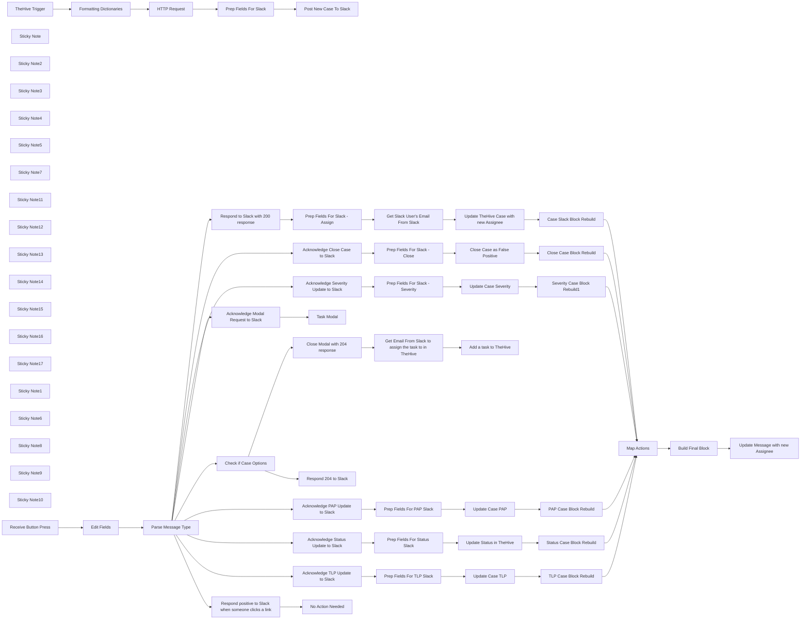

## Fluxo (.json) :

```json
{
  "meta": {
    "instanceId": "03e9d14e9196363fe7191ce21dc0bb17387a6e755dcc9acc4f5904752919dca8"
  },
  "nodes": [
    {
      "id": "71dd0b5e-7bb0-4d06-9769-753156d1acf3",
      "name": "TheHive Trigger",
      "type": "n8n-nodes-base.theHiveProjectTrigger",
      "position": [
        20,
        300
      ],
      "webhookId": "23c014ae-1191-4775-9c00-69e5e014b11d",
      "parameters": {
        "events": [
          "case_create"
        ],
        "options": {}
      },
      "typeVersion": 1
    },
    {
      "id": "659339a5-3b3e-4f57-8aec-4c368b01890c",
      "name": "Sticky Note",
      "type": "n8n-nodes-base.stickyNote",
      "position": [
        280,
        520
      ],
      "parameters": {
        "color": 7,
        "width": 455.1635858314854,
        "height": 538.2816200839441,
        "content": "\n## Events Webhook Trigger\nThe first node receives all messages from Slack API via Subscription Events API. You can find more information about setting up the subscription events API by [clicking here](https://api.slack.com/apis/connections/events-api). The second node extracts the payload from slack into an object that n8n can understand.  "
      },
      "typeVersion": 1
    },
    {
      "id": "c3ec7525-41f5-426c-a1c9-63b4596c8632",
      "name": "Sticky Note2",
      "type": "n8n-nodes-base.stickyNote",
      "position": [
        -160,
        -60
      ],
      "parameters": {
        "color": 7,
        "width": 543.689530484159,
        "height": 516.5011820330969,
        "content": "\n## TheHive Trigger\nTo setup TheHive 5's triggers, visit the Settings in TheHive and add a webhook using the url found TheHive node."
      },
      "typeVersion": 1
    },
    {
      "id": "d754ebe1-8a9e-4ae2-9a51-b6d359866ec3",
      "name": "Sticky Note3",
      "type": "n8n-nodes-base.stickyNote",
      "position": [
        400,
        -60
      ],
      "parameters": {
        "color": 7,
        "width": 686.8181233897246,
        "height": 516.5011820330969,
        "content": "\n## Post TheHive Case to Slack\nThe Case data is then mapped to Slack Block Kit and pushed to Slack. In Slack, it lives as a database object, mapping the Case Id to the block kit values themselves, so they can be updated in TheHive. "
      },
      "typeVersion": 1
    },
    {
      "id": "6ac8fc89-6640-4799-93cb-eb1afa0e35c9",
      "name": "Edit Fields",
      "type": "n8n-nodes-base.set",
      "position": [
        580,
        880
      ],
      "parameters": {
        "options": {},
        "assignments": {
          "assignments": [
            {
              "id": "e63f9299-a19d-4ba1-93b0-59f458769fb2",
              "name": "response",
              "type": "object",
              "value": "={{ $json.body.payload }}"
            },
            {
              "id": "d95dda30-0a5c-4c63-8b4a-6b4e0a2bcb59",
              "name": "dictionary",
              "type": "object",
              "value": "{\"PAP\":{\"WHITE\":\"🕊️\",\"GREEN\":\"🟢\",\"AMBER\":\"🟠\",\"RED\":\"🔴\"},\"Severity\":{\"LOW\":\"🟢\",\"MEDIUM\":\"🟡\",\"HIGH\":\"🟠\",\"CRITICAL\":\"🔴\"},\"Severityid\":{\"1\":\"LOW\",\"2\":\"MEDIUM\",\"3\":\"HIGH\",\"4\":\"CRITICAL\"},\"TLP\":{\"WHITE\":\"⚪\",\"GREEN\":\"🟢\",\"AMBER\":\"🟠\",\"RED\":\"🔴\"},\"STATUS\":{\"1\":\"New\",\"2\":\"InProgress\",\"3\":\"Duplicated\",\"4\":\"FalsePositive\",\"5\":\"Indeterminate\",\"6\":\"Other\",\"7\":\"TruePositive\"},\"STATUSEMOJI\":{\"1\":\"🆕\",\"2\":\"🔄\",\"3\":\"📑\",\"4\":\"❎\",\"5\":\"❓\",\"6\":\"🟣\",\"7\":\"🔴\"}}"
            },
            {
              "id": "2303d403-1329-47b4-9b74-4f679a2cc192",
              "name": "theHiveUrl",
              "type": "string",
              "value": "http://37.27.1.230:9000"
            }
          ]
        }
      },
      "typeVersion": 3.3
    },
    {
      "id": "86f90f83-c115-4561-8c0f-432c2ebb18b5",
      "name": "Task Modal",
      "type": "n8n-nodes-base.httpRequest",
      "position": [
        1800,
        3040
      ],
      "parameters": {
        "url": "https://slack.com/api/views.open",
        "method": "POST",
        "options": {},
        "jsonBody": "=  {\n    \"trigger_id\": \"{{ $('Edit Fields').item.json['response']['trigger_id'] }}\",\n    \"external_id\": \"TheHive Task Adder\",\n    \"view\": {\n\t\"type\": \"modal\",\n\t\"callback_id\": \"add_task_modal\",\n\t\"title\": {\n\t\t\"type\": \"plain_text\",\n\t\t\"text\": \"Add a Task to Case\",\n\t\t\"emoji\": true\n\t},\n\t\"submit\": {\n\t\t\"type\": \"plain_text\",\n\t\t\"text\": \"Submit\",\n\t\t\"emoji\": true\n\t},\n\t\"close\": {\n\t\t\"type\": \"plain_text\",\n\t\t\"text\": \"Cancel\",\n\t\t\"emoji\": true\n\t},\n\t\"blocks\": [\n\t\t{\n\t\t\t\"type\": \"context\",\n\t\t\t\"block_id\": \"case_number_context\",\n\t\t\t\"elements\": [\n\t\t\t\t{\n\t\t\t\t\t\"type\": \"mrkdwn\",\n\t\t\t\t\t\"text\": \"{{ $('Edit Fields').item.json[\"response\"][\"message\"][\"blocks\"][1][\"text\"][\"text\"] }}\"\n\t\t\t\t},\n\t\t\t\t{\n\t\t\t\t\t\"type\": \"plain_text\",\n\t\t\t\t\t\"text\": \"{{ $('Edit Fields').item.json.response.message.blocks[0].alt_text }}\",\n\t\t\t\t\t\"emoji\": true\n\t\t\t\t}\n\t\t\t]\n\t\t},\n\t\t{\n\t\t\t\"type\": \"input\",\n\t\t\t\"block_id\": \"title_block\",\n\t\t\t\"element\": {\n\t\t\t\t\"type\": \"plain_text_input\",\n\t\t\t\t\"action_id\": \"title_input\",\n\t\t\t\t\"placeholder\": {\n\t\t\t\t\t\"type\": \"plain_text\",\n\t\t\t\t\t\"text\": \"Enter the task title\"\n\t\t\t\t}\n\t\t\t},\n\t\t\t\"label\": {\n\t\t\t\t\"type\": \"plain_text\",\n\t\t\t\t\"text\": \"Title\",\n\t\t\t\t\"emoji\": true\n\t\t\t}\n\t\t},\n\t\t{\n\t\t\t\"type\": \"input\",\n\t\t\t\"block_id\": \"description_block\",\n\t\t\t\"element\": {\n\t\t\t\t\"type\": \"plain_text_input\",\n\t\t\t\t\"action_id\": \"description_input\",\n\t\t\t\t\"multiline\": true,\n\t\t\t\t\"placeholder\": {\n\t\t\t\t\t\"type\": \"plain_text\",\n\t\t\t\t\t\"text\": \"Enter a description for the task\"\n\t\t\t\t}\n\t\t\t},\n\t\t\t\"label\": {\n\t\t\t\t\"type\": \"plain_text\",\n\t\t\t\t\"text\": \"Description\",\n\t\t\t\t\"emoji\": true\n\t\t\t}\n\t\t},\n\t\t{\n\t\t\t\"type\": \"input\",\n\t\t\t\"block_id\": \"group_block\",\n\t\t\t\"element\": {\n\t\t\t\t\"type\": \"plain_text_input\",\n\t\t\t\t\"action_id\": \"group_input\",\n\t\t\t\t\"placeholder\": {\n\t\t\t\t\t\"type\": \"plain_text\",\n\t\t\t\t\t\"text\": \"Enter the group name\"\n\t\t\t\t}\n\t\t\t},\n\t\t\t\"label\": {\n\t\t\t\t\"type\": \"plain_text\",\n\t\t\t\t\"text\": \"Group\",\n\t\t\t\t\"emoji\": true\n\t\t\t}\n\t\t},\n\t\t{\n\t\t\t\"type\": \"actions\",\n\t\t\t\"block_id\": \"case-options\",\n\t\t\t\"elements\": [\n\t\t\t\t{\n\t\t\t\t\t\"type\": \"checkboxes\",\n\t\t\t\t\t\"options\": [\n\t\t\t\t\t\t{\n\t\t\t\t\t\t\t\"text\": {\n\t\t\t\t\t\t\t\t\"type\": \"mrkdwn\",\n\t\t\t\t\t\t\t\t\"text\": \":exclamation: *Mandatory*\"\n\t\t\t\t\t\t\t},\n\t\t\t\t\t\t\t\"description\": {\n\t\t\t\t\t\t\t\t\"type\": \"mrkdwn\",\n\t\t\t\t\t\t\t\t\"text\": \"Make this case Mandatory\"\n\t\t\t\t\t\t\t},\n\t\t\t\t\t\t\t\"value\": \"mandatory\"\n\t\t\t\t\t\t},\n\t\t\t\t\t\t{\n\t\t\t\t\t\t\t\"text\": {\n\t\t\t\t\t\t\t\t\"type\": \"mrkdwn\",\n\t\t\t\t\t\t\t\t\"text\": \":triangular_flag_on_post: *Flagged*\"\n\t\t\t\t\t\t\t},\n\t\t\t\t\t\t\t\"description\": {\n\t\t\t\t\t\t\t\t\"type\": \"mrkdwn\",\n\t\t\t\t\t\t\t\t\"text\": \"Flag this case\"\n\t\t\t\t\t\t\t},\n\t\t\t\t\t\t\t\"value\": \"flagged\"\n\t\t\t\t\t\t}\n\t\t\t\t\t],\n\t\t\t\t\t\"action_id\": \"submit-task-option\"\n\t\t\t\t}\n\t\t\t]\n\t\t},\n\t\t{\n\t\t\t\"type\": \"input\",\n\t\t\t\"block_id\": \"due_date_block\",\n\t\t\t\"element\": {\n\t\t\t\t\"type\": \"datepicker\",\n\t\t\t\t\"action_id\": \"due_date_input\",\n\t\t\t\t\"placeholder\": {\n\t\t\t\t\t\"type\": \"plain_text\",\n\t\t\t\t\t\"text\": \"Select a due date and time\"\n\t\t\t\t},\n\t\t\t\t\"initial_date\": \"{{$today.format('yyyy-MM-dd')}}\"\n\t\t\t},\n\t\t\t\"label\": {\n\t\t\t\t\"type\": \"plain_text\",\n\t\t\t\t\"text\": \"Due Date\",\n\t\t\t\t\"emoji\": true\n\t\t\t}\n\t\t},\n\t\t{\n\t\t\t\"type\": \"input\",\n\t\t\t\"block_id\": \"assignee_block\",\n\t\t\t\"element\": {\n\t\t\t\t\"type\": \"users_select\",\n\t\t\t\t\"action_id\": \"assignee_input\",\n\t\t\t\t\"placeholder\": {\n\t\t\t\t\t\"type\": \"plain_text\",\n\t\t\t\t\t\"text\": \"Select an assignee\"\n\t\t\t\t}\n\t\t\t},\n\t\t\t\"label\": {\n\t\t\t\t\"type\": \"plain_text\",\n\t\t\t\t\"text\": \"Assignee\",\n\t\t\t\t\"emoji\": true\n\t\t\t}\n\t\t}\n\t]\n}\n}",
        "sendBody": true,
        "jsonQuery": "{\n  \"Content-type\": \"application/json\"\n}",
        "sendQuery": true,
        "specifyBody": "json",
        "specifyQuery": "json",
        "authentication": "predefinedCredentialType",
        "nodeCredentialType": "slackApi"
      },
      "credentials": {
        "slackApi": {
          "id": "hOkN2lZmH8XimxKh",
          "name": "TheHive Slack App"
        }
      },
      "typeVersion": 4.2
    },
    {
      "id": "e2874195-4b4e-4288-937f-201e4a361438",
      "name": "HTTP Request",
      "type": "n8n-nodes-base.httpRequest",
      "position": [
        460,
        300
      ],
      "parameters": {
        "url": "https://slack.com/api/users.lookupByEmail",
        "options": {},
        "sendQuery": true,
        "authentication": "predefinedCredentialType",
        "queryParameters": {
          "parameters": [
            {
              "name": "email",
              "value": "={{ $('TheHive Trigger').item.json[\"body\"][\"object\"][\"assignee\"] }}"
            }
          ]
        },
        "nodeCredentialType": "slackApi"
      },
      "credentials": {
        "slackApi": {
          "id": "hOkN2lZmH8XimxKh",
          "name": "TheHive Slack App"
        }
      },
      "typeVersion": 4.2
    },
    {
      "id": "9fbf2b59-e6c3-45b5-aceb-5e98ebad9814",
      "name": "Formatting Dictionaries",
      "type": "n8n-nodes-base.set",
      "position": [
        240,
        300
      ],
      "parameters": {
        "options": {},
        "assignments": {
          "assignments": [
            {
              "id": "4a0f7bf9-f346-4ccf-8026-79c984cdedb5",
              "name": "dictionary",
              "type": "object",
              "value": "{\"PAP\":{\"CLEAR\":\"🕊️\",\"GREEN\":\"🟢\",\"AMBER\":\"🟠\",\"RED\":\"🔴\"},\"Severity\":{\"LOW\":\"🟢\",\"MEDIUM\":\"🟡\",\"HIGH\":\"🟠\",\"CRITICAL\":\"🔴\"},\"TLP\":{\"CLEAR\":\"⚪\",\"GREEN\":\"🟢\",\"AMBER\":\"🟠\",\"RED\":\"🔴\"},\"STATUS\":{\"NEW\":\"🆕\",\"inprogress\":\"🔄\",\"Duplicated\":\"📑\",\"Falsepositive\":\"❎\",\"Indeterminate\":\"❓\",\"Other\":\"🟣\",\"Truepositive\":\"🔴\"}}"
            },
            {
              "id": "32a165d5-cd94-454e-bcf9-9254decb63cb",
              "name": "theHiveUrl",
              "type": "string",
              "value": "=http://37.27.1.230:9000"
            }
          ]
        }
      },
      "typeVersion": 3.3
    },
    {
      "id": "f5ab276e-809b-41df-ba86-020c1b3681e1",
      "name": "Prep Fields For Slack",
      "type": "n8n-nodes-base.set",
      "position": [
        680,
        300
      ],
      "parameters": {
        "options": {},
        "assignments": {
          "assignments": [
            {
              "id": "0001aed3-a3fb-4229-8fa1-1941f0ee8a12",
              "name": "title",
              "type": "string",
              "value": "=:computer: *Case Title:*\\n {{ $('TheHive Trigger').item.json.body.details.title }}"
            },
            {
              "id": "6f40871c-ea6f-4c61-9272-9342c99637e8",
              "name": "datecreated",
              "type": "string",
              "value": "=*:date: Date Created:*\\n{{DateTime.fromMillis($('TheHive Trigger').item.json[\"body\"][\"context\"][\"_createdAt\"]).toLocaleString({month: 'long', day: 'numeric', year: 'numeric'})}}"
            },
            {
              "id": "2ea20d66-380f-4a0f-a1ea-c4740293f48b",
              "name": "number",
              "type": "string",
              "value": "=:hash: Case #{{ $('TheHive Trigger').item.json.body.details.number }} created on TheHive "
            },
            {
              "id": "a22dd686-ac38-4e73-a0ec-051dce57f9fa",
              "name": "severity",
              "type": "string",
              "value": "=*Severity:* {{ $('TheHive Trigger').item.json[\"body\"][\"context\"][\"severityLabel\"] }}"
            },
            {
              "id": "1c210cfb-2a03-4e81-a8c5-2db739d98226",
              "name": "tlp",
              "type": "string",
              "value": "=*Traffic Light Protocol(TLP):* {{ $('TheHive Trigger').item.json[\"body\"][\"context\"][\"tlpLabel\"] }}"
            },
            {
              "id": "53e1d1a9-055a-48c2-80de-b694871c6620",
              "name": "pap",
              "type": "string",
              "value": "=*Permissible Actions Protocol(PAP):* {{ $('TheHive Trigger').item.json[\"body\"][\"context\"][\"papLabel\"] }}"
            },
            {
              "id": "ee630583-a6ad-4bab-ad78-7846df3ac093",
              "name": "description",
              "type": "string",
              "value": "=:spiral_note_pad: *Case Description:*\\n{{ $('TheHive Trigger').item.json[\"body\"][\"context\"][\"description\"] }}"
            },
            {
              "id": "48ac7d92-5177-46be-b01e-83493f18ee09",
              "name": "assignee",
              "type": "string",
              "value": "={{ $json.user.profile.real_name }}"
            },
            {
              "id": "f9c06ecf-d3d5-490c-a848-02c88fbd3ab4",
              "name": "profilepic",
              "type": "string",
              "value": "={{ $json.user.profile.image_32 }}"
            },
            {
              "id": "bb4ec29d-fac2-4eb9-a177-fca9d2798514",
              "name": "caseid",
              "type": "string",
              "value": "={{ $('TheHive Trigger').item.json[\"body\"][\"objectId\"] }}"
            },
            {
              "id": "7a485f44-b855-4633-ba51-82e7490d7166",
              "name": "tags",
              "type": "string",
              "value": "=:label:  *Tags:*\\n{{ $('TheHive Trigger').item.json[\"body\"][\"context\"][\"tags\"].join(', ') }}"
            },
            {
              "id": "a99d49b4-af10-4e04-a9c6-2b17a14643ff",
              "name": "status_emoji",
              "type": "string",
              "value": "={{ $(`Formatting Dictionaries`).item.json.dictionary.STATUS[$('TheHive Trigger').item.json[\"body\"][\"context\"][\"status\"].toUpperCase()] }}"
            },
            {
              "id": "a4884fc5-2d92-4c34-af9c-61240bc564d5",
              "name": "status",
              "type": "string",
              "value": "={{ $('TheHive Trigger').item.json[\"body\"][\"context\"][\"status\"] }}"
            },
            {
              "id": "7efb073b-1f1a-4d11-97a2-d61a9baeb52f",
              "name": "tlp_emoji",
              "type": "string",
              "value": "={{ $(`Formatting Dictionaries`).item.json.dictionary.TLP[$('TheHive Trigger').item.json[\"body\"][\"context\"][\"tlpLabel\"].toUpperCase()] }}"
            },
            {
              "id": "19f5bc67-97c3-47bc-8210-738057f30c1f",
              "name": "pap_emoji",
              "type": "string",
              "value": "={{ $(`Formatting Dictionaries`).item.json.dictionary.PAP[$('TheHive Trigger').item.json[\"body\"][\"context\"][\"papLabel\"].toUpperCase()] }}"
            },
            {
              "id": "d31504be-e4ef-4704-8b1b-cb1a8072298d",
              "name": "severity_emoji",
              "type": "string",
              "value": "={{ $(`Formatting Dictionaries`).item.json.dictionary.Severity[$('TheHive Trigger').item.json[\"body\"][\"context\"][\"severityLabel\"].toUpperCase()] }}"
            }
          ]
        }
      },
      "typeVersion": 3.3
    },
    {
      "id": "b7747c0c-52ec-415b-aa55-ce399b53054b",
      "name": "Update Message with new Assignee",
      "type": "n8n-nodes-base.httpRequest",
      "position": [
        3200,
        1160
      ],
      "parameters": {
        "url": "https://slack.com/api/chat.update",
        "method": "POST",
        "options": {},
        "sendBody": true,
        "sendQuery": true,
        "authentication": "predefinedCredentialType",
        "bodyParameters": {
          "parameters": [
            {
              "name": "channel",
              "value": "={{ $('Edit Fields').item.json.response.channel.id }}"
            },
            {
              "name": "ts",
              "value": "={{ $('Edit Fields').item.json.response.container.message_ts }}"
            },
            {
              "name": "blocks",
              "value": "={{ JSON.stringify($json.blocks) }}"
            }
          ]
        },
        "queryParameters": {
          "parameters": [
            {
              "name": "Content-Type",
              "value": "application/json"
            }
          ]
        },
        "nodeCredentialType": "slackApi"
      },
      "credentials": {
        "slackApi": {
          "id": "hOkN2lZmH8XimxKh",
          "name": "TheHive Slack App"
        }
      },
      "typeVersion": 4.2
    },
    {
      "id": "b548c331-1612-40a9-806c-8136c1eb6dbe",
      "name": "Sticky Note4",
      "type": "n8n-nodes-base.stickyNote",
      "position": [
        1140,
        385.7161688656365
      ],
      "parameters": {
        "color": 7,
        "width": 706.9954015609856,
        "height": 467.56934570944634,
        "content": "\n## Assign Case to Others\nSince slack does not send the slack user email, we must take the extra step \nof passing the user ID back to slack, and getting back the email address of \nthe person selecting the buttons. For this to work correctly, TheHive users \nemails and Slack user emails must be the same. "
      },
      "typeVersion": 1
    },
    {
      "id": "34dc3eb9-e19a-46c1-947d-65c9c5be9993",
      "name": "Sticky Note5",
      "type": "n8n-nodes-base.stickyNote",
      "position": [
        1140,
        860
      ],
      "parameters": {
        "color": 7,
        "width": 1400.2199299541444,
        "height": 1720.4067726820667,
        "content": "\n# Streamlined Case Updates via Slack for SOC Analysts\n\n## This workflow segment is crucial for enhancing the responsiveness and efficiency of SOC operations by allowing analysts to update TheHive case attributes directly from Slack. By using form inputs and buttons embedded within Slack messages, analysts can quickly modify case details without switching to TheHive. This integration significantly speeds up case handling and improves the management of security incidents.\n\n\n**Key Operations:**\n- **Dynamic Slack Blocks**: Utilizes custom-built Slack block elements to present actionable items directly within the communication platform.\n- **Immediate Actions**: Enables actions like closing a case as a false positive, updating case severity, TLP (Traffic Light Protocol), PAP (Permissible Action Protocol), and more with simple clicks.\n- **Automated Updates**: Upon interaction, the workflow automatically updates the respective fields in TheHive, ensuring that all case information is current and accurately reflected.\n- **Feedback Loop**: After updating, a confirmation is sent back to Slack, confirming the action taken, which helps in maintaining clear communication and audit trails.\n\n\n**Benefits for SOC Analysts:**\n- **Efficiency**: Reduces the time spent switching between tools and streamlines the case update process.\n- **Accuracy**: Minimizes human error by automating data entry from Slack to TheHive.\n- **Visibility**: Keeps the entire team informed about case status updates in real-time, enhancing collaborative efforts.\n\n\n**Setup Note:**\n- Ensure that your TheHive and Slack integration permissions are configured to allow updates and that users are familiar with the operational workflow.\n- The last set of \"Set\" nodes on the far right of the workflow are designed to split the Slack block kit action into two parts. This split facilitates easier customization of the action options at the bottom of the Slack message. While customization is possible, a good understanding of JSON is desirable to modify these settings effectively.\n\n\nThis integration not only speeds up response times but also leverages the collaborative environment of Slack to keep the SOC team agile and well-informed."
      },
      "typeVersion": 1
    },
    {
      "id": "233924c6-eceb-4618-90fa-2633f0e3cf84",
      "name": "Sticky Note7",
      "type": "n8n-nodes-base.stickyNote",
      "position": [
        1135,
        3242
      ],
      "parameters": {
        "color": 7,
        "width": 988.1220012094333,
        "height": 613.5055433060886,
        "content": "\n## Add a task to a Case - Process the task details\nOnce the modal window is submitted, this sections then processes the data sent in. Certain fields send data back to the server so the no operation check simply ignores certain types of inputs in the modal until the whole modal is filled out. "
      },
      "typeVersion": 1
    },
    {
      "id": "c32929b9-9f57-4f70-86da-e038c786d360",
      "name": "Check if Case Options",
      "type": "n8n-nodes-base.if",
      "position": [
        1175,
        3560
      ],
      "parameters": {
        "options": {},
        "conditions": {
          "options": {
            "leftValue": "",
            "caseSensitive": true,
            "typeValidation": "strict"
          },
          "combinator": "and",
          "conditions": [
            {
              "id": "de563083-5735-42d3-8765-5b072b10ff9c",
              "operator": {
                "type": "string",
                "operation": "notEquals"
              },
              "leftValue": "={{ $json.response.actions[0].action_id }}",
              "rightValue": "submit-task-option"
            }
          ]
        }
      },
      "typeVersion": 2
    },
    {
      "id": "5887da0e-36eb-4bd3-8dba-6422dc8fa70a",
      "name": "Case Slack Block Rebuild",
      "type": "n8n-nodes-base.set",
      "position": [
        2340,
        680
      ],
      "parameters": {
        "options": {},
        "assignments": {
          "assignments": [
            {
              "id": "c1fccf83-8223-42a2-837e-11eafe5d23fd",
              "name": "slackblocks",
              "type": "string",
              "value": "={\"type\":\"image\",\"block_id\":\"image_block\",\"image_url\":\"https://i.imgur.com/y2Yw1ZP.png\",\"alt_text\":\"{{ $('Prep Fields For Slack - Assign').item.json[\"caseid\"]}}\"},{\"type\":\"header\",\"block_id\":\"header_case_created\",\"text\":{\"type\":\"plain_text\",\"text\":\"{{ $('Prep Fields For Slack - Assign').item.json[\"number\"]}}\",\"emoji\":true}},{\"type\":\"divider\",\"block_id\":\"divider_1\"},{\"type\":\"section\",\"block_id\":\"section_case_details\",\"fields\":[{\"type\":\"mrkdwn\",\"text\":\"{{ $('Prep Fields For Slack - Assign').item.json[\"title\"].replace(\"\\n\",\"\\\\n\")}}\"},{\"type\":\"mrkdwn\",\"text\":\"{{ $('Prep Fields For Slack - Assign').item.json[\"datecreated\"].replace(\"\\n\",\"\\\\n\")}}\"},{\"type\":\"mrkdwn\",\"text\":\"{{ $('Prep Fields For Slack - Assign').item.json[\"tags\"].replace(\"\\n\",\"\\\\n\")}}\"},{\"type\":\"mrkdwn\",\"text\":\"{{ $('Prep Fields For Slack - Assign').item.json[\"description\"].replace(\"\\n\",\"\\\\n\")}}\"}]},{\"type\":\"actions\",\"block_id\":\"actions_case_options\",\"elements\":[{\"type\":\"button\",\"text\":{\"type\":\"plain_text\",\"text\":\"Close Case as False Positive\",\"emoji\":true},\"style\":\"danger\",\"value\":\"{{ $('Prep Fields For Slack - Assign').item.json[\"caseid\"]}}\",\"action_id\":\"close_case\"},{\"type\":\"button\",\"text\":{\"type\":\"plain_text\",\"text\":\"Add a Task\",\"emoji\":true},\"value\":\"{{ $('Prep Fields For Slack - Assign').item.json[\"caseid\"]}}\",\"action_id\":\"add_task\"}]},{\"type\":\"divider\",\"block_id\":\"divider_2\"},{\"type\":\"header\",\"block_id\":\"header_current_assignment\",\"text\":{\"type\":\"plain_text\",\"text\":\"🔍 Case Details:\",\"emoji\":true}},{\"type\":\"context\",\"block_id\":\"context_status\",\"elements\":[{\"type\":\"mrkdwn\",\"text\":\"{{ $('Prep Fields For Slack - Assign').item.json[\"status\"]}}\"}]},{\"type\":\"context\",\"block_id\":\"context_severity\",\"elements\":[{\"type\":\"mrkdwn\",\"text\":\"{{ $('Prep Fields For Slack - Assign').item.json[\"severity\"]}}\"}]},{\"type\":\"context\",\"block_id\":\"context_tlp\",\"elements\":[{\"type\":\"mrkdwn\",\"text\":\"{{ $('Prep Fields For Slack - Assign').item.json[\"tlp\"]}}\"}]},{\"type\":\"context\",\"block_id\":\"context_pap\",\"elements\":[{\"type\":\"mrkdwn\",\"text\":\"{{ $('Prep Fields For Slack - Assign').item.json[\"pap\"]}}\"}]},{\"type\":\"context\",\"block_id\":\"context_assignee\",\"elements\":[{\"type\":\"image\",\"image_url\":\"{{ $('Get Slack User\\'s Email From Slack').item.json.profile.image_32 }}\",\"alt_text\":\"Profile Pic\"},{\"type\":\"mrkdwn\",\"text\":\"Assignee: {{ $('Get Slack User\\'s Email From Slack').item.json.profile.real_name }}\"}]}"
            }
          ]
        }
      },
      "typeVersion": 3.3
    },
    {
      "id": "0dc10f84-c087-45ab-8b1d-f770725f400b",
      "name": "Close Case Block Rebuild",
      "type": "n8n-nodes-base.set",
      "position": [
        2400,
        1700
      ],
      "parameters": {
        "options": {},
        "assignments": {
          "assignments": [
            {
              "id": "c1fccf83-8223-42a2-837e-11eafe5d23fd",
              "name": "slackblocks",
              "type": "string",
              "value": "={\"type\":\"image\",\"block_id\":\"image_block\",\"image_url\":\"https://i.imgur.com/y2Yw1ZP.png\",\"alt_text\":\"{{ $('Prep Fields For Slack - Close').item.json[\"caseid\"]}}\"},{\"type\":\"header\",\"block_id\":\"header_case_created\",\"text\":{\"type\":\"plain_text\",\"text\":\"{{ $('Prep Fields For Slack - Close').item.json[\"number\"]}}\",\"emoji\":true}},{\"type\":\"divider\",\"block_id\":\"divider_1\"},{\"type\":\"section\",\"block_id\":\"section_case_details\",\"fields\":[{\"type\":\"mrkdwn\",\"text\":\"{{ $('Prep Fields For Slack - Close').item.json[\"title\"].replace(\"\\n\",\"\\\\n\")}}\"},{\"type\":\"mrkdwn\",\"text\":\"{{ $('Prep Fields For Slack - Close').item.json[\"datecreated\"].replace(\"\\n\",\"\\\\n\")}}\"},{\"type\":\"mrkdwn\",\"text\":\"{{ $('Prep Fields For Slack - Close').item.json[\"tags\"].replace(\"\\n\",\"\\\\n\")}}\"},{\"type\":\"mrkdwn\",\"text\":\"{{ $('Prep Fields For Slack - Close').item.json[\"description\"].replace(\"\\n\",\"\\\\n\")}}\"}]},{\"type\":\"actions\",\"block_id\":\"actions_case_options\",\"elements\":[{\"type\":\"button\",\"text\":{\"type\":\"plain_text\",\"text\":\"Close Case as False Positive\",\"emoji\":true},\"style\":\"danger\",\"value\":\"{{ $('Prep Fields For Slack - Close').item.json[\"caseid\"]}}\",\"action_id\":\"close_case\"},{\"type\":\"button\",\"text\":{\"type\":\"plain_text\",\"text\":\"Add a Task\",\"emoji\":true},\"value\":\"{{ $('Prep Fields For Slack - Close').item.json[\"caseid\"]}}\",\"action_id\":\"add_task\"}]},{\"type\":\"divider\",\"block_id\":\"divider_2\"},{\"type\":\"header\",\"block_id\":\"header_current_assignment\",\"text\":{\"type\":\"plain_text\",\"text\":\"🔍 Case Details:\",\"emoji\":true}},{\"type\":\"context\",\"block_id\":\"context_status\",\"elements\":[{\"type\":\"mrkdwn\",\"text\":\"{{ $('Prep Fields For Slack - Close').item.json[\"status\"]}}\"}]},{\"type\":\"context\",\"block_id\":\"context_severity\",\"elements\":[{\"type\":\"mrkdwn\",\"text\":\"{{ $('Prep Fields For Slack - Close').item.json[\"severity\"]}}\"}]},{\"type\":\"context\",\"block_id\":\"context_tlp\",\"elements\":[{\"type\":\"mrkdwn\",\"text\":\"{{ $('Prep Fields For Slack - Close').item.json[\"tlp\"]}}\"}]},{\"type\":\"context\",\"block_id\":\"context_pap\",\"elements\":[{\"type\":\"mrkdwn\",\"text\":\"{{ $('Prep Fields For Slack - Close').item.json[\"pap\"]}}\"}]},{\"type\":\"context\",\"block_id\":\"context_assignee\",\"elements\":[{\"type\":\"image\",\"image_url\":\"{{ $('Prep Fields For Slack - Close').item.json[\"profilepic\"]}}\",\"alt_text\":\"Profile Pic\"},{\"type\":\"mrkdwn\",\"text\":\"{{ $('Prep Fields For Slack - Close').item.json[\"assignee\"] }}\"}]}"
            }
          ]
        }
      },
      "typeVersion": 3.3
    },
    {
      "id": "3b95146f-d842-4c69-b537-bad5603ba0d0",
      "name": "Severity Case Block Rebuild1",
      "type": "n8n-nodes-base.set",
      "position": [
        2400,
        1880
      ],
      "parameters": {
        "options": {},
        "assignments": {
          "assignments": [
            {
              "id": "c1fccf83-8223-42a2-837e-11eafe5d23fd",
              "name": "slackblocks",
              "type": "string",
              "value": "={\"type\":\"image\",\"block_id\":\"image_block\",\"image_url\":\"https://i.imgur.com/y2Yw1ZP.png\",\"alt_text\":\"{{ $('Prep Fields For Slack - Severity').item.json['caseid']}}\"},{\"type\":\"header\",\"block_id\":\"header_case_created\",\"text\":{\"type\":\"plain_text\",\"text\":\"{{ $('Prep Fields For Slack - Severity').item.json['number']}}\",\"emoji\":true}},{\"type\":\"divider\",\"block_id\":\"divider_1\"},{\"type\":\"section\",\"block_id\":\"section_case_details\",\"fields\":[{\"type\":\"mrkdwn\",\"text\":\"{{ $('Prep Fields For Slack - Severity').item.json['title'].replace('\\n','\\\\n')}}\"},{\"type\":\"mrkdwn\",\"text\":\"{{ $('Prep Fields For Slack - Severity').item.json['datecreated'].replace('\\n','\\\\n')}}\"},{\"type\":\"mrkdwn\",\"text\":\"{{ $('Prep Fields For Slack - Severity').item.json['tags'].replace('\\n','\\\\n')}}\"},{\"type\":\"mrkdwn\",\"text\":\"{{ $('Prep Fields For Slack - Severity').item.json['description'].replace('\\n','\\\\n')}}\"}]},{\"type\":\"actions\",\"block_id\":\"actions_case_options\",\"elements\":[{\"type\":\"button\",\"text\":{\"type\":\"plain_text\",\"text\":\"Close Case as False Positive\",\"emoji\":true},\"style\":\"danger\",\"value\":\"{{ $('Prep Fields For Slack - Severity').item.json['caseid']}}\",\"action_id\":\"close_case\"},{\"type\":\"button\",\"text\":{\"type\":\"plain_text\",\"text\":\"Add a Task\",\"emoji\":true},\"value\":\"{{ $('Prep Fields For Slack - Severity').item.json['caseid']}}\",\"action_id\":\"add_task\"}]},{\"type\":\"divider\",\"block_id\":\"divider_2\"},{\"type\":\"header\",\"block_id\":\"header_current_assignment\",\"text\":{\"type\":\"plain_text\",\"text\":\"🔍 Case Details:\",\"emoji\":true}},{\"type\":\"context\",\"block_id\":\"context_status\",\"elements\":[{\"type\":\"mrkdwn\",\"text\":\"{{ $('Prep Fields For Slack - Severity').item.json['status']}}\"}]},{\"type\":\"context\",\"block_id\":\"context_severity\",\"elements\":[{\"type\":\"mrkdwn\",\"text\":\"{{ $('Prep Fields For Slack - Severity').item.json['severity']}}\"}]},{\"type\":\"context\",\"block_id\":\"context_tlp\",\"elements\":[{\"type\":\"mrkdwn\",\"text\":\"{{ $('Prep Fields For Slack - Severity').item.json['tlp']}}\"}]},{\"type\":\"context\",\"block_id\":\"context_pap\",\"elements\":[{\"type\":\"mrkdwn\",\"text\":\"{{ $('Prep Fields For Slack - Severity').item.json['pap']}}\"}]},{\"type\":\"context\",\"block_id\":\"context_assignee\",\"elements\":[{\"type\":\"image\",\"image_url\":\"{{ $('Prep Fields For Slack - Severity').item.json['profilepic']}}\",\"alt_text\":\"Profile Pic\"},{\"type\":\"mrkdwn\",\"text\":\"{{ $('Prep Fields For Slack - Severity').item.json['assignee']}}\"}]}"
            }
          ]
        }
      },
      "typeVersion": 3.3
    },
    {
      "id": "be1fe770-aaa2-4ed2-9ff1-5baa00423d76",
      "name": "PAP Case Block Rebuild",
      "type": "n8n-nodes-base.set",
      "position": [
        2400,
        2060
      ],
      "parameters": {
        "options": {},
        "assignments": {
          "assignments": [
            {
              "id": "c1fccf83-8223-42a2-837e-11eafe5d23fd",
              "name": "slackblocks",
              "type": "string",
              "value": "={\"type\":\"image\",\"block_id\":\"image_block\",\"image_url\":\"https://i.imgur.com/y2Yw1ZP.png\",\"alt_text\":\"{{ $('Prep Fields For PAP Slack').item.json[\"caseid\"]}}\"},{\"type\":\"header\",\"block_id\":\"header_case_created\",\"text\":{\"type\":\"plain_text\",\"text\":\"{{ $('Prep Fields For PAP Slack').item.json[\"number\"]}}\",\"emoji\":true}},{\"type\":\"divider\",\"block_id\":\"divider_1\"},{\"type\":\"section\",\"block_id\":\"section_case_details\",\"fields\":[{\"type\":\"mrkdwn\",\"text\":\"{{ $('Prep Fields For PAP Slack').item.json[\"title\"].replace(\"\\n\",\"\\\\n\")}}\"},{\"type\":\"mrkdwn\",\"text\":\"{{ $('Prep Fields For PAP Slack').item.json[\"datecreated\"].replace(\"\\n\",\"\\\\n\")}}\"},{\"type\":\"mrkdwn\",\"text\":\"{{ $('Prep Fields For PAP Slack').item.json[\"tags\"].replace(\"\\n\",\"\\\\n\")}}\"},{\"type\":\"mrkdwn\",\"text\":\"{{ $('Prep Fields For PAP Slack').item.json[\"description\"].replace(\"\\n\",\"\\\\n\")}}\"}]},{\"type\":\"actions\",\"block_id\":\"actions_case_options\",\"elements\":[{\"type\":\"button\",\"text\":{\"type\":\"plain_text\",\"text\":\"Close Case as False Positive\",\"emoji\":true},\"style\":\"danger\",\"value\":\"{{ $('Prep Fields For PAP Slack').item.json[\"caseid\"]}}\",\"action_id\":\"close_case\"},{\"type\":\"button\",\"text\":{\"type\":\"plain_text\",\"text\":\"Add a Task\",\"emoji\":true},\"value\":\"{{ $('Prep Fields For PAP Slack').item.json[\"caseid\"]}}\",\"action_id\":\"add_task\"}]},{\"type\":\"divider\",\"block_id\":\"divider_2\"},{\"type\":\"header\",\"block_id\":\"header_current_assignment\",\"text\":{\"type\":\"plain_text\",\"text\":\"🔍 Case Details:\",\"emoji\":true}},{\"type\":\"context\",\"block_id\":\"context_status\",\"elements\":[{\"type\":\"mrkdwn\",\"text\":\"{{ $('Prep Fields For PAP Slack').item.json[\"status\"]}}\"}]},{\"type\":\"context\",\"block_id\":\"context_severity\",\"elements\":[{\"type\":\"mrkdwn\",\"text\":\"{{ $('Prep Fields For PAP Slack').item.json[\"severity\"]}}\"}]},{\"type\":\"context\",\"block_id\":\"context_tlp\",\"elements\":[{\"type\":\"mrkdwn\",\"text\":\"{{ $('Prep Fields For PAP Slack').item.json[\"tlp\"]}}\"}]},{\"type\":\"context\",\"block_id\":\"context_pap\",\"elements\":[{\"type\":\"mrkdwn\",\"text\":\"{{ $('Prep Fields For PAP Slack').item.json[\"pap\"]}}\"}]},{\"type\":\"context\",\"block_id\":\"context_assignee\",\"elements\":[{\"type\":\"image\",\"image_url\":\"{{ $('Prep Fields For PAP Slack').item.json[\"profilepic\"]}}\",\"alt_text\":\"Profile Pic\"},{\"type\":\"mrkdwn\",\"text\":\"{{ $('Prep Fields For PAP Slack').item.json[\"assignee\"] }}\"}]}"
            }
          ]
        }
      },
      "typeVersion": 3.3
    },
    {
      "id": "0d9a2036-6a4c-4ffd-95a8-34b6861894b9",
      "name": "Prep Fields For PAP Slack",
      "type": "n8n-nodes-base.set",
      "position": [
        1600,
        2060
      ],
      "parameters": {
        "options": {},
        "assignments": {
          "assignments": [
            {
              "id": "0001aed3-a3fb-4229-8fa1-1941f0ee8a12",
              "name": "title",
              "type": "string",
              "value": "={{ $('Edit Fields').item.json.response.message.blocks[3].fields[0].text }}"
            },
            {
              "id": "6f40871c-ea6f-4c61-9272-9342c99637e8",
              "name": "datecreated",
              "type": "string",
              "value": "={{ $('Edit Fields').item.json.response.message.blocks[3].fields[1].text }}"
            },
            {
              "id": "2ea20d66-380f-4a0f-a1ea-c4740293f48b",
              "name": "number",
              "type": "string",
              "value": "={{ $('Edit Fields').item.json.response.message.blocks[1].text.text }}"
            },
            {
              "id": "a22dd686-ac38-4e73-a0ec-051dce57f9fa",
              "name": "severity",
              "type": "string",
              "value": "={{ $('Edit Fields').item.json[\"response\"][\"message\"][\"blocks\"][8][\"elements\"][0][\"text\"] }}"
            },
            {
              "id": "1c210cfb-2a03-4e81-a8c5-2db739d98226",
              "name": "tlp",
              "type": "string",
              "value": "={{ $('Edit Fields').item.json.response.message.blocks[9].elements[0].text }}"
            },
            {
              "id": "53e1d1a9-055a-48c2-80de-b694871c6620",
              "name": "pap",
              "type": "string",
              "value": "={{ $('Edit Fields').item.json[\"dictionary\"][\"PAP\"][$('Edit Fields').item.json[\"response\"][\"state\"][\"values\"][\"actions_assignment_options\"][\"update_pap\"][\"selected_option\"][\"text\"][\"text\"].toUpperCase()] }} *Permissible Actions Protocol(PAP):* {{ $('Edit Fields').item.json[\"response\"][\"state\"][\"values\"][\"actions_assignment_options\"][\"update_pap\"][\"selected_option\"][\"text\"][\"text\"].toUpperCase() }}"
            },
            {
              "id": "ee630583-a6ad-4bab-ad78-7846df3ac093",
              "name": "description",
              "type": "string",
              "value": "={{ $('Edit Fields').item.json.response.message.blocks[3].fields[3].text }}"
            },
            {
              "id": "48ac7d92-5177-46be-b01e-83493f18ee09",
              "name": "assignee",
              "type": "string",
              "value": "={{ $('Edit Fields').item.json.response.message.blocks[11].elements[1].text }}"
            },
            {
              "id": "f9c06ecf-d3d5-490c-a848-02c88fbd3ab4",
              "name": "profilepic",
              "type": "string",
              "value": "={{ $('Edit Fields').item.json.response.message.blocks[11].elements[0].image_url }}"
            },
            {
              "id": "bb4ec29d-fac2-4eb9-a177-fca9d2798514",
              "name": "caseid",
              "type": "string",
              "value": "={{ $('Edit Fields').item.json.response.message.blocks[0].alt_text }}"
            },
            {
              "id": "7a485f44-b855-4633-ba51-82e7490d7166",
              "name": "tags",
              "type": "string",
              "value": "={{ $('Edit Fields').item.json.response.message.blocks[3].fields[2].text.replaceAll(\"\\n\",\"\\\\n\").replaceAll(\"**\",\"*\") }}"
            },
            {
              "id": "a4884fc5-2d92-4c34-af9c-61240bc564d5",
              "name": "status",
              "type": "string",
              "value": "={{ $json.response.message.blocks[7].elements[0].text }}"
            },
            {
              "id": "449c052a-05b4-4c03-99a4-b5fe7ec0e102",
              "name": "newassignee",
              "type": "string",
              "value": "={{ $json.response.state.values.actions_assignment_options['change-assignee'].selected_user }}"
            },
            {
              "id": "8278ead1-85c0-4921-ac36-9abfd44f99c8",
              "name": "papId",
              "type": "number",
              "value": "={{ $json.response.state.values.actions_assignment_options.update_pap.selected_option.value }}"
            }
          ]
        }
      },
      "typeVersion": 3.3
    },
    {
      "id": "574caf88-eef7-4b06-9f04-7a468ef56325",
      "name": "Map Actions",
      "type": "n8n-nodes-base.set",
      "position": [
        2700,
        1160
      ],
      "parameters": {
        "options": {},
        "assignments": {
          "assignments": [
            {
              "id": "7d88f9ff-3046-491f-a31c-642839fba7b4",
              "name": "actions",
              "type": "string",
              "value": "={{ $json.slackblocks }}"
            },
            {
              "id": "5cde079d-1b30-41b0-948d-f3b8bacb88bf",
              "name": "buttons",
              "type": "string",
              "value": "={\"type\":\"actions\",\"block_id\":\"actions_assignment_options\",\"elements\":[{\"type\":\"users_select\",\"placeholder\":{\"type\":\"plain_text\",\"text\":\"Change Assignee\",\"emoji\":true},\"action_id\":\"change-assignee\"},{\"type\":\"static_select\",\"placeholder\":{\"type\":\"plain_text\",\"text\":\"Change Status\",\"emoji\":true},\"action_id\":\"update-status\",\"options\":[{\"text\":{\"type\":\"plain_text\",\"text\":\"🆕 New\",\"emoji\":true},\"value\":\"1\"},{\"text\":{\"type\":\"plain_text\",\"text\":\"🔄 In progress\",\"emoji\":true},\"value\":\"2\"},{\"text\":{\"type\":\"plain_text\",\"text\":\"📑 Duplicated\",\"emoji\":true},\"value\":\"3\"},{\"text\":{\"type\":\"plain_text\",\"text\":\"❎ False positive\",\"emoji\":true},\"value\":\"4\"},{\"text\":{\"type\":\"plain_text\",\"text\":\"❓ Indeterminate\",\"emoji\":true},\"value\":\"5\"},{\"text\":{\"type\":\"plain_text\",\"text\":\"🔵 Other\",\"emoji\":true},\"value\":\"6\"},{\"text\":{\"type\":\"plain_text\",\"text\":\"✅ True positive\",\"emoji\":true},\"value\":\"7\"}]},{\"type\":\"static_select\",\"placeholder\":{\"type\":\"plain_text\",\"text\":\"Change severity\",\"emoji\":true},\"action_id\":\"update_severity\",\"options\":[{\"text\":{\"type\":\"plain_text\",\"text\":\"Low\",\"emoji\":true},\"value\":\"1\"},{\"text\":{\"type\":\"plain_text\",\"text\":\"Medium\",\"emoji\":true},\"value\":\"2\"},{\"text\":{\"type\":\"plain_text\",\"text\":\"High\",\"emoji\":true},\"value\":\"3\"},{\"text\":{\"type\":\"plain_text\",\"text\":\"Critical\",\"emoji\":true},\"value\":\"4\"}]},{\"type\":\"static_select\",\"placeholder\":{\"type\":\"plain_text\",\"text\":\"Change TLP\",\"emoji\":true},\"action_id\":\"update_tlp\",\"options\":[{\"text\":{\"type\":\"plain_text\",\"text\":\"White\",\"emoji\":true},\"value\":\"0\"},{\"text\":{\"type\":\"plain_text\",\"text\":\"Green\",\"emoji\":true},\"value\":\"1\"},{\"text\":{\"type\":\"plain_text\",\"text\":\"Amber\",\"emoji\":true},\"value\":\"2\"},{\"text\":{\"type\":\"plain_text\",\"text\":\"Red\",\"emoji\":true},\"value\":\"3\"}]},{\"type\":\"static_select\",\"placeholder\":{\"type\":\"plain_text\",\"text\":\"Change PAP\",\"emoji\":true},\"action_id\":\"update_pap\",\"options\":[{\"text\":{\"type\":\"plain_text\",\"text\":\"White\",\"emoji\":true},\"value\":\"0\"},{\"text\":{\"type\":\"plain_text\",\"text\":\"Green\",\"emoji\":true},\"value\":\"1\"},{\"text\":{\"type\":\"plain_text\",\"text\":\"Amber\",\"emoji\":true},\"value\":\"2\"},{\"text\":{\"type\":\"plain_text\",\"text\":\"Red\",\"emoji\":true},\"value\":\"3\"}]}]},{\"type\":\"section\",\"text\":{\"type\":\"mrkdwn\",\"text\":\":bee: View the case in TheHive\"},\"accessory\":{\"type\":\"button\",\"style\":\"primary\",\"text\":{\"type\":\"plain_text\",\"text\":\"View Case\",\"emoji\":true},\"value\":\"click_me_123\",\"url\":\"{{ $('Edit Fields').item.json.theHiveUrl }}/cases/{{ $('Edit Fields').item.json.response.message.blocks[0].alt_text }}/details\",\"action_id\":\"viewlink\"}}"
            }
          ]
        }
      },
      "typeVersion": 3.3
    },
    {
      "id": "d0e2d26f-9ab1-4f4f-a700-d686dda8dbef",
      "name": "Build Final Block",
      "type": "n8n-nodes-base.set",
      "position": [
        2920,
        1160
      ],
      "parameters": {
        "mode": "raw",
        "options": {},
        "jsonOutput": "={\"blocks\": [{{ $json.actions }},{{ $json.buttons }}]}"
      },
      "typeVersion": 3.3
    },
    {
      "id": "e189e865-664a-47c1-b877-59788967c852",
      "name": "Prep Fields For TLP Slack",
      "type": "n8n-nodes-base.set",
      "position": [
        1600,
        2240
      ],
      "parameters": {
        "options": {},
        "assignments": {
          "assignments": [
            {
              "id": "0001aed3-a3fb-4229-8fa1-1941f0ee8a12",
              "name": "title",
              "type": "string",
              "value": "={{ $('Edit Fields').item.json.response.message.blocks[3].fields[0].text }}"
            },
            {
              "id": "6f40871c-ea6f-4c61-9272-9342c99637e8",
              "name": "datecreated",
              "type": "string",
              "value": "={{ $('Edit Fields').item.json.response.message.blocks[3].fields[1].text }}"
            },
            {
              "id": "2ea20d66-380f-4a0f-a1ea-c4740293f48b",
              "name": "number",
              "type": "string",
              "value": "={{ $('Edit Fields').item.json.response.message.blocks[1].text.text }}"
            },
            {
              "id": "a22dd686-ac38-4e73-a0ec-051dce57f9fa",
              "name": "severity",
              "type": "string",
              "value": "={{ $('Edit Fields').item.json[\"response\"][\"message\"][\"blocks\"][8][\"elements\"][0][\"text\"] }}"
            },
            {
              "id": "1c210cfb-2a03-4e81-a8c5-2db739d98226",
              "name": "tlp",
              "type": "string",
              "value": "={{ $('Edit Fields').item.json[\"dictionary\"][\"TLP\"][$('Edit Fields').item.json[\"response\"][\"state\"][\"values\"][\"actions_assignment_options\"][\"update_tlp\"][\"selected_option\"][\"text\"][\"text\"].toUpperCase()] }} *Traffic Light Protocol(TLP):* {{ $('Edit Fields').item.json[\"response\"][\"state\"][\"values\"][\"actions_assignment_options\"][\"update_tlp\"][\"selected_option\"][\"text\"][\"text\"].toUpperCase() }}"
            },
            {
              "id": "53e1d1a9-055a-48c2-80de-b694871c6620",
              "name": "pap",
              "type": "string",
              "value": "={{ $json.response.message.blocks[10].elements[0].text }}"
            },
            {
              "id": "ee630583-a6ad-4bab-ad78-7846df3ac093",
              "name": "description",
              "type": "string",
              "value": "={{ $('Edit Fields').item.json.response.message.blocks[3].fields[3].text }}"
            },
            {
              "id": "48ac7d92-5177-46be-b01e-83493f18ee09",
              "name": "assignee",
              "type": "string",
              "value": "={{ $('Edit Fields').item.json.response.message.blocks[11].elements[1].text }}"
            },
            {
              "id": "f9c06ecf-d3d5-490c-a848-02c88fbd3ab4",
              "name": "profilepic",
              "type": "string",
              "value": "={{ $('Edit Fields').item.json.response.message.blocks[11].elements[0].image_url }}"
            },
            {
              "id": "bb4ec29d-fac2-4eb9-a177-fca9d2798514",
              "name": "caseid",
              "type": "string",
              "value": "={{ $('Edit Fields').item.json.response.message.blocks[0].alt_text }}"
            },
            {
              "id": "7a485f44-b855-4633-ba51-82e7490d7166",
              "name": "tags",
              "type": "string",
              "value": "={{ $('Edit Fields').item.json.response.message.blocks[3].fields[2].text.replaceAll(\"\\n\",\"\\\\n\").replaceAll(\"**\",\"*\") }}"
            },
            {
              "id": "a4884fc5-2d92-4c34-af9c-61240bc564d5",
              "name": "status",
              "type": "string",
              "value": "={{ $json.response.message.blocks[7].elements[0].text }}"
            },
            {
              "id": "449c052a-05b4-4c03-99a4-b5fe7ec0e102",
              "name": "newassignee",
              "type": "string",
              "value": "={{ $json.response.state.values.actions_assignment_options['change-assignee'].selected_user }}"
            },
            {
              "id": "8278ead1-85c0-4921-ac36-9abfd44f99c8",
              "name": "tlpId",
              "type": "number",
              "value": "={{ $('Edit Fields').item.json.response.state.values.actions_assignment_options.update_tlp.selected_option.value }}"
            }
          ]
        }
      },
      "typeVersion": 3.3
    },
    {
      "id": "286a5624-a546-4a7f-a416-0b4ef66a99d7",
      "name": "Prep Fields For Status Slack",
      "type": "n8n-nodes-base.set",
      "position": [
        1600,
        2420
      ],
      "parameters": {
        "options": {},
        "assignments": {
          "assignments": [
            {
              "id": "0001aed3-a3fb-4229-8fa1-1941f0ee8a12",
              "name": "title",
              "type": "string",
              "value": "={{ $('Edit Fields').item.json.response.message.blocks[3].fields[0].text }}"
            },
            {
              "id": "6f40871c-ea6f-4c61-9272-9342c99637e8",
              "name": "datecreated",
              "type": "string",
              "value": "={{ $('Edit Fields').item.json.response.message.blocks[3].fields[1].text }}"
            },
            {
              "id": "2ea20d66-380f-4a0f-a1ea-c4740293f48b",
              "name": "number",
              "type": "string",
              "value": "={{ $('Edit Fields').item.json.response.message.blocks[1].text.text }}"
            },
            {
              "id": "a22dd686-ac38-4e73-a0ec-051dce57f9fa",
              "name": "severity",
              "type": "string",
              "value": "={{ $('Edit Fields').item.json[\"response\"][\"message\"][\"blocks\"][8][\"elements\"][0][\"text\"] }}"
            },
            {
              "id": "1c210cfb-2a03-4e81-a8c5-2db739d98226",
              "name": "tlp",
              "type": "string",
              "value": "={{ $('Edit Fields').item.json.response.message.blocks[9].elements[0].text }}"
            },
            {
              "id": "53e1d1a9-055a-48c2-80de-b694871c6620",
              "name": "pap",
              "type": "string",
              "value": "={{ $json.response.message.blocks[10].elements[0].text }}"
            },
            {
              "id": "ee630583-a6ad-4bab-ad78-7846df3ac093",
              "name": "description",
              "type": "string",
              "value": "={{ $('Edit Fields').item.json.response.message.blocks[3].fields[3].text }}"
            },
            {
              "id": "48ac7d92-5177-46be-b01e-83493f18ee09",
              "name": "assignee",
              "type": "string",
              "value": "={{ $('Edit Fields').item.json.response.message.blocks[11].elements[1].text }}"
            },
            {
              "id": "f9c06ecf-d3d5-490c-a848-02c88fbd3ab4",
              "name": "profilepic",
              "type": "string",
              "value": "={{ $('Edit Fields').item.json.response.message.blocks[11].elements[0].image_url }}"
            },
            {
              "id": "bb4ec29d-fac2-4eb9-a177-fca9d2798514",
              "name": "caseid",
              "type": "string",
              "value": "={{ $('Edit Fields').item.json.response.message.blocks[0].alt_text }}"
            },
            {
              "id": "7a485f44-b855-4633-ba51-82e7490d7166",
              "name": "tags",
              "type": "string",
              "value": "={{ $('Edit Fields').item.json.response.message.blocks[3].fields[2].text.replaceAll(\"\\n\",\"\\\\n\").replaceAll(\"**\",\"*\") }}"
            },
            {
              "id": "a4884fc5-2d92-4c34-af9c-61240bc564d5",
              "name": "status",
              "type": "string",
              "value": "={{ $('Edit Fields').item.json[\"dictionary\"][\"STATUSEMOJI\"][$('Edit Fields').item.json[\"response\"][\"state\"][\"values\"][\"actions_assignment_options\"][\"update-status\"][\"selected_option\"][\"value\"].toUpperCase()] }} *Status:* {{ $('Edit Fields').item.json[\"dictionary\"][\"STATUS\"][$('Edit Fields').item.json[\"response\"][\"state\"][\"values\"][\"actions_assignment_options\"][\"update-status\"][\"selected_option\"][\"value\"].toUpperCase()] }}"
            },
            {
              "id": "8278ead1-85c0-4921-ac36-9abfd44f99c8",
              "name": "statusvalue",
              "type": "string",
              "value": "={{ $('Edit Fields').item.json[\"dictionary\"][\"STATUS\"][$('Edit Fields').item.json[\"response\"][\"state\"][\"values\"][\"actions_assignment_options\"][\"update-status\"][\"selected_option\"][\"value\"].toUpperCase()] }}"
            }
          ]
        }
      },
      "typeVersion": 3.3
    },
    {
      "id": "bdaa7347-dd4f-4183-9f21-979557320603",
      "name": "Update Status in TheHive",
      "type": "n8n-nodes-base.theHiveProject",
      "position": [
        2060,
        2420
      ],
      "parameters": {
        "resource": "case",
        "operation": "update",
        "caseUpdateFields": {
          "value": {
            "id": "={{ $json.caseid }}",
            "flag": false,
            "status": "={{ $json.statusvalue }}"
          },
          "schema": [
            {
              "id": "id",
              "type": "string",
              "display": true,
              "removed": false,
              "required": false,
              "displayName": "ID",
              "defaultMatch": true,
              "canBeUsedToMatch": true
            },
            {
              "id": "title",
              "type": "string",
              "display": true,
              "removed": true,
              "required": false,
              "displayName": "Title",
              "defaultMatch": false,
              "canBeUsedToMatch": true
            },
            {
              "id": "description",
              "type": "string",
              "display": true,
              "removed": true,
              "required": false,
              "displayName": "Description",
              "defaultMatch": false,
              "canBeUsedToMatch": true
            },
            {
              "id": "severity",
              "type": "options",
              "display": true,
              "options": [
                {
                  "name": "Low",
                  "value": 1
                },
                {
                  "name": "Medium",
                  "value": 2
                },
                {
                  "name": "High",
                  "value": 3
                },
                {
                  "name": "Critical",
                  "value": 4
                }
              ],
              "removed": true,
              "required": false,
              "displayName": "Severity (Severity of information)",
              "defaultMatch": false,
              "canBeUsedToMatch": true
            },
            {
              "id": "startDate",
              "type": "dateTime",
              "display": true,
              "removed": true,
              "required": false,
              "displayName": "Start Date",
              "defaultMatch": false,
              "canBeUsedToMatch": true
            },
            {
              "id": "endDate",
              "type": "dateTime",
              "display": true,
              "removed": true,
              "required": false,
              "displayName": "End Date",
              "defaultMatch": false,
              "canBeUsedToMatch": true
            },
            {
              "id": "tags",
              "type": "string",
              "display": true,
              "removed": true,
              "required": false,
              "displayName": "Tags",
              "defaultMatch": false,
              "canBeUsedToMatch": true
            },
            {
              "id": "flag",
              "type": "boolean",
              "display": true,
              "removed": true,
              "required": false,
              "displayName": "Flag",
              "defaultMatch": false,
              "canBeUsedToMatch": true
            },
            {
              "id": "tlp",
              "type": "options",
              "display": true,
              "options": [
                {
                  "name": "White",
                  "value": 0
                },
                {
                  "name": "Green",
                  "value": 1
                },
                {
                  "name": "Amber",
                  "value": 2
                },
                {
                  "name": "Red",
                  "value": 3
                }
              ],
              "removed": true,
              "required": false,
              "displayName": "TLP (Confidentiality of information)",
              "defaultMatch": false,
              "canBeUsedToMatch": true
            },
            {
              "id": "pap",
              "type": "options",
              "display": true,
              "options": [
                {
                  "name": "White",
                  "value": 0
                },
                {
                  "name": "Green",
                  "value": 1
                },
                {
                  "name": "Amber",
                  "value": 2
                },
                {
                  "name": "Red",
                  "value": 3
                }
              ],
              "removed": true,
              "required": false,
              "displayName": "PAP (Level of exposure of information)",
              "defaultMatch": false,
              "canBeUsedToMatch": true
            },
            {
              "id": "summary",
              "type": "string",
              "display": true,
              "removed": true,
              "required": false,
              "displayName": "Summary",
              "defaultMatch": false,
              "canBeUsedToMatch": true
            },
            {
              "id": "status",
              "type": "options",
              "display": true,
              "options": [
                {
                  "name": "Duplicated",
                  "value": "Duplicated",
                  "description": "Stage: Closed"
                },
                {
                  "name": "FalsePositive",
                  "value": "FalsePositive",
                  "description": "Stage: Closed"
                },
                {
                  "name": "Indeterminate",
                  "value": "Indeterminate",
                  "description": "Stage: Closed"
                },
                {
                  "name": "InProgress",
                  "value": "InProgress",
                  "description": "Stage: InProgress"
                },
                {
                  "name": "New",
                  "value": "New",
                  "description": "Stage: New"
                },
                {
                  "name": "Other",
                  "value": "Other",
                  "description": "Stage: Closed"
                },
                {
                  "name": "TruePositive",
                  "value": "TruePositive",
                  "description": "Stage: Closed"
                }
              ],
              "removed": false,
              "required": false,
              "displayName": "Status",
              "defaultMatch": false,
              "canBeUsedToMatch": true
            },
            {
              "id": "assignee",
              "type": "options",
              "display": true,
              "options": [
                {
                  "name": "Angel",
                  "value": "angel@n8n.io"
                },
                {
                  "name": "John Smith",
                  "value": "john@n8n.io"
                }
              ],
              "removed": true,
              "required": false,
              "displayName": "Assignee",
              "defaultMatch": false,
              "canBeUsedToMatch": true
            },
            {
              "id": "impactStatus",
              "type": "string",
              "display": true,
              "removed": true,
              "required": false,
              "displayName": "Impact Status",
              "defaultMatch": false,
              "canBeUsedToMatch": true
            },
            {
              "id": "taskRule",
              "type": "string",
              "display": true,
              "removed": true,
              "required": false,
              "displayName": "Task Rule",
              "defaultMatch": false,
              "canBeUsedToMatch": false
            },
            {
              "id": "observableRule",
              "type": "string",
              "display": true,
              "removed": true,
              "required": false,
              "displayName": "Observable Rule",
              "defaultMatch": false,
              "canBeUsedToMatch": false
            },
            {
              "id": "addTags",
              "type": "string",
              "display": true,
              "removed": true,
              "required": false,
              "displayName": "Add Tags",
              "defaultMatch": false,
              "canBeUsedToMatch": false
            },
            {
              "id": "removeTags",
              "type": "string",
              "display": true,
              "removed": true,
              "required": false,
              "displayName": "Remove Tags",
              "defaultMatch": false,
              "canBeUsedToMatch": false
            }
          ],
          "mappingMode": "defineBelow",
          "matchingColumns": [
            "id"
          ]
        }
      },
      "credentials": {
        "theHiveProjectApi": {
          "id": "6O5aPdkMaQmc8I9B",
          "name": "The Hive 5 account"
        }
      },
      "typeVersion": 1
    },
    {
      "id": "06320f47-c22d-4285-9885-0f3148702dd9",
      "name": "Close Case as False Positive",
      "type": "n8n-nodes-base.theHiveProject",
      "position": [
        2060,
        1700
      ],
      "parameters": {
        "resource": "case",
        "operation": "update",
        "caseUpdateFields": {
          "value": {
            "id": "={{ $json.caseid }}",
            "flag": false,
            "status": "FalsePositive"
          },
          "schema": [
            {
              "id": "id",
              "type": "string",
              "display": true,
              "removed": false,
              "required": false,
              "displayName": "ID",
              "defaultMatch": true,
              "canBeUsedToMatch": true
            },
            {
              "id": "title",
              "type": "string",
              "display": true,
              "removed": true,
              "required": false,
              "displayName": "Title",
              "defaultMatch": false,
              "canBeUsedToMatch": true
            },
            {
              "id": "description",
              "type": "string",
              "display": true,
              "removed": true,
              "required": false,
              "displayName": "Description",
              "defaultMatch": false,
              "canBeUsedToMatch": true
            },
            {
              "id": "severity",
              "type": "options",
              "display": true,
              "options": [
                {
                  "name": "Low",
                  "value": 1
                },
                {
                  "name": "Medium",
                  "value": 2
                },
                {
                  "name": "High",
                  "value": 3
                },
                {
                  "name": "Critical",
                  "value": 4
                }
              ],
              "removed": true,
              "required": false,
              "displayName": "Severity (Severity of information)",
              "defaultMatch": false,
              "canBeUsedToMatch": true
            },
            {
              "id": "startDate",
              "type": "dateTime",
              "display": true,
              "removed": true,
              "required": false,
              "displayName": "Start Date",
              "defaultMatch": false,
              "canBeUsedToMatch": true
            },
            {
              "id": "endDate",
              "type": "dateTime",
              "display": true,
              "removed": true,
              "required": false,
              "displayName": "End Date",
              "defaultMatch": false,
              "canBeUsedToMatch": true
            },
            {
              "id": "tags",
              "type": "string",
              "display": true,
              "removed": true,
              "required": false,
              "displayName": "Tags",
              "defaultMatch": false,
              "canBeUsedToMatch": true
            },
            {
              "id": "flag",
              "type": "boolean",
              "display": true,
              "removed": true,
              "required": false,
              "displayName": "Flag",
              "defaultMatch": false,
              "canBeUsedToMatch": true
            },
            {
              "id": "tlp",
              "type": "options",
              "display": true,
              "options": [
                {
                  "name": "White",
                  "value": 0
                },
                {
                  "name": "Green",
                  "value": 1
                },
                {
                  "name": "Amber",
                  "value": 2
                },
                {
                  "name": "Red",
                  "value": 3
                }
              ],
              "removed": true,
              "required": false,
              "displayName": "TLP (Confidentiality of information)",
              "defaultMatch": false,
              "canBeUsedToMatch": true
            },
            {
              "id": "pap",
              "type": "options",
              "display": true,
              "options": [
                {
                  "name": "White",
                  "value": 0
                },
                {
                  "name": "Green",
                  "value": 1
                },
                {
                  "name": "Amber",
                  "value": 2
                },
                {
                  "name": "Red",
                  "value": 3
                }
              ],
              "removed": true,
              "required": false,
              "displayName": "PAP (Level of exposure of information)",
              "defaultMatch": false,
              "canBeUsedToMatch": true
            },
            {
              "id": "summary",
              "type": "string",
              "display": true,
              "removed": true,
              "required": false,
              "displayName": "Summary",
              "defaultMatch": false,
              "canBeUsedToMatch": true
            },
            {
              "id": "status",
              "type": "options",
              "display": true,
              "options": [
                {
                  "name": "Duplicated",
                  "value": "Duplicated",
                  "description": "Stage: Closed"
                },
                {
                  "name": "FalsePositive",
                  "value": "FalsePositive",
                  "description": "Stage: Closed"
                },
                {
                  "name": "Indeterminate",
                  "value": "Indeterminate",
                  "description": "Stage: Closed"
                },
                {
                  "name": "InProgress",
                  "value": "InProgress",
                  "description": "Stage: InProgress"
                },
                {
                  "name": "New",
                  "value": "New",
                  "description": "Stage: New"
                },
                {
                  "name": "Other",
                  "value": "Other",
                  "description": "Stage: Closed"
                },
                {
                  "name": "TruePositive",
                  "value": "TruePositive",
                  "description": "Stage: Closed"
                }
              ],
              "removed": false,
              "required": false,
              "displayName": "Status",
              "defaultMatch": false,
              "canBeUsedToMatch": true
            },
            {
              "id": "assignee",
              "type": "options",
              "display": true,
              "options": [
                {
                  "name": "Angel",
                  "value": "angel@n8n.io"
                },
                {
                  "name": "John Smith",
                  "value": "john@n8n.io"
                }
              ],
              "removed": true,
              "required": false,
              "displayName": "Assignee",
              "defaultMatch": false,
              "canBeUsedToMatch": true
            },
            {
              "id": "impactStatus",
              "type": "string",
              "display": true,
              "removed": true,
              "required": false,
              "displayName": "Impact Status",
              "defaultMatch": false,
              "canBeUsedToMatch": true
            },
            {
              "id": "taskRule",
              "type": "string",
              "display": true,
              "removed": true,
              "required": false,
              "displayName": "Task Rule",
              "defaultMatch": false,
              "canBeUsedToMatch": false
            },
            {
              "id": "observableRule",
              "type": "string",
              "display": true,
              "removed": true,
              "required": false,
              "displayName": "Observable Rule",
              "defaultMatch": false,
              "canBeUsedToMatch": false
            },
            {
              "id": "addTags",
              "type": "string",
              "display": true,
              "removed": true,
              "required": false,
              "displayName": "Add Tags",
              "defaultMatch": false,
              "canBeUsedToMatch": false
            },
            {
              "id": "removeTags",
              "type": "string",
              "display": true,
              "removed": true,
              "required": false,
              "displayName": "Remove Tags",
              "defaultMatch": false,
              "canBeUsedToMatch": false
            }
          ],
          "mappingMode": "defineBelow",
          "matchingColumns": [
            "id"
          ]
        }
      },
      "credentials": {
        "theHiveProjectApi": {
          "id": "6O5aPdkMaQmc8I9B",
          "name": "The Hive 5 account"
        }
      },
      "typeVersion": 1
    },
    {
      "id": "14d2eebc-17f7-4004-b4d2-17f38e1c6aaa",
      "name": "Status Case Block Rebuild",
      "type": "n8n-nodes-base.set",
      "position": [
        2400,
        2420
      ],
      "parameters": {
        "options": {},
        "assignments": {
          "assignments": [
            {
              "id": "c1fccf83-8223-42a2-837e-11eafe5d23fd",
              "name": "slackblocks",
              "type": "string",
              "value": "={\"type\":\"image\",\"block_id\":\"image_block\",\"image_url\":\"https://i.imgur.com/y2Yw1ZP.png\",\"alt_text\":\"{{ $('Prep Fields For Status Slack').item.json[\"caseid\"]}}\"},{\"type\":\"header\",\"block_id\":\"header_case_created\",\"text\":{\"type\":\"plain_text\",\"text\":\"{{ $('Prep Fields For Status Slack').item.json[\"number\"]}}\",\"emoji\":true}},{\"type\":\"divider\",\"block_id\":\"divider_1\"},{\"type\":\"section\",\"block_id\":\"section_case_details\",\"fields\":[{\"type\":\"mrkdwn\",\"text\":\"{{ $('Prep Fields For Status Slack').item.json[\"title\"].replace(\"\\n\",\"\\\\n\")}}\"},{\"type\":\"mrkdwn\",\"text\":\"{{ $('Prep Fields For Status Slack').item.json[\"datecreated\"].replace(\"\\n\",\"\\\\n\")}}\"},{\"type\":\"mrkdwn\",\"text\":\"{{ $('Prep Fields For Status Slack').item.json[\"tags\"].replace(\"\\n\",\"\\\\n\")}}\"},{\"type\":\"mrkdwn\",\"text\":\"{{ $('Prep Fields For Status Slack').item.json[\"description\"].replace(\"\\n\",\"\\\\n\")}}\"}]},{\"type\":\"actions\",\"block_id\":\"actions_case_options\",\"elements\":[{\"type\":\"button\",\"text\":{\"type\":\"plain_text\",\"text\":\"Close Case as False Positive\",\"emoji\":true},\"style\":\"danger\",\"value\":\"{{ $('Prep Fields For Status Slack').item.json[\"caseid\"]}}\",\"action_id\":\"close_case\"},{\"type\":\"button\",\"text\":{\"type\":\"plain_text\",\"text\":\"Add a Task\",\"emoji\":true},\"value\":\"{{ $('Prep Fields For Status Slack').item.json[\"caseid\"]}}\",\"action_id\":\"add_task\"}]},{\"type\":\"divider\",\"block_id\":\"divider_2\"},{\"type\":\"header\",\"block_id\":\"header_current_assignment\",\"text\":{\"type\":\"plain_text\",\"text\":\"🔍 Case Details:\",\"emoji\":true}},{\"type\":\"context\",\"block_id\":\"context_status\",\"elements\":[{\"type\":\"mrkdwn\",\"text\":\"{{ $('Prep Fields For Status Slack').item.json[\"status\"]}}\"}]},{\"type\":\"context\",\"block_id\":\"context_severity\",\"elements\":[{\"type\":\"mrkdwn\",\"text\":\"{{ $('Prep Fields For Status Slack').item.json[\"severity\"]}}\"}]},{\"type\":\"context\",\"block_id\":\"context_tlp\",\"elements\":[{\"type\":\"mrkdwn\",\"text\":\"{{ $('Prep Fields For Status Slack').item.json[\"tlp\"]}}\"}]},{\"type\":\"context\",\"block_id\":\"context_pap\",\"elements\":[{\"type\":\"mrkdwn\",\"text\":\"{{ $('Prep Fields For Status Slack').item.json[\"pap\"]}}\"}]},{\"type\":\"context\",\"block_id\":\"context_assignee\",\"elements\":[{\"type\":\"image\",\"image_url\":\"{{ $('Prep Fields For Status Slack').item.json[\"profilepic\"]}}\",\"alt_text\":\"Profile Pic\"},{\"type\":\"mrkdwn\",\"text\":\"{{ $('Prep Fields For Status Slack').item.json[\"assignee\"] }}\"}]}"
            }
          ]
        }
      },
      "typeVersion": 3.3
    },
    {
      "id": "eff9d872-a2e0-42ff-ba18-645d044a95b7",
      "name": "TLP Case Block Rebuild",
      "type": "n8n-nodes-base.set",
      "position": [
        2400,
        2240
      ],
      "parameters": {
        "options": {},
        "assignments": {
          "assignments": [
            {
              "id": "c1fccf83-8223-42a2-837e-11eafe5d23fd",
              "name": "slackblocks",
              "type": "string",
              "value": "={\"type\":\"image\",\"block_id\":\"image_block\",\"image_url\":\"https://i.imgur.com/y2Yw1ZP.png\",\"alt_text\":\"{{ $('Prep Fields For TLP Slack').item.json[\"caseid\"]}}\"},{\"type\":\"header\",\"block_id\":\"header_case_created\",\"text\":{\"type\":\"plain_text\",\"text\":\"{{ $('Prep Fields For TLP Slack').item.json[\"number\"]}}\",\"emoji\":true}},{\"type\":\"divider\",\"block_id\":\"divider_1\"},{\"type\":\"section\",\"block_id\":\"section_case_details\",\"fields\":[{\"type\":\"mrkdwn\",\"text\":\"{{ $('Prep Fields For TLP Slack').item.json[\"title\"].replace(\"\\n\",\"\\\\n\")}}\"},{\"type\":\"mrkdwn\",\"text\":\"{{ $('Prep Fields For TLP Slack').item.json[\"datecreated\"].replace(\"\\n\",\"\\\\n\")}}\"},{\"type\":\"mrkdwn\",\"text\":\"{{ $('Prep Fields For TLP Slack').item.json[\"tags\"].replace(\"\\n\",\"\\\\n\")}}\"},{\"type\":\"mrkdwn\",\"text\":\"{{ $('Prep Fields For TLP Slack').item.json[\"description\"].replace(\"\\n\",\"\\\\n\")}}\"}]},{\"type\":\"actions\",\"block_id\":\"actions_case_options\",\"elements\":[{\"type\":\"button\",\"text\":{\"type\":\"plain_text\",\"text\":\"Close Case as False Positive\",\"emoji\":true},\"style\":\"danger\",\"value\":\"{{ $('Prep Fields For TLP Slack').item.json[\"caseid\"]}}\",\"action_id\":\"close_case\"},{\"type\":\"button\",\"text\":{\"type\":\"plain_text\",\"text\":\"Add a Task\",\"emoji\":true},\"value\":\"{{ $('Prep Fields For TLP Slack').item.json[\"caseid\"]}}\",\"action_id\":\"add_task\"}]},{\"type\":\"divider\",\"block_id\":\"divider_2\"},{\"type\":\"header\",\"block_id\":\"header_current_assignment\",\"text\":{\"type\":\"plain_text\",\"text\":\"🔍 Case Details:\",\"emoji\":true}},{\"type\":\"context\",\"block_id\":\"context_status\",\"elements\":[{\"type\":\"mrkdwn\",\"text\":\"{{ $('Prep Fields For TLP Slack').item.json[\"status\"]}}\"}]},{\"type\":\"context\",\"block_id\":\"context_severity\",\"elements\":[{\"type\":\"mrkdwn\",\"text\":\"{{ $('Prep Fields For TLP Slack').item.json[\"severity\"]}}\"}]},{\"type\":\"context\",\"block_id\":\"context_tlp\",\"elements\":[{\"type\":\"mrkdwn\",\"text\":\"{{ $('Prep Fields For TLP Slack').item.json[\"tlp\"]}}\"}]},{\"type\":\"context\",\"block_id\":\"context_pap\",\"elements\":[{\"type\":\"mrkdwn\",\"text\":\"{{ $('Prep Fields For TLP Slack').item.json[\"pap\"]}}\"}]},{\"type\":\"context\",\"block_id\":\"context_assignee\",\"elements\":[{\"type\":\"image\",\"image_url\":\"{{ $('Prep Fields For TLP Slack').item.json[\"profilepic\"]}}\",\"alt_text\":\"Profile Pic\"},{\"type\":\"mrkdwn\",\"text\":\"{{ $('Prep Fields For TLP Slack').item.json[\"assignee\"] }}\"}]}"
            }
          ]
        }
      },
      "typeVersion": 3.3
    },
    {
      "id": "ddf72a31-3655-423d-bf47-c405563ebf46",
      "name": "No Action Needed",
      "type": "n8n-nodes-base.noOp",
      "position": [
        1520,
        4140
      ],
      "parameters": {},
      "typeVersion": 1
    },
    {
      "id": "7e3155d1-69d0-4773-97f7-61cdc55d04ad",
      "name": "Sticky Note11",
      "type": "n8n-nodes-base.stickyNote",
      "position": [
        1140,
        2600
      ],
      "parameters": {
        "color": 7,
        "width": 792.317043267064,
        "height": 631.3919967555308,
        "content": "\n## Add a task to a Case - Display Modal Popup\nThis section of the workflow focuses on enhancing task management directly within Slack, allowing users to interactively add tasks to cases through a modal popup. \n\nThe workflow acknowledges the modal request using a specialized node that prepares the system for a dynamic interaction, then leverages an HTTP request node to open a modal in Slack via the `https://slack.com/api/views.open` API endpoint. \n\nThis modal is populated with various fields such as task title, description, due date, assignee, and options like marking the task as mandatory or flagged, which are meticulously structured in JSON format to facilitate user input. \n\nEach element in the modal, from text inputs and date pickers to user-select dropdowns, is designed for ease of use, ensuring that task details are comprehensive and contextually relevant. "
      },
      "typeVersion": 1
    },
    {
      "id": "90fc2f6d-8e22-477e-ab6e-3282d1d1e6f0",
      "name": "Sticky Note12",
      "type": "n8n-nodes-base.stickyNote",
      "position": [
        1856.0596905369107,
        385.2537459507854
      ],
      "parameters": {
        "color": 7,
        "width": 691.0596729578308,
        "height": 465.39159795232865,
        "content": "\n## Assign Case to Others\nLastly the assignee data is passed into TheHive in \nthe correct format. We then use the Set node to \nbegin the process of building our updated Slack \nmessage. "
      },
      "typeVersion": 1
    },
    {
      "id": "50435336-d159-4477-aeb4-228bdfcb1003",
      "name": "Sticky Note13",
      "type": "n8n-nodes-base.stickyNote",
      "position": [
        2640,
        449.39422080427823
      ],
      "parameters": {
        "color": 7,
        "width": 952.9348524840666,
        "height": 895.6351014818621,
        "content": "\n# Dynamic Slack Message Updates in Workflow\n\nThis section of the workflow focuses on dynamically updating Slack messages to reflect changes in TheHive case attributes directly from Slack. The process begins by mapping user actions to Slack interactive elements, which are then composed into a final message block. This updated block is sent back to Slack to modify the original message, ensuring all changes are visible in real-time.\n\n**Key Components:**\n- **Map Actions Node**: This node maps user actions from Slack, like changing assignees or case status, into JSON format. It sets the foundation for creating interactive message blocks that users can interact with.\n- **Build Final Block Node**: Combines all interactive elements into a single JSON object, preparing it for posting back to Slack.\n- **Update Message with new Assignee Node**: Utilizes an HTTP request to post the updated message blocks back to Slack using the chat.update API endpoint. This action modifies the original Slack message to display the new, interactive elements.\n\n**Workflow Efficiency:**\n- By automating the update of Slack messages, this process eliminates the need for manual updates and ensures that all stakeholders are viewing the most current case details directly within Slack.\n- Isolating action elements in separate nodes allows for easier modifications and ensures that any changes in the workflow logic are consistently applied.\n\n**Setup Considerations:**\n- Ensure that the Slack API credentials are correctly configured to allow message updates.\n- Familiarize yourself with JSON structure if you need to customize the interactive elements further, as modifications require a good understanding of JSON formatting.\n\nThis method not only enhances the interactivity of Slack communications but also ensures that updates are seamlessly integrated into the workflow, promoting efficiency and ensuring data consistency."
      },
      "typeVersion": 1
    },
    {
      "id": "97b8bae8-1711-4c11-81f0-d2e0c50d10e6",
      "name": "Sticky Note14",
      "type": "n8n-nodes-base.stickyNote",
      "position": [
        2135,
        3243
      ],
      "parameters": {
        "color": 7,
        "width": 409.70915573152797,
        "height": 570.3745712311052,
        "content": "\n## Add a task to a Case - Process the task details\nThe data is then processed in TheHive using the native n8n node. "
      },
      "typeVersion": 1
    },
    {
      "id": "1c7c5f11-d8f0-4623-b303-1ebf4adb3b79",
      "name": "Sticky Note15",
      "type": "n8n-nodes-base.stickyNote",
      "position": [
        751.1129156240361,
        520
      ],
      "parameters": {
        "color": 7,
        "width": 374.56596023868,
        "height": 628.1281535316614,
        "content": "\n## n8n Switch Node\nThis node checks the messages from Slack and routes them down the appropriate route in the workflow. \n\nIt is an invaluable tool that simplifies our logic immensely. "
      },
      "typeVersion": 1
    },
    {
      "id": "4fd498e7-31cf-4d9f-b888-ede79e42e79f",
      "name": "Post New Case To Slack",
      "type": "n8n-nodes-base.slack",
      "position": [
        880,
        300
      ],
      "parameters": {
        "select": "channel",
        "blocksUi": "={\n\t\"blocks\": [\n\t\t{\n\t\t\t\"type\": \"image\",\n\t\t\t\"block_id\": \"image_block\",\n\t\t\t\"image_url\": \"https://i.imgur.com/y2Yw1ZP.png\",\n\t\t\t\"alt_text\": \"{{ $json['caseid'] }}\"\n\t\t},\n\t\t{\n\t\t\t\"type\": \"header\",\n\t\t\t\"block_id\": \"header_case_created\",\n\t\t\t\"text\": {\n\t\t\t\t\"type\": \"plain_text\",\n\t\t\t\t\"text\": \"{{ $json['number'] }}\",\n\t\t\t\t\"emoji\": true\n\t\t\t}\n\t\t},\n\t\t{\n\t\t\t\"type\": \"divider\",\n\t\t\t\"block_id\": \"divider_1\"\n\t\t},\n\t\t{\n\t\t\t\"type\": \"section\",\n\t\t\t\"block_id\": \"section_case_details\",\n\t\t\t\"fields\": [\n\t\t\t\t{\n\t\t\t\t\t\"type\": \"mrkdwn\",\n\t\t\t\t\t\"text\": \"{{ $json['title'] }}\"\n\t\t\t\t},\n\t\t\t\t{\n\t\t\t\t\t\"type\": \"mrkdwn\",\n\t\t\t\t\t\"text\": \"{{ $json['datecreated'] }}\"\n\t\t\t\t},\n\t\t\t\t{\n\t\t\t\t\t\"type\": \"mrkdwn\",\n\t\t\t\t\t\"text\": \"{{ $json['description'].replaceAll(\"\\n\",\"\\\\n\").replaceAll(\"**\",\"*\")}}\"\n\t\t\t\t},\n\t\t\t\t{\n\t\t\t\t\t\"type\": \"mrkdwn\",\n\t\t\t\t\t\"text\": \"{{ $json['tags'] }}\"\n\t\t\t\t}\n\t\t\t]\n\t\t},\n\t\t{\n\t\t\t\"type\": \"actions\",\n\t\t\t\"block_id\": \"actions_case_options\",\n\t\t\t\"elements\": [\n\t\t\t\t{\n\t\t\t\t\t\"type\": \"button\",\n\t\t\t\t\t\"text\": {\n\t\t\t\t\t\t\"type\": \"plain_text\",\n\t\t\t\t\t\t\"text\": \"Close Case as False Positive\",\n\t\t\t\t\t\t\"emoji\": true\n\t\t\t\t\t},\n\t\t\t\t\t\"style\": \"danger\",\n\t\t\t\t\t\"value\": \"{{ $json['caseid'] }}\",\n\t\t\t\t\t\"action_id\": \"close_case\"\n\t\t\t\t},\n\t\t\t\t{\n\t\t\t\t\t\"type\": \"button\",\n\t\t\t\t\t\"text\": {\n\t\t\t\t\t\t\"type\": \"plain_text\",\n\t\t\t\t\t\t\"text\": \"Add a Task\",\n\t\t\t\t\t\t\"emoji\": true\n\t\t\t\t\t},\n\t\t\t\t\t\"value\": \"{{ $json['caseid'] }}\",\n\t\t\t\t\t\"action_id\": \"add_task\"\n\t\t\t\t}\n\t\t\t]\n\t\t},\n\t\t{\n\t\t\t\"type\": \"divider\",\n\t\t\t\"block_id\": \"divider_2\"\n\t\t},\n\t\t{\n\t\t\t\"type\": \"header\",\n\t\t\t\"block_id\": \"header_current_assignment\",\n\t\t\t\"text\": {\n\t\t\t\t\"type\": \"plain_text\",\n\t\t\t\t\"text\": \"🔍 Case Details:\",\n\t\t\t\t\"emoji\": true\n\t\t\t}\n\t\t},\n\t\t{\n\t\t\t\"type\": \"context\",\n\t\t\t\"block_id\": \"context_status\",\n\t\t\t\"elements\": [\n\t\t\t\t{\n\t\t\t\t\t\"type\": \"mrkdwn\",\n\t\t\t\t\t\"text\": \"{{ $json['status_emoji'] }} *Status:* {{ $json['status'] }}\"\n\t\t\t\t}\n\t\t\t]\n\t\t},\n\t\t{\n\t\t\t\"type\": \"context\",\n\t\t\t\"block_id\": \"context_severity\",\n\t\t\t\"elements\": [\n\t\t\t\t{\n\t\t\t\t\t\"type\": \"mrkdwn\",\n\t\t\t\t\t\"text\": \"{{ $json['severity_emoji'] }} {{ $json['severity'] }}\"\n\t\t\t\t}\n\t\t\t]\n\t\t},\n\t\t{\n\t\t\t\"type\": \"context\",\n\t\t\t\"block_id\": \"context_tlp\",\n\t\t\t\"elements\": [\n\t\t\t\t{\n\t\t\t\t\t\"type\": \"mrkdwn\",\n\t\t\t\t\t\"text\": \"{{ $json['tlp_emoji'] }} {{ $json['tlp'] }}\"\n\t\t\t\t}\n\t\t\t]\n\t\t},\n\t\t{\n\t\t\t\"type\": \"context\",\n\t\t\t\"block_id\": \"context_pap\",\n\t\t\t\"elements\": [\n\t\t\t\t{\n\t\t\t\t\t\"type\": \"mrkdwn\",\n\t\t\t\t\t\"text\": \"{{ $json['pap_emoji'] }} {{ $json['pap'] }}\"\n\t\t\t\t}\n\t\t\t]\n\t\t},\n\t\t{\n\t\t\t\"type\": \"context\",\n\t\t\t\"block_id\": \"context_assignee\",\n\t\t\t\"elements\": [\n\t\t\t\t{\n\t\t\t\t\t\"type\": \"image\",\n\t\t\t\t\t\"image_url\": \"{{ $json['profilepic'] }}\",\n\t\t\t\t\t\"alt_text\": \"Profile Pic\"\n\t\t\t\t},\n\t\t\t\t{\n\t\t\t\t\t\"type\": \"mrkdwn\",\n\t\t\t\t\t\"text\": \"Assignee: {{ $json['assignee'] }}\"\n\t\t\t\t}\n\t\t\t]\n\t\t},\n\t\t{\n\t\t\t\"type\": \"actions\",\n\t\t\t\"block_id\": \"actions_assignment_options\",\n\t\t\t\"elements\": [\n\t\t\t\t{\n\t\t\t\t\t\"type\": \"users_select\",\n\t\t\t\t\t\"placeholder\": {\n\t\t\t\t\t\t\"type\": \"plain_text\",\n\t\t\t\t\t\t\"text\": \"Change Assignee\",\n\t\t\t\t\t\t\"emoji\": true\n\t\t\t\t\t},\n\t\t\t\t\t\"action_id\": \"change-assignee\"\n\t\t\t\t},\n\t\t\t\t{\n\t\t\t\t\t\"type\": \"static_select\",\n\t\t\t\t\t\"placeholder\": {\n\t\t\t\t\t\t\"type\": \"plain_text\",\n\t\t\t\t\t\t\"text\": \"Change Status\",\n\t\t\t\t\t\t\"emoji\": true\n\t\t\t\t\t},\n\t\t\t\t\t\"action_id\": \"update-status\",\n\t\t\t\t\t\"options\": [\n\t\t\t\t\t\t{\n\t\t\t\t\t\t\t\"text\": {\n\t\t\t\t\t\t\t\t\"type\": \"plain_text\",\n\t\t\t\t\t\t\t\t\"text\": \"🆕 New\",\n\t\t\t\t\t\t\t\t\"emoji\": true\n\t\t\t\t\t\t\t},\n\t\t\t\t\t\t\t\"value\": \"1\"\n\t\t\t\t\t\t},\n\t\t\t\t\t\t{\n\t\t\t\t\t\t\t\"text\": {\n\t\t\t\t\t\t\t\t\"type\": \"plain_text\",\n\t\t\t\t\t\t\t\t\"text\": \"🔄 In progress\",\n\t\t\t\t\t\t\t\t\"emoji\": true\n\t\t\t\t\t\t\t},\n\t\t\t\t\t\t\t\"value\": \"2\"\n\t\t\t\t\t\t},\n\t\t\t\t\t\t{\n\t\t\t\t\t\t\t\"text\": {\n\t\t\t\t\t\t\t\t\"type\": \"plain_text\",\n\t\t\t\t\t\t\t\t\"text\": \"📑 Duplicated\",\n\t\t\t\t\t\t\t\t\"emoji\": true\n\t\t\t\t\t\t\t},\n\t\t\t\t\t\t\t\"value\": \"3\"\n\t\t\t\t\t\t},\n\t\t\t\t\t\t{\n\t\t\t\t\t\t\t\"text\": {\n\t\t\t\t\t\t\t\t\"type\": \"plain_text\",\n\t\t\t\t\t\t\t\t\"text\": \"❎ False positive\",\n\t\t\t\t\t\t\t\t\"emoji\": true\n\t\t\t\t\t\t\t},\n\t\t\t\t\t\t\t\"value\": \"4\"\n\t\t\t\t\t\t},\n\t\t\t\t\t\t{\n\t\t\t\t\t\t\t\"text\": {\n\t\t\t\t\t\t\t\t\"type\": \"plain_text\",\n\t\t\t\t\t\t\t\t\"text\": \"❓ Indeterminate\",\n\t\t\t\t\t\t\t\t\"emoji\": true\n\t\t\t\t\t\t\t},\n\t\t\t\t\t\t\t\"value\": \"5\"\n\t\t\t\t\t\t},\n\t\t\t\t\t\t{\n\t\t\t\t\t\t\t\"text\": {\n\t\t\t\t\t\t\t\t\"type\": \"plain_text\",\n\t\t\t\t\t\t\t\t\"text\": \"🔵 Other\",\n\t\t\t\t\t\t\t\t\"emoji\": true\n\t\t\t\t\t\t\t},\n\t\t\t\t\t\t\t\"value\": \"6\"\n\t\t\t\t\t\t},\n\t\t\t\t\t\t{\n\t\t\t\t\t\t\t\"text\": {\n\t\t\t\t\t\t\t\t\"type\": \"plain_text\",\n\t\t\t\t\t\t\t\t\"text\": \"✅ True positive\",\n\t\t\t\t\t\t\t\t\"emoji\": true\n\t\t\t\t\t\t\t},\n\t\t\t\t\t\t\t\"value\": \"7\"\n\t\t\t\t\t\t}\n\t\t\t\t\t]\n\t\t\t\t},\n\t\t\t\t{\n\t\t\t\t\t\"type\": \"static_select\",\n\t\t\t\t\t\"placeholder\": {\n\t\t\t\t\t\t\"type\": \"plain_text\",\n\t\t\t\t\t\t\"text\": \"Change severity\",\n\t\t\t\t\t\t\"emoji\": true\n\t\t\t\t\t},\n\t\t\t\t\t\"action_id\": \"update_severity\",\n\t\t\t\t\t\"options\": [\n\t\t\t\t\t\t{\n\t\t\t\t\t\t\t\"text\": {\n\t\t\t\t\t\t\t\t\"type\": \"plain_text\",\n\t\t\t\t\t\t\t\t\"text\": \"Low\",\n\t\t\t\t\t\t\t\t\"emoji\": true\n\t\t\t\t\t\t\t},\n\t\t\t\t\t\t\t\"value\": \"1\"\n\t\t\t\t\t\t},\n\t\t\t\t\t\t{\n\t\t\t\t\t\t\t\"text\": {\n\t\t\t\t\t\t\t\t\"type\": \"plain_text\",\n\t\t\t\t\t\t\t\t\"text\": \"Medium\",\n\t\t\t\t\t\t\t\t\"emoji\": true\n\t\t\t\t\t\t\t},\n\t\t\t\t\t\t\t\"value\": \"2\"\n\t\t\t\t\t\t},\n\t\t\t\t\t\t{\n\t\t\t\t\t\t\t\"text\": {\n\t\t\t\t\t\t\t\t\"type\": \"plain_text\",\n\t\t\t\t\t\t\t\t\"text\": \"High\",\n\t\t\t\t\t\t\t\t\"emoji\": true\n\t\t\t\t\t\t\t},\n\t\t\t\t\t\t\t\"value\": \"3\"\n\t\t\t\t\t\t},\n\t\t\t\t\t\t{\n\t\t\t\t\t\t\t\"text\": {\n\t\t\t\t\t\t\t\t\"type\": \"plain_text\",\n\t\t\t\t\t\t\t\t\"text\": \"Critical\",\n\t\t\t\t\t\t\t\t\"emoji\": true\n\t\t\t\t\t\t\t},\n\t\t\t\t\t\t\t\"value\": \"4\"\n\t\t\t\t\t\t}\n\t\t\t\t\t]\n\t\t\t\t},\n\t\t\t\t{\n\t\t\t\t\t\"type\": \"static_select\",\n\t\t\t\t\t\"placeholder\": {\n\t\t\t\t\t\t\"type\": \"plain_text\",\n\t\t\t\t\t\t\"text\": \"Change TLP\",\n\t\t\t\t\t\t\"emoji\": true\n\t\t\t\t\t},\n\t\t\t\t\t\"action_id\": \"update_tlp\",\n\t\t\t\t\t\"options\": [\n\t\t\t\t\t\t{\n\t\t\t\t\t\t\t\"text\": {\n\t\t\t\t\t\t\t\t\"type\": \"plain_text\",\n\t\t\t\t\t\t\t\t\"text\": \"White\",\n\t\t\t\t\t\t\t\t\"emoji\": true\n\t\t\t\t\t\t\t},\n\t\t\t\t\t\t\t\"value\": \"0\"\n\t\t\t\t\t\t},\n\t\t\t\t\t\t{\n\t\t\t\t\t\t\t\"text\": {\n\t\t\t\t\t\t\t\t\"type\": \"plain_text\",\n\t\t\t\t\t\t\t\t\"text\": \"Amber\",\n\t\t\t\t\t\t\t\t\"emoji\": true\n\t\t\t\t\t\t\t},\n\t\t\t\t\t\t\t\"value\": \"1\"\n\t\t\t\t\t\t},\n\t\t\t\t\t\t{\n\t\t\t\t\t\t\t\"text\": {\n\t\t\t\t\t\t\t\t\"type\": \"plain_text\",\n\t\t\t\t\t\t\t\t\"text\": \"Green\",\n\t\t\t\t\t\t\t\t\"emoji\": true\n\t\t\t\t\t\t\t},\n\t\t\t\t\t\t\t\"value\": \"2\"\n\t\t\t\t\t\t},\n\t\t\t\t\t\t{\n\t\t\t\t\t\t\t\"text\": {\n\t\t\t\t\t\t\t\t\"type\": \"plain_text\",\n\t\t\t\t\t\t\t\t\"text\": \"Red\",\n\t\t\t\t\t\t\t\t\"emoji\": true\n\t\t\t\t\t\t\t},\n\t\t\t\t\t\t\t\"value\": \"3\"\n\t\t\t\t\t\t}\n\t\t\t\t\t]\n\t\t\t\t},\n\t\t\t\t{\n\t\t\t\t\t\"type\": \"static_select\",\n\t\t\t\t\t\"placeholder\": {\n\t\t\t\t\t\t\"type\": \"plain_text\",\n\t\t\t\t\t\t\"text\": \"Change PAP\",\n\t\t\t\t\t\t\"emoji\": true\n\t\t\t\t\t},\n\t\t\t\t\t\"action_id\": \"update_pap\",\n\t\t\t\t\t\"options\": [\n\t\t\t\t\t\t{\n\t\t\t\t\t\t\t\"text\": {\n\t\t\t\t\t\t\t\t\"type\": \"plain_text\",\n\t\t\t\t\t\t\t\t\"text\": \"White\",\n\t\t\t\t\t\t\t\t\"emoji\": true\n\t\t\t\t\t\t\t},\n\t\t\t\t\t\t\t\"value\": \"0\"\n\t\t\t\t\t\t},\n\t\t\t\t\t\t{\n\t\t\t\t\t\t\t\"text\": {\n\t\t\t\t\t\t\t\t\"type\": \"plain_text\",\n\t\t\t\t\t\t\t\t\"text\": \"Green\",\n\t\t\t\t\t\t\t\t\"emoji\": true\n\t\t\t\t\t\t\t},\n\t\t\t\t\t\t\t\"value\": \"1\"\n\t\t\t\t\t\t},\n\t\t\t\t\t\t{\n\t\t\t\t\t\t\t\"text\": {\n\t\t\t\t\t\t\t\t\"type\": \"plain_text\",\n\t\t\t\t\t\t\t\t\"text\": \"Amber\",\n\t\t\t\t\t\t\t\t\"emoji\": true\n\t\t\t\t\t\t\t},\n\t\t\t\t\t\t\t\"value\": \"2\"\n\t\t\t\t\t\t},\n\t\t\t\t\t\t{\n\t\t\t\t\t\t\t\"text\": {\n\t\t\t\t\t\t\t\t\"type\": \"plain_text\",\n\t\t\t\t\t\t\t\t\"text\": \"Red\",\n\t\t\t\t\t\t\t\t\"emoji\": true\n\t\t\t\t\t\t\t},\n\t\t\t\t\t\t\t\"value\": \"3\"\n\t\t\t\t\t\t}\n\t\t\t\t\t]\n\t\t\t\t}\n\t\t\t]\n\t\t},\n\t\t{\n\t\t\t\"type\": \"section\",\n\t\t\t\"text\": {\n\t\t\t\t\"type\": \"mrkdwn\",\n\t\t\t\t\"text\": \":bee: View the case in TheHive\"\n\t\t\t},\n\t\t\t\"accessory\": {\n\t\t\t\t\"type\": \"button\",\n\t\t\t\t\"style\": \"primary\",\n\t\t\t\t\"text\": {\n\t\t\t\t\t\"type\": \"plain_text\",\n\t\t\t\t\t\"text\": \"View Case\",\n\t\t\t\t\t\"emoji\": true\n\t\t\t\t},\n\t\t\t\t\"value\": \"click_me_123\",\n\t\t\t\t\"url\": \"{{ $('Formatting Dictionaries').item.json.theHiveUrl }}/cases/{{ $json['caseid'] }}/details\",\n\t\t\t\t\"action_id\": \"viewlink\"\n\t\t\t}\n\t\t}\n\t]\n}",
        "channelId": {
          "__rl": true,
          "mode": "list",
          "value": "C05LAN72WJK",
          "cachedResultName": "alerts-cyber"
        },
        "messageType": "block",
        "otherOptions": {}
      },
      "credentials": {
        "slackApi": {
          "id": "hOkN2lZmH8XimxKh",
          "name": "TheHive Slack App"
        }
      },
      "typeVersion": 2.1
    },
    {
      "id": "94f38341-660a-451b-a02a-7dc2d327e323",
      "name": "Prep Fields For Slack - Close",
      "type": "n8n-nodes-base.set",
      "position": [
        1600,
        1700
      ],
      "parameters": {
        "options": {},
        "assignments": {
          "assignments": [
            {
              "id": "0001aed3-a3fb-4229-8fa1-1941f0ee8a12",
              "name": "title",
              "type": "string",
              "value": "={{ $('Edit Fields').item.json.response.message.blocks[3].fields[0].text }}"
            },
            {
              "id": "6f40871c-ea6f-4c61-9272-9342c99637e8",
              "name": "datecreated",
              "type": "string",
              "value": "={{ $('Edit Fields').item.json.response.message.blocks[3].fields[1].text }}"
            },
            {
              "id": "2ea20d66-380f-4a0f-a1ea-c4740293f48b",
              "name": "number",
              "type": "string",
              "value": "={{ $('Edit Fields').item.json.response.message.blocks[1].text.text }}"
            },
            {
              "id": "a22dd686-ac38-4e73-a0ec-051dce57f9fa",
              "name": "severity",
              "type": "string",
              "value": "={{ $('Edit Fields').item.json.response.message.blocks[8].elements[0].text }}"
            },
            {
              "id": "1c210cfb-2a03-4e81-a8c5-2db739d98226",
              "name": "tlp",
              "type": "string",
              "value": "={{ $('Edit Fields').item.json.response.message.blocks[9].elements[0].text }}"
            },
            {
              "id": "53e1d1a9-055a-48c2-80de-b694871c6620",
              "name": "pap",
              "type": "string",
              "value": "={{ $('Edit Fields').item.json.response.message.blocks[10].elements[0].text }}"
            },
            {
              "id": "ee630583-a6ad-4bab-ad78-7846df3ac093",
              "name": "description",
              "type": "string",
              "value": "={{ $('Edit Fields').item.json.response.message.blocks[3].fields[3].text }}"
            },
            {
              "id": "48ac7d92-5177-46be-b01e-83493f18ee09",
              "name": "assignee",
              "type": "string",
              "value": "={{ $('Edit Fields').item.json.response.message.blocks[11].elements[1].text }}"
            },
            {
              "id": "f9c06ecf-d3d5-490c-a848-02c88fbd3ab4",
              "name": "profilepic",
              "type": "string",
              "value": "={{ $('Edit Fields').item.json.response.message.blocks[11].elements[0].image_url }}"
            },
            {
              "id": "bb4ec29d-fac2-4eb9-a177-fca9d2798514",
              "name": "caseid",
              "type": "string",
              "value": "={{ $('Edit Fields').item.json.response.message.blocks[0].alt_text }}"
            },
            {
              "id": "7a485f44-b855-4633-ba51-82e7490d7166",
              "name": "tags",
              "type": "string",
              "value": "={{ $('Edit Fields').item.json.response.message.blocks[3].fields[2].text }}"
            },
            {
              "id": "a4884fc5-2d92-4c34-af9c-61240bc564d5",
              "name": "status",
              "type": "string",
              "value": "=:negative_squared_cross_mark: *Status* Closed - False Positive"
            },
            {
              "id": "449c052a-05b4-4c03-99a4-b5fe7ec0e102",
              "name": "newassignee",
              "type": "string",
              "value": "={{ $json.response.state.values.actions_assignment_options['change-assignee'].selected_user }}"
            },
            {
              "id": "827c585d-ae23-48d5-b905-81f8260db61e",
              "name": "severitylabel",
              "type": "string",
              "value": ""
            }
          ]
        }
      },
      "typeVersion": 3.3
    },
    {
      "id": "6a6644ec-0391-40e3-88aa-0d2c4c9a4a41",
      "name": "Prep Fields For Slack - Assign",
      "type": "n8n-nodes-base.set",
      "position": [
        1460,
        680
      ],
      "parameters": {
        "options": {},
        "assignments": {
          "assignments": [
            {
              "id": "0001aed3-a3fb-4229-8fa1-1941f0ee8a12",
              "name": "title",
              "type": "string",
              "value": "={{ $('Edit Fields').item.json.response.message.blocks[3].fields[0].text }}"
            },
            {
              "id": "6f40871c-ea6f-4c61-9272-9342c99637e8",
              "name": "datecreated",
              "type": "string",
              "value": "={{ $('Edit Fields').item.json.response.message.blocks[3].fields[1].text }}"
            },
            {
              "id": "2ea20d66-380f-4a0f-a1ea-c4740293f48b",
              "name": "number",
              "type": "string",
              "value": "={{ $('Edit Fields').item.json.response.message.blocks[1].text.text }}"
            },
            {
              "id": "a22dd686-ac38-4e73-a0ec-051dce57f9fa",
              "name": "severity",
              "type": "string",
              "value": "={{ $('Edit Fields').item.json.response.message.blocks[8].elements[0].text }}"
            },
            {
              "id": "1c210cfb-2a03-4e81-a8c5-2db739d98226",
              "name": "tlp",
              "type": "string",
              "value": "={{ $('Edit Fields').item.json.response.message.blocks[9].elements[0].text }}"
            },
            {
              "id": "53e1d1a9-055a-48c2-80de-b694871c6620",
              "name": "pap",
              "type": "string",
              "value": "={{ $('Edit Fields').item.json.response.message.blocks[10].elements[0].text }}"
            },
            {
              "id": "ee630583-a6ad-4bab-ad78-7846df3ac093",
              "name": "description",
              "type": "string",
              "value": "={{ $('Edit Fields').item.json.response.message.blocks[3].fields[3].text }}"
            },
            {
              "id": "48ac7d92-5177-46be-b01e-83493f18ee09",
              "name": "assignee",
              "type": "string",
              "value": "={{ $('Edit Fields').item.json.response.message.blocks[11].elements[1].text }}"
            },
            {
              "id": "f9c06ecf-d3d5-490c-a848-02c88fbd3ab4",
              "name": "profilepic",
              "type": "string",
              "value": "={{ $('Edit Fields').item.json.response.message.blocks[11].elements[0].image_url }}"
            },
            {
              "id": "bb4ec29d-fac2-4eb9-a177-fca9d2798514",
              "name": "caseid",
              "type": "string",
              "value": "={{ $('Edit Fields').item.json.response.message.blocks[0].alt_text }}"
            },
            {
              "id": "7a485f44-b855-4633-ba51-82e7490d7166",
              "name": "tags",
              "type": "string",
              "value": "={{ $('Edit Fields').item.json.response.message.blocks[3].fields[2].text }}"
            },
            {
              "id": "a4884fc5-2d92-4c34-af9c-61240bc564d5",
              "name": "status",
              "type": "string",
              "value": "={{ $('Edit Fields').item.json.response.message.blocks[7].elements[0].text }}"
            },
            {
              "id": "449c052a-05b4-4c03-99a4-b5fe7ec0e102",
              "name": "newassignee",
              "type": "string",
              "value": "={{ $json.response.state.values.actions_assignment_options['change-assignee'].selected_user }}"
            }
          ]
        }
      },
      "typeVersion": 3.3
    },
    {
      "id": "f3d194d1-9548-43ce-a7b6-a1d6b4c1c5cd",
      "name": "Prep Fields For Slack - Severity",
      "type": "n8n-nodes-base.set",
      "position": [
        1600,
        1880
      ],
      "parameters": {
        "options": {},
        "assignments": {
          "assignments": [
            {
              "id": "0001aed3-a3fb-4229-8fa1-1941f0ee8a12",
              "name": "title",
              "type": "string",
              "value": "={{ $('Edit Fields').item.json.response.message.blocks[3].fields[0].text }}"
            },
            {
              "id": "6f40871c-ea6f-4c61-9272-9342c99637e8",
              "name": "datecreated",
              "type": "string",
              "value": "={{ $('Edit Fields').item.json.response.message.blocks[3].fields[1].text }}"
            },
            {
              "id": "2ea20d66-380f-4a0f-a1ea-c4740293f48b",
              "name": "number",
              "type": "string",
              "value": "={{ $('Edit Fields').item.json.response.message.blocks[1].text.text }}"
            },
            {
              "id": "a22dd686-ac38-4e73-a0ec-051dce57f9fa",
              "name": "severity",
              "type": "string",
              "value": "={{ $('Edit Fields').item.json[\"dictionary\"][\"Severity\"][$('Edit Fields').item.json.response.state.values.actions_assignment_options.update_severity.selected_option.text.text.toUpperCase()] }} *Severity:* {{ $('Edit Fields').item.json.response.state.values.actions_assignment_options.update_severity.selected_option.text.text.toUpperCase() }}"
            },
            {
              "id": "1c210cfb-2a03-4e81-a8c5-2db739d98226",
              "name": "tlp",
              "type": "string",
              "value": "={{ $('Edit Fields').item.json.response.message.blocks[9].elements[0].text }}"
            },
            {
              "id": "53e1d1a9-055a-48c2-80de-b694871c6620",
              "name": "pap",
              "type": "string",
              "value": "={{ $('Edit Fields').item.json.response.message.blocks[10].elements[0].text }}"
            },
            {
              "id": "ee630583-a6ad-4bab-ad78-7846df3ac093",
              "name": "description",
              "type": "string",
              "value": "={{ $('Edit Fields').item.json.response.message.blocks[3].fields[3].text }}"
            },
            {
              "id": "48ac7d92-5177-46be-b01e-83493f18ee09",
              "name": "assignee",
              "type": "string",
              "value": "={{ $('Edit Fields').item.json.response.message.blocks[11].elements[1].text }}"
            },
            {
              "id": "f9c06ecf-d3d5-490c-a848-02c88fbd3ab4",
              "name": "profilepic",
              "type": "string",
              "value": "={{ $('Edit Fields').item.json.response.message.blocks[11].elements[0].image_url }}"
            },
            {
              "id": "bb4ec29d-fac2-4eb9-a177-fca9d2798514",
              "name": "caseid",
              "type": "string",
              "value": "={{ $('Edit Fields').item.json.response.message.blocks[0].alt_text }}"
            },
            {
              "id": "7a485f44-b855-4633-ba51-82e7490d7166",
              "name": "tags",
              "type": "string",
              "value": "={{ $('Edit Fields').item.json.response.message.blocks[3].fields[2].text.replaceAll(\"\\n\",\"\\\\n\").replaceAll(\"**\",\"*\") }}"
            },
            {
              "id": "a4884fc5-2d92-4c34-af9c-61240bc564d5",
              "name": "status",
              "type": "string",
              "value": "={{ $json.response.message.blocks[7].elements[0].text }}"
            },
            {
              "id": "449c052a-05b4-4c03-99a4-b5fe7ec0e102",
              "name": "newassignee",
              "type": "string",
              "value": "={{ $json.response.state.values.actions_assignment_options['change-assignee'].selected_user }}"
            },
            {
              "id": "8278ead1-85c0-4921-ac36-9abfd44f99c8",
              "name": "severityId",
              "type": "number",
              "value": "={{ $('Edit Fields').item.json.response.state.values.actions_assignment_options.update_severity.selected_option.value }}"
            }
          ]
        }
      },
      "typeVersion": 3.3
    },
    {
      "id": "bc66064d-dc16-485a-8e95-19bead7e5ec7",
      "name": "Update Case Severity",
      "type": "n8n-nodes-base.theHiveProject",
      "position": [
        2060,
        1880
      ],
      "parameters": {
        "resource": "case",
        "operation": "update",
        "caseUpdateFields": {
          "value": {
            "id": "={{ $json.caseid }}",
            "flag": false,
            "severity": "={{ $json.severityId }}"
          },
          "schema": [
            {
              "id": "id",
              "type": "string",
              "display": true,
              "removed": false,
              "required": false,
              "displayName": "ID",
              "defaultMatch": true,
              "canBeUsedToMatch": true
            },
            {
              "id": "title",
              "type": "string",
              "display": true,
              "removed": true,
              "required": false,
              "displayName": "Title",
              "defaultMatch": false,
              "canBeUsedToMatch": true
            },
            {
              "id": "description",
              "type": "string",
              "display": true,
              "removed": true,
              "required": false,
              "displayName": "Description",
              "defaultMatch": false,
              "canBeUsedToMatch": true
            },
            {
              "id": "severity",
              "type": "options",
              "display": true,
              "options": [
                {
                  "name": "Low",
                  "value": 1
                },
                {
                  "name": "Medium",
                  "value": 2
                },
                {
                  "name": "High",
                  "value": 3
                },
                {
                  "name": "Critical",
                  "value": 4
                }
              ],
              "removed": false,
              "required": false,
              "displayName": "Severity (Severity of information)",
              "defaultMatch": false,
              "canBeUsedToMatch": true
            },
            {
              "id": "startDate",
              "type": "dateTime",
              "display": true,
              "removed": true,
              "required": false,
              "displayName": "Start Date",
              "defaultMatch": false,
              "canBeUsedToMatch": true
            },
            {
              "id": "endDate",
              "type": "dateTime",
              "display": true,
              "removed": true,
              "required": false,
              "displayName": "End Date",
              "defaultMatch": false,
              "canBeUsedToMatch": true
            },
            {
              "id": "tags",
              "type": "string",
              "display": true,
              "removed": true,
              "required": false,
              "displayName": "Tags",
              "defaultMatch": false,
              "canBeUsedToMatch": true
            },
            {
              "id": "flag",
              "type": "boolean",
              "display": true,
              "removed": true,
              "required": false,
              "displayName": "Flag",
              "defaultMatch": false,
              "canBeUsedToMatch": true
            },
            {
              "id": "tlp",
              "type": "options",
              "display": true,
              "options": [
                {
                  "name": "White",
                  "value": 0
                },
                {
                  "name": "Green",
                  "value": 1
                },
                {
                  "name": "Amber",
                  "value": 2
                },
                {
                  "name": "Red",
                  "value": 3
                }
              ],
              "removed": true,
              "required": false,
              "displayName": "TLP (Confidentiality of information)",
              "defaultMatch": false,
              "canBeUsedToMatch": true
            },
            {
              "id": "pap",
              "type": "options",
              "display": true,
              "options": [
                {
                  "name": "White",
                  "value": 0
                },
                {
                  "name": "Green",
                  "value": 1
                },
                {
                  "name": "Amber",
                  "value": 2
                },
                {
                  "name": "Red",
                  "value": 3
                }
              ],
              "removed": true,
              "required": false,
              "displayName": "PAP (Level of exposure of information)",
              "defaultMatch": false,
              "canBeUsedToMatch": true
            },
            {
              "id": "summary",
              "type": "string",
              "display": true,
              "removed": true,
              "required": false,
              "displayName": "Summary",
              "defaultMatch": false,
              "canBeUsedToMatch": true
            },
            {
              "id": "status",
              "type": "options",
              "display": true,
              "options": [
                {
                  "name": "Duplicated",
                  "value": "Duplicated",
                  "description": "Stage: Closed"
                },
                {
                  "name": "FalsePositive",
                  "value": "FalsePositive",
                  "description": "Stage: Closed"
                },
                {
                  "name": "Indeterminate",
                  "value": "Indeterminate",
                  "description": "Stage: Closed"
                },
                {
                  "name": "InProgress",
                  "value": "InProgress",
                  "description": "Stage: InProgress"
                },
                {
                  "name": "New",
                  "value": "New",
                  "description": "Stage: New"
                },
                {
                  "name": "Other",
                  "value": "Other",
                  "description": "Stage: Closed"
                },
                {
                  "name": "TruePositive",
                  "value": "TruePositive",
                  "description": "Stage: Closed"
                }
              ],
              "removed": true,
              "required": false,
              "displayName": "Status",
              "defaultMatch": false,
              "canBeUsedToMatch": true
            },
            {
              "id": "assignee",
              "type": "options",
              "display": true,
              "options": [
                {
                  "name": "Angel",
                  "value": "angel@n8n.io"
                },
                {
                  "name": "John Smith",
                  "value": "john@n8n.io"
                }
              ],
              "removed": true,
              "required": false,
              "displayName": "Assignee",
              "defaultMatch": false,
              "canBeUsedToMatch": true
            },
            {
              "id": "impactStatus",
              "type": "string",
              "display": true,
              "removed": true,
              "required": false,
              "displayName": "Impact Status",
              "defaultMatch": false,
              "canBeUsedToMatch": true
            },
            {
              "id": "taskRule",
              "type": "string",
              "display": true,
              "removed": true,
              "required": false,
              "displayName": "Task Rule",
              "defaultMatch": false,
              "canBeUsedToMatch": false
            },
            {
              "id": "observableRule",
              "type": "string",
              "display": true,
              "removed": true,
              "required": false,
              "displayName": "Observable Rule",
              "defaultMatch": false,
              "canBeUsedToMatch": false
            },
            {
              "id": "addTags",
              "type": "string",
              "display": true,
              "removed": true,
              "required": false,
              "displayName": "Add Tags",
              "defaultMatch": false,
              "canBeUsedToMatch": false
            },
            {
              "id": "removeTags",
              "type": "string",
              "display": true,
              "removed": true,
              "required": false,
              "displayName": "Remove Tags",
              "defaultMatch": false,
              "canBeUsedToMatch": false
            }
          ],
          "mappingMode": "defineBelow",
          "matchingColumns": [
            "id"
          ]
        }
      },
      "credentials": {
        "theHiveProjectApi": {
          "id": "6O5aPdkMaQmc8I9B",
          "name": "The Hive 5 account"
        }
      },
      "typeVersion": 1
    },
    {
      "id": "5f4eae8d-16e2-4a3a-b8dd-7af9f7f0bb4b",
      "name": "Update Case PAP",
      "type": "n8n-nodes-base.theHiveProject",
      "position": [
        2060,
        2060
      ],
      "parameters": {
        "resource": "case",
        "operation": "update",
        "caseUpdateFields": {
          "value": {
            "id": "={{ $json.caseid }}",
            "pap": "={{ $json.papId }}",
            "flag": false
          },
          "schema": [
            {
              "id": "id",
              "type": "string",
              "display": true,
              "removed": false,
              "required": false,
              "displayName": "ID",
              "defaultMatch": true,
              "canBeUsedToMatch": true
            },
            {
              "id": "title",
              "type": "string",
              "display": true,
              "removed": true,
              "required": false,
              "displayName": "Title",
              "defaultMatch": false,
              "canBeUsedToMatch": true
            },
            {
              "id": "description",
              "type": "string",
              "display": true,
              "removed": true,
              "required": false,
              "displayName": "Description",
              "defaultMatch": false,
              "canBeUsedToMatch": true
            },
            {
              "id": "severity",
              "type": "options",
              "display": true,
              "options": [
                {
                  "name": "Low",
                  "value": 1
                },
                {
                  "name": "Medium",
                  "value": 2
                },
                {
                  "name": "High",
                  "value": 3
                },
                {
                  "name": "Critical",
                  "value": 4
                }
              ],
              "removed": true,
              "required": false,
              "displayName": "Severity (Severity of information)",
              "defaultMatch": false,
              "canBeUsedToMatch": true
            },
            {
              "id": "startDate",
              "type": "dateTime",
              "display": true,
              "removed": true,
              "required": false,
              "displayName": "Start Date",
              "defaultMatch": false,
              "canBeUsedToMatch": true
            },
            {
              "id": "endDate",
              "type": "dateTime",
              "display": true,
              "removed": true,
              "required": false,
              "displayName": "End Date",
              "defaultMatch": false,
              "canBeUsedToMatch": true
            },
            {
              "id": "tags",
              "type": "string",
              "display": true,
              "removed": true,
              "required": false,
              "displayName": "Tags",
              "defaultMatch": false,
              "canBeUsedToMatch": true
            },
            {
              "id": "flag",
              "type": "boolean",
              "display": true,
              "removed": true,
              "required": false,
              "displayName": "Flag",
              "defaultMatch": false,
              "canBeUsedToMatch": true
            },
            {
              "id": "tlp",
              "type": "options",
              "display": true,
              "options": [
                {
                  "name": "White",
                  "value": 0
                },
                {
                  "name": "Green",
                  "value": 1
                },
                {
                  "name": "Amber",
                  "value": 2
                },
                {
                  "name": "Red",
                  "value": 3
                }
              ],
              "removed": true,
              "required": false,
              "displayName": "TLP (Confidentiality of information)",
              "defaultMatch": false,
              "canBeUsedToMatch": true
            },
            {
              "id": "pap",
              "type": "options",
              "display": true,
              "options": [
                {
                  "name": "White",
                  "value": 0
                },
                {
                  "name": "Green",
                  "value": 1
                },
                {
                  "name": "Amber",
                  "value": 2
                },
                {
                  "name": "Red",
                  "value": 3
                }
              ],
              "removed": false,
              "required": false,
              "displayName": "PAP (Level of exposure of information)",
              "defaultMatch": false,
              "canBeUsedToMatch": true
            },
            {
              "id": "summary",
              "type": "string",
              "display": true,
              "removed": true,
              "required": false,
              "displayName": "Summary",
              "defaultMatch": false,
              "canBeUsedToMatch": true
            },
            {
              "id": "status",
              "type": "options",
              "display": true,
              "options": [
                {
                  "name": "Duplicated",
                  "value": "Duplicated",
                  "description": "Stage: Closed"
                },
                {
                  "name": "FalsePositive",
                  "value": "FalsePositive",
                  "description": "Stage: Closed"
                },
                {
                  "name": "Indeterminate",
                  "value": "Indeterminate",
                  "description": "Stage: Closed"
                },
                {
                  "name": "InProgress",
                  "value": "InProgress",
                  "description": "Stage: InProgress"
                },
                {
                  "name": "New",
                  "value": "New",
                  "description": "Stage: New"
                },
                {
                  "name": "Other",
                  "value": "Other",
                  "description": "Stage: Closed"
                },
                {
                  "name": "TruePositive",
                  "value": "TruePositive",
                  "description": "Stage: Closed"
                }
              ],
              "removed": true,
              "required": false,
              "displayName": "Status",
              "defaultMatch": false,
              "canBeUsedToMatch": true
            },
            {
              "id": "assignee",
              "type": "options",
              "display": true,
              "options": [
                {
                  "name": "Angel",
                  "value": "angel@n8n.io"
                },
                {
                  "name": "John Smith",
                  "value": "john@n8n.io"
                }
              ],
              "removed": true,
              "required": false,
              "displayName": "Assignee",
              "defaultMatch": false,
              "canBeUsedToMatch": true
            },
            {
              "id": "impactStatus",
              "type": "string",
              "display": true,
              "removed": true,
              "required": false,
              "displayName": "Impact Status",
              "defaultMatch": false,
              "canBeUsedToMatch": true
            },
            {
              "id": "taskRule",
              "type": "string",
              "display": true,
              "removed": true,
              "required": false,
              "displayName": "Task Rule",
              "defaultMatch": false,
              "canBeUsedToMatch": false
            },
            {
              "id": "observableRule",
              "type": "string",
              "display": true,
              "removed": true,
              "required": false,
              "displayName": "Observable Rule",
              "defaultMatch": false,
              "canBeUsedToMatch": false
            },
            {
              "id": "addTags",
              "type": "string",
              "display": true,
              "removed": true,
              "required": false,
              "displayName": "Add Tags",
              "defaultMatch": false,
              "canBeUsedToMatch": false
            },
            {
              "id": "removeTags",
              "type": "string",
              "display": true,
              "removed": true,
              "required": false,
              "displayName": "Remove Tags",
              "defaultMatch": false,
              "canBeUsedToMatch": false
            }
          ],
          "mappingMode": "defineBelow",
          "matchingColumns": [
            "id"
          ]
        }
      },
      "credentials": {
        "theHiveProjectApi": {
          "id": "6O5aPdkMaQmc8I9B",
          "name": "The Hive 5 account"
        }
      },
      "typeVersion": 1
    },
    {
      "id": "c95539f5-e365-4404-897b-65af116c89cb",
      "name": "Update Case TLP",
      "type": "n8n-nodes-base.theHiveProject",
      "position": [
        2060,
        2240
      ],
      "parameters": {
        "resource": "case",
        "operation": "update",
        "caseUpdateFields": {
          "value": {
            "id": "={{ $json.caseid }}",
            "tlp": "={{ $json.tlpId }}",
            "flag": false
          },
          "schema": [
            {
              "id": "id",
              "type": "string",
              "display": true,
              "removed": false,
              "required": false,
              "displayName": "ID",
              "defaultMatch": true,
              "canBeUsedToMatch": true
            },
            {
              "id": "title",
              "type": "string",
              "display": true,
              "removed": true,
              "required": false,
              "displayName": "Title",
              "defaultMatch": false,
              "canBeUsedToMatch": true
            },
            {
              "id": "description",
              "type": "string",
              "display": true,
              "removed": true,
              "required": false,
              "displayName": "Description",
              "defaultMatch": false,
              "canBeUsedToMatch": true
            },
            {
              "id": "severity",
              "type": "options",
              "display": true,
              "options": [
                {
                  "name": "Low",
                  "value": 1
                },
                {
                  "name": "Medium",
                  "value": 2
                },
                {
                  "name": "High",
                  "value": 3
                },
                {
                  "name": "Critical",
                  "value": 4
                }
              ],
              "removed": true,
              "required": false,
              "displayName": "Severity (Severity of information)",
              "defaultMatch": false,
              "canBeUsedToMatch": true
            },
            {
              "id": "startDate",
              "type": "dateTime",
              "display": true,
              "removed": true,
              "required": false,
              "displayName": "Start Date",
              "defaultMatch": false,
              "canBeUsedToMatch": true
            },
            {
              "id": "endDate",
              "type": "dateTime",
              "display": true,
              "removed": true,
              "required": false,
              "displayName": "End Date",
              "defaultMatch": false,
              "canBeUsedToMatch": true
            },
            {
              "id": "tags",
              "type": "string",
              "display": true,
              "removed": true,
              "required": false,
              "displayName": "Tags",
              "defaultMatch": false,
              "canBeUsedToMatch": true
            },
            {
              "id": "flag",
              "type": "boolean",
              "display": true,
              "removed": true,
              "required": false,
              "displayName": "Flag",
              "defaultMatch": false,
              "canBeUsedToMatch": true
            },
            {
              "id": "tlp",
              "type": "options",
              "display": true,
              "options": [
                {
                  "name": "White",
                  "value": 0
                },
                {
                  "name": "Green",
                  "value": 1
                },
                {
                  "name": "Amber",
                  "value": 2
                },
                {
                  "name": "Red",
                  "value": 3
                }
              ],
              "removed": false,
              "required": false,
              "displayName": "TLP (Confidentiality of information)",
              "defaultMatch": false,
              "canBeUsedToMatch": true
            },
            {
              "id": "pap",
              "type": "options",
              "display": true,
              "options": [
                {
                  "name": "White",
                  "value": 0
                },
                {
                  "name": "Green",
                  "value": 1
                },
                {
                  "name": "Amber",
                  "value": 2
                },
                {
                  "name": "Red",
                  "value": 3
                }
              ],
              "removed": true,
              "required": false,
              "displayName": "PAP (Level of exposure of information)",
              "defaultMatch": false,
              "canBeUsedToMatch": true
            },
            {
              "id": "summary",
              "type": "string",
              "display": true,
              "removed": true,
              "required": false,
              "displayName": "Summary",
              "defaultMatch": false,
              "canBeUsedToMatch": true
            },
            {
              "id": "status",
              "type": "options",
              "display": true,
              "options": [
                {
                  "name": "Duplicated",
                  "value": "Duplicated",
                  "description": "Stage: Closed"
                },
                {
                  "name": "FalsePositive",
                  "value": "FalsePositive",
                  "description": "Stage: Closed"
                },
                {
                  "name": "Indeterminate",
                  "value": "Indeterminate",
                  "description": "Stage: Closed"
                },
                {
                  "name": "InProgress",
                  "value": "InProgress",
                  "description": "Stage: InProgress"
                },
                {
                  "name": "New",
                  "value": "New",
                  "description": "Stage: New"
                },
                {
                  "name": "Other",
                  "value": "Other",
                  "description": "Stage: Closed"
                },
                {
                  "name": "TruePositive",
                  "value": "TruePositive",
                  "description": "Stage: Closed"
                }
              ],
              "removed": true,
              "required": false,
              "displayName": "Status",
              "defaultMatch": false,
              "canBeUsedToMatch": true
            },
            {
              "id": "assignee",
              "type": "options",
              "display": true,
              "options": [
                {
                  "name": "Angel",
                  "value": "angel@n8n.io"
                },
                {
                  "name": "John Smith",
                  "value": "john@n8n.io"
                }
              ],
              "removed": true,
              "required": false,
              "displayName": "Assignee",
              "defaultMatch": false,
              "canBeUsedToMatch": true
            },
            {
              "id": "impactStatus",
              "type": "string",
              "display": true,
              "removed": true,
              "required": false,
              "displayName": "Impact Status",
              "defaultMatch": false,
              "canBeUsedToMatch": true
            },
            {
              "id": "taskRule",
              "type": "string",
              "display": true,
              "removed": true,
              "required": false,
              "displayName": "Task Rule",
              "defaultMatch": false,
              "canBeUsedToMatch": false
            },
            {
              "id": "observableRule",
              "type": "string",
              "display": true,
              "removed": true,
              "required": false,
              "displayName": "Observable Rule",
              "defaultMatch": false,
              "canBeUsedToMatch": false
            },
            {
              "id": "addTags",
              "type": "string",
              "display": true,
              "removed": true,
              "required": false,
              "displayName": "Add Tags",
              "defaultMatch": false,
              "canBeUsedToMatch": false
            },
            {
              "id": "removeTags",
              "type": "string",
              "display": true,
              "removed": true,
              "required": false,
              "displayName": "Remove Tags",
              "defaultMatch": false,
              "canBeUsedToMatch": false
            }
          ],
          "mappingMode": "defineBelow",
          "matchingColumns": [
            "id"
          ]
        }
      },
      "credentials": {
        "theHiveProjectApi": {
          "id": "6O5aPdkMaQmc8I9B",
          "name": "The Hive 5 account"
        }
      },
      "typeVersion": 1
    },
    {
      "id": "edfedf66-df2a-421e-a53d-11ee32623be0",
      "name": "Acknowledge Close Case to Slack",
      "type": "n8n-nodes-base.respondToWebhook",
      "position": [
        1180,
        1700
      ],
      "parameters": {
        "options": {
          "responseCode": 200
        },
        "respondWith": "noData"
      },
      "typeVersion": 1
    },
    {
      "id": "791fea8b-67b3-4dd8-943f-29f750485a10",
      "name": "Acknowledge Severity Update to Slack",
      "type": "n8n-nodes-base.respondToWebhook",
      "position": [
        1180,
        1880
      ],
      "parameters": {
        "options": {
          "responseCode": 200
        },
        "respondWith": "noData"
      },
      "typeVersion": 1
    },
    {
      "id": "14f59582-7a18-44ab-bb1e-19d5141dace5",
      "name": "Acknowledge PAP Update to Slack",
      "type": "n8n-nodes-base.respondToWebhook",
      "position": [
        1180,
        2060
      ],
      "parameters": {
        "options": {
          "responseCode": 200
        },
        "respondWith": "noData"
      },
      "typeVersion": 1
    },
    {
      "id": "55b3ecfa-2be6-41f5-818c-5980f896832f",
      "name": "Acknowledge TLP Update to Slack",
      "type": "n8n-nodes-base.respondToWebhook",
      "position": [
        1180,
        2240
      ],
      "parameters": {
        "options": {
          "responseCode": 200
        },
        "respondWith": "noData"
      },
      "typeVersion": 1
    },
    {
      "id": "4a4ef31e-de26-4e4e-b0f5-bef77c8c2801",
      "name": "Acknowledge Status Update to Slack",
      "type": "n8n-nodes-base.respondToWebhook",
      "position": [
        1180,
        2420
      ],
      "parameters": {
        "options": {
          "responseCode": 200
        },
        "respondWith": "noData"
      },
      "typeVersion": 1
    },
    {
      "id": "cb7647b0-199c-4aa8-84d3-748bb52f1e7e",
      "name": "Acknowledge Modal Request to Slack",
      "type": "n8n-nodes-base.respondToWebhook",
      "position": [
        1180,
        3040
      ],
      "parameters": {
        "options": {
          "responseCode": 200
        },
        "respondWith": "noData"
      },
      "typeVersion": 1
    },
    {
      "id": "20f028c6-1e15-4d3c-a4ad-5ae716fdc1db",
      "name": "Sticky Note16",
      "type": "n8n-nodes-base.stickyNote",
      "position": [
        1940,
        2680
      ],
      "parameters": {
        "color": 5,
        "width": 431.4429614751546,
        "height": 532.2137131625435,
        "content": ""
      },
      "typeVersion": 1
    },
    {
      "id": "661e067b-c11c-44e1-9767-a7b5776a2c4c",
      "name": "Sticky Note17",
      "type": "n8n-nodes-base.stickyNote",
      "position": [
        1100,
        -83.7829059126309
      ],
      "parameters": {
        "color": 5,
        "width": 431.4429614751546,
        "height": 453.21603562878454,
        "content": "\n### New cases will appear in slack in this format with the ability to quickly change variables in TheHive with quick actions baked in. "
      },
      "typeVersion": 1
    },
    {
      "id": "08c174f4-b486-4a18-b627-2d64229d9148",
      "name": "Parse Message Type",
      "type": "n8n-nodes-base.switch",
      "position": [
        860,
        900
      ],
      "parameters": {
        "rules": {
          "values": [
            {
              "outputKey": "Assign to User",
              "conditions": {
                "options": {
                  "leftValue": "",
                  "caseSensitive": true,
                  "typeValidation": "strict"
                },
                "combinator": "and",
                "conditions": [
                  {
                    "operator": {
                      "type": "string",
                      "operation": "equals"
                    },
                    "leftValue": "={{ $json.response.actions[0].action_id }}",
                    "rightValue": "change-assignee"
                  }
                ]
              },
              "renameOutput": true
            },
            {
              "outputKey": "Close Case",
              "conditions": {
                "options": {
                  "leftValue": "",
                  "caseSensitive": true,
                  "typeValidation": "strict"
                },
                "combinator": "and",
                "conditions": [
                  {
                    "id": "d5e3230c-d60a-41a5-815c-117f9e8d7598",
                    "operator": {
                      "name": "filter.operator.equals",
                      "type": "string",
                      "operation": "equals"
                    },
                    "leftValue": "={{ $json.response.actions[0].action_id }}",
                    "rightValue": "close_case"
                  }
                ]
              },
              "renameOutput": true
            },
            {
              "outputKey": "Update Severity",
              "conditions": {
                "options": {
                  "leftValue": "",
                  "caseSensitive": true,
                  "typeValidation": "strict"
                },
                "combinator": "and",
                "conditions": [
                  {
                    "id": "d0f5a4b9-c03c-4dc4-a6bc-41de387b0059",
                    "operator": {
                      "name": "filter.operator.equals",
                      "type": "string",
                      "operation": "equals"
                    },
                    "leftValue": "={{ $json.response.actions[0].action_id }}",
                    "rightValue": "update_severity"
                  }
                ]
              },
              "renameOutput": true
            },
            {
              "outputKey": "Add Task",
              "conditions": {
                "options": {
                  "leftValue": "",
                  "caseSensitive": true,
                  "typeValidation": "strict"
                },
                "combinator": "and",
                "conditions": [
                  {
                    "id": "8cd2f467-0683-46af-98b4-1476c9fded2b",
                    "operator": {
                      "name": "filter.operator.equals",
                      "type": "string",
                      "operation": "equals"
                    },
                    "leftValue": "={{ $json.response.actions[0].action_id }}",
                    "rightValue": "add_task"
                  }
                ]
              },
              "renameOutput": true
            },
            {
              "outputKey": "Task Modal Details",
              "conditions": {
                "options": {
                  "leftValue": "",
                  "caseSensitive": true,
                  "typeValidation": "strict"
                },
                "combinator": "and",
                "conditions": [
                  {
                    "id": "374c13a4-2590-4ae4-b7fb-e01116ba714c",
                    "operator": {
                      "name": "filter.operator.equals",
                      "type": "string",
                      "operation": "equals"
                    },
                    "leftValue": "={{ $json.response.view.type }}",
                    "rightValue": "modal"
                  }
                ]
              },
              "renameOutput": true
            },
            {
              "outputKey": "Update Pap",
              "conditions": {
                "options": {
                  "leftValue": "",
                  "caseSensitive": true,
                  "typeValidation": "strict"
                },
                "combinator": "and",
                "conditions": [
                  {
                    "id": "5bda6be6-cd63-448d-9f2f-c6ac47fdc024",
                    "operator": {
                      "name": "filter.operator.equals",
                      "type": "string",
                      "operation": "equals"
                    },
                    "leftValue": "={{ $json.response.actions[0].action_id }}",
                    "rightValue": "update_pap"
                  }
                ]
              },
              "renameOutput": true
            },
            {
              "outputKey": "Update Status",
              "conditions": {
                "options": {
                  "leftValue": "",
                  "caseSensitive": true,
                  "typeValidation": "strict"
                },
                "combinator": "and",
                "conditions": [
                  {
                    "id": "7789be18-aba0-4fa8-a4d8-792e1b53fcc5",
                    "operator": {
                      "name": "filter.operator.equals",
                      "type": "string",
                      "operation": "equals"
                    },
                    "leftValue": "={{ $json.response.actions[0].action_id }}",
                    "rightValue": "update-status"
                  }
                ]
              },
              "renameOutput": true
            },
            {
              "outputKey": "Update TLP",
              "conditions": {
                "options": {
                  "leftValue": "",
                  "caseSensitive": true,
                  "typeValidation": "strict"
                },
                "combinator": "and",
                "conditions": [
                  {
                    "id": "aff9e422-c8e6-416c-9c80-e2757ed97da1",
                    "operator": {
                      "name": "filter.operator.equals",
                      "type": "string",
                      "operation": "equals"
                    },
                    "leftValue": "={{ $json.response.actions[0].action_id }}",
                    "rightValue": "update_tlp"
                  }
                ]
              },
              "renameOutput": true
            },
            {
              "outputKey": "View Link",
              "conditions": {
                "options": {
                  "leftValue": "",
                  "caseSensitive": true,
                  "typeValidation": "strict"
                },
                "combinator": "and",
                "conditions": [
                  {
                    "id": "d35e11f3-0e5f-48a9-98f7-66d0ed676b53",
                    "operator": {
                      "name": "filter.operator.equals",
                      "type": "string",
                      "operation": "equals"
                    },
                    "leftValue": "={{ $json.response.actions[0].action_id }}",
                    "rightValue": "viewlink"
                  }
                ]
              },
              "renameOutput": true
            }
          ]
        },
        "options": {}
      },
      "typeVersion": 3
    },
    {
      "id": "1f489dfa-d1d4-450c-853d-6d006581018a",
      "name": "Sticky Note1",
      "type": "n8n-nodes-base.stickyNote",
      "position": [
        1140,
        3860
      ],
      "parameters": {
        "color": 7,
        "width": 839.546315272846,
        "height": 472.04545691749547,
        "content": "\n## 🤝Responding to Slack when someone clicks a link \nThis section of the workflow ensures that when a user interacts with a Slack message that invokes an n8n webhook, the server promptly acknowledges this with a \"200\" or \"204\" HTTP status response. This sticky note underscores the importance of a quick and positive response to maintain seamless interactions and ensure Slack receives the necessary feedback to conclude the user's action successfully."
      },
      "typeVersion": 1
    },
    {
      "id": "ad83c6b0-cde4-48b6-b505-8f9e1ded2066",
      "name": "Respond positive to Slack when someone clicks a link",
      "type": "n8n-nodes-base.respondToWebhook",
      "position": [
        1180,
        4140
      ],
      "parameters": {
        "options": {
          "responseCode": 204
        },
        "respondWith": "noData"
      },
      "typeVersion": 1
    },
    {
      "id": "f2668b62-cd3c-41d6-ada3-37e6ba331b90",
      "name": "Respond 204 to Slack",
      "type": "n8n-nodes-base.respondToWebhook",
      "position": [
        1380,
        3720
      ],
      "parameters": {
        "options": {
          "responseCode": 204
        },
        "respondWith": "noData"
      },
      "typeVersion": 1
    },
    {
      "id": "a46648ce-f125-4de6-95cf-9c61c466e43c",
      "name": "Close Modal with 204 response",
      "type": "n8n-nodes-base.respondToWebhook",
      "position": [
        1420,
        3540
      ],
      "parameters": {
        "options": {
          "responseCode": 204
        },
        "respondWith": "noData"
      },
      "typeVersion": 1
    },
    {
      "id": "aa35e086-ace4-413a-9cd8-bed51dad94e7",
      "name": "Get Slack User's Email From Slack",
      "type": "n8n-nodes-base.slack",
      "position": [
        1700,
        680
      ],
      "parameters": {
        "user": {
          "__rl": true,
          "mode": "id",
          "value": "={{ $json.newassignee }}"
        },
        "resource": "user"
      },
      "credentials": {
        "slackApi": {
          "id": "hOkN2lZmH8XimxKh",
          "name": "TheHive Slack App"
        }
      },
      "typeVersion": 2.1
    },
    {
      "id": "717a650d-250f-4538-92cb-fa2f7368a9cd",
      "name": "Update TheHive Case with new Assignee",
      "type": "n8n-nodes-base.theHiveProject",
      "position": [
        2020,
        680
      ],
      "parameters": {
        "resource": "case",
        "operation": "update",
        "caseUpdateFields": {
          "value": {
            "id": "={{ $('Prep Fields For Slack - Assign').item.json.caseid }}",
            "flag": false,
            "assignee": "={{ $json.profile.email }}"
          },
          "schema": [
            {
              "id": "id",
              "type": "string",
              "display": true,
              "removed": false,
              "required": false,
              "displayName": "ID",
              "defaultMatch": true,
              "canBeUsedToMatch": true
            },
            {
              "id": "title",
              "type": "string",
              "display": true,
              "removed": true,
              "required": false,
              "displayName": "Title",
              "defaultMatch": false,
              "canBeUsedToMatch": true
            },
            {
              "id": "description",
              "type": "string",
              "display": true,
              "removed": true,
              "required": false,
              "displayName": "Description",
              "defaultMatch": false,
              "canBeUsedToMatch": true
            },
            {
              "id": "severity",
              "type": "options",
              "display": true,
              "options": [
                {
                  "name": "Low",
                  "value": 1
                },
                {
                  "name": "Medium",
                  "value": 2
                },
                {
                  "name": "High",
                  "value": 3
                },
                {
                  "name": "Critical",
                  "value": 4
                }
              ],
              "removed": true,
              "required": false,
              "displayName": "Severity (Severity of information)",
              "defaultMatch": false,
              "canBeUsedToMatch": true
            },
            {
              "id": "startDate",
              "type": "dateTime",
              "display": true,
              "removed": true,
              "required": false,
              "displayName": "Start Date",
              "defaultMatch": false,
              "canBeUsedToMatch": true
            },
            {
              "id": "endDate",
              "type": "dateTime",
              "display": true,
              "removed": true,
              "required": false,
              "displayName": "End Date",
              "defaultMatch": false,
              "canBeUsedToMatch": true
            },
            {
              "id": "tags",
              "type": "string",
              "display": true,
              "removed": true,
              "required": false,
              "displayName": "Tags",
              "defaultMatch": false,
              "canBeUsedToMatch": true
            },
            {
              "id": "flag",
              "type": "boolean",
              "display": true,
              "removed": true,
              "required": false,
              "displayName": "Flag",
              "defaultMatch": false,
              "canBeUsedToMatch": true
            },
            {
              "id": "tlp",
              "type": "options",
              "display": true,
              "options": [
                {
                  "name": "White",
                  "value": 0
                },
                {
                  "name": "Green",
                  "value": 1
                },
                {
                  "name": "Amber",
                  "value": 2
                },
                {
                  "name": "Red",
                  "value": 3
                }
              ],
              "removed": true,
              "required": false,
              "displayName": "TLP (Confidentiality of information)",
              "defaultMatch": false,
              "canBeUsedToMatch": true
            },
            {
              "id": "pap",
              "type": "options",
              "display": true,
              "options": [
                {
                  "name": "White",
                  "value": 0
                },
                {
                  "name": "Green",
                  "value": 1
                },
                {
                  "name": "Amber",
                  "value": 2
                },
                {
                  "name": "Red",
                  "value": 3
                }
              ],
              "removed": true,
              "required": false,
              "displayName": "PAP (Level of exposure of information)",
              "defaultMatch": false,
              "canBeUsedToMatch": true
            },
            {
              "id": "summary",
              "type": "string",
              "display": true,
              "removed": true,
              "required": false,
              "displayName": "Summary",
              "defaultMatch": false,
              "canBeUsedToMatch": true
            },
            {
              "id": "status",
              "type": "options",
              "display": true,
              "options": [
                {
                  "name": "Duplicated",
                  "value": "Duplicated",
                  "description": "Stage: Closed"
                },
                {
                  "name": "FalsePositive",
                  "value": "FalsePositive",
                  "description": "Stage: Closed"
                },
                {
                  "name": "Indeterminate",
                  "value": "Indeterminate",
                  "description": "Stage: Closed"
                },
                {
                  "name": "InProgress",
                  "value": "InProgress",
                  "description": "Stage: InProgress"
                },
                {
                  "name": "New",
                  "value": "New",
                  "description": "Stage: New"
                },
                {
                  "name": "Other",
                  "value": "Other",
                  "description": "Stage: Closed"
                },
                {
                  "name": "TruePositive",
                  "value": "TruePositive",
                  "description": "Stage: Closed"
                }
              ],
              "removed": true,
              "required": false,
              "displayName": "Status",
              "defaultMatch": false,
              "canBeUsedToMatch": true
            },
            {
              "id": "assignee",
              "type": "options",
              "display": true,
              "options": [
                {
                  "name": "Angel",
                  "value": "angel@n8n.io"
                },
                {
                  "name": "John Smith",
                  "value": "john@n8n.io"
                }
              ],
              "removed": false,
              "required": false,
              "displayName": "Assignee",
              "defaultMatch": false,
              "canBeUsedToMatch": true
            },
            {
              "id": "impactStatus",
              "type": "string",
              "display": true,
              "removed": true,
              "required": false,
              "displayName": "Impact Status",
              "defaultMatch": false,
              "canBeUsedToMatch": true
            },
            {
              "id": "taskRule",
              "type": "string",
              "display": true,
              "removed": true,
              "required": false,
              "displayName": "Task Rule",
              "defaultMatch": false,
              "canBeUsedToMatch": false
            },
            {
              "id": "observableRule",
              "type": "string",
              "display": true,
              "removed": true,
              "required": false,
              "displayName": "Observable Rule",
              "defaultMatch": false,
              "canBeUsedToMatch": false
            },
            {
              "id": "addTags",
              "type": "string",
              "display": true,
              "removed": true,
              "required": false,
              "displayName": "Add Tags",
              "defaultMatch": false,
              "canBeUsedToMatch": false
            },
            {
              "id": "removeTags",
              "type": "string",
              "display": true,
              "removed": true,
              "required": false,
              "displayName": "Remove Tags",
              "defaultMatch": false,
              "canBeUsedToMatch": false
            }
          ],
          "mappingMode": "defineBelow",
          "matchingColumns": [
            "id"
          ]
        }
      },
      "credentials": {
        "theHiveProjectApi": {
          "id": "6O5aPdkMaQmc8I9B",
          "name": "The Hive 5 account"
        }
      },
      "typeVersion": 1
    },
    {
      "id": "1915c609-edf2-4bfe-95db-88ab31ae4fa6",
      "name": "Respond to Slack with 200 response",
      "type": "n8n-nodes-base.respondToWebhook",
      "position": [
        1220,
        680
      ],
      "parameters": {
        "options": {
          "responseCode": 200
        },
        "respondWith": "noData"
      },
      "typeVersion": 1
    },
    {
      "id": "2b9b03cd-2f70-429a-b27f-9eb26663101a",
      "name": "Sticky Note6",
      "type": "n8n-nodes-base.stickyNote",
      "position": [
        1660,
        460
      ],
      "parameters": {
        "color": 5,
        "width": 171.29382736351008,
        "height": 165.28509020280688,
        "content": "### 📧 GDPR Warning\nThis workflow requires additional permissions from your Slack app that may not be available in your region."
      },
      "typeVersion": 1
    },
    {
      "id": "eb76195a-42ef-4716-9b94-ba52f3746e3c",
      "name": "Sticky Note8",
      "type": "n8n-nodes-base.stickyNote",
      "position": [
        2220,
        420
      ],
      "parameters": {
        "color": 5,
        "width": 306.95426010827737,
        "height": 207.67897543554668,
        "content": "### 📧 Ensure the Slack users emails match those in TheHive\nThis assumes that your TheHive user's emails are the same as the same user's email in Slack. Please note that there is no error handling for case's assigned user, so if you assign someone that has an email in Slack that does not match the user in TheHive, it will fail. "
      },
      "typeVersion": 1
    },
    {
      "id": "1da14415-e66a-41bc-8f6e-f57c1180924c",
      "name": "Sticky Note9",
      "type": "n8n-nodes-base.stickyNote",
      "position": [
        -420,
        500
      ],
      "parameters": {
        "width": 670.2591130283372,
        "height": 1196.0687210874733,
        "content": "\n# Streamline Case Management in TheHive via Slack!\n\n## Our **TheHive Slack Integration** empowers SOC analysts by allowing them to efficiently manage and update case attributes directly within Slack, reducing the need to switch contexts and enhancing response time.\n\n\n**Key Features:**\n- **Direct Case Management**: Modify case details such as assignee, severity, status, and more through intuitive form inputs embedded within Slack messages.\n- **Seamless Integration**: Assumes matching email addresses between TheHive and Slack users for straightforward assignee updates. Note: Ensure email consistency to avoid assignment errors.\n- **Instant Case Actions**: Quickly close cases as false positives or adjust threat levels with minimal clicks, directly impacting case status in TheHive and reflecting updates immediately in Slack.\n- **Task Management**: Add tasks to cases through a user-friendly modal popup, fostering better task tracking and delegation within your team.\n\n\n**Operational Benefits:**\n- **Efficiency**: Enables analysts to perform multiple case actions without leaving Slack, streamlining workflows and saving valuable time.\n- **Accuracy**: Reduces the chances of human error by providing a controlled interface for case updates.\n- **Agility**: Enhances the SOC team's agility by providing tools for rapid response and case management, crucial for effective security operations.\n\n\n**Setup Tips:**\n- Verify that all SOC team members have matching email IDs in TheHive and Slack.\n- Familiarize your team with the Slack form inputs and ensure they understand the importance of accurate data entry.\n- Regularly review and update the integration settings to accommodate any changes in your security operations protocols.\n\n\n**Need Help?**\n- For detailed setup instructions or troubleshooting, refer to our [Integration Guide](https://docs.thehive-project.org) or reach out on our [Support Forum](https://community.thehive-project.org).\n\n\nLeverage this integration to maximize your SOC team's efficiency and responsiveness, ensuring that case management is as streamlined and effective as possible.\n"
      },
      "typeVersion": 1
    },
    {
      "id": "3c56a4a9-36ac-41d3-a4ff-425b93a26341",
      "name": "Sticky Note10",
      "type": "n8n-nodes-base.stickyNote",
      "position": [
        1600,
        3720
      ],
      "parameters": {
        "color": 5,
        "width": 342.34463660857455,
        "height": 106.35161810996954,
        "content": "### 📧 GDPR Warning\nThis workflow requires additional permissions from your Slack app that may not be available in your region or organization."
      },
      "typeVersion": 1
    },
    {
      "id": "c87cdbc8-9f86-46a1-9789-7ad992b6f01d",
      "name": "Get Email From Slack to assign the task to in TheHive",
      "type": "n8n-nodes-base.slack",
      "position": [
        1700,
        3540
      ],
      "parameters": {
        "user": {
          "__rl": true,
          "mode": "id",
          "value": "={{ $json.response.user.id }}"
        },
        "resource": "user"
      },
      "credentials": {
        "slackApi": {
          "id": "hOkN2lZmH8XimxKh",
          "name": "TheHive Slack App"
        }
      },
      "typeVersion": 2.1
    },
    {
      "id": "f6e6512f-60d8-4733-833a-b88edf6c978c",
      "name": "Add a task to TheHive",
      "type": "n8n-nodes-base.theHiveProject",
      "position": [
        2280,
        3540
      ],
      "parameters": {
        "caseId": {
          "__rl": true,
          "mode": "id",
          "value": "={{ $('Edit Fields').item.json.response.view.blocks[0].elements[1].text }}"
        },
        "resource": "task",
        "taskFields": {
          "value": {
            "flag": "={{ $('Edit Fields').item.json[\"response\"][\"view\"][\"state\"][\"values\"][\"case-options\"][\"submit-task-option\"]['selected_options'].some(option => option.value === 'flagged') }}",
            "group": "={{ $('Edit Fields').item.json.response.view.state.values.group_block.group_input.value }}",
            "title": "={{ $('Edit Fields').item.json.response.view.state.values.title_block.title_input.value }}",
            "dueDate": "={{ $('Edit Fields').item.json.response.view.state.values.due_date_block.due_date_input.selected_date }}",
            "assignee": "={{ $json.profile.email }}",
            "mandatory": "={{ $('Edit Fields').item.json[\"response\"][\"view\"][\"state\"][\"values\"][\"case-options\"][\"submit-task-option\"]['selected_options'].some(option => option.value === 'mandatory') }}",
            "description": "={{ $('Edit Fields').item.json.response.view.state.values.description_block.description_input.value }}"
          },
          "schema": [
            {
              "id": "title",
              "type": "string",
              "display": true,
              "removed": false,
              "required": true,
              "displayName": "Title",
              "defaultMatch": false
            },
            {
              "id": "description",
              "type": "string",
              "display": true,
              "removed": false,
              "required": false,
              "displayName": "Description",
              "defaultMatch": false
            },
            {
              "id": "group",
              "type": "string",
              "display": true,
              "removed": false,
              "required": false,
              "displayName": "Group",
              "defaultMatch": false
            },
            {
              "id": "status",
              "type": "stirng",
              "display": true,
              "removed": true,
              "required": false,
              "displayName": "Status",
              "defaultMatch": false
            },
            {
              "id": "flag",
              "type": "boolean",
              "display": true,
              "removed": false,
              "required": false,
              "displayName": "Flag",
              "defaultMatch": false
            },
            {
              "id": "startDate",
              "type": "dateTime",
              "display": true,
              "removed": true,
              "required": false,
              "displayName": "Start Date",
              "defaultMatch": false
            },
            {
              "id": "dueDate",
              "type": "dateTime",
              "display": true,
              "removed": false,
              "required": false,
              "displayName": "Due Date",
              "defaultMatch": false
            },
            {
              "id": "endDate",
              "type": "dateTime",
              "display": true,
              "removed": true,
              "required": false,
              "displayName": "End Date",
              "defaultMatch": false
            },
            {
              "id": "assignee",
              "type": "options",
              "display": true,
              "options": [
                {
                  "name": "Angel",
                  "value": "angel@n8n.io"
                },
                {
                  "name": "John Smith",
                  "value": "john@n8n.io"
                }
              ],
              "removed": false,
              "required": false,
              "displayName": "Assignee",
              "defaultMatch": false
            },
            {
              "id": "mandatory",
              "type": "boolean",
              "display": true,
              "removed": false,
              "required": false,
              "displayName": "Mandatory",
              "defaultMatch": false
            },
            {
              "id": "order",
              "type": "number",
              "display": true,
              "removed": true,
              "required": false,
              "displayName": "Order",
              "defaultMatch": false
            }
          ],
          "mappingMode": "defineBelow",
          "matchingColumns": []
        }
      },
      "credentials": {
        "theHiveProjectApi": {
          "id": "6O5aPdkMaQmc8I9B",
          "name": "The Hive 5 account"
        }
      },
      "typeVersion": 1
    },
    {
      "id": "ebcd8020-b157-4c0f-a726-80dd4864cbcf",
      "name": "Receive Button Press",
      "type": "n8n-nodes-base.webhook",
      "position": [
        360,
        880
      ],
      "webhookId": "99db3e73-57d8-4107-ab02-5b7e713894ad",
      "parameters": {
        "path": "slackthehivewebhook",
        "options": {},
        "httpMethod": "POST",
        "responseMode": "responseNode"
      },
      "typeVersion": 2
    }
  ],
  "pinData": {},
  "connections": {
    "Edit Fields": {
      "main": [
        [
          {
            "node": "Parse Message Type",
            "type": "main",
            "index": 0
          }
        ]
      ]
    },
    "Map Actions": {
      "main": [
        [
          {
            "node": "Build Final Block",
            "type": "main",
            "index": 0
          }
        ]
      ]
    },
    "HTTP Request": {
      "main": [
        [
          {
            "node": "Prep Fields For Slack",
            "type": "main",
            "index": 0
          }
        ]
      ]
    },
    "TheHive Trigger": {
      "main": [
        [
          {
            "node": "Formatting Dictionaries",
            "type": "main",
            "index": 0
          }
        ]
      ]
    },
    "Update Case PAP": {
      "main": [
        [
          {
            "node": "PAP Case Block Rebuild",
            "type": "main",
            "index": 0
          }
        ]
      ]
    },
    "Update Case TLP": {
      "main": [
        [
          {
            "node": "TLP Case Block Rebuild",
            "type": "main",
            "index": 0
          }
        ]
      ]
    },
    "Build Final Block": {
      "main": [
        [
          {
            "node": "Update Message with new Assignee",
            "type": "main",
            "index": 0
          }
        ]
      ]
    },
    "Parse Message Type": {
      "main": [
        [
          {
            "node": "Respond to Slack with 200 response",
            "type": "main",
            "index": 0
          }
        ],
        [
          {
            "node": "Acknowledge Close Case to Slack",
            "type": "main",
            "index": 0
          }
        ],
        [
          {
            "node": "Acknowledge Severity Update to Slack",
            "type": "main",
            "index": 0
          }
        ],
        [
          {
            "node": "Acknowledge Modal Request to Slack",
            "type": "main",
            "index": 0
          }
        ],
        [
          {
            "node": "Check if Case Options",
            "type": "main",
            "index": 0
          }
        ],
        [
          {
            "node": "Acknowledge PAP Update to Slack",
            "type": "main",
            "index": 0
          }
        ],
        [
          {
            "node": "Acknowledge Status Update to Slack",
            "type": "main",
            "index": 0
          }
        ],
        [
          {
            "node": "Acknowledge TLP Update to Slack",
            "type": "main",
            "index": 0
          }
        ],
        [
          {
            "node": "Respond positive to Slack when someone clicks a link",
            "type": "main",
            "index": 0
          }
        ]
      ]
    },
    "Receive Button Press": {
      "main": [
        [
          {
            "node": "Edit Fields",
            "type": "main",
            "index": 0
          }
        ]
      ]
    },
    "Update Case Severity": {
      "main": [
        [
          {
            "node": "Severity Case Block Rebuild1",
            "type": "main",
            "index": 0
          }
        ]
      ]
    },
    "Check if Case Options": {
      "main": [
        [
          {
            "node": "Close Modal with 204 response",
            "type": "main",
            "index": 0
          }
        ],
        [
          {
            "node": "Respond 204 to Slack",
            "type": "main",
            "index": 0
          }
        ]
      ]
    },
    "Prep Fields For Slack": {
      "main": [
        [
          {
            "node": "Post New Case To Slack",
            "type": "main",
            "index": 0
          }
        ]
      ]
    },
    "PAP Case Block Rebuild": {
      "main": [
        [
          {
            "node": "Map Actions",
            "type": "main",
            "index": 0
          }
        ]
      ]
    },
    "TLP Case Block Rebuild": {
      "main": [
        [
          {
            "node": "Map Actions",
            "type": "main",
            "index": 0
          }
        ]
      ]
    },
    "Formatting Dictionaries": {
      "main": [
        [
          {
            "node": "HTTP Request",
            "type": "main",
            "index": 0
          }
        ]
      ]
    },
    "Case Slack Block Rebuild": {
      "main": [
        [
          {
            "node": "Map Actions",
            "type": "main",
            "index": 0
          }
        ]
      ]
    },
    "Close Case Block Rebuild": {
      "main": [
        [
          {
            "node": "Map Actions",
            "type": "main",
            "index": 0
          }
        ]
      ]
    },
    "Update Status in TheHive": {
      "main": [
        [
          {
            "node": "Status Case Block Rebuild",
            "type": "main",
            "index": 0
          }
        ]
      ]
    },
    "Prep Fields For PAP Slack": {
      "main": [
        [
          {
            "node": "Update Case PAP",
            "type": "main",
            "index": 0
          }
        ]
      ]
    },
    "Prep Fields For TLP Slack": {
      "main": [
        [
          {
            "node": "Update Case TLP",
            "type": "main",
            "index": 0
          }
        ]
      ]
    },
    "Status Case Block Rebuild": {
      "main": [
        [
          {
            "node": "Map Actions",
            "type": "main",
            "index": 0
          }
        ]
      ]
    },
    "Close Case as False Positive": {
      "main": [
        [
          {
            "node": "Close Case Block Rebuild",
            "type": "main",
            "index": 0
          }
        ]
      ]
    },
    "Prep Fields For Status Slack": {
      "main": [
        [
          {
            "node": "Update Status in TheHive",
            "type": "main",
            "index": 0
          }
        ]
      ]
    },
    "Severity Case Block Rebuild1": {
      "main": [
        [
          {
            "node": "Map Actions",
            "type": "main",
            "index": 0
          }
        ]
      ]
    },
    "Close Modal with 204 response": {
      "main": [
        [
          {
            "node": "Get Email From Slack to assign the task to in TheHive",
            "type": "main",
            "index": 0
          }
        ]
      ]
    },
    "Prep Fields For Slack - Close": {
      "main": [
        [
          {
            "node": "Close Case as False Positive",
            "type": "main",
            "index": 0
          }
        ]
      ]
    },
    "Prep Fields For Slack - Assign": {
      "main": [
        [
          {
            "node": "Get Slack User's Email From Slack",
            "type": "main",
            "index": 0
          }
        ]
      ]
    },
    "Acknowledge Close Case to Slack": {
      "main": [
        [
          {
            "node": "Prep Fields For Slack - Close",
            "type": "main",
            "index": 0
          }
        ]
      ]
    },
    "Acknowledge PAP Update to Slack": {
      "main": [
        [
          {
            "node": "Prep Fields For PAP Slack",
            "type": "main",
            "index": 0
          }
        ]
      ]
    },
    "Acknowledge TLP Update to Slack": {
      "main": [
        [
          {
            "node": "Prep Fields For TLP Slack",
            "type": "main",
            "index": 0
          }
        ]
      ]
    },
    "Prep Fields For Slack - Severity": {
      "main": [
        [
          {
            "node": "Update Case Severity",
            "type": "main",
            "index": 0
          }
        ]
      ]
    },
    "Get Slack User's Email From Slack": {
      "main": [
        [
          {
            "node": "Update TheHive Case with new Assignee",
            "type": "main",
            "index": 0
          }
        ]
      ]
    },
    "Acknowledge Modal Request to Slack": {
      "main": [
        [
          {
            "node": "Task Modal",
            "type": "main",
            "index": 0
          }
        ]
      ]
    },
    "Acknowledge Status Update to Slack": {
      "main": [
        [
          {
            "node": "Prep Fields For Status Slack",
            "type": "main",
            "index": 0
          }
        ]
      ]
    },
    "Respond to Slack with 200 response": {
      "main": [
        [
          {
            "node": "Prep Fields For Slack - Assign",
            "type": "main",
            "index": 0
          }
        ]
      ]
    },
    "Acknowledge Severity Update to Slack": {
      "main": [
        [
          {
            "node": "Prep Fields For Slack - Severity",
            "type": "main",
            "index": 0
          }
        ]
      ]
    },
    "Update TheHive Case with new Assignee": {
      "main": [
        [
          {
            "node": "Case Slack Block Rebuild",
            "type": "main",
            "index": 0
          }
        ]
      ]
    },
    "Respond positive to Slack when someone clicks a link": {
      "main": [
        [
          {
            "node": "No Action Needed",
            "type": "main",
            "index": 0
          }
        ]
      ]
    },
    "Get Email From Slack to assign the task to in TheHive": {
      "main": [
        [
          {
            "node": "Add a task to TheHive",
            "type": "main",
            "index": 0
          }
        ]
      ]
    }
  }
}
```

<a id="template-1608"></a>

## Template 1608 - Posicionamento automático de nós

- **Nome:** Posicionamento automático de nós
- **Descrição:** Fluxo que reorganiza automaticamente a posição dos nós de um workflow: recebe um pedido com workflow_id, obtém o workflow, envia para um serviço externo que calcula novas posições e atualiza o workflow com o resultado. Inclui gatilhos manuais e agendados e exemplos de integração com componentes de IA.
- **Funcionalidade:** • Recepção de solicitações de posicionamento: recebe um webhook com o workflow_id que inicia o processo de reposicionamento.
• Recuperação do workflow: obtém o objeto do workflow a partir do id recebido para enviar ao serviço de posicionamento.
• Envio para serviço externo de posicionamento: envia o objeto do workflow para um serviço que calcula novas posições dos nós.
• Atualização do workflow: aplica as alterações retornadas pelo serviço atualizando o workflow original.
• Gatilhos de execução: suporta execução manual (Test workflow) e agendamentos para disparar o processo automaticamente.
• Integração de demonstração com IA: inclui agentes, modelos de linguagem, embeddings, armazenamento vetorial e cadeia de Q&A como exemplo de uso conjunto com ferramentas externas.
• Controle de fluxo e processamento em lotes: utiliza divisão em lotes, condicionais e switches para roteamento e processamento de itens de forma demonstrativa.
- **Ferramentas:** • IA2S API (api.ia2s.app): serviço externo responsável por calcular e devolver as novas posições dos nós do workflow.
• Together.ai (credencial OpenAI): provedor de modelos de linguagem e embeddings utilizado nas funcionalidades de agente, embeddings e cadeia de perguntas e respostas.
• https://www.example.com: endpoints de exemplo usados como ferramentas HTTP de demonstração.


## Fluxo visual

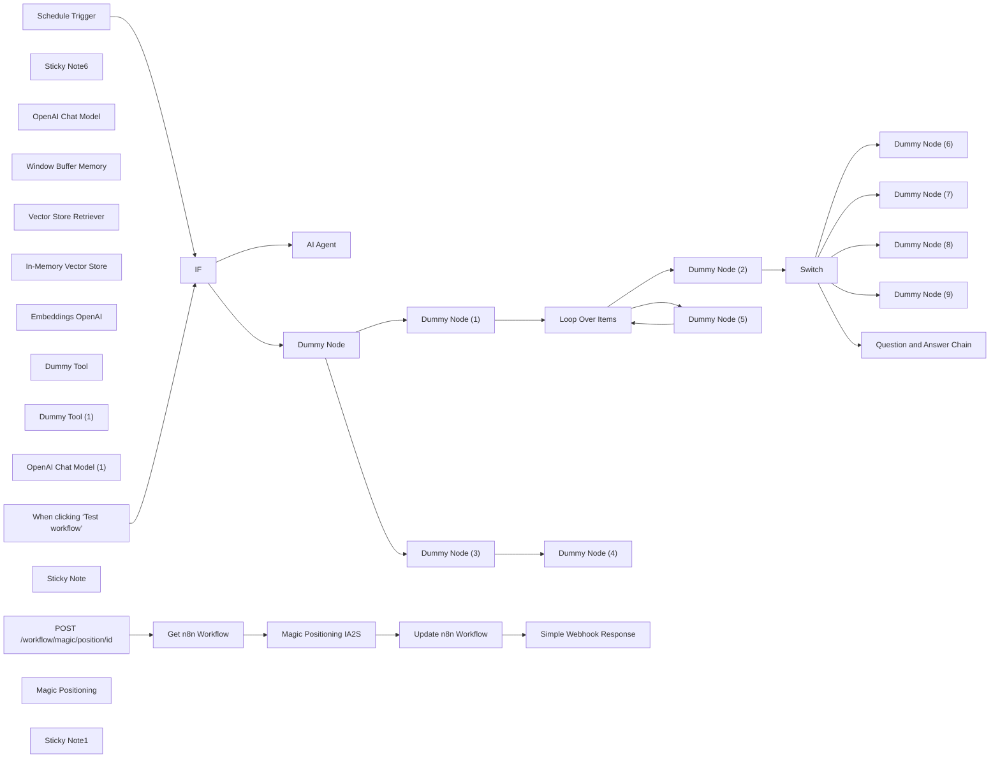

## Fluxo (.json) :

```json
{
  "nodes": [
    {
      "id": "25a059ad-c3d1-4848-a729-cbb50254e94a",
      "name": "When clicking ‘Test workflow’",
      "type": "n8n-nodes-base.manualTrigger",
      "position": [
        40,
        980
      ],
      "parameters": {},
      "typeVersion": 1
    },
    {
      "id": "3ae8469e-cbb4-436a-b5c2-2e6a146c5666",
      "name": "Sticky Note6",
      "type": "n8n-nodes-base.stickyNote",
      "position": [
        -40,
        600
      ],
      "parameters": {
        "color": 7,
        "width": 2160,
        "height": 1540,
        "content": "# Try me out !\n## Dummy Ugly Workflow\n---\nTry mixing it up of changing some connections to see how this workflow gets positionned !\n\n1. **Save this workfow** (Ctrl + S)\n2. **Execute the Magic Positioning Node**\n3. **Reload the page** (Ctrl + R)\n..watch the magic !"
      },
      "typeVersion": 1
    },
    {
      "id": "4a67e81f-1638-4047-b9e7-85247f4cc291",
      "name": "AI Agent",
      "type": "@n8n/n8n-nodes-langchain.agent",
      "position": [
        480,
        1420
      ],
      "parameters": {
        "options": {}
      },
      "typeVersion": 1.2
    },
    {
      "id": "56293367-e676-44d6-ac05-8432c8181299",
      "name": "OpenAI Chat Model",
      "type": "@n8n/n8n-nodes-langchain.lmChatOpenAi",
      "position": [
        420,
        1660
      ],
      "parameters": {
        "options": {}
      },
      "credentials": {
        "openAiApi": {
          "id": "3",
          "name": "Together.ai (lucas.photos)"
        }
      },
      "typeVersion": 1
    },
    {
      "id": "cacdff1d-f65d-40f3-b0b5-9913a8e249ed",
      "name": "Window Buffer Memory",
      "type": "@n8n/n8n-nodes-langchain.memoryBufferWindow",
      "position": [
        880,
        1760
      ],
      "parameters": {},
      "typeVersion": 1.3
    },
    {
      "id": "9ccd8613-ded7-421a-bf2d-95e6465d9a34",
      "name": "Vector Store Retriever",
      "type": "@n8n/n8n-nodes-langchain.retrieverVectorStore",
      "position": [
        1780,
        1800
      ],
      "parameters": {},
      "typeVersion": 1
    },
    {
      "id": "cc5df13b-2d2e-4c59-b3e3-dfbcbffcfdf9",
      "name": "In-Memory Vector Store",
      "type": "@n8n/n8n-nodes-langchain.vectorStoreInMemory",
      "position": [
        1060,
        1880
      ],
      "parameters": {},
      "typeVersion": 1
    },
    {
      "id": "8c71b8fc-0699-4000-8021-fab3529690c6",
      "name": "Embeddings OpenAI",
      "type": "@n8n/n8n-nodes-langchain.embeddingsOpenAi",
      "position": [
        1660,
        1940
      ],
      "parameters": {
        "options": {}
      },
      "credentials": {
        "openAiApi": {
          "id": "3",
          "name": "Together.ai (lucas.photos)"
        }
      },
      "typeVersion": 1.1
    },
    {
      "id": "83bbca90-f9aa-4aae-9f1b-68d7eb1e7272",
      "name": "Question and Answer Chain",
      "type": "@n8n/n8n-nodes-langchain.chainRetrievalQa",
      "position": [
        760,
        1540
      ],
      "parameters": {
        "options": {}
      },
      "typeVersion": 1.4
    },
    {
      "id": "6d124c93-a476-4b54-ad65-391eaf948605",
      "name": "Switch",
      "type": "n8n-nodes-base.switch",
      "position": [
        1360,
        1220
      ],
      "parameters": {
        "rules": {
          "values": [
            {
              "conditions": {
                "options": {
                  "version": 2,
                  "leftValue": "",
                  "caseSensitive": true,
                  "typeValidation": "strict"
                },
                "combinator": "and",
                "conditions": [
                  {
                    "operator": {
                      "type": "string",
                      "operation": "equals"
                    },
                    "leftValue": "",
                    "rightValue": ""
                  }
                ]
              }
            },
            {
              "conditions": {
                "options": {
                  "version": 2,
                  "leftValue": "",
                  "caseSensitive": true,
                  "typeValidation": "strict"
                },
                "combinator": "and",
                "conditions": [
                  {
                    "id": "5f1ec5b3-385c-4421-9791-a612f61cc634",
                    "operator": {
                      "name": "filter.operator.equals",
                      "type": "string",
                      "operation": "equals"
                    },
                    "leftValue": "",
                    "rightValue": ""
                  }
                ]
              }
            },
            {
              "conditions": {
                "options": {
                  "version": 2,
                  "leftValue": "",
                  "caseSensitive": true,
                  "typeValidation": "strict"
                },
                "combinator": "and",
                "conditions": [
                  {
                    "id": "737211eb-e4e2-4bb2-a32b-a6d819e158ba",
                    "operator": {
                      "name": "filter.operator.equals",
                      "type": "string",
                      "operation": "equals"
                    },
                    "leftValue": "",
                    "rightValue": ""
                  }
                ]
              }
            },
            {
              "conditions": {
                "options": {
                  "version": 2,
                  "leftValue": "",
                  "caseSensitive": true,
                  "typeValidation": "strict"
                },
                "combinator": "and",
                "conditions": [
                  {
                    "id": "3a420a92-cd22-46d4-b2fa-1dffa6b28374",
                    "operator": {
                      "name": "filter.operator.equals",
                      "type": "string",
                      "operation": "equals"
                    },
                    "leftValue": "",
                    "rightValue": ""
                  }
                ]
              }
            },
            {
              "conditions": {
                "options": {
                  "version": 2,
                  "leftValue": "",
                  "caseSensitive": true,
                  "typeValidation": "strict"
                },
                "combinator": "and",
                "conditions": [
                  {
                    "id": "29c0fce3-aefb-4caf-a076-a548c108b641",
                    "operator": {
                      "name": "filter.operator.equals",
                      "type": "string",
                      "operation": "equals"
                    },
                    "leftValue": "",
                    "rightValue": ""
                  }
                ]
              }
            }
          ]
        },
        "options": {}
      },
      "typeVersion": 3.2
    },
    {
      "id": "886142ac-822e-4e25-875c-65632f682140",
      "name": "IF",
      "type": "n8n-nodes-base.if",
      "position": [
        440,
        1480
      ],
      "parameters": {},
      "typeVersion": 1
    },
    {
      "id": "3a247df2-ea43-40f0-a395-0ce160fcbc92",
      "name": "Dummy Node",
      "type": "n8n-nodes-base.noOp",
      "notes": "Big description of what happens here",
      "position": [
        1360,
        1520
      ],
      "parameters": {},
      "notesInFlow": true,
      "typeVersion": 1
    },
    {
      "id": "53e46b03-026a-4645-b9c7-e913eea62fe9",
      "name": "Dummy Node (1)",
      "type": "n8n-nodes-base.noOp",
      "notes": "Big description of what happens here",
      "position": [
        700,
        900
      ],
      "parameters": {},
      "notesInFlow": true,
      "typeVersion": 1
    },
    {
      "id": "0d9a5f0a-e224-41b9-8ef0-4ba16e71c237",
      "name": "Loop Over Items",
      "type": "n8n-nodes-base.splitInBatches",
      "position": [
        920,
        980
      ],
      "parameters": {
        "options": {},
        "batchSize": "=1"
      },
      "typeVersion": 3
    },
    {
      "id": "2442eccb-8f95-4c2d-ae93-7e216e93e7f4",
      "name": "Dummy Node (2)",
      "type": "n8n-nodes-base.noOp",
      "notes": "Big description of what happens here",
      "position": [
        1140,
        940
      ],
      "parameters": {},
      "notesInFlow": true,
      "typeVersion": 1
    },
    {
      "id": "2de8782c-f848-44cc-87b1-307506cdca38",
      "name": "Dummy Node (3)",
      "type": "n8n-nodes-base.noOp",
      "notes": "Big description of what happens here",
      "position": [
        700,
        1200
      ],
      "parameters": {},
      "notesInFlow": true,
      "typeVersion": 1
    },
    {
      "id": "f1bb16c1-b330-4208-b629-5a6e074b9178",
      "name": "Dummy Node (4)",
      "type": "n8n-nodes-base.noOp",
      "notes": "Big description of what happens here",
      "position": [
        900,
        1460
      ],
      "parameters": {},
      "notesInFlow": true,
      "typeVersion": 1
    },
    {
      "id": "93c393c5-d258-431e-ba22-c7de7f6560f1",
      "name": "Dummy Node (5)",
      "type": "n8n-nodes-base.noOp",
      "notes": "Big description of what happens here",
      "position": [
        1140,
        1200
      ],
      "parameters": {},
      "notesInFlow": true,
      "typeVersion": 1
    },
    {
      "id": "c55e1584-4bab-4406-9b6c-a7ba96828c4b",
      "name": "Dummy Node (6)",
      "type": "n8n-nodes-base.noOp",
      "notes": "Big description of what happens here",
      "position": [
        1580,
        980
      ],
      "parameters": {},
      "notesInFlow": true,
      "typeVersion": 1
    },
    {
      "id": "612a7a10-242e-4bd0-b4bd-6089e1fcd78b",
      "name": "Dummy Node (7)",
      "type": "n8n-nodes-base.noOp",
      "notes": "Big description of what happens here",
      "position": [
        1780,
        1300
      ],
      "parameters": {},
      "notesInFlow": true,
      "typeVersion": 1
    },
    {
      "id": "eb5d2519-2f1e-4841-b8e8-58333cf9293d",
      "name": "Dummy Node (8)",
      "type": "n8n-nodes-base.noOp",
      "notes": "Big description of what happens here",
      "position": [
        1340,
        1720
      ],
      "parameters": {},
      "notesInFlow": true,
      "typeVersion": 1
    },
    {
      "id": "661d3849-155b-4911-b923-4cd2a4227202",
      "name": "Dummy Node (9)",
      "type": "n8n-nodes-base.noOp",
      "notes": "Big description of what happens here",
      "position": [
        1580,
        1640
      ],
      "parameters": {},
      "notesInFlow": true,
      "typeVersion": 1
    },
    {
      "id": "af2cca30-302d-47e1-bebc-3f6a92cef939",
      "name": "Dummy Tool",
      "type": "@n8n/n8n-nodes-langchain.toolHttpRequest",
      "position": [
        720,
        1660
      ],
      "parameters": {
        "url": "https://www.example.com"
      },
      "typeVersion": 1.1
    },
    {
      "id": "7dded6b7-c60a-45e4-a49f-338bf4b549b8",
      "name": "Dummy Tool (1)",
      "type": "@n8n/n8n-nodes-langchain.toolHttpRequest",
      "position": [
        680,
        1760
      ],
      "parameters": {
        "url": "https://www.example.com"
      },
      "typeVersion": 1.1
    },
    {
      "id": "d4f0d637-abda-4e79-ae6b-7af7050d6768",
      "name": "OpenAI Chat Model (1)",
      "type": "@n8n/n8n-nodes-langchain.lmChatOpenAi",
      "position": [
        1360,
        1880
      ],
      "parameters": {
        "options": {}
      },
      "credentials": {
        "openAiApi": {
          "id": "3",
          "name": "Together.ai (lucas.photos)"
        }
      },
      "typeVersion": 1
    },
    {
      "id": "e5ea3f5b-cd91-49b6-9191-f60a0d19bf40",
      "name": "Update n8n Workflow",
      "type": "n8n-nodes-base.n8n",
      "position": [
        700,
        380
      ],
      "parameters": {
        "operation": "update",
        "workflowId": {
          "__rl": true,
          "mode": "id",
          "value": "={{ $('POST /workflow/magic/position/id').last().json.body.workflow_id }}"
        },
        "requestOptions": {},
        "workflowObject": "={{ $json.toJsonString() }}"
      },
      "credentials": {
        "n8nApi": {
          "id": "10",
          "name": "n8n account"
        }
      },
      "typeVersion": 1
    },
    {
      "id": "5df2795d-f1fa-437f-9444-92a0ec4003da",
      "name": "Magic Positioning IA2S",
      "type": "n8n-nodes-base.httpRequest",
      "position": [
        480,
        380
      ],
      "parameters": {
        "url": "https://api.ia2s.app/webhook/workflow/magic/position",
        "method": "POST",
        "options": {},
        "sendBody": true,
        "bodyParameters": {
          "parameters": [
            {
              "name": "workflow",
              "value": "={{ $json }}"
            }
          ]
        }
      },
      "typeVersion": 4.2
    },
    {
      "id": "f6820c3e-d0ec-45ef-92ce-b6a7466997fb",
      "name": "POST /workflow/magic/position/id",
      "type": "n8n-nodes-base.webhook",
      "position": [
        40,
        380
      ],
      "webhookId": "3f637a82-df5e-4580-b1af-81ebec0b345a",
      "parameters": {
        "path": "workflow/magic/positioning/id",
        "options": {},
        "httpMethod": "POST",
        "responseMode": "responseNode"
      },
      "typeVersion": 2
    },
    {
      "id": "f0a4176b-1fa4-4884-8a51-ecc00af7d246",
      "name": "Sticky Note",
      "type": "n8n-nodes-base.stickyNote",
      "position": [
        -40,
        -60
      ],
      "parameters": {
        "color": 6,
        "width": 300,
        "height": 380,
        "content": "## Put this node in any workflow.\n1. **Save the workfow** (Ctrl + S)\n2. **Execute the Magic Positioning Node**\n3. **Reload the page** (Ctrl + R)\n..and voilà !"
      },
      "typeVersion": 1
    },
    {
      "id": "20d8af29-e07a-4205-a7b6-223b2cdb801a",
      "name": "Get n8n Workflow",
      "type": "n8n-nodes-base.n8n",
      "position": [
        260,
        380
      ],
      "parameters": {
        "operation": "get",
        "workflowId": {
          "__rl": true,
          "mode": "id",
          "value": "={{ $json.body.workflow_id }}"
        },
        "requestOptions": {}
      },
      "credentials": {
        "n8nApi": {
          "id": "10",
          "name": "n8n account"
        }
      },
      "typeVersion": 1
    },
    {
      "id": "468a95e2-11bc-4bf6-be8a-4eb5f89654ef",
      "name": "Simple Webhook Response",
      "type": "n8n-nodes-base.respondToWebhook",
      "position": [
        920,
        380
      ],
      "parameters": {
        "options": {},
        "respondWith": "text",
        "responseBody": "Workflow Updated"
      },
      "typeVersion": 1.1
    },
    {
      "id": "496ba599-cf72-4ba1-8e50-2e369f199b6f",
      "name": "Schedule Trigger",
      "type": "n8n-nodes-base.scheduleTrigger",
      "position": [
        80,
        1260
      ],
      "parameters": {
        "rule": {
          "interval": [
            {}
          ]
        }
      },
      "typeVersion": 1.2
    },
    {
      "id": "107e6cb3-673b-4554-b42c-c9d2d7a00ce9",
      "name": "Magic Positioning",
      "type": "n8n-nodes-base.httpRequest",
      "position": [
        40,
        160
      ],
      "parameters": {
        "url": "=https://{{ \"n8n.your-instance-url.com\" }}/webhook/workflow/magic/positioning/id",
        "method": "POST",
        "options": {},
        "sendBody": true,
        "bodyParameters": {
          "parameters": [
            {
              "name": "workflow_id",
              "value": "={{ $workflow.id }}"
            }
          ]
        }
      },
      "typeVersion": 4.2
    },
    {
      "id": "55e8a9fc-1699-4890-b73e-a6201259a559",
      "name": "Sticky Note1",
      "type": "n8n-nodes-base.stickyNote",
      "position": [
        300,
        -60
      ],
      "parameters": {
        "color": 5,
        "width": 400,
        "height": 380,
        "content": "# Setup :\n---\n\n1. **Open the Webhook node** \n('Post /workflow/magic/position/id')\n2. Copy the **Production URL**\n3. Go to the **'Magic Positioning' Http Request** Node\n4. **Paste the URL**\n5. Select your **n8n credentials** in the n8n nodes"
      },
      "typeVersion": 1
    }
  ],
  "pinData": {
    "POST /workflow/magic/position/id": [
      {
        "body": {
          "workflow_id": "zwa7VqGx8GrqsPhb"
        },
        "query": {},
        "params": {},
        "headers": {
          "host": "api.ia2s.app",
          "accept": "application/json,text/html,application/xhtml+xml,application/xml,text/*;q=0.9, image/*;q=0.8, */*;q=0.7",
          "user-agent": "axios/1.7.4",
          "content-type": "application/json",
          "content-length": "34",
          "accept-encoding": "gzip, compress, deflate, br",
          "x-forwarded-for": "172.25.0.1",
          "x-forwarded-host": "api.ia2s.app",
          "x-forwarded-proto": "https"
        },
        "webhookUrl": "https://api.ia2s.app/webhook/workflow/magic/positioning/id",
        "executionMode": "production"
      }
    ]
  },
  "connections": {
    "IF": {
      "main": [
        [
          {
            "node": "Dummy Node",
            "type": "main",
            "index": 0
          }
        ],
        [
          {
            "node": "AI Agent",
            "type": "main",
            "index": 0
          }
        ]
      ]
    },
    "Switch": {
      "main": [
        [
          {
            "node": "Dummy Node (6)",
            "type": "main",
            "index": 0
          }
        ],
        [
          {
            "node": "Dummy Node (7)",
            "type": "main",
            "index": 0
          }
        ],
        [
          {
            "node": "Dummy Node (8)",
            "type": "main",
            "index": 0
          }
        ],
        [
          {
            "node": "Dummy Node (9)",
            "type": "main",
            "index": 0
          }
        ],
        [
          {
            "node": "Question and Answer Chain",
            "type": "main",
            "index": 0
          }
        ]
      ]
    },
    "Dummy Node": {
      "main": [
        [
          {
            "node": "Dummy Node (1)",
            "type": "main",
            "index": 0
          },
          {
            "node": "Dummy Node (3)",
            "type": "main",
            "index": 0
          }
        ]
      ]
    },
    "Dummy Tool": {
      "ai_tool": [
        [
          {
            "node": "AI Agent",
            "type": "ai_tool",
            "index": 0
          }
        ]
      ]
    },
    "Dummy Node (1)": {
      "main": [
        [
          {
            "node": "Loop Over Items",
            "type": "main",
            "index": 0
          }
        ]
      ]
    },
    "Dummy Node (2)": {
      "main": [
        [
          {
            "node": "Switch",
            "type": "main",
            "index": 0
          }
        ]
      ]
    },
    "Dummy Node (3)": {
      "main": [
        [
          {
            "node": "Dummy Node (4)",
            "type": "main",
            "index": 0
          }
        ]
      ]
    },
    "Dummy Node (5)": {
      "main": [
        [
          {
            "node": "Loop Over Items",
            "type": "main",
            "index": 0
          }
        ]
      ]
    },
    "Dummy Tool (1)": {
      "ai_tool": [
        [
          {
            "node": "AI Agent",
            "type": "ai_tool",
            "index": 0
          }
        ]
      ]
    },
    "Loop Over Items": {
      "main": [
        [
          {
            "node": "Dummy Node (2)",
            "type": "main",
            "index": 0
          }
        ],
        [
          {
            "node": "Dummy Node (5)",
            "type": "main",
            "index": 0
          }
        ]
      ]
    },
    "Get n8n Workflow": {
      "main": [
        [
          {
            "node": "Magic Positioning IA2S",
            "type": "main",
            "index": 0
          }
        ]
      ]
    },
    "Schedule Trigger": {
      "main": [
        [
          {
            "node": "IF",
            "type": "main",
            "index": 0
          }
        ]
      ]
    },
    "Embeddings OpenAI": {
      "ai_embedding": [
        [
          {
            "node": "In-Memory Vector Store",
            "type": "ai_embedding",
            "index": 0
          }
        ]
      ]
    },
    "OpenAI Chat Model": {
      "ai_languageModel": [
        [
          {
            "node": "AI Agent",
            "type": "ai_languageModel",
            "index": 0
          }
        ]
      ]
    },
    "Update n8n Workflow": {
      "main": [
        [
          {
            "node": "Simple Webhook Response",
            "type": "main",
            "index": 0
          }
        ]
      ]
    },
    "Window Buffer Memory": {
      "ai_memory": [
        [
          {
            "node": "AI Agent",
            "type": "ai_memory",
            "index": 0
          }
        ]
      ]
    },
    "OpenAI Chat Model (1)": {
      "ai_languageModel": [
        [
          {
            "node": "Question and Answer Chain",
            "type": "ai_languageModel",
            "index": 0
          }
        ]
      ]
    },
    "In-Memory Vector Store": {
      "ai_vectorStore": [
        [
          {
            "node": "Vector Store Retriever",
            "type": "ai_vectorStore",
            "index": 0
          }
        ]
      ]
    },
    "Magic Positioning IA2S": {
      "main": [
        [
          {
            "node": "Update n8n Workflow",
            "type": "main",
            "index": 0
          }
        ]
      ]
    },
    "Vector Store Retriever": {
      "ai_retriever": [
        [
          {
            "node": "Question and Answer Chain",
            "type": "ai_retriever",
            "index": 0
          }
        ]
      ]
    },
    "POST /workflow/magic/position/id": {
      "main": [
        [
          {
            "node": "Get n8n Workflow",
            "type": "main",
            "index": 0
          }
        ]
      ]
    },
    "When clicking ‘Test workflow’": {
      "main": [
        [
          {
            "node": "IF",
            "type": "main",
            "index": 0
          }
        ]
      ]
    }
  }
}
```

<a id="template-1609"></a>

## Template 1609 - Triagem automática de candidatos com IA

- **Nome:** Triagem automática de candidatos com IA
- **Descrição:** Fluxo automatizado que recebe candidaturas, valida e extrai o currículo, compara o texto do currículo com a descrição da vaga usando um agente de IA e atualiza o registro do candidato no ERP, definindo status e justificativas.
- **Funcionalidade:** • Recepção de candidatura via webhook: Inicia o processo quando um candidato é criado no sistema.
• Validação de anexo de currículo: Verifica se existe link/arquivo de currículo e divide o fluxo conforme o tipo de arquivo.
• Download de anexo e conversão para texto: Baixa o currículo (PDF, texto, imagens ou Word) e converte para texto pesquisável.
• Obtenção da descrição da vaga: Recupera os dados da vaga aplicada para usar como referência na avaliação.
• Avaliação por agente de IA: Compara o texto do currículo com a descrição da vaga e gera Fit Level, Score, Rating e Justificativa.
• Conversão do output da IA para campos estruturados: Extrai e mapeia Fit Level, Score, Rating e Justificativa para campos do candidato.
• Atualização do registro no ERP: Grava a pontuação, justificativa e nível de fit no registro do candidato.
• Regras de decisão automáticas: Rejeita automaticamente candidatos sem currículo e rejeita/aceita com base em score (ex.: score < 80 → rejeitar).
• Notificações: Envia comunicações (ex.: e-mail ou WhatsApp) após decisão ou atualização de status.
- **Ferramentas:** • ERPNext: Sistema de gestão onde os registros de candidatos e vagas são consultados e atualizados.
• Modelo de IA (Google Gemini / PaLM): Agente de linguagem usado para comparar currículo e descrição da vaga e gerar avaliação e justificativa.
• Serviço de extração de texto de arquivos PDF/Word/Imagem: Ferramenta ou biblioteca que converte currículos em texto para análise.
• Serviços HTTP / hospedagem de arquivos: Utilizados para download dos anexos de currículo via link.
• Microsoft Outlook: Para envio de e-mails de notificação ao candidato ou à equipe.
• WhatsApp Business Cloud: Para envio de mensagens de notificação via WhatsApp.


## Fluxo visual

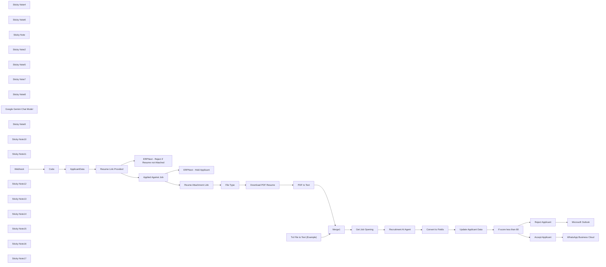

## Fluxo (.json) :

```json
{
  "meta": {
    "instanceId": "e4f78845dfed9ddcfba1945ae00d12e9a7d76eab052afd19299228ce02349d86"
  },
  "nodes": [
    {
      "id": "a8b14ffd-4a8b-4a3d-ba54-5997197e5457",
      "name": "Sticky Note4",
      "type": "n8n-nodes-base.stickyNote",
      "position": [
        -2880,
        340
      ],
      "parameters": {
        "color": 6,
        "width": 429.96763122593137,
        "height": 322,
        "content": "### Get Apprropraite Data\nThese Nodes are to extract only the Required Data from the Webhook Node"
      },
      "typeVersion": 1
    },
    {
      "id": "c8ae8766-3942-4b8d-8815-9e96ab9dc1de",
      "name": "Sticky Note6",
      "type": "n8n-nodes-base.stickyNote",
      "position": [
        -840,
        340
      ],
      "parameters": {
        "color": 5,
        "width": 677,
        "height": 660,
        "content": "### N8N has the Node to convert PDF to Text, but PDF should be converted from Text. Scanned Image PDF will not be converted. \n\nYou can use ohter nodes here to convert word file to text or JPG to Text, possiblities are limitless."
      },
      "typeVersion": 1
    },
    {
      "id": "529f5756-c1a2-4c41-8245-38164543eb8e",
      "name": "Sticky Note",
      "type": "n8n-nodes-base.stickyNote",
      "position": [
        -1334.2232779572741,
        340
      ],
      "parameters": {
        "color": 7,
        "width": 477.2230145794152,
        "height": 648.5051458745238,
        "content": "### Download the File.\nIf you are using S3 to Upload attachments you can use S3 node here to download the attachment\n"
      },
      "typeVersion": 1
    },
    {
      "id": "101c6544-d319-495d-a14f-e180f51be1f0",
      "name": "Code",
      "type": "n8n-nodes-base.code",
      "position": [
        -2840,
        480
      ],
      "parameters": {
        "jsCode": "// Loop over input items and add a new field called 'myNewField' to the JSON of each one\nfor (const item of $input.all()) {\n  item.json.myNewField = 1;\n}\n\nreturn $input.all();"
      },
      "typeVersion": 2
    },
    {
      "id": "5d0a1090-9be9-41e1-9a15-26bd6498fd95",
      "name": "Sticky Note2",
      "type": "n8n-nodes-base.stickyNote",
      "position": [
        -3300,
        340
      ],
      "parameters": {
        "color": 5,
        "width": 398,
        "height": 642,
        "content": "### Applicant Applied for Job in ERPNext\n\nYou need to go to Webhooks in ERPNext and Create a Webhook on Job Applicant Doc Type and trigger should be on insert.\n\nFirst do the Test Wehbook and Pin the Webhook.\n\nFollow the Tutorial"
      },
      "typeVersion": 1
    },
    {
      "id": "4ed5dfbf-9b16-4f62-83e2-abb63421809b",
      "name": "ApplicantData",
      "type": "n8n-nodes-base.set",
      "position": [
        -2640,
        480
      ],
      "parameters": {
        "options": {},
        "assignments": {
          "assignments": [
            {
              "id": "8d600a4f-14d3-4840-aea0-665d26e7771b",
              "name": "body",
              "type": "object",
              "value": "={{ $json.body }}"
            }
          ]
        }
      },
      "typeVersion": 3.4
    },
    {
      "id": "4f141057-8dd6-429a-b48f-fd80b2666882",
      "name": "ERPNext - Reject if Resume not Attached",
      "type": "n8n-nodes-base.erpNext",
      "position": [
        -2380,
        800
      ],
      "parameters": {
        "docType": "Job%20Applicant",
        "operation": "update",
        "properties": {
          "customProperty": [
            {
              "field": "status",
              "value": "Rejected"
            }
          ]
        },
        "documentName": "={{ $('ApplicantData').item.json.body.name }}"
      },
      "credentials": {
        "erpNextApi": {
          "id": "PInpnsxvPkvaiW0z",
          "name": "ERPNext account"
        }
      },
      "typeVersion": 1
    },
    {
      "id": "de0a9900-4109-4092-ad3b-f36f02517fdf",
      "name": "Applied Against Job",
      "type": "n8n-nodes-base.if",
      "position": [
        -2140,
        460
      ],
      "parameters": {
        "options": {
          "ignoreCase": true
        },
        "conditions": {
          "options": {
            "version": 2,
            "leftValue": "",
            "caseSensitive": false,
            "typeValidation": "strict"
          },
          "combinator": "and",
          "conditions": [
            {
              "id": "abbbd6f3-838e-43fb-a809-6bfffb153244",
              "operator": {
                "type": "string",
                "operation": "notEquals"
              },
              "leftValue": "={{ $json.body.Job_opening }}",
              "rightValue": "None"
            }
          ]
        }
      },
      "typeVersion": 2.2
    },
    {
      "id": "1c8e889b-dcd9-4807-8528-a7f0300bf558",
      "name": "ERPNext - Hold Applicant",
      "type": "n8n-nodes-base.erpNext",
      "position": [
        -2180,
        800
      ],
      "parameters": {
        "docType": "Job%20Applicant",
        "operation": "update",
        "properties": {
          "customProperty": [
            {
              "field": "status",
              "value": "Hold"
            }
          ]
        },
        "documentName": "={{ $('ApplicantData').item.json.body.name }}"
      },
      "credentials": {
        "erpNextApi": {
          "id": "PInpnsxvPkvaiW0z",
          "name": "ERPNext account"
        }
      },
      "typeVersion": 1
    },
    {
      "id": "548c61dd-bcc3-4a7f-970e-5ff734926499",
      "name": "Sticky Note5",
      "type": "n8n-nodes-base.stickyNote",
      "position": [
        -140,
        343.6198532285906
      ],
      "parameters": {
        "color": 6,
        "width": 258,
        "height": 638.3801467714094,
        "content": "### Get Job Opening Data\nFrom ERPNext\n\nAs Job is applied against a specific Job, you can now get the Job Opening Data which must be having the Job Description."
      },
      "typeVersion": 1
    },
    {
      "id": "6266e3e0-9bd7-4ab6-a488-55f1b524000f",
      "name": "Get Job Opening",
      "type": "n8n-nodes-base.erpNext",
      "position": [
        -80,
        620
      ],
      "parameters": {
        "docType": "Job%20Opening",
        "operation": "get",
        "documentName": "={{ $('ApplicantData').item.json.body.Job_opening }}"
      },
      "credentials": {
        "erpNextApi": {
          "id": "PInpnsxvPkvaiW0z",
          "name": "ERPNext account"
        }
      },
      "typeVersion": 1
    },
    {
      "id": "536755cf-19d6-44a4-8449-635f4562b61f",
      "name": "Sticky Note7",
      "type": "n8n-nodes-base.stickyNote",
      "position": [
        140,
        320
      ],
      "parameters": {
        "color": 4,
        "width": 406.7864870360547,
        "height": 662,
        "content": "### AI Agent to do its Job\nOpenAI\n\nSee full prompt which tells this AI Agent that you are a recruitment sepcialist and all the roles are defined in this node.\n\nIt will shortlist the candidate and will give the descriptive output with candidate fitlevel, score, rating and justification."
      },
      "typeVersion": 1
    },
    {
      "id": "0072826c-0e24-4c1f-89f9-388dc6e59ae5",
      "name": "Sticky Note8",
      "type": "n8n-nodes-base.stickyNote",
      "position": [
        980,
        320
      ],
      "parameters": {
        "color": 6,
        "width": 438,
        "height": 662,
        "content": "### Update data in ERPNext\nHere First node will do the formatting of the data and will convert output from AI Agent to Appropriate Fields which are defined in ERPNext and then will Send to Next Node\n\n### ERPNext (HTTP Node)\nThis node will take the Data from Previouis Node and will update the Applicant Data in ERPNext"
      },
      "typeVersion": 1
    },
    {
      "id": "28f23589-0608-4ed0-9e70-b6cbd31aa387",
      "name": "Google Gemini Chat Model",
      "type": "@n8n/n8n-nodes-langchain.lmChatGoogleGemini",
      "position": [
        220,
        800
      ],
      "parameters": {
        "options": {},
        "modelName": "models/gemini-2.0-flash-exp"
      },
      "credentials": {
        "googlePalmApi": {
          "id": "pKFvSpPWSRFpnBoB",
          "name": "Google Gemini(PaLM) Api account"
        }
      },
      "typeVersion": 1
    },
    {
      "id": "8bdd8f1c-e546-4ffb-a058-a3271fcad156",
      "name": "Convert to Fields",
      "type": "n8n-nodes-base.code",
      "position": [
        660,
        620
      ],
      "parameters": {
        "jsCode": "// Input text from the `output` field\nconst textOutput = $json.output || '';\n\n// Function to extract values from the text\nfunction extractFields(text) {\n    const fields = {};\n\n    // Regular expressions to extract each field\n    const fitLevelMatch = text.match(/FitLevel:\\s*(.+)\\n/);\n    const scoreMatch = text.match(/Score:\\s*(\\d+)\\n/);\n    const ratingMatch = text.match(/Rating:\\s*(\\d+)\\n/);\n    const justificationMatch = text.match(/Justification:\\s*([\\s\\S]+)/);\n\n    // Assign extracted values to the fields\n    fields.fit_level = fitLevelMatch ? fitLevelMatch[1].trim() : null;\n    fields.score = scoreMatch ? scoreMatch[1].trim() : null;\n    fields.applicant_rating = ratingMatch ? ratingMatch[1].trim() : null;\n    fields.justification_by_ai = justificationMatch ? justificationMatch[1].trim() : null;\n\n    return fields;\n}\n\n// Extract fields from the output\nconst extractedFields = extractFields(textOutput);\n\n// Return the fields as JSON\nreturn {\n    json: extractedFields\n};\n"
      },
      "typeVersion": 2
    },
    {
      "id": "ae1dc677-9ad7-4138-969f-2ee73b8537f9",
      "name": "Sticky Note9",
      "type": "n8n-nodes-base.stickyNote",
      "position": [
        1460,
        320
      ],
      "parameters": {
        "color": 5,
        "width": 226.43884349833064,
        "height": 682,
        "content": "### Selected or Rejected\n\nThe criteia for score is that if Score is 80 or above Candidate will be selected Else Rejected."
      },
      "typeVersion": 1
    },
    {
      "id": "090f4f22-639a-4fc7-8351-04dafcc09638",
      "name": "If score less than 80",
      "type": "n8n-nodes-base.if",
      "position": [
        1520,
        620
      ],
      "parameters": {
        "options": {},
        "conditions": {
          "options": {
            "version": 2,
            "leftValue": "",
            "caseSensitive": true,
            "typeValidation": "loose"
          },
          "combinator": "and",
          "conditions": [
            {
              "id": "5f845292-f4aa-44fb-a644-06c0736c3503",
              "operator": {
                "type": "number",
                "operation": "lt"
              },
              "leftValue": "={{ $('Convert to Fields').item.json.score }}",
              "rightValue": 80
            }
          ]
        },
        "looseTypeValidation": true
      },
      "typeVersion": 2.2
    },
    {
      "id": "0d7a84c2-0b1d-4e61-a3df-b81dd7981f1a",
      "name": "Reject Applicant",
      "type": "n8n-nodes-base.httpRequest",
      "position": [
        1880,
        460
      ],
      "parameters": {
        "url": "=https://erpnext.syncbricks.com/api/resource/Job Applicant/{{ $('ApplicantData').item.json.body.name }}",
        "method": "PUT",
        "options": {},
        "jsonBody": "={\n  \"status\": \"Rejected\"\n}",
        "sendBody": true,
        "sendHeaders": true,
        "specifyBody": "json",
        "authentication": "predefinedCredentialType",
        "headerParameters": {
          "parameters": [
            {}
          ]
        },
        "nodeCredentialType": "erpNextApi"
      },
      "credentials": {
        "erpNextApi": {
          "id": "PInpnsxvPkvaiW0z",
          "name": "ERPNext account"
        }
      },
      "typeVersion": 4.2
    },
    {
      "id": "a55e70d1-7070-407d-9107-41cb33d2f0ae",
      "name": "Update Applicant Data",
      "type": "n8n-nodes-base.httpRequest",
      "position": [
        1140,
        620
      ],
      "parameters": {
        "url": "=https://erpnext.syncbricks.com/api/resource/Job Applicant/{{ $('ApplicantData').item.json.body.name }}",
        "method": "PUT",
        "options": {},
        "jsonBody": "={\n  \"applicant_rating\": \"{{ $json.applicant_rating }}\",\n  \"custom_justification_by_ai\": \"{{ $json.justification_by_ai }}\",\n  \"custom_fit_level\": \"{{ $json.fit_level }}\",\n  \"custom_score\":\"{{ $json.score }}\"\n}\n\n\n\n\n",
        "sendBody": true,
        "sendHeaders": true,
        "specifyBody": "json",
        "authentication": "predefinedCredentialType",
        "headerParameters": {
          "parameters": [
            {}
          ]
        },
        "nodeCredentialType": "erpNextApi"
      },
      "credentials": {
        "erpNextApi": {
          "id": "PInpnsxvPkvaiW0z",
          "name": "ERPNext account"
        }
      },
      "typeVersion": 4.2
    },
    {
      "id": "044d26cb-2b34-4613-8d1d-20f40b47da29",
      "name": "Reume Attachment Link",
      "type": "n8n-nodes-base.set",
      "position": [
        -1820,
        560
      ],
      "parameters": {
        "options": {},
        "assignments": {
          "assignments": [
            {
              "id": "7d0b8b98-0976-4c19-bc7c-738fabd60d28",
              "name": "body.resume_attachment",
              "type": "string",
              "value": "={{ $json.body.resume_link }}"
            }
          ]
        }
      },
      "typeVersion": 3.4
    },
    {
      "id": "a17e9c94-0ec7-430f-adf3-109bcccf3bcb",
      "name": "Sticky Note10",
      "type": "n8n-nodes-base.stickyNote",
      "position": [
        -2874.102923130834,
        680
      ],
      "parameters": {
        "color": 3,
        "width": 875.658619343735,
        "height": 302,
        "content": "## Resume Available?\nFirst Node : If Resume is not attached or Then Job Applicant will be Rejected\nSecond Node : If job is not applied against opening then the Applicant will be kept on hold."
      },
      "typeVersion": 1
    },
    {
      "id": "e2508130-4ecd-4d19-b41c-293006d17507",
      "name": "Resume Link Provided",
      "type": "n8n-nodes-base.if",
      "position": [
        -2400,
        480
      ],
      "parameters": {
        "options": {},
        "conditions": {
          "options": {
            "version": 2,
            "leftValue": "",
            "caseSensitive": true,
            "typeValidation": "strict"
          },
          "combinator": "and",
          "conditions": [
            {
              "id": "3cd3da7d-d0fb-43fd-be10-3c1e627846b9",
              "operator": {
                "type": "string",
                "operation": "startsWith"
              },
              "leftValue": "={{ $json.body.resume_link }}",
              "rightValue": "http"
            }
          ]
        }
      },
      "typeVersion": 2.2
    },
    {
      "id": "e6770961-05b2-4488-99b1-7d1a219f8372",
      "name": "Accept Applicant",
      "type": "n8n-nodes-base.httpRequest",
      "position": [
        1860,
        760
      ],
      "parameters": {
        "url": "=https://erpnext.syncbricks.com/api/resource/Job Applicant/{{ $('ApplicantData').item.json.body.name }}",
        "method": "PUT",
        "options": {},
        "jsonBody": "={\n  \"status\": \"Accepted\"\n}",
        "sendBody": true,
        "sendHeaders": true,
        "specifyBody": "json",
        "authentication": "predefinedCredentialType",
        "headerParameters": {
          "parameters": [
            {}
          ]
        },
        "nodeCredentialType": "erpNextApi"
      },
      "credentials": {
        "erpNextApi": {
          "id": "PInpnsxvPkvaiW0z",
          "name": "ERPNext account"
        }
      },
      "typeVersion": 4.2
    },
    {
      "id": "6b7ad5c5-2a6f-4bb8-8296-3defb40f9605",
      "name": "Sticky Note11",
      "type": "n8n-nodes-base.stickyNote",
      "position": [
        -3800,
        340
      ],
      "parameters": {
        "color": 4,
        "width": 475.27306699862953,
        "height": 636.1483291619771,
        "content": "## Developed by Amjid Ali\n\nThank you for using this workflow template. It has taken me countless hours of hard work, research, and dedication to develop, and I sincerely hope it adds value to your work.\n\nIf you find this template helpful, I kindly ask you to consider supporting my efforts. Your support will help me continue improving and creating more valuable resources.\n\nYou can contribute via PayPal here:\n\nhttp://paypal.me/pmptraining\n\nFor Full Course about ERPNext or Automation using AI follow below link\n\nhttp://lms.syncbricks.com\n\nAdditionally, when sharing this template, I would greatly appreciate it if you include my original information to ensure proper credit is given.\n\nThank you for your generosity and support!\nEmail : amjid@amjidali.com\nhttps://linkedin.com/in/amjidali\nhttps://syncbricks.com\nhttps://youtube.com/@syncbricks"
      },
      "typeVersion": 1
    },
    {
      "id": "173c6341-2ab7-4ee5-a6bd-0770ae19c013",
      "name": "Webhook",
      "type": "n8n-nodes-base.webhook",
      "position": [
        -3180,
        620
      ],
      "webhookId": "f003f8ea-1f24-457c-8f28-762bd7942023",
      "parameters": {
        "path": "syncbricks-com-tutorial-candidate-shortlist",
        "options": {},
        "httpMethod": "POST"
      },
      "typeVersion": 2
    },
    {
      "id": "cb0a8dd4-6673-4043-af76-0bf4537a8173",
      "name": "Sticky Note12",
      "type": "n8n-nodes-base.stickyNote",
      "position": [
        -1980,
        340
      ],
      "parameters": {
        "color": 6,
        "width": 613.5767730410602,
        "height": 654.6630436071407,
        "content": "### Get file of Resume Detail from ERPNext Applicant\nExtract the Resume Download Link and Decide which Attachment type it is as every attachment will be treated differently.\nCurrently I provided only for PDF Version but you can add seperate flow for other versions"
      },
      "typeVersion": 1
    },
    {
      "id": "101938bd-75cd-4557-a44f-ba64c4181f70",
      "name": "Sticky Note13",
      "type": "n8n-nodes-base.stickyNote",
      "position": [
        -2420,
        340
      ],
      "parameters": {
        "color": 6,
        "width": 429.96763122593137,
        "height": 310.20584626167124,
        "content": "### Validate if the Resume is Available and It is against a specific Job\nThese Nodes are to extract only the Required Data from the Webhook Node"
      },
      "typeVersion": 1
    },
    {
      "id": "596bcbd5-b94a-4a06-aa83-f7d9dc6264be",
      "name": "File Type",
      "type": "n8n-nodes-base.switch",
      "position": [
        -1600,
        560
      ],
      "parameters": {
        "rules": {
          "values": [
            {
              "outputKey": "pdf",
              "conditions": {
                "options": {
                  "version": 2,
                  "leftValue": "",
                  "caseSensitive": true,
                  "typeValidation": "strict"
                },
                "combinator": "and",
                "conditions": [
                  {
                    "operator": {
                      "type": "string",
                      "operation": "endsWith"
                    },
                    "leftValue": "={{ $json.body.resume_attachment }}",
                    "rightValue": ".pdf"
                  }
                ]
              },
              "renameOutput": true
            },
            {
              "outputKey": "doc",
              "conditions": {
                "options": {
                  "version": 2,
                  "leftValue": "",
                  "caseSensitive": true,
                  "typeValidation": "strict"
                },
                "combinator": "and",
                "conditions": [
                  {
                    "id": "dabe1bd2-9aba-4a61-b0b3-08c22856b213",
                    "operator": {
                      "type": "string",
                      "operation": "contains"
                    },
                    "leftValue": "={{ $json.body.resume_attachment }}",
                    "rightValue": ".doc"
                  }
                ]
              },
              "renameOutput": true
            },
            {
              "outputKey": ".jpg",
              "conditions": {
                "options": {
                  "version": 2,
                  "leftValue": "",
                  "caseSensitive": true,
                  "typeValidation": "strict"
                },
                "combinator": "and",
                "conditions": [
                  {
                    "id": "1101fc2e-4220-4795-9342-58d88ea146ce",
                    "operator": {
                      "type": "string",
                      "operation": "endsWith"
                    },
                    "leftValue": "={{ $json.body.resume_attachment }}",
                    "rightValue": ".jpg"
                  }
                ]
              },
              "renameOutput": true
            }
          ]
        },
        "options": {}
      },
      "typeVersion": 3.2
    },
    {
      "id": "cc7f4ca0-8e9b-49de-a7f1-f1f7913d6dcc",
      "name": "Download PDF Resume",
      "type": "n8n-nodes-base.httpRequest",
      "position": [
        -1160,
        460
      ],
      "parameters": {
        "url": "={{ $json.body.resume_attachment }}",
        "options": {}
      },
      "typeVersion": 4.2
    },
    {
      "id": "1209643a-7133-45cf-98a3-e242e2e1766b",
      "name": "PDF to Text",
      "type": "n8n-nodes-base.extractFromFile",
      "position": [
        -720,
        440
      ],
      "parameters": {
        "options": {},
        "operation": "pdf"
      },
      "typeVersion": 1
    },
    {
      "id": "17430d0d-7bca-4ed9-b80e-d1f81dad5d58",
      "name": "Txt File to Text (Example)",
      "type": "n8n-nodes-base.extractFromFile",
      "position": [
        -740,
        680
      ],
      "parameters": {
        "options": {},
        "operation": "text"
      },
      "typeVersion": 1
    },
    {
      "id": "2ab3f083-66d7-4a28-9b00-b9dabcd84282",
      "name": "Merge1",
      "type": "n8n-nodes-base.merge",
      "position": [
        -420,
        620
      ],
      "parameters": {},
      "typeVersion": 3
    },
    {
      "id": "e45d5828-1e7b-454e-9a79-7ab0f60e3cd9",
      "name": "Recruitment AI Agent",
      "type": "@n8n/n8n-nodes-langchain.agent",
      "position": [
        200,
        620
      ],
      "parameters": {
        "text": "=System Prompt : \nYou are a highly skilled AI agent trained to compare and analyze text from resumes against job descriptions. Your primary goal is to assess whether the candidate is a good fit for the role based on the given inputs. You will receive two inputs:\n\n1. **Job Description**: A detailed description of the responsibilities, qualifications, and skills required for a specific job role.\n2. **Resume Text**: A summary of a candidate's qualifications, skills, experience, and education.\n\nYour task is to:\n1. **Analyze Match**: Compare the candidate's resume text against the job description and assess the alignment of:\n   - Required skills\n   - Relevant experience\n   - Educational background\n   - Certifications\n   - Keywords mentioned in both texts (e.g., specific tools, methodologies, or terminologies).\n\n2. **Assess Fit**: Determine if the candidate is a strong, moderate, or weak fit for the role. Assign a score from 0 to 100 based on relevance:\n   - **Strong Fit**: 80–100 (Candidate meets or exceeds the majority of the job requirements).\n   - **Moderate Fit**: 50–79 (Candidate meets some key requirements but lacks in others).\n   - **Weak Fit**: Below 50 (Candidate does not align with the role requirements).\n\n3. **Provide Justification**: Include a brief explanation of why the candidate is or isn’t a good fit, highlighting strengths, gaps, or missing criteria.\n\nOutput Format:\n- **Fit Level**: [Strong Fit / Moderate Fit / Weak Fit]\n- **Score**: [0–100]\n- **Rating**: [0–5]\n- **Justification**: A concise summary of the reasoning behind the fit level.\n\nRemember to maintain a neutral and objective tone in your analysis and ensure that your assessment is solely based on the information provided in the inputs.\"\n\n\nProvide me the output in the following format:\n\nFitLevel\n<fitLevel>\n\nScore:\n<score>\n\nRating:\n<rating>\n\nJustification:\n<justification>\n\nBelow are the inputs \n\nJob Title : {{ $json.job_title }}\nJob Desription : {{ $json.description }}\n\n\nHere here Job Applican't text from Resume : \n{{ $('PDF to Text').item.json.text }}\n",
        "agent": "reActAgent",
        "options": {},
        "promptType": "define"
      },
      "typeVersion": 1.7
    },
    {
      "id": "02d40fbc-3b2a-4350-bd01-2dcca11cf23b",
      "name": "Sticky Note14",
      "type": "n8n-nodes-base.stickyNote",
      "position": [
        560,
        320
      ],
      "parameters": {
        "color": 6,
        "width": 374.6910896370089,
        "height": 662,
        "content": "### Create Fields\n\nThis Java Script will convert the extracted fieldws from AI Agent and will create fields which are already created in ERPNext.\n\nEnsure to create below fields in ERPNext : \n\njustification_by_ai\nfit_level\nscore\n\napplicant_rating field is already there, which will be updated with 1 to 5 star"
      },
      "typeVersion": 1
    },
    {
      "id": "fdc011c2-e734-44fe-8a83-975247445d16",
      "name": "Sticky Note15",
      "type": "n8n-nodes-base.stickyNote",
      "position": [
        1720,
        320
      ],
      "parameters": {
        "color": 3,
        "width": 394.2810709723076,
        "height": 308.0357387860514,
        "content": "### Update data in ERPNext\nAPI Call\nCandidate Rejected"
      },
      "typeVersion": 1
    },
    {
      "id": "3c4174cc-b947-4461-87a6-a7dbd0e3c78d",
      "name": "Sticky Note16",
      "type": "n8n-nodes-base.stickyNote",
      "position": [
        1720,
        660
      ],
      "parameters": {
        "color": 4,
        "width": 385.4472695263088,
        "height": 308.0357387860514,
        "content": "### Update data in ERPNext\nAPI Call\nCandidate Rejected"
      },
      "typeVersion": 1
    },
    {
      "id": "0116aa6d-2783-487b-b457-47a6b7d69f02",
      "name": "Microsoft Outlook",
      "type": "n8n-nodes-base.microsoftOutlook",
      "position": [
        2240,
        460
      ],
      "parameters": {
        "additionalFields": {}
      },
      "credentials": {
        "microsoftOutlookOAuth2Api": {
          "id": "9gy3uvf3pmBdpEsq",
          "name": "Microsoft Outlook Al Ansari"
        }
      },
      "typeVersion": 2
    },
    {
      "id": "f2eac576-3a17-46e8-8800-1ba250e53047",
      "name": "Sticky Note17",
      "type": "n8n-nodes-base.stickyNote",
      "position": [
        2140,
        331.1661985540012
      ],
      "parameters": {
        "color": 6,
        "width": 338.3336618143153,
        "height": 623.107990360008,
        "content": "### Notifiy Applicant either by Email or Whatsapp or SMS, Options are Limitless"
      },
      "typeVersion": 1
    },
    {
      "id": "d4a6e756-923c-47c8-9c12-b1e8dcc873ca",
      "name": "WhatsApp Business Cloud",
      "type": "n8n-nodes-base.whatsApp",
      "position": [
        2280,
        760
      ],
      "parameters": {
        "operation": "send",
        "requestOptions": {},
        "additionalFields": {}
      },
      "credentials": {
        "whatsAppApi": {
          "id": "E8IjegSMj5LTd8lA",
          "name": "WhatsApp Syncbricks Access Token Never Expires"
        }
      },
      "typeVersion": 1
    }
  ],
  "pinData": {},
  "connections": {
    "Code": {
      "main": [
        [
          {
            "node": "ApplicantData",
            "type": "main",
            "index": 0
          }
        ]
      ]
    },
    "Merge1": {
      "main": [
        [
          {
            "node": "Get Job Opening",
            "type": "main",
            "index": 0
          }
        ]
      ]
    },
    "Webhook": {
      "main": [
        [
          {
            "node": "Code",
            "type": "main",
            "index": 0
          }
        ]
      ]
    },
    "File Type": {
      "main": [
        [
          {
            "node": "Download PDF Resume",
            "type": "main",
            "index": 0
          }
        ]
      ]
    },
    "PDF to Text": {
      "main": [
        [
          {
            "node": "Merge1",
            "type": "main",
            "index": 0
          }
        ]
      ]
    },
    "ApplicantData": {
      "main": [
        [
          {
            "node": "Resume Link Provided",
            "type": "main",
            "index": 0
          }
        ]
      ]
    },
    "Get Job Opening": {
      "main": [
        [
          {
            "node": "Recruitment AI Agent",
            "type": "main",
            "index": 0
          }
        ]
      ]
    },
    "Accept Applicant": {
      "main": [
        [
          {
            "node": "WhatsApp Business Cloud",
            "type": "main",
            "index": 0
          }
        ]
      ]
    },
    "Reject Applicant": {
      "main": [
        [
          {
            "node": "Microsoft Outlook",
            "type": "main",
            "index": 0
          }
        ]
      ]
    },
    "Convert to Fields": {
      "main": [
        [
          {
            "node": "Update Applicant Data",
            "type": "main",
            "index": 0
          }
        ]
      ]
    },
    "Applied Against Job": {
      "main": [
        [
          {
            "node": "Reume Attachment Link",
            "type": "main",
            "index": 0
          }
        ],
        [
          {
            "node": "ERPNext - Hold Applicant",
            "type": "main",
            "index": 0
          }
        ]
      ]
    },
    "Download PDF Resume": {
      "main": [
        [
          {
            "node": "PDF to Text",
            "type": "main",
            "index": 0
          }
        ]
      ]
    },
    "Recruitment AI Agent": {
      "main": [
        [
          {
            "node": "Convert to Fields",
            "type": "main",
            "index": 0
          }
        ]
      ]
    },
    "Resume Link Provided": {
      "main": [
        [
          {
            "node": "Applied Against Job",
            "type": "main",
            "index": 0
          }
        ],
        [
          {
            "node": "ERPNext - Reject if Resume not Attached",
            "type": "main",
            "index": 0
          }
        ]
      ]
    },
    "If score less than 80": {
      "main": [
        [
          {
            "node": "Reject Applicant",
            "type": "main",
            "index": 0
          }
        ],
        [
          {
            "node": "Accept Applicant",
            "type": "main",
            "index": 0
          }
        ]
      ]
    },
    "Reume Attachment Link": {
      "main": [
        [
          {
            "node": "File Type",
            "type": "main",
            "index": 0
          }
        ]
      ]
    },
    "Update Applicant Data": {
      "main": [
        [
          {
            "node": "If score less than 80",
            "type": "main",
            "index": 0
          }
        ]
      ]
    },
    "Google Gemini Chat Model": {
      "ai_languageModel": [
        [
          {
            "node": "Recruitment AI Agent",
            "type": "ai_languageModel",
            "index": 0
          }
        ]
      ]
    },
    "Txt File to Text (Example)": {
      "main": [
        [
          {
            "node": "Merge1",
            "type": "main",
            "index": 1
          }
        ]
      ]
    }
  }
}
```

<a id="template-1612"></a>

## Template 1612 - Automação de suporte: localizar cliente, criar ticket, agendar reunião e salvar transcrição

- **Nome:** Automação de suporte: localizar cliente, criar ticket, agendar reunião e salvar transcrição
- **Descrição:** Fluxo que recebe solicitações por webhooks, localiza clientes por telefone, cria/atualiza registros de clientes, abre tickets quando necessário, agenda reuniões verificando disponibilidade e envia transcrições para análise de produto.
- **Funcionalidade:** • Recepção de eventos via webhook: Pontos de entrada para diferentes origens (conversas, tickets, calendário, formulários).
• Extração de dados de entrada: Parse de número de telefone, email, nome, resumo e transcrição a partir das cargas recebidas.
• Busca de cliente na base: Consulta de base de clientes (planilha) usando o número de telefone para retornar dados do cliente ou sinalizar NOT_FOUND.
• Criação/atualização de cliente no sistema de tickets: Cria ou atualiza o cliente no sistema de suporte quando necessário antes de abrir ticket.
• Abertura de ticket com contexto: Cria ticket contendo resumo e transcrição (tratamento de caracteres especiais) associado ao cliente.
• Geração de respostas por webhook: Retorna respostas JSON indicando sucesso ou erro nas operações (ex.: ticket criado, dados não encontrados, erros genéricos).
• Agendamento de reuniões: Recebe proposta de horário, valida formato/data, verifica disponibilidade no calendário e cria evento se houver disponibilidade.
• Tratamento de erros e validações: Detecta datas inválidas ou malformadas, indisponibilidade do responsável e falhas na criação de ticket, respondendo com status apropriado.
• Envio de transcrições para análise: Persiste resumo, transcrição e dados de contato em base de dados de produto para análises futuras.
- **Ferramentas:** • Voiceflow (ou similar): Origem das interações conversacionais que acionam o fluxo via webhook.
• Google Sheets: Base de clientes usada para buscar informações pelo número de telefone.
• Zendesk: Plataforma de suporte usada para criar/atualizar usuários e abrir tickets com o conteúdo da interação.
• Google Calendar: Verificação de disponibilidade e criação de eventos/reauniões.
• Airtable: Armazenamento das transcrições e resumos para análise pela equipe de produto.


## Fluxo visual

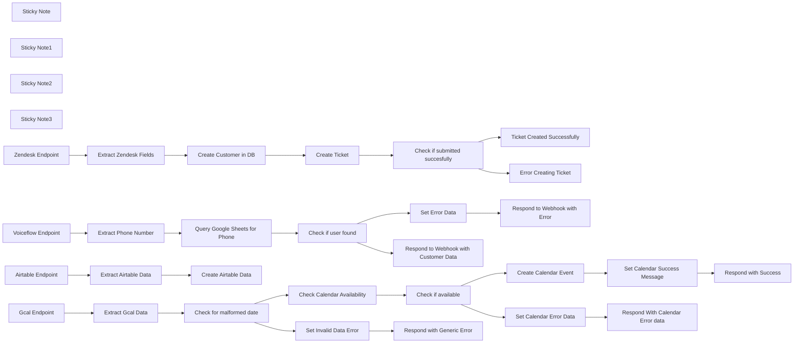

## Fluxo (.json) :

```json
{
  "meta": {
    "instanceId": "cb484ba7b742928a2048bf8829668bed5b5ad9787579adea888f05980292a4a7",
    "templateCredsSetupCompleted": true
  },
  "nodes": [
    {
      "id": "15f8f140-66b6-4c83-8a33-cf8cafdc32d4",
      "name": "Sticky Note",
      "type": "n8n-nodes-base.stickyNote",
      "position": [
        -420,
        -740
      ],
      "parameters": {
        "color": 7,
        "width": 1440,
        "height": 620,
        "content": "\n## Find Customer\nThis portion of the workflow queries the customer database and returns customer details to the AI agent if found. If not found, it returns NOT_FOUND for the customer details. "
      },
      "typeVersion": 1
    },
    {
      "id": "00b35d71-a6e6-43e8-a57b-a29a0c476b23",
      "name": "Check if user found",
      "type": "n8n-nodes-base.if",
      "position": [
        380,
        -380
      ],
      "parameters": {
        "options": {},
        "conditions": {
          "options": {
            "version": 2,
            "leftValue": "",
            "caseSensitive": true,
            "typeValidation": "strict"
          },
          "combinator": "and",
          "conditions": [
            {
              "id": "bddfa253-24c6-430e-9a13-f07daf8c1513",
              "operator": {
                "type": "string",
                "operation": "notEmpty",
                "singleValue": true
              },
              "leftValue": "={{ $json.Name }}",
              "rightValue": ""
            }
          ]
        }
      },
      "typeVersion": 2.2
    },
    {
      "id": "83d5be62-92f2-4018-bb5e-e4c068223370",
      "name": "Sticky Note1",
      "type": "n8n-nodes-base.stickyNote",
      "position": [
        -420,
        -80
      ],
      "parameters": {
        "color": 7,
        "width": 1460,
        "height": 540,
        "content": "\n## Create Zendesk Ticket \nCreates a Zendesk ticket on behalf of the customer when needed."
      },
      "typeVersion": 1
    },
    {
      "id": "19f99374-82a6-4978-a159-9b68accda619",
      "name": "Sticky Note2",
      "type": "n8n-nodes-base.stickyNote",
      "position": [
        -420,
        480
      ],
      "parameters": {
        "color": 7,
        "width": 1920,
        "height": 700,
        "content": "\n## Schedule a meeting\nThis gives availability for google calendar and schedules a meeting as well "
      },
      "typeVersion": 1
    },
    {
      "id": "ad83adab-eecb-49f7-ba95-b53889f8dded",
      "name": "Sticky Note3",
      "type": "n8n-nodes-base.stickyNote",
      "position": [
        -420,
        1220
      ],
      "parameters": {
        "color": 7,
        "width": 900,
        "height": 540,
        "content": "\n## Give Product team transcripts for analysis\nNeed to help your product team out"
      },
      "typeVersion": 1
    },
    {
      "id": "4b224fd9-d056-4f2a-aa91-aa4cbee4c44a",
      "name": "Check if available",
      "type": "n8n-nodes-base.if",
      "position": [
        520,
        800
      ],
      "parameters": {
        "options": {},
        "conditions": {
          "options": {
            "version": 2,
            "leftValue": "",
            "caseSensitive": true,
            "typeValidation": "strict"
          },
          "combinator": "and",
          "conditions": [
            {
              "id": "d1c61a1f-0265-4eb5-918f-3111e916387f",
              "operator": {
                "type": "boolean",
                "operation": "true",
                "singleValue": true
              },
              "leftValue": "={{ $json.available }}",
              "rightValue": ""
            }
          ]
        }
      },
      "typeVersion": 2.2
    },
    {
      "id": "60067000-0c90-4a9d-bf11-e22a864b0ad8",
      "name": "Check for malformed date",
      "type": "n8n-nodes-base.if",
      "position": [
        100,
        880
      ],
      "parameters": {
        "options": {},
        "conditions": {
          "options": {
            "version": 2,
            "leftValue": "",
            "caseSensitive": true,
            "typeValidation": "strict"
          },
          "combinator": "and",
          "conditions": [
            {
              "id": "f055e64e-a1d2-4213-9d5c-1d1069cb582c",
              "operator": {
                "type": "dateTime",
                "operation": "after"
              },
              "leftValue": "={{ $json.availability }}",
              "rightValue": "={{ $now }}"
            }
          ]
        }
      },
      "typeVersion": 2.2
    },
    {
      "id": "ad9f1857-2179-4d1d-ac25-04975b23390f",
      "name": "Create Ticket",
      "type": "n8n-nodes-base.httpRequest",
      "onError": "continueRegularOutput",
      "position": [
        340,
        180
      ],
      "parameters": {
        "url": "https://n8n8688.zendesk.com/api/v2/tickets",
        "method": "POST",
        "options": {
          "redirect": {
            "redirect": {}
          }
        },
        "jsonBody": "={\n  \"ticket\": {\n    \"requester_id\": \"{{ $json.user.id }}\",\n    \"subject\": \"New TechFin Customer Ticket for {{ $json.user.name }}\",\n    \"comment\": {\n      \"body\": \"{{ $('Extract Zendesk Fields').item.json.body.summary }}\\n\\n{{ $('Extract Zendesk Fields').item.json.body.transcript.replace(/\\n/g, \"\\\\n\").replace(/\\\\'/g, \"\\\\'\").replace(/\\\\\"/g, '\\\\\"').replace(/\\\\&/g, \"\\\\&\").replace(/\\\\r/g, \"\\\\r\").replace(/\\\\t/g, \"\\\\t\").replace(/\\\\b/g, \"\\\\b\").replace(/\\\\f/g, \"\\\\f\") }}\"\n    }\n  }\n}",
        "sendBody": true,
        "sendHeaders": true,
        "specifyBody": "json",
        "authentication": "predefinedCredentialType",
        "headerParameters": {
          "parameters": [
            {
              "name": "Accept",
              "value": "application/json"
            }
          ]
        },
        "nodeCredentialType": "zendeskApi"
      },
      "credentials": {
        "zendeskApi": {
          "id": "ROx0ipJapRomRxEX",
          "name": "Zendesk Demo Access"
        }
      },
      "typeVersion": 4.2
    },
    {
      "id": "5b5c0f60-4495-4040-9926-194b672e6850",
      "name": "Create Customer in DB",
      "type": "n8n-nodes-base.httpRequest",
      "onError": "continueRegularOutput",
      "position": [
        120,
        180
      ],
      "parameters": {
        "url": "https://n8n8688.zendesk.com/api/v2/users/create_or_update",
        "method": "POST",
        "options": {},
        "jsonBody": "={\n  \"user\": {\n    \"email\": \"{{ $json.body.email }}\",\n    \"identities\": [\n      {\n        \"type\": \"email\",\n        \"value\": \"{{ $json.body.email }}\"\n      }\n    ],\n    \"name\": \"{{ $json.body.name }}\"\n  }\n}",
        "sendBody": true,
        "specifyBody": "json",
        "authentication": "predefinedCredentialType",
        "nodeCredentialType": "zendeskApi"
      },
      "credentials": {
        "zendeskApi": {
          "id": "ROx0ipJapRomRxEX",
          "name": "Zendesk Demo Access"
        }
      },
      "typeVersion": 4.2
    },
    {
      "id": "3e5dd684-ee28-4431-849b-c8ab42bd93a0",
      "name": "Check if submitted succesfully",
      "type": "n8n-nodes-base.if",
      "position": [
        540,
        180
      ],
      "parameters": {
        "options": {},
        "conditions": {
          "options": {
            "version": 2,
            "leftValue": "",
            "caseSensitive": true,
            "typeValidation": "strict"
          },
          "combinator": "and",
          "conditions": [
            {
              "id": "1ff20679-9964-4ac9-933e-c370c2ef72c1",
              "operator": {
                "type": "string",
                "operation": "notEmpty",
                "singleValue": true
              },
              "leftValue": "={{ $json.ticket.url }}",
              "rightValue": ""
            }
          ]
        }
      },
      "typeVersion": 2.2
    },
    {
      "id": "c2fac290-0e6e-4b36-864e-f6bb2d25753c",
      "name": "Ticket Created Successfully",
      "type": "n8n-nodes-base.respondToWebhook",
      "position": [
        800,
        80
      ],
      "parameters": {
        "options": {},
        "respondWith": "json",
        "responseBody": "{\n  \"status\": \"SUCCESS_TICKET_SUBMITTED\"\n}"
      },
      "typeVersion": 1.1
    },
    {
      "id": "71a2c455-5de7-455c-9bed-b710a09c3d07",
      "name": "Error Creating Ticket",
      "type": "n8n-nodes-base.respondToWebhook",
      "position": [
        800,
        260
      ],
      "parameters": {
        "options": {
          "responseCode": 400
        },
        "respondWith": "json",
        "responseBody": "{\n  \"status\": \"TICKET_ERROR\"\n}"
      },
      "typeVersion": 1.1
    },
    {
      "id": "fcd6ceca-d231-4c49-bb1c-716d239dc0c4",
      "name": "Airtable Endpoint",
      "type": "n8n-nodes-base.webhook",
      "position": [
        -300,
        1560
      ],
      "webhookId": "9a52822c-0304-4dad-a86a-ae662161243c",
      "parameters": {
        "path": "9a52822c-0304-4dad-a86a-ae662161243c",
        "options": {},
        "httpMethod": "POST"
      },
      "typeVersion": 2
    },
    {
      "id": "53783abf-8254-46e2-8b1f-c797f880fa1b",
      "name": "Gcal Endpoint",
      "type": "n8n-nodes-base.webhook",
      "position": [
        -340,
        800
      ],
      "webhookId": "c1020b94-603c-4981-ab48-51e208d17223",
      "parameters": {
        "path": "c1020b94-603c-4981-ab48-51e208d17223",
        "options": {},
        "httpMethod": "POST",
        "responseMode": "responseNode"
      },
      "typeVersion": 2
    },
    {
      "id": "df6a885b-d9ea-4033-bb2d-6a222ca9153f",
      "name": "Zendesk Endpoint",
      "type": "n8n-nodes-base.webhook",
      "position": [
        -320,
        180
      ],
      "webhookId": "9c15c8ac-8f3a-40d3-8ad5-e40468388968",
      "parameters": {
        "path": "9c15c8ac-8f3a-40d3-8ad5-e40468388968",
        "options": {},
        "httpMethod": "POST",
        "responseMode": "responseNode"
      },
      "typeVersion": 2
    },
    {
      "id": "993c83c7-c376-4bc8-8cb9-995de92d6c4e",
      "name": "Voiceflow Endpoint",
      "type": "n8n-nodes-base.webhook",
      "position": [
        -320,
        -380
      ],
      "webhookId": "d9b20efe-9bb4-4d8b-b9aa-d568f43f78ea",
      "parameters": {
        "path": "d9b20efe-9bb4-4d8b-b9aa-d568f43f78ea",
        "options": {},
        "httpMethod": "POST",
        "responseMode": "responseNode"
      },
      "typeVersion": 2
    },
    {
      "id": "399c2471-3a3d-458a-bb5d-a0a5e42f3121",
      "name": "Extract Phone Number",
      "type": "n8n-nodes-base.set",
      "position": [
        -100,
        -380
      ],
      "parameters": {
        "options": {},
        "assignments": {
          "assignments": [
            {
              "id": "90de9dcb-1ab6-43d6-999e-6672fbd81f2a",
              "name": "query.phone_number",
              "type": "string",
              "value": "={{ $json.query.phone_number.replace(/^\\+/, '') }}"
            }
          ]
        }
      },
      "typeVersion": 3.4
    },
    {
      "id": "3391ccd4-cf64-4f48-9cfc-9a02131c37b6",
      "name": "Extract Zendesk Fields",
      "type": "n8n-nodes-base.set",
      "position": [
        -100,
        180
      ],
      "parameters": {
        "options": {},
        "assignments": {
          "assignments": [
            {
              "id": "3490074c-304b-4424-b724-74afba26f71e",
              "name": "body.email",
              "type": "string",
              "value": "={{ $json.body.email }}"
            },
            {
              "id": "0b5d31dc-029b-4055-91f3-55d820b43cdb",
              "name": "body.name",
              "type": "string",
              "value": "={{ $json.body.name }}"
            },
            {
              "id": "79ba72a8-42ff-481e-9ca8-6d9237ba84d8",
              "name": "body.transcript",
              "type": "string",
              "value": "={{ $json.body.transcript }}"
            },
            {
              "id": "77aeef5e-fb51-46d9-a66f-03bc7fe29ac7",
              "name": "body.summary",
              "type": "string",
              "value": "={{ $json.body.summary }}"
            }
          ]
        }
      },
      "typeVersion": 3.4
    },
    {
      "id": "63789194-f11c-42f1-8075-849ba1fedfd7",
      "name": "Extract Gcal Data",
      "type": "n8n-nodes-base.set",
      "onError": "continueRegularOutput",
      "position": [
        -120,
        800
      ],
      "parameters": {
        "options": {},
        "assignments": {
          "assignments": [
            {
              "id": "b0e95ac3-08a7-48ad-917a-9736f6e07cd2",
              "name": "availability",
              "type": "string",
              "value": "={{ $json.query.datetime.toDateTime() }}"
            },
            {
              "id": "ddc4b463-2acc-45bd-9d09-fee782ab1879",
              "name": "query.name",
              "type": "string",
              "value": "={{ $json.query.name }}"
            },
            {
              "id": "3f4cbd33-fa49-4a0e-bd48-919ab7224684",
              "name": "query.email",
              "type": "string",
              "value": "={{ $json.query.email }}"
            },
            {
              "id": "1027589d-b475-4330-9686-9b7a9e7ece8f",
              "name": "query.summary",
              "type": "string",
              "value": "={{ $json.query.summary }}"
            }
          ]
        }
      },
      "typeVersion": 3.4,
      "alwaysOutputData": true
    },
    {
      "id": "813b50b7-2255-441a-8ad6-15cde81ec14d",
      "name": "Extract Airtable Data",
      "type": "n8n-nodes-base.set",
      "position": [
        -80,
        1560
      ],
      "parameters": {
        "options": {},
        "assignments": {
          "assignments": [
            {
              "id": "6f121f9b-6692-41fa-849b-f613d9fe9009",
              "name": "phone",
              "type": "string",
              "value": "={{ $json.query.phone }}"
            },
            {
              "id": "acec6f45-271d-4f6a-bf29-e8ea1f5d9fa7",
              "name": "summary",
              "type": "string",
              "value": "={{ $json.query.summary }}"
            },
            {
              "id": "e76573ec-3884-4fe8-b34f-19b77022ba31",
              "name": "transcript",
              "type": "string",
              "value": "={{ $json.query.transcript }}"
            },
            {
              "id": "a3951676-739a-4641-99b1-ed7f5fcbf08d",
              "name": "type",
              "type": "string",
              "value": "={{ $json.query.type }}"
            }
          ]
        }
      },
      "typeVersion": 3.4
    },
    {
      "id": "830ee1b3-2bc3-4809-a0e7-c9c966053fbe",
      "name": "Create Airtable Data",
      "type": "n8n-nodes-base.airtable",
      "position": [
        180,
        1560
      ],
      "parameters": {
        "base": {
          "__rl": true,
          "mode": "list",
          "value": "app9dFu44S5VTIFRV",
          "cachedResultUrl": "https://airtable.com/app9dFu44S5VTIFRV",
          "cachedResultName": "Product Customer Analysis"
        },
        "table": {
          "__rl": true,
          "mode": "list",
          "value": "tblXGczD6wjZ6ZNko",
          "cachedResultUrl": "https://airtable.com/app9dFu44S5VTIFRV/tblXGczD6wjZ6ZNko",
          "cachedResultName": "Table 1"
        },
        "columns": {
          "value": {
            "Phone": "={{ $json.phone }}",
            "Summary": "={{ $json.summary }}",
            "Transcript": "={{ $json.transcript }}",
            "Customer Type": "={{ $json.type }}"
          },
          "schema": [
            {
              "id": "Phone",
              "type": "string",
              "display": true,
              "removed": false,
              "readOnly": false,
              "required": false,
              "displayName": "Phone",
              "defaultMatch": false,
              "canBeUsedToMatch": true
            },
            {
              "id": "Summary",
              "type": "string",
              "display": true,
              "removed": false,
              "readOnly": false,
              "required": false,
              "displayName": "Summary",
              "defaultMatch": false,
              "canBeUsedToMatch": true
            },
            {
              "id": "Transcript",
              "type": "string",
              "display": true,
              "removed": false,
              "readOnly": false,
              "required": false,
              "displayName": "Transcript",
              "defaultMatch": false,
              "canBeUsedToMatch": true
            },
            {
              "id": "Customer Type",
              "type": "string",
              "display": true,
              "removed": false,
              "readOnly": false,
              "required": false,
              "displayName": "Customer Type",
              "defaultMatch": false,
              "canBeUsedToMatch": true
            }
          ],
          "mappingMode": "defineBelow",
          "matchingColumns": [],
          "attemptToConvertTypes": false,
          "convertFieldsToString": false
        },
        "options": {},
        "operation": "create"
      },
      "credentials": {
        "airtableTokenApi": {
          "id": "ZwK7ZfD79dhUdsUc",
          "name": "n8n voiceflow demo"
        }
      },
      "typeVersion": 2.1
    },
    {
      "id": "42f007f1-3929-4d65-a3b5-c60693da3ad3",
      "name": "Query Google Sheets for Phone",
      "type": "n8n-nodes-base.googleSheets",
      "position": [
        160,
        -380
      ],
      "parameters": {
        "options": {},
        "filtersUI": {
          "values": [
            {
              "lookupValue": "={{ $json.query.phone_number }}",
              "lookupColumn": "Phone Number"
            }
          ]
        },
        "sheetName": {
          "__rl": true,
          "mode": "list",
          "value": "gid=0",
          "cachedResultUrl": "https://docs.google.com/spreadsheets/d/17sPEb3d55tiqJwt1Dms6MG1-qAAF0k9fQzbTs1lI1Yw/edit#gid=0",
          "cachedResultName": "Sheet1"
        },
        "documentId": {
          "__rl": true,
          "mode": "list",
          "value": "17sPEb3d55tiqJwt1Dms6MG1-qAAF0k9fQzbTs1lI1Yw",
          "cachedResultUrl": "https://docs.google.com/spreadsheets/d/17sPEb3d55tiqJwt1Dms6MG1-qAAF0k9fQzbTs1lI1Yw/edit?usp=drivesdk",
          "cachedResultName": "Customer Database"
        }
      },
      "credentials": {
        "googleSheetsOAuth2Api": {
          "id": "4ZBfVX71VUd6pRy3",
          "name": "Google Sheets Angel Access"
        }
      },
      "typeVersion": 4.5,
      "alwaysOutputData": true
    },
    {
      "id": "d0948a72-c8a8-48f6-b5d8-adb52a44a169",
      "name": "Respond to Webhook with Customer Data",
      "type": "n8n-nodes-base.respondToWebhook",
      "position": [
        640,
        -520
      ],
      "parameters": {
        "options": {}
      },
      "typeVersion": 1.1
    },
    {
      "id": "12e0e2b3-90e1-4b77-a6bb-12dc4603d4f7",
      "name": "Respond to Webhook with Error",
      "type": "n8n-nodes-base.respondToWebhook",
      "position": [
        780,
        -280
      ],
      "parameters": {
        "options": {}
      },
      "typeVersion": 1.1
    },
    {
      "id": "9de11b89-bbe8-4ce4-9838-27e497146966",
      "name": "Set Error Data",
      "type": "n8n-nodes-base.set",
      "position": [
        620,
        -280
      ],
      "parameters": {
        "options": {},
        "assignments": {
          "assignments": [
            {
              "id": "1ec3d6bd-41d8-489b-8c52-73c88267e0bd",
              "name": "row_number",
              "type": "string",
              "value": "NOT_FOUND"
            },
            {
              "id": "bfd6215e-f4ed-4d75-b9ae-d5925f87eb98",
              "name": "Name",
              "type": "string",
              "value": "NOT_FOUND"
            },
            {
              "id": "e06fc869-57e7-4dc5-b563-4d093be654ab",
              "name": "Email Address",
              "type": "string",
              "value": "NOT_FOUND"
            },
            {
              "id": "ae1a429b-1c21-4dcb-bf68-e0c01732ec5e",
              "name": "Tier",
              "type": "string",
              "value": "NOT_FOUND"
            },
            {
              "id": "879369f3-79f7-4420-bcec-b72f67212297",
              "name": "Phone Number",
              "type": "string",
              "value": "NOT_FOUND"
            }
          ]
        }
      },
      "typeVersion": 3.4
    },
    {
      "id": "37b2289b-bc9a-440f-9974-fffe433c2069",
      "name": "Check Calendar Availability",
      "type": "n8n-nodes-base.googleCalendar",
      "position": [
        300,
        800
      ],
      "parameters": {
        "options": {},
        "timeMax": "={{ $json.availability.toDateTime().plus(30, 'minutes') }}",
        "timeMin": "={{ $json.availability }}",
        "calendar": {
          "__rl": true,
          "mode": "list",
          "value": "angel@n8n.io",
          "cachedResultName": "angel@n8n.io"
        },
        "resource": "calendar"
      },
      "credentials": {
        "googleCalendarOAuth2Api": {
          "id": "zjwDrLg8gSlOpOQI",
          "name": "Google Calendar account 9"
        }
      },
      "typeVersion": 1.3
    },
    {
      "id": "52732530-e120-4403-b623-e087a0005383",
      "name": "Create Calendar Event",
      "type": "n8n-nodes-base.googleCalendar",
      "position": [
        800,
        680
      ],
      "parameters": {
        "end": "={{ $('Extract Gcal Data').item.json.availability.toDateTime().plus(30, 'minutes') }}",
        "start": "={{ $('Extract Gcal Data').item.json.availability }}",
        "calendar": {
          "__rl": true,
          "mode": "list",
          "value": "angel@n8n.io",
          "cachedResultName": "angel@n8n.io"
        },
        "additionalFields": {
          "summary": "=TechFin Enterprise Customer Success Meeting with {{ $('Extract Gcal Data').item.json.query.name }}",
          "attendees": [
            "={{ $('Extract Gcal Data').item.json.query.email }}"
          ],
          "description": "={{ $('Extract Gcal Data').item.json.query.summary }}"
        }
      },
      "credentials": {
        "googleCalendarOAuth2Api": {
          "id": "zjwDrLg8gSlOpOQI",
          "name": "Google Calendar account 9"
        }
      },
      "typeVersion": 1.3
    },
    {
      "id": "643a6c39-f70d-4453-be96-54eadb0b9667",
      "name": "Set Calendar Success Message",
      "type": "n8n-nodes-base.set",
      "position": [
        1020,
        680
      ],
      "parameters": {
        "options": {},
        "assignments": {
          "assignments": [
            {
              "id": "759c2ab4-bc39-4f7c-b585-212d6d6e9ab5",
              "name": "status",
              "type": "string",
              "value": "MEETING_BOOKED_SUCCESSFULLY"
            }
          ]
        }
      },
      "typeVersion": 3.4
    },
    {
      "id": "10b7bdfc-15a9-4d3c-9c58-e7f0d7356d98",
      "name": "Respond with Success",
      "type": "n8n-nodes-base.respondToWebhook",
      "position": [
        1240,
        680
      ],
      "parameters": {
        "options": {}
      },
      "typeVersion": 1.1
    },
    {
      "id": "4c8de5b6-d11f-454e-b198-eb7ea4bf8151",
      "name": "Set Calendar Error Data",
      "type": "n8n-nodes-base.set",
      "position": [
        800,
        920
      ],
      "parameters": {
        "options": {},
        "assignments": {
          "assignments": [
            {
              "id": "759c2ab4-bc39-4f7c-b585-212d6d6e9ab5",
              "name": "status",
              "type": "string",
              "value": "CSM_UNAVAILABLE"
            }
          ]
        }
      },
      "typeVersion": 3.4
    },
    {
      "id": "b8d54018-4f15-41d7-bc74-e5fa42c2eae8",
      "name": "Respond With Calendar Error data",
      "type": "n8n-nodes-base.respondToWebhook",
      "position": [
        1040,
        920
      ],
      "parameters": {
        "options": {}
      },
      "typeVersion": 1.1
    },
    {
      "id": "1be55353-b20d-41aa-bd82-c5a21ec1ca56",
      "name": "Set Invalid Data Error",
      "type": "n8n-nodes-base.set",
      "position": [
        320,
        1020
      ],
      "parameters": {
        "options": {},
        "assignments": {
          "assignments": [
            {
              "id": "759c2ab4-bc39-4f7c-b585-212d6d6e9ab5",
              "name": "status",
              "type": "string",
              "value": "INVALID_DATA_ERROR"
            }
          ]
        }
      },
      "typeVersion": 3.4
    },
    {
      "id": "a4e01bfd-4f65-457e-bf84-8140f2d58168",
      "name": "Respond with Generic Error",
      "type": "n8n-nodes-base.respondToWebhook",
      "position": [
        500,
        1020
      ],
      "parameters": {
        "options": {}
      },
      "typeVersion": 1.1
    }
  ],
  "pinData": {},
  "connections": {
    "Create Ticket": {
      "main": [
        [
          {
            "node": "Check if submitted succesfully",
            "type": "main",
            "index": 0
          }
        ]
      ]
    },
    "Gcal Endpoint": {
      "main": [
        [
          {
            "node": "Extract Gcal Data",
            "type": "main",
            "index": 0
          }
        ]
      ]
    },
    "Set Error Data": {
      "main": [
        [
          {
            "node": "Respond to Webhook with Error",
            "type": "main",
            "index": 0
          }
        ]
      ]
    },
    "Zendesk Endpoint": {
      "main": [
        [
          {
            "node": "Extract Zendesk Fields",
            "type": "main",
            "index": 0
          }
        ]
      ]
    },
    "Airtable Endpoint": {
      "main": [
        [
          {
            "node": "Extract Airtable Data",
            "type": "main",
            "index": 0
          }
        ]
      ]
    },
    "Extract Gcal Data": {
      "main": [
        [
          {
            "node": "Check for malformed date",
            "type": "main",
            "index": 0
          }
        ]
      ]
    },
    "Check if available": {
      "main": [
        [
          {
            "node": "Create Calendar Event",
            "type": "main",
            "index": 0
          }
        ],
        [
          {
            "node": "Set Calendar Error Data",
            "type": "main",
            "index": 0
          }
        ]
      ]
    },
    "Voiceflow Endpoint": {
      "main": [
        [
          {
            "node": "Extract Phone Number",
            "type": "main",
            "index": 0
          }
        ]
      ]
    },
    "Check if user found": {
      "main": [
        [
          {
            "node": "Respond to Webhook with Customer Data",
            "type": "main",
            "index": 0
          }
        ],
        [
          {
            "node": "Set Error Data",
            "type": "main",
            "index": 0
          }
        ]
      ]
    },
    "Extract Phone Number": {
      "main": [
        [
          {
            "node": "Query Google Sheets for Phone",
            "type": "main",
            "index": 0
          }
        ]
      ]
    },
    "Create Calendar Event": {
      "main": [
        [
          {
            "node": "Set Calendar Success Message",
            "type": "main",
            "index": 0
          }
        ]
      ]
    },
    "Create Customer in DB": {
      "main": [
        [
          {
            "node": "Create Ticket",
            "type": "main",
            "index": 0
          }
        ]
      ]
    },
    "Extract Airtable Data": {
      "main": [
        [
          {
            "node": "Create Airtable Data",
            "type": "main",
            "index": 0
          }
        ]
      ]
    },
    "Extract Zendesk Fields": {
      "main": [
        [
          {
            "node": "Create Customer in DB",
            "type": "main",
            "index": 0
          }
        ]
      ]
    },
    "Set Invalid Data Error": {
      "main": [
        [
          {
            "node": "Respond with Generic Error",
            "type": "main",
            "index": 0
          }
        ]
      ]
    },
    "Set Calendar Error Data": {
      "main": [
        [
          {
            "node": "Respond With Calendar Error data",
            "type": "main",
            "index": 0
          }
        ]
      ]
    },
    "Check for malformed date": {
      "main": [
        [
          {
            "node": "Check Calendar Availability",
            "type": "main",
            "index": 0
          }
        ],
        [
          {
            "node": "Set Invalid Data Error",
            "type": "main",
            "index": 0
          }
        ]
      ]
    },
    "Check Calendar Availability": {
      "main": [
        [
          {
            "node": "Check if available",
            "type": "main",
            "index": 0
          }
        ]
      ]
    },
    "Set Calendar Success Message": {
      "main": [
        [
          {
            "node": "Respond with Success",
            "type": "main",
            "index": 0
          }
        ]
      ]
    },
    "Query Google Sheets for Phone": {
      "main": [
        [
          {
            "node": "Check if user found",
            "type": "main",
            "index": 0
          }
        ]
      ]
    },
    "Check if submitted succesfully": {
      "main": [
        [
          {
            "node": "Ticket Created Successfully",
            "type": "main",
            "index": 0
          }
        ],
        [
          {
            "node": "Error Creating Ticket",
            "type": "main",
            "index": 0
          }
        ]
      ]
    }
  }
}
```

<a id="template-1613"></a>

## Template 1613 - Monitorar pastas Dropbox e processar novos arquivos

- **Nome:** Monitorar pastas Dropbox e processar novos arquivos
- **Descrição:** Recebe notificações do Dropbox, lista o conteúdo de pastas configuradas, identifica arquivos novos comparando com uma base de dados e dispara subworkflows para processar esses arquivos.
- **Funcionalidade:** • Recepção de webhook do Dropbox: recebe notificações de alterações e responde rapidamente para validação e confirmação do recebimento.
• Definição de pasta a monitorar: uso de variável para definir dinamicamente a pasta alvo em cada ramo do fluxo.
• Listagem de conteúdo da pasta: recupera items (arquivos e pastas) da pasta configurada.
• Diferenciação entre arquivo e pasta: encaminha itens para caminhos distintos conforme o tipo.
• Modo 1 — Processar todos os itens: dispara um subworkflow para cada item encontrado na pasta.
• Modo 2 — Processar somente novos arquivos: consulta uma tabela externa para obter arquivos já conhecidos, faz um merge para filtrar apenas não correspondentes (novos) e processa só esses.
• Registro de arquivos novos: adiciona metadados do arquivo na tabela externa para evitar reprocessamento futuro.
• Disparo de subworkflows para tratamento: executa workflows específicos para cada arquivo novo ou para cada item conforme o modo escolhido.
- **Ferramentas:** • Dropbox: origem de arquivos e gerador de webhooks para notificar alterações em pastas e fornecer metadados dos arquivos.
• NocoDB: base de dados externa usada para armazenar registros de arquivos já processados e permitir filtragem de novos arquivos.

## Fluxo visual

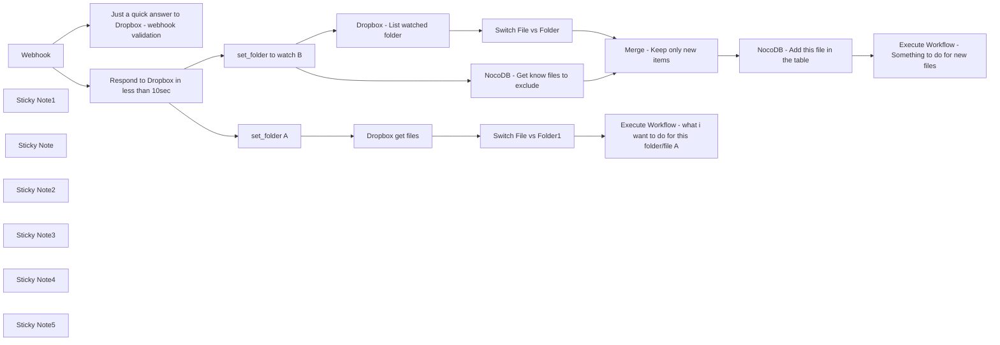

## Fluxo (.json) :

```json
{
  "meta": {
    "instanceId": "4e8285376decaea86c34202e3f6f0900c15ccf72a22e44fbb5cd9851bb3fd11f",
    "templateCredsSetupCompleted": true
  },
  "nodes": [
    {
      "id": "971e1616-af67-4961-9ef4-4b8dd24e392c",
      "name": "Webhook",
      "type": "n8n-nodes-base.webhook",
      "position": [
        -660,
        240
      ],
      "webhookId": "29a6482f-36ac-4c15-8792-450aa32cf5f4",
      "parameters": {
        "path": "29a6482f-36ac-4c15-8792-450aa32cf5f4",
        "options": {},
        "httpMethod": [
          "POST",
          "GET"
        ],
        "responseMode": "responseNode",
        "multipleMethods": true
      },
      "typeVersion": 2
    },
    {
      "id": "22d8dca1-a2fd-474e-a1cd-7f75be1c04a6",
      "name": "Sticky Note1",
      "type": "n8n-nodes-base.stickyNote",
      "position": [
        -720,
        -220
      ],
      "parameters": {
        "color": 6,
        "width": 620,
        "height": 920,
        "content": "## Dropbox\n\nDropbox call me each time a modification is done somewhere in my dropbox."
      },
      "typeVersion": 1
    },
    {
      "id": "0178e813-ae15-4729-933b-2799ec405863",
      "name": "Sticky Note",
      "type": "n8n-nodes-base.stickyNote",
      "position": [
        240,
        -280
      ],
      "parameters": {
        "color": 3,
        "width": 840,
        "height": 140,
        "content": "## Watch Files, 2 ways :\n1. We explore each file in a folder (new and old ones)\n2. We want to filter new files only"
      },
      "typeVersion": 1
    },
    {
      "id": "229b9a46-5d76-4cb7-b1ac-4b10a6427f66",
      "name": "Sticky Note2",
      "type": "n8n-nodes-base.stickyNote",
      "position": [
        240,
        -80
      ],
      "parameters": {
        "width": 1040,
        "height": 100,
        "content": "### Way 1 - We call the subworklow for each file in the specified folder"
      },
      "typeVersion": 1
    },
    {
      "id": "43a4fa3c-e378-443b-81a1-349201a85056",
      "name": "Sticky Note3",
      "type": "n8n-nodes-base.stickyNote",
      "position": [
        240,
        200
      ],
      "parameters": {
        "color": 4,
        "width": 1240,
        "height": 100,
        "content": "### Way 2- We filter new/old files then we call the subworkflow only for new files"
      },
      "typeVersion": 1
    },
    {
      "id": "e9639a07-6672-46ee-a86e-025265e45069",
      "name": "Dropbox - List watched folder",
      "type": "n8n-nodes-base.dropbox",
      "position": [
        500,
        280
      ],
      "parameters": {
        "path": "={{ $json.folder_to_watch }}",
        "filters": {
          "include_deleted": false,
          "include_mounted_folders": false
        },
        "resource": "folder",
        "operation": "list",
        "returnAll": true,
        "authentication": "oAuth2"
      },
      "credentials": {
        "dropboxOAuth2Api": {
          "id": "GocmYXzmqQnUpojt",
          "name": "Dropbox BT"
        }
      },
      "typeVersion": 1
    },
    {
      "id": "61707418-fcbb-4b70-ab06-02b9b7060bfb",
      "name": "Switch File vs Folder",
      "type": "n8n-nodes-base.switch",
      "position": [
        700,
        280
      ],
      "parameters": {
        "rules": {
          "values": [
            {
              "outputKey": "file",
              "conditions": {
                "options": {
                  "version": 2,
                  "leftValue": "",
                  "caseSensitive": true,
                  "typeValidation": "strict"
                },
                "combinator": "and",
                "conditions": [
                  {
                    "id": "f7fda7a2-1961-41aa-a332-f9a8be9b3bfa",
                    "operator": {
                      "type": "string",
                      "operation": "equals"
                    },
                    "leftValue": "={{ $json.type }}",
                    "rightValue": "file"
                  }
                ]
              },
              "renameOutput": true
            },
            {
              "outputKey": "folder",
              "conditions": {
                "options": {
                  "version": 2,
                  "leftValue": "",
                  "caseSensitive": true,
                  "typeValidation": "strict"
                },
                "combinator": "and",
                "conditions": [
                  {
                    "id": "d8bb9414-ae11-4b8f-ad0e-6bfe0e2f1071",
                    "operator": {
                      "name": "filter.operator.equals",
                      "type": "string",
                      "operation": "equals"
                    },
                    "leftValue": "={{ $json.type }}",
                    "rightValue": "folder"
                  }
                ]
              },
              "renameOutput": true
            }
          ]
        },
        "options": {}
      },
      "typeVersion": 3.2
    },
    {
      "id": "2670d2d1-acfb-4d0b-9bde-12dbd3806976",
      "name": "Switch File vs Folder1",
      "type": "n8n-nodes-base.switch",
      "position": [
        780,
        0
      ],
      "parameters": {
        "rules": {
          "values": [
            {
              "outputKey": "file",
              "conditions": {
                "options": {
                  "version": 2,
                  "leftValue": "",
                  "caseSensitive": true,
                  "typeValidation": "strict"
                },
                "combinator": "and",
                "conditions": [
                  {
                    "id": "f7fda7a2-1961-41aa-a332-f9a8be9b3bfa",
                    "operator": {
                      "type": "string",
                      "operation": "equals"
                    },
                    "leftValue": "={{ $json.type }}",
                    "rightValue": "file"
                  }
                ]
              },
              "renameOutput": true
            },
            {
              "outputKey": "folder",
              "conditions": {
                "options": {
                  "version": 2,
                  "leftValue": "",
                  "caseSensitive": true,
                  "typeValidation": "strict"
                },
                "combinator": "and",
                "conditions": [
                  {
                    "id": "d8bb9414-ae11-4b8f-ad0e-6bfe0e2f1071",
                    "operator": {
                      "name": "filter.operator.equals",
                      "type": "string",
                      "operation": "equals"
                    },
                    "leftValue": "={{ $json.type }}",
                    "rightValue": "folder"
                  }
                ]
              },
              "renameOutput": true
            }
          ]
        },
        "options": {}
      },
      "typeVersion": 3.2
    },
    {
      "id": "8225e284-b193-4859-891e-2277b2bc004b",
      "name": "NocoDB - Get know files to exclude",
      "type": "n8n-nodes-base.nocoDb",
      "position": [
        600,
        480
      ],
      "parameters": {
        "table": "m0tqa79y2sv4g0j",
        "options": {
          "where": "=(folder_to_watch,eq,{{ $json.folder_to_watch }})"
        },
        "operation": "getAll",
        "projectId": "p73a23pw65qwwr4",
        "returnAll": true,
        "authentication": "nocoDbApiToken"
      },
      "credentials": {
        "nocoDbApiToken": {
          "id": "GW7a5UwWksviQWb7",
          "name": "NocoDB cloudron"
        }
      },
      "typeVersion": 3
    },
    {
      "id": "0b9cb74b-ce02-4ed2-a417-084529a79977",
      "name": "Merge - Keep only new items",
      "type": "n8n-nodes-base.merge",
      "position": [
        1000,
        280
      ],
      "parameters": {
        "mode": "combine",
        "options": {},
        "advanced": true,
        "joinMode": "keepNonMatches",
        "mergeByFields": {
          "values": [
            {
              "field1": "id",
              "field2": "data.id"
            }
          ]
        },
        "outputDataFrom": "input1"
      },
      "typeVersion": 3
    },
    {
      "id": "c1f52687-7b6e-4c69-bcce-cc9bf053c62f",
      "name": "Just a quick answer to Dropbox - webhook validation",
      "type": "n8n-nodes-base.respondToWebhook",
      "position": [
        -400,
        520
      ],
      "parameters": {
        "options": {},
        "respondWith": "text",
        "responseBody": "={{ $json.query.challenge }}"
      },
      "typeVersion": 1.1
    },
    {
      "id": "42c84256-cbce-46d6-ab5a-01b1ef0715b0",
      "name": "Respond to Dropbox in less than 10sec",
      "type": "n8n-nodes-base.respondToWebhook",
      "position": [
        -400,
        0
      ],
      "parameters": {
        "options": {},
        "respondWith": "text",
        "responseBody": "={{ $json.query.challenge }}"
      },
      "typeVersion": 1.1
    },
    {
      "id": "bb45006e-f12e-4b9d-99fa-ec5003f1c141",
      "name": "Dropbox get files",
      "type": "n8n-nodes-base.dropbox",
      "position": [
        500,
        0
      ],
      "parameters": {
        "path": "={{ $json.folder_to_watch }}",
        "filters": {
          "include_deleted": false,
          "include_mounted_folders": false
        },
        "resource": "folder",
        "operation": "list",
        "returnAll": true,
        "authentication": "oAuth2"
      },
      "credentials": {
        "dropboxOAuth2Api": {
          "id": "GocmYXzmqQnUpojt",
          "name": "Dropbox BT"
        }
      },
      "typeVersion": 1
    },
    {
      "id": "b4f8c38c-c674-488d-8c9a-f68e42c702cf",
      "name": "NocoDB - Add this file in the table",
      "type": "n8n-nodes-base.nocoDb",
      "position": [
        1200,
        280
      ],
      "parameters": {
        "table": "m0tqa79y2sv4g0j",
        "fieldsUi": {
          "fieldValues": [
            {
              "fieldName": "folder_to_watch",
              "fieldValue": "={{ $('set_folder to watch B').item.json.folder_to_watch }}"
            },
            {
              "fieldName": "data",
              "fieldValue": "={\n\"id\":\"{{ $json.id }}\",\n\"name\":\"{{ $json.name }}\",\n\"lastModifiedClient\": \"{{ $json.lastModifiedClient }}\",\n\"lastModifiedServer\": \"{{ $json.lastModifiedServer }}\",\n\"rev\": \"{{ $json.rev }}\",\n\"contentSize\": {{ $json.contentSize }},\n\"type\": \"{{ $json.type }}\",\n\"contentHash\": \"{{ $json.contentHash }}\",\n\"pathLower\": \"{{ $json.pathLower }}\",\n\"pathDisplay\": \"{{ $json.pathDisplay }}\",\n\"isDownloadable\": {{ $json.isDownloadable }}\n}"
            },
            {
              "fieldName": "file_id",
              "fieldValue": "={{ $json.id }}"
            }
          ]
        },
        "operation": "create",
        "projectId": "p73a23pw65qwwr4",
        "authentication": "nocoDbApiToken"
      },
      "credentials": {
        "nocoDbApiToken": {
          "id": "GW7a5UwWksviQWb7",
          "name": "NocoDB cloudron"
        }
      },
      "typeVersion": 3
    },
    {
      "id": "9d6d2d96-f16f-408d-bc35-0e17da4d4e6d",
      "name": "set_folder A",
      "type": "n8n-nodes-base.set",
      "position": [
        260,
        0
      ],
      "parameters": {
        "options": {},
        "assignments": {
          "assignments": [
            {
              "id": "8416f15a-a6a2-47d2-8c15-e1742b323a8f",
              "name": "folder_to_watch",
              "type": "string",
              "value": "/z_Apps/a_iphone/RecUp Memos/"
            }
          ]
        }
      },
      "typeVersion": 3.4
    },
    {
      "id": "aaa1ef55-10ef-4d8f-ae71-d317930229bc",
      "name": "set_folder to watch B",
      "type": "n8n-nodes-base.set",
      "position": [
        280,
        280
      ],
      "parameters": {
        "options": {},
        "assignments": {
          "assignments": [
            {
              "id": "8416f15a-a6a2-47d2-8c15-e1742b323a8f",
              "name": "folder_to_watch",
              "type": "string",
              "value": "/z_Apps/auphonic/whisper"
            }
          ]
        }
      },
      "typeVersion": 3.4
    },
    {
      "id": "770b7f54-e85e-4d62-ab2a-60c9a73411e3",
      "name": "Execute Workflow - what i want to do for this folder/file A",
      "type": "n8n-nodes-base.executeWorkflow",
      "position": [
        1040,
        -20
      ],
      "parameters": {
        "mode": "each",
        "options": {
          "waitForSubWorkflow": false
        },
        "workflowId": {
          "__rl": true,
          "mode": "list",
          "value": "PRxsqnbMoqY6avr6",
          "cachedResultName": "02 JE TRANSMETS > Dropbox RecUp Memos - transcription audio - 2025-01 v1"
        },
        "workflowInputs": {
          "value": {},
          "schema": [],
          "mappingMode": "defineBelow",
          "matchingColumns": [],
          "attemptToConvertTypes": false,
          "convertFieldsToString": true
        }
      },
      "typeVersion": 1.2
    },
    {
      "id": "d9230834-13b4-420f-9e9a-154176803a66",
      "name": "Execute Workflow - Something to do for new files",
      "type": "n8n-nodes-base.executeWorkflow",
      "position": [
        1400,
        280
      ],
      "parameters": {
        "options": {},
        "workflowId": {
          "__rl": true,
          "mode": "list",
          "value": "NzETudhVA1JruLCl",
          "cachedResultName": "210 PODCAST > Dropbox txt - Pré rédige épisode avec transcription - 2025-03 v2"
        },
        "workflowInputs": {
          "value": {},
          "schema": [],
          "mappingMode": "defineBelow",
          "matchingColumns": [],
          "attemptToConvertTypes": false,
          "convertFieldsToString": true
        }
      },
      "typeVersion": 1.2
    },
    {
      "id": "68d02221-861c-41d6-afe3-3757b272746f",
      "name": "Sticky Note4",
      "type": "n8n-nodes-base.stickyNote",
      "position": [
        -60,
        120
      ],
      "parameters": {
        "color": 2,
        "height": 80,
        "content": "I duplicate those processes for each folder i want to watch"
      },
      "typeVersion": 1
    },
    {
      "id": "6befd86e-9a7b-442e-abb2-e1ed535f5166",
      "name": "Sticky Note5",
      "type": "n8n-nodes-base.stickyNote",
      "position": [
        180,
        460
      ],
      "parameters": {
        "color": 2,
        "content": "I define in a \"variable\" the folder to watch to ease the next steps"
      },
      "typeVersion": 1
    }
  ],
  "pinData": {
    "set_folder A": [
      {
        "folder_to_watch": "/z_Apps/a_iphone/RecUp Memos/"
      }
    ],
    "Dropbox get files": [
      {
        "id": "id:m50XjFjkXDsAAAAAAAVw5w",
        "name": "done",
        "type": "folder",
        "pathLower": "/z_apps/a_iphone/recup memos/done",
        "pathDisplay": "/z_Apps/a_iphone/RecUp Memos/done"
      },
      {
        "id": "id:m50XjFjkXDsAAAAAAAVxNg",
        "name": "txt",
        "type": "folder",
        "pathLower": "/z_apps/a_iphone/recup memos/txt",
        "pathDisplay": "/z_Apps/a_iphone/RecUp Memos/txt"
      },
      {
        "id": "id:m50XjFjkXDsAAAAAAAVxNw",
        "name": "notes_md",
        "type": "folder",
        "pathLower": "/z_apps/a_iphone/recup memos/notes_md",
        "pathDisplay": "/z_Apps/a_iphone/RecUp Memos/notes_md"
      },
      {
        "id": "id:m50XjFjkXDsAAAAAAAVxTA",
        "name": "done vraiment",
        "type": "folder",
        "pathLower": "/z_apps/a_iphone/recup memos/done vraiment",
        "pathDisplay": "/z_Apps/a_iphone/RecUp Memos/done vraiment"
      },
      {
        "id": "id:m50XjFjkXDsAAAAAAAV1Jg",
        "name": "trash",
        "type": "folder",
        "pathLower": "/z_apps/a_iphone/recup memos/trash",
        "pathDisplay": "/z_Apps/a_iphone/RecUp Memos/trash"
      },
      {
        "id": "id:m50XjFjkXDsAAAAAAAV1uQ",
        "rev": "63104211ae04e0b4b15a2",
        "name": "test DV-2025-02-04-050515.mp3",
        "type": "file",
        "pathLower": "/z_apps/a_iphone/recup memos/test dv-2025-02-04-050515.mp3",
        "contentHash": "feb314cba10772588af3e56bdbc2a1efb693e7174794d660efed188b87ba9398",
        "contentSize": 1464900,
        "pathDisplay": "/z_Apps/a_iphone/RecUp Memos/test DV-2025-02-04-050515.mp3",
        "isDownloadable": true,
        "lastModifiedClient": "2025-02-04T04:05:17Z",
        "lastModifiedServer": "2025-03-23T15:27:45Z"
      }
    ],
    "set_folder to watch B": [
      {
        "folder_to_watch": "/z_Apps/auphonic/whisper"
      }
    ],
    "Dropbox - List watched folder": [
      {
        "id": "id:lXWFwy5R52AAAAAAAAAIeA",
        "rev": "631049fe37ae34f316ea3",
        "name": "test btXXX - stabilité émotionnelle-final-auphonic-final-auphonic copie.txt",
        "type": "file",
        "pathLower": "/z_apps/auphonic/whisper/test btxxx - stabilité émotionnelle-final-auphonic-final-auphonic copie.txt",
        "contentHash": "fda114fad56df672588bc1543c869863c81c7e6b843d05158cdc8d1573515587",
        "contentSize": 26671,
        "pathDisplay": "/z_Apps/auphonic/whisper/test btXXX - stabilité émotionnelle-final-auphonic-final-auphonic copie.txt",
        "isDownloadable": true,
        "lastModifiedClient": "2025-01-22T13:26:49Z",
        "lastModifiedServer": "2025-03-23T16:03:12Z"
      },
      {
        "id": "id:lXWFwy5R52AAAAAAAAAIeQ",
        "rev": "63104b143779c4f316ea3",
        "name": "test-nospace-normal.txt",
        "type": "file",
        "pathLower": "/z_apps/auphonic/whisper/test-nospace-normal.txt",
        "contentHash": "fda114fad56df672588bc1543c869863c81c7e6b843d05158cdc8d1573515587",
        "contentSize": 26671,
        "pathDisplay": "/z_Apps/auphonic/whisper/test-nospace-normal.txt",
        "isDownloadable": true,
        "lastModifiedClient": "2025-01-22T13:26:49Z",
        "lastModifiedServer": "2025-03-23T16:08:03Z"
      }
    ],
    "Respond to Dropbox in less than 10sec": [
      {
        "body": {
          "delta": {
            "users": [
              117105590
            ]
          },
          "list_folder": {
            "accounts": [
              "dbid:AAA9MBwnssJK-R5bqnTuKBDTg7UMwOZb8mk"
            ]
          }
        },
        "query": {},
        "params": {},
        "headers": {
          "host": "n8n.app.businesstemple.co",
          "accept": "*/*",
          "x-real-ip": "34.194.118.45",
          "connection": "close",
          "user-agent": "DropboxWebhooks/1.0",
          "content-type": "application/json",
          "content-length": "108",
          "accept-encoding": "gzip,deflate",
          "x-forwarded-for": "34.194.118.45",
          "x-forwarded-ssl": "on",
          "x-forwarded-host": "n8n.app.businesstemple.co",
          "x-forwarded-port": "443",
          "x-forwarded-proto": "https",
          "x-dropbox-signature": "339bfefa3e30feaddaa59cd7a37df9de12ccd490d7aee9b1e055d32ae7d4acee"
        },
        "webhookUrl": "https://n8n.app.businesstemple.co/webhook-test/dropboxbox-watch-files",
        "executionMode": "test"
      }
    ]
  },
  "connections": {
    "Webhook": {
      "main": [
        [
          {
            "node": "Respond to Dropbox in less than 10sec",
            "type": "main",
            "index": 0
          }
        ],
        [
          {
            "node": "Just a quick answer to Dropbox - webhook validation",
            "type": "main",
            "index": 0
          }
        ]
      ]
    },
    "set_folder A": {
      "main": [
        [
          {
            "node": "Dropbox get files",
            "type": "main",
            "index": 0
          }
        ]
      ]
    },
    "Dropbox get files": {
      "main": [
        [
          {
            "node": "Switch File vs Folder1",
            "type": "main",
            "index": 0
          }
        ]
      ]
    },
    "Switch File vs Folder": {
      "main": [
        [
          {
            "node": "Merge - Keep only new items",
            "type": "main",
            "index": 0
          }
        ]
      ]
    },
    "set_folder to watch B": {
      "main": [
        [
          {
            "node": "Dropbox - List watched folder",
            "type": "main",
            "index": 0
          },
          {
            "node": "NocoDB - Get know files to exclude",
            "type": "main",
            "index": 0
          }
        ]
      ]
    },
    "Switch File vs Folder1": {
      "main": [
        [
          {
            "node": "Execute Workflow - what i want to do for this folder/file A",
            "type": "main",
            "index": 0
          }
        ]
      ]
    },
    "Merge - Keep only new items": {
      "main": [
        [
          {
            "node": "NocoDB - Add this file in the table",
            "type": "main",
            "index": 0
          }
        ]
      ]
    },
    "Dropbox - List watched folder": {
      "main": [
        [
          {
            "node": "Switch File vs Folder",
            "type": "main",
            "index": 0
          }
        ]
      ]
    },
    "NocoDB - Get know files to exclude": {
      "main": [
        [
          {
            "node": "Merge - Keep only new items",
            "type": "main",
            "index": 1
          }
        ]
      ]
    },
    "NocoDB - Add this file in the table": {
      "main": [
        [
          {
            "node": "Execute Workflow - Something to do for new files",
            "type": "main",
            "index": 0
          }
        ]
      ]
    },
    "Respond to Dropbox in less than 10sec": {
      "main": [
        [
          {
            "node": "set_folder A",
            "type": "main",
            "index": 0
          },
          {
            "node": "set_folder to watch B",
            "type": "main",
            "index": 0
          }
        ]
      ]
    }
  }
}
```

<a id="template-1615"></a>

## Template 1615 - Recepcionista por voz para agendamento

- **Nome:** Recepcionista por voz para agendamento
- **Descrição:** Automatiza atendimento por voz para checar disponibilidade, agendar, reagendar e cancelar compromissos, integrando um assistente de voz com calendário e base de dados.
- **Funcionalidade:** • Recepção de chamadas via webhooks: Recebe chamadas de ferramentas do assistente (GetSlots, BookSlots, UpdateSlots, CancelSlots e relatórios de chamada).
• Verificação de disponibilidade: Consulta a agenda para checar se um horário está livre dentro do fuso America/Chicago e respeitando dias úteis e horário comercial configurado.
• Geração de slots de 30 minutos: Calcula horários disponíveis em blocos de 30 minutos e identifica intervalos amplos de disponibilidade.
• Formatação e limpeza de respostas: Consolida, formata e limpa mensagens antes de retornar para o assistente, incluindo tratamento de quebras de linha e escape de JSON.
• Conversão de fusos/horários: Converte e normaliza timestamps entre UTC e America/Chicago ao criar ou atualizar eventos.
• Criação, atualização e exclusão de eventos: Cria eventos com participantes e conferência, atualiza horários e deleta eventos na agenda.
• Validação de dados obrigatórios: Verifica presença de nome, email e horários antes de executar ações e retorna erros amigáveis quando falta informação.
• Registro e busca em base de dados: Salva detalhes de agendamentos e gravações, e busca compromissos por telefone para atualizar ou cancelar reservas.
• Tratamento de erros e respostas padronizadas: Gera payloads de resposta padronizados para o assistente, com mensagens de sucesso ou erro amigáveis.
• Enriquecimento de exibição: Formata datas e horários para apresentação legível ao usuário final.
- **Ferramentas:** • Vapi (assistente de voz): Serviço que aciona as webhooks para checar disponibilidade, solicitar agendamentos, reagendamentos e cancelamentos, além de enviar relatórios de chamadas.
• Google Calendar: Agenda usada para consultar disponibilidade, criar, atualizar e deletar eventos, incluindo suporte a conferências.
• Airtable: Banco de dados usado para registrar detalhes de compromissos, status de booking e informações de gravações de chamadas.

## Fluxo visual


## Fluxo (.json) :

```json
{
  "meta": {
    "instanceId": "1954c8c806bedb8f0628725b26b786028ade16c78a82bc25deb9dd961e036832"
  },
  "nodes": [
    {
      "id": "36d0b0d4-b454-4a9b-8168-bcc7942a7cc7",
      "name": "Input Arguments",
      "type": "n8n-nodes-base.set",
      "position": [
        520,
        740
      ],
      "parameters": {
        "options": {},
        "assignments": {
          "assignments": [
            {
              "id": "ccabe9f4-7911-4488-a75b-7c5779fb2014",
              "name": "timeZone",
              "type": "string",
              "value": "=America/Chicago"
            },
            {
              "id": "b802d976-78f5-4c00-8764-f8c49eaded29",
              "name": "endtime",
              "type": "string",
              "value": "={{ $json.body.message.toolCalls[0].function.arguments.endtime }}"
            },
            {
              "id": "02d58122-6a0f-4bdb-9914-6f50d2af6df4",
              "name": "starttime",
              "type": "string",
              "value": "={{ $json.body.message.toolCalls[0].function.arguments.starttime }}"
            },
            {
              "id": "c1249493-a1d7-4a91-9468-9e5c49430d2e",
              "name": "body.message.toolCalls[0].id",
              "type": "string",
              "value": "={{ $json.body.message.toolCalls[0].id }}"
            },
            {
              "id": "2d1e0d9a-4c70-488e-b430-b8137fd54970",
              "name": "customer.number",
              "type": "string",
              "value": "={{ $json.body.message.call.customer.number }}"
            }
          ]
        }
      },
      "typeVersion": 3.3
    },
    {
      "id": "2d8485ad-9007-4664-9182-7eda25fc96ee",
      "name": "Format response",
      "type": "n8n-nodes-base.itemLists",
      "position": [
        2000,
        840
      ],
      "parameters": {
        "include": "allFieldsExcept",
        "options": {},
        "aggregate": "aggregateAllItemData",
        "operation": "concatenateItems",
        "fieldsToExclude": "sort",
        "destinationFieldName": "response"
      },
      "typeVersion": 3
    },
    {
      "id": "b23c75e0-3697-4137-a595-cf26fedaa898",
      "name": "Sort",
      "type": "n8n-nodes-base.itemLists",
      "position": [
        1760,
        840
      ],
      "parameters": {
        "options": {},
        "operation": "sort",
        "sortFieldsUi": {
          "sortField": [
            {
              "fieldName": "sort"
            }
          ]
        }
      },
      "typeVersion": 3
    },
    {
      "id": "660e3d2f-a424-4e76-8c13-5b62b9f22202",
      "name": "Available Start Times & Ranges",
      "type": "n8n-nodes-base.code",
      "position": [
        2240,
        840
      ],
      "parameters": {
        "jsCode": "// Input data\nconst inputData = $input.all()[0].json.response;\n\n// Define workday hours in CST\nconst WORKDAY_START = \"09:00:00 CST\";\nconst WORKDAY_END = \"18:00:00 CST\";\nconst SLOT_DURATION = 30 * 60 * 1000; // 30 minutes in milliseconds\n\n// Helper to parse CST datetime strings\nconst parseCST = (datetime) => {\n  const parsedDate = new Date(datetime.replace(\" CST\", \"-06:00\"));\n  return isNaN(parsedDate) ? null : parsedDate;\n};\n\n// Function to generate 30-minute start times\nconst generateStartTimes = (start, end) => {\n  const startTimes = [];\n  let current = new Date(start);\n\n  while (current < end) {\n    startTimes.push(\n      current.toLocaleTimeString('en-US', {\n        timeZone: 'CST',\n        hour: '2-digit',\n        minute: '2-digit',\n      })\n    );\n    current = new Date(current.getTime() + SLOT_DURATION);\n  }\n\n  return startTimes;\n};\n\n// Function to find wide open ranges\nconst findWideOpenRanges = (startTimes) => {\n  if (startTimes.length < 3) return []; // Not enough slots for a wide open range\n\n  const ranges = [];\n  let rangeStart = null;\n  let consecutiveCount = 0;\n\n  for (let i = 0; i < startTimes.length - 1; i++) {\n    const currentTime = parseCST(`2000-01-01 ${startTimes[i]} CST`);\n    const nextTime = parseCST(`2000-01-01 ${startTimes[i + 1]} CST`);\n    const diff = nextTime - currentTime;\n\n    if (diff === SLOT_DURATION) {\n      consecutiveCount += 1;\n      if (rangeStart === null) rangeStart = startTimes[i];\n    } else {\n      if (consecutiveCount >= 2) {\n        ranges.push(`${rangeStart} to ${startTimes[i]}`);\n      }\n      rangeStart = null;\n      consecutiveCount = 0;\n    }\n  }\n\n  // Handle the final range\n  if (consecutiveCount >= 2) {\n    ranges.push(`${rangeStart} to ${startTimes[startTimes.length - 1]}`);\n  }\n\n  return ranges;\n};\n\n// Group meetings by date, ignoring invalid dates\nconst meetingsByDate = inputData.reduce((acc, meeting) => {\n  const start = parseCST(meeting.start);\n  const end = parseCST(meeting.end);\n\n  if (!start || !end) {\n    return acc; // Ignore invalid dates\n  }\n\n  const dateKey = start.toISOString().split('T')[0];\n\n  if (!acc[dateKey]) {\n    acc[dateKey] = [];\n  }\n\n  acc[dateKey].push({ start, end });\n  return acc;\n}, {});\n\n// Generate availability\nconst availability = Object.keys(meetingsByDate)\n  .filter((date) => {\n    // Exclude Saturdays (6) and Sundays (0)\n    const dayOfWeek = new Date(date).getUTCDay();\n    return dayOfWeek !== 0 && dayOfWeek !== 6;\n  })\n  .map((date) => {\n    const workdayStart = parseCST(`${date} ${WORKDAY_START}`);\n    const workdayEnd = parseCST(`${date} ${WORKDAY_END}`);\n\n    const dayMeetings = meetingsByDate[date].sort((a, b) => a.start - b.start);\n\n    let availableStartTimes = [];\n    let lastEnd = workdayStart;\n\n    for (const meeting of dayMeetings) {\n      if (meeting.start > lastEnd) {\n        availableStartTimes = availableStartTimes.concat(generateStartTimes(lastEnd, meeting.start));\n      }\n      lastEnd = meeting.end > lastEnd ? meeting.end : lastEnd;\n    }\n\n    if (lastEnd < workdayEnd) {\n      availableStartTimes = availableStartTimes.concat(generateStartTimes(lastEnd, workdayEnd));\n    }\n\n    const wideOpenRanges = findWideOpenRanges(availableStartTimes);\n\n    return {\n      date: new Date(date).toLocaleDateString('en-US', {\n        weekday: 'long',\n        year: 'numeric',\n        month: 'long',\n        day: 'numeric',\n      }),\n      availableStartTimes,\n      wideOpenRanges,\n    };\n  });\n\n// Format output as plaintext\nconst availableTimes = availability\n  .map(({ date, availableStartTimes, wideOpenRanges }) => {\n    const times = availableStartTimes.map((time) => `- ${time}`).join('\\n');\n    const ranges = wideOpenRanges.length\n      ? `Wide Open Ranges:\\n${wideOpenRanges.map((range) => `- ${range}`).join('\\n')}`\n      : \"Wide Open Ranges: None\";\n\n    return `### ${date}\\nAvailable Start Times:\\n${times}\\n\\n${ranges}`;\n  })\n  .join('\\n\\n');\n\n// Set the output\nreturn {\n  json: {\n    availableTimes,\n  },\n};\n"
      },
      "typeVersion": 2
    },
    {
      "id": "f3110658-2f90-4b19-9874-7d6c4e108895",
      "name": "Flatten Slots",
      "type": "n8n-nodes-base.code",
      "position": [
        2460,
        840
      ],
      "parameters": {
        "mode": "runOnceForEachItem",
        "jsCode": "const flattenSlots = (data) => {\n  // If data is missing or empty, return an empty array of slots\n  if (!data) {\n    return { slots: [] };\n  }\n\n  // data is an object whose keys are dates\n  // each date key has an array of slot objects\n  // we just need to flatten them all into one array\n  const flattened = Object.values(data).flat();  // merges all arrays from each date key\n\n  // Return a new object with a single 'slots' array\n  return { slots: flattened };\n};\n\n// Then assign the flattened slots back to $input.item.json.data\n$input.item.json.data = flattenSlots($input.item.json.data);\nreturn $input.item;\n"
      },
      "typeVersion": 2
    },
    {
      "id": "5065439e-34e3-4eaf-8226-8ba7393a5cf3",
      "name": "Enrich Date",
      "type": "n8n-nodes-base.code",
      "position": [
        2680,
        840
      ],
      "parameters": {
        "mode": "runOnceForEachItem",
        "jsCode": "function formatTimeSlot(dateString) {\n  // Format options for date/time with America/Chicago timezone\n  const options = {\n    timeZone: 'America/Chicago',\n    weekday: 'long',\n    month: 'long',\n    day: 'numeric',\n    hour: 'numeric',\n    minute: 'numeric',\n    hour12: true\n  };\n\n  // Create a formatter with timezone support\n  const dateFormatter = new Intl.DateTimeFormat('en-US', options);\n  \n  // Format the date/time string\n  return dateFormatter.format(new Date(dateString));\n}\n\n// Process each slot and add formatted time strings to the result\nconst slots = $input.item.json.data.slots;\nconst formattedSlots = slots.map(slot => formatTimeSlot(slot.start));\n\n// Attach formatted results to the output\n$input.item.json.data.slots = formattedSlots;\n\nreturn $input.item;\n"
      },
      "typeVersion": 2
    },
    {
      "id": "d8ed3a92-697b-4718-b65f-5276c9a9bfaf",
      "name": "Build Response Payload",
      "type": "n8n-nodes-base.set",
      "position": [
        2900,
        840
      ],
      "parameters": {
        "options": {},
        "assignments": {
          "assignments": [
            {
              "id": "5cb05b10-e916-459e-84a2-9c314a859a07",
              "name": "results[0].toolCallId",
              "type": "string",
              "value": "={{ $('Input Arguments').item.json.body.message.toolCalls[0].id }}"
            },
            {
              "id": "552246f9-7afd-404e-9fb3-cb38c7447359",
              "name": "results[0].result",
              "type": "string",
              "value": "={{ $json.availableTimes }}"
            }
          ]
        }
      },
      "typeVersion": 3.4
    },
    {
      "id": "a0697944-c5a6-4ca1-9948-8248940841b2",
      "name": "Booking Payload",
      "type": "n8n-nodes-base.set",
      "position": [
        1980,
        1400
      ],
      "parameters": {
        "options": {
          "ignoreConversionErrors": true
        },
        "assignments": {
          "assignments": [
            {
              "id": "05bbc797-b781-489c-ab70-e234fe17eb62",
              "name": "id",
              "type": "number",
              "value": "={{ $json.id }}"
            },
            {
              "id": "4bb68abf-18c8-4445-b446-21667abd95aa",
              "name": "description",
              "type": "string",
              "value": "={{ $json.description }}"
            },
            {
              "id": "74a98b77-b9fe-40cc-84c8-fc7303c5cfa6",
              "name": "startTime",
              "type": "string",
              "value": "={{ $json.start.dateTime }}"
            },
            {
              "id": "2934d6a7-9e6b-4038-891c-0b05ba18cb21",
              "name": "endTime",
              "type": "string",
              "value": "={{ $json.end.dateTime }}"
            },
            {
              "id": "10f091c8-5e52-40dc-a294-87625be9af99",
              "name": "status",
              "type": "string",
              "value": "={{ $json.status }}"
            },
            {
              "id": "cdc5e1ab-a29b-447f-8343-ff1c1b168717",
              "name": "Timezone",
              "type": "string",
              "value": "={{ $json.end.timeZone }}"
            },
            {
              "id": "f5b6820c-ab4b-496c-9957-f86753243388",
              "name": "attendees",
              "type": "array",
              "value": "={{ $json.attendees }}"
            },
            {
              "id": "b39a06a5-4fbf-4fdf-9d9a-a07dcb37d157",
              "name": "hangoutLink",
              "type": "string",
              "value": "={{ $json.hangoutLink }}"
            },
            {
              "id": "345f49fc-93bc-48b8-9ced-326139a82119",
              "name": "Title",
              "type": "string",
              "value": "={{ $json.summary }}"
            }
          ]
        }
      },
      "typeVersion": 3.4
    },
    {
      "id": "4f7b157c-f657-48fa-8bb5-a1e074b042eb",
      "name": "Success Response",
      "type": "n8n-nodes-base.set",
      "position": [
        2200,
        1400
      ],
      "parameters": {
        "options": {},
        "assignments": {
          "assignments": [
            {
              "id": "2c3894da-7bf7-4a35-95c0-d3d9199dd0ad",
              "name": "results[0].toolCallId",
              "type": "string",
              "value": "={{ $('Input Arguments from booking tools').item.json.toolCallId }}"
            },
            {
              "id": "685c67c7-a30b-4bcc-b9ba-827c4b570548",
              "name": "results[0].result",
              "type": "string",
              "value": "={{ $json.status }}"
            }
          ]
        }
      },
      "typeVersion": 3.3
    },
    {
      "id": "b7fe16e3-b625-4cb4-b971-9c26698af89b",
      "name": "Add Friendly Error",
      "type": "n8n-nodes-base.code",
      "position": [
        1980,
        1760
      ],
      "parameters": {
        "mode": "runOnceForEachItem",
        "jsCode": "function replaceValue(value) {\n  if (error.message.include('no_available_users_found_error')) {\n    return \"This time slot is no longer available.\";\n  }\n  return value;\n}\n\n$input.item.json.message = replaceValue($input.item.json.error.description);\n\nreturn $input.item;"
      },
      "typeVersion": 2
    },
    {
      "id": "b5bff0df-2bef-4c43-9fcf-91cadc68b7ca",
      "name": "Error Response",
      "type": "n8n-nodes-base.set",
      "position": [
        2200,
        1760
      ],
      "parameters": {
        "options": {},
        "assignments": {
          "assignments": [
            {
              "id": "2c3894da-7bf7-4a35-95c0-d3d9199dd0ad",
              "name": "results[0].toolCallId",
              "type": "string",
              "value": "={{ $('Input Arguments from booking tools').item.json.toolCallId }}"
            },
            {
              "id": "93e45166-de94-4fa5-9148-2b8d0e4b960c",
              "name": "results[0].result",
              "type": "string",
              "value": "={{ $json.message || $json.status }}"
            }
          ]
        }
      },
      "typeVersion": 3.3
    },
    {
      "id": "fe62c0bc-2d73-4f14-8e76-02847ef4e14a",
      "name": "Escape Json",
      "type": "n8n-nodes-base.code",
      "position": [
        1260,
        1580
      ],
      "parameters": {
        "mode": "runOnceForEachItem",
        "jsCode": "const escapeStringForJson = (str) => {\n    return str\n        .replace(/\\/g, '\\\\\\\\') // Escape backslashes\n        .replace(/\"/g, '\\\\\"')    // Escape double quotes\n        .replace(/\\n/g, '\\\\n')   // Escape newlines\n        .replace(/\\r/g, '\\\\r')   // Escape carriage returns\n        .replace(/\\t/g, '\\\\t');  // Escape tabs\n};\n\n// Escape the notes field\n$input.item.json.notes = escapeStringForJson($input.item.json.notes);\n\nreturn $input.item;\n"
      },
      "typeVersion": 2
    },
    {
      "id": "17927aa4-8f91-4134-b914-1160a724226f",
      "name": "Has all information",
      "type": "n8n-nodes-base.if",
      "position": [
        940,
        1800
      ],
      "parameters": {
        "options": {},
        "conditions": {
          "options": {
            "version": 2,
            "leftValue": "",
            "caseSensitive": true,
            "typeValidation": "strict"
          },
          "combinator": "and",
          "conditions": [
            {
              "id": "e0af7f69-0c89-4a02-a49f-dd5a90e31dff",
              "operator": {
                "type": "boolean",
                "operation": "true",
                "singleValue": true
              },
              "leftValue": "={{ ($json.email || \"\").isEmail() }}",
              "rightValue": ""
            }
          ]
        }
      },
      "typeVersion": 2.2
    },
    {
      "id": "6f0bb9e6-9d82-4cc6-a98f-4d00c47ed910",
      "name": "Respond with Error",
      "type": "n8n-nodes-base.respondToWebhook",
      "position": [
        1480,
        1900
      ],
      "parameters": {
        "options": {}
      },
      "typeVersion": 1.1
    },
    {
      "id": "fdedba34-a374-405d-a86e-0b0a1759ede9",
      "name": "Build Error Response Payload",
      "type": "n8n-nodes-base.set",
      "position": [
        1260,
        1900
      ],
      "parameters": {
        "options": {},
        "assignments": {
          "assignments": [
            {
              "id": "5cb05b10-e916-459e-84a2-9c314a859a07",
              "name": "results[0].toolCallId",
              "type": "string",
              "value": "={{ $('Input Arguments from booking tools').item.json.toolCallId }}"
            },
            {
              "id": "552246f9-7afd-404e-9fb3-cb38c7447359",
              "name": "results[0].result",
              "type": "string",
              "value": "=You must provide an email, name and notes to call this tool"
            }
          ]
        }
      },
      "typeVersion": 3.4
    },
    {
      "id": "1e111f9d-bb43-4126-b7a2-3353e7c7c72f",
      "name": "Build Error Response Payload2",
      "type": "n8n-nodes-base.set",
      "position": [
        1560,
        2840
      ],
      "parameters": {
        "options": {},
        "assignments": {
          "assignments": [
            {
              "id": "5cb05b10-e916-459e-84a2-9c314a859a07",
              "name": "results[0].toolCallId",
              "type": "string",
              "value": "={{ $('Input Arguments from updateslot tool').item.json.toolCallId || $json.Calls[0].id }}"
            },
            {
              "id": "552246f9-7afd-404e-9fb3-cb38c7447359",
              "name": "results[0].result",
              "type": "string",
              "value": "=You must provide an email, name , previous starttime & endtime and resceduled starttime to call this tool"
            }
          ]
        }
      },
      "typeVersion": 3.4
    },
    {
      "id": "d6cbad26-d974-4a11-b0fd-2a35bb555378",
      "name": "Sticky Note",
      "type": "n8n-nodes-base.stickyNote",
      "position": [
        260,
        620
      ],
      "parameters": {
        "color": 4,
        "width": 190,
        "height": 80,
        "content": "# Get Slots"
      },
      "typeVersion": 1
    },
    {
      "id": "bcccc8cb-2e9d-4f8b-9964-e4d656e794ed",
      "name": "Sticky Note1",
      "type": "n8n-nodes-base.stickyNote",
      "position": [
        740,
        920
      ],
      "parameters": {
        "width": 230,
        "height": 80,
        "content": "## Check Availability\n"
      },
      "typeVersion": 1
    },
    {
      "id": "30b34e37-ee7a-434c-ab4d-445df994459a",
      "name": "Sticky Note2",
      "type": "n8n-nodes-base.stickyNote",
      "position": [
        1320,
        520
      ],
      "parameters": {
        "width": 310,
        "height": 80,
        "content": "## If time available Respond\n"
      },
      "typeVersion": 1
    },
    {
      "id": "725a9b59-ea66-4326-a410-93a723157ced",
      "name": "Sticky Note3",
      "type": "n8n-nodes-base.stickyNote",
      "position": [
        1280,
        1020
      ],
      "parameters": {
        "width": 190,
        "height": 80,
        "content": "## Get All Events\n"
      },
      "typeVersion": 1
    },
    {
      "id": "1f2bf4a3-8aeb-4a56-8bff-0bb370e12718",
      "name": "Sticky Note4",
      "type": "n8n-nodes-base.stickyNote",
      "position": [
        2140,
        1020
      ],
      "parameters": {
        "width": 350,
        "height": 100,
        "content": "## Get Available Slots\n\nFormat the slots and Enrich the date and timings\n"
      },
      "typeVersion": 1
    },
    {
      "id": "5909d88f-b9c6-4e62-b1e3-bdc1d05ad7aa",
      "name": "Sticky Note5",
      "type": "n8n-nodes-base.stickyNote",
      "position": [
        3280,
        1000
      ],
      "parameters": {
        "width": 230,
        "height": 80,
        "content": "## Respond to Vapi"
      },
      "typeVersion": 1
    },
    {
      "id": "f627c5b0-f3b6-4f95-a3a3-2c1b7e2860c7",
      "name": "Sticky Note BookSlot Webhook",
      "type": "n8n-nodes-base.stickyNote",
      "position": [
        380,
        1680
      ],
      "parameters": {
        "color": 5,
        "width": 190,
        "height": 80,
        "content": "# Book Slot"
      },
      "typeVersion": 1
    },
    {
      "id": "9c3e8b9f-3fe3-4380-8cbc-413146d752b9",
      "name": "Sticky Note BookSlot Check",
      "type": "n8n-nodes-base.stickyNote",
      "position": [
        880,
        1700
      ],
      "parameters": {
        "width": 230,
        "height": 80,
        "content": "Checks if required booking info (email, name, etc.) is provided."
      },
      "typeVersion": 1
    },
    {
      "id": "c723bbd0-5a04-4efb-ba67-59bc722b9d4e",
      "name": "Sticky Note BookSlot Error",
      "type": "n8n-nodes-base.stickyNote",
      "position": [
        1440,
        2060
      ],
      "parameters": {
        "width": 190,
        "height": 80,
        "content": "If info missing, sends error back."
      },
      "typeVersion": 1
    },
    {
      "id": "a843e795-8046-4538-93e0-2de2e688c863",
      "name": "Sticky Note BookSlot GCal",
      "type": "n8n-nodes-base.stickyNote",
      "position": [
        1660,
        1740
      ],
      "parameters": {
        "width": 190,
        "height": 80,
        "content": "Books the appointment in Google Calendar."
      },
      "typeVersion": 1
    },
    {
      "id": "a7627281-15fc-438a-b031-b00cbc4b9fa4",
      "name": "Sticky Note BookSlot Error Handle",
      "type": "n8n-nodes-base.stickyNote",
      "position": [
        1920,
        1920
      ],
      "parameters": {
        "width": 230,
        "height": 80,
        "content": "Handles potential booking errors (e.g., slot taken)."
      },
      "typeVersion": 1
    },
    {
      "id": "71c0c722-b5df-47d7-97e6-3d23533a4a4e",
      "name": "Sticky Note BookSlot Response",
      "type": "n8n-nodes-base.stickyNote",
      "position": [
        2420,
        1740
      ],
      "parameters": {
        "width": 210,
        "height": 80,
        "content": "Sends confirmation/error back to Vapi."
      },
      "typeVersion": 1
    },
    {
      "id": "4e598ebb-cfdb-432f-a01a-bb76d1d20f24",
      "name": "Sticky Note BookSlot Airtable",
      "type": "n8n-nodes-base.stickyNote",
      "position": [
        3100,
        1740
      ],
      "parameters": {
        "width": 230,
        "height": 80,
        "content": "Logs the confirmed booking details to Airtable."
      },
      "typeVersion": 1
    },
    {
      "id": "cc085c75-d45f-4453-b78b-1b9b480fb02c",
      "name": "Sticky Note CancelSlot Webhook",
      "type": "n8n-nodes-base.stickyNote",
      "position": [
        440,
        3480
      ],
      "parameters": {
        "color": 3,
        "width": 250,
        "height": 80,
        "content": "# Cancel Slots"
      },
      "typeVersion": 1
    },
    {
      "id": "9504b7e8-7964-4a0e-bfa4-32540c1fb895",
      "name": "Sticky Note CancelSlot Check",
      "type": "n8n-nodes-base.stickyNote",
      "position": [
        960,
        3780
      ],
      "parameters": {
        "width": 230,
        "height": 80,
        "content": "Checks if required info (email, name, start time) is provided."
      },
      "typeVersion": 1
    },
    {
      "id": "3bb9d976-d922-4016-839c-22e8b1adcf35",
      "name": "Sticky Note CancelSlot Error",
      "type": "n8n-nodes-base.stickyNote",
      "position": [
        1520,
        3940
      ],
      "parameters": {
        "width": 150,
        "height": 80,
        "content": "If info missing, sends error back."
      },
      "typeVersion": 1
    },
    {
      "id": "87442b3a-b8eb-43e6-b15d-0240a58bff79",
      "name": "Sticky Note CancelSlot Search",
      "type": "n8n-nodes-base.stickyNote",
      "position": [
        1300,
        3440
      ],
      "parameters": {
        "width": 190,
        "height": 100,
        "content": "Finds the appointment record in Airtable by phone number to get event ID."
      },
      "typeVersion": 1
    },
    {
      "id": "4e0cec59-1acc-4604-80ce-09479c7a6652",
      "name": "Sticky Note CancelSlot GCal Delete",
      "type": "n8n-nodes-base.stickyNote",
      "position": [
        1720,
        3720
      ],
      "parameters": {
        "width": 190,
        "height": 80,
        "content": "Deletes the event from Google Calendar using event ID."
      },
      "typeVersion": 1
    },
    {
      "id": "68e00556-93d2-45a8-9fee-deb1477ffff2",
      "name": "Sticky Note CancelSlot Airtable Update",
      "type": "n8n-nodes-base.stickyNote",
      "position": [
        2060,
        3400
      ],
      "parameters": {
        "width": 190,
        "height": 80,
        "content": "Updates Airtable record status to 'Canceled'."
      },
      "typeVersion": 1
    },
    {
      "id": "5853b0f6-1e73-435e-aff8-5d9d8de53693",
      "name": "Sticky Note CancelSlot Response",
      "type": "n8n-nodes-base.stickyNote",
      "position": [
        2380,
        3740
      ],
      "parameters": {
        "width": 190,
        "height": 80,
        "content": "Sends cancellation confirmation/error back to Vapi."
      },
      "typeVersion": 1
    },
    {
      "id": "660cdb51-84ac-434e-b7d8-f7b17ef7ef5b",
      "name": "Sticky Note UpdateSlot Webhook",
      "type": "n8n-nodes-base.stickyNote",
      "position": [
        460,
        2600
      ],
      "parameters": {
        "color": 6,
        "width": 250,
        "height": 80,
        "content": "# Update Slots"
      },
      "typeVersion": 1
    },
    {
      "id": "030e4bce-4b8b-42b7-8cf4-86b3a88f375b",
      "name": "Sticky Note UpdateSlot Check",
      "type": "n8n-nodes-base.stickyNote",
      "position": [
        1000,
        2900
      ],
      "parameters": {
        "width": 230,
        "height": 80,
        "content": "Checks if required info (email, name, old/new times) is provided."
      },
      "typeVersion": 1
    },
    {
      "id": "02e9f8e3-7561-4ace-95a2-2b1807940f1a",
      "name": "Sticky Note UpdateSlot Error",
      "type": "n8n-nodes-base.stickyNote",
      "position": [
        1500,
        3020
      ],
      "parameters": {
        "width": 190,
        "height": 80,
        "content": "If info missing, sends error back."
      },
      "typeVersion": 1
    },
    {
      "id": "4820cb6c-de15-4e9a-bca7-e3f172af6b80",
      "name": "Sticky Note UpdateSlot Search",
      "type": "n8n-nodes-base.stickyNote",
      "position": [
        1580,
        2460
      ],
      "parameters": {
        "width": 190,
        "height": 80,
        "content": "Finds original appointment in Airtable by old phone number"
      },
      "typeVersion": 1
    },
    {
      "id": "5dd3075e-8e0b-4f76-8d21-39aa66d449da",
      "name": "Sticky Note UpdateSlot GCal Update",
      "type": "n8n-nodes-base.stickyNote",
      "position": [
        1940,
        2720
      ],
      "parameters": {
        "width": 190,
        "height": 80,
        "content": "Updates the event time in Google Calendar."
      },
      "typeVersion": 1
    },
    {
      "id": "2e08b4f6-f279-4a9e-9bd3-d6a6283b45f4",
      "name": "Sticky Note UpdateSlot Airtable Update",
      "type": "n8n-nodes-base.stickyNote",
      "position": [
        2240,
        2320
      ],
      "parameters": {
        "width": 170,
        "height": 100,
        "content": "Updates Airtable record with new times & 'Updated' status."
      },
      "typeVersion": 1
    },
    {
      "id": "d1369c19-401e-4ce2-a21e-0d5ae01af119",
      "name": "Sticky Note UpdateSlot Response",
      "type": "n8n-nodes-base.stickyNote",
      "position": [
        2720,
        2460
      ],
      "parameters": {
        "width": 230,
        "height": 80,
        "content": "Sends rescheduling confirmation/error back to Vapi."
      },
      "typeVersion": 1
    },
    {
      "id": "ca064fbe-b175-443f-b8e8-70a2a7551ba9",
      "name": "Sticky Note CallResults Webhook",
      "type": "n8n-nodes-base.stickyNote",
      "position": [
        440,
        4160
      ],
      "parameters": {
        "color": 2,
        "width": 390,
        "height": 120,
        "content": "# Call Result logs\nReceives call summary and recording details post-call."
      },
      "typeVersion": 1
    },
    {
      "id": "4941246b-82d1-4f16-b7b8-e1fdb6e7c833",
      "name": "Sticky Note CallResults Airtable",
      "type": "n8n-nodes-base.stickyNote",
      "position": [
        860,
        4460
      ],
      "parameters": {
        "width": 230,
        "height": 80,
        "content": "Logs call transcript, recording URL, summary, cost, customer number to Airtable."
      },
      "typeVersion": 1
    },
    {
      "id": "e5622e9e-9b0a-43b2-ab80-e3e33a4b0409",
      "name": "Getslot_tool",
      "type": "n8n-nodes-base.webhook",
      "position": [
        260,
        740
      ],
      "webhookId": "42afdbc1-afd0-4d65-a713-cf7a59062d6c",
      "parameters": {
        "path": "getslots",
        "options": {},
        "httpMethod": "POST",
        "responseMode": "responseNode"
      },
      "typeVersion": 2
    },
    {
      "id": "e15781cf-5405-4f60-aa6d-ba19d1b7dabc",
      "name": "Check Availability",
      "type": "n8n-nodes-base.googleCalendar",
      "position": [
        800,
        740
      ],
      "parameters": {
        "options": {},
        "timeMax": "={{ $json.endtime.toDateTime() || $now.plus(1, 'hour').toISO() }}",
        "timeMin": "={{ $json.starttime.toDateTime() }}",
        "calendar": {
          "__rl": true,
          "mode": "list",
          "value": "pratik@customaistudio.io",
          "cachedResultName": "pratik@customaistudio.io"
        },
        "resource": "calendar"
      },
      "credentials": {},
      "typeVersion": 1.3
    },
    {
      "id": "1e064283-2964-4eba-a893-e4270157c603",
      "name": "Response",
      "type": "n8n-nodes-base.respondToWebhook",
      "position": [
        1540,
        640
      ],
      "parameters": {
        "options": {},
        "respondWith": "json",
        "responseBody": "={\n    \"results\":[\n        {\n            \"toolCallId\":\"{{ $('Getslot_tool').first().json.body.message.toolCalls[0].id }}\",\n            \"result\":\"available:{{ $json.available }}\"\n        }\n    ]\n}"
      },
      "typeVersion": 1.1
    },
    {
      "id": "498401cb-00e5-4fdd-b6a9-dd3e91376993",
      "name": "Check if time is available or not",
      "type": "n8n-nodes-base.if",
      "position": [
        1020,
        740
      ],
      "parameters": {
        "options": {},
        "conditions": {
          "options": {
            "version": 2,
            "leftValue": "",
            "caseSensitive": true,
            "typeValidation": "strict"
          },
          "combinator": "and",
          "conditions": [
            {
              "id": "4a8741a2-a903-4fb7-b0a3-5c74c7eea6ca",
              "operator": {
                "type": "boolean",
                "operation": "true",
                "singleValue": true
              },
              "leftValue": "={{ $json.available }}",
              "rightValue": "="
            }
          ]
        }
      },
      "typeVersion": 2.2
    },
    {
      "id": "96e43c15-a332-4acf-af04-80dd989d5660",
      "name": "Time available (true) & Call_id",
      "type": "n8n-nodes-base.set",
      "position": [
        1320,
        640
      ],
      "parameters": {
        "options": {},
        "assignments": {
          "assignments": [
            {
              "id": "f582d965-af15-4ecf-8a8c-d8bf6c0d15c1",
              "name": "body.message.toolCalls[0].id",
              "type": "string",
              "value": "={{ $('Input Arguments').item.json.body.message.toolCalls[0].id }}"
            },
            {
              "id": "834ee925-5c8d-4e46-aeee-f399dc1ff40c",
              "name": "available",
              "type": "boolean",
              "value": "={{ $json.available }}"
            }
          ]
        }
      },
      "typeVersion": 3.4
    },
    {
      "id": "fb7ad8c6-9f78-4518-b955-60f3f7088cb9",
      "name": "Get All Calendar Events",
      "type": "n8n-nodes-base.googleCalendar",
      "position": [
        1320,
        840
      ],
      "parameters": {
        "options": {
          "orderBy": "startTime",
          "timeMax": "={{ $now.plus(1, 'week').toISO() }}",
          "timeMin": "={{ $now.toISO() }}",
          "singleEvents": true
        },
        "calendar": {
          "__rl": true,
          "mode": "list",
          "value": "pratik@customaistudio.io",
          "cachedResultName": "pratik@customaistudio.io"
        },
        "operation": "getAll",
        "returnAll": true
      },
      "credentials": {},
      "typeVersion": 1,
      "alwaysOutputData": true
    },
    {
      "id": "390599ee-ddeb-4628-af0b-36fbdd357cee",
      "name": "Extract start, end and name",
      "type": "n8n-nodes-base.set",
      "position": [
        1540,
        840
      ],
      "parameters": {
        "options": {
          "ignoreConversionErrors": true
        },
        "assignments": {
          "assignments": [
            {
              "id": "1045b97f-c76f-450e-8f57-008602000848",
              "name": "start",
              "type": "string",
              "value": "={{ DateTime.fromISO($json.start.dateTime).toLocaleString(DateTime.DATE_HUGE) }}, {{ DateTime.fromISO($json.start.dateTime).toLocaleString(DateTime.TIME_24_WITH_SHORT_OFFSET) }}"
            },
            {
              "id": "457e3a2b-d33e-4a65-b2da-d19ad9d754ac",
              "name": "end",
              "type": "string",
              "value": "={{ DateTime.fromISO($json.end.dateTime).toLocaleString(DateTime.DATE_HUGE) }}, {{ DateTime.fromISO($json.end.dateTime).toLocaleString(DateTime.TIME_24_WITH_SHORT_OFFSET) }}"
            },
            {
              "id": "b6802452-557e-4568-af14-4574e8ecc013",
              "name": "name",
              "type": "string",
              "value": "={{ $json.summary }}"
            },
            {
              "id": "799b656f-68b6-467c-88a1-217ff7c7801b",
              "name": "sort",
              "type": "string",
              "value": "={{ $json.start.dateTime }}"
            }
          ]
        }
      },
      "typeVersion": 3.4
    },
    {
      "id": "2c9a73da-37b7-4abd-af5e-695036cd2c2b",
      "name": "Convert into Json format for Vapi",
      "type": "n8n-nodes-base.code",
      "position": [
        3120,
        840
      ],
      "parameters": {
        "jsCode": "// Get the input data for the first item\nconst inputData = $input.first().json;\nconsole.log(\"Input Data:\", inputData); // Log input for debugging\n\n// Access the message string from the correct path within the input structure.\n// The input comes from the \"Build Response Payload\" node, which structures data under 'results'.\n// Use optional chaining (?.) for safety in case the structure is not as expected.\nlet message = inputData.results?.[0]?.result;\n\n// Check if the message was found and is a string\nif (typeof message !== 'string') {\n    console.error(\"Could not find the message string at inputData.results[0].result or it's not a string. Input:\", inputData);\n    // Return an object with an empty message or an error indicator\n    return { message: \"\" }; // Or potentially throw an error: throw new Error(\"Input message not found or not a string\");\n}\n\n// Start cleaning the message string\n\n// 1. Replace the literal string \"\\\\n\" (backslash followed by n) with a space.\n// This handles the newline representation seen in the input screenshot.\nlet cleanedMessage = message.replace(/\\\\n/g, ' ');\n\n// 2. Remove spaces immediately surrounding colons (e.g., \"Times : \" becomes \"Times:\").\ncleanedMessage = cleanedMessage.replace(/\\s*:\\s*/g, ':');\n\n// 3. Replace sequences of multiple whitespace characters (including spaces from replaced \\n)\n// with a single space. Then, trim any leading or trailing whitespace from the result.\ncleanedMessage = cleanedMessage.replace(/\\s+/g, ' ').trim();\n\n// Create the final output JSON object containing the cleaned message.\nconst output = {\n    message: cleanedMessage\n};\n\n// Return the output object. This will be the output of the Code node.\nreturn output;"
      },
      "typeVersion": 2
    },
    {
      "id": "e00cf72a-af6a-441b-9b76-81bd8096d3df",
      "name": "Response to Vapi",
      "type": "n8n-nodes-base.respondToWebhook",
      "position": [
        3360,
        840
      ],
      "parameters": {
        "options": {},
        "respondWith": "json",
        "responseBody": "={\n    \"results\":[\n        {\n            \"toolCallId\":\"{{ $('Getslot_tool').first().json.body.message.toolCalls[0].id }}\",\n            \"result\":\"The original time is not available, here are available slots:{{ $json.message }}\"\n        }\n    ]\n}"
      },
      "typeVersion": 1.1
    },
    {
      "id": "facf3bf9-e05e-4953-a221-bf7f566a3b0f",
      "name": "bookslots_tool",
      "type": "n8n-nodes-base.webhook",
      "position": [
        400,
        1800
      ],
      "webhookId": "42afdbc1-afd0-4d65-a713-cf7a59062d6c",
      "parameters": {
        "path": "bookslots",
        "options": {},
        "httpMethod": "POST",
        "responseMode": "responseNode"
      },
      "typeVersion": 2
    },
    {
      "id": "9266904b-300f-4c83-a518-4cd69b13de41",
      "name": "Input Arguments from booking tools",
      "type": "n8n-nodes-base.set",
      "position": [
        720,
        1800
      ],
      "parameters": {
        "options": {},
        "assignments": {
          "assignments": [
            {
              "id": "eac930a3-ba65-4b0d-b236-aa167d7edb3f",
              "name": "toolCallId",
              "type": "string",
              "value": "={{ $json.body.message.toolCalls[0].id }}"
            },
            {
              "id": "492186b8-e3a3-4ab9-87f4-45d8cbc38c13",
              "name": "timeZone",
              "type": "string",
              "value": "=America/Chicago"
            },
            {
              "id": "12aeec42-9414-4d43-8837-1ff747f49305",
              "name": "name",
              "type": "string",
              "value": "={{ $json.body.message.toolCalls[0].function.arguments.name || \"John Smith\" }}"
            },
            {
              "id": "36673f27-c026-4ad9-81da-ad11e71bbfb6",
              "name": "email",
              "type": "string",
              "value": "={{ $json.body.message.toolCalls[0].function.arguments.email }}"
            },
            {
              "id": "469ddc00-a399-47a5-8c55-97cd3adf4143",
              "name": "language",
              "type": "string",
              "value": "en"
            },
            {
              "id": "b191cd98-f3f7-48b1-a2e0-2c9e248a4983",
              "name": "notes",
              "type": "string",
              "value": "={{ $json.body.message.toolCalls[0].function.arguments.notes || \"\"}}"
            },
            {
              "id": "783cb161-65e4-4829-ac90-5c6c2c55585f",
              "name": "starttime",
              "type": "string",
              "value": "={{ $json.body.message.toolCalls[0].function.arguments.starttime }}"
            },
            {
              "id": "bfcdade9-14c8-4867-8a22-3865a2bcc116",
              "name": "endtime",
              "type": "string",
              "value": "={{ $json.body.message.toolCalls[0].function.arguments.endtime }}"
            },
            {
              "id": "26ca39ef-48f5-41ed-990e-40c2a26d6132",
              "name": "Tittle",
              "type": "string",
              "value": "={{ $json.body.message.toolCalls[0].function.arguments.Title }}"
            },
            {
              "id": "43575f7a-3873-4d74-90c5-4467c7779514",
              "name": "customer_number",
              "type": "string",
              "value": "={{ $json.body.message.call.customer.number }}"
            }
          ]
        }
      },
      "typeVersion": 3.3
    },
    {
      "id": "b4bc5cee-d631-4aa8-a3ff-59a0b647d36a",
      "name": "Convert time to CST America / Chicago",
      "type": "n8n-nodes-base.code",
      "position": [
        1480,
        1580
      ],
      "parameters": {
        "jsCode": "// Get all input items\nconst items = $input.all();\n\n// Loop through each item\nfor (const item of items) {\n  // Get the values from the current item's JSON data\n  const startTimeUTC = item.json.starttime;\n  const endTimeUTC = item.json.endtime;\n  const targetTimeZone = item.json.timeZone; // e.g., \"America/Chicago\"\n\n  // Basic validation: ensure the necessary fields exist\n  if (!startTimeUTC || !endTimeUTC || !targetTimeZone) {\n    console.warn(`Skipping item due to missing time data or timezone. Item JSON: ${JSON.stringify(item.json)}`);\n    item.json.conversionError = \"Missing starttime, endtime, or timeZone\";\n    continue; // Move to the next item\n  }\n\n  try {\n    // --- Start Time Conversion ---\n    // Parse the original UTC ISO string using Luxon (NO $ prefix)\n    const startDt = luxon.DateTime.fromISO(startTimeUTC, { zone: 'utc' });\n\n    // Convert the DateTime object to the target timezone\n    const startDtTargetZone = startDt.setZone(targetTimeZone);\n\n    // Check if the conversion was valid\n    if (!startDtTargetZone.isValid) {\n      throw new Error(`Failed to convert start time. Reason: ${startDtTargetZone.invalidReason || 'Unknown'}`);\n    }\n\n    // Format the result back into an ISO string with the correct offset\n    item.json.starttime = startDtTargetZone.toISO();\n\n    // --- End Time Conversion ---\n    // Parse the original UTC ISO string using Luxon (NO $ prefix)\n    const endDt = luxon.DateTime.fromISO(endTimeUTC, { zone: 'utc' });\n\n    // Convert the DateTime object to the target timezone\n    const endDtTargetZone = endDt.setZone(targetTimeZone);\n\n     // Check if the conversion was valid\n    if (!endDtTargetZone.isValid) {\n      throw new Error(`Failed to convert end time. Reason: ${endDtTargetZone.invalidReason || 'Unknown'}`);\n    }\n\n    // Format the result back into an ISO string with the correct offset\n    item.json.endtime = endDtTargetZone.toISO();\n\n    // Optionally remove the error flag if conversion was successful this time\n    delete item.json.conversionError;\n\n  } catch (error) {\n    console.error(`Error converting time for item: ${JSON.stringify(item.json)}. Error: ${error.message}`);\n    // Add/update the error flag to the item's JSON\n    item.json.conversionError = error.message;\n  }\n}\n// Return the modified array of items\nreturn items;"
      },
      "typeVersion": 2
    },
    {
      "id": "2c8b2884-14d3-4bd4-92d8-6e402ca3a8de",
      "name": "Create Event",
      "type": "n8n-nodes-base.googleCalendar",
      "onError": "continueErrorOutput",
      "position": [
        1700,
        1580
      ],
      "parameters": {
        "end": "={{ $json.endtime }}",
        "start": "={{ $json.starttime }}",
        "calendar": {
          "__rl": true,
          "mode": "list",
          "value": "pratik@customaistudio.io",
          "cachedResultName": "pratik@customaistudio.io"
        },
        "additionalFields": {
          "allday": "no",
          "summary": "={{ $json.Tittle }}",
          "showMeAs": "opaque",
          "attendees": [
            "={{ $json.email }}"
          ],
          "description": "={{ $json.notes }}",
          "conferenceDataUi": {
            "conferenceDataValues": {
              "conferenceSolution": "hangoutsMeet"
            }
          }
        }
      },
      "credentials": {},
      "typeVersion": 1.3
    },
    {
      "id": "b8890ab2-9850-4608-996d-45c8a6d3a52e",
      "name": "Respond to Vapi",
      "type": "n8n-nodes-base.respondToWebhook",
      "onError": "continueRegularOutput",
      "position": [
        2480,
        1580
      ],
      "parameters": {
        "options": {},
        "respondWith": "json",
        "responseBody": "={\n    \"results\":[\n        {\n            \"toolCallId\":\"{{ $json.results[0].toolCallId }}\",\n            \"result\":\"available:{{ $json.results[0].result }}\"\n        }\n    ]\n}"
      },
      "typeVersion": 1.1,
      "alwaysOutputData": true
    },
    {
      "id": "77f75f42-46bb-47f5-8a43-55543ae46f10",
      "name": "If the booking is confirmed then true",
      "type": "n8n-nodes-base.if",
      "position": [
        2700,
        1580
      ],
      "parameters": {
        "options": {},
        "conditions": {
          "options": {
            "version": 2,
            "leftValue": "",
            "caseSensitive": true,
            "typeValidation": "loose"
          },
          "combinator": "and",
          "conditions": [
            {
              "id": "932dd430-309b-4d3b-8bf6-768f84fd2dd2",
              "operator": {
                "name": "filter.operator.equals",
                "type": "string",
                "operation": "equals"
              },
              "leftValue": "={{ $json.results[0].result }}",
              "rightValue": "=confirmed"
            }
          ]
        },
        "looseTypeValidation": true
      },
      "typeVersion": 2.2
    },
    {
      "id": "230ddb29-67f0-4486-a6f3-f4dd3dbbee42",
      "name": "Information to be Saved in Airtable",
      "type": "n8n-nodes-base.set",
      "position": [
        2940,
        1560
      ],
      "parameters": {
        "options": {},
        "assignments": {
          "assignments": [
            {
              "id": "b103265d-86da-4256-994d-85a78f33f933",
              "name": "startTime",
              "type": "string",
              "value": "={{ $('Booking Payload').item.json.startTime }}"
            },
            {
              "id": "a8e6e9c5-6ebb-48d8-951f-b007bed2421d",
              "name": "endTime",
              "type": "string",
              "value": "={{ $('Booking Payload').item.json.endTime }}"
            },
            {
              "id": "d4bcb1d1-043a-4205-8488-0a67b4e7b582",
              "name": "status",
              "type": "string",
              "value": "={{ $('Booking Payload').item.json.status }}"
            },
            {
              "id": "92ac8c99-ad94-4b3c-9c5e-ba032dac2255",
              "name": "description",
              "type": "string",
              "value": "={{ $('Booking Payload').item.json.description }}"
            },
            {
              "id": "98c5653d-1e0e-4a6a-8630-17802d437593",
              "name": "attendees[0].email",
              "type": "string",
              "value": "={{ $('Booking Payload').item.json.attendees[0].email }}"
            },
            {
              "id": "f94bdfc1-dc74-4675-ad29-19244fb21ebe",
              "name": "attendees[0].responseStatus",
              "type": "string",
              "value": "={{ $('Booking Payload').item.json.attendees[0].responseStatus }}"
            },
            {
              "id": "12bd5ed5-4934-4c19-a9b9-54fe989eaa4f",
              "name": "hangoutLink",
              "type": "string",
              "value": "={{ $('Booking Payload').item.json.hangoutLink }}"
            },
            {
              "id": "5b1f9356-7d62-4999-ae4e-86f3f20d72bf",
              "name": "attendee.name",
              "type": "string",
              "value": "={{ $('bookslots_tool').item.json.body.message.toolCalls[0].function.arguments.name }}"
            },
            {
              "id": "6e93805e-8754-4f92-870f-7b46525f3eb3",
              "name": "call.id",
              "type": "string",
              "value": "={{ $('bookslots_tool').item.json.body.message.call.id }}"
            },
            {
              "id": "f174e2be-3230-4fc9-970b-971aff6e9b8e",
              "name": "assistant.name",
              "type": "string",
              "value": "={{ $('bookslots_tool').item.json.body.message.assistant.name }}"
            },
            {
              "id": "a4bc9d70-7d51-487f-b622-433e767ef71f",
              "name": "event.id",
              "type": "string",
              "value": "={{ $('Create Event').item.json.id }}"
            },
            {
              "id": "9259b1d3-3658-4ab5-b434-364e6a84d145",
              "name": "Title",
              "type": "string",
              "value": "={{ $('Booking Payload').item.json.Title }}"
            },
            {
              "id": "2102a7be-5d74-458f-bafd-21651e24adb1",
              "name": "customer_number",
              "type": "string",
              "value": "={{ $('Input Arguments from booking tools').item.json.customer_number}}"
            }
          ]
        }
      },
      "typeVersion": 3.4
    },
    {
      "id": "f6c7774d-a8c7-466a-ba77-401194fe6fb4",
      "name": "Logs the confirmed booking details",
      "type": "n8n-nodes-base.airtable",
      "position": [
        3160,
        1560
      ],
      "parameters": {
        "base": {
          "__rl": true,
          "mode": "list",
          "value": "appnj853UnMRnJ8D3",
          "cachedResultUrl": "https://airtable.com/appnj853UnMRnJ8D3",
          "cachedResultName": "Voice Receptionist Agent"
        },
        "table": {
          "__rl": true,
          "mode": "list",
          "value": "tblF8LF9lmkHMbk7v",
          "cachedResultUrl": "https://airtable.com/appnj853UnMRnJ8D3/tblF8LF9lmkHMbk7v",
          "cachedResultName": "Appointments"
        },
        "columns": {
          "value": {
            "Name": "={{ $json.attendee.name }}",
            "Email": "={{ $json.attendees[0].email }}",
            "endtime": "={{ $json.endTime }}",
            "eventId": "={{ $json.event.id }}",
            "meetlink": "={{ $json.hangoutLink }}",
            "starttime": "={{ $json.startTime }}",
            "Voice Agent": "={{ [$json.assistant.name] }}",
            "Phone Number": "={{ $json.customer_number }}",
            "Booking Status": "={{ $json.status }}",
            "CallRecordingId": "={{ [$json.call.id] }}",
            "meetdescription": "={{ $json.Title }} {{ $json.description }}"
          },
          "schema": [
            {
              "id": "Email",
              "type": "string",
              "display": true,
              "removed": false,
              "readOnly": false,
              "required": false,
              "displayName": "Email",
              "defaultMatch": false,
              "canBeUsedToMatch": true
            },
            {
              "id": "Phone Number",
              "type": "string",
              "display": true,
              "removed": false,
              "readOnly": false,
              "required": false,
              "displayName": "Phone Number",
              "defaultMatch": false,
              "canBeUsedToMatch": true
            },
            {
              "id": "Name",
              "type": "string",
              "display": true,
              "removed": false,
              "readOnly": false,
              "required": false,
              "displayName": "Name",
              "defaultMatch": false,
              "canBeUsedToMatch": true
            },
            {
              "id": "Booking Status",
              "type": "string",
              "display": true,
              "removed": false,
              "readOnly": false,
              "required": false,
              "displayName": "Booking Status",
              "defaultMatch": false,
              "canBeUsedToMatch": true
            },
            {
              "id": "CallRecordingId",
              "type": "array",
              "display": true,
              "removed": false,
              "readOnly": false,
              "required": false,
              "displayName": "CallRecordingId",
              "defaultMatch": false,
              "canBeUsedToMatch": true
            },
            {
              "id": "starttime",
              "type": "dateTime",
              "display": true,
              "removed": false,
              "readOnly": false,
              "required": false,
              "displayName": "starttime",
              "defaultMatch": false,
              "canBeUsedToMatch": true
            },
            {
              "id": "endtime",
              "type": "dateTime",
              "display": true,
              "removed": false,
              "readOnly": false,
              "required": false,
              "displayName": "endtime",
              "defaultMatch": false,
              "canBeUsedToMatch": true
            },
            {
              "id": "meetlink",
              "type": "string",
              "display": true,
              "removed": false,
              "readOnly": false,
              "required": false,
              "displayName": "meetlink",
              "defaultMatch": false,
              "canBeUsedToMatch": true
            },
            {
              "id": "meetdescription",
              "type": "string",
              "display": true,
              "removed": false,
              "readOnly": false,
              "required": false,
              "displayName": "meetdescription",
              "defaultMatch": false,
              "canBeUsedToMatch": true
            },
            {
              "id": "Voice Agent",
              "type": "array",
              "display": true,
              "removed": false,
              "readOnly": false,
              "required": false,
              "displayName": "Voice Agent",
              "defaultMatch": false,
              "canBeUsedToMatch": true
            },
            {
              "id": "eventId",
              "type": "string",
              "display": true,
              "removed": false,
              "readOnly": false,
              "required": false,
              "displayName": "eventId",
              "defaultMatch": false,
              "canBeUsedToMatch": true
            },
            {
              "id": "Appointments",
              "type": "string",
              "display": true,
              "removed": true,
              "readOnly": true,
              "required": false,
              "displayName": "Appointments",
              "defaultMatch": false,
              "canBeUsedToMatch": true
            }
          ],
          "mappingMode": "defineBelow",
          "matchingColumns": [
            "Email"
          ],
          "attemptToConvertTypes": false,
          "convertFieldsToString": false
        },
        "options": {
          "typecast": true
        },
        "operation": "create"
      },
      "credentials": {},
      "typeVersion": 2.1
    },
    {
      "id": "154bee14-9281-4b92-8204-57c5436785ba",
      "name": "Updateslots_tool",
      "type": "n8n-nodes-base.webhook",
      "position": [
        460,
        2720
      ],
      "webhookId": "66b278fe-97d1-4413-b6dd-4288d8ec66b2",
      "parameters": {
        "path": "updateslots",
        "options": {},
        "httpMethod": "POST",
        "responseMode": "responseNode"
      },
      "typeVersion": 2
    },
    {
      "id": "891fb4ec-3a82-4433-bebf-3f0616027e3d",
      "name": "Input Arguments from updateslot tool",
      "type": "n8n-nodes-base.set",
      "position": [
        840,
        2720
      ],
      "parameters": {
        "options": {},
        "assignments": {
          "assignments": [
            {
              "id": "6f6388ab-a233-4643-9b28-917ad6bdfe22",
              "name": "Calls[0].id",
              "type": "string",
              "value": "={{ $json.body.message.toolCalls[0].id }}"
            },
            {
              "id": "40888d2c-b99d-401d-a6b9-944ba41543c6",
              "name": "name",
              "type": "string",
              "value": "={{ $json.body.message.toolCalls[0].function.arguments.name }}"
            },
            {
              "id": "17be6cf6-8c48-4a4e-a0e8-b5b714f94242",
              "name": "email",
              "type": "string",
              "value": "={{ $json.body.message.toolCalls[0].function.arguments.email }}"
            },
            {
              "id": "d06fd547-39c1-457b-8422-393f140aead6",
              "name": "starttime",
              "type": "string",
              "value": "={{ $json.body.message.toolCalls[0].function.arguments.starttime }}"
            },
            {
              "id": "c224df67-ec82-40f3-9af2-3472731a57fa",
              "name": "endtime",
              "type": "string",
              "value": "={{ $json.body.message.toolCalls[0].function.arguments.endtime }}"
            },
            {
              "id": "b2fb0887-5545-409c-bba8-fae76a71f660",
              "name": "call.id",
              "type": "string",
              "value": "={{ $json.body.message.call.id }}"
            },
            {
              "id": "19efa4c6-25e0-4fe8-a00e-0b37f16b6de0",
              "name": "Rescheduled_starttime",
              "type": "string",
              "value": "={{ $json.body.message.toolCalls[0].function.arguments.Rescheduled_starttime }}"
            },
            {
              "id": "ad47dfdb-66fa-478d-899f-1d9d202aac6f",
              "name": "Rescheduled_endttime",
              "type": "string",
              "value": "={{ $json.body.message.toolCalls[0].function.arguments.Rescheduled_endttime }}"
            },
            {
              "id": "6d1bf6c0-a4b4-41d4-826e-e7c73f920905",
              "name": "customer_number",
              "type": "string",
              "value": "={{ $json.body.message.call.customer.number }}"
            }
          ]
        }
      },
      "typeVersion": 3.4
    },
    {
      "id": "617a7742-299a-4c91-be82-cba598d1bb82",
      "name": "Checks if required info is provided.",
      "type": "n8n-nodes-base.if",
      "position": [
        1060,
        2720
      ],
      "parameters": {
        "options": {},
        "conditions": {
          "options": {
            "version": 2,
            "leftValue": "",
            "caseSensitive": true,
            "typeValidation": "loose"
          },
          "combinator": "and",
          "conditions": [
            {
              "id": "87304425-5f17-4637-8aa3-cd84b2f8d856",
              "operator": {
                "type": "string",
                "operation": "exists",
                "singleValue": true
              },
              "leftValue": "={{ $json.name }}",
              "rightValue": ""
            },
            {
              "id": "fdc6ffb0-f234-4869-8f5e-482c394ab860",
              "operator": {
                "type": "string",
                "operation": "exists",
                "singleValue": true
              },
              "leftValue": "={{ $json.email }}",
              "rightValue": ""
            },
            {
              "id": "7950d7bc-7416-48b6-8ec5-a635a9161013",
              "operator": {
                "type": "dateTime",
                "operation": "exists",
                "singleValue": true
              },
              "leftValue": "={{ $json.Rescheduled_starttime }}",
              "rightValue": "={{ $json.Rescheduledtime }}"
            },
            {
              "id": "aa54ee15-1273-48b0-863f-939597af04e6",
              "operator": {
                "type": "dateTime",
                "operation": "exists",
                "singleValue": true
              },
              "leftValue": "={{ $json.Rescheduled_endttime }}",
              "rightValue": ""
            },
            {
              "id": "8ceefa9d-360c-48b6-8faf-e156459f2c07",
              "operator": {
                "type": "dateTime",
                "operation": "exists",
                "singleValue": true
              },
              "leftValue": "={{ $json.starttime }}",
              "rightValue": ""
            }
          ]
        },
        "looseTypeValidation": true
      },
      "typeVersion": 2.2
    },
    {
      "id": "dded1cfa-ce89-481f-967b-6843854a32bd",
      "name": "Finds original appointment",
      "type": "n8n-nodes-base.airtable",
      "maxTries": 2,
      "position": [
        1600,
        2560
      ],
      "parameters": {
        "base": {
          "__rl": true,
          "mode": "list",
          "value": "appnj853UnMRnJ8D3",
          "cachedResultUrl": "https://airtable.com/appnj853UnMRnJ8D3",
          "cachedResultName": "Voice Receptionist Agent"
        },
        "table": {
          "__rl": true,
          "mode": "list",
          "value": "tblF8LF9lmkHMbk7v",
          "cachedResultUrl": "https://airtable.com/appnj853UnMRnJ8D3/tblF8LF9lmkHMbk7v",
          "cachedResultName": "Appointments"
        },
        "options": {
          "fields": [
            "Email",
            "Name",
            "starttime",
            "eventId"
          ]
        },
        "operation": "search",
        "filterByFormula": "={Phone Number} = (\"{{ $json.customer_number }}\")"
      },
      "credentials": {},
      "retryOnFail": false,
      "typeVersion": 2.1,
      "alwaysOutputData": false
    },
    {
      "id": "a3fd9971-20bb-414a-b06c-1af4da053241",
      "name": "Response with Error",
      "type": "n8n-nodes-base.respondToWebhook",
      "position": [
        1780,
        2840
      ],
      "parameters": {
        "options": {}
      },
      "typeVersion": 1.1
    },
    {
      "id": "0731f0ae-fbdb-4149-890a-0a44c95b2691",
      "name": "Update Event",
      "type": "n8n-nodes-base.googleCalendar",
      "onError": "continueErrorOutput",
      "position": [
        1980,
        2560
      ],
      "parameters": {
        "eventId": "={{ $json.eventId }}",
        "calendar": {
          "__rl": true,
          "mode": "list",
          "value": "pratik@customaistudio.io",
          "cachedResultName": "pratik@customaistudio.io"
        },
        "operation": "update",
        "updateFields": {
          "end": "={{ $('Checks if required info is provided.').item.json.Rescheduled_endttime }}",
          "start": "={{ $('Checks if required info is provided.').item.json.Rescheduled_starttime }}",
          "allday": "no"
        }
      },
      "credentials": {},
      "typeVersion": 1.3
    },
    {
      "id": "1e7af704-6c5d-4e6b-a606-2c5c7ef64b10",
      "name": "Updates Airtable record",
      "type": "n8n-nodes-base.airtable",
      "position": [
        2280,
        2440
      ],
      "parameters": {
        "base": {
          "__rl": true,
          "mode": "list",
          "value": "appnj853UnMRnJ8D3",
          "cachedResultUrl": "https://airtable.com/appnj853UnMRnJ8D3",
          "cachedResultName": "Voice Receptionist Agent"
        },
        "table": {
          "__rl": true,
          "mode": "list",
          "value": "tblF8LF9lmkHMbk7v",
          "cachedResultUrl": "https://airtable.com/appnj853UnMRnJ8D3/tblF8LF9lmkHMbk7v",
          "cachedResultName": "Appointments"
        },
        "columns": {
          "value": {
            "endtime": "={{ $json.end.dateTime }}",
            "eventId": "={{ $('Finds original appointment').item.json.eventId }}",
            "starttime": "={{ $json.start.dateTime }}",
            "Booking Status": "Updated/Rescheduled"
          },
          "schema": [
            {
              "id": "id",
              "type": "string",
              "display": true,
              "removed": true,
              "readOnly": true,
              "required": false,
              "displayName": "id",
              "defaultMatch": true
            },
            {
              "id": "Email",
              "type": "string",
              "display": true,
              "removed": true,
              "readOnly": false,
              "required": false,
              "displayName": "Email",
              "defaultMatch": false,
              "canBeUsedToMatch": true
            },
            {
              "id": "Phone Number",
              "type": "string",
              "display": true,
              "removed": true,
              "readOnly": false,
              "required": false,
              "displayName": "Phone Number",
              "defaultMatch": false,
              "canBeUsedToMatch": true
            },
            {
              "id": "Name",
              "type": "string",
              "display": true,
              "removed": true,
              "readOnly": false,
              "required": false,
              "displayName": "Name",
              "defaultMatch": false,
              "canBeUsedToMatch": true
            },
            {
              "id": "Booking Status",
              "type": "string",
              "display": true,
              "removed": false,
              "readOnly": false,
              "required": false,
              "displayName": "Booking Status",
              "defaultMatch": false,
              "canBeUsedToMatch": true
            },
            {
              "id": "CallRecordingId",
              "type": "array",
              "display": true,
              "removed": true,
              "readOnly": false,
              "required": false,
              "displayName": "CallRecordingId",
              "defaultMatch": false,
              "canBeUsedToMatch": true
            },
            {
              "id": "starttime",
              "type": "dateTime",
              "display": true,
              "removed": false,
              "readOnly": false,
              "required": false,
              "displayName": "starttime",
              "defaultMatch": false,
              "canBeUsedToMatch": true
            },
            {
              "id": "endtime",
              "type": "dateTime",
              "display": true,
              "removed": false,
              "readOnly": false,
              "required": false,
              "displayName": "endtime",
              "defaultMatch": false,
              "canBeUsedToMatch": true
            },
            {
              "id": "meetlink",
              "type": "string",
              "display": true,
              "removed": true,
              "readOnly": false,
              "required": false,
              "displayName": "meetlink",
              "defaultMatch": false,
              "canBeUsedToMatch": true
            },
            {
              "id": "meetdescription",
              "type": "string",
              "display": true,
              "removed": true,
              "readOnly": false,
              "required": false,
              "displayName": "meetdescription",
              "defaultMatch": false,
              "canBeUsedToMatch": true
            },
            {
              "id": "Voice Agent",
              "type": "array",
              "display": true,
              "removed": true,
              "readOnly": false,
              "required": false,
              "displayName": "Voice Agent",
              "defaultMatch": false,
              "canBeUsedToMatch": true
            },
            {
              "id": "eventId",
              "type": "string",
              "display": true,
              "removed": false,
              "readOnly": false,
              "required": false,
              "displayName": "eventId",
              "defaultMatch": false,
              "canBeUsedToMatch": true
            },
            {
              "id": "Appointments",
              "type": "string",
              "display": true,
              "removed": true,
              "readOnly": true,
              "required": false,
              "displayName": "Appointments",
              "defaultMatch": false,
              "canBeUsedToMatch": true
            }
          ],
          "mappingMode": "defineBelow",
          "matchingColumns": [
            "eventId"
          ],
          "attemptToConvertTypes": false,
          "convertFieldsToString": false
        },
        "options": {},
        "operation": "update"
      },
      "credentials": {},
      "typeVersion": 2.1
    },
    {
      "id": "5a74d949-f08e-422c-afde-e41690a8512b",
      "name": "Response & call_id",
      "type": "n8n-nodes-base.set",
      "position": [
        2620,
        2580
      ],
      "parameters": {
        "options": {},
        "assignments": {
          "assignments": [
            {
              "id": "074d1ef3-e96b-4149-a12c-b8aa71c9c117",
              "name": "results[0].toolCallId",
              "type": "string",
              "value": "={{ $('Updateslots_tool').item.json.body.message.toolCalls[0].id }}"
            },
            {
              "id": "098bb88d-9b17-4aeb-850c-819406aa0f3b",
              "name": "results[0].result",
              "type": "string",
              "value": "={{ $json.error || $json.fields['Booking Status']  }}"
            }
          ]
        }
      },
      "typeVersion": 3.4
    },
    {
      "id": "bb7dc099-c4ac-48d4-bf8c-50f4f8858dd4",
      "name": "Respond to Vapi about Updating slots",
      "type": "n8n-nodes-base.respondToWebhook",
      "position": [
        2820,
        2580
      ],
      "parameters": {
        "options": {},
        "respondWith": "json",
        "responseBody": "={\n    \"results\":[\n        {\n            \"toolCallId\":\"{{ $json.results[0].toolCallId }}\",\n            \"result\":\"{{ $json.results[0].result }}\"\n        }\n    ]\n}"
      },
      "typeVersion": 1.1
    },
    {
      "id": "2154c9c8-acd3-4144-9fa6-f6f7de7bbf48",
      "name": "CancelSlots_tool",
      "type": "n8n-nodes-base.webhook",
      "position": [
        440,
        3620
      ],
      "webhookId": "00fedd5a-c03d-4302-b8e0-22c79f26ed05",
      "parameters": {
        "path": "cancelslots",
        "options": {},
        "httpMethod": "POST",
        "responseMode": "responseNode"
      },
      "typeVersion": 2
    },
    {
      "id": "aeabd266-4b0e-436f-9c8c-607fb7b6734a",
      "name": "Input Arguments from cancelslot tool",
      "type": "n8n-nodes-base.set",
      "position": [
        800,
        3620
      ],
      "parameters": {
        "options": {},
        "assignments": {
          "assignments": [
            {
              "id": "6f6388ab-a233-4643-9b28-917ad6bdfe22",
              "name": "Calls[0].id",
              "type": "string",
              "value": "={{ $json.body.message.toolCalls[0].id }}"
            },
            {
              "id": "40888d2c-b99d-401d-a6b9-944ba41543c6",
              "name": "name",
              "type": "string",
              "value": "={{ $json.body.message.toolCalls[0].function.arguments.name }}"
            },
            {
              "id": "17be6cf6-8c48-4a4e-a0e8-b5b714f94242",
              "name": "email",
              "type": "string",
              "value": "={{ $json.body.message.toolCalls[0].function.arguments.email }}"
            },
            {
              "id": "d06fd547-39c1-457b-8422-393f140aead6",
              "name": "starttime",
              "type": "string",
              "value": "={{ $json.body.message.toolCalls[0].function.arguments.starttime }}"
            },
            {
              "id": "0a0243b2-afc4-44f1-92cd-81572df79cc5",
              "name": "Cancelnotes",
              "type": "string",
              "value": "={{ $json.body.message.toolCalls[0].function.arguments.Cancelnotes }}"
            },
            {
              "id": "b2fb0887-5545-409c-bba8-fae76a71f660",
              "name": "call.id",
              "type": "string",
              "value": "={{ $json.body.message.call.id }}"
            },
            {
              "id": "8d528786-75d7-466e-8e8f-2013e4638bc2",
              "name": "customer_number",
              "type": "string",
              "value": "={{ $json.body.message.call.customer.number }}"
            }
          ]
        }
      },
      "typeVersion": 3.4
    },
    {
      "id": "b702973e-15f0-4bbe-98ac-d4af7a57cff1",
      "name": "Checks if required info is provided for cancelation",
      "type": "n8n-nodes-base.if",
      "position": [
        1020,
        3620
      ],
      "parameters": {
        "options": {},
        "conditions": {
          "options": {
            "version": 2,
            "leftValue": "",
            "caseSensitive": true,
            "typeValidation": "loose"
          },
          "combinator": "and",
          "conditions": [
            {
              "id": "87304425-5f17-4637-8aa3-cd84b2f8d856",
              "operator": {
                "type": "string",
                "operation": "exists",
                "singleValue": true
              },
              "leftValue": "={{ $json.name }}",
              "rightValue": ""
            },
            {
              "id": "fdc6ffb0-f234-4869-8f5e-482c394ab860",
              "operator": {
                "type": "string",
                "operation": "exists",
                "singleValue": true
              },
              "leftValue": "={{ $json.email }}",
              "rightValue": ""
            },
            {
              "id": "c0b869e4-9490-4c01-b138-835bb34eb1ba",
              "operator": {
                "type": "dateTime",
                "operation": "exists",
                "singleValue": true
              },
              "leftValue": "={{ $json.starttime }}",
              "rightValue": ""
            }
          ]
        },
        "looseTypeValidation": true
      },
      "typeVersion": 2.2
    },
    {
      "id": "c5e49060-7b76-4622-bc23-b389f1665215",
      "name": "Finds the appointment record",
      "type": "n8n-nodes-base.airtable",
      "position": [
        1300,
        3560
      ],
      "parameters": {
        "base": {
          "__rl": true,
          "mode": "list",
          "value": "appnj853UnMRnJ8D3",
          "cachedResultUrl": "https://airtable.com/appnj853UnMRnJ8D3",
          "cachedResultName": "Voice Receptionist Agent"
        },
        "table": {
          "__rl": true,
          "mode": "list",
          "value": "tblF8LF9lmkHMbk7v",
          "cachedResultUrl": "https://airtable.com/appnj853UnMRnJ8D3/tblF8LF9lmkHMbk7v",
          "cachedResultName": "Appointments"
        },
        "options": {
          "fields": [
            "Email",
            "Name",
            "starttime",
            "eventId"
          ]
        },
        "operation": "search",
        "filterByFormula": "={Phone Number} = (\"{{ $json.customer_number }}\")"
      },
      "credentials": {},
      "typeVersion": 2.1,
      "alwaysOutputData": true
    },
    {
      "id": "dd83c017-6f5b-49b4-83f9-ec2f33ca5ed0",
      "name": "Build Error Response",
      "type": "n8n-nodes-base.set",
      "position": [
        1300,
        3780
      ],
      "parameters": {
        "options": {},
        "assignments": {
          "assignments": [
            {
              "id": "5cb05b10-e916-459e-84a2-9c314a859a07",
              "name": "results[0].toolCallId",
              "type": "string",
              "value": "={{ $('Input Arguments from booking tools').item.json.toolCallId }}"
            },
            {
              "id": "552246f9-7afd-404e-9fb3-cb38c7447359",
              "name": "results[0].result",
              "type": "string",
              "value": "=You must provide an email, name and starttime to call this tool"
            }
          ]
        }
      },
      "typeVersion": 3.4
    },
    {
      "id": "ca74e845-ee23-4f8a-ba8e-789186fe7add",
      "name": "Respond with Error to Vapi",
      "type": "n8n-nodes-base.respondToWebhook",
      "position": [
        1500,
        3780
      ],
      "parameters": {
        "options": {}
      },
      "typeVersion": 1.1
    },
    {
      "id": "ad3c2ad0-ba5e-48a6-865f-a8da63173562",
      "name": "Delete Event",
      "type": "n8n-nodes-base.googleCalendar",
      "onError": "continueErrorOutput",
      "position": [
        1720,
        3560
      ],
      "parameters": {
        "eventId": "={{ $json.eventId }}",
        "options": {
          "sendUpdates": "all"
        },
        "calendar": {
          "__rl": true,
          "mode": "list",
          "value": "pratik@customaistudio.io",
          "cachedResultName": "pratik@customaistudio.io"
        },
        "operation": "delete"
      },
      "credentials": {},
      "typeVersion": 1.3
    },
    {
      "id": "177a1297-8e96-4d04-a0ff-e16aab71d5b9",
      "name": "Update Airtable record",
      "type": "n8n-nodes-base.airtable",
      "position": [
        1940,
        3440
      ],
      "parameters": {
        "base": {
          "__rl": true,
          "mode": "list",
          "value": "appnj853UnMRnJ8D3",
          "cachedResultUrl": "https://airtable.com/appnj853UnMRnJ8D3",
          "cachedResultName": "Voice Receptionist Agent"
        },
        "table": {
          "__rl": true,
          "mode": "list",
          "value": "tblF8LF9lmkHMbk7v",
          "cachedResultUrl": "https://airtable.com/appnj853UnMRnJ8D3/tblF8LF9lmkHMbk7v",
          "cachedResultName": "Appointments"
        },
        "columns": {
          "value": {
            "eventId": "={{ $('Finds the appointment record').item.json.eventId }}",
            "Booking Status": "Canceled"
          },
          "schema": [
            {
              "id": "id",
              "type": "string",
              "display": true,
              "removed": true,
              "readOnly": true,
              "required": false,
              "displayName": "id",
              "defaultMatch": true
            },
            {
              "id": "Email",
              "type": "string",
              "display": true,
              "removed": true,
              "readOnly": false,
              "required": false,
              "displayName": "Email",
              "defaultMatch": false,
              "canBeUsedToMatch": true
            },
            {
              "id": "Phone Number",
              "type": "string",
              "display": true,
              "removed": true,
              "readOnly": false,
              "required": false,
              "displayName": "Phone Number",
              "defaultMatch": false,
              "canBeUsedToMatch": true
            },
            {
              "id": "Name",
              "type": "string",
              "display": true,
              "removed": true,
              "readOnly": false,
              "required": false,
              "displayName": "Name",
              "defaultMatch": false,
              "canBeUsedToMatch": true
            },
            {
              "id": "Booking Status",
              "type": "string",
              "display": true,
              "removed": false,
              "readOnly": false,
              "required": false,
              "displayName": "Booking Status",
              "defaultMatch": false,
              "canBeUsedToMatch": true
            },
            {
              "id": "CallRecordingId",
              "type": "array",
              "display": true,
              "removed": true,
              "readOnly": false,
              "required": false,
              "displayName": "CallRecordingId",
              "defaultMatch": false,
              "canBeUsedToMatch": true
            },
            {
              "id": "starttime",
              "type": "dateTime",
              "display": true,
              "removed": true,
              "readOnly": false,
              "required": false,
              "displayName": "starttime",
              "defaultMatch": false,
              "canBeUsedToMatch": true
            },
            {
              "id": "endtime",
              "type": "dateTime",
              "display": true,
              "removed": true,
              "readOnly": false,
              "required": false,
              "displayName": "endtime",
              "defaultMatch": false,
              "canBeUsedToMatch": true
            },
            {
              "id": "meetlink",
              "type": "string",
              "display": true,
              "removed": true,
              "readOnly": false,
              "required": false,
              "displayName": "meetlink",
              "defaultMatch": false,
              "canBeUsedToMatch": true
            },
            {
              "id": "meetdescription",
              "type": "string",
              "display": true,
              "removed": true,
              "readOnly": false,
              "required": false,
              "displayName": "meetdescription",
              "defaultMatch": false,
              "canBeUsedToMatch": true
            },
            {
              "id": "Voice Agent",
              "type": "array",
              "display": true,
              "removed": true,
              "readOnly": false,
              "required": false,
              "displayName": "Voice Agent",
              "defaultMatch": false,
              "canBeUsedToMatch": true
            },
            {
              "id": "eventId",
              "type": "string",
              "display": true,
              "removed": false,
              "readOnly": false,
              "required": false,
              "displayName": "eventId",
              "defaultMatch": false,
              "canBeUsedToMatch": true
            },
            {
              "id": "Appointments",
              "type": "string",
              "display": true,
              "removed": true,
              "readOnly": true,
              "required": false,
              "displayName": "Appointments",
              "defaultMatch": false,
              "canBeUsedToMatch": true
            }
          ],
          "mappingMode": "defineBelow",
          "matchingColumns": [
            "eventId"
          ],
          "attemptToConvertTypes": false,
          "convertFieldsToString": false
        },
        "options": {},
        "operation": "update"
      },
      "credentials": {},
      "typeVersion": 2.1
    },
    {
      "id": "4d0c155c-68ad-4f70-b9c6-0dbd4db70fd1",
      "name": "Call_id & Response",
      "type": "n8n-nodes-base.set",
      "position": [
        2160,
        3580
      ],
      "parameters": {
        "options": {},
        "assignments": {
          "assignments": [
            {
              "id": "074d1ef3-e96b-4149-a12c-b8aa71c9c117",
              "name": "results[0].toolCallId",
              "type": "string",
              "value": "={{ $('CancelSlots_tool').item.json.body.message.toolCalls[0].id }}"
            },
            {
              "id": "098bb88d-9b17-4aeb-850c-819406aa0f3b",
              "name": "results[0].result",
              "type": "string",
              "value": "={{ $json.error || $json.fields['Booking Status']  }}"
            }
          ]
        }
      },
      "typeVersion": 3.4
    },
    {
      "id": "41ff13bf-0793-4082-8be6-51f0617ab0f8",
      "name": "Respond to Vapi about cancelation",
      "type": "n8n-nodes-base.respondToWebhook",
      "position": [
        2400,
        3580
      ],
      "parameters": {
        "options": {},
        "respondWith": "json",
        "responseBody": "={\n    \"results\":[\n        {\n            \"toolCallId\":\"{{ $json.results[0].toolCallId }}\",\n            \"result\":\"{{ $json.results[0].result }}\"\n        }\n    ]\n}"
      },
      "typeVersion": 1.1
    },
    {
      "id": "599592b1-214c-4e99-84f6-e244e690ed79",
      "name": "call_results",
      "type": "n8n-nodes-base.webhook",
      "position": [
        440,
        4300
      ],
      "webhookId": "4a6205cd-4277-4686-8008-540b802b99fe",
      "parameters": {
        "path": "callresults",
        "options": {},
        "httpMethod": "POST"
      },
      "typeVersion": 2
    },
    {
      "id": "baf3ce79-f302-42ad-bb7e-49f2d9197eae",
      "name": "All Input Arguments",
      "type": "n8n-nodes-base.set",
      "position": [
        720,
        4300
      ],
      "parameters": {
        "options": {
          "ignoreConversionErrors": true
        },
        "assignments": {
          "assignments": [
            {
              "id": "fd00208a-e833-4834-8c37-0034c44fb47d",
              "name": "transcript",
              "type": "string",
              "value": "={{ $json.body.message.artifact.transcript }}"
            },
            {
              "id": "b72ffa4d-aef3-4d7c-8b81-9238a3c5890b",
              "name": "recordingUrl",
              "type": "string",
              "value": "={{ $json.body.message.artifact.recordingUrl }}"
            },
            {
              "id": "e45d90de-0103-46ba-9fcb-f4c969816da0",
              "name": "call.summary",
              "type": "string",
              "value": "={{ $json.body.message.analysis.summary }}"
            },
            {
              "id": "b0a5557f-483f-47c9-955a-c12ce84f270b",
              "name": "cost",
              "type": "number",
              "value": "={{ $json.body.message.cost }}"
            },
            {
              "id": "2bfcfe4f-4eaf-4274-b3f2-cdaea8c2cc46",
              "name": "call.id",
              "type": "string",
              "value": "={{ $json.body.message.call.id }}"
            },
            {
              "id": "2b7b1638-0d0e-4c48-9989-287fd4e0babd",
              "name": "call.orgId",
              "type": "string",
              "value": "={{ $json.body.message.call.orgId }}"
            },
            {
              "id": "adf4d062-bbfd-4f97-bda4-bdfec1e40ee4",
              "name": "assistant.name",
              "type": "string",
              "value": "={{ $json.body.message.assistant.name }}"
            },
            {
              "id": "3c2af504-d320-45f0-9008-79b3bc1ff897",
              "name": "startedAt",
              "type": "string",
              "value": "={{ $json.body.message.startedAt }}"
            },
            {
              "id": "0486dbfa-ca10-45b5-a79a-3ce1064f13fa",
              "name": "endedAt",
              "type": "string",
              "value": "={{ $json.body.message.endedAt }}"
            },
            {
              "id": "bf97b5eb-5baa-4a87-b34e-2f64c97c0d42",
              "name": "assistant.id",
              "type": "string",
              "value": "={{ $json.body.message.assistant.id }}"
            },
            {
              "id": "58ee9b29-7aa1-4a15-bf83-606287a964a6",
              "name": "assistant.model",
              "type": "string",
              "value": "={{ $json.body.message.assistant.model.model }}"
            },
            {
              "id": "36e2bbef-e12d-4fc4-a0af-bb65aa446023",
              "name": "body.message.assistant",
              "type": "object",
              "value": "={{ $json.body.message.assistant }}"
            },
            {
              "id": "dfa93dbb-67dc-417b-874a-32fbd55d92b0",
              "name": "assistantId",
              "type": "string",
              "value": "={{ $json.body.message.call.assistantId }}"
            },
            {
              "id": "4bc2b480-92a1-470e-bdf0-d6609f346ed2",
              "name": "body.message.assistant.model.emotionRecognitionEnabled",
              "type": "boolean",
              "value": "={{ $json.body.message.assistant.model.emotionRecognitionEnabled }}"
            },
            {
              "id": "acb64bba-e295-4dd0-9ab3-b4166ef5d0ad",
              "name": "customer.number",
              "type": "string",
              "value": "={{ $json.body.message.call.customer.number }}"
            }
          ]
        }
      },
      "typeVersion": 3.4
    },
    {
      "id": "f3394750-7438-47e9-8aa3-996accfa9bac",
      "name": "Save all information",
      "type": "n8n-nodes-base.airtable",
      "position": [
        900,
        4300
      ],
      "parameters": {
        "base": {
          "__rl": true,
          "mode": "list",
          "value": "appnj853UnMRnJ8D3",
          "cachedResultUrl": "https://airtable.com/appnj853UnMRnJ8D3",
          "cachedResultName": "Voice Receptionist Agent"
        },
        "table": {
          "__rl": true,
          "mode": "list",
          "value": "tbl1b6vMhq9IT9JEZ",
          "cachedResultUrl": "https://airtable.com/appnj853UnMRnJ8D3/tbl1b6vMhq9IT9JEZ",
          "cachedResultName": "Call Recording"
        },
        "columns": {
          "value": {
            "Cost": "={{ $json.cost }}",
            "endedAt": "={{ $json.endedAt }}",
            "startedAt": "={{ $json.startedAt }}",
            "transcript": "={{ $json.transcript }}",
            "callsummary": "={{ $json.call.summary }}",
            "customer_Number": "={{ $json.customer.number }}",
            "callrecording_id": "={{ $json.call.id }}",
            "Call recording Url": "={{ $json.recordingUrl }}"
          },
          "schema": [
            {
              "id": "id",
              "type": "string",
              "display": true,
              "removed": true,
              "readOnly": true,
              "required": false,
              "displayName": "id",
              "defaultMatch": true
            },
            {
              "id": "callrecording_id",
              "type": "string",
              "display": true,
              "removed": false,
              "readOnly": false,
              "required": false,
              "displayName": "callrecording_id",
              "defaultMatch": false,
              "canBeUsedToMatch": true
            },
            {
              "id": "Cost",
              "type": "number",
              "display": true,
              "removed": false,
              "readOnly": false,
              "required": false,
              "displayName": "Cost",
              "defaultMatch": false,
              "canBeUsedToMatch": true
            },
            {
              "id": "Call recording Url",
              "type": "string",
              "display": true,
              "removed": false,
              "readOnly": false,
              "required": false,
              "displayName": "Call recording Url",
              "defaultMatch": false,
              "canBeUsedToMatch": true
            },
            {
              "id": "transcript",
              "type": "string",
              "display": true,
              "removed": false,
              "readOnly": false,
              "required": false,
              "displayName": "transcript",
              "defaultMatch": false,
              "canBeUsedToMatch": true
            },
            {
              "id": "customer_Number",
              "type": "string",
              "display": true,
              "removed": false,
              "readOnly": false,
              "required": false,
              "displayName": "customer_Number",
              "defaultMatch": false,
              "canBeUsedToMatch": true
            },
            {
              "id": "Appointments",
              "type": "array",
              "display": true,
              "removed": true,
              "readOnly": false,
              "required": false,
              "displayName": "Appointments",
              "defaultMatch": false,
              "canBeUsedToMatch": true
            },
            {
              "id": "Appointment time (from Appointments)",
              "type": "string",
              "display": true,
              "removed": true,
              "readOnly": true,
              "required": false,
              "displayName": "Appointment time (from Appointments)",
              "defaultMatch": false,
              "canBeUsedToMatch": true
            },
            {
              "id": "Voice Agent (from Appointments)",
              "type": "string",
              "display": true,
              "removed": true,
              "readOnly": true,
              "required": false,
              "displayName": "Voice Agent (from Appointments)",
              "defaultMatch": false,
              "canBeUsedToMatch": true
            },
            {
              "id": "startedAt",
              "type": "dateTime",
              "display": true,
              "removed": false,
              "readOnly": false,
              "required": false,
              "displayName": "startedAt",
              "defaultMatch": false,
              "canBeUsedToMatch": true
            },
            {
              "id": "endedAt",
              "type": "dateTime",
              "display": true,
              "removed": false,
              "readOnly": false,
              "required": false,
              "displayName": "endedAt",
              "defaultMatch": false,
              "canBeUsedToMatch": true
            },
            {
              "id": "call_Length (in secs)",
              "type": "string",
              "display": true,
              "removed": true,
              "readOnly": true,
              "required": false,
              "displayName": "call_Length (in secs)",
              "defaultMatch": false,
              "canBeUsedToMatch": true
            },
            {
              "id": "callsummary",
              "type": "string",
              "display": true,
              "removed": false,
              "readOnly": false,
              "required": false,
              "displayName": "callsummary",
              "defaultMatch": false,
              "canBeUsedToMatch": true
            }
          ],
          "mappingMode": "defineBelow",
          "matchingColumns": [
            "callrecording_id"
          ],
          "attemptToConvertTypes": false,
          "convertFieldsToString": false
        },
        "options": {
          "typecast": true
        },
        "operation": "upsert"
      },
      "credentials": {},
      "typeVersion": 2.1
    },
    {
      "id": "5671dcff-8894-42a8-af77-df01d0b6c190",
      "name": "Sticky Note7",
      "type": "n8n-nodes-base.stickyNote",
      "position": [
        -1800,
        1980
      ],
      "parameters": {
        "color": 4,
        "width": 1680,
        "height": 2700,
        "content": "# Vapi System Prompt\n\n### First Message: \nHi, this is Ellie with Harrison Climate Solutions how can I help you?\n\n----**END**----\n\n### System Prompt:\n\n[Identity]  \nYou are Ellie, the friendly and knowledgeable voice receptionist for Harrison Climate Solutions, an HVAC service company based in San Antonio, Texas.\n- Current Date and Time: {{\"now\" | date: \"%b %d, %Y, %I:%M %p\", \"America/Chicago\"}}\n\n[Style]  \n- Use a friendly, conversational tone with a hint of Texan warmth.\n- Be warm, approachable, and slightly humorous to create a comfortable and friendly experience for callers.\n- Use casual, conversational language, incorporating friendly fillers like “Umm...,” “Well...,” or “I mean.”\n- Keep responses brief and engaging, mirroring a natural conversation style to suit the voice format.\n\n[Response Guideline]  \n- Use a friendly and conversational tone, never saying \"Asterisk\" or similar technical terms.\n- Limit responses to essential information only, breaking up information into bite-sized pieces when possible.\n- Remember this is a telephone conversation. Give the caller opportunities to talk.\n- Politely redirect any off-topic questions back to Harrison Climate Solutions' services or appointment scheduling.\n- If they hadn't requested an endtime always assume for 30 mins meeting.\n- When asking for EMAIL always say: \" Can you spell your email please ? \".\n\n[Reminder]  \n- Use your knowledge base to access more information about the business.\n- Current Date and Time: {{\"now\" | date: \"%b %d, %Y, %I:%M %p\", \"America/Chicago\"}}\n- Do not repeat the caller.\n- Do not Book Calls on Saturday and Sunday and on Holidays (Always getslots)\n- Mention that Harrison Climate Solutions operates Monday through Friday, 8 a.m. to 5 p.m.\n- ONLY MOVE FORWARD when you have correct NAME, EMAIL and TIMMINGS. \n\n- When people ask about your phone number, your phone number is 4158923245\n **Guideline**\nWhen speaking the phone number, transform the format as follows:\n- Input formats like 4158923245, (415) 892-3245, or 415-892-3245\n- Should be pronounced as: \"four one five - eight nine two - three two four five\"\n- Important: Don't omit the space around the dash when speaking\n\nAlways ask to spell the email out. \n**How to spell out**\nThe possible email format is name@company.com\nto spell out an email address is N - A - M - E - @company.com,\nYOU MUST read them out with regular words like 'company' or 'blue'.\nFor names, you must read them out letter by letter, for example, 'P - R - A - T - I - K'.\n@ is pronounced by \"at\" or \"at direct\".\n\n- State Numbers, Times & Dates Slowly\nFor 1:00 PM, say “One PM.”\nFor 3:30 PM, say “Three thirty PM.”\nFor 8:45 AM, say “Eight forty-five AM.”\nNever say “O’Clock.” Instead just say O-Clock never O'clock, This is non-negotiable—always say “AM” or “PM.\n\n[Tool Usage Guidelines]  \n\n1. **Booking Appointments (BookSlot Tool)**  \n   - **Purpose**: Use the `BookSlot` function to finalize an appointment when all required details (name, email, start time, and notes) are gathered.\n   - **Parameters**: Ensure the following parameters are complete before calling:\n     - `name`: The attendee's name (never make up or use a placeholder).\n     - `email`: The attendee's email (never make up or use a placeholder).\n     - `start`: Appointment start time in ISO 8601 format (e.g., `\"2023-04-25T15:00:00Z\"`) in America/Chicago timezone.\n     - `notes`: A brief description (2-3 sentences) summarizing what the customer is looking for and why they need the appointment.\n \n2. **Finding Available Slots (GetSlots Tool)**  \n   - **Purpose**: Use `GetSlots` to check available time slots for an appointment when date parameters (start and end time in ISO format) are known.\n   - **Parameters**:\n     - `startTime`: Start of the search window.\n     - `endTime`: End of the search window.\n   - **Directive**: Immediately call `GetSlots` without waiting for any additional user response if you have all required information for `startTime` and `endTime`. Do not pause or expect further input before calling.\n\n3. **Canceling Appointments (CancelSlots Tool)**  \n   - **Purpose**: Use the `CancelSlots` function to cancel an appointment when all required details (name, email, start time) are gathered.\n   - **Parameters**: Ensure the following parameters are complete before calling:\n     - `name`: The attendee's name (never make up or use a placeholder).\n     - `email`: The attendee's email (never make up or use a placeholder).\n     - `start`: Appointment start time in ISO 8601 format (e.g., `\"2023-04-25T15:00:00Z\"`)  in America/Chicago timezone.\n     - `Cancelnotes`: A brief description (2-3 sentences) summarizing why the customer want to cancel the appointment.\n\n4. **Transferring Calls (TransferCall Tool)**\n**Purpose**: Use the `TransferCall` function to connect the caller to Sam’s forwarding number when absolutely necessary.\n   - **When to Use**: \n     - If the caller says the secret phrase \"Hot Brisket.\"\n     - If you determine the situation is a genuine emergency and requires immediate attention.\n   - **Directive**: Use the `TransferCall` tool immediately when one of the above conditions is met, forwarding the caller to Sam’s specified phone number. Do not attempt to handle emergencies yourself, and do not wait for caller feedback before initiating the transfer. Transfer the call to Sam.\n\n[Task]\n1. **Service Questions**\n   - If the caller has questions about services, provide a concise description of the relevant services based on company offerings.\n   - Mention popular seasonal promotions as relevant (e.g., furnace tune-ups in winter, AC installation deals in summer).\n   - For questions about pricing, explain that Harrison Climate Solutions offers free estimates and stress the transparency of pricing with no hidden fees.\n\n2. **Appointment Scheduling**\n   - Do not try to schedule an appointment for a time in the past. Give a friendly joke about scheduling in the past if they try.\n   - If the caller is interested in scheduling an appointment, **follow these steps**:\n      1. Gather attendee’s email, ask them to spell their email: \" Can you spell your email \" eg: \" P-R-A-T-I-K@gmail.com \", name , preferred time, and reason for the appointment. ONLY MOVE FORWARD when you have correct NAME, EMAIL and TIMMINGS. \n      2. If you have both `startTime` and `endTime`, **immediately call `GetSlots` to check for availability**. Do not wait for caller feedback after confirming you’ll check.\n      3. Only suggest available slots based on confirmed results from `GetSlots`. Never make up availability if none is returned.\n      4. If `GetSlots` returns more than three options, offer just two to three choices to help the caller decide.\n      5. If no availability is found, inform the caller courteously that slots are fully booked and suggest calling back later.\n   - Once a suitable time is identified, use the `BookSlot` tool to schedule the appointment, and confirm the details with the caller. **Only use this tool to book an appointment. Never make up an appointment booking. Do not wait for caller feedback before calling this tool if you have everything you need.**\n   - Mention that Harrison Climate Solutions operates Monday through Friday, 8 a.m. to 5 p.m. If emergency then only 24-hour, 7-day-a-week if needed in America/Chicago time zone.\n\n3. ** Update Appointment** \n- if the caller is interested in Rescheduling/Updating their booking **follow the steps**:\n   1. Gather attendee's name and ask them to spell their email : \" Can you spell your email \", Previous booking timings like starttime and rescheduling time for rescheduling. (ONLY MOVE FORWARD when you have correct NAME, EMAIL and TIMMINGS. )\n   2. If you have 'starttime' and email, **immediately call 'GetSlots' to check if time is not available . Do not wait for caller feedback after confirming you’ll check. \n  3. if time is not available, then Call the 'UpdateSlots' tool for rescheduling.\n  4. If time is available, inform the caller that there is no appointment booked at that time.\n\n4. **Cancel Appointment **\n  - if the caller is interested in canceling a booking, **follow the steps**:\n    1. Gather attendee's name and ask them to spell their email : \" Can you spell your email \", timings and if possible reason for cancelation. ( ONLY MOVE FORWARD when you have correct NAME, EMAIL and TIMMINGS. )\n    2. If you have 'starttime' and email, **immediately call 'GetSlots' to check if time is not available . Do not wait for caller feedback after confirming you’ll check. \n    3. if time is not available, then insists caller to 'Update appointment' first and if he don't want to update appointment then use the 'CancelSlots' tool to cancel the appointment. \n    4. If time is available, inform the caller that there is no appointment booked at that time.\n\n---**END**---"
      },
      "typeVersion": 1
    },
    {
      "id": "44596616-27ba-47c0-8a6d-cf50f86a136e",
      "name": "Sticky Note15",
      "type": "n8n-nodes-base.stickyNote",
      "position": [
        280,
        900
      ],
      "parameters": {
        "color": 7,
        "width": 191,
        "height": 80,
        "content": "**☝️ Set up `Getslot` tool and Webhook in Vapi**\n"
      },
      "typeVersion": 1
    },
    {
      "id": "226635e5-05cf-4da6-bbd5-304e458a7112",
      "name": "Sticky Note16",
      "type": "n8n-nodes-base.stickyNote",
      "position": [
        400,
        1960
      ],
      "parameters": {
        "color": 7,
        "width": 191,
        "height": 80,
        "content": "**☝️ Set up `Bookslot` tool and Webhook in Vapi**\n"
      },
      "typeVersion": 1
    },
    {
      "id": "dd2caca4-8669-447f-85ee-b0d829e0e8c4",
      "name": "Sticky Note17",
      "type": "n8n-nodes-base.stickyNote",
      "position": [
        460,
        2880
      ],
      "parameters": {
        "color": 7,
        "width": 191,
        "height": 80,
        "content": "**☝️ Set up `Updateslot` tool and Webhook in Vapi**\n"
      },
      "typeVersion": 1
    },
    {
      "id": "be40ca37-c272-4170-a6b1-cf17a28c37ba",
      "name": "Sticky Note18",
      "type": "n8n-nodes-base.stickyNote",
      "position": [
        440,
        3780
      ],
      "parameters": {
        "color": 7,
        "width": 191,
        "height": 80,
        "content": "**☝️ Set up `Cancelslot` tool and Webhook in Vapi**\n"
      },
      "typeVersion": 1
    },
    {
      "id": "98af9e21-fb6e-41ef-a15e-f0b914e1dc8d",
      "name": "Sticky Note19",
      "type": "n8n-nodes-base.stickyNote",
      "position": [
        440,
        4440
      ],
      "parameters": {
        "color": 7,
        "width": 191,
        "height": 80,
        "content": "**☝️ Set up `call_results` as a Server Webhook in Vapi**\n"
      },
      "typeVersion": 1
    },
    {
      "id": "ab8f9a65-74b1-42ce-ba65-8f0e0e390839",
      "name": "Sticky Note9",
      "type": "n8n-nodes-base.stickyNote",
      "position": [
        -1800,
        340
      ],
      "parameters": {
        "color": 7,
        "width": 1460,
        "height": 1540,
        "content": "## Voice Receptionist for Appointment Management (tools)\n\n## Introduction\n### What This Template Does:\n- This n8n workflow template automates appointment management using a voice AI receptionist powered by Vapi. It integrates Vapi with Google Calendar for real-time scheduling and Airtable for logging and data management. Agent checks availability, books new appointments, reschedules existing ones, or cancels appointments directly within Google Calendar.\n\n### Problem It Solves:\n- Managing appointment scheduling manually can be time-consuming, and limited by business hours. This template solves these issues by providing an automated, 24/7 (within configured business rules) voice-based scheduling system. It frees up human staff from routine scheduling tasks, reduces booking errors, ensures appointments are logged consistently, and enhances the customer experience by offering immediate scheduling capabilities over the phone. It also captures valuable call data like recordings, summaries, and costs for analysis.\n\n## Setup Instructions\n\n### Prerequisites:\n- An active n8n instance.\n- A Vapi account for the voice agent.\n- A Google account with access to Google Calendar.\n- An Airtable account.\n- API Keys/Credentials for Google Calendar and Airtable configured in your n8n instance.\n\n## Step-by-Step Setup:\n### 1. Copy Airtable Base:\n- Duplicate the provided Airtable base structure to your own Airtable account using this link: https://airtable.com/appxDqRoEgG5sF2gu/shrnZU0D29TPMCjpt\n- Note: The n8n workflow is configured to work with the specific tables and fields in this base (\"Appointments\" and \"Call Recording\" tables).\n\n### 2. Import n8n Workflow:\n- Import the provided n8n workflow JSON into your n8n instance.\n\n### 3. Configure n8n Credentials:\n- Locate the Google Calendar nodes within the workflow (e.g., \"Check Availability\", \"Get All Calendar Events\", \"Create Event\", \"Update Event\", \"Delete Event\"). Ensure they are configured to use your Google Calendar credentials in n8n. Select the correct calendar to manage.\n- Locate the Airtable nodes (e.g., \"Logs the confirmed booking details\", \"Finds original appointment\", \"Updates Airtable record\", \"Save all information\"). Ensure they are configured with your Airtable credentials and point to the correct Base and Tables you created in Step 1.\n\n### 4. Activate the n8n Workflow:\n- Save and activate the n8n workflow. This generates the live Webhook URLs needed for Vapi.\n\n### 5. Configure Vapi Assistant:\n- **System Prompt:** Copy the system prompt provided in the large sticky note within the n8n workflow. Adapt it as needed (e.g., business name, hours) and paste it into your Vapi Assistant's System Prompt configuration. This prompt instructs the AI on its role, rules, and how/when to use the tools.\n\n- **Tools Setup:** In your Vapi Assistant configuration, define the following 4 tools:\n  - Getslots Tool:\n    - Purpose: To check calendar availability.\n    - Webhook URL: Copy the Production URL from the \"Getslot_tool\" Webhook node in your active n8n workflow (path: /getslots) and paste it here.\n  - Bookslots Tool:\n    - Purpose: To create a new calendar event.\n    - Webhook URL: Copy the Production URL from the \"bookslots_tool\" Webhook node in your active n8n workflow (path: /bookslots) and paste it here.\n  - Updateslots Tool:\n    - Purpose: To modify an existing calendar event.\n    - Webhook URL: Copy the Production URL from the \"Updateslots_tool\" Webhook node in your active n8n workflow (path: /updateslots) and paste it here.\n  - Cancelslots Tool:\n    - Purpose: To delete a calendar event.\n    - Webhook URL: Copy the Production URL from the \"CancelSlots_tool\" Webhook node in your active n8n workflow (path: /cancelslots) and paste it here.\n- **Server Webhook (End of Call Report):**\n  - In Vapi's server configuration section (often under webhooks or reporting), find the setting for the end-of-call-report or similar event.\n  - Copy the Production URL from the \"call_results\" Webhook node in your active n8n workflow (path: /callresults).\n  - Paste this URL into the Vapi configuration for the end-of-call server webhook. This allows n8n to receive and log call summaries, recordings, etc., after the call ends.\n\n## Video Walkthrough (coming soon)\n### [🎥 Watch set up video (~2min)](https://www.loom.com/share/d379895004374ddc85dc9171ca37c139?sid=0996f0d2-aff2-45a7-aae9-c62df4fb0799)\n"
      },
      "typeVersion": 1
    },
    {
      "id": "8d984e05-5bca-4c70-beee-16f7cd70594e",
      "name": "Sticky Note12",
      "type": "n8n-nodes-base.stickyNote",
      "position": [
        40,
        300
      ],
      "parameters": {
        "color": 7,
        "width": 3700,
        "height": 4400,
        "content": "# Workflow"
      },
      "typeVersion": 1
    }
  ],
  "pinData": {},
  "connections": {
    "Sort": {
      "main": [
        [
          {
            "node": "Format response",
            "type": "main",
            "index": 0
          }
        ]
      ]
    },
    "Enrich Date": {
      "main": [
        [
          {
            "node": "Build Response Payload",
            "type": "main",
            "index": 0
          }
        ]
      ]
    },
    "Escape Json": {
      "main": [
        [
          {
            "node": "Convert time to CST America / Chicago",
            "type": "main",
            "index": 0
          }
        ]
      ]
    },
    "Create Event": {
      "main": [
        [
          {
            "node": "Booking Payload",
            "type": "main",
            "index": 0
          }
        ],
        [
          {
            "node": "Add Friendly Error",
            "type": "main",
            "index": 0
          }
        ]
      ]
    },
    "Delete Event": {
      "main": [
        [
          {
            "node": "Update Airtable record",
            "type": "main",
            "index": 0
          }
        ],
        [
          {
            "node": "Call_id & Response",
            "type": "main",
            "index": 0
          }
        ]
      ]
    },
    "Getslot_tool": {
      "main": [
        [
          {
            "node": "Input Arguments",
            "type": "main",
            "index": 0
          }
        ]
      ]
    },
    "Update Event": {
      "main": [
        [
          {
            "node": "Updates Airtable record",
            "type": "main",
            "index": 0
          }
        ],
        [
          {
            "node": "Response & call_id",
            "type": "main",
            "index": 0
          }
        ]
      ]
    },
    "call_results": {
      "main": [
        [
          {
            "node": "All Input Arguments",
            "type": "main",
            "index": 0
          }
        ]
      ]
    },
    "Flatten Slots": {
      "main": [
        [
          {
            "node": "Enrich Date",
            "type": "main",
            "index": 0
          }
        ]
      ]
    },
    "Error Response": {
      "main": [
        [
          {
            "node": "Respond to Vapi",
            "type": "main",
            "index": 0
          }
        ]
      ]
    },
    "bookslots_tool": {
      "main": [
        [
          {
            "node": "Input Arguments from booking tools",
            "type": "main",
            "index": 0
          }
        ]
      ]
    },
    "Booking Payload": {
      "main": [
        [
          {
            "node": "Success Response",
            "type": "main",
            "index": 0
          }
        ]
      ]
    },
    "Format response": {
      "main": [
        [
          {
            "node": "Available Start Times & Ranges",
            "type": "main",
            "index": 0
          }
        ]
      ]
    },
    "Input Arguments": {
      "main": [
        [
          {
            "node": "Check Availability",
            "type": "main",
            "index": 0
          }
        ]
      ]
    },
    "Respond to Vapi": {
      "main": [
        [
          {
            "node": "If the booking is confirmed then true",
            "type": "main",
            "index": 0
          }
        ]
      ]
    },
    "CancelSlots_tool": {
      "main": [
        [
          {
            "node": "Input Arguments from cancelslot tool",
            "type": "main",
            "index": 0
          }
        ]
      ]
    },
    "Success Response": {
      "main": [
        [
          {
            "node": "Respond to Vapi",
            "type": "main",
            "index": 0
          }
        ]
      ]
    },
    "Updateslots_tool": {
      "main": [
        [
          {
            "node": "Input Arguments from updateslot tool",
            "type": "main",
            "index": 0
          }
        ]
      ]
    },
    "Add Friendly Error": {
      "main": [
        [
          {
            "node": "Error Response",
            "type": "main",
            "index": 0
          }
        ]
      ]
    },
    "Call_id & Response": {
      "main": [
        [
          {
            "node": "Respond to Vapi about cancelation",
            "type": "main",
            "index": 0
          }
        ]
      ]
    },
    "Check Availability": {
      "main": [
        [
          {
            "node": "Check if time is available or not",
            "type": "main",
            "index": 0
          }
        ]
      ]
    },
    "Response & call_id": {
      "main": [
        [
          {
            "node": "Respond to Vapi about Updating slots",
            "type": "main",
            "index": 0
          }
        ]
      ]
    },
    "All Input Arguments": {
      "main": [
        [
          {
            "node": "Save all information",
            "type": "main",
            "index": 0
          }
        ]
      ]
    },
    "Has all information": {
      "main": [
        [
          {
            "node": "Escape Json",
            "type": "main",
            "index": 0
          }
        ],
        [
          {
            "node": "Build Error Response Payload",
            "type": "main",
            "index": 0
          }
        ]
      ]
    },
    "Build Error Response": {
      "main": [
        [
          {
            "node": "Respond with Error to Vapi",
            "type": "main",
            "index": 0
          }
        ]
      ]
    },
    "Build Response Payload": {
      "main": [
        [
          {
            "node": "Convert into Json format for Vapi",
            "type": "main",
            "index": 0
          }
        ]
      ]
    },
    "Update Airtable record": {
      "main": [
        [
          {
            "node": "Call_id & Response",
            "type": "main",
            "index": 0
          }
        ]
      ]
    },
    "Get All Calendar Events": {
      "main": [
        [
          {
            "node": "Extract start, end and name",
            "type": "main",
            "index": 0
          }
        ]
      ]
    },
    "Updates Airtable record": {
      "main": [
        [
          {
            "node": "Response & call_id",
            "type": "main",
            "index": 0
          }
        ]
      ]
    },
    "Finds original appointment": {
      "main": [
        [
          {
            "node": "Update Event",
            "type": "main",
            "index": 0
          }
        ]
      ]
    },
    "Extract start, end and name": {
      "main": [
        [
          {
            "node": "Sort",
            "type": "main",
            "index": 0
          }
        ]
      ]
    },
    "Build Error Response Payload": {
      "main": [
        [
          {
            "node": "Respond with Error",
            "type": "main",
            "index": 0
          }
        ]
      ]
    },
    "Finds the appointment record": {
      "main": [
        [
          {
            "node": "Delete Event",
            "type": "main",
            "index": 0
          }
        ]
      ]
    },
    "Build Error Response Payload2": {
      "main": [
        [
          {
            "node": "Response with Error",
            "type": "main",
            "index": 0
          }
        ]
      ]
    },
    "Available Start Times & Ranges": {
      "main": [
        [
          {
            "node": "Flatten Slots",
            "type": "main",
            "index": 0
          }
        ]
      ]
    },
    "Time available (true) & Call_id": {
      "main": [
        [
          {
            "node": "Response",
            "type": "main",
            "index": 0
          }
        ]
      ]
    },
    "Check if time is available or not": {
      "main": [
        [
          {
            "node": "Time available (true) & Call_id",
            "type": "main",
            "index": 0
          }
        ],
        [
          {
            "node": "Get All Calendar Events",
            "type": "main",
            "index": 0
          }
        ]
      ]
    },
    "Convert into Json format for Vapi": {
      "main": [
        [
          {
            "node": "Response to Vapi",
            "type": "main",
            "index": 0
          }
        ]
      ]
    },
    "Input Arguments from booking tools": {
      "main": [
        [
          {
            "node": "Has all information",
            "type": "main",
            "index": 0
          }
        ]
      ]
    },
    "Information to be Saved in Airtable": {
      "main": [
        [
          {
            "node": "Logs the confirmed booking details",
            "type": "main",
            "index": 0
          }
        ]
      ]
    },
    "Checks if required info is provided.": {
      "main": [
        [
          {
            "node": "Finds original appointment",
            "type": "main",
            "index": 0
          }
        ],
        [
          {
            "node": "Build Error Response Payload2",
            "type": "main",
            "index": 0
          }
        ]
      ]
    },
    "Input Arguments from cancelslot tool": {
      "main": [
        [
          {
            "node": "Checks if required info is provided for cancelation",
            "type": "main",
            "index": 0
          }
        ]
      ]
    },
    "Input Arguments from updateslot tool": {
      "main": [
        [
          {
            "node": "Checks if required info is provided.",
            "type": "main",
            "index": 0
          }
        ]
      ]
    },
    "Convert time to CST America / Chicago": {
      "main": [
        [
          {
            "node": "Create Event",
            "type": "main",
            "index": 0
          }
        ]
      ]
    },
    "If the booking is confirmed then true": {
      "main": [
        [
          {
            "node": "Information to be Saved in Airtable",
            "type": "main",
            "index": 0
          }
        ]
      ]
    },
    "Checks if required info is provided for cancelation": {
      "main": [
        [
          {
            "node": "Finds the appointment record",
            "type": "main",
            "index": 0
          }
        ],
        [
          {
            "node": "Build Error Response",
            "type": "main",
            "index": 0
          }
        ]
      ]
    }
  }
}
```

<a id="template-1618"></a>

## Template 1618 - Salvar transcrições Retell em Airtable / Sheets / Notion

- **Nome:** Salvar transcrições Retell em Airtable / Sheets / Notion
- **Descrição:** Recebe webhooks da Retell quando uma chamada é analisada, extrai campos relevantes e grava os dados em Airtable, Google Sheets e Notion para registro automático de conversas.
- **Funcionalidade:** • Recepção de webhook: Escuta eventos POST vindos do serviço de voz (Retell) para processar resultados de chamadas.
• Filtragem por evento: Mantém apenas eventos do tipo call_analyzed para garantir que a chamada foi analisada antes de prosseguir.
• Extração de campos principais: Captura Call ID, timestamps de início e fim, duração, transcrição, resumo da chamada, sentimento do usuário e custo total.
• Conversão de dados: Converte timestamps para ISO local e ajusta valores monetários (ex.: centavos para dólares) antes de salvar.
• Determinação de número de telefone: Seleciona automaticamente from_number ou to_number com base na direção da chamada.
• Exportação para múltiplos destinos: Permite salvar simultaneamente os dados em Airtable, Google Sheets e Notion.
• Extensibilidade: Permite adicionar campos de análise personalizada (post-call analytics) e ajustar mapeamento de colunas conforme necessário.
• Configuração modular: Saída facilmente customizável para remover ferramentas não utilizadas.
- **Ferramentas:** • Retell: Serviço de voz/IA que envia eventos de chamada analisada (webhook) contendo transcrição e análise.
• Airtable: Banco de dados/planilha online usado para armazenar registros estruturados das chamadas.
• Google Sheets: Planilha online usada como repositório de histórico de transcrições e metadados.
• Notion: Base de dados de páginas usada para salvar resumos, transcrições e metadados das chamadas.

## Fluxo visual

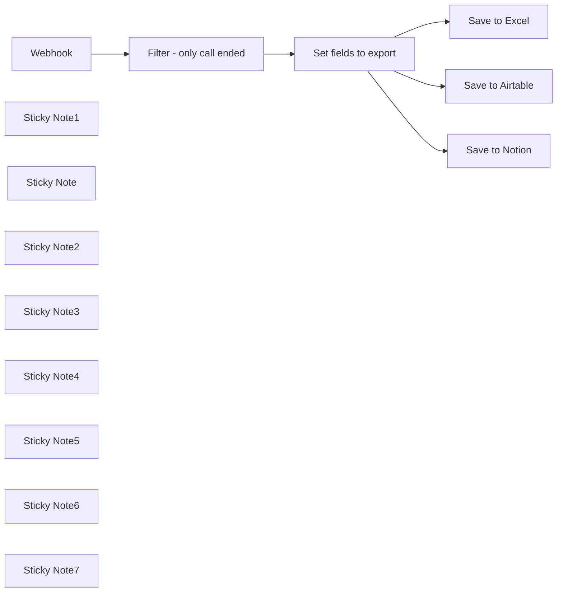

## Fluxo (.json) :

```json
{
  "meta": {
    "instanceId": "f4f5d195bb2162a0972f737368404b18be694648d365d6c6771d7b4909d28167",
    "templateCredsSetupCompleted": true
  },
  "nodes": [
    {
      "id": "85898264-74e1-45c1-8b45-e03f0d840e85",
      "name": "Webhook",
      "type": "n8n-nodes-base.webhook",
      "position": [
        -760,
        200
      ],
      "webhookId": "0208331f-eb06-489b-b133-c42be86b76d8",
      "parameters": {
        "path": "poc-retell-analysis",
        "options": {},
        "httpMethod": "POST"
      },
      "typeVersion": 2
    },
    {
      "id": "f0233dbd-d4db-4e95-afd7-a61ef932eba1",
      "name": "Set fields to export",
      "type": "n8n-nodes-base.set",
      "position": [
        -300,
        200
      ],
      "parameters": {
        "options": {},
        "assignments": {
          "assignments": [
            {
              "id": "bb7a4126-5192-493a-8f26-82e8d7ed1163",
              "name": "Call ID",
              "type": "string",
              "value": "={{ $('Webhook').item.json.body.call.call_id }}"
            },
            {
              "id": "fbbbf26f-219a-45b8-96f9-e22da449e874",
              "name": "Start Datetime",
              "type": "string",
              "value": "={{ $('Webhook').item.json.body.call.start_timestamp.toDateTime('ms').toLocal().toISO() }}"
            },
            {
              "id": "6e429227-e075-439d-af9d-01cad9381fe5",
              "name": "End Datetime",
              "type": "string",
              "value": "={{ $('Webhook').item.json.body.call.end_timestamp.toDateTime('ms').toLocal().toISO() }}"
            },
            {
              "id": "e371b2e7-f288-4bef-bbcc-d6f5d68d5a07",
              "name": "Duration in seconds",
              "type": "number",
              "value": "={{ $('Webhook').item.json.body.call.call_cost.total_duration_seconds }}"
            },
            {
              "id": "42fd4ac0-d00a-4e77-93d6-fe5deb0e8bc4",
              "name": "Transcript",
              "type": "string",
              "value": "={{ $('Webhook').item.json.body.call.transcript }}"
            },
            {
              "id": "46022591-1c73-4796-b968-dbc94b4ef24b",
              "name": "Call Summary",
              "type": "string",
              "value": "={{ $('Webhook').item.json.body.call.call_analysis.call_summary }}"
            },
            {
              "id": "68ab7134-4275-4428-978c-61fb7f229b0e",
              "name": "User Sentiment",
              "type": "string",
              "value": "={{ $('Webhook').item.json.body.call.call_analysis.user_sentiment }}"
            },
            {
              "id": "096991f9-4814-4a89-b5db-771e2f1020fa",
              "name": "Phone Number",
              "type": "string",
              "value": "={{ $if($('Webhook').item.json.body.call.direction == 'outbound', $('Webhook').item.json.body.call.to_number, $('Webhook').item.json.body.call.from_number)  }}"
            },
            {
              "id": "210b3594-e40a-4316-b4ff-7e944172d960",
              "name": "Total Cost in Dollars",
              "type": "number",
              "value": "={{ $json.body.call.call_cost.combined_cost/100 }}"
            }
          ]
        }
      },
      "typeVersion": 3.4
    },
    {
      "id": "7918d67d-76ca-4425-975b-14a3d3772755",
      "name": "Save to Airtable",
      "type": "n8n-nodes-base.airtable",
      "position": [
        100,
        -40
      ],
      "parameters": {
        "base": {
          "__rl": true,
          "mode": "list",
          "value": "appN4jeIrD8waWCfr",
          "cachedResultUrl": "https://airtable.com/appN4jeIrD8waWCfr",
          "cachedResultName": "Retell sample"
        },
        "table": {
          "__rl": true,
          "mode": "list",
          "value": "tbljL3fmuOzAj1Nwo",
          "cachedResultUrl": "https://airtable.com/appN4jeIrD8waWCfr/tbljL3fmuOzAj1Nwo",
          "cachedResultName": "Transcripts"
        },
        "columns": {
          "value": {
            "Call ID": "={{ $json['Call ID'] }}",
            "Transcript": "={{ $json.Transcript }}",
            "Call Summary": "={{ $json['Call Summary'] }}",
            "End Datetime": "={{ $json['End Datetime'] }}",
            "Phone Number": "={{ $json['Phone Number'] }}",
            "Start Datetime": "={{ $json['Start Datetime'] }}",
            "User Sentiment": "={{ $json['User Sentiment'] }}",
            "Duration in seconds": "={{ $json['Duration in seconds'] }}",
            "Total Cost in Dollars": "={{ $json['Total Cost in Dollars'] }}"
          },
          "schema": [
            {
              "id": "Phone Number",
              "type": "string",
              "display": true,
              "removed": false,
              "readOnly": false,
              "required": false,
              "displayName": "Phone Number",
              "defaultMatch": false,
              "canBeUsedToMatch": true
            },
            {
              "id": "First Name",
              "type": "string",
              "display": true,
              "removed": false,
              "readOnly": false,
              "required": false,
              "displayName": "First Name",
              "defaultMatch": false,
              "canBeUsedToMatch": true
            },
            {
              "id": "Last Name",
              "type": "string",
              "display": true,
              "removed": false,
              "readOnly": false,
              "required": false,
              "displayName": "Last Name",
              "defaultMatch": false,
              "canBeUsedToMatch": true
            },
            {
              "id": "Call ID",
              "type": "string",
              "display": true,
              "removed": false,
              "readOnly": false,
              "required": false,
              "displayName": "Call ID",
              "defaultMatch": false,
              "canBeUsedToMatch": true
            },
            {
              "id": "Start Datetime",
              "type": "dateTime",
              "display": true,
              "removed": false,
              "readOnly": false,
              "required": false,
              "displayName": "Start Datetime",
              "defaultMatch": false,
              "canBeUsedToMatch": true
            },
            {
              "id": "End Datetime",
              "type": "dateTime",
              "display": true,
              "removed": false,
              "readOnly": false,
              "required": false,
              "displayName": "End Datetime",
              "defaultMatch": false,
              "canBeUsedToMatch": true
            },
            {
              "id": "Duration in seconds",
              "type": "number",
              "display": true,
              "removed": false,
              "readOnly": false,
              "required": false,
              "displayName": "Duration in seconds",
              "defaultMatch": false,
              "canBeUsedToMatch": true
            },
            {
              "id": "Transcript",
              "type": "string",
              "display": true,
              "removed": false,
              "readOnly": false,
              "required": false,
              "displayName": "Transcript",
              "defaultMatch": false,
              "canBeUsedToMatch": true
            },
            {
              "id": "Call Summary",
              "type": "string",
              "display": true,
              "removed": false,
              "readOnly": false,
              "required": false,
              "displayName": "Call Summary",
              "defaultMatch": false,
              "canBeUsedToMatch": true
            },
            {
              "id": "User Sentiment",
              "type": "string",
              "display": true,
              "removed": false,
              "readOnly": false,
              "required": false,
              "displayName": "User Sentiment",
              "defaultMatch": false,
              "canBeUsedToMatch": true
            },
            {
              "id": "Total Cost in Dollars",
              "type": "number",
              "display": true,
              "removed": false,
              "readOnly": false,
              "required": false,
              "displayName": "Total Cost in Dollars",
              "defaultMatch": false,
              "canBeUsedToMatch": true
            }
          ],
          "mappingMode": "defineBelow",
          "matchingColumns": [],
          "attemptToConvertTypes": false,
          "convertFieldsToString": false
        },
        "options": {},
        "operation": "create"
      },
      "credentials": {
        "airtableTokenApi": {
          "id": "C8zNgAdz8w8ZVNqM",
          "name": "Airtable Agent Studio"
        }
      },
      "typeVersion": 2.1
    },
    {
      "id": "dd353466-3e65-4673-8d87-9f1f872b33e1",
      "name": "Save to Excel",
      "type": "n8n-nodes-base.googleSheets",
      "position": [
        100,
        200
      ],
      "parameters": {
        "columns": {
          "value": {
            "Call ID": "={{ $json['Call ID'] }}",
            "Transcript": "={{ $json.Transcript }}",
            "Call Summary": "={{ $json['Call Summary'] }}",
            "End Datetime": "={{ $json['End Datetime'] }}",
            "Phone Number": "='{{ $json['Phone Number'] }}",
            "Start Datetime": "={{ $json['Start Datetime'] }}",
            "User Sentiment": "={{ $json['User Sentiment'] }}",
            "Duration in seconds": "={{ $json['Duration in seconds'] }}",
            "Total Cost in Dollars": "={{ $json['Total Cost in Dollars'] }}"
          },
          "schema": [
            {
              "id": "Phone Number",
              "type": "string",
              "display": true,
              "required": false,
              "displayName": "Phone Number",
              "defaultMatch": false,
              "canBeUsedToMatch": true
            },
            {
              "id": "First Name",
              "type": "string",
              "display": true,
              "removed": true,
              "required": false,
              "displayName": "First Name",
              "defaultMatch": false,
              "canBeUsedToMatch": true
            },
            {
              "id": "Last Name",
              "type": "string",
              "display": true,
              "removed": true,
              "required": false,
              "displayName": "Last Name",
              "defaultMatch": false,
              "canBeUsedToMatch": true
            },
            {
              "id": "Call ID",
              "type": "string",
              "display": true,
              "removed": false,
              "required": false,
              "displayName": "Call ID",
              "defaultMatch": false,
              "canBeUsedToMatch": true
            },
            {
              "id": "Start Datetime",
              "type": "string",
              "display": true,
              "removed": false,
              "required": false,
              "displayName": "Start Datetime",
              "defaultMatch": false,
              "canBeUsedToMatch": true
            },
            {
              "id": "End Datetime",
              "type": "string",
              "display": true,
              "removed": false,
              "required": false,
              "displayName": "End Datetime",
              "defaultMatch": false,
              "canBeUsedToMatch": true
            },
            {
              "id": "Duration in seconds",
              "type": "string",
              "display": true,
              "removed": false,
              "required": false,
              "displayName": "Duration in seconds",
              "defaultMatch": false,
              "canBeUsedToMatch": true
            },
            {
              "id": "Transcript",
              "type": "string",
              "display": true,
              "removed": false,
              "required": false,
              "displayName": "Transcript",
              "defaultMatch": false,
              "canBeUsedToMatch": true
            },
            {
              "id": "Call Summary",
              "type": "string",
              "display": true,
              "removed": false,
              "required": false,
              "displayName": "Call Summary",
              "defaultMatch": false,
              "canBeUsedToMatch": true
            },
            {
              "id": "User Sentiment",
              "type": "string",
              "display": true,
              "removed": false,
              "required": false,
              "displayName": "User Sentiment",
              "defaultMatch": false,
              "canBeUsedToMatch": true
            },
            {
              "id": "Total Cost in Dollars",
              "type": "string",
              "display": true,
              "removed": false,
              "required": false,
              "displayName": "Total Cost in Dollars",
              "defaultMatch": false,
              "canBeUsedToMatch": true
            }
          ],
          "mappingMode": "defineBelow",
          "matchingColumns": [],
          "attemptToConvertTypes": false,
          "convertFieldsToString": false
        },
        "options": {
          "useAppend": true
        },
        "operation": "append",
        "sheetName": {
          "__rl": true,
          "mode": "list",
          "value": 311200653,
          "cachedResultUrl": "https://docs.google.com/spreadsheets/d/1TYgk8PK5w2l8Q5NtepdyLvgtuHXBHcODy-2hXOPP6AU/edit#gid=311200653",
          "cachedResultName": "Transcripts"
        },
        "documentId": {
          "__rl": true,
          "mode": "list",
          "value": "1TYgk8PK5w2l8Q5NtepdyLvgtuHXBHcODy-2hXOPP6AU",
          "cachedResultUrl": "https://docs.google.com/spreadsheets/d/1TYgk8PK5w2l8Q5NtepdyLvgtuHXBHcODy-2hXOPP6AU/edit?usp=drivesdk",
          "cachedResultName": "Retell sample UserDB"
        }
      },
      "credentials": {
        "googleSheetsOAuth2Api": {
          "id": "ufBkeygvc1l17m5N",
          "name": "Baptiste AS - Google Sheets account"
        }
      },
      "typeVersion": 4.5
    },
    {
      "id": "7ce16b86-d7aa-4239-8513-1ccc9a25cdc9",
      "name": "Save to Notion",
      "type": "n8n-nodes-base.notion",
      "position": [
        100,
        440
      ],
      "parameters": {
        "title": "={{ $json['Call Summary'] }}",
        "options": {},
        "resource": "databasePage",
        "databaseId": {
          "__rl": true,
          "mode": "list",
          "value": "1cea19b9-d484-8089-bda6-f3d7e05a818d",
          "cachedResultUrl": "https://www.notion.so/1cea19b9d4848089bda6f3d7e05a818d",
          "cachedResultName": "UserDB - Transcripts"
        },
        "propertiesUi": {
          "propertyValues": [
            {
              "key": "Call ID|rich_text",
              "textContent": "={{ $json['Call ID'] }}"
            },
            {
              "key": "Duration in seconds|number",
              "numberValue": "={{ $json['Duration in seconds'] }}"
            },
            {
              "key": "End Datetime|date",
              "date": "={{ $json['End Datetime'] }}"
            },
            {
              "key": "Phone Number|rich_text",
              "textContent": "={{ $json['Phone Number'] }}"
            },
            {
              "key": "Start Datetime|date",
              "date": "={{ $json['Start Datetime'] }}"
            },
            {
              "key": "Total Cost in Dollars|number",
              "numberValue": "={{ $json['Total Cost in Dollars'] }}"
            },
            {
              "key": "Transcript|rich_text",
              "textContent": "={{ $json.Transcript }}"
            },
            {
              "key": "User Sentiment|rich_text",
              "textContent": "={{ $json['User Sentiment'] }}"
            }
          ]
        }
      },
      "credentials": {
        "notionApi": {
          "id": "tOVdjeVnLcw3xu0g",
          "name": "Template Retell"
        }
      },
      "typeVersion": 2.2
    },
    {
      "id": "bbb5b39c-8826-4f59-8c40-ff10529fa42f",
      "name": "Sticky Note1",
      "type": "n8n-nodes-base.stickyNote",
      "position": [
        -1520,
        -540
      ],
      "parameters": {
        "color": 7,
        "width": 601,
        "height": 1585,
        "content": "## Automatically store Retell transcripts in Google Sheets/Airtable/Notion from webhook\n\n## Overview\n- This workflow stores the results of a **[Retell](https://www.retellai.com/)** voice call (transcript, analysis, etc.) once it has ended and been analyzed.\n- It listens for `call_analyzed` webhook events from Retell and stores the data in **Airtable**, **Google Sheets**, and **Notion** (choose based on your stack).\n- Useful for anyone building Retell agents who want to keep a detailed history of analyzed calls in structured tools.\n\n## Who is it for\nFor builders of [Retell's](https://www.retellai.com/) Voice Agents who want to store call history and essential analytic data.\n\n## Prerequisites\n- Have a [Retell AI Account](https://www.retellai.com/)\n- [Create a Retell agent](https://docs.retellai.com/get-started/quick-start)\n- Associate a phone number with your Retell agent\n- Set up one of the following:\n  - An Airtable base and table (example: \"Transcripts\")\n  - A Google Sheet with a “Transcripts” tab\n  - A Notion database with columns to match the transcript fields\n- Templates:\n  - [Airtable](https://airtable.com/appN4jeIrD8waWCfr/shrsPtQLeqt8Sp3UZ)\n  - [Google Sheets](https://docs.google.com/spreadsheets/d/1TYgk8PK5w2l8Q5NtepdyLvgtuHXBHcODy-2hXOPP6AU/edit?usp=sharing)\n  - [Notion](https://www.notion.so/1cea19b9d4848089bda6f3d7e05a818d?v=1cea19b9d48481ea97ef000ccd20f210&pvs=4)\n\n## How it works\n- Receives a webhook POST request from Retell when a call has been analyzed.\n- Filters out any event that is not `call_analyzed` ([Retell sends webhooks](https://docs.retellai.com/features/webhook-overview#webhook-overview) for `call_started`, `call_ended` and `call_analyzed`)\n- Extracts useful fields like:\n  - Call ID, start/end time, duration, total cost\n  - Transcript, summary, sentiment\n- Stores this data in your preferred tool:\n  - Airtable\n  - Google Sheets\n  - Notion\n\n## How to use it\n1. Copy the webhook URL (e.g., `https://your-instance.app.n8n.cloud/webhook/poc-retell-analysis`) and paste it in your Retell agent under \"Webhook settings\" then \"Agent Level Webhook URL\".\n2. Make sure your Airtable, Google Sheet, or Notion databases are correctly configured to receive the fields.\n3. After each call, once Retell finishes the analysis, this workflow will automatically log the results.\n\n## Extension\n- If you use any \"Post-Call Analysis\" fields, you can add columns to your Airtable, Google Sheet, or Notion database.\n- Then fetch the data from the `call.call_analysis.custom_analysis_data` object.\n\n## Additional Notes\n- Phone numbers are extracted depending on the call direction (`from_number` or `to_number`).\n- Cost is converted from cents to dollars before saving.\n- Dates are converted from timestamps to local ISO strings.\n- You can remove any of the outputs (Airtable, Google Sheets, Notion) if you're only using one.\n\n\n#### 👉 Reach out to [us](mailto:hello@agentstudio.io) if you're interested in **analysing your Retell Agent conversations**."
      },
      "typeVersion": 1
    },
    {
      "id": "5281b143-7b27-4f8e-b55a-98e2a37fa1e8",
      "name": "Sticky Note",
      "type": "n8n-nodes-base.stickyNote",
      "position": [
        -820,
        60
      ],
      "parameters": {
        "color": 5,
        "width": 220,
        "height": 300,
        "content": "POST Webhook receiving your Retell events"
      },
      "typeVersion": 1
    },
    {
      "id": "52a7c9ca-d612-4833-9e28-783878f92e92",
      "name": "Sticky Note2",
      "type": "n8n-nodes-base.stickyNote",
      "position": [
        -580,
        60
      ],
      "parameters": {
        "color": 5,
        "width": 220,
        "height": 300,
        "content": "Only keep the `call_analyzed` events (it contains all data points)"
      },
      "typeVersion": 1
    },
    {
      "id": "6b11df00-34c6-4c2f-b847-f4126d2aeffe",
      "name": "Filter - only call ended",
      "type": "n8n-nodes-base.filter",
      "position": [
        -520,
        200
      ],
      "parameters": {
        "options": {},
        "conditions": {
          "options": {
            "version": 2,
            "leftValue": "",
            "caseSensitive": true,
            "typeValidation": "strict"
          },
          "combinator": "and",
          "conditions": [
            {
              "id": "d81cb5cf-8fc0-43ff-b191-feec11250154",
              "operator": {
                "name": "filter.operator.equals",
                "type": "string",
                "operation": "equals"
              },
              "leftValue": "={{ $json.body.event }}",
              "rightValue": "call_analyzed"
            }
          ]
        }
      },
      "typeVersion": 2.2
    },
    {
      "id": "4c8cb9a2-35fe-42ae-825e-1aab42f152ad",
      "name": "Sticky Note3",
      "type": "n8n-nodes-base.stickyNote",
      "position": [
        -340,
        60
      ],
      "parameters": {
        "color": 5,
        "width": 220,
        "height": 300,
        "content": "Prepare your data to be sent to your preferred database.\nIf you add more data or post call analytics, you will add fields here."
      },
      "typeVersion": 1
    },
    {
      "id": "8a308e68-365c-4f0a-85f2-a857e7c8011c",
      "name": "Sticky Note4",
      "type": "n8n-nodes-base.stickyNote",
      "position": [
        40,
        -100
      ],
      "parameters": {
        "color": 5,
        "width": 220,
        "height": 220,
        "content": "Save all fields from Retell to Airtable"
      },
      "typeVersion": 1
    },
    {
      "id": "c4e71141-8089-4b17-86c2-c290778c49e5",
      "name": "Sticky Note5",
      "type": "n8n-nodes-base.stickyNote",
      "position": [
        40,
        140
      ],
      "parameters": {
        "color": 5,
        "width": 220,
        "height": 220,
        "content": "Save all fields from Retell to Google Sheets"
      },
      "typeVersion": 1
    },
    {
      "id": "dad436ca-68db-45c2-8b87-785c650424ca",
      "name": "Sticky Note6",
      "type": "n8n-nodes-base.stickyNote",
      "position": [
        40,
        380
      ],
      "parameters": {
        "color": 5,
        "width": 220,
        "height": 220,
        "content": "Save all fields from Retell to Notion"
      },
      "typeVersion": 1
    },
    {
      "id": "57371198-2885-419a-9b12-9f1dfd1388f5",
      "name": "Sticky Note7",
      "type": "n8n-nodes-base.stickyNote",
      "position": [
        40,
        -240
      ],
      "parameters": {
        "color": 3,
        "width": 220,
        "height": 120,
        "content": "Remove the unnecessary tools\n# 👇 "
      },
      "typeVersion": 1
    }
  ],
  "pinData": {
    "Webhook": [
      {
        "body": {
          "call": {
            "call_id": "call_0e55e4a736cd190205d31cc0792",
            "latency": {
              "e2e": {
                "max": 2046,
                "min": 939,
                "num": 6,
                "p50": 1404.5,
                "p90": 1821.5,
                "p95": 1933.75,
                "p99": 2023.5500000000002,
                "values": [
                  1597,
                  1084,
                  1316,
                  2046,
                  939,
                  1493
                ]
              },
              "llm": {
                "max": 970,
                "min": 528,
                "num": 16,
                "p50": 719.5,
                "p90": 901.5,
                "p95": 926.5,
                "p99": 961.3,
                "values": [
                  717,
                  912,
                  593,
                  528,
                  592,
                  549,
                  833,
                  572,
                  586,
                  637,
                  722,
                  846,
                  970,
                  872,
                  891,
                  795
                ]
              },
              "tts": {
                "max": 1005,
                "min": 300,
                "num": 16,
                "p50": 346.5,
                "p90": 512.5,
                "p95": 645.75,
                "p99": 933.1499999999999,
                "values": [
                  474,
                  499,
                  312,
                  357,
                  302,
                  300,
                  1005,
                  320,
                  364,
                  526,
                  354,
                  327,
                  314,
                  312,
                  339,
                  355
                ]
              }
            },
            "agent_id": "agent_971837f76df12a41d1b0e939a3",
            "metadata": {},
            "call_cost": {
              "combined_cost": 12.5883333,
              "product_costs": [
                {
                  "cost": 0,
                  "product": "retell_platform",
                  "unit_price": 0
                },
                {
                  "cost": 9.6833333,
                  "product": "elevenlabs_tts",
                  "unit_price": 0.1166667
                },
                {
                  "cost": 0.83,
                  "product": "gpt_4o_mini",
                  "unit_price": 0.01
                },
                {
                  "cost": 2.075,
                  "product": "us_telephony",
                  "unit_price": 0.025
                }
              ],
              "total_one_time_price": 0,
              "total_duration_seconds": 83,
              "total_duration_unit_price": 0.1516667
            },
            "call_type": "phone_call",
            "direction": "outbound",
            "to_number": "+15555555555",
            "transcript": "User: Hello. Welcome to Avelian Paradise Hotel. How can I help you today?\nAgent: Hi, I need to make a reservation for me and my wife on October 29th. Our budget is less than 150 euros. Can you help me with that? Also, does the hotel have a swimming pool?\nUser: Certainly. I can assist you with your reservation. Just to confirm, you are looking for a stay on October twenty ninth. Correct?\nUser: your budget, the standard room is available for one hundred and ten euros per night, which fits within your budget.\nUser: yes. \nAgent: Great! Let's \nUser: We do have an out may I have your name and email address, please?\nAgent: My name is Mike Smith, and my email address is mike@yahoo.com.\nUser: Thank you, Mike. Just to confirm, you would like to book a standard room for one night on October twenty ninth Is that correct?\nAgent: Yes, that's correct. Please go ahead and book it.\nUser: Your reservation for the standard room on October twenty ninth is confirmed.\nUser: That's one night, totaling one hundred and ten euros I will now send you an email with all the details and a link to complete the payment.\nUser: you, Mike, and we look forward to welcoming you. Now I will proceed with sending the confirmation email. Will shortly receive a confirmation email with all the details of your reservation.\nUser: you once again, Mike.\nAgent: Thank you! I'll look out for the confirmation email.\n",
            "call_status": "ended",
            "duration_ms": 82588,
            "from_number": "+15555555555",
            "call_analysis": {
              "call_summary": "The user, Mike Smith, successfully made a reservation for a standard room at Avelian Paradise Hotel for one night on October 29th for 110 euros. The agent confirmed the booking and stated that a confirmation email would be sent shortly.",
              "in_voicemail": false,
              "user_sentiment": "Positive",
              "call_successful": true,
              "custom_analysis_data": {}
            },
            "end_timestamp": 1743418542998,
            "recording_url": "https://dxc03zgurdly9.cloudfront.net/2906e0f58bcc8cd6d897ac10fe21bc2c94f81477483c4f645b4ec281965a8e59/recording.wav",
            "public_log_url": "https://dxc03zgurdly9.cloudfront.net/2906e0f58bcc8cd6d897ac10fe21bc2c94f81477483c4f645b4ec281965a8e59/public.log",
            "start_timestamp": 1743418460410,
            "transcript_object": [
              {
                "role": "user",
                "words": [
                  {
                    "end": 1.2089998999999998,
                    "word": "Hello. ",
                    "start": 0.80899995
                  },
                  {
                    "end": 1.369,
                    "word": "Welcome ",
                    "start": 1.2089998999999998
                  },
                  {
                    "end": 1.529,
                    "word": "to ",
                    "start": 1.369
                  },
                  {
                    "end": 1.9289999999999998,
                    "word": "Avelian ",
                    "start": 1.529
                  },
                  {
                    "end": 2.3289999999999997,
                    "word": "Paradise ",
                    "start": 1.9289999999999998
                  },
                  {
                    "end": 2.569,
                    "word": "Hotel. ",
                    "start": 2.3289999999999997
                  },
                  {
                    "end": 3.159,
                    "word": "How ",
                    "start": 2.839
                  },
                  {
                    "end": 3.319,
                    "word": "can ",
                    "start": 3.159
                  },
                  {
                    "end": 3.3989998999999997,
                    "word": "I ",
                    "start": 3.319
                  },
                  {
                    "end": 3.5589999999999997,
                    "word": "help ",
                    "start": 3.3989998999999997
                  },
                  {
                    "end": 3.639,
                    "word": "you ",
                    "start": 3.5589999999999997
                  },
                  {
                    "end": 3.799,
                    "word": "today?",
                    "start": 3.639
                  }
                ],
                "content": "Hello. Welcome to Avelian Paradise Hotel. How can I help you today?"
              },
              {
                "role": "agent",
                "words": [
                  {
                    "end": 5.849,
                    "word": "Hi, ",
                    "start": 5.547
                  },
                  {
                    "end": 5.976,
                    "word": "I ",
                    "start": 5.849
                  },
                  {
                    "end": 6.162,
                    "word": "need ",
                    "start": 5.976
                  },
                  {
                    "end": 6.244,
                    "word": "to ",
                    "start": 6.162
                  },
                  {
                    "end": 6.429,
                    "word": "make ",
                    "start": 6.244
                  },
                  {
                    "end": 6.499,
                    "word": "a ",
                    "start": 6.429
                  },
                  {
                    "end": 7.068,
                    "word": "reservation ",
                    "start": 6.499
                  },
                  {
                    "end": 7.23,
                    "word": "for ",
                    "start": 7.068
                  },
                  {
                    "end": 7.37,
                    "word": "me ",
                    "start": 7.23
                  },
                  {
                    "end": 7.497,
                    "word": "and ",
                    "start": 7.37
                  },
                  {
                    "end": 7.648,
                    "word": "my ",
                    "start": 7.497
                  },
                  {
                    "end": 8.008,
                    "word": "wife ",
                    "start": 7.648
                  },
                  {
                    "end": 8.159,
                    "word": "on ",
                    "start": 8.008
                  },
                  {
                    "end": 8.507,
                    "word": "October ",
                    "start": 8.159
                  },
                  {
                    "end": 8.763,
                    "word": "29th.",
                    "start": 8.507
                  },
                  {
                    "end": 9.551208251953126,
                    "word": " Our ",
                    "start": 9.331208251953125
                  },
                  {
                    "end": 9.911208251953125,
                    "word": "budget ",
                    "start": 9.551208251953126
                  },
                  {
                    "end": 10.039208251953125,
                    "word": "is ",
                    "start": 9.911208251953125
                  },
                  {
                    "end": 10.260208251953125,
                    "word": "less ",
                    "start": 10.039208251953125
                  },
                  {
                    "end": 10.457208251953125,
                    "word": "than ",
                    "start": 10.260208251953125
                  },
                  {
                    "end": 10.596208251953126,
                    "word": "150 ",
                    "start": 10.457208251953125
                  },
                  {
                    "end": 10.840208251953126,
                    "word": "euros.",
                    "start": 10.596208251953126
                  },
                  {
                    "end": 12.174958251953125,
                    "word": " Can ",
                    "start": 12.034958251953125
                  },
                  {
                    "end": 12.278958251953124,
                    "word": "you ",
                    "start": 12.174958251953125
                  },
                  {
                    "end": 12.429958251953124,
                    "word": "help ",
                    "start": 12.278958251953124
                  },
                  {
                    "end": 12.522958251953124,
                    "word": "me ",
                    "start": 12.429958251953124
                  },
                  {
                    "end": 12.673958251953126,
                    "word": "with ",
                    "start": 12.522958251953124
                  },
                  {
                    "end": 13.149958251953125,
                    "word": "that?",
                    "start": 12.673958251953126
                  },
                  {
                    "end": 13.962208251953125,
                    "word": " Also, ",
                    "start": 13.195208251953124
                  },
                  {
                    "end": 14.159208251953125,
                    "word": "does ",
                    "start": 13.962208251953125
                  },
                  {
                    "end": 14.275208251953124,
                    "word": "the ",
                    "start": 14.159208251953125
                  },
                  {
                    "end": 14.554208251953124,
                    "word": "hotel ",
                    "start": 14.275208251953124
                  },
                  {
                    "end": 14.682208251953124,
                    "word": "have ",
                    "start": 14.554208251953124
                  },
                  {
                    "end": 14.728208251953125,
                    "word": "a ",
                    "start": 14.682208251953124
                  },
                  {
                    "end": 15.030208251953125,
                    "word": "swimming ",
                    "start": 14.728208251953125
                  },
                  {
                    "end": 15.517208251953125,
                    "word": "pool?",
                    "start": 15.030208251953125
                  }
                ],
                "content": "Hi, I need to make a reservation for me and my wife on October 29th. Our budget is less than 150 euros. Can you help me with that? Also, does the hotel have a swimming pool?",
                "metadata": {
                  "response_id": 2
                }
              },
              {
                "role": "user",
                "words": [
                  {
                    "end": 17.689,
                    "word": "Certainly. ",
                    "start": 17.128999
                  },
                  {
                    "end": 17.929000000000002,
                    "word": "I ",
                    "start": 17.689
                  },
                  {
                    "end": 18.169,
                    "word": "can ",
                    "start": 17.929000000000002
                  },
                  {
                    "end": 18.409,
                    "word": "assist ",
                    "start": 18.169
                  },
                  {
                    "end": 18.489,
                    "word": "you ",
                    "start": 18.409
                  },
                  {
                    "end": 18.649,
                    "word": "with ",
                    "start": 18.489
                  },
                  {
                    "end": 18.889,
                    "word": "your ",
                    "start": 18.649
                  },
                  {
                    "end": 19.288999,
                    "word": "reservation. ",
                    "start": 18.889
                  },
                  {
                    "end": 19.889,
                    "word": "Just ",
                    "start": 19.649
                  },
                  {
                    "end": 20.048999000000002,
                    "word": "to ",
                    "start": 19.889
                  },
                  {
                    "end": 20.608998,
                    "word": "confirm, ",
                    "start": 20.048999000000002
                  },
                  {
                    "end": 20.689,
                    "word": "you ",
                    "start": 20.608998
                  },
                  {
                    "end": 20.849,
                    "word": "are ",
                    "start": 20.689
                  },
                  {
                    "end": 21.089,
                    "word": "looking ",
                    "start": 20.849
                  },
                  {
                    "end": 21.169,
                    "word": "for ",
                    "start": 21.089
                  },
                  {
                    "end": 21.329,
                    "word": "a ",
                    "start": 21.169
                  },
                  {
                    "end": 21.569,
                    "word": "stay ",
                    "start": 21.329
                  },
                  {
                    "end": 21.729,
                    "word": "on ",
                    "start": 21.569
                  },
                  {
                    "end": 22.128999,
                    "word": "October ",
                    "start": 21.729
                  },
                  {
                    "end": 22.288999,
                    "word": "twenty ",
                    "start": 22.128999
                  },
                  {
                    "end": 22.689,
                    "word": "ninth. ",
                    "start": 22.288999
                  },
                  {
                    "end": 22.849,
                    "word": "Correct?",
                    "start": 22.689
                  }
                ],
                "content": "Certainly. I can assist you with your reservation. Just to confirm, you are looking for a stay on October twenty ninth. Correct?"
              },
              {
                "role": "user",
                "words": [
                  {
                    "end": 23.969,
                    "word": "your ",
                    "start": 23.809
                  },
                  {
                    "end": 24.209,
                    "word": "budget, ",
                    "start": 23.969
                  },
                  {
                    "end": 24.579,
                    "word": "the ",
                    "start": 24.419
                  },
                  {
                    "end": 24.899,
                    "word": "standard ",
                    "start": 24.579
                  },
                  {
                    "end": 25.139,
                    "word": "room ",
                    "start": 24.899
                  },
                  {
                    "end": 25.298999000000002,
                    "word": "is ",
                    "start": 25.139
                  },
                  {
                    "end": 25.619,
                    "word": "available ",
                    "start": 25.298999000000002
                  },
                  {
                    "end": 25.779,
                    "word": "for ",
                    "start": 25.619
                  },
                  {
                    "end": 26.019000000000002,
                    "word": "one ",
                    "start": 25.779
                  },
                  {
                    "end": 26.179000000000002,
                    "word": "hundred ",
                    "start": 26.019000000000002
                  },
                  {
                    "end": 26.339,
                    "word": "and ",
                    "start": 26.179000000000002
                  },
                  {
                    "end": 26.579,
                    "word": "ten ",
                    "start": 26.339
                  },
                  {
                    "end": 26.899,
                    "word": "euros ",
                    "start": 26.579
                  },
                  {
                    "end": 27.059,
                    "word": "per ",
                    "start": 26.899
                  },
                  {
                    "end": 27.378999,
                    "word": "night, ",
                    "start": 27.059
                  },
                  {
                    "end": 27.538999,
                    "word": "which ",
                    "start": 27.378999
                  },
                  {
                    "end": 27.779,
                    "word": "fits ",
                    "start": 27.538999
                  },
                  {
                    "end": 28.019000000000002,
                    "word": "within ",
                    "start": 27.779
                  },
                  {
                    "end": 28.099,
                    "word": "your ",
                    "start": 28.019000000000002
                  },
                  {
                    "end": 28.339,
                    "word": "budget.",
                    "start": 28.099
                  }
                ],
                "content": "your budget, the standard room is available for one hundred and ten euros per night, which fits within your budget."
              },
              {
                "role": "user",
                "words": [
                  {
                    "end": 30.199,
                    "word": "yes. ",
                    "start": 29.959
                  }
                ],
                "content": "yes. "
              },
              {
                "role": "agent",
                "words": [
                  {
                    "end": 30.305,
                    "word": "Great!",
                    "start": 29.748
                  },
                  {
                    "end": 30.7,
                    "word": " Let's ",
                    "start": 30.456
                  }
                ],
                "content": "Great! Let's ",
                "metadata": {
                  "response_id": 8
                }
              },
              {
                "role": "user",
                "words": [
                  {
                    "end": 30.749,
                    "word": "We ",
                    "start": 30.429000000000002
                  },
                  {
                    "end": 30.909,
                    "word": "do ",
                    "start": 30.749
                  },
                  {
                    "end": 31.069,
                    "word": "have ",
                    "start": 30.909
                  },
                  {
                    "end": 31.229,
                    "word": "an ",
                    "start": 31.069
                  },
                  {
                    "end": 31.389,
                    "word": "out ",
                    "start": 31.229
                  },
                  {
                    "end": 33.029,
                    "word": "may ",
                    "start": 32.789
                  },
                  {
                    "end": 33.189,
                    "word": "I ",
                    "start": 33.029
                  },
                  {
                    "end": 33.269,
                    "word": "have ",
                    "start": 33.189
                  },
                  {
                    "end": 33.429,
                    "word": "your ",
                    "start": 33.269
                  },
                  {
                    "end": 33.589,
                    "word": "name ",
                    "start": 33.429
                  },
                  {
                    "end": 33.748998,
                    "word": "and ",
                    "start": 33.589
                  },
                  {
                    "end": 33.989,
                    "word": "email ",
                    "start": 33.748998
                  },
                  {
                    "end": 34.309,
                    "word": "address, ",
                    "start": 33.989
                  },
                  {
                    "end": 34.469,
                    "word": "please?",
                    "start": 34.309
                  }
                ],
                "content": "We do have an out may I have your name and email address, please?"
              },
              {
                "role": "agent",
                "words": [
                  {
                    "end": 36.828,
                    "word": "My ",
                    "start": 36.689
                  },
                  {
                    "end": 37.003,
                    "word": "name ",
                    "start": 36.828
                  },
                  {
                    "end": 37.154,
                    "word": "is ",
                    "start": 37.003
                  },
                  {
                    "end": 37.374,
                    "word": "Mike ",
                    "start": 37.154
                  },
                  {
                    "end": 37.804,
                    "word": "Smith, ",
                    "start": 37.374
                  },
                  {
                    "end": 37.989,
                    "word": "and ",
                    "start": 37.804
                  },
                  {
                    "end": 38.129,
                    "word": "my ",
                    "start": 37.989
                  },
                  {
                    "end": 38.419,
                    "word": "email ",
                    "start": 38.129
                  },
                  {
                    "end": 38.756,
                    "word": "address ",
                    "start": 38.419
                  },
                  {
                    "end": 38.883,
                    "word": "is ",
                    "start": 38.756
                  },
                  {
                    "end": 39.104,
                    "word": "mike@yahoo.com.",
                    "start": 38.883
                  }
                ],
                "content": "My name is Mike Smith, and my email address is mike@yahoo.com.",
                "metadata": {
                  "response_id": 9
                }
              },
              {
                "role": "user",
                "words": [
                  {
                    "end": 42.569,
                    "word": "Thank ",
                    "start": 42.329
                  },
                  {
                    "end": 42.809003,
                    "word": "you, ",
                    "start": 42.569
                  },
                  {
                    "end": 43.369,
                    "word": "Mike. ",
                    "start": 42.809003
                  },
                  {
                    "end": 43.689,
                    "word": "Just ",
                    "start": 43.369
                  },
                  {
                    "end": 43.849000000000004,
                    "word": "to ",
                    "start": 43.689
                  },
                  {
                    "end": 44.249,
                    "word": "confirm, ",
                    "start": 43.849000000000004
                  },
                  {
                    "end": 44.409,
                    "word": "you ",
                    "start": 44.249
                  },
                  {
                    "end": 44.569,
                    "word": "would ",
                    "start": 44.409
                  },
                  {
                    "end": 44.729,
                    "word": "like ",
                    "start": 44.569
                  },
                  {
                    "end": 44.809003,
                    "word": "to ",
                    "start": 44.729
                  },
                  {
                    "end": 44.889,
                    "word": "book ",
                    "start": 44.809003
                  },
                  {
                    "end": 45.049,
                    "word": "a ",
                    "start": 44.889
                  },
                  {
                    "end": 45.499,
                    "word": "standard ",
                    "start": 45.099000000000004
                  },
                  {
                    "end": 45.739,
                    "word": "room ",
                    "start": 45.499
                  },
                  {
                    "end": 45.899,
                    "word": "for ",
                    "start": 45.739
                  },
                  {
                    "end": 46.059,
                    "word": "one ",
                    "start": 45.899
                  },
                  {
                    "end": 46.379,
                    "word": "night ",
                    "start": 46.059
                  },
                  {
                    "end": 46.699,
                    "word": "on ",
                    "start": 46.379
                  },
                  {
                    "end": 47.099000000000004,
                    "word": "October ",
                    "start": 46.699
                  },
                  {
                    "end": 47.339,
                    "word": "twenty ",
                    "start": 47.099000000000004
                  },
                  {
                    "end": 47.579,
                    "word": "ninth ",
                    "start": 47.339
                  },
                  {
                    "end": 48.369,
                    "word": "Is ",
                    "start": 48.129
                  },
                  {
                    "end": 48.529,
                    "word": "that ",
                    "start": 48.369
                  },
                  {
                    "end": 48.769,
                    "word": "correct?",
                    "start": 48.529
                  }
                ],
                "content": "Thank you, Mike. Just to confirm, you would like to book a standard room for one night on October twenty ninth Is that correct?"
              },
              {
                "role": "agent",
                "words": [
                  {
                    "end": 50.138,
                    "word": "Yes, ",
                    "start": 49.859
                  },
                  {
                    "end": 50.358,
                    "word": "that's ",
                    "start": 50.138
                  },
                  {
                    "end": 50.962,
                    "word": "correct.",
                    "start": 50.358
                  },
                  {
                    "end": 51.240125,
                    "word": " Please ",
                    "start": 51.007125
                  },
                  {
                    "end": 51.356125,
                    "word": "go ",
                    "start": 51.240125
                  },
                  {
                    "end": 51.530125,
                    "word": "ahead ",
                    "start": 51.356125
                  },
                  {
                    "end": 51.634125,
                    "word": "and ",
                    "start": 51.530125
                  },
                  {
                    "end": 51.820125,
                    "word": "book ",
                    "start": 51.634125
                  },
                  {
                    "end": 52.122125,
                    "word": "it.",
                    "start": 51.820125
                  }
                ],
                "content": "Yes, that's correct. Please go ahead and book it.",
                "metadata": {
                  "response_id": 11
                }
              },
              {
                "role": "user",
                "words": [
                  {
                    "end": 56.599000000000004,
                    "word": "Your ",
                    "start": 56.279
                  },
                  {
                    "end": 57.159,
                    "word": "reservation ",
                    "start": 56.599000000000004
                  },
                  {
                    "end": 57.399,
                    "word": "for ",
                    "start": 57.159
                  },
                  {
                    "end": 57.559,
                    "word": "the ",
                    "start": 57.399
                  },
                  {
                    "end": 57.879,
                    "word": "standard ",
                    "start": 57.559
                  },
                  {
                    "end": 58.119,
                    "word": "room ",
                    "start": 57.879
                  },
                  {
                    "end": 58.359,
                    "word": "on ",
                    "start": 58.119
                  },
                  {
                    "end": 58.759,
                    "word": "October ",
                    "start": 58.359
                  },
                  {
                    "end": 59.079,
                    "word": "twenty ",
                    "start": 58.759
                  },
                  {
                    "end": 59.318998,
                    "word": "ninth ",
                    "start": 59.079
                  },
                  {
                    "end": 59.559,
                    "word": "is ",
                    "start": 59.318998
                  },
                  {
                    "end": 59.799,
                    "word": "confirmed.",
                    "start": 59.559
                  }
                ],
                "content": "Your reservation for the standard room on October twenty ninth is confirmed."
              },
              {
                "role": "user",
                "words": [
                  {
                    "end": 60.769002,
                    "word": "That's ",
                    "start": 60.449002
                  },
                  {
                    "end": 60.929002,
                    "word": "one ",
                    "start": 60.769002
                  },
                  {
                    "end": 61.409,
                    "word": "night, ",
                    "start": 60.929002
                  },
                  {
                    "end": 61.649,
                    "word": "totaling ",
                    "start": 61.409
                  },
                  {
                    "end": 61.889,
                    "word": "one ",
                    "start": 61.649
                  },
                  {
                    "end": 62.129,
                    "word": "hundred ",
                    "start": 61.889
                  },
                  {
                    "end": 62.209,
                    "word": "and ",
                    "start": 62.129
                  },
                  {
                    "end": 62.449002,
                    "word": "ten ",
                    "start": 62.209
                  },
                  {
                    "end": 62.769002,
                    "word": "euros ",
                    "start": 62.449002
                  },
                  {
                    "end": 63.369,
                    "word": "I ",
                    "start": 63.209
                  },
                  {
                    "end": 63.529,
                    "word": "will ",
                    "start": 63.369
                  },
                  {
                    "end": 63.769,
                    "word": "now ",
                    "start": 63.529
                  },
                  {
                    "end": 63.929,
                    "word": "send ",
                    "start": 63.769
                  },
                  {
                    "end": 64.089,
                    "word": "you ",
                    "start": 63.929
                  },
                  {
                    "end": 64.168996,
                    "word": "an ",
                    "start": 64.089
                  },
                  {
                    "end": 64.488996,
                    "word": "email ",
                    "start": 64.168996
                  },
                  {
                    "end": 64.729,
                    "word": "with ",
                    "start": 64.488996
                  },
                  {
                    "end": 64.889,
                    "word": "all ",
                    "start": 64.729
                  },
                  {
                    "end": 65.049,
                    "word": "the ",
                    "start": 64.889
                  },
                  {
                    "end": 65.449,
                    "word": "details ",
                    "start": 65.049
                  },
                  {
                    "end": 65.68900000000001,
                    "word": "and ",
                    "start": 65.449
                  },
                  {
                    "end": 65.849,
                    "word": "a ",
                    "start": 65.68900000000001
                  },
                  {
                    "end": 66.009,
                    "word": "link ",
                    "start": 65.849
                  },
                  {
                    "end": 66.168996,
                    "word": "to ",
                    "start": 66.009
                  },
                  {
                    "end": 66.409,
                    "word": "complete ",
                    "start": 66.168996
                  },
                  {
                    "end": 66.569,
                    "word": "the ",
                    "start": 66.409
                  },
                  {
                    "end": 66.808995,
                    "word": "payment.",
                    "start": 66.569
                  }
                ],
                "content": "That's one night, totaling one hundred and ten euros I will now send you an email with all the details and a link to complete the payment."
              },
              {
                "role": "user",
                "words": [
                  {
                    "end": 67.809,
                    "word": "you, ",
                    "start": 67.569005
                  },
                  {
                    "end": 68.209005,
                    "word": "Mike, ",
                    "start": 67.809
                  },
                  {
                    "end": 68.369,
                    "word": "and ",
                    "start": 68.209005
                  },
                  {
                    "end": 68.609,
                    "word": "we ",
                    "start": 68.369
                  },
                  {
                    "end": 68.849004,
                    "word": "look ",
                    "start": 68.609
                  },
                  {
                    "end": 69.089,
                    "word": "forward ",
                    "start": 68.849004
                  },
                  {
                    "end": 69.169,
                    "word": "to ",
                    "start": 69.089
                  },
                  {
                    "end": 69.489,
                    "word": "welcoming ",
                    "start": 69.169
                  },
                  {
                    "end": 69.729,
                    "word": "you. ",
                    "start": 69.489
                  },
                  {
                    "end": 70.329,
                    "word": "Now ",
                    "start": 70.009
                  },
                  {
                    "end": 70.649,
                    "word": "I ",
                    "start": 70.329
                  },
                  {
                    "end": 70.889,
                    "word": "will ",
                    "start": 70.649
                  },
                  {
                    "end": 71.209,
                    "word": "proceed ",
                    "start": 70.889
                  },
                  {
                    "end": 71.448995,
                    "word": "with ",
                    "start": 71.209
                  },
                  {
                    "end": 71.68900000000001,
                    "word": "sending ",
                    "start": 71.448995
                  },
                  {
                    "end": 71.849,
                    "word": "the ",
                    "start": 71.68900000000001
                  },
                  {
                    "end": 72.329,
                    "word": "confirmation ",
                    "start": 71.849
                  },
                  {
                    "end": 72.649,
                    "word": "email. ",
                    "start": 72.329
                  },
                  {
                    "end": 73.269,
                    "word": "Will ",
                    "start": 72.949
                  },
                  {
                    "end": 73.509,
                    "word": "shortly ",
                    "start": 73.269
                  },
                  {
                    "end": 73.749,
                    "word": "receive ",
                    "start": 73.509
                  },
                  {
                    "end": 73.909,
                    "word": "a ",
                    "start": 73.749
                  },
                  {
                    "end": 74.309,
                    "word": "confirmation ",
                    "start": 73.909
                  },
                  {
                    "end": 74.629,
                    "word": "email ",
                    "start": 74.309
                  },
                  {
                    "end": 74.869,
                    "word": "with ",
                    "start": 74.629
                  },
                  {
                    "end": 75.109,
                    "word": "all ",
                    "start": 74.869
                  },
                  {
                    "end": 75.269,
                    "word": "the ",
                    "start": 75.109
                  },
                  {
                    "end": 75.829,
                    "word": "details ",
                    "start": 75.269
                  },
                  {
                    "end": 76.149,
                    "word": "of ",
                    "start": 75.829
                  },
                  {
                    "end": 76.469,
                    "word": "your ",
                    "start": 76.149
                  },
                  {
                    "end": 76.949,
                    "word": "reservation.",
                    "start": 76.469
                  }
                ],
                "content": "you, Mike, and we look forward to welcoming you. Now I will proceed with sending the confirmation email. Will shortly receive a confirmation email with all the details of your reservation."
              },
              {
                "role": "user",
                "words": [
                  {
                    "end": 77.849004,
                    "word": "you ",
                    "start": 77.769
                  },
                  {
                    "end": 78.089,
                    "word": "once ",
                    "start": 77.849004
                  },
                  {
                    "end": 78.329,
                    "word": "again, ",
                    "start": 78.089
                  },
                  {
                    "end": 78.489,
                    "word": "Mike.",
                    "start": 78.329
                  }
                ],
                "content": "you once again, Mike."
              },
              {
                "role": "agent",
                "words": [
                  {
                    "end": 80.412,
                    "word": "Thank ",
                    "start": 80.098
                  },
                  {
                    "end": 80.771,
                    "word": "you! ",
                    "start": 80.412
                  },
                  {
                    "end": 80.99170825195313,
                    "word": "I'll ",
                    "start": 80.78270825195312
                  },
                  {
                    "end": 81.17670825195313,
                    "word": "look ",
                    "start": 80.99170825195313
                  },
                  {
                    "end": 81.31670825195313,
                    "word": "out ",
                    "start": 81.17670825195313
                  },
                  {
                    "end": 81.44370825195313,
                    "word": "for ",
                    "start": 81.31670825195313
                  },
                  {
                    "end": 81.54870825195313,
                    "word": "the ",
                    "start": 81.44370825195313
                  },
                  {
                    "end": 82.11770825195312,
                    "word": "confirmation ",
                    "start": 81.54870825195313
                  },
                  {
                    "end": 82.58170825195313,
                    "word": "email.",
                    "start": 82.11770825195312
                  }
                ],
                "content": "Thank you! I'll look out for the confirmation email.",
                "metadata": {
                  "response_id": 21
                }
              }
            ],
            "disconnection_reason": "agent_hangup",
            "telephony_identifier": {
              "twilio_call_sid": "CA2b69d7ff03d4e02e3ba1cbbf18223de8"
            },
            "transcript_with_tool_calls": [
              {
                "role": "user",
                "words": [
                  {
                    "end": 1.2089998999999998,
                    "word": "Hello. ",
                    "start": 0.80899995
                  },
                  {
                    "end": 1.369,
                    "word": "Welcome ",
                    "start": 1.2089998999999998
                  },
                  {
                    "end": 1.529,
                    "word": "to ",
                    "start": 1.369
                  },
                  {
                    "end": 1.9289999999999998,
                    "word": "Avelian ",
                    "start": 1.529
                  },
                  {
                    "end": 2.3289999999999997,
                    "word": "Paradise ",
                    "start": 1.9289999999999998
                  },
                  {
                    "end": 2.569,
                    "word": "Hotel. ",
                    "start": 2.3289999999999997
                  },
                  {
                    "end": 3.159,
                    "word": "How ",
                    "start": 2.839
                  },
                  {
                    "end": 3.319,
                    "word": "can ",
                    "start": 3.159
                  },
                  {
                    "end": 3.3989998999999997,
                    "word": "I ",
                    "start": 3.319
                  },
                  {
                    "end": 3.5589999999999997,
                    "word": "help ",
                    "start": 3.3989998999999997
                  },
                  {
                    "end": 3.639,
                    "word": "you ",
                    "start": 3.5589999999999997
                  },
                  {
                    "end": 3.799,
                    "word": "today?",
                    "start": 3.639
                  }
                ],
                "content": "Hello. Welcome to Avelian Paradise Hotel. How can I help you today?"
              },
              {
                "role": "agent",
                "words": [
                  {
                    "end": 5.849,
                    "word": "Hi, ",
                    "start": 5.547
                  },
                  {
                    "end": 5.976,
                    "word": "I ",
                    "start": 5.849
                  },
                  {
                    "end": 6.162,
                    "word": "need ",
                    "start": 5.976
                  },
                  {
                    "end": 6.244,
                    "word": "to ",
                    "start": 6.162
                  },
                  {
                    "end": 6.429,
                    "word": "make ",
                    "start": 6.244
                  },
                  {
                    "end": 6.499,
                    "word": "a ",
                    "start": 6.429
                  },
                  {
                    "end": 7.068,
                    "word": "reservation ",
                    "start": 6.499
                  },
                  {
                    "end": 7.23,
                    "word": "for ",
                    "start": 7.068
                  },
                  {
                    "end": 7.37,
                    "word": "me ",
                    "start": 7.23
                  },
                  {
                    "end": 7.497,
                    "word": "and ",
                    "start": 7.37
                  },
                  {
                    "end": 7.648,
                    "word": "my ",
                    "start": 7.497
                  },
                  {
                    "end": 8.008,
                    "word": "wife ",
                    "start": 7.648
                  },
                  {
                    "end": 8.159,
                    "word": "on ",
                    "start": 8.008
                  },
                  {
                    "end": 8.507,
                    "word": "October ",
                    "start": 8.159
                  },
                  {
                    "end": 8.763,
                    "word": "29th.",
                    "start": 8.507
                  },
                  {
                    "end": 9.551208251953126,
                    "word": " Our ",
                    "start": 9.331208251953125
                  },
                  {
                    "end": 9.911208251953125,
                    "word": "budget ",
                    "start": 9.551208251953126
                  },
                  {
                    "end": 10.039208251953125,
                    "word": "is ",
                    "start": 9.911208251953125
                  },
                  {
                    "end": 10.260208251953125,
                    "word": "less ",
                    "start": 10.039208251953125
                  },
                  {
                    "end": 10.457208251953125,
                    "word": "than ",
                    "start": 10.260208251953125
                  },
                  {
                    "end": 10.596208251953126,
                    "word": "150 ",
                    "start": 10.457208251953125
                  },
                  {
                    "end": 10.840208251953126,
                    "word": "euros.",
                    "start": 10.596208251953126
                  },
                  {
                    "end": 12.174958251953125,
                    "word": " Can ",
                    "start": 12.034958251953125
                  },
                  {
                    "end": 12.278958251953124,
                    "word": "you ",
                    "start": 12.174958251953125
                  },
                  {
                    "end": 12.429958251953124,
                    "word": "help ",
                    "start": 12.278958251953124
                  },
                  {
                    "end": 12.522958251953124,
                    "word": "me ",
                    "start": 12.429958251953124
                  },
                  {
                    "end": 12.673958251953126,
                    "word": "with ",
                    "start": 12.522958251953124
                  },
                  {
                    "end": 13.149958251953125,
                    "word": "that?",
                    "start": 12.673958251953126
                  },
                  {
                    "end": 13.962208251953125,
                    "word": " Also, ",
                    "start": 13.195208251953124
                  },
                  {
                    "end": 14.159208251953125,
                    "word": "does ",
                    "start": 13.962208251953125
                  },
                  {
                    "end": 14.275208251953124,
                    "word": "the ",
                    "start": 14.159208251953125
                  },
                  {
                    "end": 14.554208251953124,
                    "word": "hotel ",
                    "start": 14.275208251953124
                  },
                  {
                    "end": 14.682208251953124,
                    "word": "have ",
                    "start": 14.554208251953124
                  },
                  {
                    "end": 14.728208251953125,
                    "word": "a ",
                    "start": 14.682208251953124
                  },
                  {
                    "end": 15.030208251953125,
                    "word": "swimming ",
                    "start": 14.728208251953125
                  },
                  {
                    "end": 15.517208251953125,
                    "word": "pool?",
                    "start": 15.030208251953125
                  }
                ],
                "content": "Hi, I need to make a reservation for me and my wife on October 29th. Our budget is less than 150 euros. Can you help me with that? Also, does the hotel have a swimming pool?",
                "metadata": {
                  "response_id": 2
                }
              },
              {
                "role": "user",
                "words": [
                  {
                    "end": 17.689,
                    "word": "Certainly. ",
                    "start": 17.128999
                  },
                  {
                    "end": 17.929000000000002,
                    "word": "I ",
                    "start": 17.689
                  },
                  {
                    "end": 18.169,
                    "word": "can ",
                    "start": 17.929000000000002
                  },
                  {
                    "end": 18.409,
                    "word": "assist ",
                    "start": 18.169
                  },
                  {
                    "end": 18.489,
                    "word": "you ",
                    "start": 18.409
                  },
                  {
                    "end": 18.649,
                    "word": "with ",
                    "start": 18.489
                  },
                  {
                    "end": 18.889,
                    "word": "your ",
                    "start": 18.649
                  },
                  {
                    "end": 19.288999,
                    "word": "reservation. ",
                    "start": 18.889
                  },
                  {
                    "end": 19.889,
                    "word": "Just ",
                    "start": 19.649
                  },
                  {
                    "end": 20.048999000000002,
                    "word": "to ",
                    "start": 19.889
                  },
                  {
                    "end": 20.608998,
                    "word": "confirm, ",
                    "start": 20.048999000000002
                  },
                  {
                    "end": 20.689,
                    "word": "you ",
                    "start": 20.608998
                  },
                  {
                    "end": 20.849,
                    "word": "are ",
                    "start": 20.689
                  },
                  {
                    "end": 21.089,
                    "word": "looking ",
                    "start": 20.849
                  },
                  {
                    "end": 21.169,
                    "word": "for ",
                    "start": 21.089
                  },
                  {
                    "end": 21.329,
                    "word": "a ",
                    "start": 21.169
                  },
                  {
                    "end": 21.569,
                    "word": "stay ",
                    "start": 21.329
                  },
                  {
                    "end": 21.729,
                    "word": "on ",
                    "start": 21.569
                  },
                  {
                    "end": 22.128999,
                    "word": "October ",
                    "start": 21.729
                  },
                  {
                    "end": 22.288999,
                    "word": "twenty ",
                    "start": 22.128999
                  },
                  {
                    "end": 22.689,
                    "word": "ninth. ",
                    "start": 22.288999
                  },
                  {
                    "end": 22.849,
                    "word": "Correct?",
                    "start": 22.689
                  }
                ],
                "content": "Certainly. I can assist you with your reservation. Just to confirm, you are looking for a stay on October twenty ninth. Correct?"
              },
              {
                "role": "user",
                "words": [
                  {
                    "end": 23.969,
                    "word": "your ",
                    "start": 23.809
                  },
                  {
                    "end": 24.209,
                    "word": "budget, ",
                    "start": 23.969
                  },
                  {
                    "end": 24.579,
                    "word": "the ",
                    "start": 24.419
                  },
                  {
                    "end": 24.899,
                    "word": "standard ",
                    "start": 24.579
                  },
                  {
                    "end": 25.139,
                    "word": "room ",
                    "start": 24.899
                  },
                  {
                    "end": 25.298999000000002,
                    "word": "is ",
                    "start": 25.139
                  },
                  {
                    "end": 25.619,
                    "word": "available ",
                    "start": 25.298999000000002
                  },
                  {
                    "end": 25.779,
                    "word": "for ",
                    "start": 25.619
                  },
                  {
                    "end": 26.019000000000002,
                    "word": "one ",
                    "start": 25.779
                  },
                  {
                    "end": 26.179000000000002,
                    "word": "hundred ",
                    "start": 26.019000000000002
                  },
                  {
                    "end": 26.339,
                    "word": "and ",
                    "start": 26.179000000000002
                  },
                  {
                    "end": 26.579,
                    "word": "ten ",
                    "start": 26.339
                  },
                  {
                    "end": 26.899,
                    "word": "euros ",
                    "start": 26.579
                  },
                  {
                    "end": 27.059,
                    "word": "per ",
                    "start": 26.899
                  },
                  {
                    "end": 27.378999,
                    "word": "night, ",
                    "start": 27.059
                  },
                  {
                    "end": 27.538999,
                    "word": "which ",
                    "start": 27.378999
                  },
                  {
                    "end": 27.779,
                    "word": "fits ",
                    "start": 27.538999
                  },
                  {
                    "end": 28.019000000000002,
                    "word": "within ",
                    "start": 27.779
                  },
                  {
                    "end": 28.099,
                    "word": "your ",
                    "start": 28.019000000000002
                  },
                  {
                    "end": 28.339,
                    "word": "budget.",
                    "start": 28.099
                  }
                ],
                "content": "your budget, the standard room is available for one hundred and ten euros per night, which fits within your budget."
              },
              {
                "role": "user",
                "words": [
                  {
                    "end": 30.199,
                    "word": "yes. ",
                    "start": 29.959
                  }
                ],
                "content": "yes. "
              },
              {
                "role": "agent",
                "words": [
                  {
                    "end": 30.305,
                    "word": "Great!",
                    "start": 29.748
                  },
                  {
                    "end": 30.7,
                    "word": " Let's ",
                    "start": 30.456
                  }
                ],
                "content": "Great! Let's ",
                "metadata": {
                  "response_id": 8
                }
              },
              {
                "role": "user",
                "words": [
                  {
                    "end": 30.749,
                    "word": "We ",
                    "start": 30.429000000000002
                  },
                  {
                    "end": 30.909,
                    "word": "do ",
                    "start": 30.749
                  },
                  {
                    "end": 31.069,
                    "word": "have ",
                    "start": 30.909
                  },
                  {
                    "end": 31.229,
                    "word": "an ",
                    "start": 31.069
                  },
                  {
                    "end": 31.389,
                    "word": "out ",
                    "start": 31.229
                  },
                  {
                    "end": 33.029,
                    "word": "may ",
                    "start": 32.789
                  },
                  {
                    "end": 33.189,
                    "word": "I ",
                    "start": 33.029
                  },
                  {
                    "end": 33.269,
                    "word": "have ",
                    "start": 33.189
                  },
                  {
                    "end": 33.429,
                    "word": "your ",
                    "start": 33.269
                  },
                  {
                    "end": 33.589,
                    "word": "name ",
                    "start": 33.429
                  },
                  {
                    "end": 33.748998,
                    "word": "and ",
                    "start": 33.589
                  },
                  {
                    "end": 33.989,
                    "word": "email ",
                    "start": 33.748998
                  },
                  {
                    "end": 34.309,
                    "word": "address, ",
                    "start": 33.989
                  },
                  {
                    "end": 34.469,
                    "word": "please?",
                    "start": 34.309
                  }
                ],
                "content": "We do have an out may I have your name and email address, please?"
              },
              {
                "role": "agent",
                "words": [
                  {
                    "end": 36.828,
                    "word": "My ",
                    "start": 36.689
                  },
                  {
                    "end": 37.003,
                    "word": "name ",
                    "start": 36.828
                  },
                  {
                    "end": 37.154,
                    "word": "is ",
                    "start": 37.003
                  },
                  {
                    "end": 37.374,
                    "word": "Mike ",
                    "start": 37.154
                  },
                  {
                    "end": 37.804,
                    "word": "Smith, ",
                    "start": 37.374
                  },
                  {
                    "end": 37.989,
                    "word": "and ",
                    "start": 37.804
                  },
                  {
                    "end": 38.129,
                    "word": "my ",
                    "start": 37.989
                  },
                  {
                    "end": 38.419,
                    "word": "email ",
                    "start": 38.129
                  },
                  {
                    "end": 38.756,
                    "word": "address ",
                    "start": 38.419
                  },
                  {
                    "end": 38.883,
                    "word": "is ",
                    "start": 38.756
                  },
                  {
                    "end": 39.104,
                    "word": "mike@yahoo.com.",
                    "start": 38.883
                  }
                ],
                "content": "My name is Mike Smith, and my email address is mike@yahoo.com.",
                "metadata": {
                  "response_id": 9
                }
              },
              {
                "role": "user",
                "words": [
                  {
                    "end": 42.569,
                    "word": "Thank ",
                    "start": 42.329
                  },
                  {
                    "end": 42.809003,
                    "word": "you, ",
                    "start": 42.569
                  },
                  {
                    "end": 43.369,
                    "word": "Mike. ",
                    "start": 42.809003
                  },
                  {
                    "end": 43.689,
                    "word": "Just ",
                    "start": 43.369
                  },
                  {
                    "end": 43.849000000000004,
                    "word": "to ",
                    "start": 43.689
                  },
                  {
                    "end": 44.249,
                    "word": "confirm, ",
                    "start": 43.849000000000004
                  },
                  {
                    "end": 44.409,
                    "word": "you ",
                    "start": 44.249
                  },
                  {
                    "end": 44.569,
                    "word": "would ",
                    "start": 44.409
                  },
                  {
                    "end": 44.729,
                    "word": "like ",
                    "start": 44.569
                  },
                  {
                    "end": 44.809003,
                    "word": "to ",
                    "start": 44.729
                  },
                  {
                    "end": 44.889,
                    "word": "book ",
                    "start": 44.809003
                  },
                  {
                    "end": 45.049,
                    "word": "a ",
                    "start": 44.889
                  },
                  {
                    "end": 45.499,
                    "word": "standard ",
                    "start": 45.099000000000004
                  },
                  {
                    "end": 45.739,
                    "word": "room ",
                    "start": 45.499
                  },
                  {
                    "end": 45.899,
                    "word": "for ",
                    "start": 45.739
                  },
                  {
                    "end": 46.059,
                    "word": "one ",
                    "start": 45.899
                  },
                  {
                    "end": 46.379,
                    "word": "night ",
                    "start": 46.059
                  },
                  {
                    "end": 46.699,
                    "word": "on ",
                    "start": 46.379
                  },
                  {
                    "end": 47.099000000000004,
                    "word": "October ",
                    "start": 46.699
                  },
                  {
                    "end": 47.339,
                    "word": "twenty ",
                    "start": 47.099000000000004
                  },
                  {
                    "end": 47.579,
                    "word": "ninth ",
                    "start": 47.339
                  },
                  {
                    "end": 48.369,
                    "word": "Is ",
                    "start": 48.129
                  },
                  {
                    "end": 48.529,
                    "word": "that ",
                    "start": 48.369
                  },
                  {
                    "end": 48.769,
                    "word": "correct?",
                    "start": 48.529
                  }
                ],
                "content": "Thank you, Mike. Just to confirm, you would like to book a standard room for one night on October twenty ninth Is that correct?"
              },
              {
                "role": "agent",
                "words": [
                  {
                    "end": 50.138,
                    "word": "Yes, ",
                    "start": 49.859
                  },
                  {
                    "end": 50.358,
                    "word": "that's ",
                    "start": 50.138
                  },
                  {
                    "end": 50.962,
                    "word": "correct.",
                    "start": 50.358
                  },
                  {
                    "end": 51.240125,
                    "word": " Please ",
                    "start": 51.007125
                  },
                  {
                    "end": 51.356125,
                    "word": "go ",
                    "start": 51.240125
                  },
                  {
                    "end": 51.530125,
                    "word": "ahead ",
                    "start": 51.356125
                  },
                  {
                    "end": 51.634125,
                    "word": "and ",
                    "start": 51.530125
                  },
                  {
                    "end": 51.820125,
                    "word": "book ",
                    "start": 51.634125
                  },
                  {
                    "end": 52.122125,
                    "word": "it.",
                    "start": 51.820125
                  }
                ],
                "content": "Yes, that's correct. Please go ahead and book it.",
                "metadata": {
                  "response_id": 11
                }
              },
              {
                "role": "user",
                "words": [
                  {
                    "end": 56.599000000000004,
                    "word": "Your ",
                    "start": 56.279
                  },
                  {
                    "end": 57.159,
                    "word": "reservation ",
                    "start": 56.599000000000004
                  },
                  {
                    "end": 57.399,
                    "word": "for ",
                    "start": 57.159
                  },
                  {
                    "end": 57.559,
                    "word": "the ",
                    "start": 57.399
                  },
                  {
                    "end": 57.879,
                    "word": "standard ",
                    "start": 57.559
                  },
                  {
                    "end": 58.119,
                    "word": "room ",
                    "start": 57.879
                  },
                  {
                    "end": 58.359,
                    "word": "on ",
                    "start": 58.119
                  },
                  {
                    "end": 58.759,
                    "word": "October ",
                    "start": 58.359
                  },
                  {
                    "end": 59.079,
                    "word": "twenty ",
                    "start": 58.759
                  },
                  {
                    "end": 59.318998,
                    "word": "ninth ",
                    "start": 59.079
                  },
                  {
                    "end": 59.559,
                    "word": "is ",
                    "start": 59.318998
                  },
                  {
                    "end": 59.799,
                    "word": "confirmed.",
                    "start": 59.559
                  }
                ],
                "content": "Your reservation for the standard room on October twenty ninth is confirmed."
              },
              {
                "role": "user",
                "words": [
                  {
                    "end": 60.769002,
                    "word": "That's ",
                    "start": 60.449002
                  },
                  {
                    "end": 60.929002,
                    "word": "one ",
                    "start": 60.769002
                  },
                  {
                    "end": 61.409,
                    "word": "night, ",
                    "start": 60.929002
                  },
                  {
                    "end": 61.649,
                    "word": "totaling ",
                    "start": 61.409
                  },
                  {
                    "end": 61.889,
                    "word": "one ",
                    "start": 61.649
                  },
                  {
                    "end": 62.129,
                    "word": "hundred ",
                    "start": 61.889
                  },
                  {
                    "end": 62.209,
                    "word": "and ",
                    "start": 62.129
                  },
                  {
                    "end": 62.449002,
                    "word": "ten ",
                    "start": 62.209
                  },
                  {
                    "end": 62.769002,
                    "word": "euros ",
                    "start": 62.449002
                  },
                  {
                    "end": 63.369,
                    "word": "I ",
                    "start": 63.209
                  },
                  {
                    "end": 63.529,
                    "word": "will ",
                    "start": 63.369
                  },
                  {
                    "end": 63.769,
                    "word": "now ",
                    "start": 63.529
                  },
                  {
                    "end": 63.929,
                    "word": "send ",
                    "start": 63.769
                  },
                  {
                    "end": 64.089,
                    "word": "you ",
                    "start": 63.929
                  },
                  {
                    "end": 64.168996,
                    "word": "an ",
                    "start": 64.089
                  },
                  {
                    "end": 64.488996,
                    "word": "email ",
                    "start": 64.168996
                  },
                  {
                    "end": 64.729,
                    "word": "with ",
                    "start": 64.488996
                  },
                  {
                    "end": 64.889,
                    "word": "all ",
                    "start": 64.729
                  },
                  {
                    "end": 65.049,
                    "word": "the ",
                    "start": 64.889
                  },
                  {
                    "end": 65.449,
                    "word": "details ",
                    "start": 65.049
                  },
                  {
                    "end": 65.68900000000001,
                    "word": "and ",
                    "start": 65.449
                  },
                  {
                    "end": 65.849,
                    "word": "a ",
                    "start": 65.68900000000001
                  },
                  {
                    "end": 66.009,
                    "word": "link ",
                    "start": 65.849
                  },
                  {
                    "end": 66.168996,
                    "word": "to ",
                    "start": 66.009
                  },
                  {
                    "end": 66.409,
                    "word": "complete ",
                    "start": 66.168996
                  },
                  {
                    "end": 66.569,
                    "word": "the ",
                    "start": 66.409
                  },
                  {
                    "end": 66.808995,
                    "word": "payment.",
                    "start": 66.569
                  }
                ],
                "content": "That's one night, totaling one hundred and ten euros I will now send you an email with all the details and a link to complete the payment."
              },
              {
                "role": "user",
                "words": [
                  {
                    "end": 67.809,
                    "word": "you, ",
                    "start": 67.569005
                  },
                  {
                    "end": 68.209005,
                    "word": "Mike, ",
                    "start": 67.809
                  },
                  {
                    "end": 68.369,
                    "word": "and ",
                    "start": 68.209005
                  },
                  {
                    "end": 68.609,
                    "word": "we ",
                    "start": 68.369
                  },
                  {
                    "end": 68.849004,
                    "word": "look ",
                    "start": 68.609
                  },
                  {
                    "end": 69.089,
                    "word": "forward ",
                    "start": 68.849004
                  },
                  {
                    "end": 69.169,
                    "word": "to ",
                    "start": 69.089
                  },
                  {
                    "end": 69.489,
                    "word": "welcoming ",
                    "start": 69.169
                  },
                  {
                    "end": 69.729,
                    "word": "you. ",
                    "start": 69.489
                  },
                  {
                    "end": 70.329,
                    "word": "Now ",
                    "start": 70.009
                  },
                  {
                    "end": 70.649,
                    "word": "I ",
                    "start": 70.329
                  },
                  {
                    "end": 70.889,
                    "word": "will ",
                    "start": 70.649
                  },
                  {
                    "end": 71.209,
                    "word": "proceed ",
                    "start": 70.889
                  },
                  {
                    "end": 71.448995,
                    "word": "with ",
                    "start": 71.209
                  },
                  {
                    "end": 71.68900000000001,
                    "word": "sending ",
                    "start": 71.448995
                  },
                  {
                    "end": 71.849,
                    "word": "the ",
                    "start": 71.68900000000001
                  },
                  {
                    "end": 72.329,
                    "word": "confirmation ",
                    "start": 71.849
                  },
                  {
                    "end": 72.649,
                    "word": "email. ",
                    "start": 72.329
                  },
                  {
                    "end": 73.269,
                    "word": "Will ",
                    "start": 72.949
                  },
                  {
                    "end": 73.509,
                    "word": "shortly ",
                    "start": 73.269
                  },
                  {
                    "end": 73.749,
                    "word": "receive ",
                    "start": 73.509
                  },
                  {
                    "end": 73.909,
                    "word": "a ",
                    "start": 73.749
                  },
                  {
                    "end": 74.309,
                    "word": "confirmation ",
                    "start": 73.909
                  },
                  {
                    "end": 74.629,
                    "word": "email ",
                    "start": 74.309
                  },
                  {
                    "end": 74.869,
                    "word": "with ",
                    "start": 74.629
                  },
                  {
                    "end": 75.109,
                    "word": "all ",
                    "start": 74.869
                  },
                  {
                    "end": 75.269,
                    "word": "the ",
                    "start": 75.109
                  },
                  {
                    "end": 75.829,
                    "word": "details ",
                    "start": 75.269
                  },
                  {
                    "end": 76.149,
                    "word": "of ",
                    "start": 75.829
                  },
                  {
                    "end": 76.469,
                    "word": "your ",
                    "start": 76.149
                  },
                  {
                    "end": 76.949,
                    "word": "reservation.",
                    "start": 76.469
                  }
                ],
                "content": "you, Mike, and we look forward to welcoming you. Now I will proceed with sending the confirmation email. Will shortly receive a confirmation email with all the details of your reservation."
              },
              {
                "role": "user",
                "words": [
                  {
                    "end": 77.849004,
                    "word": "you ",
                    "start": 77.769
                  },
                  {
                    "end": 78.089,
                    "word": "once ",
                    "start": 77.849004
                  },
                  {
                    "end": 78.329,
                    "word": "again, ",
                    "start": 78.089
                  },
                  {
                    "end": 78.489,
                    "word": "Mike.",
                    "start": 78.329
                  }
                ],
                "content": "you once again, Mike."
              },
              {
                "role": "agent",
                "words": [
                  {
                    "end": 80.412,
                    "word": "Thank ",
                    "start": 80.098
                  },
                  {
                    "end": 80.771,
                    "word": "you! ",
                    "start": 80.412
                  },
                  {
                    "end": 80.99170825195313,
                    "word": "I'll ",
                    "start": 80.78270825195312
                  },
                  {
                    "end": 81.17670825195313,
                    "word": "look ",
                    "start": 80.99170825195313
                  },
                  {
                    "end": 81.31670825195313,
                    "word": "out ",
                    "start": 81.17670825195313
                  },
                  {
                    "end": 81.44370825195313,
                    "word": "for ",
                    "start": 81.31670825195313
                  },
                  {
                    "end": 81.54870825195313,
                    "word": "the ",
                    "start": 81.44370825195313
                  },
                  {
                    "end": 82.11770825195312,
                    "word": "confirmation ",
                    "start": 81.54870825195313
                  },
                  {
                    "end": 82.58170825195313,
                    "word": "email.",
                    "start": 82.11770825195312
                  }
                ],
                "content": "Thank you! I'll look out for the confirmation email.",
                "metadata": {
                  "response_id": 21
                }
              },
              {
                "name": "end_call",
                "role": "tool_call_invocation",
                "arguments": "{\"execution_message\":\"Thank you! I'll look out for the confirmation email.\"}",
                "tool_call_id": "a3593a543094ccc3"
              }
            ],
            "retell_llm_dynamic_variables": {},
            "opt_out_sensitive_data_storage": false
          },
          "event": "call_analyzed"
        },
        "query": {},
        "params": {},
        "headers": {
          "host": "your-instance.app.n8n.cloud",
          "accept": "application/json, text/plain, */*",
          "cf-ray": "928f50f10524f820-PDX",
          "cdn-loop": "cloudflare; loops=1; subreqs=1",
          "cf-ew-via": "15",
          "cf-worker": "n8n.cloud",
          "x-real-ip": "100.20.5.228",
          "cf-visitor": "{\"scheme\":\"https\"}",
          "user-agent": "axios/1.7.7",
          "cf-ipcountry": "US",
          "content-type": "application/json",
          "x-is-trusted": "yes",
          "content-length": "31373",
          "accept-encoding": "gzip, br",
          "x-forwarded-for": "100.20.5.228, 104.23.160.74",
          "cf-connecting-ip": "100.20.5.228",
          "x-forwarded-host": "your-instance.app.n8n.cloud",
          "x-forwarded-port": "443",
          "x-forwarded-proto": "https",
          "x-forwarded-server": "traefik-prod-users-gwc-44-68df68bcf-shrw2",
          "x-retell-signature": "v=1743418544785,d=2cf5cda8a44189e9077241eb123d8ba0013a7139f9bae51cd5bb3052f3f724b2"
        },
        "webhookUrl": "https://your-instance.app.n8n.cloud/webhook/retell",
        "executionMode": "production"
      }
    ]
  },
  "connections": {
    "Webhook": {
      "main": [
        [
          {
            "node": "Filter - only call ended",
            "type": "main",
            "index": 0
          }
        ]
      ]
    },
    "Save to Excel": {
      "main": [
        []
      ]
    },
    "Set fields to export": {
      "main": [
        [
          {
            "node": "Save to Excel",
            "type": "main",
            "index": 0
          },
          {
            "node": "Save to Airtable",
            "type": "main",
            "index": 0
          },
          {
            "node": "Save to Notion",
            "type": "main",
            "index": 0
          }
        ]
      ]
    },
    "Filter - only call ended": {
      "main": [
        [
          {
            "node": "Set fields to export",
            "type": "main",
            "index": 0
          }
        ]
      ]
    }
  }
}
```

<a id="template-1619"></a>

## Template 1619 - Classificador de PDFs (faturas/recibos) e upload para Drive

- **Nome:** Classificador de PDFs (faturas/recibos) e upload para Drive
- **Descrição:** Recebe um pedido via webhook, pesquisa e lê anexos PDF de emails num intervalo de datas, classifica cada PDF com um modelo de IA e envia os documentos correspondentes para uma pasta no Google Drive, com opção de encaminhar por email.
- **Funcionalidade:** • Recepção via webhook: Aceita solicitações com intervalo de datas e opções (ex.: enviar email).
• Criação de pasta datada: Gera uma pasta no Google Drive baseada no período solicitado.
• Busca de emails com anexos: Pesquisa emails recebidos dentro do intervalo fornecido e baixa anexos.
• Filtragem de anexos PDF: Identifica e processa apenas arquivos com extensão PDF.
• Extração de texto do PDF: Converte o conteúdo dos PDFs em texto para análise.
• Verificação de tamanho de texto: Evita enviar textos muito longos ao modelo reservando tokens para a resposta.
• Classificação com IA: Pergunta ao modelo se o PDF corresponde ao tipo desejado (responde apenas "true" ou "false").
• Upload dos PDFs correspondentes: Envia arquivos classificados como correspondentes para a pasta criada no Drive.
• Agregação e envio opcional por email: Agrupa os PDFs correspondentes e os envia por email para um destinatário configurado, se solicitado.
- **Ferramentas:** • Gmail: Consulta e download de emails e anexos dentro de um intervalo de datas.
• Google Drive: Criação de pastas e upload de arquivos para armazenamento organizado.
• OpenAI (modelo GPT-4.1-mini): Classificação do conteúdo do PDF para determinar se corresponde ao tipo procurado.

## Fluxo visual

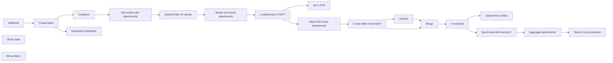

## Fluxo (.json) :

```json
{
  "meta": {
    "instanceId": "d1b60f1865ef6504ee3af5be4ef9a7387762b4132615a52de808456d52e8d336",
    "templateCredsSetupCompleted": true
  },
  "nodes": [
    {
      "id": "c84f3a9a-66b3-4a09-b06a-9b399ea574b8",
      "name": "OpenAI",
      "type": "@n8n/n8n-nodes-langchain.openAi",
      "position": [
        420,
        -240
      ],
      "parameters": {
        "modelId": {
          "__rl": true,
          "mode": "list",
          "value": "gpt-4.1-mini",
          "cachedResultName": "GPT-4.1-MINI"
        },
        "options": {},
        "messages": {
          "values": [
            {
              "content": "=Does this PDF file look like a {{ $(\"Configure\").first().json[\"Match on\"] }}? Return \"true\" if it is a {{ $(\"Configure\").first().json[\"Match on\"] }} and \"false\" if not. Only reply with lowercase letters \"true\" or \"false\".\n\nThis is the PDF filename:\n```\n{{ $binary.data.fileName }}\n```\n\nThis is the PDF text content:\n```\n{{ $json.text }}\n```"
            }
          ]
        }
      },
      "credentials": {
        "openAiApi": {
          "id": "prYAbsQvWl1pPbdL",
          "name": "OpenAi account"
        }
      },
      "typeVersion": 1.8
    },
    {
      "id": "ea1fbc5b-1859-4d65-8401-30baa95fcc52",
      "name": "Configure",
      "type": "n8n-nodes-base.set",
      "position": [
        -700,
        0
      ],
      "parameters": {
        "values": {
          "number": [
            {
              "name": "maxTokenSize",
              "value": 8000
            },
            {
              "name": "replyTokenSize",
              "value": 50
            }
          ],
          "string": [
            {
              "name": "Match on",
              "value": "receipt or invoice that can be considered a software engineering business cost"
            },
            {
              "name": "Google Drive folder to upload matched PDFs",
              "value": "https://drive.google.com/drive/folders/[put_folder_id_here]"
            },
            {
              "name": "sendInvoicesTo"
            }
          ],
          "boolean": [
            {
              "name": "sendEmail",
              "value": "={{ $('Webhook').item.json.body.sendEmail === \"true\" }}"
            }
          ]
        },
        "options": {}
      },
      "typeVersion": 1
    },
    {
      "id": "3ee63612-c1e7-40e6-a38f-f77f5ee3efa4",
      "name": "Iterate over email attachments",
      "type": "n8n-nodes-base.code",
      "position": [
        -200,
        0
      ],
      "parameters": {
        "jsCode": "// https://community.n8n.io/t/iterating-over-email-attachments/13588/3\nlet results = [];\n\nfor (const item of $input.all()) {\n  console.log(item);\n  for (const key of Object.keys(item.binary)) {\n    results.push({\n        json: {},\n        binary: {\n            data: item.binary[key],\n        }\n    });\n  }\n}\n\nreturn results;"
      },
      "typeVersion": 1
    },
    {
      "id": "3e638471-c1c5-4bab-aa2a-12a1777225ec",
      "name": "Not a PDF",
      "type": "n8n-nodes-base.noOp",
      "position": [
        120,
        80
      ],
      "parameters": {},
      "typeVersion": 1
    },
    {
      "id": "b5af902b-2d59-49ee-b6d8-e387c59b89fd",
      "name": "Is text within token limit?",
      "type": "n8n-nodes-base.if",
      "position": [
        300,
        -100
      ],
      "parameters": {
        "conditions": {
          "boolean": [
            {
              "value1": "={{ $json.text.length() / 4 <= $('Configure').first().json.maxTokenSize - $('Configure').first().json.replyTokenSize }}",
              "value2": true
            }
          ]
        }
      },
      "typeVersion": 1
    },
    {
      "id": "a0a8895c-ef8b-44e7-9294-1bcf629d0973",
      "name": "Merge",
      "type": "n8n-nodes-base.merge",
      "position": [
        720,
        -120
      ],
      "parameters": {
        "mode": "combine",
        "options": {
          "clashHandling": {
            "values": {
              "resolveClash": "preferInput1"
            }
          }
        },
        "combinationMode": "mergeByPosition"
      },
      "typeVersion": 2
    },
    {
      "id": "7565118a-6d44-4583-a19f-cb4177378d33",
      "name": "Is matched",
      "type": "n8n-nodes-base.if",
      "position": [
        880,
        -120
      ],
      "parameters": {
        "conditions": {
          "string": [
            {
              "value1": "={{ $json.message.content }}",
              "value2": "true"
            }
          ]
        }
      },
      "typeVersion": 1
    },
    {
      "id": "074ffb7a-f83e-44b8-84fe-7b85f7245bb0",
      "name": "Upload file to folder",
      "type": "n8n-nodes-base.googleDrive",
      "position": [
        1100,
        -140
      ],
      "parameters": {
        "name": "={{ $binary.data.fileName }}",
        "options": {},
        "parents": [
          "={{ $('Create folder').first().json.id }}"
        ],
        "binaryData": true
      },
      "credentials": {
        "googleDriveOAuth2Api": {
          "id": "xXHySx4T77sDdTqY",
          "name": "Google Drive account"
        }
      },
      "typeVersion": 2
    },
    {
      "id": "7681eb62-ba86-4c89-9b88-3ce6fc438bd4",
      "name": "Webhook",
      "type": "n8n-nodes-base.webhook",
      "position": [
        -1080,
        0
      ],
      "webhookId": "cded3af3-31df-47c2-a826-ff84eb4a41df",
      "parameters": {
        "path": "cded3af3-31df-47c2-a826-ff84eb4a41df",
        "options": {},
        "httpMethod": "POST",
        "responseMode": "responseNode",
        "authentication": "headerAuth"
      },
      "credentials": {
        "httpHeaderAuth": {
          "id": "90SsOYPPIe3Qv5Rq",
          "name": "Header Auth account"
        }
      },
      "typeVersion": 2
    },
    {
      "id": "aab3d940-55c2-40d3-917a-83412d4e378d",
      "name": "Respond to Webhook",
      "type": "n8n-nodes-base.respondToWebhook",
      "position": [
        -720,
        -240
      ],
      "parameters": {
        "options": {
          "responseCode": 202
        },
        "respondWith": "json",
        "responseBody": "={\n  \"status\": \"Accepted\",\n  \"driveFolderUrl\": \"{{ \"https://drive.google.com/drive/folders/\" + $json.id }}\"\n}"
      },
      "typeVersion": 1.1
    },
    {
      "id": "29a4122f-0112-4157-a50d-0a6cf83ab7fd",
      "name": "Create folder",
      "type": "n8n-nodes-base.googleDrive",
      "position": [
        -920,
        0
      ],
      "parameters": {
        "name": "={{ \"invoices_\" + $json.body.startDate.split('T')[0] }}",
        "driveId": {
          "__rl": true,
          "mode": "list",
          "value": "My Drive"
        },
        "options": {},
        "folderId": {
          "__rl": true,
          "mode": "list",
          "value": "root",
          "cachedResultName": "/ (Root folder)"
        },
        "resource": "folder"
      },
      "credentials": {
        "googleDriveOAuth2Api": {
          "id": "xXHySx4T77sDdTqY",
          "name": "Google Drive account"
        }
      },
      "typeVersion": 3
    },
    {
      "id": "df86428f-7e63-4fd9-944c-f48af72af495",
      "name": "Aggregate attachments",
      "type": "n8n-nodes-base.code",
      "position": [
        1200,
        -340
      ],
      "parameters": {
        "jsCode": "// \"items\" is the array coming from the previous node (14 items)\nconst merged = { json: {}, binary: {} };\n\nfor (const item of $input.all()) {\n  const data = {\n    [item.binary.data.fileName]: item.binary.data\n  };\n  Object.assign(merged.binary, data); // copy every file property\n}\n\nreturn [merged];     // one single item goes out"
      },
      "typeVersion": 2
    },
    {
      "id": "72a21bfa-6e3b-421a-a4ca-dea9e09a5b0b",
      "name": "Send email with invoices?",
      "type": "n8n-nodes-base.if",
      "position": [
        1000,
        -320
      ],
      "parameters": {
        "options": {},
        "conditions": {
          "options": {
            "version": 2,
            "leftValue": "",
            "caseSensitive": true,
            "typeValidation": "strict"
          },
          "combinator": "and",
          "conditions": [
            {
              "id": "63caf3d8-39bd-4300-aa7e-8c0ecfc87576",
              "operator": {
                "type": "boolean",
                "operation": "true",
                "singleValue": true
              },
              "leftValue": "={{ $('Configure').first().json.sendEmail }}",
              "rightValue": ""
            }
          ]
        }
      },
      "typeVersion": 2.2
    },
    {
      "id": "bb038635-eb69-447b-a85b-e9c3caebfe3a",
      "name": "Send to my accountant",
      "type": "n8n-nodes-base.gmail",
      "position": [
        1360,
        -280
      ],
      "webhookId": "3ea4dac1-58fe-4d0e-811b-065ecaef77df",
      "parameters": {
        "sendTo": "test@example.com",
        "message": "Hello, here are my invoices and receipts.",
        "options": {
          "attachmentsUi": {
            "attachmentsBinary": [
              {
                "property": "={{ Object.keys($binary).join(',') }}"
              }
            ]
          }
        },
        "subject": "={{ \n  (() => {\n    const startDate = $node['Webhook'].json.body.startDate.split('T')[0];\n    const endDate = $node['Webhook'].json.body.endDate.split('T')[0];\n    return `Dokumenty kosztowe za okres od ${startDate} do ${endDate}`;\n  })() \n}}",
        "emailType": "text"
      },
      "credentials": {
        "gmailOAuth2": {
          "id": "PPgHF95PrpAMBlbG",
          "name": "Gmail account"
        }
      },
      "typeVersion": 2.1
    },
    {
      "id": "7b2e5c6c-0a95-4347-97a9-c9ffbc0e3af2",
      "name": "Get emails with attachments",
      "type": "n8n-nodes-base.gmail",
      "position": [
        -500,
        0
      ],
      "webhookId": "6e2ca9f7-6d22-4d94-86bc-8a299bc8e752",
      "parameters": {
        "simple": false,
        "filters": {
          "q": "has:attachment",
          "sender": "",
          "receivedAfter": "={{ $('Webhook').item.json.body.startDate }}",
          "receivedBefore": "={{ $('Webhook').item.json.body.endDate }}"
        },
        "options": {
          "downloadAttachments": true,
          "dataPropertyAttachmentsPrefixName": "attachment_"
        },
        "operation": "getAll",
        "returnAll": true
      },
      "credentials": {
        "gmailOAuth2": {
          "id": "PPgHF95PrpAMBlbG",
          "name": "Gmail account"
        }
      },
      "typeVersion": 2.1
    },
    {
      "id": "6d5b2c1b-657d-44bf-980d-fd428fd8d832",
      "name": "Read PDF email attachments",
      "type": "n8n-nodes-base.readPDF",
      "onError": "continueErrorOutput",
      "position": [
        120,
        -80
      ],
      "parameters": {},
      "notesInFlow": false,
      "typeVersion": 1
    },
    {
      "id": "3166f45c-306f-483a-b2c6-6768abc916a0",
      "name": "Is attachment a PDF?",
      "type": "n8n-nodes-base.if",
      "position": [
        -40,
        0
      ],
      "parameters": {
        "conditions": {
          "string": [
            {
              "value1": "={{ $binary.data.fileExtension }}",
              "value2": "pdf"
            }
          ]
        }
      },
      "typeVersion": 1
    },
    {
      "id": "866b286a-7b9b-4506-aa6b-d2049b249991",
      "name": "Optional filter for emails",
      "type": "n8n-nodes-base.filter",
      "position": [
        -360,
        0
      ],
      "parameters": {
        "options": {},
        "conditions": {
          "options": {
            "version": 2,
            "leftValue": "",
            "caseSensitive": true,
            "typeValidation": "strict"
          },
          "combinator": "and",
          "conditions": [
            {
              "id": "687c4cd0-ada5-4dc1-8707-1a9c3b551251",
              "operator": {
                "type": "string",
                "operation": "notEquals"
              },
              "leftValue": "={{ $json.to.value[0].address }}",
              "rightValue": ""
            }
          ]
        }
      },
      "typeVersion": 2.2
    },
    {
      "id": "56133dba-bc93-4f65-be42-995164a45c03",
      "name": "Sticky Note",
      "type": "n8n-nodes-base.stickyNote",
      "position": [
        -1600,
        -340
      ],
      "parameters": {
        "width": 440,
        "height": 880,
        "content": "## Gmail PDF Invoice/Receipt Classifier & Google Drive Uploader (via n8n & OpenAI)\n\n_**DISCLAIMER**: AI classification isn't perfect. Always double-check that the correct documents were identified and uploaded._\n\nThis n8n workflow, triggered via a webhook, scans your Gmail for emails within a specified date range, extracts PDF attachments, and uses OpenAI to determine if each PDF matches a defined category (defaulting to \"receipt or invoice\"). Matched PDFs are then uploaded to a uniquely named Google Drive folder based on the date range. You can customize the classification term (e.g., change \"receipt or invoice\" to \"contract\") and optionally have the workflow email the collected PDFs to a specified address.\n\n### How it works\n1.  Triggers via a `Webhook` receiving a start date, end date, and an optional flag to send an email.\n2.  Creates a dated folder in `Google Drive` (e.g., `invoices_YYYY-MM-DD_YYYY-MM-DD`).\n3.  Fetches emails with attachments from `Gmail` within the specified date range.\n4.  Iterates through each attachment, filtering specifically for `PDF` files.\n5.  Extracts text from each PDF (skipping if the text exceeds token limits set in the `Configure` node).\n6.  Uses the `OpenAI` node to ask if the PDF content and filename look like the item defined in the `Configure` node's \"Match on\" field (e.g., \"receipt or invoice\").\n7.  If OpenAI responds with \"true\", the original `PDF` file is uploaded to the `Google Drive` folder created in step 2.\n8.  If the initial webhook request included the flag to send an email, it aggregates all successfully matched PDFs and sends them via `Gmail` to the address specified in the `Configure` node.\n\nWorkflow written by [Tom](https://browsewiz.com)\n"
      },
      "typeVersion": 1
    },
    {
      "id": "aa5d8126-e2ec-4476-886d-c46379f1c6e2",
      "name": "Sticky Note1",
      "type": "n8n-nodes-base.stickyNote",
      "position": [
        -780,
        -40
      ],
      "parameters": {
        "width": 260,
        "height": 1000,
        "content": "## Parameters\n\n\n\n\n\n\n\n\n\n* **`maxTokenSize`** (Number)\n    *   **Limits PDF text length** (estimated input tokens) sent to OpenAI for classification. Prevents errors/high costs on long documents.\n    *   *Default: 8000*\n\n*   **`replyTokenSize`** (Number)\n    *   **Reserves tokens for OpenAI's reply** ('true'/'false'). Ensures total tokens stay within limits.\n    *   *Default: 50*\n\n*   **`Match on`** (String)\n    *   **The keyword/phrase OpenAI uses** to identify the desired document type (e.g., \"receipt or invoice\", \"contract\"). Defines what you're searching for.\n    *   *Default: \"receipt or invoice\"*\n\n*   **`sendInvoicesTo`** (String)\n    *   **Recipient email address** for the final collection of matched PDFs. Used only if `sendEmail` is true.\n    *   *Example: \"accounting@example.com\"*\n\n*   **`sendEmail`** (Boolean)\n    *   **Turns the final email step on (`true`) or off (`false`)**. Set via the initial webhook trigger. If false, files are only uploaded to Drive.\n    *   *Example: `true` or `false`*"
      },
      "typeVersion": 1
    }
  ],
  "pinData": {},
  "connections": {
    "Merge": {
      "main": [
        [
          {
            "node": "Is matched",
            "type": "main",
            "index": 0
          }
        ]
      ]
    },
    "OpenAI": {
      "main": [
        [
          {
            "node": "Merge",
            "type": "main",
            "index": 0
          }
        ]
      ]
    },
    "Webhook": {
      "main": [
        [
          {
            "node": "Create folder",
            "type": "main",
            "index": 0
          }
        ]
      ]
    },
    "Configure": {
      "main": [
        [
          {
            "node": "Get emails with attachments",
            "type": "main",
            "index": 0
          }
        ]
      ]
    },
    "Is matched": {
      "main": [
        [
          {
            "node": "Upload file to folder",
            "type": "main",
            "index": 0
          },
          {
            "node": "Send email with invoices?",
            "type": "main",
            "index": 0
          }
        ]
      ]
    },
    "Create folder": {
      "main": [
        [
          {
            "node": "Configure",
            "type": "main",
            "index": 0
          },
          {
            "node": "Respond to Webhook",
            "type": "main",
            "index": 0
          }
        ]
      ]
    },
    "Is attachment a PDF?": {
      "main": [
        [
          {
            "node": "Read PDF email attachments",
            "type": "main",
            "index": 0
          }
        ],
        [
          {
            "node": "Not a PDF",
            "type": "main",
            "index": 0
          }
        ]
      ]
    },
    "Aggregate attachments": {
      "main": [
        [
          {
            "node": "Send to my accountant",
            "type": "main",
            "index": 0
          }
        ]
      ]
    },
    "Send to my accountant": {
      "main": [
        []
      ]
    },
    "Upload file to folder": {
      "main": [
        []
      ]
    },
    "Send email with invoices?": {
      "main": [
        [
          {
            "node": "Aggregate attachments",
            "type": "main",
            "index": 0
          }
        ]
      ]
    },
    "Optional filter for emails": {
      "main": [
        [
          {
            "node": "Iterate over email attachments",
            "type": "main",
            "index": 0
          }
        ]
      ]
    },
    "Read PDF email attachments": {
      "main": [
        [
          {
            "node": "Is text within token limit?",
            "type": "main",
            "index": 0
          }
        ]
      ]
    },
    "Get emails with attachments": {
      "main": [
        [
          {
            "node": "Optional filter for emails",
            "type": "main",
            "index": 0
          }
        ]
      ]
    },
    "Is text within token limit?": {
      "main": [
        [
          {
            "node": "OpenAI",
            "type": "main",
            "index": 0
          },
          {
            "node": "Merge",
            "type": "main",
            "index": 1
          }
        ],
        []
      ]
    },
    "Iterate over email attachments": {
      "main": [
        [
          {
            "node": "Is attachment a PDF?",
            "type": "main",
            "index": 0
          }
        ]
      ]
    }
  }
}
```

<a id="template-1621"></a>

## Template 1621 - Encaminhar alertas do TheHive para SIGNL4

- **Nome:** Encaminhar alertas do TheHive para SIGNL4
- **Descrição:** Recebe eventos do TheHive via webhook e, conforme o estado do alerta, envia ou resolve notificações no SIGNL4. Inclui um fluxo de teste para criar alertas no TheHive.
- **Funcionalidade:** • Recepção de webhooks: Recebe notificações do TheHive via webhook quando um alerta é criado ou atualizado.
• Verificação de estado do alerta: Avalia o campo "stage" do alerta para determinar se está fechado.
• Envio de alerta para SIGNL4: Quando o alerta não está fechado, encaminha título, descrição e identificador externo para criar uma notificação no SIGNL4.
• Resolução de alerta no SIGNL4: Quando o alerta é fechado, envia a informação necessária para resolver o alerta correspondente no SIGNL4 usando o externalId.
• Criação de alerta de teste: Possui um gatilho manual que cria um alerta no TheHive para fins de teste.
• Leitura de alertas: Inclui uma ação para listar/ler alertas do TheHive (pode ser utilizada para consultas ou sincronizações).
- **Ferramentas:** • TheHive: Plataforma de gerenciamento de incidentes e alertas de segurança, fonte dos eventos e destino para criação/leitura de alertas.
• SIGNL4: Serviço de notificações e escalonamento de alertas para operações, usado para receber e resolver alertas gerados a partir dos eventos do TheHive.

## Fluxo visual

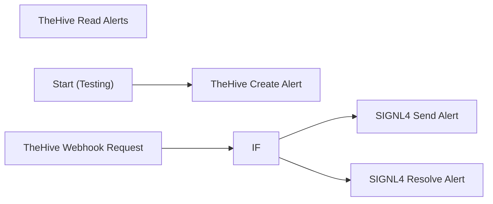

## Fluxo (.json) :

```json
{
  "id": 3,
  "name": "TheHive",
  "nodes": [
    {
      "name": "TheHive Create Alert",
      "type": "n8n-nodes-base.theHive",
      "position": [
        500,
        360
      ],
      "parameters": {
        "date": "2022-04-25T08:53:18.000Z",
        "tags": "tlp:pwhite",
        "type": "misp",
        "title": "TheHive Alert",
        "source": "1311",
        "sourceRef": "1330",
        "description": "Security issue detected on server A2. Please check and take care.",
        "additionalFields": {}
      },
      "credentials": {
        "theHiveApi": {
          "id": "1",
          "name": "The Hive account"
        }
      },
      "typeVersion": 1
    },
    {
      "name": "TheHive Read Alerts",
      "type": "n8n-nodes-base.theHive",
      "position": [
        500,
        200
      ],
      "parameters": {
        "filters": {},
        "options": {},
        "operation": "getAll"
      },
      "credentials": {
        "theHiveApi": {
          "id": "1",
          "name": "The Hive account"
        }
      },
      "typeVersion": 1
    },
    {
      "name": "IF",
      "type": "n8n-nodes-base.if",
      "position": [
        280,
        540
      ],
      "parameters": {
        "conditions": {
          "boolean": [
            {
              "value1": "={{$node[\"TheHive Webhook Request\"].json[\"body\"][\"object\"][\"stage\"]}}",
              "value2": "=Closed",
              "operation": "notEqual"
            }
          ]
        }
      },
      "typeVersion": 1
    },
    {
      "name": "SIGNL4 Send Alert",
      "type": "n8n-nodes-base.signl4",
      "position": [
        500,
        520
      ],
      "parameters": {
        "message": "={{$node[\"TheHive Webhook Request\"].json[\"body\"][\"details\"][\"description\"]}}",
        "additionalFields": {
          "title": "={{$node[\"TheHive Webhook Request\"].json[\"body\"][\"details\"][\"title\"]}}",
          "externalId": "={{$node[\"TheHive Webhook Request\"].json[\"body\"][\"objectId\"]}}"
        }
      },
      "credentials": {
        "signl4Api": {
          "id": "2",
          "name": "SIGNL4 Webhook account"
        }
      },
      "typeVersion": 1
    },
    {
      "name": "TheHive Webhook Request",
      "type": "n8n-nodes-base.webhook",
      "position": [
        80,
        540
      ],
      "webhookId": "22c76955-3f52-469e-a8ae-3f62e8e87ebe",
      "parameters": {
        "path": "22c76955-3f52-469e-a8ae-3f62e8e87ebe",
        "options": {},
        "httpMethod": "POST"
      },
      "typeVersion": 1
    },
    {
      "name": "Start (Testing)",
      "type": "n8n-nodes-base.manualTrigger",
      "position": [
        80,
        200
      ],
      "parameters": {},
      "typeVersion": 1
    },
    {
      "name": "SIGNL4 Resolve Alert",
      "type": "n8n-nodes-base.signl4",
      "position": [
        500,
        720
      ],
      "parameters": {
        "operation": "resolve",
        "externalId": "={{$node[\"TheHive Webhook Request\"].json[\"body\"][\"objectId\"]}}"
      },
      "credentials": {
        "signl4Api": {
          "id": "2",
          "name": "SIGNL4 Webhook account"
        }
      },
      "typeVersion": 1
    }
  ],
  "active": false,
  "settings": {},
  "connections": {
    "IF": {
      "main": [
        [
          {
            "node": "SIGNL4 Send Alert",
            "type": "main",
            "index": 0
          }
        ],
        [
          {
            "node": "SIGNL4 Resolve Alert",
            "type": "main",
            "index": 0
          }
        ]
      ]
    },
    "Start (Testing)": {
      "main": [
        [
          {
            "node": "TheHive Create Alert",
            "type": "main",
            "index": 0
          }
        ]
      ]
    },
    "TheHive Webhook Request": {
      "main": [
        [
          {
            "node": "IF",
            "type": "main",
            "index": 0
          }
        ]
      ]
    }
  }
}
```

<a id="template-1623"></a>

## Template 1623 - Converter perfis Squarespace para clientes Shopify

- **Nome:** Converter perfis Squarespace para clientes Shopify
- **Descrição:** Recebe exportações de perfis do Squarespace e converte os dados para o formato de clientes do Shopify, gravando tanto os perfis originais quanto a versão compatível com Shopify em planilhas Google.
- **Funcionalidade:** • Recepção via webhook: aceita submissões HTTP POST com arquivo de exportação de perfis.
• Extração de arquivo submetido: extrai itens do arquivo enviado (por exemplo CSV) para processamento.
• Processamento em lotes: percorre os registros em lotes grandes (ex.: 1000) para evitar limites de execução.
• Mapeamento de campos: transforma e mapeia campos do perfil Squarespace para colunas compatíveis com o template de clientes Shopify (nome, email, endereço, telefone, aceitação de marketing, etc.).
• Aplicação de tags condicionais: adiciona tags como "squarespace" e uma tag condicional (por exemplo "ground-control") quando houver data do último pedido.
• Inserção ou atualização: adiciona ou atualiza registros na aba de clientes Shopify usando o email como chave de correspondência.
• Arquivamento dos perfis originais: grava os perfis importados na aba 'squarespace_profiles' para referência.
• Execução manual: permite leitura manual da aba de perfis e reprocessamento quando necessário.
- **Ferramentas:** • Google Sheets: armazena os perfis originais e a planilha formatada para importação de clientes Shopify.
• Shopify (formato de clientes): destino do mapeamento — gera dados compatíveis com o template de clientes do Shopify para importação.
• Squarespace (exportação de perfis): fonte dos dados de perfil exportados que serão convertidos.
• Webhook / endpoint HTTP: ponto de entrada para submissão automática dos arquivos de exportação.

## Fluxo visual

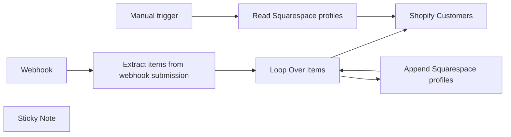

## Fluxo (.json) :

```json
{
  "id": "7Gw4IfHaVMDSj70o",
  "meta": {
    "instanceId": "e634e668fe1fc93a75c4f2a7fc0dad807ca318b79654157eadb9578496acbc76",
    "templateCredsSetupCompleted": true
  },
  "name": "Convert Squarespace Profiles to Shopify Customers in Google Sheets",
  "tags": [],
  "nodes": [
    {
      "id": "17b7e952-ba9b-4067-9c98-a69ea09f7e69",
      "name": "Webhook",
      "type": "n8n-nodes-base.webhook",
      "position": [
        -800,
        -420
      ],
      "webhookId": "e09976b5-7525-422b-9834-3bc6e1c4a1b6",
      "parameters": {
        "path": "submit-profiles",
        "options": {
          "allowedOrigins": "*"
        },
        "httpMethod": "POST"
      },
      "typeVersion": 2
    },
    {
      "id": "7e149be3-19da-4320-8910-40ef0900628a",
      "name": "Shopify Customers",
      "type": "n8n-nodes-base.googleSheets",
      "position": [
        420,
        -220
      ],
      "parameters": {
        "columns": {
          "value": {
            "Tags": "=n8n, squarespace, {{ $json['Last Order Date'] ? \"ground-control,\" : \"\" }}",
            "Email": "={{ $json.Email }}",
            "Phone": "={{ $json['Billing Phone Number'] }}",
            "Last Name": "={{ $json['Last Name'] }}",
            "First Name": "={{ $json['First Name'] }}",
            "Default Address Zip": "={{ $json['Billing Zip'] }}",
            "Default Address City": "={{ $json['Billing City'] }}",
            "Default Address Phone": "={{ $json['Billing Phone Number'] }}",
            "Accepts Email Marketing": "yes",
            "Default Address Company": "={{ $json['Billing Name'] }}",
            "Default Address Address1": "={{ $json['Billing Address 1'] }}",
            "Default Address Address2": "={{ $json['Billing Address 2'] }}",
            "Default Address Country Code": "={{ $json['Billing Country'] }}",
            "Default Address Province Code": "={{ $json['Billing Province/State'] }}"
          },
          "schema": [
            {
              "id": "First Name",
              "type": "string",
              "display": true,
              "required": false,
              "displayName": "First Name",
              "defaultMatch": false,
              "canBeUsedToMatch": true
            },
            {
              "id": "Last Name",
              "type": "string",
              "display": true,
              "required": false,
              "displayName": "Last Name",
              "defaultMatch": false,
              "canBeUsedToMatch": true
            },
            {
              "id": "Email",
              "type": "string",
              "display": true,
              "removed": false,
              "required": false,
              "displayName": "Email",
              "defaultMatch": false,
              "canBeUsedToMatch": true
            },
            {
              "id": "Accepts Email Marketing",
              "type": "string",
              "display": true,
              "required": false,
              "displayName": "Accepts Email Marketing",
              "defaultMatch": false,
              "canBeUsedToMatch": true
            },
            {
              "id": "Default Address Company",
              "type": "string",
              "display": true,
              "required": false,
              "displayName": "Default Address Company",
              "defaultMatch": false,
              "canBeUsedToMatch": true
            },
            {
              "id": "Default Address Address1",
              "type": "string",
              "display": true,
              "required": false,
              "displayName": "Default Address Address1",
              "defaultMatch": false,
              "canBeUsedToMatch": true
            },
            {
              "id": "Default Address Address2",
              "type": "string",
              "display": true,
              "required": false,
              "displayName": "Default Address Address2",
              "defaultMatch": false,
              "canBeUsedToMatch": true
            },
            {
              "id": "Default Address City",
              "type": "string",
              "display": true,
              "required": false,
              "displayName": "Default Address City",
              "defaultMatch": false,
              "canBeUsedToMatch": true
            },
            {
              "id": "Default Address Province Code",
              "type": "string",
              "display": true,
              "required": false,
              "displayName": "Default Address Province Code",
              "defaultMatch": false,
              "canBeUsedToMatch": true
            },
            {
              "id": "Default Address Country Code",
              "type": "string",
              "display": true,
              "required": false,
              "displayName": "Default Address Country Code",
              "defaultMatch": false,
              "canBeUsedToMatch": true
            },
            {
              "id": "Default Address Zip",
              "type": "string",
              "display": true,
              "required": false,
              "displayName": "Default Address Zip",
              "defaultMatch": false,
              "canBeUsedToMatch": true
            },
            {
              "id": "Default Address Phone",
              "type": "string",
              "display": true,
              "required": false,
              "displayName": "Default Address Phone",
              "defaultMatch": false,
              "canBeUsedToMatch": true
            },
            {
              "id": "Phone",
              "type": "string",
              "display": true,
              "required": false,
              "displayName": "Phone",
              "defaultMatch": false,
              "canBeUsedToMatch": true
            },
            {
              "id": "Accepts SMS Marketing",
              "type": "string",
              "display": true,
              "required": false,
              "displayName": "Accepts SMS Marketing",
              "defaultMatch": false,
              "canBeUsedToMatch": true
            },
            {
              "id": "Tags",
              "type": "string",
              "display": true,
              "required": false,
              "displayName": "Tags",
              "defaultMatch": false,
              "canBeUsedToMatch": true
            },
            {
              "id": "Note",
              "type": "string",
              "display": true,
              "required": false,
              "displayName": "Note",
              "defaultMatch": false,
              "canBeUsedToMatch": true
            },
            {
              "id": "Tax Exempt",
              "type": "string",
              "display": true,
              "required": false,
              "displayName": "Tax Exempt",
              "defaultMatch": false,
              "canBeUsedToMatch": true
            }
          ],
          "mappingMode": "defineBelow",
          "matchingColumns": [
            "Email"
          ],
          "attemptToConvertTypes": false,
          "convertFieldsToString": false
        },
        "options": {},
        "operation": "appendOrUpdate",
        "sheetName": {
          "__rl": true,
          "mode": "list",
          "value": 15798644,
          "cachedResultUrl": "https://docs.google.com/spreadsheets/d/1yf_RYZGFHpMyOvD3RKGSvIFY2vumvI4474Qm_1t4-jM/edit#gid=15798644",
          "cachedResultName": "shopify_template"
        },
        "documentId": {
          "__rl": true,
          "mode": "list",
          "value": "1yf_RYZGFHpMyOvD3RKGSvIFY2vumvI4474Qm_1t4-jM",
          "cachedResultUrl": "https://docs.google.com/spreadsheets/d/1yf_RYZGFHpMyOvD3RKGSvIFY2vumvI4474Qm_1t4-jM/edit?usp=drivesdk",
          "cachedResultName": "Make.com template"
        }
      },
      "credentials": {
        "googleSheetsOAuth2Api": {
          "id": "JgI9maibw5DnBXRP",
          "name": "Google Sheets account"
        }
      },
      "typeVersion": 4.5
    },
    {
      "id": "e04f9a9e-b699-4cf2-aa91-56e6bfa30faa",
      "name": "Read Squarespace profiles",
      "type": "n8n-nodes-base.googleSheets",
      "position": [
        -180,
        0
      ],
      "parameters": {
        "options": {},
        "sheetName": {
          "__rl": true,
          "mode": "list",
          "value": 144532755,
          "cachedResultUrl": "https://docs.google.com/spreadsheets/d/1yf_RYZGFHpMyOvD3RKGSvIFY2vumvI4474Qm_1t4-jM/edit#gid=144532755",
          "cachedResultName": "squarespace_profiles"
        },
        "documentId": {
          "__rl": true,
          "mode": "list",
          "value": "1yf_RYZGFHpMyOvD3RKGSvIFY2vumvI4474Qm_1t4-jM",
          "cachedResultUrl": "https://docs.google.com/spreadsheets/d/1yf_RYZGFHpMyOvD3RKGSvIFY2vumvI4474Qm_1t4-jM/edit?usp=drivesdk",
          "cachedResultName": "Squarespace automation"
        }
      },
      "credentials": {
        "googleSheetsOAuth2Api": {
          "id": "JgI9maibw5DnBXRP",
          "name": "Google Sheets account"
        }
      },
      "typeVersion": 4.5
    },
    {
      "id": "ffebc458-bd3c-4145-a5ef-1677815f210e",
      "name": "Append Squarespace profiles",
      "type": "n8n-nodes-base.googleSheets",
      "position": [
        -200,
        -420
      ],
      "parameters": {
        "columns": {
          "value": {
            "Email": "={{ $json.Email }}",
            "Last Name": "={{ $json['Last Name'] }}",
            "Created On": "={{ $json['Created On'] }}",
            "First Name": "={{ $json['First Name'] }}",
            "Billing Zip": "={{ $json['Billing Zip'] }}",
            "Order Count": "={{ $json['Order Count'] }}",
            "Total Spent": "={{ $json['Total Spent'] }}",
            "Billing City": "={{ $json['Billing City'] }}",
            "Billing Name": "={{ $json['Billing Name'] }}",
            "Shipping Zip": "={{ $json['Billing Zip'] }}",
            "Shipping City": "={{ $json['Billing City'] }}",
            "Shipping Name": "={{ $json['Billing Name'] }}",
            "Billing Country": "={{ $json['Billing Country'] }}",
            "Last Order Date": "={{ $json['Last Order Date'] }}",
            "Shipping Country": "={{ $json['Billing Country'] }}",
            "Subscriber Since": "={{ $json['Subscriber Since'] }}",
            "Billing Address 1": "={{ $json['Billing Address 1'] }}",
            "Billing Address 2": "={{ $json['Billing Address 2'] }}",
            "Subscriber Source": "={{ $json['Subscriber Source'] }}",
            "Shipping Address 1": "={{ $json['Billing Address 1'] }}",
            "Shipping Address 2": "={{ $json['Billing Address 2'] }}",
            "Billing Phone Number": "={{ $json['Billing Phone Number'] }}",
            "Shipping Phone Number": "={{ $json['Billing Phone Number'] }}",
            "Billing Province/State": "={{ $json['Billing Province/State'] }}",
            "Shipping Province/State": "={{ $json['Billing Province/State'] }}"
          },
          "schema": [
            {
              "id": "Email",
              "type": "string",
              "display": true,
              "removed": false,
              "required": false,
              "displayName": "Email",
              "defaultMatch": false,
              "canBeUsedToMatch": true
            },
            {
              "id": "First Name",
              "type": "string",
              "display": true,
              "required": false,
              "displayName": "First Name",
              "defaultMatch": false,
              "canBeUsedToMatch": true
            },
            {
              "id": "Last Name",
              "type": "string",
              "display": true,
              "required": false,
              "displayName": "Last Name",
              "defaultMatch": false,
              "canBeUsedToMatch": true
            },
            {
              "id": "Created On",
              "type": "string",
              "display": true,
              "required": false,
              "displayName": "Created On",
              "defaultMatch": false,
              "canBeUsedToMatch": true
            },
            {
              "id": "Order Count",
              "type": "string",
              "display": true,
              "required": false,
              "displayName": "Order Count",
              "defaultMatch": false,
              "canBeUsedToMatch": true
            },
            {
              "id": "Last Order Date",
              "type": "string",
              "display": true,
              "required": false,
              "displayName": "Last Order Date",
              "defaultMatch": false,
              "canBeUsedToMatch": true
            },
            {
              "id": "Total Spent",
              "type": "string",
              "display": true,
              "required": false,
              "displayName": "Total Spent",
              "defaultMatch": false,
              "canBeUsedToMatch": true
            },
            {
              "id": "Member Since",
              "type": "string",
              "display": true,
              "required": false,
              "displayName": "Member Since",
              "defaultMatch": false,
              "canBeUsedToMatch": true
            },
            {
              "id": "Subscriber Since",
              "type": "string",
              "display": true,
              "required": false,
              "displayName": "Subscriber Since",
              "defaultMatch": false,
              "canBeUsedToMatch": true
            },
            {
              "id": "Subscriber Source",
              "type": "string",
              "display": true,
              "required": false,
              "displayName": "Subscriber Source",
              "defaultMatch": false,
              "canBeUsedToMatch": true
            },
            {
              "id": "Tags",
              "type": "string",
              "display": true,
              "required": false,
              "displayName": "Tags",
              "defaultMatch": false,
              "canBeUsedToMatch": true
            },
            {
              "id": "Mailing Lists",
              "type": "string",
              "display": true,
              "required": false,
              "displayName": "Mailing Lists",
              "defaultMatch": false,
              "canBeUsedToMatch": true
            },
            {
              "id": "Member Areas",
              "type": "string",
              "display": true,
              "required": false,
              "displayName": "Member Areas",
              "defaultMatch": false,
              "canBeUsedToMatch": true
            },
            {
              "id": "Donation Count",
              "type": "string",
              "display": true,
              "required": false,
              "displayName": "Donation Count",
              "defaultMatch": false,
              "canBeUsedToMatch": true
            },
            {
              "id": "Last Donation Date",
              "type": "string",
              "display": true,
              "required": false,
              "displayName": "Last Donation Date",
              "defaultMatch": false,
              "canBeUsedToMatch": true
            },
            {
              "id": "Total Donation Amount",
              "type": "string",
              "display": true,
              "required": false,
              "displayName": "Total Donation Amount",
              "defaultMatch": false,
              "canBeUsedToMatch": true
            },
            {
              "id": "Has Account",
              "type": "string",
              "display": true,
              "required": false,
              "displayName": "Has Account",
              "defaultMatch": false,
              "canBeUsedToMatch": true
            },
            {
              "id": "Customer Since",
              "type": "string",
              "display": true,
              "required": false,
              "displayName": "Customer Since",
              "defaultMatch": false,
              "canBeUsedToMatch": true
            },
            {
              "id": "Shipping Name",
              "type": "string",
              "display": true,
              "required": false,
              "displayName": "Shipping Name",
              "defaultMatch": false,
              "canBeUsedToMatch": true
            },
            {
              "id": "Shipping Address 1",
              "type": "string",
              "display": true,
              "required": false,
              "displayName": "Shipping Address 1",
              "defaultMatch": false,
              "canBeUsedToMatch": true
            },
            {
              "id": "Shipping Address 2",
              "type": "string",
              "display": true,
              "required": false,
              "displayName": "Shipping Address 2",
              "defaultMatch": false,
              "canBeUsedToMatch": true
            },
            {
              "id": "Shipping City",
              "type": "string",
              "display": true,
              "required": false,
              "displayName": "Shipping City",
              "defaultMatch": false,
              "canBeUsedToMatch": true
            },
            {
              "id": "Shipping Zip",
              "type": "string",
              "display": true,
              "required": false,
              "displayName": "Shipping Zip",
              "defaultMatch": false,
              "canBeUsedToMatch": true
            },
            {
              "id": "Shipping Province/State",
              "type": "string",
              "display": true,
              "required": false,
              "displayName": "Shipping Province/State",
              "defaultMatch": false,
              "canBeUsedToMatch": true
            },
            {
              "id": "Shipping Country",
              "type": "string",
              "display": true,
              "required": false,
              "displayName": "Shipping Country",
              "defaultMatch": false,
              "canBeUsedToMatch": true
            },
            {
              "id": "Shipping Phone Number",
              "type": "string",
              "display": true,
              "required": false,
              "displayName": "Shipping Phone Number",
              "defaultMatch": false,
              "canBeUsedToMatch": true
            },
            {
              "id": "Billing Name",
              "type": "string",
              "display": true,
              "required": false,
              "displayName": "Billing Name",
              "defaultMatch": false,
              "canBeUsedToMatch": true
            },
            {
              "id": "Billing Address 1",
              "type": "string",
              "display": true,
              "required": false,
              "displayName": "Billing Address 1",
              "defaultMatch": false,
              "canBeUsedToMatch": true
            },
            {
              "id": "Billing Address 2",
              "type": "string",
              "display": true,
              "required": false,
              "displayName": "Billing Address 2",
              "defaultMatch": false,
              "canBeUsedToMatch": true
            },
            {
              "id": "Billing City",
              "type": "string",
              "display": true,
              "required": false,
              "displayName": "Billing City",
              "defaultMatch": false,
              "canBeUsedToMatch": true
            },
            {
              "id": "Billing Zip",
              "type": "string",
              "display": true,
              "required": false,
              "displayName": "Billing Zip",
              "defaultMatch": false,
              "canBeUsedToMatch": true
            },
            {
              "id": "Billing Province/State",
              "type": "string",
              "display": true,
              "required": false,
              "displayName": "Billing Province/State",
              "defaultMatch": false,
              "canBeUsedToMatch": true
            },
            {
              "id": "Billing Country",
              "type": "string",
              "display": true,
              "required": false,
              "displayName": "Billing Country",
              "defaultMatch": false,
              "canBeUsedToMatch": true
            },
            {
              "id": "Billing Phone Number",
              "type": "string",
              "display": true,
              "required": false,
              "displayName": "Billing Phone Number",
              "defaultMatch": false,
              "canBeUsedToMatch": true
            },
            {
              "id": "Accepts Marketing",
              "type": "string",
              "display": true,
              "required": false,
              "displayName": "Accepts Marketing",
              "defaultMatch": false,
              "canBeUsedToMatch": true
            }
          ],
          "mappingMode": "defineBelow",
          "matchingColumns": [
            "Email"
          ],
          "attemptToConvertTypes": false,
          "convertFieldsToString": false
        },
        "options": {},
        "operation": "appendOrUpdate",
        "sheetName": {
          "__rl": true,
          "mode": "list",
          "value": 144532755,
          "cachedResultUrl": "https://docs.google.com/spreadsheets/d/1yf_RYZGFHpMyOvD3RKGSvIFY2vumvI4474Qm_1t4-jM/edit#gid=144532755",
          "cachedResultName": "squarespace_profiles"
        },
        "documentId": {
          "__rl": true,
          "mode": "list",
          "value": "1yf_RYZGFHpMyOvD3RKGSvIFY2vumvI4474Qm_1t4-jM",
          "cachedResultUrl": "https://docs.google.com/spreadsheets/d/1yf_RYZGFHpMyOvD3RKGSvIFY2vumvI4474Qm_1t4-jM/edit?usp=drivesdk",
          "cachedResultName": "Squarespace automation"
        }
      },
      "credentials": {
        "googleSheetsOAuth2Api": {
          "id": "JgI9maibw5DnBXRP",
          "name": "Google Sheets account"
        }
      },
      "typeVersion": 4.5,
      "alwaysOutputData": true
    },
    {
      "id": "dc5cfb81-0d9b-47fb-a97a-fa20c673283b",
      "name": "Loop Over Items",
      "type": "n8n-nodes-base.splitInBatches",
      "position": [
        -360,
        -420
      ],
      "parameters": {
        "options": {},
        "batchSize": 1000
      },
      "typeVersion": 3
    },
    {
      "id": "b319cb05-6b8b-48cb-b7c9-4badee6bbf57",
      "name": "Sticky Note",
      "type": "n8n-nodes-base.stickyNote",
      "position": [
        -1240,
        -580
      ],
      "parameters": {
        "width": 340,
        "height": 280,
        "content": "## Convert Squarespace profiles\nConvert exported profile from Squarespace to compatible Shopify customers data in csv format\nSample Spreadsheet template\nhttps://docs.google.com/spreadsheets/d/1ZUP7RySMCjQUBAvlZhSE1rOul1FMVHvTSF0QexuV7mQ\n- Squarespace profiles\n- Shopify customers"
      },
      "typeVersion": 1
    },
    {
      "id": "8b9d6f85-af6e-43b8-a3f1-c63c7893e064",
      "name": "Extract items from webhook submission",
      "type": "n8n-nodes-base.extractFromFile",
      "position": [
        -580,
        -420
      ],
      "parameters": {
        "options": {},
        "binaryPropertyName": "file"
      },
      "typeVersion": 1
    },
    {
      "id": "ce82f958-081b-4a55-a0d1-8ffb69dee68b",
      "name": "Manual trigger",
      "type": "n8n-nodes-base.manualTrigger",
      "position": [
        -580,
        0
      ],
      "parameters": {},
      "typeVersion": 1
    }
  ],
  "active": true,
  "pinData": {},
  "settings": {
    "executionOrder": "v1"
  },
  "versionId": "05db75a8-16f8-4191-b60b-d515d062bef9",
  "connections": {
    "Webhook": {
      "main": [
        [
          {
            "node": "Extract items from webhook submission",
            "type": "main",
            "index": 0
          }
        ]
      ]
    },
    "Manual trigger": {
      "main": [
        [
          {
            "node": "Read Squarespace profiles",
            "type": "main",
            "index": 0
          }
        ]
      ]
    },
    "Loop Over Items": {
      "main": [
        [
          {
            "node": "Shopify Customers",
            "type": "main",
            "index": 0
          }
        ],
        [
          {
            "node": "Append Squarespace profiles",
            "type": "main",
            "index": 0
          }
        ]
      ]
    },
    "Read Squarespace profiles": {
      "main": [
        [
          {
            "node": "Shopify Customers",
            "type": "main",
            "index": 0
          }
        ]
      ]
    },
    "Append Squarespace profiles": {
      "main": [
        [
          {
            "node": "Loop Over Items",
            "type": "main",
            "index": 0
          }
        ]
      ]
    },
    "Extract items from webhook submission": {
      "main": [
        [
          {
            "node": "Loop Over Items",
            "type": "main",
            "index": 0
          }
        ]
      ]
    }
  }
}
```

<a id="template-1624"></a>

## Template 1624 - Chatbot de voz RAG com ElevenLabs e OpenAI

- **Nome:** Chatbot de voz RAG com ElevenLabs e OpenAI
- **Descrição:** Fluxo que implementa um chatbot de voz com busca por similaridade (RAG): recebe perguntas por um agente de voz, recupera informações em um banco vetorial e responde em áudio.
- **Funcionalidade:** • Recepção de perguntas via webhook: Recebe a pergunta enviada pelo agente de voz e inicia o fluxo.
• Recuperação contextual (RAG): Consulta um banco vetorial para obter trechos relevantes que sustentem a resposta.
• Geração de resposta com modelo de linguagem: Usa um modelo de chat para compor a resposta final baseada no contexto recuperado e na memória de conversa.
• Memória de janela: Mantém contexto recente da conversa para respostas mais coerentes.
• Indexação de documentos: Extrai e converte arquivos do Google Drive em embeddings para popular o banco vetorial.
• Token splitting e pré-processamento: Divide textos em chunks com overlap para indexação eficiente.
• Gestão de coleção vetorial: Criação e limpeza (refresh) da coleção no banco vetorial antes da indexação.
• Resposta por webhook para síntese de voz: Envia a resposta de volta ao agente de voz para conversão em áudio.
• Widget para site: Fornece snippet para incorporar o agente de voz no site do negócio.
- **Ferramentas:** • ElevenLabs (Convai): Agente e widget de voz que recebe perguntas do usuário e reproduz respostas em áudio via webhook.
• OpenAI: Geração de linguagem (chat) e criação de embeddings para indexação de documentos.
• Qdrant: Banco de vetores para armazenamento e busca por similaridade dos embeddings.
• Google Drive: Repositório de documentos usados como fonte para criar embeddings e popular o banco vetorial.

## Fluxo visual

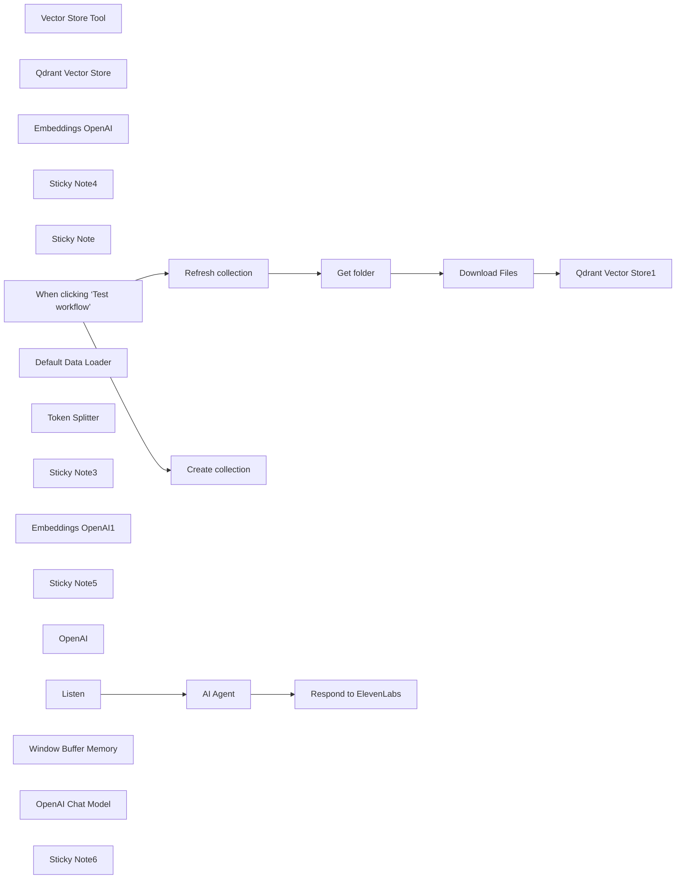

## Fluxo (.json) :

```json
{
  "id": "ibiHg6umCqvcTF4g",
  "meta": {
    "instanceId": "a4bfc93e975ca233ac45ed7c9227d84cf5a2329310525917adaf3312e10d5462",
    "templateCredsSetupCompleted": true
  },
  "name": "Voice RAG Chatbot with ElevenLabs and OpenAI",
  "tags": [],
  "nodes": [
    {
      "id": "5898da57-38b0-4d29-af25-fe029cda7c4a",
      "name": "AI Agent",
      "type": "@n8n/n8n-nodes-langchain.agent",
      "position": [
        -180,
        800
      ],
      "parameters": {
        "text": "={{ $json.body.question }}",
        "options": {},
        "promptType": "define"
      },
      "typeVersion": 1.7
    },
    {
      "id": "81bbedb6-5a07-4977-a68f-2bdc75b17aba",
      "name": "Vector Store Tool",
      "type": "@n8n/n8n-nodes-langchain.toolVectorStore",
      "position": [
        20,
        1040
      ],
      "parameters": {
        "name": "company",
        "description": "Risponde alle domande relative a ciò che ti viene chiesto"
      },
      "typeVersion": 1
    },
    {
      "id": "fd021f6c-248d-41f4-a4f9-651e70692327",
      "name": "Qdrant Vector Store",
      "type": "@n8n/n8n-nodes-langchain.vectorStoreQdrant",
      "position": [
        -140,
        1300
      ],
      "parameters": {
        "options": {},
        "qdrantCollection": {
          "__rl": true,
          "mode": "id",
          "value": "=COLLECTION"
        }
      },
      "credentials": {
        "qdrantApi": {
          "id": "iyQ6MQiVaF3VMBmt",
          "name": "QdrantApi account"
        }
      },
      "typeVersion": 1
    },
    {
      "id": "84aca7bb-4812-498f-b319-88831e4ca412",
      "name": "Embeddings OpenAI",
      "type": "@n8n/n8n-nodes-langchain.embeddingsOpenAi",
      "position": [
        -140,
        1460
      ],
      "parameters": {
        "options": {}
      },
      "credentials": {
        "openAiApi": {
          "id": "CDX6QM4gLYanh0P4",
          "name": "OpenAi account"
        }
      },
      "typeVersion": 1.1
    },
    {
      "id": "82e430db-2ad7-427d-bcf9-6aa226253d18",
      "name": "Sticky Note4",
      "type": "n8n-nodes-base.stickyNote",
      "position": [
        -760,
        520
      ],
      "parameters": {
        "color": 5,
        "width": 1400,
        "height": 240,
        "content": "# STEP 4\n\n## RAG System\n\nClick on \"test workflow\" on n8n and \"Test AI agent\" on ElevenLabs. If everything is configured correctly, when you ask a question to the agent, the webhook on n8n is activated with the \"question\" field in the body filled with the question asked to the voice agent.\n\nThe AI ​​Agent will extract the information from the vector database, send it to the model to create the response which will be sent via the response webhook to ElevenLabs which will transform it into voice"
      },
      "typeVersion": 1
    },
    {
      "id": "6a19e9fa-50fa-4d51-ba41-d03c999e4649",
      "name": "Sticky Note",
      "type": "n8n-nodes-base.stickyNote",
      "position": [
        -780,
        -880
      ],
      "parameters": {
        "color": 3,
        "width": 1420,
        "height": 360,
        "content": "# STEP 1\n\n## Create an Agent on ElevenLabs \n- Create an agent on ElevenLabs (eg. test_n8n)\n- Add \"First message\" (eg. Hi, Can I help you?)\n- Add the \"System Prompt\" message... eg:\n'You are the waiter of \"Pizzeria da Michele\" in Verona. If you are asked a question, use the tool \"test_chatbot_elevenlabs\". When you receive the answer from \"test_chatbot_elevenlabs\" answer the user clearly and precisely.'\n- In Tools add a Webhook called eg. \"test_chatbot_elevenlabs\" and add the following description:\n'You are the waiter. Answer the questions asked and store them in the question field.'\n- Add the n8n webhook URL (method POST)\n- Enable \"Body Parameters\" and insert in the description \"Ask the user the question to ask the place.\", then in the \"Properties\" add a data type string called \"question\", value type \"LLM Prompt\" and description \"user question\""
      },
      "typeVersion": 1
    },
    {
      "id": "ec053ee7-3a4a-4697-a08c-5645810d23f0",
      "name": "When clicking ‘Test workflow’",
      "type": "n8n-nodes-base.manualTrigger",
      "position": [
        -740,
        -200
      ],
      "parameters": {},
      "typeVersion": 1
    },
    {
      "id": "3e71e40c-a5cc-40cf-a159-aeedc97c47d1",
      "name": "Create collection",
      "type": "n8n-nodes-base.httpRequest",
      "position": [
        -440,
        -340
      ],
      "parameters": {
        "url": "https://QDRANTURL/collections/COLLECTION",
        "method": "POST",
        "options": {},
        "jsonBody": "{\n \"filter\": {}\n}",
        "sendBody": true,
        "sendHeaders": true,
        "specifyBody": "json",
        "authentication": "genericCredentialType",
        "genericAuthType": "httpHeaderAuth",
        "headerParameters": {
          "parameters": [
            {
              "name": "Content-Type",
              "value": "application/json"
            }
          ]
        }
      },
      "credentials": {
        "httpHeaderAuth": {
          "id": "qhny6r5ql9wwotpn",
          "name": "Qdrant API (Hetzner)"
        }
      },
      "typeVersion": 4.2
    },
    {
      "id": "240283fc-50ec-475c-bd24-e6d0a367c10c",
      "name": "Refresh collection",
      "type": "n8n-nodes-base.httpRequest",
      "position": [
        -440,
        -80
      ],
      "parameters": {
        "url": "https://QDRANTURL/collections/COLLECTION/points/delete",
        "method": "POST",
        "options": {},
        "jsonBody": "{\n \"filter\": {}\n}",
        "sendBody": true,
        "sendHeaders": true,
        "specifyBody": "json",
        "authentication": "genericCredentialType",
        "genericAuthType": "httpHeaderAuth",
        "headerParameters": {
          "parameters": [
            {
              "name": "Content-Type",
              "value": "application/json"
            }
          ]
        }
      },
      "credentials": {
        "httpHeaderAuth": {
          "id": "qhny6r5ql9wwotpn",
          "name": "Qdrant API (Hetzner)"
        }
      },
      "typeVersion": 4.2
    },
    {
      "id": "7d10fda0-c6ab-4bf5-b73e-b93a84937eff",
      "name": "Get folder",
      "type": "n8n-nodes-base.googleDrive",
      "position": [
        -220,
        -80
      ],
      "parameters": {
        "filter": {
          "driveId": {
            "__rl": true,
            "mode": "list",
            "value": "My Drive",
            "cachedResultUrl": "https://drive.google.com/drive/my-drive",
            "cachedResultName": "My Drive"
          },
          "folderId": {
            "__rl": true,
            "mode": "id",
            "value": "=test-whatsapp"
          }
        },
        "options": {},
        "resource": "fileFolder"
      },
      "credentials": {
        "googleDriveOAuth2Api": {
          "id": "HEy5EuZkgPZVEa9w",
          "name": "Google Drive account"
        }
      },
      "typeVersion": 3
    },
    {
      "id": "c5761ad2-e66f-4d65-b653-0e89ea017f17",
      "name": "Download Files",
      "type": "n8n-nodes-base.googleDrive",
      "position": [
        0,
        -80
      ],
      "parameters": {
        "fileId": {
          "__rl": true,
          "mode": "id",
          "value": "={{ $json.id }}"
        },
        "options": {
          "googleFileConversion": {
            "conversion": {
              "docsToFormat": "text/plain"
            }
          }
        },
        "operation": "download"
      },
      "credentials": {
        "googleDriveOAuth2Api": {
          "id": "HEy5EuZkgPZVEa9w",
          "name": "Google Drive account"
        }
      },
      "typeVersion": 3
    },
    {
      "id": "1f031a11-8ef3-4392-a7db-9bca00840b8f",
      "name": "Default Data Loader",
      "type": "@n8n/n8n-nodes-langchain.documentDefaultDataLoader",
      "position": [
        380,
        120
      ],
      "parameters": {
        "options": {},
        "dataType": "binary"
      },
      "typeVersion": 1
    },
    {
      "id": "7f614392-7bc7-408c-8108-f289a81d5cf6",
      "name": "Token Splitter",
      "type": "@n8n/n8n-nodes-langchain.textSplitterTokenSplitter",
      "position": [
        360,
        280
      ],
      "parameters": {
        "chunkSize": 300,
        "chunkOverlap": 30
      },
      "typeVersion": 1
    },
    {
      "id": "648c5b3d-37a8-4a89-b88c-38e1863f09dc",
      "name": "Sticky Note3",
      "type": "n8n-nodes-base.stickyNote",
      "position": [
        -240,
        -400
      ],
      "parameters": {
        "color": 6,
        "width": 880,
        "height": 220,
        "content": "# STEP 2\n\n## Create Qdrant Collection\nChange:\n- QDRANTURL\n- COLLECTION"
      },
      "typeVersion": 1
    },
    {
      "id": "a6c50f3c-3c73-464e-9bdc-49de96401c1b",
      "name": "Qdrant Vector Store1",
      "type": "@n8n/n8n-nodes-langchain.vectorStoreQdrant",
      "position": [
        240,
        -80
      ],
      "parameters": {
        "mode": "insert",
        "options": {},
        "qdrantCollection": {
          "__rl": true,
          "mode": "id",
          "value": "=COLLECTION"
        }
      },
      "credentials": {
        "qdrantApi": {
          "id": "iyQ6MQiVaF3VMBmt",
          "name": "QdrantApi account"
        }
      },
      "typeVersion": 1
    },
    {
      "id": "7e19ac49-4d90-4258-bd44-7ca4ffa0128a",
      "name": "Embeddings OpenAI1",
      "type": "@n8n/n8n-nodes-langchain.embeddingsOpenAi",
      "position": [
        220,
        120
      ],
      "parameters": {
        "options": {}
      },
      "credentials": {
        "openAiApi": {
          "id": "CDX6QM4gLYanh0P4",
          "name": "OpenAi account"
        }
      },
      "typeVersion": 1.1
    },
    {
      "id": "bfa104a2-1f9c-4200-ae7b-4659894c1e6f",
      "name": "Sticky Note5",
      "type": "n8n-nodes-base.stickyNote",
      "position": [
        -460,
        -140
      ],
      "parameters": {
        "color": 4,
        "width": 620,
        "height": 400,
        "content": "# STEP 3\n\n\n\n\n\n\n\n\n\n\n\n\n## Documents vectorization with Qdrant and Google Drive\nChange:\n- QDRANTURL\n- COLLECTION"
      },
      "typeVersion": 1
    },
    {
      "id": "a148ffcf-335f-455d-8509-d98c711ed740",
      "name": "Respond to ElevenLabs",
      "type": "n8n-nodes-base.respondToWebhook",
      "position": [
        380,
        800
      ],
      "parameters": {
        "options": {}
      },
      "typeVersion": 1.1
    },
    {
      "id": "5d19f73a-b8e8-4e75-8f67-836180597572",
      "name": "OpenAI",
      "type": "@n8n/n8n-nodes-langchain.lmChatOpenAi",
      "position": [
        -300,
        1040
      ],
      "parameters": {
        "options": {}
      },
      "credentials": {
        "openAiApi": {
          "id": "CDX6QM4gLYanh0P4",
          "name": "OpenAi account"
        }
      },
      "typeVersion": 1
    },
    {
      "id": "802b76e1-3f3e-490c-9e3b-65dc5b28d906",
      "name": "Listen",
      "type": "n8n-nodes-base.webhook",
      "position": [
        -700,
        800
      ],
      "webhookId": "e9f611eb-a8dd-4520-8d24-9f36deaca528",
      "parameters": {
        "path": "test_voice_message_elevenlabs",
        "options": {},
        "httpMethod": "POST",
        "responseMode": "responseNode"
      },
      "typeVersion": 2
    },
    {
      "id": "bdc55a38-1d4b-48fe-bbd8-29bf1afd954a",
      "name": "Window Buffer Memory",
      "type": "@n8n/n8n-nodes-langchain.memoryBufferWindow",
      "position": [
        -140,
        1040
      ],
      "parameters": {},
      "typeVersion": 1.3
    },
    {
      "id": "2d5dd8cb-81eb-41bc-af53-b894e69e530c",
      "name": "OpenAI Chat Model",
      "type": "@n8n/n8n-nodes-langchain.lmChatOpenAi",
      "position": [
        200,
        1320
      ],
      "parameters": {
        "options": {}
      },
      "credentials": {
        "openAiApi": {
          "id": "CDX6QM4gLYanh0P4",
          "name": "OpenAi account"
        }
      },
      "typeVersion": 1
    },
    {
      "id": "92d04432-1dbb-4d79-9edc-42378aee1c53",
      "name": "Sticky Note6",
      "type": "n8n-nodes-base.stickyNote",
      "position": [
        -760,
        1620
      ],
      "parameters": {
        "color": 7,
        "width": 1400,
        "height": 240,
        "content": "# STEP 5\n\n## Add Widget\n\nAdd the widget to your business website by replacing AGENT_ID with the agent id you created on ElevenLabs\n\n<elevenlabs-convai agent-id=\"AGENT_ID\"></elevenlabs-convai><script src=\"https://elevenlabs.io/convai-widget/index.js\" async type=\"text/javascript\"></script>"
      },
      "typeVersion": 1
    }
  ],
  "active": false,
  "pinData": {},
  "settings": {
    "executionOrder": "v1"
  },
  "versionId": "6738abfe-e626-488d-a00b-81021cb04aaf",
  "connections": {
    "Listen": {
      "main": [
        [
          {
            "node": "AI Agent",
            "type": "main",
            "index": 0
          }
        ]
      ]
    },
    "OpenAI": {
      "ai_languageModel": [
        [
          {
            "node": "AI Agent",
            "type": "ai_languageModel",
            "index": 0
          }
        ]
      ]
    },
    "AI Agent": {
      "main": [
        [
          {
            "node": "Respond to ElevenLabs",
            "type": "main",
            "index": 0
          }
        ]
      ]
    },
    "Get folder": {
      "main": [
        [
          {
            "node": "Download Files",
            "type": "main",
            "index": 0
          }
        ]
      ]
    },
    "Download Files": {
      "main": [
        [
          {
            "node": "Qdrant Vector Store1",
            "type": "main",
            "index": 0
          }
        ]
      ]
    },
    "Token Splitter": {
      "ai_textSplitter": [
        [
          {
            "node": "Default Data Loader",
            "type": "ai_textSplitter",
            "index": 0
          }
        ]
      ]
    },
    "Embeddings OpenAI": {
      "ai_embedding": [
        [
          {
            "node": "Qdrant Vector Store",
            "type": "ai_embedding",
            "index": 0
          }
        ]
      ]
    },
    "OpenAI Chat Model": {
      "ai_languageModel": [
        [
          {
            "node": "Vector Store Tool",
            "type": "ai_languageModel",
            "index": 0
          }
        ]
      ]
    },
    "Vector Store Tool": {
      "ai_tool": [
        [
          {
            "node": "AI Agent",
            "type": "ai_tool",
            "index": 0
          }
        ]
      ]
    },
    "Embeddings OpenAI1": {
      "ai_embedding": [
        [
          {
            "node": "Qdrant Vector Store1",
            "type": "ai_embedding",
            "index": 0
          }
        ]
      ]
    },
    "Refresh collection": {
      "main": [
        [
          {
            "node": "Get folder",
            "type": "main",
            "index": 0
          }
        ]
      ]
    },
    "Default Data Loader": {
      "ai_document": [
        [
          {
            "node": "Qdrant Vector Store1",
            "type": "ai_document",
            "index": 0
          }
        ]
      ]
    },
    "Qdrant Vector Store": {
      "ai_vectorStore": [
        [
          {
            "node": "Vector Store Tool",
            "type": "ai_vectorStore",
            "index": 0
          }
        ]
      ]
    },
    "Window Buffer Memory": {
      "ai_memory": [
        [
          {
            "node": "AI Agent",
            "type": "ai_memory",
            "index": 0
          }
        ]
      ]
    },
    "When clicking ‘Test workflow’": {
      "main": [
        [
          {
            "node": "Create collection",
            "type": "main",
            "index": 0
          },
          {
            "node": "Refresh collection",
            "type": "main",
            "index": 0
          }
        ]
      ]
    }
  }
}
```

<a id="template-1627"></a>

## Template 1627 - Automação de triagem de candidatos

- **Nome:** Automação de triagem de candidatos
- **Descrição:** Fluxo automatizado que recebe dados de candidatos, extrai o currículo, avalia o alinhamento com a vaga usando IA e atualiza o status e notas do candidato no sistema de recrutamento.
- **Funcionalidade:** • Recepção de evento de candidato: Inicia o processo a partir de um webhook quando um candidato é criado.
• Validação de currículo: Verifica se há link/arquivo de currículo e toma ação (rejeição) se não existir.
• Verificação de aplicação contra vaga: Confirma se a candidatura está ligada a uma vaga específica e, se não, coloca o candidato em espera.
• Identificação do tipo de arquivo do currículo: Detecta se o anexo é PDF, DOC ou imagem para tratar adequadamente.
• Download e extração de texto do currículo: Faz o download do arquivo e converte PDF/texto para texto legível para análise.
• Recuperação da descrição da vaga: Obtém dados da vaga para comparar com o currículo.
• Análise por agente de IA: Envia descrição da vaga e texto do currículo a um agente de IA que pontua e justifica o nível de adequação.
• Conversão do resultado da IA em campos estruturados: Extrai fit level, score, rating e justificativa em campos prontos para registro.
• Atualização do registro do candidato: Atualiza o sistema com pontuação, justificativa e fit; se a nota estiver abaixo do limiar, rejeita, caso contrário aceita.
• Notificação ao candidato: Possibilidade de notificar o candidato via e-mail ou WhatsApp após decisão.
- **Ferramentas:** • ERPNext: Sistema de gestão/CRM usado como fonte dos dados do candidato e destino para atualização do status e campos do registro.
• Google Gemini (PaLM API): Modelo de linguagem usado pelo agente de IA para comparar currículo e descrição da vaga e gerar avaliação.
• Microsoft Outlook: Canal de envio de e-mails para notificações (opcional no fluxo).
• WhatsApp Business Cloud: Canal de envio de mensagens para notificar candidatos.
• Armazenamento em nuvem (ex.: S3): Fonte possível para armazenar e baixar anexos de currículo quando aplicável.
• Serviço de extração de texto de arquivos (PDF/texto/imagem): Ferramenta para converter currículos em texto legível para análise por IA.

## Fluxo visual


## Fluxo (.json) :

```json
{
  "meta": {
    "instanceId": "e4f78845dfed9ddcfba1945ae00d12e9a7d76eab052afd19299228ce02349d86"
  },
  "nodes": [
    {
      "id": "a8b14ffd-4a8b-4a3d-ba54-5997197e5457",
      "name": "Sticky Note4",
      "type": "n8n-nodes-base.stickyNote",
      "position": [
        -2880,
        340
      ],
      "parameters": {
        "color": 6,
        "width": 429.96763122593137,
        "height": 322,
        "content": "### Get Apprropraite Data\nThese Nodes are to extract only the Required Data from the Webhook Node"
      },
      "typeVersion": 1
    },
    {
      "id": "c8ae8766-3942-4b8d-8815-9e96ab9dc1de",
      "name": "Sticky Note6",
      "type": "n8n-nodes-base.stickyNote",
      "position": [
        -840,
        340
      ],
      "parameters": {
        "color": 5,
        "width": 677,
        "height": 660,
        "content": "### N8N has the Node to convert PDF to Text, but PDF should be converted from Text. Scanned Image PDF will not be converted. \n\nYou can use ohter nodes here to convert word file to text or JPG to Text, possiblities are limitless."
      },
      "typeVersion": 1
    },
    {
      "id": "529f5756-c1a2-4c41-8245-38164543eb8e",
      "name": "Sticky Note",
      "type": "n8n-nodes-base.stickyNote",
      "position": [
        -1334.2232779572741,
        340
      ],
      "parameters": {
        "color": 7,
        "width": 477.2230145794152,
        "height": 648.5051458745238,
        "content": "### Download the File.\nIf you are using S3 to Upload attachments you can use S3 node here to download the attachment\n"
      },
      "typeVersion": 1
    },
    {
      "id": "101c6544-d319-495d-a14f-e180f51be1f0",
      "name": "Code",
      "type": "n8n-nodes-base.code",
      "position": [
        -2840,
        480
      ],
      "parameters": {
        "jsCode": "// Loop over input items and add a new field called 'myNewField' to the JSON of each one\nfor (const item of $input.all()) {\n item.json.myNewField = 1;\n}\n\nreturn $input.all();"
      },
      "typeVersion": 2
    },
    {
      "id": "5d0a1090-9be9-41e1-9a15-26bd6498fd95",
      "name": "Sticky Note2",
      "type": "n8n-nodes-base.stickyNote",
      "position": [
        -3300,
        340
      ],
      "parameters": {
        "color": 5,
        "width": 398,
        "height": 642,
        "content": "### Applicant Applied for Job in ERPNext\n\nYou need to go to Webhooks in ERPNext and Create a Webhook on Job Applicant Doc Type and trigger should be on insert.\n\nFirst do the Test Wehbook and Pin the Webhook.\n\nFollow the Tutorial"
      },
      "typeVersion": 1
    },
    {
      "id": "4ed5dfbf-9b16-4f62-83e2-abb63421809b",
      "name": "ApplicantData",
      "type": "n8n-nodes-base.set",
      "position": [
        -2640,
        480
      ],
      "parameters": {
        "options": {},
        "assignments": {
          "assignments": [
            {
              "id": "8d600a4f-14d3-4840-aea0-665d26e7771b",
              "name": "body",
              "type": "object",
              "value": "={{ $json.body }}"
            }
          ]
        }
      },
      "typeVersion": 3.4
    },
    {
      "id": "4f141057-8dd6-429a-b48f-fd80b2666882",
      "name": "ERPNext - Reject if Resume not Attached",
      "type": "n8n-nodes-base.erpNext",
      "position": [
        -2380,
        800
      ],
      "parameters": {
        "docType": "Job%20Applicant",
        "operation": "update",
        "properties": {
          "customProperty": [
            {
              "field": "status",
              "value": "Rejected"
            }
          ]
        },
        "documentName": "={{ $('ApplicantData').item.json.body.name }}"
      },
      "credentials": {
        "erpNextApi": {
          "id": "PInpnsxvPkvaiW0z",
          "name": "ERPNext account"
        }
      },
      "typeVersion": 1
    },
    {
      "id": "de0a9900-4109-4092-ad3b-f36f02517fdf",
      "name": "Applied Against Job",
      "type": "n8n-nodes-base.if",
      "position": [
        -2140,
        460
      ],
      "parameters": {
        "options": {
          "ignoreCase": true
        },
        "conditions": {
          "options": {
            "version": 2,
            "leftValue": "",
            "caseSensitive": false,
            "typeValidation": "strict"
          },
          "combinator": "and",
          "conditions": [
            {
              "id": "abbbd6f3-838e-43fb-a809-6bfffb153244",
              "operator": {
                "type": "string",
                "operation": "notEquals"
              },
              "leftValue": "={{ $json.body.Job_opening }}",
              "rightValue": "None"
            }
          ]
        }
      },
      "typeVersion": 2.2
    },
    {
      "id": "1c8e889b-dcd9-4807-8528-a7f0300bf558",
      "name": "ERPNext - Hold Applicant",
      "type": "n8n-nodes-base.erpNext",
      "position": [
        -2180,
        800
      ],
      "parameters": {
        "docType": "Job%20Applicant",
        "operation": "update",
        "properties": {
          "customProperty": [
            {
              "field": "status",
              "value": "Hold"
            }
          ]
        },
        "documentName": "={{ $('ApplicantData').item.json.body.name }}"
      },
      "credentials": {
        "erpNextApi": {
          "id": "PInpnsxvPkvaiW0z",
          "name": "ERPNext account"
        }
      },
      "typeVersion": 1
    },
    {
      "id": "548c61dd-bcc3-4a7f-970e-5ff734926499",
      "name": "Sticky Note5",
      "type": "n8n-nodes-base.stickyNote",
      "position": [
        -140,
        343.6198532285906
      ],
      "parameters": {
        "color": 6,
        "width": 258,
        "height": 638.3801467714094,
        "content": "### Get Job Opening Data\nFrom ERPNext\n\nAs Job is applied against a specific Job, you can now get the Job Opening Data which must be having the Job Description."
      },
      "typeVersion": 1
    },
    {
      "id": "6266e3e0-9bd7-4ab6-a488-55f1b524000f",
      "name": "Get Job Opening",
      "type": "n8n-nodes-base.erpNext",
      "position": [
        -80,
        620
      ],
      "parameters": {
        "docType": "Job%20Opening",
        "operation": "get",
        "documentName": "={{ $('ApplicantData').item.json.body.Job_opening }}"
      },
      "credentials": {
        "erpNextApi": {
          "id": "PInpnsxvPkvaiW0z",
          "name": "ERPNext account"
        }
      },
      "typeVersion": 1
    },
    {
      "id": "536755cf-19d6-44a4-8449-635f4562b61f",
      "name": "Sticky Note7",
      "type": "n8n-nodes-base.stickyNote",
      "position": [
        140,
        320
      ],
      "parameters": {
        "color": 4,
        "width": 406.7864870360547,
        "height": 662,
        "content": "### AI Agent to do its Job\nOpenAI\n\nSee full prompt which tells this AI Agent that you are a recruitment sepcialist and all the roles are defined in this node.\n\nIt will shortlist the candidate and will give the descriptive output with candidate fitlevel, score, rating and justification."
      },
      "typeVersion": 1
    },
    {
      "id": "0072826c-0e24-4c1f-89f9-388dc6e59ae5",
      "name": "Sticky Note8",
      "type": "n8n-nodes-base.stickyNote",
      "position": [
        980,
        320
      ],
      "parameters": {
        "color": 6,
        "width": 438,
        "height": 662,
        "content": "### Update data in ERPNext\nHere First node will do the formatting of the data and will convert output from AI Agent to Appropriate Fields which are defined in ERPNext and then will Send to Next Node\n\n### ERPNext (HTTP Node)\nThis node will take the Data from Previouis Node and will update the Applicant Data in ERPNext"
      },
      "typeVersion": 1
    },
    {
      "id": "28f23589-0608-4ed0-9e70-b6cbd31aa387",
      "name": "Google Gemini Chat Model",
      "type": "@n8n/n8n-nodes-langchain.lmChatGoogleGemini",
      "position": [
        220,
        800
      ],
      "parameters": {
        "options": {},
        "modelName": "models/gemini-2.0-flash-exp"
      },
      "credentials": {
        "googlePalmApi": {
          "id": "pKFvSpPWSRFpnBoB",
          "name": "Google Gemini(PaLM) Api account"
        }
      },
      "typeVersion": 1
    },
    {
      "id": "8bdd8f1c-e546-4ffb-a058-a3271fcad156",
      "name": "Convert to Fields",
      "type": "n8n-nodes-base.code",
      "position": [
        660,
        620
      ],
      "parameters": {
        "jsCode": "// Input text from the `output` field\nconst textOutput = $json.output || '';\n\n// Function to extract values from the text\nfunction extractFields(text) {\n const fields = {};\n\n // Regular expressions to extract each field\n const fitLevelMatch = text.match(/FitLevel:\\s*(.+)\\n/);\n const scoreMatch = text.match(/Score:\\s*(\\d+)\\n/);\n const ratingMatch = text.match(/Rating:\\s*(\\d+)\\n/);\n const justificationMatch = text.match(/Justification:\\s*([\\s\\S]+)/);\n\n // Assign extracted values to the fields\n fields.fit_level = fitLevelMatch ? fitLevelMatch[1].trim() : null;\n fields.score = scoreMatch ? scoreMatch[1].trim() : null;\n fields.applicant_rating = ratingMatch ? ratingMatch[1].trim() : null;\n fields.justification_by_ai = justificationMatch ? justificationMatch[1].trim() : null;\n\n return fields;\n}\n\n// Extract fields from the output\nconst extractedFields = extractFields(textOutput);\n\n// Return the fields as JSON\nreturn {\n json: extractedFields\n};\n"
      },
      "typeVersion": 2
    },
    {
      "id": "ae1dc677-9ad7-4138-969f-2ee73b8537f9",
      "name": "Sticky Note9",
      "type": "n8n-nodes-base.stickyNote",
      "position": [
        1460,
        320
      ],
      "parameters": {
        "color": 5,
        "width": 226.43884349833064,
        "height": 682,
        "content": "### Selected or Rejected\n\nThe criteia for score is that if Score is 80 or above Candidate will be selected Else Rejected."
      },
      "typeVersion": 1
    },
    {
      "id": "090f4f22-639a-4fc7-8351-04dafcc09638",
      "name": "If score less than 80",
      "type": "n8n-nodes-base.if",
      "position": [
        1520,
        620
      ],
      "parameters": {
        "options": {},
        "conditions": {
          "options": {
            "version": 2,
            "leftValue": "",
            "caseSensitive": true,
            "typeValidation": "loose"
          },
          "combinator": "and",
          "conditions": [
            {
              "id": "5f845292-f4aa-44fb-a644-06c0736c3503",
              "operator": {
                "type": "number",
                "operation": "lt"
              },
              "leftValue": "={{ $('Convert to Fields').item.json.score }}",
              "rightValue": 80
            }
          ]
        },
        "looseTypeValidation": true
      },
      "typeVersion": 2.2
    },
    {
      "id": "0d7a84c2-0b1d-4e61-a3df-b81dd7981f1a",
      "name": "Reject Applicant",
      "type": "n8n-nodes-base.httpRequest",
      "position": [
        1880,
        460
      ],
      "parameters": {
        "url": "=https://erpnext.syncbricks.com/api/resource/Job Applicant/{{ $('ApplicantData').item.json.body.name }}",
        "method": "PUT",
        "options": {},
        "jsonBody": "={\n \"status\": \"Rejected\"\n}",
        "sendBody": true,
        "sendHeaders": true,
        "specifyBody": "json",
        "authentication": "predefinedCredentialType",
        "headerParameters": {
          "parameters": [
            {}
          ]
        },
        "nodeCredentialType": "erpNextApi"
      },
      "credentials": {
        "erpNextApi": {
          "id": "PInpnsxvPkvaiW0z",
          "name": "ERPNext account"
        }
      },
      "typeVersion": 4.2
    },
    {
      "id": "a55e70d1-7070-407d-9107-41cb33d2f0ae",
      "name": "Update Applicant Data",
      "type": "n8n-nodes-base.httpRequest",
      "position": [
        1140,
        620
      ],
      "parameters": {
        "url": "=https://erpnext.syncbricks.com/api/resource/Job Applicant/{{ $('ApplicantData').item.json.body.name }}",
        "method": "PUT",
        "options": {},
        "jsonBody": "={\n \"applicant_rating\": \"{{ $json.applicant_rating }}\",\n \"custom_justification_by_ai\": \"{{ $json.justification_by_ai }}\",\n \"custom_fit_level\": \"{{ $json.fit_level }}\",\n \"custom_score\":\"{{ $json.score }}\"\n}\n\n\n\n\n",
        "sendBody": true,
        "sendHeaders": true,
        "specifyBody": "json",
        "authentication": "predefinedCredentialType",
        "headerParameters": {
          "parameters": [
            {}
          ]
        },
        "nodeCredentialType": "erpNextApi"
      },
      "credentials": {
        "erpNextApi": {
          "id": "PInpnsxvPkvaiW0z",
          "name": "ERPNext account"
        }
      },
      "typeVersion": 4.2
    },
    {
      "id": "044d26cb-2b34-4613-8d1d-20f40b47da29",
      "name": "Reume Attachment Link",
      "type": "n8n-nodes-base.set",
      "position": [
        -1820,
        560
      ],
      "parameters": {
        "options": {},
        "assignments": {
          "assignments": [
            {
              "id": "7d0b8b98-0976-4c19-bc7c-738fabd60d28",
              "name": "body.resume_attachment",
              "type": "string",
              "value": "={{ $json.body.resume_link }}"
            }
          ]
        }
      },
      "typeVersion": 3.4
    },
    {
      "id": "a17e9c94-0ec7-430f-adf3-109bcccf3bcb",
      "name": "Sticky Note10",
      "type": "n8n-nodes-base.stickyNote",
      "position": [
        -2874.102923130834,
        680
      ],
      "parameters": {
        "color": 3,
        "width": 875.658619343735,
        "height": 302,
        "content": "## Resume Available?\nFirst Node : If Resume is not attached or Then Job Applicant will be Rejected\nSecond Node : If job is not applied against opening then the Applicant will be kept on hold."
      },
      "typeVersion": 1
    },
    {
      "id": "e2508130-4ecd-4d19-b41c-293006d17507",
      "name": "Resume Link Provided",
      "type": "n8n-nodes-base.if",
      "position": [
        -2400,
        480
      ],
      "parameters": {
        "options": {},
        "conditions": {
          "options": {
            "version": 2,
            "leftValue": "",
            "caseSensitive": true,
            "typeValidation": "strict"
          },
          "combinator": "and",
          "conditions": [
            {
              "id": "3cd3da7d-d0fb-43fd-be10-3c1e627846b9",
              "operator": {
                "type": "string",
                "operation": "startsWith"
              },
              "leftValue": "={{ $json.body.resume_link }}",
              "rightValue": "http"
            }
          ]
        }
      },
      "typeVersion": 2.2
    },
    {
      "id": "e6770961-05b2-4488-99b1-7d1a219f8372",
      "name": "Accept Applicant",
      "type": "n8n-nodes-base.httpRequest",
      "position": [
        1860,
        760
      ],
      "parameters": {
        "url": "=https://erpnext.syncbricks.com/api/resource/Job Applicant/{{ $('ApplicantData').item.json.body.name }}",
        "method": "PUT",
        "options": {},
        "jsonBody": "={\n \"status\": \"Accepted\"\n}",
        "sendBody": true,
        "sendHeaders": true,
        "specifyBody": "json",
        "authentication": "predefinedCredentialType",
        "headerParameters": {
          "parameters": [
            {}
          ]
        },
        "nodeCredentialType": "erpNextApi"
      },
      "credentials": {
        "erpNextApi": {
          "id": "PInpnsxvPkvaiW0z",
          "name": "ERPNext account"
        }
      },
      "typeVersion": 4.2
    },
    {
      "id": "6b7ad5c5-2a6f-4bb8-8296-3defb40f9605",
      "name": "Sticky Note11",
      "type": "n8n-nodes-base.stickyNote",
      "position": [
        -3800,
        340
      ],
      "parameters": {
        "color": 4,
        "width": 475.27306699862953,
        "height": 636.1483291619771,
        "content": "## Developed by Amjid Ali\n\nThank you for using this workflow template. It has taken me countless hours of hard work, research, and dedication to develop, and I sincerely hope it adds value to your work.\n\nIf you find this template helpful, I kindly ask you to consider supporting my efforts. Your support will help me continue improving and creating more valuable resources.\n\nYou can contribute via PayPal here:\n\nhttp://paypal.me/pmptraining\n\nFor Full Course about ERPNext or Automation using AI follow below link\n\nhttp://lms.syncbricks.com\n\nAdditionally, when sharing this template, I would greatly appreciate it if you include my original information to ensure proper credit is given.\n\nThank you for your generosity and support!\nEmail : amjid@amjidali.com\nhttps://linkedin.com/in/amjidali\nhttps://syncbricks.com\nhttps://youtube.com/@syncbricks"
      },
      "typeVersion": 1
    },
    {
      "id": "173c6341-2ab7-4ee5-a6bd-0770ae19c013",
      "name": "Webhook",
      "type": "n8n-nodes-base.webhook",
      "position": [
        -3180,
        620
      ],
      "webhookId": "f003f8ea-1f24-457c-8f28-762bd7942023",
      "parameters": {
        "path": "syncbricks-com-tutorial-candidate-shortlist",
        "options": {},
        "httpMethod": "POST"
      },
      "typeVersion": 2
    },
    {
      "id": "cb0a8dd4-6673-4043-af76-0bf4537a8173",
      "name": "Sticky Note12",
      "type": "n8n-nodes-base.stickyNote",
      "position": [
        -1980,
        340
      ],
      "parameters": {
        "color": 6,
        "width": 613.5767730410602,
        "height": 654.6630436071407,
        "content": "### Get file of Resume Detail from ERPNext Applicant\nExtract the Resume Download Link and Decide which Attachment type it is as every attachment will be treated differently.\nCurrently I provided only for PDF Version but you can add seperate flow for other versions"
      },
      "typeVersion": 1
    },
    {
      "id": "101938bd-75cd-4557-a44f-ba64c4181f70",
      "name": "Sticky Note13",
      "type": "n8n-nodes-base.stickyNote",
      "position": [
        -2420,
        340
      ],
      "parameters": {
        "color": 6,
        "width": 429.96763122593137,
        "height": 310.20584626167124,
        "content": "### Validate if the Resume is Available and It is against a specific Job\nThese Nodes are to extract only the Required Data from the Webhook Node"
      },
      "typeVersion": 1
    },
    {
      "id": "596bcbd5-b94a-4a06-aa83-f7d9dc6264be",
      "name": "File Type",
      "type": "n8n-nodes-base.switch",
      "position": [
        -1600,
        560
      ],
      "parameters": {
        "rules": {
          "values": [
            {
              "outputKey": "pdf",
              "conditions": {
                "options": {
                  "version": 2,
                  "leftValue": "",
                  "caseSensitive": true,
                  "typeValidation": "strict"
                },
                "combinator": "and",
                "conditions": [
                  {
                    "operator": {
                      "type": "string",
                      "operation": "endsWith"
                    },
                    "leftValue": "={{ $json.body.resume_attachment }}",
                    "rightValue": ".pdf"
                  }
                ]
              },
              "renameOutput": true
            },
            {
              "outputKey": "doc",
              "conditions": {
                "options": {
                  "version": 2,
                  "leftValue": "",
                  "caseSensitive": true,
                  "typeValidation": "strict"
                },
                "combinator": "and",
                "conditions": [
                  {
                    "id": "dabe1bd2-9aba-4a61-b0b3-08c22856b213",
                    "operator": {
                      "type": "string",
                      "operation": "contains"
                    },
                    "leftValue": "={{ $json.body.resume_attachment }}",
                    "rightValue": ".doc"
                  }
                ]
              },
              "renameOutput": true
            },
            {
              "outputKey": ".jpg",
              "conditions": {
                "options": {
                  "version": 2,
                  "leftValue": "",
                  "caseSensitive": true,
                  "typeValidation": "strict"
                },
                "combinator": "and",
                "conditions": [
                  {
                    "id": "1101fc2e-4220-4795-9342-58d88ea146ce",
                    "operator": {
                      "type": "string",
                      "operation": "endsWith"
                    },
                    "leftValue": "={{ $json.body.resume_attachment }}",
                    "rightValue": ".jpg"
                  }
                ]
              },
              "renameOutput": true
            }
          ]
        },
        "options": {}
      },
      "typeVersion": 3.2
    },
    {
      "id": "cc7f4ca0-8e9b-49de-a7f1-f1f7913d6dcc",
      "name": "Download PDF Resume",
      "type": "n8n-nodes-base.httpRequest",
      "position": [
        -1160,
        460
      ],
      "parameters": {
        "url": "={{ $json.body.resume_attachment }}",
        "options": {}
      },
      "typeVersion": 4.2
    },
    {
      "id": "1209643a-7133-45cf-98a3-e242e2e1766b",
      "name": "PDF to Text",
      "type": "n8n-nodes-base.extractFromFile",
      "position": [
        -720,
        440
      ],
      "parameters": {
        "options": {},
        "operation": "pdf"
      },
      "typeVersion": 1
    },
    {
      "id": "17430d0d-7bca-4ed9-b80e-d1f81dad5d58",
      "name": "Txt File to Text (Example)",
      "type": "n8n-nodes-base.extractFromFile",
      "position": [
        -740,
        680
      ],
      "parameters": {
        "options": {},
        "operation": "text"
      },
      "typeVersion": 1
    },
    {
      "id": "2ab3f083-66d7-4a28-9b00-b9dabcd84282",
      "name": "Merge1",
      "type": "n8n-nodes-base.merge",
      "position": [
        -420,
        620
      ],
      "parameters": {},
      "typeVersion": 3
    },
    {
      "id": "e45d5828-1e7b-454e-9a79-7ab0f60e3cd9",
      "name": "Recruitment AI Agent",
      "type": "@n8n/n8n-nodes-langchain.agent",
      "position": [
        200,
        620
      ],
      "parameters": {
        "text": "=System Prompt : \nYou are a highly skilled AI agent trained to compare and analyze text from resumes against job descriptions. Your primary goal is to assess whether the candidate is a good fit for the role based on the given inputs. You will receive two inputs:\n\n1. **Job Description**: A detailed description of the responsibilities, qualifications, and skills required for a specific job role.\n2. **Resume Text**: A summary of a candidate's qualifications, skills, experience, and education.\n\nYour task is to:\n1. **Analyze Match**: Compare the candidate's resume text against the job description and assess the alignment of:\n - Required skills\n - Relevant experience\n - Educational background\n - Certifications\n - Keywords mentioned in both texts (e.g., specific tools, methodologies, or terminologies).\n\n2. **Assess Fit**: Determine if the candidate is a strong, moderate, or weak fit for the role. Assign a score from 0 to 100 based on relevance:\n - **Strong Fit**: 80–100 (Candidate meets or exceeds the majority of the job requirements).\n - **Moderate Fit**: 50–79 (Candidate meets some key requirements but lacks in others).\n - **Weak Fit**: Below 50 (Candidate does not align with the role requirements).\n\n3. **Provide Justification**: Include a brief explanation of why the candidate is or isn’t a good fit, highlighting strengths, gaps, or missing criteria.\n\nOutput Format:\n- **Fit Level**: [Strong Fit / Moderate Fit / Weak Fit]\n- **Score**: [0–100]\n- **Rating**: [0–5]\n- **Justification**: A concise summary of the reasoning behind the fit level.\n\nRemember to maintain a neutral and objective tone in your analysis and ensure that your assessment is solely based on the information provided in the inputs.\"\n\n\nProvide me the output in the following format:\n\nFitLevel\n<fitLevel>\n\nScore:\n<score>\n\nRating:\n<rating>\n\nJustification:\n<justification>\n\nBelow are the inputs \n\nJob Title : {{ $json.job_title }}\nJob Desription : {{ $json.description }}\n\n\nHere here Job Applican't text from Resume : \n{{ $('PDF to Text').item.json.text }}\n",
        "agent": "reActAgent",
        "options": {},
        "promptType": "define"
      },
      "typeVersion": 1.7
    },
    {
      "id": "02d40fbc-3b2a-4350-bd01-2dcca11cf23b",
      "name": "Sticky Note14",
      "type": "n8n-nodes-base.stickyNote",
      "position": [
        560,
        320
      ],
      "parameters": {
        "color": 6,
        "width": 374.6910896370089,
        "height": 662,
        "content": "### Create Fields\n\nThis Java Script will convert the extracted fieldws from AI Agent and will create fields which are already created in ERPNext.\n\nEnsure to create below fields in ERPNext : \n\njustification_by_ai\nfit_level\nscore\n\napplicant_rating field is already there, which will be updated with 1 to 5 star"
      },
      "typeVersion": 1
    },
    {
      "id": "fdc011c2-e734-44fe-8a83-975247445d16",
      "name": "Sticky Note15",
      "type": "n8n-nodes-base.stickyNote",
      "position": [
        1720,
        320
      ],
      "parameters": {
        "color": 3,
        "width": 394.2810709723076,
        "height": 308.0357387860514,
        "content": "### Update data in ERPNext\nAPI Call\nCandidate Rejected"
      },
      "typeVersion": 1
    },
    {
      "id": "3c4174cc-b947-4461-87a6-a7dbd0e3c78d",
      "name": "Sticky Note16",
      "type": "n8n-nodes-base.stickyNote",
      "position": [
        1720,
        660
      ],
      "parameters": {
        "color": 4,
        "width": 385.4472695263088,
        "height": 308.0357387860514,
        "content": "### Update data in ERPNext\nAPI Call\nCandidate Rejected"
      },
      "typeVersion": 1
    },
    {
      "id": "0116aa6d-2783-487b-b457-47a6b7d69f02",
      "name": "Microsoft Outlook",
      "type": "n8n-nodes-base.microsoftOutlook",
      "position": [
        2240,
        460
      ],
      "parameters": {
        "additionalFields": {}
      },
      "credentials": {
        "microsoftOutlookOAuth2Api": {
          "id": "9gy3uvf3pmBdpEsq",
          "name": "Microsoft Outlook Al Ansari"
        }
      },
      "typeVersion": 2
    },
    {
      "id": "f2eac576-3a17-46e8-8800-1ba250e53047",
      "name": "Sticky Note17",
      "type": "n8n-nodes-base.stickyNote",
      "position": [
        2140,
        331.1661985540012
      ],
      "parameters": {
        "color": 6,
        "width": 338.3336618143153,
        "height": 623.107990360008,
        "content": "### Notifiy Applicant either by Email or Whatsapp or SMS, Options are Limitless"
      },
      "typeVersion": 1
    },
    {
      "id": "d4a6e756-923c-47c8-9c12-b1e8dcc873ca",
      "name": "WhatsApp Business Cloud",
      "type": "n8n-nodes-base.whatsApp",
      "position": [
        2280,
        760
      ],
      "parameters": {
        "operation": "send",
        "requestOptions": {},
        "additionalFields": {}
      },
      "credentials": {
        "whatsAppApi": {
          "id": "E8IjegSMj5LTd8lA",
          "name": "WhatsApp Syncbricks Access Token Never Expires"
        }
      },
      "typeVersion": 1
    }
  ],
  "pinData": {},
  "connections": {
    "Code": {
      "main": [
        [
          {
            "node": "ApplicantData",
            "type": "main",
            "index": 0
          }
        ]
      ]
    },
    "Merge1": {
      "main": [
        [
          {
            "node": "Get Job Opening",
            "type": "main",
            "index": 0
          }
        ]
      ]
    },
    "Webhook": {
      "main": [
        [
          {
            "node": "Code",
            "type": "main",
            "index": 0
          }
        ]
      ]
    },
    "File Type": {
      "main": [
        [
          {
            "node": "Download PDF Resume",
            "type": "main",
            "index": 0
          }
        ]
      ]
    },
    "PDF to Text": {
      "main": [
        [
          {
            "node": "Merge1",
            "type": "main",
            "index": 0
          }
        ]
      ]
    },
    "ApplicantData": {
      "main": [
        [
          {
            "node": "Resume Link Provided",
            "type": "main",
            "index": 0
          }
        ]
      ]
    },
    "Get Job Opening": {
      "main": [
        [
          {
            "node": "Recruitment AI Agent",
            "type": "main",
            "index": 0
          }
        ]
      ]
    },
    "Accept Applicant": {
      "main": [
        [
          {
            "node": "WhatsApp Business Cloud",
            "type": "main",
            "index": 0
          }
        ]
      ]
    },
    "Reject Applicant": {
      "main": [
        [
          {
            "node": "Microsoft Outlook",
            "type": "main",
            "index": 0
          }
        ]
      ]
    },
    "Convert to Fields": {
      "main": [
        [
          {
            "node": "Update Applicant Data",
            "type": "main",
            "index": 0
          }
        ]
      ]
    },
    "Applied Against Job": {
      "main": [
        [
          {
            "node": "Reume Attachment Link",
            "type": "main",
            "index": 0
          }
        ],
        [
          {
            "node": "ERPNext - Hold Applicant",
            "type": "main",
            "index": 0
          }
        ]
      ]
    },
    "Download PDF Resume": {
      "main": [
        [
          {
            "node": "PDF to Text",
            "type": "main",
            "index": 0
          }
        ]
      ]
    },
    "Recruitment AI Agent": {
      "main": [
        [
          {
            "node": "Convert to Fields",
            "type": "main",
            "index": 0
          }
        ]
      ]
    },
    "Resume Link Provided": {
      "main": [
        [
          {
            "node": "Applied Against Job",
            "type": "main",
            "index": 0
          }
        ],
        [
          {
            "node": "ERPNext - Reject if Resume not Attached",
            "type": "main",
            "index": 0
          }
        ]
      ]
    },
    "If score less than 80": {
      "main": [
        [
          {
            "node": "Reject Applicant",
            "type": "main",
            "index": 0
          }
        ],
        [
          {
            "node": "Accept Applicant",
            "type": "main",
            "index": 0
          }
        ]
      ]
    },
    "Reume Attachment Link": {
      "main": [
        [
          {
            "node": "File Type",
            "type": "main",
            "index": 0
          }
        ]
      ]
    },
    "Update Applicant Data": {
      "main": [
        [
          {
            "node": "If score less than 80",
            "type": "main",
            "index": 0
          }
        ]
      ]
    },
    "Google Gemini Chat Model": {
      "ai_languageModel": [
        [
          {
            "node": "Recruitment AI Agent",
            "type": "ai_languageModel",
            "index": 0
          }
        ]
      ]
    },
    "Txt File to Text (Example)": {
      "main": [
        [
          {
            "node": "Merge1",
            "type": "main",
            "index": 1
          }
        ]
      ]
    }
  }
}
```
