# PACK 1999 TEMPLATES PARTE 08 - Bloco 6

Templates neste bloco: 20

## Sumário

- [Template 1667 - Gerar e salvar JSON como arquivo binário](#template-1667)
- [Template 1668 - Exportar produtos para XLS](#template-1668)
- [Template 1670 - Sincronizar tickets Zendesk para GitHub](#template-1670)
- [Template 1672 - Criar/atualizar issues Jira a partir de tickets Zendesk](#template-1672)
- [Template 1674 - Sincronização de empresas HubSpot → Zendesk](#template-1674)
- [Template 1676 - Agente de recomendações de filmes com MongoDB](#template-1676)
- [Template 1679 - Fluxo de chat com memória e busca de produtos](#template-1679)
- [Template 1681 - Agente de IA que consulta os principais posts do Hacker News](#template-1681)
- [Template 1683 - Fluxo de pedidos Shopify automatizado](#template-1683)
- [Template 1685 - Sincronizar versões de workflows com GitLab](#template-1685)
- [Template 1688 - Chatbot com memória e integração a APIs](#template-1688)
- [Template 1690 - Envio em lote com limitação de taxa e espera por aprovação](#template-1690)
- [Template 1692 - Classificação automática de e-mails Gmail](#template-1692)
- [Template 1693 - Upload de anexo rotulado para Drive com link](#template-1693)
- [Template 1694 - Submissões de formulário Netlify → Airtable](#template-1694)
- [Template 1696 - Batch upload de crops para Qdrant com detecção de anomalias e KNN](#template-1696)
- [Template 1698 - Backup diário de workflows para Google Drive](#template-1698)
- [Template 1700 - Transformações de texto: minúsculas, maiúsculas e substituição](#template-1700)
- [Template 1701 - Adicionar tarefa à lista do Google Tasks](#template-1701)
- [Template 1704 - Backup automático de workflows para Nextcloud](#template-1704)

---

<a id="template-1667"></a>

## Template 1667 - Gerar e salvar JSON como arquivo binário

- **Nome:** Gerar e salvar JSON como arquivo binário
- **Descrição:** Gera um objeto JSON de exemplo, converte-o em conteúdo binário codificado em base64 e grava o resultado em um arquivo nomeado no servidor.
- **Funcionalidade:** • Geração de dados de exemplo: Cria um objeto JSON com campos de texto e numéricos para uso imediato.
• Conversão para binário: Transforma o JSON em uma sequência binária codificada em base64 pronta para armazenamento.
• Gravação em arquivo: Salva o conteúdo binário em um arquivo com nome configurável (ex.: test.json).
• Flexibilidade de nome de arquivo: Permite definir o nome do arquivo a ser criado no momento da execução.
- **Ferramentas:** • Sistema de arquivos do servidor: Armazena o arquivo gerado no disco local do ambiente onde o fluxo é executado.
• Codificação Base64: Método utilizado para converter o conteúdo JSON em formato binário seguro para escrita em arquivo.


## Fluxo visual

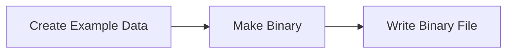

## Fluxo (.json) :

```json
{
  "nodes": [
    {
      "name": "Write Binary File",
      "type": "n8n-nodes-base.writeBinaryFile",
      "position": [
        800,
        350
      ],
      "parameters": {
        "fileName": "test.json"
      },
      "typeVersion": 1
    },
    {
      "name": "Make Binary",
      "type": "n8n-nodes-base.function",
      "position": [
        600,
        350
      ],
      "parameters": {
        "functionCode": "items[0].binary = {\n  data: {\n    data: new Buffer(JSON.stringify(items[0].json, null, 2)).toString('base64')\n  }\n};\nreturn items;"
      },
      "typeVersion": 1
    },
    {
      "name": "Create Example Data",
      "type": "n8n-nodes-base.function",
      "position": [
        390,
        350
      ],
      "parameters": {
        "functionCode": "items[0].json = {\n  \"text\": \"asdf\",\n  \"number\": 1\n};\nreturn items;"
      },
      "typeVersion": 1
    }
  ],
  "connections": {
    "Make Binary": {
      "main": [
        [
          {
            "node": "Write Binary File",
            "type": "main",
            "index": 0
          }
        ]
      ]
    },
    "Create Example Data": {
      "main": [
        [
          {
            "node": "Make Binary",
            "type": "main",
            "index": 0
          }
        ]
      ]
    }
  }
}
```

<a id="template-1668"></a>

## Template 1668 - Exportar produtos para XLS

- **Nome:** Exportar produtos para XLS
- **Descrição:** Exporta os campos name e ean da tabela product para um arquivo de planilha XLS e salva o arquivo localmente.
- **Funcionalidade:** • Execução de consulta SQL: Executa a query SELECT name, ean FROM product para obter os dados de produtos.
• Geração de planilha: Converte o resultado da consulta em um arquivo de planilha (formato XLS).
• Salvamento do arquivo: Grava o arquivo gerado no sistema de arquivos com o nome 'spreadsheet.xls'.
- **Ferramentas:** • PostgreSQL: Banco de dados relacional onde a tabela product contém os dados de produtos.
• Sistema de arquivos local: Local utilizado para salvar o arquivo 'spreadsheet.xls'.
• Formato XLS: Formato de planilha utilizado para a exportação dos dados.


## Fluxo visual

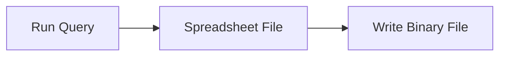

## Fluxo (.json) :

```json
{
  "nodes": [
    {
      "name": "Run Query",
      "type": "n8n-nodes-base.postgres",
      "position": [
        450,
        450
      ],
      "parameters": {
        "query": "SELECT name, ean FROM product",
        "operation": "executeQuery"
      },
      "credentials": {
        "postgres": "postgres"
      },
      "typeVersion": 1
    },
    {
      "name": "Spreadsheet File",
      "type": "n8n-nodes-base.spreadsheetFile",
      "position": [
        600,
        450
      ],
      "parameters": {
        "operation": "toFile"
      },
      "typeVersion": 1
    },
    {
      "name": "Write Binary File",
      "type": "n8n-nodes-base.writeBinaryFile",
      "position": [
        750,
        450
      ],
      "parameters": {
        "fileName": "spreadsheet.xls"
      },
      "typeVersion": 1
    }
  ],
  "connections": {
    "Run Query": {
      "main": [
        [
          {
            "node": "Spreadsheet File",
            "type": "main",
            "index": 0
          }
        ]
      ]
    },
    "Spreadsheet File": {
      "main": [
        [
          {
            "node": "Write Binary File",
            "type": "main",
            "index": 0
          }
        ]
      ]
    }
  }
}
```

<a id="template-1670"></a>

## Template 1670 - Sincronizar tickets Zendesk para GitHub

- **Nome:** Sincronizar tickets Zendesk para GitHub
- **Descrição:** Sincroniza tickets novos do Zendesk com o GitHub: cria issues quando necessário, adiciona comentários em issues existentes e atualiza o ticket com o número da issue.
- **Funcionalidade:** • Receber ticket via webhook: Inicia o fluxo quando um novo ticket é criado no sistema de suporte.
• Obter detalhes do ticket: Recupera informações completas do ticket, incluindo campos personalizados e comentário.
• Verificar existência de issue vinculada: Checa se o campo personalizado com o número da issue do GitHub já está preenchido.
• Comentar em issue existente: Se houver número de issue, adiciona o comentário do ticket na issue correspondente no GitHub.
• Criar nova issue no GitHub: Se não houver número de issue, cria uma nova issue usando o assunto do ticket.
• Atualizar ticket com número da issue: Após criar a issue, grava o número retornado no campo personalizado do ticket no Zendesk.
- **Ferramentas:** • Zendesk: Plataforma de suporte ao cliente para gerenciar tickets, comentários e campos personalizados.
• GitHub: Plataforma de hospedagem de código utilizada para criar issues e publicar comentários.

## Fluxo visual

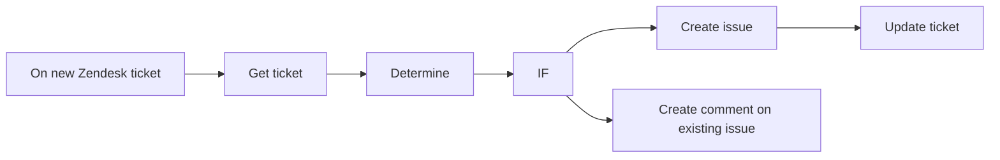

## Fluxo (.json) :

```json
{
  "meta": {
    "instanceId": "237600ca44303ce91fa31ee72babcdc8493f55ee2c0e8aa2b78b3b4ce6f70bd9"
  },
  "nodes": [
    {
      "id": "f0913aa6-4e78-4808-b828-7e9953e71764",
      "name": "Get ticket",
      "type": "n8n-nodes-base.zendesk",
      "position": [
        380,
        480
      ],
      "parameters": {
        "id": "={{$node[\"On new Zendesk ticket\"].json[\"body\"][\"id\"]}}",
        "operation": "get"
      },
      "credentials": {
        "zendeskApi": {
          "id": "24",
          "name": "[UPDATE ME]"
        }
      },
      "typeVersion": 1
    },
    {
      "id": "f8774217-bc05-4b02-8632-154654f79d5f",
      "name": "IF",
      "type": "n8n-nodes-base.if",
      "position": [
        780,
        480
      ],
      "parameters": {
        "conditions": {
          "string": [
            {
              "value1": "={{$node[\"Determine\"].json[\"GitHub Issue Number\"]}}",
              "operation": "isNotEmpty"
            }
          ]
        }
      },
      "typeVersion": 1
    },
    {
      "id": "6ae7e40b-b75c-41e2-9ba7-bb299f12911a",
      "name": "Update ticket",
      "type": "n8n-nodes-base.zendesk",
      "notes": "Update the Zendesk ticket by adding the Jira issue key to the \"Jira Issue Key\" field.",
      "position": [
        1180,
        580
      ],
      "parameters": {
        "id": "={{$node[\"On new Zendesk ticket\"].json[\"body\"][\"id\"]}}",
        "operation": "update",
        "updateFields": {
          "customFieldsUi": {
            "customFieldsValues": [
              {
                "id": 6721726848029,
                "value": "={{$node[\"Create issue\"].json[\"number\"]}}"
              }
            ]
          }
        }
      },
      "credentials": {
        "zendeskApi": {
          "id": "24",
          "name": "[UPDATE ME]"
        }
      },
      "notesInFlow": true,
      "typeVersion": 1
    },
    {
      "id": "7959986c-cfbf-4ba2-a968-95b62d2aa819",
      "name": "Determine",
      "type": "n8n-nodes-base.function",
      "notes": "if issue was created already in Jira",
      "position": [
        580,
        480
      ],
      "parameters": {
        "functionCode": "/* configure here =========================================================== */\n/*  Zendesk field ID which represents the \"GitHub Issue Number\" field.\n*/\nconst ISSUE_KEY_FIELD_ID = 6721726848029;\n\n/* ========================================================================== */\nnew_items = [];\n\nfor (item of $items(\"Get ticket\")) {\n    \n    // instantiate a new variable for status\n    var custom_fields = item.json[\"custom_fields\"];\n    var github_issue_number = \"\";\n    for (var i = 0; i < custom_fields.length; i++) {\n        if (custom_fields[i].id == ISSUE_KEY_FIELD_ID) {\n            github_issue_number = custom_fields[i].value;\n            break;\n        }\n    }\n\n    // push the new item to the new_items array\n    new_items.push({\n        \"GitHub Issue Number\": github_issue_number\n    });\n}\n\nreturn new_items;"
      },
      "notesInFlow": true,
      "typeVersion": 1
    },
    {
      "id": "a1ca21d3-958f-498c-a896-05d4ecbc286d",
      "name": "Create issue",
      "type": "n8n-nodes-base.github",
      "position": [
        980,
        580
      ],
      "parameters": {
        "owner": "John-n8n",
        "title": "={{$node[\"Get ticket\"].json[\"subject\"]}}",
        "labels": [],
        "assignees": [],
        "repository": "DemoRepo"
      },
      "credentials": {
        "githubApi": {
          "id": "20",
          "name": "[UPDATE ME]"
        }
      },
      "typeVersion": 1
    },
    {
      "id": "1ad6f536-2cdb-4ecc-85b4-2e960fb84498",
      "name": "Create comment on existing issue",
      "type": "n8n-nodes-base.github",
      "position": [
        980,
        380
      ],
      "parameters": {
        "body": "={{$node[\"On new Zendesk ticket\"].json[\"body\"][\"comment\"]}}",
        "owner": "John-n8n",
        "operation": "createComment",
        "repository": "DemoRepo",
        "issueNumber": "={{$node[\"Determine\"].json[\"GitHub Issue Number\"]}}"
      },
      "credentials": {
        "githubApi": {
          "id": "20",
          "name": "[UPDATE ME]"
        }
      },
      "typeVersion": 1
    },
    {
      "id": "73e8c380-63de-4e5a-8e57-a17956174869",
      "name": "On new Zendesk ticket",
      "type": "n8n-nodes-base.webhook",
      "position": [
        180,
        480
      ],
      "webhookId": "b4253880-b5e2-4d61-bb2a-b0ea335bee14",
      "parameters": {
        "path": "b4253880-b5e2-4d61-bb2a-b0ea335bee14",
        "options": {},
        "httpMethod": "POST"
      },
      "typeVersion": 1
    }
  ],
  "connections": {
    "IF": {
      "main": [
        [
          {
            "node": "Create comment on existing issue",
            "type": "main",
            "index": 0
          }
        ],
        [
          {
            "node": "Create issue",
            "type": "main",
            "index": 0
          }
        ]
      ]
    },
    "Determine": {
      "main": [
        [
          {
            "node": "IF",
            "type": "main",
            "index": 0
          }
        ]
      ]
    },
    "Get ticket": {
      "main": [
        [
          {
            "node": "Determine",
            "type": "main",
            "index": 0
          }
        ]
      ]
    },
    "Create issue": {
      "main": [
        [
          {
            "node": "Update ticket",
            "type": "main",
            "index": 0
          }
        ]
      ]
    },
    "On new Zendesk ticket": {
      "main": [
        [
          {
            "node": "Get ticket",
            "type": "main",
            "index": 0
          }
        ]
      ]
    }
  }
}
```

<a id="template-1672"></a>

## Template 1672 - Criar/atualizar issues Jira a partir de tickets Zendesk

- **Nome:** Criar/atualizar issues Jira a partir de tickets Zendesk
- **Descrição:** Ao receber um novo ticket do Zendesk, o fluxo verifica se já existe uma chave de issue do Jira associada; se existir, adiciona um comentário à issue; se não existir, cria uma nova issue no Jira e atualiza o ticket do Zendesk com a chave gerada.
- **Funcionalidade:** • Recepção de evento de novo ticket: Inicia o processo ao receber um webhook com um novo ticket do Zendesk.
• Recuperação do ticket completo: Busca os detalhes do ticket para acesso aos campos personalizados e ao comentário.
• Determinação de existência de issue Jira: Lê um campo personalizado específico do Zendesk para verificar se já há uma chave de issue vinculada.
• Adição de comentário em issue existente: Se a chave existir, publica o comentário do ticket dentro da issue correspondente no Jira.
• Criação de nova issue Jira: Se não houver chave, cria uma issue no Jira usando o assunto do ticket como resumo e inclui link para o ticket no corpo da descrição.
• Atualização do ticket Zendesk: Após criar a issue, grava a chave gerada no campo personalizado do ticket Zendesk para manter a referência.
- **Ferramentas:** • Zendesk: Sistema de tickets usado como fonte de eventos, fornecedor dos dados do ticket e destino da atualização do campo personalizado.
• Jira Software Cloud: Plataforma de gestão de issues onde são criadas novas issues e adicionados comentários nas issues existentes.

## Fluxo visual

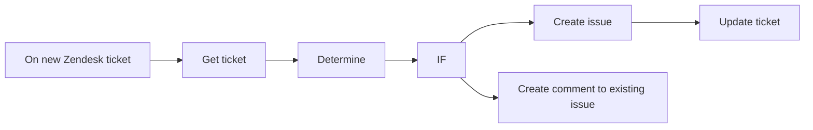

## Fluxo (.json) :

```json
{
  "meta": {
    "instanceId": "237600ca44303ce91fa31ee72babcdc8493f55ee2c0e8aa2b78b3b4ce6f70bd9"
  },
  "nodes": [
    {
      "id": "b374f136-0050-40ea-b889-03c1e20a161e",
      "name": "IF",
      "type": "n8n-nodes-base.if",
      "position": [
        1000,
        300
      ],
      "parameters": {
        "conditions": {
          "string": [
            {
              "value1": "={{$node[\"Determine\"].json[\"Jira issue key\"]}}",
              "operation": "isNotEmpty"
            }
          ]
        }
      },
      "typeVersion": 1
    },
    {
      "id": "52e85300-9a2f-45e9-973e-0fda49a50bf1",
      "name": "Create issue",
      "type": "n8n-nodes-base.jira",
      "position": [
        1180,
        400
      ],
      "parameters": {
        "project": "10000",
        "summary": "={{$node[\"Get ticket\"].json[\"subject\"]}}",
        "issueType": "10003",
        "additionalFields": {
          "description": "=See Zendesk issue at: https://n8n.zendesk.com/agent/tickets/{{$node[\"Get ticket\"].json[\"id\"]}}"
        }
      },
      "credentials": {
        "jiraSoftwareCloudApi": {
          "id": "23",
          "name": "[UPDATE ME]"
        }
      },
      "typeVersion": 1
    },
    {
      "id": "85c93002-95d3-434d-b9e9-10ef714432b1",
      "name": "Update ticket",
      "type": "n8n-nodes-base.zendesk",
      "notes": "Update the Zendesk ticket by adding the Jira issue key to the \"Jira Issue Key\" field.",
      "position": [
        1360,
        400
      ],
      "parameters": {
        "id": "={{$node[\"On new Zendesk ticket\"].json[\"body\"][\"id\"]}}",
        "operation": "update",
        "updateFields": {
          "customFieldsUi": {
            "customFieldsValues": [
              {
                "id": 6689934837021,
                "value": "={{$node[\"Create issue\"].json[\"key\"]}}"
              }
            ]
          }
        }
      },
      "credentials": {
        "zendeskApi": {
          "id": "24",
          "name": "[UPDATE ME]"
        }
      },
      "notesInFlow": true,
      "typeVersion": 1
    },
    {
      "id": "3aa0dff6-f4a5-47c1-9843-271b78bfbf36",
      "name": "Get ticket",
      "type": "n8n-nodes-base.zendesk",
      "position": [
        640,
        300
      ],
      "parameters": {
        "id": "={{$node[\"On new Zendesk ticket\"].json[\"body\"][\"id\"]}}",
        "operation": "get"
      },
      "credentials": {
        "zendeskApi": {
          "id": "24",
          "name": "[UPDATE ME]"
        }
      },
      "typeVersion": 1
    },
    {
      "id": "efd1f838-226f-4869-83f8-086d31f8a9bc",
      "name": "Determine",
      "type": "n8n-nodes-base.function",
      "notes": "if issue was created already in Jira",
      "position": [
        820,
        300
      ],
      "parameters": {
        "functionCode": "/* configure here =========================================================== */\n/*  Zendesk field ID which represents the \"Jira Issue Key\" field.\n*/\nconst ISSUE_KEY_FIELD_ID = 6689934837021;\n\n/* ========================================================================== */\nnew_items = [];\n\nfor (item of $items(\"Get ticket\")) {\n    \n    // instantiate a new variable for status\n    var custom_fields = item.json[\"custom_fields\"];\n    var jira_issue_key = \"\";\n    for (var i = 0; i < custom_fields.length; i++) {\n        if (custom_fields[i].id == ISSUE_KEY_FIELD_ID) {\n            jira_issue_key = custom_fields[i].value;\n            break;\n        }\n    }\n\n    // push the new item to the new_items array\n    new_items.push({\n        \"Jira issue key\": jira_issue_key\n    });\n}\n\nreturn new_items;"
      },
      "notesInFlow": true,
      "typeVersion": 1
    },
    {
      "id": "41a1c04b-561b-41e3-be6e-fc953319abc1",
      "name": "Create comment to existing issue",
      "type": "n8n-nodes-base.jira",
      "position": [
        1180,
        200
      ],
      "parameters": {
        "comment": "={{$node[\"On new Zendesk ticket\"].json[\"body\"][\"comment\"]}}",
        "options": {},
        "issueKey": "={{$node[\"Determine\"].json[\"Jira issue key\"]}}",
        "resource": "issueComment"
      },
      "credentials": {
        "jiraSoftwareCloudApi": {
          "id": "23",
          "name": "[UPDATE ME]"
        }
      },
      "typeVersion": 1
    },
    {
      "id": "33e0121e-703d-4c60-b257-a89a99db771a",
      "name": "On new Zendesk ticket",
      "type": "n8n-nodes-base.webhook",
      "position": [
        460,
        300
      ],
      "webhookId": "d596c0c6-7377-4a17-9ed5-6ee953f072b9",
      "parameters": {
        "path": "d596c0c6-7377-4a17-9ed5-6ee953f072b9",
        "options": {},
        "httpMethod": "POST"
      },
      "typeVersion": 1
    }
  ],
  "connections": {
    "IF": {
      "main": [
        [
          {
            "node": "Create comment to existing issue",
            "type": "main",
            "index": 0
          }
        ],
        [
          {
            "node": "Create issue",
            "type": "main",
            "index": 0
          }
        ]
      ]
    },
    "Determine": {
      "main": [
        [
          {
            "node": "IF",
            "type": "main",
            "index": 0
          }
        ]
      ]
    },
    "Get ticket": {
      "main": [
        [
          {
            "node": "Determine",
            "type": "main",
            "index": 0
          }
        ]
      ]
    },
    "Create issue": {
      "main": [
        [
          {
            "node": "Update ticket",
            "type": "main",
            "index": 0
          }
        ]
      ]
    },
    "On new Zendesk ticket": {
      "main": [
        [
          {
            "node": "Get ticket",
            "type": "main",
            "index": 0
          }
        ]
      ]
    }
  }
}
```

<a id="template-1674"></a>

## Template 1674 - Sincronização de empresas HubSpot → Zendesk

- **Nome:** Sincronização de empresas HubSpot → Zendesk
- **Descrição:** Sincroniza empresas modificadas no HubSpot com organizações no Zendesk, criando ou atualizando registros conforme necessário.
- **Funcionalidade:** • Agendamento periódico: Executa o fluxo a cada 5 minutos para verificar alterações.
• Controle de última execução: Armazena e utiliza o timestamp da última execução para buscar apenas empresas modificadas desde então.
• Consulta de empresas modificadas: Busca empresas no HubSpot que foram alteradas desde a última execução.
• Recuperação de organizações existentes: Obtém todas as organizações do Zendesk para comparação.
• Comparação e mesclagem: Associa dados do HubSpot com organizações do Zendesk usando o nome como chave.
• Criação condicional: Cria uma nova organização no Zendesk quando não houver correspondência.
• Atualização condicional: Atualiza o nome e domínios da organização no Zendesk quando houver correspondência.
• Atualização do marcador de execução: Atualiza o timestamp de última execução após criar ou atualizar organizações.
- **Ferramentas:** • HubSpot: Plataforma CRM usada para obter empresas e detectar alterações recentes.
• Zendesk: Plataforma de suporte usada para consultar, criar e atualizar organizações.

## Fluxo visual

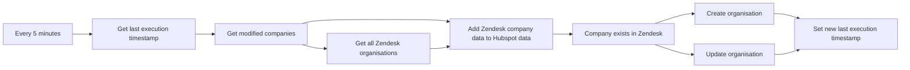

## Fluxo (.json) :

```json
{
  "meta": {
    "instanceId": "237600ca44303ce91fa31ee72babcdc8493f55ee2c0e8aa2b78b3b4ce6f70bd9"
  },
  "nodes": [
    {
      "id": "60e3ee97-68cb-46ef-8a92-a9e8d1cdd45d",
      "name": "Add Zendesk company data to Hubspot data",
      "type": "n8n-nodes-base.merge",
      "position": [
        1120,
        320
      ],
      "parameters": {
        "mode": "mergeByKey",
        "propertyName1": "properties.name.value",
        "propertyName2": "name"
      },
      "typeVersion": 1
    },
    {
      "id": "d72c4307-c24c-494f-b5c2-57fd44ede5a5",
      "name": "Set new last execution timestamp",
      "type": "n8n-nodes-base.functionItem",
      "position": [
        1820,
        300
      ],
      "parameters": {
        "functionCode": "// Code here will run once per input item.\n// More info and help: https://docs.n8n.io/nodes/n8n-nodes-base.functionItem\n// Tip: You can use luxon for dates and $jmespath for querying JSON structures\n\n// Add a new field called 'myNewField' to the JSON of the item\nconst staticData = getWorkflowStaticData('global');\n\nstaticData.lastExecution = $item(0).$node[\"Get last execution timestamp\"].executionTimeStamp;\n\nreturn item;"
      },
      "executeOnce": true,
      "typeVersion": 1
    },
    {
      "id": "c10e7993-4cd4-4b79-9dce-66097d797b30",
      "name": "Get last execution timestamp",
      "type": "n8n-nodes-base.functionItem",
      "position": [
        400,
        300
      ],
      "parameters": {
        "functionCode": "// Code here will run once per input item.\n// More info and help: https://docs.n8n.io/nodes/n8n-nodes-base.functionItem\n// Tip: You can use luxon for dates and $jmespath for querying JSON structures\n\n// Add a new field called 'myNewField' to the JSON of the item\nconst staticData = getWorkflowStaticData('global');\n\nif(!staticData.lastExecution){\n  staticData.lastExecution = new Date();\n}\n\nitem.executionTimeStamp = new Date();\nitem.lastExecution = staticData.lastExecution;\n\n\nreturn item;"
      },
      "typeVersion": 1
    },
    {
      "id": "3c154d99-7984-4561-9fdf-60b0f705c5ee",
      "name": "Get modified companies",
      "type": "n8n-nodes-base.hubspot",
      "position": [
        620,
        300
      ],
      "parameters": {
        "filters": {
          "since": "={{ $json[\"lastExecution\"] }}"
        },
        "resource": "company",
        "operation": "getRecentlyModified",
        "authentication": "appToken"
      },
      "credentials": {
        "hubspotAppToken": {
          "id": "13",
          "name": "HubSpot App Token account"
        }
      },
      "typeVersion": 1
    },
    {
      "id": "6f05aae1-731e-42cf-b403-baf5f86aa934",
      "name": "Get all Zendesk organisations",
      "type": "n8n-nodes-base.zendesk",
      "position": [
        880,
        420
      ],
      "parameters": {
        "resource": "organization",
        "operation": "getAll",
        "returnAll": true
      },
      "credentials": {
        "zendeskApi": {
          "id": "5",
          "name": "Zendesk account"
        }
      },
      "typeVersion": 1
    },
    {
      "id": "a8ae65dc-0c60-42cb-9996-26e84770e299",
      "name": "Company exists in Zendesk",
      "type": "n8n-nodes-base.if",
      "position": [
        1340,
        320
      ],
      "parameters": {
        "conditions": {
          "string": [
            {
              "value1": "={{ $json[\"id\"] }}",
              "operation": "isNotEmpty"
            }
          ]
        }
      },
      "typeVersion": 1
    },
    {
      "id": "a81ff688-8639-476d-8274-383e5ff51b97",
      "name": "Create organisation",
      "type": "n8n-nodes-base.zendesk",
      "position": [
        1600,
        400
      ],
      "parameters": {
        "name": "={{ $json[\"properties\"].name.value }}",
        "resource": "organization",
        "additionalFields": {
          "domain_names": "={{ $json[\"properties\"].domain.value }}"
        }
      },
      "credentials": {
        "zendeskApi": {
          "id": "5",
          "name": "Zendesk account"
        }
      },
      "typeVersion": 1
    },
    {
      "id": "fd2780b3-c5cc-4535-ba71-840b13578a07",
      "name": "Update organisation",
      "type": "n8n-nodes-base.zendesk",
      "position": [
        1600,
        200
      ],
      "parameters": {
        "id": "={{ $json[\"id\"] }}",
        "resource": "organization",
        "operation": "update",
        "updateFields": {
          "name": "={{ $json[\"properties\"].name.value }}",
          "domain_names": "={{ $json[\"properties\"].domain.value }}"
        }
      },
      "credentials": {
        "zendeskApi": {
          "id": "5",
          "name": "Zendesk account"
        }
      },
      "typeVersion": 1
    },
    {
      "id": "7f19e5ba-e973-4e6c-a2d0-a320ac314fa6",
      "name": "Every 5 minutes",
      "type": "n8n-nodes-base.cron",
      "position": [
        180,
        300
      ],
      "parameters": {
        "triggerTimes": {
          "item": [
            {
              "mode": "everyX",
              "unit": "minutes",
              "value": 5
            }
          ]
        }
      },
      "typeVersion": 1
    }
  ],
  "connections": {
    "Every 5 minutes": {
      "main": [
        [
          {
            "node": "Get last execution timestamp",
            "type": "main",
            "index": 0
          }
        ]
      ]
    },
    "Create organisation": {
      "main": [
        [
          {
            "node": "Set new last execution timestamp",
            "type": "main",
            "index": 0
          }
        ]
      ]
    },
    "Update organisation": {
      "main": [
        [
          {
            "node": "Set new last execution timestamp",
            "type": "main",
            "index": 0
          }
        ]
      ]
    },
    "Get modified companies": {
      "main": [
        [
          {
            "node": "Get all Zendesk organisations",
            "type": "main",
            "index": 0
          },
          {
            "node": "Add Zendesk company data to Hubspot data",
            "type": "main",
            "index": 0
          }
        ]
      ]
    },
    "Company exists in Zendesk": {
      "main": [
        [
          {
            "node": "Update organisation",
            "type": "main",
            "index": 0
          }
        ],
        [
          {
            "node": "Create organisation",
            "type": "main",
            "index": 0
          }
        ]
      ]
    },
    "Get last execution timestamp": {
      "main": [
        [
          {
            "node": "Get modified companies",
            "type": "main",
            "index": 0
          }
        ]
      ]
    },
    "Get all Zendesk organisations": {
      "main": [
        [
          {
            "node": "Add Zendesk company data to Hubspot data",
            "type": "main",
            "index": 1
          }
        ]
      ]
    },
    "Add Zendesk company data to Hubspot data": {
      "main": [
        [
          {
            "node": "Company exists in Zendesk",
            "type": "main",
            "index": 0
          }
        ]
      ]
    }
  }
}
```

<a id="template-1676"></a>

## Template 1676 - Agente de recomendações de filmes com MongoDB

- **Nome:** Agente de recomendações de filmes com MongoDB
- **Descrição:** Agente conversacional que recebe mensagens de chat, busca informações em uma coleção de filmes usando pipelines de agregação gerados pelo modelo e pode salvar filmes favoritos quando o usuário confirma.
- **Funcionalidade:** • Recepção de mensagens via webhook: inicia o processamento quando uma mensagem de chat é recebida.
• Interpretação com modelo de linguagem: usa um modelo de chat para entender a solicitação do usuário e decidir ações.
• Geração dinâmica de pipeline de agregação: constrói um pipeline MongoDB apropriado (array de estágios) baseado na solicitação e na estrutura dos documentos.
• Consulta à coleção de filmes: executa agregações na coleção "movies" para obter contexto e resultados relevantes.
• Memória de contexto em janela: mantém as últimas interações (contextWindowLength = 10) para conversas mais coesas.
• Inserção de favoritos: quando o usuário confirma um filme favorito, chama um fluxo de inserção para adicionar { "title": "<TÍTULO>" } ao banco.
- **Ferramentas:** • OpenAI: modelo de linguagem para interpretar pedidos do usuário, gerar a lógica do pipeline de agregação e formular respostas em linguagem natural.
• MongoDB: banco de dados que armazena a coleção de filmes (documentos com campos como title, plot, genres, year, imdb, etc.), usado para consultas por agregação e para inserir favoritos.

## Fluxo visual

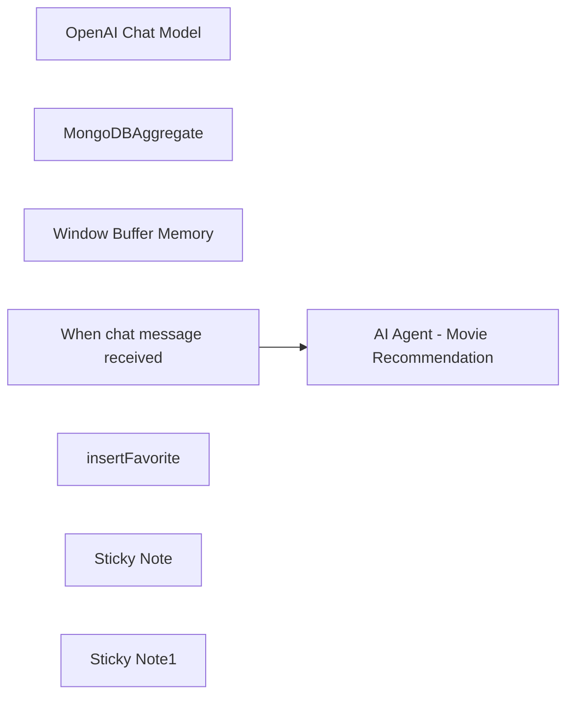

## Fluxo (.json) :

```json
{
  "id": "22PddLUgcjSJbT1w",
  "meta": {
    "instanceId": "fa7d5e2425ec76075df7100dbafffed91cc6f71f12fe92614bf78af63c54a61d",
    "templateCredsSetupCompleted": true
  },
  "name": "MongoDB Agent",
  "tags": [],
  "nodes": [
    {
      "id": "d8c07efe-eca0-48cb-80e6-ea8117073c5f",
      "name": "OpenAI Chat Model",
      "type": "@n8n/n8n-nodes-langchain.lmChatOpenAi",
      "position": [
        1300,
        560
      ],
      "parameters": {
        "options": {}
      },
      "credentials": {
        "openAiApi": {
          "id": "TreGPMKr9hrtCvVp",
          "name": "OpenAi account"
        }
      },
      "typeVersion": 1
    },
    {
      "id": "636de178-7b68-429a-9371-41cf2a950076",
      "name": "MongoDBAggregate",
      "type": "n8n-nodes-base.mongoDbTool",
      "position": [
        1640,
        540
      ],
      "parameters": {
        "query": "={{   $fromAI(\"pipeline\", \"The MongoDB pipeline to execute\" , \"string\" , [{\"$match\" : { \"rating\" : 5 }  }])}}",
        "operation": "aggregate",
        "collection": "movies",
        "descriptionType": "manual",
        "toolDescription": "Get from AI the MongoDB Aggregation pipeline to get context based on the provided pipeline, the document structure of the documents is : {\n  \"plot\": \"A group of bandits stage a brazen train hold-up, only to find a determined posse hot on their heels.\",\n  \"genres\": [\n    \"Short\",\n    \"Western\"\n  ],\n  \"runtime\": 11,\n  \"cast\": [\n    \"A.C. Abadie\",\n    \"Gilbert M. 'Broncho Billy' Anderson\",\n    ...\n  ],\n  \"poster\": \"...jpg\",\n  \"title\": \"The Great Train Robbery\",\n  \"fullplot\": \"Among the earliest existing films in American cinema - notable as the ...\",\n  \"languages\": [\n    \"English\"\n  ],\n  \"released\": \"date\"\n  },\n  \"directors\": [\n    \"Edwin S. Porter\"\n  ],\n  \"rated\": \"TV-G\",\n  \"awards\": {\n    \"wins\": 1,\n    \"nominations\": 0,\n    \"text\": \"1 win.\"\n  },\n  \"lastupdated\": \"2015-08-13 00:27:59.177000000\",\n  \"year\": 1903,\n  \"imdb\": {\n    \"rating\": 7.4,"
      },
      "credentials": {
        "mongoDb": {
          "id": "8xGgiXzf2o0L4a0y",
          "name": "MongoDB account"
        }
      },
      "typeVersion": 1.1
    },
    {
      "id": "e0f248dc-22b7-40a2-a00e-6298b51e4470",
      "name": "Window Buffer Memory",
      "type": "@n8n/n8n-nodes-langchain.memoryBufferWindow",
      "position": [
        1500,
        540
      ],
      "parameters": {
        "contextWindowLength": 10
      },
      "typeVersion": 1.2
    },
    {
      "id": "da27ee52-43db-4818-9844-3c0a064bf958",
      "name": "When chat message received",
      "type": "@n8n/n8n-nodes-langchain.chatTrigger",
      "position": [
        1160,
        400
      ],
      "webhookId": "0730df2d-2f90-45e0-83dc-609668260fda",
      "parameters": {
        "mode": "webhook",
        "public": true,
        "options": {
          "allowedOrigins": "*"
        }
      },
      "typeVersion": 1.1
    },
    {
      "id": "9ad79da9-3145-44be-9026-e37b0e856f5d",
      "name": "insertFavorite",
      "type": "@n8n/n8n-nodes-langchain.toolWorkflow",
      "position": [
        1860,
        520
      ],
      "parameters": {
        "name": "insertFavorites",
        "workflowId": {
          "__rl": true,
          "mode": "list",
          "value": "6QuKnOrpusQVu66Q",
          "cachedResultName": "insertMongoDB"
        },
        "description": "=Use this tool only to add favorites with the structure of {\"title\"  : \"recieved title\"  }"
      },
      "typeVersion": 1.2
    },
    {
      "id": "4d7713d1-d2ad-48bf-971b-b86195e161ca",
      "name": "AI Agent - Movie Recommendation",
      "type": "@n8n/n8n-nodes-langchain.agent",
      "position": [
        1380,
        300
      ],
      "parameters": {
        "text": "=Assistant for best movies context, you have tools to search using \"MongoDBAggregate\" and you need to provide a MongoDB aggregation pipeline code array as a \"query\" input param. User input and request: {{ $json.chatInput }}. Only when a user confirms a favorite movie use the insert favorite using the \"insertFavorite\" workflow tool of to insertFavorite as { \"title\" : \"<TITLE>\" }.",
        "options": {},
        "promptType": "define"
      },
      "typeVersion": 1.7
    },
    {
      "id": "2eac8aed-9677-4d89-bd76-456637f5b979",
      "name": "Sticky Note",
      "type": "n8n-nodes-base.stickyNote",
      "position": [
        880,
        300
      ],
      "parameters": {
        "width": 216.0875923062025,
        "height": 499.89779507612025,
        "content": "## AI Agent powered by OpenAI and MongoDB \n\nThis flow is designed to work as an AI autonomous agent that can get chat messages, query data from MongoDB using the aggregation framework.\n\nFollowing by augmenting the results from the sample movies collection and allowing storing my favorite movies back to the database using an \"insert\" flow. "
      },
      "typeVersion": 1
    },
    {
      "id": "4d8130fe-4aed-4e09-9c1d-60fb9ac1a500",
      "name": "Sticky Note1",
      "type": "n8n-nodes-base.stickyNote",
      "position": [
        1300,
        720
      ],
      "parameters": {
        "content": "## Process\n\nThe message is being processed by the \"Chat Model\" and the correct tool is used according to the message. "
      },
      "typeVersion": 1
    }
  ],
  "active": true,
  "pinData": {},
  "settings": {
    "executionOrder": "v1"
  },
  "versionId": "879aab24-6346-435f-8fd4-3fca856ba64c",
  "connections": {
    "insertFavorite": {
      "ai_tool": [
        [
          {
            "node": "AI Agent - Movie Recommendation",
            "type": "ai_tool",
            "index": 0
          }
        ]
      ]
    },
    "MongoDBAggregate": {
      "ai_tool": [
        [
          {
            "node": "AI Agent - Movie Recommendation",
            "type": "ai_tool",
            "index": 0
          }
        ]
      ]
    },
    "OpenAI Chat Model": {
      "ai_languageModel": [
        [
          {
            "node": "AI Agent - Movie Recommendation",
            "type": "ai_languageModel",
            "index": 0
          }
        ]
      ]
    },
    "Window Buffer Memory": {
      "ai_memory": [
        [
          {
            "node": "AI Agent - Movie Recommendation",
            "type": "ai_memory",
            "index": 0
          }
        ]
      ]
    },
    "When chat message received": {
      "main": [
        [
          {
            "node": "AI Agent - Movie Recommendation",
            "type": "main",
            "index": 0
          }
        ]
      ]
    }
  }
}
```

<a id="template-1679"></a>

## Template 1679 - Fluxo de chat com memória e busca de produtos

- **Nome:** Fluxo de chat com memória e busca de produtos
- **Descrição:** Fluxo que gerencia conversas de um chatbot, captura e salva informações do usuário em memória, consulta bases externas e retorna respostas via assistente de IA.
- **Funcionalidade:** • Início de conversa: Recebe a mensagem inicial do usuário e apresenta uma saudação automática.
• Detecção de dados do lead: Verifica se há informações do lead (leadData) para construir contexto inicial.
• Geração de mensagem para memória: Cria uma mensagem estruturada com dados do usuário (nome, idade, cidade, profissão, dispositivo, canal, tipo de cotação) para ser salva na memória sem solicitar resposta ao usuário.
• Roteamento para assistentes de IA: Encaminha a entrada apropriada a diferentes assistentes de IA dependendo dos dados disponíveis.
• Armazenamento de histórico conversacional: Persiste e recupera o histórico de conversa em um banco de dados para manter contexto (com janelas de contexto configuradas).
• Consultas dinâmicas de produtos: Executa consultas em banco de dados de produtos usando parâmetros extraídos do contexto (cidade, estado, idade, quantidade de titulares/dependentes) e retorna resultados ordenados e limitados.
• Chamadas a APIs externas e base de conhecimento: Consulta uma API externa para buscar dados pessoais por nome e data de nascimento e acessa um endpoint de informações de cotação para enriquecer respostas.
• Composição de chave de sessão: Constrói uma chave de sessão customizada combinando identificadores de sessão para indexação consistente da memória.
- **Ferramentas:** • OpenAI (assistentes de IA): Serviço de modelos de linguagem usado para gerar respostas e processar entradas do usuário.
• PostgreSQL (memória de chat): Banco de dados usado para armazenar e recuperar o histórico e contexto das conversas.
• MySQL (base de produtos): Banco de dados onde são consultados produtos e preços com filtros dinâmicos.
• API de integração (findByNameAndBirthDate): Endpoint externo que retorna dados de pessoas a partir de nome e data de nascimento.
• Knowledge Base (widget de cotação): Endpoint público que fornece informações de cotação e detalhes de produto para complementar respostas.

## Fluxo visual

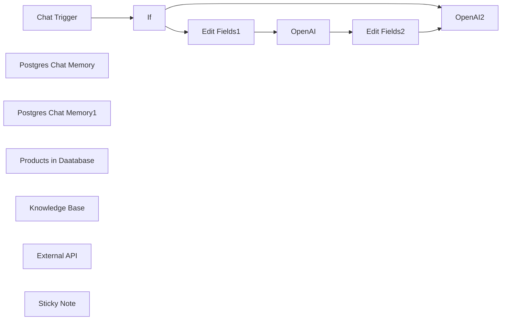

## Fluxo (.json) :

```json
{
  "id": "BMI5WkmyU8nZqfII",
  "meta": {
    "instanceId": "e03b0f22ca12c92061d789d5980a9bc31d9d7e7dd7513ac93c09ac5a0d147623",
    "templateCredsSetupCompleted": true
  },
  "name": "modelo do chatbot",
  "tags": [],
  "nodes": [
    {
      "id": "c6e454af-70a1-4c65-8450-8159f7fc738b",
      "name": "If",
      "type": "n8n-nodes-base.if",
      "position": [
        160,
        560
      ],
      "parameters": {
        "options": {},
        "conditions": {
          "options": {
            "version": 1,
            "leftValue": "",
            "caseSensitive": true,
            "typeValidation": "strict"
          },
          "combinator": "and",
          "conditions": [
            {
              "id": "7ea831a4-0e20-4725-a6f5-3dc2f41f1cf4",
              "operator": {
                "type": "object",
                "operation": "exists",
                "singleValue": true
              },
              "leftValue": "={{ $json.leadData }}",
              "rightValue": ""
            },
            {
              "id": "ccb46339-4e43-42e6-aa45-d5a0cbd62214",
              "operator": {
                "name": "filter.operator.equals",
                "type": "string",
                "operation": "equals"
              },
              "leftValue": "",
              "rightValue": ""
            }
          ]
        }
      },
      "typeVersion": 2
    },
    {
      "id": "2221736f-ef99-4ac8-8a81-51af6d4e7dcd",
      "name": "Edit Fields1",
      "type": "n8n-nodes-base.set",
      "position": [
        440,
        960
      ],
      "parameters": {
        "options": {},
        "assignments": {
          "assignments": [
            {
              "id": "19a16867-b574-4b99-82f1-a86752b7fe9f",
              "name": "chatInput",
              "type": "string",
              "value": "=\"Hello, just so you can get to know me, with no intention of a response, please save this information in your memory. My name is {{ $json.leadData.name }}. I am {{ $json.leadData.age }} years old and currently live in {{ $json.leadData.city }}, {{ $json.leadData.state }}. My profession is {{ $json.leadData.profession }}, and my education level is {{ $json.leadData.educationLevel }}.\nIf I’m part of an adhesion group and have an entity, it would be {{ $json.leadData.entity }}.\n\nI am using a {{ $json.leadData.deviceType }} device to access this through the {{ $json.leadData.channel }} channel. At the moment, I am looking for a health insurance plan of type {{ $json.leadData.quotationType }}.\""
            },
            {
              "id": "0df8d578-8332-4cde-9044-489de16ab390",
              "name": "session_id",
              "type": "string",
              "value": "={{ $json.session_id }}"
            }
          ]
        }
      },
      "typeVersion": 3.4
    },
    {
      "id": "6aa1b3a4-0e6a-4312-9d9f-f67c4bf8f443",
      "name": "Edit Fields2",
      "type": "n8n-nodes-base.set",
      "position": [
        920,
        960
      ],
      "parameters": {
        "options": {},
        "assignments": {
          "assignments": [
            {
              "id": "19a16867-b574-4b99-82f1-a86752b7fe9f",
              "name": "chatInput",
              "type": "string",
              "value": "={{ $('Chat Trigger').item.json.chatInput}}"
            },
            {
              "id": "0df8d578-8332-4cde-9044-489de16ab390",
              "name": "session_id",
              "type": "string",
              "value": "={{ $('Chat Trigger').item.json.session_id }}"
            }
          ]
        }
      },
      "typeVersion": 3.4
    },
    {
      "id": "6afe6158-7a8b-4a83-a778-6fd28e2a11af",
      "name": "OpenAI",
      "type": "@n8n/n8n-nodes-langchain.openAi",
      "position": [
        600,
        960
      ],
      "parameters": {
        "options": {},
        "resource": "assistant",
        "assistantId": {
          "__rl": true,
          "mode": "list",
          "value": "asst_numdCoMZPQ6GwfiJg5drg9hr",
          "cachedResultName": "Chat IA - Testes - Dezembro - APIS"
        }
      },
      "credentials": {
        "openAiApi": {
          "id": "FW1FWHcMcwemQ1kZ",
          "name": "OpenAi account"
        }
      },
      "typeVersion": 1.4
    },
    {
      "id": "4b961f1d-7da2-4a0b-98e3-7ec35ee14335",
      "name": "Chat Trigger",
      "type": "@n8n/n8n-nodes-langchain.chatTrigger",
      "position": [
        -20,
        560
      ],
      "webhookId": "1f83e8ac-d465-454a-8327-cef7f0149cb1",
      "parameters": {
        "public": true,
        "options": {},
        "initialMessages": "Olá 👋\nSou Jovelino, o serviço de IA do Joov, me mande sua pergunta e responderei em seguida! :)"
      },
      "typeVersion": 1
    },
    {
      "id": "dccdb07f-97db-4a5a-9b09-02a5de65246e",
      "name": "Postgres Chat Memory",
      "type": "@n8n/n8n-nodes-langchain.memoryPostgresChat",
      "position": [
        640,
        720
      ],
      "parameters": {
        "tableName": "aimessages",
        "sessionKey": "={{ $('Chat Trigger').item.json.session_id }}{{ $json.sessionId }}",
        "sessionIdType": "customKey",
        "contextWindowLength": 30
      },
      "credentials": {
        "postgres": {
          "id": "M1cYa0bOSX1nfczy",
          "name": "Postgres account"
        }
      },
      "typeVersion": 1.3
    },
    {
      "id": "553dd27b-ab06-4605-99e0-8f15735cfff3",
      "name": "Postgres Chat Memory1",
      "type": "@n8n/n8n-nodes-langchain.memoryPostgresChat",
      "position": [
        760,
        1160
      ],
      "parameters": {
        "tableName": "aimessages",
        "sessionKey": "={{ $('Chat Trigger').item.json.session_id }}{{ $json.sessionId }}",
        "sessionIdType": "customKey",
        "contextWindowLength": 1
      },
      "credentials": {
        "postgres": {
          "id": "M1cYa0bOSX1nfczy",
          "name": "Postgres account"
        }
      },
      "typeVersion": 1.3
    },
    {
      "id": "0103fb97-c691-4bd3-b26d-85aaa9774594",
      "name": "Products in Daatabase",
      "type": "n8n-nodes-base.mySqlTool",
      "position": [
        1460,
        600
      ],
      "parameters": {
        "query": "SELECT * \nFROM Products p \nWHERE \n  cityQuery = '{{ $fromAI(\"cityQuery\") }}' AND \n  state = '{{ $fromAI(\"state\") }}' AND \n  modality = 'PME' AND \n  removed = 0 AND \n  ({{ $fromAI(\"holderCount\") || 1 }} + {{ $fromAI(\"dependentsCount\") || 0 }}) BETWEEN p.minLifeAmount AND p.maxLifeAmount AND\n  (CASE\n      WHEN {{ $fromAI(\"holderAge\") }} BETWEEN 0 AND 18 THEN priceAtAge0To18\n      WHEN {{ $fromAI(\"holderAge\") }} BETWEEN 19 AND 23 THEN priceAtAge19To23\n      WHEN {{ $fromAI(\"holderAge\") }} BETWEEN 24 AND 28 THEN priceAtAge24To28\n      WHEN {{ $fromAI(\"holderAge\") }} BETWEEN 29 AND 33 THEN priceAtAge29To33\n      WHEN {{ $fromAI(\"holderAge\") }} BETWEEN 34 AND 38 THEN priceAtAge34To38\n      WHEN {{ $fromAI(\"holderAge\") }} BETWEEN 39 AND 43 THEN priceAtAge39To43\n      WHEN {{ $fromAI(\"holderAge\") }} BETWEEN 44 AND 48 THEN priceAtAge44To48\n      WHEN {{ $fromAI(\"holderAge\") }} BETWEEN 49 AND 53 THEN priceAtAge49To53\n      WHEN {{ $fromAI(\"holderAge\") }} BETWEEN 54 AND 58 THEN priceAtAge54To58\n      ELSE priceAtAge59To199\n  END) IS NOT NULL\nORDER BY \n  (CASE\n      WHEN {{ $fromAI(\"holderAge\") }} BETWEEN 0 AND 18 THEN priceAtAge0To18\n      WHEN {{ $fromAI(\"holderAge\") }} BETWEEN 19 AND 23 THEN priceAtAge19To23\n      WHEN {{ $fromAI(\"holderAge\") }} BETWEEN 24 AND 28 THEN priceAtAge24To28\n      WHEN {{ $fromAI(\"holderAge\") }} BETWEEN 29 AND 33 THEN priceAtAge29To33\n      WHEN {{ $fromAI(\"holderAge\") }} BETWEEN 34 AND 38 THEN priceAtAge34To38\n      WHEN {{ $fromAI(\"holderAge\") }} BETWEEN 39 AND 43 THEN priceAtAge39To43\n      WHEN {{ $fromAI(\"holderAge\") }} BETWEEN 44 AND 48 THEN priceAtAge44To48\n      WHEN {{ $fromAI(\"holderAge\") }} BETWEEN 49 AND 53 THEN priceAtAge49To53\n      WHEN {{ $fromAI(\"holderAge\") }} BETWEEN 54 AND 58 THEN priceAtAge54To58\n      ELSE priceAtAge59To199\n  END) ASC, \n  createdAt DESC\nLIMIT 3;\n",
        "options": {
          "detailedOutput": true
        },
        "operation": "executeQuery",
        "descriptionType": "manual",
        "toolDescription": "//  Search for the X product bla bla bla"
      },
      "credentials": {
        "mySql": {
          "id": "lkGJt8aNB0azyaGy",
          "name": "MySQL account 2"
        }
      },
      "typeVersion": 2.4
    },
    {
      "id": "0cdfd89f-eb9e-4b6c-90d1-1cf8d6ed96bb",
      "name": "Knowledge Base",
      "type": "@n8n/n8n-nodes-langchain.toolHttpRequest",
      "position": [
        1340,
        600
      ],
      "parameters": {
        "url": "https://quotation.joov.com.br/widget/info?modalidade={modalidade}&estado=SP&cidade={city}&operadora={operadora}",
        "toolDescription": "Here you will find the knowlegde base of my shop and bla bla bla Use this when they ask for price, whatever i want."
      },
      "typeVersion": 1.1
    },
    {
      "id": "393f792a-4eff-4b33-aac0-025fc622a4b3",
      "name": "External API",
      "type": "@n8n/n8n-nodes-langchain.toolHttpRequest",
      "position": [
        1200,
        600
      ],
      "parameters": {
        "url": "https://integracao-sed-alb-323570099.us-east-1.elb.amazonaws.com/findByNameAndBirthDate",
        "method": "POST",
        "jsonBody": "={\n    \"name\": \"{{json.name}}\",\n    \"birthdate\": \"{{json.birthdate }}\"\n}",
        "sendBody": true,
        "specifyBody": "json",
        "toolDescription": "Pegue o nome completo em camel case, exemplo: Fernanda Melo, e a data de nacimento nesse formato: 1990-03-28"
      },
      "typeVersion": 1.1
    },
    {
      "id": "7ce7a5e7-6238-4479-a26f-bdcde1784188",
      "name": "Sticky Note",
      "type": "n8n-nodes-base.stickyNote",
      "position": [
        1160,
        414
      ],
      "parameters": {
        "color": 5,
        "width": 436.73182569600795,
        "height": 367.7413881276459,
        "content": "TOOLS"
      },
      "typeVersion": 1
    },
    {
      "id": "df6737ca-c588-48fc-9761-2a5307841298",
      "name": "OpenAI2",
      "type": "@n8n/n8n-nodes-langchain.openAi",
      "position": [
        460,
        460
      ],
      "parameters": {
        "text": "={{ $json.chatInput }}",
        "prompt": "define",
        "options": {},
        "resource": "assistant",
        "assistantId": {
          "__rl": true,
          "mode": "list",
          "value": "asst_x2qfc7EuoPv7XGOL84ClEZ3L",
          "cachedResultName": "PINE"
        }
      },
      "credentials": {
        "openAiApi": {
          "id": "FW1FWHcMcwemQ1kZ",
          "name": "OpenAi account"
        }
      },
      "typeVersion": 1.4
    }
  ],
  "active": false,
  "pinData": {},
  "settings": {
    "executionOrder": "v1"
  },
  "versionId": "d1dc3988-6677-47c9-b91a-6875c7b6151d",
  "connections": {
    "If": {
      "main": [
        [
          {
            "node": "Edit Fields1",
            "type": "main",
            "index": 0
          }
        ],
        [
          {
            "node": "OpenAI2",
            "type": "main",
            "index": 0
          }
        ]
      ]
    },
    "OpenAI": {
      "main": [
        [
          {
            "node": "Edit Fields2",
            "type": "main",
            "index": 0
          }
        ]
      ]
    },
    "Chat Trigger": {
      "main": [
        [
          {
            "node": "If",
            "type": "main",
            "index": 0
          }
        ]
      ]
    },
    "Edit Fields1": {
      "main": [
        [
          {
            "node": "OpenAI",
            "type": "main",
            "index": 0
          }
        ]
      ]
    },
    "Edit Fields2": {
      "main": [
        [
          {
            "node": "OpenAI2",
            "type": "main",
            "index": 0
          }
        ]
      ]
    },
    "External API": {
      "ai_tool": [
        [
          {
            "node": "OpenAI2",
            "type": "ai_tool",
            "index": 0
          }
        ]
      ]
    },
    "Knowledge Base": {
      "ai_tool": [
        [
          {
            "node": "OpenAI2",
            "type": "ai_tool",
            "index": 0
          }
        ]
      ]
    },
    "Postgres Chat Memory": {
      "ai_memory": [
        [
          {
            "node": "OpenAI2",
            "type": "ai_memory",
            "index": 0
          }
        ]
      ]
    },
    "Postgres Chat Memory1": {
      "ai_memory": [
        [
          {
            "node": "OpenAI",
            "type": "ai_memory",
            "index": 0
          }
        ]
      ]
    },
    "Products in Daatabase": {
      "ai_tool": [
        [
          {
            "node": "OpenAI2",
            "type": "ai_tool",
            "index": 0
          }
        ]
      ]
    }
  }
}
```

<a id="template-1681"></a>

## Template 1681 - Agente de IA que consulta os principais posts do Hacker News

- **Nome:** Agente de IA que consulta os principais posts do Hacker News
- **Descrição:** Fluxo que recebe mensagens manuais de chat, utiliza um agente de IA com modelo de conversa para processar a solicitação e, quando necessário, chama uma ferramenta personalizada que retorna os posts mais populares do Hacker News em formato JSON.
- **Funcionalidade:** • Recepção de mensagem manual: Inicia o agente de IA quando o usuário envia uma mensagem via chat manual.
• Agente de IA com modelo de chat: Processa a mensagem do usuário e decide ações usando um modelo de linguagem (limite de até 10 iterações).
• Ferramenta personalizada (hn_tool): Permite ao agente invocar um sub-fluxo que obtém dados externos quando necessário.
• Coleta de posts do Hacker News: Sub-fluxo consulta a fonte pública do Hacker News para obter os top 50 posts.
• Limpeza e seleção de campos: Extrai e normaliza campos relevantes (title, points, url, created_at, author) dos resultados brutos.
• Serialização de resposta: Converte os dados limpos em JSON string para retorno ou uso posterior.
- **Ferramentas:** • OpenAI: Modelo de linguagem para gerar, entender e formatar respostas de chat.
• Hacker News (API pública): Fonte dos posts mais populares, usada para recuperar títulos, pontuações, URLs, datas e autores dos posts.

## Fluxo visual

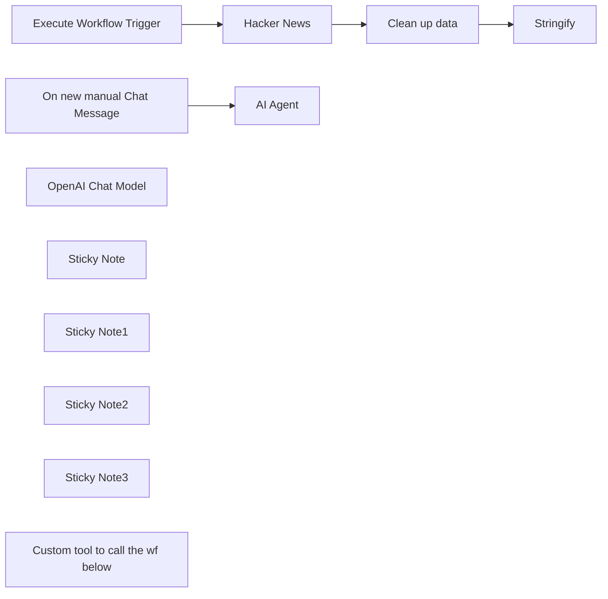

## Fluxo (.json) :

```json
{
  "meta": {
    "instanceId": "cb484ba7b742928a2048bf8829668bed5b5ad9787579adea888f05980292a4a7"
  },
  "nodes": [
    {
      "id": "4c52efcf-039b-4550-8a63-3d3d4dde488b",
      "name": "On new manual Chat Message",
      "type": "@n8n/n8n-nodes-langchain.manualChatTrigger",
      "position": [
        740,
        300
      ],
      "parameters": {},
      "typeVersion": 1.1
    },
    {
      "id": "adb528f1-b87b-4bb2-99e1-776fd839522e",
      "name": "Execute Workflow Trigger",
      "type": "n8n-nodes-base.executeWorkflowTrigger",
      "position": [
        680,
        940
      ],
      "parameters": {},
      "typeVersion": 1
    },
    {
      "id": "092cf737-5b53-4fc8-82f5-c775b77ea0bd",
      "name": "Hacker News",
      "type": "n8n-nodes-base.hackerNews",
      "position": [
        900,
        940
      ],
      "parameters": {
        "limit": 50,
        "resource": "all",
        "additionalFields": {}
      },
      "typeVersion": 1
    },
    {
      "id": "a0805137-630c-4065-826e-88afa000660f",
      "name": "Clean up data",
      "type": "n8n-nodes-base.set",
      "position": [
        1120,
        940
      ],
      "parameters": {
        "fields": {
          "values": [
            {
              "name": "title",
              "stringValue": "={{ $json._highlightResult.title.value }}"
            },
            {
              "name": "points",
              "type": "numberValue",
              "numberValue": "={{ $json.points }}"
            },
            {
              "name": "url",
              "stringValue": "={{ $json.url }}"
            },
            {
              "name": "created_at",
              "stringValue": "={{ $json.created_at }}"
            },
            {
              "name": "author",
              "stringValue": "={{ $json.author }}"
            }
          ]
        },
        "include": "none",
        "options": {}
      },
      "typeVersion": 3.2
    },
    {
      "id": "e1b255f4-e970-42d6-9870-4e302bf2da83",
      "name": "AI Agent",
      "type": "@n8n/n8n-nodes-langchain.agent",
      "position": [
        960,
        300
      ],
      "parameters": {
        "options": {
          "maxIterations": 10
        }
      },
      "typeVersion": 1.1
    },
    {
      "id": "91e3391e-909e-4d63-9649-ff62781dbba9",
      "name": "OpenAI Chat Model",
      "type": "@n8n/n8n-nodes-langchain.lmChatOpenAi",
      "position": [
        960,
        520
      ],
      "parameters": {
        "options": {}
      },
      "credentials": {
        "openAiApi": {
          "id": "VQtv7frm7eLiEDnd",
          "name": "OpenAi account 7"
        }
      },
      "typeVersion": 1
    },
    {
      "id": "cd1f0028-635e-48eb-ac38-4c6fb25ed63e",
      "name": "Stringify",
      "type": "n8n-nodes-base.code",
      "position": [
        1340,
        940
      ],
      "parameters": {
        "jsCode": "return {\n 'response': JSON.stringify($input.all().map(x => x.json))\n}"
      },
      "typeVersion": 2
    },
    {
      "id": "7df241eb-67d3-4724-8b32-4b53561ed55f",
      "name": "Sticky Note",
      "type": "n8n-nodes-base.stickyNote",
      "position": [
        880,
        820
      ],
      "parameters": {
        "color": 7,
        "width": 150,
        "height": 293,
        "content": "### Replace me\nwith any other service, e.g. fetching your own data"
      },
      "typeVersion": 1
    },
    {
      "id": "270845df-7c2d-4035-9ac0-e41d418b3026",
      "name": "Sticky Note1",
      "type": "n8n-nodes-base.stickyNote",
      "position": [
        600,
        738.125
      ],
      "parameters": {
        "color": 7,
        "width": 927.5,
        "height": 406.875,
        "content": "### Sub-workflow: Custom tool\nThis can be called by the agent above. This example fetches the top 50 posts ever on Hacker News"
      },
      "typeVersion": 1
    },
    {
      "id": "1d796a86-45d1-4fc4-8245-893525505d1f",
      "name": "Sticky Note2",
      "type": "n8n-nodes-base.stickyNote",
      "position": [
        600,
        200
      ],
      "parameters": {
        "color": 7,
        "width": 927.5,
        "height": 486.5625,
        "content": "### Main workflow: AI agent using custom tool\nTry it out by clicking 'Chat' and entering 'What is the 5th most popular post ever on Hacker News?'"
      },
      "typeVersion": 1
    },
    {
      "id": "38ff64b5-6f47-4d2d-9051-caab418bb0e8",
      "name": "Sticky Note3",
      "type": "n8n-nodes-base.stickyNote",
      "position": [
        440,
        300
      ],
      "parameters": {
        "width": 185.9375,
        "height": 218,
        "content": "## Try me out\n\nClick the 'Chat' button and enter:\n\n_What is the 5th most popular post ever on Hacker News?_"
      },
      "typeVersion": 1
    },
    {
      "id": "3532e461-bd74-48f7-93e1-96d608c88688",
      "name": "Custom tool to call the wf below",
      "type": "@n8n/n8n-nodes-langchain.toolWorkflow",
      "position": [
        1120,
        520
      ],
      "parameters": {
        "name": "hn_tool",
        "workflowId": "={{ $workflow.id }}",
        "description": "Returns a list of the most popular posts ever on Hacker News, in json format"
      },
      "typeVersion": 1
    }
  ],
  "pinData": {},
  "connections": {
    "Hacker News": {
      "main": [
        [
          {
            "node": "Clean up data",
            "type": "main",
            "index": 0
          }
        ]
      ]
    },
    "Clean up data": {
      "main": [
        [
          {
            "node": "Stringify",
            "type": "main",
            "index": 0
          }
        ]
      ]
    },
    "OpenAI Chat Model": {
      "ai_languageModel": [
        [
          {
            "node": "AI Agent",
            "type": "ai_languageModel",
            "index": 0
          }
        ]
      ]
    },
    "Execute Workflow Trigger": {
      "main": [
        [
          {
            "node": "Hacker News",
            "type": "main",
            "index": 0
          }
        ]
      ]
    },
    "On new manual Chat Message": {
      "main": [
        [
          {
            "node": "AI Agent",
            "type": "main",
            "index": 0
          }
        ]
      ]
    },
    "Custom tool to call the wf below": {
      "ai_tool": [
        [
          {
            "node": "AI Agent",
            "type": "ai_tool",
            "index": 0
          }
        ]
      ]
    }
  }
}
```

<a id="template-1683"></a>

## Template 1683 - Fluxo de pedidos Shopify automatizado

- **Nome:** Fluxo de pedidos Shopify automatizado
- **Descrição:** Ao receber um novo pedido Shopify, o fluxo coleta dados do cliente e do pedido, gera fatura, cria um card de acompanhamento, atualiza o CRM, envia e-mails condicionais e marca clientes em lista de e-mail quando aplicável.
- **Funcionalidade:** • Detecção de novo pedido: Inicia o processo ao receber um pedido criado na loja Shopify.
• Extração e normalização de campos: Recupera e padroniza nome, e-mail, telefone, endereço, cidade, estado, CEP e valor do pedido.
• Geração de fatura: Cria uma fatura no sistema de faturamento com moeda, data de emissão, prazo de pagamento e número do pedido.
• Criação de card de acompanhamento: Adiciona um card em quadro/lista com o número do pedido e link para o status do pedido.
• Atualização/registro de contato no CRM: Insere ou atualiza contato no CRM com e-mail, telefone, nome e endereço de entrega.
• Envio de e-mail condicional: Se o valor do pedido for maior que 50, envia um e-mail com cupom; caso contrário, envia um e-mail de agradecimento.
• Marcação em lista de e-mail: Quando aplicável (pedido acima do limite), adiciona tag de cliente de alto valor na lista de e-mail marketing.
- **Ferramentas:** • Shopify: Plataforma de e-commerce que dispara o evento de novo pedido e fornece os dados do pedido e do cliente.
• Harvest: Sistema de faturamento/gestão que recebe a criação da fatura com dados do pedido.
• Trello: Quadro de acompanhamento onde é criado um card por pedido contendo referência e link para o pedido.
• Zoho CRM: Plataforma de gerenciamento de contatos onde o cliente é inserido ou atualizado com endereço e contato.
• Gmail: Serviço de envio de e-mails transacionais para enviar cupom ou mensagem de agradecimento ao cliente.
• Mailchimp: Plataforma de e-mail marketing utilizada para marcar/etiquetar membros (por exemplo, como "high-order") na lista.

## Fluxo visual

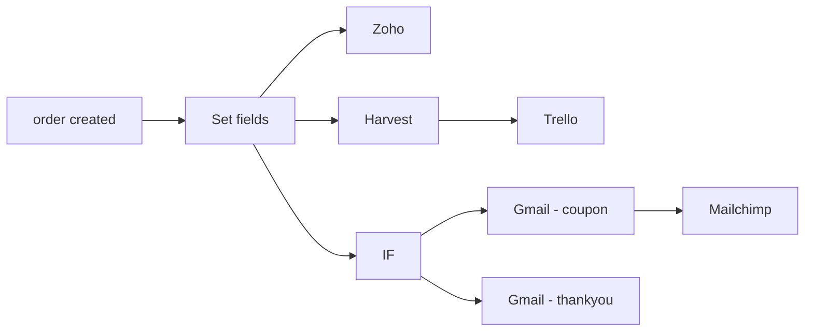

## Fluxo (.json) :

```json
{
  "nodes": [
    {
      "name": "Zoho",
      "type": "n8n-nodes-base.zohoCrm",
      "position": [
        950,
        610
      ],
      "parameters": {
        "lastName": "={{$json[\"customer_lastname\"]}}",
        "resource": "contact",
        "operation": "upsert",
        "additionalFields": {
          "Email": "={{$json[\"customer_email\"]}}",
          "Phone": "={{$json[\"customer_phone\"]}}",
          "First_Name": "={{$json[\"customer_firstname\"]}}",
          "Mailing_Address": {
            "address_fields": {
              "Mailing_Zip": "={{$json[\"customer_zipcode\"]}}",
              "Mailing_City": "={{$json[\"customer_city\"]}}",
              "Mailing_State": "=",
              "Mailing_Street": "={{$json[\"customer_street\"]}}",
              "Mailing_Country": "={{$json[\"customer_country\"]}}"
            }
          }
        }
      },
      "credentials": {
        "zohoOAuth2Api": "zoho_api"
      },
      "typeVersion": 1
    },
    {
      "name": "Trello",
      "type": "n8n-nodes-base.trello",
      "position": [
        1160,
        800
      ],
      "parameters": {
        "name": "=Shopify order {{$node[\"order created\"].json[\"order_number\"]}}",
        "listId": "list01",
        "additionalFields": {
          "urlSource": "={{$node[\"order created\"].json[\"order_status_url\"]}}"
        }
      },
      "credentials": {
        "trelloApi": "trello_nodeqa"
      },
      "typeVersion": 1
    },
    {
      "name": "Set fields",
      "type": "n8n-nodes-base.set",
      "position": [
        760,
        760
      ],
      "parameters": {
        "values": {
          "number": [
            {
              "name": "customer_phone",
              "value": "={{$json[\"customer\"][\"default_address\"][\"phone\"]}}"
            },
            {
              "name": "customer_zipcode",
              "value": "={{$json[\"shipping_address\"][\"zip\"]}}"
            },
            {
              "name": "order_value",
              "value": "={{$json[\"current_total_price\"]}}"
            }
          ],
          "string": [
            {
              "name": "customer_firstname",
              "value": "={{$json[\"customer\"][\"first_name\"]}}"
            },
            {
              "name": "customer_lastname",
              "value": "={{$json[\"customer\"][\"last_name\"]}}"
            },
            {
              "name": "customer_email",
              "value": "={{$json[\"customer\"][\"email\"]}}"
            },
            {
              "name": "customer_country",
              "value": "={{$json[\"shipping_address\"][\"country\"]}}"
            },
            {
              "name": "customer_street",
              "value": "={{$json[\"shipping_address\"][\"address1\"]}}"
            },
            {
              "name": "customer_city",
              "value": "={{$json[\"shipping_address\"][\"city\"]}}"
            },
            {
              "name": "customer_province",
              "value": "={{$json[\"shipping_address\"][\"province\"]}}"
            }
          ]
        },
        "options": {},
        "keepOnlySet": true
      },
      "typeVersion": 1
    },
    {
      "name": "IF",
      "type": "n8n-nodes-base.if",
      "position": [
        960,
        1040
      ],
      "parameters": {
        "conditions": {
          "number": [
            {
              "value1": "={{$json[\"order_value\"]}}",
              "value2": 50,
              "operation": "larger"
            }
          ]
        }
      },
      "typeVersion": 1
    },
    {
      "name": "Gmail - coupon",
      "type": "n8n-nodes-base.gmail",
      "position": [
        1140,
        950
      ],
      "parameters": {
        "toList": [
          "={{$node[\"Set fields\"].json[\"customer_email\"]}}"
        ],
        "message": "=Hi {{$json[\"customer_firstname\"]}},\n\nThank you for your order! Here's a 15% coupon code to use for your next order: COUPON15\n\nBest,\nShop Owner",
        "subject": "Your Shopify order",
        "resource": "message",
        "additionalFields": {}
      },
      "credentials": {
        "gmailOAuth2": "gmail"
      },
      "typeVersion": 1
    },
    {
      "name": "Gmail - thankyou",
      "type": "n8n-nodes-base.gmail",
      "position": [
        1140,
        1150
      ],
      "parameters": {
        "toList": [
          "={{$node[\"Set fields\"].json[\"customer_email\"]}}"
        ],
        "message": "=Hi {{$node[\"Set fields\"].json[\"customer_firstname\"]}},\nThank you for your order! We're getting it ready for shipping it to you.\n\nBest,\nShop Owner",
        "subject": "Your Shopify order",
        "resource": "message",
        "additionalFields": {}
      },
      "credentials": {
        "gmailOAuth2": "gmail"
      },
      "typeVersion": 1
    },
    {
      "name": "Mailchimp",
      "type": "n8n-nodes-base.mailchimp",
      "position": [
        1340,
        950
      ],
      "parameters": {
        "list": "qwertz",
        "tags": [
          "high-order"
        ],
        "email": "={{$node[\"Set fields\"].json[\"customer_email\"]}}",
        "options": {},
        "resource": "memberTag"
      },
      "credentials": {
        "mailchimpApi": "mailchimp_API"
      },
      "typeVersion": 1
    },
    {
      "name": "order created",
      "type": "n8n-nodes-base.shopifyTrigger",
      "position": [
        560,
        760
      ],
      "webhookId": "qwertz",
      "parameters": {
        "topic": "orders/create"
      },
      "credentials": {
        "shopifyApi": "shopify_nodeqa"
      },
      "typeVersion": 1
    },
    {
      "name": "Harvest",
      "type": "n8n-nodes-base.harvest",
      "position": [
        980,
        800
      ],
      "parameters": {
        "clientId": "shopify_client",
        "resource": "invoice",
        "accountId": "12345",
        "operation": "create",
        "additionalFields": {
          "currency": "={{$node[\"order created\"].json[\"currency\"]}}",
          "issue_date": "={{$node[\"order created\"].json[\"processed_at\"]}}",
          "payment_term": "net 15",
          "purchase_order": "={{$node[\"order created\"].json[\"order_number\"]}}"
        }
      },
      "credentials": {
        "harvestApi": "harvest_token"
      },
      "typeVersion": 1
    }
  ],
  "connections": {
    "IF": {
      "main": [
        [
          {
            "node": "Gmail - coupon",
            "type": "main",
            "index": 0
          }
        ],
        [
          {
            "node": "Gmail - thankyou",
            "type": "main",
            "index": 0
          }
        ]
      ]
    },
    "Harvest": {
      "main": [
        [
          {
            "node": "Trello",
            "type": "main",
            "index": 0
          }
        ]
      ]
    },
    "Set fields": {
      "main": [
        [
          {
            "node": "Harvest",
            "type": "main",
            "index": 0
          },
          {
            "node": "IF",
            "type": "main",
            "index": 0
          },
          {
            "node": "Zoho",
            "type": "main",
            "index": 0
          }
        ]
      ]
    },
    "order created": {
      "main": [
        [
          {
            "node": "Set fields",
            "type": "main",
            "index": 0
          }
        ]
      ]
    },
    "Gmail - coupon": {
      "main": [
        [
          {
            "node": "Mailchimp",
            "type": "main",
            "index": 0
          }
        ]
      ]
    }
  }
}
```

<a id="template-1685"></a>

## Template 1685 - Sincronizar versões de workflows com GitLab

- **Nome:** Sincronizar versões de workflows com GitLab
- **Descrição:** Percorre todos os workflows do sistema, compara cada um com a versão armazenada em um repositório GitLab e cria ou atualiza arquivos JSON conforme necessário, registrando o status de cada workflow.
- **Funcionalidade:** • Recuperação de workflows: Obtém a lista completa de workflows do sistema.
• Iteração por workflow: Processa cada workflow individualmente em lotes.
• Recuperação de arquivo remoto: Tenta obter o arquivo JSON correspondente no repositório remoto.
• Tratamento de erros de leitura: Usa saída de erro como fluxo normal para continuar o processamento quando o arquivo não existe ou ocorre erro.
• Extração e parsing: Converte o conteúdo binário do arquivo remoto para objeto JSON para comparação.
• Comparação inteligentes de JSON: Compara as duas versões ignorando campos não relevantes (ex.: updatedAt, global) e determinando se são iguais, diferentes ou ausentes.
• Criação de nova versão: Cria um novo arquivo no repositório quando não existe versão anterior.
• Atualização de versão: Edita/commit a nova versão do arquivo quando há diferenças.
• Registro de status: Gera registros indicando se o workflow está 'new', 'same', 'diff' ou 'error' para acompanhamento.
- **Ferramentas:** • GitLab: Repositório para armazenar arquivos JSON dos workflows e receber commits para criar ou atualizar versões dos arquivos.

## Fluxo visual

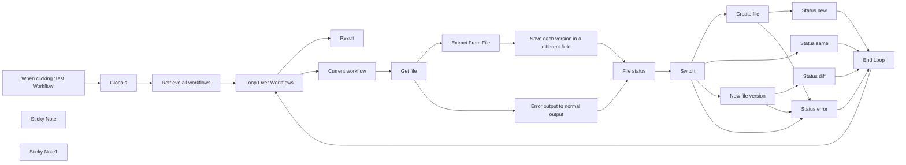

## Fluxo (.json) :

```json
{
  "meta": {
    "instanceId": "d53e56b8545e15a14aa4da6d83ec1d0183c6196323c9b6f7c0a36af8ff413264",
    "templateCredsSetupCompleted": true
  },
  "nodes": [
    {
      "id": "9800aaf1-f330-4898-8da7-e60667ab9597",
      "name": "When clicking \"Test Workflow\"",
      "type": "n8n-nodes-base.manualTrigger",
      "position": [
        880,
        360
      ],
      "parameters": {},
      "typeVersion": 1
    },
    {
      "id": "2772836c-7e75-4d99-a130-f249a3868843",
      "name": "Globals",
      "type": "n8n-nodes-base.set",
      "position": [
        1100,
        360
      ],
      "parameters": {
        "fields": {
          "values": [
            {
              "name": "repo.owner",
              "stringValue": "owner-slug"
            },
            {
              "name": "repo.name",
              "stringValue": "repo-slug"
            },
            {
              "name": "repo.branch",
              "stringValue": "branch-slug"
            },
            {
              "name": "repo.path",
              "stringValue": "path"
            }
          ]
        },
        "options": {}
      },
      "typeVersion": 3.2
    },
    {
      "id": "21c87038-3b5f-4ff8-88f2-7dde7f92af17",
      "name": "Result",
      "type": "n8n-nodes-base.noOp",
      "position": [
        1700,
        80
      ],
      "parameters": {},
      "typeVersion": 1
    },
    {
      "id": "ff6c0a0a-3a2e-4eb7-9eac-1b6986dee524",
      "name": "Current workflow",
      "type": "n8n-nodes-base.noOp",
      "position": [
        1720,
        460
      ],
      "parameters": {},
      "typeVersion": 1
    },
    {
      "id": "d8e48d3c-6df9-4662-b06b-27572182c28d",
      "name": "Loop Over Workflows",
      "type": "n8n-nodes-base.splitInBatches",
      "position": [
        1500,
        360
      ],
      "parameters": {
        "options": {}
      },
      "typeVersion": 3
    },
    {
      "id": "01d1d850-f0e9-4f7d-877a-78cbec050d6e",
      "name": "Get file",
      "type": "n8n-nodes-base.gitlab",
      "onError": "continueErrorOutput",
      "position": [
        1960,
        460
      ],
      "parameters": {
        "owner": "={{ $('Globals').first().json.repo.owner }}",
        "filePath": "={{ $('Globals').first().json.repo.path }}{{ $json.id }}.json",
        "resource": "file",
        "operation": "get",
        "repository": "={{ $('Globals').first().json.repo.name }}",
        "binaryPropertyName": "file-from-gitlab",
        "additionalParameters": {
          "reference": "={{ $('Globals').first().json.repo.branch }}"
        }
      },
      "credentials": {
        "gitlabApi": {
          "id": "1JK5aC2W8tuDKw2e",
          "name": "GitLab account"
        }
      },
      "executeOnce": true,
      "typeVersion": 1,
      "alwaysOutputData": false
    },
    {
      "id": "1cc2e4b6-8143-4d11-8898-78521e2b0170",
      "name": "File status",
      "type": "n8n-nodes-base.code",
      "position": [
        2620,
        440
      ],
      "parameters": {
        "mode": "runOnceForEachItem",
        "jsCode": "var item = $json;\n\n// Check first if is error\nif (item.error) {\n  if (\"The resource you are requesting could not be found\" == item.error) {\n    item[\"status\"] = \"new\";\n  } else {\n    item[\"status\"] = \"error\";\n  }\n  return $input.item;\n}\n\n// If not error check file with saved version\nvar workflowFromN8n = item[\"workflow-from-n8n\"];\nvar workflowFromGitlab = item[\"workflow-from-gitlab\"];\nvar areEquals = objectsAreEquals(workflowFromN8n, workflowFromGitlab);\n\nif (areEquals) {\n  item[\"status\"] = \"same\";\n} else {\n  item[\"status\"] = \"diff\";\n}\n\n// Return Item\nreturn item;\n\n/**\n * Compare to objects\n * @param object1 \n * @param object2 \n * @returns true if the are the same without ignored fields\n */\nfunction objectsAreEquals(object1, object2) {\n  const objectKeys1 = Object.keys(object1);\n  const objectKeys2 = Object.keys(object2);\n\n  // If the numbers of fields are differents, the objects are differents\n  if (objectKeys1.length !== objectKeys2.length) {\n    return false;\n  }\n  for (const key of objectKeys1) {\n    // Define some fields to be ignored\n    var ignoreCurrent = false;\n    switch (key) {\n      case \"updatedAt\": // Changed because workflow change... not usefull\n      case \"global\": // changed for running reasons, no need to check\n        ignoreCurrent = true;\n    }\n\n    // If it's not an ignored field\n    if (!ignoreCurrent) {\n      const value1 = object1[key];\n      const value2 = object2[key];\n      const isBothAreObjects = isObject(value1) && isObject(value2);\n\n      // If it's objects recursive check\n      if (isBothAreObjects && !objectsAreEquals(value1, value2)) {\n        return false;\n      }\n\n      // If it's not objects, just compare values\n      if (!isBothAreObjects && value1 != value2) {\n        return false;\n      }\n    }\n  }\n  return true;\n}\n\n/**\n * Tool function to determine if an parameter is an object\n * @param object \n * @returns \n */\nfunction isObject(object) {\n  return object !== null && typeof object === \"object\";\n}\n"
      },
      "typeVersion": 2
    },
    {
      "id": "8e428b8a-6ac3-47c6-aa53-7a461fcaab0c",
      "name": "Status error",
      "type": "n8n-nodes-base.set",
      "position": [
        3360,
        640
      ],
      "parameters": {
        "fields": {
          "values": [
            {
              "name": "name",
              "stringValue": "={{ $('Current workflow').item.json.name }}"
            },
            {
              "name": "status",
              "stringValue": "=Error : {{ $json.error }}"
            }
          ]
        },
        "include": "none",
        "options": {}
      },
      "typeVersion": 3.2
    },
    {
      "id": "9007c9ae-bac0-4c65-9d50-c63d3a20f49c",
      "name": "End Loop",
      "type": "n8n-nodes-base.noOp",
      "position": [
        3600,
        420
      ],
      "parameters": {},
      "typeVersion": 1
    },
    {
      "id": "ac768b04-fa1f-4cef-8c7c-61508bb46bfc",
      "name": "Create file",
      "type": "n8n-nodes-base.gitlab",
      "onError": "continueErrorOutput",
      "position": [
        3100,
        140
      ],
      "parameters": {
        "owner": "={{ $('Globals').first().json.repo.owner }}",
        "branch": "={{ $('Globals').first().json.repo.branch }}",
        "filePath": "={{ $('Globals').first().json.repo.path }}{{ $json.id }}.json",
        "resource": "file",
        "repository": "={{ $('Globals').first().json.repo.name }}",
        "fileContent": "={{ JSON.stringify($('Current workflow').item.json, null, 4) }}",
        "commitMessage": "=Create file for workflow {{ $('Current workflow').item.json.name }}",
        "additionalParameters": {
          "author": {
            "name": "n8n",
            "email": "noreply-n8n@mipih.fr"
          }
        }
      },
      "credentials": {
        "gitlabApi": {
          "id": "1JK5aC2W8tuDKw2e",
          "name": "GitLab account"
        }
      },
      "executeOnce": true,
      "typeVersion": 1,
      "alwaysOutputData": false
    },
    {
      "id": "17d32e40-56c1-46e1-b7a6-0438adf5069c",
      "name": "Extract From File",
      "type": "n8n-nodes-base.extractFromFile",
      "position": [
        2180,
        360
      ],
      "parameters": {
        "options": {},
        "operation": "fromJson",
        "destinationKey": "workflow-from-gitlab",
        "binaryPropertyName": "file-from-gitlab"
      },
      "typeVersion": 1
    },
    {
      "id": "51a50508-bfe2-4a70-aa77-420c2f7d6ae1",
      "name": "Switch",
      "type": "n8n-nodes-base.switch",
      "position": [
        2880,
        440
      ],
      "parameters": {
        "rules": {
          "values": [
            {
              "outputKey": "new",
              "conditions": {
                "options": {
                  "leftValue": "",
                  "caseSensitive": true,
                  "typeValidation": "strict"
                },
                "combinator": "and",
                "conditions": [
                  {
                    "operator": {
                      "type": "string",
                      "operation": "equals"
                    },
                    "leftValue": "={{ $json.status }}",
                    "rightValue": "new"
                  }
                ]
              },
              "renameOutput": true
            },
            {
              "outputKey": "same",
              "conditions": {
                "options": {
                  "leftValue": "",
                  "caseSensitive": true,
                  "typeValidation": "strict"
                },
                "combinator": "and",
                "conditions": [
                  {
                    "id": "0ff6e053-e89d-49fa-b8c8-3a51ffe016d8",
                    "operator": {
                      "name": "filter.operator.equals",
                      "type": "string",
                      "operation": "equals"
                    },
                    "leftValue": "={{ $json.status }}",
                    "rightValue": "same"
                  }
                ]
              },
              "renameOutput": true
            },
            {
              "outputKey": "diff",
              "conditions": {
                "options": {
                  "leftValue": "",
                  "caseSensitive": true,
                  "typeValidation": "strict"
                },
                "combinator": "and",
                "conditions": [
                  {
                    "id": "b6b954c3-e74c-4f60-8e9e-ac79d4b741f3",
                    "operator": {
                      "name": "filter.operator.equals",
                      "type": "string",
                      "operation": "equals"
                    },
                    "leftValue": "={{ $json.status }}",
                    "rightValue": "diff"
                  }
                ]
              },
              "renameOutput": true
            }
          ]
        },
        "options": {
          "fallbackOutput": "extra",
          "renameFallbackOutput": "error"
        }
      },
      "typeVersion": 3
    },
    {
      "id": "4a71677b-2c35-40b3-a45c-320e0779a949",
      "name": "New file version",
      "type": "n8n-nodes-base.gitlab",
      "onError": "continueErrorOutput",
      "position": [
        3100,
        300
      ],
      "parameters": {
        "owner": "={{ $('Globals').first().json.repo.owner }}",
        "branch": "={{ $('Globals').first().json.repo.branch }}",
        "filePath": "={{ $('Globals').first().json.repo.path }}{{ $json['workflow-from-n8n'].id }}.json",
        "resource": "file",
        "operation": "edit",
        "repository": "={{ $('Globals').first().json.repo.name }}",
        "fileContent": "={{ JSON.stringify($json['workflow-from-n8n'], null, 4) }}",
        "commitMessage": "=New file version for workflow {{ $json['workflow-from-n8n'].name }}"
      },
      "credentials": {
        "gitlabApi": {
          "id": "1JK5aC2W8tuDKw2e",
          "name": "GitLab account"
        }
      },
      "executeOnce": true,
      "typeVersion": 1,
      "alwaysOutputData": false
    },
    {
      "id": "a2d22bb4-ff42-41c5-8ef9-6214f114275e",
      "name": "Error output to normal output",
      "type": "n8n-nodes-base.noOp",
      "position": [
        2180,
        560
      ],
      "parameters": {},
      "typeVersion": 1
    },
    {
      "id": "c1932cee-dcb4-4f32-8eff-7ded3558ba53",
      "name": "Status new",
      "type": "n8n-nodes-base.set",
      "position": [
        3360,
        120
      ],
      "parameters": {
        "fields": {
          "values": [
            {
              "name": "name",
              "stringValue": "={{ $('Current workflow').item.json.name }}"
            },
            {
              "name": "status",
              "stringValue": "new"
            }
          ]
        },
        "include": "none",
        "options": {}
      },
      "typeVersion": 3.2
    },
    {
      "id": "769cf25b-311a-4aaa-9eb8-5c9616f91beb",
      "name": "Status diff",
      "type": "n8n-nodes-base.set",
      "position": [
        3360,
        280
      ],
      "parameters": {
        "fields": {
          "values": [
            {
              "name": "name",
              "stringValue": "={{ $('Current workflow').item.json.name }}"
            },
            {
              "name": "status",
              "stringValue": "diff"
            }
          ]
        },
        "include": "none",
        "options": {}
      },
      "typeVersion": 3.2
    },
    {
      "id": "3089818c-0020-4d13-864e-6f04b6ea9d91",
      "name": "Status same",
      "type": "n8n-nodes-base.set",
      "position": [
        3360,
        420
      ],
      "parameters": {
        "fields": {
          "values": [
            {
              "name": "name",
              "stringValue": "={{ $('Current workflow').item.json.name }}"
            },
            {
              "name": "status",
              "stringValue": "same"
            }
          ]
        },
        "include": "none",
        "options": {}
      },
      "typeVersion": 3.2
    },
    {
      "id": "7fcffb00-2177-49b9-b0ee-7ccec076814d",
      "name": "Sticky Note",
      "type": "n8n-nodes-base.stickyNote",
      "position": [
        1920,
        160
      ],
      "parameters": {
        "width": 839.0943396226413,
        "height": 587.9245283018865,
        "content": "## Check file\nGet the file.\nUse error output as normal output.\nSome code to analyse the file and set a status."
      },
      "typeVersion": 1
    },
    {
      "id": "1c0eff6a-e469-41bd-890c-76bc760a2b4e",
      "name": "Sticky Note1",
      "type": "n8n-nodes-base.stickyNote",
      "position": [
        2860,
        14
      ],
      "parameters": {
        "width": 720.3234501347711,
        "height": 806.2533692722375,
        "content": "## Save the data\nSave the data as new or edited file, ignored or note as error."
      },
      "typeVersion": 1
    },
    {
      "id": "a02c50c9-fe6c-4c90-93ee-dc82b8fb3abe",
      "name": "Retrieve all workflows",
      "type": "n8n-nodes-base.n8n",
      "position": [
        1300,
        360
      ],
      "parameters": {
        "filters": {}
      },
      "credentials": {
        "n8nApi": {
          "id": "9Skqv84KE7fa1hJx",
          "name": "n8n account"
        }
      },
      "typeVersion": 1
    },
    {
      "id": "ee96caf2-bf4d-4d10-a6bc-0a30ec9c9db8",
      "name": "Save each version in a different field",
      "type": "n8n-nodes-base.set",
      "position": [
        2400,
        360
      ],
      "parameters": {
        "fields": {
          "values": [
            {
              "name": "workflow-from-gitlab",
              "type": "objectValue",
              "objectValue": "={{ $json['workflow-from-gitlab'] }}"
            },
            {
              "name": "workflow-from-n8n",
              "type": "objectValue",
              "objectValue": "={{ $('Current workflow').item.json }}"
            }
          ]
        },
        "options": {}
      },
      "typeVersion": 3.2
    }
  ],
  "pinData": {},
  "connections": {
    "Switch": {
      "main": [
        [
          {
            "node": "Create file",
            "type": "main",
            "index": 0
          }
        ],
        [
          {
            "node": "Status same",
            "type": "main",
            "index": 0
          }
        ],
        [
          {
            "node": "New file version",
            "type": "main",
            "index": 0
          }
        ],
        [
          {
            "node": "Status error",
            "type": "main",
            "index": 0
          }
        ]
      ]
    },
    "Globals": {
      "main": [
        [
          {
            "node": "Retrieve all workflows",
            "type": "main",
            "index": 0
          }
        ]
      ]
    },
    "End Loop": {
      "main": [
        [
          {
            "node": "Loop Over Workflows",
            "type": "main",
            "index": 0
          }
        ]
      ]
    },
    "Get file": {
      "main": [
        [
          {
            "node": "Extract From File",
            "type": "main",
            "index": 0
          }
        ],
        [
          {
            "node": "Error output to normal output",
            "type": "main",
            "index": 0
          }
        ]
      ]
    },
    "Status new": {
      "main": [
        [
          {
            "node": "End Loop",
            "type": "main",
            "index": 0
          }
        ]
      ]
    },
    "Create file": {
      "main": [
        [
          {
            "node": "Status new",
            "type": "main",
            "index": 0
          }
        ],
        [
          {
            "node": "Status error",
            "type": "main",
            "index": 0
          }
        ]
      ]
    },
    "File status": {
      "main": [
        [
          {
            "node": "Switch",
            "type": "main",
            "index": 0
          }
        ]
      ]
    },
    "Status diff": {
      "main": [
        [
          {
            "node": "End Loop",
            "type": "main",
            "index": 0
          }
        ]
      ]
    },
    "Status same": {
      "main": [
        [
          {
            "node": "End Loop",
            "type": "main",
            "index": 0
          }
        ]
      ]
    },
    "Status error": {
      "main": [
        [
          {
            "node": "End Loop",
            "type": "main",
            "index": 0
          }
        ]
      ]
    },
    "Current workflow": {
      "main": [
        [
          {
            "node": "Get file",
            "type": "main",
            "index": 0
          }
        ]
      ]
    },
    "New file version": {
      "main": [
        [
          {
            "node": "Status diff",
            "type": "main",
            "index": 0
          }
        ],
        [
          {
            "node": "Status error",
            "type": "main",
            "index": 0
          }
        ]
      ]
    },
    "Extract From File": {
      "main": [
        [
          {
            "node": "Save each version in a different field",
            "type": "main",
            "index": 0
          }
        ]
      ]
    },
    "Loop Over Workflows": {
      "main": [
        [
          {
            "node": "Result",
            "type": "main",
            "index": 0
          }
        ],
        [
          {
            "node": "Current workflow",
            "type": "main",
            "index": 0
          }
        ]
      ]
    },
    "Retrieve all workflows": {
      "main": [
        [
          {
            "node": "Loop Over Workflows",
            "type": "main",
            "index": 0
          }
        ]
      ]
    },
    "Error output to normal output": {
      "main": [
        [
          {
            "node": "File status",
            "type": "main",
            "index": 0
          }
        ]
      ]
    },
    "When clicking \"Test Workflow\"": {
      "main": [
        [
          {
            "node": "Globals",
            "type": "main",
            "index": 0
          }
        ]
      ]
    },
    "Save each version in a different field": {
      "main": [
        [
          {
            "node": "File status",
            "type": "main",
            "index": 0
          }
        ]
      ]
    }
  }
}
```

<a id="template-1688"></a>

## Template 1688 - Chatbot com memória e integração a APIs

- **Nome:** Chatbot com memória e integração a APIs
- **Descrição:** Fluxo de chatbot que recebe mensagens, personaliza prompts quando há dados do lead, roteia para assistentes de IA, persiste memória por sessão e consulta fontes externas para complementar respostas.
- **Funcionalidade:** • Gatilho de conversa: inicia a interação com uma mensagem inicial e recebe mensagens do usuário.
• Detecção de leadData: verifica se o payload contém dados do lead e escolhe o fluxo apropriado.
• Construção de prompt personalizado: quando há leadData, monta um chatInput com nome, idade, cidade, estado, profissão, escolaridade, entidade, dispositivo, canal e tipo de cotação.
• Roteamento para assistentes de IA: envia o prompt para diferentes assistentes conforme a condição, permitindo fluxos distintos para mensagens com ou sem leadData.
• Uso de memória por sessão: grava e recupera histórico de conversas usando uma chave de sessão combinada (session_id) com janelas de contexto configuradas para manter contexto relevante.
• Integração com APIs e base de conhecimento: disponibiliza ferramentas que o assistente pode chamar para buscar informações externas quando necessário.
• Consulta de produtos dinâmica: executa uma query parametrizada que filtra produtos por cidade, estado, modalidade, faixa etária e quantidade de dependentes, limitando e ordenando resultados para apresentar as melhores opções.
• Gerenciamento de session_id e variáveis: mantém e repassa session_id e variáveis entre componentes para garantir consistência da sessão e das consultas.
- **Ferramentas:** • Assistentes de IA (OpenAI): modelos de linguagem usados para gerar respostas e orquestrar chamadas a ferramentas e memória.
• Banco de dados PostgreSQL: tabela "aimessages" usada para armazenar e recuperar o histórico de conversas por sessionKey.
• Banco de dados MySQL: tabela "Products" consultada com query dinâmica para localizar produtos compatíveis com parâmetros do usuário.
• API de consulta de pessoas: endpoint https://integracao-sed-alb-323570099.us-east-1.elb.amazonaws.com/findByNameAndBirthDate para validar/consultar pessoa por nome (Camel Case) e data de nascimento (YYYY-MM-DD).
• Base de conhecimento HTTP: endpoint https://quotation.joov.com.br/widget/info que fornece informações de cotação/produto conforme modalidade, estado, cidade e operadora.
• Canal de chat/webhook público: interface que recebe mensagens dos usuários e fornece session_id para identificação de sessão.

## Fluxo visual


## Fluxo (.json) :

```json
{
  "id": "BMI5WkmyU8nZqfII",
  "meta": {
    "instanceId": "e03b0f22ca12c92061d789d5980a9bc31d9d7e7dd7513ac93c09ac5a0d147623",
    "templateCredsSetupCompleted": true
  },
  "name": "modelo do chatbot",
  "tags": [],
  "nodes": [
    {
      "id": "c6e454af-70a1-4c65-8450-8159f7fc738b",
      "name": "If",
      "type": "n8n-nodes-base.if",
      "position": [
        160,
        560
      ],
      "parameters": {
        "options": {},
        "conditions": {
          "options": {
            "version": 1,
            "leftValue": "",
            "caseSensitive": true,
            "typeValidation": "strict"
          },
          "combinator": "and",
          "conditions": [
            {
              "id": "7ea831a4-0e20-4725-a6f5-3dc2f41f1cf4",
              "operator": {
                "type": "object",
                "operation": "exists",
                "singleValue": true
              },
              "leftValue": "={{ $json.leadData }}",
              "rightValue": ""
            },
            {
              "id": "ccb46339-4e43-42e6-aa45-d5a0cbd62214",
              "operator": {
                "name": "filter.operator.equals",
                "type": "string",
                "operation": "equals"
              },
              "leftValue": "",
              "rightValue": ""
            }
          ]
        }
      },
      "typeVersion": 2
    },
    {
      "id": "2221736f-ef99-4ac8-8a81-51af6d4e7dcd",
      "name": "Edit Fields1",
      "type": "n8n-nodes-base.set",
      "position": [
        440,
        960
      ],
      "parameters": {
        "options": {},
        "assignments": {
          "assignments": [
            {
              "id": "19a16867-b574-4b99-82f1-a86752b7fe9f",
              "name": "chatInput",
              "type": "string",
              "value": "=\"Hello, just so you can get to know me, with no intention of a response, please save this information in your memory. My name is {{ $json.leadData.name }}. I am {{ $json.leadData.age }} years old and currently live in {{ $json.leadData.city }}, {{ $json.leadData.state }}. My profession is {{ $json.leadData.profession }}, and my education level is {{ $json.leadData.educationLevel }}.\nIf I’m part of an adhesion group and have an entity, it would be {{ $json.leadData.entity }}.\n\nI am using a {{ $json.leadData.deviceType }} device to access this through the {{ $json.leadData.channel }} channel. At the moment, I am looking for a health insurance plan of type {{ $json.leadData.quotationType }}.\""
            },
            {
              "id": "0df8d578-8332-4cde-9044-489de16ab390",
              "name": "session_id",
              "type": "string",
              "value": "={{ $json.session_id }}"
            }
          ]
        }
      },
      "typeVersion": 3.4
    },
    {
      "id": "6aa1b3a4-0e6a-4312-9d9f-f67c4bf8f443",
      "name": "Edit Fields2",
      "type": "n8n-nodes-base.set",
      "position": [
        920,
        960
      ],
      "parameters": {
        "options": {},
        "assignments": {
          "assignments": [
            {
              "id": "19a16867-b574-4b99-82f1-a86752b7fe9f",
              "name": "chatInput",
              "type": "string",
              "value": "={{ $('Chat Trigger').item.json.chatInput}}"
            },
            {
              "id": "0df8d578-8332-4cde-9044-489de16ab390",
              "name": "session_id",
              "type": "string",
              "value": "={{ $('Chat Trigger').item.json.session_id }}"
            }
          ]
        }
      },
      "typeVersion": 3.4
    },
    {
      "id": "6afe6158-7a8b-4a83-a778-6fd28e2a11af",
      "name": "OpenAI",
      "type": "@n8n/n8n-nodes-langchain.openAi",
      "position": [
        600,
        960
      ],
      "parameters": {
        "options": {},
        "resource": "assistant",
        "assistantId": {
          "__rl": true,
          "mode": "list",
          "value": "asst_numdCoMZPQ6GwfiJg5drg9hr",
          "cachedResultName": "Chat IA - Testes - Dezembro - APIS"
        }
      },
      "credentials": {
        "openAiApi": {
          "id": "FW1FWHcMcwemQ1kZ",
          "name": "OpenAi account"
        }
      },
      "typeVersion": 1.4
    },
    {
      "id": "4b961f1d-7da2-4a0b-98e3-7ec35ee14335",
      "name": "Chat Trigger",
      "type": "@n8n/n8n-nodes-langchain.chatTrigger",
      "position": [
        -20,
        560
      ],
      "webhookId": "1f83e8ac-d465-454a-8327-cef7f0149cb1",
      "parameters": {
        "public": true,
        "options": {},
        "initialMessages": "Olá 👋\nSou Jovelino, o serviço de IA do Joov, me mande sua pergunta e responderei em seguida! :)"
      },
      "typeVersion": 1
    },
    {
      "id": "dccdb07f-97db-4a5a-9b09-02a5de65246e",
      "name": "Postgres Chat Memory",
      "type": "@n8n/n8n-nodes-langchain.memoryPostgresChat",
      "position": [
        640,
        720
      ],
      "parameters": {
        "tableName": "aimessages",
        "sessionKey": "={{ $('Chat Trigger').item.json.session_id }}{{ $json.sessionId }}",
        "sessionIdType": "customKey",
        "contextWindowLength": 30
      },
      "credentials": {
        "postgres": {
          "id": "M1cYa0bOSX1nfczy",
          "name": "Postgres account"
        }
      },
      "typeVersion": 1.3
    },
    {
      "id": "553dd27b-ab06-4605-99e0-8f15735cfff3",
      "name": "Postgres Chat Memory1",
      "type": "@n8n/n8n-nodes-langchain.memoryPostgresChat",
      "position": [
        760,
        1160
      ],
      "parameters": {
        "tableName": "aimessages",
        "sessionKey": "={{ $('Chat Trigger').item.json.session_id }}{{ $json.sessionId }}",
        "sessionIdType": "customKey",
        "contextWindowLength": 1
      },
      "credentials": {
        "postgres": {
          "id": "M1cYa0bOSX1nfczy",
          "name": "Postgres account"
        }
      },
      "typeVersion": 1.3
    },
    {
      "id": "0103fb97-c691-4bd3-b26d-85aaa9774594",
      "name": "Products in Daatabase",
      "type": "n8n-nodes-base.mySqlTool",
      "position": [
        1460,
        600
      ],
      "parameters": {
        "query": "SELECT * \nFROM Products p \nWHERE \n cityQuery = '{{ $fromAI(\"cityQuery\") }}' AND \n state = '{{ $fromAI(\"state\") }}' AND \n modality = 'PME' AND \n removed = 0 AND \n ({{ $fromAI(\"holderCount\") || 1 }} + {{ $fromAI(\"dependentsCount\") || 0 }}) BETWEEN p.minLifeAmount AND p.maxLifeAmount AND\n (CASE\n WHEN {{ $fromAI(\"holderAge\") }} BETWEEN 0 AND 18 THEN priceAtAge0To18\n WHEN {{ $fromAI(\"holderAge\") }} BETWEEN 19 AND 23 THEN priceAtAge19To23\n WHEN {{ $fromAI(\"holderAge\") }} BETWEEN 24 AND 28 THEN priceAtAge24To28\n WHEN {{ $fromAI(\"holderAge\") }} BETWEEN 29 AND 33 THEN priceAtAge29To33\n WHEN {{ $fromAI(\"holderAge\") }} BETWEEN 34 AND 38 THEN priceAtAge34To38\n WHEN {{ $fromAI(\"holderAge\") }} BETWEEN 39 AND 43 THEN priceAtAge39To43\n WHEN {{ $fromAI(\"holderAge\") }} BETWEEN 44 AND 48 THEN priceAtAge44To48\n WHEN {{ $fromAI(\"holderAge\") }} BETWEEN 49 AND 53 THEN priceAtAge49To53\n WHEN {{ $fromAI(\"holderAge\") }} BETWEEN 54 AND 58 THEN priceAtAge54To58\n ELSE priceAtAge59To199\n END) IS NOT NULL\nORDER BY \n (CASE\n WHEN {{ $fromAI(\"holderAge\") }} BETWEEN 0 AND 18 THEN priceAtAge0To18\n WHEN {{ $fromAI(\"holderAge\") }} BETWEEN 19 AND 23 THEN priceAtAge19To23\n WHEN {{ $fromAI(\"holderAge\") }} BETWEEN 24 AND 28 THEN priceAtAge24To28\n WHEN {{ $fromAI(\"holderAge\") }} BETWEEN 29 AND 33 THEN priceAtAge29To33\n WHEN {{ $fromAI(\"holderAge\") }} BETWEEN 34 AND 38 THEN priceAtAge34To38\n WHEN {{ $fromAI(\"holderAge\") }} BETWEEN 39 AND 43 THEN priceAtAge39To43\n WHEN {{ $fromAI(\"holderAge\") }} BETWEEN 44 AND 48 THEN priceAtAge44To48\n WHEN {{ $fromAI(\"holderAge\") }} BETWEEN 49 AND 53 THEN priceAtAge49To53\n WHEN {{ $fromAI(\"holderAge\") }} BETWEEN 54 AND 58 THEN priceAtAge54To58\n ELSE priceAtAge59To199\n END) ASC, \n createdAt DESC\nLIMIT 3;\n",
        "options": {
          "detailedOutput": true
        },
        "operation": "executeQuery",
        "descriptionType": "manual",
        "toolDescription": "// Search for the X product bla bla bla"
      },
      "credentials": {
        "mySql": {
          "id": "lkGJt8aNB0azyaGy",
          "name": "MySQL account 2"
        }
      },
      "typeVersion": 2.4
    },
    {
      "id": "0cdfd89f-eb9e-4b6c-90d1-1cf8d6ed96bb",
      "name": "Knowledge Base",
      "type": "@n8n/n8n-nodes-langchain.toolHttpRequest",
      "position": [
        1340,
        600
      ],
      "parameters": {
        "url": "https://quotation.joov.com.br/widget/info?modalidade={modalidade}&estado=SP&cidade={city}&operadora={operadora}",
        "toolDescription": "Here you will find the knowlegde base of my shop and bla bla bla Use this when they ask for price, whatever i want."
      },
      "typeVersion": 1.1
    },
    {
      "id": "393f792a-4eff-4b33-aac0-025fc622a4b3",
      "name": "External API",
      "type": "@n8n/n8n-nodes-langchain.toolHttpRequest",
      "position": [
        1200,
        600
      ],
      "parameters": {
        "url": "https://integracao-sed-alb-323570099.us-east-1.elb.amazonaws.com/findByNameAndBirthDate",
        "method": "POST",
        "jsonBody": "={\n \"name\": \"{{json.name}}\",\n \"birthdate\": \"{{json.birthdate }}\"\n}",
        "sendBody": true,
        "specifyBody": "json",
        "toolDescription": "Pegue o nome completo em camel case, exemplo: Fernanda Melo, e a data de nacimento nesse formato: 1990-03-28"
      },
      "typeVersion": 1.1
    },
    {
      "id": "7ce7a5e7-6238-4479-a26f-bdcde1784188",
      "name": "Sticky Note",
      "type": "n8n-nodes-base.stickyNote",
      "position": [
        1160,
        414
      ],
      "parameters": {
        "color": 5,
        "width": 436.73182569600795,
        "height": 367.7413881276459,
        "content": "TOOLS"
      },
      "typeVersion": 1
    },
    {
      "id": "df6737ca-c588-48fc-9761-2a5307841298",
      "name": "OpenAI2",
      "type": "@n8n/n8n-nodes-langchain.openAi",
      "position": [
        460,
        460
      ],
      "parameters": {
        "text": "={{ $json.chatInput }}",
        "prompt": "define",
        "options": {},
        "resource": "assistant",
        "assistantId": {
          "__rl": true,
          "mode": "list",
          "value": "asst_x2qfc7EuoPv7XGOL84ClEZ3L",
          "cachedResultName": "PINE"
        }
      },
      "credentials": {
        "openAiApi": {
          "id": "FW1FWHcMcwemQ1kZ",
          "name": "OpenAi account"
        }
      },
      "typeVersion": 1.4
    }
  ],
  "active": false,
  "pinData": {},
  "settings": {
    "executionOrder": "v1"
  },
  "versionId": "d1dc3988-6677-47c9-b91a-6875c7b6151d",
  "connections": {
    "If": {
      "main": [
        [
          {
            "node": "Edit Fields1",
            "type": "main",
            "index": 0
          }
        ],
        [
          {
            "node": "OpenAI2",
            "type": "main",
            "index": 0
          }
        ]
      ]
    },
    "OpenAI": {
      "main": [
        [
          {
            "node": "Edit Fields2",
            "type": "main",
            "index": 0
          }
        ]
      ]
    },
    "Chat Trigger": {
      "main": [
        [
          {
            "node": "If",
            "type": "main",
            "index": 0
          }
        ]
      ]
    },
    "Edit Fields1": {
      "main": [
        [
          {
            "node": "OpenAI",
            "type": "main",
            "index": 0
          }
        ]
      ]
    },
    "Edit Fields2": {
      "main": [
        [
          {
            "node": "OpenAI2",
            "type": "main",
            "index": 0
          }
        ]
      ]
    },
    "External API": {
      "ai_tool": [
        [
          {
            "node": "OpenAI2",
            "type": "ai_tool",
            "index": 0
          }
        ]
      ]
    },
    "Knowledge Base": {
      "ai_tool": [
        [
          {
            "node": "OpenAI2",
            "type": "ai_tool",
            "index": 0
          }
        ]
      ]
    },
    "Postgres Chat Memory": {
      "ai_memory": [
        [
          {
            "node": "OpenAI2",
            "type": "ai_memory",
            "index": 0
          }
        ]
      ]
    },
    "Postgres Chat Memory1": {
      "ai_memory": [
        [
          {
            "node": "OpenAI",
            "type": "ai_memory",
            "index": 0
          }
        ]
      ]
    },
    "Products in Daatabase": {
      "ai_tool": [
        [
          {
            "node": "OpenAI2",
            "type": "ai_tool",
            "index": 0
          }
        ]
      ]
    }
  }
}
```

<a id="template-1690"></a>

## Template 1690 - Envio em lote com limitação de taxa e espera por aprovação

- **Nome:** Envio em lote com limitação de taxa e espera por aprovação
- **Descrição:** Processa uma lista de clientes enviando mensagens com controle de taxa e, quando necessário, envia um link de aprovação ao comerciante e aguarda um evento externo para retomar o fluxo.
- **Funcionalidade:** • Limitação de taxa: aplica um atraso entre envios para evitar sobrecarga do serviço destinatário.
• Processamento em lotes: divide a lista de clientes em itens individuais para processamento sequencial.
• Envio de mensagens personalizadas: envia mensagens aos clientes contendo nome e carimbo de data/hora.
• Geração e envio de URL de aprovação: cria um link de aprovação e o envia ao comerciante.
• Espera por evento externo/retomada: pausa o fluxo até que o comerciante clique no link de aprovação, retomando o processamento.
• Decisão condicional para continuidade: verifica quando todos os itens foram processados para decidir entre continuar em lote ou iniciar o fluxo de aprovação.
- **Ferramentas:** • Base de dados de clientes: armazena e fornece a lista de clientes a ser processada.
• Serviço de mensagens (e-mail/Slack/outros): envia mensagens e links de aprovação para clientes e comerciantes.
• Endpoint HTTP / Webhook de aprovação: recebe o clique do comerciante no link e sinaliza o sistema para retomar o fluxo.

## Fluxo visual

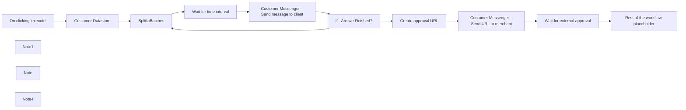

## Fluxo (.json) :

```json
{
  "nodes": [
    {
      "name": "On clicking 'execute'",
      "type": "n8n-nodes-base.manualTrigger",
      "position": [
        400,
        520
      ],
      "parameters": {},
      "typeVersion": 1
    },
    {
      "name": "Note1",
      "type": "n8n-nodes-base.stickyNote",
      "position": [
        1500,
        360
      ],
      "parameters": {
        "width": 780,
        "height": 360,
        "content": "## 2. Wait for an external event\nUse this operation when an external step is needed in order to continue with the rest of the workflow.\nFor example - a workflow sends a purchase approval link to the merchant (using Gmail, Slack etc..) and waits for the merchant to click on it before continuing with the rest of the steps.\n\nIn this example, the `Customer Messenger` node mimics the email or messaging node.\n"
      },
      "typeVersion": 1
    },
    {
      "name": "Note",
      "type": "n8n-nodes-base.stickyNote",
      "position": [
        200,
        380
      ],
      "parameters": {
        "width": 300,
        "height": 120,
        "content": "### Click the `Execute Workflow` button and double click on the nodes to see the input and output items."
      },
      "typeVersion": 1
    },
    {
      "name": "Create approval URL",
      "type": "n8n-nodes-base.set",
      "position": [
        1540,
        520
      ],
      "parameters": {
        "values": {
          "string": [
            {
              "name": "URL",
              "value": "={{$resumeWebhookUrl}}?name=nathan"
            }
          ]
        },
        "options": {},
        "keepOnlySet": true
      },
      "typeVersion": 1
    },
    {
      "name": "Wait for external approval",
      "type": "n8n-nodes-base.wait",
      "position": [
        1940,
        520
      ],
      "webhookId": "0bcafff8-9fc1-4415-95b1-00746bb1304d",
      "parameters": {
        "resume": "webhook",
        "options": {}
      },
      "typeVersion": 1
    },
    {
      "name": "Rest of the workflow placeholder",
      "type": "n8n-nodes-base.noOp",
      "position": [
        2140,
        520
      ],
      "parameters": {},
      "typeVersion": 1
    },
    {
      "name": "Customer Datastore",
      "type": "n8n-nodes-base.n8nTrainingCustomerDatastore",
      "position": [
        580,
        520
      ],
      "parameters": {
        "operation": "getAllPeople",
        "returnAll": true
      },
      "typeVersion": 1
    },
    {
      "name": "SplitInBatches",
      "type": "n8n-nodes-base.splitInBatches",
      "position": [
        760,
        520
      ],
      "parameters": {
        "options": {},
        "batchSize": 1
      },
      "typeVersion": 1
    },
    {
      "name": "Note4",
      "type": "n8n-nodes-base.stickyNote",
      "position": [
        540,
        360
      ],
      "parameters": {
        "width": 900,
        "height": 360,
        "content": "## 1. Rate Limiting \nSometimes you need to slow down how often you are contacting a service.\n\nIn this example, `Customer Datastore` node simulates the big batches of requests coming at once, the `SplitInBatches` node handles each one individually in a loop, and the `Wait` node creates a 2 second delay between each message to a customer."
      },
      "typeVersion": 1
    },
    {
      "name": "Wait for time interval",
      "type": "n8n-nodes-base.wait",
      "position": [
        920,
        520
      ],
      "webhookId": "2b72e9d7-75b7-4ef5-87e7-2bfdfdbaa20f",
      "parameters": {
        "unit": "seconds",
        "amount": 2
      },
      "typeVersion": 1
    },
    {
      "name": "If - Are we Finished?",
      "type": "n8n-nodes-base.if",
      "position": [
        1280,
        520
      ],
      "parameters": {
        "conditions": {
          "boolean": [
            {
              "value1": "={{$node[\"SplitInBatches\"].context[\"noItemsLeft\"]}}",
              "value2": true
            }
          ]
        }
      },
      "typeVersion": 1
    },
    {
      "name": "Customer Messenger - Send URL to merchant",
      "type": "n8n-nodes-base.n8nTrainingCustomerMessenger",
      "position": [
        1740,
        520
      ],
      "parameters": {
        "message": "={{$json[\"URL\"]}}",
        "customerId": "1"
      },
      "typeVersion": 1
    },
    {
      "name": "Customer Messenger - Send message to client",
      "type": "n8n-nodes-base.n8nTrainingCustomerMessenger",
      "position": [
        1100,
        520
      ],
      "parameters": {
        "message": "=\nHi {{$node[\"Customer Datastore\"].json[\"name\"]}}\nThis message was sent at {{$now.toLocaleString(DateTime.TIME_WITH_SECONDS)}}",
        "customerId": "={{$node[\"Customer Datastore\"].json[\"id\"]}}"
      },
      "typeVersion": 1
    }
  ],
  "connections": {
    "SplitInBatches": {
      "main": [
        [
          {
            "node": "Wait for time interval",
            "type": "main",
            "index": 0
          }
        ]
      ]
    },
    "Customer Datastore": {
      "main": [
        [
          {
            "node": "SplitInBatches",
            "type": "main",
            "index": 0
          }
        ]
      ]
    },
    "Create approval URL": {
      "main": [
        [
          {
            "node": "Customer Messenger - Send URL to merchant",
            "type": "main",
            "index": 0
          }
        ]
      ]
    },
    "If - Are we Finished?": {
      "main": [
        [
          {
            "node": "Create approval URL",
            "type": "main",
            "index": 0
          }
        ],
        [
          {
            "node": "SplitInBatches",
            "type": "main",
            "index": 0
          }
        ]
      ]
    },
    "On clicking 'execute'": {
      "main": [
        [
          {
            "node": "Customer Datastore",
            "type": "main",
            "index": 0
          }
        ]
      ]
    },
    "Wait for time interval": {
      "main": [
        [
          {
            "node": "Customer Messenger - Send message to client",
            "type": "main",
            "index": 0
          }
        ]
      ]
    },
    "Wait for external approval": {
      "main": [
        [
          {
            "node": "Rest of the workflow placeholder",
            "type": "main",
            "index": 0
          }
        ]
      ]
    },
    "Customer Messenger - Send URL to merchant": {
      "main": [
        [
          {
            "node": "Wait for external approval",
            "type": "main",
            "index": 0
          }
        ]
      ]
    },
    "Customer Messenger - Send message to client": {
      "main": [
        [
          {
            "node": "If - Are we Finished?",
            "type": "main",
            "index": 0
          }
        ]
      ]
    }
  }
}
```

<a id="template-1692"></a>

## Template 1692 - Classificação automática de e-mails Gmail

- **Nome:** Classificação automática de e-mails Gmail
- **Descrição:** Automatiza a categorização de e-mails recebidos, associando-os a rótulos existentes ou criando novos rótulos quando necessário.
- **Funcionalidade:** • Monitoramento de entrada: Verifica novos e-mails periodicamente (a cada 5 minutos) e inicia o fluxo quando houver mensagens novas.
• Leitura completa da mensagem: Recupera o conteúdo da mensagem (assunto, remetente, destinatário e corpo) para análise.
• Consulta de rótulos existentes: Lê todos os rótulos atuais para encontrar correspondências relevantes.
• Classificação por IA: Usa um modelo de linguagem para analisar o e-mail e determinar o rótulo mais apropriado com base em assunto, remetente e conteúdo.
• Criação de rótulos novos: Se nenhum rótulo adequado existir, cria um novo rótulo alinhado à estrutura atual (preferencialmente como subrótulo de um rótulo principal; se inexistente, cria sob o rótulo "AI").
• Atribuição de rótulo: Adiciona o(s) rótulo(s) selecionado(s) à mensagem e ajusta o estado da caixa de entrada conforme prioridade (remover Inbox para itens de baixa importância).
• Consistência de nomenclatura: Garante que novos rótulos sigam convenções de capitalização, delimitadores e prefixos já usados.
• Memória de contexto: Mantém um buffer de contexto por sessão/mensagem para ajudar decisões consistentes durante a análise.
- **Ferramentas:** • Gmail: Serviço de e-mail usado para detectar novas mensagens, ler conteúdo, listar rótulos existentes, criar rótulos e aplicar rótulos às mensagens.
• OpenAI (modelo de linguagem): Motor de IA utilizado para analisar o conteúdo do e-mail, comparar com rótulos existentes e decidir se deve reutilizar ou criar um rótulo novo.

## Fluxo visual

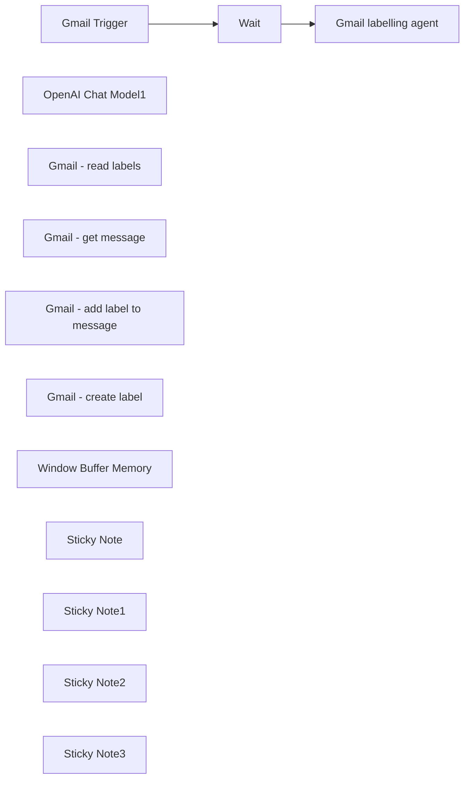

## Fluxo (.json) :

```json
{
  "nodes": [
    {
      "id": "2a41e2da-19f7-4c31-ab93-3a534db3179e",
      "name": "Gmail Trigger",
      "type": "n8n-nodes-base.gmailTrigger",
      "position": [
        -360,
        -260
      ],
      "parameters": {
        "filters": {},
        "pollTimes": {
          "item": [
            {
              "mode": "everyX",
              "unit": "minutes",
              "value": 5
            }
          ]
        }
      },
      "credentials": {
        "gmailOAuth2": {
          "id": "10LJ3tXKoUfexiKU",
          "name": "Gmail account"
        }
      },
      "typeVersion": 1.2
    },
    {
      "id": "a25e0e42-8eab-49c5-a553-797da40eb623",
      "name": "OpenAI Chat Model1",
      "type": "@n8n/n8n-nodes-langchain.lmChatOpenAi",
      "position": [
        -220,
        -60
      ],
      "parameters": {
        "options": {
          "maxTokens": 4096
        }
      },
      "credentials": {
        "openAiApi": {
          "id": "qR44iMsUYcLrhdR0",
          "name": "OpenAi account"
        }
      },
      "notesInFlow": false,
      "typeVersion": 1
    },
    {
      "id": "cf437748-a0df-42a2-b1ca-f93162d85bfe",
      "name": "Gmail - read labels",
      "type": "n8n-nodes-base.gmailTool",
      "position": [
        80,
        -40
      ],
      "webhookId": "d8ec9401-a9ff-4fe2-9c1e-5a8036cd96c9",
      "parameters": {
        "resource": "label",
        "returnAll": true,
        "descriptionType": "manual",
        "toolDescription": "Tool to read all existing gmail labels"
      },
      "credentials": {
        "gmailOAuth2": {
          "id": "10LJ3tXKoUfexiKU",
          "name": "Gmail account"
        }
      },
      "typeVersion": 2.1
    },
    {
      "id": "152f1970-7a1f-4977-9c21-64b69242d3a9",
      "name": "Gmail - get message",
      "type": "n8n-nodes-base.gmailTool",
      "position": [
        260,
        -40
      ],
      "webhookId": "d8ec9401-a9ff-4fe2-9c1e-5a8036cd96c9",
      "parameters": {
        "messageId": "={{ $fromAI('gmail_message_id', 'id of the gmail message, like 1944fdc33f544369', 'string') }}",
        "operation": "get",
        "descriptionType": "manual",
        "toolDescription": "Tool to read a specific message based on the message ID"
      },
      "credentials": {
        "gmailOAuth2": {
          "id": "10LJ3tXKoUfexiKU",
          "name": "Gmail account"
        }
      },
      "typeVersion": 2.1
    },
    {
      "id": "ae09cedc-9675-4080-bcdc-3d6c4e4bc490",
      "name": "Gmail - add label to message",
      "type": "n8n-nodes-base.gmailTool",
      "position": [
        460,
        -40
      ],
      "webhookId": "7a87b026-1c6e-40e1-a062-aefdd1af1585",
      "parameters": {
        "labelIds": "={{ $fromAI('gmail_categories', 'array of label ids') }}",
        "messageId": "={{ $fromAI('gmail_message_id') }}",
        "operation": "addLabels",
        "descriptionType": "manual",
        "toolDescription": "Tool to add label to message"
      },
      "credentials": {
        "gmailOAuth2": {
          "id": "10LJ3tXKoUfexiKU",
          "name": "Gmail account"
        }
      },
      "typeVersion": 2.1
    },
    {
      "id": "be4a92ab-d3ab-451b-8655-172851f68628",
      "name": "Gmail - create label",
      "type": "n8n-nodes-base.gmailTool",
      "position": [
        640,
        -40
      ],
      "webhookId": "d8ec9401-a9ff-4fe2-9c1e-5a8036cd96c9",
      "parameters": {
        "name": "={{ $fromAI('new_label_name', 'new label name', 'string' ) }} ",
        "options": {},
        "resource": "label",
        "operation": "create",
        "descriptionType": "manual",
        "toolDescription": "Tool to create a new label, only use if label does not already exist"
      },
      "credentials": {
        "gmailOAuth2": {
          "id": "10LJ3tXKoUfexiKU",
          "name": "Gmail account"
        }
      },
      "typeVersion": 2.1
    },
    {
      "id": "a40466d2-2fe3-4a97-98fe-b14cc38cc141",
      "name": "Gmail labelling agent",
      "type": "@n8n/n8n-nodes-langchain.agent",
      "notes": "Objective:\nAutomatically categorize incoming emails based on existing Gmail labels or create a new label if none match.\n\nTools:\n- Get message\n- Read all labels\n- Create label\n- Assign label to message\n\nInstructions:\n\nLabel Matching:\n\nAnalyze the email's subject, sender, recipient, keywords, and content.\nCompare with existing Gmail labels to find the most relevant match.\nLabel Assignment:\n\nAssign the email to the most appropriate existing label.`\nRemove the inbox label if the email is of less importance (like ads, promotions, aka \"Reclame\"), keep normal and important emails in the inbox.\nIf no suitable label exists, create a new label based on the existing labels. Try reusing existing labels as much as possible. Always create a label as a sublabel, if no label applies, if the main label already exists, create the new label under the existing label, if no main label exists, create the label AI and create the new label under this label.\nLabel Creation:\n\nEnsure new labels align with the structure of existing ones, including capitalization, delimiters, and prefixes.\nExamples:\n\nIf the email subject is \"Project Alpha Update,\" assign to [Project Alpha] if it exists.\nFor \"New Vendor Inquiry,\" create \"Vendor Inquiry\" if no relevant label exists.\nOutcome:\nEmails are consistently categorized under the appropriate or newly created labels, maintaining Gmail's organizational structure.",
      "onError": "continueErrorOutput",
      "position": [
        -60,
        -260
      ],
      "parameters": {
        "text": "=Label the email based on the details below:\n{{ JSON.stringify($json) }}",
        "options": {
          "maxIterations": 5,
          "systemMessage": "Objective:\nAutomatically categorize incoming emails based on existing Gmail labels or create a new label if none match.\n\nTools:\n- Get message\n- Read all labels\n- Create label\n- Assign label to message\n\nInstructions:\n\nLabel Matching:\n\nAnalyze the email's subject, sender, recipient, keywords, and content.\nCompare with existing Gmail labels to find the most relevant match.\nLabel Assignment:\n\nAssign the email to the most appropriate existing label.`\nRemove the inbox label if the email is of less importance (like ads, promotions, aka \"Reclame\"), keep normal and important emails in the inbox.\nIf no suitable label exists, create a new label based on the existing labels. Try reusing existing labels as much as possible. Always create a label as a sublabel, if no label applies, if the main label already exists, create the new label under the existing label, if no main label exists, create the label AI and create the new label under this label.\nLabel Creation:\n\nEnsure new labels align with the structure of existing ones, including capitalization, delimiters, and prefixes.\nExamples:\n\nIf the email subject is \"Project Alpha Update,\" assign to [Project Alpha] if it exists.\nFor \"New Vendor Inquiry,\" create \"Vendor Inquiry\" if no relevant label exists.\nOutcome:\nEmails are consistently categorized under the appropriate or newly created labels, maintaining Gmail's organizational structure."
        },
        "promptType": "define"
      },
      "notesInFlow": true,
      "retryOnFail": false,
      "typeVersion": 1.7
    },
    {
      "id": "6b514df4-761c-4072-abf8-d572ee4b8030",
      "name": "Window Buffer Memory",
      "type": "@n8n/n8n-nodes-langchain.memoryBufferWindow",
      "position": [
        -60,
        -40
      ],
      "parameters": {
        "sessionKey": "={{ $json.id }}",
        "sessionIdType": "customKey"
      },
      "typeVersion": 1.3
    },
    {
      "id": "f06717ed-00d7-4a99-a78c-53217a0067e7",
      "name": "Wait",
      "type": "n8n-nodes-base.wait",
      "position": [
        -220,
        -260
      ],
      "webhookId": "2066b863-4526-40cf-90aa-82229895a73c",
      "parameters": {
        "amount": 1
      },
      "typeVersion": 1.1
    },
    {
      "id": "f6084fc3-2b6b-488f-b212-f179435e1a63",
      "name": "Sticky Note",
      "type": "n8n-nodes-base.stickyNote",
      "position": [
        -640,
        -300
      ],
      "parameters": {
        "content": "## Gmail trigger\nPoll Gmail every x minutes, trigger when a new email is received.\n\n- Gmail API"
      },
      "typeVersion": 1
    },
    {
      "id": "5ede55a4-52ae-48c0-969e-afa45d19f2f0",
      "name": "Sticky Note1",
      "type": "n8n-nodes-base.stickyNote",
      "position": [
        380,
        -960
      ],
      "parameters": {
        "width": 780,
        "height": 840,
        "content": "## Gmail labelling agent\n- Read the message\n- Read existing labels\n- Create a new label if needed\n- Assign label to message\n\n----\n\nObjective:\nAutomatically categorize incoming emails based on existing Gmail labels or create a new label if none match.\n\nTools:\n- Get message\n- Read all labels\n- Create label\n- Assign label to message\n\nInstructions:\n\nLabel Matching:\n\nAnalyze the email's subject, sender, recipient, keywords, and content.\nCompare with existing Gmail labels to find the most relevant match.\nLabel Assignment:\n\nAssign the email to the most appropriate existing label.`\nRemove the inbox label if the email is of less importance (like ads, promotions, aka \"Reclame\"), keep normal and important emails in the inbox.\nIf no suitable label exists, create a new label based on the existing labels. Try reusing existing labels as much as possible. Always create a label as a sublabel, if no label applies, if the main label already exists, create the new label under the existing label, if no main label exists, create the label AI and create the new label under this label.\nLabel Creation:\n\nEnsure new labels align with the structure of existing ones, including capitalization, delimiters, and prefixes.\nExamples:\n\nIf the email subject is \"Project Alpha Update,\" assign to [Project Alpha] if it exists.\nFor \"New Vendor Inquiry,\" create \"Vendor Inquiry\" if no relevant label exists.\nOutcome:\nEmails are consistently categorized under the appropriate or newly created labels, maintaining Gmail's organizational structure."
      },
      "typeVersion": 1
    },
    {
      "id": "7c8bb6de-b729-4c8e-90c2-641d173ed3dd",
      "name": "Sticky Note2",
      "type": "n8n-nodes-base.stickyNote",
      "position": [
        160,
        160
      ],
      "parameters": {
        "width": 440,
        "content": "## Gmail API\n- Add credentials "
      },
      "typeVersion": 1
    },
    {
      "id": "e9d05013-9546-426f-bdc7-45199dbfc72a",
      "name": "Sticky Note3",
      "type": "n8n-nodes-base.stickyNote",
      "position": [
        -580,
        80
      ],
      "parameters": {
        "width": 440,
        "content": "## OpenAI\n- Add credentials "
      },
      "typeVersion": 1
    }
  ],
  "pinData": {},
  "connections": {
    "Wait": {
      "main": [
        [
          {
            "node": "Gmail labelling agent",
            "type": "main",
            "index": 0
          }
        ]
      ]
    },
    "Gmail Trigger": {
      "main": [
        [
          {
            "node": "Wait",
            "type": "main",
            "index": 0
          }
        ]
      ]
    },
    "OpenAI Chat Model1": {
      "ai_languageModel": [
        [
          {
            "node": "Gmail labelling agent",
            "type": "ai_languageModel",
            "index": 0
          }
        ]
      ]
    },
    "Gmail - get message": {
      "ai_tool": [
        [
          {
            "node": "Gmail labelling agent",
            "type": "ai_tool",
            "index": 0
          }
        ]
      ]
    },
    "Gmail - read labels": {
      "ai_tool": [
        [
          {
            "node": "Gmail labelling agent",
            "type": "ai_tool",
            "index": 0
          }
        ]
      ]
    },
    "Gmail - create label": {
      "ai_tool": [
        [
          {
            "node": "Gmail labelling agent",
            "type": "ai_tool",
            "index": 0
          }
        ]
      ]
    },
    "Window Buffer Memory": {
      "ai_memory": [
        [
          {
            "node": "Gmail labelling agent",
            "type": "ai_memory",
            "index": 0
          }
        ]
      ]
    },
    "Gmail - add label to message": {
      "ai_tool": [
        [
          {
            "node": "Gmail labelling agent",
            "type": "ai_tool",
            "index": 0
          }
        ]
      ]
    }
  }
}
```

<a id="template-1693"></a>

## Template 1693 - Upload de anexo rotulado para Drive com link

- **Nome:** Upload de anexo rotulado para Drive com link
- **Descrição:** Recupera mensagens do Gmail com um rótulo específico, faz upload do anexo para uma pasta no Google Drive e retorna o link de visualização do arquivo.
- **Funcionalidade:** • Recuperação por rótulo: busca todas as mensagens que possuem um rótulo específico no Gmail.
• Upload automático de anexo: envia o anexo identificado (attachment_0) para uma pasta predefinida no Google Drive mantendo o nome do arquivo.
• Extração do link de visualização: obtém o link público/de visualização (webViewLink) do arquivo enviado e o expõe como campo mp4_attachment.
- **Ferramentas:** • Gmail: serviço de e-mail usado para localizar mensagens e acessar anexos nas conversas.
• Google Drive: serviço de armazenamento usado para receber o arquivo enviado e gerar o link de visualização.

## Fluxo visual

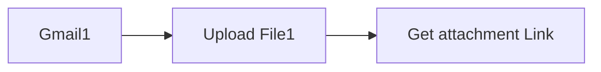

## Fluxo (.json) :

```json
{
  "nodes": [
    {
      "name": "Gmail1",
      "type": "n8n-nodes-base.gmail",
      "position": [
        -34.5,
        449.5
      ],
      "parameters": {
        "resource": "message",
        "operation": "getAll",
        "additionalFields": {
          "format": "resolved",
          "labelIds": [
            "Label_1819449526183990002"
          ]
        }
      },
      "credentials": {
        "gmailOAuth2": "Gmail"
      },
      "typeVersion": 1
    },
    {
      "name": "Upload File1",
      "type": "n8n-nodes-base.googleDrive",
      "position": [
        115.5,
        449.5
      ],
      "parameters": {
        "name": "={{$binary.attachment_0.fileName}}",
        "parents": [
          "1I-tBNWFhH2FwcyiKeBOcGseWktF-nXBr"
        ],
        "binaryData": true,
        "resolveData": true,
        "authentication": "oAuth2",
        "binaryPropertyName": "attachment_0"
      },
      "credentials": {
        "googleDriveOAuth2Api": "Google Drive OAuth2 API"
      },
      "typeVersion": 1
    },
    {
      "name": "Get attachment Link",
      "type": "n8n-nodes-base.set",
      "position": [
        280,
        450
      ],
      "parameters": {
        "values": {
          "string": [
            {
              "name": "mp4_attachment",
              "value": "={{$json[\"webViewLink\"]}}"
            }
          ]
        },
        "options": {},
        "keepOnlySet": true
      },
      "typeVersion": 1
    }
  ],
  "connections": {
    "Gmail1": {
      "main": [
        [
          {
            "node": "Upload File1",
            "type": "main",
            "index": 0
          }
        ]
      ]
    },
    "Upload File1": {
      "main": [
        [
          {
            "node": "Get attachment Link",
            "type": "main",
            "index": 0
          }
        ]
      ]
    }
  }
}
```

<a id="template-1694"></a>

## Template 1694 - Submissões de formulário Netlify → Airtable

- **Nome:** Submissões de formulário Netlify → Airtable
- **Descrição:** Quando um formulário do site recebe uma nova submissão, os dados selecionados são extraídos e adicionados como um novo registro em uma tabela do Airtable.
- **Funcionalidade:** • Detecção de submissão de formulário: Inicia o fluxo ao receber uma nova submissão do formulário específico do site.
• Extração e mapeamento de campos: Captura e normaliza campos do envio — Nome, Email e a primeira opção de Role.
• Inserção em banco de dados: Adiciona os dados mapeados como um novo registro em uma tabela do Airtable.
- **Ferramentas:** • Netlify: Plataforma que hospeda o site e coleta submissões de formulários que disparam eventos.
• Airtable: Banco de dados/planilha online usado para armazenar e organizar os registros recebidos.

## Fluxo visual

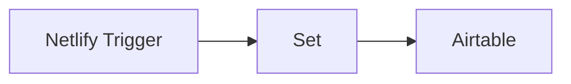

## Fluxo (.json) :

```json
{
  "nodes": [
    {
      "name": "Netlify Trigger",
      "type": "n8n-nodes-base.netlifyTrigger",
      "position": [
        450,
        300
      ],
      "webhookId": "df7efc17-09bb-4409-9f6f-09bd5e59546e",
      "parameters": {
        "event": "submissionCreated",
        "formId": "615ad58f9f491e00070abac5",
        "siteId": "b585059c-a19a-487c-831f-c57af6f13bd1"
      },
      "credentials": {
        "netlifyApi": "Netlify account"
      },
      "typeVersion": 1
    },
    {
      "name": "Set",
      "type": "n8n-nodes-base.set",
      "position": [
        650,
        300
      ],
      "parameters": {
        "values": {
          "string": [
            {
              "name": "Name",
              "value": "={{$json[\"name\"]}}"
            },
            {
              "name": "Email",
              "value": "={{$json[\"email\"]}}"
            },
            {
              "name": "Role",
              "value": "={{$json[\"role\"][0]}}"
            }
          ]
        },
        "options": {},
        "keepOnlySet": true
      },
      "typeVersion": 1
    },
    {
      "name": "Airtable",
      "type": "n8n-nodes-base.airtable",
      "position": [
        850,
        300
      ],
      "parameters": {
        "table": "Table 1",
        "options": {},
        "operation": "append",
        "application": "apphwBsFxzjDPDBA8"
      },
      "credentials": {
        "airtableApi": "Airtable Credentials @n8n"
      },
      "typeVersion": 1
    }
  ],
  "connections": {
    "Set": {
      "main": [
        [
          {
            "node": "Airtable",
            "type": "main",
            "index": 0
          }
        ]
      ]
    },
    "Netlify Trigger": {
      "main": [
        [
          {
            "node": "Set",
            "type": "main",
            "index": 0
          }
        ]
      ]
    }
  }
}
```

<a id="template-1696"></a>

## Template 1696 - Batch upload de crops para Qdrant com detecção de anomalias e KNN

- **Nome:** Batch upload de crops para Qdrant com detecção de anomalias e KNN
- **Descrição:** Este fluxo orquestra o upload de imagens do conjunto de crops para uma coleção no Qdrant, gerando embeddings via Voyage API em lotes, preparando batches com IDs e payloads, criando a coleção e o índice de payload, e apoiando detecção de anomalias e classificação KNN.
- **Funcionalidade:** • Checagem da existência da coleção no Qdrant e criação caso não exista: verifica se a coleção já existe e, se não, cria a coleção com as configurações de embedding (tamanho) e distância Cosine.
• Indexação de payload: cria o índice no campo crop_name para acelerar agregações e consultas.
• Importação de imagens: importa URLs de imagens a partir do bucket, filtrando para manter apenas imagens relevantes (teste de anomalias, removendo tomates).
• Geração de embeddings em lote: utiliza a Voyage API para gerar embeddings multimodais em lotes.
• Preparação de batches para o Qdrant: transforma os resultados em formato de batch com IDs (uuids) e payloads.
• Upload de batches para o Qdrant: envia os batches contendo IDs, embeddings e payloads para o Qdrant.
• Geração de UUIDs para pontos: cria UUIDs únicos para cada item a ser inserido como ID do ponto no Qdrant.
• Organização para detecção de anomalias: estrutura os dados para permitir avaliação de anomalias com base no crop_name e nos embeddings.
- **Ferramentas:** • Google Cloud Storage: Serviço de armazenamento de objetos utilizado para armazenar e fornecer URLs públicos das imagens do dataset.
• Voyage API: Serviço de embeddings multimodais que gera vetores de imagens para cada item.
• Qdrant: Base de dados de vetores para armazenar embeddings e metadados, permitindo buscas por similaridade.

## Fluxo visual

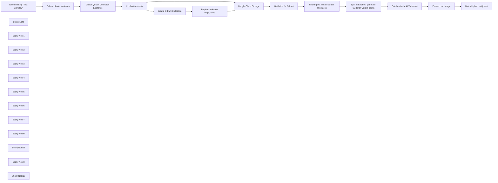

## Fluxo (.json) :

```json
{
  "id": "pPtCy6qPfEv1qNRn",
  "meta": {
    "instanceId": "205b3bc06c96f2dc835b4f00e1cbf9a937a74eeb3b47c99d0c30b0586dbf85aa"
  },
  "name": "[1/3 - anomaly detection] [1/2 - KNN classification] Batch upload dataset to Qdrant (crops dataset)",
  "tags": [
    {
      "id": "n3zAUYFhdqtjhcLf",
      "name": "qdrant",
      "createdAt": "2024-12-10T11:56:59.987Z",
      "updatedAt": "2024-12-10T11:56:59.987Z"
    }
  ],
  "nodes": [
    {
      "id": "53831410-b4f3-4374-8bdd-c2a33cd873cb",
      "name": "When clicking ‘Test workflow’",
      "type": "n8n-nodes-base.manualTrigger",
      "position": [
        -640,
        0
      ],
      "parameters": {},
      "typeVersion": 1
    },
    {
      "id": "e303ccea-c0e0-4fe5-bd31-48380a0e438f",
      "name": "Google Cloud Storage",
      "type": "n8n-nodes-base.googleCloudStorage",
      "position": [
        820,
        160
      ],
      "parameters": {
        "resource": "object",
        "returnAll": true,
        "bucketName": "n8n-qdrant-demo",
        "listFilters": {
          "prefix": "agricultural-crops"
        },
        "requestOptions": {}
      },
      "credentials": {
        "googleCloudStorageOAuth2Api": {
          "id": "fn0sr7grtfprVQvL",
          "name": "Google Cloud Storage account"
        }
      },
      "typeVersion": 1
    },
    {
      "id": "737bdb15-61cf-48eb-96af-569eb5986ee8",
      "name": "Get fields for Qdrant",
      "type": "n8n-nodes-base.set",
      "position": [
        1080,
        160
      ],
      "parameters": {
        "options": {},
        "assignments": {
          "assignments": [
            {
              "id": "10d9147f-1c0c-4357-8413-3130829c2e24",
              "name": "=publicLink",
              "type": "string",
              "value": "=https://storage.googleapis.com/{{ $json.bucket }}/{{ $json.selfLink.split('/').splice(-1) }}"
            },
            {
              "id": "ff9e6a0b-e47a-4550-a13b-465507c75f8f",
              "name": "cropName",
              "type": "string",
              "value": "={{ $json.id.split('/').slice(-3, -2)[0].toLowerCase()}}"
            }
          ]
        }
      },
      "typeVersion": 3.4
    },
    {
      "id": "2b18ed0c-38d3-49e9-be3d-4f7b35f4d9e5",
      "name": "Qdrant cluster variables",
      "type": "n8n-nodes-base.set",
      "position": [
        -360,
        0
      ],
      "parameters": {
        "options": {},
        "assignments": {
          "assignments": [
            {
              "id": "58b7384d-fd0c-44aa-9f8e-0306a99be431",
              "name": "qdrantCloudURL",
              "type": "string",
              "value": "=https://152bc6e2-832a-415c-a1aa-fb529f8baf8d.eu-central-1-0.aws.cloud.qdrant.io"
            },
            {
              "id": "e34c4d88-b102-43cc-a09e-e0553f2da23a",
              "name": "collectionName",
              "type": "string",
              "value": "=agricultural-crops"
            },
            {
              "id": "33581e0a-307f-4380-9533-615791096de7",
              "name": "VoyageEmbeddingsDim",
              "type": "number",
              "value": 1024
            },
            {
              "id": "6e390343-2cd2-4559-aba9-82b13acb7f52",
              "name": "batchSize",
              "type": "number",
              "value": 4
            }
          ]
        }
      },
      "typeVersion": 3.4
    },
    {
      "id": "f88d290e-3311-4322-b2a5-1350fc1f8768",
      "name": "Embed crop image",
      "type": "n8n-nodes-base.httpRequest",
      "position": [
        2120,
        160
      ],
      "parameters": {
        "url": "https://api.voyageai.com/v1/multimodalembeddings",
        "method": "POST",
        "options": {},
        "jsonBody": "={{\n{\n \"inputs\": $json.batchVoyage,\n \"model\": \"voyage-multimodal-3\",\n \"input_type\": \"document\"\n}\n}}",
        "sendBody": true,
        "specifyBody": "json",
        "authentication": "genericCredentialType",
        "genericAuthType": "httpHeaderAuth"
      },
      "credentials": {
        "httpHeaderAuth": {
          "id": "Vb0RNVDnIHmgnZOP",
          "name": "Voyage API"
        }
      },
      "typeVersion": 4.2
    },
    {
      "id": "250c6a8d-f545-4037-8069-c834437bbe15",
      "name": "Create Qdrant Collection",
      "type": "n8n-nodes-base.httpRequest",
      "position": [
        320,
        160
      ],
      "parameters": {
        "url": "={{ $('Qdrant cluster variables').first().json.qdrantCloudURL }}/collections/{{ $('Qdrant cluster variables').first().json.collectionName }}",
        "method": "PUT",
        "options": {},
        "jsonBody": "={{\n{\n \"vectors\": {\n \"voyage\": { \n \"size\": $('Qdrant cluster variables').first().json.VoyageEmbeddingsDim, \n \"distance\": \"Cosine\" \n } \n }\n}\n}}",
        "sendBody": true,
        "specifyBody": "json",
        "authentication": "predefinedCredentialType",
        "nodeCredentialType": "qdrantApi"
      },
      "credentials": {
        "qdrantApi": {
          "id": "it3j3hP9FICqhgX6",
          "name": "QdrantApi account"
        }
      },
      "typeVersion": 4.2
    },
    {
      "id": "20b612ff-4794-43ef-bf45-008a16a2f30f",
      "name": "Check Qdrant Collection Existence",
      "type": "n8n-nodes-base.httpRequest",
      "position": [
        -100,
        0
      ],
      "parameters": {
        "url": "={{ $json.qdrantCloudURL }}/collections/{{ $json.collectionName }}/exists",
        "options": {},
        "authentication": "predefinedCredentialType",
        "nodeCredentialType": "qdrantApi"
      },
      "credentials": {
        "qdrantApi": {
          "id": "it3j3hP9FICqhgX6",
          "name": "QdrantApi account"
        }
      },
      "typeVersion": 4.2
    },
    {
      "id": "c067740b-5de3-452e-a614-bf14985a73a0",
      "name": "Batches in the API's format",
      "type": "n8n-nodes-base.set",
      "position": [
        1860,
        160
      ],
      "parameters": {
        "options": {},
        "assignments": {
          "assignments": [
            {
              "id": "f14db112-6f15-4405-aa47-8cb56bb8ae7a",
              "name": "=batchVoyage",
              "type": "array",
              "value": "={{ $json.batch.map(item => ({ \"content\": ([{\"type\": \"image_url\", \"image_url\": item[\"publicLink\"]}])}))}}"
            },
            {
              "id": "3885fd69-66f5-4435-86a4-b80eaa568ac1",
              "name": "=batchPayloadQdrant",
              "type": "array",
              "value": "={{ $json.batch.map(item => ({\"crop_name\":item[\"cropName\"], \"image_path\":item[\"publicLink\"]})) }}"
            },
            {
              "id": "8ea7a91e-af27-49cb-9a29-41dae15c4e33",
              "name": "uuids",
              "type": "array",
              "value": "={{ $json.uuids }}"
            }
          ]
        }
      },
      "typeVersion": 3.4
    },
    {
      "id": "bf9a9532-db64-4c02-b91d-47e708ded4d3",
      "name": "Batch Upload to Qdrant",
      "type": "n8n-nodes-base.httpRequest",
      "position": [
        2320,
        160
      ],
      "parameters": {
        "url": "={{ $('Qdrant cluster variables').first().json.qdrantCloudURL }}/collections/{{ $('Qdrant cluster variables').first().json.collectionName }}/points",
        "method": "PUT",
        "options": {},
        "jsonBody": "={{\n{\n \"batch\": {\n \"ids\" : $('Batches in the API\\'s format').item.json.uuids,\n \"vectors\": {\"voyage\": $json.data.map(item => item[\"embedding\"]) },\n \"payloads\": $('Batches in the API\\'s format').item.json.batchPayloadQdrant\n }\n}\n}}",
        "sendBody": true,
        "specifyBody": "json",
        "authentication": "predefinedCredentialType",
        "nodeCredentialType": "qdrantApi"
      },
      "credentials": {
        "qdrantApi": {
          "id": "it3j3hP9FICqhgX6",
          "name": "QdrantApi account"
        }
      },
      "typeVersion": 4.2
    },
    {
      "id": "3c30373f-c84c-405f-bb84-ec8b4c7419f4",
      "name": "Split in batches, generate uuids for Qdrant points",
      "type": "n8n-nodes-base.code",
      "position": [
        1600,
        160
      ],
      "parameters": {
        "language": "python",
        "pythonCode": "import uuid\n\ncrops = [item.json for item in _input.all()]\nbatch_size = int(_('Qdrant cluster variables').first()['json']['batchSize'])\n\ndef split_into_batches_add_uuids(array, batch_size):\n return [\n {\n \"batch\": array[i:i + batch_size],\n \"uuids\": [str(uuid.uuid4()) for j in range(len(array[i:i + batch_size]))]\n }\n for i in range(0, len(array), batch_size)\n ]\n\n# Split crops into batches\nbatched_crops = split_into_batches_add_uuids(crops, batch_size)\n\nreturn batched_crops"
      },
      "typeVersion": 2
    },
    {
      "id": "2b028f8c-0a4c-4a3a-9e2b-14b1c2401c6d",
      "name": "If collection exists",
      "type": "n8n-nodes-base.if",
      "position": [
        120,
        0
      ],
      "parameters": {
        "options": {},
        "conditions": {
          "options": {
            "version": 2,
            "leftValue": "",
            "caseSensitive": true,
            "typeValidation": "strict"
          },
          "combinator": "and",
          "conditions": [
            {
              "id": "2104b862-667c-4a34-8888-9cb81a2e10f8",
              "operator": {
                "type": "boolean",
                "operation": "true",
                "singleValue": true
              },
              "leftValue": "={{ $json.result.exists }}",
              "rightValue": "true"
            }
          ]
        }
      },
      "typeVersion": 2.2
    },
    {
      "id": "768793f6-391e-4cc9-b637-f32ee2f77156",
      "name": "Sticky Note",
      "type": "n8n-nodes-base.stickyNote",
      "position": [
        500,
        340
      ],
      "parameters": {
        "width": 280,
        "height": 200,
        "content": "In the next workflow, we're going to use Qdrant to get the number of images belonging to each crop type defined by `crop_name` (for example, *\"cucumber\"*). \nTo get this information about counts in payload fields, we need to create an index on that field to optimise the resources (it needs to be done once). That's what is happening here"
      },
      "typeVersion": 1
    },
    {
      "id": "0c8896f7-8c57-4add-bc4d-03c4a774bdf1",
      "name": "Payload index on crop_name",
      "type": "n8n-nodes-base.httpRequest",
      "position": [
        500,
        160
      ],
      "parameters": {
        "url": "={{ $('Qdrant cluster variables').first().json.qdrantCloudURL }}/collections/{{ $('Qdrant cluster variables').first().json.collectionName }}/index",
        "method": "PUT",
        "options": {},
        "jsonBody": "={\n \"field_name\": \"crop_name\",\n \"field_schema\": \"keyword\"\n}",
        "sendBody": true,
        "specifyBody": "json",
        "authentication": "predefinedCredentialType",
        "nodeCredentialType": "qdrantApi"
      },
      "credentials": {
        "qdrantApi": {
          "id": "it3j3hP9FICqhgX6",
          "name": "QdrantApi account"
        }
      },
      "typeVersion": 4.2
    },
    {
      "id": "342186f6-41bf-46be-9be8-a9b1ca290d55",
      "name": "Sticky Note1",
      "type": "n8n-nodes-base.stickyNote",
      "position": [
        -360,
        -360
      ],
      "parameters": {
        "height": 300,
        "content": "Setting up variables\n1) Cloud URL - to connect to Qdrant Cloud (your personal cluster URL)\n2) Collection name in Qdrant\n3) Size of Voyage embeddings (needed for collection creation in Qdrant) <this one should not be changed unless the embedding model is changed>\n4) Batch size for batch embedding/batch uploading to Qdrant "
      },
      "typeVersion": 1
    },
    {
      "id": "fae9248c-dbcc-4b6d-b977-0047f120a587",
      "name": "Sticky Note2",
      "type": "n8n-nodes-base.stickyNote",
      "position": [
        -100,
        -220
      ],
      "parameters": {
        "content": "In Qdrant, you can create a collection once; if you try to create it two times with the same name, you'll get an error, so I am adding here a check if a collection with this name exists already"
      },
      "typeVersion": 1
    },
    {
      "id": "f7aea242-3d98-4a1c-a98a-986ac2b4928b",
      "name": "Sticky Note3",
      "type": "n8n-nodes-base.stickyNote",
      "position": [
        180,
        340
      ],
      "parameters": {
        "height": 280,
        "content": "If a collection with the name set up in variables doesn't exist yet, I create an empty one; \n\nCollection will contain [named vectors](https://qdrant.tech/documentation/concepts/vectors/#named-vectors), with a name *\"voyage\"*\nFor these named vectors, I define two parameters:\n1) Vectors size (in our case, Voyage embeddings size)\n2) Similarity metric to compare embeddings: in our case, **\"Cosine\"**.\n"
      },
      "typeVersion": 1
    },
    {
      "id": "b84045c1-f66a-4543-8d42-1e76de0b6e91",
      "name": "Sticky Note4",
      "type": "n8n-nodes-base.stickyNote",
      "position": [
        800,
        -280
      ],
      "parameters": {
        "height": 400,
        "content": "Now it's time to embed & upload to Qdrant our image datasets;\nBoth of them, [crops](https://www.kaggle.com/datasets/mdwaquarazam/agricultural-crops-image-classification) and [lands](https://www.kaggle.com/datasets/apollo2506/landuse-scene-classification) were uploaded to our Google Cloud Storage bucket, and in this workflow we're fetching **the crops dataset** (for lands it will be a nearly identical workflow, up to variable names)\n(you should replace it with your image datasets)\n\nDatasets consist of **image URLs**; images are grouped by folders based on their class. For example, we have a system of subfolders like *\"tomato\"* and *\"cucumber\"* for the crops dataset with image URLs of the respective class.\n"
      },
      "typeVersion": 1
    },
    {
      "id": "255dfad8-c545-4d75-bc9c-529aa50447a9",
      "name": "Sticky Note5",
      "type": "n8n-nodes-base.stickyNote",
      "position": [
        1080,
        -140
      ],
      "parameters": {
        "height": 240,
        "content": "Google Storage node returns **mediaLink**, which can be used directly for downloading images; however, we just need a public image URL so that Voyage API can process it; so here we construct this public link and extract a crop name from the folder in which image was stored (for example, *\"cucumber\"*)\n"
      },
      "typeVersion": 1
    },
    {
      "id": "a6acce75-cce0-4de3-bc64-37592c97359b",
      "name": "Sticky Note6",
      "type": "n8n-nodes-base.stickyNote",
      "position": [
        1600,
        -80
      ],
      "parameters": {
        "height": 180,
        "content": "I regroup images into batches of `batchSize` size and, to make batch upload to Qdrant possible, generate UUIDs to use them as batch [point IDs](https://qdrant.tech/documentation/concepts/points/#point-ids) (Qdrant doesn't set up id's for the user; users have to choose them themselves)"
      },
      "typeVersion": 1
    },
    {
      "id": "cab3cc83-b50c-41f4-8d51-59e04bba5556",
      "name": "Sticky Note7",
      "type": "n8n-nodes-base.stickyNote",
      "position": [
        1340,
        -60
      ],
      "parameters": {
        "content": "Since we build anomaly detection based on the crops dataset, to test it properly, I didn't upload to Qdrant pictures of tomatoes at all; I filter them out here"
      },
      "typeVersion": 1
    },
    {
      "id": "e5cdcce5-efdc-41f2-9796-656bd345f783",
      "name": "Sticky Note9",
      "type": "n8n-nodes-base.stickyNote",
      "position": [
        1860,
        -100
      ],
      "parameters": {
        "height": 200,
        "content": "Since Voyage API requires a [specific json structure](https://docs.voyageai.com/reference/multimodal-embeddings-api) for batch embeddings, as does [Qdrant's API for uploading points in batches](https://api.qdrant.tech/api-reference/points/upsert-points), I am adapting the structure of jsons\n\n[NB] - [payload = meta data in Qdrant]"
      },
      "typeVersion": 1
    },
    {
      "id": "a7f15c44-3d5c-4b43-bfb2-94fe27a32071",
      "name": "Sticky Note11",
      "type": "n8n-nodes-base.stickyNote",
      "position": [
        2120,
        20
      ],
      "parameters": {
        "width": 180,
        "height": 80,
        "content": "Embedding images with Voyage model (mind `input_type`)"
      },
      "typeVersion": 1
    },
    {
      "id": "01b92e7e-d954-4d58-85b1-109c336546c4",
      "name": "Filtering out tomato to test anomalies",
      "type": "n8n-nodes-base.filter",
      "position": [
        1340,
        160
      ],
      "parameters": {
        "options": {},
        "conditions": {
          "options": {
            "version": 2,
            "leftValue": "",
            "caseSensitive": true,
            "typeValidation": "strict"
          },
          "combinator": "and",
          "conditions": [
            {
              "id": "f7953ae2-5333-4805-abe5-abf6da645c5e",
              "operator": {
                "type": "string",
                "operation": "notEquals"
              },
              "leftValue": "={{ $json.cropName }}",
              "rightValue": "tomato"
            }
          ]
        }
      },
      "typeVersion": 2.2
    },
    {
      "id": "8d564817-885e-453a-a087-900b34b84d9c",
      "name": "Sticky Note8",
      "type": "n8n-nodes-base.stickyNote",
      "position": [
        -1160,
        -280
      ],
      "parameters": {
        "width": 440,
        "height": 460,
        "content": "## Batch Uploading Dataset to Qdrant \n### This template imports dataset images from storage, creates embeddings for them in batches, and uploads them to Qdrant in batches. In this particular template, we work with [crops dataset](https://www.kaggle.com/datasets/mdwaquarazam/agricultural-crops-image-classification). However, it's analogous to [lands dataset](https://www.kaggle.com/datasets/apollo2506/landuse-scene-classification), and in general, it's adaptable to any dataset consisting of image URLs (as the following pipelines are).\n\n* First, check for an existing Qdrant collection to use; otherwise, create it here. Additionally, when creating the collection, we'll create a [payload index](https://qdrant.tech/documentation/concepts/indexing/#payload-index), which is required for a particular type of Qdrant requests we will use later.\n* Next, import all (dataset) images from Google Storage but keep only non-tomato-related ones (for anomaly detection testing).\n* Create (per batch) embeddings for all imported images using the Voyage AI multimodal embeddings API.\n* Finally, upload the resulting embeddings and image descriptors to Qdrant via batch uploading."
      },
      "typeVersion": 1
    },
    {
      "id": "0233d3d0-bbdf-4d5b-a366-53cbfa4b6f9c",
      "name": "Sticky Note10",
      "type": "n8n-nodes-base.stickyNote",
      "position": [
        -860,
        360
      ],
      "parameters": {
        "color": 4,
        "width": 540,
        "height": 420,
        "content": "### For anomaly detection\n**1. This is the first pipeline to upload (crops) dataset to Qdrant's collection.**\n2. The second pipeline is to set up cluster (class) centres in this Qdrant collection & cluster (class) threshold scores.\n3. The third is the anomaly detection tool, which takes any image as input and uses all preparatory work done with Qdrant (crops) collection.\n\n### For KNN (k nearest neighbours) classification\n**1. This is the first pipeline to upload (lands) dataset to Qdrant's collection.**\n2. The second is the KNN classifier tool, which takes any image as input and classifies it based on queries to the Qdrant (lands) collection.\n\n### To recreate both\nYou'll have to upload [crops](https://www.kaggle.com/datasets/mdwaquarazam/agricultural-crops-image-classification) and [lands](https://www.kaggle.com/datasets/apollo2506/landuse-scene-classification) datasets from Kaggle to your own Google Storage bucket, and re-create APIs/connections to [Qdrant Cloud](https://qdrant.tech/documentation/quickstart-cloud/) (you can use **Free Tier** cluster), Voyage AI API & Google Cloud Storage\n\n**In general, pipelines are adaptable to any dataset of images**\n"
      },
      "typeVersion": 1
    }
  ],
  "active": false,
  "pinData": {},
  "settings": {
    "executionOrder": "v1"
  },
  "versionId": "27776c4a-3bf9-4704-9c13-345b75ffacc0",
  "connections": {
    "Embed crop image": {
      "main": [
        [
          {
            "node": "Batch Upload to Qdrant",
            "type": "main",
            "index": 0
          }
        ]
      ]
    },
    "Google Cloud Storage": {
      "main": [
        [
          {
            "node": "Get fields for Qdrant",
            "type": "main",
            "index": 0
          }
        ]
      ]
    },
    "If collection exists": {
      "main": [
        [
          {
            "node": "Google Cloud Storage",
            "type": "main",
            "index": 0
          }
        ],
        [
          {
            "node": "Create Qdrant Collection",
            "type": "main",
            "index": 0
          }
        ]
      ]
    },
    "Get fields for Qdrant": {
      "main": [
        [
          {
            "node": "Filtering out tomato to test anomalies",
            "type": "main",
            "index": 0
          }
        ]
      ]
    },
    "Batch Upload to Qdrant": {
      "main": [
        []
      ]
    },
    "Create Qdrant Collection": {
      "main": [
        [
          {
            "node": "Payload index on crop_name",
            "type": "main",
            "index": 0
          }
        ]
      ]
    },
    "Qdrant cluster variables": {
      "main": [
        [
          {
            "node": "Check Qdrant Collection Existence",
            "type": "main",
            "index": 0
          }
        ]
      ]
    },
    "Payload index on crop_name": {
      "main": [
        [
          {
            "node": "Google Cloud Storage",
            "type": "main",
            "index": 0
          }
        ]
      ]
    },
    "Batches in the API's format": {
      "main": [
        [
          {
            "node": "Embed crop image",
            "type": "main",
            "index": 0
          }
        ]
      ]
    },
    "Check Qdrant Collection Existence": {
      "main": [
        [
          {
            "node": "If collection exists",
            "type": "main",
            "index": 0
          }
        ]
      ]
    },
    "When clicking ‘Test workflow’": {
      "main": [
        [
          {
            "node": "Qdrant cluster variables",
            "type": "main",
            "index": 0
          }
        ]
      ]
    },
    "Filtering out tomato to test anomalies": {
      "main": [
        [
          {
            "node": "Split in batches, generate uuids for Qdrant points",
            "type": "main",
            "index": 0
          }
        ]
      ]
    },
    "Split in batches, generate uuids for Qdrant points": {
      "main": [
        [
          {
            "node": "Batches in the API's format",
            "type": "main",
            "index": 0
          }
        ]
      ]
    }
  }
}
```

<a id="template-1698"></a>

## Template 1698 - Backup diário de workflows para Google Drive

- **Nome:** Backup diário de workflows para Google Drive
- **Descrição:** Exporta todos os workflows da instância local como arquivos JSON e os envia para uma pasta do Google Drive. O processo pode ser executado manualmente ou agendado para rodar diariamente às 02:30.
- **Funcionalidade:** • Gatilho manual e agendado: permite iniciar o processo manualmente ou automaticamente diariamente às 02:30.
• Listagem de workflows: consulta a API local para obter a lista de workflows existentes.
• Recuperação detalhada: busca os detalhes completos de cada workflow individual via requisições à API.
• Preparação de arquivos: transforma os dados de cada workflow em arquivos JSON prontos para upload.
• Upload para Google Drive: envia cada arquivo JSON para uma pasta definida no Google Drive, nomeando os arquivos com o nome do workflow.
- **Ferramentas:** • API local de gerenciamento de workflows: endpoint REST da instância que fornece a lista e os detalhes dos workflows (acesso autenticado por Basic Auth).
• Google Drive: serviço de armazenamento em nuvem usado para guardar os arquivos de backup no formato .json.

## Fluxo visual

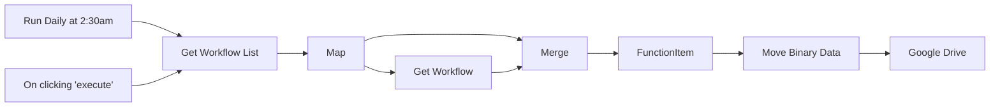

## Fluxo (.json) :

```json
{
  "nodes": [
    {
      "name": "On clicking 'execute'",
      "type": "n8n-nodes-base.manualTrigger",
      "position": [
        320,
        170
      ],
      "parameters": {},
      "typeVersion": 1
    },
    {
      "name": "Merge",
      "type": "n8n-nodes-base.merge",
      "position": [
        960,
        320
      ],
      "parameters": {
        "mode": "mergeByIndex"
      },
      "typeVersion": 1
    },
    {
      "name": "Move Binary Data",
      "type": "n8n-nodes-base.moveBinaryData",
      "position": [
        1260,
        320
      ],
      "parameters": {
        "mode": "jsonToBinary",
        "options": {
          "useRawData": false
        }
      },
      "typeVersion": 1
    },
    {
      "name": "Map",
      "type": "n8n-nodes-base.function",
      "position": [
        710,
        320
      ],
      "parameters": {
        "functionCode": "return items[0].json.data.map(item => {\n  return {json: item}\n});"
      },
      "typeVersion": 1
    },
    {
      "name": "Get Workflow",
      "type": "n8n-nodes-base.httpRequest",
      "notes": "Don't forget to add your credentials for your n8n instance in this Node. Use Basic Auth for this. ",
      "position": [
        830,
        460
      ],
      "parameters": {
        "url": "=http://localhost:5678/rest/workflows/{{$node[\"Map\"].data[\"id\"]}}",
        "options": {},
        "authentication": "basicAuth"
      },
      "credentials": {
        "httpBasicAuth": "n8n Creds"
      },
      "notesInFlow": false,
      "typeVersion": 1
    },
    {
      "name": "Get Workflow List",
      "type": "n8n-nodes-base.httpRequest",
      "notes": "Don't forget to add your credentials for your n8n instance in this Node. Use Basic Auth for this. ",
      "position": [
        520,
        320
      ],
      "parameters": {
        "url": "http://localhost:5678/rest/workflows",
        "options": {},
        "authentication": "basicAuth"
      },
      "credentials": {
        "httpBasicAuth": "n8n Creds"
      },
      "typeVersion": 1
    },
    {
      "name": "FunctionItem",
      "type": "n8n-nodes-base.functionItem",
      "position": [
        1110,
        320
      ],
      "parameters": {
        "functionCode": "item = item.data;\nreturn item;"
      },
      "typeVersion": 1
    },
    {
      "name": "Google Drive",
      "type": "n8n-nodes-base.googleDrive",
      "position": [
        1450,
        320
      ],
      "parameters": {
        "name": "={{$node[\"Merge\"].data[\"name\"]}}.json",
        "parents": [
          "Delete this text and put id for folder you want to upload into in this field. The folder ID can be found by opening the folder in your browser and copying the portion after https://drive.google.com/drive/u/0/folders/"
        ],
        "binaryData": true,
        "resolveData": true
      },
      "credentials": {
        "googleApi": "test"
      },
      "typeVersion": 1
    },
    {
      "name": "Run Daily at 2:30am",
      "type": "n8n-nodes-base.cron",
      "position": [
        330,
        320
      ],
      "parameters": {
        "triggerTimes": {
          "item": [
            {
              "hour": 2,
              "minute": 30
            }
          ]
        }
      },
      "typeVersion": 1
    }
  ],
  "connections": {
    "Map": {
      "main": [
        [
          {
            "node": "Get Workflow",
            "type": "main",
            "index": 0
          },
          {
            "node": "Merge",
            "type": "main",
            "index": 0
          }
        ]
      ]
    },
    "Merge": {
      "main": [
        [
          {
            "node": "FunctionItem",
            "type": "main",
            "index": 0
          }
        ]
      ]
    },
    "FunctionItem": {
      "main": [
        [
          {
            "node": "Move Binary Data",
            "type": "main",
            "index": 0
          }
        ]
      ]
    },
    "Get Workflow": {
      "main": [
        [
          {
            "node": "Merge",
            "type": "main",
            "index": 1
          }
        ]
      ]
    },
    "Move Binary Data": {
      "main": [
        [
          {
            "node": "Google Drive",
            "type": "main",
            "index": 0
          }
        ]
      ]
    },
    "Get Workflow List": {
      "main": [
        [
          {
            "node": "Map",
            "type": "main",
            "index": 0
          }
        ]
      ]
    },
    "Run Daily at 2:30am": {
      "main": [
        [
          {
            "node": "Get Workflow List",
            "type": "main",
            "index": 0
          }
        ]
      ]
    },
    "On clicking 'execute'": {
      "main": [
        [
          {
            "node": "Get Workflow List",
            "type": "main",
            "index": 0
          }
        ]
      ]
    }
  }
}
```

<a id="template-1700"></a>

## Template 1700 - Transformações de texto: minúsculas, maiúsculas e substituição

- **Nome:** Transformações de texto: minúsculas, maiúsculas e substituição
- **Descrição:** Recebe uma mensagem fixa e gera versões em minúsculas, maiúsculas e com uma substituição específica, reunindo os resultados em saída combinada.
- **Funcionalidade:** • Gatilho manual: inicia o fluxo ao clicar em 'execute'.
• Definição de mensagem: estabelece o texto base "Un León pasea por la Sabana Africana".
• Conversão para minúsculas: gera uma versão do texto em letras minúsculas usando toLowerCase().
• Conversão para maiúsculas: gera uma versão do texto em letras maiúsculas usando toUpperCase().
• Substituição de texto: substitui 'Un León' por 'Una Jirafa' usando replace().
• Junção de resultados: combina as saídas das transformações em um único resultado.
- **Ferramentas:** • Shell do sistema (terminal): executa comandos echo para exibir as versões transformadas do texto.

## Fluxo visual

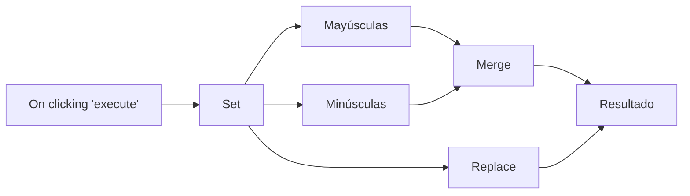

## Fluxo (.json) :

```json
{
  "id": "29",
  "name": "N8N Español - Ejemplos",
  "nodes": [
    {
      "name": "On clicking 'execute'",
      "type": "n8n-nodes-base.manualTrigger",
      "position": [
        250,
        300
      ],
      "parameters": {},
      "typeVersion": 1
    },
    {
      "name": "Minúsculas",
      "type": "n8n-nodes-base.executeCommand",
      "color": "#E31515",
      "notes": ".toLowerCase()",
      "position": [
        650,
        -10
      ],
      "parameters": {
        "command": "=echo Minúsuclas: {{$node[\"Set\"].json[\"mensaje\"].toLowerCase()}}"
      },
      "notesInFlow": true,
      "typeVersion": 1
    },
    {
      "name": "Mayúsculas",
      "type": "n8n-nodes-base.executeCommand",
      "color": "#0BA1ED",
      "notes": ".toUpperCase()",
      "position": [
        800,
        90
      ],
      "parameters": {
        "command": "=echo Mayúsculas: {{$node[\"Set\"].json[\"mensaje\"].toUpperCase()}}"
      },
      "notesInFlow": true,
      "typeVersion": 1
    },
    {
      "name": "Set",
      "type": "n8n-nodes-base.set",
      "position": [
        440,
        180
      ],
      "parameters": {
        "values": {
          "string": [
            {
              "name": "mensaje",
              "value": "Un León pasea por la Sabana Africana"
            }
          ]
        },
        "options": {}
      },
      "typeVersion": 1
    },
    {
      "name": "Replace",
      "type": "n8n-nodes-base.executeCommand",
      "color": "#0BA1ED",
      "notes": ".replace - .replace('Un León', 'Una Jirafa')",
      "position": [
        800,
        290
      ],
      "parameters": {
        "command": "=echo Replace: {{$node[\"Set\"].json[\"mensaje\"].replace('Un León', 'Una Jirafa')}}"
      },
      "notesInFlow": true,
      "typeVersion": 1
    },
    {
      "name": "Merge",
      "type": "n8n-nodes-base.merge",
      "notes": "Junta las salidas",
      "position": [
        960,
        10
      ],
      "parameters": {},
      "notesInFlow": true,
      "typeVersion": 1
    },
    {
      "name": "Resultado",
      "type": "n8n-nodes-base.merge",
      "color": "#F41C0D",
      "notes": "Junta las salidas",
      "position": [
        1070,
        240
      ],
      "parameters": {},
      "notesInFlow": true,
      "typeVersion": 1
    }
  ],
  "active": false,
  "settings": {},
  "connections": {
    "Set": {
      "main": [
        [
          {
            "node": "Minúsculas",
            "type": "main",
            "index": 0
          },
          {
            "node": "Mayúsculas",
            "type": "main",
            "index": 0
          },
          {
            "node": "Replace",
            "type": "main",
            "index": 0
          }
        ]
      ]
    },
    "Merge": {
      "main": [
        [
          {
            "node": "Resultado",
            "type": "main",
            "index": 0
          }
        ]
      ]
    },
    "Replace": {
      "main": [
        [
          {
            "node": "Resultado",
            "type": "main",
            "index": 1
          }
        ]
      ]
    },
    "Mayúsculas": {
      "main": [
        [
          {
            "node": "Merge",
            "type": "main",
            "index": 1
          }
        ]
      ]
    },
    "Minúsculas": {
      "main": [
        [
          {
            "node": "Merge",
            "type": "main",
            "index": 0
          }
        ]
      ]
    },
    "On clicking 'execute'": {
      "main": [
        [
          {
            "node": "Set",
            "type": "main",
            "index": 0
          }
        ]
      ]
    }
  }
}
```

<a id="template-1701"></a>

## Template 1701 - Adicionar tarefa à lista do Google Tasks

- **Nome:** Adicionar tarefa à lista do Google Tasks
- **Descrição:** Adiciona uma tarefa a uma lista específica do Google Tasks quando o fluxo é executado manualmente.
- **Funcionalidade:** • Disparo manual: inicia o fluxo ao clicar em executar.
• Criação de tarefa: adiciona uma nova tarefa a uma lista de tarefas específica usando o identificador informado.
• Autenticação: utiliza credenciais configuradas para acessar a conta do Google e efetuar a operação.
- **Ferramentas:** • Google Tasks: serviço para gerenciar listas e tarefas, usado aqui para adicionar a nova tarefa à lista selecionada.

## Fluxo visual

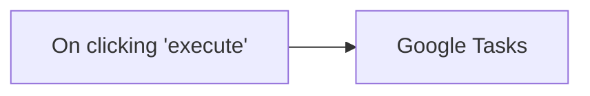

## Fluxo (.json) :

```json
{
  "id": "2",
  "name": "Add task to tasklist",
  "nodes": [
    {
      "name": "On clicking 'execute'",
      "type": "n8n-nodes-base.manualTrigger",
      "position": [
        500,
        310
      ],
      "parameters": {},
      "typeVersion": 1
    },
    {
      "name": "Google Tasks",
      "type": "n8n-nodes-base.googleTasks",
      "position": [
        920,
        310
      ],
      "parameters": {
        "task": "MDY3OTAyNjUyMDk5NDY5ODIzMzM6MDow",
        "additionalFields": {}
      },
      "credentials": {
        "googleTasksOAuth2Api": "shraddha"
      },
      "typeVersion": 1
    }
  ],
  "active": false,
  "settings": {},
  "connections": {
    "On clicking 'execute'": {
      "main": [
        [
          {
            "node": "Google Tasks",
            "type": "main",
            "index": 0
          }
        ]
      ]
    }
  }
}
```

<a id="template-1704"></a>

## Template 1704 - Backup automático de workflows para Nextcloud

- **Nome:** Backup automático de workflows para Nextcloud
- **Descrição:** Agenda e realiza backups dos workflows consultando uma API local e salvando cada workflow como arquivo JSON no Nextcloud.
- **Funcionalidade:** • Agendamento periódico: Executa o processo automaticamente a cada 6 horas.
• Gatilho manual: Permite iniciar o processo manualmente ao acionar a execução.
• Listagem de workflows: Consulta uma API REST local para obter a lista de workflows disponíveis.
• Mapeamento de itens: Separa a lista em requisições individuais para processar cada workflow separadamente.
• Recuperação de detalhes: Solicita os detalhes de cada workflow via API para obter o conteúdo completo.
• Consolidação de respostas: Junta as respostas das requisições dos workflows para posterior processamento.
• Conversão para binário: Converte o conteúdo JSON de cada workflow em dados binários prontos para upload.
• Upload para armazenamento remoto: Envia cada arquivo JSON para uma pasta específica no Nextcloud com nome baseado no workflow.
- **Ferramentas:** • Nextcloud: Armazenamento em nuvem/WebDAV usado para guardar os arquivos de backup (.json) em uma pasta dedicada.
• API REST local (porta 5678): Fonte dos dados dos workflows; fornece lista e detalhes de cada workflow para backup.

## Fluxo visual

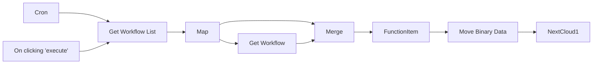

## Fluxo (.json) :

```json
{
  "id": "5dcd71e5db772d996680f0be",
  "name": "Example - Backup n8n to Nextcloud",
  "nodes": [
    {
      "name": "On clicking 'execute'",
      "type": "n8n-nodes-base.manualTrigger",
      "position": [
        240,
        310
      ],
      "parameters": {},
      "typeVersion": 1
    },
    {
      "name": "Cron",
      "type": "n8n-nodes-base.cron",
      "position": [
        240,
        180
      ],
      "parameters": {
        "triggerTimes": {
          "item": [
            {
              "mode": "custom",
              "cronExpression": "* */6 * * *"
            }
          ]
        }
      },
      "typeVersion": 1
    },
    {
      "name": "Merge",
      "type": "n8n-nodes-base.merge",
      "position": [
        770,
        180
      ],
      "parameters": {
        "mode": "mergeByIndex"
      },
      "typeVersion": 1
    },
    {
      "name": "Move Binary Data",
      "type": "n8n-nodes-base.moveBinaryData",
      "position": [
        1070,
        180
      ],
      "parameters": {
        "mode": "jsonToBinary",
        "options": {
          "useRawData": false
        }
      },
      "typeVersion": 1
    },
    {
      "name": "Map",
      "type": "n8n-nodes-base.function",
      "position": [
        520,
        180
      ],
      "parameters": {
        "functionCode": "return items[0].json.data.map(item => {\n  return {json: item}\n});"
      },
      "typeVersion": 1
    },
    {
      "name": "Get Workflow",
      "type": "n8n-nodes-base.httpRequest",
      "position": [
        640,
        320
      ],
      "parameters": {
        "url": "=http://localhost:5678/rest/workflows/{{$node[\"Map\"].data[\"id\"]}}",
        "options": {}
      },
      "typeVersion": 1
    },
    {
      "name": "Get Workflow List",
      "type": "n8n-nodes-base.httpRequest",
      "position": [
        380,
        180
      ],
      "parameters": {
        "url": "http://localhost:5678/rest/workflows",
        "options": {}
      },
      "typeVersion": 1
    },
    {
      "name": "FunctionItem",
      "type": "n8n-nodes-base.functionItem",
      "position": [
        920,
        180
      ],
      "parameters": {
        "functionCode": "item = item.data;\nreturn item;"
      },
      "typeVersion": 1
    },
    {
      "name": "NextCloud1",
      "type": "n8n-nodes-base.nextCloud",
      "position": [
        1210,
        180
      ],
      "parameters": {
        "path": "=/n8n/Backup/lacnet1/{{$node[\"Merge\"].data[\"name\"]}}.json",
        "binaryDataUpload": true
      },
      "typeVersion": 1
    }
  ],
  "active": false,
  "settings": {},
  "connections": {
    "Map": {
      "main": [
        [
          {
            "node": "Get Workflow",
            "type": "main",
            "index": 0
          },
          {
            "node": "Merge",
            "type": "main",
            "index": 0
          }
        ]
      ]
    },
    "Cron": {
      "main": [
        [
          {
            "node": "Get Workflow List",
            "type": "main",
            "index": 0
          }
        ]
      ]
    },
    "Merge": {
      "main": [
        [
          {
            "node": "FunctionItem",
            "type": "main",
            "index": 0
          }
        ]
      ]
    },
    "NextCloud1": {
      "main": [
        []
      ]
    },
    "FunctionItem": {
      "main": [
        [
          {
            "node": "Move Binary Data",
            "type": "main",
            "index": 0
          }
        ]
      ]
    },
    "Get Workflow": {
      "main": [
        [
          {
            "node": "Merge",
            "type": "main",
            "index": 1
          }
        ]
      ]
    },
    "Move Binary Data": {
      "main": [
        [
          {
            "node": "NextCloud1",
            "type": "main",
            "index": 0
          }
        ]
      ]
    },
    "Get Workflow List": {
      "main": [
        [
          {
            "node": "Map",
            "type": "main",
            "index": 0
          }
        ]
      ]
    },
    "On clicking 'execute'": {
      "main": [
        [
          {
            "node": "Get Workflow List",
            "type": "main",
            "index": 0
          }
        ]
      ]
    }
  }
}
```
