# PACK 1999 TEMPLATES PARTE 08 - Bloco 10

Templates neste bloco: 20

## Sumário

- [Template 1827 - Envio de e-mail de teste via Mailjet](#template-1827)
- [Template 1829 - Consulta de clima por webhook](#template-1829)
- [Template 1831 - Salvar contato e enviar clima por SMS](#template-1831)
- [Template 1833 - Consulta de país por código](#template-1833)
- [Template 1835 - Notificação diária do clima](#template-1835)
- [Template 1837 - Enviar posição da ISS para SQS](#template-1837)
- [Template 1839 - Buscar todos os registros do Invoice Ninja](#template-1839)
- [Template 1840 - Atualizações diárias do tempo por SMS](#template-1840)
- [Template 1843 - Agente para consultas do marketplace OpenSea](#template-1843)
- [Template 1844 - Download TikTok sem watermark com upload no Drive](#template-1844)
- [Template 1847 - Resumo automático de vídeos do YouTube para Discord](#template-1847)
- [Template 1849 - Geração de dados para etiquetas de produto](#template-1849)
- [Template 1851 - Relatório SEO semanal por e-mail](#template-1851)
- [Template 1852 - Sincronização de alertas Syncro para OpsGenie](#template-1852)
- [Template 1854 - Reagir a callback do PDFMonkey](#template-1854)
- [Template 1856 - Geração de imagem via Bannerbear](#template-1856)
- [Template 1857 - Obter todos os registros do Mautic](#template-1857)
- [Template 1859 - Automação de blog com planilhas e LLM](#template-1859)
- [Template 1862 - Importação automática de leads de planilha](#template-1862)
- [Template 1863 - Criação de cupom no Paddle](#template-1863)

---

<a id="template-1827"></a>

## Template 1827 - Envio de e-mail de teste via Mailjet

- **Nome:** Envio de e-mail de teste via Mailjet
- **Descrição:** Este fluxo envia um e-mail de teste para um destinatário quando é acionado manualmente.
- **Funcionalidade:** • Acionamento manual: inicia o fluxo quando o usuário clica em 'execute'.
• Envio de e-mail: transmite uma mensagem com assunto e texto ao destinatário especificado.
• Definição de remetente e destinatário: utiliza os campos de remetente (fromEmail) e destinatário (toEmail) configurados.
• Autenticação com credenciais: usa credenciais configuradas para autenticar o envio pela API.
• Suporte a campos adicionais: permite enviar parâmetros extras na requisição (additionalFields).
- **Ferramentas:** • Mailjet: serviço de envio de e-mails via API usado para entregar mensagens, gerenciar remetentes e autenticação.

## Fluxo visual

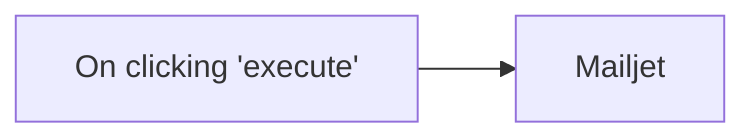

## Fluxo (.json) :

```json
{
  "nodes": [
    {
      "name": "On clicking 'execute'",
      "type": "n8n-nodes-base.manualTrigger",
      "position": [
        250,
        300
      ],
      "parameters": {},
      "typeVersion": 1
    },
    {
      "name": "Mailjet",
      "type": "n8n-nodes-base.mailjet",
      "position": [
        450,
        300
      ],
      "parameters": {
        "text": "This is a test message",
        "subject": "Sample Subject",
        "toEmail": "user2@example.com",
        "fromEmail": "user@example.com",
        "additionalFields": {}
      },
      "credentials": {
        "mailjetEmailApi": "mailjet creds"
      },
      "typeVersion": 1
    }
  ],
  "connections": {
    "On clicking 'execute'": {
      "main": [
        [
          {
            "node": "Mailjet",
            "type": "main",
            "index": 0
          }
        ]
      ]
    }
  }
}
```

<a id="template-1829"></a>

## Template 1829 - Consulta de clima por webhook

- **Nome:** Consulta de clima por webhook
- **Descrição:** Recebe uma requisição com o nome da cidade e retorna dados meteorológicos formatados.
- **Funcionalidade:** • Recepção de requisições HTTP: Recebe dados de entrada contendo o nome da cidade.
• Consulta a serviço de clima: Busca as condições meteorológicas da cidade informada.
• Formatação da resposta: Extrai e retorna temperatura, umidade, velocidade do vento, descrição e nome da cidade em formato simplificado.
- **Ferramentas:** • Endpoint HTTP (webhook): Ponto de entrada para receber requisições externas com o nome da cidade.
• OpenWeatherMap: API externa utilizada para obter os dados meteorológicos da cidade informada.

<table align="center">
  <tr>
    <td align="center"></td>
  </tr>
</table>

## Fluxo visual

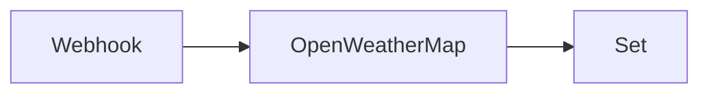

## Fluxo (.json) :

```json
{
  "nodes": [
    {
      "name": "Set",
      "type": "n8n-nodes-base.set",
      "position": [
        870,
        300
      ],
      "parameters": {
        "values": {
          "string": [
            {
              "name": "tempC",
              "value": "={{$json[\"main\"][\"temp\"]}}"
            },
            {
              "name": "humidity",
              "value": "={{$json[\"main\"][\"humidity\"]}}"
            },
            {
              "name": "windspeed",
              "value": "={{$json[\"wind\"][\"speed\"]}}"
            },
            {
              "name": "description",
              "value": "={{$json[\"weather\"][0][\"description\"]}}"
            },
            {
              "name": "city",
              "value": "={{$json[\"name\"]}}, {{$json[\"sys\"][\"country\"]}}"
            }
          ]
        },
        "options": {},
        "keepOnlySet": true
      },
      "typeVersion": 1
    },
    {
      "name": "OpenWeatherMap",
      "type": "n8n-nodes-base.openWeatherMap",
      "position": [
        650,
        300
      ],
      "parameters": {
        "cityName": "={{$json[\"body\"][\"city\"]}}"
      },
      "credentials": {
        "openWeatherMapApi": "open-weather-map"
      },
      "typeVersion": 1
    },
    {
      "name": "Webhook",
      "type": "n8n-nodes-base.webhook",
      "position": [
        450,
        300
      ],
      "webhookId": "39f1b81f-f538-4b94-8788-29180d5e4016",
      "parameters": {
        "path": "39f1b81f-f538-4b94-8788-29180d5e4016",
        "options": {},
        "responseData": "allEntries",
        "responseMode": "lastNode"
      },
      "typeVersion": 1
    }
  ],
  "connections": {
    "Webhook": {
      "main": [
        [
          {
            "node": "OpenWeatherMap",
            "type": "main",
            "index": 0
          }
        ]
      ]
    },
    "OpenWeatherMap": {
      "main": [
        [
          {
            "node": "Set",
            "type": "main",
            "index": 0
          }
        ]
      ]
    }
  }
}
```

<a id="template-1831"></a>

## Template 1831 - Salvar contato e enviar clima por SMS

- **Nome:** Salvar contato e enviar clima por SMS
- **Descrição:** Recebe dados via webhook, armazena o contato em uma tabela e envia um SMS com a previsão do tempo para a cidade informada.
- **Funcionalidade:** • Recepção segura de dados via webhook: recebe requisições POST autenticadas por cabeçalho e lê o corpo bruto.
• Extração e mapeamento de campos: obtém nome, número e cidade do payload e prepara os dados.
• Armazenamento em tabela: adiciona o registro recebido a uma tabela como novo item.
• Consulta de clima: obtém a previsão do tempo para a cidade informada.
• Envio de SMS com detalhes do tempo: envia ao número informado uma mensagem com temperatura, descrição, umidade e velocidade do vento.
- **Ferramentas:** • Airtable: armazena os registros recebidos em uma tabela.
• OpenWeatherMap: fornece dados meteorológicos (temperatura, descrição, umidade e vento).
• Twilio: envia SMS para o número informado com as informações do clima.

## Fluxo visual


## Fluxo (.json) :

```json
{
  "nodes": [
    {
      "name": "Webhook",
      "type": "n8n-nodes-base.webhook",
      "position": [
        450,
        300
      ],
      "webhookId": "39f1b81f-f538-4b94-8788-29180d5e4016",
      "parameters": {
        "path": "39f1b81f-f538-4b94-8788-29180d5e4016",
        "options": {
          "rawBody": true
        },
        "httpMethod": "POST",
        "authentication": "headerAuth"
      },
      "credentials": {
        "httpHeaderAuth": "Webhook Workflow Credentials"
      },
      "typeVersion": 1
    },
    {
      "name": "Set",
      "type": "n8n-nodes-base.set",
      "position": [
        650,
        300
      ],
      "parameters": {
        "values": {
          "string": [
            {
              "name": "Name",
              "value": "={{$json[\"body\"][\"name\"]}}"
            },
            {
              "name": "Number",
              "value": "={{$json[\"body\"][\"number\"]}}"
            },
            {
              "name": "City",
              "value": "={{$json[\"body\"][\"city\"]}}"
            }
          ]
        },
        "options": {},
        "keepOnlySet": true
      },
      "typeVersion": 1
    },
    {
      "name": "Airtable",
      "type": "n8n-nodes-base.airtable",
      "position": [
        850,
        300
      ],
      "parameters": {
        "table": "Table 1",
        "options": {},
        "operation": "append"
      },
      "credentials": {
        "airtableApi": "Airtable Credentials n8n"
      },
      "typeVersion": 1
    },
    {
      "name": "OpenWeatherMap",
      "type": "n8n-nodes-base.openWeatherMap",
      "position": [
        1050,
        300
      ],
      "parameters": {
        "cityName": "={{$node[\"Webhook\"].json[\"body\"][\"city\"]}}"
      },
      "credentials": {
        "openWeatherMapApi": "open-weather-map"
      },
      "typeVersion": 1
    },
    {
      "name": "Twilio",
      "type": "n8n-nodes-base.twilio",
      "position": [
        1250,
        300
      ],
      "parameters": {
        "to": "={{$node[\"Webhook\"].json[\"body\"][\"number\"]}}",
        "message": "=The weather in {{$json[\"name\"]}}, {{$json[\"sys\"][\"country\"]}} is {{$json[\"main\"][\"temp\"]}} ℃ with {{$json[\"weather\"][0][\"description\"]}}. Humidity is {{$json[\"main\"][\"humidity\"]}} and windspeed is {{$json[\"wind\"][\"speed\"]}}."
      },
      "credentials": {
        "twilioApi": "twilio"
      },
      "typeVersion": 1
    }
  ],
  "connections": {
    "Set": {
      "main": [
        [
          {
            "node": "Airtable",
            "type": "main",
            "index": 0
          }
        ]
      ]
    },
    "Webhook": {
      "main": [
        [
          {
            "node": "Set",
            "type": "main",
            "index": 0
          }
        ]
      ]
    },
    "Airtable": {
      "main": [
        [
          {
            "node": "OpenWeatherMap",
            "type": "main",
            "index": 0
          }
        ]
      ]
    },
    "OpenWeatherMap": {
      "main": [
        [
          {
            "node": "Twilio",
            "type": "main",
            "index": 0
          }
        ]
      ]
    }
  }
}
```

<a id="template-1833"></a>

## Template 1833 - Consulta de país por código

- **Nome:** Consulta de país por código
- **Descrição:** Recebe um código de país via webhook, consulta uma API GraphQL pública para obter informações do país e retorna uma mensagem formatada com nome, emoji e código telefônico.
- **Funcionalidade:** • Recepção de requisição via webhook: recebe o parâmetro 'code' na query string.
• Consulta a API GraphQL pública: executa uma query usando o código do país (convertido para maiúsculas) para obter name, phone e emoji.
• Processamento da resposta: converte a resposta recebida em JSON e extrai os dados do país.
• Formatação da resposta: monta uma mensagem textual combinando o nome do país, o emoji e o código telefônico.
• Retorno ao solicitante: envia a mensagem formatada como resposta à requisição recebida pelo webhook.
- **Ferramentas:** • API GraphQL (https://countries.trevorblades.com/): endpoint público que fornece dados de países, incluindo nome, código telefônico e emoji.

## Fluxo visual

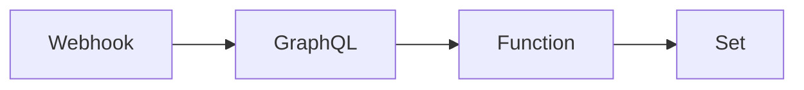

## Fluxo (.json) :

```json
{
  "nodes": [
    {
      "name": "GraphQL",
      "type": "n8n-nodes-base.graphql",
      "position": [
        800,
        300
      ],
      "parameters": {
        "query": "=query {\n  country(code: \"{{$node[\"Webhook\"].data[\"query\"][\"code\"].toUpperCase()}}\") {\n    name\n    phone\n    emoji\n  } \n}",
        "endpoint": "https://countries.trevorblades.com/",
        "requestMethod": "GET",
        "responseFormat": "string"
      },
      "typeVersion": 1
    },
    {
      "name": "Function",
      "type": "n8n-nodes-base.function",
      "position": [
        1000,
        300
      ],
      "parameters": {
        "functionCode": "items[0].json = JSON.parse(items[0].json.data).data.country;\nreturn items;"
      },
      "typeVersion": 1
    },
    {
      "name": "Set",
      "type": "n8n-nodes-base.set",
      "position": [
        1200,
        300
      ],
      "parameters": {
        "values": {
          "string": [
            {
              "name": "data",
              "value": "=The country code of {{$node[\"Function\"].data[\"name\"]}} {{$node[\"Function\"].data[\"emoji\"]}} is {{$node[\"Function\"].data[\"phone\"]}}"
            }
          ],
          "boolean": []
        },
        "keepOnlySet": true
      },
      "typeVersion": 1
    },
    {
      "name": "Webhook",
      "type": "n8n-nodes-base.webhook",
      "position": [
        600,
        300
      ],
      "parameters": {
        "path": "webhook",
        "options": {},
        "responseMode": "lastNode"
      },
      "typeVersion": 1
    }
  ],
  "connections": {
    "GraphQL": {
      "main": [
        [
          {
            "node": "Function",
            "type": "main",
            "index": 0
          }
        ]
      ]
    },
    "Webhook": {
      "main": [
        [
          {
            "node": "GraphQL",
            "type": "main",
            "index": 0
          }
        ]
      ]
    },
    "Function": {
      "main": [
        [
          {
            "node": "Set",
            "type": "main",
            "index": 0
          }
        ]
      ]
    }
  }
}
```

<a id="template-1835"></a>

## Template 1835 - Notificação diária do clima

- **Nome:** Notificação diária do clima
- **Descrição:** Envia uma notificação push diária com a temperatura atual de uma cidade específica.
- **Funcionalidade:** • Agendamento diário às 09:00: Dispara o fluxo automaticamente todos os dias às 9 horas.
• Consulta do clima para uma cidade definida: Obtém os dados meteorológicos atuais para Berlim.
• Geração de mensagem dinâmica: Insere a temperatura atual na mensagem da notificação.
• Envio de notificação push: Dispara uma notificação com título e texto personalizados para o usuário.
- **Ferramentas:** • OpenWeatherMap: API pública que fornece dados meteorológicos atuais para cidades ao redor do mundo.
• Pushcut: Serviço para envio de notificações push personalizadas a dispositivos, permitindo títulos e textos dinâmicos.

## Fluxo visual

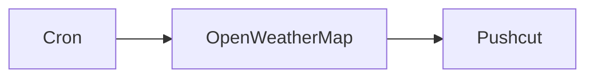

## Fluxo (.json) :

```json
{
  "id": "82",
  "name": "Send daily weather updates via a push notification using the Pushcut node",
  "nodes": [
    {
      "name": "Pushcut",
      "type": "n8n-nodes-base.pushcut",
      "position": [
        1050,
        420
      ],
      "parameters": {
        "additionalFields": {
          "text": "=Hey! The temperature outside is {{$node[\"OpenWeatherMap\"].json[\"main\"][\"temp\"]}}°C.",
          "title": "Today's Weather Update"
        },
        "notificationName": "n8n"
      },
      "credentials": {
        "pushcutApi": "Pushcut Credentials"
      },
      "typeVersion": 1
    },
    {
      "name": "OpenWeatherMap",
      "type": "n8n-nodes-base.openWeatherMap",
      "position": [
        850,
        420
      ],
      "parameters": {
        "cityName": "berlin"
      },
      "credentials": {
        "openWeatherMapApi": "open-weather-map"
      },
      "typeVersion": 1
    },
    {
      "name": "Cron",
      "type": "n8n-nodes-base.cron",
      "position": [
        650,
        420
      ],
      "parameters": {
        "triggerTimes": {
          "item": [
            {
              "hour": 9
            }
          ]
        }
      },
      "typeVersion": 1
    }
  ],
  "active": false,
  "settings": {},
  "connections": {
    "Cron": {
      "main": [
        [
          {
            "node": "OpenWeatherMap",
            "type": "main",
            "index": 0
          }
        ]
      ]
    },
    "OpenWeatherMap": {
      "main": [
        [
          {
            "node": "Pushcut",
            "type": "main",
            "index": 0
          }
        ]
      ]
    }
  }
}
```

<a id="template-1837"></a>

## Template 1837 - Enviar posição da ISS para SQS

- **Nome:** Enviar posição da ISS para SQS
- **Descrição:** Busca periodicamente a posição da Estação Espacial Internacional e envia os dados selecionados para uma fila AWS SQS.
- **Funcionalidade:** • Agendamento periódico: Dispara o processo a cada minuto para obter atualizações contínuas.
• Requisição de posição do satélite: Consulta uma API externa para obter a posição da ISS no timestamp atual.
• Extração e formatação de dados: Seleciona latitude, longitude, timestamp e nome do retorno da API e prepara a mensagem.
• Envio para fila de mensagens: Publica os dados formatados em uma fila AWS SQS para processamento ou armazenamento posterior.
- **Ferramentas:** • Where The ISS At API: Serviço externo que fornece a posição atual da Estação Espacial Internacional.
• AWS SQS: Serviço de fila de mensagens para receber e persistir os dados enviados pelo fluxo.

## Fluxo visual

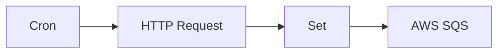

## Fluxo (.json) :

```json
{
  "nodes": [
    {
      "name": "AWS SQS",
      "type": "n8n-nodes-base.awsSqs",
      "position": [
        1050,
        360
      ],
      "parameters": {
        "queue": "",
        "options": {}
      },
      "credentials": {
        "aws": "AWS SQS Credentials"
      },
      "typeVersion": 1
    },
    {
      "name": "Set",
      "type": "n8n-nodes-base.set",
      "position": [
        850,
        360
      ],
      "parameters": {
        "values": {
          "number": [
            {
              "name": "Latitude",
              "value": "={{$node[\"HTTP Request\"].json[\"0\"][\"latitude\"]}}"
            },
            {
              "name": "Longitude",
              "value": "={{$node[\"HTTP Request\"].json[\"0\"][\"longitude\"]}}"
            },
            {
              "name": "Timestamp",
              "value": "={{$node[\"HTTP Request\"].json[\"0\"][\"timestamp\"]}}"
            }
          ],
          "string": [
            {
              "name": "Name",
              "value": "={{$node[\"HTTP Request\"].json[\"0\"][\"name\"]}}"
            }
          ]
        },
        "options": {},
        "keepOnlySet": true
      },
      "typeVersion": 1
    },
    {
      "name": "HTTP Request",
      "type": "n8n-nodes-base.httpRequest",
      "position": [
        650,
        360
      ],
      "parameters": {
        "url": "https://api.wheretheiss.at/v1/satellites/25544/positions",
        "options": {},
        "queryParametersUi": {
          "parameter": [
            {
              "name": "timestamps",
              "value": "={{Date.now();}}"
            }
          ]
        }
      },
      "typeVersion": 1
    },
    {
      "name": "Cron",
      "type": "n8n-nodes-base.cron",
      "position": [
        450,
        360
      ],
      "parameters": {
        "triggerTimes": {
          "item": [
            {
              "mode": "everyMinute"
            }
          ]
        }
      },
      "typeVersion": 1
    }
  ],
  "connections": {
    "Set": {
      "main": [
        [
          {
            "node": "AWS SQS",
            "type": "main",
            "index": 0
          }
        ]
      ]
    },
    "Cron": {
      "main": [
        [
          {
            "node": "HTTP Request",
            "type": "main",
            "index": 0
          }
        ]
      ]
    },
    "HTTP Request": {
      "main": [
        [
          {
            "node": "Set",
            "type": "main",
            "index": 0
          }
        ]
      ]
    }
  }
}
```

<a id="template-1839"></a>

## Template 1839 - Buscar todos os registros do Invoice Ninja

- **Nome:** Buscar todos os registros do Invoice Ninja
- **Descrição:** Ao ser executado manualmente, o fluxo obtém todos os registros disponíveis na conta do Invoice Ninja.
- **Funcionalidade:** • Inicialização manual: inicia o fluxo quando o usuário clica em executar.
• Recuperação de dados: solicita e retorna todos os registros da conta do Invoice Ninja usando a API.
- **Ferramentas:** • Invoice Ninja: plataforma de faturamento e gestão financeira utilizada para armazenar e fornecer faturas, clientes e outros registros via API.

## Fluxo visual

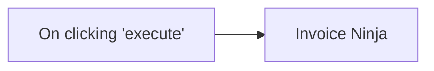

## Fluxo (.json) :

```json
{
  "nodes": [
    {
      "name": "On clicking 'execute'",
      "type": "n8n-nodes-base.manualTrigger",
      "position": [
        220,
        310
      ],
      "parameters": {},
      "typeVersion": 1
    },
    {
      "name": "Invoice Ninja",
      "type": "n8n-nodes-base.invoiceNinja",
      "position": [
        410,
        310
      ],
      "parameters": {
        "options": {},
        "operation": "getAll"
      },
      "credentials": {
        "invoiceNinjaApi": "invoice_ninja_creds"
      },
      "typeVersion": 1
    }
  ],
  "connections": {
    "On clicking 'execute'": {
      "main": [
        [
          {
            "node": "Invoice Ninja",
            "type": "main",
            "index": 0
          }
        ]
      ]
    }
  }
}
```

<a id="template-1840"></a>

## Template 1840 - Atualizações diárias do tempo por SMS

- **Nome:** Atualizações diárias do tempo por SMS
- **Descrição:** Envia diariamente uma mensagem SMS com a temperatura atual de Berlim para um número de telefone.
- **Funcionalidade:** • Agendamento diário às 09:00: dispara o fluxo automaticamente todos os dias às 9h.
• Consulta de clima para Berlim: obtém os dados meteorológicos (temperatura) da cidade configurada.
• Formatação dinâmica da mensagem: insere a temperatura em °C dentro do texto enviado.
• Envio de SMS ao número definido: envia a mensagem formatada ao destinatário configurado com o remetente especificado.
• Uso de credenciais seguras: utiliza credenciais configuradas para acessar os serviços externos.
- **Ferramentas:** • OpenWeatherMap: serviço de dados meteorológicos usado para obter a temperatura atual de Berlim.
• Vonage: serviço de envio de SMS utilizado para entregar a mensagem ao número de destino.

## Fluxo visual

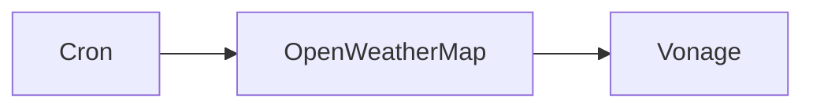

## Fluxo (.json) :

```json
{
  "id": "84",
  "name": "Send daily weather updates to a phone number using the Vonage node",
  "nodes": [
    {
      "name": "Vonage",
      "type": "n8n-nodes-base.vonage",
      "position": [
        770,
        260
      ],
      "parameters": {
        "to": "1234",
        "from": "Vonage APIs",
        "message": "=Hey! The temperature outside is {{$node[\"OpenWeatherMap\"].json[\"main\"][\"temp\"]}}°C.",
        "additionalFields": {}
      },
      "credentials": {
        "vonageApi": "vonage"
      },
      "typeVersion": 1
    },
    {
      "name": "Cron",
      "type": "n8n-nodes-base.cron",
      "position": [
        370,
        260
      ],
      "parameters": {
        "triggerTimes": {
          "item": [
            {
              "hour": 9
            }
          ]
        }
      },
      "typeVersion": 1
    },
    {
      "name": "OpenWeatherMap",
      "type": "n8n-nodes-base.openWeatherMap",
      "position": [
        570,
        260
      ],
      "parameters": {
        "cityName": "berlin"
      },
      "credentials": {
        "openWeatherMapApi": "owm"
      },
      "typeVersion": 1
    }
  ],
  "active": false,
  "settings": {},
  "connections": {
    "Cron": {
      "main": [
        [
          {
            "node": "OpenWeatherMap",
            "type": "main",
            "index": 0
          }
        ]
      ]
    },
    "OpenWeatherMap": {
      "main": [
        [
          {
            "node": "Vonage",
            "type": "main",
            "index": 0
          }
        ]
      ]
    }
  }
}
```

<a id="template-1843"></a>

## Template 1843 - Agente para consultas do marketplace OpenSea

- **Nome:** Agente para consultas do marketplace OpenSea
- **Descrição:** Fluxo que processa solicitações de usuário para consultar dados do marketplace OpenSea (listings, offers, orders e dados por trait) e devolve resultados formatados, mantendo contexto de sessão.
- **Funcionalidade:** • Processamento de consultas em linguagem natural: Interpreta solicitações do usuário e traduz em chamadas à API.
• Recuperar todas as listagens por coleção: Obtém listagens ativas e válidas de uma coleção específica (paginação suportada).
• Recuperar todas as ofertas por coleção: Obtém ofertas válidas para uma coleção, incluindo ofertas individuais e por critérios.
• Obter melhor listing por NFT: Retorna a listagem ativa mais barata para um token específico.
• Obter melhores listings por coleção: Retorna as listagens mais baratas de uma coleção (com limite e paginação).
• Obter melhor oferta por NFT: Retorna a maior oferta feita para um token específico.
• Recuperar ofertas de coleção: Lista ofertas ativas que cobrem toda a coleção.
• Recuperar ofertas de item filtradas por chain e protocolo: Busca ofertas individuais usando filtros como token, maker e intervalo de datas (protocolo obrigatório: seaport).
• Recuperar listings por chain e protocolo: Busca listagens ativas filtradas por blockchain e protocolo.
• Buscar ordem por hash: Recupera detalhes de uma ordem específica usando hash e endereço de protocolo fixo.
• Recuperar ofertas por trait: Obtém ofertas ativas relacionadas a um atributo específico da coleção.
• Manter contexto de sessão: Armazena informações de sessão para manter histórico e contexto entre consultas.
• Validação de parâmetros e regras: Aplica restrições como chains permitidos e exigência do protocolo 'seaport' onde aplicável.
- **Ferramentas:** • OpenSea API: API do marketplace NFT usada para obter listagens, ofertas, ordens e dados por trait.
• OpenAI (modelo GPT-4o-mini): Modelo de linguagem utilizado para interpretar perguntas dos usuários, construir parâmetros de chamada e processar respostas.

## Fluxo visual

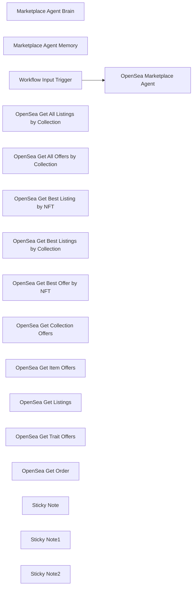

## Fluxo (.json) :

```json
{
  "id": "brRSLvIkYp3mLq0K",
  "meta": {
    "instanceId": "a5283507e1917a33cc3ae615b2e7d5ad2c1e50955e6f831272ddd5ab816f3fb6"
  },
  "name": "OpenSea Marketplace Agent Tool",
  "tags": [],
  "nodes": [
    {
      "id": "13579b30-83df-4da6-b0de-90eeaf3252e7",
      "name": "Marketplace Agent Brain",
      "type": "@n8n/n8n-nodes-langchain.lmChatOpenAi",
      "position": [
        -300,
        -260
      ],
      "parameters": {
        "model": {
          "__rl": true,
          "mode": "list",
          "value": "gpt-4o-mini"
        },
        "options": {}
      },
      "credentials": {
        "openAiApi": {
          "id": "yUizd8t0sD5wMYVG",
          "name": "OpenAi account"
        }
      },
      "typeVersion": 1.2
    },
    {
      "id": "9f979fae-49c6-4a50-b96b-92de5a49ba14",
      "name": "Marketplace Agent Memory",
      "type": "@n8n/n8n-nodes-langchain.memoryBufferWindow",
      "position": [
        -120,
        -260
      ],
      "parameters": {},
      "typeVersion": 1.3
    },
    {
      "id": "202ca463-f038-46df-99ea-84fbda70a933",
      "name": "OpenSea Marketplace Agent",
      "type": "@n8n/n8n-nodes-langchain.agent",
      "position": [
        420,
        -540
      ],
      "parameters": {
        "text": "={{ $json.message }}",
        "options": {
          "systemMessage": "### **🛒 OpenSea Marketplace Agent Overview**\nThis agent interacts with the OpenSea marketplace API to retrieve marketplace data, including NFT listings, offers, orders, and trait-specific data. The system follows strict input requirements to ensure compatibility with OpenSea API rules.\n\n---\n\n## **⚡ Available Tools & Usage Guidelines**\nThe OpenSea Marketplace Agent has access to the following marketplace-related tools:\n\n---\n\n### **1️⃣ Get All Listings (by Collection)**\n📍 **Endpoint**: `/api/v2/listings/collection/{collection_slug}/all`  \n🔹 **Description**: Retrieves all active, valid listings for a given collection.  \n🔹 **Required Parameter**:  \n   - `collection_slug` → The unique collection identifier from OpenSea.  \n🔹 **Optional Query Parameters**:  \n   - `limit` → Number of listings to return (1-100, default: 100).  \n   - `next` → Cursor for pagination.  \n🔹 **Example Query**:  \n   - _\"Retrieve all active listings for the 'boredapeyachtclub' collection.\"_  \n\n---\n\n### **2️⃣ Get All Offers (by Collection)**\n📍 **Endpoint**: `/api/v2/offers/collection/{collection_slug}/all`  \n🔹 **Description**: Retrieves all valid offers for a given NFT collection, including individual and criteria-based offers.  \n🔹 **Required Parameter**:  \n   - `collection_slug` → The unique collection identifier from OpenSea.  \n🔹 **Optional Query Parameters**:  \n   - `limit` → Number of offers to return (1-100, default: 100).  \n   - `next` → Cursor for pagination.  \n🔹 **Example Query**:  \n   - _\"Fetch all current offers for 'azuki' collection.\"_  \n\n---\n\n### **3️⃣ Get Best Listing (by NFT)**  \n📍 **Endpoint**: `/api/v2/listings/collection/{collection_slug}/nfts/{identifier}/best`  \n🔹 **Description**: Retrieves the best (cheapest) active listing for a specific NFT.  \n🔹 **Required Parameters**:  \n   - `collection_slug` → The collection identifier.  \n   - `identifier` → The NFT token ID.  \n🔹 **Optional Query Parameters**:  \n   - `include_private_listings` → Boolean (default: `false`).  \n🔹 **Example Query**:  \n   - _\"Find the lowest-priced listing for NFT #1234 in 'doodles' collection.\"_  \n\n---\n\n### **4️⃣ Get Best Listings (by Collection)**  \n📍 **Endpoint**: `/api/v2/listings/collection/{collection_slug}/best`  \n🔹 **Description**: Retrieves the lowest-priced active listings for a specific collection.  \n🔹 **Required Parameter**:  \n   - `collection_slug` → The collection identifier.  \n🔹 **Optional Query Parameters**:  \n   - `include_private_listings` → Boolean (default: `false`).  \n   - `limit` → Number of listings to return (1-100, default: 100).  \n   - `next` → Cursor for pagination.  \n🔹 **Example Query**:  \n   - _\"Get the 10 cheapest listings for 'mutantapeyachtclub'.\"_  \n\n---\n\n### **5️⃣ Get Best Offer (by NFT)**  \n📍 **Endpoint**: `/api/v2/offers/collection/{collection_slug}/nfts/{identifier}/best`  \n🔹 **Description**: Retrieves the highest offer made for a specific NFT.  \n🔹 **Required Parameters**:  \n   - `collection_slug` → The collection identifier.  \n   - `identifier` → The NFT token ID.  \n🔹 **Example Query**:  \n   - _\"Find the highest offer for NFT #5678 in 'moonbirds' collection.\"_  \n\n---\n\n### **6️⃣ Get Collection Offers**  \n📍 **Endpoint**: `/api/v2/offers/collection/{collection_slug}`  \n🔹 **Description**: Retrieves all active collection-wide offers for a specific NFT collection.  \n🔹 **Required Parameter**:  \n   - `collection_slug` → The collection identifier.  \n🔹 **Example Query**:  \n   - _\"List all collection offers for 'clonex'.\"_  \n\n---\n\n### **7️⃣ Get Item Offers**  \n📍 **Endpoint**: `/api/v2/orders/{chain}/{protocol}/offers`  \n🔹 **Description**: Retrieves all valid **individual** offers (excluding criteria-based offers).  \n🔹 **Required Parameters**:  \n   - `chain` → The blockchain network (must use an **allowed chain**, see below).  \n   - `protocol` → The token settlement protocol (only `\"seaport\"` is supported).  \n🔹 **Optional Query Parameters**:  \n   - `asset_contract_address`, `cursor`, `limit`, `listed_after`, `listed_before`, `maker`, `order_by`, `order_direction`, `payment_token_address`, `taker`, `token_ids`.  \n🔹 **Example Query**:  \n   - _\"Fetch all active item offers for NFTs on Ethereum using Seaport protocol.\"_  \n\n---\n\n### **8️⃣ Get Listings (by Chain & Protocol)**  \n📍 **Endpoint**: `/api/v2/orders/{chain}/{protocol}/listings`  \n🔹 **Description**: Retrieves all active listings filtered by blockchain and protocol.  \n🔹 **Required Parameters**:  \n   - `chain` → The blockchain network (**must be an allowed chain**).  \n   - `protocol` → `\"seaport\"` protocol.  \n🔹 **Optional Query Parameters**:  \n   - `asset_contract_address`, `cursor`, `limit`, `listed_after`, `listed_before`, `maker`, `order_by`, `order_direction`, `payment_token_address`, `taker`, `token_ids`.  \n🔹 **Example Query**:  \n   - _\"Retrieve all active listings for Ethereum Seaport orders.\"_  \n\n---\n\n### **9️⃣ Get Order (Single Order by Hash)**  \n📍 **Endpoint**: `/api/v2/orders/chain/{chain}/protocol/{protocol_address}/{order_hash}`  \n🔹 **Description**: Retrieves a specific order (offer or listing) based on its hash.  \n🔹 **Required Parameters**:  \n   - `chain` → The blockchain network (**must be an allowed chain**).  \n   - `protocol_address` → **Always set to** `0x0000000000000068f116a894984e2db1123eb395`.  \n   - `order_hash` → The hash of the order.  \n🔹 **Example Query**:  \n   - _\"Fetch details for order `0x123abc...` on Ethereum.\"_  \n\n---\n\n### **🔟 Get Trait Offers**  \n📍 **Endpoint**: `/api/v2/offers/collection/{collection_slug}/traits`  \n🔹 **Description**: Retrieves all active offers made for a specific trait in a collection.  \n🔹 **Required Parameter**:  \n   - `collection_slug` → The collection identifier.  \n🔹 **Optional Query Parameters**:  \n   - `float_value`, `int_value`, `type`, `value`.  \n🔹 **Example Query**:  \n   - _\"Find all offers for 'Background: Blue' in the 'azuki' collection.\"_  \n\n---\n\n## **⚠️ Critical Notes & Restrictions**\n1. **Only Allowed Blockchains Can Be Used**  \n   - ✅ Supported Chains:  \n     - `amoy`, `ape_chain`, `ape_curtis`, `arbitrum`, `arbitrum_nova`, `arbitrum_sepolia`, `avalanche`, `avalanche_fuji`, `b3`, `b3_sepolia`, `baobab`, `base`, `base_sepolia`, `bera_chain`, `blast`, `blast_sepolia`, `ethereum`, `flow`, `flow_testnet`, `klaytn`, `matic`, `monad_testnet`, `mumbai`, `optimism`, `optimism_sepolia`, `sei_testnet`, `sepolia`, `shape`, `solana`, `soldev`, `soneium`, `soneium_minato`, `unichain`, `zora`, `zora_sepolia`.  \n   - ❌ **Incorrect Chain Inputs Will Cause Errors**  \n     - `\"polygon\"` ❌ **will fail**. Use `\"matic\"` instead.\n\n2. **Protocol Must Be `\"seaport\"` for Item & Listing Queries**  \n   - The `\"protocol\"` field must always be set to `\"seaport\"`.\n\n3. **Fixed Protocol Address for Get Order**  \n   - **For retrieving a specific order**, the `protocol_address` **must always be**:  \n     - `0x0000000000000068f116a894984e2db1123eb395`.\n\n---\n\n## **✅ Example Queries**\n- _\"Fetch all best listings for Ethereum NFTs.\"_  \n- _\"Find the highest offer for a Bored Ape #456.\"_  \n- _\"Get details for a specific order hash.\"_  \n\n🚀 **Follow these rules to ensure successful API queries!**"
        },
        "promptType": "define"
      },
      "typeVersion": 1.8
    },
    {
      "id": "c055762a-8fe7-4141-a639-df2372f30060",
      "name": "Workflow Input Trigger",
      "type": "n8n-nodes-base.executeWorkflowTrigger",
      "position": [
        -60,
        -540
      ],
      "parameters": {
        "workflowInputs": {
          "values": [
            {
              "name": "message"
            },
            {
              "name": "sessionId"
            }
          ]
        }
      },
      "typeVersion": 1.1
    },
    {
      "id": "e25c62f0-1047-4fbb-815c-caeaa22d2fe1",
      "name": "OpenSea Get All Listings by Collection",
      "type": "@n8n/n8n-nodes-langchain.toolHttpRequest",
      "position": [
        60,
        -260
      ],
      "parameters": {
        "url": "https://api.opensea.io/api/v2/listings/collection/{collection_slug}/all",
        "sendQuery": true,
        "sendHeaders": true,
        "authentication": "genericCredentialType",
        "genericAuthType": "httpHeaderAuth",
        "parametersQuery": {
          "values": [
            {
              "name": "limit",
              "valueProvider": "modelOptional"
            },
            {
              "name": "next",
              "valueProvider": "modelOptional"
            }
          ]
        },
        "toolDescription": "This tool retrieves all active, valid listings for a single NFT collection on OpenSea, allowing pagination and limit options.",
        "parametersHeaders": {
          "values": [
            {
              "name": "Accept",
              "value": "application/json",
              "valueProvider": "fieldValue"
            }
          ]
        }
      },
      "credentials": {
        "httpHeaderAuth": {
          "id": "3v99GVMGF4tKP5nM",
          "name": "OpenSea"
        }
      },
      "typeVersion": 1.1
    },
    {
      "id": "d568d5de-82e4-4be1-b9e9-9ec56ca9d872",
      "name": "OpenSea Get All Offers by Collection",
      "type": "@n8n/n8n-nodes-langchain.toolHttpRequest",
      "position": [
        240,
        -260
      ],
      "parameters": {
        "url": "https://api.opensea.io/api/v2/offers/collection/{collection_slug}/all",
        "sendQuery": true,
        "sendHeaders": true,
        "authentication": "genericCredentialType",
        "genericAuthType": "httpHeaderAuth",
        "parametersQuery": {
          "values": [
            {
              "name": "limit",
              "valueProvider": "modelOptional"
            },
            {
              "name": "next",
              "valueProvider": "modelOptional"
            }
          ]
        },
        "toolDescription": "This tool retrieves all active, valid offers for a specified NFT collection on OpenSea, including individual and criteria offers.",
        "parametersHeaders": {
          "values": [
            {
              "name": "Accept",
              "value": "application/json",
              "valueProvider": "fieldValue"
            }
          ]
        }
      },
      "credentials": {
        "httpHeaderAuth": {
          "id": "3v99GVMGF4tKP5nM",
          "name": "OpenSea"
        }
      },
      "typeVersion": 1.1
    },
    {
      "id": "1b591b2d-787f-4519-9dfc-fc0489bc0725",
      "name": "OpenSea Get Best Listing by NFT",
      "type": "@n8n/n8n-nodes-langchain.toolHttpRequest",
      "position": [
        440,
        -260
      ],
      "parameters": {
        "url": "https://api.opensea.io/api/v2/listings/collection/{collection_slug}/nfts/{identifier}/best",
        "sendQuery": true,
        "sendHeaders": true,
        "authentication": "genericCredentialType",
        "genericAuthType": "httpHeaderAuth",
        "parametersQuery": {
          "values": [
            {
              "name": "include_private_listings",
              "valueProvider": "modelOptional"
            }
          ]
        },
        "toolDescription": "This tool retrieves the best available listing for a specific NFT from OpenSea.",
        "parametersHeaders": {
          "values": [
            {
              "name": "Accept",
              "value": "application/json",
              "valueProvider": "fieldValue"
            }
          ]
        }
      },
      "credentials": {
        "httpHeaderAuth": {
          "id": "3v99GVMGF4tKP5nM",
          "name": "OpenSea"
        }
      },
      "typeVersion": 1.1
    },
    {
      "id": "33222cfb-17c7-4507-8d09-fa0a7ba1beae",
      "name": "OpenSea Get Best Listings by Collection",
      "type": "@n8n/n8n-nodes-langchain.toolHttpRequest",
      "position": [
        640,
        -260
      ],
      "parameters": {
        "url": "https://api.opensea.io/api/v2/listings/collection/{collection_slug}/best",
        "sendQuery": true,
        "sendHeaders": true,
        "authentication": "genericCredentialType",
        "genericAuthType": "httpHeaderAuth",
        "parametersQuery": {
          "values": [
            {
              "name": "include_private_listings",
              "valueProvider": "modelOptional"
            },
            {
              "name": "limit",
              "valueProvider": "modelOptional"
            },
            {
              "name": "next",
              "valueProvider": "modelOptional"
            }
          ]
        },
        "toolDescription": "This tool retrieves the cheapest active and valid listings for a specific NFT collection on OpenSea.",
        "parametersHeaders": {
          "values": [
            {
              "name": "Accept",
              "value": "application/json",
              "valueProvider": "fieldValue"
            }
          ]
        }
      },
      "credentials": {
        "httpHeaderAuth": {
          "id": "3v99GVMGF4tKP5nM",
          "name": "OpenSea"
        }
      },
      "typeVersion": 1.1
    },
    {
      "id": "7fd0ddd6-96eb-487d-b7a2-b8fcb29b4e22",
      "name": "OpenSea Get Best Offer by NFT",
      "type": "@n8n/n8n-nodes-langchain.toolHttpRequest",
      "position": [
        860,
        -260
      ],
      "parameters": {
        "url": "https://api.opensea.io/api/v2/offers/collection/{collection_slug}/nfts/{identifier}/best",
        "sendHeaders": true,
        "authentication": "genericCredentialType",
        "genericAuthType": "httpHeaderAuth",
        "toolDescription": "This tool retrieves the best offers for a specific NFT on OpenSea.",
        "parametersHeaders": {
          "values": [
            {
              "name": "Accept",
              "value": "application/json",
              "valueProvider": "fieldValue"
            }
          ]
        }
      },
      "credentials": {
        "httpHeaderAuth": {
          "id": "3v99GVMGF4tKP5nM",
          "name": "OpenSea"
        }
      },
      "typeVersion": 1.1
    },
    {
      "id": "7047b8bc-ea5e-4b9b-9230-0fc46c46c58f",
      "name": "OpenSea Get Collection Offers",
      "type": "@n8n/n8n-nodes-langchain.toolHttpRequest",
      "position": [
        1080,
        -260
      ],
      "parameters": {
        "url": "https://api.opensea.io/api/v2/offers/collection/{collection_slug}",
        "sendHeaders": true,
        "authentication": "genericCredentialType",
        "genericAuthType": "httpHeaderAuth",
        "toolDescription": "This tool retrieves the active, valid collection offers for a specified NFT collection on OpenSea.",
        "parametersHeaders": {
          "values": [
            {
              "name": "Accept",
              "value": "application/json",
              "valueProvider": "fieldValue"
            }
          ]
        }
      },
      "credentials": {
        "httpHeaderAuth": {
          "id": "3v99GVMGF4tKP5nM",
          "name": "OpenSea"
        }
      },
      "typeVersion": 1.1
    },
    {
      "id": "cab63cc4-96b4-4e14-8eb7-9fca08791040",
      "name": "OpenSea Get Item Offers",
      "type": "@n8n/n8n-nodes-langchain.toolHttpRequest",
      "position": [
        1300,
        -260
      ],
      "parameters": {
        "url": "https://api.opensea.io/api/v2/orders/{chain}/{protocol}/offers",
        "sendQuery": true,
        "sendHeaders": true,
        "authentication": "genericCredentialType",
        "genericAuthType": "httpHeaderAuth",
        "parametersQuery": {
          "values": [
            {
              "name": "asset_contract_address",
              "valueProvider": "modelOptional"
            },
            {
              "name": "cursor",
              "valueProvider": "modelOptional"
            },
            {
              "name": "limit",
              "valueProvider": "modelOptional"
            },
            {
              "name": "listed_after",
              "valueProvider": "modelOptional"
            },
            {
              "name": "listed_before",
              "valueProvider": "modelOptional"
            },
            {
              "name": "maker",
              "valueProvider": "modelOptional"
            },
            {
              "name": "order_by",
              "valueProvider": "modelOptional"
            },
            {
              "name": "order_direction",
              "valueProvider": "modelOptional"
            },
            {
              "name": "payment_token_address",
              "valueProvider": "modelOptional"
            },
            {
              "name": "taker",
              "valueProvider": "modelOptional"
            },
            {
              "name": "token_ids",
              "valueProvider": "modelOptional"
            }
          ]
        },
        "toolDescription": "This tool retrieves active, valid individual offers for NFTs on OpenSea. It does not include criteria offers.",
        "parametersHeaders": {
          "values": [
            {
              "name": "Accept",
              "value": "application/json",
              "valueProvider": "fieldValue"
            }
          ]
        }
      },
      "credentials": {
        "httpHeaderAuth": {
          "id": "3v99GVMGF4tKP5nM",
          "name": "OpenSea"
        }
      },
      "typeVersion": 1.1
    },
    {
      "id": "63760966-bbec-466d-83dc-a52b235df43a",
      "name": "OpenSea Get Listings",
      "type": "@n8n/n8n-nodes-langchain.toolHttpRequest",
      "position": [
        1500,
        -260
      ],
      "parameters": {
        "url": "https://api.opensea.io/api/v2/orders/{chain}/{protocol}/listings",
        "sendQuery": true,
        "sendHeaders": true,
        "authentication": "genericCredentialType",
        "genericAuthType": "httpHeaderAuth",
        "parametersQuery": {
          "values": [
            {
              "name": "asset_contract_address",
              "valueProvider": "modelOptional"
            },
            {
              "name": "cursor",
              "valueProvider": "modelOptional"
            },
            {
              "name": "limit",
              "valueProvider": "modelOptional"
            },
            {
              "name": "listed_after",
              "valueProvider": "modelOptional"
            },
            {
              "name": "listed_before",
              "valueProvider": "modelOptional"
            },
            {
              "name": "maker",
              "valueProvider": "modelOptional"
            },
            {
              "name": "order_by",
              "valueProvider": "modelOptional"
            },
            {
              "name": "order_direction",
              "valueProvider": "modelOptional"
            },
            {
              "name": "payment_token_address",
              "valueProvider": "modelOptional"
            },
            {
              "name": "taker",
              "valueProvider": "modelOptional"
            },
            {
              "name": "token_ids",
              "valueProvider": "modelOptional"
            }
          ]
        },
        "toolDescription": "This tool retrieves the complete set of active, valid listings for NFTs on OpenSea.",
        "parametersHeaders": {
          "values": [
            {
              "name": "Accept",
              "value": "application/json",
              "valueProvider": "fieldValue"
            }
          ]
        }
      },
      "credentials": {
        "httpHeaderAuth": {
          "id": "3v99GVMGF4tKP5nM",
          "name": "OpenSea"
        }
      },
      "typeVersion": 1.1
    },
    {
      "id": "d0365a8a-dfd4-4a86-88cf-4e8ccbdf6c36",
      "name": "OpenSea Get Trait Offers",
      "type": "@n8n/n8n-nodes-langchain.toolHttpRequest",
      "position": [
        1900,
        -260
      ],
      "parameters": {
        "url": "https://api.opensea.io/api/v2/offers/collection/{collection_slug}/traits",
        "sendQuery": true,
        "sendHeaders": true,
        "authentication": "genericCredentialType",
        "genericAuthType": "httpHeaderAuth",
        "parametersQuery": {
          "values": [
            {
              "name": "float_value",
              "valueProvider": "modelOptional"
            },
            {
              "name": "int_value",
              "valueProvider": "modelOptional"
            },
            {
              "name": "type",
              "valueProvider": "modelOptional"
            },
            {
              "name": "value",
              "valueProvider": "modelOptional"
            }
          ]
        },
        "toolDescription": "This tool retrieves the active, valid trait offers for a specified collection on OpenSea.",
        "parametersHeaders": {
          "values": [
            {
              "name": "Accept",
              "value": "application/json",
              "valueProvider": "fieldValue"
            }
          ]
        }
      },
      "credentials": {
        "httpHeaderAuth": {
          "id": "3v99GVMGF4tKP5nM",
          "name": "OpenSea"
        }
      },
      "typeVersion": 1.1
    },
    {
      "id": "148a00a5-d8f4-4708-9afd-b1111f7d71bd",
      "name": "OpenSea Get Order",
      "type": "@n8n/n8n-nodes-langchain.toolHttpRequest",
      "position": [
        1700,
        -260
      ],
      "parameters": {
        "url": "https://api.opensea.io/api/v2/orders/chain/{chain}/protocol/0x0000000000000068f116a894984e2db1123eb395/{order_hash}",
        "sendQuery": true,
        "sendHeaders": true,
        "authentication": "genericCredentialType",
        "genericAuthType": "httpHeaderAuth",
        "parametersQuery": {
          "values": [
            {
              "name": "chain"
            },
            {
              "name": "order_hash"
            }
          ]
        },
        "toolDescription": "This tool retrieves a single order (offer or listing) from OpenSea using its order hash. Protocol and Chain are required to prevent hash collisions. The protocol address is always set to 0x0000000000000068f116a894984e2db1123eb395.",
        "parametersHeaders": {
          "values": [
            {
              "name": "Accept",
              "value": "application/json",
              "valueProvider": "fieldValue"
            }
          ]
        }
      },
      "credentials": {
        "httpHeaderAuth": {
          "id": "3v99GVMGF4tKP5nM",
          "name": "OpenSea"
        }
      },
      "typeVersion": 1.1
    },
    {
      "id": "2b616d18-f719-42dd-a616-d91ae11be009",
      "name": "Sticky Note",
      "type": "n8n-nodes-base.stickyNote",
      "position": [
        -2080,
        -1840
      ],
      "parameters": {
        "color": 2,
        "width": 1380,
        "height": 1860,
        "content": "# OpenSea Marketplace Agent Tool (n8n Workflow) Guide\n\n## 🚀 Workflow Overview\nThe **OpenSea Marketplace Agent Tool** is an **AI-driven marketplace analytics system** for **NFT trading insights**. This tool integrates with **OpenSea's API** to fetch and analyze **NFT listings, offers, orders, and trait-specific data**, helping traders and collectors make informed decisions.\n\n### 🎯 **Key Features**:\n- Retrieve **active NFT listings** for a collection.\n- Fetch **valid offers** for individual NFTs or entire collections.\n- Find the **cheapest available NFT listings** by collection or NFT.\n- Track **the highest offer** made for an NFT or collection-wide offers.\n- Access **detailed order data** based on order hash.\n- Ensure **API query compliance** to prevent errors.\n\n---\n\n## 🔗 **Nodes & Functions**\n### **1️⃣ Marketplace Agent Brain**\n- **Type**: AI Language Model (GPT-4o Mini)\n- **Purpose**: Processes marketplace-related API requests and user queries.\n\n### **2️⃣ Marketplace Agent Memory**\n- **Type**: AI Memory Buffer\n- **Purpose**: Stores session data to maintain context across multiple queries.\n\n### **3️⃣ OpenSea Get All Listings by Collection**\n- **Type**: API Request\n- **Endpoint**: `/api/v2/listings/collection/{collection_slug}/all`\n- **Function**: Retrieves all active listings for a given collection.\n\n### **4️⃣ OpenSea Get All Offers by Collection**\n- **Type**: API Request\n- **Endpoint**: `/api/v2/offers/collection/{collection_slug}/all`\n- **Function**: Fetches all active offers made for NFTs in a collection.\n\n### **5️⃣ OpenSea Get Best Listing by NFT**\n- **Type**: API Request\n- **Endpoint**: `/api/v2/listings/collection/{collection_slug}/nfts/{identifier}/best`\n- **Function**: Retrieves the **lowest-priced** active listing for a specific NFT.\n\n### **6️⃣ OpenSea Get Best Listings by Collection**\n- **Type**: API Request\n- **Endpoint**: `/api/v2/listings/collection/{collection_slug}/best`\n- **Function**: Fetches the **cheapest listings** for a given NFT collection.\n\n### **7️⃣ OpenSea Get Best Offer by NFT**\n- **Type**: API Request\n- **Endpoint**: `/api/v2/offers/collection/{collection_slug}/nfts/{identifier}/best`\n- **Function**: Retrieves the **highest offer** made for a specific NFT.\n\n### **8️⃣ OpenSea Get Collection Offers**\n- **Type**: API Request\n- **Endpoint**: `/api/v2/offers/collection/{collection_slug}`\n- **Function**: Retrieves all **active collection-wide offers**.\n\n### **9️⃣ OpenSea Get Item Offers**\n- **Type**: API Request\n- **Endpoint**: `/api/v2/orders/{chain}/{protocol}/offers`\n- **Function**: Fetches **individual active offers** (excluding criteria-based offers).\n\n### **🔟 OpenSea Get Listings by Chain & Protocol**\n- **Type**: API Request\n- **Endpoint**: `/api/v2/orders/{chain}/{protocol}/listings`\n- **Function**: Retrieves all active **listings filtered by blockchain and protocol**.\n\n### **11️⃣ OpenSea Get Order by Hash**\n- **Type**: API Request\n- **Endpoint**: `/api/v2/orders/chain/{chain}/protocol/0x0000000000000068f116a894984e2db1123eb395/{order_hash}`\n- **Function**: Fetches **a specific order (listing or offer)** based on its order hash.\n\n### **12️⃣ OpenSea Get Trait Offers**\n- **Type**: API Request\n- **Endpoint**: `/api/v2/offers/collection/{collection_slug}/traits`\n- **Function**: Retrieves **active offers** for specific traits in a collection.\n\n---\n\n"
      },
      "typeVersion": 1
    },
    {
      "id": "f483a29b-626d-4c15-84a9-ac9937aea302",
      "name": "Sticky Note1",
      "type": "n8n-nodes-base.stickyNote",
      "position": [
        -600,
        -1840
      ],
      "parameters": {
        "color": 5,
        "width": 1500,
        "height": 1080,
        "content": "\n## 📌 **How to Use the Workflow**\n\n### ✅ **Step 1: Input Data**\n- Provide required parameters such as `collection_slug`, `identifier`, `chain`, `protocol`, or `order_hash`.\n\n### ✅ **Step 2: Execute API Calls**\n- The system processes requests and fetches NFT marketplace data.\n\n### ✅ **Step 3: Analyze & Output Results**\n- Results can be integrated into dashboards, alerts, or Telegram notifications.\n\n---\n\n## ⚠️ **Common API Queries & Examples**\n\n### **1️⃣ Get All Listings for a Collection**\n```plaintext\nGET https://api.opensea.io/api/v2/listings/collection/boredapeyachtclub/all\n```\n\n### **2️⃣ Get All Offers for a Collection**\n```plaintext\nGET https://api.opensea.io/api/v2/offers/collection/azuki/all\n```\n\n### **3️⃣ Get Best Listing for an NFT**\n```plaintext\nGET https://api.opensea.io/api/v2/listings/collection/doodles/nfts/1234/best\n```\n\n### **4️⃣ Get Best Offer for an NFT**\n```plaintext\nGET https://api.opensea.io/api/v2/offers/collection/moonbirds/nfts/5678/best\n```\n\n### **5️⃣ Get Order Details by Order Hash**\n```plaintext\nGET https://api.opensea.io/api/v2/orders/chain/ethereum/protocol/0x0000000000000068f116a894984e2db1123eb395/0x123abc...\n```\n\n---\n\n"
      },
      "typeVersion": 1
    },
    {
      "id": "6c111fd9-0076-438e-8516-3a0e03e63510",
      "name": "Sticky Note2",
      "type": "n8n-nodes-base.stickyNote",
      "position": [
        1040,
        -1840
      ],
      "parameters": {
        "color": 3,
        "width": 1060,
        "height": 520,
        "content": "## ⚡ **Error Handling & Troubleshooting**\n| **Error Code** | **Description** |\n|--------------|----------------|\n| `200` | Success |\n| `400` | Bad Request (Invalid input) |\n| `404` | Not Found (Incorrect slug, address, or identifier) |\n| `500` | Server Error (OpenSea API issue) |\n\n### 🔹 **Fixing Common Errors**\n- Ensure correct **collection slug** and **NFT identifier**.\n- Always use `\"matic\"` instead of `\"polygon\"` for chain input.\n- Verify that the **protocol is set to `\"seaport\"`** where required.\n- **Order hash queries require the fixed protocol address:** `0x0000000000000068f116a894984e2db1123eb395`.\n- Retry after some time if the OpenSea API is experiencing downtime.\n\n---\n\n## 🚀 **Connect with Me for Support**\nIf you need assistance, custom OpenSea marketplace insights, or automation support, feel free to connect with me on LinkedIn:\n\n🌐 **Don Jayamaha – LinkedIn**  \n🔗 [http://linkedin.com/in/donjayamahajr](http://linkedin.com/in/donjayamahajr)\n"
      },
      "typeVersion": 1
    }
  ],
  "active": false,
  "pinData": {},
  "settings": {
    "executionOrder": "v1"
  },
  "versionId": "f82ae6e7-43e0-4c9d-ae7e-0ddacc93a92a",
  "connections": {
    "OpenSea Get Order": {
      "ai_tool": [
        [
          {
            "node": "OpenSea Marketplace Agent",
            "type": "ai_tool",
            "index": 0
          }
        ]
      ]
    },
    "OpenSea Get Listings": {
      "ai_tool": [
        [
          {
            "node": "OpenSea Marketplace Agent",
            "type": "ai_tool",
            "index": 0
          }
        ]
      ]
    },
    "Workflow Input Trigger": {
      "main": [
        [
          {
            "node": "OpenSea Marketplace Agent",
            "type": "main",
            "index": 0
          }
        ]
      ]
    },
    "Marketplace Agent Brain": {
      "ai_languageModel": [
        [
          {
            "node": "OpenSea Marketplace Agent",
            "type": "ai_languageModel",
            "index": 0
          }
        ]
      ]
    },
    "OpenSea Get Item Offers": {
      "ai_tool": [
        [
          {
            "node": "OpenSea Marketplace Agent",
            "type": "ai_tool",
            "index": 0
          }
        ]
      ]
    },
    "Marketplace Agent Memory": {
      "ai_memory": [
        [
          {
            "node": "OpenSea Marketplace Agent",
            "type": "ai_memory",
            "index": 0
          }
        ]
      ]
    },
    "OpenSea Get Trait Offers": {
      "ai_tool": [
        [
          {
            "node": "OpenSea Marketplace Agent",
            "type": "ai_tool",
            "index": 0
          }
        ]
      ]
    },
    "OpenSea Get Best Offer by NFT": {
      "ai_tool": [
        [
          {
            "node": "OpenSea Marketplace Agent",
            "type": "ai_tool",
            "index": 0
          }
        ]
      ]
    },
    "OpenSea Get Collection Offers": {
      "ai_tool": [
        [
          {
            "node": "OpenSea Marketplace Agent",
            "type": "ai_tool",
            "index": 0
          }
        ]
      ]
    },
    "OpenSea Get Best Listing by NFT": {
      "ai_tool": [
        [
          {
            "node": "OpenSea Marketplace Agent",
            "type": "ai_tool",
            "index": 0
          }
        ]
      ]
    },
    "OpenSea Get All Offers by Collection": {
      "ai_tool": [
        [
          {
            "node": "OpenSea Marketplace Agent",
            "type": "ai_tool",
            "index": 0
          }
        ]
      ]
    },
    "OpenSea Get All Listings by Collection": {
      "ai_tool": [
        [
          {
            "node": "OpenSea Marketplace Agent",
            "type": "ai_tool",
            "index": 0
          }
        ]
      ]
    },
    "OpenSea Get Best Listings by Collection": {
      "ai_tool": [
        [
          {
            "node": "OpenSea Marketplace Agent",
            "type": "ai_tool",
            "index": 0
          }
        ]
      ]
    }
  }
}
```

<a id="template-1844"></a>

## Template 1844 - Download TikTok sem watermark com upload no Drive

- **Nome:** Download TikTok sem watermark com upload no Drive
- **Descrição:** Este fluxo baixa vídeos do TikTok sem marca d'água a partir da página do vídeo, faz o download do arquivo original e o envia para o Google Drive com acesso público via link.
- **Funcionalidade:** • Carregar a página do vídeo no TikTok e extrair a URL direta do vídeo sem marca d'água a partir de dados JSON embutidos no HTML.
• Capturar cookies de sessão para uso na requisição de download do vídeo.
• Baixar o vídeo sem watermark usando a URL obtida com cabeçalhos apropriados.
• Fazer upload do vídeo para o Google Drive com o nome baseado no ID do vídeo.
• Configurar permissões de compartilhamento para tornar o arquivo acessível por link público.
- **Ferramentas:** • TikTok: plataforma de vídeos usada para obter a página do vídeo e dados necessários para baixar o arquivo sem watermark.
• Google Drive: serviço de armazenamento em nuvem utilizado para salvar o vídeo e disponibilizar via link público.

## Fluxo visual

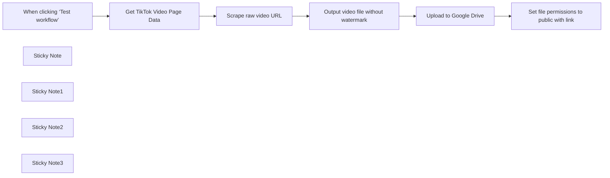

## Fluxo (.json) :

```json
{
  "id": "aVienX696oMCH1DR",
  "meta": {
    "instanceId": "dce6d05169adc9f802863a06c3edb9925b178c4fce2360953cce9c1b509705cc"
  },
  "name": "Tiktok Downloader",
  "tags": [],
  "nodes": [
    {
      "id": "4dc30078-c7df-4bcb-91ed-953cd6da4a13",
      "name": "When clicking ‘Test workflow’",
      "type": "n8n-nodes-base.manualTrigger",
      "position": [
        -280,
        20
      ],
      "parameters": {},
      "typeVersion": 1
    },
    {
      "id": "5598aa10-f667-4023-b9de-fe07e86badec",
      "name": "Get TikTok Video Page Data",
      "type": "n8n-nodes-base.httpRequest",
      "position": [
        40,
        20
      ],
      "parameters": {
        "url": "https://www.tiktok.com/@randomspamvideos25/video/7251387037834595630",
        "options": {
          "response": {
            "response": {
              "fullResponse": true,
              "responseFormat": "text"
            }
          }
        },
        "sendHeaders": true,
        "headerParameters": {
          "parameters": [
            {
              "name": "User-Agent",
              "value": "Mozilla/5.0 (Windows NT 10.0; Win64; x64) Chrome/91.0.4472.124"
            }
          ]
        }
      },
      "typeVersion": 4.2
    },
    {
      "id": "734a5304-f67f-4ace-a1da-0d268664452c",
      "name": "Scrape raw video URL",
      "type": "n8n-nodes-base.code",
      "position": [
        480,
        20
      ],
      "parameters": {
        "jsCode": "const html = $input.first().json.data;\nconst headers = $input.first().json.headers || {};\nconst cookies = headers['set-cookie'] || [];\n\nif (!html) {\n  throw new Error(\"HTML body is undefined. Check the previous node's output.\");\n}\nconst regex = /<script id=\"__UNIVERSAL_DATA_FOR_REHYDRATION__\" type=\"application/json\">([\\s\\S]*?)</script>/;\nconst match = html.match(regex);\n\nif (match) {\n  const jsonStr = match[1];\n  const data = JSON.parse(jsonStr);\n  const videoUrl = data?.__DEFAULT_SCOPE__?.[\"webapp.video-detail\"]?.itemInfo?.itemStruct?.video?.playAddr;\n  if (!videoUrl) {\n    throw new Error(\"Could not find video URL in the JSON data.\");\n  }\n  return [{ json: { videoUrl, cookies: cookies.join('; ') } }];\n} else {\n  throw new Error(\"Could not find __UNIVERSAL_DATA_FOR_REHYDRATION__ script in the HTML.\");\n}"
      },
      "typeVersion": 2
    },
    {
      "id": "f574ccb8-6f5f-4e55-a2d5-7ad775d3c4e5",
      "name": "Output video file without watermark",
      "type": "n8n-nodes-base.httpRequest",
      "position": [
        900,
        20
      ],
      "parameters": {
        "url": "={{ $json.videoUrl }}",
        "options": {
          "response": {
            "response": {
              "responseFormat": "file"
            }
          },
          "allowUnauthorizedCerts": true
        },
        "sendHeaders": true,
        "headerParameters": {
          "parameters": [
            {
              "name": "User-Agent",
              "value": "Mozilla/5.0 (Windows NT 10.0; Win64; x64) AppleWebKit/537.36 (KHTML, like Gecko) Chrome/91.0.4472.124 Safari/537.36"
            },
            {
              "name": "Referer",
              "value": "https://www.tiktok.com/"
            },
            {
              "name": "Accept",
              "value": "video/mp4,video/webm,video/*;q=0.9,application/octet-stream;q=0.8"
            },
            {
              "name": "Accept-Language",
              "value": "en-US,en;q=0.5"
            },
            {
              "name": "Connection",
              "value": "keep-alive"
            },
            {
              "name": "Cookie",
              "value": "={{ $json.cookies }}"
            }
          ]
        }
      },
      "typeVersion": 4.2
    },
    {
      "id": "73d4ffa7-2264-4a84-9ab2-2004342e3039",
      "name": "Sticky Note",
      "type": "n8n-nodes-base.stickyNote",
      "position": [
        -140,
        -180
      ],
      "parameters": {
        "color": 6,
        "width": 460,
        "height": 360,
        "content": "## 1. Load the video page\nOpen this node and replace the URL with the one of the video you want to download without a watermark.\n\nA Tiktok video URL looks like: https://www.tiktok.com/@Username_here/video/Video_ID_Here\n\nOutputs the returned page HTML along with the session cookies\n\n"
      },
      "typeVersion": 1
    },
    {
      "id": "848fc04b-2620-4d83-8701-52c053f7c017",
      "name": "Sticky Note1",
      "type": "n8n-nodes-base.stickyNote",
      "position": [
        340,
        -180
      ],
      "parameters": {
        "color": 5,
        "width": 380,
        "height": 360,
        "content": "## 2. Find the raw video URL\nParses through all of the HTML and finds the section containing the video URL before the watermark is applied"
      },
      "typeVersion": 1
    },
    {
      "id": "40b3a2bd-5733-43a8-951c-d5fa26647615",
      "name": "Sticky Note2",
      "type": "n8n-nodes-base.stickyNote",
      "position": [
        740,
        -180
      ],
      "parameters": {
        "color": 4,
        "width": 400,
        "height": 360,
        "content": "## 3. Output video file without watermark\nUsing the cookies from step 1, a request is made to access the original video file as shown on TikTok"
      },
      "typeVersion": 1
    },
    {
      "id": "36629265-f139-433f-9603-0670a08be1ed",
      "name": "Upload to Google Drive",
      "type": "n8n-nodes-base.googleDrive",
      "position": [
        300,
        360
      ],
      "parameters": {
        "name": "={{ $node[\"Get TikTok Video Page Data\"].parameter[\"url\"].match(//video/(\\d+)/)[1] + \".mp4\" }}",
        "driveId": {
          "__rl": true,
          "mode": "list",
          "value": "My Drive"
        },
        "options": {},
        "folderId": {
          "__rl": true,
          "mode": "list",
          "value": "root",
          "cachedResultUrl": "https://drive.google.com/drive",
          "cachedResultName": "/ (Root folder)"
        }
      },
      "credentials": {
        "googleDriveOAuth2Api": {
          "id": "ZvDuyVfbZJbDJXcS",
          "name": "Google Drive account"
        }
      },
      "typeVersion": 3
    },
    {
      "id": "94364c83-14ce-48c3-afe5-b7cd8addd2a0",
      "name": "Set file permissions to public with link",
      "type": "n8n-nodes-base.googleDrive",
      "position": [
        560,
        360
      ],
      "parameters": {
        "fileId": {
          "__rl": true,
          "mode": "id",
          "value": "={{ $json.id }}"
        },
        "options": {},
        "operation": "share",
        "permissionsUi": {
          "permissionsValues": {
            "role": "writer",
            "type": "anyone",
            "allowFileDiscovery": true
          }
        }
      },
      "credentials": {
        "googleDriveOAuth2Api": {
          "id": "ZvDuyVfbZJbDJXcS",
          "name": "Google Drive account"
        }
      },
      "typeVersion": 3
    },
    {
      "id": "d37ad36c-0b7f-4c2c-9538-dc8bf75e997f",
      "name": "Sticky Note3",
      "type": "n8n-nodes-base.stickyNote",
      "position": [
        260,
        200
      ],
      "parameters": {
        "color": 7,
        "width": 500,
        "height": 320,
        "content": "## (Optional) Upload video to Google Drive\nAn expression is used to save the file to your Google Drive as Video_ID.mp4\n\nNote: Must have Google Drive API enabled in [Google Cloud Console](https://console.cloud.google.com/apis/api/drive.googleapis.com/overview) OAuth ClientID and Client Secret credentials setup"
      },
      "typeVersion": 1
    }
  ],
  "active": false,
  "pinData": {},
  "settings": {
    "executionOrder": "v1"
  },
  "versionId": "70234bbb-ccaf-4291-a50b-063e07303678",
  "connections": {
    "Scrape raw video URL": {
      "main": [
        [
          {
            "node": "Output video file without watermark",
            "type": "main",
            "index": 0
          }
        ]
      ]
    },
    "Upload to Google Drive": {
      "main": [
        [
          {
            "node": "Set file permissions to public with link",
            "type": "main",
            "index": 0
          }
        ]
      ]
    },
    "Get TikTok Video Page Data": {
      "main": [
        [
          {
            "node": "Scrape raw video URL",
            "type": "main",
            "index": 0
          }
        ]
      ]
    },
    "When clicking ‘Test workflow’": {
      "main": [
        [
          {
            "node": "Get TikTok Video Page Data",
            "type": "main",
            "index": 0
          }
        ]
      ]
    },
    "Output video file without watermark": {
      "main": [
        [
          {
            "node": "Upload to Google Drive",
            "type": "main",
            "index": 0
          }
        ]
      ]
    }
  }
}
```

<a id="template-1847"></a>

## Template 1847 - Resumo automático de vídeos do YouTube para Discord

- **Nome:** Resumo automático de vídeos do YouTube para Discord
- **Descrição:** Detecta novos vídeos de um canal do YouTube, obtém legendas em inglês, gera um resumo com IA e publica um aviso no Discord com link e resumo.
- **Funcionalidade:** • Detecção de novos vídeos: Monitora o feed RSS do canal para identificar uploads recentes.
• Recuperação de metadados de legendas: Consulta a API do YouTube para listar as legendas disponíveis do vídeo.
• Seleção de legendas em inglês: Filtra as legendas retornadas para escolher a versão em inglês quando disponível.
• Download da legenda: Baixa o ficheiro de legenda selecionado para processamento.
• Conversão de arquivo de legenda para texto: Extrai o conteúdo textual das legendas para uso na IA.
• Geração de resumo com IA: Usa um modelo de linguagem para criar um resumo curto (três bullet points) do transcript.
• Publicação no Discord: Envia uma mensagem formatada com título, resumo e link do vídeo para um canal via webhook.
- **Ferramentas:** • YouTube RSS Feed: Fornece notificações de novos uploads do canal.
• YouTube Data API (captions): Recupera metadados e permite o download das legendas do vídeo.
• OpenAI (ChatGPT): Gera resumos concisos a partir do texto das legendas.
• Discord Webhook: Publica a mensagem com resumo e link no canal do Discord.

## Fluxo visual

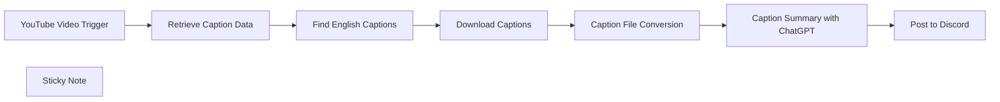

## Fluxo (.json) :

```json
{
  "id": "LF8gz3iz74u45a5i",
  "meta": {
    "instanceId": "889f0d7d968f3b02a88433e2529a399907d2ca89e329934b608193beaa2301f8"
  },
  "name": "YouTube Videos with AI Summaries on Discord",
  "tags": [],
  "nodes": [
    {
      "id": "48c87027-7eea-40b9-a73c-4e002b748783",
      "name": "YouTube Video Trigger",
      "type": "n8n-nodes-base.rssFeedReadTrigger",
      "position": [
        560,
        220
      ],
      "parameters": {
        "feedUrl": "https://www.youtube.com/feeds/videos.xml?channel_id=UC08Fah8EIryeOZRkjBRohcQ",
        "pollTimes": {
          "item": [
            {
              "mode": "everyMinute"
            }
          ]
        }
      },
      "typeVersion": 1
    },
    {
      "id": "56166228-b365-4043-b48c-098b4de71f6f",
      "name": "Retrieve Caption Data",
      "type": "n8n-nodes-base.httpRequest",
      "position": [
        780,
        220
      ],
      "parameters": {
        "url": "https://www.googleapis.com/youtube/v3/captions",
        "options": {},
        "sendQuery": true,
        "authentication": "predefinedCredentialType",
        "queryParameters": {
          "parameters": [
            {
              "name": "videoId",
              "value": "={{ $json.id.match(/(?:[^:]*:){2}\\s*(.*)/)[1] }}"
            },
            {
              "name": "part",
              "value": "snippet"
            }
          ]
        },
        "nodeCredentialType": "youTubeOAuth2Api"
      },
      "credentials": {
        "youTubeOAuth2Api": {
          "id": "uy3xy1Ks2ATwRGr4",
          "name": "Creator Magic - YouTube account"
        }
      },
      "typeVersion": 4.2
    },
    {
      "id": "c029ac6f-3071-4045-83f6-2dede0c1f358",
      "name": "Download Captions",
      "type": "n8n-nodes-base.httpRequest",
      "position": [
        1220,
        220
      ],
      "parameters": {
        "url": "=https://www.googleapis.com/youtube/v3/captions/{{ $json.caption.id }}",
        "options": {},
        "authentication": "predefinedCredentialType",
        "nodeCredentialType": "youTubeOAuth2Api"
      },
      "credentials": {
        "youTubeOAuth2Api": {
          "id": "uy3xy1Ks2ATwRGr4",
          "name": "Creator Magic - YouTube account"
        }
      },
      "typeVersion": 4.2
    },
    {
      "id": "8b45dc14-f10f-4b50-8ca6-a9d0ccfee4dc",
      "name": "Caption File Conversion",
      "type": "n8n-nodes-base.extractFromFile",
      "position": [
        1440,
        220
      ],
      "parameters": {
        "options": {},
        "operation": "text",
        "destinationKey": "content"
      },
      "typeVersion": 1
    },
    {
      "id": "6527adb4-9087-40eb-b63a-8c4cdf5d0a40",
      "name": "Caption Summary with ChatGPT",
      "type": "@n8n/n8n-nodes-langchain.openAi",
      "position": [
        1660,
        220
      ],
      "parameters": {
        "modelId": {
          "__rl": true,
          "mode": "list",
          "value": "gpt-3.5-turbo",
          "cachedResultName": "GPT-3.5-TURBO"
        },
        "options": {},
        "messages": {
          "values": [
            {
              "content": "=Summarise this transcript into three bullet points to sum up what the video is about and why someone should watch it: {{ $json[\"content\"] }}"
            }
          ]
        }
      },
      "credentials": {
        "openAiApi": {
          "id": "QpdCHVaJVRd9NNYl",
          "name": "OpenAi account"
        }
      },
      "typeVersion": 1.3
    },
    {
      "id": "2c83f230-bc37-4efb-9ee9-842bcefa0ef4",
      "name": "Post to Discord",
      "type": "n8n-nodes-base.discord",
      "position": [
        2000,
        220
      ],
      "parameters": {
        "content": "=🌟 New Video Alert! 🌟\n\n**{{ $('YouTube Video Trigger').item.json[\"title\"] }}**\n\n*What’s it about?*\n\n{{ $json[\"message\"][\"content\"] }}\n\n[Watch NOW]({{ $('YouTube Video Trigger').item.json[\"link\"] }}) and remember to share your thoughts!",
        "options": {},
        "authentication": "webhook"
      },
      "credentials": {
        "discordWebhookApi": {
          "id": "QQxpAIskycvb8fIE",
          "name": "Discord Webhook account"
        }
      },
      "typeVersion": 2
    },
    {
      "id": "8408887e-1d89-402c-b350-93d5f96f4dea",
      "name": "Find English Captions",
      "type": "n8n-nodes-base.set",
      "position": [
        1000,
        220
      ],
      "parameters": {
        "options": {},
        "assignments": {
          "assignments": [
            {
              "id": "eaf7dcb5-91cf-4405-917b-38845f0ef78d",
              "name": "caption",
              "type": "object",
              "value": "={{ $jmespath( $json.items, \"[?snippet.language == 'en'] | [0]\" ) }}"
            }
          ]
        }
      },
      "typeVersion": 3.3
    },
    {
      "id": "71cc0977-1695-4797-9df2-b0a98e41d3de",
      "name": "Sticky Note",
      "type": "n8n-nodes-base.stickyNote",
      "position": [
        500,
        -20
      ],
      "parameters": {
        "width": 448.11859838274916,
        "height": 417.2722371967648,
        "content": "### Summarise Your YouTube Videos with AI for Discord\n\n📽️ [Watch the Video Tutorial](https://mrc.fm/ai2d)\n\n* Add your [YouTube channel ID](https://www.youtube.com/account_advanced) to the URL in the first node: `https://www.youtube.com/feeds/videos.xml?channel_id=YOUR_CHANNEL_ID`.\n\n* Ensure authorization with the YouTube channel that you want to download captions from."
      },
      "typeVersion": 1
    }
  ],
  "active": false,
  "pinData": {},
  "settings": {
    "executionOrder": "v1"
  },
  "versionId": "e8fc6758-02ef-4b65-8ab5-474bd8e3862a",
  "connections": {
    "Download Captions": {
      "main": [
        [
          {
            "node": "Caption File Conversion",
            "type": "main",
            "index": 0
          }
        ]
      ]
    },
    "Find English Captions": {
      "main": [
        [
          {
            "node": "Download Captions",
            "type": "main",
            "index": 0
          }
        ]
      ]
    },
    "Retrieve Caption Data": {
      "main": [
        [
          {
            "node": "Find English Captions",
            "type": "main",
            "index": 0
          }
        ]
      ]
    },
    "YouTube Video Trigger": {
      "main": [
        [
          {
            "node": "Retrieve Caption Data",
            "type": "main",
            "index": 0
          }
        ]
      ]
    },
    "Caption File Conversion": {
      "main": [
        [
          {
            "node": "Caption Summary with ChatGPT",
            "type": "main",
            "index": 0
          }
        ]
      ]
    },
    "Caption Summary with ChatGPT": {
      "main": [
        [
          {
            "node": "Post to Discord",
            "type": "main",
            "index": 0
          }
        ]
      ]
    }
  }
}
```

<a id="template-1849"></a>

## Template 1849 - Geração de dados para etiquetas de produto

- **Nome:** Geração de dados para etiquetas de produto
- **Descrição:** Recebe um pedido para emitir etiqueta, consulta configurações e dados do produto e dos rolos, e retorna os dados combinados prontos para impressão.
- **Funcionalidade:** • Recepção de requisição POST: Recebe payload contendo id_produto_grade, id_movimentacao_detalhe e lista de rolos.
• Obtenção de configuração de impressão: Consulta um serviço de configuração para obter parâmetros como o banco de relatório.
• Consulta de dados do produto: Recupera informações do produto, grade, marca, largura do tecido e composição a partir do banco de dados relacional usando o id da grade.
• Extração e consulta dos rolos: Extrai os objectId dos rolos enviados no payload e consulta os detalhes desses rolos em outro banco de dados.
• Tratamento e união de dados: Processa os dados recebidos e realiza o merge entre informações do produto e dos rolos por id_movimentacao_detalhe preparando o retorno.
• Resposta consolidada: Retorna todos os dados combinados como resposta ao solicitante para uso na impressão de etiqueta.
- **Ferramentas:** • Serviço de configuração (Parse): API local que fornece configurações de impressão e informação do banco de relatório.
• Banco MySQL: Base relacional que contém tabelas de produto, produto_grade, marca, grade e objetos de configuração usados para obter descrição, códigos, largura e composição.
• Banco PostgreSQL: Base que armazena os registros de tecido_rolo utilizados para obter os detalhes dos rolos informados no pedido.

## Fluxo visual

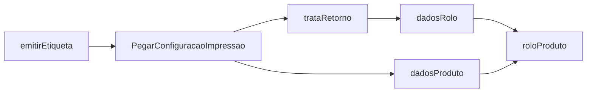

## Fluxo (.json) :

```json
{
  "nodes": [
    {
      "name": "emitirEtiqueta",
      "type": "n8n-nodes-base.webhook",
      "position": [
        440,
        1290
      ],
      "webhookId": "4431a14c-62c6-4602-8e20-e661f1d3d706",
      "parameters": {
        "path": "emitirEtiqueta",
        "options": {},
        "httpMethod": "POST",
        "responseData": "allEntries",
        "responseMode": "lastNode"
      },
      "typeVersion": 1
    },
    {
      "name": "dadosProduto",
      "type": "n8n-nodes-base.mySql",
      "position": [
        1270,
        1440
      ],
      "parameters": {
        "query": "=-- CONSULTA DO PRODUTO GRADE\nWITH pg as (\n\tSELECT\n\t\tid,\n\t\tid_produto,\n\t\tid_gradex,\n\t\tid_gradey,\n\t\tcodigo \n\tFROM\n\t\tproduto_grade \n\tWHERE\n\t\tid = '{{$node[\"emitirEtiqueta\"].json[\"body\"][\"id_produto_grade\"]}}'\n),\n\n-- CONSULTA DO PRODUTO\np as (\n\tSELECT * FROM produto \n\tWHERE id IN ( SELECT id_produto  FROM pg)\n\tAND situacao = 'ATIVO'\n),\n\n-- CONSULTA TECIDO\nt as (\n\tSELECT\n\t\ttoken,\n\t\t JSON_UNQUOTE(json_extract( objeto, '$.largura')) AS largura\n\tFROM\n\t\t`{{$node[\"PegarConfiguracaoImpressao\"].json[\"params\"][\"bancoRelatorio\"]}}`.`i_objeto` \n\tWHERE\n\t\tmodulo = 'produto_grade_tecido'\n\t\tand token in (select id from pg)\n\t\tand situacao = 'ATIVO'\n),\n\n\n-- CONSULTA COMPOSICAO\ncp as (\n\t\n\tSELECT\n\t  token,\n    group_concat(concat(cps.participacao,'% ',cps.descricao)) as composicao\n\tFROM\n\t\t`{{$node[\"PegarConfiguracaoImpressao\"].json[\"params\"][\"bancoRelatorio\"]}}`.`i_objeto`,\n\t\tJSON_TABLE (\n\t\t\t\t\t\t\t\t\tobjeto,\n\t\t\t\t\t\t\t\t\t\t\t'$[*]' COLUMNS (  \n\t\t\t\t\t\t\t\t\t\t\t\t\tparticipacao INT path '$.participacao',\n\t\t\t\t\t\t\t\t\t\t\t\t\tdescricao TEXT path '$.descricao'\n\t\t\t\t\t\t\t\t\t\t\t)\n\t\t\t\t\t\t\t) AS cps \n\t\tWHERE modulo = 'produto_grade_tecido_composicao'\n\t\tAND token in (select id from pg)\n\t\tAND situacao = 'ATIVO'\n\t\tAND cps.participacao > 0\n\t\tGROUP BY token\n\t\tORDER BY participacao desc\n\t\t\n)\n\n\n-- CONSULTA RELATORIO\nSELECT\n{{$node[\"emitirEtiqueta\"].json[\"body\"][\"id_movimentacao_detalhe\"]}} as id_movimentacao_detalhe ,\n     pg.id, \n\tpg.codigo,\n\tp.descricao,\n\tm.nome as marca,\n\tgx.nome as gradex,\n\tgy.nome as gradey,\n\tcurdate() as data_entrada,\n  t.largura,\n\tcp.composicao\nFROM\n\tpg inner join p on (p.id = pg.id_produto)\n\tinner join marca m on(m.id = p.id_marca)\n\tleft join grade gx on (gx.id = pg.id_gradex)\n\tleft join grade gy on (gy.id = pg.id_gradey)\n\tleft join t on (t.token = pg.id)\n\tleft join cp on (cp.token = pg.id)",
        "operation": "executeQuery"
      },
      "credentials": {
        "mySql": {
          "id": "2",
          "name": "illi"
        }
      },
      "typeVersion": 1
    },
    {
      "name": "PegarConfiguracaoImpressao",
      "type": "n8n-nodes-base.httpRequest",
      "position": [
        730,
        1290
      ],
      "parameters": {
        "url": "http://localhost:1337/parse/config",
        "options": {},
        "jsonParameters": true,
        "headerParametersJson": "{\"X-Parse-Application-Id\": \"iwms\"}"
      },
      "typeVersion": 1
    },
    {
      "name": "dadosRolo",
      "type": "n8n-nodes-base.postgres",
      "position": [
        1260,
        1220
      ],
      "parameters": {
        "query": "=select * from \"tecido_rolo\"\nwhere \"objectId\" in ('{{$json[\"idRolos\"].join(\"','\")}}')",
        "operation": "executeQuery",
        "additionalFields": {}
      },
      "credentials": {
        "postgres": {
          "id": "1",
          "name": "Postgres account"
        }
      },
      "typeVersion": 1
    },
    {
      "name": "trataRetorno",
      "type": "n8n-nodes-base.function",
      "position": [
        1010,
        1220
      ],
      "parameters": {
        "functionCode": "// Code here will run only once, no matter how many input items there are.\n// More info and help: https://docs.n8n.io/nodes/n8n-nodes-base.function\n\n\n// var produto = items[0].json;\n\n\nvar rolos = $node[\"emitirEtiqueta\"].json[\"body\"][\"rolos\"];\n\n\nvar idRolos = rolos.map(\n    function(rolo){\n        return rolo.objectId\n    });\n    \nvar retorno = [];\n\nretorno.push({json:{\n   // produto:produto,\n    idRolos:idRolos \n}})\n\nreturn retorno;"
      },
      "typeVersion": 1
    },
    {
      "name": "roloProduto",
      "type": "n8n-nodes-base.merge",
      "position": [
        1640,
        1330
      ],
      "parameters": {
        "mode": "mergeByKey",
        "propertyName1": "id_movimentacao_detalhe",
        "propertyName2": "id_movimentacao_detalhe"
      },
      "typeVersion": 1
    }
  ],
  "connections": {
    "dadosRolo": {
      "main": [
        [
          {
            "node": "roloProduto",
            "type": "main",
            "index": 0
          }
        ]
      ]
    },
    "dadosProduto": {
      "main": [
        [
          {
            "node": "roloProduto",
            "type": "main",
            "index": 1
          }
        ]
      ]
    },
    "trataRetorno": {
      "main": [
        [
          {
            "node": "dadosRolo",
            "type": "main",
            "index": 0
          }
        ]
      ]
    },
    "emitirEtiqueta": {
      "main": [
        [
          {
            "node": "PegarConfiguracaoImpressao",
            "type": "main",
            "index": 0
          }
        ]
      ]
    },
    "PegarConfiguracaoImpressao": {
      "main": [
        [
          {
            "node": "dadosProduto",
            "type": "main",
            "index": 0
          },
          {
            "node": "trataRetorno",
            "type": "main",
            "index": 0
          }
        ]
      ]
    }
  }
}
```

<a id="template-1851"></a>

## Template 1851 - Relatório SEO semanal por e-mail

- **Nome:** Relatório SEO semanal por e-mail
- **Descrição:** Automatiza a coleta semanal de dados de desempenho do site, gera um resumo das principais consultas e envia o relatório por e-mail.
- **Funcionalidade:** • Disparo semanal (segunda 7h): Agenda a execução do fluxo toda segunda-feira às 07:00.
• Coleta de dados do Google Search Console: Consulta o endpoint searchAnalytics/query para obter consultas, cliques, impressões, CTR e posição (últimos 7 dias).
• Geração de relatório SEO: Processa os resultados e formata um resumo com as principais consultas (top 10) e suas métricas.
• Envio de relatório por e-mail: Envia o relatório gerado para o destinatário configurado usando a conta Gmail autenticada.
• Requisitos de configuração: Requer configuração de credenciais para acesso ao Google Search Console e autenticação da conta de e-mail.
- **Ferramentas:** • Google Search Console: Fonte dos dados de desempenho de busca, acessada via API para obter consultas e métricas.
• Gmail: Serviço de e-mail utilizado para enviar o relatório semanal ao destinatário configurado.

## Fluxo visual

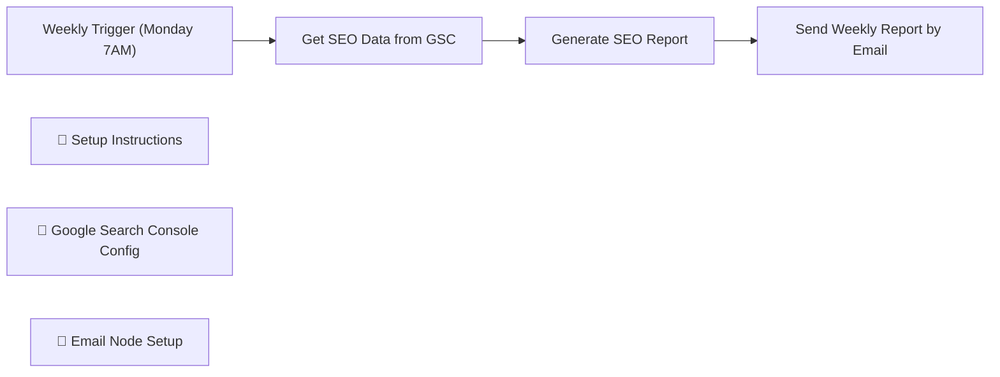

## Fluxo (.json) :

```json
{
  "id": "jbTm6O9bLBMm6RWy",
  "meta": {
    "instanceId": "7b7fd5f72a378d0859f4d1cf8dd3c226094df4777ef6aca192ac32e815fe212a",
    "templateCredsSetupCompleted": true
  },
  "name": "My workflow 3",
  "tags": [],
  "nodes": [
    {
      "id": "24be1991-3de5-49c2-91a1-c636fb721a87",
      "name": "Weekly Trigger (Monday 7AM)",
      "type": "n8n-nodes-base.cron",
      "position": [
        80,
        180
      ],
      "parameters": {},
      "typeVersion": 1
    },
    {
      "id": "43d7764d-fbd4-414b-be44-bcc80c068db2",
      "name": "Get SEO Data from GSC",
      "type": "n8n-nodes-base.httpRequest",
      "position": [
        300,
        180
      ],
      "parameters": {
        "url": "https://searchconsole.googleapis.com/webmasters/v3/sites/YOUR_SITE_URL/searchAnalytics/query",
        "options": {},
        "authentication": "genericCredentialType",
        "genericAuthType": "httpBasicAuth"
      },
      "typeVersion": 2
    },
    {
      "id": "92852fd3-7663-413e-b1a9-8c728dea9a23",
      "name": "Generate SEO Report",
      "type": "n8n-nodes-base.function",
      "position": [
        500,
        180
      ],
      "parameters": {
        "functionCode": "\n                const rows = items[0].json.rows || [];\n                const reportLines = rows.map((row, index) => {\n                    return `${index + 1}. ${row.keys[0]} - Clicks: ${row.clicks}, Impressions: ${row.impressions}, CTR: ${row.ctr.toFixed(2)}, Position: ${row.position.toFixed(2)}`;\n                });\n                return [{\n                    json: {\n                        report: `Top 10 Search Queries (Last 7 Days):\\n\\n${reportLines.join(\"\\n\")}`\n                    }\n                }];\n            "
      },
      "typeVersion": 1
    },
    {
      "id": "28d9f152-15a0-4a66-aa5e-aa6b9b4c1fa3",
      "name": "📌 Setup Instructions",
      "type": "n8n-nodes-base.stickyNote",
      "position": [
        -60,
        60
      ],
      "parameters": {
        "color": 6,
        "width": 280,
        "height": 320,
        "content": "\n"
      },
      "typeVersion": 1
    },
    {
      "id": "8e9551d4-27ab-4106-b0cd-b82d6a671ec7",
      "name": "📌 Google Search Console Config",
      "type": "n8n-nodes-base.stickyNote",
      "position": [
        240,
        60
      ],
      "parameters": {
        "color": 2,
        "height": 320,
        "content": ""
      },
      "typeVersion": 1
    },
    {
      "id": "c2aabd2e-0a2b-4b4b-a239-bf0927ad1e4d",
      "name": "📌 Email Node Setup",
      "type": "n8n-nodes-base.stickyNote",
      "position": [
        640,
        40
      ],
      "parameters": {
        "color": 5,
        "height": 360,
        "content": ""
      },
      "typeVersion": 1
    },
    {
      "id": "1b870a08-d53c-4a51-9a41-4d71a5c954f9",
      "name": "Send Weekly Report by Email",
      "type": "n8n-nodes-base.gmail",
      "position": [
        720,
        180
      ],
      "webhookId": "c9455684-b943-41a5-b2d7-adeafb985083",
      "parameters": {
        "sendTo": "rodrigue.gbadou@gmail.com",
        "options": {},
        "subject": "Send Weekly Report by Email"
      },
      "credentials": {
        "gmailOAuth2": {
          "id": "6dONI23VTND78rYK",
          "name": "Gmail account"
        }
      },
      "typeVersion": 2.1
    }
  ],
  "active": false,
  "pinData": {},
  "settings": {
    "executionOrder": "v1"
  },
  "versionId": "72378158-06bb-40fd-a300-b89a73676d8d",
  "connections": {
    "Generate SEO Report": {
      "main": [
        [
          {
            "node": "Send Weekly Report by Email",
            "type": "main",
            "index": 0
          }
        ]
      ]
    },
    "Get SEO Data from GSC": {
      "main": [
        [
          {
            "node": "Generate SEO Report",
            "type": "main",
            "index": 0
          }
        ]
      ]
    },
    "Weekly Trigger (Monday 7AM)": {
      "main": [
        [
          {
            "node": "Get SEO Data from GSC",
            "type": "main",
            "index": 0
          }
        ]
      ]
    }
  }
}
```

<a id="template-1852"></a>

## Template 1852 - Sincronização de alertas Syncro para OpsGenie

- **Nome:** Sincronização de alertas Syncro para OpsGenie
- **Descrição:** Recebe notificações do Syncro e, conforme o conteúdo do evento, cria ou fecha alertas no OpsGenie automaticamente.
- **Funcionalidade:** • Recepção de eventos via webhook: Aceita POSTs enviados pelo Syncro para um endpoint dedicado.
• Filtragem por tipo de trigger: Verifica se o evento corresponde ao trigger específico (por exemplo, agent_offline_trigger) antes de processar.
• Preparação dos dados do alerta: Monta campos como ID do alerta, mensagem e descrição a partir dos dados recebidos no payload.
• Decisão baseada no estado do alerta: Avalia o campo "resolved" do evento e, conforme o valor, determina se deve criar ou encerrar um alerta no destino.
• Criação de alerta no OpsGenie: Envia requisição à API do OpsGenie com message, alias e description para abrir um novo alerta.
• Fechamento de alerta no OpsGenie: Envia requisição à API do OpsGenie para fechar um alerta existente usando o alias como identificador e adiciona uma nota de resolução.
• Ignorar eventos não relevantes: Eventos que não correspondem ao trigger esperado são descartados sem ações posteriores.
- **Ferramentas:** • Syncro: Fonte dos eventos/alertas que disparam o fluxo através de webhooks.
• OpsGenie: Serviço de gerenciamento de alertas usado para criar e fechar alertas via API.

## Fluxo visual

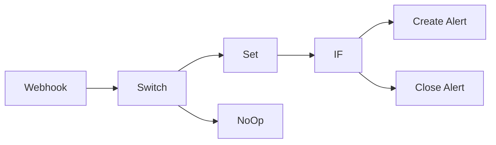

## Fluxo (.json) :

```json
{
  "id": 117,
  "name": "Syncro Alert to OpsGenie",
  "nodes": [
    {
      "name": "Webhook",
      "type": "n8n-nodes-base.webhook",
      "position": [
        460,
        380
      ],
      "webhookId": "fromsyncro",
      "parameters": {
        "path": "fromsyncro",
        "options": {},
        "httpMethod": "POST",
        "responseData": "allEntries",
        "responseMode": "lastNode"
      },
      "typeVersion": 1
    },
    {
      "name": "Set",
      "type": "n8n-nodes-base.set",
      "position": [
        780,
        380
      ],
      "parameters": {
        "values": {
          "string": [
            {
              "name": "AlertID",
              "value": "={{$node[\"Webhook\"].json[\"body\"][\"attributes\"][\"id\"]}}"
            },
            {
              "name": "Description",
              "value": "={{$node[\"Webhook\"].json[\"body\"][\"attributes\"][\"computer_name\"]}} ({{$node[\"Webhook\"].json[\"body\"][\"attributes\"][\"customer\"][\"business_then_name\"]}}): {{$node[\"Webhook\"].json[\"body\"][\"attributes\"][\"formatted_output\"]}}"
            }
          ]
        },
        "options": {},
        "keepOnlySet": true
      },
      "typeVersion": 1
    },
    {
      "name": "Create Alert",
      "type": "n8n-nodes-base.httpRequest",
      "position": [
        1180,
        260
      ],
      "parameters": {
        "url": "https://api.opsgenie.com/v2/alerts",
        "options": {},
        "requestMethod": "POST",
        "authentication": "headerAuth",
        "bodyParametersUi": {
          "parameter": [
            {
              "name": "message",
              "value": "={{$node[\"Webhook\"].json[\"body\"][\"attributes\"][\"computer_name\"]}} ({{$node[\"Webhook\"].json[\"body\"][\"attributes\"][\"customer\"][\"business_then_name\"]}}): {{$node[\"Webhook\"].json[\"body\"][\"attributes\"][\"formatted_output\"]}}"
            },
            {
              "name": "alias",
              "value": "={{$node[\"Webhook\"].json[\"body\"][\"attributes\"][\"id\"]}}"
            },
            {
              "name": "description",
              "value": "={{$node[\"Webhook\"].json[\"body\"][\"text\"]}}\n{{$node[\"Webhook\"].json[\"body\"][\"link\"]}}"
            }
          ]
        }
      },
      "credentials": {
        "httpHeaderAuth": {
          "id": null,
          "name": "OpsGenie"
        }
      },
      "typeVersion": 1
    },
    {
      "name": "Close Alert",
      "type": "n8n-nodes-base.httpRequest",
      "position": [
        1180,
        460
      ],
      "parameters": {
        "url": "=https://api.opsgenie.com/v2/alerts/{{$node[\"Webhook\"].json[\"body\"][\"attributes\"][\"id\"]}}/close?identifierType=alias",
        "options": {},
        "requestMethod": "POST",
        "authentication": "headerAuth",
        "bodyParametersUi": {
          "parameter": [
            {
              "name": "note",
              "value": "Issue resolved automatically according to Syncro."
            }
          ]
        }
      },
      "credentials": {
        "httpHeaderAuth": {
          "id": null,
          "name": "OpsGenie"
        }
      },
      "typeVersion": 1
    },
    {
      "name": "NoOp",
      "type": "n8n-nodes-base.noOp",
      "position": [
        780,
        560
      ],
      "parameters": {},
      "typeVersion": 1
    },
    {
      "name": "IF",
      "type": "n8n-nodes-base.if",
      "position": [
        940,
        380
      ],
      "parameters": {
        "conditions": {
          "boolean": [
            {
              "value1": "={{$node[\"Webhook\"].json[\"body\"][\"attributes\"][\"resolved\"]}}"
            }
          ]
        }
      },
      "typeVersion": 1
    },
    {
      "name": "Switch",
      "type": "n8n-nodes-base.switch",
      "position": [
        620,
        380
      ],
      "parameters": {
        "rules": {
          "rules": [
            {
              "value2": "agent_offline_trigger"
            }
          ]
        },
        "value1": "={{$node[\"Webhook\"].json[\"body\"][\"attributes\"][\"properties\"][\"trigger\"]}}",
        "dataType": "string"
      },
      "typeVersion": 1
    }
  ],
  "active": false,
  "settings": {},
  "connections": {
    "IF": {
      "main": [
        [
          {
            "node": "Create Alert",
            "type": "main",
            "index": 0
          }
        ],
        [
          {
            "node": "Close Alert",
            "type": "main",
            "index": 0
          }
        ]
      ]
    },
    "Set": {
      "main": [
        [
          {
            "node": "IF",
            "type": "main",
            "index": 0
          }
        ]
      ]
    },
    "Switch": {
      "main": [
        [
          {
            "node": "Set",
            "type": "main",
            "index": 0
          }
        ],
        [
          {
            "node": "NoOp",
            "type": "main",
            "index": 0
          }
        ]
      ]
    },
    "Webhook": {
      "main": [
        [
          {
            "node": "Switch",
            "type": "main",
            "index": 0
          }
        ]
      ]
    }
  }
}
```

<a id="template-1854"></a>

## Template 1854 - Reagir a callback do PDFMonkey

- **Nome:** Reagir a callback do PDFMonkey
- **Descrição:** Recebe o webhook do PDFMonkey quando a geração de um PDF termina e, se for bem-sucedida, baixa o arquivo PDF para uso posterior.
- **Funcionalidade:** • Receber callback de finalização: Aceita requisição POST do PDFMonkey informando o status do documento.
• Verificar status da geração: Avalia se o campo de status do documento é "success".
• Baixar PDF em caso de sucesso: Realiza uma requisição HTTP para o download_url fornecido e obtém o arquivo PDF.
• Tratar falhas: Permite tomar ações alternativas quando a geração falha (configuração ou lógica de tratamento adicional).
- **Ferramentas:** • PDFMonkey: Serviço de geração de PDFs que envia webhooks ao finalizar processos e disponibiliza URLs de download dos documentos gerados.
• Servidor de arquivos/URL de download: Local onde o PDF gerado fica hospedado e acessível via link para download.

## Fluxo visual

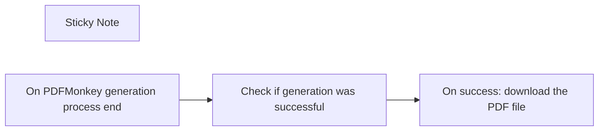

## Fluxo (.json) :

```json
{
  "id": "s6nTFZfg6xjWyJRX",
  "meta": {
    "instanceId": "4b761cc6ed5ba54435cd56551f1d8f4e82e89d5a18fc96f22d0649b94ad18c78",
    "templateCredsSetupCompleted": true
  },
  "name": "React to PDFMonkey Callback",
  "tags": [],
  "nodes": [
    {
      "id": "bca61663-2317-4f5a-8117-e417ab9ffcb1",
      "name": "Sticky Note",
      "type": "n8n-nodes-base.stickyNote",
      "position": [
        -160,
        -380
      ],
      "parameters": {
        "width": 860,
        "height": 500,
        "content": "# React to PDFMonkey Callback\nWhen a PDF is generated by PDFMonkey, retrieve the PDF file and use it as needed.\n\n### Configuration\nCopy the webhook URL and add it to your PDFMonkey Webhooks dashboard ([PDFMonkey Webhooks](https://dashboard.pdfmonkey.io/webhooks)) to define your N8N callback URL in your PDFMonkey account.\n\nFor more information, visit: [PDFMonkey Webhooks Documentation](https://docs.pdfmonkey.io/pdfmonkey-features/webhooks#defining-a-workspace-wide-webhook)\n\n\n### Usage\nOn success: Download the generated PDF.\nOn failure: Handle it as needed. 😉\n\n\n### Help\nNeed assistance? Reach out to us via chat on pdfmonkey.io, and we'll do our best to help you! 🚀"
      },
      "typeVersion": 1
    },
    {
      "id": "31ef2b09-e36f-4a9d-8eef-724211d7e2d4",
      "name": "On PDFMonkey generation process end",
      "type": "n8n-nodes-base.webhook",
      "position": [
        -140,
        160
      ],
      "webhookId": "ed9c1bf7-efdd-4d17-8c28-e74c22d017ce",
      "parameters": {
        "path": "ed9c1bf7-efdd-4d17-8c28-e74c22d017ce",
        "options": {},
        "httpMethod": "POST"
      },
      "typeVersion": 2
    },
    {
      "id": "08cfde4f-637b-4cf4-a2c2-92e4e15ad6cc",
      "name": "Check if generation was successful",
      "type": "n8n-nodes-base.if",
      "position": [
        120,
        160
      ],
      "parameters": {
        "options": {},
        "conditions": {
          "options": {
            "version": 2,
            "leftValue": "",
            "caseSensitive": true,
            "typeValidation": "strict"
          },
          "combinator": "and",
          "conditions": [
            {
              "id": "68eaaea7-d94b-40fd-819f-331261843c67",
              "operator": {
                "name": "filter.operator.equals",
                "type": "string",
                "operation": "equals"
              },
              "leftValue": "={{ $json.body.document.status }}",
              "rightValue": "success"
            }
          ]
        }
      },
      "typeVersion": 2.2
    },
    {
      "id": "051ec2f5-e96e-41dd-a753-db70cd1a1729",
      "name": "On success: download the PDF file",
      "type": "n8n-nodes-base.httpRequest",
      "position": [
        520,
        140
      ],
      "parameters": {
        "url": "={{ $json.body.document.download_url }}",
        "options": {}
      },
      "typeVersion": 4.2
    }
  ],
  "active": false,
  "pinData": {},
  "settings": {
    "executionOrder": "v1"
  },
  "versionId": "56e711af-d87a-4822-9b49-bf7bebd373df",
  "connections": {
    "On success: download the PDF file": {
      "main": [
        []
      ]
    },
    "Check if generation was successful": {
      "main": [
        [
          {
            "node": "On success: download the PDF file",
            "type": "main",
            "index": 0
          }
        ]
      ]
    },
    "On PDFMonkey generation process end": {
      "main": [
        [
          {
            "node": "Check if generation was successful",
            "type": "main",
            "index": 0
          }
        ]
      ]
    }
  }
}
```

<a id="template-1856"></a>

## Template 1856 - Geração de imagem via Bannerbear

- **Nome:** Geração de imagem via Bannerbear
- **Descrição:** Fluxo que, ao ser acionado manualmente, gera uma imagem a partir de um template do Bannerbear aplicando texto e cores personalizados e aguardando a imagem final.
- **Funcionalidade:** • Início manual: inicia o fluxo quando o usuário clica em executar.
• Geração de imagem: cria uma imagem com base em um template específico fornecido.
• Personalização do conteúdo: substitui campos do template (por exemplo, texto 'message', cor do texto e cor de fundo) conforme parâmetros definidos.
• Espera pela imagem: solicita que o serviço aguarde até a imagem final estar pronta antes de retornar o resultado.
- **Ferramentas:** • Bannerbear: serviço/API para gerar imagens dinâmicas a partir de templates, permitindo personalizar textos, cores e elementos visuais e obter a imagem final.

## Fluxo visual

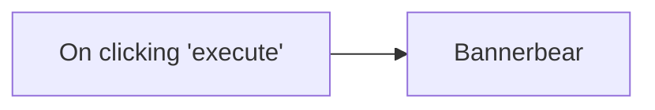

## Fluxo (.json) :

```json
{
  "nodes": [
    {
      "name": "On clicking 'execute'",
      "type": "n8n-nodes-base.manualTrigger",
      "position": [
        250,
        300
      ],
      "parameters": {},
      "typeVersion": 1
    },
    {
      "name": "Bannerbear",
      "type": "n8n-nodes-base.bannerbear",
      "position": [
        450,
        300
      ],
      "parameters": {
        "templateId": "8BK3vWZJ7Wl5Jzk1aX",
        "modificationsUi": {
          "modificationsValues": [
            {
              "name": "message",
              "text": "this is some text",
              "color": "#3097BC",
              "background": "#28A96F"
            }
          ]
        },
        "additionalFields": {
          "waitForImage": true
        }
      },
      "credentials": {
        "bannerbearApi": "bannerbear_creds"
      },
      "typeVersion": 1
    }
  ],
  "connections": {
    "On clicking 'execute'": {
      "main": [
        [
          {
            "node": "Bannerbear",
            "type": "main",
            "index": 0
          }
        ]
      ]
    }
  }
}
```

<a id="template-1857"></a>

## Template 1857 - Obter todos os registros do Mautic

- **Nome:** Obter todos os registros do Mautic
- **Descrição:** Ao acionar manualmente, o fluxo consulta a API do Mautic e recupera todos os registros usando autenticação OAuth2.
- **Funcionalidade:** • Acionamento manual: inicia o fluxo quando o usuário clica em executar.
• Recuperar todos os registros: realiza uma chamada à API do Mautic para obter todos os itens disponíveis (por exemplo, contatos).
• Autenticação via OAuth2: utiliza credenciais OAuth2 configuradas para autorizar o acesso à API do Mautic.
- **Ferramentas:** • Mautic: plataforma de automação de marketing usada para armazenar e gerenciar contatos e dados; o fluxo acessa sua API para recuperar registros autenticando-se por OAuth2.

## Fluxo visual

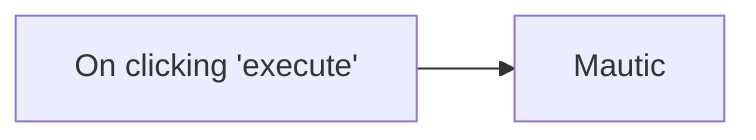

## Fluxo (.json) :

```json
{
  "nodes": [
    {
      "name": "On clicking 'execute'",
      "type": "n8n-nodes-base.manualTrigger",
      "position": [
        250,
        300
      ],
      "parameters": {},
      "typeVersion": 1
    },
    {
      "name": "Mautic",
      "type": "n8n-nodes-base.mautic",
      "position": [
        450,
        300
      ],
      "parameters": {
        "options": {},
        "operation": "getAll",
        "authentication": "oAuth2"
      },
      "credentials": {
        "mauticOAuth2Api": "mautic_creds"
      },
      "typeVersion": 1
    }
  ],
  "connections": {
    "On clicking 'execute'": {
      "main": [
        [
          {
            "node": "Mautic",
            "type": "main",
            "index": 0
          }
        ]
      ]
    }
  }
}
```

<a id="template-1859"></a>

## Template 1859 - Automação de blog com planilhas e LLM

- **Nome:** Automação de blog com planilhas e LLM
- **Descrição:** Fluxo automatiza a criação, formatação e publicação de posts de blog a partir de dados de uma planilha, usando um modelo de linguagem para gerar conteúdos, publicando no Wordpress via XML-RPC e registrando logs.
- **Funcionalidade:** • Detecção de agendamento e acionamento: inicia a automação conforme horários definidos ou acionamento manual.
• Preparação de dados a partir de planilhas: obtém configuração e agenda, monta parâmetros para o modelo.
• Geração de conteúdo com LLM: cria prompts e modelos com base nos dados e config.
• Publicação no Wordpress: monta e envia requisição XML-RPC para criar o post.
• Tratamento de resposta: interpreta retorno XML para extrair postId ou error.
• Registro de logs: grava informações de cada ação e status em planilha de logs.
• Atualização de status: atualiza planilha com Status e row_number para rastreio.
• Consolidação de dados: reagrupa dados processados para passos seguintes.
- **Ferramentas:** • Google Sheets: armazenamento de Configuração, Schedule, Logs e dados de linha.
• WordPress XML-RPC: publicação de posts no Wordpress via XMLRPC.
• OpenAI API: geração de conteúdo e prompts usando modelo de linguagem.

## Fluxo visual

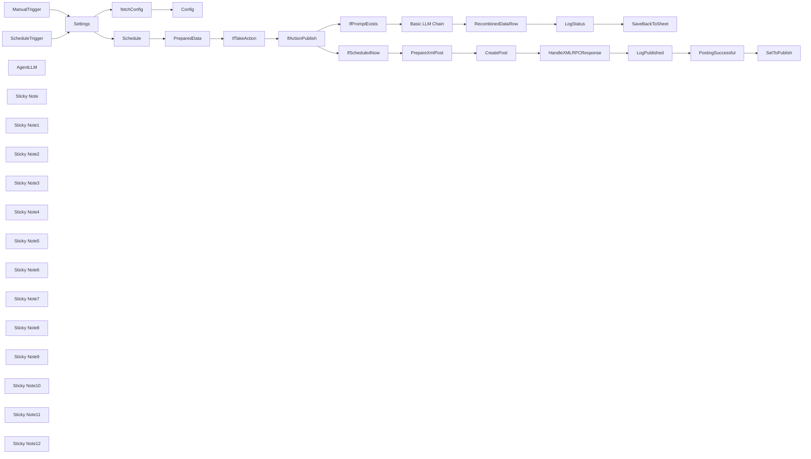

## Fluxo (.json) :

```json
{
  "id": "b0KRVIuuUxE5afHo",
  "meta": {
    "instanceId": "98bf0d6aef1dd8b7a752798121440fb171bf7686b95727fd617f43452393daa3",
    "templateCredsSetupCompleted": true
  },
  "name": "Blog Automation TEMPLATE",
  "tags": [
    {
      "id": "uumvgGHY5e6zEL7V",
      "name": "Published Template",
      "createdAt": "2025-02-10T11:18:10.923Z",
      "updatedAt": "2025-02-10T11:18:10.923Z"
    }
  ],
  "nodes": [
    {
      "id": "20e00146-6bda-4a8a-9544-bf7e5fd4e12e",
      "name": "Settings",
      "type": "n8n-nodes-base.set",
      "position": [
        -420,
        -160
      ],
      "parameters": {
        "options": {},
        "assignments": {
          "assignments": [
            {
              "id": "528b371f-0fba-4be1-9801-0502652da23e",
              "name": "urlSpreadsheet",
              "type": "string",
              "value": "https://docs.google.com/spreadsheets/d/1Kg1-U6mJF4bahH1jCw8kT48MiKz1UMC5n-9q77BHM3Q/edit?gid=0#gid=0"
            },
            {
              "id": "1be018c7-51fe-4ea2-967d-ce47a2e8795c",
              "name": "urlWordpress",
              "type": "string",
              "value": "SUBDOMAIN.wordpress.com"
            },
            {
              "id": "95377f4f-184b-46a7-94c7-b2313c314cb2",
              "name": "wordpressUsername",
              "type": "string",
              "value": "YourUserName"
            },
            {
              "id": "fdc99dc6-d9b0-4d2f-b770-1d8b6b360cad",
              "name": "wordpressApplicationPassword",
              "type": "string",
              "value": "y0ur app1 p4ss w0rd"
            },
            {
              "id": "517cb9ff-24fc-41d6-8bcc-253078f56356",
              "name": "sheetSchedule",
              "type": "string",
              "value": "=Schedule"
            },
            {
              "id": "584e11da-546b-4472-8674-33ca7e8f4f30",
              "name": "sheetConfig",
              "type": "string",
              "value": "Config"
            },
            {
              "id": "ba38cb1e-fd97-4aed-9147-1946c318ddab",
              "name": "actionPublish",
              "type": "string",
              "value": "publish"
            },
            {
              "id": "678394b5-20af-4718-9249-4ff6a3c77018",
              "name": "actionUpdate",
              "type": "string",
              "value": ""
            },
            {
              "id": "f375b2fa-8772-4313-9d6b-a104edd918b3",
              "name": "sheetLog",
              "type": "string",
              "value": "Log"
            },
            {
              "id": "3d7f9677-c753-4126-b33a-d78ef701771f",
              "name": "",
              "type": "string",
              "value": ""
            }
          ]
        }
      },
      "typeVersion": 3.4
    },
    {
      "id": "35731842-9215-43df-9009-9b130d663237",
      "name": "ScheduleTrigger",
      "type": "n8n-nodes-base.scheduleTrigger",
      "position": [
        -620,
        -280
      ],
      "parameters": {
        "rule": {
          "interval": [
            {
              "field": "hours"
            }
          ]
        }
      },
      "typeVersion": 1.2
    },
    {
      "id": "4c284d44-ac46-4cdf-9dcb-727b464269a0",
      "name": "ManualTrigger",
      "type": "n8n-nodes-base.manualTrigger",
      "position": [
        -620,
        -100
      ],
      "parameters": {},
      "typeVersion": 1
    },
    {
      "id": "b63e7345-67d0-4761-8c1a-49275f34e88d",
      "name": "Schedule",
      "type": "n8n-nodes-base.googleSheets",
      "position": [
        -220,
        -80
      ],
      "parameters": {
        "options": {},
        "sheetName": {
          "__rl": true,
          "mode": "name",
          "value": "={{ $('Settings').item.json.sheetSchedule }}"
        },
        "documentId": {
          "__rl": true,
          "mode": "url",
          "value": "={{ $('Settings').item.json.urlSpreadsheet }}"
        }
      },
      "credentials": {
        "googleSheetsOAuth2Api": {
          "id": "XeXufn5uZvHp3lcX",
          "name": "Google Sheets account 2"
        }
      },
      "notesInFlow": true,
      "typeVersion": 4.5
    },
    {
      "id": "5fed06a3-3188-4aed-8040-04e245b74e20",
      "name": "Config",
      "type": "n8n-nodes-base.code",
      "position": [
        40,
        -220
      ],
      "parameters": {
        "jsCode": "let a = $(\"fetchConfig\").all();\nlet params = {};\na.forEach(p => params[p.json.Key] = p.json.Value);\n\nreturn params;\n"
      },
      "typeVersion": 2
    },
    {
      "id": "685490c8-6b45-40c2-b4db-e97a81c4be8e",
      "name": "fetchConfig",
      "type": "n8n-nodes-base.googleSheets",
      "position": [
        -220,
        -220
      ],
      "parameters": {
        "options": {},
        "sheetName": {
          "__rl": true,
          "mode": "name",
          "value": "={{ $('Settings').item.json.sheetConfig }}"
        },
        "documentId": {
          "__rl": true,
          "mode": "url",
          "value": "={{ $('Settings').item.json.urlSpreadsheet }}"
        }
      },
      "credentials": {
        "googleSheetsOAuth2Api": {
          "id": "XeXufn5uZvHp3lcX",
          "name": "Google Sheets account 2"
        }
      },
      "notesInFlow": true,
      "typeVersion": 4.5
    },
    {
      "id": "52a39db8-f9cc-44bb-9c3e-a9abf5821a04",
      "name": "AgentLLM",
      "type": "@n8n/n8n-nodes-langchain.lmChatOpenAi",
      "position": [
        -400,
        440
      ],
      "parameters": {
        "model": "={{ $json.model }}",
        "options": {}
      },
      "credentials": {
        "openAiApi": {
          "id": "66JEQJ5kJel1P9t3",
          "name": "OpenRouter"
        }
      },
      "typeVersion": 1.1
    },
    {
      "id": "6a311ac4-032b-42da-b06e-c916209d2843",
      "name": "IfScheduledNow",
      "type": "n8n-nodes-base.if",
      "position": [
        -620,
        780
      ],
      "parameters": {
        "options": {},
        "conditions": {
          "options": {
            "version": 2,
            "leftValue": "",
            "caseSensitive": true,
            "typeValidation": "loose"
          },
          "combinator": "and",
          "conditions": [
            {
              "id": "bb707069-b372-4bbd-8ba5-b7f6b492ab9d",
              "operator": {
                "type": "number",
                "operation": "gte"
              },
              "leftValue": "={{ DateTime.now().ts }}",
              "rightValue": "={{ DateTime.fromFormat($json.row.Scheduled, \"yyyy-MM-dd HH:mm:ss\").ts }}"
            }
          ]
        },
        "looseTypeValidation": true
      },
      "typeVersion": 2.2
    },
    {
      "id": "845e419b-15ad-4548-86c5-44bda0433b71",
      "name": "PreparedData",
      "type": "n8n-nodes-base.code",
      "position": [
        40,
        -80
      ],
      "parameters": {
        "mode": "runOnceForEachItem",
        "jsCode": "function replacePlaceholders(text, row, config) {\n  function checkProp(prop, lookup) {\n    // console.log('checkProp:' + prop);\n    if (!lookup.hasOwnProperty(prop)) return false;\n    let value = lookup[prop];\n    if (typeof(value) == 'string') {\n      value = value.trim();\n      if (value == '') return false;\n    }\n    // console.log('checkProp found:', value)\n    return value;\n  }\n  function replaceMatch(fullMatch, prop) { \n    prop = prop.trim();\n    // Return the corresponding value\n    return checkProp(prop, row)\n        || checkProp(prop, config)\n        || checkProp(prop + checkProp('Context', row), config)\n        || `[could not find \"${ prop }]\"`;\n  }\n\n  if (typeof(text) != 'string') return '';\n\n  // Regex to capture {{ ... }}\n  const pattern = /\\{\\{\\s*([^}]+)\\s*\\}\\}/g\n  const result = text.replace(pattern, replaceMatch);\n  return result.trim();\n}\n\nconst row = $json;\nconst settings = $(\"Settings\").first().json;\nconst config = $(\"Config\").first().json;\nconst prompt_key = 'prompt_' + row.Action;\nconst prompt = replacePlaceholders(config[prompt_key], row, config);\nconst model_key = prompt_key + '_model';\nconst model = replacePlaceholders(config[model_key], row, config);\nconst outputFormat = config[prompt_key + '_outputFormat'];\nconst takeAction = row.Action != row.Status;\nconst action = row.Action\n\n// console.log('prompt', prompt);\n\n// console.log(prompt);\nreturn { takeAction, action, model_key, model, prompt_key, prompt, outputFormat, row, config, settings }"
      },
      "typeVersion": 2
    },
    {
      "id": "db294805-df67-4266-919f-94fb0f32c593",
      "name": "RecombinedDataRow",
      "type": "n8n-nodes-base.code",
      "position": [
        40,
        280
      ],
      "parameters": {
        "mode": "runOnceForEachItem",
        "jsCode": "/**\n * Attempts to parse the \"text\" property in a JSON object\n * that may contain malformed or incorrectly escaped JSON.\n *\n * @param {Object} raw - A string to parse.\n * @returns {Object|null} The parsed JSON object if successful, or null if all attempts fail.\n */\nfunction parseTextAsJson(raw) {\n  // 1) First, try a direct parse.\n  try {\n    return JSON.parse(raw);\n  } catch (e) {\n    // Continue to next strategy\n  }\n\n  // Common \"fix-up\" strategies:\n  // Strategy A: Attempt to remove over-escaped quotes like `\\\\\"` -> `\"`\n  try {\n    const fixedA = raw.replace(/\\\\\"/g, '\"');\n    return JSON.parse(fixedA);\n  } catch (e) {\n    // Continue\n  }\n\n  // Strategy B: Remove escaped newlines, tabs, carriage returns if they’re suspected\n  try {\n    const fixedB = raw\n      .replace(/\\\\n/g, ' ')\n      .replace(/\\\\r/g, ' ')\n      .replace(/\\\\t/g, ' ');\n    return JSON.parse(fixedB);\n  } catch (e) {\n    // Continue\n  }\n\n  // Strategy C: Replace single quotes with double quotes (useful if the JSON was incorrectly quoted).\n  // NOTE: This is a very rough fix. If your data legitimately includes single quotes you may need\n  // a more nuanced approach.\n  try {\n    const fixedC = raw.replace(/'/g, '\"');\n    return JSON.parse(fixedC);\n  } catch (e) {\n    // Continue\n  }\n\n  // Strategy D: Combine strategies or chain them if needed:\n  // For example, single-quote fix plus removing new lines, etc.\n  try {\n    let fixedD = raw.replace(/\\\\\"/g, '\"');\n    fixedD = fixedD.replace(/\\\\n|\\\\r|\\\\t/g, ' ');\n    fixedD = fixedD.replace(/'/g, '\"');\n    return JSON.parse(fixedD);\n  } catch (e) {\n    // If all attempts fail, log or handle the error as needed\n    console.error('Could not parse \"text\" property as JSON.', e);\n    return { 'Fulltext': raw };\n  }\n}\n\nfunction isolateCurlySubstring(str) {\n  // This pattern greedily matches everything from the first '{' to the last '}'.\n  const match = str.match(/\\{[\\s\\S]*\\}/);\n  \n  // If a match is found, return it; otherwise return the entire string.\n  return match ? match[0] : str;\n}\n\nfunction fixJsonSyntax(str) {\n  str = str.replace('\\\"', '\"');\n  str = str\n        .split(/(\"[^\"]*\"|'[^']*')/)\n        .map((part, i) => i % 2 ? part : part.replace(/\\n/g, \" \"))\n        .join(\"\");\n  return str;\n}\n\nfunction normalizeLLMOutput(param, iteration = 3) {\n  // If it's not an object or it's null or an array, just return it as is.\n  // (In some workflows, you might decide to throw an error or handle differently.)\n  if (!iteration || typeof param !== 'object' || param === null || Array.isArray(param)) {\n    return param;\n  }\n\n  // Get the object's own property keys\n  const keys = Object.keys(param);\n\n  // If there's more than one property, we assume it's already the complex object we want.\n  if (keys.length > 1) {\n    // console.log('keys > 1 → return param', param);\n    return param;\n  }\n\n  // If there are no properties, just return it (though this is likely an empty object).\n  if (keys.length === 0) {\n    return param;\n  }\n\n  // If there's exactly one property, it might be a JSON-string that we need to parse.\n  const singleKey = keys[0];\n  const value = param[singleKey];\n  // If that single property is a string, fix it and try to parse it as JSON.\n  if (typeof value === 'string') {\n    try {\n      return parseTextAsJson(isolateCurlySubstring(value));\n    } catch (e) {\n      console.log('value is string → parse failed with error:', e.toString(), '→ return param:', param, 'value:', value);\n      // Parsing failed; perhaps it's just a plain string or invalid JSON, so return as is.\n      return param;\n    }\n  }\n\n  // Otherwise, repeat this process itratively.\n  return normalizeLLMOutput(value, iteration-1);\n}\n\nconst preparedData = $(\"PreparedData\").itemMatching($itemIndex).json;\nconst row = preparedData.row;\nlet gen = normalizeLLMOutput($json);\nlet fulltext = gen.hasOwnProperty('Fulltext') ? gen.Fulltext : gen;\n\n// Append any fulltext field returned to the field\n// in our data row corresponding to the current action. \ngen[row.Action] = fulltext;\n\n// Concatenate any generated fields with those already exisiting\n// in our data row (using seperator if necessary),\n// so we don't loose any pre-entered data.\nconst combined = {};\nObject.keys(gen).forEach(key => {\n  const a = String(row[key] ?? \"\");\n  const b = String(gen[key]);\n  combined[key] = (a && b) ? (a + \"\\n---\\n\" + b) : (a || b);\n});\n\n// Add the row number and set the new status to the action just performed.\ncombined.row_number = row.row_number;\ncombined.Status = row.Action;\ncombined.model = preparedData.model;\n\nreturn combined;"
      },
      "typeVersion": 2
    },
    {
      "id": "e0c993c1-678f-4236-8976-735cccb49fee",
      "name": "SaveBackToSheet",
      "type": "n8n-nodes-base.googleSheets",
      "position": [
        480,
        280
      ],
      "parameters": {
        "columns": {
          "value": {},
          "schema": [
            {
              "id": "ID",
              "type": "string",
              "display": true,
              "removed": false,
              "required": false,
              "displayName": "ID",
              "defaultMatch": false,
              "canBeUsedToMatch": true
            },
            {
              "id": "Topic",
              "type": "string",
              "display": true,
              "removed": false,
              "required": false,
              "displayName": "Topic",
              "defaultMatch": false,
              "canBeUsedToMatch": true
            },
            {
              "id": "Scheduled",
              "type": "string",
              "display": true,
              "removed": false,
              "required": false,
              "displayName": "Scheduled",
              "defaultMatch": false,
              "canBeUsedToMatch": true
            },
            {
              "id": "Status",
              "type": "string",
              "display": true,
              "removed": false,
              "required": false,
              "displayName": "Status",
              "defaultMatch": false,
              "canBeUsedToMatch": true
            },
            {
              "id": "Action",
              "type": "string",
              "display": true,
              "removed": false,
              "required": false,
              "displayName": "Action",
              "defaultMatch": false,
              "canBeUsedToMatch": true
            },
            {
              "id": "Context",
              "type": "string",
              "display": true,
              "removed": false,
              "required": false,
              "displayName": "Context",
              "defaultMatch": false,
              "canBeUsedToMatch": true
            },
            {
              "id": "Idea",
              "type": "string",
              "display": true,
              "removed": false,
              "required": false,
              "displayName": "Idea",
              "defaultMatch": false,
              "canBeUsedToMatch": true
            },
            {
              "id": "Content",
              "type": "string",
              "display": true,
              "removed": false,
              "required": false,
              "displayName": "Content",
              "defaultMatch": false,
              "canBeUsedToMatch": true
            },
            {
              "id": "Length",
              "type": "string",
              "display": true,
              "removed": false,
              "required": false,
              "displayName": "Length",
              "defaultMatch": false,
              "canBeUsedToMatch": true
            },
            {
              "id": "Media",
              "type": "string",
              "display": true,
              "removed": false,
              "required": false,
              "displayName": "Media",
              "defaultMatch": false,
              "canBeUsedToMatch": true
            },
            {
              "id": "LinksInternal",
              "type": "string",
              "display": true,
              "removed": false,
              "required": false,
              "displayName": "LinksInternal",
              "defaultMatch": false,
              "canBeUsedToMatch": true
            },
            {
              "id": "LinksExternal",
              "type": "string",
              "display": true,
              "removed": false,
              "required": false,
              "displayName": "LinksExternal",
              "defaultMatch": false,
              "canBeUsedToMatch": true
            },
            {
              "id": "Title",
              "type": "string",
              "display": true,
              "removed": false,
              "required": false,
              "displayName": "Title",
              "defaultMatch": false,
              "canBeUsedToMatch": true
            },
            {
              "id": "Sections",
              "type": "string",
              "display": true,
              "removed": false,
              "required": false,
              "displayName": "Sections",
              "defaultMatch": false,
              "canBeUsedToMatch": true
            },
            {
              "id": "MainPoints",
              "type": "string",
              "display": true,
              "removed": false,
              "required": false,
              "displayName": "MainPoints",
              "defaultMatch": false,
              "canBeUsedToMatch": true
            },
            {
              "id": "GuidingPrinciple",
              "type": "string",
              "display": true,
              "removed": false,
              "required": false,
              "displayName": "GuidingPrinciple",
              "defaultMatch": false,
              "canBeUsedToMatch": true
            },
            {
              "id": "Metaphor",
              "type": "string",
              "display": true,
              "removed": false,
              "required": false,
              "displayName": "Metaphor",
              "defaultMatch": false,
              "canBeUsedToMatch": true
            },
            {
              "id": "Draft",
              "type": "string",
              "display": true,
              "removed": false,
              "required": false,
              "displayName": "Draft",
              "defaultMatch": false,
              "canBeUsedToMatch": true
            },
            {
              "id": "Final",
              "type": "string",
              "display": true,
              "removed": false,
              "required": false,
              "displayName": "Final",
              "defaultMatch": false,
              "canBeUsedToMatch": true
            },
            {
              "id": "internal notes",
              "type": "string",
              "display": true,
              "removed": false,
              "required": false,
              "displayName": "internal notes",
              "defaultMatch": false,
              "canBeUsedToMatch": true
            },
            {
              "id": "row_number",
              "type": "string",
              "display": true,
              "removed": false,
              "readOnly": true,
              "required": false,
              "displayName": "row_number",
              "defaultMatch": false,
              "canBeUsedToMatch": true
            }
          ],
          "mappingMode": "autoMapInputData",
          "matchingColumns": [
            "row_number"
          ],
          "attemptToConvertTypes": false,
          "convertFieldsToString": false
        },
        "options": {
          "handlingExtraData": "ignoreIt"
        },
        "operation": "update",
        "sheetName": {
          "__rl": true,
          "mode": "name",
          "value": "={{ $('Settings').item.json.sheetSchedule }}"
        },
        "documentId": {
          "__rl": true,
          "mode": "url",
          "value": "={{ $('Settings').item.json.urlSpreadsheet }}"
        }
      },
      "credentials": {
        "googleSheetsOAuth2Api": {
          "id": "XeXufn5uZvHp3lcX",
          "name": "Google Sheets account 2"
        }
      },
      "typeVersion": 4.5
    },
    {
      "id": "e0b982d9-d24e-4fd0-bc03-8642cd4c988b",
      "name": "IfActionPublish",
      "type": "n8n-nodes-base.if",
      "position": [
        500,
        -80
      ],
      "parameters": {
        "options": {},
        "conditions": {
          "options": {
            "version": 2,
            "leftValue": "",
            "caseSensitive": true,
            "typeValidation": "strict"
          },
          "combinator": "and",
          "conditions": [
            {
              "id": "c3735d0d-da54-44e7-afe6-fdfacb6117f2",
              "operator": {
                "name": "filter.operator.equals",
                "type": "string",
                "operation": "equals"
              },
              "leftValue": "={{ $json.row.Action }}",
              "rightValue": "={{ $('Settings').item.json.actionPublish }}"
            }
          ]
        }
      },
      "typeVersion": 2.2
    },
    {
      "id": "1d5c2731-61a1-434c-bdf1-294217e4ac1c",
      "name": "IfTakeAction",
      "type": "n8n-nodes-base.if",
      "position": [
        260,
        -80
      ],
      "parameters": {
        "options": {},
        "conditions": {
          "options": {
            "version": 2,
            "leftValue": "",
            "caseSensitive": true,
            "typeValidation": "strict"
          },
          "combinator": "and",
          "conditions": [
            {
              "id": "85536861-b213-4567-9c9a-f844a28b5405",
              "operator": {
                "type": "boolean",
                "operation": "true",
                "singleValue": true
              },
              "leftValue": "={{ $json.takeAction }}",
              "rightValue": ""
            }
          ]
        }
      },
      "typeVersion": 2.2
    },
    {
      "id": "aae766a4-d29e-4357-a344-74ee36a382e1",
      "name": "IfPromptExists",
      "type": "n8n-nodes-base.if",
      "position": [
        -600,
        280
      ],
      "parameters": {
        "options": {},
        "conditions": {
          "options": {
            "version": 2,
            "leftValue": "",
            "caseSensitive": true,
            "typeValidation": "strict"
          },
          "combinator": "and",
          "conditions": [
            {
              "id": "73333657-16ed-4b0d-a81f-34add6c22a1b",
              "operator": {
                "type": "string",
                "operation": "notEmpty",
                "singleValue": true
              },
              "leftValue": "={{ $json.prompt }}",
              "rightValue": ""
            }
          ]
        }
      },
      "typeVersion": 2.2
    },
    {
      "id": "5b4c4bdf-8997-4c19-8e95-8c84b725404c",
      "name": "Basic LLM Chain",
      "type": "@n8n/n8n-nodes-langchain.chainLlm",
      "position": [
        -360,
        280
      ],
      "parameters": {
        "text": "={{ $json.prompt }}",
        "promptType": "define"
      },
      "typeVersion": 1.5
    },
    {
      "id": "8dc422a3-6b86-4f57-8c4c-df6422f72f57",
      "name": "CreatePost",
      "type": "n8n-nodes-base.httpRequest",
      "position": [
        -220,
        780
      ],
      "parameters": {
        "url": "=https://{{ $('Settings').item.json.urlWordpress }}/xmlrpc.php",
        "body": "={{ $json.xmlRequestBody }}",
        "method": "POST",
        "options": {},
        "sendBody": true,
        "contentType": "raw",
        "sendHeaders": true,
        "rawContentType": "text/xml",
        "headerParameters": {
          "parameters": [
            {
              "name": "Content-Type",
              "value": "text/xml"
            }
          ]
        }
      },
      "typeVersion": 4.2
    },
    {
      "id": "6ad42453-d56b-4bae-aaf3-eb689df998cc",
      "name": "SetToPublish",
      "type": "n8n-nodes-base.googleSheets",
      "position": [
        700,
        780
      ],
      "parameters": {
        "columns": {
          "value": {
            "Status": "={{ $('Settings').item.json.actionPublish }}",
            "row_number": "={{ $('PreparedData').item.json.row.row_number }}"
          },
          "schema": [
            {
              "id": "ID",
              "type": "string",
              "display": true,
              "removed": false,
              "required": false,
              "displayName": "ID",
              "defaultMatch": false,
              "canBeUsedToMatch": true
            },
            {
              "id": "Topic",
              "type": "string",
              "display": true,
              "removed": false,
              "required": false,
              "displayName": "Topic",
              "defaultMatch": false,
              "canBeUsedToMatch": true
            },
            {
              "id": "Scheduled",
              "type": "string",
              "display": true,
              "removed": false,
              "required": false,
              "displayName": "Scheduled",
              "defaultMatch": false,
              "canBeUsedToMatch": true
            },
            {
              "id": "Status",
              "type": "string",
              "display": true,
              "removed": false,
              "required": false,
              "displayName": "Status",
              "defaultMatch": false,
              "canBeUsedToMatch": true
            },
            {
              "id": "Action",
              "type": "string",
              "display": true,
              "removed": false,
              "required": false,
              "displayName": "Action",
              "defaultMatch": false,
              "canBeUsedToMatch": true
            },
            {
              "id": "Context",
              "type": "string",
              "display": true,
              "removed": false,
              "required": false,
              "displayName": "Context",
              "defaultMatch": false,
              "canBeUsedToMatch": true
            },
            {
              "id": "Ideas",
              "type": "string",
              "display": true,
              "removed": false,
              "required": false,
              "displayName": "Ideas",
              "defaultMatch": false,
              "canBeUsedToMatch": true
            },
            {
              "id": "Content",
              "type": "string",
              "display": true,
              "removed": false,
              "required": false,
              "displayName": "Content",
              "defaultMatch": false,
              "canBeUsedToMatch": true
            },
            {
              "id": "Length",
              "type": "string",
              "display": true,
              "removed": false,
              "required": false,
              "displayName": "Length",
              "defaultMatch": false,
              "canBeUsedToMatch": true
            },
            {
              "id": "Media",
              "type": "string",
              "display": true,
              "removed": false,
              "required": false,
              "displayName": "Media",
              "defaultMatch": false,
              "canBeUsedToMatch": true
            },
            {
              "id": "LinksInternal",
              "type": "string",
              "display": true,
              "removed": false,
              "required": false,
              "displayName": "LinksInternal",
              "defaultMatch": false,
              "canBeUsedToMatch": true
            },
            {
              "id": "LinksExternal",
              "type": "string",
              "display": true,
              "removed": false,
              "required": false,
              "displayName": "LinksExternal",
              "defaultMatch": false,
              "canBeUsedToMatch": true
            },
            {
              "id": "Sections",
              "type": "string",
              "display": true,
              "removed": false,
              "required": false,
              "displayName": "Sections",
              "defaultMatch": false,
              "canBeUsedToMatch": true
            },
            {
              "id": "MainPoints",
              "type": "string",
              "display": true,
              "removed": false,
              "required": false,
              "displayName": "MainPoints",
              "defaultMatch": false,
              "canBeUsedToMatch": true
            },
            {
              "id": "GuidingPrinciple",
              "type": "string",
              "display": true,
              "removed": false,
              "required": false,
              "displayName": "GuidingPrinciple",
              "defaultMatch": false,
              "canBeUsedToMatch": true
            },
            {
              "id": "Metaphor",
              "type": "string",
              "display": true,
              "removed": false,
              "required": false,
              "displayName": "Metaphor",
              "defaultMatch": false,
              "canBeUsedToMatch": true
            },
            {
              "id": "Title",
              "type": "string",
              "display": true,
              "removed": false,
              "required": false,
              "displayName": "Title",
              "defaultMatch": false,
              "canBeUsedToMatch": true
            },
            {
              "id": "draft",
              "type": "string",
              "display": true,
              "removed": false,
              "required": false,
              "displayName": "draft",
              "defaultMatch": false,
              "canBeUsedToMatch": true
            },
            {
              "id": "words",
              "type": "string",
              "display": true,
              "removed": false,
              "required": false,
              "displayName": "words",
              "defaultMatch": false,
              "canBeUsedToMatch": true
            },
            {
              "id": "final",
              "type": "string",
              "display": true,
              "removed": false,
              "required": false,
              "displayName": "final",
              "defaultMatch": false,
              "canBeUsedToMatch": true
            },
            {
              "id": "words",
              "type": "string",
              "display": true,
              "removed": false,
              "required": false,
              "displayName": "words",
              "defaultMatch": false,
              "canBeUsedToMatch": true
            },
            {
              "id": "TeaserTitle",
              "type": "string",
              "display": true,
              "removed": false,
              "required": false,
              "displayName": "TeaserTitle",
              "defaultMatch": false,
              "canBeUsedToMatch": true
            },
            {
              "id": "TeaserText",
              "type": "string",
              "display": true,
              "removed": false,
              "required": false,
              "displayName": "TeaserText",
              "defaultMatch": false,
              "canBeUsedToMatch": true
            },
            {
              "id": "internal notes",
              "type": "string",
              "display": true,
              "removed": false,
              "required": false,
              "displayName": "internal notes",
              "defaultMatch": false,
              "canBeUsedToMatch": true
            },
            {
              "id": "row_number",
              "type": "string",
              "display": true,
              "removed": false,
              "readOnly": true,
              "required": false,
              "displayName": "row_number",
              "defaultMatch": false,
              "canBeUsedToMatch": true
            }
          ],
          "mappingMode": "defineBelow",
          "matchingColumns": [
            "row_number"
          ],
          "attemptToConvertTypes": false,
          "convertFieldsToString": false
        },
        "options": {},
        "operation": "update",
        "sheetName": {
          "__rl": true,
          "mode": "name",
          "value": "={{ $('Settings').item.json.sheetSchedule }}"
        },
        "documentId": {
          "__rl": true,
          "mode": "url",
          "value": "={{ $('Settings').item.json.urlSpreadsheet }}"
        }
      },
      "credentials": {
        "googleSheetsOAuth2Api": {
          "id": "XeXufn5uZvHp3lcX",
          "name": "Google Sheets account 2"
        }
      },
      "typeVersion": 4.5
    },
    {
      "id": "a1af0f00-de59-48d4-93d2-9cc20e7f1c1c",
      "name": "PrepareXmlPost",
      "type": "n8n-nodes-base.code",
      "position": [
        -380,
        780
      ],
      "parameters": {
        "mode": "runOnceForEachItem",
        "jsCode": "const username = $('Settings').item.json.wordpressUsername;\nconst password = $('Settings').item.json.wordpressApplicationPassword;\nconst blogId = 0;\nconst published = 1; // 0 = draft, 1 = published\nconst title = $json.row.Title;\nconst text = $json.row.final;\n\n// Helper function to escape XML special characters\nfunction escapeXml(unsafe) {\n  return unsafe.replace(/[<>&'\"]/g, (c) => {\n    switch (c) {\n      case '<': return '&lt;';\n      case '>': return '&gt;';\n      case '&': return '&amp;';\n      case '\\'': return '&apos;';\n      case '\"': return '&quot;';\n      default: return c;\n    }\n  });\n}\n\n// Your actual post text, which may contain characters needing escaping\nconst titleEscaped = escapeXml(title);\nconst textEscaped = escapeXml(text);\n\n// Build the XML payload\nconst xmlData = `<?xml version=\"1.0\"?>\n<methodCall>\n  <methodName>wp.newPost</methodName>\n  <params>\n    <param>\n      <value><string>${blogId}</string></value>\n    </param>\n    <param>\n      <value><string>${username}</string></value>\n    </param>\n    <param>\n      <value><string>${password}</string></value>\n    </param>\n    <param>\n      <value>\n        <struct>\n          <member>\n            <name>post_title</name>\n            <value><string>${titleEscaped}</string></value>\n          </member>\n          <member>\n            <name>post_content</name>\n            <value><string>${textEscaped}</string></value>\n          </member>\n        </struct>\n      </value>\n    </param>\n    <param>\n      <value><boolean>${published}</boolean></value>\n    </param>\n  </params>\n</methodCall>`;\n\n\n// Add a new field called 'myNewField' to the JSON of the item\n$input.item.json.xmlRequestBody = xmlData;\n\nreturn $input.item;"
      },
      "typeVersion": 2
    },
    {
      "id": "00e6d2ab-6dc4-42ba-8a92-04a35d104908",
      "name": "HandleXMLRPCResponse",
      "type": "n8n-nodes-base.code",
      "position": [
        40,
        780
      ],
      "parameters": {
        "mode": "runOnceForEachItem",
        "jsCode": "// Get the XML response from the incoming JSON\nconst xmlResponse = $json.data;\n\n// Helper function to extract a value by matching a regex pattern\nfunction extractValue(pattern, xml) {\n  const match = xml.match(pattern);\n  return match ? match[1] : null;\n}\n\n// Check if the XML contains a fault\nif (xmlResponse.indexOf(\"<fault>\") !== -1) {\n  // Extract the faultCode and faultString using regex\n  // This regex matches the value inside <int> or <string> for faultCode\n  const faultCode = extractValue(/<name>faultCode</name>\\s*<value><(?:int|string)>(.*?)</(?:int|string)>/s, xmlResponse);\n  // This regex extracts the faultString from within <string>\n  const faultString = extractValue(/<name>faultString</name>\\s*<value><string>(.*?)</string>/s, xmlResponse);\n  return { 'errorCode': faultCode, 'error': faultString };\n} else {\n  // Otherwise, assume a successful response.\n  // The post ID is contained inside a <string> tag within <params>\n  const postId = extractValue(/<params>[\\s\\S]*?<string>(.*?)</string>/, xmlResponse);\n  return { postId };\n}"
      },
      "typeVersion": 2
    },
    {
      "id": "23212e92-4ad1-4a8c-8e0a-04d8d2a4511d",
      "name": "PostingSuccessful",
      "type": "n8n-nodes-base.if",
      "position": [
        480,
        780
      ],
      "parameters": {
        "options": {},
        "conditions": {
          "options": {
            "version": 2,
            "leftValue": "",
            "caseSensitive": true,
            "typeValidation": "strict"
          },
          "combinator": "and",
          "conditions": [
            {
              "id": "815d85a1-8f91-4338-977f-503f02c53ea2",
              "operator": {
                "type": "string",
                "operation": "exists",
                "singleValue": true
              },
              "leftValue": "={{ $('HandleXMLRPCResponse').item.json.postId }}",
              "rightValue": ""
            }
          ]
        }
      },
      "typeVersion": 2.2
    },
    {
      "id": "45c786f0-d795-4ed4-b6d2-f005b43e797f",
      "name": "LogStatus",
      "type": "n8n-nodes-base.googleSheets",
      "position": [
        260,
        280
      ],
      "parameters": {
        "columns": {
          "value": {
            "Date": "={{ $now }}",
            "Type": "=info",
            "Message": "=Status {{ $json.Status }} for row {{ $('PreparedData').item.json.row.row_number }}"
          },
          "schema": [
            {
              "id": "Date",
              "type": "string",
              "display": true,
              "required": false,
              "displayName": "Date",
              "defaultMatch": false,
              "canBeUsedToMatch": true
            },
            {
              "id": "Type",
              "type": "string",
              "display": true,
              "required": false,
              "displayName": "Type",
              "defaultMatch": false,
              "canBeUsedToMatch": true
            },
            {
              "id": "Message",
              "type": "string",
              "display": true,
              "required": false,
              "displayName": "Message",
              "defaultMatch": false,
              "canBeUsedToMatch": true
            }
          ],
          "mappingMode": "defineBelow",
          "matchingColumns": [],
          "attemptToConvertTypes": false,
          "convertFieldsToString": false
        },
        "options": {},
        "operation": "append",
        "sheetName": {
          "__rl": true,
          "mode": "name",
          "value": "={{ $('Settings').item.json.sheetLog }}"
        },
        "documentId": {
          "__rl": true,
          "mode": "url",
          "value": "={{ $('Settings').item.json.urlSpreadsheet }}"
        }
      },
      "credentials": {
        "googleSheetsOAuth2Api": {
          "id": "XeXufn5uZvHp3lcX",
          "name": "Google Sheets account 2"
        }
      },
      "typeVersion": 4.5
    },
    {
      "id": "f58306f5-a5e9-4e44-9c5d-3810e18e6605",
      "name": "LogPublished",
      "type": "n8n-nodes-base.googleSheets",
      "position": [
        260,
        780
      ],
      "parameters": {
        "columns": {
          "value": {
            "Date": "={{ $now }}",
            "Type": "={{ $json.errorCode ? 'error' : 'info' }}",
            "Message": "=Publishing row {{ $('PreparedData').item.json.row.row_number }}:  {{ $json.postId }}{{ $json.errorCode }}{{ $json.error }}"
          },
          "schema": [
            {
              "id": "Date",
              "type": "string",
              "display": true,
              "required": false,
              "displayName": "Date",
              "defaultMatch": false,
              "canBeUsedToMatch": true
            },
            {
              "id": "Type",
              "type": "string",
              "display": true,
              "required": false,
              "displayName": "Type",
              "defaultMatch": false,
              "canBeUsedToMatch": true
            },
            {
              "id": "Message",
              "type": "string",
              "display": true,
              "required": false,
              "displayName": "Message",
              "defaultMatch": false,
              "canBeUsedToMatch": true
            }
          ],
          "mappingMode": "defineBelow",
          "matchingColumns": [],
          "attemptToConvertTypes": false,
          "convertFieldsToString": false
        },
        "options": {},
        "operation": "append",
        "sheetName": {
          "__rl": true,
          "mode": "name",
          "value": "={{ $('Settings').item.json.sheetLog }}"
        },
        "documentId": {
          "__rl": true,
          "mode": "url",
          "value": "={{ $('Settings').item.json.urlSpreadsheet }}"
        }
      },
      "credentials": {
        "googleSheetsOAuth2Api": {
          "id": "XeXufn5uZvHp3lcX",
          "name": "Google Sheets account 2"
        }
      },
      "typeVersion": 4.5
    },
    {
      "id": "c227b790-e1ee-4370-9f24-a734443d1e97",
      "name": "Sticky Note",
      "type": "n8n-nodes-base.stickyNote",
      "position": [
        -460,
        -300
      ],
      "parameters": {
        "width": 180,
        "height": 360,
        "content": "## Settings"
      },
      "typeVersion": 1
    },
    {
      "id": "904da209-68fd-4139-885f-bd3f25034aeb",
      "name": "Sticky Note1",
      "type": "n8n-nodes-base.stickyNote",
      "position": [
        -440,
        180
      ],
      "parameters": {
        "color": 3,
        "width": 380,
        "height": 380,
        "content": "## Author Blog-Post\nUsing OpenRouter to make model fully configurable for each authoring stage"
      },
      "typeVersion": 1
    },
    {
      "id": "29f35bf0-6dd3-4c3c-b688-73eb46781c87",
      "name": "Sticky Note2",
      "type": "n8n-nodes-base.stickyNote",
      "position": [
        -40,
        -300
      ],
      "parameters": {
        "color": 5,
        "height": 360,
        "content": "## Post-process Data\n{{ Placehoder }} replacement"
      },
      "typeVersion": 1
    },
    {
      "id": "296c3257-836d-488c-b048-72261180e286",
      "name": "Sticky Note3",
      "type": "n8n-nodes-base.stickyNote",
      "position": [
        220,
        180
      ],
      "parameters": {
        "color": 4,
        "width": 180,
        "height": 380,
        "content": "## Log to Sheet"
      },
      "typeVersion": 1
    },
    {
      "id": "42a06803-087f-4dc4-9dd5-1f0281942a30",
      "name": "Sticky Note4",
      "type": "n8n-nodes-base.stickyNote",
      "position": [
        420,
        180
      ],
      "parameters": {
        "color": 6,
        "width": 420,
        "height": 380,
        "content": "## Save Result To Sheet"
      },
      "typeVersion": 1
    },
    {
      "id": "7a6393e9-ae81-4b9b-856b-7be18f783cf4",
      "name": "Sticky Note5",
      "type": "n8n-nodes-base.stickyNote",
      "position": [
        -440,
        620
      ],
      "parameters": {
        "color": 3,
        "width": 380,
        "height": 380,
        "content": "## Publish Blog-Post\nUse a generic XMLHttpRequest with subsequent response handling, since the Wordpress node did not work at all."
      },
      "typeVersion": 1
    },
    {
      "id": "2d154bd4-c3bc-4137-90ce-7885bac77c71",
      "name": "Sticky Note6",
      "type": "n8n-nodes-base.stickyNote",
      "position": [
        -40,
        180
      ],
      "parameters": {
        "color": 5,
        "height": 380,
        "content": "## Post-process Data\nNormalize and re-merge output data structure.  "
      },
      "typeVersion": 1
    },
    {
      "id": "83834b00-a647-403f-b88a-4c38d9750eb0",
      "name": "Sticky Note7",
      "type": "n8n-nodes-base.stickyNote",
      "position": [
        -40,
        620
      ],
      "parameters": {
        "color": 5,
        "height": 380,
        "content": "## Post-process Data\nExtract post id or error message from response."
      },
      "typeVersion": 1
    },
    {
      "id": "e7494d0b-b796-437e-b977-a5350b1a8dc5",
      "name": "Sticky Note8",
      "type": "n8n-nodes-base.stickyNote",
      "position": [
        220,
        620
      ],
      "parameters": {
        "color": 4,
        "width": 180,
        "height": 380,
        "content": "## Log to Sheet"
      },
      "typeVersion": 1
    },
    {
      "id": "1d036f6a-c6e4-428d-b0ce-1e710eb7d90c",
      "name": "Sticky Note9",
      "type": "n8n-nodes-base.stickyNote",
      "position": [
        420,
        620
      ],
      "parameters": {
        "color": 6,
        "width": 420,
        "height": 380,
        "content": "## Save Status To Sheet"
      },
      "typeVersion": 1
    },
    {
      "id": "105e0743-b4e8-47d7-a4bf-3939df43a43c",
      "name": "Sticky Note10",
      "type": "n8n-nodes-base.stickyNote",
      "position": [
        -640,
        160
      ],
      "parameters": {
        "color": 7,
        "width": 1500,
        "height": 420,
        "content": "## Authoring\n## Stage"
      },
      "typeVersion": 1
    },
    {
      "id": "80fefb90-35b2-4f0b-b4d5-1cca8519361d",
      "name": "Sticky Note11",
      "type": "n8n-nodes-base.stickyNote",
      "position": [
        -640,
        600
      ],
      "parameters": {
        "color": 7,
        "width": 1500,
        "height": 420,
        "content": "## Publishing\n## Stage"
      },
      "typeVersion": 1
    },
    {
      "id": "99b0a7b7-6513-47b0-af16-ee66d37dd821",
      "name": "Sticky Note12",
      "type": "n8n-nodes-base.stickyNote",
      "position": [
        -260,
        -300
      ],
      "parameters": {
        "width": 200,
        "height": 360,
        "content": "## Config & Data"
      },
      "typeVersion": 1
    }
  ],
  "active": false,
  "pinData": {},
  "settings": {
    "executionOrder": "v1"
  },
  "versionId": "7005e556-a7ae-484c-af71-57c75abd3e17",
  "connections": {
    "Config": {
      "main": [
        []
      ]
    },
    "AgentLLM": {
      "ai_languageModel": [
        [
          {
            "node": "Basic LLM Chain",
            "type": "ai_languageModel",
            "index": 0
          }
        ]
      ]
    },
    "Schedule": {
      "main": [
        [
          {
            "node": "PreparedData",
            "type": "main",
            "index": 0
          }
        ]
      ]
    },
    "Settings": {
      "main": [
        [
          {
            "node": "fetchConfig",
            "type": "main",
            "index": 0
          },
          {
            "node": "Schedule",
            "type": "main",
            "index": 0
          }
        ]
      ]
    },
    "LogStatus": {
      "main": [
        [
          {
            "node": "SaveBackToSheet",
            "type": "main",
            "index": 0
          }
        ]
      ]
    },
    "CreatePost": {
      "main": [
        [
          {
            "node": "HandleXMLRPCResponse",
            "type": "main",
            "index": 0
          }
        ]
      ]
    },
    "fetchConfig": {
      "main": [
        [
          {
            "node": "Config",
            "type": "main",
            "index": 0
          }
        ]
      ]
    },
    "IfTakeAction": {
      "main": [
        [
          {
            "node": "IfActionPublish",
            "type": "main",
            "index": 0
          }
        ]
      ]
    },
    "LogPublished": {
      "main": [
        [
          {
            "node": "PostingSuccessful",
            "type": "main",
            "index": 0
          }
        ]
      ]
    },
    "PreparedData": {
      "main": [
        [
          {
            "node": "IfTakeAction",
            "type": "main",
            "index": 0
          }
        ]
      ]
    },
    "SetToPublish": {
      "main": [
        []
      ]
    },
    "ManualTrigger": {
      "main": [
        [
          {
            "node": "Settings",
            "type": "main",
            "index": 0
          }
        ]
      ]
    },
    "IfPromptExists": {
      "main": [
        [
          {
            "node": "Basic LLM Chain",
            "type": "main",
            "index": 0
          }
        ]
      ]
    },
    "IfScheduledNow": {
      "main": [
        [
          {
            "node": "PrepareXmlPost",
            "type": "main",
            "index": 0
          }
        ]
      ]
    },
    "PrepareXmlPost": {
      "main": [
        [
          {
            "node": "CreatePost",
            "type": "main",
            "index": 0
          }
        ]
      ]
    },
    "Basic LLM Chain": {
      "main": [
        [
          {
            "node": "RecombinedDataRow",
            "type": "main",
            "index": 0
          }
        ]
      ]
    },
    "IfActionPublish": {
      "main": [
        [
          {
            "node": "IfScheduledNow",
            "type": "main",
            "index": 0
          }
        ],
        [
          {
            "node": "IfPromptExists",
            "type": "main",
            "index": 0
          }
        ]
      ]
    },
    "SaveBackToSheet": {
      "main": [
        []
      ]
    },
    "ScheduleTrigger": {
      "main": [
        [
          {
            "node": "Settings",
            "type": "main",
            "index": 0
          }
        ]
      ]
    },
    "PostingSuccessful": {
      "main": [
        [
          {
            "node": "SetToPublish",
            "type": "main",
            "index": 0
          }
        ]
      ]
    },
    "RecombinedDataRow": {
      "main": [
        [
          {
            "node": "LogStatus",
            "type": "main",
            "index": 0
          }
        ]
      ]
    },
    "HandleXMLRPCResponse": {
      "main": [
        [
          {
            "node": "LogPublished",
            "type": "main",
            "index": 0
          }
        ]
      ]
    }
  }
}
```

<a id="template-1862"></a>

## Template 1862 - Importação automática de leads de planilha

- **Nome:** Importação automática de leads de planilha
- **Descrição:** Ao detectar um novo arquivo de planilha numa pasta do Google Drive, o fluxo extrai os dados e cria ou atualiza organizações, pessoas, leads e notas no Pipedrive, evitando duplicações por e-mail.
- **Funcionalidade:** • Monitoramento de pasta: Detecta novos arquivos adicionados a uma pasta específica no Google Drive.
• Download do arquivo: Baixa o arquivo recém-adicionado para processamento.
• Extração de dados de planilha: Converte o arquivo de planilha em linhas/dados estruturados para uso posterior.
• Verificação de registros existentes: Consulta o CRM para identificar leads/pessoas já existentes.
• Comparação por e-mail e filtragem: Compara endereços de e-mail e remove registros duplicados antes da criação.
• Mapeamento de campos: Mapeia colunas da planilha para campos usados no CRM (empresa, nome, e-mail, número de funcionários).
• Criação de organização e pessoa: Cria uma organização e vincula uma pessoa a ela, incluindo e-mail e uma propriedade personalizada indicando a origem.
• Criação de lead vinculado: Cria um lead associado à organização e à pessoa com proprietário definido.
• Adição de nota: Insere uma nota no lead com informação do tamanho da empresa.
- **Ferramentas:** • Google Drive: Armazenamento usado para hospedar e acionar o processamento do arquivo de planilha.
• Pipedrive: CRM utilizado para consultar leads/pessoas e para criar organizações, pessoas, leads e notas.

## Fluxo visual

```mermaid
flowchart LR
    N1["Google Drive Trigger"]
    N2["Google Drive"]
    N3["Spreadsheet File"]
    N4["Pipedrive"]
    N5["Pipedrive1"]
    N6["IF"]
    N7["Merge"]
    N8["Set"]
    N9["Create Organization"]
    N10["Create Person"]
    N11["Create Lead"]
    N12["Create Note"]

    N6 --> N5
    N8 --> N9
    N7 --> N8
    N4 --> N6
    N5 --> N7
    N11 --> N12
    N2 --> N3
    N10 --> N11
    N3 --> N4
    N3 --> N7
    N9 --> N10
    N1 --> N2
```

## Fluxo (.json) :

```json
{
  "meta": {
    "instanceId": "4eea70f6789129b82c5f438f374db25affb0eba28902cc3663e308cff7659044"
  },
  "nodes": [
    {
      "id": "97b052c3-2a98-4dee-973a-f170a5e575c8",
      "name": "Google Drive Trigger",
      "type": "n8n-nodes-base.googleDriveTrigger",
      "position": [
        960,
        140
      ],
      "parameters": {
        "event": "fileCreated",
        "options": {},
        "pollTimes": {
          "item": [
            {
              "mode": "everyMinute"
            }
          ]
        },
        "triggerOn": "specificFolder",
        "folderToWatch": "1uQ0YnGnQNzIaWGdTt2UBT58tTy8xDlpW"
      },
      "credentials": {
        "googleDriveOAuth2Api": {
          "id": "36",
          "name": "Hilary's Google Drive account"
        }
      },
      "typeVersion": 1
    },
    {
      "id": "1e82f8f8-175d-4493-a3a9-35380431d91c",
      "name": "Google Drive",
      "type": "n8n-nodes-base.googleDrive",
      "position": [
        1180,
        140
      ],
      "parameters": {
        "fileId": "={{ $json[\"id\"] }}",
        "options": {},
        "operation": "download"
      },
      "credentials": {
        "googleDriveOAuth2Api": {
          "id": "36",
          "name": "Hilary's Google Drive account"
        }
      },
      "typeVersion": 2
    },
    {
      "id": "fb36224d-4acb-4aba-9543-dd534e76477f",
      "name": "Spreadsheet File",
      "type": "n8n-nodes-base.spreadsheetFile",
      "position": [
        1400,
        140
      ],
      "parameters": {
        "options": {}
      },
      "typeVersion": 1
    },
    {
      "id": "323b2a18-fc98-4b73-9c7f-421780f04e94",
      "name": "Pipedrive",
      "type": "n8n-nodes-base.pipedrive",
      "position": [
        1540,
        400
      ],
      "parameters": {
        "filters": {},
        "resource": "lead",
        "operation": "getAll",
        "returnAll": true
      },
      "credentials": {
        "pipedriveApi": {
          "id": "22",
          "name": "n8n Production"
        }
      },
      "executeOnce": true,
      "typeVersion": 1
    },
    {
      "id": "80d9733e-ccfb-4140-981f-8b818c4b9e70",
      "name": "Pipedrive1",
      "type": "n8n-nodes-base.pipedrive",
      "position": [
        1920,
        380
      ],
      "parameters": {
        "personId": "={{ $json[\"person_id\"] }}",
        "resource": "person",
        "operation": "get"
      },
      "credentials": {
        "pipedriveApi": {
          "id": "22",
          "name": "n8n Production"
        }
      },
      "typeVersion": 1
    },
    {
      "id": "57197318-b0a9-4f15-9e10-f3750a60936c",
      "name": "IF",
      "type": "n8n-nodes-base.if",
      "position": [
        1720,
        400
      ],
      "parameters": {
        "conditions": {
          "number": [
            {
              "value1": "={{ $json[\"person_id\"] }}",
              "operation": "larger"
            }
          ]
        }
      },
      "typeVersion": 1
    },
    {
      "id": "e5592e1d-da1f-4536-b816-3a6df764cd0a",
      "name": "Merge",
      "type": "n8n-nodes-base.merge",
      "position": [
        2140,
        100
      ],
      "parameters": {
        "mode": "removeKeyMatches",
        "propertyName1": "Email address",
        "propertyName2": "email[0].value"
      },
      "typeVersion": 1
    },
    {
      "id": "29918402-d224-411d-b563-44d68c5b1c10",
      "name": "Set",
      "type": "n8n-nodes-base.set",
      "position": [
        2360,
        100
      ],
      "parameters": {
        "values": {
          "string": [
            {
              "name": "company",
              "value": "={{ $json[\"Company name\"] }}"
            },
            {
              "name": "name",
              "value": "={{ $json[\"First name\"] }} {{ $json[\"Last name\"] }}"
            },
            {
              "name": "email",
              "value": "={{ $json[\"Email address\"] }}"
            },
            {
              "name": "employees",
              "value": "={{ $json[\"Company size\"] }}"
            }
          ]
        },
        "options": {},
        "keepOnlySet": true
      },
      "typeVersion": 1
    },
    {
      "id": "a3c83915-3b87-41ec-ba3b-5db1134b1763",
      "name": "Create Organization",
      "type": "n8n-nodes-base.pipedrive",
      "position": [
        2840,
        100
      ],
      "parameters": {
        "name": "={{ $json[\"company\"] }}",
        "resource": "organization",
        "additionalFields": {}
      },
      "credentials": {
        "pipedriveApi": {
          "id": "22",
          "name": "n8n Production"
        }
      },
      "typeVersion": 1
    },
    {
      "id": "e8f0a561-cc7a-4302-83dc-8c4a407b9b53",
      "name": "Create Person",
      "type": "n8n-nodes-base.pipedrive",
      "position": [
        3180,
        100
      ],
      "parameters": {
        "name": "={{ $node[\"Set\"].json[\"name\"] }}",
        "resource": "person",
        "additionalFields": {
          "email": [
            "={{ $node[\"Set\"].json[\"email\"] }}"
          ],
          "org_id": "={{ $json[\"id\"] }}",
          "customProperties": {
            "property": [
              {
                "name": "0bf0c49725830779ff146f5a087853d959dee064",
                "value": "LinkedIn_Ad"
              }
            ]
          }
        }
      },
      "credentials": {
        "pipedriveApi": {
          "id": "22",
          "name": "n8n Production"
        }
      },
      "typeVersion": 1
    },
    {
      "id": "7c038ae1-030e-4047-b4af-d13333ed14af",
      "name": "Create Lead",
      "type": "n8n-nodes-base.pipedrive",
      "position": [
        3380,
        100
      ],
      "parameters": {
        "title": "={{$node[\"Set\"].json[\"company\"]}} lead",
        "resource": "lead",
        "organization_id": "={{$node[\"Create Organization\"].json.id}}",
        "additionalFields": {
          "owner_id": 12672788,
          "person_id": "={{$json.id}}"
        }
      },
      "credentials": {
        "pipedriveApi": {
          "id": "22",
          "name": "n8n Production"
        }
      },
      "typeVersion": 1
    },
    {
      "id": "46a433d1-0248-4208-89d2-747644e1face",
      "name": "Create Note",
      "type": "n8n-nodes-base.pipedrive",
      "position": [
        3580,
        100
      ],
      "parameters": {
        "content": "=\nCompany Size:\n{{$node[\"Set\"].json[\"employees\"]}}",
        "resource": "note",
        "additionalFields": {
          "lead_id": "={{$json.id}}"
        }
      },
      "credentials": {
        "pipedriveApi": {
          "id": "22",
          "name": "n8n Production"
        }
      },
      "typeVersion": 1
    }
  ],
  "connections": {
    "IF": {
      "main": [
        [
          {
            "node": "Pipedrive1",
            "type": "main",
            "index": 0
          }
        ]
      ]
    },
    "Set": {
      "main": [
        [
          {
            "node": "Create Organization",
            "type": "main",
            "index": 0
          }
        ]
      ]
    },
    "Merge": {
      "main": [
        [
          {
            "node": "Set",
            "type": "main",
            "index": 0
          }
        ]
      ]
    },
    "Pipedrive": {
      "main": [
        [
          {
            "node": "IF",
            "type": "main",
            "index": 0
          }
        ]
      ]
    },
    "Pipedrive1": {
      "main": [
        [
          {
            "node": "Merge",
            "type": "main",
            "index": 1
          }
        ]
      ]
    },
    "Create Lead": {
      "main": [
        [
          {
            "node": "Create Note",
            "type": "main",
            "index": 0
          }
        ]
      ]
    },
    "Google Drive": {
      "main": [
        [
          {
            "node": "Spreadsheet File",
            "type": "main",
            "index": 0
          }
        ]
      ]
    },
    "Create Person": {
      "main": [
        [
          {
            "node": "Create Lead",
            "type": "main",
            "index": 0
          }
        ]
      ]
    },
    "Spreadsheet File": {
      "main": [
        [
          {
            "node": "Pipedrive",
            "type": "main",
            "index": 0
          },
          {
            "node": "Merge",
            "type": "main",
            "index": 0
          }
        ]
      ]
    },
    "Create Organization": {
      "main": [
        [
          {
            "node": "Create Person",
            "type": "main",
            "index": 0
          }
        ]
      ]
    },
    "Google Drive Trigger": {
      "main": [
        [
          {
            "node": "Google Drive",
            "type": "main",
            "index": 0
          }
        ]
      ]
    }
  }
}
```

<a id="template-1863"></a>

## Template 1863 - Criação de cupom no Paddle

- **Nome:** Criação de cupom no Paddle
- **Descrição:** Este fluxo cria um cupom de desconto na plataforma Paddle quando executado, definindo valor e código do cupom.
- **Funcionalidade:** • Gatilho manual: Inicia o fluxo quando o usuário clica em 'execute'.
• Criação de cupom: Envia uma requisição para criar um cupom na plataforma Paddle.
• Definição de parâmetros do cupom: Especifica o valor do desconto (discountAmount = 2) e o código do cupom (couponCode = 'n8n-docs').
• Autenticação API: Utiliza credenciais configuradas para autenticar a chamada à API do Paddle.
- **Ferramentas:** • Paddle: Plataforma de pagamentos usada para criar e gerenciar cupons e descontos via API.


## Fluxo visual

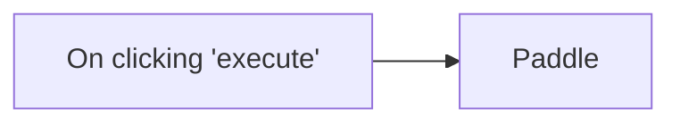

## Fluxo (.json) :

```json
{
  "id": "54",
  "name": "Create a coupon on Paddle",
  "nodes": [
    {
      "name": "On clicking 'execute'",
      "type": "n8n-nodes-base.manualTrigger",
      "position": [
        550,
        260
      ],
      "parameters": {},
      "typeVersion": 1
    },
    {
      "name": "Paddle",
      "type": "n8n-nodes-base.paddle",
      "position": [
        750,
        260
      ],
      "parameters": {
        "discountAmount": 2,
        "additionalFields": {
          "couponCode": "n8n-docs"
        }
      },
      "credentials": {
        "paddleApi": "paddle"
      },
      "typeVersion": 1
    }
  ],
  "active": false,
  "settings": {},
  "connections": {
    "Paddle": {
      "main": [
        []
      ]
    },
    "On clicking 'execute'": {
      "main": [
        [
          {
            "node": "Paddle",
            "type": "main",
            "index": 0
          }
        ]
      ]
    }
  }
}
```
